# Overview

This document explains the flow for processing insurance policy applications. The system validates each application, calculates risk scores and premiums, applies business rules to determine underwriting decisions, and updates summary statistics for reporting.

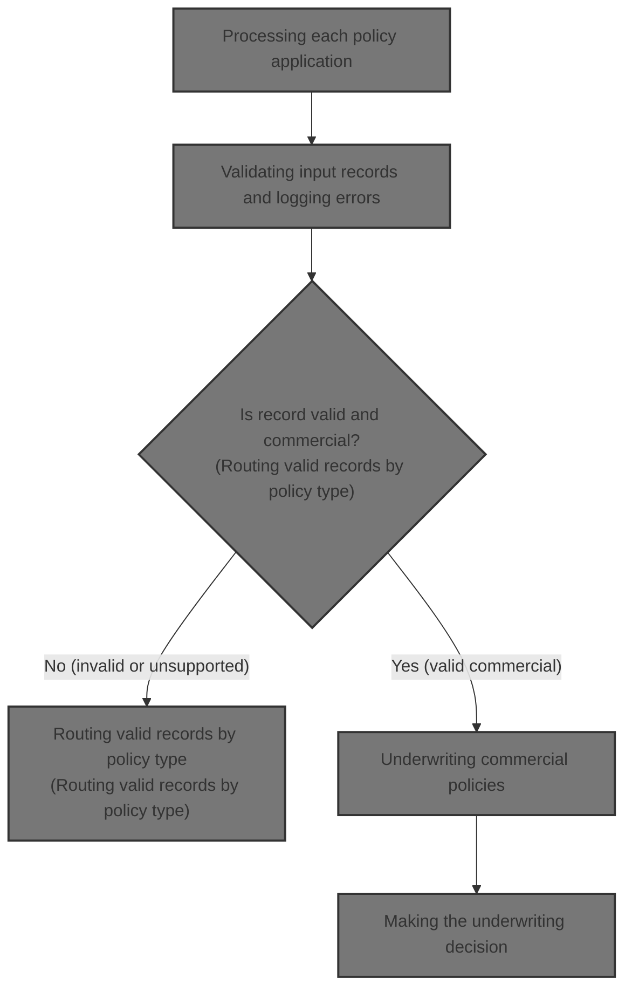

## Dependencies

### Programs

- <SwmToken path="base/src/LGAPDB01.cbl" pos="2:6:6" line-data="       PROGRAM-ID. LGAPDB01.">`LGAPDB01`</SwmToken> (<SwmPath>[base/src/LGAPDB01.cbl](base/src/LGAPDB01.cbl)</SwmPath>)
- <SwmToken path="base/src/LGAPDB01.cbl" pos="269:4:4" line-data="           CALL &#39;LGAPDB02&#39; USING IN-PROPERTY-TYPE, IN-POSTCODE, ">`LGAPDB02`</SwmToken> (<SwmPath>[base/src/LGAPDB02.cbl](base/src/LGAPDB02.cbl)</SwmPath>)
- <SwmToken path="base/src/LGAPDB01.cbl" pos="276:4:4" line-data="           CALL &#39;LGAPDB03&#39; USING WS-BASE-RISK-SCR, IN-FIRE-PERIL, ">`LGAPDB03`</SwmToken> (<SwmPath>[base/src/LGAPDB03.cbl](base/src/LGAPDB03.cbl)</SwmPath>)
- <SwmToken path="base/src/LGAPDB01.cbl" pos="313:4:4" line-data="               CALL &#39;LGAPDB04&#39; USING LK-INPUT-DATA, LK-COVERAGE-DATA, ">`LGAPDB04`</SwmToken> (<SwmPath>[base/src/LGAPDB04.cbl](base/src/LGAPDB04.cbl)</SwmPath>)

### Copybooks

- SQLCA
- <SwmToken path="base/src/LGAPDB01.cbl" pos="35:3:3" line-data="           COPY INPUTREC2.">`INPUTREC2`</SwmToken> (<SwmPath>[base/src/INPUTREC2.cpy](base/src/INPUTREC2.cpy)</SwmPath>)
- OUTPUTREC (<SwmPath>[base/src/OUTPUTREC.cpy](base/src/OUTPUTREC.cpy)</SwmPath>)
- WORKSTOR (<SwmPath>[base/src/WORKSTOR.cpy](base/src/WORKSTOR.cpy)</SwmPath>)
- LGAPACT (<SwmPath>[base/src/LGAPACT.cpy](base/src/LGAPACT.cpy)</SwmPath>)

# Where is this program used?

This program is used multiple times in the codebase as represented in the following diagram:

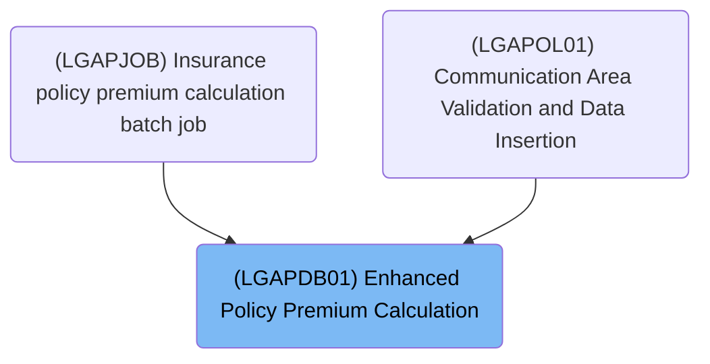

## Input and Output Tables/Files used

### <SwmToken path="base/src/LGAPDB01.cbl" pos="313:4:4" line-data="               CALL &#39;LGAPDB04&#39; USING LK-INPUT-DATA, LK-COVERAGE-DATA, ">`LGAPDB04`</SwmToken> (<SwmPath>[base/src/LGAPDB04.cbl](base/src/LGAPDB04.cbl)</SwmPath>)

| Table / File Name                                                                                                         | Type | Description                                                     | Usage Mode | Key Fields / Layout Highlights                                                                                                                                                                                                                                                                                                                                                                                                                                                                                                                                                                                                                                                                                                             |
| ------------------------------------------------------------------------------------------------------------------------- | ---- | --------------------------------------------------------------- | ---------- | ------------------------------------------------------------------------------------------------------------------------------------------------------------------------------------------------------------------------------------------------------------------------------------------------------------------------------------------------------------------------------------------------------------------------------------------------------------------------------------------------------------------------------------------------------------------------------------------------------------------------------------------------------------------------------------------------------------------------------------------ |
| <SwmToken path="base/src/LGAPDB04.cbl" pos="183:3:3" line-data="               FROM RATE_MASTER">`RATE_MASTER`</SwmToken> | DB2  | Territory, peril, and construction-based insurance rate factors | Input      | <SwmToken path="base/src/LGAPDB04.cbl" pos="181:3:3" line-data="               SELECT BASE_RATE, MIN_PREMIUM, MAX_PREMIUM">`BASE_RATE`</SwmToken>, <SwmToken path="base/src/LGAPDB01.cbl" pos="132:4:4" line-data="           MOVE &#39;MIN_PREMIUM&#39; TO CONFIG-KEY">`MIN_PREMIUM`</SwmToken>, <SwmToken path="base/src/LGAPDB04.cbl" pos="325:1:5" line-data="                   WS-BASE-RATE (1, 1, 1, 1) * ">`WS-BASE-RATE`</SwmToken>, <SwmToken path="base/src/LGAPDB04.cbl" pos="51:3:7" line-data="                       25 WS-MIN-PREM   PIC 9(5)V99.">`WS-MIN-PREM`</SwmToken>, <SwmToken path="base/src/LGAPDB04.cbl" pos="52:3:7" line-data="                       25 WS-MAX-PREM   PIC 9(7)V99.">`WS-MAX-PREM`</SwmToken> |

### <SwmToken path="base/src/LGAPDB01.cbl" pos="276:4:4" line-data="           CALL &#39;LGAPDB03&#39; USING WS-BASE-RISK-SCR, IN-FIRE-PERIL, ">`LGAPDB03`</SwmToken> (<SwmPath>[base/src/LGAPDB03.cbl](base/src/LGAPDB03.cbl)</SwmPath>)

| Table / File Name                                                                                                          | Type | Description                                                 | Usage Mode | Key Fields / Layout Highlights                                                                                                                                                                                                                                                                               |
| -------------------------------------------------------------------------------------------------------------------------- | ---- | ----------------------------------------------------------- | ---------- | ------------------------------------------------------------------------------------------------------------------------------------------------------------------------------------------------------------------------------------------------------------------------------------------------------------ |
| <SwmToken path="base/src/LGAPDB02.cbl" pos="47:3:3" line-data="               FROM RISK_FACTORS">`RISK_FACTORS`</SwmToken> | DB2  | Peril-specific risk adjustment factors for insurance rating | Input      | <SwmToken path="base/src/LGAPDB02.cbl" pos="46:8:12" line-data="               SELECT FACTOR_VALUE INTO :WS-FIRE-FACTOR">`WS-FIRE-FACTOR`</SwmToken>, <SwmToken path="base/src/LGAPDB02.cbl" pos="58:8:12" line-data="               SELECT FACTOR_VALUE INTO :WS-CRIME-FACTOR">`WS-CRIME-FACTOR`</SwmToken> |

### <SwmToken path="base/src/LGAPDB01.cbl" pos="269:4:4" line-data="           CALL &#39;LGAPDB02&#39; USING IN-PROPERTY-TYPE, IN-POSTCODE, ">`LGAPDB02`</SwmToken> (<SwmPath>[base/src/LGAPDB02.cbl](base/src/LGAPDB02.cbl)</SwmPath>)

| Table / File Name                                                                                                          | Type | Description                                                  | Usage Mode | Key Fields / Layout Highlights                                                                                                                                                                                                                                                                               |
| -------------------------------------------------------------------------------------------------------------------------- | ---- | ------------------------------------------------------------ | ---------- | ------------------------------------------------------------------------------------------------------------------------------------------------------------------------------------------------------------------------------------------------------------------------------------------------------------ |
| <SwmToken path="base/src/LGAPDB02.cbl" pos="47:3:3" line-data="               FROM RISK_FACTORS">`RISK_FACTORS`</SwmToken> | DB2  | Peril-specific risk adjustment factors for insurance scoring | Input      | <SwmToken path="base/src/LGAPDB02.cbl" pos="46:8:12" line-data="               SELECT FACTOR_VALUE INTO :WS-FIRE-FACTOR">`WS-FIRE-FACTOR`</SwmToken>, <SwmToken path="base/src/LGAPDB02.cbl" pos="58:8:12" line-data="               SELECT FACTOR_VALUE INTO :WS-CRIME-FACTOR">`WS-CRIME-FACTOR`</SwmToken> |

### <SwmToken path="base/src/LGAPDB01.cbl" pos="2:6:6" line-data="       PROGRAM-ID. LGAPDB01.">`LGAPDB01`</SwmToken> (<SwmPath>[base/src/LGAPDB01.cbl](base/src/LGAPDB01.cbl)</SwmPath>)

| Table / File Name                                                                                                                                        | Type | Description                                       | Usage Mode | Key Fields / Layout Highlights           |
| -------------------------------------------------------------------------------------------------------------------------------------------------------- | ---- | ------------------------------------------------- | ---------- | ---------------------------------------- |
| <SwmToken path="base/src/LGAPDB01.cbl" pos="17:3:5" line-data="           SELECT CONFIG-FILE ASSIGN TO &#39;CONFIG.DAT&#39;">`CONFIG-FILE`</SwmToken>    | DB2  | System configuration parameters and thresholds    | Input      | Database table with relational structure |
| <SwmToken path="base/src/LGAPDB01.cbl" pos="9:3:5" line-data="           SELECT INPUT-FILE ASSIGN TO &#39;INPUT.DAT&#39;">`INPUT-FILE`</SwmToken>        | DB2  | Policy application and property input data        | Input      | Database table with relational structure |
| <SwmToken path="base/src/LGAPDB01.cbl" pos="13:3:5" line-data="           SELECT OUTPUT-FILE ASSIGN TO &#39;OUTPUT.DAT&#39;">`OUTPUT-FILE`</SwmToken>    | DB2  | Calculated premium and risk results per policy    | Output     | Database table with relational structure |
| <SwmToken path="base/src/LGAPDB01.cbl" pos="265:7:9" line-data="           PERFORM P011E-WRITE-OUTPUT-RECORD">`OUTPUT-RECORD`</SwmToken>                 | DB2  | Single policy premium and risk calculation result | Output     | Database table with relational structure |
| <SwmToken path="base/src/LGAPDB01.cbl" pos="27:3:5" line-data="           SELECT SUMMARY-FILE ASSIGN TO &#39;SUMMARY.DAT&#39;">`SUMMARY-FILE`</SwmToken> | DB2  | Summary statistics for policy processing run      | Output     | Database table with relational structure |
| <SwmToken path="base/src/LGAPDB01.cbl" pos="64:3:5" line-data="       01  SUMMARY-RECORD             PIC X(132).">`SUMMARY-RECORD`</SwmToken>            | DB2  | Summary line for processing statistics output     | Output     | Database table with relational structure |

## Detailed View of the Program's Functionality

## Main Workflow and File Structure

### Program Initialization and File Handling

The main program begins by displaying startup messages and initializing all working storage areas and counters. It then loads configuration values, either from a configuration file or by falling back to hardcoded defaults if the file is missing. After configuration, it opens all necessary files: input, output, summary, and rate files. It writes headers to the output file to label the columns for each policy processed.

### Record Processing Loop

The core of the workflow is a loop that reads each input record (representing a policy application) one by one. For each record, it increments the record count and validates the input data. If the record passes validation, it is processed as a valid policy; otherwise, it is handled as an error, and an error record is written to the output.

## Input Record Validation

### Validation Steps

For each input record, the following checks are performed in order:

1. **Policy Type Check:** The policy type must be one of the supported types (Commercial, Personal, Farm). If not, an error is logged.
2. **Customer Number Check:** The customer number must be present. If missing, an error is logged.
3. **Coverage Limit Check:** At least one coverage limit (building or contents) must be greater than zero. If both are zero, an error is logged.
4. **Maximum Coverage Check:** The sum of all coverage limits must not exceed the maximum allowed total insured value. If it does, a warning is logged (but the record is not rejected).

Each error or warning increments an error counter and stores the error details for reporting.

## Valid Policy Processing

### Policy Type Routing

If the policy is commercial, it proceeds to full underwriting and premium calculation. Non-commercial policies are marked as unsupported, and a record is written to the output indicating this.

### Commercial Policy Underwriting

#### Risk Score Calculation

A dedicated subprogram is called to calculate the risk score. This subprogram:

- Fetches risk factors (fire and crime) from a database, using fallback values if the database is unavailable.
- Starts with a base risk score and adjusts it based on property type, location (postcode and latitude/longitude), coverage amounts, and customer history.
- Adds increments for specific property types, high coverage amounts, urban locations, and risky customer histories.

#### Basic Premium Calculation

Another subprogram is called to calculate the basic premium and make an initial underwriting verdict. This step:

- Fetches risk factors again (fire and crime) from the database, with fallbacks.
- Applies a discount if all perils are covered.
- Calculates individual premiums for fire, crime, flood, and weather perils using the risk score and peril factors.
- Sums the individual premiums for a total premium.
- Assigns an underwriting status (approved, pending, rejected) based on the risk score thresholds.

#### Enhanced Actuarial Calculation

If the policy is initially approved and the premium exceeds the minimum threshold, an advanced actuarial calculation is performed:

- All relevant input and coverage data are prepared and passed to the actuarial subprogram.
- The actuarial calculation includes experience and schedule modifiers, base premium calculation for each peril, catastrophe loadings, expense and profit loads, discounts, and taxes.
- The final premium is capped so it does not exceed a set percentage of the total insured value.
- If the enhanced premium is higher than the basic premium, the enhanced values are used.

#### Business Rules Application

After all calculations, business rules are applied to make the final underwriting decision:

- If the risk score exceeds the maximum allowed, the policy is rejected.
- If the premium is below the minimum, the policy is marked as pending for manual review.
- If the risk score is high but not over the maximum, the policy is also marked as pending.
- Otherwise, the policy is approved.

#### Output and Statistics

The results (customer, property, risk score, premiums, status, and reason) are written to the output file. Statistics are updated: total premium, risk score totals, and counts for approved, pending, rejected, and high-risk policies.

## Advanced Actuarial Calculation Details

### Initialization and Exposure Calculation

The actuarial subprogram initializes all calculation areas and loads base rates (from a database or fallback values). It calculates exposures for building, contents, and business interruption, adjusting for risk score. Exposure density is also calculated.

### Modifiers

- **Experience Modifier:** Rewards claim-free, established businesses with a lower modifier; penalizes those with claims or short history.
- **Schedule Modifier:** Adjusts for building age, protection class, occupancy hazard, and exposure density, with caps on the adjustment.

### Base Premium Calculation

For each peril (fire, crime, flood, weather), if selected, the premium is calculated using exposures, base rates, modifiers, and a trend factor. Crime and flood have additional adjustments.

### Catastrophe Loadings

Adds extra charges for hurricane, earthquake, tornado, and flood risks, depending on peril selection and using domain-specific factors.

### Expense and Profit Loads

Adds fixed percentages for expenses and profit to the premium.

### Discounts

Applies discounts for multi-peril coverage, claims-free history, and high deductibles. The total discount is capped.

### Taxes

Adds a fixed percentage as tax to the premium.

### Final Premium and Capping

Sums all components, subtracts discounts, adds taxes, and calculates a final rate factor. If the rate factor exceeds a maximum, the premium is capped accordingly.

## Summary and Reporting

After all records are processed, files are closed, and a summary is generated and written to the summary file. The summary includes counts of processed, approved, pending, and rejected policies, total premium, and average risk score. Statistics are also displayed to the console.

---

This detailed flow ensures that each policy application is validated, underwritten, and priced according to business rules, with robust error handling, modular calculations, and comprehensive reporting.

# Data Definitions

### <SwmToken path="base/src/LGAPDB01.cbl" pos="313:4:4" line-data="               CALL &#39;LGAPDB04&#39; USING LK-INPUT-DATA, LK-COVERAGE-DATA, ">`LGAPDB04`</SwmToken> (<SwmPath>[base/src/LGAPDB04.cbl](base/src/LGAPDB04.cbl)</SwmPath>)

| Table / Record Name                                                                                                       | Type | Short Description                                               | Usage Mode     |
| ------------------------------------------------------------------------------------------------------------------------- | ---- | --------------------------------------------------------------- | -------------- |
| <SwmToken path="base/src/LGAPDB04.cbl" pos="183:3:3" line-data="               FROM RATE_MASTER">`RATE_MASTER`</SwmToken> | DB2  | Territory, peril, and construction-based insurance rate factors | Input (SELECT) |

### <SwmToken path="base/src/LGAPDB01.cbl" pos="276:4:4" line-data="           CALL &#39;LGAPDB03&#39; USING WS-BASE-RISK-SCR, IN-FIRE-PERIL, ">`LGAPDB03`</SwmToken> (<SwmPath>[base/src/LGAPDB03.cbl](base/src/LGAPDB03.cbl)</SwmPath>)

| Table / Record Name                                                                                                        | Type | Short Description                                           | Usage Mode     |
| -------------------------------------------------------------------------------------------------------------------------- | ---- | ----------------------------------------------------------- | -------------- |
| <SwmToken path="base/src/LGAPDB02.cbl" pos="47:3:3" line-data="               FROM RISK_FACTORS">`RISK_FACTORS`</SwmToken> | DB2  | Peril-specific risk adjustment factors for insurance rating | Input (SELECT) |

### <SwmToken path="base/src/LGAPDB01.cbl" pos="269:4:4" line-data="           CALL &#39;LGAPDB02&#39; USING IN-PROPERTY-TYPE, IN-POSTCODE, ">`LGAPDB02`</SwmToken> (<SwmPath>[base/src/LGAPDB02.cbl](base/src/LGAPDB02.cbl)</SwmPath>)

| Table / Record Name                                                                                                        | Type | Short Description                                            | Usage Mode     |
| -------------------------------------------------------------------------------------------------------------------------- | ---- | ------------------------------------------------------------ | -------------- |
| <SwmToken path="base/src/LGAPDB02.cbl" pos="47:3:3" line-data="               FROM RISK_FACTORS">`RISK_FACTORS`</SwmToken> | DB2  | Peril-specific risk adjustment factors for insurance scoring | Input (SELECT) |

### <SwmToken path="base/src/LGAPDB01.cbl" pos="2:6:6" line-data="       PROGRAM-ID. LGAPDB01.">`LGAPDB01`</SwmToken> (<SwmPath>[base/src/LGAPDB01.cbl](base/src/LGAPDB01.cbl)</SwmPath>)

| Table / Record Name                                                                                                                                      | Type | Short Description                                 | Usage Mode |
| -------------------------------------------------------------------------------------------------------------------------------------------------------- | ---- | ------------------------------------------------- | ---------- |
| <SwmToken path="base/src/LGAPDB01.cbl" pos="17:3:5" line-data="           SELECT CONFIG-FILE ASSIGN TO &#39;CONFIG.DAT&#39;">`CONFIG-FILE`</SwmToken>    | DB2  | System configuration parameters and thresholds    | Input      |
| <SwmToken path="base/src/LGAPDB01.cbl" pos="9:3:5" line-data="           SELECT INPUT-FILE ASSIGN TO &#39;INPUT.DAT&#39;">`INPUT-FILE`</SwmToken>        | DB2  | Policy application and property input data        | Input      |
| <SwmToken path="base/src/LGAPDB01.cbl" pos="13:3:5" line-data="           SELECT OUTPUT-FILE ASSIGN TO &#39;OUTPUT.DAT&#39;">`OUTPUT-FILE`</SwmToken>    | DB2  | Calculated premium and risk results per policy    | Output     |
| <SwmToken path="base/src/LGAPDB01.cbl" pos="265:7:9" line-data="           PERFORM P011E-WRITE-OUTPUT-RECORD">`OUTPUT-RECORD`</SwmToken>                 | DB2  | Single policy premium and risk calculation result | Output     |
| <SwmToken path="base/src/LGAPDB01.cbl" pos="27:3:5" line-data="           SELECT SUMMARY-FILE ASSIGN TO &#39;SUMMARY.DAT&#39;">`SUMMARY-FILE`</SwmToken> | DB2  | Summary statistics for policy processing run      | Output     |
| <SwmToken path="base/src/LGAPDB01.cbl" pos="64:3:5" line-data="       01  SUMMARY-RECORD             PIC X(132).">`SUMMARY-RECORD`</SwmToken>            | DB2  | Summary line for processing statistics output     | Output     |

# Rule Definition

| Paragraph Name                                                                                                                                                                                                                                                                                                                                                                                                                                                                                                                                                                                                                                                                                      | Rule ID | Category          | Description                                                                                                                                                                                                                                                                                                                                                      | Conditions                                                                                                                                                                                                                                                                                                                         | Remarks                                                                                                                                                                                                                                                                                                                                                                                                                                                                                                                                                                                                                                                                                                                                                                           |
| --------------------------------------------------------------------------------------------------------------------------------------------------------------------------------------------------------------------------------------------------------------------------------------------------------------------------------------------------------------------------------------------------------------------------------------------------------------------------------------------------------------------------------------------------------------------------------------------------------------------------------------------------------------------------------------------------- | ------- | ----------------- | ---------------------------------------------------------------------------------------------------------------------------------------------------------------------------------------------------------------------------------------------------------------------------------------------------------------------------------------------------------------- | ---------------------------------------------------------------------------------------------------------------------------------------------------------------------------------------------------------------------------------------------------------------------------------------------------------------------------------- | --------------------------------------------------------------------------------------------------------------------------------------------------------------------------------------------------------------------------------------------------------------------------------------------------------------------------------------------------------------------------------------------------------------------------------------------------------------------------------------------------------------------------------------------------------------------------------------------------------------------------------------------------------------------------------------------------------------------------------------------------------------------------------- |
| <SwmToken path="base/src/LGAPDB01.cbl" pos="91:3:5" line-data="           PERFORM P002-INITIALIZE">`P002-INITIALIZE`</SwmToken>, <SwmToken path="base/src/LGAPDB01.cbl" pos="92:3:7" line-data="           PERFORM P003-LOAD-CONFIG">`P003-LOAD-CONFIG`</SwmToken>, <SwmToken path="base/src/LGAPDB01.cbl" pos="116:3:7" line-data="               PERFORM P004-SET-DEFAULTS">`P004-SET-DEFAULTS`</SwmToken>, <SwmToken path="base/src/LGAPDB01.cbl" pos="118:3:9" line-data="               PERFORM P004-READ-CONFIG-VALUES">`P004-READ-CONFIG-VALUES`</SwmToken>, <SwmToken path="base/src/LGAPDB01.cbl" pos="93:3:7" line-data="           PERFORM P005-OPEN-FILES">`P005-OPEN-FILES`</SwmToken> | RL-001  | Data Assignment   | Before processing any records, the system must initialize counters and work areas, load configuration values from <SwmToken path="base/src/LGAPDB01.cbl" pos="17:12:14" line-data="           SELECT CONFIG-FILE ASSIGN TO &#39;CONFIG.DAT&#39;">`CONFIG.DAT`</SwmToken> (or use defaults if unavailable), and open all required files (input, output, summary). | Program start; before any record processing.                                                                                                                                                                                                                                                                                       | Configuration values include <SwmToken path="base/src/LGAPDB01.cbl" pos="126:4:4" line-data="           MOVE &#39;MAX_RISK_SCORE&#39; TO CONFIG-KEY">`MAX_RISK_SCORE`</SwmToken> (default 250), <SwmToken path="base/src/LGAPDB01.cbl" pos="132:4:4" line-data="           MOVE &#39;MIN_PREMIUM&#39; TO CONFIG-KEY">`MIN_PREMIUM`</SwmToken> (default <SwmToken path="base/src/LGAPDB04.cbl" pos="300:11:13" line-data="           IF WS-EXPOSURE-DENSITY &gt; 500.00">`500.00`</SwmToken>), MAX_TIV (default 50,000,000.00). All files must be opened successfully or the program stops (except summary file, which logs a warning).                                                                                                                                            |
| <SwmToken path="base/src/LGAPDB01.cbl" pos="182:3:9" line-data="               PERFORM P008-VALIDATE-INPUT-RECORD">`P008-VALIDATE-INPUT-RECORD`</SwmToken>                                                                                                                                                                                                                                                                                                                                                                                                                                                                                                                                          | RL-002  | Conditional Logic | Each input record is validated for policy type, customer number, and coverage limits. Errors are logged for invalid records, and warnings for excessive coverage.                                                                                                                                                                                                | For each input record read from <SwmToken path="base/src/LGAPDB01.cbl" pos="9:12:14" line-data="           SELECT INPUT-FILE ASSIGN TO &#39;INPUT.DAT&#39;">`INPUT.DAT`</SwmToken>.                                                                                                                                                | Policy type must be Commercial, Personal, or Farm. Customer number must be non-empty. At least one coverage limit (building or contents) must be > 0. If total coverage (building + contents + BI) > MAX_TIV (50,000,000.00), log a warning but continue.                                                                                                                                                                                                                                                                                                                                                                                                                                                                                                                         |
| <SwmToken path="base/src/LGAPDB01.cbl" pos="184:3:9" line-data="                   PERFORM P009-PROCESS-VALID-RECORD">`P009-PROCESS-VALID-RECORD`</SwmToken>, <SwmToken path="base/src/LGAPDB01.cbl" pos="236:3:7" line-data="               PERFORM P011-PROCESS-COMMERCIAL">`P011-PROCESS-COMMERCIAL`</SwmToken>, <SwmToken path="base/src/LGAPDB01.cbl" pos="239:3:9" line-data="               PERFORM P012-PROCESS-NON-COMMERCIAL">`P012-PROCESS-NON-COMMERCIAL`</SwmToken>                                                                                                                                                                                                                    | RL-003  | Conditional Logic | Commercial policies are processed with full risk and premium calculations; non-commercial policies are marked as unsupported with zeroed premium fields and a fixed rejection reason.                                                                                                                                                                            | After input validation, for each valid record.                                                                                                                                                                                                                                                                                     | Non-commercial output: all premium/risk fields zero, status 'UNSUPPORTED', reason 'Only Commercial policies supported in this version'.                                                                                                                                                                                                                                                                                                                                                                                                                                                                                                                                                                                                                                           |
| <SwmToken path="base/src/LGAPDB01.cbl" pos="259:3:9" line-data="           PERFORM P011A-CALCULATE-RISK-SCORE">`P011A-CALCULATE-RISK-SCORE`</SwmToken> (calls <SwmToken path="base/src/LGAPDB01.cbl" pos="269:4:4" line-data="           CALL &#39;LGAPDB02&#39; USING IN-PROPERTY-TYPE, IN-POSTCODE, ">`LGAPDB02`</SwmToken>)                                                                                                                                                                                                                                                                                                                                                                      | RL-004  | Computation       | Risk score is calculated using property type, postcode, location (<SwmToken path="base/src/LGAPDB02.cbl" pos="118:15:17" line-data="      *    Urban areas: major cities (simplified lat/long ranges)">`lat/long`</SwmToken>), coverage amounts, and customer history. Risk factors (fire, crime) are fetched from the database or defaulted.                    | For each valid commercial policy.                                                                                                                                                                                                                                                                                                  | Default fire factor: <SwmToken path="base/src/LGAPDB02.cbl" pos="54:3:5" line-data="               MOVE 0.80 TO WS-FIRE-FACTOR">`0.80`</SwmToken>, crime factor: <SwmToken path="base/src/LGAPDB02.cbl" pos="66:3:5" line-data="               MOVE 0.60 TO WS-CRIME-FACTOR">`0.60`</SwmToken>. Risk score starts at 100, adjusted by property type, postcode, coverage, location, and customer history. See <SwmToken path="base/src/LGAPDB01.cbl" pos="269:4:4" line-data="           CALL &#39;LGAPDB02&#39; USING IN-PROPERTY-TYPE, IN-POSTCODE, ">`LGAPDB02`</SwmToken> for detailed adjustments.                                                                                                                                                                            |
| <SwmToken path="base/src/LGAPDB01.cbl" pos="260:3:9" line-data="           PERFORM P011B-BASIC-PREMIUM-CALC">`P011B-BASIC-PREMIUM-CALC`</SwmToken> (calls <SwmToken path="base/src/LGAPDB01.cbl" pos="276:4:4" line-data="           CALL &#39;LGAPDB03&#39; USING WS-BASE-RISK-SCR, IN-FIRE-PERIL, ">`LGAPDB03`</SwmToken>)                                                                                                                                                                                                                                                                                                                                                                        | RL-005  | Computation       | Premiums for each peril (fire, crime, flood, weather) are calculated using the risk score, peril selections, deductibles, and risk factors. A discount factor is applied if all perils are selected.                                                                                                                                                             | For each valid commercial policy after risk score calculation.                                                                                                                                                                                                                                                                     | Discount factor: <SwmToken path="base/src/LGAPDB03.cbl" pos="99:3:5" line-data="             MOVE 0.90 TO LK-DISC-FACT">`0.90`</SwmToken> if all perils selected, else <SwmToken path="base/src/LGAPDB03.cbl" pos="93:3:5" line-data="           MOVE 1.00 TO LK-DISC-FACT">`1.00`</SwmToken>. Premiums are calculated as (risk score \* risk factor) \* peril selection \* discount. Total premium is the sum of all peril premiums.                                                                                                                                                                                                                                                                                                                                             |
| <SwmToken path="base/src/LGAPDB01.cbl" pos="262:3:9" line-data="               PERFORM P011C-ENHANCED-ACTUARIAL-CALC">`P011C-ENHANCED-ACTUARIAL-CALC`</SwmToken> (calls <SwmToken path="base/src/LGAPDB01.cbl" pos="313:4:4" line-data="               CALL &#39;LGAPDB04&#39; USING LK-INPUT-DATA, LK-COVERAGE-DATA, ">`LGAPDB04`</SwmToken>)                                                                                                                                                                                                                                                                                                                                                      | RL-006  | Computation       | If the total premium exceeds the minimum required, enhanced actuarial calculations are performed, including experience and schedule modifiers, catastrophe and expense loadings, and multiple discounts, with caps on total discount and final rate factor.                                                                                                      | For commercial policies with total premium > <SwmToken path="base/src/LGAPDB01.cbl" pos="132:4:4" line-data="           MOVE &#39;MIN_PREMIUM&#39; TO CONFIG-KEY">`MIN_PREMIUM`</SwmToken> (<SwmToken path="base/src/LGAPDB04.cbl" pos="300:11:13" line-data="           IF WS-EXPOSURE-DENSITY &gt; 500.00">`500.00`</SwmToken>). | Experience mod: 0.85 (claims-free, 5+ years), capped 0.5-2.0. Schedule mod: -0.2 to +0.4. <SwmToken path="base/src/LGAPDB04.cbl" pos="410:3:5" line-data="      * Multi-peril discount">`Multi-peril`</SwmToken>, claims-free, and deductible discounts, max total discount 25%. Taxes at 6.75%. Final rate factor capped at 0.05.                                                                                                                                                                                                                                                                                                                                                                                                                                                |
| <SwmToken path="base/src/LGAPDB01.cbl" pos="264:3:9" line-data="           PERFORM P011D-APPLY-BUSINESS-RULES">`P011D-APPLY-BUSINESS-RULES`</SwmToken>                                                                                                                                                                                                                                                                                                                                                                                                                                                                                                                                              | RL-007  | Conditional Logic | The underwriting decision is based on risk score and premium thresholds, setting status and reason accordingly.                                                                                                                                                                                                                                                  | After premium calculation for commercial policies.                                                                                                                                                                                                                                                                                 | If risk score > <SwmToken path="base/src/LGAPDB01.cbl" pos="126:4:4" line-data="           MOVE &#39;MAX_RISK_SCORE&#39; TO CONFIG-KEY">`MAX_RISK_SCORE`</SwmToken> (default 250), status REJECTED, reason 'Risk score exceeds maximum acceptable level'. If total premium < <SwmToken path="base/src/LGAPDB01.cbl" pos="132:4:4" line-data="           MOVE &#39;MIN_PREMIUM&#39; TO CONFIG-KEY">`MIN_PREMIUM`</SwmToken> (500), status PENDING, reason 'Premium below minimum - requires review'. If risk score > 180 but <= <SwmToken path="base/src/LGAPDB01.cbl" pos="126:4:4" line-data="           MOVE &#39;MAX_RISK_SCORE&#39; TO CONFIG-KEY">`MAX_RISK_SCORE`</SwmToken>, status PENDING, reason 'High risk - underwriter review required'. Otherwise, status APPROVED. |
| <SwmToken path="base/src/LGAPDB01.cbl" pos="265:3:9" line-data="           PERFORM P011E-WRITE-OUTPUT-RECORD">`P011E-WRITE-OUTPUT-RECORD`</SwmToken>, <SwmToken path="base/src/LGAPDB01.cbl" pos="239:3:9" line-data="               PERFORM P012-PROCESS-NON-COMMERCIAL">`P012-PROCESS-NON-COMMERCIAL`</SwmToken>, <SwmToken path="base/src/LGAPDB01.cbl" pos="186:3:9" line-data="                   PERFORM P010-PROCESS-ERROR-RECORD">`P010-PROCESS-ERROR-RECORD`</SwmToken>                                                                                                                                                                                                                    | RL-008  | Data Assignment   | For every input record, an output record is written to <SwmToken path="base/src/LGAPDB01.cbl" pos="13:12:14" line-data="           SELECT OUTPUT-FILE ASSIGN TO &#39;OUTPUT.DAT&#39;">`OUTPUT.DAT`</SwmToken>, containing all calculated fields, status, and reason, regardless of validity or policy type.                                                      | After processing each input record.                                                                                                                                                                                                                                                                                                | Output record includes: customer number, property type, postcode, risk score, fire/crime/flood/weather premiums, total premium, status, rejection reason. All fields are left-aligned, padded as needed. For errors, status is 'ERROR' and reason is the first error message.                                                                                                                                                                                                                                                                                                                                                                                                                                                                                                     |
| <SwmToken path="base/src/LGAPDB01.cbl" pos="266:3:7" line-data="           PERFORM P011F-UPDATE-STATISTICS.">`P011F-UPDATE-STATISTICS`</SwmToken>                                                                                                                                                                                                                                                                                                                                                                                                                                                                                                                                                   | RL-009  | Computation       | After each record, running totals and counters for total premium, approved, pending, rejected, unsupported, and high-risk cases are updated.                                                                                                                                                                                                                     | After processing each input record.                                                                                                                                                                                                                                                                                                | High-risk: risk score > 200. Totals and counters are used for summary/statistics.                                                                                                                                                                                                                                                                                                                                                                                                                                                                                                                                                                                                                                                                                                 |
| <SwmToken path="base/src/LGAPDB01.cbl" pos="96:3:7" line-data="           PERFORM P015-GENERATE-SUMMARY">`P015-GENERATE-SUMMARY`</SwmToken>, <SwmToken path="base/src/LGAPDB01.cbl" pos="97:3:7" line-data="           PERFORM P016-DISPLAY-STATS">`P016-DISPLAY-STATS`</SwmToken>                                                                                                                                                                                                                                                                                                                                                                                                                  | RL-010  | Data Assignment   | After all records are processed, a summary file (<SwmToken path="base/src/LGAPDB01.cbl" pos="27:12:14" line-data="           SELECT SUMMARY-FILE ASSIGN TO &#39;SUMMARY.DAT&#39;">`SUMMARY.DAT`</SwmToken>) is generated with counts, totals, averages, and high-risk statistics, and statistics are displayed.                                                  | After all input records have been processed.                                                                                                                                                                                                                                                                                       | <SwmToken path="base/src/LGAPDB01.cbl" pos="27:12:14" line-data="           SELECT SUMMARY-FILE ASSIGN TO &#39;SUMMARY.DAT&#39;">`SUMMARY.DAT`</SwmToken> contains free-form text lines: processing date, total records, approved/pending/rejected counts, total premium, average risk score, high-risk count. Displayed statistics match summary file.                                                                                                                                                                                                                                                                                                                                                                                                                           |
| <SwmToken path="base/src/LGAPDB01.cbl" pos="95:3:7" line-data="           PERFORM P014-CLOSE-FILES">`P014-CLOSE-FILES`</SwmToken>                                                                                                                                                                                                                                                                                                                                                                                                                                                                                                                                                                   | RL-011  | Data Assignment   | All files are closed at the end of processing.                                                                                                                                                                                                                                                                                                                   | After all processing and summary generation.                                                                                                                                                                                                                                                                                       | All files (input, output, summary) are closed. If summary file was not open, skip closing.                                                                                                                                                                                                                                                                                                                                                                                                                                                                                                                                                                                                                                                                                        |

# User Stories

## User Story 1: System Initialization and Shutdown

---

### Story Description:

As a system, I want to initialize the processing environment, load configuration values, open all required files before processing, and close all files after processing so that the system operates reliably and resources are managed correctly.

---

### Business Rule Mapping:

| Rule ID | Paragraph Name                                                                                                                                                                                                                                                                                                                                                                                                                                                                                                                                                                                                                                                                                      | Rule Description                                                                                                                                                                                                                                                                                                                                                 |
| ------- | --------------------------------------------------------------------------------------------------------------------------------------------------------------------------------------------------------------------------------------------------------------------------------------------------------------------------------------------------------------------------------------------------------------------------------------------------------------------------------------------------------------------------------------------------------------------------------------------------------------------------------------------------------------------------------------------------- | ---------------------------------------------------------------------------------------------------------------------------------------------------------------------------------------------------------------------------------------------------------------------------------------------------------------------------------------------------------------- |
| RL-001  | <SwmToken path="base/src/LGAPDB01.cbl" pos="91:3:5" line-data="           PERFORM P002-INITIALIZE">`P002-INITIALIZE`</SwmToken>, <SwmToken path="base/src/LGAPDB01.cbl" pos="92:3:7" line-data="           PERFORM P003-LOAD-CONFIG">`P003-LOAD-CONFIG`</SwmToken>, <SwmToken path="base/src/LGAPDB01.cbl" pos="116:3:7" line-data="               PERFORM P004-SET-DEFAULTS">`P004-SET-DEFAULTS`</SwmToken>, <SwmToken path="base/src/LGAPDB01.cbl" pos="118:3:9" line-data="               PERFORM P004-READ-CONFIG-VALUES">`P004-READ-CONFIG-VALUES`</SwmToken>, <SwmToken path="base/src/LGAPDB01.cbl" pos="93:3:7" line-data="           PERFORM P005-OPEN-FILES">`P005-OPEN-FILES`</SwmToken> | Before processing any records, the system must initialize counters and work areas, load configuration values from <SwmToken path="base/src/LGAPDB01.cbl" pos="17:12:14" line-data="           SELECT CONFIG-FILE ASSIGN TO &#39;CONFIG.DAT&#39;">`CONFIG.DAT`</SwmToken> (or use defaults if unavailable), and open all required files (input, output, summary). |
| RL-011  | <SwmToken path="base/src/LGAPDB01.cbl" pos="95:3:7" line-data="           PERFORM P014-CLOSE-FILES">`P014-CLOSE-FILES`</SwmToken>                                                                                                                                                                                                                                                                                                                                                                                                                                                                                                                                                                   | All files are closed at the end of processing.                                                                                                                                                                                                                                                                                                                   |

---

### Relevant Functionality:

- <SwmToken path="base/src/LGAPDB01.cbl" pos="91:3:5" line-data="           PERFORM P002-INITIALIZE">`P002-INITIALIZE`</SwmToken>
  1. **RL-001:**
     - Initialize all counters and work areas
     - Attempt to open <SwmToken path="base/src/LGAPDB01.cbl" pos="17:12:14" line-data="           SELECT CONFIG-FILE ASSIGN TO &#39;CONFIG.DAT&#39;">`CONFIG.DAT`</SwmToken> and load values; if unavailable, use defaults
     - Open <SwmToken path="base/src/LGAPDB01.cbl" pos="9:12:14" line-data="           SELECT INPUT-FILE ASSIGN TO &#39;INPUT.DAT&#39;">`INPUT.DAT`</SwmToken>, <SwmToken path="base/src/LGAPDB01.cbl" pos="13:12:14" line-data="           SELECT OUTPUT-FILE ASSIGN TO &#39;OUTPUT.DAT&#39;">`OUTPUT.DAT`</SwmToken>, <SwmToken path="base/src/LGAPDB01.cbl" pos="27:12:14" line-data="           SELECT SUMMARY-FILE ASSIGN TO &#39;SUMMARY.DAT&#39;">`SUMMARY.DAT`</SwmToken>; stop if input/output cannot be opened
     - Write headers to output file
- <SwmToken path="base/src/LGAPDB01.cbl" pos="95:3:7" line-data="           PERFORM P014-CLOSE-FILES">`P014-CLOSE-FILES`</SwmToken>
  1. **RL-011:**
     - Close input, output, and summary files (if open)

## User Story 2: Input Validation and Output Record Handling

---

### Story Description:

As a system, I want to validate each input record, log errors or warnings for invalid data, and write an output record for every input (including errors and unsupported types) so that all records are accounted for and issues are traceable.

---

### Business Rule Mapping:

| Rule ID | Paragraph Name                                                                                                                                                                                                                                                                                                                                                                                                                                                                   | Rule Description                                                                                                                                                                                                                                                                                            |
| ------- | -------------------------------------------------------------------------------------------------------------------------------------------------------------------------------------------------------------------------------------------------------------------------------------------------------------------------------------------------------------------------------------------------------------------------------------------------------------------------------- | ----------------------------------------------------------------------------------------------------------------------------------------------------------------------------------------------------------------------------------------------------------------------------------------------------------- |
| RL-002  | <SwmToken path="base/src/LGAPDB01.cbl" pos="182:3:9" line-data="               PERFORM P008-VALIDATE-INPUT-RECORD">`P008-VALIDATE-INPUT-RECORD`</SwmToken>                                                                                                                                                                                                                                                                                                                       | Each input record is validated for policy type, customer number, and coverage limits. Errors are logged for invalid records, and warnings for excessive coverage.                                                                                                                                           |
| RL-008  | <SwmToken path="base/src/LGAPDB01.cbl" pos="265:3:9" line-data="           PERFORM P011E-WRITE-OUTPUT-RECORD">`P011E-WRITE-OUTPUT-RECORD`</SwmToken>, <SwmToken path="base/src/LGAPDB01.cbl" pos="239:3:9" line-data="               PERFORM P012-PROCESS-NON-COMMERCIAL">`P012-PROCESS-NON-COMMERCIAL`</SwmToken>, <SwmToken path="base/src/LGAPDB01.cbl" pos="186:3:9" line-data="                   PERFORM P010-PROCESS-ERROR-RECORD">`P010-PROCESS-ERROR-RECORD`</SwmToken> | For every input record, an output record is written to <SwmToken path="base/src/LGAPDB01.cbl" pos="13:12:14" line-data="           SELECT OUTPUT-FILE ASSIGN TO &#39;OUTPUT.DAT&#39;">`OUTPUT.DAT`</SwmToken>, containing all calculated fields, status, and reason, regardless of validity or policy type. |

---

### Relevant Functionality:

- <SwmToken path="base/src/LGAPDB01.cbl" pos="182:3:9" line-data="               PERFORM P008-VALIDATE-INPUT-RECORD">`P008-VALIDATE-INPUT-RECORD`</SwmToken>
  1. **RL-002:**
     - If policy type not in allowed list, log error
     - If customer number is empty, log error
     - If both building and contents limits are zero, log error
     - If total coverage exceeds MAX_TIV, log warning
- <SwmToken path="base/src/LGAPDB01.cbl" pos="265:3:9" line-data="           PERFORM P011E-WRITE-OUTPUT-RECORD">`P011E-WRITE-OUTPUT-RECORD`</SwmToken>
  1. **RL-008:**
     - For valid commercial: fill all calculated fields, status, reason
     - For non-commercial: zero premiums, status UNSUPPORTED, fixed reason
     - For invalid: zero premiums, status ERROR, first error reason
     - Write output record

## User Story 3: Policy Processing and Underwriting Decisions

---

### Story Description:

As a system, I want to process commercial and non-commercial policies, calculate risk scores and premiums for commercial policies, apply actuarial and underwriting rules, and determine the correct status and reason for each policy so that policies are evaluated accurately and consistently.

---

### Business Rule Mapping:

| Rule ID | Paragraph Name                                                                                                                                                                                                                                                                                                                                                                                                                                                                   | Rule Description                                                                                                                                                                                                                                                                                                                              |
| ------- | -------------------------------------------------------------------------------------------------------------------------------------------------------------------------------------------------------------------------------------------------------------------------------------------------------------------------------------------------------------------------------------------------------------------------------------------------------------------------------- | --------------------------------------------------------------------------------------------------------------------------------------------------------------------------------------------------------------------------------------------------------------------------------------------------------------------------------------------- |
| RL-003  | <SwmToken path="base/src/LGAPDB01.cbl" pos="184:3:9" line-data="                   PERFORM P009-PROCESS-VALID-RECORD">`P009-PROCESS-VALID-RECORD`</SwmToken>, <SwmToken path="base/src/LGAPDB01.cbl" pos="236:3:7" line-data="               PERFORM P011-PROCESS-COMMERCIAL">`P011-PROCESS-COMMERCIAL`</SwmToken>, <SwmToken path="base/src/LGAPDB01.cbl" pos="239:3:9" line-data="               PERFORM P012-PROCESS-NON-COMMERCIAL">`P012-PROCESS-NON-COMMERCIAL`</SwmToken> | Commercial policies are processed with full risk and premium calculations; non-commercial policies are marked as unsupported with zeroed premium fields and a fixed rejection reason.                                                                                                                                                         |
| RL-007  | <SwmToken path="base/src/LGAPDB01.cbl" pos="264:3:9" line-data="           PERFORM P011D-APPLY-BUSINESS-RULES">`P011D-APPLY-BUSINESS-RULES`</SwmToken>                                                                                                                                                                                                                                                                                                                           | The underwriting decision is based on risk score and premium thresholds, setting status and reason accordingly.                                                                                                                                                                                                                               |
| RL-004  | <SwmToken path="base/src/LGAPDB01.cbl" pos="259:3:9" line-data="           PERFORM P011A-CALCULATE-RISK-SCORE">`P011A-CALCULATE-RISK-SCORE`</SwmToken> (calls <SwmToken path="base/src/LGAPDB01.cbl" pos="269:4:4" line-data="           CALL &#39;LGAPDB02&#39; USING IN-PROPERTY-TYPE, IN-POSTCODE, ">`LGAPDB02`</SwmToken>)                                                                                                                                                   | Risk score is calculated using property type, postcode, location (<SwmToken path="base/src/LGAPDB02.cbl" pos="118:15:17" line-data="      *    Urban areas: major cities (simplified lat/long ranges)">`lat/long`</SwmToken>), coverage amounts, and customer history. Risk factors (fire, crime) are fetched from the database or defaulted. |
| RL-005  | <SwmToken path="base/src/LGAPDB01.cbl" pos="260:3:9" line-data="           PERFORM P011B-BASIC-PREMIUM-CALC">`P011B-BASIC-PREMIUM-CALC`</SwmToken> (calls <SwmToken path="base/src/LGAPDB01.cbl" pos="276:4:4" line-data="           CALL &#39;LGAPDB03&#39; USING WS-BASE-RISK-SCR, IN-FIRE-PERIL, ">`LGAPDB03`</SwmToken>)                                                                                                                                                     | Premiums for each peril (fire, crime, flood, weather) are calculated using the risk score, peril selections, deductibles, and risk factors. A discount factor is applied if all perils are selected.                                                                                                                                          |
| RL-006  | <SwmToken path="base/src/LGAPDB01.cbl" pos="262:3:9" line-data="               PERFORM P011C-ENHANCED-ACTUARIAL-CALC">`P011C-ENHANCED-ACTUARIAL-CALC`</SwmToken> (calls <SwmToken path="base/src/LGAPDB01.cbl" pos="313:4:4" line-data="               CALL &#39;LGAPDB04&#39; USING LK-INPUT-DATA, LK-COVERAGE-DATA, ">`LGAPDB04`</SwmToken>)                                                                                                                                   | If the total premium exceeds the minimum required, enhanced actuarial calculations are performed, including experience and schedule modifiers, catastrophe and expense loadings, and multiple discounts, with caps on total discount and final rate factor.                                                                                   |

---

### Relevant Functionality:

- <SwmToken path="base/src/LGAPDB01.cbl" pos="184:3:9" line-data="                   PERFORM P009-PROCESS-VALID-RECORD">`P009-PROCESS-VALID-RECORD`</SwmToken>
  1. **RL-003:**
     - If policy is Commercial, proceed to risk and premium calculation
     - Else, copy identification fields, zero premium/risk fields, set status and reason, write output
- <SwmToken path="base/src/LGAPDB01.cbl" pos="264:3:9" line-data="           PERFORM P011D-APPLY-BUSINESS-RULES">`P011D-APPLY-BUSINESS-RULES`</SwmToken>
  1. **RL-007:**
     - If risk score > <SwmToken path="base/src/LGAPDB01.cbl" pos="126:4:4" line-data="           MOVE &#39;MAX_RISK_SCORE&#39; TO CONFIG-KEY">`MAX_RISK_SCORE`</SwmToken>, set status to REJECTED, set reason
     - Else if total premium < <SwmToken path="base/src/LGAPDB01.cbl" pos="132:4:4" line-data="           MOVE &#39;MIN_PREMIUM&#39; TO CONFIG-KEY">`MIN_PREMIUM`</SwmToken>, set status to PENDING, set reason
     - Else if risk score > 180, set status to PENDING, set reason
     - Else, set status to APPROVED
- <SwmToken path="base/src/LGAPDB01.cbl" pos="259:3:9" line-data="           PERFORM P011A-CALCULATE-RISK-SCORE">`P011A-CALCULATE-RISK-SCORE`</SwmToken> **(calls** <SwmToken path="base/src/LGAPDB01.cbl" pos="269:4:4" line-data="           CALL &#39;LGAPDB02&#39; USING IN-PROPERTY-TYPE, IN-POSTCODE, ">`LGAPDB02`</SwmToken>**)**
  1. **RL-004:**
     - Fetch fire/crime risk factors from DB or use defaults
     - Start risk score at 100
     - Adjust for property type (e.g., +50 for warehouse, +75 for factory, etc.)
     - Adjust for postcode prefix (e.g., +30 for 'FL'/'CR')
     - Add for max coverage > 500,000 (+15)
     - Adjust for location (urban/suburban/rural)
     - Adjust for customer history (N/G/R/other)
- <SwmToken path="base/src/LGAPDB01.cbl" pos="260:3:9" line-data="           PERFORM P011B-BASIC-PREMIUM-CALC">`P011B-BASIC-PREMIUM-CALC`</SwmToken> **(calls** <SwmToken path="base/src/LGAPDB01.cbl" pos="276:4:4" line-data="           CALL &#39;LGAPDB03&#39; USING WS-BASE-RISK-SCR, IN-FIRE-PERIL, ">`LGAPDB03`</SwmToken>**)**
  1. **RL-005:**
     - If all perils selected, set discount to <SwmToken path="base/src/LGAPDB03.cbl" pos="99:3:5" line-data="             MOVE 0.90 TO LK-DISC-FACT">`0.90`</SwmToken>, else <SwmToken path="base/src/LGAPDB03.cbl" pos="93:3:5" line-data="           MOVE 1.00 TO LK-DISC-FACT">`1.00`</SwmToken>
     - For each peril, compute premium as (risk score \* peril risk factor) \* peril selection \* discount
     - Sum all peril premiums for total premium
- <SwmToken path="base/src/LGAPDB01.cbl" pos="262:3:9" line-data="               PERFORM P011C-ENHANCED-ACTUARIAL-CALC">`P011C-ENHANCED-ACTUARIAL-CALC`</SwmToken> **(calls** <SwmToken path="base/src/LGAPDB01.cbl" pos="313:4:4" line-data="               CALL &#39;LGAPDB04&#39; USING LK-INPUT-DATA, LK-COVERAGE-DATA, ">`LGAPDB04`</SwmToken>**)**
  1. **RL-006:**
     - Prepare input for actuarial calculation
     - Call <SwmToken path="base/src/LGAPDB01.cbl" pos="313:4:4" line-data="               CALL &#39;LGAPDB04&#39; USING LK-INPUT-DATA, LK-COVERAGE-DATA, ">`LGAPDB04`</SwmToken> with all relevant data
     - Apply experience/schedule mods, catastrophe/expense/profit loadings
     - Apply discounts, cap at 25%
     - Add taxes, cap final rate factor at 0.05
     - If enhanced premium > basic, update output fields

## User Story 4: Statistics and Summary Reporting

---

### Story Description:

As a system, I want to update running totals and counters during processing, generate a summary file with statistics, and display these statistics after processing so that users have visibility into processing outcomes and key metrics.

---

### Business Rule Mapping:

| Rule ID | Paragraph Name                                                                                                                                                                                                                                                                     | Rule Description                                                                                                                                                                                                                                                                                                |
| ------- | ---------------------------------------------------------------------------------------------------------------------------------------------------------------------------------------------------------------------------------------------------------------------------------- | --------------------------------------------------------------------------------------------------------------------------------------------------------------------------------------------------------------------------------------------------------------------------------------------------------------- |
| RL-009  | <SwmToken path="base/src/LGAPDB01.cbl" pos="266:3:7" line-data="           PERFORM P011F-UPDATE-STATISTICS.">`P011F-UPDATE-STATISTICS`</SwmToken>                                                                                                                                  | After each record, running totals and counters for total premium, approved, pending, rejected, unsupported, and high-risk cases are updated.                                                                                                                                                                    |
| RL-010  | <SwmToken path="base/src/LGAPDB01.cbl" pos="96:3:7" line-data="           PERFORM P015-GENERATE-SUMMARY">`P015-GENERATE-SUMMARY`</SwmToken>, <SwmToken path="base/src/LGAPDB01.cbl" pos="97:3:7" line-data="           PERFORM P016-DISPLAY-STATS">`P016-DISPLAY-STATS`</SwmToken> | After all records are processed, a summary file (<SwmToken path="base/src/LGAPDB01.cbl" pos="27:12:14" line-data="           SELECT SUMMARY-FILE ASSIGN TO &#39;SUMMARY.DAT&#39;">`SUMMARY.DAT`</SwmToken>) is generated with counts, totals, averages, and high-risk statistics, and statistics are displayed. |

---

### Relevant Functionality:

- <SwmToken path="base/src/LGAPDB01.cbl" pos="266:3:7" line-data="           PERFORM P011F-UPDATE-STATISTICS.">`P011F-UPDATE-STATISTICS`</SwmToken>
  1. **RL-009:**
     - Add total premium to running total
     - Add risk score to control totals
     - Increment counters based on status (approved, pending, rejected)
     - If risk score > 200, increment high-risk counter
- <SwmToken path="base/src/LGAPDB01.cbl" pos="96:3:7" line-data="           PERFORM P015-GENERATE-SUMMARY">`P015-GENERATE-SUMMARY`</SwmToken>
  1. **RL-010:**
     - Write summary lines to <SwmToken path="base/src/LGAPDB01.cbl" pos="27:12:14" line-data="           SELECT SUMMARY-FILE ASSIGN TO &#39;SUMMARY.DAT&#39;">`SUMMARY.DAT`</SwmToken>: date, counts, totals, averages
     - Display statistics to console

# Workflow

# Starting the policy processing workflow

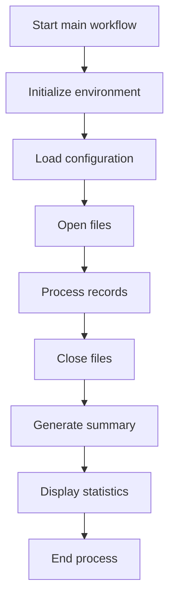

This section serves as the main entry point for the policy processing workflow, ensuring that all necessary setup, processing, and reporting steps are executed in the correct order.

| Rule ID | Category       | Rule Name                           | Description                                                                                                                   | Implementation Details                                                                               |
| ------- | -------------- | ----------------------------------- | ----------------------------------------------------------------------------------------------------------------------------- | ---------------------------------------------------------------------------------------------------- |
| BR-001  | Technical Step | Environment initialization sequence | The environment setup is performed before any configuration, file operations, or record processing steps.                     | No constants or output formats are defined in this section; the rule is about the required sequence. |
| BR-002  | Technical Step | Configuration loading sequence      | Configuration loading is performed after environment initialization and before any file operations or record processing.      | No constants or output formats are defined in this section; the rule is about the required sequence. |
| BR-003  | Technical Step | File opening sequence               | Files are opened after configuration is loaded and before any records are processed.                                          | No constants or output formats are defined in this section; the rule is about the required sequence. |
| BR-004  | Technical Step | Record processing dependency        | Record processing is performed only after environment initialization, configuration loading, and file opening have completed. | No constants or output formats are defined in this section; the rule is about the required sequence. |
| BR-005  | Technical Step | File closing sequence               | Files are closed after all records have been processed and before generating summaries or displaying statistics.              | No constants or output formats are defined in this section; the rule is about the required sequence. |
| BR-006  | Technical Step | Summary generation sequence         | A summary is generated after files are closed and before statistics are displayed.                                            | No constants or output formats are defined in this section; the rule is about the required sequence. |
| BR-007  | Technical Step | Statistics display sequence         | Statistics are displayed after the summary is generated and before the process ends.                                          | No constants or output formats are defined in this section; the rule is about the required sequence. |
| BR-008  | Technical Step | Workflow termination                | The workflow terminates after all processing, reporting, and display steps are complete.                                      | No constants or output formats are defined in this section; the rule is about the required sequence. |

<SwmSnippet path="/base/src/LGAPDB01.cbl" line="90">

---

<SwmToken path="base/src/LGAPDB01.cbl" pos="90:1:1" line-data="       P001.">`P001`</SwmToken> sets up the workflow: it initializes, loads config, opens files, then calls <SwmToken path="base/src/LGAPDB01.cbl" pos="94:3:7" line-data="           PERFORM P006-PROCESS-RECORDS">`P006-PROCESS-RECORDS`</SwmToken> to actually handle the policy applications. Without processing records, nothing gets validated or written, so the rest of the steps (closing files, generating summary, displaying stats) would have no real data to work with.

```cobol
       P001.
           PERFORM P002-INITIALIZE
           PERFORM P003-LOAD-CONFIG
           PERFORM P005-OPEN-FILES
           PERFORM P006-PROCESS-RECORDS
           PERFORM P014-CLOSE-FILES
           PERFORM P015-GENERATE-SUMMARY
           PERFORM P016-DISPLAY-STATS
           STOP RUN.
```

---

</SwmSnippet>

# Processing each policy application

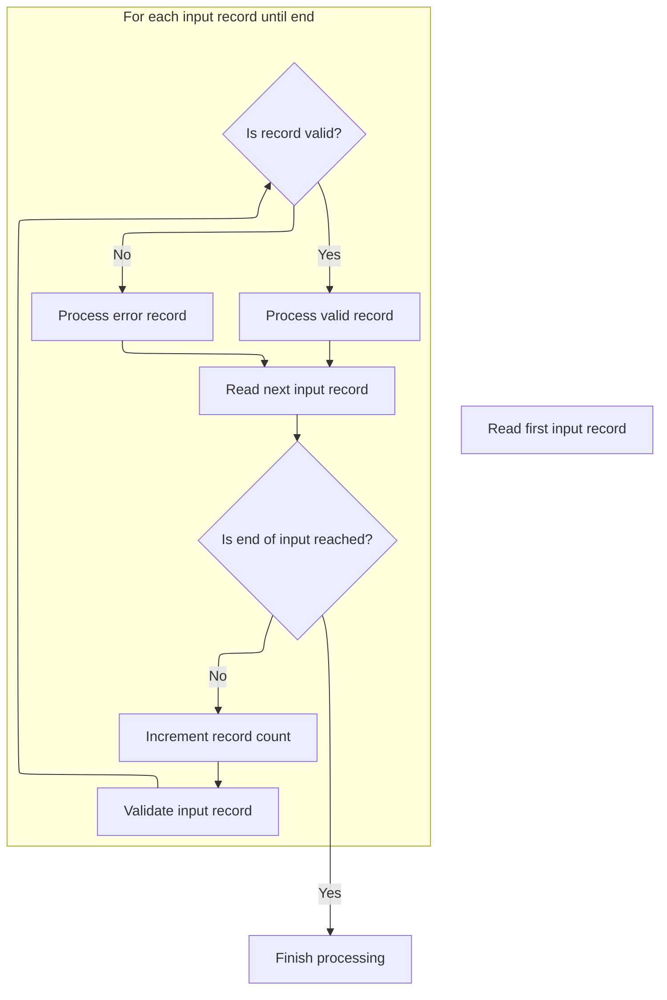

This section manages the main batch loop for policy application processing. It ensures each input record is validated and routed for further processing or error handling, and tracks processing statistics.

| Rule ID | Category        | Rule Name                | Description                                                                                                                    | Implementation Details                                                                                                                                               |
| ------- | --------------- | ------------------------ | ------------------------------------------------------------------------------------------------------------------------------ | -------------------------------------------------------------------------------------------------------------------------------------------------------------------- |
| BR-001  | Data validation | Input validation         | Each input record is validated before being processed as valid or error.                                                       | Validation is performed on each record individually. The outcome determines the processing path (valid or error).                                                    |
| BR-002  | Calculation     | Record counting          | Each input record is counted as it is processed, incrementing the total record count by one for each iteration.                | The record count is a numeric value, starting at zero and incremented by one for each record processed. The field is 7 digits, right-aligned, zero-padded if needed. |
| BR-003  | Decision Making | Valid record processing  | Records with no validation errors are processed as valid policy applications.                                                  | A record is considered valid if the error count is zero after validation. Valid records are routed for further processing as policy applications.                    |
| BR-004  | Decision Making | Error record processing  | Records with validation errors are processed as error records.                                                                 | A record is considered erroneous if the error count is greater than zero after validation. Error records are routed for error handling.                              |
| BR-005  | Decision Making | End-of-input termination | Processing continues until the end-of-input condition is detected, at which point the loop terminates and processing finishes. | The end-of-input is signaled by a status value of '10'. No further records are read or processed after this condition is met.                                        |

<SwmSnippet path="/base/src/LGAPDB01.cbl" line="178">

---

In <SwmToken path="base/src/LGAPDB01.cbl" pos="178:1:5" line-data="       P006-PROCESS-RECORDS.">`P006-PROCESS-RECORDS`</SwmToken>, we start by reading the first input record. This sets up the loop to start processing records one by one.

```cobol
       P006-PROCESS-RECORDS.
           PERFORM P007-READ-INPUT
```

---

</SwmSnippet>

<SwmSnippet path="/base/src/LGAPDB01.cbl" line="180">

---

After reading each record, we increment the record count and call <SwmToken path="base/src/LGAPDB01.cbl" pos="182:3:9" line-data="               PERFORM P008-VALIDATE-INPUT-RECORD">`P008-VALIDATE-INPUT-RECORD`</SwmToken> to check for errors. If validation passes, we process the record as a valid policy; otherwise, we handle it as an error. This loop keeps going until we hit end-of-file.

```cobol
           PERFORM UNTIL INPUT-EOF
               ADD 1 TO WS-REC-CNT
               PERFORM P008-VALIDATE-INPUT-RECORD
               IF WS-ERROR-COUNT = ZERO
                   PERFORM P009-PROCESS-VALID-RECORD
               ELSE
                   PERFORM P010-PROCESS-ERROR-RECORD
               END-IF
               PERFORM P007-READ-INPUT
           END-PERFORM.
```

---

</SwmSnippet>

# Validating input records and logging errors

```mermaid
%%{init: {"flowchart": {"defaultRenderer": "elk"}} }%%
flowchart TD
    node1["Start input record validation"]
    click node1 openCode "base/src/LGAPDB01.cbl:195:196"
    node1 --> node2{"Is policy type valid? (Commercial,
Personal, Farm)"}
    click node2 openCode "base/src/LGAPDB01.cbl:198:204"
    node2 -->|"No"| node3["Log error: Invalid Policy Type"]
    click node3 openCode "base/src/LGAPDB01.cbl:201:204"
    node2 -->|"Yes"| node4{"Is customer number provided?"}
    click node4 openCode "base/src/LGAPDB01.cbl:206:210"
    node3 --> node4
    node4 -->|"No"| node5["Log error: Customer Number Required"]
    click node5 openCode "base/src/LGAPDB01.cbl:207:210"
    node4 -->|"Yes"| node6{"Is at least one coverage limit
provided? (Building or Contents > 0)"}
    click node6 openCode "base/src/LGAPDB01.cbl:212:217"
    node5 --> node6
    node6 -->|"No"| node7["Log error: At least one coverage limit
required"]
    click node7 openCode "base/src/LGAPDB01.cbl:214:217"
    node6 -->|"Yes"| node8{"Does total coverage exceed maximum TIV
($50,000,000)?"}
    click node8 openCode "base/src/LGAPDB01.cbl:219:224"
    node7 --> node8
    node8 -->|"Yes"| node9["Log warning: Total coverage exceeds
maximum TIV"]
    click node9 openCode "base/src/LGAPDB01.cbl:221:224"
    node8 -->|"No"| node11["All validations performed"]
    node9 --> node11
    click node11 openCode "base/src/LGAPDB01.cbl:224:224"

classDef HeadingStyle fill:#777777,stroke:#333,stroke-width:2px;

%% Swimm:
%% %%{init: {"flowchart": {"defaultRenderer": "elk"}} }%%
%% flowchart TD
%%     node1["Start input record validation"]
%%     click node1 openCode "<SwmPath>[base/src/LGAPDB01.cbl](base/src/LGAPDB01.cbl)</SwmPath>:195:196"
%%     node1 --> node2{"Is policy type valid? (Commercial,
%% Personal, Farm)"}
%%     click node2 openCode "<SwmPath>[base/src/LGAPDB01.cbl](base/src/LGAPDB01.cbl)</SwmPath>:198:204"
%%     node2 -->|"No"| node3["Log error: Invalid Policy Type"]
%%     click node3 openCode "<SwmPath>[base/src/LGAPDB01.cbl](base/src/LGAPDB01.cbl)</SwmPath>:201:204"
%%     node2 -->|"Yes"| node4{"Is customer number provided?"}
%%     click node4 openCode "<SwmPath>[base/src/LGAPDB01.cbl](base/src/LGAPDB01.cbl)</SwmPath>:206:210"
%%     node3 --> node4
%%     node4 -->|"No"| node5["Log error: Customer Number Required"]
%%     click node5 openCode "<SwmPath>[base/src/LGAPDB01.cbl](base/src/LGAPDB01.cbl)</SwmPath>:207:210"
%%     node4 -->|"Yes"| node6{"Is at least one coverage limit
%% provided? (Building or Contents > 0)"}
%%     click node6 openCode "<SwmPath>[base/src/LGAPDB01.cbl](base/src/LGAPDB01.cbl)</SwmPath>:212:217"
%%     node5 --> node6
%%     node6 -->|"No"| node7["Log error: At least one coverage limit
%% required"]
%%     click node7 openCode "<SwmPath>[base/src/LGAPDB01.cbl](base/src/LGAPDB01.cbl)</SwmPath>:214:217"
%%     node6 -->|"Yes"| node8{"Does total coverage exceed maximum TIV
%% ($50,000,000)?"}
%%     click node8 openCode "<SwmPath>[base/src/LGAPDB01.cbl](base/src/LGAPDB01.cbl)</SwmPath>:219:224"
%%     node7 --> node8
%%     node8 -->|"Yes"| node9["Log warning: Total coverage exceeds
%% maximum TIV"]
%%     click node9 openCode "<SwmPath>[base/src/LGAPDB01.cbl](base/src/LGAPDB01.cbl)</SwmPath>:221:224"
%%     node8 -->|"No"| node11["All validations performed"]
%%     node9 --> node11
%%     click node11 openCode "<SwmPath>[base/src/LGAPDB01.cbl](base/src/LGAPDB01.cbl)</SwmPath>:224:224"
%% 
%% classDef HeadingStyle fill:#777777,stroke:#333,stroke-width:2px;
```

This section ensures that input records meet key business requirements before further processing. It enforces mandatory fields, valid values, and business constraints, and logs any violations for review.

| Rule ID | Category        | Rule Name                            | Description                                                                                                                                                                                                                                                                                                                                                                                                                                                                                                                    | Implementation Details                                                                                                                                   |
| ------- | --------------- | ------------------------------------ | ------------------------------------------------------------------------------------------------------------------------------------------------------------------------------------------------------------------------------------------------------------------------------------------------------------------------------------------------------------------------------------------------------------------------------------------------------------------------------------------------------------------------------ | -------------------------------------------------------------------------------------------------------------------------------------------------------- |
| BR-001  | Data validation | Policy type validation               | If the policy type is not Commercial ('C'), Personal ('P'), or Farm ('F'), an error is logged with code <SwmToken path="base/src/LGAPDB01.cbl" pos="202:2:2" line-data="                   &#39;POL001&#39; &#39;F&#39; &#39;IN-POLICY-TYPE&#39; ">`POL001`</SwmToken>, severity 'F', field <SwmToken path="base/src/LGAPDB01.cbl" pos="202:10:14" line-data="                   &#39;POL001&#39; &#39;F&#39; &#39;IN-POLICY-TYPE&#39; ">`IN-POLICY-TYPE`</SwmToken>, and message 'Invalid Policy Type'.                       | Allowed values for policy type are 'C', 'P', and 'F'. Error log format includes: code (string), severity (string), field (string), message (string).     |
| BR-002  | Data validation | Customer number required             | If the customer number field is empty, an error is logged with code <SwmToken path="base/src/LGAPDB01.cbl" pos="208:2:2" line-data="                   &#39;CUS001&#39; &#39;F&#39; &#39;IN-CUSTOMER-NUM&#39; ">`CUS001`</SwmToken>, severity 'F', field <SwmToken path="base/src/LGAPDB01.cbl" pos="206:3:7" line-data="           IF IN-CUSTOMER-NUM = SPACES">`IN-CUSTOMER-NUM`</SwmToken>, and message 'Customer Number Required'.                                                                                         | Customer number is a string of up to 10 characters. Error log format includes: code (string), severity (string), field (string), message (string).       |
| BR-003  | Data validation | At least one coverage limit required | If both building and contents coverage limits are zero, an error is logged with code <SwmToken path="base/src/LGAPDB01.cbl" pos="215:2:2" line-data="                   &#39;COV001&#39; &#39;F&#39; &#39;COVERAGE-LIMITS&#39; ">`COV001`</SwmToken>, severity 'F', field <SwmToken path="base/src/LGAPDB01.cbl" pos="215:10:12" line-data="                   &#39;COV001&#39; &#39;F&#39; &#39;COVERAGE-LIMITS&#39; ">`COVERAGE-LIMITS`</SwmToken>, and message 'At least one coverage limit required'.                      | Coverage limits are numeric fields. Error log format includes: code (string), severity (string), field (string), message (string).                       |
| BR-004  | Data validation | Maximum total insured value warning  | If the sum of building, contents, and BI coverage limits exceeds $50,000,000, a warning is logged with code <SwmToken path="base/src/LGAPDB01.cbl" pos="222:2:2" line-data="                   &#39;COV002&#39; &#39;W&#39; &#39;COVERAGE-LIMITS&#39; ">`COV002`</SwmToken>, severity 'W', field <SwmToken path="base/src/LGAPDB01.cbl" pos="215:10:12" line-data="                   &#39;COV001&#39; &#39;F&#39; &#39;COVERAGE-LIMITS&#39; ">`COVERAGE-LIMITS`</SwmToken>, and message 'Total coverage exceeds maximum TIV'. | Maximum allowed total insured value (TIV) is $50,000,000. Error log format includes: code (string), severity (string), field (string), message (string). |

<SwmSnippet path="/base/src/LGAPDB01.cbl" line="195">

---

In <SwmToken path="base/src/LGAPDB01.cbl" pos="195:1:7" line-data="       P008-VALIDATE-INPUT-RECORD.">`P008-VALIDATE-INPUT-RECORD`</SwmToken>, we reset error tracking and check if the policy type is valid using domain-specific flags. If none match, we call <SwmToken path="base/src/LGAPDB01.cbl" pos="201:3:7" line-data="               PERFORM P008A-LOG-ERROR WITH ">`P008A-LOG-ERROR`</SwmToken> to record the invalid type for error tracking.

```cobol
       P008-VALIDATE-INPUT-RECORD.
           INITIALIZE WS-ERROR-HANDLING
           
           IF NOT COMMERCIAL-POLICY AND 
              NOT PERSONAL-POLICY AND 
              NOT FARM-POLICY
               PERFORM P008A-LOG-ERROR WITH 
                   'POL001' 'F' 'IN-POLICY-TYPE' 
                   'Invalid Policy Type'
           END-IF
```

---

</SwmSnippet>

<SwmSnippet path="/base/src/LGAPDB01.cbl" line="226">

---

<SwmToken path="base/src/LGAPDB01.cbl" pos="226:1:5" line-data="       P008A-LOG-ERROR.">`P008A-LOG-ERROR`</SwmToken> bumps the error count and stores error details in indexed arrays. It doesn't check for overflow, so if you log more than 20 errors, the extras are ignored.

```cobol
       P008A-LOG-ERROR.
           ADD 1 TO WS-ERROR-COUNT
           SET ERR-IDX TO WS-ERROR-COUNT
           MOVE WS-ERROR-CODE TO WS-ERROR-CODE (ERR-IDX)
           MOVE WS-ERROR-SEVERITY TO WS-ERROR-SEVERITY (ERR-IDX)
           MOVE WS-ERROR-FIELD TO WS-ERROR-FIELD (ERR-IDX)
           MOVE WS-ERROR-MESSAGE TO WS-ERROR-MESSAGE (ERR-IDX).
```

---

</SwmSnippet>

<SwmSnippet path="/base/src/LGAPDB01.cbl" line="206">

---

Back in <SwmToken path="base/src/LGAPDB01.cbl" pos="182:3:9" line-data="               PERFORM P008-VALIDATE-INPUT-RECORD">`P008-VALIDATE-INPUT-RECORD`</SwmToken>, we check if the customer number is missing. If it's empty, that's a hard fail for the record, so we flag it for error handling.

```cobol
           IF IN-CUSTOMER-NUM = SPACES
               PERFORM P008A-LOG-ERROR WITH 
                   'CUS001' 'F' 'IN-CUSTOMER-NUM' 
                   'Customer Number Required'
           END-IF
```

---

</SwmSnippet>

<SwmSnippet path="/base/src/LGAPDB01.cbl" line="212">

---

Still in <SwmToken path="base/src/LGAPDB01.cbl" pos="182:3:9" line-data="               PERFORM P008-VALIDATE-INPUT-RECORD">`P008-VALIDATE-INPUT-RECORD`</SwmToken>, we check that at least one coverage limit is set. If both are zero, the policy can't be processed, so we mark it as invalid.

```cobol
           IF IN-BUILDING-LIMIT = ZERO AND 
              IN-CONTENTS-LIMIT = ZERO
               PERFORM P008A-LOG-ERROR WITH 
                   'COV001' 'F' 'COVERAGE-LIMITS' 
                   'At least one coverage limit required'
           END-IF
```

---

</SwmSnippet>

<SwmSnippet path="/base/src/LGAPDB01.cbl" line="219">

---

Before finishing <SwmToken path="base/src/LGAPDB01.cbl" pos="182:3:9" line-data="               PERFORM P008-VALIDATE-INPUT-RECORD">`P008-VALIDATE-INPUT-RECORD`</SwmToken>, we check if the total coverage goes over the max allowed. If it does, we log a warning, but the record still moves forward for processing.

```cobol
           IF IN-BUILDING-LIMIT + IN-CONTENTS-LIMIT + 
              IN-BI-LIMIT > WS-MAX-TIV
               PERFORM P008A-LOG-ERROR WITH 
                   'COV002' 'W' 'COVERAGE-LIMITS' 
                   'Total coverage exceeds maximum TIV'
           END-IF.
```

---

</SwmSnippet>

# Handling valid policy applications

This section routes valid policy application records to the appropriate processing logic based on the policy type and updates processing statistics accordingly.

| Rule ID | Category        | Rule Name                      | Description                                                                                                                                                       | Implementation Details                                                                                                                                      |
| ------- | --------------- | ------------------------------ | ----------------------------------------------------------------------------------------------------------------------------------------------------------------- | ----------------------------------------------------------------------------------------------------------------------------------------------------------- |
| BR-001  | Decision Making | Commercial policy processing   | When a policy application is identified as commercial, the system processes it using the commercial underwriting logic and increments the processed policy count. | The commercial policy type is represented by the value 'C'. The processed policy count is incremented by 1 for each commercial policy processed.            |
| BR-002  | Decision Making | Non-commercial policy handling | When a policy application is not commercial, the system processes it using the non-commercial policy handling logic and increments the error count.               | Non-commercial policy types include any value other than 'C'. The error count is incremented by 1 for each non-commercial policy processed in this context. |
| BR-003  | Decision Making | Policy type routing            | The system determines the processing path for a policy application based on the value of the policy type field in the input record.                               | The policy type field is a single character. 'C' indicates commercial; other values indicate non-commercial.                                                |

<SwmSnippet path="/base/src/LGAPDB01.cbl" line="234">

---

<SwmToken path="base/src/LGAPDB01.cbl" pos="234:1:7" line-data="       P009-PROCESS-VALID-RECORD.">`P009-PROCESS-VALID-RECORD`</SwmToken> checks if the policy is commercial. If so, we call <SwmToken path="base/src/LGAPDB01.cbl" pos="236:3:7" line-data="               PERFORM P011-PROCESS-COMMERCIAL">`P011-PROCESS-COMMERCIAL`</SwmToken> to run the full underwriting logic; otherwise, we handle unsupported types and bump the error count.

```cobol
       P009-PROCESS-VALID-RECORD.
           IF COMMERCIAL-POLICY
               PERFORM P011-PROCESS-COMMERCIAL
               ADD 1 TO WS-PROC-CNT
           ELSE
               PERFORM P012-PROCESS-NON-COMMERCIAL
               ADD 1 TO WS-ERR-CNT
           END-IF.
```

---

</SwmSnippet>

## Underwriting commercial policies

```mermaid
%%{init: {"flowchart": {"defaultRenderer": "elk"}} }%%
flowchart TD
    node1["Begin commercial insurance application
processing"]
    click node1 openCode "base/src/LGAPDB01.cbl:258:260"
    node1 --> node2["Calculating property risk score"]
    
    node2 --> node3["Fetching risk factors and scoring"]
    
    node3 --> node4["Scoring property risk and adjusting for coverage and location"]
    
    node4 --> node5["Calculating premiums and underwriting verdict"]
    
    node5 --> node6["Fetching risk factors and calculating premiums"]
    
    node6 --> node8{"Is application approved? (WS-STAT = 0)"}
    click node8 openCode "base/src/LGAPDB01.cbl:261:263"
    node8 -->|"Yes"| node9["Preparing data for advanced premium calculation"]
    
    node9 --> node10["Running advanced actuarial premium steps"]
    
    node10 --> node11["Making the underwriting decision"]
    
    node8 -->|"No"| node11
    node11 --> node12["Write output record"]
    click node12 openCode "base/src/LGAPDB01.cbl:347:366"
    node12 --> node13["Update statistics"]
    click node13 openCode "base/src/LGAPDB01.cbl:367:386"
classDef HeadingStyle fill:#777777,stroke:#333,stroke-width:2px;
click node2 goToHeading "Calculating property risk score"
node2:::HeadingStyle
click node3 goToHeading "Fetching risk factors and scoring"
node3:::HeadingStyle
click node4 goToHeading "Scoring property risk and adjusting for coverage and location"
node4:::HeadingStyle
click node5 goToHeading "Calculating premiums and underwriting verdict"
node5:::HeadingStyle
click node6 goToHeading "Fetching risk factors and calculating premiums"
node6:::HeadingStyle
click node9 goToHeading "Preparing data for advanced premium calculation"
node9:::HeadingStyle
click node10 goToHeading "Running advanced actuarial premium steps"
node10:::HeadingStyle
click node11 goToHeading "Making the underwriting decision"
node11:::HeadingStyle

%% Swimm:
%% %%{init: {"flowchart": {"defaultRenderer": "elk"}} }%%
%% flowchart TD
%%     node1["Begin commercial insurance application
%% processing"]
%%     click node1 openCode "<SwmPath>[base/src/LGAPDB01.cbl](base/src/LGAPDB01.cbl)</SwmPath>:258:260"
%%     node1 --> node2["Calculating property risk score"]
%%     
%%     node2 --> node3["Fetching risk factors and scoring"]
%%     
%%     node3 --> node4["Scoring property risk and adjusting for coverage and location"]
%%     
%%     node4 --> node5["Calculating premiums and underwriting verdict"]
%%     
%%     node5 --> node6["Fetching risk factors and calculating premiums"]
%%     
%%     node6 --> node8{"Is application approved? (<SwmToken path="base/src/LGAPDB01.cbl" pos="261:3:5" line-data="           IF WS-STAT = 0">`WS-STAT`</SwmToken> = 0)"}
%%     click node8 openCode "<SwmPath>[base/src/LGAPDB01.cbl](base/src/LGAPDB01.cbl)</SwmPath>:261:263"
%%     node8 -->|"Yes"| node9["Preparing data for advanced premium calculation"]
%%     
%%     node9 --> node10["Running advanced actuarial premium steps"]
%%     
%%     node10 --> node11["Making the underwriting decision"]
%%     
%%     node8 -->|"No"| node11
%%     node11 --> node12["Write output record"]
%%     click node12 openCode "<SwmPath>[base/src/LGAPDB01.cbl](base/src/LGAPDB01.cbl)</SwmPath>:347:366"
%%     node12 --> node13["Update statistics"]
%%     click node13 openCode "<SwmPath>[base/src/LGAPDB01.cbl](base/src/LGAPDB01.cbl)</SwmPath>:367:386"
%% classDef HeadingStyle fill:#777777,stroke:#333,stroke-width:2px;
%% click node2 goToHeading "Calculating property risk score"
%% node2:::HeadingStyle
%% click node3 goToHeading "Fetching risk factors and scoring"
%% node3:::HeadingStyle
%% click node4 goToHeading "Scoring property risk and adjusting for coverage and location"
%% node4:::HeadingStyle
%% click node5 goToHeading "Calculating premiums and underwriting verdict"
%% node5:::HeadingStyle
%% click node6 goToHeading "Fetching risk factors and calculating premiums"
%% node6:::HeadingStyle
%% click node9 goToHeading "Preparing data for advanced premium calculation"
%% node9:::HeadingStyle
%% click node10 goToHeading "Running advanced actuarial premium steps"
%% node10:::HeadingStyle
%% click node11 goToHeading "Making the underwriting decision"
%% node11:::HeadingStyle
```

This section governs the end-to-end process for underwriting commercial insurance policies, including risk assessment, premium calculation, and decision-making for application approval or rejection.

| Rule ID | Category        | Rule Name                                              | Description                                                                                                                                                        | Implementation Details                                                                                                                                                                          |
| ------- | --------------- | ------------------------------------------------------ | ------------------------------------------------------------------------------------------------------------------------------------------------------------------ | ----------------------------------------------------------------------------------------------------------------------------------------------------------------------------------------------- |
| BR-001  | Calculation     | Property risk score calculation required               | A property risk score is calculated using property details, coverage values, location, and customer history, and is required before premium calculation proceeds.  | The risk score is calculated using property details, coverage values, location, and customer history. The output is a numeric risk score used in subsequent premium calculations.               |
| BR-002  | Calculation     | Premium calculation and underwriting status            | Premium calculation is performed using the calculated risk score and peril values, and results in an underwriting status, rejection reason, and detailed premiums. | Premiums are calculated for various perils. Underwriting status is set to one of: approved (0), pending (1), rejected (2), referred (3). Rejection reason and notes are also set if applicable. |
| BR-003  | Decision Making | Advanced premium calculation for approved applications | If the underwriting status is 'approved' (status = 0), advanced premium calculation steps are performed before making the final underwriting decision.             | Status values: approved (0), pending (1), rejected (2), referred (3). Advanced premium calculation is only performed for approved applications in this context.                                 |

<SwmSnippet path="/base/src/LGAPDB01.cbl" line="258">

---

In <SwmToken path="base/src/LGAPDB01.cbl" pos="258:1:5" line-data="       P011-PROCESS-COMMERCIAL.">`P011-PROCESS-COMMERCIAL`</SwmToken>, we start by calculating the risk score, since that's needed for the premium calculation step right after.

```cobol
       P011-PROCESS-COMMERCIAL.
           PERFORM P011A-CALCULATE-RISK-SCORE
           PERFORM P011B-BASIC-PREMIUM-CALC
```

---

</SwmSnippet>

### Calculating property risk score

This section is responsible for calculating the property risk score by delegating the logic to an external service, ensuring modularity and consistency in risk assessment.

| Rule ID | Category                        | Rule Name                        | Description                                                                                                                       | Implementation Details                                                                                                                                                                                                                                                                                                                               |
| ------- | ------------------------------- | -------------------------------- | --------------------------------------------------------------------------------------------------------------------------------- | ---------------------------------------------------------------------------------------------------------------------------------------------------------------------------------------------------------------------------------------------------------------------------------------------------------------------------------------------------- |
| BR-001  | Invoking a Service or a Process | External risk scoring delegation | The property risk score is determined by invoking the external risk scoring service with the provided property and customer data. | The risk score is returned as a number and stored in the base risk score field. The input data includes property type (string, 15 chars), postcode (string, 8 chars), latitude (number), longitude (number), building limit (number), contents limit (number), flood coverage (number), weather coverage (number), and customer history (structure). |

<SwmSnippet path="/base/src/LGAPDB01.cbl" line="268">

---

<SwmToken path="base/src/LGAPDB01.cbl" pos="268:1:7" line-data="       P011A-CALCULATE-RISK-SCORE.">`P011A-CALCULATE-RISK-SCORE`</SwmToken> calls <SwmToken path="base/src/LGAPDB01.cbl" pos="269:4:4" line-data="           CALL &#39;LGAPDB02&#39; USING IN-PROPERTY-TYPE, IN-POSTCODE, ">`LGAPDB02`</SwmToken> with property and customer data to get the risk score. This keeps the risk logic separate and modular.

```cobol
       P011A-CALCULATE-RISK-SCORE.
           CALL 'LGAPDB02' USING IN-PROPERTY-TYPE, IN-POSTCODE, 
                                IN-LATITUDE, IN-LONGITUDE,
                                IN-BUILDING-LIMIT, IN-CONTENTS-LIMIT,
                                IN-FLOOD-COVERAGE, IN-WEATHER-COVERAGE,
                                IN-CUSTOMER-HISTORY, WS-BASE-RISK-SCR.
```

---

</SwmSnippet>

### Fetching risk factors and scoring

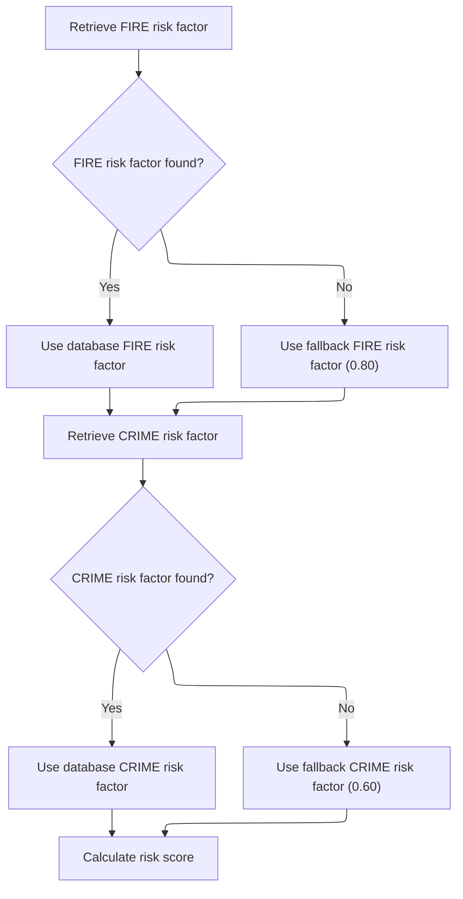

This section ensures that risk factors for fire and crime are retrieved from the database if available, or set to fallback values if not, so that risk scoring can always proceed.

| Rule ID | Category        | Rule Name                         | Description                                                                                                                                                                                                                        | Implementation Details                                                                                                                                                                                                        |
| ------- | --------------- | --------------------------------- | ---------------------------------------------------------------------------------------------------------------------------------------------------------------------------------------------------------------------------------- | ----------------------------------------------------------------------------------------------------------------------------------------------------------------------------------------------------------------------------- |
| BR-001  | Calculation     | Guaranteed risk score calculation | Risk score calculation is always performed after risk factors are set, regardless of whether the values come from the database or fallbacks.                                                                                       | The risk score calculation step is always executed after risk factors are set. The calculation itself is not detailed in this section.                                                                                        |
| BR-002  | Decision Making | Database fire risk factor usage   | When retrieving the fire risk factor, if a value is found in the database, use that value for scoring.                                                                                                                             | The fire risk factor is a numeric value. No specific format constraints are imposed beyond being a valid number for scoring.                                                                                                  |
| BR-003  | Decision Making | Fallback fire risk factor         | If the fire risk factor cannot be retrieved from the database, use a fallback value of <SwmToken path="base/src/LGAPDB02.cbl" pos="54:3:5" line-data="               MOVE 0.80 TO WS-FIRE-FACTOR">`0.80`</SwmToken> for scoring.   | The fallback fire risk factor is set to <SwmToken path="base/src/LGAPDB02.cbl" pos="54:3:5" line-data="               MOVE 0.80 TO WS-FIRE-FACTOR">`0.80`</SwmToken>. This is a numeric value used in scoring calculations.   |
| BR-004  | Decision Making | Database crime risk factor usage  | When retrieving the crime risk factor, if a value is found in the database, use that value for scoring.                                                                                                                            | The crime risk factor is a numeric value. No specific format constraints are imposed beyond being a valid number for scoring.                                                                                                 |
| BR-005  | Decision Making | Fallback crime risk factor        | If the crime risk factor cannot be retrieved from the database, use a fallback value of <SwmToken path="base/src/LGAPDB02.cbl" pos="66:3:5" line-data="               MOVE 0.60 TO WS-CRIME-FACTOR">`0.60`</SwmToken> for scoring. | The fallback crime risk factor is set to <SwmToken path="base/src/LGAPDB02.cbl" pos="66:3:5" line-data="               MOVE 0.60 TO WS-CRIME-FACTOR">`0.60`</SwmToken>. This is a numeric value used in scoring calculations. |

<SwmSnippet path="/base/src/LGAPDB02.cbl" line="39">

---

<SwmToken path="base/src/LGAPDB02.cbl" pos="39:1:3" line-data="       MAIN-LOGIC.">`MAIN-LOGIC`</SwmToken> in <SwmToken path="base/src/LGAPDB01.cbl" pos="269:4:4" line-data="           CALL &#39;LGAPDB02&#39; USING IN-PROPERTY-TYPE, IN-POSTCODE, ">`LGAPDB02`</SwmToken> first fetches risk factors, then calculates the risk score. If the database fetch fails, it uses defaults so the scoring step always runs.

```cobol
       MAIN-LOGIC.
           PERFORM GET-RISK-FACTORS
           PERFORM CALCULATE-RISK-SCORE
           GOBACK.
```

---

</SwmSnippet>

<SwmSnippet path="/base/src/LGAPDB02.cbl" line="44">

---

<SwmToken path="base/src/LGAPDB02.cbl" pos="44:1:5" line-data="       GET-RISK-FACTORS.">`GET-RISK-FACTORS`</SwmToken> runs SQL queries to fetch fire and crime risk factors. If the queries fail, it falls back to hardcoded defaults (<SwmToken path="base/src/LGAPDB02.cbl" pos="54:3:5" line-data="               MOVE 0.80 TO WS-FIRE-FACTOR">`0.80`</SwmToken> for fire, <SwmToken path="base/src/LGAPDB02.cbl" pos="66:3:5" line-data="               MOVE 0.60 TO WS-CRIME-FACTOR">`0.60`</SwmToken> for crime), so scoring always has values to use.

```cobol
       GET-RISK-FACTORS.
           EXEC SQL
               SELECT FACTOR_VALUE INTO :WS-FIRE-FACTOR
               FROM RISK_FACTORS
               WHERE PERIL_TYPE = 'FIRE'
           END-EXEC.
           
           IF SQLCODE = 0
               CONTINUE
           ELSE
               MOVE 0.80 TO WS-FIRE-FACTOR
           END-IF.
           
           EXEC SQL
               SELECT FACTOR_VALUE INTO :WS-CRIME-FACTOR
               FROM RISK_FACTORS
               WHERE PERIL_TYPE = 'CRIME'
           END-EXEC.
           
           IF SQLCODE = 0
               CONTINUE
           ELSE
               MOVE 0.60 TO WS-CRIME-FACTOR
           END-IF.
```

---

</SwmSnippet>

### Scoring property risk and adjusting for coverage and location

```mermaid
%%{init: {"flowchart": {"defaultRenderer": "elk"}} }%%
flowchart TD
    node1["Start with risk score 100"]
    click node1 openCode "base/src/LGAPDB02.cbl:69:70"
    node1 --> node2{"Property type?"}
    click node2 openCode "base/src/LGAPDB02.cbl:72:83"
    node2 -->|"Warehouse"| node3["Add 50"]
    click node3 openCode "base/src/LGAPDB02.cbl:74:74"
    node2 -->|"Factory"| node4["Add 75"]
    click node4 openCode "base/src/LGAPDB02.cbl:76:76"
    node2 -->|"Office"| node5["Add 25"]
    click node5 openCode "base/src/LGAPDB02.cbl:78:78"
    node2 -->|"Retail"| node6["Add 40"]
    click node6 openCode "base/src/LGAPDB02.cbl:80:80"
    node2 -->|"Other"| node7["Add 30"]
    click node7 openCode "base/src/LGAPDB02.cbl:82:82"
    node3 --> node8{"Postcode prefix FL or CR?"}
    node4 --> node8
    node5 --> node8
    node6 --> node8
    node7 --> node8
    click node8 openCode "base/src/LGAPDB02.cbl:85:88"
    node8 -->|"Yes"| node9["Add 30"]
    click node9 openCode "base/src/LGAPDB02.cbl:87:87"
    node8 -->|"No"| node10["Determine max coverage"]
    node9 --> node10
    click node10 openCode "base/src/LGAPDB02.cbl:94:111"
    node10 --> node11{"Max coverage > 500K?"}
    click node11 openCode "base/src/LGAPDB02.cbl:113:115"
    node11 -->|"Yes"| node12["Add 15"]
    click node12 openCode "base/src/LGAPDB02.cbl:114:114"
    node11 -->|"No"| node13["Continue"]
    node12 --> node14{"Location?"}
    node13 --> node14
    click node14 openCode "base/src/LGAPDB02.cbl:117:134"
    node14 -->|"Urban"| node15["Add 10"]
    click node15 openCode "base/src/LGAPDB02.cbl:125:125"
    node14 -->|"Suburban"| node16["Add 5"]
    click node16 openCode "base/src/LGAPDB02.cbl:130:130"
    node14 -->|"Rural"| node17["Add 20"]
    click node17 openCode "base/src/LGAPDB02.cbl:132:132"
    node15 --> node18{"Customer history?"}
    node16 --> node18
    node17 --> node18
    click node18 openCode "base/src/LGAPDB02.cbl:136:146"
    node18 -->|"New"| node19["Add 10"]
    click node19 openCode "base/src/LGAPDB02.cbl:139:139"
    node18 -->|"Good"| node20["Subtract 5"]
    click node20 openCode "base/src/LGAPDB02.cbl:141:141"
    node18 -->|"Risky"| node21["Add 25"]
    click node21 openCode "base/src/LGAPDB02.cbl:143:143"
    node18 -->|"Other"| node22["Add 10"]
    click node22 openCode "base/src/LGAPDB02.cbl:145:145"
    node19 --> node23["End"]
    node20 --> node23
    node21 --> node23
    node22 --> node23
    click node23 openCode "base/src/LGAPDB02.cbl:69:92"
classDef HeadingStyle fill:#777777,stroke:#333,stroke-width:2px;

%% Swimm:
%% %%{init: {"flowchart": {"defaultRenderer": "elk"}} }%%
%% flowchart TD
%%     node1["Start with risk score 100"]
%%     click node1 openCode "<SwmPath>[base/src/LGAPDB02.cbl](base/src/LGAPDB02.cbl)</SwmPath>:69:70"
%%     node1 --> node2{"Property type?"}
%%     click node2 openCode "<SwmPath>[base/src/LGAPDB02.cbl](base/src/LGAPDB02.cbl)</SwmPath>:72:83"
%%     node2 -->|"Warehouse"| node3["Add 50"]
%%     click node3 openCode "<SwmPath>[base/src/LGAPDB02.cbl](base/src/LGAPDB02.cbl)</SwmPath>:74:74"
%%     node2 -->|"Factory"| node4["Add 75"]
%%     click node4 openCode "<SwmPath>[base/src/LGAPDB02.cbl](base/src/LGAPDB02.cbl)</SwmPath>:76:76"
%%     node2 -->|"Office"| node5["Add 25"]
%%     click node5 openCode "<SwmPath>[base/src/LGAPDB02.cbl](base/src/LGAPDB02.cbl)</SwmPath>:78:78"
%%     node2 -->|"Retail"| node6["Add 40"]
%%     click node6 openCode "<SwmPath>[base/src/LGAPDB02.cbl](base/src/LGAPDB02.cbl)</SwmPath>:80:80"
%%     node2 -->|"Other"| node7["Add 30"]
%%     click node7 openCode "<SwmPath>[base/src/LGAPDB02.cbl](base/src/LGAPDB02.cbl)</SwmPath>:82:82"
%%     node3 --> node8{"Postcode prefix FL or CR?"}
%%     node4 --> node8
%%     node5 --> node8
%%     node6 --> node8
%%     node7 --> node8
%%     click node8 openCode "<SwmPath>[base/src/LGAPDB02.cbl](base/src/LGAPDB02.cbl)</SwmPath>:85:88"
%%     node8 -->|"Yes"| node9["Add 30"]
%%     click node9 openCode "<SwmPath>[base/src/LGAPDB02.cbl](base/src/LGAPDB02.cbl)</SwmPath>:87:87"
%%     node8 -->|"No"| node10["Determine max coverage"]
%%     node9 --> node10
%%     click node10 openCode "<SwmPath>[base/src/LGAPDB02.cbl](base/src/LGAPDB02.cbl)</SwmPath>:94:111"
%%     node10 --> node11{"Max coverage > <SwmToken path="base/src/LGAPDB02.cbl" pos="113:15:15" line-data="           IF WS-MAX-COVERAGE &gt; WS-COVERAGE-500K">`500K`</SwmToken>?"}
%%     click node11 openCode "<SwmPath>[base/src/LGAPDB02.cbl](base/src/LGAPDB02.cbl)</SwmPath>:113:115"
%%     node11 -->|"Yes"| node12["Add 15"]
%%     click node12 openCode "<SwmPath>[base/src/LGAPDB02.cbl](base/src/LGAPDB02.cbl)</SwmPath>:114:114"
%%     node11 -->|"No"| node13["Continue"]
%%     node12 --> node14{"Location?"}
%%     node13 --> node14
%%     click node14 openCode "<SwmPath>[base/src/LGAPDB02.cbl](base/src/LGAPDB02.cbl)</SwmPath>:117:134"
%%     node14 -->|"Urban"| node15["Add 10"]
%%     click node15 openCode "<SwmPath>[base/src/LGAPDB02.cbl](base/src/LGAPDB02.cbl)</SwmPath>:125:125"
%%     node14 -->|"Suburban"| node16["Add 5"]
%%     click node16 openCode "<SwmPath>[base/src/LGAPDB02.cbl](base/src/LGAPDB02.cbl)</SwmPath>:130:130"
%%     node14 -->|"Rural"| node17["Add 20"]
%%     click node17 openCode "<SwmPath>[base/src/LGAPDB02.cbl](base/src/LGAPDB02.cbl)</SwmPath>:132:132"
%%     node15 --> node18{"Customer history?"}
%%     node16 --> node18
%%     node17 --> node18
%%     click node18 openCode "<SwmPath>[base/src/LGAPDB02.cbl](base/src/LGAPDB02.cbl)</SwmPath>:136:146"
%%     node18 -->|"New"| node19["Add 10"]
%%     click node19 openCode "<SwmPath>[base/src/LGAPDB02.cbl](base/src/LGAPDB02.cbl)</SwmPath>:139:139"
%%     node18 -->|"Good"| node20["Subtract 5"]
%%     click node20 openCode "<SwmPath>[base/src/LGAPDB02.cbl](base/src/LGAPDB02.cbl)</SwmPath>:141:141"
%%     node18 -->|"Risky"| node21["Add 25"]
%%     click node21 openCode "<SwmPath>[base/src/LGAPDB02.cbl](base/src/LGAPDB02.cbl)</SwmPath>:143:143"
%%     node18 -->|"Other"| node22["Add 10"]
%%     click node22 openCode "<SwmPath>[base/src/LGAPDB02.cbl](base/src/LGAPDB02.cbl)</SwmPath>:145:145"
%%     node19 --> node23["End"]
%%     node20 --> node23
%%     node21 --> node23
%%     node22 --> node23
%%     click node23 openCode "<SwmPath>[base/src/LGAPDB02.cbl](base/src/LGAPDB02.cbl)</SwmPath>:69:92"
%% classDef HeadingStyle fill:#777777,stroke:#333,stroke-width:2px;
```

This section calculates a property risk score by applying business-driven adjustments for property characteristics, coverage, location, and customer history. The score is used to inform downstream insurance premium calculations and risk assessments.

| Rule ID | Category    | Rule Name                              | Description                                                                                                                                                  | Implementation Details                                                                                                                                                                                                                                                                                                                                                                                                                                                                                                                                                      |
| ------- | ----------- | -------------------------------------- | ------------------------------------------------------------------------------------------------------------------------------------------------------------ | --------------------------------------------------------------------------------------------------------------------------------------------------------------------------------------------------------------------------------------------------------------------------------------------------------------------------------------------------------------------------------------------------------------------------------------------------------------------------------------------------------------------------------------------------------------------------- |
| BR-001  | Calculation | Base risk score                        | Set the initial risk score to 100 before any adjustments are made.                                                                                           | The base value is always set to 100 (number).                                                                                                                                                                                                                                                                                                                                                                                                                                                                                                                               |
| BR-002  | Calculation | Property type adjustment               | Increase the risk score by a fixed amount based on property type: 50 for warehouse, 75 for factory, 25 for office, 40 for retail, and 30 for any other type. | Warehouse: +50, Factory: +75, Office: +25, Retail: +40, Other: +30. All are numbers added to the risk score.                                                                                                                                                                                                                                                                                                                                                                                                                                                                |
| BR-003  | Calculation | Postcode risk adjustment               | Increase the risk score by 30 if the postcode prefix is 'FL' or 'CR'.                                                                                        | +30 added to risk score if postcode starts with 'FL' or 'CR'.                                                                                                                                                                                                                                                                                                                                                                                                                                                                                                               |
| BR-004  | Calculation | High coverage adjustment               | Increase the risk score by 15 if the highest coverage amount among fire, crime, flood, and weather exceeds 500,000.                                          | +15 added to risk score if any coverage type exceeds 500,000. Coverage amounts are numbers.                                                                                                                                                                                                                                                                                                                                                                                                                                                                                 |
| BR-005  | Calculation | Urban location adjustment              | Increase the risk score by 10 if the property is in the NYC or LA area (based on latitude and longitude).                                                    | NYC: <SwmToken path="base/src/LGAPDB02.cbl" pos="119:8:10" line-data="      *    NYC area: 40-41N, 74.5-73.5W">`40-41N`</SwmToken>, <SwmToken path="base/src/LGAPDB02.cbl" pos="119:13:19" line-data="      *    NYC area: 40-41N, 74.5-73.5W">`74.5-73.5W`</SwmToken>; LA: <SwmToken path="base/src/LGAPDB02.cbl" pos="120:8:10" line-data="      *    LA area: 34-35N, 118.5-117.5W">`34-35N`</SwmToken>, <SwmToken path="base/src/LGAPDB02.cbl" pos="120:13:19" line-data="      *    LA area: 34-35N, 118.5-117.5W">`118.5-117.5W`</SwmToken>. +10 added to risk score. |
| BR-006  | Calculation | Suburban and rural location adjustment | Increase the risk score by 5 if the property is in the continental US but not in NYC or LA; otherwise, increase by 20 for international or rural locations.  | Continental US: 25-49N, 125-66W. +5 for suburban, +20 for rural/international.                                                                                                                                                                                                                                                                                                                                                                                                                                                                                              |
| BR-007  | Calculation | Customer history adjustment            | Adjust the risk score based on customer history: add 10 for new, subtract 5 for good, add 25 for risky, add 10 for other codes.                              | N (new): +10, G (good): -5, R (risky): +25, Other: +10. All are numbers added or subtracted from risk score.                                                                                                                                                                                                                                                                                                                                                                                                                                                                |

<SwmSnippet path="/base/src/LGAPDB02.cbl" line="69">

---

<SwmToken path="base/src/LGAPDB02.cbl" pos="69:1:5" line-data="       CALCULATE-RISK-SCORE.">`CALCULATE-RISK-SCORE`</SwmToken> sets the base risk score, bumps it up for certain property types and postcodes, then calls routines to adjust for coverage and location. We call <SwmPath>[base/src/LGAPDB02.cbl](base/src/LGAPDB02.cbl)</SwmPath> here to modularize risk scoring, so downstream premium calculations get a risk score that factors in exposure and geography.

```cobol
       CALCULATE-RISK-SCORE.
           MOVE 100 TO LK-RISK-SCORE

           EVALUATE LK-PROPERTY-TYPE
             WHEN 'WAREHOUSE'
               ADD 50 TO LK-RISK-SCORE
             WHEN 'FACTORY' 
               ADD 75 TO LK-RISK-SCORE
             WHEN 'OFFICE'
               ADD 25 TO LK-RISK-SCORE
             WHEN 'RETAIL'
               ADD 40 TO LK-RISK-SCORE
             WHEN OTHER
               ADD 30 TO LK-RISK-SCORE
           END-EVALUATE

           IF LK-POSTCODE(1:2) = 'FL' OR
              LK-POSTCODE(1:2) = 'CR'
             ADD 30 TO LK-RISK-SCORE
           END-IF

           PERFORM CHECK-COVERAGE-AMOUNTS
           PERFORM ASSESS-LOCATION-RISK  
           PERFORM EVALUATE-CUSTOMER-HISTORY.
```

---

</SwmSnippet>

<SwmSnippet path="/base/src/LGAPDB02.cbl" line="94">

---

<SwmToken path="base/src/LGAPDB02.cbl" pos="94:1:5" line-data="       CHECK-COVERAGE-AMOUNTS.">`CHECK-COVERAGE-AMOUNTS`</SwmToken> scans all coverage types, finds the highest, and if it beats 500,000, adds 15 to the risk score. The constants here are hardcoded and not documented, so their impact is baked into the risk logic.

```cobol
       CHECK-COVERAGE-AMOUNTS.
           MOVE ZERO TO WS-MAX-COVERAGE
           
           IF LK-FIRE-COVERAGE > WS-MAX-COVERAGE
               MOVE LK-FIRE-COVERAGE TO WS-MAX-COVERAGE
           END-IF
           
           IF LK-CRIME-COVERAGE > WS-MAX-COVERAGE
               MOVE LK-CRIME-COVERAGE TO WS-MAX-COVERAGE
           END-IF
           
           IF LK-FLOOD-COVERAGE > WS-MAX-COVERAGE
               MOVE LK-FLOOD-COVERAGE TO WS-MAX-COVERAGE
           END-IF
           
           IF LK-WEATHER-COVERAGE > WS-MAX-COVERAGE
               MOVE LK-WEATHER-COVERAGE TO WS-MAX-COVERAGE
           END-IF
           
           IF WS-MAX-COVERAGE > WS-COVERAGE-500K
               ADD 15 TO LK-RISK-SCORE
           END-IF.
```

---

</SwmSnippet>

<SwmSnippet path="/base/src/LGAPDB02.cbl" line="117">

---

<SwmToken path="base/src/LGAPDB02.cbl" pos="117:1:5" line-data="       ASSESS-LOCATION-RISK.">`ASSESS-LOCATION-RISK`</SwmToken> checks if the property is in NYC or LA (using hardcoded <SwmToken path="base/src/LGAPDB02.cbl" pos="118:15:17" line-data="      *    Urban areas: major cities (simplified lat/long ranges)">`lat/long`</SwmToken> ranges), bumps the risk score for urban, suburban, or international locations, then adjusts again based on customer history codes. All increments are domain-specific and not tied to external data.

```cobol
       ASSESS-LOCATION-RISK.
      *    Urban areas: major cities (simplified lat/long ranges)
      *    NYC area: 40-41N, 74.5-73.5W
      *    LA area: 34-35N, 118.5-117.5W
           IF (LK-LATITUDE > 40.000000 AND LK-LATITUDE < 41.000000 AND
               LK-LONGITUDE > -74.500000 AND LK-LONGITUDE < -73.500000) OR
              (LK-LATITUDE > 34.000000 AND LK-LATITUDE < 35.000000 AND
               LK-LONGITUDE > -118.500000 AND LK-LONGITUDE < -117.500000)
               ADD 10 TO LK-RISK-SCORE
           ELSE
      *        Check if in continental US (suburban vs rural)
               IF (LK-LATITUDE > 25.000000 AND LK-LATITUDE < 49.000000 AND
                   LK-LONGITUDE > -125.000000 AND LK-LONGITUDE < -66.000000)
                   ADD 5 TO LK-RISK-SCORE
               ELSE
                   ADD 20 TO LK-RISK-SCORE
               END-IF
           END-IF.

       EVALUATE-CUSTOMER-HISTORY.
           EVALUATE LK-CUSTOMER-HISTORY
               WHEN 'N'
                   ADD 10 TO LK-RISK-SCORE
               WHEN 'G'
                   SUBTRACT 5 FROM LK-RISK-SCORE
               WHEN 'R'
                   ADD 25 TO LK-RISK-SCORE
               WHEN OTHER
                   ADD 10 TO LK-RISK-SCORE
           END-EVALUATE.
```

---

</SwmSnippet>

### Calculating basic premiums after risk scoring

This section calculates the basic premium for a commercial insurance policy using the risk score and other eligibility factors. The result is used in underwriting decisions.

| Rule ID | Category       | Rule Name                            | Description                                                                                                                                              | Implementation Details                                                                                                                                                                                                                                                                   |
| ------- | -------------- | ------------------------------------ | -------------------------------------------------------------------------------------------------------------------------------------------------------- | ---------------------------------------------------------------------------------------------------------------------------------------------------------------------------------------------------------------------------------------------------------------------------------------- |
| BR-001  | Calculation    | Risk score based premium calculation | The basic premium is calculated based on the risk score determined in the previous step.                                                                 | The premium value is a number. The calculation uses the risk score as an input. No specific format or constant is stated in the code snippet provided.                                                                                                                                   |
| BR-002  | Calculation    | Discount eligibility adjustment      | Discount eligibility factors may adjust the calculated premium if the policyholder qualifies for multi-policy, claims-free, or safety program discounts. | Discount eligibility is indicated by 'Y' values. The adjustment is applied to the premium value. The discount factor is a number with two decimal places (e.g., <SwmToken path="base/src/LGAPDB03.cbl" pos="93:3:5" line-data="           MOVE 1.00 TO LK-DISC-FACT">`1.00`</SwmToken>). |
| BR-003  | Writing Output | Premium output for underwriting      | The calculated premium value is made available for underwriting decision logic.                                                                          | The premium value is a number and is used as input for subsequent underwriting logic. No specific format is stated in the code snippet provided.                                                                                                                                         |

<SwmSnippet path="/base/src/LGAPDB01.cbl" line="258">

---

Back in <SwmToken path="base/src/LGAPDB01.cbl" pos="258:1:5" line-data="       P011-PROCESS-COMMERCIAL.">`P011-PROCESS-COMMERCIAL`</SwmToken>, we just finished risk scoring and now call <SwmToken path="base/src/LGAPDB01.cbl" pos="260:3:9" line-data="           PERFORM P011B-BASIC-PREMIUM-CALC">`P011B-BASIC-PREMIUM-CALC`</SwmToken> to calculate premiums using the risk score. This step is needed so the underwriting logic has actual premium values to work with.

```cobol
       P011-PROCESS-COMMERCIAL.
           PERFORM P011A-CALCULATE-RISK-SCORE
           PERFORM P011B-BASIC-PREMIUM-CALC
```

---

</SwmSnippet>

### Calculating premiums and underwriting verdict

This section calculates the insurance premium and determines the underwriting verdict for a policy application by invoking an external calculation service.

| Rule ID | Category                        | Rule Name                       | Description                                                                                                                                                                                                    | Implementation Details                                                                                                                                                                                                                                                                                                                                                                                                                                                                                                                                                                                    |
| ------- | ------------------------------- | ------------------------------- | -------------------------------------------------------------------------------------------------------------------------------------------------------------------------------------------------------------- | --------------------------------------------------------------------------------------------------------------------------------------------------------------------------------------------------------------------------------------------------------------------------------------------------------------------------------------------------------------------------------------------------------------------------------------------------------------------------------------------------------------------------------------------------------------------------------------------------------- |
| BR-001  | Decision Making                 | Underwriting status assignment  | The underwriting status is set to one of: approved (0), pending (1), rejected (2), or referred (3), as returned by the calculation service.                                                                    | Status values: 0=approved, 1=pending, 2=rejected, 3=referred. Status is a number (1 digit).                                                                                                                                                                                                                                                                                                                                                                                                                                                                                                               |
| BR-002  | Writing Output                  | Premium breakdown structure     | The premium breakdown includes individual premiums for fire, crime, flood, and weather perils, as well as the total premium and applied discount factor, all returned by the calculation service.              | Fire, crime, flood, weather premiums: number, up to 8 digits and 2 decimals. Total premium: number, up to 9 digits and 2 decimals. Discount factor: number, up to 2 decimals, default <SwmToken path="base/src/LGAPDB03.cbl" pos="93:3:5" line-data="           MOVE 1.00 TO LK-DISC-FACT">`1.00`</SwmToken>.                                                                                                                                                                                                                                                                                             |
| BR-003  | Invoking a Service or a Process | Premium and verdict calculation | The premium calculation and underwriting verdict are determined by passing the base risk score and peril values to the calculation service, which returns the status, rejection reason, and premium breakdown. | Inputs: base risk score (number, 3 digits), peril values (fire, crime, flood, weather, each as a number or code as per input structure). Outputs: status (number, 1 digit, 0=approved, 1=pending, 2=rejected, 3=referred), rejection reason (string, 50 chars), premium breakdown (fire, crime, flood, weather, each as number with up to 8 digits and 2 decimals), total premium (number, up to 9 digits and 2 decimals), discount factor (number, <SwmToken path="base/src/LGAPDB03.cbl" pos="93:3:5" line-data="           MOVE 1.00 TO LK-DISC-FACT">`1.00`</SwmToken> by default, up to 2 decimals). |

<SwmSnippet path="/base/src/LGAPDB01.cbl" line="275">

---

<SwmToken path="base/src/LGAPDB01.cbl" pos="275:1:7" line-data="       P011B-BASIC-PREMIUM-CALC.">`P011B-BASIC-PREMIUM-CALC`</SwmToken> calls <SwmPath>[base/src/LGAPDB03.cbl](base/src/LGAPDB03.cbl)</SwmPath> to run the premium and underwriting verdict calculations. We pass in risk score and peril values, and get back status, rejection reason, and premium breakdown.

```cobol
       P011B-BASIC-PREMIUM-CALC.
           CALL 'LGAPDB03' USING WS-BASE-RISK-SCR, IN-FIRE-PERIL, 
                                IN-CRIME-PERIL, IN-FLOOD-PERIL, 
                                IN-WEATHER-PERIL, WS-STAT,
                                WS-STAT-DESC, WS-REJ-RSN, WS-FR-PREM,
                                WS-CR-PREM, WS-FL-PREM, WS-WE-PREM,
                                WS-TOT-PREM, WS-DISC-FACT.
```

---

</SwmSnippet>

### Fetching risk factors and calculating premiums

```mermaid
%%{init: {"flowchart": {"defaultRenderer": "elk"}} }%%
flowchart TD
    node1["Start premium calculation"] --> node2{"Is fire risk factor available?"}
    click node1 openCode "base/src/LGAPDB03.cbl:42:46"
    node2 -->|"Yes"| node3["Use fire risk factor from DB"]
    click node2 openCode "base/src/LGAPDB03.cbl:48:59"
    node2 -->|"No"| node4["Use default fire risk factor (0.80)"]
    click node3 openCode "base/src/LGAPDB03.cbl:48:59"
    click node4 openCode "base/src/LGAPDB03.cbl:48:59"
    node3 --> node5{"Is crime risk factor available?"}
    node4 --> node5
    click node5 openCode "base/src/LGAPDB03.cbl:61:71"
    node5 -->|"Yes"| node6["Use crime risk factor from DB"]
    node5 -->|"No"| node7["Use default crime risk factor (0.60)"]
    click node6 openCode "base/src/LGAPDB03.cbl:61:71"
    click node7 openCode "base/src/LGAPDB03.cbl:61:71"
    node6 --> node8{"Eligible for discount? (All perils >
0)"}
    node7 --> node8
    click node8 openCode "base/src/LGAPDB03.cbl:95:100"
    node8 -->|"Yes"| node9["Apply discount factor 0.90"]
    node8 -->|"No"| node10["Apply discount factor 1.00"]
    click node9 openCode "base/src/LGAPDB03.cbl:99:100"
    click node10 openCode "base/src/LGAPDB03.cbl:93:94"
    node9 --> node11["Calculate fire premium"]
    node10 --> node11
    click node11 openCode "base/src/LGAPDB03.cbl:102:105"
    node11 --> node12["Calculate crime premium"]
    click node12 openCode "base/src/LGAPDB03.cbl:106:109"
    node12 --> node13["Calculate flood premium"]
    click node13 openCode "base/src/LGAPDB03.cbl:110:113"
    node13 --> node14["Calculate weather premium"]
    click node14 openCode "base/src/LGAPDB03.cbl:114:116"
    node14 --> node15["Sum premiums for total"]
    click node15 openCode "base/src/LGAPDB03.cbl:118:120"
    node15 --> node16["Finish"]
    click node16 openCode "base/src/LGAPDB03.cbl:46:46"

classDef HeadingStyle fill:#777777,stroke:#333,stroke-width:2px;

%% Swimm:
%% %%{init: {"flowchart": {"defaultRenderer": "elk"}} }%%
%% flowchart TD
%%     node1["Start premium calculation"] --> node2{"Is fire risk factor available?"}
%%     click node1 openCode "<SwmPath>[base/src/LGAPDB03.cbl](base/src/LGAPDB03.cbl)</SwmPath>:42:46"
%%     node2 -->|"Yes"| node3["Use fire risk factor from DB"]
%%     click node2 openCode "<SwmPath>[base/src/LGAPDB03.cbl](base/src/LGAPDB03.cbl)</SwmPath>:48:59"
%%     node2 -->|"No"| node4["Use default fire risk factor (<SwmToken path="base/src/LGAPDB02.cbl" pos="54:3:5" line-data="               MOVE 0.80 TO WS-FIRE-FACTOR">`0.80`</SwmToken>)"]
%%     click node3 openCode "<SwmPath>[base/src/LGAPDB03.cbl](base/src/LGAPDB03.cbl)</SwmPath>:48:59"
%%     click node4 openCode "<SwmPath>[base/src/LGAPDB03.cbl](base/src/LGAPDB03.cbl)</SwmPath>:48:59"
%%     node3 --> node5{"Is crime risk factor available?"}
%%     node4 --> node5
%%     click node5 openCode "<SwmPath>[base/src/LGAPDB03.cbl](base/src/LGAPDB03.cbl)</SwmPath>:61:71"
%%     node5 -->|"Yes"| node6["Use crime risk factor from DB"]
%%     node5 -->|"No"| node7["Use default crime risk factor (<SwmToken path="base/src/LGAPDB02.cbl" pos="66:3:5" line-data="               MOVE 0.60 TO WS-CRIME-FACTOR">`0.60`</SwmToken>)"]
%%     click node6 openCode "<SwmPath>[base/src/LGAPDB03.cbl](base/src/LGAPDB03.cbl)</SwmPath>:61:71"
%%     click node7 openCode "<SwmPath>[base/src/LGAPDB03.cbl](base/src/LGAPDB03.cbl)</SwmPath>:61:71"
%%     node6 --> node8{"Eligible for discount? (All perils >
%% 0)"}
%%     node7 --> node8
%%     click node8 openCode "<SwmPath>[base/src/LGAPDB03.cbl](base/src/LGAPDB03.cbl)</SwmPath>:95:100"
%%     node8 -->|"Yes"| node9["Apply discount factor <SwmToken path="base/src/LGAPDB03.cbl" pos="99:3:5" line-data="             MOVE 0.90 TO LK-DISC-FACT">`0.90`</SwmToken>"]
%%     node8 -->|"No"| node10["Apply discount factor <SwmToken path="base/src/LGAPDB03.cbl" pos="93:3:5" line-data="           MOVE 1.00 TO LK-DISC-FACT">`1.00`</SwmToken>"]
%%     click node9 openCode "<SwmPath>[base/src/LGAPDB03.cbl](base/src/LGAPDB03.cbl)</SwmPath>:99:100"
%%     click node10 openCode "<SwmPath>[base/src/LGAPDB03.cbl](base/src/LGAPDB03.cbl)</SwmPath>:93:94"
%%     node9 --> node11["Calculate fire premium"]
%%     node10 --> node11
%%     click node11 openCode "<SwmPath>[base/src/LGAPDB03.cbl](base/src/LGAPDB03.cbl)</SwmPath>:102:105"
%%     node11 --> node12["Calculate crime premium"]
%%     click node12 openCode "<SwmPath>[base/src/LGAPDB03.cbl](base/src/LGAPDB03.cbl)</SwmPath>:106:109"
%%     node12 --> node13["Calculate flood premium"]
%%     click node13 openCode "<SwmPath>[base/src/LGAPDB03.cbl](base/src/LGAPDB03.cbl)</SwmPath>:110:113"
%%     node13 --> node14["Calculate weather premium"]
%%     click node14 openCode "<SwmPath>[base/src/LGAPDB03.cbl](base/src/LGAPDB03.cbl)</SwmPath>:114:116"
%%     node14 --> node15["Sum premiums for total"]
%%     click node15 openCode "<SwmPath>[base/src/LGAPDB03.cbl](base/src/LGAPDB03.cbl)</SwmPath>:118:120"
%%     node15 --> node16["Finish"]
%%     click node16 openCode "<SwmPath>[base/src/LGAPDB03.cbl](base/src/LGAPDB03.cbl)</SwmPath>:46:46"
%% 
%% classDef HeadingStyle fill:#777777,stroke:#333,stroke-width:2px;
```

This section ensures that premium calculations use the latest risk factors when available, applies a discount if all perils are covered, and computes the premiums for each peril and the total.

| Rule ID | Category        | Rule Name                   | Description                                                                                                                                                                                                        | Implementation Details                                                                                                                                                   |
| ------- | --------------- | --------------------------- | ------------------------------------------------------------------------------------------------------------------------------------------------------------------------------------------------------------------ | ------------------------------------------------------------------------------------------------------------------------------------------------------------------------ |
| BR-001  | Calculation     | Fire premium calculation    | Calculate the fire premium as: (risk score × fire risk factor × fire peril indicator × discount factor).                                                                                                           | Premium is a number. Formula: (risk score × fire risk factor × fire peril indicator × discount factor).                                                                  |
| BR-002  | Calculation     | Crime premium calculation   | Calculate the crime premium as: (risk score × crime risk factor × crime peril indicator × discount factor).                                                                                                        | Premium is a number. Formula: (risk score × crime risk factor × crime peril indicator × discount factor).                                                                |
| BR-003  | Calculation     | Flood premium calculation   | Calculate the flood premium as: (risk score × flood risk factor × flood peril indicator × discount factor).                                                                                                        | Premium is a number. Formula: (risk score × flood risk factor × flood peril indicator × discount factor).                                                                |
| BR-004  | Calculation     | Weather premium calculation | Calculate the weather premium as: (risk score × weather risk factor × weather peril indicator × discount factor).                                                                                                  | Premium is a number. Formula: (risk score × weather risk factor × weather peril indicator × discount factor).                                                            |
| BR-005  | Calculation     | Total premium calculation   | Sum the fire, crime, flood, and weather premiums to produce the total premium.                                                                                                                                     | Total premium is a number. Formula: fire premium + crime premium + flood premium + weather premium.                                                                      |
| BR-006  | Decision Making | Default fire risk factor    | If the fire risk factor cannot be fetched from the database, use the default value <SwmToken path="base/src/LGAPDB02.cbl" pos="54:3:5" line-data="               MOVE 0.80 TO WS-FIRE-FACTOR">`0.80`</SwmToken>.   | The default fire risk factor is <SwmToken path="base/src/LGAPDB02.cbl" pos="54:3:5" line-data="               MOVE 0.80 TO WS-FIRE-FACTOR">`0.80`</SwmToken> (number).   |
| BR-007  | Decision Making | Default crime risk factor   | If the crime risk factor cannot be fetched from the database, use the default value <SwmToken path="base/src/LGAPDB02.cbl" pos="66:3:5" line-data="               MOVE 0.60 TO WS-CRIME-FACTOR">`0.60`</SwmToken>. | The default crime risk factor is <SwmToken path="base/src/LGAPDB02.cbl" pos="66:3:5" line-data="               MOVE 0.60 TO WS-CRIME-FACTOR">`0.60`</SwmToken> (number). |
| BR-008  | Decision Making | All perils discount         | Apply a 10% discount to all premiums if all perils (fire, crime, flood, weather) are covered (i.e., each peril indicator is greater than 0).                                                                       | Discount factor is <SwmToken path="base/src/LGAPDB03.cbl" pos="99:3:5" line-data="             MOVE 0.90 TO LK-DISC-FACT">`0.90`</SwmToken> (number).                    |

<SwmSnippet path="/base/src/LGAPDB03.cbl" line="42">

---

<SwmToken path="base/src/LGAPDB03.cbl" pos="42:1:3" line-data="       MAIN-LOGIC.">`MAIN-LOGIC`</SwmToken> in <SwmPath>[base/src/LGAPDB03.cbl](base/src/LGAPDB03.cbl)</SwmPath> fetches risk factors, then calculates the underwriting verdict and premiums. We call this so the premium calculation uses up-to-date risk multipliers, but defaults are used if the database fetch fails.

```cobol
       MAIN-LOGIC.
           PERFORM GET-RISK-FACTORS
           PERFORM CALCULATE-VERDICT
           PERFORM CALCULATE-PREMIUMS
           GOBACK.
```

---

</SwmSnippet>

<SwmSnippet path="/base/src/LGAPDB03.cbl" line="48">

---

<SwmToken path="base/src/LGAPDB03.cbl" pos="48:1:5" line-data="       GET-RISK-FACTORS.">`GET-RISK-FACTORS`</SwmToken> runs SQL queries for fire and crime risk factors, and if the queries fail, it uses hardcoded defaults (<SwmToken path="base/src/LGAPDB03.cbl" pos="58:3:5" line-data="               MOVE 0.80 TO WS-FIRE-FACTOR">`0.80`</SwmToken> for fire, <SwmToken path="base/src/LGAPDB03.cbl" pos="70:3:5" line-data="               MOVE 0.60 TO WS-CRIME-FACTOR">`0.60`</SwmToken> for crime). This keeps the premium calculation working even if the database is down.

```cobol
       GET-RISK-FACTORS.
           EXEC SQL
               SELECT FACTOR_VALUE INTO :WS-FIRE-FACTOR
               FROM RISK_FACTORS
               WHERE PERIL_TYPE = 'FIRE'
           END-EXEC.
           
           IF SQLCODE = 0
               CONTINUE
           ELSE
               MOVE 0.80 TO WS-FIRE-FACTOR
           END-IF.
           
           EXEC SQL
               SELECT FACTOR_VALUE INTO :WS-CRIME-FACTOR
               FROM RISK_FACTORS
               WHERE PERIL_TYPE = 'CRIME'
           END-EXEC.
           
           IF SQLCODE = 0
               CONTINUE
           ELSE
               MOVE 0.60 TO WS-CRIME-FACTOR
           END-IF.
```

---

</SwmSnippet>

<SwmSnippet path="/base/src/LGAPDB03.cbl" line="92">

---

<SwmToken path="base/src/LGAPDB03.cbl" pos="92:1:3" line-data="       CALCULATE-PREMIUMS.">`CALCULATE-PREMIUMS`</SwmToken> sets a discount factor, checks if all perils are covered, and applies a 10% discount if so. Then it calculates premiums for each peril using risk score and peril factors, and sums them up for the total premium.

```cobol
       CALCULATE-PREMIUMS.
           MOVE 1.00 TO LK-DISC-FACT
           
           IF LK-FIRE-PERIL > 0 AND
              LK-CRIME-PERIL > 0 AND
              LK-FLOOD-PERIL > 0 AND
              LK-WEATHER-PERIL > 0
             MOVE 0.90 TO LK-DISC-FACT
           END-IF

           COMPUTE LK-FIRE-PREMIUM =
             ((LK-RISK-SCORE * WS-FIRE-FACTOR) * LK-FIRE-PERIL *
               LK-DISC-FACT)
           
           COMPUTE LK-CRIME-PREMIUM =
             ((LK-RISK-SCORE * WS-CRIME-FACTOR) * LK-CRIME-PERIL *
               LK-DISC-FACT)
           
           COMPUTE LK-FLOOD-PREMIUM =
             ((LK-RISK-SCORE * WS-FLOOD-FACTOR) * LK-FLOOD-PERIL *
               LK-DISC-FACT)
           
           COMPUTE LK-WEATHER-PREMIUM =
             ((LK-RISK-SCORE * WS-WEATHER-FACTOR) * LK-WEATHER-PERIL *
               LK-DISC-FACT)

           COMPUTE LK-TOTAL-PREMIUM = 
             LK-FIRE-PREMIUM + LK-CRIME-PREMIUM + 
             LK-FLOOD-PREMIUM + LK-WEATHER-PREMIUM. 
```

---

</SwmSnippet>

### Applying enhanced actuarial calculations

This section determines whether to apply enhanced actuarial calculations to a policy based on its underwriting approval status. It ensures that only approved policies proceed to advanced premium adjustment logic.

| Rule ID | Category        | Rule Name                                      | Description                                                                                                              | Implementation Details                                                                                                                                                                   |
| ------- | --------------- | ---------------------------------------------- | ------------------------------------------------------------------------------------------------------------------------ | ---------------------------------------------------------------------------------------------------------------------------------------------------------------------------------------- |
| BR-001  | Decision Making | Apply enhanced actuarial for approved policies | Enhanced actuarial calculations are applied to a policy only if the underwriting status is approved (status value is 0). | The status value for 'approved' is 0. Other possible values are 1 (pending), 2 (rejected), and 3 (referred). Enhanced actuarial calculations are not triggered for these other statuses. |

<SwmSnippet path="/base/src/LGAPDB01.cbl" line="261">

---

Back in <SwmToken path="base/src/LGAPDB01.cbl" pos="236:3:7" line-data="               PERFORM P011-PROCESS-COMMERCIAL">`P011-PROCESS-COMMERCIAL`</SwmToken>, after basic premium calculation, we check if the policy is approved (<SwmToken path="base/src/LGAPDB01.cbl" pos="261:3:5" line-data="           IF WS-STAT = 0">`WS-STAT`</SwmToken> = 0). If so, we call <SwmToken path="base/src/LGAPDB01.cbl" pos="262:3:9" line-data="               PERFORM P011C-ENHANCED-ACTUARIAL-CALC">`P011C-ENHANCED-ACTUARIAL-CALC`</SwmToken> to run advanced actuarial logic and possibly update the premium.

```cobol
           IF WS-STAT = 0
               PERFORM P011C-ENHANCED-ACTUARIAL-CALC
           END-IF
```

---

</SwmSnippet>

### Preparing data for advanced premium calculation

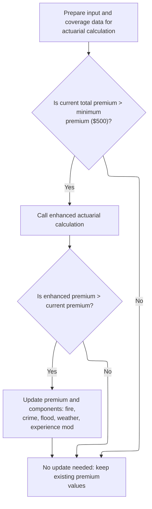

This section prepares all necessary data for an advanced actuarial premium calculation and determines whether to update premium values based on the results. It ensures that enhanced calculations are only performed when the current premium exceeds a defined minimum threshold.

| Rule ID | Category        | Rule Name                                          | Description                                                                                                                             | Implementation Details                                                                                                                                                                                                                                                                                                                                                                                                                                                                                                                                                                                                                                                                                                                                                                    |
| ------- | --------------- | -------------------------------------------------- | --------------------------------------------------------------------------------------------------------------------------------------- | ----------------------------------------------------------------------------------------------------------------------------------------------------------------------------------------------------------------------------------------------------------------------------------------------------------------------------------------------------------------------------------------------------------------------------------------------------------------------------------------------------------------------------------------------------------------------------------------------------------------------------------------------------------------------------------------------------------------------------------------------------------------------------------------- |
| BR-001  | Reading Input   | Input and coverage data preparation                | Prepare all input and coverage data fields in the required format for the actuarial calculation process.                                | All relevant input and coverage fields are mapped to local variables. The fields include customer number (string, 10 chars), risk score (number, 3 digits), property type (string, 15 chars), territory code (string, 5 chars), construction type (string, 3 chars), occupancy code (string, 5 chars), protection class (string, 2 chars), year built (number, 4 digits), square footage (number, 8 digits), years in business (number, 2 digits), claims count (number, 2 digits), claims amount (number, 9 digits + 2 decimals), building limit (number, 9 digits + 2 decimals), contents limit (number, 9 digits + 2 decimals), BI limit (number, 9 digits + 2 decimals), fire/wind/flood/other deductibles (number, 6 digits + 2 decimals), peril selections (number, 4 digits each). |
| BR-002  | Decision Making | Minimum premium threshold for enhanced calculation | Invoke the enhanced actuarial calculation only if the current total premium exceeds the minimum premium threshold of $500.              | The minimum premium threshold is $500.00. The enhanced calculation is not performed if the current premium is $500 or less.                                                                                                                                                                                                                                                                                                                                                                                                                                                                                                                                                                                                                                                               |
| BR-003  | Decision Making | Update premium on higher enhanced result           | Update the premium and its components only if the enhanced actuarial calculation returns a higher total premium than the current value. | Premium components updated include fire, crime, flood, weather, total premium, and experience modifier. Each is a number with up to 8 or 9 digits and 2 decimals, except the experience modifier which is a decimal with up to 4 digits after the decimal point.                                                                                                                                                                                                                                                                                                                                                                                                                                                                                                                          |
| BR-004  | Decision Making | Retain premium on lower or equal enhanced result   | Retain existing premium values if the enhanced calculation does not produce a higher premium.                                           | No changes are made to the premium or its components if the enhanced premium is not higher.                                                                                                                                                                                                                                                                                                                                                                                                                                                                                                                                                                                                                                                                                               |

<SwmSnippet path="/base/src/LGAPDB01.cbl" line="283">

---

In <SwmToken path="base/src/LGAPDB01.cbl" pos="283:1:7" line-data="       P011C-ENHANCED-ACTUARIAL-CALC.">`P011C-ENHANCED-ACTUARIAL-CALC`</SwmToken>, we prep all the input and coverage fields into local variables so the advanced actuarial calculation gets everything it needs in the right format.

```cobol
       P011C-ENHANCED-ACTUARIAL-CALC.
      *    Prepare input structure for actuarial calculation
           MOVE IN-CUSTOMER-NUM TO LK-CUSTOMER-NUM
           MOVE WS-BASE-RISK-SCR TO LK-RISK-SCORE
           MOVE IN-PROPERTY-TYPE TO LK-PROPERTY-TYPE
           MOVE IN-TERRITORY-CODE TO LK-TERRITORY
           MOVE IN-CONSTRUCTION-TYPE TO LK-CONSTRUCTION-TYPE
           MOVE IN-OCCUPANCY-CODE TO LK-OCCUPANCY-CODE
           MOVE IN-SPRINKLER-IND TO LK-PROTECTION-CLASS
           MOVE IN-YEAR-BUILT TO LK-YEAR-BUILT
           MOVE IN-SQUARE-FOOTAGE TO LK-SQUARE-FOOTAGE
           MOVE IN-YEARS-IN-BUSINESS TO LK-YEARS-IN-BUSINESS
           MOVE IN-CLAIMS-COUNT-3YR TO LK-CLAIMS-COUNT-5YR
           MOVE IN-CLAIMS-AMOUNT-3YR TO LK-CLAIMS-AMOUNT-5YR
           
      *    Set coverage data
           MOVE IN-BUILDING-LIMIT TO LK-BUILDING-LIMIT
           MOVE IN-CONTENTS-LIMIT TO LK-CONTENTS-LIMIT
           MOVE IN-BI-LIMIT TO LK-BI-LIMIT
           MOVE IN-FIRE-DEDUCTIBLE TO LK-FIRE-DEDUCTIBLE
           MOVE IN-WIND-DEDUCTIBLE TO LK-WIND-DEDUCTIBLE
           MOVE IN-FLOOD-DEDUCTIBLE TO LK-FLOOD-DEDUCTIBLE
           MOVE IN-OTHER-DEDUCTIBLE TO LK-OTHER-DEDUCTIBLE
           MOVE IN-FIRE-PERIL TO LK-FIRE-PERIL
           MOVE IN-CRIME-PERIL TO LK-CRIME-PERIL
           MOVE IN-FLOOD-PERIL TO LK-FLOOD-PERIL
           MOVE IN-WEATHER-PERIL TO LK-WEATHER-PERIL
```

---

</SwmSnippet>

<SwmSnippet path="/base/src/LGAPDB01.cbl" line="312">

---

After prepping the data in <SwmToken path="base/src/LGAPDB01.cbl" pos="262:3:9" line-data="               PERFORM P011C-ENHANCED-ACTUARIAL-CALC">`P011C-ENHANCED-ACTUARIAL-CALC`</SwmToken>, we call <SwmToken path="base/src/LGAPDB01.cbl" pos="313:4:4" line-data="               CALL &#39;LGAPDB04&#39; USING LK-INPUT-DATA, LK-COVERAGE-DATA, ">`LGAPDB04`</SwmToken> if the premium is above the minimum. If the enhanced calculation returns a higher premium, we update the output values.

```cobol
           IF WS-TOT-PREM > WS-MIN-PREMIUM
               CALL 'LGAPDB04' USING LK-INPUT-DATA, LK-COVERAGE-DATA, 
                                    LK-OUTPUT-RESULTS
               
      *        Update with enhanced calculations if successful
               IF LK-TOTAL-PREMIUM > WS-TOT-PREM
                   MOVE LK-FIRE-PREMIUM TO WS-FR-PREM
                   MOVE LK-CRIME-PREMIUM TO WS-CR-PREM
                   MOVE LK-FLOOD-PREMIUM TO WS-FL-PREM
                   MOVE LK-WEATHER-PREMIUM TO WS-WE-PREM
                   MOVE LK-TOTAL-PREMIUM TO WS-TOT-PREM
                   MOVE LK-EXPERIENCE-MOD TO WS-EXPERIENCE-MOD
               END-IF
           END-IF.
```

---

</SwmSnippet>

### Running advanced actuarial premium steps

```mermaid
%%{init: {"flowchart": {"defaultRenderer": "elk"}} }%%
flowchart TD
  node1["Start premium calculation"]
  click node1 openCode "base/src/LGAPDB04.cbl:138:150"
  node1 --> node2["Calculate experience modifier (years in
business, claims history)"]
  click node2 openCode "base/src/LGAPDB04.cbl:234:258"
  node2 --> node3["Calculate schedule modifier (building
age, protection class, occupancy,
exposure density)"]
  click node3 openCode "base/src/LGAPDB04.cbl:260:316"
  node3 --> node4["Calculate base premium for selected
perils (fire, crime, flood, weather)"]
  click node4 openCode "base/src/LGAPDB04.cbl:318:367"
  node4 --> node5["Apply catastrophe loadings (hurricane,
earthquake, tornado, flood)"]
  click node5 openCode "base/src/LGAPDB04.cbl:369:394"
  node5 --> node6["Add expense loads"]
  click node6 openCode "base/src/LGAPDB04.cbl:147:148"
  node6 --> node7["Apply discounts: multi-peril,
claims-free, deductible credits"]
  click node7 openCode "base/src/LGAPDB04.cbl:407:454"
  node7 --> node8{"Is total discount > 25%?"}
  click node8 openCode "base/src/LGAPDB04.cbl:447:449"
  node8 -->|"Yes"| node9["Cap total discount at 25%"]
  click node9 openCode "base/src/LGAPDB04.cbl:447:449"
  node8 -->|"No"| node10["Continue"]
  node9 --> node10
  node10 --> node11["Add taxes"]
  click node11 openCode "base/src/LGAPDB04.cbl:148:149"
  node11 --> node12["Finalize premium calculation"]
  click node12 openCode "base/src/LGAPDB04.cbl:464:477"
  node12 --> node13{"Is final rate factor > 0.05?"}
  click node13 openCode "base/src/LGAPDB04.cbl:473:477"
  node13 -->|"Yes"| node14["Cap final rate factor at 0.05"]
  click node14 openCode "base/src/LGAPDB04.cbl:474:477"
  node13 -->|"No"| node15["End"]
  node14 --> node15
  click node15 openCode "base/src/LGAPDB04.cbl:150:150"

classDef HeadingStyle fill:#777777,stroke:#333,stroke-width:2px;

%% Swimm:
%% %%{init: {"flowchart": {"defaultRenderer": "elk"}} }%%
%% flowchart TD
%%   node1["Start premium calculation"]
%%   click node1 openCode "<SwmPath>[base/src/LGAPDB04.cbl](base/src/LGAPDB04.cbl)</SwmPath>:138:150"
%%   node1 --> node2["Calculate experience modifier (years in
%% business, claims history)"]
%%   click node2 openCode "<SwmPath>[base/src/LGAPDB04.cbl](base/src/LGAPDB04.cbl)</SwmPath>:234:258"
%%   node2 --> node3["Calculate schedule modifier (building
%% age, protection class, occupancy,
%% exposure density)"]
%%   click node3 openCode "<SwmPath>[base/src/LGAPDB04.cbl](base/src/LGAPDB04.cbl)</SwmPath>:260:316"
%%   node3 --> node4["Calculate base premium for selected
%% perils (fire, crime, flood, weather)"]
%%   click node4 openCode "<SwmPath>[base/src/LGAPDB04.cbl](base/src/LGAPDB04.cbl)</SwmPath>:318:367"
%%   node4 --> node5["Apply catastrophe loadings (hurricane,
%% earthquake, tornado, flood)"]
%%   click node5 openCode "<SwmPath>[base/src/LGAPDB04.cbl](base/src/LGAPDB04.cbl)</SwmPath>:369:394"
%%   node5 --> node6["Add expense loads"]
%%   click node6 openCode "<SwmPath>[base/src/LGAPDB04.cbl](base/src/LGAPDB04.cbl)</SwmPath>:147:148"
%%   node6 --> node7["Apply discounts: multi-peril,
%% claims-free, deductible credits"]
%%   click node7 openCode "<SwmPath>[base/src/LGAPDB04.cbl](base/src/LGAPDB04.cbl)</SwmPath>:407:454"
%%   node7 --> node8{"Is total discount > 25%?"}
%%   click node8 openCode "<SwmPath>[base/src/LGAPDB04.cbl](base/src/LGAPDB04.cbl)</SwmPath>:447:449"
%%   node8 -->|"Yes"| node9["Cap total discount at 25%"]
%%   click node9 openCode "<SwmPath>[base/src/LGAPDB04.cbl](base/src/LGAPDB04.cbl)</SwmPath>:447:449"
%%   node8 -->|"No"| node10["Continue"]
%%   node9 --> node10
%%   node10 --> node11["Add taxes"]
%%   click node11 openCode "<SwmPath>[base/src/LGAPDB04.cbl](base/src/LGAPDB04.cbl)</SwmPath>:148:149"
%%   node11 --> node12["Finalize premium calculation"]
%%   click node12 openCode "<SwmPath>[base/src/LGAPDB04.cbl](base/src/LGAPDB04.cbl)</SwmPath>:464:477"
%%   node12 --> node13{"Is final rate factor > 0.05?"}
%%   click node13 openCode "<SwmPath>[base/src/LGAPDB04.cbl](base/src/LGAPDB04.cbl)</SwmPath>:473:477"
%%   node13 -->|"Yes"| node14["Cap final rate factor at 0.05"]
%%   click node14 openCode "<SwmPath>[base/src/LGAPDB04.cbl](base/src/LGAPDB04.cbl)</SwmPath>:474:477"
%%   node13 -->|"No"| node15["End"]
%%   node14 --> node15
%%   click node15 openCode "<SwmPath>[base/src/LGAPDB04.cbl](base/src/LGAPDB04.cbl)</SwmPath>:150:150"
%% 
%% classDef HeadingStyle fill:#777777,stroke:#333,stroke-width:2px;
```

This section calculates the full insurance premium for a property policy by applying actuarial modifiers, discounts, catastrophe loadings, and capping rules. It ensures the premium reflects risk, coverage, and regulatory constraints.

| Rule ID | Category    | Rule Name                                  | Description                                                                                                                                                                                                                                                                                                                                                                                                                                                                                                                                                                                                                                                                                                                                                         | Implementation Details                                                                                                                                                                                                                                                                                                                                                                                                                                                                                                                                                                                                                                                                                                                                                                                                                                                                                                                                                                                                              |
| ------- | ----------- | ------------------------------------------ | ------------------------------------------------------------------------------------------------------------------------------------------------------------------------------------------------------------------------------------------------------------------------------------------------------------------------------------------------------------------------------------------------------------------------------------------------------------------------------------------------------------------------------------------------------------------------------------------------------------------------------------------------------------------------------------------------------------------------------------------------------------------- | ----------------------------------------------------------------------------------------------------------------------------------------------------------------------------------------------------------------------------------------------------------------------------------------------------------------------------------------------------------------------------------------------------------------------------------------------------------------------------------------------------------------------------------------------------------------------------------------------------------------------------------------------------------------------------------------------------------------------------------------------------------------------------------------------------------------------------------------------------------------------------------------------------------------------------------------------------------------------------------------------------------------------------------- |
| BR-001  | Calculation | Experience modifier assignment             | If the business has been operating for at least 5 years and has zero claims in the past 5 years, the experience modifier is set to 0.85. Otherwise, it is calculated based on claims ratio and credibility, capped between 0.5 and 2.0. If the business is younger than 5 years, the modifier is set to 1.1.                                                                                                                                                                                                                                                                                                                                                                                                                                                        | Experience modifier is set to 0.85 for claim-free, established businesses, calculated as 1.0 + (claims amount / total insured value) \* credibility \* 0.5 otherwise, capped at 2.0 max and 0.5 min. For businesses <5 years, set to 1.1. Modifier is a decimal value.                                                                                                                                                                                                                                                                                                                                                                                                                                                                                                                                                                                                                                                                                                                                                              |
| BR-002  | Calculation | Schedule modifier calculation and clamping | The schedule modifier is adjusted based on building age, protection class, occupancy code, and exposure density, with each factor using defined ranges and constants. The final modifier is clamped between +<SwmToken path="base/src/LGAPDB04.cbl" pos="308:12:14" line-data="           IF WS-SCHEDULE-MOD &gt; +0.400">`0.400`</SwmToken> and <SwmToken path="base/src/LGAPDB04.cbl" pos="312:11:14" line-data="           IF WS-SCHEDULE-MOD &lt; -0.200">`-0.200`</SwmToken>.                                                                                                                                                                                                                                                                                  | Building age, protection class, occupancy code, and exposure density each adjust the modifier by set increments. Final value is clamped to a maximum of +<SwmToken path="base/src/LGAPDB04.cbl" pos="308:12:14" line-data="           IF WS-SCHEDULE-MOD &gt; +0.400">`0.400`</SwmToken> and minimum of <SwmToken path="base/src/LGAPDB04.cbl" pos="312:11:14" line-data="           IF WS-SCHEDULE-MOD &lt; -0.200">`-0.200`</SwmToken>. Modifier is a decimal value.                                                                                                                                                                                                                                                                                                                                                                                                                                                                                                                                                              |
| BR-003  | Calculation | Peril inclusion and adjustment             | Premiums for each peril (fire, crime, flood, weather) are calculated only if the peril is selected (value > 0). Crime and flood premiums receive additional adjustment factors (<SwmToken path="base/src/LGAPDB02.cbl" pos="54:3:5" line-data="               MOVE 0.80 TO WS-FIRE-FACTOR">`0.80`</SwmToken> and <SwmToken path="base/src/LGAPDB04.cbl" pos="352:9:11" line-data="                   WS-TREND-FACTOR * 1.25">`1.25`</SwmToken>, respectively). Only positive peril values are included in the base premium sum.                                                                                                                                                                                                                                     | Crime premium is multiplied by <SwmToken path="base/src/LGAPDB02.cbl" pos="54:3:5" line-data="               MOVE 0.80 TO WS-FIRE-FACTOR">`0.80`</SwmToken>, flood premium by <SwmToken path="base/src/LGAPDB04.cbl" pos="352:9:11" line-data="                   WS-TREND-FACTOR * 1.25">`1.25`</SwmToken>. Only perils with a positive value are included in the calculation. Premiums are summed into the base amount.                                                                                                                                                                                                                                                                                                                                                                                                                                                                                                                                                                                                           |
| BR-004  | Calculation | Catastrophe loading inclusion              | Catastrophe loadings are added for hurricane, earthquake, tornado, and flood. Hurricane and tornado loadings are included only if weather peril is selected, flood loading only if flood peril is selected, and earthquake loading is always included. Each uses a specific factor.                                                                                                                                                                                                                                                                                                                                                                                                                                                                                 | Hurricane and tornado loadings are applied only if weather peril is selected. Flood loading is applied only if flood peril is selected. Earthquake loading is always applied. Each uses a domain-specific factor. The total is stored for premium breakdown.                                                                                                                                                                                                                                                                                                                                                                                                                                                                                                                                                                                                                                                                                                                                                                        |
| BR-005  | Calculation | Discount calculation and capping           | Total discount is calculated by summing multi-peril, claims-free, and deductible credits. <SwmToken path="base/src/LGAPDB04.cbl" pos="410:3:5" line-data="      * Multi-peril discount">`Multi-peril`</SwmToken> discount is 0.10 if all perils are selected, 0.05 if fire and weather plus one other peril are selected. <SwmToken path="base/src/LGAPDB04.cbl" pos="425:3:5" line-data="      * Claims-free discount  ">`Claims-free`</SwmToken> discount is <SwmToken path="base/src/LGAPDB04.cbl" pos="292:3:5" line-data="                   ADD 0.075 TO WS-SCHEDULE-MOD">`0.075`</SwmToken> if no claims in 5 years and business is at least 5 years old. Deductible credits are added based on deductible thresholds. The total discount is capped at 0.25. | <SwmToken path="base/src/LGAPDB04.cbl" pos="410:3:5" line-data="      * Multi-peril discount">`Multi-peril`</SwmToken> discount: 0.10 (all perils), 0.05 (fire, weather, and one other). <SwmToken path="base/src/LGAPDB04.cbl" pos="425:3:5" line-data="      * Claims-free discount  ">`Claims-free`</SwmToken>: <SwmToken path="base/src/LGAPDB04.cbl" pos="292:3:5" line-data="                   ADD 0.075 TO WS-SCHEDULE-MOD">`0.075`</SwmToken> (no claims, >=5 years). Deductible credits: <SwmToken path="base/src/LGAPDB04.cbl" pos="290:3:5" line-data="                   SUBTRACT 0.025 FROM WS-SCHEDULE-MOD">`0.025`</SwmToken> (fire >=10,000), <SwmToken path="base/src/LGAPDB04.cbl" pos="437:3:5" line-data="               ADD 0.035 TO WS-DEDUCTIBLE-CREDIT">`0.035`</SwmToken> (wind >=25,000), <SwmToken path="base/src/LGAPDB04.cbl" pos="440:3:5" line-data="               ADD 0.045 TO WS-DEDUCTIBLE-CREDIT">`0.045`</SwmToken> (flood >=50,000). Total discount capped at 0.25. All values are decimals. |
| BR-006  | Calculation | Final rate factor capping                  | The final rate factor is calculated as total premium divided by total insured value. If the final rate factor exceeds 0.05, it is capped at 0.05 and the premium is recalculated to match the cap.                                                                                                                                                                                                                                                                                                                                                                                                                                                                                                                                                                  | Final rate factor is a decimal value, capped at 0.05. Premium is recalculated as total insured value times capped rate factor.                                                                                                                                                                                                                                                                                                                                                                                                                                                                                                                                                                                                                                                                                                                                                                                                                                                                                                      |

<SwmSnippet path="/base/src/LGAPDB04.cbl" line="138">

---

<SwmToken path="base/src/LGAPDB04.cbl" pos="138:1:3" line-data="       P100-MAIN.">`P100-MAIN`</SwmToken> in <SwmPath>[base/src/LGAPDB04.cbl](base/src/LGAPDB04.cbl)</SwmPath> runs a chain of steps—init, rates, exposure, modifiers, base premium, catastrophe loading, expenses, discounts, taxes, and final capping. Each step adds a piece to the premium calculation, so the output is fully detailed.

```cobol
       P100-MAIN.
           PERFORM P200-INIT
           PERFORM P300-RATES
           PERFORM P350-EXPOSURE
           PERFORM P400-EXP-MOD
           PERFORM P500-SCHED-MOD
           PERFORM P600-BASE-PREM
           PERFORM P700-CAT-LOAD
           PERFORM P800-EXPENSE
           PERFORM P900-DISC
           PERFORM P950-TAXES
           PERFORM P999-FINAL
           GOBACK.
```

---

</SwmSnippet>

<SwmSnippet path="/base/src/LGAPDB04.cbl" line="234">

---

<SwmToken path="base/src/LGAPDB04.cbl" pos="234:1:5" line-data="       P400-EXP-MOD.">`P400-EXP-MOD`</SwmToken> calculates the experience modifier: 0.85 for claim-free, established businesses, otherwise it bumps up based on claims ratio and credibility, capped between 0.5 and 2.0. Shorter business history gets a default of 1.1. The modifier is then moved to the output results.

```cobol
       P400-EXP-MOD.
           MOVE 1.0000 TO WS-EXPERIENCE-MOD
           
           IF LK-YEARS-IN-BUSINESS >= 5
               IF LK-CLAIMS-COUNT-5YR = ZERO
                   MOVE 0.8500 TO WS-EXPERIENCE-MOD
               ELSE
                   COMPUTE WS-EXPERIENCE-MOD = 
                       1.0000 + 
                       ((LK-CLAIMS-AMOUNT-5YR / WS-TOTAL-INSURED-VAL) * 
                        WS-CREDIBILITY-FACTOR * 0.50)
                   
                   IF WS-EXPERIENCE-MOD > 2.0000
                       MOVE 2.0000 TO WS-EXPERIENCE-MOD
                   END-IF
                   
                   IF WS-EXPERIENCE-MOD < 0.5000
                       MOVE 0.5000 TO WS-EXPERIENCE-MOD
                   END-IF
               END-IF
           ELSE
               MOVE 1.1000 TO WS-EXPERIENCE-MOD
           END-IF
           
           MOVE WS-EXPERIENCE-MOD TO LK-EXPERIENCE-MOD.
```

---

</SwmSnippet>

<SwmSnippet path="/base/src/LGAPDB04.cbl" line="260">

---

<SwmToken path="base/src/LGAPDB04.cbl" pos="260:1:5" line-data="       P500-SCHED-MOD.">`P500-SCHED-MOD`</SwmToken> calculates the schedule modification factor by adjusting for building age, protection class, occupancy code, and exposure density. Each adjustment uses hardcoded ranges and constants, and the final value is clamped between +<SwmToken path="base/src/LGAPDB04.cbl" pos="308:12:14" line-data="           IF WS-SCHEDULE-MOD &gt; +0.400">`0.400`</SwmToken> and <SwmToken path="base/src/LGAPDB04.cbl" pos="312:11:14" line-data="           IF WS-SCHEDULE-MOD &lt; -0.200">`-0.200`</SwmToken>. This step is all about tweaking the premium based on risk factors that aren't captured elsewhere.

```cobol
       P500-SCHED-MOD.
           MOVE +0.000 TO WS-SCHEDULE-MOD
           
      *    Building age factor
           EVALUATE TRUE
               WHEN LK-YEAR-BUILT >= 2010
                   SUBTRACT 0.050 FROM WS-SCHEDULE-MOD
               WHEN LK-YEAR-BUILT >= 1990
                   CONTINUE
               WHEN LK-YEAR-BUILT >= 1970
                   ADD 0.100 TO WS-SCHEDULE-MOD
               WHEN OTHER
                   ADD 0.200 TO WS-SCHEDULE-MOD
           END-EVALUATE
           
      *    Protection class factor
           EVALUATE LK-PROTECTION-CLASS
               WHEN '01' THRU '03'
                   SUBTRACT 0.100 FROM WS-SCHEDULE-MOD
               WHEN '04' THRU '06'
                   SUBTRACT 0.050 FROM WS-SCHEDULE-MOD
               WHEN '07' THRU '09'
                   CONTINUE
               WHEN OTHER
                   ADD 0.150 TO WS-SCHEDULE-MOD
           END-EVALUATE
           
      *    Occupancy hazard factor
           EVALUATE LK-OCCUPANCY-CODE
               WHEN 'OFF01' THRU 'OFF05'
                   SUBTRACT 0.025 FROM WS-SCHEDULE-MOD
               WHEN 'MFG01' THRU 'MFG10'
                   ADD 0.075 TO WS-SCHEDULE-MOD
               WHEN 'WHS01' THRU 'WHS05'
                   ADD 0.125 TO WS-SCHEDULE-MOD
               WHEN OTHER
                   CONTINUE
           END-EVALUATE
           
      *    Exposure density factor
           IF WS-EXPOSURE-DENSITY > 500.00
               ADD 0.100 TO WS-SCHEDULE-MOD
           ELSE
               IF WS-EXPOSURE-DENSITY < 50.00
                   SUBTRACT 0.050 FROM WS-SCHEDULE-MOD
               END-IF
           END-IF
           
           IF WS-SCHEDULE-MOD > +0.400
               MOVE +0.400 TO WS-SCHEDULE-MOD
           END-IF
           
           IF WS-SCHEDULE-MOD < -0.200
               MOVE -0.200 TO WS-SCHEDULE-MOD
           END-IF
           
           MOVE WS-SCHEDULE-MOD TO LK-SCHEDULE-MOD.
```

---

</SwmSnippet>

<SwmSnippet path="/base/src/LGAPDB04.cbl" line="318">

---

<SwmToken path="base/src/LGAPDB04.cbl" pos="318:1:5" line-data="       P600-BASE-PREM.">`P600-BASE-PREM`</SwmToken> loops through each peril (fire, crime, flood, weather), and if it's selected, calculates the premium using exposures, base rates, experience and schedule modifiers, and a trend factor. Crime and flood get extra adjustments (<SwmToken path="base/src/LGAPDB04.cbl" pos="336:10:12" line-data="                   (WS-CONTENTS-EXPOSURE * 0.80) *">`0.80`</SwmToken> and <SwmToken path="base/src/LGAPDB04.cbl" pos="352:9:11" line-data="                   WS-TREND-FACTOR * 1.25">`1.25`</SwmToken>). All the calculated premiums are summed into the base amount. Only perils with a positive value are included.

```cobol
       P600-BASE-PREM.
           MOVE ZERO TO LK-BASE-AMOUNT
           
      * FIRE PREMIUM
           IF LK-FIRE-PERIL > ZERO
               COMPUTE LK-FIRE-PREMIUM = 
                   (WS-BUILDING-EXPOSURE + WS-CONTENTS-EXPOSURE) *
                   WS-BASE-RATE (1, 1, 1, 1) * 
                   WS-EXPERIENCE-MOD *
                   (1 + WS-SCHEDULE-MOD) *
                   WS-TREND-FACTOR
                   
               ADD LK-FIRE-PREMIUM TO LK-BASE-AMOUNT
           END-IF
           
      * CRIME PREMIUM
           IF LK-CRIME-PERIL > ZERO
               COMPUTE LK-CRIME-PREMIUM = 
                   (WS-CONTENTS-EXPOSURE * 0.80) *
                   WS-BASE-RATE (2, 1, 1, 1) * 
                   WS-EXPERIENCE-MOD *
                   (1 + WS-SCHEDULE-MOD) *
                   WS-TREND-FACTOR
                   
               ADD LK-CRIME-PREMIUM TO LK-BASE-AMOUNT
           END-IF
           
      * FLOOD PREMIUM
           IF LK-FLOOD-PERIL > ZERO
               COMPUTE LK-FLOOD-PREMIUM = 
                   WS-BUILDING-EXPOSURE *
                   WS-BASE-RATE (3, 1, 1, 1) * 
                   WS-EXPERIENCE-MOD *
                   (1 + WS-SCHEDULE-MOD) *
                   WS-TREND-FACTOR * 1.25
                   
               ADD LK-FLOOD-PREMIUM TO LK-BASE-AMOUNT
           END-IF
           
      * WEATHER PREMIUM
           IF LK-WEATHER-PERIL > ZERO
               COMPUTE LK-WEATHER-PREMIUM = 
                   (WS-BUILDING-EXPOSURE + WS-CONTENTS-EXPOSURE) *
                   WS-BASE-RATE (4, 1, 1, 1) * 
                   WS-EXPERIENCE-MOD *
                   (1 + WS-SCHEDULE-MOD) *
                   WS-TREND-FACTOR
                   
               ADD LK-WEATHER-PREMIUM TO LK-BASE-AMOUNT
           END-IF.
```

---

</SwmSnippet>

<SwmSnippet path="/base/src/LGAPDB04.cbl" line="369">

---

<SwmToken path="base/src/LGAPDB04.cbl" pos="369:1:5" line-data="       P700-CAT-LOAD.">`P700-CAT-LOAD`</SwmToken> adds up catastrophe loadings for hurricane, earthquake, tornado, and flood. Hurricane and tornado only count if weather peril is selected, flood only if flood peril is selected, but earthquake is always included. Each uses a domain-specific factor. The total is stored for use in the premium breakdown.

```cobol
       P700-CAT-LOAD.
           MOVE ZERO TO WS-CAT-LOADING
           
      * Hurricane loading (wind/weather peril)
           IF LK-WEATHER-PERIL > ZERO
               COMPUTE WS-CAT-LOADING = WS-CAT-LOADING +
                   (LK-WEATHER-PREMIUM * WS-HURRICANE-FACTOR)
           END-IF
           
      * Earthquake loading (affects all perils)  
           COMPUTE WS-CAT-LOADING = WS-CAT-LOADING +
               (LK-BASE-AMOUNT * WS-EARTHQUAKE-FACTOR)
           
      * Tornado loading (weather peril primarily)
           IF LK-WEATHER-PERIL > ZERO
               COMPUTE WS-CAT-LOADING = WS-CAT-LOADING +
                   (LK-WEATHER-PREMIUM * WS-TORNADO-FACTOR)
           END-IF
           
      * Flood cat loading (if flood coverage selected)
           IF LK-FLOOD-PERIL > ZERO
               COMPUTE WS-CAT-LOADING = WS-CAT-LOADING +
                   (LK-FLOOD-PREMIUM * WS-FLOOD-FACTOR)
           END-IF
           
           MOVE WS-CAT-LOADING TO LK-CAT-LOAD-AMT.
```

---

</SwmSnippet>

<SwmSnippet path="/base/src/LGAPDB04.cbl" line="407">

---

<SwmToken path="base/src/LGAPDB04.cbl" pos="407:1:3" line-data="       P900-DISC.">`P900-DISC`</SwmToken> figures out the total discount by stacking up multi-peril, claims-free, and deductible credits. Each has its own threshold and value, and the total discount is capped at 0.25. The final discount amount is applied to the sum of all the premium components, so you never get more than 25% off, no matter how many discounts you qualify for.

```cobol
       P900-DISC.
           MOVE ZERO TO WS-TOTAL-DISCOUNT
           
      * Multi-peril discount
           MOVE ZERO TO WS-MULTI-PERIL-DISC
           IF LK-FIRE-PERIL > ZERO AND
              LK-CRIME-PERIL > ZERO AND
              LK-FLOOD-PERIL > ZERO AND
              LK-WEATHER-PERIL > ZERO
               MOVE 0.100 TO WS-MULTI-PERIL-DISC
           ELSE
               IF LK-FIRE-PERIL > ZERO AND
                  LK-WEATHER-PERIL > ZERO AND
                  (LK-CRIME-PERIL > ZERO OR LK-FLOOD-PERIL > ZERO)
                   MOVE 0.050 TO WS-MULTI-PERIL-DISC
               END-IF
           END-IF
           
      * Claims-free discount  
           MOVE ZERO TO WS-CLAIMS-FREE-DISC
           IF LK-CLAIMS-COUNT-5YR = ZERO AND LK-YEARS-IN-BUSINESS >= 5
               MOVE 0.075 TO WS-CLAIMS-FREE-DISC
           END-IF
           
      * Deductible credit
           MOVE ZERO TO WS-DEDUCTIBLE-CREDIT
           IF LK-FIRE-DEDUCTIBLE >= 10000
               ADD 0.025 TO WS-DEDUCTIBLE-CREDIT
           END-IF
           IF LK-WIND-DEDUCTIBLE >= 25000  
               ADD 0.035 TO WS-DEDUCTIBLE-CREDIT
           END-IF
           IF LK-FLOOD-DEDUCTIBLE >= 50000
               ADD 0.045 TO WS-DEDUCTIBLE-CREDIT
           END-IF
           
           COMPUTE WS-TOTAL-DISCOUNT = 
               WS-MULTI-PERIL-DISC + WS-CLAIMS-FREE-DISC + 
               WS-DEDUCTIBLE-CREDIT
               
           IF WS-TOTAL-DISCOUNT > 0.250
               MOVE 0.250 TO WS-TOTAL-DISCOUNT
           END-IF
           
           COMPUTE LK-DISCOUNT-AMT = 
               (LK-BASE-AMOUNT + LK-CAT-LOAD-AMT + 
                LK-EXPENSE-LOAD-AMT + LK-PROFIT-LOAD-AMT) *
               WS-TOTAL-DISCOUNT.
```

---

</SwmSnippet>

<SwmSnippet path="/base/src/LGAPDB04.cbl" line="464">

---

<SwmToken path="base/src/LGAPDB04.cbl" pos="464:1:3" line-data="       P999-FINAL.">`P999-FINAL`</SwmToken> sums up all the premium components, subtracts discounts, adds taxes, and then divides by the total insured value to get the final rate factor. If that factor is over 0.05, it's capped and the premium is recalculated. This keeps the premium from going over 5% of the insured value, no matter what.

```cobol
       P999-FINAL.
           COMPUTE LK-TOTAL-PREMIUM = 
               LK-BASE-AMOUNT + LK-CAT-LOAD-AMT + 
               LK-EXPENSE-LOAD-AMT + LK-PROFIT-LOAD-AMT -
               LK-DISCOUNT-AMT + LK-TAX-AMT
               
           COMPUTE LK-FINAL-RATE-FACTOR = 
               LK-TOTAL-PREMIUM / WS-TOTAL-INSURED-VAL
               
           IF LK-FINAL-RATE-FACTOR > 0.050000
               MOVE 0.050000 TO LK-FINAL-RATE-FACTOR
               COMPUTE LK-TOTAL-PREMIUM = 
                   WS-TOTAL-INSURED-VAL * LK-FINAL-RATE-FACTOR
           END-IF.
```

---

</SwmSnippet>

### Applying business rules and writing results

This section applies business rules to determine the underwriting decision for a policy and writes the result to the output record. It ensures that each policy receives a clear decision and supporting information for downstream processes.

| Rule ID | Category        | Rule Name                    | Description                                                                                                                             | Implementation Details                                                                                                                                                                                                                            |
| ------- | --------------- | ---------------------------- | --------------------------------------------------------------------------------------------------------------------------------------- | ------------------------------------------------------------------------------------------------------------------------------------------------------------------------------------------------------------------------------------------------- |
| BR-001  | Decision Making | Approved decision assignment | Assign the underwriting decision as 'approved' when the decision code is 0.                                                             | The decision code for 'approved' is 0. The description and notes fields are also populated accordingly. The output format includes a numeric code, a 20-character description, a 50-character rejection reason, and a 100-character notes field.  |
| BR-002  | Decision Making | Pending decision assignment  | Assign the underwriting decision as 'pending' when the decision code is 1.                                                              | The decision code for 'pending' is 1. The description and notes fields are also populated accordingly. The output format includes a numeric code, a 20-character description, a 50-character rejection reason, and a 100-character notes field.   |
| BR-003  | Decision Making | Rejected decision assignment | Assign the underwriting decision as 'rejected' when the decision code is 2 and provide a rejection reason.                              | The decision code for 'rejected' is 2. The rejection reason field is populated with up to 50 characters. The output format includes a numeric code, a 20-character description, a 50-character rejection reason, and a 100-character notes field. |
| BR-004  | Decision Making | Referred decision assignment | Assign the underwriting decision as 'referred' when the decision code is 3.                                                             | The decision code for 'referred' is 3. The description and notes fields are also populated accordingly. The output format includes a numeric code, a 20-character description, a 50-character rejection reason, and a 100-character notes field.  |
| BR-005  | Writing Output  | Output record population     | Populate the output record with the underwriting decision code, description, rejection reason, and notes after applying business rules. | The output record includes a numeric decision code, a 20-character description, a 50-character rejection reason, and a 100-character notes field. Fields are left-aligned and padded with spaces as needed.                                       |

<SwmSnippet path="/base/src/LGAPDB01.cbl" line="264">

---

Back in <SwmToken path="base/src/LGAPDB01.cbl" pos="236:3:7" line-data="               PERFORM P011-PROCESS-COMMERCIAL">`P011-PROCESS-COMMERCIAL`</SwmToken>, after all the calculations, we call <SwmToken path="base/src/LGAPDB01.cbl" pos="264:3:9" line-data="           PERFORM P011D-APPLY-BUSINESS-RULES">`P011D-APPLY-BUSINESS-RULES`</SwmToken> to actually decide if the policy is approved, pending, or rejected. This is where the risk score and premium get turned into a real underwriting decision, which is needed before we write the output record or update stats. Skipping this would mean the output has no decision or reason, so it's not useful for anyone.

```cobol
           PERFORM P011D-APPLY-BUSINESS-RULES
           PERFORM P011E-WRITE-OUTPUT-RECORD
           PERFORM P011F-UPDATE-STATISTICS.
```

---

</SwmSnippet>

### Making the underwriting decision

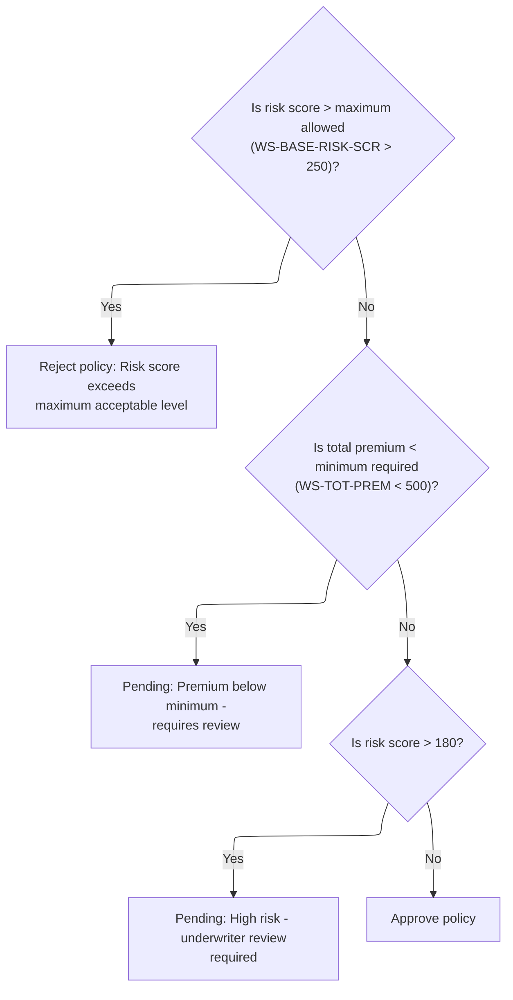

This section determines the underwriting decision for a policy by evaluating the risk score and premium against business-defined thresholds. The outcome is used to drive downstream processing and user communication.

| Rule ID | Category        | Rule Name               | Description                                                                                                                                                                                                                                                               | Implementation Details                                                                                                                                                                                                                                                 |
| ------- | --------------- | ----------------------- | ------------------------------------------------------------------------------------------------------------------------------------------------------------------------------------------------------------------------------------------------------------------------- | ---------------------------------------------------------------------------------------------------------------------------------------------------------------------------------------------------------------------------------------------------------------------- |
| BR-001  | Decision Making | Risk score rejection    | If the risk score is greater than the maximum allowed (250), the policy is rejected. The status code is set to 2 (REJECTED), the status description is set to 'REJECTED', and the rejection reason is set to 'Risk score exceeds maximum acceptable level'.               | The maximum allowed risk score is 250. The status code for rejection is 2. The status description is 'REJECTED'. The rejection reason is 'Risk score exceeds maximum acceptable level'. The rejection reason is a string up to 50 characters.                          |
| BR-002  | Decision Making | Minimum premium pending | If the total premium is less than the minimum required (500), the policy is marked as pending. The status code is set to 1 (PENDING), the status description is set to 'PENDING', and the rejection reason is set to 'Premium below minimum - requires review'.           | The minimum required premium is 500. The status code for pending is 1. The status description is 'PENDING'. The rejection reason is 'Premium below minimum - requires review'. The rejection reason is a string up to 50 characters.                                   |
| BR-003  | Decision Making | High risk pending       | If the risk score is greater than 180 but not over the maximum allowed, the policy is marked as pending. The status code is set to 1 (PENDING), the status description is set to 'PENDING', and the rejection reason is set to 'High risk - underwriter review required'. | The high risk threshold is 180. The maximum allowed risk score is 250. The status code for pending is 1. The status description is 'PENDING'. The rejection reason is 'High risk - underwriter review required'. The rejection reason is a string up to 50 characters. |
| BR-004  | Decision Making | Default approval        | If none of the risk or premium checks are triggered, the policy is approved. The status code is set to 0 (APPROVED), the status description is set to 'APPROVED', and the rejection reason is cleared.                                                                    | The status code for approval is 0. The status description is 'APPROVED'. The rejection reason is cleared (set to blank). The rejection reason is a string up to 50 characters.                                                                                         |

<SwmSnippet path="/base/src/LGAPDB01.cbl" line="327">

---

In <SwmToken path="base/src/LGAPDB01.cbl" pos="327:1:7" line-data="       P011D-APPLY-BUSINESS-RULES.">`P011D-APPLY-BUSINESS-RULES`</SwmToken>, we start by checking if the risk score or premium hit certain thresholds. If the risk score is over the configured max, we set the status to REJECTED (2) and fill in the reason. These numeric codes (2, 1, 0) are used everywhere to represent REJECTED, PENDING, and APPROVED, so this step is what sets that up.

```cobol
       P011D-APPLY-BUSINESS-RULES.
      *    Determine underwriting decision based on enhanced criteria
           EVALUATE TRUE
               WHEN WS-BASE-RISK-SCR > WS-MAX-RISK-SCORE
                   MOVE 2 TO WS-STAT
                   MOVE 'REJECTED' TO WS-STAT-DESC
                   MOVE 'Risk score exceeds maximum acceptable level' 
                        TO WS-REJ-RSN
```

---

</SwmSnippet>

<SwmSnippet path="/base/src/LGAPDB01.cbl" line="335">

---

Next, if the premium is below the minimum, we set the status to PENDING (1) and give a reason that it needs review. This is different from the outright rejection above—here, the policy isn't denied, but it can't be auto-approved either, so it gets flagged for manual review.

```cobol
               WHEN WS-TOT-PREM < WS-MIN-PREMIUM
                   MOVE 1 TO WS-STAT
                   MOVE 'PENDING' TO WS-STAT-DESC
                   MOVE 'Premium below minimum - requires review'
                        TO WS-REJ-RSN
```

---

</SwmSnippet>

<SwmSnippet path="/base/src/LGAPDB01.cbl" line="340">

---

If the risk score is above 180 but not over the max, we set the status to PENDING (1) and note that underwriter review is required. This catches high-risk cases that aren't bad enough for rejection but still need a human to look at them. The 180 threshold is just a business rule baked into the code.

```cobol
               WHEN WS-BASE-RISK-SCR > 180
                   MOVE 1 TO WS-STAT
                   MOVE 'PENDING' TO WS-STAT-DESC
                   MOVE 'High risk - underwriter review required'
                        TO WS-REJ-RSN
```

---

</SwmSnippet>

<SwmSnippet path="/base/src/LGAPDB01.cbl" line="345">

---

Finally, if none of the risk or premium checks triggered, we set the status to APPROVED (0), clear the rejection reason, and mark the policy as good to go. This is the default path for policies that pass all the business rules.

```cobol
               WHEN OTHER
                   MOVE 0 TO WS-STAT
                   MOVE 'APPROVED' TO WS-STAT-DESC
                   MOVE SPACES TO WS-REJ-RSN
           END-EVALUATE.
```

---

</SwmSnippet>

### Writing output and updating stats

This section ensures that, after business rules are applied to an insurance application, the results are recorded and summary statistics are updated for reporting and analysis.

| Rule ID | Category       | Rule Name                          | Description                                                                                                                                                                                                              | Implementation Details                                                                                                                                                                                                                                                                                                |
| ------- | -------------- | ---------------------------------- | ------------------------------------------------------------------------------------------------------------------------------------------------------------------------------------------------------------------------ | --------------------------------------------------------------------------------------------------------------------------------------------------------------------------------------------------------------------------------------------------------------------------------------------------------------------- |
| BR-001  | Calculation    | Update statistics after processing | After writing the output record, statistics are updated to reflect the results of the processed insurance application, including counters for total premium, approved, pending, rejected, referred, and high-risk cases. | Statistics include counters for total premium and underwriting decision outcomes. Underwriting decision values are: 0 = approved, 1 = pending, 2 = rejected, 3 = referred. High-risk cases are tracked if present in the code logic. All counters are incremented based on the processed application result.          |
| BR-002  | Writing Output | Write processed output record      | After business rules are applied to an insurance application, an output record is written to capture the processed result.                                                                                               | The output record contains the processed result of the insurance application. The specific format is determined by the business data required for reporting and downstream processing, such as underwriting decision, premium, and discount factors. Field sizes and alignment are not specified in the code snippet. |

<SwmSnippet path="/base/src/LGAPDB01.cbl" line="264">

---

After returning from <SwmToken path="base/src/LGAPDB01.cbl" pos="264:3:9" line-data="           PERFORM P011D-APPLY-BUSINESS-RULES">`P011D-APPLY-BUSINESS-RULES`</SwmToken> in <SwmToken path="base/src/LGAPDB01.cbl" pos="236:3:7" line-data="               PERFORM P011-PROCESS-COMMERCIAL">`P011-PROCESS-COMMERCIAL`</SwmToken>, we write the output record and then call <SwmToken path="base/src/LGAPDB01.cbl" pos="266:3:7" line-data="           PERFORM P011F-UPDATE-STATISTICS.">`P011F-UPDATE-STATISTICS`</SwmToken>. This step bumps the counters for things like total premium, approved/pending/rejected counts, and high-risk cases. Without it, the summary and reporting at the end would be missing or wrong.

```cobol
           PERFORM P011D-APPLY-BUSINESS-RULES
           PERFORM P011E-WRITE-OUTPUT-RECORD
           PERFORM P011F-UPDATE-STATISTICS.
```

---

</SwmSnippet>

## Updating counters and risk totals

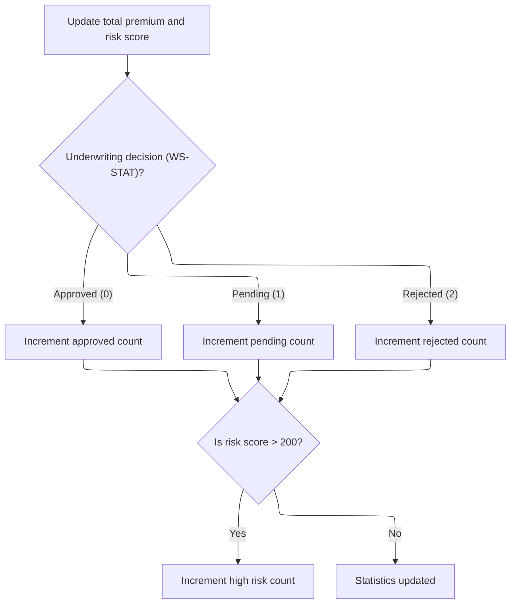

This section updates business statistics after each policy is processed. It ensures that all relevant counters reflect the latest policy decision and risk assessment.

| Rule ID | Category    | Rule Name                   | Description                                                                                                  | Implementation Details                                                                                                                                              |
| ------- | ----------- | --------------------------- | ------------------------------------------------------------------------------------------------------------ | ------------------------------------------------------------------------------------------------------------------------------------------------------------------- |
| BR-001  | Calculation | Accumulate total premium    | Add the current policy's total premium to the running total premium amount.                                  | The total premium is a number with up to 12 digits and 2 decimal places. The running total is updated by adding the current policy's premium to the existing total. |
| BR-002  | Calculation | Accumulate total risk score | Add the current policy's base risk score to the running total risk score.                                    | The base risk score is a number with up to 3 digits. The running total is updated by adding the current policy's risk score to the existing total.                  |
| BR-003  | Calculation | Update decision counters    | Increment the approved, pending, or rejected counter based on the underwriting decision code for the policy. | The counters are numbers with up to 6 digits. The approved counter is incremented for code 0, pending for code 1, and rejected for code 2.                          |
| BR-004  | Calculation | Flag high-risk policies     | Increment the high-risk counter if the policy's base risk score exceeds 200.                                 | The high-risk counter is a number with up to 6 digits. The threshold for high risk is a base risk score over 200.                                                   |

<SwmSnippet path="/base/src/LGAPDB01.cbl" line="365">

---

In <SwmToken path="base/src/LGAPDB01.cbl" pos="365:1:5" line-data="       P011F-UPDATE-STATISTICS.">`P011F-UPDATE-STATISTICS`</SwmToken>, we add the current premium and risk score to the running totals, then increment the approved, pending, or rejected counter based on <SwmToken path="base/src/LGAPDB01.cbl" pos="369:3:5" line-data="           EVALUATE WS-STAT">`WS-STAT`</SwmToken>. If the risk score is over 200, we also bump the high-risk counter. These numbers feed into the summary and analytics at the end.

```cobol
       P011F-UPDATE-STATISTICS.
           ADD WS-TOT-PREM TO WS-TOTAL-PREMIUM-AMT
           ADD WS-BASE-RISK-SCR TO WS-CONTROL-TOTALS
           
           EVALUATE WS-STAT
               WHEN 0 ADD 1 TO WS-APPROVED-CNT
               WHEN 1 ADD 1 TO WS-PENDING-CNT
               WHEN 2 ADD 1 TO WS-REJECTED-CNT
           END-EVALUATE
```

---

</SwmSnippet>

<SwmSnippet path="/base/src/LGAPDB01.cbl" line="375">

---

After updating the main counters, if the risk score is over 200, we increment the high-risk counter. This doesn't change the policy's outcome, but it shows up in the summary so the business can see how many risky policies they're dealing with.

```cobol
           IF WS-BASE-RISK-SCR > 200
               ADD 1 TO WS-HIGH-RISK-CNT
           END-IF.
```

---

</SwmSnippet>

## Routing valid records by policy type

This section routes records by policy type, ensuring that only commercial policies are processed further. Non-commercial policies are marked as unsupported and output with zeroed premium and risk fields.

| Rule ID | Category       | Rule Name                                       | Description                                                                                                                                                            | Implementation Details                                                                                                                                                                                  |
| ------- | -------------- | ----------------------------------------------- | ---------------------------------------------------------------------------------------------------------------------------------------------------------------------- | ------------------------------------------------------------------------------------------------------------------------------------------------------------------------------------------------------- |
| BR-001  | Writing Output | Copy basic fields for unsupported policies      | For non-commercial policies, the output record copies the customer number, property type, and postcode from the input record.                                          | The customer number is a string of 10 characters, property type is a string of 15 characters, and postcode is a string of 8 characters. These are copied as-is from the input to the output.            |
| BR-002  | Writing Output | Zero premiums and risk for unsupported policies | For non-commercial policies, all premium and risk score fields in the output record are set to zero.                                                                   | Risk score and all premium fields are numeric and set to zero in the output record.                                                                                                                     |
| BR-003  | Writing Output | Mark unsupported policy type                    | For non-commercial policies, the output record status is set to 'UNSUPPORTED' and the rejection reason is set to 'Only Commercial policies supported in this version'. | The status field is set to the string 'UNSUPPORTED'. The rejection reason is set to the string 'Only Commercial policies supported in this version'. Both are alphanumeric fields in the output record. |

<SwmSnippet path="/base/src/LGAPDB01.cbl" line="379">

---

<SwmToken path="base/src/LGAPDB01.cbl" pos="379:1:7" line-data="       P012-PROCESS-NON-COMMERCIAL.">`P012-PROCESS-NON-COMMERCIAL`</SwmToken> just copies over the customer number, property type, and postcode, then sets all the premium fields and risk score to zero. It marks the status as 'UNSUPPORTED' and gives a fixed rejection reason. This makes it clear in the output that only commercial policies are handled, and everything else is ignored for now.

```cobol
       P012-PROCESS-NON-COMMERCIAL.
           MOVE IN-CUSTOMER-NUM TO OUT-CUSTOMER-NUM
           MOVE IN-PROPERTY-TYPE TO OUT-PROPERTY-TYPE
           MOVE IN-POSTCODE TO OUT-POSTCODE
           MOVE ZERO TO OUT-RISK-SCORE
           MOVE ZERO TO OUT-FIRE-PREMIUM
           MOVE ZERO TO OUT-CRIME-PREMIUM
           MOVE ZERO TO OUT-FLOOD-PREMIUM
           MOVE ZERO TO OUT-WEATHER-PREMIUM
           MOVE ZERO TO OUT-TOTAL-PREMIUM
           MOVE 'UNSUPPORTED' TO OUT-STATUS
           MOVE 'Only Commercial policies supported in this version' 
                TO OUT-REJECT-REASON
           WRITE OUTPUT-RECORD.
```

---

</SwmSnippet>

&nbsp;

*This is an auto-generated document by Swimm 🌊 and has not yet been verified by a human*

<SwmMeta version="3.0.0" repo-id="Z2l0aHViJTNBJTNBU3dpbW1pby1nZW5hcHAtaG91c2UlM0ElM0FHaXJpLVN3aW1t" repo-name="Swimmio-genapp-house"><sup>Powered by [Swimm](https://app.swimm.io/)</sup></SwmMeta>
