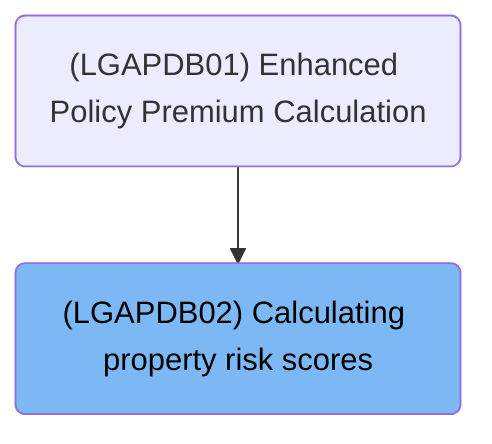
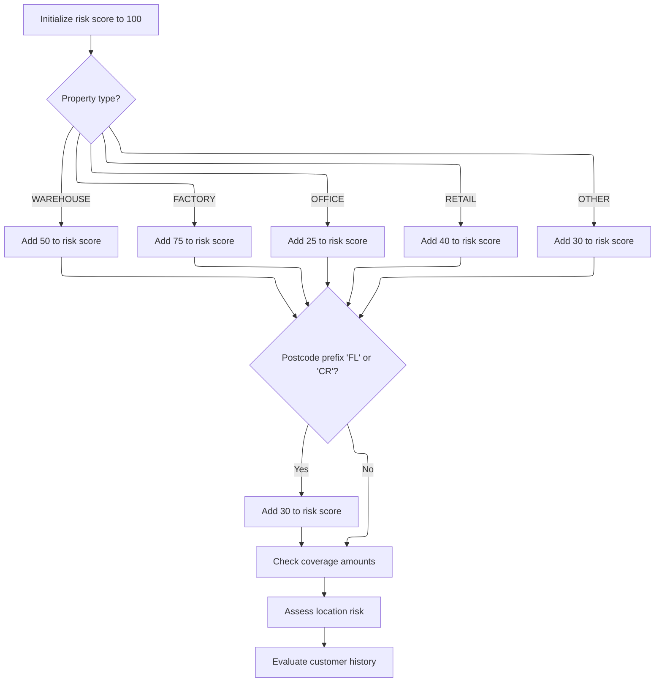
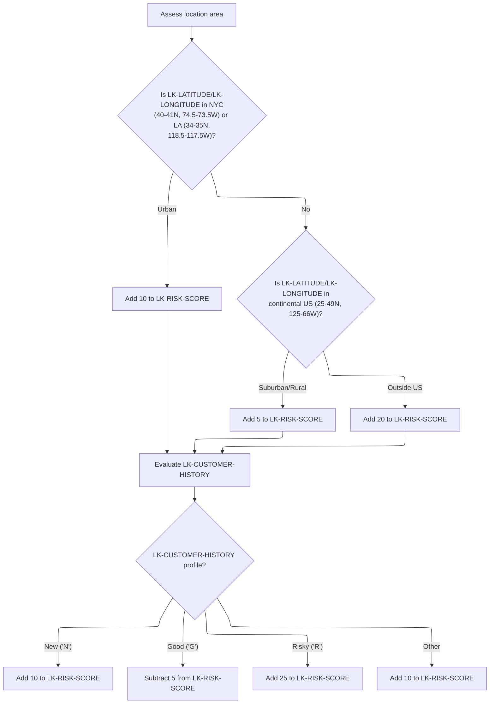

# Overview

This document explains the flow for calculating property risk scores used in insurance evaluation. The process ensures risk factors are available and combines property, coverage, location, and customer history to produce a comprehensive risk score.

## Dependencies

### Program

- <SwmToken path="base/src/LGAPDB02.cbl" pos="2:6:6" line-data="       PROGRAM-ID. LGAPDB02.">`LGAPDB02`</SwmToken> (<SwmPath>[base/src/LGAPDB02.cbl](base/src/LGAPDB02.cbl)</SwmPath>)

### Copybook

- SQLCA

# Where is this program used?

This program is used once, as represented in the following diagram:



## Input and Output Tables/Files used

### <SwmToken path="base/src/LGAPDB02.cbl" pos="2:6:6" line-data="       PROGRAM-ID. LGAPDB02.">`LGAPDB02`</SwmToken> (<SwmPath>[base/src/LGAPDB02.cbl](base/src/LGAPDB02.cbl)</SwmPath>)

| Table / File Name                                                                                                          | Type | Description                                                  | Usage Mode | Key Fields / Layout Highlights                                                                                                                                                                                                                                                                               |
| -------------------------------------------------------------------------------------------------------------------------- | ---- | ------------------------------------------------------------ | ---------- | ------------------------------------------------------------------------------------------------------------------------------------------------------------------------------------------------------------------------------------------------------------------------------------------------------------ |
| <SwmToken path="base/src/LGAPDB02.cbl" pos="47:3:3" line-data="               FROM RISK_FACTORS">`RISK_FACTORS`</SwmToken> | DB2  | Peril-specific risk adjustment factors for insurance scoring | Input      | <SwmToken path="base/src/LGAPDB02.cbl" pos="46:8:12" line-data="               SELECT FACTOR_VALUE INTO :WS-FIRE-FACTOR">`WS-FIRE-FACTOR`</SwmToken>, <SwmToken path="base/src/LGAPDB02.cbl" pos="58:8:12" line-data="               SELECT FACTOR_VALUE INTO :WS-CRIME-FACTOR">`WS-CRIME-FACTOR`</SwmToken> |

## Detailed View of the Program's Functionality

a. Program Initialization and Entry Point

The program begins by defining its identity and environment. It sets up storage for working variables, including placeholders for risk factors and coverage amounts. It also defines the input parameters it expects to receive, such as property type, postcode, latitude, longitude, coverage amounts for various hazards, customer history, and the risk score to be calculated.

The main entry point of the program is a procedure that receives these parameters and orchestrates the risk calculation process.

b. Main Logic Sequence

The main logic is straightforward and sequential. It performs three primary actions in order:

1. It retrieves risk factors for relevant hazards (fire and crime).
2. It calculates the risk score for the property using the retrieved factors and input parameters.
3. It exits the program, returning control to the caller.

c. Retrieving Risk Factors

The program first attempts to fetch the fire risk factor from a database table dedicated to risk factors. If the database query is successful, it uses the value retrieved. If the query fails (for example, if the value is missing or the database is unavailable), it assigns a default value of <SwmToken path="base/src/LGAPDB02.cbl" pos="54:3:5" line-data="               MOVE 0.80 TO WS-FIRE-FACTOR">`0.80`</SwmToken> for the fire risk factor.

Next, it performs a similar operation for the crime risk factor. It queries the database for the crime risk factor, and if successful, uses the value. If not, it assigns a default value of <SwmToken path="base/src/LGAPDB02.cbl" pos="66:3:5" line-data="               MOVE 0.60 TO WS-CRIME-FACTOR">`0.60`</SwmToken>. This ensures that both fire and crime risk factors are always available for subsequent calculations, either from the database or as hardcoded defaults.

d. Calculating the Risk Score

The risk score calculation starts by initializing the score to 100. The program then adjusts this score based on several criteria:

- Property Type Adjustment: Depending on the type of property, a fixed value is added to the score. Warehouses add 50, factories add 75, offices add 25, retail properties add 40, and any other type adds 30. This adjustment reflects the inherent risk associated with different property types.

- Postcode Adjustment: If the postcode begins with certain prefixes ('FL' or 'CR'), an additional 30 points are added to the score. This likely reflects domain-specific risk associated with these regions.

- Coverage Amounts Adjustment: The program checks the coverage amounts for fire, crime, flood, and weather hazards. It determines the highest coverage among these. If the maximum coverage exceeds 500,000, it adds 15 points to the risk score.

- Location Risk Assessment: The program evaluates the property's location using latitude and longitude. If the property is in major urban areas (NYC or LA, based on specific latitude and longitude ranges), it adds 10 points. If the property is elsewhere in the continental US, it adds 5 points. If the property is outside the continental US, it adds 20 points, reflecting higher risk.

- Customer History Adjustment: The program adjusts the score based on customer history. If the customer is new, it adds 10 points. If the customer has a good history, it subtracts 5 points. If the customer is considered risky, it adds 25 points. For any other customer profile, it adds 10 points.

e. Coverage Amounts Evaluation

The program systematically checks each coverage type (fire, crime, flood, weather) to find the highest coverage value. It starts with zero and updates the maximum as it compares each coverage. Once the maximum is determined, it checks if this value exceeds 500,000. If so, it increases the risk score by 15 points.

f. Location and Customer History Assessment

For location, the program uses latitude and longitude to determine if the property is in NYC or LA, in the continental US, or outside the US. Each location category results in a different adjustment to the risk score, with urban areas receiving a moderate increase, suburban/rural areas a smaller increase, and properties outside the US a significant increase.

For customer history, the program uses a single-character profile to determine the adjustment. New customers receive a moderate increase, good customers receive a reduction, risky customers receive a large increase, and any other profile receives a moderate increase.

g. Program Exit

After all adjustments are made, the program completes its calculations and exits, returning the final risk score to the caller. This score reflects the cumulative risk based on property type, postcode, coverage amounts, location, and customer history.

# Data Definitions

### <SwmToken path="base/src/LGAPDB02.cbl" pos="2:6:6" line-data="       PROGRAM-ID. LGAPDB02.">`LGAPDB02`</SwmToken> (<SwmPath>[base/src/LGAPDB02.cbl](base/src/LGAPDB02.cbl)</SwmPath>)

| Table / Record Name                                                                                                        | Type | Short Description                                            | Usage Mode     |
| -------------------------------------------------------------------------------------------------------------------------- | ---- | ------------------------------------------------------------ | -------------- |
| <SwmToken path="base/src/LGAPDB02.cbl" pos="47:3:3" line-data="               FROM RISK_FACTORS">`RISK_FACTORS`</SwmToken> | DB2  | Peril-specific risk adjustment factors for insurance scoring | Input (SELECT) |

# Rule Definition

| Paragraph Name                             | Rule ID | Category        | Description                                                                                                                                                                                                                                                      | Conditions                                      | Remarks                                       |
| ------------------------------------------ | ------- | --------------- | ---------------------------------------------------------------------------------------------------------------------------------------------------------------------------------------------------------------------------------------------------------------- | ----------------------------------------------- | --------------------------------------------- |
| LINKAGE SECTION, PROCEDURE DIVISION header | RL-001  | Data Assignment | The program must accept input parameters in a specific order and type, including property type, postcode, latitude, longitude, fire coverage, crime coverage, flood coverage, weather coverage, customer history, and output the risk score as a 3-digit number. | On program invocation via the main entry point. | \- Property type: string, up to 15 characters |

- Postcode: string, up to 8 characters
- Latitude: signed decimal, 7 digits before and 6 after the decimal
- Longitude: signed decimal, 8 digits before and 6 after the decimal
- Fire/Crime/Flood/Weather coverage: decimal, up to 8 digits before and 2 after the decimal
- Customer history: single character ('N', 'G', 'R', or other)
- Risk score: numeric, 3 digits (output only) | | <SwmToken path="base/src/LGAPDB02.cbl" pos="40:3:7" line-data="           PERFORM GET-RISK-FACTORS">`GET-RISK-FACTORS`</SwmToken> | RL-002 | Conditional Logic | Retrieve the FIRE risk factor from the <SwmToken path="base/src/LGAPDB02.cbl" pos="47:3:3" line-data="               FROM RISK_FACTORS">`RISK_FACTORS`</SwmToken> table using <SwmToken path="base/src/LGAPDB02.cbl" pos="48:3:3" line-data="               WHERE PERIL_TYPE = &#39;FIRE&#39;">`PERIL_TYPE`</SwmToken> = 'FIRE'. If not found or database unavailable, use default value <SwmToken path="base/src/LGAPDB02.cbl" pos="54:3:5" line-data="               MOVE 0.80 TO WS-FIRE-FACTOR">`0.80`</SwmToken>. | On program start, before risk score calculation. | - Default FIRE risk factor: <SwmToken path="base/src/LGAPDB02.cbl" pos="54:3:5" line-data="               MOVE 0.80 TO WS-FIRE-FACTOR">`0.80`</SwmToken> (decimal)
- The retrieved value is stored for potential use, but not used in risk score calculation. | | <SwmToken path="base/src/LGAPDB02.cbl" pos="40:3:7" line-data="           PERFORM GET-RISK-FACTORS">`GET-RISK-FACTORS`</SwmToken> | RL-003 | Conditional Logic | Retrieve the CRIME risk factor from the <SwmToken path="base/src/LGAPDB02.cbl" pos="47:3:3" line-data="               FROM RISK_FACTORS">`RISK_FACTORS`</SwmToken> table using <SwmToken path="base/src/LGAPDB02.cbl" pos="48:3:3" line-data="               WHERE PERIL_TYPE = &#39;FIRE&#39;">`PERIL_TYPE`</SwmToken> = 'CRIME'. If not found or database unavailable, use default value <SwmToken path="base/src/LGAPDB02.cbl" pos="66:3:5" line-data="               MOVE 0.60 TO WS-CRIME-FACTOR">`0.60`</SwmToken>. | On program start, before risk score calculation. | - Default CRIME risk factor: <SwmToken path="base/src/LGAPDB02.cbl" pos="66:3:5" line-data="               MOVE 0.60 TO WS-CRIME-FACTOR">`0.60`</SwmToken> (decimal)
- The retrieved value is stored for potential use, but not used in risk score calculation. | | <SwmToken path="base/src/LGAPDB02.cbl" pos="41:3:7" line-data="           PERFORM CALCULATE-RISK-SCORE">`CALCULATE-RISK-SCORE`</SwmToken> | RL-004 | Computation | Initialize risk score to 100, then adjust based on property type with specific increments for WAREHOUSE, FACTORY, OFFICE, RETAIL, or other types. | On risk score calculation. | - Initial risk score: 100
- Add 50 for WAREHOUSE, 75 for FACTORY, 25 for OFFICE, 40 for RETAIL, 30 for any other property type. | | <SwmToken path="base/src/LGAPDB02.cbl" pos="41:3:7" line-data="           PERFORM CALCULATE-RISK-SCORE">`CALCULATE-RISK-SCORE`</SwmToken> | RL-005 | Conditional Logic | If the postcode starts with 'FL' or 'CR', add 30 to the risk score. | During risk score calculation, after property type adjustment. | - Postcode: string, up to 8 characters
- Prefixes: 'FL', 'CR'
- Adjustment: add 30 to risk score if matched. | | <SwmToken path="base/src/LGAPDB02.cbl" pos="90:3:7" line-data="           PERFORM CHECK-COVERAGE-AMOUNTS">`CHECK-COVERAGE-AMOUNTS`</SwmToken> | RL-006 | Computation | Determine the maximum coverage among fire, crime, flood, and weather coverage. If the maximum is greater than 500,000, add 15 to the risk score. | During risk score calculation, after postcode adjustment. | - Coverage values: decimal, up to 8 digits before and 2 after the decimal
- Threshold: 500,000
- Adjustment: add 15 to risk score if maximum coverage exceeds threshold. | | <SwmToken path="base/src/LGAPDB02.cbl" pos="91:3:7" line-data="           PERFORM ASSESS-LOCATION-RISK  ">`ASSESS-LOCATION-RISK`</SwmToken> | RL-007 | Conditional Logic | Adjust risk score based on latitude and longitude. Add 10 if in NYC or LA, 5 if in continental US, 20 if outside US. | During risk score calculation, after coverage adjustment. | - NYC: latitude 40-41, longitude -74.5 to -73.5
- LA: latitude 34-35, longitude -118.5 to -117.5
- Continental US: latitude 25-49, longitude -125 to -66
- Add 10 for NYC/LA, 5 for continental US, 20 otherwise. | | <SwmToken path="base/src/LGAPDB02.cbl" pos="92:3:7" line-data="           PERFORM EVALUATE-CUSTOMER-HISTORY.">`EVALUATE-CUSTOMER-HISTORY`</SwmToken> | RL-008 | Conditional Logic | Adjust risk score based on customer history: add 10 for 'N', subtract 5 for 'G', add 25 for 'R', add 10 for any other value. | During risk score calculation, after location adjustment. | - Customer history: single character ('N', 'G', 'R', or other)
- Adjustment: add 10 for 'N', subtract 5 for 'G', add 25 for 'R', add 10 for any other value. | | LINKAGE SECTION, PROCEDURE DIVISION USING, <SwmToken path="base/src/LGAPDB02.cbl" pos="41:3:7" line-data="           PERFORM CALCULATE-RISK-SCORE">`CALCULATE-RISK-SCORE`</SwmToken> | RL-009 | Data Assignment | The final risk score must be returned as a 3-digit numeric output parameter. | At the end of risk score calculation. | - Output: numeric, 3 digits (000-999)
- Must be right-aligned, zero-padded if necessary. |

# User Stories

## User Story 1: Input and Output Handling

---

### Story Description:

As a system user, I want to provide property and coverage details as input and receive a properly formatted risk score as output so that I can assess the risk associated with a property.

---

### Business Rule Mapping:

| Rule ID | Paragraph Name                                                                                                                                                                       | Rule Description                                                                                                                                                                                                                                                 |
| ------- | ------------------------------------------------------------------------------------------------------------------------------------------------------------------------------------ | ---------------------------------------------------------------------------------------------------------------------------------------------------------------------------------------------------------------------------------------------------------------- |
| RL-001  | LINKAGE SECTION, PROCEDURE DIVISION header                                                                                                                                           | The program must accept input parameters in a specific order and type, including property type, postcode, latitude, longitude, fire coverage, crime coverage, flood coverage, weather coverage, customer history, and output the risk score as a 3-digit number. |
| RL-009  | LINKAGE SECTION, PROCEDURE DIVISION USING, <SwmToken path="base/src/LGAPDB02.cbl" pos="41:3:7" line-data="           PERFORM CALCULATE-RISK-SCORE">`CALCULATE-RISK-SCORE`</SwmToken> | The final risk score must be returned as a 3-digit numeric output parameter.                                                                                                                                                                                     |

---

### Relevant Functionality:

- **LINKAGE SECTION**
  1. **RL-001:**
     - Accept parameters in the specified order and type at the main entry point.
     - Assign each parameter to its respective working variable for processing.
     - Output the risk score as a 3-digit numeric value.
  2. **RL-009:**
     - After all adjustments, assign the risk score to the output parameter.
     - Ensure the value is numeric, 3 digits, right-aligned, zero-padded if less than 3 digits.

## User Story 2: Risk Factor Retrieval

---

### Story Description:

As a system, I want to retrieve FIRE and CRIME risk factors from the database or use default values if unavailable so that I can store these values for potential use in risk assessment.

---

### Business Rule Mapping:

| Rule ID | Paragraph Name                                                                                                                    | Rule Description                                                                                                                                                                                                                                                                                                                                                                                                                                                                                                          |
| ------- | --------------------------------------------------------------------------------------------------------------------------------- | ------------------------------------------------------------------------------------------------------------------------------------------------------------------------------------------------------------------------------------------------------------------------------------------------------------------------------------------------------------------------------------------------------------------------------------------------------------------------------------------------------------------------- |
| RL-002  | <SwmToken path="base/src/LGAPDB02.cbl" pos="40:3:7" line-data="           PERFORM GET-RISK-FACTORS">`GET-RISK-FACTORS`</SwmToken> | Retrieve the FIRE risk factor from the <SwmToken path="base/src/LGAPDB02.cbl" pos="47:3:3" line-data="               FROM RISK_FACTORS">`RISK_FACTORS`</SwmToken> table using <SwmToken path="base/src/LGAPDB02.cbl" pos="48:3:3" line-data="               WHERE PERIL_TYPE = &#39;FIRE&#39;">`PERIL_TYPE`</SwmToken> = 'FIRE'. If not found or database unavailable, use default value <SwmToken path="base/src/LGAPDB02.cbl" pos="54:3:5" line-data="               MOVE 0.80 TO WS-FIRE-FACTOR">`0.80`</SwmToken>.    |
| RL-003  | <SwmToken path="base/src/LGAPDB02.cbl" pos="40:3:7" line-data="           PERFORM GET-RISK-FACTORS">`GET-RISK-FACTORS`</SwmToken> | Retrieve the CRIME risk factor from the <SwmToken path="base/src/LGAPDB02.cbl" pos="47:3:3" line-data="               FROM RISK_FACTORS">`RISK_FACTORS`</SwmToken> table using <SwmToken path="base/src/LGAPDB02.cbl" pos="48:3:3" line-data="               WHERE PERIL_TYPE = &#39;FIRE&#39;">`PERIL_TYPE`</SwmToken> = 'CRIME'. If not found or database unavailable, use default value <SwmToken path="base/src/LGAPDB02.cbl" pos="66:3:5" line-data="               MOVE 0.60 TO WS-CRIME-FACTOR">`0.60`</SwmToken>. |

---

### Relevant Functionality:

- <SwmToken path="base/src/LGAPDB02.cbl" pos="40:3:7" line-data="           PERFORM GET-RISK-FACTORS">`GET-RISK-FACTORS`</SwmToken>
  1. **RL-002:**
     - Attempt to retrieve FIRE risk factor from the database.
     - If retrieval is successful, store the value.
     - If retrieval fails or value is missing, set the working variable to <SwmToken path="base/src/LGAPDB02.cbl" pos="54:3:5" line-data="               MOVE 0.80 TO WS-FIRE-FACTOR">`0.80`</SwmToken>.
  2. **RL-003:**
     - Attempt to retrieve CRIME risk factor from the database.
     - If retrieval is successful, store the value.
     - If retrieval fails or value is missing, set the working variable to <SwmToken path="base/src/LGAPDB02.cbl" pos="66:3:5" line-data="               MOVE 0.60 TO WS-CRIME-FACTOR">`0.60`</SwmToken>.

## User Story 3: Risk Score Calculation

---

### Story Description:

As a system user, I want the risk score to be calculated based on property type, postcode, coverage amounts, location, and customer history so that the risk score accurately reflects the risk profile of the property.

---

### Business Rule Mapping:

| Rule ID | Paragraph Name                                                                                                                                       | Rule Description                                                                                                                                  |
| ------- | ---------------------------------------------------------------------------------------------------------------------------------------------------- | ------------------------------------------------------------------------------------------------------------------------------------------------- |
| RL-004  | <SwmToken path="base/src/LGAPDB02.cbl" pos="41:3:7" line-data="           PERFORM CALCULATE-RISK-SCORE">`CALCULATE-RISK-SCORE`</SwmToken>            | Initialize risk score to 100, then adjust based on property type with specific increments for WAREHOUSE, FACTORY, OFFICE, RETAIL, or other types. |
| RL-005  | <SwmToken path="base/src/LGAPDB02.cbl" pos="41:3:7" line-data="           PERFORM CALCULATE-RISK-SCORE">`CALCULATE-RISK-SCORE`</SwmToken>            | If the postcode starts with 'FL' or 'CR', add 30 to the risk score.                                                                               |
| RL-006  | <SwmToken path="base/src/LGAPDB02.cbl" pos="90:3:7" line-data="           PERFORM CHECK-COVERAGE-AMOUNTS">`CHECK-COVERAGE-AMOUNTS`</SwmToken>        | Determine the maximum coverage among fire, crime, flood, and weather coverage. If the maximum is greater than 500,000, add 15 to the risk score.  |
| RL-007  | <SwmToken path="base/src/LGAPDB02.cbl" pos="91:3:7" line-data="           PERFORM ASSESS-LOCATION-RISK  ">`ASSESS-LOCATION-RISK`</SwmToken>          | Adjust risk score based on latitude and longitude. Add 10 if in NYC or LA, 5 if in continental US, 20 if outside US.                              |
| RL-008  | <SwmToken path="base/src/LGAPDB02.cbl" pos="92:3:7" line-data="           PERFORM EVALUATE-CUSTOMER-HISTORY.">`EVALUATE-CUSTOMER-HISTORY`</SwmToken> | Adjust risk score based on customer history: add 10 for 'N', subtract 5 for 'G', add 25 for 'R', add 10 for any other value.                      |

---

### Relevant Functionality:

- <SwmToken path="base/src/LGAPDB02.cbl" pos="41:3:7" line-data="           PERFORM CALCULATE-RISK-SCORE">`CALCULATE-RISK-SCORE`</SwmToken>
  1. **RL-004:**
     - Set risk score to 100.
     - If property type is WAREHOUSE, add 50.
     - If property type is FACTORY, add 75.
     - If property type is OFFICE, add 25.
     - If property type is RETAIL, add 40.
     - For any other property type, add 30.
  2. **RL-005:**
     - Check if the first two characters of postcode are 'FL' or 'CR'.
     - If true, add 30 to the risk score.
- <SwmToken path="base/src/LGAPDB02.cbl" pos="90:3:7" line-data="           PERFORM CHECK-COVERAGE-AMOUNTS">`CHECK-COVERAGE-AMOUNTS`</SwmToken>
  1. **RL-006:**
     - Set max coverage to zero.
     - For each coverage type (fire, crime, flood, weather), if value is greater than current max, update max.
     - If max coverage > 500,000, add 15 to risk score.
- <SwmToken path="base/src/LGAPDB02.cbl" pos="91:3:7" line-data="           PERFORM ASSESS-LOCATION-RISK  ">`ASSESS-LOCATION-RISK`</SwmToken>
  1. **RL-007:**
     - If latitude and longitude in NYC or LA ranges, add 10 to risk score.
     - Else if in continental US range, add 5 to risk score.
     - Else, add 20 to risk score.
- <SwmToken path="base/src/LGAPDB02.cbl" pos="92:3:7" line-data="           PERFORM EVALUATE-CUSTOMER-HISTORY.">`EVALUATE-CUSTOMER-HISTORY`</SwmToken>
  1. **RL-008:**
     - If customer history is 'N', add 10 to risk score.
     - If 'G', subtract 5.
     - If 'R', add 25.
     - For any other value, add 10.

# Workflow

# Orchestrating the risk calculation steps

This section coordinates the main sequence of operations for property risk calculation. It ensures that risk factors are retrieved before the risk score is calculated, maintaining the correct process flow.

| Rule ID | Category                        | Rule Name                                  | Description                                                                                                                                   | Implementation Details                                                                                     |
| ------- | ------------------------------- | ------------------------------------------ | --------------------------------------------------------------------------------------------------------------------------------------------- | ---------------------------------------------------------------------------------------------------------- |
| BR-001  | Invoking a Service or a Process | Risk factor retrieval precedes calculation | The risk factor retrieval process is executed before any risk score calculation is performed.                                                 | No constants or output formats are defined in this section. The rule governs the order of operations only. |
| BR-002  | Invoking a Service or a Process | Risk score calculation dependency          | The risk score calculation is only performed after risk factors are available, ensuring that calculations use up-to-date or defaulted values. | No specific constants or formats are involved. The dependency ensures data readiness for calculation.      |
| BR-003  | Technical Step                  | Program termination after calculation      | After completing the risk calculation process, the program terminates its execution.                                                          | No output is produced by this section; the rule governs program flow only.                                 |

<SwmSnippet path="/base/src/LGAPDB02.cbl" line="39">

---

<SwmToken path="base/src/LGAPDB02.cbl" pos="39:1:3" line-data="       MAIN-LOGIC.">`MAIN-LOGIC`</SwmToken> just runs the sequence: first it calls <SwmToken path="base/src/LGAPDB02.cbl" pos="40:3:7" line-data="           PERFORM GET-RISK-FACTORS">`GET-RISK-FACTORS`</SwmToken> to make sure risk factor values are available (either from the database or defaults), then <SwmToken path="base/src/LGAPDB02.cbl" pos="41:3:7" line-data="           PERFORM CALCULATE-RISK-SCORE">`CALCULATE-RISK-SCORE`</SwmToken> uses those values to compute the property risk score, and finally the program exits.

```cobol
       MAIN-LOGIC.
           PERFORM GET-RISK-FACTORS
           PERFORM CALCULATE-RISK-SCORE
           GOBACK.
```

---

</SwmSnippet>

# Retrieving risk factors for hazards

```mermaid
%%{init: {"flowchart": {"defaultRenderer": "elk"}} }%%
flowchart TD
    node1["Retrieve FIRE risk factor from database"]
    click node1 openCode "base/src/LGAPDB02.cbl:45:49"
    node1 --> node2{"Is FIRE risk factor found?"}
    click node2 openCode "base/src/LGAPDB02.cbl:51:55"
    node2 -->|"Yes"| node5["Retrieve CRIME risk factor from database"]
    node2 -->|"No"| node3["Set FIRE risk factor to default (0.80)"]
    click node3 openCode "base/src/LGAPDB02.cbl:54:54"
    node3 --> node5
    node5["Retrieve CRIME risk factor from database"]
    click node5 openCode "base/src/LGAPDB02.cbl:58:61"
    node5 --> node6{"Is CRIME risk factor found?"}
    click node6 openCode "base/src/LGAPDB02.cbl:63:67"
    node6 -->|"Yes"| node8["Risk factors ready for use"]
    node6 -->|"No"| node7["Set CRIME risk factor to default (0.60)"]
    click node7 openCode "base/src/LGAPDB02.cbl:66:66"
    node7 --> node8
    node8["Risk factors ready for use"]
    click node8 openCode "base/src/LGAPDB02.cbl:44:67"
classDef HeadingStyle fill:#777777,stroke:#333,stroke-width:2px;

%% Swimm:
%% %%{init: {"flowchart": {"defaultRenderer": "elk"}} }%%
%% flowchart TD
%%     node1["Retrieve FIRE risk factor from database"]
%%     click node1 openCode "<SwmPath>[base/src/LGAPDB02.cbl](base/src/LGAPDB02.cbl)</SwmPath>:45:49"
%%     node1 --> node2{"Is FIRE risk factor found?"}
%%     click node2 openCode "<SwmPath>[base/src/LGAPDB02.cbl](base/src/LGAPDB02.cbl)</SwmPath>:51:55"
%%     node2 -->|"Yes"| node5["Retrieve CRIME risk factor from database"]
%%     node2 -->|"No"| node3["Set FIRE risk factor to default (<SwmToken path="base/src/LGAPDB02.cbl" pos="54:3:5" line-data="               MOVE 0.80 TO WS-FIRE-FACTOR">`0.80`</SwmToken>)"]
%%     click node3 openCode "<SwmPath>[base/src/LGAPDB02.cbl](base/src/LGAPDB02.cbl)</SwmPath>:54:54"
%%     node3 --> node5
%%     node5["Retrieve CRIME risk factor from database"]
%%     click node5 openCode "<SwmPath>[base/src/LGAPDB02.cbl](base/src/LGAPDB02.cbl)</SwmPath>:58:61"
%%     node5 --> node6{"Is CRIME risk factor found?"}
%%     click node6 openCode "<SwmPath>[base/src/LGAPDB02.cbl](base/src/LGAPDB02.cbl)</SwmPath>:63:67"
%%     node6 -->|"Yes"| node8["Risk factors ready for use"]
%%     node6 -->|"No"| node7["Set CRIME risk factor to default (<SwmToken path="base/src/LGAPDB02.cbl" pos="66:3:5" line-data="               MOVE 0.60 TO WS-CRIME-FACTOR">`0.60`</SwmToken>)"]
%%     click node7 openCode "<SwmPath>[base/src/LGAPDB02.cbl](base/src/LGAPDB02.cbl)</SwmPath>:66:66"
%%     node7 --> node8
%%     node8["Risk factors ready for use"]
%%     click node8 openCode "<SwmPath>[base/src/LGAPDB02.cbl](base/src/LGAPDB02.cbl)</SwmPath>:44:67"
%% classDef HeadingStyle fill:#777777,stroke:#333,stroke-width:2px;
```



This section ensures that risk factors for FIRE and CRIME hazards are always available for use, sourcing them from the database when possible and falling back to business-defined defaults when necessary.

| Rule ID | Category        | Rule Name                          | Description                                                                                                                                                                                                                 | Implementation Details                                                                                                                                                                                                                                                                                                                                                                                                                      |
| ------- | --------------- | ---------------------------------- | --------------------------------------------------------------------------------------------------------------------------------------------------------------------------------------------------------------------------- | ------------------------------------------------------------------------------------------------------------------------------------------------------------------------------------------------------------------------------------------------------------------------------------------------------------------------------------------------------------------------------------------------------------------------------------------- |
| BR-001  | Decision Making | FIRE risk defaulting               | If the FIRE risk factor cannot be retrieved from the database, set the FIRE risk factor to <SwmToken path="base/src/LGAPDB02.cbl" pos="54:3:5" line-data="               MOVE 0.80 TO WS-FIRE-FACTOR">`0.80`</SwmToken>.    | The default value for the FIRE risk factor is <SwmToken path="base/src/LGAPDB02.cbl" pos="54:3:5" line-data="               MOVE 0.80 TO WS-FIRE-FACTOR">`0.80`</SwmToken>. The value is a number and is used as-is for further processing.                                                                                                                                                                                                 |
| BR-002  | Decision Making | CRIME risk defaulting              | If the CRIME risk factor cannot be retrieved from the database, set the CRIME risk factor to <SwmToken path="base/src/LGAPDB02.cbl" pos="66:3:5" line-data="               MOVE 0.60 TO WS-CRIME-FACTOR">`0.60`</SwmToken>. | The default value for the CRIME risk factor is <SwmToken path="base/src/LGAPDB02.cbl" pos="66:3:5" line-data="               MOVE 0.60 TO WS-CRIME-FACTOR">`0.60`</SwmToken>. The value is a number and is used as-is for further processing.                                                                                                                                                                                               |
| BR-003  | Decision Making | Risk factor availability guarantee | The section always provides both FIRE and CRIME risk factors for further processing, either from the database or as defaults.                                                                                               | Both FIRE and CRIME risk factors are guaranteed to be set to a number, sourced from the database if available, otherwise set to their respective defaults (<SwmToken path="base/src/LGAPDB02.cbl" pos="54:3:5" line-data="               MOVE 0.80 TO WS-FIRE-FACTOR">`0.80`</SwmToken> for FIRE, <SwmToken path="base/src/LGAPDB02.cbl" pos="66:3:5" line-data="               MOVE 0.60 TO WS-CRIME-FACTOR">`0.60`</SwmToken> for CRIME). |

<SwmSnippet path="/base/src/LGAPDB02.cbl" line="44">

---

In <SwmToken path="base/src/LGAPDB02.cbl" pos="44:1:5" line-data="       GET-RISK-FACTORS.">`GET-RISK-FACTORS`</SwmToken>, we start by querying the database for the FIRE risk factor. If the query works, we use the value; otherwise, we’ll fall back to a default.

```cobol
       GET-RISK-FACTORS.
           EXEC SQL
               SELECT FACTOR_VALUE INTO :WS-FIRE-FACTOR
               FROM RISK_FACTORS
               WHERE PERIL_TYPE = 'FIRE'
           END-EXEC.
```

---

</SwmSnippet>

<SwmSnippet path="/base/src/LGAPDB02.cbl" line="51">

---

If the FIRE risk factor query fails, we just assign <SwmToken path="base/src/LGAPDB02.cbl" pos="54:3:5" line-data="               MOVE 0.80 TO WS-FIRE-FACTOR">`0.80`</SwmToken> as the default. This is a fixed value and isn’t explained anywhere, but it keeps the flow moving.

```cobol
           IF SQLCODE = 0
               CONTINUE
           ELSE
               MOVE 0.80 TO WS-FIRE-FACTOR
           END-IF.
```

---

</SwmSnippet>

<SwmSnippet path="/base/src/LGAPDB02.cbl" line="57">

---

Now we run the same query for CRIME as we did for FIRE, assuming the database schema is consistent and returns a single value for each peril type.

```cobol
           EXEC SQL
               SELECT FACTOR_VALUE INTO :WS-CRIME-FACTOR
               FROM RISK_FACTORS
               WHERE PERIL_TYPE = 'CRIME'
           END-EXEC.
```

---

</SwmSnippet>

<SwmSnippet path="/base/src/LGAPDB02.cbl" line="63">

---

After the CRIME query, if it fails, we assign <SwmToken path="base/src/LGAPDB02.cbl" pos="66:3:5" line-data="               MOVE 0.60 TO WS-CRIME-FACTOR">`0.60`</SwmToken> as the default. So <SwmToken path="base/src/LGAPDB02.cbl" pos="40:3:7" line-data="           PERFORM GET-RISK-FACTORS">`GET-RISK-FACTORS`</SwmToken> always returns values for FIRE and CRIME, either from the database or as hardcoded defaults.

```cobol
           IF SQLCODE = 0
               CONTINUE
           ELSE
               MOVE 0.60 TO WS-CRIME-FACTOR
           END-IF.
```

---

</SwmSnippet>

# Adjusting the risk score by property and postcode



This section calculates the initial risk score for a property by adjusting a base value according to property type and postcode prefix. The resulting score is used for further risk assessment steps.

| Rule ID | Category    | Rule Name                       | Description                                                                                                                                                                  | Implementation Details                                                                                                            |
| ------- | ----------- | ------------------------------- | ---------------------------------------------------------------------------------------------------------------------------------------------------------------------------- | --------------------------------------------------------------------------------------------------------------------------------- |
| BR-001  | Calculation | Base risk score initialization  | The risk score is initialized to 100 before any adjustments are made.                                                                                                        | The base risk score is set to 100 (number).                                                                                       |
| BR-002  | Calculation | Property type risk adjustment   | The risk score is increased by a fixed amount based on the property type: 50 for 'WAREHOUSE', 75 for 'FACTORY', 25 for 'OFFICE', 40 for 'RETAIL', and 30 for any other type. | Add 50 for 'WAREHOUSE', 75 for 'FACTORY', 25 for 'OFFICE', 40 for 'RETAIL', 30 for any other type. All values are numbers.        |
| BR-003  | Calculation | Postcode prefix risk adjustment | If the postcode starts with 'FL' or 'CR', the risk score is increased by 30.                                                                                                 | Add 30 to risk score if postcode prefix is 'FL' or 'CR'. Prefix is determined by the first two characters of the postcode string. |

<SwmSnippet path="/base/src/LGAPDB02.cbl" line="69">

---

In <SwmToken path="base/src/LGAPDB02.cbl" pos="69:1:5" line-data="       CALCULATE-RISK-SCORE.">`CALCULATE-RISK-SCORE`</SwmToken>, we start by setting the risk score to 100, then bump it up based on property type using fixed values. These numbers aren’t explained, but they change the score a lot depending on the type.

```cobol
       CALCULATE-RISK-SCORE.
           MOVE 100 TO LK-RISK-SCORE

           EVALUATE LK-PROPERTY-TYPE
             WHEN 'WAREHOUSE'
               ADD 50 TO LK-RISK-SCORE
             WHEN 'FACTORY' 
               ADD 75 TO LK-RISK-SCORE
             WHEN 'OFFICE'
               ADD 25 TO LK-RISK-SCORE
             WHEN 'RETAIL'
               ADD 40 TO LK-RISK-SCORE
             WHEN OTHER
               ADD 30 TO LK-RISK-SCORE
           END-EVALUATE
```

---

</SwmSnippet>

<SwmSnippet path="/base/src/LGAPDB02.cbl" line="85">

---

After adjusting for property type, we check if the postcode starts with 'FL' or 'CR' and add 30 if it does. This is another fixed adjustment, probably tied to domain-specific risk.

```cobol
           IF LK-POSTCODE(1:2) = 'FL' OR
              LK-POSTCODE(1:2) = 'CR'
             ADD 30 TO LK-RISK-SCORE
           END-IF
```

---

</SwmSnippet>

<SwmSnippet path="/base/src/LGAPDB02.cbl" line="90">

---

After the postcode adjustment, we call <SwmToken path="base/src/LGAPDB02.cbl" pos="90:3:7" line-data="           PERFORM CHECK-COVERAGE-AMOUNTS">`CHECK-COVERAGE-AMOUNTS`</SwmToken> to see if any coverage is high enough to bump the risk score further, then move on to location and customer history checks.

```cobol
           PERFORM CHECK-COVERAGE-AMOUNTS
           PERFORM ASSESS-LOCATION-RISK  
           PERFORM EVALUATE-CUSTOMER-HISTORY.
```

---

</SwmSnippet>

# Evaluating coverage thresholds

```mermaid
%%{init: {"flowchart": {"defaultRenderer": "elk"}} }%%
flowchart TD
    node1["Start: Set maximum coverage to zero"]
    click node1 openCode "base/src/LGAPDB02.cbl:94:95"
    node1 --> node2{"Is fire coverage > max?"}
    click node2 openCode "base/src/LGAPDB02.cbl:97:99"
    node2 -->|"Yes"| node3["Set max to fire coverage"]
    click node3 openCode "base/src/LGAPDB02.cbl:98:98"
    node2 -->|"No"| node4{"Is crime coverage > max?"}
    click node4 openCode "base/src/LGAPDB02.cbl:101:103"
    node3 --> node4
    node4 -->|"Yes"| node5["Set max to crime coverage"]
    click node5 openCode "base/src/LGAPDB02.cbl:102:102"
    node4 -->|"No"| node6{"Is flood coverage > max?"}
    click node6 openCode "base/src/LGAPDB02.cbl:105:107"
    node5 --> node6
    node6 -->|"Yes"| node7["Set max to flood coverage"]
    click node7 openCode "base/src/LGAPDB02.cbl:106:106"
    node6 -->|"No"| node8{"Is weather coverage > max?"}
    click node8 openCode "base/src/LGAPDB02.cbl:109:111"
    node7 --> node8
    node8 -->|"Yes"| node9["Set max to weather coverage"]
    click node9 openCode "base/src/LGAPDB02.cbl:110:110"
    node8 -->|"No"| node10{"Is max coverage > $500,000?"}
    click node10 openCode "base/src/LGAPDB02.cbl:113:115"
    node9 --> node10
    node10 -->|"Yes"| node11["Increase risk score by 15"]
    click node11 openCode "base/src/LGAPDB02.cbl:114:114"
    node10 -->|"No"| node12["End"]
    click node12 openCode "base/src/LGAPDB02.cbl:115:115"

classDef HeadingStyle fill:#777777,stroke:#333,stroke-width:2px;

%% Swimm:
%% %%{init: {"flowchart": {"defaultRenderer": "elk"}} }%%
%% flowchart TD
%%     node1["Start: Set maximum coverage to zero"]
%%     click node1 openCode "<SwmPath>[base/src/LGAPDB02.cbl](base/src/LGAPDB02.cbl)</SwmPath>:94:95"
%%     node1 --> node2{"Is fire coverage > max?"}
%%     click node2 openCode "<SwmPath>[base/src/LGAPDB02.cbl](base/src/LGAPDB02.cbl)</SwmPath>:97:99"
%%     node2 -->|"Yes"| node3["Set max to fire coverage"]
%%     click node3 openCode "<SwmPath>[base/src/LGAPDB02.cbl](base/src/LGAPDB02.cbl)</SwmPath>:98:98"
%%     node2 -->|"No"| node4{"Is crime coverage > max?"}
%%     click node4 openCode "<SwmPath>[base/src/LGAPDB02.cbl](base/src/LGAPDB02.cbl)</SwmPath>:101:103"
%%     node3 --> node4
%%     node4 -->|"Yes"| node5["Set max to crime coverage"]
%%     click node5 openCode "<SwmPath>[base/src/LGAPDB02.cbl](base/src/LGAPDB02.cbl)</SwmPath>:102:102"
%%     node4 -->|"No"| node6{"Is flood coverage > max?"}
%%     click node6 openCode "<SwmPath>[base/src/LGAPDB02.cbl](base/src/LGAPDB02.cbl)</SwmPath>:105:107"
%%     node5 --> node6
%%     node6 -->|"Yes"| node7["Set max to flood coverage"]
%%     click node7 openCode "<SwmPath>[base/src/LGAPDB02.cbl](base/src/LGAPDB02.cbl)</SwmPath>:106:106"
%%     node6 -->|"No"| node8{"Is weather coverage > max?"}
%%     click node8 openCode "<SwmPath>[base/src/LGAPDB02.cbl](base/src/LGAPDB02.cbl)</SwmPath>:109:111"
%%     node7 --> node8
%%     node8 -->|"Yes"| node9["Set max to weather coverage"]
%%     click node9 openCode "<SwmPath>[base/src/LGAPDB02.cbl](base/src/LGAPDB02.cbl)</SwmPath>:110:110"
%%     node8 -->|"No"| node10{"Is max coverage > $500,000?"}
%%     click node10 openCode "<SwmPath>[base/src/LGAPDB02.cbl](base/src/LGAPDB02.cbl)</SwmPath>:113:115"
%%     node9 --> node10
%%     node10 -->|"Yes"| node11["Increase risk score by 15"]
%%     click node11 openCode "<SwmPath>[base/src/LGAPDB02.cbl](base/src/LGAPDB02.cbl)</SwmPath>:114:114"
%%     node10 -->|"No"| node12["End"]
%%     click node12 openCode "<SwmPath>[base/src/LGAPDB02.cbl](base/src/LGAPDB02.cbl)</SwmPath>:115:115"
%% 
%% classDef HeadingStyle fill:#777777,stroke:#333,stroke-width:2px;
```



This section determines the maximum coverage amount from four coverage types and applies a risk score adjustment if the maximum exceeds a defined threshold. It is a key part of the risk evaluation process for insurance applications.

| Rule ID | Category    | Rule Name                     | Description                                                                                                     | Implementation Details                                                                                                                                |
| ------- | ----------- | ----------------------------- | --------------------------------------------------------------------------------------------------------------- | ----------------------------------------------------------------------------------------------------------------------------------------------------- |
| BR-001  | Calculation | Maximum coverage selection    | The maximum coverage amount is set to the highest value among fire, crime, flood, and weather coverage amounts. | The maximum is determined by comparing each coverage type in sequence. The output is a single numeric value representing the highest coverage amount. |
| BR-002  | Calculation | High coverage risk adjustment | If the maximum coverage amount exceeds $500,000, the risk score is increased by 15 points.                      | The threshold is $500,000. The risk score is incremented by 15 points if the threshold is exceeded. The risk score is a numeric value.                |

<SwmSnippet path="/base/src/LGAPDB02.cbl" line="94">

---

In <SwmToken path="base/src/LGAPDB02.cbl" pos="94:1:5" line-data="       CHECK-COVERAGE-AMOUNTS.">`CHECK-COVERAGE-AMOUNTS`</SwmToken>, we start by setting <SwmToken path="base/src/LGAPDB02.cbl" pos="95:7:11" line-data="           MOVE ZERO TO WS-MAX-COVERAGE">`WS-MAX-COVERAGE`</SwmToken> to zero and compare each coverage type to find the highest one. This sets up the next step where we check if it’s above the risk threshold.

```cobol
       CHECK-COVERAGE-AMOUNTS.
           MOVE ZERO TO WS-MAX-COVERAGE
           
           IF LK-FIRE-COVERAGE > WS-MAX-COVERAGE
               MOVE LK-FIRE-COVERAGE TO WS-MAX-COVERAGE
           END-IF
```

---

</SwmSnippet>

<SwmSnippet path="/base/src/LGAPDB02.cbl" line="101">

---

After checking fire coverage, we compare crime coverage to the current max and update if it’s higher. The flow just keeps looking for the biggest coverage.

```cobol
           IF LK-CRIME-COVERAGE > WS-MAX-COVERAGE
               MOVE LK-CRIME-COVERAGE TO WS-MAX-COVERAGE
           END-IF
```

---

</SwmSnippet>

<SwmSnippet path="/base/src/LGAPDB02.cbl" line="105">

---

Next we check flood coverage against the current max. Doesn’t matter which type is highest, just that we find the biggest one.

```cobol
           IF LK-FLOOD-COVERAGE > WS-MAX-COVERAGE
               MOVE LK-FLOOD-COVERAGE TO WS-MAX-COVERAGE
           END-IF
```

---

</SwmSnippet>

<SwmSnippet path="/base/src/LGAPDB02.cbl" line="109">

---

Finally we check weather coverage. After this, <SwmToken path="base/src/LGAPDB02.cbl" pos="109:11:15" line-data="           IF LK-WEATHER-COVERAGE &gt; WS-MAX-COVERAGE">`WS-MAX-COVERAGE`</SwmToken> holds the highest coverage value across all types.

```cobol
           IF LK-WEATHER-COVERAGE > WS-MAX-COVERAGE
               MOVE LK-WEATHER-COVERAGE TO WS-MAX-COVERAGE
           END-IF
```

---

</SwmSnippet>

<SwmSnippet path="/base/src/LGAPDB02.cbl" line="113">

---

Once we have the max coverage, if it’s over 500,000, we bump the risk score by 15. This is a fixed adjustment and isn’t explained in the code.

```cobol
           IF WS-MAX-COVERAGE > WS-COVERAGE-500K
               ADD 15 TO LK-RISK-SCORE
           END-IF.
```

---

</SwmSnippet>

# Assessing risk by location and customer history



This section determines the risk score for an insurance application by evaluating the property's location and the customer's history. The risk score is adjusted according to fixed business rules for each location and customer profile category.

| Rule ID | Category    | Rule Name                              | Description                                                                                     | Implementation Details                                                                                                            |
| ------- | ----------- | -------------------------------------- | ----------------------------------------------------------------------------------------------- | --------------------------------------------------------------------------------------------------------------------------------- |
| BR-001  | Calculation | Urban area risk adjustment             | If the property is located in the NYC or LA urban area, add 10 to the risk score.               | NYC: latitude 40-41, longitude -74.5 to -73.5; LA: latitude 34-35, longitude -118.5 to -117.5. The risk score is increased by 10. |
| BR-002  | Calculation | Suburban/rural area risk adjustment    | If the property is located in the continental US but not in NYC or LA, add 5 to the risk score. | Continental US: latitude 25-49, longitude -125 to -66. The risk score is increased by 5.                                          |
| BR-003  | Calculation | Outside US risk adjustment             | If the property is located outside the continental US, add 20 to the risk score.                | Outside US: not in latitude 25-49 or longitude -125 to -66. The risk score is increased by 20.                                    |
| BR-004  | Calculation | New customer risk adjustment           | If the customer history profile is 'New', add 10 to the risk score.                             | Profile code 'N' means new customer. The risk score is increased by 10.                                                           |
| BR-005  | Calculation | Good customer risk reduction           | If the customer history profile is 'Good', subtract 5 from the risk score.                      | Profile code 'G' means good customer. The risk score is decreased by 5.                                                           |
| BR-006  | Calculation | Risky customer risk adjustment         | If the customer history profile is 'Risky', add 25 to the risk score.                           | Profile code 'R' means risky customer. The risk score is increased by 25.                                                         |
| BR-007  | Calculation | Other customer profile risk adjustment | If the customer history profile is not 'N', 'G', or 'R', add 10 to the risk score.              | Any profile code other than 'N', 'G', or 'R'. The risk score is increased by 10.                                                  |

<SwmSnippet path="/base/src/LGAPDB02.cbl" line="117">

---

In <SwmToken path="base/src/LGAPDB02.cbl" pos="117:1:5" line-data="       ASSESS-LOCATION-RISK.">`ASSESS-LOCATION-RISK`</SwmToken>, we check if the property is in NYC or LA using fixed <SwmToken path="base/src/LGAPDB02.cbl" pos="118:15:17" line-data="      *    Urban areas: major cities (simplified lat/long ranges)">`lat/long`</SwmToken> ranges. If not, we check if it’s in the continental US, otherwise it’s treated as higher risk. Then we move on to customer history.

```cobol
       ASSESS-LOCATION-RISK.
      *    Urban areas: major cities (simplified lat/long ranges)
      *    NYC area: 40-41N, 74.5-73.5W
      *    LA area: 34-35N, 118.5-117.5W
           IF (LK-LATITUDE > 40.000000 AND LK-LATITUDE < 41.000000 AND
               LK-LONGITUDE > -74.500000 AND LK-LONGITUDE < -73.500000) OR
              (LK-LATITUDE > 34.000000 AND LK-LATITUDE < 35.000000 AND
               LK-LONGITUDE > -118.500000 AND LK-LONGITUDE < -117.500000)
               ADD 10 TO LK-RISK-SCORE
           ELSE
      *        Check if in continental US (suburban vs rural)
               IF (LK-LATITUDE > 25.000000 AND LK-LATITUDE < 49.000000 AND
                   LK-LONGITUDE > -125.000000 AND LK-LONGITUDE < -66.000000)
                   ADD 5 TO LK-RISK-SCORE
               ELSE
                   ADD 20 TO LK-RISK-SCORE
               END-IF
           END-IF.

       EVALUATE-CUSTOMER-HISTORY.
```

---

</SwmSnippet>

<SwmSnippet path="/base/src/LGAPDB02.cbl" line="137">

---

After the location check, we adjust the risk score based on customer history. Each category gets a fixed adjustment, so the final score reflects both location and customer profile.

```cobol
           EVALUATE LK-CUSTOMER-HISTORY
               WHEN 'N'
                   ADD 10 TO LK-RISK-SCORE
               WHEN 'G'
                   SUBTRACT 5 FROM LK-RISK-SCORE
               WHEN 'R'
                   ADD 25 TO LK-RISK-SCORE
               WHEN OTHER
                   ADD 10 TO LK-RISK-SCORE
           END-EVALUATE.
```

---

</SwmSnippet>

&nbsp;

*This is an auto-generated document by Swimm 🌊 and has not yet been verified by a human*

<SwmMeta version="3.0.0" repo-id="Z2l0aHViJTNBJTNBU3dpbW1pby1nZW5hcHAtaG91c2UlM0ElM0FHaXJpLVN3aW1t" repo-name="Swimmio-genapp-house"><sup>Powered by [Swimm](https://app.swimm.io/)</sup></SwmMeta>
