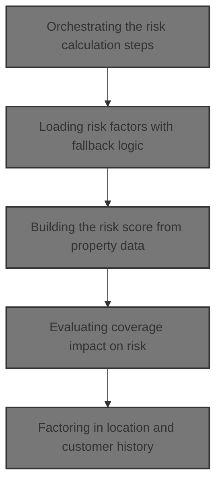
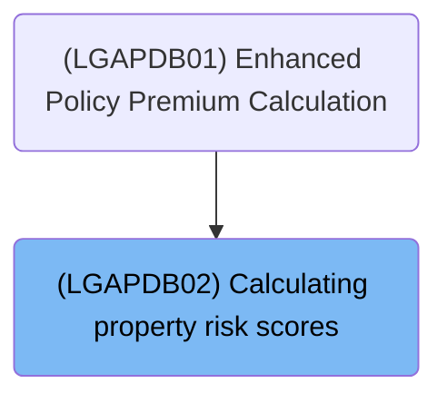
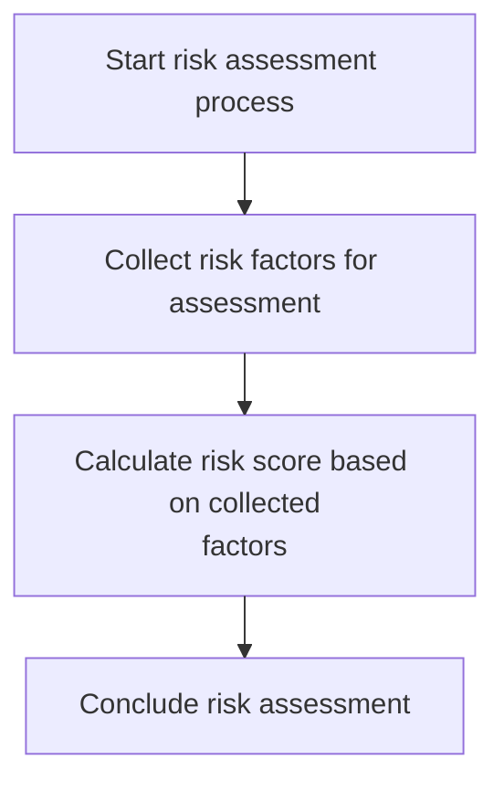
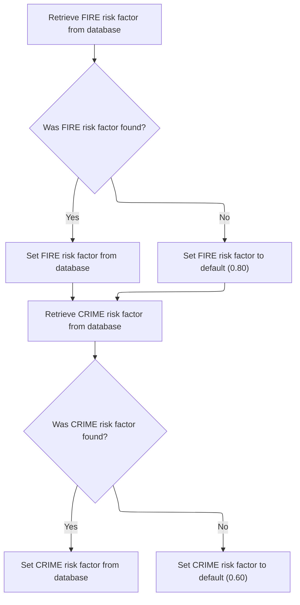
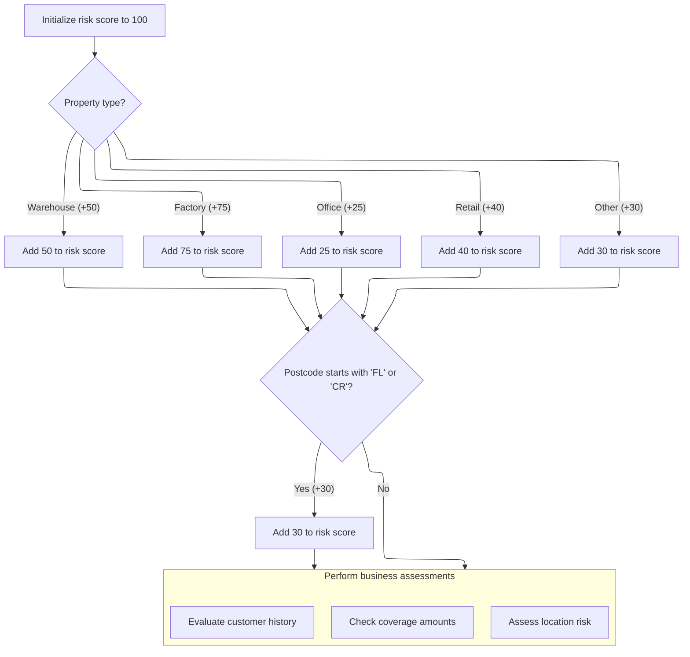
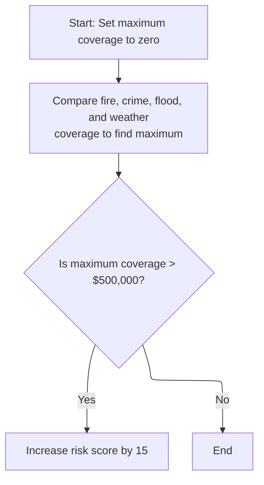
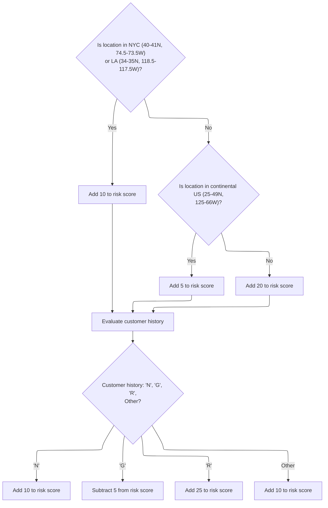

# Overview

This document describes the flow for calculating property risk scores. The process combines risk factors, property characteristics, coverage amounts, location, and customer history to produce a risk score for use in property insurance underwriting.


```mermaid
flowchart TD
    node1["Orchestrating the risk calculation steps"]:::HeadingStyle
    click node1 goToHeading "Orchestrating the risk calculation steps"
    node1 --> node2["Loading risk factors with fallback logic"]:::HeadingStyle
    click node2 goToHeading "Loading risk factors with fallback logic"
    node2 --> node3["Building the risk score from property data"]:::HeadingStyle
    click node3 goToHeading "Building the risk score from property data"
    node3 --> node4["Evaluating coverage impact on risk"]:::HeadingStyle
    click node4 goToHeading "Evaluating coverage impact on risk"
    node4 --> node5["Factoring in location and customer history"]:::HeadingStyle
    click node5 goToHeading "Factoring in location and customer history"
classDef HeadingStyle fill:#777777,stroke:#333,stroke-width:2px;
```

## Dependencies

### Program

- <SwmToken path="base/src/LGAPDB02.cbl" pos="2:6:6" line-data="       PROGRAM-ID. LGAPDB02.">`LGAPDB02`</SwmToken> (<SwmPath>[base/src/LGAPDB02.cbl](base/src/LGAPDB02.cbl)</SwmPath>)

### Copybook

- SQLCA

# Where is this program used?

This program is used once, as represented in the following diagram:


```mermaid
graph TD
  3z83u("(LGAPDB01) Enhanced Policy Premium Calculation") --> xomud("(LGAPDB02) Calculating property risk scores"):::currentEntity
click 3z83u openCode "base/src/LGAPDB01.cbl:1"
  
  
click xomud openCode "base/src/LGAPDB02.cbl:1"
    classDef currentEntity color:#000000,fill:#7CB9F4

%% Swimm:
%% graph TD
%%   3z83u("(LGAPDB01) Enhanced Policy Premium Calculation") --> xomud("(<SwmToken path="base/src/LGAPDB02.cbl" pos="2:6:6" line-data="       PROGRAM-ID. LGAPDB02.">`LGAPDB02`</SwmToken>) Calculating property risk scores"):::currentEntity
%% click 3z83u openCode "<SwmPath>[base/src/LGAPDB01.cbl](base/src/LGAPDB01.cbl)</SwmPath>:1"
%%   
%%   
%% click xomud openCode "<SwmPath>[base/src/LGAPDB02.cbl](base/src/LGAPDB02.cbl)</SwmPath>:1"
%%     classDef currentEntity color:#000000,fill:#7CB9F4
```

## Detailed View of the Program's Functionality

## Orchestrating the Risk Calculation Steps

The program begins by executing a main sequence that orchestrates the risk assessment process. The main logic is as follows:

1. **Start the risk assessment process:** The program is invoked with several pieces of property and customer data (such as property type, postcode, location, coverage amounts, and customer history).
2. **Collect risk factors for assessment:** The program first ensures that the necessary risk factors (specifically for fire and crime) are loaded. It attempts to retrieve these values from a database. If the database does not provide a value, it falls back to predefined defaults.
3. **Calculate risk score based on collected factors:** With the risk factors available, the program proceeds to calculate a risk score. This calculation is based on the property data, location, coverage amounts, and customer history.
4. **Conclude risk assessment:** Once the risk score is calculated, the process ends and returns control to the caller.

This sequence ensures that the risk calculation always uses the most up-to-date or fallback values for risk factors, and that all relevant property and customer data are considered.

---

## Loading Risk Factors with Fallback Logic

The program retrieves risk factors for fire and crime from a database table. The steps are:

1. **Retrieve FIRE risk factor from database:** The program issues a database query to fetch the fire risk factor.
2. **Check if FIRE risk factor was found:** If the database returns a value, it is used. If not, the program sets the fire risk factor to a default value of <SwmToken path="base/src/LGAPDB02.cbl" pos="54:3:5" line-data="               MOVE 0.80 TO WS-FIRE-FACTOR">`0.80`</SwmToken>.
3. **Retrieve CRIME risk factor from database:** The program then queries the database for the crime risk factor.
4. **Check if CRIME risk factor was found:** If the database returns a value, it is used. If not, the program sets the crime risk factor to a default value of <SwmToken path="base/src/LGAPDB02.cbl" pos="66:3:5" line-data="               MOVE 0.60 TO WS-CRIME-FACTOR">`0.60`</SwmToken>.

This logic guarantees that both fire and crime risk factors are always set, either from the database or from safe defaults, before any calculations are performed.

---

## Building the Risk Score from Property Data

The risk score calculation is performed in several steps:

1. **Initialize risk score:** The score starts at a base value of 100.
2. **Adjust for property type:** Depending on the type of property, a fixed amount is added to the score:
   - Warehouse: +50
   - Factory: +75
   - Office: +25
   - Retail: +40
   - Any other type: +30
3. **Adjust for postcode prefix:** If the postcode starts with 'FL' or 'CR', an additional 30 points are added to the score.
4. **Perform business assessments:** The program then performs further assessments, which include:
   - Checking coverage amounts
   - Assessing location risk
   - Evaluating customer history

Each of these assessments can further modify the risk score.

---

## Evaluating Coverage Impact on Risk

The program examines the coverage amounts for different perils (fire, crime, flood, weather):

1. **Set maximum coverage to zero:** The program initializes a variable to track the highest coverage amount.
2. **Find the maximum coverage:** It compares the coverage amounts for fire, crime, flood, and weather, updating the maximum as needed.
3. **Check if maximum coverage exceeds $500,000:** If the highest coverage amount is greater than $500,000, the program adds 15 points to the risk score. If not, the score remains unchanged.

This step ensures that properties with high coverage amounts are considered higher risk.

---

## Factoring in Location and Customer History

The program further adjusts the risk score based on location and customer history:

### Location Assessment

1. **Check if location is in NYC or LA:** The program checks if the latitude and longitude fall within the ranges for New York City or Los Angeles. If so, it adds 10 points to the risk score.
2. **Check if location is in the continental US:** If not in NYC or LA, the program checks if the location is within the general bounds of the continental United States. If so, it adds 5 points.
3. **Otherwise:** If the location is outside these bounds, it adds 20 points, reflecting higher risk for less familiar or international locations.

### Customer History Assessment

1. **Evaluate customer history:** The program adjusts the risk score based on the customer's history:
   - If the history is 'N' (possibly "New"), add 10 points.
   - If the history is 'G' (possibly "Good"), subtract 5 points.
   - If the history is 'R' (possibly "Risky"), add 25 points.
   - For any other value, add 10 points.

This final adjustment ensures that both the location and the customer's background are factored into the overall risk score.

---

## Summary

The program systematically collects risk factors, calculates a base risk score, and then adjusts this score based on property type, location, coverage amounts, and customer history. Each step is designed to ensure that all relevant data is considered, with fallback logic to handle missing information, resulting in a comprehensive risk assessment.

# Rule Definition

| Paragraph Name                                                                                                                                       | Rule ID | Category          | Description                                                                                                                                                                                                                                                                                                                                                                                                                                                                                                                                     | Conditions                                                                      | Remarks                                                                                                                                                                                                                                                                                                                                                                                                             |
| ---------------------------------------------------------------------------------------------------------------------------------------------------- | ------- | ----------------- | ----------------------------------------------------------------------------------------------------------------------------------------------------------------------------------------------------------------------------------------------------------------------------------------------------------------------------------------------------------------------------------------------------------------------------------------------------------------------------------------------------------------------------------------------- | ------------------------------------------------------------------------------- | ------------------------------------------------------------------------------------------------------------------------------------------------------------------------------------------------------------------------------------------------------------------------------------------------------------------------------------------------------------------------------------------------------------------- |
| <SwmToken path="base/src/LGAPDB02.cbl" pos="40:3:7" line-data="           PERFORM GET-RISK-FACTORS">`GET-RISK-FACTORS`</SwmToken>                    | RL-001  | Conditional Logic | The process must collect risk factors for FIRE and CRIME perils from the <SwmToken path="base/src/LGAPDB02.cbl" pos="47:3:3" line-data="               FROM RISK_FACTORS">`RISK_FACTORS`</SwmToken> table. If a risk factor is not found for FIRE, use <SwmToken path="base/src/LGAPDB02.cbl" pos="54:3:5" line-data="               MOVE 0.80 TO WS-FIRE-FACTOR">`0.80`</SwmToken>. If not found for CRIME, use <SwmToken path="base/src/LGAPDB02.cbl" pos="66:3:5" line-data="               MOVE 0.60 TO WS-CRIME-FACTOR">`0.60`</SwmToken>. | When starting the risk assessment, before any score calculation.                | Default values: FIRE = <SwmToken path="base/src/LGAPDB02.cbl" pos="54:3:5" line-data="               MOVE 0.80 TO WS-FIRE-FACTOR">`0.80`</SwmToken>, CRIME = <SwmToken path="base/src/LGAPDB02.cbl" pos="66:3:5" line-data="               MOVE 0.60 TO WS-CRIME-FACTOR">`0.60`</SwmToken>. The risk factors are floating point numbers. The lookup is performed via SQL SELECT; if not found, the default is used. |
| <SwmToken path="base/src/LGAPDB02.cbl" pos="41:3:7" line-data="           PERFORM CALCULATE-RISK-SCORE">`CALCULATE-RISK-SCORE`</SwmToken>            | RL-002  | Data Assignment   | The risk score must be initialized to 100 before any adjustments.                                                                                                                                                                                                                                                                                                                                                                                                                                                                               | At the start of risk score calculation.                                         | The risk score is a 3-digit number (range 0-999).                                                                                                                                                                                                                                                                                                                                                                   |
| <SwmToken path="base/src/LGAPDB02.cbl" pos="41:3:7" line-data="           PERFORM CALCULATE-RISK-SCORE">`CALCULATE-RISK-SCORE`</SwmToken>            | RL-003  | Conditional Logic | Adjust the risk score based on the property type as follows: WAREHOUSE +50, FACTORY +75, OFFICE +25, RETAIL +40, any other +30.                                                                                                                                                                                                                                                                                                                                                                                                                 | After initializing the risk score, check the property type value.               | Property type is a string (up to 15 characters). Adjustment values: WAREHOUSE=50, FACTORY=75, OFFICE=25, RETAIL=40, OTHER=30.                                                                                                                                                                                                                                                                                       |
| <SwmToken path="base/src/LGAPDB02.cbl" pos="41:3:7" line-data="           PERFORM CALCULATE-RISK-SCORE">`CALCULATE-RISK-SCORE`</SwmToken>            | RL-004  | Conditional Logic | If the postcode starts with 'FL' or 'CR', add 30 to the risk score.                                                                                                                                                                                                                                                                                                                                                                                                                                                                             | After property type adjustment, check the first two characters of the postcode. | Postcode is a string (up to 8 characters). Prefixes checked: 'FL', 'CR'. Adjustment: +30.                                                                                                                                                                                                                                                                                                                           |
| <SwmToken path="base/src/LGAPDB02.cbl" pos="90:3:7" line-data="           PERFORM CHECK-COVERAGE-AMOUNTS">`CHECK-COVERAGE-AMOUNTS`</SwmToken>        | RL-005  | Computation       | Determine the maximum value among fire, crime, flood, and weather coverage. If the maximum is greater than 500,000, add 15 to the risk score.                                                                                                                                                                                                                                                                                                                                                                                                   | After postcode adjustment, compare all four coverage values.                    | Coverage values are numbers with two decimals. Threshold: 500,000. Adjustment: +15.                                                                                                                                                                                                                                                                                                                                 |
| <SwmToken path="base/src/LGAPDB02.cbl" pos="91:3:7" line-data="           PERFORM ASSESS-LOCATION-RISK  ">`ASSESS-LOCATION-RISK`</SwmToken>          | RL-006  | Conditional Logic | Adjust the risk score based on location: if in NYC (lat 40-41, long -74.5 to -73.5) or LA (lat 34-35, long -118.5 to -117.5), add 10; if in continental US (lat 25-49, long -125 to -66), add 5; otherwise, add 20.                                                                                                                                                                                                                                                                                                                             | After coverage adjustment, check latitude and longitude ranges.                 | Latitude and longitude are floating point numbers. NYC: lat 40-41, long -74.5 to -73.5. LA: lat 34-35, long -118.5 to -117.5. Continental US: lat 25-49, long -125 to -66. Adjustments: NYC/LA=10, US=5, other=20.                                                                                                                                                                                                  |
| <SwmToken path="base/src/LGAPDB02.cbl" pos="92:3:7" line-data="           PERFORM EVALUATE-CUSTOMER-HISTORY.">`EVALUATE-CUSTOMER-HISTORY`</SwmToken> | RL-007  | Conditional Logic | Adjust the risk score based on customer history: 'N' +10, 'G' -5, 'R' +25, any other +10.                                                                                                                                                                                                                                                                                                                                                                                                                                                       | After location adjustment, check customer history value.                        | Customer history is a single character. Adjustments: N=10, G=-5, R=25, other=10.                                                                                                                                                                                                                                                                                                                                    |
| <SwmToken path="base/src/LGAPDB02.cbl" pos="41:3:7" line-data="           PERFORM CALCULATE-RISK-SCORE">`CALCULATE-RISK-SCORE`</SwmToken>            | RL-008  | Data Assignment   | The final calculated risk score must be written to the output linkage record.                                                                                                                                                                                                                                                                                                                                                                                                                                                                   | After all adjustments are complete.                                             | Risk score is a 3-digit number, written to the output linkage field.                                                                                                                                                                                                                                                                                                                                                |

# User Stories

## User Story 1: Property Risk Assessment Calculation

---

### Story Description:

As an insurance system, I want to calculate a property's risk score by collecting risk factors, applying all required adjustments based on property data, and writing the final score to the output so that risk can be consistently and accurately assessed for underwriting decisions.

---

### Business Rule Mapping:

| Rule ID | Paragraph Name                                                                                                                                       | Rule Description                                                                                                                                                                                                                                                                                                                                                                                                                                                                                                                                |
| ------- | ---------------------------------------------------------------------------------------------------------------------------------------------------- | ----------------------------------------------------------------------------------------------------------------------------------------------------------------------------------------------------------------------------------------------------------------------------------------------------------------------------------------------------------------------------------------------------------------------------------------------------------------------------------------------------------------------------------------------- |
| RL-001  | <SwmToken path="base/src/LGAPDB02.cbl" pos="40:3:7" line-data="           PERFORM GET-RISK-FACTORS">`GET-RISK-FACTORS`</SwmToken>                    | The process must collect risk factors for FIRE and CRIME perils from the <SwmToken path="base/src/LGAPDB02.cbl" pos="47:3:3" line-data="               FROM RISK_FACTORS">`RISK_FACTORS`</SwmToken> table. If a risk factor is not found for FIRE, use <SwmToken path="base/src/LGAPDB02.cbl" pos="54:3:5" line-data="               MOVE 0.80 TO WS-FIRE-FACTOR">`0.80`</SwmToken>. If not found for CRIME, use <SwmToken path="base/src/LGAPDB02.cbl" pos="66:3:5" line-data="               MOVE 0.60 TO WS-CRIME-FACTOR">`0.60`</SwmToken>. |
| RL-002  | <SwmToken path="base/src/LGAPDB02.cbl" pos="41:3:7" line-data="           PERFORM CALCULATE-RISK-SCORE">`CALCULATE-RISK-SCORE`</SwmToken>            | The risk score must be initialized to 100 before any adjustments.                                                                                                                                                                                                                                                                                                                                                                                                                                                                               |
| RL-003  | <SwmToken path="base/src/LGAPDB02.cbl" pos="41:3:7" line-data="           PERFORM CALCULATE-RISK-SCORE">`CALCULATE-RISK-SCORE`</SwmToken>            | Adjust the risk score based on the property type as follows: WAREHOUSE +50, FACTORY +75, OFFICE +25, RETAIL +40, any other +30.                                                                                                                                                                                                                                                                                                                                                                                                                 |
| RL-004  | <SwmToken path="base/src/LGAPDB02.cbl" pos="41:3:7" line-data="           PERFORM CALCULATE-RISK-SCORE">`CALCULATE-RISK-SCORE`</SwmToken>            | If the postcode starts with 'FL' or 'CR', add 30 to the risk score.                                                                                                                                                                                                                                                                                                                                                                                                                                                                             |
| RL-008  | <SwmToken path="base/src/LGAPDB02.cbl" pos="41:3:7" line-data="           PERFORM CALCULATE-RISK-SCORE">`CALCULATE-RISK-SCORE`</SwmToken>            | The final calculated risk score must be written to the output linkage record.                                                                                                                                                                                                                                                                                                                                                                                                                                                                   |
| RL-005  | <SwmToken path="base/src/LGAPDB02.cbl" pos="90:3:7" line-data="           PERFORM CHECK-COVERAGE-AMOUNTS">`CHECK-COVERAGE-AMOUNTS`</SwmToken>        | Determine the maximum value among fire, crime, flood, and weather coverage. If the maximum is greater than 500,000, add 15 to the risk score.                                                                                                                                                                                                                                                                                                                                                                                                   |
| RL-006  | <SwmToken path="base/src/LGAPDB02.cbl" pos="91:3:7" line-data="           PERFORM ASSESS-LOCATION-RISK  ">`ASSESS-LOCATION-RISK`</SwmToken>          | Adjust the risk score based on location: if in NYC (lat 40-41, long -74.5 to -73.5) or LA (lat 34-35, long -118.5 to -117.5), add 10; if in continental US (lat 25-49, long -125 to -66), add 5; otherwise, add 20.                                                                                                                                                                                                                                                                                                                             |
| RL-007  | <SwmToken path="base/src/LGAPDB02.cbl" pos="92:3:7" line-data="           PERFORM EVALUATE-CUSTOMER-HISTORY.">`EVALUATE-CUSTOMER-HISTORY`</SwmToken> | Adjust the risk score based on customer history: 'N' +10, 'G' -5, 'R' +25, any other +10.                                                                                                                                                                                                                                                                                                                                                                                                                                                       |

---

### Relevant Functionality:

- <SwmToken path="base/src/LGAPDB02.cbl" pos="40:3:7" line-data="           PERFORM GET-RISK-FACTORS">`GET-RISK-FACTORS`</SwmToken>
  1. **RL-001:**
     - Query <SwmToken path="base/src/LGAPDB02.cbl" pos="47:3:3" line-data="               FROM RISK_FACTORS">`RISK_FACTORS`</SwmToken> for FIRE risk factor
       - If found, use the value
       - If not found, use <SwmToken path="base/src/LGAPDB02.cbl" pos="54:3:5" line-data="               MOVE 0.80 TO WS-FIRE-FACTOR">`0.80`</SwmToken>
     - Query <SwmToken path="base/src/LGAPDB02.cbl" pos="47:3:3" line-data="               FROM RISK_FACTORS">`RISK_FACTORS`</SwmToken> for CRIME risk factor
       - If found, use the value
       - If not found, use <SwmToken path="base/src/LGAPDB02.cbl" pos="66:3:5" line-data="               MOVE 0.60 TO WS-CRIME-FACTOR">`0.60`</SwmToken>
- <SwmToken path="base/src/LGAPDB02.cbl" pos="41:3:7" line-data="           PERFORM CALCULATE-RISK-SCORE">`CALCULATE-RISK-SCORE`</SwmToken>
  1. **RL-002:**
     - Set risk score to 100
  2. **RL-003:**
     - If property type is 'WAREHOUSE', add 50 to risk score
     - Else if 'FACTORY', add 75
     - Else if 'OFFICE', add 25
     - Else if 'RETAIL', add 40
     - Else, add 30
  3. **RL-004:**
     - If postcode starts with 'FL' or 'CR', add 30 to risk score
  4. **RL-008:**
     - Write the final risk score to the output linkage record
- <SwmToken path="base/src/LGAPDB02.cbl" pos="90:3:7" line-data="           PERFORM CHECK-COVERAGE-AMOUNTS">`CHECK-COVERAGE-AMOUNTS`</SwmToken>
  1. **RL-005:**
     - Set max_coverage to 0
     - For each coverage amount (fire, crime, flood, weather):
       - If coverage > max_coverage, set max_coverage to coverage
     - If max_coverage > 500,000, add 15 to risk score
- <SwmToken path="base/src/LGAPDB02.cbl" pos="91:3:7" line-data="           PERFORM ASSESS-LOCATION-RISK  ">`ASSESS-LOCATION-RISK`</SwmToken>
  1. **RL-006:**
     - If lat in 40-41 and long in -74.5 to -73.5, add 10
     - Else if lat in 34-35 and long in -118.5 to -117.5, add 10
     - Else if lat in 25-49 and long in -125 to -66, add 5
     - Else, add 20
- <SwmToken path="base/src/LGAPDB02.cbl" pos="92:3:7" line-data="           PERFORM EVALUATE-CUSTOMER-HISTORY.">`EVALUATE-CUSTOMER-HISTORY`</SwmToken>
  1. **RL-007:**
     - If customer history is 'N', add 10
     - Else if 'G', subtract 5
     - Else if 'R', add 25
     - Else, add 10

# Workflow

# Orchestrating the risk calculation steps


```mermaid
%%{init: {"flowchart": {"defaultRenderer": "elk"}} }%%
flowchart TD
    node1["Start risk assessment process"] --> node2["Collect risk factors for assessment"]
    click node1 openCode "base/src/LGAPDB02.cbl:39:42"
    node2 --> node3["Calculate risk score based on collected
factors"]
    click node2 openCode "base/src/LGAPDB02.cbl:39:42"
    node3 --> node4["Conclude risk assessment"]
    click node3 openCode "base/src/LGAPDB02.cbl:39:42"
    click node4 openCode "base/src/LGAPDB02.cbl:39:42"
classDef HeadingStyle fill:#777777,stroke:#333,stroke-width:2px;

%% Swimm:
%% %%{init: {"flowchart": {"defaultRenderer": "elk"}} }%%
%% flowchart TD
%%     node1["Start risk assessment process"] --> node2["Collect risk factors for assessment"]
%%     click node1 openCode "<SwmPath>[base/src/LGAPDB02.cbl](base/src/LGAPDB02.cbl)</SwmPath>:39:42"
%%     node2 --> node3["Calculate risk score based on collected
%% factors"]
%%     click node2 openCode "<SwmPath>[base/src/LGAPDB02.cbl](base/src/LGAPDB02.cbl)</SwmPath>:39:42"
%%     node3 --> node4["Conclude risk assessment"]
%%     click node3 openCode "<SwmPath>[base/src/LGAPDB02.cbl](base/src/LGAPDB02.cbl)</SwmPath>:39:42"
%%     click node4 openCode "<SwmPath>[base/src/LGAPDB02.cbl](base/src/LGAPDB02.cbl)</SwmPath>:39:42"
%% classDef HeadingStyle fill:#777777,stroke:#333,stroke-width:2px;
```

This section describes the orchestration of the main steps in the risk calculation workflow. It ensures that risk factors are collected before the risk score is calculated, maintaining data accuracy and process integrity.

<SwmSnippet path="/base/src/LGAPDB02.cbl" line="39">

---

<SwmToken path="base/src/LGAPDB02.cbl" pos="39:1:3" line-data="       MAIN-LOGIC.">`MAIN-LOGIC`</SwmToken> just sequences the main steps: it first calls <SwmToken path="base/src/LGAPDB02.cbl" pos="40:3:7" line-data="           PERFORM GET-RISK-FACTORS">`GET-RISK-FACTORS`</SwmToken> to make sure the fire and crime risk values are loaded (from the DB or defaults), then hands off to <SwmToken path="base/src/LGAPDB02.cbl" pos="41:3:7" line-data="           PERFORM CALCULATE-RISK-SCORE">`CALCULATE-RISK-SCORE`</SwmToken>, which uses those values. Without fetching the risk factors first, the score calculation could be off or use stale/default data.

```cobol
       MAIN-LOGIC.
           PERFORM GET-RISK-FACTORS
           PERFORM CALCULATE-RISK-SCORE
           GOBACK.
```

---

</SwmSnippet>

# Loading risk factors with fallback logic


```mermaid
%%{init: {"flowchart": {"defaultRenderer": "elk"}} }%%
flowchart TD
    node1["Retrieve FIRE risk factor from database"]
    click node1 openCode "base/src/LGAPDB02.cbl:45:49"
    node1 --> node2{"Was FIRE risk factor found?"}
    click node2 openCode "base/src/LGAPDB02.cbl:51:55"
    node2 -->|"Yes"| node3["Set FIRE risk factor from database"]
    click node3 openCode "base/src/LGAPDB02.cbl:51:52"
    node2 -->|"No"| node4["Set FIRE risk factor to default (0.80)"]
    click node4 openCode "base/src/LGAPDB02.cbl:54:55"
    node3 --> node5["Retrieve CRIME risk factor from database"]
    click node5 openCode "base/src/LGAPDB02.cbl:57:61"
    node4 --> node5
    node5 --> node6{"Was CRIME risk factor found?"}
    click node6 openCode "base/src/LGAPDB02.cbl:63:67"
    node6 -->|"Yes"| node7["Set CRIME risk factor from database"]
    click node7 openCode "base/src/LGAPDB02.cbl:63:64"
    node6 -->|"No"| node8["Set CRIME risk factor to default (0.60)"]
    click node8 openCode "base/src/LGAPDB02.cbl:66:67"

classDef HeadingStyle fill:#777777,stroke:#333,stroke-width:2px;

%% Swimm:
%% %%{init: {"flowchart": {"defaultRenderer": "elk"}} }%%
%% flowchart TD
%%     node1["Retrieve FIRE risk factor from database"]
%%     click node1 openCode "<SwmPath>[base/src/LGAPDB02.cbl](base/src/LGAPDB02.cbl)</SwmPath>:45:49"
%%     node1 --> node2{"Was FIRE risk factor found?"}
%%     click node2 openCode "<SwmPath>[base/src/LGAPDB02.cbl](base/src/LGAPDB02.cbl)</SwmPath>:51:55"
%%     node2 -->|"Yes"| node3["Set FIRE risk factor from database"]
%%     click node3 openCode "<SwmPath>[base/src/LGAPDB02.cbl](base/src/LGAPDB02.cbl)</SwmPath>:51:52"
%%     node2 -->|"No"| node4["Set FIRE risk factor to default (<SwmToken path="base/src/LGAPDB02.cbl" pos="54:3:5" line-data="               MOVE 0.80 TO WS-FIRE-FACTOR">`0.80`</SwmToken>)"]
%%     click node4 openCode "<SwmPath>[base/src/LGAPDB02.cbl](base/src/LGAPDB02.cbl)</SwmPath>:54:55"
%%     node3 --> node5["Retrieve CRIME risk factor from database"]
%%     click node5 openCode "<SwmPath>[base/src/LGAPDB02.cbl](base/src/LGAPDB02.cbl)</SwmPath>:57:61"
%%     node4 --> node5
%%     node5 --> node6{"Was CRIME risk factor found?"}
%%     click node6 openCode "<SwmPath>[base/src/LGAPDB02.cbl](base/src/LGAPDB02.cbl)</SwmPath>:63:67"
%%     node6 -->|"Yes"| node7["Set CRIME risk factor from database"]
%%     click node7 openCode "<SwmPath>[base/src/LGAPDB02.cbl](base/src/LGAPDB02.cbl)</SwmPath>:63:64"
%%     node6 -->|"No"| node8["Set CRIME risk factor to default (<SwmToken path="base/src/LGAPDB02.cbl" pos="66:3:5" line-data="               MOVE 0.60 TO WS-CRIME-FACTOR">`0.60`</SwmToken>)"]
%%     click node8 openCode "<SwmPath>[base/src/LGAPDB02.cbl](base/src/LGAPDB02.cbl)</SwmPath>:66:67"
%% 
%% classDef HeadingStyle fill:#777777,stroke:#333,stroke-width:2px;
```

This section outlines the fallback logic implemented when loading risk factors, ensuring that the system remains robust and calculations can continue even if the database does not provide the required values.

| Rule ID | Category        | Rule Name                  | Description                                                                                           | Implementation Details                                                                                                                                                                                                                                                          |
| ------- | --------------- | -------------------------- | ----------------------------------------------------------------------------------------------------- | ------------------------------------------------------------------------------------------------------------------------------------------------------------------------------------------------------------------------------------------------------------------------------- |
| BR-001  | Reading Input   | Retrieve FIRE risk factor  | Fetch the FIRE risk factor value from the risk factors database for use in risk calculations.         | The FIRE risk factor is retrieved based on the peril type 'FIRE'. The value is used for subsequent calculations. No specific output format is enforced at this step.                                                                                                            |
| BR-002  | Data validation | Database read validation   | Following the read operation, make sure the risk factor was retrieved from the database successfully. | The validation checks if the database operation returned SQLCODE = 0, which indicates a successful read. No error messages are shown in this step; error handling occurs in subsequent steps if the read fails.                                                                 |
| BR-003  | Reading Input   | Retrieve CRIME risk factor | Fetch the CRIME risk factor value from the risk factors database for use in risk calculations.        | The peril type used for lookup is 'CRIME'. The value retrieved is used for subsequent risk calculations. If the database does not return a value, fallback logic applies elsewhere in the flow.                                                                                 |
| BR-004  | Data validation | Database read validation   | Following the risk factor retrieval operation, make sure the database read was successful.            | The validation checks the result of the database query using the SQL return code. If the code is 0, the read is considered successful. If not, fallback logic is triggered elsewhere in the section. No explicit error messages or codes are surfaced to the user in this step. |

<SwmSnippet path="/base/src/LGAPDB02.cbl" line="44">

---

In <SwmToken path="base/src/LGAPDB02.cbl" pos="44:1:5" line-data="       GET-RISK-FACTORS.">`GET-RISK-FACTORS`</SwmToken>, we start by trying to pull the FIRE risk factor from the <SwmToken path="base/src/LGAPDB02.cbl" pos="47:3:3" line-data="               FROM RISK_FACTORS">`RISK_FACTORS`</SwmToken> table. If the DB doesn't return a value, the code will later fall back to a default. The same logic applies for CRIME in the next steps. The function assumes these peril types exist in the DB, but handles missing data by using constants.

```cobol
       GET-RISK-FACTORS.
           EXEC SQL
               SELECT FACTOR_VALUE INTO :WS-FIRE-FACTOR
               FROM RISK_FACTORS
               WHERE PERIL_TYPE = 'FIRE'
           END-EXEC.
```

---

</SwmSnippet>

<SwmSnippet path="/base/src/LGAPDB02.cbl" line="51">

---

After trying to fetch the FIRE risk factor, if the DB query fails, we just set <SwmToken path="base/src/LGAPDB02.cbl" pos="54:9:13" line-data="               MOVE 0.80 TO WS-FIRE-FACTOR">`WS-FIRE-FACTOR`</SwmToken> to <SwmToken path="base/src/LGAPDB02.cbl" pos="54:3:5" line-data="               MOVE 0.80 TO WS-FIRE-FACTOR">`0.80`</SwmToken>. Otherwise, we keep the value from the DB. This ensures we always have a value for the next calculation.

```cobol
           IF SQLCODE = 0
               CONTINUE
           ELSE
               MOVE 0.80 TO WS-FIRE-FACTOR
           END-IF.
```

---

</SwmSnippet>

<SwmSnippet path="/base/src/LGAPDB02.cbl" line="57">

---

Now we do the same thing for CRIME: query the DB for the CRIME risk factor. The fallback logic for missing data comes right after this.

```cobol
           EXEC SQL
               SELECT FACTOR_VALUE INTO :WS-CRIME-FACTOR
               FROM RISK_FACTORS
               WHERE PERIL_TYPE = 'CRIME'
           END-EXEC.
```

---

</SwmSnippet>

<SwmSnippet path="/base/src/LGAPDB02.cbl" line="63">

---

After the CRIME query, if it fails, we set <SwmToken path="base/src/LGAPDB02.cbl" pos="66:9:13" line-data="               MOVE 0.60 TO WS-CRIME-FACTOR">`WS-CRIME-FACTOR`</SwmToken> to <SwmToken path="base/src/LGAPDB02.cbl" pos="66:3:5" line-data="               MOVE 0.60 TO WS-CRIME-FACTOR">`0.60`</SwmToken>. At this point, both FIRE and CRIME factors are guaranteed to have values (from DB or defaults), so the function is done and returns control.

```cobol
           IF SQLCODE = 0
               CONTINUE
           ELSE
               MOVE 0.60 TO WS-CRIME-FACTOR
           END-IF.
```

---

</SwmSnippet>

# Building the risk score from property data


```mermaid
%%{init: {"flowchart": {"defaultRenderer": "elk"}} }%%
flowchart TD
    node1["Initialize risk score to 100"]
    click node1 openCode "base/src/LGAPDB02.cbl:69:70"
    node1 --> node2{"Property type?"}
    click node2 openCode "base/src/LGAPDB02.cbl:72:83"
    node2 -->|"Warehouse (+50)"| node3["Add 50 to risk score"]
    click node3 openCode "base/src/LGAPDB02.cbl:74:74"
    node2 -->|"Factory (+75)"| node4["Add 75 to risk score"]
    click node4 openCode "base/src/LGAPDB02.cbl:76:76"
    node2 -->|"Office (+25)"| node5["Add 25 to risk score"]
    click node5 openCode "base/src/LGAPDB02.cbl:78:78"
    node2 -->|"Retail (+40)"| node6["Add 40 to risk score"]
    click node6 openCode "base/src/LGAPDB02.cbl:80:80"
    node2 -->|"Other (+30)"| node7["Add 30 to risk score"]
    click node7 openCode "base/src/LGAPDB02.cbl:82:82"
    node3 --> node8{"Postcode starts with 'FL' or 'CR'?"}
    node4 --> node8
    node5 --> node8
    node6 --> node8
    node7 --> node8
    click node8 openCode "base/src/LGAPDB02.cbl:85:88"
    node8 -->|"Yes (+30)"| node9["Add 30 to risk score"]
    click node9 openCode "base/src/LGAPDB02.cbl:87:87"
    node8 -->|"No"| node11["Perform business assessments"]
    node9 --> node11["Perform business assessments"]
    click node11 openCode "base/src/LGAPDB02.cbl:90:92"
    subgraph node11["Perform business assessments"]
        node12["Check coverage amounts"]
        click node12 openCode "base/src/LGAPDB02.cbl:90:90"
        node13["Assess location risk"]
        click node13 openCode "base/src/LGAPDB02.cbl:91:91"
        node14["Evaluate customer history"]
        click node14 openCode "base/src/LGAPDB02.cbl:92:92"
    end
classDef HeadingStyle fill:#777777,stroke:#333,stroke-width:2px;

%% Swimm:
%% %%{init: {"flowchart": {"defaultRenderer": "elk"}} }%%
%% flowchart TD
%%     node1["Initialize risk score to 100"]
%%     click node1 openCode "<SwmPath>[base/src/LGAPDB02.cbl](base/src/LGAPDB02.cbl)</SwmPath>:69:70"
%%     node1 --> node2{"Property type?"}
%%     click node2 openCode "<SwmPath>[base/src/LGAPDB02.cbl](base/src/LGAPDB02.cbl)</SwmPath>:72:83"
%%     node2 -->|"Warehouse (+50)"| node3["Add 50 to risk score"]
%%     click node3 openCode "<SwmPath>[base/src/LGAPDB02.cbl](base/src/LGAPDB02.cbl)</SwmPath>:74:74"
%%     node2 -->|"Factory (+75)"| node4["Add 75 to risk score"]
%%     click node4 openCode "<SwmPath>[base/src/LGAPDB02.cbl](base/src/LGAPDB02.cbl)</SwmPath>:76:76"
%%     node2 -->|"Office (+25)"| node5["Add 25 to risk score"]
%%     click node5 openCode "<SwmPath>[base/src/LGAPDB02.cbl](base/src/LGAPDB02.cbl)</SwmPath>:78:78"
%%     node2 -->|"Retail (+40)"| node6["Add 40 to risk score"]
%%     click node6 openCode "<SwmPath>[base/src/LGAPDB02.cbl](base/src/LGAPDB02.cbl)</SwmPath>:80:80"
%%     node2 -->|"Other (+30)"| node7["Add 30 to risk score"]
%%     click node7 openCode "<SwmPath>[base/src/LGAPDB02.cbl](base/src/LGAPDB02.cbl)</SwmPath>:82:82"
%%     node3 --> node8{"Postcode starts with 'FL' or 'CR'?"}
%%     node4 --> node8
%%     node5 --> node8
%%     node6 --> node8
%%     node7 --> node8
%%     click node8 openCode "<SwmPath>[base/src/LGAPDB02.cbl](base/src/LGAPDB02.cbl)</SwmPath>:85:88"
%%     node8 -->|"Yes (+30)"| node9["Add 30 to risk score"]
%%     click node9 openCode "<SwmPath>[base/src/LGAPDB02.cbl](base/src/LGAPDB02.cbl)</SwmPath>:87:87"
%%     node8 -->|"No"| node11["Perform business assessments"]
%%     node9 --> node11["Perform business assessments"]
%%     click node11 openCode "<SwmPath>[base/src/LGAPDB02.cbl](base/src/LGAPDB02.cbl)</SwmPath>:90:92"
%%     subgraph node11["Perform business assessments"]
%%         node12["Check coverage amounts"]
%%         click node12 openCode "<SwmPath>[base/src/LGAPDB02.cbl](base/src/LGAPDB02.cbl)</SwmPath>:90:90"
%%         node13["Assess location risk"]
%%         click node13 openCode "<SwmPath>[base/src/LGAPDB02.cbl](base/src/LGAPDB02.cbl)</SwmPath>:91:91"
%%         node14["Evaluate customer history"]
%%         click node14 openCode "<SwmPath>[base/src/LGAPDB02.cbl](base/src/LGAPDB02.cbl)</SwmPath>:92:92"
%%     end
%% classDef HeadingStyle fill:#777777,stroke:#333,stroke-width:2px;
```

This section outlines the logic and steps used to build a property's risk score from various data points. It details how the score is initialized, adjusted based on property characteristics, and further refined through business assessments.

| Rule ID | Category    | Rule Name                      | Description                                                       | Implementation Details                                                                                                                                                                                                                            |
| ------- | ----------- | ------------------------------ | ----------------------------------------------------------------- | ------------------------------------------------------------------------------------------------------------------------------------------------------------------------------------------------------------------------------------------------- |
| BR-001  | Calculation | Property risk score adjustment | Adjust the risk score based on property type and postcode prefix. | Initial risk score is set to 100. Property type adjustments: Warehouse (+50), Factory (+75), Office (+25), Retail (+40), Other (+30). If postcode starts with 'FL' or 'CR', add 30 to the risk score. All adjustments are cumulative and numeric. |

<SwmSnippet path="/base/src/LGAPDB02.cbl" line="69">

---

In <SwmToken path="base/src/LGAPDB02.cbl" pos="69:1:5" line-data="       CALCULATE-RISK-SCORE.">`CALCULATE-RISK-SCORE`</SwmToken>, we start by setting the base score to 100, then adjust it based on property type (warehouse, factory, office, retail, or other) using hardcoded values. This is followed by postcode prefix logic in the next snippet.

```cobol
       CALCULATE-RISK-SCORE.
           MOVE 100 TO LK-RISK-SCORE

           EVALUATE LK-PROPERTY-TYPE
             WHEN 'WAREHOUSE'
               ADD 50 TO LK-RISK-SCORE
             WHEN 'FACTORY' 
               ADD 75 TO LK-RISK-SCORE
             WHEN 'OFFICE'
               ADD 25 TO LK-RISK-SCORE
             WHEN 'RETAIL'
               ADD 40 TO LK-RISK-SCORE
             WHEN OTHER
               ADD 30 TO LK-RISK-SCORE
           END-EVALUATE
```

---

</SwmSnippet>

<SwmSnippet path="/base/src/LGAPDB02.cbl" line="85">

---

After adjusting for property type, we check if the postcode starts with 'FL' or 'CR' and add 30 to the score if so. This is a simple way to bump risk for certain regions before moving on to more detailed checks.

```cobol
           IF LK-POSTCODE(1:2) = 'FL' OR
              LK-POSTCODE(1:2) = 'CR'
             ADD 30 TO LK-RISK-SCORE
           END-IF
```

---

</SwmSnippet>

<SwmSnippet path="/base/src/LGAPDB02.cbl" line="90">

---

After the postcode logic, we call <SwmToken path="base/src/LGAPDB02.cbl" pos="90:3:7" line-data="           PERFORM CHECK-COVERAGE-AMOUNTS">`CHECK-COVERAGE-AMOUNTS`</SwmToken>, <SwmToken path="base/src/LGAPDB02.cbl" pos="91:3:7" line-data="           PERFORM ASSESS-LOCATION-RISK  ">`ASSESS-LOCATION-RISK`</SwmToken>, and <SwmToken path="base/src/LGAPDB02.cbl" pos="92:3:7" line-data="           PERFORM EVALUATE-CUSTOMER-HISTORY.">`EVALUATE-CUSTOMER-HISTORY`</SwmToken>. These steps refine the risk score by considering coverage size, location, and customer background.

```cobol
           PERFORM CHECK-COVERAGE-AMOUNTS
           PERFORM ASSESS-LOCATION-RISK  
           PERFORM EVALUATE-CUSTOMER-HISTORY.
```

---

</SwmSnippet>

# Evaluating coverage impact on risk


```mermaid
%%{init: {"flowchart": {"defaultRenderer": "elk"}} }%%
flowchart TD
    node1["Start: Set maximum coverage to zero"]
    click node1 openCode "base/src/LGAPDB02.cbl:95:96"
    node1 --> node2["Compare fire, crime, flood, and weather
coverage to find maximum"]
    click node2 openCode "base/src/LGAPDB02.cbl:97:111"
    node2 --> node3{"Is maximum coverage > $500,000?"}
    click node3 openCode "base/src/LGAPDB02.cbl:113:114"
    node3 -->|"Yes"| node4["Increase risk score by 15"]
    click node4 openCode "base/src/LGAPDB02.cbl:114:115"
    node3 -->|"No"| node5["End"]
    click node5 openCode "base/src/LGAPDB02.cbl:115:115"

classDef HeadingStyle fill:#777777,stroke:#333,stroke-width:2px;

%% Swimm:
%% %%{init: {"flowchart": {"defaultRenderer": "elk"}} }%%
%% flowchart TD
%%     node1["Start: Set maximum coverage to zero"]
%%     click node1 openCode "<SwmPath>[base/src/LGAPDB02.cbl](base/src/LGAPDB02.cbl)</SwmPath>:95:96"
%%     node1 --> node2["Compare fire, crime, flood, and weather
%% coverage to find maximum"]
%%     click node2 openCode "<SwmPath>[base/src/LGAPDB02.cbl](base/src/LGAPDB02.cbl)</SwmPath>:97:111"
%%     node2 --> node3{"Is maximum coverage > $500,000?"}
%%     click node3 openCode "<SwmPath>[base/src/LGAPDB02.cbl](base/src/LGAPDB02.cbl)</SwmPath>:113:114"
%%     node3 -->|"Yes"| node4["Increase risk score by 15"]
%%     click node4 openCode "<SwmPath>[base/src/LGAPDB02.cbl](base/src/LGAPDB02.cbl)</SwmPath>:114:115"
%%     node3 -->|"No"| node5["End"]
%%     click node5 openCode "<SwmPath>[base/src/LGAPDB02.cbl](base/src/LGAPDB02.cbl)</SwmPath>:115:115"
%% 
%% classDef HeadingStyle fill:#777777,stroke:#333,stroke-width:2px;
```

This section describes how the system evaluates the impact of insurance coverage amounts on the overall risk score, ensuring that high coverage values appropriately influence risk assessment.

| Rule ID | Category    | Rule Name                     | Description                                                                                                                                                    | Implementation Details                                                                                                                                                                                                                    |
| ------- | ----------- | ----------------------------- | -------------------------------------------------------------------------------------------------------------------------------------------------------------- | ----------------------------------------------------------------------------------------------------------------------------------------------------------------------------------------------------------------------------------------- |
| BR-001  | Calculation | Coverage impact on risk score | Evaluate the highest coverage amount across fire, crime, flood, and weather types, and increase the risk score by 15 if the maximum coverage exceeds $500,000. | The coverage types considered are fire, crime, flood, and weather. The threshold for increasing risk score is $500,000. The risk score is incremented by 15 if the condition is met. No specific output format is required for this rule. |

<SwmSnippet path="/base/src/LGAPDB02.cbl" line="94">

---

In <SwmToken path="base/src/LGAPDB02.cbl" pos="94:1:5" line-data="       CHECK-COVERAGE-AMOUNTS.">`CHECK-COVERAGE-AMOUNTS`</SwmToken>, we start by setting <SwmToken path="base/src/LGAPDB02.cbl" pos="95:7:11" line-data="           MOVE ZERO TO WS-MAX-COVERAGE">`WS-MAX-COVERAGE`</SwmToken> to zero and then compare each coverage type to find the highest one. The next few lines repeat this for each coverage type.

```cobol
       CHECK-COVERAGE-AMOUNTS.
           MOVE ZERO TO WS-MAX-COVERAGE
           
           IF LK-FIRE-COVERAGE > WS-MAX-COVERAGE
               MOVE LK-FIRE-COVERAGE TO WS-MAX-COVERAGE
           END-IF
```

---

</SwmSnippet>

<SwmSnippet path="/base/src/LGAPDB02.cbl" line="101">

---

Now we check if CRIME coverage is higher than the current max and update if needed. This is repeated for each coverage type to make sure we don't miss the highest value.

```cobol
           IF LK-CRIME-COVERAGE > WS-MAX-COVERAGE
               MOVE LK-CRIME-COVERAGE TO WS-MAX-COVERAGE
           END-IF
```

---

</SwmSnippet>

<SwmSnippet path="/base/src/LGAPDB02.cbl" line="105">

---

After crime, we check if flood coverage is the new max. The process is just repeated for each coverage type.

```cobol
           IF LK-FLOOD-COVERAGE > WS-MAX-COVERAGE
               MOVE LK-FLOOD-COVERAGE TO WS-MAX-COVERAGE
           END-IF
```

---

</SwmSnippet>

<SwmSnippet path="/base/src/LGAPDB02.cbl" line="109">

---

Finally, we check weather coverage against the current max. After this, <SwmToken path="base/src/LGAPDB02.cbl" pos="109:11:15" line-data="           IF LK-WEATHER-COVERAGE &gt; WS-MAX-COVERAGE">`WS-MAX-COVERAGE`</SwmToken> holds the highest value across all types.

```cobol
           IF LK-WEATHER-COVERAGE > WS-MAX-COVERAGE
               MOVE LK-WEATHER-COVERAGE TO WS-MAX-COVERAGE
           END-IF
```

---

</SwmSnippet>

<SwmSnippet path="/base/src/LGAPDB02.cbl" line="113">

---

After finding the max coverage, if it's over 500,000, we add 15 to the risk score. Otherwise, nothing changes. The function then returns, having updated the score if needed.

```cobol
           IF WS-MAX-COVERAGE > WS-COVERAGE-500K
               ADD 15 TO LK-RISK-SCORE
           END-IF.
```

---

</SwmSnippet>

# Factoring in location and customer history


```mermaid
%%{init: {"flowchart": {"defaultRenderer": "elk"}} }%%
flowchart TD
    node1{"Is location in NYC (40-41N, 74.5-73.5W)
or LA (34-35N, 118.5-117.5W)?"}
    click node1 openCode "base/src/LGAPDB02.cbl:121:125"
    node1 -->|"Yes"| node2["Add 10 to risk score"]
    click node2 openCode "base/src/LGAPDB02.cbl:125:125"
    node1 -->|"No"| node3{"Is location in continental US (25-49N,
125-66W)?"}
    click node3 openCode "base/src/LGAPDB02.cbl:128:130"
    node3 -->|"Yes"| node4["Add 5 to risk score"]
    click node4 openCode "base/src/LGAPDB02.cbl:130:130"
    node3 -->|"No"| node5["Add 20 to risk score"]
    click node5 openCode "base/src/LGAPDB02.cbl:132:132"
    node2 --> node6["Evaluate customer history"]
    click node6 openCode "base/src/LGAPDB02.cbl:136:137"
    node4 --> node6
    node5 --> node6
    node6 --> node7{"Customer history: 'N', 'G', 'R',
Other?"}
    click node7 openCode "base/src/LGAPDB02.cbl:137:145"
    node7 -->|"'N'"| node8["Add 10 to risk score"]
    click node8 openCode "base/src/LGAPDB02.cbl:139:139"
    node7 -->|"'G'"| node9["Subtract 5 from risk score"]
    click node9 openCode "base/src/LGAPDB02.cbl:141:141"
    node7 -->|"'R'"| node10["Add 25 to risk score"]
    click node10 openCode "base/src/LGAPDB02.cbl:143:143"
    node7 -->|"Other"| node11["Add 10 to risk score"]
    click node11 openCode "base/src/LGAPDB02.cbl:145:145"

classDef HeadingStyle fill:#777777,stroke:#333,stroke-width:2px;

%% Swimm:
%% %%{init: {"flowchart": {"defaultRenderer": "elk"}} }%%
%% flowchart TD
%%     node1{"Is location in NYC (<SwmToken path="base/src/LGAPDB02.cbl" pos="119:8:10" line-data="      *    NYC area: 40-41N, 74.5-73.5W">`40-41N`</SwmToken>, <SwmToken path="base/src/LGAPDB02.cbl" pos="119:13:19" line-data="      *    NYC area: 40-41N, 74.5-73.5W">`74.5-73.5W`</SwmToken>)
%% or LA (<SwmToken path="base/src/LGAPDB02.cbl" pos="120:8:10" line-data="      *    LA area: 34-35N, 118.5-117.5W">`34-35N`</SwmToken>, <SwmToken path="base/src/LGAPDB02.cbl" pos="120:13:19" line-data="      *    LA area: 34-35N, 118.5-117.5W">`118.5-117.5W`</SwmToken>)?"}
%%     click node1 openCode "<SwmPath>[base/src/LGAPDB02.cbl](base/src/LGAPDB02.cbl)</SwmPath>:121:125"
%%     node1 -->|"Yes"| node2["Add 10 to risk score"]
%%     click node2 openCode "<SwmPath>[base/src/LGAPDB02.cbl](base/src/LGAPDB02.cbl)</SwmPath>:125:125"
%%     node1 -->|"No"| node3{"Is location in continental US (25-49N,
%% 125-66W)?"}
%%     click node3 openCode "<SwmPath>[base/src/LGAPDB02.cbl](base/src/LGAPDB02.cbl)</SwmPath>:128:130"
%%     node3 -->|"Yes"| node4["Add 5 to risk score"]
%%     click node4 openCode "<SwmPath>[base/src/LGAPDB02.cbl](base/src/LGAPDB02.cbl)</SwmPath>:130:130"
%%     node3 -->|"No"| node5["Add 20 to risk score"]
%%     click node5 openCode "<SwmPath>[base/src/LGAPDB02.cbl](base/src/LGAPDB02.cbl)</SwmPath>:132:132"
%%     node2 --> node6["Evaluate customer history"]
%%     click node6 openCode "<SwmPath>[base/src/LGAPDB02.cbl](base/src/LGAPDB02.cbl)</SwmPath>:136:137"
%%     node4 --> node6
%%     node5 --> node6
%%     node6 --> node7{"Customer history: 'N', 'G', 'R',
%% Other?"}
%%     click node7 openCode "<SwmPath>[base/src/LGAPDB02.cbl](base/src/LGAPDB02.cbl)</SwmPath>:137:145"
%%     node7 -->|"'N'"| node8["Add 10 to risk score"]
%%     click node8 openCode "<SwmPath>[base/src/LGAPDB02.cbl](base/src/LGAPDB02.cbl)</SwmPath>:139:139"
%%     node7 -->|"'G'"| node9["Subtract 5 from risk score"]
%%     click node9 openCode "<SwmPath>[base/src/LGAPDB02.cbl](base/src/LGAPDB02.cbl)</SwmPath>:141:141"
%%     node7 -->|"'R'"| node10["Add 25 to risk score"]
%%     click node10 openCode "<SwmPath>[base/src/LGAPDB02.cbl](base/src/LGAPDB02.cbl)</SwmPath>:143:143"
%%     node7 -->|"Other"| node11["Add 10 to risk score"]
%%     click node11 openCode "<SwmPath>[base/src/LGAPDB02.cbl](base/src/LGAPDB02.cbl)</SwmPath>:145:145"
%% 
%% classDef HeadingStyle fill:#777777,stroke:#333,stroke-width:2px;
```

This section outlines how the risk score is adjusted based on the applicant's geographic location and their customer history. These factors are used to refine the risk assessment and ensure that both regional and behavioral risks are considered in the final score.

| Rule ID | Category    | Rule Name                                     | Description                                                                   | Implementation Details                                                                                                                                                                                                                                                              |
| ------- | ----------- | --------------------------------------------- | ----------------------------------------------------------------------------- | ----------------------------------------------------------------------------------------------------------------------------------------------------------------------------------------------------------------------------------------------------------------------------------- |
| BR-001  | Calculation | Location and customer history risk adjustment | Adjust the risk score based on the applicant's location and customer history. | Location risk adjustment values: 10 for NYC or LA, 5 for continental US, 20 for other locations. Customer history adjustment values: 10 for 'N', -5 for 'G', 25 for 'R', 10 for any other value. Risk score is a numeric value incremented or decremented according to these rules. |

<SwmSnippet path="/base/src/LGAPDB02.cbl" line="117">

---

In <SwmToken path="base/src/LGAPDB02.cbl" pos="117:1:5" line-data="       ASSESS-LOCATION-RISK.">`ASSESS-LOCATION-RISK`</SwmToken>, we check if the location is in NYC or LA using latitude/longitude bounds. If so, we add 10 to the risk score. If not, we check if it's in the continental US and add 5, otherwise 20. This sets the base location risk before adjusting for customer history.

```cobol
       ASSESS-LOCATION-RISK.
      *    Urban areas: major cities (simplified lat/long ranges)
      *    NYC area: 40-41N, 74.5-73.5W
      *    LA area: 34-35N, 118.5-117.5W
           IF (LK-LATITUDE > 40.000000 AND LK-LATITUDE < 41.000000 AND
               LK-LONGITUDE > -74.500000 AND LK-LONGITUDE < -73.500000) OR
              (LK-LATITUDE > 34.000000 AND LK-LATITUDE < 35.000000 AND
               LK-LONGITUDE > -118.500000 AND LK-LONGITUDE < -117.500000)
               ADD 10 TO LK-RISK-SCORE
           ELSE
      *        Check if in continental US (suburban vs rural)
               IF (LK-LATITUDE > 25.000000 AND LK-LATITUDE < 49.000000 AND
                   LK-LONGITUDE > -125.000000 AND LK-LONGITUDE < -66.000000)
                   ADD 5 TO LK-RISK-SCORE
               ELSE
                   ADD 20 TO LK-RISK-SCORE
               END-IF
```

---

</SwmSnippet>

<SwmSnippet path="/base/src/LGAPDB02.cbl" line="134">

---

After location risk is set, we adjust the score based on customer history: 'N' adds 10, 'G' subtracts 5, 'R' adds 25, anything else adds 10. This is the last adjustment before returning the final risk score.

```cobol
           END-IF.

       EVALUATE-CUSTOMER-HISTORY.
           EVALUATE LK-CUSTOMER-HISTORY
               WHEN 'N'
                   ADD 10 TO LK-RISK-SCORE
               WHEN 'G'
                   SUBTRACT 5 FROM LK-RISK-SCORE
               WHEN 'R'
                   ADD 25 TO LK-RISK-SCORE
               WHEN OTHER
                   ADD 10 TO LK-RISK-SCORE
           END-EVALUATE.
```

---

</SwmSnippet>

&nbsp;

*This is an auto-generated document by Swimm 🌊 and has not yet been verified by a human*

<SwmMeta version="3.0.0" repo-id="Z2l0aHViJTNBJTNBU3dpbW1pby1nZW5hcHAtaG91c2UlM0ElM0FHaXJpLVN3aW1t" repo-name="Swimmio-genapp-house"><sup>Powered by [Swimm](https://app.swimm.io/)</sup></SwmMeta>
