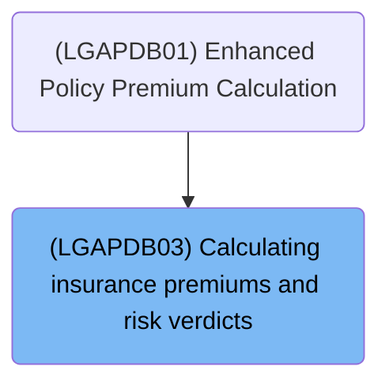
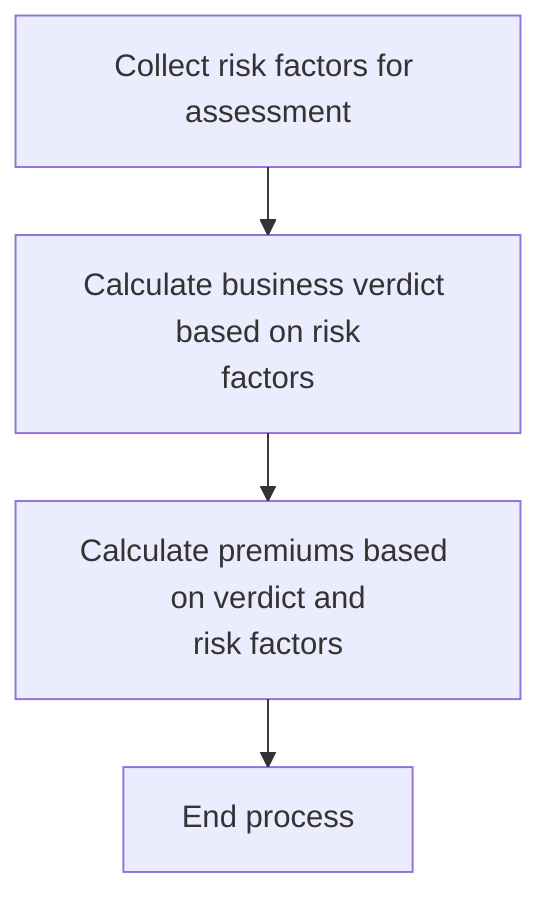
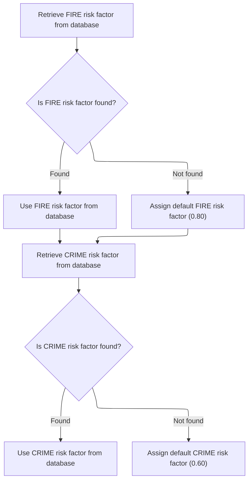
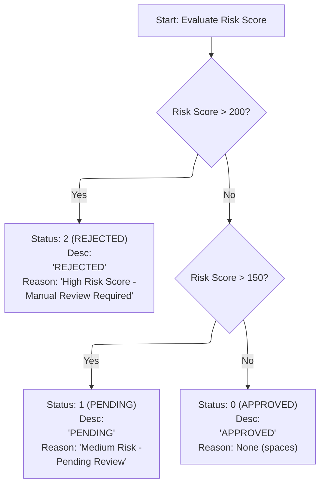
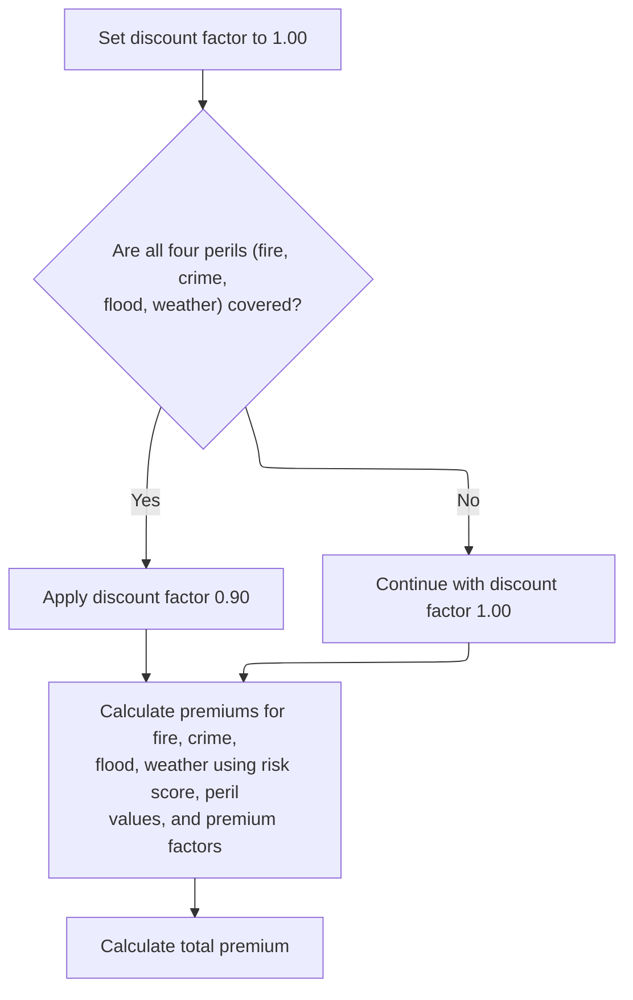

# Overview

This document explains the flow of risk assessment and premium calculation for insurance applications. Risk factors are collected, a verdict is assigned based on the risk score, and premiums are calculated for each peril, with a discount applied if all perils are covered. The output includes the risk verdict and premium amounts.

## Dependencies

### Program

- <SwmToken path="base/src/LGAPDB03.cbl" pos="2:6:6" line-data="       PROGRAM-ID. LGAPDB03.">`LGAPDB03`</SwmToken> (<SwmPath>[base/src/LGAPDB03.cbl](base/src/LGAPDB03.cbl)</SwmPath>)

### Copybook

- SQLCA

# Where is this program used?

This program is used once, as represented in the following diagram:



## Detailed View of the Program's Functionality

## Main Coordination of the Flow

The program is structured to process an insurance application by coordinating three main steps in sequence:

1. **Fetch Risk Factors:** The program first ensures that the latest risk multipliers for different perils (like fire and crime) are loaded from the database. If the database does not provide a value, it uses a default.
2. **Calculate Verdict:** Based on the risk score provided, the program determines the status of the application (approved, pending, or rejected), and sets a description and reason if needed.
3. **Calculate Premiums:** Using the risk factors, risk score, and peril values, the program computes the insurance premiums for each peril and the total premium, applying a discount if all perils are covered.

After these steps, the program ends.

---

## Fetching Risk Multipliers for Perils

This step is responsible for ensuring that the risk multipliers (factors) for each peril are up-to-date:

- **Fire Risk Factor:**

  - The program queries the database for the fire risk factor.
  - If the database returns a value, it uses that value.
  - If not, it assigns a default value of <SwmToken path="base/src/LGAPDB03.cbl" pos="58:3:5" line-data="               MOVE 0.80 TO WS-FIRE-FACTOR">`0.80`</SwmToken>.

- **Crime Risk Factor:**

  - The program then queries the database for the crime risk factor.
  - If the database returns a value, it uses that value.
  - If not, it assigns a default value of <SwmToken path="base/src/LGAPDB03.cbl" pos="70:3:5" line-data="               MOVE 0.60 TO WS-CRIME-FACTOR">`0.60`</SwmToken>.

These factors are stored for use in the premium calculation step. (Flood and weather factors are not fetched from the database in this code—they use hardcoded defaults.)

---

## Assigning Risk Verdict Based on Score

This step evaluates the risk score and assigns a status to the application:

- **If the risk score is greater than 200:**

  - The application is marked as "REJECTED".
  - The status code is set to indicate rejection.
  - The description is set to "REJECTED".
  - The reason is set to "High Risk Score - Manual Review Required".

- **If the risk score is between 151 and 200 (inclusive):**

  - The application is marked as "PENDING".
  - The status code is set to indicate pending.
  - The description is set to "PENDING".
  - The reason is set to "Medium Risk - Pending Review".

- **If the risk score is 150 or less:**

  - The application is marked as "APPROVED".
  - The status code is set to indicate approval.
  - The description is set to "APPROVED".
  - The reason is left blank.

These values are used to inform the rest of the process and any downstream systems about the application's status.

---

## Computing Insurance Premiums for All Perils

This step calculates the insurance premiums for each peril and the total premium:

- **Discount Factor:**

  - The discount factor is initially set to <SwmToken path="base/src/LGAPDB03.cbl" pos="93:3:5" line-data="           MOVE 1.00 TO LK-DISC-FACT">`1.00`</SwmToken> (no discount).
  - If all four peril values (fire, crime, flood, weather) are positive (i.e., the applicant is covered for all perils), the discount factor is set to <SwmToken path="base/src/LGAPDB03.cbl" pos="99:3:5" line-data="             MOVE 0.90 TO LK-DISC-FACT">`0.90`</SwmToken> (a 10% discount).

- **Premium Calculation:**

  - For each peril (fire, crime, flood, weather), the premium is calculated as:
    - (risk score) × (peril's risk factor) × (peril value) × (discount factor)
  - The risk factors for fire and crime are fetched from the database or set to defaults; flood and weather use hardcoded values.
  - Each peril's premium is computed separately.

- **Total Premium:**

  - The total premium is the sum of the premiums for all four perils.

These calculated values are then available for output or further processing.

---

## Summary

- The program orchestrates the fetching of risk factors, verdict assignment, and premium calculation in a strict sequence.
- It is robust to missing database values for risk factors by using sensible defaults.
- The verdict logic is clear and based on risk score thresholds.
- Premiums are calculated in a modular way, with a discount applied only if all perils are covered.

# Rule Definition

| Paragraph Name                                                                                                                                                                                                                                                                     | Rule ID | Category          | Description                                                                                                                                                                                                                                                                                                                                                                                                                                                                                                                      | Conditions                                          | Remarks                                                                                                                                                                                                                                                                                                                                                                           |
| ---------------------------------------------------------------------------------------------------------------------------------------------------------------------------------------------------------------------------------------------------------------------------------- | ------- | ----------------- | -------------------------------------------------------------------------------------------------------------------------------------------------------------------------------------------------------------------------------------------------------------------------------------------------------------------------------------------------------------------------------------------------------------------------------------------------------------------------------------------------------------------------------- | --------------------------------------------------- | --------------------------------------------------------------------------------------------------------------------------------------------------------------------------------------------------------------------------------------------------------------------------------------------------------------------------------------------------------------------------------- |
| <SwmToken path="base/src/LGAPDB03.cbl" pos="43:3:7" line-data="           PERFORM GET-RISK-FACTORS">`GET-RISK-FACTORS`</SwmToken>                                                                                                                                                  | RL-001  | Conditional Logic | The process retrieves the premium factor for FIRE from the <SwmToken path="base/src/LGAPDB03.cbl" pos="51:3:3" line-data="               FROM RISK_FACTORS">`RISK_FACTORS`</SwmToken> table where <SwmToken path="base/src/LGAPDB03.cbl" pos="52:3:3" line-data="               WHERE PERIL_TYPE = &#39;FIRE&#39;">`PERIL_TYPE`</SwmToken> = 'FIRE'. If not found, it uses <SwmToken path="base/src/LGAPDB03.cbl" pos="58:3:5" line-data="               MOVE 0.80 TO WS-FIRE-FACTOR">`0.80`</SwmToken> as the default value.    | Always executed before premium calculation.         | Default value is <SwmToken path="base/src/LGAPDB03.cbl" pos="58:3:5" line-data="               MOVE 0.80 TO WS-FIRE-FACTOR">`0.80`</SwmToken> (number, two decimal places).                                                                                                                                                                                                       |
| <SwmToken path="base/src/LGAPDB03.cbl" pos="43:3:7" line-data="           PERFORM GET-RISK-FACTORS">`GET-RISK-FACTORS`</SwmToken>                                                                                                                                                  | RL-002  | Conditional Logic | The process retrieves the premium factor for CRIME from the <SwmToken path="base/src/LGAPDB03.cbl" pos="51:3:3" line-data="               FROM RISK_FACTORS">`RISK_FACTORS`</SwmToken> table where <SwmToken path="base/src/LGAPDB03.cbl" pos="52:3:3" line-data="               WHERE PERIL_TYPE = &#39;FIRE&#39;">`PERIL_TYPE`</SwmToken> = 'CRIME'. If not found, it uses <SwmToken path="base/src/LGAPDB03.cbl" pos="70:3:5" line-data="               MOVE 0.60 TO WS-CRIME-FACTOR">`0.60`</SwmToken> as the default value. | Always executed before premium calculation.         | Default value is <SwmToken path="base/src/LGAPDB03.cbl" pos="70:3:5" line-data="               MOVE 0.60 TO WS-CRIME-FACTOR">`0.60`</SwmToken> (number, two decimal places).                                                                                                                                                                                                      |
| <SwmToken path="base/src/LGAPDB03.cbl" pos="9:1:3" line-data="       WORKING-STORAGE SECTION.">`WORKING-STORAGE`</SwmToken> SECTION, used in <SwmToken path="base/src/LGAPDB03.cbl" pos="45:3:5" line-data="           PERFORM CALCULATE-PREMIUMS">`CALCULATE-PREMIUMS`</SwmToken> | RL-003  | Data Assignment   | The premium factor for FLOOD is always set to <SwmToken path="base/src/LGAPDB03.cbl" pos="16:15:17" line-data="       01  WS-FLOOD-FACTOR             PIC V99 VALUE 1.20.">`1.20`</SwmToken> and for WEATHER to <SwmToken path="base/src/LGAPDB03.cbl" pos="99:3:5" line-data="             MOVE 0.90 TO LK-DISC-FACT">`0.90`</SwmToken>.                                                                                                                                                                                        | Always applied.                                     | FLOOD premium factor: <SwmToken path="base/src/LGAPDB03.cbl" pos="16:15:17" line-data="       01  WS-FLOOD-FACTOR             PIC V99 VALUE 1.20.">`1.20`</SwmToken> (number, two decimal places). WEATHER premium factor: <SwmToken path="base/src/LGAPDB03.cbl" pos="99:3:5" line-data="             MOVE 0.90 TO LK-DISC-FACT">`0.90`</SwmToken> (number, two decimal places). |
| <SwmToken path="base/src/LGAPDB03.cbl" pos="45:3:5" line-data="           PERFORM CALCULATE-PREMIUMS">`CALCULATE-PREMIUMS`</SwmToken>                                                                                                                                              | RL-004  | Conditional Logic | If all peril values are strictly greater than zero, set discount factor to <SwmToken path="base/src/LGAPDB03.cbl" pos="99:3:5" line-data="             MOVE 0.90 TO LK-DISC-FACT">`0.90`</SwmToken>; otherwise, set to <SwmToken path="base/src/LGAPDB03.cbl" pos="93:3:5" line-data="           MOVE 1.00 TO LK-DISC-FACT">`1.00`</SwmToken>.                                                                                                                                                                                   | Evaluated before premium calculation.               | Discount factor: <SwmToken path="base/src/LGAPDB03.cbl" pos="99:3:5" line-data="             MOVE 0.90 TO LK-DISC-FACT">`0.90`</SwmToken> or <SwmToken path="base/src/LGAPDB03.cbl" pos="93:3:5" line-data="           MOVE 1.00 TO LK-DISC-FACT">`1.00`</SwmToken> (number, two decimal places).                                                                                 |
| <SwmToken path="base/src/LGAPDB03.cbl" pos="45:3:5" line-data="           PERFORM CALCULATE-PREMIUMS">`CALCULATE-PREMIUMS`</SwmToken>                                                                                                                                              | RL-005  | Computation       | Each peril premium is calculated as: RISK_SCORE \* PERIL_VALUE \* \[peril premium factor\] \* discount factor.                                                                                                                                                                                                                                                                                                                                                                                                                   | Executed after factors and discount are determined. | Premiums are floating-point numbers, rounded to two decimal places. Output fields are updated in-place.                                                                                                                                                                                                                                                                           |
| <SwmToken path="base/src/LGAPDB03.cbl" pos="45:3:5" line-data="           PERFORM CALCULATE-PREMIUMS">`CALCULATE-PREMIUMS`</SwmToken>                                                                                                                                              | RL-006  | Computation       | The total premium is the sum of all four peril premiums, rounded to two decimal places.                                                                                                                                                                                                                                                                                                                                                                                                                                          | Executed after all peril premiums are calculated.   | Total premium is a floating-point number, rounded to two decimal places. Output field is updated in-place.                                                                                                                                                                                                                                                                        |
| <SwmToken path="base/src/LGAPDB03.cbl" pos="44:3:5" line-data="           PERFORM CALCULATE-VERDICT">`CALCULATE-VERDICT`</SwmToken>                                                                                                                                                | RL-007  | Conditional Logic | Sets status code, description, and rejection reason based on the value of the risk score.                                                                                                                                                                                                                                                                                                                                                                                                                                        | Always executed after input is received.            | Status code: 0 (APPROVED), 1 (PENDING), 2 (REJECTED). Description: up to 20 characters. Rejection reason: up to 50 characters, empty if approved.                                                                                                                                                                                                                                 |
| <SwmToken path="base/src/LGAPDB03.cbl" pos="44:3:5" line-data="           PERFORM CALCULATE-VERDICT">`CALCULATE-VERDICT`</SwmToken>, <SwmToken path="base/src/LGAPDB03.cbl" pos="45:3:5" line-data="           PERFORM CALCULATE-PREMIUMS">`CALCULATE-PREMIUMS`</SwmToken>         | RL-008  | Data Assignment   | All output fields are updated in the same data structure as the input, reflecting the results of the calculations and verdict.                                                                                                                                                                                                                                                                                                                                                                                                   | Always applied.                                     | All output fields are updated in-place. Field formats: status code (number), description (string, 20 chars), rejection reason (string, 50 chars), premiums (number, two decimal places).                                                                                                                                                                                          |
| <SwmToken path="base/src/LGAPDB03.cbl" pos="44:3:5" line-data="           PERFORM CALCULATE-VERDICT">`CALCULATE-VERDICT`</SwmToken>, <SwmToken path="base/src/LGAPDB03.cbl" pos="45:3:5" line-data="           PERFORM CALCULATE-PREMIUMS">`CALCULATE-PREMIUMS`</SwmToken>         | RL-009  | Conditional Logic | The process must use the provided risk score value as-is and must not attempt to calculate or modify it.                                                                                                                                                                                                                                                                                                                                                                                                                         | Always enforced.                                    | Risk score is an input field, used as provided.                                                                                                                                                                                                                                                                                                                                   |

# User Stories

## User Story 1: Retrieve and assign premium factors for all perils

---

### Story Description:

As a system, I want to retrieve and assign the correct premium factors for FIRE and CRIME from the <SwmToken path="base/src/LGAPDB03.cbl" pos="51:3:3" line-data="               FROM RISK_FACTORS">`RISK_FACTORS`</SwmToken> table (with defaults if not found), and assign hardcoded factors for FLOOD and WEATHER, so that the premium calculation uses accurate and consistent factors.

---

### Business Rule Mapping:

| Rule ID | Paragraph Name                                                                                                                                                                                                                                                                     | Rule Description                                                                                                                                                                                                                                                                                                                                                                                                                                                                                                                 |
| ------- | ---------------------------------------------------------------------------------------------------------------------------------------------------------------------------------------------------------------------------------------------------------------------------------- | -------------------------------------------------------------------------------------------------------------------------------------------------------------------------------------------------------------------------------------------------------------------------------------------------------------------------------------------------------------------------------------------------------------------------------------------------------------------------------------------------------------------------------- |
| RL-001  | <SwmToken path="base/src/LGAPDB03.cbl" pos="43:3:7" line-data="           PERFORM GET-RISK-FACTORS">`GET-RISK-FACTORS`</SwmToken>                                                                                                                                                  | The process retrieves the premium factor for FIRE from the <SwmToken path="base/src/LGAPDB03.cbl" pos="51:3:3" line-data="               FROM RISK_FACTORS">`RISK_FACTORS`</SwmToken> table where <SwmToken path="base/src/LGAPDB03.cbl" pos="52:3:3" line-data="               WHERE PERIL_TYPE = &#39;FIRE&#39;">`PERIL_TYPE`</SwmToken> = 'FIRE'. If not found, it uses <SwmToken path="base/src/LGAPDB03.cbl" pos="58:3:5" line-data="               MOVE 0.80 TO WS-FIRE-FACTOR">`0.80`</SwmToken> as the default value.    |
| RL-002  | <SwmToken path="base/src/LGAPDB03.cbl" pos="43:3:7" line-data="           PERFORM GET-RISK-FACTORS">`GET-RISK-FACTORS`</SwmToken>                                                                                                                                                  | The process retrieves the premium factor for CRIME from the <SwmToken path="base/src/LGAPDB03.cbl" pos="51:3:3" line-data="               FROM RISK_FACTORS">`RISK_FACTORS`</SwmToken> table where <SwmToken path="base/src/LGAPDB03.cbl" pos="52:3:3" line-data="               WHERE PERIL_TYPE = &#39;FIRE&#39;">`PERIL_TYPE`</SwmToken> = 'CRIME'. If not found, it uses <SwmToken path="base/src/LGAPDB03.cbl" pos="70:3:5" line-data="               MOVE 0.60 TO WS-CRIME-FACTOR">`0.60`</SwmToken> as the default value. |
| RL-003  | <SwmToken path="base/src/LGAPDB03.cbl" pos="9:1:3" line-data="       WORKING-STORAGE SECTION.">`WORKING-STORAGE`</SwmToken> SECTION, used in <SwmToken path="base/src/LGAPDB03.cbl" pos="45:3:5" line-data="           PERFORM CALCULATE-PREMIUMS">`CALCULATE-PREMIUMS`</SwmToken> | The premium factor for FLOOD is always set to <SwmToken path="base/src/LGAPDB03.cbl" pos="16:15:17" line-data="       01  WS-FLOOD-FACTOR             PIC V99 VALUE 1.20.">`1.20`</SwmToken> and for WEATHER to <SwmToken path="base/src/LGAPDB03.cbl" pos="99:3:5" line-data="             MOVE 0.90 TO LK-DISC-FACT">`0.90`</SwmToken>.                                                                                                                                                                                        |

---

### Relevant Functionality:

- <SwmToken path="base/src/LGAPDB03.cbl" pos="43:3:7" line-data="           PERFORM GET-RISK-FACTORS">`GET-RISK-FACTORS`</SwmToken>
  1. **RL-001:**
     - Query <SwmToken path="base/src/LGAPDB03.cbl" pos="51:3:3" line-data="               FROM RISK_FACTORS">`RISK_FACTORS`</SwmToken> for FIRE premium factor.
     - If found, use the retrieved value.
     - If not found, set FIRE premium factor to <SwmToken path="base/src/LGAPDB03.cbl" pos="58:3:5" line-data="               MOVE 0.80 TO WS-FIRE-FACTOR">`0.80`</SwmToken>.
  2. **RL-002:**
     - Query <SwmToken path="base/src/LGAPDB03.cbl" pos="51:3:3" line-data="               FROM RISK_FACTORS">`RISK_FACTORS`</SwmToken> for CRIME premium factor.
     - If found, use the retrieved value.
     - If not found, set CRIME premium factor to <SwmToken path="base/src/LGAPDB03.cbl" pos="70:3:5" line-data="               MOVE 0.60 TO WS-CRIME-FACTOR">`0.60`</SwmToken>.
- <SwmToken path="base/src/LGAPDB03.cbl" pos="9:1:3" line-data="       WORKING-STORAGE SECTION.">`WORKING-STORAGE`</SwmToken> **SECTION**
  1. **RL-003:**
     - Set FLOOD premium factor to <SwmToken path="base/src/LGAPDB03.cbl" pos="16:15:17" line-data="       01  WS-FLOOD-FACTOR             PIC V99 VALUE 1.20.">`1.20`</SwmToken>.
     - Set WEATHER premium factor to <SwmToken path="base/src/LGAPDB03.cbl" pos="99:3:5" line-data="             MOVE 0.90 TO LK-DISC-FACT">`0.90`</SwmToken>.

## User Story 2: Calculate and round peril and total premiums using discount factor and provided risk score

---

### Story Description:

As a system, I want to calculate each peril premium and the total premium using the provided formulas, the correct discount factor, and the provided risk score, rounding all values to two decimal places, so that the premiums are accurate, formatted correctly, and based on the correct input data.

---

### Business Rule Mapping:

| Rule ID | Paragraph Name                                                                                                                                                                                                                                                             | Rule Description                                                                                                                                                                                                                                                                                                                               |
| ------- | -------------------------------------------------------------------------------------------------------------------------------------------------------------------------------------------------------------------------------------------------------------------------- | ---------------------------------------------------------------------------------------------------------------------------------------------------------------------------------------------------------------------------------------------------------------------------------------------------------------------------------------------- |
| RL-009  | <SwmToken path="base/src/LGAPDB03.cbl" pos="44:3:5" line-data="           PERFORM CALCULATE-VERDICT">`CALCULATE-VERDICT`</SwmToken>, <SwmToken path="base/src/LGAPDB03.cbl" pos="45:3:5" line-data="           PERFORM CALCULATE-PREMIUMS">`CALCULATE-PREMIUMS`</SwmToken> | The process must use the provided risk score value as-is and must not attempt to calculate or modify it.                                                                                                                                                                                                                                       |
| RL-004  | <SwmToken path="base/src/LGAPDB03.cbl" pos="45:3:5" line-data="           PERFORM CALCULATE-PREMIUMS">`CALCULATE-PREMIUMS`</SwmToken>                                                                                                                                      | If all peril values are strictly greater than zero, set discount factor to <SwmToken path="base/src/LGAPDB03.cbl" pos="99:3:5" line-data="             MOVE 0.90 TO LK-DISC-FACT">`0.90`</SwmToken>; otherwise, set to <SwmToken path="base/src/LGAPDB03.cbl" pos="93:3:5" line-data="           MOVE 1.00 TO LK-DISC-FACT">`1.00`</SwmToken>. |
| RL-005  | <SwmToken path="base/src/LGAPDB03.cbl" pos="45:3:5" line-data="           PERFORM CALCULATE-PREMIUMS">`CALCULATE-PREMIUMS`</SwmToken>                                                                                                                                      | Each peril premium is calculated as: RISK_SCORE \* PERIL_VALUE \* \[peril premium factor\] \* discount factor.                                                                                                                                                                                                                                 |
| RL-006  | <SwmToken path="base/src/LGAPDB03.cbl" pos="45:3:5" line-data="           PERFORM CALCULATE-PREMIUMS">`CALCULATE-PREMIUMS`</SwmToken>                                                                                                                                      | The total premium is the sum of all four peril premiums, rounded to two decimal places.                                                                                                                                                                                                                                                        |

---

### Relevant Functionality:

- <SwmToken path="base/src/LGAPDB03.cbl" pos="44:3:5" line-data="           PERFORM CALCULATE-VERDICT">`CALCULATE-VERDICT`</SwmToken>
  1. **RL-009:**
     - Use the input risk score value directly in all calculations and logic.
     - Do not modify or derive a new risk score.
- <SwmToken path="base/src/LGAPDB03.cbl" pos="45:3:5" line-data="           PERFORM CALCULATE-PREMIUMS">`CALCULATE-PREMIUMS`</SwmToken>
  1. **RL-004:**
     - Set discount factor to <SwmToken path="base/src/LGAPDB03.cbl" pos="93:3:5" line-data="           MOVE 1.00 TO LK-DISC-FACT">`1.00`</SwmToken>.
     - If all peril values > 0, set discount factor to <SwmToken path="base/src/LGAPDB03.cbl" pos="99:3:5" line-data="             MOVE 0.90 TO LK-DISC-FACT">`0.90`</SwmToken>.
  2. **RL-005:**
     - For each peril (FIRE, CRIME, FLOOD, WEATHER):
       - Multiply RISK_SCORE by peril value, peril premium factor, and discount factor.
       - Round result to two decimal places.
       - Store in corresponding output field.
  3. **RL-006:**
     - Add all four peril premiums.
     - Round result to two decimal places.
     - Store in total premium output field.

## User Story 3: Determine and update status, description, and rejection reason based on risk score

---

### Story Description:

As a system, I want to determine the status code, description, and rejection reason based on the provided risk score, and update these fields in the output, so that the outcome of the risk assessment is clearly communicated and based on the correct input data.

---

### Business Rule Mapping:

| Rule ID | Paragraph Name                                                                                                                                                                                                                                                             | Rule Description                                                                                                               |
| ------- | -------------------------------------------------------------------------------------------------------------------------------------------------------------------------------------------------------------------------------------------------------------------------- | ------------------------------------------------------------------------------------------------------------------------------ |
| RL-007  | <SwmToken path="base/src/LGAPDB03.cbl" pos="44:3:5" line-data="           PERFORM CALCULATE-VERDICT">`CALCULATE-VERDICT`</SwmToken>                                                                                                                                        | Sets status code, description, and rejection reason based on the value of the risk score.                                      |
| RL-008  | <SwmToken path="base/src/LGAPDB03.cbl" pos="44:3:5" line-data="           PERFORM CALCULATE-VERDICT">`CALCULATE-VERDICT`</SwmToken>, <SwmToken path="base/src/LGAPDB03.cbl" pos="45:3:5" line-data="           PERFORM CALCULATE-PREMIUMS">`CALCULATE-PREMIUMS`</SwmToken> | All output fields are updated in the same data structure as the input, reflecting the results of the calculations and verdict. |
| RL-009  | <SwmToken path="base/src/LGAPDB03.cbl" pos="44:3:5" line-data="           PERFORM CALCULATE-VERDICT">`CALCULATE-VERDICT`</SwmToken>, <SwmToken path="base/src/LGAPDB03.cbl" pos="45:3:5" line-data="           PERFORM CALCULATE-PREMIUMS">`CALCULATE-PREMIUMS`</SwmToken> | The process must use the provided risk score value as-is and must not attempt to calculate or modify it.                       |

---

### Relevant Functionality:

- <SwmToken path="base/src/LGAPDB03.cbl" pos="44:3:5" line-data="           PERFORM CALCULATE-VERDICT">`CALCULATE-VERDICT`</SwmToken>
  1. **RL-007:**
     - If risk score > 200:
       - Set status code to 2, description to 'REJECTED', reason to 'High Risk Score - Manual Review Required'.
     - Else if risk score > 150:
       - Set status code to 1, description to 'PENDING', reason to 'Medium Risk - Pending Review'.
     - Else:
       - Set status code to 0, description to 'APPROVED', reason to empty string.
  2. **RL-008:**
     - After calculations, assign results to the corresponding fields in the input data structure.
  3. **RL-009:**
     - Use the input risk score value directly in all calculations and logic.
     - Do not modify or derive a new risk score.

# Workflow

# Coordinating the risk and premium calculation steps



This section outlines the coordination of the main steps in the risk and premium calculation workflow. It ensures that risk factors are collected and up-to-date before proceeding to calculate the business verdict and premiums, maintaining the integrity and accuracy of the process.

<SwmSnippet path="/base/src/LGAPDB03.cbl" line="42">

---

<SwmToken path="base/src/LGAPDB03.cbl" pos="42:1:3" line-data="       MAIN-LOGIC.">`MAIN-LOGIC`</SwmToken> just sequences the main steps: it first calls <SwmToken path="base/src/LGAPDB03.cbl" pos="43:3:7" line-data="           PERFORM GET-RISK-FACTORS">`GET-RISK-FACTORS`</SwmToken> to make sure the latest risk multipliers are loaded from the database (or set to defaults if missing). This is needed before calculating the verdict and premiums, since both depend on these factors.

```cobol
       MAIN-LOGIC.
           PERFORM GET-RISK-FACTORS
           PERFORM CALCULATE-VERDICT
           PERFORM CALCULATE-PREMIUMS
           GOBACK.
```

---

</SwmSnippet>

# Fetching risk multipliers for perils



This section outlines how the system ensures that risk multipliers for key perils are reliably fetched and validated, supporting accurate and resilient premium calculations even in cases of missing data.

| Rule ID | Category        | Rule Name                | Description                                                                                              | Implementation Details                                                                                                                                                                                                                                                                                                                                                                                                                                                                                                                                                                      |
| ------- | --------------- | ------------------------ | -------------------------------------------------------------------------------------------------------- | ------------------------------------------------------------------------------------------------------------------------------------------------------------------------------------------------------------------------------------------------------------------------------------------------------------------------------------------------------------------------------------------------------------------------------------------------------------------------------------------------------------------------------------------------------------------------------------------- |
| BR-001  | Reading Input   | Fetch FIRE risk factor   | Retrieve the FIRE risk multiplier from the risk factors database for use in premium calculations.        | The FIRE risk factor is fetched based on the peril type 'FIRE'. The output is a numeric value representing the risk multiplier. If the database does not contain a value for 'FIRE', a default value may be used elsewhere in the flow.                                                                                                                                                                                                                                                                                                                                                     |
| BR-002  | Data validation | Database read validation | Following the database read operation for a risk factor, make sure the retrieval was successful.         | In this context, the validation checks if the database operation returned SQLCODE = 0, which indicates a successful retrieval. If not successful, a default risk factor is assigned for the relevant peril type (<SwmToken path="base/src/LGAPDB03.cbl" pos="58:3:5" line-data="               MOVE 0.80 TO WS-FIRE-FACTOR">`0.80`</SwmToken> for FIRE, <SwmToken path="base/src/LGAPDB03.cbl" pos="70:3:5" line-data="               MOVE 0.60 TO WS-CRIME-FACTOR">`0.60`</SwmToken> for CRIME).                                                                                           |
| BR-003  | Reading Input   | Fetch CRIME risk factor  | Retrieve the risk multiplier for the CRIME peril from the risk factors database.                         | The peril type used for lookup is 'CRIME'. The result is a numeric risk factor value. If no record is found, a fallback value may be assigned elsewhere in the flow.                                                                                                                                                                                                                                                                                                                                                                                                                        |
| BR-004  | Data validation | Database read validation | Following the retrieval of a risk factor from the database, make sure the read operation was successful. | The validation checks the result of the database query using the SQL return code. If the code indicates success (SQLCODE = 0), processing continues. If not, a default risk factor is assigned. No explicit error message is shown; the fallback value is used instead. Default values: FIRE risk factor = <SwmToken path="base/src/LGAPDB03.cbl" pos="58:3:5" line-data="               MOVE 0.80 TO WS-FIRE-FACTOR">`0.80`</SwmToken>, CRIME risk factor = <SwmToken path="base/src/LGAPDB03.cbl" pos="70:3:5" line-data="               MOVE 0.60 TO WS-CRIME-FACTOR">`0.60`</SwmToken>. |

<SwmSnippet path="/base/src/LGAPDB03.cbl" line="48">

---

In <SwmToken path="base/src/LGAPDB03.cbl" pos="48:1:5" line-data="       GET-RISK-FACTORS.">`GET-RISK-FACTORS`</SwmToken> we start by querying the database for the FIRE risk factor. The code assumes only one row per peril type, so if that's not true, it falls back to a default value.

```cobol
       GET-RISK-FACTORS.
           EXEC SQL
               SELECT FACTOR_VALUE INTO :WS-FIRE-FACTOR
               FROM RISK_FACTORS
               WHERE PERIL_TYPE = 'FIRE'
           END-EXEC.
```

---

</SwmSnippet>

<SwmSnippet path="/base/src/LGAPDB03.cbl" line="55">

---

If the FIRE factor isn't found in the database, we just set it to <SwmToken path="base/src/LGAPDB03.cbl" pos="58:3:5" line-data="               MOVE 0.80 TO WS-FIRE-FACTOR">`0.80`</SwmToken> and move on. This keeps the flow going even if the data's missing.

```cobol
           IF SQLCODE = 0
               CONTINUE
           ELSE
               MOVE 0.80 TO WS-FIRE-FACTOR
           END-IF.
```

---

</SwmSnippet>

<SwmSnippet path="/base/src/LGAPDB03.cbl" line="61">

---

After handling FIRE, we do the same thing for CRIME—query the database for its factor, prepping for the fallback if needed.

```cobol
           EXEC SQL
               SELECT FACTOR_VALUE INTO :WS-CRIME-FACTOR
               FROM RISK_FACTORS
               WHERE PERIL_TYPE = 'CRIME'
           END-EXEC.
```

---

</SwmSnippet>

<SwmSnippet path="/base/src/LGAPDB03.cbl" line="67">

---

If the CRIME factor isn't found, we just set it to <SwmToken path="base/src/LGAPDB03.cbl" pos="70:3:5" line-data="               MOVE 0.60 TO WS-CRIME-FACTOR">`0.60`</SwmToken>. At this point, both FIRE and CRIME factors are set—either from the database or defaults—and ready for the next calculation steps.

```cobol
           IF SQLCODE = 0
               CONTINUE
           ELSE
               MOVE 0.60 TO WS-CRIME-FACTOR
           END-IF.
```

---

</SwmSnippet>

# Assigning risk verdict based on score



This section defines the business logic for assigning a risk verdict to an application based on its risk score. It ensures that applications are consistently categorized as approved, pending, or rejected according to predefined thresholds, supporting automated and auditable decision-making.

<SwmSnippet path="/base/src/LGAPDB03.cbl" line="73">

---

In <SwmToken path="base/src/LGAPDB03.cbl" pos="73:1:3" line-data="       CALCULATE-VERDICT.">`CALCULATE-VERDICT`</SwmToken> we check the risk score and assign a status: over 200 is 'REJECTED', between 151 and 200 is 'PENDING', and 150 or less is 'APPROVED'. Each status gets a code, description, and (if rejected or pending) a reason.

```cobol
       CALCULATE-VERDICT.
           IF LK-RISK-SCORE > 200
             MOVE 2 TO LK-STAT
             MOVE 'REJECTED' TO LK-STAT-DESC
             MOVE 'High Risk Score - Manual Review Required' 
               TO LK-REJ-RSN
```

---

</SwmSnippet>

<SwmSnippet path="/base/src/LGAPDB03.cbl" line="79">

---

After the checks, the function sets the status code, description, and rejection reason fields based on the risk score. These values are used by the rest of the flow to decide what happens to the application.

```cobol
           ELSE
             IF LK-RISK-SCORE > 150
               MOVE 1 TO LK-STAT
               MOVE 'PENDING' TO LK-STAT-DESC
               MOVE 'Medium Risk - Pending Review'
                 TO LK-REJ-RSN
             ELSE
               MOVE 0 TO LK-STAT
               MOVE 'APPROVED' TO LK-STAT-DESC
               MOVE SPACES TO LK-REJ-RSN
             END-IF
           END-IF.
```

---

</SwmSnippet>

# Computing insurance premiums for all perils



This section outlines the process for computing insurance premiums across all covered perils—fire, crime, flood, and weather. It details how the system applies a discount when all perils are covered and describes the calculation logic for individual and total premiums.

| Rule ID | Category        | Rule Name                         | Description                                                                                                                                 | Implementation Details                                                                                                                                                                                                                                                                                                                                                                                                                                                                    |
| ------- | --------------- | --------------------------------- | ------------------------------------------------------------------------------------------------------------------------------------------- | ----------------------------------------------------------------------------------------------------------------------------------------------------------------------------------------------------------------------------------------------------------------------------------------------------------------------------------------------------------------------------------------------------------------------------------------------------------------------------------------- |
| BR-001  | Decision Making | Peril coverage discount           | Apply a discount factor to insurance premiums when all four perils—fire, crime, flood, and weather—are covered.                             | The discount factor is set to <SwmToken path="base/src/LGAPDB03.cbl" pos="93:3:5" line-data="           MOVE 1.00 TO LK-DISC-FACT">`1.00`</SwmToken> by default. If all four peril values are positive, the discount factor is set to <SwmToken path="base/src/LGAPDB03.cbl" pos="99:3:5" line-data="             MOVE 0.90 TO LK-DISC-FACT">`0.90`</SwmToken>. This affects the calculation of premiums for each peril.                                                                  |
| BR-002  | Calculation     | Fire peril premium calculation    | Calculate the insurance premium for fire peril based on risk score, fire factor, fire peril value, and applicable discount.                 | The premium is calculated as: (risk score) × (fire factor) × (fire peril value) × (discount factor). All values are numeric. The discount factor is either <SwmToken path="base/src/LGAPDB03.cbl" pos="93:3:5" line-data="           MOVE 1.00 TO LK-DISC-FACT">`1.00`</SwmToken> or <SwmToken path="base/src/LGAPDB03.cbl" pos="99:3:5" line-data="             MOVE 0.90 TO LK-DISC-FACT">`0.90`</SwmToken> depending on peril coverage.                                                |
| BR-003  | Calculation     | Crime peril premium calculation   | Calculate the insurance premium for crime peril based on risk score, crime factor, crime peril value, and applicable discount.              | The premium is calculated as: (risk score) × (crime factor) × (crime peril value) × (discount factor). The discount factor is either <SwmToken path="base/src/LGAPDB03.cbl" pos="93:3:5" line-data="           MOVE 1.00 TO LK-DISC-FACT">`1.00`</SwmToken> or <SwmToken path="base/src/LGAPDB03.cbl" pos="99:3:5" line-data="             MOVE 0.90 TO LK-DISC-FACT">`0.90`</SwmToken>, depending on peril coverage. The result is a numeric value representing the crime peril premium. |
| BR-004  | Calculation     | Flood peril premium calculation   | Calculate the insurance premium for flood peril based on risk score, flood factor, flood peril value, and applicable discount.              | The premium is determined by multiplying the risk score, the flood factor, the flood peril value, and the discount factor. All values are numeric. The result is a numeric value representing the flood peril premium.                                                                                                                                                                                                                                                                    |
| BR-005  | Calculation     | Weather peril premium calculation | Calculate the insurance premium for weather peril based on risk score, weather factor, weather peril value, and applicable discount factor. | The calculation multiplies the risk score, weather factor, weather peril value, and discount factor. All values are numeric. The result is a numeric premium amount for weather peril.                                                                                                                                                                                                                                                                                                    |
| BR-006  | Calculation     | Total premium calculation         | Calculate the total insurance premium by summing the premiums for fire, crime, flood, and weather perils.                                   | The total premium is the sum of four peril premiums: fire, crime, flood, and weather. Each peril premium is calculated separately and then added together. The output is a numeric value representing the total premium.                                                                                                                                                                                                                                                                  |

<SwmSnippet path="/base/src/LGAPDB03.cbl" line="92">

---

In <SwmToken path="base/src/LGAPDB03.cbl" pos="92:1:3" line-data="       CALCULATE-PREMIUMS.">`CALCULATE-PREMIUMS`</SwmToken> we set up the discount factor. If all peril values are positive, we apply a 10% discount to the premiums; otherwise, no discount.

```cobol
       CALCULATE-PREMIUMS.
           MOVE 1.00 TO LK-DISC-FACT
           
           IF LK-FIRE-PERIL > 0 AND
              LK-CRIME-PERIL > 0 AND
              LK-FLOOD-PERIL > 0 AND
              LK-WEATHER-PERIL > 0
             MOVE 0.90 TO LK-DISC-FACT
           END-IF
```

---

</SwmSnippet>

<SwmSnippet path="/base/src/LGAPDB03.cbl" line="102">

---

Here we calculate the premium for each peril by multiplying the risk score, the peril's factor, the peril value, and the discount. Then we sum them up for the total premium.

```cobol
           COMPUTE LK-FIRE-PREMIUM =
             ((LK-RISK-SCORE * WS-FIRE-FACTOR) * LK-FIRE-PERIL *
               LK-DISC-FACT)
           
           COMPUTE LK-CRIME-PREMIUM =
             ((LK-RISK-SCORE * WS-CRIME-FACTOR) * LK-CRIME-PERIL *
               LK-DISC-FACT)
           
           COMPUTE LK-FLOOD-PREMIUM =
             ((LK-RISK-SCORE * WS-FLOOD-FACTOR) * LK-FLOOD-PERIL *
               LK-DISC-FACT)
           
           COMPUTE LK-WEATHER-PREMIUM =
             ((LK-RISK-SCORE * WS-WEATHER-FACTOR) * LK-WEATHER-PERIL *
               LK-DISC-FACT)

           COMPUTE LK-TOTAL-PREMIUM = 
             LK-FIRE-PREMIUM + LK-CRIME-PREMIUM + 
             LK-FLOOD-PREMIUM + LK-WEATHER-PREMIUM. 
```

---

</SwmSnippet>

&nbsp;

*This is an auto-generated document by Swimm 🌊 and has not yet been verified by a human*

<SwmMeta version="3.0.0" repo-id="Z2l0aHViJTNBJTNBU3dpbW1pby1nZW5hcHAtaG91c2UlM0ElM0FHaXJpLVN3aW1t" repo-name="Swimmio-genapp-house"><sup>Powered by [Swimm](https://app.swimm.io/)</sup></SwmMeta>
