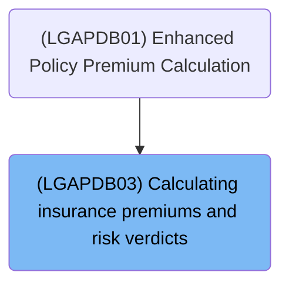
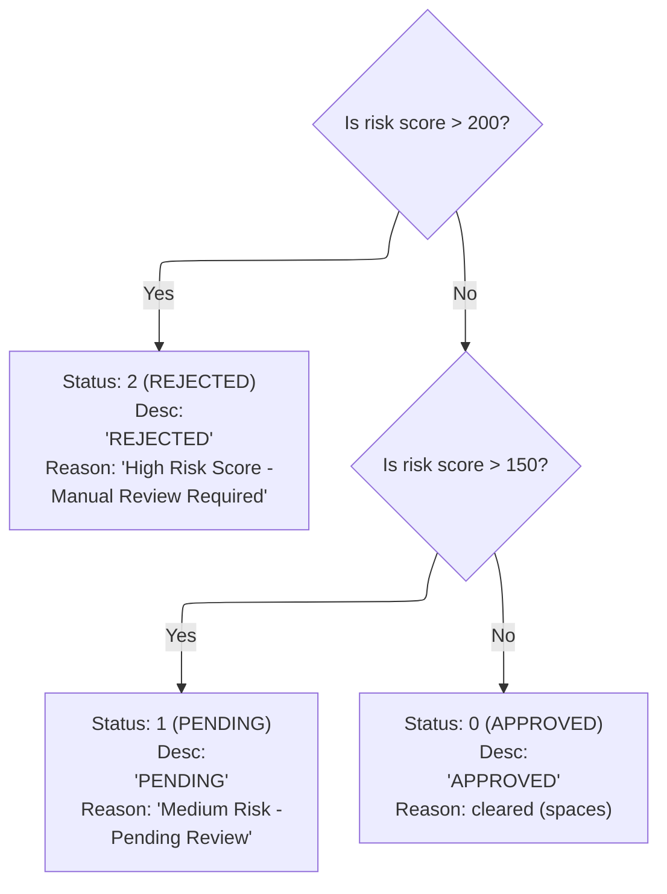
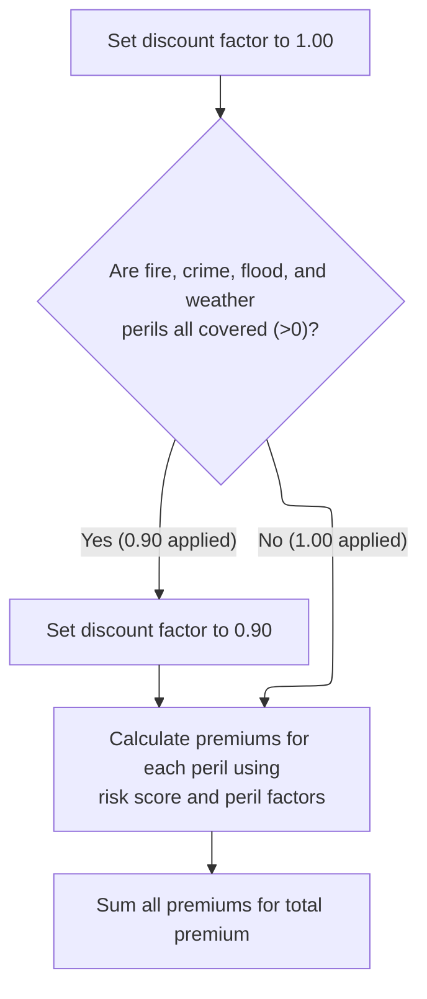

# Overview

This document describes the flow for determining insurance risk verdicts and calculating premiums for a policy. The process ensures risk multipliers are available, categorizes the risk score, and calculates premiums for each peril, applying a discount for full coverage.

## Dependencies

### Program

- <SwmToken path="base/src/LGAPDB03.cbl" pos="2:6:6" line-data="       PROGRAM-ID. LGAPDB03.">`LGAPDB03`</SwmToken> (<SwmPath>[base/src/LGAPDB03.cbl](base/src/LGAPDB03.cbl)</SwmPath>)

### Copybook

- SQLCA

# Where is this program used?

This program is used once, as represented in the following diagram:



## Input and Output Tables/Files used

### <SwmToken path="base/src/LGAPDB03.cbl" pos="2:6:6" line-data="       PROGRAM-ID. LGAPDB03.">`LGAPDB03`</SwmToken> (<SwmPath>[base/src/LGAPDB03.cbl](base/src/LGAPDB03.cbl)</SwmPath>)

| Table / File Name                                                                                                          | Type | Description                                                              | Usage Mode | Key Fields / Layout Highlights                                                                                                                                                                                                                                                                               |
| -------------------------------------------------------------------------------------------------------------------------- | ---- | ------------------------------------------------------------------------ | ---------- | ------------------------------------------------------------------------------------------------------------------------------------------------------------------------------------------------------------------------------------------------------------------------------------------------------------ |
| <SwmToken path="base/src/LGAPDB03.cbl" pos="51:3:3" line-data="               FROM RISK_FACTORS">`RISK_FACTORS`</SwmToken> | DB2  | Peril-specific risk adjustment factors for insurance premium calculation | Input      | <SwmToken path="base/src/LGAPDB03.cbl" pos="50:8:12" line-data="               SELECT FACTOR_VALUE INTO :WS-FIRE-FACTOR">`WS-FIRE-FACTOR`</SwmToken>, <SwmToken path="base/src/LGAPDB03.cbl" pos="62:8:12" line-data="               SELECT FACTOR_VALUE INTO :WS-CRIME-FACTOR">`WS-CRIME-FACTOR`</SwmToken> |

## Detailed View of the Program's Functionality

Program Structure and Main Flow

The program is structured into several sections: identification, environment, data, and procedure. The main logic is contained in the procedure section, which is executed with a set of input and output parameters (risk score, peril values, status, descriptions, premiums, etc.).

The main flow consists of three sequential steps:

1. Fetching risk factors for fire and crime perils (from the database or using defaults).
2. Assigning a risk verdict based on the risk score.
3. Calculating insurance premiums for all perils, applying any discounts if applicable.

Fetching Risk Multipliers for Perils

The program first attempts to retrieve the risk multipliers for fire and crime perils from a database table. For each peril:

- It executes a database query to fetch the multiplier value for the specific peril type (first FIRE, then CRIME).
- If the database query is successful (i.e., the value is found), it uses the value from the database.
- If the query fails (i.e., the value is not found), it assigns a default value: <SwmToken path="base/src/LGAPDB03.cbl" pos="58:3:5" line-data="               MOVE 0.80 TO WS-FIRE-FACTOR">`0.80`</SwmToken> for fire and <SwmToken path="base/src/LGAPDB03.cbl" pos="70:3:5" line-data="               MOVE 0.60 TO WS-CRIME-FACTOR">`0.60`</SwmToken> for crime.
- Flood and weather multipliers are not fetched from the database; they use hardcoded values (<SwmToken path="base/src/LGAPDB03.cbl" pos="16:15:17" line-data="       01  WS-FLOOD-FACTOR             PIC V99 VALUE 1.20.">`1.20`</SwmToken> for flood, <SwmToken path="base/src/LGAPDB03.cbl" pos="99:3:5" line-data="             MOVE 0.90 TO LK-DISC-FACT">`0.90`</SwmToken> for weather).

This ensures that the program always has valid risk multipliers for all perils, either from the database or from defaults, so that subsequent calculations can proceed without interruption.

Assigning Risk Verdicts Based on Score

The program categorizes the risk score into one of three buckets, setting the status, description, and rejection reason accordingly:

- If the risk score is greater than 200:
  - The status is set to "REJECTED".
  - The description is set to "REJECTED".
  - The rejection reason is set to "High Risk Score - Manual Review Required".
- If the risk score is greater than 150 but less than or equal to 200:
  - The status is set to "PENDING".
  - The description is set to "PENDING".
  - The rejection reason is set to "Medium Risk - Pending Review".
- If the risk score is 150 or less:
  - The status is set to "APPROVED".
  - The description is set to "APPROVED".
  - The rejection reason is cleared (set to blank).

These values are intended for user-facing output, indicating the result of the risk assessment.

Computing Insurance Premiums for All Perils

The program calculates the insurance premiums for each peril (fire, crime, flood, weather) and the total premium as follows:

- It starts by setting a discount factor to <SwmToken path="base/src/LGAPDB03.cbl" pos="93:3:5" line-data="           MOVE 1.00 TO LK-DISC-FACT">`1.00`</SwmToken> (no discount).
- If all peril values (fire, crime, flood, weather) are positive (i.e., coverage is selected for all perils), it applies a 10% discount by setting the discount factor to <SwmToken path="base/src/LGAPDB03.cbl" pos="99:3:5" line-data="             MOVE 0.90 TO LK-DISC-FACT">`0.90`</SwmToken>.
- For each peril, the premium is calculated by multiplying:
  - The risk score,
  - The peril's risk multiplier,
  - The peril value (coverage amount or similar),
  - The discount factor.
- The total premium is then calculated as the sum of the individual peril premiums.

This approach ensures that customers who select coverage for all perils receive a discount, and that premiums are dynamically calculated based on both risk and coverage selections.

# Data Definitions

### <SwmToken path="base/src/LGAPDB03.cbl" pos="2:6:6" line-data="       PROGRAM-ID. LGAPDB03.">`LGAPDB03`</SwmToken> (<SwmPath>[base/src/LGAPDB03.cbl](base/src/LGAPDB03.cbl)</SwmPath>)

| Table / Record Name                                                                                                        | Type | Short Description                                                        | Usage Mode     |
| -------------------------------------------------------------------------------------------------------------------------- | ---- | ------------------------------------------------------------------------ | -------------- |
| <SwmToken path="base/src/LGAPDB03.cbl" pos="51:3:3" line-data="               FROM RISK_FACTORS">`RISK_FACTORS`</SwmToken> | DB2  | Peril-specific risk adjustment factors for insurance premium calculation | Input (SELECT) |

# Rule Definition

| Paragraph Name                                                                                                                                                                | Rule ID | Category          | Description                                                                                                                                                                                                                                                                                                                                                                                                                                                                                                             | Conditions                                                                                           | Remarks                                                                                                                                                                                                                                                                                                                                                         |
| ----------------------------------------------------------------------------------------------------------------------------------------------------------------------------- | ------- | ----------------- | ----------------------------------------------------------------------------------------------------------------------------------------------------------------------------------------------------------------------------------------------------------------------------------------------------------------------------------------------------------------------------------------------------------------------------------------------------------------------------------------------------------------------- | ---------------------------------------------------------------------------------------------------- | --------------------------------------------------------------------------------------------------------------------------------------------------------------------------------------------------------------------------------------------------------------------------------------------------------------------------------------------------------------- |
| <SwmToken path="base/src/LGAPDB03.cbl" pos="43:3:7" line-data="           PERFORM GET-RISK-FACTORS">`GET-RISK-FACTORS`</SwmToken>                                             | RL-001  | Conditional Logic | The system retrieves the FIRE risk factor from the <SwmToken path="base/src/LGAPDB03.cbl" pos="51:3:3" line-data="               FROM RISK_FACTORS">`RISK_FACTORS`</SwmToken> table where <SwmToken path="base/src/LGAPDB03.cbl" pos="52:3:3" line-data="               WHERE PERIL_TYPE = &#39;FIRE&#39;">`PERIL_TYPE`</SwmToken> is 'FIRE'. If not found, it uses a default value of <SwmToken path="base/src/LGAPDB03.cbl" pos="58:3:5" line-data="               MOVE 0.80 TO WS-FIRE-FACTOR">`0.80`</SwmToken>.    | When calculating premiums, always attempt to retrieve the FIRE risk factor from the database first.  | Default value: <SwmToken path="base/src/LGAPDB03.cbl" pos="58:3:5" line-data="               MOVE 0.80 TO WS-FIRE-FACTOR">`0.80`</SwmToken>. The factor is a number with two decimal places.                                                                                                                                                                    |
| <SwmToken path="base/src/LGAPDB03.cbl" pos="43:3:7" line-data="           PERFORM GET-RISK-FACTORS">`GET-RISK-FACTORS`</SwmToken>                                             | RL-002  | Conditional Logic | The system retrieves the CRIME risk factor from the <SwmToken path="base/src/LGAPDB03.cbl" pos="51:3:3" line-data="               FROM RISK_FACTORS">`RISK_FACTORS`</SwmToken> table where <SwmToken path="base/src/LGAPDB03.cbl" pos="52:3:3" line-data="               WHERE PERIL_TYPE = &#39;FIRE&#39;">`PERIL_TYPE`</SwmToken> is 'CRIME'. If not found, it uses a default value of <SwmToken path="base/src/LGAPDB03.cbl" pos="70:3:5" line-data="               MOVE 0.60 TO WS-CRIME-FACTOR">`0.60`</SwmToken>. | When calculating premiums, always attempt to retrieve the CRIME risk factor from the database first. | Default value: <SwmToken path="base/src/LGAPDB03.cbl" pos="70:3:5" line-data="               MOVE 0.60 TO WS-CRIME-FACTOR">`0.60`</SwmToken>. The factor is a number with two decimal places.                                                                                                                                                                   |
| <SwmToken path="base/src/LGAPDB03.cbl" pos="9:1:3" line-data="       WORKING-STORAGE SECTION.">`WORKING-STORAGE`</SwmToken> SECTION                                           | RL-003  | Data Assignment   | The FLOOD risk factor is always set to <SwmToken path="base/src/LGAPDB03.cbl" pos="16:15:17" line-data="       01  WS-FLOOD-FACTOR             PIC V99 VALUE 1.20.">`1.20`</SwmToken> and the WEATHER risk factor is always set to <SwmToken path="base/src/LGAPDB03.cbl" pos="99:3:5" line-data="             MOVE 0.90 TO LK-DISC-FACT">`0.90`</SwmToken>.                                                                                                                                                            | Always, before premium calculation.                                                                  | FLOOD risk factor: <SwmToken path="base/src/LGAPDB03.cbl" pos="16:15:17" line-data="       01  WS-FLOOD-FACTOR             PIC V99 VALUE 1.20.">`1.20`</SwmToken> (number, two decimals). WEATHER risk factor: <SwmToken path="base/src/LGAPDB03.cbl" pos="99:3:5" line-data="             MOVE 0.90 TO LK-DISC-FACT">`0.90`</SwmToken> (number, two decimals). |
| <SwmToken path="base/src/LGAPDB03.cbl" pos="45:3:5" line-data="           PERFORM CALCULATE-PREMIUMS">`CALCULATE-PREMIUMS`</SwmToken>                                         | RL-004  | Conditional Logic | If all peril values (FIRE, CRIME, FLOOD, WEATHER) are greater than zero, set the discount factor to <SwmToken path="base/src/LGAPDB03.cbl" pos="99:3:5" line-data="             MOVE 0.90 TO LK-DISC-FACT">`0.90`</SwmToken>; otherwise, set it to <SwmToken path="base/src/LGAPDB03.cbl" pos="93:3:5" line-data="           MOVE 1.00 TO LK-DISC-FACT">`1.00`</SwmToken>.                                                                                                                                              | When calculating premiums, check all peril values.                                                   | Discount factor: <SwmToken path="base/src/LGAPDB03.cbl" pos="99:3:5" line-data="             MOVE 0.90 TO LK-DISC-FACT">`0.90`</SwmToken> or <SwmToken path="base/src/LGAPDB03.cbl" pos="93:3:5" line-data="           MOVE 1.00 TO LK-DISC-FACT">`1.00`</SwmToken> (number, two decimals).                                                                     |
| <SwmToken path="base/src/LGAPDB03.cbl" pos="45:3:5" line-data="           PERFORM CALCULATE-PREMIUMS">`CALCULATE-PREMIUMS`</SwmToken>                                         | RL-005  | Computation       | For each peril (FIRE, CRIME, FLOOD, WEATHER), calculate the premium as: (risk score) × (peril factor) × (peril value) × (discount factor).                                                                                                                                                                                                                                                                                                                                                                              | When the risk verdict is APPROVED, calculate premiums for all perils.                                | Premiums are numbers with up to 8 digits before and 2 digits after the decimal point.                                                                                                                                                                                                                                                                           |
| <SwmToken path="base/src/LGAPDB03.cbl" pos="45:3:5" line-data="           PERFORM CALCULATE-PREMIUMS">`CALCULATE-PREMIUMS`</SwmToken>                                         | RL-006  | Computation       | Calculate the total premium as the sum of all individual peril premiums.                                                                                                                                                                                                                                                                                                                                                                                                                                                | When the risk verdict is APPROVED, after calculating individual premiums.                            | Total premium is a number with up to 9 digits before and 2 digits after the decimal point.                                                                                                                                                                                                                                                                      |
| <SwmToken path="base/src/LGAPDB03.cbl" pos="44:3:5" line-data="           PERFORM CALCULATE-VERDICT">`CALCULATE-VERDICT`</SwmToken>                                           | RL-007  | Conditional Logic | Set the risk verdict based on the risk score: if >200, set status to REJECTED; if >150, set status to PENDING; otherwise, set status to APPROVED. Set corresponding status description and rejection reason.                                                                                                                                                                                                                                                                                                            | Always, after receiving input risk score.                                                            | Status: 0 (APPROVED), 1 (PENDING), 2 (REJECTED). Status description: up to 20 characters. Rejection reason: up to 50 characters or spaces if approved.                                                                                                                                                                                                          |
| <SwmToken path="base/src/LGAPDB03.cbl" pos="45:3:5" line-data="           PERFORM CALCULATE-PREMIUMS">`CALCULATE-PREMIUMS`</SwmToken> (implied by spec, not explicit in code) | RL-008  | Conditional Logic | If the risk verdict is REJECTED or PENDING, all peril premiums and the total premium must be set to 0.00.                                                                                                                                                                                                                                                                                                                                                                                                               | If status is REJECTED or PENDING (status = 2 or 1).                                                  | All premiums set to 0.00 (number, two decimals).                                                                                                                                                                                                                                                                                                                |

# User Stories

## User Story 1: Retrieve and assign peril risk factors

---

### Story Description:

As a system, I want to retrieve the FIRE and CRIME risk factors from the database (with defaults if not found), and always assign hardcoded values for FLOOD and WEATHER risk factors, so that I have the correct factors for premium calculation.

---

### Business Rule Mapping:

| Rule ID | Paragraph Name                                                                                                                      | Rule Description                                                                                                                                                                                                                                                                                                                                                                                                                                                                                                        |
| ------- | ----------------------------------------------------------------------------------------------------------------------------------- | ----------------------------------------------------------------------------------------------------------------------------------------------------------------------------------------------------------------------------------------------------------------------------------------------------------------------------------------------------------------------------------------------------------------------------------------------------------------------------------------------------------------------- |
| RL-001  | <SwmToken path="base/src/LGAPDB03.cbl" pos="43:3:7" line-data="           PERFORM GET-RISK-FACTORS">`GET-RISK-FACTORS`</SwmToken>   | The system retrieves the FIRE risk factor from the <SwmToken path="base/src/LGAPDB03.cbl" pos="51:3:3" line-data="               FROM RISK_FACTORS">`RISK_FACTORS`</SwmToken> table where <SwmToken path="base/src/LGAPDB03.cbl" pos="52:3:3" line-data="               WHERE PERIL_TYPE = &#39;FIRE&#39;">`PERIL_TYPE`</SwmToken> is 'FIRE'. If not found, it uses a default value of <SwmToken path="base/src/LGAPDB03.cbl" pos="58:3:5" line-data="               MOVE 0.80 TO WS-FIRE-FACTOR">`0.80`</SwmToken>.    |
| RL-002  | <SwmToken path="base/src/LGAPDB03.cbl" pos="43:3:7" line-data="           PERFORM GET-RISK-FACTORS">`GET-RISK-FACTORS`</SwmToken>   | The system retrieves the CRIME risk factor from the <SwmToken path="base/src/LGAPDB03.cbl" pos="51:3:3" line-data="               FROM RISK_FACTORS">`RISK_FACTORS`</SwmToken> table where <SwmToken path="base/src/LGAPDB03.cbl" pos="52:3:3" line-data="               WHERE PERIL_TYPE = &#39;FIRE&#39;">`PERIL_TYPE`</SwmToken> is 'CRIME'. If not found, it uses a default value of <SwmToken path="base/src/LGAPDB03.cbl" pos="70:3:5" line-data="               MOVE 0.60 TO WS-CRIME-FACTOR">`0.60`</SwmToken>. |
| RL-003  | <SwmToken path="base/src/LGAPDB03.cbl" pos="9:1:3" line-data="       WORKING-STORAGE SECTION.">`WORKING-STORAGE`</SwmToken> SECTION | The FLOOD risk factor is always set to <SwmToken path="base/src/LGAPDB03.cbl" pos="16:15:17" line-data="       01  WS-FLOOD-FACTOR             PIC V99 VALUE 1.20.">`1.20`</SwmToken> and the WEATHER risk factor is always set to <SwmToken path="base/src/LGAPDB03.cbl" pos="99:3:5" line-data="             MOVE 0.90 TO LK-DISC-FACT">`0.90`</SwmToken>.                                                                                                                                                            |

---

### Relevant Functionality:

- <SwmToken path="base/src/LGAPDB03.cbl" pos="43:3:7" line-data="           PERFORM GET-RISK-FACTORS">`GET-RISK-FACTORS`</SwmToken>
  1. **RL-001:**
     - Query the <SwmToken path="base/src/LGAPDB03.cbl" pos="51:3:3" line-data="               FROM RISK_FACTORS">`RISK_FACTORS`</SwmToken> table for <SwmToken path="base/src/LGAPDB03.cbl" pos="52:3:3" line-data="               WHERE PERIL_TYPE = &#39;FIRE&#39;">`PERIL_TYPE`</SwmToken> = 'FIRE'.
     - If a value is found, use it as the FIRE risk factor.
     - If not found, set the FIRE risk factor to <SwmToken path="base/src/LGAPDB03.cbl" pos="58:3:5" line-data="               MOVE 0.80 TO WS-FIRE-FACTOR">`0.80`</SwmToken>.
  2. **RL-002:**
     - Query the <SwmToken path="base/src/LGAPDB03.cbl" pos="51:3:3" line-data="               FROM RISK_FACTORS">`RISK_FACTORS`</SwmToken> table for <SwmToken path="base/src/LGAPDB03.cbl" pos="52:3:3" line-data="               WHERE PERIL_TYPE = &#39;FIRE&#39;">`PERIL_TYPE`</SwmToken> = 'CRIME'.
     - If a value is found, use it as the CRIME risk factor.
     - If not found, set the CRIME risk factor to <SwmToken path="base/src/LGAPDB03.cbl" pos="70:3:5" line-data="               MOVE 0.60 TO WS-CRIME-FACTOR">`0.60`</SwmToken>.
- <SwmToken path="base/src/LGAPDB03.cbl" pos="9:1:3" line-data="       WORKING-STORAGE SECTION.">`WORKING-STORAGE`</SwmToken> **SECTION**
  1. **RL-003:**
     - Set FLOOD risk factor to <SwmToken path="base/src/LGAPDB03.cbl" pos="16:15:17" line-data="       01  WS-FLOOD-FACTOR             PIC V99 VALUE 1.20.">`1.20`</SwmToken>.
     - Set WEATHER risk factor to <SwmToken path="base/src/LGAPDB03.cbl" pos="99:3:5" line-data="             MOVE 0.90 TO LK-DISC-FACT">`0.90`</SwmToken>.

## User Story 2: Calculate discount factor and premiums

---

### Story Description:

As a system, I want to determine the discount factor based on peril values, and calculate individual peril premiums and the total premium using the risk score, peril factors, peril values, and discount factor, so that I can provide accurate premium amounts.

---

### Business Rule Mapping:

| Rule ID | Paragraph Name                                                                                                                        | Rule Description                                                                                                                                                                                                                                                                                                                                                           |
| ------- | ------------------------------------------------------------------------------------------------------------------------------------- | -------------------------------------------------------------------------------------------------------------------------------------------------------------------------------------------------------------------------------------------------------------------------------------------------------------------------------------------------------------------------- |
| RL-004  | <SwmToken path="base/src/LGAPDB03.cbl" pos="45:3:5" line-data="           PERFORM CALCULATE-PREMIUMS">`CALCULATE-PREMIUMS`</SwmToken> | If all peril values (FIRE, CRIME, FLOOD, WEATHER) are greater than zero, set the discount factor to <SwmToken path="base/src/LGAPDB03.cbl" pos="99:3:5" line-data="             MOVE 0.90 TO LK-DISC-FACT">`0.90`</SwmToken>; otherwise, set it to <SwmToken path="base/src/LGAPDB03.cbl" pos="93:3:5" line-data="           MOVE 1.00 TO LK-DISC-FACT">`1.00`</SwmToken>. |
| RL-005  | <SwmToken path="base/src/LGAPDB03.cbl" pos="45:3:5" line-data="           PERFORM CALCULATE-PREMIUMS">`CALCULATE-PREMIUMS`</SwmToken> | For each peril (FIRE, CRIME, FLOOD, WEATHER), calculate the premium as: (risk score) × (peril factor) × (peril value) × (discount factor).                                                                                                                                                                                                                                 |
| RL-006  | <SwmToken path="base/src/LGAPDB03.cbl" pos="45:3:5" line-data="           PERFORM CALCULATE-PREMIUMS">`CALCULATE-PREMIUMS`</SwmToken> | Calculate the total premium as the sum of all individual peril premiums.                                                                                                                                                                                                                                                                                                   |

---

### Relevant Functionality:

- <SwmToken path="base/src/LGAPDB03.cbl" pos="45:3:5" line-data="           PERFORM CALCULATE-PREMIUMS">`CALCULATE-PREMIUMS`</SwmToken>
  1. **RL-004:**
     - Set discount factor to <SwmToken path="base/src/LGAPDB03.cbl" pos="93:3:5" line-data="           MOVE 1.00 TO LK-DISC-FACT">`1.00`</SwmToken> by default.
     - If all peril values are greater than zero, set discount factor to <SwmToken path="base/src/LGAPDB03.cbl" pos="99:3:5" line-data="             MOVE 0.90 TO LK-DISC-FACT">`0.90`</SwmToken>.
  2. **RL-005:**
     - For each peril:
       - Multiply risk score by peril factor.
       - Multiply by peril value.
       - Multiply by discount factor.
       - Store the result as the peril's premium.
  3. **RL-006:**
     - Add all individual peril premiums together.
     - Store the result as the total premium.

## User Story 3: Determine risk verdict and handle premium zeroing

---

### Story Description:

As a system, I want to determine the risk verdict based on the risk score, set the appropriate status, description, and rejection reason, and ensure that all premiums are set to zero if the verdict is REJECTED or PENDING, so that risk outcomes and premiums are handled correctly.

---

### Business Rule Mapping:

| Rule ID | Paragraph Name                                                                                                                                                                | Rule Description                                                                                                                                                                                             |
| ------- | ----------------------------------------------------------------------------------------------------------------------------------------------------------------------------- | ------------------------------------------------------------------------------------------------------------------------------------------------------------------------------------------------------------ |
| RL-007  | <SwmToken path="base/src/LGAPDB03.cbl" pos="44:3:5" line-data="           PERFORM CALCULATE-VERDICT">`CALCULATE-VERDICT`</SwmToken>                                           | Set the risk verdict based on the risk score: if >200, set status to REJECTED; if >150, set status to PENDING; otherwise, set status to APPROVED. Set corresponding status description and rejection reason. |
| RL-008  | <SwmToken path="base/src/LGAPDB03.cbl" pos="45:3:5" line-data="           PERFORM CALCULATE-PREMIUMS">`CALCULATE-PREMIUMS`</SwmToken> (implied by spec, not explicit in code) | If the risk verdict is REJECTED or PENDING, all peril premiums and the total premium must be set to 0.00.                                                                                                    |

---

### Relevant Functionality:

- <SwmToken path="base/src/LGAPDB03.cbl" pos="44:3:5" line-data="           PERFORM CALCULATE-VERDICT">`CALCULATE-VERDICT`</SwmToken>
  1. **RL-007:**
     - If risk score > 200:
       - Set status to 2.
       - Set status description to 'REJECTED'.
       - Set rejection reason to 'High Risk Score - Manual Review Required'.
     - Else if risk score > 150:
       - Set status to 1.
       - Set status description to 'PENDING'.
       - Set rejection reason to 'Medium Risk - Pending Review'.
     - Else:
       - Set status to 0.
       - Set status description to 'APPROVED'.
       - Clear rejection reason (set to spaces).
- <SwmToken path="base/src/LGAPDB03.cbl" pos="45:3:5" line-data="           PERFORM CALCULATE-PREMIUMS">`CALCULATE-PREMIUMS`</SwmToken> **(implied by spec**
  1. **RL-008:**
     - If status is 2 (REJECTED) or 1 (PENDING):
       - Set all peril premiums to 0.00.
       - Set total premium to 0.00.

# Workflow

# Orchestrating the risk and premium calculations

This section coordinates the retrieval of risk factors, categorization of risk, and calculation of premiums by invoking the appropriate processes in sequence.

| Rule ID | Category                        | Rule Name                                  | Description                                                                                                   | Implementation Details                                                                                                                                               |
| ------- | ------------------------------- | ------------------------------------------ | ------------------------------------------------------------------------------------------------------------- | -------------------------------------------------------------------------------------------------------------------------------------------------------------------- |
| BR-001  | Invoking a Service or a Process | Retrieve risk factors first                | Risk factors are retrieved before any risk categorization or premium calculation is performed.                | No constants or output formats are defined in this section. The rule ensures that the latest risk factors are available for subsequent calculations.                 |
| BR-002  | Invoking a Service or a Process | Categorize risk before premium calculation | Risk categorization is performed after risk factors are retrieved and before premium calculations.            | No constants or output formats are defined in this section. The rule ensures that risk categorization uses the latest risk factors and precedes premium calculation. |
| BR-003  | Invoking a Service or a Process | Calculate premiums last                    | Premium calculations are performed only after risk factors are retrieved and risk categorization is complete. | No constants or output formats are defined in this section. The rule ensures that premium calculations are based on the latest risk factors and risk category.       |

<SwmSnippet path="/base/src/LGAPDB03.cbl" line="42">

---

<SwmToken path="base/src/LGAPDB03.cbl" pos="42:1:3" line-data="       MAIN-LOGIC.">`MAIN-LOGIC`</SwmToken> just sequences the main steps: it grabs risk factors (from DB or defaults), then uses them to categorize the risk and finally calculates premiums. Calling <SwmToken path="base/src/LGAPDB03.cbl" pos="43:3:7" line-data="           PERFORM GET-RISK-FACTORS">`GET-RISK-FACTORS`</SwmToken> first ensures the premium calculations use the right multipliers.

```cobol
       MAIN-LOGIC.
           PERFORM GET-RISK-FACTORS
           PERFORM CALCULATE-VERDICT
           PERFORM CALCULATE-PREMIUMS
           GOBACK.
```

---

</SwmSnippet>

## Fetching risk multipliers for perils

```mermaid
%%{init: {"flowchart": {"defaultRenderer": "elk"}} }%%
flowchart TD
    node1["Retrieve FIRE risk factor from database"]
    click node1 openCode "base/src/LGAPDB03.cbl:49:53"
    node1 --> node2{"Was FIRE risk factor found?"}
    click node2 openCode "base/src/LGAPDB03.cbl:55:59"
    node2 -->|"Yes"| node3["Retrieve CRIME risk factor from database"]
    node2 -->|"No"| node4["Assign default FIRE risk factor (0.80)"]
    click node4 openCode "base/src/LGAPDB03.cbl:58:58"
    node4 --> node3
    node3["Retrieve CRIME risk factor from database"]
    click node3 openCode "base/src/LGAPDB03.cbl:61:65"
    node3 --> node5{"Was CRIME risk factor found?"}
    click node5 openCode "base/src/LGAPDB03.cbl:67:71"
    node5 -->|"Yes"| node6["End: Both risk factors determined"]
    node5 -->|"No"| node7["Assign default CRIME risk factor (0.60)"]
    click node7 openCode "base/src/LGAPDB03.cbl:70:70"
    node7 --> node6
    node6["End: Both risk factors determined"]
    click node6 openCode "base/src/LGAPDB03.cbl:48:71"
classDef HeadingStyle fill:#777777,stroke:#333,stroke-width:2px;

%% Swimm:
%% %%{init: {"flowchart": {"defaultRenderer": "elk"}} }%%
%% flowchart TD
%%     node1["Retrieve FIRE risk factor from database"]
%%     click node1 openCode "<SwmPath>[base/src/LGAPDB03.cbl](base/src/LGAPDB03.cbl)</SwmPath>:49:53"
%%     node1 --> node2{"Was FIRE risk factor found?"}
%%     click node2 openCode "<SwmPath>[base/src/LGAPDB03.cbl](base/src/LGAPDB03.cbl)</SwmPath>:55:59"
%%     node2 -->|"Yes"| node3["Retrieve CRIME risk factor from database"]
%%     node2 -->|"No"| node4["Assign default FIRE risk factor (<SwmToken path="base/src/LGAPDB03.cbl" pos="58:3:5" line-data="               MOVE 0.80 TO WS-FIRE-FACTOR">`0.80`</SwmToken>)"]
%%     click node4 openCode "<SwmPath>[base/src/LGAPDB03.cbl](base/src/LGAPDB03.cbl)</SwmPath>:58:58"
%%     node4 --> node3
%%     node3["Retrieve CRIME risk factor from database"]
%%     click node3 openCode "<SwmPath>[base/src/LGAPDB03.cbl](base/src/LGAPDB03.cbl)</SwmPath>:61:65"
%%     node3 --> node5{"Was CRIME risk factor found?"}
%%     click node5 openCode "<SwmPath>[base/src/LGAPDB03.cbl](base/src/LGAPDB03.cbl)</SwmPath>:67:71"
%%     node5 -->|"Yes"| node6["End: Both risk factors determined"]
%%     node5 -->|"No"| node7["Assign default CRIME risk factor (<SwmToken path="base/src/LGAPDB03.cbl" pos="70:3:5" line-data="               MOVE 0.60 TO WS-CRIME-FACTOR">`0.60`</SwmToken>)"]
%%     click node7 openCode "<SwmPath>[base/src/LGAPDB03.cbl](base/src/LGAPDB03.cbl)</SwmPath>:70:70"
%%     node7 --> node6
%%     node6["End: Both risk factors determined"]
%%     click node6 openCode "<SwmPath>[base/src/LGAPDB03.cbl](base/src/LGAPDB03.cbl)</SwmPath>:48:71"
%% classDef HeadingStyle fill:#777777,stroke:#333,stroke-width:2px;
```



This section ensures that risk multipliers for FIRE and CRIME perils are always available for further processing, by retrieving them from a database or assigning default values if not found.

| Rule ID | Category        | Rule Name                     | Description                                                                                                                                                                                                                                  | Implementation Details                                                                                                                                                                                                                                                                                                                                                                    |
| ------- | --------------- | ----------------------------- | -------------------------------------------------------------------------------------------------------------------------------------------------------------------------------------------------------------------------------------------- | ----------------------------------------------------------------------------------------------------------------------------------------------------------------------------------------------------------------------------------------------------------------------------------------------------------------------------------------------------------------------------------------- |
| BR-001  | Decision Making | Default FIRE risk multiplier  | If the FIRE risk factor is not found in the database, assign a default value of <SwmToken path="base/src/LGAPDB03.cbl" pos="58:3:5" line-data="               MOVE 0.80 TO WS-FIRE-FACTOR">`0.80`</SwmToken> as the FIRE risk multiplier.    | The default value for the FIRE risk multiplier is <SwmToken path="base/src/LGAPDB03.cbl" pos="58:3:5" line-data="               MOVE 0.80 TO WS-FIRE-FACTOR">`0.80`</SwmToken>. The multiplier is a number and is used in subsequent calculations.                                                                                                                                        |
| BR-002  | Decision Making | Default CRIME risk multiplier | If the CRIME risk factor is not found in the database, assign a default value of <SwmToken path="base/src/LGAPDB03.cbl" pos="70:3:5" line-data="               MOVE 0.60 TO WS-CRIME-FACTOR">`0.60`</SwmToken> as the CRIME risk multiplier. | The default value for the CRIME risk multiplier is <SwmToken path="base/src/LGAPDB03.cbl" pos="70:3:5" line-data="               MOVE 0.60 TO WS-CRIME-FACTOR">`0.60`</SwmToken>. The multiplier is a number and is used in subsequent calculations.                                                                                                                                      |
| BR-003  | Decision Making | Risk multipliers always set   | After this section, both FIRE and CRIME risk multipliers are guaranteed to be set to a value, either from the database or a default, ensuring downstream calculations can proceed without interruption.                                      | Both multipliers are numbers. FIRE uses <SwmToken path="base/src/LGAPDB03.cbl" pos="58:3:5" line-data="               MOVE 0.80 TO WS-FIRE-FACTOR">`0.80`</SwmToken> as default, CRIME uses <SwmToken path="base/src/LGAPDB03.cbl" pos="70:3:5" line-data="               MOVE 0.60 TO WS-CRIME-FACTOR">`0.60`</SwmToken> as default. Values are available for subsequent business logic. |

<SwmSnippet path="/base/src/LGAPDB03.cbl" line="48">

---

In <SwmToken path="base/src/LGAPDB03.cbl" pos="48:1:5" line-data="       GET-RISK-FACTORS.">`GET-RISK-FACTORS`</SwmToken>, we grab the fire risk multiplier from the database. If the DB doesn't have it, we use a default value so the rest of the flow isn't blocked.

```cobol
       GET-RISK-FACTORS.
           EXEC SQL
               SELECT FACTOR_VALUE INTO :WS-FIRE-FACTOR
               FROM RISK_FACTORS
               WHERE PERIL_TYPE = 'FIRE'
           END-EXEC.
```

---

</SwmSnippet>

<SwmSnippet path="/base/src/LGAPDB03.cbl" line="55">

---

If the DB query for FIRE fails, we just assign <SwmToken path="base/src/LGAPDB03.cbl" pos="58:3:5" line-data="               MOVE 0.80 TO WS-FIRE-FACTOR">`0.80`</SwmToken> as the risk factor. This keeps the flow moving and ensures we always have a value for calculations.

```cobol
           IF SQLCODE = 0
               CONTINUE
           ELSE
               MOVE 0.80 TO WS-FIRE-FACTOR
           END-IF.
```

---

</SwmSnippet>

<SwmSnippet path="/base/src/LGAPDB03.cbl" line="61">

---

After handling FIRE, we do the same for CRIME—try to fetch from DB, and if not found, fallback to the default value.

```cobol
           EXEC SQL
               SELECT FACTOR_VALUE INTO :WS-CRIME-FACTOR
               FROM RISK_FACTORS
               WHERE PERIL_TYPE = 'CRIME'
           END-EXEC.
```

---

</SwmSnippet>

<SwmSnippet path="/base/src/LGAPDB03.cbl" line="67">

---

After both DB queries and fallback checks, <SwmToken path="base/src/LGAPDB03.cbl" pos="43:3:7" line-data="           PERFORM GET-RISK-FACTORS">`GET-RISK-FACTORS`</SwmToken> leaves us with fire and crime multipliers set—either from DB or defaults—so the rest of the flow can use them directly.

```cobol
           IF SQLCODE = 0
               CONTINUE
           ELSE
               MOVE 0.60 TO WS-CRIME-FACTOR
           END-IF.
```

---

</SwmSnippet>

## Assigning risk verdicts based on score



This section categorizes a risk score into one of three verdicts, setting user-visible status and reason fields based on fixed thresholds.

| Rule ID | Category        | Rule Name           | Description                                                                                                                                                                    | Implementation Details                                                                                                                                                                                                                     |
| ------- | --------------- | ------------------- | ------------------------------------------------------------------------------------------------------------------------------------------------------------------------------ | ------------------------------------------------------------------------------------------------------------------------------------------------------------------------------------------------------------------------------------------ |
| BR-001  | Decision Making | High risk rejection | If the risk score is greater than 200, the status is set to 2, the description is 'REJECTED', and the rejection reason is 'High Risk Score - Manual Review Required'.          | Status code: 2 (number). Description: 'REJECTED' (string, 8 characters, left-aligned, space-padded if needed). Rejection reason: 'High Risk Score - Manual Review Required' (string, 35 characters, left-aligned, space-padded if needed). |
| BR-002  | Decision Making | Medium risk pending | If the risk score is greater than 150 but not more than 200, the status is set to 1, the description is 'PENDING', and the rejection reason is 'Medium Risk - Pending Review'. | Status code: 1 (number). Description: 'PENDING' (string, 7 characters, left-aligned, space-padded if needed). Rejection reason: 'Medium Risk - Pending Review' (string, 28 characters, left-aligned, space-padded if needed).              |
| BR-003  | Decision Making | Low risk approval   | If the risk score is 150 or less, the status is set to 0, the description is 'APPROVED', and the rejection reason is blank.                                                    | Status code: 0 (number). Description: 'APPROVED' (string, 8 characters, left-aligned, space-padded if needed). Rejection reason: blank (spaces, 35 characters).                                                                            |

<SwmSnippet path="/base/src/LGAPDB03.cbl" line="73">

---

<SwmToken path="base/src/LGAPDB03.cbl" pos="73:1:3" line-data="       CALCULATE-VERDICT.">`CALCULATE-VERDICT`</SwmToken> just buckets the risk score into three categories using fixed thresholds, and sets the status, description, and rejection reason accordingly. These values are what the user sees.

```cobol
       CALCULATE-VERDICT.
           IF LK-RISK-SCORE > 200
             MOVE 2 TO LK-STAT
             MOVE 'REJECTED' TO LK-STAT-DESC
             MOVE 'High Risk Score - Manual Review Required' 
               TO LK-REJ-RSN
           ELSE
             IF LK-RISK-SCORE > 150
               MOVE 1 TO LK-STAT
               MOVE 'PENDING' TO LK-STAT-DESC
               MOVE 'Medium Risk - Pending Review'
                 TO LK-REJ-RSN
             ELSE
               MOVE 0 TO LK-STAT
               MOVE 'APPROVED' TO LK-STAT-DESC
               MOVE SPACES TO LK-REJ-RSN
             END-IF
           END-IF.
```

---

</SwmSnippet>

# Computing insurance premiums for all perils



This section computes insurance premiums for a policy by evaluating coverage across four perils and applying a discount for full coverage. It then calculates and aggregates the premiums for each peril to determine the total premium.

| Rule ID | Category        | Rule Name                         | Description                                                                                                                                                | Implementation Details                                                                                                                                                                                                                                                                                                                                                                            |
| ------- | --------------- | --------------------------------- | ---------------------------------------------------------------------------------------------------------------------------------------------------------- | ------------------------------------------------------------------------------------------------------------------------------------------------------------------------------------------------------------------------------------------------------------------------------------------------------------------------------------------------------------------------------------------------- |
| BR-001  | Calculation     | Fire peril premium calculation    | Calculate the fire peril premium by multiplying the risk score, fire peril factor, fire peril value, and the discount factor.                              | Fire peril factor is <SwmToken path="base/src/LGAPDB03.cbl" pos="58:3:5" line-data="               MOVE 0.80 TO WS-FIRE-FACTOR">`0.80`</SwmToken>. Premium is a numeric value with two decimal places.                                                                                                                                                                                            |
| BR-002  | Calculation     | Crime peril premium calculation   | Calculate the crime peril premium by multiplying the risk score, crime peril factor, crime peril value, and the discount factor.                           | Crime peril factor is <SwmToken path="base/src/LGAPDB03.cbl" pos="70:3:5" line-data="               MOVE 0.60 TO WS-CRIME-FACTOR">`0.60`</SwmToken>. Premium is a numeric value with two decimal places.                                                                                                                                                                                          |
| BR-003  | Calculation     | Flood peril premium calculation   | Calculate the flood peril premium by multiplying the risk score, flood peril factor, flood peril value, and the discount factor.                           | Flood peril factor is <SwmToken path="base/src/LGAPDB03.cbl" pos="16:15:17" line-data="       01  WS-FLOOD-FACTOR             PIC V99 VALUE 1.20.">`1.20`</SwmToken>. Premium is a numeric value with two decimal places.                                                                                                                                                                         |
| BR-004  | Calculation     | Weather peril premium calculation | Calculate the weather peril premium by multiplying the risk score, weather peril factor, weather peril value, and the discount factor.                     | Weather peril factor is <SwmToken path="base/src/LGAPDB03.cbl" pos="99:3:5" line-data="             MOVE 0.90 TO LK-DISC-FACT">`0.90`</SwmToken>. Premium is a numeric value with two decimal places.                                                                                                                                                                                             |
| BR-005  | Calculation     | Total premium aggregation         | Sum the individual peril premiums (fire, crime, flood, weather) to produce the total premium.                                                              | Total premium is a numeric value with two decimal places, equal to the sum of the four peril premiums.                                                                                                                                                                                                                                                                                            |
| BR-006  | Decision Making | Full coverage discount            | Apply a 10% discount to all peril premiums when fire, crime, flood, and weather peril values are all greater than zero. Otherwise, no discount is applied. | The discount factor is set to <SwmToken path="base/src/LGAPDB03.cbl" pos="99:3:5" line-data="             MOVE 0.90 TO LK-DISC-FACT">`0.90`</SwmToken> when all perils are covered; otherwise, it remains <SwmToken path="base/src/LGAPDB03.cbl" pos="93:3:5" line-data="           MOVE 1.00 TO LK-DISC-FACT">`1.00`</SwmToken>. The discount factor is a numeric value with two decimal places. |

<SwmSnippet path="/base/src/LGAPDB03.cbl" line="92">

---

In <SwmToken path="base/src/LGAPDB03.cbl" pos="92:1:3" line-data="       CALCULATE-PREMIUMS.">`CALCULATE-PREMIUMS`</SwmToken>, we set up a discount factor—if all peril values are positive, we apply a 10% discount. This is a business rule to encourage full coverage.

```cobol
       CALCULATE-PREMIUMS.
           MOVE 1.00 TO LK-DISC-FACT
           
           IF LK-FIRE-PERIL > 0 AND
              LK-CRIME-PERIL > 0 AND
              LK-FLOOD-PERIL > 0 AND
              LK-WEATHER-PERIL > 0
             MOVE 0.90 TO LK-DISC-FACT
           END-IF
```

---

</SwmSnippet>

<SwmSnippet path="/base/src/LGAPDB03.cbl" line="102">

---

After setting the discount, <SwmToken path="base/src/LGAPDB03.cbl" pos="45:3:5" line-data="           PERFORM CALCULATE-PREMIUMS">`CALCULATE-PREMIUMS`</SwmToken> computes each peril's premium using the risk score, peril factor, peril value, and discount. Then it sums them up for the total premium.

```cobol
           COMPUTE LK-FIRE-PREMIUM =
             ((LK-RISK-SCORE * WS-FIRE-FACTOR) * LK-FIRE-PERIL *
               LK-DISC-FACT)
           
           COMPUTE LK-CRIME-PREMIUM =
             ((LK-RISK-SCORE * WS-CRIME-FACTOR) * LK-CRIME-PERIL *
               LK-DISC-FACT)
           
           COMPUTE LK-FLOOD-PREMIUM =
             ((LK-RISK-SCORE * WS-FLOOD-FACTOR) * LK-FLOOD-PERIL *
               LK-DISC-FACT)
           
           COMPUTE LK-WEATHER-PREMIUM =
             ((LK-RISK-SCORE * WS-WEATHER-FACTOR) * LK-WEATHER-PERIL *
               LK-DISC-FACT)

           COMPUTE LK-TOTAL-PREMIUM = 
             LK-FIRE-PREMIUM + LK-CRIME-PREMIUM + 
             LK-FLOOD-PREMIUM + LK-WEATHER-PREMIUM. 
```

---

</SwmSnippet>

&nbsp;

*This is an auto-generated document by Swimm 🌊 and has not yet been verified by a human*

<SwmMeta version="3.0.0" repo-id="Z2l0aHViJTNBJTNBU3dpbW1pby1nZW5hcHAtaG91c2UlM0ElM0FHaXJpLVN3aW1t" repo-name="Swimmio-genapp-house"><sup>Powered by [Swimm](https://app.swimm.io/)</sup></SwmMeta>
