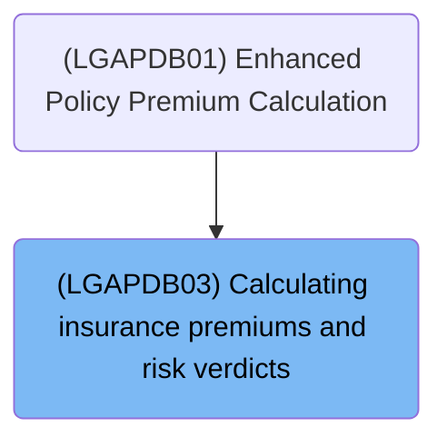
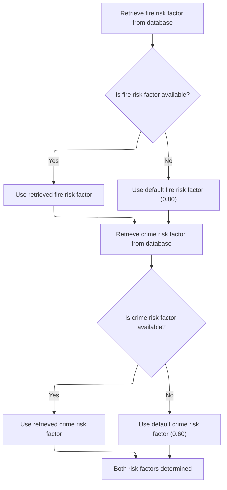
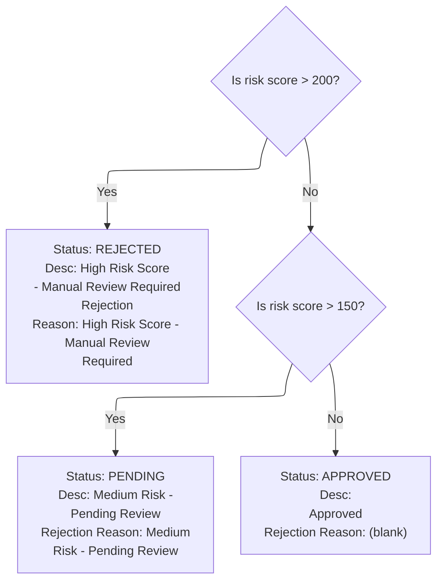
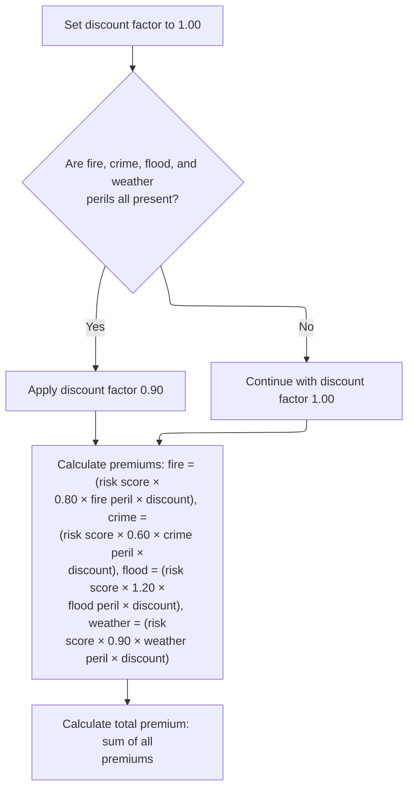

# Overview

This document explains how insurance application status is determined and premiums are calculated. The process ensures risk multipliers are always available, assigns status based on risk score, and applies discounts for full coverage.

## Dependencies

### Program

- <SwmToken path="base/src/LGAPDB03.cbl" pos="2:6:6" line-data="       PROGRAM-ID. LGAPDB03.">`LGAPDB03`</SwmToken> (<SwmPath>[base/src/LGAPDB03.cbl](base/src/LGAPDB03.cbl)</SwmPath>)

### Copybook

- SQLCA

# Where is this program used?

This program is used once, as represented in the following diagram:



## Input and Output Tables/Files used

### <SwmToken path="base/src/LGAPDB03.cbl" pos="2:6:6" line-data="       PROGRAM-ID. LGAPDB03.">`LGAPDB03`</SwmToken> (<SwmPath>[base/src/LGAPDB03.cbl](base/src/LGAPDB03.cbl)</SwmPath>)

| Table / File Name                                                                                                          | Type | Description                                                              | Usage Mode | Key Fields / Layout Highlights                                                                                                                                                                                                                                                                               |
| -------------------------------------------------------------------------------------------------------------------------- | ---- | ------------------------------------------------------------------------ | ---------- | ------------------------------------------------------------------------------------------------------------------------------------------------------------------------------------------------------------------------------------------------------------------------------------------------------------ |
| <SwmToken path="base/src/LGAPDB03.cbl" pos="51:3:3" line-data="               FROM RISK_FACTORS">`RISK_FACTORS`</SwmToken> | DB2  | Peril-specific risk adjustment factors for insurance premium calculation | Input      | <SwmToken path="base/src/LGAPDB03.cbl" pos="50:8:12" line-data="               SELECT FACTOR_VALUE INTO :WS-FIRE-FACTOR">`WS-FIRE-FACTOR`</SwmToken>, <SwmToken path="base/src/LGAPDB03.cbl" pos="62:8:12" line-data="               SELECT FACTOR_VALUE INTO :WS-CRIME-FACTOR">`WS-CRIME-FACTOR`</SwmToken> |

## Detailed View of the Program's Functionality

Main Program Flow

The program begins by defining its structure and the data it will use. It sets up storage for risk factors (such as fire, crime, flood, and weather), as well as variables for the risk score, peril values, status, descriptions, rejection reasons, individual premiums, total premium, and a discount factor. The main logic is executed in a specific sequence:

1. It first loads the risk multipliers (risk factors) from the database or uses default values if the database does not provide them.
2. It then determines the application verdict (approved, pending, or rejected) based on the risk score.
3. Finally, it calculates the insurance premiums for each peril and the total premium, applying a discount if all perils are covered.

Loading Risk Multipliers from Database

The program attempts to retrieve the fire risk factor from a database table. If the database query is successful, it uses the value from the database. If the query fails (for example, if the value is missing), it assigns a default value of <SwmToken path="base/src/LGAPDB03.cbl" pos="58:3:5" line-data="               MOVE 0.80 TO WS-FIRE-FACTOR">`0.80`</SwmToken> to the fire risk factor.

Next, it performs a similar operation for the crime risk factor. It queries the database for the crime risk factor, and if successful, uses the retrieved value. If not, it assigns a default value of <SwmToken path="base/src/LGAPDB03.cbl" pos="70:3:5" line-data="               MOVE 0.60 TO WS-CRIME-FACTOR">`0.60`</SwmToken>.

Flood and weather risk factors are not loaded from the database; they use hardcoded values (<SwmToken path="base/src/LGAPDB03.cbl" pos="16:15:17" line-data="       01  WS-FLOOD-FACTOR             PIC V99 VALUE 1.20.">`1.20`</SwmToken> for flood and <SwmToken path="base/src/LGAPDB03.cbl" pos="99:3:5" line-data="             MOVE 0.90 TO LK-DISC-FACT">`0.90`</SwmToken> for weather).

Assigning Application Status Based on Risk

The program evaluates the risk score to determine the application status:

- If the risk score is greater than 200, the application is marked as "REJECTED" with a description indicating a high risk score and a rejection reason stating that manual review is required.
- If the risk score is not above 200 but is greater than 150, the application is marked as "PENDING" with a description indicating medium risk and a rejection reason stating that the application is pending review.
- If the risk score is 150 or less, the application is marked as "APPROVED" with an appropriate description and no rejection reason.

Computing Peril Premiums and Discounts

The program starts by setting the discount factor to <SwmToken path="base/src/LGAPDB03.cbl" pos="93:3:5" line-data="           MOVE 1.00 TO LK-DISC-FACT">`1.00`</SwmToken> (no discount). It then checks if all peril values (fire, crime, flood, and weather) are greater than zero. If all are present, it applies a 10% discount by setting the discount factor to <SwmToken path="base/src/LGAPDB03.cbl" pos="99:3:5" line-data="             MOVE 0.90 TO LK-DISC-FACT">`0.90`</SwmToken>.

For each peril (fire, crime, flood, weather), the program calculates the premium as follows:

- It multiplies the risk score by the corresponding risk factor (which may have come from the database or a default value), then multiplies by the peril value, and finally multiplies by the discount factor.
- If a peril value is zero, the premium for that peril will be zero.

After calculating individual premiums for all perils, the program sums them to compute the total premium.

Summary

- The program ensures risk factors are always available by using database values or defaults.
- It assigns application status based on risk score thresholds.
- It calculates individual and total premiums, applying a discount if all perils are covered.
- The flow is strictly ordered: load risk factors → assign verdict → calculate premiums.

# Data Definitions

### <SwmToken path="base/src/LGAPDB03.cbl" pos="2:6:6" line-data="       PROGRAM-ID. LGAPDB03.">`LGAPDB03`</SwmToken> (<SwmPath>[base/src/LGAPDB03.cbl](base/src/LGAPDB03.cbl)</SwmPath>)

| Table / Record Name                                                                                                        | Type | Short Description                                                        | Usage Mode     |
| -------------------------------------------------------------------------------------------------------------------------- | ---- | ------------------------------------------------------------------------ | -------------- |
| <SwmToken path="base/src/LGAPDB03.cbl" pos="51:3:3" line-data="               FROM RISK_FACTORS">`RISK_FACTORS`</SwmToken> | DB2  | Peril-specific risk adjustment factors for insurance premium calculation | Input (SELECT) |

# Rule Definition

| Paragraph Name                                                                                                                                                                                                                                                                                                                                                                         | Rule ID | Category          | Description                                                                                                                                                                                                                                                                                                                                                                                      | Conditions                                                     | Remarks                                                                                                                                                                                                                                                                                                                                                    |
| -------------------------------------------------------------------------------------------------------------------------------------------------------------------------------------------------------------------------------------------------------------------------------------------------------------------------------------------------------------------------------------- | ------- | ----------------- | ------------------------------------------------------------------------------------------------------------------------------------------------------------------------------------------------------------------------------------------------------------------------------------------------------------------------------------------------------------------------------------------------ | -------------------------------------------------------------- | ---------------------------------------------------------------------------------------------------------------------------------------------------------------------------------------------------------------------------------------------------------------------------------------------------------------------------------------------------------- |
| <SwmToken path="base/src/LGAPDB03.cbl" pos="43:3:7" line-data="           PERFORM GET-RISK-FACTORS">`GET-RISK-FACTORS`</SwmToken>                                                                                                                                                                                                                                                      | RL-001  | Conditional Logic | The program retrieves the fire risk factor by querying the <SwmToken path="base/src/LGAPDB03.cbl" pos="51:3:3" line-data="               FROM RISK_FACTORS">`RISK_FACTORS`</SwmToken> table for the peril type 'FIRE'. If not found, it uses a default value of <SwmToken path="base/src/LGAPDB03.cbl" pos="58:3:5" line-data="               MOVE 0.80 TO WS-FIRE-FACTOR">`0.80`</SwmToken>.    | Query for peril type 'FIRE' returns no result (SQLCODE != 0).  | Default fire risk factor is <SwmToken path="base/src/LGAPDB03.cbl" pos="58:3:5" line-data="               MOVE 0.80 TO WS-FIRE-FACTOR">`0.80`</SwmToken>. Output format for fire risk factor is a decimal number (e.g., <SwmToken path="base/src/LGAPDB03.cbl" pos="58:3:5" line-data="               MOVE 0.80 TO WS-FIRE-FACTOR">`0.80`</SwmToken>).     |
| <SwmToken path="base/src/LGAPDB03.cbl" pos="43:3:7" line-data="           PERFORM GET-RISK-FACTORS">`GET-RISK-FACTORS`</SwmToken>                                                                                                                                                                                                                                                      | RL-002  | Conditional Logic | The program retrieves the crime risk factor by querying the <SwmToken path="base/src/LGAPDB03.cbl" pos="51:3:3" line-data="               FROM RISK_FACTORS">`RISK_FACTORS`</SwmToken> table for the peril type 'CRIME'. If not found, it uses a default value of <SwmToken path="base/src/LGAPDB03.cbl" pos="70:3:5" line-data="               MOVE 0.60 TO WS-CRIME-FACTOR">`0.60`</SwmToken>. | Query for peril type 'CRIME' returns no result (SQLCODE != 0). | Default crime risk factor is <SwmToken path="base/src/LGAPDB03.cbl" pos="70:3:5" line-data="               MOVE 0.60 TO WS-CRIME-FACTOR">`0.60`</SwmToken>. Output format for crime risk factor is a decimal number (e.g., <SwmToken path="base/src/LGAPDB03.cbl" pos="70:3:5" line-data="               MOVE 0.60 TO WS-CRIME-FACTOR">`0.60`</SwmToken>). |
| <SwmToken path="base/src/LGAPDB03.cbl" pos="9:1:3" line-data="       WORKING-STORAGE SECTION.">`WORKING-STORAGE`</SwmToken> SECTION, <SwmToken path="base/src/LGAPDB03.cbl" pos="45:3:5" line-data="           PERFORM CALCULATE-PREMIUMS">`CALCULATE-PREMIUMS`</SwmToken>                                                                                                             | RL-003  | Data Assignment   | Flood risk factor is always set to <SwmToken path="base/src/LGAPDB03.cbl" pos="16:15:17" line-data="       01  WS-FLOOD-FACTOR             PIC V99 VALUE 1.20.">`1.20`</SwmToken> and weather risk factor is always set to <SwmToken path="base/src/LGAPDB03.cbl" pos="99:3:5" line-data="             MOVE 0.90 TO LK-DISC-FACT">`0.90`</SwmToken>.                                             | Always applies.                                                | Flood risk factor: <SwmToken path="base/src/LGAPDB03.cbl" pos="16:15:17" line-data="       01  WS-FLOOD-FACTOR             PIC V99 VALUE 1.20.">`1.20`</SwmToken>; Weather risk factor: <SwmToken path="base/src/LGAPDB03.cbl" pos="99:3:5" line-data="             MOVE 0.90 TO LK-DISC-FACT">`0.90`</SwmToken>. Both are decimal numbers.                |
| <SwmToken path="base/src/LGAPDB03.cbl" pos="45:3:5" line-data="           PERFORM CALCULATE-PREMIUMS">`CALCULATE-PREMIUMS`</SwmToken>                                                                                                                                                                                                                                                  | RL-004  | Conditional Logic | If all peril variables are greater than zero, set discount factor to <SwmToken path="base/src/LGAPDB03.cbl" pos="99:3:5" line-data="             MOVE 0.90 TO LK-DISC-FACT">`0.90`</SwmToken>; otherwise, set to <SwmToken path="base/src/LGAPDB03.cbl" pos="93:3:5" line-data="           MOVE 1.00 TO LK-DISC-FACT">`1.00`</SwmToken>.                                                         | All peril variables (fire, crime, flood, weather) > 0.         | Discount factor is either <SwmToken path="base/src/LGAPDB03.cbl" pos="99:3:5" line-data="             MOVE 0.90 TO LK-DISC-FACT">`0.90`</SwmToken> or <SwmToken path="base/src/LGAPDB03.cbl" pos="93:3:5" line-data="           MOVE 1.00 TO LK-DISC-FACT">`1.00`</SwmToken>. Output format is a decimal number.                                           |
| <SwmToken path="base/src/LGAPDB03.cbl" pos="45:3:5" line-data="           PERFORM CALCULATE-PREMIUMS">`CALCULATE-PREMIUMS`</SwmToken>                                                                                                                                                                                                                                                  | RL-005  | Computation       | Premium for each peril is calculated as: risk score × risk factor × peril value × discount factor. If peril value is zero, premium is zero.                                                                                                                                                                                                                                                      | Peril value > 0 for each peril.                                | Premiums are decimal numbers with up to 8 digits before decimal and 2 after (e.g., 99999999.99).                                                                                                                                                                                                                                                           |
| <SwmToken path="base/src/LGAPDB03.cbl" pos="45:3:5" line-data="           PERFORM CALCULATE-PREMIUMS">`CALCULATE-PREMIUMS`</SwmToken>                                                                                                                                                                                                                                                  | RL-006  | Computation       | Total premium is the sum of all individual peril premiums.                                                                                                                                                                                                                                                                                                                                       | Always applies.                                                | Total premium is a decimal number with up to 9 digits before decimal and 2 after (e.g., 999999999.99).                                                                                                                                                                                                                                                     |
| <SwmToken path="base/src/LGAPDB03.cbl" pos="44:3:5" line-data="           PERFORM CALCULATE-VERDICT">`CALCULATE-VERDICT`</SwmToken>                                                                                                                                                                                                                                                    | RL-007  | Conditional Logic | If risk score > 200, status is 'REJECTED'; if > 150, status is 'PENDING'; else, status is 'APPROVED'. Assign corresponding status code, description, and rejection reason.                                                                                                                                                                                                                       | Risk score value.                                              | Status code: 0 (APPROVED), 1 (PENDING), 2 (REJECTED). Description: string up to 20 chars. Rejection reason: string up to 50 chars or spaces.                                                                                                                                                                                                               |
| <SwmToken path="base/src/LGAPDB03.cbl" pos="44:3:5" line-data="           PERFORM CALCULATE-VERDICT">`CALCULATE-VERDICT`</SwmToken>, <SwmToken path="base/src/LGAPDB03.cbl" pos="45:3:5" line-data="           PERFORM CALCULATE-PREMIUMS">`CALCULATE-PREMIUMS`</SwmToken>, <SwmToken path="base/src/LGAPDB03.cbl" pos="42:1:3" line-data="       MAIN-LOGIC.">`MAIN-LOGIC`</SwmToken> | RL-008  | Data Assignment   | All output variables (status, description, rejection reason, all premiums, total premium, discount factor) must be assigned before returning.                                                                                                                                                                                                                                                    | Always applies.                                                | Output variables: status (number), description (string, 20 chars), rejection reason (string, 50 chars), premiums (decimal), total premium (decimal), discount factor (decimal).                                                                                                                                                                            |
| <SwmToken path="base/src/LGAPDB03.cbl" pos="45:3:5" line-data="           PERFORM CALCULATE-PREMIUMS">`CALCULATE-PREMIUMS`</SwmToken>                                                                                                                                                                                                                                                  | RL-009  | Data Assignment   | Discount factor must always be assigned and output, regardless of whether a discount is applied.                                                                                                                                                                                                                                                                                                 | Always applies.                                                | Discount factor output as decimal number.                                                                                                                                                                                                                                                                                                                  |

# User Stories

## User Story 1: Retrieve and assign risk factors for all perils

---

### Story Description:

As a system, I want to retrieve the risk factors for fire and crime from the database (using defaults if not found), and assign constant values for flood and weather risk factors, so that all necessary risk factors are available for premium calculations.

---

### Business Rule Mapping:

| Rule ID | Paragraph Name                                                                                                                                                                                                                                                             | Rule Description                                                                                                                                                                                                                                                                                                                                                                                 |
| ------- | -------------------------------------------------------------------------------------------------------------------------------------------------------------------------------------------------------------------------------------------------------------------------- | ------------------------------------------------------------------------------------------------------------------------------------------------------------------------------------------------------------------------------------------------------------------------------------------------------------------------------------------------------------------------------------------------ |
| RL-001  | <SwmToken path="base/src/LGAPDB03.cbl" pos="43:3:7" line-data="           PERFORM GET-RISK-FACTORS">`GET-RISK-FACTORS`</SwmToken>                                                                                                                                          | The program retrieves the fire risk factor by querying the <SwmToken path="base/src/LGAPDB03.cbl" pos="51:3:3" line-data="               FROM RISK_FACTORS">`RISK_FACTORS`</SwmToken> table for the peril type 'FIRE'. If not found, it uses a default value of <SwmToken path="base/src/LGAPDB03.cbl" pos="58:3:5" line-data="               MOVE 0.80 TO WS-FIRE-FACTOR">`0.80`</SwmToken>.    |
| RL-002  | <SwmToken path="base/src/LGAPDB03.cbl" pos="43:3:7" line-data="           PERFORM GET-RISK-FACTORS">`GET-RISK-FACTORS`</SwmToken>                                                                                                                                          | The program retrieves the crime risk factor by querying the <SwmToken path="base/src/LGAPDB03.cbl" pos="51:3:3" line-data="               FROM RISK_FACTORS">`RISK_FACTORS`</SwmToken> table for the peril type 'CRIME'. If not found, it uses a default value of <SwmToken path="base/src/LGAPDB03.cbl" pos="70:3:5" line-data="               MOVE 0.60 TO WS-CRIME-FACTOR">`0.60`</SwmToken>. |
| RL-003  | <SwmToken path="base/src/LGAPDB03.cbl" pos="9:1:3" line-data="       WORKING-STORAGE SECTION.">`WORKING-STORAGE`</SwmToken> SECTION, <SwmToken path="base/src/LGAPDB03.cbl" pos="45:3:5" line-data="           PERFORM CALCULATE-PREMIUMS">`CALCULATE-PREMIUMS`</SwmToken> | Flood risk factor is always set to <SwmToken path="base/src/LGAPDB03.cbl" pos="16:15:17" line-data="       01  WS-FLOOD-FACTOR             PIC V99 VALUE 1.20.">`1.20`</SwmToken> and weather risk factor is always set to <SwmToken path="base/src/LGAPDB03.cbl" pos="99:3:5" line-data="             MOVE 0.90 TO LK-DISC-FACT">`0.90`</SwmToken>.                                             |

---

### Relevant Functionality:

- <SwmToken path="base/src/LGAPDB03.cbl" pos="43:3:7" line-data="           PERFORM GET-RISK-FACTORS">`GET-RISK-FACTORS`</SwmToken>
  1. **RL-001:**
     - Query <SwmToken path="base/src/LGAPDB03.cbl" pos="51:3:3" line-data="               FROM RISK_FACTORS">`RISK_FACTORS`</SwmToken> table for 'FIRE' peril type
     - If query succeeds, use retrieved value
     - If query fails, use default value <SwmToken path="base/src/LGAPDB03.cbl" pos="58:3:5" line-data="               MOVE 0.80 TO WS-FIRE-FACTOR">`0.80`</SwmToken>
  2. **RL-002:**
     - Query <SwmToken path="base/src/LGAPDB03.cbl" pos="51:3:3" line-data="               FROM RISK_FACTORS">`RISK_FACTORS`</SwmToken> table for 'CRIME' peril type
     - If query succeeds, use retrieved value
     - If query fails, use default value <SwmToken path="base/src/LGAPDB03.cbl" pos="70:3:5" line-data="               MOVE 0.60 TO WS-CRIME-FACTOR">`0.60`</SwmToken>
- <SwmToken path="base/src/LGAPDB03.cbl" pos="9:1:3" line-data="       WORKING-STORAGE SECTION.">`WORKING-STORAGE`</SwmToken> **SECTION**
  1. **RL-003:**
     - Assign <SwmToken path="base/src/LGAPDB03.cbl" pos="16:15:17" line-data="       01  WS-FLOOD-FACTOR             PIC V99 VALUE 1.20.">`1.20`</SwmToken> to flood risk factor
     - Assign <SwmToken path="base/src/LGAPDB03.cbl" pos="99:3:5" line-data="             MOVE 0.90 TO LK-DISC-FACT">`0.90`</SwmToken> to weather risk factor

## User Story 2: Determine and output discount factor

---

### Story Description:

As a system, I want to determine the discount factor based on peril variables and always output its value, so that premium calculations are accurate and transparent.

---

### Business Rule Mapping:

| Rule ID | Paragraph Name                                                                                                                        | Rule Description                                                                                                                                                                                                                                                                                                                         |
| ------- | ------------------------------------------------------------------------------------------------------------------------------------- | ---------------------------------------------------------------------------------------------------------------------------------------------------------------------------------------------------------------------------------------------------------------------------------------------------------------------------------------- |
| RL-004  | <SwmToken path="base/src/LGAPDB03.cbl" pos="45:3:5" line-data="           PERFORM CALCULATE-PREMIUMS">`CALCULATE-PREMIUMS`</SwmToken> | If all peril variables are greater than zero, set discount factor to <SwmToken path="base/src/LGAPDB03.cbl" pos="99:3:5" line-data="             MOVE 0.90 TO LK-DISC-FACT">`0.90`</SwmToken>; otherwise, set to <SwmToken path="base/src/LGAPDB03.cbl" pos="93:3:5" line-data="           MOVE 1.00 TO LK-DISC-FACT">`1.00`</SwmToken>. |
| RL-009  | <SwmToken path="base/src/LGAPDB03.cbl" pos="45:3:5" line-data="           PERFORM CALCULATE-PREMIUMS">`CALCULATE-PREMIUMS`</SwmToken> | Discount factor must always be assigned and output, regardless of whether a discount is applied.                                                                                                                                                                                                                                         |

---

### Relevant Functionality:

- <SwmToken path="base/src/LGAPDB03.cbl" pos="45:3:5" line-data="           PERFORM CALCULATE-PREMIUMS">`CALCULATE-PREMIUMS`</SwmToken>
  1. **RL-004:**
     - Set discount factor to <SwmToken path="base/src/LGAPDB03.cbl" pos="93:3:5" line-data="           MOVE 1.00 TO LK-DISC-FACT">`1.00`</SwmToken>
     - If all peril variables > 0, set discount factor to <SwmToken path="base/src/LGAPDB03.cbl" pos="99:3:5" line-data="             MOVE 0.90 TO LK-DISC-FACT">`0.90`</SwmToken>
  2. **RL-009:**
     - Assign discount factor value
     - Output discount factor

## User Story 3: Calculate individual and total premiums

---

### Story Description:

As a user, I want the system to calculate the premium for each peril and the total premium, ensuring that if any peril variable is zero its premium is zero, so that I receive an accurate total premium based on my risk profile.

---

### Business Rule Mapping:

| Rule ID | Paragraph Name                                                                                                                        | Rule Description                                                                                                                            |
| ------- | ------------------------------------------------------------------------------------------------------------------------------------- | ------------------------------------------------------------------------------------------------------------------------------------------- |
| RL-005  | <SwmToken path="base/src/LGAPDB03.cbl" pos="45:3:5" line-data="           PERFORM CALCULATE-PREMIUMS">`CALCULATE-PREMIUMS`</SwmToken> | Premium for each peril is calculated as: risk score × risk factor × peril value × discount factor. If peril value is zero, premium is zero. |
| RL-006  | <SwmToken path="base/src/LGAPDB03.cbl" pos="45:3:5" line-data="           PERFORM CALCULATE-PREMIUMS">`CALCULATE-PREMIUMS`</SwmToken> | Total premium is the sum of all individual peril premiums.                                                                                  |

---

### Relevant Functionality:

- <SwmToken path="base/src/LGAPDB03.cbl" pos="45:3:5" line-data="           PERFORM CALCULATE-PREMIUMS">`CALCULATE-PREMIUMS`</SwmToken>
  1. **RL-005:**
     - For each peril:
       - If peril value > 0:
         - Compute premium = risk score × risk factor × peril value × discount factor
       - Else:
         - Set premium to 0
  2. **RL-006:**
     - Sum all peril premiums to get total premium

## User Story 4: Determine verdict/status and assign all output variables

---

### Story Description:

As a user, I want the system to determine the application status, description, and rejection reason based on the risk score, and ensure all output variables are assigned before returning, so that I understand the outcome of my application and receive complete information.

---

### Business Rule Mapping:

| Rule ID | Paragraph Name                                                                                                                                                                                                                                                                                                                                                                         | Rule Description                                                                                                                                                           |
| ------- | -------------------------------------------------------------------------------------------------------------------------------------------------------------------------------------------------------------------------------------------------------------------------------------------------------------------------------------------------------------------------------------- | -------------------------------------------------------------------------------------------------------------------------------------------------------------------------- |
| RL-007  | <SwmToken path="base/src/LGAPDB03.cbl" pos="44:3:5" line-data="           PERFORM CALCULATE-VERDICT">`CALCULATE-VERDICT`</SwmToken>                                                                                                                                                                                                                                                    | If risk score > 200, status is 'REJECTED'; if > 150, status is 'PENDING'; else, status is 'APPROVED'. Assign corresponding status code, description, and rejection reason. |
| RL-008  | <SwmToken path="base/src/LGAPDB03.cbl" pos="44:3:5" line-data="           PERFORM CALCULATE-VERDICT">`CALCULATE-VERDICT`</SwmToken>, <SwmToken path="base/src/LGAPDB03.cbl" pos="45:3:5" line-data="           PERFORM CALCULATE-PREMIUMS">`CALCULATE-PREMIUMS`</SwmToken>, <SwmToken path="base/src/LGAPDB03.cbl" pos="42:1:3" line-data="       MAIN-LOGIC.">`MAIN-LOGIC`</SwmToken> | All output variables (status, description, rejection reason, all premiums, total premium, discount factor) must be assigned before returning.                              |

---

### Relevant Functionality:

- <SwmToken path="base/src/LGAPDB03.cbl" pos="44:3:5" line-data="           PERFORM CALCULATE-VERDICT">`CALCULATE-VERDICT`</SwmToken>
  1. **RL-007:**
     - If risk score > 200:
       - Set status code to 2
       - Set description to 'REJECTED'
       - Set rejection reason to 'High Risk Score - Manual Review Required'
     - Else if risk score > 150:
       - Set status code to 1
       - Set description to 'PENDING'
       - Set rejection reason to 'Medium Risk - Pending Review'
     - Else:
       - Set status code to 0
       - Set description to 'APPROVED'
       - Set rejection reason to spaces
  2. **RL-008:**
     - Assign values to all output variables before program returns

# Workflow

# Orchestrating the Premium and Verdict Calculation

This section coordinates the main flow for calculating insurance premiums and verdicts, ensuring that risk factors are loaded before any calculations are performed.

| Rule ID | Category        | Rule Name                          | Description                                                                                       | Implementation Details                                                                                                                                                     |
| ------- | --------------- | ---------------------------------- | ------------------------------------------------------------------------------------------------- | -------------------------------------------------------------------------------------------------------------------------------------------------------------------------- |
| BR-001  | Decision Making | Risk factor retrieval precedence   | Risk factors are retrieved or defaulted before any premium or verdict calculations are performed. | Risk factors include fire and crime multipliers. If not found in the database, default values are used. No specific output format is enforced at this orchestration level. |
| BR-002  | Decision Making | Verdict before premium calculation | Verdict calculation is performed before premium calculation in the main process.                  | No specific output format is enforced at this orchestration level.                                                                                                         |

<SwmSnippet path="/base/src/LGAPDB03.cbl" line="42">

---

<SwmToken path="base/src/LGAPDB03.cbl" pos="42:1:3" line-data="       MAIN-LOGIC.">`MAIN-LOGIC`</SwmToken> sequences the main steps: first it calls <SwmToken path="base/src/LGAPDB03.cbl" pos="43:3:7" line-data="           PERFORM GET-RISK-FACTORS">`GET-RISK-FACTORS`</SwmToken> to load or default the risk multipliers, which are needed for the premium calculations later. Without this, the premium math would use stale or missing factors. After that, it moves on to verdict and premium calculations.

```cobol
       MAIN-LOGIC.
           PERFORM GET-RISK-FACTORS
           PERFORM CALCULATE-VERDICT
           PERFORM CALCULATE-PREMIUMS
           GOBACK.
```

---

</SwmSnippet>

## Loading Risk Multipliers from Database



This section ensures that risk multipliers for 'FIRE' and 'CRIME' are always available for use in later calculations, using database values when available and fallback constants otherwise.

| Rule ID | Category        | Rule Name                               | Description                                                                                                                                                                                                                           | Implementation Details                                                                                                                                                                                                                                                                                                                                                                                                              |
| ------- | --------------- | --------------------------------------- | ------------------------------------------------------------------------------------------------------------------------------------------------------------------------------------------------------------------------------------- | ----------------------------------------------------------------------------------------------------------------------------------------------------------------------------------------------------------------------------------------------------------------------------------------------------------------------------------------------------------------------------------------------------------------------------------- |
| BR-001  | Decision Making | Default fire risk multiplier            | When a fire risk multiplier is not available from the database, the system assigns a default value of <SwmToken path="base/src/LGAPDB03.cbl" pos="58:3:5" line-data="               MOVE 0.80 TO WS-FIRE-FACTOR">`0.80`</SwmToken>.   | The default value for the fire risk multiplier is <SwmToken path="base/src/LGAPDB03.cbl" pos="58:3:5" line-data="               MOVE 0.80 TO WS-FIRE-FACTOR">`0.80`</SwmToken>. The output is a number representing the risk multiplier for fire peril.                                                                                                                                                                             |
| BR-002  | Decision Making | Default crime risk multiplier           | When a crime risk multiplier is not available from the database, the system assigns a default value of <SwmToken path="base/src/LGAPDB03.cbl" pos="70:3:5" line-data="               MOVE 0.60 TO WS-CRIME-FACTOR">`0.60`</SwmToken>. | The default value for the crime risk multiplier is <SwmToken path="base/src/LGAPDB03.cbl" pos="70:3:5" line-data="               MOVE 0.60 TO WS-CRIME-FACTOR">`0.60`</SwmToken>. The output is a number representing the risk multiplier for crime peril.                                                                                                                                                                          |
| BR-003  | Decision Making | Guaranteed risk multiplier availability | The system always determines both fire and crime risk multipliers, using either database values or default constants, so that both are available for subsequent processing.                                                           | Both risk multipliers are guaranteed to be set: fire (from database or <SwmToken path="base/src/LGAPDB03.cbl" pos="58:3:5" line-data="               MOVE 0.80 TO WS-FIRE-FACTOR">`0.80`</SwmToken>), crime (from database or <SwmToken path="base/src/LGAPDB03.cbl" pos="70:3:5" line-data="               MOVE 0.60 TO WS-CRIME-FACTOR">`0.60`</SwmToken>). Outputs are numbers representing the risk multipliers for each peril. |

<SwmSnippet path="/base/src/LGAPDB03.cbl" line="48">

---

In <SwmToken path="base/src/LGAPDB03.cbl" pos="48:1:5" line-data="       GET-RISK-FACTORS.">`GET-RISK-FACTORS`</SwmToken> we start by querying the database for the 'FIRE' risk factor. If the SELECT works, we use the value; otherwise, we’ll use a fallback constant. This ensures we always have a value for later calculations.

```cobol
       GET-RISK-FACTORS.
           EXEC SQL
               SELECT FACTOR_VALUE INTO :WS-FIRE-FACTOR
               FROM RISK_FACTORS
               WHERE PERIL_TYPE = 'FIRE'
           END-EXEC.
```

---

</SwmSnippet>

<SwmSnippet path="/base/src/LGAPDB03.cbl" line="55">

---

Next, if the database lookup for 'FIRE' fails, we just assign <SwmToken path="base/src/LGAPDB03.cbl" pos="58:3:5" line-data="               MOVE 0.80 TO WS-FIRE-FACTOR">`0.80`</SwmToken> as the risk factor. This is a hardcoded fallback so the rest of the flow doesn’t break if the DB is missing data.

```cobol
           IF SQLCODE = 0
               CONTINUE
           ELSE
               MOVE 0.80 TO WS-FIRE-FACTOR
           END-IF.
```

---

</SwmSnippet>

<SwmSnippet path="/base/src/LGAPDB03.cbl" line="61">

---

After handling 'FIRE', we do the same for 'CRIME'—query the DB for its risk factor, prepping for the same fallback logic if it’s missing.

```cobol
           EXEC SQL
               SELECT FACTOR_VALUE INTO :WS-CRIME-FACTOR
               FROM RISK_FACTORS
               WHERE PERIL_TYPE = 'CRIME'
           END-EXEC.
```

---

</SwmSnippet>

<SwmSnippet path="/base/src/LGAPDB03.cbl" line="67">

---

Finally, if the 'CRIME' lookup fails, we set its factor to <SwmToken path="base/src/LGAPDB03.cbl" pos="70:3:5" line-data="               MOVE 0.60 TO WS-CRIME-FACTOR">`0.60`</SwmToken>. At this point, both risk factors are guaranteed to have values—either from the DB or as hardcoded fallbacks.

```cobol
           IF SQLCODE = 0
               CONTINUE
           ELSE
               MOVE 0.60 TO WS-CRIME-FACTOR
           END-IF.
```

---

</SwmSnippet>

## Assigning Application Status Based on Risk



This section determines the application status by evaluating the risk score against fixed thresholds. It assigns a status, description, and rejection reason for further processing or display.

| Rule ID | Category        | Rule Name           | Description                                                                                                                                                                                                              | Implementation Details                                                                                                                                    |
| ------- | --------------- | ------------------- | ------------------------------------------------------------------------------------------------------------------------------------------------------------------------------------------------------------------------ | --------------------------------------------------------------------------------------------------------------------------------------------------------- |
| BR-001  | Decision Making | High Risk Rejection | If the risk score is greater than 200, the application status is set to REJECTED, the description is 'High Risk Score', and the rejection reason is 'High Risk Score - Manual Review Required'.                          | Status is set to 'REJECTED' (string), description is 'High Risk Score' (string), rejection reason is 'High Risk Score - Manual Review Required' (string). |
| BR-002  | Decision Making | Medium Risk Pending | If the risk score is greater than 150 but not greater than 200, the application status is set to PENDING, the description is 'Medium Risk - Pending Review', and the rejection reason is 'Medium Risk - Pending Review'. | Status is set to 'PENDING' (string), description is 'Medium Risk - Pending Review' (string), rejection reason is 'Medium Risk - Pending Review' (string). |
| BR-003  | Decision Making | Low Risk Approval   | If the risk score is 150 or less, the application status is set to APPROVED, the description is 'Approved', and the rejection reason is left blank.                                                                      | Status is set to 'APPROVED' (string), description is 'Approved' (string), rejection reason is blank (spaces).                                             |

<SwmSnippet path="/base/src/LGAPDB03.cbl" line="73">

---

<SwmToken path="base/src/LGAPDB03.cbl" pos="73:1:3" line-data="       CALCULATE-VERDICT.">`CALCULATE-VERDICT`</SwmToken> checks the risk score and assigns status, description, and rejection reason based on fixed thresholds. It uses global variables, so no parameters are passed in. The verdict logic is just a set of if-else checks on the score.

```cobol
       CALCULATE-VERDICT.
           IF LK-RISK-SCORE > 200
             MOVE 2 TO LK-STAT
             MOVE 'REJECTED' TO LK-STAT-DESC
             MOVE 'High Risk Score - Manual Review Required' 
               TO LK-REJ-RSN
           ELSE
             IF LK-RISK-SCORE > 150
               MOVE 1 TO LK-STAT
               MOVE 'PENDING' TO LK-STAT-DESC
               MOVE 'Medium Risk - Pending Review'
                 TO LK-REJ-RSN
             ELSE
               MOVE 0 TO LK-STAT
               MOVE 'APPROVED' TO LK-STAT-DESC
               MOVE SPACES TO LK-REJ-RSN
             END-IF
           END-IF.
```

---

</SwmSnippet>

# Computing Peril Premiums and Discounts



This section determines the premium for each peril and the total premium for a policy, applying a discount if all perils are present. The main product role is to incentivize full coverage and ensure premiums are calculated consistently using defined factors and discounts.

| Rule ID | Category    | Rule Name                 | Description                                                                                                                                                                                        | Implementation Details                                                                                                                                                                                                                                                     |
| ------- | ----------- | ------------------------- | -------------------------------------------------------------------------------------------------------------------------------------------------------------------------------------------------- | -------------------------------------------------------------------------------------------------------------------------------------------------------------------------------------------------------------------------------------------------------------------------- |
| BR-001  | Calculation | Default discount factor   | Set the discount factor to <SwmToken path="base/src/LGAPDB03.cbl" pos="93:3:5" line-data="           MOVE 1.00 TO LK-DISC-FACT">`1.00`</SwmToken> before any peril checks or premium calculations. | The discount factor is a numeric value, set to <SwmToken path="base/src/LGAPDB03.cbl" pos="93:3:5" line-data="           MOVE 1.00 TO LK-DISC-FACT">`1.00`</SwmToken> by default. This value is used in all subsequent premium calculations unless changed by other rules. |
| BR-002  | Calculation | Peril premium calculation | Calculate each peril's premium by multiplying the risk score, the peril-specific factor, the peril value, and the discount factor. If a peril value is zero, its premium is zero.                  | \- Fire factor: <SwmToken path="base/src/LGAPDB03.cbl" pos="58:3:5" line-data="               MOVE 0.80 TO WS-FIRE-FACTOR">`0.80`</SwmToken>                                                                                                                               |

- Crime factor: <SwmToken path="base/src/LGAPDB03.cbl" pos="70:3:5" line-data="               MOVE 0.60 TO WS-CRIME-FACTOR">`0.60`</SwmToken>
- Flood factor: <SwmToken path="base/src/LGAPDB03.cbl" pos="16:15:17" line-data="       01  WS-FLOOD-FACTOR             PIC V99 VALUE 1.20.">`1.20`</SwmToken>
- Weather factor: <SwmToken path="base/src/LGAPDB03.cbl" pos="99:3:5" line-data="             MOVE 0.90 TO LK-DISC-FACT">`0.90`</SwmToken>
- Premiums are numeric values. If a peril value is zero, the resulting premium is zero.                           | | BR-003  | Calculation     | Total premium calculation | Calculate the total premium as the sum of all individual peril premiums.                                                                                                          | The total premium is a numeric value, equal to the sum of fire, crime, flood, and weather premiums. If any peril premium is zero, it does not contribute to the total.                                 | | BR-004  | Decision Making | Full coverage discount    | Apply a 10% discount to all peril premiums if all peril values (fire, crime, flood, weather) are greater than zero.                                                               | The discount factor is set to <SwmToken path="base/src/LGAPDB03.cbl" pos="99:3:5" line-data="             MOVE 0.90 TO LK-DISC-FACT">`0.90`</SwmToken> when all perils are present. This incentivizes customers to select full coverage. The discount factor is a numeric value applied to all peril premium calculations. |

<SwmSnippet path="/base/src/LGAPDB03.cbl" line="92">

---

In <SwmToken path="base/src/LGAPDB03.cbl" pos="92:1:3" line-data="       CALCULATE-PREMIUMS.">`CALCULATE-PREMIUMS`</SwmToken> we set up the discount factor. If all peril values are positive, we apply a 10% discount to the premiums; otherwise, no discount. This is a business rule to push for full coverage.

```cobol
       CALCULATE-PREMIUMS.
           MOVE 1.00 TO LK-DISC-FACT
           
           IF LK-FIRE-PERIL > 0 AND
              LK-CRIME-PERIL > 0 AND
              LK-FLOOD-PERIL > 0 AND
              LK-WEATHER-PERIL > 0
             MOVE 0.90 TO LK-DISC-FACT
           END-IF
```

---

</SwmSnippet>

<SwmSnippet path="/base/src/LGAPDB03.cbl" line="102">

---

Finally, we calculate each peril’s premium using its factor, the risk score, peril value, and discount. Then we sum them up for the total premium. If a peril value is zero, its premium is zero and doesn’t affect the total.

```cobol
           COMPUTE LK-FIRE-PREMIUM =
             ((LK-RISK-SCORE * WS-FIRE-FACTOR) * LK-FIRE-PERIL *
               LK-DISC-FACT)
           
           COMPUTE LK-CRIME-PREMIUM =
             ((LK-RISK-SCORE * WS-CRIME-FACTOR) * LK-CRIME-PERIL *
               LK-DISC-FACT)
           
           COMPUTE LK-FLOOD-PREMIUM =
             ((LK-RISK-SCORE * WS-FLOOD-FACTOR) * LK-FLOOD-PERIL *
               LK-DISC-FACT)
           
           COMPUTE LK-WEATHER-PREMIUM =
             ((LK-RISK-SCORE * WS-WEATHER-FACTOR) * LK-WEATHER-PERIL *
               LK-DISC-FACT)

           COMPUTE LK-TOTAL-PREMIUM = 
             LK-FIRE-PREMIUM + LK-CRIME-PREMIUM + 
             LK-FLOOD-PREMIUM + LK-WEATHER-PREMIUM. 
```

---

</SwmSnippet>

&nbsp;

*This is an auto-generated document by Swimm 🌊 and has not yet been verified by a human*

<SwmMeta version="3.0.0" repo-id="Z2l0aHViJTNBJTNBU3dpbW1pby1nZW5hcHAtaG91c2UlM0ElM0FHaXJpLVN3aW1t" repo-name="Swimmio-genapp-house"><sup>Powered by [Swimm](https://app.swimm.io/)</sup></SwmMeta>
