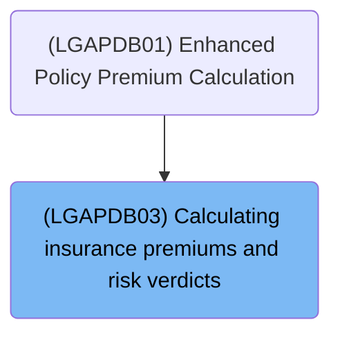

# Overview

This document explains the flow for determining risk verdicts and calculating insurance premiums for insurance applications. The process ensures risk multipliers are always available, assigns a verdict based on the risk score, and calculates premiums for each peril, applying a discount for full coverage.

## Dependencies

### Program

- LGAPDB03 (<SwmPath>[base/src/LGAPDB03.cbl](base/src/LGAPDB03.cbl)</SwmPath>)

### Copybook

- SQLCA

# Where is this program used?

This program is used once, as represented in the following diagram:

```mermaid
graph TD
  9iuu8("(LGAPDB01) Enhanced Policy Premium Calculation") --> l9j88("(LGAPDB03) Calculating insurance premiums and risk verdicts"):::currentEntity
click 9iuu8 openCode "base/src/LGAPDB01.cbl:1"
  
  
click l9j88 openCode "base/src/LGAPDB03.cbl:1"
    classDef currentEntity color:#000000,fill:#7CB9F4

%% Swimm:
%% graph TD
%%   9iuu8("(LGAPDB01) Enhanced Policy Premium Calculation") --> l9j88("(LGAPDB03) Calculating insurance premiums and risk verdicts"):::currentEntity
%% click 9iuu8 openCode "<SwmPath>[base/src/LGAPDB01.cbl](base/src/LGAPDB01.cbl)</SwmPath>:1"
%%   
%%   
%% click l9j88 openCode "<SwmPath>[base/src/LGAPDB03.cbl](base/src/LGAPDB03.cbl)</SwmPath>:1"
%%     classDef currentEntity color:#000000,fill:#7CB9F4
```

&nbsp;

*This is an auto-generated document by Swimm 🌊 and has not yet been verified by a human*

<SwmMeta version="3.0.0" repo-id="Z2l0aHViJTNBJTNBU3dpbW1pby1nZW5hcHAtaG91c2UlM0ElM0FHaXJpLVN3aW1t" repo-name="Swimmio-genapp-house">Powered by [Swimm](https://app.swimm.io/)</SwmMeta>
