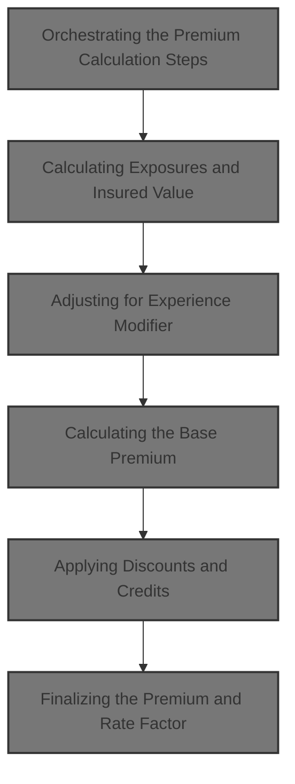
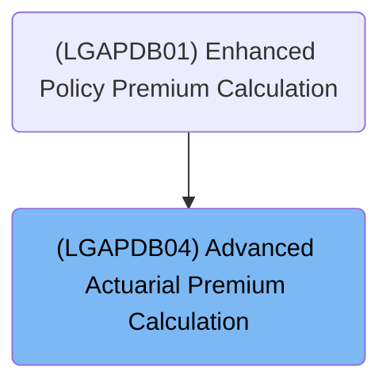
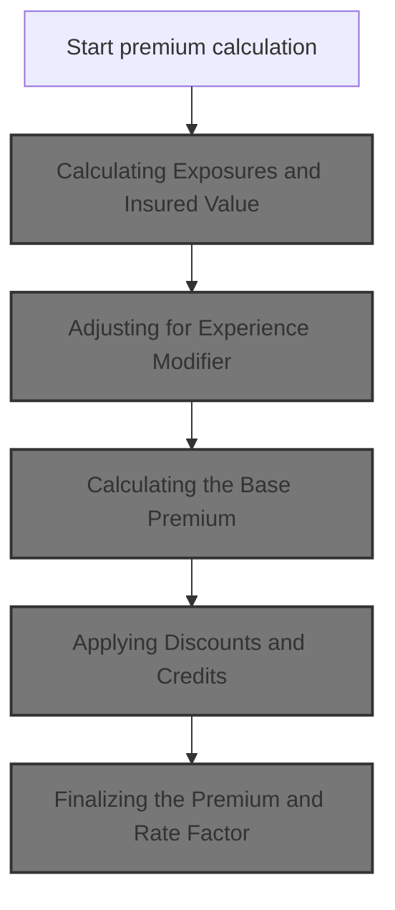
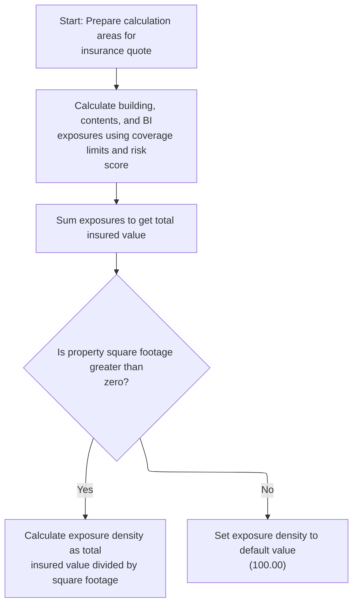
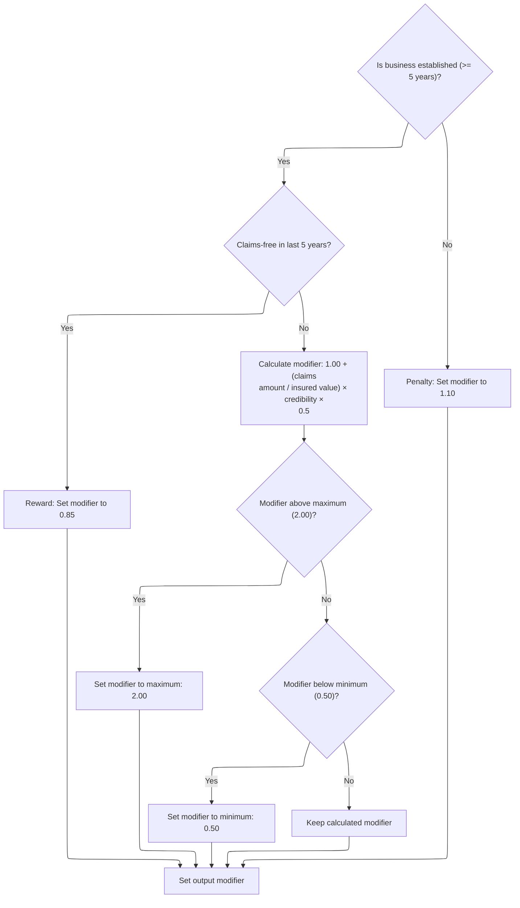
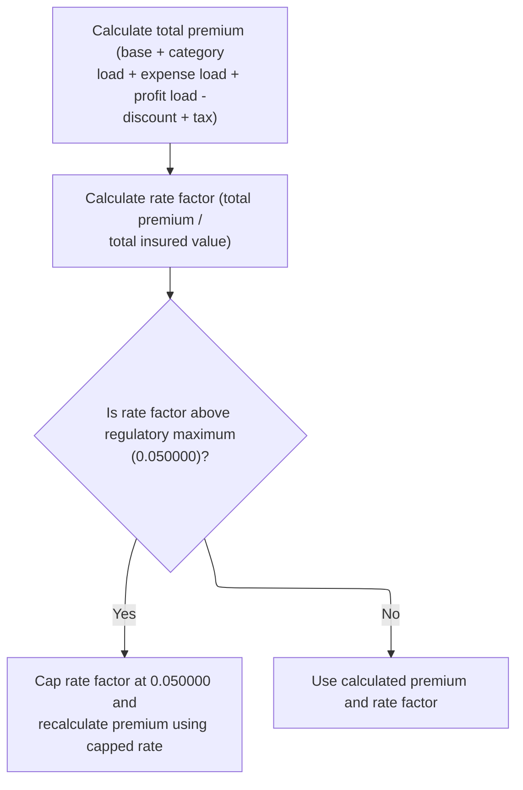

# Overview

This document explains the flow for calculating advanced actuarial premiums for property insurance policies. The process takes policy coverage details, risk scores, claims history, deductible amounts, and property information to determine exposures, apply experience modifiers, calculate base premiums for each peril, apply discounts and credits, and finalize the premium and rate factor.



## Dependencies

### Program

- <SwmToken path="base/src/LGAPDB04.cbl" pos="2:6:6" line-data="       PROGRAM-ID. LGAPDB04.">`LGAPDB04`</SwmToken> (<SwmPath>[base/src/LGAPDB04.cbl](base/src/LGAPDB04.cbl)</SwmPath>)

### Copybook

- SQLCA

# Where is this program used?

This program is used once, as represented in the following diagram:



## Detailed View of the Program's Functionality

a. Orchestrating the Premium Calculation Steps

The main orchestration routine sequences the premium calculation process. It begins by initializing calculation areas and base rate tables, ensuring all exposures and insured values are set up. It then loads rates from the database or uses defaults if unavailable. Next, it calculates exposures, applies experience and schedule modifiers, computes the base premium for each peril, adds catastrophe loadings, calculates expense and profit loadings, applies discounts and credits, computes taxes, and finally sums up all components to produce the total premium and rate factor.

b. Calculating Exposures and Insured Value

The initialization step prepares the calculation areas and base rate table. It calculates exposures for building, contents, and business interruption by scaling each coverage limit with a risk-based adjustment. The total insured value is then computed as the sum of these exposures. Exposure density is calculated as insured value per square foot unless the square footage is zero, in which case a default value is used.

c. Adjusting for Experience Modifier

The experience modifier is determined based on years in business and claims history. If the business is established and claims-free, a lower modifier is assigned. If there are claims, the modifier is recalculated using claims amount, insured value, and a credibility factor, with caps to keep it within a specified range. If the business is new, a penalty modifier is applied. The resulting modifier is stored for use in downstream calculations.

d. Calculating the Base Premium

The base premium calculation checks which perils are covered. For each covered peril, it computes the premium using exposures, base rates, experience and schedule modifiers, and a trend factor. Each peril's premium is added to the total base amount. Specific multipliers are used for certain perils, such as crime and flood, to adjust their premiums.

e. Applying Discounts and Credits

Discounts are applied based on peril combinations, claims history, and deductible amounts. <SwmToken path="base/src/LGAPDB04.cbl" pos="410:3:5" line-data="      * Multi-peril discount">`Multi-peril`</SwmToken> discounts are set according to which perils are selected, with fixed rates for certain combinations. <SwmToken path="base/src/LGAPDB04.cbl" pos="425:3:5" line-data="      * Claims-free discount  ">`Claims-free`</SwmToken> discounts are applied if the customer has been in business for at least five years with no claims. Deductible credits are added for higher deductibles. All discounts and credits are summed and capped at a maximum value to prevent excessive reductions. The total discount is then applied to the premium components.

f. Finalizing the Premium and Rate Factor

The final step calculates the total premium by summing base, catastrophe, expense, and profit loadings, subtracting discounts, and adding tax. The rate factor is computed as total premium divided by total insured value. If the rate factor exceeds a regulatory maximum, it is capped and the premium is recalculated using the capped rate. The code assumes insured value is valid and non-zero. The finalized premium and rate factor are output for use.

# Rule Definition

| Paragraph Name                                                                                                                 | Rule ID | Category          | Description                                                                                                                                                                                                                                                                                                                                                                                                                                                                                                                                                                                                                                                                                                                                                                                                                                                                                                                                                                                                                                                                                                                                                                                                                                                               | Conditions                                                                                                                                                                                              | Remarks                                                                                                                                                                                                                                                                                                                                                                                                                                                                                                                                                                                                                                                                                                                                                                                                                                                                                                                                                                                                                                                                                                                                                                                                                                                                                                                                                       |
| ------------------------------------------------------------------------------------------------------------------------------ | ------- | ----------------- | ------------------------------------------------------------------------------------------------------------------------------------------------------------------------------------------------------------------------------------------------------------------------------------------------------------------------------------------------------------------------------------------------------------------------------------------------------------------------------------------------------------------------------------------------------------------------------------------------------------------------------------------------------------------------------------------------------------------------------------------------------------------------------------------------------------------------------------------------------------------------------------------------------------------------------------------------------------------------------------------------------------------------------------------------------------------------------------------------------------------------------------------------------------------------------------------------------------------------------------------------------------------------- | ------------------------------------------------------------------------------------------------------------------------------------------------------------------------------------------------------- | ------------------------------------------------------------------------------------------------------------------------------------------------------------------------------------------------------------------------------------------------------------------------------------------------------------------------------------------------------------------------------------------------------------------------------------------------------------------------------------------------------------------------------------------------------------------------------------------------------------------------------------------------------------------------------------------------------------------------------------------------------------------------------------------------------------------------------------------------------------------------------------------------------------------------------------------------------------------------------------------------------------------------------------------------------------------------------------------------------------------------------------------------------------------------------------------------------------------------------------------------------------------------------------------------------------------------------------------------------------- |
| <SwmToken path="base/src/LGAPDB04.cbl" pos="139:3:5" line-data="           PERFORM P200-INIT">`P200-INIT`</SwmToken>           | RL-001  | Computation       | Calculate exposures for building, contents, and business interruption using the formula: Exposure = Coverage Limit × (1 + (Risk Score - 100) / 1000), for each coverage type.                                                                                                                                                                                                                                                                                                                                                                                                                                                                                                                                                                                                                                                                                                                                                                                                                                                                                                                                                                                                                                                                                             | Always applies when coverage limits and risk score are provided.                                                                                                                                        | Results are stored as numeric values with two decimal places in the output linkage fields for building, contents, and BI exposures.                                                                                                                                                                                                                                                                                                                                                                                                                                                                                                                                                                                                                                                                                                                                                                                                                                                                                                                                                                                                                                                                                                                                                                                                                           |
| <SwmToken path="base/src/LGAPDB04.cbl" pos="139:3:5" line-data="           PERFORM P200-INIT">`P200-INIT`</SwmToken>           | RL-002  | Computation       | Calculate total insured value as the sum of building, contents, and BI exposures.                                                                                                                                                                                                                                                                                                                                                                                                                                                                                                                                                                                                                                                                                                                                                                                                                                                                                                                                                                                                                                                                                                                                                                                         | Always applies after exposures are calculated.                                                                                                                                                          | Stored as a numeric value with two decimal places in the output linkage field for total insured value.                                                                                                                                                                                                                                                                                                                                                                                                                                                                                                                                                                                                                                                                                                                                                                                                                                                                                                                                                                                                                                                                                                                                                                                                                                                        |
| <SwmToken path="base/src/LGAPDB04.cbl" pos="139:3:5" line-data="           PERFORM P200-INIT">`P200-INIT`</SwmToken>           | RL-003  | Computation       | Calculate exposure density as total insured value divided by square footage if square footage > 0, otherwise set exposure density to <SwmToken path="base/src/LGAPDB04.cbl" pos="173:3:5" line-data="               MOVE 100.00 TO WS-EXPOSURE-DENSITY">`100.00`</SwmToken>.                                                                                                                                                                                                                                                                                                                                                                                                                                                                                                                                                                                                                                                                                                                                                                                                                                                                                                                                                                                              | Square footage must be provided; if zero or missing, default to <SwmToken path="base/src/LGAPDB04.cbl" pos="173:3:5" line-data="               MOVE 100.00 TO WS-EXPOSURE-DENSITY">`100.00`</SwmToken>. | Exposure density is stored as a numeric value with four decimal places.                                                                                                                                                                                                                                                                                                                                                                                                                                                                                                                                                                                                                                                                                                                                                                                                                                                                                                                                                                                                                                                                                                                                                                                                                                                                                       |
| <SwmToken path="base/src/LGAPDB04.cbl" pos="142:3:7" line-data="           PERFORM P400-EXP-MOD">`P400-EXP-MOD`</SwmToken>     | RL-004  | Conditional Logic | Calculate experience modifier based on years in business and claims history. If years in business >= 5 and claims count is 0, set to <SwmToken path="base/src/LGAPDB04.cbl" pos="239:3:5" line-data="                   MOVE 0.8500 TO WS-EXPERIENCE-MOD">`0.8500`</SwmToken>. If years in business >= 5 and claims count > 0, calculate as <SwmToken path="base/src/LGAPDB04.cbl" pos="235:3:5" line-data="           MOVE 1.0000 TO WS-EXPERIENCE-MOD">`1.0000`</SwmToken> + ((claims amount / total insured value) × 0.75 × 0.5), capped between <SwmToken path="base/src/LGAPDB04.cbl" pos="250:11:13" line-data="                   IF WS-EXPERIENCE-MOD &lt; 0.5000">`0.5000`</SwmToken> and <SwmToken path="base/src/LGAPDB04.cbl" pos="246:11:13" line-data="                   IF WS-EXPERIENCE-MOD &gt; 2.0000">`2.0000`</SwmToken>. If years in business < 5, set to <SwmToken path="base/src/LGAPDB04.cbl" pos="255:3:5" line-data="               MOVE 1.1000 TO WS-EXPERIENCE-MOD">`1.1000`</SwmToken>.                                                                                                                                                                                                                                                     | Depends on years in business and claims count/amount.                                                                                                                                                   | Experience modifier is stored as a numeric value with four decimal places. Constants: credibility factor = 0.75, cap range = \[<SwmToken path="base/src/LGAPDB04.cbl" pos="250:11:13" line-data="                   IF WS-EXPERIENCE-MOD &lt; 0.5000">`0.5000`</SwmToken>, <SwmToken path="base/src/LGAPDB04.cbl" pos="246:11:13" line-data="                   IF WS-EXPERIENCE-MOD &gt; 2.0000">`2.0000`</SwmToken>\].                                                                                                                                                                                                                                                                                                                                                                                                                                                                                                                                                                                                                                                                                                                                                                                                                                                                                                                                      |
| <SwmToken path="base/src/LGAPDB04.cbl" pos="143:3:7" line-data="           PERFORM P500-SCHED-MOD">`P500-SCHED-MOD`</SwmToken> | RL-005  | Conditional Logic | Calculate schedule modifier as the sum of adjustments for building age, protection class, occupancy code, and exposure density, starting from <SwmToken path="base/src/LGAPDB04.cbl" pos="261:4:6" line-data="           MOVE +0.000 TO WS-SCHEDULE-MOD">`0.000`</SwmToken>. Cap between <SwmToken path="base/src/LGAPDB04.cbl" pos="312:11:14" line-data="           IF WS-SCHEDULE-MOD &lt; -0.200">`-0.200`</SwmToken> and +<SwmToken path="base/src/LGAPDB04.cbl" pos="308:12:14" line-data="           IF WS-SCHEDULE-MOD &gt; +0.400">`0.400`</SwmToken>.                                                                                                                                                                                                                                                                                                                                                                                                                                                                                                                                                                                                                                                                                                           | Depends on year built, protection class, occupancy code, and exposure density.                                                                                                                          | Schedule modifier is stored as a signed numeric value with three decimal places. Adjustment constants: building age (-0.050, +<SwmToken path="base/src/LGAPDB04.cbl" pos="416:3:5" line-data="               MOVE 0.100 TO WS-MULTI-PERIL-DISC">`0.100`</SwmToken>, +<SwmToken path="base/src/LGAPDB04.cbl" pos="272:3:5" line-data="                   ADD 0.200 TO WS-SCHEDULE-MOD">`0.200`</SwmToken>), protection class (-0.100, -0.050, +<SwmToken path="base/src/LGAPDB04.cbl" pos="24:15:17" line-data="           05 WS-PROFIT-MARGIN         PIC V999 VALUE 0.150.">`0.150`</SwmToken>), occupancy code (-0.025, +<SwmToken path="base/src/LGAPDB04.cbl" pos="428:3:5" line-data="               MOVE 0.075 TO WS-CLAIMS-FREE-DISC">`0.075`</SwmToken>, +<SwmToken path="base/src/LGAPDB04.cbl" pos="294:3:5" line-data="                   ADD 0.125 TO WS-SCHEDULE-MOD">`0.125`</SwmToken>), exposure density (+<SwmToken path="base/src/LGAPDB04.cbl" pos="416:3:5" line-data="               MOVE 0.100 TO WS-MULTI-PERIL-DISC">`0.100`</SwmToken>, -0.050). Cap range = \[<SwmToken path="base/src/LGAPDB04.cbl" pos="312:11:14" line-data="           IF WS-SCHEDULE-MOD &lt; -0.200">`-0.200`</SwmToken>, +<SwmToken path="base/src/LGAPDB04.cbl" pos="308:12:14" line-data="           IF WS-SCHEDULE-MOD &gt; +0.400">`0.400`</SwmToken>\]. |
| <SwmToken path="base/src/LGAPDB04.cbl" pos="144:3:7" line-data="           PERFORM P600-BASE-PREM">`P600-BASE-PREM`</SwmToken> | RL-006  | Computation       | Calculate premiums for each selected peril (fire, crime, flood, weather) using specific formulas and base rates. Only calculate for perils where the corresponding selection field is 1. Sum all peril premiums to form the base amount.                                                                                                                                                                                                                                                                                                                                                                                                                                                                                                                                                                                                                                                                                                                                                                                                                                                                                                                                                                                                                                  | Peril selection fields must be set to 1 for calculation.                                                                                                                                                | Premiums are stored as numeric values with two decimal places. Trend factor = <SwmToken path="base/src/LGAPDB04.cbl" pos="26:15:17" line-data="           05 WS-TREND-FACTOR          PIC V9999 VALUE 1.0350.">`1.0350`</SwmToken>. Flood premium includes an extra multiplier of <SwmToken path="base/src/LGAPDB04.cbl" pos="352:9:11" line-data="                   WS-TREND-FACTOR * 1.25">`1.25`</SwmToken>. Base rates are loaded from database or defaulted. Output fields: <SwmToken path="base/src/LGAPDB04.cbl" pos="323:3:7" line-data="               COMPUTE LK-FIRE-PREMIUM = ">`LK-FIRE-PREMIUM`</SwmToken>, <SwmToken path="base/src/LGAPDB04.cbl" pos="335:3:7" line-data="               COMPUTE LK-CRIME-PREMIUM = ">`LK-CRIME-PREMIUM`</SwmToken>, <SwmToken path="base/src/LGAPDB04.cbl" pos="347:3:7" line-data="               COMPUTE LK-FLOOD-PREMIUM = ">`LK-FLOOD-PREMIUM`</SwmToken>, <SwmToken path="base/src/LGAPDB04.cbl" pos="359:3:7" line-data="               COMPUTE LK-WEATHER-PREMIUM = ">`LK-WEATHER-PREMIUM`</SwmToken>, <SwmToken path="base/src/LGAPDB04.cbl" pos="319:7:11" line-data="           MOVE ZERO TO LK-BASE-AMOUNT">`LK-BASE-AMOUNT`</SwmToken>.                                                                                                                                                         |
| <SwmToken path="base/src/LGAPDB04.cbl" pos="145:3:7" line-data="           PERFORM P700-CAT-LOAD">`P700-CAT-LOAD`</SwmToken>   | RL-007  | Computation       | Calculate catastrophe loading as the sum of hurricane, earthquake, tornado, and flood factors applied to relevant peril premiums and base amount.                                                                                                                                                                                                                                                                                                                                                                                                                                                                                                                                                                                                                                                                                                                                                                                                                                                                                                                                                                                                                                                                                                                         | Depends on peril selection fields and corresponding premiums.                                                                                                                                           | Catastrophe loading is stored as a numeric value with two decimal places. Constants: hurricane factor = <SwmToken path="base/src/LGAPDB04.cbl" pos="35:15:17" line-data="           05 WS-HURRICANE-FACTOR      PIC V9999 VALUE 0.0125.">`0.0125`</SwmToken>, earthquake factor = <SwmToken path="base/src/LGAPDB04.cbl" pos="36:15:17" line-data="           05 WS-EARTHQUAKE-FACTOR     PIC V9999 VALUE 0.0080.">`0.0080`</SwmToken>, tornado factor = <SwmToken path="base/src/LGAPDB04.cbl" pos="37:15:17" line-data="           05 WS-TORNADO-FACTOR        PIC V9999 VALUE 0.0045.">`0.0045`</SwmToken>, flood factor = <SwmToken path="base/src/LGAPDB04.cbl" pos="38:15:17" line-data="           05 WS-FLOOD-FACTOR          PIC V9999 VALUE 0.0090.">`0.0090`</SwmToken>. Output field: <SwmToken path="base/src/LGAPDB04.cbl" pos="452:10:16" line-data="               (LK-BASE-AMOUNT + LK-CAT-LOAD-AMT + ">`LK-CAT-LOAD-AMT`</SwmToken>.                                                                                                                                                                                                                                                                                                                                                                                                        |
| <SwmToken path="base/src/LGAPDB04.cbl" pos="146:3:5" line-data="           PERFORM P800-EXPENSE">`P800-EXPENSE`</SwmToken>     | RL-008  | Computation       | Calculate expense loading as (base amount + catastrophe loading) × expense ratio. Calculate profit loading as (base amount + catastrophe loading + expense loading) × profit margin.                                                                                                                                                                                                                                                                                                                                                                                                                                                                                                                                                                                                                                                                                                                                                                                                                                                                                                                                                                                                                                                                                      | Always applies after base amount and catastrophe loading are calculated.                                                                                                                                | Expense ratio = <SwmToken path="base/src/LGAPDB04.cbl" pos="23:15:17" line-data="           05 WS-EXPENSE-RATIO         PIC V999 VALUE 0.350.">`0.350`</SwmToken>, profit margin = <SwmToken path="base/src/LGAPDB04.cbl" pos="24:15:17" line-data="           05 WS-PROFIT-MARGIN         PIC V999 VALUE 0.150.">`0.150`</SwmToken>. Results stored as numeric values with two decimal places in <SwmToken path="base/src/LGAPDB04.cbl" pos="453:1:7" line-data="                LK-EXPENSE-LOAD-AMT + LK-PROFIT-LOAD-AMT) *">`LK-EXPENSE-LOAD-AMT`</SwmToken> and <SwmToken path="base/src/LGAPDB04.cbl" pos="453:11:17" line-data="                LK-EXPENSE-LOAD-AMT + LK-PROFIT-LOAD-AMT) *">`LK-PROFIT-LOAD-AMT`</SwmToken>.                                                                                                                                                                                                                                                                                                                                                                                                                                                                                                                                                                                                                           |
| <SwmToken path="base/src/LGAPDB04.cbl" pos="148:3:5" line-data="           PERFORM P950-TAXES">`P950-TAXES`</SwmToken>         | RL-009  | Computation       | Calculate tax amount as (base amount + catastrophe loading + expense loading + profit loading - discount amount) × <SwmToken path="base/src/LGAPDB04.cbl" pos="460:10:12" line-data="                LK-DISCOUNT-AMT) * 0.0675">`0.0675`</SwmToken>.                                                                                                                                                                                                                                                                                                                                                                                                                                                                                                                                                                                                                                                                                                                                                                                                                                                                                                                                                                                                                      | Always applies after all previous components are calculated.                                                                                                                                            | Tax rate = <SwmToken path="base/src/LGAPDB04.cbl" pos="460:10:12" line-data="                LK-DISCOUNT-AMT) * 0.0675">`0.0675`</SwmToken>. Result stored as numeric value with two decimal places in <SwmToken path="base/src/LGAPDB04.cbl" pos="468:9:13" line-data="               LK-DISCOUNT-AMT + LK-TAX-AMT">`LK-TAX-AMT`</SwmToken>.                                                                                                                                                                                                                                                                                                                                                                                                                                                                                                                                                                                                                                                                                                                                                                                                                                                                                                                                                                                                                 |
| <SwmToken path="base/src/LGAPDB04.cbl" pos="149:3:5" line-data="           PERFORM P999-FINAL">`P999-FINAL`</SwmToken>         | RL-010  | Computation       | Calculate total premium as sum of base amount, catastrophe loading, expense loading, profit loading, minus discount amount, plus tax amount. Calculate final rate factor as total premium divided by total insured value, capped at <SwmToken path="base/src/LGAPDB04.cbl" pos="473:13:15" line-data="           IF LK-FINAL-RATE-FACTOR &gt; 0.050000">`0.050000`</SwmToken>. If capped, recalculate total premium as total insured value × <SwmToken path="base/src/LGAPDB04.cbl" pos="473:13:15" line-data="           IF LK-FINAL-RATE-FACTOR &gt; 0.050000">`0.050000`</SwmToken>.                                                                                                                                                                                                                                                                                                                                                                                                                                                                                                                                                                                                                                                                                   | Always applies after all previous components are calculated.                                                                                                                                            | Final rate factor cap = <SwmToken path="base/src/LGAPDB04.cbl" pos="473:13:15" line-data="           IF LK-FINAL-RATE-FACTOR &gt; 0.050000">`0.050000`</SwmToken>. Results stored as numeric values with two decimal places in <SwmToken path="base/src/LGAPDB04.cbl" pos="465:3:7" line-data="           COMPUTE LK-TOTAL-PREMIUM = ">`LK-TOTAL-PREMIUM`</SwmToken> and four decimal places in <SwmToken path="base/src/LGAPDB04.cbl" pos="470:3:9" line-data="           COMPUTE LK-FINAL-RATE-FACTOR = ">`LK-FINAL-RATE-FACTOR`</SwmToken>.                                                                                                                                                                                                                                                                                                                                                                                                                                                                                                                                                                                                                                                                                                                                                                                                                |
| <SwmToken path="base/src/LGAPDB04.cbl" pos="147:3:5" line-data="           PERFORM P900-DISC">`P900-DISC`</SwmToken>           | RL-011  | Conditional Logic | Calculate the total discount as the sum of the multi-peril discount, claims-free discount, and deductible credit, capped at 0.25. The multi-peril discount is 0.10 if all four perils are selected, 0.05 if fire and weather plus (crime or flood) are selected, otherwise 0.00. The claims-free discount is <SwmToken path="base/src/LGAPDB04.cbl" pos="428:3:5" line-data="               MOVE 0.075 TO WS-CLAIMS-FREE-DISC">`0.075`</SwmToken> if the claims count is zero and years in business is at least 5, otherwise 0.00. The deductible credit is <SwmToken path="base/src/LGAPDB04.cbl" pos="434:3:5" line-data="               ADD 0.025 TO WS-DEDUCTIBLE-CREDIT">`0.025`</SwmToken> if the fire deductible is at least 10,000, <SwmToken path="base/src/LGAPDB04.cbl" pos="437:3:5" line-data="               ADD 0.035 TO WS-DEDUCTIBLE-CREDIT">`0.035`</SwmToken> if the wind deductible is at least 25,000, and <SwmToken path="base/src/LGAPDB04.cbl" pos="440:3:5" line-data="               ADD 0.045 TO WS-DEDUCTIBLE-CREDIT">`0.045`</SwmToken> if the flood deductible is at least 50,000. The total discount is applied to the sum of the base premium, catastrophe loading, expense loading, and profit loading to calculate the discount amount. | Depends on peril selection, claims count, years in business, and deductible values.                                                                                                                     | Discounts and credits are numeric values with three decimal places. The cap for the total discount is <SwmToken path="base/src/LGAPDB04.cbl" pos="447:11:13" line-data="           IF WS-TOTAL-DISCOUNT &gt; 0.250">`0.250`</SwmToken>. The discount amount is calculated as (base premium + catastrophe loading + expense loading + profit loading) × total discount. All results are stored in output fields as numeric values.                                                                                                                                                                                                                                                                                                                                                                                                                                                                                                                                                                                                                                                                                                                                                                                                                                                                                                                             |

# User Stories

## User Story 1: Calculate exposures, total insured value, and exposure density

---

### Story Description:

As a system, I want to calculate exposures for building, contents, and business interruption, as well as the total insured value and exposure density, so that I can establish the foundational values needed for premium calculations.

---

### Business Rule Mapping:

| Rule ID | Paragraph Name                                                                                                       | Rule Description                                                                                                                                                                                                                                                             |
| ------- | -------------------------------------------------------------------------------------------------------------------- | ---------------------------------------------------------------------------------------------------------------------------------------------------------------------------------------------------------------------------------------------------------------------------- |
| RL-001  | <SwmToken path="base/src/LGAPDB04.cbl" pos="139:3:5" line-data="           PERFORM P200-INIT">`P200-INIT`</SwmToken> | Calculate exposures for building, contents, and business interruption using the formula: Exposure = Coverage Limit × (1 + (Risk Score - 100) / 1000), for each coverage type.                                                                                                |
| RL-002  | <SwmToken path="base/src/LGAPDB04.cbl" pos="139:3:5" line-data="           PERFORM P200-INIT">`P200-INIT`</SwmToken> | Calculate total insured value as the sum of building, contents, and BI exposures.                                                                                                                                                                                            |
| RL-003  | <SwmToken path="base/src/LGAPDB04.cbl" pos="139:3:5" line-data="           PERFORM P200-INIT">`P200-INIT`</SwmToken> | Calculate exposure density as total insured value divided by square footage if square footage > 0, otherwise set exposure density to <SwmToken path="base/src/LGAPDB04.cbl" pos="173:3:5" line-data="               MOVE 100.00 TO WS-EXPOSURE-DENSITY">`100.00`</SwmToken>. |

---

### Relevant Functionality:

- <SwmToken path="base/src/LGAPDB04.cbl" pos="139:3:5" line-data="           PERFORM P200-INIT">`P200-INIT`</SwmToken>
  1. **RL-001:**
     - For each coverage type (building, contents, BI):
       - Compute exposure as Coverage Limit × (1 + (Risk Score - 100) / 1000)
       - Store result in the corresponding output field.
  2. **RL-002:**
     - Sum building, contents, and BI exposures
     - Store result as total insured value.
  3. **RL-003:**
     - If square footage > 0:
       - Compute exposure density as total insured value / square footage
     - Else:
       - Set exposure density to <SwmToken path="base/src/LGAPDB04.cbl" pos="173:3:5" line-data="               MOVE 100.00 TO WS-EXPOSURE-DENSITY">`100.00`</SwmToken>
     - Store result in output field.

## User Story 2: Calculate experience and schedule modifiers

---

### Story Description:

As a system, I want to calculate the experience modifier and schedule modifier based on years in business, claims history, building age, protection class, occupancy code, and exposure density, so that I can accurately adjust premiums for risk characteristics.

---

### Business Rule Mapping:

| Rule ID | Paragraph Name                                                                                                                 | Rule Description                                                                                                                                                                                                                                                                                                                                                                                                                                                                                                                                                                                                                                                                                                                                                                                                                                                                                                                                                                                                      |
| ------- | ------------------------------------------------------------------------------------------------------------------------------ | --------------------------------------------------------------------------------------------------------------------------------------------------------------------------------------------------------------------------------------------------------------------------------------------------------------------------------------------------------------------------------------------------------------------------------------------------------------------------------------------------------------------------------------------------------------------------------------------------------------------------------------------------------------------------------------------------------------------------------------------------------------------------------------------------------------------------------------------------------------------------------------------------------------------------------------------------------------------------------------------------------------------- |
| RL-004  | <SwmToken path="base/src/LGAPDB04.cbl" pos="142:3:7" line-data="           PERFORM P400-EXP-MOD">`P400-EXP-MOD`</SwmToken>     | Calculate experience modifier based on years in business and claims history. If years in business >= 5 and claims count is 0, set to <SwmToken path="base/src/LGAPDB04.cbl" pos="239:3:5" line-data="                   MOVE 0.8500 TO WS-EXPERIENCE-MOD">`0.8500`</SwmToken>. If years in business >= 5 and claims count > 0, calculate as <SwmToken path="base/src/LGAPDB04.cbl" pos="235:3:5" line-data="           MOVE 1.0000 TO WS-EXPERIENCE-MOD">`1.0000`</SwmToken> + ((claims amount / total insured value) × 0.75 × 0.5), capped between <SwmToken path="base/src/LGAPDB04.cbl" pos="250:11:13" line-data="                   IF WS-EXPERIENCE-MOD &lt; 0.5000">`0.5000`</SwmToken> and <SwmToken path="base/src/LGAPDB04.cbl" pos="246:11:13" line-data="                   IF WS-EXPERIENCE-MOD &gt; 2.0000">`2.0000`</SwmToken>. If years in business < 5, set to <SwmToken path="base/src/LGAPDB04.cbl" pos="255:3:5" line-data="               MOVE 1.1000 TO WS-EXPERIENCE-MOD">`1.1000`</SwmToken>. |
| RL-005  | <SwmToken path="base/src/LGAPDB04.cbl" pos="143:3:7" line-data="           PERFORM P500-SCHED-MOD">`P500-SCHED-MOD`</SwmToken> | Calculate schedule modifier as the sum of adjustments for building age, protection class, occupancy code, and exposure density, starting from <SwmToken path="base/src/LGAPDB04.cbl" pos="261:4:6" line-data="           MOVE +0.000 TO WS-SCHEDULE-MOD">`0.000`</SwmToken>. Cap between <SwmToken path="base/src/LGAPDB04.cbl" pos="312:11:14" line-data="           IF WS-SCHEDULE-MOD &lt; -0.200">`-0.200`</SwmToken> and +<SwmToken path="base/src/LGAPDB04.cbl" pos="308:12:14" line-data="           IF WS-SCHEDULE-MOD &gt; +0.400">`0.400`</SwmToken>.                                                                                                                                                                                                                                                                                                                                                                                                                                                       |

---

### Relevant Functionality:

- <SwmToken path="base/src/LGAPDB04.cbl" pos="142:3:7" line-data="           PERFORM P400-EXP-MOD">`P400-EXP-MOD`</SwmToken>
  1. **RL-004:**
     - If years in business >= 5:
       - If claims count == 0:
         - Set experience modifier to <SwmToken path="base/src/LGAPDB04.cbl" pos="239:3:5" line-data="                   MOVE 0.8500 TO WS-EXPERIENCE-MOD">`0.8500`</SwmToken>
       - Else:
         - Compute modifier as <SwmToken path="base/src/LGAPDB04.cbl" pos="235:3:5" line-data="           MOVE 1.0000 TO WS-EXPERIENCE-MOD">`1.0000`</SwmToken> + ((claims amount / total insured value) × 0.75 × 0.5)
         - Cap between <SwmToken path="base/src/LGAPDB04.cbl" pos="250:11:13" line-data="                   IF WS-EXPERIENCE-MOD &lt; 0.5000">`0.5000`</SwmToken> and <SwmToken path="base/src/LGAPDB04.cbl" pos="246:11:13" line-data="                   IF WS-EXPERIENCE-MOD &gt; 2.0000">`2.0000`</SwmToken>
     - Else:
       - Set experience modifier to <SwmToken path="base/src/LGAPDB04.cbl" pos="255:3:5" line-data="               MOVE 1.1000 TO WS-EXPERIENCE-MOD">`1.1000`</SwmToken>
     - Store result in output field.
- <SwmToken path="base/src/LGAPDB04.cbl" pos="143:3:7" line-data="           PERFORM P500-SCHED-MOD">`P500-SCHED-MOD`</SwmToken>
  1. **RL-005:**
     - Start with schedule modifier at <SwmToken path="base/src/LGAPDB04.cbl" pos="261:4:6" line-data="           MOVE +0.000 TO WS-SCHEDULE-MOD">`0.000`</SwmToken>
     - Adjust for building age:
       - &nbsp;

         > =2010: subtract <SwmToken path="base/src/LGAPDB04.cbl" pos="421:3:5" line-data="                   MOVE 0.050 TO WS-MULTI-PERIL-DISC">`0.050`</SwmToken>

       - &nbsp;

         > =1990: no change

       - &nbsp;

         > =1970: add <SwmToken path="base/src/LGAPDB04.cbl" pos="416:3:5" line-data="               MOVE 0.100 TO WS-MULTI-PERIL-DISC">`0.100`</SwmToken>

       - else: add <SwmToken path="base/src/LGAPDB04.cbl" pos="272:3:5" line-data="                   ADD 0.200 TO WS-SCHEDULE-MOD">`0.200`</SwmToken>
     - Adjust for protection class:
       - '01'-'03': subtract <SwmToken path="base/src/LGAPDB04.cbl" pos="416:3:5" line-data="               MOVE 0.100 TO WS-MULTI-PERIL-DISC">`0.100`</SwmToken>
       - '04'-'06': subtract <SwmToken path="base/src/LGAPDB04.cbl" pos="421:3:5" line-data="                   MOVE 0.050 TO WS-MULTI-PERIL-DISC">`0.050`</SwmToken>
       - '07'-'09': no change
       - other: add <SwmToken path="base/src/LGAPDB04.cbl" pos="24:15:17" line-data="           05 WS-PROFIT-MARGIN         PIC V999 VALUE 0.150.">`0.150`</SwmToken>
     - Adjust for occupancy code:
       - <SwmToken path="base/src/LGAPDB04.cbl" pos="289:4:4" line-data="               WHEN &#39;OFF01&#39; THRU &#39;OFF05&#39;">`OFF01`</SwmToken>-<SwmToken path="base/src/LGAPDB04.cbl" pos="289:10:10" line-data="               WHEN &#39;OFF01&#39; THRU &#39;OFF05&#39;">`OFF05`</SwmToken>: subtract <SwmToken path="base/src/LGAPDB04.cbl" pos="434:3:5" line-data="               ADD 0.025 TO WS-DEDUCTIBLE-CREDIT">`0.025`</SwmToken>
       - <SwmToken path="base/src/LGAPDB04.cbl" pos="291:4:4" line-data="               WHEN &#39;MFG01&#39; THRU &#39;MFG10&#39;">`MFG01`</SwmToken>-<SwmToken path="base/src/LGAPDB04.cbl" pos="291:10:10" line-data="               WHEN &#39;MFG01&#39; THRU &#39;MFG10&#39;">`MFG10`</SwmToken>: add <SwmToken path="base/src/LGAPDB04.cbl" pos="428:3:5" line-data="               MOVE 0.075 TO WS-CLAIMS-FREE-DISC">`0.075`</SwmToken>
       - <SwmToken path="base/src/LGAPDB04.cbl" pos="293:4:4" line-data="               WHEN &#39;WHS01&#39; THRU &#39;WHS05&#39;">`WHS01`</SwmToken>-<SwmToken path="base/src/LGAPDB04.cbl" pos="293:10:10" line-data="               WHEN &#39;WHS01&#39; THRU &#39;WHS05&#39;">`WHS05`</SwmToken>: add <SwmToken path="base/src/LGAPDB04.cbl" pos="294:3:5" line-data="                   ADD 0.125 TO WS-SCHEDULE-MOD">`0.125`</SwmToken>
       - other: no change
     - Adjust for exposure density:
       - &nbsp;

         > 500: add <SwmToken path="base/src/LGAPDB04.cbl" pos="416:3:5" line-data="               MOVE 0.100 TO WS-MULTI-PERIL-DISC">`0.100`</SwmToken>

       - <50: subtract <SwmToken path="base/src/LGAPDB04.cbl" pos="421:3:5" line-data="                   MOVE 0.050 TO WS-MULTI-PERIL-DISC">`0.050`</SwmToken>
     - Cap between <SwmToken path="base/src/LGAPDB04.cbl" pos="312:11:14" line-data="           IF WS-SCHEDULE-MOD &lt; -0.200">`-0.200`</SwmToken> and +<SwmToken path="base/src/LGAPDB04.cbl" pos="308:12:14" line-data="           IF WS-SCHEDULE-MOD &gt; +0.400">`0.400`</SwmToken>
     - Store result in output field.

## User Story 3: Calculate peril premiums, loadings, and base premium amount

---

### Story Description:

As a system, I want to calculate premiums for each selected peril (fire, crime, flood, weather), sum them to form the base premium amount, and apply catastrophe, expense, and profit loadings, so that I can determine the comprehensive insurance cost for the policy.

---

### Business Rule Mapping:

| Rule ID | Paragraph Name                                                                                                                 | Rule Description                                                                                                                                                                                                                         |
| ------- | ------------------------------------------------------------------------------------------------------------------------------ | ---------------------------------------------------------------------------------------------------------------------------------------------------------------------------------------------------------------------------------------- |
| RL-006  | <SwmToken path="base/src/LGAPDB04.cbl" pos="144:3:7" line-data="           PERFORM P600-BASE-PREM">`P600-BASE-PREM`</SwmToken> | Calculate premiums for each selected peril (fire, crime, flood, weather) using specific formulas and base rates. Only calculate for perils where the corresponding selection field is 1. Sum all peril premiums to form the base amount. |
| RL-007  | <SwmToken path="base/src/LGAPDB04.cbl" pos="145:3:7" line-data="           PERFORM P700-CAT-LOAD">`P700-CAT-LOAD`</SwmToken>   | Calculate catastrophe loading as the sum of hurricane, earthquake, tornado, and flood factors applied to relevant peril premiums and base amount.                                                                                        |
| RL-008  | <SwmToken path="base/src/LGAPDB04.cbl" pos="146:3:5" line-data="           PERFORM P800-EXPENSE">`P800-EXPENSE`</SwmToken>     | Calculate expense loading as (base amount + catastrophe loading) × expense ratio. Calculate profit loading as (base amount + catastrophe loading + expense loading) × profit margin.                                                     |

---

### Relevant Functionality:

- <SwmToken path="base/src/LGAPDB04.cbl" pos="144:3:7" line-data="           PERFORM P600-BASE-PREM">`P600-BASE-PREM`</SwmToken>
  1. **RL-006:**
     - For each peril:
       - If selected:
         - Fire: (building exposure + contents exposure) × fire base rate × experience mod × (1 + schedule mod) × trend factor
         - Crime: (contents exposure × <SwmToken path="base/src/LGAPDB04.cbl" pos="336:10:12" line-data="                   (WS-CONTENTS-EXPOSURE * 0.80) *">`0.80`</SwmToken>) × crime base rate × experience mod × (1 + schedule mod) × trend factor
         - Flood: building exposure × flood base rate × experience mod × (1 + schedule mod) × trend factor × <SwmToken path="base/src/LGAPDB04.cbl" pos="352:9:11" line-data="                   WS-TREND-FACTOR * 1.25">`1.25`</SwmToken>
         - Weather: (building exposure + contents exposure) × weather base rate × experience mod × (1 + schedule mod) × trend factor
         - Add each premium to base amount
     - Store results in output fields.
- <SwmToken path="base/src/LGAPDB04.cbl" pos="145:3:7" line-data="           PERFORM P700-CAT-LOAD">`P700-CAT-LOAD`</SwmToken>
  1. **RL-007:**
     - Start with catastrophe loading at zero
     - If weather peril selected:
       - Add weather premium × hurricane factor
     - Always add base amount × earthquake factor
     - If weather peril selected:
       - Add weather premium × tornado factor
     - If flood peril selected:
       - Add flood premium × flood factor
     - Store result in output field.
- <SwmToken path="base/src/LGAPDB04.cbl" pos="146:3:5" line-data="           PERFORM P800-EXPENSE">`P800-EXPENSE`</SwmToken>
  1. **RL-008:**
     - Compute expense loading as (base amount + catastrophe loading) × expense ratio
     - Compute profit loading as (base amount + catastrophe loading + expense loading) × profit margin
     - Store results in output fields.

## User Story 4: Calculate and apply discounts, taxes, total premium, and final rate factor

---

### Story Description:

As a system, I want to calculate and apply discounts including multi-peril, claims-free, and deductible credits, determine the total discount and discount amount, and then calculate taxes, total premium, and the final rate factor, so that I can provide the final cost to the policyholder and store all results in the output fields.

---

### Business Rule Mapping:

| Rule ID | Paragraph Name                                                                                                         | Rule Description                                                                                                                                                                                                                                                                                                                                                                                                                                                                                                                                                                                                                                                                                                                                                                                                                                                                                                                                                                                                                                                                                                                                                                                                                                                          |
| ------- | ---------------------------------------------------------------------------------------------------------------------- | ------------------------------------------------------------------------------------------------------------------------------------------------------------------------------------------------------------------------------------------------------------------------------------------------------------------------------------------------------------------------------------------------------------------------------------------------------------------------------------------------------------------------------------------------------------------------------------------------------------------------------------------------------------------------------------------------------------------------------------------------------------------------------------------------------------------------------------------------------------------------------------------------------------------------------------------------------------------------------------------------------------------------------------------------------------------------------------------------------------------------------------------------------------------------------------------------------------------------------------------------------------------------- |
| RL-011  | <SwmToken path="base/src/LGAPDB04.cbl" pos="147:3:5" line-data="           PERFORM P900-DISC">`P900-DISC`</SwmToken>   | Calculate the total discount as the sum of the multi-peril discount, claims-free discount, and deductible credit, capped at 0.25. The multi-peril discount is 0.10 if all four perils are selected, 0.05 if fire and weather plus (crime or flood) are selected, otherwise 0.00. The claims-free discount is <SwmToken path="base/src/LGAPDB04.cbl" pos="428:3:5" line-data="               MOVE 0.075 TO WS-CLAIMS-FREE-DISC">`0.075`</SwmToken> if the claims count is zero and years in business is at least 5, otherwise 0.00. The deductible credit is <SwmToken path="base/src/LGAPDB04.cbl" pos="434:3:5" line-data="               ADD 0.025 TO WS-DEDUCTIBLE-CREDIT">`0.025`</SwmToken> if the fire deductible is at least 10,000, <SwmToken path="base/src/LGAPDB04.cbl" pos="437:3:5" line-data="               ADD 0.035 TO WS-DEDUCTIBLE-CREDIT">`0.035`</SwmToken> if the wind deductible is at least 25,000, and <SwmToken path="base/src/LGAPDB04.cbl" pos="440:3:5" line-data="               ADD 0.045 TO WS-DEDUCTIBLE-CREDIT">`0.045`</SwmToken> if the flood deductible is at least 50,000. The total discount is applied to the sum of the base premium, catastrophe loading, expense loading, and profit loading to calculate the discount amount. |
| RL-010  | <SwmToken path="base/src/LGAPDB04.cbl" pos="149:3:5" line-data="           PERFORM P999-FINAL">`P999-FINAL`</SwmToken> | Calculate total premium as sum of base amount, catastrophe loading, expense loading, profit loading, minus discount amount, plus tax amount. Calculate final rate factor as total premium divided by total insured value, capped at <SwmToken path="base/src/LGAPDB04.cbl" pos="473:13:15" line-data="           IF LK-FINAL-RATE-FACTOR &gt; 0.050000">`0.050000`</SwmToken>. If capped, recalculate total premium as total insured value × <SwmToken path="base/src/LGAPDB04.cbl" pos="473:13:15" line-data="           IF LK-FINAL-RATE-FACTOR &gt; 0.050000">`0.050000`</SwmToken>.                                                                                                                                                                                                                                                                                                                                                                                                                                                                                                                                                                                                                                                                                   |
| RL-009  | <SwmToken path="base/src/LGAPDB04.cbl" pos="148:3:5" line-data="           PERFORM P950-TAXES">`P950-TAXES`</SwmToken> | Calculate tax amount as (base amount + catastrophe loading + expense loading + profit loading - discount amount) × <SwmToken path="base/src/LGAPDB04.cbl" pos="460:10:12" line-data="                LK-DISCOUNT-AMT) * 0.0675">`0.0675`</SwmToken>.                                                                                                                                                                                                                                                                                                                                                                                                                                                                                                                                                                                                                                                                                                                                                                                                                                                                                                                                                                                                                      |

---

### Relevant Functionality:

- <SwmToken path="base/src/LGAPDB04.cbl" pos="147:3:5" line-data="           PERFORM P900-DISC">`P900-DISC`</SwmToken>
  1. **RL-011:**
     - <SwmToken path="base/src/LGAPDB04.cbl" pos="410:3:5" line-data="      * Multi-peril discount">`Multi-peril`</SwmToken> discount:
       - If all four perils are selected: set to 0.10
       - If fire and weather plus (crime or flood) are selected: set to 0.05
       - Otherwise: set to 0.00
     - <SwmToken path="base/src/LGAPDB04.cbl" pos="425:3:5" line-data="      * Claims-free discount  ">`Claims-free`</SwmToken> discount:
       - If claims count is zero and years in business is at least 5: set to <SwmToken path="base/src/LGAPDB04.cbl" pos="428:3:5" line-data="               MOVE 0.075 TO WS-CLAIMS-FREE-DISC">`0.075`</SwmToken>
       - Otherwise: set to 0.00
     - Deductible credit:
       - If fire deductible is at least 10,000: add <SwmToken path="base/src/LGAPDB04.cbl" pos="434:3:5" line-data="               ADD 0.025 TO WS-DEDUCTIBLE-CREDIT">`0.025`</SwmToken>
       - If wind deductible is at least 25,000: add <SwmToken path="base/src/LGAPDB04.cbl" pos="437:3:5" line-data="               ADD 0.035 TO WS-DEDUCTIBLE-CREDIT">`0.035`</SwmToken>
       - If flood deductible is at least 50,000: add <SwmToken path="base/src/LGAPDB04.cbl" pos="440:3:5" line-data="               ADD 0.045 TO WS-DEDUCTIBLE-CREDIT">`0.045`</SwmToken>
     - Sum the discounts and credits
     - Cap the total discount at <SwmToken path="base/src/LGAPDB04.cbl" pos="447:11:13" line-data="           IF WS-TOTAL-DISCOUNT &gt; 0.250">`0.250`</SwmToken>
     - Calculate the discount amount as (base premium + catastrophe loading + expense loading + profit loading) × total discount
     - Store results in output fields.
- <SwmToken path="base/src/LGAPDB04.cbl" pos="149:3:5" line-data="           PERFORM P999-FINAL">`P999-FINAL`</SwmToken>
  1. **RL-010:**
     - Compute total premium as base amount + catastrophe loading + expense loading + profit loading - discount amount + tax amount
     - Compute final rate factor as total premium / total insured value
     - If final rate factor > <SwmToken path="base/src/LGAPDB04.cbl" pos="473:13:15" line-data="           IF LK-FINAL-RATE-FACTOR &gt; 0.050000">`0.050000`</SwmToken>:
       - Set final rate factor to <SwmToken path="base/src/LGAPDB04.cbl" pos="473:13:15" line-data="           IF LK-FINAL-RATE-FACTOR &gt; 0.050000">`0.050000`</SwmToken>
       - Recompute total premium as total insured value × <SwmToken path="base/src/LGAPDB04.cbl" pos="473:13:15" line-data="           IF LK-FINAL-RATE-FACTOR &gt; 0.050000">`0.050000`</SwmToken>
     - Store results in output fields.
- <SwmToken path="base/src/LGAPDB04.cbl" pos="148:3:5" line-data="           PERFORM P950-TAXES">`P950-TAXES`</SwmToken>
  1. **RL-009:**
     - Compute tax amount as (base amount + catastrophe loading + expense loading + profit loading - discount amount) × <SwmToken path="base/src/LGAPDB04.cbl" pos="460:10:12" line-data="                LK-DISCOUNT-AMT) * 0.0675">`0.0675`</SwmToken>
     - Store result in output field.

# Workflow

# Orchestrating the Premium Calculation Steps



This section outlines how the Swimmio-genapp-house system orchestrates the end-to-end premium calculation process. It details each major calculation step, the order of execution, and how data flows between steps to ensure a compliant and accurate insurance quote.

<SwmSnippet path="/base/src/LGAPDB04.cbl" line="138">

---

<SwmToken path="base/src/LGAPDB04.cbl" pos="138:1:3" line-data="       P100-MAIN.">`P100-MAIN`</SwmToken> sequences the entire premium calculation by calling each processing step in order. It starts with <SwmToken path="base/src/LGAPDB04.cbl" pos="139:3:5" line-data="           PERFORM P200-INIT">`P200-INIT`</SwmToken> to set up all the exposure values and total insured value, which are needed for every calculation that follows. Without this, none of the later steps (like rates, modifiers, or premium calculations) would have the right data to work with.

```cobol
       P100-MAIN.
           PERFORM P200-INIT
           PERFORM P300-RATES
           PERFORM P350-EXPOSURE
           PERFORM P400-EXP-MOD
           PERFORM P500-SCHED-MOD
           PERFORM P600-BASE-PREM
           PERFORM P700-CAT-LOAD
           PERFORM P800-EXPENSE
           PERFORM P900-DISC
           PERFORM P950-TAXES
           PERFORM P999-FINAL
           GOBACK.
```

---

</SwmSnippet>

## Calculating Exposures and Insured Value



This section describes how the system calculates the exposures and total insured value for a property insurance quote, ensuring that all coverage aspects are accurately adjusted for risk and property size before further processing.

| Rule ID | Category    | Rule Name                                 | Description                                                                                                                       | Implementation Details                                                                                                                                                                                                                                                                                                                                                                                                                                              |
| ------- | ----------- | ----------------------------------------- | --------------------------------------------------------------------------------------------------------------------------------- | ------------------------------------------------------------------------------------------------------------------------------------------------------------------------------------------------------------------------------------------------------------------------------------------------------------------------------------------------------------------------------------------------------------------------------------------------------------------- |
| BR-001  | Calculation | Building exposure adjustment              | Adjust the building exposure by scaling the coverage limit based on the risk score.                                               | The building exposure is calculated as the building coverage limit multiplied by a risk adjustment factor. The risk adjustment factor is (1 + (risk score minus 100) divided by 1000). The building coverage limit is a number with up to 9 digits and 2 decimal places. The risk score is a 3-digit number. The result is stored as a number with up to 10 digits and 2 decimal places.                                                                            |
| BR-002  | Calculation | Contents exposure adjustment              | Calculate the contents exposure by adjusting the coverage limit based on the risk score.                                          | The adjustment uses the formula: contents exposure = contents coverage limit × (1 + (risk score − 100) ÷ 1000). The contents coverage limit is a number with up to 9 digits and 2 decimals. The risk score is a 3-digit number. The result is stored as a number with up to 10 digits and 2 decimals.                                                                                                                                                               |
| BR-003  | Calculation | Business interruption exposure adjustment | Calculate the business interruption exposure by adjusting the coverage limit based on the risk score.                             | The business interruption exposure is calculated as the business interruption coverage limit multiplied by a risk adjustment factor. The risk adjustment factor is determined by taking 1 plus the result of (risk score minus 100) divided by 1000. The business interruption coverage limit is a number with up to 9 digits and 2 decimal places. The risk score is a 3-digit number. The result is stored as a number with up to 10 digits and 2 decimal places. |
| BR-004  | Calculation | Total insured value calculation           | Sum the exposures for building, contents, and business interruption to determine the total insured value for the insurance quote. | The total insured value is calculated as the sum of three exposure values: building exposure, contents exposure, and business interruption exposure. Each exposure is a number representing the scaled coverage limit. The result is stored as a number with up to 11 digits and 2 decimal places.                                                                                                                                                                  |
| BR-005  | Calculation | Exposure density calculation              | Calculate exposure density as insured value per square foot, or use a default value if square footage is zero.                    | If square footage is greater than zero, exposure density is calculated as total insured value divided by square footage. If square footage is zero, exposure density is set to <SwmToken path="base/src/LGAPDB04.cbl" pos="173:3:5" line-data="               MOVE 100.00 TO WS-EXPOSURE-DENSITY">`100.00`</SwmToken>. Exposure density is stored as a decimal value.                                                                                               |

<SwmSnippet path="/base/src/LGAPDB04.cbl" line="152">

---

In <SwmToken path="base/src/LGAPDB04.cbl" pos="152:1:3" line-data="       P200-INIT.">`P200-INIT`</SwmToken>, exposures for building, contents, and business interruption are calculated by scaling each coverage limit with a risk-based adjustment. Then, the total insured value is just the sum of these exposures, so all coverage aspects are combined for later calculations.

```cobol
       P200-INIT.
           INITIALIZE WS-CALCULATION-AREAS
           INITIALIZE WS-BASE-RATE-TABLE
           
           COMPUTE WS-BUILDING-EXPOSURE = 
               LK-BUILDING-LIMIT * (1 + (LK-RISK-SCORE - 100) / 1000)
               
           COMPUTE WS-CONTENTS-EXPOSURE = 
               LK-CONTENTS-LIMIT * (1 + (LK-RISK-SCORE - 100) / 1000)
               
           COMPUTE WS-BI-EXPOSURE = 
               LK-BI-LIMIT * (1 + (LK-RISK-SCORE - 100) / 1000)
               
           COMPUTE WS-TOTAL-INSURED-VAL = 
               WS-BUILDING-EXPOSURE + WS-CONTENTS-EXPOSURE + 
               WS-BI-EXPOSURE
```

---

</SwmSnippet>

<SwmSnippet path="/base/src/LGAPDB04.cbl" line="169">

---

After exposures and total insured value are set, exposure density is calculated as insured value per square foot, unless the square footage is zero—then it just uses 100 as a default to avoid errors.

```cobol
           IF LK-SQUARE-FOOTAGE > ZERO
               COMPUTE WS-EXPOSURE-DENSITY = 
                   WS-TOTAL-INSURED-VAL / LK-SQUARE-FOOTAGE
           ELSE
               MOVE 100.00 TO WS-EXPOSURE-DENSITY
           END-IF.
```

---

</SwmSnippet>

## Adjusting for Experience Modifier



This section defines how the experience modifier is calculated and applied based on a business's tenure and claims history. It ensures that established, claims-free businesses are rewarded with lower premiums, while newer or higher-risk businesses receive appropriate adjustments, maintaining fairness and actuarial soundness in pricing.

| Rule ID | Category    | Rule Name                      | Description                                                                                                                                       | Implementation Details                                                                                                                                                                                                                                                                                                                                                                                                                                                                                                                                                                                                                             |
| ------- | ----------- | ------------------------------ | ------------------------------------------------------------------------------------------------------------------------------------------------- | -------------------------------------------------------------------------------------------------------------------------------------------------------------------------------------------------------------------------------------------------------------------------------------------------------------------------------------------------------------------------------------------------------------------------------------------------------------------------------------------------------------------------------------------------------------------------------------------------------------------------------------------------- |
| BR-001  | Calculation | Experience modifier adjustment | Set the experience modifier based on years in business and claims history, applying rewards, penalties, or calculated adjustments as appropriate. | \- Modifier values: <SwmToken path="base/src/LGAPDB04.cbl" pos="239:3:5" line-data="                   MOVE 0.8500 TO WS-EXPERIENCE-MOD">`0.8500`</SwmToken> (reward), <SwmToken path="base/src/LGAPDB04.cbl" pos="255:3:5" line-data="               MOVE 1.1000 TO WS-EXPERIENCE-MOD">`1.1000`</SwmToken> (penalty), calculated value, capped between <SwmToken path="base/src/LGAPDB04.cbl" pos="250:11:13" line-data="                   IF WS-EXPERIENCE-MOD &lt; 0.5000">`0.5000`</SwmToken> and <SwmToken path="base/src/LGAPDB04.cbl" pos="246:11:13" line-data="                   IF WS-EXPERIENCE-MOD &gt; 2.0000">`2.0000`</SwmToken>. |

- Credibility factor: <SwmToken path="base/src/LGAPDB04.cbl" pos="27:15:17" line-data="           05 WS-CREDIBILITY-FACTOR    PIC V999 VALUE 0.750.">`0.750`</SwmToken>.
- Calculated modifier formula: <SwmToken path="base/src/LGAPDB04.cbl" pos="235:3:5" line-data="           MOVE 1.0000 TO WS-EXPERIENCE-MOD">`1.0000`</SwmToken> + ((claims amount in last 5 years / total insured value) × credibility × 0.5).
- Output modifier is stored as a decimal value in the rating factors section for downstream premium calculations. |

<SwmSnippet path="/base/src/LGAPDB04.cbl" line="234">

---

In <SwmToken path="base/src/LGAPDB04.cbl" pos="234:1:5" line-data="       P400-EXP-MOD.">`P400-EXP-MOD`</SwmToken>, the experience modifier is set up based on years in business and claims history. If the business is established and claims-free, it gets a lower modifier (<SwmToken path="base/src/LGAPDB04.cbl" pos="239:3:5" line-data="                   MOVE 0.8500 TO WS-EXPERIENCE-MOD">`0.8500`</SwmToken>). Otherwise, the modifier is adjusted up or down using claims amount, insured value, and a credibility factor, with hard caps to keep it in range. If the business is new, it just gets a flat <SwmToken path="base/src/LGAPDB04.cbl" pos="255:3:5" line-data="               MOVE 1.1000 TO WS-EXPERIENCE-MOD">`1.1000`</SwmToken>.

```cobol
       P400-EXP-MOD.
           MOVE 1.0000 TO WS-EXPERIENCE-MOD
           
           IF LK-YEARS-IN-BUSINESS >= 5
               IF LK-CLAIMS-COUNT-5YR = ZERO
                   MOVE 0.8500 TO WS-EXPERIENCE-MOD
```

---

</SwmSnippet>

<SwmSnippet path="/base/src/LGAPDB04.cbl" line="240">

---

After the claims-free shortcut, if there are claims, the modifier is recalculated using claims amount, insured value, and credibility factor. The code assumes all these values are valid and non-zero, but doesn't check, so if they're off, the calculation could break.

```cobol
               ELSE
                   COMPUTE WS-EXPERIENCE-MOD = 
                       1.0000 + 
                       ((LK-CLAIMS-AMOUNT-5YR / WS-TOTAL-INSURED-VAL) * 
                        WS-CREDIBILITY-FACTOR * 0.50)
                   
                   IF WS-EXPERIENCE-MOD > 2.0000
                       MOVE 2.0000 TO WS-EXPERIENCE-MOD
                   END-IF
```

---

</SwmSnippet>

<SwmSnippet path="/base/src/LGAPDB04.cbl" line="250">

---

After computing the experience modifier, it's capped between <SwmToken path="base/src/LGAPDB04.cbl" pos="250:11:13" line-data="                   IF WS-EXPERIENCE-MOD &lt; 0.5000">`0.5000`</SwmToken> and <SwmToken path="base/src/LGAPDB04.cbl" pos="246:11:13" line-data="                   IF WS-EXPERIENCE-MOD &gt; 2.0000">`2.0000`</SwmToken> to avoid extreme premium swings. These limits are hardcoded and not explained, but they keep the output predictable.

```cobol
                   IF WS-EXPERIENCE-MOD < 0.5000
                       MOVE 0.5000 TO WS-EXPERIENCE-MOD
                   END-IF
```

---

</SwmSnippet>

<SwmSnippet path="/base/src/LGAPDB04.cbl" line="254">

---

At the end of <SwmToken path="base/src/LGAPDB04.cbl" pos="142:3:7" line-data="           PERFORM P400-EXP-MOD">`P400-EXP-MOD`</SwmToken>, the calculated experience modifier is stored for use in all downstream premium calculations. This value directly scales the base premium for each peril.

```cobol
           ELSE
               MOVE 1.1000 TO WS-EXPERIENCE-MOD
           END-IF
           
           MOVE WS-EXPERIENCE-MOD TO LK-EXPERIENCE-MOD.
```

---

</SwmSnippet>

## Calculating the Base Premium

```mermaid
%%{init: {"flowchart": {"defaultRenderer": "elk"}} }%%
flowchart TD
    node1["Start base premium calculation"]
    click node1 openCode "base/src/LGAPDB04.cbl:318:320"
    node1 --> node2{"Is fire peril covered?"}
    click node2 openCode "base/src/LGAPDB04.cbl:322:331"
    node2 -->|"Yes"| node3["Calculate fire premium and add to base
amount"]
    click node3 openCode "base/src/LGAPDB04.cbl:323:330"
    node2 -->|"No"| node4{"Is crime peril covered?"}
    click node4 openCode "base/src/LGAPDB04.cbl:334:343"
    node3 --> node4
    node4 -->|"Yes"| node5["Calculate crime premium and add to base
amount"]
    click node5 openCode "base/src/LGAPDB04.cbl:335:342"
    node4 -->|"No"| node6{"Is flood peril covered?"}
    click node6 openCode "base/src/LGAPDB04.cbl:346:355"
    node5 --> node6
    node6 -->|"Yes"| node7["Calculate flood premium and add to base
amount"]
    click node7 openCode "base/src/LGAPDB04.cbl:347:354"
    node6 -->|"No"| node8{"Is weather peril covered?"}
    click node8 openCode "base/src/LGAPDB04.cbl:358:367"
    node7 --> node8
    node8 -->|"Yes"| node9["Calculate weather premium and add to
base amount"]
    click node9 openCode "base/src/LGAPDB04.cbl:359:366"
    node8 -->|"No"| node10["End"]
    node9 --> node10
classDef HeadingStyle fill:#777777,stroke:#333,stroke-width:2px;

%% Swimm:
%% %%{init: {"flowchart": {"defaultRenderer": "elk"}} }%%
%% flowchart TD
%%     node1["Start base premium calculation"]
%%     click node1 openCode "<SwmPath>[base/src/LGAPDB04.cbl](base/src/LGAPDB04.cbl)</SwmPath>:318:320"
%%     node1 --> node2{"Is fire peril covered?"}
%%     click node2 openCode "<SwmPath>[base/src/LGAPDB04.cbl](base/src/LGAPDB04.cbl)</SwmPath>:322:331"
%%     node2 -->|"Yes"| node3["Calculate fire premium and add to base
%% amount"]
%%     click node3 openCode "<SwmPath>[base/src/LGAPDB04.cbl](base/src/LGAPDB04.cbl)</SwmPath>:323:330"
%%     node2 -->|"No"| node4{"Is crime peril covered?"}
%%     click node4 openCode "<SwmPath>[base/src/LGAPDB04.cbl](base/src/LGAPDB04.cbl)</SwmPath>:334:343"
%%     node3 --> node4
%%     node4 -->|"Yes"| node5["Calculate crime premium and add to base
%% amount"]
%%     click node5 openCode "<SwmPath>[base/src/LGAPDB04.cbl](base/src/LGAPDB04.cbl)</SwmPath>:335:342"
%%     node4 -->|"No"| node6{"Is flood peril covered?"}
%%     click node6 openCode "<SwmPath>[base/src/LGAPDB04.cbl](base/src/LGAPDB04.cbl)</SwmPath>:346:355"
%%     node5 --> node6
%%     node6 -->|"Yes"| node7["Calculate flood premium and add to base
%% amount"]
%%     click node7 openCode "<SwmPath>[base/src/LGAPDB04.cbl](base/src/LGAPDB04.cbl)</SwmPath>:347:354"
%%     node6 -->|"No"| node8{"Is weather peril covered?"}
%%     click node8 openCode "<SwmPath>[base/src/LGAPDB04.cbl](base/src/LGAPDB04.cbl)</SwmPath>:358:367"
%%     node7 --> node8
%%     node8 -->|"Yes"| node9["Calculate weather premium and add to
%% base amount"]
%%     click node9 openCode "<SwmPath>[base/src/LGAPDB04.cbl](base/src/LGAPDB04.cbl)</SwmPath>:359:366"
%%     node8 -->|"No"| node10["End"]
%%     node9 --> node10
%% classDef HeadingStyle fill:#777777,stroke:#333,stroke-width:2px;
```



This section describes how the system calculates the base premium for a policy by evaluating each selected peril and applying the appropriate formulas and modifiers. It ensures that the base premium accurately reflects the risk profile and coverage choices for the policy.

| Rule ID | Category    | Rule Name                                    | Description                                                                                                                                                | Implementation Details                                                                                                                        |
| ------- | ----------- | -------------------------------------------- | ---------------------------------------------------------------------------------------------------------------------------------------------------------- | --------------------------------------------------------------------------------------------------------------------------------------------- |
| BR-001  | Calculation | Base premium calculation for selected perils | Calculate and accumulate the base premium for each selected peril (fire, crime, flood, weather) using exposures, base rates, modifiers, and trend factors. | \- Fire premium uses building and contents exposures, base rate for fire (index 1), experience modifier, schedule modifier, and trend factor. |

- Crime premium uses contents exposure multiplied by <SwmToken path="base/src/LGAPDB04.cbl" pos="336:10:12" line-data="                   (WS-CONTENTS-EXPOSURE * 0.80) *">`0.80`</SwmToken>, base rate for crime (index 2), experience modifier, schedule modifier, and trend factor.
- Flood premium uses building exposure, base rate for flood (index 3), experience modifier, schedule modifier, trend factor multiplied by <SwmToken path="base/src/LGAPDB04.cbl" pos="352:9:11" line-data="                   WS-TREND-FACTOR * 1.25">`1.25`</SwmToken>.
- Weather premium uses building and contents exposures, base rate for weather (index 4), experience modifier, schedule modifier, and trend factor.
- Each peril's premium is added to the base amount.
- <SwmToken path="base/src/LGAPDB04.cbl" pos="319:7:11" line-data="           MOVE ZERO TO LK-BASE-AMOUNT">`LK-BASE-AMOUNT`</SwmToken> is a number with up to 9 digits and 2 decimals.
- <SwmToken path="base/src/LGAPDB04.cbl" pos="323:3:7" line-data="               COMPUTE LK-FIRE-PREMIUM = ">`LK-FIRE-PREMIUM`</SwmToken>, <SwmToken path="base/src/LGAPDB04.cbl" pos="335:3:7" line-data="               COMPUTE LK-CRIME-PREMIUM = ">`LK-CRIME-PREMIUM`</SwmToken>, <SwmToken path="base/src/LGAPDB04.cbl" pos="347:3:7" line-data="               COMPUTE LK-FLOOD-PREMIUM = ">`LK-FLOOD-PREMIUM`</SwmToken>, <SwmToken path="base/src/LGAPDB04.cbl" pos="359:3:7" line-data="               COMPUTE LK-WEATHER-PREMIUM = ">`LK-WEATHER-PREMIUM`</SwmToken> are numbers with up to 8 digits and 2 decimals. |

<SwmSnippet path="/base/src/LGAPDB04.cbl" line="318">

---

In <SwmToken path="base/src/LGAPDB04.cbl" pos="318:1:5" line-data="       P600-BASE-PREM.">`P600-BASE-PREM`</SwmToken>, the base premium calculation starts by checking which perils are covered. For each covered peril, it computes the premium using exposures, base rates, experience and schedule modifiers, and a trend factor. Each peril's premium is added to the total base amount.

```cobol
       P600-BASE-PREM.
           MOVE ZERO TO LK-BASE-AMOUNT
           
      * FIRE PREMIUM
           IF LK-FIRE-PERIL > ZERO
               COMPUTE LK-FIRE-PREMIUM = 
                   (WS-BUILDING-EXPOSURE + WS-CONTENTS-EXPOSURE) *
                   WS-BASE-RATE (1, 1, 1, 1) * 
                   WS-EXPERIENCE-MOD *
                   (1 + WS-SCHEDULE-MOD) *
                   WS-TREND-FACTOR
                   
               ADD LK-FIRE-PREMIUM TO LK-BASE-AMOUNT
           END-IF
```

---

</SwmSnippet>

<SwmSnippet path="/base/src/LGAPDB04.cbl" line="334">

---

After fire, if crime coverage is selected, the premium is calculated using contents exposure and a <SwmToken path="base/src/LGAPDB04.cbl" pos="336:10:12" line-data="                   (WS-CONTENTS-EXPOSURE * 0.80) *">`0.80`</SwmToken> multiplier. This is a domain-specific adjustment, and the result is added to the base amount.

```cobol
           IF LK-CRIME-PERIL > ZERO
               COMPUTE LK-CRIME-PREMIUM = 
                   (WS-CONTENTS-EXPOSURE * 0.80) *
                   WS-BASE-RATE (2, 1, 1, 1) * 
                   WS-EXPERIENCE-MOD *
                   (1 + WS-SCHEDULE-MOD) *
                   WS-TREND-FACTOR
                   
               ADD LK-CRIME-PREMIUM TO LK-BASE-AMOUNT
           END-IF
```

---

</SwmSnippet>

<SwmSnippet path="/base/src/LGAPDB04.cbl" line="346">

---

For flood coverage, the premium uses building exposure and a <SwmToken path="base/src/LGAPDB04.cbl" pos="352:9:11" line-data="                   WS-TREND-FACTOR * 1.25">`1.25`</SwmToken> multiplier, which bumps up the flood premium compared to other perils. This is a fixed adjustment and then added to the base amount.

```cobol
           IF LK-FLOOD-PERIL > ZERO
               COMPUTE LK-FLOOD-PREMIUM = 
                   WS-BUILDING-EXPOSURE *
                   WS-BASE-RATE (3, 1, 1, 1) * 
                   WS-EXPERIENCE-MOD *
                   (1 + WS-SCHEDULE-MOD) *
                   WS-TREND-FACTOR * 1.25
                   
               ADD LK-FLOOD-PREMIUM TO LK-BASE-AMOUNT
           END-IF
```

---

</SwmSnippet>

<SwmSnippet path="/base/src/LGAPDB04.cbl" line="358">

---

Finally, if weather coverage is selected, its premium is calculated and added to the base amount. At this point, the total base premium for all selected perils is ready for the next steps.

```cobol
           IF LK-WEATHER-PERIL > ZERO
               COMPUTE LK-WEATHER-PREMIUM = 
                   (WS-BUILDING-EXPOSURE + WS-CONTENTS-EXPOSURE) *
                   WS-BASE-RATE (4, 1, 1, 1) * 
                   WS-EXPERIENCE-MOD *
                   (1 + WS-SCHEDULE-MOD) *
                   WS-TREND-FACTOR
                   
               ADD LK-WEATHER-PREMIUM TO LK-BASE-AMOUNT
           END-IF.
```

---

</SwmSnippet>

## Applying Discounts and Credits

```mermaid
%%{init: {"flowchart": {"defaultRenderer": "elk"}} }%%
flowchart TD
    node1["Start discount calculation"] --> node2{"Coverage: All four perils?"}
    click node1 openCode "base/src/LGAPDB04.cbl:407:409"
    node2 -->|"Yes (10%)"| node3["Set multi-peril discount to 10%"]
    click node2 openCode "base/src/LGAPDB04.cbl:412:416"
    node2 -->|"No"| node4{"Coverage: Fire & Weather plus Crime or
Flood?"}
    click node3 openCode "base/src/LGAPDB04.cbl:416:417"
    node4 -->|"Yes (5%)"| node5["Set multi-peril discount to 5%"]
    click node4 openCode "base/src/LGAPDB04.cbl:418:421"
    node4 -->|"No"| node6["No multi-peril discount"]
    click node5 openCode "base/src/LGAPDB04.cbl:421:423"
    click node6 openCode "base/src/LGAPDB04.cbl:411:412"
    node3 --> node7{"Claims-free (0 claims, 5+ yrs)?"}
    node5 --> node7
    node6 --> node7
    click node7 openCode "base/src/LGAPDB04.cbl:427:428"
    node7 -->|"Yes (7.5%)"| node8["Set claims-free discount to 7.5%"]
    node7 -->|"No"| node9["No claims-free discount"]
    click node8 openCode "base/src/LGAPDB04.cbl:428:429"
    click node9 openCode "base/src/LGAPDB04.cbl:426:427"
    node8 --> node10["Deductible credits"]
    node9 --> node10
    click node10 openCode "base/src/LGAPDB04.cbl:432:441"
    node10 --> node11["Sum all discounts"]
    click node11 openCode "base/src/LGAPDB04.cbl:443:445"
    node11 --> node12{"Total discount > 25%?"}
    click node12 openCode "base/src/LGAPDB04.cbl:447:448"
    node12 -->|"Yes"| node13["Cap total discount at 25%"]
    node12 -->|"No"| node14["Use calculated total discount"]
    click node13 openCode "base/src/LGAPDB04.cbl:448:449"
    click node14 openCode "base/src/LGAPDB04.cbl:443:447"
    node13 --> node15["Apply discount to premium"]
    node14 --> node15
    click node15 openCode "base/src/LGAPDB04.cbl:451:454"

classDef HeadingStyle fill:#777777,stroke:#333,stroke-width:2px;

%% Swimm:
%% %%{init: {"flowchart": {"defaultRenderer": "elk"}} }%%
%% flowchart TD
%%     node1["Start discount calculation"] --> node2{"Coverage: All four perils?"}
%%     click node1 openCode "<SwmPath>[base/src/LGAPDB04.cbl](base/src/LGAPDB04.cbl)</SwmPath>:407:409"
%%     node2 -->|"Yes (10%)"| node3["Set multi-peril discount to 10%"]
%%     click node2 openCode "<SwmPath>[base/src/LGAPDB04.cbl](base/src/LGAPDB04.cbl)</SwmPath>:412:416"
%%     node2 -->|"No"| node4{"Coverage: Fire & Weather plus Crime or
%% Flood?"}
%%     click node3 openCode "<SwmPath>[base/src/LGAPDB04.cbl](base/src/LGAPDB04.cbl)</SwmPath>:416:417"
%%     node4 -->|"Yes (5%)"| node5["Set multi-peril discount to 5%"]
%%     click node4 openCode "<SwmPath>[base/src/LGAPDB04.cbl](base/src/LGAPDB04.cbl)</SwmPath>:418:421"
%%     node4 -->|"No"| node6["No multi-peril discount"]
%%     click node5 openCode "<SwmPath>[base/src/LGAPDB04.cbl](base/src/LGAPDB04.cbl)</SwmPath>:421:423"
%%     click node6 openCode "<SwmPath>[base/src/LGAPDB04.cbl](base/src/LGAPDB04.cbl)</SwmPath>:411:412"
%%     node3 --> node7{"<SwmToken path="base/src/LGAPDB04.cbl" pos="425:3:5" line-data="      * Claims-free discount  ">`Claims-free`</SwmToken> (0 claims, 5+ yrs)?"}
%%     node5 --> node7
%%     node6 --> node7
%%     click node7 openCode "<SwmPath>[base/src/LGAPDB04.cbl](base/src/LGAPDB04.cbl)</SwmPath>:427:428"
%%     node7 -->|"Yes (7.5%)"| node8["Set claims-free discount to 7.5%"]
%%     node7 -->|"No"| node9["No claims-free discount"]
%%     click node8 openCode "<SwmPath>[base/src/LGAPDB04.cbl](base/src/LGAPDB04.cbl)</SwmPath>:428:429"
%%     click node9 openCode "<SwmPath>[base/src/LGAPDB04.cbl](base/src/LGAPDB04.cbl)</SwmPath>:426:427"
%%     node8 --> node10["Deductible credits"]
%%     node9 --> node10
%%     click node10 openCode "<SwmPath>[base/src/LGAPDB04.cbl](base/src/LGAPDB04.cbl)</SwmPath>:432:441"
%%     node10 --> node11["Sum all discounts"]
%%     click node11 openCode "<SwmPath>[base/src/LGAPDB04.cbl](base/src/LGAPDB04.cbl)</SwmPath>:443:445"
%%     node11 --> node12{"Total discount > 25%?"}
%%     click node12 openCode "<SwmPath>[base/src/LGAPDB04.cbl](base/src/LGAPDB04.cbl)</SwmPath>:447:448"
%%     node12 -->|"Yes"| node13["Cap total discount at 25%"]
%%     node12 -->|"No"| node14["Use calculated total discount"]
%%     click node13 openCode "<SwmPath>[base/src/LGAPDB04.cbl](base/src/LGAPDB04.cbl)</SwmPath>:448:449"
%%     click node14 openCode "<SwmPath>[base/src/LGAPDB04.cbl](base/src/LGAPDB04.cbl)</SwmPath>:443:447"
%%     node13 --> node15["Apply discount to premium"]
%%     node14 --> node15
%%     click node15 openCode "<SwmPath>[base/src/LGAPDB04.cbl](base/src/LGAPDB04.cbl)</SwmPath>:451:454"
%% 
%% classDef HeadingStyle fill:#777777,stroke:#333,stroke-width:2px;
```



This section outlines the business logic and calculation flow for applying discounts and credits to the insurance premium within the Swimmio-genapp-house system. It describes how multi-peril, claims-free, and deductible-based discounts are determined, combined, and capped, ensuring that premium reductions are applied consistently and in line with business rules.

| Rule ID | Category        | Rule Name                                                                                                                                  | Description                                                                                                                                                                | Implementation Details                                                                                                                                                                                                                                                                                                                                                                                                                                                                                                                                                                                                              |
| ------- | --------------- | ------------------------------------------------------------------------------------------------------------------------------------------ | -------------------------------------------------------------------------------------------------------------------------------------------------------------------------- | ----------------------------------------------------------------------------------------------------------------------------------------------------------------------------------------------------------------------------------------------------------------------------------------------------------------------------------------------------------------------------------------------------------------------------------------------------------------------------------------------------------------------------------------------------------------------------------------------------------------------------------- |
| BR-001  | Calculation     | Discount calculation and cap                                                                                                               | Calculate the total discount by summing the multi-peril discount, claims-free discount, and deductible credit. Cap the total discount at 25% if it exceeds this threshold. | The total discount is capped at 0.25 (25%). The calculation uses three components: multi-peril discount, claims-free discount, and deductible credit. The result is a number representing the total discount rate, with a maximum value of 0.25.                                                                                                                                                                                                                                                                                                                                                                                    |
| BR-002  | Decision Making | <SwmToken path="base/src/LGAPDB04.cbl" pos="410:3:5" line-data="      * Multi-peril discount">`Multi-peril`</SwmToken> discount assignment | Assign a multi-peril discount rate based on the selected perils for coverage.                                                                                              | The discount rate is set to 10% if fire, crime, flood, and weather perils are all selected. If fire and weather perils are selected, and either crime or flood peril is also selected, the discount rate is set to 5%. The discount rate is represented as a decimal (<SwmToken path="base/src/LGAPDB04.cbl" pos="416:3:5" line-data="               MOVE 0.100 TO WS-MULTI-PERIL-DISC">`0.100`</SwmToken> or <SwmToken path="base/src/LGAPDB04.cbl" pos="421:3:5" line-data="                   MOVE 0.050 TO WS-MULTI-PERIL-DISC">`0.050`</SwmToken>).                                                                            |
| BR-003  | Decision Making | <SwmToken path="base/src/LGAPDB04.cbl" pos="425:3:5" line-data="      * Claims-free discount  ">`Claims-free`</SwmToken> discount          | Apply a claims-free discount when the customer has been in business for at least 5 years with zero claims in the past 5 years.                                             | The discount rate applied is 7.5%. The eligibility criteria are: claims count in the past 5 years equals zero, and years in business is at least 5. The discount is represented as a decimal value (<SwmToken path="base/src/LGAPDB04.cbl" pos="428:3:5" line-data="               MOVE 0.075 TO WS-CLAIMS-FREE-DISC">`0.075`</SwmToken>).                                                                                                                                                                                                                                                                                          |
| BR-004  | Calculation     | Deductible credits                                                                                                                         | Add credits to the discount calculation when deductible thresholds for fire, wind, or flood coverage are met.                                                              | Fire deductible threshold: 10,000; credit: <SwmToken path="base/src/LGAPDB04.cbl" pos="434:3:5" line-data="               ADD 0.025 TO WS-DEDUCTIBLE-CREDIT">`0.025`</SwmToken>. Wind deductible threshold: 25,000; credit: <SwmToken path="base/src/LGAPDB04.cbl" pos="437:3:5" line-data="               ADD 0.035 TO WS-DEDUCTIBLE-CREDIT">`0.035`</SwmToken>. Flood deductible threshold: 50,000; credit: <SwmToken path="base/src/LGAPDB04.cbl" pos="440:3:5" line-data="               ADD 0.045 TO WS-DEDUCTIBLE-CREDIT">`0.045`</SwmToken>. Credits are cumulative and added to the discount calculation as decimal values. |
| BR-005  | Calculation     | Calculate premium discount                                                                                                                 | Calculate the discount amount by multiplying the total discount rate by the sum of base, catastrophe, expense, and profit loadings.                                        | The total discount rate is capped at 25%. The discount amount is calculated as: (base amount + catastrophe loading + expense loading + profit loading) multiplied by the total discount rate. The result is stored as a number with up to 7 digits before the decimal and 2 digits after the decimal.                                                                                                                                                                                                                                                                                                                               |

<SwmSnippet path="/base/src/LGAPDB04.cbl" line="407">

---

In <SwmToken path="base/src/LGAPDB04.cbl" pos="407:1:3" line-data="       P900-DISC.">`P900-DISC`</SwmToken>, the function starts by setting up the multi-peril discount based on which perils are selected. It uses fixed rates (like 0.10 or 0.05) depending on the combination, and these rates are hardcoded without explanation.

```cobol
       P900-DISC.
           MOVE ZERO TO WS-TOTAL-DISCOUNT
           
      * Multi-peril discount
           MOVE ZERO TO WS-MULTI-PERIL-DISC
           IF LK-FIRE-PERIL > ZERO AND
              LK-CRIME-PERIL > ZERO AND
              LK-FLOOD-PERIL > ZERO AND
              LK-WEATHER-PERIL > ZERO
               MOVE 0.100 TO WS-MULTI-PERIL-DISC
           ELSE
               IF LK-FIRE-PERIL > ZERO AND
                  LK-WEATHER-PERIL > ZERO AND
                  (LK-CRIME-PERIL > ZERO OR LK-FLOOD-PERIL > ZERO)
                   MOVE 0.050 TO WS-MULTI-PERIL-DISC
               END-IF
           END-IF
```

---

</SwmSnippet>

<SwmSnippet path="/base/src/LGAPDB04.cbl" line="426">

---

After the multi-peril discount, the claims-free discount is set if the customer has been in business at least 5 years with no claims. This is another fixed-rate discount added to the total.

```cobol
           MOVE ZERO TO WS-CLAIMS-FREE-DISC
           IF LK-CLAIMS-COUNT-5YR = ZERO AND LK-YEARS-IN-BUSINESS >= 5
               MOVE 0.075 TO WS-CLAIMS-FREE-DISC
           END-IF
```

---

</SwmSnippet>

<SwmSnippet path="/base/src/LGAPDB04.cbl" line="432">

---

Next, the deductible credit is added if the fire deductible is at least 10,000. This is a small fixed credit to encourage higher deductibles.

```cobol
           MOVE ZERO TO WS-DEDUCTIBLE-CREDIT
           IF LK-FIRE-DEDUCTIBLE >= 10000
               ADD 0.025 TO WS-DEDUCTIBLE-CREDIT
           END-IF
```

---

</SwmSnippet>

<SwmSnippet path="/base/src/LGAPDB04.cbl" line="436">

---

If the wind deductible is at least 25,000, another credit is added. These credits stack if multiple deductible thresholds are met.

```cobol
           IF LK-WIND-DEDUCTIBLE >= 25000  
               ADD 0.035 TO WS-DEDUCTIBLE-CREDIT
           END-IF
```

---

</SwmSnippet>

<SwmSnippet path="/base/src/LGAPDB04.cbl" line="439">

---

If the flood deductible is at least 50,000, another credit is added. The code assumes all deductible values are valid and doesn't check for errors here.

```cobol
           IF LK-FLOOD-DEDUCTIBLE >= 50000
               ADD 0.045 TO WS-DEDUCTIBLE-CREDIT
           END-IF
```

---

</SwmSnippet>

<SwmSnippet path="/base/src/LGAPDB04.cbl" line="443">

---

After all discounts and credits are summed, the total discount is capped at 0.25 to prevent excessive reductions. This is a hard limit, not explained in the code.

```cobol
           COMPUTE WS-TOTAL-DISCOUNT = 
               WS-MULTI-PERIL-DISC + WS-CLAIMS-FREE-DISC + 
               WS-DEDUCTIBLE-CREDIT
               
           IF WS-TOTAL-DISCOUNT > 0.250
               MOVE 0.250 TO WS-TOTAL-DISCOUNT
           END-IF
```

---

</SwmSnippet>

<SwmSnippet path="/base/src/LGAPDB04.cbl" line="451">

---

Finally, the discount amount is calculated by multiplying the capped total discount by the sum of base, catastrophe, expense, and profit loadings. This value is used to reduce the premium before taxes are applied.

```cobol
           COMPUTE LK-DISCOUNT-AMT = 
               (LK-BASE-AMOUNT + LK-CAT-LOAD-AMT + 
                LK-EXPENSE-LOAD-AMT + LK-PROFIT-LOAD-AMT) *
               WS-TOTAL-DISCOUNT.
```

---

</SwmSnippet>

## Finalizing the Premium and Rate Factor



This section describes the process for finalizing the insurance premium and rate factor, ensuring compliance with regulatory limits and accurate premium calculation for policy issuance.

| Rule ID | Category    | Rule Name                           | Description                                                                                                                                                                                                                                                                                                                                                                                                                                                                                                                                                                                                 | Implementation Details                                                                                                                                                                                                                                                                                                                                                      |
| ------- | ----------- | ----------------------------------- | ----------------------------------------------------------------------------------------------------------------------------------------------------------------------------------------------------------------------------------------------------------------------------------------------------------------------------------------------------------------------------------------------------------------------------------------------------------------------------------------------------------------------------------------------------------------------------------------------------------- | --------------------------------------------------------------------------------------------------------------------------------------------------------------------------------------------------------------------------------------------------------------------------------------------------------------------------------------------------------------------------- |
| BR-001  | Calculation | Premium and rate factor calculation | Calculate the total premium by summing base amount, category load, expense load, profit load, subtracting discount, and adding tax. Determine the rate factor by dividing the total premium by the total insured value. If the rate factor exceeds <SwmToken path="base/src/LGAPDB04.cbl" pos="473:13:15" line-data="           IF LK-FINAL-RATE-FACTOR &gt; 0.050000">`0.050000`</SwmToken>, cap it at <SwmToken path="base/src/LGAPDB04.cbl" pos="473:13:15" line-data="           IF LK-FINAL-RATE-FACTOR &gt; 0.050000">`0.050000`</SwmToken> and recalculate the premium using the capped rate factor. | The regulatory maximum for the rate factor is <SwmToken path="base/src/LGAPDB04.cbl" pos="473:13:15" line-data="           IF LK-FINAL-RATE-FACTOR &gt; 0.050000">`0.050000`</SwmToken>. The total premium is recalculated as total insured value multiplied by the capped rate factor if the cap is applied. All amounts are numeric values representing monetary amounts. |

<SwmSnippet path="/base/src/LGAPDB04.cbl" line="464">

---

<SwmToken path="base/src/LGAPDB04.cbl" pos="464:1:3" line-data="       P999-FINAL.">`P999-FINAL`</SwmToken> sums up all premium components, subtracts discounts, adds tax, and then calculates the rate factor as total premium over insured value. If the rate factor is above 0.05, it's capped and the premium is recalculated. The code assumes insured value isn't zero, but doesn't check for it.

```cobol
       P999-FINAL.
           COMPUTE LK-TOTAL-PREMIUM = 
               LK-BASE-AMOUNT + LK-CAT-LOAD-AMT + 
               LK-EXPENSE-LOAD-AMT + LK-PROFIT-LOAD-AMT -
               LK-DISCOUNT-AMT + LK-TAX-AMT
               
           COMPUTE LK-FINAL-RATE-FACTOR = 
               LK-TOTAL-PREMIUM / WS-TOTAL-INSURED-VAL
               
           IF LK-FINAL-RATE-FACTOR > 0.050000
               MOVE 0.050000 TO LK-FINAL-RATE-FACTOR
               COMPUTE LK-TOTAL-PREMIUM = 
                   WS-TOTAL-INSURED-VAL * LK-FINAL-RATE-FACTOR
           END-IF.
```

---

</SwmSnippet>

&nbsp;

*This is an auto-generated document by Swimm 🌊 and has not yet been verified by a human*

<SwmMeta version="3.0.0" repo-id="Z2l0aHViJTNBJTNBU3dpbW1pby1nZW5hcHAtaG91c2UlM0ElM0FHaXJpLVN3aW1t" repo-name="Swimmio-genapp-house"><sup>Powered by [Swimm](https://app.swimm.io/)</sup></SwmMeta>
