# Overview

This document describes the end-to-end flow for creating new insurance policies, including input validation, policy type selection, policy record insertion, policy-specific processing, and risk and premium calculation for commercial policies.

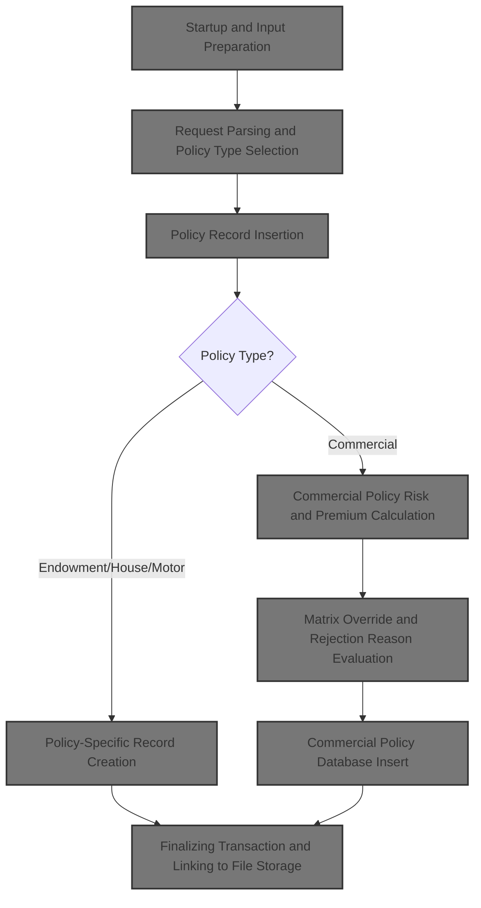

## Dependencies

### Programs

- <SwmToken path="base/src/lgapdb09.cbl" pos="2:6:6" line-data="       PROGRAM-ID. LGAPDB09.">`LGAPDB09`</SwmToken> (<SwmPath>[base/src/lgapdb09.cbl](base/src/lgapdb09.cbl)</SwmPath>)
- <SwmToken path="base/src/lgapdb09.cbl" pos="268:9:9" line-data="             EXEC CICS Link Program(LGAPVS01)">`LGAPVS01`</SwmToken> (<SwmPath>[base/src/lgapvs01.cbl](base/src/lgapvs01.cbl)</SwmPath>)
- LGSTSQ (<SwmPath>[base/src/lgstsq.cbl](base/src/lgstsq.cbl)</SwmPath>)
- LGCOMCAL (<SwmPath>[base/src/lgcomcal.cbl](base/src/lgcomcal.cbl)</SwmPath>)

### Copybooks

- LGCMAREA (<SwmPath>[base/src/lgcmarea.cpy](base/src/lgcmarea.cpy)</SwmPath>)
- LGCOMDAT (<SwmPath>[base/src/lgcomdat.cpy](base/src/lgcomdat.cpy)</SwmPath>)
- LGPOLICY (<SwmPath>[base/src/lgpolicy.cpy](base/src/lgpolicy.cpy)</SwmPath>)
- SQLCA

## Input and Output Tables/Files used

### <SwmToken path="base/src/lgapdb09.cbl" pos="2:6:6" line-data="       PROGRAM-ID. LGAPDB09.">`LGAPDB09`</SwmToken> (<SwmPath>[base/src/lgapdb09.cbl](base/src/lgapdb09.cbl)</SwmPath>)

| Table / File Name | Type                                                                                                                     | Description                                           | Usage Mode   | Key Fields / Layout Highlights                                                                                                                                                                                                                                                                                                                                                                                                                                                                                                                                                                                                                                                                                                                                                                                                                                                                                                                                                                                                                                                                                                                                                                                                                                                                                                                                                                                                                                                                                                                                                                                                                                                                                                                                                                                                                                                                                                                                                                                                                                                                                                                                                                                                                                                                                                                                                                                                                                                                                                                                                                                                                                        |
| ----------------- | ------------------------------------------------------------------------------------------------------------------------ | ----------------------------------------------------- | ------------ | --------------------------------------------------------------------------------------------------------------------------------------------------------------------------------------------------------------------------------------------------------------------------------------------------------------------------------------------------------------------------------------------------------------------------------------------------------------------------------------------------------------------------------------------------------------------------------------------------------------------------------------------------------------------------------------------------------------------------------------------------------------------------------------------------------------------------------------------------------------------------------------------------------------------------------------------------------------------------------------------------------------------------------------------------------------------------------------------------------------------------------------------------------------------------------------------------------------------------------------------------------------------------------------------------------------------------------------------------------------------------------------------------------------------------------------------------------------------------------------------------------------------------------------------------------------------------------------------------------------------------------------------------------------------------------------------------------------------------------------------------------------------------------------------------------------------------------------------------------------------------------------------------------------------------------------------------------------------------------------------------------------------------------------------------------------------------------------------------------------------------------------------------------------------------------------------------------------------------------------------------------------------------------------------------------------------------------------------------------------------------------------------------------------------------------------------------------------------------------------------------------------------------------------------------------------------------------------------------------------------------------------------------------------------- |
| COMMERCIAL        | <SwmToken path="base/src/lgapdb09.cbl" pos="199:3:3" line-data="           INITIALIZE DB2-IN-INTEGERS.">`DB2`</SwmToken> | Commercial policy property, risk, and premium factors | Output       | <SwmToken path="base/src/lgapdb09.cbl" pos="567:2:2" line-data="                       (PolicyNumber,">`PolicyNumber`</SwmToken>, <SwmToken path="base/src/lgapdb09.cbl" pos="568:1:1" line-data="                        RequestDate,">`RequestDate`</SwmToken>, <SwmToken path="base/src/lgapdb09.cbl" pos="569:1:1" line-data="                        StartDate,">`StartDate`</SwmToken>, <SwmToken path="base/src/lgapdb09.cbl" pos="570:1:1" line-data="                        RenewalDate,">`RenewalDate`</SwmToken>, <SwmToken path="base/src/lgapdb09.cbl" pos="502:7:7" line-data="           MOVE CA-B-Address TO WS-XADDRESS">`Address`</SwmToken>, <SwmToken path="base/src/lgapdb09.cbl" pos="572:1:1" line-data="                        Zipcode,">`Zipcode`</SwmToken>, <SwmToken path="base/src/lgapdb09.cbl" pos="573:1:1" line-data="                        LatitudeN,">`LatitudeN`</SwmToken>, <SwmToken path="base/src/lgapdb09.cbl" pos="574:1:1" line-data="                        LongitudeW,">`LongitudeW`</SwmToken>, <SwmToken path="base/src/lgapdb09.cbl" pos="505:7:7" line-data="           MOVE CA-B-Customer TO WS-XCUSTNAME">`Customer`</SwmToken>, <SwmToken path="base/src/lgapdb09.cbl" pos="576:1:1" line-data="                        PropertyType,">`PropertyType`</SwmToken>, <SwmToken path="base/src/lgapdb09.cbl" pos="577:1:1" line-data="                        FirePeril,">`FirePeril`</SwmToken>, <SwmToken path="base/src/lgapdb09.cbl" pos="518:15:19" line-data="           MOVE WS-ZFP-PREMIUM TO CA-B-CA-B-FPR">`CA-B-FPR`</SwmToken>, <SwmToken path="base/src/lgapdb09.cbl" pos="579:1:1" line-data="                        CrimePeril,">`CrimePeril`</SwmToken>, <SwmToken path="base/src/lgapdb09.cbl" pos="580:1:1" line-data="                        CrimePremium,">`CrimePremium`</SwmToken>, <SwmToken path="base/src/lgapdb09.cbl" pos="581:1:1" line-data="                        FloodPeril,">`FloodPeril`</SwmToken>, <SwmToken path="base/src/lgapdb09.cbl" pos="582:1:1" line-data="                        FloodPremium,">`FloodPremium`</SwmToken>, <SwmToken path="base/src/lgapdb09.cbl" pos="583:1:1" line-data="                        WeatherPeril,">`WeatherPeril`</SwmToken>, <SwmToken path="base/src/lgapdb09.cbl" pos="584:1:1" line-data="                        WeatherPremium,">`WeatherPremium`</SwmToken>, <SwmToken path="base/src/lgapdb09.cbl" pos="585:1:1" line-data="                        Status,">`Status`</SwmToken>, <SwmToken path="base/src/lgapdb09.cbl" pos="586:1:1" line-data="                        RejectionReason)">`RejectionReason`</SwmToken> |
| ENDOWMENT         | <SwmToken path="base/src/lgapdb09.cbl" pos="199:3:3" line-data="           INITIALIZE DB2-IN-INTEGERS.">`DB2`</SwmToken> | Endowment policy investment and assured sum details   | Output       | <SwmToken path="base/src/lgapdb09.cbl" pos="289:3:3" line-data="                       ( POLICYNUMBER,">`POLICYNUMBER`</SwmToken>, <SwmToken path="base/src/lgapdb09.cbl" pos="365:1:1" line-data="                            WITHPROFITS,">`WITHPROFITS`</SwmToken>, <SwmToken path="base/src/lgapdb09.cbl" pos="366:1:1" line-data="                            EQUITIES,">`EQUITIES`</SwmToken>, <SwmToken path="base/src/lgapdb09.cbl" pos="367:1:1" line-data="                            MANAGEDFUND,">`MANAGEDFUND`</SwmToken>, <SwmToken path="base/src/lgapdb09.cbl" pos="368:1:1" line-data="                            FUNDNAME,">`FUNDNAME`</SwmToken>, <SwmToken path="base/src/lgapdb09.cbl" pos="346:7:7" line-data="           MOVE CA-E-TERM        TO DB2-E-TERM-SINT">`TERM`</SwmToken>, <SwmToken path="base/src/lgapdb09.cbl" pos="347:17:17" line-data="           MOVE CA-E-SUM-ASSURED TO DB2-E-SUMASSURED-INT">`SUMASSURED`</SwmToken>, <SwmToken path="base/src/lgapdb09.cbl" pos="371:1:1" line-data="                            LIFEASSURED,">`LIFEASSURED`</SwmToken>, <SwmToken path="base/src/lgapdb09.cbl" pos="372:1:1" line-data="                            PADDINGDATA    )">`PADDINGDATA`</SwmToken>                                                                                                                                                                                                                                                                                                                                                                                                                                                                                                                                                                                                                                                                                                                                                                                                                                                                                                                                                                                                                                                                                                                                                                                                                                                                                                                                                                                                                        |
| HOUSE             | <SwmToken path="base/src/lgapdb09.cbl" pos="199:3:3" line-data="           INITIALIZE DB2-IN-INTEGERS.">`DB2`</SwmToken> | House policy property type, value, and address data   | Output       | <SwmToken path="base/src/lgapdb09.cbl" pos="289:3:3" line-data="                       ( POLICYNUMBER,">`POLICYNUMBER`</SwmToken>, <SwmToken path="base/src/lgapdb09.cbl" pos="424:1:1" line-data="                         PROPERTYTYPE,">`PROPERTYTYPE`</SwmToken>, <SwmToken path="base/src/lgapdb09.cbl" pos="418:15:15" line-data="           MOVE CA-H-BED    TO DB2-H-BEDROOMS-SINT">`BEDROOMS`</SwmToken>, <SwmToken path="base/src/lgapdb09.cbl" pos="417:15:15" line-data="           MOVE CA-H-VAL       TO DB2-H-VALUE-INT">`VALUE`</SwmToken>, <SwmToken path="base/src/lgapdb09.cbl" pos="427:1:1" line-data="                         HOUSENAME,">`HOUSENAME`</SwmToken>, <SwmToken path="base/src/lgapdb09.cbl" pos="428:1:1" line-data="                         HOUSENUMBER,">`HOUSENUMBER`</SwmToken>, <SwmToken path="base/src/lgapdb09.cbl" pos="429:1:1" line-data="                         POSTCODE          )">`POSTCODE`</SwmToken>                                                                                                                                                                                                                                                                                                                                                                                                                                                                                                                                                                                                                                                                                                                                                                                                                                                                                                                                                                                                                                                                                                                                                                                                                                                                                                                                                                                                                                                                                                                                                                                                                                                                                                         |
| MOTOR             | <SwmToken path="base/src/lgapdb09.cbl" pos="199:3:3" line-data="           INITIALIZE DB2-IN-INTEGERS.">`DB2`</SwmToken> | Motor policy vehicle make, model, and risk data       | Output       | <SwmToken path="base/src/lgapdb09.cbl" pos="289:3:3" line-data="                       ( POLICYNUMBER,">`POLICYNUMBER`</SwmToken>, <SwmToken path="base/src/lgapdb09.cbl" pos="460:1:1" line-data="                         MAKE,">`MAKE`</SwmToken>, <SwmToken path="base/src/lgapdb09.cbl" pos="461:1:1" line-data="                         MODEL,">`MODEL`</SwmToken>, <SwmToken path="base/src/lgapdb09.cbl" pos="417:15:15" line-data="           MOVE CA-H-VAL       TO DB2-H-VALUE-INT">`VALUE`</SwmToken>, <SwmToken path="base/src/lgapdb09.cbl" pos="463:1:1" line-data="                         REGNUMBER,">`REGNUMBER`</SwmToken>, <SwmToken path="base/src/lgapdb09.cbl" pos="464:1:1" line-data="                         COLOUR,">`COLOUR`</SwmToken>, <SwmToken path="base/src/lgapdb09.cbl" pos="452:7:7" line-data="           MOVE CA-M-CC          TO DB2-M-CC-SINT">`CC`</SwmToken>, <SwmToken path="base/src/lgapdb09.cbl" pos="466:1:1" line-data="                         YEAROFMANUFACTURE,">`YEAROFMANUFACTURE`</SwmToken>, <SwmToken path="base/src/lgapdb09.cbl" pos="453:7:7" line-data="           MOVE CA-M-PREMIUM     TO DB2-M-PREMIUM-INT">`PREMIUM`</SwmToken>, <SwmToken path="base/src/lgapdb09.cbl" pos="454:7:7" line-data="           MOVE CA-M-ACCIDENTS   TO DB2-M-ACCIDENTS-INT">`ACCIDENTS`</SwmToken>                                                                                                                                                                                                                                                                                                                                                                                                                                                                                                                                                                                                                                                                                                                                                                                                                                                                                                                                                                                                                                                                                                                                                                                                                                                                                                                 |
| POLICY            | <SwmToken path="base/src/lgapdb09.cbl" pos="199:3:3" line-data="           INITIALIZE DB2-IN-INTEGERS.">`DB2`</SwmToken> | Insurance policy core details and lifecycle dates     | Input/Output | <SwmToken path="base/src/lgapdb09.cbl" pos="289:3:3" line-data="                       ( POLICYNUMBER,">`POLICYNUMBER`</SwmToken>, <SwmToken path="base/src/lgapdb09.cbl" pos="290:1:1" line-data="                         CUSTOMERNUMBER,">`CUSTOMERNUMBER`</SwmToken>, <SwmToken path="base/src/lgapdb09.cbl" pos="291:1:1" line-data="                         ISSUEDATE,">`ISSUEDATE`</SwmToken>, <SwmToken path="base/src/lgapdb09.cbl" pos="292:1:1" line-data="                         EXPIRYDATE,">`EXPIRYDATE`</SwmToken>, <SwmToken path="base/src/lgapdb09.cbl" pos="222:11:11" line-data="               MOVE &#39;E&#39; TO DB2-POLICYTYPE">`POLICYTYPE`</SwmToken>, <SwmToken path="base/src/lgapdb09.cbl" pos="294:1:1" line-data="                         LASTCHANGED,">`LASTCHANGED`</SwmToken>, <SwmToken path="base/src/lgapdb09.cbl" pos="283:5:5" line-data="           MOVE CA-BROKERID TO DB2-BROKERID-INT">`BROKERID`</SwmToken>, <SwmToken path="base/src/lgapdb09.cbl" pos="296:1:1" line-data="                         BROKERSREFERENCE,">`BROKERSREFERENCE`</SwmToken>, <SwmToken path="base/src/lgapdb09.cbl" pos="284:5:5" line-data="           MOVE CA-PAYMENT TO DB2-PAYMENT-INT">`PAYMENT`</SwmToken>, <SwmToken path="base/src/lgapdb09.cbl" pos="334:4:6" line-data="               INTO :CA-LASTCHANGED">`CA-LASTCHANGED`</SwmToken>                                                                                                                                                                                                                                                                                                                                                                                                                                                                                                                                                                                                                                                                                                                                                                                                                                                                                                                                                                                                                                                                                                                                                                                                                                                                                         |

## Detailed View of the Program's Functionality

# Detailed Explanation of the Swimmio-genapp-house Flow

---

## a. Startup and Input Preparation

**Initialization and Input Validation**

- The program begins by initializing its internal structures for transaction tracking and input handling. This includes setting up a header for working storage, copying CICS environment fields (like transaction ID, terminal ID, and task number) into local variables, and preparing <SwmToken path="base/src/lgapdb09.cbl" pos="199:3:3" line-data="           INITIALIZE DB2-IN-INTEGERS.">`DB2`</SwmToken> host variables for both input and output.
- The program then checks if any input data was provided (by examining the commarea length). If no input is present, it logs an error message and immediately aborts the transaction to prevent further processing with invalid or missing data.

---

## b. Error Logging and Message Formatting

**Error Handling Routine**

- When an error is detected (such as missing input or a database failure), the program records details including the SQL error code, current date, and time.
- It sends a formatted error message to a logging system (LGSTSQ), which writes the message to both a temporary and a permanent queue for monitoring.
- If transaction data is present, it includes up to 90 bytes of this data in the error log for context.
- The logging system distinguishes between programmatic and user-initiated calls, reformats messages as needed, and ensures all errors are timestamped and tracked.

---

## c. Request Parsing and Policy Type Selection

**Determining Policy Type and Validating Input**

- The program resets the return code and prepares pointers to the input area.
- It moves key identifiers (like customer number) into both <SwmToken path="base/src/lgapdb09.cbl" pos="199:3:3" line-data="           INITIALIZE DB2-IN-INTEGERS.">`DB2`</SwmToken> and error message variables.
- The program then determines the type of policy being requested (endowment, house, motor, or commercial) by examining a request ID.
- For each policy type, it calculates the required length of the input area and sets the appropriate <SwmToken path="base/src/lgapdb09.cbl" pos="199:3:3" line-data="           INITIALIZE DB2-IN-INTEGERS.">`DB2`</SwmToken> policy type.
- If the request ID is unrecognized, it sets an error code and returns immediately.
- Before proceeding, it checks if the input area is large enough for the requested operation. If not, it sets an error code and returns.

---

## d. Policy Record Insertion

**Creating the Main Policy Record**

- The program copies relevant fields (such as broker ID and payment information) into <SwmToken path="base/src/lgapdb09.cbl" pos="199:3:3" line-data="           INITIALIZE DB2-IN-INTEGERS.">`DB2`</SwmToken> host variables.
- It then inserts a new policy record into the database.
- After the insert, it checks the result:
  - On success, it sets the return code to indicate success, retrieves the new policy number, and updates the "last changed" timestamp.
  - If the customer is missing (foreign key error), it sets a specific error code, logs the error, and returns.
  - For any other error, it sets a generic error code, logs the error, and returns.

---

## e. Policy-Specific Record Creation

**Branching to Policy-Type Handlers**

- After the main policy record is created, the program branches to a handler specific to the requested policy type:
  - Endowment policies go to the endowment handler.
  - House policies go to the house handler.
  - Motor policies go to the motor handler.
  - Commercial policies go to the business handler.
- If the request type is unrecognized, it sets an error code and exits.

---

## f. Endowment Policy Insert

**Handling Endowment Policy Details**

- The handler converts numeric fields to <SwmToken path="base/src/lgapdb09.cbl" pos="199:3:3" line-data="           INITIALIZE DB2-IN-INTEGERS.">`DB2`</SwmToken> integer format and checks if there is any variable-length data.
- If variable-length data is present, it copies this data and includes it in the database insert.
- If not, it performs a standard insert.
- If the insert fails, it sets an error code, logs the error, and forces a rollback to undo any changes.

---

## g. House Record Insert

**Handling House Policy Details**

- The handler converts relevant fields (like value and bedrooms) to <SwmToken path="base/src/lgapdb09.cbl" pos="199:3:3" line-data="           INITIALIZE DB2-IN-INTEGERS.">`DB2`</SwmToken> integer format.
- It inserts a new house property record into the database.
- If the insert fails, it sets an error code, logs the error, and forces a rollback.

---

## h. Motor Policy Insert

**Handling Motor Policy Details**

- The handler converts all relevant numeric fields (value, engine capacity, premium, accidents) to <SwmToken path="base/src/lgapdb09.cbl" pos="199:3:3" line-data="           INITIALIZE DB2-IN-INTEGERS.">`DB2`</SwmToken> integer format.
- It inserts a new motor policy record into the database.
- If the insert fails, it sets an error code, logs the error, and forces a rollback.

---

## i. Commercial Policy Risk and Premium Calculation

**Preparing for Risk Calculation**

- The handler copies all relevant customer, policy, and property fields into a dedicated area for risk calculation.
- It then calls an external program (LGCOMCAL) to perform risk and premium calculations.

**Risk Calculation Workflow**

- The risk calculation program initializes its environment, including transaction and terminal IDs, and sets up property and peril mapping matrices.
- It enables security validation and prepares for the main business logic.

**Risk Calculation Initialization**

- The program sets up mapping variables for property and peril codes, but only for specific index combinations, reflecting business rules.

**Calculating Risk and Premiums**

- The program calculates a risk score by combining a base value, a property factor (based on property type), and a geographic factor (based on postcode prefix).
- It determines the policy status (normal, pending, or critical) based on the risk score and sets a rejection reason if necessary.
- It calculates premiums for different perils (fire, crime, flood, weather) using the risk score, peril factors, and any applicable discounts.

---

## j. Updating Policy Record with Risk and Premiums

**Storing Risk and Premium Results**

- After receiving results from the risk calculation, the program updates the policy record with the risk score, status, rejection reason, and calculated premium values.
- It then checks the risk score against preset thresholds to determine if a manual review or verification is needed, updating the override status and rejection reason accordingly.

---

## k. Commercial Policy Database Insert

**Finalizing Commercial Policy Storage**

- The program prepares all relevant fields for the commercial policy and inserts the record into the database.
- If the insert fails, it sets an error code, logs the error, and forces a rollback.

---

## l. Finalizing Transaction and Linking to File Storage

**Writing Transaction Data**

- The program links to another external program (<SwmToken path="base/src/lgapdb09.cbl" pos="268:9:9" line-data="             EXEC CICS Link Program(LGAPVS01)">`LGAPVS01`</SwmToken>), passing along the transaction data for file storage and logging.
- This ensures that all transaction details are written out and available for auditing or further processing.

---

## m. Writing Transaction Data and Error Logging

**File Storage and Error Handling**

- The file storage program receives the transaction data and determines the request type.
- It prepares the appropriate data structure based on the policy type and writes the data to a file.
- If the file write fails, it logs the error (including customer and policy numbers, error codes, and a timestamp) and returns a failure code.
- The error logging routine ensures all relevant context is captured and sent to the logging system for monitoring.

---

## n. Summary

- The overall flow ensures that every transaction is validated, processed according to its policy type, risk-assessed (for commercial policies), and stored both in the database and in a file.
- All errors are logged with detailed context, and any failures in database or file operations trigger immediate rollback and notification.
- The design is modular, with clear separation between policy types, error handling, risk calculation, and storage, making it robust and maintainable.

# Data Definitions

### <SwmToken path="base/src/lgapdb09.cbl" pos="2:6:6" line-data="       PROGRAM-ID. LGAPDB09.">`LGAPDB09`</SwmToken> (<SwmPath>[base/src/lgapdb09.cbl](base/src/lgapdb09.cbl)</SwmPath>)

| Table / Record Name | Type                                                                                                                     | Short Description                                     | Usage Mode                      |
| ------------------- | ------------------------------------------------------------------------------------------------------------------------ | ----------------------------------------------------- | ------------------------------- |
| COMMERCIAL          | <SwmToken path="base/src/lgapdb09.cbl" pos="199:3:3" line-data="           INITIALIZE DB2-IN-INTEGERS.">`DB2`</SwmToken> | Commercial policy property, risk, and premium factors | Output (INSERT)                 |
| ENDOWMENT           | <SwmToken path="base/src/lgapdb09.cbl" pos="199:3:3" line-data="           INITIALIZE DB2-IN-INTEGERS.">`DB2`</SwmToken> | Endowment policy investment and assured sum details   | Output (INSERT)                 |
| HOUSE               | <SwmToken path="base/src/lgapdb09.cbl" pos="199:3:3" line-data="           INITIALIZE DB2-IN-INTEGERS.">`DB2`</SwmToken> | House policy property type, value, and address data   | Output (INSERT)                 |
| MOTOR               | <SwmToken path="base/src/lgapdb09.cbl" pos="199:3:3" line-data="           INITIALIZE DB2-IN-INTEGERS.">`DB2`</SwmToken> | Motor policy vehicle make, model, and risk data       | Output (INSERT)                 |
| POLICY              | <SwmToken path="base/src/lgapdb09.cbl" pos="199:3:3" line-data="           INITIALIZE DB2-IN-INTEGERS.">`DB2`</SwmToken> | Insurance policy core details and lifecycle dates     | Input (SELECT), Output (INSERT) |

# Rule Definition

| Paragraph Name                                                                                                                                                                                                                                                                                                                                                                                                                                                                                                                                                                                         | Rule ID | Category          | Description                                                                                                                                                                                                                                                                                                                                                                                                                                                                                                                                   | Conditions                                                                                                                                                                                                                                                                                | Remarks                                                                                                                                                                                                                                                                                                                                                                                                                                                                                                                                                                                                                                                                                                                                                                                |
| ------------------------------------------------------------------------------------------------------------------------------------------------------------------------------------------------------------------------------------------------------------------------------------------------------------------------------------------------------------------------------------------------------------------------------------------------------------------------------------------------------------------------------------------------------------------------------------------------------ | ------- | ----------------- | --------------------------------------------------------------------------------------------------------------------------------------------------------------------------------------------------------------------------------------------------------------------------------------------------------------------------------------------------------------------------------------------------------------------------------------------------------------------------------------------------------------------------------------------- | ----------------------------------------------------------------------------------------------------------------------------------------------------------------------------------------------------------------------------------------------------------------------------------------- | -------------------------------------------------------------------------------------------------------------------------------------------------------------------------------------------------------------------------------------------------------------------------------------------------------------------------------------------------------------------------------------------------------------------------------------------------------------------------------------------------------------------------------------------------------------------------------------------------------------------------------------------------------------------------------------------------------------------------------------------------------------------------------------- |
| MAINLINE SECTION, <SwmToken path="base/src/lgcomcal.cbl" pos="208:3:5" line-data="           PERFORM INITIALIZE-PROCESSING.">`INITIALIZE-PROCESSING`</SwmToken>, <SwmToken path="base/src/lgcomcal.cbl" pos="223:3:5" line-data="           PERFORM INITIALIZE-MATRICES.">`INITIALIZE-MATRICES`</SwmToken>, <SwmToken path="base/src/lgcomcal.cbl" pos="227:3:7" line-data="           PERFORM INIT-SECURITY-VALIDATION.">`INIT-SECURITY-VALIDATION`</SwmToken> (<SwmPath>[base/src/lgapdb09.cbl](base/src/lgapdb09.cbl)</SwmPath>, <SwmPath>[base/src/lgcomcal.cbl](base/src/lgcomcal.cbl)</SwmPath>) | RL-001  | Data Assignment   | At program startup, all transaction and input structures must be initialized, including copying CICS environment fields and preparing <SwmToken path="base/src/lgapdb09.cbl" pos="199:3:3" line-data="           INITIALIZE DB2-IN-INTEGERS.">`DB2`</SwmToken> host variables for input and output.                                                                                                                                                                                                                                           | Program is starting up (first entry to mainline).                                                                                                                                                                                                                                         | CICS fields (transaction id, terminal id, task number) are copied to working storage. <SwmToken path="base/src/lgapdb09.cbl" pos="199:3:3" line-data="           INITIALIZE DB2-IN-INTEGERS.">`DB2`</SwmToken> host variables are set to initial values (typically zero or spaces).                                                                                                                                                                                                                                                                                                                                                                                                                                                                                                    |
| MAINLINE SECTION (<SwmPath>[base/src/lgapdb09.cbl](base/src/lgapdb09.cbl)</SwmPath>), <SwmToken path="base/src/lgapvs01.cbl" pos="90:1:3" line-data="       P100-ENTRY SECTION.">`P100-ENTRY`</SwmToken> (<SwmPath>[base/src/lgapvs01.cbl](base/src/lgapvs01.cbl)</SwmPath>)                                                                                                                                                                                                                                                                                                                           | RL-002  | Conditional Logic | If the input commarea length is zero, log an error message with SQL error code, date, and time, and abort the transaction without further processing.                                                                                                                                                                                                                                                                                                                                                                                         | EIBCALEN (commarea length) is zero.                                                                                                                                                                                                                                                       | Error message includes SQL error code, date, time, and up to 90 bytes of commarea data. Program abends with code 'LGCA'.                                                                                                                                                                                                                                                                                                                                                                                                                                                                                                                                                                                                                                                               |
| MAINLINE SECTION (<SwmPath>[base/src/lgapdb09.cbl](base/src/lgapdb09.cbl)</SwmPath>)                                                                                                                                                                                                                                                                                                                                                                                                                                                                                                                   | RL-003  | Data Assignment   | If input data is present, set up customer and policy variables from the commarea, including copying key identifiers into <SwmToken path="base/src/lgapdb09.cbl" pos="199:3:3" line-data="           INITIALIZE DB2-IN-INTEGERS.">`DB2`</SwmToken> and error message variables.                                                                                                                                                                                                                                                                | EIBCALEN (commarea length) is greater than zero.                                                                                                                                                                                                                                          | Customer number, policy number, and other key identifiers are copied from commarea to <SwmToken path="base/src/lgapdb09.cbl" pos="199:3:3" line-data="           INITIALIZE DB2-IN-INTEGERS.">`DB2`</SwmToken> host variables and error message fields.                                                                                                                                                                                                                                                                                                                                                                                                                                                                                                                                |
| MAINLINE SECTION (<SwmPath>[base/src/lgapdb09.cbl](base/src/lgapdb09.cbl)</SwmPath>)                                                                                                                                                                                                                                                                                                                                                                                                                                                                                                                   | RL-004  | Conditional Logic | Determine the requested policy type using the <SwmToken path="base/src/lgapdb09.cbl" pos="218:3:7" line-data="           EVALUATE CA-REQUEST-ID">`CA-REQUEST-ID`</SwmToken> field and set the required commarea length and <SwmToken path="base/src/lgapdb09.cbl" pos="199:3:3" line-data="           INITIALIZE DB2-IN-INTEGERS.">`DB2`</SwmToken> policy type accordingly.                                                                                                                                                                  | <SwmToken path="base/src/lgapdb09.cbl" pos="218:3:7" line-data="           EVALUATE CA-REQUEST-ID">`CA-REQUEST-ID`</SwmToken> is present in commarea.                                                                                                                                     | Policy types: <SwmToken path="base/src/lgapdb09.cbl" pos="220:4:4" line-data="             WHEN &#39;01AEND&#39;">`01AEND`</SwmToken> (Endowment), <SwmToken path="base/src/lgapdb09.cbl" pos="224:4:4" line-data="             WHEN &#39;01AHOU&#39;">`01AHOU`</SwmToken> (House), <SwmToken path="base/src/lgapdb09.cbl" pos="228:4:4" line-data="             WHEN &#39;01AMOT&#39;">`01AMOT`</SwmToken> (Motor), <SwmToken path="base/src/lgapdb09.cbl" pos="232:4:4" line-data="             WHEN &#39;01ACOM&#39;">`01ACOM`</SwmToken> (Commercial). <SwmToken path="base/src/lgapdb09.cbl" pos="199:3:3" line-data="           INITIALIZE DB2-IN-INTEGERS.">`DB2`</SwmToken> policy type is set to 'E', 'H', 'M', or 'C'. Required commarea length is set based on policy type. |
| MAINLINE SECTION (<SwmPath>[base/src/lgapdb09.cbl](base/src/lgapdb09.cbl)</SwmPath>)                                                                                                                                                                                                                                                                                                                                                                                                                                                                                                                   | RL-005  | Conditional Logic | If the request ID does not match any supported type, set the return code to '99' and return immediately.                                                                                                                                                                                                                                                                                                                                                                                                                                      | <SwmToken path="base/src/lgapdb09.cbl" pos="218:3:7" line-data="           EVALUATE CA-REQUEST-ID">`CA-REQUEST-ID`</SwmToken> is not one of the supported types.                                                                                                                          | Return code '99' is set in the commarea.                                                                                                                                                                                                                                                                                                                                                                                                                                                                                                                                                                                                                                                                                                                                               |
| MAINLINE SECTION (<SwmPath>[base/src/lgapdb09.cbl](base/src/lgapdb09.cbl)</SwmPath>)                                                                                                                                                                                                                                                                                                                                                                                                                                                                                                                   | RL-006  | Conditional Logic | Check that the commarea length is at least as large as the required length for the requested policy type. If not, set the return code to '98' and return.                                                                                                                                                                                                                                                                                                                                                                                     | EIBCALEN is less than required length for policy type.                                                                                                                                                                                                                                    | Return code '98' is set in the commarea.                                                                                                                                                                                                                                                                                                                                                                                                                                                                                                                                                                                                                                                                                                                                               |
| <SwmToken path="base/src/lgapdb09.cbl" pos="247:3:5" line-data="           PERFORM P100-T">`P100-T`</SwmToken> (<SwmPath>[base/src/lgapdb09.cbl](base/src/lgapdb09.cbl)</SwmPath>)                                                                                                                                                                                                                                                                                                                                                                                                                     | RL-007  | Computation       | For valid requests, insert a new policy record into the POLICY table, mapping commarea fields to <SwmToken path="base/src/lgapdb09.cbl" pos="199:3:3" line-data="           INITIALIZE DB2-IN-INTEGERS.">`DB2`</SwmToken> host variables as per the schema.                                                                                                                                                                                                                                                                                   | Request is valid and commarea length is sufficient.                                                                                                                                                                                                                                       | Fields mapped according to <SwmToken path="base/src/lgapdb09.cbl" pos="199:3:3" line-data="           INITIALIZE DB2-IN-INTEGERS.">`DB2`</SwmToken> schema. Insert uses host variables for all relevant fields.                                                                                                                                                                                                                                                                                                                                                                                                                                                                                                                                                                        |
| <SwmToken path="base/src/lgapdb09.cbl" pos="247:3:5" line-data="           PERFORM P100-T">`P100-T`</SwmToken> (<SwmPath>[base/src/lgapdb09.cbl](base/src/lgapdb09.cbl)</SwmPath>)                                                                                                                                                                                                                                                                                                                                                                                                                     | RL-008  | Data Assignment   | After a successful insert, retrieve the assigned policy number and last changed timestamp from <SwmToken path="base/src/lgapdb09.cbl" pos="199:3:3" line-data="           INITIALIZE DB2-IN-INTEGERS.">`DB2`</SwmToken> and update the commarea fields <SwmToken path="base/src/lgapdb09.cbl" pos="329:11:15" line-data="           MOVE DB2-POLICYNUM-INT TO CA-POLICY-NUM">`CA-POLICY-NUM`</SwmToken> and <SwmToken path="base/src/lgapdb09.cbl" pos="334:4:6" line-data="               INTO :CA-LASTCHANGED">`CA-LASTCHANGED`</SwmToken>. | SQLCODE = 0 after POLICY insert.                                                                                                                                                                                                                                                          | Policy number and last changed timestamp are set in commarea as alphanumeric and timestamp fields, respectively.                                                                                                                                                                                                                                                                                                                                                                                                                                                                                                                                                                                                                                                                       |
| <SwmToken path="base/src/lgapdb09.cbl" pos="247:3:5" line-data="           PERFORM P100-T">`P100-T`</SwmToken> (<SwmPath>[base/src/lgapdb09.cbl](base/src/lgapdb09.cbl)</SwmPath>)                                                                                                                                                                                                                                                                                                                                                                                                                     | RL-009  | Conditional Logic | If the POLICY insert fails with SQLCODE -530, set the return code to '70', log the error, and return. For any other POLICY insert error, set the return code to '90', log the error, and return.                                                                                                                                                                                                                                                                                                                                              | SQLCODE is not 0 after POLICY insert.                                                                                                                                                                                                                                                     | Return code '70' for -530, '90' for other errors. Error logging includes SQL error code, date, time, and commarea data.                                                                                                                                                                                                                                                                                                                                                                                                                                                                                                                                                                                                                                                                |
| MAINLINE SECTION (<SwmPath>[base/src/lgapdb09.cbl](base/src/lgapdb09.cbl)</SwmPath>)                                                                                                                                                                                                                                                                                                                                                                                                                                                                                                                   | RL-010  | Conditional Logic | After inserting the POLICY record, branch to the appropriate handler based on <SwmToken path="base/src/lgapdb09.cbl" pos="218:3:7" line-data="           EVALUATE CA-REQUEST-ID">`CA-REQUEST-ID`</SwmToken> to insert the specific policy type record.                                                                                                                                                                                                                                                                                        | POLICY insert was successful and <SwmToken path="base/src/lgapdb09.cbl" pos="218:3:7" line-data="           EVALUATE CA-REQUEST-ID">`CA-REQUEST-ID`</SwmToken> is valid.                                                                                                                  | Handlers: <SwmToken path="base/src/lgapdb09.cbl" pos="252:3:5" line-data="               PERFORM P200-E">`P200-E`</SwmToken> (Endowment), <SwmToken path="base/src/lgapdb09.cbl" pos="255:3:5" line-data="               PERFORM P300-H">`P300-H`</SwmToken> (House), <SwmToken path="base/src/lgapdb09.cbl" pos="258:3:5" line-data="               PERFORM P400-M">`P400-M`</SwmToken> (Motor), <SwmToken path="base/src/lgapdb09.cbl" pos="261:3:5" line-data="               PERFORM P500-BIZ">`P500-BIZ`</SwmToken> (Commercial).                                                                                                                                                                                                                                                 |
| <SwmToken path="base/src/lgapdb09.cbl" pos="252:3:5" line-data="               PERFORM P200-E">`P200-E`</SwmToken>, <SwmToken path="base/src/lgapdb09.cbl" pos="255:3:5" line-data="               PERFORM P300-H">`P300-H`</SwmToken>, <SwmToken path="base/src/lgapdb09.cbl" pos="258:3:5" line-data="               PERFORM P400-M">`P400-M`</SwmToken>, <SwmToken path="base/src/lgapdb09.cbl" pos="261:3:5" line-data="               PERFORM P500-BIZ">`P500-BIZ`</SwmToken> (<SwmPath>[base/src/lgapdb09.cbl](base/src/lgapdb09.cbl)</SwmPath>)                                                 | RL-011  | Computation       | Insert the appropriate policy type record using mapped commarea fields. For endowment, handle variable-length data if present.                                                                                                                                                                                                                                                                                                                                                                                                                | Handler for policy type is invoked after POLICY insert.                                                                                                                                                                                                                                   | Field mapping as per <SwmToken path="base/src/lgapdb09.cbl" pos="199:3:3" line-data="           INITIALIZE DB2-IN-INTEGERS.">`DB2`</SwmToken> schema. For endowment, if variable-length data is present, include it in the insert.                                                                                                                                                                                                                                                                                                                                                                                                                                                                                                                                                     |
| <SwmToken path="base/src/lgapdb09.cbl" pos="252:3:5" line-data="               PERFORM P200-E">`P200-E`</SwmToken>, <SwmToken path="base/src/lgapdb09.cbl" pos="255:3:5" line-data="               PERFORM P300-H">`P300-H`</SwmToken>, <SwmToken path="base/src/lgapdb09.cbl" pos="258:3:5" line-data="               PERFORM P400-M">`P400-M`</SwmToken>, <SwmToken path="base/src/lgapdb09.cbl" pos="261:3:5" line-data="               PERFORM P500-BIZ">`P500-BIZ`</SwmToken> (<SwmPath>[base/src/lgapdb09.cbl](base/src/lgapdb09.cbl)</SwmPath>)                                                 | RL-012  | Conditional Logic | For endowment, house, and motor policy inserts, if the insert fails, set the return code to '90', log the error, and roll back the transaction. For commercial, set return code to '92'.                                                                                                                                                                                                                                                                                                                                                      | SQLCODE is not 0 after policy type insert.                                                                                                                                                                                                                                                | Return code '90' for endowment, house, motor; '92' for commercial. Error logging includes SQL error code, date, time, and commarea data. Rollback is performed via CICS abend.                                                                                                                                                                                                                                                                                                                                                                                                                                                                                                                                                                                                         |
| <SwmToken path="base/src/lgapdb09.cbl" pos="261:3:5" line-data="               PERFORM P500-BIZ">`P500-BIZ`</SwmToken>, <SwmToken path="base/src/lgapdb09.cbl" pos="526:3:7" line-data="           PERFORM P546-CHK-MATRIX">`P546-CHK-MATRIX`</SwmToken>, <SwmToken path="base/src/lgapdb09.cbl" pos="528:3:5" line-data="           PERFORM P548-BINS">`P548-BINS`</SwmToken> (<SwmPath>[base/src/lgapdb09.cbl](base/src/lgapdb09.cbl)</SwmPath>), <SwmPath>[base/src/lgcomcal.cbl](base/src/lgcomcal.cbl)</SwmPath>                                                                                  | RL-013  | Computation       | For commercial policies, prepare customer and property data, calculate risk score (base value + property factor + geographic factor), set policy status and rejection reason based on risk score, calculate four premium values, and insert COMMERCIAL record with all calculated and mapped fields.                                                                                                                                                                                                                                          | <SwmToken path="base/src/lgapdb09.cbl" pos="218:3:7" line-data="           EVALUATE CA-REQUEST-ID">`CA-REQUEST-ID`</SwmToken> = <SwmToken path="base/src/lgapdb09.cbl" pos="232:4:4" line-data="             WHEN &#39;01ACOM&#39;">`01ACOM`</SwmToken> and POLICY insert was successful. | Risk score is a number. Status: 2 (Critical), 1 (Pending), 0 (Normal). Premiums: fire, crime, flood, weather. All values updated in commarea. COMMERCIAL insert uses all calculated and mapped fields.                                                                                                                                                                                                                                                                                                                                                                                                                                                                                                                                                                                 |
| MAINLINE SECTION (<SwmPath>[base/src/lgapdb09.cbl](base/src/lgapdb09.cbl)</SwmPath>)                                                                                                                                                                                                                                                                                                                                                                                                                                                                                                                   | RL-014  | Computation       | After all processing, link to the external program <SwmToken path="base/src/lgapdb09.cbl" pos="268:9:9" line-data="             EXEC CICS Link Program(LGAPVS01)">`LGAPVS01`</SwmToken> with the commarea to write transaction data to file storage.                                                                                                                                                                                                                                                                                          | All processing for the transaction is complete.                                                                                                                                                                                                                                           | Commarea is passed as input to <SwmToken path="base/src/lgapdb09.cbl" pos="268:9:9" line-data="             EXEC CICS Link Program(LGAPVS01)">`LGAPVS01`</SwmToken>. File write is performed using CICS WRITE FILE.                                                                                                                                                                                                                                                                                                                                                                                                                                                                                                                                                                    |
| MAINLINE SECTION (<SwmPath>[base/src/lgapdb09.cbl](base/src/lgapdb09.cbl)</SwmPath>), <SwmToken path="base/src/lgcomcal.cbl" pos="210:3:7" line-data="           PERFORM CLEANUP-AND-EXIT.">`CLEANUP-AND-EXIT`</SwmToken> (<SwmPath>[base/src/lgcomcal.cbl](base/src/lgcomcal.cbl)</SwmPath>)                                                                                                                                                                                                                                                                                                          | RL-015  | Data Assignment   | Return the updated commarea to the caller, including the result code, assigned policy number, last changed timestamp, and any calculated fields (e.g., premiums, status, rejection reason for commercial policies).                                                                                                                                                                                                                                                                                                                           | Transaction processing is complete (normal or error).                                                                                                                                                                                                                                     | Commarea fields are updated with all results and returned to the caller. Field formats: result code (string), policy number (alphanumeric), timestamp (string), premiums (number), status (number), rejection reason (string).                                                                                                                                                                                                                                                                                                                                                                                                                                                                                                                                                         |
| <SwmToken path="base/src/lgapdb09.cbl" pos="205:3:7" line-data="               PERFORM WRITE-ERROR-MESSAGE">`WRITE-ERROR-MESSAGE`</SwmToken> (<SwmPath>[base/src/lgapdb09.cbl](base/src/lgapdb09.cbl)</SwmPath>), <SwmToken path="base/src/lgapvs01.cbl" pos="146:3:5" line-data="             PERFORM P999-ERROR">`P999-ERROR`</SwmToken> (<SwmPath>[base/src/lgapvs01.cbl](base/src/lgapvs01.cbl)</SwmPath>), LGSTSQ (<SwmPath>[base/src/lgstsq.cbl](base/src/lgstsq.cbl)</SwmPath>)                                                                                                                 | RL-016  | Computation       | All error logging must include the SQL error code, date, time, and up to 90 bytes of commarea data.                                                                                                                                                                                                                                                                                                                                                                                                                                           | Any error occurs during processing.                                                                                                                                                                                                                                                       | Error message format: SQL error code (number), date (string), time (string), up to 90 bytes of commarea data (alphanumeric).                                                                                                                                                                                                                                                                                                                                                                                                                                                                                                                                                                                                                                                           |

# User Stories

## User Story 1: Program Initialization and Input Validation

---

### Story Description:

As a system, I want to initialize all transaction and input structures at startup and validate the input commarea so that the program can reliably process transactions or abort with clear errors if input is invalid.

---

### Business Rule Mapping:

| Rule ID | Paragraph Name                                                                                                                                                                                                                                                                                                                                                                                                                                                                                                                                                                                         | Rule Description                                                                                                                                                                                                                                                                                    |
| ------- | ------------------------------------------------------------------------------------------------------------------------------------------------------------------------------------------------------------------------------------------------------------------------------------------------------------------------------------------------------------------------------------------------------------------------------------------------------------------------------------------------------------------------------------------------------------------------------------------------------ | --------------------------------------------------------------------------------------------------------------------------------------------------------------------------------------------------------------------------------------------------------------------------------------------------- |
| RL-001  | MAINLINE SECTION, <SwmToken path="base/src/lgcomcal.cbl" pos="208:3:5" line-data="           PERFORM INITIALIZE-PROCESSING.">`INITIALIZE-PROCESSING`</SwmToken>, <SwmToken path="base/src/lgcomcal.cbl" pos="223:3:5" line-data="           PERFORM INITIALIZE-MATRICES.">`INITIALIZE-MATRICES`</SwmToken>, <SwmToken path="base/src/lgcomcal.cbl" pos="227:3:7" line-data="           PERFORM INIT-SECURITY-VALIDATION.">`INIT-SECURITY-VALIDATION`</SwmToken> (<SwmPath>[base/src/lgapdb09.cbl](base/src/lgapdb09.cbl)</SwmPath>, <SwmPath>[base/src/lgcomcal.cbl](base/src/lgcomcal.cbl)</SwmPath>) | At program startup, all transaction and input structures must be initialized, including copying CICS environment fields and preparing <SwmToken path="base/src/lgapdb09.cbl" pos="199:3:3" line-data="           INITIALIZE DB2-IN-INTEGERS.">`DB2`</SwmToken> host variables for input and output. |
| RL-002  | MAINLINE SECTION (<SwmPath>[base/src/lgapdb09.cbl](base/src/lgapdb09.cbl)</SwmPath>), <SwmToken path="base/src/lgapvs01.cbl" pos="90:1:3" line-data="       P100-ENTRY SECTION.">`P100-ENTRY`</SwmToken> (<SwmPath>[base/src/lgapvs01.cbl](base/src/lgapvs01.cbl)</SwmPath>)                                                                                                                                                                                                                                                                                                                           | If the input commarea length is zero, log an error message with SQL error code, date, and time, and abort the transaction without further processing.                                                                                                                                               |
| RL-003  | MAINLINE SECTION (<SwmPath>[base/src/lgapdb09.cbl](base/src/lgapdb09.cbl)</SwmPath>)                                                                                                                                                                                                                                                                                                                                                                                                                                                                                                                   | If input data is present, set up customer and policy variables from the commarea, including copying key identifiers into <SwmToken path="base/src/lgapdb09.cbl" pos="199:3:3" line-data="           INITIALIZE DB2-IN-INTEGERS.">`DB2`</SwmToken> and error message variables.                      |

---

### Relevant Functionality:

- **MAINLINE SECTION**
  1. **RL-001:**
     - Initialize all working storage fields for transaction and input data
     - Copy CICS environment fields (transaction id, terminal id, task number) into working storage
     - Prepare <SwmToken path="base/src/lgapdb09.cbl" pos="199:3:3" line-data="           INITIALIZE DB2-IN-INTEGERS.">`DB2`</SwmToken> host variables for input and output (set to zero or spaces as appropriate)
- **MAINLINE SECTION (**<SwmPath>[base/src/lgapdb09.cbl](base/src/lgapdb09.cbl)</SwmPath>**)**
  1. **RL-002:**
     - If commarea length is zero:
       - Log error message (SQL error code, date, time, commarea data)
       - Abort transaction with abend code 'LGCA'
  2. **RL-003:**
     - If commarea length > 0:
       - Copy customer number, policy number, etc. from commarea to <SwmToken path="base/src/lgapdb09.cbl" pos="199:3:3" line-data="           INITIALIZE DB2-IN-INTEGERS.">`DB2`</SwmToken> host variables
       - Copy same identifiers to error message fields for logging

## User Story 2: Policy Request Validation and Routing

---

### Story Description:

As a system, I want to determine the requested policy type, validate the request, and route to the appropriate handler so that only supported and well-formed requests are processed.

---

### Business Rule Mapping:

| Rule ID | Paragraph Name                                                                       | Rule Description                                                                                                                                                                                                                                                                                                                                                             |
| ------- | ------------------------------------------------------------------------------------ | ---------------------------------------------------------------------------------------------------------------------------------------------------------------------------------------------------------------------------------------------------------------------------------------------------------------------------------------------------------------------------- |
| RL-004  | MAINLINE SECTION (<SwmPath>[base/src/lgapdb09.cbl](base/src/lgapdb09.cbl)</SwmPath>) | Determine the requested policy type using the <SwmToken path="base/src/lgapdb09.cbl" pos="218:3:7" line-data="           EVALUATE CA-REQUEST-ID">`CA-REQUEST-ID`</SwmToken> field and set the required commarea length and <SwmToken path="base/src/lgapdb09.cbl" pos="199:3:3" line-data="           INITIALIZE DB2-IN-INTEGERS.">`DB2`</SwmToken> policy type accordingly. |
| RL-005  | MAINLINE SECTION (<SwmPath>[base/src/lgapdb09.cbl](base/src/lgapdb09.cbl)</SwmPath>) | If the request ID does not match any supported type, set the return code to '99' and return immediately.                                                                                                                                                                                                                                                                     |
| RL-006  | MAINLINE SECTION (<SwmPath>[base/src/lgapdb09.cbl](base/src/lgapdb09.cbl)</SwmPath>) | Check that the commarea length is at least as large as the required length for the requested policy type. If not, set the return code to '98' and return.                                                                                                                                                                                                                    |

---

### Relevant Functionality:

- **MAINLINE SECTION (**<SwmPath>[base/src/lgapdb09.cbl](base/src/lgapdb09.cbl)</SwmPath>**)**
  1. **RL-004:**
     - Evaluate <SwmToken path="base/src/lgapdb09.cbl" pos="218:3:7" line-data="           EVALUATE CA-REQUEST-ID">`CA-REQUEST-ID`</SwmToken>:
       - If <SwmToken path="base/src/lgapdb09.cbl" pos="220:4:4" line-data="             WHEN &#39;01AEND&#39;">`01AEND`</SwmToken>: set required length for endowment, <SwmToken path="base/src/lgapdb09.cbl" pos="199:3:3" line-data="           INITIALIZE DB2-IN-INTEGERS.">`DB2`</SwmToken> policy type 'E'
       - If <SwmToken path="base/src/lgapdb09.cbl" pos="224:4:4" line-data="             WHEN &#39;01AHOU&#39;">`01AHOU`</SwmToken>: set required length for house, <SwmToken path="base/src/lgapdb09.cbl" pos="199:3:3" line-data="           INITIALIZE DB2-IN-INTEGERS.">`DB2`</SwmToken> policy type 'H'
       - If <SwmToken path="base/src/lgapdb09.cbl" pos="228:4:4" line-data="             WHEN &#39;01AMOT&#39;">`01AMOT`</SwmToken>: set required length for motor, <SwmToken path="base/src/lgapdb09.cbl" pos="199:3:3" line-data="           INITIALIZE DB2-IN-INTEGERS.">`DB2`</SwmToken> policy type 'M'
       - If <SwmToken path="base/src/lgapdb09.cbl" pos="232:4:4" line-data="             WHEN &#39;01ACOM&#39;">`01ACOM`</SwmToken>: set required length for commercial, <SwmToken path="base/src/lgapdb09.cbl" pos="199:3:3" line-data="           INITIALIZE DB2-IN-INTEGERS.">`DB2`</SwmToken> policy type 'C'
       - Else: set return code '99', return immediately
  2. **RL-005:**
     - If <SwmToken path="base/src/lgapdb09.cbl" pos="218:3:7" line-data="           EVALUATE CA-REQUEST-ID">`CA-REQUEST-ID`</SwmToken> is not recognized:
       - Set return code '99' in commarea
       - Return to caller
  3. **RL-006:**
     - If commarea length < required length for policy type:
       - Set return code '98' in commarea
       - Return to caller

## User Story 3: Policy Record Insertion and Error Handling

---

### Story Description:

As a system, I want to insert a new policy record, handle any insertion errors, and branch to the correct policy type handler so that policy data is stored correctly and errors are managed consistently.

---

### Business Rule Mapping:

| Rule ID | Paragraph Name                                                                                                                                                                     | Rule Description                                                                                                                                                                                                                                                                                                                                                                                                                                                                                                                              |
| ------- | ---------------------------------------------------------------------------------------------------------------------------------------------------------------------------------- | --------------------------------------------------------------------------------------------------------------------------------------------------------------------------------------------------------------------------------------------------------------------------------------------------------------------------------------------------------------------------------------------------------------------------------------------------------------------------------------------------------------------------------------------- |
| RL-007  | <SwmToken path="base/src/lgapdb09.cbl" pos="247:3:5" line-data="           PERFORM P100-T">`P100-T`</SwmToken> (<SwmPath>[base/src/lgapdb09.cbl](base/src/lgapdb09.cbl)</SwmPath>) | For valid requests, insert a new policy record into the POLICY table, mapping commarea fields to <SwmToken path="base/src/lgapdb09.cbl" pos="199:3:3" line-data="           INITIALIZE DB2-IN-INTEGERS.">`DB2`</SwmToken> host variables as per the schema.                                                                                                                                                                                                                                                                                   |
| RL-008  | <SwmToken path="base/src/lgapdb09.cbl" pos="247:3:5" line-data="           PERFORM P100-T">`P100-T`</SwmToken> (<SwmPath>[base/src/lgapdb09.cbl](base/src/lgapdb09.cbl)</SwmPath>) | After a successful insert, retrieve the assigned policy number and last changed timestamp from <SwmToken path="base/src/lgapdb09.cbl" pos="199:3:3" line-data="           INITIALIZE DB2-IN-INTEGERS.">`DB2`</SwmToken> and update the commarea fields <SwmToken path="base/src/lgapdb09.cbl" pos="329:11:15" line-data="           MOVE DB2-POLICYNUM-INT TO CA-POLICY-NUM">`CA-POLICY-NUM`</SwmToken> and <SwmToken path="base/src/lgapdb09.cbl" pos="334:4:6" line-data="               INTO :CA-LASTCHANGED">`CA-LASTCHANGED`</SwmToken>. |
| RL-009  | <SwmToken path="base/src/lgapdb09.cbl" pos="247:3:5" line-data="           PERFORM P100-T">`P100-T`</SwmToken> (<SwmPath>[base/src/lgapdb09.cbl](base/src/lgapdb09.cbl)</SwmPath>) | If the POLICY insert fails with SQLCODE -530, set the return code to '70', log the error, and return. For any other POLICY insert error, set the return code to '90', log the error, and return.                                                                                                                                                                                                                                                                                                                                              |
| RL-010  | MAINLINE SECTION (<SwmPath>[base/src/lgapdb09.cbl](base/src/lgapdb09.cbl)</SwmPath>)                                                                                               | After inserting the POLICY record, branch to the appropriate handler based on <SwmToken path="base/src/lgapdb09.cbl" pos="218:3:7" line-data="           EVALUATE CA-REQUEST-ID">`CA-REQUEST-ID`</SwmToken> to insert the specific policy type record.                                                                                                                                                                                                                                                                                        |

---

### Relevant Functionality:

- <SwmToken path="base/src/lgapdb09.cbl" pos="247:3:5" line-data="           PERFORM P100-T">`P100-T`</SwmToken> **(**<SwmPath>[base/src/lgapdb09.cbl](base/src/lgapdb09.cbl)</SwmPath>**)**
  1. **RL-007:**
     - Map commarea fields to <SwmToken path="base/src/lgapdb09.cbl" pos="199:3:3" line-data="           INITIALIZE DB2-IN-INTEGERS.">`DB2`</SwmToken> host variables
     - Execute SQL INSERT into POLICY table
     - Handle SQLCODE for success or failure
  2. **RL-008:**
     - If POLICY insert successful:
       - Retrieve policy number using <SwmToken path="base/src/lgapdb09.cbl" pos="327:12:14" line-data="             SET :DB2-POLICYNUM-INT = IDENTITY_VAL_LOCAL()">`IDENTITY_VAL_LOCAL()`</SwmToken>
       - Retrieve last changed timestamp from POLICY table
       - Update commarea fields with these values
  3. **RL-009:**
     - If SQLCODE = -530:
       - Set return code '70'
       - Log error message
       - Return
     - Else if SQLCODE != 0:
       - Set return code '90'
       - Log error message
       - Return
- **MAINLINE SECTION (**<SwmPath>[base/src/lgapdb09.cbl](base/src/lgapdb09.cbl)</SwmPath>**)**
  1. **RL-010:**
     - Evaluate <SwmToken path="base/src/lgapdb09.cbl" pos="218:3:7" line-data="           EVALUATE CA-REQUEST-ID">`CA-REQUEST-ID`</SwmToken>:
       - If <SwmToken path="base/src/lgapdb09.cbl" pos="220:4:4" line-data="             WHEN &#39;01AEND&#39;">`01AEND`</SwmToken>: perform <SwmToken path="base/src/lgapdb09.cbl" pos="252:3:5" line-data="               PERFORM P200-E">`P200-E`</SwmToken>
       - If <SwmToken path="base/src/lgapdb09.cbl" pos="224:4:4" line-data="             WHEN &#39;01AHOU&#39;">`01AHOU`</SwmToken>: perform <SwmToken path="base/src/lgapdb09.cbl" pos="255:3:5" line-data="               PERFORM P300-H">`P300-H`</SwmToken>
       - If <SwmToken path="base/src/lgapdb09.cbl" pos="228:4:4" line-data="             WHEN &#39;01AMOT&#39;">`01AMOT`</SwmToken>: perform <SwmToken path="base/src/lgapdb09.cbl" pos="258:3:5" line-data="               PERFORM P400-M">`P400-M`</SwmToken>
       - If <SwmToken path="base/src/lgapdb09.cbl" pos="232:4:4" line-data="             WHEN &#39;01ACOM&#39;">`01ACOM`</SwmToken>: perform <SwmToken path="base/src/lgapdb09.cbl" pos="261:3:5" line-data="               PERFORM P500-BIZ">`P500-BIZ`</SwmToken>

## User Story 4: Policy Type Record Insertion and Specialized Processing

---

### Story Description:

As a system, I want to insert the appropriate policy type record (endowment, house, motor, or commercial), handle variable-length and calculated data, and manage errors and rollbacks so that all policy types are processed according to business rules.

---

### Business Rule Mapping:

| Rule ID | Paragraph Name                                                                                                                                                                                                                                                                                                                                                                                                                                                                                                                                         | Rule Description                                                                                                                                                                                                                                                                                     |
| ------- | ------------------------------------------------------------------------------------------------------------------------------------------------------------------------------------------------------------------------------------------------------------------------------------------------------------------------------------------------------------------------------------------------------------------------------------------------------------------------------------------------------------------------------------------------------ | ---------------------------------------------------------------------------------------------------------------------------------------------------------------------------------------------------------------------------------------------------------------------------------------------------- |
| RL-011  | <SwmToken path="base/src/lgapdb09.cbl" pos="252:3:5" line-data="               PERFORM P200-E">`P200-E`</SwmToken>, <SwmToken path="base/src/lgapdb09.cbl" pos="255:3:5" line-data="               PERFORM P300-H">`P300-H`</SwmToken>, <SwmToken path="base/src/lgapdb09.cbl" pos="258:3:5" line-data="               PERFORM P400-M">`P400-M`</SwmToken>, <SwmToken path="base/src/lgapdb09.cbl" pos="261:3:5" line-data="               PERFORM P500-BIZ">`P500-BIZ`</SwmToken> (<SwmPath>[base/src/lgapdb09.cbl](base/src/lgapdb09.cbl)</SwmPath>) | Insert the appropriate policy type record using mapped commarea fields. For endowment, handle variable-length data if present.                                                                                                                                                                       |
| RL-012  | <SwmToken path="base/src/lgapdb09.cbl" pos="252:3:5" line-data="               PERFORM P200-E">`P200-E`</SwmToken>, <SwmToken path="base/src/lgapdb09.cbl" pos="255:3:5" line-data="               PERFORM P300-H">`P300-H`</SwmToken>, <SwmToken path="base/src/lgapdb09.cbl" pos="258:3:5" line-data="               PERFORM P400-M">`P400-M`</SwmToken>, <SwmToken path="base/src/lgapdb09.cbl" pos="261:3:5" line-data="               PERFORM P500-BIZ">`P500-BIZ`</SwmToken> (<SwmPath>[base/src/lgapdb09.cbl](base/src/lgapdb09.cbl)</SwmPath>) | For endowment, house, and motor policy inserts, if the insert fails, set the return code to '90', log the error, and roll back the transaction. For commercial, set return code to '92'.                                                                                                             |
| RL-013  | <SwmToken path="base/src/lgapdb09.cbl" pos="261:3:5" line-data="               PERFORM P500-BIZ">`P500-BIZ`</SwmToken>, <SwmToken path="base/src/lgapdb09.cbl" pos="526:3:7" line-data="           PERFORM P546-CHK-MATRIX">`P546-CHK-MATRIX`</SwmToken>, <SwmToken path="base/src/lgapdb09.cbl" pos="528:3:5" line-data="           PERFORM P548-BINS">`P548-BINS`</SwmToken> (<SwmPath>[base/src/lgapdb09.cbl](base/src/lgapdb09.cbl)</SwmPath>), <SwmPath>[base/src/lgcomcal.cbl](base/src/lgcomcal.cbl)</SwmPath>                                  | For commercial policies, prepare customer and property data, calculate risk score (base value + property factor + geographic factor), set policy status and rejection reason based on risk score, calculate four premium values, and insert COMMERCIAL record with all calculated and mapped fields. |

---

### Relevant Functionality:

- <SwmToken path="base/src/lgapdb09.cbl" pos="252:3:5" line-data="               PERFORM P200-E">`P200-E`</SwmToken>
  1. **RL-011:**
     - For each policy type handler:
       - Map commarea fields to <SwmToken path="base/src/lgapdb09.cbl" pos="199:3:3" line-data="           INITIALIZE DB2-IN-INTEGERS.">`DB2`</SwmToken> host variables
       - For endowment, check for variable-length data and include if present
       - Execute SQL INSERT into the appropriate table
  2. **RL-012:**
     - If SQLCODE != 0 after insert:
       - Set return code ('90' or '92')
       - Log error message
       - Roll back transaction (CICS abend)
       - Return
- <SwmToken path="base/src/lgapdb09.cbl" pos="261:3:5" line-data="               PERFORM P500-BIZ">`P500-BIZ`</SwmToken>
  1. **RL-013:**
     - Prepare data for risk calculation
     - Call LGCOMCAL to calculate risk score, status, rejection reason, and premiums
     - Update commarea with results
     - Evaluate matrix overrides and update status/reason if needed
     - Insert COMMERCIAL record with all fields

## User Story 5: Transaction Finalization, Reporting, and Error Logging

---

### Story Description:

As a system, I want to finalize the transaction by linking to external storage, returning all results to the caller, and logging errors with detailed context so that transaction outcomes are recorded and traceable.

---

### Business Rule Mapping:

| Rule ID | Paragraph Name                                                                                                                                                                                                                                                                                                                                                                                                                                                                         | Rule Description                                                                                                                                                                                                                                     |
| ------- | -------------------------------------------------------------------------------------------------------------------------------------------------------------------------------------------------------------------------------------------------------------------------------------------------------------------------------------------------------------------------------------------------------------------------------------------------------------------------------------- | ---------------------------------------------------------------------------------------------------------------------------------------------------------------------------------------------------------------------------------------------------- |
| RL-014  | MAINLINE SECTION (<SwmPath>[base/src/lgapdb09.cbl](base/src/lgapdb09.cbl)</SwmPath>)                                                                                                                                                                                                                                                                                                                                                                                                   | After all processing, link to the external program <SwmToken path="base/src/lgapdb09.cbl" pos="268:9:9" line-data="             EXEC CICS Link Program(LGAPVS01)">`LGAPVS01`</SwmToken> with the commarea to write transaction data to file storage. |
| RL-015  | MAINLINE SECTION (<SwmPath>[base/src/lgapdb09.cbl](base/src/lgapdb09.cbl)</SwmPath>), <SwmToken path="base/src/lgcomcal.cbl" pos="210:3:7" line-data="           PERFORM CLEANUP-AND-EXIT.">`CLEANUP-AND-EXIT`</SwmToken> (<SwmPath>[base/src/lgcomcal.cbl](base/src/lgcomcal.cbl)</SwmPath>)                                                                                                                                                                                          | Return the updated commarea to the caller, including the result code, assigned policy number, last changed timestamp, and any calculated fields (e.g., premiums, status, rejection reason for commercial policies).                                  |
| RL-016  | <SwmToken path="base/src/lgapdb09.cbl" pos="205:3:7" line-data="               PERFORM WRITE-ERROR-MESSAGE">`WRITE-ERROR-MESSAGE`</SwmToken> (<SwmPath>[base/src/lgapdb09.cbl](base/src/lgapdb09.cbl)</SwmPath>), <SwmToken path="base/src/lgapvs01.cbl" pos="146:3:5" line-data="             PERFORM P999-ERROR">`P999-ERROR`</SwmToken> (<SwmPath>[base/src/lgapvs01.cbl](base/src/lgapvs01.cbl)</SwmPath>), LGSTSQ (<SwmPath>[base/src/lgstsq.cbl](base/src/lgstsq.cbl)</SwmPath>) | All error logging must include the SQL error code, date, time, and up to 90 bytes of commarea data.                                                                                                                                                  |

---

### Relevant Functionality:

- **MAINLINE SECTION (**<SwmPath>[base/src/lgapdb09.cbl](base/src/lgapdb09.cbl)</SwmPath>**)**
  1. **RL-014:**
     - EXEC CICS LINK PROGRAM(<SwmToken path="base/src/lgapdb09.cbl" pos="268:9:9" line-data="             EXEC CICS Link Program(LGAPVS01)">`LGAPVS01`</SwmToken>) with commarea
     - <SwmToken path="base/src/lgapdb09.cbl" pos="268:9:9" line-data="             EXEC CICS Link Program(LGAPVS01)">`LGAPVS01`</SwmToken> writes transaction data to file storage
  2. **RL-015:**
     - Update commarea fields with all results
     - EXEC CICS RETURN to return commarea to caller
- <SwmToken path="base/src/lgapdb09.cbl" pos="205:3:7" line-data="               PERFORM WRITE-ERROR-MESSAGE">`WRITE-ERROR-MESSAGE`</SwmToken> **(**<SwmPath>[base/src/lgapdb09.cbl](base/src/lgapdb09.cbl)</SwmPath>**)**
  1. **RL-016:**
     - On error:
       - Build error message with SQL error code, date, time, commarea data
       - Call LGSTSQ to write error message to queue

# Workflow

# Startup and Input Preparation

```mermaid
%%{init: {"flowchart": {"defaultRenderer": "elk"}} }%%
flowchart TD
    node1["Initialize transaction and input
structures"]
    click node1 openCode "base/src/lgapdb09.cbl:190:200"
    node1 --> node2{"Is input data present? (EIBCALEN = 0)"}
    click node2 openCode "base/src/lgapdb09.cbl:203:207"
    node2 -->|"No"| node3["Log error and abort transaction"]
    click node3 openCode "base/src/lgapdb09.cbl:203:207"
    node3 --> node4["Error Logging and Message Formatting"]
    
    node4 --> node12["Return to caller"]
    click node12 openCode "base/src/lgapdb09.cbl:268:275"
    node2 -->|"Yes"| node5["Set up customer and policy variables"]
    click node5 openCode "base/src/lgapdb09.cbl:209:216"
    node5 --> node6["Policy Record Insertion"]
    
    node6 --> node7{"What policy type is requested?
(CA-REQUEST-ID)"}
    click node7 openCode "base/src/lgapdb09.cbl:218:240"
    node7 -->|01AEND| node8["Set endowment policy type and required
length"]
    click node8 openCode "base/src/lgapdb09.cbl:221:222"
    node7 -->|01AHOU| node9["Set house policy type and required
length"]
    click node9 openCode "base/src/lgapdb09.cbl:225:226"
    node7 -->|01AMOT| node10["Set motor policy type and required
length"]
    click node10 openCode "base/src/lgapdb09.cbl:229:230"
    node7 -->|01ACOM| node11["Set commercial policy type and required
length"]
    click node11 openCode "base/src/lgapdb09.cbl:233:234"
    node7 -->|"Other"| node13["Set error code and return"]
    click node13 openCode "base/src/lgapdb09.cbl:237:238"
    node8 --> node14{"Is input length sufficient? (EIBCALEN <
WS-REQUIRED-CA-LEN)"}
    click node14 openCode "base/src/lgapdb09.cbl:242:245"
    node9 --> node14
    node10 --> node14
    node11 --> node14
    node14 -->|"No"| node13
    node14 -->|"Yes"| node15{"Policy processing branch
(CA-REQUEST-ID)"}
    click node15 openCode "base/src/lgapdb09.cbl:249:266"
    node15 -->|01AEND| node16["Endowment Policy Insert"]
    
    node15 -->|01AHOU| node17["House Record Insert"]
    
    node15 -->|01AMOT| node18["Motor Policy Insert"]
    
    node15 -->|01ACOM| node19["Commercial Policy Risk and Premium Calculation"]
    
    node15 -->|"Other"| node13
    node19 --> node20["Matrix Override and Rejection Reason Evaluation"]
    
    node20 --> node21["Commercial Policy Database Insert"]
    
    node16 --> node22["Link to external program LGAPVS01"]
    click node22 openCode "base/src/lgapdb09.cbl:268:271"
    node17 --> node22
    node18 --> node22
    node21 --> node22
    node13 --> node22
    node22 --> node12
classDef HeadingStyle fill:#777777,stroke:#333,stroke-width:2px;
click node4 goToHeading "Error Logging and Message Formatting"
node4:::HeadingStyle
click node6 goToHeading "Policy Record Insertion"
node6:::HeadingStyle
click node16 goToHeading "Endowment Policy Insert"
node16:::HeadingStyle
click node17 goToHeading "House Record Insert"
node17:::HeadingStyle
click node18 goToHeading "Motor Policy Insert"
node18:::HeadingStyle
click node19 goToHeading "Commercial Policy Risk and Premium Calculation"
node19:::HeadingStyle
click node20 goToHeading "Matrix Override and Rejection Reason Evaluation"
node20:::HeadingStyle
click node21 goToHeading "Commercial Policy Database Insert"
node21:::HeadingStyle

%% Swimm:
%% %%{init: {"flowchart": {"defaultRenderer": "elk"}} }%%
%% flowchart TD
%%     node1["Initialize transaction and input
%% structures"]
%%     click node1 openCode "<SwmPath>[base/src/lgapdb09.cbl](base/src/lgapdb09.cbl)</SwmPath>:190:200"
%%     node1 --> node2{"Is input data present? (EIBCALEN = 0)"}
%%     click node2 openCode "<SwmPath>[base/src/lgapdb09.cbl](base/src/lgapdb09.cbl)</SwmPath>:203:207"
%%     node2 -->|"No"| node3["Log error and abort transaction"]
%%     click node3 openCode "<SwmPath>[base/src/lgapdb09.cbl](base/src/lgapdb09.cbl)</SwmPath>:203:207"
%%     node3 --> node4["Error Logging and Message Formatting"]
%%     
%%     node4 --> node12["Return to caller"]
%%     click node12 openCode "<SwmPath>[base/src/lgapdb09.cbl](base/src/lgapdb09.cbl)</SwmPath>:268:275"
%%     node2 -->|"Yes"| node5["Set up customer and policy variables"]
%%     click node5 openCode "<SwmPath>[base/src/lgapdb09.cbl](base/src/lgapdb09.cbl)</SwmPath>:209:216"
%%     node5 --> node6["Policy Record Insertion"]
%%     
%%     node6 --> node7{"What policy type is requested?
%% (<SwmToken path="base/src/lgapdb09.cbl" pos="218:3:7" line-data="           EVALUATE CA-REQUEST-ID">`CA-REQUEST-ID`</SwmToken>)"}
%%     click node7 openCode "<SwmPath>[base/src/lgapdb09.cbl](base/src/lgapdb09.cbl)</SwmPath>:218:240"
%%     node7 -->|<SwmToken path="base/src/lgapdb09.cbl" pos="220:4:4" line-data="             WHEN &#39;01AEND&#39;">`01AEND`</SwmToken>| node8["Set endowment policy type and required
%% length"]
%%     click node8 openCode "<SwmPath>[base/src/lgapdb09.cbl](base/src/lgapdb09.cbl)</SwmPath>:221:222"
%%     node7 -->|<SwmToken path="base/src/lgapdb09.cbl" pos="224:4:4" line-data="             WHEN &#39;01AHOU&#39;">`01AHOU`</SwmToken>| node9["Set house policy type and required
%% length"]
%%     click node9 openCode "<SwmPath>[base/src/lgapdb09.cbl](base/src/lgapdb09.cbl)</SwmPath>:225:226"
%%     node7 -->|<SwmToken path="base/src/lgapdb09.cbl" pos="228:4:4" line-data="             WHEN &#39;01AMOT&#39;">`01AMOT`</SwmToken>| node10["Set motor policy type and required
%% length"]
%%     click node10 openCode "<SwmPath>[base/src/lgapdb09.cbl](base/src/lgapdb09.cbl)</SwmPath>:229:230"
%%     node7 -->|<SwmToken path="base/src/lgapdb09.cbl" pos="232:4:4" line-data="             WHEN &#39;01ACOM&#39;">`01ACOM`</SwmToken>| node11["Set commercial policy type and required
%% length"]
%%     click node11 openCode "<SwmPath>[base/src/lgapdb09.cbl](base/src/lgapdb09.cbl)</SwmPath>:233:234"
%%     node7 -->|"Other"| node13["Set error code and return"]
%%     click node13 openCode "<SwmPath>[base/src/lgapdb09.cbl](base/src/lgapdb09.cbl)</SwmPath>:237:238"
%%     node8 --> node14{"Is input length sufficient? (EIBCALEN <
%% <SwmToken path="base/src/lgapdb09.cbl" pos="216:13:19" line-data="           ADD WS-CA-HEADER-LEN TO WS-REQUIRED-CA-LEN">`WS-REQUIRED-CA-LEN`</SwmToken>)"}
%%     click node14 openCode "<SwmPath>[base/src/lgapdb09.cbl](base/src/lgapdb09.cbl)</SwmPath>:242:245"
%%     node9 --> node14
%%     node10 --> node14
%%     node11 --> node14
%%     node14 -->|"No"| node13
%%     node14 -->|"Yes"| node15{"Policy processing branch
%% (<SwmToken path="base/src/lgapdb09.cbl" pos="218:3:7" line-data="           EVALUATE CA-REQUEST-ID">`CA-REQUEST-ID`</SwmToken>)"}
%%     click node15 openCode "<SwmPath>[base/src/lgapdb09.cbl](base/src/lgapdb09.cbl)</SwmPath>:249:266"
%%     node15 -->|<SwmToken path="base/src/lgapdb09.cbl" pos="220:4:4" line-data="             WHEN &#39;01AEND&#39;">`01AEND`</SwmToken>| node16["Endowment Policy Insert"]
%%     
%%     node15 -->|<SwmToken path="base/src/lgapdb09.cbl" pos="224:4:4" line-data="             WHEN &#39;01AHOU&#39;">`01AHOU`</SwmToken>| node17["House Record Insert"]
%%     
%%     node15 -->|<SwmToken path="base/src/lgapdb09.cbl" pos="228:4:4" line-data="             WHEN &#39;01AMOT&#39;">`01AMOT`</SwmToken>| node18["Motor Policy Insert"]
%%     
%%     node15 -->|<SwmToken path="base/src/lgapdb09.cbl" pos="232:4:4" line-data="             WHEN &#39;01ACOM&#39;">`01ACOM`</SwmToken>| node19["Commercial Policy Risk and Premium Calculation"]
%%     
%%     node15 -->|"Other"| node13
%%     node19 --> node20["Matrix Override and Rejection Reason Evaluation"]
%%     
%%     node20 --> node21["Commercial Policy Database Insert"]
%%     
%%     node16 --> node22["Link to external program <SwmToken path="base/src/lgapdb09.cbl" pos="268:9:9" line-data="             EXEC CICS Link Program(LGAPVS01)">`LGAPVS01`</SwmToken>"]
%%     click node22 openCode "<SwmPath>[base/src/lgapdb09.cbl](base/src/lgapdb09.cbl)</SwmPath>:268:271"
%%     node17 --> node22
%%     node18 --> node22
%%     node21 --> node22
%%     node13 --> node22
%%     node22 --> node12
%% classDef HeadingStyle fill:#777777,stroke:#333,stroke-width:2px;
%% click node4 goToHeading "Error Logging and Message Formatting"
%% node4:::HeadingStyle
%% click node6 goToHeading "Policy Record Insertion"
%% node6:::HeadingStyle
%% click node16 goToHeading "Endowment Policy Insert"
%% node16:::HeadingStyle
%% click node17 goToHeading "House Record Insert"
%% node17:::HeadingStyle
%% click node18 goToHeading "Motor Policy Insert"
%% node18:::HeadingStyle
%% click node19 goToHeading "Commercial Policy Risk and Premium Calculation"
%% node19:::HeadingStyle
%% click node20 goToHeading "Matrix Override and Rejection Reason Evaluation"
%% node20:::HeadingStyle
%% click node21 goToHeading "Commercial Policy Database Insert"
%% node21:::HeadingStyle
```

This section ensures that all required input data is present and valid before any policy processing begins. It also maps request types to internal policy types and enforces minimum input length requirements for each policy type.

| Rule ID | Category        | Rule Name                              | Description                                                                                                                                                                                      | Implementation Details                                                                                                                                                                                                                                                                                                                                                                                                                                                                                                                                                                                                 |
| ------- | --------------- | -------------------------------------- | ------------------------------------------------------------------------------------------------------------------------------------------------------------------------------------------------ | ---------------------------------------------------------------------------------------------------------------------------------------------------------------------------------------------------------------------------------------------------------------------------------------------------------------------------------------------------------------------------------------------------------------------------------------------------------------------------------------------------------------------------------------------------------------------------------------------------------------------- |
| BR-001  | Data validation | Missing input data abort               | If no input data is present, the system logs an error message and aborts the transaction to prevent further processing without required information.                                             | The error message includes the text ' NO COMMAREA RECEIVED'. The transaction is aborted with abend code 'LGCA'.                                                                                                                                                                                                                                                                                                                                                                                                                                                                                                        |
| BR-002  | Data validation | Input length validation by policy type | The system checks that the input data length is sufficient for the requested policy type before proceeding with policy processing. If not, it sets an error code and returns without processing. | Required minimum lengths: Endowment = 124 bytes, House = 130 bytes, Motor = 137 bytes, Commercial = 1174 bytes. If input is insufficient, an error code is set and processing halts for that request.                                                                                                                                                                                                                                                                                                                                                                                                                  |
| BR-003  | Decision Making | Policy type mapping                    | The system determines the policy type based on the request ID in the input and sets the corresponding internal policy type for downstream processing.                                            | Mappings: <SwmToken path="base/src/lgapdb09.cbl" pos="220:4:4" line-data="             WHEN &#39;01AEND&#39;">`01AEND`</SwmToken> → 'E' (Endowment), <SwmToken path="base/src/lgapdb09.cbl" pos="224:4:4" line-data="             WHEN &#39;01AHOU&#39;">`01AHOU`</SwmToken> → 'H' (House), <SwmToken path="base/src/lgapdb09.cbl" pos="228:4:4" line-data="             WHEN &#39;01AMOT&#39;">`01AMOT`</SwmToken> → 'M' (Motor), <SwmToken path="base/src/lgapdb09.cbl" pos="232:4:4" line-data="             WHEN &#39;01ACOM&#39;">`01ACOM`</SwmToken> → 'C' (Commercial). Any other value is treated as an error. |

<SwmSnippet path="/base/src/lgapdb09.cbl" line="190">

---

In <SwmToken path="base/src/lgapdb09.cbl" pos="190:1:1" line-data="       MAINLINE SECTION.">`MAINLINE`</SwmToken>, this is where the program sets up the working storage header and copies CICS environment fields into local variables. It also initializes the <SwmToken path="base/src/lgapdb09.cbl" pos="199:3:3" line-data="           INITIALIZE DB2-IN-INTEGERS.">`DB2`</SwmToken> integer host variables for input and output, so everything is ready for downstream processing and <SwmToken path="base/src/lgapdb09.cbl" pos="199:3:3" line-data="           INITIALIZE DB2-IN-INTEGERS.">`DB2`</SwmToken> operations.

```cobol
       MAINLINE SECTION.

           INITIALIZE WS-HEADER.
           MOVE EIBTRNID TO WS-TRANSID.
           MOVE EIBTRMID TO WS-TERMID.
           MOVE EIBTASKN TO WS-TASKNUM.
           MOVE EIBCALEN TO WS-CALEN.
      *----------------------------------------------------------------*

           INITIALIZE DB2-IN-INTEGERS.
           INITIALIZE DB2-OUT-INTEGERS.
```

---

</SwmSnippet>

<SwmSnippet path="/base/src/lgapdb09.cbl" line="203">

---

Here the code checks if the commarea length is zero, which means no input data was passed. It logs this error by calling <SwmToken path="base/src/lgapdb09.cbl" pos="205:3:7" line-data="               PERFORM WRITE-ERROR-MESSAGE">`WRITE-ERROR-MESSAGE`</SwmToken>, then forces an abend to halt processing. This prevents the program from running with missing or invalid input.

```cobol
           IF EIBCALEN IS EQUAL TO ZERO
               MOVE ' NO COMMAREA RECEIVED' TO EM-VARIABLE
               PERFORM WRITE-ERROR-MESSAGE
               EXEC CICS ABEND ABCODE('LGCA') NODUMP END-EXEC
           END-IF
```

---

</SwmSnippet>

## Error Logging and Message Formatting

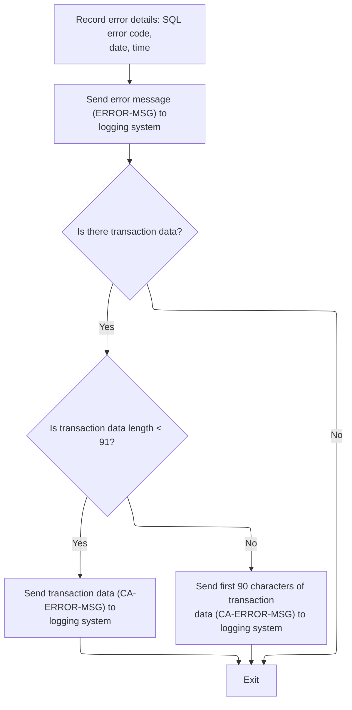

This section ensures all errors are logged with timestamps and relevant context, and that messages are formatted and routed according to business requirements for traceability and support.

| Rule ID | Category        | Rule Name                         | Description                                                                                                                                                                  | Implementation Details                                                                                                                                                                                                                          |
| ------- | --------------- | --------------------------------- | ---------------------------------------------------------------------------------------------------------------------------------------------------------------------------- | ----------------------------------------------------------------------------------------------------------------------------------------------------------------------------------------------------------------------------------------------- |
| BR-001  | Data validation | Structured error message format   | Error and transaction messages follow a strict format for consistency and downstream processing.                                                                             | Error message: 8-char date, 6-char time, 9-char program name, 10-char customer number, 10-char policy number, 16-char SQL request, 5-digit signed SQL code. Transaction message: 9-char 'COMMAREA=' prefix, up to 90 bytes of transaction data. |
| BR-002  | Calculation     | Timestamped error logging         | Every error message includes the SQL error code, current date, and time for traceability.                                                                                    | The error message includes an 8-character date, a 6-character time, and a 5-digit signed SQL error code. Date and time are formatted as MMDDYYYY and HHMMSS, respectively.                                                                      |
| BR-003  | Decision Making | Transaction data inclusion        | If transaction data is present, up to 90 bytes are included in the error log for additional context.                                                                         | If transaction data is less than 91 bytes, all bytes are included; otherwise, only the first 90 bytes are included. The transaction data is prefixed with 'COMMAREA=' in the message structure.                                                 |
| BR-004  | Decision Making | Message routing and reformatting  | The logging system reformats and routes messages based on their content and origin, including special handling for messages starting with 'Q=' and for user-initiated calls. | Messages starting with 'Q=' are reformatted and have their length adjusted. User-initiated calls receive a minimal response. All messages are written to both a temporary and a permanent queue.                                                |
| BR-005  | Writing Output  | Centralized error message logging | All error messages are sent to the logging system for centralized tracking.                                                                                                  | The error message is sent as a structured record to the logging system via a queue.                                                                                                                                                             |

<SwmSnippet path="/base/src/lgapdb09.cbl" line="619">

---

In <SwmToken path="base/src/lgapdb09.cbl" pos="619:1:5" line-data="       WRITE-ERROR-MESSAGE.">`WRITE-ERROR-MESSAGE`</SwmToken>, the code grabs the current time from CICS, formats it into date and time strings, and stores those in the error message structure. This ensures every error report is timestamped for tracking.

```cobol
       WRITE-ERROR-MESSAGE.
           MOVE SQLCODE TO EM-SQLRC
           EXEC CICS ASKTIME ABSTIME(ABS-TIME)
           END-EXEC
           EXEC CICS FORMATTIME ABSTIME(ABS-TIME)
                     MMDDYYYY(DATE1)
                     TIME(TIME1)
           END-EXEC
```

---

</SwmSnippet>

<SwmSnippet path="/base/src/lgapdb09.cbl" line="627">

---

After formatting the timestamp, the code sends the error message to LGSTSQ by calling it with the <SwmToken path="base/src/lgapdb09.cbl" pos="630:3:5" line-data="                     COMMAREA(ERROR-MSG)">`ERROR-MSG`</SwmToken> structure. This hands off the error details for queue-based logging and monitoring.

```cobol
           MOVE DATE1 TO EM-DATE
           MOVE TIME1 TO EM-TIME
           EXEC CICS LINK PROGRAM('LGSTSQ')
                     COMMAREA(ERROR-MSG)
                     LENGTH(LENGTH OF ERROR-MSG)
           END-EXEC.
```

---

</SwmSnippet>

<SwmSnippet path="/base/src/lgstsq.cbl" line="55">

---

<SwmToken path="base/src/lgstsq.cbl" pos="55:1:1" line-data="       MAINLINE SECTION.">`MAINLINE`</SwmToken> in LGSTSQ decides how to handle the incoming message based on the caller, reformats the message if it starts with 'Q=', adjusts the length, and writes it to both a temporary and a permanent queue. If the call is from a user (not a program), it also sends a minimal response back.

```cobol
       MAINLINE SECTION.

           MOVE SPACES TO WRITE-MSG.
           MOVE SPACES TO WS-RECV.

           EXEC CICS ASSIGN SYSID(WRITE-MSG-SYSID)
                RESP(WS-RESP)
           END-EXEC.

           EXEC CICS ASSIGN INVOKINGPROG(WS-INVOKEPROG)
                RESP(WS-RESP)
           END-EXEC.
           
           IF WS-INVOKEPROG NOT = SPACES
              MOVE 'C' To WS-FLAG
              MOVE COMMA-DATA  TO WRITE-MSG-MSG
              MOVE EIBCALEN    TO WS-RECV-LEN
           ELSE
              EXEC CICS RECEIVE INTO(WS-RECV)
                  LENGTH(WS-RECV-LEN)
                  RESP(WS-RESP)
              END-EXEC
              MOVE 'R' To WS-FLAG
              MOVE WS-RECV-DATA  TO WRITE-MSG-MSG
              SUBTRACT 5 FROM WS-RECV-LEN
           END-IF.

           MOVE 'GENAERRS' TO STSQ-NAME.
           IF WRITE-MSG-MSG(1:2) = 'Q=' THEN
              MOVE WRITE-MSG-MSG(3:4) TO STSQ-EXT
              MOVE WRITE-MSG-REST TO TEMPO
              MOVE TEMPO          TO WRITE-MSG-MSG
              SUBTRACT 7 FROM WS-RECV-LEN
           END-IF.

           ADD 5 TO WS-RECV-LEN.

      * Write output message to TDQ CSMT
      *
           EXEC CICS WRITEQ TD QUEUE(STDQ-NAME)
                     FROM(WRITE-MSG)
                     RESP(WS-RESP)
                     LENGTH(WS-RECV-LEN)

           END-EXEC.

      * Write output message to Genapp TSQ
      * If no space is available then the task will not wait for
      *  storage to become available but will ignore the request...
      *
           EXEC CICS WRITEQ TS QUEUE(STSQ-NAME)
                     FROM(WRITE-MSG)
                     RESP(WS-RESP)
                     NOSUSPEND
                     LENGTH(WS-RECV-LEN)

           END-EXEC.

           If WS-FLAG = 'R' Then
             EXEC CICS SEND TEXT FROM(FILLER-X)
              WAIT
              ERASE
              LENGTH(1)
              FREEKB
             END-EXEC.

           EXEC CICS RETURN
           END-EXEC.
```

---

</SwmSnippet>

<SwmSnippet path="/base/src/lgapdb09.cbl" line="633">

---

After returning from LGSTSQ, <SwmToken path="base/src/lgapdb09.cbl" pos="205:3:7" line-data="               PERFORM WRITE-ERROR-MESSAGE">`WRITE-ERROR-MESSAGE`</SwmToken> checks if there's commarea data to include in the error report. If so, it copies up to 90 bytes and calls LGSTSQ again with this extra info. The 90-byte limit is arbitrary and not explained, but it controls how much context is sent with the error.

```cobol
           IF EIBCALEN > 0 THEN
             IF EIBCALEN < 91 THEN
               MOVE DFHCOMMAREA(1:EIBCALEN) TO CA-DATA
               EXEC CICS LINK PROGRAM('LGSTSQ')
                         COMMAREA(CA-ERROR-MSG)
                         LENGTH(LENGTH OF CA-ERROR-MSG)
               END-EXEC
             ELSE
               MOVE DFHCOMMAREA(1:90) TO CA-DATA
               EXEC CICS LINK PROGRAM('LGSTSQ')
                         COMMAREA(CA-ERROR-MSG)
                         LENGTH(LENGTH OF CA-ERROR-MSG)
               END-EXEC
             END-IF
           END-IF.
           EXIT.
```

---

</SwmSnippet>

## Request Parsing and Policy Type Selection

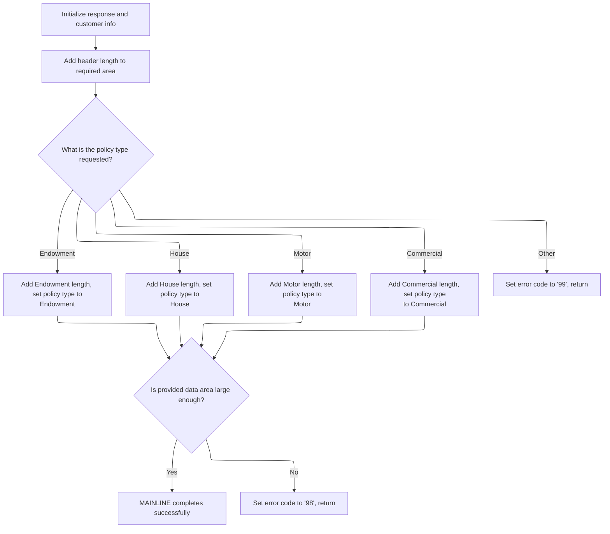

This section parses the incoming request, selects the appropriate policy type, and validates that the commarea is large enough for the requested operation. It ensures only supported policy types are processed and that the request meets minimum size requirements before proceeding.

| Rule ID | Category        | Rule Name                   | Description                                                                                                                                                                                                                    | Implementation Details                                                                                 |
| ------- | --------------- | --------------------------- | ------------------------------------------------------------------------------------------------------------------------------------------------------------------------------------------------------------------------------ | ------------------------------------------------------------------------------------------------------ |
| BR-001  | Reading Input   | Customer number propagation | The customer number from the request is copied into both the database input area and the error message structure for tracking and error reporting purposes.                                                                    | The customer number is a 10-digit numeric value, propagated for both database and error reporting use. |
| BR-002  | Data validation | Default success code        | The response code is initialized to '00' at the start of processing, indicating no error by default.                                                                                                                           | The response code is set to the string '00'.                                                           |
| BR-003  | Data validation | Unsupported request error   | If the request ID does not match a supported policy type, the response code is set to '99' and processing returns immediately, indicating an unsupported request.                                                              | The error code '99' is used to indicate an unsupported request type.                                   |
| BR-004  | Data validation | Commarea length validation  | The commarea length is validated to ensure it is at least as large as the required length for the selected policy type. If not, the response code is set to '98' and processing returns.                                       | The error code '98' is used to indicate insufficient commarea size.                                    |
| BR-005  | Decision Making | Policy type selection       | The policy type is determined by the request ID. If the request is for Endowment, House, Motor, or Commercial, the corresponding policy type is set and the required commarea length is increased by a policy-specific amount. | \- Endowment: adds 124 bytes, sets policy type to 'E'.                                                 |

- House: adds 130 bytes, sets policy type to 'H'.
- Motor: adds 137 bytes, sets policy type to 'M'.
- Commercial: adds 1174 bytes, sets policy type to 'C'. |

<SwmSnippet path="/base/src/lgapdb09.cbl" line="209">

---

Back in MAINLINE, the code resets the return code, sets up a pointer to the commarea, and moves key identifiers into <SwmToken path="base/src/lgapdb09.cbl" pos="212:11:11" line-data="           MOVE CA-CUSTOMER-NUM TO DB2-CUSTOMERNUM-INT">`DB2`</SwmToken> and error message variables. This preps the context for request-specific logic that follows.

```cobol
           MOVE '00' TO CA-RETURN-CODE
           SET WS-ADDR-DFHCOMMAREA TO ADDRESS OF DFHCOMMAREA.

           MOVE CA-CUSTOMER-NUM TO DB2-CUSTOMERNUM-INT
           MOVE ZERO            TO DB2-C-PolicyNum-INT
           MOVE CA-CUSTOMER-NUM TO EM-CUSNUM

           ADD WS-CA-HEADER-LEN TO WS-REQUIRED-CA-LEN
```

---

</SwmSnippet>

<SwmSnippet path="/base/src/lgapdb09.cbl" line="218">

---

Here the code branches based on the request ID, adding the right policy-specific length to <SwmToken path="base/src/lgapdb09.cbl" pos="221:13:19" line-data="               ADD WS-FULL-ENDOW-LEN TO WS-REQUIRED-CA-LEN">`WS-REQUIRED-CA-LEN`</SwmToken> and setting the <SwmToken path="base/src/lgapdb09.cbl" pos="222:9:9" line-data="               MOVE &#39;E&#39; TO DB2-POLICYTYPE">`DB2`</SwmToken> policy type. This sets up the expected structure for the rest of the processing.

```cobol
           EVALUATE CA-REQUEST-ID

             WHEN '01AEND'
               ADD WS-FULL-ENDOW-LEN TO WS-REQUIRED-CA-LEN
               MOVE 'E' TO DB2-POLICYTYPE
```

---

</SwmSnippet>

<SwmSnippet path="/base/src/lgapdb09.cbl" line="224">

---

This continues the EVALUATE, handling each policy type by adjusting the required commarea length and setting the <SwmToken path="base/src/lgapdb09.cbl" pos="226:9:9" line-data="               MOVE &#39;H&#39; TO DB2-POLICYTYPE">`DB2`</SwmToken> policy type. If the request ID doesn't match, it falls through to the error branch.

```cobol
             WHEN '01AHOU'
               ADD WS-FULL-HOUSE-LEN TO WS-REQUIRED-CA-LEN
               MOVE 'H' TO DB2-POLICYTYPE

             WHEN '01AMOT'
               ADD WS-FULL-MOTOR-LEN TO WS-REQUIRED-CA-LEN
               MOVE 'M' TO DB2-POLICYTYPE

             WHEN '01ACOM'
               ADD WS-FULL-COMM-LEN TO WS-REQUIRED-CA-LEN
               MOVE 'C' TO DB2-POLICYTYPE
```

---

</SwmSnippet>

<SwmSnippet path="/base/src/lgapdb09.cbl" line="236">

---

This is the fallback for unknown request IDs. It sets a generic error code and returns, skipping the rest of the logic for unsupported requests.

```cobol
             WHEN OTHER
               MOVE '99' TO CA-RETURN-CODE
               EXEC CICS RETURN END-EXEC

           END-EVALUATE
```

---

</SwmSnippet>

<SwmSnippet path="/base/src/lgapdb09.cbl" line="242">

---

Before moving on, the code checks if the commarea is big enough for the request. If not, it sets an error code and returns, preventing partial or broken processing.

```cobol
           IF EIBCALEN IS LESS THAN WS-REQUIRED-CA-LEN
             MOVE '98' TO CA-RETURN-CODE
             EXEC CICS RETURN END-EXEC
           END-IF
```

---

</SwmSnippet>

<SwmSnippet path="/base/src/lgapdb09.cbl" line="247">

---

After all the setup and validation, the code calls <SwmToken path="base/src/lgapdb09.cbl" pos="247:3:5" line-data="           PERFORM P100-T">`P100-T`</SwmToken> to insert the new policy record into the database. This is where the actual creation happens.

```cobol
           PERFORM P100-T
```

---

</SwmSnippet>

## Policy Record Insertion

```mermaid
%%{init: {"flowchart": {"defaultRenderer": "elk"}} }%%
flowchart TD
    node1["Prepare policy data (Broker ID, Payment)"] --> node2["Set EM-SQLREQ to 'INSERT POLICY'"]
    click node1 openCode "base/src/lgapdb09.cbl:283:284"
    node2 --> node3["Insert new policy into database"]
    click node2 openCode "base/src/lgapdb09.cbl:286:286"
    click node3 openCode "base/src/lgapdb09.cbl:287:307"
    node3 --> node4{"SQLCODE result?"}
    click node4 openCode "base/src/lgapdb09.cbl:309:324"
    node4 -->|"0 (Success)"| node5["Set return code '00', assign new policy
number, update EM-POLNUM"]
    click node5 openCode "base/src/lgapdb09.cbl:312:330"
    node5 --> node6["Update LASTCHANGED field"]
    click node6 openCode "base/src/lgapdb09.cbl:332:337"
    node6 --> node7["Exit"]
    click node7 openCode "base/src/lgapdb09.cbl:338:338"
    node4 -->|"-530 (Missing customer)"| node8["Set return code '70', log error, exit"]
    click node8 openCode "base/src/lgapdb09.cbl:314:317"
    node4 -->|"Other"| node9["Set return code '90', log error, exit"]
    click node9 openCode "base/src/lgapdb09.cbl:319:322"
classDef HeadingStyle fill:#777777,stroke:#333,stroke-width:2px;

%% Swimm:
%% %%{init: {"flowchart": {"defaultRenderer": "elk"}} }%%
%% flowchart TD
%%     node1["Prepare policy data (Broker ID, Payment)"] --> node2["Set <SwmToken path="base/src/lgapdb09.cbl" pos="286:12:14" line-data="           MOVE &#39; INSERT POLICY&#39; TO EM-SQLREQ">`EM-SQLREQ`</SwmToken> to 'INSERT POLICY'"]
%%     click node1 openCode "<SwmPath>[base/src/lgapdb09.cbl](base/src/lgapdb09.cbl)</SwmPath>:283:284"
%%     node2 --> node3["Insert new policy into database"]
%%     click node2 openCode "<SwmPath>[base/src/lgapdb09.cbl](base/src/lgapdb09.cbl)</SwmPath>:286:286"
%%     click node3 openCode "<SwmPath>[base/src/lgapdb09.cbl](base/src/lgapdb09.cbl)</SwmPath>:287:307"
%%     node3 --> node4{"SQLCODE result?"}
%%     click node4 openCode "<SwmPath>[base/src/lgapdb09.cbl](base/src/lgapdb09.cbl)</SwmPath>:309:324"
%%     node4 -->|"0 (Success)"| node5["Set return code '00', assign new policy
%% number, update <SwmToken path="base/src/lgapdb09.cbl" pos="330:11:13" line-data="           MOVE CA-POLICY-NUM TO EM-POLNUM">`EM-POLNUM`</SwmToken>"]
%%     click node5 openCode "<SwmPath>[base/src/lgapdb09.cbl](base/src/lgapdb09.cbl)</SwmPath>:312:330"
%%     node5 --> node6["Update LASTCHANGED field"]
%%     click node6 openCode "<SwmPath>[base/src/lgapdb09.cbl](base/src/lgapdb09.cbl)</SwmPath>:332:337"
%%     node6 --> node7["Exit"]
%%     click node7 openCode "<SwmPath>[base/src/lgapdb09.cbl](base/src/lgapdb09.cbl)</SwmPath>:338:338"
%%     node4 -->|"-530 (Missing customer)"| node8["Set return code '70', log error, exit"]
%%     click node8 openCode "<SwmPath>[base/src/lgapdb09.cbl](base/src/lgapdb09.cbl)</SwmPath>:314:317"
%%     node4 -->|"Other"| node9["Set return code '90', log error, exit"]
%%     click node9 openCode "<SwmPath>[base/src/lgapdb09.cbl](base/src/lgapdb09.cbl)</SwmPath>:319:322"
%% classDef HeadingStyle fill:#777777,stroke:#333,stroke-width:2px;
```

This section manages the insertion of a new policy record into the database, sets the appropriate return code based on the outcome, and updates output fields with the new policy number and timestamp if successful.

| Rule ID | Category                        | Rule Name                       | Description                                                                                                                                                            | Implementation Details                                                                                                                                                             |
| ------- | ------------------------------- | ------------------------------- | ---------------------------------------------------------------------------------------------------------------------------------------------------------------------- | ---------------------------------------------------------------------------------------------------------------------------------------------------------------------------------- |
| BR-001  | Decision Making                 | Successful insert handling      | If the insert is successful (SQLCODE = 0), the return code is set to '00', the new policy number is assigned to the output, and the last changed timestamp is updated. | Return code '00' indicates success. The new policy number is assigned to a 10-digit numeric field. The last changed timestamp is a 26-character string.                            |
| BR-002  | Decision Making                 | Missing customer error handling | If the insert fails due to a missing customer (SQLCODE = -530), the return code is set to '70', an error message is logged, and the operation exits.                   | Return code '70' indicates a foreign key error (missing customer). Error details are logged for audit and troubleshooting.                                                         |
| BR-003  | Decision Making                 | General error handling          | If the insert fails for any other reason, the return code is set to '90', an error message is logged, and the operation exits.                                         | Return code '90' indicates a general error. Error details are logged for audit and troubleshooting.                                                                                |
| BR-004  | Invoking a Service or a Process | Policy record insertion         | A new policy record is inserted into the database using the provided policy data. The operation is attempted without additional validation in this section.            | The policy data includes customer number, issue date, expiry date, policy type, broker ID, broker's reference, and payment. No additional validation is performed in this section. |

<SwmSnippet path="/base/src/lgapdb09.cbl" line="281">

---

In <SwmToken path="base/src/lgapdb09.cbl" pos="281:1:3" line-data="       P100-T.">`P100-T`</SwmToken>, the code copies commarea fields into <SwmToken path="base/src/lgapdb09.cbl" pos="283:9:9" line-data="           MOVE CA-BROKERID TO DB2-BROKERID-INT">`DB2`</SwmToken> host variables, then runs the SQL INSERT to create the policy record. It assumes the input data is valid and doesn't do extra checks here.

```cobol
       P100-T.

           MOVE CA-BROKERID TO DB2-BROKERID-INT
           MOVE CA-PAYMENT TO DB2-PAYMENT-INT

           MOVE ' INSERT POLICY' TO EM-SQLREQ
           EXEC SQL
             INSERT INTO POLICY
                       ( POLICYNUMBER,
                         CUSTOMERNUMBER,
                         ISSUEDATE,
                         EXPIRYDATE,
                         POLICYTYPE,
                         LASTCHANGED,
                         BROKERID,
                         BROKERSREFERENCE,
                         PAYMENT           )
                VALUES ( DEFAULT,
                         :DB2-CUSTOMERNUM-INT,
                         :CA-ISSUE-DATE,
                         :CA-EXPIRY-DATE,
                         :DB2-POLICYTYPE,
                         CURRENT TIMESTAMP,
                         :DB2-BROKERID-INT,
                         :CA-BROKERSREF,
                         :DB2-PAYMENT-INT      )
           END-EXEC
```

---

</SwmSnippet>

<SwmSnippet path="/base/src/lgapdb09.cbl" line="309">

---

After the insert, the code checks SQLCODE and sets a return code: '00' for success, '70' for a foreign key error, and '90' for anything else. For errors, it logs the details by calling <SwmToken path="base/src/lgapdb09.cbl" pos="316:3:7" line-data="               PERFORM WRITE-ERROR-MESSAGE">`WRITE-ERROR-MESSAGE`</SwmToken> and returns immediately.

```cobol
           Evaluate SQLCODE

             When 0
               MOVE '00' TO CA-RETURN-CODE

             When -530
               MOVE '70' TO CA-RETURN-CODE
               PERFORM WRITE-ERROR-MESSAGE
               EXEC CICS RETURN END-EXEC

             When Other
               MOVE '90' TO CA-RETURN-CODE
               PERFORM WRITE-ERROR-MESSAGE
               EXEC CICS RETURN END-EXEC

           END-Evaluate.
```

---

</SwmSnippet>

<SwmSnippet path="/base/src/lgapdb09.cbl" line="326">

---

After a successful insert, the code grabs the new policy number from <SwmToken path="base/src/lgapdb09.cbl" pos="327:4:4" line-data="             SET :DB2-POLICYNUM-INT = IDENTITY_VAL_LOCAL()">`DB2`</SwmToken> using <SwmToken path="base/src/lgapdb09.cbl" pos="327:12:14" line-data="             SET :DB2-POLICYNUM-INT = IDENTITY_VAL_LOCAL()">`IDENTITY_VAL_LOCAL()`</SwmToken> and stores it in both the commarea and the error message structure for later use.

```cobol
           EXEC SQL
             SET :DB2-POLICYNUM-INT = IDENTITY_VAL_LOCAL()
           END-EXEC
```

---

</SwmSnippet>

<SwmSnippet path="/base/src/lgapdb09.cbl" line="329">

---

After getting the policy number, the code fetches the LASTCHANGED timestamp for the new record and stores it in the commarea. This wraps up the insert and provides all the info needed for downstream steps.

```cobol
           MOVE DB2-POLICYNUM-INT TO CA-POLICY-NUM
           MOVE CA-POLICY-NUM TO EM-POLNUM

           EXEC SQL
             SELECT LASTCHANGED
               INTO :CA-LASTCHANGED
               FROM POLICY
               WHERE POLICYNUMBER = :DB2-POLICYNUM-INT
           END-EXEC.
           EXIT.
```

---

</SwmSnippet>

## Policy-Specific Record Creation

```mermaid
%%{init: {"flowchart": {"defaultRenderer": "elk"}} }%%
flowchart TD
    node1{"What is the request type?"}
    click node1 openCode "base/src/lgapdb09.cbl:249:266"
    node1 -->|"Endowment (01AEND)"| node2["PERFORM endowment policy handler"]
    click node2 openCode "base/src/lgapdb09.cbl:252:252"
    node1 -->|"House (01AHOU)"| node3["PERFORM house policy handler"]
    click node3 openCode "base/src/lgapdb09.cbl:255:255"
    node1 -->|"Motor (01AMOT)"| node4["PERFORM motor policy handler"]
    click node4 openCode "base/src/lgapdb09.cbl:258:258"
    node1 -->|"Business (01ACOM)"| node5["PERFORM business policy handler"]
    click node5 openCode "base/src/lgapdb09.cbl:261:261"
    node1 -->|"Other"| node6["Set CA-RETURN-CODE to '99' and exit"]
    click node6 openCode "base/src/lgapdb09.cbl:264:264"
classDef HeadingStyle fill:#777777,stroke:#333,stroke-width:2px;

%% Swimm:
%% %%{init: {"flowchart": {"defaultRenderer": "elk"}} }%%
%% flowchart TD
%%     node1{"What is the request type?"}
%%     click node1 openCode "<SwmPath>[base/src/lgapdb09.cbl](base/src/lgapdb09.cbl)</SwmPath>:249:266"
%%     node1 -->|"Endowment (<SwmToken path="base/src/lgapdb09.cbl" pos="220:4:4" line-data="             WHEN &#39;01AEND&#39;">`01AEND`</SwmToken>)"| node2["PERFORM endowment policy handler"]
%%     click node2 openCode "<SwmPath>[base/src/lgapdb09.cbl](base/src/lgapdb09.cbl)</SwmPath>:252:252"
%%     node1 -->|"House (<SwmToken path="base/src/lgapdb09.cbl" pos="224:4:4" line-data="             WHEN &#39;01AHOU&#39;">`01AHOU`</SwmToken>)"| node3["PERFORM house policy handler"]
%%     click node3 openCode "<SwmPath>[base/src/lgapdb09.cbl](base/src/lgapdb09.cbl)</SwmPath>:255:255"
%%     node1 -->|"Motor (<SwmToken path="base/src/lgapdb09.cbl" pos="228:4:4" line-data="             WHEN &#39;01AMOT&#39;">`01AMOT`</SwmToken>)"| node4["PERFORM motor policy handler"]
%%     click node4 openCode "<SwmPath>[base/src/lgapdb09.cbl](base/src/lgapdb09.cbl)</SwmPath>:258:258"
%%     node1 -->|"Business (<SwmToken path="base/src/lgapdb09.cbl" pos="232:4:4" line-data="             WHEN &#39;01ACOM&#39;">`01ACOM`</SwmToken>)"| node5["PERFORM business policy handler"]
%%     click node5 openCode "<SwmPath>[base/src/lgapdb09.cbl](base/src/lgapdb09.cbl)</SwmPath>:261:261"
%%     node1 -->|"Other"| node6["Set <SwmToken path="base/src/lgapdb09.cbl" pos="209:9:13" line-data="           MOVE &#39;00&#39; TO CA-RETURN-CODE">`CA-RETURN-CODE`</SwmToken> to '99' and exit"]
%%     click node6 openCode "<SwmPath>[base/src/lgapdb09.cbl](base/src/lgapdb09.cbl)</SwmPath>:264:264"
%% classDef HeadingStyle fill:#777777,stroke:#333,stroke-width:2px;
```

This section determines which policy-specific handler to invoke based on the incoming request type. It ensures that only recognized policy types are processed, and signals an error for unsupported types.

| Rule ID | Category        | Rule Name                      | Description                                                                                                                                                                                | Implementation Details                                                                                                                                                                                                                              |
| ------- | --------------- | ------------------------------ | ------------------------------------------------------------------------------------------------------------------------------------------------------------------------------------------ | --------------------------------------------------------------------------------------------------------------------------------------------------------------------------------------------------------------------------------------------------- |
| BR-001  | Decision Making | Endowment policy routing       | Requests with the type <SwmToken path="base/src/lgapdb09.cbl" pos="220:4:4" line-data="             WHEN &#39;01AEND&#39;">`01AEND`</SwmToken> are routed to the endowment policy handler. | The request type identifier is a 6-character string. The handler for endowment policies is invoked when this value matches <SwmToken path="base/src/lgapdb09.cbl" pos="220:4:4" line-data="             WHEN &#39;01AEND&#39;">`01AEND`</SwmToken>. |
| BR-002  | Decision Making | House policy routing           | Requests with the type <SwmToken path="base/src/lgapdb09.cbl" pos="224:4:4" line-data="             WHEN &#39;01AHOU&#39;">`01AHOU`</SwmToken> are routed to the house policy handler.     | The request type identifier is a 6-character string. The handler for house policies is invoked when this value matches <SwmToken path="base/src/lgapdb09.cbl" pos="224:4:4" line-data="             WHEN &#39;01AHOU&#39;">`01AHOU`</SwmToken>.     |
| BR-003  | Decision Making | Motor policy routing           | Requests with the type <SwmToken path="base/src/lgapdb09.cbl" pos="228:4:4" line-data="             WHEN &#39;01AMOT&#39;">`01AMOT`</SwmToken> are routed to the motor policy handler.     | The request type identifier is a 6-character string. The handler for motor policies is invoked when this value matches <SwmToken path="base/src/lgapdb09.cbl" pos="228:4:4" line-data="             WHEN &#39;01AMOT&#39;">`01AMOT`</SwmToken>.     |
| BR-004  | Decision Making | Business policy routing        | Requests with the type <SwmToken path="base/src/lgapdb09.cbl" pos="232:4:4" line-data="             WHEN &#39;01ACOM&#39;">`01ACOM`</SwmToken> are routed to the business policy handler.  | The request type identifier is a 6-character string. The handler for business policies is invoked when this value matches <SwmToken path="base/src/lgapdb09.cbl" pos="232:4:4" line-data="             WHEN &#39;01ACOM&#39;">`01ACOM`</SwmToken>.  |
| BR-005  | Decision Making | Unsupported request type error | Requests with any other type are rejected and the return code is set to '99'.                                                                                                              | The return code is a 2-digit numeric field. The value '99' indicates an unsupported request type.                                                                                                                                                   |

<SwmSnippet path="/base/src/lgapdb09.cbl" line="249">

---

Just after returning from <SwmToken path="base/src/lgapdb09.cbl" pos="247:3:5" line-data="           PERFORM P100-T">`P100-T`</SwmToken>, MAINLINE uses the request ID to jump to the right handler for the policy type—<SwmToken path="base/src/lgapdb09.cbl" pos="252:3:5" line-data="               PERFORM P200-E">`P200-E`</SwmToken> for endowment, <SwmToken path="base/src/lgapdb09.cbl" pos="255:3:5" line-data="               PERFORM P300-H">`P300-H`</SwmToken> for house, <SwmToken path="base/src/lgapdb09.cbl" pos="258:3:5" line-data="               PERFORM P400-M">`P400-M`</SwmToken> for motor, or <SwmToken path="base/src/lgapdb09.cbl" pos="261:3:5" line-data="               PERFORM P500-BIZ">`P500-BIZ`</SwmToken> for commercial. Each one does the type-specific database insert and logic.

```cobol
           EVALUATE CA-REQUEST-ID

             WHEN '01AEND'
               PERFORM P200-E

             WHEN '01AHOU'
               PERFORM P300-H

             WHEN '01AMOT'
               PERFORM P400-M

             WHEN '01ACOM'
               PERFORM P500-BIZ

             WHEN OTHER
               MOVE '99' TO CA-RETURN-CODE

           END-EVALUATE
```

---

</SwmSnippet>

## Endowment Policy Insert

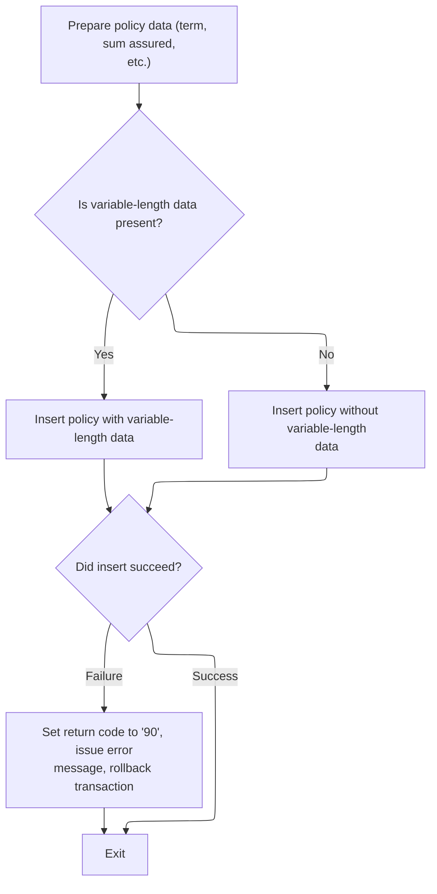

This section manages the insertion of endowment policy records, handling both standard and variable-length data scenarios, and ensuring robust error handling for failed database operations.

| Rule ID | Category        | Rule Name                                  | Description                                                                                                                         | Implementation Details                                                                                                                                                                                                                                                 |
| ------- | --------------- | ------------------------------------------ | ----------------------------------------------------------------------------------------------------------------------------------- | ---------------------------------------------------------------------------------------------------------------------------------------------------------------------------------------------------------------------------------------------------------------------- |
| BR-001  | Data validation | Insert failure error handling              | If the database insert fails, the system sets the return code to '90', logs an error message, and rolls back the transaction.       | Return code '90' indicates a database insert failure. An error message is written and the transaction is rolled back to maintain data integrity.                                                                                                                       |
| BR-002  | Calculation     | Numeric field conversion                   | Numeric policy fields such as term and sum assured are converted to the required integer format before insertion into the database. | The term is converted to a 4-byte signed integer, and the sum assured is converted to a 9-byte signed integer, matching <SwmToken path="base/src/lgapdb09.cbl" pos="199:3:3" line-data="           INITIALIZE DB2-IN-INTEGERS.">`DB2`</SwmToken> integer requirements. |
| BR-003  | Decision Making | Conditional variable-length data inclusion | If variable-length policy data is present, it is included in the database insert; otherwise, only standard fields are inserted.     | Variable-length data is included in the PADDINGDATA field if present. The presence is determined by subtracting the required commarea length from the total input length.                                                                                              |

<SwmSnippet path="/base/src/lgapdb09.cbl" line="343">

---

In <SwmToken path="base/src/lgapdb09.cbl" pos="343:1:3" line-data="       P200-E.">`P200-E`</SwmToken>, the code converts numeric fields to <SwmToken path="base/src/lgapdb09.cbl" pos="346:11:11" line-data="           MOVE CA-E-TERM        TO DB2-E-TERM-SINT">`DB2`</SwmToken> integer format, figures out if there's variable-length data, and sets up for the conditional insert. This is all about prepping the data for the right SQL statement.

```cobol
       P200-E.

      *    Move numeric fields to integer format
           MOVE CA-E-TERM        TO DB2-E-TERM-SINT
           MOVE CA-E-SUM-ASSURED TO DB2-E-SUMASSURED-INT

           MOVE ' INSERT ENDOW ' TO EM-SQLREQ
      *----------------------------------------------------------------*
      *    There are 2 versions of INSERT...                           *
      *      one which updates all fields including Varchar            *
      *      one which updates all fields Except Varchar               *
      *----------------------------------------------------------------*
           SUBTRACT WS-REQUIRED-CA-LEN FROM EIBCALEN
               GIVING WS-VARY-LEN
```

---

</SwmSnippet>

<SwmSnippet path="/base/src/lgapdb09.cbl" line="358">

---

If there's variable-length data, the code copies it into the right buffer and runs the insert with the PADDINGDATA field. This only happens when there's actually extra data to store.

```cobol
           IF WS-VARY-LEN IS GREATER THAN ZERO
      *       Commarea contains data for Varchar field
              MOVE CA-E-PADDING-DATA
                  TO WS-VARY-CHAR(1:WS-VARY-LEN)
              EXEC SQL
                INSERT INTO ENDOWMENT
                          ( POLICYNUMBER,
                            WITHPROFITS,
                            EQUITIES,
                            MANAGEDFUND,
                            FUNDNAME,
                            TERM,
                            SUMASSURED,
                            LIFEASSURED,
                            PADDINGDATA    )
                   VALUES ( :DB2-POLICYNUM-INT,
                            :CA-E-W-PRO,
                            :CA-E-EQU,
                            :CA-E-M-FUN,
                            :CA-E-FUND-NAME,
                            :DB2-E-TERM-SINT,
                            :DB2-E-SUMASSURED-INT,
                            :CA-E-LIFE-ASSURED,
                            :WS-VARY-FIELD )
              END-EXEC
```

---

</SwmSnippet>

<SwmSnippet path="/base/src/lgapdb09.cbl" line="383">

---

If there's no variable-length data, the code just runs the basic insert without the PADDINGDATA field. It's a simpler path for standard input.

```cobol
           ELSE
              EXEC SQL
                INSERT INTO ENDOWMENT
                          ( POLICYNUMBER,
                            WITHPROFITS,
                            EQUITIES,
                            MANAGEDFUND,
                            FUNDNAME,
                            TERM,
                            SUMASSURED,
                            LIFEASSURED    )
                   VALUES ( :DB2-POLICYNUM-INT,
                            :CA-E-W-PRO,
                            :CA-E-EQU,
                            :CA-E-M-FUN,
                            :CA-E-FUND-NAME,
                            :DB2-E-TERM-SINT,
                            :DB2-E-SUMASSURED-INT,
                            :CA-E-LIFE-ASSURED )
              END-EXEC
```

---

</SwmSnippet>

<SwmSnippet path="/base/src/lgapdb09.cbl" line="405">

---

If the insert fails, the code sets the error code, logs the error with <SwmToken path="base/src/lgapdb09.cbl" pos="407:3:7" line-data="             PERFORM WRITE-ERROR-MESSAGE">`WRITE-ERROR-MESSAGE`</SwmToken>, then abends with 'LGSQ' to force a rollback. This is the repo's standard error handling pattern.

```cobol
           IF SQLCODE NOT EQUAL 0
             MOVE '90' TO CA-RETURN-CODE
             PERFORM WRITE-ERROR-MESSAGE
      *      Issue Abend to cause backout of update to Policy table
             EXEC CICS ABEND ABCODE('LGSQ') NODUMP END-EXEC
             EXEC CICS RETURN END-EXEC
           END-IF.

           EXIT.
```

---

</SwmSnippet>

## House Record Insert

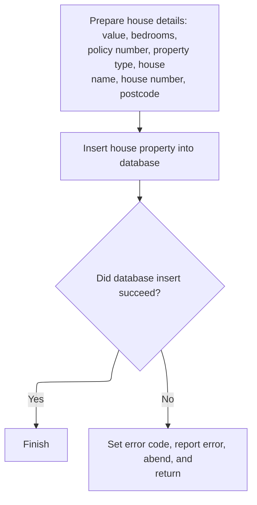

This section handles the insertion of a new house property record into the database. It ensures that all required fields are mapped and inserted, and that errors are handled according to business requirements.

| Rule ID | Category        | Rule Name                          | Description                                                                                                                                                   | Implementation Details                                                                                                                                                                                        |
| ------- | --------------- | ---------------------------------- | ------------------------------------------------------------------------------------------------------------------------------------------------------------- | ------------------------------------------------------------------------------------------------------------------------------------------------------------------------------------------------------------- |
| BR-001  | Data validation | Handle database insert failure     | If the database insert fails, the system sets an error code, writes an error message, abends the transaction with a specific code, and returns control.       | The error code is set to '90'. The abend code used is 'LGSQ'. The error message is written before abending. No dump is produced on abend.                                                                     |
| BR-002  | Calculation     | Map house fields to database types | The system maps the house value and number of bedrooms to integer database fields before inserting the record.                                                | The house value is mapped to a database integer field, and the number of bedrooms is mapped to a database small integer field. No transformation logic is described beyond the type mapping.                  |
| BR-003  | Writing Output  | Insert house record                | The system inserts a house record into the database using the provided policy number, property type, bedrooms, value, house name, house number, and postcode. | The database insert includes the following fields: policy number (integer), property type (string), bedrooms (small integer), value (integer), house name (string), house number (string), postcode (string). |

<SwmSnippet path="/base/src/lgapdb09.cbl" line="415">

---

In <SwmToken path="base/src/lgapdb09.cbl" pos="415:1:3" line-data="       P300-H.">`P300-H`</SwmToken>, the code copies the numeric fields to <SwmToken path="base/src/lgapdb09.cbl" pos="417:11:11" line-data="           MOVE CA-H-VAL       TO DB2-H-VALUE-INT">`DB2`</SwmToken> integer format and runs the SQL insert for the HOUSE table. It expects all the input fields to be valid and ready.

```cobol
       P300-H.

           MOVE CA-H-VAL       TO DB2-H-VALUE-INT
           MOVE CA-H-BED    TO DB2-H-BEDROOMS-SINT

           MOVE ' INSERT HOUSE ' TO EM-SQLREQ
           EXEC SQL
             INSERT INTO HOUSE
                       ( POLICYNUMBER,
                         PROPERTYTYPE,
                         BEDROOMS,
                         VALUE,
                         HOUSENAME,
                         HOUSENUMBER,
                         POSTCODE          )
                VALUES ( :DB2-POLICYNUM-INT,
                         :CA-H-P-TYP,
                         :DB2-H-BEDROOMS-SINT,
                         :DB2-H-VALUE-INT,
                         :CA-H-H-NAM,
                         :CA-H-HOUSE-NUMBER,
                         :CA-H-PCD      )
           END-EXEC
```

---

</SwmSnippet>

<SwmSnippet path="/base/src/lgapdb09.cbl" line="439">

---

If the insert fails, the code sets the error code, logs the error, and abends with 'LGSQ' to roll back. This matches the error handling pattern used elsewhere.

```cobol
           IF SQLCODE NOT EQUAL 0
             MOVE '90' TO CA-RETURN-CODE
             PERFORM WRITE-ERROR-MESSAGE
             EXEC CICS ABEND ABCODE('LGSQ') NODUMP END-EXEC
             EXEC CICS RETURN END-EXEC
           END-IF.

           EXIT.
```

---

</SwmSnippet>

## Motor Policy Insert

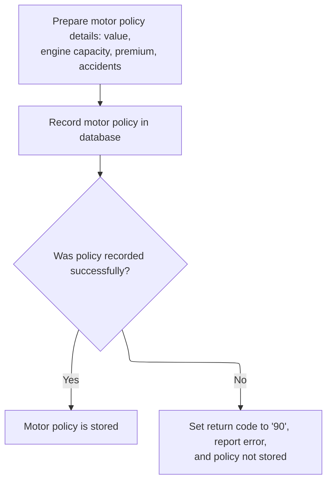

This section is responsible for inserting a new motor policy into the database. It prepares the data, performs the insert, and handles errors if the operation fails.

| Rule ID | Category        | Rule Name                                                                                                                                                 | Description                                                                                                                    | Implementation Details                                                                                                                                                                                                                                                                      |
| ------- | --------------- | --------------------------------------------------------------------------------------------------------------------------------------------------------- | ------------------------------------------------------------------------------------------------------------------------------ | ------------------------------------------------------------------------------------------------------------------------------------------------------------------------------------------------------------------------------------------------------------------------------------------- |
| BR-001  | Data validation | Database insert error handling                                                                                                                            | If the database insert fails, the return code is set to '90', an error message is written, and the transaction is rolled back. | The return code for a failed insert is '90'. An error message is generated and the transaction is rolled back using the 'LGSQ' abend code.                                                                                                                                                  |
| BR-002  | Calculation     | Convert numeric fields to <SwmToken path="base/src/lgapdb09.cbl" pos="199:3:3" line-data="           INITIALIZE DB2-IN-INTEGERS.">`DB2`</SwmToken> format | Numeric fields for value, engine capacity, premium, and accidents are converted to database integer format before insertion.   | The conversion applies to value, engine capacity, premium, and accidents. The target format is <SwmToken path="base/src/lgapdb09.cbl" pos="199:3:3" line-data="           INITIALIZE DB2-IN-INTEGERS.">`DB2`</SwmToken> integer (signed 9-digit or 4-digit binary, depending on the field). |
| BR-003  | Writing Output  | Insert motor policy record                                                                                                                                | A new motor policy is recorded in the database using the prepared details.                                                     | The database insert includes policy number, make, model, value, registration number, colour, engine capacity, year of manufacture, premium, and accidents. The format matches the MOTOR table schema.                                                                                       |

<SwmSnippet path="/base/src/lgapdb09.cbl" line="448">

---

In <SwmToken path="base/src/lgapdb09.cbl" pos="448:1:3" line-data="       P400-M.">`P400-M`</SwmToken>, the code converts all the numeric fields to <SwmToken path="base/src/lgapdb09.cbl" pos="451:11:11" line-data="           MOVE CA-M-VALUE       TO DB2-M-VALUE-INT">`DB2`</SwmToken> integer format and runs the SQL insert for the MOTOR table. It assumes the input data is valid and doesn't check for conversion errors.

```cobol
       P400-M.

      *    Move numeric fields to integer format
           MOVE CA-M-VALUE       TO DB2-M-VALUE-INT
           MOVE CA-M-CC          TO DB2-M-CC-SINT
           MOVE CA-M-PREMIUM     TO DB2-M-PREMIUM-INT
           MOVE CA-M-ACCIDENTS   TO DB2-M-ACCIDENTS-INT

           MOVE ' INSERT MOTOR ' TO EM-SQLREQ
           EXEC SQL
             INSERT INTO MOTOR
                       ( POLICYNUMBER,
                         MAKE,
                         MODEL,
                         VALUE,
                         REGNUMBER,
                         COLOUR,
                         CC,
                         YEAROFMANUFACTURE,
                         PREMIUM,
                         ACCIDENTS )
                VALUES ( :DB2-POLICYNUM-INT,
                         :CA-M-MAKE,
                         :CA-M-MODEL,
                         :DB2-M-VALUE-INT,
                         :CA-M-REGNUMBER,
                         :CA-M-COLOUR,
                         :DB2-M-CC-SINT,
                         :CA-M-MANUFACTURED,
                         :DB2-M-PREMIUM-INT,
                         :DB2-M-ACCIDENTS-INT )
           END-EXEC
```

---

</SwmSnippet>

<SwmSnippet path="/base/src/lgapdb09.cbl" line="481">

---

If the insert fails, the code sets the error code, logs the error, and abends with 'LGSQ' to roll back. This is the same error handling pattern as the other policy types.

```cobol
           IF SQLCODE NOT EQUAL 0
             MOVE '90' TO CA-RETURN-CODE
             PERFORM WRITE-ERROR-MESSAGE
             EXEC CICS ABEND ABCODE('LGSQ') NODUMP END-EXEC
             EXEC CICS RETURN END-EXEC
           END-IF.

           EXIT.
```

---

</SwmSnippet>

## Commercial Policy Risk and Premium Calculation

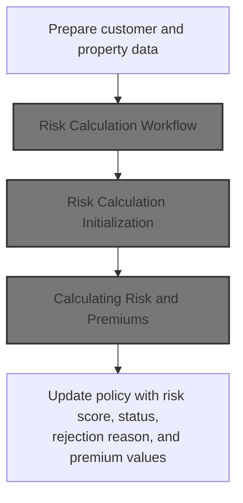

This section orchestrates the commercial policy risk and premium calculation process. It prepares input data, invokes the risk calculation service, and updates the policy with the calculated results.

| Rule ID | Category                        | Rule Name                              | Description                                                                                                                                                                                                                                                                                                          | Implementation Details                                                                                                                                                                                                                                                                                                                                                                           |
| ------- | ------------------------------- | -------------------------------------- | -------------------------------------------------------------------------------------------------------------------------------------------------------------------------------------------------------------------------------------------------------------------------------------------------------------------- | ------------------------------------------------------------------------------------------------------------------------------------------------------------------------------------------------------------------------------------------------------------------------------------------------------------------------------------------------------------------------------------------------ |
| BR-001  | Data validation                 | Required risk calculation input fields | Customer and property data are required for risk and premium calculation. The calculation cannot proceed without these fields: customer number, policy number, property type, postcode, risk factors (FP, CP, FLP, WP), address, latitude, longitude, customer name, issue date, expiry date, and last changed date. | All fields are required. Formats: customer number (string, 10 chars), policy number (string, 10 chars), property type (string, 15 chars), postcode (string, 8 chars), FP/CP/FLP/WP factors (number, 4 digits), address (string, 255 chars), latitude/longitude (string, 11 chars), customer name (string, 31 chars), issue/expiry date (string, 10 chars), last changed date (string, 26 chars). |
| BR-002  | Writing Output                  | Update policy with calculation results | After calculation, the policy is updated with the risk score, policy status, rejection reason, and premium values returned from the calculation service.                                                                                                                                                             | Risk score (number, 3 digits), status indicator (number, 1 digit), rejection reason (string, 50 chars), premium values (number, 8 digits each for FP, CP, FLP, WP premiums) are mapped to the policy record.                                                                                                                                                                                     |
| BR-003  | Invoking a Service or a Process | External risk and premium calculation  | Risk and premium calculation is performed by invoking an external calculation service with the prepared data. The calculation results include risk score, policy status, rejection reason, and premium values.                                                                                                       | The calculation service expects a structured input area and returns risk score (number, 3 digits), status indicator (number, 1 digit), rejection reason (string, 50 chars), and premium values (number, 8 digits each for FP, CP, FLP, WP premiums).                                                                                                                                             |

<SwmSnippet path="/base/src/lgapdb09.cbl" line="493">

---

In <SwmToken path="base/src/lgapdb09.cbl" pos="493:1:3" line-data="       P500-BIZ SECTION.">`P500-BIZ`</SwmToken>, the code copies all the relevant customer, policy, and property fields into the risk calculation area. This preps the data for the external calculation call.

```cobol
       P500-BIZ SECTION.
           MOVE CA-CUSTOMER-NUM TO WS-XCUSTID
           MOVE CA-POLICY-NUM TO WS-XPOLNUM
           MOVE CA-B-PropType TO WS-XPROPTYPE
           MOVE CA-B-PST TO WS-XPOSTCODE
           MOVE CA-B-FP TO WS-XFP-FACTOR
           MOVE CA-B-CP TO WS-XCP-FACTOR
           MOVE CA-B-FLP TO WS-XFLP-FACTOR
           MOVE CA-B-WP TO WS-XWP-FACTOR
           MOVE CA-B-Address TO WS-XADDRESS
           MOVE CA-B-Latitude TO WS-XLAT
           MOVE CA-B-Longitude TO WS-XLONG
           MOVE CA-B-Customer TO WS-XCUSTNAME
           MOVE CA-ISSUE-DATE TO WS-XISSUE
           MOVE CA-EXPIRY-DATE TO WS-XEXPIRY
           MOVE CA-LASTCHANGED TO WS-XLASTCHG
```

---

</SwmSnippet>

<SwmSnippet path="/base/src/lgapdb09.cbl" line="510">

---

After prepping the risk calculation area, the code calls LGCOMCAL to run the risk and premium calculations. This is where the heavy lifting for commercial policies happens.

```cobol
           EXEC CICS LINK PROGRAM('LGCOMCAL')
                COMMAREA(WS-COMM-RISK-AREA)
                LENGTH(LENGTH OF WS-COMM-RISK-AREA)
           END-EXEC
```

---

</SwmSnippet>

### Risk Calculation Workflow

This section coordinates the overall risk calculation workflow by ensuring that initialization, business logic processing, and cleanup/output are executed in sequence. It acts as the main entry point for the risk calculation process, delegating responsibilities to modular components.

| Rule ID | Category        | Rule Name                          | Description                                                                                                   | Implementation Details                                                                                                                                                                |
| ------- | --------------- | ---------------------------------- | ------------------------------------------------------------------------------------------------------------- | ------------------------------------------------------------------------------------------------------------------------------------------------------------------------------------- |
| BR-001  | Decision Making | Initialization First               | The workflow begins by performing an initialization step before any business logic is processed.              | No constants or output formats are specified in this section. The initialization step is modular and may include setup tasks, but details are not visible here.                       |
| BR-002  | Decision Making | Business Logic Processing Sequence | The workflow performs the main business logic processing step after initialization and before cleanup/output. | No constants or output formats are specified in this section. The business logic step is modular and may include calculations or validations, but details are not visible here.       |
| BR-003  | Decision Making | Cleanup and Output Last            | The workflow completes by performing a cleanup and output step after business logic processing.               | No constants or output formats are specified in this section. The cleanup/output step is modular and may include resource release or result output, but details are not visible here. |

<SwmSnippet path="/base/src/lgcomcal.cbl" line="206">

---

In <SwmToken path="base/src/lgcomcal.cbl" pos="206:1:1" line-data="       MAINLINE SECTION.">`MAINLINE`</SwmToken> of LGCOMCAL, the code runs three steps: initialization, business logic processing, and cleanup/output. Each step is modular and handles a separate part of the risk calculation workflow.

```cobol
       MAINLINE SECTION.
           
           PERFORM INITIALIZE-PROCESSING.
           PERFORM PROCESS-BUSINESS-LOGIC.
           PERFORM CLEANUP-AND-EXIT.
```

---

</SwmSnippet>

### Risk Calculation Initialization

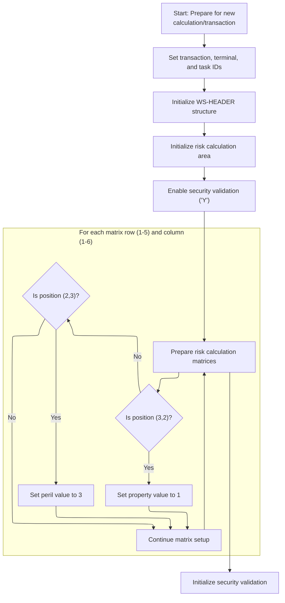

This section prepares the environment and internal data structures for a new risk calculation transaction. It ensures that all necessary fields are initialized and that business-specific mappings are established before the main calculation logic runs.

| Rule ID | Category        | Rule Name                        | Description                                                                                                                           | Implementation Details                                                                                                                               |
| ------- | --------------- | -------------------------------- | ------------------------------------------------------------------------------------------------------------------------------------- | ---------------------------------------------------------------------------------------------------------------------------------------------------- |
| BR-001  | Reading Input   | Capture environment identifiers  | The transaction ID, terminal ID, and task number from the environment are recorded in the header for traceability and audit purposes. | Transaction ID and Terminal ID are 4-character strings. Task number is a 7-digit number. All are stored in the header structure for the transaction. |
| BR-002  | Calculation     | Initialize risk calculation area | The risk calculation area is reset to a clean state before each new calculation to prevent contamination from previous transactions.  | The risk calculation area is cleared to its default state. No previous calculation data is retained.                                                 |
| BR-003  | Calculation     | Set property mapping for (3,2)   | The property value for the risk calculation matrix is set to 1 only for the position where row is 3 and column is 2.                  | The property value is set to 1 (number) for this specific matrix position. Other positions are not affected by this rule.                            |
| BR-004  | Calculation     | Set peril mapping for (2,3)      | The peril value for the risk calculation matrix is set to 3 only for the position where row is 2 and column is 3.                     | The peril value is set to 3 (number) for this specific matrix position. Other positions are not affected by this rule.                               |
| BR-005  | Decision Making | Enable security validation       | Security validation is enabled for the risk calculation process, ensuring that subsequent operations are subject to security checks.  | Security validation is enabled by setting a flag to 'Y'.                                                                                             |

<SwmSnippet path="/base/src/lgcomcal.cbl" line="217">

---

In <SwmToken path="base/src/lgcomcal.cbl" pos="217:1:3" line-data="       INITIALIZE-PROCESSING.">`INITIALIZE-PROCESSING`</SwmToken>, the code copies the CICS environment fields into the header, sets up the property/peril mapping, and enables security validation. This is all prep for the main risk calculation logic.

```cobol
       INITIALIZE-PROCESSING.
           INITIALIZE WS-HEADER.
           MOVE EIBTRNID TO WS-TRANSID.
           MOVE EIBTRMID TO WS-TERMID.
           MOVE EIBTASKN TO WS-TASKNUM.
           
           PERFORM INITIALIZE-MATRICES.
           
           INITIALIZE WS-RISK-CALC.
           
           PERFORM INIT-SECURITY-VALIDATION.
           
           EXIT.
```

---

</SwmSnippet>

<SwmSnippet path="/base/src/lgcomcal.cbl" line="233">

---

<SwmToken path="base/src/lgcomcal.cbl" pos="233:1:3" line-data="       INITIALIZE-MATRICES.">`INITIALIZE-MATRICES`</SwmToken> just sets up two mapping variables for property and peril codes, but only for the (3,2) and (2,3) index combos in nested loops. It doesn't initialize a whole matrix—just sets <SwmToken path="base/src/lgcomcal.cbl" pos="243:7:11" line-data="                      MOVE 1 TO WS-RM-PROP">`WS-RM-PROP`</SwmToken>=1 if <SwmToken path="base/src/lgcomcal.cbl" pos="235:7:11" line-data="           MOVE 1 TO WS-SUB-1.">`WS-SUB-1`</SwmToken>=3 and <SwmToken path="base/src/lgcomcal.cbl" pos="239:7:11" line-data="               MOVE 0 TO WS-SUB-2">`WS-SUB-2`</SwmToken>=2, and <SwmToken path="base/src/lgcomcal.cbl" pos="246:7:11" line-data="                      MOVE 3 TO WS-RM-PERIL">`WS-RM-PERIL`</SwmToken>=3 if <SwmToken path="base/src/lgcomcal.cbl" pos="235:7:11" line-data="           MOVE 1 TO WS-SUB-1.">`WS-SUB-1`</SwmToken>=2 and <SwmToken path="base/src/lgcomcal.cbl" pos="239:7:11" line-data="               MOVE 0 TO WS-SUB-2">`WS-SUB-2`</SwmToken>=3. Security is enabled, but the rest of the matrix is untouched. The mapping is tightly tied to business rules, not generic logic.

```cobol
       INITIALIZE-MATRICES.
           MOVE 'Y' TO WS-SEC-ENABLED.
           MOVE 1 TO WS-SUB-1.
           
           PERFORM VARYING WS-SUB-1 FROM 1 BY 1 
             UNTIL WS-SUB-1 > 5
               MOVE 0 TO WS-SUB-2
               PERFORM VARYING WS-SUB-2 FROM 1 BY 1 
                 UNTIL WS-SUB-2 > 6
                   IF WS-SUB-1 = 3 AND WS-SUB-2 = 2
                      MOVE 1 TO WS-RM-PROP
                   END-IF
                   IF WS-SUB-1 = 2 AND WS-SUB-2 = 3
                      MOVE 3 TO WS-RM-PERIL
                   END-IF
               END-PERFORM
           END-PERFORM.
           
           EXIT.
```

---

</SwmSnippet>

### Calculating Risk and Premiums

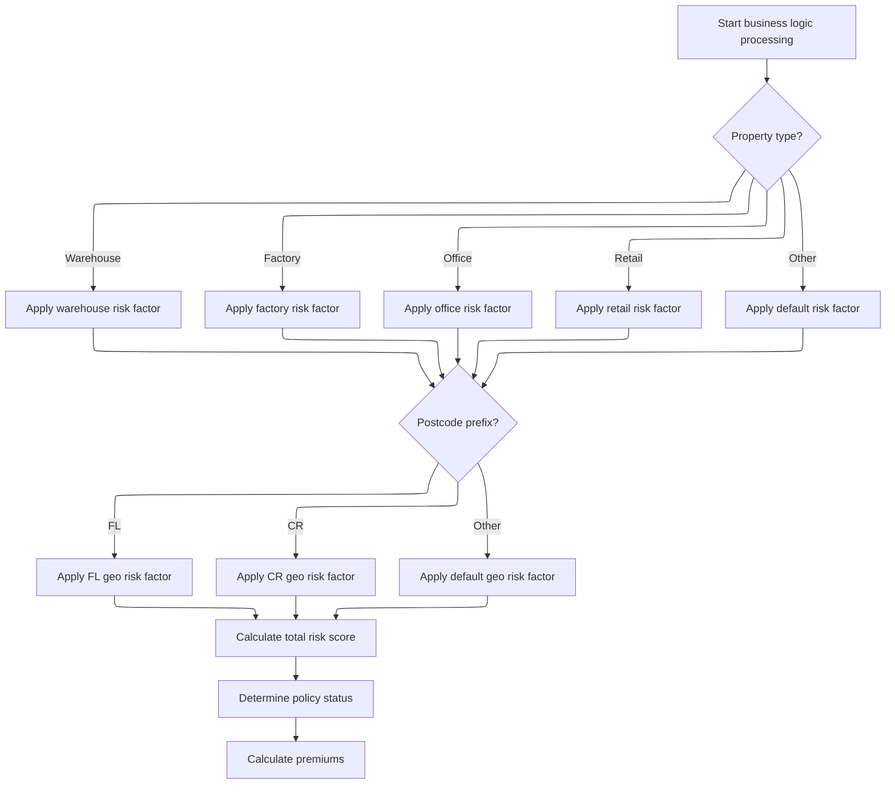

This section calculates the risk score for an insurance policy based on property type and postcode, then uses this score to determine policy status and calculate premiums. The logic ensures that all relevant risk factors are considered and combined in a defined sequence.

| Rule ID | Category                        | Rule Name                          | Description                                                                                                                                                                                                                   | Implementation Details                                                                                                                                                                                                                                                                                                                                  |
| ------- | ------------------------------- | ---------------------------------- | ----------------------------------------------------------------------------------------------------------------------------------------------------------------------------------------------------------------------------- | ------------------------------------------------------------------------------------------------------------------------------------------------------------------------------------------------------------------------------------------------------------------------------------------------------------------------------------------------------- |
| BR-001  | Calculation                     | Risk score composition             | The risk score calculation uses a base value, a property risk factor (depending on property type), and a geographic risk factor (depending on postcode prefix).                                                               | The base value is divided by 2 and then multiplied by 2 before use. Property types considered are Warehouse, Factory, Office, Retail, and Other. Postcode prefixes considered are 'FL', 'CR', and others. Property and geo factors are constants defined elsewhere. The total risk score is the sum of the base value, property factor, and geo factor. |
| BR-002  | Decision Making                 | Property type risk factor          | The property risk factor is determined by the property type: Warehouse, Factory, Office, Retail, or Other. Each type has a specific risk factor constant; if the type does not match any of these, the factor is zero.        | Warehouse, Factory, Office, and Retail each have a specific risk factor constant. Any other property type results in a risk factor of zero.                                                                                                                                                                                                             |
| BR-003  | Decision Making                 | Geographic risk factor by postcode | The geographic risk factor is determined by the first two characters of the postcode. If the prefix is 'FL', the FL geo risk factor is used; if 'CR', the CR geo risk factor is used; otherwise, the geo risk factor is zero. | Postcode prefixes 'FL' and 'CR' have specific geo risk factor constants. Any other prefix results in a geo risk factor of zero.                                                                                                                                                                                                                         |
| BR-004  | Invoking a Service or a Process | Business logic processing sequence | The business logic processing sequence is: calculate risk score, determine policy status, then calculate premiums. Each step uses the output of the previous step.                                                            | The sequence is fixed: risk score calculation, policy status determination, premium calculation. Each step depends on the previous step's output.                                                                                                                                                                                                       |

<SwmSnippet path="/base/src/lgcomcal.cbl" line="268">

---

<SwmToken path="base/src/lgcomcal.cbl" pos="268:1:5" line-data="       PROCESS-BUSINESS-LOGIC.">`PROCESS-BUSINESS-LOGIC`</SwmToken> runs three routines in order: computes the risk score, sets the policy status and reason, then updates premium values. Each step uses the output from the last, so the risk score feeds into status, and both feed into premium calculations. Calling this sequence ensures the insurance assessment is complete and ready for output.

```cobol
       PROCESS-BUSINESS-LOGIC.
           PERFORM PROCESS-RISK-SCORE.
           PERFORM DETERMINE-POLICY-STATUS.
           PERFORM CALCULATE-PREMIUMS.
           
           EXIT.
```

---

</SwmSnippet>

<SwmSnippet path="/base/src/lgcomcal.cbl" line="277">

---

<SwmToken path="base/src/lgcomcal.cbl" pos="277:1:5" line-data="       PROCESS-RISK-SCORE.">`PROCESS-RISK-SCORE`</SwmToken> calculates the risk score by combining a base value, a property factor (based on <SwmToken path="base/src/lgcomcal.cbl" pos="287:3:5" line-data="           EVALUATE CA-XPROPTYPE">`CA-XPROPTYPE`</SwmToken>), and a geographic factor (based on the first two chars of <SwmToken path="base/src/lgcomcal.cbl" pos="313:3:5" line-data="           IF CA-XPOSTCODE(1:2) = &#39;FL&#39;">`CA-XPOSTCODE`</SwmToken>). The property and geo factors are hardcoded, so only certain types and postcodes get adjustments. If the input doesn't match, the factors default to zero. The result is summed and stored for later steps.

```cobol
       PROCESS-RISK-SCORE.
           MOVE WS-TM-BASE TO WS-TEMP-SCORE.
           DIVIDE 2 INTO WS-TEMP-SCORE GIVING WS-SUB-1.
           MULTIPLY 2 BY WS-SUB-1 GIVING WS-RC-BASE-VAL.
           
           MOVE 0 TO WS-RC-PROP-FACT.
           
           MOVE 'COMMERCIAL' TO RMS-TYPE
           MOVE '1.0.5' TO RMS-VERSION
      
           EVALUATE CA-XPROPTYPE
               WHEN 'WAREHOUSE'
                   MOVE RMS-PF-W-VAL TO RMS-PF-WAREHOUSE
                   COMPUTE WS-TEMP-CALC = RMS-PF-WAREHOUSE
                   ADD WS-TEMP-CALC TO WS-RC-PROP-FACT
               WHEN 'FACTORY'
                   MOVE RMS-PF-F-VAL TO RMS-PF-FACTORY
                   COMPUTE WS-TEMP-CALC = RMS-PF-FACTORY
                   ADD WS-TEMP-CALC TO WS-RC-PROP-FACT
               WHEN 'OFFICE'
                   MOVE RMS-PF-O-VAL TO RMS-PF-OFFICE
                   COMPUTE WS-TEMP-CALC = RMS-PF-OFFICE
                   ADD WS-TEMP-CALC TO WS-RC-PROP-FACT
               WHEN 'RETAIL'
                   MOVE RMS-PF-R-VAL TO RMS-PF-RETAIL
                   COMPUTE WS-TEMP-CALC = RMS-PF-RETAIL
                   ADD WS-TEMP-CALC TO WS-RC-PROP-FACT
               WHEN OTHER
                   MOVE 0 TO WS-RC-PROP-FACT
           END-EVALUATE.
           
           MOVE 0 TO WS-RC-GEO-FACT.
           
           MOVE RMS-GF-FL-VAL TO RMS-GF-FL
           MOVE RMS-GF-CR-VAL TO RMS-GF-CR
           
           IF CA-XPOSTCODE(1:2) = 'FL'
              MOVE RMS-GF-FL TO WS-RC-GEO-FACT
           ELSE
              IF CA-XPOSTCODE(1:2) = 'CR'
                 MOVE RMS-GF-CR TO WS-RC-GEO-FACT
              END-IF
           END-IF.
           
           COMPUTE WS-RC-TOTAL = 
              WS-RC-BASE-VAL + WS-RC-PROP-FACT + WS-RC-GEO-FACT.
              
           MOVE WS-RC-TOTAL TO WS-SA-RISK.
           
           EXIT.
```

---

</SwmSnippet>

### Updating Policy Record with Risk and Premiums

This section updates the policy record with the latest risk assessment and premium values, and determines if the policy requires further review based on preset thresholds.

| Rule ID | Category                        | Rule Name                                   | Description                                                                                                                                                       | Implementation Details                                                                                                                                                       |
| ------- | ------------------------------- | ------------------------------------------- | ----------------------------------------------------------------------------------------------------------------------------------------------------------------- | ---------------------------------------------------------------------------------------------------------------------------------------------------------------------------- |
| BR-001  | Writing Output                  | Policy record update with risk and premiums | Update the policy record with the latest risk score, status, rejection reason, and four premium values after receiving results from the risk calculation service. | The policy record is updated with a numeric risk score, a status indicator, a rejection reason (string, up to 50 characters), and four premium values (each up to 8 digits). |
| BR-002  | Writing Output                  | Policy status and rejection reason update   | Update the policy record with the latest status and rejection reason for downstream processing.                                                                   | The status is a single-digit indicator. The rejection reason is a string up to 50 characters.                                                                                |
| BR-003  | Invoking a Service or a Process | Matrix check for policy review              | Trigger a matrix check to determine if the policy requires further review based on the updated risk score.                                                        | The matrix check is performed after the policy record is updated, using the latest risk score to determine if further review is needed.                                      |

<SwmSnippet path="/base/src/lgapdb09.cbl" line="515">

---

Back in <SwmToken path="base/src/lgapdb09.cbl" pos="261:3:5" line-data="               PERFORM P500-BIZ">`P500-BIZ`</SwmToken>, we just got results from LGCOMCAL. The code moves the risk score, status, rejection reason, and four premium values into the policy record fields. This updates the commarea with the latest assessment and pricing for downstream use.

```cobol
           MOVE WS-ZRESULT-SCORE TO X3-VAL
           MOVE WS-ZSTATUS-IND TO X5-Z9
           MOVE WS-ZREJECT-TEXT TO X6-REJ
           MOVE WS-ZFP-PREMIUM TO CA-B-CA-B-FPR
           MOVE WS-ZCP-PREMIUM TO CA-B-CPR
           MOVE WS-ZFLP-PREMIUM TO CA-B-FLPR
           MOVE WS-ZWP-PREMIUM TO CA-B-WPR
           
           MOVE X5-Z9 TO CA-B-ST
           MOVE X6-REJ TO CA-B-RejectReason
```

---

</SwmSnippet>

<SwmSnippet path="/base/src/lgapdb09.cbl" line="526">

---

After updating the policy record in <SwmToken path="base/src/lgapdb09.cbl" pos="261:3:5" line-data="               PERFORM P500-BIZ">`P500-BIZ`</SwmToken>, the code calls <SwmToken path="base/src/lgapdb09.cbl" pos="526:3:7" line-data="           PERFORM P546-CHK-MATRIX">`P546-CHK-MATRIX`</SwmToken> to check the risk score against preset thresholds. This step updates the override status and rejection reason, flagging policies that need manual review or verification before they're finalized.

```cobol
           PERFORM P546-CHK-MATRIX
           
           PERFORM P548-BINS
           
           EXIT.
```

---

</SwmSnippet>

## Matrix Override and Rejection Reason Evaluation

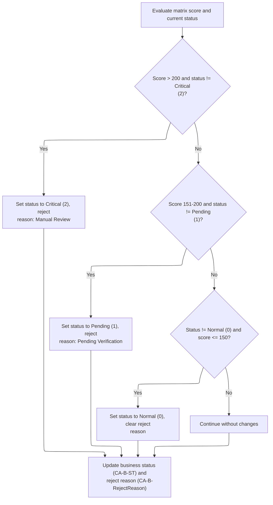

This section evaluates the risk score and current status to determine if a policy requires manual review, pending verification, or can be cleared. It updates the business status and rejection reason fields accordingly.

| Rule ID | Category        | Rule Name                           | Description                                                                                                                                                                                     | Implementation Details                                                                                                                                                                                 |
| ------- | --------------- | ----------------------------------- | ----------------------------------------------------------------------------------------------------------------------------------------------------------------------------------------------- | ------------------------------------------------------------------------------------------------------------------------------------------------------------------------------------------------------ |
| BR-001  | Decision Making | Critical status for high risk       | If the risk score is greater than 200 and the current status is not Critical, set the status to Critical and set the rejection reason to 'Critical Matrix Override - Manual Review'.            | Critical status is represented by the value 2. The rejection reason is set to the string 'Critical Matrix Override - Manual Review'.                                                                   |
| BR-002  | Decision Making | Pending status for moderate risk    | If the risk score is between 151 and 200 (inclusive) and the current status is not Pending, set the status to Pending and set the rejection reason to 'Matrix Override - Pending Verification'. | Pending status is represented by the value 1. The rejection reason is set to the string 'Matrix Override - Pending Verification'.                                                                      |
| BR-003  | Decision Making | Clear override for low risk         | If the risk score is 150 or below and the current status is not Normal, set the status to Normal and clear the rejection reason.                                                                | Normal status is represented by the value 0. The rejection reason is cleared (set to spaces/blank).                                                                                                    |
| BR-004  | Decision Making | No change for unchanged risk/status | If none of the above conditions are met, continue without changing the status or rejection reason.                                                                                              | No changes are made to status or rejection reason fields.                                                                                                                                              |
| BR-005  | Writing Output  | Update shared status and reason     | After evaluating the risk score and status, update the shared business status and rejection reason fields with the current values.                                                              | The business status and rejection reason fields are updated for downstream processing and client messaging. The status is a number (0, 1, or 2). The rejection reason is a string, which may be blank. |

<SwmSnippet path="/base/src/lgapdb09.cbl" line="533">

---

In <SwmToken path="base/src/lgapdb09.cbl" pos="533:1:5" line-data="       P546-CHK-MATRIX.">`P546-CHK-MATRIX`</SwmToken>, the code checks the risk score against two thresholds (200, 150). If the score is above 200, it sets the override status to 2 and adds a manual review reason. Between 151 and 200, it sets status to 1 and flags pending verification. If the score is 150 or below, it clears the override. These values are used to control downstream processing and client messaging.

```cobol
       P546-CHK-MATRIX.
           EVALUATE TRUE
               WHEN X3-VAL > 200 AND X5-Z9 NOT = 2
                 MOVE 2 TO X5-Z9
                 MOVE 'Critical Matrix Override - Manual Review' TO X6-REJ
               WHEN X3-VAL > 150 AND X3-VAL <= 200 AND X5-Z9 NOT = 1
                 MOVE 1 TO X5-Z9
                 MOVE 'Matrix Override - Pending Verification' TO X6-REJ 
               WHEN X5-Z9 NOT = 0 AND X3-VAL <= 150
                 MOVE 0 TO X5-Z9
                 MOVE SPACES TO X6-REJ
               WHEN OTHER
                 CONTINUE
           END-EVALUATE.
```

---

</SwmSnippet>

<SwmSnippet path="/base/src/lgapdb09.cbl" line="548">

---

After the matrix check, the code moves the override status and rejection reason into the commarea fields. This updates the shared memory so other routines and client interfaces can see if the policy needs review or has a rejection reason.

```cobol
           MOVE X5-Z9 TO CA-B-ST
           MOVE X6-REJ TO CA-B-RejectReason.
           EXIT.
```

---

</SwmSnippet>

## Commercial Policy Database Insert

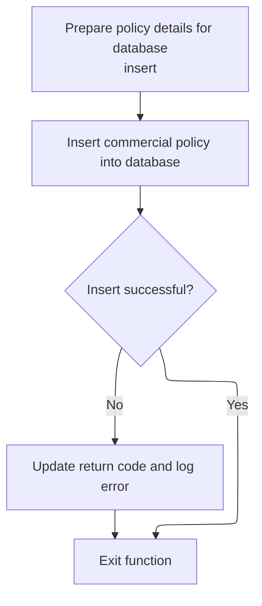

This section manages the insertion of a commercial policy record into the database and ensures that any errors during the insert are properly logged and reported.

| Rule ID | Category       | Rule Name                         | Description                                                                                                                                   | Implementation Details                                                                                                                                                                                                                                                                                                                                                                                                                                                                                                                                                                                                                                                                                                                                                                                                                                                                                                                                                                                                                                                                                                                                                                                                                                                                                                                                                                                                                                                                                                                                                                                                                                                                                                                                                                                                                                                                                                                                                                                                                                                                                                                                                     |
| ------- | -------------- | --------------------------------- | --------------------------------------------------------------------------------------------------------------------------------------------- | -------------------------------------------------------------------------------------------------------------------------------------------------------------------------------------------------------------------------------------------------------------------------------------------------------------------------------------------------------------------------------------------------------------------------------------------------------------------------------------------------------------------------------------------------------------------------------------------------------------------------------------------------------------------------------------------------------------------------------------------------------------------------------------------------------------------------------------------------------------------------------------------------------------------------------------------------------------------------------------------------------------------------------------------------------------------------------------------------------------------------------------------------------------------------------------------------------------------------------------------------------------------------------------------------------------------------------------------------------------------------------------------------------------------------------------------------------------------------------------------------------------------------------------------------------------------------------------------------------------------------------------------------------------------------------------------------------------------------------------------------------------------------------------------------------------------------------------------------------------------------------------------------------------------------------------------------------------------------------------------------------------------------------------------------------------------------------------------------------------------------------------------------------------------------- |
| BR-001  | Writing Output | Commercial policy database insert | The system inserts a new commercial policy record into the COMMERCIAL database table using the prepared policy and premium details.           | The COMMERCIAL table fields include <SwmToken path="base/src/lgapdb09.cbl" pos="567:2:2" line-data="                       (PolicyNumber,">`PolicyNumber`</SwmToken>, <SwmToken path="base/src/lgapdb09.cbl" pos="568:1:1" line-data="                        RequestDate,">`RequestDate`</SwmToken>, <SwmToken path="base/src/lgapdb09.cbl" pos="569:1:1" line-data="                        StartDate,">`StartDate`</SwmToken>, <SwmToken path="base/src/lgapdb09.cbl" pos="570:1:1" line-data="                        RenewalDate,">`RenewalDate`</SwmToken>, Address, Zipcode, <SwmToken path="base/src/lgapdb09.cbl" pos="573:1:1" line-data="                        LatitudeN,">`LatitudeN`</SwmToken>, <SwmToken path="base/src/lgapdb09.cbl" pos="574:1:1" line-data="                        LongitudeW,">`LongitudeW`</SwmToken>, Customer, <SwmToken path="base/src/lgapdb09.cbl" pos="576:1:1" line-data="                        PropertyType,">`PropertyType`</SwmToken>, <SwmToken path="base/src/lgapdb09.cbl" pos="577:1:1" line-data="                        FirePeril,">`FirePeril`</SwmToken>, FirePremium, <SwmToken path="base/src/lgapdb09.cbl" pos="579:1:1" line-data="                        CrimePeril,">`CrimePeril`</SwmToken>, <SwmToken path="base/src/lgapdb09.cbl" pos="580:1:1" line-data="                        CrimePremium,">`CrimePremium`</SwmToken>, <SwmToken path="base/src/lgapdb09.cbl" pos="581:1:1" line-data="                        FloodPeril,">`FloodPeril`</SwmToken>, <SwmToken path="base/src/lgapdb09.cbl" pos="582:1:1" line-data="                        FloodPremium,">`FloodPremium`</SwmToken>, <SwmToken path="base/src/lgapdb09.cbl" pos="583:1:1" line-data="                        WeatherPeril,">`WeatherPeril`</SwmToken>, <SwmToken path="base/src/lgapdb09.cbl" pos="584:1:1" line-data="                        WeatherPremium,">`WeatherPremium`</SwmToken>, Status, and <SwmToken path="base/src/lgapdb09.cbl" pos="586:1:1" line-data="                        RejectionReason)">`RejectionReason`</SwmToken>. Field types include string, number, and date as appropriate for each field. |
| BR-002  | Writing Output | Database insert error handling    | If the database insert fails, the system sets a return code to indicate the error, logs the error message, and returns control to the caller. | The return code is set to '92'. The error message is logged using the <SwmToken path="base/src/lgapdb09.cbl" pos="205:3:7" line-data="               PERFORM WRITE-ERROR-MESSAGE">`WRITE-ERROR-MESSAGE`</SwmToken> process. The system abends with code 'LGSQ' and returns control to the caller.                                                                                                                                                                                                                                                                                                                                                                                                                                                                                                                                                                                                                                                                                                                                                                                                                                                                                                                                                                                                                                                                                                                                                                                                                                                                                                                                                                                                                                                                                                                                                                                                                                                                                                                                                                                                                                                                          |
| BR-003  | Writing Output | Successful insert completion      | If the database insert is successful, the function completes and returns control to the caller without error.                                 | No error code is set and no error message is logged. The function exits normally.                                                                                                                                                                                                                                                                                                                                                                                                                                                                                                                                                                                                                                                                                                                                                                                                                                                                                                                                                                                                                                                                                                                                                                                                                                                                                                                                                                                                                                                                                                                                                                                                                                                                                                                                                                                                                                                                                                                                                                                                                                                                                          |

<SwmSnippet path="/base/src/lgapdb09.cbl" line="553">

---

In <SwmToken path="base/src/lgapdb09.cbl" pos="553:1:3" line-data="       P548-BINS.">`P548-BINS`</SwmToken>, the code moves all the relevant policy and premium fields into <SwmToken path="base/src/lgapdb09.cbl" pos="554:11:11" line-data="           MOVE CA-B-FP     TO DB2-B-P1-Int">`DB2`</SwmToken> host variables, prepping them for the SQL insert. It also sets <SwmToken path="base/src/lgapdb09.cbl" pos="564:12:14" line-data="           MOVE &#39; INSERT COMMER&#39; TO EM-SQLREQ">`EM-SQLREQ`</SwmToken> to indicate the operation type. This setup makes sure the data is ready for the database write.

```cobol
       P548-BINS.
           MOVE CA-B-FP     TO DB2-B-P1-Int
           MOVE CA-B-CA-B-FPR   TO DB2-B-P1A-Int
           MOVE CA-B-CP    TO DB2-B-P2-Int
           MOVE CA-B-CPR  TO DB2-B-P2A-Int
           MOVE CA-B-FLP    TO DB2-B-P3-Int
           MOVE CA-B-FLPR  TO DB2-B-P3A-Int
           MOVE CA-B-WP  TO DB2-B-P4-Int
           MOVE CA-B-WPR TO DB2-B-P4A-Int
           MOVE CA-B-ST        TO DB2-B-Z9-Int
           
           MOVE ' INSERT COMMER' TO EM-SQLREQ
```

---

</SwmSnippet>

<SwmSnippet path="/base/src/lgapdb09.cbl" line="565">

---

The SQL insert here takes all the <SwmToken path="base/src/lgapdb09.cbl" pos="587:5:5" line-data="                VALUES (:DB2-POLICYNUM-INT,">`DB2`</SwmToken> host variables set earlier and maps them to the COMMERCIAL table fields. This is the actual database write for the new commercial policy, using the values prepared in the previous step.

```cobol
           EXEC SQL
             INSERT INTO COMMERCIAL
                       (PolicyNumber,
                        RequestDate,
                        StartDate,
                        RenewalDate,
                        Address,
                        Zipcode,
                        LatitudeN,
                        LongitudeW,
                        Customer,
                        PropertyType,
                        FirePeril,
                        CA-B-FPR,
                        CrimePeril,
                        CrimePremium,
                        FloodPeril,
                        FloodPremium,
                        WeatherPeril,
                        WeatherPremium,
                        Status,
                        RejectionReason)
                VALUES (:DB2-POLICYNUM-INT,
                        :CA-LASTCHANGED,
                        :CA-ISSUE-DATE,
                        :CA-EXPIRY-DATE,
                        :CA-B-Address,
                        :CA-B-PST,
                        :CA-B-Latitude,
                        :CA-B-Longitude,
                        :CA-B-Customer,
                        :CA-B-PropType,
                        :DB2-B-P1-Int,
                        :DB2-B-P1A-Int,
                        :DB2-B-P2-Int,
                        :DB2-B-P2A-Int,
                        :DB2-B-P3-Int,
                        :DB2-B-P3A-Int,
                        :DB2-B-P4-Int,
                        :DB2-B-P4A-Int,
                        :DB2-B-Z9-Int,
                        :CA-B-RejectReason)
           END-EXEC
```

---

</SwmSnippet>

<SwmSnippet path="/base/src/lgapdb09.cbl" line="609">

---

After the insert, if SQLCODE isn't zero, the code sets an error code, calls <SwmToken path="base/src/lgapdb09.cbl" pos="611:3:7" line-data="              PERFORM WRITE-ERROR-MESSAGE">`WRITE-ERROR-MESSAGE`</SwmToken> to log the failure, then abends and returns. This makes sure any database errors are captured and reported for monitoring.

```cobol
           IF SQLCODE NOT = 0
              MOVE '92' TO CA-RETURN-CODE
              PERFORM WRITE-ERROR-MESSAGE
              EXEC CICS ABEND ABCODE('LGSQ') NODUMP END-EXEC
              EXEC CICS RETURN END-EXEC
           END-IF.
           
           EXIT.
```

---

</SwmSnippet>

## Finalizing Transaction and Linking to File Storage

This section finalizes the transaction by linking to the file storage and logging service, ensuring that all transaction data is written out and tracked.

| Rule ID | Category                        | Rule Name                           | Description                                                                                                                           | Implementation Details                                                                                                                                                                                                                          |
| ------- | ------------------------------- | ----------------------------------- | ------------------------------------------------------------------------------------------------------------------------------------- | ----------------------------------------------------------------------------------------------------------------------------------------------------------------------------------------------------------------------------------------------- |
| BR-001  | Invoking a Service or a Process | Transaction handoff to file storage | Transaction data is handed off to the file storage and logging service by linking to the external program with the commarea as input. | The commarea is a structured data block of up to 32,500 bytes, containing fields for request ID, return code, customer number, and request-specific data. The link operation uses the commarea as input and specifies a length of 32,500 bytes. |

<SwmSnippet path="/base/src/lgapdb09.cbl" line="268">

---

Back in MAINLINE, the code finishes up by linking to <SwmToken path="base/src/lgapdb09.cbl" pos="268:9:9" line-data="             EXEC CICS Link Program(LGAPVS01)">`LGAPVS01`</SwmToken> with the commarea. This hands off the transaction data for file storage and logging, making sure everything gets written out and tracked.

```cobol
             EXEC CICS Link Program(LGAPVS01)
                  Commarea(DFHCOMMAREA)
                LENGTH(32500)
             END-EXEC.


      * Return to caller
           EXEC CICS RETURN END-EXEC.
```

---

</SwmSnippet>

# Writing Transaction Data and Error Logging

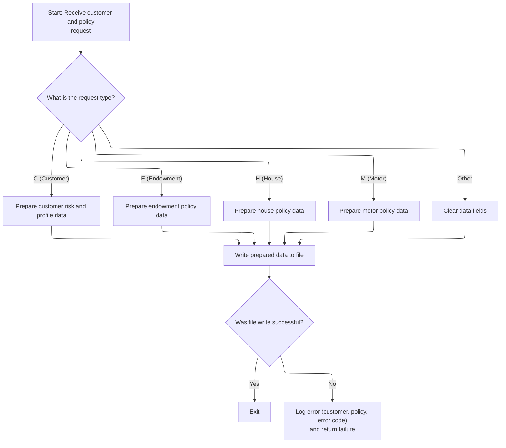

This section is responsible for persisting transaction data based on the request type and ensuring that any failed writes are logged with full context for monitoring and troubleshooting.

| Rule ID | Category       | Rule Name                              | Description                                                                                                                                                                                                                                                                          | Implementation Details                                                                                                                                                                                                                            |
| ------- | -------------- | -------------------------------------- | ------------------------------------------------------------------------------------------------------------------------------------------------------------------------------------------------------------------------------------------------------------------------------------ | ------------------------------------------------------------------------------------------------------------------------------------------------------------------------------------------------------------------------------------------------- |
| BR-001  | Writing Output | Transaction data preparation and write | Transaction data is prepared and written to the persistent file based on the request type. For each request type (Customer, Endowment, House, Motor), specific fields are included in the record. If the request type is not recognized, all data fields are cleared before writing. | The output record is 104 bytes long. The record includes a key (request type, customer number, policy number) and request-specific data fields. For unrecognized request types, all data fields are set to spaces before writing.                 |
| BR-002  | Writing Output | Error logging on failed write          | If the file write is unsuccessful, an error log entry is created containing the transaction context (customer number, policy number), the error codes, and the current date and time. The error is sent to the monitoring service for tracking.                                      | The error log entry includes the customer number, policy number, two error codes, and the current date and time. The return code '80' is set to indicate a write failure. The error message is sent to the monitoring service via a program call. |
| BR-003  | Writing Output | Return failure on write error          | The program returns a failure code to the caller if the file write is unsuccessful, indicating that the transaction was not completed successfully.                                                                                                                                  | The return code '80' is used to indicate a write failure. The program returns control to the caller after logging the error.                                                                                                                      |

<SwmSnippet path="/base/src/lgapvs01.cbl" line="90">

---

<SwmToken path="base/src/lgapvs01.cbl" pos="90:1:3" line-data="       P100-ENTRY SECTION.">`P100-ENTRY`</SwmToken> moves request-specific fields into the record structure, then writes the data to the KSDSPOLY file. If the write fails, it logs the error and returns, so every failed transaction is tracked and doesn't slip through.

```cobol
       P100-ENTRY SECTION.
      *
      *---------------------------------------------------------------*
           Move EIBCALEN To V1-COMM.
      *---------------------------------------------------------------*
           Move CA-Request-ID(4:1) To V2-REQ
           Move CA-Policy-Num      To V2-POL
           Move CA-Customer-Num    To V2-CUST

           Evaluate V2-REQ

             When 'C'
               Move CA-B-PST     To V2-C-PCD
               Move CA-B-ST       To V2-C-Z9
               Move CA-B-Customer     To V2-C-CUST
               Move WS-RISK-SCORE     To V2-C-VAL
               Move CA-B-CA-B-FPR  To V2-C-P1VAL
               Move CA-B-CPR To V2-C-P2VAL
               Move CA-B-FLPR To V2-C-P3VAL
               Move CA-B-WPR To V2-C-P4VAL

             When 'E'
               Move CA-E-W-PRO        To  V2-E-OPT1
               Move CA-E-EQU          To  V2-E-OPT2
               Move CA-E-M-FUN        To  V2-E-OPT3
               Move CA-E-FUND-NAME    To  V2-E-NAME
               Move CA-E-LIFE-ASSURED To  V2-E-LIFE

             When 'H'
               Move CA-H-P-TYP         To  V2-H-TYPE
               Move CA-H-BED           To  V2-H-ROOMS
               Move CA-H-VAL           To  V2-H-COST
               Move CA-H-PCD           To  V2-H-PCD
               Move CA-H-H-NAM         To  V2-H-NAME

             When 'M'
               Move CA-M-MAKE          To  V2-M-MAKE
               Move CA-M-MODEL         To  V2-M-MODEL
               Move CA-M-VALUE         To  V2-M-COST
               Move CA-M-REGNUMBER     To  V2-M-NUM

             When Other
               Move Spaces To V2-DATA
           End-Evaluate

      *---------------------------------------------------------------*
           Exec CICS Write File('KSDSPOLY')
                     From(V2-RECORD)
                     Length(104)
                     Ridfld(V2-KEY)
                     KeyLength(21)
                     RESP(V1-RCD1)
           End-Exec.
           If V1-RCD1 Not = DFHRESP(NORMAL)
             Move EIBRESP2 To V1-RCD2
             MOVE '80' TO CA-RETURN-CODE
             PERFORM P999-ERROR
             EXEC CICS RETURN END-EXEC
           End-If.
```

---

</SwmSnippet>

<SwmSnippet path="/base/src/lgapvs01.cbl" line="156">

---

<SwmToken path="base/src/lgapvs01.cbl" pos="156:1:3" line-data="       P999-ERROR.">`P999-ERROR`</SwmToken> grabs the current time and date, moves them and other key fields into the error message structure, then links to LGSTSQ to log the error. If there's commarea data, it moves up to 90 bytes and calls LGSTSQ again. This makes sure all error context is captured and sent for monitoring.

```cobol
       P999-ERROR.
           EXEC CICS ASKTIME ABSTIME(V3-TIME)
           END-EXEC
           EXEC CICS FORMATTIME ABSTIME(V3-TIME)
                     MMDDYYYY(V3-DATE1)
                     TIME(V3-DATE2)
           END-EXEC
      *
           MOVE V3-DATE1 TO EM-DATE
           MOVE V3-DATE2 TO EM-TIME
           Move CA-Customer-Num To EM-Cusnum
           Move CA-Policy-Num   To EM-POLNUM 
           Move V1-RCD1         To EM-RespRC
           Move V1-RCD2         To EM-Resp2RC
           EXEC CICS LINK PROGRAM('LGSTSQ')
                     COMMAREA(ERROR-MSG)
                     LENGTH(LENGTH OF ERROR-MSG)
           END-EXEC.
           IF EIBCALEN > 0 THEN
             IF EIBCALEN < 91 THEN
               MOVE DFHCOMMAREA(1:EIBCALEN) TO CA-DATA
               EXEC CICS LINK PROGRAM('LGSTSQ')
                         COMMAREA(CA-ERROR-MSG)
                         LENGTH(Length Of CA-ERROR-MSG)
               END-EXEC
             ELSE
               MOVE DFHCOMMAREA(1:90) TO CA-DATA
               EXEC CICS LINK PROGRAM('LGSTSQ')
                         COMMAREA(CA-ERROR-MSG)
                         LENGTH(Length Of CA-ERROR-MSG)
               END-EXEC
             END-IF
           END-IF.
           EXIT.
```

---

</SwmSnippet>

<SwmSnippet path="/base/src/lgapvs01.cbl" line="152">

---

<SwmToken path="base/src/lgapvs01.cbl" pos="152:1:3" line-data="       P100-EXIT.">`P100-EXIT`</SwmToken> just has EXIT and GOBACK—no code, no cleanup. It ends the program and hands control back to the caller, nothing else happens here.

```cobol
       P100-EXIT.
           EXIT.
           GOBACK.
```

---

</SwmSnippet>

&nbsp;

*This is an auto-generated document by Swimm 🌊 and has not yet been verified by a human*

<SwmMeta version="3.0.0" repo-id="Z2l0aHViJTNBJTNBU3dpbW1pby1nZW5hcHAtaG91c2UlM0ElM0FHaXJpLVN3aW1t" repo-name="Swimmio-genapp-house"><sup>Powered by [Swimm](https://app.swimm.io/)</sup></SwmMeta>
