# Overview

This document outlines the flow for processing insurance policy requests. Incoming requests are validated, routed to the correct product logic, and, for commercial policies, undergo risk and premium calculations before being inserted into the database and finalized for storage.

## Dependencies

### Programs

- <SwmToken path="base/src/lgapdb09.cbl" pos="2:6:6" line-data="       PROGRAM-ID. LGAPDB09.">`LGAPDB09`</SwmToken> (<SwmPath>[base/src/lgapdb09.cbl](base/src/lgapdb09.cbl)</SwmPath>)
- <SwmToken path="base/src/lgapdb09.cbl" pos="268:9:9" line-data="             EXEC CICS Link Program(LGAPVS01)">`LGAPVS01`</SwmToken> (<SwmPath>[base/src/lgapvs01.cbl](base/src/lgapvs01.cbl)</SwmPath>)
- LGSTSQ (<SwmPath>[base/src/lgstsq.cbl](base/src/lgstsq.cbl)</SwmPath>)
- LGCOMCAL (<SwmPath>[base/src/lgcomcal.cbl](base/src/lgcomcal.cbl)</SwmPath>)

### Copybooks

- LGCMAREA (<SwmPath>[base/src/lgcmarea.cpy](base/src/lgcmarea.cpy)</SwmPath>)
- LGCOMDAT (<SwmPath>[base/src/lgcomdat.cpy](base/src/lgcomdat.cpy)</SwmPath>)
- LGPOLICY (<SwmPath>[base/src/lgpolicy.cpy](base/src/lgpolicy.cpy)</SwmPath>)
- SQLCA

## Input and Output Tables/Files used

### <SwmToken path="base/src/lgapdb09.cbl" pos="2:6:6" line-data="       PROGRAM-ID. LGAPDB09.">`LGAPDB09`</SwmToken> (<SwmPath>[base/src/lgapdb09.cbl](base/src/lgapdb09.cbl)</SwmPath>)

| Table / File Name | Type                                                                                                                     | Description                                                     | Usage Mode   | Key Fields / Layout Highlights                                                                                                                                                                                                                                                                                                                                                                                                                                                                                                                                                                                                                                                                                                                                                                                                                                                                                                                                                                                                                                                                                                                                                                                                                                                                                                                                                                                                                                                                                                                                                                                                                                                                                                                                                                                                                                                                                                                                                                                                                                                                                                                                                                                                                                                                                                                                                                                                                                                                                                                                                                                                                                        |
| ----------------- | ------------------------------------------------------------------------------------------------------------------------ | --------------------------------------------------------------- | ------------ | --------------------------------------------------------------------------------------------------------------------------------------------------------------------------------------------------------------------------------------------------------------------------------------------------------------------------------------------------------------------------------------------------------------------------------------------------------------------------------------------------------------------------------------------------------------------------------------------------------------------------------------------------------------------------------------------------------------------------------------------------------------------------------------------------------------------------------------------------------------------------------------------------------------------------------------------------------------------------------------------------------------------------------------------------------------------------------------------------------------------------------------------------------------------------------------------------------------------------------------------------------------------------------------------------------------------------------------------------------------------------------------------------------------------------------------------------------------------------------------------------------------------------------------------------------------------------------------------------------------------------------------------------------------------------------------------------------------------------------------------------------------------------------------------------------------------------------------------------------------------------------------------------------------------------------------------------------------------------------------------------------------------------------------------------------------------------------------------------------------------------------------------------------------------------------------------------------------------------------------------------------------------------------------------------------------------------------------------------------------------------------------------------------------------------------------------------------------------------------------------------------------------------------------------------------------------------------------------------------------------------------------------------------------------- |
| COMMERCIAL        | <SwmToken path="base/src/lgapdb09.cbl" pos="199:3:3" line-data="           INITIALIZE DB2-IN-INTEGERS.">`DB2`</SwmToken> | Commercial policy risk factors, premiums, and rejection reason. | Output       | <SwmToken path="base/src/lgapdb09.cbl" pos="567:2:2" line-data="                       (PolicyNumber,">`PolicyNumber`</SwmToken>, <SwmToken path="base/src/lgapdb09.cbl" pos="568:1:1" line-data="                        RequestDate,">`RequestDate`</SwmToken>, <SwmToken path="base/src/lgapdb09.cbl" pos="569:1:1" line-data="                        StartDate,">`StartDate`</SwmToken>, <SwmToken path="base/src/lgapdb09.cbl" pos="570:1:1" line-data="                        RenewalDate,">`RenewalDate`</SwmToken>, <SwmToken path="base/src/lgapdb09.cbl" pos="502:7:7" line-data="           MOVE CA-B-Address TO WS-XADDRESS">`Address`</SwmToken>, <SwmToken path="base/src/lgapdb09.cbl" pos="572:1:1" line-data="                        Zipcode,">`Zipcode`</SwmToken>, <SwmToken path="base/src/lgapdb09.cbl" pos="573:1:1" line-data="                        LatitudeN,">`LatitudeN`</SwmToken>, <SwmToken path="base/src/lgapdb09.cbl" pos="574:1:1" line-data="                        LongitudeW,">`LongitudeW`</SwmToken>, <SwmToken path="base/src/lgapdb09.cbl" pos="505:7:7" line-data="           MOVE CA-B-Customer TO WS-XCUSTNAME">`Customer`</SwmToken>, <SwmToken path="base/src/lgapdb09.cbl" pos="576:1:1" line-data="                        PropertyType,">`PropertyType`</SwmToken>, <SwmToken path="base/src/lgapdb09.cbl" pos="577:1:1" line-data="                        FirePeril,">`FirePeril`</SwmToken>, <SwmToken path="base/src/lgapdb09.cbl" pos="518:15:19" line-data="           MOVE WS-ZFP-PREMIUM TO CA-B-CA-B-FPR">`CA-B-FPR`</SwmToken>, <SwmToken path="base/src/lgapdb09.cbl" pos="579:1:1" line-data="                        CrimePeril,">`CrimePeril`</SwmToken>, <SwmToken path="base/src/lgapdb09.cbl" pos="580:1:1" line-data="                        CrimePremium,">`CrimePremium`</SwmToken>, <SwmToken path="base/src/lgapdb09.cbl" pos="581:1:1" line-data="                        FloodPeril,">`FloodPeril`</SwmToken>, <SwmToken path="base/src/lgapdb09.cbl" pos="582:1:1" line-data="                        FloodPremium,">`FloodPremium`</SwmToken>, <SwmToken path="base/src/lgapdb09.cbl" pos="583:1:1" line-data="                        WeatherPeril,">`WeatherPeril`</SwmToken>, <SwmToken path="base/src/lgapdb09.cbl" pos="584:1:1" line-data="                        WeatherPremium,">`WeatherPremium`</SwmToken>, <SwmToken path="base/src/lgapdb09.cbl" pos="585:1:1" line-data="                        Status,">`Status`</SwmToken>, <SwmToken path="base/src/lgapdb09.cbl" pos="586:1:1" line-data="                        RejectionReason)">`RejectionReason`</SwmToken> |
| ENDOWMENT         | <SwmToken path="base/src/lgapdb09.cbl" pos="199:3:3" line-data="           INITIALIZE DB2-IN-INTEGERS.">`DB2`</SwmToken> | Endowment policy investment and assured sum details.            | Output       | <SwmToken path="base/src/lgapdb09.cbl" pos="289:3:3" line-data="                       ( POLICYNUMBER,">`POLICYNUMBER`</SwmToken>, <SwmToken path="base/src/lgapdb09.cbl" pos="365:1:1" line-data="                            WITHPROFITS,">`WITHPROFITS`</SwmToken>, <SwmToken path="base/src/lgapdb09.cbl" pos="366:1:1" line-data="                            EQUITIES,">`EQUITIES`</SwmToken>, <SwmToken path="base/src/lgapdb09.cbl" pos="367:1:1" line-data="                            MANAGEDFUND,">`MANAGEDFUND`</SwmToken>, <SwmToken path="base/src/lgapdb09.cbl" pos="368:1:1" line-data="                            FUNDNAME,">`FUNDNAME`</SwmToken>, <SwmToken path="base/src/lgapdb09.cbl" pos="346:7:7" line-data="           MOVE CA-E-TERM        TO DB2-E-TERM-SINT">`TERM`</SwmToken>, <SwmToken path="base/src/lgapdb09.cbl" pos="347:17:17" line-data="           MOVE CA-E-SUM-ASSURED TO DB2-E-SUMASSURED-INT">`SUMASSURED`</SwmToken>, <SwmToken path="base/src/lgapdb09.cbl" pos="371:1:1" line-data="                            LIFEASSURED,">`LIFEASSURED`</SwmToken>, <SwmToken path="base/src/lgapdb09.cbl" pos="372:1:1" line-data="                            PADDINGDATA    )">`PADDINGDATA`</SwmToken>                                                                                                                                                                                                                                                                                                                                                                                                                                                                                                                                                                                                                                                                                                                                                                                                                                                                                                                                                                                                                                                                                                                                                                                                                                                                                                                                                                                                                        |
| HOUSE             | <SwmToken path="base/src/lgapdb09.cbl" pos="199:3:3" line-data="           INITIALIZE DB2-IN-INTEGERS.">`DB2`</SwmToken> | House policy property type, value, and address.                 | Output       | <SwmToken path="base/src/lgapdb09.cbl" pos="289:3:3" line-data="                       ( POLICYNUMBER,">`POLICYNUMBER`</SwmToken>, <SwmToken path="base/src/lgapdb09.cbl" pos="424:1:1" line-data="                         PROPERTYTYPE,">`PROPERTYTYPE`</SwmToken>, <SwmToken path="base/src/lgapdb09.cbl" pos="418:15:15" line-data="           MOVE CA-H-BED    TO DB2-H-BEDROOMS-SINT">`BEDROOMS`</SwmToken>, <SwmToken path="base/src/lgapdb09.cbl" pos="417:15:15" line-data="           MOVE CA-H-VAL       TO DB2-H-VALUE-INT">`VALUE`</SwmToken>, <SwmToken path="base/src/lgapdb09.cbl" pos="427:1:1" line-data="                         HOUSENAME,">`HOUSENAME`</SwmToken>, <SwmToken path="base/src/lgapdb09.cbl" pos="428:1:1" line-data="                         HOUSENUMBER,">`HOUSENUMBER`</SwmToken>, <SwmToken path="base/src/lgapdb09.cbl" pos="429:1:1" line-data="                         POSTCODE          )">`POSTCODE`</SwmToken>                                                                                                                                                                                                                                                                                                                                                                                                                                                                                                                                                                                                                                                                                                                                                                                                                                                                                                                                                                                                                                                                                                                                                                                                                                                                                                                                                                                                                                                                                                                                                                                                                                                                                                         |
| MOTOR             | <SwmToken path="base/src/lgapdb09.cbl" pos="199:3:3" line-data="           INITIALIZE DB2-IN-INTEGERS.">`DB2`</SwmToken> | Motor policy vehicle specs, premium, and accident history.      | Output       | <SwmToken path="base/src/lgapdb09.cbl" pos="289:3:3" line-data="                       ( POLICYNUMBER,">`POLICYNUMBER`</SwmToken>, <SwmToken path="base/src/lgapdb09.cbl" pos="460:1:1" line-data="                         MAKE,">`MAKE`</SwmToken>, <SwmToken path="base/src/lgapdb09.cbl" pos="461:1:1" line-data="                         MODEL,">`MODEL`</SwmToken>, <SwmToken path="base/src/lgapdb09.cbl" pos="417:15:15" line-data="           MOVE CA-H-VAL       TO DB2-H-VALUE-INT">`VALUE`</SwmToken>, <SwmToken path="base/src/lgapdb09.cbl" pos="463:1:1" line-data="                         REGNUMBER,">`REGNUMBER`</SwmToken>, <SwmToken path="base/src/lgapdb09.cbl" pos="464:1:1" line-data="                         COLOUR,">`COLOUR`</SwmToken>, <SwmToken path="base/src/lgapdb09.cbl" pos="452:7:7" line-data="           MOVE CA-M-CC          TO DB2-M-CC-SINT">`CC`</SwmToken>, <SwmToken path="base/src/lgapdb09.cbl" pos="466:1:1" line-data="                         YEAROFMANUFACTURE,">`YEAROFMANUFACTURE`</SwmToken>, <SwmToken path="base/src/lgapdb09.cbl" pos="453:7:7" line-data="           MOVE CA-M-PREMIUM     TO DB2-M-PREMIUM-INT">`PREMIUM`</SwmToken>, <SwmToken path="base/src/lgapdb09.cbl" pos="454:7:7" line-data="           MOVE CA-M-ACCIDENTS   TO DB2-M-ACCIDENTS-INT">`ACCIDENTS`</SwmToken>                                                                                                                                                                                                                                                                                                                                                                                                                                                                                                                                                                                                                                                                                                                                                                                                                                                                                                                                                                                                                                                                                                                                                                                                                                                                                                                 |
| POLICY            | <SwmToken path="base/src/lgapdb09.cbl" pos="199:3:3" line-data="           INITIALIZE DB2-IN-INTEGERS.">`DB2`</SwmToken> | Insurance policy core details and lifecycle dates.              | Input/Output | <SwmToken path="base/src/lgapdb09.cbl" pos="289:3:3" line-data="                       ( POLICYNUMBER,">`POLICYNUMBER`</SwmToken>, <SwmToken path="base/src/lgapdb09.cbl" pos="290:1:1" line-data="                         CUSTOMERNUMBER,">`CUSTOMERNUMBER`</SwmToken>, <SwmToken path="base/src/lgapdb09.cbl" pos="291:1:1" line-data="                         ISSUEDATE,">`ISSUEDATE`</SwmToken>, <SwmToken path="base/src/lgapdb09.cbl" pos="292:1:1" line-data="                         EXPIRYDATE,">`EXPIRYDATE`</SwmToken>, <SwmToken path="base/src/lgapdb09.cbl" pos="222:11:11" line-data="               MOVE &#39;E&#39; TO DB2-POLICYTYPE">`POLICYTYPE`</SwmToken>, <SwmToken path="base/src/lgapdb09.cbl" pos="294:1:1" line-data="                         LASTCHANGED,">`LASTCHANGED`</SwmToken>, <SwmToken path="base/src/lgapdb09.cbl" pos="283:5:5" line-data="           MOVE CA-BROKERID TO DB2-BROKERID-INT">`BROKERID`</SwmToken>, <SwmToken path="base/src/lgapdb09.cbl" pos="296:1:1" line-data="                         BROKERSREFERENCE,">`BROKERSREFERENCE`</SwmToken>, <SwmToken path="base/src/lgapdb09.cbl" pos="284:5:5" line-data="           MOVE CA-PAYMENT TO DB2-PAYMENT-INT">`PAYMENT`</SwmToken>, <SwmToken path="base/src/lgapdb09.cbl" pos="334:4:6" line-data="               INTO :CA-LASTCHANGED">`CA-LASTCHANGED`</SwmToken>                                                                                                                                                                                                                                                                                                                                                                                                                                                                                                                                                                                                                                                                                                                                                                                                                                                                                                                                                                                                                                                                                                                                                                                                                                                                                         |

## Detailed View of the Program's Functionality

# LGSTSQ (Error Logging and Message Queue Handler) – Detailed Flow

## a. Initialization and Setup

When the error logging program is invoked, it starts by clearing out all working storage fields related to the outgoing message and any receive buffers. This ensures that no leftover data from previous invocations can corrupt the current message.

- The program retrieves the current system ID (the identifier for the CICS region) and stores it in the outgoing message structure.
- It also retrieves the name of the program that invoked it. This is used to determine how to handle the incoming data.

## b. Determining Invocation Context

The program checks if it was invoked directly (via a LINK command) or as a result of a RECEIVE command (such as from a terminal or another asynchronous source):

- If invoked directly (the invoking program name is not blank):
  - It sets an internal flag to indicate a "command" invocation.
  - It copies the incoming commarea data (the error message) into the outgoing message buffer.
  - It sets the message length to the length of the commarea.
- If invoked as a RECEIVE (the invoking program name is blank):
  - It issues a RECEIVE command to get the incoming data into a buffer.
  - It sets an internal flag to indicate a "receive" invocation.
  - It copies the received data into the outgoing message buffer.
  - It adjusts the message length to exclude the transaction ID prefix.

## c. Queue Name Handling

The program sets the default queue name for error messages. If the message starts with a special prefix (e.g., "Q=xxxx"), it extracts the custom queue extension and adjusts the queue name accordingly. It also removes the prefix from the message body and shortens the message length to account for the removed prefix.

## d. Message Length Adjustment

The program adds a fixed value to the message length to account for the system ID and other header fields, ensuring the entire message is written to the queues.

## e. Writing to Queues

The program writes the prepared message to two destinations:

1. **Transient Data Queue (TDQ):**
   - The message is written to a system log queue (typically for operator or system monitoring).
2. **Temporary Storage Queue (TSQ):**
   - The message is also written to a persistent queue for later retrieval or audit.
   - If the queue is full, the program does not wait; it simply ignores the failure (to avoid blocking the transaction).

## f. Handling RECEIVE Invocations

If the program was invoked as a result of a RECEIVE, it sends a minimal response back to the terminal (or source), erasing the screen and freeing the keyboard, then ends.

## g. Program Termination

The program always returns control to the caller (or CICS) after processing, ensuring that the error logging is non-blocking and does not interfere with the main transaction flow.

---

# Key Actions in Order

 1. **Clear message and receive buffers.**
 2. **Retrieve system and program context.**
 3. **Determine invocation type (direct or receive).**
 4. **Copy incoming data to outgoing message buffer.**
 5. **Set or adjust queue name based on message prefix.**
 6. **Adjust message length for headers.**
 7. **Write message to system log queue (TDQ).**
 8. **Write message to persistent queue (TSQ), non-blocking.**
 9. **If invoked via RECEIVE, send minimal response and end.**
10. **Return control to caller or CICS.**

---

# Error Handling and Data Integrity

- The program does not perform any retries or complex error handling if the queue write fails; it simply logs the attempt and continues.
- All error context (including system, program, and message data) is preserved in the outgoing message for audit and debugging.
- The logic ensures that even if the message is too long or contains special routing instructions, it is handled consistently and safely.

---

# Summary

This program acts as a centralized, robust error logging handler for the application, ensuring that all error messages (and optionally, context data) are routed to both system and persistent queues, with special handling for custom queue routing and invocation context. It is designed to be safe, non-blocking, and to preserve as much error context as possible for later analysis.

# Data Definitions

### <SwmToken path="base/src/lgapdb09.cbl" pos="2:6:6" line-data="       PROGRAM-ID. LGAPDB09.">`LGAPDB09`</SwmToken> (<SwmPath>[base/src/lgapdb09.cbl](base/src/lgapdb09.cbl)</SwmPath>)

| Table / Record Name | Type                                                                                                                     | Short Description                                              | Usage Mode                      |
| ------------------- | ------------------------------------------------------------------------------------------------------------------------ | -------------------------------------------------------------- | ------------------------------- |
| COMMERCIAL          | <SwmToken path="base/src/lgapdb09.cbl" pos="199:3:3" line-data="           INITIALIZE DB2-IN-INTEGERS.">`DB2`</SwmToken> | Commercial policy risk factors, premiums, and rejection reason | Output (INSERT)                 |
| ENDOWMENT           | <SwmToken path="base/src/lgapdb09.cbl" pos="199:3:3" line-data="           INITIALIZE DB2-IN-INTEGERS.">`DB2`</SwmToken> | Endowment policy investment and assured sum details            | Output (INSERT)                 |
| HOUSE               | <SwmToken path="base/src/lgapdb09.cbl" pos="199:3:3" line-data="           INITIALIZE DB2-IN-INTEGERS.">`DB2`</SwmToken> | House policy property type, value, and address                 | Output (INSERT)                 |
| MOTOR               | <SwmToken path="base/src/lgapdb09.cbl" pos="199:3:3" line-data="           INITIALIZE DB2-IN-INTEGERS.">`DB2`</SwmToken> | Motor policy vehicle specs, premium, and accident history      | Output (INSERT)                 |
| POLICY              | <SwmToken path="base/src/lgapdb09.cbl" pos="199:3:3" line-data="           INITIALIZE DB2-IN-INTEGERS.">`DB2`</SwmToken> | Insurance policy core details and lifecycle dates              | Input (SELECT), Output (INSERT) |

# Rule Definition

| Paragraph Name                                                                                                                                                                                                                                                                                                                                            | Rule ID | Category          | Description                                                                                                                                                                                                                                                                                                                                                                                                                                                                                                                                        | Conditions                                                                                                                                                                                                                                                                                  | Remarks                                                                                                                                                                                                                                                                                                                                                                                                                                                                                                                                                                                                                                                                                                                                                                           |
| --------------------------------------------------------------------------------------------------------------------------------------------------------------------------------------------------------------------------------------------------------------------------------------------------------------------------------------------------------- | ------- | ----------------- | -------------------------------------------------------------------------------------------------------------------------------------------------------------------------------------------------------------------------------------------------------------------------------------------------------------------------------------------------------------------------------------------------------------------------------------------------------------------------------------------------------------------------------------------------- | ------------------------------------------------------------------------------------------------------------------------------------------------------------------------------------------------------------------------------------------------------------------------------------------- | --------------------------------------------------------------------------------------------------------------------------------------------------------------------------------------------------------------------------------------------------------------------------------------------------------------------------------------------------------------------------------------------------------------------------------------------------------------------------------------------------------------------------------------------------------------------------------------------------------------------------------------------------------------------------------------------------------------------------------------------------------------------------------- |
| MAINLINE SECTION (<SwmToken path="base/src/lgapdb09.cbl" pos="2:6:6" line-data="       PROGRAM-ID. LGAPDB09.">`LGAPDB09`</SwmToken>), EVALUATE <SwmToken path="base/src/lgapdb09.cbl" pos="218:3:7" line-data="           EVALUATE CA-REQUEST-ID">`CA-REQUEST-ID`</SwmToken>                                                                              | RL-001  | Conditional Logic | The program must check that <SwmToken path="base/src/lgapdb09.cbl" pos="218:3:7" line-data="           EVALUATE CA-REQUEST-ID">`CA-REQUEST-ID`</SwmToken> is <SwmToken path="base/src/lgapdb09.cbl" pos="224:4:4" line-data="             WHEN &#39;01AHOU&#39;">`01AHOU`</SwmToken> to identify a House policy insert request. If the request type is not supported, it must set <SwmToken path="base/src/lgapdb09.cbl" pos="209:9:13" line-data="           MOVE &#39;00&#39; TO CA-RETURN-CODE">`CA-RETURN-CODE`</SwmToken> to '99' and return. | <SwmToken path="base/src/lgapdb09.cbl" pos="218:3:7" line-data="           EVALUATE CA-REQUEST-ID">`CA-REQUEST-ID`</SwmToken> is not <SwmToken path="base/src/lgapdb09.cbl" pos="224:4:4" line-data="             WHEN &#39;01AHOU&#39;">`01AHOU`</SwmToken>.                               | <SwmToken path="base/src/lgapdb09.cbl" pos="209:9:13" line-data="           MOVE &#39;00&#39; TO CA-RETURN-CODE">`CA-RETURN-CODE`</SwmToken> values: '99' for unsupported request type. Only <SwmToken path="base/src/lgapdb09.cbl" pos="224:4:4" line-data="             WHEN &#39;01AHOU&#39;">`01AHOU`</SwmToken> is valid for House policy insert.                                                                                                                                                                                                                                                                                                                                                                                                                            |
| <SwmToken path="base/src/lgapdb09.cbl" pos="247:3:5" line-data="           PERFORM P100-T">`P100-T`</SwmToken> and <SwmToken path="base/src/lgapdb09.cbl" pos="255:3:5" line-data="               PERFORM P300-H">`P300-H`</SwmToken> (<SwmToken path="base/src/lgapdb09.cbl" pos="2:6:6" line-data="       PROGRAM-ID. LGAPDB09.">`LGAPDB09`</SwmToken>) | RL-002  | Computation       | The program must insert a new House policy record using the input fields and generate a policy number (by DB or simulation). The last changed timestamp is set to the current system time. After successful insert, update <SwmToken path="base/src/lgapdb09.cbl" pos="329:11:15" line-data="           MOVE DB2-POLICYNUM-INT TO CA-POLICY-NUM">`CA-POLICY-NUM`</SwmToken> and <SwmToken path="base/src/lgapdb09.cbl" pos="334:4:6" line-data="               INTO :CA-LASTCHANGED">`CA-LASTCHANGED`</SwmToken> in the commarea.                  | <SwmToken path="base/src/lgapdb09.cbl" pos="218:3:7" line-data="           EVALUATE CA-REQUEST-ID">`CA-REQUEST-ID`</SwmToken> is <SwmToken path="base/src/lgapdb09.cbl" pos="224:4:4" line-data="             WHEN &#39;01AHOU&#39;">`01AHOU`</SwmToken> and commarea length is sufficient. | Policy number is generated by DB (<SwmToken path="base/src/lgapdb09.cbl" pos="327:12:12" line-data="             SET :DB2-POLICYNUM-INT = IDENTITY_VAL_LOCAL()">`IDENTITY_VAL_LOCAL`</SwmToken>) or simulated by incrementing from 10000001. Timestamp format: 'YYYY-MM-DD HH:MM:SS.ssssss'. Output commarea fields updated: <SwmToken path="base/src/lgapdb09.cbl" pos="329:11:15" line-data="           MOVE DB2-POLICYNUM-INT TO CA-POLICY-NUM">`CA-POLICY-NUM`</SwmToken>, <SwmToken path="base/src/lgapdb09.cbl" pos="334:4:6" line-data="               INTO :CA-LASTCHANGED">`CA-LASTCHANGED`</SwmToken>, <SwmToken path="base/src/lgapdb09.cbl" pos="209:9:13" line-data="           MOVE &#39;00&#39; TO CA-RETURN-CODE">`CA-RETURN-CODE`</SwmToken> ('00' for success). |
| MAINLINE SECTION (<SwmToken path="base/src/lgapdb09.cbl" pos="2:6:6" line-data="       PROGRAM-ID. LGAPDB09.">`LGAPDB09`</SwmToken>), after insert and before return                                                                                                                                                                                      | RL-003  | Data Assignment   | The program must echo all input fields in the output commarea, updating only <SwmToken path="base/src/lgapdb09.cbl" pos="209:9:13" line-data="           MOVE &#39;00&#39; TO CA-RETURN-CODE">`CA-RETURN-CODE`</SwmToken>, <SwmToken path="base/src/lgapdb09.cbl" pos="329:11:15" line-data="           MOVE DB2-POLICYNUM-INT TO CA-POLICY-NUM">`CA-POLICY-NUM`</SwmToken>, and <SwmToken path="base/src/lgapdb09.cbl" pos="334:4:6" line-data="               INTO :CA-LASTCHANGED">`CA-LASTCHANGED`</SwmToken> as described.                    | After processing insert (success or failure).                                                                                                                                                                                                                                               | Output commarea format matches input, with only <SwmToken path="base/src/lgapdb09.cbl" pos="209:9:13" line-data="           MOVE &#39;00&#39; TO CA-RETURN-CODE">`CA-RETURN-CODE`</SwmToken>, <SwmToken path="base/src/lgapdb09.cbl" pos="329:11:15" line-data="           MOVE DB2-POLICYNUM-INT TO CA-POLICY-NUM">`CA-POLICY-NUM`</SwmToken>, and <SwmToken path="base/src/lgapdb09.cbl" pos="334:4:6" line-data="               INTO :CA-LASTCHANGED">`CA-LASTCHANGED`</SwmToken> updated. All other fields are echoed unchanged.                                                                                                                                                                                                                                              |
| <SwmToken path="base/src/lgapdb09.cbl" pos="205:3:7" line-data="               PERFORM WRITE-ERROR-MESSAGE">`WRITE-ERROR-MESSAGE`</SwmToken> (<SwmToken path="base/src/lgapdb09.cbl" pos="2:6:6" line-data="       PROGRAM-ID. LGAPDB09.">`LGAPDB09`</SwmToken>), LGSTSQ                                                                                  | RL-004  | Data Assignment   | The program must log all errors by preparing a structured error message containing the SQL error code (if available), current date and time, and up to 90 bytes of the input commarea. This error message must be sent to a logging service or written to a file/console.                                                                                                                                                                                                                                                                          | Any error occurs during processing (e.g., SQLCODE not 0, commarea missing, etc.).                                                                                                                                                                                                           | Error message format: includes SQL error code, date, time, and up to 90 bytes of input commarea. Logging is performed by linking to LGSTSQ, which writes to TDQ CSMT and TSQ GENAERRS. If commarea length > 90, only first 90 bytes are logged.                                                                                                                                                                                                                                                                                                                                                                                                                                                                                                                                   |
| MAINLINE SECTION (<SwmToken path="base/src/lgapdb09.cbl" pos="2:6:6" line-data="       PROGRAM-ID. LGAPDB09.">`LGAPDB09`</SwmToken>), EXEC CICS RETURN <SwmToken path="base/src/lgapdb09.cbl" pos="206:16:18" line-data="               EXEC CICS ABEND ABCODE(&#39;LGCA&#39;) NODUMP END-EXEC">`END-EXEC`</SwmToken>                                     | RL-005  | Data Assignment   | The output commarea must be returned to the caller with the updated fields as described.                                                                                                                                                                                                                                                                                                                                                                                                                                                           | After processing is complete (success or failure).                                                                                                                                                                                                                                          | Output commarea format: string/alphanumeric fields, number fields, date fields as per input spec. Updated fields: <SwmToken path="base/src/lgapdb09.cbl" pos="209:9:13" line-data="           MOVE &#39;00&#39; TO CA-RETURN-CODE">`CA-RETURN-CODE`</SwmToken>, <SwmToken path="base/src/lgapdb09.cbl" pos="329:11:15" line-data="           MOVE DB2-POLICYNUM-INT TO CA-POLICY-NUM">`CA-POLICY-NUM`</SwmToken>, <SwmToken path="base/src/lgapdb09.cbl" pos="334:4:6" line-data="               INTO :CA-LASTCHANGED">`CA-LASTCHANGED`</SwmToken>. All other fields echoed unchanged.                                                                                                                                                                                            |
| MAINLINE SECTION (<SwmToken path="base/src/lgapdb09.cbl" pos="2:6:6" line-data="       PROGRAM-ID. LGAPDB09.">`LGAPDB09`</SwmToken>), lines around IF commarea length is zero, IF commarea length is less than required length                                                                                                                            | RL-006  | Conditional Logic | The program must check that the commarea input is present and that its length is sufficient for a House policy insert. If the commarea is missing or too short, it must set the return code in the commarea to '98' and return without further processing.                                                                                                                                                                                                                                                                                         | The commarea length is zero or less than the required length for House policy insert.                                                                                                                                                                                                       | Return code values: '98' for insufficient commarea. Required commarea length is determined by the business logic for House policy insert. Input commarea must contain all fields required for House policy insert as described in the spec.                                                                                                                                                                                                                                                                                                                                                                                                                                                                                                                                       |

# User Stories

## User Story 1: Validate input commarea and request type

---

### Story Description:

As a system, I want to validate that the input commarea is present, of sufficient length, and that the request type is supported so that only valid House policy insert requests are processed and appropriate error codes are returned for invalid requests.

---

### Business Rule Mapping:

| Rule ID | Paragraph Name                                                                                                                                                                                                                                                               | Rule Description                                                                                                                                                                                                                                                                                                                                                                                                                                                                                                                                   |
| ------- | ---------------------------------------------------------------------------------------------------------------------------------------------------------------------------------------------------------------------------------------------------------------------------- | -------------------------------------------------------------------------------------------------------------------------------------------------------------------------------------------------------------------------------------------------------------------------------------------------------------------------------------------------------------------------------------------------------------------------------------------------------------------------------------------------------------------------------------------------- |
| RL-001  | MAINLINE SECTION (<SwmToken path="base/src/lgapdb09.cbl" pos="2:6:6" line-data="       PROGRAM-ID. LGAPDB09.">`LGAPDB09`</SwmToken>), EVALUATE <SwmToken path="base/src/lgapdb09.cbl" pos="218:3:7" line-data="           EVALUATE CA-REQUEST-ID">`CA-REQUEST-ID`</SwmToken> | The program must check that <SwmToken path="base/src/lgapdb09.cbl" pos="218:3:7" line-data="           EVALUATE CA-REQUEST-ID">`CA-REQUEST-ID`</SwmToken> is <SwmToken path="base/src/lgapdb09.cbl" pos="224:4:4" line-data="             WHEN &#39;01AHOU&#39;">`01AHOU`</SwmToken> to identify a House policy insert request. If the request type is not supported, it must set <SwmToken path="base/src/lgapdb09.cbl" pos="209:9:13" line-data="           MOVE &#39;00&#39; TO CA-RETURN-CODE">`CA-RETURN-CODE`</SwmToken> to '99' and return. |
| RL-006  | MAINLINE SECTION (<SwmToken path="base/src/lgapdb09.cbl" pos="2:6:6" line-data="       PROGRAM-ID. LGAPDB09.">`LGAPDB09`</SwmToken>), lines around IF commarea length is zero, IF commarea length is less than required length                                               | The program must check that the commarea input is present and that its length is sufficient for a House policy insert. If the commarea is missing or too short, it must set the return code in the commarea to '98' and return without further processing.                                                                                                                                                                                                                                                                                         |

---

### Relevant Functionality:

- **MAINLINE SECTION (**<SwmToken path="base/src/lgapdb09.cbl" pos="2:6:6" line-data="       PROGRAM-ID. LGAPDB09.">`LGAPDB09`</SwmToken>**)**
  1. **RL-001:**
     - Evaluate <SwmToken path="base/src/lgapdb09.cbl" pos="218:3:7" line-data="           EVALUATE CA-REQUEST-ID">`CA-REQUEST-ID`</SwmToken>:
       - If not <SwmToken path="base/src/lgapdb09.cbl" pos="224:4:4" line-data="             WHEN &#39;01AHOU&#39;">`01AHOU`</SwmToken>:
         - Set <SwmToken path="base/src/lgapdb09.cbl" pos="209:9:13" line-data="           MOVE &#39;00&#39; TO CA-RETURN-CODE">`CA-RETURN-CODE`</SwmToken> to '99'
         - Return
  2. **RL-006:**
     - If the commarea length is zero:
       - Set error message
       - Log error
       - Set the return code in the commarea to '98'
       - Return
     - If the commarea length is less than required for House policy insert:
       - Set the return code in the commarea to '98'
       - Return

## User Story 2: Process House policy insert, handle errors, and return output commarea

---

### Story Description:

As a system, I want to insert a new House policy record using the provided input fields, generate a policy number and timestamp, update the output commarea with the results, echo all input fields, and handle errors by setting appropriate return codes and logging structured error messages so that new policies are correctly created, errors are tracked, and the caller receives a complete response.

---

### Business Rule Mapping:

| Rule ID | Paragraph Name                                                                                                                                                                                                                                                                                                                                            | Rule Description                                                                                                                                                                                                                                                                                                                                                                                                                                                                                                                  |
| ------- | --------------------------------------------------------------------------------------------------------------------------------------------------------------------------------------------------------------------------------------------------------------------------------------------------------------------------------------------------------- | --------------------------------------------------------------------------------------------------------------------------------------------------------------------------------------------------------------------------------------------------------------------------------------------------------------------------------------------------------------------------------------------------------------------------------------------------------------------------------------------------------------------------------- |
| RL-002  | <SwmToken path="base/src/lgapdb09.cbl" pos="247:3:5" line-data="           PERFORM P100-T">`P100-T`</SwmToken> and <SwmToken path="base/src/lgapdb09.cbl" pos="255:3:5" line-data="               PERFORM P300-H">`P300-H`</SwmToken> (<SwmToken path="base/src/lgapdb09.cbl" pos="2:6:6" line-data="       PROGRAM-ID. LGAPDB09.">`LGAPDB09`</SwmToken>) | The program must insert a new House policy record using the input fields and generate a policy number (by DB or simulation). The last changed timestamp is set to the current system time. After successful insert, update <SwmToken path="base/src/lgapdb09.cbl" pos="329:11:15" line-data="           MOVE DB2-POLICYNUM-INT TO CA-POLICY-NUM">`CA-POLICY-NUM`</SwmToken> and <SwmToken path="base/src/lgapdb09.cbl" pos="334:4:6" line-data="               INTO :CA-LASTCHANGED">`CA-LASTCHANGED`</SwmToken> in the commarea. |
| RL-003  | MAINLINE SECTION (<SwmToken path="base/src/lgapdb09.cbl" pos="2:6:6" line-data="       PROGRAM-ID. LGAPDB09.">`LGAPDB09`</SwmToken>), after insert and before return                                                                                                                                                                                      | The program must echo all input fields in the output commarea, updating only <SwmToken path="base/src/lgapdb09.cbl" pos="209:9:13" line-data="           MOVE &#39;00&#39; TO CA-RETURN-CODE">`CA-RETURN-CODE`</SwmToken>, <SwmToken path="base/src/lgapdb09.cbl" pos="329:11:15" line-data="           MOVE DB2-POLICYNUM-INT TO CA-POLICY-NUM">`CA-POLICY-NUM`</SwmToken>, and <SwmToken path="base/src/lgapdb09.cbl" pos="334:4:6" line-data="               INTO :CA-LASTCHANGED">`CA-LASTCHANGED`</SwmToken> as described.   |
| RL-005  | MAINLINE SECTION (<SwmToken path="base/src/lgapdb09.cbl" pos="2:6:6" line-data="       PROGRAM-ID. LGAPDB09.">`LGAPDB09`</SwmToken>), EXEC CICS RETURN <SwmToken path="base/src/lgapdb09.cbl" pos="206:16:18" line-data="               EXEC CICS ABEND ABCODE(&#39;LGCA&#39;) NODUMP END-EXEC">`END-EXEC`</SwmToken>                                     | The output commarea must be returned to the caller with the updated fields as described.                                                                                                                                                                                                                                                                                                                                                                                                                                          |
| RL-004  | <SwmToken path="base/src/lgapdb09.cbl" pos="205:3:7" line-data="               PERFORM WRITE-ERROR-MESSAGE">`WRITE-ERROR-MESSAGE`</SwmToken> (<SwmToken path="base/src/lgapdb09.cbl" pos="2:6:6" line-data="       PROGRAM-ID. LGAPDB09.">`LGAPDB09`</SwmToken>), LGSTSQ                                                                                  | The program must log all errors by preparing a structured error message containing the SQL error code (if available), current date and time, and up to 90 bytes of the input commarea. This error message must be sent to a logging service or written to a file/console.                                                                                                                                                                                                                                                         |

---

### Relevant Functionality:

- <SwmToken path="base/src/lgapdb09.cbl" pos="247:3:5" line-data="           PERFORM P100-T">`P100-T`</SwmToken> **and** <SwmToken path="base/src/lgapdb09.cbl" pos="255:3:5" line-data="               PERFORM P300-H">`P300-H`</SwmToken> **(**<SwmToken path="base/src/lgapdb09.cbl" pos="2:6:6" line-data="       PROGRAM-ID. LGAPDB09.">`LGAPDB09`</SwmToken>**)**
  1. **RL-002:**
     - Insert into POLICY table with input fields
     - On success:
       - Retrieve generated policy number
       - Retrieve last changed timestamp
       - Update <SwmToken path="base/src/lgapdb09.cbl" pos="329:11:15" line-data="           MOVE DB2-POLICYNUM-INT TO CA-POLICY-NUM">`CA-POLICY-NUM`</SwmToken> with new policy number
       - Update <SwmToken path="base/src/lgapdb09.cbl" pos="334:4:6" line-data="               INTO :CA-LASTCHANGED">`CA-LASTCHANGED`</SwmToken> with timestamp
       - Set <SwmToken path="base/src/lgapdb09.cbl" pos="209:9:13" line-data="           MOVE &#39;00&#39; TO CA-RETURN-CODE">`CA-RETURN-CODE`</SwmToken> to '00'
     - On failure due to missing reference (SQLCODE -530):
       - Set <SwmToken path="base/src/lgapdb09.cbl" pos="209:9:13" line-data="           MOVE &#39;00&#39; TO CA-RETURN-CODE">`CA-RETURN-CODE`</SwmToken> to '70'
       - Log error
       - Return
     - On generic DB error:
       - Set <SwmToken path="base/src/lgapdb09.cbl" pos="209:9:13" line-data="           MOVE &#39;00&#39; TO CA-RETURN-CODE">`CA-RETURN-CODE`</SwmToken> to '90'
       - Log error
       - Return
- **MAINLINE SECTION (**<SwmToken path="base/src/lgapdb09.cbl" pos="2:6:6" line-data="       PROGRAM-ID. LGAPDB09.">`LGAPDB09`</SwmToken>**)**
  1. **RL-003:**
     - Copy all input fields to output commarea
     - Update <SwmToken path="base/src/lgapdb09.cbl" pos="209:9:13" line-data="           MOVE &#39;00&#39; TO CA-RETURN-CODE">`CA-RETURN-CODE`</SwmToken>, <SwmToken path="base/src/lgapdb09.cbl" pos="329:11:15" line-data="           MOVE DB2-POLICYNUM-INT TO CA-POLICY-NUM">`CA-POLICY-NUM`</SwmToken>, <SwmToken path="base/src/lgapdb09.cbl" pos="334:4:6" line-data="               INTO :CA-LASTCHANGED">`CA-LASTCHANGED`</SwmToken> as needed
  2. **RL-005:**
     - After processing:
       - Return commarea to caller
       - Ensure updated fields are present
- <SwmToken path="base/src/lgapdb09.cbl" pos="205:3:7" line-data="               PERFORM WRITE-ERROR-MESSAGE">`WRITE-ERROR-MESSAGE`</SwmToken> **(**<SwmToken path="base/src/lgapdb09.cbl" pos="2:6:6" line-data="       PROGRAM-ID. LGAPDB09.">`LGAPDB09`</SwmToken>**)**
  1. **RL-004:**
     - On error:
       - Prepare error message with SQL error code, date, time
       - Copy up to 90 bytes of input commarea
       - Link to LGSTSQ to log error message
       - LGSTSQ writes to TDQ and TSQ

# Workflow

# Startup and Input Validation

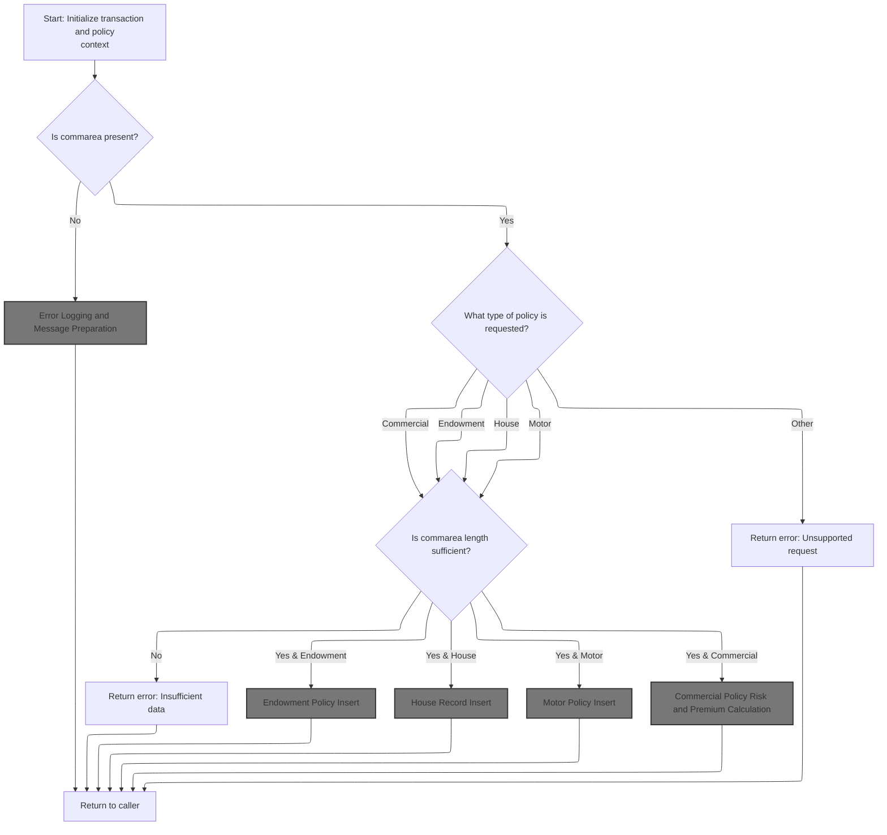

This section validates the presence and sufficiency of input data for insurance policy requests, determines if the request type is supported, and handles error reporting for missing or invalid input.

| Rule ID | Category        | Rule Name                     | Description                                                                                                                                           | Implementation Details                                                                                                                                                                                                                                                                                                                                                                                                                                                                                                      |
| ------- | --------------- | ----------------------------- | ----------------------------------------------------------------------------------------------------------------------------------------------------- | --------------------------------------------------------------------------------------------------------------------------------------------------------------------------------------------------------------------------------------------------------------------------------------------------------------------------------------------------------------------------------------------------------------------------------------------------------------------------------------------------------------------------- |
| BR-001  | Data validation | Missing input data error      | If no input data is received, log an error message stating 'NO COMMAREA RECEIVED' and terminate the transaction with an abend code 'LGCA'.            | The error message includes the text 'NO COMMAREA RECEIVED'. The transaction is terminated with abend code 'LGCA'.                                                                                                                                                                                                                                                                                                                                                                                                           |
| BR-002  | Data validation | Unsupported policy type error | If the requested policy type is not Endowment, House, Motor, or Commercial, return an error indicating the request is unsupported.                    | Supported request IDs: <SwmToken path="base/src/lgapdb09.cbl" pos="220:4:4" line-data="             WHEN &#39;01AEND&#39;">`01AEND`</SwmToken> (Endowment), <SwmToken path="base/src/lgapdb09.cbl" pos="224:4:4" line-data="             WHEN &#39;01AHOU&#39;">`01AHOU`</SwmToken> (House), <SwmToken path="base/src/lgapdb09.cbl" pos="228:4:4" line-data="             WHEN &#39;01AMOT&#39;">`01AMOT`</SwmToken> (Motor), others are considered unsupported. The error message format is not specified in this section. |
| BR-003  | Data validation | Insufficient input data error | For each supported policy type, if the commarea length is less than the required minimum for that type, return an error indicating insufficient data. | Required commarea lengths: Endowment = 124 bytes, House = 130 bytes, Motor = 137 bytes, Commercial = 1174 bytes. The error message format is not specified in this section.                                                                                                                                                                                                                                                                                                                                                 |

<SwmSnippet path="/base/src/lgapdb09.cbl" line="190">

---

In <SwmToken path="base/src/lgapdb09.cbl" pos="190:1:1" line-data="       MAINLINE SECTION.">`MAINLINE`</SwmToken>, we're setting up the transaction context and clearing out all working storage and <SwmToken path="base/src/lgapdb09.cbl" pos="199:3:3" line-data="           INITIALIZE DB2-IN-INTEGERS.">`DB2`</SwmToken> integer fields. This makes sure all subsequent logic works with clean, predictable data.

```cobol
       MAINLINE SECTION.

           INITIALIZE WS-HEADER.
           MOVE EIBTRNID TO WS-TRANSID.
           MOVE EIBTRMID TO WS-TERMID.
           MOVE EIBTASKN TO WS-TASKNUM.
           MOVE EIBCALEN TO WS-CALEN.
      *----------------------------------------------------------------*

           INITIALIZE DB2-IN-INTEGERS.
           INITIALIZE DB2-OUT-INTEGERS.
```

---

</SwmSnippet>

<SwmSnippet path="/base/src/lgapdb09.cbl" line="203">

---

Here we're checking if any input data was received. If not, we log the error using <SwmToken path="base/src/lgapdb09.cbl" pos="205:3:7" line-data="               PERFORM WRITE-ERROR-MESSAGE">`WRITE-ERROR-MESSAGE`</SwmToken> and immediately abend the transaction to prevent any further processing with missing input.

```cobol
           IF EIBCALEN IS EQUAL TO ZERO
               MOVE ' NO COMMAREA RECEIVED' TO EM-VARIABLE
               PERFORM WRITE-ERROR-MESSAGE
               EXEC CICS ABEND ABCODE('LGCA') NODUMP END-EXEC
           END-IF
```

---

</SwmSnippet>

## Error Logging and Message Preparation

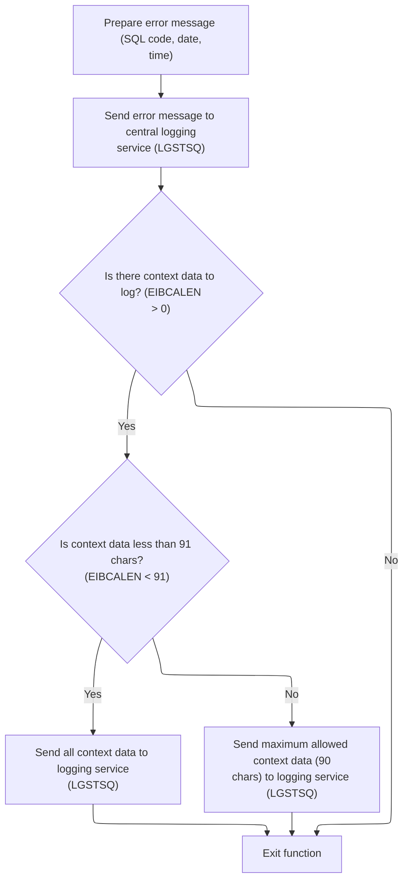

This section prepares and logs error messages for SQL errors, ensuring that all relevant information, including context data, is captured and sent to a central logging service for auditing and troubleshooting.

| Rule ID | Category                        | Rule Name                            | Description                                                                                                                                                             | Implementation Details                                                                                                                                                                                                                                                                                                                                                                                      |
| ------- | ------------------------------- | ------------------------------------ | ----------------------------------------------------------------------------------------------------------------------------------------------------------------------- | ----------------------------------------------------------------------------------------------------------------------------------------------------------------------------------------------------------------------------------------------------------------------------------------------------------------------------------------------------------------------------------------------------------- |
| BR-001  | Data validation                 | Context data logging with size limit | If context data is present, it is logged as a separate message, with a maximum of 90 characters included.                                                               | If the context data length is less than 91, all context data is logged. If it is 91 or more, only the first 90 characters are logged. The context data is prefixed with 'COMMAREA=' (9 characters) and padded with spaces if necessary. The total context data message is 99 characters (9 prefix + 90 data).                                                                                               |
| BR-002  | Calculation                     | Error message content requirements   | The error message sent to the logging service includes the SQL error code, the current date, the current time, and fixed identifiers for the program and error context. | The error message format includes: date (8 characters, string), time (6 characters, string), program identifier (' <SwmToken path="base/src/lgapdb09.cbl" pos="2:6:6" line-data="       PROGRAM-ID. LGAPDB09.">`LGAPDB09`</SwmToken>', 9 characters), customer number (10 characters, string), policy number (10 characters, string), SQL request (16 characters, string), and SQL code (5 digits, number). |
| BR-003  | Invoking a Service or a Process | Centralized error logging            | The error message is sent to a central logging service for recording and further processing.                                                                            | The error message is sent as a single structured record to the logging service. The message includes all required fields as specified in the error message content requirements.                                                                                                                                                                                                                            |

<SwmSnippet path="/base/src/lgapdb09.cbl" line="619">

---

In <SwmToken path="base/src/lgapdb09.cbl" pos="619:1:5" line-data="       WRITE-ERROR-MESSAGE.">`WRITE-ERROR-MESSAGE`</SwmToken>, we're capturing the SQL error code, getting the current timestamp, formatting it, and prepping the error message for logging. This sets up all the info needed before sending it off to the queue handler.

```cobol
       WRITE-ERROR-MESSAGE.
           MOVE SQLCODE TO EM-SQLRC
           EXEC CICS ASKTIME ABSTIME(ABS-TIME)
           END-EXEC
           EXEC CICS FORMATTIME ABSTIME(ABS-TIME)
                     MMDDYYYY(DATE1)
                     TIME(TIME1)
           END-EXEC
```

---

</SwmSnippet>

<SwmSnippet path="/base/src/lgapdb09.cbl" line="627">

---

After prepping the error message, we call LGSTSQ to actually write it to the message queues. This offloads the queue handling and keeps all error reporting consistent.

```cobol
           MOVE DATE1 TO EM-DATE
           MOVE TIME1 TO EM-TIME
           EXEC CICS LINK PROGRAM('LGSTSQ')
                     COMMAREA(ERROR-MSG)
                     LENGTH(LENGTH OF ERROR-MSG)
           END-EXEC.
```

---

</SwmSnippet>

<SwmSnippet path="/base/src/lgstsq.cbl" line="55">

---

In <SwmToken path="base/src/lgstsq.cbl" pos="55:1:1" line-data="       MAINLINE SECTION.">`MAINLINE`</SwmToken> of LGSTSQ, we're prepping the message, handling any special queue prefix, and writing it to both a temporary and a permanent queue. If the message came from a RECEIVE, we also send a quick response and clean up.

```cobol
       MAINLINE SECTION.

           MOVE SPACES TO WRITE-MSG.
           MOVE SPACES TO WS-RECV.

           EXEC CICS ASSIGN SYSID(WRITE-MSG-SYSID)
                RESP(WS-RESP)
           END-EXEC.

           EXEC CICS ASSIGN INVOKINGPROG(WS-INVOKEPROG)
                RESP(WS-RESP)
           END-EXEC.
           
           IF WS-INVOKEPROG NOT = SPACES
              MOVE 'C' To WS-FLAG
              MOVE COMMA-DATA  TO WRITE-MSG-MSG
              MOVE EIBCALEN    TO WS-RECV-LEN
           ELSE
              EXEC CICS RECEIVE INTO(WS-RECV)
                  LENGTH(WS-RECV-LEN)
                  RESP(WS-RESP)
              END-EXEC
              MOVE 'R' To WS-FLAG
              MOVE WS-RECV-DATA  TO WRITE-MSG-MSG
              SUBTRACT 5 FROM WS-RECV-LEN
           END-IF.

           MOVE 'GENAERRS' TO STSQ-NAME.
           IF WRITE-MSG-MSG(1:2) = 'Q=' THEN
              MOVE WRITE-MSG-MSG(3:4) TO STSQ-EXT
              MOVE WRITE-MSG-REST TO TEMPO
              MOVE TEMPO          TO WRITE-MSG-MSG
              SUBTRACT 7 FROM WS-RECV-LEN
           END-IF.

           ADD 5 TO WS-RECV-LEN.

      * Write output message to TDQ CSMT
      *
           EXEC CICS WRITEQ TD QUEUE(STDQ-NAME)
                     FROM(WRITE-MSG)
                     RESP(WS-RESP)
                     LENGTH(WS-RECV-LEN)

           END-EXEC.

      * Write output message to Genapp TSQ
      * If no space is available then the task will not wait for
      *  storage to become available but will ignore the request...
      *
           EXEC CICS WRITEQ TS QUEUE(STSQ-NAME)
                     FROM(WRITE-MSG)
                     RESP(WS-RESP)
                     NOSUSPEND
                     LENGTH(WS-RECV-LEN)

           END-EXEC.

           If WS-FLAG = 'R' Then
             EXEC CICS SEND TEXT FROM(FILLER-X)
              WAIT
              ERASE
              LENGTH(1)
              FREEKB
             END-EXEC.

           EXEC CICS RETURN
           END-EXEC.
```

---

</SwmSnippet>

<SwmSnippet path="/base/src/lgapdb09.cbl" line="633">

---

After returning from LGSTSQ in <SwmToken path="base/src/lgapdb09.cbl" pos="205:3:7" line-data="               PERFORM WRITE-ERROR-MESSAGE">`WRITE-ERROR-MESSAGE`</SwmToken>, we check if there's any commarea data. If so, we copy up to 90 bytes and send it as a separate error message to LGSTSQ. This ensures both the main error and relevant input data are logged, but only up to the fixed size allowed.

```cobol
           IF EIBCALEN > 0 THEN
             IF EIBCALEN < 91 THEN
               MOVE DFHCOMMAREA(1:EIBCALEN) TO CA-DATA
               EXEC CICS LINK PROGRAM('LGSTSQ')
                         COMMAREA(CA-ERROR-MSG)
                         LENGTH(LENGTH OF CA-ERROR-MSG)
               END-EXEC
             ELSE
               MOVE DFHCOMMAREA(1:90) TO CA-DATA
               EXEC CICS LINK PROGRAM('LGSTSQ')
                         COMMAREA(CA-ERROR-MSG)
                         LENGTH(LENGTH OF CA-ERROR-MSG)
               END-EXEC
             END-IF
           END-IF.
           EXIT.
```

---

</SwmSnippet>

## Request Routing and Policy Type Selection

```mermaid
%%{init: {"flowchart": {"defaultRenderer": "elk"}} }%%
flowchart TD
    node1["Start: Prepare request and set initial
status"]
    click node1 openCode "base/src/lgapdb09.cbl:209:216"
    node1 --> node2{"What type of policy is requested?"}
    click node2 openCode "base/src/lgapdb09.cbl:218:240"
    node2 -->|"Endowment (01AEND)"| node3["Calculate required length for Endowment"]
    click node3 openCode "base/src/lgapdb09.cbl:221:222"
    node2 -->|"House (01AHOU)"| node4["Calculate required length for House"]
    click node4 openCode "base/src/lgapdb09.cbl:225:226"
    node2 -->|"Motor (01AMOT)"| node5["Calculate required length for Motor"]
    click node5 openCode "base/src/lgapdb09.cbl:229:230"
    node2 -->|"Commission (01ACOM)"| node6["Calculate required length for Commission"]
    click node6 openCode "base/src/lgapdb09.cbl:233:234"
    node2 -->|"Other"| node7["Set status to '99' (unknown request),
exit"]
    click node7 openCode "base/src/lgapdb09.cbl:237:238"
    node3 --> node8{"Is provided data length sufficient?"}
    node4 --> node8
    node5 --> node8
    node6 --> node8
    click node8 openCode "base/src/lgapdb09.cbl:242:245"
    node8 -->|"Yes"| node9["Set status to '00' (success)"]
    click node9 openCode "base/src/lgapdb09.cbl:209:216"
    node8 -->|"No"| node10["Set status to '98' (insufficient data),
exit"]
    click node10 openCode "base/src/lgapdb09.cbl:243:244"

classDef HeadingStyle fill:#777777,stroke:#333,stroke-width:2px;

%% Swimm:
%% %%{init: {"flowchart": {"defaultRenderer": "elk"}} }%%
%% flowchart TD
%%     node1["Start: Prepare request and set initial
%% status"]
%%     click node1 openCode "<SwmPath>[base/src/lgapdb09.cbl](base/src/lgapdb09.cbl)</SwmPath>:209:216"
%%     node1 --> node2{"What type of policy is requested?"}
%%     click node2 openCode "<SwmPath>[base/src/lgapdb09.cbl](base/src/lgapdb09.cbl)</SwmPath>:218:240"
%%     node2 -->|"Endowment (<SwmToken path="base/src/lgapdb09.cbl" pos="220:4:4" line-data="             WHEN &#39;01AEND&#39;">`01AEND`</SwmToken>)"| node3["Calculate required length for Endowment"]
%%     click node3 openCode "<SwmPath>[base/src/lgapdb09.cbl](base/src/lgapdb09.cbl)</SwmPath>:221:222"
%%     node2 -->|"House (<SwmToken path="base/src/lgapdb09.cbl" pos="224:4:4" line-data="             WHEN &#39;01AHOU&#39;">`01AHOU`</SwmToken>)"| node4["Calculate required length for House"]
%%     click node4 openCode "<SwmPath>[base/src/lgapdb09.cbl](base/src/lgapdb09.cbl)</SwmPath>:225:226"
%%     node2 -->|"Motor (<SwmToken path="base/src/lgapdb09.cbl" pos="228:4:4" line-data="             WHEN &#39;01AMOT&#39;">`01AMOT`</SwmToken>)"| node5["Calculate required length for Motor"]
%%     click node5 openCode "<SwmPath>[base/src/lgapdb09.cbl](base/src/lgapdb09.cbl)</SwmPath>:229:230"
%%     node2 -->|"Commission (<SwmToken path="base/src/lgapdb09.cbl" pos="232:4:4" line-data="             WHEN &#39;01ACOM&#39;">`01ACOM`</SwmToken>)"| node6["Calculate required length for Commission"]
%%     click node6 openCode "<SwmPath>[base/src/lgapdb09.cbl](base/src/lgapdb09.cbl)</SwmPath>:233:234"
%%     node2 -->|"Other"| node7["Set status to '99' (unknown request),
%% exit"]
%%     click node7 openCode "<SwmPath>[base/src/lgapdb09.cbl](base/src/lgapdb09.cbl)</SwmPath>:237:238"
%%     node3 --> node8{"Is provided data length sufficient?"}
%%     node4 --> node8
%%     node5 --> node8
%%     node6 --> node8
%%     click node8 openCode "<SwmPath>[base/src/lgapdb09.cbl](base/src/lgapdb09.cbl)</SwmPath>:242:245"
%%     node8 -->|"Yes"| node9["Set status to '00' (success)"]
%%     click node9 openCode "<SwmPath>[base/src/lgapdb09.cbl](base/src/lgapdb09.cbl)</SwmPath>:209:216"
%%     node8 -->|"No"| node10["Set status to '98' (insufficient data),
%% exit"]
%%     click node10 openCode "<SwmPath>[base/src/lgapdb09.cbl](base/src/lgapdb09.cbl)</SwmPath>:243:244"
%% 
%% classDef HeadingStyle fill:#777777,stroke:#333,stroke-width:2px;
```

This section routes incoming requests to the appropriate policy logic based on the request type, sets up required context fields, and validates that the input data is sufficient for the requested operation. It ensures that only valid and complete requests proceed to further processing.

| Rule ID | Category        | Rule Name                         | Description                                                                                                                                                                                                                           | Implementation Details                                                           |
| ------- | --------------- | --------------------------------- | ------------------------------------------------------------------------------------------------------------------------------------------------------------------------------------------------------------------------------------- | -------------------------------------------------------------------------------- |
| BR-001  | Data validation | Unknown request type handling     | If the request type does not match any known value, the status code is set to '99' and processing stops.                                                                                                                              | Status code: '99'. No further processing is performed for unknown request types. |
| BR-002  | Data validation | Insufficient data length handling | If the provided data length is less than the required length for the selected request type, the status code is set to '98' and processing stops.                                                                                      | Status code: '98'. No further processing is performed if data is insufficient.   |
| BR-003  | Decision Making | Endowment policy mapping          | When the request type is <SwmToken path="base/src/lgapdb09.cbl" pos="220:4:4" line-data="             WHEN &#39;01AEND&#39;">`01AEND`</SwmToken>, the required data length is set to 124 bytes and the policy type is mapped to 'E'.  | Required data length: 124 bytes. Policy type: 'E'.                               |
| BR-004  | Decision Making | House policy mapping              | When the request type is <SwmToken path="base/src/lgapdb09.cbl" pos="224:4:4" line-data="             WHEN &#39;01AHOU&#39;">`01AHOU`</SwmToken>, the required data length is set to 130 bytes and the policy type is mapped to 'H'.  | Required data length: 130 bytes. Policy type: 'H'.                               |
| BR-005  | Decision Making | Motor policy mapping              | When the request type is <SwmToken path="base/src/lgapdb09.cbl" pos="228:4:4" line-data="             WHEN &#39;01AMOT&#39;">`01AMOT`</SwmToken>, the required data length is set to 137 bytes and the policy type is mapped to 'M'.  | Required data length: 137 bytes. Policy type: 'M'.                               |
| BR-006  | Decision Making | Commission policy mapping         | When the request type is <SwmToken path="base/src/lgapdb09.cbl" pos="232:4:4" line-data="             WHEN &#39;01ACOM&#39;">`01ACOM`</SwmToken>, the required data length is set to 1174 bytes and the policy type is mapped to 'C'. | Required data length: 1174 bytes. Policy type: 'C'.                              |
| BR-007  | Decision Making | Successful request routing        | When the request type is recognized and the data length is sufficient, the status code is set to '00' to indicate success.                                                                                                            | Status code: '00'. Indicates successful routing and validation.                  |

<SwmSnippet path="/base/src/lgapdb09.cbl" line="209">

---

Back in MAINLINE, we're prepping the commarea and <SwmToken path="base/src/lgapdb09.cbl" pos="212:11:11" line-data="           MOVE CA-CUSTOMER-NUM TO DB2-CUSTOMERNUM-INT">`DB2`</SwmToken> fields for the main policy logic. This sets up the context for routing the request based on its type.

```cobol
           MOVE '00' TO CA-RETURN-CODE
           SET WS-ADDR-DFHCOMMAREA TO ADDRESS OF DFHCOMMAREA.

           MOVE CA-CUSTOMER-NUM TO DB2-CUSTOMERNUM-INT
           MOVE ZERO            TO DB2-C-PolicyNum-INT
           MOVE CA-CUSTOMER-NUM TO EM-CUSNUM

           ADD WS-CA-HEADER-LEN TO WS-REQUIRED-CA-LEN
```

---

</SwmSnippet>

<SwmSnippet path="/base/src/lgapdb09.cbl" line="218">

---

Here we're branching on the request type to set up the required commarea length and <SwmToken path="base/src/lgapdb09.cbl" pos="222:9:9" line-data="               MOVE &#39;E&#39; TO DB2-POLICYTYPE">`DB2`</SwmToken> policy type for each insurance product. This determines how much data we expect and how to process it downstream.

```cobol
           EVALUATE CA-REQUEST-ID

             WHEN '01AEND'
               ADD WS-FULL-ENDOW-LEN TO WS-REQUIRED-CA-LEN
               MOVE 'E' TO DB2-POLICYTYPE
```

---

</SwmSnippet>

<SwmSnippet path="/base/src/lgapdb09.cbl" line="224">

---

This continues the request type branching, handling house, motor, and commercial requests by adjusting the required data length and policy type for each. This keeps the logic clean for each product.

```cobol
             WHEN '01AHOU'
               ADD WS-FULL-HOUSE-LEN TO WS-REQUIRED-CA-LEN
               MOVE 'H' TO DB2-POLICYTYPE

             WHEN '01AMOT'
               ADD WS-FULL-MOTOR-LEN TO WS-REQUIRED-CA-LEN
               MOVE 'M' TO DB2-POLICYTYPE

             WHEN '01ACOM'
               ADD WS-FULL-COMM-LEN TO WS-REQUIRED-CA-LEN
               MOVE 'C' TO DB2-POLICYTYPE
```

---

</SwmSnippet>

<SwmSnippet path="/base/src/lgapdb09.cbl" line="236">

---

If the request type doesn't match any known value, we bail out early by setting an error code and returning. No further work is done for unknown types.

```cobol
             WHEN OTHER
               MOVE '99' TO CA-RETURN-CODE
               EXEC CICS RETURN END-EXEC

           END-EVALUATE
```

---

</SwmSnippet>

<SwmSnippet path="/base/src/lgapdb09.cbl" line="242">

---

Before doing any inserts, we check if the input data is long enough for the selected request type. If it's too short, we return an error and exit to avoid bad data.

```cobol
           IF EIBCALEN IS LESS THAN WS-REQUIRED-CA-LEN
             MOVE '98' TO CA-RETURN-CODE
             EXEC CICS RETURN END-EXEC
           END-IF
```

---

</SwmSnippet>

<SwmSnippet path="/base/src/lgapdb09.cbl" line="247">

---

Once all the checks are done, we call <SwmToken path="base/src/lgapdb09.cbl" pos="247:3:5" line-data="           PERFORM P100-T">`P100-T`</SwmToken> to insert the main policy record into the database. This is where the core data actually gets written.

```cobol
           PERFORM P100-T
```

---

</SwmSnippet>

## Policy Record Insertion

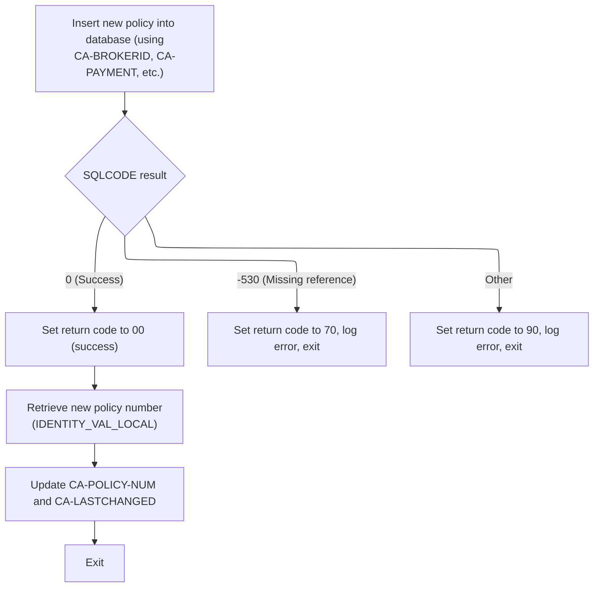

This section manages the insertion of a new policy record into the database, interprets the result, and prepares the necessary outputs or error responses for downstream processing.

| Rule ID | Category        | Rule Name                                       | Description                                                                                                                                                                                                                                                                                                        | Implementation Details                                                                                                                                                                                                                                                                                                            |
| ------- | --------------- | ----------------------------------------------- | ------------------------------------------------------------------------------------------------------------------------------------------------------------------------------------------------------------------------------------------------------------------------------------------------------------------ | --------------------------------------------------------------------------------------------------------------------------------------------------------------------------------------------------------------------------------------------------------------------------------------------------------------------------------- |
| BR-001  | Calculation     | Retrieve new policy number                      | After a successful insertion, the new policy number is retrieved using the database's identity value function and is made available for downstream processes or client response.                                                                                                                                   | The new policy number is retrieved using the <SwmToken path="base/src/lgapdb09.cbl" pos="327:12:14" line-data="             SET :DB2-POLICYNUM-INT = IDENTITY_VAL_LOCAL()">`IDENTITY_VAL_LOCAL()`</SwmToken> function and is a number. It is output for use by subsequent logic or for returning to the client.                   |
| BR-002  | Decision Making | Successful insertion handling                   | If the policy insertion is successful (SQLCODE = 0), the return code is set to '00' to indicate success, and the process continues to retrieve the new policy number and last changed timestamp.                                                                                                                   | Return code '00' indicates successful processing. The process continues to retrieve additional output values.                                                                                                                                                                                                                     |
| BR-003  | Decision Making | Missing reference error handling                | If the insertion fails due to a missing reference (SQLCODE = -530), the return code is set to '70', an error message is logged, and the process exits without further processing.                                                                                                                                  | Return code '70' indicates a missing reference error. An error message is logged for audit and troubleshooting. The process exits after logging the error.                                                                                                                                                                        |
| BR-004  | Decision Making | Generic error handling                          | If the insertion fails for any other reason (SQLCODE not 0 or -530), the return code is set to '90', an error message is logged, and the process exits without further processing.                                                                                                                                 | Return code '90' indicates a generic error. An error message is logged for audit and troubleshooting. The process exits after logging the error.                                                                                                                                                                                  |
| BR-005  | Writing Output  | Policy record insertion                         | A new policy record is inserted into the database using the provided input fields. The insertion includes setting the policy number to default (auto-generated), and mapping all required fields such as customer number, issue date, expiry date, policy type, broker ID, broker's reference, and payment amount. | The policy number is auto-generated by the database. All fields are mapped as per their business meaning. The insertion uses the following fields: customer number (number), issue date (date string), expiry date (date string), policy type (string/number), broker ID (number), broker's reference (string), payment (number). |
| BR-006  | Writing Output  | Output policy number and last changed timestamp | After retrieving the new policy number, the last changed timestamp for the policy is retrieved and both values are output for use by downstream logic or for returning to the client.                                                                                                                              | The policy number is a number, and the last changed timestamp is a string of up to 26 characters. Both are output for use by subsequent logic or for returning to the client.                                                                                                                                                     |

<SwmSnippet path="/base/src/lgapdb09.cbl" line="281">

---

In <SwmToken path="base/src/lgapdb09.cbl" pos="281:1:3" line-data="       P100-T.">`P100-T`</SwmToken>, we're mapping all the input fields into <SwmToken path="base/src/lgapdb09.cbl" pos="283:9:9" line-data="           MOVE CA-BROKERID TO DB2-BROKERID-INT">`DB2`</SwmToken> host variables and running the SQL insert for the policy. This assumes all the data was set up correctly earlier.

```cobol
       P100-T.

           MOVE CA-BROKERID TO DB2-BROKERID-INT
           MOVE CA-PAYMENT TO DB2-PAYMENT-INT

           MOVE ' INSERT POLICY' TO EM-SQLREQ
           EXEC SQL
             INSERT INTO POLICY
                       ( POLICYNUMBER,
                         CUSTOMERNUMBER,
                         ISSUEDATE,
                         EXPIRYDATE,
                         POLICYTYPE,
                         LASTCHANGED,
                         BROKERID,
                         BROKERSREFERENCE,
                         PAYMENT           )
                VALUES ( DEFAULT,
                         :DB2-CUSTOMERNUM-INT,
                         :CA-ISSUE-DATE,
                         :CA-EXPIRY-DATE,
                         :DB2-POLICYTYPE,
                         CURRENT TIMESTAMP,
                         :DB2-BROKERID-INT,
                         :CA-BROKERSREF,
                         :DB2-PAYMENT-INT      )
           END-EXEC
```

---

</SwmSnippet>

<SwmSnippet path="/base/src/lgapdb09.cbl" line="309">

---

After the insert, we check SQLCODE. If it's -530 (like a missing customer), we set a special return code, log the error, and exit. Any other error gets a generic code, also logs, and exits. Only on success do we keep going.

```cobol
           Evaluate SQLCODE

             When 0
               MOVE '00' TO CA-RETURN-CODE

             When -530
               MOVE '70' TO CA-RETURN-CODE
               PERFORM WRITE-ERROR-MESSAGE
               EXEC CICS RETURN END-EXEC

             When Other
               MOVE '90' TO CA-RETURN-CODE
               PERFORM WRITE-ERROR-MESSAGE
               EXEC CICS RETURN END-EXEC

           END-Evaluate.
```

---

</SwmSnippet>

<SwmSnippet path="/base/src/lgapdb09.cbl" line="326">

---

After a successful insert, we grab the new policy number using <SwmToken path="base/src/lgapdb09.cbl" pos="327:12:14" line-data="             SET :DB2-POLICYNUM-INT = IDENTITY_VAL_LOCAL()">`IDENTITY_VAL_LOCAL()`</SwmToken>. This is needed for any follow-up work or responses.

```cobol
           EXEC SQL
             SET :DB2-POLICYNUM-INT = IDENTITY_VAL_LOCAL()
           END-EXEC
```

---

</SwmSnippet>

<SwmSnippet path="/base/src/lgapdb09.cbl" line="329">

---

Finally in <SwmToken path="base/src/lgapdb09.cbl" pos="247:3:5" line-data="           PERFORM P100-T">`P100-T`</SwmToken>, we move the new policy number and its last change timestamp into the commarea for use by later logic or for returning to the client.

```cobol
           MOVE DB2-POLICYNUM-INT TO CA-POLICY-NUM
           MOVE CA-POLICY-NUM TO EM-POLNUM

           EXEC SQL
             SELECT LASTCHANGED
               INTO :CA-LASTCHANGED
               FROM POLICY
               WHERE POLICYNUMBER = :DB2-POLICYNUM-INT
           END-EXEC.
           EXIT.
```

---

</SwmSnippet>

## Product-Specific Record Insertion

```mermaid
%%{init: {"flowchart": {"defaultRenderer": "elk"}} }%%
flowchart TD
    node0("[Start MAINLINE]") --> node1{"What is the policy request type?"}
    click node0 openCode "base/src/lgapdb09.cbl:249:266"
    node1 -->|"Endowment (01AEND)"| node2["Process Endowment Policy"]
    click node1 openCode "base/src/lgapdb09.cbl:249:266"
    click node2 openCode "base/src/lgapdb09.cbl:252:252"
    node1 -->|"House (01AHOU)"| node3["Process House Policy"]
    click node3 openCode "base/src/lgapdb09.cbl:255:255"
    node1 -->|"Motor (01AMOT)"| node4["Process Motor Policy"]
    click node4 openCode "base/src/lgapdb09.cbl:258:258"
    node1 -->|"Business (01ACOM)"| node5["Process Business Policy"]
    click node5 openCode "base/src/lgapdb09.cbl:261:261"
    node1 -->|"Other"| node6["Set error code '99'"]
    click node6 openCode "base/src/lgapdb09.cbl:264:264"
    node2 --> node7("[End MAINLINE]")
    node3 --> node7
    node4 --> node7
    node5 --> node7
    node6 --> node7
    click node7 openCode "base/src/lgapdb09.cbl:266:266"
classDef HeadingStyle fill:#777777,stroke:#333,stroke-width:2px;

%% Swimm:
%% %%{init: {"flowchart": {"defaultRenderer": "elk"}} }%%
%% flowchart TD
%%     node0("[Start MAINLINE]") --> node1{"What is the policy request type?"}
%%     click node0 openCode "<SwmPath>[base/src/lgapdb09.cbl](base/src/lgapdb09.cbl)</SwmPath>:249:266"
%%     node1 -->|"Endowment (<SwmToken path="base/src/lgapdb09.cbl" pos="220:4:4" line-data="             WHEN &#39;01AEND&#39;">`01AEND`</SwmToken>)"| node2["Process Endowment Policy"]
%%     click node1 openCode "<SwmPath>[base/src/lgapdb09.cbl](base/src/lgapdb09.cbl)</SwmPath>:249:266"
%%     click node2 openCode "<SwmPath>[base/src/lgapdb09.cbl](base/src/lgapdb09.cbl)</SwmPath>:252:252"
%%     node1 -->|"House (<SwmToken path="base/src/lgapdb09.cbl" pos="224:4:4" line-data="             WHEN &#39;01AHOU&#39;">`01AHOU`</SwmToken>)"| node3["Process House Policy"]
%%     click node3 openCode "<SwmPath>[base/src/lgapdb09.cbl](base/src/lgapdb09.cbl)</SwmPath>:255:255"
%%     node1 -->|"Motor (<SwmToken path="base/src/lgapdb09.cbl" pos="228:4:4" line-data="             WHEN &#39;01AMOT&#39;">`01AMOT`</SwmToken>)"| node4["Process Motor Policy"]
%%     click node4 openCode "<SwmPath>[base/src/lgapdb09.cbl](base/src/lgapdb09.cbl)</SwmPath>:258:258"
%%     node1 -->|"Business (<SwmToken path="base/src/lgapdb09.cbl" pos="232:4:4" line-data="             WHEN &#39;01ACOM&#39;">`01ACOM`</SwmToken>)"| node5["Process Business Policy"]
%%     click node5 openCode "<SwmPath>[base/src/lgapdb09.cbl](base/src/lgapdb09.cbl)</SwmPath>:261:261"
%%     node1 -->|"Other"| node6["Set error code '99'"]
%%     click node6 openCode "<SwmPath>[base/src/lgapdb09.cbl](base/src/lgapdb09.cbl)</SwmPath>:264:264"
%%     node2 --> node7("[End MAINLINE]")
%%     node3 --> node7
%%     node4 --> node7
%%     node5 --> node7
%%     node6 --> node7
%%     click node7 openCode "<SwmPath>[base/src/lgapdb09.cbl](base/src/lgapdb09.cbl)</SwmPath>:266:266"
%% classDef HeadingStyle fill:#777777,stroke:#333,stroke-width:2px;
```

This section routes incoming policy insertion requests to the appropriate product-specific logic based on the request type. It ensures that only valid request types are processed and signals an error for unsupported types.

| Rule ID | Category        | Rule Name                       | Description                                                                                                                                                                                                   | Implementation Details                                                                                                                                                                                             |
| ------- | --------------- | ------------------------------- | ------------------------------------------------------------------------------------------------------------------------------------------------------------------------------------------------------------- | ------------------------------------------------------------------------------------------------------------------------------------------------------------------------------------------------------------------ |
| BR-001  | Decision Making | Endowment policy routing        | Route the request to the endowment policy insertion process when the request type is <SwmToken path="base/src/lgapdb09.cbl" pos="220:4:4" line-data="             WHEN &#39;01AEND&#39;">`01AEND`</SwmToken>. | The request type is a 6-character string. The value <SwmToken path="base/src/lgapdb09.cbl" pos="220:4:4" line-data="             WHEN &#39;01AEND&#39;">`01AEND`</SwmToken> triggers the endowment policy process. |
| BR-002  | Decision Making | House policy routing            | Route the request to the house policy insertion process when the request type is <SwmToken path="base/src/lgapdb09.cbl" pos="224:4:4" line-data="             WHEN &#39;01AHOU&#39;">`01AHOU`</SwmToken>.     | The request type is a 6-character string. The value <SwmToken path="base/src/lgapdb09.cbl" pos="224:4:4" line-data="             WHEN &#39;01AHOU&#39;">`01AHOU`</SwmToken> triggers the house policy process.     |
| BR-003  | Decision Making | Motor policy routing            | Route the request to the motor policy insertion process when the request type is <SwmToken path="base/src/lgapdb09.cbl" pos="228:4:4" line-data="             WHEN &#39;01AMOT&#39;">`01AMOT`</SwmToken>.     | The request type is a 6-character string. The value <SwmToken path="base/src/lgapdb09.cbl" pos="228:4:4" line-data="             WHEN &#39;01AMOT&#39;">`01AMOT`</SwmToken> triggers the motor policy process.     |
| BR-004  | Decision Making | Business policy routing         | Route the request to the business policy insertion process when the request type is <SwmToken path="base/src/lgapdb09.cbl" pos="232:4:4" line-data="             WHEN &#39;01ACOM&#39;">`01ACOM`</SwmToken>.  | The request type is a 6-character string. The value <SwmToken path="base/src/lgapdb09.cbl" pos="232:4:4" line-data="             WHEN &#39;01ACOM&#39;">`01ACOM`</SwmToken> triggers the business policy process.  |
| BR-005  | Decision Making | Unrecognized request type error | Set the error code to '99' when the request type does not match any recognized product type.                                                                                                                  | The error code is a 2-digit numeric value. The value '99' indicates an unrecognized request type.                                                                                                                  |

<SwmSnippet path="/base/src/lgapdb09.cbl" line="249">

---

Back in MAINLINE after <SwmToken path="base/src/lgapdb09.cbl" pos="247:3:5" line-data="           PERFORM P100-T">`P100-T`</SwmToken>, we branch again on the request type to call the specific insert routine for the product (endowment, house, motor, or commercial). Each one handles its own table and logic.

```cobol
           EVALUATE CA-REQUEST-ID

             WHEN '01AEND'
               PERFORM P200-E

             WHEN '01AHOU'
               PERFORM P300-H

             WHEN '01AMOT'
               PERFORM P400-M

             WHEN '01ACOM'
               PERFORM P500-BIZ

             WHEN OTHER
               MOVE '99' TO CA-RETURN-CODE

           END-EVALUATE
```

---

</SwmSnippet>

## Endowment Policy Insert

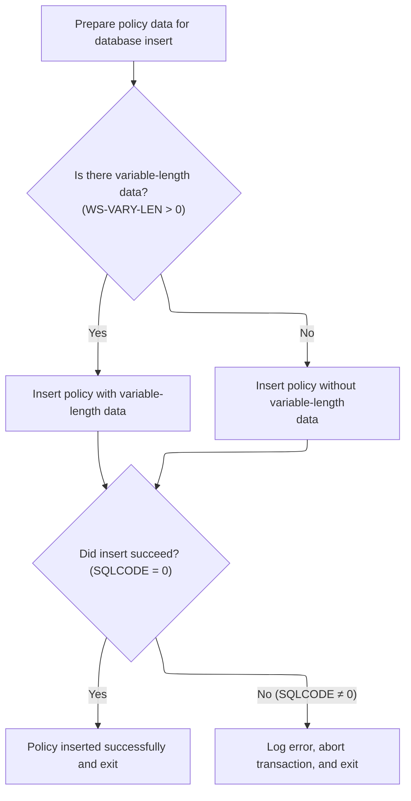

This section determines how an endowment policy is inserted into the database, including whether to include optional variable-length data. It also handles error reporting and transaction rollback if the insert fails.

| Rule ID | Category        | Rule Name                           | Description                                                                                                                                     | Implementation Details                                                                                                                                                                                                                                                                                                                                                      |
| ------- | --------------- | ----------------------------------- | ----------------------------------------------------------------------------------------------------------------------------------------------- | --------------------------------------------------------------------------------------------------------------------------------------------------------------------------------------------------------------------------------------------------------------------------------------------------------------------------------------------------------------------------- |
| BR-001  | Decision Making | Insert with variable-length data    | If extra variable-length policy data is present, the insert operation includes this data in the database record.                                | The extra data is included in the 'PADDINGDATA' field. The length is determined by subtracting the required fixed field length from the total input length. The format for the extra data is a string of bytes, with length up to the value of <SwmToken path="base/src/lgapdb09.cbl" pos="356:3:7" line-data="               GIVING WS-VARY-LEN">`WS-VARY-LEN`</SwmToken>. |
| BR-002  | Decision Making | Insert without variable-length data | If no extra variable-length policy data is present, the insert operation includes only the fixed policy fields in the database record.          | Only the fixed fields are included in the insert. These fields are: policy number, with-profits flag, equities flag, managed fund flag, fund name, term, sum assured, and life assured. All fields are inserted as their respective types (string, number, etc.).                                                                                                           |
| BR-003  | Writing Output  | Error handling on insert failure    | If the insert operation fails, an error code is set, an error message is logged, and the transaction is rolled back to prevent partial updates. | The error code '90' is set in the return code field. The error message is written using the <SwmToken path="base/src/lgapdb09.cbl" pos="205:3:7" line-data="               PERFORM WRITE-ERROR-MESSAGE">`WRITE-ERROR-MESSAGE`</SwmToken> routine. The transaction is rolled back using an ABEND with code 'LGSQ'. No partial updates are committed.                         |

<SwmSnippet path="/base/src/lgapdb09.cbl" line="343">

---

In <SwmToken path="base/src/lgapdb09.cbl" pos="343:1:3" line-data="       P200-E.">`P200-E`</SwmToken>, we're prepping integer fields and checking if there's any extra variable data to include in the insert. If so, we add it; if not, we just insert the core fields.

```cobol
       P200-E.

      *    Move numeric fields to integer format
           MOVE CA-E-TERM        TO DB2-E-TERM-SINT
           MOVE CA-E-SUM-ASSURED TO DB2-E-SUMASSURED-INT

           MOVE ' INSERT ENDOW ' TO EM-SQLREQ
      *----------------------------------------------------------------*
      *    There are 2 versions of INSERT...                           *
      *      one which updates all fields including Varchar            *
      *      one which updates all fields Except Varchar               *
      *----------------------------------------------------------------*
           SUBTRACT WS-REQUIRED-CA-LEN FROM EIBCALEN
               GIVING WS-VARY-LEN
```

---

</SwmSnippet>

<SwmSnippet path="/base/src/lgapdb09.cbl" line="358">

---

If there's variable data, we move it into the right spot and run the insert with the PADDINGDATA field. This handles the case where extra info is present.

```cobol
           IF WS-VARY-LEN IS GREATER THAN ZERO
      *       Commarea contains data for Varchar field
              MOVE CA-E-PADDING-DATA
                  TO WS-VARY-CHAR(1:WS-VARY-LEN)
              EXEC SQL
                INSERT INTO ENDOWMENT
                          ( POLICYNUMBER,
                            WITHPROFITS,
                            EQUITIES,
                            MANAGEDFUND,
                            FUNDNAME,
                            TERM,
                            SUMASSURED,
                            LIFEASSURED,
                            PADDINGDATA    )
                   VALUES ( :DB2-POLICYNUM-INT,
                            :CA-E-W-PRO,
                            :CA-E-EQU,
                            :CA-E-M-FUN,
                            :CA-E-FUND-NAME,
                            :DB2-E-TERM-SINT,
                            :DB2-E-SUMASSURED-INT,
                            :CA-E-LIFE-ASSURED,
                            :WS-VARY-FIELD )
              END-EXEC
```

---

</SwmSnippet>

<SwmSnippet path="/base/src/lgapdb09.cbl" line="383">

---

If there's no variable data, we just run the insert for the fixed fields. No need to worry about the optional VARCHAR column in this case.

```cobol
           ELSE
              EXEC SQL
                INSERT INTO ENDOWMENT
                          ( POLICYNUMBER,
                            WITHPROFITS,
                            EQUITIES,
                            MANAGEDFUND,
                            FUNDNAME,
                            TERM,
                            SUMASSURED,
                            LIFEASSURED    )
                   VALUES ( :DB2-POLICYNUM-INT,
                            :CA-E-W-PRO,
                            :CA-E-EQU,
                            :CA-E-M-FUN,
                            :CA-E-FUND-NAME,
                            :DB2-E-TERM-SINT,
                            :DB2-E-SUMASSURED-INT,
                            :CA-E-LIFE-ASSURED )
              END-EXEC
```

---

</SwmSnippet>

<SwmSnippet path="/base/src/lgapdb09.cbl" line="405">

---

If the insert fails, we set an error code, log the error with <SwmToken path="base/src/lgapdb09.cbl" pos="407:3:7" line-data="             PERFORM WRITE-ERROR-MESSAGE">`WRITE-ERROR-MESSAGE`</SwmToken>, and abend to roll back any changes. No retries or partial updates.

```cobol
           IF SQLCODE NOT EQUAL 0
             MOVE '90' TO CA-RETURN-CODE
             PERFORM WRITE-ERROR-MESSAGE
      *      Issue Abend to cause backout of update to Policy table
             EXEC CICS ABEND ABCODE('LGSQ') NODUMP END-EXEC
             EXEC CICS RETURN END-EXEC
           END-IF.

           EXIT.
```

---

</SwmSnippet>

## House Record Insert

```mermaid
%%{init: {"flowchart": {"defaultRenderer": "elk"}} }%%
flowchart TD
    node1["Prepare house data (value, bedrooms,
type, name, number, postcode)"] --> node2["Insert house record into database"]
    click node1 openCode "base/src/lgapdb09.cbl:417:418"
    click node2 openCode "base/src/lgapdb09.cbl:421:437"
    node2 --> node3{"SQLCODE = 0?"}
    click node3 openCode "base/src/lgapdb09.cbl:439:439"
    node3 -->|"Yes"| node4["End"]
    node3 -->|"No"| node5["Set CA-RETURN-CODE to '90', abort and
return"]
    click node5 openCode "base/src/lgapdb09.cbl:440:443"
    node5 --> node4
    click node4 openCode "base/src/lgapdb09.cbl:446:446"
classDef HeadingStyle fill:#777777,stroke:#333,stroke-width:2px;

%% Swimm:
%% %%{init: {"flowchart": {"defaultRenderer": "elk"}} }%%
%% flowchart TD
%%     node1["Prepare house data (value, bedrooms,
%% type, name, number, postcode)"] --> node2["Insert house record into database"]
%%     click node1 openCode "<SwmPath>[base/src/lgapdb09.cbl](base/src/lgapdb09.cbl)</SwmPath>:417:418"
%%     click node2 openCode "<SwmPath>[base/src/lgapdb09.cbl](base/src/lgapdb09.cbl)</SwmPath>:421:437"
%%     node2 --> node3{"SQLCODE = 0?"}
%%     click node3 openCode "<SwmPath>[base/src/lgapdb09.cbl](base/src/lgapdb09.cbl)</SwmPath>:439:439"
%%     node3 -->|"Yes"| node4["End"]
%%     node3 -->|"No"| node5["Set <SwmToken path="base/src/lgapdb09.cbl" pos="209:9:13" line-data="           MOVE &#39;00&#39; TO CA-RETURN-CODE">`CA-RETURN-CODE`</SwmToken> to '90', abort and
%% return"]
%%     click node5 openCode "<SwmPath>[base/src/lgapdb09.cbl](base/src/lgapdb09.cbl)</SwmPath>:440:443"
%%     node5 --> node4
%%     click node4 openCode "<SwmPath>[base/src/lgapdb09.cbl](base/src/lgapdb09.cbl)</SwmPath>:446:446"
%% classDef HeadingStyle fill:#777777,stroke:#333,stroke-width:2px;
```

This section is responsible for inserting a house record into the database using the provided input fields. It also handles error scenarios by logging and aborting the transaction if the insert fails.

| Rule ID | Category                        | Rule Name                     | Description                                                                                                                  | Implementation Details                                                                                                                                                                              |
| ------- | ------------------------------- | ----------------------------- | ---------------------------------------------------------------------------------------------------------------------------- | --------------------------------------------------------------------------------------------------------------------------------------------------------------------------------------------------- |
| BR-001  | Reading Input                   | House field mapping           | Map the house value and number of bedrooms from the input to the corresponding database fields before performing the insert. | The house value is mapped as a number and the number of bedrooms as a small integer. No additional formatting or transformation is performed.                                                       |
| BR-002  | Writing Output                  | House insert failure handling | If the database insert fails, set the return code to '90', log the error, and abort the transaction with rollback.           | The return code is set to '90' (string). The error is logged, and the transaction is aborted with abend code 'LGSQ'. No retries are performed.                                                      |
| BR-003  | Invoking a Service or a Process | House record insertion        | Insert the house record into the database using the mapped fields.                                                           | The insert operation uses the mapped fields for policy number, property type, bedrooms, value, house name, house number, and postcode. All fields are inserted as provided, with no transformation. |

<SwmSnippet path="/base/src/lgapdb09.cbl" line="415">

---

In <SwmToken path="base/src/lgapdb09.cbl" pos="415:1:3" line-data="       P300-H.">`P300-H`</SwmToken>, we're mapping house-related input fields into <SwmToken path="base/src/lgapdb09.cbl" pos="417:11:11" line-data="           MOVE CA-H-VAL       TO DB2-H-VALUE-INT">`DB2`</SwmToken> host variables and running the SQL insert for the house record. No extra validation—just assumes the data is good.

```cobol
       P300-H.

           MOVE CA-H-VAL       TO DB2-H-VALUE-INT
           MOVE CA-H-BED    TO DB2-H-BEDROOMS-SINT

           MOVE ' INSERT HOUSE ' TO EM-SQLREQ
           EXEC SQL
             INSERT INTO HOUSE
                       ( POLICYNUMBER,
                         PROPERTYTYPE,
                         BEDROOMS,
                         VALUE,
                         HOUSENAME,
                         HOUSENUMBER,
                         POSTCODE          )
                VALUES ( :DB2-POLICYNUM-INT,
                         :CA-H-P-TYP,
                         :DB2-H-BEDROOMS-SINT,
                         :DB2-H-VALUE-INT,
                         :CA-H-H-NAM,
                         :CA-H-HOUSE-NUMBER,
                         :CA-H-PCD      )
           END-EXEC
```

---

</SwmSnippet>

<SwmSnippet path="/base/src/lgapdb09.cbl" line="439">

---

If the house insert fails, we set the error code, log the error, and abend with 'LGSQ' to roll back. No retries—just logs and stops.

```cobol
           IF SQLCODE NOT EQUAL 0
             MOVE '90' TO CA-RETURN-CODE
             PERFORM WRITE-ERROR-MESSAGE
             EXEC CICS ABEND ABCODE('LGSQ') NODUMP END-EXEC
             EXEC CICS RETURN END-EXEC
           END-IF.

           EXIT.
```

---

</SwmSnippet>

## Motor Policy Insert

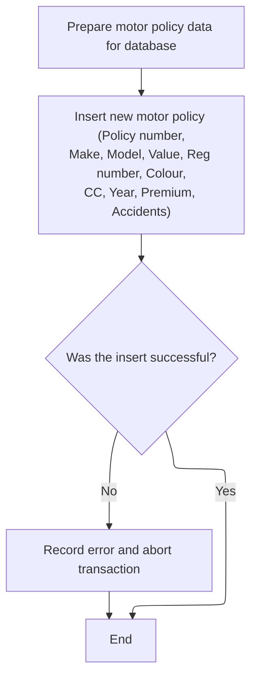

This section inserts a new motor policy record into the database and ensures that any failure in the insert process is logged and results in transaction rollback. It is a critical part of the policy creation workflow, ensuring data integrity and error traceability.

| Rule ID | Category        | Rule Name                              | Description                                                                                                                                                                                                     | Implementation Details                                                                                                                                                                                                                                                                                                 |
| ------- | --------------- | -------------------------------------- | --------------------------------------------------------------------------------------------------------------------------------------------------------------------------------------------------------------- | ---------------------------------------------------------------------------------------------------------------------------------------------------------------------------------------------------------------------------------------------------------------------------------------------------------------------- |
| BR-001  | Decision Making | Motor policy insert failure handling   | If the database insert fails, log the error, set the return code to '90', and abort the transaction with code 'LGSQ'.                                                                                           | Return code '90' is used to indicate a database error. The abort code 'LGSQ' is used to roll back the transaction. Error logging is performed before aborting.                                                                                                                                                         |
| BR-002  | Decision Making | Motor policy insert success completion | On successful insert, the process completes with no further action or output.                                                                                                                                   | No additional output or confirmation is generated in this section on success; the process simply exits.                                                                                                                                                                                                                |
| BR-003  | Writing Output  | Motor policy record insertion          | Insert a new motor policy record into the database using all provided policy fields (policy number, make, model, value, registration number, colour, engine capacity, year of manufacture, premium, accidents). | The following fields are inserted: policy number (number), make (string), model (string), value (number), registration number (string), colour (string), engine capacity (number), year of manufacture (number), premium (number), accidents (number). Field formats are as per the database schema and input mapping. |

<SwmSnippet path="/base/src/lgapdb09.cbl" line="448">

---

In <SwmToken path="base/src/lgapdb09.cbl" pos="448:1:3" line-data="       P400-M.">`P400-M`</SwmToken>, we're mapping all the motor policy fields into <SwmToken path="base/src/lgapdb09.cbl" pos="451:11:11" line-data="           MOVE CA-M-VALUE       TO DB2-M-VALUE-INT">`DB2`</SwmToken> host variables and running the SQL insert for the motor record. Again, assumes the data is good.

```cobol
       P400-M.

      *    Move numeric fields to integer format
           MOVE CA-M-VALUE       TO DB2-M-VALUE-INT
           MOVE CA-M-CC          TO DB2-M-CC-SINT
           MOVE CA-M-PREMIUM     TO DB2-M-PREMIUM-INT
           MOVE CA-M-ACCIDENTS   TO DB2-M-ACCIDENTS-INT

           MOVE ' INSERT MOTOR ' TO EM-SQLREQ
           EXEC SQL
             INSERT INTO MOTOR
                       ( POLICYNUMBER,
                         MAKE,
                         MODEL,
                         VALUE,
                         REGNUMBER,
                         COLOUR,
                         CC,
                         YEAROFMANUFACTURE,
                         PREMIUM,
                         ACCIDENTS )
                VALUES ( :DB2-POLICYNUM-INT,
                         :CA-M-MAKE,
                         :CA-M-MODEL,
                         :DB2-M-VALUE-INT,
                         :CA-M-REGNUMBER,
                         :CA-M-COLOUR,
                         :DB2-M-CC-SINT,
                         :CA-M-MANUFACTURED,
                         :DB2-M-PREMIUM-INT,
                         :DB2-M-ACCIDENTS-INT )
           END-EXEC
```

---

</SwmSnippet>

<SwmSnippet path="/base/src/lgapdb09.cbl" line="481">

---

If the motor insert fails, we set the error code, log the error, and abend with 'LGSQ' to roll back. No retries—just logs and stops.

```cobol
           IF SQLCODE NOT EQUAL 0
             MOVE '90' TO CA-RETURN-CODE
             PERFORM WRITE-ERROR-MESSAGE
             EXEC CICS ABEND ABCODE('LGSQ') NODUMP END-EXEC
             EXEC CICS RETURN END-EXEC
           END-IF.

           EXIT.
```

---

</SwmSnippet>

## Commercial Policy Risk and Premium Calculation

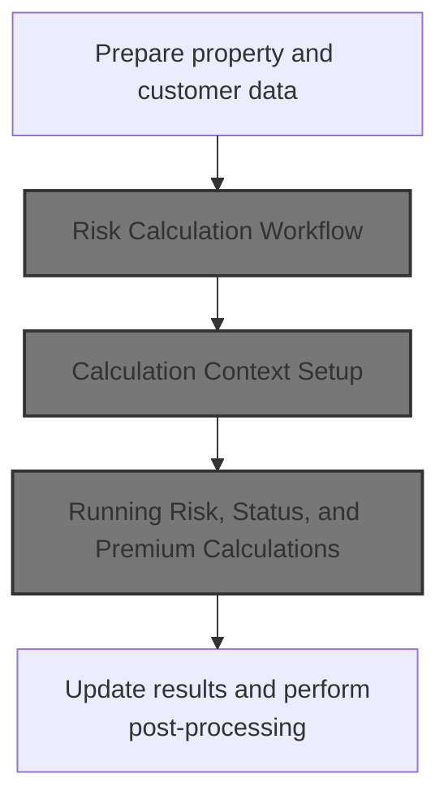

This section prepares all relevant data for a commercial policy risk and premium calculation, invokes the calculation service, and updates the results for further processing.

| Rule ID | Category                        | Rule Name                           | Description                                                                                                                                                 | Implementation Details                                                                                                                                                                                                                                                                                                                                                                                  |
| ------- | ------------------------------- | ----------------------------------- | ----------------------------------------------------------------------------------------------------------------------------------------------------------- | ------------------------------------------------------------------------------------------------------------------------------------------------------------------------------------------------------------------------------------------------------------------------------------------------------------------------------------------------------------------------------------------------------- |
| BR-001  | Reading Input                   | Prepare Calculation Context         | All relevant customer, property, and policy fields are transferred into the calculation context before risk and premium calculations are performed.         | The calculation context includes customer ID (string, 10 bytes), policy number (string, 10 bytes), property type (string, 15 bytes), postcode (string, 8 bytes), risk factors (numbers, 4 bytes each), address (string, 255 bytes), latitude/longitude (string, 11 bytes each), customer name (string, 31 bytes), issue/expiry dates (string, 10 bytes each), and last changed date (string, 26 bytes). |
| BR-002  | Writing Output                  | Update Calculation Results          | After the calculation service is invoked, the results (risk score, policy status, rejection reason, and premium values) are updated for further processing. | The outputs include risk score (number, 3 bytes), policy status (number, 1 byte), rejection reason (string, 50 bytes), and premium values (numbers, 8 bytes each for different premium types).                                                                                                                                                                                                          |
| BR-003  | Invoking a Service or a Process | Invoke Risk and Premium Calculation | The risk and premium calculation service is invoked with the prepared calculation context.                                                                  | The calculation service is invoked with the calculation context as input. The context contains all relevant customer, property, and policy data as described above.                                                                                                                                                                                                                                     |

<SwmSnippet path="/base/src/lgapdb09.cbl" line="493">

---

In <SwmToken path="base/src/lgapdb09.cbl" pos="493:1:3" line-data="       P500-BIZ SECTION.">`P500-BIZ`</SwmToken>, we're copying all the relevant customer, property, and policy fields into the risk calculation commarea. This sets up the data for the external calculation call.

```cobol
       P500-BIZ SECTION.
           MOVE CA-CUSTOMER-NUM TO WS-XCUSTID
           MOVE CA-POLICY-NUM TO WS-XPOLNUM
           MOVE CA-B-PropType TO WS-XPROPTYPE
           MOVE CA-B-PST TO WS-XPOSTCODE
           MOVE CA-B-FP TO WS-XFP-FACTOR
           MOVE CA-B-CP TO WS-XCP-FACTOR
           MOVE CA-B-FLP TO WS-XFLP-FACTOR
           MOVE CA-B-WP TO WS-XWP-FACTOR
           MOVE CA-B-Address TO WS-XADDRESS
           MOVE CA-B-Latitude TO WS-XLAT
           MOVE CA-B-Longitude TO WS-XLONG
           MOVE CA-B-Customer TO WS-XCUSTNAME
           MOVE CA-ISSUE-DATE TO WS-XISSUE
           MOVE CA-EXPIRY-DATE TO WS-XEXPIRY
           MOVE CA-LASTCHANGED TO WS-XLASTCHG
```

---

</SwmSnippet>

<SwmSnippet path="/base/src/lgapdb09.cbl" line="510">

---

After prepping the risk area, we call LGCOMCAL to run the risk and premium calculations. This is where the heavy lifting for commercial policies happens.

```cobol
           EXEC CICS LINK PROGRAM('LGCOMCAL')
                COMMAREA(WS-COMM-RISK-AREA)
                LENGTH(LENGTH OF WS-COMM-RISK-AREA)
           END-EXEC
```

---

</SwmSnippet>

### Risk Calculation Workflow

This section coordinates the main workflow for risk and premium calculation by invoking initialization, business logic, and cleanup steps in a defined order. It ensures modular execution and clear separation of concerns for the calculation process.

| Rule ID | Category                        | Rule Name                   | Description                                                                                                                       | Implementation Details                                                                                                                                            |
| ------- | ------------------------------- | --------------------------- | --------------------------------------------------------------------------------------------------------------------------------- | ----------------------------------------------------------------------------------------------------------------------------------------------------------------- |
| BR-001  | Invoking a Service or a Process | Initialization First        | The workflow begins by performing all necessary initialization steps before any business logic is executed.                       | No specific constants or output formats are referenced in this rule. The rule ensures that initialization is always performed before business logic or cleanup.   |
| BR-002  | Invoking a Service or a Process | Business Logic Execution    | The core business logic for risk and premium calculation is performed after initialization and before cleanup.                    | No specific constants or output formats are referenced in this rule. The rule ensures that business logic is executed in the correct sequence.                    |
| BR-003  | Invoking a Service or a Process | Cleanup and Result Transfer | Cleanup and result transfer are performed after business logic execution to finalize processing and ensure results are available. | No specific constants or output formats are referenced in this rule. The rule ensures that cleanup and result transfer are always performed after business logic. |

<SwmSnippet path="/base/src/lgcomcal.cbl" line="206">

---

In <SwmToken path="base/src/lgcomcal.cbl" pos="206:1:1" line-data="       MAINLINE SECTION.">`MAINLINE`</SwmToken> of LGCOMCAL, we run initialization, business logic for risk and premium calculation, and then cleanup to transfer results. Each step is modular for clarity.

```cobol
       MAINLINE SECTION.
           
           PERFORM INITIALIZE-PROCESSING.
           PERFORM PROCESS-BUSINESS-LOGIC.
           PERFORM CLEANUP-AND-EXIT.
```

---

</SwmSnippet>

### Calculation Context Setup

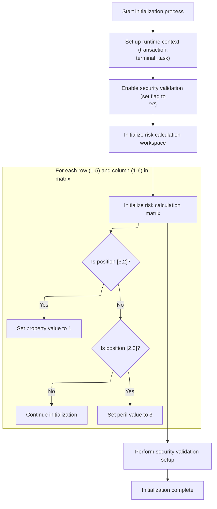

This section initializes the calculation context for risk logic. It ensures session context, security validation, and risk mapping are set up for downstream calculations.

| Rule ID | Category        | Rule Name                        | Description                                                                                                                 | Implementation Details                                                                                                                                                     |
| ------- | --------------- | -------------------------------- | --------------------------------------------------------------------------------------------------------------------------- | -------------------------------------------------------------------------------------------------------------------------------------------------------------------------- |
| BR-001  | Reading Input   | Session context initialization   | The session context is initialized with the current transaction, terminal, and task identifiers at the start of processing. | Transaction ID and Terminal ID are 4-character strings. Task number is a 7-digit number. These values are sourced from the runtime environment and stored for the session. |
| BR-002  | Calculation     | Property mapping for risk matrix | The risk mapping matrix is initialized so that the property value at position \[3,2\] is set to 1.                          | The property value at matrix position \[3,2\] is set to the number 1. All other positions are left unchanged unless otherwise specified.                                   |
| BR-003  | Calculation     | Peril mapping for risk matrix    | The risk mapping matrix is initialized so that the peril value at position \[2,3\] is set to 3.                             | The peril value at matrix position \[2,3\] is set to the number 3. All other positions are left unchanged unless otherwise specified.                                      |
| BR-004  | Decision Making | Enable security validation       | Security validation is enabled for the session by setting the security flag to 'Y'.                                         | The security flag is set to the character 'Y', indicating security validation is active for the session.                                                                   |

<SwmSnippet path="/base/src/lgcomcal.cbl" line="217">

---

In <SwmToken path="base/src/lgcomcal.cbl" pos="217:1:3" line-data="       INITIALIZE-PROCESSING.">`INITIALIZE-PROCESSING`</SwmToken>, we're setting up the session context, property/peril mappings, and security validation. This ensures all the calculation logic downstream has the right config and data.

```cobol
       INITIALIZE-PROCESSING.
           INITIALIZE WS-HEADER.
           MOVE EIBTRNID TO WS-TRANSID.
           MOVE EIBTRMID TO WS-TERMID.
           MOVE EIBTASKN TO WS-TASKNUM.
           
           PERFORM INITIALIZE-MATRICES.
           
           INITIALIZE WS-RISK-CALC.
           
           PERFORM INIT-SECURITY-VALIDATION.
           
           EXIT.
```

---

</SwmSnippet>

<SwmSnippet path="/base/src/lgcomcal.cbl" line="233">

---

In <SwmToken path="base/src/lgcomcal.cbl" pos="233:1:3" line-data="       INITIALIZE-MATRICES.">`INITIALIZE-MATRICES`</SwmToken>, we're enabling security by setting <SwmToken path="base/src/lgcomcal.cbl" pos="234:9:13" line-data="           MOVE &#39;Y&#39; TO WS-SEC-ENABLED.">`WS-SEC-ENABLED`</SwmToken> to 'Y', then running nested loops over <SwmToken path="base/src/lgcomcal.cbl" pos="235:7:11" line-data="           MOVE 1 TO WS-SUB-1.">`WS-SUB-1`</SwmToken> (1–5) and <SwmToken path="base/src/lgcomcal.cbl" pos="239:7:11" line-data="               MOVE 0 TO WS-SUB-2">`WS-SUB-2`</SwmToken> (1–6). Instead of a full matrix init, we only set <SwmToken path="base/src/lgcomcal.cbl" pos="243:7:11" line-data="                      MOVE 1 TO WS-RM-PROP">`WS-RM-PROP`</SwmToken> to 1 at (3,2) and <SwmToken path="base/src/lgcomcal.cbl" pos="246:7:11" line-data="                      MOVE 3 TO WS-RM-PERIL">`WS-RM-PERIL`</SwmToken> to 3 at (2,3). Everything else is left alone. This is all about prepping specific mapping values for later risk logic, not a generic matrix setup.

```cobol
       INITIALIZE-MATRICES.
           MOVE 'Y' TO WS-SEC-ENABLED.
           MOVE 1 TO WS-SUB-1.
           
           PERFORM VARYING WS-SUB-1 FROM 1 BY 1 
             UNTIL WS-SUB-1 > 5
               MOVE 0 TO WS-SUB-2
               PERFORM VARYING WS-SUB-2 FROM 1 BY 1 
                 UNTIL WS-SUB-2 > 6
                   IF WS-SUB-1 = 3 AND WS-SUB-2 = 2
                      MOVE 1 TO WS-RM-PROP
                   END-IF
                   IF WS-SUB-1 = 2 AND WS-SUB-2 = 3
                      MOVE 3 TO WS-RM-PERIL
                   END-IF
               END-PERFORM
           END-PERFORM.
           
           EXIT.
```

---

</SwmSnippet>

### Running Risk, Status, and Premium Calculations

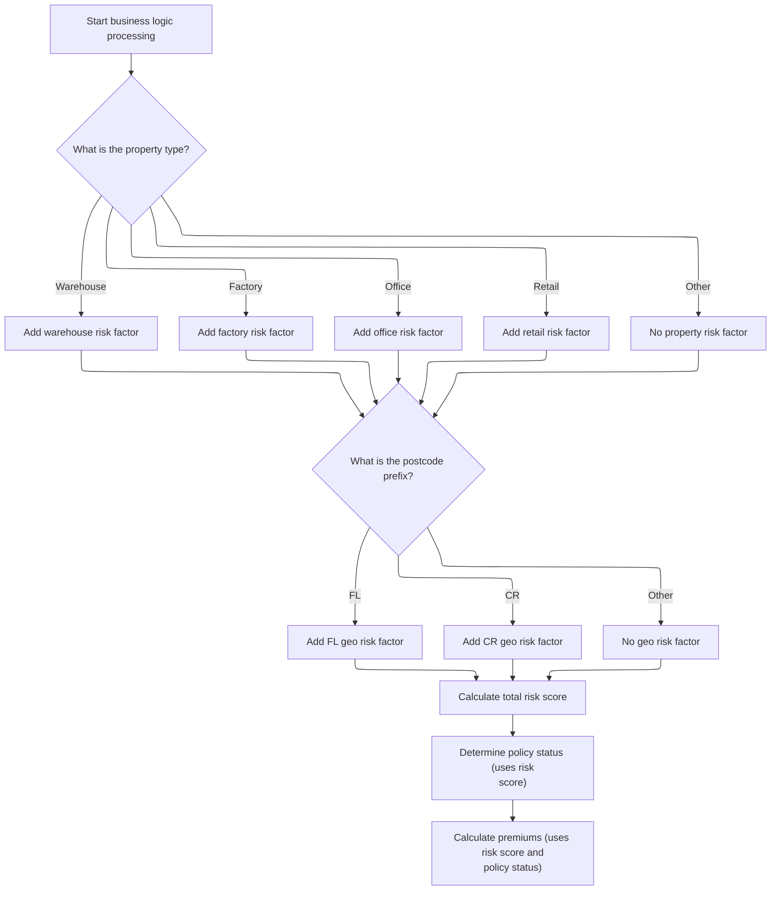

This section chains together the main commercial insurance calculations: risk score, policy status, and premium. It ensures all risk and pricing data are prepared for the next workflow steps.

| Rule ID | Category        | Rule Name                     | Description                                                                                                                                                                                                             | Implementation Details                                                                                                                                                                                                                                                                                                                     |
| ------- | --------------- | ----------------------------- | ----------------------------------------------------------------------------------------------------------------------------------------------------------------------------------------------------------------------- | ------------------------------------------------------------------------------------------------------------------------------------------------------------------------------------------------------------------------------------------------------------------------------------------------------------------------------------------ |
| BR-001  | Calculation     | Risk score calculation        | The system calculates a risk score for a policy by combining a base value, a property-type adjustment, and a postcode-based geographic factor. The risk score is used for subsequent eligibility and pricing decisions. | The risk score is the sum of: (1) a base value, (2) a property-type adjustment, and (3) a geographic risk factor. The property-type adjustment depends on the property type ('WAREHOUSE', 'FACTORY', 'OFFICE', 'RETAIL', or other). The geographic risk factor depends on the first two characters of the postcode ('FL', 'CR', or other). |
| BR-002  | Calculation     | Property type risk adjustment | The property type determines which risk factor is added to the risk score. Each property type ('WAREHOUSE', 'FACTORY', 'OFFICE', 'RETAIL') has a specific adjustment value; all other types add zero.                   | Property types and their adjustments: 'WAREHOUSE', 'FACTORY', 'OFFICE', 'RETAIL' each have a specific adjustment value; other types add zero. Adjustment values are determined by business configuration.                                                                                                                                  |
| BR-003  | Calculation     | Geographic risk adjustment    | The postcode prefix determines which geographic risk factor is added to the risk score. Prefixes 'FL' and 'CR' have specific adjustment values; all other prefixes add zero.                                            | Postcode prefixes and their adjustments: 'FL' and 'CR' each have a specific adjustment value; other prefixes add zero. Adjustment values are determined by business configuration.                                                                                                                                                         |
| BR-004  | Calculation     | Premium calculation           | After the policy status is determined, the system calculates the premium using the risk score and policy status.                                                                                                        | Premium calculation uses both the risk score and policy status. The specific formula is not shown in this section.                                                                                                                                                                                                                         |
| BR-005  | Decision Making | Policy status determination   | After the risk score is calculated, the system determines the policy status based on the risk score.                                                                                                                    | The policy status is determined after the risk score is available. The specific mapping from risk score to status is not shown in this section.                                                                                                                                                                                            |

<SwmSnippet path="/base/src/lgcomcal.cbl" line="268">

---

<SwmToken path="base/src/lgcomcal.cbl" pos="268:1:5" line-data="       PROCESS-BUSINESS-LOGIC.">`PROCESS-BUSINESS-LOGIC`</SwmToken> chains together the main commercial insurance calculations: it calls the risk score calculation, then determines the policy status based on that score, and finally computes the premiums. Each step updates the working data for the policy. We call this to get all the risk and pricing data ready for the next steps in the workflow.

```cobol
       PROCESS-BUSINESS-LOGIC.
           PERFORM PROCESS-RISK-SCORE.
           PERFORM DETERMINE-POLICY-STATUS.
           PERFORM CALCULATE-PREMIUMS.
           
           EXIT.
```

---

</SwmSnippet>

<SwmSnippet path="/base/src/lgcomcal.cbl" line="277">

---

<SwmToken path="base/src/lgcomcal.cbl" pos="277:1:5" line-data="       PROCESS-RISK-SCORE.">`PROCESS-RISK-SCORE`</SwmToken> calculates the risk score for a property by combining a base value, a property-type adjustment, and a postcode-based geographic factor. It expects valid property type and postcode fields—if those are missing or malformed, the calculation won't make sense. The logic is a bit convoluted, but the end result is a single risk score used for later eligibility and pricing decisions.

```cobol
       PROCESS-RISK-SCORE.
           MOVE WS-TM-BASE TO WS-TEMP-SCORE.
           DIVIDE 2 INTO WS-TEMP-SCORE GIVING WS-SUB-1.
           MULTIPLY 2 BY WS-SUB-1 GIVING WS-RC-BASE-VAL.
           
           MOVE 0 TO WS-RC-PROP-FACT.
           
           MOVE 'COMMERCIAL' TO RMS-TYPE
           MOVE '1.0.5' TO RMS-VERSION
      
           EVALUATE CA-XPROPTYPE
               WHEN 'WAREHOUSE'
                   MOVE RMS-PF-W-VAL TO RMS-PF-WAREHOUSE
                   COMPUTE WS-TEMP-CALC = RMS-PF-WAREHOUSE
                   ADD WS-TEMP-CALC TO WS-RC-PROP-FACT
               WHEN 'FACTORY'
                   MOVE RMS-PF-F-VAL TO RMS-PF-FACTORY
                   COMPUTE WS-TEMP-CALC = RMS-PF-FACTORY
                   ADD WS-TEMP-CALC TO WS-RC-PROP-FACT
               WHEN 'OFFICE'
                   MOVE RMS-PF-O-VAL TO RMS-PF-OFFICE
                   COMPUTE WS-TEMP-CALC = RMS-PF-OFFICE
                   ADD WS-TEMP-CALC TO WS-RC-PROP-FACT
               WHEN 'RETAIL'
                   MOVE RMS-PF-R-VAL TO RMS-PF-RETAIL
                   COMPUTE WS-TEMP-CALC = RMS-PF-RETAIL
                   ADD WS-TEMP-CALC TO WS-RC-PROP-FACT
               WHEN OTHER
                   MOVE 0 TO WS-RC-PROP-FACT
           END-EVALUATE.
           
           MOVE 0 TO WS-RC-GEO-FACT.
           
           MOVE RMS-GF-FL-VAL TO RMS-GF-FL
           MOVE RMS-GF-CR-VAL TO RMS-GF-CR
           
           IF CA-XPOSTCODE(1:2) = 'FL'
              MOVE RMS-GF-FL TO WS-RC-GEO-FACT
           ELSE
              IF CA-XPOSTCODE(1:2) = 'CR'
                 MOVE RMS-GF-CR TO WS-RC-GEO-FACT
              END-IF
           END-IF.
           
           COMPUTE WS-RC-TOTAL = 
              WS-RC-BASE-VAL + WS-RC-PROP-FACT + WS-RC-GEO-FACT.
              
           MOVE WS-RC-TOTAL TO WS-SA-RISK.
           
           EXIT.
```

---

</SwmSnippet>

### Copying Calculation Results to Policy Data

This section ensures that the results of the risk and premium calculations are reflected in the main policy data structure, making them available for subsequent business logic and storage.

| Rule ID | Category       | Rule Name             | Description                                                                                                             | Implementation Details                                                                                                                   |
| ------- | -------------- | --------------------- | ----------------------------------------------------------------------------------------------------------------------- | ---------------------------------------------------------------------------------------------------------------------------------------- |
| BR-001  | Writing Output | Copy Risk Score       | The calculated risk score is copied to the policy data for downstream use.                                              | The risk score is a numeric value (up to 3 digits) and is copied as-is to the policy data field designated for the risk score.           |
| BR-002  | Writing Output | Copy Status Indicator | The calculated status indicator is copied to the policy data for downstream use.                                        | The status indicator is a single digit and is copied as-is to the policy data field designated for status.                               |
| BR-003  | Writing Output | Copy Rejection Reason | The calculated rejection reason is copied to the policy data for downstream use.                                        | The rejection reason is a string (up to 50 characters) and is copied as-is to the policy data field designated for rejection reason.     |
| BR-004  | Writing Output | Copy Premium Values   | The calculated premium values for each premium type (FP, CP, FLP, WP) are copied to the policy data for downstream use. | Each premium value is a numeric value (up to 8 digits) and is copied as-is to the corresponding policy data field for each premium type. |

<SwmSnippet path="/base/src/lgapdb09.cbl" line="515">

---

Back in <SwmToken path="base/src/lgapdb09.cbl" pos="261:3:5" line-data="               PERFORM P500-BIZ">`P500-BIZ`</SwmToken> after returning from the risk and premium calculation in LGCOMCAL, we copy the calculated risk score, status, rejection reason, and all premium values into the main commarea fields. This updates the policy data with the latest assessment results for downstream use and storage.

```cobol
           MOVE WS-ZRESULT-SCORE TO X3-VAL
           MOVE WS-ZSTATUS-IND TO X5-Z9
           MOVE WS-ZREJECT-TEXT TO X6-REJ
           MOVE WS-ZFP-PREMIUM TO CA-B-CA-B-FPR
           MOVE WS-ZCP-PREMIUM TO CA-B-CPR
           MOVE WS-ZFLP-PREMIUM TO CA-B-FLPR
           MOVE WS-ZWP-PREMIUM TO CA-B-WPR
           
           MOVE X5-Z9 TO CA-B-ST
           MOVE X6-REJ TO CA-B-RejectReason
```

---

</SwmSnippet>

<SwmSnippet path="/base/src/lgapdb09.cbl" line="526">

---

After updating the policy data in <SwmToken path="base/src/lgapdb09.cbl" pos="261:3:5" line-data="               PERFORM P500-BIZ">`P500-BIZ`</SwmToken>, we call <SwmToken path="base/src/lgapdb09.cbl" pos="526:3:7" line-data="           PERFORM P546-CHK-MATRIX">`P546-CHK-MATRIX`</SwmToken> to check if the calculated matrix score triggers any override or rejection conditions. This step ensures that any high-risk or borderline cases are flagged before we try to insert the policy into the database.

```cobol
           PERFORM P546-CHK-MATRIX
           
           PERFORM P548-BINS
           
           EXIT.
```

---

</SwmSnippet>

## Matrix Override and Rejection Evaluation

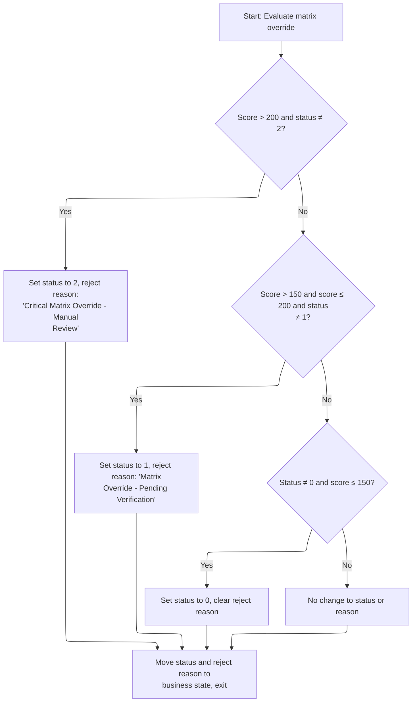

This section determines whether a policy requires manual review, pending verification, or no action based on the matrix score and current override status. It ensures that business rules for risk escalation are consistently applied according to defined thresholds.

| Rule ID | Category        | Rule Name                              | Description                                                                                                                                                                                                      | Implementation Details                                                                                                                                                               |
| ------- | --------------- | -------------------------------------- | ---------------------------------------------------------------------------------------------------------------------------------------------------------------------------------------------------------------- | ------------------------------------------------------------------------------------------------------------------------------------------------------------------------------------ |
| BR-001  | Decision Making | Critical matrix override escalation    | If the calculated matrix score is greater than 200 and the current status is not 2, set the status to 2 and set the rejection reason to 'Critical Matrix Override - Manual Review'.                              | The threshold value is 200. The status value for critical override is 2. The rejection reason is the string 'Critical Matrix Override - Manual Review'.                              |
| BR-002  | Decision Making | Matrix override pending verification   | If the calculated matrix score is greater than 150 and less than or equal to 200, and the current status is not 1, set the status to 1 and set the rejection reason to 'Matrix Override - Pending Verification'. | The lower threshold is 150, the upper threshold is 200. The status value for pending verification is 1. The rejection reason is the string 'Matrix Override - Pending Verification'. |
| BR-003  | Decision Making | Clear override for low score           | If the current status is not 0 and the calculated matrix score is less than or equal to 150, set the status to 0 and clear the rejection reason.                                                                 | The threshold value is 150. The status value for no override is 0. The rejection reason is cleared (set to blank).                                                                   |
| BR-004  | Decision Making | No change to override status or reason | If none of the above conditions are met, leave the status and rejection reason unchanged.                                                                                                                        | No changes are made to the status or rejection reason fields.                                                                                                                        |

<SwmSnippet path="/base/src/lgapdb09.cbl" line="533">

---

In <SwmToken path="base/src/lgapdb09.cbl" pos="533:1:5" line-data="       P546-CHK-MATRIX.">`P546-CHK-MATRIX`</SwmToken>, we check the calculated matrix score (<SwmToken path="base/src/lgapdb09.cbl" pos="535:3:5" line-data="               WHEN X3-VAL &gt; 200 AND X5-Z9 NOT = 2">`X3-VAL`</SwmToken>) against hardcoded thresholds (200 and 150). Depending on where the score lands, we set the override status (<SwmToken path="base/src/lgapdb09.cbl" pos="535:13:15" line-data="               WHEN X3-VAL &gt; 200 AND X5-Z9 NOT = 2">`X5-Z9`</SwmToken>) and a rejection reason (<SwmToken path="base/src/lgapdb09.cbl" pos="537:19:21" line-data="                 MOVE &#39;Critical Matrix Override - Manual Review&#39; TO X6-REJ">`X6-REJ`</SwmToken>). This flags policies for manual review or pending verification if they cross those limits. The logic assumes the input variables are valid and already set up by earlier steps.

```cobol
       P546-CHK-MATRIX.
           EVALUATE TRUE
               WHEN X3-VAL > 200 AND X5-Z9 NOT = 2
                 MOVE 2 TO X5-Z9
                 MOVE 'Critical Matrix Override - Manual Review' TO X6-REJ
               WHEN X3-VAL > 150 AND X3-VAL <= 200 AND X5-Z9 NOT = 1
                 MOVE 1 TO X5-Z9
                 MOVE 'Matrix Override - Pending Verification' TO X6-REJ 
               WHEN X5-Z9 NOT = 0 AND X3-VAL <= 150
                 MOVE 0 TO X5-Z9
                 MOVE SPACES TO X6-REJ
               WHEN OTHER
                 CONTINUE
           END-EVALUATE.
```

---

</SwmSnippet>

<SwmSnippet path="/base/src/lgapdb09.cbl" line="548">

---

After the matrix check, we copy the final override status and rejection reason into the commarea fields (<SwmToken path="base/src/lgapdb09.cbl" pos="548:9:13" line-data="           MOVE X5-Z9 TO CA-B-ST">`CA-B-ST`</SwmToken> and <SwmToken path="base/src/lgapdb09.cbl" pos="549:9:13" line-data="           MOVE X6-REJ TO CA-B-RejectReason.">`CA-B-RejectReason`</SwmToken>). This makes the results available for the rest of the transaction and for any downstream consumers.

```cobol
           MOVE X5-Z9 TO CA-B-ST
           MOVE X6-REJ TO CA-B-RejectReason.
           EXIT.
```

---

</SwmSnippet>

## Inserting Commercial Policy Record

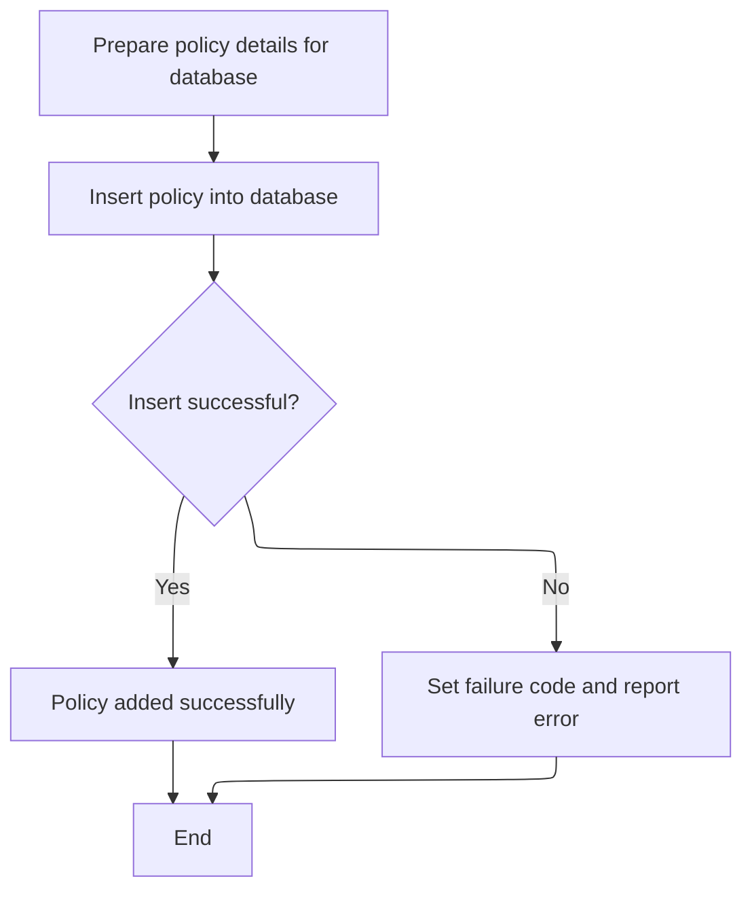

This section manages the insertion of a commercial policy record into the database, ensuring that all required fields are mapped and that errors are handled and reported if the insert fails.

| Rule ID | Category        | Rule Name                        | Description                                                                                                                                                                                                                        | Implementation Details                                                                                                                                                                                                                                                                                                                                                                                                                                                                                                                                                                                                                                                                                                                                                                                                                                                                                                                                                                                                                                                                                                                                                                                                                                                                                                                                                                                                                                                                                                                                                                                                                                                                                                                                                                                                                                                                                                                                                                                                                                                                                                                                                                                                                                                                                                                               |
| ------- | --------------- | -------------------------------- | ---------------------------------------------------------------------------------------------------------------------------------------------------------------------------------------------------------------------------------- | ---------------------------------------------------------------------------------------------------------------------------------------------------------------------------------------------------------------------------------------------------------------------------------------------------------------------------------------------------------------------------------------------------------------------------------------------------------------------------------------------------------------------------------------------------------------------------------------------------------------------------------------------------------------------------------------------------------------------------------------------------------------------------------------------------------------------------------------------------------------------------------------------------------------------------------------------------------------------------------------------------------------------------------------------------------------------------------------------------------------------------------------------------------------------------------------------------------------------------------------------------------------------------------------------------------------------------------------------------------------------------------------------------------------------------------------------------------------------------------------------------------------------------------------------------------------------------------------------------------------------------------------------------------------------------------------------------------------------------------------------------------------------------------------------------------------------------------------------------------------------------------------------------------------------------------------------------------------------------------------------------------------------------------------------------------------------------------------------------------------------------------------------------------------------------------------------------------------------------------------------------------------------------------------------------------------------------------------------------- |
| BR-001  | Data validation | Database Insert Failure Handling | If the database insert fails, a failure code is set, an error message is logged, and the transaction is abended to prevent inconsistent data.                                                                                      | The failure code set is '92'. The error message is logged using the <SwmToken path="base/src/lgapdb09.cbl" pos="205:3:7" line-data="               PERFORM WRITE-ERROR-MESSAGE">`WRITE-ERROR-MESSAGE`</SwmToken> process. The transaction is abended with abend code 'LGSQ'.                                                                                                                                                                                                                                                                                                                                                                                                                                                                                                                                                                                                                                                                                                                                                                                                                                                                                                                                                                                                                                                                                                                                                                                                                                                                                                                                                                                                                                                                                                                                                                                                                                                                                                                                                                                                                                                                                                                                                                                                                                                                         |
| BR-002  | Decision Making | Successful Policy Addition       | If the database insert is successful, the policy is considered added and the process completes without error.                                                                                                                      | No error code is set. The process completes normally and the policy is available in the database.                                                                                                                                                                                                                                                                                                                                                                                                                                                                                                                                                                                                                                                                                                                                                                                                                                                                                                                                                                                                                                                                                                                                                                                                                                                                                                                                                                                                                                                                                                                                                                                                                                                                                                                                                                                                                                                                                                                                                                                                                                                                                                                                                                                                                                                    |
| BR-003  | Writing Output  | Insert Commercial Policy Record  | A new commercial policy record is inserted into the database using all prepared policy fields. The insert includes policy number, dates, address, customer, property type, peril and premium values, status, and rejection reason. | The database insert includes the following fields: <SwmToken path="base/src/lgapdb09.cbl" pos="567:2:2" line-data="                       (PolicyNumber,">`PolicyNumber`</SwmToken> (number), <SwmToken path="base/src/lgapdb09.cbl" pos="568:1:1" line-data="                        RequestDate,">`RequestDate`</SwmToken> (date), <SwmToken path="base/src/lgapdb09.cbl" pos="569:1:1" line-data="                        StartDate,">`StartDate`</SwmToken> (date), <SwmToken path="base/src/lgapdb09.cbl" pos="570:1:1" line-data="                        RenewalDate,">`RenewalDate`</SwmToken> (date), Address (string), Zipcode (string), <SwmToken path="base/src/lgapdb09.cbl" pos="573:1:1" line-data="                        LatitudeN,">`LatitudeN`</SwmToken> (number), <SwmToken path="base/src/lgapdb09.cbl" pos="574:1:1" line-data="                        LongitudeW,">`LongitudeW`</SwmToken> (number), Customer (string), <SwmToken path="base/src/lgapdb09.cbl" pos="576:1:1" line-data="                        PropertyType,">`PropertyType`</SwmToken> (string), <SwmToken path="base/src/lgapdb09.cbl" pos="577:1:1" line-data="                        FirePeril,">`FirePeril`</SwmToken> (number), FirePremium (number), <SwmToken path="base/src/lgapdb09.cbl" pos="579:1:1" line-data="                        CrimePeril,">`CrimePeril`</SwmToken> (number), <SwmToken path="base/src/lgapdb09.cbl" pos="580:1:1" line-data="                        CrimePremium,">`CrimePremium`</SwmToken> (number), <SwmToken path="base/src/lgapdb09.cbl" pos="581:1:1" line-data="                        FloodPeril,">`FloodPeril`</SwmToken> (number), <SwmToken path="base/src/lgapdb09.cbl" pos="582:1:1" line-data="                        FloodPremium,">`FloodPremium`</SwmToken> (number), <SwmToken path="base/src/lgapdb09.cbl" pos="583:1:1" line-data="                        WeatherPeril,">`WeatherPeril`</SwmToken> (number), <SwmToken path="base/src/lgapdb09.cbl" pos="584:1:1" line-data="                        WeatherPremium,">`WeatherPremium`</SwmToken> (number), Status (string), <SwmToken path="base/src/lgapdb09.cbl" pos="586:1:1" line-data="                        RejectionReason)">`RejectionReason`</SwmToken> (string). Field sizes and types are determined by the database schema. |

<SwmSnippet path="/base/src/lgapdb09.cbl" line="553">

---

In <SwmToken path="base/src/lgapdb09.cbl" pos="553:1:3" line-data="       P548-BINS.">`P548-BINS`</SwmToken>, we're mapping all the calculated and input commercial policy fields into the <SwmToken path="base/src/lgapdb09.cbl" pos="554:11:11" line-data="           MOVE CA-B-FP     TO DB2-B-P1-Int">`DB2`</SwmToken> host variables. This sets up everything needed for the SQL insert into the COMMERCIAL table.

```cobol
       P548-BINS.
           MOVE CA-B-FP     TO DB2-B-P1-Int
           MOVE CA-B-CA-B-FPR   TO DB2-B-P1A-Int
           MOVE CA-B-CP    TO DB2-B-P2-Int
           MOVE CA-B-CPR  TO DB2-B-P2A-Int
           MOVE CA-B-FLP    TO DB2-B-P3-Int
           MOVE CA-B-FLPR  TO DB2-B-P3A-Int
           MOVE CA-B-WP  TO DB2-B-P4-Int
           MOVE CA-B-WPR TO DB2-B-P4A-Int
           MOVE CA-B-ST        TO DB2-B-Z9-Int
           
           MOVE ' INSERT COMMER' TO EM-SQLREQ
```

---

</SwmSnippet>

<SwmSnippet path="/base/src/lgapdb09.cbl" line="565">

---

After prepping the <SwmToken path="base/src/lgapdb09.cbl" pos="587:5:5" line-data="                VALUES (:DB2-POLICYNUM-INT,">`DB2`</SwmToken> variables, we run the SQL INSERT to add the commercial policy record. This is the main database write for the policy, using all the mapped fields from before. The next step will check for errors and handle them if needed.

```cobol
           EXEC SQL
             INSERT INTO COMMERCIAL
                       (PolicyNumber,
                        RequestDate,
                        StartDate,
                        RenewalDate,
                        Address,
                        Zipcode,
                        LatitudeN,
                        LongitudeW,
                        Customer,
                        PropertyType,
                        FirePeril,
                        CA-B-FPR,
                        CrimePeril,
                        CrimePremium,
                        FloodPeril,
                        FloodPremium,
                        WeatherPeril,
                        WeatherPremium,
                        Status,
                        RejectionReason)
                VALUES (:DB2-POLICYNUM-INT,
                        :CA-LASTCHANGED,
                        :CA-ISSUE-DATE,
                        :CA-EXPIRY-DATE,
                        :CA-B-Address,
                        :CA-B-PST,
                        :CA-B-Latitude,
                        :CA-B-Longitude,
                        :CA-B-Customer,
                        :CA-B-PropType,
                        :DB2-B-P1-Int,
                        :DB2-B-P1A-Int,
                        :DB2-B-P2-Int,
                        :DB2-B-P2A-Int,
                        :DB2-B-P3-Int,
                        :DB2-B-P3A-Int,
                        :DB2-B-P4-Int,
                        :DB2-B-P4A-Int,
                        :DB2-B-Z9-Int,
                        :CA-B-RejectReason)
           END-EXEC
```

---

</SwmSnippet>

<SwmSnippet path="/base/src/lgapdb09.cbl" line="609">

---

After the insert, we check SQLCODE. If there's any error, we set the return code, call <SwmToken path="base/src/lgapdb09.cbl" pos="611:3:7" line-data="              PERFORM WRITE-ERROR-MESSAGE">`WRITE-ERROR-MESSAGE`</SwmToken> to log the failure, and abend the transaction. This makes sure any DB issues are reported and nothing gets left in a bad state.

```cobol
           IF SQLCODE NOT = 0
              MOVE '92' TO CA-RETURN-CODE
              PERFORM WRITE-ERROR-MESSAGE
              EXEC CICS ABEND ABCODE('LGSQ') NODUMP END-EXEC
              EXEC CICS RETURN END-EXEC
           END-IF.
           
           EXIT.
```

---

</SwmSnippet>

## Finalizing and Returning Policy Data

This section finalizes the transaction by handing off the completed policy and customer data to the storage process and then returning control to the caller.

| Rule ID | Category                        | Rule Name           | Description                                                                                                                                                                                                                                                                                                                                              | Implementation Details                                                                                                                                                                                                                                                                                                                                                                                                                         |
| ------- | ------------------------------- | ------------------- | -------------------------------------------------------------------------------------------------------------------------------------------------------------------------------------------------------------------------------------------------------------------------------------------------------------------------------------------------------- | ---------------------------------------------------------------------------------------------------------------------------------------------------------------------------------------------------------------------------------------------------------------------------------------------------------------------------------------------------------------------------------------------------------------------------------------------- |
| BR-001  | Writing Output                  | Return to Caller    | After the policy and customer data has been handed off for storage, control is returned to the caller to complete the transaction.                                                                                                                                                                                                                       | No data is returned to the caller from this section; the action is a control transfer indicating completion.                                                                                                                                                                                                                                                                                                                                   |
| BR-002  | Invoking a Service or a Process | Policy Data Handoff | The completed policy and customer data is handed off to the storage process by linking to the external program <SwmToken path="base/src/lgapdb09.cbl" pos="268:9:9" line-data="             EXEC CICS Link Program(LGAPVS01)">`LGAPVS01`</SwmToken> (Processing Insurance Data Records), passing all relevant data in a commarea of length 32,500 bytes. | The commarea passed to <SwmToken path="base/src/lgapdb09.cbl" pos="268:9:9" line-data="             EXEC CICS Link Program(LGAPVS01)">`LGAPVS01`</SwmToken> is exactly 32,500 bytes in length. The data includes all fields defined in the DFHCOMMAREA structure, such as request ID, return code, customer number, and request-specific data. The format is a contiguous block of bytes containing all these fields as defined in the struct. |

<SwmSnippet path="/base/src/lgapdb09.cbl" line="268">

---

Back in MAINLINE, after all processing is done, we link to <SwmToken path="base/src/lgapdb09.cbl" pos="268:9:9" line-data="             EXEC CICS Link Program(LGAPVS01)">`LGAPVS01`</SwmToken> to write the policy and customer data to file storage. This step hands off the completed record for persistence, then returns control to the caller.

```cobol
             EXEC CICS Link Program(LGAPVS01)
                  Commarea(DFHCOMMAREA)
                LENGTH(32500)
             END-EXEC.


      * Return to caller
           EXEC CICS RETURN END-EXEC.
```

---

</SwmSnippet>

# Writing Policy Data to File and Handling Write Errors

```mermaid
%%{init: {"flowchart": {"defaultRenderer": "elk"}} }%%
flowchart TD
    node1["Start: Prepare data for file write"] --> node2{"What type of request?"}
    click node1 openCode "base/src/lgapvs01.cbl:90:99"
    node2 -->|"Customer ('C'), Endowment ('E'), House
('H'), Motor ('M')"| node3["Prepare data for file write"]
    click node2 openCode "base/src/lgapvs01.cbl:99:131"
    node2 -->|"Other"| node4["Clear data fields"]
    click node4 openCode "base/src/lgapvs01.cbl:132:133"
    node3 --> node5["Write record to file"]
    click node3 openCode "base/src/lgapvs01.cbl:99:133"
    node4 --> node5
    click node5 openCode "base/src/lgapvs01.cbl:136:142"
    node5 --> node6{"Did write succeed?"}
    click node6 openCode "base/src/lgapvs01.cbl:143:148"
    node6 -->|"Yes"| node7["Success: Data written"]
    click node7 openCode "base/src/lgapvs01.cbl:149:149"
    node6 -->|"No"| node8["Set CA-RETURN-CODE to '80' and perform
error handling"]
    click node8 openCode "base/src/lgapvs01.cbl:144:147"
    node8 --> node7
classDef HeadingStyle fill:#777777,stroke:#333,stroke-width:2px;

%% Swimm:
%% %%{init: {"flowchart": {"defaultRenderer": "elk"}} }%%
%% flowchart TD
%%     node1["Start: Prepare data for file write"] --> node2{"What type of request?"}
%%     click node1 openCode "<SwmPath>[base/src/lgapvs01.cbl](base/src/lgapvs01.cbl)</SwmPath>:90:99"
%%     node2 -->|"Customer ('C'), Endowment ('E'), House
%% ('H'), Motor ('M')"| node3["Prepare data for file write"]
%%     click node2 openCode "<SwmPath>[base/src/lgapvs01.cbl](base/src/lgapvs01.cbl)</SwmPath>:99:131"
%%     node2 -->|"Other"| node4["Clear data fields"]
%%     click node4 openCode "<SwmPath>[base/src/lgapvs01.cbl](base/src/lgapvs01.cbl)</SwmPath>:132:133"
%%     node3 --> node5["Write record to file"]
%%     click node3 openCode "<SwmPath>[base/src/lgapvs01.cbl](base/src/lgapvs01.cbl)</SwmPath>:99:133"
%%     node4 --> node5
%%     click node5 openCode "<SwmPath>[base/src/lgapvs01.cbl](base/src/lgapvs01.cbl)</SwmPath>:136:142"
%%     node5 --> node6{"Did write succeed?"}
%%     click node6 openCode "<SwmPath>[base/src/lgapvs01.cbl](base/src/lgapvs01.cbl)</SwmPath>:143:148"
%%     node6 -->|"Yes"| node7["Success: Data written"]
%%     click node7 openCode "<SwmPath>[base/src/lgapvs01.cbl](base/src/lgapvs01.cbl)</SwmPath>:149:149"
%%     node6 -->|"No"| node8["Set <SwmToken path="base/src/lgapdb09.cbl" pos="209:9:13" line-data="           MOVE &#39;00&#39; TO CA-RETURN-CODE">`CA-RETURN-CODE`</SwmToken> to '80' and perform
%% error handling"]
%%     click node8 openCode "<SwmPath>[base/src/lgapvs01.cbl](base/src/lgapvs01.cbl)</SwmPath>:144:147"
%%     node8 --> node7
%% classDef HeadingStyle fill:#777777,stroke:#333,stroke-width:2px;
```

This section writes processed policy data to persistent storage and ensures that any write errors are captured and logged with full context.

| Rule ID | Category                        | Rule Name                           | Description                                                                                                                                                                                | Implementation Details                                                                                                                                                                                                                                                                                                                                              |
| ------- | ------------------------------- | ----------------------------------- | ------------------------------------------------------------------------------------------------------------------------------------------------------------------------------------------ | ------------------------------------------------------------------------------------------------------------------------------------------------------------------------------------------------------------------------------------------------------------------------------------------------------------------------------------------------------------------- |
| BR-001  | Calculation                     | Request type data mapping           | For recognized request types (Customer, Endowment, House, Motor), the corresponding policy and customer fields are mapped into the output record structure before writing to the file.     | The output record is 104 bytes, with the first byte indicating request type, followed by customer and policy numbers, and a data section formatted according to the request type. Field sizes and alignments are as per the <SwmToken path="base/src/lgapvs01.cbl" pos="137:3:5" line-data="                     From(V2-RECORD)">`V2-RECORD`</SwmToken> structure. |
| BR-002  | Calculation                     | Clear data for unrecognized request | For unrecognized request types, all data fields in the output record are cleared before writing to the file.                                                                               | All data fields in the output record are set to spaces, resulting in a blank data section.                                                                                                                                                                                                                                                                          |
| BR-003  | Decision Making                 | Write failure error handling        | If the file write operation fails, the return code is set to '80' and error handling is triggered.                                                                                         | Return code '80' indicates a file write failure. Error handling includes logging the error and returning control.                                                                                                                                                                                                                                                   |
| BR-004  | Writing Output                  | File write format                   | The output record is written to the KSDSPOLY file with a fixed length of 104 bytes and a key length of 21 bytes.                                                                           | File name: 'KSDSPOLY'. Output record length: 104 bytes. Key length: 21 bytes. The record includes request type, customer number, policy number, and a data section formatted per request type.                                                                                                                                                                      |
| BR-005  | Invoking a Service or a Process | Error context logging               | When error handling is triggered, an error message is logged with the current date, time, customer number, policy number, response codes, and any additional commarea data up to 90 bytes. | Error message includes date (MMDDYYYY), time (HHMMSS), customer number, policy number, response codes, and up to 90 bytes of additional commarea data if present.                                                                                                                                                                                                   |

<SwmSnippet path="/base/src/lgapvs01.cbl" line="90">

---

<SwmToken path="base/src/lgapvs01.cbl" pos="90:1:3" line-data="       P100-ENTRY SECTION.">`P100-ENTRY`</SwmToken> picks up the commarea, figures out the request type, and moves the relevant policy and customer fields into the <SwmToken path="base/src/lgapvs01.cbl" pos="137:3:5" line-data="                     From(V2-RECORD)">`V2-RECORD`</SwmToken> structure. Then it writes the record to the KSDSPOLY file. If the write fails, it sets an error code and jumps to error handling. This step is all about getting the processed data into persistent storage.

```cobol
       P100-ENTRY SECTION.
      *
      *---------------------------------------------------------------*
           Move EIBCALEN To V1-COMM.
      *---------------------------------------------------------------*
           Move CA-Request-ID(4:1) To V2-REQ
           Move CA-Policy-Num      To V2-POL
           Move CA-Customer-Num    To V2-CUST

           Evaluate V2-REQ

             When 'C'
               Move CA-B-PST     To V2-C-PCD
               Move CA-B-ST       To V2-C-Z9
               Move CA-B-Customer     To V2-C-CUST
               Move WS-RISK-SCORE     To V2-C-VAL
               Move CA-B-CA-B-FPR  To V2-C-P1VAL
               Move CA-B-CPR To V2-C-P2VAL
               Move CA-B-FLPR To V2-C-P3VAL
               Move CA-B-WPR To V2-C-P4VAL

             When 'E'
               Move CA-E-W-PRO        To  V2-E-OPT1
               Move CA-E-EQU          To  V2-E-OPT2
               Move CA-E-M-FUN        To  V2-E-OPT3
               Move CA-E-FUND-NAME    To  V2-E-NAME
               Move CA-E-LIFE-ASSURED To  V2-E-LIFE

             When 'H'
               Move CA-H-P-TYP         To  V2-H-TYPE
               Move CA-H-BED           To  V2-H-ROOMS
               Move CA-H-VAL           To  V2-H-COST
               Move CA-H-PCD           To  V2-H-PCD
               Move CA-H-H-NAM         To  V2-H-NAME

             When 'M'
               Move CA-M-MAKE          To  V2-M-MAKE
               Move CA-M-MODEL         To  V2-M-MODEL
               Move CA-M-VALUE         To  V2-M-COST
               Move CA-M-REGNUMBER     To  V2-M-NUM

             When Other
               Move Spaces To V2-DATA
           End-Evaluate

      *---------------------------------------------------------------*
           Exec CICS Write File('KSDSPOLY')
                     From(V2-RECORD)
                     Length(104)
                     Ridfld(V2-KEY)
                     KeyLength(21)
                     RESP(V1-RCD1)
           End-Exec.
           If V1-RCD1 Not = DFHRESP(NORMAL)
             Move EIBRESP2 To V1-RCD2
             MOVE '80' TO CA-RETURN-CODE
             PERFORM P999-ERROR
             EXEC CICS RETURN END-EXEC
           End-If.
```

---

</SwmSnippet>

<SwmSnippet path="/base/src/lgapvs01.cbl" line="156">

---

In <SwmToken path="base/src/lgapvs01.cbl" pos="156:1:3" line-data="       P999-ERROR.">`P999-ERROR`</SwmToken>, we grab the current time and date using CICS ASKTIME and FORMATTIME, then fill out the <SwmToken path="base/src/lgapvs01.cbl" pos="171:3:5" line-data="                     COMMAREA(ERROR-MSG)">`ERROR-MSG`</SwmToken> structure with all the relevant details—customer, policy, response codes, and timestamps. We call LGSTSQ to log the error to the message queue. If there's extra commarea data, we copy up to 90 bytes and send that as a separate error message too. This makes sure all error context is captured and reported, even for variable-length input.

```cobol
       P999-ERROR.
           EXEC CICS ASKTIME ABSTIME(V3-TIME)
           END-EXEC
           EXEC CICS FORMATTIME ABSTIME(V3-TIME)
                     MMDDYYYY(V3-DATE1)
                     TIME(V3-DATE2)
           END-EXEC
      *
           MOVE V3-DATE1 TO EM-DATE
           MOVE V3-DATE2 TO EM-TIME
           Move CA-Customer-Num To EM-Cusnum
           Move CA-Policy-Num   To EM-POLNUM 
           Move V1-RCD1         To EM-RespRC
           Move V1-RCD2         To EM-Resp2RC
           EXEC CICS LINK PROGRAM('LGSTSQ')
                     COMMAREA(ERROR-MSG)
                     LENGTH(LENGTH OF ERROR-MSG)
           END-EXEC.
           IF EIBCALEN > 0 THEN
             IF EIBCALEN < 91 THEN
               MOVE DFHCOMMAREA(1:EIBCALEN) TO CA-DATA
               EXEC CICS LINK PROGRAM('LGSTSQ')
                         COMMAREA(CA-ERROR-MSG)
                         LENGTH(Length Of CA-ERROR-MSG)
               END-EXEC
             ELSE
               MOVE DFHCOMMAREA(1:90) TO CA-DATA
               EXEC CICS LINK PROGRAM('LGSTSQ')
                         COMMAREA(CA-ERROR-MSG)
                         LENGTH(Length Of CA-ERROR-MSG)
               END-EXEC
             END-IF
           END-IF.
           EXIT.
```

---

</SwmSnippet>

&nbsp;

*This is an auto-generated document by Swimm 🌊 and has not yet been verified by a human*

<SwmMeta version="3.0.0" repo-id="Z2l0aHViJTNBJTNBU3dpbW1pby1nZW5hcHAtaG91c2UlM0ElM0FHaXJpLVN3aW1t" repo-name="Swimmio-genapp-house"><sup>Powered by [Swimm](https://app.swimm.io/)</sup></SwmMeta>
