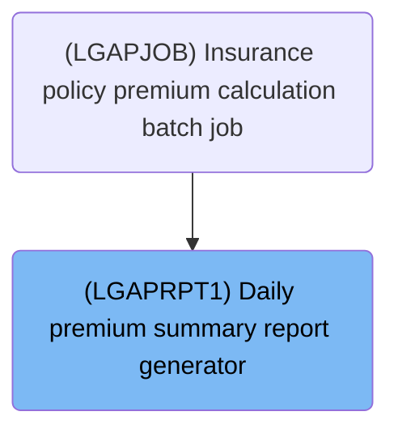
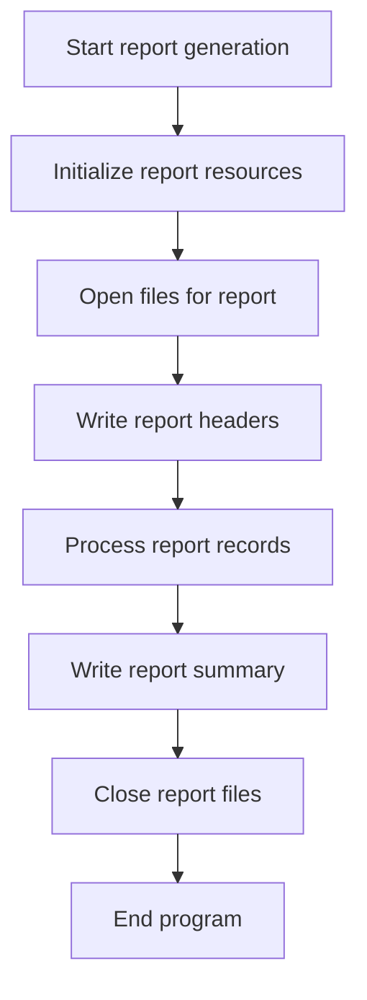
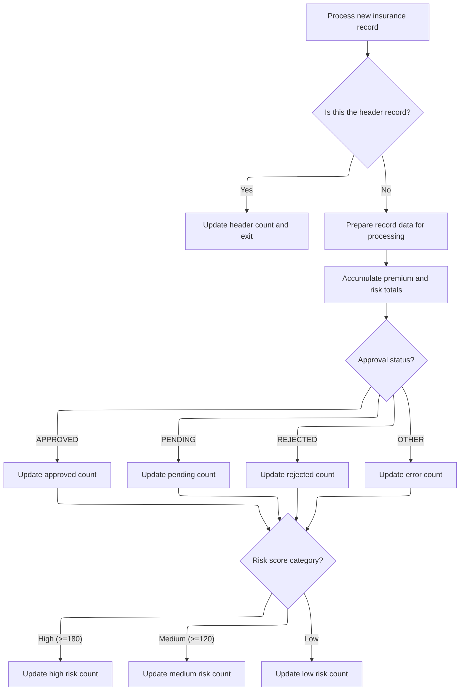
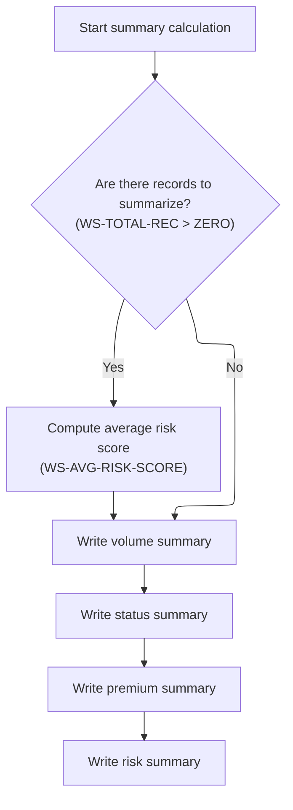

# Overview

This document explains the flow of generating daily premium summary reports. The batch job system processes premium output records, aggregates totals, classifies risk scores, and produces formatted management reports for management review.

## Dependencies

### Program

- <SwmToken path="base/src/LGAPRPT1.cbl" pos="2:6:6" line-data="       PROGRAM-ID. LGAPRPT1.">`LGAPRPT1`</SwmToken> (<SwmPath>[base/src/LGAPRPT1.cbl](base/src/LGAPRPT1.cbl)</SwmPath>)

### Copybook

- OUTPUTREC (<SwmPath>[base/src/OUTPUTREC.cpy](base/src/OUTPUTREC.cpy)</SwmPath>)

# Where is this program used?

This program is used once, as represented in the following diagram:



## Detailed View of the Program's Functionality

## Orchestrating Report Generation

This section describes the overall flow of the report generation process, which is managed by the main sequence of the program.

1. **Start report generation**\
   The program begins execution in the main procedure. This is the entry point for the report generation.

2. **Initialize report resources**\
   The program sets up the environment by:

   - Accepting the current date and time from the system.
   - Formatting the date and time for display in the report.
   - Initializing all counters and accumulators to zero, ensuring no leftover data from previous runs.

3. **Open files for report**\
   The program opens the input file (containing the data to be processed) and the output file (where the report will be written).

   - If the input file cannot be opened, the program displays an error and stops.
   - If the output file cannot be opened, the program displays an error, closes the input file, and stops.

4. **Write report headers**\
   The program writes the report headers to the output file. This includes:

   - The main report title.
   - The formatted date and time.
   - A separator line.
   - A blank line for spacing.

5. **Process report records**\
   The program enters the main data processing loop, where it reads and processes each record from the input file.

6. **Write report summary**\
   After all records are processed, the program writes the summary sections to the report. This includes:

   - Calculating averages.
   - Writing sections for volume, status, premium totals, and risk analysis.

7. **Close report files**\
   The program closes both the input and output files to ensure all data is saved and resources are released.

8. **End program**\
   The program terminates execution.

---

## Processing Input Data

This section details how the program reads and processes each record from the input file.

1. **Begin batch processing**\
   The program starts by reading the first record from the input file.

2. **For each input record**\
   The program enters a loop that continues until the end of the input file is reached:

   - It checks if the end-of-file status has been set.
   - If not at end-of-file, it processes the current record and then reads the next one.
   - If at end-of-file, it exits the loop and ends batch processing.

3. **Process current record**\
   For each record, the program calls a dedicated routine to update all necessary counters and totals based on the record's data.

---

## Summarizing Each Record

This section explains how each individual record is analyzed and how statistics are accumulated.

1. **Process new insurance record**\
   The program increments the total record count.

2. **Is this the header record?**

   - If processing the very first record (usually a header), the program increments the header count and skips further processing for this record. This ensures the header does not affect statistics.

3. **Prepare record data for processing**

   - The program converts all relevant string fields (such as risk score and various premium amounts) to numeric values for calculation.

4. **Accumulate premium and risk totals**

   - The program adds the numeric values for fire, crime, flood, and weather premiums to their respective running totals.
   - It also adds the total premium and risk score to their overall accumulators.

5. **Approval status?**

   - The program checks the approval status of the policy (approved, pending, rejected, or other).
   - It increments the corresponding counter for each status.
   - Any unrecognized status increases the error count.

6. **Risk score category?**

   - The program classifies the record into high, medium, or low risk based on the risk score:
     - High risk: score is 180 or above.
     - Medium risk: score is 120 or above but less than 180.
     - Low risk: score is less than 120.
   - It increments the appropriate risk category counter.

---

## Generating Report Sections

This section describes how the program compiles and writes the summary sections of the report.

1. **Start summary calculation**\
   The program begins by calculating averages needed for the report.

2. **Are there records to summarize?**

   - The program subtracts the header count from the total record count to determine the number of actual data records.
   - If there are records, it computes the average risk score by dividing the total risk score by the number of records.

3. **Write volume summary**

   - The program writes a section showing the total number of records processed.

4. **Write status summary**

   - The program writes a section showing the counts for approved, pending, rejected, and error/unsupported policies.

5. **Write premium summary**

   - The program writes a section showing the totals for fire, crime, flood, and weather premiums, as well as the grand total premium.

6. **Write risk summary**

   - The program writes a section showing:
     - The average risk score.
     - The counts of high, medium, and low risk policies.
   - It also writes an "END OF REPORT" marker at the end.

---

## Summary

- The program reads an input file of insurance records, skipping the header.
- For each data record, it converts fields to numbers, accumulates totals, and classifies by status and risk.
- After processing all records, it calculates averages and writes a formatted report with statistics and breakdowns.
- The process is robust to missing or malformed statuses (they are counted as errors), but not to malformed numeric data (which could affect totals).
- All resources are properly initialized and closed, and the report is structured with clear headers and sections.

# Rule Definition

| Paragraph Name                                                                                                                                                                                                                                                                                     | Rule ID | Category          | Description                                                                                                                                                                                                                                                                                                                                                                                                                                                                                                                                                                                                                                                                                                                                                                                                                                                                                                                                                                                                                                                                                                                                                       | Conditions                                                                                                                                                                                                       | Remarks                                                                                                                                    |
| -------------------------------------------------------------------------------------------------------------------------------------------------------------------------------------------------------------------------------------------------------------------------------------------------- | ------- | ----------------- | ----------------------------------------------------------------------------------------------------------------------------------------------------------------------------------------------------------------------------------------------------------------------------------------------------------------------------------------------------------------------------------------------------------------------------------------------------------------------------------------------------------------------------------------------------------------------------------------------------------------------------------------------------------------------------------------------------------------------------------------------------------------------------------------------------------------------------------------------------------------------------------------------------------------------------------------------------------------------------------------------------------------------------------------------------------------------------------------------------------------------------------------------------------------- | ---------------------------------------------------------------------------------------------------------------------------------------------------------------------------------------------------------------- | ------------------------------------------------------------------------------------------------------------------------------------------ |
| <SwmToken path="base/src/LGAPRPT1.cbl" pos="177:3:7" line-data="               PERFORM P520-PROCESS-RECORD">`P520-PROCESS-RECORD`</SwmToken>, <SwmToken path="base/src/LGAPRPT1.cbl" pos="236:3:7" line-data="           PERFORM P610-CALC-AVERAGES">`P610-CALC-AVERAGES`</SwmToken>               | RL-001  | Conditional Logic | The first record read from the input file is treated as a header and is not included in any statistics, totals, or counts.                                                                                                                                                                                                                                                                                                                                                                                                                                                                                                                                                                                                                                                                                                                                                                                                                                                                                                                                                                                                                                        | If the total records processed so far is 1, treat the record as a header and skip all further processing for this record.                                                                                        | No constants. The header is identified by being the first record read. All statistics and totals exclude this record.                      |
| <SwmToken path="base/src/LGAPRPT1.cbl" pos="177:3:7" line-data="               PERFORM P520-PROCESS-RECORD">`P520-PROCESS-RECORD`</SwmToken>                                                                                                                                                       | RL-002  | Data Assignment   | For each data record, the <SwmToken path="base/src/LGAPRPT1.cbl" pos="195:7:11" line-data="           MOVE FUNCTION NUMVAL(OUT-RISK-SCORE) TO WS-RISK-SCORE-NUM">`OUT-RISK-SCORE`</SwmToken>, <SwmToken path="base/src/LGAPRPT1.cbl" pos="196:7:11" line-data="           MOVE FUNCTION NUMVAL(OUT-FIRE-PREMIUM) TO WS-FIRE-PREM-NUM">`OUT-FIRE-PREMIUM`</SwmToken>, <SwmToken path="base/src/LGAPRPT1.cbl" pos="197:7:11" line-data="           MOVE FUNCTION NUMVAL(OUT-CRIME-PREMIUM) TO WS-CRIME-PREM-NUM">`OUT-CRIME-PREMIUM`</SwmToken>, <SwmToken path="base/src/LGAPRPT1.cbl" pos="198:7:11" line-data="           MOVE FUNCTION NUMVAL(OUT-FLOOD-PREMIUM) TO WS-FLOOD-PREM-NUM">`OUT-FLOOD-PREMIUM`</SwmToken>, <SwmToken path="base/src/LGAPRPT1.cbl" pos="199:7:11" line-data="           MOVE FUNCTION NUMVAL(OUT-WEATHER-PREMIUM) TO WS-WEATHER-PREM-NUM">`OUT-WEATHER-PREMIUM`</SwmToken>, and <SwmToken path="base/src/LGAPRPT1.cbl" pos="200:7:11" line-data="           MOVE FUNCTION NUMVAL(OUT-TOTAL-PREMIUM) TO WS-TOTAL-PREM-NUM">`OUT-TOTAL-PREMIUM`</SwmToken> fields are converted from string to numeric values for use in calculations. | For every data record (excluding header), perform conversion before calculations.                                                                                                                                | Fields are converted using a numeric conversion function. No error handling for non-numeric values; they are converted and used as-is.     |
| <SwmToken path="base/src/LGAPRPT1.cbl" pos="177:3:7" line-data="               PERFORM P520-PROCESS-RECORD">`P520-PROCESS-RECORD`</SwmToken>                                                                                                                                                       | RL-003  | Computation       | The program accumulates totals for fire, crime, flood, weather, and grand total premiums, as well as the total risk score, across all data records.                                                                                                                                                                                                                                                                                                                                                                                                                                                                                                                                                                                                                                                                                                                                                                                                                                                                                                                                                                                                               | For every data record (excluding header), after numeric conversion, add each value to its respective accumulator.                                                                                                | Totals are numeric values. No special formatting until report generation.                                                                  |
| <SwmToken path="base/src/LGAPRPT1.cbl" pos="177:3:7" line-data="               PERFORM P520-PROCESS-RECORD">`P520-PROCESS-RECORD`</SwmToken>, <SwmToken path="base/src/LGAPRPT1.cbl" pos="238:3:9" line-data="           PERFORM P630-WRITE-STATUS-SECTION">`P630-WRITE-STATUS-SECTION`</SwmToken> | RL-004  | Conditional Logic | Records are counted by their <SwmToken path="base/src/LGAPRPT1.cbl" pos="211:3:5" line-data="           EVALUATE OUT-STATUS">`OUT-STATUS`</SwmToken> value: 'APPROVED', 'PENDING', 'REJECTED', or any other value (errors/unsupported).                                                                                                                                                                                                                                                                                                                                                                                                                                                                                                                                                                                                                                                                                                                                                                                                                                                                                                                           | For every data record (excluding header), check <SwmToken path="base/src/LGAPRPT1.cbl" pos="211:3:5" line-data="           EVALUATE OUT-STATUS">`OUT-STATUS`</SwmToken> and increment the corresponding counter. | Counts are numeric values. Only the values 'APPROVED', 'PENDING', 'REJECTED' are recognized; all others are counted as errors/unsupported. |
| <SwmToken path="base/src/LGAPRPT1.cbl" pos="177:3:7" line-data="               PERFORM P520-PROCESS-RECORD">`P520-PROCESS-RECORD`</SwmToken>, <SwmToken path="base/src/LGAPRPT1.cbl" pos="240:3:9" line-data="           PERFORM P650-WRITE-RISK-SECTION.">`P650-WRITE-RISK-SECTION`</SwmToken>    | RL-005  | Conditional Logic | Each record is classified as high, medium, or low risk based on the numeric risk score: high (>=180), medium (>=120 and <180), low (<120).                                                                                                                                                                                                                                                                                                                                                                                                                                                                                                                                                                                                                                                                                                                                                                                                                                                                                                                                                                                                                        | For every data record (excluding header), after risk score conversion, check the value and increment the corresponding risk category counter.                                                                    | Risk categories:                                                                                                                           |

- High: risk score >= 180
- Medium: risk score >= 120 and < 180
- Low: risk score < 120 Counts are numeric values. | | <SwmToken path="base/src/LGAPRPT1.cbl" pos="236:3:7" line-data="           PERFORM P610-CALC-AVERAGES">`P610-CALC-AVERAGES`</SwmToken>, <SwmToken path="base/src/LGAPRPT1.cbl" pos="240:3:9" line-data="           PERFORM P650-WRITE-RISK-SECTION.">`P650-WRITE-RISK-SECTION`</SwmToken> | RL-006 | Computation | The average risk score is calculated as the total risk score divided by the number of data records processed (excluding the header). | After all records are processed, if the number of data records > 0, compute average risk score. | Average is a numeric value with two decimal places. The number of data records is total records minus header count. | | <SwmToken path="base/src/LGAPRPT1.cbl" pos="127:3:7" line-data="           PERFORM P400-WRITE-HEADERS">`P400-WRITE-HEADERS`</SwmToken>, <SwmToken path="base/src/LGAPRPT1.cbl" pos="129:3:7" line-data="           PERFORM P600-WRITE-SUMMARY">`P600-WRITE-SUMMARY`</SwmToken>, <SwmToken path="base/src/LGAPRPT1.cbl" pos="237:3:9" line-data="           PERFORM P620-WRITE-VOLUME-SECTION">`P620-WRITE-VOLUME-SECTION`</SwmToken>, <SwmToken path="base/src/LGAPRPT1.cbl" pos="238:3:9" line-data="           PERFORM P630-WRITE-STATUS-SECTION">`P630-WRITE-STATUS-SECTION`</SwmToken>, <SwmToken path="base/src/LGAPRPT1.cbl" pos="239:3:9" line-data="           PERFORM P640-WRITE-PREMIUM-SECTION">`P640-WRITE-PREMIUM-SECTION`</SwmToken>, <SwmToken path="base/src/LGAPRPT1.cbl" pos="240:3:9" line-data="           PERFORM P650-WRITE-RISK-SECTION.">`P650-WRITE-RISK-SECTION`</SwmToken> | RL-007 | Data Assignment | The program generates a plain text report with each line padded to 133 characters, containing a centered title, date/time, separator, and sections for processing volume, underwriting decisions, premium totals, risk analysis, and end of report, in that order. | After all records are processed and statistics calculated, write the report sections in the specified order, padding each line to 133 characters. | - Each line is exactly 133 characters (string/alphanumeric), padded with spaces as needed.
- Title is centered.
- Date and time are formatted as 'DATE:YYYY/MM/DD     TIME:HH:MM:SS'.
- Separator is a line of '=' characters.
- Section headers and detail lines are left-aligned with labels and values.
- The order of sections is fixed as specified in the spec.
- The report ends with 'END OF REPORT' centered in a section header line. | | <SwmToken path="base/src/LGAPRPT1.cbl" pos="177:3:7" line-data="               PERFORM P520-PROCESS-RECORD">`P520-PROCESS-RECORD`</SwmToken> | RL-008 | Conditional Logic | If a numeric field contains non-numeric data, it is converted and used as-is in calculations. No errors are counted or reported for such cases. | For every data record, when converting numeric fields, do not check for conversion errors. | No error handling or error counts for non-numeric values in numeric fields. | | <SwmToken path="base/src/LGAPRPT1.cbl" pos="177:3:7" line-data="               PERFORM P520-PROCESS-RECORD">`P520-PROCESS-RECORD`</SwmToken>, <SwmToken path="base/src/LGAPRPT1.cbl" pos="238:3:9" line-data="           PERFORM P630-WRITE-STATUS-SECTION">`P630-WRITE-STATUS-SECTION`</SwmToken> | RL-009 | Conditional Logic | Only <SwmToken path="base/src/LGAPRPT1.cbl" pos="211:3:5" line-data="           EVALUATE OUT-STATUS">`OUT-STATUS`</SwmToken> values not equal to 'APPROVED', 'PENDING', or 'REJECTED' are counted as errors/unsupported. Non-numeric values in other fields do not affect error counts. | For every data record, if <SwmToken path="base/src/LGAPRPT1.cbl" pos="211:3:5" line-data="           EVALUATE OUT-STATUS">`OUT-STATUS`</SwmToken> is not one of the three expected values, increment the error/unsupported count. | Error/unsupported count only reflects unexpected <SwmToken path="base/src/LGAPRPT1.cbl" pos="211:3:5" line-data="           EVALUATE OUT-STATUS">`OUT-STATUS`</SwmToken> values. |

# User Stories

## User Story 1: Process input data and generate formatted summary report

---

### Story Description:

As a system user, I want the program to process all data records from the input file (excluding the header), convert relevant fields to numeric values, accumulate totals, classify records by status and risk, handle non-numeric values as-is, calculate averages, and generate a plain text summary report with all statistics and classifications formatted and padded to 133 characters per line, so that I can review the results in a clear and standardized format.

---

### Business Rule Mapping:

| Rule ID | Paragraph Name                                                                                                                                                                                                                                                                                                                                                                                                                                                                                                                                                                                                                                                                                                                                                                                                                                                                                        | Rule Description                                                                                                                                                                                                                                                                                                                                                                                                                                                                                                                                                                                                                                                                                                                                                                                                                                                                                                                                                                                                                                                                                                                                                  |
| ------- | ----------------------------------------------------------------------------------------------------------------------------------------------------------------------------------------------------------------------------------------------------------------------------------------------------------------------------------------------------------------------------------------------------------------------------------------------------------------------------------------------------------------------------------------------------------------------------------------------------------------------------------------------------------------------------------------------------------------------------------------------------------------------------------------------------------------------------------------------------------------------------------------------------- | ----------------------------------------------------------------------------------------------------------------------------------------------------------------------------------------------------------------------------------------------------------------------------------------------------------------------------------------------------------------------------------------------------------------------------------------------------------------------------------------------------------------------------------------------------------------------------------------------------------------------------------------------------------------------------------------------------------------------------------------------------------------------------------------------------------------------------------------------------------------------------------------------------------------------------------------------------------------------------------------------------------------------------------------------------------------------------------------------------------------------------------------------------------------- |
| RL-001  | <SwmToken path="base/src/LGAPRPT1.cbl" pos="177:3:7" line-data="               PERFORM P520-PROCESS-RECORD">`P520-PROCESS-RECORD`</SwmToken>, <SwmToken path="base/src/LGAPRPT1.cbl" pos="236:3:7" line-data="           PERFORM P610-CALC-AVERAGES">`P610-CALC-AVERAGES`</SwmToken>                                                                                                                                                                                                                                                                                                                                                                                                                                                                                                                                                                                                                  | The first record read from the input file is treated as a header and is not included in any statistics, totals, or counts.                                                                                                                                                                                                                                                                                                                                                                                                                                                                                                                                                                                                                                                                                                                                                                                                                                                                                                                                                                                                                                        |
| RL-002  | <SwmToken path="base/src/LGAPRPT1.cbl" pos="177:3:7" line-data="               PERFORM P520-PROCESS-RECORD">`P520-PROCESS-RECORD`</SwmToken>                                                                                                                                                                                                                                                                                                                                                                                                                                                                                                                                                                                                                                                                                                                                                          | For each data record, the <SwmToken path="base/src/LGAPRPT1.cbl" pos="195:7:11" line-data="           MOVE FUNCTION NUMVAL(OUT-RISK-SCORE) TO WS-RISK-SCORE-NUM">`OUT-RISK-SCORE`</SwmToken>, <SwmToken path="base/src/LGAPRPT1.cbl" pos="196:7:11" line-data="           MOVE FUNCTION NUMVAL(OUT-FIRE-PREMIUM) TO WS-FIRE-PREM-NUM">`OUT-FIRE-PREMIUM`</SwmToken>, <SwmToken path="base/src/LGAPRPT1.cbl" pos="197:7:11" line-data="           MOVE FUNCTION NUMVAL(OUT-CRIME-PREMIUM) TO WS-CRIME-PREM-NUM">`OUT-CRIME-PREMIUM`</SwmToken>, <SwmToken path="base/src/LGAPRPT1.cbl" pos="198:7:11" line-data="           MOVE FUNCTION NUMVAL(OUT-FLOOD-PREMIUM) TO WS-FLOOD-PREM-NUM">`OUT-FLOOD-PREMIUM`</SwmToken>, <SwmToken path="base/src/LGAPRPT1.cbl" pos="199:7:11" line-data="           MOVE FUNCTION NUMVAL(OUT-WEATHER-PREMIUM) TO WS-WEATHER-PREM-NUM">`OUT-WEATHER-PREMIUM`</SwmToken>, and <SwmToken path="base/src/LGAPRPT1.cbl" pos="200:7:11" line-data="           MOVE FUNCTION NUMVAL(OUT-TOTAL-PREMIUM) TO WS-TOTAL-PREM-NUM">`OUT-TOTAL-PREMIUM`</SwmToken> fields are converted from string to numeric values for use in calculations. |
| RL-003  | <SwmToken path="base/src/LGAPRPT1.cbl" pos="177:3:7" line-data="               PERFORM P520-PROCESS-RECORD">`P520-PROCESS-RECORD`</SwmToken>                                                                                                                                                                                                                                                                                                                                                                                                                                                                                                                                                                                                                                                                                                                                                          | The program accumulates totals for fire, crime, flood, weather, and grand total premiums, as well as the total risk score, across all data records.                                                                                                                                                                                                                                                                                                                                                                                                                                                                                                                                                                                                                                                                                                                                                                                                                                                                                                                                                                                                               |
| RL-004  | <SwmToken path="base/src/LGAPRPT1.cbl" pos="177:3:7" line-data="               PERFORM P520-PROCESS-RECORD">`P520-PROCESS-RECORD`</SwmToken>, <SwmToken path="base/src/LGAPRPT1.cbl" pos="238:3:9" line-data="           PERFORM P630-WRITE-STATUS-SECTION">`P630-WRITE-STATUS-SECTION`</SwmToken>                                                                                                                                                                                                                                                                                                                                                                                                                                                                                                                                                                                                    | Records are counted by their <SwmToken path="base/src/LGAPRPT1.cbl" pos="211:3:5" line-data="           EVALUATE OUT-STATUS">`OUT-STATUS`</SwmToken> value: 'APPROVED', 'PENDING', 'REJECTED', or any other value (errors/unsupported).                                                                                                                                                                                                                                                                                                                                                                                                                                                                                                                                                                                                                                                                                                                                                                                                                                                                                                                           |
| RL-005  | <SwmToken path="base/src/LGAPRPT1.cbl" pos="177:3:7" line-data="               PERFORM P520-PROCESS-RECORD">`P520-PROCESS-RECORD`</SwmToken>, <SwmToken path="base/src/LGAPRPT1.cbl" pos="240:3:9" line-data="           PERFORM P650-WRITE-RISK-SECTION.">`P650-WRITE-RISK-SECTION`</SwmToken>                                                                                                                                                                                                                                                                                                                                                                                                                                                                                                                                                                                                       | Each record is classified as high, medium, or low risk based on the numeric risk score: high (>=180), medium (>=120 and <180), low (<120).                                                                                                                                                                                                                                                                                                                                                                                                                                                                                                                                                                                                                                                                                                                                                                                                                                                                                                                                                                                                                        |
| RL-008  | <SwmToken path="base/src/LGAPRPT1.cbl" pos="177:3:7" line-data="               PERFORM P520-PROCESS-RECORD">`P520-PROCESS-RECORD`</SwmToken>                                                                                                                                                                                                                                                                                                                                                                                                                                                                                                                                                                                                                                                                                                                                                          | If a numeric field contains non-numeric data, it is converted and used as-is in calculations. No errors are counted or reported for such cases.                                                                                                                                                                                                                                                                                                                                                                                                                                                                                                                                                                                                                                                                                                                                                                                                                                                                                                                                                                                                                   |
| RL-009  | <SwmToken path="base/src/LGAPRPT1.cbl" pos="177:3:7" line-data="               PERFORM P520-PROCESS-RECORD">`P520-PROCESS-RECORD`</SwmToken>, <SwmToken path="base/src/LGAPRPT1.cbl" pos="238:3:9" line-data="           PERFORM P630-WRITE-STATUS-SECTION">`P630-WRITE-STATUS-SECTION`</SwmToken>                                                                                                                                                                                                                                                                                                                                                                                                                                                                                                                                                                                                    | Only <SwmToken path="base/src/LGAPRPT1.cbl" pos="211:3:5" line-data="           EVALUATE OUT-STATUS">`OUT-STATUS`</SwmToken> values not equal to 'APPROVED', 'PENDING', or 'REJECTED' are counted as errors/unsupported. Non-numeric values in other fields do not affect error counts.                                                                                                                                                                                                                                                                                                                                                                                                                                                                                                                                                                                                                                                                                                                                                                                                                                                                           |
| RL-006  | <SwmToken path="base/src/LGAPRPT1.cbl" pos="236:3:7" line-data="           PERFORM P610-CALC-AVERAGES">`P610-CALC-AVERAGES`</SwmToken>, <SwmToken path="base/src/LGAPRPT1.cbl" pos="240:3:9" line-data="           PERFORM P650-WRITE-RISK-SECTION.">`P650-WRITE-RISK-SECTION`</SwmToken>                                                                                                                                                                                                                                                                                                                                                                                                                                                                                                                                                                                                             | The average risk score is calculated as the total risk score divided by the number of data records processed (excluding the header).                                                                                                                                                                                                                                                                                                                                                                                                                                                                                                                                                                                                                                                                                                                                                                                                                                                                                                                                                                                                                              |
| RL-007  | <SwmToken path="base/src/LGAPRPT1.cbl" pos="127:3:7" line-data="           PERFORM P400-WRITE-HEADERS">`P400-WRITE-HEADERS`</SwmToken>, <SwmToken path="base/src/LGAPRPT1.cbl" pos="129:3:7" line-data="           PERFORM P600-WRITE-SUMMARY">`P600-WRITE-SUMMARY`</SwmToken>, <SwmToken path="base/src/LGAPRPT1.cbl" pos="237:3:9" line-data="           PERFORM P620-WRITE-VOLUME-SECTION">`P620-WRITE-VOLUME-SECTION`</SwmToken>, <SwmToken path="base/src/LGAPRPT1.cbl" pos="238:3:9" line-data="           PERFORM P630-WRITE-STATUS-SECTION">`P630-WRITE-STATUS-SECTION`</SwmToken>, <SwmToken path="base/src/LGAPRPT1.cbl" pos="239:3:9" line-data="           PERFORM P640-WRITE-PREMIUM-SECTION">`P640-WRITE-PREMIUM-SECTION`</SwmToken>, <SwmToken path="base/src/LGAPRPT1.cbl" pos="240:3:9" line-data="           PERFORM P650-WRITE-RISK-SECTION.">`P650-WRITE-RISK-SECTION`</SwmToken> | The program generates a plain text report with each line padded to 133 characters, containing a centered title, date/time, separator, and sections for processing volume, underwriting decisions, premium totals, risk analysis, and end of report, in that order.                                                                                                                                                                                                                                                                                                                                                                                                                                                                                                                                                                                                                                                                                                                                                                                                                                                                                                |

---

### Relevant Functionality:

- <SwmToken path="base/src/LGAPRPT1.cbl" pos="177:3:7" line-data="               PERFORM P520-PROCESS-RECORD">`P520-PROCESS-RECORD`</SwmToken>
  1. **RL-001:**
     - For each record read:
       - Increment the total record count
       - If the total record count is 1:
         - Increment the header count
         - Skip further processing for this record
     - When calculating averages and totals, subtract the header count from the total record count.
  2. **RL-002:**
     - For each data record:
       - Convert <SwmToken path="base/src/LGAPRPT1.cbl" pos="195:7:11" line-data="           MOVE FUNCTION NUMVAL(OUT-RISK-SCORE) TO WS-RISK-SCORE-NUM">`OUT-RISK-SCORE`</SwmToken> to numeric
       - Convert <SwmToken path="base/src/LGAPRPT1.cbl" pos="196:7:11" line-data="           MOVE FUNCTION NUMVAL(OUT-FIRE-PREMIUM) TO WS-FIRE-PREM-NUM">`OUT-FIRE-PREMIUM`</SwmToken> to numeric
       - Convert <SwmToken path="base/src/LGAPRPT1.cbl" pos="197:7:11" line-data="           MOVE FUNCTION NUMVAL(OUT-CRIME-PREMIUM) TO WS-CRIME-PREM-NUM">`OUT-CRIME-PREMIUM`</SwmToken> to numeric
       - Convert <SwmToken path="base/src/LGAPRPT1.cbl" pos="198:7:11" line-data="           MOVE FUNCTION NUMVAL(OUT-FLOOD-PREMIUM) TO WS-FLOOD-PREM-NUM">`OUT-FLOOD-PREMIUM`</SwmToken> to numeric
       - Convert <SwmToken path="base/src/LGAPRPT1.cbl" pos="199:7:11" line-data="           MOVE FUNCTION NUMVAL(OUT-WEATHER-PREMIUM) TO WS-WEATHER-PREM-NUM">`OUT-WEATHER-PREMIUM`</SwmToken> to numeric
       - Convert <SwmToken path="base/src/LGAPRPT1.cbl" pos="200:7:11" line-data="           MOVE FUNCTION NUMVAL(OUT-TOTAL-PREMIUM) TO WS-TOTAL-PREM-NUM">`OUT-TOTAL-PREMIUM`</SwmToken> to numeric
  3. **RL-003:**
     - For each data record:
       - Add fire premium to fire premium total
       - Add crime premium to crime premium total
       - Add flood premium to flood premium total
       - Add weather premium to weather premium total
       - Add total premium to grand total premium
       - Add risk score to total risk score
  4. **RL-004:**
     - For each data record:
       - If <SwmToken path="base/src/LGAPRPT1.cbl" pos="211:3:5" line-data="           EVALUATE OUT-STATUS">`OUT-STATUS`</SwmToken> is 'APPROVED', increment approved count
       - If <SwmToken path="base/src/LGAPRPT1.cbl" pos="211:3:5" line-data="           EVALUATE OUT-STATUS">`OUT-STATUS`</SwmToken> is 'PENDING', increment pending count
       - If <SwmToken path="base/src/LGAPRPT1.cbl" pos="211:3:5" line-data="           EVALUATE OUT-STATUS">`OUT-STATUS`</SwmToken> is 'REJECTED', increment rejected count
       - Otherwise, increment error/unsupported count
  5. **RL-005:**
     - For each data record:
       - If risk score >= 180, increment high risk count
       - Else if risk score >= 120, increment medium risk count
       - Else, increment low risk count
  6. **RL-008:**
     - For each numeric field:
       - Convert using numeric conversion function
       - Use the result in calculations regardless of input validity
  7. **RL-009:**
     - For each data record:
       - If <SwmToken path="base/src/LGAPRPT1.cbl" pos="211:3:5" line-data="           EVALUATE OUT-STATUS">`OUT-STATUS`</SwmToken> is not 'APPROVED', 'PENDING', or 'REJECTED', increment error/unsupported count
- <SwmToken path="base/src/LGAPRPT1.cbl" pos="236:3:7" line-data="           PERFORM P610-CALC-AVERAGES">`P610-CALC-AVERAGES`</SwmToken>
  1. **RL-006:**
     - Subtract header count from total record count
     - If the result > 0:
       - Divide total risk score by number of data records
       - Store as average risk score
- <SwmToken path="base/src/LGAPRPT1.cbl" pos="127:3:7" line-data="           PERFORM P400-WRITE-HEADERS">`P400-WRITE-HEADERS`</SwmToken>
  1. **RL-007:**
     - Write centered title line (133 chars)
     - Write date/time line (formatted, 133 chars)
     - Write separator line (133 '=' chars)
     - Write blank line (133 spaces)
     - For each section (Processing Volume, Underwriting Decisions, Premium Totals, Risk Analysis):
       - Write section header (left-aligned, padded)
       - Write blank line
       - Write detail lines with labels and values (left-aligned, padded)
     - Write 'END OF REPORT' section header
     - Each line is padded to 133 characters

# Workflow

# Orchestrating Report Generation



This section describes the end-to-end orchestration of report generation within the Swimmio-genapp-house system. It outlines how the main program sequence initializes resources, manages file operations, structures the report, processes data, and ensures proper closure, providing a clear overview of the report lifecycle.

<SwmSnippet path="/base/src/LGAPRPT1.cbl" line="124">

---

<SwmToken path="base/src/LGAPRPT1.cbl" pos="124:1:3" line-data="       P100-MAIN.">`P100-MAIN`</SwmToken> sequences the entire report generation: it sets up the environment, opens files, writes headers, processes all input records, writes the summary sections, and closes everything down. Next, it calls <SwmToken path="base/src/LGAPRPT1.cbl" pos="128:3:7" line-data="           PERFORM P500-PROCESS-RECORDS">`P500-PROCESS-RECORDS`</SwmToken> to actually read and aggregate the data—without this, the report would just be a shell with no content.

```cobol
       P100-MAIN.
           PERFORM P200-INIT
           PERFORM P300-OPEN-FILES
           PERFORM P400-WRITE-HEADERS
           PERFORM P500-PROCESS-RECORDS
           PERFORM P600-WRITE-SUMMARY
           PERFORM P700-CLOSE-FILES
           STOP RUN.
```

---

</SwmSnippet>

# Processing Input Data

```mermaid
%%{init: {"flowchart": {"defaultRenderer": "elk"}} }%%
flowchart TD
    node1["Begin batch processing"] --> node2["Read first input record"]
    click node1 openCode "base/src/LGAPRPT1.cbl:174:174"
    click node2 openCode "base/src/LGAPRPT1.cbl:175:175"
    
    subgraph loop1["For each input record"]
        node2 --> node3{"Is input status INPUT-EOF?"}
        click node3 openCode "base/src/LGAPRPT1.cbl:176:179"
        node3 -->|"No (INPUT-OK)"| node4["Process current record"]
        click node4 openCode "base/src/LGAPRPT1.cbl:177:177"
        node4 --> node5["Read next input record"]
        click node5 openCode "base/src/LGAPRPT1.cbl:178:178"
        node5 --> node3
        node3 -->|"Yes (INPUT-EOF)"| node6["End batch processing"]
        click node6 openCode "base/src/LGAPRPT1.cbl:179:179"
    end
classDef HeadingStyle fill:#777777,stroke:#333,stroke-width:2px;

%% Swimm:
%% %%{init: {"flowchart": {"defaultRenderer": "elk"}} }%%
%% flowchart TD
%%     node1["Begin batch processing"] --> node2["Read first input record"]
%%     click node1 openCode "<SwmPath>[base/src/LGAPRPT1.cbl](base/src/LGAPRPT1.cbl)</SwmPath>:174:174"
%%     click node2 openCode "<SwmPath>[base/src/LGAPRPT1.cbl](base/src/LGAPRPT1.cbl)</SwmPath>:175:175"
%%     
%%     subgraph loop1["For each input record"]
%%         node2 --> node3{"Is input status <SwmToken path="base/src/LGAPRPT1.cbl" pos="176:5:7" line-data="           PERFORM UNTIL INPUT-EOF">`INPUT-EOF`</SwmToken>?"}
%%         click node3 openCode "<SwmPath>[base/src/LGAPRPT1.cbl](base/src/LGAPRPT1.cbl)</SwmPath>:176:179"
%%         node3 -->|"No (<SwmToken path="base/src/LGAPRPT1.cbl" pos="38:3:5" line-data="           88 INPUT-OK                 VALUE &#39;00&#39;.">`INPUT-OK`</SwmToken>)"| node4["Process current record"]
%%         click node4 openCode "<SwmPath>[base/src/LGAPRPT1.cbl](base/src/LGAPRPT1.cbl)</SwmPath>:177:177"
%%         node4 --> node5["Read next input record"]
%%         click node5 openCode "<SwmPath>[base/src/LGAPRPT1.cbl](base/src/LGAPRPT1.cbl)</SwmPath>:178:178"
%%         node5 --> node3
%%         node3 -->|"Yes (<SwmToken path="base/src/LGAPRPT1.cbl" pos="176:5:7" line-data="           PERFORM UNTIL INPUT-EOF">`INPUT-EOF`</SwmToken>)"| node6["End batch processing"]
%%         click node6 openCode "<SwmPath>[base/src/LGAPRPT1.cbl](base/src/LGAPRPT1.cbl)</SwmPath>:179:179"
%%     end
%% classDef HeadingStyle fill:#777777,stroke:#333,stroke-width:2px;
```



This section outlines the core logic for handling and processing input data records in the batch reporting workflow. It ensures that all input data is systematically read, validated, and processed to maintain accurate reporting and data integrity.

<SwmSnippet path="/base/src/LGAPRPT1.cbl" line="174">

---

<SwmToken path="base/src/LGAPRPT1.cbl" pos="174:1:5" line-data="       P500-PROCESS-RECORDS.">`P500-PROCESS-RECORDS`</SwmToken> loops through all input records, reading each one and then calling <SwmToken path="base/src/LGAPRPT1.cbl" pos="177:3:7" line-data="               PERFORM P520-PROCESS-RECORD">`P520-PROCESS-RECORD`</SwmToken> to update all the necessary counters and totals. Without calling <SwmToken path="base/src/LGAPRPT1.cbl" pos="177:3:7" line-data="               PERFORM P520-PROCESS-RECORD">`P520-PROCESS-RECORD`</SwmToken>, the report would never reflect the actual data.

```cobol
       P500-PROCESS-RECORDS.
           PERFORM P510-READ-INPUT
           PERFORM UNTIL INPUT-EOF
               PERFORM P520-PROCESS-RECORD
               PERFORM P510-READ-INPUT
           END-PERFORM.
```

---

</SwmSnippet>

# Summarizing Each Record



This section outlines the core logic for summarizing each insurance record, ensuring accurate aggregation of key metrics and proper classification for reporting. It is essential for maintaining the integrity of the report's statistical outputs and supports downstream analysis and business decision-making.

| Rule ID | Category    | Rule Name                    | Description                                                                                                                           | Implementation Details                                                                                                                                                                                                                                                                                                                                                                                                                               |
| ------- | ----------- | ---------------------------- | ------------------------------------------------------------------------------------------------------------------------------------- | ---------------------------------------------------------------------------------------------------------------------------------------------------------------------------------------------------------------------------------------------------------------------------------------------------------------------------------------------------------------------------------------------------------------------------------------------------- |
| BR-001  | Calculation | Header record tracking       | Increment the header record count when processing the first record in this section.                                                   | The header count is increased by 1 when the total record count equals 1. The header count is stored as a number with up to 2 digits. This rule applies only in the context of processing the first record in this section.                                                                                                                                                                                                                           |
| BR-002  | Calculation | Risk score classification    | Classify each insurance record as high, medium, or low risk based on its risk score and update the corresponding risk category count. | High risk is defined as a risk score of 180 or above. Medium risk is defined as a risk score of 120 or above but less than 180. Low risk is defined as a risk score below 120. The risk score is extracted from the record as a numeric value. Counts for each risk category are maintained as numbers.                                                                                                                                              |
| BR-003  | Calculation | Fire premium accumulation    | Add the fire premium value from each insurance record to the running total for fire premiums.                                         | The fire premium is extracted from the record as a string and converted to a numeric value before being added to the accumulated fire premium total. The fire premium field in the record is formatted as a decimal number with up to eight digits before the decimal and two digits after (e.g., '12345678.99'). The accumulated fire premium total is stored as a decimal number with up to twelve digits before the decimal and two digits after. |
| BR-004  | Calculation | Crime premium accumulation   | Add the crime premium value from the current record to the running total for crime premiums.                                          | The crime premium is extracted from the record as a numeric value. The running total is a number with up to 12 digits and 2 decimal places. No error handling is performed for invalid input values in this context.                                                                                                                                                                                                                                 |
| BR-005  | Calculation | Flood premium accumulation   | Add the flood premium value from the current record to the running total for flood premiums.                                          | Flood premium values are extracted from each record as numeric values. The running total is a number with up to 12 digits and 2 decimal places, initialized to zero.                                                                                                                                                                                                                                                                                 |
| BR-006  | Calculation | Weather premium conversion   | Convert the weather premium value from text to a numeric value for calculation.                                                       | The weather premium is provided as a formatted string in the output record. The conversion uses a numeric value function to ensure the premium is usable for arithmetic operations. The numeric value is stored for further processing and accumulation.                                                                                                                                                                                             |
| BR-007  | Calculation | Accumulate total premium     | Add the total premium value from each insurance record to the overall premium sum for reporting purposes.                             | The total premium is sourced from the record's total premium field, which is formatted as a decimal number with up to 9 digits before the decimal and 2 digits after. The accumulated premium sum is stored as a decimal number with up to 13 digits before the decimal and 2 digits after.                                                                                                                                                          |
| BR-008  | Calculation | Weather premium accumulation | Add the weather premium value from the current record to the overall weather premium total.                                           | The weather premium value is a number with up to 8 digits and 2 decimal places. The accumulated total is a number with up to 12 digits and 2 decimal places.                                                                                                                                                                                                                                                                                         |
| BR-009  | Calculation | Approval status counting     | Increment the appropriate approval status counter based on the record's status value.                                                 | The possible status values are 'APPROVED', 'PENDING', 'REJECTED', and any other value. Counters affected are: approved count, pending count, rejected count, and error count. Each counter is a number with up to 6 digits.                                                                                                                                                                                                                          |

<SwmSnippet path="/base/src/LGAPRPT1.cbl" line="185">

---

In <SwmToken path="base/src/LGAPRPT1.cbl" pos="185:1:5" line-data="       P520-PROCESS-RECORD.">`P520-PROCESS-RECORD`</SwmToken>, the code checks if it's processing the very first record and, if so, increments the header count and skips further processing for that record. This prevents the header from affecting any statistics.

```cobol
       P520-PROCESS-RECORD.
           ADD 1 TO WS-TOTAL-REC
           
      *    Skip header record
           IF WS-TOTAL-REC = 1
               ADD 1 TO WS-HEADER-CNT
               GO TO P520-EXIT
           END-IF
```

---

</SwmSnippet>

<SwmSnippet path="/base/src/LGAPRPT1.cbl" line="195">

---

After skipping the header, the code converts all relevant string fields to numeric values for calculation, then immediately adds them to the running totals. This is where the actual data gets accumulated for the report. No error handling for bad input—if the data's wrong, the totals could be off.

```cobol
           MOVE FUNCTION NUMVAL(OUT-RISK-SCORE) TO WS-RISK-SCORE-NUM
           MOVE FUNCTION NUMVAL(OUT-FIRE-PREMIUM) TO WS-FIRE-PREM-NUM
           MOVE FUNCTION NUMVAL(OUT-CRIME-PREMIUM) TO WS-CRIME-PREM-NUM
           MOVE FUNCTION NUMVAL(OUT-FLOOD-PREMIUM) TO WS-FLOOD-PREM-NUM
           MOVE FUNCTION NUMVAL(OUT-WEATHER-PREMIUM) TO WS-WEATHER-PREM-NUM
           MOVE FUNCTION NUMVAL(OUT-TOTAL-PREMIUM) TO WS-TOTAL-PREM-NUM
           
      *    Accumulate totals
           ADD WS-FIRE-PREM-NUM TO WS-TOTAL-FIRE-PREM
           ADD WS-CRIME-PREM-NUM TO WS-TOTAL-CRIME-PREM
           ADD WS-FLOOD-PREM-NUM TO WS-TOTAL-FLOOD-PREM
           ADD WS-WEATHER-PREM-NUM TO WS-TOTAL-WEATHER-PREM
           ADD WS-TOTAL-PREM-NUM TO WS-GRAND-TOTAL-PREM
           ADD WS-RISK-SCORE-NUM TO WS-TOTAL-RISK-SCORE
```

---

</SwmSnippet>

<SwmSnippet path="/base/src/LGAPRPT1.cbl" line="211">

---

After updating the totals, the code checks the <SwmToken path="base/src/LGAPRPT1.cbl" pos="211:3:5" line-data="           EVALUATE OUT-STATUS">`OUT-STATUS`</SwmToken> field and bumps the right counter for approved, pending, rejected, or error. Anything not matching the expected values just increases the error count—so if the input is off, you'll see it in the error stats.

```cobol
           EVALUATE OUT-STATUS
               WHEN 'APPROVED'
                   ADD 1 TO WS-APPROVED-CNT
               WHEN 'PENDING'
                   ADD 1 TO WS-PENDING-CNT
               WHEN 'REJECTED'
                   ADD 1 TO WS-REJECTED-CNT
               WHEN OTHER
                   ADD 1 TO WS-ERROR-CNT
           END-EVALUATE
```

---

</SwmSnippet>

<SwmSnippet path="/base/src/LGAPRPT1.cbl" line="223">

---

Finally, the code classifies each record into high, medium, or low risk buckets based on the risk score, using fixed thresholds. These counts feed into the risk analysis part of the report. If the business wants different cutoffs, you'd change them here.

```cobol
           EVALUATE TRUE
               WHEN WS-RISK-SCORE-NUM >= 180
                   ADD 1 TO WS-HIGH-RISK-CNT
               WHEN WS-RISK-SCORE-NUM >= 120
                   ADD 1 TO WS-MED-RISK-CNT
               WHEN OTHER
                   ADD 1 TO WS-LOW-RISK-CNT
           END-EVALUATE.
```

---

</SwmSnippet>

# Generating Report Sections



This section describes the process for generating the main report summary sections, including the calculation of averages and the sequential writing of each summary part. It ensures that all relevant data is summarized and presented in the final report.

| Rule ID | Category    | Rule Name                      | Description                                                                  | Implementation Details                                                                                                                                                                                     |
| ------- | ----------- | ------------------------------ | ---------------------------------------------------------------------------- | ---------------------------------------------------------------------------------------------------------------------------------------------------------------------------------------------------------- |
| BR-001  | Calculation | Average risk score calculation | Calculate the average risk score for all data records in the report summary. | The calculation excludes header records from the total record count. The average is computed only if there is at least one data record. The result is a numeric value representing the average risk score. |

<SwmSnippet path="/base/src/LGAPRPT1.cbl" line="235">

---

<SwmToken path="base/src/LGAPRPT1.cbl" pos="235:1:5" line-data="       P600-WRITE-SUMMARY.">`P600-WRITE-SUMMARY`</SwmToken> coordinates writing all the main report sections. It starts by calling <SwmToken path="base/src/LGAPRPT1.cbl" pos="236:3:7" line-data="           PERFORM P610-CALC-AVERAGES">`P610-CALC-AVERAGES`</SwmToken> because the average risk score is needed for the risk analysis section that comes later.

```cobol
       P600-WRITE-SUMMARY.
           PERFORM P610-CALC-AVERAGES
           PERFORM P620-WRITE-VOLUME-SECTION
           PERFORM P630-WRITE-STATUS-SECTION
           PERFORM P640-WRITE-PREMIUM-SECTION
           PERFORM P650-WRITE-RISK-SECTION.
```

---

</SwmSnippet>

<SwmSnippet path="/base/src/LGAPRPT1.cbl" line="242">

---

<SwmToken path="base/src/LGAPRPT1.cbl" pos="242:1:5" line-data="       P610-CALC-AVERAGES.">`P610-CALC-AVERAGES`</SwmToken> subtracts the header count from the total record count to get the number of real data records, then (if that's not zero) divides the total risk score by that number to get the average. No division by zero risk here.

```cobol
       P610-CALC-AVERAGES.
           SUBTRACT WS-HEADER-CNT FROM WS-TOTAL-REC
           IF WS-TOTAL-REC > ZERO
               COMPUTE WS-AVG-RISK-SCORE = 
                   WS-TOTAL-RISK-SCORE / WS-TOTAL-REC
           END-IF.
```

---

</SwmSnippet>

&nbsp;

*This is an auto-generated document by Swimm 🌊 and has not yet been verified by a human*

<SwmMeta version="3.0.0" repo-id="Z2l0aHViJTNBJTNBU3dpbW1pby1nZW5hcHAtaG91c2UlM0ElM0FHaXJpLVN3aW1t" repo-name="Swimmio-genapp-house"><sup>Powered by [Swimm](https://app.swimm.io/)</sup></SwmMeta>
