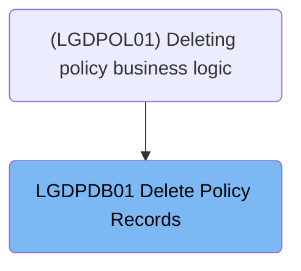
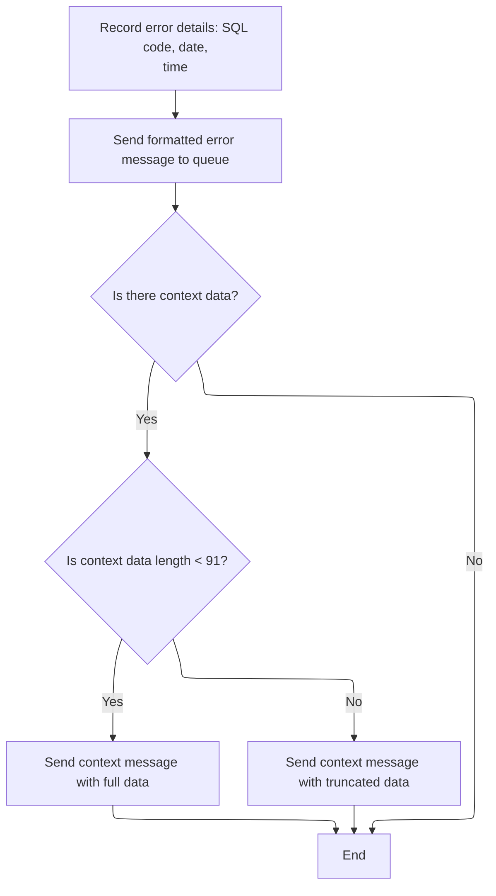
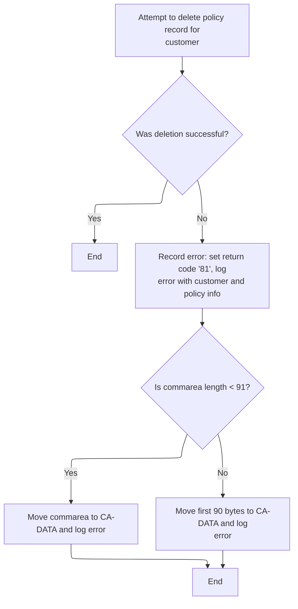

# Overview

```mermaid
flowchart TD
    node1["Validating and prepping request data
(Validating and prepping request data)"]:::HeadingStyle --> node2{"Is request valid?
(Validating and prepping request data)"}:::HeadingStyle
    click node1 goToHeading "Validating and prepping request data"
    node2 -->|"Yes"| node3["Deleting policy record in DB2
(Deleting policy record in DB2)"]:::HeadingStyle
    click node3 goToHeading "Deleting policy record in DB2"
    node2 -->|"No"| node4["Stop process"]
    node3 --> node5{"Did DB2 deletion succeed?
(Deleting policy record in DB2)"}:::HeadingStyle
    node5 -->|"Yes"| node6["Deleting policy record in file storage
(Deleting policy record in file storage)"]:::HeadingStyle
    click node6 goToHeading "Deleting policy record in file storage"
    node5 -->|"No"| node4
    node6 --> node7{"Did file deletion succeed?
(Deleting policy record in file storage)"}:::HeadingStyle
    node7 -->|"Yes"| node8["Process complete"]
    node7 -->|"No"| node4
    click node2 goToHeading "Validating and prepping request data"
    click node5 goToHeading "Deleting policy record in DB2"
    click node7 goToHeading "Deleting policy record in file storage"
classDef HeadingStyle fill:#777777,stroke:#333,stroke-width:2px;

%% Swimm:
%% flowchart TD
%%     node1["Validating and prepping request data
%% (Validating and prepping request data)"]:::HeadingStyle --> node2{"Is request valid?
%% (Validating and prepping request data)"}:::HeadingStyle
%%     click node1 goToHeading "Validating and prepping request data"
%%     node2 -->|"Yes"| node3["Deleting policy record in <SwmToken path="base/src/lgdpdb01.cbl" pos="124:5:5" line-data="      * initialize DB2 host variables">`DB2`</SwmToken>
%% (Deleting policy record in <SwmToken path="base/src/lgdpdb01.cbl" pos="124:5:5" line-data="      * initialize DB2 host variables">`DB2`</SwmToken>)"]:::HeadingStyle
%%     click node3 goToHeading "Deleting policy record in <SwmToken path="base/src/lgdpdb01.cbl" pos="124:5:5" line-data="      * initialize DB2 host variables">`DB2`</SwmToken>"
%%     node2 -->|"No"| node4["Stop process"]
%%     node3 --> node5{"Did <SwmToken path="base/src/lgdpdb01.cbl" pos="124:5:5" line-data="      * initialize DB2 host variables">`DB2`</SwmToken> deletion succeed?
%% (Deleting policy record in <SwmToken path="base/src/lgdpdb01.cbl" pos="124:5:5" line-data="      * initialize DB2 host variables">`DB2`</SwmToken>)"}:::HeadingStyle
%%     node5 -->|"Yes"| node6["Deleting policy record in file storage
%% (Deleting policy record in file storage)"]:::HeadingStyle
%%     click node6 goToHeading "Deleting policy record in file storage"
%%     node5 -->|"No"| node4
%%     node6 --> node7{"Did file deletion succeed?
%% (Deleting policy record in file storage)"}:::HeadingStyle
%%     node7 -->|"Yes"| node8["Process complete"]
%%     node7 -->|"No"| node4
%%     click node2 goToHeading "Validating and prepping request data"
%%     click node5 goToHeading "Deleting policy record in <SwmToken path="base/src/lgdpdb01.cbl" pos="124:5:5" line-data="      * initialize DB2 host variables">`DB2`</SwmToken>"
%%     click node7 goToHeading "Deleting policy record in file storage"
%% classDef HeadingStyle fill:#777777,stroke:#333,stroke-width:2px;
```

This document describes the flow for deleting a policy record for a customer. The process validates the request, deletes the policy from both <SwmToken path="base/src/lgdpdb01.cbl" pos="124:5:5" line-data="      * initialize DB2 host variables">`DB2`</SwmToken> and file storage, and logs errors with context if any step fails. The flow receives a deletion request with customer and policy information and returns a status code indicating success or failure.



## Dependencies

### Programs

- <SwmToken path="base/src/lgdpdb01.cbl" pos="13:6:6" line-data="       PROGRAM-ID. LGDPDB01.">`LGDPDB01`</SwmToken> (<SwmPath>[base/src/lgdpdb01.cbl](base/src/lgdpdb01.cbl)</SwmPath>)
- <SwmToken path="base/src/lgdpdb01.cbl" pos="168:9:9" line-data="               EXEC CICS LINK PROGRAM(LGDPVS01)">`LGDPVS01`</SwmToken> (<SwmPath>[base/src/lgdpvs01.cbl](base/src/lgdpvs01.cbl)</SwmPath>)
- LGSTSQ (<SwmPath>[base/src/lgstsq.cbl](base/src/lgstsq.cbl)</SwmPath>)

### Copybooks

- LGCMAREA (<SwmPath>[base/src/lgcmarea.cpy](base/src/lgcmarea.cpy)</SwmPath>)
- SQLCA

# Where is this program used?

This program is used once, as represented in the following diagram:



## Input and Output Tables/Files used

### <SwmToken path="base/src/lgdpdb01.cbl" pos="13:6:6" line-data="       PROGRAM-ID. LGDPDB01.">`LGDPDB01`</SwmToken> (<SwmPath>[base/src/lgdpdb01.cbl](base/src/lgdpdb01.cbl)</SwmPath>)

| Table / File Name | Type                                                                                                                    | Description                                             | Usage Mode | Key Fields / Layout Highlights           |
| ----------------- | ----------------------------------------------------------------------------------------------------------------------- | ------------------------------------------------------- | ---------- | ---------------------------------------- |
| POLICY            | <SwmToken path="base/src/lgdpdb01.cbl" pos="124:5:5" line-data="      * initialize DB2 host variables">`DB2`</SwmToken> | Insurance policy master record (customer, type, status) | Output     | Database table with relational structure |

## Detailed View of the Program's Functionality

# Request Processing and Initialization

## Preparation for Request Handling

At the start of the main request handler, the code initializes all necessary storage areas and variables. This includes setting up a block for tracking runtime information such as transaction ID, terminal ID, and task number. These identifiers are captured from the CICS environment to help trace and audit the request. The code also initializes variables used for <SwmToken path="base/src/lgdpdb01.cbl" pos="124:5:5" line-data="      * initialize DB2 host variables">`DB2`</SwmToken> operations, ensuring that any database-related fields are cleared and ready for use.

## Commarea Validation

The code checks if the commarea (the area of memory used to pass data between programs) is present. If it is missing, the system logs an error message detailing the issue and immediately terminates the task using a CICS abend. This prevents further processing and ensures the error is recorded for later review.

# Error Logging and Formatting

## Error Message Construction

When an error occurs, the error logging routine is invoked. This routine captures the current SQL error code, then uses CICS services to obtain the current date and time. These values are formatted and inserted into the error message structure, along with relevant identifiers such as customer and policy numbers. This ensures every error log is timestamped and contains enough context for troubleshooting.

## Writing Error Messages to Queues

After formatting the error message, the code links to a dedicated queue handler program. This program writes the error message to both a temporary queue (for immediate review) and a permanent queue (for long-term storage). If there is additional context data in the commarea, up to 90 bytes are copied and logged as a separate message. If the commarea is larger than 90 bytes, only the first 90 bytes are logged to fit the queue format.

## Queue Handler Logic

The queue handler determines whether the message is coming from a calling program or from a CICS RECEIVE operation. If the message starts with a special prefix indicating a custom queue, it adjusts the queue name accordingly and trims the prefix from the message. The handler then writes the message to both the temporary and permanent queues. If the message was received, it sends a brief response back to the terminal before returning control.

# Request Data Validation and Preparation

## Commarea Size and Request Type Checks

The main handler sets the initial return code and checks if the commarea is large enough to contain the required header information. If it is too small, the handler returns an error code and exits early. If the commarea is sufficient, customer and policy numbers are converted to the format required for <SwmToken path="base/src/lgdpdb01.cbl" pos="124:5:5" line-data="      * initialize DB2 host variables">`DB2`</SwmToken> operations and stored in the error message structure for potential logging.

## Supported Request Types

The handler checks if the request type matches one of the allowed deletion types (endowment, house, commercial, motor). If the request type is unsupported, an error code is set and the handler returns. If the request type is valid, the handler proceeds to delete the policy information from the <SwmToken path="base/src/lgdpdb01.cbl" pos="124:5:5" line-data="      * initialize DB2 host variables">`DB2`</SwmToken> database and then links to a downstream program to handle file-based deletion.

# Deleting Policy Record in <SwmToken path="base/src/lgdpdb01.cbl" pos="124:5:5" line-data="      * initialize DB2 host variables">`DB2`</SwmToken>

## <SwmToken path="base/src/lgdpdb01.cbl" pos="124:5:5" line-data="      * initialize DB2 host variables">`DB2`</SwmToken> Deletion Logic

A dedicated routine is called to delete the policy record from the <SwmToken path="base/src/lgdpdb01.cbl" pos="124:5:5" line-data="      * initialize DB2 host variables">`DB2`</SwmToken> database. The SQL request is constructed using the customer and policy numbers. If the deletion fails with any error other than "success" or "record not found," the handler sets an error code, logs the error, and returns control to the caller. Otherwise, the routine exits and processing continues.

# Deleting Policy Record in File Storage

## File Deletion Preparation

The downstream program prepares for file deletion by extracting the relevant part of the request ID and setting up the policy key. It then attempts to delete the policy record from the VSAM file storage using CICS file services.

## File Deletion Outcome Handling

If the file deletion is unsuccessful, the handler captures the response code, sets an error return code, and logs the error. The error message includes customer and policy numbers, response codes, and the date/time. Up to 90 bytes of commarea data are also logged for context. If the commarea is smaller than 91 bytes, the entire commarea is logged; otherwise, only the first 90 bytes are logged.

## Error Logging in File Deletion

The error logging routine in the file deletion handler formats the error details, fills out the message fields, and calls the queue handler to write both the error message and commarea data to the error queues. This ensures that all relevant information about the failure is captured and available for review.

# Summary of Flow

 1. The main handler initializes storage and validates the commarea.
 2. If the commarea is missing or too small, an error is logged and processing stops.
 3. If the request type is unsupported, an error is logged and processing stops.
 4. For valid requests, the policy record is deleted from <SwmToken path="base/src/lgdpdb01.cbl" pos="124:5:5" line-data="      * initialize DB2 host variables">`DB2`</SwmToken>.
 5. If <SwmToken path="base/src/lgdpdb01.cbl" pos="124:5:5" line-data="      * initialize DB2 host variables">`DB2`</SwmToken> deletion fails, an error is logged and processing stops.
 6. If <SwmToken path="base/src/lgdpdb01.cbl" pos="124:5:5" line-data="      * initialize DB2 host variables">`DB2`</SwmToken> deletion succeeds, the handler links to the file deletion program.
 7. The file deletion program attempts to delete the policy record from VSAM storage.
 8. If file deletion fails, an error is logged with detailed context.
 9. All errors are logged with date, time, identifiers, and up to 90 bytes of commarea data.
10. The queue handler writes error messages to both temporary and permanent queues, adjusting queue names as needed.

# Data Definitions

### <SwmToken path="base/src/lgdpdb01.cbl" pos="13:6:6" line-data="       PROGRAM-ID. LGDPDB01.">`LGDPDB01`</SwmToken> (<SwmPath>[base/src/lgdpdb01.cbl](base/src/lgdpdb01.cbl)</SwmPath>)

| Table / Record Name | Type                                                                                                                    | Short Description                                       | Usage Mode      |
| ------------------- | ----------------------------------------------------------------------------------------------------------------------- | ------------------------------------------------------- | --------------- |
| POLICY              | <SwmToken path="base/src/lgdpdb01.cbl" pos="124:5:5" line-data="      * initialize DB2 host variables">`DB2`</SwmToken> | Insurance policy master record (customer, type, status) | Output (DELETE) |

# Rule Definition

| Paragraph Name                                                                                                                                                                                                                                                                                                                                                                                                                                                                                                                                | Rule ID | Category          | Description                                                                                                                                                                                                                                                                                                                                                                                                                                                                                                                                                                                                                                                                                                                                                                                                                                                                                                         | Conditions                                                                                                                                                                       | Remarks                                                                                                                                                                                                                                                    |
| --------------------------------------------------------------------------------------------------------------------------------------------------------------------------------------------------------------------------------------------------------------------------------------------------------------------------------------------------------------------------------------------------------------------------------------------------------------------------------------------------------------------------------------------- | ------- | ----------------- | ------------------------------------------------------------------------------------------------------------------------------------------------------------------------------------------------------------------------------------------------------------------------------------------------------------------------------------------------------------------------------------------------------------------------------------------------------------------------------------------------------------------------------------------------------------------------------------------------------------------------------------------------------------------------------------------------------------------------------------------------------------------------------------------------------------------------------------------------------------------------------------------------------------------- | -------------------------------------------------------------------------------------------------------------------------------------------------------------------------------- | ---------------------------------------------------------------------------------------------------------------------------------------------------------------------------------------------------------------------------------------------------------- |
| MAINLINE SECTION in <SwmToken path="base/src/lgdpdb01.cbl" pos="13:6:6" line-data="       PROGRAM-ID. LGDPDB01.">`LGDPDB01`</SwmToken>, <SwmToken path="base/src/lgdpdb01.cbl" pos="19:1:3" line-data="       WORKING-STORAGE SECTION.">`WORKING-STORAGE`</SwmToken> SECTION in <SwmToken path="base/src/lgdpdb01.cbl" pos="168:9:9" line-data="               EXEC CICS LINK PROGRAM(LGDPVS01)">`LGDPVS01`</SwmToken> and <SwmToken path="base/src/lgdpdb01.cbl" pos="13:6:6" line-data="       PROGRAM-ID. LGDPDB01.">`LGDPDB01`</SwmToken> | RL-001  | Data Assignment   | Before any request is processed, all working storage and <SwmToken path="base/src/lgdpdb01.cbl" pos="124:5:5" line-data="      * initialize DB2 host variables">`DB2`</SwmToken> variables must be initialized to ensure a clean state for each transaction.                                                                                                                                                                                                                                                                                                                                                                                                                                                                                                                                                                                                                                                        | At the start of program execution, before any business logic is processed.                                                                                                       | Initialization includes all working storage fields and <SwmToken path="base/src/lgdpdb01.cbl" pos="124:5:5" line-data="      * initialize DB2 host variables">`DB2`</SwmToken> host variables. No specific output format is required for this rule.        |
| MAINLINE SECTION in <SwmToken path="base/src/lgdpdb01.cbl" pos="13:6:6" line-data="       PROGRAM-ID. LGDPDB01.">`LGDPDB01`</SwmToken>                                                                                                                                                                                                                                                                                                                                                                                                        | RL-002  | Data Assignment   | Transaction metadata such as transaction ID, terminal ID, and task number must be captured at the start of request processing for traceability.                                                                                                                                                                                                                                                                                                                                                                                                                                                                                                                                                                                                                                                                                                                                                                     | At the start of each request processing.                                                                                                                                         | Captured metadata includes transaction ID (4 chars), terminal ID (4 chars), and task number (7 digits).                                                                                                                                                    |
| MAINLINE SECTION in <SwmToken path="base/src/lgdpdb01.cbl" pos="13:6:6" line-data="       PROGRAM-ID. LGDPDB01.">`LGDPDB01`</SwmToken>                                                                                                                                                                                                                                                                                                                                                                                                        | RL-003  | Conditional Logic | If the commarea is missing (length zero), the program must log the error, send a formatted error message to the error queues, and terminate processing.                                                                                                                                                                                                                                                                                                                                                                                                                                                                                                                                                                                                                                                                                                                                                             | If commarea length is zero at the start of processing.                                                                                                                           | Error log must include SQL code, date, time, program name, customer number, policy number, and up to 90 bytes of commarea data prefixed with 'COMMAREA='. Error messages are sent to both 'CSMT' and 'GENAERRS' queues via LGSTSQ.                         |
| MAINLINE SECTION in <SwmToken path="base/src/lgdpdb01.cbl" pos="13:6:6" line-data="       PROGRAM-ID. LGDPDB01.">`LGDPDB01`</SwmToken>                                                                                                                                                                                                                                                                                                                                                                                                        | RL-004  | Conditional Logic | The program must check that the commarea length is at least 28 bytes before proceeding. If it is less, set <SwmToken path="base/src/lgdpdb01.cbl" pos="138:9:13" line-data="           MOVE &#39;00&#39; TO CA-RETURN-CODE">`CA-RETURN-CODE`</SwmToken> to '98', log the error, and return.                                                                                                                                                                                                                                                                                                                                                                                                                                                                                                                                                                                                                         | If commarea length is less than 28 bytes.                                                                                                                                        | <SwmToken path="base/src/lgdpdb01.cbl" pos="138:9:13" line-data="           MOVE &#39;00&#39; TO CA-RETURN-CODE">`CA-RETURN-CODE`</SwmToken> is set to '98'. Error log includes all required fields and up to 90 bytes of commarea data.                   |
| MAINLINE SECTION in <SwmToken path="base/src/lgdpdb01.cbl" pos="13:6:6" line-data="       PROGRAM-ID. LGDPDB01.">`LGDPDB01`</SwmToken>                                                                                                                                                                                                                                                                                                                                                                                                        | RL-005  | Conditional Logic | The program must check if the request type is one of the supported deletion types (<SwmToken path="base/src/lgdpdb01.cbl" pos="160:18:18" line-data="           IF ( CA-REQUEST-ID NOT EQUAL TO &#39;01DEND&#39; AND">`01DEND`</SwmToken>, <SwmToken path="base/src/lgdpdb01.cbl" pos="161:14:14" line-data="                CA-REQUEST-ID NOT EQUAL TO &#39;01DHOU&#39; AND">`01DHOU`</SwmToken>, <SwmToken path="base/src/lgdpdb01.cbl" pos="162:14:14" line-data="                CA-REQUEST-ID NOT EQUAL TO &#39;01DCOM&#39; AND">`01DCOM`</SwmToken>, <SwmToken path="base/src/lgdpdb01.cbl" pos="163:14:14" line-data="                CA-REQUEST-ID NOT EQUAL TO &#39;01DMOT&#39; ) Then">`01DMOT`</SwmToken>). If not, set <SwmToken path="base/src/lgdpdb01.cbl" pos="138:9:13" line-data="           MOVE &#39;00&#39; TO CA-RETURN-CODE">`CA-RETURN-CODE`</SwmToken> to '99', log the error, and return. | If request type is not one of the supported values.                                                                                                                              | <SwmToken path="base/src/lgdpdb01.cbl" pos="138:9:13" line-data="           MOVE &#39;00&#39; TO CA-RETURN-CODE">`CA-RETURN-CODE`</SwmToken> is set to '99'. Error log includes all required fields and up to 90 bytes of commarea data.                   |
| MAINLINE SECTION in <SwmToken path="base/src/lgdpdb01.cbl" pos="13:6:6" line-data="       PROGRAM-ID. LGDPDB01.">`LGDPDB01`</SwmToken>                                                                                                                                                                                                                                                                                                                                                                                                        | RL-006  | Data Assignment   | Customer and policy numbers from the commarea must be converted to <SwmToken path="base/src/lgdpdb01.cbl" pos="124:5:5" line-data="      * initialize DB2 host variables">`DB2`</SwmToken> integer format for database operations and included in error logs if needed.                                                                                                                                                                                                                                                                                                                                                                                                                                                                                                                                                                                                                                             | After commarea validation and before <SwmToken path="base/src/lgdpdb01.cbl" pos="124:5:5" line-data="      * initialize DB2 host variables">`DB2`</SwmToken> operations.         | Customer and policy numbers are 10-character alphanumeric fields in commarea, converted to 9-digit signed integers for <SwmToken path="base/src/lgdpdb01.cbl" pos="124:5:5" line-data="      * initialize DB2 host variables">`DB2`</SwmToken> operations. |
| <SwmToken path="base/src/lgdpdb01.cbl" pos="167:3:9" line-data="               PERFORM DELETE-POLICY-DB2-INFO">`DELETE-POLICY-DB2-INFO`</SwmToken> in <SwmToken path="base/src/lgdpdb01.cbl" pos="13:6:6" line-data="       PROGRAM-ID. LGDPDB01.">`LGDPDB01`</SwmToken>                                                                                                                                                                                                                                                                      | RL-007  | Computation       | For supported request types, the program must delete the policy record from the <SwmToken path="base/src/lgdpdb01.cbl" pos="124:5:5" line-data="      * initialize DB2 host variables">`DB2`</SwmToken> POLICY table where customer and policy numbers match the commarea values.                                                                                                                                                                                                                                                                                                                                                                                                                                                                                                                                                                                                                                   | If request type is supported and commarea is valid.                                                                                                                              | Delete is performed using <SwmToken path="base/src/lgdpdb01.cbl" pos="124:5:5" line-data="      * initialize DB2 host variables">`DB2`</SwmToken> SQL DELETE statement. Success is SQLCODE 0 or 100.                                                       |
| <SwmToken path="base/src/lgdpdb01.cbl" pos="167:3:9" line-data="               PERFORM DELETE-POLICY-DB2-INFO">`DELETE-POLICY-DB2-INFO`</SwmToken> in <SwmToken path="base/src/lgdpdb01.cbl" pos="13:6:6" line-data="       PROGRAM-ID. LGDPDB01.">`LGDPDB01`</SwmToken>                                                                                                                                                                                                                                                                      | RL-008  | Conditional Logic | If the <SwmToken path="base/src/lgdpdb01.cbl" pos="124:5:5" line-data="      * initialize DB2 host variables">`DB2`</SwmToken> delete returns a SQLCODE other than 0 or 100, set <SwmToken path="base/src/lgdpdb01.cbl" pos="138:9:13" line-data="           MOVE &#39;00&#39; TO CA-RETURN-CODE">`CA-RETURN-CODE`</SwmToken> to '90', log the error, and return.                                                                                                                                                                                                                                                                                                                                                                                                                                                                                                                                                   | If SQLCODE is not 0 or 100 after <SwmToken path="base/src/lgdpdb01.cbl" pos="124:5:5" line-data="      * initialize DB2 host variables">`DB2`</SwmToken> delete.                 | <SwmToken path="base/src/lgdpdb01.cbl" pos="138:9:13" line-data="           MOVE &#39;00&#39; TO CA-RETURN-CODE">`CA-RETURN-CODE`</SwmToken> is set to '90'. Error log includes all required fields and up to 90 bytes of commarea data.                   |
| MAINLINE SECTION in <SwmToken path="base/src/lgdpdb01.cbl" pos="168:9:9" line-data="               EXEC CICS LINK PROGRAM(LGDPVS01)">`LGDPVS01`</SwmToken>                                                                                                                                                                                                                                                                                                                                                                                    | RL-009  | Computation       | The program must delete the policy record from the VSAM/KSDS file 'KSDSPOLY' using a 21-byte key composed of: 1 character from the 4th char of <SwmToken path="base/src/lgdpdb01.cbl" pos="160:5:9" line-data="           IF ( CA-REQUEST-ID NOT EQUAL TO &#39;01DEND&#39; AND">`CA-REQUEST-ID`</SwmToken>, 10 characters of customer number, and 10 characters of policy number.                                                                                                                                                                                                                                                                                                                                                                                                                                                                                                                                   | After successful <SwmToken path="base/src/lgdpdb01.cbl" pos="124:5:5" line-data="      * initialize DB2 host variables">`DB2`</SwmToken> delete and for supported request types. | Key is 21 bytes: 1 char (4th of request ID), 10 chars customer number, 10 chars policy number. All fields are alphanumeric.                                                                                                                                |
| MAINLINE SECTION and <SwmToken path="base/src/lgdpdb01.cbl" pos="133:3:7" line-data="               PERFORM WRITE-ERROR-MESSAGE">`WRITE-ERROR-MESSAGE`</SwmToken> in <SwmToken path="base/src/lgdpdb01.cbl" pos="168:9:9" line-data="               EXEC CICS LINK PROGRAM(LGDPVS01)">`LGDPVS01`</SwmToken>                                                                                                                                                                                                                                   | RL-010  | Conditional Logic | If the file delete fails, set <SwmToken path="base/src/lgdpdb01.cbl" pos="138:9:13" line-data="           MOVE &#39;00&#39; TO CA-RETURN-CODE">`CA-RETURN-CODE`</SwmToken> to '81', log the error (including up to 90 bytes of commarea data), and return.                                                                                                                                                                                                                                                                                                                                                                                                                                                                                                                                                                                                                                                          | If VSAM/KSDS file delete RESP code is not NORMAL.                                                                                                                                | <SwmToken path="base/src/lgdpdb01.cbl" pos="138:9:13" line-data="           MOVE &#39;00&#39; TO CA-RETURN-CODE">`CA-RETURN-CODE`</SwmToken> is set to '81'. Error log includes all required fields and up to 90 bytes of commarea data.                   |
| <SwmToken path="base/src/lgdpdb01.cbl" pos="133:3:7" line-data="               PERFORM WRITE-ERROR-MESSAGE">`WRITE-ERROR-MESSAGE`</SwmToken> in <SwmToken path="base/src/lgdpdb01.cbl" pos="13:6:6" line-data="       PROGRAM-ID. LGDPDB01.">`LGDPDB01`</SwmToken> and <SwmToken path="base/src/lgdpdb01.cbl" pos="168:9:9" line-data="               EXEC CICS LINK PROGRAM(LGDPVS01)">`LGDPVS01`</SwmToken>                                                                                                                                 | RL-011  | Data Assignment   | All error logs must include the current date and time, program name, customer number, policy number, relevant return codes, and up to 90 bytes of commarea data prefixed with 'COMMAREA='.                                                                                                                                                                                                                                                                                                                                                                                                                                                                                                                                                                                                                                                                                                                          | Whenever an error is logged.                                                                                                                                                     | Error log format:                                                                                                                                                                                                                                          |

- Date: 8 chars
- Time: 6 chars
- Program name: 8-9 chars
- Customer number: 10 chars
- Policy number: 10 chars
- Return codes: 2 chars
- Up to 90 bytes of commarea data, prefixed with 'COMMAREA=' (9 chars prefix + up to 90 chars data)
- All fields are alphanumeric except return codes (numeric/alphanumeric as per context). | | <SwmToken path="base/src/lgdpdb01.cbl" pos="133:3:7" line-data="               PERFORM WRITE-ERROR-MESSAGE">`WRITE-ERROR-MESSAGE`</SwmToken> in <SwmToken path="base/src/lgdpdb01.cbl" pos="13:6:6" line-data="       PROGRAM-ID. LGDPDB01.">`LGDPDB01`</SwmToken> and <SwmToken path="base/src/lgdpdb01.cbl" pos="168:9:9" line-data="               EXEC CICS LINK PROGRAM(LGDPVS01)">`LGDPVS01`</SwmToken>, LGSTSQ program | RL-012 | Computation | Error messages must be sent to both the temporary ('CSMT') and permanent ('GENAERRS') queues via the LGSTSQ interface, using the error message structure as the commarea. | Whenever an error is logged. | Messages are sent to 'CSMT' (temporary) and 'GENAERRS' (permanent) queues. Message format is as described in the error log rule. If the message starts with 'Q=', the queue name is dynamically set to 'GENA' + suffix. | | MAINLINE SECTION in <SwmToken path="base/src/lgdpdb01.cbl" pos="13:6:6" line-data="       PROGRAM-ID. LGDPDB01.">`LGDPDB01`</SwmToken> and <SwmToken path="base/src/lgdpdb01.cbl" pos="168:9:9" line-data="               EXEC CICS LINK PROGRAM(LGDPVS01)">`LGDPVS01`</SwmToken> | RL-013 | Conditional Logic | After successful processing or error handling, the program must return control to the caller. | At the end of processing, whether successful or after error handling. | No specific output format. Ensures predictable program flow. |

# User Stories

## User Story 1: Program Initialization and Metadata Capture

---

### Story Description:

As the system, I want all working storage and <SwmToken path="base/src/lgdpdb01.cbl" pos="124:5:5" line-data="      * initialize DB2 host variables">`DB2`</SwmToken> variables initialized and transaction metadata captured at the start of processing so that each transaction begins in a clean state and is traceable.

---

### Business Rule Mapping:

| Rule ID | Paragraph Name                                                                                                                                                                                                                                                                                                                                                                                                                                                                                                                                | Rule Description                                                                                                                                                                                                                                             |
| ------- | --------------------------------------------------------------------------------------------------------------------------------------------------------------------------------------------------------------------------------------------------------------------------------------------------------------------------------------------------------------------------------------------------------------------------------------------------------------------------------------------------------------------------------------------- | ------------------------------------------------------------------------------------------------------------------------------------------------------------------------------------------------------------------------------------------------------------ |
| RL-001  | MAINLINE SECTION in <SwmToken path="base/src/lgdpdb01.cbl" pos="13:6:6" line-data="       PROGRAM-ID. LGDPDB01.">`LGDPDB01`</SwmToken>, <SwmToken path="base/src/lgdpdb01.cbl" pos="19:1:3" line-data="       WORKING-STORAGE SECTION.">`WORKING-STORAGE`</SwmToken> SECTION in <SwmToken path="base/src/lgdpdb01.cbl" pos="168:9:9" line-data="               EXEC CICS LINK PROGRAM(LGDPVS01)">`LGDPVS01`</SwmToken> and <SwmToken path="base/src/lgdpdb01.cbl" pos="13:6:6" line-data="       PROGRAM-ID. LGDPDB01.">`LGDPDB01`</SwmToken> | Before any request is processed, all working storage and <SwmToken path="base/src/lgdpdb01.cbl" pos="124:5:5" line-data="      * initialize DB2 host variables">`DB2`</SwmToken> variables must be initialized to ensure a clean state for each transaction. |
| RL-002  | MAINLINE SECTION in <SwmToken path="base/src/lgdpdb01.cbl" pos="13:6:6" line-data="       PROGRAM-ID. LGDPDB01.">`LGDPDB01`</SwmToken>                                                                                                                                                                                                                                                                                                                                                                                                        | Transaction metadata such as transaction ID, terminal ID, and task number must be captured at the start of request processing for traceability.                                                                                                              |

---

### Relevant Functionality:

- **MAINLINE SECTION in** <SwmToken path="base/src/lgdpdb01.cbl" pos="13:6:6" line-data="       PROGRAM-ID. LGDPDB01.">`LGDPDB01`</SwmToken>
  1. **RL-001:**
     - At program start:
       - Initialize all working storage variables.
       - Initialize <SwmToken path="base/src/lgdpdb01.cbl" pos="124:5:5" line-data="      * initialize DB2 host variables">`DB2`</SwmToken> host variables.
  2. **RL-002:**
     - At start of MAINLINE:
       - Move transaction ID to metadata field.
       - Move terminal ID to metadata field.
       - Move task number to metadata field.

## User Story 2: Comprehensive Error Handling, Logging, and Finalization

---

### Story Description:

As the system, I want to log all errors with detailed information, including date, time, program name, customer number, policy number, return codes, and up to 90 bytes of commarea data, send error messages to both temporary and permanent queues, and return control to the caller after processing, so that errors are traceable, recoverable, and program flow is predictable.

---

### Business Rule Mapping:

| Rule ID | Paragraph Name                                                                                                                                                                                                                                                                                                                                                                                                                | Rule Description                                                                                                                                                                                                                                                                                                                                                                                                                                                                                                                                                                                                                                                                                                                                                                                                                                                                                                    |
| ------- | ----------------------------------------------------------------------------------------------------------------------------------------------------------------------------------------------------------------------------------------------------------------------------------------------------------------------------------------------------------------------------------------------------------------------------- | ------------------------------------------------------------------------------------------------------------------------------------------------------------------------------------------------------------------------------------------------------------------------------------------------------------------------------------------------------------------------------------------------------------------------------------------------------------------------------------------------------------------------------------------------------------------------------------------------------------------------------------------------------------------------------------------------------------------------------------------------------------------------------------------------------------------------------------------------------------------------------------------------------------------- |
| RL-003  | MAINLINE SECTION in <SwmToken path="base/src/lgdpdb01.cbl" pos="13:6:6" line-data="       PROGRAM-ID. LGDPDB01.">`LGDPDB01`</SwmToken>                                                                                                                                                                                                                                                                                        | If the commarea is missing (length zero), the program must log the error, send a formatted error message to the error queues, and terminate processing.                                                                                                                                                                                                                                                                                                                                                                                                                                                                                                                                                                                                                                                                                                                                                             |
| RL-004  | MAINLINE SECTION in <SwmToken path="base/src/lgdpdb01.cbl" pos="13:6:6" line-data="       PROGRAM-ID. LGDPDB01.">`LGDPDB01`</SwmToken>                                                                                                                                                                                                                                                                                        | The program must check that the commarea length is at least 28 bytes before proceeding. If it is less, set <SwmToken path="base/src/lgdpdb01.cbl" pos="138:9:13" line-data="           MOVE &#39;00&#39; TO CA-RETURN-CODE">`CA-RETURN-CODE`</SwmToken> to '98', log the error, and return.                                                                                                                                                                                                                                                                                                                                                                                                                                                                                                                                                                                                                         |
| RL-005  | MAINLINE SECTION in <SwmToken path="base/src/lgdpdb01.cbl" pos="13:6:6" line-data="       PROGRAM-ID. LGDPDB01.">`LGDPDB01`</SwmToken>                                                                                                                                                                                                                                                                                        | The program must check if the request type is one of the supported deletion types (<SwmToken path="base/src/lgdpdb01.cbl" pos="160:18:18" line-data="           IF ( CA-REQUEST-ID NOT EQUAL TO &#39;01DEND&#39; AND">`01DEND`</SwmToken>, <SwmToken path="base/src/lgdpdb01.cbl" pos="161:14:14" line-data="                CA-REQUEST-ID NOT EQUAL TO &#39;01DHOU&#39; AND">`01DHOU`</SwmToken>, <SwmToken path="base/src/lgdpdb01.cbl" pos="162:14:14" line-data="                CA-REQUEST-ID NOT EQUAL TO &#39;01DCOM&#39; AND">`01DCOM`</SwmToken>, <SwmToken path="base/src/lgdpdb01.cbl" pos="163:14:14" line-data="                CA-REQUEST-ID NOT EQUAL TO &#39;01DMOT&#39; ) Then">`01DMOT`</SwmToken>). If not, set <SwmToken path="base/src/lgdpdb01.cbl" pos="138:9:13" line-data="           MOVE &#39;00&#39; TO CA-RETURN-CODE">`CA-RETURN-CODE`</SwmToken> to '99', log the error, and return. |
| RL-008  | <SwmToken path="base/src/lgdpdb01.cbl" pos="167:3:9" line-data="               PERFORM DELETE-POLICY-DB2-INFO">`DELETE-POLICY-DB2-INFO`</SwmToken> in <SwmToken path="base/src/lgdpdb01.cbl" pos="13:6:6" line-data="       PROGRAM-ID. LGDPDB01.">`LGDPDB01`</SwmToken>                                                                                                                                                      | If the <SwmToken path="base/src/lgdpdb01.cbl" pos="124:5:5" line-data="      * initialize DB2 host variables">`DB2`</SwmToken> delete returns a SQLCODE other than 0 or 100, set <SwmToken path="base/src/lgdpdb01.cbl" pos="138:9:13" line-data="           MOVE &#39;00&#39; TO CA-RETURN-CODE">`CA-RETURN-CODE`</SwmToken> to '90', log the error, and return.                                                                                                                                                                                                                                                                                                                                                                                                                                                                                                                                                   |
| RL-010  | MAINLINE SECTION and <SwmToken path="base/src/lgdpdb01.cbl" pos="133:3:7" line-data="               PERFORM WRITE-ERROR-MESSAGE">`WRITE-ERROR-MESSAGE`</SwmToken> in <SwmToken path="base/src/lgdpdb01.cbl" pos="168:9:9" line-data="               EXEC CICS LINK PROGRAM(LGDPVS01)">`LGDPVS01`</SwmToken>                                                                                                                   | If the file delete fails, set <SwmToken path="base/src/lgdpdb01.cbl" pos="138:9:13" line-data="           MOVE &#39;00&#39; TO CA-RETURN-CODE">`CA-RETURN-CODE`</SwmToken> to '81', log the error (including up to 90 bytes of commarea data), and return.                                                                                                                                                                                                                                                                                                                                                                                                                                                                                                                                                                                                                                                          |
| RL-011  | <SwmToken path="base/src/lgdpdb01.cbl" pos="133:3:7" line-data="               PERFORM WRITE-ERROR-MESSAGE">`WRITE-ERROR-MESSAGE`</SwmToken> in <SwmToken path="base/src/lgdpdb01.cbl" pos="13:6:6" line-data="       PROGRAM-ID. LGDPDB01.">`LGDPDB01`</SwmToken> and <SwmToken path="base/src/lgdpdb01.cbl" pos="168:9:9" line-data="               EXEC CICS LINK PROGRAM(LGDPVS01)">`LGDPVS01`</SwmToken>                 | All error logs must include the current date and time, program name, customer number, policy number, relevant return codes, and up to 90 bytes of commarea data prefixed with 'COMMAREA='.                                                                                                                                                                                                                                                                                                                                                                                                                                                                                                                                                                                                                                                                                                                          |
| RL-012  | <SwmToken path="base/src/lgdpdb01.cbl" pos="133:3:7" line-data="               PERFORM WRITE-ERROR-MESSAGE">`WRITE-ERROR-MESSAGE`</SwmToken> in <SwmToken path="base/src/lgdpdb01.cbl" pos="13:6:6" line-data="       PROGRAM-ID. LGDPDB01.">`LGDPDB01`</SwmToken> and <SwmToken path="base/src/lgdpdb01.cbl" pos="168:9:9" line-data="               EXEC CICS LINK PROGRAM(LGDPVS01)">`LGDPVS01`</SwmToken>, LGSTSQ program | Error messages must be sent to both the temporary ('CSMT') and permanent ('GENAERRS') queues via the LGSTSQ interface, using the error message structure as the commarea.                                                                                                                                                                                                                                                                                                                                                                                                                                                                                                                                                                                                                                                                                                                                           |
| RL-013  | MAINLINE SECTION in <SwmToken path="base/src/lgdpdb01.cbl" pos="13:6:6" line-data="       PROGRAM-ID. LGDPDB01.">`LGDPDB01`</SwmToken> and <SwmToken path="base/src/lgdpdb01.cbl" pos="168:9:9" line-data="               EXEC CICS LINK PROGRAM(LGDPVS01)">`LGDPVS01`</SwmToken>                                                                                                                                             | After successful processing or error handling, the program must return control to the caller.                                                                                                                                                                                                                                                                                                                                                                                                                                                                                                                                                                                                                                                                                                                                                                                                                       |

---

### Relevant Functionality:

- **MAINLINE SECTION in** <SwmToken path="base/src/lgdpdb01.cbl" pos="13:6:6" line-data="       PROGRAM-ID. LGDPDB01.">`LGDPDB01`</SwmToken>
  1. **RL-003:**
     - If commarea length is zero:
       - Set error message variable to indicate missing commarea.
       - Perform <SwmToken path="base/src/lgdpdb01.cbl" pos="133:3:7" line-data="               PERFORM WRITE-ERROR-MESSAGE">`WRITE-ERROR-MESSAGE`</SwmToken>.
       - ABEND with code 'LGCA' (no dump).
       - Terminate processing.
  2. **RL-004:**
     - If commarea length < 28:
       - Set return code to '98'.
       - Log the error (<SwmToken path="base/src/lgdpdb01.cbl" pos="133:3:7" line-data="               PERFORM WRITE-ERROR-MESSAGE">`WRITE-ERROR-MESSAGE`</SwmToken>).
       - Return to caller.
  3. **RL-005:**
     - If request type not in supported list:
       - Set return code to '99'.
       - Log the error (<SwmToken path="base/src/lgdpdb01.cbl" pos="133:3:7" line-data="               PERFORM WRITE-ERROR-MESSAGE">`WRITE-ERROR-MESSAGE`</SwmToken>).
       - Return to caller.
- <SwmToken path="base/src/lgdpdb01.cbl" pos="167:3:9" line-data="               PERFORM DELETE-POLICY-DB2-INFO">`DELETE-POLICY-DB2-INFO`</SwmToken> **in** <SwmToken path="base/src/lgdpdb01.cbl" pos="13:6:6" line-data="       PROGRAM-ID. LGDPDB01.">`LGDPDB01`</SwmToken>
  1. **RL-008:**
     - If SQLCODE not 0 or 100:
       - Set return code to '90'.
       - Log the error (<SwmToken path="base/src/lgdpdb01.cbl" pos="133:3:7" line-data="               PERFORM WRITE-ERROR-MESSAGE">`WRITE-ERROR-MESSAGE`</SwmToken>).
       - Return to caller.
- **MAINLINE SECTION and** <SwmToken path="base/src/lgdpdb01.cbl" pos="133:3:7" line-data="               PERFORM WRITE-ERROR-MESSAGE">`WRITE-ERROR-MESSAGE`</SwmToken> **in** <SwmToken path="base/src/lgdpdb01.cbl" pos="168:9:9" line-data="               EXEC CICS LINK PROGRAM(LGDPVS01)">`LGDPVS01`</SwmToken>
  1. **RL-010:**
     - If VSAM delete RESP code not NORMAL:
       - Set return code to '81'.
       - Log the error (<SwmToken path="base/src/lgdpdb01.cbl" pos="133:3:7" line-data="               PERFORM WRITE-ERROR-MESSAGE">`WRITE-ERROR-MESSAGE`</SwmToken>).
       - Return to caller.
- <SwmToken path="base/src/lgdpdb01.cbl" pos="133:3:7" line-data="               PERFORM WRITE-ERROR-MESSAGE">`WRITE-ERROR-MESSAGE`</SwmToken> **in** <SwmToken path="base/src/lgdpdb01.cbl" pos="13:6:6" line-data="       PROGRAM-ID. LGDPDB01.">`LGDPDB01`</SwmToken> **and** <SwmToken path="base/src/lgdpdb01.cbl" pos="168:9:9" line-data="               EXEC CICS LINK PROGRAM(LGDPVS01)">`LGDPVS01`</SwmToken>
  1. **RL-011:**
     - On error:
       - Obtain current date and time.
       - Populate error message structure with required fields.
       - If commarea present, include up to 90 bytes prefixed with 'COMMAREA='.
       - Send error message to error queues.
  2. **RL-012:**
     - On error:
       - Call LGSTSQ with error message as commarea.
       - LGSTSQ writes message to 'CSMT' and 'GENAERRS' queues.
       - If message starts with 'Q=', adjust queue name accordingly.
- **MAINLINE SECTION in** <SwmToken path="base/src/lgdpdb01.cbl" pos="13:6:6" line-data="       PROGRAM-ID. LGDPDB01.">`LGDPDB01`</SwmToken> **and** <SwmToken path="base/src/lgdpdb01.cbl" pos="168:9:9" line-data="               EXEC CICS LINK PROGRAM(LGDPVS01)">`LGDPVS01`</SwmToken>
  1. **RL-013:**
     - After all processing or error handling:
       - Execute RETURN to caller.

## User Story 3: Policy Deletion from <SwmToken path="base/src/lgdpdb01.cbl" pos="124:5:5" line-data="      * initialize DB2 host variables">`DB2`</SwmToken> and VSAM

---

### Story Description:

As the system, I want to convert customer and policy numbers from the commarea to <SwmToken path="base/src/lgdpdb01.cbl" pos="124:5:5" line-data="      * initialize DB2 host variables">`DB2`</SwmToken> integer format, delete the policy record from the <SwmToken path="base/src/lgdpdb01.cbl" pos="124:5:5" line-data="      * initialize DB2 host variables">`DB2`</SwmToken> POLICY table and the VSAM/KSDS file using the appropriate keys, and handle any errors that occur during these operations, so that policy deletions are processed correctly and failures are logged and managed.

---

### Business Rule Mapping:

| Rule ID | Paragraph Name                                                                                                                                                                                                                                                                                              | Rule Description                                                                                                                                                                                                                                                                                                                                                                  |
| ------- | ----------------------------------------------------------------------------------------------------------------------------------------------------------------------------------------------------------------------------------------------------------------------------------------------------------- | --------------------------------------------------------------------------------------------------------------------------------------------------------------------------------------------------------------------------------------------------------------------------------------------------------------------------------------------------------------------------------- |
| RL-006  | MAINLINE SECTION in <SwmToken path="base/src/lgdpdb01.cbl" pos="13:6:6" line-data="       PROGRAM-ID. LGDPDB01.">`LGDPDB01`</SwmToken>                                                                                                                                                                      | Customer and policy numbers from the commarea must be converted to <SwmToken path="base/src/lgdpdb01.cbl" pos="124:5:5" line-data="      * initialize DB2 host variables">`DB2`</SwmToken> integer format for database operations and included in error logs if needed.                                                                                                           |
| RL-007  | <SwmToken path="base/src/lgdpdb01.cbl" pos="167:3:9" line-data="               PERFORM DELETE-POLICY-DB2-INFO">`DELETE-POLICY-DB2-INFO`</SwmToken> in <SwmToken path="base/src/lgdpdb01.cbl" pos="13:6:6" line-data="       PROGRAM-ID. LGDPDB01.">`LGDPDB01`</SwmToken>                                    | For supported request types, the program must delete the policy record from the <SwmToken path="base/src/lgdpdb01.cbl" pos="124:5:5" line-data="      * initialize DB2 host variables">`DB2`</SwmToken> POLICY table where customer and policy numbers match the commarea values.                                                                                                 |
| RL-008  | <SwmToken path="base/src/lgdpdb01.cbl" pos="167:3:9" line-data="               PERFORM DELETE-POLICY-DB2-INFO">`DELETE-POLICY-DB2-INFO`</SwmToken> in <SwmToken path="base/src/lgdpdb01.cbl" pos="13:6:6" line-data="       PROGRAM-ID. LGDPDB01.">`LGDPDB01`</SwmToken>                                    | If the <SwmToken path="base/src/lgdpdb01.cbl" pos="124:5:5" line-data="      * initialize DB2 host variables">`DB2`</SwmToken> delete returns a SQLCODE other than 0 or 100, set <SwmToken path="base/src/lgdpdb01.cbl" pos="138:9:13" line-data="           MOVE &#39;00&#39; TO CA-RETURN-CODE">`CA-RETURN-CODE`</SwmToken> to '90', log the error, and return.                 |
| RL-009  | MAINLINE SECTION in <SwmToken path="base/src/lgdpdb01.cbl" pos="168:9:9" line-data="               EXEC CICS LINK PROGRAM(LGDPVS01)">`LGDPVS01`</SwmToken>                                                                                                                                                  | The program must delete the policy record from the VSAM/KSDS file 'KSDSPOLY' using a 21-byte key composed of: 1 character from the 4th char of <SwmToken path="base/src/lgdpdb01.cbl" pos="160:5:9" line-data="           IF ( CA-REQUEST-ID NOT EQUAL TO &#39;01DEND&#39; AND">`CA-REQUEST-ID`</SwmToken>, 10 characters of customer number, and 10 characters of policy number. |
| RL-010  | MAINLINE SECTION and <SwmToken path="base/src/lgdpdb01.cbl" pos="133:3:7" line-data="               PERFORM WRITE-ERROR-MESSAGE">`WRITE-ERROR-MESSAGE`</SwmToken> in <SwmToken path="base/src/lgdpdb01.cbl" pos="168:9:9" line-data="               EXEC CICS LINK PROGRAM(LGDPVS01)">`LGDPVS01`</SwmToken> | If the file delete fails, set <SwmToken path="base/src/lgdpdb01.cbl" pos="138:9:13" line-data="           MOVE &#39;00&#39; TO CA-RETURN-CODE">`CA-RETURN-CODE`</SwmToken> to '81', log the error (including up to 90 bytes of commarea data), and return.                                                                                                                        |

---

### Relevant Functionality:

- **MAINLINE SECTION in** <SwmToken path="base/src/lgdpdb01.cbl" pos="13:6:6" line-data="       PROGRAM-ID. LGDPDB01.">`LGDPDB01`</SwmToken>
  1. **RL-006:**
     - Move customer number from commarea to <SwmToken path="base/src/lgdpdb01.cbl" pos="124:5:5" line-data="      * initialize DB2 host variables">`DB2`</SwmToken> integer field.
     - Move policy number from commarea to <SwmToken path="base/src/lgdpdb01.cbl" pos="124:5:5" line-data="      * initialize DB2 host variables">`DB2`</SwmToken> integer field.
     - Copy these values to error message fields as needed.
- <SwmToken path="base/src/lgdpdb01.cbl" pos="167:3:9" line-data="               PERFORM DELETE-POLICY-DB2-INFO">`DELETE-POLICY-DB2-INFO`</SwmToken> **in** <SwmToken path="base/src/lgdpdb01.cbl" pos="13:6:6" line-data="       PROGRAM-ID. LGDPDB01.">`LGDPDB01`</SwmToken>
  1. **RL-007:**
     - If request type is supported:
       - Execute <SwmToken path="base/src/lgdpdb01.cbl" pos="124:5:5" line-data="      * initialize DB2 host variables">`DB2`</SwmToken> DELETE from POLICY table where customer and policy numbers match.
       - If SQLCODE is not 0 or 100, handle as error.
  2. **RL-008:**
     - If SQLCODE not 0 or 100:
       - Set return code to '90'.
       - Log the error (<SwmToken path="base/src/lgdpdb01.cbl" pos="133:3:7" line-data="               PERFORM WRITE-ERROR-MESSAGE">`WRITE-ERROR-MESSAGE`</SwmToken>).
       - Return to caller.
- **MAINLINE SECTION in** <SwmToken path="base/src/lgdpdb01.cbl" pos="168:9:9" line-data="               EXEC CICS LINK PROGRAM(LGDPVS01)">`LGDPVS01`</SwmToken>
  1. **RL-009:**
     - Build 21-byte key from commarea fields.
     - Execute VSAM DELETE using this key.
     - If delete fails, handle as error.
- **MAINLINE SECTION and** <SwmToken path="base/src/lgdpdb01.cbl" pos="133:3:7" line-data="               PERFORM WRITE-ERROR-MESSAGE">`WRITE-ERROR-MESSAGE`</SwmToken> **in** <SwmToken path="base/src/lgdpdb01.cbl" pos="168:9:9" line-data="               EXEC CICS LINK PROGRAM(LGDPVS01)">`LGDPVS01`</SwmToken>
  1. **RL-010:**
     - If VSAM delete RESP code not NORMAL:
       - Set return code to '81'.
       - Log the error (<SwmToken path="base/src/lgdpdb01.cbl" pos="133:3:7" line-data="               PERFORM WRITE-ERROR-MESSAGE">`WRITE-ERROR-MESSAGE`</SwmToken>).
       - Return to caller.

# Workflow

# Starting the request processing

This section prepares the environment for request processing and enforces a business rule to handle missing commarea scenarios by logging the error and stopping further processing.

| Rule ID | Category        | Rule Name                       | Description                                                                                                                      | Implementation Details                                                                                                                                                                                                                                |
| ------- | --------------- | ------------------------------- | -------------------------------------------------------------------------------------------------------------------------------- | ----------------------------------------------------------------------------------------------------------------------------------------------------------------------------------------------------------------------------------------------------- |
| BR-001  | Data validation | Missing commarea error handling | When no commarea is received at transaction start, log an error message and abend the transaction to prevent further processing. | The error message includes the text ' NO COMMAREA RECEIVED'. The error is logged using the error message structure, which contains fields for customer number, policy number, SQL request, and SQL code. The transaction is abended with code 'LGCA'. |

<SwmSnippet path="/base/src/lgdpdb01.cbl" line="111">

---

In MAINLINE, we're setting up everything needed for request handling: working storage and <SwmToken path="base/src/lgdpdb01.cbl" pos="124:5:5" line-data="      * initialize DB2 host variables">`DB2`</SwmToken> variables are initialized, and transaction metadata is captured. This is the prep before checking the commarea and moving on to the main logic.

```cobol
       MAINLINE SECTION.

      *----------------------------------------------------------------*
      * Common code                                                    *
      *----------------------------------------------------------------*
      * initialize working storage variables
           INITIALIZE WS-HEADER.
      * set up general variable
           MOVE EIBTRNID TO WS-TRANSID.
           MOVE EIBTRMID TO WS-TERMID.
           MOVE EIBTASKN TO WS-TASKNUM.
      *----------------------------------------------------------------*

      * initialize DB2 host variables
           INITIALIZE DB2-IN-INTEGERS.
```

---

</SwmSnippet>

<SwmSnippet path="/base/src/lgdpdb01.cbl" line="131">

---

Here we check if the commarea is missing. If it is, we log the error details using <SwmToken path="base/src/lgdpdb01.cbl" pos="133:3:7" line-data="               PERFORM WRITE-ERROR-MESSAGE">`WRITE-ERROR-MESSAGE`</SwmToken> and abend the task. This stops processing and makes sure the error is recorded for later review.

```cobol
           IF EIBCALEN IS EQUAL TO ZERO
               MOVE ' NO COMMAREA RECEIVED' TO EM-VARIABLE
               PERFORM WRITE-ERROR-MESSAGE
               EXEC CICS ABEND ABCODE('LGCA') NODUMP END-EXEC
           END-IF
```

---

</SwmSnippet>

## Formatting and logging error details



This section ensures that all error events are logged with a timestamp, SQL code, and relevant identifiers. It also attaches context data to the log if available, ensuring traceability and completeness of error records.

| Rule ID | Category        | Rule Name                             | Description                                                                                                                                     | Implementation Details                                                                                                                                                                     |
| ------- | --------------- | ------------------------------------- | ----------------------------------------------------------------------------------------------------------------------------------------------- | ------------------------------------------------------------------------------------------------------------------------------------------------------------------------------------------ |
| BR-001  | Data validation | Context data inclusion and truncation | If context data is present, it is included in a separate log message. If the context data exceeds 90 bytes, only the first 90 bytes are logged. | Context data is included up to a maximum of 90 bytes. If longer, it is truncated to 90 bytes. The context message is prefixed with 'COMMAREA=' and the context data (90-character string). |
| BR-002  | Calculation     | Timestamped error log entry           | Every error log entry includes the SQL code, the current date, and the current time.                                                            | The error log entry includes: SQL code (numeric), date (8-character string, MMDDYYYY), and time (6-character string, HHMMSS).                                                              |
| BR-003  | Decision Making | No context data handling              | If no context data is present, no additional context message is logged.                                                                         | No context message is generated if there is no context data.                                                                                                                               |
| BR-004  | Writing Output  | Dual queue error logging              | Every formatted error message is written to both a temporary and a permanent queue for redundancy and traceability.                             | The error message is written to both a temporary queue (TDQ) and a permanent queue (TSQ).                                                                                                  |
| BR-005  | Writing Output  | CICS receive response                 | If the message is received from a CICS RECEIVE, a one-character response is sent back to the terminal.                                          | A one-character response is sent to the terminal after processing a received message.                                                                                                      |

<SwmSnippet path="/base/src/lgdpdb01.cbl" line="212">

---

In <SwmToken path="base/src/lgdpdb01.cbl" pos="212:1:5" line-data="       WRITE-ERROR-MESSAGE.">`WRITE-ERROR-MESSAGE`</SwmToken>, we grab the current time and date using CICS ASKTIME and FORMATTIME, then fill out the error message fields. This ensures every error log is timestamped and includes relevant identifiers.

```cobol
       WRITE-ERROR-MESSAGE.
      * Save SQLCODE in message
           MOVE SQLCODE TO EM-SQLRC
      * Obtain and format current time and date
           EXEC CICS ASKTIME ABSTIME(WS-ABSTIME)
           END-EXEC
           EXEC CICS FORMATTIME ABSTIME(Ws-ABSTIME)
                     MMDDYYYY(WS-DATE)
                     TIME(WS-TIME)
           END-EXEC
```

---

</SwmSnippet>

<SwmSnippet path="/base/src/lgdpdb01.cbl" line="222">

---

After formatting the error message, we call LGSTSQ to write it to the error queues. This centralizes queue handling and ensures the error gets logged in both temporary and permanent storage.

```cobol
           MOVE WS-DATE TO EM-DATE
           MOVE WS-TIME TO EM-TIME
      * Write output message to TDQ
           EXEC CICS LINK PROGRAM('LGSTSQ')
                     COMMAREA(ERROR-MSG)
                     LENGTH(LENGTH OF ERROR-MSG)
           END-EXEC.
```

---

</SwmSnippet>

<SwmSnippet path="/base/src/lgstsq.cbl" line="55">

---

LGSTSQ handles message writing: it figures out if the message is from a calling program or a CICS RECEIVE, processes any 'Q=' prefix, and writes the message to both temporary and permanent queues. If it's a received message, it sends a quick response back.

```cobol
       MAINLINE SECTION.

           MOVE SPACES TO WRITE-MSG.
           MOVE SPACES TO WS-RECV.

           EXEC CICS ASSIGN SYSID(WRITE-MSG-SYSID)
                RESP(WS-RESP)
           END-EXEC.

           EXEC CICS ASSIGN INVOKINGPROG(WS-INVOKEPROG)
                RESP(WS-RESP)
           END-EXEC.
           
           IF WS-INVOKEPROG NOT = SPACES
              MOVE 'C' To WS-FLAG
              MOVE COMMA-DATA  TO WRITE-MSG-MSG
              MOVE EIBCALEN    TO WS-RECV-LEN
           ELSE
              EXEC CICS RECEIVE INTO(WS-RECV)
                  LENGTH(WS-RECV-LEN)
                  RESP(WS-RESP)
              END-EXEC
              MOVE 'R' To WS-FLAG
              MOVE WS-RECV-DATA  TO WRITE-MSG-MSG
              SUBTRACT 5 FROM WS-RECV-LEN
           END-IF.

           MOVE 'GENAERRS' TO STSQ-NAME.
           IF WRITE-MSG-MSG(1:2) = 'Q=' THEN
              MOVE WRITE-MSG-MSG(3:4) TO STSQ-EXT
              MOVE WRITE-MSG-REST TO TEMPO
              MOVE TEMPO          TO WRITE-MSG-MSG
              SUBTRACT 7 FROM WS-RECV-LEN
           END-IF.

           ADD 5 TO WS-RECV-LEN.

      * Write output message to TDQ CSMT
      *
           EXEC CICS WRITEQ TD QUEUE(STDQ-NAME)
                     FROM(WRITE-MSG)
                     RESP(WS-RESP)
                     LENGTH(WS-RECV-LEN)

           END-EXEC.

      * Write output message to Genapp TSQ
      * If no space is available then the task will not wait for
      *  storage to become available but will ignore the request...
      *
           EXEC CICS WRITEQ TS QUEUE(STSQ-NAME)
                     FROM(WRITE-MSG)
                     RESP(WS-RESP)
                     NOSUSPEND
                     LENGTH(WS-RECV-LEN)

           END-EXEC.

           If WS-FLAG = 'R' Then
             EXEC CICS SEND TEXT FROM(FILLER-X)
              WAIT
              ERASE
              LENGTH(1)
              FREEKB
             END-EXEC.

           EXEC CICS RETURN
           END-EXEC.
```

---

</SwmSnippet>

<SwmSnippet path="/base/src/lgdpdb01.cbl" line="230">

---

After returning from LGSTSQ in <SwmToken path="base/src/lgdpdb01.cbl" pos="133:3:7" line-data="               PERFORM WRITE-ERROR-MESSAGE">`WRITE-ERROR-MESSAGE`</SwmToken>, we check the commarea length and copy up to 90 bytes for logging. If there's extra data, it's trimmed to fit the error queue format.

```cobol
           IF EIBCALEN > 0 THEN
             IF EIBCALEN < 91 THEN
               MOVE DFHCOMMAREA(1:EIBCALEN) TO CA-DATA
               EXEC CICS LINK PROGRAM('LGSTSQ')
                         COMMAREA(CA-ERROR-MSG)
                         LENGTH(LENGTH OF CA-ERROR-MSG)
               END-EXEC
             ELSE
               MOVE DFHCOMMAREA(1:90) TO CA-DATA
               EXEC CICS LINK PROGRAM('LGSTSQ')
                         COMMAREA(CA-ERROR-MSG)
                         LENGTH(LENGTH OF CA-ERROR-MSG)
               END-EXEC
             END-IF
           END-IF.
           EXIT.
```

---

</SwmSnippet>

## Validating and prepping request data

```mermaid
%%{init: {"flowchart": {"defaultRenderer": "elk"}} }%%
flowchart TD
    node1["Start: Set up request, customer, and
policy info"]
    click node1 openCode "base/src/lgdpdb01.cbl:138:153"
    node1 --> node2{"Is commarea large enough? (EIBCALEN >=
28)"}
    click node2 openCode "base/src/lgdpdb01.cbl:143:146"
    node2 -->|"Yes"| node3{"Is request type supported? (01DEND,
01DHOU, 01DCOM, 01DMOT)"}
    click node3 openCode "base/src/lgdpdb01.cbl:160:172"
    node2 -->|"No (CA-RETURN-CODE='98')"| node4["Return error: commarea too small"]
    click node4 openCode "base/src/lgdpdb01.cbl:144:145"
    node3 -->|"Yes"| node5["Delete policy info, link to downstream
program"]
    click node5 openCode "base/src/lgdpdb01.cbl:167:171"
    node3 -->|"No (CA-RETURN-CODE='99')"| node6["Return error: unsupported request"]
    click node6 openCode "base/src/lgdpdb01.cbl:165:166"
    node5 --> node7["Return to caller"]
    click node7 openCode "base/src/lgdpdb01.cbl:175:175"
    node4 --> node7
    node6 --> node7
classDef HeadingStyle fill:#777777,stroke:#333,stroke-width:2px;

%% Swimm:
%% %%{init: {"flowchart": {"defaultRenderer": "elk"}} }%%
%% flowchart TD
%%     node1["Start: Set up request, customer, and
%% policy info"]
%%     click node1 openCode "<SwmPath>[base/src/lgdpdb01.cbl](base/src/lgdpdb01.cbl)</SwmPath>:138:153"
%%     node1 --> node2{"Is commarea large enough? (EIBCALEN >=
%% 28)"}
%%     click node2 openCode "<SwmPath>[base/src/lgdpdb01.cbl](base/src/lgdpdb01.cbl)</SwmPath>:143:146"
%%     node2 -->|"Yes"| node3{"Is request type supported? (<SwmToken path="base/src/lgdpdb01.cbl" pos="160:18:18" line-data="           IF ( CA-REQUEST-ID NOT EQUAL TO &#39;01DEND&#39; AND">`01DEND`</SwmToken>,
%% <SwmToken path="base/src/lgdpdb01.cbl" pos="161:14:14" line-data="                CA-REQUEST-ID NOT EQUAL TO &#39;01DHOU&#39; AND">`01DHOU`</SwmToken>, <SwmToken path="base/src/lgdpdb01.cbl" pos="162:14:14" line-data="                CA-REQUEST-ID NOT EQUAL TO &#39;01DCOM&#39; AND">`01DCOM`</SwmToken>, <SwmToken path="base/src/lgdpdb01.cbl" pos="163:14:14" line-data="                CA-REQUEST-ID NOT EQUAL TO &#39;01DMOT&#39; ) Then">`01DMOT`</SwmToken>)"}
%%     click node3 openCode "<SwmPath>[base/src/lgdpdb01.cbl](base/src/lgdpdb01.cbl)</SwmPath>:160:172"
%%     node2 -->|"No (<SwmToken path="base/src/lgdpdb01.cbl" pos="138:9:13" line-data="           MOVE &#39;00&#39; TO CA-RETURN-CODE">`CA-RETURN-CODE`</SwmToken>='98')"| node4["Return error: commarea too small"]
%%     click node4 openCode "<SwmPath>[base/src/lgdpdb01.cbl](base/src/lgdpdb01.cbl)</SwmPath>:144:145"
%%     node3 -->|"Yes"| node5["Delete policy info, link to downstream
%% program"]
%%     click node5 openCode "<SwmPath>[base/src/lgdpdb01.cbl](base/src/lgdpdb01.cbl)</SwmPath>:167:171"
%%     node3 -->|"No (<SwmToken path="base/src/lgdpdb01.cbl" pos="138:9:13" line-data="           MOVE &#39;00&#39; TO CA-RETURN-CODE">`CA-RETURN-CODE`</SwmToken>='99')"| node6["Return error: unsupported request"]
%%     click node6 openCode "<SwmPath>[base/src/lgdpdb01.cbl](base/src/lgdpdb01.cbl)</SwmPath>:165:166"
%%     node5 --> node7["Return to caller"]
%%     click node7 openCode "<SwmPath>[base/src/lgdpdb01.cbl](base/src/lgdpdb01.cbl)</SwmPath>:175:175"
%%     node4 --> node7
%%     node6 --> node7
%% classDef HeadingStyle fill:#777777,stroke:#333,stroke-width:2px;
```



This section validates incoming request data for deletion operations, ensuring the request is well-formed and supported before any database or downstream processing occurs. It enforces key business constraints on input size and request type, and handles error signaling for invalid requests.

| Rule ID | Category        | Rule Name                  | Description                                                                                                                                                                                                                                                                                                                                                                                                                                                                                                                                                                                                                                                                                                                                | Implementation Details                                                                                                                                                                                                                                                                                                                                                                                                                                                                                                                                                                                                                                                                                         |
| ------- | --------------- | -------------------------- | ------------------------------------------------------------------------------------------------------------------------------------------------------------------------------------------------------------------------------------------------------------------------------------------------------------------------------------------------------------------------------------------------------------------------------------------------------------------------------------------------------------------------------------------------------------------------------------------------------------------------------------------------------------------------------------------------------------------------------------------ | -------------------------------------------------------------------------------------------------------------------------------------------------------------------------------------------------------------------------------------------------------------------------------------------------------------------------------------------------------------------------------------------------------------------------------------------------------------------------------------------------------------------------------------------------------------------------------------------------------------------------------------------------------------------------------------------------------------- |
| BR-001  | Data validation | Minimum commarea length    | If the commarea length is less than 28 bytes, set the return code to '98' and return without further processing.                                                                                                                                                                                                                                                                                                                                                                                                                                                                                                                                                                                                                           | The minimum required commarea length is 28 bytes. The return code for this error is '98'.                                                                                                                                                                                                                                                                                                                                                                                                                                                                                                                                                                                                                      |
| BR-002  | Data validation | Supported request types    | If the request type is not one of <SwmToken path="base/src/lgdpdb01.cbl" pos="160:18:18" line-data="           IF ( CA-REQUEST-ID NOT EQUAL TO &#39;01DEND&#39; AND">`01DEND`</SwmToken>, <SwmToken path="base/src/lgdpdb01.cbl" pos="161:14:14" line-data="                CA-REQUEST-ID NOT EQUAL TO &#39;01DHOU&#39; AND">`01DHOU`</SwmToken>, <SwmToken path="base/src/lgdpdb01.cbl" pos="162:14:14" line-data="                CA-REQUEST-ID NOT EQUAL TO &#39;01DCOM&#39; AND">`01DCOM`</SwmToken>, or <SwmToken path="base/src/lgdpdb01.cbl" pos="163:14:14" line-data="                CA-REQUEST-ID NOT EQUAL TO &#39;01DMOT&#39; ) Then">`01DMOT`</SwmToken>, set the return code to '99' and return without further processing. | Allowed request types are <SwmToken path="base/src/lgdpdb01.cbl" pos="160:18:18" line-data="           IF ( CA-REQUEST-ID NOT EQUAL TO &#39;01DEND&#39; AND">`01DEND`</SwmToken>, <SwmToken path="base/src/lgdpdb01.cbl" pos="161:14:14" line-data="                CA-REQUEST-ID NOT EQUAL TO &#39;01DHOU&#39; AND">`01DHOU`</SwmToken>, <SwmToken path="base/src/lgdpdb01.cbl" pos="162:14:14" line-data="                CA-REQUEST-ID NOT EQUAL TO &#39;01DCOM&#39; AND">`01DCOM`</SwmToken>, <SwmToken path="base/src/lgdpdb01.cbl" pos="163:14:14" line-data="                CA-REQUEST-ID NOT EQUAL TO &#39;01DMOT&#39; ) Then">`01DMOT`</SwmToken>. The return code for unsupported requests is '99'. |
| BR-003  | Decision Making | Proceed with valid request | If the commarea length and request type are valid, proceed to delete policy information and link to the downstream processing program.                                                                                                                                                                                                                                                                                                                                                                                                                                                                                                                                                                                                     | Downstream processing is only initiated for valid requests. Policy information is deleted before linking to the next program.                                                                                                                                                                                                                                                                                                                                                                                                                                                                                                                                                                                  |

<SwmSnippet path="/base/src/lgdpdb01.cbl" line="138">

---

Back in MAINLINE, we set up the return code and check if the commarea is big enough. If it's not, we bail out early with an error code before doing any further processing.

```cobol
           MOVE '00' TO CA-RETURN-CODE
           MOVE EIBCALEN TO WS-CALEN.
           SET WS-ADDR-DFHCOMMAREA TO ADDRESS OF DFHCOMMAREA.

      * Check commarea is large enough
           IF EIBCALEN IS LESS THAN WS-CA-HEADER-LEN
             MOVE '98' TO CA-RETURN-CODE
             EXEC CICS RETURN END-EXEC
           END-IF
```

---

</SwmSnippet>

<SwmSnippet path="/base/src/lgdpdb01.cbl" line="149">

---

Here we convert customer and policy numbers from the commarea to <SwmToken path="base/src/lgdpdb01.cbl" pos="149:11:11" line-data="           MOVE CA-CUSTOMER-NUM TO DB2-CUSTOMERNUM-INT">`DB2`</SwmToken> integer format for database operations, and stash them in error message fields for logging if needed.

```cobol
           MOVE CA-CUSTOMER-NUM TO DB2-CUSTOMERNUM-INT
           MOVE CA-POLICY-NUM   TO DB2-POLICYNUM-INT
      * and save in error msg field incase required
           MOVE CA-CUSTOMER-NUM TO EM-CUSNUM
           MOVE CA-POLICY-NUM   TO EM-POLNUM
```

---

</SwmSnippet>

<SwmSnippet path="/base/src/lgdpdb01.cbl" line="160">

---

We check if the request ID matches one of the allowed deletion types. If not, we set an error code and return. Otherwise, we call <SwmToken path="base/src/lgdpdb01.cbl" pos="167:3:9" line-data="               PERFORM DELETE-POLICY-DB2-INFO">`DELETE-POLICY-DB2-INFO`</SwmToken> to handle the <SwmToken path="base/src/lgdpdb01.cbl" pos="167:7:7" line-data="               PERFORM DELETE-POLICY-DB2-INFO">`DB2`</SwmToken> deletion, then link to <SwmToken path="base/src/lgdpdb01.cbl" pos="168:9:9" line-data="               EXEC CICS LINK PROGRAM(LGDPVS01)">`LGDPVS01`</SwmToken> for further processing.

```cobol
           IF ( CA-REQUEST-ID NOT EQUAL TO '01DEND' AND
                CA-REQUEST-ID NOT EQUAL TO '01DHOU' AND
                CA-REQUEST-ID NOT EQUAL TO '01DCOM' AND
                CA-REQUEST-ID NOT EQUAL TO '01DMOT' ) Then
      *        Request is not recognised or supported
               MOVE '99' TO CA-RETURN-CODE
           ELSE
               PERFORM DELETE-POLICY-DB2-INFO
               EXEC CICS LINK PROGRAM(LGDPVS01)
                    Commarea(DFHCOMMAREA)
                    LENGTH(32500)
               END-EXEC
           END-IF.

      * Return to caller
           EXEC CICS RETURN END-EXEC.
```

---

</SwmSnippet>

# Deleting policy record in <SwmToken path="base/src/lgdpdb01.cbl" pos="124:5:5" line-data="      * initialize DB2 host variables">`DB2`</SwmToken>

This section deletes a policy record from the database using customer and policy numbers. It handles errors by setting an error code, logging the error, and returning control if the delete fails.

| Rule ID | Category                        | Rule Name                                   | Description                                                                                                                                                  | Implementation Details                                                                                                                                  |
| ------- | ------------------------------- | ------------------------------------------- | ------------------------------------------------------------------------------------------------------------------------------------------------------------ | ------------------------------------------------------------------------------------------------------------------------------------------------------- |
| BR-001  | Data validation                 | Error handling for failed delete            | If the delete operation fails with a SQL code other than 0 or 100, an error code of '90' is set, the error is logged, and control is returned to the caller. | The error code set is '90'. The error is logged before returning control. The output format for the error code is a two-digit number.                   |
| BR-002  | Decision Making                 | Delete policy by customer and policy number | A policy record is deleted from the database when both the customer number and policy number are provided.                                                   | The delete operation targets the policy record matching the provided customer and policy numbers. No additional fields are required for this operation. |
| BR-003  | Invoking a Service or a Process | Log error on failed delete                  | When an error occurs during the delete operation, an error message is logged with details of the failed request.                                             | The error message includes details of the failed request. The format and content of the error message are determined by the logging routine.            |

<SwmSnippet path="/base/src/lgdpdb01.cbl" line="186">

---

In <SwmToken path="base/src/lgdpdb01.cbl" pos="186:1:7" line-data="       DELETE-POLICY-DB2-INFO.">`DELETE-POLICY-DB2-INFO`</SwmToken>, we set up the SQL request and run the delete against <SwmToken path="base/src/lgdpdb01.cbl" pos="186:5:5" line-data="       DELETE-POLICY-DB2-INFO.">`DB2`</SwmToken> using the customer and policy numbers. If there's an error, we log it and return; otherwise, we exit.

```cobol
       DELETE-POLICY-DB2-INFO.

           MOVE ' DELETE POLICY  ' TO EM-SQLREQ
           EXEC SQL
             DELETE
               FROM POLICY
               WHERE ( CUSTOMERNUMBER = :DB2-CUSTOMERNUM-INT AND
                       POLICYNUMBER  = :DB2-POLICYNUM-INT      )
           END-EXEC
```

---

</SwmSnippet>

<SwmSnippet path="/base/src/lgdpdb01.cbl" line="198">

---

Finishing <SwmToken path="base/src/lgdpdb01.cbl" pos="167:3:9" line-data="               PERFORM DELETE-POLICY-DB2-INFO">`DELETE-POLICY-DB2-INFO`</SwmToken>, if the SQL delete fails with anything other than 0 or 100, we set an error code, log the error with <SwmToken path="base/src/lgdpdb01.cbl" pos="200:3:7" line-data="               PERFORM WRITE-ERROR-MESSAGE">`WRITE-ERROR-MESSAGE`</SwmToken>, and return control.

```cobol
           IF SQLCODE NOT EQUAL 0 Then
               MOVE '90' TO CA-RETURN-CODE
               PERFORM WRITE-ERROR-MESSAGE
               EXEC CICS RETURN END-EXEC
           END-IF.

           EXIT.
```

---

</SwmSnippet>

# Deleting policy record in file storage



This section manages the deletion of a policy record for a customer. It ensures that unsuccessful deletions are properly flagged and logged with relevant details for audit and troubleshooting.

| Rule ID | Category        | Rule Name                           | Description                                                                                                                                                                                          | Implementation Details                                                                                                                                                                     |
| ------- | --------------- | ----------------------------------- | ---------------------------------------------------------------------------------------------------------------------------------------------------------------------------------------------------- | ------------------------------------------------------------------------------------------------------------------------------------------------------------------------------------------ |
| BR-001  | Data validation | Unsuccessful deletion error logging | When a policy deletion is unsuccessful, set the return code to '81' and log an error message containing the customer and policy identifiers, the response codes, and the date and time of the error. | The return code is set to '81'. The error log includes customer number (10 digits), policy number (10 digits), response code, secondary response code, date (MMDDYYYY), and time (HHMMSS). |
| BR-002  | Decision Making | Targeted policy deletion            | When a policy deletion is requested, the system targets the policy record using the customer and policy identifiers provided in the request.                                                         | The policy is identified by customer number (10 digits) and policy number (10 digits).                                                                                                     |
| BR-003  | Writing Output  | Commarea data logging limit         | If the commarea length is less than 91, log the entire commarea data in the error log; otherwise, log only the first 90 bytes of commarea data.                                                      | If commarea length < 91, log all bytes; if >= 91, log only the first 90 bytes. Data is logged as a string of up to 90 bytes.                                                               |

<SwmSnippet path="/base/src/lgdpvs01.cbl" line="72">

---

In MAINLINE of lgdpvs01, we prep the file delete operation by extracting part of the request ID, setting up the policy key, and running the CICS file delete. If it fails, we set an error code and log the error.

```cobol
       MAINLINE SECTION.
      *
      *---------------------------------------------------------------*
           Move EIBCALEN To WS-Commarea-Len.
      *---------------------------------------------------------------*
           Move CA-Request-ID(4:1) To WF-Request-ID
           Move CA-Policy-Num      To WF-Policy-Num
           Move CA-Customer-Num    To WF-Customer-Num
      *---------------------------------------------------------------*
           Exec CICS Delete File('KSDSPOLY')
                     Ridfld(WF-Policy-Key)
                     KeyLength(21)
                     RESP(WS-RESP)
           End-Exec.
           If WS-RESP Not = DFHRESP(NORMAL)
             Move EIBRESP2 To WS-RESP2
             MOVE '81' TO CA-RETURN-CODE
             PERFORM WRITE-ERROR-MESSAGE
             EXEC CICS RETURN END-EXEC
           End-If.
```

---

</SwmSnippet>

<SwmSnippet path="/base/src/lgdpvs01.cbl" line="99">

---

In <SwmToken path="base/src/lgdpvs01.cbl" pos="99:1:5" line-data="       WRITE-ERROR-MESSAGE.">`WRITE-ERROR-MESSAGE`</SwmToken> of lgdpvs01, we format the error details, fill out the message fields, and call LGSTSQ to write both the error message and up to 90 bytes of commarea data to the error queues.

```cobol
       WRITE-ERROR-MESSAGE.
           EXEC CICS ASKTIME ABSTIME(WS-ABSTIME)
           END-EXEC
           EXEC CICS FORMATTIME ABSTIME(WS-ABSTIME)
                     MMDDYYYY(WS-DATE)
                     TIME(WS-TIME)
           END-EXEC
      *
           MOVE WS-DATE TO EM-DATE
           MOVE WS-TIME TO EM-TIME
           Move CA-Customer-Num To EM-CUSNUM 
           Move CA-POLICY-NUM To EM-POLNUM 
           Move WS-RESP         To EM-RespRC
           Move WS-RESP2        To EM-Resp2RC
           EXEC CICS LINK PROGRAM('LGSTSQ')
                     COMMAREA(ERROR-MSG)
                     LENGTH(LENGTH OF ERROR-MSG)
           END-EXEC.
           IF EIBCALEN > 0 THEN
             IF EIBCALEN < 91 THEN
               MOVE DFHCOMMAREA(1:EIBCALEN) TO CA-DATA
               EXEC CICS LINK PROGRAM('LGSTSQ')
                         COMMAREA(CA-ERROR-MSG)
                         LENGTH(Length Of CA-ERROR-MSG)
               END-EXEC
             ELSE
               MOVE DFHCOMMAREA(1:90) TO CA-DATA
               EXEC CICS LINK PROGRAM('LGSTSQ')
                         COMMAREA(CA-ERROR-MSG)
                         LENGTH(Length Of CA-ERROR-MSG)
               END-EXEC
             END-IF
           END-IF.
           EXIT.
```

---

</SwmSnippet>

&nbsp;

*This is an auto-generated document by Swimm 🌊 and has not yet been verified by a human*

<SwmMeta version="3.0.0" repo-id="Z2l0aHViJTNBJTNBU3dpbW1pby1nZW5hcHAtaG91c2UlM0ElM0FHaXJpLVN3aW1t" repo-name="Swimmio-genapp-house"><sup>Powered by [Swimm](https://app.swimm.io/)</sup></SwmMeta>
