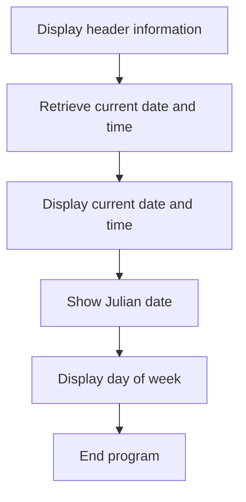

# Overview

This document explains the flow for presenting date and time information to the user. The program sequences the display of header information, current date and time, Julian date, and the day of the week. It ensures the weekday name is shown alongside a complete, formatted timestamp, including timezone details.

## Dependencies

### Program

- <SwmToken path="base/src/LGDTTM01.cbl" pos="11:6:6" line-data="       PROGRAM-ID. LGDTTM01.">`LGDTTM01`</SwmToken> (<SwmPath>[base/src/LGDTTM01.cbl](base/src/LGDTTM01.cbl)</SwmPath>)

## Detailed View of the Program's Functionality

Sequencing the Display and Data Retrieval Steps

This program is structured to sequentially display header information, retrieve the current date and time, and present various formatted outputs to the user. The main logic section orchestrates the flow as follows:

1. The program begins by displaying a header and a separator line to introduce the output.
2. It then retrieves the current date, time, full <SwmToken path="base/src/LGDTTM01.cbl" pos="123:7:9" line-data="      *    Get complete date-time with timezone">`date-time`</SwmToken> (including timezone), day of the week, and Julian date from the system using built-in statements.
3. After gathering this data, the program formats and displays the date and time in both raw and user-friendly formats.
4. It proceeds to show the Julian date, breaking it down into the year and the day of the year.
5. The program then determines the name of the day of the week (e.g., MONDAY, TUESDAY) based on the numeric value retrieved, and displays this along with a detailed timestamp including the UTC offset.
6. Finally, it displays a separator and a completion message before ending.

Header Display

- The program prints a fixed header message and a separator line to visually distinguish the output.
- An empty line is also displayed for readability.

Retrieving Date and Time

- The program collects several pieces of date and time information from the system:
  - The current date in year, month, and day format.
  - The current time in hour, minute, second, and hundredths of a second.
  - The complete <SwmToken path="base/src/LGDTTM01.cbl" pos="123:7:9" line-data="      *    Get complete date-time with timezone">`date-time`</SwmToken>, including milliseconds and UTC offset.
  - The day of the week as a number (1 for Monday through 7 for Sunday).
  - The Julian date, which consists of the year and the day number within the year.

Displaying Date and Time

- The program formats the retrieved date into a <SwmToken path="base/src/LGDTTM01.cbl" pos="141:10:14" line-data="      *    Prepare formatted date (MM/DD/YYYY)">`MM/DD/YYYY`</SwmToken> string and the time into an HH:MM:SS string.
- It displays:
  - The raw date in YYYYMMDD format.
  - The formatted date.
  - The raw time in HH:MM:SS format.
  - The time including hundredths of a second.
- Blank lines are used to separate sections for clarity.

Displaying Julian Date

- The program displays the Julian date as a single value (YYYYDDD).
- It also breaks this down into the year and the day of the year for easier understanding.
- A blank line follows for separation.

Mapping and Displaying the Weekday Name

- The program uses a conditional structure to map the numeric day of the week to its corresponding name:
  - 1 maps to MONDAY, 2 to TUESDAY, and so on up to 7 for SUNDAY.
  - If the value is outside this range, it defaults to UNKNOWN.
- The mapped day name is displayed.
- The program then prints a detailed, multi-line timestamp:
  - The full date in YYYY-MM-DD format.
  - The time in HH:MM:SS.milliseconds format.
  - The UTC offset, showing the sign and the offset in hours and minutes.
- Another blank line is displayed for readability.

Ending the Program

- A separator line is printed.
- A message indicating successful completion is displayed.
- The program then terminates.

Summary

The program is designed to provide a comprehensive and user-friendly display of the current date and time, including various formats, the Julian date, and the day of the week. It ensures that all information is clearly presented, with logical separation between sections, and handles unexpected values gracefully by displaying 'UNKNOWN' when necessary. The flow is linear and easy to follow, making it straightforward to modify or extend for additional date/time-related features.

# Rule Definition

| Paragraph Name                                                                                                                                                                                                                                                                                              | Rule ID | Category          | Description                                                                                                                                                                                                                                                                                  | Conditions                                                                           | Remarks                                                                                                                                                                                                                                                                   |
| ----------------------------------------------------------------------------------------------------------------------------------------------------------------------------------------------------------------------------------------------------------------------------------------------------------- | ------- | ----------------- | -------------------------------------------------------------------------------------------------------------------------------------------------------------------------------------------------------------------------------------------------------------------------------------------- | ------------------------------------------------------------------------------------ | ------------------------------------------------------------------------------------------------------------------------------------------------------------------------------------------------------------------------------------------------------------------------- |
| <SwmToken path="base/src/LGDTTM01.cbl" pos="90:3:7" line-data="           PERFORM 1000-DISPLAY-HEADER.">`1000-DISPLAY-HEADER`</SwmToken> SECTION                                                                                                                                                            | RL-001  | Data Assignment   | The program must display a static header at the start of the output to indicate the beginning of the date and time display.                                                                                                                                                                  | Always at the start of program execution, before any date/time information is shown. | Header is a string: '========== DATE AND TIME DISPLAY ==========' (length 42, left-aligned in a 60-character field). Separator is a string of 60 dashes. Both are displayed before any other output.                                                                      |
| <SwmToken path="base/src/LGDTTM01.cbl" pos="91:3:9" line-data="           PERFORM 2000-GET-DATE-TIME.">`2000-GET-DATE-TIME`</SwmToken> SECTION, <SwmToken path="base/src/LGDTTM01.cbl" pos="92:3:9" line-data="           PERFORM 3000-DISPLAY-DATE-TIME.">`3000-DISPLAY-DATE-TIME`</SwmToken> SECTION      | RL-002  | Data Assignment   | The program retrieves the current date from the system in the format YYYYMMDD and displays it labeled as 'CURRENT DATE:'.                                                                                                                                                                    | Always, after header is displayed.                                                   | Date is an 8-digit number (YYYYMMDD). Display format: 'CURRENT DATE (YYYYMMDD): <YYYYMMDD>'.                                                                                                                                                                              |
| <SwmToken path="base/src/LGDTTM01.cbl" pos="91:3:9" line-data="           PERFORM 2000-GET-DATE-TIME.">`2000-GET-DATE-TIME`</SwmToken> SECTION, <SwmToken path="base/src/LGDTTM01.cbl" pos="92:3:9" line-data="           PERFORM 3000-DISPLAY-DATE-TIME.">`3000-DISPLAY-DATE-TIME`</SwmToken> SECTION      | RL-003  | Data Assignment   | The program retrieves the current time from the system in the format <SwmToken path="base/src/LGDTTM01.cbl" pos="120:10:10" line-data="      *    Get current time (HHMMSSss format)">`HHMMSSss`</SwmToken> (where ss is hundredths of a second) and displays it labeled as 'CURRENT TIME:'. | Always, after current date is displayed.                                             | Time is a 8-digit number (<SwmToken path="base/src/LGDTTM01.cbl" pos="120:10:10" line-data="      *    Get current time (HHMMSSss format)">`HHMMSSss`</SwmToken>). Display format: 'CURRENT TIME (HH:MM:SS): <HH:MM:SS>' and 'TIME WITH HUNDREDTHS: <HH>:<MM>:<SS>.<ss>'. |
| <SwmToken path="base/src/LGDTTM01.cbl" pos="91:3:9" line-data="           PERFORM 2000-GET-DATE-TIME.">`2000-GET-DATE-TIME`</SwmToken> SECTION, <SwmToken path="base/src/LGDTTM01.cbl" pos="93:3:9" line-data="           PERFORM 4000-DISPLAY-JULIAN-DATE.">`4000-DISPLAY-JULIAN-DATE`</SwmToken> SECTION  | RL-004  | Data Assignment   | The program retrieves the Julian date from the system in the format YYYYDDD and displays it labeled as 'JULIAN DATE:'.                                                                                                                                                                       | Always, after current date and time are displayed.                                   | Julian date is a 7-digit number (YYYYDDD). Display format: 'JULIAN DATE: <YYYYDDD>' and 'YEAR: <YYYY> DAY OF YEAR: <DDD>'.                                                                                                                                                |
| <SwmToken path="base/src/LGDTTM01.cbl" pos="91:3:9" line-data="           PERFORM 2000-GET-DATE-TIME.">`2000-GET-DATE-TIME`</SwmToken> SECTION, <SwmToken path="base/src/LGDTTM01.cbl" pos="94:3:11" line-data="           PERFORM 5000-DISPLAY-DAY-OF-WEEK.">`5000-DISPLAY-DAY-OF-WEEK`</SwmToken> SECTION | RL-005  | Conditional Logic | The program determines the day of the week as a numeric value (1-7), where 1 = MONDAY, ..., 7 = SUNDAY. If the value is not in 1-7, it is treated as 'UNKNOWN'. The numeric value is mapped to its corresponding name.                                                                       | Always, after retrieving date/time values.                                           | Mapping: 1=MONDAY, 2=TUESDAY, 3=WEDNESDAY, 4=THURSDAY, 5=FRIDAY, 6=SATURDAY, 7=SUNDAY, other=UNKNOWN. Output: 'DAY OF WEEK: <weekday name>'.                                                                                                                              |
| <SwmToken path="base/src/LGDTTM01.cbl" pos="94:3:11" line-data="           PERFORM 5000-DISPLAY-DAY-OF-WEEK.">`5000-DISPLAY-DAY-OF-WEEK`</SwmToken> SECTION                                                                                                                                                 | RL-006  | Data Assignment   | The program displays the complete <SwmToken path="base/src/LGDTTM01.cbl" pos="123:7:9" line-data="      *    Get complete date-time with timezone">`date-time`</SwmToken> in a labeled, multi-line format, including date, time, and UTC offset, using system-provided fields.               | Always, after day of week is displayed.                                              | Output format:                                                                                                                                                                                                                                                            |

- 'COMPLETE <SwmToken path="base/src/LGDTTM01.cbl" pos="91:7:9" line-data="           PERFORM 2000-GET-DATE-TIME.">`DATE-TIME`</SwmToken> FROM SYSTEM:'
- '  DATE: <YYYY>-<MM>-<DD>'
- '  TIME: <HH>:<MM>:<SS>.<ms>'
- '  UTC OFFSET: <+|-><HH>:<MM>' All values are numeric except UTC sign, which is '+' or '-'. All fields are zero-padded to their widths (e.g., year: 4 digits, month/day/hour/minute/second: 2 digits, ms: 2 digits). | | All display sections | RL-007 | Data Assignment | All output must be clearly labeled and formatted for human readability, matching the labels and structure shown in the sample outputs. | Always, for all displayed information. | Labels must match exactly as in the spec. Output must be left-aligned, with fields separated by spaces or punctuation as shown. No technical or internal variable names are shown in output. |

# User Stories

## User Story 1: Display static header

---

### Story Description:

As a user, I want to see a clear, static header at the start of the output so that I know the program is displaying date and time information.

---

### Business Rule Mapping:

| Rule ID | Paragraph Name                                                                                                                                   | Rule Description                                                                                                                       |
| ------- | ------------------------------------------------------------------------------------------------------------------------------------------------ | -------------------------------------------------------------------------------------------------------------------------------------- |
| RL-001  | <SwmToken path="base/src/LGDTTM01.cbl" pos="90:3:7" line-data="           PERFORM 1000-DISPLAY-HEADER.">`1000-DISPLAY-HEADER`</SwmToken> SECTION | The program must display a static header at the start of the output to indicate the beginning of the date and time display.            |
| RL-007  | All display sections                                                                                                                             | All output must be clearly labeled and formatted for human readability, matching the labels and structure shown in the sample outputs. |

---

### Relevant Functionality:

- <SwmToken path="base/src/LGDTTM01.cbl" pos="90:3:7" line-data="           PERFORM 1000-DISPLAY-HEADER.">`1000-DISPLAY-HEADER`</SwmToken> **SECTION**
  1. **RL-001:**
     - Display the header string.
     - Display the separator string.
     - Display a blank line.
- **All display sections**
  1. **RL-007:**
     - For each output value, display with the specified label and format.
     - Ensure all fields are clearly labeled and separated for readability.

## User Story 2: Display current date and time

---

### Story Description:

As a user, I want to see the current date and time from the system, labeled and formatted for easy reading, so that I can quickly understand the current moment.

---

### Business Rule Mapping:

| Rule ID | Paragraph Name                                                                                                                                                                                                                                                                                         | Rule Description                                                                                                                                                                                                                                                                             |
| ------- | ------------------------------------------------------------------------------------------------------------------------------------------------------------------------------------------------------------------------------------------------------------------------------------------------------ | -------------------------------------------------------------------------------------------------------------------------------------------------------------------------------------------------------------------------------------------------------------------------------------------- |
| RL-002  | <SwmToken path="base/src/LGDTTM01.cbl" pos="91:3:9" line-data="           PERFORM 2000-GET-DATE-TIME.">`2000-GET-DATE-TIME`</SwmToken> SECTION, <SwmToken path="base/src/LGDTTM01.cbl" pos="92:3:9" line-data="           PERFORM 3000-DISPLAY-DATE-TIME.">`3000-DISPLAY-DATE-TIME`</SwmToken> SECTION | The program retrieves the current date from the system in the format YYYYMMDD and displays it labeled as 'CURRENT DATE:'.                                                                                                                                                                    |
| RL-003  | <SwmToken path="base/src/LGDTTM01.cbl" pos="91:3:9" line-data="           PERFORM 2000-GET-DATE-TIME.">`2000-GET-DATE-TIME`</SwmToken> SECTION, <SwmToken path="base/src/LGDTTM01.cbl" pos="92:3:9" line-data="           PERFORM 3000-DISPLAY-DATE-TIME.">`3000-DISPLAY-DATE-TIME`</SwmToken> SECTION | The program retrieves the current time from the system in the format <SwmToken path="base/src/LGDTTM01.cbl" pos="120:10:10" line-data="      *    Get current time (HHMMSSss format)">`HHMMSSss`</SwmToken> (where ss is hundredths of a second) and displays it labeled as 'CURRENT TIME:'. |
| RL-007  | All display sections                                                                                                                                                                                                                                                                                   | All output must be clearly labeled and formatted for human readability, matching the labels and structure shown in the sample outputs.                                                                                                                                                       |

---

### Relevant Functionality:

- <SwmToken path="base/src/LGDTTM01.cbl" pos="91:3:9" line-data="           PERFORM 2000-GET-DATE-TIME.">`2000-GET-DATE-TIME`</SwmToken> **SECTION**
  1. **RL-002:**
     - Retrieve current date from system in YYYYMMDD format.
     - Display with label 'CURRENT DATE (YYYYMMDD): ' followed by the date value.
  2. **RL-003:**
     - Retrieve current time from system in <SwmToken path="base/src/LGDTTM01.cbl" pos="120:10:10" line-data="      *    Get current time (HHMMSSss format)">`HHMMSSss`</SwmToken> format.
     - Display with label 'CURRENT TIME (HH:MM:SS): ' and formatted time.
     - Display with label 'TIME WITH HUNDREDTHS: ' and formatted time with hundredths.
- **All display sections**
  1. **RL-007:**
     - For each output value, display with the specified label and format.
     - Ensure all fields are clearly labeled and separated for readability.

## User Story 3: Display Julian date

---

### Story Description:

As a user, I want to see the Julian date and its components, labeled and formatted, so that I can reference the date in Julian format as well as standard format.

---

### Business Rule Mapping:

| Rule ID | Paragraph Name                                                                                                                                                                                                                                                                                             | Rule Description                                                                                                                       |
| ------- | ---------------------------------------------------------------------------------------------------------------------------------------------------------------------------------------------------------------------------------------------------------------------------------------------------------- | -------------------------------------------------------------------------------------------------------------------------------------- |
| RL-004  | <SwmToken path="base/src/LGDTTM01.cbl" pos="91:3:9" line-data="           PERFORM 2000-GET-DATE-TIME.">`2000-GET-DATE-TIME`</SwmToken> SECTION, <SwmToken path="base/src/LGDTTM01.cbl" pos="93:3:9" line-data="           PERFORM 4000-DISPLAY-JULIAN-DATE.">`4000-DISPLAY-JULIAN-DATE`</SwmToken> SECTION | The program retrieves the Julian date from the system in the format YYYYDDD and displays it labeled as 'JULIAN DATE:'.                 |
| RL-007  | All display sections                                                                                                                                                                                                                                                                                       | All output must be clearly labeled and formatted for human readability, matching the labels and structure shown in the sample outputs. |

---

### Relevant Functionality:

- <SwmToken path="base/src/LGDTTM01.cbl" pos="91:3:9" line-data="           PERFORM 2000-GET-DATE-TIME.">`2000-GET-DATE-TIME`</SwmToken> **SECTION**
  1. **RL-004:**
     - Retrieve Julian date from system in YYYYDDD format.
     - Display with label 'JULIAN DATE: ' and the Julian date value.
     - Display year and day of year separately.
- **All display sections**
  1. **RL-007:**
     - For each output value, display with the specified label and format.
     - Ensure all fields are clearly labeled and separated for readability.

## User Story 4: Display day of week

---

### Story Description:

As a user, I want to see the day of the week, mapped from a numeric value to a weekday name, so that I can easily understand what day it is, even if the value is out of range.

---

### Business Rule Mapping:

| Rule ID | Paragraph Name                                                                                                                                                                                                                                                                                              | Rule Description                                                                                                                                                                                                       |
| ------- | ----------------------------------------------------------------------------------------------------------------------------------------------------------------------------------------------------------------------------------------------------------------------------------------------------------- | ---------------------------------------------------------------------------------------------------------------------------------------------------------------------------------------------------------------------- |
| RL-005  | <SwmToken path="base/src/LGDTTM01.cbl" pos="91:3:9" line-data="           PERFORM 2000-GET-DATE-TIME.">`2000-GET-DATE-TIME`</SwmToken> SECTION, <SwmToken path="base/src/LGDTTM01.cbl" pos="94:3:11" line-data="           PERFORM 5000-DISPLAY-DAY-OF-WEEK.">`5000-DISPLAY-DAY-OF-WEEK`</SwmToken> SECTION | The program determines the day of the week as a numeric value (1-7), where 1 = MONDAY, ..., 7 = SUNDAY. If the value is not in 1-7, it is treated as 'UNKNOWN'. The numeric value is mapped to its corresponding name. |
| RL-007  | All display sections                                                                                                                                                                                                                                                                                        | All output must be clearly labeled and formatted for human readability, matching the labels and structure shown in the sample outputs.                                                                                 |

---

### Relevant Functionality:

- <SwmToken path="base/src/LGDTTM01.cbl" pos="91:3:9" line-data="           PERFORM 2000-GET-DATE-TIME.">`2000-GET-DATE-TIME`</SwmToken> **SECTION**
  1. **RL-005:**
     - Retrieve day of week as a number from system.
     - Map number to name using mapping table.
     - If not 1-7, map to 'UNKNOWN'.
     - Display with label 'DAY OF WEEK: ' and the mapped name.
- **All display sections**
  1. **RL-007:**
     - For each output value, display with the specified label and format.
     - Ensure all fields are clearly labeled and separated for readability.

## User Story 5: Display complete <SwmToken path="base/src/LGDTTM01.cbl" pos="123:7:9" line-data="      *    Get complete date-time with timezone">`date-time`</SwmToken> summary

---

### Story Description:

As a user, I want to see a complete, multi-line summary of the date, time, and UTC offset, labeled and formatted, so that I have all relevant <SwmToken path="base/src/LGDTTM01.cbl" pos="123:7:9" line-data="      *    Get complete date-time with timezone">`date-time`</SwmToken> information in one place.

---

### Business Rule Mapping:

| Rule ID | Paragraph Name                                                                                                                                              | Rule Description                                                                                                                                                                                                                                                               |
| ------- | ----------------------------------------------------------------------------------------------------------------------------------------------------------- | ------------------------------------------------------------------------------------------------------------------------------------------------------------------------------------------------------------------------------------------------------------------------------ |
| RL-006  | <SwmToken path="base/src/LGDTTM01.cbl" pos="94:3:11" line-data="           PERFORM 5000-DISPLAY-DAY-OF-WEEK.">`5000-DISPLAY-DAY-OF-WEEK`</SwmToken> SECTION | The program displays the complete <SwmToken path="base/src/LGDTTM01.cbl" pos="123:7:9" line-data="      *    Get complete date-time with timezone">`date-time`</SwmToken> in a labeled, multi-line format, including date, time, and UTC offset, using system-provided fields. |
| RL-007  | All display sections                                                                                                                                        | All output must be clearly labeled and formatted for human readability, matching the labels and structure shown in the sample outputs.                                                                                                                                         |

---

### Relevant Functionality:

- <SwmToken path="base/src/LGDTTM01.cbl" pos="94:3:11" line-data="           PERFORM 5000-DISPLAY-DAY-OF-WEEK.">`5000-DISPLAY-DAY-OF-WEEK`</SwmToken> **SECTION**
  1. **RL-006:**
     - Retrieve full <SwmToken path="base/src/LGDTTM01.cbl" pos="123:7:9" line-data="      *    Get complete date-time with timezone">`date-time`</SwmToken> from system (year, month, day, hour, minute, second, ms, UTC sign, UTC hour, UTC minute).
     - Display each field in the specified labeled format, with zero-padding as needed.
- **All display sections**
  1. **RL-007:**
     - For each output value, display with the specified label and format.
     - Ensure all fields are clearly labeled and separated for readability.

# Workflow

# Sequencing the Display and Data Retrieval Steps



This section ensures that the program presents header information, retrieves and displays the current date and time, shows the Julian date, displays the day of the week, and then ends the program, in a fixed sequence.

| Rule ID | Category        | Rule Name                                | Description                                                                                                               | Implementation Details                                                                                |
| ------- | --------------- | ---------------------------------------- | ------------------------------------------------------------------------------------------------------------------------- | ----------------------------------------------------------------------------------------------------- |
| BR-001  | Decision Making | Header display first                     | Header information is displayed before any date or time information is retrieved or shown.                                | No constants or output formats are specified in this section; the rule is about the order of actions. |
| BR-002  | Decision Making | Date/time retrieval and display sequence | Current date and time are retrieved and displayed after the header, and before the Julian date and day of week are shown. | No constants or output formats are specified in this section; the rule is about the order of actions. |
| BR-003  | Decision Making | Julian date and weekday display sequence | The Julian date and day of week are displayed after the current date and time, and before the program ends.               | No constants or output formats are specified in this section; the rule is about the order of actions. |

<SwmSnippet path="/base/src/LGDTTM01.cbl" line="87">

---

<SwmToken path="base/src/LGDTTM01.cbl" pos="87:1:3" line-data="       MAIN-LOGIC SECTION.">`MAIN-LOGIC`</SwmToken> sequences the header, date/time retrieval, and multiple display steps. After showing the Julian date, it calls <SwmToken path="base/src/LGDTTM01.cbl" pos="94:3:11" line-data="           PERFORM 5000-DISPLAY-DAY-OF-WEEK.">`5000-DISPLAY-DAY-OF-WEEK`</SwmToken> to add the weekday name and detailed timestamp, making the output more user-friendly before ending the program.

```cobol
       MAIN-LOGIC SECTION.
      *----------------------------------------------------------------*

           PERFORM 1000-DISPLAY-HEADER.
           PERFORM 2000-GET-DATE-TIME.
           PERFORM 3000-DISPLAY-DATE-TIME.
           PERFORM 4000-DISPLAY-JULIAN-DATE.
           PERFORM 5000-DISPLAY-DAY-OF-WEEK.
           PERFORM 9000-END-PROGRAM.
```

---

</SwmSnippet>

# Mapping and Displaying the Weekday Name

```mermaid
%%{init: {"flowchart": {"defaultRenderer": "elk"}} }%%
flowchart TD
    node1{"What is the day of the week?"}
    click node1 openCode "base/src/LGDTTM01.cbl:186:203"
    node1 -->|"1"| node2["Display 'MONDAY' and complete date-time"]
    click node2 openCode "base/src/LGDTTM01.cbl:205:218"
    node1 -->|"2"| node3["Display 'TUESDAY' and complete date-time"]
    click node3 openCode "base/src/LGDTTM01.cbl:205:218"
    node1 -->|"3"| node4["Display 'WEDNESDAY' and complete
date-time"]
    click node4 openCode "base/src/LGDTTM01.cbl:205:218"
    node1 -->|"4"| node5["Display 'THURSDAY' and complete
date-time"]
    click node5 openCode "base/src/LGDTTM01.cbl:205:218"
    node1 -->|"5"| node6["Display 'FRIDAY' and complete date-time"]
    click node6 openCode "base/src/LGDTTM01.cbl:205:218"
    node1 -->|"6"| node7["Display 'SATURDAY' and complete
date-time"]
    click node7 openCode "base/src/LGDTTM01.cbl:205:218"
    node1 -->|"7"| node8["Display 'SUNDAY' and complete date-time"]
    click node8 openCode "base/src/LGDTTM01.cbl:205:218"
    node1 -->|"Other"| node9["Display 'UNKNOWN' and complete date-time"]
    click node9 openCode "base/src/LGDTTM01.cbl:205:218"

classDef HeadingStyle fill:#777777,stroke:#333,stroke-width:2px;

%% Swimm:
%% %%{init: {"flowchart": {"defaultRenderer": "elk"}} }%%
%% flowchart TD
%%     node1{"What is the day of the week?"}
%%     click node1 openCode "<SwmPath>[base/src/LGDTTM01.cbl](base/src/LGDTTM01.cbl)</SwmPath>:186:203"
%%     node1 -->|"1"| node2["Display 'MONDAY' and complete <SwmToken path="base/src/LGDTTM01.cbl" pos="123:7:9" line-data="      *    Get complete date-time with timezone">`date-time`</SwmToken>"]
%%     click node2 openCode "<SwmPath>[base/src/LGDTTM01.cbl](base/src/LGDTTM01.cbl)</SwmPath>:205:218"
%%     node1 -->|"2"| node3["Display 'TUESDAY' and complete <SwmToken path="base/src/LGDTTM01.cbl" pos="123:7:9" line-data="      *    Get complete date-time with timezone">`date-time`</SwmToken>"]
%%     click node3 openCode "<SwmPath>[base/src/LGDTTM01.cbl](base/src/LGDTTM01.cbl)</SwmPath>:205:218"
%%     node1 -->|"3"| node4["Display 'WEDNESDAY' and complete
%% <SwmToken path="base/src/LGDTTM01.cbl" pos="123:7:9" line-data="      *    Get complete date-time with timezone">`date-time`</SwmToken>"]
%%     click node4 openCode "<SwmPath>[base/src/LGDTTM01.cbl](base/src/LGDTTM01.cbl)</SwmPath>:205:218"
%%     node1 -->|"4"| node5["Display 'THURSDAY' and complete
%% <SwmToken path="base/src/LGDTTM01.cbl" pos="123:7:9" line-data="      *    Get complete date-time with timezone">`date-time`</SwmToken>"]
%%     click node5 openCode "<SwmPath>[base/src/LGDTTM01.cbl](base/src/LGDTTM01.cbl)</SwmPath>:205:218"
%%     node1 -->|"5"| node6["Display 'FRIDAY' and complete <SwmToken path="base/src/LGDTTM01.cbl" pos="123:7:9" line-data="      *    Get complete date-time with timezone">`date-time`</SwmToken>"]
%%     click node6 openCode "<SwmPath>[base/src/LGDTTM01.cbl](base/src/LGDTTM01.cbl)</SwmPath>:205:218"
%%     node1 -->|"6"| node7["Display 'SATURDAY' and complete
%% <SwmToken path="base/src/LGDTTM01.cbl" pos="123:7:9" line-data="      *    Get complete date-time with timezone">`date-time`</SwmToken>"]
%%     click node7 openCode "<SwmPath>[base/src/LGDTTM01.cbl](base/src/LGDTTM01.cbl)</SwmPath>:205:218"
%%     node1 -->|"7"| node8["Display 'SUNDAY' and complete <SwmToken path="base/src/LGDTTM01.cbl" pos="123:7:9" line-data="      *    Get complete date-time with timezone">`date-time`</SwmToken>"]
%%     click node8 openCode "<SwmPath>[base/src/LGDTTM01.cbl](base/src/LGDTTM01.cbl)</SwmPath>:205:218"
%%     node1 -->|"Other"| node9["Display 'UNKNOWN' and complete <SwmToken path="base/src/LGDTTM01.cbl" pos="123:7:9" line-data="      *    Get complete date-time with timezone">`date-time`</SwmToken>"]
%%     click node9 openCode "<SwmPath>[base/src/LGDTTM01.cbl](base/src/LGDTTM01.cbl)</SwmPath>:205:218"
%% 
%% classDef HeadingStyle fill:#777777,stroke:#333,stroke-width:2px;
```



This section maps a numeric day-of-week value to a weekday name and displays it alongside a complete, formatted <SwmToken path="base/src/LGDTTM01.cbl" pos="123:7:9" line-data="      *    Get complete date-time with timezone">`date-time`</SwmToken> snapshot for the user.

| Rule ID | Category        | Rule Name                                                                                                                                                 | Description                                                                                                                                                                                          | Implementation Details                                   |
| ------- | --------------- | --------------------------------------------------------------------------------------------------------------------------------------------------------- | ---------------------------------------------------------------------------------------------------------------------------------------------------------------------------------------------------- | -------------------------------------------------------- |
| BR-001  | Decision Making | Monday mapping                                                                                                                                            | When the day-of-week value is 1, the displayed weekday name is 'MONDAY'.                                                                                                                             | The weekday name is displayed as the string 'MONDAY'.    |
| BR-002  | Decision Making | Tuesday mapping                                                                                                                                           | When the day-of-week value is 2, the displayed weekday name is 'TUESDAY'.                                                                                                                            | The weekday name is displayed as the string 'TUESDAY'.   |
| BR-003  | Decision Making | Wednesday mapping                                                                                                                                         | When the day-of-week value is 3, the displayed weekday name is 'WEDNESDAY'.                                                                                                                          | The weekday name is displayed as the string 'WEDNESDAY'. |
| BR-004  | Decision Making | Thursday mapping                                                                                                                                          | When the day-of-week value is 4, the displayed weekday name is 'THURSDAY'.                                                                                                                           | The weekday name is displayed as the string 'THURSDAY'.  |
| BR-005  | Decision Making | Friday mapping                                                                                                                                            | When the day-of-week value is 5, the displayed weekday name is 'FRIDAY'.                                                                                                                             | The weekday name is displayed as the string 'FRIDAY'.    |
| BR-006  | Decision Making | Saturday mapping                                                                                                                                          | When the day-of-week value is 6, the displayed weekday name is 'SATURDAY'.                                                                                                                           | The weekday name is displayed as the string 'SATURDAY'.  |
| BR-007  | Decision Making | Sunday mapping                                                                                                                                            | When the day-of-week value is 7, the displayed weekday name is 'SUNDAY'.                                                                                                                             | The weekday name is displayed as the string 'SUNDAY'.    |
| BR-008  | Decision Making | Unknown weekday fallback                                                                                                                                  | If the day-of-week value is not between 1 and 7, the displayed weekday name is 'UNKNOWN'.                                                                                                            | The weekday name is displayed as the string 'UNKNOWN'.   |
| BR-009  | Writing Output  | Formatted <SwmToken path="base/src/LGDTTM01.cbl" pos="123:7:9" line-data="      *    Get complete date-time with timezone">`date-time`</SwmToken> display | The display includes the weekday name, the complete date (year, month, day), the complete time (hour, minute, second, millisecond), and the UTC offset (sign, hour, minute), each in a fixed format. | The output format is:                                    |

- 'DAY OF WEEK: ' followed by the weekday name (string)
- Blank line
- 'COMPLETE <SwmToken path="base/src/LGDTTM01.cbl" pos="91:7:9" line-data="           PERFORM 2000-GET-DATE-TIME.">`DATE-TIME`</SwmToken> FROM SYSTEM:'
- '  DATE: ' followed by year (4 digits), '-', month (2 digits), '-', day (2 digits)
- '  TIME: ' followed by hour (2 digits), ':', minute (2 digits), ':', second (2 digits), '.', millisecond (2 digits)
- '  UTC OFFSET: ' followed by sign (1 character), hour (2 digits), ':', minute (2 digits)
- Blank line |

<SwmSnippet path="/base/src/LGDTTM01.cbl" line="181">

---

In <SwmToken path="base/src/LGDTTM01.cbl" pos="181:1:9" line-data="       5000-DISPLAY-DAY-OF-WEEK SECTION.">`5000-DISPLAY-DAY-OF-WEEK`</SwmToken>, the code maps the numeric weekday value to its name using a switch-case. If the value isn't valid, it defaults to 'UNKNOWN', so the display always shows something meaningful.

```cobol
       5000-DISPLAY-DAY-OF-WEEK SECTION.
      *----------------------------------------------------------------*
      * Display day of week                                            *
      *----------------------------------------------------------------*

           EVALUATE WS-DAY-OF-WEEK
               WHEN 1
                   MOVE 'MONDAY'    TO WS-DAY-NAME
               WHEN 2
                   MOVE 'TUESDAY'   TO WS-DAY-NAME
               WHEN 3
                   MOVE 'WEDNESDAY' TO WS-DAY-NAME
               WHEN 4
                   MOVE 'THURSDAY'  TO WS-DAY-NAME
               WHEN 5
                   MOVE 'FRIDAY'    TO WS-DAY-NAME
               WHEN 6
                   MOVE 'SATURDAY'  TO WS-DAY-NAME
               WHEN 7
                   MOVE 'SUNDAY'    TO WS-DAY-NAME
               WHEN OTHER
                   MOVE 'UNKNOWN'   TO WS-DAY-NAME
           END-EVALUATE.
```

---

</SwmSnippet>

<SwmSnippet path="/base/src/LGDTTM01.cbl" line="205">

---

After mapping the day name, the function displays the weekday, full date, time, milliseconds, and UTC offset. This gives users a complete timestamp snapshot, including timezone info.

```cobol
           DISPLAY 'DAY OF WEEK: ' WS-DAY-NAME.
           DISPLAY ' '.
           DISPLAY 'COMPLETE DATE-TIME FROM SYSTEM:'.
           DISPLAY '  DATE: ' WS-FDT-YEAR '-'
                              WS-FDT-MONTH '-'
                              WS-FDT-DAY.
           DISPLAY '  TIME: ' WS-FDT-HOUR ':'
                              WS-FDT-MINUTE ':'
                              WS-FDT-SECOND '.'
                              WS-FDT-MILLISEC.
           DISPLAY '  UTC OFFSET: ' WS-FDT-UTC-SIGN
                                     WS-FDT-UTC-HOUR ':'
                                     WS-FDT-UTC-MINUTE.
           DISPLAY ' '.
```

---

</SwmSnippet>

&nbsp;

*This is an auto-generated document by Swimm 🌊 and has not yet been verified by a human*

<SwmMeta version="3.0.0" repo-id="Z2l0aHViJTNBJTNBU3dpbW1pby1nZW5hcHAtaG91c2UlM0ElM0FHaXJpLVN3aW1t" repo-name="Swimmio-genapp-house"><sup>Powered by [Swimm](https://app.swimm.io/)</sup></SwmMeta>
