# Overview

This document explains the flow of processing policy inquiries. The system receives policy type and customer information, classifies the request, retrieves and validates the policy record, and prepares a response message for the user or calling program.

## Dependencies

### Program

- <SwmToken path="base/src/lgipvs01.cbl" pos="13:6:6" line-data="       PROGRAM-ID. LGIPVS01.">`LGIPVS01`</SwmToken> (<SwmPath>[base/src/lgipvs01.cbl](base/src/lgipvs01.cbl)</SwmPath>)

## Detailed View of the Program's Functionality

a. Transaction Context Initialization

At the start of the main processing section, the program clears the area used to receive input data. It then interacts with the CICS system to fetch three key pieces of information: the system identifier, the start code, and the name of the invoking program. These values are stored for later use and are critical for determining how the incoming request should be handled.

b. Input Data Sourcing and Mode Determination

The program checks whether the request is a direct invocation (either the start code indicates a direct start or an invoking program is present). If so, it sets the processing mode to indicate a command-type request, copies the input data from the communication area, and adjusts the length of the received data accordingly. If the request is not direct, it receives data from the terminal, sets the mode to indicate a received-type request, copies the received data into the communication area, and adjusts the data length to account for terminal-specific formatting.

c. Policy File Key Construction and File Access

Using the input data, the program constructs a key for accessing the policy file. It clears the area used for storing policy data, extracts the policy type and number from the communication area, and builds the file key. The program then issues a file read operation against the policy file, requesting a record that matches or is greater than the constructed key. The result of this operation is stored for subsequent validation.

d. Policy Validation and Response Preparation

After retrieving the policy record, the program checks whether the policy type matches the expected value and whether the file read operation was successful. If either check fails, it prepares an error message indicating a bad policy and sets placeholder values for customer and policy numbers. If the checks pass, it copies the retrieved policy data into the response message area.

e. Response Delivery and Transaction Completion

Depending on the mode determined earlier, the program either sends the response message to the terminal (for received-type requests) or updates the communication area for further processing by another program (for command-type requests). Finally, the program returns control to CICS, signaling the end of the transaction.

# Rule Definition

| Paragraph Name | Rule ID | Category          | Description                                                                                                                                                                                                                      | Conditions                                                                              | Remarks                                                                                                                                                                                                                      |
| -------------- | ------- | ----------------- | -------------------------------------------------------------------------------------------------------------------------------------------------------------------------------------------------------------------------------- | --------------------------------------------------------------------------------------- | ---------------------------------------------------------------------------------------------------------------------------------------------------------------------------------------------------------------------------- |
| 90-105         | RL-001  | Conditional Logic | The program determines whether the transaction input is direct (from COMMAREA) or from the terminal by checking if STARTCODE is 'D' or Invokingprog is present. It sets the mode accordingly ('C' for direct, 'R' for terminal). | STARTCODE(1:1) = 'D' or Invokingprog is not spaces: direct input; else: terminal input. | STARTCODE is a 2-character string; Invokingprog is an 8-character string. Mode is set as a single character: 'C' or 'R'.                                                                                                     |
| 111-129        | RL-002  | Conditional Logic | The program performs a generic (GTEQ) read on the KSDSPOLY file using the constructed file key. It validates that the policy type in the file record matches the input and that the file read response is normal.                | File key is constructed; VSAM file KSDSPOLY is accessible.                              | File read uses GTEQ mode. Validation checks that the policy type in the closely matching record equals the input policy type and that the file read response is normal (DFHRESP(NORMAL)).                                    |
| 123-128        | RL-003  | Data Assignment   | Depending on the validation result, the program prepares either an error response message with label 'Policy Bad=' and error codes, or a success response message with label 'Policy Key=' and data from the file record.        | Validation of policy type and file read response is complete.                           | Error response: label 'Policy Bad=', customer and policy numbers set to 13. Success response: label 'Policy Key=', customer and policy numbers from file record. Message is 80 characters, left-aligned, padded with spaces. |
| 130-141        | RL-004  | Conditional Logic | The program sends the response message to the terminal if mode is 'R', or updates the COMMAREA with the response message if mode is 'C'.                                                                                         | Response message is prepared; mode is determined.                                       | Response message is 80 characters. For terminal, sent as an 80-character message. For COMMAREA, updated in the same structure as input (text label + key fields).                                                            |
| 143-144        | RL-005  | Computation       | After processing, the program returns control to CICS.                                                                                                                                                                           | All processing and response delivery is complete.                                       | No output format; standard CICS RETURN.                                                                                                                                                                                      |
| 107-110        | RL-006  | Computation       | The program parses the input data to extract the policy type (first character) and policy/customer number (next 10 digits) to construct the file key for the VSAM read.                                                          | Input data is available in the working area after source determination.                 | Policy type is a single character; policy/customer number is a 10-digit number. File key is constructed as policy type + policy/customer number (total 11 characters).                                                       |

# User Stories

## User Story 1: Determine input source and parse input data

---

### Story Description:

As a transaction processor, I want to determine whether the input is direct or from the terminal and parse the input data so that I can correctly construct the file key for further processing.

---

### Business Rule Mapping:

| Rule ID | Paragraph Name | Rule Description                                                                                                                                                                                                                 |
| ------- | -------------- | -------------------------------------------------------------------------------------------------------------------------------------------------------------------------------------------------------------------------------- |
| RL-001  | 90-105         | The program determines whether the transaction input is direct (from COMMAREA) or from the terminal by checking if STARTCODE is 'D' or Invokingprog is present. It sets the mode accordingly ('C' for direct, 'R' for terminal). |
| RL-006  | 107-110        | The program parses the input data to extract the policy type (first character) and policy/customer number (next 10 digits) to construct the file key for the VSAM read.                                                          |

---

### Relevant Functionality:

- **90-105**

  1. **RL-001:**
     - If STARTCODE is 'D' or Invokingprog is present:
       - Set mode to 'C'
       - Use data from COMMAREA
     - Else:
       - Set mode to 'R'
       - Use data received from terminal

- **107-110**

  1. **RL-006:**
     - Extract the first character from the input data as the policy type
     - Extract the next 10 characters as the policy/customer number
     - Concatenate the policy type and policy/customer number to form the file key for the VSAM read

## User Story 2: Process request, prepare response, deliver result, and complete transaction

---

### Story Description:

As a transaction processor, I want to read and validate the policy record, prepare the appropriate response message, deliver it to the correct destination, and return control to CICS so that the user receives the outcome of their request and the system can continue normal operations.

---

### Business Rule Mapping:

| Rule ID | Paragraph Name | Rule Description                                                                                                                                                                                                          |
| ------- | -------------- | ------------------------------------------------------------------------------------------------------------------------------------------------------------------------------------------------------------------------- |
| RL-002  | 111-129        | The program performs a generic (GTEQ) read on the KSDSPOLY file using the constructed file key. It validates that the policy type in the file record matches the input and that the file read response is normal.         |
| RL-003  | 123-128        | Depending on the validation result, the program prepares either an error response message with label 'Policy Bad=' and error codes, or a success response message with label 'Policy Key=' and data from the file record. |
| RL-004  | 130-141        | The program sends the response message to the terminal if mode is 'R', or updates the COMMAREA with the response message if mode is 'C'.                                                                                  |
| RL-005  | 143-144        | After processing, the program returns control to CICS.                                                                                                                                                                    |

---

### Relevant Functionality:

- **111-129**

  1. **RL-002:**
     - Perform generic read on KSDSPOLY using file key
     - If policy type in file record != input policy type or file read response != normal:
       - Prepare error response
     - Else:
       - Prepare success response

- **123-128**

  1. **RL-003:**
     - If validation fails:
       - Set response label to 'Policy Bad='
       - Set customer and policy numbers to 13
     - Else:
       - Set response label to 'Policy Key='
       - Set customer and policy numbers from file record

- **130-141**

  1. **RL-004:**
     - If mode is 'R':
       - Send 80-character response message to terminal
     - Else (mode is 'C'):
       - Update COMMAREA with response message

- **143-144**

  1. **RL-005:**
     - Execute CICS RETURN

# Workflow

# Processing the Transaction Entry Point

```mermaid
%%{init: {"flowchart": {"defaultRenderer": "elk"}} }%%
flowchart TD
    node1["Start MAINLINE processing"] --> node2{"Is request direct (STARTCODE = 'D' or
Invokingprog set)?"}
    click node1 openCode "base/src/lgipvs01.cbl:75:77"
    node2 -->|"Direct"| node3["Set mode to 'C', use request data"]
    click node2 openCode "base/src/lgipvs01.cbl:90:91"
    node2 -->|"Received"| node4["Receive data, set mode to 'R'"]
    click node3 openCode "base/src/lgipvs01.cbl:92:96"
    click node4 openCode "base/src/lgipvs01.cbl:98:104"
    node3 --> node5["Read policy from file"]
    node4 --> node5
    click node5 openCode "base/src/lgipvs01.cbl:111:119"
    node5 --> node6{"Is policy type valid and file read
successful?"}
    click node6 openCode "base/src/lgipvs01.cbl:121:122"
    node6 -->|"No"| node7["Prepare response message: error"]
    node6 -->|"Yes"| node8["Prepare response message: success"]
    click node7 openCode "base/src/lgipvs01.cbl:123:125"
    click node8 openCode "base/src/lgipvs01.cbl:127:127"
    node7 --> node9{"Is mode 'received' (WS-FLAG = 'R')?"}
    node8 --> node9
    click node9 openCode "base/src/lgipvs01.cbl:130:131"
    node9 -->|"Yes"| node10["Send message to user"]
    node9 -->|"No"| node11["Update communication area"]
    click node10 openCode "base/src/lgipvs01.cbl:131:136"
    click node11 openCode "base/src/lgipvs01.cbl:138:140"
    node10 --> node12["Return"]
    node11 --> node12
    click node12 openCode "base/src/lgipvs01.cbl:143:144"
classDef HeadingStyle fill:#777777,stroke:#333,stroke-width:2px;

%% Swimm:
%% %%{init: {"flowchart": {"defaultRenderer": "elk"}} }%%
%% flowchart TD
%%     node1["Start MAINLINE processing"] --> node2{"Is request direct (STARTCODE = 'D' or
%% Invokingprog set)?"}
%%     click node1 openCode "<SwmPath>[base/src/lgipvs01.cbl](base/src/lgipvs01.cbl)</SwmPath>:75:77"
%%     node2 -->|"Direct"| node3["Set mode to 'C', use request data"]
%%     click node2 openCode "<SwmPath>[base/src/lgipvs01.cbl](base/src/lgipvs01.cbl)</SwmPath>:90:91"
%%     node2 -->|"Received"| node4["Receive data, set mode to 'R'"]
%%     click node3 openCode "<SwmPath>[base/src/lgipvs01.cbl](base/src/lgipvs01.cbl)</SwmPath>:92:96"
%%     click node4 openCode "<SwmPath>[base/src/lgipvs01.cbl](base/src/lgipvs01.cbl)</SwmPath>:98:104"
%%     node3 --> node5["Read policy from file"]
%%     node4 --> node5
%%     click node5 openCode "<SwmPath>[base/src/lgipvs01.cbl](base/src/lgipvs01.cbl)</SwmPath>:111:119"
%%     node5 --> node6{"Is policy type valid and file read
%% successful?"}
%%     click node6 openCode "<SwmPath>[base/src/lgipvs01.cbl](base/src/lgipvs01.cbl)</SwmPath>:121:122"
%%     node6 -->|"No"| node7["Prepare response message: error"]
%%     node6 -->|"Yes"| node8["Prepare response message: success"]
%%     click node7 openCode "<SwmPath>[base/src/lgipvs01.cbl](base/src/lgipvs01.cbl)</SwmPath>:123:125"
%%     click node8 openCode "<SwmPath>[base/src/lgipvs01.cbl](base/src/lgipvs01.cbl)</SwmPath>:127:127"
%%     node7 --> node9{"Is mode 'received' (<SwmToken path="base/src/lgipvs01.cbl" pos="92:9:11" line-data="              MOVE &#39;C&#39; To WS-FLAG">`WS-FLAG`</SwmToken> = 'R')?"}
%%     node8 --> node9
%%     click node9 openCode "<SwmPath>[base/src/lgipvs01.cbl](base/src/lgipvs01.cbl)</SwmPath>:130:131"
%%     node9 -->|"Yes"| node10["Send message to user"]
%%     node9 -->|"No"| node11["Update communication area"]
%%     click node10 openCode "<SwmPath>[base/src/lgipvs01.cbl](base/src/lgipvs01.cbl)</SwmPath>:131:136"
%%     click node11 openCode "<SwmPath>[base/src/lgipvs01.cbl](base/src/lgipvs01.cbl)</SwmPath>:138:140"
%%     node10 --> node12["Return"]
%%     node11 --> node12
%%     click node12 openCode "<SwmPath>[base/src/lgipvs01.cbl](base/src/lgipvs01.cbl)</SwmPath>:143:144"
%% classDef HeadingStyle fill:#777777,stroke:#333,stroke-width:2px;
```



This section manages the entry point for transaction processing, classifying the request, sourcing input, validating the policy, and preparing and routing the response message based on the transaction context.

| Rule ID | Category        | Rule Name                            | Description                                                                                                                                                                                                                             | Implementation Details                                                                                                                                                                                                                                              |
| ------- | --------------- | ------------------------------------ | --------------------------------------------------------------------------------------------------------------------------------------------------------------------------------------------------------------------------------------- | ------------------------------------------------------------------------------------------------------------------------------------------------------------------------------------------------------------------------------------------------------------------- |
| BR-001  | Data validation | Policy validation and error response | A policy is considered invalid if the retrieved policy type does not match the input key type or if the file read response is not normal; in this case, an error message is prepared and specific fields are set to indicate the error. | The error message text is set to 'Policy Bad='. The customer and policy number fields are set to 13. The response message format is: text (string, 11 bytes), customer number (number, 10 bytes), policy number (number, 10 bytes), followed by 48 bytes of spaces. |
| BR-002  | Decision Making | Direct request classification        | If the request is direct (start code is 'D' or invoking program is set), treat the input as direct, set the mode to 'C', and use the provided request data for processing.                                                              | Direct requests use the provided request data as input. The mode is set to 'C'.                                                                                                                                                                                     |
| BR-003  | Decision Making | Received request classification      | If the request is not direct, receive input data from the terminal, set the mode to 'R', and use the received data for processing.                                                                                                      | Received requests use terminal input as the data source. The mode is set to 'R'.                                                                                                                                                                                    |
| BR-004  | Decision Making | Response routing by mode             | If the mode is 'received', the response message is sent to the user terminal; otherwise, the response is prepared for another program by updating the communication area.                                                               | For mode 'R', the response message is sent to the terminal as an 80-byte text message. For mode 'C', the communication area is updated with the response message text and key.                                                                                      |
| BR-005  | Writing Output  | Policy success response              | If the policy is valid, the retrieved policy data is included in the response message.                                                                                                                                                  | The response message includes the retrieved policy data. The format is: text (string, 11 bytes), key (32 bytes), followed by 48 bytes of spaces.                                                                                                                    |

<SwmSnippet path="/base/src/lgipvs01.cbl" line="75">

---

In MAINLINE, the program sets up the transaction context by clearing the receive buffer and fetching system, start code, and invoking program details from CICS. This info is used to decide how to handle the incoming request.

```cobol
       MAINLINE SECTION.
      *
           MOVE SPACES TO WS-RECV.

           EXEC CICS ASSIGN SYSID(WS-SYSID)
                RESP(WS-RESP)
           END-EXEC.

           EXEC CICS ASSIGN STARTCODE(WS-STARTCODE)
                RESP(WS-RESP)
           END-EXEC.

           EXEC CICS ASSIGN Invokingprog(WS-Invokeprog)
                RESP(WS-RESP)
           END-EXEC.
```

---

</SwmSnippet>

<SwmSnippet path="/base/src/lgipvs01.cbl" line="90">

---

Next, the code decides how to source and flag the input data: if the transaction is a new or special invocation, it copies <SwmToken path="base/src/lgipvs01.cbl" pos="93:3:5" line-data="              MOVE COMMA-DATA  TO WS-COMMAREA">`COMMA-DATA`</SwmToken> and sets the flag to 'C'; otherwise, it receives data from the terminal and sets the flag to 'R'. The data length is adjusted based on the source.

```cobol
           IF WS-STARTCODE(1:1) = 'D' or
              WS-Invokeprog Not = Spaces
              MOVE 'C' To WS-FLAG
              MOVE COMMA-DATA  TO WS-COMMAREA
              MOVE EIBCALEN    TO WS-RECV-LEN
              MOVE 11          TO WS-RECV-LEN
              SUBTRACT 1 FROM WS-RECV-LEN
           ELSE
              EXEC CICS RECEIVE INTO(WS-RECV)
                  LENGTH(WS-RECV-LEN)
                  RESP(WS-RESP)
              END-EXEC
              MOVE 'R' To WS-FLAG
              MOVE WS-RECV-DATA  TO WS-COMMAREA
              SUBTRACT 6 FROM WS-RECV-LEN
           END-IF.
```

---

</SwmSnippet>

<SwmSnippet path="/base/src/lgipvs01.cbl" line="107">

---

Here, the program builds the file key from the input data and calls the KSDSPOLY file to retrieve the relevant policy record using a generic (GTEQ) read. This sets up the data for validation and response.

```cobol
           Move Spaces                      To CA-Area
           Move WS-Commarea(1:1)            To Part-Key-Type
           Move WS-Commarea(2:WS-RECV-LEN)  To Part-Key-Num
      *
           Exec CICS Read File('KSDSPOLY')
                     Into(CA-AREA)
                     Length(F64)
                     Ridfld(PART-KEY)
                     KeyLength(F11)
                     Generic
                     RESP(WS-RESP)
                     GTEQ
           End-Exec.
```

---

</SwmSnippet>

<SwmSnippet path="/base/src/lgipvs01.cbl" line="121">

---

Next, the code validates the retrieved policy: if the type or response is wrong, it marks the message as a bad policy and sets error codes; otherwise, it prepares the retrieved data for the response.

```cobol
           If CA-Policy-Type   Not = Part-Key-Type Or
              WS-RESP NOT          = DFHRESP(NORMAL)
             Move 'Policy Bad='   To Write-Msg-Text
             Move 13              To WRITE-Msg-CustNum
             Move 13              To WRITE-Msg-PolNum
           Else
             Move CA-Area to WRITE-MSG-Key
           End-If
```

---

</SwmSnippet>

<SwmSnippet path="/base/src/lgipvs01.cbl" line="130">

---

Finally, the program either sends the response message to the terminal or prepares it for another program, based on the flag set earlier. It then returns control to CICS, ending the transaction.

```cobol
           If WS-FLAG = 'R' Then
             EXEC CICS SEND TEXT FROM(WRITE-MSG)
              WAIT
              ERASE
              LENGTH(80)
              FREEKB
             END-EXEC
           Else
             Move Spaces          To COMMA-Data
             Move Write-Msg-Text  To COMMA-Data-Text
             Move Write-Msg-Key   To COMMA-Data-Key
           End-If.

           EXEC CICS RETURN
           END-EXEC.
```

---

</SwmSnippet>

&nbsp;

*This is an auto-generated document by Swimm 🌊 and has not yet been verified by a human*

<SwmMeta version="3.0.0" repo-id="Z2l0aHViJTNBJTNBU3dpbW1pby1nZW5hcHAtaG91c2UlM0ElM0FHaXJpLVN3aW1t" repo-name="Swimmio-genapp-house"><sup>Powered by [Swimm](https://app.swimm.io/)</sup></SwmMeta>
