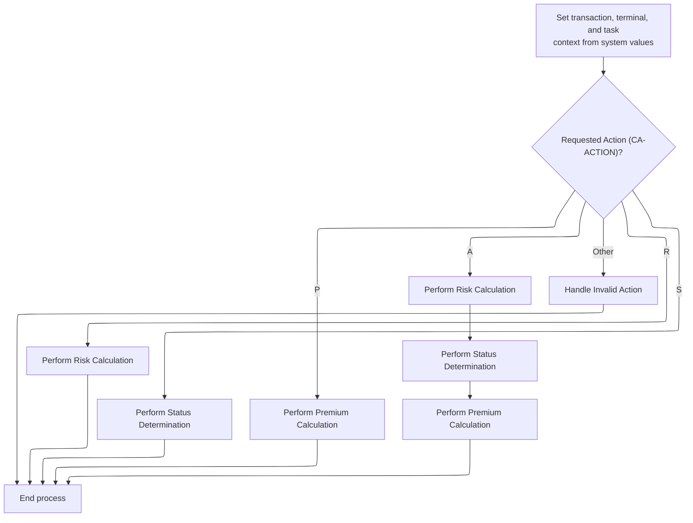
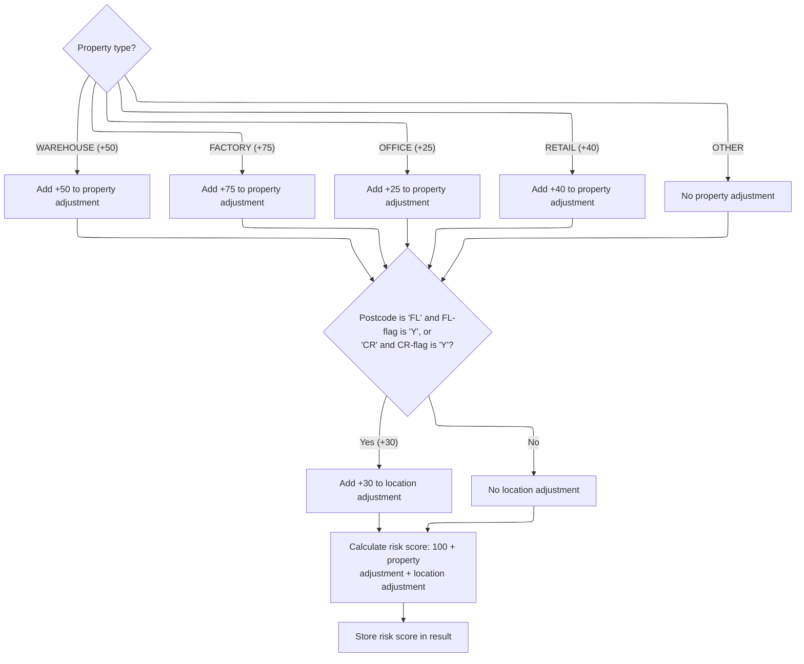
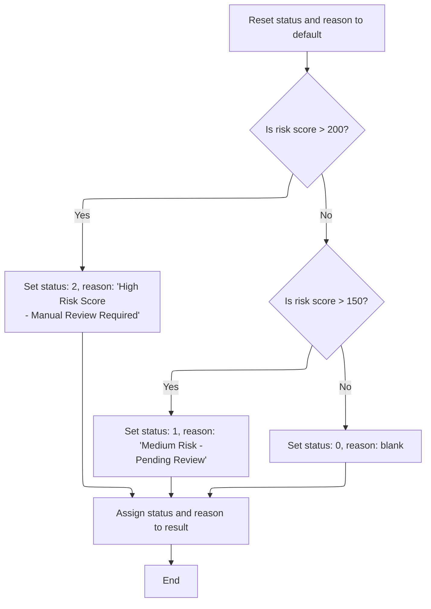

# Overview

This document describes the flow for assessing property risk. The process dispatches calculation routines based on the requested action, calculates risk adjustments, and assigns a risk status and review reason, ensuring consistent evaluation and output for downstream use.

## Dependencies

### Program

- <SwmToken path="base/src/lgpcalc1.cbl" pos="2:6:6" line-data="       PROGRAM-ID. LGPCALC1.">`LGPCALC1`</SwmToken> (<SwmPath>[base/src/lgpcalc1.cbl](base/src/lgpcalc1.cbl)</SwmPath>)

## Detailed View of the Program's Functionality

a. Dispatching the Calculation Routines

When the program starts, it initializes header information for the transaction, terminal, and task using system-provided values. It then checks the requested action code, which determines what calculation routine(s) to run:

- If the action is for risk calculation, it performs the risk calculation routine.
- If the action is for status determination, it performs the status determination routine.
- If the action is for premium calculation, it performs the premium calculation routine.
- If the action is for all calculations, it performs risk calculation first, then status determination, then premium calculation, in that order.
- If the action is invalid or unrecognized, it performs error processing.

After the chosen routines are executed, the program returns control to the system.

b. Calculating Property and Postcode Risk Adjustments

The risk calculation routine begins by resetting the property and postcode adjustment values to zero. It then evaluates the property type:

- If the property is a warehouse, it adds a specific adjustment value to the property adjustment.
- If the property is a factory, it adds a different adjustment value.
- If the property is an office, it adds another adjustment value.
- If the property is retail, it adds yet another adjustment value.
- If the property type does not match any of these, no adjustment is made.

Next, the routine checks the postcode:

- If the postcode starts with certain prefixes (such as 'FL' or 'CR') and the corresponding flag is set to 'Y', it adds a location adjustment value to the postcode adjustment.
- If neither condition is met, no location adjustment is made.

Finally, the routine calculates the total risk score by summing the base value, the property adjustment, and the postcode adjustment. This total risk score is stored in the result for use in subsequent routines.

c. Assigning Risk Status and Review Reason

The status determination routine starts by resetting the status and reason fields to their default values. It then checks the risk score:

- If the risk score is greater than 200, it sets the status to high and assigns a message indicating that manual review is required.
- If the risk score is greater than 150 but not above 200, it sets the status to medium and assigns a message indicating that review is pending.
- If the risk score is 150 or below, it sets the status to low and leaves the reason blank.

After determining the status and reason, these values are stored in the result fields for client use.

d. Calculating Premiums

The premium calculation routine starts by resetting all premium values and setting a multiplier to <SwmToken path="base/src/lgpcalc1.cbl" pos="88:15:17" line-data="           03 WS-RT-MULTIPLIER         PIC V99 VALUE 1.00.">`1.00`</SwmToken>. If all peril factors (fire, crime, flood, weather) are positive, it applies a discount to the multiplier.

For each peril factor (fire, crime, flood, weather):

- If the factor is positive, it calculates a temporary value by multiplying the risk score by the peril-specific factor.
- It then calculates the premium for that peril by multiplying the temporary value by the peril factor and the multiplier.
- The calculated premium is stored in the corresponding result field.

After all premiums are calculated, they are moved to the result fields for client use.

e. Handling Invalid Actions

If the requested action is invalid, the error processing routine sets the risk score to zero, the status to a special value indicating error, and the reason to a message indicating an invalid processing request. All premium values are set to zero. These values are stored in the result fields for client use.

# Rule Definition

| Paragraph Name                                                                                                                                   | Rule ID | Category          | Description                                                                                                                                                                                                                                                                                                                                                                                                                                                                                                                                                                                                                                                                                                           | Conditions                                                                                                                                                                                                                                                                                                                                                                                                                                                                         | Remarks                                                                                                                                                                                                                                                                                                                                                                                                                                                                                                                                                                                                                                                                                                                                                                                                                                                                                                                                                                                                                                                                                                                                                                                                                                                                                                                                                                                                                                                                                                                                                                                                                                                                                                                       |
| ------------------------------------------------------------------------------------------------------------------------------------------------ | ------- | ----------------- | --------------------------------------------------------------------------------------------------------------------------------------------------------------------------------------------------------------------------------------------------------------------------------------------------------------------------------------------------------------------------------------------------------------------------------------------------------------------------------------------------------------------------------------------------------------------------------------------------------------------------------------------------------------------------------------------------------------------- | ---------------------------------------------------------------------------------------------------------------------------------------------------------------------------------------------------------------------------------------------------------------------------------------------------------------------------------------------------------------------------------------------------------------------------------------------------------------------------------- | ----------------------------------------------------------------------------------------------------------------------------------------------------------------------------------------------------------------------------------------------------------------------------------------------------------------------------------------------------------------------------------------------------------------------------------------------------------------------------------------------------------------------------------------------------------------------------------------------------------------------------------------------------------------------------------------------------------------------------------------------------------------------------------------------------------------------------------------------------------------------------------------------------------------------------------------------------------------------------------------------------------------------------------------------------------------------------------------------------------------------------------------------------------------------------------------------------------------------------------------------------------------------------------------------------------------------------------------------------------------------------------------------------------------------------------------------------------------------------------------------------------------------------------------------------------------------------------------------------------------------------------------------------------------------------------------------------------------------------- |
| MAINLINE SECTION                                                                                                                                 | RL-001  | Conditional Logic | The program dispatches calculation routines based on the value of <SwmToken path="base/src/lgpcalc1.cbl" pos="127:3:5" line-data="           EVALUATE CA-ACTION">`CA-ACTION`</SwmToken>. Each action code ('R', 'S', 'P', 'A', or other) triggers a specific sequence of routines.                                                                                                                                                                                                                                                                                                                                                                                                                                    | <SwmToken path="base/src/lgpcalc1.cbl" pos="127:3:5" line-data="           EVALUATE CA-ACTION">`CA-ACTION`</SwmToken> must be present in the DFHCOMMAREA linkage section.                                                                                                                                                                                                                                                                                                          | Action codes: 'R', 'S', 'P', 'A', or other. Output fields are written to <SwmToken path="base/src/lgpcalc1.cbl" pos="105:3:5" line-data="           03 CA-RESULT.">`CA-RESULT`</SwmToken>, which contains numeric and string fields of fixed sizes (risk score: 3 digits, status: 1 digit, reason: 50 characters, premiums: 8 digits each).                                                                                                                                                                                                                                                                                                                                                                                                                                                                                                                                                                                                                                                                                                                                                                                                                                                                                                                                                                                                                                                                                                                                                                                                                                                                                                                                                                                   |
| <SwmToken path="base/src/lgpcalc1.cbl" pos="129:3:5" line-data="                 PERFORM RISK-CALCULATION">`RISK-CALCULATION`</SwmToken>         | RL-002  | Computation       | Calculates the risk score based on property type and postcode, applying adjustments as specified. The result is stored in <SwmToken path="base/src/lgpcalc1.cbl" pos="179:11:17" line-data="           MOVE WS-CA-TOTAL TO CA-R-RISK-SCORE.">`CA-R-RISK-SCORE`</SwmToken>.                                                                                                                                                                                                                                                                                                                                                                                                                                            | Triggered when <SwmToken path="base/src/lgpcalc1.cbl" pos="127:3:5" line-data="           EVALUATE CA-ACTION">`CA-ACTION`</SwmToken> is 'R' or 'A'. Requires <SwmToken path="base/src/lgpcalc1.cbl" pos="153:3:9" line-data="           EVALUATE CA-D-PROP-TYPE">`CA-D-PROP-TYPE`</SwmToken> and <SwmToken path="base/src/lgpcalc1.cbl" pos="170:4:8" line-data="           IF (CA-D-POSTCODE(1:2) = &#39;FL&#39; AND WS-EM-FL-FLAG = &#39;Y&#39;) OR">`CA-D-POSTCODE`</SwmToken>. | Property adjustments: WAREHOUSE (+50), FACTORY (+75), OFFICE (+25), RETAIL (+40), other (0). Location adjustment: +30 if postcode starts with 'FL' and FL-flag is 'Y', or starts with 'CR' and CR-flag is 'Y'; otherwise 0. Base risk score: 100. Output: risk score (3 digits) in <SwmToken path="base/src/lgpcalc1.cbl" pos="179:11:17" line-data="           MOVE WS-CA-TOTAL TO CA-R-RISK-SCORE.">`CA-R-RISK-SCORE`</SwmToken>.                                                                                                                                                                                                                                                                                                                                                                                                                                                                                                                                                                                                                                                                                                                                                                                                                                                                                                                                                                                                                                                                                                                                                                                                                                                                                           |
| <SwmToken path="base/src/lgpcalc1.cbl" pos="131:3:5" line-data="                 PERFORM STATUS-DETERMINATION">`STATUS-DETERMINATION`</SwmToken> | RL-003  | Conditional Logic | Assigns status and reason based on the risk score. Updates <SwmToken path="base/src/lgpcalc1.cbl" pos="204:11:15" line-data="           MOVE WS-CA-STATUS TO CA-R-STATUS.">`CA-R-STATUS`</SwmToken> and <SwmToken path="base/src/lgpcalc1.cbl" pos="205:11:15" line-data="           MOVE WS-CA-REASON TO CA-R-REASON.">`CA-R-REASON`</SwmToken>.                                                                                                                                                                                                                                                                                                                                                                     | Triggered when <SwmToken path="base/src/lgpcalc1.cbl" pos="127:3:5" line-data="           EVALUATE CA-ACTION">`CA-ACTION`</SwmToken> is 'S' or 'A'. Requires <SwmToken path="base/src/lgpcalc1.cbl" pos="189:3:9" line-data="           IF CA-D-RISK-SCORE &gt; 200">`CA-D-RISK-SCORE`</SwmToken> (or <SwmToken path="base/src/lgpcalc1.cbl" pos="179:11:17" line-data="           MOVE WS-CA-TOTAL TO CA-R-RISK-SCORE.">`CA-R-RISK-SCORE`</SwmToken> if calculated).              | Status assignment: risk score > 200: status 2, reason 'High Risk Score - Manual Review Required'; risk score > 150: status 1, reason 'Medium Risk - Pending Review'; otherwise: status 0, reason blank. Output: status (1 digit), reason (50 characters) in <SwmToken path="base/src/lgpcalc1.cbl" pos="204:11:15" line-data="           MOVE WS-CA-STATUS TO CA-R-STATUS.">`CA-R-STATUS`</SwmToken> and <SwmToken path="base/src/lgpcalc1.cbl" pos="205:11:15" line-data="           MOVE WS-CA-REASON TO CA-R-REASON.">`CA-R-REASON`</SwmToken>.                                                                                                                                                                                                                                                                                                                                                                                                                                                                                                                                                                                                                                                                                                                                                                                                                                                                                                                                                                                                                                                                                                                                                                            |
| <SwmToken path="base/src/lgpcalc1.cbl" pos="133:3:5" line-data="                 PERFORM PREMIUM-CALCULATION">`PREMIUM-CALCULATION`</SwmToken>   | RL-004  | Computation       | Calculates premiums for fire, crime, flood, and weather based on risk score and respective risk factors. Updates <SwmToken path="base/src/lgpcalc1.cbl" pos="109:3:9" line-data="              05 CA-R-FIRE-PREM        PIC 9(8).">`CA-R-FIRE-PREM`</SwmToken>, <SwmToken path="base/src/lgpcalc1.cbl" pos="110:3:9" line-data="              05 CA-R-CRIME-PREM       PIC 9(8).">`CA-R-CRIME-PREM`</SwmToken>, <SwmToken path="base/src/lgpcalc1.cbl" pos="111:3:9" line-data="              05 CA-R-FLOOD-PREM       PIC 9(8).">`CA-R-FLOOD-PREM`</SwmToken>, and <SwmToken path="base/src/lgpcalc1.cbl" pos="112:3:9" line-data="              05 CA-R-WEATHER-PREM     PIC 9(8).">`CA-R-WEATHER-PREM`</SwmToken>. | Triggered when <SwmToken path="base/src/lgpcalc1.cbl" pos="127:3:5" line-data="           EVALUATE CA-ACTION">`CA-ACTION`</SwmToken> is 'P' or 'A'. Requires <SwmToken path="base/src/lgpcalc1.cbl" pos="189:3:9" line-data="           IF CA-D-RISK-SCORE &gt; 200">`CA-D-RISK-SCORE`</SwmToken> and four risk factors.                                                                                                                                                           | Premiums are calculated as: risk score \* peril constant \* risk factor \* multiplier. Peril constants: fire (<SwmToken path="base/src/lgpcalc1.cbl" pos="73:15:17" line-data="              05 WS-PF-FIRE            PIC V99 VALUE 0.80.">`0.80`</SwmToken>), crime (<SwmToken path="base/src/lgpcalc1.cbl" pos="74:15:17" line-data="              05 WS-PF-CRIME           PIC V99 VALUE 0.60.">`0.60`</SwmToken>), flood (<SwmToken path="base/src/lgpcalc1.cbl" pos="75:15:17" line-data="              05 WS-PF-FLOOD           PIC V99 VALUE 1.20.">`1.20`</SwmToken>), weather (<SwmToken path="base/src/lgpcalc1.cbl" pos="71:15:17" line-data="           03 WS-PF-DISCOUNT           PIC V99 VALUE 0.90.">`0.90`</SwmToken>). Multiplier is <SwmToken path="base/src/lgpcalc1.cbl" pos="71:15:17" line-data="           03 WS-PF-DISCOUNT           PIC V99 VALUE 0.90.">`0.90`</SwmToken> if all risk factors > 0, otherwise <SwmToken path="base/src/lgpcalc1.cbl" pos="88:15:17" line-data="           03 WS-RT-MULTIPLIER         PIC V99 VALUE 1.00.">`1.00`</SwmToken>. Output: premiums (8 digits each) in <SwmToken path="base/src/lgpcalc1.cbl" pos="109:3:9" line-data="              05 CA-R-FIRE-PREM        PIC 9(8).">`CA-R-FIRE-PREM`</SwmToken>, <SwmToken path="base/src/lgpcalc1.cbl" pos="110:3:9" line-data="              05 CA-R-CRIME-PREM       PIC 9(8).">`CA-R-CRIME-PREM`</SwmToken>, <SwmToken path="base/src/lgpcalc1.cbl" pos="111:3:9" line-data="              05 CA-R-FLOOD-PREM       PIC 9(8).">`CA-R-FLOOD-PREM`</SwmToken>, <SwmToken path="base/src/lgpcalc1.cbl" pos="112:3:9" line-data="              05 CA-R-WEATHER-PREM     PIC 9(8).">`CA-R-WEATHER-PREM`</SwmToken>. |
| <SwmToken path="base/src/lgpcalc1.cbl" pos="139:3:5" line-data="                 PERFORM ERROR-PROCESSING">`ERROR-PROCESSING`</SwmToken>         | RL-005  | Data Assignment   | Sets all result fields to error values when <SwmToken path="base/src/lgpcalc1.cbl" pos="127:3:5" line-data="           EVALUATE CA-ACTION">`CA-ACTION`</SwmToken> is not recognized.                                                                                                                                                                                                                                                                                                                                                                                                                                                                                                                                  | Triggered when <SwmToken path="base/src/lgpcalc1.cbl" pos="127:3:5" line-data="           EVALUATE CA-ACTION">`CA-ACTION`</SwmToken> is not 'R', 'S', 'P', or 'A'.                                                                                                                                                                                                                                                                                                                 | Error values: risk score = 0, status = 9, reason = 'Invalid Processing Request', all premiums = 0. Output: risk score (3 digits), status (1 digit), reason (50 characters), premiums (8 digits each) in <SwmToken path="base/src/lgpcalc1.cbl" pos="105:3:5" line-data="           03 CA-RESULT.">`CA-RESULT`</SwmToken>.                                                                                                                                                                                                                                                                                                                                                                                                                                                                                                                                                                                                                                                                                                                                                                                                                                                                                                                                                                                                                                                                                                                                                                                                                                                                                                                                                                                                     |

# User Stories

## User Story 1: Process calculation routines and write results for valid actions

---

### Story Description:

As a system, I want to process calculation routines based on the value of <SwmToken path="base/src/lgpcalc1.cbl" pos="127:3:5" line-data="           EVALUATE CA-ACTION">`CA-ACTION`</SwmToken> so that risk calculation, status determination, and premium calculation are performed as required and all results are written to <SwmToken path="base/src/lgpcalc1.cbl" pos="105:3:5" line-data="           03 CA-RESULT.">`CA-RESULT`</SwmToken>.

---

### Business Rule Mapping:

| Rule ID | Paragraph Name                                                                                                                                   | Rule Description                                                                                                                                                                                                                                                                                                                                                                                                                                                                                                                                                                                                                                                                                                      |
| ------- | ------------------------------------------------------------------------------------------------------------------------------------------------ | --------------------------------------------------------------------------------------------------------------------------------------------------------------------------------------------------------------------------------------------------------------------------------------------------------------------------------------------------------------------------------------------------------------------------------------------------------------------------------------------------------------------------------------------------------------------------------------------------------------------------------------------------------------------------------------------------------------------- |
| RL-002  | <SwmToken path="base/src/lgpcalc1.cbl" pos="129:3:5" line-data="                 PERFORM RISK-CALCULATION">`RISK-CALCULATION`</SwmToken>         | Calculates the risk score based on property type and postcode, applying adjustments as specified. The result is stored in <SwmToken path="base/src/lgpcalc1.cbl" pos="179:11:17" line-data="           MOVE WS-CA-TOTAL TO CA-R-RISK-SCORE.">`CA-R-RISK-SCORE`</SwmToken>.                                                                                                                                                                                                                                                                                                                                                                                                                                            |
| RL-003  | <SwmToken path="base/src/lgpcalc1.cbl" pos="131:3:5" line-data="                 PERFORM STATUS-DETERMINATION">`STATUS-DETERMINATION`</SwmToken> | Assigns status and reason based on the risk score. Updates <SwmToken path="base/src/lgpcalc1.cbl" pos="204:11:15" line-data="           MOVE WS-CA-STATUS TO CA-R-STATUS.">`CA-R-STATUS`</SwmToken> and <SwmToken path="base/src/lgpcalc1.cbl" pos="205:11:15" line-data="           MOVE WS-CA-REASON TO CA-R-REASON.">`CA-R-REASON`</SwmToken>.                                                                                                                                                                                                                                                                                                                                                                     |
| RL-001  | MAINLINE SECTION                                                                                                                                 | The program dispatches calculation routines based on the value of <SwmToken path="base/src/lgpcalc1.cbl" pos="127:3:5" line-data="           EVALUATE CA-ACTION">`CA-ACTION`</SwmToken>. Each action code ('R', 'S', 'P', 'A', or other) triggers a specific sequence of routines.                                                                                                                                                                                                                                                                                                                                                                                                                                    |
| RL-004  | <SwmToken path="base/src/lgpcalc1.cbl" pos="133:3:5" line-data="                 PERFORM PREMIUM-CALCULATION">`PREMIUM-CALCULATION`</SwmToken>   | Calculates premiums for fire, crime, flood, and weather based on risk score and respective risk factors. Updates <SwmToken path="base/src/lgpcalc1.cbl" pos="109:3:9" line-data="              05 CA-R-FIRE-PREM        PIC 9(8).">`CA-R-FIRE-PREM`</SwmToken>, <SwmToken path="base/src/lgpcalc1.cbl" pos="110:3:9" line-data="              05 CA-R-CRIME-PREM       PIC 9(8).">`CA-R-CRIME-PREM`</SwmToken>, <SwmToken path="base/src/lgpcalc1.cbl" pos="111:3:9" line-data="              05 CA-R-FLOOD-PREM       PIC 9(8).">`CA-R-FLOOD-PREM`</SwmToken>, and <SwmToken path="base/src/lgpcalc1.cbl" pos="112:3:9" line-data="              05 CA-R-WEATHER-PREM     PIC 9(8).">`CA-R-WEATHER-PREM`</SwmToken>. |

---

### Relevant Functionality:

- <SwmToken path="base/src/lgpcalc1.cbl" pos="129:3:5" line-data="                 PERFORM RISK-CALCULATION">`RISK-CALCULATION`</SwmToken>
  1. **RL-002:**
     - Set property adjustment based on <SwmToken path="base/src/lgpcalc1.cbl" pos="153:3:9" line-data="           EVALUATE CA-D-PROP-TYPE">`CA-D-PROP-TYPE`</SwmToken>.
     - Set location adjustment if <SwmToken path="base/src/lgpcalc1.cbl" pos="170:4:8" line-data="           IF (CA-D-POSTCODE(1:2) = &#39;FL&#39; AND WS-EM-FL-FLAG = &#39;Y&#39;) OR">`CA-D-POSTCODE`</SwmToken> starts with 'FL' and FL-flag is 'Y', or 'CR' and CR-flag is 'Y'.
     - Calculate risk score: 100 + property adjustment + location adjustment.
     - Store risk score in <SwmToken path="base/src/lgpcalc1.cbl" pos="179:11:17" line-data="           MOVE WS-CA-TOTAL TO CA-R-RISK-SCORE.">`CA-R-RISK-SCORE`</SwmToken>.
- <SwmToken path="base/src/lgpcalc1.cbl" pos="131:3:5" line-data="                 PERFORM STATUS-DETERMINATION">`STATUS-DETERMINATION`</SwmToken>
  1. **RL-003:**
     - If risk score > 200, set status to 2 and reason to 'High Risk Score - Manual Review Required'.
     - Else if risk score > 150, set status to 1 and reason to 'Medium Risk - Pending Review'.
     - Else, set status to 0 and reason to blank.
     - Store status and reason in <SwmToken path="base/src/lgpcalc1.cbl" pos="204:11:15" line-data="           MOVE WS-CA-STATUS TO CA-R-STATUS.">`CA-R-STATUS`</SwmToken> and <SwmToken path="base/src/lgpcalc1.cbl" pos="205:11:15" line-data="           MOVE WS-CA-REASON TO CA-R-REASON.">`CA-R-REASON`</SwmToken>.
- **MAINLINE SECTION**
  1. **RL-001:**
     - Read <SwmToken path="base/src/lgpcalc1.cbl" pos="127:3:5" line-data="           EVALUATE CA-ACTION">`CA-ACTION`</SwmToken> from input.
     - If <SwmToken path="base/src/lgpcalc1.cbl" pos="127:3:5" line-data="           EVALUATE CA-ACTION">`CA-ACTION`</SwmToken> is 'R', perform risk calculation.
     - If <SwmToken path="base/src/lgpcalc1.cbl" pos="127:3:5" line-data="           EVALUATE CA-ACTION">`CA-ACTION`</SwmToken> is 'S', perform status determination.
     - If <SwmToken path="base/src/lgpcalc1.cbl" pos="127:3:5" line-data="           EVALUATE CA-ACTION">`CA-ACTION`</SwmToken> is 'P', perform premium calculation.
     - If <SwmToken path="base/src/lgpcalc1.cbl" pos="127:3:5" line-data="           EVALUATE CA-ACTION">`CA-ACTION`</SwmToken> is 'A', perform risk calculation, then status determination, then premium calculation.
     - If <SwmToken path="base/src/lgpcalc1.cbl" pos="127:3:5" line-data="           EVALUATE CA-ACTION">`CA-ACTION`</SwmToken> is any other value, perform error processing.
- <SwmToken path="base/src/lgpcalc1.cbl" pos="133:3:5" line-data="                 PERFORM PREMIUM-CALCULATION">`PREMIUM-CALCULATION`</SwmToken>
  1. **RL-004:**
     - If all risk factors > 0, set multiplier to <SwmToken path="base/src/lgpcalc1.cbl" pos="71:15:17" line-data="           03 WS-PF-DISCOUNT           PIC V99 VALUE 0.90.">`0.90`</SwmToken>; otherwise <SwmToken path="base/src/lgpcalc1.cbl" pos="88:15:17" line-data="           03 WS-RT-MULTIPLIER         PIC V99 VALUE 1.00.">`1.00`</SwmToken>.
     - For each risk factor (fire, crime, flood, weather):
       - If risk factor > 0, calculate premium as risk score \* peril constant \* risk factor \* multiplier.
       - Store premium in corresponding <SwmToken path="base/src/lgpcalc1.cbl" pos="105:3:5" line-data="           03 CA-RESULT.">`CA-RESULT`</SwmToken> field.

## User Story 2: Handle invalid action codes with error results

---

### Story Description:

As a system, I want to set all result fields to error values when <SwmToken path="base/src/lgpcalc1.cbl" pos="127:3:5" line-data="           EVALUATE CA-ACTION">`CA-ACTION`</SwmToken> is not recognized so that invalid requests are handled gracefully and consistently.

---

### Business Rule Mapping:

| Rule ID | Paragraph Name                                                                                                                           | Rule Description                                                                                                                                                                                                                                                                   |
| ------- | ---------------------------------------------------------------------------------------------------------------------------------------- | ---------------------------------------------------------------------------------------------------------------------------------------------------------------------------------------------------------------------------------------------------------------------------------- |
| RL-001  | MAINLINE SECTION                                                                                                                         | The program dispatches calculation routines based on the value of <SwmToken path="base/src/lgpcalc1.cbl" pos="127:3:5" line-data="           EVALUATE CA-ACTION">`CA-ACTION`</SwmToken>. Each action code ('R', 'S', 'P', 'A', or other) triggers a specific sequence of routines. |
| RL-005  | <SwmToken path="base/src/lgpcalc1.cbl" pos="139:3:5" line-data="                 PERFORM ERROR-PROCESSING">`ERROR-PROCESSING`</SwmToken> | Sets all result fields to error values when <SwmToken path="base/src/lgpcalc1.cbl" pos="127:3:5" line-data="           EVALUATE CA-ACTION">`CA-ACTION`</SwmToken> is not recognized.                                                                                               |

---

### Relevant Functionality:

- **MAINLINE SECTION**
  1. **RL-001:**
     - Read <SwmToken path="base/src/lgpcalc1.cbl" pos="127:3:5" line-data="           EVALUATE CA-ACTION">`CA-ACTION`</SwmToken> from input.
     - If <SwmToken path="base/src/lgpcalc1.cbl" pos="127:3:5" line-data="           EVALUATE CA-ACTION">`CA-ACTION`</SwmToken> is 'R', perform risk calculation.
     - If <SwmToken path="base/src/lgpcalc1.cbl" pos="127:3:5" line-data="           EVALUATE CA-ACTION">`CA-ACTION`</SwmToken> is 'S', perform status determination.
     - If <SwmToken path="base/src/lgpcalc1.cbl" pos="127:3:5" line-data="           EVALUATE CA-ACTION">`CA-ACTION`</SwmToken> is 'P', perform premium calculation.
     - If <SwmToken path="base/src/lgpcalc1.cbl" pos="127:3:5" line-data="           EVALUATE CA-ACTION">`CA-ACTION`</SwmToken> is 'A', perform risk calculation, then status determination, then premium calculation.
     - If <SwmToken path="base/src/lgpcalc1.cbl" pos="127:3:5" line-data="           EVALUATE CA-ACTION">`CA-ACTION`</SwmToken> is any other value, perform error processing.
- <SwmToken path="base/src/lgpcalc1.cbl" pos="139:3:5" line-data="                 PERFORM ERROR-PROCESSING">`ERROR-PROCESSING`</SwmToken>
  1. **RL-005:**
     - Set risk score to 0.
     - Set status to 9.
     - Set reason to 'Invalid Processing Request'.
     - Set all premiums to 0.
     - Store values in <SwmToken path="base/src/lgpcalc1.cbl" pos="105:3:5" line-data="           03 CA-RESULT.">`CA-RESULT`</SwmToken> fields.

# Workflow

# Dispatching the calculation routines



This section dispatches calculation routines based on the requested action. It ensures the correct calculation(s) are performed in the required order and handles invalid actions appropriately.

| Rule ID | Category        | Rule Name                     | Description                                                                                                                  | Implementation Details                                                                                                                                          |
| ------- | --------------- | ----------------------------- | ---------------------------------------------------------------------------------------------------------------------------- | --------------------------------------------------------------------------------------------------------------------------------------------------------------- |
| BR-001  | Reading Input   | Set transaction context       | The transaction, terminal, and task context are set from system values at the start of processing.                           | The transaction context includes a 4-character transaction ID, a 4-character terminal ID, and a 7-digit task number. These are set from system-provided values. |
| BR-002  | Decision Making | Risk calculation dispatch     | Risk calculation is performed when the requested action is 'R' or 'A'.                                                       | The risk calculation routine is invoked to compute the risk score. For 'A', it is the first step in a combined calculation.                                     |
| BR-003  | Decision Making | Status determination dispatch | Status determination is performed when the requested action is 'S' or 'A'.                                                   | Status determination is performed as a standalone action or as the second step in a combined calculation.                                                       |
| BR-004  | Decision Making | Premium calculation dispatch  | Premium calculation is performed when the requested action is 'P' or 'A'.                                                    | Premium calculation is performed as a standalone action or as the final step in a combined calculation.                                                         |
| BR-005  | Decision Making | Combined calculation sequence | When the requested action is 'A', risk calculation, status determination, and premium calculation are performed in sequence. | All three calculation routines are invoked in the order: risk, status, premium.                                                                                 |
| BR-006  | Decision Making | Invalid action error handling | If the requested action is not 'R', 'S', 'P', or 'A', error processing is performed.                                         | Error processing is invoked for unsupported action codes.                                                                                                       |

<SwmSnippet path="/base/src/lgpcalc1.cbl" line="120">

---

<SwmToken path="base/src/lgpcalc1.cbl" pos="120:1:1" line-data="       MAINLINE SECTION.">`MAINLINE`</SwmToken> dispatches the calculation routines based on the <SwmToken path="base/src/lgpcalc1.cbl" pos="127:3:5" line-data="           EVALUATE CA-ACTION">`CA-ACTION`</SwmToken> input. It calls <SwmToken path="base/src/lgpcalc1.cbl" pos="129:3:5" line-data="                 PERFORM RISK-CALCULATION">`RISK-CALCULATION`</SwmToken> first when risk or combined processing is needed, since the risk score is required for downstream status and premium calculations. The flow ensures each calculation happens in the right order for accurate results.

```cobol
       MAINLINE SECTION.
           
           INITIALIZE WS-HEADER.
           MOVE EIBTRNID TO WS-TRANSID.
           MOVE EIBTRMID TO WS-TERMID.
           MOVE EIBTASKN TO WS-TASKNUM.
           
           EVALUATE CA-ACTION
              WHEN 'R'
                 PERFORM RISK-CALCULATION
              WHEN 'S'
                 PERFORM STATUS-DETERMINATION
              WHEN 'P'
                 PERFORM PREMIUM-CALCULATION
              WHEN 'A'
                 PERFORM RISK-CALCULATION
                 PERFORM STATUS-DETERMINATION
                 PERFORM PREMIUM-CALCULATION
              WHEN OTHER
                 PERFORM ERROR-PROCESSING
           END-EVALUATE.
           
           EXEC CICS RETURN END-EXEC.
```

---

</SwmSnippet>

# Calculating property and postcode risk adjustments



This section determines the risk score for a property by applying adjustments based on property type and postcode. The main product role is to ensure risk is assessed consistently according to business-defined mappings and conditions.

| Rule ID | Category    | Rule Name                              | Description                                                                                                                            | Implementation Details                                                                                                                  |
| ------- | ----------- | -------------------------------------- | -------------------------------------------------------------------------------------------------------------------------------------- | --------------------------------------------------------------------------------------------------------------------------------------- |
| BR-001  | Calculation | Warehouse property adjustment          | Add 50 to the property adjustment if the property type is 'WAREHOUSE'.                                                                 | The adjustment value is 50. The property type is compared as a string. No adjustment is made if the property type does not match.       |
| BR-002  | Calculation | Factory property adjustment            | Add 75 to the property adjustment if the property type is 'FACTORY'.                                                                   | The adjustment value is 75. The property type is compared as a string. No adjustment is made if the property type does not match.       |
| BR-003  | Calculation | Office property adjustment             | Add 25 to the property adjustment if the property type is 'OFFICE'.                                                                    | The adjustment value is 25. The property type is compared as a string. No adjustment is made if the property type does not match.       |
| BR-004  | Calculation | Retail property adjustment             | Add 40 to the property adjustment if the property type is 'RETAIL'.                                                                    | The adjustment value is 40. The property type is compared as a string. No adjustment is made if the property type does not match.       |
| BR-005  | Calculation | Other property type adjustment         | No property adjustment is added if the property type is not 'WAREHOUSE', 'FACTORY', 'OFFICE', or 'RETAIL'.                             | No adjustment is made for property types outside the specified set. The property type is compared as a string.                          |
| BR-006  | Calculation | Postcode risk adjustment               | Add 30 to the postcode adjustment if the postcode starts with 'FL' and the FL flag is 'Y', or starts with 'CR' and the CR flag is 'Y'. | The adjustment value is 30. The postcode is compared using the first two characters. The flags are compared as single characters ('Y'). |
| BR-007  | Calculation | No postcode adjustment for other cases | No postcode adjustment is added if the postcode does not start with 'FL' or 'CR', or the corresponding flag is not 'Y'.                | No adjustment is made for postcodes outside the specified set or if the flag is not 'Y'.                                                |
| BR-008  | Calculation | Risk score calculation                 | The risk score is calculated as the sum of the base value (100), the property adjustment, and the postcode adjustment.                 | The base value is 100. The risk score is an integer. The final score is stored for further processing.                                  |

<SwmSnippet path="/base/src/lgpcalc1.cbl" line="149">

---

In <SwmToken path="base/src/lgpcalc1.cbl" pos="149:1:3" line-data="       RISK-CALCULATION.">`RISK-CALCULATION`</SwmToken>, we set up the property adjustment based on the property type. Each type ('WAREHOUSE', 'FACTORY', 'OFFICE', 'RETAIL') bumps the adjustment score using its specific value. If the type isn't matched, nothing extra is added. This sets up the risk calculation for the next postcode adjustment step.

```cobol
       RISK-CALCULATION.
           MOVE 0 TO WS-CA-PROP-ADJ.
           MOVE 0 TO WS-CA-POST-ADJ.
           
           EVALUATE CA-D-PROP-TYPE
              WHEN 'WAREHOUSE'
                 COMPUTE WS-RT-TEMP1 = WS-EM-ADJUST-1 - 0
                 ADD WS-RT-TEMP1 TO WS-CA-PROP-ADJ
              WHEN 'FACTORY'
                 COMPUTE WS-RT-TEMP1 = WS-EM-ADJUST-2 - 0
                 ADD WS-RT-TEMP1 TO WS-CA-PROP-ADJ
              WHEN 'OFFICE'
                 COMPUTE WS-RT-TEMP1 = WS-EM-ADJUST-3 - 0
                 ADD WS-RT-TEMP1 TO WS-CA-PROP-ADJ
              WHEN 'RETAIL'
                 COMPUTE WS-RT-TEMP1 = WS-EM-ADJUST-4 - 0
                 ADD WS-RT-TEMP1 TO WS-CA-PROP-ADJ
              WHEN OTHER
                 CONTINUE
           END-EVALUATE.
```

---

</SwmSnippet>

<SwmSnippet path="/base/src/lgpcalc1.cbl" line="170">

---

Next in <SwmToken path="base/src/lgpcalc1.cbl" pos="129:3:5" line-data="                 PERFORM RISK-CALCULATION">`RISK-CALCULATION`</SwmToken>, we check the postcode prefix and flags. If the postcode starts with 'FL' or 'CR' and the corresponding flag is 'Y', we bump the post adjustment score. This step adds postcode-specific risk, but assumes the postcode is long enough for the check.

```cobol
           IF (CA-D-POSTCODE(1:2) = 'FL' AND WS-EM-FL-FLAG = 'Y') OR
              (CA-D-POSTCODE(1:2) = 'CR' AND WS-EM-CR-FLAG = 'Y')
              COMPUTE WS-RT-TEMP1 = WS-EM-POST-ADJUSTMENT - 0
              ADD WS-RT-TEMP1 TO WS-CA-POST-ADJ
           END-IF.
```

---

</SwmSnippet>

<SwmSnippet path="/base/src/lgpcalc1.cbl" line="176">

---

Finally in <SwmToken path="base/src/lgpcalc1.cbl" pos="129:3:5" line-data="                 PERFORM RISK-CALCULATION">`RISK-CALCULATION`</SwmToken>, we sum up the base, property, and postcode adjustments to get the total risk score. This score is moved to the result and handed off for status and premium calculations.

```cobol
           COMPUTE WS-CA-TOTAL = 
              WS-CA-BASE + WS-CA-PROP-ADJ + WS-CA-POST-ADJ.
              
           MOVE WS-CA-TOTAL TO CA-R-RISK-SCORE.
           
           EXIT.
```

---

</SwmSnippet>

# Assigning risk status and review reason



This section determines the client-facing risk status and review reason based on the risk score, supporting downstream review and communication processes.

| Rule ID | Category        | Rule Name                          | Description                                                                                                           | Implementation Details                                                                                                                    |
| ------- | --------------- | ---------------------------------- | --------------------------------------------------------------------------------------------------------------------- | ----------------------------------------------------------------------------------------------------------------------------------------- |
| BR-001  | Data validation | Reset status and reason            | Reset the risk status to 0 and the review reason to blank before evaluating the risk score.                           | Status is set to 0 (number). Reason is set to blank (string, 50 characters, space-padded).                                                |
| BR-002  | Decision Making | High risk status assignment        | Assign high risk status and manual review reason when the risk score is greater than 200.                             | Status is set to 2 (number). Reason is set to 'High Risk Score - Manual Review Required' (string, 50 characters, space-padded if needed). |
| BR-003  | Decision Making | Medium risk status assignment      | Assign medium risk status and pending review reason when the risk score is greater than 150 but not greater than 200. | Status is set to 1 (number). Reason is set to 'Medium Risk - Pending Review' (string, 50 characters, space-padded if needed).             |
| BR-004  | Decision Making | Low risk status assignment         | Assign low risk status and blank reason when the risk score is 150 or less.                                           | Status is set to 0 (number). Reason is set to blank (string, 50 characters, space-padded).                                                |
| BR-005  | Writing Output  | Assign status and reason to result | Transfer the determined status and reason to the result fields for client consumption.                                | Status is transferred as a number. Reason is transferred as a string (50 characters, space-padded).                                       |

<SwmSnippet path="/base/src/lgpcalc1.cbl" line="185">

---

In <SwmToken path="base/src/lgpcalc1.cbl" pos="185:1:3" line-data="       STATUS-DETERMINATION.">`STATUS-DETERMINATION`</SwmToken>, we check the risk score against two thresholds. If it's above 200, status is set to high and a manual review message is assigned. If it's above 150, status is medium with a pending review message. Otherwise, status is low and the reason is blank. This sets up the client-facing risk status.

```cobol
       STATUS-DETERMINATION.
           MOVE 0 TO WS-CA-STATUS.
           MOVE SPACES TO WS-CA-REASON.
           
           IF CA-D-RISK-SCORE > 200
              MOVE 2 TO WS-CA-STATUS
              MOVE 'High Risk Score - Manual Review Required' 
                TO WS-CA-REASON
           ELSE
              IF CA-D-RISK-SCORE > 150
                 MOVE 1 TO WS-CA-STATUS
                 MOVE 'Medium Risk - Pending Review'
                   TO WS-CA-REASON
              ELSE
                 MOVE 0 TO WS-CA-STATUS
                 MOVE SPACES TO WS-CA-REASON
              END-IF
```

---

</SwmSnippet>

<SwmSnippet path="/base/src/lgpcalc1.cbl" line="202">

---

After the status and reason are set, they're moved to the result fields for the client. This wraps up the risk assessment part and hands off the status and explanation for client use.

```cobol
           END-IF.
           
           MOVE WS-CA-STATUS TO CA-R-STATUS.
           MOVE WS-CA-REASON TO CA-R-REASON.
           
           EXIT.
```

---

</SwmSnippet>

&nbsp;

*This is an auto-generated document by Swimm 🌊 and has not yet been verified by a human*

<SwmMeta version="3.0.0" repo-id="Z2l0aHViJTNBJTNBU3dpbW1pby1nZW5hcHAtaG91c2UlM0ElM0FHaXJpLVN3aW1t" repo-name="Swimmio-genapp-house"><sup>Powered by [Swimm](https://app.swimm.io/)</sup></SwmMeta>
