# Overview

This document describes the flow for managing motor insurance policies through a menu-driven interface. Users can inquire, add, delete, or update motor policy records, with each action routed to backend operations for processing and feedback. The flow ensures backend synchronization, premium calculation for new policies, and immediate user feedback.

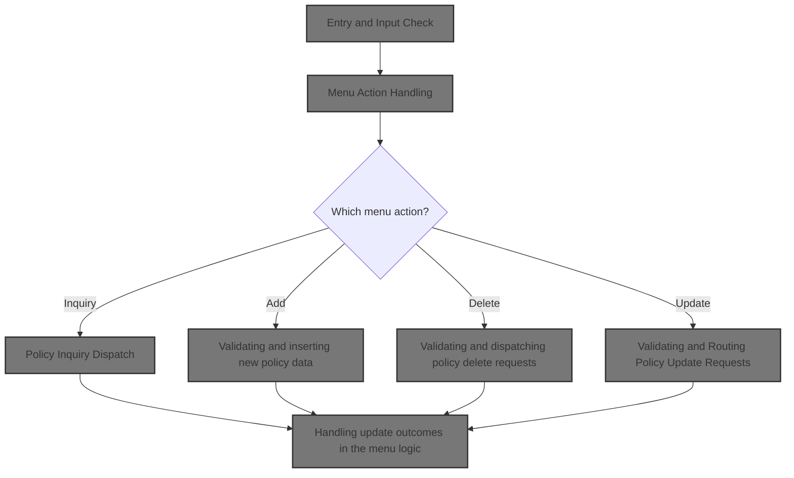

## Dependencies

### Programs

- <SwmToken path="base/src/lgtestp1.cbl" pos="11:6:6" line-data="       PROGRAM-ID. LGTESTP1.">`LGTESTP1`</SwmToken> (<SwmPath>[base/src/lgtestp1.cbl](base/src/lgtestp1.cbl)</SwmPath>)
- <SwmToken path="base/src/lgtestp1.cbl" pos="72:10:10" line-data="                 EXEC CICS LINK PROGRAM(&#39;LGIPOL01&#39;)">`LGIPOL01`</SwmToken> (<SwmPath>[base/src/lgipol01.cbl](base/src/lgipol01.cbl)</SwmPath>)
- <SwmToken path="base/src/lgipol01.cbl" pos="91:9:9" line-data="           EXEC CICS LINK Program(LGIPDB01)">`LGIPDB01`</SwmToken> (<SwmPath>[base/src/lgipdb01.cbl](base/src/lgipdb01.cbl)</SwmPath>)
- LGSTSQ (<SwmPath>[base/src/lgstsq.cbl](base/src/lgstsq.cbl)</SwmPath>)
- <SwmToken path="base/src/lgtestp1.cbl" pos="115:10:10" line-data="                 EXEC CICS LINK PROGRAM(&#39;LGAPOL01&#39;)">`LGAPOL01`</SwmToken> (<SwmPath>[base/src/lgapol01.cbl](base/src/lgapol01.cbl)</SwmPath>)
- <SwmToken path="base/src/lgapol01.cbl" pos="103:9:9" line-data="           EXEC CICS Link Program(LGAPDB01)">`LGAPDB01`</SwmToken> (<SwmPath>[base/src/LGAPDB01.cbl](base/src/LGAPDB01.cbl)</SwmPath>)
- <SwmToken path="base/src/LGAPDB01.cbl" pos="269:4:4" line-data="           CALL &#39;LGAPDB02&#39; USING IN-PROPERTY-TYPE, IN-POSTCODE, ">`LGAPDB02`</SwmToken> (<SwmPath>[base/src/LGAPDB02.cbl](base/src/LGAPDB02.cbl)</SwmPath>)
- <SwmToken path="base/src/LGAPDB01.cbl" pos="276:4:4" line-data="           CALL &#39;LGAPDB03&#39; USING WS-BASE-RISK-SCR, IN-FIRE-PERIL, ">`LGAPDB03`</SwmToken> (<SwmPath>[base/src/LGAPDB03.cbl](base/src/LGAPDB03.cbl)</SwmPath>)
- <SwmToken path="base/src/LGAPDB01.cbl" pos="313:4:4" line-data="               CALL &#39;LGAPDB04&#39; USING LK-INPUT-DATA, LK-COVERAGE-DATA, ">`LGAPDB04`</SwmToken> (<SwmPath>[base/src/LGAPDB04.cbl](base/src/LGAPDB04.cbl)</SwmPath>)
- <SwmToken path="base/src/lgtestp1.cbl" pos="139:10:10" line-data="                 EXEC CICS LINK PROGRAM(&#39;LGDPOL01&#39;)">`LGDPOL01`</SwmToken> (<SwmPath>[base/src/lgdpol01.cbl](base/src/lgdpol01.cbl)</SwmPath>)
- <SwmToken path="base/src/lgdpol01.cbl" pos="141:9:9" line-data="           EXEC CICS LINK PROGRAM(LGDPDB01)">`LGDPDB01`</SwmToken> (<SwmPath>[base/src/lgdpdb01.cbl](base/src/lgdpdb01.cbl)</SwmPath>)
- <SwmToken path="base/src/lgdpdb01.cbl" pos="168:9:9" line-data="               EXEC CICS LINK PROGRAM(LGDPVS01)">`LGDPVS01`</SwmToken> (<SwmPath>[base/src/lgdpvs01.cbl](base/src/lgdpvs01.cbl)</SwmPath>)
- <SwmToken path="base/src/lgtestp1.cbl" pos="216:10:10" line-data="                 EXEC CICS LINK PROGRAM(&#39;LGUPOL01&#39;)">`LGUPOL01`</SwmToken> (<SwmPath>[base/src/lgupol01.cbl](base/src/lgupol01.cbl)</SwmPath>)
- <SwmToken path="base/src/lgupol01.cbl" pos="157:9:9" line-data="           EXEC CICS LINK Program(LGUPDB01)">`LGUPDB01`</SwmToken> (<SwmPath>[base/src/lgupdb01.cbl](base/src/lgupdb01.cbl)</SwmPath>)
- <SwmToken path="base/src/lgupdb01.cbl" pos="209:9:9" line-data="           EXEC CICS LINK Program(LGUPVS01)">`LGUPVS01`</SwmToken> (<SwmPath>[base/src/lgupvs01.cbl](base/src/lgupvs01.cbl)</SwmPath>)
- <SwmToken path="base/src/lgtestp1.cbl" pos="259:4:4" line-data="                TRANSID(&#39;SSP1&#39;)">`SSP1`</SwmToken>

### Copybooks

- SQLCA
- LGPOLICY (<SwmPath>[base/src/lgpolicy.cpy](base/src/lgpolicy.cpy)</SwmPath>)
- LGCMAREA (<SwmPath>[base/src/lgcmarea.cpy](base/src/lgcmarea.cpy)</SwmPath>)
- <SwmToken path="base/src/LGAPDB01.cbl" pos="35:3:3" line-data="           COPY INPUTREC2.">`INPUTREC2`</SwmToken> (<SwmPath>[base/src/INPUTREC2.cpy](base/src/INPUTREC2.cpy)</SwmPath>)
- OUTPUTREC (<SwmPath>[base/src/OUTPUTREC.cpy](base/src/OUTPUTREC.cpy)</SwmPath>)
- WORKSTOR (<SwmPath>[base/src/WORKSTOR.cpy](base/src/WORKSTOR.cpy)</SwmPath>)
- LGAPACT (<SwmPath>[base/src/LGAPACT.cpy](base/src/LGAPACT.cpy)</SwmPath>)
- SSMAP

## Input and Output Tables/Files used

### <SwmToken path="base/src/LGAPDB01.cbl" pos="269:4:4" line-data="           CALL &#39;LGAPDB02&#39; USING IN-PROPERTY-TYPE, IN-POSTCODE, ">`LGAPDB02`</SwmToken> (<SwmPath>[base/src/LGAPDB02.cbl](base/src/LGAPDB02.cbl)</SwmPath>)

| Table / File Name                                                                                                          | Type                                                                                                                    | Description                                                  | Usage Mode | Key Fields / Layout Highlights                                                                                                                                                                                                                                                                               |
| -------------------------------------------------------------------------------------------------------------------------- | ----------------------------------------------------------------------------------------------------------------------- | ------------------------------------------------------------ | ---------- | ------------------------------------------------------------------------------------------------------------------------------------------------------------------------------------------------------------------------------------------------------------------------------------------------------------ |
| <SwmToken path="base/src/LGAPDB02.cbl" pos="47:3:3" line-data="               FROM RISK_FACTORS">`RISK_FACTORS`</SwmToken> | <SwmToken path="base/src/lgipdb01.cbl" pos="242:5:5" line-data="      * initialize DB2 host variables">`DB2`</SwmToken> | Peril-specific risk adjustment factors for insurance scoring | Input      | <SwmToken path="base/src/LGAPDB02.cbl" pos="46:8:12" line-data="               SELECT FACTOR_VALUE INTO :WS-FIRE-FACTOR">`WS-FIRE-FACTOR`</SwmToken>, <SwmToken path="base/src/LGAPDB02.cbl" pos="58:8:12" line-data="               SELECT FACTOR_VALUE INTO :WS-CRIME-FACTOR">`WS-CRIME-FACTOR`</SwmToken> |

### <SwmToken path="base/src/LGAPDB01.cbl" pos="313:4:4" line-data="               CALL &#39;LGAPDB04&#39; USING LK-INPUT-DATA, LK-COVERAGE-DATA, ">`LGAPDB04`</SwmToken> (<SwmPath>[base/src/LGAPDB04.cbl](base/src/LGAPDB04.cbl)</SwmPath>)

| Table / File Name                                                                                                         | Type                                                                                                                    | Description                                                              | Usage Mode | Key Fields / Layout Highlights                                                                                                                                                                                                                                                                                                                                                                                                                                                                                                                                                                                                                                                                                                             |
| ------------------------------------------------------------------------------------------------------------------------- | ----------------------------------------------------------------------------------------------------------------------- | ------------------------------------------------------------------------ | ---------- | ------------------------------------------------------------------------------------------------------------------------------------------------------------------------------------------------------------------------------------------------------------------------------------------------------------------------------------------------------------------------------------------------------------------------------------------------------------------------------------------------------------------------------------------------------------------------------------------------------------------------------------------------------------------------------------------------------------------------------------------ |
| <SwmToken path="base/src/LGAPDB04.cbl" pos="183:3:3" line-data="               FROM RATE_MASTER">`RATE_MASTER`</SwmToken> | <SwmToken path="base/src/lgipdb01.cbl" pos="242:5:5" line-data="      * initialize DB2 host variables">`DB2`</SwmToken> | Property insurance base rates by peril, territory, and construction type | Input      | <SwmToken path="base/src/LGAPDB04.cbl" pos="181:3:3" line-data="               SELECT BASE_RATE, MIN_PREMIUM, MAX_PREMIUM">`BASE_RATE`</SwmToken>, <SwmToken path="base/src/LGAPDB01.cbl" pos="132:4:4" line-data="           MOVE &#39;MIN_PREMIUM&#39; TO CONFIG-KEY">`MIN_PREMIUM`</SwmToken>, <SwmToken path="base/src/LGAPDB04.cbl" pos="325:1:5" line-data="                   WS-BASE-RATE (1, 1, 1, 1) * ">`WS-BASE-RATE`</SwmToken>, <SwmToken path="base/src/LGAPDB04.cbl" pos="51:3:7" line-data="                       25 WS-MIN-PREM   PIC 9(5)V99.">`WS-MIN-PREM`</SwmToken>, <SwmToken path="base/src/LGAPDB04.cbl" pos="52:3:7" line-data="                       25 WS-MAX-PREM   PIC 9(7)V99.">`WS-MAX-PREM`</SwmToken> |

### <SwmToken path="base/src/LGAPDB01.cbl" pos="276:4:4" line-data="           CALL &#39;LGAPDB03&#39; USING WS-BASE-RISK-SCR, IN-FIRE-PERIL, ">`LGAPDB03`</SwmToken> (<SwmPath>[base/src/LGAPDB03.cbl](base/src/LGAPDB03.cbl)</SwmPath>)

| Table / File Name                                                                                                          | Type                                                                                                                    | Description                                                             | Usage Mode | Key Fields / Layout Highlights                                                                                                                                                                                                                                                                               |
| -------------------------------------------------------------------------------------------------------------------------- | ----------------------------------------------------------------------------------------------------------------------- | ----------------------------------------------------------------------- | ---------- | ------------------------------------------------------------------------------------------------------------------------------------------------------------------------------------------------------------------------------------------------------------------------------------------------------------ |
| <SwmToken path="base/src/LGAPDB02.cbl" pos="47:3:3" line-data="               FROM RISK_FACTORS">`RISK_FACTORS`</SwmToken> | <SwmToken path="base/src/lgipdb01.cbl" pos="242:5:5" line-data="      * initialize DB2 host variables">`DB2`</SwmToken> | Risk adjustment factors by peril type for insurance premium calculation | Input      | <SwmToken path="base/src/LGAPDB02.cbl" pos="46:8:12" line-data="               SELECT FACTOR_VALUE INTO :WS-FIRE-FACTOR">`WS-FIRE-FACTOR`</SwmToken>, <SwmToken path="base/src/LGAPDB02.cbl" pos="58:8:12" line-data="               SELECT FACTOR_VALUE INTO :WS-CRIME-FACTOR">`WS-CRIME-FACTOR`</SwmToken> |

### <SwmToken path="base/src/lgipol01.cbl" pos="91:9:9" line-data="           EXEC CICS LINK Program(LGIPDB01)">`LGIPDB01`</SwmToken> (<SwmPath>[base/src/lgipdb01.cbl](base/src/lgipdb01.cbl)</SwmPath>)

| Table / File Name | Type                                                                                                                    | Description                                                        | Usage Mode | Key Fields / Layout Highlights                                                                                                                                                                                                                                                                                                                                                                                                                                                                                                                                                                                                                                                                                                                                                                                                                                                                                                                                                                                                                                                                                                                                                                                                                                                                                                                                                                                                                                                                                                                                                                                                                                                                                                                                                                                                                                                                                                                                                                                                                                                                                                                                                                                                                                                                                                                                                                                                                                                                                                                                                                                                                                                                                                                                                                                                                                                                                                                                                                                                                                                                                                                                                                                                                                                                                                                                                                                                                                                                                                                                                                                                                                                                                                                                                                                                                                                                                                                                                                                                                                                                                                                                                                                                                                                                                                                                                                                                                                                                                                                                                                                                                                                                                                                                                                                                                                                                                                                                                                                                                                                                                                                                                                                                                                                                                                                                                                                                                                                                                                                                                                                                                                                                                                                                                                                                                                                                                                                                                                                                                                                                                                                                                                                                                                                                                                                                                                                                                                                                                                                                                                                                                                                                                                                                                                                                                                                                                                                                                                                                                                                                                                                                                                                                                                                                                                                                                                                                                                                                                                                                                                                                                                                                                                                                                                                                                                                                                                                                                                                                                                                                                                                                                                                                                                                                                                                                                                                                                                                                                                                                                                                                                                                                                                                                                                                                                                                                                                                                                                                                                                                                                                                                                                                                                                                                                                                                                                                                                                                                                                                                                                                                                                                                                                                                                                                                                                                                                                                                                                                                                                                                                                                                                                                                                                                                                                                                                                                                                                                                                                                                                                                                                                                                                                                                                                                                                                                                                                                                                                                                                                                                                                                                                                                                                                                                                                                                                                                                                                                                                                                                                                                                                                                                                                                                                                                                                                                                                                                                                                                                                                                                                                                                                                                                                                                                                                                                                                                                                                                                                                                                                                                                                                                                                                                                                                                                                                                                                                                                                                                                                                                                                                                                                                                           |
| ----------------- | ----------------------------------------------------------------------------------------------------------------------- | ------------------------------------------------------------------ | ---------- | ------------------------------------------------------------------------------------------------------------------------------------------------------------------------------------------------------------------------------------------------------------------------------------------------------------------------------------------------------------------------------------------------------------------------------------------------------------------------------------------------------------------------------------------------------------------------------------------------------------------------------------------------------------------------------------------------------------------------------------------------------------------------------------------------------------------------------------------------------------------------------------------------------------------------------------------------------------------------------------------------------------------------------------------------------------------------------------------------------------------------------------------------------------------------------------------------------------------------------------------------------------------------------------------------------------------------------------------------------------------------------------------------------------------------------------------------------------------------------------------------------------------------------------------------------------------------------------------------------------------------------------------------------------------------------------------------------------------------------------------------------------------------------------------------------------------------------------------------------------------------------------------------------------------------------------------------------------------------------------------------------------------------------------------------------------------------------------------------------------------------------------------------------------------------------------------------------------------------------------------------------------------------------------------------------------------------------------------------------------------------------------------------------------------------------------------------------------------------------------------------------------------------------------------------------------------------------------------------------------------------------------------------------------------------------------------------------------------------------------------------------------------------------------------------------------------------------------------------------------------------------------------------------------------------------------------------------------------------------------------------------------------------------------------------------------------------------------------------------------------------------------------------------------------------------------------------------------------------------------------------------------------------------------------------------------------------------------------------------------------------------------------------------------------------------------------------------------------------------------------------------------------------------------------------------------------------------------------------------------------------------------------------------------------------------------------------------------------------------------------------------------------------------------------------------------------------------------------------------------------------------------------------------------------------------------------------------------------------------------------------------------------------------------------------------------------------------------------------------------------------------------------------------------------------------------------------------------------------------------------------------------------------------------------------------------------------------------------------------------------------------------------------------------------------------------------------------------------------------------------------------------------------------------------------------------------------------------------------------------------------------------------------------------------------------------------------------------------------------------------------------------------------------------------------------------------------------------------------------------------------------------------------------------------------------------------------------------------------------------------------------------------------------------------------------------------------------------------------------------------------------------------------------------------------------------------------------------------------------------------------------------------------------------------------------------------------------------------------------------------------------------------------------------------------------------------------------------------------------------------------------------------------------------------------------------------------------------------------------------------------------------------------------------------------------------------------------------------------------------------------------------------------------------------------------------------------------------------------------------------------------------------------------------------------------------------------------------------------------------------------------------------------------------------------------------------------------------------------------------------------------------------------------------------------------------------------------------------------------------------------------------------------------------------------------------------------------------------------------------------------------------------------------------------------------------------------------------------------------------------------------------------------------------------------------------------------------------------------------------------------------------------------------------------------------------------------------------------------------------------------------------------------------------------------------------------------------------------------------------------------------------------------------------------------------------------------------------------------------------------------------------------------------------------------------------------------------------------------------------------------------------------------------------------------------------------------------------------------------------------------------------------------------------------------------------------------------------------------------------------------------------------------------------------------------------------------------------------------------------------------------------------------------------------------------------------------------------------------------------------------------------------------------------------------------------------------------------------------------------------------------------------------------------------------------------------------------------------------------------------------------------------------------------------------------------------------------------------------------------------------------------------------------------------------------------------------------------------------------------------------------------------------------------------------------------------------------------------------------------------------------------------------------------------------------------------------------------------------------------------------------------------------------------------------------------------------------------------------------------------------------------------------------------------------------------------------------------------------------------------------------------------------------------------------------------------------------------------------------------------------------------------------------------------------------------------------------------------------------------------------------------------------------------------------------------------------------------------------------------------------------------------------------------------------------------------------------------------------------------------------------------------------------------------------------------------------------------------------------------------------------------------------------------------------------------------------------------------------------------------------------------------------------------------------------------------------------------------------------------------------------------------------------------------------------------------------------------------------------------------------------------------------------------------------------------------------------------------------------------------------------------------------------------------------------------------------------------------------------------------------------------------------------------------------------------------------------------------------------------------------------------------------------------------------------------------------------------------------------------------------------------------------------------------------------------------------------------------------------------------------------------------------------------------------------------------------------------------------------------------------------------------------------------------------------------------------------------------------------------------------------------------------------------------------------------------------------------------------------------------------------------------------------------------------------------------------------------------------------------------------------------------------------------------------------------------------------------------------------------------------------------------------------------------------------------------------------------------------------------------------------------------------------------------------------------------------------------------------------------------------------------------------------------------------------------------------------------------------------------------------------------------------------------------------------------------------------------------------------------------------------------------------------------------------------------------------------------------------------------------------------------------------------------------------------------------------------------------------------------------------------------------------------------------------------------------------------------------------------------------------------------------------------------------------------------------------------------------------------------------------------------------------------------------------------------------------------------------------------------------------------------------------------------------------------------------------------------------------------------------------------------------------------------------------------------------------------------------------------------------------------------------------------------------------------------------------------------------------------------------------------------------------------------------------------------------------------------------------------------------------------------------------------------------------------------------------------------------------------------------------------------------------------------------------------------------------------------------------------------------------------------------------------------------------------------------------------------------------------------------------------------------------------------------------------------------------------------------------------------------------------------------------------------------------------------------------------------------------------------------------------------------------------------------------------------------------------------------------ |
| POLICY            | <SwmToken path="base/src/lgipdb01.cbl" pos="242:5:5" line-data="      * initialize DB2 host variables">`DB2`</SwmToken> | Insurance policy master data, links to customer and product tables | Input      | <SwmToken path="base/src/lgipdb01.cbl" pos="92:1:1" line-data="                   CustomerNumber,">`CustomerNumber`</SwmToken>, <SwmToken path="base/src/lgipdb01.cbl" pos="93:3:3" line-data="                   Policy.PolicyNumber,">`PolicyNumber`</SwmToken>, <SwmToken path="base/src/lgipdb01.cbl" pos="94:1:1" line-data="                   RequestDate,">`RequestDate`</SwmToken>, <SwmToken path="base/src/lgipdb01.cbl" pos="95:1:1" line-data="                   StartDate,">`StartDate`</SwmToken>, <SwmToken path="base/src/lgipdb01.cbl" pos="96:1:1" line-data="                   RenewalDate,">`RenewalDate`</SwmToken>, <SwmToken path="base/src/lgipdb01.cbl" pos="97:1:1" line-data="                   Address,">`Address`</SwmToken>, <SwmToken path="base/src/lgipdb01.cbl" pos="98:1:1" line-data="                   Zipcode,">`Zipcode`</SwmToken>, <SwmToken path="base/src/lgipdb01.cbl" pos="99:1:1" line-data="                   LatitudeN,">`LatitudeN`</SwmToken>, <SwmToken path="base/src/lgipdb01.cbl" pos="100:1:1" line-data="                   LongitudeW,">`LongitudeW`</SwmToken>, <SwmToken path="base/src/lgtestp1.cbl" pos="289:4:4" line-data="               Move &#39;Customer does not exist&#39;          To  ERP1FLDO">`Customer`</SwmToken>, <SwmToken path="base/src/lgipdb01.cbl" pos="102:1:1" line-data="                   PropertyType,">`PropertyType`</SwmToken>, <SwmToken path="base/src/lgipdb01.cbl" pos="103:1:1" line-data="                   FirePeril,">`FirePeril`</SwmToken>, <SwmToken path="base/src/lgipdb01.cbl" pos="104:1:1" line-data="                   FirePremium,">`FirePremium`</SwmToken>, <SwmToken path="base/src/lgipdb01.cbl" pos="105:1:1" line-data="                   CrimePeril,">`CrimePeril`</SwmToken>, <SwmToken path="base/src/lgipdb01.cbl" pos="106:1:1" line-data="                   CrimePremium,">`CrimePremium`</SwmToken>, <SwmToken path="base/src/lgipdb01.cbl" pos="107:1:1" line-data="                   FloodPeril,">`FloodPeril`</SwmToken>, <SwmToken path="base/src/lgipdb01.cbl" pos="108:1:1" line-data="                   FloodPremium,">`FloodPremium`</SwmToken>, <SwmToken path="base/src/lgipdb01.cbl" pos="109:1:1" line-data="                   WeatherPeril,">`WeatherPeril`</SwmToken>, <SwmToken path="base/src/lgipdb01.cbl" pos="110:1:1" line-data="                   WeatherPremium,">`WeatherPremium`</SwmToken>, <SwmToken path="base/src/lgupvs01.cbl" pos="110:7:7" line-data="               Move CA-B-Status    To WF-B-Status">`Status`</SwmToken>, <SwmToken path="base/src/lgipdb01.cbl" pos="112:1:1" line-data="                   RejectionReason">`RejectionReason`</SwmToken>, <SwmToken path="base/src/lgipdb01.cbl" pos="331:3:3" line-data="             SELECT  ISSUEDATE,">`ISSUEDATE`</SwmToken>, <SwmToken path="base/src/lgipdb01.cbl" pos="332:1:1" line-data="                     EXPIRYDATE,">`EXPIRYDATE`</SwmToken>, <SwmToken path="base/src/lgipdb01.cbl" pos="333:1:1" line-data="                     LASTCHANGED,">`LASTCHANGED`</SwmToken>, <SwmToken path="base/src/lgtestp1.cbl" pos="101:9:9" line-data="                 Move 0                 To CA-BROKERID">`BROKERID`</SwmToken>, <SwmToken path="base/src/lgipdb01.cbl" pos="335:1:1" line-data="                     BROKERSREFERENCE,">`BROKERSREFERENCE`</SwmToken>, <SwmToken path="base/src/lgtestp1.cbl" pos="100:9:9" line-data="                 Move 0                 To CA-PAYMENT">`PAYMENT`</SwmToken>, <SwmToken path="base/src/lgipdb01.cbl" pos="337:1:1" line-data="                     WITHPROFITS,">`WITHPROFITS`</SwmToken>, <SwmToken path="base/src/lgipdb01.cbl" pos="338:1:1" line-data="                     EQUITIES,">`EQUITIES`</SwmToken>, <SwmToken path="base/src/lgipdb01.cbl" pos="339:1:1" line-data="                     MANAGEDFUND,">`MANAGEDFUND`</SwmToken>, <SwmToken path="base/src/lgipdb01.cbl" pos="340:1:1" line-data="                     FUNDNAME,">`FUNDNAME`</SwmToken>, <SwmToken path="base/src/lgipdb01.cbl" pos="341:1:1" line-data="                     TERM,">`TERM`</SwmToken>, <SwmToken path="base/src/lgipdb01.cbl" pos="342:1:1" line-data="                     SUMASSURED,">`SUMASSURED`</SwmToken>, <SwmToken path="base/src/lgipdb01.cbl" pos="343:1:1" line-data="                     LIFEASSURED,">`LIFEASSURED`</SwmToken>, <SwmToken path="base/src/lgipdb01.cbl" pos="344:1:1" line-data="                     PADDINGDATA,">`PADDINGDATA`</SwmToken>, <SwmToken path="base/src/lgtestp1.cbl" pos="74:1:1" line-data="                           LENGTH(32500)">`LENGTH`</SwmToken>, <SwmToken path="base/src/lgipdb01.cbl" pos="347:2:4" line-data="                   :DB2-EXPIRYDATE,">`DB2-EXPIRYDATE`</SwmToken>, <SwmToken path="base/src/lgipdb01.cbl" pos="348:2:4" line-data="                   :DB2-LASTCHANGED,">`DB2-LASTCHANGED`</SwmToken>, <SwmToken path="base/src/lgipdb01.cbl" pos="349:11:13" line-data="                   :DB2-BROKERID-INT INDICATOR :IND-BROKERID,">`IND-BROKERID`</SwmToken>, <SwmToken path="base/src/lgipdb01.cbl" pos="350:9:11" line-data="                   :DB2-BROKERSREF INDICATOR :IND-BROKERSREF,">`IND-BROKERSREF`</SwmToken>, <SwmToken path="base/src/lgipdb01.cbl" pos="351:11:13" line-data="                   :DB2-PAYMENT-INT INDICATOR :IND-PAYMENT,">`IND-PAYMENT`</SwmToken>, <SwmToken path="base/src/lgipdb01.cbl" pos="352:2:6" line-data="                   :DB2-E-WITHPROFITS,">`DB2-E-WITHPROFITS`</SwmToken>, <SwmToken path="base/src/lgipdb01.cbl" pos="353:2:6" line-data="                   :DB2-E-EQUITIES,">`DB2-E-EQUITIES`</SwmToken>, <SwmToken path="base/src/lgipdb01.cbl" pos="354:2:6" line-data="                   :DB2-E-MANAGEDFUND,">`DB2-E-MANAGEDFUND`</SwmToken>, <SwmToken path="base/src/lgipdb01.cbl" pos="355:2:6" line-data="                   :DB2-E-FUNDNAME,">`DB2-E-FUNDNAME`</SwmToken>, <SwmToken path="base/src/lgipdb01.cbl" pos="356:2:8" line-data="                   :DB2-E-TERM-SINT,">`DB2-E-TERM-SINT`</SwmToken>, <SwmToken path="base/src/lgipdb01.cbl" pos="357:2:8" line-data="                   :DB2-E-SUMASSURED-INT,">`DB2-E-SUMASSURED-INT`</SwmToken>, <SwmToken path="base/src/lgipdb01.cbl" pos="358:2:6" line-data="                   :DB2-E-LIFEASSURED,">`DB2-E-LIFEASSURED`</SwmToken>, <SwmToken path="base/src/lgipdb01.cbl" pos="359:11:15" line-data="                   :DB2-E-PADDINGDATA INDICATOR :IND-E-PADDINGDATA,">`IND-E-PADDINGDATA`</SwmToken>, <SwmToken path="base/src/lgipdb01.cbl" pos="360:13:17" line-data="                   :DB2-E-PADDING-LEN INDICATOR :IND-E-PADDINGDATAL">`IND-E-PADDINGDATAL`</SwmToken>, <SwmToken path="base/src/lgipdb01.cbl" pos="451:1:1" line-data="                     PROPERTYTYPE,">`PROPERTYTYPE`</SwmToken>, <SwmToken path="base/src/lgipdb01.cbl" pos="452:1:1" line-data="                     BEDROOMS,">`BEDROOMS`</SwmToken>, <SwmToken path="base/src/lgtestp1.cbl" pos="84:7:7" line-data="                 Move CA-M-VALUE        To  ENP1VALI">`VALUE`</SwmToken>, <SwmToken path="base/src/lgipdb01.cbl" pos="454:1:1" line-data="                     HOUSENAME,">`HOUSENAME`</SwmToken>, <SwmToken path="base/src/lgipdb01.cbl" pos="455:1:1" line-data="                     HOUSENUMBER,">`HOUSENUMBER`</SwmToken>, <SwmToken path="base/src/lgipdb01.cbl" pos="346:4:6" line-data="             INTO  :DB2-ISSUEDATE,">`DB2-ISSUEDATE`</SwmToken>, <SwmToken path="base/src/lgipdb01.cbl" pos="463:2:6" line-data="                   :DB2-H-PROPERTYTYPE,">`DB2-H-PROPERTYTYPE`</SwmToken>, <SwmToken path="base/src/lgipdb01.cbl" pos="464:2:8" line-data="                   :DB2-H-BEDROOMS-SINT,">`DB2-H-BEDROOMS-SINT`</SwmToken>, <SwmToken path="base/src/lgipdb01.cbl" pos="465:2:8" line-data="                   :DB2-H-VALUE-INT,">`DB2-H-VALUE-INT`</SwmToken>, <SwmToken path="base/src/lgipdb01.cbl" pos="466:2:6" line-data="                   :DB2-H-HOUSENAME,">`DB2-H-HOUSENAME`</SwmToken>, <SwmToken path="base/src/lgipdb01.cbl" pos="467:2:6" line-data="                   :DB2-H-HOUSENUMBER,">`DB2-H-HOUSENUMBER`</SwmToken>, <SwmToken path="base/src/lgipdb01.cbl" pos="468:2:6" line-data="                   :DB2-H-POSTCODE">`DB2-H-POSTCODE`</SwmToken>, <SwmToken path="base/src/lgtestp1.cbl" pos="82:7:7" line-data="                 Move CA-M-MAKE         To  ENP1CMKI">`MAKE`</SwmToken>, <SwmToken path="base/src/lgtestp1.cbl" pos="83:7:7" line-data="                 Move CA-M-MODEL        To  ENP1CMOI">`MODEL`</SwmToken>, <SwmToken path="base/src/lgtestp1.cbl" pos="85:7:7" line-data="                 Move CA-M-REGNUMBER    To  ENP1REGI">`REGNUMBER`</SwmToken>, <SwmToken path="base/src/lgtestp1.cbl" pos="86:7:7" line-data="                 Move CA-M-COLOUR       To  ENP1COLI">`COLOUR`</SwmToken>, <SwmToken path="base/src/lgtestp1.cbl" pos="87:7:7" line-data="                 Move CA-M-CC           To  ENP1CCI">`CC`</SwmToken>, <SwmToken path="base/src/lgipdb01.cbl" pos="545:1:1" line-data="                     YEAROFMANUFACTURE,">`YEAROFMANUFACTURE`</SwmToken>, <SwmToken path="base/src/lgtestp1.cbl" pos="89:7:7" line-data="                 Move CA-M-PREMIUM      To  ENP1PREI">`PREMIUM`</SwmToken>, <SwmToken path="base/src/lgipdb01.cbl" pos="554:2:6" line-data="                   :DB2-M-MAKE,">`DB2-M-MAKE`</SwmToken>, <SwmToken path="base/src/lgipdb01.cbl" pos="555:2:6" line-data="                   :DB2-M-MODEL,">`DB2-M-MODEL`</SwmToken>, <SwmToken path="base/src/lgipdb01.cbl" pos="556:2:8" line-data="                   :DB2-M-VALUE-INT,">`DB2-M-VALUE-INT`</SwmToken>, <SwmToken path="base/src/lgipdb01.cbl" pos="557:2:6" line-data="                   :DB2-M-REGNUMBER,">`DB2-M-REGNUMBER`</SwmToken>, <SwmToken path="base/src/lgipdb01.cbl" pos="558:2:6" line-data="                   :DB2-M-COLOUR,">`DB2-M-COLOUR`</SwmToken>, <SwmToken path="base/src/lgipdb01.cbl" pos="559:2:8" line-data="                   :DB2-M-CC-SINT,">`DB2-M-CC-SINT`</SwmToken>, <SwmToken path="base/src/lgipdb01.cbl" pos="560:2:6" line-data="                   :DB2-M-MANUFACTURED,">`DB2-M-MANUFACTURED`</SwmToken>, <SwmToken path="base/src/lgipdb01.cbl" pos="561:2:8" line-data="                   :DB2-M-PREMIUM-INT,">`DB2-M-PREMIUM-INT`</SwmToken>, <SwmToken path="base/src/lgipdb01.cbl" pos="562:2:8" line-data="                   :DB2-M-ACCIDENTS-INT">`DB2-M-ACCIDENTS-INT`</SwmToken>, <SwmToken path="base/src/lgipdb01.cbl" pos="655:2:6" line-data="                   :DB2-B-Address,">`DB2-B-Address`</SwmToken>, <SwmToken path="base/src/lgipdb01.cbl" pos="656:2:6" line-data="                   :DB2-B-Postcode,">`DB2-B-Postcode`</SwmToken>, <SwmToken path="base/src/lgipdb01.cbl" pos="657:2:6" line-data="                   :DB2-B-Latitude,">`DB2-B-Latitude`</SwmToken>, <SwmToken path="base/src/lgipdb01.cbl" pos="658:2:6" line-data="                   :DB2-B-Longitude,">`DB2-B-Longitude`</SwmToken>, <SwmToken path="base/src/lgipdb01.cbl" pos="659:2:6" line-data="                   :DB2-B-Customer,">`DB2-B-Customer`</SwmToken>, <SwmToken path="base/src/lgipdb01.cbl" pos="660:2:6" line-data="                   :DB2-B-PropType,">`DB2-B-PropType`</SwmToken>, <SwmToken path="base/src/lgipdb01.cbl" pos="182:3:9" line-data="           03 DB2-B-FirePeril-Int      PIC S9(4) COMP.">`DB2-B-FirePeril-Int`</SwmToken>, <SwmToken path="base/src/lgipdb01.cbl" pos="183:3:9" line-data="           03 DB2-B-FirePremium-Int    PIC S9(9) COMP.">`DB2-B-FirePremium-Int`</SwmToken>, <SwmToken path="base/src/lgipdb01.cbl" pos="184:3:9" line-data="           03 DB2-B-CrimePeril-Int     PIC S9(4) COMP.">`DB2-B-CrimePeril-Int`</SwmToken>, <SwmToken path="base/src/lgipdb01.cbl" pos="185:3:9" line-data="           03 DB2-B-CrimePremium-Int   PIC S9(9) COMP.">`DB2-B-CrimePremium-Int`</SwmToken>, <SwmToken path="base/src/lgipdb01.cbl" pos="186:3:9" line-data="           03 DB2-B-FloodPeril-Int     PIC S9(4) COMP.">`DB2-B-FloodPeril-Int`</SwmToken>, <SwmToken path="base/src/lgipdb01.cbl" pos="187:3:9" line-data="           03 DB2-B-FloodPremium-Int   PIC S9(9) COMP.">`DB2-B-FloodPremium-Int`</SwmToken>, <SwmToken path="base/src/lgipdb01.cbl" pos="188:3:9" line-data="           03 DB2-B-WeatherPeril-Int   PIC S9(4) COMP.">`DB2-B-WeatherPeril-Int`</SwmToken>, <SwmToken path="base/src/lgipdb01.cbl" pos="189:3:9" line-data="           03 DB2-B-WeatherPremium-Int PIC S9(9) COMP.">`DB2-B-WeatherPremium-Int`</SwmToken>, <SwmToken path="base/src/lgipdb01.cbl" pos="190:3:9" line-data="           03 DB2-B-Status-Int         PIC S9(4) COMP.">`DB2-B-Status-Int`</SwmToken>, <SwmToken path="base/src/lgipdb01.cbl" pos="670:2:6" line-data="                   :DB2-B-RejectReason">`DB2-B-RejectReason`</SwmToken>, <SwmToken path="base/src/lgipdb01.cbl" pos="263:11:15" line-data="           MOVE CA-CUSTOMER-NUM TO DB2-CUSTOMERNUM-INT">`DB2-CUSTOMERNUM-INT`</SwmToken> |

### <SwmToken path="base/src/lgdpol01.cbl" pos="141:9:9" line-data="           EXEC CICS LINK PROGRAM(LGDPDB01)">`LGDPDB01`</SwmToken> (<SwmPath>[base/src/lgdpdb01.cbl](base/src/lgdpdb01.cbl)</SwmPath>)

| Table / File Name | Type                                                                                                                    | Description                                                              | Usage Mode | Key Fields / Layout Highlights           |
| ----------------- | ----------------------------------------------------------------------------------------------------------------------- | ------------------------------------------------------------------------ | ---------- | ---------------------------------------- |
| POLICY            | <SwmToken path="base/src/lgipdb01.cbl" pos="242:5:5" line-data="      * initialize DB2 host variables">`DB2`</SwmToken> | Insurance policy master data: customer, policy number, type, dates, etc. | Output     | Database table with relational structure |

### <SwmToken path="base/src/lgapol01.cbl" pos="103:9:9" line-data="           EXEC CICS Link Program(LGAPDB01)">`LGAPDB01`</SwmToken> (<SwmPath>[base/src/LGAPDB01.cbl](base/src/LGAPDB01.cbl)</SwmPath>)

| Table / File Name                                                                                                                                     | Type                                                                                                                    | Description                                               | Usage Mode | Key Fields / Layout Highlights           |
| ----------------------------------------------------------------------------------------------------------------------------------------------------- | ----------------------------------------------------------------------------------------------------------------------- | --------------------------------------------------------- | ---------- | ---------------------------------------- |
| <SwmToken path="base/src/LGAPDB01.cbl" pos="17:3:5" line-data="           SELECT CONFIG-FILE ASSIGN TO &#39;CONFIG.DAT&#39;">`CONFIG-FILE`</SwmToken> | <SwmToken path="base/src/lgipdb01.cbl" pos="242:5:5" line-data="      * initialize DB2 host variables">`DB2`</SwmToken> | Policy config parameters like max risk score, min premium | Input      | Database table with relational structure |
| <SwmToken path="base/src/LGAPDB01.cbl" pos="9:3:5" line-data="           SELECT INPUT-FILE ASSIGN TO &#39;INPUT.DAT&#39;">`INPUT-FILE`</SwmToken>     | <SwmToken path="base/src/lgipdb01.cbl" pos="242:5:5" line-data="      * initialize DB2 host variables">`DB2`</SwmToken> | Policy application input records for processing           | Input      | Database table with relational structure |
| <SwmToken path="base/src/LGAPDB01.cbl" pos="13:3:5" line-data="           SELECT OUTPUT-FILE ASSIGN TO &#39;OUTPUT.DAT&#39;">`OUTPUT-FILE`</SwmToken> | <SwmToken path="base/src/lgipdb01.cbl" pos="242:5:5" line-data="      * initialize DB2 host variables">`DB2`</SwmToken> | Processed policy premium calculation results              | Output     | Database table with relational structure |
| <SwmToken path="base/src/LGAPDB01.cbl" pos="265:7:9" line-data="           PERFORM P011E-WRITE-OUTPUT-RECORD">`OUTPUT-RECORD`</SwmToken>              | <SwmToken path="base/src/lgipdb01.cbl" pos="242:5:5" line-data="      * initialize DB2 host variables">`DB2`</SwmToken> | Single policy premium calculation output record           | Output     | Database table with relational structure |
| <SwmToken path="base/src/LGAPDB01.cbl" pos="159:5:7" line-data="           OPEN OUTPUT SUMMARY-FILE">`SUMMARY-FILE`</SwmToken>                        | <SwmToken path="base/src/lgipdb01.cbl" pos="242:5:5" line-data="      * initialize DB2 host variables">`DB2`</SwmToken> | Summary of processing stats and totals for the run        | Output     | Database table with relational structure |
| <SwmToken path="base/src/LGAPDB01.cbl" pos="64:3:5" line-data="       01  SUMMARY-RECORD             PIC X(132).">`SUMMARY-RECORD`</SwmToken>         | <SwmToken path="base/src/lgipdb01.cbl" pos="242:5:5" line-data="      * initialize DB2 host variables">`DB2`</SwmToken> | Single summary line for processing statistics             | Output     | Database table with relational structure |

### <SwmToken path="base/src/lgupol01.cbl" pos="157:9:9" line-data="           EXEC CICS LINK Program(LGUPDB01)">`LGUPDB01`</SwmToken> (<SwmPath>[base/src/lgupdb01.cbl](base/src/lgupdb01.cbl)</SwmPath>)

| Table / File Name | Type                                                                                                                    | Description                                                               | Usage Mode   | Key Fields / Layout Highlights                                                                                                                                                                                                                                                                                                                                                                                                                                                                                                                                                                                                                                                                                                                                                                                                                                                                                                                                                                                                                                                                                                                                                                                                                                                        |
| ----------------- | ----------------------------------------------------------------------------------------------------------------------- | ------------------------------------------------------------------------- | ------------ | ------------------------------------------------------------------------------------------------------------------------------------------------------------------------------------------------------------------------------------------------------------------------------------------------------------------------------------------------------------------------------------------------------------------------------------------------------------------------------------------------------------------------------------------------------------------------------------------------------------------------------------------------------------------------------------------------------------------------------------------------------------------------------------------------------------------------------------------------------------------------------------------------------------------------------------------------------------------------------------------------------------------------------------------------------------------------------------------------------------------------------------------------------------------------------------------------------------------------------------------------------------------------------------- |
| ENDOWMENT         | <SwmToken path="base/src/lgipdb01.cbl" pos="242:5:5" line-data="      * initialize DB2 host variables">`DB2`</SwmToken> | Endowment policy specifics: fund, term, sum assured, life assured.        | Output       | <SwmToken path="base/src/lgipdb01.cbl" pos="337:1:1" line-data="                     WITHPROFITS,">`WITHPROFITS`</SwmToken>, <SwmToken path="base/src/lgipdb01.cbl" pos="338:1:1" line-data="                     EQUITIES,">`EQUITIES`</SwmToken>, <SwmToken path="base/src/lgipdb01.cbl" pos="339:1:1" line-data="                     MANAGEDFUND,">`MANAGEDFUND`</SwmToken>, <SwmToken path="base/src/lgipdb01.cbl" pos="340:1:1" line-data="                     FUNDNAME,">`FUNDNAME`</SwmToken>, <SwmToken path="base/src/lgipdb01.cbl" pos="341:1:1" line-data="                     TERM,">`TERM`</SwmToken>, <SwmToken path="base/src/lgipdb01.cbl" pos="342:1:1" line-data="                     SUMASSURED,">`SUMASSURED`</SwmToken>, <SwmToken path="base/src/lgipdb01.cbl" pos="343:1:1" line-data="                     LIFEASSURED,">`LIFEASSURED`</SwmToken>                                                                                                                                                                                                                                                                                                                                                                                                         |
| HOUSE             | <SwmToken path="base/src/lgipdb01.cbl" pos="242:5:5" line-data="      * initialize DB2 host variables">`DB2`</SwmToken> | House policy details: property type, bedrooms, value, address info.       | Output       | <SwmToken path="base/src/lgipdb01.cbl" pos="451:1:1" line-data="                     PROPERTYTYPE,">`PROPERTYTYPE`</SwmToken>, <SwmToken path="base/src/lgipdb01.cbl" pos="452:1:1" line-data="                     BEDROOMS,">`BEDROOMS`</SwmToken>, <SwmToken path="base/src/lgtestp1.cbl" pos="84:7:7" line-data="                 Move CA-M-VALUE        To  ENP1VALI">`VALUE`</SwmToken>, <SwmToken path="base/src/lgipdb01.cbl" pos="454:1:1" line-data="                     HOUSENAME,">`HOUSENAME`</SwmToken>, <SwmToken path="base/src/lgipdb01.cbl" pos="455:1:1" line-data="                     HOUSENUMBER,">`HOUSENUMBER`</SwmToken>, <SwmToken path="base/src/lgipdb01.cbl" pos="456:1:1" line-data="                     POSTCODE">`POSTCODE`</SwmToken>                                                                                                                                                                                                                                                                                                                                                                                                                                                                                                             |
| MOTOR             | <SwmToken path="base/src/lgipdb01.cbl" pos="242:5:5" line-data="      * initialize DB2 host variables">`DB2`</SwmToken> | Motor policy details: make, model, value, reg number, premium, accidents. | Output       | <SwmToken path="base/src/lgtestp1.cbl" pos="82:7:7" line-data="                 Move CA-M-MAKE         To  ENP1CMKI">`MAKE`</SwmToken>, <SwmToken path="base/src/lgtestp1.cbl" pos="83:7:7" line-data="                 Move CA-M-MODEL        To  ENP1CMOI">`MODEL`</SwmToken>, <SwmToken path="base/src/lgtestp1.cbl" pos="84:7:7" line-data="                 Move CA-M-VALUE        To  ENP1VALI">`VALUE`</SwmToken>, <SwmToken path="base/src/lgtestp1.cbl" pos="85:7:7" line-data="                 Move CA-M-REGNUMBER    To  ENP1REGI">`REGNUMBER`</SwmToken>, <SwmToken path="base/src/lgtestp1.cbl" pos="86:7:7" line-data="                 Move CA-M-COLOUR       To  ENP1COLI">`COLOUR`</SwmToken>, <SwmToken path="base/src/lgtestp1.cbl" pos="87:7:7" line-data="                 Move CA-M-CC           To  ENP1CCI">`CC`</SwmToken>, <SwmToken path="base/src/lgipdb01.cbl" pos="545:1:1" line-data="                     YEAROFMANUFACTURE,">`YEAROFMANUFACTURE`</SwmToken>, <SwmToken path="base/src/lgtestp1.cbl" pos="89:7:7" line-data="                 Move CA-M-PREMIUM      To  ENP1PREI">`PREMIUM`</SwmToken>, <SwmToken path="base/src/lgtestp1.cbl" pos="90:7:7" line-data="                 Move CA-M-ACCIDENTS    To  ENP1ACCI">`ACCIDENTS`</SwmToken> |
| POLICY            | <SwmToken path="base/src/lgipdb01.cbl" pos="242:5:5" line-data="      * initialize DB2 host variables">`DB2`</SwmToken> | Insurance policy core details: type, dates, broker, payment, ref.         | Input/Output | <SwmToken path="base/src/lgipdb01.cbl" pos="331:3:3" line-data="             SELECT  ISSUEDATE,">`ISSUEDATE`</SwmToken>, <SwmToken path="base/src/lgipdb01.cbl" pos="332:1:1" line-data="                     EXPIRYDATE,">`EXPIRYDATE`</SwmToken>, <SwmToken path="base/src/lgipdb01.cbl" pos="333:1:1" line-data="                     LASTCHANGED,">`LASTCHANGED`</SwmToken>, <SwmToken path="base/src/lgtestp1.cbl" pos="101:9:9" line-data="                 Move 0                 To CA-BROKERID">`BROKERID`</SwmToken>, <SwmToken path="base/src/lgipdb01.cbl" pos="335:1:1" line-data="                     BROKERSREFERENCE,">`BROKERSREFERENCE`</SwmToken>, <SwmToken path="base/src/lgupdb01.cbl" pos="278:3:5" line-data="             IF CA-LASTCHANGED EQUAL TO DB2-LASTCHANGED">`CA-LASTCHANGED`</SwmToken>                                                                                                                                                                                                                                                                                                                                                                                                                                                           |

## Detailed View of the Program's Functionality

# Motor Policy Menu Mainline and Input Handling

## Entry and Input Check

When the main menu program starts, it first checks if there is any input data from the terminal. If there is, it immediately jumps to the main menu action handler. If not, it initializes all the key data areas and sets default values for policy fields, ensuring the menu starts in a clean state. After initialization, it sends the menu map to the terminal, clearing the screen and preparing for the next user interaction.

---

# Menu Action Handling

## User Input Reception and Dispatch

When user input is received, the program sets up handlers for special keys (like CLEAR and <SwmToken path="base/src/lgtestp1.cbl" pos="56:1:1" line-data="                     PF3(ENDIT) END-EXEC.">`PF3`</SwmToken>) and for map input failures. It then receives the menu input from the terminal. The user's menu option is evaluated, and the program dispatches to the appropriate logic for each menu action:

- **Inquiry ('1')**: Prepares a request for a motor policy inquiry, populates the request data, and links to the policy inquiry logic.
- **Add ('2')**: Prepares a request to add a new motor policy, populates all required fields from user input, and links to the add policy logic.
- **Delete ('3')**: Prepares a request to delete a motor policy and links to the delete logic.
- **Update ('4')**: Prepares a request to update a motor policy, fetches current details, allows the user to edit, and then links to the update logic.
- **Other**: Handles invalid menu options by prompting the user to enter a valid option.

---

# Policy Inquiry Dispatch

## Inquiry Request Flow

When a policy inquiry is requested, the program:

1. Initializes transaction, terminal, and task context.
2. Checks if input data (commarea) is present. If not, it logs an error and abends.
3. Sets a success code and prepares for business processing.
4. Links to the main policy inquiry backend logic, which retrieves policy details from the database.
5. Returns control to the caller.

---

# Error Logging and Queue Write

## Error Handling and Logging

Whenever an error occurs (such as missing input data or a database error), the program:

1. Records the error event with the current date and time.
2. Writes the error message to a queue for logging.
3. If there is context data (commarea), it writes up to 90 bytes of that data to the queue as well, handling message size limits.
4. The error logging logic is consistent across all business modules, ensuring that errors are timestamped and contextual information is captured for troubleshooting.

---

# Policy Data Retrieval

## Policy Data Fetching Logic

The backend policy inquiry logic:

1. Initializes working storage and <SwmToken path="base/src/lgipdb01.cbl" pos="242:5:5" line-data="      * initialize DB2 host variables">`DB2`</SwmToken> host variables.
2. Checks for the presence of input data (commarea). If missing, it logs an error and abends.
3. Converts customer and policy numbers to the appropriate database format.
4. Determines the policy type requested (endowment, house, motor, commercial, etc.) based on the request id.
5. Dispatches to the appropriate routine to fetch policy details for the requested type.
6. Handles errors and unsupported types by setting error codes and logging as needed.

Each policy type has its own retrieval logic:

- **Endowment**: Fetches all relevant fields, handles variable-length data, and marks the end of data.
- **House**: Fetches house-specific fields and marks the end of data.
- **Motor**: Fetches motor-specific fields and marks the end of data.
- **Commercial**: Handles commercial policy details, including cursor-based multi-record retrieval.

---

# Post-Inquiry Result Handling

## Handling Inquiry Results

After returning from the backend inquiry logic:

- If the return code indicates an error or no data, the program sets an error message and jumps to the error handling routine.
- If data is returned successfully, the program copies the policy details from the backend data area into the menu fields for display.
- The updated menu is then sent to the terminal so the user can see the latest policy data.

---

# Reporting Missing Motor Policy Data

## No Data Handling

If no data is returned from a policy inquiry, the program:

- Sets an error message indicating that no data was found.
- Jumps to the error handling routine to display the error and reset the interface.

---

# Displaying Error Feedback and Resetting the Interface

## Error Display and Reset

When an error occurs (from any menu action), the program:

1. Sends the menu map to the terminal, filling it with error information so the user sees what went wrong.
2. Resets all input/output and backend data structures to their default state.
3. Jumps to the transaction end routine, which prepares the system for the next user action.

---

# Populating Motor Policy Fields for Display

## Display Preparation

After a successful inquiry or update, the program:

- Copies all relevant motor policy details from the backend data area into the menu fields.
- Sends the updated menu map to the terminal so the user sees the latest information.

---

# Validating and Inserting New Policy Data

## Add Policy Workflow

When adding a new policy:

1. The program checks the input data for validity and logs an error if missing or too short.
2. If valid, it links to the backend add policy logic, which performs the actual database insert.
3. If the add operation fails, it rolls back the transaction and displays an appropriate error message.
4. If successful, it updates the menu fields with the new customer and policy numbers, clears the menu option, sets a success message, and sends the confirmation to the user.

---

# Running the Main Premium Calculation Workflow

## Batch Processing Steps

The backend add policy logic (for commercial policies) runs a full workflow:

1. Initializes the environment and loads configuration.
2. Opens input, output, and summary files.
3. Processes each input record: validates, processes valid records, and logs errors.
4. Closes files and generates a summary report.
5. Displays processing statistics.

---

# Preparing Files and Report Headers

## File Initialization

- Opens all required files (input, output, summary).
- Writes headers to the output report so all data rows are labeled.

---

# Processing and Validating Insurance Applications

## Record Processing Loop

- Reads each input record.
- Validates the record for required fields and business rules.
- Processes valid records or logs errors for invalid ones.
- Continues until all input records are processed.

---

# Validating Input Records and Logging Errors

## Input Validation

- Checks policy type, customer number, and coverage limits.
- Logs errors for each failed check, allowing multiple errors per record.
- Uses a fixed-size error array to track issues.

---

# Routing Valid Records for Processing

## Record Routing

- Determines if the record is commercial or not.
- Routes commercial records to the commercial processing logic and increments the processed count.
- Routes non-commercial records to a separate handler and increments the error count.

---

# Processing Commercial Policy Records

## Commercial Policy Processing

- Calculates the property risk score using a dedicated risk scoring module.
- Calculates the basic premium using a premium calculation module.
- If the status is approved, runs an advanced actuarial calculation for enhanced premium computation.
- Applies business rules to determine the underwriting decision (approved, pending, rejected).
- Writes the output record and updates processing statistics.

---

# Calculating Property Risk Score

## Risk Score Calculation

- Calls a risk scoring module with property and customer information.
- The module fetches risk factors (fire, crime) from the database or uses defaults.
- The risk score is adjusted based on property type, postcode, coverage amounts, location, and customer history.

---

# Calculating Basic Premium for Commercial Policies

## Premium Calculation

- Calls a premium calculation module with the risk score and peril indicators.
- The module fetches risk factors, determines the underwriting verdict, and calculates premiums for each peril.
- Applies a discount if all coverages are selected.

---

# Running Advanced Premium Calculations

## Actuarial Calculation

- Prepares all input fields for actuarial calculations.
- If the total premium is above the minimum, calls an advanced actuarial calculation module.
- The module computes exposures, applies modifiers, calculates premiums, adds loadings, applies discounts and taxes, and finalizes the premium.
- Updates the premium results if the enhanced calculation is higher.

---

# Handling Add Policy Outcomes

## Add Policy Result Handling

- If the add operation fails, the program rolls back the transaction and displays an error message (specific for customer not found or general error).
- If successful, it updates the menu fields, clears the menu option, sets a success message, and sends the confirmation to the user.

---

# Validating and Dispatching Policy Delete Requests

## Delete Policy Workflow

- Checks the input data for presence and length.
- Validates the request id.
- If valid, links to the backend delete logic, which deletes the policy from the database and the VSAM file.
- Handles errors and unsupported requests by setting error codes and logging.

---

# Dispatching Policy Deletion to <SwmToken path="base/src/lgipdb01.cbl" pos="242:5:5" line-data="      * initialize DB2 host variables">`DB2`</SwmToken> Backend

## <SwmToken path="base/src/lgipdb01.cbl" pos="242:5:5" line-data="      * initialize DB2 host variables">`DB2`</SwmToken> Delete Logic

- Links to the backend <SwmToken path="base/src/lgipdb01.cbl" pos="242:5:5" line-data="      * initialize DB2 host variables">`DB2`</SwmToken> delete logic, passing the full data area.
- The backend logic checks the input, converts numbers, validates the request, and deletes the policy from the database.
- If successful, links to the VSAM delete logic to remove the record from the file.

---

# Deleting Policy Records in VSAM and Error Handling

## VSAM Delete Logic

- Builds the file key from the request id, customer, and policy numbers.
- Attempts to delete the policy record from the VSAM file.
- If the delete fails, sets an error code, logs the error, and exits.

---

# Handling Delete Outcomes in the Menu Logic

## Delete Result Handling

- If the delete operation fails, the program rolls back the transaction and displays an error message.
- If successful, it clears all policy fields, sets a success message, and refreshes the display.

---

# Validating and Routing Policy Update Requests

## Update Policy Workflow

- Checks the input data for presence and length.
- Validates the request id and required data length for the policy type.
- If valid, links to the backend update logic, which updates the policy in the database and the VSAM file.
- Handles errors and unsupported requests by setting error codes and logging.

---

# Running the Policy Update in <SwmToken path="base/src/lgipdb01.cbl" pos="242:5:5" line-data="      * initialize DB2 host variables">`DB2`</SwmToken>

## <SwmToken path="base/src/lgipdb01.cbl" pos="242:5:5" line-data="      * initialize DB2 host variables">`DB2`</SwmToken> Update Logic

- Sets up <SwmToken path="base/src/lgipdb01.cbl" pos="242:5:5" line-data="      * initialize DB2 host variables">`DB2`</SwmToken> variables and checks the input data.
- Converts customer and policy numbers.
- Calls the update logic for the specific policy type (endowment, house, motor).
- Updates the main policy table and timestamp.
- Handles errors and logs as needed.

---

# Updating Policy Details and Handling <SwmToken path="base/src/lgipdb01.cbl" pos="242:5:5" line-data="      * initialize DB2 host variables">`DB2`</SwmToken> Errors

## Policy Update Steps

- Opens a cursor and fetches the policy row.
- Checks that the timestamp matches (for concurrency control).
- Updates the specific policy type table.
- If successful, updates the main policy table and timestamp.
- Handles errors at each step, rolling back and logging as needed.
- Closes the cursor at the end.

---

# Updating Policy Records in VSAM

## VSAM Update Logic

- Moves key fields from the input data to the VSAM record structure.
- Uses the request id to determine the policy type and maps the appropriate fields.
- Reads the policy record from the VSAM file.
- If successful, rewrites the record with updated data.
- Handles errors and logs as needed.

---

# Handling Update Outcomes in the Menu Logic

## Update Result Handling

- If the update operation fails, the program displays an error message and resets the interface.
- If successful, it updates the menu fields, clears the menu option, sets a success message, and sends the confirmation to the user.
- Handles invalid menu options by prompting the user and resetting the interface.

---

# End of Transaction and Error Handling

## Transaction End

- After each menu action, the program either returns control to the terminal for the next user action or ends the transaction, displaying a message as appropriate.
- All error handling routines ensure the interface is reset and ready for the next action, with errors logged for later review.

# Data Definitions

### <SwmToken path="base/src/LGAPDB01.cbl" pos="269:4:4" line-data="           CALL &#39;LGAPDB02&#39; USING IN-PROPERTY-TYPE, IN-POSTCODE, ">`LGAPDB02`</SwmToken> (<SwmPath>[base/src/LGAPDB02.cbl](base/src/LGAPDB02.cbl)</SwmPath>)

| Table / Record Name                                                                                                        | Type                                                                                                                    | Short Description                                            | Usage Mode     |
| -------------------------------------------------------------------------------------------------------------------------- | ----------------------------------------------------------------------------------------------------------------------- | ------------------------------------------------------------ | -------------- |
| <SwmToken path="base/src/LGAPDB02.cbl" pos="47:3:3" line-data="               FROM RISK_FACTORS">`RISK_FACTORS`</SwmToken> | <SwmToken path="base/src/lgipdb01.cbl" pos="242:5:5" line-data="      * initialize DB2 host variables">`DB2`</SwmToken> | Peril-specific risk adjustment factors for insurance scoring | Input (SELECT) |

### <SwmToken path="base/src/LGAPDB01.cbl" pos="313:4:4" line-data="               CALL &#39;LGAPDB04&#39; USING LK-INPUT-DATA, LK-COVERAGE-DATA, ">`LGAPDB04`</SwmToken> (<SwmPath>[base/src/LGAPDB04.cbl](base/src/LGAPDB04.cbl)</SwmPath>)

| Table / Record Name                                                                                                       | Type                                                                                                                    | Short Description                                                        | Usage Mode     |
| ------------------------------------------------------------------------------------------------------------------------- | ----------------------------------------------------------------------------------------------------------------------- | ------------------------------------------------------------------------ | -------------- |
| <SwmToken path="base/src/LGAPDB04.cbl" pos="183:3:3" line-data="               FROM RATE_MASTER">`RATE_MASTER`</SwmToken> | <SwmToken path="base/src/lgipdb01.cbl" pos="242:5:5" line-data="      * initialize DB2 host variables">`DB2`</SwmToken> | Property insurance base rates by peril, territory, and construction type | Input (SELECT) |

### <SwmToken path="base/src/LGAPDB01.cbl" pos="276:4:4" line-data="           CALL &#39;LGAPDB03&#39; USING WS-BASE-RISK-SCR, IN-FIRE-PERIL, ">`LGAPDB03`</SwmToken> (<SwmPath>[base/src/LGAPDB03.cbl](base/src/LGAPDB03.cbl)</SwmPath>)

| Table / Record Name                                                                                                        | Type                                                                                                                    | Short Description                                                       | Usage Mode     |
| -------------------------------------------------------------------------------------------------------------------------- | ----------------------------------------------------------------------------------------------------------------------- | ----------------------------------------------------------------------- | -------------- |
| <SwmToken path="base/src/LGAPDB02.cbl" pos="47:3:3" line-data="               FROM RISK_FACTORS">`RISK_FACTORS`</SwmToken> | <SwmToken path="base/src/lgipdb01.cbl" pos="242:5:5" line-data="      * initialize DB2 host variables">`DB2`</SwmToken> | Risk adjustment factors by peril type for insurance premium calculation | Input (SELECT) |

### <SwmToken path="base/src/lgipol01.cbl" pos="91:9:9" line-data="           EXEC CICS LINK Program(LGIPDB01)">`LGIPDB01`</SwmToken> (<SwmPath>[base/src/lgipdb01.cbl](base/src/lgipdb01.cbl)</SwmPath>)

| Table / Record Name | Type                                                                                                                    | Short Description                                                  | Usage Mode             |
| ------------------- | ----------------------------------------------------------------------------------------------------------------------- | ------------------------------------------------------------------ | ---------------------- |
| POLICY              | <SwmToken path="base/src/lgipdb01.cbl" pos="242:5:5" line-data="      * initialize DB2 host variables">`DB2`</SwmToken> | Insurance policy master data, links to customer and product tables | Input (DECLARE/SELECT) |

### <SwmToken path="base/src/lgdpol01.cbl" pos="141:9:9" line-data="           EXEC CICS LINK PROGRAM(LGDPDB01)">`LGDPDB01`</SwmToken> (<SwmPath>[base/src/lgdpdb01.cbl](base/src/lgdpdb01.cbl)</SwmPath>)

| Table / Record Name | Type                                                                                                                    | Short Description                                                       | Usage Mode      |
| ------------------- | ----------------------------------------------------------------------------------------------------------------------- | ----------------------------------------------------------------------- | --------------- |
| POLICY              | <SwmToken path="base/src/lgipdb01.cbl" pos="242:5:5" line-data="      * initialize DB2 host variables">`DB2`</SwmToken> | Insurance policy master data: customer, policy number, type, dates, etc | Output (DELETE) |

### <SwmToken path="base/src/lgapol01.cbl" pos="103:9:9" line-data="           EXEC CICS Link Program(LGAPDB01)">`LGAPDB01`</SwmToken> (<SwmPath>[base/src/LGAPDB01.cbl](base/src/LGAPDB01.cbl)</SwmPath>)

| Table / Record Name                                                                                                                                   | Type                                                                                                                    | Short Description                                         | Usage Mode |
| ----------------------------------------------------------------------------------------------------------------------------------------------------- | ----------------------------------------------------------------------------------------------------------------------- | --------------------------------------------------------- | ---------- |
| <SwmToken path="base/src/LGAPDB01.cbl" pos="17:3:5" line-data="           SELECT CONFIG-FILE ASSIGN TO &#39;CONFIG.DAT&#39;">`CONFIG-FILE`</SwmToken> | <SwmToken path="base/src/lgipdb01.cbl" pos="242:5:5" line-data="      * initialize DB2 host variables">`DB2`</SwmToken> | Policy config parameters like max risk score, min premium | Input      |
| <SwmToken path="base/src/LGAPDB01.cbl" pos="9:3:5" line-data="           SELECT INPUT-FILE ASSIGN TO &#39;INPUT.DAT&#39;">`INPUT-FILE`</SwmToken>     | <SwmToken path="base/src/lgipdb01.cbl" pos="242:5:5" line-data="      * initialize DB2 host variables">`DB2`</SwmToken> | Policy application input records for processing           | Input      |
| <SwmToken path="base/src/LGAPDB01.cbl" pos="13:3:5" line-data="           SELECT OUTPUT-FILE ASSIGN TO &#39;OUTPUT.DAT&#39;">`OUTPUT-FILE`</SwmToken> | <SwmToken path="base/src/lgipdb01.cbl" pos="242:5:5" line-data="      * initialize DB2 host variables">`DB2`</SwmToken> | Processed policy premium calculation results              | Output     |
| <SwmToken path="base/src/LGAPDB01.cbl" pos="265:7:9" line-data="           PERFORM P011E-WRITE-OUTPUT-RECORD">`OUTPUT-RECORD`</SwmToken>              | <SwmToken path="base/src/lgipdb01.cbl" pos="242:5:5" line-data="      * initialize DB2 host variables">`DB2`</SwmToken> | Single policy premium calculation output record           | Output     |
| <SwmToken path="base/src/LGAPDB01.cbl" pos="159:5:7" line-data="           OPEN OUTPUT SUMMARY-FILE">`SUMMARY-FILE`</SwmToken>                        | <SwmToken path="base/src/lgipdb01.cbl" pos="242:5:5" line-data="      * initialize DB2 host variables">`DB2`</SwmToken> | Summary of processing stats and totals for the run        | Output     |
| <SwmToken path="base/src/LGAPDB01.cbl" pos="64:3:5" line-data="       01  SUMMARY-RECORD             PIC X(132).">`SUMMARY-RECORD`</SwmToken>         | <SwmToken path="base/src/lgipdb01.cbl" pos="242:5:5" line-data="      * initialize DB2 host variables">`DB2`</SwmToken> | Single summary line for processing statistics             | Output     |

### <SwmToken path="base/src/lgupol01.cbl" pos="157:9:9" line-data="           EXEC CICS LINK Program(LGUPDB01)">`LGUPDB01`</SwmToken> (<SwmPath>[base/src/lgupdb01.cbl](base/src/lgupdb01.cbl)</SwmPath>)

| Table / Record Name | Type                                                                                                                    | Short Description                                                        | Usage Mode                              |
| ------------------- | ----------------------------------------------------------------------------------------------------------------------- | ------------------------------------------------------------------------ | --------------------------------------- |
| ENDOWMENT           | <SwmToken path="base/src/lgipdb01.cbl" pos="242:5:5" line-data="      * initialize DB2 host variables">`DB2`</SwmToken> | Endowment policy specifics: fund, term, sum assured, life assured        | Output (UPDATE)                         |
| HOUSE               | <SwmToken path="base/src/lgipdb01.cbl" pos="242:5:5" line-data="      * initialize DB2 host variables">`DB2`</SwmToken> | House policy details: property type, bedrooms, value, address info       | Output (UPDATE)                         |
| MOTOR               | <SwmToken path="base/src/lgipdb01.cbl" pos="242:5:5" line-data="      * initialize DB2 host variables">`DB2`</SwmToken> | Motor policy details: make, model, value, reg number, premium, accidents | Output (UPDATE)                         |
| POLICY              | <SwmToken path="base/src/lgipdb01.cbl" pos="242:5:5" line-data="      * initialize DB2 host variables">`DB2`</SwmToken> | Insurance policy core details: type, dates, broker, payment, ref         | Input (DECLARE/SELECT), Output (UPDATE) |

# Rule Definition

| Paragraph Name                                                                                                                                                                                                                                                                                                                                                                                                                                                                                                                                                                                                                                                                                                    | Rule ID | Category          | Description                                                                                                                                                                                                               | Conditions                                                                                                                                                              | Remarks                                                                                                                                                                                                                                                                                                                                                                                                                                                                                                                                                                                                                                                                                                                                   |
| ----------------------------------------------------------------------------------------------------------------------------------------------------------------------------------------------------------------------------------------------------------------------------------------------------------------------------------------------------------------------------------------------------------------------------------------------------------------------------------------------------------------------------------------------------------------------------------------------------------------------------------------------------------------------------------------------------------------- | ------- | ----------------- | ------------------------------------------------------------------------------------------------------------------------------------------------------------------------------------------------------------------------- | ----------------------------------------------------------------------------------------------------------------------------------------------------------------------- | ----------------------------------------------------------------------------------------------------------------------------------------------------------------------------------------------------------------------------------------------------------------------------------------------------------------------------------------------------------------------------------------------------------------------------------------------------------------------------------------------------------------------------------------------------------------------------------------------------------------------------------------------------------------------------------------------------------------------------------------- |
| <SwmPath>[base/src/lgtestp1.cbl](base/src/lgtestp1.cbl)</SwmPath>: MAINLINE SECTION, EVALUATE <SwmToken path="base/src/lgtestp1.cbl" pos="66:3:3" line-data="           EVALUATE ENP1OPTO">`ENP1OPTO`</SwmToken>                                                                                                                                                                                                                                                                                                                                                                                                                                                                                                  | RL-001  | Conditional Logic | The system must validate the menu option entered by the user and route processing to the appropriate transaction logic (Inquiry, Add, Delete, Update). Any unsupported value must result in an error message to the user. | User input is received from the terminal and <SwmToken path="base/src/lgtestp1.cbl" pos="66:3:3" line-data="           EVALUATE ENP1OPTO">`ENP1OPTO`</SwmToken> is set. | Supported values: '1' (Inquiry), '2' (Add), '3' (Delete), '4' (Update). Any other value is invalid. Error message: 'Please enter a valid option'.                                                                                                                                                                                                                                                                                                                                                                                                                                                                                                                                                                                         |
| <SwmPath>[base/src/lgtestp1.cbl](base/src/lgtestp1.cbl)</SwmPath>: EVALUATE <SwmToken path="base/src/lgtestp1.cbl" pos="66:3:3" line-data="           EVALUATE ENP1OPTO">`ENP1OPTO`</SwmToken> WHEN '1', <SwmPath>[base/src/lgipol01.cbl](base/src/lgipol01.cbl)</SwmPath>, <SwmPath>[base/src/lgipdb01.cbl](base/src/lgipdb01.cbl)</SwmPath>                                                                                                                                                                                                                                                                                                                                                                     | RL-002  | Computation       | For Inquiry, the system must set the request ID, map customer and policy numbers from input, call the inquiry backend, and display results or an error message based on the backend return code.                          | Menu option is '1'.                                                                                                                                                     | <SwmToken path="base/src/lgtestp1.cbl" pos="69:9:13" line-data="                 Move &#39;01IMOT&#39;   To CA-REQUEST-ID">`CA-REQUEST-ID`</SwmToken> set to <SwmToken path="base/src/lgtestp1.cbl" pos="69:4:4" line-data="                 Move &#39;01IMOT&#39;   To CA-REQUEST-ID">`01IMOT`</SwmToken>. <SwmToken path="base/src/lgtestp1.cbl" pos="76:3:7" line-data="                 IF CA-RETURN-CODE &gt; 0">`CA-RETURN-CODE`</SwmToken> '00' means success; otherwise, display 'No data was returned.' All policy fields are mapped from commarea to output map for display. Field types and lengths must match commarea and map definitions.                                                                                   |
| <SwmPath>[base/src/lgtestp1.cbl](base/src/lgtestp1.cbl)</SwmPath>: EVALUATE <SwmToken path="base/src/lgtestp1.cbl" pos="66:3:3" line-data="           EVALUATE ENP1OPTO">`ENP1OPTO`</SwmToken> WHEN '2', <SwmPath>[base/src/lgapol01.cbl](base/src/lgapol01.cbl)</SwmPath>, <SwmPath>[base/src/LGAPDB01.cbl](base/src/LGAPDB01.cbl)</SwmPath>                                                                                                                                                                                                                                                                                                                                                                     | RL-003  | Computation       | For Add, the system must set the request ID, map all policy fields from input, call the add backend, and display a success or error message based on the backend return code.                                             | Menu option is '2'.                                                                                                                                                     | <SwmToken path="base/src/lgtestp1.cbl" pos="69:9:13" line-data="                 Move &#39;01IMOT&#39;   To CA-REQUEST-ID">`CA-REQUEST-ID`</SwmToken> set to <SwmToken path="base/src/lgtestp1.cbl" pos="98:4:4" line-data="                 Move &#39;01AMOT&#39;          To CA-REQUEST-ID">`01AMOT`</SwmToken>. <SwmToken path="base/src/lgtestp1.cbl" pos="76:3:7" line-data="                 IF CA-RETURN-CODE &gt; 0">`CA-RETURN-CODE`</SwmToken> '00' means success (display 'New Motor Policy Inserted'), '70' means 'Customer does not exist', other non-zero means 'Error Adding Motor Policy'. On success, update customer and policy numbers in output map. Field types and lengths must match commarea and map definitions. |
| <SwmPath>[base/src/lgtestp1.cbl](base/src/lgtestp1.cbl)</SwmPath>: EVALUATE <SwmToken path="base/src/lgtestp1.cbl" pos="66:3:3" line-data="           EVALUATE ENP1OPTO">`ENP1OPTO`</SwmToken> WHEN '3', <SwmPath>[base/src/lgdpol01.cbl](base/src/lgdpol01.cbl)</SwmPath>, <SwmPath>[base/src/lgdpdb01.cbl](base/src/lgdpdb01.cbl)</SwmPath>                                                                                                                                                                                                                                                                                                                                                                     | RL-004  | Computation       | For Delete, the system must set the request ID, map customer and policy numbers from input, call the delete backend, and display a success or error message based on the backend return code.                             | Menu option is '3'.                                                                                                                                                     | <SwmToken path="base/src/lgtestp1.cbl" pos="69:9:13" line-data="                 Move &#39;01IMOT&#39;   To CA-REQUEST-ID">`CA-REQUEST-ID`</SwmToken> set to <SwmToken path="base/src/lgtestp1.cbl" pos="136:4:4" line-data="                 Move &#39;01DMOT&#39;   To CA-REQUEST-ID">`01DMOT`</SwmToken>. <SwmToken path="base/src/lgtestp1.cbl" pos="76:3:7" line-data="                 IF CA-RETURN-CODE &gt; 0">`CA-RETURN-CODE`</SwmToken> '00' means success (clear all policy fields and display 'Motor Policy Deleted'), other non-zero means 'Error Deleting Motor Policy'. Field types and lengths must match commarea and map definitions.                                                                                  |
| <SwmPath>[base/src/lgtestp1.cbl](base/src/lgtestp1.cbl)</SwmPath>: EVALUATE <SwmToken path="base/src/lgtestp1.cbl" pos="66:3:3" line-data="           EVALUATE ENP1OPTO">`ENP1OPTO`</SwmToken> WHEN '4', <SwmPath>[base/src/lgupol01.cbl](base/src/lgupol01.cbl)</SwmPath>, <SwmPath>[base/src/lgupdb01.cbl](base/src/lgupdb01.cbl)</SwmPath>                                                                                                                                                                                                                                                                                                                                                                     | RL-005  | Computation       | For Update, the system must set the request ID, map all policy fields and last changed timestamp from input, call the update backend, and display a success or error message based on the backend return code.            | Menu option is '4'.                                                                                                                                                     | <SwmToken path="base/src/lgtestp1.cbl" pos="69:9:13" line-data="                 Move &#39;01IMOT&#39;   To CA-REQUEST-ID">`CA-REQUEST-ID`</SwmToken> set to <SwmToken path="base/src/lgtestp1.cbl" pos="200:4:4" line-data="                 Move &#39;01UMOT&#39;          To CA-REQUEST-ID">`01UMOT`</SwmToken>. <SwmToken path="base/src/lgtestp1.cbl" pos="76:3:7" line-data="                 IF CA-RETURN-CODE &gt; 0">`CA-RETURN-CODE`</SwmToken> '00' means success (display 'Motor Policy Updated'), other non-zero means 'Error Updating Motor Policy'. On success, update customer and policy numbers in output map. Field types and lengths must match commarea and map definitions.                                         |
| <SwmPath>[base/src/lgtestp1.cbl](base/src/lgtestp1.cbl)</SwmPath>: After each transaction, <SwmPath>[base/src/lgipol01.cbl](base/src/lgipol01.cbl)</SwmPath>, <SwmPath>[base/src/lgipdb01.cbl](base/src/lgipdb01.cbl)</SwmPath>, <SwmPath>[base/src/lgapol01.cbl](base/src/lgapol01.cbl)</SwmPath>, <SwmPath>[base/src/LGAPDB01.cbl](base/src/LGAPDB01.cbl)</SwmPath>, <SwmPath>[base/src/lgdpol01.cbl](base/src/lgdpol01.cbl)</SwmPath>, <SwmPath>[base/src/lgdpdb01.cbl](base/src/lgdpdb01.cbl)</SwmPath>, <SwmPath>[base/src/lgupol01.cbl](base/src/lgupol01.cbl)</SwmPath>, <SwmPath>[base/src/lgupdb01.cbl](base/src/lgupdb01.cbl)</SwmPath>                                                                 | RL-006  | Data Assignment   | The system must always map backend commarea output fields to the corresponding output map fields for display to the user, ensuring field types and lengths match definitions.                                             | After any backend transaction (Inquiry, Add, Delete, Update).                                                                                                           | All field types and lengths must match the definitions in the commarea and map structures. Mapping must be 1:1 and preserve data integrity.                                                                                                                                                                                                                                                                                                                                                                                                                                                                                                                                                                                               |
| <SwmPath>[base/src/lgtestp1.cbl](base/src/lgtestp1.cbl)</SwmPath>: Error handling sections, <SwmPath>[base/src/lgipol01.cbl](base/src/lgipol01.cbl)</SwmPath>, <SwmPath>[base/src/lgipdb01.cbl](base/src/lgipdb01.cbl)</SwmPath>, <SwmPath>[base/src/lgapol01.cbl](base/src/lgapol01.cbl)</SwmPath>, <SwmPath>[base/src/LGAPDB01.cbl](base/src/LGAPDB01.cbl)</SwmPath>, <SwmPath>[base/src/lgdpol01.cbl](base/src/lgdpol01.cbl)</SwmPath>, <SwmPath>[base/src/lgdpdb01.cbl](base/src/lgdpdb01.cbl)</SwmPath>, <SwmPath>[base/src/lgupol01.cbl](base/src/lgupol01.cbl)</SwmPath>, <SwmPath>[base/src/lgupdb01.cbl](base/src/lgupdb01.cbl)</SwmPath>, <SwmPath>[base/src/lgstsq.cbl](base/src/lgstsq.cbl)</SwmPath> | RL-007  | Conditional Logic | The system must use defined status codes for backend processing results and log all errors and status codes consistently, including relevant commarea context.                                                            | Any backend transaction results in a non-success status code or error condition.                                                                                        | Status codes: '00' (success), '01' (not found), '02' (concurrency error), '70' (customer does not exist), '81'/'82' (VSAM errors), '90' (general error), '98' (buffer too small), '99' (unsupported request). Error messages must include date, time, program name, customer and policy numbers, SQLCODE or RESP codes, and commarea context (up to 90 bytes).                                                                                                                                                                                                                                                                                                                                                                            |

# User Stories

## User Story 1: Process Motor Policy Transactions via Terminal Menu

---

### Story Description:

As a terminal user, I want to manage motor policies (inquire, add, delete, update) by selecting a menu option and providing relevant details, so that I can view, create, remove, or modify policy information and receive clear feedback on the outcome of my request.

---

### Business Rule Mapping:

| Rule ID | Paragraph Name                                                                                                                                                                                                                                                                                                                                                                                                                                                                                                                                                                                                                                                                                                    | Rule Description                                                                                                                                                                                                          |
| ------- | ----------------------------------------------------------------------------------------------------------------------------------------------------------------------------------------------------------------------------------------------------------------------------------------------------------------------------------------------------------------------------------------------------------------------------------------------------------------------------------------------------------------------------------------------------------------------------------------------------------------------------------------------------------------------------------------------------------------- | ------------------------------------------------------------------------------------------------------------------------------------------------------------------------------------------------------------------------- |
| RL-001  | <SwmPath>[base/src/lgtestp1.cbl](base/src/lgtestp1.cbl)</SwmPath>: MAINLINE SECTION, EVALUATE <SwmToken path="base/src/lgtestp1.cbl" pos="66:3:3" line-data="           EVALUATE ENP1OPTO">`ENP1OPTO`</SwmToken>                                                                                                                                                                                                                                                                                                                                                                                                                                                                                                  | The system must validate the menu option entered by the user and route processing to the appropriate transaction logic (Inquiry, Add, Delete, Update). Any unsupported value must result in an error message to the user. |
| RL-002  | <SwmPath>[base/src/lgtestp1.cbl](base/src/lgtestp1.cbl)</SwmPath>: EVALUATE <SwmToken path="base/src/lgtestp1.cbl" pos="66:3:3" line-data="           EVALUATE ENP1OPTO">`ENP1OPTO`</SwmToken> WHEN '1', <SwmPath>[base/src/lgipol01.cbl](base/src/lgipol01.cbl)</SwmPath>, <SwmPath>[base/src/lgipdb01.cbl](base/src/lgipdb01.cbl)</SwmPath>                                                                                                                                                                                                                                                                                                                                                                     | For Inquiry, the system must set the request ID, map customer and policy numbers from input, call the inquiry backend, and display results or an error message based on the backend return code.                          |
| RL-003  | <SwmPath>[base/src/lgtestp1.cbl](base/src/lgtestp1.cbl)</SwmPath>: EVALUATE <SwmToken path="base/src/lgtestp1.cbl" pos="66:3:3" line-data="           EVALUATE ENP1OPTO">`ENP1OPTO`</SwmToken> WHEN '2', <SwmPath>[base/src/lgapol01.cbl](base/src/lgapol01.cbl)</SwmPath>, <SwmPath>[base/src/LGAPDB01.cbl](base/src/LGAPDB01.cbl)</SwmPath>                                                                                                                                                                                                                                                                                                                                                                     | For Add, the system must set the request ID, map all policy fields from input, call the add backend, and display a success or error message based on the backend return code.                                             |
| RL-004  | <SwmPath>[base/src/lgtestp1.cbl](base/src/lgtestp1.cbl)</SwmPath>: EVALUATE <SwmToken path="base/src/lgtestp1.cbl" pos="66:3:3" line-data="           EVALUATE ENP1OPTO">`ENP1OPTO`</SwmToken> WHEN '3', <SwmPath>[base/src/lgdpol01.cbl](base/src/lgdpol01.cbl)</SwmPath>, <SwmPath>[base/src/lgdpdb01.cbl](base/src/lgdpdb01.cbl)</SwmPath>                                                                                                                                                                                                                                                                                                                                                                     | For Delete, the system must set the request ID, map customer and policy numbers from input, call the delete backend, and display a success or error message based on the backend return code.                             |
| RL-005  | <SwmPath>[base/src/lgtestp1.cbl](base/src/lgtestp1.cbl)</SwmPath>: EVALUATE <SwmToken path="base/src/lgtestp1.cbl" pos="66:3:3" line-data="           EVALUATE ENP1OPTO">`ENP1OPTO`</SwmToken> WHEN '4', <SwmPath>[base/src/lgupol01.cbl](base/src/lgupol01.cbl)</SwmPath>, <SwmPath>[base/src/lgupdb01.cbl](base/src/lgupdb01.cbl)</SwmPath>                                                                                                                                                                                                                                                                                                                                                                     | For Update, the system must set the request ID, map all policy fields and last changed timestamp from input, call the update backend, and display a success or error message based on the backend return code.            |
| RL-006  | <SwmPath>[base/src/lgtestp1.cbl](base/src/lgtestp1.cbl)</SwmPath>: After each transaction, <SwmPath>[base/src/lgipol01.cbl](base/src/lgipol01.cbl)</SwmPath>, <SwmPath>[base/src/lgipdb01.cbl](base/src/lgipdb01.cbl)</SwmPath>, <SwmPath>[base/src/lgapol01.cbl](base/src/lgapol01.cbl)</SwmPath>, <SwmPath>[base/src/LGAPDB01.cbl](base/src/LGAPDB01.cbl)</SwmPath>, <SwmPath>[base/src/lgdpol01.cbl](base/src/lgdpol01.cbl)</SwmPath>, <SwmPath>[base/src/lgdpdb01.cbl](base/src/lgdpdb01.cbl)</SwmPath>, <SwmPath>[base/src/lgupol01.cbl](base/src/lgupol01.cbl)</SwmPath>, <SwmPath>[base/src/lgupdb01.cbl](base/src/lgupdb01.cbl)</SwmPath>                                                                 | The system must always map backend commarea output fields to the corresponding output map fields for display to the user, ensuring field types and lengths match definitions.                                             |
| RL-007  | <SwmPath>[base/src/lgtestp1.cbl](base/src/lgtestp1.cbl)</SwmPath>: Error handling sections, <SwmPath>[base/src/lgipol01.cbl](base/src/lgipol01.cbl)</SwmPath>, <SwmPath>[base/src/lgipdb01.cbl](base/src/lgipdb01.cbl)</SwmPath>, <SwmPath>[base/src/lgapol01.cbl](base/src/lgapol01.cbl)</SwmPath>, <SwmPath>[base/src/LGAPDB01.cbl](base/src/LGAPDB01.cbl)</SwmPath>, <SwmPath>[base/src/lgdpol01.cbl](base/src/lgdpol01.cbl)</SwmPath>, <SwmPath>[base/src/lgdpdb01.cbl](base/src/lgdpdb01.cbl)</SwmPath>, <SwmPath>[base/src/lgupol01.cbl](base/src/lgupol01.cbl)</SwmPath>, <SwmPath>[base/src/lgupdb01.cbl](base/src/lgupdb01.cbl)</SwmPath>, <SwmPath>[base/src/lgstsq.cbl](base/src/lgstsq.cbl)</SwmPath> | The system must use defined status codes for backend processing results and log all errors and status codes consistently, including relevant commarea context.                                                            |

---

### Relevant Functionality:

- <SwmPath>[base/src/lgtestp1.cbl](base/src/lgtestp1.cbl)</SwmPath>**: MAINLINE SECTION**
  1. **RL-001:**
     - On receiving terminal input, check the value of the menu option field.
     - If value is '1', process Inquiry logic.
     - If value is '2', process Add logic.
     - If value is '3', process Delete logic.
     - If value is '4', process Update logic.
     - Otherwise, set output message to 'Please enter a valid option' and prompt user.
- <SwmPath>[base/src/lgtestp1.cbl](base/src/lgtestp1.cbl)</SwmPath>**: EVALUATE** <SwmToken path="base/src/lgtestp1.cbl" pos="66:3:3" line-data="           EVALUATE ENP1OPTO">`ENP1OPTO`</SwmToken> **WHEN '1'**
  1. **RL-002:**
     - Set request ID to <SwmToken path="base/src/lgtestp1.cbl" pos="69:4:4" line-data="                 Move &#39;01IMOT&#39;   To CA-REQUEST-ID">`01IMOT`</SwmToken>.
     - Map customer and policy numbers from input to commarea.
     - Call <SwmToken path="base/src/lgtestp1.cbl" pos="72:10:10" line-data="                 EXEC CICS LINK PROGRAM(&#39;LGIPOL01&#39;)">`LGIPOL01`</SwmToken> (which links to <SwmToken path="base/src/lgipol01.cbl" pos="91:9:9" line-data="           EXEC CICS LINK Program(LGIPDB01)">`LGIPDB01`</SwmToken> for <SwmToken path="base/src/lgipdb01.cbl" pos="242:5:5" line-data="      * initialize DB2 host variables">`DB2`</SwmToken> inquiry).
     - If <SwmToken path="base/src/lgtestp1.cbl" pos="76:3:7" line-data="                 IF CA-RETURN-CODE &gt; 0">`CA-RETURN-CODE`</SwmToken> is '00', map all policy fields from commarea to output map.
     - If <SwmToken path="base/src/lgtestp1.cbl" pos="76:3:7" line-data="                 IF CA-RETURN-CODE &gt; 0">`CA-RETURN-CODE`</SwmToken> is not '00', set output message to 'No data was returned.'
- <SwmPath>[base/src/lgtestp1.cbl](base/src/lgtestp1.cbl)</SwmPath>**: EVALUATE** <SwmToken path="base/src/lgtestp1.cbl" pos="66:3:3" line-data="           EVALUATE ENP1OPTO">`ENP1OPTO`</SwmToken> **WHEN '2'**
  1. **RL-003:**
     - Set request ID to <SwmToken path="base/src/lgtestp1.cbl" pos="98:4:4" line-data="                 Move &#39;01AMOT&#39;          To CA-REQUEST-ID">`01AMOT`</SwmToken>.
     - Map all policy fields from input to commarea.
     - Call <SwmToken path="base/src/lgtestp1.cbl" pos="115:10:10" line-data="                 EXEC CICS LINK PROGRAM(&#39;LGAPOL01&#39;)">`LGAPOL01`</SwmToken> (which links to <SwmToken path="base/src/lgapol01.cbl" pos="103:9:9" line-data="           EXEC CICS Link Program(LGAPDB01)">`LGAPDB01`</SwmToken> for <SwmToken path="base/src/lgipdb01.cbl" pos="242:5:5" line-data="      * initialize DB2 host variables">`DB2`</SwmToken> insert).
     - If <SwmToken path="base/src/lgtestp1.cbl" pos="76:3:7" line-data="                 IF CA-RETURN-CODE &gt; 0">`CA-RETURN-CODE`</SwmToken> is '00', set output message to 'New Motor Policy Inserted', update customer and policy numbers in output map.
     - If <SwmToken path="base/src/lgtestp1.cbl" pos="76:3:7" line-data="                 IF CA-RETURN-CODE &gt; 0">`CA-RETURN-CODE`</SwmToken> is '70', set output message to 'Customer does not exist'.
     - For other non-zero codes, set output message to 'Error Adding Motor Policy'.
- <SwmPath>[base/src/lgtestp1.cbl](base/src/lgtestp1.cbl)</SwmPath>**: EVALUATE** <SwmToken path="base/src/lgtestp1.cbl" pos="66:3:3" line-data="           EVALUATE ENP1OPTO">`ENP1OPTO`</SwmToken> **WHEN '3'**
  1. **RL-004:**
     - Set request ID to <SwmToken path="base/src/lgtestp1.cbl" pos="136:4:4" line-data="                 Move &#39;01DMOT&#39;   To CA-REQUEST-ID">`01DMOT`</SwmToken>.
     - Map customer and policy numbers from input to commarea.
     - Call <SwmToken path="base/src/lgtestp1.cbl" pos="139:10:10" line-data="                 EXEC CICS LINK PROGRAM(&#39;LGDPOL01&#39;)">`LGDPOL01`</SwmToken> (which links to <SwmToken path="base/src/lgdpol01.cbl" pos="141:9:9" line-data="           EXEC CICS LINK PROGRAM(LGDPDB01)">`LGDPDB01`</SwmToken> for <SwmToken path="base/src/lgipdb01.cbl" pos="242:5:5" line-data="      * initialize DB2 host variables">`DB2`</SwmToken> delete).
     - If <SwmToken path="base/src/lgtestp1.cbl" pos="76:3:7" line-data="                 IF CA-RETURN-CODE &gt; 0">`CA-RETURN-CODE`</SwmToken> is '00', clear all policy fields in output map, set output message to 'Motor Policy Deleted'.
     - For other non-zero codes, set output message to 'Error Deleting Motor Policy'.
- <SwmPath>[base/src/lgtestp1.cbl](base/src/lgtestp1.cbl)</SwmPath>**: EVALUATE** <SwmToken path="base/src/lgtestp1.cbl" pos="66:3:3" line-data="           EVALUATE ENP1OPTO">`ENP1OPTO`</SwmToken> **WHEN '4'**
  1. **RL-005:**
     - Set request ID to <SwmToken path="base/src/lgtestp1.cbl" pos="200:4:4" line-data="                 Move &#39;01UMOT&#39;          To CA-REQUEST-ID">`01UMOT`</SwmToken>.
     - Map all policy fields and last changed timestamp from input to commarea.
     - Call <SwmToken path="base/src/lgtestp1.cbl" pos="216:10:10" line-data="                 EXEC CICS LINK PROGRAM(&#39;LGUPOL01&#39;)">`LGUPOL01`</SwmToken> (which links to <SwmToken path="base/src/lgupol01.cbl" pos="157:9:9" line-data="           EXEC CICS LINK Program(LGUPDB01)">`LGUPDB01`</SwmToken> for <SwmToken path="base/src/lgipdb01.cbl" pos="242:5:5" line-data="      * initialize DB2 host variables">`DB2`</SwmToken> update).
     - If <SwmToken path="base/src/lgtestp1.cbl" pos="76:3:7" line-data="                 IF CA-RETURN-CODE &gt; 0">`CA-RETURN-CODE`</SwmToken> is '00', set output message to 'Motor Policy Updated', update customer and policy numbers in output map.
     - For other non-zero codes, set output message to 'Error Updating Motor Policy'.
- <SwmPath>[base/src/lgtestp1.cbl](base/src/lgtestp1.cbl)</SwmPath>**: After each transaction**
  1. **RL-006:**
     - After backend processing, map each commarea output field to the corresponding output map field.
     - Ensure all field types and lengths match the definitions.
     - Display the mapped fields to the user.
- <SwmPath>[base/src/lgtestp1.cbl](base/src/lgtestp1.cbl)</SwmPath>**: Error handling sections**
  1. **RL-007:**
     - On error or non-success status code, build error message with required context.
     - Call LGSTSQ to log the error message and commarea context.
     - Display appropriate error message to the user based on status code.

# Workflow

# Entry and Input Check

This section acts as the entry point for user interaction, determining whether to process incoming data or prepare the menu for a new session.

| Rule ID | Category      | Rule Name                 | Description                                                                                                                              | Implementation Details                                                                                              |
| ------- | ------------- | ------------------------- | ---------------------------------------------------------------------------------------------------------------------------------------- | ------------------------------------------------------------------------------------------------------------------- |
| BR-001  | Reading Input | Input Data Presence Check | When input data is present, the program branches to handle user menu actions instead of initializing the session or displaying the menu. | The input data length is checked as a numeric value. No specific format is enforced beyond being greater than zero. |

<SwmSnippet path="/base/src/lgtestp1.cbl" line="30">

---

In <SwmToken path="base/src/lgtestp1.cbl" pos="30:1:1" line-data="       MAINLINE SECTION.">`MAINLINE`</SwmToken>, we check if there's input data (EIBCALEN > 0) and jump to <SwmToken path="base/src/lgtestp1.cbl" pos="33:5:7" line-data="              GO TO A-GAIN.">`A-GAIN`</SwmToken> if so. This is the entry point for handling user menu actions.

```cobol
       MAINLINE SECTION.

           IF EIBCALEN > 0
              GO TO A-GAIN.
```

---

</SwmSnippet>

<SwmSnippet path="/base/src/lgtestp1.cbl" line="35">

---

After the input check, we prep the session by initializing key areas and setting default values for policy fields. This ensures the menu starts with a clean state before any user action.

```cobol
           Initialize SSMAPP1I.
           Initialize SSMAPP1O.
           Initialize COMM-AREA.
           MOVE '0000000000'   To ENP1CNOO.
           MOVE '0000000000'   To ENP1PNOO.
           MOVE '000000'       To ENP1VALO.
           MOVE '00000'        To ENP1CCO.
           MOVE '000000'       To ENP1ACCO.
           MOVE '000000'       To ENP1PREO.
```

---

</SwmSnippet>

<SwmSnippet path="/base/src/lgtestp1.cbl" line="47">

---

Finally, MAINLINE sends the menu map to the terminal, clearing the screen and updating the display for the next user interaction.

```cobol
           EXEC CICS SEND MAP ('SSMAPP1')
                     MAPSET ('SSMAP')
                     ERASE
                     END-EXEC.
```

---

</SwmSnippet>

# Menu Action Handling

```mermaid
%%{init: {"flowchart": {"defaultRenderer": "elk"}} }%%
flowchart TD
    node1["Receive user request and map input
fields"]
    click node1 openCode "base/src/lgtestp1.cbl:52:63"
    node1 --> node2{"What option did user select?
(ENP1OPTO)"}
    click node2 openCode "base/src/lgtestp1.cbl:68:68"
    node2 -->|"Inquiry ('1')"| node3["Set CA-REQUEST-ID = 01IMOT,
customer/policy info"]
    click node3 openCode "base/src/lgtestp1.cbl:69:71"
    node3 --> node4["Policy Inquiry Dispatch"]
    
    node4 --> node5{"Did inquiry succeed? (CA-RETURN-CODE >
0)"}
    click node5 openCode "base/src/lgtestp1.cbl:76:78"
    node5 -->|"Yes"| node6["Move policy details to interface fields"]
    click node6 openCode "base/src/lgtestp1.cbl:80:90"
    node6 --> node7["Send policy details to user"]
    click node7 openCode "base/src/lgtestp1.cbl:91:94"
    node5 -->|"No"| node8["Reporting missing motor policy data"]
    
    node8 --> node9["Displaying error feedback and resetting the interface"]
    
    node2 -->|"Add ('2')"| node10["Set CA-REQUEST-ID = 01AMOT,
customer/policy info, zero
payment/broker"]
    click node10 openCode "base/src/lgtestp1.cbl:98:113"
    node10 --> node11["Validating and inserting new policy data"]
    
    node11 --> node12["Running the main premium calculation workflow"]
    
    node12 --> node13{"Did add succeed? (CA-RETURN-CODE > 0)"}
    click node13 openCode "base/src/lgtestp1.cbl:119:122"
    node13 -->|"Yes"| node14["Show 'New Motor Policy Inserted' message"]
    click node14 openCode "base/src/lgtestp1.cbl:124:132"
    node14 --> node15["Send confirmation to user"]
    click node15 openCode "base/src/lgtestp1.cbl:129:132"
    node13 -->|"No"| node16["Evaluate error code"]
    click node16 openCode "base/src/lgtestp1.cbl:287:294"
    node16 -->|"CA-RETURN-CODE = 70"| node17["Show 'Customer does not exist' message"]
    click node17 openCode "base/src/lgtestp1.cbl:289:290"
    node16 -->|"Other"| node18["Show 'Error Adding Motor Policy' message"]
    click node18 openCode "base/src/lgtestp1.cbl:292:293"
    node17 --> node19["Displaying error feedback and resetting the interface"]
    
    node18 --> node19
    node2 -->|"Delete ('3')"| node20["Set CA-REQUEST-ID = 01DMOT,
customer/policy info"]
    click node20 openCode "base/src/lgtestp1.cbl:136:138"
    node20 --> node21["Validating and dispatching policy delete requests"]
    
    node21 --> node22["Dispatching policy deletion to DB2 backend"]
    
    node22 --> node23{"Did delete succeed? (CA-RETURN-CODE >
0)"}
    click node23 openCode "base/src/lgtestp1.cbl:143:146"
    node23 -->|"Yes"| node24["Validating and Dispatching Policy Update to DB2"]
    
    node24 --> node25["Updating Policy Details and Handling DB2 Errors"]
    
    node25 --> node26["Updating Policy Records in VSAM"]
    
    node23 -->|"No"| node27["Show 'Error Deleting Motor Policy'
message"]
    click node27 openCode "base/src/lgtestp1.cbl:301:302"
    node27 --> node19
    node2 -->|"Update ('4')"| node28["Set CA-REQUEST-ID = 01UMOT,
customer/policy info"]
    click node28 openCode "base/src/lgtestp1.cbl:200:215"
    node28 --> node29["Validating and Routing Policy Update Requests"]
    
    node29 --> node30["Running the Policy Update in DB2"]
    
    node30 --> node31{"Did update succeed? (CA-RETURN-CODE >
0)"}
    click node31 openCode "base/src/lgtestp1.cbl:220:222"
    node31 -->|"Yes"| node32["Show 'Motor Policy Updated' message"]
    click node32 openCode "base/src/lgtestp1.cbl:224:228"
    node32 --> node33["Send confirmation to user"]
    click node33 openCode "base/src/lgtestp1.cbl:229:232"
    node31 -->|"No"| node34["Show 'Error Updating Motor Policy'
message"]
    click node34 openCode "base/src/lgtestp1.cbl:297:298"
    node34 --> node19
    node2 -->|"Other"| node35["Show 'Please enter a valid option'
message"]
    click node35 openCode "base/src/lgtestp1.cbl:238:239"
    node35 --> node36["Send error message to user"]
    click node36 openCode "base/src/lgtestp1.cbl:242:246"
    node36 --> node19
    node7 --> node19
    node15 --> node19
    node26 --> node19
    node33 --> node19
    node19 --> node37["End transaction"]
    click node37 openCode "base/src/lgtestp1.cbl:254:255"

classDef HeadingStyle fill:#777777,stroke:#333,stroke-width:2px;
click node4 goToHeading "Policy Inquiry Dispatch"
node4:::HeadingStyle
click node8 goToHeading "Reporting missing motor policy data"
node8:::HeadingStyle
click node9 goToHeading "Displaying error feedback and resetting the interface"
node9:::HeadingStyle
click node11 goToHeading "Validating and inserting new policy data"
node11:::HeadingStyle
click node12 goToHeading "Running the main premium calculation workflow"
node12:::HeadingStyle
click node12a goToHeading "Preparing files and report headers"
node12a:::HeadingStyle
click node12b goToHeading "Processing and validating insurance applications"
node12b:::HeadingStyle
click node12c goToHeading "Validating input records and logging errors"
node12c:::HeadingStyle
click node12d goToHeading "Routing valid records for processing"
node12d:::HeadingStyle
click node12e goToHeading "Processing commercial policy records"
node12e:::HeadingStyle
click node19 goToHeading "Displaying error feedback and resetting the interface"
node19:::HeadingStyle
click node21 goToHeading "Validating and dispatching policy delete requests"
node21:::HeadingStyle
click node22 goToHeading "Dispatching policy deletion to DB2 backend"
node22:::HeadingStyle
click node29 goToHeading "Validating and Routing Policy Update Requests"
node29:::HeadingStyle
click node30 goToHeading "Running the Policy Update in DB2"
node30:::HeadingStyle
click node24 goToHeading "Validating and Dispatching Policy Update to DB2"
node24:::HeadingStyle
click node25 goToHeading "Updating Policy Details and Handling DB2 Errors"
node25:::HeadingStyle
click node26 goToHeading "Updating Policy Records in VSAM"
node26:::HeadingStyle

%% Swimm:
%% %%{init: {"flowchart": {"defaultRenderer": "elk"}} }%%
%% flowchart TD
%%     node1["Receive user request and map input
%% fields"]
%%     click node1 openCode "<SwmPath>[base/src/lgtestp1.cbl](base/src/lgtestp1.cbl)</SwmPath>:52:63"
%%     node1 --> node2{"What option did user select?
%% (<SwmToken path="base/src/lgtestp1.cbl" pos="66:3:3" line-data="           EVALUATE ENP1OPTO">`ENP1OPTO`</SwmToken>)"}
%%     click node2 openCode "<SwmPath>[base/src/lgtestp1.cbl](base/src/lgtestp1.cbl)</SwmPath>:68:68"
%%     node2 -->|"Inquiry ('1')"| node3["Set <SwmToken path="base/src/lgtestp1.cbl" pos="69:9:13" line-data="                 Move &#39;01IMOT&#39;   To CA-REQUEST-ID">`CA-REQUEST-ID`</SwmToken> = <SwmToken path="base/src/lgtestp1.cbl" pos="69:4:4" line-data="                 Move &#39;01IMOT&#39;   To CA-REQUEST-ID">`01IMOT`</SwmToken>,
%% customer/policy info"]
%%     click node3 openCode "<SwmPath>[base/src/lgtestp1.cbl](base/src/lgtestp1.cbl)</SwmPath>:69:71"
%%     node3 --> node4["Policy Inquiry Dispatch"]
%%     
%%     node4 --> node5{"Did inquiry succeed? (<SwmToken path="base/src/lgtestp1.cbl" pos="76:3:7" line-data="                 IF CA-RETURN-CODE &gt; 0">`CA-RETURN-CODE`</SwmToken> >
%% 0)"}
%%     click node5 openCode "<SwmPath>[base/src/lgtestp1.cbl](base/src/lgtestp1.cbl)</SwmPath>:76:78"
%%     node5 -->|"Yes"| node6["Move policy details to interface fields"]
%%     click node6 openCode "<SwmPath>[base/src/lgtestp1.cbl](base/src/lgtestp1.cbl)</SwmPath>:80:90"
%%     node6 --> node7["Send policy details to user"]
%%     click node7 openCode "<SwmPath>[base/src/lgtestp1.cbl](base/src/lgtestp1.cbl)</SwmPath>:91:94"
%%     node5 -->|"No"| node8["Reporting missing motor policy data"]
%%     
%%     node8 --> node9["Displaying error feedback and resetting the interface"]
%%     
%%     node2 -->|"Add ('2')"| node10["Set <SwmToken path="base/src/lgtestp1.cbl" pos="69:9:13" line-data="                 Move &#39;01IMOT&#39;   To CA-REQUEST-ID">`CA-REQUEST-ID`</SwmToken> = <SwmToken path="base/src/lgtestp1.cbl" pos="98:4:4" line-data="                 Move &#39;01AMOT&#39;          To CA-REQUEST-ID">`01AMOT`</SwmToken>,
%% customer/policy info, zero
%% payment/broker"]
%%     click node10 openCode "<SwmPath>[base/src/lgtestp1.cbl](base/src/lgtestp1.cbl)</SwmPath>:98:113"
%%     node10 --> node11["Validating and inserting new policy data"]
%%     
%%     node11 --> node12["Running the main premium calculation workflow"]
%%     
%%     node12 --> node13{"Did add succeed? (<SwmToken path="base/src/lgtestp1.cbl" pos="76:3:7" line-data="                 IF CA-RETURN-CODE &gt; 0">`CA-RETURN-CODE`</SwmToken> > 0)"}
%%     click node13 openCode "<SwmPath>[base/src/lgtestp1.cbl](base/src/lgtestp1.cbl)</SwmPath>:119:122"
%%     node13 -->|"Yes"| node14["Show 'New Motor Policy Inserted' message"]
%%     click node14 openCode "<SwmPath>[base/src/lgtestp1.cbl](base/src/lgtestp1.cbl)</SwmPath>:124:132"
%%     node14 --> node15["Send confirmation to user"]
%%     click node15 openCode "<SwmPath>[base/src/lgtestp1.cbl](base/src/lgtestp1.cbl)</SwmPath>:129:132"
%%     node13 -->|"No"| node16["Evaluate error code"]
%%     click node16 openCode "<SwmPath>[base/src/lgtestp1.cbl](base/src/lgtestp1.cbl)</SwmPath>:287:294"
%%     node16 -->|"<SwmToken path="base/src/lgtestp1.cbl" pos="76:3:7" line-data="                 IF CA-RETURN-CODE &gt; 0">`CA-RETURN-CODE`</SwmToken> = 70"| node17["Show 'Customer does not exist' message"]
%%     click node17 openCode "<SwmPath>[base/src/lgtestp1.cbl](base/src/lgtestp1.cbl)</SwmPath>:289:290"
%%     node16 -->|"Other"| node18["Show 'Error Adding Motor Policy' message"]
%%     click node18 openCode "<SwmPath>[base/src/lgtestp1.cbl](base/src/lgtestp1.cbl)</SwmPath>:292:293"
%%     node17 --> node19["Displaying error feedback and resetting the interface"]
%%     
%%     node18 --> node19
%%     node2 -->|"Delete ('3')"| node20["Set <SwmToken path="base/src/lgtestp1.cbl" pos="69:9:13" line-data="                 Move &#39;01IMOT&#39;   To CA-REQUEST-ID">`CA-REQUEST-ID`</SwmToken> = <SwmToken path="base/src/lgtestp1.cbl" pos="136:4:4" line-data="                 Move &#39;01DMOT&#39;   To CA-REQUEST-ID">`01DMOT`</SwmToken>,
%% customer/policy info"]
%%     click node20 openCode "<SwmPath>[base/src/lgtestp1.cbl](base/src/lgtestp1.cbl)</SwmPath>:136:138"
%%     node20 --> node21["Validating and dispatching policy delete requests"]
%%     
%%     node21 --> node22["Dispatching policy deletion to <SwmToken path="base/src/lgipdb01.cbl" pos="242:5:5" line-data="      * initialize DB2 host variables">`DB2`</SwmToken> backend"]
%%     
%%     node22 --> node23{"Did delete succeed? (<SwmToken path="base/src/lgtestp1.cbl" pos="76:3:7" line-data="                 IF CA-RETURN-CODE &gt; 0">`CA-RETURN-CODE`</SwmToken> >
%% 0)"}
%%     click node23 openCode "<SwmPath>[base/src/lgtestp1.cbl](base/src/lgtestp1.cbl)</SwmPath>:143:146"
%%     node23 -->|"Yes"| node24["Validating and Dispatching Policy Update to <SwmToken path="base/src/lgipdb01.cbl" pos="242:5:5" line-data="      * initialize DB2 host variables">`DB2`</SwmToken>"]
%%     
%%     node24 --> node25["Updating Policy Details and Handling <SwmToken path="base/src/lgipdb01.cbl" pos="242:5:5" line-data="      * initialize DB2 host variables">`DB2`</SwmToken> Errors"]
%%     
%%     node25 --> node26["Updating Policy Records in VSAM"]
%%     
%%     node23 -->|"No"| node27["Show 'Error Deleting Motor Policy'
%% message"]
%%     click node27 openCode "<SwmPath>[base/src/lgtestp1.cbl](base/src/lgtestp1.cbl)</SwmPath>:301:302"
%%     node27 --> node19
%%     node2 -->|"Update ('4')"| node28["Set <SwmToken path="base/src/lgtestp1.cbl" pos="69:9:13" line-data="                 Move &#39;01IMOT&#39;   To CA-REQUEST-ID">`CA-REQUEST-ID`</SwmToken> = <SwmToken path="base/src/lgtestp1.cbl" pos="200:4:4" line-data="                 Move &#39;01UMOT&#39;          To CA-REQUEST-ID">`01UMOT`</SwmToken>,
%% customer/policy info"]
%%     click node28 openCode "<SwmPath>[base/src/lgtestp1.cbl](base/src/lgtestp1.cbl)</SwmPath>:200:215"
%%     node28 --> node29["Validating and Routing Policy Update Requests"]
%%     
%%     node29 --> node30["Running the Policy Update in <SwmToken path="base/src/lgipdb01.cbl" pos="242:5:5" line-data="      * initialize DB2 host variables">`DB2`</SwmToken>"]
%%     
%%     node30 --> node31{"Did update succeed? (<SwmToken path="base/src/lgtestp1.cbl" pos="76:3:7" line-data="                 IF CA-RETURN-CODE &gt; 0">`CA-RETURN-CODE`</SwmToken> >
%% 0)"}
%%     click node31 openCode "<SwmPath>[base/src/lgtestp1.cbl](base/src/lgtestp1.cbl)</SwmPath>:220:222"
%%     node31 -->|"Yes"| node32["Show 'Motor Policy Updated' message"]
%%     click node32 openCode "<SwmPath>[base/src/lgtestp1.cbl](base/src/lgtestp1.cbl)</SwmPath>:224:228"
%%     node32 --> node33["Send confirmation to user"]
%%     click node33 openCode "<SwmPath>[base/src/lgtestp1.cbl](base/src/lgtestp1.cbl)</SwmPath>:229:232"
%%     node31 -->|"No"| node34["Show 'Error Updating Motor Policy'
%% message"]
%%     click node34 openCode "<SwmPath>[base/src/lgtestp1.cbl](base/src/lgtestp1.cbl)</SwmPath>:297:298"
%%     node34 --> node19
%%     node2 -->|"Other"| node35["Show 'Please enter a valid option'
%% message"]
%%     click node35 openCode "<SwmPath>[base/src/lgtestp1.cbl](base/src/lgtestp1.cbl)</SwmPath>:238:239"
%%     node35 --> node36["Send error message to user"]
%%     click node36 openCode "<SwmPath>[base/src/lgtestp1.cbl](base/src/lgtestp1.cbl)</SwmPath>:242:246"
%%     node36 --> node19
%%     node7 --> node19
%%     node15 --> node19
%%     node26 --> node19
%%     node33 --> node19
%%     node19 --> node37["End transaction"]
%%     click node37 openCode "<SwmPath>[base/src/lgtestp1.cbl](base/src/lgtestp1.cbl)</SwmPath>:254:255"
%% 
%% classDef HeadingStyle fill:#777777,stroke:#333,stroke-width:2px;
%% click node4 goToHeading "Policy Inquiry Dispatch"
%% node4:::HeadingStyle
%% click node8 goToHeading "Reporting missing motor policy data"
%% node8:::HeadingStyle
%% click node9 goToHeading "Displaying error feedback and resetting the interface"
%% node9:::HeadingStyle
%% click node11 goToHeading "Validating and inserting new policy data"
%% node11:::HeadingStyle
%% click node12 goToHeading "Running the main premium calculation workflow"
%% node12:::HeadingStyle
%% click node12a goToHeading "Preparing files and report headers"
%% node12a:::HeadingStyle
%% click node12b goToHeading "Processing and validating insurance applications"
%% node12b:::HeadingStyle
%% click node12c goToHeading "Validating input records and logging errors"
%% node12c:::HeadingStyle
%% click node12d goToHeading "Routing valid records for processing"
%% node12d:::HeadingStyle
%% click node12e goToHeading "Processing commercial policy records"
%% node12e:::HeadingStyle
%% click node19 goToHeading "Displaying error feedback and resetting the interface"
%% node19:::HeadingStyle
%% click node21 goToHeading "Validating and dispatching policy delete requests"
%% node21:::HeadingStyle
%% click node22 goToHeading "Dispatching policy deletion to <SwmToken path="base/src/lgipdb01.cbl" pos="242:5:5" line-data="      * initialize DB2 host variables">`DB2`</SwmToken> backend"
%% node22:::HeadingStyle
%% click node29 goToHeading "Validating and Routing Policy Update Requests"
%% node29:::HeadingStyle
%% click node30 goToHeading "Running the Policy Update in <SwmToken path="base/src/lgipdb01.cbl" pos="242:5:5" line-data="      * initialize DB2 host variables">`DB2`</SwmToken>"
%% node30:::HeadingStyle
%% click node24 goToHeading "Validating and Dispatching Policy Update to <SwmToken path="base/src/lgipdb01.cbl" pos="242:5:5" line-data="      * initialize DB2 host variables">`DB2`</SwmToken>"
%% node24:::HeadingStyle
%% click node25 goToHeading "Updating Policy Details and Handling <SwmToken path="base/src/lgipdb01.cbl" pos="242:5:5" line-data="      * initialize DB2 host variables">`DB2`</SwmToken> Errors"
%% node25:::HeadingStyle
%% click node26 goToHeading "Updating Policy Records in VSAM"
%% node26:::HeadingStyle
```

This section is responsible for handling user menu actions for motor policy management, routing each menu option to the appropriate backend operation, and providing user feedback based on the result.

| Rule ID | Category        | Rule Name                    | Description                                                                                                                                                                                                                                                                                                                                                                                                         | Implementation Details                                                                                                                                                                                                                                                                                                                                                                                                                                                                      |
| ------- | --------------- | ---------------------------- | ------------------------------------------------------------------------------------------------------------------------------------------------------------------------------------------------------------------------------------------------------------------------------------------------------------------------------------------------------------------------------------------------------------------- | ------------------------------------------------------------------------------------------------------------------------------------------------------------------------------------------------------------------------------------------------------------------------------------------------------------------------------------------------------------------------------------------------------------------------------------------------------------------------------------------- |
| BR-001  | Data validation | Backend Failure Handling     | If the backend operation for inquiry, add, delete, or update fails (<SwmToken path="base/src/lgtestp1.cbl" pos="76:3:7" line-data="                 IF CA-RETURN-CODE &gt; 0">`CA-RETURN-CODE`</SwmToken> <= 0), the system displays an error message to the user and resets the interface fields.                                                                                                                  | Error messages are displayed to the user. Interface fields are reset. Transaction is ended.                                                                                                                                                                                                                                                                                                                                                                                                 |
| BR-002  | Data validation | Customer Not Found on Add    | If the backend add operation fails with <SwmToken path="base/src/lgtestp1.cbl" pos="76:3:7" line-data="                 IF CA-RETURN-CODE &gt; 0">`CA-RETURN-CODE`</SwmToken> = 70, the system displays a specific error message indicating the customer does not exist.                                                                                                                                            | A specific error message 'Customer does not exist' is shown to the user.                                                                                                                                                                                                                                                                                                                                                                                                                    |
| BR-003  | Data validation | Invalid Menu Option Handling | If the user selects a menu option other than '1', '2', '3', or '4', the system displays an error message prompting for a valid option and resets the interface.                                                                                                                                                                                                                                                     | An error message 'Please enter a valid option' is shown to the user. Interface is reset.                                                                                                                                                                                                                                                                                                                                                                                                    |
| BR-004  | Decision Making | Motor Policy Inquiry         | When the user selects menu option '1', the system initiates a motor policy inquiry by setting the request type to <SwmToken path="base/src/lgtestp1.cbl" pos="69:4:4" line-data="                 Move &#39;01IMOT&#39;   To CA-REQUEST-ID">`01IMOT`</SwmToken>, populating customer and policy numbers, and invoking the backend inquiry module.                                                                   | The request type is set to <SwmToken path="base/src/lgtestp1.cbl" pos="69:4:4" line-data="                 Move &#39;01IMOT&#39;   To CA-REQUEST-ID">`01IMOT`</SwmToken>. Customer and policy numbers are mapped from input fields. The backend module <SwmToken path="base/src/lgtestp1.cbl" pos="72:10:10" line-data="                 EXEC CICS LINK PROGRAM(&#39;LGIPOL01&#39;)">`LGIPOL01`</SwmToken> is invoked. Output is policy details or an error code in the communication area. |
| BR-005  | Decision Making | Add Motor Policy             | When the user selects menu option '2', the system initiates adding a new motor policy by setting the request type to <SwmToken path="base/src/lgtestp1.cbl" pos="98:4:4" line-data="                 Move &#39;01AMOT&#39;          To CA-REQUEST-ID">`01AMOT`</SwmToken>, mapping all relevant policy fields, and invoking the backend add module. Payment and broker fields are set to zero or blank as required. | The request type is set to <SwmToken path="base/src/lgtestp1.cbl" pos="98:4:4" line-data="                 Move &#39;01AMOT&#39;          To CA-REQUEST-ID">`01AMOT`</SwmToken>. All policy fields are mapped from input. Payment and broker fields are set to zero or blank. Output is confirmation or error code in the communication area.                                                                                                                                               |
| BR-006  | Decision Making | Delete Motor Policy          | When the user selects menu option '3', the system initiates deletion of a motor policy by setting the request type to <SwmToken path="base/src/lgtestp1.cbl" pos="136:4:4" line-data="                 Move &#39;01DMOT&#39;   To CA-REQUEST-ID">`01DMOT`</SwmToken>, mapping customer and policy numbers, and invoking the backend delete module.                                                                  | The request type is set to <SwmToken path="base/src/lgtestp1.cbl" pos="136:4:4" line-data="                 Move &#39;01DMOT&#39;   To CA-REQUEST-ID">`01DMOT`</SwmToken>. Customer and policy numbers are mapped from input. Output is confirmation or error code in the communication area.                                                                                                                                                                                               |
| BR-007  | Decision Making | Update Motor Policy          | When the user selects menu option '4', the system initiates updating a motor policy by setting the request type to <SwmToken path="base/src/lgtestp1.cbl" pos="200:4:4" line-data="                 Move &#39;01UMOT&#39;          To CA-REQUEST-ID">`01UMOT`</SwmToken>, mapping all relevant policy fields, and invoking the backend update module.                                                               | The request type is set to <SwmToken path="base/src/lgtestp1.cbl" pos="200:4:4" line-data="                 Move &#39;01UMOT&#39;          To CA-REQUEST-ID">`01UMOT`</SwmToken>. All policy fields are mapped from input. Output is confirmation or error code in the communication area.                                                                                                                                                                                                  |

<SwmSnippet path="/base/src/lgtestp1.cbl" line="52">

---

In <SwmToken path="base/src/lgtestp1.cbl" pos="52:1:3" line-data="       A-GAIN.">`A-GAIN`</SwmToken>, we set up handlers for user actions (CLEAR, <SwmToken path="base/src/lgtestp1.cbl" pos="56:1:1" line-data="                     PF3(ENDIT) END-EXEC.">`PF3`</SwmToken>) and map failures, then receive the menu input. This is where user menu choices are processed.

```cobol
       A-GAIN.

           EXEC CICS HANDLE AID
                     CLEAR(CLEARIT)
                     PF3(ENDIT) END-EXEC.
           EXEC CICS HANDLE CONDITION
                     MAPFAIL(ENDIT)
                     END-EXEC.

           EXEC CICS RECEIVE MAP('SSMAPP1')
                     INTO(SSMAPP1I)
                     MAPSET('SSMAP') END-EXEC.
```

---

</SwmSnippet>

<SwmSnippet path="/base/src/lgtestp1.cbl" line="68">

---

Next, <SwmToken path="base/src/lgtestp1.cbl" pos="33:5:7" line-data="              GO TO A-GAIN.">`A-GAIN`</SwmToken> handles menu option '1' by setting up the request and linking to <SwmToken path="base/src/lgtestp1.cbl" pos="72:10:10" line-data="                 EXEC CICS LINK PROGRAM(&#39;LGIPOL01&#39;)">`LGIPOL01`</SwmToken>. This call fetches motor policy details from the backend.

```cobol
             WHEN '1'
                 Move '01IMOT'   To CA-REQUEST-ID
                 Move ENP1CNOO   To CA-CUSTOMER-NUM
                 Move ENP1PNOO   To CA-POLICY-NUM
                 EXEC CICS LINK PROGRAM('LGIPOL01')
                           COMMAREA(COMM-AREA)
                           LENGTH(32500)
                 END-EXEC
```

---

</SwmSnippet>

## Policy Inquiry Dispatch

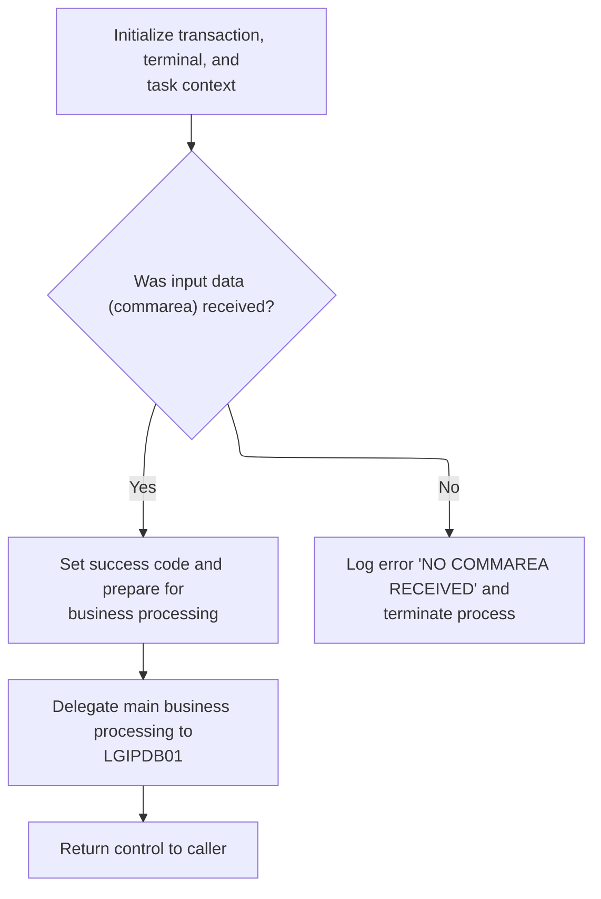

This section governs the initial dispatch for policy inquiry requests. It validates input presence, handles error reporting, and delegates business processing to the main handler.

| Rule ID | Category                        | Rule Name                          | Description                                                                                                | Implementation Details                                                                                                                                                                                                             |
| ------- | ------------------------------- | ---------------------------------- | ---------------------------------------------------------------------------------------------------------- | ---------------------------------------------------------------------------------------------------------------------------------------------------------------------------------------------------------------------------------- |
| BR-001  | Data validation                 | Missing input error handling       | If no input data is received, an error message is logged and the process is terminated with an error code. | The error message is set to ' NO COMMAREA RECEIVED'. The process is terminated with error code 'LGCA'.                                                                                                                             |
| BR-002  | Data validation                 | Input presence success path        | If input data is present, a success code is set and the process is prepared for business logic handling.   | The return code is set to '00' to indicate success. The input data length is recorded for reference.                                                                                                                               |
| BR-003  | Invoking a Service or a Process | Delegate to business logic handler | When input is valid, main business processing is delegated to the policy database handler program.         | The handler program <SwmToken path="base/src/lgipol01.cbl" pos="91:9:9" line-data="           EXEC CICS LINK Program(LGIPDB01)">`LGIPDB01`</SwmToken> is invoked with the input data structure and a fixed length of 32,500 bytes. |

<SwmSnippet path="/base/src/lgipol01.cbl" line="70">

---

MAINLINE in <SwmToken path="base/src/lgtestp1.cbl" pos="72:10:10" line-data="                 EXEC CICS LINK PROGRAM(&#39;LGIPOL01&#39;)">`LGIPOL01`</SwmToken> checks for valid input, handles errors if needed, and then links to <SwmToken path="base/src/lgipol01.cbl" pos="91:9:9" line-data="           EXEC CICS LINK Program(LGIPDB01)">`LGIPDB01`</SwmToken> to retrieve policy details from the database.

```cobol
       MAINLINE SECTION.
      *
           INITIALIZE WS-HEADER.
      *
           MOVE EIBTRNID TO WS-TRANSID.
           MOVE EIBTRMID TO WS-TERMID.
           MOVE EIBTASKN TO WS-TASKNUM.
      *
      * If NO commarea received issue an ABEND
           IF EIBCALEN IS EQUAL TO ZERO
               MOVE ' NO COMMAREA RECEIVED' TO EM-VARIABLE
               PERFORM WRITE-ERROR-MESSAGE
               EXEC CICS ABEND ABCODE('LGCA') NODUMP END-EXEC
           END-IF

      * initialize commarea return code to zero
           MOVE '00' TO CA-RETURN-CODE
           MOVE EIBCALEN TO WS-CALEN.
           SET WS-ADDR-DFHCOMMAREA TO ADDRESS OF DFHCOMMAREA.
      *

           EXEC CICS LINK Program(LGIPDB01)
               Commarea(DFHCOMMAREA)
               Length(32500)
           END-EXEC.

           EXEC CICS RETURN END-EXEC.
```

---

</SwmSnippet>

## Error Logging and Queue Write

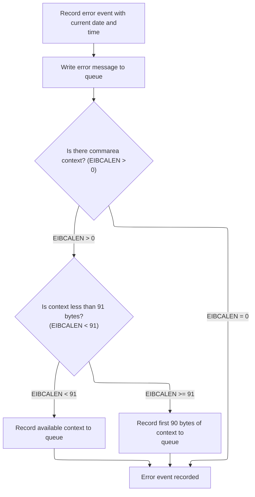

This section logs error events by recording the current date and time, formatting an error message, and writing it to a queue. If commarea context is present, it writes up to 90 bytes of that context to the queue as well.

| Rule ID | Category        | Rule Name                 | Description                                                                                                                                            | Implementation Details                                                                                                                                                                                                                |
| ------- | --------------- | ------------------------- | ------------------------------------------------------------------------------------------------------------------------------------------------------ | ------------------------------------------------------------------------------------------------------------------------------------------------------------------------------------------------------------------------------------- |
| BR-001  | Calculation     | Error event recording     | An error event is recorded with the current date and time whenever an error occurs.                                                                    | The date is an 8-character string (MMDDYYYY), and the time is a 6-character string (HHMMSS). These are included in the error message output format.                                                                                   |
| BR-002  | Decision Making | Commarea context logging  | If commarea context is present (length greater than 0), up to 90 bytes of it are written to the queue as a separate message prefixed with 'COMMAREA='. | If commarea context is less than 91 bytes, all available bytes are written. If 91 bytes or more, only the first 90 bytes are written. The message is prefixed with 'COMMAREA=' (9 chars), followed by up to 90 bytes of context data. |
| BR-003  | Writing Output  | Error message queue write | The error message is written to the queue in a fixed format whenever an error event is recorded.                                                       | The error message includes date (8 chars), time (6 chars), and other fields, written as a single message to the queue.                                                                                                                |

<SwmSnippet path="/base/src/lgipol01.cbl" line="107">

---

<SwmToken path="base/src/lgipol01.cbl" pos="107:1:5" line-data="       WRITE-ERROR-MESSAGE.">`WRITE-ERROR-MESSAGE`</SwmToken> gets the current time, formats it, builds the error message, and calls LGSTSQ to write it to the queue. If there's commarea data, it writes that too, handling message size limits.

```cobol
       WRITE-ERROR-MESSAGE.
      * Save SQLCODE in message
      * Obtain and format current time and date
           EXEC CICS ASKTIME ABSTIME(ABS-TIME)
           END-EXEC
           EXEC CICS FORMATTIME ABSTIME(ABS-TIME)
                     MMDDYYYY(DATE1)
                     TIME(TIME1)
           END-EXEC
           MOVE DATE1 TO EM-DATE
           MOVE TIME1 TO EM-TIME
      * Write output message to TDQ
           EXEC CICS LINK PROGRAM('LGSTSQ')
                     COMMAREA(ERROR-MSG)
                     LENGTH(LENGTH OF ERROR-MSG)
           END-EXEC.
      * Write 90 bytes or as much as we have of commarea to TDQ
           IF EIBCALEN > 0 THEN
             IF EIBCALEN < 91 THEN
               MOVE DFHCOMMAREA(1:EIBCALEN) TO CA-DATA
               EXEC CICS LINK PROGRAM('LGSTSQ')
                         COMMAREA(CA-ERROR-MSG)
                         LENGTH(LENGTH OF CA-ERROR-MSG)
               END-EXEC
             ELSE
               MOVE DFHCOMMAREA(1:90) TO CA-DATA
               EXEC CICS LINK PROGRAM('LGSTSQ')
                         COMMAREA(CA-ERROR-MSG)
                         LENGTH(LENGTH OF CA-ERROR-MSG)
               END-EXEC
             END-IF
           END-IF.
           EXIT.
```

---

</SwmSnippet>

<SwmSnippet path="/base/src/lgstsq.cbl" line="55">

---

MAINLINE in LGSTSQ processes the incoming message, handles special prefixes, adjusts message length, and writes it to both TDQ and TSQ. If the message was received, it sends a text response and returns control.

```cobol
       MAINLINE SECTION.

           MOVE SPACES TO WRITE-MSG.
           MOVE SPACES TO WS-RECV.

           EXEC CICS ASSIGN SYSID(WRITE-MSG-SYSID)
                RESP(WS-RESP)
           END-EXEC.

           EXEC CICS ASSIGN INVOKINGPROG(WS-INVOKEPROG)
                RESP(WS-RESP)
           END-EXEC.
           
           IF WS-INVOKEPROG NOT = SPACES
              MOVE 'C' To WS-FLAG
              MOVE COMMA-DATA  TO WRITE-MSG-MSG
              MOVE EIBCALEN    TO WS-RECV-LEN
           ELSE
              EXEC CICS RECEIVE INTO(WS-RECV)
                  LENGTH(WS-RECV-LEN)
                  RESP(WS-RESP)
              END-EXEC
              MOVE 'R' To WS-FLAG
              MOVE WS-RECV-DATA  TO WRITE-MSG-MSG
              SUBTRACT 5 FROM WS-RECV-LEN
           END-IF.

           MOVE 'GENAERRS' TO STSQ-NAME.
           IF WRITE-MSG-MSG(1:2) = 'Q=' THEN
              MOVE WRITE-MSG-MSG(3:4) TO STSQ-EXT
              MOVE WRITE-MSG-REST TO TEMPO
              MOVE TEMPO          TO WRITE-MSG-MSG
              SUBTRACT 7 FROM WS-RECV-LEN
           END-IF.

           ADD 5 TO WS-RECV-LEN.

      * Write output message to TDQ CSMT
      *
           EXEC CICS WRITEQ TD QUEUE(STDQ-NAME)
                     FROM(WRITE-MSG)
                     RESP(WS-RESP)
                     LENGTH(WS-RECV-LEN)

           END-EXEC.

      * Write output message to Genapp TSQ
      * If no space is available then the task will not wait for
      *  storage to become available but will ignore the request...
      *
           EXEC CICS WRITEQ TS QUEUE(STSQ-NAME)
                     FROM(WRITE-MSG)
                     RESP(WS-RESP)
                     NOSUSPEND
                     LENGTH(WS-RECV-LEN)

           END-EXEC.

           If WS-FLAG = 'R' Then
             EXEC CICS SEND TEXT FROM(FILLER-X)
              WAIT
              ERASE
              LENGTH(1)
              FREEKB
             END-EXEC.

           EXEC CICS RETURN
           END-EXEC.
```

---

</SwmSnippet>

## Policy Data Retrieval

```mermaid
%%{init: {"flowchart": {"defaultRenderer": "elk"}} }%%
flowchart TD
    node1["Start: Prepare for policy inquiry"] --> node2["Check if commarea (input data) is
present"]
    click node1 openCode "base/src/lgipdb01.cbl:230:246"
    node2 -->|"No (EIBCALEN = 0)"| node3["Set error: No commarea received, return
code 'LGCA'"]
    click node2 openCode "base/src/lgipdb01.cbl:251:255"
    click node3 openCode "base/src/lgipdb01.cbl:252:254"
    node3 --> node11["End"]
    node2 -->|"Yes"| node4["Determine policy type from request ID"]
    click node4 openCode "base/src/lgipdb01.cbl:275:277"
    node4 --> node5{"Policy type? (WS-REQUEST-ID)"}
    node5 -->|"Endowment (01IEND)"| node6["Retrieve endowment policy details"]
    click node5 openCode "base/src/lgipdb01.cbl:279:282"
    click node6 openCode "base/src/lgipdb01.cbl:327:432"
    node6 --> node11
    node5 -->|"House (01IHOU)"| node7["Retrieve house policy details"]
    click node7 openCode "base/src/lgipdb01.cbl:283:286"
    click node7 openCode "base/src/lgipdb01.cbl:441:523"
    node7 --> node11
    node5 -->|"Motor (01IMOT)"| node8["Retrieve motor policy details"]
    click node8 openCode "base/src/lgipdb01.cbl:287:290"
    click node8 openCode "base/src/lgipdb01.cbl:529:621"
    node8 --> node11
    node5 -->|"Commercial (01ICOM, 02ICOM,
03ICOM, 05ICOM)"| node9["Retrieve commercial policy details"]
    click node9 openCode "base/src/lgipdb01.cbl:291:306"
    node9 --> node11
    node5 -->|"Other"| node10["Set error: Unsupported request, return
code '99'"]
    click node10 openCode "base/src/lgipdb01.cbl:308:309"
    node10 --> node11
    node11["End"]

classDef HeadingStyle fill:#777777,stroke:#333,stroke-width:2px;

%% Swimm:
%% %%{init: {"flowchart": {"defaultRenderer": "elk"}} }%%
%% flowchart TD
%%     node1["Start: Prepare for policy inquiry"] --> node2["Check if commarea (input data) is
%% present"]
%%     click node1 openCode "<SwmPath>[base/src/lgipdb01.cbl](base/src/lgipdb01.cbl)</SwmPath>:230:246"
%%     node2 -->|"No (EIBCALEN = 0)"| node3["Set error: No commarea received, return
%% code 'LGCA'"]
%%     click node2 openCode "<SwmPath>[base/src/lgipdb01.cbl](base/src/lgipdb01.cbl)</SwmPath>:251:255"
%%     click node3 openCode "<SwmPath>[base/src/lgipdb01.cbl](base/src/lgipdb01.cbl)</SwmPath>:252:254"
%%     node3 --> node11["End"]
%%     node2 -->|"Yes"| node4["Determine policy type from request ID"]
%%     click node4 openCode "<SwmPath>[base/src/lgipdb01.cbl](base/src/lgipdb01.cbl)</SwmPath>:275:277"
%%     node4 --> node5{"Policy type? (<SwmToken path="base/src/lgipdb01.cbl" pos="275:18:22" line-data="           MOVE FUNCTION UPPER-CASE(CA-REQUEST-ID) TO WS-REQUEST-ID">`WS-REQUEST-ID`</SwmToken>)"}
%%     node5 -->|"Endowment (<SwmToken path="base/src/lgipdb01.cbl" pos="279:4:4" line-data="             WHEN &#39;01IEND&#39;">`01IEND`</SwmToken>)"| node6["Retrieve endowment policy details"]
%%     click node5 openCode "<SwmPath>[base/src/lgipdb01.cbl](base/src/lgipdb01.cbl)</SwmPath>:279:282"
%%     click node6 openCode "<SwmPath>[base/src/lgipdb01.cbl](base/src/lgipdb01.cbl)</SwmPath>:327:432"
%%     node6 --> node11
%%     node5 -->|"House (<SwmToken path="base/src/lgipdb01.cbl" pos="283:4:4" line-data="             WHEN &#39;01IHOU&#39;">`01IHOU`</SwmToken>)"| node7["Retrieve house policy details"]
%%     click node7 openCode "<SwmPath>[base/src/lgipdb01.cbl](base/src/lgipdb01.cbl)</SwmPath>:283:286"
%%     click node7 openCode "<SwmPath>[base/src/lgipdb01.cbl](base/src/lgipdb01.cbl)</SwmPath>:441:523"
%%     node7 --> node11
%%     node5 -->|"Motor (<SwmToken path="base/src/lgtestp1.cbl" pos="69:4:4" line-data="                 Move &#39;01IMOT&#39;   To CA-REQUEST-ID">`01IMOT`</SwmToken>)"| node8["Retrieve motor policy details"]
%%     click node8 openCode "<SwmPath>[base/src/lgipdb01.cbl](base/src/lgipdb01.cbl)</SwmPath>:287:290"
%%     click node8 openCode "<SwmPath>[base/src/lgipdb01.cbl](base/src/lgipdb01.cbl)</SwmPath>:529:621"
%%     node8 --> node11
%%     node5 -->|"Commercial (<SwmToken path="base/src/lgipdb01.cbl" pos="291:4:4" line-data="             WHEN &#39;01ICOM&#39;">`01ICOM`</SwmToken>, <SwmToken path="base/src/lgipdb01.cbl" pos="295:4:4" line-data="             WHEN &#39;02ICOM&#39;">`02ICOM`</SwmToken>,
%% <SwmToken path="base/src/lgipdb01.cbl" pos="299:4:4" line-data="             WHEN &#39;03ICOM&#39;">`03ICOM`</SwmToken>, <SwmToken path="base/src/lgipdb01.cbl" pos="303:4:4" line-data="             WHEN &#39;05ICOM&#39;">`05ICOM`</SwmToken>)"| node9["Retrieve commercial policy details"]
%%     click node9 openCode "<SwmPath>[base/src/lgipdb01.cbl](base/src/lgipdb01.cbl)</SwmPath>:291:306"
%%     node9 --> node11
%%     node5 -->|"Other"| node10["Set error: Unsupported request, return
%% code '99'"]
%%     click node10 openCode "<SwmPath>[base/src/lgipdb01.cbl](base/src/lgipdb01.cbl)</SwmPath>:308:309"
%%     node10 --> node11
%%     node11["End"]
%% 
%% classDef HeadingStyle fill:#777777,stroke:#333,stroke-width:2px;
```

This section validates and processes incoming policy inquiry requests, determines the policy type, and retrieves the corresponding policy data or sets error codes and messages as appropriate.

| Rule ID | Category        | Rule Name                                          | Description                                                                                                                                                                                   | Implementation Details                                                                                                                                                                                                                                                                                                                                                                                                                                                                                                                                                                                                                                                                                                                                                                                                                                                                                                                                              |
| ------- | --------------- | -------------------------------------------------- | --------------------------------------------------------------------------------------------------------------------------------------------------------------------------------------------- | ------------------------------------------------------------------------------------------------------------------------------------------------------------------------------------------------------------------------------------------------------------------------------------------------------------------------------------------------------------------------------------------------------------------------------------------------------------------------------------------------------------------------------------------------------------------------------------------------------------------------------------------------------------------------------------------------------------------------------------------------------------------------------------------------------------------------------------------------------------------------------------------------------------------------------------------------------------------- |
| BR-001  | Data validation | Missing commarea error handling                    | If no commarea input is received, set the error message to 'NO COMMAREA RECEIVED', write the error message, and return with abend code 'LGCA'.                                                | The error message includes the text 'NO COMMAREA RECEIVED'. The abend code is 'LGCA'.                                                                                                                                                                                                                                                                                                                                                                                                                                                                                                                                                                                                                                                                                                                                                                                                                                                                               |
| BR-002  | Data validation | Request id standardization                         | The request id in the input is converted to uppercase before determining the policy type, ensuring case-insensitive processing.                                                               | The request id is standardized to uppercase for comparison. The field is 6 characters long.                                                                                                                                                                                                                                                                                                                                                                                                                                                                                                                                                                                                                                                                                                                                                                                                                                                                         |
| BR-003  | Data validation | Buffer size validation                             | If the commarea buffer is too small to return all required policy data, set return code '98' and return without populating policy data.                                                       | Return code '98' indicates buffer too small. No policy data is returned in this case.                                                                                                                                                                                                                                                                                                                                                                                                                                                                                                                                                                                                                                                                                                                                                                                                                                                                               |
| BR-004  | Data validation | Policy record existence and error handling         | If no matching policy record is found for the given customer and policy number, set return code '01'. For other SQL errors, set return code '90' and write an error message.                  | Return code '01' indicates no matching record. Return code '90' indicates a general error. Error messages are written for code '90'.                                                                                                                                                                                                                                                                                                                                                                                                                                                                                                                                                                                                                                                                                                                                                                                                                                |
| BR-005  | Decision Making | Policy type dispatch and unsupported type handling | The policy type is determined by evaluating the standardized request id. Supported types are dispatched to the corresponding retrieval routine; unsupported types set return code '99'.       | Supported request ids: <SwmToken path="base/src/lgipdb01.cbl" pos="279:4:4" line-data="             WHEN &#39;01IEND&#39;">`01IEND`</SwmToken>, <SwmToken path="base/src/lgipdb01.cbl" pos="283:4:4" line-data="             WHEN &#39;01IHOU&#39;">`01IHOU`</SwmToken>, <SwmToken path="base/src/lgtestp1.cbl" pos="69:4:4" line-data="                 Move &#39;01IMOT&#39;   To CA-REQUEST-ID">`01IMOT`</SwmToken>, <SwmToken path="base/src/lgipdb01.cbl" pos="291:4:4" line-data="             WHEN &#39;01ICOM&#39;">`01ICOM`</SwmToken>, <SwmToken path="base/src/lgipdb01.cbl" pos="295:4:4" line-data="             WHEN &#39;02ICOM&#39;">`02ICOM`</SwmToken>, <SwmToken path="base/src/lgipdb01.cbl" pos="299:4:4" line-data="             WHEN &#39;03ICOM&#39;">`03ICOM`</SwmToken>, <SwmToken path="base/src/lgipdb01.cbl" pos="303:4:4" line-data="             WHEN &#39;05ICOM&#39;">`05ICOM`</SwmToken>. Unsupported types set return code '99'. |
| BR-006  | Writing Output  | Error message formatting and logging               | Error messages include the SQL code, date, time, and relevant input data, and are written to an operational queue for tracking. If commarea data is present, up to 90 bytes are also written. | Error message includes SQL code (5 digits), date (8 chars), time (6 chars), customer and policy numbers (10 digits each), and up to 90 bytes of commarea data if present.                                                                                                                                                                                                                                                                                                                                                                                                                                                                                                                                                                                                                                                                                                                                                                                           |

<SwmSnippet path="/base/src/lgipdb01.cbl" line="230">

---

MAINLINE in <SwmToken path="base/src/lgipol01.cbl" pos="91:9:9" line-data="           EXEC CICS LINK Program(LGIPDB01)">`LGIPDB01`</SwmToken> checks input, sets up <SwmToken path="base/src/lgipdb01.cbl" pos="242:5:5" line-data="      * initialize DB2 host variables">`DB2`</SwmToken> variables, and dispatches to the right policy retrieval routine based on the request id. Errors and unsupported types are handled here.

```cobol
       MAINLINE SECTION.

      *----------------------------------------------------------------*
      * Common code                                                    *
      *----------------------------------------------------------------*
      * initialize working storage variables
           INITIALIZE WS-HEADER.
      * set up general variable
           MOVE EIBTRNID TO WS-TRANSID.
           MOVE EIBTRMID TO WS-TERMID.
           MOVE EIBTASKN TO WS-TASKNUM.
      *----------------------------------------------------------------*
      * initialize DB2 host variables
           INITIALIZE DB2-IN-INTEGERS.
           INITIALIZE DB2-OUT-INTEGERS.
           INITIALIZE DB2-POLICY.

      *---------------------------------------------------------------*
      * Check commarea and obtain required details                    *
      *---------------------------------------------------------------*
      * If NO commarea received issue an ABEND
           IF EIBCALEN IS EQUAL TO ZERO
             MOVE ' NO COMMAREA RECEIVED' TO EM-VARIABLE
             PERFORM WRITE-ERROR-MESSAGE
             EXEC CICS ABEND ABCODE('LGCA') NODUMP END-EXEC
           END-IF

      * initialize commarea return code to zero
           MOVE '00' TO CA-RETURN-CODE
           MOVE EIBCALEN TO WS-CALEN
           SET WS-ADDR-DFHCOMMAREA TO ADDRESS OF DFHCOMMAREA

      * Convert commarea customer & policy nums to DB2 integer format
           MOVE CA-CUSTOMER-NUM TO DB2-CUSTOMERNUM-INT
           MOVE CA-POLICY-NUM   TO DB2-POLICYNUM-INT
      * and save in error msg field incase required
           MOVE CA-CUSTOMER-NUM TO EM-CUSNUM
           MOVE CA-POLICY-NUM   TO EM-POLNUM

      *----------------------------------------------------------------*
      * Check which policy type is being requested                     *
      * This is not actually required whilst only endowment policy     *
      * inquires are supported, but will make future expansion simpler *
      *----------------------------------------------------------------*
      * Upper case value passed in Request Id field                    *
           MOVE FUNCTION UPPER-CASE(CA-REQUEST-ID) TO WS-REQUEST-ID

           EVALUATE WS-REQUEST-ID

             WHEN '01IEND'
               INITIALIZE DB2-ENDOWMENT
               PERFORM GET-ENDOW-DB2-INFO

             WHEN '01IHOU'
               INITIALIZE DB2-HOUSE
               PERFORM GET-HOUSE-DB2-INFO

             WHEN '01IMOT'
               INITIALIZE DB2-MOTOR
               PERFORM GET-MOTOR-DB2-INFO

             WHEN '01ICOM'
               INITIALIZE DB2-COMMERCIAL
               PERFORM GET-COMMERCIAL-DB2-INFO-1

             WHEN '02ICOM'
               INITIALIZE DB2-COMMERCIAL
               PERFORM GET-COMMERCIAL-DB2-INFO-2

             WHEN '03ICOM'
               INITIALIZE DB2-COMMERCIAL
               PERFORM GET-COMMERCIAL-DB2-INFO-3

             WHEN '05ICOM'
               INITIALIZE DB2-COMMERCIAL
               PERFORM GET-COMMERCIAL-DB2-INFO-5

             WHEN OTHER
               MOVE '99' TO CA-RETURN-CODE

           END-EVALUATE.
```

---

</SwmSnippet>

<SwmSnippet path="/base/src/lgipdb01.cbl" line="997">

---

<SwmToken path="base/src/lgipdb01.cbl" pos="997:1:5" line-data="       WRITE-ERROR-MESSAGE.">`WRITE-ERROR-MESSAGE`</SwmToken> in <SwmToken path="base/src/lgipol01.cbl" pos="91:9:9" line-data="           EXEC CICS LINK Program(LGIPDB01)">`LGIPDB01`</SwmToken> formats the error message with SQLCODE, date, and time, then calls LGSTSQ to write it to the queue. If commarea data is present, it writes that too, handling message size limits.

```cobol
       WRITE-ERROR-MESSAGE.
      * Save SQLCODE in message
           MOVE SQLCODE TO EM-SQLRC
      * Obtain and format current time and date
           EXEC CICS ASKTIME ABSTIME(ABS-TIME)
           END-EXEC
           EXEC CICS FORMATTIME ABSTIME(ABS-TIME)
                     MMDDYYYY(DATE1)
                     TIME(TIME1)
           END-EXEC
           MOVE DATE1 TO EM-DATE
           MOVE TIME1 TO EM-TIME
      * Write output message to TDQ
           EXEC CICS LINK PROGRAM('LGSTSQ')
                     COMMAREA(ERROR-MSG)
                     LENGTH(LENGTH OF ERROR-MSG)
           END-EXEC.
      * Write 90 bytes or as much as we have of commarea to TDQ
           IF EIBCALEN > 0 THEN
             IF EIBCALEN < 91 THEN
               MOVE DFHCOMMAREA(1:EIBCALEN) TO CA-DATA
               EXEC CICS LINK PROGRAM('LGSTSQ')
                         COMMAREA(CA-ERROR-MSG)
                         LENGTH(LENGTH OF CA-ERROR-MSG)
               END-EXEC
             ELSE
               MOVE DFHCOMMAREA(1:90) TO CA-DATA
               EXEC CICS LINK PROGRAM('LGSTSQ')
                         COMMAREA(CA-ERROR-MSG)
                         LENGTH(LENGTH OF CA-ERROR-MSG)
               END-EXEC
             END-IF
           END-IF.
           EXIT.
```

---

</SwmSnippet>

<SwmSnippet path="/base/src/lgipdb01.cbl" line="327">

---

<SwmToken path="base/src/lgipdb01.cbl" pos="327:1:7" line-data="       GET-ENDOW-DB2-INFO.">`GET-ENDOW-DB2-INFO`</SwmToken> fetches endowment policy data, checks for variable-length PADDINGDATA, adjusts commarea size, and marks the end of data with 'FINAL'. Error codes signal buffer issues or missing records.

```cobol
       GET-ENDOW-DB2-INFO.

           MOVE ' SELECT ENDOW ' TO EM-SQLREQ
           EXEC SQL
             SELECT  ISSUEDATE,
                     EXPIRYDATE,
                     LASTCHANGED,
                     BROKERID,
                     BROKERSREFERENCE,
                     PAYMENT,
                     WITHPROFITS,
                     EQUITIES,
                     MANAGEDFUND,
                     FUNDNAME,
                     TERM,
                     SUMASSURED,
                     LIFEASSURED,
                     PADDINGDATA,
                     LENGTH(PADDINGDATA)
             INTO  :DB2-ISSUEDATE,
                   :DB2-EXPIRYDATE,
                   :DB2-LASTCHANGED,
                   :DB2-BROKERID-INT INDICATOR :IND-BROKERID,
                   :DB2-BROKERSREF INDICATOR :IND-BROKERSREF,
                   :DB2-PAYMENT-INT INDICATOR :IND-PAYMENT,
                   :DB2-E-WITHPROFITS,
                   :DB2-E-EQUITIES,
                   :DB2-E-MANAGEDFUND,
                   :DB2-E-FUNDNAME,
                   :DB2-E-TERM-SINT,
                   :DB2-E-SUMASSURED-INT,
                   :DB2-E-LIFEASSURED,
                   :DB2-E-PADDINGDATA INDICATOR :IND-E-PADDINGDATA,
                   :DB2-E-PADDING-LEN INDICATOR :IND-E-PADDINGDATAL
             FROM  POLICY,ENDOWMENT
             WHERE ( POLICY.POLICYNUMBER =
                        ENDOWMENT.POLICYNUMBER   AND
                     POLICY.CUSTOMERNUMBER =
                        :DB2-CUSTOMERNUM-INT             AND
                     POLICY.POLICYNUMBER =
                        :DB2-POLICYNUM-INT               )
           END-EXEC

           IF SQLCODE = 0
      *      Select was successful

      *      Calculate size of commarea required to return all data
             ADD WS-CA-HEADERTRAILER-LEN TO WS-REQUIRED-CA-LEN
             ADD WS-FULL-ENDOW-LEN       TO WS-REQUIRED-CA-LEN

      *----------------------------------------------------------------*
      *      Specific code to allow for length of VACHAR data
      *      check whether PADDINGDATA field is non-null
      *        and calculate length of endowment policy
      *        and position of free space in commarea after policy data
      *----------------------------------------------------------------*
             IF IND-E-PADDINGDATAL NOT EQUAL MINUS-ONE
               ADD DB2-E-PADDING-LEN TO WS-REQUIRED-CA-LEN
               ADD DB2-E-PADDING-LEN TO END-POLICY-POS
             END-IF

      *      if commarea received is not large enough ...
      *        set error return code and return to caller
             IF EIBCALEN IS LESS THAN WS-REQUIRED-CA-LEN
               MOVE '98' TO CA-RETURN-CODE
               EXEC CICS RETURN END-EXEC
             ELSE
      *        Length is sufficent so move data to commarea
      *        Move Integer fields to required length numerics
      *        Don't move null fields
               IF IND-BROKERID NOT EQUAL MINUS-ONE
                 MOVE DB2-BROKERID-INT    TO DB2-BROKERID
               END-IF
               IF IND-PAYMENT NOT EQUAL MINUS-ONE
                 MOVE DB2-PAYMENT-INT TO DB2-PAYMENT
               END-IF
      *----------------------------------------------------------------*
               MOVE DB2-E-TERM-SINT       TO DB2-E-TERM
               MOVE DB2-E-SUMASSURED-INT  TO DB2-E-SUMASSURED

               MOVE DB2-POLICY-COMMON     TO CA-POLICY-COMMON
               MOVE DB2-ENDOW-FIXED
                   TO CA-ENDOWMENT(1:WS-ENDOW-LEN)
               IF IND-E-PADDINGDATA NOT EQUAL MINUS-ONE
                 MOVE DB2-E-PADDINGDATA TO
                     CA-E-PADDING-DATA(1:DB2-E-PADDING-LEN)
               END-IF
             END-IF

      *      Mark the end of the policy data
             MOVE 'FINAL' TO CA-E-PADDING-DATA(END-POLICY-POS:5)

           ELSE
      *      Non-zero SQLCODE from first SQL FETCH statement
             IF SQLCODE EQUAL 100
      *        No rows found - invalid customer / policy number
               MOVE '01' TO CA-RETURN-CODE
             ELSE
      *        something has gone wrong
               MOVE '90' TO CA-RETURN-CODE
      *        Write error message to TD QUEUE(CSMT)
               PERFORM WRITE-ERROR-MESSAGE
             END-IF

           END-IF.
           EXIT.
```

---

</SwmSnippet>

<SwmSnippet path="/base/src/lgipdb01.cbl" line="441">

---

<SwmToken path="base/src/lgipdb01.cbl" pos="441:1:7" line-data="       GET-HOUSE-DB2-INFO.">`GET-HOUSE-DB2-INFO`</SwmToken> fetches house policy data, checks buffer size, moves integer fields if not null, and marks the end of returned data with 'FINAL'. Error codes are set for buffer issues or missing records.

```cobol
       GET-HOUSE-DB2-INFO.

           MOVE ' SELECT HOUSE ' TO EM-SQLREQ
           EXEC SQL
             SELECT  ISSUEDATE,
                     EXPIRYDATE,
                     LASTCHANGED,
                     BROKERID,
                     BROKERSREFERENCE,
                     PAYMENT,
                     PROPERTYTYPE,
                     BEDROOMS,
                     VALUE,
                     HOUSENAME,
                     HOUSENUMBER,
                     POSTCODE
             INTO  :DB2-ISSUEDATE,
                   :DB2-EXPIRYDATE,
                   :DB2-LASTCHANGED,
                   :DB2-BROKERID-INT INDICATOR :IND-BROKERID,
                   :DB2-BROKERSREF INDICATOR :IND-BROKERSREF,
                   :DB2-PAYMENT-INT INDICATOR :IND-PAYMENT,
                   :DB2-H-PROPERTYTYPE,
                   :DB2-H-BEDROOMS-SINT,
                   :DB2-H-VALUE-INT,
                   :DB2-H-HOUSENAME,
                   :DB2-H-HOUSENUMBER,
                   :DB2-H-POSTCODE
             FROM  POLICY,HOUSE
             WHERE ( POLICY.POLICYNUMBER =
                        HOUSE.POLICYNUMBER   AND
                     POLICY.CUSTOMERNUMBER =
                        :DB2-CUSTOMERNUM-INT             AND
                     POLICY.POLICYNUMBER =
                        :DB2-POLICYNUM-INT               )
           END-EXEC

           IF SQLCODE = 0
      *      Select was successful

      *      Calculate size of commarea required to return all data
             ADD WS-CA-HEADERTRAILER-LEN TO WS-REQUIRED-CA-LEN
             ADD WS-FULL-HOUSE-LEN       TO WS-REQUIRED-CA-LEN

      *      if commarea received is not large enough ...
      *        set error return code and return to caller
             IF EIBCALEN IS LESS THAN WS-REQUIRED-CA-LEN
               MOVE '98' TO CA-RETURN-CODE
               EXEC CICS RETURN END-EXEC
             ELSE
      *        Length is sufficent so move data to commarea
      *        Move Integer fields to required length numerics
      *        Don't move null fields
               IF IND-BROKERID NOT EQUAL MINUS-ONE
                 MOVE DB2-BROKERID-INT  TO DB2-BROKERID
               END-IF
               IF IND-PAYMENT NOT EQUAL MINUS-ONE
                 MOVE DB2-PAYMENT-INT TO DB2-PAYMENT
               END-IF
               MOVE DB2-H-BEDROOMS-SINT TO DB2-H-BEDROOMS
               MOVE DB2-H-VALUE-INT     TO DB2-H-VALUE

               MOVE DB2-POLICY-COMMON   TO CA-POLICY-COMMON
               MOVE DB2-HOUSE           TO CA-HOUSE(1:WS-HOUSE-LEN)
             END-IF

      *      Mark the end of the policy data
             MOVE 'FINAL' TO CA-H-FILLER(1:5)

           ELSE
      *      Non-zero SQLCODE from first SQL FETCH statement
             IF SQLCODE EQUAL 100
      *        No rows found - invalid customer / policy number
               MOVE '01' TO CA-RETURN-CODE
             ELSE
      *        something has gone wrong
               MOVE '90' TO CA-RETURN-CODE
      *        Write error message to TD QUEUE(CSMT)
               PERFORM WRITE-ERROR-MESSAGE
             END-IF

           END-IF.
           EXIT.
```

---

</SwmSnippet>

<SwmSnippet path="/base/src/lgipdb01.cbl" line="529">

---

<SwmToken path="base/src/lgipdb01.cbl" pos="529:1:7" line-data="       GET-MOTOR-DB2-INFO.">`GET-MOTOR-DB2-INFO`</SwmToken> fetches motor policy data, checks buffer size, handles nullable fields, and marks the end of returned data with 'FINAL'. Custom error codes signal buffer issues, missing records, or general errors.

```cobol
       GET-MOTOR-DB2-INFO.

           MOVE ' SELECT MOTOR ' TO EM-SQLREQ
           EXEC SQL
             SELECT  ISSUEDATE,
                     EXPIRYDATE,
                     LASTCHANGED,
                     BROKERID,
                     BROKERSREFERENCE,
                     PAYMENT,
                     MAKE,
                     MODEL,
                     VALUE,
                     REGNUMBER,
                     COLOUR,
                     CC,
                     YEAROFMANUFACTURE,
                     PREMIUM,
                     ACCIDENTS
             INTO  :DB2-ISSUEDATE,
                   :DB2-EXPIRYDATE,
                   :DB2-LASTCHANGED,
                   :DB2-BROKERID-INT INDICATOR :IND-BROKERID,
                   :DB2-BROKERSREF INDICATOR :IND-BROKERSREF,
                   :DB2-PAYMENT-INT INDICATOR :IND-PAYMENT,
                   :DB2-M-MAKE,
                   :DB2-M-MODEL,
                   :DB2-M-VALUE-INT,
                   :DB2-M-REGNUMBER,
                   :DB2-M-COLOUR,
                   :DB2-M-CC-SINT,
                   :DB2-M-MANUFACTURED,
                   :DB2-M-PREMIUM-INT,
                   :DB2-M-ACCIDENTS-INT
             FROM  POLICY,MOTOR
             WHERE ( POLICY.POLICYNUMBER =
                        MOTOR.POLICYNUMBER   AND
                     POLICY.CUSTOMERNUMBER =
                        :DB2-CUSTOMERNUM-INT             AND
                     POLICY.POLICYNUMBER =
                        :DB2-POLICYNUM-INT               )
           END-EXEC

           IF SQLCODE = 0
      *      Select was successful

      *      Calculate size of commarea required to return all data
             ADD WS-CA-HEADERTRAILER-LEN TO WS-REQUIRED-CA-LEN
             ADD WS-FULL-MOTOR-LEN       TO WS-REQUIRED-CA-LEN

      *      if commarea received is not large enough ...
      *        set error return code and return to caller
             IF EIBCALEN IS LESS THAN WS-REQUIRED-CA-LEN
               MOVE '98' TO CA-RETURN-CODE
               EXEC CICS RETURN END-EXEC
             ELSE
      *        Length is sufficent so move data to commarea
      *        Move Integer fields to required length numerics
      *        Don't move null fields
               IF IND-BROKERID NOT EQUAL MINUS-ONE
                 MOVE DB2-BROKERID-INT TO DB2-BROKERID
               END-IF
               IF IND-PAYMENT NOT EQUAL MINUS-ONE
                 MOVE DB2-PAYMENT-INT    TO DB2-PAYMENT
               END-IF
               MOVE DB2-M-CC-SINT      TO DB2-M-CC
               MOVE DB2-M-VALUE-INT    TO DB2-M-VALUE
               MOVE DB2-M-PREMIUM-INT  TO DB2-M-PREMIUM
               MOVE DB2-M-ACCIDENTS-INT TO DB2-M-ACCIDENTS
               MOVE DB2-M-PREMIUM-INT  TO CA-M-PREMIUM
               MOVE DB2-M-ACCIDENTS-INT TO CA-M-ACCIDENTS

               MOVE DB2-POLICY-COMMON  TO CA-POLICY-COMMON
               MOVE DB2-MOTOR          TO CA-MOTOR(1:WS-MOTOR-LEN)
             END-IF

      *      Mark the end of the policy data
             MOVE 'FINAL' TO CA-M-FILLER(1:5)

           ELSE
      *      Non-zero SQLCODE from first SQL FETCH statement
             IF SQLCODE EQUAL 100
      *        No rows found - invalid customer / policy number
               MOVE '01' TO CA-RETURN-CODE
             ELSE
      *        something has gone wrong
               MOVE '90' TO CA-RETURN-CODE
      *        Write error message to TD QUEUE(CSMT)
               PERFORM WRITE-ERROR-MESSAGE
             END-IF

           END-IF.
           EXIT.
```

---

</SwmSnippet>

## Post-Inquiry Result Handling

This section governs the handling of results after an inquiry operation, specifically determining whether to proceed or invoke error handling based on the service call's return code.

| Rule ID | Category        | Rule Name                   | Description                                                                                                                              | Implementation Details                                                                                                                     |
| ------- | --------------- | --------------------------- | ---------------------------------------------------------------------------------------------------------------------------------------- | ------------------------------------------------------------------------------------------------------------------------------------------ |
| BR-001  | Decision Making | Post-inquiry error handling | If the return code from the inquiry operation is greater than zero, the program branches to the error handling routine for missing data. | The return code is a numeric value. The error handling routine is invoked when the value is non-zero, indicating an error or missing data. |

<SwmSnippet path="/base/src/lgtestp1.cbl" line="76">

---

Back in <SwmToken path="base/src/lgtestp1.cbl" pos="33:5:7" line-data="              GO TO A-GAIN.">`A-GAIN`</SwmToken>, after returning from <SwmToken path="base/src/lgtestp1.cbl" pos="72:10:10" line-data="                 EXEC CICS LINK PROGRAM(&#39;LGIPOL01&#39;)">`LGIPOL01`</SwmToken>, we check <SwmToken path="base/src/lgtestp1.cbl" pos="76:3:7" line-data="                 IF CA-RETURN-CODE &gt; 0">`CA-RETURN-CODE`</SwmToken>. If it's non-zero, we jump to <SwmToken path="base/src/lgtestp1.cbl" pos="77:5:7" line-data="                   GO TO NO-DATA">`NO-DATA`</SwmToken> to handle the case where no motor policy data was found and update the menu error state.

```cobol
                 IF CA-RETURN-CODE > 0
                   GO TO NO-DATA
                 END-IF
```

---

</SwmSnippet>

## Reporting missing motor policy data

This section handles the reporting of missing motor policy data by setting a user-facing error message and resetting the interface. It ensures users are informed when no records are found, maintaining consistency in error handling.

| Rule ID | Category       | Rule Name                                 | Description                                                                                                                                     | Implementation Details                                                                                                                                            |
| ------- | -------------- | ----------------------------------------- | ----------------------------------------------------------------------------------------------------------------------------------------------- | ----------------------------------------------------------------------------------------------------------------------------------------------------------------- |
| BR-001  | Writing Output | Missing motor policy data error reporting | When no motor policy data is found, an error message is displayed to the user indicating that no data was returned, and the interface is reset. | The error message displayed is: 'No data was returned.' This is a string message shown to the user. No additional formatting, padding, or alignment is specified. |

<SwmSnippet path="/base/src/lgtestp1.cbl" line="304">

---

<SwmToken path="base/src/lgtestp1.cbl" pos="304:1:3" line-data="       NO-DATA.">`NO-DATA`</SwmToken> sets the error message for missing motor policy records and immediately jumps to <SwmToken path="base/src/lgtestp1.cbl" pos="306:5:7" line-data="           Go To ERROR-OUT.">`ERROR-OUT`</SwmToken>, so the user sees the error and the interface is reset. This keeps error handling consistent across the menu.

```cobol
       NO-DATA.
           Move 'No data was returned.'            To  ERP1FLDO
           Go To ERROR-OUT.
```

---

</SwmSnippet>

## Displaying error feedback and resetting the interface

This section handles the user experience after an error by displaying error feedback on the menu screen and resetting the interface for the next interaction. It ensures users are informed of errors and the system is ready for further input.

| Rule ID | Category        | Rule Name                            | Description                                                                                                                                     | Implementation Details                                                                                                                                                                                                                                                                                                                                                               |
| ------- | --------------- | ------------------------------------ | ----------------------------------------------------------------------------------------------------------------------------------------------- | ------------------------------------------------------------------------------------------------------------------------------------------------------------------------------------------------------------------------------------------------------------------------------------------------------------------------------------------------------------------------------------ |
| BR-001  | Decision Making | Transition to next phase after error | Transition to the next program phase after error handling is complete, handing back status information for the next step in the transaction.    | The program flow moves to the next section, which is responsible for ending the current transaction and preparing for the next. The specific status information is not detailed here.                                                                                                                                                                                                |
| BR-002  | Writing Output  | Display error feedback on menu       | Display the menu map to the user with error information populated, so the user can see what went wrong directly on the menu screen.             | The menu map is displayed using the <SwmToken path="base/src/lgtestp1.cbl" pos="47:11:11" line-data="           EXEC CICS SEND MAP (&#39;SSMAPP1&#39;)">`SSMAPP1`</SwmToken> map from the 'SSMAP' mapset. The output structure contains error information. The format is determined by the map definition, which is not shown here, but the map is sent as a screen to the terminal. |
| BR-003  | Writing Output  | Reset interface state after error    | Reset the input, output, and communication data structures after displaying error feedback, preparing the system for the next user interaction. | The input, output, and communication areas are cleared. This ensures no residual data from the previous transaction affects the next one. The structures are reset to their initial state, but the specific format is not detailed here.                                                                                                                                             |

<SwmSnippet path="/base/src/lgtestp1.cbl" line="308">

---

In <SwmToken path="base/src/lgtestp1.cbl" pos="308:1:3" line-data="       ERROR-OUT.">`ERROR-OUT`</SwmToken>, we send the menu map to the terminal using CICS SEND MAP, but this time the map is filled with error info, so the user sees what went wrong right on the menu screen.

```cobol
       ERROR-OUT.
           EXEC CICS SEND MAP ('SSMAPP1')
                     FROM(SSMAPP1O)
                     MAPSET ('SSMAP')
           END-EXEC.
```

---

</SwmSnippet>

<SwmSnippet path="/base/src/lgtestp1.cbl" line="314">

---

After sending the error map, we reset the input/output and commarea structures, then jump to <SwmToken path="base/src/lgtestp1.cbl" pos="318:5:7" line-data="           GO TO ENDIT-STARTIT.">`ENDIT-STARTIT`</SwmToken> to finish the transaction and hand back status info for the next step.

```cobol
           Initialize SSMAPP1I.
           Initialize SSMAPP1O.
           Initialize COMM-AREA.

           GO TO ENDIT-STARTIT.
```

---

</SwmSnippet>

## Populating motor policy fields for display

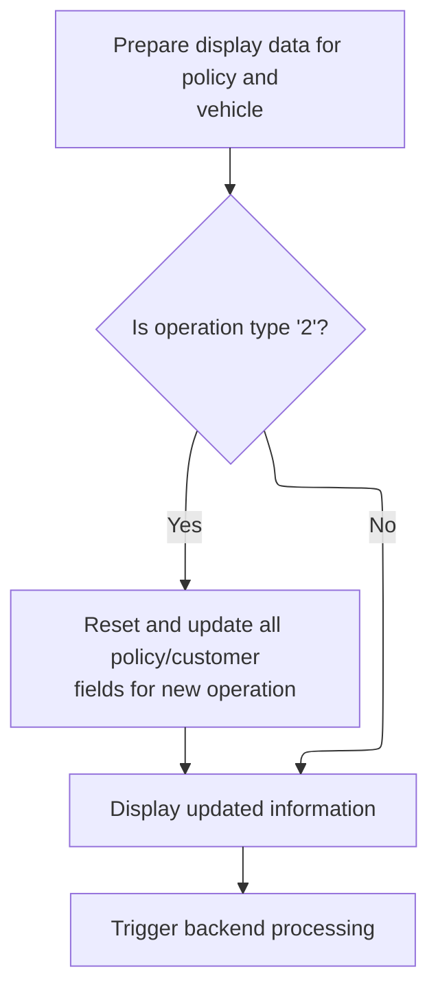

This section manages the display and preparation of motor policy data for user interaction, and triggers backend processing for policy addition requests.

| Rule ID | Category                        | Rule Name                  | Description                                                                                                                       | Implementation Details                                                                                                                                                                                                                                                                                                                                                                         |
| ------- | ------------------------------- | -------------------------- | --------------------------------------------------------------------------------------------------------------------------------- | ---------------------------------------------------------------------------------------------------------------------------------------------------------------------------------------------------------------------------------------------------------------------------------------------------------------------------------------------------------------------------------------------- |
| BR-001  | Decision Making                 | Policy add preparation     | When the user selects menu option '2', all policy and customer fields are reset and updated to prepare for a new policy addition. | The request ID is set to <SwmToken path="base/src/lgtestp1.cbl" pos="98:4:4" line-data="                 Move &#39;01AMOT&#39;          To CA-REQUEST-ID">`01AMOT`</SwmToken>. Payment and broker fields are set to zero or spaces. All policy fields are updated with the latest user input values. Text fields are space-padded to their defined lengths. Numbers are zero-filled as needed. |
| BR-002  | Writing Output                  | Display policy data update | Display fields for motor policy are updated with the latest values from the backend before the screen is shown to the user.       | All display fields are updated with the latest values. Dates are shown as 10-character strings, numbers are shown as-is, and text fields are left-aligned and space-padded if needed.                                                                                                                                                                                                          |
| BR-003  | Writing Output                  | Send updated display       | After updating display fields, the latest policy information is sent to the user interface for immediate feedback.                | The display buffer is sent to the user interface. All fields are shown as updated in the previous step. The format matches the defined screen layout, with strings, numbers, and dates as specified.                                                                                                                                                                                           |
| BR-004  | Invoking a Service or a Process | Trigger backend policy add | After preparing the commarea for a policy add operation, backend processing is triggered to validate and process the request.     | The backend program is called with the prepared commarea. The commarea contains all necessary fields for policy addition, with a length of 32,500 bytes.                                                                                                                                                                                                                                       |

<SwmSnippet path="/base/src/lgtestp1.cbl" line="80">

---

Back in <SwmToken path="base/src/lgtestp1.cbl" pos="33:5:7" line-data="              GO TO A-GAIN.">`A-GAIN`</SwmToken>, we copy motor policy details from the commarea into the menu fields so the user gets updated info right before the next screen is sent.

```cobol
                 Move CA-ISSUE-DATE     To  ENP1IDAI
                 Move CA-EXPIRY-DATE    To  ENP1EDAI
                 Move CA-M-MAKE         To  ENP1CMKI
                 Move CA-M-MODEL        To  ENP1CMOI
                 Move CA-M-VALUE        To  ENP1VALI
                 Move CA-M-REGNUMBER    To  ENP1REGI
                 Move CA-M-COLOUR       To  ENP1COLI
                 Move CA-M-CC           To  ENP1CCI
                 Move CA-M-MANUFACTURED To  ENP1MANI
                 Move CA-M-PREMIUM      To  ENP1PREI
                 Move CA-M-ACCIDENTS    To  ENP1ACCI
```

---

</SwmSnippet>

<SwmSnippet path="/base/src/lgtestp1.cbl" line="91">

---

After updating the menu fields, we send the map to the terminal so the user sees the latest motor policy data right away.

```cobol
                 EXEC CICS SEND MAP ('SSMAPP1')
                           FROM(SSMAPP1O)
                           MAPSET ('SSMAP')
                 END-EXEC
```

---

</SwmSnippet>

<SwmSnippet path="/base/src/lgtestp1.cbl" line="97">

---

Here we prep the commarea for menu option '2', moving user input and resetting fields so the backend add policy routine gets the right data.

```cobol
             WHEN '2'
                 Move '01AMOT'          To CA-REQUEST-ID
                 Move ENP1CNOI          To CA-CUSTOMER-NUM
                 Move 0                 To CA-PAYMENT
                 Move 0                 To CA-BROKERID
                 Move '        '        To CA-BROKERSREF
                 Move ENP1IDAI          To CA-ISSUE-DATE
                 Move ENP1EDAI          To CA-EXPIRY-DATE
                 Move ENP1CMKI          To CA-M-MAKE
                 Move ENP1CMOI          To CA-M-MODEL
                 Move ENP1VALI          To CA-M-VALUE
                 Move ENP1REGI          To CA-M-REGNUMBER
                 Move ENP1COLI          To CA-M-COLOUR
                 Move ENP1CCI           To CA-M-CC
                 Move ENP1MANI          To CA-M-MANUFACTURED
                 Move ENP1PREI          To CA-M-PREMIUM
                 Move ENP1ACCI          To CA-M-ACCIDENTS
```

---

</SwmSnippet>

<SwmSnippet path="/base/src/lgtestp1.cbl" line="115">

---

After prepping the commarea, we call <SwmToken path="base/src/lgtestp1.cbl" pos="115:10:10" line-data="                 EXEC CICS LINK PROGRAM(&#39;LGAPOL01&#39;)">`LGAPOL01`</SwmToken> to validate and process the add policy request, handing off the data for backend insertion.

```cobol
                 EXEC CICS LINK PROGRAM('LGAPOL01')
                           COMMAREA(COMM-AREA)
                           LENGTH(32500)
                 END-EXEC
```

---

</SwmSnippet>

## Validating and inserting new policy data

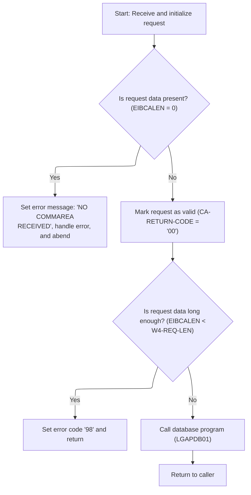

This section validates incoming policy data requests, handles errors for missing or insufficient data, and invokes the database insertion process for valid requests.

| Rule ID | Category                        | Rule Name                                     | Description                                                                                                                                       | Implementation Details                                                                                                                                                                                                                                          |
| ------- | ------------------------------- | --------------------------------------------- | ------------------------------------------------------------------------------------------------------------------------------------------------- | --------------------------------------------------------------------------------------------------------------------------------------------------------------------------------------------------------------------------------------------------------------- |
| BR-001  | Data validation                 | Missing request data error                    | If no request data is present, an error message is generated, the error is logged, and the process is aborted.                                    | The error message is 'NO COMMAREA RECEIVED'. The process is aborted with abend code 'LGCA'. Error details are logged with a timestamp and up to 90 bytes of request data if available.                                                                          |
| BR-002  | Data validation                 | Insufficient request data length              | If the request data is present but shorter than the required minimum length, an error code is set and the process returns without further action. | The required minimum length is the sum of the header length (+28) and the request length. The error code set is '98'.                                                                                                                                           |
| BR-003  | Writing Output                  | Error logging with timestamp and request data | When an error occurs, a formatted error message with timestamp is logged, and up to 90 bytes of request data are sent to the logging pipeline.    | The error log includes the date (8 bytes), time (6 bytes), program name (9 bytes), and error detail (21 bytes). Up to 90 bytes of request data are included if available; if less than 91 bytes are present, all are logged, otherwise only the first 90 bytes. |
| BR-004  | Invoking a Service or a Process | Valid request triggers database insertion     | If the request data is present and meets the minimum length requirement, the request is passed to the database insertion process.                 | The database insertion process is invoked with the full request data. The commarea length used is 32,500 bytes.                                                                                                                                                 |

<SwmSnippet path="/base/src/lgapol01.cbl" line="68">

---

<SwmToken path="base/src/lgapol01.cbl" pos="68:1:3" line-data="       P100-MAIN SECTION.">`P100-MAIN`</SwmToken> checks the commarea for validity, logs and aborts if it's missing or too short, then links to <SwmToken path="base/src/lgapol01.cbl" pos="103:9:9" line-data="           EXEC CICS Link Program(LGAPDB01)">`LGAPDB01`</SwmToken> to actually insert the policy data.

```cobol
       P100-MAIN SECTION.

      *----------------------------------------------------------------*
      * Common code                                                    *
      *----------------------------------------------------------------*
           INITIALIZE W1-CONTROL.
           MOVE EIBTRNID TO W1-TID.
           MOVE EIBTRMID TO W1-TRM.
           MOVE EIBTASKN TO W1-TSK.
           MOVE EIBCALEN TO W1-LEN.
      *----------------------------------------------------------------*

      *----------------------------------------------------------------*
      * Check commarea and obtain required details                     *
      *----------------------------------------------------------------*
           IF EIBCALEN IS EQUAL TO ZERO
               MOVE ' NO COMMAREA RECEIVED' TO W3-DETAIL
               PERFORM P999-ERROR
               EXEC CICS ABEND ABCODE('LGCA') NODUMP END-EXEC
           END-IF

           MOVE '00' TO CA-RETURN-CODE
           SET W1-PTR TO ADDRESS OF DFHCOMMAREA.

           ADD W4-HDR-LEN TO W4-REQ-LEN


           IF EIBCALEN IS LESS THAN W4-REQ-LEN
             MOVE '98' TO CA-RETURN-CODE
             EXEC CICS RETURN END-EXEC
           END-IF

      *----------------------------------------------------------------*
      *    Perform the data Inserts                                    *
      *----------------------------------------------------------------*
           EXEC CICS Link Program(LGAPDB01)
                Commarea(DFHCOMMAREA)
                LENGTH(32500)
           END-EXEC.

           EXEC CICS RETURN END-EXEC.
```

---

</SwmSnippet>

<SwmSnippet path="/base/src/lgapol01.cbl" line="119">

---

<SwmToken path="base/src/lgapol01.cbl" pos="119:1:3" line-data="       P999-ERROR.">`P999-ERROR`</SwmToken> logs a formatted error message with timestamp, then sends up to 90 bytes of commarea data to LGSTSQ for queue logging. This keeps error logs concise and consistent.

```cobol
       P999-ERROR.
      * Save SQLCODE in message
      * Obtain and format current time and date
           EXEC CICS ASKTIME ABSTIME(W2-TIME)
           END-EXEC
           EXEC CICS FORMATTIME ABSTIME(W2-TIME)
                     MMDDYYYY(W2-DATE1)
                     TIME(W2-DATE2)
           END-EXEC
           MOVE W2-DATE1 TO W3-DATE
           MOVE W2-DATE2 TO W3-TIME
      * Write output message to TDQ
           EXEC CICS LINK PROGRAM('LGSTSQ')
                     COMMAREA(W3-MESSAGE)
                     LENGTH(LENGTH OF W3-MESSAGE)
           END-EXEC.
      * Write 90 bytes or as much as we have of commarea to TDQ
           IF EIBCALEN > 0 THEN
             IF EIBCALEN < 91 THEN
               MOVE DFHCOMMAREA(1:EIBCALEN) TO CA-DATA
               EXEC CICS LINK PROGRAM('LGSTSQ')
                         COMMAREA(CA-ERROR-MSG)
                         LENGTH(LENGTH OF CA-ERROR-MSG)
               END-EXEC
             ELSE
               MOVE DFHCOMMAREA(1:90) TO CA-DATA
               EXEC CICS LINK PROGRAM('LGSTSQ')
                         COMMAREA(CA-ERROR-MSG)
                         LENGTH(LENGTH OF CA-ERROR-MSG)
               END-EXEC
             END-IF
           END-IF.
           EXIT.
```

---

</SwmSnippet>

## Running the main premium calculation workflow

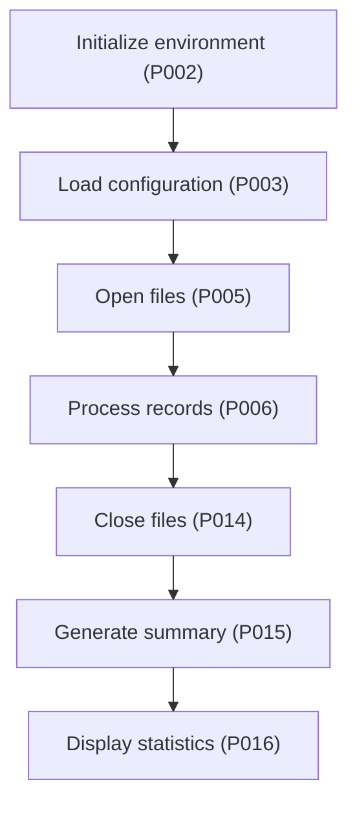

This section coordinates the end-to-end workflow for batch premium calculation, ensuring all required steps are executed in the correct order for each batch run.

| Rule ID | Category        | Rule Name                            | Description                                                                                                                              | Implementation Details                                                                                     |
| ------- | --------------- | ------------------------------------ | ---------------------------------------------------------------------------------------------------------------------------------------- | ---------------------------------------------------------------------------------------------------------- |
| BR-001  | Decision Making | Environment initialization first     | The workflow begins by initializing the environment before any other processing occurs.                                                  | Initialization is required as the first step to ensure the environment is ready for subsequent operations. |
| BR-002  | Decision Making | Configuration load before processing | Configuration settings are loaded immediately after environment initialization and before any files are opened or records are processed. | Configuration must be loaded to ensure the process uses the correct parameters for the batch run.          |
| BR-003  | Decision Making | Open files before processing records | All required files are opened before any record processing begins.                                                                       | Files must be open to allow reading and writing during record processing.                                  |
| BR-004  | Decision Making | Process records after opening files  | All records are processed after files are opened and before any files are closed.                                                        | Record processing is the core business activity and must occur before closing files.                       |
| BR-005  | Decision Making | Close files after processing         | Files are closed after all records have been processed and before generating the summary.                                                | Closing files ensures data integrity before generating the summary.                                        |
| BR-006  | Decision Making | Generate summary after closing files | A summary is generated after files are closed and before displaying statistics.                                                          | Summary generation provides a business overview of the batch process.                                      |
| BR-007  | Decision Making | Display statistics last              | Statistics are displayed as the final step in the workflow, after the summary has been generated.                                        | Statistics display is the final output of the batch process.                                               |

<SwmSnippet path="/base/src/LGAPDB01.cbl" line="90">

---

<SwmToken path="base/src/LGAPDB01.cbl" pos="90:1:1" line-data="       P001.">`P001`</SwmToken> runs the full workflow: setup, config load, file open, record processing, file close, summary, and stats display. Every batch goes through these steps.

```cobol
       P001.
           PERFORM P002-INITIALIZE
           PERFORM P003-LOAD-CONFIG
           PERFORM P005-OPEN-FILES
           PERFORM P006-PROCESS-RECORDS
           PERFORM P014-CLOSE-FILES
           PERFORM P015-GENERATE-SUMMARY
           PERFORM P016-DISPLAY-STATS
           STOP RUN.
```

---

</SwmSnippet>

## Preparing files and report headers

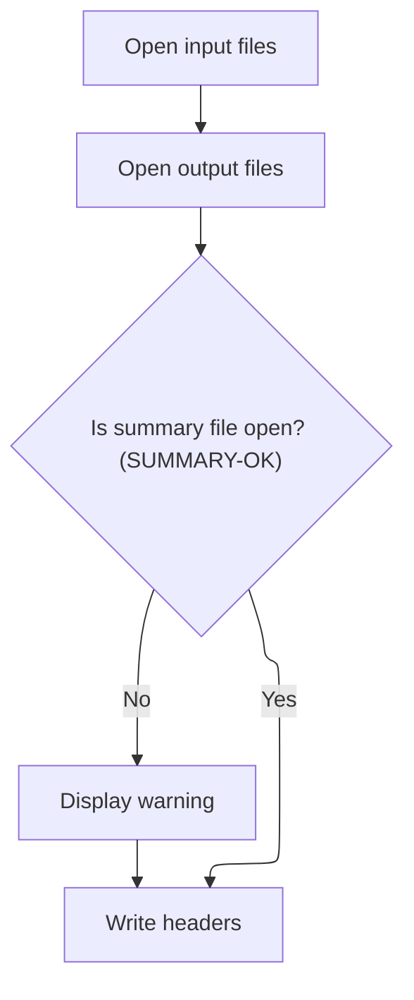

This section prepares the files and report headers required for report generation. It ensures all files are opened and headers are written, and provides user feedback if the summary file cannot be opened.

| Rule ID | Category        | Rule Name                    | Description                                                                                                             | Implementation Details                                                                                                                                                   |
| ------- | --------------- | ---------------------------- | ----------------------------------------------------------------------------------------------------------------------- | ------------------------------------------------------------------------------------------------------------------------------------------------------------------------ |
| BR-001  | Reading Input   | File opening sequence        | Input, output, and summary files are opened in sequence before any report data is processed.                            | Files are opened in the following sequence: input, output, summary. No explicit error handling is shown for input/output files in the provided code.                     |
| BR-002  | Data validation | Summary file warning display | If the summary file cannot be opened, a warning message is displayed with the status code, but processing continues.    | The warning message includes the text 'Warning: Cannot open summary file: ' followed by the summary file status code. The status code is displayed as a string.          |
| BR-003  | Writing Output  | Report header writing        | Headers are written to the output report after files are opened, ensuring all data rows are labeled from the beginning. | Headers are written to the output report. The format and content of headers are not specified in the provided code, but they are written immediately after file opening. |

<SwmSnippet path="/base/src/LGAPDB01.cbl" line="138">

---

<SwmToken path="base/src/LGAPDB01.cbl" pos="138:1:5" line-data="       P005-OPEN-FILES.">`P005-OPEN-FILES`</SwmToken> opens input, output, and summary files, then writes headers to the output report so all data rows are labeled from the beginning.

```cobol
       P005-OPEN-FILES.
           PERFORM P005A-OPEN-INPUT
           PERFORM P005B-OPEN-OUTPUT
           PERFORM P005C-OPEN-SUMMARY
           PERFORM P005D-WRITE-HEADERS.
```

---

</SwmSnippet>

<SwmSnippet path="/base/src/LGAPDB01.cbl" line="158">

---

<SwmToken path="base/src/LGAPDB01.cbl" pos="158:1:5" line-data="       P005C-OPEN-SUMMARY.">`P005C-OPEN-SUMMARY`</SwmToken> tries to open the summary file, and if it fails, it shows a warning with the status code but keeps going with the rest of the setup.

```cobol
       P005C-OPEN-SUMMARY.
           OPEN OUTPUT SUMMARY-FILE
           IF NOT SUMMARY-OK
               DISPLAY 'Warning: Cannot open summary file: ' WS-SUM-STAT
           END-IF.
```

---

</SwmSnippet>

## Processing and validating insurance applications

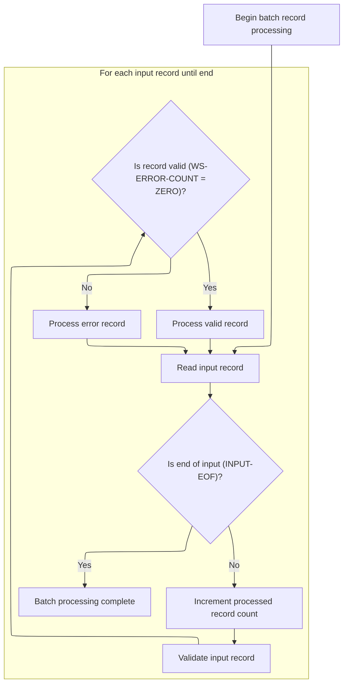

This section manages the batch processing of insurance application records, ensuring each record is validated and either processed as a valid policy or logged as an error for tracking and reporting.

| Rule ID | Category        | Rule Name                        | Description                                                                                                                  | Implementation Details                                                                                                                                                                                                         |
| ------- | --------------- | -------------------------------- | ---------------------------------------------------------------------------------------------------------------------------- | ------------------------------------------------------------------------------------------------------------------------------------------------------------------------------------------------------------------------------ |
| BR-001  | Reading Input   | Sequential input reading         | Each input record is read sequentially until the end-of-file condition is detected, ensuring all applications are processed. | End-of-file is defined as <SwmToken path="base/src/LGAPDB01.cbl" pos="11:7:11" line-data="                  FILE STATUS IS WS-IN-STAT.">`WS-IN-STAT`</SwmToken> = '10'. Records are read one at a time.                        |
| BR-002  | Calculation     | Processed record counting        | The processed record count is incremented for each input record, providing operational metrics for batch processing.         | The processed record count starts at zero and increments by one for each record. The count is a number up to 9,999,999.                                                                                                        |
| BR-003  | Decision Making | Valid record processing          | Each input record is validated, and if no errors are found, it is processed as a valid insurance policy.                     | A record is considered valid if the error count is zero. Valid records are processed as insurance policies.                                                                                                                    |
| BR-004  | Decision Making | Error record processing          | If validation finds errors, the record is processed as an error and tracked for reporting.                                   | Error records are tracked with error codes, severity, field, and message. Error count is a number up to 99.                                                                                                                    |
| BR-005  | Decision Making | Batch termination on end-of-file | Batch processing terminates when the end-of-file condition is reached, ensuring no further records are processed.            | End-of-file is defined as <SwmToken path="base/src/LGAPDB01.cbl" pos="11:7:11" line-data="                  FILE STATUS IS WS-IN-STAT.">`WS-IN-STAT`</SwmToken> = '10'. No further records are processed after this condition. |

<SwmSnippet path="/base/src/LGAPDB01.cbl" line="178">

---

<SwmToken path="base/src/LGAPDB01.cbl" pos="178:1:5" line-data="       P006-PROCESS-RECORDS.">`P006-PROCESS-RECORDS`</SwmToken> reads each input record, validates it, and either processes it as a valid policy or logs it as an error, so every application is handled and tracked.

```cobol
       P006-PROCESS-RECORDS.
           PERFORM P007-READ-INPUT
           PERFORM UNTIL INPUT-EOF
               ADD 1 TO WS-REC-CNT
               PERFORM P008-VALIDATE-INPUT-RECORD
               IF WS-ERROR-COUNT = ZERO
                   PERFORM P009-PROCESS-VALID-RECORD
               ELSE
                   PERFORM P010-PROCESS-ERROR-RECORD
               END-IF
               PERFORM P007-READ-INPUT
           END-PERFORM.
```

---

</SwmSnippet>

## Validating input records and logging errors

```mermaid
%%{init: {"flowchart": {"defaultRenderer": "elk"}} }%%
flowchart TD
    node1["Start validation"]
    click node1 openCode "base/src/LGAPDB01.cbl:195:196"
    node1 --> node2{"Is policy type valid? (C, P, F)"}
    click node2 openCode "base/src/LGAPDB01.cbl:198:204"
    node2 -->|"No"| node3["Log error: Invalid Policy Type"]
    click node3 openCode "base/src/LGAPDB01.cbl:201:203"
    node2 -->|"Yes"| node4
    node3 --> node4
    node4{"Is customer number provided?"}
    click node4 openCode "base/src/LGAPDB01.cbl:206:210"
    node4 -->|"No"| node5["Log error: Customer Number Required"]
    click node5 openCode "base/src/LGAPDB01.cbl:207:209"
    node4 -->|"Yes"| node6
    node5 --> node6
    node6{"Is at least one coverage limit
specified? (Building or Contents > 0)"}
    click node6 openCode "base/src/LGAPDB01.cbl:212:217"
    node6 -->|"No"| node7["Log error: At least one coverage limit
required"]
    click node7 openCode "base/src/LGAPDB01.cbl:214:216"
    node6 -->|"Yes"| node8
    node7 --> node8
    node8{"Does total coverage exceed maximum TIV
($50M)?"}
    click node8 openCode "base/src/LGAPDB01.cbl:219:224"
    node8 -->|"Yes"| node9["Log warning: Coverage exceeds maximum
TIV"]
    click node9 openCode "base/src/LGAPDB01.cbl:221:223"
    node8 -->|"No"| node10["Validation ends"]
    node9 --> node10
    click node10 openCode "base/src/LGAPDB01.cbl:195:224"
classDef HeadingStyle fill:#777777,stroke:#333,stroke-width:2px;

%% Swimm:
%% %%{init: {"flowchart": {"defaultRenderer": "elk"}} }%%
%% flowchart TD
%%     node1["Start validation"]
%%     click node1 openCode "<SwmPath>[base/src/LGAPDB01.cbl](base/src/LGAPDB01.cbl)</SwmPath>:195:196"
%%     node1 --> node2{"Is policy type valid? (C, P, F)"}
%%     click node2 openCode "<SwmPath>[base/src/LGAPDB01.cbl](base/src/LGAPDB01.cbl)</SwmPath>:198:204"
%%     node2 -->|"No"| node3["Log error: Invalid Policy Type"]
%%     click node3 openCode "<SwmPath>[base/src/LGAPDB01.cbl](base/src/LGAPDB01.cbl)</SwmPath>:201:203"
%%     node2 -->|"Yes"| node4
%%     node3 --> node4
%%     node4{"Is customer number provided?"}
%%     click node4 openCode "<SwmPath>[base/src/LGAPDB01.cbl](base/src/LGAPDB01.cbl)</SwmPath>:206:210"
%%     node4 -->|"No"| node5["Log error: Customer Number Required"]
%%     click node5 openCode "<SwmPath>[base/src/LGAPDB01.cbl](base/src/LGAPDB01.cbl)</SwmPath>:207:209"
%%     node4 -->|"Yes"| node6
%%     node5 --> node6
%%     node6{"Is at least one coverage limit
%% specified? (Building or Contents > 0)"}
%%     click node6 openCode "<SwmPath>[base/src/LGAPDB01.cbl](base/src/LGAPDB01.cbl)</SwmPath>:212:217"
%%     node6 -->|"No"| node7["Log error: At least one coverage limit
%% required"]
%%     click node7 openCode "<SwmPath>[base/src/LGAPDB01.cbl](base/src/LGAPDB01.cbl)</SwmPath>:214:216"
%%     node6 -->|"Yes"| node8
%%     node7 --> node8
%%     node8{"Does total coverage exceed maximum TIV
%% ($50M)?"}
%%     click node8 openCode "<SwmPath>[base/src/LGAPDB01.cbl](base/src/LGAPDB01.cbl)</SwmPath>:219:224"
%%     node8 -->|"Yes"| node9["Log warning: Coverage exceeds maximum
%% TIV"]
%%     click node9 openCode "<SwmPath>[base/src/LGAPDB01.cbl](base/src/LGAPDB01.cbl)</SwmPath>:221:223"
%%     node8 -->|"No"| node10["Validation ends"]
%%     node9 --> node10
%%     click node10 openCode "<SwmPath>[base/src/LGAPDB01.cbl](base/src/LGAPDB01.cbl)</SwmPath>:195:224"
%% classDef HeadingStyle fill:#777777,stroke:#333,stroke-width:2px;
```

This section validates the main fields of an insurance policy input record and logs any errors or warnings for downstream processing. It ensures that invalid or questionable records are flagged before further processing.

| Rule ID | Category        | Rule Name                | Description                                                                                                                                                      | Implementation Details                                                                                                                                                                                                                                                                                                                                                                                                                                                                                                                                         |
| ------- | --------------- | ------------------------ | ---------------------------------------------------------------------------------------------------------------------------------------------------------------- | -------------------------------------------------------------------------------------------------------------------------------------------------------------------------------------------------------------------------------------------------------------------------------------------------------------------------------------------------------------------------------------------------------------------------------------------------------------------------------------------------------------------------------------------------------------- |
| BR-001  | Data validation | Policy type validation   | If the policy type is not 'C', 'P', or 'F', an error is logged indicating an invalid policy type.                                                                | The valid values for policy type are: 'C' (Commercial), 'P' (Personal), 'F' (Farm). The error code is <SwmToken path="base/src/LGAPDB01.cbl" pos="202:2:2" line-data="                   &#39;POL001&#39; &#39;F&#39; &#39;IN-POLICY-TYPE&#39; ">`POL001`</SwmToken>, severity is 'F' (fatal), field is <SwmToken path="base/src/LGAPDB01.cbl" pos="202:10:14" line-data="                   &#39;POL001&#39; &#39;F&#39; &#39;IN-POLICY-TYPE&#39; ">`IN-POLICY-TYPE`</SwmToken>, and message is 'Invalid Policy Type'.                                        |
| BR-002  | Data validation | Customer number required | If the customer number is blank, an error is logged indicating that the customer number is required.                                                             | The error code is <SwmToken path="base/src/LGAPDB01.cbl" pos="208:2:2" line-data="                   &#39;CUS001&#39; &#39;F&#39; &#39;IN-CUSTOMER-NUM&#39; ">`CUS001`</SwmToken>, severity is 'F' (fatal), field is <SwmToken path="base/src/LGAPDB01.cbl" pos="206:3:7" line-data="           IF IN-CUSTOMER-NUM = SPACES">`IN-CUSTOMER-NUM`</SwmToken>, and message is 'Customer Number Required'. The customer number field is a string of length 10.                                                                                                      |
| BR-003  | Data validation | Coverage limit required  | If both building and contents coverage limits are zero, an error is logged indicating that at least one coverage limit is required.                              | The error code is <SwmToken path="base/src/LGAPDB01.cbl" pos="215:2:2" line-data="                   &#39;COV001&#39; &#39;F&#39; &#39;COVERAGE-LIMITS&#39; ">`COV001`</SwmToken>, severity is 'F' (fatal), field is <SwmToken path="base/src/LGAPDB01.cbl" pos="215:10:12" line-data="                   &#39;COV001&#39; &#39;F&#39; &#39;COVERAGE-LIMITS&#39; ">`COVERAGE-LIMITS`</SwmToken>, and message is 'At least one coverage limit required'. Coverage limits are numeric values.                                                                    |
| BR-004  | Data validation | Maximum TIV warning      | If the sum of building, contents, and BI coverage limits exceeds $50,000,000.00, a warning is logged indicating that the total coverage exceeds the maximum TIV. | The maximum allowed total insured value (TIV) is $50,000,000.00. The warning code is <SwmToken path="base/src/LGAPDB01.cbl" pos="222:2:2" line-data="                   &#39;COV002&#39; &#39;W&#39; &#39;COVERAGE-LIMITS&#39; ">`COV002`</SwmToken>, severity is 'W' (warning), field is <SwmToken path="base/src/LGAPDB01.cbl" pos="215:10:12" line-data="                   &#39;COV001&#39; &#39;F&#39; &#39;COVERAGE-LIMITS&#39; ">`COVERAGE-LIMITS`</SwmToken>, and message is 'Total coverage exceeds maximum TIV'. Coverage limits are numeric values. |

<SwmSnippet path="/base/src/LGAPDB01.cbl" line="195">

---

<SwmToken path="base/src/LGAPDB01.cbl" pos="195:1:7" line-data="       P008-VALIDATE-INPUT-RECORD.">`P008-VALIDATE-INPUT-RECORD`</SwmToken> checks the main fields in the input record for validity—policy type, customer number, coverage limits, and total coverage. For each failed check, it calls <SwmToken path="base/src/LGAPDB01.cbl" pos="201:3:7" line-data="               PERFORM P008A-LOG-ERROR WITH ">`P008A-LOG-ERROR`</SwmToken> to log the error or warning. This lets us track multiple issues per record and ensures downstream logic can handle or report all problems at once.

```cobol
       P008-VALIDATE-INPUT-RECORD.
           INITIALIZE WS-ERROR-HANDLING
           
           IF NOT COMMERCIAL-POLICY AND 
              NOT PERSONAL-POLICY AND 
              NOT FARM-POLICY
               PERFORM P008A-LOG-ERROR WITH 
                   'POL001' 'F' 'IN-POLICY-TYPE' 
                   'Invalid Policy Type'
           END-IF
           
           IF IN-CUSTOMER-NUM = SPACES
               PERFORM P008A-LOG-ERROR WITH 
                   'CUS001' 'F' 'IN-CUSTOMER-NUM' 
                   'Customer Number Required'
           END-IF
           
           IF IN-BUILDING-LIMIT = ZERO AND 
              IN-CONTENTS-LIMIT = ZERO
               PERFORM P008A-LOG-ERROR WITH 
                   'COV001' 'F' 'COVERAGE-LIMITS' 
                   'At least one coverage limit required'
           END-IF
           
           IF IN-BUILDING-LIMIT + IN-CONTENTS-LIMIT + 
              IN-BI-LIMIT > WS-MAX-TIV
               PERFORM P008A-LOG-ERROR WITH 
                   'COV002' 'W' 'COVERAGE-LIMITS' 
                   'Total coverage exceeds maximum TIV'
           END-IF.
```

---

</SwmSnippet>

<SwmSnippet path="/base/src/LGAPDB01.cbl" line="226">

---

<SwmToken path="base/src/LGAPDB01.cbl" pos="226:1:5" line-data="       P008A-LOG-ERROR.">`P008A-LOG-ERROR`</SwmToken> increments the error count and uses it as an index to store error details in the WS-ERROR-ARRAY. Each error is logged in its own slot, so multiple errors per record are tracked. The arrays are fixed at 20 entries, so anything beyond that is ignored.

```cobol
       P008A-LOG-ERROR.
           ADD 1 TO WS-ERROR-COUNT
           SET ERR-IDX TO WS-ERROR-COUNT
           MOVE WS-ERROR-CODE TO WS-ERROR-CODE (ERR-IDX)
           MOVE WS-ERROR-SEVERITY TO WS-ERROR-SEVERITY (ERR-IDX)
           MOVE WS-ERROR-FIELD TO WS-ERROR-FIELD (ERR-IDX)
           MOVE WS-ERROR-MESSAGE TO WS-ERROR-MESSAGE (ERR-IDX).
```

---

</SwmSnippet>

## Routing valid records for processing

```mermaid
%%{init: {"flowchart": {"defaultRenderer": "elk"}} }%%
flowchart TD
    node1{"Is COMMERCIAL-POLICY (IN-POLICY-TYPE =
'C')?"}
    click node1 openCode "base/src/LGAPDB01.cbl:235:241"
    node1 -->|"Yes"| node2["Process commercial policy
(P011-PROCESS-COMMERCIAL)"]
    click node2 openCode "base/src/LGAPDB01.cbl:236:236"
    node2 --> node3["Add 1 to commercial processing counter
(WS-PROC-CNT)"]
    click node3 openCode "base/src/LGAPDB01.cbl:237:237"
    node1 -->|"No"| node4["Process non-commercial policy
(P012-PROCESS-NON-COMMERCIAL)"]
    click node4 openCode "base/src/LGAPDB01.cbl:239:239"
    node4 --> node5["Add 1 to error counter (WS-ERR-CNT)"]
    click node5 openCode "base/src/LGAPDB01.cbl:240:240"

classDef HeadingStyle fill:#777777,stroke:#333,stroke-width:2px;

%% Swimm:
%% %%{init: {"flowchart": {"defaultRenderer": "elk"}} }%%
%% flowchart TD
%%     node1{"Is <SwmToken path="base/src/LGAPDB01.cbl" pos="198:5:7" line-data="           IF NOT COMMERCIAL-POLICY AND ">`COMMERCIAL-POLICY`</SwmToken> (<SwmToken path="base/src/LGAPDB01.cbl" pos="202:10:14" line-data="                   &#39;POL001&#39; &#39;F&#39; &#39;IN-POLICY-TYPE&#39; ">`IN-POLICY-TYPE`</SwmToken> =
%% 'C')?"}
%%     click node1 openCode "<SwmPath>[base/src/LGAPDB01.cbl](base/src/LGAPDB01.cbl)</SwmPath>:235:241"
%%     node1 -->|"Yes"| node2["Process commercial policy
%% (<SwmToken path="base/src/LGAPDB01.cbl" pos="236:3:7" line-data="               PERFORM P011-PROCESS-COMMERCIAL">`P011-PROCESS-COMMERCIAL`</SwmToken>)"]
%%     click node2 openCode "<SwmPath>[base/src/LGAPDB01.cbl](base/src/LGAPDB01.cbl)</SwmPath>:236:236"
%%     node2 --> node3["Add 1 to commercial processing counter
%% (<SwmToken path="base/src/LGAPDB01.cbl" pos="237:7:11" line-data="               ADD 1 TO WS-PROC-CNT">`WS-PROC-CNT`</SwmToken>)"]
%%     click node3 openCode "<SwmPath>[base/src/LGAPDB01.cbl](base/src/LGAPDB01.cbl)</SwmPath>:237:237"
%%     node1 -->|"No"| node4["Process non-commercial policy
%% (<SwmToken path="base/src/LGAPDB01.cbl" pos="239:3:9" line-data="               PERFORM P012-PROCESS-NON-COMMERCIAL">`P012-PROCESS-NON-COMMERCIAL`</SwmToken>)"]
%%     click node4 openCode "<SwmPath>[base/src/LGAPDB01.cbl](base/src/LGAPDB01.cbl)</SwmPath>:239:239"
%%     node4 --> node5["Add 1 to error counter (<SwmToken path="base/src/LGAPDB01.cbl" pos="240:7:11" line-data="               ADD 1 TO WS-ERR-CNT">`WS-ERR-CNT`</SwmToken>)"]
%%     click node5 openCode "<SwmPath>[base/src/LGAPDB01.cbl](base/src/LGAPDB01.cbl)</SwmPath>:240:240"
%% 
%% classDef HeadingStyle fill:#777777,stroke:#333,stroke-width:2px;
```

This section routes valid records to the appropriate processing routine based on policy type and updates processing statistics counters accordingly.

| Rule ID | Category        | Rule Name                     | Description                                                                                                                                                    | Implementation Details                                                                                                                                                                           |
| ------- | --------------- | ----------------------------- | -------------------------------------------------------------------------------------------------------------------------------------------------------------- | ------------------------------------------------------------------------------------------------------------------------------------------------------------------------------------------------ |
| BR-001  | Calculation     | Processing statistics update  | The processed and error counters are updated for each record routed, reflecting the number of records processed and errors encountered for reporting purposes. | The processed counter is a 7-digit number; the error counter is a 6-digit number. Both counters start at zero and are incremented by 1 for each processed record in their respective categories. |
| BR-002  | Decision Making | Commercial policy routing     | When a valid record has a commercial policy type, it is routed to commercial processing and the processed counter is incremented by 1.                         | The processed counter is a numeric value with up to 7 digits. The commercial policy type is represented by the character 'C'.                                                                    |
| BR-003  | Decision Making | Non-commercial policy routing | When a valid record does not have a commercial policy type, it is routed to non-commercial processing and the error counter is incremented by 1.               | The error counter is a numeric value with up to 6 digits. Non-commercial policy types include 'P' (personal) and 'F' (farm).                                                                     |

<SwmSnippet path="/base/src/LGAPDB01.cbl" line="234">

---

<SwmToken path="base/src/LGAPDB01.cbl" pos="234:1:7" line-data="       P009-PROCESS-VALID-RECORD.">`P009-PROCESS-VALID-RECORD`</SwmToken> checks if the record is commercial. If so, it routes to commercial processing and bumps the processed count. Otherwise, it sends the record to the non-commercial handler and increments the error count. This keeps the stats straight for reporting.

```cobol
       P009-PROCESS-VALID-RECORD.
           IF COMMERCIAL-POLICY
               PERFORM P011-PROCESS-COMMERCIAL
               ADD 1 TO WS-PROC-CNT
           ELSE
               PERFORM P012-PROCESS-NON-COMMERCIAL
               ADD 1 TO WS-ERR-CNT
           END-IF.
```

---

</SwmSnippet>

## Processing commercial policy records

```mermaid
%%{init: {"flowchart": {"defaultRenderer": "elk"}} }%%
flowchart TD
    node1["Start processing commercial policy"] --> node2["Calculating property risk score"]
    click node1 openCode "base/src/LGAPDB01.cbl:258:266"
    
    node2 --> node3["Calculating basic premium for commercial policies"]
    
    node3 --> node4{"Is underwriting status approved
(WS-STAT = 0)?"}
    click node4 openCode "base/src/LGAPDB01.cbl:261:263"
    node4 -->|"Yes"| node5["Running advanced premium calculations"]
    
    node5 --> node6["Processing commercial policy records"]
    node4 -->|"No"| node6
    
    node6 --> node7{"Underwriting outcome?"}
    click node7 openCode "base/src/LGAPDB01.cbl:327:349"
    node7 -->|"WS-BASE-RISK-SCR > WS-MAX-RISK-SCORE"| node8["Processing commercial policy records"]
    node7 -->|"WS-TOT-PREM < WS-MIN-PREMIUM"| node8["Processing commercial policy records"]
    node7 -->|"WS-BASE-RISK-SCR > 180"| node8["Processing commercial policy records"]
    node7 -->|"Otherwise"| node8["Processing commercial policy records"]
    
    node8 --> node9{"Update statistics: What is final status
and risk?"}
    
    node9 -->|"WS-STAT = 0"| node9
    node9 -->|"WS-STAT = 1"| node9
    node9 -->|"WS-STAT = 2"| node9
    node9 -->|"WS-BASE-RISK-SCR > 200"| node9

classDef HeadingStyle fill:#777777,stroke:#333,stroke-width:2px;
click node2 goToHeading "Calculating property risk score"
node2:::HeadingStyle
click node3 goToHeading "Calculating basic premium for commercial policies"
node3:::HeadingStyle
click node5 goToHeading "Running advanced premium calculations"
node5:::HeadingStyle
click node6 goToHeading "Processing commercial policy records"
node6:::HeadingStyle
click node8 goToHeading "Processing commercial policy records"
node8:::HeadingStyle
click node9 goToHeading "Processing commercial policy records"
node9:::HeadingStyle

%% Swimm:
%% %%{init: {"flowchart": {"defaultRenderer": "elk"}} }%%
%% flowchart TD
%%     node1["Start processing commercial policy"] --> node2["Calculating property risk score"]
%%     click node1 openCode "<SwmPath>[base/src/LGAPDB01.cbl](base/src/LGAPDB01.cbl)</SwmPath>:258:266"
%%     
%%     node2 --> node3["Calculating basic premium for commercial policies"]
%%     
%%     node3 --> node4{"Is underwriting status approved
%% (<SwmToken path="base/src/LGAPDB01.cbl" pos="261:3:5" line-data="           IF WS-STAT = 0">`WS-STAT`</SwmToken> = 0)?"}
%%     click node4 openCode "<SwmPath>[base/src/LGAPDB01.cbl](base/src/LGAPDB01.cbl)</SwmPath>:261:263"
%%     node4 -->|"Yes"| node5["Running advanced premium calculations"]
%%     
%%     node5 --> node6["Processing commercial policy records"]
%%     node4 -->|"No"| node6
%%     
%%     node6 --> node7{"Underwriting outcome?"}
%%     click node7 openCode "<SwmPath>[base/src/LGAPDB01.cbl](base/src/LGAPDB01.cbl)</SwmPath>:327:349"
%%     node7 -->|"<SwmToken path="base/src/LGAPDB01.cbl" pos="273:8:14" line-data="                                IN-CUSTOMER-HISTORY, WS-BASE-RISK-SCR.">`WS-BASE-RISK-SCR`</SwmToken> > <SwmToken path="base/src/LGAPDB01.cbl" pos="330:13:19" line-data="               WHEN WS-BASE-RISK-SCR &gt; WS-MAX-RISK-SCORE">`WS-MAX-RISK-SCORE`</SwmToken>"| node8["Processing commercial policy records"]
%%     node7 -->|"<SwmToken path="base/src/LGAPDB01.cbl" pos="281:1:5" line-data="                                WS-TOT-PREM, WS-DISC-FACT.">`WS-TOT-PREM`</SwmToken> < <SwmToken path="base/src/LGAPDB01.cbl" pos="312:11:15" line-data="           IF WS-TOT-PREM &gt; WS-MIN-PREMIUM">`WS-MIN-PREMIUM`</SwmToken>"| node8["Processing commercial policy records"]
%%     node7 -->|"<SwmToken path="base/src/LGAPDB01.cbl" pos="273:8:14" line-data="                                IN-CUSTOMER-HISTORY, WS-BASE-RISK-SCR.">`WS-BASE-RISK-SCR`</SwmToken> > 180"| node8["Processing commercial policy records"]
%%     node7 -->|"Otherwise"| node8["Processing commercial policy records"]
%%     
%%     node8 --> node9{"Update statistics: What is final status
%% and risk?"}
%%     
%%     node9 -->|"<SwmToken path="base/src/LGAPDB01.cbl" pos="261:3:5" line-data="           IF WS-STAT = 0">`WS-STAT`</SwmToken> = 0"| node9
%%     node9 -->|"<SwmToken path="base/src/LGAPDB01.cbl" pos="261:3:5" line-data="           IF WS-STAT = 0">`WS-STAT`</SwmToken> = 1"| node9
%%     node9 -->|"<SwmToken path="base/src/LGAPDB01.cbl" pos="261:3:5" line-data="           IF WS-STAT = 0">`WS-STAT`</SwmToken> = 2"| node9
%%     node9 -->|"<SwmToken path="base/src/LGAPDB01.cbl" pos="273:8:14" line-data="                                IN-CUSTOMER-HISTORY, WS-BASE-RISK-SCR.">`WS-BASE-RISK-SCR`</SwmToken> > 200"| node9
%% 
%% classDef HeadingStyle fill:#777777,stroke:#333,stroke-width:2px;
%% click node2 goToHeading "Calculating property risk score"
%% node2:::HeadingStyle
%% click node3 goToHeading "Calculating basic premium for commercial policies"
%% node3:::HeadingStyle
%% click node5 goToHeading "Running advanced premium calculations"
%% node5:::HeadingStyle
%% click node6 goToHeading "Processing commercial policy records"
%% node6:::HeadingStyle
%% click node8 goToHeading "Processing commercial policy records"
%% node8:::HeadingStyle
%% click node9 goToHeading "Processing commercial policy records"
%% node9:::HeadingStyle
```

This section coordinates the end-to-end processing of commercial insurance policies, ensuring that each policy is evaluated, priced, and recorded according to business rules and underwriting outcomes. It ensures only eligible policies receive advanced actuarial treatment and that all outputs and statistics reflect the final processed state.

| Rule ID | Category        | Rule Name                                            | Description                                                                                                                 | Implementation Details                                                                                                                                    |
| ------- | --------------- | ---------------------------------------------------- | --------------------------------------------------------------------------------------------------------------------------- | --------------------------------------------------------------------------------------------------------------------------------------------------------- |
| BR-001  | Calculation     | Risk score calculation                               | A risk score is calculated for each commercial policy record before any premium calculations or business rules are applied. | The risk score is calculated based on property and customer data. The specific calculation logic is handled in a separate step and is not described here. |
| BR-002  | Calculation     | Basic premium calculation                            | A basic premium is calculated for each commercial policy record after the risk score is determined.                         | The basic premium is calculated based on the risk score and other policy data. The calculation logic is handled in a separate step.                       |
| BR-003  | Decision Making | Advanced actuarial calculation for approved policies | Advanced actuarial calculations are performed only for policies with underwriting status 'approved' (status code 0).        | Advanced actuarial calculations are only performed for policies with status code 0. Other statuses do not receive this calculation.                       |
| BR-004  | Decision Making | Apply business rules                                 | Business rules are applied to each commercial policy record after all calculations are complete.                            | Business rules are applied after all calculations, ensuring the policy record reflects all relevant adjustments and validations.                          |
| BR-005  | Writing Output  | Write processed policy output                        | The processed commercial policy record is written to the output after all calculations and business rules are applied.      | The output record contains all calculated and adjusted values for the policy. The format is determined by the output requirements of the system.          |
| BR-006  | Writing Output  | Update statistics after processing                   | Statistics are updated for each processed commercial policy record after output is written.                                 | Statistics reflect the final processed state of all commercial policy records.                                                                            |

<SwmSnippet path="/base/src/LGAPDB01.cbl" line="258">

---

In <SwmToken path="base/src/LGAPDB01.cbl" pos="258:1:5" line-data="       P011-PROCESS-COMMERCIAL.">`P011-PROCESS-COMMERCIAL`</SwmToken>, we run through risk scoring, basic premium calculation, and, if the status is zero, enhanced actuarial calculation. Then we apply business rules, write the output, and update stats. Each step is sequenced so only eligible records get the full actuarial treatment.

```cobol
       P011-PROCESS-COMMERCIAL.
           PERFORM P011A-CALCULATE-RISK-SCORE
           PERFORM P011B-BASIC-PREMIUM-CALC
           IF WS-STAT = 0
               PERFORM P011C-ENHANCED-ACTUARIAL-CALC
           END-IF
           PERFORM P011D-APPLY-BUSINESS-RULES
           PERFORM P011E-WRITE-OUTPUT-RECORD
           PERFORM P011F-UPDATE-STATISTICS.
```

---

</SwmSnippet>

### Calculating property risk score

This section ensures that property risk scoring is consistent and data-driven by delegating the calculation to a central service, using all relevant property and customer data.

| Rule ID | Category                        | Rule Name                | Description                                                                                                                      | Implementation Details                                                                                                                                  |
| ------- | ------------------------------- | ------------------------ | -------------------------------------------------------------------------------------------------------------------------------- | ------------------------------------------------------------------------------------------------------------------------------------------------------- |
| BR-001  | Invoking a Service or a Process | Centralized risk scoring | The property risk score is calculated by invoking the central risk scoring service with all relevant property and customer data. | The risk score is determined by the external service based on the provided input data. No constants or output formatting are specified in this section. |

<SwmSnippet path="/base/src/LGAPDB01.cbl" line="268">

---

<SwmToken path="base/src/LGAPDB01.cbl" pos="268:1:7" line-data="       P011A-CALCULATE-RISK-SCORE.">`P011A-CALCULATE-RISK-SCORE`</SwmToken> calls <SwmToken path="base/src/LGAPDB01.cbl" pos="269:4:4" line-data="           CALL &#39;LGAPDB02&#39; USING IN-PROPERTY-TYPE, IN-POSTCODE, ">`LGAPDB02`</SwmToken> with property and customer info. <SwmToken path="base/src/LGAPDB01.cbl" pos="269:4:4" line-data="           CALL &#39;LGAPDB02&#39; USING IN-PROPERTY-TYPE, IN-POSTCODE, ">`LGAPDB02`</SwmToken> fetches risk factors and computes the risk score, so we get a consistent, database-driven risk assessment for every property.

```cobol
       P011A-CALCULATE-RISK-SCORE.
           CALL 'LGAPDB02' USING IN-PROPERTY-TYPE, IN-POSTCODE, 
                                IN-LATITUDE, IN-LONGITUDE,
                                IN-BUILDING-LIMIT, IN-CONTENTS-LIMIT,
                                IN-FLOOD-COVERAGE, IN-WEATHER-COVERAGE,
                                IN-CUSTOMER-HISTORY, WS-BASE-RISK-SCR.
```

---

</SwmSnippet>

### Fetching risk factors and running risk score logic

```mermaid
%%{init: {"flowchart": {"defaultRenderer": "elk"}} }%%
flowchart TD
    node1["Start risk calculation"]
    click node1 openCode "base/src/LGAPDB02.cbl:39:42"
    node1 --> node2["Retrieve FIRE risk factor"]
    click node2 openCode "base/src/LGAPDB02.cbl:44:55"
    node2 --> node3{"FIRE factor available?"}
    click node3 openCode "base/src/LGAPDB02.cbl:51:55"
    node3 -->|"Available"| node4["Set FIRE factor"]
    click node4 openCode "base/src/LGAPDB02.cbl:52:52"
    node3 -->|"Fallback (0.80)"| node4
    node4 --> node5["Retrieve CRIME risk factor"]
    click node5 openCode "base/src/LGAPDB02.cbl:57:67"
    node5 --> node6{"CRIME factor available?"}
    click node6 openCode "base/src/LGAPDB02.cbl:63:67"
    node6 -->|"Available"| node7["Set CRIME factor"]
    click node7 openCode "base/src/LGAPDB02.cbl:64:64"
    node6 -->|"Fallback (0.60)"| node7
    node7 --> node8["Calculate risk score"]
    click node8 openCode "base/src/LGAPDB02.cbl:41:41"

classDef HeadingStyle fill:#777777,stroke:#333,stroke-width:2px;

%% Swimm:
%% %%{init: {"flowchart": {"defaultRenderer": "elk"}} }%%
%% flowchart TD
%%     node1["Start risk calculation"]
%%     click node1 openCode "<SwmPath>[base/src/LGAPDB02.cbl](base/src/LGAPDB02.cbl)</SwmPath>:39:42"
%%     node1 --> node2["Retrieve FIRE risk factor"]
%%     click node2 openCode "<SwmPath>[base/src/LGAPDB02.cbl](base/src/LGAPDB02.cbl)</SwmPath>:44:55"
%%     node2 --> node3{"FIRE factor available?"}
%%     click node3 openCode "<SwmPath>[base/src/LGAPDB02.cbl](base/src/LGAPDB02.cbl)</SwmPath>:51:55"
%%     node3 -->|"Available"| node4["Set FIRE factor"]
%%     click node4 openCode "<SwmPath>[base/src/LGAPDB02.cbl](base/src/LGAPDB02.cbl)</SwmPath>:52:52"
%%     node3 -->|"Fallback (<SwmToken path="base/src/LGAPDB02.cbl" pos="54:3:5" line-data="               MOVE 0.80 TO WS-FIRE-FACTOR">`0.80`</SwmToken>)"| node4
%%     node4 --> node5["Retrieve CRIME risk factor"]
%%     click node5 openCode "<SwmPath>[base/src/LGAPDB02.cbl](base/src/LGAPDB02.cbl)</SwmPath>:57:67"
%%     node5 --> node6{"CRIME factor available?"}
%%     click node6 openCode "<SwmPath>[base/src/LGAPDB02.cbl](base/src/LGAPDB02.cbl)</SwmPath>:63:67"
%%     node6 -->|"Available"| node7["Set CRIME factor"]
%%     click node7 openCode "<SwmPath>[base/src/LGAPDB02.cbl](base/src/LGAPDB02.cbl)</SwmPath>:64:64"
%%     node6 -->|"Fallback (<SwmToken path="base/src/LGAPDB02.cbl" pos="66:3:5" line-data="               MOVE 0.60 TO WS-CRIME-FACTOR">`0.60`</SwmToken>)"| node7
%%     node7 --> node8["Calculate risk score"]
%%     click node8 openCode "<SwmPath>[base/src/LGAPDB02.cbl](base/src/LGAPDB02.cbl)</SwmPath>:41:41"
%% 
%% classDef HeadingStyle fill:#777777,stroke:#333,stroke-width:2px;
```

This section ensures that risk score calculation can proceed by reliably providing fire and crime risk factors, using fallback values if the database does not return results.

| Rule ID | Category        | Rule Name                         | Description                                                                                                                                                                                                                                      | Implementation Details                                                                                                                                                       |
| ------- | --------------- | --------------------------------- | ------------------------------------------------------------------------------------------------------------------------------------------------------------------------------------------------------------------------------------------------ | ---------------------------------------------------------------------------------------------------------------------------------------------------------------------------- |
| BR-001  | Decision Making | Fire risk fallback                | When retrieving the fire risk factor, if the value is not available from the data source, use a default value of <SwmToken path="base/src/LGAPDB02.cbl" pos="54:3:5" line-data="               MOVE 0.80 TO WS-FIRE-FACTOR">`0.80`</SwmToken>.   | The fallback value for fire risk is <SwmToken path="base/src/LGAPDB02.cbl" pos="54:3:5" line-data="               MOVE 0.80 TO WS-FIRE-FACTOR">`0.80`</SwmToken> (number).   |
| BR-002  | Decision Making | Crime risk fallback               | When retrieving the crime risk factor, if the value is not available from the data source, use a default value of <SwmToken path="base/src/LGAPDB02.cbl" pos="66:3:5" line-data="               MOVE 0.60 TO WS-CRIME-FACTOR">`0.60`</SwmToken>. | The fallback value for crime risk is <SwmToken path="base/src/LGAPDB02.cbl" pos="66:3:5" line-data="               MOVE 0.60 TO WS-CRIME-FACTOR">`0.60`</SwmToken> (number). |
| BR-003  | Decision Making | Guaranteed risk score calculation | Risk score calculation is always performed after fire and crime risk factors are set, regardless of whether the values are retrieved from the data source or set to defaults.                                                                    | Risk score calculation is performed after both risk factors are set (from data source or defaults).                                                                          |

<SwmSnippet path="/base/src/LGAPDB02.cbl" line="39">

---

<SwmToken path="base/src/LGAPDB02.cbl" pos="39:1:3" line-data="       MAIN-LOGIC.">`MAIN-LOGIC`</SwmToken> in <SwmToken path="base/src/LGAPDB01.cbl" pos="269:4:4" line-data="           CALL &#39;LGAPDB02&#39; USING IN-PROPERTY-TYPE, IN-POSTCODE, ">`LGAPDB02`</SwmToken> runs <SwmToken path="base/src/LGAPDB02.cbl" pos="40:3:7" line-data="           PERFORM GET-RISK-FACTORS">`GET-RISK-FACTORS`</SwmToken> to pull fire and crime risk values from the database, or uses defaults if not found. Then it calculates the risk score using these factors and the property/customer data, so we always get a risk score even if the DB is missing info.

```cobol
       MAIN-LOGIC.
           PERFORM GET-RISK-FACTORS
           PERFORM CALCULATE-RISK-SCORE
           GOBACK.
```

---

</SwmSnippet>

<SwmSnippet path="/base/src/LGAPDB02.cbl" line="44">

---

<SwmToken path="base/src/LGAPDB02.cbl" pos="44:1:5" line-data="       GET-RISK-FACTORS.">`GET-RISK-FACTORS`</SwmToken> runs two SQL queries to fetch fire and crime risk values. If either query fails, it falls back to hardcoded defaults (<SwmToken path="base/src/LGAPDB02.cbl" pos="54:3:5" line-data="               MOVE 0.80 TO WS-FIRE-FACTOR">`0.80`</SwmToken> for fire, <SwmToken path="base/src/LGAPDB02.cbl" pos="66:3:5" line-data="               MOVE 0.60 TO WS-CRIME-FACTOR">`0.60`</SwmToken> for crime), so the risk score logic always has something to work with.

```cobol
       GET-RISK-FACTORS.
           EXEC SQL
               SELECT FACTOR_VALUE INTO :WS-FIRE-FACTOR
               FROM RISK_FACTORS
               WHERE PERIL_TYPE = 'FIRE'
           END-EXEC.
           
           IF SQLCODE = 0
               CONTINUE
           ELSE
               MOVE 0.80 TO WS-FIRE-FACTOR
           END-IF.
           
           EXEC SQL
               SELECT FACTOR_VALUE INTO :WS-CRIME-FACTOR
               FROM RISK_FACTORS
               WHERE PERIL_TYPE = 'CRIME'
           END-EXEC.
           
           IF SQLCODE = 0
               CONTINUE
           ELSE
               MOVE 0.60 TO WS-CRIME-FACTOR
           END-IF.
```

---

</SwmSnippet>

### Adjusting risk score based on property and coverage

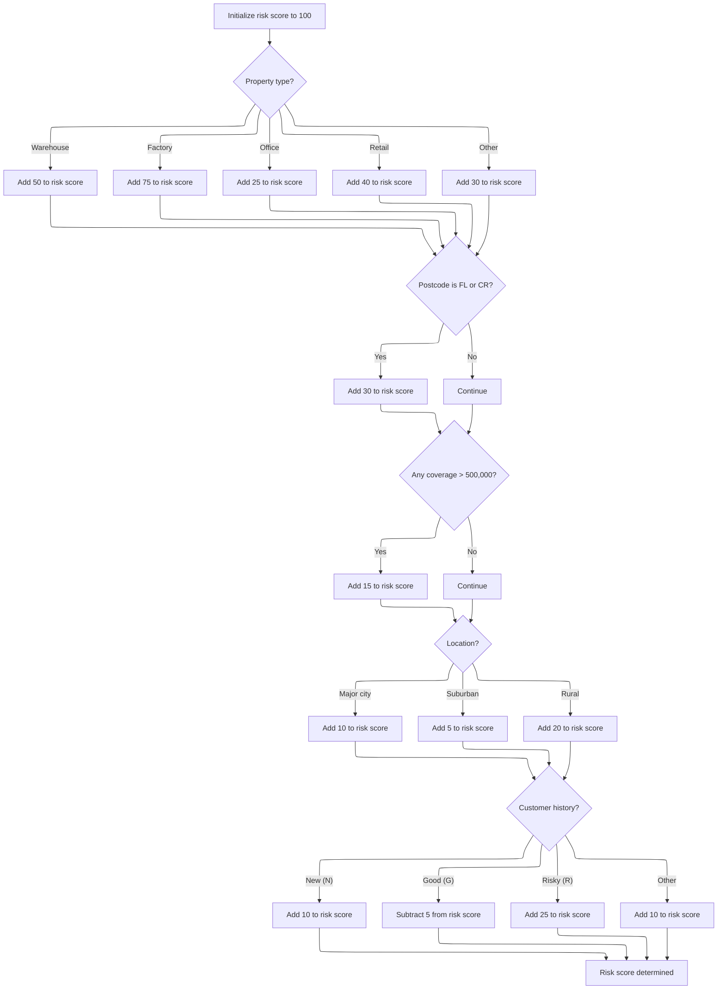

This section calculates the risk score for a property insurance policy by applying a series of fixed business rules based on property and coverage characteristics.

| Rule ID | Category    | Rule Name                      | Description                                                                                                                                                          | Implementation Details                                                                                                                                                                                 |
| ------- | ----------- | ------------------------------ | -------------------------------------------------------------------------------------------------------------------------------------------------------------------- | ------------------------------------------------------------------------------------------------------------------------------------------------------------------------------------------------------ |
| BR-001  | Calculation | Base risk score initialization | The risk score starts at 100 before any adjustments are made.                                                                                                        | The base value is 100. The risk score is a number.                                                                                                                                                     |
| BR-002  | Calculation | Property type adjustment       | The risk score is increased by a fixed amount based on the property type: 50 for Warehouse, 75 for Factory, 25 for Office, 40 for Retail, and 30 for any other type. | Warehouse: +50, Factory: +75, Office: +25, Retail: +40, Other: +30. The adjustment is a number added to the risk score.                                                                                |
| BR-003  | Calculation | Postcode prefix adjustment     | If the postcode starts with 'FL' or 'CR', the risk score is increased by 30.                                                                                         | Prefix 'FL' or 'CR': +30. The adjustment is a number added to the risk score.                                                                                                                          |
| BR-004  | Calculation | High coverage adjustment       | If any coverage amount (fire, crime, flood, weather) exceeds 500,000, the risk score is increased by 15.                                                             | Threshold: 500,000. Increment: +15. The adjustment is a number added to the risk score.                                                                                                                |
| BR-005  | Calculation | Location-based adjustment      | If the property is in the NYC or LA area (based on latitude and longitude), the risk score is increased by 10. If in the continental US, add 5. Otherwise, add 20.   | NYC: Latitude 40-41, Longitude -74.5 to -73.5. LA: Latitude 34-35, Longitude -118.5 to -117.5. Continental US: Latitude 25-49, Longitude -125 to -66. NYC/LA: +10, Continental US: +5, Elsewhere: +20. |
| BR-006  | Calculation | Customer history adjustment    | The risk score is adjusted based on customer history: add 10 for 'N' (New), subtract 5 for 'G' (Good), add 25 for 'R' (Risky), add 10 for any other code.            | N: +10, G: -5, R: +25, Other: +10. The adjustment is a number added to or subtracted from the risk score.                                                                                              |

<SwmSnippet path="/base/src/LGAPDB02.cbl" line="69">

---

<SwmToken path="base/src/LGAPDB02.cbl" pos="69:1:5" line-data="       CALCULATE-RISK-SCORE.">`CALCULATE-RISK-SCORE`</SwmToken> starts at 100, then bumps the score based on property type and postcode prefix. After that, it calls coverage, location, and customer history checks to adjust the score further. All the increments are fixed numbers set by business rules.

```cobol
       CALCULATE-RISK-SCORE.
           MOVE 100 TO LK-RISK-SCORE

           EVALUATE LK-PROPERTY-TYPE
             WHEN 'WAREHOUSE'
               ADD 50 TO LK-RISK-SCORE
             WHEN 'FACTORY' 
               ADD 75 TO LK-RISK-SCORE
             WHEN 'OFFICE'
               ADD 25 TO LK-RISK-SCORE
             WHEN 'RETAIL'
               ADD 40 TO LK-RISK-SCORE
             WHEN OTHER
               ADD 30 TO LK-RISK-SCORE
           END-EVALUATE

           IF LK-POSTCODE(1:2) = 'FL' OR
              LK-POSTCODE(1:2) = 'CR'
             ADD 30 TO LK-RISK-SCORE
           END-IF

           PERFORM CHECK-COVERAGE-AMOUNTS
           PERFORM ASSESS-LOCATION-RISK  
           PERFORM EVALUATE-CUSTOMER-HISTORY.
```

---

</SwmSnippet>

<SwmSnippet path="/base/src/LGAPDB02.cbl" line="94">

---

<SwmToken path="base/src/LGAPDB02.cbl" pos="94:1:5" line-data="       CHECK-COVERAGE-AMOUNTS.">`CHECK-COVERAGE-AMOUNTS`</SwmToken> loops through fire, crime, flood, and weather coverages to find the max. If that max is over 500,000, it adds 15 to the risk score. The threshold and increment are just business rules for high-value policies.

```cobol
       CHECK-COVERAGE-AMOUNTS.
           MOVE ZERO TO WS-MAX-COVERAGE
           
           IF LK-FIRE-COVERAGE > WS-MAX-COVERAGE
               MOVE LK-FIRE-COVERAGE TO WS-MAX-COVERAGE
           END-IF
           
           IF LK-CRIME-COVERAGE > WS-MAX-COVERAGE
               MOVE LK-CRIME-COVERAGE TO WS-MAX-COVERAGE
           END-IF
           
           IF LK-FLOOD-COVERAGE > WS-MAX-COVERAGE
               MOVE LK-FLOOD-COVERAGE TO WS-MAX-COVERAGE
           END-IF
           
           IF LK-WEATHER-COVERAGE > WS-MAX-COVERAGE
               MOVE LK-WEATHER-COVERAGE TO WS-MAX-COVERAGE
           END-IF
           
           IF WS-MAX-COVERAGE > WS-COVERAGE-500K
               ADD 15 TO LK-RISK-SCORE
           END-IF.
```

---

</SwmSnippet>

<SwmSnippet path="/base/src/LGAPDB02.cbl" line="117">

---

<SwmToken path="base/src/LGAPDB02.cbl" pos="117:1:5" line-data="       ASSESS-LOCATION-RISK.">`ASSESS-LOCATION-RISK`</SwmToken> checks if the property is in NYC or LA using fixed <SwmToken path="base/src/LGAPDB02.cbl" pos="118:15:17" line-data="      *    Urban areas: major cities (simplified lat/long ranges)">`lat/long`</SwmToken> ranges. If so, it adds 10 to the risk score. If it's in the continental US, it adds 5; otherwise, it adds 20. Then it adjusts the score based on customer history codes, using fixed increments for each code.

```cobol
       ASSESS-LOCATION-RISK.
      *    Urban areas: major cities (simplified lat/long ranges)
      *    NYC area: 40-41N, 74.5-73.5W
      *    LA area: 34-35N, 118.5-117.5W
           IF (LK-LATITUDE > 40.000000 AND LK-LATITUDE < 41.000000 AND
               LK-LONGITUDE > -74.500000 AND LK-LONGITUDE < -73.500000) OR
              (LK-LATITUDE > 34.000000 AND LK-LATITUDE < 35.000000 AND
               LK-LONGITUDE > -118.500000 AND LK-LONGITUDE < -117.500000)
               ADD 10 TO LK-RISK-SCORE
           ELSE
      *        Check if in continental US (suburban vs rural)
               IF (LK-LATITUDE > 25.000000 AND LK-LATITUDE < 49.000000 AND
                   LK-LONGITUDE > -125.000000 AND LK-LONGITUDE < -66.000000)
                   ADD 5 TO LK-RISK-SCORE
               ELSE
                   ADD 20 TO LK-RISK-SCORE
               END-IF
           END-IF.

       EVALUATE-CUSTOMER-HISTORY.
           EVALUATE LK-CUSTOMER-HISTORY
               WHEN 'N'
                   ADD 10 TO LK-RISK-SCORE
               WHEN 'G'
                   SUBTRACT 5 FROM LK-RISK-SCORE
               WHEN 'R'
                   ADD 25 TO LK-RISK-SCORE
               WHEN OTHER
                   ADD 10 TO LK-RISK-SCORE
           END-EVALUATE.
```

---

</SwmSnippet>

### Calculating basic premium for commercial policies

This section delegates the calculation of basic premium for commercial policies to a centralized calculation routine, ensuring consistency and centralized business logic for premium, verdict, and discount determination.

| Rule ID | Category                        | Rule Name                              | Description                                                                                                                                                                                         | Implementation Details                                                                                                                                               |
| ------- | ------------------------------- | -------------------------------------- | --------------------------------------------------------------------------------------------------------------------------------------------------------------------------------------------------- | -------------------------------------------------------------------------------------------------------------------------------------------------------------------- |
| BR-001  | Reading Input                   | Risk and peril input requirement       | The risk score and peril indicators are required as input for the premium calculation, ensuring that the calculation considers all relevant risk factors for the policy.                            | Inputs include risk score (numeric), and peril indicators for fire, crime, flood, and weather (alphanumeric or indicator values).                                    |
| BR-002  | Writing Output                  | Premium and decision output population | Premium breakdowns, underwriting status, and discount factors are populated as outputs by the centralized calculation routine, providing all necessary data for further processing or display.      | Outputs include premium breakdowns (numeric, with two decimal places), underwriting status (numeric and alphanumeric), and discount factors (numeric, two decimals). |
| BR-003  | Invoking a Service or a Process | Centralized premium calculation        | The calculation of basic premium for commercial policies is performed by a centralized routine, ensuring consistent application of business logic for premium, verdict, and discount determination. | All calculation logic, including premium, verdict, and discount, is handled by the centralized routine. No calculation is performed in this section.                 |

<SwmSnippet path="/base/src/LGAPDB01.cbl" line="275">

---

<SwmToken path="base/src/LGAPDB01.cbl" pos="275:1:7" line-data="       P011B-BASIC-PREMIUM-CALC.">`P011B-BASIC-PREMIUM-CALC`</SwmToken> calls <SwmToken path="base/src/LGAPDB01.cbl" pos="276:4:4" line-data="           CALL &#39;LGAPDB03&#39; USING WS-BASE-RISK-SCR, IN-FIRE-PERIL, ">`LGAPDB03`</SwmToken> with risk score, peril indicators, and premium variables. <SwmToken path="base/src/LGAPDB01.cbl" pos="276:4:4" line-data="           CALL &#39;LGAPDB03&#39; USING WS-BASE-RISK-SCR, IN-FIRE-PERIL, ">`LGAPDB03`</SwmToken> handles the actual calculation, verdict, and discount logic, so everything stays consistent and centralized.

```cobol
       P011B-BASIC-PREMIUM-CALC.
           CALL 'LGAPDB03' USING WS-BASE-RISK-SCR, IN-FIRE-PERIL, 
                                IN-CRIME-PERIL, IN-FLOOD-PERIL, 
                                IN-WEATHER-PERIL, WS-STAT,
                                WS-STAT-DESC, WS-REJ-RSN, WS-FR-PREM,
                                WS-CR-PREM, WS-FL-PREM, WS-WE-PREM,
                                WS-TOT-PREM, WS-DISC-FACT.
```

---

</SwmSnippet>

### Premium calculation and risk verdict logic

```mermaid
%%{init: {"flowchart": {"defaultRenderer": "elk"}} }%%
flowchart TD
    node1["Retrieve FIRE risk factor"] --> node2{"Available?"}
    click node1 openCode "base/src/LGAPDB03.cbl:49:53"
    node2 -->|"Yes"| node3["Use database value"]
    click node2 openCode "base/src/LGAPDB03.cbl:55:56"
    node2 -->|"No"| node4["Use default: 0.80"]
    click node4 openCode "base/src/LGAPDB03.cbl:58:59"
    node3 --> node5["Retrieve CRIME risk factor"]
    node4 --> node5
    click node5 openCode "base/src/LGAPDB03.cbl:62:64"
    node5 --> node6{"Available?"}
    click node6 openCode "base/src/LGAPDB03.cbl:67:68"
    node6 -->|"Yes"| node7["Use database value"]
    node6 -->|"No"| node8["Use default: 0.60"]
    click node8 openCode "base/src/LGAPDB03.cbl:70:71"
    node7 --> node9{"Risk score > 200?"}
    node8 --> node9
    click node9 openCode "base/src/LGAPDB03.cbl:74:75"
    node9 -->|"Yes"| node10["Verdict: REJECTED
Reason: High Risk
Score - Manual Review Required"]
    click node10 openCode "base/src/LGAPDB03.cbl:76:78"
    node9 -->|"No"| node11{"Risk score > 150?"}
    click node11 openCode "base/src/LGAPDB03.cbl:80:81"
    node11 -->|"Yes"| node12["Verdict: PENDING
Reason: Medium Risk -
Pending Review"]
    click node12 openCode "base/src/LGAPDB03.cbl:82:84"
    node11 -->|"No"| node13["Verdict: APPROVED"]
    click node13 openCode "base/src/LGAPDB03.cbl:86:88"
    node10 --> node14["Calculate premiums"]
    node12 --> node14
    node13 --> node14
    click node14 openCode "base/src/LGAPDB03.cbl:45:45"
classDef HeadingStyle fill:#777777,stroke:#333,stroke-width:2px;

%% Swimm:
%% %%{init: {"flowchart": {"defaultRenderer": "elk"}} }%%
%% flowchart TD
%%     node1["Retrieve FIRE risk factor"] --> node2{"Available?"}
%%     click node1 openCode "<SwmPath>[base/src/LGAPDB03.cbl](base/src/LGAPDB03.cbl)</SwmPath>:49:53"
%%     node2 -->|"Yes"| node3["Use database value"]
%%     click node2 openCode "<SwmPath>[base/src/LGAPDB03.cbl](base/src/LGAPDB03.cbl)</SwmPath>:55:56"
%%     node2 -->|"No"| node4["Use default: <SwmToken path="base/src/LGAPDB02.cbl" pos="54:3:5" line-data="               MOVE 0.80 TO WS-FIRE-FACTOR">`0.80`</SwmToken>"]
%%     click node4 openCode "<SwmPath>[base/src/LGAPDB03.cbl](base/src/LGAPDB03.cbl)</SwmPath>:58:59"
%%     node3 --> node5["Retrieve CRIME risk factor"]
%%     node4 --> node5
%%     click node5 openCode "<SwmPath>[base/src/LGAPDB03.cbl](base/src/LGAPDB03.cbl)</SwmPath>:62:64"
%%     node5 --> node6{"Available?"}
%%     click node6 openCode "<SwmPath>[base/src/LGAPDB03.cbl](base/src/LGAPDB03.cbl)</SwmPath>:67:68"
%%     node6 -->|"Yes"| node7["Use database value"]
%%     node6 -->|"No"| node8["Use default: <SwmToken path="base/src/LGAPDB02.cbl" pos="66:3:5" line-data="               MOVE 0.60 TO WS-CRIME-FACTOR">`0.60`</SwmToken>"]
%%     click node8 openCode "<SwmPath>[base/src/LGAPDB03.cbl](base/src/LGAPDB03.cbl)</SwmPath>:70:71"
%%     node7 --> node9{"Risk score > 200?"}
%%     node8 --> node9
%%     click node9 openCode "<SwmPath>[base/src/LGAPDB03.cbl](base/src/LGAPDB03.cbl)</SwmPath>:74:75"
%%     node9 -->|"Yes"| node10["Verdict: REJECTED
%% Reason: High Risk
%% Score - Manual Review Required"]
%%     click node10 openCode "<SwmPath>[base/src/LGAPDB03.cbl](base/src/LGAPDB03.cbl)</SwmPath>:76:78"
%%     node9 -->|"No"| node11{"Risk score > 150?"}
%%     click node11 openCode "<SwmPath>[base/src/LGAPDB03.cbl](base/src/LGAPDB03.cbl)</SwmPath>:80:81"
%%     node11 -->|"Yes"| node12["Verdict: PENDING
%% Reason: Medium Risk -
%% Pending Review"]
%%     click node12 openCode "<SwmPath>[base/src/LGAPDB03.cbl](base/src/LGAPDB03.cbl)</SwmPath>:82:84"
%%     node11 -->|"No"| node13["Verdict: APPROVED"]
%%     click node13 openCode "<SwmPath>[base/src/LGAPDB03.cbl](base/src/LGAPDB03.cbl)</SwmPath>:86:88"
%%     node10 --> node14["Calculate premiums"]
%%     node12 --> node14
%%     node13 --> node14
%%     click node14 openCode "<SwmPath>[base/src/LGAPDB03.cbl](base/src/LGAPDB03.cbl)</SwmPath>:45:45"
%% classDef HeadingStyle fill:#777777,stroke:#333,stroke-width:2px;
```

This section governs how risk factors are sourced and how the risk verdict is determined based on the risk score. It ensures that a verdict and reason are always set, even if database values are missing.

| Rule ID | Category        | Rule Name                 | Description                                                                                                                                                                                                     | Implementation Details                                                                                                                                                             |
| ------- | --------------- | ------------------------- | --------------------------------------------------------------------------------------------------------------------------------------------------------------------------------------------------------------- | ---------------------------------------------------------------------------------------------------------------------------------------------------------------------------------- |
| BR-001  | Decision Making | Default FIRE risk factor  | If the FIRE risk factor is not available from the database, the value is set to <SwmToken path="base/src/LGAPDB02.cbl" pos="54:3:5" line-data="               MOVE 0.80 TO WS-FIRE-FACTOR">`0.80`</SwmToken>.   | The default value for FIRE risk factor is <SwmToken path="base/src/LGAPDB02.cbl" pos="54:3:5" line-data="               MOVE 0.80 TO WS-FIRE-FACTOR">`0.80`</SwmToken> (number).   |
| BR-002  | Decision Making | Default CRIME risk factor | If the CRIME risk factor is not available from the database, the value is set to <SwmToken path="base/src/LGAPDB02.cbl" pos="66:3:5" line-data="               MOVE 0.60 TO WS-CRIME-FACTOR">`0.60`</SwmToken>. | The default value for CRIME risk factor is <SwmToken path="base/src/LGAPDB02.cbl" pos="66:3:5" line-data="               MOVE 0.60 TO WS-CRIME-FACTOR">`0.60`</SwmToken> (number). |
| BR-003  | Decision Making | High risk rejection       | If the risk score is greater than 200, the verdict is set to REJECTED, with the reason 'High Risk Score - Manual Review Required'.                                                                              | Verdict is set to REJECTED (string), reason is 'High Risk Score - Manual Review Required' (string).                                                                                |
| BR-004  | Decision Making | Medium risk pending       | If the risk score is greater than 150 but not more than 200, the verdict is set to PENDING, with the reason 'Medium Risk - Pending Review'.                                                                     | Verdict is set to PENDING (string), reason is 'Medium Risk - Pending Review' (string).                                                                                             |
| BR-005  | Decision Making | Low risk approval         | If the risk score is 150 or less, the verdict is set to APPROVED and no rejection reason is provided.                                                                                                           | Verdict is set to APPROVED (string), reason is blank (spaces).                                                                                                                     |

<SwmSnippet path="/base/src/LGAPDB03.cbl" line="42">

---

<SwmToken path="base/src/LGAPDB03.cbl" pos="42:1:3" line-data="       MAIN-LOGIC.">`MAIN-LOGIC`</SwmToken> in <SwmToken path="base/src/LGAPDB01.cbl" pos="276:4:4" line-data="           CALL &#39;LGAPDB03&#39; USING WS-BASE-RISK-SCR, IN-FIRE-PERIL, ">`LGAPDB03`</SwmToken> runs risk factor retrieval, then uses the risk score to set the verdict and rejection reason. After that, it calculates premiums for each peril and applies a discount if all coverages are selected. The results are sent back for further processing.

```cobol
       MAIN-LOGIC.
           PERFORM GET-RISK-FACTORS
           PERFORM CALCULATE-VERDICT
           PERFORM CALCULATE-PREMIUMS
           GOBACK.
```

---

</SwmSnippet>

<SwmSnippet path="/base/src/LGAPDB03.cbl" line="48">

---

<SwmToken path="base/src/LGAPDB03.cbl" pos="48:1:5" line-data="       GET-RISK-FACTORS.">`GET-RISK-FACTORS`</SwmToken> runs two SQL queries to fetch fire and crime risk values from the <SwmToken path="base/src/LGAPDB03.cbl" pos="51:3:3" line-data="               FROM RISK_FACTORS">`RISK_FACTORS`</SwmToken> table. If either query fails, it falls back to hardcoded defaults (<SwmToken path="base/src/LGAPDB03.cbl" pos="58:3:5" line-data="               MOVE 0.80 TO WS-FIRE-FACTOR">`0.80`</SwmToken> for fire, <SwmToken path="base/src/LGAPDB03.cbl" pos="70:3:5" line-data="               MOVE 0.60 TO WS-CRIME-FACTOR">`0.60`</SwmToken> for crime). This ensures the risk factor values are always set, but the defaults are arbitrary and not explained in the code.

```cobol
       GET-RISK-FACTORS.
           EXEC SQL
               SELECT FACTOR_VALUE INTO :WS-FIRE-FACTOR
               FROM RISK_FACTORS
               WHERE PERIL_TYPE = 'FIRE'
           END-EXEC.
           
           IF SQLCODE = 0
               CONTINUE
           ELSE
               MOVE 0.80 TO WS-FIRE-FACTOR
           END-IF.
           
           EXEC SQL
               SELECT FACTOR_VALUE INTO :WS-CRIME-FACTOR
               FROM RISK_FACTORS
               WHERE PERIL_TYPE = 'CRIME'
           END-EXEC.
           
           IF SQLCODE = 0
               CONTINUE
           ELSE
               MOVE 0.60 TO WS-CRIME-FACTOR
           END-IF.
```

---

</SwmSnippet>

<SwmSnippet path="/base/src/LGAPDB03.cbl" line="73">

---

<SwmToken path="base/src/LGAPDB03.cbl" pos="73:1:3" line-data="       CALCULATE-VERDICT.">`CALCULATE-VERDICT`</SwmToken> checks the risk score and sets the status, description, and rejection reason. Scores above 200 are rejected, 151-200 are pending, and 150 or below are approved. The thresholds are hardcoded business rules.

```cobol
       CALCULATE-VERDICT.
           IF LK-RISK-SCORE > 200
             MOVE 2 TO LK-STAT
             MOVE 'REJECTED' TO LK-STAT-DESC
             MOVE 'High Risk Score - Manual Review Required' 
               TO LK-REJ-RSN
           ELSE
             IF LK-RISK-SCORE > 150
               MOVE 1 TO LK-STAT
               MOVE 'PENDING' TO LK-STAT-DESC
               MOVE 'Medium Risk - Pending Review'
                 TO LK-REJ-RSN
             ELSE
               MOVE 0 TO LK-STAT
               MOVE 'APPROVED' TO LK-STAT-DESC
               MOVE SPACES TO LK-REJ-RSN
             END-IF
           END-IF.
```

---

</SwmSnippet>

### Running advanced premium calculations

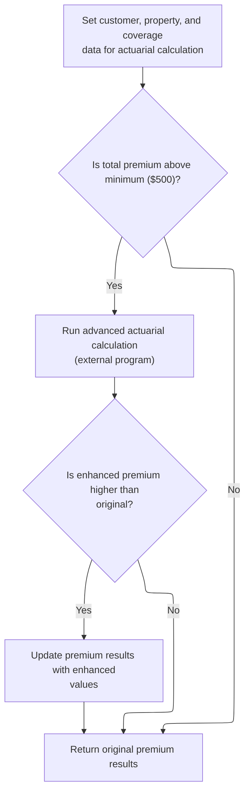

This section determines whether to run an advanced actuarial calculation for insurance premiums and conditionally updates the premium results based on the outcome.

| Rule ID | Category        | Rule Name                              | Description                                                                                                                                         | Implementation Details                                                                                                                                                                                                                                                                                                                                             |
| ------- | --------------- | -------------------------------------- | --------------------------------------------------------------------------------------------------------------------------------------------------- | ------------------------------------------------------------------------------------------------------------------------------------------------------------------------------------------------------------------------------------------------------------------------------------------------------------------------------------------------------------------ |
| BR-001  | Reading Input   | Actuarial input preparation            | All relevant customer, property, and coverage data are prepared and passed to the advanced actuarial calculation.                                   | The input includes customer number, risk score, property type, territory, construction type, occupancy code, protection class, year built, square footage, years in business, claims count and amount, and all coverage limits and deductibles. Data is passed in structured numeric and alphanumeric fields as defined in the input and coverage data structures. |
| BR-002  | Decision Making | Minimum premium threshold              | Advanced actuarial calculation is only triggered when the total premium exceeds the minimum threshold of $500.                                      | The minimum premium threshold is $500.00, as defined by the configuration value. The total premium is compared as a numeric value.                                                                                                                                                                                                                                 |
| BR-003  | Decision Making | Enhanced premium adoption              | If the enhanced premium returned by the advanced calculation is higher than the original, the premium results are updated with the enhanced values. | The enhanced premium values include fire, crime, flood, weather, total premium, and experience modifier. These are updated only if the enhanced total premium exceeds the original.                                                                                                                                                                                |
| BR-004  | Decision Making | Retain original premium for low values | If the total premium does not exceed the minimum threshold, the original premium results are retained and no advanced calculation is performed.     | The minimum premium threshold is $500.00. No changes are made to the premium results if the threshold is not met.                                                                                                                                                                                                                                                  |

<SwmSnippet path="/base/src/LGAPDB01.cbl" line="283">

---

<SwmToken path="base/src/LGAPDB01.cbl" pos="283:1:7" line-data="       P011C-ENHANCED-ACTUARIAL-CALC.">`P011C-ENHANCED-ACTUARIAL-CALC`</SwmToken> sets up all the input fields needed for actuarial calculations and, if the premium is above the minimum, calls <SwmToken path="base/src/LGAPDB01.cbl" pos="313:4:4" line-data="               CALL &#39;LGAPDB04&#39; USING LK-INPUT-DATA, LK-COVERAGE-DATA, ">`LGAPDB04`</SwmToken>. That program runs the advanced premium logic and returns updated premium values if the calculation is successful.

```cobol
       P011C-ENHANCED-ACTUARIAL-CALC.
      *    Prepare input structure for actuarial calculation
           MOVE IN-CUSTOMER-NUM TO LK-CUSTOMER-NUM
           MOVE WS-BASE-RISK-SCR TO LK-RISK-SCORE
           MOVE IN-PROPERTY-TYPE TO LK-PROPERTY-TYPE
           MOVE IN-TERRITORY-CODE TO LK-TERRITORY
           MOVE IN-CONSTRUCTION-TYPE TO LK-CONSTRUCTION-TYPE
           MOVE IN-OCCUPANCY-CODE TO LK-OCCUPANCY-CODE
           MOVE IN-SPRINKLER-IND TO LK-PROTECTION-CLASS
           MOVE IN-YEAR-BUILT TO LK-YEAR-BUILT
           MOVE IN-SQUARE-FOOTAGE TO LK-SQUARE-FOOTAGE
           MOVE IN-YEARS-IN-BUSINESS TO LK-YEARS-IN-BUSINESS
           MOVE IN-CLAIMS-COUNT-3YR TO LK-CLAIMS-COUNT-5YR
           MOVE IN-CLAIMS-AMOUNT-3YR TO LK-CLAIMS-AMOUNT-5YR
           
      *    Set coverage data
           MOVE IN-BUILDING-LIMIT TO LK-BUILDING-LIMIT
           MOVE IN-CONTENTS-LIMIT TO LK-CONTENTS-LIMIT
           MOVE IN-BI-LIMIT TO LK-BI-LIMIT
           MOVE IN-FIRE-DEDUCTIBLE TO LK-FIRE-DEDUCTIBLE
           MOVE IN-WIND-DEDUCTIBLE TO LK-WIND-DEDUCTIBLE
           MOVE IN-FLOOD-DEDUCTIBLE TO LK-FLOOD-DEDUCTIBLE
           MOVE IN-OTHER-DEDUCTIBLE TO LK-OTHER-DEDUCTIBLE
           MOVE IN-FIRE-PERIL TO LK-FIRE-PERIL
           MOVE IN-CRIME-PERIL TO LK-CRIME-PERIL
           MOVE IN-FLOOD-PERIL TO LK-FLOOD-PERIL
           MOVE IN-WEATHER-PERIL TO LK-WEATHER-PERIL
           
      *    Call advanced actuarial calculation program (only for approved cases)
           IF WS-TOT-PREM > WS-MIN-PREMIUM
               CALL 'LGAPDB04' USING LK-INPUT-DATA, LK-COVERAGE-DATA, 
                                    LK-OUTPUT-RESULTS
               
      *        Update with enhanced calculations if successful
               IF LK-TOTAL-PREMIUM > WS-TOT-PREM
                   MOVE LK-FIRE-PREMIUM TO WS-FR-PREM
                   MOVE LK-CRIME-PREMIUM TO WS-CR-PREM
                   MOVE LK-FLOOD-PREMIUM TO WS-FL-PREM
                   MOVE LK-WEATHER-PREMIUM TO WS-WE-PREM
                   MOVE LK-TOTAL-PREMIUM TO WS-TOT-PREM
                   MOVE LK-EXPERIENCE-MOD TO WS-EXPERIENCE-MOD
               END-IF
           END-IF.
```

---

</SwmSnippet>

### Step-by-step actuarial premium computation

```mermaid
%%{init: {"flowchart": {"defaultRenderer": "elk"}} }%%
flowchart TD
    node1["Initialize context and load rates"]
    click node1 openCode "base/src/LGAPDB04.cbl:138:140"
    node1 --> node2["Calculate exposures"]
    click node2 openCode "base/src/LGAPDB04.cbl:141:141"
    node2 --> node3{"Years in business >= 5?"}
    click node3 openCode "base/src/LGAPDB04.cbl:234:257"
    node3 -->|"Yes"| node4{"Claims count (5yr) = 0?"}
    node3 -->|"No"| node5["Set experience modifier to 1.1000"]
    click node5 openCode "base/src/LGAPDB04.cbl:255:256"
    node4 -->|"Yes"| node6["Set experience modifier to 0.8500"]
    click node6 openCode "base/src/LGAPDB04.cbl:239:240"
    node4 -->|"No"| node7["Calculate experience modifier based on
claims amount and credibility"]
    click node7 openCode "base/src/LGAPDB04.cbl:241:252"
    node7 --> node8{"Is modifier > 2.0000?"}
    click node8 openCode "base/src/LGAPDB04.cbl:246:247"
    node8 -->|"Yes"| node9["Cap modifier at 2.0000"]
    click node9 openCode "base/src/LGAPDB04.cbl:246:247"
    node8 -->|"No"| node10{"Is modifier < 0.5000?"}
    click node10 openCode "base/src/LGAPDB04.cbl:250:251"
    node10 -->|"Yes"| node11["Cap modifier at 0.5000"]
    click node11 openCode "base/src/LGAPDB04.cbl:250:251"
    node10 -->|"No"| node12["Use calculated modifier"]
    click node12 openCode "base/src/LGAPDB04.cbl:241:252"
    node5 --> node13["Calculate schedule modifier"]
    node6 --> node13
    node12 --> node13
    node9 --> node13
    node11 --> node13
    click node13 openCode "base/src/LGAPDB04.cbl:260:316"
    node13 --> node14{"Is fire peril covered?"}
    click node14 openCode "base/src/LGAPDB04.cbl:322:331"
    node14 -->|"Yes"| node15["Calculate fire premium"]
    click node15 openCode "base/src/LGAPDB04.cbl:323:331"
    node14 -->|"No"| node16{"Is crime peril covered?"}
    click node16 openCode "base/src/LGAPDB04.cbl:334:343"
    node16 -->|"Yes"| node17["Calculate crime premium"]
    click node17 openCode "base/src/LGAPDB04.cbl:335:343"
    node16 -->|"No"| node18{"Is flood peril covered?"}
    click node18 openCode "base/src/LGAPDB04.cbl:346:355"
    node18 -->|"Yes"| node19["Calculate flood premium"]
    click node19 openCode "base/src/LGAPDB04.cbl:347:355"
    node18 -->|"No"| node20{"Is weather peril covered?"}
    click node20 openCode "base/src/LGAPDB04.cbl:358:367"
    node20 -->|"Yes"| node21["Calculate weather premium"]
    click node21 openCode "base/src/LGAPDB04.cbl:359:367"
    node20 -->|"No"| node22["Continue"]
    click node22 openCode "base/src/LGAPDB04.cbl:318:367"
    node15 --> node23["Add catastrophe, expense, and profit
loads"]
    node17 --> node23
    node19 --> node23
    node21 --> node23
    node22 --> node23
    click node23 openCode "base/src/LGAPDB04.cbl:145:146"
    node23 --> node24{"Eligible for multi-peril discount?"}
    click node24 openCode "base/src/LGAPDB04.cbl:411:417"
    node24 -->|"Yes"| node25["Apply 10% multi-peril discount"]
    click node25 openCode "base/src/LGAPDB04.cbl:416:416"
    node24 -->|"No"| node26{"Eligible for partial multi-peril
discount?"}
    click node26 openCode "base/src/LGAPDB04.cbl:418:421"
    node26 -->|"Yes"| node27["Apply 5% partial multi-peril discount"]
    click node27 openCode "base/src/LGAPDB04.cbl:421:421"
    node26 -->|"No"| node28["No multi-peril discount"]
    click node28 openCode "base/src/LGAPDB04.cbl:423:423"
    node25 --> node29{"Claims-free for 5 years and >=5 years in
business?"}
    node27 --> node29
    node28 --> node29
    click node29 openCode "base/src/LGAPDB04.cbl:427:429"
    node29 -->|"Yes"| node30["Apply 7.5% claims-free discount"]
    click node30 openCode "base/src/LGAPDB04.cbl:428:428"
    node29 -->|"No"| node31["No claims-free discount"]
    click node31 openCode "base/src/LGAPDB04.cbl:429:429"
    node30 --> node32{"Deductible thresholds met?"}
    node31 --> node32
    click node32 openCode "base/src/LGAPDB04.cbl:433:441"
    node32 -->|"Yes"| node33["Apply deductible credits"]
    click node33 openCode "base/src/LGAPDB04.cbl:434:441"
    node32 -->|"No"| node34["No deductible credits"]
    click node34 openCode "base/src/LGAPDB04.cbl:441:441"
    node33 --> node35["Calculate total discount"]
    node34 --> node35
    click node35 openCode "base/src/LGAPDB04.cbl:443:449"
    node35 --> node36["Calculate taxes"]
    click node36 openCode "base/src/LGAPDB04.cbl:148:148"
    node36 --> node37["Calculate final premium and rate factor"]
    click node37 openCode "base/src/LGAPDB04.cbl:464:477"
    node37 --> node38{"Is final rate factor > 0.050000?"}
    click node38 openCode "base/src/LGAPDB04.cbl:473:477"
    node38 -->|"Yes"| node39["Cap rate factor and recalculate premium"]
    click node39 openCode "base/src/LGAPDB04.cbl:474:476"
    node38 -->|"No"| node40["Return final premium"]
    click node40 openCode "base/src/LGAPDB04.cbl:465:472"
classDef HeadingStyle fill:#777777,stroke:#333,stroke-width:2px;

%% Swimm:
%% %%{init: {"flowchart": {"defaultRenderer": "elk"}} }%%
%% flowchart TD
%%     node1["Initialize context and load rates"]
%%     click node1 openCode "<SwmPath>[base/src/LGAPDB04.cbl](base/src/LGAPDB04.cbl)</SwmPath>:138:140"
%%     node1 --> node2["Calculate exposures"]
%%     click node2 openCode "<SwmPath>[base/src/LGAPDB04.cbl](base/src/LGAPDB04.cbl)</SwmPath>:141:141"
%%     node2 --> node3{"Years in business >= 5?"}
%%     click node3 openCode "<SwmPath>[base/src/LGAPDB04.cbl](base/src/LGAPDB04.cbl)</SwmPath>:234:257"
%%     node3 -->|"Yes"| node4{"Claims count (5yr) = 0?"}
%%     node3 -->|"No"| node5["Set experience modifier to <SwmToken path="base/src/LGAPDB04.cbl" pos="255:3:5" line-data="               MOVE 1.1000 TO WS-EXPERIENCE-MOD">`1.1000`</SwmToken>"]
%%     click node5 openCode "<SwmPath>[base/src/LGAPDB04.cbl](base/src/LGAPDB04.cbl)</SwmPath>:255:256"
%%     node4 -->|"Yes"| node6["Set experience modifier to <SwmToken path="base/src/LGAPDB04.cbl" pos="239:3:5" line-data="                   MOVE 0.8500 TO WS-EXPERIENCE-MOD">`0.8500`</SwmToken>"]
%%     click node6 openCode "<SwmPath>[base/src/LGAPDB04.cbl](base/src/LGAPDB04.cbl)</SwmPath>:239:240"
%%     node4 -->|"No"| node7["Calculate experience modifier based on
%% claims amount and credibility"]
%%     click node7 openCode "<SwmPath>[base/src/LGAPDB04.cbl](base/src/LGAPDB04.cbl)</SwmPath>:241:252"
%%     node7 --> node8{"Is modifier > <SwmToken path="base/src/LGAPDB04.cbl" pos="246:11:13" line-data="                   IF WS-EXPERIENCE-MOD &gt; 2.0000">`2.0000`</SwmToken>?"}
%%     click node8 openCode "<SwmPath>[base/src/LGAPDB04.cbl](base/src/LGAPDB04.cbl)</SwmPath>:246:247"
%%     node8 -->|"Yes"| node9["Cap modifier at <SwmToken path="base/src/LGAPDB04.cbl" pos="246:11:13" line-data="                   IF WS-EXPERIENCE-MOD &gt; 2.0000">`2.0000`</SwmToken>"]
%%     click node9 openCode "<SwmPath>[base/src/LGAPDB04.cbl](base/src/LGAPDB04.cbl)</SwmPath>:246:247"
%%     node8 -->|"No"| node10{"Is modifier < <SwmToken path="base/src/LGAPDB04.cbl" pos="250:11:13" line-data="                   IF WS-EXPERIENCE-MOD &lt; 0.5000">`0.5000`</SwmToken>?"}
%%     click node10 openCode "<SwmPath>[base/src/LGAPDB04.cbl](base/src/LGAPDB04.cbl)</SwmPath>:250:251"
%%     node10 -->|"Yes"| node11["Cap modifier at <SwmToken path="base/src/LGAPDB04.cbl" pos="250:11:13" line-data="                   IF WS-EXPERIENCE-MOD &lt; 0.5000">`0.5000`</SwmToken>"]
%%     click node11 openCode "<SwmPath>[base/src/LGAPDB04.cbl](base/src/LGAPDB04.cbl)</SwmPath>:250:251"
%%     node10 -->|"No"| node12["Use calculated modifier"]
%%     click node12 openCode "<SwmPath>[base/src/LGAPDB04.cbl](base/src/LGAPDB04.cbl)</SwmPath>:241:252"
%%     node5 --> node13["Calculate schedule modifier"]
%%     node6 --> node13
%%     node12 --> node13
%%     node9 --> node13
%%     node11 --> node13
%%     click node13 openCode "<SwmPath>[base/src/LGAPDB04.cbl](base/src/LGAPDB04.cbl)</SwmPath>:260:316"
%%     node13 --> node14{"Is fire peril covered?"}
%%     click node14 openCode "<SwmPath>[base/src/LGAPDB04.cbl](base/src/LGAPDB04.cbl)</SwmPath>:322:331"
%%     node14 -->|"Yes"| node15["Calculate fire premium"]
%%     click node15 openCode "<SwmPath>[base/src/LGAPDB04.cbl](base/src/LGAPDB04.cbl)</SwmPath>:323:331"
%%     node14 -->|"No"| node16{"Is crime peril covered?"}
%%     click node16 openCode "<SwmPath>[base/src/LGAPDB04.cbl](base/src/LGAPDB04.cbl)</SwmPath>:334:343"
%%     node16 -->|"Yes"| node17["Calculate crime premium"]
%%     click node17 openCode "<SwmPath>[base/src/LGAPDB04.cbl](base/src/LGAPDB04.cbl)</SwmPath>:335:343"
%%     node16 -->|"No"| node18{"Is flood peril covered?"}
%%     click node18 openCode "<SwmPath>[base/src/LGAPDB04.cbl](base/src/LGAPDB04.cbl)</SwmPath>:346:355"
%%     node18 -->|"Yes"| node19["Calculate flood premium"]
%%     click node19 openCode "<SwmPath>[base/src/LGAPDB04.cbl](base/src/LGAPDB04.cbl)</SwmPath>:347:355"
%%     node18 -->|"No"| node20{"Is weather peril covered?"}
%%     click node20 openCode "<SwmPath>[base/src/LGAPDB04.cbl](base/src/LGAPDB04.cbl)</SwmPath>:358:367"
%%     node20 -->|"Yes"| node21["Calculate weather premium"]
%%     click node21 openCode "<SwmPath>[base/src/LGAPDB04.cbl](base/src/LGAPDB04.cbl)</SwmPath>:359:367"
%%     node20 -->|"No"| node22["Continue"]
%%     click node22 openCode "<SwmPath>[base/src/LGAPDB04.cbl](base/src/LGAPDB04.cbl)</SwmPath>:318:367"
%%     node15 --> node23["Add catastrophe, expense, and profit
%% loads"]
%%     node17 --> node23
%%     node19 --> node23
%%     node21 --> node23
%%     node22 --> node23
%%     click node23 openCode "<SwmPath>[base/src/LGAPDB04.cbl](base/src/LGAPDB04.cbl)</SwmPath>:145:146"
%%     node23 --> node24{"Eligible for multi-peril discount?"}
%%     click node24 openCode "<SwmPath>[base/src/LGAPDB04.cbl](base/src/LGAPDB04.cbl)</SwmPath>:411:417"
%%     node24 -->|"Yes"| node25["Apply 10% multi-peril discount"]
%%     click node25 openCode "<SwmPath>[base/src/LGAPDB04.cbl](base/src/LGAPDB04.cbl)</SwmPath>:416:416"
%%     node24 -->|"No"| node26{"Eligible for partial multi-peril
%% discount?"}
%%     click node26 openCode "<SwmPath>[base/src/LGAPDB04.cbl](base/src/LGAPDB04.cbl)</SwmPath>:418:421"
%%     node26 -->|"Yes"| node27["Apply 5% partial multi-peril discount"]
%%     click node27 openCode "<SwmPath>[base/src/LGAPDB04.cbl](base/src/LGAPDB04.cbl)</SwmPath>:421:421"
%%     node26 -->|"No"| node28["No multi-peril discount"]
%%     click node28 openCode "<SwmPath>[base/src/LGAPDB04.cbl](base/src/LGAPDB04.cbl)</SwmPath>:423:423"
%%     node25 --> node29{"<SwmToken path="base/src/LGAPDB04.cbl" pos="425:3:5" line-data="      * Claims-free discount  ">`Claims-free`</SwmToken> for 5 years and >=5 years in
%% business?"}
%%     node27 --> node29
%%     node28 --> node29
%%     click node29 openCode "<SwmPath>[base/src/LGAPDB04.cbl](base/src/LGAPDB04.cbl)</SwmPath>:427:429"
%%     node29 -->|"Yes"| node30["Apply 7.5% claims-free discount"]
%%     click node30 openCode "<SwmPath>[base/src/LGAPDB04.cbl](base/src/LGAPDB04.cbl)</SwmPath>:428:428"
%%     node29 -->|"No"| node31["No claims-free discount"]
%%     click node31 openCode "<SwmPath>[base/src/LGAPDB04.cbl](base/src/LGAPDB04.cbl)</SwmPath>:429:429"
%%     node30 --> node32{"Deductible thresholds met?"}
%%     node31 --> node32
%%     click node32 openCode "<SwmPath>[base/src/LGAPDB04.cbl](base/src/LGAPDB04.cbl)</SwmPath>:433:441"
%%     node32 -->|"Yes"| node33["Apply deductible credits"]
%%     click node33 openCode "<SwmPath>[base/src/LGAPDB04.cbl](base/src/LGAPDB04.cbl)</SwmPath>:434:441"
%%     node32 -->|"No"| node34["No deductible credits"]
%%     click node34 openCode "<SwmPath>[base/src/LGAPDB04.cbl](base/src/LGAPDB04.cbl)</SwmPath>:441:441"
%%     node33 --> node35["Calculate total discount"]
%%     node34 --> node35
%%     click node35 openCode "<SwmPath>[base/src/LGAPDB04.cbl](base/src/LGAPDB04.cbl)</SwmPath>:443:449"
%%     node35 --> node36["Calculate taxes"]
%%     click node36 openCode "<SwmPath>[base/src/LGAPDB04.cbl](base/src/LGAPDB04.cbl)</SwmPath>:148:148"
%%     node36 --> node37["Calculate final premium and rate factor"]
%%     click node37 openCode "<SwmPath>[base/src/LGAPDB04.cbl](base/src/LGAPDB04.cbl)</SwmPath>:464:477"
%%     node37 --> node38{"Is final rate factor > <SwmToken path="base/src/LGAPDB04.cbl" pos="473:13:15" line-data="           IF LK-FINAL-RATE-FACTOR &gt; 0.050000">`0.050000`</SwmToken>?"}
%%     click node38 openCode "<SwmPath>[base/src/LGAPDB04.cbl](base/src/LGAPDB04.cbl)</SwmPath>:473:477"
%%     node38 -->|"Yes"| node39["Cap rate factor and recalculate premium"]
%%     click node39 openCode "<SwmPath>[base/src/LGAPDB04.cbl](base/src/LGAPDB04.cbl)</SwmPath>:474:476"
%%     node38 -->|"No"| node40["Return final premium"]
%%     click node40 openCode "<SwmPath>[base/src/LGAPDB04.cbl](base/src/LGAPDB04.cbl)</SwmPath>:465:472"
%% classDef HeadingStyle fill:#777777,stroke:#333,stroke-width:2px;
```

This section calculates the actuarial premium for a property insurance policy by applying a sequence of business rules to exposures, claims history, peril coverage, and other risk factors. The calculation ensures that all modifiers, discounts, and caps are applied in a consistent and auditable manner.

| Rule ID | Category        | Rule Name                                                                                                                                    | Description                                                                                                                                                                                                                                                                                                                                                                                                                                                                                                                                                                                                                                | Implementation Details                                                                                                                                                                                                                                                                                                                                                                                                                                                                                                                                                                                                                                                                                                                                                                                                                                                                                                                                                                                                                                                                                                                                                                                                                                                                                                                                                                                                                                                                                                                         |
| ------- | --------------- | -------------------------------------------------------------------------------------------------------------------------------------------- | ------------------------------------------------------------------------------------------------------------------------------------------------------------------------------------------------------------------------------------------------------------------------------------------------------------------------------------------------------------------------------------------------------------------------------------------------------------------------------------------------------------------------------------------------------------------------------------------------------------------------------------------ | ---------------------------------------------------------------------------------------------------------------------------------------------------------------------------------------------------------------------------------------------------------------------------------------------------------------------------------------------------------------------------------------------------------------------------------------------------------------------------------------------------------------------------------------------------------------------------------------------------------------------------------------------------------------------------------------------------------------------------------------------------------------------------------------------------------------------------------------------------------------------------------------------------------------------------------------------------------------------------------------------------------------------------------------------------------------------------------------------------------------------------------------------------------------------------------------------------------------------------------------------------------------------------------------------------------------------------------------------------------------------------------------------------------------------------------------------------------------------------------------------------------------------------------------------- |
| BR-001  | Data validation | Total discount cap                                                                                                                           | The total discount (multi-peril, claims-free, deductible credits) is capped at 25%.                                                                                                                                                                                                                                                                                                                                                                                                                                                                                                                                                        | The total discount cannot exceed <SwmToken path="base/src/LGAPDB04.cbl" pos="447:11:13" line-data="           IF WS-TOTAL-DISCOUNT &gt; 0.250">`0.250`</SwmToken> (25%). If the sum is greater, it is set to <SwmToken path="base/src/LGAPDB04.cbl" pos="447:11:13" line-data="           IF WS-TOTAL-DISCOUNT &gt; 0.250">`0.250`</SwmToken>.                                                                                                                                                                                                                                                                                                                                                                                                                                                                                                                                                                                                                                                                                                                                                                                                                                                                                                                                                                                                                                                                                                                                                                                                 |
| BR-002  | Data validation | Final rate factor cap and recalculation                                                                                                      | The final rate factor is calculated as total premium divided by total insured value, and is capped at <SwmToken path="base/src/LGAPDB04.cbl" pos="473:13:15" line-data="           IF LK-FINAL-RATE-FACTOR &gt; 0.050000">`0.050000`</SwmToken>. If the cap applies, the premium is recalculated using the capped rate factor.                                                                                                                                                                                                                                                                                                             | The rate factor is capped at <SwmToken path="base/src/LGAPDB04.cbl" pos="473:13:15" line-data="           IF LK-FINAL-RATE-FACTOR &gt; 0.050000">`0.050000`</SwmToken>. If capped, the total premium is recalculated as total insured value multiplied by the capped rate factor.                                                                                                                                                                                                                                                                                                                                                                                                                                                                                                                                                                                                                                                                                                                                                                                                                                                                                                                                                                                                                                                                                                                                                                                                                                                              |
| BR-003  | Calculation     | <SwmToken path="base/src/LGAPDB04.cbl" pos="425:3:5" line-data="      * Claims-free discount  ">`Claims-free`</SwmToken> experience modifier | If the insured has been in business for at least 5 years and has zero claims in the past 5 years, the experience modifier is set to <SwmToken path="base/src/LGAPDB04.cbl" pos="239:3:5" line-data="                   MOVE 0.8500 TO WS-EXPERIENCE-MOD">`0.8500`</SwmToken>.                                                                                                                                                                                                                                                                                                                                                              | The experience modifier is set to the fixed value <SwmToken path="base/src/LGAPDB04.cbl" pos="239:3:5" line-data="                   MOVE 0.8500 TO WS-EXPERIENCE-MOD">`0.8500`</SwmToken>. This value is used in subsequent premium calculations.                                                                                                                                                                                                                                                                                                                                                                                                                                                                                                                                                                                                                                                                                                                                                                                                                                                                                                                                                                                                                                                                                                                                                                                                                                                                                             |
| BR-004  | Calculation     | Short-tenure experience modifier                                                                                                             | If the insured has been in business for less than 5 years, the experience modifier is set to <SwmToken path="base/src/LGAPDB04.cbl" pos="255:3:5" line-data="               MOVE 1.1000 TO WS-EXPERIENCE-MOD">`1.1000`</SwmToken>.                                                                                                                                                                                                                                                                                                                                                                                                         | The experience modifier is set to the fixed value <SwmToken path="base/src/LGAPDB04.cbl" pos="255:3:5" line-data="               MOVE 1.1000 TO WS-EXPERIENCE-MOD">`1.1000`</SwmToken>. This value is used in subsequent premium calculations.                                                                                                                                                                                                                                                                                                                                                                                                                                                                                                                                                                                                                                                                                                                                                                                                                                                                                                                                                                                                                                                                                                                                                                                                                                                                                                 |
| BR-005  | Calculation     | Claims-based experience modifier with caps                                                                                                   | If the insured has been in business for at least 5 years and has claims in the past 5 years, the experience modifier is calculated as <SwmToken path="base/src/LGAPDB04.cbl" pos="235:3:5" line-data="           MOVE 1.0000 TO WS-EXPERIENCE-MOD">`1.0000`</SwmToken> plus 50% of the credibility-weighted claims ratio, and is capped between <SwmToken path="base/src/LGAPDB04.cbl" pos="250:11:13" line-data="                   IF WS-EXPERIENCE-MOD &lt; 0.5000">`0.5000`</SwmToken> and <SwmToken path="base/src/LGAPDB04.cbl" pos="246:11:13" line-data="                   IF WS-EXPERIENCE-MOD &gt; 2.0000">`2.0000`</SwmToken>. | The experience modifier is calculated as <SwmToken path="base/src/LGAPDB04.cbl" pos="235:3:5" line-data="           MOVE 1.0000 TO WS-EXPERIENCE-MOD">`1.0000`</SwmToken> + ((claims amount in 5 years / total insured value) \* credibility factor \* <SwmToken path="base/src/LGAPDB04.cbl" pos="244:9:11" line-data="                        WS-CREDIBILITY-FACTOR * 0.50)">`0.50`</SwmToken>). The result is capped at a minimum of <SwmToken path="base/src/LGAPDB04.cbl" pos="250:11:13" line-data="                   IF WS-EXPERIENCE-MOD &lt; 0.5000">`0.5000`</SwmToken> and a maximum of <SwmToken path="base/src/LGAPDB04.cbl" pos="246:11:13" line-data="                   IF WS-EXPERIENCE-MOD &gt; 2.0000">`2.0000`</SwmToken>.                                                                                                                                                                                                                                                                                                                                                                                                                                                                                                                                                                                                                                                                                                                                                                                                |
| BR-006  | Calculation     | Schedule modifier adjustment and cap                                                                                                         | The schedule modifier is adjusted based on building age, protection class, occupancy code, and exposure density, and is capped between -0.2 and +0.4.                                                                                                                                                                                                                                                                                                                                                                                                                                                                                      | The schedule modifier starts at <SwmToken path="base/src/LGAPDB04.cbl" pos="261:4:6" line-data="           MOVE +0.000 TO WS-SCHEDULE-MOD">`0.000`</SwmToken>. Adjustments: -0.050 for buildings built after 2010, +<SwmToken path="base/src/LGAPDB04.cbl" pos="270:3:5" line-data="                   ADD 0.100 TO WS-SCHEDULE-MOD">`0.100`</SwmToken> for 1970-1989, +<SwmToken path="base/src/LGAPDB04.cbl" pos="272:3:5" line-data="                   ADD 0.200 TO WS-SCHEDULE-MOD">`0.200`</SwmToken> for pre-1970; -0.100 for protection class 01-03, -0.050 for 04-06, +<SwmToken path="base/src/LGAPDB04.cbl" pos="284:3:5" line-data="                   ADD 0.150 TO WS-SCHEDULE-MOD">`0.150`</SwmToken> for other; -0.025 for office, +<SwmToken path="base/src/LGAPDB04.cbl" pos="292:3:5" line-data="                   ADD 0.075 TO WS-SCHEDULE-MOD">`0.075`</SwmToken> for manufacturing, +<SwmToken path="base/src/LGAPDB04.cbl" pos="294:3:5" line-data="                   ADD 0.125 TO WS-SCHEDULE-MOD">`0.125`</SwmToken> for warehouse; +<SwmToken path="base/src/LGAPDB04.cbl" pos="270:3:5" line-data="                   ADD 0.100 TO WS-SCHEDULE-MOD">`0.100`</SwmToken> for exposure density > 500, -0.050 for < 50. The result is capped at +<SwmToken path="base/src/LGAPDB04.cbl" pos="308:12:14" line-data="           IF WS-SCHEDULE-MOD &gt; +0.400">`0.400`</SwmToken> and <SwmToken path="base/src/LGAPDB04.cbl" pos="312:11:14" line-data="           IF WS-SCHEDULE-MOD &lt; -0.200">`-0.200`</SwmToken>. |
| BR-007  | Calculation     | Peril-specific base premium calculation                                                                                                      | The base premium for each peril is calculated only if the peril is covered, using peril-specific formulas and multipliers. Crime and flood premiums use extra multipliers (<SwmToken path="base/src/LGAPDB02.cbl" pos="54:3:5" line-data="               MOVE 0.80 TO WS-FIRE-FACTOR">`0.80`</SwmToken> and <SwmToken path="base/src/LGAPDB04.cbl" pos="352:9:11" line-data="                   WS-TREND-FACTOR * 1.25">`1.25`</SwmToken>).                                                                                                                                                                                                | Fire and weather premiums use (building + contents exposure) \* base rate \* experience modifier \* (1 + schedule modifier) \* trend factor. Crime uses contents exposure \* <SwmToken path="base/src/LGAPDB02.cbl" pos="54:3:5" line-data="               MOVE 0.80 TO WS-FIRE-FACTOR">`0.80`</SwmToken> \* base rate \* experience modifier \* (1 + schedule modifier) \* trend factor. Flood uses building exposure \* base rate \* experience modifier \* (1 + schedule modifier) \* trend factor \* <SwmToken path="base/src/LGAPDB04.cbl" pos="352:9:11" line-data="                   WS-TREND-FACTOR * 1.25">`1.25`</SwmToken>. All premiums are summed for the total base amount.                                                                                                                                                                                                                                                                                                                                                                                                                                                                                                                                                                                                                                                                                                                                                                                                                                                     |
| BR-008  | Decision Making | <SwmToken path="base/src/LGAPDB04.cbl" pos="410:3:5" line-data="      * Multi-peril discount">`Multi-peril`</SwmToken> discount application  | A 10% multi-peril discount is applied if all four perils (fire, crime, flood, weather) are covered. A 5% partial multi-peril discount is applied if fire and weather are covered and at least one of crime or flood is covered. No multi-peril discount is applied otherwise.                                                                                                                                                                                                                                                                                                                                                              | The multi-peril discount is <SwmToken path="base/src/LGAPDB04.cbl" pos="270:3:5" line-data="                   ADD 0.100 TO WS-SCHEDULE-MOD">`0.100`</SwmToken> (10%) if all four perils are covered, <SwmToken path="base/src/LGAPDB04.cbl" pos="266:3:5" line-data="                   SUBTRACT 0.050 FROM WS-SCHEDULE-MOD">`0.050`</SwmToken> (5%) if fire and weather plus at least one of crime or flood are covered, and 0 otherwise.                                                                                                                                                                                                                                                                                                                                                                                                                                                                                                                                                                                                                                                                                                                                                                                                                                                                                                                                                                                                                                                                                                    |
| BR-009  | Decision Making | <SwmToken path="base/src/LGAPDB04.cbl" pos="425:3:5" line-data="      * Claims-free discount  ">`Claims-free`</SwmToken> discount            | A 7.5% claims-free discount is applied if the insured has zero claims in the past 5 years and has been in business for at least 5 years.                                                                                                                                                                                                                                                                                                                                                                                                                                                                                                   | The claims-free discount is <SwmToken path="base/src/LGAPDB04.cbl" pos="292:3:5" line-data="                   ADD 0.075 TO WS-SCHEDULE-MOD">`0.075`</SwmToken> (7.5%) if both conditions are met, otherwise 0.                                                                                                                                                                                                                                                                                                                                                                                                                                                                                                                                                                                                                                                                                                                                                                                                                                                                                                                                                                                                                                                                                                                                                                                                                                                                                                                                |
| BR-010  | Decision Making | Deductible credit application                                                                                                                | Deductible credits are applied based on deductible thresholds: 2.5% for fire deductibles >= 10,000, 3.5% for wind deductibles >= 25,000, and 4.5% for flood deductibles >= 50,000. Credits are additive.                                                                                                                                                                                                                                                                                                                                                                                                                                   | Credits: <SwmToken path="base/src/LGAPDB04.cbl" pos="290:3:5" line-data="                   SUBTRACT 0.025 FROM WS-SCHEDULE-MOD">`0.025`</SwmToken> for fire deductible >= 10,000; <SwmToken path="base/src/LGAPDB04.cbl" pos="437:3:5" line-data="               ADD 0.035 TO WS-DEDUCTIBLE-CREDIT">`0.035`</SwmToken> for wind deductible >= 25,000; <SwmToken path="base/src/LGAPDB04.cbl" pos="440:3:5" line-data="               ADD 0.045 TO WS-DEDUCTIBLE-CREDIT">`0.045`</SwmToken> for flood deductible >= 50,000. Credits are summed if multiple thresholds are met.                                                                                                                                                                                                                                                                                                                                                                                                                                                                                                                                                                                                                                                                                                                                                                                                                                                                                                                                                                 |

<SwmSnippet path="/base/src/LGAPDB04.cbl" line="138">

---

<SwmToken path="base/src/LGAPDB04.cbl" pos="138:1:3" line-data="       P100-MAIN.">`P100-MAIN`</SwmToken> runs the full actuarial calculation workflow in sequence: it initializes values, loads rates, calculates exposures, applies modifiers, computes premiums, adds catastrophe and expense loadings, applies discounts and taxes, and then finalizes the premium. Each step depends on the previous, so the order matters.

```cobol
       P100-MAIN.
           PERFORM P200-INIT
           PERFORM P300-RATES
           PERFORM P350-EXPOSURE
           PERFORM P400-EXP-MOD
           PERFORM P500-SCHED-MOD
           PERFORM P600-BASE-PREM
           PERFORM P700-CAT-LOAD
           PERFORM P800-EXPENSE
           PERFORM P900-DISC
           PERFORM P950-TAXES
           PERFORM P999-FINAL
           GOBACK.
```

---

</SwmSnippet>

<SwmSnippet path="/base/src/LGAPDB04.cbl" line="234">

---

<SwmToken path="base/src/LGAPDB04.cbl" pos="234:1:5" line-data="       P400-EXP-MOD.">`P400-EXP-MOD`</SwmToken> calculates the experience modifier using business tenure and claims history. Constants like <SwmToken path="base/src/LGAPDB04.cbl" pos="235:3:5" line-data="           MOVE 1.0000 TO WS-EXPERIENCE-MOD">`1.0000`</SwmToken>, <SwmToken path="base/src/LGAPDB04.cbl" pos="239:3:5" line-data="                   MOVE 0.8500 TO WS-EXPERIENCE-MOD">`0.8500`</SwmToken>, <SwmToken path="base/src/LGAPDB04.cbl" pos="255:3:5" line-data="               MOVE 1.1000 TO WS-EXPERIENCE-MOD">`1.1000`</SwmToken>, <SwmToken path="base/src/LGAPDB04.cbl" pos="250:11:13" line-data="                   IF WS-EXPERIENCE-MOD &lt; 0.5000">`0.5000`</SwmToken>, and <SwmToken path="base/src/LGAPDB04.cbl" pos="246:11:13" line-data="                   IF WS-EXPERIENCE-MOD &gt; 2.0000">`2.0000`</SwmToken> are used to set or clamp the modifier. The calculation assumes valid numeric input and doesn't explain the rationale for these values.

```cobol
       P400-EXP-MOD.
           MOVE 1.0000 TO WS-EXPERIENCE-MOD
           
           IF LK-YEARS-IN-BUSINESS >= 5
               IF LK-CLAIMS-COUNT-5YR = ZERO
                   MOVE 0.8500 TO WS-EXPERIENCE-MOD
               ELSE
                   COMPUTE WS-EXPERIENCE-MOD = 
                       1.0000 + 
                       ((LK-CLAIMS-AMOUNT-5YR / WS-TOTAL-INSURED-VAL) * 
                        WS-CREDIBILITY-FACTOR * 0.50)
                   
                   IF WS-EXPERIENCE-MOD > 2.0000
                       MOVE 2.0000 TO WS-EXPERIENCE-MOD
                   END-IF
                   
                   IF WS-EXPERIENCE-MOD < 0.5000
                       MOVE 0.5000 TO WS-EXPERIENCE-MOD
                   END-IF
               END-IF
           ELSE
               MOVE 1.1000 TO WS-EXPERIENCE-MOD
           END-IF
           
           MOVE WS-EXPERIENCE-MOD TO LK-EXPERIENCE-MOD.
```

---

</SwmSnippet>

<SwmSnippet path="/base/src/LGAPDB04.cbl" line="260">

---

<SwmToken path="base/src/LGAPDB04.cbl" pos="260:1:5" line-data="       P500-SCHED-MOD.">`P500-SCHED-MOD`</SwmToken> adjusts the schedule modifier based on building age, protection class, occupancy code, and exposure density. It uses domain-specific constants for each adjustment and clamps the result between +0.4 and -0.2. The rationale for these values isn't documented.

```cobol
       P500-SCHED-MOD.
           MOVE +0.000 TO WS-SCHEDULE-MOD
           
      *    Building age factor
           EVALUATE TRUE
               WHEN LK-YEAR-BUILT >= 2010
                   SUBTRACT 0.050 FROM WS-SCHEDULE-MOD
               WHEN LK-YEAR-BUILT >= 1990
                   CONTINUE
               WHEN LK-YEAR-BUILT >= 1970
                   ADD 0.100 TO WS-SCHEDULE-MOD
               WHEN OTHER
                   ADD 0.200 TO WS-SCHEDULE-MOD
           END-EVALUATE
           
      *    Protection class factor
           EVALUATE LK-PROTECTION-CLASS
               WHEN '01' THRU '03'
                   SUBTRACT 0.100 FROM WS-SCHEDULE-MOD
               WHEN '04' THRU '06'
                   SUBTRACT 0.050 FROM WS-SCHEDULE-MOD
               WHEN '07' THRU '09'
                   CONTINUE
               WHEN OTHER
                   ADD 0.150 TO WS-SCHEDULE-MOD
           END-EVALUATE
           
      *    Occupancy hazard factor
           EVALUATE LK-OCCUPANCY-CODE
               WHEN 'OFF01' THRU 'OFF05'
                   SUBTRACT 0.025 FROM WS-SCHEDULE-MOD
               WHEN 'MFG01' THRU 'MFG10'
                   ADD 0.075 TO WS-SCHEDULE-MOD
               WHEN 'WHS01' THRU 'WHS05'
                   ADD 0.125 TO WS-SCHEDULE-MOD
               WHEN OTHER
                   CONTINUE
           END-EVALUATE
           
      *    Exposure density factor
           IF WS-EXPOSURE-DENSITY > 500.00
               ADD 0.100 TO WS-SCHEDULE-MOD
           ELSE
               IF WS-EXPOSURE-DENSITY < 50.00
                   SUBTRACT 0.050 FROM WS-SCHEDULE-MOD
               END-IF
           END-IF
           
           IF WS-SCHEDULE-MOD > +0.400
               MOVE +0.400 TO WS-SCHEDULE-MOD
           END-IF
           
           IF WS-SCHEDULE-MOD < -0.200
               MOVE -0.200 TO WS-SCHEDULE-MOD
           END-IF
           
           MOVE WS-SCHEDULE-MOD TO LK-SCHEDULE-MOD.
```

---

</SwmSnippet>

<SwmSnippet path="/base/src/LGAPDB04.cbl" line="318">

---

<SwmToken path="base/src/LGAPDB04.cbl" pos="318:1:5" line-data="       P600-BASE-PREM.">`P600-BASE-PREM`</SwmToken> calculates the base premium for each peril using exposure, base rates, experience and schedule modifiers, and trend factors. Crime and flood premiums use extra multipliers (<SwmToken path="base/src/LGAPDB04.cbl" pos="336:10:12" line-data="                   (WS-CONTENTS-EXPOSURE * 0.80) *">`0.80`</SwmToken> and <SwmToken path="base/src/LGAPDB04.cbl" pos="352:9:11" line-data="                   WS-TREND-FACTOR * 1.25">`1.25`</SwmToken>). All premiums are summed for the total base amount.

```cobol
       P600-BASE-PREM.
           MOVE ZERO TO LK-BASE-AMOUNT
           
      * FIRE PREMIUM
           IF LK-FIRE-PERIL > ZERO
               COMPUTE LK-FIRE-PREMIUM = 
                   (WS-BUILDING-EXPOSURE + WS-CONTENTS-EXPOSURE) *
                   WS-BASE-RATE (1, 1, 1, 1) * 
                   WS-EXPERIENCE-MOD *
                   (1 + WS-SCHEDULE-MOD) *
                   WS-TREND-FACTOR
                   
               ADD LK-FIRE-PREMIUM TO LK-BASE-AMOUNT
           END-IF
           
      * CRIME PREMIUM
           IF LK-CRIME-PERIL > ZERO
               COMPUTE LK-CRIME-PREMIUM = 
                   (WS-CONTENTS-EXPOSURE * 0.80) *
                   WS-BASE-RATE (2, 1, 1, 1) * 
                   WS-EXPERIENCE-MOD *
                   (1 + WS-SCHEDULE-MOD) *
                   WS-TREND-FACTOR
                   
               ADD LK-CRIME-PREMIUM TO LK-BASE-AMOUNT
           END-IF
           
      * FLOOD PREMIUM
           IF LK-FLOOD-PERIL > ZERO
               COMPUTE LK-FLOOD-PREMIUM = 
                   WS-BUILDING-EXPOSURE *
                   WS-BASE-RATE (3, 1, 1, 1) * 
                   WS-EXPERIENCE-MOD *
                   (1 + WS-SCHEDULE-MOD) *
                   WS-TREND-FACTOR * 1.25
                   
               ADD LK-FLOOD-PREMIUM TO LK-BASE-AMOUNT
           END-IF
           
      * WEATHER PREMIUM
           IF LK-WEATHER-PERIL > ZERO
               COMPUTE LK-WEATHER-PREMIUM = 
                   (WS-BUILDING-EXPOSURE + WS-CONTENTS-EXPOSURE) *
                   WS-BASE-RATE (4, 1, 1, 1) * 
                   WS-EXPERIENCE-MOD *
                   (1 + WS-SCHEDULE-MOD) *
                   WS-TREND-FACTOR
                   
               ADD LK-WEATHER-PREMIUM TO LK-BASE-AMOUNT
           END-IF.
```

---

</SwmSnippet>

<SwmSnippet path="/base/src/LGAPDB04.cbl" line="407">

---

<SwmToken path="base/src/LGAPDB04.cbl" pos="407:1:3" line-data="       P900-DISC.">`P900-DISC`</SwmToken> calculates discounts based on peril coverage, claims history, and deductible amounts. It uses fixed rates for each discount and caps the total discount at 0.25. The final discount is applied to the sum of base, catastrophe, expense, and profit loadings.

```cobol
       P900-DISC.
           MOVE ZERO TO WS-TOTAL-DISCOUNT
           
      * Multi-peril discount
           MOVE ZERO TO WS-MULTI-PERIL-DISC
           IF LK-FIRE-PERIL > ZERO AND
              LK-CRIME-PERIL > ZERO AND
              LK-FLOOD-PERIL > ZERO AND
              LK-WEATHER-PERIL > ZERO
               MOVE 0.100 TO WS-MULTI-PERIL-DISC
           ELSE
               IF LK-FIRE-PERIL > ZERO AND
                  LK-WEATHER-PERIL > ZERO AND
                  (LK-CRIME-PERIL > ZERO OR LK-FLOOD-PERIL > ZERO)
                   MOVE 0.050 TO WS-MULTI-PERIL-DISC
               END-IF
           END-IF
           
      * Claims-free discount  
           MOVE ZERO TO WS-CLAIMS-FREE-DISC
           IF LK-CLAIMS-COUNT-5YR = ZERO AND LK-YEARS-IN-BUSINESS >= 5
               MOVE 0.075 TO WS-CLAIMS-FREE-DISC
           END-IF
           
      * Deductible credit
           MOVE ZERO TO WS-DEDUCTIBLE-CREDIT
           IF LK-FIRE-DEDUCTIBLE >= 10000
               ADD 0.025 TO WS-DEDUCTIBLE-CREDIT
           END-IF
           IF LK-WIND-DEDUCTIBLE >= 25000  
               ADD 0.035 TO WS-DEDUCTIBLE-CREDIT
           END-IF
           IF LK-FLOOD-DEDUCTIBLE >= 50000
               ADD 0.045 TO WS-DEDUCTIBLE-CREDIT
           END-IF
           
           COMPUTE WS-TOTAL-DISCOUNT = 
               WS-MULTI-PERIL-DISC + WS-CLAIMS-FREE-DISC + 
               WS-DEDUCTIBLE-CREDIT
               
           IF WS-TOTAL-DISCOUNT > 0.250
               MOVE 0.250 TO WS-TOTAL-DISCOUNT
           END-IF
           
           COMPUTE LK-DISCOUNT-AMT = 
               (LK-BASE-AMOUNT + LK-CAT-LOAD-AMT + 
                LK-EXPENSE-LOAD-AMT + LK-PROFIT-LOAD-AMT) *
               WS-TOTAL-DISCOUNT.
```

---

</SwmSnippet>

<SwmSnippet path="/base/src/LGAPDB04.cbl" line="464">

---

<SwmToken path="base/src/LGAPDB04.cbl" pos="464:1:3" line-data="       P999-FINAL.">`P999-FINAL`</SwmToken> sums up all premium components, subtracts discounts, adds taxes, and then calculates the final rate factor as total premium divided by insured value. If the rate factor is above 0.05, it's capped and the premium is recalculated. The cap prevents premiums from getting too high.

```cobol
       P999-FINAL.
           COMPUTE LK-TOTAL-PREMIUM = 
               LK-BASE-AMOUNT + LK-CAT-LOAD-AMT + 
               LK-EXPENSE-LOAD-AMT + LK-PROFIT-LOAD-AMT -
               LK-DISCOUNT-AMT + LK-TAX-AMT
               
           COMPUTE LK-FINAL-RATE-FACTOR = 
               LK-TOTAL-PREMIUM / WS-TOTAL-INSURED-VAL
               
           IF LK-FINAL-RATE-FACTOR > 0.050000
               MOVE 0.050000 TO LK-FINAL-RATE-FACTOR
               COMPUTE LK-TOTAL-PREMIUM = 
                   WS-TOTAL-INSURED-VAL * LK-FINAL-RATE-FACTOR
           END-IF.
```

---

</SwmSnippet>

### Processing commercial policy records

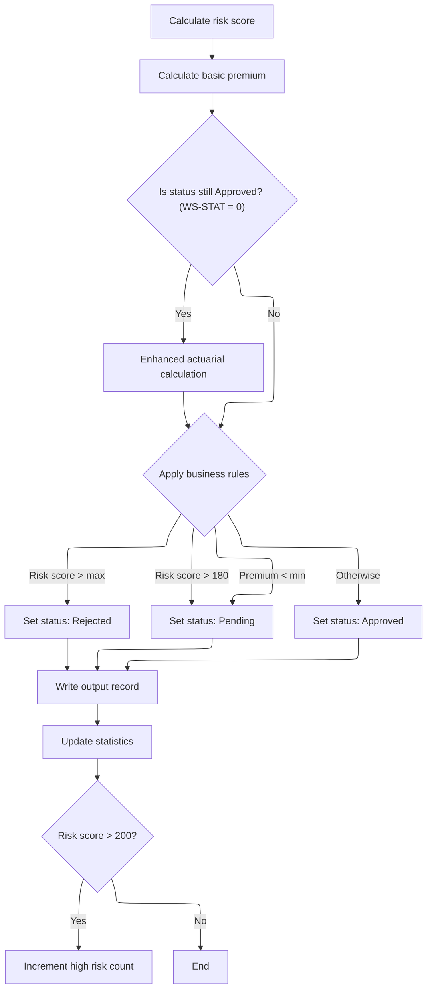

This section determines the underwriting outcome for commercial policies based on risk score and premium, sets the appropriate status and descriptions, and updates statistics for reporting and downstream processing.

| Rule ID | Category        | Rule Name               | Description                                                                                                                                                                                                                                                             | Implementation Details                                                                                                                                                                                                                                                                                                                                                                                |
| ------- | --------------- | ----------------------- | ----------------------------------------------------------------------------------------------------------------------------------------------------------------------------------------------------------------------------------------------------------------------- | ----------------------------------------------------------------------------------------------------------------------------------------------------------------------------------------------------------------------------------------------------------------------------------------------------------------------------------------------------------------------------------------------------- |
| BR-001  | Calculation     | Statistics update       | After the underwriting decision, the premium and risk score are added to running totals for reporting. Counters for approved, pending, and rejected policies are incremented based on the decision. If the risk score is above 200, the high-risk count is incremented. | Premium and risk score are added to numeric totals. Counters for approved, pending, rejected, and high-risk are incremented by 1 as appropriate.                                                                                                                                                                                                                                                      |
| BR-002  | Decision Making | Risk score rejection    | If the risk score exceeds the maximum acceptable level, the policy is rejected. The status is set to 'Rejected', the description is 'REJECTED', and the rejection reason is 'Risk score exceeds maximum acceptable level'.                                              | The maximum risk score is defined by the value of <SwmToken path="base/src/LGAPDB01.cbl" pos="330:13:19" line-data="               WHEN WS-BASE-RISK-SCR &gt; WS-MAX-RISK-SCORE">`WS-MAX-RISK-SCORE`</SwmToken>. Status code is set to 2, description is a string 'REJECTED' (up to 20 characters), rejection reason is a string 'Risk score exceeds maximum acceptable level' (up to 50 characters). |
| BR-003  | Decision Making | Minimum premium pending | If the premium is below the minimum required, the policy is set to pending. The status is set to 'Pending', the description is 'PENDING', and the rejection reason is 'Premium below minimum - requires review'.                                                        | The minimum premium is defined by <SwmToken path="base/src/LGAPDB01.cbl" pos="312:11:15" line-data="           IF WS-TOT-PREM &gt; WS-MIN-PREMIUM">`WS-MIN-PREMIUM`</SwmToken>. Status code is set to 1, description is a string 'PENDING' (up to 20 characters), rejection reason is a string 'Premium below minimum - requires review' (up to 50 characters).                                       |
| BR-004  | Decision Making | High risk pending       | If the risk score is above 180 but not above the maximum, the policy is set to pending. The status is set to 'Pending', the description is 'PENDING', and the rejection reason is 'High risk - underwriter review required'.                                            | Threshold for high risk is 180. Status code is set to 1, description is a string 'PENDING' (up to 20 characters), rejection reason is a string 'High risk - underwriter review required' (up to 50 characters).                                                                                                                                                                                       |
| BR-005  | Decision Making | Default approval        | If none of the above conditions are met, the policy is approved. The status is set to 'Approved', the description is 'APPROVED', and the rejection reason is cleared.                                                                                                   | Status code is set to 0, description is a string 'APPROVED' (up to 20 characters), rejection reason is cleared (spaces, up to 50 characters).                                                                                                                                                                                                                                                         |

<SwmSnippet path="/base/src/LGAPDB01.cbl" line="327">

---

<SwmToken path="base/src/LGAPDB01.cbl" pos="327:1:7" line-data="       P011D-APPLY-BUSINESS-RULES.">`P011D-APPLY-BUSINESS-RULES`</SwmToken> sets the underwriting decision based on risk score and premium. Status codes 0, 1, and 2 mean approved, pending, and rejected. The rules are hardcoded and set the status, description, and rejection reason.

```cobol
       P011D-APPLY-BUSINESS-RULES.
      *    Determine underwriting decision based on enhanced criteria
           EVALUATE TRUE
               WHEN WS-BASE-RISK-SCR > WS-MAX-RISK-SCORE
                   MOVE 2 TO WS-STAT
                   MOVE 'REJECTED' TO WS-STAT-DESC
                   MOVE 'Risk score exceeds maximum acceptable level' 
                        TO WS-REJ-RSN
               WHEN WS-TOT-PREM < WS-MIN-PREMIUM
                   MOVE 1 TO WS-STAT
                   MOVE 'PENDING' TO WS-STAT-DESC
                   MOVE 'Premium below minimum - requires review'
                        TO WS-REJ-RSN
               WHEN WS-BASE-RISK-SCR > 180
                   MOVE 1 TO WS-STAT
                   MOVE 'PENDING' TO WS-STAT-DESC
                   MOVE 'High risk - underwriter review required'
                        TO WS-REJ-RSN
               WHEN OTHER
                   MOVE 0 TO WS-STAT
                   MOVE 'APPROVED' TO WS-STAT-DESC
                   MOVE SPACES TO WS-REJ-RSN
           END-EVALUATE.
```

---

</SwmSnippet>

<SwmSnippet path="/base/src/LGAPDB01.cbl" line="258">

---

After returning from <SwmToken path="base/src/lgapol01.cbl" pos="103:9:9" line-data="           EXEC CICS Link Program(LGAPDB01)">`LGAPDB01`</SwmToken>, <SwmToken path="base/src/LGAPDB01.cbl" pos="266:3:7" line-data="           PERFORM P011F-UPDATE-STATISTICS.">`P011F-UPDATE-STATISTICS`</SwmToken> updates premium totals, risk score sums, and increments counters for approved, pending, rejected, and high-risk cases. This keeps the stats up to date for reporting and downstream logic.

```cobol
       P011-PROCESS-COMMERCIAL.
           PERFORM P011A-CALCULATE-RISK-SCORE
           PERFORM P011B-BASIC-PREMIUM-CALC
           IF WS-STAT = 0
               PERFORM P011C-ENHANCED-ACTUARIAL-CALC
           END-IF
           PERFORM P011D-APPLY-BUSINESS-RULES
           PERFORM P011E-WRITE-OUTPUT-RECORD
           PERFORM P011F-UPDATE-STATISTICS.
```

---

</SwmSnippet>

<SwmSnippet path="/base/src/LGAPDB01.cbl" line="365">

---

<SwmToken path="base/src/LGAPDB01.cbl" pos="365:1:5" line-data="       P011F-UPDATE-STATISTICS.">`P011F-UPDATE-STATISTICS`</SwmToken> adds the premium and risk score to totals, then increments the approved, pending, or rejected counter based on <SwmToken path="base/src/LGAPDB01.cbl" pos="369:3:5" line-data="           EVALUATE WS-STAT">`WS-STAT`</SwmToken>. If the risk score is above 200, it bumps the high-risk count. This keeps all the stats current.

```cobol
       P011F-UPDATE-STATISTICS.
           ADD WS-TOT-PREM TO WS-TOTAL-PREMIUM-AMT
           ADD WS-BASE-RISK-SCR TO WS-CONTROL-TOTALS
           
           EVALUATE WS-STAT
               WHEN 0 ADD 1 TO WS-APPROVED-CNT
               WHEN 1 ADD 1 TO WS-PENDING-CNT
               WHEN 2 ADD 1 TO WS-REJECTED-CNT
           END-EVALUATE
           
           IF WS-BASE-RISK-SCR > 200
               ADD 1 TO WS-HIGH-RISK-CNT
           END-IF.
```

---

</SwmSnippet>

## Handling add policy outcomes

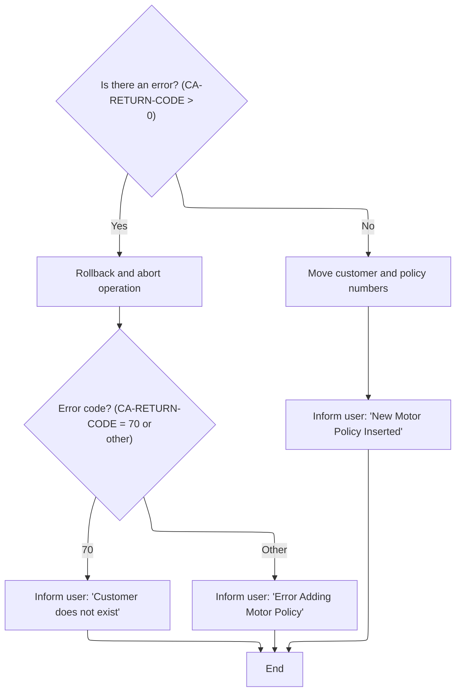

This section governs the business outcomes for adding a motor policy, including error messaging, transaction rollback, and success confirmation. It ensures users are informed of the result and that transaction integrity is maintained.

| Rule ID | Category        | Rule Name                          | Description                                                                                                                                                                                                                                                                         | Implementation Details                                                                                                                                                                                                       |
| ------- | --------------- | ---------------------------------- | ----------------------------------------------------------------------------------------------------------------------------------------------------------------------------------------------------------------------------------------------------------------------------------- | ---------------------------------------------------------------------------------------------------------------------------------------------------------------------------------------------------------------------------- |
| BR-001  | Decision Making | Add Policy Failure Rollback        | If the add policy operation fails (<SwmToken path="base/src/lgtestp1.cbl" pos="76:3:7" line-data="                 IF CA-RETURN-CODE &gt; 0">`CA-RETURN-CODE`</SwmToken> > 0), the transaction is rolled back and the user is informed of the error.                                | The rollback is triggered for any non-zero return code. The user receives an error message based on the specific code. No technical details about rollback are exposed to the user.                                          |
| BR-002  | Decision Making | Customer Not Found Error Messaging | If the error code is 70, the user is informed that the customer does not exist.                                                                                                                                                                                                     | The error message 'Customer does not exist' is displayed to the user. The format is a string message in the output field.                                                                                                    |
| BR-003  | Decision Making | Generic Add Policy Error Messaging | If the error code is not 70, the user is informed that there was an error adding the motor policy.                                                                                                                                                                                  | The error message 'Error Adding Motor Policy' is displayed to the user. The format is a string message in the output field.                                                                                                  |
| BR-004  | Writing Output  | Add Policy Success Confirmation    | If the add policy operation succeeds (<SwmToken path="base/src/lgtestp1.cbl" pos="76:3:7" line-data="                 IF CA-RETURN-CODE &gt; 0">`CA-RETURN-CODE`</SwmToken> = 0), the customer and policy numbers are updated and the user is informed of the successful insertion. | The success message 'New Motor Policy Inserted' is displayed to the user. Customer and policy numbers are updated and sent in the output. The format is a string message and numeric fields for customer and policy numbers. |

<SwmSnippet path="/base/src/lgtestp1.cbl" line="119">

---

Back in <SwmToken path="base/src/lgtestp1.cbl" pos="33:5:7" line-data="              GO TO A-GAIN.">`A-GAIN`</SwmToken> after returning from <SwmPath>[base/src/lgapol01.cbl](base/src/lgapol01.cbl)</SwmPath>, if <SwmToken path="base/src/lgtestp1.cbl" pos="119:3:7" line-data="                 IF CA-RETURN-CODE &gt; 0">`CA-RETURN-CODE`</SwmToken> is set, we run a rollback and jump to <SwmToken path="base/src/lgtestp1.cbl" pos="121:5:7" line-data="                   GO TO NO-ADD">`NO-ADD`</SwmToken>. <SwmToken path="base/src/lgtestp1.cbl" pos="121:5:7" line-data="                   GO TO NO-ADD">`NO-ADD`</SwmToken> handles the error messaging and transaction end for failed add policy attempts.

```cobol
                 IF CA-RETURN-CODE > 0
                   Exec CICS Syncpoint Rollback End-Exec
                   GO TO NO-ADD
                 END-IF
```

---

</SwmSnippet>

<SwmSnippet path="/base/src/lgtestp1.cbl" line="286">

---

<SwmToken path="base/src/lgtestp1.cbl" pos="286:1:3" line-data="       NO-ADD.">`NO-ADD`</SwmToken> checks <SwmToken path="base/src/lgtestp1.cbl" pos="287:3:7" line-data="           Evaluate CA-RETURN-CODE">`CA-RETURN-CODE`</SwmToken>. If it's 70, it sets 'Customer does not exist' as the error message; otherwise, it sets 'Error Adding Motor Policy'. Both cases jump to <SwmToken path="base/src/lgtestp1.cbl" pos="290:5:7" line-data="               Go To ERROR-OUT">`ERROR-OUT`</SwmToken>, which handles displaying the error and ending the transaction.

```cobol
       NO-ADD.
           Evaluate CA-RETURN-CODE
             When 70
               Move 'Customer does not exist'          To  ERP1FLDO
               Go To ERROR-OUT
             When Other
               Move 'Error Adding Motor Policy'        To  ERP1FLDO
               Go To ERROR-OUT
           End-Evaluate.
```

---

</SwmSnippet>

<SwmSnippet path="/base/src/lgtestp1.cbl" line="124">

---

Back in <SwmToken path="base/src/lgtestp1.cbl" pos="33:5:7" line-data="              GO TO A-GAIN.">`A-GAIN`</SwmToken>, after a successful add, we update the customer and policy numbers, clear the menu option, set the success message, and send the updated map to the terminal. This gives the user confirmation before moving to the next menu action.

```cobol
                 Move CA-CUSTOMER-NUM To ENP1CNOI
                 Move CA-POLICY-NUM   To ENP1PNOI
                 Move ' '             To ENP1OPTI
                 Move 'New Motor Policy Inserted'
                   To  ERP1FLDO
                 EXEC CICS SEND MAP ('SSMAPP1')
                           FROM(SSMAPP1O)
                           MAPSET ('SSMAP')
                 END-EXEC
```

---

</SwmSnippet>

<SwmSnippet path="/base/src/lgtestp1.cbl" line="135">

---

For menu option '3', <SwmToken path="base/src/lgtestp1.cbl" pos="33:5:7" line-data="              GO TO A-GAIN.">`A-GAIN`</SwmToken> sets up the request id and customer/policy numbers, then calls <SwmToken path="base/src/lgtestp1.cbl" pos="139:10:10" line-data="                 EXEC CICS LINK PROGRAM(&#39;LGDPOL01&#39;)">`LGDPOL01`</SwmToken>. <SwmToken path="base/src/lgtestp1.cbl" pos="139:10:10" line-data="                 EXEC CICS LINK PROGRAM(&#39;LGDPOL01&#39;)">`LGDPOL01`</SwmToken> handles validating and deleting the policy, and manages any errors or status codes for the operation.

```cobol
             WHEN '3'
                 Move '01DMOT'   To CA-REQUEST-ID
                 Move ENP1CNOO   To CA-CUSTOMER-NUM
                 Move ENP1PNOO   To CA-POLICY-NUM
                 EXEC CICS LINK PROGRAM('LGDPOL01')
                           COMMAREA(COMM-AREA)
                           LENGTH(32500)
                 END-EXEC
```

---

</SwmSnippet>

## Validating and dispatching policy delete requests

```mermaid
%%{init: {"flowchart": {"defaultRenderer": "elk"}} }%%
flowchart TD
    node1["Start: Initialize business context"] --> node2{"Was request data received?"}
    click node1 openCode "base/src/lgdpol01.cbl:78:89"
    node2 -->|"No (EIBCALEN=0)"| node3["Set error message 'NO COMMAREA RECEIVED'
and write error"]
    click node2 openCode "base/src/lgdpol01.cbl:95:99"
    click node3 openCode "base/src/lgdpol01.cbl:96:98"
    node3 --> node13["Return to caller"]
    click node13 openCode "base/src/lgdpol01.cbl:133:133"
    node2 -->|"Yes"| node4{"Is request data large enough?"}
    click node4 openCode "base/src/lgdpol01.cbl:107:110"
    node4 -->|"No (EIBCALEN<28)"| node5["Set return code '98' and return"]
    click node5 openCode "base/src/lgdpol01.cbl:108:109"
    node5 --> node13
    node4 -->|"Yes"| node6{"Is request ID recognized? (01DEND,
01DMOT, 01DHOU, 01DCOM)"}
    click node6 openCode "base/src/lgdpol01.cbl:119:122"
    node6 -->|"No"| node7["Set return code '99' and return"]
    click node7 openCode "base/src/lgdpol01.cbl:124:124"
    node7 --> node13
    node6 -->|"Yes"| node8["Delete policy"]
    click node8 openCode "base/src/lgdpol01.cbl:126:126"
    node8 --> node9{"Was deletion successful?
(CA-RETURN-CODE>0)"}
    click node9 openCode "base/src/lgdpol01.cbl:127:129"
    node9 -->|"Yes"| node13
    node9 -->|"No"| node13
classDef HeadingStyle fill:#777777,stroke:#333,stroke-width:2px;

%% Swimm:
%% %%{init: {"flowchart": {"defaultRenderer": "elk"}} }%%
%% flowchart TD
%%     node1["Start: Initialize business context"] --> node2{"Was request data received?"}
%%     click node1 openCode "<SwmPath>[base/src/lgdpol01.cbl](base/src/lgdpol01.cbl)</SwmPath>:78:89"
%%     node2 -->|"No (EIBCALEN=0)"| node3["Set error message 'NO COMMAREA RECEIVED'
%% and write error"]
%%     click node2 openCode "<SwmPath>[base/src/lgdpol01.cbl](base/src/lgdpol01.cbl)</SwmPath>:95:99"
%%     click node3 openCode "<SwmPath>[base/src/lgdpol01.cbl](base/src/lgdpol01.cbl)</SwmPath>:96:98"
%%     node3 --> node13["Return to caller"]
%%     click node13 openCode "<SwmPath>[base/src/lgdpol01.cbl](base/src/lgdpol01.cbl)</SwmPath>:133:133"
%%     node2 -->|"Yes"| node4{"Is request data large enough?"}
%%     click node4 openCode "<SwmPath>[base/src/lgdpol01.cbl](base/src/lgdpol01.cbl)</SwmPath>:107:110"
%%     node4 -->|"No (EIBCALEN<28)"| node5["Set return code '98' and return"]
%%     click node5 openCode "<SwmPath>[base/src/lgdpol01.cbl](base/src/lgdpol01.cbl)</SwmPath>:108:109"
%%     node5 --> node13
%%     node4 -->|"Yes"| node6{"Is request ID recognized? (<SwmToken path="base/src/lgdpol01.cbl" pos="119:18:18" line-data="           IF ( CA-REQUEST-ID NOT EQUAL TO &#39;01DEND&#39; AND">`01DEND`</SwmToken>,
%% <SwmToken path="base/src/lgtestp1.cbl" pos="136:4:4" line-data="                 Move &#39;01DMOT&#39;   To CA-REQUEST-ID">`01DMOT`</SwmToken>, <SwmToken path="base/src/lgdpol01.cbl" pos="121:14:14" line-data="                CA-REQUEST-ID NOT EQUAL TO &#39;01DHOU&#39; AND">`01DHOU`</SwmToken>, <SwmToken path="base/src/lgdpol01.cbl" pos="122:14:14" line-data="                CA-REQUEST-ID NOT EQUAL TO &#39;01DCOM&#39; )">`01DCOM`</SwmToken>)"}
%%     click node6 openCode "<SwmPath>[base/src/lgdpol01.cbl](base/src/lgdpol01.cbl)</SwmPath>:119:122"
%%     node6 -->|"No"| node7["Set return code '99' and return"]
%%     click node7 openCode "<SwmPath>[base/src/lgdpol01.cbl](base/src/lgdpol01.cbl)</SwmPath>:124:124"
%%     node7 --> node13
%%     node6 -->|"Yes"| node8["Delete policy"]
%%     click node8 openCode "<SwmPath>[base/src/lgdpol01.cbl](base/src/lgdpol01.cbl)</SwmPath>:126:126"
%%     node8 --> node9{"Was deletion successful?
%% (<SwmToken path="base/src/lgtestp1.cbl" pos="76:3:7" line-data="                 IF CA-RETURN-CODE &gt; 0">`CA-RETURN-CODE`</SwmToken>>0)"}
%%     click node9 openCode "<SwmPath>[base/src/lgdpol01.cbl](base/src/lgdpol01.cbl)</SwmPath>:127:129"
%%     node9 -->|"Yes"| node13
%%     node9 -->|"No"| node13
%% classDef HeadingStyle fill:#777777,stroke:#333,stroke-width:2px;
```

This section validates and processes incoming policy delete requests. It ensures only supported and well-formed requests are dispatched for deletion, and logs errors for invalid or missing input.

| Rule ID | Category        | Rule Name                           | Description                                                                                                                                                                                                                                                                                                                                                                                                                                                                                                                                                                                                                                                                                                                          | Implementation Details                                                                                                                                                                                                                                                                                                                                                                                                                                                                                                                                                                                                                                                                                            |
| ------- | --------------- | ----------------------------------- | ------------------------------------------------------------------------------------------------------------------------------------------------------------------------------------------------------------------------------------------------------------------------------------------------------------------------------------------------------------------------------------------------------------------------------------------------------------------------------------------------------------------------------------------------------------------------------------------------------------------------------------------------------------------------------------------------------------------------------------ | ----------------------------------------------------------------------------------------------------------------------------------------------------------------------------------------------------------------------------------------------------------------------------------------------------------------------------------------------------------------------------------------------------------------------------------------------------------------------------------------------------------------------------------------------------------------------------------------------------------------------------------------------------------------------------------------------------------------- |
| BR-001  | Data validation | Missing request data error handling | If no request data is received, an error message is logged and the transaction is abended.                                                                                                                                                                                                                                                                                                                                                                                                                                                                                                                                                                                                                                           | The error message 'NO COMMAREA RECEIVED' is logged. The process is abended with code 'LGCA'.                                                                                                                                                                                                                                                                                                                                                                                                                                                                                                                                                                                                                      |
| BR-002  | Data validation | Minimum request length validation   | If the request data is present but shorter than 28 bytes, the return code is set to '98' and the process returns without further action.                                                                                                                                                                                                                                                                                                                                                                                                                                                                                                                                                                                             | The minimum required length is 28 bytes. The return code '98' is set in the output.                                                                                                                                                                                                                                                                                                                                                                                                                                                                                                                                                                                                                               |
| BR-003  | Data validation | Request ID standardization          | The request ID is converted to uppercase before validation to ensure consistent comparison.                                                                                                                                                                                                                                                                                                                                                                                                                                                                                                                                                                                                                                          | All alphabetic characters in the request ID are converted to uppercase before any validation or comparison.                                                                                                                                                                                                                                                                                                                                                                                                                                                                                                                                                                                                       |
| BR-004  | Data validation | Request type validation             | If the request ID is not one of the recognized types (<SwmToken path="base/src/lgdpol01.cbl" pos="119:18:18" line-data="           IF ( CA-REQUEST-ID NOT EQUAL TO &#39;01DEND&#39; AND">`01DEND`</SwmToken>, <SwmToken path="base/src/lgtestp1.cbl" pos="136:4:4" line-data="                 Move &#39;01DMOT&#39;   To CA-REQUEST-ID">`01DMOT`</SwmToken>, <SwmToken path="base/src/lgdpol01.cbl" pos="121:14:14" line-data="                CA-REQUEST-ID NOT EQUAL TO &#39;01DHOU&#39; AND">`01DHOU`</SwmToken>, <SwmToken path="base/src/lgdpol01.cbl" pos="122:14:14" line-data="                CA-REQUEST-ID NOT EQUAL TO &#39;01DCOM&#39; )">`01DCOM`</SwmToken>), the return code is set to '99' and the process returns. | Recognized request IDs are <SwmToken path="base/src/lgdpol01.cbl" pos="119:18:18" line-data="           IF ( CA-REQUEST-ID NOT EQUAL TO &#39;01DEND&#39; AND">`01DEND`</SwmToken>, <SwmToken path="base/src/lgtestp1.cbl" pos="136:4:4" line-data="                 Move &#39;01DMOT&#39;   To CA-REQUEST-ID">`01DMOT`</SwmToken>, <SwmToken path="base/src/lgdpol01.cbl" pos="121:14:14" line-data="                CA-REQUEST-ID NOT EQUAL TO &#39;01DHOU&#39; AND">`01DHOU`</SwmToken>, <SwmToken path="base/src/lgdpol01.cbl" pos="122:14:14" line-data="                CA-REQUEST-ID NOT EQUAL TO &#39;01DCOM&#39; )">`01DCOM`</SwmToken>. The return code '99' is set in the output for unsupported types. |
| BR-005  | Decision Making | Dispatch recognized delete request  | For recognized request types, the policy deletion logic is invoked. The outcome is reflected in the return code.                                                                                                                                                                                                                                                                                                                                                                                                                                                                                                                                                                                                                     | Supported request IDs are <SwmToken path="base/src/lgdpol01.cbl" pos="119:18:18" line-data="           IF ( CA-REQUEST-ID NOT EQUAL TO &#39;01DEND&#39; AND">`01DEND`</SwmToken>, <SwmToken path="base/src/lgtestp1.cbl" pos="136:4:4" line-data="                 Move &#39;01DMOT&#39;   To CA-REQUEST-ID">`01DMOT`</SwmToken>, <SwmToken path="base/src/lgdpol01.cbl" pos="121:14:14" line-data="                CA-REQUEST-ID NOT EQUAL TO &#39;01DHOU&#39; AND">`01DHOU`</SwmToken>, <SwmToken path="base/src/lgdpol01.cbl" pos="122:14:14" line-data="                CA-REQUEST-ID NOT EQUAL TO &#39;01DCOM&#39; )">`01DCOM`</SwmToken>. The deletion logic is invoked for these types.                    |
| BR-006  | Decision Making | Return after successful deletion    | If the deletion logic sets a positive return code, the process returns to the caller without further action.                                                                                                                                                                                                                                                                                                                                                                                                                                                                                                                                                                                                                         | A positive return code indicates the outcome of the deletion attempt. No further processing occurs in this section.                                                                                                                                                                                                                                                                                                                                                                                                                                                                                                                                                                                               |
| BR-007  | Writing Output  | Error logging with context          | Error messages are logged with the current date, time, and up to 90 bytes of the commarea for context when an error occurs.                                                                                                                                                                                                                                                                                                                                                                                                                                                                                                                                                                                                          | Error messages include the date (8 bytes), time (6 bytes), a program identifier, and up to 90 bytes of the commarea. If the commarea is shorter than 91 bytes, the entire commarea is logged; otherwise, only the first 90 bytes are included.                                                                                                                                                                                                                                                                                                                                                                                                                                                                    |

<SwmSnippet path="/base/src/lgdpol01.cbl" line="78">

---

MAINLINE in <SwmPath>[base/src/lgdpol01.cbl](base/src/lgdpol01.cbl)</SwmPath> checks the incoming commarea for presence and length, logs and abends if missing, and sets up the return code for errors. It uppercases the request ID, validates it, and only calls <SwmToken path="base/src/lgdpol01.cbl" pos="126:3:9" line-data="               PERFORM DELETE-POLICY-DB2-INFO">`DELETE-POLICY-DB2-INFO`</SwmToken> for recognized types. Unsupported requests or errors trigger early returns, so only valid delete operations proceed.

```cobol
       MAINLINE SECTION.

      *----------------------------------------------------------------*
      * Common code                                                    *
      *----------------------------------------------------------------*
      * initialize working storage variables
           INITIALIZE WS-HEADER.
      * set up general variable
           MOVE EIBTRNID TO WS-TRANSID.
           MOVE EIBTRMID TO WS-TERMID.
           MOVE EIBTASKN TO WS-TASKNUM.
      *----------------------------------------------------------------*

      *----------------------------------------------------------------*
      * Check commarea and obtain required details                     *
      *----------------------------------------------------------------*
      * If NO commarea received issue an ABEND
           IF EIBCALEN IS EQUAL TO ZERO
               MOVE ' NO COMMAREA RECEIVED' TO EM-VARIABLE
               PERFORM WRITE-ERROR-MESSAGE
               EXEC CICS ABEND ABCODE('LGCA') NODUMP END-EXEC
           END-IF

      * initialize commarea return code to zero
           MOVE '00' TO CA-RETURN-CODE
           MOVE EIBCALEN TO WS-CALEN.
           SET WS-ADDR-DFHCOMMAREA TO ADDRESS OF DFHCOMMAREA.

      * Check commarea is large enough
           IF EIBCALEN IS LESS THAN WS-CA-HEADER-LEN
             MOVE '98' TO CA-RETURN-CODE
             EXEC CICS RETURN END-EXEC
           END-IF

      *----------------------------------------------------------------*
      * Check request-id in commarea and if recognised ...             *
      * Call routine to delete row from policy table                   *
      *----------------------------------------------------------------*
      * Upper case value passed in Request Id field                    *
           MOVE FUNCTION UPPER-CASE(CA-REQUEST-ID) TO CA-REQUEST-ID

           IF ( CA-REQUEST-ID NOT EQUAL TO '01DEND' AND
                CA-REQUEST-ID NOT EQUAL TO '01DMOT' AND
                CA-REQUEST-ID NOT EQUAL TO '01DHOU' AND
                CA-REQUEST-ID NOT EQUAL TO '01DCOM' )
      *        Request is not recognised or supported
               MOVE '99' TO CA-RETURN-CODE
           ELSE
               PERFORM DELETE-POLICY-DB2-INFO
               If CA-RETURN-CODE > 0
                 EXEC CICS RETURN END-EXEC
               End-if
           END-IF

      * Return to caller
           EXEC CICS RETURN END-EXEC.
```

---

</SwmSnippet>

<SwmSnippet path="/base/src/lgdpol01.cbl" line="154">

---

<SwmToken path="base/src/lgdpol01.cbl" pos="154:1:5" line-data="       WRITE-ERROR-MESSAGE.">`WRITE-ERROR-MESSAGE`</SwmToken> in <SwmPath>[base/src/lgdpol01.cbl](base/src/lgdpol01.cbl)</SwmPath> grabs the current time and date, builds the error message, and calls LGSTSQ to write it to the queue. It then checks the commarea length and writes up to 90 bytes of its data to LGSTSQ as well. This keeps error logs concise and ensures only relevant context is sent for troubleshooting.

```cobol
       WRITE-ERROR-MESSAGE.
      * Save SQLCODE in message
      * Obtain and format current time and date
           EXEC CICS ASKTIME ABSTIME(WS-ABSTIME)
           END-EXEC
           EXEC CICS FORMATTIME ABSTIME(Ws-ABSTIME)
                     MMDDYYYY(WS-DATE)
                     TIME(WS-TIME)
           END-EXEC
           MOVE WS-DATE TO EM-DATE
           MOVE WS-TIME TO EM-TIME
      * Write output message to TDQ
           EXEC CICS LINK PROGRAM('LGSTSQ')
                     COMMAREA(ERROR-MSG)
                     LENGTH(LENGTH OF ERROR-MSG)
           END-EXEC.
      * Write 90 bytes or as much as we have of commarea to TDQ
           IF EIBCALEN > 0 THEN
             IF EIBCALEN < 91 THEN
               MOVE DFHCOMMAREA(1:EIBCALEN) TO CA-DATA
               EXEC CICS LINK PROGRAM('LGSTSQ')
                         COMMAREA(CA-ERROR-MSG)
                         LENGTH(LENGTH OF CA-ERROR-MSG)
               END-EXEC
             ELSE
               MOVE DFHCOMMAREA(1:90) TO CA-DATA
               EXEC CICS LINK PROGRAM('LGSTSQ')
                         COMMAREA(CA-ERROR-MSG)
                         LENGTH(LENGTH OF CA-ERROR-MSG)
               END-EXEC
             END-IF
           END-IF.
           EXIT.
```

---

</SwmSnippet>

## Dispatching policy deletion to <SwmToken path="base/src/lgipdb01.cbl" pos="242:5:5" line-data="      * initialize DB2 host variables">`DB2`</SwmToken> backend

This section initiates the deletion of a policy record by sending all relevant information to the <SwmToken path="base/src/lgipdb01.cbl" pos="242:5:5" line-data="      * initialize DB2 host variables">`DB2`</SwmToken> backend, ensuring the backend has sufficient data to identify and remove the correct record.

| Rule ID | Category                        | Rule Name                     | Description                                                                                                                                                                                                        | Implementation Details                                                                                                                                                                                  |
| ------- | ------------------------------- | ----------------------------- | ------------------------------------------------------------------------------------------------------------------------------------------------------------------------------------------------------------------ | ------------------------------------------------------------------------------------------------------------------------------------------------------------------------------------------------------- |
| BR-001  | Writing Output                  | Complete policy deletion data | All relevant policy and customer information is included in the deletion request sent to the backend.                                                                                                              | The data sent must include all fields necessary for the backend to identify and delete the correct policy record. The total size of the data is 32,500 bytes, formatted as a contiguous block of bytes. |
| BR-002  | Writing Output                  | Fixed-size deletion request   | The deletion request is sent as a single contiguous block of data with a fixed size of 32,500 bytes.                                                                                                               | The request must be exactly 32,500 bytes in size, formatted as a contiguous block of bytes.                                                                                                             |
| BR-003  | Invoking a Service or a Process | Backend deletion dispatch     | The deletion request is dispatched to the <SwmToken path="base/src/lgipdb01.cbl" pos="242:5:5" line-data="      * initialize DB2 host variables">`DB2`</SwmToken> backend routine responsible for policy deletion. | The backend routine must be capable of processing the deletion request based on the provided data.                                                                                                      |

<SwmSnippet path="/base/src/lgdpol01.cbl" line="139">

---

<SwmToken path="base/src/lgdpol01.cbl" pos="139:1:7" line-data="       DELETE-POLICY-DB2-INFO.">`DELETE-POLICY-DB2-INFO`</SwmToken> in <SwmPath>[base/src/lgdpol01.cbl](base/src/lgdpol01.cbl)</SwmPath> links to <SwmToken path="base/src/lgdpol01.cbl" pos="141:9:9" line-data="           EXEC CICS LINK PROGRAM(LGDPDB01)">`LGDPDB01`</SwmToken>, passing the full commarea (32500 bytes) for backend deletion. This hands off all relevant policy and customer info so the <SwmToken path="base/src/lgdpol01.cbl" pos="139:5:5" line-data="       DELETE-POLICY-DB2-INFO.">`DB2`</SwmToken> routine can target and remove the right record.

```cobol
       DELETE-POLICY-DB2-INFO.

           EXEC CICS LINK PROGRAM(LGDPDB01)
                Commarea(DFHCOMMAREA)
                LENGTH(32500)
           END-EXEC.

           EXIT.
```

---

</SwmSnippet>

## Validating <SwmToken path="base/src/lgipdb01.cbl" pos="242:5:5" line-data="      * initialize DB2 host variables">`DB2`</SwmToken> delete requests and routing to VSAM

```mermaid
%%{init: {"flowchart": {"defaultRenderer": "elk"}} }%%
flowchart TD
    node1["Start MAINLINE processing"] --> node2{"Is commarea received?"}
    click node1 openCode "base/src/lgdpdb01.cbl:111:117"
    node2 -->|"No"| node3["Record error: No commarea, terminate"]
    click node2 openCode "base/src/lgdpdb01.cbl:131:135"
    click node3 openCode "base/src/lgdpdb01.cbl:132:134"
    node3 --> node12[WRITE-ERROR-MESSAGE]
    click node12 openCode "base/src/lgdpdb01.cbl:212:245"
    node12 --> node13["Return to caller with CA-RETURN-CODE
'99'"]
    click node13 openCode "base/src/lgdpdb01.cbl:175:175"
    node2 -->|"Yes"| node4{"Is commarea large enough?"}
    click node4 openCode "base/src/lgdpdb01.cbl:143:146"
    node4 -->|"No"| node5["Return error code '98', terminate"]
    click node5 openCode "base/src/lgdpdb01.cbl:144:145"
    node5 --> node13
    node4 -->|"Yes"| node6{"Is request type recognized?"}
    click node6 openCode "base/src/lgdpdb01.cbl:160:172"
    node6 -->|"No"| node7["Return error code '99'"]
    click node7 openCode "base/src/lgdpdb01.cbl:165:166"
    node7 --> node13
    node6 -->|"Yes"| node8["Delete policy from DB2"]
    click node8 openCode "base/src/lgdpdb01.cbl:167:171"
    node8 --> node9{"Was deletion successful?"}
    click node9 openCode "base/src/lgdpdb01.cbl:198:202"
    node9 -->|"No"| node10["Record error and terminate"]
    click node10 openCode "base/src/lgdpdb01.cbl:199:201"
    node10 --> node12
    node9 -->|"Yes"| node11["Return to caller with CA-RETURN-CODE
'00'"]
    click node11 openCode "base/src/lgdpdb01.cbl:175:175"
classDef HeadingStyle fill:#777777,stroke:#333,stroke-width:2px;

%% Swimm:
%% %%{init: {"flowchart": {"defaultRenderer": "elk"}} }%%
%% flowchart TD
%%     node1["Start MAINLINE processing"] --> node2{"Is commarea received?"}
%%     click node1 openCode "<SwmPath>[base/src/lgdpdb01.cbl](base/src/lgdpdb01.cbl)</SwmPath>:111:117"
%%     node2 -->|"No"| node3["Record error: No commarea, terminate"]
%%     click node2 openCode "<SwmPath>[base/src/lgdpdb01.cbl](base/src/lgdpdb01.cbl)</SwmPath>:131:135"
%%     click node3 openCode "<SwmPath>[base/src/lgdpdb01.cbl](base/src/lgdpdb01.cbl)</SwmPath>:132:134"
%%     node3 --> node12[<SwmToken path="base/src/lgipol01.cbl" pos="81:3:7" line-data="               PERFORM WRITE-ERROR-MESSAGE">`WRITE-ERROR-MESSAGE`</SwmToken>]
%%     click node12 openCode "<SwmPath>[base/src/lgdpdb01.cbl](base/src/lgdpdb01.cbl)</SwmPath>:212:245"
%%     node12 --> node13["Return to caller with <SwmToken path="base/src/lgtestp1.cbl" pos="76:3:7" line-data="                 IF CA-RETURN-CODE &gt; 0">`CA-RETURN-CODE`</SwmToken>
%% '99'"]
%%     click node13 openCode "<SwmPath>[base/src/lgdpdb01.cbl](base/src/lgdpdb01.cbl)</SwmPath>:175:175"
%%     node2 -->|"Yes"| node4{"Is commarea large enough?"}
%%     click node4 openCode "<SwmPath>[base/src/lgdpdb01.cbl](base/src/lgdpdb01.cbl)</SwmPath>:143:146"
%%     node4 -->|"No"| node5["Return error code '98', terminate"]
%%     click node5 openCode "<SwmPath>[base/src/lgdpdb01.cbl](base/src/lgdpdb01.cbl)</SwmPath>:144:145"
%%     node5 --> node13
%%     node4 -->|"Yes"| node6{"Is request type recognized?"}
%%     click node6 openCode "<SwmPath>[base/src/lgdpdb01.cbl](base/src/lgdpdb01.cbl)</SwmPath>:160:172"
%%     node6 -->|"No"| node7["Return error code '99'"]
%%     click node7 openCode "<SwmPath>[base/src/lgdpdb01.cbl](base/src/lgdpdb01.cbl)</SwmPath>:165:166"
%%     node7 --> node13
%%     node6 -->|"Yes"| node8["Delete policy from <SwmToken path="base/src/lgipdb01.cbl" pos="242:5:5" line-data="      * initialize DB2 host variables">`DB2`</SwmToken>"]
%%     click node8 openCode "<SwmPath>[base/src/lgdpdb01.cbl](base/src/lgdpdb01.cbl)</SwmPath>:167:171"
%%     node8 --> node9{"Was deletion successful?"}
%%     click node9 openCode "<SwmPath>[base/src/lgdpdb01.cbl](base/src/lgdpdb01.cbl)</SwmPath>:198:202"
%%     node9 -->|"No"| node10["Record error and terminate"]
%%     click node10 openCode "<SwmPath>[base/src/lgdpdb01.cbl](base/src/lgdpdb01.cbl)</SwmPath>:199:201"
%%     node10 --> node12
%%     node9 -->|"Yes"| node11["Return to caller with <SwmToken path="base/src/lgtestp1.cbl" pos="76:3:7" line-data="                 IF CA-RETURN-CODE &gt; 0">`CA-RETURN-CODE`</SwmToken>
%% '00'"]
%%     click node11 openCode "<SwmPath>[base/src/lgdpdb01.cbl](base/src/lgdpdb01.cbl)</SwmPath>:175:175"
%% classDef HeadingStyle fill:#777777,stroke:#333,stroke-width:2px;
```

This section validates incoming delete requests for policies, ensures both <SwmToken path="base/src/lgipdb01.cbl" pos="242:5:5" line-data="      * initialize DB2 host variables">`DB2`</SwmToken> and VSAM records are deleted, and manages error reporting and logging for failed operations.

| Rule ID | Category                        | Rule Name                                                                                                                                     | Description                                                                                                                                                                                                                                                                     | Implementation Details                                                                                                                                                                                                             |
| ------- | ------------------------------- | --------------------------------------------------------------------------------------------------------------------------------------------- | ------------------------------------------------------------------------------------------------------------------------------------------------------------------------------------------------------------------------------------------------------------------------------- | ---------------------------------------------------------------------------------------------------------------------------------------------------------------------------------------------------------------------------------- |
| BR-001  | Data validation                 | Commarea required                                                                                                                             | If no commarea is received, the request is rejected, an error message is logged, and the process is terminated with return code '99'.                                                                                                                                           | Return code '99' is used for this error. The error message includes the text 'NO COMMAREA RECEIVED'.                                                                                                                               |
| BR-002  | Data validation                 | Minimum commarea length                                                                                                                       | If the commarea is present but shorter than 28 bytes, the request is rejected and terminated with return code '98'.                                                                                                                                                             | Return code '98' is used for this error. The minimum required commarea length is 28 bytes.                                                                                                                                         |
| BR-003  | Data validation                 | Recognized request type                                                                                                                       | If the request type in the commarea is not one of the recognized delete types, the request is rejected and terminated with return code '99'.                                                                                                                                    | Return code '99' is used for unrecognized request types. Only the four listed request types are accepted for delete operations.                                                                                                    |
| BR-004  | Data validation                 | <SwmToken path="base/src/lgipdb01.cbl" pos="242:5:5" line-data="      * initialize DB2 host variables">`DB2`</SwmToken> delete error handling | If the <SwmToken path="base/src/lgipdb01.cbl" pos="242:5:5" line-data="      * initialize DB2 host variables">`DB2`</SwmToken> delete operation fails (SQLCODE not 0 or 100), the request is rejected, an error is logged, and the process is terminated with return code '90'. | Return code '90' is used for <SwmToken path="base/src/lgipdb01.cbl" pos="242:5:5" line-data="      * initialize DB2 host variables">`DB2`</SwmToken> errors. SQLCODE is included in the error log for diagnostics.                 |
| BR-005  | Writing Output                  | Error logging with context                                                                                                                    | All error messages are logged with the SQLCODE, date, time, and up to 90 bytes of commarea data for context.                                                                                                                                                                    | Error logs include SQLCODE, date (8 bytes), time (6 bytes), and up to 90 bytes of commarea data for context. If commarea is shorter than 91 bytes, the entire commarea is logged; otherwise, only the first 90 bytes are included. |
| BR-006  | Invoking a Service or a Process | Route successful deletes to VSAM                                                                                                              | If the <SwmToken path="base/src/lgipdb01.cbl" pos="242:5:5" line-data="      * initialize DB2 host variables">`DB2`</SwmToken> delete operation is successful or the record is not found, the request is routed to the VSAM handler for further processing.                     | The VSAM handler is invoked for both successful and not-found deletes, ensuring both data stores are consistent.                                                                                                                   |

<SwmSnippet path="/base/src/lgdpdb01.cbl" line="111">

---

MAINLINE in <SwmPath>[base/src/lgdpdb01.cbl](base/src/lgdpdb01.cbl)</SwmPath> checks the commarea, converts customer and policy numbers to <SwmToken path="base/src/lgdpdb01.cbl" pos="124:5:5" line-data="      * initialize DB2 host variables">`DB2`</SwmToken> integer format, and validates the request ID. If valid, it calls <SwmToken path="base/src/lgdpdb01.cbl" pos="167:3:9" line-data="               PERFORM DELETE-POLICY-DB2-INFO">`DELETE-POLICY-DB2-INFO`</SwmToken> and then links to <SwmToken path="base/src/lgdpdb01.cbl" pos="168:9:9" line-data="               EXEC CICS LINK PROGRAM(LGDPVS01)">`LGDPVS01`</SwmToken> to delete the VSAM record, keeping both <SwmToken path="base/src/lgdpdb01.cbl" pos="124:5:5" line-data="      * initialize DB2 host variables">`DB2`</SwmToken> and VSAM in sync.

```cobol
       MAINLINE SECTION.

      *----------------------------------------------------------------*
      * Common code                                                    *
      *----------------------------------------------------------------*
      * initialize working storage variables
           INITIALIZE WS-HEADER.
      * set up general variable
           MOVE EIBTRNID TO WS-TRANSID.
           MOVE EIBTRMID TO WS-TERMID.
           MOVE EIBTASKN TO WS-TASKNUM.
      *----------------------------------------------------------------*

      * initialize DB2 host variables
           INITIALIZE DB2-IN-INTEGERS.

      *----------------------------------------------------------------*
      * Check commarea and obtain required details                     *
      *----------------------------------------------------------------*
      * If NO commarea received issue an ABEND
           IF EIBCALEN IS EQUAL TO ZERO
               MOVE ' NO COMMAREA RECEIVED' TO EM-VARIABLE
               PERFORM WRITE-ERROR-MESSAGE
               EXEC CICS ABEND ABCODE('LGCA') NODUMP END-EXEC
           END-IF

      * initialize commarea return code to zero
           MOVE '00' TO CA-RETURN-CODE
           MOVE EIBCALEN TO WS-CALEN.
           SET WS-ADDR-DFHCOMMAREA TO ADDRESS OF DFHCOMMAREA.

      * Check commarea is large enough
           IF EIBCALEN IS LESS THAN WS-CA-HEADER-LEN
             MOVE '98' TO CA-RETURN-CODE
             EXEC CICS RETURN END-EXEC
           END-IF

      * Convert commarea customer & policy nums to DB2 integer format
           MOVE CA-CUSTOMER-NUM TO DB2-CUSTOMERNUM-INT
           MOVE CA-POLICY-NUM   TO DB2-POLICYNUM-INT
      * and save in error msg field incase required
           MOVE CA-CUSTOMER-NUM TO EM-CUSNUM
           MOVE CA-POLICY-NUM   TO EM-POLNUM

      *----------------------------------------------------------------*
      * Check request-id in commarea and if recognised ...             *
      * Call routine to delete row from policy table                   *
      *----------------------------------------------------------------*

           IF ( CA-REQUEST-ID NOT EQUAL TO '01DEND' AND
                CA-REQUEST-ID NOT EQUAL TO '01DHOU' AND
                CA-REQUEST-ID NOT EQUAL TO '01DCOM' AND
                CA-REQUEST-ID NOT EQUAL TO '01DMOT' ) Then
      *        Request is not recognised or supported
               MOVE '99' TO CA-RETURN-CODE
           ELSE
               PERFORM DELETE-POLICY-DB2-INFO
               EXEC CICS LINK PROGRAM(LGDPVS01)
                    Commarea(DFHCOMMAREA)
                    LENGTH(32500)
               END-EXEC
           END-IF.

      * Return to caller
           EXEC CICS RETURN END-EXEC.
```

---

</SwmSnippet>

<SwmSnippet path="/base/src/lgdpdb01.cbl" line="212">

---

<SwmToken path="base/src/lgdpdb01.cbl" pos="212:1:5" line-data="       WRITE-ERROR-MESSAGE.">`WRITE-ERROR-MESSAGE`</SwmToken> in <SwmPath>[base/src/lgdpdb01.cbl](base/src/lgdpdb01.cbl)</SwmPath> formats the error message with SQLCODE, date, and time, then calls LGSTSQ to write it to the queue. It also writes up to 90 bytes of commarea data for context, keeping error logs concise and relevant.

```cobol
       WRITE-ERROR-MESSAGE.
      * Save SQLCODE in message
           MOVE SQLCODE TO EM-SQLRC
      * Obtain and format current time and date
           EXEC CICS ASKTIME ABSTIME(WS-ABSTIME)
           END-EXEC
           EXEC CICS FORMATTIME ABSTIME(Ws-ABSTIME)
                     MMDDYYYY(WS-DATE)
                     TIME(WS-TIME)
           END-EXEC
           MOVE WS-DATE TO EM-DATE
           MOVE WS-TIME TO EM-TIME
      * Write output message to TDQ
           EXEC CICS LINK PROGRAM('LGSTSQ')
                     COMMAREA(ERROR-MSG)
                     LENGTH(LENGTH OF ERROR-MSG)
           END-EXEC.
      * Write 90 bytes or as much as we have of commarea to TDQ
           IF EIBCALEN > 0 THEN
             IF EIBCALEN < 91 THEN
               MOVE DFHCOMMAREA(1:EIBCALEN) TO CA-DATA
               EXEC CICS LINK PROGRAM('LGSTSQ')
                         COMMAREA(CA-ERROR-MSG)
                         LENGTH(LENGTH OF CA-ERROR-MSG)
               END-EXEC
             ELSE
               MOVE DFHCOMMAREA(1:90) TO CA-DATA
               EXEC CICS LINK PROGRAM('LGSTSQ')
                         COMMAREA(CA-ERROR-MSG)
                         LENGTH(LENGTH OF CA-ERROR-MSG)
               END-EXEC
             END-IF
           END-IF.
           EXIT.
```

---

</SwmSnippet>

<SwmSnippet path="/base/src/lgdpdb01.cbl" line="186">

---

<SwmToken path="base/src/lgdpdb01.cbl" pos="186:1:7" line-data="       DELETE-POLICY-DB2-INFO.">`DELETE-POLICY-DB2-INFO`</SwmToken> in <SwmPath>[base/src/lgdpdb01.cbl](base/src/lgdpdb01.cbl)</SwmPath> sets up the SQL operation label, runs the DELETE statement using customer and policy numbers, and checks the SQLCODE. If there's an error, it sets return code '90', logs the error, and exits. Only successful or not-found deletes continue.

```cobol
       DELETE-POLICY-DB2-INFO.

           MOVE ' DELETE POLICY  ' TO EM-SQLREQ
           EXEC SQL
             DELETE
               FROM POLICY
               WHERE ( CUSTOMERNUMBER = :DB2-CUSTOMERNUM-INT AND
                       POLICYNUMBER  = :DB2-POLICYNUM-INT      )
           END-EXEC

      *    Treat SQLCODE 0 and SQLCODE 100 (record not found) as
      *    successful - end result is record does not exist
           IF SQLCODE NOT EQUAL 0 Then
               MOVE '90' TO CA-RETURN-CODE
               PERFORM WRITE-ERROR-MESSAGE
               EXEC CICS RETURN END-EXEC
           END-IF.

           EXIT.
```

---

</SwmSnippet>

## Deleting policy records in VSAM and error handling

```mermaid
%%{init: {"flowchart": {"defaultRenderer": "elk"}} }%%
flowchart TD
    node1["Prepare customer and policy identifiers
(CA-Customer-Num, CA-Policy-Num,
CA-Request-ID)"] --> node2["Attempt to delete policy using
WF-Policy-Key"]
    click node1 openCode "base/src/lgdpvs01.cbl:75:79"
    click node2 openCode "base/src/lgdpvs01.cbl:81:85"
    node2 --> node3{"Was deletion successful? (WS-RESP =
NORMAL)"}
    click node3 openCode "base/src/lgdpvs01.cbl:86:91"
    node3 -->|"Yes"| node4["Return control to caller"]
    click node4 openCode "base/src/lgdpvs01.cbl:90:91"
    node3 -->|"No"| node5["Set error code '81', record error
details (WS-RESP2), log error message
(WRITE-ERROR-MESSAGE)"]
    click node5 openCode "base/src/lgdpvs01.cbl:87:132"
    node5 --> node4

classDef HeadingStyle fill:#777777,stroke:#333,stroke-width:2px;

%% Swimm:
%% %%{init: {"flowchart": {"defaultRenderer": "elk"}} }%%
%% flowchart TD
%%     node1["Prepare customer and policy identifiers
%% (<SwmToken path="base/src/lgdpvs01.cbl" pos="79:3:7" line-data="           Move CA-Customer-Num    To WF-Customer-Num">`CA-Customer-Num`</SwmToken>, <SwmToken path="base/src/lgdpvs01.cbl" pos="78:3:7" line-data="           Move CA-Policy-Num      To WF-Policy-Num">`CA-Policy-Num`</SwmToken>,
%% <SwmToken path="base/src/lgdpvs01.cbl" pos="77:3:7" line-data="           Move CA-Request-ID(4:1) To WF-Request-ID">`CA-Request-ID`</SwmToken>)"] --> node2["Attempt to delete policy using
%% <SwmToken path="base/src/lgdpvs01.cbl" pos="82:3:7" line-data="                     Ridfld(WF-Policy-Key)">`WF-Policy-Key`</SwmToken>"]
%%     click node1 openCode "<SwmPath>[base/src/lgdpvs01.cbl](base/src/lgdpvs01.cbl)</SwmPath>:75:79"
%%     click node2 openCode "<SwmPath>[base/src/lgdpvs01.cbl](base/src/lgdpvs01.cbl)</SwmPath>:81:85"
%%     node2 --> node3{"Was deletion successful? (<SwmToken path="base/src/lgstsq.cbl" pos="61:3:5" line-data="                RESP(WS-RESP)">`WS-RESP`</SwmToken> =
%% NORMAL)"}
%%     click node3 openCode "<SwmPath>[base/src/lgdpvs01.cbl](base/src/lgdpvs01.cbl)</SwmPath>:86:91"
%%     node3 -->|"Yes"| node4["Return control to caller"]
%%     click node4 openCode "<SwmPath>[base/src/lgdpvs01.cbl](base/src/lgdpvs01.cbl)</SwmPath>:90:91"
%%     node3 -->|"No"| node5["Set error code '81', record error
%% details (<SwmToken path="base/src/lgdpvs01.cbl" pos="87:7:9" line-data="             Move EIBRESP2 To WS-RESP2">`WS-RESP2`</SwmToken>), log error message
%% (<SwmToken path="base/src/lgipol01.cbl" pos="81:3:7" line-data="               PERFORM WRITE-ERROR-MESSAGE">`WRITE-ERROR-MESSAGE`</SwmToken>)"]
%%     click node5 openCode "<SwmPath>[base/src/lgdpvs01.cbl](base/src/lgdpvs01.cbl)</SwmPath>:87:132"
%%     node5 --> node4
%% 
%% classDef HeadingStyle fill:#777777,stroke:#333,stroke-width:2px;
```

This section is responsible for deleting a policy record based on provided identifiers and ensuring that any failure is logged with sufficient detail for audit and troubleshooting. It ensures that unsuccessful deletions are tracked and relevant context is captured for support analysis.

| Rule ID | Category        | Rule Name                                 | Description                                                                                                                                                                                    | Implementation Details                                                                                                                                                                                                                                                                 |
| ------- | --------------- | ----------------------------------------- | ---------------------------------------------------------------------------------------------------------------------------------------------------------------------------------------------- | -------------------------------------------------------------------------------------------------------------------------------------------------------------------------------------------------------------------------------------------------------------------------------------- |
| BR-001  | Reading Input   | Policy key composition                    | When a policy deletion is attempted, the key used for the operation consists of the 4th character of the request ID, the customer number, and the policy number.                               | The key is a concatenation of: a single character from the request ID (position 4), a 10-digit customer number, and a 10-digit policy number. All components are required to identify the policy record.                                                                               |
| BR-002  | Decision Making | Error handling on failed delete           | If the policy deletion is unsuccessful, an error code '81' is set, the secondary response code is recorded, and an error message is logged.                                                    | The error code '81' is used to indicate a failed delete. The secondary response code is also captured for troubleshooting. The error log includes date, time, customer number, policy number, and both response codes.                                                                 |
| BR-003  | Writing Output  | Error log content and commarea truncation | When an error occurs, the error log captures the date, time, customer number, policy number, and both response codes. If commarea data is present, up to 90 bytes are also logged for context. | The error log includes: date (MMDDYYYY), time (HHMMSS), customer number (10 digits), policy number (10 digits), response code, and secondary response code. If commarea data is present, up to 90 bytes are included; if the commarea is shorter, only the available bytes are logged. |

<SwmSnippet path="/base/src/lgdpvs01.cbl" line="72">

---

MAINLINE in <SwmPath>[base/src/lgdpvs01.cbl](base/src/lgdpvs01.cbl)</SwmPath> builds the file key using the 4th character of <SwmToken path="base/src/lgdpvs01.cbl" pos="77:3:7" line-data="           Move CA-Request-ID(4:1) To WF-Request-ID">`CA-Request-ID`</SwmToken>, customer, and policy numbers, then runs the CICS delete file operation. If the response isn't normal, it sets return code '81', logs the error, and exits. This ensures failed deletes are tracked and handled.

```cobol
       MAINLINE SECTION.
      *
      *---------------------------------------------------------------*
           Move EIBCALEN To WS-Commarea-Len.
      *---------------------------------------------------------------*
           Move CA-Request-ID(4:1) To WF-Request-ID
           Move CA-Policy-Num      To WF-Policy-Num
           Move CA-Customer-Num    To WF-Customer-Num
      *---------------------------------------------------------------*
           Exec CICS Delete File('KSDSPOLY')
                     Ridfld(WF-Policy-Key)
                     KeyLength(21)
                     RESP(WS-RESP)
           End-Exec.
           If WS-RESP Not = DFHRESP(NORMAL)
             Move EIBRESP2 To WS-RESP2
             MOVE '81' TO CA-RETURN-CODE
             PERFORM WRITE-ERROR-MESSAGE
             EXEC CICS RETURN END-EXEC
           End-If.
```

---

</SwmSnippet>

<SwmSnippet path="/base/src/lgdpvs01.cbl" line="99">

---

<SwmToken path="base/src/lgdpvs01.cbl" pos="99:1:5" line-data="       WRITE-ERROR-MESSAGE.">`WRITE-ERROR-MESSAGE`</SwmToken> in <SwmPath>[base/src/lgdpvs01.cbl](base/src/lgdpvs01.cbl)</SwmPath> formats the error message with date, time, customer, policy, and response codes, then calls LGSTSQ to log it. It also writes up to 90 bytes of commarea data for context, keeping error logs concise and relevant.

```cobol
       WRITE-ERROR-MESSAGE.
           EXEC CICS ASKTIME ABSTIME(WS-ABSTIME)
           END-EXEC
           EXEC CICS FORMATTIME ABSTIME(WS-ABSTIME)
                     MMDDYYYY(WS-DATE)
                     TIME(WS-TIME)
           END-EXEC
      *
           MOVE WS-DATE TO EM-DATE
           MOVE WS-TIME TO EM-TIME
           Move CA-Customer-Num To EM-CUSNUM 
           Move CA-POLICY-NUM To EM-POLNUM 
           Move WS-RESP         To EM-RespRC
           Move WS-RESP2        To EM-Resp2RC
           EXEC CICS LINK PROGRAM('LGSTSQ')
                     COMMAREA(ERROR-MSG)
                     LENGTH(LENGTH OF ERROR-MSG)
           END-EXEC.
           IF EIBCALEN > 0 THEN
             IF EIBCALEN < 91 THEN
               MOVE DFHCOMMAREA(1:EIBCALEN) TO CA-DATA
               EXEC CICS LINK PROGRAM('LGSTSQ')
                         COMMAREA(CA-ERROR-MSG)
                         LENGTH(Length Of CA-ERROR-MSG)
               END-EXEC
             ELSE
               MOVE DFHCOMMAREA(1:90) TO CA-DATA
               EXEC CICS LINK PROGRAM('LGSTSQ')
                         COMMAREA(CA-ERROR-MSG)
                         LENGTH(Length Of CA-ERROR-MSG)
               END-EXEC
             END-IF
           END-IF.
           EXIT.
```

---

</SwmSnippet>

## Handling delete outcomes in the menu logic

```mermaid
%%{init: {"flowchart": {"defaultRenderer": "elk"}} }%%
flowchart TD
    node1{"Was policy deletion successful?
(CA-RETURN-CODE > 0)"}
    click node1 openCode "base/src/lgtestp1.cbl:143:146"
    node1 -->|"Yes"| node2["Show error message: 'Error Deleting
Motor Policy', exit"]
    click node2 openCode "base/src/lgtestp1.cbl:300:302"
    node1 -->|"No"| node3{"Was policy data retrieval successful?
(CA-RETURN-CODE > 0 after LGIPOL01
call)"}
    click node3 openCode "base/src/lgtestp1.cbl:177:179"
    node3 -->|"Yes"| node4["Show error message and exit"]
    click node4 openCode "base/src/lgtestp1.cbl:300:302"
    node3 -->|"No"| node5["Clear policy fields, show 'Motor Policy
Deleted', update UI (SEND MAP, RECEIVE
MAP), update policy details, send update
request"]
    click node5 openCode "base/src/lgtestp1.cbl:148:219"
classDef HeadingStyle fill:#777777,stroke:#333,stroke-width:2px;

%% Swimm:
%% %%{init: {"flowchart": {"defaultRenderer": "elk"}} }%%
%% flowchart TD
%%     node1{"Was policy deletion successful?
%% (<SwmToken path="base/src/lgtestp1.cbl" pos="76:3:7" line-data="                 IF CA-RETURN-CODE &gt; 0">`CA-RETURN-CODE`</SwmToken> > 0)"}
%%     click node1 openCode "<SwmPath>[base/src/lgtestp1.cbl](base/src/lgtestp1.cbl)</SwmPath>:143:146"
%%     node1 -->|"Yes"| node2["Show error message: 'Error Deleting
%% Motor Policy', exit"]
%%     click node2 openCode "<SwmPath>[base/src/lgtestp1.cbl](base/src/lgtestp1.cbl)</SwmPath>:300:302"
%%     node1 -->|"No"| node3{"Was policy data retrieval successful?
%% (<SwmToken path="base/src/lgtestp1.cbl" pos="76:3:7" line-data="                 IF CA-RETURN-CODE &gt; 0">`CA-RETURN-CODE`</SwmToken> > 0 after <SwmToken path="base/src/lgtestp1.cbl" pos="72:10:10" line-data="                 EXEC CICS LINK PROGRAM(&#39;LGIPOL01&#39;)">`LGIPOL01`</SwmToken>
%% call)"}
%%     click node3 openCode "<SwmPath>[base/src/lgtestp1.cbl](base/src/lgtestp1.cbl)</SwmPath>:177:179"
%%     node3 -->|"Yes"| node4["Show error message and exit"]
%%     click node4 openCode "<SwmPath>[base/src/lgtestp1.cbl](base/src/lgtestp1.cbl)</SwmPath>:300:302"
%%     node3 -->|"No"| node5["Clear policy fields, show 'Motor Policy
%% Deleted', update UI (SEND MAP, RECEIVE
%% MAP), update policy details, send update
%% request"]
%%     click node5 openCode "<SwmPath>[base/src/lgtestp1.cbl](base/src/lgtestp1.cbl)</SwmPath>:148:219"
%% classDef HeadingStyle fill:#777777,stroke:#333,stroke-width:2px;
```

This section manages the user experience and backend state after a motor policy delete is attempted from the menu. It ensures appropriate feedback, UI updates, and backend synchronization based on the outcome of the delete and subsequent inquiry operations.

| Rule ID | Category                        | Rule Name                       | Description                                                                                                                                                 | Implementation Details                                                                                                                                 |
| ------- | ------------------------------- | ------------------------------- | ----------------------------------------------------------------------------------------------------------------------------------------------------------- | ------------------------------------------------------------------------------------------------------------------------------------------------------ |
| BR-001  | Decision Making                 | Policy delete failure feedback  | If a policy deletion attempt fails, display the message 'Error Deleting Motor Policy' to the user and reset the interface for the next action.              | The error message is 'Error Deleting Motor Policy'. The interface is reset for the next user action. No policy details are displayed after this error. |
| BR-002  | Decision Making                 | Policy delete success handling  | If a policy deletion is successful, clear all motor policy fields, display the message 'Motor Policy Deleted', and refresh the UI to remove any stale data. | All policy fields are cleared (set to spaces). The message 'Motor Policy Deleted' is displayed. The UI is refreshed to ensure no old data is visible.  |
| BR-003  | Decision Making                 | Policy inquiry failure feedback | If a policy inquiry after delete fails, display an error message and update the menu to reflect that no policy data was found.                              | An error message is displayed to the user. The menu is updated to indicate no policy data is available.                                                |
| BR-004  | Decision Making                 | Policy inquiry success handling | If a policy inquiry after delete succeeds, populate the menu fields with the latest policy details from the backend and refresh the UI.                     | All policy fields are populated with the latest details from the backend. The UI is refreshed to show the updated information.                         |
| BR-005  | Invoking a Service or a Process | Backend sync after delete       | After a successful policy delete, update the backend with the cleared policy details to ensure backend state matches the UI.                                | The backend is updated with all cleared (blank) policy fields to ensure consistency between UI and backend data.                                       |

<SwmSnippet path="/base/src/lgtestp1.cbl" line="143">

---

Back in <SwmToken path="base/src/lgtestp1.cbl" pos="33:5:7" line-data="              GO TO A-GAIN.">`A-GAIN`</SwmToken> after returning from <SwmPath>[base/src/lgdpol01.cbl](base/src/lgdpol01.cbl)</SwmPath>, we check <SwmToken path="base/src/lgtestp1.cbl" pos="143:3:7" line-data="                 IF CA-RETURN-CODE &gt; 0">`CA-RETURN-CODE`</SwmToken>. If it's set, we run a rollback and jump to <SwmToken path="base/src/lgtestp1.cbl" pos="145:5:7" line-data="                   GO TO NO-DELETE">`NO-DELETE`</SwmToken> to handle the failed delete and show the user an error.

```cobol
                 IF CA-RETURN-CODE > 0
                   Exec CICS Syncpoint Rollback End-Exec
                   GO TO NO-DELETE
                 END-IF
```

---

</SwmSnippet>

<SwmSnippet path="/base/src/lgtestp1.cbl" line="300">

---

<SwmToken path="base/src/lgtestp1.cbl" pos="300:1:3" line-data="       NO-DELETE.">`NO-DELETE`</SwmToken> sets 'Error Deleting Motor Policy' as the error message and jumps straight to <SwmToken path="base/src/lgtestp1.cbl" pos="302:5:7" line-data="           Go To ERROR-OUT.">`ERROR-OUT`</SwmToken>, so the user gets immediate feedback and the interface is reset for the next action.

```cobol
       NO-DELETE.
           Move 'Error Deleting Motor Policy'    To  ERP1FLDO
           Go To ERROR-OUT.
```

---

</SwmSnippet>

<SwmSnippet path="/base/src/lgtestp1.cbl" line="148">

---

Back in <SwmToken path="base/src/lgtestp1.cbl" pos="33:5:7" line-data="              GO TO A-GAIN.">`A-GAIN`</SwmToken>, after a successful delete, we clear all motor policy fields and set 'Motor Policy Deleted' as the message. This resets the menu for the next action and avoids showing stale data.

```cobol
                 Move Spaces            To  ENP1IDAI
                 Move Spaces            To  ENP1EDAI
                 Move Spaces            To  ENP1CMKI
                 Move Spaces            To  ENP1CMOI
                 Move Spaces            To  ENP1VALI
                 Move Spaces            To  ENP1REGI
                 Move Spaces            To  ENP1COLI
                 Move Spaces            To  ENP1CCI
                 Move Spaces            To  ENP1MANI
                 Move 'Motor Policy Deleted'
                   To  ERP1FLDO
```

---

</SwmSnippet>

<SwmSnippet path="/base/src/lgtestp1.cbl" line="159">

---

After clearing the fields and setting the delete message, we send the map to the terminal twice to make sure the display is fully refreshed and the user sees the updated state.

```cobol
                 EXEC CICS SEND MAP ('SSMAPP1')
                           FROM(SSMAPP1O)
                           MAPSET ('SSMAP')
                 END-EXEC
                 EXEC CICS SEND MAP ('SSMAPP1')
                           FROM(SSMAPP1O)
                           MAPSET ('SSMAP')
                 END-EXEC
```

---

</SwmSnippet>

<SwmSnippet path="/base/src/lgtestp1.cbl" line="169">

---

When menu option '4' is selected in <SwmToken path="base/src/lgtestp1.cbl" pos="33:5:7" line-data="              GO TO A-GAIN.">`A-GAIN`</SwmToken>, we prep the request id and customer/policy numbers, then call <SwmToken path="base/src/lgtestp1.cbl" pos="173:10:10" line-data="                 EXEC CICS LINK PROGRAM(&#39;LGIPOL01&#39;)">`LGIPOL01`</SwmToken> to fetch and display motor policy details.

```cobol
             WHEN '4'
                 Move '01IMOT'   To CA-REQUEST-ID
                 Move ENP1CNOO   To CA-CUSTOMER-NUM
                 Move ENP1PNOO   To CA-POLICY-NUM
                 EXEC CICS LINK PROGRAM('LGIPOL01')
                           COMMAREA(COMM-AREA)
                           LENGTH(32500)
                 END-EXEC
```

---

</SwmSnippet>

<SwmSnippet path="/base/src/lgtestp1.cbl" line="177">

---

After calling <SwmToken path="base/src/lgtestp1.cbl" pos="72:10:10" line-data="                 EXEC CICS LINK PROGRAM(&#39;LGIPOL01&#39;)">`LGIPOL01`</SwmToken>, if <SwmToken path="base/src/lgtestp1.cbl" pos="177:3:7" line-data="                 IF CA-RETURN-CODE &gt; 0">`CA-RETURN-CODE`</SwmToken> is set, we jump to <SwmToken path="base/src/lgtestp1.cbl" pos="178:5:7" line-data="                   GO TO NO-DATA">`NO-DATA`</SwmToken> to show the user that no motor policy data was found and update the menu error state.

```cobol
                 IF CA-RETURN-CODE > 0
                   GO TO NO-DATA
                 END-IF
```

---

</SwmSnippet>

<SwmSnippet path="/base/src/lgtestp1.cbl" line="181">

---

After a successful inquiry in <SwmToken path="base/src/lgtestp1.cbl" pos="33:5:7" line-data="              GO TO A-GAIN.">`A-GAIN`</SwmToken>, we copy motor policy details from the commarea to the menu fields so the user gets updated info before the next screen is sent.

```cobol
                 Move CA-ISSUE-DATE     To  ENP1IDAI
                 Move CA-EXPIRY-DATE    To  ENP1EDAI
                 Move CA-M-MAKE         To  ENP1CMKI
                 Move CA-M-MODEL        To  ENP1CMOI
                 Move CA-M-VALUE        To  ENP1VALI
                 Move CA-M-REGNUMBER    To  ENP1REGI
                 Move CA-M-COLOUR       To  ENP1COLI
                 Move CA-M-CC           To  ENP1CCI
                 Move CA-M-MANUFACTURED To  ENP1MANI
                 Move CA-M-PREMIUM      To  ENP1PREI
                 Move CA-M-ACCIDENTS    To  ENP1ACCI
```

---

</SwmSnippet>

<SwmSnippet path="/base/src/lgtestp1.cbl" line="192">

---

Here we send the updated menu map to the terminal and immediately receive the next user input. This keeps the UI in sync and ensures we always process fresh input before moving to backend operations.

```cobol
                 EXEC CICS SEND MAP ('SSMAPP1')
                           FROM(SSMAPP1O)
                           MAPSET ('SSMAP')
                 END-EXEC
                 EXEC CICS RECEIVE MAP('SSMAPP1')
                           INTO(SSMAPP1I)
                           MAPSET('SSMAP') END-EXEC
```

---

</SwmSnippet>

<SwmSnippet path="/base/src/lgtestp1.cbl" line="200">

---

Next we copy all motor policy fields from the menu input into the commarea. This sets up the data block for the backend update routine, making sure everything needed for the update is ready.

```cobol
                 Move '01UMOT'          To CA-REQUEST-ID
                 Move ENP1CNOI          To CA-CUSTOMER-NUM
                 Move 0                 To CA-PAYMENT
                 Move 0                 To CA-BROKERID
                 Move '        '        To CA-BROKERSREF
                 Move ENP1IDAI          To CA-ISSUE-DATE
                 Move ENP1EDAI          To CA-EXPIRY-DATE
                 Move ENP1CMKI          To CA-M-MAKE
                 Move ENP1CMOI          To CA-M-MODEL
                 Move ENP1VALI          To CA-M-VALUE
                 Move ENP1REGI          To CA-M-REGNUMBER
                 Move ENP1COLI          To CA-M-COLOUR
                 Move ENP1CCI           To CA-M-CC
                 Move ENP1MANI          To CA-M-MANUFACTURED
                 Move ENP1PREI          To CA-M-PREMIUM
                 Move ENP1ACCI          To CA-M-ACCIDENTS
```

---

</SwmSnippet>

<SwmSnippet path="/base/src/lgtestp1.cbl" line="216">

---

After prepping the commarea, we call <SwmToken path="base/src/lgtestp1.cbl" pos="216:10:10" line-data="                 EXEC CICS LINK PROGRAM(&#39;LGUPOL01&#39;)">`LGUPOL01`</SwmToken>. That program validates the input and runs the backend update for the motor policy, handling errors and updating the database as needed.

```cobol
                 EXEC CICS LINK PROGRAM('LGUPOL01')
                           COMMAREA(COMM-AREA)
                           LENGTH(32500)
                 END-EXEC
```

---

</SwmSnippet>

## Validating and Routing Policy Update Requests

```mermaid
%%{init: {"flowchart": {"defaultRenderer": "elk"}} }%%
flowchart TD
    node1["Initialize environment and variables"]
    click node1 openCode "base/src/lgupol01.cbl:89:93"
    node1 --> node2{"Is commarea received?"}
    click node2 openCode "base/src/lgupol01.cbl:99:103"
    node2 -->|"No"| node3["Record error and terminate transaction"]
    click node3 openCode "base/src/lgupol01.cbl:100:102"
    node2 -->|"Yes"| node4{"Which policy type is requested?"}
    click node4 openCode "base/src/lgupol01.cbl:113:141"
    node4 -->|"Endowment"| node5{"Is data sufficient for Endowment?"}
    click node5 openCode "base/src/lgupol01.cbl:116:121"
    node4 -->|"House"| node6{"Is data sufficient for House?"}
    click node6 openCode "base/src/lgupol01.cbl:124:129"
    node4 -->|"Motor"| node7{"Is data sufficient for Motor?"}
    click node7 openCode "base/src/lgupol01.cbl:132:137"
    node4 -->|"Other (unrecognized)"| node8["Respond with error for unknown policy"]
    click node8 openCode "base/src/lgupol01.cbl:140:141"
    node5 -->|"No"| node9["Respond with error for insufficient data"]
    click node9 openCode "base/src/lgupol01.cbl:119:120"
    node5 -->|"Yes"| node10["Update policy info"]
    click node10 openCode "base/src/lgupol01.cbl:143:143"
    node6 -->|"No"| node9
    node6 -->|"Yes"| node10
    node7 -->|"No"| node9
    node7 -->|"Yes"| node10
classDef HeadingStyle fill:#777777,stroke:#333,stroke-width:2px;

%% Swimm:
%% %%{init: {"flowchart": {"defaultRenderer": "elk"}} }%%
%% flowchart TD
%%     node1["Initialize environment and variables"]
%%     click node1 openCode "<SwmPath>[base/src/lgupol01.cbl](base/src/lgupol01.cbl)</SwmPath>:89:93"
%%     node1 --> node2{"Is commarea received?"}
%%     click node2 openCode "<SwmPath>[base/src/lgupol01.cbl](base/src/lgupol01.cbl)</SwmPath>:99:103"
%%     node2 -->|"No"| node3["Record error and terminate transaction"]
%%     click node3 openCode "<SwmPath>[base/src/lgupol01.cbl](base/src/lgupol01.cbl)</SwmPath>:100:102"
%%     node2 -->|"Yes"| node4{"Which policy type is requested?"}
%%     click node4 openCode "<SwmPath>[base/src/lgupol01.cbl](base/src/lgupol01.cbl)</SwmPath>:113:141"
%%     node4 -->|"Endowment"| node5{"Is data sufficient for Endowment?"}
%%     click node5 openCode "<SwmPath>[base/src/lgupol01.cbl](base/src/lgupol01.cbl)</SwmPath>:116:121"
%%     node4 -->|"House"| node6{"Is data sufficient for House?"}
%%     click node6 openCode "<SwmPath>[base/src/lgupol01.cbl](base/src/lgupol01.cbl)</SwmPath>:124:129"
%%     node4 -->|"Motor"| node7{"Is data sufficient for Motor?"}
%%     click node7 openCode "<SwmPath>[base/src/lgupol01.cbl](base/src/lgupol01.cbl)</SwmPath>:132:137"
%%     node4 -->|"Other (unrecognized)"| node8["Respond with error for unknown policy"]
%%     click node8 openCode "<SwmPath>[base/src/lgupol01.cbl](base/src/lgupol01.cbl)</SwmPath>:140:141"
%%     node5 -->|"No"| node9["Respond with error for insufficient data"]
%%     click node9 openCode "<SwmPath>[base/src/lgupol01.cbl](base/src/lgupol01.cbl)</SwmPath>:119:120"
%%     node5 -->|"Yes"| node10["Update policy info"]
%%     click node10 openCode "<SwmPath>[base/src/lgupol01.cbl](base/src/lgupol01.cbl)</SwmPath>:143:143"
%%     node6 -->|"No"| node9
%%     node6 -->|"Yes"| node10
%%     node7 -->|"No"| node9
%%     node7 -->|"Yes"| node10
%% classDef HeadingStyle fill:#777777,stroke:#333,stroke-width:2px;
```

This section validates and routes incoming policy update requests. It ensures that requests are well-formed, correspond to a recognized policy type, and contain sufficient data before updating policy information or returning an error.

| Rule ID | Category                        | Rule Name                            | Description                                                                                                                                 | Implementation Details                                                                                                                                                                                                                                                                                                                                                                                                                                                                                               |
| ------- | ------------------------------- | ------------------------------------ | ------------------------------------------------------------------------------------------------------------------------------------------- | -------------------------------------------------------------------------------------------------------------------------------------------------------------------------------------------------------------------------------------------------------------------------------------------------------------------------------------------------------------------------------------------------------------------------------------------------------------------------------------------------------------------- |
| BR-001  | Data validation                 | Commarea required                    | If no commarea is received, the transaction is terminated and an error message is logged.                                                   | The commarea must be present for any policy update. If missing, an error message is logged and the transaction is abended with code 'LGCA'.                                                                                                                                                                                                                                                                                                                                                                          |
| BR-002  | Data validation                 | Initialize return code               | If the commarea is present, the return code is initialized to '00' to indicate no error at the start of processing.                         | The commarea return code is set to '00' to indicate initial success before further validation.                                                                                                                                                                                                                                                                                                                                                                                                                       |
| BR-003  | Data validation                 | Unknown policy type                  | If the request type is not recognized, the return code is set to '99' to indicate an unknown policy type.                                   | The return code '99' indicates an unrecognized policy type. Valid types are <SwmToken path="base/src/lgupol01.cbl" pos="115:4:4" line-data="             WHEN &#39;01UEND&#39;">`01UEND`</SwmToken> (Endowment), <SwmToken path="base/src/lgupol01.cbl" pos="123:4:4" line-data="             WHEN &#39;01UHOU&#39;">`01UHOU`</SwmToken> (House), and <SwmToken path="base/src/lgtestp1.cbl" pos="200:4:4" line-data="                 Move &#39;01UMOT&#39;          To CA-REQUEST-ID">`01UMOT`</SwmToken> (Motor). |
| BR-004  | Data validation                 | Insufficient data for policy type    | If the commarea length is less than the required length for the requested policy type, the return code is set to '98' and processing stops. | The required commarea length is 28 plus 124 for Endowment, 28 plus 130 for House, and 28 plus 137 for Motor. The return code '98' indicates insufficient data.                                                                                                                                                                                                                                                                                                                                                       |
| BR-005  | Writing Output                  | Error logging with commarea snapshot | When an error is detected, an error message is logged with the current date, time, and up to 90 bytes of commarea data if available.        | Error messages include the date, time, and up to 90 bytes of commarea data. If commarea is less than 91 bytes, the entire commarea is logged; otherwise, only the first 90 bytes are logged.                                                                                                                                                                                                                                                                                                                         |
| BR-006  | Invoking a Service or a Process | Route to policy update               | If all validations pass, the policy update routine is invoked for the request.                                                              | The update routine is called only after all validations succeed. The routine processes the policy update according to the request type.                                                                                                                                                                                                                                                                                                                                                                              |

<SwmSnippet path="/base/src/lgupol01.cbl" line="83">

---

In MAINLINE we check the commarea for presence and length, validate the request type, and log errors if anything's missing or invalid. Then we dispatch to the right update routine for the policy type.

```cobol
       MAINLINE SECTION.

      *----------------------------------------------------------------*
      * Common code                                                    *
      *----------------------------------------------------------------*
      * initialize working storage variables
           INITIALIZE WS-HEADER.
      * set up general variable
           MOVE EIBTRNID TO WS-TRANSID.
           MOVE EIBTRMID TO WS-TERMID.
           MOVE EIBTASKN TO WS-TASKNUM.

      *----------------------------------------------------------------*
      * Check commarea and obtain required details                     *
      *----------------------------------------------------------------*
      * If NO commarea received issue an ABEND
           IF EIBCALEN IS EQUAL TO ZERO
               MOVE ' NO COMMAREA RECEIVED' TO EM-VARIABLE
               PERFORM WRITE-ERROR-MESSAGE
               EXEC CICS ABEND ABCODE('LGCA') NODUMP END-EXEC
           END-IF
      * initialize commarea return code to zero
           MOVE '00' TO CA-RETURN-CODE
           MOVE EIBCALEN TO WS-CALEN.
           SET WS-ADDR-DFHCOMMAREA TO ADDRESS OF DFHCOMMAREA.

      *----------------------------------------------------------------*
      * Check which policy type is being requested                     *
      *   and chec commarea length                                     *
      *----------------------------------------------------------------*
           EVALUATE CA-REQUEST-ID

             WHEN '01UEND'
               ADD WS-CA-HEADER-LEN  TO WS-REQUIRED-CA-LEN
               ADD WS-FULL-ENDOW-LEN TO WS-REQUIRED-CA-LEN
               IF EIBCALEN IS LESS THAN WS-REQUIRED-CA-LEN
                 MOVE '98' TO CA-RETURN-CODE
                 EXEC CICS RETURN END-EXEC
               END-IF

             WHEN '01UHOU'
               ADD WS-CA-HEADER-LEN  TO WS-REQUIRED-CA-LEN
               ADD WS-FULL-HOUSE-LEN TO WS-REQUIRED-CA-LEN
               IF EIBCALEN IS LESS THAN WS-REQUIRED-CA-LEN
                 MOVE '98' TO CA-RETURN-CODE
                 EXEC CICS RETURN END-EXEC
               END-IF

             WHEN '01UMOT'
               ADD WS-CA-HEADER-LEN  TO WS-REQUIRED-CA-LEN
               ADD WS-FULL-MOTOR-LEN TO WS-REQUIRED-CA-LEN
               IF EIBCALEN IS LESS THAN WS-REQUIRED-CA-LEN
                 MOVE '98' TO CA-RETURN-CODE
                 EXEC CICS RETURN END-EXEC
               END-IF

             WHEN OTHER
               MOVE '99' TO CA-RETURN-CODE
           END-EVALUATE

           PERFORM UPDATE-POLICY-DB2-INFO.
```

---

</SwmSnippet>

<SwmSnippet path="/base/src/lgupol01.cbl" line="169">

---

<SwmToken path="base/src/lgupol01.cbl" pos="169:1:5" line-data="       WRITE-ERROR-MESSAGE.">`WRITE-ERROR-MESSAGE`</SwmToken> grabs the current time and date, builds the error message, and calls LGSTSQ to write it to the queue. If there's commarea data, it writes up to 90 bytes of it as a separate message, keeping logs concise and timestamped.

```cobol
       WRITE-ERROR-MESSAGE.
      * Save SQLCODE in message
      * Obtain and format current time and date
           EXEC CICS ASKTIME ABSTIME(WS-ABSTIME)
           END-EXEC
           EXEC CICS FORMATTIME ABSTIME(WS-ABSTIME)
                     MMDDYYYY(WS-DATE)
                     TIME(WS-TIME)
           END-EXEC
           MOVE WS-DATE TO EM-DATE
           MOVE WS-TIME TO EM-TIME
      * Write output message to TDQ
           EXEC CICS LINK PROGRAM('LGSTSQ')
                     COMMAREA(ERROR-MSG)
                     LENGTH(LENGTH OF ERROR-MSG)
           END-EXEC.
      * Write 90 bytes or as much as we have of commarea to TDQ
           IF EIBCALEN > 0 THEN
             IF EIBCALEN < 91 THEN
               MOVE DFHCOMMAREA(1:EIBCALEN) TO CA-DATA
               EXEC CICS LINK PROGRAM('LGSTSQ')
                         COMMAREA(CA-ERROR-MSG)
                         LENGTH(LENGTH OF CA-ERROR-MSG)
               END-EXEC
             ELSE
               MOVE DFHCOMMAREA(1:90) TO CA-DATA
               EXEC CICS LINK PROGRAM('LGSTSQ')
                         COMMAREA(CA-ERROR-MSG)
                         LENGTH(LENGTH OF CA-ERROR-MSG)
               END-EXEC
             END-IF
           END-IF.
           EXIT.
```

---

</SwmSnippet>

<SwmSnippet path="/base/src/lgupol01.cbl" line="83">

---

Back in MAINLINE, after all the input checks and request validation, we call <SwmToken path="base/src/lgupol01.cbl" pos="143:3:9" line-data="           PERFORM UPDATE-POLICY-DB2-INFO.">`UPDATE-POLICY-DB2-INFO`</SwmToken> to run the backend update for the policy. This wraps up the update logic and handles any errors before returning control.

```cobol
       MAINLINE SECTION.

      *----------------------------------------------------------------*
      * Common code                                                    *
      *----------------------------------------------------------------*
      * initialize working storage variables
           INITIALIZE WS-HEADER.
      * set up general variable
           MOVE EIBTRNID TO WS-TRANSID.
           MOVE EIBTRMID TO WS-TERMID.
           MOVE EIBTASKN TO WS-TASKNUM.

      *----------------------------------------------------------------*
      * Check commarea and obtain required details                     *
      *----------------------------------------------------------------*
      * If NO commarea received issue an ABEND
           IF EIBCALEN IS EQUAL TO ZERO
               MOVE ' NO COMMAREA RECEIVED' TO EM-VARIABLE
               PERFORM WRITE-ERROR-MESSAGE
               EXEC CICS ABEND ABCODE('LGCA') NODUMP END-EXEC
           END-IF
      * initialize commarea return code to zero
           MOVE '00' TO CA-RETURN-CODE
           MOVE EIBCALEN TO WS-CALEN.
           SET WS-ADDR-DFHCOMMAREA TO ADDRESS OF DFHCOMMAREA.

      *----------------------------------------------------------------*
      * Check which policy type is being requested                     *
      *   and chec commarea length                                     *
      *----------------------------------------------------------------*
           EVALUATE CA-REQUEST-ID

             WHEN '01UEND'
               ADD WS-CA-HEADER-LEN  TO WS-REQUIRED-CA-LEN
               ADD WS-FULL-ENDOW-LEN TO WS-REQUIRED-CA-LEN
               IF EIBCALEN IS LESS THAN WS-REQUIRED-CA-LEN
                 MOVE '98' TO CA-RETURN-CODE
                 EXEC CICS RETURN END-EXEC
               END-IF

             WHEN '01UHOU'
               ADD WS-CA-HEADER-LEN  TO WS-REQUIRED-CA-LEN
               ADD WS-FULL-HOUSE-LEN TO WS-REQUIRED-CA-LEN
               IF EIBCALEN IS LESS THAN WS-REQUIRED-CA-LEN
                 MOVE '98' TO CA-RETURN-CODE
                 EXEC CICS RETURN END-EXEC
               END-IF

             WHEN '01UMOT'
               ADD WS-CA-HEADER-LEN  TO WS-REQUIRED-CA-LEN
               ADD WS-FULL-MOTOR-LEN TO WS-REQUIRED-CA-LEN
               IF EIBCALEN IS LESS THAN WS-REQUIRED-CA-LEN
                 MOVE '98' TO CA-RETURN-CODE
                 EXEC CICS RETURN END-EXEC
               END-IF

             WHEN OTHER
               MOVE '99' TO CA-RETURN-CODE
           END-EVALUATE

           PERFORM UPDATE-POLICY-DB2-INFO.
```

---

</SwmSnippet>

## Running the Policy Update in <SwmToken path="base/src/lgipdb01.cbl" pos="242:5:5" line-data="      * initialize DB2 host variables">`DB2`</SwmToken>

This section initiates the policy update process by linking to the backend <SwmToken path="base/src/lgipdb01.cbl" pos="242:5:5" line-data="      * initialize DB2 host variables">`DB2`</SwmToken> update logic via <SwmToken path="base/src/lgupol01.cbl" pos="157:9:9" line-data="           EXEC CICS LINK Program(LGUPDB01)">`LGUPDB01`</SwmToken>. It ensures the correct data is sent to the backend for processing.

| Rule ID | Category                        | Rule Name                    | Description                                                                                                                                                                                                                                                                | Implementation Details                                                                                                                                                            |
| ------- | ------------------------------- | ---------------------------- | -------------------------------------------------------------------------------------------------------------------------------------------------------------------------------------------------------------------------------------------------------------------------- | --------------------------------------------------------------------------------------------------------------------------------------------------------------------------------- |
| BR-001  | Invoking a Service or a Process | Invoke backend policy update | The backend policy update logic is invoked by linking to <SwmToken path="base/src/lgupol01.cbl" pos="157:9:9" line-data="           EXEC CICS LINK Program(LGUPDB01)">`LGUPDB01`</SwmToken> (Updating Policy Details), passing the commarea with a length of 32,500 bytes. | The commarea is passed with a length of 32,500 bytes. The format of the commarea is not specified in this section, but it is assumed to contain all necessary policy update data. |

<SwmSnippet path="/base/src/lgupol01.cbl" line="155">

---

<SwmToken path="base/src/lgupol01.cbl" pos="155:1:7" line-data="       UPDATE-POLICY-DB2-INFO.">`UPDATE-POLICY-DB2-INFO`</SwmToken> links to <SwmToken path="base/src/lgupol01.cbl" pos="157:9:9" line-data="           EXEC CICS LINK Program(LGUPDB01)">`LGUPDB01`</SwmToken>, passing the commarea for the <SwmToken path="base/src/lgupol01.cbl" pos="155:5:5" line-data="       UPDATE-POLICY-DB2-INFO.">`DB2`</SwmToken> update. <SwmToken path="base/src/lgupol01.cbl" pos="157:9:9" line-data="           EXEC CICS LINK Program(LGUPDB01)">`LGUPDB01`</SwmToken> handles the backend <SwmToken path="base/src/lgupol01.cbl" pos="155:5:5" line-data="       UPDATE-POLICY-DB2-INFO.">`DB2`</SwmToken> logic and returns status codes for the update.

```cobol
       UPDATE-POLICY-DB2-INFO.

           EXEC CICS LINK Program(LGUPDB01)
                Commarea(DFHCOMMAREA)
                LENGTH(32500)
           END-EXEC.

           EXIT.
```

---

</SwmSnippet>

## Validating and Dispatching Policy Update to <SwmToken path="base/src/lgipdb01.cbl" pos="242:5:5" line-data="      * initialize DB2 host variables">`DB2`</SwmToken>

```mermaid
%%{init: {"flowchart": {"defaultRenderer": "elk"}} }%%
flowchart TD
    node1["Start: Initialize environment and
prepare for request"] --> node2{"Is a request present? (commarea length >
0)"}
    click node1 openCode "base/src/lgupdb01.cbl:162:182"
    node2 -->|"No"| node3["Log error: No request received and
terminate"]
    click node2 openCode "base/src/lgupdb01.cbl:183:187"
    click node3 openCode "base/src/lgupdb01.cbl:184:186"
    node2 -->|"Yes"| node4["Prepare data for processing (set return
code, customer/policy numbers)"]
    click node4 openCode "base/src/lgupdb01.cbl:190:200"
    node4 --> node5["Update policy information in database"]
    click node5 openCode "base/src/lgupdb01.cbl:207:207"
    node5 --> node6["Call external program for further
processing"]
    click node6 openCode "base/src/lgupdb01.cbl:209:212"
classDef HeadingStyle fill:#777777,stroke:#333,stroke-width:2px;

%% Swimm:
%% %%{init: {"flowchart": {"defaultRenderer": "elk"}} }%%
%% flowchart TD
%%     node1["Start: Initialize environment and
%% prepare for request"] --> node2{"Is a request present? (commarea length >
%% 0)"}
%%     click node1 openCode "<SwmPath>[base/src/lgupdb01.cbl](base/src/lgupdb01.cbl)</SwmPath>:162:182"
%%     node2 -->|"No"| node3["Log error: No request received and
%% terminate"]
%%     click node2 openCode "<SwmPath>[base/src/lgupdb01.cbl](base/src/lgupdb01.cbl)</SwmPath>:183:187"
%%     click node3 openCode "<SwmPath>[base/src/lgupdb01.cbl](base/src/lgupdb01.cbl)</SwmPath>:184:186"
%%     node2 -->|"Yes"| node4["Prepare data for processing (set return
%% code, customer/policy numbers)"]
%%     click node4 openCode "<SwmPath>[base/src/lgupdb01.cbl](base/src/lgupdb01.cbl)</SwmPath>:190:200"
%%     node4 --> node5["Update policy information in database"]
%%     click node5 openCode "<SwmPath>[base/src/lgupdb01.cbl](base/src/lgupdb01.cbl)</SwmPath>:207:207"
%%     node5 --> node6["Call external program for further
%% processing"]
%%     click node6 openCode "<SwmPath>[base/src/lgupdb01.cbl](base/src/lgupdb01.cbl)</SwmPath>:209:212"
%% classDef HeadingStyle fill:#777777,stroke:#333,stroke-width:2px;
```

This section validates incoming policy update requests, ensures required data is present, updates the policy in the <SwmToken path="base/src/lgipdb01.cbl" pos="242:5:5" line-data="      * initialize DB2 host variables">`DB2`</SwmToken> database, and dispatches the request for further processing. It also handles error logging and reporting for missing or invalid input.

| Rule ID | Category                        | Rule Name                                     | Description                                                                                                                | Implementation Details                                                                                                                                                                                                                                                        |
| ------- | ------------------------------- | --------------------------------------------- | -------------------------------------------------------------------------------------------------------------------------- | ----------------------------------------------------------------------------------------------------------------------------------------------------------------------------------------------------------------------------------------------------------------------------- |
| BR-001  | Data validation                 | Request Required                              | A request must be present for processing to continue. If no request is received, the process logs an error and terminates. | The error message includes a timestamp, the text 'NO COMMAREA RECEIVED', and up to 90 bytes of the request data if present. The error is logged and the process is terminated with a specific error code ('LGCA').                                                            |
| BR-002  |                                 | Return Code Initialization                    | The return code in the request is initialized to indicate successful processing at the start of handling.                  | The return code is set to '00' (string, 2 characters) to indicate success at the start of processing.                                                                                                                                                                         |
| BR-003  | Calculation                     | Customer and Policy Number Mapping            | Customer and policy numbers from the request are mapped to the corresponding database fields for update operations.        | Customer and policy numbers are mapped as integers for database operations. The values are also stored in the error message structure for logging if needed.                                                                                                                  |
| BR-004  | Writing Output                  | Error Logging with Timestamp and Request Data | When an error occurs, a timestamped error message is logged, including up to 90 bytes of the request data if present.      | The error message includes the current date (8 characters), time (6 characters), a program identifier, the error text, customer and policy numbers, and the SQL code. Up to 90 bytes of the request data are included if available. The message is sent to a logging service. |
| BR-005  | Invoking a Service or a Process | Policy Update in Database                     | Policy information is updated in the database as part of processing the request.                                           | The update operation is performed using the mapped customer and policy numbers and other request data. The update is handled in a dedicated procedure.                                                                                                                        |
| BR-006  | Invoking a Service or a Process | Dispatch to External Program                  | After updating the database, the request is dispatched to an external program for further processing.                      | The request data is sent to an external program with a fixed length of 225 bytes for further processing.                                                                                                                                                                      |

<SwmSnippet path="/base/src/lgupdb01.cbl" line="162">

---

MAINLINE in <SwmToken path="base/src/lgupol01.cbl" pos="157:9:9" line-data="           EXEC CICS LINK Program(LGUPDB01)">`LGUPDB01`</SwmToken> sets up <SwmToken path="base/src/lgupdb01.cbl" pos="175:5:5" line-data="      * initialize DB2 host variables">`DB2`</SwmToken> variables, checks the commarea, converts customer and policy numbers to <SwmToken path="base/src/lgupdb01.cbl" pos="175:5:5" line-data="      * initialize DB2 host variables">`DB2`</SwmToken> integer format, and then calls <SwmToken path="base/src/lgupdb01.cbl" pos="207:3:9" line-data="           PERFORM UPDATE-POLICY-DB2-INFO.">`UPDATE-POLICY-DB2-INFO`</SwmToken> to run the <SwmToken path="base/src/lgupdb01.cbl" pos="175:5:5" line-data="      * initialize DB2 host variables">`DB2`</SwmToken> update. After that, it links to <SwmToken path="base/src/lgupdb01.cbl" pos="209:9:9" line-data="           EXEC CICS LINK Program(LGUPVS01)">`LGUPVS01`</SwmToken> to update the VSAM file.

```cobol
       MAINLINE SECTION.

      *----------------------------------------------------------------*
      * Common code                                                    *
      *----------------------------------------------------------------*
      * initialize working storage variables
           INITIALIZE WS-HEADER.
      * set up general variable
           MOVE EIBTRNID TO WS-TRANSID.
           MOVE EIBTRMID TO WS-TERMID.
           MOVE EIBTASKN TO WS-TASKNUM.
           MOVE SPACES   TO WS-RETRY.
      *----------------------------------------------------------------*
      * initialize DB2 host variables
           INITIALIZE DB2-POLICY.
           INITIALIZE DB2-IN-INTEGERS.

      *----------------------------------------------------------------*
      * Check commarea and obtain required details                     *
      *----------------------------------------------------------------*
      * If NO commarea received issue an ABEND
           IF EIBCALEN IS EQUAL TO ZERO
               MOVE ' NO COMMAREA RECEIVED' TO EM-VARIABLE
               PERFORM WRITE-ERROR-MESSAGE
               EXEC CICS ABEND ABCODE('LGCA') NODUMP END-EXEC
           END-IF

      * initialize commarea return code to zero
           MOVE '00' TO CA-RETURN-CODE
           MOVE EIBCALEN TO WS-CALEN.
           SET WS-ADDR-DFHCOMMAREA TO ADDRESS OF DFHCOMMAREA.

      * Convert commarea customer & policy nums to DB2 integer format
           MOVE CA-CUSTOMER-NUM TO DB2-CUSTOMERNUM-INT
           MOVE CA-POLICY-NUM   TO DB2-POLICYNUM-INT
      * and save in error msg field incase required
           MOVE CA-CUSTOMER-NUM TO EM-CUSNUM
           MOVE CA-POLICY-NUM   TO EM-POLNUM

      *----------------------------------------------------------------*
      * Check which policy type is being requested                     *
      *   and check commarea length                                    *
      *----------------------------------------------------------------*

      *    Call procedure to update required tables
           PERFORM UPDATE-POLICY-DB2-INFO.

           EXEC CICS LINK Program(LGUPVS01)
                Commarea(DFHCOMMAREA)
                LENGTH(225)
           END-EXEC.
```

---

</SwmSnippet>

<SwmSnippet path="/base/src/lgupdb01.cbl" line="502">

---

<SwmToken path="base/src/lgupdb01.cbl" pos="502:1:5" line-data="       WRITE-ERROR-MESSAGE.">`WRITE-ERROR-MESSAGE`</SwmToken> in <SwmToken path="base/src/lgupol01.cbl" pos="157:9:9" line-data="           EXEC CICS LINK Program(LGUPDB01)">`LGUPDB01`</SwmToken> grabs the current time and date, builds the error message, and calls LGSTSQ to write it to the queue. If there's commarea data, it writes up to 90 bytes of it as a separate message, keeping logs concise and timestamped.

```cobol
       WRITE-ERROR-MESSAGE.
      * Save SQLCODE in message
           MOVE SQLCODE TO EM-SQLRC
      * Obtain and format current time and date
           EXEC CICS ASKTIME ABSTIME(WS-ABSTIME)
           END-EXEC
           EXEC CICS FORMATTIME ABSTIME(WS-ABSTIME)
                     MMDDYYYY(WS-DATE)
                     TIME(WS-TIME)
           END-EXEC
           MOVE WS-DATE TO EM-DATE
           MOVE WS-TIME TO EM-TIME
      * Write output message to TDQ
           EXEC CICS LINK PROGRAM('LGSTSQ')
                     COMMAREA(ERROR-MSG)
                     LENGTH(LENGTH OF ERROR-MSG)
           END-EXEC.
      * Write 90 bytes or as much as we have of commarea to TDQ
           IF EIBCALEN > 0 THEN
             IF EIBCALEN < 91 THEN
               MOVE DFHCOMMAREA(1:EIBCALEN) TO CA-DATA
               EXEC CICS LINK PROGRAM('LGSTSQ')
                         COMMAREA(CA-ERROR-MSG)
                         LENGTH(LENGTH OF CA-ERROR-MSG)
               END-EXEC
             ELSE
               MOVE DFHCOMMAREA(1:90) TO CA-DATA
               EXEC CICS LINK PROGRAM('LGSTSQ')
                         COMMAREA(CA-ERROR-MSG)
                         LENGTH(LENGTH OF CA-ERROR-MSG)
               END-EXEC
             END-IF
           END-IF.
           EXIT.
```

---

</SwmSnippet>

## Updating Policy Details and Handling <SwmToken path="base/src/lgipdb01.cbl" pos="242:5:5" line-data="      * initialize DB2 host variables">`DB2`</SwmToken> Errors

```mermaid
%%{init: {"flowchart": {"defaultRenderer": "elk"}} }%%
flowchart TD
  node1["Open policy for update"]
  click node1 openCode "base/src/lgupdb01.cbl:254:257"
  node1 --> node2{"Open successful?"}
  click node2 openCode "base/src/lgupdb01.cbl:259:270"
  node2 -->|"Yes"| node3["Fetch policy row"]
  click node3 openCode "base/src/lgupdb01.cbl:273:273"
  node2 -->|"No"| node10["Set CA-RETURN-CODE '90' and return error"]
  click node10 openCode "base/src/lgupdb01.cbl:263:269"
  node3 --> node4{"Policy found?"}
  click node4 openCode "base/src/lgupdb01.cbl:275:277"
  node4 -->|"Yes"| node5{"Timestamps match?"}
  node4 -->|"No"| node11["Set CA-RETURN-CODE '01'/'90' and return
not found"]
  click node11 openCode "base/src/lgupdb01.cbl:351:357"
  node5 -->|"Yes"| node6{"Policy type?"}
  click node5 openCode "base/src/lgupdb01.cbl:278:278"
  node5 -->|"No"| node12["Set CA-RETURN-CODE '02' and return
concurrency error"]
  click node12 openCode "base/src/lgupdb01.cbl:346:347"
  node6 -->|"Endowment"| node7["Update Endowment table"]
  click node7 openCode "base/src/lgupdb01.cbl:288:288"
  node6 -->|"House"| node8["Update House table"]
  click node8 openCode "base/src/lgupdb01.cbl:293:293"
  node6 -->|"Motor"| node9["Update Motor table"]
  click node9 openCode "base/src/lgupdb01.cbl:298:298"
  node7 --> node13{"CA-RETURN-CODE = '00'?"}
  node8 --> node13
  node9 --> node13
  node13 -->|"Yes"| node14["Update main policy table"]
  click node14 openCode "base/src/lgupdb01.cbl:317:326"
  node13 -->|"No"| node10
  node14 --> node15{"Update success?"}
  click node15 openCode "base/src/lgupdb01.cbl:336:342"
  node15 -->|"Yes"| node16["Set CA-RETURN-CODE '00' and return
success"]
  click node16 openCode "base/src/lgupdb01.cbl:371:371"
  node15 -->|"No"| node10
  node10 --> node17["Close cursor"]
  click node17 openCode "base/src/lgupdb01.cbl:360:360"
  node11 --> node17
  node12 --> node17
  node16 --> node17
classDef HeadingStyle fill:#777777,stroke:#333,stroke-width:2px;

%% Swimm:
%% %%{init: {"flowchart": {"defaultRenderer": "elk"}} }%%
%% flowchart TD
%%   node1["Open policy for update"]
%%   click node1 openCode "<SwmPath>[base/src/lgupdb01.cbl](base/src/lgupdb01.cbl)</SwmPath>:254:257"
%%   node1 --> node2{"Open successful?"}
%%   click node2 openCode "<SwmPath>[base/src/lgupdb01.cbl](base/src/lgupdb01.cbl)</SwmPath>:259:270"
%%   node2 -->|"Yes"| node3["Fetch policy row"]
%%   click node3 openCode "<SwmPath>[base/src/lgupdb01.cbl](base/src/lgupdb01.cbl)</SwmPath>:273:273"
%%   node2 -->|"No"| node10["Set <SwmToken path="base/src/lgtestp1.cbl" pos="76:3:7" line-data="                 IF CA-RETURN-CODE &gt; 0">`CA-RETURN-CODE`</SwmToken> '90' and return error"]
%%   click node10 openCode "<SwmPath>[base/src/lgupdb01.cbl](base/src/lgupdb01.cbl)</SwmPath>:263:269"
%%   node3 --> node4{"Policy found?"}
%%   click node4 openCode "<SwmPath>[base/src/lgupdb01.cbl](base/src/lgupdb01.cbl)</SwmPath>:275:277"
%%   node4 -->|"Yes"| node5{"Timestamps match?"}
%%   node4 -->|"No"| node11["Set <SwmToken path="base/src/lgtestp1.cbl" pos="76:3:7" line-data="                 IF CA-RETURN-CODE &gt; 0">`CA-RETURN-CODE`</SwmToken> '01'/'90' and return
%% not found"]
%%   click node11 openCode "<SwmPath>[base/src/lgupdb01.cbl](base/src/lgupdb01.cbl)</SwmPath>:351:357"
%%   node5 -->|"Yes"| node6{"Policy type?"}
%%   click node5 openCode "<SwmPath>[base/src/lgupdb01.cbl](base/src/lgupdb01.cbl)</SwmPath>:278:278"
%%   node5 -->|"No"| node12["Set <SwmToken path="base/src/lgtestp1.cbl" pos="76:3:7" line-data="                 IF CA-RETURN-CODE &gt; 0">`CA-RETURN-CODE`</SwmToken> '02' and return
%% concurrency error"]
%%   click node12 openCode "<SwmPath>[base/src/lgupdb01.cbl](base/src/lgupdb01.cbl)</SwmPath>:346:347"
%%   node6 -->|"Endowment"| node7["Update Endowment table"]
%%   click node7 openCode "<SwmPath>[base/src/lgupdb01.cbl](base/src/lgupdb01.cbl)</SwmPath>:288:288"
%%   node6 -->|"House"| node8["Update House table"]
%%   click node8 openCode "<SwmPath>[base/src/lgupdb01.cbl](base/src/lgupdb01.cbl)</SwmPath>:293:293"
%%   node6 -->|"Motor"| node9["Update Motor table"]
%%   click node9 openCode "<SwmPath>[base/src/lgupdb01.cbl](base/src/lgupdb01.cbl)</SwmPath>:298:298"
%%   node7 --> node13{"<SwmToken path="base/src/lgtestp1.cbl" pos="76:3:7" line-data="                 IF CA-RETURN-CODE &gt; 0">`CA-RETURN-CODE`</SwmToken> = '00'?"}
%%   node8 --> node13
%%   node9 --> node13
%%   node13 -->|"Yes"| node14["Update main policy table"]
%%   click node14 openCode "<SwmPath>[base/src/lgupdb01.cbl](base/src/lgupdb01.cbl)</SwmPath>:317:326"
%%   node13 -->|"No"| node10
%%   node14 --> node15{"Update success?"}
%%   click node15 openCode "<SwmPath>[base/src/lgupdb01.cbl](base/src/lgupdb01.cbl)</SwmPath>:336:342"
%%   node15 -->|"Yes"| node16["Set <SwmToken path="base/src/lgtestp1.cbl" pos="76:3:7" line-data="                 IF CA-RETURN-CODE &gt; 0">`CA-RETURN-CODE`</SwmToken> '00' and return
%% success"]
%%   click node16 openCode "<SwmPath>[base/src/lgupdb01.cbl](base/src/lgupdb01.cbl)</SwmPath>:371:371"
%%   node15 -->|"No"| node10
%%   node10 --> node17["Close cursor"]
%%   click node17 openCode "<SwmPath>[base/src/lgupdb01.cbl](base/src/lgupdb01.cbl)</SwmPath>:360:360"
%%   node11 --> node17
%%   node12 --> node17
%%   node16 --> node17
%% classDef HeadingStyle fill:#777777,stroke:#333,stroke-width:2px;
```

This section manages the update of policy details in <SwmToken path="base/src/lgipdb01.cbl" pos="242:5:5" line-data="      * initialize DB2 host variables">`DB2`</SwmToken>, including concurrency checks, policy type-specific updates, and error handling. It ensures business integrity by validating timestamps and communicating outcomes via return codes.

| Rule ID | Category        | Rule Name                           | Description                                                                                                                                                                                                                                             | Implementation Details                                                                                                                                                                                                                                                                                                                                                                                                                                                                                                                                                                                                                    |
| ------- | --------------- | ----------------------------------- | ------------------------------------------------------------------------------------------------------------------------------------------------------------------------------------------------------------------------------------------------------- | ----------------------------------------------------------------------------------------------------------------------------------------------------------------------------------------------------------------------------------------------------------------------------------------------------------------------------------------------------------------------------------------------------------------------------------------------------------------------------------------------------------------------------------------------------------------------------------------------------------------------------------------- |
| BR-001  | Data validation | Cursor open failure handling        | If the <SwmToken path="base/src/lgipdb01.cbl" pos="242:5:5" line-data="      * initialize DB2 host variables">`DB2`</SwmToken> cursor cannot be opened, the operation is aborted and the return code is set to '90' to indicate a database error.       | Return code '90' signals a <SwmToken path="base/src/lgipdb01.cbl" pos="242:5:5" line-data="      * initialize DB2 host variables">`DB2`</SwmToken> error. Error messages are logged. The output format for the return code is a 2-digit numeric string.                                                                                                                                                                                                                                                                                                                                                                                   |
| BR-002  | Data validation | Policy not found handling           | If the fetched policy row is not found, the return code is set to '01' for not found or '90' for other errors, and the operation is aborted.                                                                                                            | Return code '01' signals not found; '90' signals a <SwmToken path="base/src/lgipdb01.cbl" pos="242:5:5" line-data="      * initialize DB2 host variables">`DB2`</SwmToken> error. Error messages are logged. The output format for the return code is a 2-digit numeric string.                                                                                                                                                                                                                                                                                                                                                           |
| BR-003  | Data validation | Concurrency check failure           | If the timestamp in the commarea does not match the <SwmToken path="base/src/lgipdb01.cbl" pos="242:5:5" line-data="      * initialize DB2 host variables">`DB2`</SwmToken> policy row, the return code is set to '02' to indicate a concurrency error. | Return code '02' signals a concurrency error. The output format for the return code is a 2-digit numeric string.                                                                                                                                                                                                                                                                                                                                                                                                                                                                                                                          |
| BR-004  | Data validation | Policy type update failure handling | If the update to the policy type-specific table fails, the return code is set to '01' for not found or '90' for other errors, and the operation is aborted.                                                                                             | Return code '01' signals not found; '90' signals a <SwmToken path="base/src/lgipdb01.cbl" pos="242:5:5" line-data="      * initialize DB2 host variables">`DB2`</SwmToken> error. Error messages are logged. The output format for the return code is a 2-digit numeric string.                                                                                                                                                                                                                                                                                                                                                           |
| BR-005  | Data validation | Main policy update failure handling | If the update to the main policy table fails, the return code is set to '90' and the transaction is rolled back.                                                                                                                                        | Return code '90' signals a <SwmToken path="base/src/lgipdb01.cbl" pos="242:5:5" line-data="      * initialize DB2 host variables">`DB2`</SwmToken> error. Error messages are logged. The output format for the return code is a 2-digit numeric string.                                                                                                                                                                                                                                                                                                                                                                                   |
| BR-006  | Data validation | Cursor close failure handling       | After any update or error, the <SwmToken path="base/src/lgipdb01.cbl" pos="242:5:5" line-data="      * initialize DB2 host variables">`DB2`</SwmToken> cursor is closed. If the close fails, the return code is set to '90' and the error is logged.    | Return code '90' signals a <SwmToken path="base/src/lgipdb01.cbl" pos="242:5:5" line-data="      * initialize DB2 host variables">`DB2`</SwmToken> error. Error messages are logged. The output format for the return code is a 2-digit numeric string.                                                                                                                                                                                                                                                                                                                                                                                   |
| BR-007  | Decision Making | Policy type-specific update         | The policy type determines which table is updated: Endowment, House, or Motor. The update is performed only if the request ID matches the expected value for each policy type.                                                                          | Request ID values: <SwmToken path="base/src/lgupol01.cbl" pos="115:4:4" line-data="             WHEN &#39;01UEND&#39;">`01UEND`</SwmToken> for Endowment, <SwmToken path="base/src/lgupol01.cbl" pos="123:4:4" line-data="             WHEN &#39;01UHOU&#39;">`01UHOU`</SwmToken> for House, <SwmToken path="base/src/lgtestp1.cbl" pos="200:4:4" line-data="                 Move &#39;01UMOT&#39;          To CA-REQUEST-ID">`01UMOT`</SwmToken> for Motor. Each triggers an update to the corresponding <SwmToken path="base/src/lgipdb01.cbl" pos="242:5:5" line-data="      * initialize DB2 host variables">`DB2`</SwmToken> table. |
| BR-008  | Writing Output  | Successful update completion        | If all updates succeed, the return code is set to '00' to indicate success.                                                                                                                                                                             | Return code '00' signals successful completion. The output format for the return code is a 2-digit numeric string.                                                                                                                                                                                                                                                                                                                                                                                                                                                                                                                        |

<SwmSnippet path="/base/src/lgupdb01.cbl" line="251">

---

<SwmToken path="base/src/lgupdb01.cbl" pos="251:1:7" line-data="       UPDATE-POLICY-DB2-INFO.">`UPDATE-POLICY-DB2-INFO`</SwmToken> opens a cursor, fetches the policy row, checks timestamps, and updates the relevant policy type table (endowment, house, motor). If successful, it updates the main POLICY table and timestamp. Errors are logged and handled at each step.

```cobol
       UPDATE-POLICY-DB2-INFO.

      *    Open the cursor.
           MOVE ' OPEN   PCURSOR ' TO EM-SQLREQ
           EXEC SQL
             OPEN POLICY_CURSOR
           END-EXEC

           Evaluate SQLCODE
             When 0
               MOVE '00' TO CA-RETURN-CODE
             When -913
               MOVE '90' TO CA-RETURN-CODE
               PERFORM WRITE-ERROR-MESSAGE
               EXEC CICS RETURN END-EXEC
             When Other
               MOVE '90' TO CA-RETURN-CODE
               PERFORM WRITE-ERROR-MESSAGE
               EXEC CICS RETURN END-EXEC
           END-Evaluate.

      *    Fetch the first row (we only expect one matching row)
           PERFORM FETCH-DB2-POLICY-ROW

           IF SQLCODE = 0
      *      Fetch was successful
      *      Compare timestamp in commarea with that in DB2
             IF CA-LASTCHANGED EQUAL TO DB2-LASTCHANGED

      *----------------------------------------------------------------*
      *      Select for Update and Update specific policy type table   *
      *----------------------------------------------------------------*
             EVALUATE CA-REQUEST-ID

      *** Endowment ***
               WHEN '01UEND'
      *          Call routine to update Endowment table
                 PERFORM UPDATE-ENDOW-DB2-INFO

      *** House ***
               WHEN '01UHOU'
      *          Call routine to update Housetable
                 PERFORM UPDATE-HOUSE-DB2-INFO

      *** Motor ***
               WHEN '01UMOT'
      *          Call routine to update Motor table
                 PERFORM UPDATE-MOTOR-DB2-INFO

             END-EVALUATE
      *----------------------------------------------------------------*
              IF CA-RETURN-CODE NOT EQUAL '00'
      *         Update policy type specific table has failed
      *         So close cursor and return
                PERFORM CLOSE-PCURSOR
                EXEC CICS RETURN END-EXEC
              END-IF

      *----------------------------------------------------------------*
      *        Now update Policy table and set new timestamp           *
      *----------------------------------------------------------------*
      *        Move numeric commarea fields to integer format
               MOVE CA-BROKERID      TO DB2-BROKERID-INT
               MOVE CA-PAYMENT       TO DB2-PAYMENT-INT

      *        Update policy table details
               MOVE ' UPDATE POLICY  ' TO EM-SQLREQ
               EXEC SQL
                 UPDATE POLICY
                   SET ISSUEDATE        = :CA-ISSUE-DATE,
                       EXPIRYDATE       = :CA-EXPIRY-DATE,
                       LASTCHANGED      = CURRENT TIMESTAMP ,
                       BROKERID         = :DB2-BROKERID-INT,
                       BROKERSREFERENCE = :CA-BROKERSREF
                   WHERE CURRENT OF POLICY_CURSOR
               END-EXEC

      *        get value of assigned Timestamp for return in commarea
               EXEC SQL
                 SELECT LASTCHANGED
                   INTO :CA-LASTCHANGED
                   FROM POLICY
                   WHERE POLICYNUMBER = :DB2-POLICYNUM-INT
               END-EXEC

               IF SQLCODE NOT EQUAL 0
      *          Non-zero SQLCODE from Update of policy table
                   EXEC CICS SYNCPOINT ROLLBACK END-EXEC
                   MOVE '90' TO CA-RETURN-CODE
      *            Write error message to TD QUEUE(CSMT)
                   PERFORM WRITE-ERROR-MESSAGE
               END-IF

             ELSE
      *        Timestamps do not match (policy table v commarea)
               MOVE '02' TO CA-RETURN-CODE
             END-IF

           ELSE
      *      Non-zero SQLCODE from first SQL FETCH statement
             IF SQLCODE EQUAL 100
               MOVE '01' TO CA-RETURN-CODE
             ELSE
               MOVE '90' TO CA-RETURN-CODE
      *        Write error message to TD QUEUE(CSMT)
               PERFORM WRITE-ERROR-MESSAGE
             END-IF
           END-IF.
      *    Now close the Cursor and we're done!
           PERFORM CLOSE-PCURSOR.
```

---

</SwmSnippet>

<SwmSnippet path="/base/src/lgupdb01.cbl" line="387">

---

<SwmToken path="base/src/lgupdb01.cbl" pos="387:1:7" line-data="       UPDATE-ENDOW-DB2-INFO.">`UPDATE-ENDOW-DB2-INFO`</SwmToken> moves numeric fields from the commarea to <SwmToken path="base/src/lgupdb01.cbl" pos="387:5:5" line-data="       UPDATE-ENDOW-DB2-INFO.">`DB2`</SwmToken> integer variables, then runs the SQL UPDATE for the endowment policy. If the update fails, it sets return codes and logs the error.

```cobol
       UPDATE-ENDOW-DB2-INFO.

      *    Move numeric commarea fields to DB2 Integer formats
           MOVE CA-E-TERM        TO DB2-E-TERM-SINT
           MOVE CA-E-SUM-ASSURED TO DB2-E-SUMASSURED-INT

           MOVE ' UPDATE ENDOW ' TO EM-SQLREQ
           EXEC SQL
             UPDATE ENDOWMENT
               SET
                 WITHPROFITS   = :CA-E-WITH-PROFITS,
                   EQUITIES    = :CA-E-EQUITIES,
                   MANAGEDFUND = :CA-E-MANAGED-FUND,
                   FUNDNAME    = :CA-E-FUND-NAME,
                   TERM        = :DB2-E-TERM-SINT,
                   SUMASSURED  = :DB2-E-SUMASSURED-INT,
                   LIFEASSURED = :CA-E-LIFE-ASSURED
               WHERE
                   POLICYNUMBER = :DB2-POLICYNUM-INT
           END-EXEC

           IF SQLCODE NOT EQUAL 0
      *      Non-zero SQLCODE from UPDATE statement
             IF SQLCODE EQUAL 100
               MOVE '01' TO CA-RETURN-CODE
             ELSE
               MOVE '90' TO CA-RETURN-CODE
      *        Write error message to TD QUEUE(CSMT)
               PERFORM WRITE-ERROR-MESSAGE
             END-IF
           END-IF.
           EXIT.
```

---

</SwmSnippet>

<SwmSnippet path="/base/src/lgupdb01.cbl" line="424">

---

<SwmToken path="base/src/lgupdb01.cbl" pos="424:1:7" line-data="       UPDATE-HOUSE-DB2-INFO.">`UPDATE-HOUSE-DB2-INFO`</SwmToken> moves numeric fields from the commarea to <SwmToken path="base/src/lgupdb01.cbl" pos="424:5:5" line-data="       UPDATE-HOUSE-DB2-INFO.">`DB2`</SwmToken> integer variables, then runs the SQL UPDATE for the house policy. If the update fails, it sets return codes and logs the error.

```cobol
       UPDATE-HOUSE-DB2-INFO.

      *    Move numeric commarea fields to DB2 Integer formats
           MOVE CA-H-BEDROOMS    TO DB2-H-BEDROOMS-SINT
           MOVE CA-H-VALUE       TO DB2-H-VALUE-INT

           MOVE ' UPDATE HOUSE ' TO EM-SQLREQ
           EXEC SQL
             UPDATE HOUSE
               SET
                    PROPERTYTYPE = :CA-H-PROPERTY-TYPE,
                    BEDROOMS     = :DB2-H-BEDROOMS-SINT,
                    VALUE        = :DB2-H-VALUE-INT,
                    HOUSENAME    = :CA-H-HOUSE-NAME,
                    HOUSENUMBER  = :CA-H-HOUSE-NUMBER,
                    POSTCODE     = :CA-H-POSTCODE
               WHERE
                    POLICYNUMBER = :DB2-POLICYNUM-INT
           END-EXEC

           IF SQLCODE NOT EQUAL 0
      *      Non-zero SQLCODE from UPDATE statement
             IF SQLCODE = 100
               MOVE '01' TO CA-RETURN-CODE
             ELSE
               MOVE '90' TO CA-RETURN-CODE
      *        Write error message to TD QUEUE(CSMT)
               PERFORM WRITE-ERROR-MESSAGE
             END-IF
           END-IF.
           EXIT.
```

---

</SwmSnippet>

<SwmSnippet path="/base/src/lgupdb01.cbl" line="460">

---

<SwmToken path="base/src/lgupdb01.cbl" pos="460:1:7" line-data="       UPDATE-MOTOR-DB2-INFO.">`UPDATE-MOTOR-DB2-INFO`</SwmToken> moves numeric fields from the commarea to <SwmToken path="base/src/lgupdb01.cbl" pos="460:5:5" line-data="       UPDATE-MOTOR-DB2-INFO.">`DB2`</SwmToken> integer variables, then runs the SQL UPDATE for the motor policy. If the update fails, it sets return codes and logs the error.

```cobol
       UPDATE-MOTOR-DB2-INFO.

      *    Move numeric commarea fields to DB2 Integer formats
           MOVE CA-M-CC          TO DB2-M-CC-SINT
           MOVE CA-M-VALUE       TO DB2-M-VALUE-INT
           MOVE CA-M-PREMIUM     TO DB2-M-PREMIUM-INT
           MOVE CA-M-ACCIDENTS   TO DB2-M-ACCIDENTS-INT

           MOVE ' UPDATE MOTOR ' TO EM-SQLREQ
           EXEC SQL
             UPDATE MOTOR
               SET
                    MAKE              = :CA-M-MAKE,
                    MODEL             = :CA-M-MODEL,
                    VALUE             = :DB2-M-VALUE-INT,
                    REGNUMBER         = :CA-M-REGNUMBER,
                    COLOUR            = :CA-M-COLOUR,
                    CC                = :DB2-M-CC-SINT,
                    YEAROFMANUFACTURE = :CA-M-MANUFACTURED,
                    PREMIUM           = :DB2-M-PREMIUM-INT,
                    ACCIDENTS         = :DB2-M-ACCIDENTS-INT
               WHERE
                    POLICYNUMBER      = :DB2-POLICYNUM-INT
           END-EXEC

           IF SQLCODE NOT EQUAL 0
      *      Non-zero SQLCODE from UPDATE statement
             IF SQLCODE EQUAL 100
               MOVE '01' TO CA-RETURN-CODE
             ELSE
               MOVE '90' TO CA-RETURN-CODE
      *        Write error message to TD QUEUE(CSMT)
               PERFORM WRITE-ERROR-MESSAGE
             END-IF
           END-IF.
           EXIT.
```

---

</SwmSnippet>

<SwmSnippet path="/base/src/lgupdb01.cbl" line="362">

---

<SwmToken path="base/src/lgupdb01.cbl" pos="362:1:3" line-data="       CLOSE-PCURSOR.">`CLOSE-PCURSOR`</SwmToken> closes the <SwmToken path="base/src/lgipdb01.cbl" pos="242:5:5" line-data="      * initialize DB2 host variables">`DB2`</SwmToken> cursor after the update. If the close fails, it logs the error and sets return codes, making sure <SwmToken path="base/src/lgipdb01.cbl" pos="242:5:5" line-data="      * initialize DB2 host variables">`DB2`</SwmToken> resources are released and errors are tracked.

```cobol
       CLOSE-PCURSOR.
      *    Now close the Cursor and we're done!
           MOVE ' CLOSE  PCURSOR' TO EM-SQLREQ
           EXEC SQL
             CLOSE POLICY_CURSOR
           END-EXEC.

           Evaluate SQLCODE
             When 0
               MOVE '00' TO CA-RETURN-CODE
             When -501
               MOVE '00' TO CA-RETURN-CODE
               MOVE '-501 detected c' TO EM-SQLREQ
               EXEC CICS RETURN END-EXEC
             When Other
               MOVE '90' TO CA-RETURN-CODE
               PERFORM WRITE-ERROR-MESSAGE
               EXEC CICS RETURN END-EXEC
           END-Evaluate.
           EXIT.
```

---

</SwmSnippet>

## Updating Policy Records in VSAM

```mermaid
%%{init: {"flowchart": {"defaultRenderer": "elk"}} }%%
flowchart TD
    node1["Start: Receive policy request"] --> node15["Map policy and customer numbers"]
    click node1 openCode "base/src/lgupvs01.cbl:97:100"
    click node15 openCode "base/src/lgupvs01.cbl:102:104"
    node15 --> node2{"What is the request type?"}
    click node2 openCode "base/src/lgupvs01.cbl:106:135"
    node2 -->|"Customer ('C')"| node3["Map customer data fields (postcode,
status, customer)"]
    click node3 openCode "base/src/lgupvs01.cbl:109:111"
    node2 -->|"Endowment ('E')"| node4["Map endowment fields (with-profits,
equities, managed fund, fund name, life
assured)"]
    click node4 openCode "base/src/lgupvs01.cbl:114:118"
    node2 -->|"House ('H')"| node5["Map house fields (property type,
bedrooms, value, postcode, house name)"]
    click node5 openCode "base/src/lgupvs01.cbl:121:125"
    node2 -->|"Motor ('M')"| node6["Map motor fields (make, model, value,
regnumber)"]
    click node6 openCode "base/src/lgupvs01.cbl:128:131"
    node2 -->|"Other"| node7["Clear policy data fields"]
    click node7 openCode "base/src/lgupvs01.cbl:134:134"
    node3 --> node16["Map policy number again"]
    node4 --> node16
    node5 --> node16
    node6 --> node16
    node7 --> node16
    click node16 openCode "base/src/lgupvs01.cbl:137:137"
    node16 --> node8["Read policy record"]
    click node8 openCode "base/src/lgupvs01.cbl:139:146"
    node8 --> node9{"Was read successful?"}
    click node9 openCode "base/src/lgupvs01.cbl:147:153"
    node9 -->|"Yes"| node10["Update policy record"]
    click node10 openCode "base/src/lgupvs01.cbl:155:159"
    node9 -->|"No"| node11["Handle read error and exit"]
    click node11 openCode "base/src/lgupvs01.cbl:150:152"
    node10 --> node12{"Was update successful?"}
    click node12 openCode "base/src/lgupvs01.cbl:160:166"
    node12 -->|"Yes"| node13["Finish"]
    click node13 openCode "base/src/lgupvs01.cbl:166:166"
    node12 -->|"No"| node14["Handle update error and exit"]
    click node14 openCode "base/src/lgupvs01.cbl:163:165"
classDef HeadingStyle fill:#777777,stroke:#333,stroke-width:2px;

%% Swimm:
%% %%{init: {"flowchart": {"defaultRenderer": "elk"}} }%%
%% flowchart TD
%%     node1["Start: Receive policy request"] --> node15["Map policy and customer numbers"]
%%     click node1 openCode "<SwmPath>[base/src/lgupvs01.cbl](base/src/lgupvs01.cbl)</SwmPath>:97:100"
%%     click node15 openCode "<SwmPath>[base/src/lgupvs01.cbl](base/src/lgupvs01.cbl)</SwmPath>:102:104"
%%     node15 --> node2{"What is the request type?"}
%%     click node2 openCode "<SwmPath>[base/src/lgupvs01.cbl](base/src/lgupvs01.cbl)</SwmPath>:106:135"
%%     node2 -->|"Customer ('C')"| node3["Map customer data fields (postcode,
%% status, customer)"]
%%     click node3 openCode "<SwmPath>[base/src/lgupvs01.cbl](base/src/lgupvs01.cbl)</SwmPath>:109:111"
%%     node2 -->|"Endowment ('E')"| node4["Map endowment fields (with-profits,
%% equities, managed fund, fund name, life
%% assured)"]
%%     click node4 openCode "<SwmPath>[base/src/lgupvs01.cbl](base/src/lgupvs01.cbl)</SwmPath>:114:118"
%%     node2 -->|"House ('H')"| node5["Map house fields (property type,
%% bedrooms, value, postcode, house name)"]
%%     click node5 openCode "<SwmPath>[base/src/lgupvs01.cbl](base/src/lgupvs01.cbl)</SwmPath>:121:125"
%%     node2 -->|"Motor ('M')"| node6["Map motor fields (make, model, value,
%% regnumber)"]
%%     click node6 openCode "<SwmPath>[base/src/lgupvs01.cbl](base/src/lgupvs01.cbl)</SwmPath>:128:131"
%%     node2 -->|"Other"| node7["Clear policy data fields"]
%%     click node7 openCode "<SwmPath>[base/src/lgupvs01.cbl](base/src/lgupvs01.cbl)</SwmPath>:134:134"
%%     node3 --> node16["Map policy number again"]
%%     node4 --> node16
%%     node5 --> node16
%%     node6 --> node16
%%     node7 --> node16
%%     click node16 openCode "<SwmPath>[base/src/lgupvs01.cbl](base/src/lgupvs01.cbl)</SwmPath>:137:137"
%%     node16 --> node8["Read policy record"]
%%     click node8 openCode "<SwmPath>[base/src/lgupvs01.cbl](base/src/lgupvs01.cbl)</SwmPath>:139:146"
%%     node8 --> node9{"Was read successful?"}
%%     click node9 openCode "<SwmPath>[base/src/lgupvs01.cbl](base/src/lgupvs01.cbl)</SwmPath>:147:153"
%%     node9 -->|"Yes"| node10["Update policy record"]
%%     click node10 openCode "<SwmPath>[base/src/lgupvs01.cbl](base/src/lgupvs01.cbl)</SwmPath>:155:159"
%%     node9 -->|"No"| node11["Handle read error and exit"]
%%     click node11 openCode "<SwmPath>[base/src/lgupvs01.cbl](base/src/lgupvs01.cbl)</SwmPath>:150:152"
%%     node10 --> node12{"Was update successful?"}
%%     click node12 openCode "<SwmPath>[base/src/lgupvs01.cbl](base/src/lgupvs01.cbl)</SwmPath>:160:166"
%%     node12 -->|"Yes"| node13["Finish"]
%%     click node13 openCode "<SwmPath>[base/src/lgupvs01.cbl](base/src/lgupvs01.cbl)</SwmPath>:166:166"
%%     node12 -->|"No"| node14["Handle update error and exit"]
%%     click node14 openCode "<SwmPath>[base/src/lgupvs01.cbl](base/src/lgupvs01.cbl)</SwmPath>:163:165"
%% classDef HeadingStyle fill:#777777,stroke:#333,stroke-width:2px;
```

This section updates policy records in the VSAM file based on the request type and input data. It ensures that only the relevant fields for the policy type are updated, and handles errors by logging detailed messages and aborting the transaction if necessary.

| Rule ID | Category        | Rule Name                               | Description                                                                                                                                                                                                                                     | Implementation Details                                                                                                                                                                                                                                                                                                                                                                   |
| ------- | --------------- | --------------------------------------- | ----------------------------------------------------------------------------------------------------------------------------------------------------------------------------------------------------------------------------------------------- | ---------------------------------------------------------------------------------------------------------------------------------------------------------------------------------------------------------------------------------------------------------------------------------------------------------------------------------------------------------------------------------------- |
| BR-001  | Data validation | Policy record read and error handling   | A policy record is read from the VSAM file using the policy key. If the read is unsuccessful, an error is logged and the process aborts with a specific return code.                                                                            | The read operation uses the policy key. If the read fails, the return code '81' is set and an error message is logged. The process then aborts with abend code <SwmToken path="base/src/lgupvs01.cbl" pos="151:10:10" line-data="             EXEC CICS ABEND ABCODE(&#39;LGV3&#39;) NODUMP END-EXEC">`LGV3`</SwmToken>.                                                                 |
| BR-002  | Data validation | Policy record update and error handling | If the policy record is read successfully, it is updated with the new data. If the update fails, an error is logged and the process aborts with a specific return code.                                                                         | If the update fails, the return code '82' is set and an error message is logged. The process then aborts with abend code <SwmToken path="base/src/lgupvs01.cbl" pos="164:10:10" line-data="             EXEC CICS ABEND ABCODE(&#39;LGV4&#39;) NODUMP END-EXEC">`LGV4`</SwmToken>.                                                                                                       |
| BR-003  | Decision Making | Policy type field mapping               | The request type determines which set of policy fields are mapped from the input to the working area. For customer, endowment, house, and motor policies, only the relevant fields are mapped; for other types, policy data fields are cleared. | The request type is determined by the fourth character of the request ID. Field mapping is as follows: customer (postcode, status, customer), endowment (with-profits, equities, managed fund, fund name, life assured), house (property type, bedrooms, value, postcode, house name), motor (make, model, value, regnumber). For other types, all policy data fields are set to spaces. |
| BR-004  | Writing Output  | Error message logging format            | When an error occurs, an error message is logged with the date, time, customer number, response codes, and up to 90 bytes of commarea data if present. If the commarea is longer than 90 bytes, only the first 90 bytes are included.           | The error message includes the date (MMDDYYYY), time, customer number, response codes, and up to 90 bytes of commarea data. If the commarea is longer than 90 bytes, only the first 90 bytes are included. The error message is sent to the LGSTSQ queue.                                                                                                                                |

<SwmSnippet path="/base/src/lgupvs01.cbl" line="97">

---

MAINLINE in <SwmToken path="base/src/lgupdb01.cbl" pos="209:9:9" line-data="           EXEC CICS LINK Program(LGUPVS01)">`LGUPVS01`</SwmToken> moves key fields from the commarea to <SwmToken path="base/src/lgupvs01.cbl" pos="156:3:7" line-data="                     From(WF-Policy-Info)">`WF-Policy-Info`</SwmToken>, uses the 4th character of <SwmToken path="base/src/lgupvs01.cbl" pos="102:3:7" line-data="           Move CA-Request-ID(4:1) To WF-Request-ID">`CA-Request-ID`</SwmToken> to pick the policy type, and updates the VSAM file. If the read or rewrite fails, it logs the error and aborts.

```cobol
       MAINLINE SECTION.
      *
      *---------------------------------------------------------------*
           Move EIBCALEN To WS-Commarea-Len.
      *---------------------------------------------------------------*
           Move CA-Request-ID(4:1) To WF-Request-ID
           Move CA-Policy-Num      To WF-Policy-Num
           Move CA-Customer-Num    To WF-Customer-Num

           Evaluate WF-Request-ID

             When 'C'
               Move CA-B-Postcode  To WF-B-Postcode
               Move CA-B-Status    To WF-B-Status
               Move CA-B-Customer  To WF-B-Customer

             When 'E'
               Move CA-E-WITH-PROFITS To  WF-E-WITH-PROFITS
               Move CA-E-EQUITIES     To  WF-E-EQUITIES
               Move CA-E-MANAGED-FUND To  WF-E-MANAGED-FUND
               Move CA-E-FUND-NAME    To  WF-E-FUND-NAME
               Move CA-E-LIFE-ASSURED To  WF-E-LIFE-ASSURED

             When 'H'
               Move CA-H-PROPERTY-TYPE To  WF-H-PROPERTY-TYPE
               Move CA-H-BEDROOMS      To  WF-H-BEDROOMS
               Move CA-H-VALUE         To  WF-H-VALUE
               Move CA-H-POSTCODE      To  WF-H-POSTCODE
               Move CA-H-HOUSE-NAME    To  WF-H-HOUSE-NAME

             When 'M'
               Move CA-M-MAKE          To  WF-M-MAKE
               Move CA-M-MODEL         To  WF-M-MODEL
               Move CA-M-VALUE         To  WF-M-VALUE
               Move CA-M-REGNUMBER     To  WF-M-REGNUMBER

             When Other
               Move Spaces To WF-Policy-Data
           End-Evaluate

           Move CA-Policy-Num      To WF-Policy-Num
      *---------------------------------------------------------------*
           Exec CICS Read File('KSDSPOLY')
                     Into(WS-FileIn)
                     Length(WS-Commarea-Len)
                     Ridfld(WF-Policy-Key)
                     KeyLength(21)
                     RESP(WS-RESP)
                     Update
           End-Exec.
           If WS-RESP Not = DFHRESP(NORMAL)
             Move EIBRESP2 To WS-RESP2
             MOVE '81' TO CA-RETURN-CODE
             PERFORM WRITE-ERROR-MESSAGE
             EXEC CICS ABEND ABCODE('LGV3') NODUMP END-EXEC
             EXEC CICS RETURN END-EXEC
           End-If.
      *---------------------------------------------------------------*
           Exec CICS ReWrite File('KSDSPOLY')
                     From(WF-Policy-Info)
                     Length(WS-Commarea-LenF)
                     RESP(WS-RESP)
           End-Exec.
           If WS-RESP Not = DFHRESP(NORMAL)
             Move EIBRESP2 To WS-RESP2
             MOVE '82' TO CA-RETURN-CODE
             PERFORM WRITE-ERROR-MESSAGE
             EXEC CICS ABEND ABCODE('LGV4') NODUMP END-EXEC
             EXEC CICS RETURN END-EXEC
           End-If.
```

---

</SwmSnippet>

<SwmSnippet path="/base/src/lgupvs01.cbl" line="174">

---

<SwmToken path="base/src/lgupvs01.cbl" pos="174:1:5" line-data="       WRITE-ERROR-MESSAGE.">`WRITE-ERROR-MESSAGE`</SwmToken> in <SwmPath>[base/src/lgupvs01.cbl](base/src/lgupvs01.cbl)</SwmPath> builds the error message with timestamp and response codes, then calls LGSTSQ to log it. If there's commarea data, it slices up to 90 bytes (using arbitrary constants 90 and 91), moves it into <SwmToken path="base/src/lgupvs01.cbl" pos="193:12:14" line-data="               MOVE DFHCOMMAREA(1:EIBCALEN) TO CA-DATA">`CA-DATA`</SwmToken>, and links to LGSTSQ again. This two-step process ensures both the error and any extra context are sent to the queue, but the code assumes the commarea length is valid and doesn't explain why 90 is the cutoff.

```cobol
       WRITE-ERROR-MESSAGE.
           EXEC CICS ASKTIME ABSTIME(WS-ABSTIME)
           END-EXEC
           EXEC CICS FORMATTIME ABSTIME(WS-ABSTIME)
                     MMDDYYYY(WS-DATE)
                     TIME(WS-TIME)
           END-EXEC
      *
           MOVE WS-DATE TO EM-DATE
           MOVE WS-TIME TO EM-TIME
           Move CA-Customer-Num To EM-Cusnum
           Move WS-RESP         To EM-RespRC
           Move WS-RESP2        To EM-Resp2RC
           EXEC CICS LINK PROGRAM('LGSTSQ')
                     COMMAREA(ERROR-MSG)
                     LENGTH(LENGTH OF ERROR-MSG)
           END-EXEC.
           IF EIBCALEN > 0 THEN
             IF EIBCALEN < 91 THEN
               MOVE DFHCOMMAREA(1:EIBCALEN) TO CA-DATA
               EXEC CICS LINK PROGRAM('LGSTSQ')
                         COMMAREA(CA-ERROR-MSG)
                         LENGTH(Length Of CA-ERROR-MSG)
               END-EXEC
             ELSE
               MOVE DFHCOMMAREA(1:90) TO CA-DATA
               EXEC CICS LINK PROGRAM('LGSTSQ')
                         COMMAREA(CA-ERROR-MSG)
                         LENGTH(Length Of CA-ERROR-MSG)
               END-EXEC
             END-IF
           END-IF.
           EXIT.
```

---

</SwmSnippet>

## Handling update outcomes in the menu logic

```mermaid
%%{init: {"flowchart": {"defaultRenderer": "elk"}} }%%
flowchart TD
    node1{"Was motor policy update successful?
(CA-RETURN-CODE > 0)"}
    click node1 openCode "base/src/lgtestp1.cbl:220:222"
    node1 -->|"No"| node2["Show 'Motor Policy Updated' message to
user"]
    click node2 openCode "base/src/lgtestp1.cbl:224:232"
    node2 --> node4["Send confirmation message to terminal"]
    click node4 openCode "base/src/lgtestp1.cbl:254:255"
    node1 -->|"Yes"| node3["Show 'Error Updating Motor Policy'
message to user"]
    click node3 openCode "base/src/lgtestp1.cbl:296:298"
    node3 --> node5["Send error message to terminal"]
    click node5 openCode "base/src/lgtestp1.cbl:254:255"
    node2 --> node6{"Was a valid option provided?"}
    click node6 openCode "base/src/lgtestp1.cbl:236:247"
    node6 -->|"Invalid option"| node7["Prompt user to enter a valid option"]
    click node7 openCode "base/src/lgtestp1.cbl:238:246"
    node7 --> node1
    node6 -->|"Valid option"| node4
classDef HeadingStyle fill:#777777,stroke:#333,stroke-width:2px;

%% Swimm:
%% %%{init: {"flowchart": {"defaultRenderer": "elk"}} }%%
%% flowchart TD
%%     node1{"Was motor policy update successful?
%% (<SwmToken path="base/src/lgtestp1.cbl" pos="76:3:7" line-data="                 IF CA-RETURN-CODE &gt; 0">`CA-RETURN-CODE`</SwmToken> > 0)"}
%%     click node1 openCode "<SwmPath>[base/src/lgtestp1.cbl](base/src/lgtestp1.cbl)</SwmPath>:220:222"
%%     node1 -->|"No"| node2["Show 'Motor Policy Updated' message to
%% user"]
%%     click node2 openCode "<SwmPath>[base/src/lgtestp1.cbl](base/src/lgtestp1.cbl)</SwmPath>:224:232"
%%     node2 --> node4["Send confirmation message to terminal"]
%%     click node4 openCode "<SwmPath>[base/src/lgtestp1.cbl](base/src/lgtestp1.cbl)</SwmPath>:254:255"
%%     node1 -->|"Yes"| node3["Show 'Error Updating Motor Policy'
%% message to user"]
%%     click node3 openCode "<SwmPath>[base/src/lgtestp1.cbl](base/src/lgtestp1.cbl)</SwmPath>:296:298"
%%     node3 --> node5["Send error message to terminal"]
%%     click node5 openCode "<SwmPath>[base/src/lgtestp1.cbl](base/src/lgtestp1.cbl)</SwmPath>:254:255"
%%     node2 --> node6{"Was a valid option provided?"}
%%     click node6 openCode "<SwmPath>[base/src/lgtestp1.cbl](base/src/lgtestp1.cbl)</SwmPath>:236:247"
%%     node6 -->|"Invalid option"| node7["Prompt user to enter a valid option"]
%%     click node7 openCode "<SwmPath>[base/src/lgtestp1.cbl](base/src/lgtestp1.cbl)</SwmPath>:238:246"
%%     node7 --> node1
%%     node6 -->|"Valid option"| node4
%% classDef HeadingStyle fill:#777777,stroke:#333,stroke-width:2px;
```

This section governs how the system communicates the result of a motor policy update to the user, including handling errors, confirmations, and invalid menu options. It ensures the user is promptly informed of the outcome and that the interface is ready for further actions.

| Rule ID | Category        | Rule Name                                | Description                                                                                                                                      | Implementation Details                                                                                                                                                                                               |
| ------- | --------------- | ---------------------------------------- | ------------------------------------------------------------------------------------------------------------------------------------------------ | -------------------------------------------------------------------------------------------------------------------------------------------------------------------------------------------------------------------- |
| BR-001  | Data validation | Motor policy update failure message      | If the motor policy update fails, the user is shown an error message indicating the update was unsuccessful.                                     | The error message displayed is 'Error Updating Motor Policy'. This message is shown to the user immediately after the failure is detected.                                                                           |
| BR-002  | Data validation | Invalid menu option prompt               | If the user provides an invalid menu option, the system prompts the user to enter a valid option and positions the cursor for input.             | The prompt message is 'Please enter a valid option'. The menu option field is cleared and the cursor is positioned for user input. The interface is updated and control is returned to the start of the transaction. |
| BR-003  | Decision Making | Motor policy update success confirmation | If the motor policy update succeeds, the user is shown a confirmation message and the updated customer and policy numbers are displayed.         | The confirmation message displayed is 'Motor Policy Updated'. The updated customer and policy numbers are shown in their respective fields. The menu option field is cleared.                                        |
| BR-004  | Writing Output  | Send message and return to terminal      | After displaying either a confirmation or error message, the system sends the updated interface to the terminal and returns control to the user. | The interface is sent to the terminal using the current state of the display fields. Control is returned to the user for the next action.                                                                            |

<SwmSnippet path="/base/src/lgtestp1.cbl" line="220">

---

Right after returning from <SwmPath>[base/src/lgupol01.cbl](base/src/lgupol01.cbl)</SwmPath> in <SwmToken path="base/src/lgtestp1.cbl" pos="33:5:7" line-data="              GO TO A-GAIN.">`A-GAIN`</SwmToken>, we check <SwmToken path="base/src/lgtestp1.cbl" pos="220:3:7" line-data="                 IF CA-RETURN-CODE &gt; 0">`CA-RETURN-CODE`</SwmToken>. If it's set, we jump to <SwmToken path="base/src/lgtestp1.cbl" pos="221:5:7" line-data="                   GO TO NO-UPD">`NO-UPD`</SwmToken> to handle the update failure and show the user an error message. This keeps error handling separate and ensures the interface is reset before the next action.

```cobol
                 IF CA-RETURN-CODE > 0
                   GO TO NO-UPD
                 END-IF
```

---

</SwmSnippet>

<SwmSnippet path="/base/src/lgtestp1.cbl" line="296">

---

<SwmToken path="base/src/lgtestp1.cbl" pos="296:1:3" line-data="       NO-UPD.">`NO-UPD`</SwmToken> sets 'Error Updating Motor Policy' as the error message and jumps directly to <SwmToken path="base/src/lgtestp1.cbl" pos="298:5:7" line-data="           Go To ERROR-OUT.">`ERROR-OUT`</SwmToken>. This ensures the user sees the error right away and the interface is reset for the next transaction.

```cobol
       NO-UPD.
           Move 'Error Updating Motor Policy'    To  ERP1FLDO
           Go To ERROR-OUT.
```

---

</SwmSnippet>

<SwmSnippet path="/base/src/lgtestp1.cbl" line="224">

---

Back in <SwmToken path="base/src/lgtestp1.cbl" pos="33:5:7" line-data="              GO TO A-GAIN.">`A-GAIN`</SwmToken>, after a successful update, we move the updated customer and policy numbers to the menu fields, clear the menu option, set the 'Motor Policy Updated' message, and send the map to the terminal. This gives the user immediate confirmation and prepares the interface for the next action.

```cobol
                 Move CA-CUSTOMER-NUM To ENP1CNOI
                 Move CA-POLICY-NUM   To ENP1PNOI
                 Move ' '             To ENP1OPTI
                 Move 'Motor Policy Updated'
                   To  ERP1FLDO
                 EXEC CICS SEND MAP ('SSMAPP1')
                           FROM(SSMAPP1O)
                           MAPSET ('SSMAP')
                 END-EXEC
```

---

</SwmSnippet>

<SwmSnippet path="/base/src/lgtestp1.cbl" line="236">

---

When <SwmToken path="base/src/lgtestp1.cbl" pos="33:5:7" line-data="              GO TO A-GAIN.">`A-GAIN`</SwmToken> handles an invalid menu option, it sets the error message, clears the menu option, sends the map to the terminal with the cursor, and jumps to <SwmToken path="base/src/lgtestp1.cbl" pos="247:5:7" line-data="                 GO TO ENDIT-STARTIT">`ENDIT-STARTIT`</SwmToken> to finish the transaction and return control.

```cobol
             WHEN OTHER

                 Move 'Please enter a valid option'
                   To  ERP1FLDO
                 Move -1 To ENP1OPTL

                 EXEC CICS SEND MAP ('SSMAPP1')
                           FROM(SSMAPP1O)
                           MAPSET ('SSMAP')
                           CURSOR
                 END-EXEC
                 GO TO ENDIT-STARTIT

           END-EVALUATE.


      *    Send message to terminal and return

           EXEC CICS RETURN
           END-EXEC.
```

---

</SwmSnippet>

&nbsp;

*This is an auto-generated document by Swimm 🌊 and has not yet been verified by a human*

<SwmMeta version="3.0.0" repo-id="Z2l0aHViJTNBJTNBU3dpbW1pby1nZW5hcHAtaG91c2UlM0ElM0FHaXJpLVN3aW1t" repo-name="Swimmio-genapp-house"><sup>Powered by [Swimm](https://app.swimm.io/)</sup></SwmMeta>
