# Overview

This document explains the flow of menu-driven endowment policy transactions. Users interact with a terminal interface to inquire, add, delete, or update policy records. The system processes user selections, routes requests to backend logic, and updates the UI with policy information or error messages.

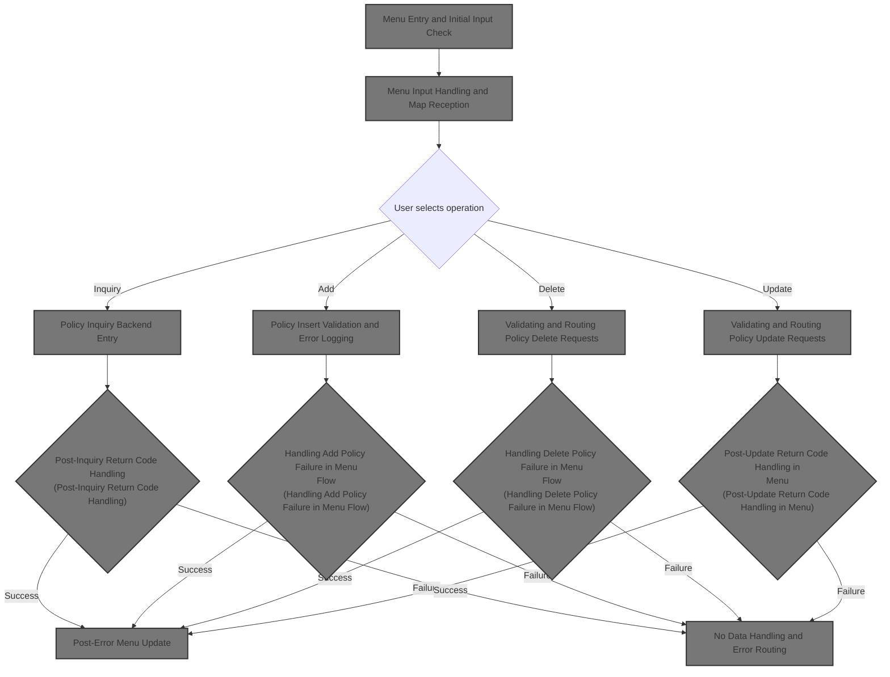
```mermaid
flowchart TD
    node1["Menu Entry and Initial Input Check"]:::HeadingStyle
    click node1 goToHeading "Menu Entry and Initial Input Check"
    node1 --> node2["Menu Input Handling and Map Reception"]:::HeadingStyle
    click node2 goToHeading "Menu Input Handling and Map Reception"
    node2 --> node3{"User selects operation"}
    node3 -->|"Inquiry"|node4["Policy Inquiry Backend Entry"]:::HeadingStyle
    click node4 goToHeading "Policy Inquiry Backend Entry"
    node4 --> node5{"Post-Inquiry Return Code Handling
(Post-Inquiry Return Code Handling)"}:::HeadingStyle
    click node5 goToHeading "Post-Inquiry Return Code Handling"
    node5 -->|"Success"|node6["Post-Error Menu Update"]:::HeadingStyle
    click node6 goToHeading "Post-Error Menu Update"
    node5 -->|"Failure"|node7["No Data Handling and Error Routing"]:::HeadingStyle
    click node7 goToHeading "No Data Handling and Error Routing"
    node3 -->|"Add"|node8["Policy Insert Validation and Error Logging"]:::HeadingStyle
    click node8 goToHeading "Policy Insert Validation and Error Logging"
    node8 --> node9{"Handling Add Policy Failure in Menu
Flow
(Handling Add Policy Failure in Menu Flow)"}:::HeadingStyle
    click node9 goToHeading "Handling Add Policy Failure in Menu Flow"
    node9 -->|"Success"|node6
    node9 -->|"Failure"|node7
    node3 -->|"Delete"|node10["Validating and Routing Policy Delete Requests"]:::HeadingStyle
    click node10 goToHeading "Validating and Routing Policy Delete Requests"
    node10 --> node11{"Handling Delete Policy Failure in Menu
Flow
(Handling Delete Policy Failure in Menu Flow)"}:::HeadingStyle
    click node11 goToHeading "Handling Delete Policy Failure in Menu Flow"
    node11 -->|"Success"|node6
    node11 -->|"Failure"|node7
    node3 -->|"Update"|node12["Validating and Routing Policy Update Requests"]:::HeadingStyle
    click node12 goToHeading "Validating and Routing Policy Update Requests"
    node12 --> node13{"Post-Update Return Code Handling in
Menu
(Post-Update Return Code Handling in Menu)"}:::HeadingStyle
    click node13 goToHeading "Post-Update Return Code Handling in Menu"
    node13 -->|"Success"|node6
    node13 -->|"Failure"|node7
classDef HeadingStyle fill:#777777,stroke:#333,stroke-width:2px;
```

## Dependencies

### Programs

- <SwmToken path="base/src/lgtestp2.cbl" pos="11:6:6" line-data="       PROGRAM-ID. LGTESTP2.">`LGTESTP2`</SwmToken> (<SwmPath>[base/src/lgtestp2.cbl](base/src/lgtestp2.cbl)</SwmPath>)
- <SwmToken path="base/src/lgtestp2.cbl" pos="67:10:10" line-data="                 EXEC CICS LINK PROGRAM(&#39;LGIPOL01&#39;)">`LGIPOL01`</SwmToken> (<SwmPath>[base/src/lgipol01.cbl](base/src/lgipol01.cbl)</SwmPath>)
- <SwmToken path="base/src/lgipol01.cbl" pos="91:9:9" line-data="           EXEC CICS LINK Program(LGIPDB01)">`LGIPDB01`</SwmToken> (<SwmPath>[base/src/lgipdb01.cbl](base/src/lgipdb01.cbl)</SwmPath>)
- LGSTSQ (<SwmPath>[base/src/lgstsq.cbl](base/src/lgstsq.cbl)</SwmPath>)
- <SwmToken path="base/src/lgtestp2.cbl" pos="105:10:10" line-data="                 EXEC CICS LINK PROGRAM(&#39;LGAPOL01&#39;)">`LGAPOL01`</SwmToken> (<SwmPath>[base/src/lgapol01.cbl](base/src/lgapol01.cbl)</SwmPath>)
- <SwmToken path="base/src/lgapol01.cbl" pos="103:9:9" line-data="           EXEC CICS Link Program(LGAPDB01)">`LGAPDB01`</SwmToken> (<SwmPath>[base/src/LGAPDB01.cbl](base/src/LGAPDB01.cbl)</SwmPath>)
- <SwmToken path="base/src/LGAPDB01.cbl" pos="269:4:4" line-data="           CALL &#39;LGAPDB02&#39; USING IN-PROPERTY-TYPE, IN-POSTCODE, ">`LGAPDB02`</SwmToken> (<SwmPath>[base/src/LGAPDB02.cbl](base/src/LGAPDB02.cbl)</SwmPath>)
- <SwmToken path="base/src/LGAPDB01.cbl" pos="276:4:4" line-data="           CALL &#39;LGAPDB03&#39; USING WS-BASE-RISK-SCR, IN-FIRE-PERIL, ">`LGAPDB03`</SwmToken> (<SwmPath>[base/src/LGAPDB03.cbl](base/src/LGAPDB03.cbl)</SwmPath>)
- <SwmToken path="base/src/LGAPDB01.cbl" pos="313:4:4" line-data="               CALL &#39;LGAPDB04&#39; USING LK-INPUT-DATA, LK-COVERAGE-DATA, ">`LGAPDB04`</SwmToken> (<SwmPath>[base/src/LGAPDB04.cbl](base/src/LGAPDB04.cbl)</SwmPath>)
- <SwmToken path="base/src/lgtestp2.cbl" pos="129:10:10" line-data="                 EXEC CICS LINK PROGRAM(&#39;LGDPOL01&#39;)">`LGDPOL01`</SwmToken> (<SwmPath>[base/src/lgdpol01.cbl](base/src/lgdpol01.cbl)</SwmPath>)
- <SwmToken path="base/src/lgdpol01.cbl" pos="141:9:9" line-data="           EXEC CICS LINK PROGRAM(LGDPDB01)">`LGDPDB01`</SwmToken> (<SwmPath>[base/src/lgdpdb01.cbl](base/src/lgdpdb01.cbl)</SwmPath>)
- <SwmToken path="base/src/lgdpdb01.cbl" pos="168:9:9" line-data="               EXEC CICS LINK PROGRAM(LGDPVS01)">`LGDPVS01`</SwmToken> (<SwmPath>[base/src/lgdpvs01.cbl](base/src/lgdpvs01.cbl)</SwmPath>)
- <SwmToken path="base/src/lgtestp2.cbl" pos="198:10:10" line-data="                 EXEC CICS LINK PROGRAM(&#39;LGUPOL01&#39;)">`LGUPOL01`</SwmToken> (<SwmPath>[base/src/lgupol01.cbl](base/src/lgupol01.cbl)</SwmPath>)
- <SwmToken path="base/src/lgupol01.cbl" pos="157:9:9" line-data="           EXEC CICS LINK Program(LGUPDB01)">`LGUPDB01`</SwmToken> (<SwmPath>[base/src/lgupdb01.cbl](base/src/lgupdb01.cbl)</SwmPath>)
- <SwmToken path="base/src/lgupdb01.cbl" pos="209:9:9" line-data="           EXEC CICS LINK Program(LGUPVS01)">`LGUPVS01`</SwmToken> (<SwmPath>[base/src/lgupvs01.cbl](base/src/lgupvs01.cbl)</SwmPath>)
- <SwmToken path="base/src/lgtestp2.cbl" pos="241:4:4" line-data="                TRANSID(&#39;SSP2&#39;)">`SSP2`</SwmToken>

### Copybooks

- SQLCA
- LGPOLICY (<SwmPath>[base/src/lgpolicy.cpy](base/src/lgpolicy.cpy)</SwmPath>)
- LGCMAREA (<SwmPath>[base/src/lgcmarea.cpy](base/src/lgcmarea.cpy)</SwmPath>)
- <SwmToken path="base/src/LGAPDB01.cbl" pos="35:3:3" line-data="           COPY INPUTREC2.">`INPUTREC2`</SwmToken> (<SwmPath>[base/src/INPUTREC2.cpy](base/src/INPUTREC2.cpy)</SwmPath>)
- OUTPUTREC (<SwmPath>[base/src/OUTPUTREC.cpy](base/src/OUTPUTREC.cpy)</SwmPath>)
- WORKSTOR (<SwmPath>[base/src/WORKSTOR.cpy](base/src/WORKSTOR.cpy)</SwmPath>)
- LGAPACT (<SwmPath>[base/src/LGAPACT.cpy](base/src/LGAPACT.cpy)</SwmPath>)
- SSMAP

## Input and Output Tables/Files used

### <SwmToken path="base/src/LGAPDB01.cbl" pos="269:4:4" line-data="           CALL &#39;LGAPDB02&#39; USING IN-PROPERTY-TYPE, IN-POSTCODE, ">`LGAPDB02`</SwmToken> (<SwmPath>[base/src/LGAPDB02.cbl](base/src/LGAPDB02.cbl)</SwmPath>)

| Table / File Name | Type                                                                                                                    | Description                                             | Usage Mode | Key Fields / Layout Highlights      |
| ----------------- | ----------------------------------------------------------------------------------------------------------------------- | ------------------------------------------------------- | ---------- | ----------------------------------- |
| RISK_FACTORS      | <SwmToken path="base/src/lgipdb01.cbl" pos="242:5:5" line-data="      * initialize DB2 host variables">`DB2`</SwmToken> | Peril-specific risk factor values for insurance scoring | Input      | `WS-FIRE-FACTOR`, `WS-CRIME-FACTOR` |

### <SwmToken path="base/src/LGAPDB01.cbl" pos="313:4:4" line-data="               CALL &#39;LGAPDB04&#39; USING LK-INPUT-DATA, LK-COVERAGE-DATA, ">`LGAPDB04`</SwmToken> (<SwmPath>[base/src/LGAPDB04.cbl](base/src/LGAPDB04.cbl)</SwmPath>)

| Table / File Name | Type                                                                                                                    | Description                                               | Usage Mode | Key Fields / Layout Highlights                                                                                                                                                                           |
| ----------------- | ----------------------------------------------------------------------------------------------------------------------- | --------------------------------------------------------- | ---------- | -------------------------------------------------------------------------------------------------------------------------------------------------------------------------------------------------------- |
| RATE_MASTER       | <SwmToken path="base/src/lgipdb01.cbl" pos="242:5:5" line-data="      * initialize DB2 host variables">`DB2`</SwmToken> | Property insurance rate parameters by peril and territory | Input      | `BASE_RATE`, <SwmToken path="base/src/LGAPDB01.cbl" pos="132:4:4" line-data="           MOVE &#39;MIN_PREMIUM&#39; TO CONFIG-KEY">`MIN_PREMIUM`</SwmToken>, `WS-BASE-RATE`, `WS-MIN-PREM`, `WS-MAX-PREM` |

### <SwmToken path="base/src/lgipol01.cbl" pos="91:9:9" line-data="           EXEC CICS LINK Program(LGIPDB01)">`LGIPDB01`</SwmToken> (<SwmPath>[base/src/lgipdb01.cbl](base/src/lgipdb01.cbl)</SwmPath>)

| Table / File Name | Type                                                                                                                    | Description                                                        | Usage Mode | Key Fields / Layout Highlights                                                                                                                                                                                                                                                                                                                                                                                                                                                                                                                                                                                                                                                                                                                                                                                                                                                                                                                                                                                                                                                                                                                                                                                                                                                                                                                                                                                                                                                                                                                                                                                                                                                                                                                                                                                                                                                                                                                                                                                                                                                                                                                                                                                                                                                                                                                                                                                                                                                                                                                                                                                                                                                                                                                                                                                                                                                                                                                                                                                                                                                                                                                                                                                                                                                                                                                                                                                                                                                                                                                                                                                                                                                                                                                                                                                                                                                                                                                                                                                                                                                                                                                                                                                                                                                                                                                                                                                                                                                                                                                                                                                                                                                                                                                                                                                                                                                                                                                                                                                                                                                                                                                                                                                                                                                                                                                                                                                                                                                                                                                                                                                                                                                                                                                                                                                                                                                                                                                                                                                                                                                                                                                                                                                                                                                                                                                                                                                                                                                                                                                                                                                                                                                                                                                                                                                                                                                                                                                                                                                                                                                                                                                                                                                                                                                                                                                                                                                                                                                                                                                                                                                                                                                                                                                                                                                                                                                                                                                                                                                                                                                                                                                                                                                                                                                                                                                                                                                                                                                                                                                                                                                                                                                                                                                                                                                                                                                                                                                                                                                                                                                                                                                                                                                                                                                                                                                                                                                                                                                                                                                                                                                                                                                                                                                                                                                                                                                                                                                                                                                                                                                                                                                                                                                                                                                                                                                                                                                                                                                                                                                                                                                                                                                                                                                                                                                                                                                                                                                                                                                                                                                                                                                                                                                                                                                                                                                                                                                                                                                                                                                                                                                                                                                                                                                                                                                                                                                                                                                                                                                                                                                                                                                                                                                                                                                                                                                                                                                                                                                                                                                                                                                                                                                                                                                                                                                                                                                                                                                                                                                                                                                                   |
| ----------------- | ----------------------------------------------------------------------------------------------------------------------- | ------------------------------------------------------------------ | ---------- | ------------------------------------------------------------------------------------------------------------------------------------------------------------------------------------------------------------------------------------------------------------------------------------------------------------------------------------------------------------------------------------------------------------------------------------------------------------------------------------------------------------------------------------------------------------------------------------------------------------------------------------------------------------------------------------------------------------------------------------------------------------------------------------------------------------------------------------------------------------------------------------------------------------------------------------------------------------------------------------------------------------------------------------------------------------------------------------------------------------------------------------------------------------------------------------------------------------------------------------------------------------------------------------------------------------------------------------------------------------------------------------------------------------------------------------------------------------------------------------------------------------------------------------------------------------------------------------------------------------------------------------------------------------------------------------------------------------------------------------------------------------------------------------------------------------------------------------------------------------------------------------------------------------------------------------------------------------------------------------------------------------------------------------------------------------------------------------------------------------------------------------------------------------------------------------------------------------------------------------------------------------------------------------------------------------------------------------------------------------------------------------------------------------------------------------------------------------------------------------------------------------------------------------------------------------------------------------------------------------------------------------------------------------------------------------------------------------------------------------------------------------------------------------------------------------------------------------------------------------------------------------------------------------------------------------------------------------------------------------------------------------------------------------------------------------------------------------------------------------------------------------------------------------------------------------------------------------------------------------------------------------------------------------------------------------------------------------------------------------------------------------------------------------------------------------------------------------------------------------------------------------------------------------------------------------------------------------------------------------------------------------------------------------------------------------------------------------------------------------------------------------------------------------------------------------------------------------------------------------------------------------------------------------------------------------------------------------------------------------------------------------------------------------------------------------------------------------------------------------------------------------------------------------------------------------------------------------------------------------------------------------------------------------------------------------------------------------------------------------------------------------------------------------------------------------------------------------------------------------------------------------------------------------------------------------------------------------------------------------------------------------------------------------------------------------------------------------------------------------------------------------------------------------------------------------------------------------------------------------------------------------------------------------------------------------------------------------------------------------------------------------------------------------------------------------------------------------------------------------------------------------------------------------------------------------------------------------------------------------------------------------------------------------------------------------------------------------------------------------------------------------------------------------------------------------------------------------------------------------------------------------------------------------------------------------------------------------------------------------------------------------------------------------------------------------------------------------------------------------------------------------------------------------------------------------------------------------------------------------------------------------------------------------------------------------------------------------------------------------------------------------------------------------------------------------------------------------------------------------------------------------------------------------------------------------------------------------------------------------------------------------------------------------------------------------------------------------------------------------------------------------------------------------------------------------------------------------------------------------------------------------------------------------------------------------------------------------------------------------------------------------------------------------------------------------------------------------------------------------------------------------------------------------------------------------------------------------------------------------------------------------------------------------------------------------------------------------------------------------------------------------------------------------------------------------------------------------------------------------------------------------------------------------------------------------------------------------------------------------------------------------------------------------------------------------------------------------------------------------------------------------------------------------------------------------------------------------------------------------------------------------------------------------------------------------------------------------------------------------------------------------------------------------------------------------------------------------------------------------------------------------------------------------------------------------------------------------------------------------------------------------------------------------------------------------------------------------------------------------------------------------------------------------------------------------------------------------------------------------------------------------------------------------------------------------------------------------------------------------------------------------------------------------------------------------------------------------------------------------------------------------------------------------------------------------------------------------------------------------------------------------------------------------------------------------------------------------------------------------------------------------------------------------------------------------------------------------------------------------------------------------------------------------------------------------------------------------------------------------------------------------------------------------------------------------------------------------------------------------------------------------------------------------------------------------------------------------------------------------------------------------------------------------------------------------------------------------------------------------------------------------------------------------------------------------------------------------------------------------------------------------------------------------------------------------------------------------------------------------------------------------------------------------------------------------------------------------------------------------------------------------------------------------------------------------------------------------------------------------------------------------------------------------------------------------------------------------------------------------------------------------------------------------------------------------------------------------------------------------------------------------------------------------------------------------------------------------------------------------------------------------------------------------------------------------------------------------------------------------------------------------------------------------------------------------------------------------------------------------------------------------------------------------------------------------------------------------------------------------------------------------------------------------------------------------------------------------------------------------------------------------------------------------------------------------------------------------------------------------------------------------------------------------------------------------------------------------------------------------------------------------------------------------------------------------------------------------------------------------------------------------------------------------------------------------------------------------------------------------------------------------------------------------------------------------------------------------------------------------------------------------------------------------------------------------------------------------------------------------------------------------------------------------------------------------------------------------------------------------------------------------------------------------------------------------------------------------------------------------------------------------------------------------------------------------------------------------------------------------------------------------------------------------------------------------------------------------------------------------------------------------------------------------------------------------------------------------------------------------------------------------------------------------------------------------------------------------------------------------------------------------------------------------------------------------------------------------------------------------------------------------------------------------------------------------------------------------------------------------------------------------------------------------------------------------------------------------------------------------------------------------------------------------------------------------------------------------------------------------------------------------------------------------------------------------------------------------------------------------------------------------------------------------------------------------------------------------------------------------------------------------------------------------------------------------------------------------------------------------------------------------------------------------------------------------------------------------------------ |
| POLICY            | <SwmToken path="base/src/lgipdb01.cbl" pos="242:5:5" line-data="      * initialize DB2 host variables">`DB2`</SwmToken> | Insurance policy master data, links to customer and product tables | Input      | <SwmToken path="base/src/lgipdb01.cbl" pos="92:1:1" line-data="                   CustomerNumber,">`CustomerNumber`</SwmToken>, <SwmToken path="base/src/lgipdb01.cbl" pos="93:3:3" line-data="                   Policy.PolicyNumber,">`PolicyNumber`</SwmToken>, <SwmToken path="base/src/lgipdb01.cbl" pos="94:1:1" line-data="                   RequestDate,">`RequestDate`</SwmToken>, <SwmToken path="base/src/lgipdb01.cbl" pos="95:1:1" line-data="                   StartDate,">`StartDate`</SwmToken>, <SwmToken path="base/src/lgipdb01.cbl" pos="96:1:1" line-data="                   RenewalDate,">`RenewalDate`</SwmToken>, <SwmToken path="base/src/lgipdb01.cbl" pos="97:1:1" line-data="                   Address,">`Address`</SwmToken>, <SwmToken path="base/src/lgipdb01.cbl" pos="98:1:1" line-data="                   Zipcode,">`Zipcode`</SwmToken>, <SwmToken path="base/src/lgipdb01.cbl" pos="99:1:1" line-data="                   LatitudeN,">`LatitudeN`</SwmToken>, <SwmToken path="base/src/lgipdb01.cbl" pos="100:1:1" line-data="                   LongitudeW,">`LongitudeW`</SwmToken>, <SwmToken path="base/src/lgtestp2.cbl" pos="271:4:4" line-data="               Move &#39;Customer does not exist&#39;          To  ERP1FLDO">`Customer`</SwmToken>, <SwmToken path="base/src/lgipdb01.cbl" pos="102:1:1" line-data="                   PropertyType,">`PropertyType`</SwmToken>, <SwmToken path="base/src/lgipdb01.cbl" pos="103:1:1" line-data="                   FirePeril,">`FirePeril`</SwmToken>, <SwmToken path="base/src/lgipdb01.cbl" pos="104:1:1" line-data="                   FirePremium,">`FirePremium`</SwmToken>, <SwmToken path="base/src/lgipdb01.cbl" pos="105:1:1" line-data="                   CrimePeril,">`CrimePeril`</SwmToken>, <SwmToken path="base/src/lgipdb01.cbl" pos="106:1:1" line-data="                   CrimePremium,">`CrimePremium`</SwmToken>, <SwmToken path="base/src/lgipdb01.cbl" pos="107:1:1" line-data="                   FloodPeril,">`FloodPeril`</SwmToken>, <SwmToken path="base/src/lgipdb01.cbl" pos="108:1:1" line-data="                   FloodPremium,">`FloodPremium`</SwmToken>, <SwmToken path="base/src/lgipdb01.cbl" pos="109:1:1" line-data="                   WeatherPeril,">`WeatherPeril`</SwmToken>, <SwmToken path="base/src/lgipdb01.cbl" pos="110:1:1" line-data="                   WeatherPremium,">`WeatherPremium`</SwmToken>, <SwmToken path="base/src/lgupvs01.cbl" pos="110:7:7" line-data="               Move CA-B-Status    To WF-B-Status">`Status`</SwmToken>, <SwmToken path="base/src/lgipdb01.cbl" pos="112:1:1" line-data="                   RejectionReason">`RejectionReason`</SwmToken>, <SwmToken path="base/src/lgipdb01.cbl" pos="331:3:3" line-data="             SELECT  ISSUEDATE,">`ISSUEDATE`</SwmToken>, <SwmToken path="base/src/lgipdb01.cbl" pos="332:1:1" line-data="                     EXPIRYDATE,">`EXPIRYDATE`</SwmToken>, <SwmToken path="base/src/lgipdb01.cbl" pos="333:1:1" line-data="                     LASTCHANGED,">`LASTCHANGED`</SwmToken>, <SwmToken path="base/src/lgtestp2.cbl" pos="94:9:9" line-data="                 Move 0                 To CA-BROKERID">`BROKERID`</SwmToken>, <SwmToken path="base/src/lgipdb01.cbl" pos="335:1:1" line-data="                     BROKERSREFERENCE,">`BROKERSREFERENCE`</SwmToken>, <SwmToken path="base/src/lgtestp2.cbl" pos="93:9:9" line-data="                 Move 0                 To CA-PAYMENT">`PAYMENT`</SwmToken>, <SwmToken path="base/src/lgipdb01.cbl" pos="337:1:1" line-data="                     WITHPROFITS,">`WITHPROFITS`</SwmToken>, <SwmToken path="base/src/lgtestp2.cbl" pos="83:7:7" line-data="                 Move CA-E-EQUITIES     To  ENP2EQUI">`EQUITIES`</SwmToken>, <SwmToken path="base/src/lgipdb01.cbl" pos="339:1:1" line-data="                     MANAGEDFUND,">`MANAGEDFUND`</SwmToken>, <SwmToken path="base/src/lgipdb01.cbl" pos="340:1:1" line-data="                     FUNDNAME,">`FUNDNAME`</SwmToken>, <SwmToken path="base/src/lgtestp2.cbl" pos="78:7:7" line-data="                 Move CA-E-TERM         To  ENP2TERI">`TERM`</SwmToken>, <SwmToken path="base/src/lgipdb01.cbl" pos="342:1:1" line-data="                     SUMASSURED,">`SUMASSURED`</SwmToken>, <SwmToken path="base/src/lgipdb01.cbl" pos="343:1:1" line-data="                     LIFEASSURED,">`LIFEASSURED`</SwmToken>, <SwmToken path="base/src/lgipdb01.cbl" pos="344:1:1" line-data="                     PADDINGDATA,">`PADDINGDATA`</SwmToken>, <SwmToken path="base/src/lgtestp2.cbl" pos="69:1:1" line-data="                           LENGTH(32500)">`LENGTH`</SwmToken>, <SwmToken path="base/src/lgipdb01.cbl" pos="347:2:4" line-data="                   :DB2-EXPIRYDATE,">`DB2-EXPIRYDATE`</SwmToken>, <SwmToken path="base/src/lgipdb01.cbl" pos="348:2:4" line-data="                   :DB2-LASTCHANGED,">`DB2-LASTCHANGED`</SwmToken>, <SwmToken path="base/src/lgipdb01.cbl" pos="349:11:13" line-data="                   :DB2-BROKERID-INT INDICATOR :IND-BROKERID,">`IND-BROKERID`</SwmToken>, <SwmToken path="base/src/lgipdb01.cbl" pos="350:9:11" line-data="                   :DB2-BROKERSREF INDICATOR :IND-BROKERSREF,">`IND-BROKERSREF`</SwmToken>, <SwmToken path="base/src/lgipdb01.cbl" pos="351:11:13" line-data="                   :DB2-PAYMENT-INT INDICATOR :IND-PAYMENT,">`IND-PAYMENT`</SwmToken>, <SwmToken path="base/src/lgipdb01.cbl" pos="352:2:6" line-data="                   :DB2-E-WITHPROFITS,">`DB2-E-WITHPROFITS`</SwmToken>, <SwmToken path="base/src/lgipdb01.cbl" pos="353:2:6" line-data="                   :DB2-E-EQUITIES,">`DB2-E-EQUITIES`</SwmToken>, <SwmToken path="base/src/lgipdb01.cbl" pos="354:2:6" line-data="                   :DB2-E-MANAGEDFUND,">`DB2-E-MANAGEDFUND`</SwmToken>, <SwmToken path="base/src/lgipdb01.cbl" pos="355:2:6" line-data="                   :DB2-E-FUNDNAME,">`DB2-E-FUNDNAME`</SwmToken>, <SwmToken path="base/src/lgipdb01.cbl" pos="356:2:8" line-data="                   :DB2-E-TERM-SINT,">`DB2-E-TERM-SINT`</SwmToken>, <SwmToken path="base/src/lgipdb01.cbl" pos="357:2:8" line-data="                   :DB2-E-SUMASSURED-INT,">`DB2-E-SUMASSURED-INT`</SwmToken>, <SwmToken path="base/src/lgipdb01.cbl" pos="358:2:6" line-data="                   :DB2-E-LIFEASSURED,">`DB2-E-LIFEASSURED`</SwmToken>, <SwmToken path="base/src/lgipdb01.cbl" pos="359:11:15" line-data="                   :DB2-E-PADDINGDATA INDICATOR :IND-E-PADDINGDATA,">`IND-E-PADDINGDATA`</SwmToken>, <SwmToken path="base/src/lgipdb01.cbl" pos="360:13:17" line-data="                   :DB2-E-PADDING-LEN INDICATOR :IND-E-PADDINGDATAL">`IND-E-PADDINGDATAL`</SwmToken>, <SwmToken path="base/src/lgipdb01.cbl" pos="451:1:1" line-data="                     PROPERTYTYPE,">`PROPERTYTYPE`</SwmToken>, <SwmToken path="base/src/lgipdb01.cbl" pos="452:1:1" line-data="                     BEDROOMS,">`BEDROOMS`</SwmToken>, <SwmToken path="base/src/lgipdb01.cbl" pos="453:1:1" line-data="                     VALUE,">`VALUE`</SwmToken>, <SwmToken path="base/src/lgipdb01.cbl" pos="454:1:1" line-data="                     HOUSENAME,">`HOUSENAME`</SwmToken>, <SwmToken path="base/src/lgipdb01.cbl" pos="455:1:1" line-data="                     HOUSENUMBER,">`HOUSENUMBER`</SwmToken>, <SwmToken path="base/src/lgipdb01.cbl" pos="346:4:6" line-data="             INTO  :DB2-ISSUEDATE,">`DB2-ISSUEDATE`</SwmToken>, <SwmToken path="base/src/lgipdb01.cbl" pos="463:2:6" line-data="                   :DB2-H-PROPERTYTYPE,">`DB2-H-PROPERTYTYPE`</SwmToken>, <SwmToken path="base/src/lgipdb01.cbl" pos="464:2:8" line-data="                   :DB2-H-BEDROOMS-SINT,">`DB2-H-BEDROOMS-SINT`</SwmToken>, <SwmToken path="base/src/lgipdb01.cbl" pos="465:2:8" line-data="                   :DB2-H-VALUE-INT,">`DB2-H-VALUE-INT`</SwmToken>, <SwmToken path="base/src/lgipdb01.cbl" pos="466:2:6" line-data="                   :DB2-H-HOUSENAME,">`DB2-H-HOUSENAME`</SwmToken>, <SwmToken path="base/src/lgipdb01.cbl" pos="467:2:6" line-data="                   :DB2-H-HOUSENUMBER,">`DB2-H-HOUSENUMBER`</SwmToken>, <SwmToken path="base/src/lgipdb01.cbl" pos="468:2:6" line-data="                   :DB2-H-POSTCODE">`DB2-H-POSTCODE`</SwmToken>, <SwmToken path="base/src/lgipdb01.cbl" pos="539:1:1" line-data="                     MAKE,">`MAKE`</SwmToken>, <SwmToken path="base/src/lgipdb01.cbl" pos="540:1:1" line-data="                     MODEL,">`MODEL`</SwmToken>, <SwmToken path="base/src/lgipdb01.cbl" pos="542:1:1" line-data="                     REGNUMBER,">`REGNUMBER`</SwmToken>, <SwmToken path="base/src/lgipdb01.cbl" pos="543:1:1" line-data="                     COLOUR,">`COLOUR`</SwmToken>, <SwmToken path="base/src/lgipdb01.cbl" pos="544:1:1" line-data="                     CC,">`CC`</SwmToken>, <SwmToken path="base/src/lgipdb01.cbl" pos="545:1:1" line-data="                     YEAROFMANUFACTURE,">`YEAROFMANUFACTURE`</SwmToken>, <SwmToken path="base/src/lgipdb01.cbl" pos="546:1:1" line-data="                     PREMIUM,">`PREMIUM`</SwmToken>, <SwmToken path="base/src/lgipdb01.cbl" pos="554:2:6" line-data="                   :DB2-M-MAKE,">`DB2-M-MAKE`</SwmToken>, <SwmToken path="base/src/lgipdb01.cbl" pos="555:2:6" line-data="                   :DB2-M-MODEL,">`DB2-M-MODEL`</SwmToken>, <SwmToken path="base/src/lgipdb01.cbl" pos="556:2:8" line-data="                   :DB2-M-VALUE-INT,">`DB2-M-VALUE-INT`</SwmToken>, <SwmToken path="base/src/lgipdb01.cbl" pos="557:2:6" line-data="                   :DB2-M-REGNUMBER,">`DB2-M-REGNUMBER`</SwmToken>, <SwmToken path="base/src/lgipdb01.cbl" pos="558:2:6" line-data="                   :DB2-M-COLOUR,">`DB2-M-COLOUR`</SwmToken>, <SwmToken path="base/src/lgipdb01.cbl" pos="559:2:8" line-data="                   :DB2-M-CC-SINT,">`DB2-M-CC-SINT`</SwmToken>, <SwmToken path="base/src/lgipdb01.cbl" pos="560:2:6" line-data="                   :DB2-M-MANUFACTURED,">`DB2-M-MANUFACTURED`</SwmToken>, <SwmToken path="base/src/lgipdb01.cbl" pos="561:2:8" line-data="                   :DB2-M-PREMIUM-INT,">`DB2-M-PREMIUM-INT`</SwmToken>, <SwmToken path="base/src/lgipdb01.cbl" pos="562:2:8" line-data="                   :DB2-M-ACCIDENTS-INT">`DB2-M-ACCIDENTS-INT`</SwmToken>, <SwmToken path="base/src/lgipdb01.cbl" pos="655:2:6" line-data="                   :DB2-B-Address,">`DB2-B-Address`</SwmToken>, <SwmToken path="base/src/lgipdb01.cbl" pos="656:2:6" line-data="                   :DB2-B-Postcode,">`DB2-B-Postcode`</SwmToken>, <SwmToken path="base/src/lgipdb01.cbl" pos="657:2:6" line-data="                   :DB2-B-Latitude,">`DB2-B-Latitude`</SwmToken>, <SwmToken path="base/src/lgipdb01.cbl" pos="658:2:6" line-data="                   :DB2-B-Longitude,">`DB2-B-Longitude`</SwmToken>, <SwmToken path="base/src/lgipdb01.cbl" pos="659:2:6" line-data="                   :DB2-B-Customer,">`DB2-B-Customer`</SwmToken>, <SwmToken path="base/src/lgipdb01.cbl" pos="660:2:6" line-data="                   :DB2-B-PropType,">`DB2-B-PropType`</SwmToken>, <SwmToken path="base/src/lgipdb01.cbl" pos="182:3:9" line-data="           03 DB2-B-FirePeril-Int      PIC S9(4) COMP.">`DB2-B-FirePeril-Int`</SwmToken>, <SwmToken path="base/src/lgipdb01.cbl" pos="183:3:9" line-data="           03 DB2-B-FirePremium-Int    PIC S9(9) COMP.">`DB2-B-FirePremium-Int`</SwmToken>, <SwmToken path="base/src/lgipdb01.cbl" pos="184:3:9" line-data="           03 DB2-B-CrimePeril-Int     PIC S9(4) COMP.">`DB2-B-CrimePeril-Int`</SwmToken>, <SwmToken path="base/src/lgipdb01.cbl" pos="185:3:9" line-data="           03 DB2-B-CrimePremium-Int   PIC S9(9) COMP.">`DB2-B-CrimePremium-Int`</SwmToken>, <SwmToken path="base/src/lgipdb01.cbl" pos="186:3:9" line-data="           03 DB2-B-FloodPeril-Int     PIC S9(4) COMP.">`DB2-B-FloodPeril-Int`</SwmToken>, <SwmToken path="base/src/lgipdb01.cbl" pos="187:3:9" line-data="           03 DB2-B-FloodPremium-Int   PIC S9(9) COMP.">`DB2-B-FloodPremium-Int`</SwmToken>, <SwmToken path="base/src/lgipdb01.cbl" pos="188:3:9" line-data="           03 DB2-B-WeatherPeril-Int   PIC S9(4) COMP.">`DB2-B-WeatherPeril-Int`</SwmToken>, <SwmToken path="base/src/lgipdb01.cbl" pos="189:3:9" line-data="           03 DB2-B-WeatherPremium-Int PIC S9(9) COMP.">`DB2-B-WeatherPremium-Int`</SwmToken>, <SwmToken path="base/src/lgipdb01.cbl" pos="190:3:9" line-data="           03 DB2-B-Status-Int         PIC S9(4) COMP.">`DB2-B-Status-Int`</SwmToken>, <SwmToken path="base/src/lgipdb01.cbl" pos="670:2:6" line-data="                   :DB2-B-RejectReason">`DB2-B-RejectReason`</SwmToken>, <SwmToken path="base/src/lgipdb01.cbl" pos="263:11:15" line-data="           MOVE CA-CUSTOMER-NUM TO DB2-CUSTOMERNUM-INT">`DB2-CUSTOMERNUM-INT`</SwmToken> |

### <SwmToken path="base/src/LGAPDB01.cbl" pos="276:4:4" line-data="           CALL &#39;LGAPDB03&#39; USING WS-BASE-RISK-SCR, IN-FIRE-PERIL, ">`LGAPDB03`</SwmToken> (<SwmPath>[base/src/LGAPDB03.cbl](base/src/LGAPDB03.cbl)</SwmPath>)

| Table / File Name | Type                                                                                                                    | Description                                                    | Usage Mode | Key Fields / Layout Highlights      |
| ----------------- | ----------------------------------------------------------------------------------------------------------------------- | -------------------------------------------------------------- | ---------- | ----------------------------------- |
| RISK_FACTORS      | <SwmToken path="base/src/lgipdb01.cbl" pos="242:5:5" line-data="      * initialize DB2 host variables">`DB2`</SwmToken> | Peril-specific risk adjustment factors for premium calculation | Input      | `WS-FIRE-FACTOR`, `WS-CRIME-FACTOR` |

### <SwmToken path="base/src/lgdpol01.cbl" pos="141:9:9" line-data="           EXEC CICS LINK PROGRAM(LGDPDB01)">`LGDPDB01`</SwmToken> (<SwmPath>[base/src/lgdpdb01.cbl](base/src/lgdpdb01.cbl)</SwmPath>)

| Table / File Name | Type                                                                                                                    | Description                                                    | Usage Mode | Key Fields / Layout Highlights           |
| ----------------- | ----------------------------------------------------------------------------------------------------------------------- | -------------------------------------------------------------- | ---------- | ---------------------------------------- |
| POLICY            | <SwmToken path="base/src/lgipdb01.cbl" pos="242:5:5" line-data="      * initialize DB2 host variables">`DB2`</SwmToken> | Insurance policy master record (customer, policy number, type) | Output     | Database table with relational structure |

### <SwmToken path="base/src/lgapol01.cbl" pos="103:9:9" line-data="           EXEC CICS Link Program(LGAPDB01)">`LGAPDB01`</SwmToken> (<SwmPath>[base/src/LGAPDB01.cbl](base/src/LGAPDB01.cbl)</SwmPath>)

| Table / File Name                                                                                                                                        | Type                                                                                                                    | Description                                       | Usage Mode | Key Fields / Layout Highlights           |
| -------------------------------------------------------------------------------------------------------------------------------------------------------- | ----------------------------------------------------------------------------------------------------------------------- | ------------------------------------------------- | ---------- | ---------------------------------------- |
| <SwmToken path="base/src/LGAPDB01.cbl" pos="113:5:7" line-data="           OPEN INPUT CONFIG-FILE">`CONFIG-FILE`</SwmToken>                              | <SwmToken path="base/src/lgipdb01.cbl" pos="242:5:5" line-data="      * initialize DB2 host variables">`DB2`</SwmToken> | Application config parameters and thresholds      | Input      | Database table with relational structure |
| <SwmToken path="base/src/LGAPDB01.cbl" pos="9:3:5" line-data="           SELECT INPUT-FILE ASSIGN TO &#39;INPUT.DAT&#39;">`INPUT-FILE`</SwmToken>        | <SwmToken path="base/src/lgipdb01.cbl" pos="242:5:5" line-data="      * initialize DB2 host variables">`DB2`</SwmToken> | Policy application and property input data        | Input      | Database table with relational structure |
| <SwmToken path="base/src/LGAPDB01.cbl" pos="13:3:5" line-data="           SELECT OUTPUT-FILE ASSIGN TO &#39;OUTPUT.DAT&#39;">`OUTPUT-FILE`</SwmToken>    | <SwmToken path="base/src/lgipdb01.cbl" pos="242:5:5" line-data="      * initialize DB2 host variables">`DB2`</SwmToken> | Calculated premium and risk results per policy    | Output     | Database table with relational structure |
| <SwmToken path="base/src/LGAPDB01.cbl" pos="392:3:5" line-data="           WRITE OUTPUT-RECORD.">`OUTPUT-RECORD`</SwmToken>                              | <SwmToken path="base/src/lgipdb01.cbl" pos="242:5:5" line-data="      * initialize DB2 host variables">`DB2`</SwmToken> | Single policy premium and risk calculation result | Output     | Database table with relational structure |
| <SwmToken path="base/src/LGAPDB01.cbl" pos="27:3:5" line-data="           SELECT SUMMARY-FILE ASSIGN TO &#39;SUMMARY.DAT&#39;">`SUMMARY-FILE`</SwmToken> | <SwmToken path="base/src/lgipdb01.cbl" pos="242:5:5" line-data="      * initialize DB2 host variables">`DB2`</SwmToken> | Summary of processing statistics and totals       | Output     | Database table with relational structure |
| <SwmToken path="base/src/LGAPDB01.cbl" pos="64:3:5" line-data="       01  SUMMARY-RECORD             PIC X(132).">`SUMMARY-RECORD`</SwmToken>            | <SwmToken path="base/src/lgipdb01.cbl" pos="242:5:5" line-data="      * initialize DB2 host variables">`DB2`</SwmToken> | Summary line for processing statistics            | Output     | Database table with relational structure |

### <SwmToken path="base/src/lgupol01.cbl" pos="157:9:9" line-data="           EXEC CICS LINK Program(LGUPDB01)">`LGUPDB01`</SwmToken> (<SwmPath>[base/src/lgupdb01.cbl](base/src/lgupdb01.cbl)</SwmPath>)

| Table / File Name | Type                                                                                                                    | Description                                                       | Usage Mode   | Key Fields / Layout Highlights                                                                                                                                                                                                                                                                                                                                                                                                                                                                                                                                                                                                                                                                                                                                                                                                                                                                                                                                                                                                                                                               |
| ----------------- | ----------------------------------------------------------------------------------------------------------------------- | ----------------------------------------------------------------- | ------------ | -------------------------------------------------------------------------------------------------------------------------------------------------------------------------------------------------------------------------------------------------------------------------------------------------------------------------------------------------------------------------------------------------------------------------------------------------------------------------------------------------------------------------------------------------------------------------------------------------------------------------------------------------------------------------------------------------------------------------------------------------------------------------------------------------------------------------------------------------------------------------------------------------------------------------------------------------------------------------------------------------------------------------------------------------------------------------------------------- |
| ENDOWMENT         | <SwmToken path="base/src/lgipdb01.cbl" pos="242:5:5" line-data="      * initialize DB2 host variables">`DB2`</SwmToken> | Endowment policy specifics: fund, term, sum assured, life assured | Output       | <SwmToken path="base/src/lgipdb01.cbl" pos="337:1:1" line-data="                     WITHPROFITS,">`WITHPROFITS`</SwmToken>, <SwmToken path="base/src/lgtestp2.cbl" pos="83:7:7" line-data="                 Move CA-E-EQUITIES     To  ENP2EQUI">`EQUITIES`</SwmToken>, <SwmToken path="base/src/lgipdb01.cbl" pos="339:1:1" line-data="                     MANAGEDFUND,">`MANAGEDFUND`</SwmToken>, <SwmToken path="base/src/lgipdb01.cbl" pos="340:1:1" line-data="                     FUNDNAME,">`FUNDNAME`</SwmToken>, <SwmToken path="base/src/lgtestp2.cbl" pos="78:7:7" line-data="                 Move CA-E-TERM         To  ENP2TERI">`TERM`</SwmToken>, <SwmToken path="base/src/lgipdb01.cbl" pos="342:1:1" line-data="                     SUMASSURED,">`SUMASSURED`</SwmToken>, <SwmToken path="base/src/lgipdb01.cbl" pos="343:1:1" line-data="                     LIFEASSURED,">`LIFEASSURED`</SwmToken>                                                                                                                                                                  |
| HOUSE             | <SwmToken path="base/src/lgipdb01.cbl" pos="242:5:5" line-data="      * initialize DB2 host variables">`DB2`</SwmToken> | House policy details: property type, bedrooms, value, address     | Output       | <SwmToken path="base/src/lgipdb01.cbl" pos="451:1:1" line-data="                     PROPERTYTYPE,">`PROPERTYTYPE`</SwmToken>, <SwmToken path="base/src/lgipdb01.cbl" pos="452:1:1" line-data="                     BEDROOMS,">`BEDROOMS`</SwmToken>, <SwmToken path="base/src/lgipdb01.cbl" pos="453:1:1" line-data="                     VALUE,">`VALUE`</SwmToken>, <SwmToken path="base/src/lgipdb01.cbl" pos="454:1:1" line-data="                     HOUSENAME,">`HOUSENAME`</SwmToken>, <SwmToken path="base/src/lgipdb01.cbl" pos="455:1:1" line-data="                     HOUSENUMBER,">`HOUSENUMBER`</SwmToken>, <SwmToken path="base/src/lgipdb01.cbl" pos="456:1:1" line-data="                     POSTCODE">`POSTCODE`</SwmToken>                                                                                                                                                                                                                                                                                                                                            |
| MOTOR             | <SwmToken path="base/src/lgipdb01.cbl" pos="242:5:5" line-data="      * initialize DB2 host variables">`DB2`</SwmToken> | Motor policy details: make, model, value, reg, premium, accidents | Output       | <SwmToken path="base/src/lgipdb01.cbl" pos="539:1:1" line-data="                     MAKE,">`MAKE`</SwmToken>, <SwmToken path="base/src/lgipdb01.cbl" pos="540:1:1" line-data="                     MODEL,">`MODEL`</SwmToken>, <SwmToken path="base/src/lgipdb01.cbl" pos="453:1:1" line-data="                     VALUE,">`VALUE`</SwmToken>, <SwmToken path="base/src/lgipdb01.cbl" pos="542:1:1" line-data="                     REGNUMBER,">`REGNUMBER`</SwmToken>, <SwmToken path="base/src/lgipdb01.cbl" pos="543:1:1" line-data="                     COLOUR,">`COLOUR`</SwmToken>, <SwmToken path="base/src/lgipdb01.cbl" pos="544:1:1" line-data="                     CC,">`CC`</SwmToken>, <SwmToken path="base/src/lgipdb01.cbl" pos="545:1:1" line-data="                     YEAROFMANUFACTURE,">`YEAROFMANUFACTURE`</SwmToken>, <SwmToken path="base/src/lgipdb01.cbl" pos="546:1:1" line-data="                     PREMIUM,">`PREMIUM`</SwmToken>, <SwmToken path="base/src/lgipdb01.cbl" pos="547:1:1" line-data="                     ACCIDENTS">`ACCIDENTS`</SwmToken> |
| POLICY            | <SwmToken path="base/src/lgipdb01.cbl" pos="242:5:5" line-data="      * initialize DB2 host variables">`DB2`</SwmToken> | Insurance policy core details: type, dates, broker, payment       | Input/Output | <SwmToken path="base/src/lgipdb01.cbl" pos="331:3:3" line-data="             SELECT  ISSUEDATE,">`ISSUEDATE`</SwmToken>, <SwmToken path="base/src/lgipdb01.cbl" pos="332:1:1" line-data="                     EXPIRYDATE,">`EXPIRYDATE`</SwmToken>, <SwmToken path="base/src/lgipdb01.cbl" pos="333:1:1" line-data="                     LASTCHANGED,">`LASTCHANGED`</SwmToken>, <SwmToken path="base/src/lgtestp2.cbl" pos="94:9:9" line-data="                 Move 0                 To CA-BROKERID">`BROKERID`</SwmToken>, <SwmToken path="base/src/lgipdb01.cbl" pos="335:1:1" line-data="                     BROKERSREFERENCE,">`BROKERSREFERENCE`</SwmToken>, <SwmToken path="base/src/lgupdb01.cbl" pos="278:3:5" line-data="             IF CA-LASTCHANGED EQUAL TO DB2-LASTCHANGED">`CA-LASTCHANGED`</SwmToken>                                                                                                                                                                                                                                                                   |

## Detailed View of the Program's Functionality

# Endowment Policy Menu and Transaction Flow

## Menu Entry and Initial Input Check

When the main menu program starts, it first checks if there is any input data from the terminal. If there is, it jumps directly to the main menu logic. If not, it initializes the input and output areas, as well as the communication area used for passing data between programs. It also resets the customer and policy numbers to default values. Then, it sends the main menu screen to the terminal, clearing any previous content.

## Menu Input Handling and Map Reception

The main menu logic sets up handlers for special terminal actions (like clearing the screen or ending the session) and for handling errors in receiving input. It then receives the user's input from the terminal screen. The user's menu selection is then evaluated, and the program branches based on the selected operation:

- **Inquiry ('1')**: Prepares a request to look up policy details for a given customer and policy number.
- **Add ('2')**: Prepares a request to add a new policy using the data entered by the user.
- **Delete ('3')**: Prepares a request to delete a policy for the given customer and policy number.
- **Update ('4')**: Prepares a request to update an existing policy with new details.
- **Other**: If the input is not recognized, it prompts the user to enter a valid option.

## Policy Inquiry Backend Entry

When a policy inquiry is requested, the program sets up a request identifier and copies the customer and policy numbers into the communication area. It then calls the backend inquiry program.

The backend inquiry program initializes runtime variables and checks if the required input data (the communication area) is present. If not, it logs an error and aborts the transaction. If the input is valid, it sets a return code indicating success and links to the database program to fetch the policy details. After the database call, it returns control to the system.

## Error Logging and Queue Writing

Whenever an error occurs (such as missing input or a database error), the error logging routine is called. This routine captures the current date and time, formats an error message, and writes it to a queue for later review. It also writes up to 90 bytes of the communication area to the queue, so that the context of the error is preserved. The queue writing program decides how to process the message, writes it to both a transient data queue and a temporary storage queue, and sends a response if needed.

## Policy Data Retrieval and Error Handling

The database inquiry program initializes its variables and checks for valid input. If the input is missing, it logs an error and aborts. It then determines which type of policy is being requested (endowment, house, motor, or commercial) based on the request identifier, and calls the appropriate routine to fetch the policy details from the database.

Each policy type has its own retrieval logic:

- For each, it calculates the required buffer size, checks if the input area is large enough, and moves the retrieved data into the communication area.
- If the retrieval is successful, it marks the end of the data with a special value.
- If no data is found, it sets a return code indicating this.
- If a database error occurs, it sets an error code and logs the error.

## Post-Inquiry Return Code Handling

After returning from the backend inquiry, the main menu logic checks the return code. If no data was found, it sets a message indicating this and jumps to the error handling routine to display the message and reset the menu.

## Menu Reset and Session End Routing

The error handling routine sends the menu screen to the terminal, displaying any messages. It then re-initializes the input/output and communication areas and returns control to the transaction, ready for the next user action.

## Post-Error Menu Update

If the inquiry was successful, the main menu logic moves the policy details from the communication area into the menu fields and sends the updated screen to the terminal, showing the user the retrieved policy information.

## Policy Insert Validation and Error Logging

When adding a new policy, the program checks the input area for valid length. If the input is missing or too short, it logs an error and aborts. If the input is valid, it links to the backend program that handles the actual data insertion.

The error logging routine for policy insertions works similarly to the inquiry error logging, capturing the date, time, and up to 90 bytes of the communication area.

## Policy Application Processing Workflow

The backend policy application program runs a series of steps:

1. Initializes variables and counters.
2. Loads configuration values from a file, or sets defaults if the file is missing.
3. Opens all required files (input, output, summary).
4. Processes each input record, validating and routing them as needed.
5. Closes all files.
6. Generates a summary report.
7. Displays processing statistics.

## Configuration Loading and Defaults

The configuration loading step attempts to open a configuration file. If the file is not available, it sets default business parameters and logs a warning. If the file is present, it reads configuration values (such as maximum risk score and minimum premium), checks if they are numeric, and stores them for later use.

## Input Record Processing and Validation

For each input record, the program validates the data. If the record is valid, it is processed further; if not, an error record is created and written to the output, and error counters are updated.

## Routing Valid Policy Records

Valid records are checked to see if they are commercial policies. If so, they are processed by the commercial policy logic and counted as processed. If not, they are routed to the non-commercial handler, marked as errors, and counted as such.

### Handling Non-Commercial Policy Records

For non-commercial policies, the program copies relevant fields to the output, sets all premiums and risk scores to zero, marks the record as unsupported, adds a fixed rejection reason, and writes the output record.

## Handling Add Policy Failure in Menu Flow

After attempting to add a policy, the main menu logic checks the return code. If an error occurred, it rolls back the transaction and jumps to the add error handler. The handler sets a user message based on the error code (e.g., "Customer does not exist" or "Error Adding Life Policy") and resets the menu.

If the add was successful, it updates the menu fields with the new policy information, clears the option input, sets a success message, and sends the updated screen to the terminal.

## Validating and Routing Policy Delete Requests

When deleting a policy, the program initializes variables and checks for valid input. It uppercases the request identifier and checks if it is recognized. If not, it sets an error code and returns. If valid, it calls the backend routine to delete the policy from the database.

## Triggering Policy Deletion in the Database

The backend delete routine links to the database program that performs the actual deletion, passing the communication area.

## Validating and Executing Policy Delete in <SwmToken path="base/src/lgipdb01.cbl" pos="242:5:5" line-data="      * initialize DB2 host variables">`DB2`</SwmToken>

The database delete program checks for valid input, converts identifiers to the required format, and verifies the request type. If valid, it deletes the policy from the database and links to the next program for further processing. If the deletion fails, it sets an error code and logs the error.

## Finalizing Policy Delete in VSAM

The final delete step prepares the policy key and customer info, attempts to delete the policy record from the VSAM file, and checks the result. If the deletion fails, it sets an error code, logs the error, and returns.

## Handling Delete Policy Failure in Menu Flow

After attempting to delete a policy, the main menu logic checks the return code. If an error occurred, it rolls back the transaction and jumps to the delete error handler, which sets a generic error message and resets the menu.

If the delete was successful, it clears all policy fields in the menu, sets a success message, and sends the updated screen to the terminal.

## Validating and Routing Policy Update Requests

When updating a policy, the program checks the input area and required length for each policy type. If the data is missing or too short, it sets an error code and returns. If valid, it routes to the update logic for the policy type.

## Triggering Policy Update in the Database

The update logic links to the backend program that performs the actual database update, passing the communication area.

## Updating Policy Data and Error Reporting

The backend update program validates the input, logs and aborts if missing, then updates policy details in the database. After updating, it links to the VSAM update program to keep both the database and VSAM file in sync.

## Policy Update Logic and Table Routing

The update logic opens a cursor, fetches the policy row, checks for timestamp conflicts, and routes to the appropriate update routine based on policy type. If any step fails, it logs the error and rolls back. After updating, it fetches the new timestamp and closes the cursor.

Each policy type (endowment, house, motor) has its own update routine, which converts fields as needed, updates the relevant table, and sets return codes based on the outcome.

## VSAM Policy Update and Error Handling

The VSAM update program moves fields based on the policy type, reads the VSAM file, rewrites it with updated info, and handles errors by setting return codes and logging errors if file operations fail.

## Post-Update Return Code Handling in Menu

After returning from the update backend, the main menu logic checks the return code. If an error occurred, it jumps to the update error handler, which sets an error message and resets the menu.

If the update was successful, it updates the menu fields with the new policy information, clears the option input, sets a success message, and sends the updated screen to the terminal.

If the user enters an invalid option at any point, the program sets an error message, resets the menu, and returns control to the terminal.

# Data Definitions

### <SwmToken path="base/src/LGAPDB01.cbl" pos="269:4:4" line-data="           CALL &#39;LGAPDB02&#39; USING IN-PROPERTY-TYPE, IN-POSTCODE, ">`LGAPDB02`</SwmToken> (<SwmPath>[base/src/LGAPDB02.cbl](base/src/LGAPDB02.cbl)</SwmPath>)

| Table / Record Name | Type                                                                                                                    | Short Description                                       | Usage Mode     |
| ------------------- | ----------------------------------------------------------------------------------------------------------------------- | ------------------------------------------------------- | -------------- |
| RISK_FACTORS        | <SwmToken path="base/src/lgipdb01.cbl" pos="242:5:5" line-data="      * initialize DB2 host variables">`DB2`</SwmToken> | Peril-specific risk factor values for insurance scoring | Input (SELECT) |

### <SwmToken path="base/src/LGAPDB01.cbl" pos="313:4:4" line-data="               CALL &#39;LGAPDB04&#39; USING LK-INPUT-DATA, LK-COVERAGE-DATA, ">`LGAPDB04`</SwmToken> (<SwmPath>[base/src/LGAPDB04.cbl](base/src/LGAPDB04.cbl)</SwmPath>)

| Table / Record Name | Type                                                                                                                    | Short Description                                         | Usage Mode     |
| ------------------- | ----------------------------------------------------------------------------------------------------------------------- | --------------------------------------------------------- | -------------- |
| RATE_MASTER         | <SwmToken path="base/src/lgipdb01.cbl" pos="242:5:5" line-data="      * initialize DB2 host variables">`DB2`</SwmToken> | Property insurance rate parameters by peril and territory | Input (SELECT) |

### <SwmToken path="base/src/lgipol01.cbl" pos="91:9:9" line-data="           EXEC CICS LINK Program(LGIPDB01)">`LGIPDB01`</SwmToken> (<SwmPath>[base/src/lgipdb01.cbl](base/src/lgipdb01.cbl)</SwmPath>)

| Table / Record Name | Type                                                                                                                    | Short Description                                                  | Usage Mode             |
| ------------------- | ----------------------------------------------------------------------------------------------------------------------- | ------------------------------------------------------------------ | ---------------------- |
| POLICY              | <SwmToken path="base/src/lgipdb01.cbl" pos="242:5:5" line-data="      * initialize DB2 host variables">`DB2`</SwmToken> | Insurance policy master data, links to customer and product tables | Input (DECLARE/SELECT) |

### <SwmToken path="base/src/LGAPDB01.cbl" pos="276:4:4" line-data="           CALL &#39;LGAPDB03&#39; USING WS-BASE-RISK-SCR, IN-FIRE-PERIL, ">`LGAPDB03`</SwmToken> (<SwmPath>[base/src/LGAPDB03.cbl](base/src/LGAPDB03.cbl)</SwmPath>)

| Table / Record Name | Type                                                                                                                    | Short Description                                              | Usage Mode     |
| ------------------- | ----------------------------------------------------------------------------------------------------------------------- | -------------------------------------------------------------- | -------------- |
| RISK_FACTORS        | <SwmToken path="base/src/lgipdb01.cbl" pos="242:5:5" line-data="      * initialize DB2 host variables">`DB2`</SwmToken> | Peril-specific risk adjustment factors for premium calculation | Input (SELECT) |

### <SwmToken path="base/src/lgdpol01.cbl" pos="141:9:9" line-data="           EXEC CICS LINK PROGRAM(LGDPDB01)">`LGDPDB01`</SwmToken> (<SwmPath>[base/src/lgdpdb01.cbl](base/src/lgdpdb01.cbl)</SwmPath>)

| Table / Record Name | Type                                                                                                                    | Short Description                                              | Usage Mode      |
| ------------------- | ----------------------------------------------------------------------------------------------------------------------- | -------------------------------------------------------------- | --------------- |
| POLICY              | <SwmToken path="base/src/lgipdb01.cbl" pos="242:5:5" line-data="      * initialize DB2 host variables">`DB2`</SwmToken> | Insurance policy master record (customer, policy number, type) | Output (DELETE) |

### <SwmToken path="base/src/lgapol01.cbl" pos="103:9:9" line-data="           EXEC CICS Link Program(LGAPDB01)">`LGAPDB01`</SwmToken> (<SwmPath>[base/src/LGAPDB01.cbl](base/src/LGAPDB01.cbl)</SwmPath>)

| Table / Record Name                                                                                                                                      | Type                                                                                                                    | Short Description                                 | Usage Mode |
| -------------------------------------------------------------------------------------------------------------------------------------------------------- | ----------------------------------------------------------------------------------------------------------------------- | ------------------------------------------------- | ---------- |
| <SwmToken path="base/src/LGAPDB01.cbl" pos="113:5:7" line-data="           OPEN INPUT CONFIG-FILE">`CONFIG-FILE`</SwmToken>                              | <SwmToken path="base/src/lgipdb01.cbl" pos="242:5:5" line-data="      * initialize DB2 host variables">`DB2`</SwmToken> | Application config parameters and thresholds      | Input      |
| <SwmToken path="base/src/LGAPDB01.cbl" pos="9:3:5" line-data="           SELECT INPUT-FILE ASSIGN TO &#39;INPUT.DAT&#39;">`INPUT-FILE`</SwmToken>        | <SwmToken path="base/src/lgipdb01.cbl" pos="242:5:5" line-data="      * initialize DB2 host variables">`DB2`</SwmToken> | Policy application and property input data        | Input      |
| <SwmToken path="base/src/LGAPDB01.cbl" pos="13:3:5" line-data="           SELECT OUTPUT-FILE ASSIGN TO &#39;OUTPUT.DAT&#39;">`OUTPUT-FILE`</SwmToken>    | <SwmToken path="base/src/lgipdb01.cbl" pos="242:5:5" line-data="      * initialize DB2 host variables">`DB2`</SwmToken> | Calculated premium and risk results per policy    | Output     |
| <SwmToken path="base/src/LGAPDB01.cbl" pos="392:3:5" line-data="           WRITE OUTPUT-RECORD.">`OUTPUT-RECORD`</SwmToken>                              | <SwmToken path="base/src/lgipdb01.cbl" pos="242:5:5" line-data="      * initialize DB2 host variables">`DB2`</SwmToken> | Single policy premium and risk calculation result | Output     |
| <SwmToken path="base/src/LGAPDB01.cbl" pos="27:3:5" line-data="           SELECT SUMMARY-FILE ASSIGN TO &#39;SUMMARY.DAT&#39;">`SUMMARY-FILE`</SwmToken> | <SwmToken path="base/src/lgipdb01.cbl" pos="242:5:5" line-data="      * initialize DB2 host variables">`DB2`</SwmToken> | Summary of processing statistics and totals       | Output     |
| <SwmToken path="base/src/LGAPDB01.cbl" pos="64:3:5" line-data="       01  SUMMARY-RECORD             PIC X(132).">`SUMMARY-RECORD`</SwmToken>            | <SwmToken path="base/src/lgipdb01.cbl" pos="242:5:5" line-data="      * initialize DB2 host variables">`DB2`</SwmToken> | Summary line for processing statistics            | Output     |

### <SwmToken path="base/src/lgupol01.cbl" pos="157:9:9" line-data="           EXEC CICS LINK Program(LGUPDB01)">`LGUPDB01`</SwmToken> (<SwmPath>[base/src/lgupdb01.cbl](base/src/lgupdb01.cbl)</SwmPath>)

| Table / Record Name | Type                                                                                                                    | Short Description                                                 | Usage Mode                              |
| ------------------- | ----------------------------------------------------------------------------------------------------------------------- | ----------------------------------------------------------------- | --------------------------------------- |
| ENDOWMENT           | <SwmToken path="base/src/lgipdb01.cbl" pos="242:5:5" line-data="      * initialize DB2 host variables">`DB2`</SwmToken> | Endowment policy specifics: fund, term, sum assured, life assured | Output (UPDATE)                         |
| HOUSE               | <SwmToken path="base/src/lgipdb01.cbl" pos="242:5:5" line-data="      * initialize DB2 host variables">`DB2`</SwmToken> | House policy details: property type, bedrooms, value, address     | Output (UPDATE)                         |
| MOTOR               | <SwmToken path="base/src/lgipdb01.cbl" pos="242:5:5" line-data="      * initialize DB2 host variables">`DB2`</SwmToken> | Motor policy details: make, model, value, reg, premium, accidents | Output (UPDATE)                         |
| POLICY              | <SwmToken path="base/src/lgipdb01.cbl" pos="242:5:5" line-data="      * initialize DB2 host variables">`DB2`</SwmToken> | Insurance policy core details: type, dates, broker, payment       | Input (DECLARE/SELECT), Output (UPDATE) |

# Rule Definition

| Paragraph Name                                                                                                                                                                                                                                                                                                                                                                                                                                                                             | Rule ID | Category          | Description                                                                                                                                                                                                                    | Conditions                                                                                                                                                                                                          | Remarks                                                                                                                         |
| ------------------------------------------------------------------------------------------------------------------------------------------------------------------------------------------------------------------------------------------------------------------------------------------------------------------------------------------------------------------------------------------------------------------------------------------------------------------------------------------ | ------- | ----------------- | ------------------------------------------------------------------------------------------------------------------------------------------------------------------------------------------------------------------------------ | ------------------------------------------------------------------------------------------------------------------------------------------------------------------------------------------------------------------- | ------------------------------------------------------------------------------------------------------------------------------- |
| <SwmToken path="base/src/lgtestp2.cbl" pos="11:6:6" line-data="       PROGRAM-ID. LGTESTP2.">`LGTESTP2`</SwmToken> MAINLINE SECTION, EVALUATE <SwmToken path="base/src/lgtestp2.cbl" pos="61:3:3" line-data="           EVALUATE ENP2OPTO">`ENP2OPTO`</SwmToken>                                                                                                                                                                                                                           | RL-001  | Conditional Logic | The program presents a menu to the user with options for Inquiry, Add, Delete, and Update. The selected option is validated and mapped to the corresponding backend operation. Only options '1', '2', '3', or '4' are allowed. | User input for menu option (<SwmToken path="base/src/lgtestp2.cbl" pos="116:9:9" line-data="                 Move &#39; &#39;             To ENP2OPTI">`ENP2OPTI`</SwmToken>) must be one of '1', '2', '3', or '4'. | Menu option field is a single character string. Invalid options result in an error message and cursor positioning on the field. |
| <SwmToken path="base/src/lgtestp2.cbl" pos="11:6:6" line-data="       PROGRAM-ID. LGTESTP2.">`LGTESTP2`</SwmToken> MAINLINE SECTION, <SwmToken path="base/src/LGAPDB01.cbl" pos="182:3:9" line-data="               PERFORM P008-VALIDATE-INPUT-RECORD">`P008-VALIDATE-INPUT-RECORD`</SwmToken> (<SwmToken path="base/src/lgapol01.cbl" pos="103:9:9" line-data="           EXEC CICS Link Program(LGAPDB01)">`LGAPDB01`</SwmToken> for batch), field validation logic before backend call | RL-002  | Conditional Logic | All input fields are validated according to their constraints before any operation is processed. Required fields must not be blank, and all fields must conform to their defined formats and lengths.                          | Operation requires input fields. Each field must be present and match its format (e.g., numeric, date, alphanumeric, allowed values).                                                                               | \- Customer number: 10-digit numeric, not blank                                                                                 |

- Policy number: 10-digit numeric, not blank
- Issue/Expiry date: 10 chars, 'YYYY-MM-DD', valid date
- Fund name: up to 10 alphanumeric, no special chars
- Term: up to 3 digits, numeric
- Sum assured: up to 10 digits, numeric
- Life assured: up to 30 alphanumeric
- With profits, Managed fund, Equities: 'Y' or 'N'
- All fields must be space-padded to defined length if shorter | | <SwmToken path="base/src/lgtestp2.cbl" pos="11:6:6" line-data="       PROGRAM-ID. LGTESTP2.">`LGTESTP2`</SwmToken> MAINLINE SECTION, field mapping before backend call | RL-003 | Data Assignment | Input fields from the menu are mapped to commarea fields for backend processing. The mapping depends on the operation type (Inquiry/Delete vs Add/Update). | Operation is being processed and input is valid. | - Inquiry/Delete: <SwmToken path="base/src/lgtestp2.cbl" pos="38:9:9" line-data="           MOVE &#39;0000000000&#39;   To ENP2CNOO.">`ENP2CNOO`</SwmToken> → <SwmToken path="base/src/lgtestp2.cbl" pos="65:7:11" line-data="                 Move ENP2CNOO   To CA-CUSTOMER-NUM">`CA-CUSTOMER-NUM`</SwmToken>, <SwmToken path="base/src/lgtestp2.cbl" pos="39:9:9" line-data="           MOVE &#39;0000000000&#39;   To ENP2PNOO.">`ENP2PNOO`</SwmToken> → <SwmToken path="base/src/lgtestp2.cbl" pos="66:7:11" line-data="                 Move ENP2PNOO   To CA-POLICY-NUM">`CA-POLICY-NUM`</SwmToken>
- Add/Update: <SwmToken path="base/src/lgtestp2.cbl" pos="92:3:3" line-data="                 Move ENP2CNOI          To CA-CUSTOMER-NUM">`ENP2CNOI`</SwmToken> → <SwmToken path="base/src/lgtestp2.cbl" pos="65:7:11" line-data="                 Move ENP2CNOO   To CA-CUSTOMER-NUM">`CA-CUSTOMER-NUM`</SwmToken>, <SwmToken path="base/src/lgtestp2.cbl" pos="75:11:11" line-data="                 Move CA-ISSUE-DATE     To  ENP2IDAI">`ENP2IDAI`</SwmToken> → <SwmToken path="base/src/lgtestp2.cbl" pos="75:3:7" line-data="                 Move CA-ISSUE-DATE     To  ENP2IDAI">`CA-ISSUE-DATE`</SwmToken>, etc. | | <SwmToken path="base/src/lgtestp2.cbl" pos="11:6:6" line-data="       PROGRAM-ID. LGTESTP2.">`LGTESTP2`</SwmToken> MAINLINE SECTION, before backend call | RL-004 | Data Assignment | The <SwmToken path="base/src/lgtestp2.cbl" pos="64:9:13" line-data="                 Move &#39;01IEND&#39;   To CA-REQUEST-ID">`CA-REQUEST-ID`</SwmToken> field in the commarea is set according to the operation and policy type. | Operation is determined and commarea is being prepared. | - Inquiry: <SwmToken path="base/src/lgtestp2.cbl" pos="64:4:4" line-data="                 Move &#39;01IEND&#39;   To CA-REQUEST-ID">`01IEND`</SwmToken>
- Add: <SwmToken path="base/src/lgtestp2.cbl" pos="91:4:4" line-data="                 Move &#39;01AEND&#39;          To CA-REQUEST-ID">`01AEND`</SwmToken>
- Delete: <SwmToken path="base/src/lgtestp2.cbl" pos="126:4:4" line-data="                 Move &#39;01DEND&#39;   To CA-REQUEST-ID">`01DEND`</SwmToken>
- Update: <SwmToken path="base/src/lgtestp2.cbl" pos="184:4:4" line-data="                 Move &#39;01UEND&#39;          To CA-REQUEST-ID">`01UEND`</SwmToken> | | <SwmToken path="base/src/lgtestp2.cbl" pos="11:6:6" line-data="       PROGRAM-ID. LGTESTP2.">`LGTESTP2`</SwmToken> MAINLINE SECTION, Add/Update logic | RL-005 | Data Assignment | For Add and Update operations, <SwmToken path="base/src/lgtestp2.cbl" pos="93:7:9" line-data="                 Move 0                 To CA-PAYMENT">`CA-PAYMENT`</SwmToken> and <SwmToken path="base/src/lgtestp2.cbl" pos="94:7:9" line-data="                 Move 0                 To CA-BROKERID">`CA-BROKERID`</SwmToken> are set to 0, and <SwmToken path="base/src/lgtestp2.cbl" pos="95:9:11" line-data="                 Move &#39;        &#39;        To CA-BROKERSREF">`CA-BROKERSREF`</SwmToken> is set to spaces. | Operation is Add or Update. | <SwmToken path="base/src/lgtestp2.cbl" pos="93:7:9" line-data="                 Move 0                 To CA-PAYMENT">`CA-PAYMENT`</SwmToken>, <SwmToken path="base/src/lgtestp2.cbl" pos="94:7:9" line-data="                 Move 0                 To CA-BROKERID">`CA-BROKERID`</SwmToken>: numeric 0; <SwmToken path="base/src/lgtestp2.cbl" pos="95:9:11" line-data="                 Move &#39;        &#39;        To CA-BROKERSREF">`CA-BROKERSREF`</SwmToken>: space-padded string to defined length. | | <SwmToken path="base/src/lgtestp2.cbl" pos="11:6:6" line-data="       PROGRAM-ID. LGTESTP2.">`LGTESTP2`</SwmToken> MAINLINE SECTION, after backend call, <SwmToken path="base/src/lgtestp2.cbl" pos="111:5:7" line-data="                   GO TO NO-ADD">`NO-ADD`</SwmToken>, <SwmToken path="base/src/lgtestp2.cbl" pos="203:5:7" line-data="                   GO TO NO-UPD">`NO-UPD`</SwmToken>, <SwmToken path="base/src/lgtestp2.cbl" pos="135:5:7" line-data="                   GO TO NO-DELETE">`NO-DELETE`</SwmToken>, <SwmToken path="base/src/lgtestp2.cbl" pos="72:5:7" line-data="                   GO TO NO-DATA">`NO-DATA`</SwmToken>, <SwmToken path="base/src/lgtestp2.cbl" pos="272:5:7" line-data="               Go To ERROR-OUT">`ERROR-OUT`</SwmToken> | RL-006 | Conditional Logic | After calling the backend, the program processes the <SwmToken path="base/src/lgtestp2.cbl" pos="71:3:7" line-data="                 IF CA-RETURN-CODE &gt; 0">`CA-RETURN-CODE`</SwmToken> and updates the UI and messages accordingly. | Backend call returns with <SwmToken path="base/src/lgtestp2.cbl" pos="71:3:7" line-data="                 IF CA-RETURN-CODE &gt; 0">`CA-RETURN-CODE`</SwmToken> set. | - '00': Success; update output fields, show success message
- '01': Not found; show 'No data was returned.'
- '02': Stale data; show 'Error Updating Life Policy'
- '70': Customer does not exist; show 'Customer does not exist'
- '81': VSAM delete error; show 'Error Deleting Life Policy'
- '82': VSAM update error; show 'Error Updating Life Policy'
- '90': Database error; show generic error
- '98': Insufficient commarea length; show technical error
- '99': Unsupported/unknown request; show technical error
- All messages displayed in <SwmToken path="base/src/lgtestp2.cbl" pos="118:3:3" line-data="                   To  ERP2FLDO">`ERP2FLDO`</SwmToken> | | <SwmToken path="base/src/lgipol01.cbl" pos="81:3:7" line-data="               PERFORM WRITE-ERROR-MESSAGE">`WRITE-ERROR-MESSAGE`</SwmToken> in all backend programs (<SwmToken path="base/src/lgtestp2.cbl" pos="67:10:10" line-data="                 EXEC CICS LINK PROGRAM(&#39;LGIPOL01&#39;)">`LGIPOL01`</SwmToken>, <SwmToken path="base/src/lgipol01.cbl" pos="91:9:9" line-data="           EXEC CICS LINK Program(LGIPDB01)">`LGIPDB01`</SwmToken>, <SwmToken path="base/src/lgtestp2.cbl" pos="105:10:10" line-data="                 EXEC CICS LINK PROGRAM(&#39;LGAPOL01&#39;)">`LGAPOL01`</SwmToken>, <SwmToken path="base/src/lgapol01.cbl" pos="103:9:9" line-data="           EXEC CICS Link Program(LGAPDB01)">`LGAPDB01`</SwmToken>, <SwmToken path="base/src/lgtestp2.cbl" pos="129:10:10" line-data="                 EXEC CICS LINK PROGRAM(&#39;LGDPOL01&#39;)">`LGDPOL01`</SwmToken>, <SwmToken path="base/src/lgdpol01.cbl" pos="141:9:9" line-data="           EXEC CICS LINK PROGRAM(LGDPDB01)">`LGDPDB01`</SwmToken>, <SwmToken path="base/src/lgdpdb01.cbl" pos="168:9:9" line-data="               EXEC CICS LINK PROGRAM(LGDPVS01)">`LGDPVS01`</SwmToken>, <SwmToken path="base/src/lgtestp2.cbl" pos="198:10:10" line-data="                 EXEC CICS LINK PROGRAM(&#39;LGUPOL01&#39;)">`LGUPOL01`</SwmToken>, <SwmToken path="base/src/lgupol01.cbl" pos="157:9:9" line-data="           EXEC CICS LINK Program(LGUPDB01)">`LGUPDB01`</SwmToken>, <SwmToken path="base/src/lgupdb01.cbl" pos="209:9:9" line-data="           EXEC CICS LINK Program(LGUPVS01)">`LGUPVS01`</SwmToken>, LGSTSQ) | RL-007 | Computation | All errors are logged with timestamp, program name, customer/policy numbers, SQLCODE if relevant, and up to 90 bytes of commarea data. | Any error occurs in backend or mainline processing. | Log record includes date, time, program name, customer/policy numbers, SQLCODE, and up to 90 bytes of commarea data. Logging is done via LGSTSQ. | | <SwmToken path="base/src/lgtestp2.cbl" pos="11:6:6" line-data="       PROGRAM-ID. LGTESTP2.">`LGTESTP2`</SwmToken> MAINLINE SECTION, field assignment logic, and all backend programs before commarea usage | RL-008 | Data Assignment | All input and output fields are space-padded to their defined lengths if shorter. | Any field is assigned or mapped. | All fields must be space-padded to their defined length. E.g., 10-char field must be filled with spaces if value is shorter. | | <SwmToken path="base/src/lgtestp2.cbl" pos="11:6:6" line-data="       PROGRAM-ID. LGTESTP2.">`LGTESTP2`</SwmToken> MAINLINE SECTION, field validation logic | RL-009 | Conditional Logic | No operation is allowed to proceed if required fields are missing or invalid. An appropriate error message is displayed and the operation is aborted. | Required field is missing or invalid. | Error message is displayed in <SwmToken path="base/src/lgtestp2.cbl" pos="118:3:3" line-data="                   To  ERP2FLDO">`ERP2FLDO`</SwmToken>. Cursor is positioned on first invalid field. | | <SwmToken path="base/src/lgtestp2.cbl" pos="11:6:6" line-data="       PROGRAM-ID. LGTESTP2.">`LGTESTP2`</SwmToken> MAINLINE SECTION, error handling logic | RL-010 | Data Assignment | After an input error, the cursor is positioned on the field with invalid input. | Input validation fails. | Cursor is positioned on the field with invalid input using CICS SEND MAP with CURSOR option. | | <SwmToken path="base/src/lgupol01.cbl" pos="157:9:9" line-data="           EXEC CICS LINK Program(LGUPDB01)">`LGUPDB01`</SwmToken> <SwmToken path="base/src/lgupol01.cbl" pos="143:3:9" line-data="           PERFORM UPDATE-POLICY-DB2-INFO.">`UPDATE-POLICY-DB2-INFO`</SwmToken>, timestamp comparison logic | RL-011 | Conditional Logic | Update operations use optimistic locking by comparing the <SwmToken path="base/src/lgupdb01.cbl" pos="278:3:5" line-data="             IF CA-LASTCHANGED EQUAL TO DB2-LASTCHANGED">`CA-LASTCHANGED`</SwmToken> timestamp with the database value. If they do not match, the update is aborted with a stale data error. | Update operation is performed. | <SwmToken path="base/src/lgupdb01.cbl" pos="278:3:5" line-data="             IF CA-LASTCHANGED EQUAL TO DB2-LASTCHANGED">`CA-LASTCHANGED`</SwmToken> is compared to <SwmToken path="base/src/lgipdb01.cbl" pos="348:2:4" line-data="                   :DB2-LASTCHANGED,">`DB2-LASTCHANGED`</SwmToken>. If not equal, <SwmToken path="base/src/lgtestp2.cbl" pos="71:3:7" line-data="                 IF CA-RETURN-CODE &gt; 0">`CA-RETURN-CODE`</SwmToken> is set to '02'. | | <SwmToken path="base/src/lgtestp2.cbl" pos="11:6:6" line-data="       PROGRAM-ID. LGTESTP2.">`LGTESTP2`</SwmToken> MAINLINE SECTION, after each operation | RL-012 | Data Assignment | The menu is always refreshed after an operation, updating all output fields and the message field as appropriate. | Any operation completes (success or error). | All output fields and <SwmToken path="base/src/lgtestp2.cbl" pos="118:3:3" line-data="                   To  ERP2FLDO">`ERP2FLDO`</SwmToken> are updated and menu is re-displayed. | | <SwmToken path="base/src/lgtestp2.cbl" pos="11:6:6" line-data="       PROGRAM-ID. LGTESTP2.">`LGTESTP2`</SwmToken>, <SwmToken path="base/src/lgtestp2.cbl" pos="67:10:10" line-data="                 EXEC CICS LINK PROGRAM(&#39;LGIPOL01&#39;)">`LGIPOL01`</SwmToken>, <SwmToken path="base/src/lgipol01.cbl" pos="91:9:9" line-data="           EXEC CICS LINK Program(LGIPDB01)">`LGIPDB01`</SwmToken>, <SwmToken path="base/src/lgtestp2.cbl" pos="105:10:10" line-data="                 EXEC CICS LINK PROGRAM(&#39;LGAPOL01&#39;)">`LGAPOL01`</SwmToken>, <SwmToken path="base/src/lgapol01.cbl" pos="103:9:9" line-data="           EXEC CICS Link Program(LGAPDB01)">`LGAPDB01`</SwmToken>, <SwmToken path="base/src/lgtestp2.cbl" pos="129:10:10" line-data="                 EXEC CICS LINK PROGRAM(&#39;LGDPOL01&#39;)">`LGDPOL01`</SwmToken>, <SwmToken path="base/src/lgdpol01.cbl" pos="141:9:9" line-data="           EXEC CICS LINK PROGRAM(LGDPDB01)">`LGDPDB01`</SwmToken>, <SwmToken path="base/src/lgtestp2.cbl" pos="198:10:10" line-data="                 EXEC CICS LINK PROGRAM(&#39;LGUPOL01&#39;)">`LGUPOL01`</SwmToken>, <SwmToken path="base/src/lgupol01.cbl" pos="157:9:9" line-data="           EXEC CICS LINK Program(LGUPDB01)">`LGUPDB01`</SwmToken>, logic for <SwmToken path="base/src/lgdpol01.cbl" pos="113:5:7" line-data="      * Check request-id in commarea and if recognised ...             *">`request-id`</SwmToken> and policy type | RL-013 | Conditional Logic | The program only supports Endowment policies for now. Other policy types are not processed and will result in an unsupported request error. | Policy type is not Endowment. | If policy type is not Endowment, <SwmToken path="base/src/lgtestp2.cbl" pos="71:3:7" line-data="                 IF CA-RETURN-CODE &gt; 0">`CA-RETURN-CODE`</SwmToken> is set to '99'. |

# User Stories

## User Story 1: Menu presentation, input validation, and error handling

---

### Story Description:

As a user, I want to see a menu with options for Inquiry, Add, Delete, and Update, have all my input validated according to constraints, and receive clear error messages with cursor positioning if my input is invalid so that I can correct mistakes and proceed with my desired operation.

---

### Business Rule Mapping:

| Rule ID | Paragraph Name                                                                                                                                                                                                                                                                                                                                                                                                                                                                             | Rule Description                                                                                                                                                                                                               |
| ------- | ------------------------------------------------------------------------------------------------------------------------------------------------------------------------------------------------------------------------------------------------------------------------------------------------------------------------------------------------------------------------------------------------------------------------------------------------------------------------------------------ | ------------------------------------------------------------------------------------------------------------------------------------------------------------------------------------------------------------------------------ |
| RL-001  | <SwmToken path="base/src/lgtestp2.cbl" pos="11:6:6" line-data="       PROGRAM-ID. LGTESTP2.">`LGTESTP2`</SwmToken> MAINLINE SECTION, EVALUATE <SwmToken path="base/src/lgtestp2.cbl" pos="61:3:3" line-data="           EVALUATE ENP2OPTO">`ENP2OPTO`</SwmToken>                                                                                                                                                                                                                           | The program presents a menu to the user with options for Inquiry, Add, Delete, and Update. The selected option is validated and mapped to the corresponding backend operation. Only options '1', '2', '3', or '4' are allowed. |
| RL-002  | <SwmToken path="base/src/lgtestp2.cbl" pos="11:6:6" line-data="       PROGRAM-ID. LGTESTP2.">`LGTESTP2`</SwmToken> MAINLINE SECTION, <SwmToken path="base/src/LGAPDB01.cbl" pos="182:3:9" line-data="               PERFORM P008-VALIDATE-INPUT-RECORD">`P008-VALIDATE-INPUT-RECORD`</SwmToken> (<SwmToken path="base/src/lgapol01.cbl" pos="103:9:9" line-data="           EXEC CICS Link Program(LGAPDB01)">`LGAPDB01`</SwmToken> for batch), field validation logic before backend call | All input fields are validated according to their constraints before any operation is processed. Required fields must not be blank, and all fields must conform to their defined formats and lengths.                          |
| RL-009  | <SwmToken path="base/src/lgtestp2.cbl" pos="11:6:6" line-data="       PROGRAM-ID. LGTESTP2.">`LGTESTP2`</SwmToken> MAINLINE SECTION, field validation logic                                                                                                                                                                                                                                                                                                                                | No operation is allowed to proceed if required fields are missing or invalid. An appropriate error message is displayed and the operation is aborted.                                                                          |
| RL-010  | <SwmToken path="base/src/lgtestp2.cbl" pos="11:6:6" line-data="       PROGRAM-ID. LGTESTP2.">`LGTESTP2`</SwmToken> MAINLINE SECTION, error handling logic                                                                                                                                                                                                                                                                                                                                  | After an input error, the cursor is positioned on the field with invalid input.                                                                                                                                                |

---

### Relevant Functionality:

- <SwmToken path="base/src/lgtestp2.cbl" pos="11:6:6" line-data="       PROGRAM-ID. LGTESTP2.">`LGTESTP2`</SwmToken> **MAINLINE SECTION**
  1. **RL-001:**
     - Display menu with options 1-4
     - On user selection, check if input is one of '1', '2', '3', '4'
       - If valid, proceed to corresponding operation
       - If invalid, display error message in <SwmToken path="base/src/lgtestp2.cbl" pos="118:3:3" line-data="                   To  ERP2FLDO">`ERP2FLDO`</SwmToken> and position cursor on <SwmToken path="base/src/lgtestp2.cbl" pos="116:9:9" line-data="                 Move &#39; &#39;             To ENP2OPTI">`ENP2OPTI`</SwmToken>
  2. **RL-002:**
     - For each input field:
       - Check presence (not blank)
       - Check format (numeric, date, allowed values)
       - If invalid, display error in <SwmToken path="base/src/lgtestp2.cbl" pos="118:3:3" line-data="                   To  ERP2FLDO">`ERP2FLDO`</SwmToken>, position cursor on field, abort operation
  3. **RL-009:**
     - On validation failure:
       - Display error message in <SwmToken path="base/src/lgtestp2.cbl" pos="118:3:3" line-data="                   To  ERP2FLDO">`ERP2FLDO`</SwmToken>
       - Position cursor on invalid field
       - Abort operation
  4. **RL-010:**
     - On input error:
       - Use SEND MAP with CURSOR to position cursor on invalid field

## User Story 2: Backend request preparation, field mapping, and policy type support

---

### Story Description:

As a system, I want to map validated menu input fields to commarea fields, set the appropriate request ID and additional fields for Add/Update, ensure all fields are space-padded, support only Endowment policies, and use optimistic locking for updates so that backend processing receives the correct data and unsupported operations are prevented.

---

### Business Rule Mapping:

| Rule ID | Paragraph Name                                                                                                                                                                                                                                                                                                                                                                                                                                                                                                                                                                                                                                                                                                                                                                                                                                                                                                                                                                                                                                                                                                                                                                                                                                                                                                                                                                                                                                                                        | Rule Description                                                                                                                                                                                                                                                                                                                                                                                                                                                                                                                  |
| ------- | ------------------------------------------------------------------------------------------------------------------------------------------------------------------------------------------------------------------------------------------------------------------------------------------------------------------------------------------------------------------------------------------------------------------------------------------------------------------------------------------------------------------------------------------------------------------------------------------------------------------------------------------------------------------------------------------------------------------------------------------------------------------------------------------------------------------------------------------------------------------------------------------------------------------------------------------------------------------------------------------------------------------------------------------------------------------------------------------------------------------------------------------------------------------------------------------------------------------------------------------------------------------------------------------------------------------------------------------------------------------------------------------------------------------------------------------------------------------------------------- | --------------------------------------------------------------------------------------------------------------------------------------------------------------------------------------------------------------------------------------------------------------------------------------------------------------------------------------------------------------------------------------------------------------------------------------------------------------------------------------------------------------------------------- |
| RL-003  | <SwmToken path="base/src/lgtestp2.cbl" pos="11:6:6" line-data="       PROGRAM-ID. LGTESTP2.">`LGTESTP2`</SwmToken> MAINLINE SECTION, field mapping before backend call                                                                                                                                                                                                                                                                                                                                                                                                                                                                                                                                                                                                                                                                                                                                                                                                                                                                                                                                                                                                                                                                                                                                                                                                                                                                                                                | Input fields from the menu are mapped to commarea fields for backend processing. The mapping depends on the operation type (Inquiry/Delete vs Add/Update).                                                                                                                                                                                                                                                                                                                                                                        |
| RL-004  | <SwmToken path="base/src/lgtestp2.cbl" pos="11:6:6" line-data="       PROGRAM-ID. LGTESTP2.">`LGTESTP2`</SwmToken> MAINLINE SECTION, before backend call                                                                                                                                                                                                                                                                                                                                                                                                                                                                                                                                                                                                                                                                                                                                                                                                                                                                                                                                                                                                                                                                                                                                                                                                                                                                                                                              | The <SwmToken path="base/src/lgtestp2.cbl" pos="64:9:13" line-data="                 Move &#39;01IEND&#39;   To CA-REQUEST-ID">`CA-REQUEST-ID`</SwmToken> field in the commarea is set according to the operation and policy type.                                                                                                                                                                                                                                                                                                |
| RL-005  | <SwmToken path="base/src/lgtestp2.cbl" pos="11:6:6" line-data="       PROGRAM-ID. LGTESTP2.">`LGTESTP2`</SwmToken> MAINLINE SECTION, Add/Update logic                                                                                                                                                                                                                                                                                                                                                                                                                                                                                                                                                                                                                                                                                                                                                                                                                                                                                                                                                                                                                                                                                                                                                                                                                                                                                                                                 | For Add and Update operations, <SwmToken path="base/src/lgtestp2.cbl" pos="93:7:9" line-data="                 Move 0                 To CA-PAYMENT">`CA-PAYMENT`</SwmToken> and <SwmToken path="base/src/lgtestp2.cbl" pos="94:7:9" line-data="                 Move 0                 To CA-BROKERID">`CA-BROKERID`</SwmToken> are set to 0, and <SwmToken path="base/src/lgtestp2.cbl" pos="95:9:11" line-data="                 Move &#39;        &#39;        To CA-BROKERSREF">`CA-BROKERSREF`</SwmToken> is set to spaces. |
| RL-008  | <SwmToken path="base/src/lgtestp2.cbl" pos="11:6:6" line-data="       PROGRAM-ID. LGTESTP2.">`LGTESTP2`</SwmToken> MAINLINE SECTION, field assignment logic, and all backend programs before commarea usage                                                                                                                                                                                                                                                                                                                                                                                                                                                                                                                                                                                                                                                                                                                                                                                                                                                                                                                                                                                                                                                                                                                                                                                                                                                                           | All input and output fields are space-padded to their defined lengths if shorter.                                                                                                                                                                                                                                                                                                                                                                                                                                                 |
| RL-011  | <SwmToken path="base/src/lgupol01.cbl" pos="157:9:9" line-data="           EXEC CICS LINK Program(LGUPDB01)">`LGUPDB01`</SwmToken> <SwmToken path="base/src/lgupol01.cbl" pos="143:3:9" line-data="           PERFORM UPDATE-POLICY-DB2-INFO.">`UPDATE-POLICY-DB2-INFO`</SwmToken>, timestamp comparison logic                                                                                                                                                                                                                                                                                                                                                                                                                                                                                                                                                                                                                                                                                                                                                                                                                                                                                                                                                                                                                                                                                                                                                                        | Update operations use optimistic locking by comparing the <SwmToken path="base/src/lgupdb01.cbl" pos="278:3:5" line-data="             IF CA-LASTCHANGED EQUAL TO DB2-LASTCHANGED">`CA-LASTCHANGED`</SwmToken> timestamp with the database value. If they do not match, the update is aborted with a stale data error.                                                                                                                                                                                                            |
| RL-013  | <SwmToken path="base/src/lgtestp2.cbl" pos="11:6:6" line-data="       PROGRAM-ID. LGTESTP2.">`LGTESTP2`</SwmToken>, <SwmToken path="base/src/lgtestp2.cbl" pos="67:10:10" line-data="                 EXEC CICS LINK PROGRAM(&#39;LGIPOL01&#39;)">`LGIPOL01`</SwmToken>, <SwmToken path="base/src/lgipol01.cbl" pos="91:9:9" line-data="           EXEC CICS LINK Program(LGIPDB01)">`LGIPDB01`</SwmToken>, <SwmToken path="base/src/lgtestp2.cbl" pos="105:10:10" line-data="                 EXEC CICS LINK PROGRAM(&#39;LGAPOL01&#39;)">`LGAPOL01`</SwmToken>, <SwmToken path="base/src/lgapol01.cbl" pos="103:9:9" line-data="           EXEC CICS Link Program(LGAPDB01)">`LGAPDB01`</SwmToken>, <SwmToken path="base/src/lgtestp2.cbl" pos="129:10:10" line-data="                 EXEC CICS LINK PROGRAM(&#39;LGDPOL01&#39;)">`LGDPOL01`</SwmToken>, <SwmToken path="base/src/lgdpol01.cbl" pos="141:9:9" line-data="           EXEC CICS LINK PROGRAM(LGDPDB01)">`LGDPDB01`</SwmToken>, <SwmToken path="base/src/lgtestp2.cbl" pos="198:10:10" line-data="                 EXEC CICS LINK PROGRAM(&#39;LGUPOL01&#39;)">`LGUPOL01`</SwmToken>, <SwmToken path="base/src/lgupol01.cbl" pos="157:9:9" line-data="           EXEC CICS LINK Program(LGUPDB01)">`LGUPDB01`</SwmToken>, logic for <SwmToken path="base/src/lgdpol01.cbl" pos="113:5:7" line-data="      * Check request-id in commarea and if recognised ...             *">`request-id`</SwmToken> and policy type | The program only supports Endowment policies for now. Other policy types are not processed and will result in an unsupported request error.                                                                                                                                                                                                                                                                                                                                                                                       |

---

### Relevant Functionality:

- <SwmToken path="base/src/lgtestp2.cbl" pos="11:6:6" line-data="       PROGRAM-ID. LGTESTP2.">`LGTESTP2`</SwmToken> **MAINLINE SECTION**
  1. **RL-003:**
     - For Inquiry/Delete:
       - Map output fields to commarea
     - For Add/Update:
       - Map input fields to commarea
  2. **RL-004:**
     - Set <SwmToken path="base/src/lgtestp2.cbl" pos="64:9:13" line-data="                 Move &#39;01IEND&#39;   To CA-REQUEST-ID">`CA-REQUEST-ID`</SwmToken> to appropriate value based on operation
  3. **RL-005:**
     - If Add or Update:
       - Set <SwmToken path="base/src/lgtestp2.cbl" pos="93:7:9" line-data="                 Move 0                 To CA-PAYMENT">`CA-PAYMENT`</SwmToken> = 0
       - Set <SwmToken path="base/src/lgtestp2.cbl" pos="94:7:9" line-data="                 Move 0                 To CA-BROKERID">`CA-BROKERID`</SwmToken> = 0
       - Set <SwmToken path="base/src/lgtestp2.cbl" pos="95:9:11" line-data="                 Move &#39;        &#39;        To CA-BROKERSREF">`CA-BROKERSREF`</SwmToken> = spaces
  4. **RL-008:**
     - When assigning field values, pad with spaces to defined length if value is shorter
- <SwmToken path="base/src/lgupol01.cbl" pos="157:9:9" line-data="           EXEC CICS LINK Program(LGUPDB01)">`LGUPDB01`</SwmToken> <SwmToken path="base/src/lgupol01.cbl" pos="143:3:9" line-data="           PERFORM UPDATE-POLICY-DB2-INFO.">`UPDATE-POLICY-DB2-INFO`</SwmToken>
  1. **RL-011:**
     - On update:
       - Fetch row with lock
       - Compare <SwmToken path="base/src/lgupdb01.cbl" pos="278:3:5" line-data="             IF CA-LASTCHANGED EQUAL TO DB2-LASTCHANGED">`CA-LASTCHANGED`</SwmToken> to <SwmToken path="base/src/lgipdb01.cbl" pos="348:2:4" line-data="                   :DB2-LASTCHANGED,">`DB2-LASTCHANGED`</SwmToken>
       - If not equal, set <SwmToken path="base/src/lgtestp2.cbl" pos="71:3:7" line-data="                 IF CA-RETURN-CODE &gt; 0">`CA-RETURN-CODE`</SwmToken> to '02', abort update
- <SwmToken path="base/src/lgtestp2.cbl" pos="11:6:6" line-data="       PROGRAM-ID. LGTESTP2.">`LGTESTP2`</SwmToken>
  1. **RL-013:**
     - On operation for non-Endowment policy:
       - Set <SwmToken path="base/src/lgtestp2.cbl" pos="71:3:7" line-data="                 IF CA-RETURN-CODE &gt; 0">`CA-RETURN-CODE`</SwmToken> to '99'
       - Display technical error message

## User Story 3: Backend response handling, output update, and error logging

---

### Story Description:

As a user, I want the program to process backend responses, update the menu output fields and message area accordingly, always refresh the menu after an operation, and log all errors with relevant context so that I am informed of the result, can see the latest data, and issues can be traced and audited.

---

### Business Rule Mapping:

| Rule ID | Paragraph Name                                                                                                                                                                                                                                                                                                                                                                                                                                                                                                                                                                                                                                                                                                                                                                                                                                                                                                                                                                                                                                                                                                                                                                                                                                                                                                                                                                                                                                                                                                                                                                                                                 | Rule Description                                                                                                                                                                                                                        |
| ------- | ------------------------------------------------------------------------------------------------------------------------------------------------------------------------------------------------------------------------------------------------------------------------------------------------------------------------------------------------------------------------------------------------------------------------------------------------------------------------------------------------------------------------------------------------------------------------------------------------------------------------------------------------------------------------------------------------------------------------------------------------------------------------------------------------------------------------------------------------------------------------------------------------------------------------------------------------------------------------------------------------------------------------------------------------------------------------------------------------------------------------------------------------------------------------------------------------------------------------------------------------------------------------------------------------------------------------------------------------------------------------------------------------------------------------------------------------------------------------------------------------------------------------------------------------------------------------------------------------------------------------------ | --------------------------------------------------------------------------------------------------------------------------------------------------------------------------------------------------------------------------------------- |
| RL-006  | <SwmToken path="base/src/lgtestp2.cbl" pos="11:6:6" line-data="       PROGRAM-ID. LGTESTP2.">`LGTESTP2`</SwmToken> MAINLINE SECTION, after backend call, <SwmToken path="base/src/lgtestp2.cbl" pos="111:5:7" line-data="                   GO TO NO-ADD">`NO-ADD`</SwmToken>, <SwmToken path="base/src/lgtestp2.cbl" pos="203:5:7" line-data="                   GO TO NO-UPD">`NO-UPD`</SwmToken>, <SwmToken path="base/src/lgtestp2.cbl" pos="135:5:7" line-data="                   GO TO NO-DELETE">`NO-DELETE`</SwmToken>, <SwmToken path="base/src/lgtestp2.cbl" pos="72:5:7" line-data="                   GO TO NO-DATA">`NO-DATA`</SwmToken>, <SwmToken path="base/src/lgtestp2.cbl" pos="272:5:7" line-data="               Go To ERROR-OUT">`ERROR-OUT`</SwmToken>                                                                                                                                                                                                                                                                                                                                                                                                                                                                                                                                                                                                                                                                                                                                                                                                                                                 | After calling the backend, the program processes the <SwmToken path="base/src/lgtestp2.cbl" pos="71:3:7" line-data="                 IF CA-RETURN-CODE &gt; 0">`CA-RETURN-CODE`</SwmToken> and updates the UI and messages accordingly. |
| RL-012  | <SwmToken path="base/src/lgtestp2.cbl" pos="11:6:6" line-data="       PROGRAM-ID. LGTESTP2.">`LGTESTP2`</SwmToken> MAINLINE SECTION, after each operation                                                                                                                                                                                                                                                                                                                                                                                                                                                                                                                                                                                                                                                                                                                                                                                                                                                                                                                                                                                                                                                                                                                                                                                                                                                                                                                                                                                                                                                                      | The menu is always refreshed after an operation, updating all output fields and the message field as appropriate.                                                                                                                       |
| RL-007  | <SwmToken path="base/src/lgipol01.cbl" pos="81:3:7" line-data="               PERFORM WRITE-ERROR-MESSAGE">`WRITE-ERROR-MESSAGE`</SwmToken> in all backend programs (<SwmToken path="base/src/lgtestp2.cbl" pos="67:10:10" line-data="                 EXEC CICS LINK PROGRAM(&#39;LGIPOL01&#39;)">`LGIPOL01`</SwmToken>, <SwmToken path="base/src/lgipol01.cbl" pos="91:9:9" line-data="           EXEC CICS LINK Program(LGIPDB01)">`LGIPDB01`</SwmToken>, <SwmToken path="base/src/lgtestp2.cbl" pos="105:10:10" line-data="                 EXEC CICS LINK PROGRAM(&#39;LGAPOL01&#39;)">`LGAPOL01`</SwmToken>, <SwmToken path="base/src/lgapol01.cbl" pos="103:9:9" line-data="           EXEC CICS Link Program(LGAPDB01)">`LGAPDB01`</SwmToken>, <SwmToken path="base/src/lgtestp2.cbl" pos="129:10:10" line-data="                 EXEC CICS LINK PROGRAM(&#39;LGDPOL01&#39;)">`LGDPOL01`</SwmToken>, <SwmToken path="base/src/lgdpol01.cbl" pos="141:9:9" line-data="           EXEC CICS LINK PROGRAM(LGDPDB01)">`LGDPDB01`</SwmToken>, <SwmToken path="base/src/lgdpdb01.cbl" pos="168:9:9" line-data="               EXEC CICS LINK PROGRAM(LGDPVS01)">`LGDPVS01`</SwmToken>, <SwmToken path="base/src/lgtestp2.cbl" pos="198:10:10" line-data="                 EXEC CICS LINK PROGRAM(&#39;LGUPOL01&#39;)">`LGUPOL01`</SwmToken>, <SwmToken path="base/src/lgupol01.cbl" pos="157:9:9" line-data="           EXEC CICS LINK Program(LGUPDB01)">`LGUPDB01`</SwmToken>, <SwmToken path="base/src/lgupdb01.cbl" pos="209:9:9" line-data="           EXEC CICS LINK Program(LGUPVS01)">`LGUPVS01`</SwmToken>, LGSTSQ) | All errors are logged with timestamp, program name, customer/policy numbers, SQLCODE if relevant, and up to 90 bytes of commarea data.                                                                                                  |

---

### Relevant Functionality:

- <SwmToken path="base/src/lgtestp2.cbl" pos="11:6:6" line-data="       PROGRAM-ID. LGTESTP2.">`LGTESTP2`</SwmToken> **MAINLINE SECTION**
  1. **RL-006:**
     - After backend call, check <SwmToken path="base/src/lgtestp2.cbl" pos="71:3:7" line-data="                 IF CA-RETURN-CODE &gt; 0">`CA-RETURN-CODE`</SwmToken>
       - If '00', update output fields, show success message
       - If error, display appropriate message in <SwmToken path="base/src/lgtestp2.cbl" pos="118:3:3" line-data="                   To  ERP2FLDO">`ERP2FLDO`</SwmToken>
  2. **RL-012:**
     - After operation:
       - Update output fields and <SwmToken path="base/src/lgtestp2.cbl" pos="118:3:3" line-data="                   To  ERP2FLDO">`ERP2FLDO`</SwmToken>
       - Re-display menu
- <SwmToken path="base/src/lgipol01.cbl" pos="81:3:7" line-data="               PERFORM WRITE-ERROR-MESSAGE">`WRITE-ERROR-MESSAGE`</SwmToken> **in all backend programs (**<SwmToken path="base/src/lgtestp2.cbl" pos="67:10:10" line-data="                 EXEC CICS LINK PROGRAM(&#39;LGIPOL01&#39;)">`LGIPOL01`</SwmToken>
  1. **RL-007:**
     - On error:
       - Gather timestamp, program name, customer/policy numbers, SQLCODE
       - Copy up to 90 bytes of commarea
       - Call LGSTSQ to log error

# Workflow

# Menu Entry and Initial Input Check

This section manages the entry point for the menu-driven user interface. It determines whether to process incoming data or display the main menu and ensures the environment is initialized for user interaction.

| Rule ID | Category        | Rule Name                 | Description                                                                                                                                                                | Implementation Details                                                                                                                                            |
| ------- | --------------- | ------------------------- | -------------------------------------------------------------------------------------------------------------------------------------------------------------------------- | ----------------------------------------------------------------------------------------------------------------------------------------------------------------- |
| BR-001  | Calculation     | Menu Initialization       | When there is no input data, the system initializes the input/output areas and resets customer and policy numbers to their default values before displaying the main menu. | Customer and policy numbers are reset to '0000000000' (10 digits, zero-padded). Input/output areas and the communication block are initialized for a new session. |
| BR-002  | Decision Making | Input Data Presence Check | If there is input data present in the communication area, the system proceeds to handle user interaction instead of displaying the main menu.                              | The communication area is checked for any data. If present, the menu is not displayed at this point.                                                              |
| BR-003  | Writing Output  | Display Main Menu         | The main menu is displayed to the user terminal after initialization is complete and no input data is present.                                                             | The main menu is sent to the user terminal using the defined map and mapset. The display is cleared before showing the menu.                                      |

<SwmSnippet path="/base/src/lgtestp2.cbl" line="30">

---

In MAINLINE, the code checks if there's any input data in the communication area (EIBCALEN > 0). If not, it jumps to <SwmToken path="base/src/lgtestp2.cbl" pos="33:5:7" line-data="              GO TO A-GAIN.">`A-GAIN`</SwmToken> to handle the menu and user interaction. This is the entry point for the menu flow.

```cobol
       MAINLINE SECTION.

           IF EIBCALEN > 0
              GO TO A-GAIN.
```

---

</SwmSnippet>

<SwmSnippet path="/base/src/lgtestp2.cbl" line="35">

---

MAINLINE initializes the input/output areas and communication block, resets customer and policy numbers, and sends the main menu map to the terminal. This sets up the UI for the user to start a transaction.

```cobol
           Initialize SSMAPP2I.
           Initialize SSMAPP2O.
           Initialize COMM-AREA.
           MOVE '0000000000'   To ENP2CNOO.
           MOVE '0000000000'   To ENP2PNOO.

      * Display Main Menu
           EXEC CICS SEND MAP ('SSMAPP2')
                     MAPSET ('SSMAP')
                     ERASE
                     END-EXEC.
```

---

</SwmSnippet>

# Menu Input Handling and Map Reception


```mermaid
%%{init: {"flowchart": {"defaultRenderer": "elk"}} }%%
flowchart TD
    node1["User selects operation"] --> node2{"Operation type? (CA-REQUEST-ID)"}
    click node1 openCode "base/src/lgtestp2.cbl:47:58"
    click node2 openCode "base/src/lgtestp2.cbl:47:58"
    node2 -->|"Inquiry ('1')"| node3["Request policy details for customer and
policy"]
    click node3 openCode "base/src/lgtestp2.cbl:63:70"
    node3 --> node4["Policy Inquiry Backend Entry"]
    
    node4 --> node5{"Inquiry result? (CA-RETURN-CODE)"}
    click node5 openCode "base/src/lgtestp2.cbl:71:73"
    node5 -->|"Success (0)"| node6["Display policy details to user"]
    click node6 openCode "base/src/lgtestp2.cbl:75:87"
    node5 -->|"Failure (>0)"| node7["No Data Handling and Error Routing"]
    
    node2 -->|"Add ('2')"| node8["Request to add new policy"]
    click node8 openCode "base/src/lgtestp2.cbl:90:104"
    node8 --> node9["Policy Insert Validation and Error Logging"]
    
    node9 --> node10["Policy Application Processing Workflow"]
    
    node10 --> node11["Configuration Loading and Defaults"]
    
    node11 --> node12["Input Record Processing and Validation"]
    
    node12 --> node13["Routing Valid Policy Records"]
    
    node13 --> node14{"Add result? (CA-RETURN-CODE)"}
    click node14 openCode "base/src/lgtestp2.cbl:109:112"
    node14 -->|"Success (0)"| node15["Show 'Policy Added' message"]
    click node15 openCode "base/src/lgtestp2.cbl:113:122"
    node14 -->|"Failure (>0)"| node16{"Error type? (CA-RETURN-CODE)"}
    click node16 openCode "base/src/lgtestp2.cbl:269:276"
    node16 -->|"Customer not found (70)"| node17["Show 'Customer does not exist' message"]
    click node17 openCode "base/src/lgtestp2.cbl:271:272"
    node16 -->|"Other"| node18["Show 'Error Adding Life Policy' message"]
    click node18 openCode "base/src/lgtestp2.cbl:274:275"
    node2 -->|"Delete ('3')"| node19["Request to delete policy"]
    click node19 openCode "base/src/lgtestp2.cbl:125:132"
    node19 --> node20["Validating and Routing Policy Delete Requests"]
    
    node20 --> node21["Triggering Policy Deletion in the Database"]
    
    node21 --> node22["Validating and Executing Policy Delete in DB2"]
    
    node22 --> node23["Finalizing Policy Delete in VSAM"]
    
    node23 --> node24{"Delete result? (CA-RETURN-CODE)"}
    click node24 openCode "base/src/lgtestp2.cbl:133:136"
    node24 -->|"Success (0)"| node25["Show 'Policy Deleted' message"]
    click node25 openCode "base/src/lgtestp2.cbl:138:148"
    node24 -->|"Failure (>0)"| node26["Show 'Error Deleting Life Policy'
message"]
    click node26 openCode "base/src/lgtestp2.cbl:283:284"
    node2 -->|"Update ('4')"| node27["Request to update policy"]
    click node27 openCode "base/src/lgtestp2.cbl:184:197"
    node27 --> node28["Validating and Routing Policy Update Requests"]
    
    node28 --> node29["Triggering Policy Update in the Database"]
    
    node29 --> node30["Updating Policy Data and Error Reporting"]
    
    node30 --> node31["Policy Update Logic and Table Routing"]
    
    node31 --> node32["VSAM Policy Update and Error Handling"]
    
    node32 --> node33{"Update result? (CA-RETURN-CODE)"}
    click node33 openCode "base/src/lgtestp2.cbl:202:204"
    node33 -->|"Success (0)"| node34["Show 'Policy Updated' message"]
    click node34 openCode "base/src/lgtestp2.cbl:206:214"
    node33 -->|"Failure (>0)"| node35["Show 'Error Updating Life Policy'
message"]
    click node35 openCode "base/src/lgtestp2.cbl:279:280"
    node2 -->|"Other"| node36["Show 'Please enter a valid option'
message"]
    click node36 openCode "base/src/lgtestp2.cbl:220:228"
    node36 --> node37["Prompt user for next action"]
    click node37 openCode "base/src/lgtestp2.cbl:229:237"

classDef HeadingStyle fill:#777777,stroke:#333,stroke-width:2px;
click node4 goToHeading "Policy Inquiry Backend Entry"
node4:::HeadingStyle
click node7 goToHeading "No Data Handling and Error Routing"
node7:::HeadingStyle
click node9 goToHeading "Policy Insert Validation and Error Logging"
node9:::HeadingStyle
click node10 goToHeading "Policy Application Processing Workflow"
node10:::HeadingStyle
click node11 goToHeading "Configuration Loading and Defaults"
node11:::HeadingStyle
click node12 goToHeading "Input Record Processing and Validation"
node12:::HeadingStyle
click node13 goToHeading "Routing Valid Policy Records"
node13:::HeadingStyle
click node20 goToHeading "Validating and Routing Policy Delete Requests"
node20:::HeadingStyle
click node21 goToHeading "Triggering Policy Deletion in the Database"
node21:::HeadingStyle
click node22 goToHeading "Validating and Executing Policy Delete in DB2"
node22:::HeadingStyle
click node23 goToHeading "Finalizing Policy Delete in VSAM"
node23:::HeadingStyle
click node28 goToHeading "Validating and Routing Policy Update Requests"
node28:::HeadingStyle
click node29 goToHeading "Triggering Policy Update in the Database"
node29:::HeadingStyle
click node30 goToHeading "Updating Policy Data and Error Reporting"
node30:::HeadingStyle
click node31 goToHeading "Policy Update Logic and Table Routing"
node31:::HeadingStyle
click node32 goToHeading "VSAM Policy Update and Error Handling"
node32:::HeadingStyle

%% Swimm:
%% %%{init: {"flowchart": {"defaultRenderer": "elk"}} }%%
%% flowchart TD
%%     node1["User selects operation"] --> node2{"Operation type? (<SwmToken path="base/src/lgtestp2.cbl" pos="64:9:13" line-data="                 Move &#39;01IEND&#39;   To CA-REQUEST-ID">`CA-REQUEST-ID`</SwmToken>)"}
%%     click node1 openCode "<SwmPath>[base/src/lgtestp2.cbl](base/src/lgtestp2.cbl)</SwmPath>:47:58"
%%     click node2 openCode "<SwmPath>[base/src/lgtestp2.cbl](base/src/lgtestp2.cbl)</SwmPath>:47:58"
%%     node2 -->|"Inquiry ('1')"| node3["Request policy details for customer and
%% policy"]
%%     click node3 openCode "<SwmPath>[base/src/lgtestp2.cbl](base/src/lgtestp2.cbl)</SwmPath>:63:70"
%%     node3 --> node4["Policy Inquiry Backend Entry"]
%%     
%%     node4 --> node5{"Inquiry result? (<SwmToken path="base/src/lgtestp2.cbl" pos="71:3:7" line-data="                 IF CA-RETURN-CODE &gt; 0">`CA-RETURN-CODE`</SwmToken>)"}
%%     click node5 openCode "<SwmPath>[base/src/lgtestp2.cbl](base/src/lgtestp2.cbl)</SwmPath>:71:73"
%%     node5 -->|"Success (0)"| node6["Display policy details to user"]
%%     click node6 openCode "<SwmPath>[base/src/lgtestp2.cbl](base/src/lgtestp2.cbl)</SwmPath>:75:87"
%%     node5 -->|"Failure (>0)"| node7["No Data Handling and Error Routing"]
%%     
%%     node2 -->|"Add ('2')"| node8["Request to add new policy"]
%%     click node8 openCode "<SwmPath>[base/src/lgtestp2.cbl](base/src/lgtestp2.cbl)</SwmPath>:90:104"
%%     node8 --> node9["Policy Insert Validation and Error Logging"]
%%     
%%     node9 --> node10["Policy Application Processing Workflow"]
%%     
%%     node10 --> node11["Configuration Loading and Defaults"]
%%     
%%     node11 --> node12["Input Record Processing and Validation"]
%%     
%%     node12 --> node13["Routing Valid Policy Records"]
%%     
%%     node13 --> node14{"Add result? (<SwmToken path="base/src/lgtestp2.cbl" pos="71:3:7" line-data="                 IF CA-RETURN-CODE &gt; 0">`CA-RETURN-CODE`</SwmToken>)"}
%%     click node14 openCode "<SwmPath>[base/src/lgtestp2.cbl](base/src/lgtestp2.cbl)</SwmPath>:109:112"
%%     node14 -->|"Success (0)"| node15["Show 'Policy Added' message"]
%%     click node15 openCode "<SwmPath>[base/src/lgtestp2.cbl](base/src/lgtestp2.cbl)</SwmPath>:113:122"
%%     node14 -->|"Failure (>0)"| node16{"Error type? (<SwmToken path="base/src/lgtestp2.cbl" pos="71:3:7" line-data="                 IF CA-RETURN-CODE &gt; 0">`CA-RETURN-CODE`</SwmToken>)"}
%%     click node16 openCode "<SwmPath>[base/src/lgtestp2.cbl](base/src/lgtestp2.cbl)</SwmPath>:269:276"
%%     node16 -->|"Customer not found (70)"| node17["Show 'Customer does not exist' message"]
%%     click node17 openCode "<SwmPath>[base/src/lgtestp2.cbl](base/src/lgtestp2.cbl)</SwmPath>:271:272"
%%     node16 -->|"Other"| node18["Show 'Error Adding Life Policy' message"]
%%     click node18 openCode "<SwmPath>[base/src/lgtestp2.cbl](base/src/lgtestp2.cbl)</SwmPath>:274:275"
%%     node2 -->|"Delete ('3')"| node19["Request to delete policy"]
%%     click node19 openCode "<SwmPath>[base/src/lgtestp2.cbl](base/src/lgtestp2.cbl)</SwmPath>:125:132"
%%     node19 --> node20["Validating and Routing Policy Delete Requests"]
%%     
%%     node20 --> node21["Triggering Policy Deletion in the Database"]
%%     
%%     node21 --> node22["Validating and Executing Policy Delete in <SwmToken path="base/src/lgipdb01.cbl" pos="242:5:5" line-data="      * initialize DB2 host variables">`DB2`</SwmToken>"]
%%     
%%     node22 --> node23["Finalizing Policy Delete in VSAM"]
%%     
%%     node23 --> node24{"Delete result? (<SwmToken path="base/src/lgtestp2.cbl" pos="71:3:7" line-data="                 IF CA-RETURN-CODE &gt; 0">`CA-RETURN-CODE`</SwmToken>)"}
%%     click node24 openCode "<SwmPath>[base/src/lgtestp2.cbl](base/src/lgtestp2.cbl)</SwmPath>:133:136"
%%     node24 -->|"Success (0)"| node25["Show 'Policy Deleted' message"]
%%     click node25 openCode "<SwmPath>[base/src/lgtestp2.cbl](base/src/lgtestp2.cbl)</SwmPath>:138:148"
%%     node24 -->|"Failure (>0)"| node26["Show 'Error Deleting Life Policy'
%% message"]
%%     click node26 openCode "<SwmPath>[base/src/lgtestp2.cbl](base/src/lgtestp2.cbl)</SwmPath>:283:284"
%%     node2 -->|"Update ('4')"| node27["Request to update policy"]
%%     click node27 openCode "<SwmPath>[base/src/lgtestp2.cbl](base/src/lgtestp2.cbl)</SwmPath>:184:197"
%%     node27 --> node28["Validating and Routing Policy Update Requests"]
%%     
%%     node28 --> node29["Triggering Policy Update in the Database"]
%%     
%%     node29 --> node30["Updating Policy Data and Error Reporting"]
%%     
%%     node30 --> node31["Policy Update Logic and Table Routing"]
%%     
%%     node31 --> node32["VSAM Policy Update and Error Handling"]
%%     
%%     node32 --> node33{"Update result? (<SwmToken path="base/src/lgtestp2.cbl" pos="71:3:7" line-data="                 IF CA-RETURN-CODE &gt; 0">`CA-RETURN-CODE`</SwmToken>)"}
%%     click node33 openCode "<SwmPath>[base/src/lgtestp2.cbl](base/src/lgtestp2.cbl)</SwmPath>:202:204"
%%     node33 -->|"Success (0)"| node34["Show 'Policy Updated' message"]
%%     click node34 openCode "<SwmPath>[base/src/lgtestp2.cbl](base/src/lgtestp2.cbl)</SwmPath>:206:214"
%%     node33 -->|"Failure (>0)"| node35["Show 'Error Updating Life Policy'
%% message"]
%%     click node35 openCode "<SwmPath>[base/src/lgtestp2.cbl](base/src/lgtestp2.cbl)</SwmPath>:279:280"
%%     node2 -->|"Other"| node36["Show 'Please enter a valid option'
%% message"]
%%     click node36 openCode "<SwmPath>[base/src/lgtestp2.cbl](base/src/lgtestp2.cbl)</SwmPath>:220:228"
%%     node36 --> node37["Prompt user for next action"]
%%     click node37 openCode "<SwmPath>[base/src/lgtestp2.cbl](base/src/lgtestp2.cbl)</SwmPath>:229:237"
%% 
%% classDef HeadingStyle fill:#777777,stroke:#333,stroke-width:2px;
%% click node4 goToHeading "Policy Inquiry Backend Entry"
%% node4:::HeadingStyle
%% click node7 goToHeading "No Data Handling and Error Routing"
%% node7:::HeadingStyle
%% click node9 goToHeading "Policy Insert Validation and Error Logging"
%% node9:::HeadingStyle
%% click node10 goToHeading "Policy Application Processing Workflow"
%% node10:::HeadingStyle
%% click node11 goToHeading "Configuration Loading and Defaults"
%% node11:::HeadingStyle
%% click node12 goToHeading "Input Record Processing and Validation"
%% node12:::HeadingStyle
%% click node13 goToHeading "Routing Valid Policy Records"
%% node13:::HeadingStyle
%% click node20 goToHeading "Validating and Routing Policy Delete Requests"
%% node20:::HeadingStyle
%% click node21 goToHeading "Triggering Policy Deletion in the Database"
%% node21:::HeadingStyle
%% click node22 goToHeading "Validating and Executing Policy Delete in <SwmToken path="base/src/lgipdb01.cbl" pos="242:5:5" line-data="      * initialize DB2 host variables">`DB2`</SwmToken>"
%% node22:::HeadingStyle
%% click node23 goToHeading "Finalizing Policy Delete in VSAM"
%% node23:::HeadingStyle
%% click node28 goToHeading "Validating and Routing Policy Update Requests"
%% node28:::HeadingStyle
%% click node29 goToHeading "Triggering Policy Update in the Database"
%% node29:::HeadingStyle
%% click node30 goToHeading "Updating Policy Data and Error Reporting"
%% node30:::HeadingStyle
%% click node31 goToHeading "Policy Update Logic and Table Routing"
%% node31:::HeadingStyle
%% click node32 goToHeading "VSAM Policy Update and Error Handling"
%% node32:::HeadingStyle
```

This section is responsible for capturing user menu selections, mapping them to backend insurance policy operations, and handling the display of results or errors based on the outcome of those operations.

| Rule ID | Category        | Rule Name                                 | Description                                                                                                                                                                                                                                                  | Implementation Details                                                                                                                                                                                                                                                                                                                                                                                                                                                                                            |
| ------- | --------------- | ----------------------------------------- | ------------------------------------------------------------------------------------------------------------------------------------------------------------------------------------------------------------------------------------------------------------ | ----------------------------------------------------------------------------------------------------------------------------------------------------------------------------------------------------------------------------------------------------------------------------------------------------------------------------------------------------------------------------------------------------------------------------------------------------------------------------------------------------------------- |
| BR-001  | Reading Input   | Terminal Map Input Reception              | The system receives user input from the terminal map and stores it for further processing.                                                                                                                                                                   | Input is received from the map <SwmToken path="base/src/lgtestp2.cbl" pos="42:11:11" line-data="           EXEC CICS SEND MAP (&#39;SSMAPP2&#39;)">`SSMAPP2`</SwmToken> and stored in the input area for processing.                                                                                                                                                                                                                                                                                              |
| BR-002  | Data validation | Invalid Menu Option Handling              | If the user selects an invalid menu option, the system displays a message prompting the user to enter a valid option and waits for the next action.                                                                                                          | A message is displayed to the user indicating that a valid option must be entered. The system then prompts for the next action.                                                                                                                                                                                                                                                                                                                                                                                   |
| BR-003  | Decision Making | Policy Inquiry Routing                    | When the user selects the inquiry option, the system prepares a policy inquiry request with the provided customer and policy numbers, and routes it to the backend for processing.                                                                           | The request ID is set to <SwmToken path="base/src/lgtestp2.cbl" pos="64:4:4" line-data="                 Move &#39;01IEND&#39;   To CA-REQUEST-ID">`01IEND`</SwmToken>. Customer and policy numbers are mapped from user input. The backend program <SwmToken path="base/src/lgtestp2.cbl" pos="67:10:10" line-data="                 EXEC CICS LINK PROGRAM(&#39;LGIPOL01&#39;)">`LGIPOL01`</SwmToken> is called with these values in the commarea. The result is returned in the commarea for further handling. |
| BR-004  | Decision Making | Policy Add Routing and Error Handling     | When the user selects the add option, the system prepares a new policy add request with the provided data and routes it to the backend for processing. If the add operation fails, specific error messages are shown based on the error code.                | The request is routed to the add logic, which validates and processes the input. If the return code is 70, a 'Customer does not exist' message is shown. For other errors, a generic 'Error Adding Life Policy' message is shown. On success, a 'Policy Added' message is displayed.                                                                                                                                                                                                                              |
| BR-005  | Decision Making | Policy Delete Routing and Result Handling | When the user selects the delete option, the system prepares a policy delete request and routes it to the backend for processing. The result determines whether a success or error message is shown.                                                         | The request is routed to the delete logic. If the return code is 0, a 'Policy Deleted' message is shown. If the return code is greater than 0, a generic 'Error Deleting Life Policy' message is shown.                                                                                                                                                                                                                                                                                                           |
| BR-006  | Decision Making | Policy Update Routing and Result Handling | When the user selects the update option, the system prepares a policy update request and routes it to the backend for processing. The result determines whether a success or error message is shown.                                                         | The request is routed to the update logic. If the return code is 0, a 'Policy Updated' message is shown. If the return code is greater than 0, a generic 'Error Updating Life Policy' message is shown.                                                                                                                                                                                                                                                                                                           |
| BR-007  | Technical Step  | Terminal Action and Map Failure Handling  | The system sets up handlers for terminal actions such as CLEAR and <SwmToken path="base/src/lgtestp2.cbl" pos="51:1:1" line-data="                     PF3(ENDIT) END-EXEC.">`PF3`</SwmToken>, and handles map failures by routing to the appropriate logic. | CLEAR and <SwmToken path="base/src/lgtestp2.cbl" pos="51:1:1" line-data="                     PF3(ENDIT) END-EXEC.">`PF3`</SwmToken> actions are handled by routing to CLEARIT and ENDIT logic, respectively. Map failures are handled by routing to ENDIT logic.                                                                                                                                                                                                                                                 |

<SwmSnippet path="/base/src/lgtestp2.cbl" line="47">

---

In <SwmToken path="base/src/lgtestp2.cbl" pos="47:1:3" line-data="       A-GAIN.">`A-GAIN`</SwmToken>, the code sets up handlers for terminal actions (like CLEAR and <SwmToken path="base/src/lgtestp2.cbl" pos="51:1:1" line-data="                     PF3(ENDIT) END-EXEC.">`PF3`</SwmToken>), handles map failures, and receives the user's input from the terminal map. This is where the user's menu selection or data entry is captured.

```cobol
       A-GAIN.

           EXEC CICS HANDLE AID
                     CLEAR(CLEARIT)
                     PF3(ENDIT) END-EXEC.
           EXEC CICS HANDLE CONDITION
                     MAPFAIL(ENDIT)
                     END-EXEC.

           EXEC CICS RECEIVE MAP('SSMAPP2')
                     INTO(SSMAPP2I)
                     MAPSET('SSMAP') END-EXEC.
```

---

</SwmSnippet>

<SwmSnippet path="/base/src/lgtestp2.cbl" line="63">

---

Here the code sets up a policy inquiry by moving a domain-specific request ID (<SwmToken path="base/src/lgtestp2.cbl" pos="64:4:4" line-data="                 Move &#39;01IEND&#39;   To CA-REQUEST-ID">`01IEND`</SwmToken>) and customer/policy numbers into the commarea, then calls <SwmToken path="base/src/lgtestp2.cbl" pos="67:10:10" line-data="                 EXEC CICS LINK PROGRAM(&#39;LGIPOL01&#39;)">`LGIPOL01`</SwmToken>. This links to the backend program that handles the actual policy lookup.

```cobol
             WHEN '1'
                 Move '01IEND'   To CA-REQUEST-ID
                 Move ENP2CNOO   To CA-CUSTOMER-NUM
                 Move ENP2PNOO   To CA-POLICY-NUM
                 EXEC CICS LINK PROGRAM('LGIPOL01')
                           COMMAREA(COMM-AREA)
                           LENGTH(32500)
                 END-EXEC
```

---

</SwmSnippet>

## Policy Inquiry Backend Entry

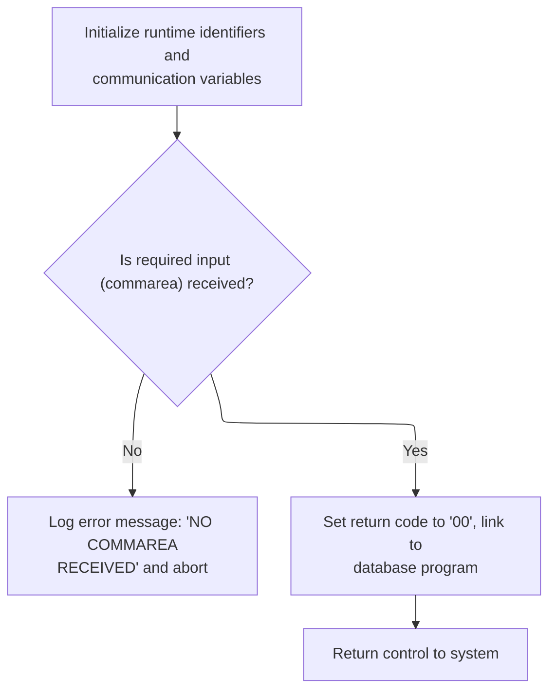
```mermaid
%%{init: {"flowchart": {"defaultRenderer": "elk"}} }%%
flowchart TD
    node1["Initialize runtime identifiers and
communication variables"] --> node2{"Is required input (commarea) received?"}
    click node1 openCode "base/src/lgipol01.cbl:72:78"
    node2 -->|"No"| node3["Log error message: 'NO COMMAREA
RECEIVED' and abort"]
    click node2 openCode "base/src/lgipol01.cbl:79:83"
    click node3 openCode "base/src/lgipol01.cbl:80:82"
    node2 -->|"Yes"| node4["Set return code to '00', link to
database program"]
    click node4 openCode "base/src/lgipol01.cbl:86:94"
    node4 --> node5["Return control to system"]
    click node5 openCode "base/src/lgipol01.cbl:96:96"

classDef HeadingStyle fill:#777777,stroke:#333,stroke-width:2px;

%% Swimm:
%% %%{init: {"flowchart": {"defaultRenderer": "elk"}} }%%
%% flowchart TD
%%     node1["Initialize runtime identifiers and
%% communication variables"] --> node2{"Is required input (commarea) received?"}
%%     click node1 openCode "<SwmPath>[base/src/lgipol01.cbl](base/src/lgipol01.cbl)</SwmPath>:72:78"
%%     node2 -->|"No"| node3["Log error message: 'NO COMMAREA
%% RECEIVED' and abort"]
%%     click node2 openCode "<SwmPath>[base/src/lgipol01.cbl](base/src/lgipol01.cbl)</SwmPath>:79:83"
%%     click node3 openCode "<SwmPath>[base/src/lgipol01.cbl](base/src/lgipol01.cbl)</SwmPath>:80:82"
%%     node2 -->|"Yes"| node4["Set return code to '00', link to
%% database program"]
%%     click node4 openCode "<SwmPath>[base/src/lgipol01.cbl](base/src/lgipol01.cbl)</SwmPath>:86:94"
%%     node4 --> node5["Return control to system"]
%%     click node5 openCode "<SwmPath>[base/src/lgipol01.cbl](base/src/lgipol01.cbl)</SwmPath>:96:96"
%% 
%% classDef HeadingStyle fill:#777777,stroke:#333,stroke-width:2px;
```

This section acts as the backend entry point for policy inquiries. It ensures required input is present, handles errors, and delegates to the database program for policy retrieval.

| Rule ID | Category                        | Rule Name                                  | Description                                                                                                                            | Implementation Details                                                                                                                                                                                                                                                                                                                                                                                                                               |
| ------- | ------------------------------- | ------------------------------------------ | -------------------------------------------------------------------------------------------------------------------------------------- | ---------------------------------------------------------------------------------------------------------------------------------------------------------------------------------------------------------------------------------------------------------------------------------------------------------------------------------------------------------------------------------------------------------------------------------------------------- |
| BR-001  | Data validation                 | Missing commarea error handling            | If the required input (commarea) is not received, an error message is logged and processing is aborted.                                | The error message is: ' NO COMMAREA RECEIVED'. The message is logged using the error message structure, which includes a date (8 characters), time (6 characters), program name (9 characters, ' <SwmToken path="base/src/lgtestp2.cbl" pos="67:10:10" line-data="                 EXEC CICS LINK PROGRAM(&#39;LGIPOL01&#39;)">`LGIPOL01`</SwmToken>'), and a variable message field (21 characters). Processing is aborted after logging the error. |
| BR-002  | Calculation                     | Success return code initialization         | If the required input (commarea) is received, the return code is set to '00' to indicate success before invoking the database program. | The return code is set to '00' (two characters, numeric string) in the commarea structure before linking to the database program.                                                                                                                                                                                                                                                                                                                    |
| BR-003  | Invoking a Service or a Process | Invoke database program for policy inquiry | If the required input (commarea) is received, the database program is invoked to fetch policy details using the commarea as input.     | The database program is invoked with the commarea as input, with a length of 32,500 bytes. The program called is <SwmToken path="base/src/lgipol01.cbl" pos="91:9:9" line-data="           EXEC CICS LINK Program(LGIPDB01)">`LGIPDB01`</SwmToken>.                                                                                                                                                                                                  |

<SwmSnippet path="/base/src/lgipol01.cbl" line="70">

---

MAINLINE in <SwmToken path="base/src/lgtestp2.cbl" pos="67:10:10" line-data="                 EXEC CICS LINK PROGRAM(&#39;LGIPOL01&#39;)">`LGIPOL01`</SwmToken> checks for valid input, logs and aborts if missing, then links to <SwmToken path="base/src/lgipol01.cbl" pos="91:9:9" line-data="           EXEC CICS LINK Program(LGIPDB01)">`LGIPDB01`</SwmToken> to fetch policy details from the database. This is the backend entry for policy inquiries.

```cobol
       MAINLINE SECTION.
      *
           INITIALIZE WS-HEADER.
      *
           MOVE EIBTRNID TO WS-TRANSID.
           MOVE EIBTRMID TO WS-TERMID.
           MOVE EIBTASKN TO WS-TASKNUM.
      *
      * If NO commarea received issue an ABEND
           IF EIBCALEN IS EQUAL TO ZERO
               MOVE ' NO COMMAREA RECEIVED' TO EM-VARIABLE
               PERFORM WRITE-ERROR-MESSAGE
               EXEC CICS ABEND ABCODE('LGCA') NODUMP END-EXEC
           END-IF

      * initialize commarea return code to zero
           MOVE '00' TO CA-RETURN-CODE
           MOVE EIBCALEN TO WS-CALEN.
           SET WS-ADDR-DFHCOMMAREA TO ADDRESS OF DFHCOMMAREA.
      *

           EXEC CICS LINK Program(LGIPDB01)
               Commarea(DFHCOMMAREA)
               Length(32500)
           END-EXEC.

           EXEC CICS RETURN END-EXEC.
```

---

</SwmSnippet>

## Error Logging and Queue Writing

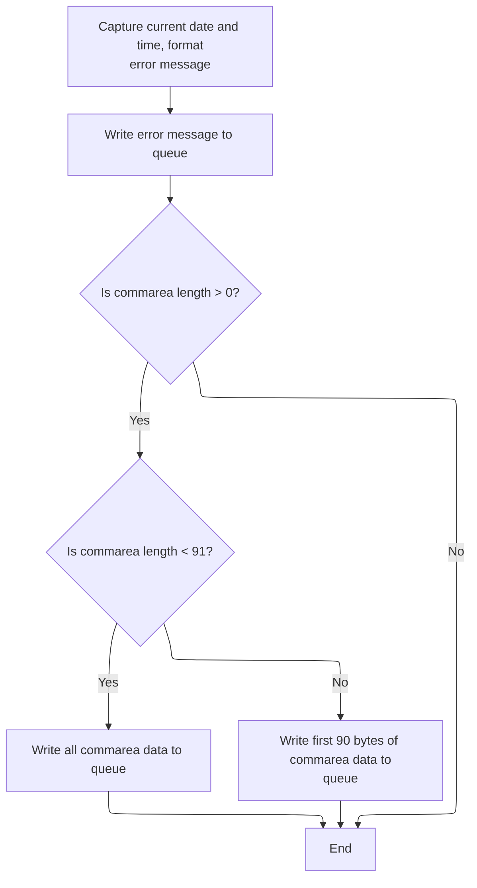
```mermaid
%%{init: {"flowchart": {"defaultRenderer": "elk"}} }%%
flowchart TD
    node1["Capture current date and time, format
error message"] --> node2["Write error message to queue"]
    click node1 openCode "base/src/lgipol01.cbl:110:117"
    click node2 openCode "base/src/lgipol01.cbl:119:122"
    node2 --> node3{"Is commarea length > 0?"}
    click node3 openCode "base/src/lgipol01.cbl:124:138"
    node3 -->|"No"| node6["End"]
    node3 -->|"Yes"| node4{"Is commarea length < 91?"}
    click node4 openCode "base/src/lgipol01.cbl:125:131"
    node4 -->|"Yes"| node5["Write all commarea data to queue"]
    click node5 openCode "base/src/lgipol01.cbl:126:130"
    node4 -->|"No"| node7["Write first 90 bytes of commarea data to
queue"]
    click node7 openCode "base/src/lgipol01.cbl:132:136"
    node5 --> node6
    node7 --> node6
    click node6 openCode "base/src/lgipol01.cbl:139:139"
classDef HeadingStyle fill:#777777,stroke:#333,stroke-width:2px;

%% Swimm:
%% %%{init: {"flowchart": {"defaultRenderer": "elk"}} }%%
%% flowchart TD
%%     node1["Capture current date and time, format
%% error message"] --> node2["Write error message to queue"]
%%     click node1 openCode "<SwmPath>[base/src/lgipol01.cbl](base/src/lgipol01.cbl)</SwmPath>:110:117"
%%     click node2 openCode "<SwmPath>[base/src/lgipol01.cbl](base/src/lgipol01.cbl)</SwmPath>:119:122"
%%     node2 --> node3{"Is commarea length > 0?"}
%%     click node3 openCode "<SwmPath>[base/src/lgipol01.cbl](base/src/lgipol01.cbl)</SwmPath>:124:138"
%%     node3 -->|"No"| node6["End"]
%%     node3 -->|"Yes"| node4{"Is commarea length < 91?"}
%%     click node4 openCode "<SwmPath>[base/src/lgipol01.cbl](base/src/lgipol01.cbl)</SwmPath>:125:131"
%%     node4 -->|"Yes"| node5["Write all commarea data to queue"]
%%     click node5 openCode "<SwmPath>[base/src/lgipol01.cbl](base/src/lgipol01.cbl)</SwmPath>:126:130"
%%     node4 -->|"No"| node7["Write first 90 bytes of commarea data to
%% queue"]
%%     click node7 openCode "<SwmPath>[base/src/lgipol01.cbl](base/src/lgipol01.cbl)</SwmPath>:132:136"
%%     node5 --> node6
%%     node7 --> node6
%%     click node6 openCode "<SwmPath>[base/src/lgipol01.cbl](base/src/lgipol01.cbl)</SwmPath>:139:139"
%% classDef HeadingStyle fill:#777777,stroke:#333,stroke-width:2px;
```

This section ensures that errors are logged with a timestamp and relevant context, and that commarea data is captured for support and audit. It determines the structure and content of error messages and when they are written to the queue.

| Rule ID | Category        | Rule Name                   | Description                                                                                                                                         | Implementation Details                                                                                                                                                                                               |
| ------- | --------------- | --------------------------- | --------------------------------------------------------------------------------------------------------------------------------------------------- | -------------------------------------------------------------------------------------------------------------------------------------------------------------------------------------------------------------------- |
| BR-001  | Calculation     | Timestamped error logging   | Each error event is logged with the current date and time included in the error message.                                                            | The error message includes an 8-character date, a 6-character time, and a 9-character program identifier. The date and time are formatted as MMDDYYYY and HHMMSS, respectively.                                      |
| BR-002  | Decision Making | Commarea data logging       | If commarea data is present, up to 90 bytes of it are written to the queue as a separate message prefixed with 'COMMAREA='.                         | The commarea message starts with 'COMMAREA=' (9 characters) followed by up to 90 bytes of commarea data. If commarea is less than 91 bytes, all bytes are included; otherwise, only the first 90 bytes are included. |
| BR-003  | Decision Making | Commarea data truncation    | If commarea data is present and less than 91 bytes, all available commarea data is logged; if 91 bytes or more, only the first 90 bytes are logged. | The commarea message is always 99 bytes: 9 bytes for 'COMMAREA=' and up to 90 bytes for commarea data. Data beyond 90 bytes is not logged.                                                                           |
| BR-004  | Writing Output  | Error message always logged | An error message is written to the queue for every error event, regardless of commarea data presence.                                               | The error message is written as a single message to the queue, containing the formatted date, time, program identifier, and variable section.                                                                        |

<SwmSnippet path="/base/src/lgipol01.cbl" line="107">

---

<SwmToken path="base/src/lgipol01.cbl" pos="107:1:5" line-data="       WRITE-ERROR-MESSAGE.">`WRITE-ERROR-MESSAGE`</SwmToken> logs errors with a timestamp, then calls LGSTSQ to write the error message and relevant commarea data to a queue. This is how errors are tracked for support and audit.

```cobol
       WRITE-ERROR-MESSAGE.
      * Save SQLCODE in message
      * Obtain and format current time and date
           EXEC CICS ASKTIME ABSTIME(ABS-TIME)
           END-EXEC
           EXEC CICS FORMATTIME ABSTIME(ABS-TIME)
                     MMDDYYYY(DATE1)
                     TIME(TIME1)
           END-EXEC
           MOVE DATE1 TO EM-DATE
           MOVE TIME1 TO EM-TIME
      * Write output message to TDQ
           EXEC CICS LINK PROGRAM('LGSTSQ')
                     COMMAREA(ERROR-MSG)
                     LENGTH(LENGTH OF ERROR-MSG)
           END-EXEC.
      * Write 90 bytes or as much as we have of commarea to TDQ
           IF EIBCALEN > 0 THEN
             IF EIBCALEN < 91 THEN
               MOVE DFHCOMMAREA(1:EIBCALEN) TO CA-DATA
               EXEC CICS LINK PROGRAM('LGSTSQ')
                         COMMAREA(CA-ERROR-MSG)
                         LENGTH(LENGTH OF CA-ERROR-MSG)
               END-EXEC
             ELSE
               MOVE DFHCOMMAREA(1:90) TO CA-DATA
               EXEC CICS LINK PROGRAM('LGSTSQ')
                         COMMAREA(CA-ERROR-MSG)
                         LENGTH(LENGTH OF CA-ERROR-MSG)
               END-EXEC
             END-IF
           END-IF.
           EXIT.
```

---

</SwmSnippet>

<SwmSnippet path="/base/src/lgstsq.cbl" line="55">

---

MAINLINE in LGSTSQ decides how to process the incoming message based on whether it's invoked or received, manipulates the message if it starts with 'Q=', writes it to both TDQ and TSQ queues, and sends a response if needed. This is the central message queue writer for error/status reporting.

```cobol
       MAINLINE SECTION.

           MOVE SPACES TO WRITE-MSG.
           MOVE SPACES TO WS-RECV.

           EXEC CICS ASSIGN SYSID(WRITE-MSG-SYSID)
                RESP(WS-RESP)
           END-EXEC.

           EXEC CICS ASSIGN INVOKINGPROG(WS-INVOKEPROG)
                RESP(WS-RESP)
           END-EXEC.
           
           IF WS-INVOKEPROG NOT = SPACES
              MOVE 'C' To WS-FLAG
              MOVE COMMA-DATA  TO WRITE-MSG-MSG
              MOVE EIBCALEN    TO WS-RECV-LEN
           ELSE
              EXEC CICS RECEIVE INTO(WS-RECV)
                  LENGTH(WS-RECV-LEN)
                  RESP(WS-RESP)
              END-EXEC
              MOVE 'R' To WS-FLAG
              MOVE WS-RECV-DATA  TO WRITE-MSG-MSG
              SUBTRACT 5 FROM WS-RECV-LEN
           END-IF.

           MOVE 'GENAERRS' TO STSQ-NAME.
           IF WRITE-MSG-MSG(1:2) = 'Q=' THEN
              MOVE WRITE-MSG-MSG(3:4) TO STSQ-EXT
              MOVE WRITE-MSG-REST TO TEMPO
              MOVE TEMPO          TO WRITE-MSG-MSG
              SUBTRACT 7 FROM WS-RECV-LEN
           END-IF.

           ADD 5 TO WS-RECV-LEN.

      * Write output message to TDQ CSMT
      *
           EXEC CICS WRITEQ TD QUEUE(STDQ-NAME)
                     FROM(WRITE-MSG)
                     RESP(WS-RESP)
                     LENGTH(WS-RECV-LEN)

           END-EXEC.

      * Write output message to Genapp TSQ
      * If no space is available then the task will not wait for
      *  storage to become available but will ignore the request...
      *
           EXEC CICS WRITEQ TS QUEUE(STSQ-NAME)
                     FROM(WRITE-MSG)
                     RESP(WS-RESP)
                     NOSUSPEND
                     LENGTH(WS-RECV-LEN)

           END-EXEC.

           If WS-FLAG = 'R' Then
             EXEC CICS SEND TEXT FROM(FILLER-X)
              WAIT
              ERASE
              LENGTH(1)
              FREEKB
             END-EXEC.

           EXEC CICS RETURN
           END-EXEC.
```

---

</SwmSnippet>

## Policy Data Retrieval and Error Handling


```mermaid
%%{init: {"flowchart": {"defaultRenderer": "elk"}} }%%
flowchart TD
    node1["Start: Initialize variables and input
data"] --> node2{"Is input data received? (EIBCALEN > 0)"}
    click node1 openCode "base/src/lgipdb01.cbl:230:246"
    node2 -->|"No"| node3["Log error: No input data, terminate
(CA-RETURN-CODE = '99')"]
    click node2 openCode "base/src/lgipdb01.cbl:251:255"
    click node3 openCode "base/src/lgipdb01.cbl:251:255"
    node3 --> node21["Log error message"]
    click node21 openCode "base/src/lgipdb01.cbl:997:1030"
    node21 --> node20["End"]
    node2 -->|"Yes"| node4["Prepare commarea and convert input
values"]
    click node4 openCode "base/src/lgipdb01.cbl:257:276"
    node4 --> node5{"What policy type is requested?
(CA-REQUEST-ID)"}
    click node5 openCode "base/src/lgipdb01.cbl:277:310"
    node5 -->|"Endowment (01IEND)"| node6["Retrieve endowment policy data"]
    click node6 openCode "base/src/lgipdb01.cbl:327:432"
    node5 -->|"House (01IHOU)"| node7["Retrieve house policy data"]
    click node7 openCode "base/src/lgipdb01.cbl:441:523"
    node5 -->|"Motor (01IMOT)"| node8["Retrieve motor policy data"]
    click node8 openCode "base/src/lgipdb01.cbl:529:621"
    node5 -->|"Commercial (01ICOM, 02ICOM,
03ICOM, 05ICOM)"| node9["Retrieve commercial policy data"]
    click node9 openCode "base/src/lgipdb01.cbl:292:306"
    node5 -->|"Other"| node10["Set error code: Unsupported request
(CA-RETURN-CODE = '99')"]
    click node10 openCode "base/src/lgipdb01.cbl:308:309"
    node10 --> node21
    node6 --> node11{"Was retrieval successful? (SQLCODE)"}
    node7 --> node12{"Was retrieval successful? (SQLCODE)"}
    node8 --> node13{"Was retrieval successful? (SQLCODE)"}
    node9 --> node14{"Was retrieval successful? (SQLCODE)"}
    node11 -->|"SQLCODE = 0"| node15{"Is commarea large enough? (EIBCALEN >=
required)"}
    node12 -->|"SQLCODE = 0"| node15
    node13 -->|"SQLCODE = 0"| node15
    node14 -->|"SQLCODE = 0"| node15
    node11 -->|"SQLCODE = 100"| node16["Set error code: Invalid customer/policy
(CA-RETURN-CODE = '01')"]
    node12 -->|"SQLCODE = 100"| node16
    node13 -->|"SQLCODE = 100"| node16
    node14 -->|"SQLCODE = 100"| node16
    node11 -->|"Other"| node17["Set error code: Database error
(CA-RETURN-CODE = '90')"]
    node12 -->|"Other"| node17
    node13 -->|"Other"| node17
    node14 -->|"Other"| node17
    node17 --> node21
    node15 -->|"Yes"| node18["Prepare and return policy data
(CA-RETURN-CODE = '00')"]
    click node15 openCode "base/src/lgipdb01.cbl:390:414"
    click node18 openCode "base/src/lgipdb01.cbl:395:418"
    node15 -->|"No"| node19["Set error code: Insufficient space
(CA-RETURN-CODE = '98')"]
    click node19 openCode "base/src/lgipdb01.cbl:391:392"
    node19 --> node21
    node16 --> node20["End"]
    node18 --> node20["End"]
    node21 --> node20["End"]

classDef HeadingStyle fill:#777777,stroke:#333,stroke-width:2px;

%% Swimm:
%% %%{init: {"flowchart": {"defaultRenderer": "elk"}} }%%
%% flowchart TD
%%     node1["Start: Initialize variables and input
%% data"] --> node2{"Is input data received? (EIBCALEN > 0)"}
%%     click node1 openCode "<SwmPath>[base/src/lgipdb01.cbl](base/src/lgipdb01.cbl)</SwmPath>:230:246"
%%     node2 -->|"No"| node3["Log error: No input data, terminate
%% (<SwmToken path="base/src/lgtestp2.cbl" pos="71:3:7" line-data="                 IF CA-RETURN-CODE &gt; 0">`CA-RETURN-CODE`</SwmToken> = '99')"]
%%     click node2 openCode "<SwmPath>[base/src/lgipdb01.cbl](base/src/lgipdb01.cbl)</SwmPath>:251:255"
%%     click node3 openCode "<SwmPath>[base/src/lgipdb01.cbl](base/src/lgipdb01.cbl)</SwmPath>:251:255"
%%     node3 --> node21["Log error message"]
%%     click node21 openCode "<SwmPath>[base/src/lgipdb01.cbl](base/src/lgipdb01.cbl)</SwmPath>:997:1030"
%%     node21 --> node20["End"]
%%     node2 -->|"Yes"| node4["Prepare commarea and convert input
%% values"]
%%     click node4 openCode "<SwmPath>[base/src/lgipdb01.cbl](base/src/lgipdb01.cbl)</SwmPath>:257:276"
%%     node4 --> node5{"What policy type is requested?
%% (<SwmToken path="base/src/lgtestp2.cbl" pos="64:9:13" line-data="                 Move &#39;01IEND&#39;   To CA-REQUEST-ID">`CA-REQUEST-ID`</SwmToken>)"}
%%     click node5 openCode "<SwmPath>[base/src/lgipdb01.cbl](base/src/lgipdb01.cbl)</SwmPath>:277:310"
%%     node5 -->|"Endowment (<SwmToken path="base/src/lgtestp2.cbl" pos="64:4:4" line-data="                 Move &#39;01IEND&#39;   To CA-REQUEST-ID">`01IEND`</SwmToken>)"| node6["Retrieve endowment policy data"]
%%     click node6 openCode "<SwmPath>[base/src/lgipdb01.cbl](base/src/lgipdb01.cbl)</SwmPath>:327:432"
%%     node5 -->|"House (<SwmToken path="base/src/lgipdb01.cbl" pos="283:4:4" line-data="             WHEN &#39;01IHOU&#39;">`01IHOU`</SwmToken>)"| node7["Retrieve house policy data"]
%%     click node7 openCode "<SwmPath>[base/src/lgipdb01.cbl](base/src/lgipdb01.cbl)</SwmPath>:441:523"
%%     node5 -->|"Motor (<SwmToken path="base/src/lgipdb01.cbl" pos="287:4:4" line-data="             WHEN &#39;01IMOT&#39;">`01IMOT`</SwmToken>)"| node8["Retrieve motor policy data"]
%%     click node8 openCode "<SwmPath>[base/src/lgipdb01.cbl](base/src/lgipdb01.cbl)</SwmPath>:529:621"
%%     node5 -->|"Commercial (<SwmToken path="base/src/lgipdb01.cbl" pos="291:4:4" line-data="             WHEN &#39;01ICOM&#39;">`01ICOM`</SwmToken>, <SwmToken path="base/src/lgipdb01.cbl" pos="295:4:4" line-data="             WHEN &#39;02ICOM&#39;">`02ICOM`</SwmToken>,
%% <SwmToken path="base/src/lgipdb01.cbl" pos="299:4:4" line-data="             WHEN &#39;03ICOM&#39;">`03ICOM`</SwmToken>, <SwmToken path="base/src/lgipdb01.cbl" pos="303:4:4" line-data="             WHEN &#39;05ICOM&#39;">`05ICOM`</SwmToken>)"| node9["Retrieve commercial policy data"]
%%     click node9 openCode "<SwmPath>[base/src/lgipdb01.cbl](base/src/lgipdb01.cbl)</SwmPath>:292:306"
%%     node5 -->|"Other"| node10["Set error code: Unsupported request
%% (<SwmToken path="base/src/lgtestp2.cbl" pos="71:3:7" line-data="                 IF CA-RETURN-CODE &gt; 0">`CA-RETURN-CODE`</SwmToken> = '99')"]
%%     click node10 openCode "<SwmPath>[base/src/lgipdb01.cbl](base/src/lgipdb01.cbl)</SwmPath>:308:309"
%%     node10 --> node21
%%     node6 --> node11{"Was retrieval successful? (SQLCODE)"}
%%     node7 --> node12{"Was retrieval successful? (SQLCODE)"}
%%     node8 --> node13{"Was retrieval successful? (SQLCODE)"}
%%     node9 --> node14{"Was retrieval successful? (SQLCODE)"}
%%     node11 -->|"SQLCODE = 0"| node15{"Is commarea large enough? (EIBCALEN >=
%% required)"}
%%     node12 -->|"SQLCODE = 0"| node15
%%     node13 -->|"SQLCODE = 0"| node15
%%     node14 -->|"SQLCODE = 0"| node15
%%     node11 -->|"SQLCODE = 100"| node16["Set error code: Invalid customer/policy
%% (<SwmToken path="base/src/lgtestp2.cbl" pos="71:3:7" line-data="                 IF CA-RETURN-CODE &gt; 0">`CA-RETURN-CODE`</SwmToken> = '01')"]
%%     node12 -->|"SQLCODE = 100"| node16
%%     node13 -->|"SQLCODE = 100"| node16
%%     node14 -->|"SQLCODE = 100"| node16
%%     node11 -->|"Other"| node17["Set error code: Database error
%% (<SwmToken path="base/src/lgtestp2.cbl" pos="71:3:7" line-data="                 IF CA-RETURN-CODE &gt; 0">`CA-RETURN-CODE`</SwmToken> = '90')"]
%%     node12 -->|"Other"| node17
%%     node13 -->|"Other"| node17
%%     node14 -->|"Other"| node17
%%     node17 --> node21
%%     node15 -->|"Yes"| node18["Prepare and return policy data
%% (<SwmToken path="base/src/lgtestp2.cbl" pos="71:3:7" line-data="                 IF CA-RETURN-CODE &gt; 0">`CA-RETURN-CODE`</SwmToken> = '00')"]
%%     click node15 openCode "<SwmPath>[base/src/lgipdb01.cbl](base/src/lgipdb01.cbl)</SwmPath>:390:414"
%%     click node18 openCode "<SwmPath>[base/src/lgipdb01.cbl](base/src/lgipdb01.cbl)</SwmPath>:395:418"
%%     node15 -->|"No"| node19["Set error code: Insufficient space
%% (<SwmToken path="base/src/lgtestp2.cbl" pos="71:3:7" line-data="                 IF CA-RETURN-CODE &gt; 0">`CA-RETURN-CODE`</SwmToken> = '98')"]
%%     click node19 openCode "<SwmPath>[base/src/lgipdb01.cbl](base/src/lgipdb01.cbl)</SwmPath>:391:392"
%%     node19 --> node21
%%     node16 --> node20["End"]
%%     node18 --> node20["End"]
%%     node21 --> node20["End"]
%% 
%% classDef HeadingStyle fill:#777777,stroke:#333,stroke-width:2px;
```

This section governs how policy data requests are processed, including validation, data retrieval, and error handling. It ensures that only valid, supported requests are processed and that errors are logged with sufficient detail for support teams.

| Rule ID | Category        | Rule Name                           | Description                                                                                                                                     | Implementation Details                                                                                                                            |
| ------- | --------------- | ----------------------------------- | ----------------------------------------------------------------------------------------------------------------------------------------------- | ------------------------------------------------------------------------------------------------------------------------------------------------- |
| BR-001  | Data validation | Missing input data handling         | If no input data is received, set the return code to '99', log an error message, and terminate processing.                                      | Return code '99' indicates a missing commarea. The error message includes the text ' NO COMMAREA RECEIVED'.                                       |
| BR-002  | Data validation | Request ID normalization            | The request ID is converted to uppercase before evaluating the policy type, ensuring case-insensitive processing of request types.              | All alphabetic characters in the request ID are converted to uppercase for comparison. The request ID is a 6-character string.                    |
| BR-003  | Data validation | Insufficient buffer handling        | If the commarea buffer is not large enough to hold the policy data, set the return code to '98' and terminate processing.                       | Return code '98' indicates insufficient space. The required length is calculated based on the policy type and data fields.                        |
| BR-004  | Decision Making | Unsupported request type handling   | If the request ID does not match a supported policy type, set the return code to '99' to indicate an unsupported request.                       | Return code '99' signals an unsupported or invalid request type. The request ID is compared in uppercase format.                                  |
| BR-005  | Decision Making | Invalid customer or policy handling | If the database returns no matching policy (SQLCODE = 100), set the return code to '01' to indicate an invalid customer or policy number.       | Return code '01' signals that the customer or policy number is invalid or not found.                                                              |
| BR-006  | Decision Making | Database error handling             | If a database error occurs (SQLCODE not 0 or 100), set the return code to '90', log the error with context, and return control to the caller.   | Return code '90' signals a general database error. The error message includes the SQLCODE and relevant context.                                   |
| BR-007  | Writing Output  | Error logging with context          | When an error occurs, log the error message with the SQLCODE, timestamp, and relevant commarea data for audit and troubleshooting.              | The error log includes the SQLCODE, current date and time, and up to 90 bytes of commarea data. The log is written to a queue for support review. |
| BR-008  | Writing Output  | Policy data end marker              | When policy data is successfully retrieved and the buffer is sufficient, mark the end of the policy data with the string 'FINAL' in the output. | The string 'FINAL' (5 characters) is written at the end of the policy data in the commarea to indicate the end of the data block.                 |

<SwmSnippet path="/base/src/lgipdb01.cbl" line="230">

---

MAINLINE in <SwmToken path="base/src/lgipol01.cbl" pos="91:9:9" line-data="           EXEC CICS LINK Program(LGIPDB01)">`LGIPDB01`</SwmToken> checks for valid input, logs and aborts if missing, then uses the request ID to decide which policy type to fetch, calling the relevant <SwmToken path="base/src/lgipdb01.cbl" pos="242:5:5" line-data="      * initialize DB2 host variables">`DB2`</SwmToken> info routine. Errors are logged if the request is invalid or unsupported.

```cobol
       MAINLINE SECTION.

      *----------------------------------------------------------------*
      * Common code                                                    *
      *----------------------------------------------------------------*
      * initialize working storage variables
           INITIALIZE WS-HEADER.
      * set up general variable
           MOVE EIBTRNID TO WS-TRANSID.
           MOVE EIBTRMID TO WS-TERMID.
           MOVE EIBTASKN TO WS-TASKNUM.
      *----------------------------------------------------------------*
      * initialize DB2 host variables
           INITIALIZE DB2-IN-INTEGERS.
           INITIALIZE DB2-OUT-INTEGERS.
           INITIALIZE DB2-POLICY.

      *---------------------------------------------------------------*
      * Check commarea and obtain required details                    *
      *---------------------------------------------------------------*
      * If NO commarea received issue an ABEND
           IF EIBCALEN IS EQUAL TO ZERO
             MOVE ' NO COMMAREA RECEIVED' TO EM-VARIABLE
             PERFORM WRITE-ERROR-MESSAGE
             EXEC CICS ABEND ABCODE('LGCA') NODUMP END-EXEC
           END-IF

      * initialize commarea return code to zero
           MOVE '00' TO CA-RETURN-CODE
           MOVE EIBCALEN TO WS-CALEN
           SET WS-ADDR-DFHCOMMAREA TO ADDRESS OF DFHCOMMAREA

      * Convert commarea customer & policy nums to DB2 integer format
           MOVE CA-CUSTOMER-NUM TO DB2-CUSTOMERNUM-INT
           MOVE CA-POLICY-NUM   TO DB2-POLICYNUM-INT
      * and save in error msg field incase required
           MOVE CA-CUSTOMER-NUM TO EM-CUSNUM
           MOVE CA-POLICY-NUM   TO EM-POLNUM

      *----------------------------------------------------------------*
      * Check which policy type is being requested                     *
      * This is not actually required whilst only endowment policy     *
      * inquires are supported, but will make future expansion simpler *
      *----------------------------------------------------------------*
      * Upper case value passed in Request Id field                    *
           MOVE FUNCTION UPPER-CASE(CA-REQUEST-ID) TO WS-REQUEST-ID

           EVALUATE WS-REQUEST-ID

             WHEN '01IEND'
               INITIALIZE DB2-ENDOWMENT
               PERFORM GET-ENDOW-DB2-INFO

             WHEN '01IHOU'
               INITIALIZE DB2-HOUSE
               PERFORM GET-HOUSE-DB2-INFO

             WHEN '01IMOT'
               INITIALIZE DB2-MOTOR
               PERFORM GET-MOTOR-DB2-INFO

             WHEN '01ICOM'
               INITIALIZE DB2-COMMERCIAL
               PERFORM GET-COMMERCIAL-DB2-INFO-1

             WHEN '02ICOM'
               INITIALIZE DB2-COMMERCIAL
               PERFORM GET-COMMERCIAL-DB2-INFO-2

             WHEN '03ICOM'
               INITIALIZE DB2-COMMERCIAL
               PERFORM GET-COMMERCIAL-DB2-INFO-3

             WHEN '05ICOM'
               INITIALIZE DB2-COMMERCIAL
               PERFORM GET-COMMERCIAL-DB2-INFO-5

             WHEN OTHER
               MOVE '99' TO CA-RETURN-CODE

           END-EVALUATE.
```

---

</SwmSnippet>

<SwmSnippet path="/base/src/lgipdb01.cbl" line="997">

---

<SwmToken path="base/src/lgipdb01.cbl" pos="997:1:5" line-data="       WRITE-ERROR-MESSAGE.">`WRITE-ERROR-MESSAGE`</SwmToken> in <SwmToken path="base/src/lgipol01.cbl" pos="91:9:9" line-data="           EXEC CICS LINK Program(LGIPDB01)">`LGIPDB01`</SwmToken> saves the SQL error code, timestamps the error, and calls LGSTSQ to write the error message and relevant commarea data to the queue. This ties errors to specific database issues for easier troubleshooting.

```cobol
       WRITE-ERROR-MESSAGE.
      * Save SQLCODE in message
           MOVE SQLCODE TO EM-SQLRC
      * Obtain and format current time and date
           EXEC CICS ASKTIME ABSTIME(ABS-TIME)
           END-EXEC
           EXEC CICS FORMATTIME ABSTIME(ABS-TIME)
                     MMDDYYYY(DATE1)
                     TIME(TIME1)
           END-EXEC
           MOVE DATE1 TO EM-DATE
           MOVE TIME1 TO EM-TIME
      * Write output message to TDQ
           EXEC CICS LINK PROGRAM('LGSTSQ')
                     COMMAREA(ERROR-MSG)
                     LENGTH(LENGTH OF ERROR-MSG)
           END-EXEC.
      * Write 90 bytes or as much as we have of commarea to TDQ
           IF EIBCALEN > 0 THEN
             IF EIBCALEN < 91 THEN
               MOVE DFHCOMMAREA(1:EIBCALEN) TO CA-DATA
               EXEC CICS LINK PROGRAM('LGSTSQ')
                         COMMAREA(CA-ERROR-MSG)
                         LENGTH(LENGTH OF CA-ERROR-MSG)
               END-EXEC
             ELSE
               MOVE DFHCOMMAREA(1:90) TO CA-DATA
               EXEC CICS LINK PROGRAM('LGSTSQ')
                         COMMAREA(CA-ERROR-MSG)
                         LENGTH(LENGTH OF CA-ERROR-MSG)
               END-EXEC
             END-IF
           END-IF.
           EXIT.
```

---

</SwmSnippet>

<SwmSnippet path="/base/src/lgipdb01.cbl" line="327">

---

<SwmToken path="base/src/lgipdb01.cbl" pos="327:1:7" line-data="       GET-ENDOW-DB2-INFO.">`GET-ENDOW-DB2-INFO`</SwmToken> checks for variable-length PADDINGDATA, adjusts the buffer size, moves integer fields only if not null, uses domain-specific return codes, and writes 'FINAL' at the end of the policy data. This ensures all relevant data is transferred and errors are signaled properly.

```cobol
       GET-ENDOW-DB2-INFO.

           MOVE ' SELECT ENDOW ' TO EM-SQLREQ
           EXEC SQL
             SELECT  ISSUEDATE,
                     EXPIRYDATE,
                     LASTCHANGED,
                     BROKERID,
                     BROKERSREFERENCE,
                     PAYMENT,
                     WITHPROFITS,
                     EQUITIES,
                     MANAGEDFUND,
                     FUNDNAME,
                     TERM,
                     SUMASSURED,
                     LIFEASSURED,
                     PADDINGDATA,
                     LENGTH(PADDINGDATA)
             INTO  :DB2-ISSUEDATE,
                   :DB2-EXPIRYDATE,
                   :DB2-LASTCHANGED,
                   :DB2-BROKERID-INT INDICATOR :IND-BROKERID,
                   :DB2-BROKERSREF INDICATOR :IND-BROKERSREF,
                   :DB2-PAYMENT-INT INDICATOR :IND-PAYMENT,
                   :DB2-E-WITHPROFITS,
                   :DB2-E-EQUITIES,
                   :DB2-E-MANAGEDFUND,
                   :DB2-E-FUNDNAME,
                   :DB2-E-TERM-SINT,
                   :DB2-E-SUMASSURED-INT,
                   :DB2-E-LIFEASSURED,
                   :DB2-E-PADDINGDATA INDICATOR :IND-E-PADDINGDATA,
                   :DB2-E-PADDING-LEN INDICATOR :IND-E-PADDINGDATAL
             FROM  POLICY,ENDOWMENT
             WHERE ( POLICY.POLICYNUMBER =
                        ENDOWMENT.POLICYNUMBER   AND
                     POLICY.CUSTOMERNUMBER =
                        :DB2-CUSTOMERNUM-INT             AND
                     POLICY.POLICYNUMBER =
                        :DB2-POLICYNUM-INT               )
           END-EXEC

           IF SQLCODE = 0
      *      Select was successful

      *      Calculate size of commarea required to return all data
             ADD WS-CA-HEADERTRAILER-LEN TO WS-REQUIRED-CA-LEN
             ADD WS-FULL-ENDOW-LEN       TO WS-REQUIRED-CA-LEN

      *----------------------------------------------------------------*
      *      Specific code to allow for length of VACHAR data
      *      check whether PADDINGDATA field is non-null
      *        and calculate length of endowment policy
      *        and position of free space in commarea after policy data
      *----------------------------------------------------------------*
             IF IND-E-PADDINGDATAL NOT EQUAL MINUS-ONE
               ADD DB2-E-PADDING-LEN TO WS-REQUIRED-CA-LEN
               ADD DB2-E-PADDING-LEN TO END-POLICY-POS
             END-IF

      *      if commarea received is not large enough ...
      *        set error return code and return to caller
             IF EIBCALEN IS LESS THAN WS-REQUIRED-CA-LEN
               MOVE '98' TO CA-RETURN-CODE
               EXEC CICS RETURN END-EXEC
             ELSE
      *        Length is sufficent so move data to commarea
      *        Move Integer fields to required length numerics
      *        Don't move null fields
               IF IND-BROKERID NOT EQUAL MINUS-ONE
                 MOVE DB2-BROKERID-INT    TO DB2-BROKERID
               END-IF
               IF IND-PAYMENT NOT EQUAL MINUS-ONE
                 MOVE DB2-PAYMENT-INT TO DB2-PAYMENT
               END-IF
      *----------------------------------------------------------------*
               MOVE DB2-E-TERM-SINT       TO DB2-E-TERM
               MOVE DB2-E-SUMASSURED-INT  TO DB2-E-SUMASSURED

               MOVE DB2-POLICY-COMMON     TO CA-POLICY-COMMON
               MOVE DB2-ENDOW-FIXED
                   TO CA-ENDOWMENT(1:WS-ENDOW-LEN)
               IF IND-E-PADDINGDATA NOT EQUAL MINUS-ONE
                 MOVE DB2-E-PADDINGDATA TO
                     CA-E-PADDING-DATA(1:DB2-E-PADDING-LEN)
               END-IF
             END-IF

      *      Mark the end of the policy data
             MOVE 'FINAL' TO CA-E-PADDING-DATA(END-POLICY-POS:5)

           ELSE
      *      Non-zero SQLCODE from first SQL FETCH statement
             IF SQLCODE EQUAL 100
      *        No rows found - invalid customer / policy number
               MOVE '01' TO CA-RETURN-CODE
             ELSE
      *        something has gone wrong
               MOVE '90' TO CA-RETURN-CODE
      *        Write error message to TD QUEUE(CSMT)
               PERFORM WRITE-ERROR-MESSAGE
             END-IF

           END-IF.
           EXIT.
```

---

</SwmSnippet>

<SwmSnippet path="/base/src/lgipdb01.cbl" line="441">

---

<SwmToken path="base/src/lgipdb01.cbl" pos="441:1:7" line-data="       GET-HOUSE-DB2-INFO.">`GET-HOUSE-DB2-INFO`</SwmToken> calculates the buffer size for house policy data, checks commarea length, moves integer fields only if not null, and writes 'FINAL' at the end. Errors are signaled with domain-specific codes.

```cobol
       GET-HOUSE-DB2-INFO.

           MOVE ' SELECT HOUSE ' TO EM-SQLREQ
           EXEC SQL
             SELECT  ISSUEDATE,
                     EXPIRYDATE,
                     LASTCHANGED,
                     BROKERID,
                     BROKERSREFERENCE,
                     PAYMENT,
                     PROPERTYTYPE,
                     BEDROOMS,
                     VALUE,
                     HOUSENAME,
                     HOUSENUMBER,
                     POSTCODE
             INTO  :DB2-ISSUEDATE,
                   :DB2-EXPIRYDATE,
                   :DB2-LASTCHANGED,
                   :DB2-BROKERID-INT INDICATOR :IND-BROKERID,
                   :DB2-BROKERSREF INDICATOR :IND-BROKERSREF,
                   :DB2-PAYMENT-INT INDICATOR :IND-PAYMENT,
                   :DB2-H-PROPERTYTYPE,
                   :DB2-H-BEDROOMS-SINT,
                   :DB2-H-VALUE-INT,
                   :DB2-H-HOUSENAME,
                   :DB2-H-HOUSENUMBER,
                   :DB2-H-POSTCODE
             FROM  POLICY,HOUSE
             WHERE ( POLICY.POLICYNUMBER =
                        HOUSE.POLICYNUMBER   AND
                     POLICY.CUSTOMERNUMBER =
                        :DB2-CUSTOMERNUM-INT             AND
                     POLICY.POLICYNUMBER =
                        :DB2-POLICYNUM-INT               )
           END-EXEC

           IF SQLCODE = 0
      *      Select was successful

      *      Calculate size of commarea required to return all data
             ADD WS-CA-HEADERTRAILER-LEN TO WS-REQUIRED-CA-LEN
             ADD WS-FULL-HOUSE-LEN       TO WS-REQUIRED-CA-LEN

      *      if commarea received is not large enough ...
      *        set error return code and return to caller
             IF EIBCALEN IS LESS THAN WS-REQUIRED-CA-LEN
               MOVE '98' TO CA-RETURN-CODE
               EXEC CICS RETURN END-EXEC
             ELSE
      *        Length is sufficent so move data to commarea
      *        Move Integer fields to required length numerics
      *        Don't move null fields
               IF IND-BROKERID NOT EQUAL MINUS-ONE
                 MOVE DB2-BROKERID-INT  TO DB2-BROKERID
               END-IF
               IF IND-PAYMENT NOT EQUAL MINUS-ONE
                 MOVE DB2-PAYMENT-INT TO DB2-PAYMENT
               END-IF
               MOVE DB2-H-BEDROOMS-SINT TO DB2-H-BEDROOMS
               MOVE DB2-H-VALUE-INT     TO DB2-H-VALUE

               MOVE DB2-POLICY-COMMON   TO CA-POLICY-COMMON
               MOVE DB2-HOUSE           TO CA-HOUSE(1:WS-HOUSE-LEN)
             END-IF

      *      Mark the end of the policy data
             MOVE 'FINAL' TO CA-H-FILLER(1:5)

           ELSE
      *      Non-zero SQLCODE from first SQL FETCH statement
             IF SQLCODE EQUAL 100
      *        No rows found - invalid customer / policy number
               MOVE '01' TO CA-RETURN-CODE
             ELSE
      *        something has gone wrong
               MOVE '90' TO CA-RETURN-CODE
      *        Write error message to TD QUEUE(CSMT)
               PERFORM WRITE-ERROR-MESSAGE
             END-IF

           END-IF.
           EXIT.
```

---

</SwmSnippet>

<SwmSnippet path="/base/src/lgipdb01.cbl" line="529">

---

<SwmToken path="base/src/lgipdb01.cbl" pos="529:1:7" line-data="       GET-MOTOR-DB2-INFO.">`GET-MOTOR-DB2-INFO`</SwmToken> calculates the buffer size for motor policy data, checks commarea length, moves integer fields only if not null, and writes 'FINAL' at the end. Errors are signaled with domain-specific codes.

```cobol
       GET-MOTOR-DB2-INFO.

           MOVE ' SELECT MOTOR ' TO EM-SQLREQ
           EXEC SQL
             SELECT  ISSUEDATE,
                     EXPIRYDATE,
                     LASTCHANGED,
                     BROKERID,
                     BROKERSREFERENCE,
                     PAYMENT,
                     MAKE,
                     MODEL,
                     VALUE,
                     REGNUMBER,
                     COLOUR,
                     CC,
                     YEAROFMANUFACTURE,
                     PREMIUM,
                     ACCIDENTS
             INTO  :DB2-ISSUEDATE,
                   :DB2-EXPIRYDATE,
                   :DB2-LASTCHANGED,
                   :DB2-BROKERID-INT INDICATOR :IND-BROKERID,
                   :DB2-BROKERSREF INDICATOR :IND-BROKERSREF,
                   :DB2-PAYMENT-INT INDICATOR :IND-PAYMENT,
                   :DB2-M-MAKE,
                   :DB2-M-MODEL,
                   :DB2-M-VALUE-INT,
                   :DB2-M-REGNUMBER,
                   :DB2-M-COLOUR,
                   :DB2-M-CC-SINT,
                   :DB2-M-MANUFACTURED,
                   :DB2-M-PREMIUM-INT,
                   :DB2-M-ACCIDENTS-INT
             FROM  POLICY,MOTOR
             WHERE ( POLICY.POLICYNUMBER =
                        MOTOR.POLICYNUMBER   AND
                     POLICY.CUSTOMERNUMBER =
                        :DB2-CUSTOMERNUM-INT             AND
                     POLICY.POLICYNUMBER =
                        :DB2-POLICYNUM-INT               )
           END-EXEC

           IF SQLCODE = 0
      *      Select was successful

      *      Calculate size of commarea required to return all data
             ADD WS-CA-HEADERTRAILER-LEN TO WS-REQUIRED-CA-LEN
             ADD WS-FULL-MOTOR-LEN       TO WS-REQUIRED-CA-LEN

      *      if commarea received is not large enough ...
      *        set error return code and return to caller
             IF EIBCALEN IS LESS THAN WS-REQUIRED-CA-LEN
               MOVE '98' TO CA-RETURN-CODE
               EXEC CICS RETURN END-EXEC
             ELSE
      *        Length is sufficent so move data to commarea
      *        Move Integer fields to required length numerics
      *        Don't move null fields
               IF IND-BROKERID NOT EQUAL MINUS-ONE
                 MOVE DB2-BROKERID-INT TO DB2-BROKERID
               END-IF
               IF IND-PAYMENT NOT EQUAL MINUS-ONE
                 MOVE DB2-PAYMENT-INT    TO DB2-PAYMENT
               END-IF
               MOVE DB2-M-CC-SINT      TO DB2-M-CC
               MOVE DB2-M-VALUE-INT    TO DB2-M-VALUE
               MOVE DB2-M-PREMIUM-INT  TO DB2-M-PREMIUM
               MOVE DB2-M-ACCIDENTS-INT TO DB2-M-ACCIDENTS
               MOVE DB2-M-PREMIUM-INT  TO CA-M-PREMIUM
               MOVE DB2-M-ACCIDENTS-INT TO CA-M-ACCIDENTS

               MOVE DB2-POLICY-COMMON  TO CA-POLICY-COMMON
               MOVE DB2-MOTOR          TO CA-MOTOR(1:WS-MOTOR-LEN)
             END-IF

      *      Mark the end of the policy data
             MOVE 'FINAL' TO CA-M-FILLER(1:5)

           ELSE
      *      Non-zero SQLCODE from first SQL FETCH statement
             IF SQLCODE EQUAL 100
      *        No rows found - invalid customer / policy number
               MOVE '01' TO CA-RETURN-CODE
             ELSE
      *        something has gone wrong
               MOVE '90' TO CA-RETURN-CODE
      *        Write error message to TD QUEUE(CSMT)
               PERFORM WRITE-ERROR-MESSAGE
             END-IF

           END-IF.
           EXIT.
```

---

</SwmSnippet>

## Post-Inquiry Return Code Handling

This section determines whether to handle a 'no data found' scenario after an inquiry operation based on the return code from <SwmToken path="base/src/lgtestp2.cbl" pos="67:10:10" line-data="                 EXEC CICS LINK PROGRAM(&#39;LGIPOL01&#39;)">`LGIPOL01`</SwmToken>.

| Rule ID | Category        | Rule Name             | Description                                                                                                                 | Implementation Details                                                                                                                                                                                                                                                                                           |
| ------- | --------------- | --------------------- | --------------------------------------------------------------------------------------------------------------------------- | ---------------------------------------------------------------------------------------------------------------------------------------------------------------------------------------------------------------------------------------------------------------------------------------------------------------- |
| BR-001  | Decision Making | No Data Found Trigger | If the return code from the inquiry operation is greater than zero, the system triggers the 'no data found' handling logic. | The return code is a two-digit number. A value greater than zero indicates no policy data was found. The output is a branch to the <SwmToken path="base/src/lgtestp2.cbl" pos="72:5:7" line-data="                   GO TO NO-DATA">`NO-DATA`</SwmToken> handler; no output format is specified in this section. |

<SwmSnippet path="/base/src/lgtestp2.cbl" line="71">

---

After returning from <SwmToken path="base/src/lgtestp2.cbl" pos="67:10:10" line-data="                 EXEC CICS LINK PROGRAM(&#39;LGIPOL01&#39;)">`LGIPOL01`</SwmToken>, <SwmToken path="base/src/lgtestp2.cbl" pos="33:5:7" line-data="              GO TO A-GAIN.">`A-GAIN`</SwmToken> checks the return code. If it's non-zero, it jumps to <SwmToken path="base/src/lgtestp2.cbl" pos="72:5:7" line-data="                   GO TO NO-DATA">`NO-DATA`</SwmToken> to handle the case where no policy data was found.

```cobol
                 IF CA-RETURN-CODE > 0
                   GO TO NO-DATA
                 END-IF
```

---

</SwmSnippet>

## No Data Handling and Error Routing

This section manages the user experience when no data is available from a previous operation. It ensures the user is notified and the system returns to a safe state.

| Rule ID | Category       | Rule Name            | Description                                                                                                                                    | Implementation Details                                                                                                                                  |
| ------- | -------------- | -------------------- | ---------------------------------------------------------------------------------------------------------------------------------------------- | ------------------------------------------------------------------------------------------------------------------------------------------------------- |
| BR-001  | Writing Output | No Data Notification | When no data is available, display a message to the user indicating that no data was returned and route control to the error handling routine. | The message displayed is 'No data was returned.' as a string. The system then transitions to the error handling routine to reset the menu for the user. |

<SwmSnippet path="/base/src/lgtestp2.cbl" line="286">

---

<SwmToken path="base/src/lgtestp2.cbl" pos="286:1:3" line-data="       NO-DATA.">`NO-DATA`</SwmToken> sets a message saying no data was returned, then jumps to <SwmToken path="base/src/lgtestp2.cbl" pos="288:5:7" line-data="           Go To ERROR-OUT.">`ERROR-OUT`</SwmToken> to display this message and reset the menu for the user.

```cobol
       NO-DATA.
           Move 'No data was returned.'            To  ERP2FLDO
           Go To ERROR-OUT.
```

---

</SwmSnippet>

## Menu Reset and Session End Routing

This section manages the user interface reset and session routing for the application. It ensures the menu is displayed, session state is cleared, and control is routed to the session end logic for transaction continuation.

| Rule ID | Category                        | Rule Name            | Description                                                                                                                                 | Implementation Details                                                                                                                                                       |
| ------- | ------------------------------- | -------------------- | ------------------------------------------------------------------------------------------------------------------------------------------- | ---------------------------------------------------------------------------------------------------------------------------------------------------------------------------- |
| BR-001  | Writing Output                  | Menu display refresh | The menu map is sent to the terminal, refreshing the user interface and displaying any messages for the next user action.                   | The menu map is displayed using the defined output area. The format is determined by the map and mapset definitions, which control the layout and content shown to the user. |
| BR-002  | Invoking a Service or a Process | Session end routing  | Control is routed to the session end logic, which returns to the main transaction and passes the session state for further processing.      | The session is ended and control is returned to the main transaction, passing the current session state for continued processing.                                            |
| BR-003  | Technical Step                  | Session state reset  | The input, output, and communication areas are re-initialized to clear any previous session data and prepare for the next user interaction. | All session-related data is cleared, ensuring no residual data affects the next user action. The areas are reset to their initial state.                                     |

<SwmSnippet path="/base/src/lgtestp2.cbl" line="290">

---

<SwmToken path="base/src/lgtestp2.cbl" pos="290:1:3" line-data="       ERROR-OUT.">`ERROR-OUT`</SwmToken> sends the menu map to the terminal using the output area, refreshing the screen and displaying any messages. This resets the UI for the next user action.

```cobol
       ERROR-OUT.
           EXEC CICS SEND MAP ('SSMAPP2')
                     FROM(SSMAPP2O)
                     MAPSET ('SSMAP')
           END-EXEC.
```

---

</SwmSnippet>

<SwmSnippet path="/base/src/lgtestp2.cbl" line="296">

---

<SwmToken path="base/src/lgtestp2.cbl" pos="272:5:7" line-data="               Go To ERROR-OUT">`ERROR-OUT`</SwmToken> finishes by re-initializing the input/output and communication areas, then jumps to <SwmToken path="base/src/lgtestp2.cbl" pos="300:5:7" line-data="           GO TO ENDIT-STARTIT.">`ENDIT-STARTIT`</SwmToken> to handle session end and transaction reset.

```cobol
           Initialize SSMAPP2I.
           Initialize SSMAPP2O.
           Initialize COMM-AREA.

           GO TO ENDIT-STARTIT.
```

---

</SwmSnippet>

<SwmSnippet path="/base/src/lgtestp2.cbl" line="239">

---

<SwmToken path="base/src/lgtestp2.cbl" pos="239:1:3" line-data="       ENDIT-STARTIT.">`ENDIT-STARTIT`</SwmToken> executes a CICS RETURN to the <SwmToken path="base/src/lgtestp2.cbl" pos="241:4:4" line-data="                TRANSID(&#39;SSP2&#39;)">`SSP2`</SwmToken> transaction, passing the communication area for further processing. This is how session control and data are handed off in CICS.

```cobol
       ENDIT-STARTIT.
           EXEC CICS RETURN
                TRANSID('SSP2')
                COMMAREA(COMM-AREA)
                END-EXEC.
```

---

</SwmSnippet>

## Post-Error Menu Update

This section updates the UI with policy details after an error and prepares the commarea for backend policy insertion when adding a new policy. It links menu actions to backend processing and ensures the UI reflects the latest policy information.

| Rule ID | Category                        | Rule Name                             | Description                                                                                                                                                                       | Implementation Details                                                                                                                                                                                                                                                                                                                                                                                                                                      |
| ------- | ------------------------------- | ------------------------------------- | --------------------------------------------------------------------------------------------------------------------------------------------------------------------------------- | ----------------------------------------------------------------------------------------------------------------------------------------------------------------------------------------------------------------------------------------------------------------------------------------------------------------------------------------------------------------------------------------------------------------------------------------------------------- |
| BR-001  | Reading Input                   | Prepare commarea for policy insertion | When the user selects option '2', the system prepares the commarea with user input fields and default values to set up a backend call for adding a new policy.                    | The commarea fields are populated with user input and default values: request ID as <SwmToken path="base/src/lgtestp2.cbl" pos="91:4:4" line-data="                 Move &#39;01AEND&#39;          To CA-REQUEST-ID">`01AEND`</SwmToken>, payment and broker ID as 0, brokers reference as 8 spaces, and policy details as provided by the user. Field formats match the commarea structure (e.g., numeric fields as zero, strings as blank or user input). |
| BR-002  | Writing Output                  | Display policy details on UI          | Policy details are displayed on the UI by transferring values from the commarea to the corresponding menu fields, ensuring the user sees the latest retrieved policy information. | The UI fields are updated with string and numeric values representing issue date, expiry date, fund name, term, sum assured, life assured, with-profits indicator, managed fund, and equities. Field sizes and formats match those defined in the commarea structure (e.g., dates as 10-character strings).                                                                                                                                                 |
| BR-003  | Invoking a Service or a Process | Invoke backend policy insertion       | After preparing the commarea with user input for a new policy, the backend policy insertion logic is triggered by invoking the appropriate backend program.                       | The backend program is invoked with the commarea and a length of 32,500 bytes. The program name is <SwmToken path="base/src/lgtestp2.cbl" pos="105:10:10" line-data="                 EXEC CICS LINK PROGRAM(&#39;LGAPOL01&#39;)">`LGAPOL01`</SwmToken>.                                                                                                                                                                                                    |

<SwmSnippet path="/base/src/lgtestp2.cbl" line="75">

---

Back in <SwmToken path="base/src/lgtestp2.cbl" pos="33:5:7" line-data="              GO TO A-GAIN.">`A-GAIN`</SwmToken>, the code moves policy details from the commarea to menu variables and sends the map to the terminal. This updates the UI with the retrieved policy info for the user.

```cobol
                 Move CA-ISSUE-DATE     To  ENP2IDAI
                 Move CA-EXPIRY-DATE    To  ENP2EDAI
                 Move CA-E-FUND-NAME    To  ENP2FNMI
                 Move CA-E-TERM         To  ENP2TERI
                 Move CA-E-SUM-ASSURED  To  ENP2SUMI
                 Move CA-E-LIFE-ASSURED To  ENP2LIFI
                 Move CA-E-WITH-PROFITS To  ENP2WPRI
                 Move CA-E-MANAGED-FUND To  ENP2MANI
                 Move CA-E-EQUITIES     To  ENP2EQUI
                 EXEC CICS SEND MAP ('SSMAPP2')
                           FROM(SSMAPP2O)
                           MAPSET ('SSMAP')
                 END-EXEC
```

---

</SwmSnippet>

<SwmSnippet path="/base/src/lgtestp2.cbl" line="90">

---

Back in <SwmToken path="base/src/lgtestp2.cbl" pos="33:5:7" line-data="              GO TO A-GAIN.">`A-GAIN`</SwmToken>, for option '2', the code moves user input fields into the commarea to prepare for adding a new policy. This sets up the backend call for policy insertion.

```cobol
             WHEN '2'
                 Move '01AEND'          To CA-REQUEST-ID
                 Move ENP2CNOI          To CA-CUSTOMER-NUM
                 Move 0                 To CA-PAYMENT
                 Move 0                 To CA-BROKERID
                 Move '        '        To CA-BROKERSREF
                 Move ENP2IDAI          To CA-ISSUE-DATE
                 Move ENP2EDAI          To CA-EXPIRY-DATE
                 Move ENP2FNMI          To CA-E-FUND-NAME
                 Move ENP2TERI          To CA-E-TERM
                 Move ENP2SUMI          To CA-E-SUM-ASSURED
                 Move ENP2LIFI          To CA-E-LIFE-ASSURED
                 Move ENP2WPRI          To CA-E-WITH-PROFITS
                 Move ENP2MANI          To CA-E-MANAGED-FUND
                 Move ENP2EQUI          To CA-E-EQUITIES
```

---

</SwmSnippet>

<SwmSnippet path="/base/src/lgtestp2.cbl" line="105">

---

After preparing the commarea with user input for a new policy, the code calls <SwmToken path="base/src/lgtestp2.cbl" pos="105:10:10" line-data="                 EXEC CICS LINK PROGRAM(&#39;LGAPOL01&#39;)">`LGAPOL01`</SwmToken> to handle the backend logic for inserting the policy. This links menu actions to backend processing.

```cobol
                 EXEC CICS LINK PROGRAM('LGAPOL01')
                           COMMAREA(COMM-AREA)
                           LENGTH(32500)
                 END-EXEC
```

---

</SwmSnippet>

## Policy Insert Validation and Error Logging

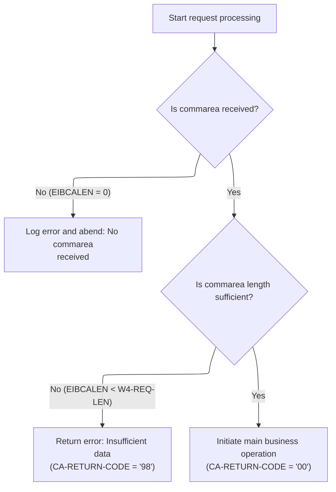
```mermaid
%%{init: {"flowchart": {"defaultRenderer": "elk"}} }%%
flowchart TD
    node1["Start request processing"] --> node2{"Is commarea received?"}
    click node1 openCode "base/src/lgapol01.cbl:68:73"
    node2 -->|"No (EIBCALEN = 0)"| node3["Log error and abend: No commarea
received"]
    click node2 openCode "base/src/lgapol01.cbl:83:87"
    click node3 openCode "base/src/lgapol01.cbl:119:151"
    node2 -->|"Yes"| node4{"Is commarea length sufficient?"}
    click node4 openCode "base/src/lgapol01.cbl:95:98"
    node4 -->|"No (EIBCALEN < W4-REQ-LEN)"| node5["Return error: Insufficient data
(CA-RETURN-CODE = '98')"]
    click node5 openCode "base/src/lgapol01.cbl:96:97"
    node4 -->|"Yes"| node6["Initiate main business operation
(CA-RETURN-CODE = '00')"]
    click node6 openCode "base/src/lgapol01.cbl:103:106"

classDef HeadingStyle fill:#777777,stroke:#333,stroke-width:2px;

%% Swimm:
%% %%{init: {"flowchart": {"defaultRenderer": "elk"}} }%%
%% flowchart TD
%%     node1["Start request processing"] --> node2{"Is commarea received?"}
%%     click node1 openCode "<SwmPath>[base/src/lgapol01.cbl](base/src/lgapol01.cbl)</SwmPath>:68:73"
%%     node2 -->|"No (EIBCALEN = 0)"| node3["Log error and abend: No commarea
%% received"]
%%     click node2 openCode "<SwmPath>[base/src/lgapol01.cbl](base/src/lgapol01.cbl)</SwmPath>:83:87"
%%     click node3 openCode "<SwmPath>[base/src/lgapol01.cbl](base/src/lgapol01.cbl)</SwmPath>:119:151"
%%     node2 -->|"Yes"| node4{"Is commarea length sufficient?"}
%%     click node4 openCode "<SwmPath>[base/src/lgapol01.cbl](base/src/lgapol01.cbl)</SwmPath>:95:98"
%%     node4 -->|"No (EIBCALEN < <SwmToken path="base/src/lgapol01.cbl" pos="92:11:15" line-data="           ADD W4-HDR-LEN TO W4-REQ-LEN">`W4-REQ-LEN`</SwmToken>)"| node5["Return error: Insufficient data
%% (<SwmToken path="base/src/lgtestp2.cbl" pos="71:3:7" line-data="                 IF CA-RETURN-CODE &gt; 0">`CA-RETURN-CODE`</SwmToken> = '98')"]
%%     click node5 openCode "<SwmPath>[base/src/lgapol01.cbl](base/src/lgapol01.cbl)</SwmPath>:96:97"
%%     node4 -->|"Yes"| node6["Initiate main business operation
%% (<SwmToken path="base/src/lgtestp2.cbl" pos="71:3:7" line-data="                 IF CA-RETURN-CODE &gt; 0">`CA-RETURN-CODE`</SwmToken> = '00')"]
%%     click node6 openCode "<SwmPath>[base/src/lgapol01.cbl](base/src/lgapol01.cbl)</SwmPath>:103:106"
%% 
%% classDef HeadingStyle fill:#777777,stroke:#333,stroke-width:2px;
```

This section validates the incoming policy insert request, ensures required data is present, and logs errors with relevant details if validation fails. It also triggers the main business operation if validation passes.

| Rule ID | Category        | Rule Name                                               | Description                                                                                                                                                                                                                                         | Implementation Details                                                                                                                                                                                                                                                                                                                                                                           |
| ------- | --------------- | ------------------------------------------------------- | --------------------------------------------------------------------------------------------------------------------------------------------------------------------------------------------------------------------------------------------------- | ------------------------------------------------------------------------------------------------------------------------------------------------------------------------------------------------------------------------------------------------------------------------------------------------------------------------------------------------------------------------------------------------ |
| BR-001  | Data validation | Missing commarea error handling                         | If no commarea is received, an error is logged with the message 'NO COMMAREA RECEIVED', the transaction is abended with code 'LGCA', and processing stops.                                                                                          | The error message includes the text 'NO COMMAREA RECEIVED'. The error log includes the current date and time, and up to 90 bytes of commarea data if available. The abend code is 'LGCA'.                                                                                                                                                                                                        |
| BR-002  | Data validation | Insufficient commarea length handling                   | If the commarea is present but its length is less than the required minimum, an error code '98' is returned and processing stops.                                                                                                                   | The error code returned is '98'. The required minimum length is the sum of <SwmToken path="base/src/lgapol01.cbl" pos="92:3:7" line-data="           ADD W4-HDR-LEN TO W4-REQ-LEN">`W4-HDR-LEN`</SwmToken> (+28) and <SwmToken path="base/src/lgapol01.cbl" pos="92:11:15" line-data="           ADD W4-HDR-LEN TO W4-REQ-LEN">`W4-REQ-LEN`</SwmToken> (initially +0, but may be set elsewhere). |
| BR-003  | Decision Making | Successful commarea validation and operation initiation | If the commarea is present and meets the minimum length requirement, the main business operation is initiated and a success code '00' is set.                                                                                                       | The return code set is '00'. The main business operation is invoked via a program call to <SwmToken path="base/src/lgapol01.cbl" pos="103:9:9" line-data="           EXEC CICS Link Program(LGAPDB01)">`LGAPDB01`</SwmToken> with the commarea and a length of 32500 bytes.                                                                                                                      |
| BR-004  | Writing Output  | Error log content and commarea truncation               | When an error is logged, the log entry includes the current date, time, and up to 90 bytes of commarea data if available. If the commarea is shorter than 91 bytes, the entire commarea is logged; otherwise, only the first 90 bytes are included. | The log entry includes date (8 characters), time (6 characters), and up to 90 bytes of commarea data. If commarea is less than 91 bytes, the entire commarea is logged; otherwise, only the first 90 bytes are included.                                                                                                                                                                         |

<SwmSnippet path="/base/src/lgapol01.cbl" line="68">

---

<SwmToken path="base/src/lgapol01.cbl" pos="68:1:3" line-data="       P100-MAIN SECTION.">`P100-MAIN`</SwmToken> checks the commarea for valid length, logs and aborts if missing or too short, then links to <SwmToken path="base/src/lgapol01.cbl" pos="103:9:9" line-data="           EXEC CICS Link Program(LGAPDB01)">`LGAPDB01`</SwmToken> for actual data insertion. Errors are handled via <SwmToken path="base/src/lgapol01.cbl" pos="85:3:5" line-data="               PERFORM P999-ERROR">`P999-ERROR`</SwmToken>.

```cobol
       P100-MAIN SECTION.

      *----------------------------------------------------------------*
      * Common code                                                    *
      *----------------------------------------------------------------*
           INITIALIZE W1-CONTROL.
           MOVE EIBTRNID TO W1-TID.
           MOVE EIBTRMID TO W1-TRM.
           MOVE EIBTASKN TO W1-TSK.
           MOVE EIBCALEN TO W1-LEN.
      *----------------------------------------------------------------*

      *----------------------------------------------------------------*
      * Check commarea and obtain required details                     *
      *----------------------------------------------------------------*
           IF EIBCALEN IS EQUAL TO ZERO
               MOVE ' NO COMMAREA RECEIVED' TO W3-DETAIL
               PERFORM P999-ERROR
               EXEC CICS ABEND ABCODE('LGCA') NODUMP END-EXEC
           END-IF

           MOVE '00' TO CA-RETURN-CODE
           SET W1-PTR TO ADDRESS OF DFHCOMMAREA.

           ADD W4-HDR-LEN TO W4-REQ-LEN


           IF EIBCALEN IS LESS THAN W4-REQ-LEN
             MOVE '98' TO CA-RETURN-CODE
             EXEC CICS RETURN END-EXEC
           END-IF

      *----------------------------------------------------------------*
      *    Perform the data Inserts                                    *
      *----------------------------------------------------------------*
           EXEC CICS Link Program(LGAPDB01)
                Commarea(DFHCOMMAREA)
                LENGTH(32500)
           END-EXEC.

           EXEC CICS RETURN END-EXEC.
```

---

</SwmSnippet>

<SwmSnippet path="/base/src/lgapol01.cbl" line="119">

---

<SwmToken path="base/src/lgapol01.cbl" pos="119:1:3" line-data="       P999-ERROR.">`P999-ERROR`</SwmToken> formats the error message with date and time, then calls LGSTSQ to write the error and up to 90 bytes of commarea data to the queue. This keeps error logs concise and relevant.

```cobol
       P999-ERROR.
      * Save SQLCODE in message
      * Obtain and format current time and date
           EXEC CICS ASKTIME ABSTIME(W2-TIME)
           END-EXEC
           EXEC CICS FORMATTIME ABSTIME(W2-TIME)
                     MMDDYYYY(W2-DATE1)
                     TIME(W2-DATE2)
           END-EXEC
           MOVE W2-DATE1 TO W3-DATE
           MOVE W2-DATE2 TO W3-TIME
      * Write output message to TDQ
           EXEC CICS LINK PROGRAM('LGSTSQ')
                     COMMAREA(W3-MESSAGE)
                     LENGTH(LENGTH OF W3-MESSAGE)
           END-EXEC.
      * Write 90 bytes or as much as we have of commarea to TDQ
           IF EIBCALEN > 0 THEN
             IF EIBCALEN < 91 THEN
               MOVE DFHCOMMAREA(1:EIBCALEN) TO CA-DATA
               EXEC CICS LINK PROGRAM('LGSTSQ')
                         COMMAREA(CA-ERROR-MSG)
                         LENGTH(LENGTH OF CA-ERROR-MSG)
               END-EXEC
             ELSE
               MOVE DFHCOMMAREA(1:90) TO CA-DATA
               EXEC CICS LINK PROGRAM('LGSTSQ')
                         COMMAREA(CA-ERROR-MSG)
                         LENGTH(LENGTH OF CA-ERROR-MSG)
               END-EXEC
             END-IF
           END-IF.
           EXIT.
```

---

</SwmSnippet>

## Policy Application Processing Workflow

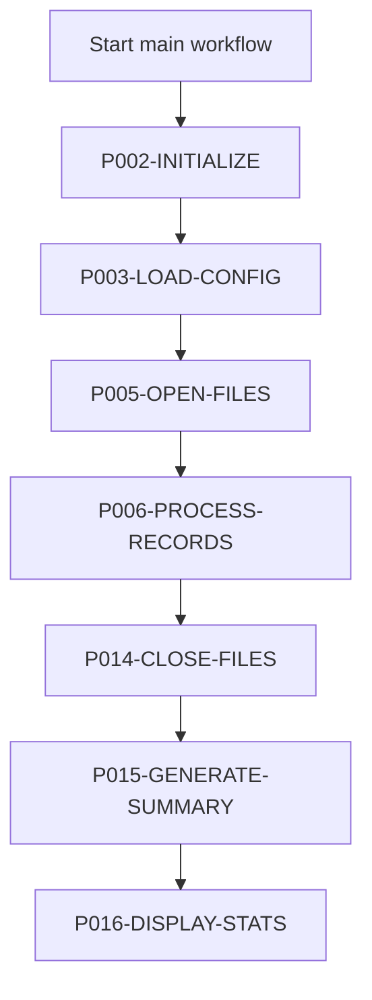
```mermaid
%%{init: {"flowchart": {"defaultRenderer": "elk"}} }%%
flowchart TD
    node1["Start main workflow"]
    node1 --> node2[P002-INITIALIZE]
    node2 --> node3[P003-LOAD-CONFIG]
    node3 --> node4[P005-OPEN-FILES]
    node4 --> node5[P006-PROCESS-RECORDS]
    node5 --> node6[P014-CLOSE-FILES]
    node6 --> node7[P015-GENERATE-SUMMARY]
    node7 --> node8[P016-DISPLAY-STATS]
    click node1 openCode "base/src/LGAPDB01.cbl:90:98"
    click node2 openCode "base/src/LGAPDB01.cbl:91:91"
    click node3 openCode "base/src/LGAPDB01.cbl:92:92"
    click node4 openCode "base/src/LGAPDB01.cbl:93:93"
    click node5 openCode "base/src/LGAPDB01.cbl:94:94"
    click node6 openCode "base/src/LGAPDB01.cbl:95:95"
    click node7 openCode "base/src/LGAPDB01.cbl:96:96"
    click node8 openCode "base/src/LGAPDB01.cbl:97:97"
classDef HeadingStyle fill:#777777,stroke:#333,stroke-width:2px;

%% Swimm:
%% %%{init: {"flowchart": {"defaultRenderer": "elk"}} }%%
%% flowchart TD
%%     node1["Start main workflow"]
%%     node1 --> node2[<SwmToken path="base/src/LGAPDB01.cbl" pos="91:3:5" line-data="           PERFORM P002-INITIALIZE">`P002-INITIALIZE`</SwmToken>]
%%     node2 --> node3[<SwmToken path="base/src/LGAPDB01.cbl" pos="92:3:7" line-data="           PERFORM P003-LOAD-CONFIG">`P003-LOAD-CONFIG`</SwmToken>]
%%     node3 --> node4[<SwmToken path="base/src/LGAPDB01.cbl" pos="93:3:7" line-data="           PERFORM P005-OPEN-FILES">`P005-OPEN-FILES`</SwmToken>]
%%     node4 --> node5[<SwmToken path="base/src/LGAPDB01.cbl" pos="94:3:7" line-data="           PERFORM P006-PROCESS-RECORDS">`P006-PROCESS-RECORDS`</SwmToken>]
%%     node5 --> node6[<SwmToken path="base/src/LGAPDB01.cbl" pos="95:3:7" line-data="           PERFORM P014-CLOSE-FILES">`P014-CLOSE-FILES`</SwmToken>]
%%     node6 --> node7[<SwmToken path="base/src/LGAPDB01.cbl" pos="96:3:7" line-data="           PERFORM P015-GENERATE-SUMMARY">`P015-GENERATE-SUMMARY`</SwmToken>]
%%     node7 --> node8[<SwmToken path="base/src/LGAPDB01.cbl" pos="97:3:7" line-data="           PERFORM P016-DISPLAY-STATS">`P016-DISPLAY-STATS`</SwmToken>]
%%     click node1 openCode "<SwmPath>[base/src/LGAPDB01.cbl](base/src/LGAPDB01.cbl)</SwmPath>:90:98"
%%     click node2 openCode "<SwmPath>[base/src/LGAPDB01.cbl](base/src/LGAPDB01.cbl)</SwmPath>:91:91"
%%     click node3 openCode "<SwmPath>[base/src/LGAPDB01.cbl](base/src/LGAPDB01.cbl)</SwmPath>:92:92"
%%     click node4 openCode "<SwmPath>[base/src/LGAPDB01.cbl](base/src/LGAPDB01.cbl)</SwmPath>:93:93"
%%     click node5 openCode "<SwmPath>[base/src/LGAPDB01.cbl](base/src/LGAPDB01.cbl)</SwmPath>:94:94"
%%     click node6 openCode "<SwmPath>[base/src/LGAPDB01.cbl](base/src/LGAPDB01.cbl)</SwmPath>:95:95"
%%     click node7 openCode "<SwmPath>[base/src/LGAPDB01.cbl](base/src/LGAPDB01.cbl)</SwmPath>:96:96"
%%     click node8 openCode "<SwmPath>[base/src/LGAPDB01.cbl](base/src/LGAPDB01.cbl)</SwmPath>:97:97"
%% classDef HeadingStyle fill:#777777,stroke:#333,stroke-width:2px;
```

This section coordinates the end-to-end workflow for processing policy applications. It ensures that each critical phase of the process is executed in the correct order.

| Rule ID | Category                        | Rule Name                        | Description                                                                                                  | Implementation Details                                        |
| ------- | ------------------------------- | -------------------------------- | ------------------------------------------------------------------------------------------------------------ | ------------------------------------------------------------- |
| BR-001  | Invoking a Service or a Process | Initialization phase required    | The workflow begins by initializing the processing environment before any other steps are performed.         | No constants or output formats are specified in this section. |
| BR-002  | Invoking a Service or a Process | Configuration loading required   | Configuration data is loaded after initialization and before any file operations or record processing.       | No constants or output formats are specified in this section. |
| BR-003  | Invoking a Service or a Process | File opening required            | Files are opened before any records are processed, ensuring data access is available for the workflow.       | No constants or output formats are specified in this section. |
| BR-004  | Invoking a Service or a Process | Record processing phase required | Record processing is performed after files are opened, representing the core business logic of the workflow. | No constants or output formats are specified in this section. |
| BR-005  | Invoking a Service or a Process | File closing required            | Files are closed after record processing to ensure data integrity and release resources.                     | No constants or output formats are specified in this section. |
| BR-006  | Invoking a Service or a Process | Summary generation required      | A summary is generated after files are closed, providing an overview of the processing results.              | No constants or output formats are specified in this section. |
| BR-007  | Invoking a Service or a Process | Statistics display required      | Statistics are displayed at the end of the workflow, providing visibility into the process outcomes.         | No constants or output formats are specified in this section. |
| BR-008  | Technical Step                  | Workflow termination             | The workflow terminates after all processing steps are completed, marking the end of the program execution.  | No constants or output formats are specified in this section. |

<SwmSnippet path="/base/src/LGAPDB01.cbl" line="90">

---

<SwmToken path="base/src/LGAPDB01.cbl" pos="90:1:1" line-data="       P001.">`P001`</SwmToken> runs the main workflow for policy application processing: initializes, loads config, opens files, processes records, closes files, generates summary, and displays stats. Each step builds on the previous.

```cobol
       P001.
           PERFORM P002-INITIALIZE
           PERFORM P003-LOAD-CONFIG
           PERFORM P005-OPEN-FILES
           PERFORM P006-PROCESS-RECORDS
           PERFORM P014-CLOSE-FILES
           PERFORM P015-GENERATE-SUMMARY
           PERFORM P016-DISPLAY-STATS
           STOP RUN.
```

---

</SwmSnippet>

## Configuration Loading and Defaults


```mermaid
%%{init: {"flowchart": {"defaultRenderer": "elk"}} }%%
flowchart TD
    node1["Start: Load configuration"] --> node2{"Is config file available?"}
    click node1 openCode "base/src/LGAPDB01.cbl:112:113"
    node2 -->|"No"| node3["Set default business parameters"]
    click node2 openCode "base/src/LGAPDB01.cbl:114:116"
    click node3 openCode "base/src/LGAPDB01.cbl:116:116"
    node2 -->|"Yes"| node4["Read configuration values from file"]
    click node4 openCode "base/src/LGAPDB01.cbl:118:119"
    node4 --> node5{"Is MAX_RISK_SCORE valid and numeric?"}
    click node5 openCode "base/src/LGAPDB01.cbl:126:129"
    node5 -->|"Yes"| node6["Set MAX_RISK_SCORE from file"]
    click node6 openCode "base/src/LGAPDB01.cbl:129:129"
    node5 -->|"No"| node7["Skip setting MAX_RISK_SCORE"]
    click node7 openCode "base/src/LGAPDB01.cbl:130:130"
    node6 --> node8{"Is MIN_PREMIUM valid and numeric?"}
    node7 --> node8
    click node8 openCode "base/src/LGAPDB01.cbl:132:135"
    node8 -->|"Yes"| node9["Set MIN_PREMIUM from file"]
    click node9 openCode "base/src/LGAPDB01.cbl:135:135"
    node8 -->|"No"| node10["Skip setting MIN_PREMIUM"]
    click node10 openCode "base/src/LGAPDB01.cbl:136:136"
    node9 --> node11["Configuration loaded"]
    node10 --> node11
    click node11 openCode "base/src/LGAPDB01.cbl:120:120"
classDef HeadingStyle fill:#777777,stroke:#333,stroke-width:2px;

%% Swimm:
%% %%{init: {"flowchart": {"defaultRenderer": "elk"}} }%%
%% flowchart TD
%%     node1["Start: Load configuration"] --> node2{"Is config file available?"}
%%     click node1 openCode "<SwmPath>[base/src/LGAPDB01.cbl](base/src/LGAPDB01.cbl)</SwmPath>:112:113"
%%     node2 -->|"No"| node3["Set default business parameters"]
%%     click node2 openCode "<SwmPath>[base/src/LGAPDB01.cbl](base/src/LGAPDB01.cbl)</SwmPath>:114:116"
%%     click node3 openCode "<SwmPath>[base/src/LGAPDB01.cbl](base/src/LGAPDB01.cbl)</SwmPath>:116:116"
%%     node2 -->|"Yes"| node4["Read configuration values from file"]
%%     click node4 openCode "<SwmPath>[base/src/LGAPDB01.cbl](base/src/LGAPDB01.cbl)</SwmPath>:118:119"
%%     node4 --> node5{"Is <SwmToken path="base/src/LGAPDB01.cbl" pos="126:4:4" line-data="           MOVE &#39;MAX_RISK_SCORE&#39; TO CONFIG-KEY">`MAX_RISK_SCORE`</SwmToken> valid and numeric?"}
%%     click node5 openCode "<SwmPath>[base/src/LGAPDB01.cbl](base/src/LGAPDB01.cbl)</SwmPath>:126:129"
%%     node5 -->|"Yes"| node6["Set <SwmToken path="base/src/LGAPDB01.cbl" pos="126:4:4" line-data="           MOVE &#39;MAX_RISK_SCORE&#39; TO CONFIG-KEY">`MAX_RISK_SCORE`</SwmToken> from file"]
%%     click node6 openCode "<SwmPath>[base/src/LGAPDB01.cbl](base/src/LGAPDB01.cbl)</SwmPath>:129:129"
%%     node5 -->|"No"| node7["Skip setting <SwmToken path="base/src/LGAPDB01.cbl" pos="126:4:4" line-data="           MOVE &#39;MAX_RISK_SCORE&#39; TO CONFIG-KEY">`MAX_RISK_SCORE`</SwmToken>"]
%%     click node7 openCode "<SwmPath>[base/src/LGAPDB01.cbl](base/src/LGAPDB01.cbl)</SwmPath>:130:130"
%%     node6 --> node8{"Is <SwmToken path="base/src/LGAPDB01.cbl" pos="132:4:4" line-data="           MOVE &#39;MIN_PREMIUM&#39; TO CONFIG-KEY">`MIN_PREMIUM`</SwmToken> valid and numeric?"}
%%     node7 --> node8
%%     click node8 openCode "<SwmPath>[base/src/LGAPDB01.cbl](base/src/LGAPDB01.cbl)</SwmPath>:132:135"
%%     node8 -->|"Yes"| node9["Set <SwmToken path="base/src/LGAPDB01.cbl" pos="132:4:4" line-data="           MOVE &#39;MIN_PREMIUM&#39; TO CONFIG-KEY">`MIN_PREMIUM`</SwmToken> from file"]
%%     click node9 openCode "<SwmPath>[base/src/LGAPDB01.cbl](base/src/LGAPDB01.cbl)</SwmPath>:135:135"
%%     node8 -->|"No"| node10["Skip setting <SwmToken path="base/src/LGAPDB01.cbl" pos="132:4:4" line-data="           MOVE &#39;MIN_PREMIUM&#39; TO CONFIG-KEY">`MIN_PREMIUM`</SwmToken>"]
%%     click node10 openCode "<SwmPath>[base/src/LGAPDB01.cbl](base/src/LGAPDB01.cbl)</SwmPath>:136:136"
%%     node9 --> node11["Configuration loaded"]
%%     node10 --> node11
%%     click node11 openCode "<SwmPath>[base/src/LGAPDB01.cbl](base/src/LGAPDB01.cbl)</SwmPath>:120:120"
%% classDef HeadingStyle fill:#777777,stroke:#333,stroke-width:2px;
```

This section ensures that business parameters required for downstream actuarial calculations are loaded from a configuration file if available, or set to safe defaults if not. It validates the presence and numeric format of each parameter before using it.

| Rule ID | Category        | Rule Name                                                                                                                                                                  | Description                                                                                                                                                                                                                                                                                                                                                                                                                                                                                                         | Implementation Details                                                                                                                                                                                                                                                                 |
| ------- | --------------- | -------------------------------------------------------------------------------------------------------------------------------------------------------------------------- | ------------------------------------------------------------------------------------------------------------------------------------------------------------------------------------------------------------------------------------------------------------------------------------------------------------------------------------------------------------------------------------------------------------------------------------------------------------------------------------------------------------------- | -------------------------------------------------------------------------------------------------------------------------------------------------------------------------------------------------------------------------------------------------------------------------------------- |
| BR-001  | Data validation | <SwmToken path="base/src/LGAPDB01.cbl" pos="126:4:4" line-data="           MOVE &#39;MAX_RISK_SCORE&#39; TO CONFIG-KEY">`MAX_RISK_SCORE`</SwmToken> validation and loading | If the configuration file is available, the system reads the value for <SwmToken path="base/src/LGAPDB01.cbl" pos="126:4:4" line-data="           MOVE &#39;MAX_RISK_SCORE&#39; TO CONFIG-KEY">`MAX_RISK_SCORE`</SwmToken> and uses it only if it is present and numeric; otherwise, it skips setting this parameter from the file.                                                                                                                                                                                 | The value for <SwmToken path="base/src/LGAPDB01.cbl" pos="126:4:4" line-data="           MOVE &#39;MAX_RISK_SCORE&#39; TO CONFIG-KEY">`MAX_RISK_SCORE`</SwmToken> is expected to be numeric. If not, the parameter is not set from the file and any previous or default value remains. |
| BR-002  | Data validation | <SwmToken path="base/src/LGAPDB01.cbl" pos="132:4:4" line-data="           MOVE &#39;MIN_PREMIUM&#39; TO CONFIG-KEY">`MIN_PREMIUM`</SwmToken> validation and loading       | If the configuration file is available, the system reads the value for <SwmToken path="base/src/LGAPDB01.cbl" pos="132:4:4" line-data="           MOVE &#39;MIN_PREMIUM&#39; TO CONFIG-KEY">`MIN_PREMIUM`</SwmToken> and uses it only if it is present and numeric; otherwise, it skips setting this parameter from the file.                                                                                                                                                                                       | The value for <SwmToken path="base/src/LGAPDB01.cbl" pos="132:4:4" line-data="           MOVE &#39;MIN_PREMIUM&#39; TO CONFIG-KEY">`MIN_PREMIUM`</SwmToken> is expected to be numeric. If not, the parameter is not set from the file and any previous or default value remains.       |
| BR-003  | Decision Making | Default parameters on missing config                                                                                                                                       | If the configuration file is not available, default business parameters are set and a warning message is displayed to inform the user.                                                                                                                                                                                                                                                                                                                                                                              | The warning message is: 'Warning: Config file not available - using defaults'. Default values for business parameters are set, but the specific values are not detailed in this section.                                                                                               |
| BR-004  | Decision Making | Business parameter initialization guarantee                                                                                                                                | The configuration loading process ensures that business parameters (<SwmToken path="base/src/LGAPDB01.cbl" pos="126:4:4" line-data="           MOVE &#39;MAX_RISK_SCORE&#39; TO CONFIG-KEY">`MAX_RISK_SCORE`</SwmToken> and <SwmToken path="base/src/LGAPDB01.cbl" pos="132:4:4" line-data="           MOVE &#39;MIN_PREMIUM&#39; TO CONFIG-KEY">`MIN_PREMIUM`</SwmToken>) are always initialized, either from the configuration file if valid or from default values if the file is missing or values are invalid. | Parameters are guaranteed to have a value for downstream processing, either from the configuration file or from defaults. No parameter is left unset.                                                                                                                                  |

<SwmSnippet path="/base/src/LGAPDB01.cbl" line="112">

---

<SwmToken path="base/src/LGAPDB01.cbl" pos="112:1:5" line-data="       P003-LOAD-CONFIG.">`P003-LOAD-CONFIG`</SwmToken> opens the config file, loads values if present, or sets defaults and logs a warning if missing. This ensures config values are available for processing.

```cobol
       P003-LOAD-CONFIG.
           OPEN INPUT CONFIG-FILE
           IF NOT CONFIG-OK
               DISPLAY 'Warning: Config file not available - using defaults'
               PERFORM P004-SET-DEFAULTS
           ELSE
               PERFORM P004-READ-CONFIG-VALUES
               CLOSE CONFIG-FILE
           END-IF.
```

---

</SwmSnippet>

<SwmSnippet path="/base/src/LGAPDB01.cbl" line="125">

---

<SwmToken path="base/src/LGAPDB01.cbl" pos="125:1:7" line-data="       P004-READ-CONFIG-VALUES.">`P004-READ-CONFIG-VALUES`</SwmToken> reads config keys, checks for numeric values, converts them, and stores them in working storage. This sets up risk score and premium values for actuarial calculations.

```cobol
       P004-READ-CONFIG-VALUES.
           MOVE 'MAX_RISK_SCORE' TO CONFIG-KEY
           READ CONFIG-FILE
           IF CONFIG-OK AND NUMERIC-CONFIG
               MOVE FUNCTION NUMVAL(CONFIG-VALUE) TO WS-MAX-RISK-SCORE
           END-IF
           
           MOVE 'MIN_PREMIUM' TO CONFIG-KEY
           READ CONFIG-FILE
           IF CONFIG-OK AND NUMERIC-CONFIG
               MOVE FUNCTION NUMVAL(CONFIG-VALUE) TO WS-MIN-PREMIUM
           END-IF.
```

---

</SwmSnippet>

## Input Record Processing and Validation

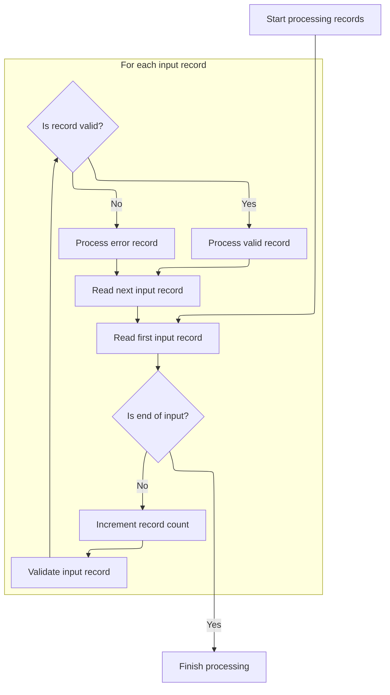
```mermaid
%%{init: {"flowchart": {"defaultRenderer": "elk"}} }%%
flowchart TD
    node1["Start processing records"]
    click node1 openCode "base/src/LGAPDB01.cbl:178:179"
    node1 --> node2["Read first input record"]
    click node2 openCode "base/src/LGAPDB01.cbl:179:179"
    
    subgraph loop1["For each input record"]
        node2 --> node3{"Is end of input?"}
        click node3 openCode "base/src/LGAPDB01.cbl:180:180"
        node3 -->|"No"| node4["Increment record count"]
        click node4 openCode "base/src/LGAPDB01.cbl:181:181"
        node4 --> node5["Validate input record"]
        click node5 openCode "base/src/LGAPDB01.cbl:182:182"
        node5 --> node6{"Is record valid?"}
        click node6 openCode "base/src/LGAPDB01.cbl:183:183"
        node6 -->|"Yes"| node7["Process valid record"]
        click node7 openCode "base/src/LGAPDB01.cbl:184:184"
        node6 -->|"No"| node8["Process error record"]
        click node8 openCode "base/src/LGAPDB01.cbl:186:186"
        node7 --> node9["Read next input record"]
        click node9 openCode "base/src/LGAPDB01.cbl:188:188"
        node8 --> node9
        node9 --> node2
    end
    node3 -->|"Yes"| node10["Finish processing"]
    click node10 openCode "base/src/LGAPDB01.cbl:189:189"

classDef HeadingStyle fill:#777777,stroke:#333,stroke-width:2px;

%% Swimm:
%% %%{init: {"flowchart": {"defaultRenderer": "elk"}} }%%
%% flowchart TD
%%     node1["Start processing records"]
%%     click node1 openCode "<SwmPath>[base/src/LGAPDB01.cbl](base/src/LGAPDB01.cbl)</SwmPath>:178:179"
%%     node1 --> node2["Read first input record"]
%%     click node2 openCode "<SwmPath>[base/src/LGAPDB01.cbl](base/src/LGAPDB01.cbl)</SwmPath>:179:179"
%%     
%%     subgraph loop1["For each input record"]
%%         node2 --> node3{"Is end of input?"}
%%         click node3 openCode "<SwmPath>[base/src/LGAPDB01.cbl](base/src/LGAPDB01.cbl)</SwmPath>:180:180"
%%         node3 -->|"No"| node4["Increment record count"]
%%         click node4 openCode "<SwmPath>[base/src/LGAPDB01.cbl](base/src/LGAPDB01.cbl)</SwmPath>:181:181"
%%         node4 --> node5["Validate input record"]
%%         click node5 openCode "<SwmPath>[base/src/LGAPDB01.cbl](base/src/LGAPDB01.cbl)</SwmPath>:182:182"
%%         node5 --> node6{"Is record valid?"}
%%         click node6 openCode "<SwmPath>[base/src/LGAPDB01.cbl](base/src/LGAPDB01.cbl)</SwmPath>:183:183"
%%         node6 -->|"Yes"| node7["Process valid record"]
%%         click node7 openCode "<SwmPath>[base/src/LGAPDB01.cbl](base/src/LGAPDB01.cbl)</SwmPath>:184:184"
%%         node6 -->|"No"| node8["Process error record"]
%%         click node8 openCode "<SwmPath>[base/src/LGAPDB01.cbl](base/src/LGAPDB01.cbl)</SwmPath>:186:186"
%%         node7 --> node9["Read next input record"]
%%         click node9 openCode "<SwmPath>[base/src/LGAPDB01.cbl](base/src/LGAPDB01.cbl)</SwmPath>:188:188"
%%         node8 --> node9
%%         node9 --> node2
%%     end
%%     node3 -->|"Yes"| node10["Finish processing"]
%%     click node10 openCode "<SwmPath>[base/src/LGAPDB01.cbl](base/src/LGAPDB01.cbl)</SwmPath>:189:189"
%% 
%% classDef HeadingStyle fill:#777777,stroke:#333,stroke-width:2px;
```

This section orchestrates the main input processing loop, ensuring each record is validated and routed to the appropriate processing or error handling routine. It also manages record counting and end-of-file detection.

| Rule ID | Category        | Rule Name                     | Description                                                                                                                  | Implementation Details                                                                                                      |
| ------- | --------------- | ----------------------------- | ---------------------------------------------------------------------------------------------------------------------------- | --------------------------------------------------------------------------------------------------------------------------- |
| BR-001  | Reading Input   | Sequential input reading      | Each input record is read sequentially until the end-of-file indicator is set.                                               | The end-of-file indicator is set when the input status equals '10'.                                                         |
| BR-002  | Reading Input   | Iterative record processing   | After processing each record (valid or error), the next input record is read to continue the loop.                           | The loop continues until the end-of-file indicator is set.                                                                  |
| BR-003  | Data validation | Input record validation       | Each input record is validated before further processing.                                                                    | Validation is performed by invoking a dedicated validation routine for each record.                                         |
| BR-004  | Calculation     | Record counting               | The record count is incremented for each input record processed.                                                             | The record count is a numeric value with 7 digits, initialized to zero.                                                     |
| BR-005  | Decision Making | Conditional record processing | If a record passes validation (no errors), it is processed as a valid record; otherwise, it is processed as an error record. | A record is considered valid if the error count is zero. Error records are handled by a dedicated error processing routine. |

<SwmSnippet path="/base/src/LGAPDB01.cbl" line="178">

---

<SwmToken path="base/src/LGAPDB01.cbl" pos="178:1:5" line-data="       P006-PROCESS-RECORDS.">`P006-PROCESS-RECORDS`</SwmToken> loops through input records, validates each, processes valid ones, and handles errors by creating error-marked output records and updating counters.

```cobol
       P006-PROCESS-RECORDS.
           PERFORM P007-READ-INPUT
           PERFORM UNTIL INPUT-EOF
               ADD 1 TO WS-REC-CNT
               PERFORM P008-VALIDATE-INPUT-RECORD
               IF WS-ERROR-COUNT = ZERO
                   PERFORM P009-PROCESS-VALID-RECORD
               ELSE
                   PERFORM P010-PROCESS-ERROR-RECORD
               END-IF
               PERFORM P007-READ-INPUT
           END-PERFORM.
```

---

</SwmSnippet>

## Routing Valid Policy Records

This section determines how valid policy records are routed for further processing, ensuring commercial policies are handled by the commercial logic and non-commercial policies are flagged as errors.

| Rule ID | Category        | Rule Name                            | Description                                                                                                                                                | Implementation Details                                                                                                                                           |
| ------- | --------------- | ------------------------------------ | ---------------------------------------------------------------------------------------------------------------------------------------------------------- | ---------------------------------------------------------------------------------------------------------------------------------------------------------------- |
| BR-001  | Decision Making | Commercial policy routing            | When the input policy is commercial, it is routed to the commercial processing logic and the processed count is incremented by 1.                          | The processed count is a numeric value, incremented by 1 for each commercial policy processed. The commercial processing logic is invoked for these records.     |
| BR-002  | Decision Making | Non-commercial policy error handling | When the input policy is not commercial, it is routed to the non-commercial processing logic, marked as an error, and the error count is incremented by 1. | The error count is a numeric value, incremented by 1 for each non-commercial policy processed. The non-commercial processing logic is invoked for these records. |
| BR-003  | Technical Step  | Counter initialization               | The processed and error counters are initialized to zero before any records are processed, ensuring accurate tracking from the start of the run.           | Both counters are numeric values, initialized to zero. This ensures that counts reflect only the current run's activity.                                         |

<SwmSnippet path="/base/src/LGAPDB01.cbl" line="234">

---

<SwmToken path="base/src/LGAPDB01.cbl" pos="234:1:7" line-data="       P009-PROCESS-VALID-RECORD.">`P009-PROCESS-VALID-RECORD`</SwmToken> checks if the input policy is commercial. If so, it routes to <SwmToken path="base/src/LGAPDB01.cbl" pos="236:3:3" line-data="               PERFORM P011-PROCESS-COMMERCIAL">`P011`</SwmToken> for commercial processing and updates the processed count. Otherwise, it sends the record to <SwmToken path="base/src/LGAPDB01.cbl" pos="239:3:3" line-data="               PERFORM P012-PROCESS-NON-COMMERCIAL">`P012`</SwmToken> for non-commercial handling, marking it as an error and incrementing the error count. This split ensures only commercial policies are processed, as per the repo's business rules.

```cobol
       P009-PROCESS-VALID-RECORD.
           IF COMMERCIAL-POLICY
               PERFORM P011-PROCESS-COMMERCIAL
               ADD 1 TO WS-PROC-CNT
           ELSE
               PERFORM P012-PROCESS-NON-COMMERCIAL
               ADD 1 TO WS-ERR-CNT
           END-IF.
```

---

</SwmSnippet>

### Processing Commercial Policy Records

This section manages the business state for commercial policy underwriting and discount eligibility. It defines the possible underwriting outcomes and discount eligibility flags for each policy record.

| Rule ID | Category        | Rule Name                          | Description                                                                                                                                                                           | Implementation Details                                                                                                                                                                                                                                                                    |
| ------- | --------------- | ---------------------------------- | ------------------------------------------------------------------------------------------------------------------------------------------------------------------------------------- | ----------------------------------------------------------------------------------------------------------------------------------------------------------------------------------------------------------------------------------------------------------------------------------------- |
| BR-001  | Calculation     | Discount factor initialization     | The discount factor and total discount factor for a commercial policy are initialized to 1.00, representing no discount applied by default.                                           | Discount factors are decimal numbers with two digits after the decimal point, initialized to 1.00.                                                                                                                                                                                        |
| BR-002  | Decision Making | Underwriting decision status codes | The underwriting decision status for a commercial policy can be Approved, Pending, Rejected, or Referred, represented by the values 0, 1, 2, and 3 respectively.                      | Status codes: 0 = Approved, 1 = Pending, 2 = Rejected, 3 = Referred. The status is stored as a single digit number. The description is a string of up to 20 characters. The rejection reason is a string of up to 50 characters. Underwriting notes are a string of up to 100 characters. |
| BR-003  | Decision Making | Discount eligibility flags         | A commercial policy can be eligible for multi-policy, claims-free, or safety program discounts, each represented by a flag with possible values 'Y' (eligible) or 'N' (not eligible). | Eligibility flags: 'Y' = eligible, 'N' = not eligible. Each flag is a single character string.                                                                                                                                                                                            |

See <SwmLink doc-title="Processing Commercial Policy Applications">[Processing Commercial Policy Applications](.swm%5Cprocessing-commercial-policy-applications.38pwqval.sw.md)</SwmLink>

### Handling Non-Commercial Policy Records


```mermaid
%%{init: {"flowchart": {"defaultRenderer": "elk"}} }%%
flowchart TD
    node1{"Is policy commercial?"}
    click node1 openCode "base/src/LGAPDB01.cbl:379:379"
    node1 -->|"No"| node2["Copy customer and property info"]
    click node2 openCode "base/src/LGAPDB01.cbl:380:382"
    node2 --> node3["Set all premiums and risk scores to zero"]
    click node3 openCode "base/src/LGAPDB01.cbl:383:388"
    node3 --> node4["Mark record as unsupported (OUT-STATUS =
'UNSUPPORTED')"]
    click node4 openCode "base/src/LGAPDB01.cbl:389:389"
    node4 --> node5["Write output record with rejection
reason (OUT-REJECT-REASON = 'Only
Commercial policies supported in this
version')"]
    click node5 openCode "base/src/LGAPDB01.cbl:390:392"
    node1 -->|"Yes"| node6["End - Commercial policies not processed
here"]
    click node6 openCode "base/src/LGAPDB01.cbl:379:379"

classDef HeadingStyle fill:#777777,stroke:#333,stroke-width:2px;

%% Swimm:
%% %%{init: {"flowchart": {"defaultRenderer": "elk"}} }%%
%% flowchart TD
%%     node1{"Is policy commercial?"}
%%     click node1 openCode "<SwmPath>[base/src/LGAPDB01.cbl](base/src/LGAPDB01.cbl)</SwmPath>:379:379"
%%     node1 -->|"No"| node2["Copy customer and property info"]
%%     click node2 openCode "<SwmPath>[base/src/LGAPDB01.cbl](base/src/LGAPDB01.cbl)</SwmPath>:380:382"
%%     node2 --> node3["Set all premiums and risk scores to zero"]
%%     click node3 openCode "<SwmPath>[base/src/LGAPDB01.cbl](base/src/LGAPDB01.cbl)</SwmPath>:383:388"
%%     node3 --> node4["Mark record as unsupported (<SwmToken path="base/src/LGAPDB01.cbl" pos="389:9:11" line-data="           MOVE &#39;UNSUPPORTED&#39; TO OUT-STATUS">`OUT-STATUS`</SwmToken> =
%% 'UNSUPPORTED')"]
%%     click node4 openCode "<SwmPath>[base/src/LGAPDB01.cbl](base/src/LGAPDB01.cbl)</SwmPath>:389:389"
%%     node4 --> node5["Write output record with rejection
%% reason (<SwmToken path="base/src/LGAPDB01.cbl" pos="391:3:7" line-data="                TO OUT-REJECT-REASON">`OUT-REJECT-REASON`</SwmToken> = 'Only
%% Commercial policies supported in this
%% version')"]
%%     click node5 openCode "<SwmPath>[base/src/LGAPDB01.cbl](base/src/LGAPDB01.cbl)</SwmPath>:390:392"
%%     node1 -->|"Yes"| node6["End - Commercial policies not processed
%% here"]
%%     click node6 openCode "<SwmPath>[base/src/LGAPDB01.cbl](base/src/LGAPDB01.cbl)</SwmPath>:379:379"
%% 
%% classDef HeadingStyle fill:#777777,stroke:#333,stroke-width:2px;
```

This section processes non-commercial policy records by rejecting them and providing a clear business reason in the output. It ensures that unsupported policy types are not processed for premium or risk calculation and are flagged for downstream handling.

| Rule ID | Category       | Rule Name                                          | Description                                                                                                                                                         | Implementation Details                                                                                                                                                                                                                |
| ------- | -------------- | -------------------------------------------------- | ------------------------------------------------------------------------------------------------------------------------------------------------------------------- | ------------------------------------------------------------------------------------------------------------------------------------------------------------------------------------------------------------------------------------- |
| BR-001  | Writing Output | Copy customer and property info for non-commercial | When a policy is not commercial, the customer number, property type, and postcode are copied from the input to the output record.                                   | Customer number is a string of 10 characters, property type is a string of 15 characters, and postcode is a string of 8 characters. These are copied exactly as received.                                                             |
| BR-002  | Writing Output | Zero premiums and risk scores for non-commercial   | All premium and risk score fields are set to zero for non-commercial policies.                                                                                      | All premium and risk score fields are set to the numeric value zero. This includes fire, crime, flood, weather, and total premium, as well as the risk score.                                                                         |
| BR-003  | Writing Output | Mark as unsupported and set rejection reason       | The output record is marked with status 'UNSUPPORTED' and a fixed rejection reason stating only commercial policies are supported in this version.                  | The status field is set to the string 'UNSUPPORTED'. The rejection reason field is set to the string 'Only Commercial policies supported in this version'. Both are fixed values for all non-commercial policies.                     |
| BR-004  | Writing Output | Write rejected non-commercial policy record        | A record for each non-commercial policy is written to the output with the copied fields, zeroed premiums and risk scores, unsupported status, and rejection reason. | The output record contains the customer and property information, all premium and risk fields set to zero, status 'UNSUPPORTED', and the fixed rejection reason. The record is written in the output format as defined by the system. |

<SwmSnippet path="/base/src/LGAPDB01.cbl" line="379">

---

<SwmToken path="base/src/LGAPDB01.cbl" pos="379:1:7" line-data="       P012-PROCESS-NON-COMMERCIAL.">`P012-PROCESS-NON-COMMERCIAL`</SwmToken> copies customer number, property type, and postcode from the input to the output, then sets all risk and premium fields to zero. It marks the record as 'UNSUPPORTED' and adds a fixed reject reason, then writes the output. This is how the repo rejects non-commercial policies and signals the business rule.

```cobol
       P012-PROCESS-NON-COMMERCIAL.
           MOVE IN-CUSTOMER-NUM TO OUT-CUSTOMER-NUM
           MOVE IN-PROPERTY-TYPE TO OUT-PROPERTY-TYPE
           MOVE IN-POSTCODE TO OUT-POSTCODE
           MOVE ZERO TO OUT-RISK-SCORE
           MOVE ZERO TO OUT-FIRE-PREMIUM
           MOVE ZERO TO OUT-CRIME-PREMIUM
           MOVE ZERO TO OUT-FLOOD-PREMIUM
           MOVE ZERO TO OUT-WEATHER-PREMIUM
           MOVE ZERO TO OUT-TOTAL-PREMIUM
           MOVE 'UNSUPPORTED' TO OUT-STATUS
           MOVE 'Only Commercial policies supported in this version' 
                TO OUT-REJECT-REASON
           WRITE OUTPUT-RECORD.
```

---

</SwmSnippet>

## Handling Add Policy Failure in Menu Flow

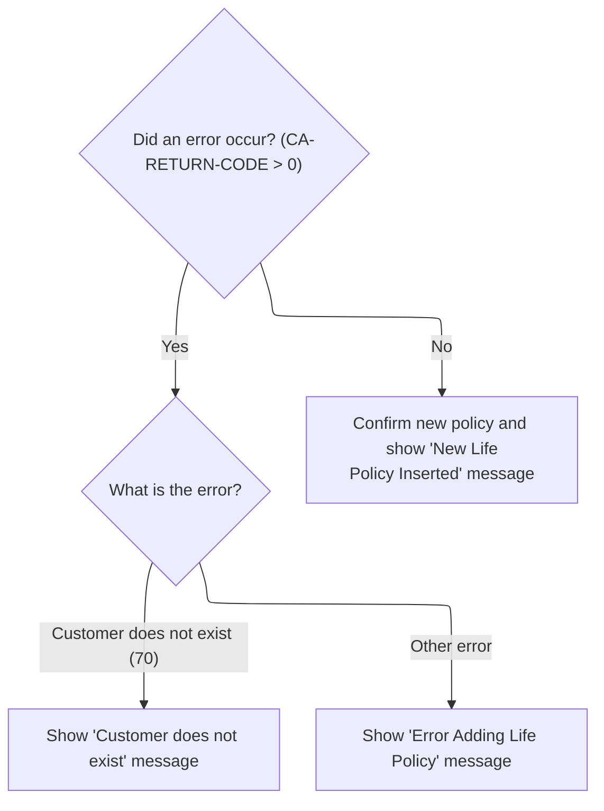
```mermaid
%%{init: {"flowchart": {"defaultRenderer": "elk"}} }%%
flowchart TD
    node1{"Did an error occur? (CA-RETURN-CODE > 0)"}
    click node1 openCode "base/src/lgtestp2.cbl:109:112"
    node1 -->|"Yes"| node2{"What is the error?"}
    click node2 openCode "base/src/lgtestp2.cbl:269:276"
    node2 -->|"Customer does not exist (70)"| node3["Show 'Customer does not exist' message"]
    click node3 openCode "base/src/lgtestp2.cbl:271:272"
    node2 -->|"Other error"| node4["Show 'Error Adding Life Policy' message"]
    click node4 openCode "base/src/lgtestp2.cbl:274:275"
    node1 -->|"No"| node5["Confirm new policy and show 'New Life
Policy Inserted' message"]
    click node5 openCode "base/src/lgtestp2.cbl:113:122"

classDef HeadingStyle fill:#777777,stroke:#333,stroke-width:2px;

%% Swimm:
%% %%{init: {"flowchart": {"defaultRenderer": "elk"}} }%%
%% flowchart TD
%%     node1{"Did an error occur? (<SwmToken path="base/src/lgtestp2.cbl" pos="71:3:7" line-data="                 IF CA-RETURN-CODE &gt; 0">`CA-RETURN-CODE`</SwmToken> > 0)"}
%%     click node1 openCode "<SwmPath>[base/src/lgtestp2.cbl](base/src/lgtestp2.cbl)</SwmPath>:109:112"
%%     node1 -->|"Yes"| node2{"What is the error?"}
%%     click node2 openCode "<SwmPath>[base/src/lgtestp2.cbl](base/src/lgtestp2.cbl)</SwmPath>:269:276"
%%     node2 -->|"Customer does not exist (70)"| node3["Show 'Customer does not exist' message"]
%%     click node3 openCode "<SwmPath>[base/src/lgtestp2.cbl](base/src/lgtestp2.cbl)</SwmPath>:271:272"
%%     node2 -->|"Other error"| node4["Show 'Error Adding Life Policy' message"]
%%     click node4 openCode "<SwmPath>[base/src/lgtestp2.cbl](base/src/lgtestp2.cbl)</SwmPath>:274:275"
%%     node1 -->|"No"| node5["Confirm new policy and show 'New Life
%% Policy Inserted' message"]
%%     click node5 openCode "<SwmPath>[base/src/lgtestp2.cbl](base/src/lgtestp2.cbl)</SwmPath>:113:122"
%% 
%% classDef HeadingStyle fill:#777777,stroke:#333,stroke-width:2px;
```

This section determines the user-facing outcome after attempting to add a new life policy from the menu. It ensures the user is informed of the result and the UI is updated accordingly.

| Rule ID | Category        | Rule Name                          | Description                                                                                                                                                          | Implementation Details                                                                                                                                                                         |
| ------- | --------------- | ---------------------------------- | -------------------------------------------------------------------------------------------------------------------------------------------------------------------- | ---------------------------------------------------------------------------------------------------------------------------------------------------------------------------------------------- |
| BR-001  | Decision Making | Customer does not exist message    | If the backend add policy operation fails with error code 70, the user is shown a message indicating that the customer does not exist.                               | The message shown is 'Customer does not exist'. This is a string message displayed to the user.                                                                                                |
| BR-002  | Decision Making | Generic add policy failure message | If the backend add policy operation fails with any error code other than 70, the user is shown a generic error message indicating failure to add the life policy.    | The message shown is 'Error Adding Life Policy'. This is a string message displayed to the user.                                                                                               |
| BR-003  | Decision Making | Policy add success confirmation    | If the backend add policy operation succeeds (return code is zero), the user is shown a confirmation message and the menu UI is updated with the new policy details. | The message shown is 'New Life Policy Inserted'. The menu UI fields are updated with the new customer and policy information. The option input is cleared. The updated UI is sent to the user. |
| BR-004  | Decision Making | Rollback on add policy failure     | If the backend add policy operation fails (return code is non-zero), a rollback is performed before handling the error and informing the user.                       | A rollback is performed to ensure no partial changes are committed before error handling. This is a technical safeguard for data consistency.                                                  |

<SwmSnippet path="/base/src/lgtestp2.cbl" line="109">

---

After coming back from <SwmToken path="base/src/lgtestp2.cbl" pos="105:10:10" line-data="                 EXEC CICS LINK PROGRAM(&#39;LGAPOL01&#39;)">`LGAPOL01`</SwmToken> in <SwmToken path="base/src/lgtestp2.cbl" pos="33:5:7" line-data="              GO TO A-GAIN.">`A-GAIN`</SwmToken>, the code checks if <SwmToken path="base/src/lgtestp2.cbl" pos="109:3:7" line-data="                 IF CA-RETURN-CODE &gt; 0">`CA-RETURN-CODE`</SwmToken> is non-zero. If so, it triggers a CICS rollback and jumps to <SwmToken path="base/src/lgtestp2.cbl" pos="111:5:7" line-data="                   GO TO NO-ADD">`NO-ADD`</SwmToken> to handle the failed add operation and inform the user.

```cobol
                 IF CA-RETURN-CODE > 0
                   Exec CICS Syncpoint Rollback End-Exec
                   GO TO NO-ADD
                 END-IF
```

---

</SwmSnippet>

<SwmSnippet path="/base/src/lgtestp2.cbl" line="268">

---

<SwmToken path="base/src/lgtestp2.cbl" pos="268:1:3" line-data="       NO-ADD.">`NO-ADD`</SwmToken> checks the return code and sets a user message: 'Customer does not exist' for code 70, or 'Error Adding Life Policy' otherwise. Then it jumps to <SwmToken path="base/src/lgtestp2.cbl" pos="272:5:7" line-data="               Go To ERROR-OUT">`ERROR-OUT`</SwmToken> to display the message and reset the menu.

```cobol
       NO-ADD.
           Evaluate CA-RETURN-CODE
             When 70
               Move 'Customer does not exist'          To  ERP1FLDO
               Go To ERROR-OUT
             When Other
               Move 'Error Adding Life Policy'        To  ERP1FLDO
               Go To ERROR-OUT
           End-Evaluate.
```

---

</SwmSnippet>

<SwmSnippet path="/base/src/lgtestp2.cbl" line="113">

---

After a successful add, <SwmToken path="base/src/lgtestp2.cbl" pos="33:5:7" line-data="              GO TO A-GAIN.">`A-GAIN`</SwmToken> moves the new customer and policy info into the menu fields, clears the option input, sets a success message, and sends the updated map to the terminal. This refreshes the UI for the user.

```cobol
                 Move CA-CUSTOMER-NUM To ENP2CNOI
                 Move CA-POLICY-NUM   To ENP2PNOI
                 Move CA-E-FUND-NAME  To ENP2FNMI
                 Move ' '             To ENP2OPTI
                 Move 'New Life Policy Inserted'
                   To  ERP2FLDO
                 EXEC CICS SEND MAP ('SSMAPP2')
                           FROM(SSMAPP2O)
                           MAPSET ('SSMAP')
                 END-EXEC
```

---

</SwmSnippet>

<SwmSnippet path="/base/src/lgtestp2.cbl" line="125">

---

When the user selects option '3', <SwmToken path="base/src/lgtestp2.cbl" pos="33:5:7" line-data="              GO TO A-GAIN.">`A-GAIN`</SwmToken> sets up the commarea for a delete request, then calls <SwmToken path="base/src/lgtestp2.cbl" pos="129:10:10" line-data="                 EXEC CICS LINK PROGRAM(&#39;LGDPOL01&#39;)">`LGDPOL01`</SwmToken> to handle the backend deletion of the policy. This is how the menu triggers a delete operation.

```cobol
             WHEN '3'
                 Move '01DEND'   To CA-REQUEST-ID
                 Move ENP2CNOO   To CA-CUSTOMER-NUM
                 Move ENP2PNOO   To CA-POLICY-NUM
                 EXEC CICS LINK PROGRAM('LGDPOL01')
                           COMMAREA(COMM-AREA)
                           LENGTH(32500)
                 END-EXEC
```

---

</SwmSnippet>

## Validating and Routing Policy Delete Requests

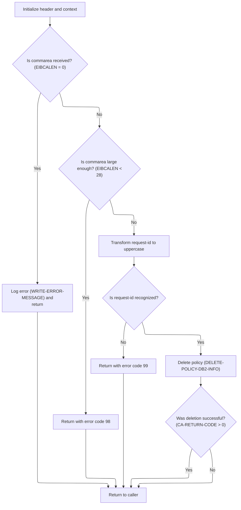
```mermaid
%%{init: {"flowchart": {"defaultRenderer": "elk"}} }%%
flowchart TD
    node1["Initialize header and context"] --> node2{"Is commarea received? (EIBCALEN = 0)"}
    click node1 openCode "base/src/lgdpol01.cbl:84:89"
    node2 -->|"Yes"| node3["Log error (WRITE-ERROR-MESSAGE) and
return"]
    click node2 openCode "base/src/lgdpol01.cbl:95:99"
    click node3 openCode "base/src/lgdpol01.cbl:96:98"
    node2 -->|"No"| node4{"Is commarea large enough? (EIBCALEN <
28)"}
    click node4 openCode "base/src/lgdpol01.cbl:107:110"
    node4 -->|"Yes"| node5["Return with error code 98"]
    click node5 openCode "base/src/lgdpol01.cbl:108:109"
    node4 -->|"No"| node6["Transform request-id to uppercase"]
    click node6 openCode "base/src/lgdpol01.cbl:117:117"
    node6 --> node7{"Is request-id recognized?"}
    click node7 openCode "base/src/lgdpol01.cbl:119:122"
    node7 -->|"No"| node8["Return with error code 99"]
    click node8 openCode "base/src/lgdpol01.cbl:124:124"
    node7 -->|"Yes"| node9["Delete policy (DELETE-POLICY-DB2-INFO)"]
    click node9 openCode "base/src/lgdpol01.cbl:126:126"
    node9 --> node10{"Was deletion successful?
(CA-RETURN-CODE > 0)"}
    click node10 openCode "base/src/lgdpol01.cbl:127:129"
    node10 -->|"Yes"| node11["Return to caller"]
    click node11 openCode "base/src/lgdpol01.cbl:129:133"
    node10 -->|"No"| node11
    node3 --> node11
    node5 --> node11
    node8 --> node11

classDef HeadingStyle fill:#777777,stroke:#333,stroke-width:2px;

%% Swimm:
%% %%{init: {"flowchart": {"defaultRenderer": "elk"}} }%%
%% flowchart TD
%%     node1["Initialize header and context"] --> node2{"Is commarea received? (EIBCALEN = 0)"}
%%     click node1 openCode "<SwmPath>[base/src/lgdpol01.cbl](base/src/lgdpol01.cbl)</SwmPath>:84:89"
%%     node2 -->|"Yes"| node3["Log error (<SwmToken path="base/src/lgipol01.cbl" pos="81:3:7" line-data="               PERFORM WRITE-ERROR-MESSAGE">`WRITE-ERROR-MESSAGE`</SwmToken>) and
%% return"]
%%     click node2 openCode "<SwmPath>[base/src/lgdpol01.cbl](base/src/lgdpol01.cbl)</SwmPath>:95:99"
%%     click node3 openCode "<SwmPath>[base/src/lgdpol01.cbl](base/src/lgdpol01.cbl)</SwmPath>:96:98"
%%     node2 -->|"No"| node4{"Is commarea large enough? (EIBCALEN <
%% 28)"}
%%     click node4 openCode "<SwmPath>[base/src/lgdpol01.cbl](base/src/lgdpol01.cbl)</SwmPath>:107:110"
%%     node4 -->|"Yes"| node5["Return with error code 98"]
%%     click node5 openCode "<SwmPath>[base/src/lgdpol01.cbl](base/src/lgdpol01.cbl)</SwmPath>:108:109"
%%     node4 -->|"No"| node6["Transform <SwmToken path="base/src/lgdpol01.cbl" pos="113:5:7" line-data="      * Check request-id in commarea and if recognised ...             *">`request-id`</SwmToken> to uppercase"]
%%     click node6 openCode "<SwmPath>[base/src/lgdpol01.cbl](base/src/lgdpol01.cbl)</SwmPath>:117:117"
%%     node6 --> node7{"Is <SwmToken path="base/src/lgdpol01.cbl" pos="113:5:7" line-data="      * Check request-id in commarea and if recognised ...             *">`request-id`</SwmToken> recognized?"}
%%     click node7 openCode "<SwmPath>[base/src/lgdpol01.cbl](base/src/lgdpol01.cbl)</SwmPath>:119:122"
%%     node7 -->|"No"| node8["Return with error code 99"]
%%     click node8 openCode "<SwmPath>[base/src/lgdpol01.cbl](base/src/lgdpol01.cbl)</SwmPath>:124:124"
%%     node7 -->|"Yes"| node9["Delete policy (<SwmToken path="base/src/lgdpol01.cbl" pos="126:3:9" line-data="               PERFORM DELETE-POLICY-DB2-INFO">`DELETE-POLICY-DB2-INFO`</SwmToken>)"]
%%     click node9 openCode "<SwmPath>[base/src/lgdpol01.cbl](base/src/lgdpol01.cbl)</SwmPath>:126:126"
%%     node9 --> node10{"Was deletion successful?
%% (<SwmToken path="base/src/lgtestp2.cbl" pos="71:3:7" line-data="                 IF CA-RETURN-CODE &gt; 0">`CA-RETURN-CODE`</SwmToken> > 0)"}
%%     click node10 openCode "<SwmPath>[base/src/lgdpol01.cbl](base/src/lgdpol01.cbl)</SwmPath>:127:129"
%%     node10 -->|"Yes"| node11["Return to caller"]
%%     click node11 openCode "<SwmPath>[base/src/lgdpol01.cbl](base/src/lgdpol01.cbl)</SwmPath>:129:133"
%%     node10 -->|"No"| node11
%%     node3 --> node11
%%     node5 --> node11
%%     node8 --> node11
%% 
%% classDef HeadingStyle fill:#777777,stroke:#333,stroke-width:2px;
```

This section validates incoming policy delete requests, ensuring they are well-formed and supported before routing them to the deletion logic. It also handles error reporting for invalid or unrecognized requests.

| Rule ID | Category        | Rule Name                          | Description                                                                                                                              | Implementation Details                                                                                                                                                                                                                                                                                                                                                                                                                                                                                                                                                                                                                                                                                               |
| ------- | --------------- | ---------------------------------- | ---------------------------------------------------------------------------------------------------------------------------------------- | -------------------------------------------------------------------------------------------------------------------------------------------------------------------------------------------------------------------------------------------------------------------------------------------------------------------------------------------------------------------------------------------------------------------------------------------------------------------------------------------------------------------------------------------------------------------------------------------------------------------------------------------------------------------------------------------------------------------- |
| BR-001  | Data validation | Missing commarea error             | If no commarea is received, log an error message and return with an abend code.                                                          | The error message includes the text 'NO COMMAREA RECEIVED'. The abend code is 'LGCA'.                                                                                                                                                                                                                                                                                                                                                                                                                                                                                                                                                                                                                                |
| BR-002  | Data validation | Minimum commarea length validation | If the commarea is present but smaller than the required minimum length, return with error code 98.                                      | The minimum required commarea length is 28 bytes. The error code for insufficient length is '98'.                                                                                                                                                                                                                                                                                                                                                                                                                                                                                                                                                                                                                    |
| BR-003  | Data validation | Request ID standardization         | The request ID is converted to uppercase before validation to ensure consistent recognition of supported request types.                  | All alphabetic characters in the request ID are converted to uppercase before further validation or comparison.                                                                                                                                                                                                                                                                                                                                                                                                                                                                                                                                                                                                      |
| BR-004  | Data validation | Unsupported request ID error       | If the request ID is not one of the supported delete types, return with error code 99.                                                   | Supported request IDs are <SwmToken path="base/src/lgtestp2.cbl" pos="126:4:4" line-data="                 Move &#39;01DEND&#39;   To CA-REQUEST-ID">`01DEND`</SwmToken>, <SwmToken path="base/src/lgdpol01.cbl" pos="120:14:14" line-data="                CA-REQUEST-ID NOT EQUAL TO &#39;01DMOT&#39; AND">`01DMOT`</SwmToken>, <SwmToken path="base/src/lgdpol01.cbl" pos="121:14:14" line-data="                CA-REQUEST-ID NOT EQUAL TO &#39;01DHOU&#39; AND">`01DHOU`</SwmToken>, <SwmToken path="base/src/lgdpol01.cbl" pos="122:14:14" line-data="                CA-REQUEST-ID NOT EQUAL TO &#39;01DCOM&#39; )">`01DCOM`</SwmToken>. The error code for unsupported request types is '99'.                |
| BR-005  | Decision Making | Route recognized delete request    | If the request ID is recognized, route the request to the policy deletion logic and return to the caller if the operation is successful. | Supported request IDs are <SwmToken path="base/src/lgtestp2.cbl" pos="126:4:4" line-data="                 Move &#39;01DEND&#39;   To CA-REQUEST-ID">`01DEND`</SwmToken>, <SwmToken path="base/src/lgdpol01.cbl" pos="120:14:14" line-data="                CA-REQUEST-ID NOT EQUAL TO &#39;01DMOT&#39; AND">`01DMOT`</SwmToken>, <SwmToken path="base/src/lgdpol01.cbl" pos="121:14:14" line-data="                CA-REQUEST-ID NOT EQUAL TO &#39;01DHOU&#39; AND">`01DHOU`</SwmToken>, <SwmToken path="base/src/lgdpol01.cbl" pos="122:14:14" line-data="                CA-REQUEST-ID NOT EQUAL TO &#39;01DCOM&#39; )">`01DCOM`</SwmToken>. Successful deletion is indicated by a return code greater than zero. |

<SwmSnippet path="/base/src/lgdpol01.cbl" line="78">

---

MAINLINE in <SwmToken path="base/src/lgtestp2.cbl" pos="129:10:10" line-data="                 EXEC CICS LINK PROGRAM(&#39;LGDPOL01&#39;)">`LGDPOL01`</SwmToken> sets up the environment, checks for a valid commarea, uppercases the request ID, and only proceeds if it's one of the supported delete types. If so, it calls <SwmToken path="base/src/lgdpol01.cbl" pos="126:3:9" line-data="               PERFORM DELETE-POLICY-DB2-INFO">`DELETE-POLICY-DB2-INFO`</SwmToken>; otherwise, it sets an error code and returns.

```cobol
       MAINLINE SECTION.

      *----------------------------------------------------------------*
      * Common code                                                    *
      *----------------------------------------------------------------*
      * initialize working storage variables
           INITIALIZE WS-HEADER.
      * set up general variable
           MOVE EIBTRNID TO WS-TRANSID.
           MOVE EIBTRMID TO WS-TERMID.
           MOVE EIBTASKN TO WS-TASKNUM.
      *----------------------------------------------------------------*

      *----------------------------------------------------------------*
      * Check commarea and obtain required details                     *
      *----------------------------------------------------------------*
      * If NO commarea received issue an ABEND
           IF EIBCALEN IS EQUAL TO ZERO
               MOVE ' NO COMMAREA RECEIVED' TO EM-VARIABLE
               PERFORM WRITE-ERROR-MESSAGE
               EXEC CICS ABEND ABCODE('LGCA') NODUMP END-EXEC
           END-IF

      * initialize commarea return code to zero
           MOVE '00' TO CA-RETURN-CODE
           MOVE EIBCALEN TO WS-CALEN.
           SET WS-ADDR-DFHCOMMAREA TO ADDRESS OF DFHCOMMAREA.

      * Check commarea is large enough
           IF EIBCALEN IS LESS THAN WS-CA-HEADER-LEN
             MOVE '98' TO CA-RETURN-CODE
             EXEC CICS RETURN END-EXEC
           END-IF

      *----------------------------------------------------------------*
      * Check request-id in commarea and if recognised ...             *
      * Call routine to delete row from policy table                   *
      *----------------------------------------------------------------*
      * Upper case value passed in Request Id field                    *
           MOVE FUNCTION UPPER-CASE(CA-REQUEST-ID) TO CA-REQUEST-ID

           IF ( CA-REQUEST-ID NOT EQUAL TO '01DEND' AND
                CA-REQUEST-ID NOT EQUAL TO '01DMOT' AND
                CA-REQUEST-ID NOT EQUAL TO '01DHOU' AND
                CA-REQUEST-ID NOT EQUAL TO '01DCOM' )
      *        Request is not recognised or supported
               MOVE '99' TO CA-RETURN-CODE
           ELSE
               PERFORM DELETE-POLICY-DB2-INFO
               If CA-RETURN-CODE > 0
                 EXEC CICS RETURN END-EXEC
               End-if
           END-IF

      * Return to caller
           EXEC CICS RETURN END-EXEC.
```

---

</SwmSnippet>

<SwmSnippet path="/base/src/lgdpol01.cbl" line="154">

---

<SwmToken path="base/src/lgdpol01.cbl" pos="154:1:5" line-data="       WRITE-ERROR-MESSAGE.">`WRITE-ERROR-MESSAGE`</SwmToken> in <SwmToken path="base/src/lgtestp2.cbl" pos="129:10:10" line-data="                 EXEC CICS LINK PROGRAM(&#39;LGDPOL01&#39;)">`LGDPOL01`</SwmToken> gets the current time, formats it, writes the error message to the queue via LGSTSQ, and then, if there's commarea data, writes up to 90 bytes of that as well. This keeps error logs concise and timestamped.

```cobol
       WRITE-ERROR-MESSAGE.
      * Save SQLCODE in message
      * Obtain and format current time and date
           EXEC CICS ASKTIME ABSTIME(WS-ABSTIME)
           END-EXEC
           EXEC CICS FORMATTIME ABSTIME(Ws-ABSTIME)
                     MMDDYYYY(WS-DATE)
                     TIME(WS-TIME)
           END-EXEC
           MOVE WS-DATE TO EM-DATE
           MOVE WS-TIME TO EM-TIME
      * Write output message to TDQ
           EXEC CICS LINK PROGRAM('LGSTSQ')
                     COMMAREA(ERROR-MSG)
                     LENGTH(LENGTH OF ERROR-MSG)
           END-EXEC.
      * Write 90 bytes or as much as we have of commarea to TDQ
           IF EIBCALEN > 0 THEN
             IF EIBCALEN < 91 THEN
               MOVE DFHCOMMAREA(1:EIBCALEN) TO CA-DATA
               EXEC CICS LINK PROGRAM('LGSTSQ')
                         COMMAREA(CA-ERROR-MSG)
                         LENGTH(LENGTH OF CA-ERROR-MSG)
               END-EXEC
             ELSE
               MOVE DFHCOMMAREA(1:90) TO CA-DATA
               EXEC CICS LINK PROGRAM('LGSTSQ')
                         COMMAREA(CA-ERROR-MSG)
                         LENGTH(LENGTH OF CA-ERROR-MSG)
               END-EXEC
             END-IF
           END-IF.
           EXIT.
```

---

</SwmSnippet>

## Triggering Policy Deletion in the Database

This section triggers the deletion of a policy in the database by linking to the backend program responsible for the actual deletion. It delegates the deletion logic to the backend, keeping the main program decoupled from database operations.

| Rule ID | Category                        | Rule Name                       | Description                                                                                                       | Implementation Details                                                                                                                                                                                          |
| ------- | ------------------------------- | ------------------------------- | ----------------------------------------------------------------------------------------------------------------- | --------------------------------------------------------------------------------------------------------------------------------------------------------------------------------------------------------------- |
| BR-001  | Invoking a Service or a Process | Trigger backend policy deletion | The backend deletion process is triggered by linking to the backend program with the provided communication area. | The communication area is passed as-is to the backend program. The length of the communication area is 32,500 bytes. No transformation or validation is performed on the data before passing it to the backend. |

<SwmSnippet path="/base/src/lgdpol01.cbl" line="139">

---

<SwmToken path="base/src/lgdpol01.cbl" pos="139:1:7" line-data="       DELETE-POLICY-DB2-INFO.">`DELETE-POLICY-DB2-INFO`</SwmToken> just links to <SwmToken path="base/src/lgdpol01.cbl" pos="141:9:9" line-data="           EXEC CICS LINK PROGRAM(LGDPDB01)">`LGDPDB01`</SwmToken>, passing the commarea for the actual database delete. This keeps the database logic out of the main program and delegates deletion to the right backend.

```cobol
       DELETE-POLICY-DB2-INFO.

           EXEC CICS LINK PROGRAM(LGDPDB01)
                Commarea(DFHCOMMAREA)
                LENGTH(32500)
           END-EXEC.

           EXIT.
```

---

</SwmSnippet>

## Validating and Executing Policy Delete in <SwmToken path="base/src/lgipdb01.cbl" pos="242:5:5" line-data="      * initialize DB2 host variables">`DB2`</SwmToken>


```mermaid
%%{init: {"flowchart": {"defaultRenderer": "elk"}} }%%
flowchart TD
    node1["Start MAINLINE processing"] --> node2{"Is commarea received?"}
    click node1 openCode "base/src/lgdpdb01.cbl:111:117"
    node2 -->|"No"| node3["Report error: No input received"]
    click node2 openCode "base/src/lgdpdb01.cbl:131:135"
    click node3 openCode "base/src/lgdpdb01.cbl:132:134"
    node2 -->|"Yes"| node4{"Is commarea large enough?"}
    click node4 openCode "base/src/lgdpdb01.cbl:143:146"
    node4 -->|"No"| node5["Return error: Input too short"]
    click node5 openCode "base/src/lgdpdb01.cbl:144:145"
    node4 -->|"Yes"| node6["Convert and store identifiers"]
    click node6 openCode "base/src/lgdpdb01.cbl:149:153"
    node6 --> node7{"Is request type recognized?
(CA-REQUEST-ID = 01DEND, 01DHOU,
01DCOM, 01DMOT)"}
    click node7 openCode "base/src/lgdpdb01.cbl:160:172"
    node7 -->|"No"| node8["Return error: Unsupported request"]
    click node8 openCode "base/src/lgdpdb01.cbl:165:166"
    node7 -->|"Yes"| node9["Delete policy from DB2 and check outcome"]
    click node9 openCode "base/src/lgdpdb01.cbl:167:171"
    node9 --> node10{"Was DB2 deletion successful? (SQLCODE =
0 or 100)"}
    click node10 openCode "base/src/lgdpdb01.cbl:198:202"
    node10 -->|"No"| node11["Report error: DB2 deletion failed"]
    click node11 openCode "base/src/lgdpdb01.cbl:199:201"
    node10 -->|"Yes"| node12["Return success to caller"]
    click node12 openCode "base/src/lgdpdb01.cbl:175:175"
classDef HeadingStyle fill:#777777,stroke:#333,stroke-width:2px;

%% Swimm:
%% %%{init: {"flowchart": {"defaultRenderer": "elk"}} }%%
%% flowchart TD
%%     node1["Start MAINLINE processing"] --> node2{"Is commarea received?"}
%%     click node1 openCode "<SwmPath>[base/src/lgdpdb01.cbl](base/src/lgdpdb01.cbl)</SwmPath>:111:117"
%%     node2 -->|"No"| node3["Report error: No input received"]
%%     click node2 openCode "<SwmPath>[base/src/lgdpdb01.cbl](base/src/lgdpdb01.cbl)</SwmPath>:131:135"
%%     click node3 openCode "<SwmPath>[base/src/lgdpdb01.cbl](base/src/lgdpdb01.cbl)</SwmPath>:132:134"
%%     node2 -->|"Yes"| node4{"Is commarea large enough?"}
%%     click node4 openCode "<SwmPath>[base/src/lgdpdb01.cbl](base/src/lgdpdb01.cbl)</SwmPath>:143:146"
%%     node4 -->|"No"| node5["Return error: Input too short"]
%%     click node5 openCode "<SwmPath>[base/src/lgdpdb01.cbl](base/src/lgdpdb01.cbl)</SwmPath>:144:145"
%%     node4 -->|"Yes"| node6["Convert and store identifiers"]
%%     click node6 openCode "<SwmPath>[base/src/lgdpdb01.cbl](base/src/lgdpdb01.cbl)</SwmPath>:149:153"
%%     node6 --> node7{"Is request type recognized?
%% (<SwmToken path="base/src/lgtestp2.cbl" pos="64:9:13" line-data="                 Move &#39;01IEND&#39;   To CA-REQUEST-ID">`CA-REQUEST-ID`</SwmToken> = <SwmToken path="base/src/lgtestp2.cbl" pos="126:4:4" line-data="                 Move &#39;01DEND&#39;   To CA-REQUEST-ID">`01DEND`</SwmToken>, <SwmToken path="base/src/lgdpol01.cbl" pos="121:14:14" line-data="                CA-REQUEST-ID NOT EQUAL TO &#39;01DHOU&#39; AND">`01DHOU`</SwmToken>,
%% <SwmToken path="base/src/lgdpol01.cbl" pos="122:14:14" line-data="                CA-REQUEST-ID NOT EQUAL TO &#39;01DCOM&#39; )">`01DCOM`</SwmToken>, <SwmToken path="base/src/lgdpol01.cbl" pos="120:14:14" line-data="                CA-REQUEST-ID NOT EQUAL TO &#39;01DMOT&#39; AND">`01DMOT`</SwmToken>)"}
%%     click node7 openCode "<SwmPath>[base/src/lgdpdb01.cbl](base/src/lgdpdb01.cbl)</SwmPath>:160:172"
%%     node7 -->|"No"| node8["Return error: Unsupported request"]
%%     click node8 openCode "<SwmPath>[base/src/lgdpdb01.cbl](base/src/lgdpdb01.cbl)</SwmPath>:165:166"
%%     node7 -->|"Yes"| node9["Delete policy from <SwmToken path="base/src/lgipdb01.cbl" pos="242:5:5" line-data="      * initialize DB2 host variables">`DB2`</SwmToken> and check outcome"]
%%     click node9 openCode "<SwmPath>[base/src/lgdpdb01.cbl](base/src/lgdpdb01.cbl)</SwmPath>:167:171"
%%     node9 --> node10{"Was <SwmToken path="base/src/lgipdb01.cbl" pos="242:5:5" line-data="      * initialize DB2 host variables">`DB2`</SwmToken> deletion successful? (SQLCODE =
%% 0 or 100)"}
%%     click node10 openCode "<SwmPath>[base/src/lgdpdb01.cbl](base/src/lgdpdb01.cbl)</SwmPath>:198:202"
%%     node10 -->|"No"| node11["Report error: <SwmToken path="base/src/lgipdb01.cbl" pos="242:5:5" line-data="      * initialize DB2 host variables">`DB2`</SwmToken> deletion failed"]
%%     click node11 openCode "<SwmPath>[base/src/lgdpdb01.cbl](base/src/lgdpdb01.cbl)</SwmPath>:199:201"
%%     node10 -->|"Yes"| node12["Return success to caller"]
%%     click node12 openCode "<SwmPath>[base/src/lgdpdb01.cbl](base/src/lgdpdb01.cbl)</SwmPath>:175:175"
%% classDef HeadingStyle fill:#777777,stroke:#333,stroke-width:2px;
```

This section validates incoming policy delete requests, ensures they are well-formed and supported, attempts to delete the policy from <SwmToken path="base/src/lgipdb01.cbl" pos="242:5:5" line-data="      * initialize DB2 host variables">`DB2`</SwmToken>, and communicates the result or any errors to the caller and error logging system.

| Rule ID | Category        | Rule Name                                                                                                                                         | Description                                                                                                                                                                                                                                                                                                                                                                                                                                                                                                                                                                                                                                                                                                                                                     | Implementation Details                                                                                                                                                                                                                                                                                                                                                                                                                                                                                                                                                                                                                                                                                            |
| ------- | --------------- | ------------------------------------------------------------------------------------------------------------------------------------------------- | --------------------------------------------------------------------------------------------------------------------------------------------------------------------------------------------------------------------------------------------------------------------------------------------------------------------------------------------------------------------------------------------------------------------------------------------------------------------------------------------------------------------------------------------------------------------------------------------------------------------------------------------------------------------------------------------------------------------------------------------------------------- | ----------------------------------------------------------------------------------------------------------------------------------------------------------------------------------------------------------------------------------------------------------------------------------------------------------------------------------------------------------------------------------------------------------------------------------------------------------------------------------------------------------------------------------------------------------------------------------------------------------------------------------------------------------------------------------------------------------------- |
| BR-001  | Data validation | Missing commarea error handling                                                                                                                   | If no commarea is received, the system reports an error, logs the event, and triggers an abnormal end with code 'LGCA'.                                                                                                                                                                                                                                                                                                                                                                                                                                                                                                                                                                                                                                         | The error message includes the text ' NO COMMAREA RECEIVED'. The system abends with code 'LGCA'.                                                                                                                                                                                                                                                                                                                                                                                                                                                                                                                                                                                                                  |
| BR-002  | Data validation | Minimum commarea length validation                                                                                                                | If the commarea is present but shorter than 28 bytes, the system sets return code '98' and returns without processing the request.                                                                                                                                                                                                                                                                                                                                                                                                                                                                                                                                                                                                                              | The minimum required commarea length is 28 bytes. Return code '98' is set in the commarea.                                                                                                                                                                                                                                                                                                                                                                                                                                                                                                                                                                                                                        |
| BR-003  | Data validation | Supported request type validation                                                                                                                 | If the request ID in the commarea is not one of the supported values (<SwmToken path="base/src/lgtestp2.cbl" pos="126:4:4" line-data="                 Move &#39;01DEND&#39;   To CA-REQUEST-ID">`01DEND`</SwmToken>, <SwmToken path="base/src/lgdpol01.cbl" pos="121:14:14" line-data="                CA-REQUEST-ID NOT EQUAL TO &#39;01DHOU&#39; AND">`01DHOU`</SwmToken>, <SwmToken path="base/src/lgdpol01.cbl" pos="122:14:14" line-data="                CA-REQUEST-ID NOT EQUAL TO &#39;01DCOM&#39; )">`01DCOM`</SwmToken>, <SwmToken path="base/src/lgdpol01.cbl" pos="120:14:14" line-data="                CA-REQUEST-ID NOT EQUAL TO &#39;01DMOT&#39; AND">`01DMOT`</SwmToken>), the system sets return code '99' and does not process the request. | Supported request IDs are <SwmToken path="base/src/lgtestp2.cbl" pos="126:4:4" line-data="                 Move &#39;01DEND&#39;   To CA-REQUEST-ID">`01DEND`</SwmToken>, <SwmToken path="base/src/lgdpol01.cbl" pos="121:14:14" line-data="                CA-REQUEST-ID NOT EQUAL TO &#39;01DHOU&#39; AND">`01DHOU`</SwmToken>, <SwmToken path="base/src/lgdpol01.cbl" pos="122:14:14" line-data="                CA-REQUEST-ID NOT EQUAL TO &#39;01DCOM&#39; )">`01DCOM`</SwmToken>, <SwmToken path="base/src/lgdpol01.cbl" pos="120:14:14" line-data="                CA-REQUEST-ID NOT EQUAL TO &#39;01DMOT&#39; AND">`01DMOT`</SwmToken>. Return code '99' is set in the commarea for unsupported requests. |
| BR-004  | Data validation | <SwmToken path="base/src/lgipdb01.cbl" pos="242:5:5" line-data="      * initialize DB2 host variables">`DB2`</SwmToken> deletion failure handling | If the <SwmToken path="base/src/lgipdb01.cbl" pos="242:5:5" line-data="      * initialize DB2 host variables">`DB2`</SwmToken> policy deletion fails (SQLCODE not 0 or 100), the system sets return code '90', logs the error, and returns to the caller.                                                                                                                                                                                                                                                                                                                                                                                                                                                                                                       | Return code '90' is set in the commarea for <SwmToken path="base/src/lgipdb01.cbl" pos="242:5:5" line-data="      * initialize DB2 host variables">`DB2`</SwmToken> errors. Error details are logged via the error message queue.                                                                                                                                                                                                                                                                                                                                                                                                                                                                                 |
| BR-005  | Decision Making | Successful policy deletion outcome                                                                                                                | On successful <SwmToken path="base/src/lgipdb01.cbl" pos="242:5:5" line-data="      * initialize DB2 host variables">`DB2`</SwmToken> deletion (SQLCODE 0 or 100), the system returns control to the caller, indicating the policy no longer exists.                                                                                                                                                                                                                                                                                                                                                                                                                                                                                                            | A successful outcome is defined as SQLCODE 0 (deleted) or 100 (not found, already deleted).                                                                                                                                                                                                                                                                                                                                                                                                                                                                                                                                                                                                                       |
| BR-006  | Writing Output  | Error logging with commarea snapshot                                                                                                              | When an error occurs, the system logs the error message, including SQLCODE, timestamp, and up to 90 bytes of commarea data if present, to the error queue.                                                                                                                                                                                                                                                                                                                                                                                                                                                                                                                                                                                                      | Error message includes SQLCODE, date, time, and up to 90 bytes of commarea data. If commarea is shorter than 91 bytes, the entire commarea is logged; otherwise, only the first 90 bytes are logged.                                                                                                                                                                                                                                                                                                                                                                                                                                                                                                              |

<SwmSnippet path="/base/src/lgdpdb01.cbl" line="111">

---

MAINLINE in <SwmToken path="base/src/lgdpol01.cbl" pos="141:9:9" line-data="           EXEC CICS LINK PROGRAM(LGDPDB01)">`LGDPDB01`</SwmToken> sets up the environment, checks the commarea, converts customer and policy numbers to <SwmToken path="base/src/lgdpdb01.cbl" pos="124:5:5" line-data="      * initialize DB2 host variables">`DB2`</SwmToken> integer format, and only proceeds if the request ID is valid. If so, it deletes the policy and links to the next program for further processing; otherwise, it sets an error code and returns.

```cobol
       MAINLINE SECTION.

      *----------------------------------------------------------------*
      * Common code                                                    *
      *----------------------------------------------------------------*
      * initialize working storage variables
           INITIALIZE WS-HEADER.
      * set up general variable
           MOVE EIBTRNID TO WS-TRANSID.
           MOVE EIBTRMID TO WS-TERMID.
           MOVE EIBTASKN TO WS-TASKNUM.
      *----------------------------------------------------------------*

      * initialize DB2 host variables
           INITIALIZE DB2-IN-INTEGERS.

      *----------------------------------------------------------------*
      * Check commarea and obtain required details                     *
      *----------------------------------------------------------------*
      * If NO commarea received issue an ABEND
           IF EIBCALEN IS EQUAL TO ZERO
               MOVE ' NO COMMAREA RECEIVED' TO EM-VARIABLE
               PERFORM WRITE-ERROR-MESSAGE
               EXEC CICS ABEND ABCODE('LGCA') NODUMP END-EXEC
           END-IF

      * initialize commarea return code to zero
           MOVE '00' TO CA-RETURN-CODE
           MOVE EIBCALEN TO WS-CALEN.
           SET WS-ADDR-DFHCOMMAREA TO ADDRESS OF DFHCOMMAREA.

      * Check commarea is large enough
           IF EIBCALEN IS LESS THAN WS-CA-HEADER-LEN
             MOVE '98' TO CA-RETURN-CODE
             EXEC CICS RETURN END-EXEC
           END-IF

      * Convert commarea customer & policy nums to DB2 integer format
           MOVE CA-CUSTOMER-NUM TO DB2-CUSTOMERNUM-INT
           MOVE CA-POLICY-NUM   TO DB2-POLICYNUM-INT
      * and save in error msg field incase required
           MOVE CA-CUSTOMER-NUM TO EM-CUSNUM
           MOVE CA-POLICY-NUM   TO EM-POLNUM

      *----------------------------------------------------------------*
      * Check request-id in commarea and if recognised ...             *
      * Call routine to delete row from policy table                   *
      *----------------------------------------------------------------*

           IF ( CA-REQUEST-ID NOT EQUAL TO '01DEND' AND
                CA-REQUEST-ID NOT EQUAL TO '01DHOU' AND
                CA-REQUEST-ID NOT EQUAL TO '01DCOM' AND
                CA-REQUEST-ID NOT EQUAL TO '01DMOT' ) Then
      *        Request is not recognised or supported
               MOVE '99' TO CA-RETURN-CODE
           ELSE
               PERFORM DELETE-POLICY-DB2-INFO
               EXEC CICS LINK PROGRAM(LGDPVS01)
                    Commarea(DFHCOMMAREA)
                    LENGTH(32500)
               END-EXEC
           END-IF.

      * Return to caller
           EXEC CICS RETURN END-EXEC.
```

---

</SwmSnippet>

<SwmSnippet path="/base/src/lgdpdb01.cbl" line="212">

---

<SwmToken path="base/src/lgdpdb01.cbl" pos="212:1:5" line-data="       WRITE-ERROR-MESSAGE.">`WRITE-ERROR-MESSAGE`</SwmToken> in <SwmToken path="base/src/lgdpol01.cbl" pos="141:9:9" line-data="           EXEC CICS LINK PROGRAM(LGDPDB01)">`LGDPDB01`</SwmToken> logs the SQLCODE, timestamps the error, writes the error message to the queue, and then, if there's commarea data, writes up to 90 bytes of that as well. This keeps error logs short and focused.

```cobol
       WRITE-ERROR-MESSAGE.
      * Save SQLCODE in message
           MOVE SQLCODE TO EM-SQLRC
      * Obtain and format current time and date
           EXEC CICS ASKTIME ABSTIME(WS-ABSTIME)
           END-EXEC
           EXEC CICS FORMATTIME ABSTIME(Ws-ABSTIME)
                     MMDDYYYY(WS-DATE)
                     TIME(WS-TIME)
           END-EXEC
           MOVE WS-DATE TO EM-DATE
           MOVE WS-TIME TO EM-TIME
      * Write output message to TDQ
           EXEC CICS LINK PROGRAM('LGSTSQ')
                     COMMAREA(ERROR-MSG)
                     LENGTH(LENGTH OF ERROR-MSG)
           END-EXEC.
      * Write 90 bytes or as much as we have of commarea to TDQ
           IF EIBCALEN > 0 THEN
             IF EIBCALEN < 91 THEN
               MOVE DFHCOMMAREA(1:EIBCALEN) TO CA-DATA
               EXEC CICS LINK PROGRAM('LGSTSQ')
                         COMMAREA(CA-ERROR-MSG)
                         LENGTH(LENGTH OF CA-ERROR-MSG)
               END-EXEC
             ELSE
               MOVE DFHCOMMAREA(1:90) TO CA-DATA
               EXEC CICS LINK PROGRAM('LGSTSQ')
                         COMMAREA(CA-ERROR-MSG)
                         LENGTH(LENGTH OF CA-ERROR-MSG)
               END-EXEC
             END-IF
           END-IF.
           EXIT.
```

---

</SwmSnippet>

<SwmSnippet path="/base/src/lgdpdb01.cbl" line="186">

---

<SwmToken path="base/src/lgdpdb01.cbl" pos="186:1:7" line-data="       DELETE-POLICY-DB2-INFO.">`DELETE-POLICY-DB2-INFO`</SwmToken> in <SwmToken path="base/src/lgdpol01.cbl" pos="141:9:9" line-data="           EXEC CICS LINK PROGRAM(LGDPDB01)">`LGDPDB01`</SwmToken> sets up the SQL operation, tries to delete the policy, and if SQLCODE isn't 0, sets return code '90', logs the error, and returns. This is how failed deletes are flagged and tracked.

```cobol
       DELETE-POLICY-DB2-INFO.

           MOVE ' DELETE POLICY  ' TO EM-SQLREQ
           EXEC SQL
             DELETE
               FROM POLICY
               WHERE ( CUSTOMERNUMBER = :DB2-CUSTOMERNUM-INT AND
                       POLICYNUMBER  = :DB2-POLICYNUM-INT      )
           END-EXEC

      *    Treat SQLCODE 0 and SQLCODE 100 (record not found) as
      *    successful - end result is record does not exist
           IF SQLCODE NOT EQUAL 0 Then
               MOVE '90' TO CA-RETURN-CODE
               PERFORM WRITE-ERROR-MESSAGE
               EXEC CICS RETURN END-EXEC
           END-IF.

           EXIT.
```

---

</SwmSnippet>

## Finalizing Policy Delete in VSAM

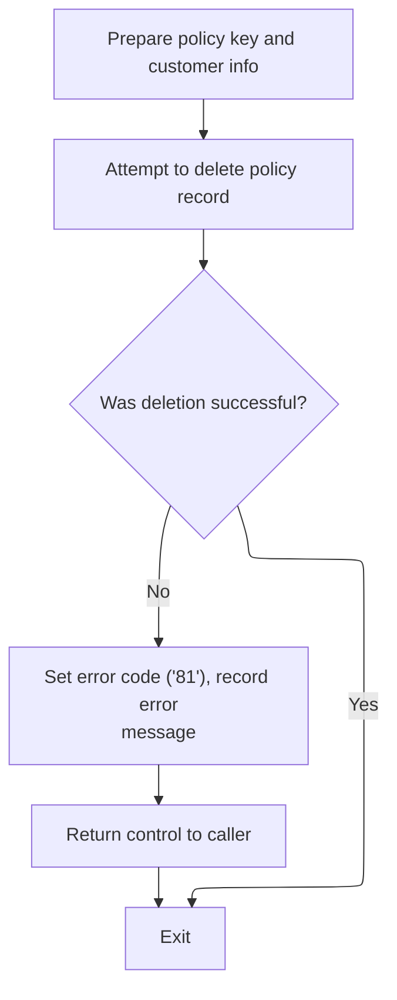
```mermaid
%%{init: {"flowchart": {"defaultRenderer": "elk"}} }%%
flowchart TD
    node1["Prepare policy key and customer info"]
    click node1 openCode "base/src/lgdpvs01.cbl:75:80"
    node1 --> node2["Attempt to delete policy record"]
    click node2 openCode "base/src/lgdpvs01.cbl:81:85"
    node2 --> node3{"Was deletion successful?"}
    click node3 openCode "base/src/lgdpvs01.cbl:86:91"
    node3 -->|"Yes"| node4["Exit"]
    click node4 openCode "base/src/lgdpvs01.cbl:95:97"
    node3 -->|"No"| node5["Set error code ('81'), record error
message"]
    click node5 openCode "base/src/lgdpvs01.cbl:87:90"
    node5 --> node6["Return control to caller"]
    click node6 openCode "base/src/lgdpvs01.cbl:90:91"
    node6 --> node4
classDef HeadingStyle fill:#777777,stroke:#333,stroke-width:2px;

%% Swimm:
%% %%{init: {"flowchart": {"defaultRenderer": "elk"}} }%%
%% flowchart TD
%%     node1["Prepare policy key and customer info"]
%%     click node1 openCode "<SwmPath>[base/src/lgdpvs01.cbl](base/src/lgdpvs01.cbl)</SwmPath>:75:80"
%%     node1 --> node2["Attempt to delete policy record"]
%%     click node2 openCode "<SwmPath>[base/src/lgdpvs01.cbl](base/src/lgdpvs01.cbl)</SwmPath>:81:85"
%%     node2 --> node3{"Was deletion successful?"}
%%     click node3 openCode "<SwmPath>[base/src/lgdpvs01.cbl](base/src/lgdpvs01.cbl)</SwmPath>:86:91"
%%     node3 -->|"Yes"| node4["Exit"]
%%     click node4 openCode "<SwmPath>[base/src/lgdpvs01.cbl](base/src/lgdpvs01.cbl)</SwmPath>:95:97"
%%     node3 -->|"No"| node5["Set error code ('81'), record error
%% message"]
%%     click node5 openCode "<SwmPath>[base/src/lgdpvs01.cbl](base/src/lgdpvs01.cbl)</SwmPath>:87:90"
%%     node5 --> node6["Return control to caller"]
%%     click node6 openCode "<SwmPath>[base/src/lgdpvs01.cbl](base/src/lgdpvs01.cbl)</SwmPath>:90:91"
%%     node6 --> node4
%% classDef HeadingStyle fill:#777777,stroke:#333,stroke-width:2px;
```

This section manages the finalization of a policy deletion request, ensuring that the policy is removed from the VSAM file if possible, and that any errors are logged with sufficient detail for audit and troubleshooting.

| Rule ID | Category        | Rule Name                       | Description                                                                                                                                                                            | Implementation Details                                                                                                                                                                                                                                                                                                        |
| ------- | --------------- | ------------------------------- | -------------------------------------------------------------------------------------------------------------------------------------------------------------------------------------- | ----------------------------------------------------------------------------------------------------------------------------------------------------------------------------------------------------------------------------------------------------------------------------------------------------------------------------- |
| BR-001  | Decision Making | Successful policy deletion exit | If the policy record deletion is successful, exit the section and return control to the caller without logging an error.                                                               | No error log is created. Control is returned to the caller after successful deletion.                                                                                                                                                                                                                                         |
| BR-002  | Writing Output  | Policy deletion failure logging | If the policy record deletion fails, set the return code to '81', log the error with timestamp, customer number, policy number, and response codes, and return control to the caller.  | The return code is set to '81'. The error log includes the current date and time, customer number (10 digits), policy number (10 digits), response code, and secondary response code. If communication area data is present, up to 90 bytes are logged. All fields are alphanumeric or numeric as per their business meaning. |
| BR-003  | Writing Output  | Error log content requirements  | When logging an error due to failed deletion, include the current date, time, customer number, policy number, response code, and up to 90 bytes of communication area data if present. | The error log entry includes: date (MMDDYYYY), time (HHMMSS or similar), customer number (10 digits), policy number (10 digits), response code, secondary response code, and up to 90 bytes of commarea data if present. All fields are formatted as alphanumeric or numeric as appropriate.                                  |

<SwmSnippet path="/base/src/lgdpvs01.cbl" line="72">

---

MAINLINE in <SwmToken path="base/src/lgdpdb01.cbl" pos="168:9:9" line-data="               EXEC CICS LINK PROGRAM(LGDPVS01)">`LGDPVS01`</SwmToken> sets up the key, tries to delete the policy record from the VSAM file, and if it fails, sets return code '81', logs the error, and returns. The key length and field usage are assumed to be correct for the file structure.

```cobol
       MAINLINE SECTION.
      *
      *---------------------------------------------------------------*
           Move EIBCALEN To WS-Commarea-Len.
      *---------------------------------------------------------------*
           Move CA-Request-ID(4:1) To WF-Request-ID
           Move CA-Policy-Num      To WF-Policy-Num
           Move CA-Customer-Num    To WF-Customer-Num
      *---------------------------------------------------------------*
           Exec CICS Delete File('KSDSPOLY')
                     Ridfld(WF-Policy-Key)
                     KeyLength(21)
                     RESP(WS-RESP)
           End-Exec.
           If WS-RESP Not = DFHRESP(NORMAL)
             Move EIBRESP2 To WS-RESP2
             MOVE '81' TO CA-RETURN-CODE
             PERFORM WRITE-ERROR-MESSAGE
             EXEC CICS RETURN END-EXEC
           End-If.
```

---

</SwmSnippet>

<SwmSnippet path="/base/src/lgdpvs01.cbl" line="99">

---

<SwmToken path="base/src/lgdpvs01.cbl" pos="99:1:5" line-data="       WRITE-ERROR-MESSAGE.">`WRITE-ERROR-MESSAGE`</SwmToken> in <SwmToken path="base/src/lgdpdb01.cbl" pos="168:9:9" line-data="               EXEC CICS LINK PROGRAM(LGDPVS01)">`LGDPVS01`</SwmToken> gets the current time, fills out the error message with details and response codes, writes it to the queue via LGSTSQ, and then, if there's commarea data, writes up to 90 bytes of that as well. This keeps error logs concise and timestamped.

```cobol
       WRITE-ERROR-MESSAGE.
           EXEC CICS ASKTIME ABSTIME(WS-ABSTIME)
           END-EXEC
           EXEC CICS FORMATTIME ABSTIME(WS-ABSTIME)
                     MMDDYYYY(WS-DATE)
                     TIME(WS-TIME)
           END-EXEC
      *
           MOVE WS-DATE TO EM-DATE
           MOVE WS-TIME TO EM-TIME
           Move CA-Customer-Num To EM-CUSNUM 
           Move CA-POLICY-NUM To EM-POLNUM 
           Move WS-RESP         To EM-RespRC
           Move WS-RESP2        To EM-Resp2RC
           EXEC CICS LINK PROGRAM('LGSTSQ')
                     COMMAREA(ERROR-MSG)
                     LENGTH(LENGTH OF ERROR-MSG)
           END-EXEC.
           IF EIBCALEN > 0 THEN
             IF EIBCALEN < 91 THEN
               MOVE DFHCOMMAREA(1:EIBCALEN) TO CA-DATA
               EXEC CICS LINK PROGRAM('LGSTSQ')
                         COMMAREA(CA-ERROR-MSG)
                         LENGTH(Length Of CA-ERROR-MSG)
               END-EXEC
             ELSE
               MOVE DFHCOMMAREA(1:90) TO CA-DATA
               EXEC CICS LINK PROGRAM('LGSTSQ')
                         COMMAREA(CA-ERROR-MSG)
                         LENGTH(Length Of CA-ERROR-MSG)
               END-EXEC
             END-IF
           END-IF.
           EXIT.
```

---

</SwmSnippet>

<SwmSnippet path="/base/src/lgdpvs01.cbl" line="95">

---

<SwmToken path="base/src/lgdpvs01.cbl" pos="95:1:3" line-data="       A-EXIT.">`A-EXIT`</SwmToken> here is just a label with EXIT and GOBACK. There's no logic—it's just the end of the section, returning control to the caller.

```cobol
       A-EXIT.
           EXIT.
           GOBACK.
```

---

</SwmSnippet>

## Handling Delete Policy Failure in Menu Flow

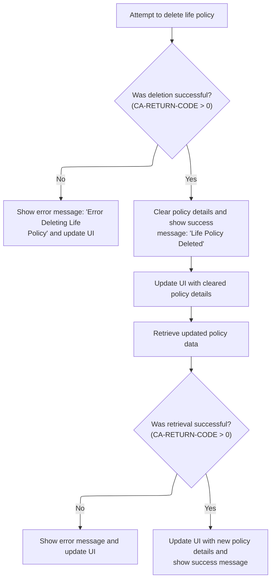
```mermaid
%%{init: {"flowchart": {"defaultRenderer": "elk"}} }%%
flowchart TD
    node1["Attempt to delete life policy"] --> node2{"Was deletion successful?
(CA-RETURN-CODE > 0)"}
    click node1 openCode "base/src/lgtestp2.cbl:133:136"
    node2 -->|"No"| node3["Show error message: 'Error Deleting Life
Policy' and update UI"]
    click node2 openCode "base/src/lgtestp2.cbl:133:136"
    click node3 openCode "base/src/lgtestp2.cbl:282:284"
    node2 -->|"Yes"| node4["Clear policy details and show success
message: 'Life Policy Deleted'"]
    click node4 openCode "base/src/lgtestp2.cbl:138:148"
    node4 --> node5["Update UI with cleared policy details"]
    click node5 openCode "base/src/lgtestp2.cbl:149:152"
    node5 --> node6["Retrieve updated policy data"]
    click node6 openCode "base/src/lgtestp2.cbl:155:162"
    node6 --> node7{"Was retrieval successful?
(CA-RETURN-CODE > 0)"}
    click node7 openCode "base/src/lgtestp2.cbl:163:165"
    node7 -->|"No"| node8["Show error message and update UI"]
    click node8 openCode "base/src/lgtestp2.cbl:282:284"
    node7 -->|"Yes"| node9["Update UI with new policy details and
show success message"]
    click node9 openCode "base/src/lgtestp2.cbl:167:182"

classDef HeadingStyle fill:#777777,stroke:#333,stroke-width:2px;

%% Swimm:
%% %%{init: {"flowchart": {"defaultRenderer": "elk"}} }%%
%% flowchart TD
%%     node1["Attempt to delete life policy"] --> node2{"Was deletion successful?
%% (<SwmToken path="base/src/lgtestp2.cbl" pos="71:3:7" line-data="                 IF CA-RETURN-CODE &gt; 0">`CA-RETURN-CODE`</SwmToken> > 0)"}
%%     click node1 openCode "<SwmPath>[base/src/lgtestp2.cbl](base/src/lgtestp2.cbl)</SwmPath>:133:136"
%%     node2 -->|"No"| node3["Show error message: 'Error Deleting Life
%% Policy' and update UI"]
%%     click node2 openCode "<SwmPath>[base/src/lgtestp2.cbl](base/src/lgtestp2.cbl)</SwmPath>:133:136"
%%     click node3 openCode "<SwmPath>[base/src/lgtestp2.cbl](base/src/lgtestp2.cbl)</SwmPath>:282:284"
%%     node2 -->|"Yes"| node4["Clear policy details and show success
%% message: 'Life Policy Deleted'"]
%%     click node4 openCode "<SwmPath>[base/src/lgtestp2.cbl](base/src/lgtestp2.cbl)</SwmPath>:138:148"
%%     node4 --> node5["Update UI with cleared policy details"]
%%     click node5 openCode "<SwmPath>[base/src/lgtestp2.cbl](base/src/lgtestp2.cbl)</SwmPath>:149:152"
%%     node5 --> node6["Retrieve updated policy data"]
%%     click node6 openCode "<SwmPath>[base/src/lgtestp2.cbl](base/src/lgtestp2.cbl)</SwmPath>:155:162"
%%     node6 --> node7{"Was retrieval successful?
%% (<SwmToken path="base/src/lgtestp2.cbl" pos="71:3:7" line-data="                 IF CA-RETURN-CODE &gt; 0">`CA-RETURN-CODE`</SwmToken> > 0)"}
%%     click node7 openCode "<SwmPath>[base/src/lgtestp2.cbl](base/src/lgtestp2.cbl)</SwmPath>:163:165"
%%     node7 -->|"No"| node8["Show error message and update UI"]
%%     click node8 openCode "<SwmPath>[base/src/lgtestp2.cbl](base/src/lgtestp2.cbl)</SwmPath>:282:284"
%%     node7 -->|"Yes"| node9["Update UI with new policy details and
%% show success message"]
%%     click node9 openCode "<SwmPath>[base/src/lgtestp2.cbl](base/src/lgtestp2.cbl)</SwmPath>:167:182"
%% 
%% classDef HeadingStyle fill:#777777,stroke:#333,stroke-width:2px;
```

This section governs the menu-driven flow for deleting a life policy, ensuring the user is informed of the result, the UI is updated accordingly, and backend data remains consistent.

| Rule ID | Category                        | Rule Name                       | Description                                                                                                                                                                          | Implementation Details                                                                                            |
| ------- | ------------------------------- | ------------------------------- | ------------------------------------------------------------------------------------------------------------------------------------------------------------------------------------ | ----------------------------------------------------------------------------------------------------------------- |
| BR-001  | Data validation                 | Delete failure error message    | If a life policy delete attempt fails (indicated by a return code greater than zero), the system displays the message 'Error Deleting Life Policy' and resets the menu for the user. | The error message is 'Error Deleting Life Policy' (string). The menu is reset to allow further user actions.      |
| BR-002  | Data validation                 | Policy inquiry failure handling | If policy data retrieval fails (return code greater than zero), the system displays an error message and updates the UI accordingly.                                                 | An error message is displayed to the user. The UI is updated to reflect the failure.                              |
| BR-003  | Decision Making                 | Successful delete confirmation  | If a life policy delete attempt succeeds (return code zero), the system clears all policy details from the UI and displays the message 'Life Policy Deleted'.                        | All policy detail fields are cleared (set to spaces). The confirmation message is 'Life Policy Deleted' (string). |
| BR-004  | Writing Output                  | UI update after delete          | After a successful delete, the system updates the UI by sending the cleared policy details to the terminal.                                                                          | The UI is refreshed with all policy fields blank and the confirmation message visible.                            |
| BR-005  | Invoking a Service or a Process | Policy inquiry and display      | When the user selects option '4', the system retrieves updated policy data and displays it in the UI if the retrieval is successful.                                                 | Policy details are displayed in the UI fields. Data is retrieved from the backend and mapped to the UI.           |
| BR-006  | Invoking a Service or a Process | Backend update after display    | After displaying updated policy details, the system prepares the backend with the new policy information and triggers an update process.                                             | The backend is updated with the latest policy information as shown in the UI.                                     |

<SwmSnippet path="/base/src/lgtestp2.cbl" line="133">

---

After coming back from <SwmToken path="base/src/lgtestp2.cbl" pos="129:10:10" line-data="                 EXEC CICS LINK PROGRAM(&#39;LGDPOL01&#39;)">`LGDPOL01`</SwmToken> in <SwmToken path="base/src/lgtestp2.cbl" pos="33:5:7" line-data="              GO TO A-GAIN.">`A-GAIN`</SwmToken>, the code checks if <SwmToken path="base/src/lgtestp2.cbl" pos="133:3:7" line-data="                 IF CA-RETURN-CODE &gt; 0">`CA-RETURN-CODE`</SwmToken> is non-zero. If so, it triggers a CICS rollback and jumps to <SwmToken path="base/src/lgtestp2.cbl" pos="135:5:7" line-data="                   GO TO NO-DELETE">`NO-DELETE`</SwmToken> to handle the failed delete operation and inform the user.

```cobol
                 IF CA-RETURN-CODE > 0
                   Exec CICS Syncpoint Rollback End-Exec
                   GO TO NO-DELETE
                 END-IF
```

---

</SwmSnippet>

<SwmSnippet path="/base/src/lgtestp2.cbl" line="282">

---

<SwmToken path="base/src/lgtestp2.cbl" pos="282:1:3" line-data="       NO-DELETE.">`NO-DELETE`</SwmToken> sets a generic 'Error Deleting Life Policy' message and jumps to <SwmToken path="base/src/lgtestp2.cbl" pos="284:5:7" line-data="           Go To ERROR-OUT.">`ERROR-OUT`</SwmToken> to show the error and reset the menu for the user.

```cobol
       NO-DELETE.
           Move 'Error Deleting Life Policy'       To  ERP2FLDO
           Go To ERROR-OUT.
```

---

</SwmSnippet>

<SwmSnippet path="/base/src/lgtestp2.cbl" line="138">

---

After a successful delete, <SwmToken path="base/src/lgtestp2.cbl" pos="33:5:7" line-data="              GO TO A-GAIN.">`A-GAIN`</SwmToken> clears all the policy fields in the menu and sets a 'Life Policy Deleted' message. This wipes the UI and confirms the action to the user.

```cobol
                 Move Spaces            To  ENP2IDAI
                 Move Spaces            To  ENP2EDAI
                 Move Spaces            To  ENP2FNMI
                 Move Spaces            To  ENP2TERI
                 Move Spaces            To  ENP2SUMI
                 Move Spaces            To  ENP2LIFI
                 Move Spaces            To  ENP2WPRI
                 Move Spaces            To  ENP2MANI
                 Move Spaces            To  ENP2EQUI
                 Move 'Life Policy Deleted'
                   To  ERP2FLDO
```

---

</SwmSnippet>

<SwmSnippet path="/base/src/lgtestp2.cbl" line="149">

---

After clearing the fields and setting the message, <SwmToken path="base/src/lgtestp2.cbl" pos="33:5:7" line-data="              GO TO A-GAIN.">`A-GAIN`</SwmToken> sends the updated map to the terminal. This refreshes the UI so the user sees the result of the delete.

```cobol
                 EXEC CICS SEND MAP ('SSMAPP2')
                           FROM(SSMAPP2O)
                           MAPSET ('SSMAP')
                 END-EXEC
```

---

</SwmSnippet>

<SwmSnippet path="/base/src/lgtestp2.cbl" line="155">

---

When the user selects option '4', <SwmToken path="base/src/lgtestp2.cbl" pos="33:5:7" line-data="              GO TO A-GAIN.">`A-GAIN`</SwmToken> sets up the commarea for a policy inquiry and calls <SwmToken path="base/src/lgtestp2.cbl" pos="159:10:10" line-data="                 EXEC CICS LINK PROGRAM(&#39;LGIPOL01&#39;)">`LGIPOL01`</SwmToken> to fetch the details. This keeps the menu interactive and lets the user view policy info.

```cobol
             WHEN '4'
                 Move '01IEND'   To CA-REQUEST-ID
                 Move ENP2CNOO   To CA-CUSTOMER-NUM
                 Move ENP2PNOO   To CA-POLICY-NUM
                 EXEC CICS LINK PROGRAM('LGIPOL01')
                           COMMAREA(COMM-AREA)
                           LENGTH(32500)
                 END-EXEC
```

---

</SwmSnippet>

<SwmSnippet path="/base/src/lgtestp2.cbl" line="163">

---

After the inquiry call, <SwmToken path="base/src/lgtestp2.cbl" pos="33:5:7" line-data="              GO TO A-GAIN.">`A-GAIN`</SwmToken> checks the return code. If it's non-zero, it jumps to <SwmToken path="base/src/lgtestp2.cbl" pos="164:5:7" line-data="                   GO TO NO-DATA">`NO-DATA`</SwmToken> to handle the missing data and inform the user.

```cobol
                 IF CA-RETURN-CODE > 0
                   GO TO NO-DATA
                 END-IF
```

---

</SwmSnippet>

<SwmSnippet path="/base/src/lgtestp2.cbl" line="167">

---

After a successful inquiry, <SwmToken path="base/src/lgtestp2.cbl" pos="33:5:7" line-data="              GO TO A-GAIN.">`A-GAIN`</SwmToken> moves the returned policy details into the menu fields and sends the updated map to the terminal. This shows the user the latest policy info.

```cobol
                 Move CA-ISSUE-DATE     To  ENP2IDAI
                 Move CA-EXPIRY-DATE    To  ENP2EDAI
                 Move CA-E-FUND-NAME    To  ENP2FNMI
                 Move CA-E-TERM         To  ENP2TERI
                 Move CA-E-SUM-ASSURED  To  ENP2SUMI
                 Move CA-E-LIFE-ASSURED To  ENP2LIFI
                 Move CA-E-WITH-PROFITS To  ENP2WPRI
                 Move CA-E-MANAGED-FUND To  ENP2MANI
                 Move CA-E-EQUITIES     To  ENP2EQUI
                 EXEC CICS SEND MAP ('SSMAPP2')
                           FROM(SSMAPP2O)
                           MAPSET ('SSMAP')
                 END-EXEC
                 EXEC CICS RECEIVE MAP('SSMAPP2')
                           INTO(SSMAPP2I)
                           MAPSET('SSMAP') END-EXEC
```

---

</SwmSnippet>

<SwmSnippet path="/base/src/lgtestp2.cbl" line="184">

---

After sending the policy details to the terminal, <SwmToken path="base/src/lgtestp2.cbl" pos="33:5:7" line-data="              GO TO A-GAIN.">`A-GAIN`</SwmToken> immediately receives the map again to wait for the user's next input. This keeps the menu loop going.

```cobol
                 Move '01UEND'          To CA-REQUEST-ID
                 Move ENP2CNOI          To CA-CUSTOMER-NUM
                 Move 0                 To CA-PAYMENT
                 Move 0                 To CA-BROKERID
                 Move '        '        To CA-BROKERSREF
                 Move ENP2IDAI          To CA-ISSUE-DATE
                 Move ENP2EDAI          To CA-EXPIRY-DATE
                 Move ENP2FNMI          To CA-E-FUND-NAME
                 Move ENP2TERI          To CA-E-TERM
                 Move ENP2SUMI          To CA-E-SUM-ASSURED
                 Move ENP2LIFI          To CA-E-LIFE-ASSURED
                 Move ENP2WPRI          To CA-E-WITH-PROFITS
                 Move ENP2MANI          To CA-E-MANAGED-FUND
                 Move ENP2EQUI          To CA-E-EQUITIES
```

---

</SwmSnippet>

<SwmSnippet path="/base/src/lgtestp2.cbl" line="198">

---

After prepping the commarea with updated policy info, <SwmToken path="base/src/lgtestp2.cbl" pos="33:5:7" line-data="              GO TO A-GAIN.">`A-GAIN`</SwmToken> calls <SwmToken path="base/src/lgtestp2.cbl" pos="198:10:10" line-data="                 EXEC CICS LINK PROGRAM(&#39;LGUPOL01&#39;)">`LGUPOL01`</SwmToken> to handle the backend update. The program and map names are repo-specific and tie the menu to the backend logic.

```cobol
                 EXEC CICS LINK PROGRAM('LGUPOL01')
                           COMMAREA(COMM-AREA)
                           LENGTH(32500)
                 END-EXEC
```

---

</SwmSnippet>

## Validating and Routing Policy Update Requests

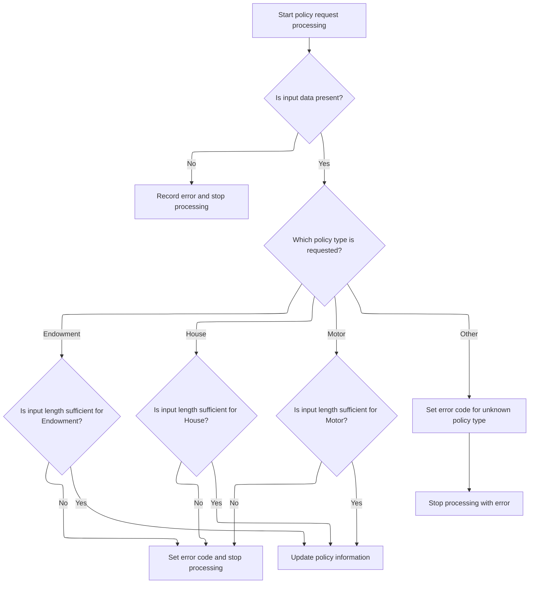
```mermaid
%%{init: {"flowchart": {"defaultRenderer": "elk"}} }%%
flowchart TD
    node1["Start policy request processing"] --> node2{"Is input data present?"}
    click node1 openCode "base/src/lgupol01.cbl:83:94"
    node2 -->|"No"| node3["Record error and stop processing"]
    click node2 openCode "base/src/lgupol01.cbl:99:103"
    click node3 openCode "base/src/lgupol01.cbl:100:102"
    node2 -->|"Yes"| node4{"Which policy type is requested?"}
    click node4 openCode "base/src/lgupol01.cbl:113:141"
    node4 -->|"Endowment"| node5{"Is input length sufficient for
Endowment?"}
    node4 -->|"House"| node6{"Is input length sufficient for House?"}
    node4 -->|"Motor"| node7{"Is input length sufficient for Motor?"}
    node4 -->|"Other"| node8["Set error code for unknown policy type"]
    node5 -->|"No"| node9["Set error code and stop processing"]
    node5 -->|"Yes"| node10["Update policy information"]
    node6 -->|"No"| node9
    node6 -->|"Yes"| node10
    node7 -->|"No"| node9
    node7 -->|"Yes"| node10
    node8 --> node11["Stop processing with error"]
    click node5 openCode "base/src/lgupol01.cbl:115:121"
    click node6 openCode "base/src/lgupol01.cbl:123:129"
    click node7 openCode "base/src/lgupol01.cbl:131:137"
    click node8 openCode "base/src/lgupol01.cbl:139:140"
    click node9 openCode "base/src/lgupol01.cbl:119:120"
    click node10 openCode "base/src/lgupol01.cbl:143:143"
    click node11 openCode "base/src/lgupol01.cbl:140:141"
classDef HeadingStyle fill:#777777,stroke:#333,stroke-width:2px;

%% Swimm:
%% %%{init: {"flowchart": {"defaultRenderer": "elk"}} }%%
%% flowchart TD
%%     node1["Start policy request processing"] --> node2{"Is input data present?"}
%%     click node1 openCode "<SwmPath>[base/src/lgupol01.cbl](base/src/lgupol01.cbl)</SwmPath>:83:94"
%%     node2 -->|"No"| node3["Record error and stop processing"]
%%     click node2 openCode "<SwmPath>[base/src/lgupol01.cbl](base/src/lgupol01.cbl)</SwmPath>:99:103"
%%     click node3 openCode "<SwmPath>[base/src/lgupol01.cbl](base/src/lgupol01.cbl)</SwmPath>:100:102"
%%     node2 -->|"Yes"| node4{"Which policy type is requested?"}
%%     click node4 openCode "<SwmPath>[base/src/lgupol01.cbl](base/src/lgupol01.cbl)</SwmPath>:113:141"
%%     node4 -->|"Endowment"| node5{"Is input length sufficient for
%% Endowment?"}
%%     node4 -->|"House"| node6{"Is input length sufficient for House?"}
%%     node4 -->|"Motor"| node7{"Is input length sufficient for Motor?"}
%%     node4 -->|"Other"| node8["Set error code for unknown policy type"]
%%     node5 -->|"No"| node9["Set error code and stop processing"]
%%     node5 -->|"Yes"| node10["Update policy information"]
%%     node6 -->|"No"| node9
%%     node6 -->|"Yes"| node10
%%     node7 -->|"No"| node9
%%     node7 -->|"Yes"| node10
%%     node8 --> node11["Stop processing with error"]
%%     click node5 openCode "<SwmPath>[base/src/lgupol01.cbl](base/src/lgupol01.cbl)</SwmPath>:115:121"
%%     click node6 openCode "<SwmPath>[base/src/lgupol01.cbl](base/src/lgupol01.cbl)</SwmPath>:123:129"
%%     click node7 openCode "<SwmPath>[base/src/lgupol01.cbl](base/src/lgupol01.cbl)</SwmPath>:131:137"
%%     click node8 openCode "<SwmPath>[base/src/lgupol01.cbl](base/src/lgupol01.cbl)</SwmPath>:139:140"
%%     click node9 openCode "<SwmPath>[base/src/lgupol01.cbl](base/src/lgupol01.cbl)</SwmPath>:119:120"
%%     click node10 openCode "<SwmPath>[base/src/lgupol01.cbl](base/src/lgupol01.cbl)</SwmPath>:143:143"
%%     click node11 openCode "<SwmPath>[base/src/lgupol01.cbl](base/src/lgupol01.cbl)</SwmPath>:140:141"
%% classDef HeadingStyle fill:#777777,stroke:#333,stroke-width:2px;
```

This section validates and routes incoming policy update requests. It ensures required input data is present and sufficient for the requested policy type, logs errors when validation fails, and routes valid requests to the update logic.

| Rule ID | Category        | Rule Name                                 | Description                                                                                                                           | Implementation Details                                                                                                                                                                       |
| ------- | --------------- | ----------------------------------------- | ------------------------------------------------------------------------------------------------------------------------------------- | -------------------------------------------------------------------------------------------------------------------------------------------------------------------------------------------- |
| BR-001  | Data validation | Missing input data                        | If no input data is present, an error message is logged and processing is stopped with an abend.                                      | The error message includes the text ' NO COMMAREA RECEIVED'. Error logging includes a timestamp and up to 90 bytes of input data if present.                                                 |
| BR-002  | Data validation | Insufficient input length for policy type | If the input data is present but too short for the requested policy type, an error code is set and processing stops.                  | The required length is the sum of header length (28) and the full policy type length (Endowment: 124, House: 130, Motor: 137). The error code '98' is set in the commarea return code field. |
| BR-003  | Data validation | Unknown policy type                       | If the requested policy type is not recognized, an error code is set in the commarea.                                                 | The error code '99' is set in the commarea return code field.                                                                                                                                |
| BR-004  | Decision Making | Route valid request to update logic       | If input data is present and sufficient for a recognized policy type, the request is routed to the update logic for that policy type. | The update logic is invoked after all validation passes. No error code is set in this case.                                                                                                  |
| BR-005  | Writing Output  | Error logging with input data             | When an error is detected, an error message is logged with a timestamp and up to 90 bytes of input data if present.                   | The error message includes the date, time, and up to 90 bytes of input data. If less than 91 bytes are present, all available data is logged.                                                |

<SwmSnippet path="/base/src/lgupol01.cbl" line="83">

---

In MAINLINE of <SwmToken path="base/src/lgtestp2.cbl" pos="198:10:10" line-data="                 EXEC CICS LINK PROGRAM(&#39;LGUPOL01&#39;)">`LGUPOL01`</SwmToken>, the code checks the commarea and required length for each policy type. If the data is missing or too short, it sets an error code and returns. Otherwise, it routes to the update logic for the policy type.

```cobol
       MAINLINE SECTION.

      *----------------------------------------------------------------*
      * Common code                                                    *
      *----------------------------------------------------------------*
      * initialize working storage variables
           INITIALIZE WS-HEADER.
      * set up general variable
           MOVE EIBTRNID TO WS-TRANSID.
           MOVE EIBTRMID TO WS-TERMID.
           MOVE EIBTASKN TO WS-TASKNUM.

      *----------------------------------------------------------------*
      * Check commarea and obtain required details                     *
      *----------------------------------------------------------------*
      * If NO commarea received issue an ABEND
           IF EIBCALEN IS EQUAL TO ZERO
               MOVE ' NO COMMAREA RECEIVED' TO EM-VARIABLE
               PERFORM WRITE-ERROR-MESSAGE
               EXEC CICS ABEND ABCODE('LGCA') NODUMP END-EXEC
           END-IF
      * initialize commarea return code to zero
           MOVE '00' TO CA-RETURN-CODE
           MOVE EIBCALEN TO WS-CALEN.
           SET WS-ADDR-DFHCOMMAREA TO ADDRESS OF DFHCOMMAREA.

      *----------------------------------------------------------------*
      * Check which policy type is being requested                     *
      *   and chec commarea length                                     *
      *----------------------------------------------------------------*
           EVALUATE CA-REQUEST-ID

             WHEN '01UEND'
               ADD WS-CA-HEADER-LEN  TO WS-REQUIRED-CA-LEN
               ADD WS-FULL-ENDOW-LEN TO WS-REQUIRED-CA-LEN
               IF EIBCALEN IS LESS THAN WS-REQUIRED-CA-LEN
                 MOVE '98' TO CA-RETURN-CODE
                 EXEC CICS RETURN END-EXEC
               END-IF

             WHEN '01UHOU'
               ADD WS-CA-HEADER-LEN  TO WS-REQUIRED-CA-LEN
               ADD WS-FULL-HOUSE-LEN TO WS-REQUIRED-CA-LEN
               IF EIBCALEN IS LESS THAN WS-REQUIRED-CA-LEN
                 MOVE '98' TO CA-RETURN-CODE
                 EXEC CICS RETURN END-EXEC
               END-IF

             WHEN '01UMOT'
               ADD WS-CA-HEADER-LEN  TO WS-REQUIRED-CA-LEN
               ADD WS-FULL-MOTOR-LEN TO WS-REQUIRED-CA-LEN
               IF EIBCALEN IS LESS THAN WS-REQUIRED-CA-LEN
                 MOVE '98' TO CA-RETURN-CODE
                 EXEC CICS RETURN END-EXEC
               END-IF

             WHEN OTHER
               MOVE '99' TO CA-RETURN-CODE
           END-EVALUATE

           PERFORM UPDATE-POLICY-DB2-INFO.
```

---

</SwmSnippet>

<SwmSnippet path="/base/src/lgupol01.cbl" line="169">

---

<SwmToken path="base/src/lgupol01.cbl" pos="169:1:5" line-data="       WRITE-ERROR-MESSAGE.">`WRITE-ERROR-MESSAGE`</SwmToken> in <SwmToken path="base/src/lgtestp2.cbl" pos="198:10:10" line-data="                 EXEC CICS LINK PROGRAM(&#39;LGUPOL01&#39;)">`LGUPOL01`</SwmToken> gets the current time, formats it, writes the error message to the queue via LGSTSQ, and then, if there's commarea data, writes up to 90 bytes of that as well. This keeps error logs concise and timestamped.

```cobol
       WRITE-ERROR-MESSAGE.
      * Save SQLCODE in message
      * Obtain and format current time and date
           EXEC CICS ASKTIME ABSTIME(WS-ABSTIME)
           END-EXEC
           EXEC CICS FORMATTIME ABSTIME(WS-ABSTIME)
                     MMDDYYYY(WS-DATE)
                     TIME(WS-TIME)
           END-EXEC
           MOVE WS-DATE TO EM-DATE
           MOVE WS-TIME TO EM-TIME
      * Write output message to TDQ
           EXEC CICS LINK PROGRAM('LGSTSQ')
                     COMMAREA(ERROR-MSG)
                     LENGTH(LENGTH OF ERROR-MSG)
           END-EXEC.
      * Write 90 bytes or as much as we have of commarea to TDQ
           IF EIBCALEN > 0 THEN
             IF EIBCALEN < 91 THEN
               MOVE DFHCOMMAREA(1:EIBCALEN) TO CA-DATA
               EXEC CICS LINK PROGRAM('LGSTSQ')
                         COMMAREA(CA-ERROR-MSG)
                         LENGTH(LENGTH OF CA-ERROR-MSG)
               END-EXEC
             ELSE
               MOVE DFHCOMMAREA(1:90) TO CA-DATA
               EXEC CICS LINK PROGRAM('LGSTSQ')
                         COMMAREA(CA-ERROR-MSG)
                         LENGTH(LENGTH OF CA-ERROR-MSG)
               END-EXEC
             END-IF
           END-IF.
           EXIT.
```

---

</SwmSnippet>

<SwmSnippet path="/base/src/lgupol01.cbl" line="83">

---

After all the validation and routing, the code performs the update by calling <SwmToken path="base/src/lgupol01.cbl" pos="143:3:9" line-data="           PERFORM UPDATE-POLICY-DB2-INFO.">`UPDATE-POLICY-DB2-INFO`</SwmToken>. This is the last step in the update flow before returning control.

```cobol
       MAINLINE SECTION.

      *----------------------------------------------------------------*
      * Common code                                                    *
      *----------------------------------------------------------------*
      * initialize working storage variables
           INITIALIZE WS-HEADER.
      * set up general variable
           MOVE EIBTRNID TO WS-TRANSID.
           MOVE EIBTRMID TO WS-TERMID.
           MOVE EIBTASKN TO WS-TASKNUM.

      *----------------------------------------------------------------*
      * Check commarea and obtain required details                     *
      *----------------------------------------------------------------*
      * If NO commarea received issue an ABEND
           IF EIBCALEN IS EQUAL TO ZERO
               MOVE ' NO COMMAREA RECEIVED' TO EM-VARIABLE
               PERFORM WRITE-ERROR-MESSAGE
               EXEC CICS ABEND ABCODE('LGCA') NODUMP END-EXEC
           END-IF
      * initialize commarea return code to zero
           MOVE '00' TO CA-RETURN-CODE
           MOVE EIBCALEN TO WS-CALEN.
           SET WS-ADDR-DFHCOMMAREA TO ADDRESS OF DFHCOMMAREA.

      *----------------------------------------------------------------*
      * Check which policy type is being requested                     *
      *   and chec commarea length                                     *
      *----------------------------------------------------------------*
           EVALUATE CA-REQUEST-ID

             WHEN '01UEND'
               ADD WS-CA-HEADER-LEN  TO WS-REQUIRED-CA-LEN
               ADD WS-FULL-ENDOW-LEN TO WS-REQUIRED-CA-LEN
               IF EIBCALEN IS LESS THAN WS-REQUIRED-CA-LEN
                 MOVE '98' TO CA-RETURN-CODE
                 EXEC CICS RETURN END-EXEC
               END-IF

             WHEN '01UHOU'
               ADD WS-CA-HEADER-LEN  TO WS-REQUIRED-CA-LEN
               ADD WS-FULL-HOUSE-LEN TO WS-REQUIRED-CA-LEN
               IF EIBCALEN IS LESS THAN WS-REQUIRED-CA-LEN
                 MOVE '98' TO CA-RETURN-CODE
                 EXEC CICS RETURN END-EXEC
               END-IF

             WHEN '01UMOT'
               ADD WS-CA-HEADER-LEN  TO WS-REQUIRED-CA-LEN
               ADD WS-FULL-MOTOR-LEN TO WS-REQUIRED-CA-LEN
               IF EIBCALEN IS LESS THAN WS-REQUIRED-CA-LEN
                 MOVE '98' TO CA-RETURN-CODE
                 EXEC CICS RETURN END-EXEC
               END-IF

             WHEN OTHER
               MOVE '99' TO CA-RETURN-CODE
           END-EVALUATE

           PERFORM UPDATE-POLICY-DB2-INFO.
```

---

</SwmSnippet>

## Triggering Policy Update in the Database

This section delegates the policy update operation to a backend program, ensuring separation of concerns between business logic and database operations.

| Rule ID | Category                        | Rule Name                         | Description                                                                                                                            | Implementation Details                                                                                                                                              |
| ------- | ------------------------------- | --------------------------------- | -------------------------------------------------------------------------------------------------------------------------------------- | ------------------------------------------------------------------------------------------------------------------------------------------------------------------- |
| BR-001  | Invoking a Service or a Process | Delegate policy update to backend | The policy update process is delegated to a backend service, which receives all necessary data in a communication area for processing. | The communication area is passed with a fixed length of 32,500 bytes. The backend service is responsible for interpreting and updating the policy data accordingly. |

<SwmSnippet path="/base/src/lgupol01.cbl" line="155">

---

<SwmToken path="base/src/lgupol01.cbl" pos="155:1:7" line-data="       UPDATE-POLICY-DB2-INFO.">`UPDATE-POLICY-DB2-INFO`</SwmToken> just links to <SwmToken path="base/src/lgupol01.cbl" pos="157:9:9" line-data="           EXEC CICS LINK Program(LGUPDB01)">`LGUPDB01`</SwmToken>, passing the commarea for the actual database update. This keeps the database logic out of the main program and delegates updates to the right backend.

```cobol
       UPDATE-POLICY-DB2-INFO.

           EXEC CICS LINK Program(LGUPDB01)
                Commarea(DFHCOMMAREA)
                LENGTH(32500)
           END-EXEC.

           EXIT.
```

---

</SwmSnippet>

## Updating Policy Data and Error Reporting

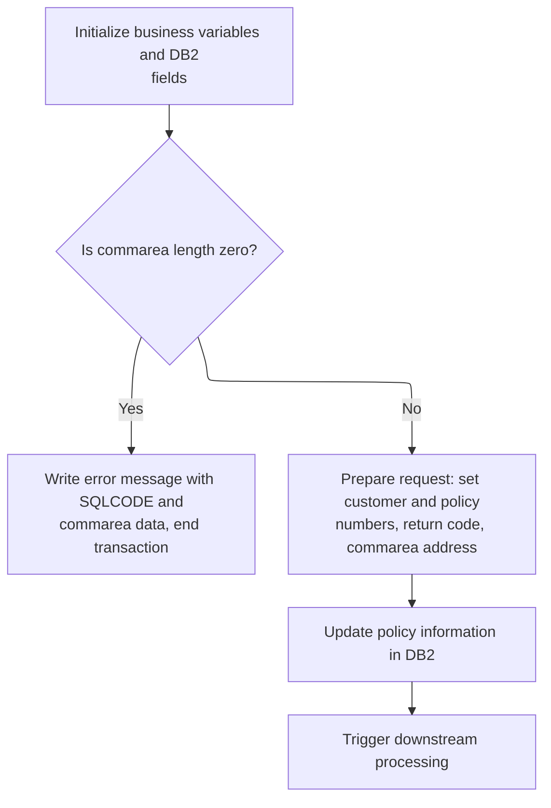
```mermaid
%%{init: {"flowchart": {"defaultRenderer": "elk"}} }%%
flowchart TD
    node1["Initialize business variables and DB2
fields"] --> node2{"Is commarea length zero?"}
    click node1 openCode "base/src/lgupdb01.cbl:162:178"
    node2 -->|"Yes"| node3["Write error message with SQLCODE and
commarea data, end transaction"]
    click node2 openCode "base/src/lgupdb01.cbl:183:187"
    click node3 openCode "base/src/lgupdb01.cbl:502:535"
    node2 -->|"No"| node4["Prepare request: set customer and policy
numbers, return code, commarea address"]
    click node4 openCode "base/src/lgupdb01.cbl:190:200"
    node4 --> node5["Update policy information in DB2"]
    click node5 openCode "base/src/lgupdb01.cbl:207:207"
    node5 --> node6["Trigger downstream processing"]
    click node6 openCode "base/src/lgupdb01.cbl:209:212"

classDef HeadingStyle fill:#777777,stroke:#333,stroke-width:2px;

%% Swimm:
%% %%{init: {"flowchart": {"defaultRenderer": "elk"}} }%%
%% flowchart TD
%%     node1["Initialize business variables and <SwmToken path="base/src/lgipdb01.cbl" pos="242:5:5" line-data="      * initialize DB2 host variables">`DB2`</SwmToken>
%% fields"] --> node2{"Is commarea length zero?"}
%%     click node1 openCode "<SwmPath>[base/src/lgupdb01.cbl](base/src/lgupdb01.cbl)</SwmPath>:162:178"
%%     node2 -->|"Yes"| node3["Write error message with SQLCODE and
%% commarea data, end transaction"]
%%     click node2 openCode "<SwmPath>[base/src/lgupdb01.cbl](base/src/lgupdb01.cbl)</SwmPath>:183:187"
%%     click node3 openCode "<SwmPath>[base/src/lgupdb01.cbl](base/src/lgupdb01.cbl)</SwmPath>:502:535"
%%     node2 -->|"No"| node4["Prepare request: set customer and policy
%% numbers, return code, commarea address"]
%%     click node4 openCode "<SwmPath>[base/src/lgupdb01.cbl](base/src/lgupdb01.cbl)</SwmPath>:190:200"
%%     node4 --> node5["Update policy information in <SwmToken path="base/src/lgipdb01.cbl" pos="242:5:5" line-data="      * initialize DB2 host variables">`DB2`</SwmToken>"]
%%     click node5 openCode "<SwmPath>[base/src/lgupdb01.cbl](base/src/lgupdb01.cbl)</SwmPath>:207:207"
%%     node5 --> node6["Trigger downstream processing"]
%%     click node6 openCode "<SwmPath>[base/src/lgupdb01.cbl](base/src/lgupdb01.cbl)</SwmPath>:209:212"
%% 
%% classDef HeadingStyle fill:#777777,stroke:#333,stroke-width:2px;
```

This section validates incoming policy update requests, updates policy data in <SwmToken path="base/src/lgipdb01.cbl" pos="242:5:5" line-data="      * initialize DB2 host variables">`DB2`</SwmToken>, and ensures error conditions are logged with sufficient context for troubleshooting. It also triggers downstream processing to keep VSAM files in sync with <SwmToken path="base/src/lgipdb01.cbl" pos="242:5:5" line-data="      * initialize DB2 host variables">`DB2`</SwmToken> updates.

| Rule ID | Category                        | Rule Name                                                         | Description                                                                                                                                                                                                                                                                                    | Implementation Details                                                                                                                                                                                                                                                                                               |
| ------- | ------------------------------- | ----------------------------------------------------------------- | ---------------------------------------------------------------------------------------------------------------------------------------------------------------------------------------------------------------------------------------------------------------------------------------------- | -------------------------------------------------------------------------------------------------------------------------------------------------------------------------------------------------------------------------------------------------------------------------------------------------------------------- |
| BR-001  | Data validation                 | Commarea required for processing                                  | If the commarea length is zero, an error message is written containing the SQL error code, timestamp, and a message indicating no commarea was received. The transaction is then abended with code 'LGCA'.                                                                                     | The error message includes the SQL error code, current date and time, and the text 'NO COMMAREA RECEIVED'. The transaction is abended with code 'LGCA'.                                                                                                                                                              |
| BR-002  | Calculation                     | Customer and policy numbers required for update and error context | When the commarea is present, the customer and policy numbers from the commarea are used to prepare the <SwmToken path="base/src/lgipdb01.cbl" pos="242:5:5" line-data="      * initialize DB2 host variables">`DB2`</SwmToken> update and are also included in the error message for context. | Customer and policy numbers are used for both <SwmToken path="base/src/lgipdb01.cbl" pos="242:5:5" line-data="      * initialize DB2 host variables">`DB2`</SwmToken> updates and error message context. Both are 10-digit numbers.                                                                                  |
| BR-003  | Writing Output                  | Error message content requirements                                | When an error is reported, the error message includes the SQL error code, the current date and time, and the customer and policy numbers from the commarea if available.                                                                                                                       | The error message format includes: date (8 bytes), time (6 bytes), customer number (10 bytes), policy number (10 bytes), and SQL error code (5 digits).                                                                                                                                                              |
| BR-004  | Writing Output                  | Commarea data included in error reporting                         | If commarea data is present, up to 90 bytes of the commarea are included in the error message sent to the queue. If the commarea is shorter than 91 bytes, the entire commarea is sent; otherwise, only the first 90 bytes are included.                                                       | Up to 90 bytes of commarea data are included in the error message. If commarea is less than 91 bytes, the entire commarea is sent; otherwise, only the first 90 bytes are sent.                                                                                                                                      |
| BR-005  | Invoking a Service or a Process | Policy update and downstream synchronization                      | After preparing the request, the policy information is updated in <SwmToken path="base/src/lgipdb01.cbl" pos="242:5:5" line-data="      * initialize DB2 host variables">`DB2`</SwmToken>, and downstream processing is triggered to synchronize VSAM files with the updated policy data.      | Policy data is updated in <SwmToken path="base/src/lgipdb01.cbl" pos="242:5:5" line-data="      * initialize DB2 host variables">`DB2`</SwmToken>, and downstream processing is triggered via a program call to synchronize VSAM files. The commarea is passed to the downstream process with a length of 225 bytes. |

<SwmSnippet path="/base/src/lgupdb01.cbl" line="162">

---

MAINLINE here validates the input commarea, logs and abends if it's missing, then updates policy details in <SwmToken path="base/src/lgupdb01.cbl" pos="175:5:5" line-data="      * initialize DB2 host variables">`DB2`</SwmToken> by calling <SwmToken path="base/src/lgupdb01.cbl" pos="207:3:9" line-data="           PERFORM UPDATE-POLICY-DB2-INFO.">`UPDATE-POLICY-DB2-INFO`</SwmToken>. After that, it links to <SwmToken path="base/src/lgupdb01.cbl" pos="209:9:9" line-data="           EXEC CICS LINK Program(LGUPVS01)">`LGUPVS01`</SwmToken> to update the VSAM file, keeping both <SwmToken path="base/src/lgupdb01.cbl" pos="175:5:5" line-data="      * initialize DB2 host variables">`DB2`</SwmToken> and VSAM in sync for policy updates.

```cobol
       MAINLINE SECTION.

      *----------------------------------------------------------------*
      * Common code                                                    *
      *----------------------------------------------------------------*
      * initialize working storage variables
           INITIALIZE WS-HEADER.
      * set up general variable
           MOVE EIBTRNID TO WS-TRANSID.
           MOVE EIBTRMID TO WS-TERMID.
           MOVE EIBTASKN TO WS-TASKNUM.
           MOVE SPACES   TO WS-RETRY.
      *----------------------------------------------------------------*
      * initialize DB2 host variables
           INITIALIZE DB2-POLICY.
           INITIALIZE DB2-IN-INTEGERS.

      *----------------------------------------------------------------*
      * Check commarea and obtain required details                     *
      *----------------------------------------------------------------*
      * If NO commarea received issue an ABEND
           IF EIBCALEN IS EQUAL TO ZERO
               MOVE ' NO COMMAREA RECEIVED' TO EM-VARIABLE
               PERFORM WRITE-ERROR-MESSAGE
               EXEC CICS ABEND ABCODE('LGCA') NODUMP END-EXEC
           END-IF

      * initialize commarea return code to zero
           MOVE '00' TO CA-RETURN-CODE
           MOVE EIBCALEN TO WS-CALEN.
           SET WS-ADDR-DFHCOMMAREA TO ADDRESS OF DFHCOMMAREA.

      * Convert commarea customer & policy nums to DB2 integer format
           MOVE CA-CUSTOMER-NUM TO DB2-CUSTOMERNUM-INT
           MOVE CA-POLICY-NUM   TO DB2-POLICYNUM-INT
      * and save in error msg field incase required
           MOVE CA-CUSTOMER-NUM TO EM-CUSNUM
           MOVE CA-POLICY-NUM   TO EM-POLNUM

      *----------------------------------------------------------------*
      * Check which policy type is being requested                     *
      *   and check commarea length                                    *
      *----------------------------------------------------------------*

      *    Call procedure to update required tables
           PERFORM UPDATE-POLICY-DB2-INFO.

           EXEC CICS LINK Program(LGUPVS01)
                Commarea(DFHCOMMAREA)
                LENGTH(225)
           END-EXEC.
```

---

</SwmSnippet>

<SwmSnippet path="/base/src/lgupdb01.cbl" line="502">

---

<SwmToken path="base/src/lgupdb01.cbl" pos="502:1:5" line-data="       WRITE-ERROR-MESSAGE.">`WRITE-ERROR-MESSAGE`</SwmToken> logs the SQL error and timestamps, then calls LGSTSQ to write the error message. If there's commarea data, it sends up to 90 bytes of that as well, so both the error and the input context are captured in the queue.

```cobol
       WRITE-ERROR-MESSAGE.
      * Save SQLCODE in message
           MOVE SQLCODE TO EM-SQLRC
      * Obtain and format current time and date
           EXEC CICS ASKTIME ABSTIME(WS-ABSTIME)
           END-EXEC
           EXEC CICS FORMATTIME ABSTIME(WS-ABSTIME)
                     MMDDYYYY(WS-DATE)
                     TIME(WS-TIME)
           END-EXEC
           MOVE WS-DATE TO EM-DATE
           MOVE WS-TIME TO EM-TIME
      * Write output message to TDQ
           EXEC CICS LINK PROGRAM('LGSTSQ')
                     COMMAREA(ERROR-MSG)
                     LENGTH(LENGTH OF ERROR-MSG)
           END-EXEC.
      * Write 90 bytes or as much as we have of commarea to TDQ
           IF EIBCALEN > 0 THEN
             IF EIBCALEN < 91 THEN
               MOVE DFHCOMMAREA(1:EIBCALEN) TO CA-DATA
               EXEC CICS LINK PROGRAM('LGSTSQ')
                         COMMAREA(CA-ERROR-MSG)
                         LENGTH(LENGTH OF CA-ERROR-MSG)
               END-EXEC
             ELSE
               MOVE DFHCOMMAREA(1:90) TO CA-DATA
               EXEC CICS LINK PROGRAM('LGSTSQ')
                         COMMAREA(CA-ERROR-MSG)
                         LENGTH(LENGTH OF CA-ERROR-MSG)
               END-EXEC
             END-IF
           END-IF.
           EXIT.
```

---

</SwmSnippet>

## Policy Update Logic and Table Routing


```mermaid
%%{init: {"flowchart": {"defaultRenderer": "elk"}} }%%
flowchart TD
    node1["Start policy update"]
    click node1 openCode "base/src/lgupdb01.cbl:251:258"
    node1 --> node2{"Was policy row fetched successfully?"}
    click node2 openCode "base/src/lgupdb01.cbl:259:270"
    node2 -->|"SQLCODE = 0"| node3{"Do timestamps match?"}
    click node3 openCode "base/src/lgupdb01.cbl:275:278"
    node2 -->|"SQLCODE = 100"| node15["Set return code to '01' (Not found)"]
    click node15 openCode "base/src/lgupdb01.cbl:352:353"
    node2 -->|"Other"| node12["Close cursor and return error"]
    click node12 openCode "base/src/lgupdb01.cbl:305:306"
    node3 -->|"Yes"| node4{"Which policy type?"}
    click node4 openCode "base/src/lgupdb01.cbl:283:300"
    node3 -->|"No"| node7["Set return code to '02' (Stale data)"]
    click node7 openCode "base/src/lgupdb01.cbl:346:347"
    node4 -->|"Endowment"| node5["Update Endowment table"]
    click node5 openCode "base/src/lgupdb01.cbl:387:418"
    node4 -->|"House"| node6["Update House table"]
    click node6 openCode "base/src/lgupdb01.cbl:424:454"
    node4 -->|"Motor"| node9["Update Motor table"]
    click node9 openCode "base/src/lgupdb01.cbl:460:495"
    node5 --> node10{"Did update succeed?"}
    click node10 openCode "base/src/lgupdb01.cbl:302:307"
    node6 --> node10
    node9 --> node10
    node10 -->|"CA-RETURN-CODE = '00'"| node11["Update main policy table and timestamp"]
    click node11 openCode "base/src/lgupdb01.cbl:312:335"
    node10 -->|"CA-RETURN-CODE ≠ '00'"| node12
    node11 --> node13{"Did main policy update succeed?"}
    click node13 openCode "base/src/lgupdb01.cbl:336:342"
    node13 -->|"SQLCODE = 0"| node14["Close cursor and return success"]
    click node14 openCode "base/src/lgupdb01.cbl:360:368"
    node13 -->|"SQLCODE ≠ 0"| node12
    node7 --> node14
classDef HeadingStyle fill:#777777,stroke:#333,stroke-width:2px;

%% Swimm:
%% %%{init: {"flowchart": {"defaultRenderer": "elk"}} }%%
%% flowchart TD
%%     node1["Start policy update"]
%%     click node1 openCode "<SwmPath>[base/src/lgupdb01.cbl](base/src/lgupdb01.cbl)</SwmPath>:251:258"
%%     node1 --> node2{"Was policy row fetched successfully?"}
%%     click node2 openCode "<SwmPath>[base/src/lgupdb01.cbl](base/src/lgupdb01.cbl)</SwmPath>:259:270"
%%     node2 -->|"SQLCODE = 0"| node3{"Do timestamps match?"}
%%     click node3 openCode "<SwmPath>[base/src/lgupdb01.cbl](base/src/lgupdb01.cbl)</SwmPath>:275:278"
%%     node2 -->|"SQLCODE = 100"| node15["Set return code to '01' (Not found)"]
%%     click node15 openCode "<SwmPath>[base/src/lgupdb01.cbl](base/src/lgupdb01.cbl)</SwmPath>:352:353"
%%     node2 -->|"Other"| node12["Close cursor and return error"]
%%     click node12 openCode "<SwmPath>[base/src/lgupdb01.cbl](base/src/lgupdb01.cbl)</SwmPath>:305:306"
%%     node3 -->|"Yes"| node4{"Which policy type?"}
%%     click node4 openCode "<SwmPath>[base/src/lgupdb01.cbl](base/src/lgupdb01.cbl)</SwmPath>:283:300"
%%     node3 -->|"No"| node7["Set return code to '02' (Stale data)"]
%%     click node7 openCode "<SwmPath>[base/src/lgupdb01.cbl](base/src/lgupdb01.cbl)</SwmPath>:346:347"
%%     node4 -->|"Endowment"| node5["Update Endowment table"]
%%     click node5 openCode "<SwmPath>[base/src/lgupdb01.cbl](base/src/lgupdb01.cbl)</SwmPath>:387:418"
%%     node4 -->|"House"| node6["Update House table"]
%%     click node6 openCode "<SwmPath>[base/src/lgupdb01.cbl](base/src/lgupdb01.cbl)</SwmPath>:424:454"
%%     node4 -->|"Motor"| node9["Update Motor table"]
%%     click node9 openCode "<SwmPath>[base/src/lgupdb01.cbl](base/src/lgupdb01.cbl)</SwmPath>:460:495"
%%     node5 --> node10{"Did update succeed?"}
%%     click node10 openCode "<SwmPath>[base/src/lgupdb01.cbl](base/src/lgupdb01.cbl)</SwmPath>:302:307"
%%     node6 --> node10
%%     node9 --> node10
%%     node10 -->|"<SwmToken path="base/src/lgtestp2.cbl" pos="71:3:7" line-data="                 IF CA-RETURN-CODE &gt; 0">`CA-RETURN-CODE`</SwmToken> = '00'"| node11["Update main policy table and timestamp"]
%%     click node11 openCode "<SwmPath>[base/src/lgupdb01.cbl](base/src/lgupdb01.cbl)</SwmPath>:312:335"
%%     node10 -->|"<SwmToken path="base/src/lgtestp2.cbl" pos="71:3:7" line-data="                 IF CA-RETURN-CODE &gt; 0">`CA-RETURN-CODE`</SwmToken> ≠ '00'"| node12
%%     node11 --> node13{"Did main policy update succeed?"}
%%     click node13 openCode "<SwmPath>[base/src/lgupdb01.cbl](base/src/lgupdb01.cbl)</SwmPath>:336:342"
%%     node13 -->|"SQLCODE = 0"| node14["Close cursor and return success"]
%%     click node14 openCode "<SwmPath>[base/src/lgupdb01.cbl](base/src/lgupdb01.cbl)</SwmPath>:360:368"
%%     node13 -->|"SQLCODE ≠ 0"| node12
%%     node7 --> node14
%% classDef HeadingStyle fill:#777777,stroke:#333,stroke-width:2px;
```

This section manages the update of policy records, ensuring data integrity through timestamp checks and routing updates to the correct policy type table. It provides clear outcomes for success, not found, stale data, and error scenarios, and ensures that all updates are properly logged and return codes are set for downstream processing.

| Rule ID | Category        | Rule Name                                  | Description                                                                                                                                          | Implementation Details                                                                                                                                                                                                                                                                                                                                                                                                                                                                 |
| ------- | --------------- | ------------------------------------------ | ---------------------------------------------------------------------------------------------------------------------------------------------------- | -------------------------------------------------------------------------------------------------------------------------------------------------------------------------------------------------------------------------------------------------------------------------------------------------------------------------------------------------------------------------------------------------------------------------------------------------------------------------------------- |
| BR-001  | Data validation | Stale data detection                       | If the timestamp in the request does not match the database, set the return code to '02' to indicate stale data and do not proceed with the update.  | Return code '02' indicates a concurrency conflict (stale data). This is set in the commarea as a two-digit string.                                                                                                                                                                                                                                                                                                                                                                     |
| BR-002  | Calculation     | Main policy table update after type update | If the policy type table update succeeds, update the main policy table and set the new timestamp.                                                    | The main policy table is updated with new details and the timestamp is set to the current time. The new timestamp is returned in the commarea as a 26-character string.                                                                                                                                                                                                                                                                                                                |
| BR-003  | Decision Making | Policy not found handling                  | If the policy row is not found during fetch, set the return code to '01' to indicate not found.                                                      | Return code '01' indicates the policy was not found. This is set in the commarea as a two-digit string.                                                                                                                                                                                                                                                                                                                                                                                |
| BR-004  | Decision Making | Policy type routing                        | Route the update to the correct policy type table (Endowment, House, Motor) based on the policy type in the request.                                 | Policy types are identified by request IDs: <SwmToken path="base/src/lgtestp2.cbl" pos="184:4:4" line-data="                 Move &#39;01UEND&#39;          To CA-REQUEST-ID">`01UEND`</SwmToken> for Endowment, <SwmToken path="base/src/lgupol01.cbl" pos="123:4:4" line-data="             WHEN &#39;01UHOU&#39;">`01UHOU`</SwmToken> for House, <SwmToken path="base/src/lgupol01.cbl" pos="131:4:4" line-data="             WHEN &#39;01UMOT&#39;">`01UMOT`</SwmToken> for Motor. |
| BR-005  | Decision Making | Policy type update failure handling        | If the policy type table update fails, close the cursor and return an error code ('01' for not found, '90' for other errors).                        | Return code '01' indicates no rows updated, '90' indicates a general error. Errors are logged and the cursor is closed before returning.                                                                                                                                                                                                                                                                                                                                               |
| BR-006  | Decision Making | Main policy update failure handling        | If the main policy table update fails, roll back the transaction, set the return code to '90', and log the error.                                    | Return code '90' indicates a general error. The transaction is rolled back and the error is logged.                                                                                                                                                                                                                                                                                                                                                                                    |
| BR-007  | Writing Output  | Cursor close handling                      | After all processing, close the policy cursor and set the return code based on the result of the close operation ('00' for success, '90' for error). | Return code '00' indicates successful close, '90' indicates an error. Errors are logged if closing fails.                                                                                                                                                                                                                                                                                                                                                                              |

<SwmSnippet path="/base/src/lgupdb01.cbl" line="251">

---

<SwmToken path="base/src/lgupdb01.cbl" pos="251:1:7" line-data="       UPDATE-POLICY-DB2-INFO.">`UPDATE-POLICY-DB2-INFO`</SwmToken> opens a cursor, fetches the policy row, checks for timestamp conflicts, then routes to the right update routine based on policy type. If anything fails, it logs the error and rolls back. After updating, it fetches the new timestamp and closes the cursor.

```cobol
       UPDATE-POLICY-DB2-INFO.

      *    Open the cursor.
           MOVE ' OPEN   PCURSOR ' TO EM-SQLREQ
           EXEC SQL
             OPEN POLICY_CURSOR
           END-EXEC

           Evaluate SQLCODE
             When 0
               MOVE '00' TO CA-RETURN-CODE
             When -913
               MOVE '90' TO CA-RETURN-CODE
               PERFORM WRITE-ERROR-MESSAGE
               EXEC CICS RETURN END-EXEC
             When Other
               MOVE '90' TO CA-RETURN-CODE
               PERFORM WRITE-ERROR-MESSAGE
               EXEC CICS RETURN END-EXEC
           END-Evaluate.

      *    Fetch the first row (we only expect one matching row)
           PERFORM FETCH-DB2-POLICY-ROW

           IF SQLCODE = 0
      *      Fetch was successful
      *      Compare timestamp in commarea with that in DB2
             IF CA-LASTCHANGED EQUAL TO DB2-LASTCHANGED

      *----------------------------------------------------------------*
      *      Select for Update and Update specific policy type table   *
      *----------------------------------------------------------------*
             EVALUATE CA-REQUEST-ID

      *** Endowment ***
               WHEN '01UEND'
      *          Call routine to update Endowment table
                 PERFORM UPDATE-ENDOW-DB2-INFO

      *** House ***
               WHEN '01UHOU'
      *          Call routine to update Housetable
                 PERFORM UPDATE-HOUSE-DB2-INFO

      *** Motor ***
               WHEN '01UMOT'
      *          Call routine to update Motor table
                 PERFORM UPDATE-MOTOR-DB2-INFO

             END-EVALUATE
      *----------------------------------------------------------------*
              IF CA-RETURN-CODE NOT EQUAL '00'
      *         Update policy type specific table has failed
      *         So close cursor and return
                PERFORM CLOSE-PCURSOR
                EXEC CICS RETURN END-EXEC
              END-IF

      *----------------------------------------------------------------*
      *        Now update Policy table and set new timestamp           *
      *----------------------------------------------------------------*
      *        Move numeric commarea fields to integer format
               MOVE CA-BROKERID      TO DB2-BROKERID-INT
               MOVE CA-PAYMENT       TO DB2-PAYMENT-INT

      *        Update policy table details
               MOVE ' UPDATE POLICY  ' TO EM-SQLREQ
               EXEC SQL
                 UPDATE POLICY
                   SET ISSUEDATE        = :CA-ISSUE-DATE,
                       EXPIRYDATE       = :CA-EXPIRY-DATE,
                       LASTCHANGED      = CURRENT TIMESTAMP ,
                       BROKERID         = :DB2-BROKERID-INT,
                       BROKERSREFERENCE = :CA-BROKERSREF
                   WHERE CURRENT OF POLICY_CURSOR
               END-EXEC

      *        get value of assigned Timestamp for return in commarea
               EXEC SQL
                 SELECT LASTCHANGED
                   INTO :CA-LASTCHANGED
                   FROM POLICY
                   WHERE POLICYNUMBER = :DB2-POLICYNUM-INT
               END-EXEC

               IF SQLCODE NOT EQUAL 0
      *          Non-zero SQLCODE from Update of policy table
                   EXEC CICS SYNCPOINT ROLLBACK END-EXEC
                   MOVE '90' TO CA-RETURN-CODE
      *            Write error message to TD QUEUE(CSMT)
                   PERFORM WRITE-ERROR-MESSAGE
               END-IF

             ELSE
      *        Timestamps do not match (policy table v commarea)
               MOVE '02' TO CA-RETURN-CODE
             END-IF

           ELSE
      *      Non-zero SQLCODE from first SQL FETCH statement
             IF SQLCODE EQUAL 100
               MOVE '01' TO CA-RETURN-CODE
             ELSE
               MOVE '90' TO CA-RETURN-CODE
      *        Write error message to TD QUEUE(CSMT)
               PERFORM WRITE-ERROR-MESSAGE
             END-IF
           END-IF.
      *    Now close the Cursor and we're done!
           PERFORM CLOSE-PCURSOR.
```

---

</SwmSnippet>

<SwmSnippet path="/base/src/lgupdb01.cbl" line="387">

---

<SwmToken path="base/src/lgupdb01.cbl" pos="387:1:7" line-data="       UPDATE-ENDOW-DB2-INFO.">`UPDATE-ENDOW-DB2-INFO`</SwmToken> converts commarea fields to <SwmToken path="base/src/lgupdb01.cbl" pos="387:5:5" line-data="       UPDATE-ENDOW-DB2-INFO.">`DB2`</SwmToken> integer types, updates the endowment table, and sets return codes based on SQLCODE. If the update fails, it logs the error and sets '01' for no rows updated or '90' for other errors.

```cobol
       UPDATE-ENDOW-DB2-INFO.

      *    Move numeric commarea fields to DB2 Integer formats
           MOVE CA-E-TERM        TO DB2-E-TERM-SINT
           MOVE CA-E-SUM-ASSURED TO DB2-E-SUMASSURED-INT

           MOVE ' UPDATE ENDOW ' TO EM-SQLREQ
           EXEC SQL
             UPDATE ENDOWMENT
               SET
                 WITHPROFITS   = :CA-E-WITH-PROFITS,
                   EQUITIES    = :CA-E-EQUITIES,
                   MANAGEDFUND = :CA-E-MANAGED-FUND,
                   FUNDNAME    = :CA-E-FUND-NAME,
                   TERM        = :DB2-E-TERM-SINT,
                   SUMASSURED  = :DB2-E-SUMASSURED-INT,
                   LIFEASSURED = :CA-E-LIFE-ASSURED
               WHERE
                   POLICYNUMBER = :DB2-POLICYNUM-INT
           END-EXEC

           IF SQLCODE NOT EQUAL 0
      *      Non-zero SQLCODE from UPDATE statement
             IF SQLCODE EQUAL 100
               MOVE '01' TO CA-RETURN-CODE
             ELSE
               MOVE '90' TO CA-RETURN-CODE
      *        Write error message to TD QUEUE(CSMT)
               PERFORM WRITE-ERROR-MESSAGE
             END-IF
           END-IF.
           EXIT.
```

---

</SwmSnippet>

<SwmSnippet path="/base/src/lgupdb01.cbl" line="424">

---

<SwmToken path="base/src/lgupdb01.cbl" pos="424:1:7" line-data="       UPDATE-HOUSE-DB2-INFO.">`UPDATE-HOUSE-DB2-INFO`</SwmToken> moves commarea fields to <SwmToken path="base/src/lgupdb01.cbl" pos="424:5:5" line-data="       UPDATE-HOUSE-DB2-INFO.">`DB2`</SwmToken> integer types, updates the HOUSE table, and sets return codes '01' or '90' based on SQLCODE. It assumes the input fields are valid and that POLICYNUMBER matches a record, but doesn't check these explicitly.

```cobol
       UPDATE-HOUSE-DB2-INFO.

      *    Move numeric commarea fields to DB2 Integer formats
           MOVE CA-H-BEDROOMS    TO DB2-H-BEDROOMS-SINT
           MOVE CA-H-VALUE       TO DB2-H-VALUE-INT

           MOVE ' UPDATE HOUSE ' TO EM-SQLREQ
           EXEC SQL
             UPDATE HOUSE
               SET
                    PROPERTYTYPE = :CA-H-PROPERTY-TYPE,
                    BEDROOMS     = :DB2-H-BEDROOMS-SINT,
                    VALUE        = :DB2-H-VALUE-INT,
                    HOUSENAME    = :CA-H-HOUSE-NAME,
                    HOUSENUMBER  = :CA-H-HOUSE-NUMBER,
                    POSTCODE     = :CA-H-POSTCODE
               WHERE
                    POLICYNUMBER = :DB2-POLICYNUM-INT
           END-EXEC

           IF SQLCODE NOT EQUAL 0
      *      Non-zero SQLCODE from UPDATE statement
             IF SQLCODE = 100
               MOVE '01' TO CA-RETURN-CODE
             ELSE
               MOVE '90' TO CA-RETURN-CODE
      *        Write error message to TD QUEUE(CSMT)
               PERFORM WRITE-ERROR-MESSAGE
             END-IF
           END-IF.
           EXIT.
```

---

</SwmSnippet>

<SwmSnippet path="/base/src/lgupdb01.cbl" line="460">

---

<SwmToken path="base/src/lgupdb01.cbl" pos="460:1:7" line-data="       UPDATE-MOTOR-DB2-INFO.">`UPDATE-MOTOR-DB2-INFO`</SwmToken> converts commarea numeric fields to <SwmToken path="base/src/lgupdb01.cbl" pos="460:5:5" line-data="       UPDATE-MOTOR-DB2-INFO.">`DB2`</SwmToken> integer types, updates the MOTOR table, and sets return codes based on SQLCODE. If the update fails, it logs the error. There's no validation on the input fields, so errors are only caught after the SQL runs.

```cobol
       UPDATE-MOTOR-DB2-INFO.

      *    Move numeric commarea fields to DB2 Integer formats
           MOVE CA-M-CC          TO DB2-M-CC-SINT
           MOVE CA-M-VALUE       TO DB2-M-VALUE-INT
           MOVE CA-M-PREMIUM     TO DB2-M-PREMIUM-INT
           MOVE CA-M-ACCIDENTS   TO DB2-M-ACCIDENTS-INT

           MOVE ' UPDATE MOTOR ' TO EM-SQLREQ
           EXEC SQL
             UPDATE MOTOR
               SET
                    MAKE              = :CA-M-MAKE,
                    MODEL             = :CA-M-MODEL,
                    VALUE             = :DB2-M-VALUE-INT,
                    REGNUMBER         = :CA-M-REGNUMBER,
                    COLOUR            = :CA-M-COLOUR,
                    CC                = :DB2-M-CC-SINT,
                    YEAROFMANUFACTURE = :CA-M-MANUFACTURED,
                    PREMIUM           = :DB2-M-PREMIUM-INT,
                    ACCIDENTS         = :DB2-M-ACCIDENTS-INT
               WHERE
                    POLICYNUMBER      = :DB2-POLICYNUM-INT
           END-EXEC

           IF SQLCODE NOT EQUAL 0
      *      Non-zero SQLCODE from UPDATE statement
             IF SQLCODE EQUAL 100
               MOVE '01' TO CA-RETURN-CODE
             ELSE
               MOVE '90' TO CA-RETURN-CODE
      *        Write error message to TD QUEUE(CSMT)
               PERFORM WRITE-ERROR-MESSAGE
             END-IF
           END-IF.
           EXIT.
```

---

</SwmSnippet>

<SwmSnippet path="/base/src/lgupdb01.cbl" line="362">

---

<SwmToken path="base/src/lgupdb01.cbl" pos="362:1:3" line-data="       CLOSE-PCURSOR.">`CLOSE-PCURSOR`</SwmToken> closes the policy <SwmToken path="base/src/lgipdb01.cbl" pos="242:5:5" line-data="      * initialize DB2 host variables">`DB2`</SwmToken> cursor, sets return codes based on SQLCODE, and logs errors if closing fails. It abends for certain SQLCODEs to signal critical failures.

```cobol
       CLOSE-PCURSOR.
      *    Now close the Cursor and we're done!
           MOVE ' CLOSE  PCURSOR' TO EM-SQLREQ
           EXEC SQL
             CLOSE POLICY_CURSOR
           END-EXEC.

           Evaluate SQLCODE
             When 0
               MOVE '00' TO CA-RETURN-CODE
             When -501
               MOVE '00' TO CA-RETURN-CODE
               MOVE '-501 detected c' TO EM-SQLREQ
               EXEC CICS RETURN END-EXEC
             When Other
               MOVE '90' TO CA-RETURN-CODE
               PERFORM WRITE-ERROR-MESSAGE
               EXEC CICS RETURN END-EXEC
           END-Evaluate.
           EXIT.
```

---

</SwmSnippet>

## VSAM Policy Update and Error Handling

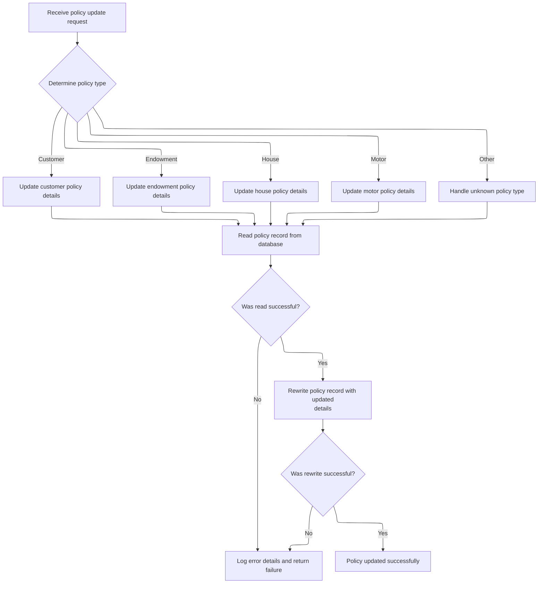
```mermaid
%%{init: {"flowchart": {"defaultRenderer": "elk"}} }%%
flowchart TD
    node1["Receive policy update request"]
    click node1 openCode "base/src/lgupvs01.cbl:97:105"
    node1 --> node2{"Determine policy type"}
    click node2 openCode "base/src/lgupvs01.cbl:106:135"
    node2 -->|"Customer"| node3["Update customer policy details"]
    click node3 openCode "base/src/lgupvs01.cbl:109:111"
    node2 -->|"Endowment"| node4["Update endowment policy details"]
    click node4 openCode "base/src/lgupvs01.cbl:114:118"
    node2 -->|"House"| node5["Update house policy details"]
    click node5 openCode "base/src/lgupvs01.cbl:121:126"
    node2 -->|"Motor"| node6["Update motor policy details"]
    click node6 openCode "base/src/lgupvs01.cbl:128:131"
    node2 -->|"Other"| node7["Handle unknown policy type"]
    click node7 openCode "base/src/lgupvs01.cbl:134:134"
    node3 --> node8["Read policy record from database"]
    node4 --> node8
    node5 --> node8
    node6 --> node8
    node7 --> node8
    click node8 openCode "base/src/lgupvs01.cbl:139:146"
    node8 --> node9{"Was read successful?"}
    click node9 openCode "base/src/lgupvs01.cbl:147:153"
    node9 -->|"Yes"| node10["Rewrite policy record with updated
details"]
    click node10 openCode "base/src/lgupvs01.cbl:155:159"
    node9 -->|"No"| node11["Log error details and return failure"]
    click node11 openCode "base/src/lgupvs01.cbl:150:152"
    node10 --> node12{"Was rewrite successful?"}
    click node12 openCode "base/src/lgupvs01.cbl:160:166"
    node12 -->|"Yes"| node13["Policy updated successfully"]
    click node13 openCode "base/src/lgupvs01.cbl:170:172"
    node12 -->|"No"| node11
classDef HeadingStyle fill:#777777,stroke:#333,stroke-width:2px;

%% Swimm:
%% %%{init: {"flowchart": {"defaultRenderer": "elk"}} }%%
%% flowchart TD
%%     node1["Receive policy update request"]
%%     click node1 openCode "<SwmPath>[base/src/lgupvs01.cbl](base/src/lgupvs01.cbl)</SwmPath>:97:105"
%%     node1 --> node2{"Determine policy type"}
%%     click node2 openCode "<SwmPath>[base/src/lgupvs01.cbl](base/src/lgupvs01.cbl)</SwmPath>:106:135"
%%     node2 -->|"Customer"| node3["Update customer policy details"]
%%     click node3 openCode "<SwmPath>[base/src/lgupvs01.cbl](base/src/lgupvs01.cbl)</SwmPath>:109:111"
%%     node2 -->|"Endowment"| node4["Update endowment policy details"]
%%     click node4 openCode "<SwmPath>[base/src/lgupvs01.cbl](base/src/lgupvs01.cbl)</SwmPath>:114:118"
%%     node2 -->|"House"| node5["Update house policy details"]
%%     click node5 openCode "<SwmPath>[base/src/lgupvs01.cbl](base/src/lgupvs01.cbl)</SwmPath>:121:126"
%%     node2 -->|"Motor"| node6["Update motor policy details"]
%%     click node6 openCode "<SwmPath>[base/src/lgupvs01.cbl](base/src/lgupvs01.cbl)</SwmPath>:128:131"
%%     node2 -->|"Other"| node7["Handle unknown policy type"]
%%     click node7 openCode "<SwmPath>[base/src/lgupvs01.cbl](base/src/lgupvs01.cbl)</SwmPath>:134:134"
%%     node3 --> node8["Read policy record from database"]
%%     node4 --> node8
%%     node5 --> node8
%%     node6 --> node8
%%     node7 --> node8
%%     click node8 openCode "<SwmPath>[base/src/lgupvs01.cbl](base/src/lgupvs01.cbl)</SwmPath>:139:146"
%%     node8 --> node9{"Was read successful?"}
%%     click node9 openCode "<SwmPath>[base/src/lgupvs01.cbl](base/src/lgupvs01.cbl)</SwmPath>:147:153"
%%     node9 -->|"Yes"| node10["Rewrite policy record with updated
%% details"]
%%     click node10 openCode "<SwmPath>[base/src/lgupvs01.cbl](base/src/lgupvs01.cbl)</SwmPath>:155:159"
%%     node9 -->|"No"| node11["Log error details and return failure"]
%%     click node11 openCode "<SwmPath>[base/src/lgupvs01.cbl](base/src/lgupvs01.cbl)</SwmPath>:150:152"
%%     node10 --> node12{"Was rewrite successful?"}
%%     click node12 openCode "<SwmPath>[base/src/lgupvs01.cbl](base/src/lgupvs01.cbl)</SwmPath>:160:166"
%%     node12 -->|"Yes"| node13["Policy updated successfully"]
%%     click node13 openCode "<SwmPath>[base/src/lgupvs01.cbl](base/src/lgupvs01.cbl)</SwmPath>:170:172"
%%     node12 -->|"No"| node11
%% classDef HeadingStyle fill:#777777,stroke:#333,stroke-width:2px;
```

This section updates policy records in the VSAM file based on the type of policy and handles errors by logging details and returning failure codes. It ensures that only valid and recognized policy types are processed and that all errors are captured for audit and troubleshooting.

| Rule ID | Category        | Rule Name                                | Description                                                                                                                                                                                               | Implementation Details                                                                                                                                                                                                                                                                        |
| ------- | --------------- | ---------------------------------------- | --------------------------------------------------------------------------------------------------------------------------------------------------------------------------------------------------------- | --------------------------------------------------------------------------------------------------------------------------------------------------------------------------------------------------------------------------------------------------------------------------------------------- |
| BR-001  | Data validation | Policy record read and error handling    | The system reads the policy record from the database before attempting to update it. If the read fails, an error is logged, a failure code is returned, and the transaction is abended.                   | If the read fails, return code '81' is set and abend code <SwmToken path="base/src/lgupvs01.cbl" pos="151:10:10" line-data="             EXEC CICS ABEND ABCODE(&#39;LGV3&#39;) NODUMP END-EXEC">`LGV3`</SwmToken> is used. Error details and input context are logged for audit purposes.    |
| BR-002  | Data validation | Policy record rewrite and error handling | If the policy record is read successfully, the system rewrites the record with the updated details. If the rewrite fails, an error is logged, a failure code is returned, and the transaction is abended. | If the rewrite fails, return code '82' is set and abend code <SwmToken path="base/src/lgupvs01.cbl" pos="164:10:10" line-data="             EXEC CICS ABEND ABCODE(&#39;LGV4&#39;) NODUMP END-EXEC">`LGV4`</SwmToken> is used. Error details and input context are logged for audit purposes. |
| BR-003  | Decision Making | Policy type mapping                      | The policy update process determines the policy type from the request and maps the relevant input fields to the corresponding policy structure before updating the record.                                | Policy types include Customer, Endowment, House, and Motor. Each type has a defined set of fields that are mapped from the input to the update structure. If the policy type is not recognized, the policy data is set to blank values.                                                       |
| BR-004  | Decision Making | Unknown policy type handling             | If the policy type is not recognized, the policy data is cleared before proceeding.                                                                                                                       | Policy data is set to blank values (spaces) when the type is unknown.                                                                                                                                                                                                                         |
| BR-005  | Writing Output  | Error logging with context               | When an error occurs during read or rewrite, the system logs the error details, including the date, time, customer number, response codes, and input context if available.                                | Error log includes date (MMDDYYYY), time, customer number, response codes, and up to 90 bytes of input context if available. Error details are sent to the LGSTSQ service for logging.                                                                                                        |

<SwmSnippet path="/base/src/lgupvs01.cbl" line="97">

---

MAINLINE in <SwmPath>[base/src/lgupvs01.cbl](base/src/lgupvs01.cbl)</SwmPath> moves commarea fields based on the policy type (using <SwmToken path="base/src/lgupvs01.cbl" pos="102:3:7" line-data="           Move CA-Request-ID(4:1) To WF-Request-ID">`CA-Request-ID`</SwmToken>(4:1)), reads the VSAM file, rewrites it with updated info, and handles errors with arbitrary return codes and abend codes if file operations fail.

```cobol
       MAINLINE SECTION.
      *
      *---------------------------------------------------------------*
           Move EIBCALEN To WS-Commarea-Len.
      *---------------------------------------------------------------*
           Move CA-Request-ID(4:1) To WF-Request-ID
           Move CA-Policy-Num      To WF-Policy-Num
           Move CA-Customer-Num    To WF-Customer-Num

           Evaluate WF-Request-ID

             When 'C'
               Move CA-B-Postcode  To WF-B-Postcode
               Move CA-B-Status    To WF-B-Status
               Move CA-B-Customer  To WF-B-Customer

             When 'E'
               Move CA-E-WITH-PROFITS To  WF-E-WITH-PROFITS
               Move CA-E-EQUITIES     To  WF-E-EQUITIES
               Move CA-E-MANAGED-FUND To  WF-E-MANAGED-FUND
               Move CA-E-FUND-NAME    To  WF-E-FUND-NAME
               Move CA-E-LIFE-ASSURED To  WF-E-LIFE-ASSURED

             When 'H'
               Move CA-H-PROPERTY-TYPE To  WF-H-PROPERTY-TYPE
               Move CA-H-BEDROOMS      To  WF-H-BEDROOMS
               Move CA-H-VALUE         To  WF-H-VALUE
               Move CA-H-POSTCODE      To  WF-H-POSTCODE
               Move CA-H-HOUSE-NAME    To  WF-H-HOUSE-NAME

             When 'M'
               Move CA-M-MAKE          To  WF-M-MAKE
               Move CA-M-MODEL         To  WF-M-MODEL
               Move CA-M-VALUE         To  WF-M-VALUE
               Move CA-M-REGNUMBER     To  WF-M-REGNUMBER

             When Other
               Move Spaces To WF-Policy-Data
           End-Evaluate

           Move CA-Policy-Num      To WF-Policy-Num
      *---------------------------------------------------------------*
           Exec CICS Read File('KSDSPOLY')
                     Into(WS-FileIn)
                     Length(WS-Commarea-Len)
                     Ridfld(WF-Policy-Key)
                     KeyLength(21)
                     RESP(WS-RESP)
                     Update
           End-Exec.
           If WS-RESP Not = DFHRESP(NORMAL)
             Move EIBRESP2 To WS-RESP2
             MOVE '81' TO CA-RETURN-CODE
             PERFORM WRITE-ERROR-MESSAGE
             EXEC CICS ABEND ABCODE('LGV3') NODUMP END-EXEC
             EXEC CICS RETURN END-EXEC
           End-If.
      *---------------------------------------------------------------*
           Exec CICS ReWrite File('KSDSPOLY')
                     From(WF-Policy-Info)
                     Length(WS-Commarea-LenF)
                     RESP(WS-RESP)
           End-Exec.
           If WS-RESP Not = DFHRESP(NORMAL)
             Move EIBRESP2 To WS-RESP2
             MOVE '82' TO CA-RETURN-CODE
             PERFORM WRITE-ERROR-MESSAGE
             EXEC CICS ABEND ABCODE('LGV4') NODUMP END-EXEC
             EXEC CICS RETURN END-EXEC
           End-If.
```

---

</SwmSnippet>

<SwmSnippet path="/base/src/lgupvs01.cbl" line="174">

---

<SwmToken path="base/src/lgupvs01.cbl" pos="174:1:5" line-data="       WRITE-ERROR-MESSAGE.">`WRITE-ERROR-MESSAGE`</SwmToken> grabs the current time, fills out error fields, then calls LGSTSQ with the error message. If EIBCALEN is set, it moves up to 90 bytes from DFHCOMMAREA and calls LGSTSQ again with that data, so both error and input context are logged.

```cobol
       WRITE-ERROR-MESSAGE.
           EXEC CICS ASKTIME ABSTIME(WS-ABSTIME)
           END-EXEC
           EXEC CICS FORMATTIME ABSTIME(WS-ABSTIME)
                     MMDDYYYY(WS-DATE)
                     TIME(WS-TIME)
           END-EXEC
      *
           MOVE WS-DATE TO EM-DATE
           MOVE WS-TIME TO EM-TIME
           Move CA-Customer-Num To EM-Cusnum
           Move WS-RESP         To EM-RespRC
           Move WS-RESP2        To EM-Resp2RC
           EXEC CICS LINK PROGRAM('LGSTSQ')
                     COMMAREA(ERROR-MSG)
                     LENGTH(LENGTH OF ERROR-MSG)
           END-EXEC.
           IF EIBCALEN > 0 THEN
             IF EIBCALEN < 91 THEN
               MOVE DFHCOMMAREA(1:EIBCALEN) TO CA-DATA
               EXEC CICS LINK PROGRAM('LGSTSQ')
                         COMMAREA(CA-ERROR-MSG)
                         LENGTH(Length Of CA-ERROR-MSG)
               END-EXEC
             ELSE
               MOVE DFHCOMMAREA(1:90) TO CA-DATA
               EXEC CICS LINK PROGRAM('LGSTSQ')
                         COMMAREA(CA-ERROR-MSG)
                         LENGTH(Length Of CA-ERROR-MSG)
               END-EXEC
             END-IF
           END-IF.
           EXIT.
```

---

</SwmSnippet>

<SwmSnippet path="/base/src/lgupvs01.cbl" line="170">

---

<SwmToken path="base/src/lgupvs01.cbl" pos="170:1:3" line-data="       A-EXIT.">`A-EXIT`</SwmToken> here is just a label with EXIT and GOBACK—no logic, just marks the end of the section and returns control.

```cobol
       A-EXIT.
           EXIT.
           GOBACK.
```

---

</SwmSnippet>

## Post-Update Return Code Handling in Menu

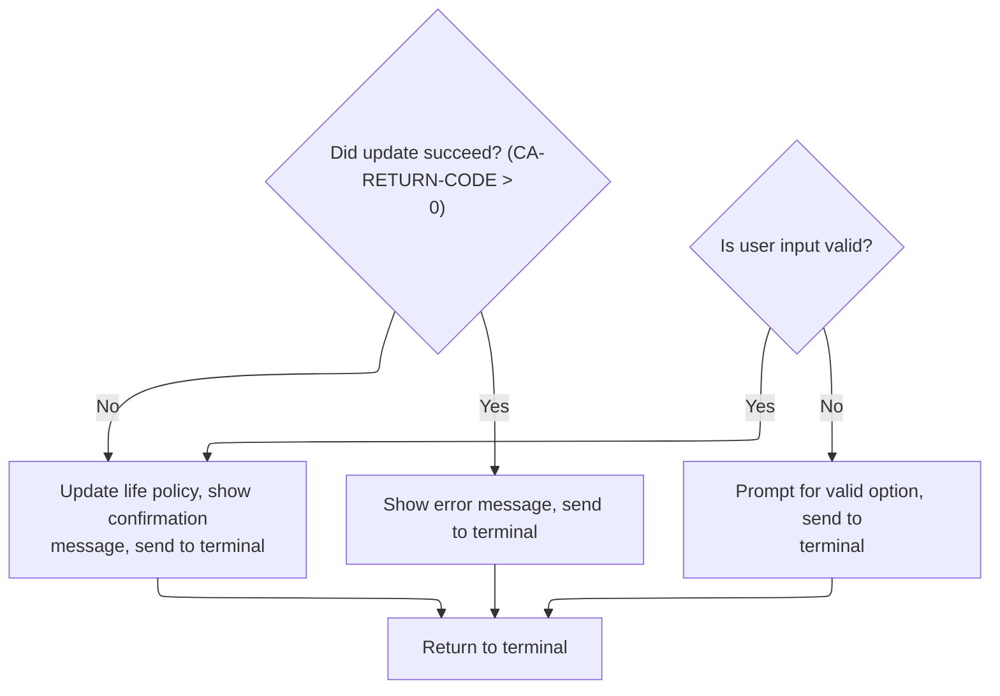
```mermaid
%%{init: {"flowchart": {"defaultRenderer": "elk"}} }%%
flowchart TD
    node1{"Did update succeed? (CA-RETURN-CODE >
0)"}
    click node1 openCode "base/src/lgtestp2.cbl:202:204"
    node1 -->|"No"| node2["Update life policy, show confirmation
message, send to terminal"]
    click node2 openCode "base/src/lgtestp2.cbl:206:214"
    node1 -->|"Yes"| node3["Show error message, send to terminal"]
    click node3 openCode "base/src/lgtestp2.cbl:278:280"
    node4{"Is user input valid?"}
    click node4 openCode "base/src/lgtestp2.cbl:218:221"
    node4 -->|"Yes"| node2
    node4 -->|"No"| node5["Prompt for valid option, send to
terminal"]
    click node5 openCode "base/src/lgtestp2.cbl:220:229"
    node2 --> node6["Return to terminal"]
    click node6 openCode "base/src/lgtestp2.cbl:236:237"
    node3 --> node6
    node5 --> node6
classDef HeadingStyle fill:#777777,stroke:#333,stroke-width:2px;

%% Swimm:
%% %%{init: {"flowchart": {"defaultRenderer": "elk"}} }%%
%% flowchart TD
%%     node1{"Did update succeed? (<SwmToken path="base/src/lgtestp2.cbl" pos="71:3:7" line-data="                 IF CA-RETURN-CODE &gt; 0">`CA-RETURN-CODE`</SwmToken> >
%% 0)"}
%%     click node1 openCode "<SwmPath>[base/src/lgtestp2.cbl](base/src/lgtestp2.cbl)</SwmPath>:202:204"
%%     node1 -->|"No"| node2["Update life policy, show confirmation
%% message, send to terminal"]
%%     click node2 openCode "<SwmPath>[base/src/lgtestp2.cbl](base/src/lgtestp2.cbl)</SwmPath>:206:214"
%%     node1 -->|"Yes"| node3["Show error message, send to terminal"]
%%     click node3 openCode "<SwmPath>[base/src/lgtestp2.cbl](base/src/lgtestp2.cbl)</SwmPath>:278:280"
%%     node4{"Is user input valid?"}
%%     click node4 openCode "<SwmPath>[base/src/lgtestp2.cbl](base/src/lgtestp2.cbl)</SwmPath>:218:221"
%%     node4 -->|"Yes"| node2
%%     node4 -->|"No"| node5["Prompt for valid option, send to
%% terminal"]
%%     click node5 openCode "<SwmPath>[base/src/lgtestp2.cbl](base/src/lgtestp2.cbl)</SwmPath>:220:229"
%%     node2 --> node6["Return to terminal"]
%%     click node6 openCode "<SwmPath>[base/src/lgtestp2.cbl](base/src/lgtestp2.cbl)</SwmPath>:236:237"
%%     node3 --> node6
%%     node5 --> node6
%% classDef HeadingStyle fill:#777777,stroke:#333,stroke-width:2px;
```

This section governs how the menu responds to the outcome of a life policy update operation. It ensures users receive clear feedback on update success or failure and guides them to correct invalid menu selections.

| Rule ID | Category        | Rule Name                | Description                                                                                                                                                                                                                     | Implementation Details                                                                                                                                                                                                                                                                                                                                                                                                                 |
| ------- | --------------- | ------------------------ | ------------------------------------------------------------------------------------------------------------------------------------------------------------------------------------------------------------------------------- | -------------------------------------------------------------------------------------------------------------------------------------------------------------------------------------------------------------------------------------------------------------------------------------------------------------------------------------------------------------------------------------------------------------------------------------- |
| BR-001  | Data validation | Invalid Option Prompt    | If the user enters an invalid menu option, display the message 'Please enter a valid option', reset the option input field, and prompt the user for a valid selection.                                                          | The error message displayed is 'Please enter a valid option' (string, left-aligned, no padding specified). The option input field is reset to -1. The menu is sent to the terminal with the cursor positioned for further input.                                                                                                                                                                                                       |
| BR-002  | Decision Making | Update Failure Messaging | If the update operation fails (return code greater than zero), display an error message 'Error Updating Life Policy' to the user and reset the menu.                                                                            | The error message displayed is 'Error Updating Life Policy' (string, left-aligned, no padding specified). The menu is reset and the error is shown to the user.                                                                                                                                                                                                                                                                        |
| BR-003  | Decision Making | Update Success Messaging | If the update operation succeeds (return code is zero), display a success message 'Life Policy Updated', update the customer and policy numbers in the menu, clear the option input, and send the updated menu to the terminal. | The success message displayed is 'Life Policy Updated' (string, left-aligned, no padding specified). Customer and policy numbers are updated in the menu fields. The option input field is cleared (set to blank). The updated menu is sent to the terminal using the <SwmToken path="base/src/lgtestp2.cbl" pos="42:11:11" line-data="           EXEC CICS SEND MAP (&#39;SSMAPP2&#39;)">`SSMAPP2`</SwmToken> map and 'SSMAP' mapset. |

<SwmSnippet path="/base/src/lgtestp2.cbl" line="202">

---

After returning from <SwmToken path="base/src/lgtestp2.cbl" pos="198:10:10" line-data="                 EXEC CICS LINK PROGRAM(&#39;LGUPOL01&#39;)">`LGUPOL01`</SwmToken>, <SwmToken path="base/src/lgtestp2.cbl" pos="33:5:7" line-data="              GO TO A-GAIN.">`A-GAIN`</SwmToken> checks <SwmToken path="base/src/lgtestp2.cbl" pos="202:3:7" line-data="                 IF CA-RETURN-CODE &gt; 0">`CA-RETURN-CODE`</SwmToken>. If it's non-zero, it jumps to <SwmToken path="base/src/lgtestp2.cbl" pos="203:5:7" line-data="                   GO TO NO-UPD">`NO-UPD`</SwmToken> to handle the update failure and show an error message to the user.

```cobol
                 IF CA-RETURN-CODE > 0
                   GO TO NO-UPD
                 END-IF
```

---

</SwmSnippet>

<SwmSnippet path="/base/src/lgtestp2.cbl" line="278">

---

<SwmToken path="base/src/lgtestp2.cbl" pos="278:1:3" line-data="       NO-UPD.">`NO-UPD`</SwmToken> sets 'Error Updating Life Policy' in the menu message field and jumps to <SwmToken path="base/src/lgtestp2.cbl" pos="280:5:7" line-data="           Go To ERROR-OUT.">`ERROR-OUT`</SwmToken>, which resets the menu and shows the error to the user.

```cobol
       NO-UPD.
           Move 'Error Updating Life Policy'       To  ERP2FLDO
           Go To ERROR-OUT.
```

---

</SwmSnippet>

<SwmSnippet path="/base/src/lgtestp2.cbl" line="206">

---

Back in <SwmToken path="base/src/lgtestp2.cbl" pos="33:5:7" line-data="              GO TO A-GAIN.">`A-GAIN`</SwmToken>, after a successful update, the code moves the updated customer and policy numbers to the menu fields, clears the option input, sets a success message, and sends the updated map to the terminal. These constants (<SwmToken path="base/src/lgtestp2.cbl" pos="184:4:4" line-data="                 Move &#39;01UEND&#39;          To CA-REQUEST-ID">`01UEND`</SwmToken>, 'Life Policy Updated') are repo-specific and drive both backend logic and user feedback.

```cobol
                 Move CA-CUSTOMER-NUM To ENP2CNOI
                 Move CA-POLICY-NUM   To ENP2PNOI
                 Move ' '             To ENP2OPTI
                 Move 'Life Policy Updated'
                   To  ERP2FLDO
                 EXEC CICS SEND MAP ('SSMAPP2')
                           FROM(SSMAPP2O)
                           MAPSET ('SSMAP')
                 END-EXEC
```

---

</SwmSnippet>

<SwmSnippet path="/base/src/lgtestp2.cbl" line="218">

---

<SwmToken path="base/src/lgtestp2.cbl" pos="33:5:7" line-data="              GO TO A-GAIN.">`A-GAIN`</SwmToken> wraps up by handling menu options via EVALUATE, prepping commarea and calling backend programs for each operation. If the user enters an invalid option, it sets an error message, resets the menu, and returns control. The flow relies on hidden assumptions about input and commarea structure that aren't obvious from the code.

```cobol
             WHEN OTHER

                 Move 'Please enter a valid option'
                   To  ERP2FLDO
                 Move -1 To ENP2OPTL

                 EXEC CICS SEND MAP ('SSMAPP2')
                           FROM(SSMAPP2O)
                           MAPSET ('SSMAP')
                           CURSOR
                 END-EXEC
                 GO TO ENDIT-STARTIT

           END-EVALUATE.


      *    Send message to terminal and return

           EXEC CICS RETURN
           END-EXEC.
```

---

</SwmSnippet>

&nbsp;

*This is an auto-generated document by Swimm 🌊 and has not yet been verified by a human*

<SwmMeta version="3.0.0" repo-id="Z2l0aHViJTNBJTNBU3dpbW1pby1nZW5hcHAtaG91c2UlM0ElM0FHaXJpLVN3aW1t" repo-name="Swimmio-genapp-house"><sup>Powered by [Swimm](https://app.swimm.io/)</sup></SwmMeta>
