# Overview

This document describes the flow for managing house insurance policies through a menu-driven interface. Users can inquire about, add, delete, or update house policy records. Each operation routes the request to backend workflows that update or retrieve policy data in <SwmToken path="base/src/lgipdb01.cbl" pos="242:5:5" line-data="      * initialize DB2 host variables">`DB2`</SwmToken> and VSAM, and the system provides confirmation or error messages to guide the user.

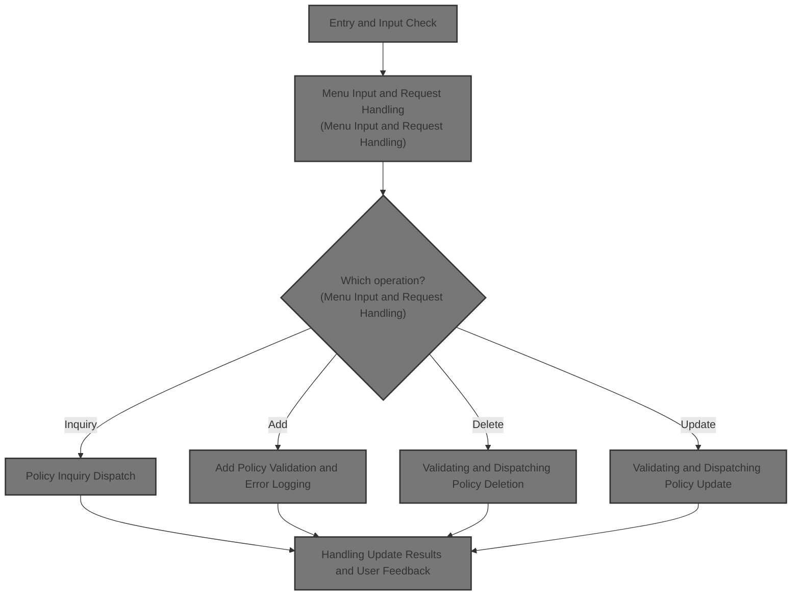
```mermaid
flowchart TD
    node1["Entry and Input Check"]:::HeadingStyle --> node2["Menu Input and Request Handling
(Menu Input and Request Handling)"]:::HeadingStyle
    node2 --> node3{"Which operation?
(Menu Input and Request Handling)"}:::HeadingStyle
    node3 -->|"Inquiry"| node4["Policy Inquiry Dispatch"]:::HeadingStyle
    node3 -->|"Add"| node5["Add Policy Validation and Error Logging"]:::HeadingStyle
    node3 -->|"Delete"| node6["Validating and Dispatching Policy Deletion"]:::HeadingStyle
    node3 -->|"Update"| node7["Validating and Dispatching Policy Update"]:::HeadingStyle
    node4 --> node8["Handling Update Results and User Feedback"]:::HeadingStyle
    node5 --> node8
    node6 --> node8
    node7 --> node8

    click node1 goToHeading "Entry and Input Check"
    click node2 goToHeading "Menu Input and Request Handling"
    click node3 goToHeading "Menu Input and Request Handling"
    click node4 goToHeading "Policy Inquiry Dispatch"
    click node5 goToHeading "Add Policy Validation and Error Logging"
    click node6 goToHeading "Validating and Dispatching Policy Deletion"
    click node7 goToHeading "Validating and Dispatching Policy Update"
    click node8 goToHeading "Handling Update Results and User Feedback"
classDef HeadingStyle fill:#777777,stroke:#333,stroke-width:2px;
```

## Dependencies

### Programs

- <SwmToken path="base/src/lgtestp3.cbl" pos="11:6:6" line-data="       PROGRAM-ID. LGTESTP3.">`LGTESTP3`</SwmToken> (<SwmPath>[base/src/lgtestp3.cbl](base/src/lgtestp3.cbl)</SwmPath>)
- <SwmToken path="base/src/lgtestp3.cbl" pos="70:10:10" line-data="                 EXEC CICS LINK PROGRAM(&#39;LGIPOL01&#39;)">`LGIPOL01`</SwmToken> (<SwmPath>[base/src/lgipol01.cbl](base/src/lgipol01.cbl)</SwmPath>)
- <SwmToken path="base/src/lgipol01.cbl" pos="91:9:9" line-data="           EXEC CICS LINK Program(LGIPDB01)">`LGIPDB01`</SwmToken> (<SwmPath>[base/src/lgipdb01.cbl](base/src/lgipdb01.cbl)</SwmPath>)
- LGSTSQ (<SwmPath>[base/src/lgstsq.cbl](base/src/lgstsq.cbl)</SwmPath>)
- <SwmToken path="base/src/lgtestp3.cbl" pos="106:10:10" line-data="                 EXEC CICS LINK PROGRAM(&#39;LGAPOL01&#39;)">`LGAPOL01`</SwmToken> (<SwmPath>[base/src/lgapol01.cbl](base/src/lgapol01.cbl)</SwmPath>)
- <SwmToken path="base/src/lgapol01.cbl" pos="103:9:9" line-data="           EXEC CICS Link Program(LGAPDB01)">`LGAPDB01`</SwmToken> (<SwmPath>[base/src/LGAPDB01.cbl](base/src/LGAPDB01.cbl)</SwmPath>)
- <SwmToken path="base/src/LGAPDB01.cbl" pos="269:4:4" line-data="           CALL &#39;LGAPDB02&#39; USING IN-PROPERTY-TYPE, IN-POSTCODE, ">`LGAPDB02`</SwmToken> (<SwmPath>[base/src/LGAPDB02.cbl](base/src/LGAPDB02.cbl)</SwmPath>)
- <SwmToken path="base/src/LGAPDB01.cbl" pos="276:4:4" line-data="           CALL &#39;LGAPDB03&#39; USING WS-BASE-RISK-SCR, IN-FIRE-PERIL, ">`LGAPDB03`</SwmToken> (<SwmPath>[base/src/LGAPDB03.cbl](base/src/LGAPDB03.cbl)</SwmPath>)
- <SwmToken path="base/src/LGAPDB01.cbl" pos="313:4:4" line-data="               CALL &#39;LGAPDB04&#39; USING LK-INPUT-DATA, LK-COVERAGE-DATA, ">`LGAPDB04`</SwmToken> (<SwmPath>[base/src/LGAPDB04.cbl](base/src/LGAPDB04.cbl)</SwmPath>)
- <SwmToken path="base/src/lgtestp3.cbl" pos="129:10:10" line-data="                 EXEC CICS LINK PROGRAM(&#39;LGDPOL01&#39;)">`LGDPOL01`</SwmToken> (<SwmPath>[base/src/lgdpol01.cbl](base/src/lgdpol01.cbl)</SwmPath>)
- <SwmToken path="base/src/lgdpol01.cbl" pos="141:9:9" line-data="           EXEC CICS LINK PROGRAM(LGDPDB01)">`LGDPDB01`</SwmToken> (<SwmPath>[base/src/lgdpdb01.cbl](base/src/lgdpdb01.cbl)</SwmPath>)
- <SwmToken path="base/src/lgdpdb01.cbl" pos="168:9:9" line-data="               EXEC CICS LINK PROGRAM(LGDPVS01)">`LGDPVS01`</SwmToken> (<SwmPath>[base/src/lgdpvs01.cbl](base/src/lgdpvs01.cbl)</SwmPath>)
- <SwmToken path="base/src/lgtestp3.cbl" pos="196:10:10" line-data="                 EXEC CICS LINK PROGRAM(&#39;LGUPOL01&#39;)">`LGUPOL01`</SwmToken> (<SwmPath>[base/src/lgupol01.cbl](base/src/lgupol01.cbl)</SwmPath>)
- <SwmToken path="base/src/lgupol01.cbl" pos="157:9:9" line-data="           EXEC CICS LINK Program(LGUPDB01)">`LGUPDB01`</SwmToken> (<SwmPath>[base/src/lgupdb01.cbl](base/src/lgupdb01.cbl)</SwmPath>)
- <SwmToken path="base/src/lgupdb01.cbl" pos="209:9:9" line-data="           EXEC CICS LINK Program(LGUPVS01)">`LGUPVS01`</SwmToken> (<SwmPath>[base/src/lgupvs01.cbl](base/src/lgupvs01.cbl)</SwmPath>)
- <SwmToken path="base/src/lgtestp3.cbl" pos="240:4:4" line-data="                TRANSID(&#39;SSP3&#39;)">`SSP3`</SwmToken>

### Copybooks

- SQLCA
- LGPOLICY (<SwmPath>[base/src/lgpolicy.cpy](base/src/lgpolicy.cpy)</SwmPath>)
- LGCMAREA (<SwmPath>[base/src/lgcmarea.cpy](base/src/lgcmarea.cpy)</SwmPath>)
- <SwmToken path="base/src/LGAPDB01.cbl" pos="35:3:3" line-data="           COPY INPUTREC2.">`INPUTREC2`</SwmToken> (<SwmPath>[base/src/INPUTREC2.cpy](base/src/INPUTREC2.cpy)</SwmPath>)
- OUTPUTREC (<SwmPath>[base/src/OUTPUTREC.cpy](base/src/OUTPUTREC.cpy)</SwmPath>)
- WORKSTOR (<SwmPath>[base/src/WORKSTOR.cpy](base/src/WORKSTOR.cpy)</SwmPath>)
- LGAPACT (<SwmPath>[base/src/LGAPACT.cpy](base/src/LGAPACT.cpy)</SwmPath>)
- SSMAP

## Input and Output Tables/Files used

### <SwmToken path="base/src/LGAPDB01.cbl" pos="269:4:4" line-data="           CALL &#39;LGAPDB02&#39; USING IN-PROPERTY-TYPE, IN-POSTCODE, ">`LGAPDB02`</SwmToken> (<SwmPath>[base/src/LGAPDB02.cbl](base/src/LGAPDB02.cbl)</SwmPath>)

| Table / File Name | Type                                                                                                                    | Description                                                  | Usage Mode | Key Fields / Layout Highlights      |
| ----------------- | ----------------------------------------------------------------------------------------------------------------------- | ------------------------------------------------------------ | ---------- | ----------------------------------- |
| RISK_FACTORS      | <SwmToken path="base/src/lgipdb01.cbl" pos="242:5:5" line-data="      * initialize DB2 host variables">`DB2`</SwmToken> | Peril-specific risk adjustment factors for insurance scoring | Input      | `WS-FIRE-FACTOR`, `WS-CRIME-FACTOR` |

### <SwmToken path="base/src/LGAPDB01.cbl" pos="276:4:4" line-data="           CALL &#39;LGAPDB03&#39; USING WS-BASE-RISK-SCR, IN-FIRE-PERIL, ">`LGAPDB03`</SwmToken> (<SwmPath>[base/src/LGAPDB03.cbl](base/src/LGAPDB03.cbl)</SwmPath>)

| Table / File Name | Type                                                                                                                    | Description                                                    | Usage Mode | Key Fields / Layout Highlights      |
| ----------------- | ----------------------------------------------------------------------------------------------------------------------- | -------------------------------------------------------------- | ---------- | ----------------------------------- |
| RISK_FACTORS      | <SwmToken path="base/src/lgipdb01.cbl" pos="242:5:5" line-data="      * initialize DB2 host variables">`DB2`</SwmToken> | Peril-specific risk adjustment factors for premium calculation | Input      | `WS-FIRE-FACTOR`, `WS-CRIME-FACTOR` |

### <SwmToken path="base/src/LGAPDB01.cbl" pos="313:4:4" line-data="               CALL &#39;LGAPDB04&#39; USING LK-INPUT-DATA, LK-COVERAGE-DATA, ">`LGAPDB04`</SwmToken> (<SwmPath>[base/src/LGAPDB04.cbl](base/src/LGAPDB04.cbl)</SwmPath>)

| Table / File Name | Type                                                                                                                    | Description                                                  | Usage Mode | Key Fields / Layout Highlights                                                                                                                                                                           |
| ----------------- | ----------------------------------------------------------------------------------------------------------------------- | ------------------------------------------------------------ | ---------- | -------------------------------------------------------------------------------------------------------------------------------------------------------------------------------------------------------- |
| RATE_MASTER       | <SwmToken path="base/src/lgipdb01.cbl" pos="242:5:5" line-data="      * initialize DB2 host variables">`DB2`</SwmToken> | Property insurance base rates by peril, territory, and dates | Input      | `BASE_RATE`, <SwmToken path="base/src/LGAPDB01.cbl" pos="132:4:4" line-data="           MOVE &#39;MIN_PREMIUM&#39; TO CONFIG-KEY">`MIN_PREMIUM`</SwmToken>, `WS-BASE-RATE`, `WS-MIN-PREM`, `WS-MAX-PREM` |

### <SwmToken path="base/src/lgipol01.cbl" pos="91:9:9" line-data="           EXEC CICS LINK Program(LGIPDB01)">`LGIPDB01`</SwmToken> (<SwmPath>[base/src/lgipdb01.cbl](base/src/lgipdb01.cbl)</SwmPath>)

| Table / File Name | Type                                                                                                                    | Description                                                           | Usage Mode | Key Fields / Layout Highlights                                                                                                                                                                                                                                                                                                                                                                                                                                                                                                                                                                                                                                                                                                                                                                                                                                                                                                                                                                                                                                                                                                                                                                                                                                                                                                                                                                                                                                                                                                                                                                                                                                                                                                                                                                                                                                                                                                                                                                                                                                                                                                                                                                                                                                                                                                                                                                                                                                                                                                                                                                                                                                                                                                                                                                                                                                                                                                                                                                                                                                                                                                                                                                                                                                                                                                                                                                                                                                                                                                                                                                                                                                                                                                                                                                                                                                                                                                                                                                                                                                                                                                                                                                                                                                                                                                                                                                                                                                                                                                                                                                                                                                                                                                                                                                                                                                                                                                                                                                                                                                                                                                                                                                                                                                                                                                                                                                                                                                                                                                                                                                                                                                                                                                                                                                                                                                                                                                                                                                                                                                                                                                                                                                                                                                                                                                                                                                                                                                                                                                                                                                                                                                                                                                                                                                                                                                                                                                                                                                                                                                                                                                                                                                                                                                                                                                                                                                                                                                                                                                                                                                                                                                                                                                                                                                                                                                                                                                                                                                                                                                                                                                                                                                                                                                                                                                                                                                                                                                                                                                                                                                                                                                                                                                                                                                                                                                                                                                                                                                                                                                                                                                                                                                                                                                                                                                                                                                                                                                                                                                                                                                                                                                                                                                                                                                                                                                                                                                                                                                                                                                                                                                                                                                                                                                                                                                                                                                                                                                                                                                                                                                                                                                                                                                                                                                                                                                                                                                                                                                                                                                                                                                                                                                                                                                                                                                                                                                                                                                                                                                                                                                                                                                                                                                                                                                                                                                                                                                                                                                                                                                                                                                                                                                                                                                                                                                                                                                                                                                                                                                                                                                                                                                                                                                                                                                                                                                                                                                                                                                                                                                                                    |
| ----------------- | ----------------------------------------------------------------------------------------------------------------------- | --------------------------------------------------------------------- | ---------- | ------------------------------------------------------------------------------------------------------------------------------------------------------------------------------------------------------------------------------------------------------------------------------------------------------------------------------------------------------------------------------------------------------------------------------------------------------------------------------------------------------------------------------------------------------------------------------------------------------------------------------------------------------------------------------------------------------------------------------------------------------------------------------------------------------------------------------------------------------------------------------------------------------------------------------------------------------------------------------------------------------------------------------------------------------------------------------------------------------------------------------------------------------------------------------------------------------------------------------------------------------------------------------------------------------------------------------------------------------------------------------------------------------------------------------------------------------------------------------------------------------------------------------------------------------------------------------------------------------------------------------------------------------------------------------------------------------------------------------------------------------------------------------------------------------------------------------------------------------------------------------------------------------------------------------------------------------------------------------------------------------------------------------------------------------------------------------------------------------------------------------------------------------------------------------------------------------------------------------------------------------------------------------------------------------------------------------------------------------------------------------------------------------------------------------------------------------------------------------------------------------------------------------------------------------------------------------------------------------------------------------------------------------------------------------------------------------------------------------------------------------------------------------------------------------------------------------------------------------------------------------------------------------------------------------------------------------------------------------------------------------------------------------------------------------------------------------------------------------------------------------------------------------------------------------------------------------------------------------------------------------------------------------------------------------------------------------------------------------------------------------------------------------------------------------------------------------------------------------------------------------------------------------------------------------------------------------------------------------------------------------------------------------------------------------------------------------------------------------------------------------------------------------------------------------------------------------------------------------------------------------------------------------------------------------------------------------------------------------------------------------------------------------------------------------------------------------------------------------------------------------------------------------------------------------------------------------------------------------------------------------------------------------------------------------------------------------------------------------------------------------------------------------------------------------------------------------------------------------------------------------------------------------------------------------------------------------------------------------------------------------------------------------------------------------------------------------------------------------------------------------------------------------------------------------------------------------------------------------------------------------------------------------------------------------------------------------------------------------------------------------------------------------------------------------------------------------------------------------------------------------------------------------------------------------------------------------------------------------------------------------------------------------------------------------------------------------------------------------------------------------------------------------------------------------------------------------------------------------------------------------------------------------------------------------------------------------------------------------------------------------------------------------------------------------------------------------------------------------------------------------------------------------------------------------------------------------------------------------------------------------------------------------------------------------------------------------------------------------------------------------------------------------------------------------------------------------------------------------------------------------------------------------------------------------------------------------------------------------------------------------------------------------------------------------------------------------------------------------------------------------------------------------------------------------------------------------------------------------------------------------------------------------------------------------------------------------------------------------------------------------------------------------------------------------------------------------------------------------------------------------------------------------------------------------------------------------------------------------------------------------------------------------------------------------------------------------------------------------------------------------------------------------------------------------------------------------------------------------------------------------------------------------------------------------------------------------------------------------------------------------------------------------------------------------------------------------------------------------------------------------------------------------------------------------------------------------------------------------------------------------------------------------------------------------------------------------------------------------------------------------------------------------------------------------------------------------------------------------------------------------------------------------------------------------------------------------------------------------------------------------------------------------------------------------------------------------------------------------------------------------------------------------------------------------------------------------------------------------------------------------------------------------------------------------------------------------------------------------------------------------------------------------------------------------------------------------------------------------------------------------------------------------------------------------------------------------------------------------------------------------------------------------------------------------------------------------------------------------------------------------------------------------------------------------------------------------------------------------------------------------------------------------------------------------------------------------------------------------------------------------------------------------------------------------------------------------------------------------------------------------------------------------------------------------------------------------------------------------------------------------------------------------------------------------------------------------------------------------------------------------------------------------------------------------------------------------------------------------------------------------------------------------------------------------------------------------------------------------------------------------------------------------------------------------------------------------------------------------------------------------------------------------------------------------------------------------------------------------------------------------------------------------------------------------------------------------------------------------------------------------------------------------------------------------------------------------------------------------------------------------------------------------------------------------------------------------------------------------------------------------------------------------------------------------------------------------------------------------------------------------------------------------------------------------------------------------------------------------------------------------------------------------------------------------------------------------------------------------------------------------------------------------------------------------------------------------------------------------------------------------------------------------------------------------------------------------------------------------------------------------------------------------------------------------------------------------------------------------------------------------------------------------------------------------------------------------------------------------------------------------------------------------------------------------------------------------------------------------------------------------------------------------------------------------------------------------------------------------------------------------------------------------------------------------------------------------------------------------------------------------------------------------------------------------------------------------------------------------------------------------------------------------------------------------------------------------------------------------------------------------------------------------------------------------------------------------------------------------------------------------------------------------------------------------------------------------------------------------------------------------------------------------------------------------------------------------------------------------------------------------------------------------------------------------------------------------------------------------------------------------------------------------------------------------------------------------------------------------------------------------------------------------------------------------------------------------------------------------------------------------------------------------------------------------------------------------------------------------------------------------------------------------------------------------------------------------------------------------------------------------------------------------------------------------------------------------------------------------------------------------------------------------------------------------------------------------------------------------------------------------------------------------------------------------------------------------------------------------------------------------------------------------------------------------------------------------------------------- |
| POLICY            | <SwmToken path="base/src/lgipdb01.cbl" pos="242:5:5" line-data="      * initialize DB2 host variables">`DB2`</SwmToken> | Insurance policy master data, including type, dates, broker, payment. | Input      | <SwmToken path="base/src/lgipdb01.cbl" pos="92:1:1" line-data="                   CustomerNumber,">`CustomerNumber`</SwmToken>, <SwmToken path="base/src/lgipdb01.cbl" pos="93:3:3" line-data="                   Policy.PolicyNumber,">`PolicyNumber`</SwmToken>, <SwmToken path="base/src/lgipdb01.cbl" pos="94:1:1" line-data="                   RequestDate,">`RequestDate`</SwmToken>, <SwmToken path="base/src/lgipdb01.cbl" pos="95:1:1" line-data="                   StartDate,">`StartDate`</SwmToken>, <SwmToken path="base/src/lgipdb01.cbl" pos="96:1:1" line-data="                   RenewalDate,">`RenewalDate`</SwmToken>, <SwmToken path="base/src/lgipdb01.cbl" pos="97:1:1" line-data="                   Address,">`Address`</SwmToken>, <SwmToken path="base/src/lgipdb01.cbl" pos="98:1:1" line-data="                   Zipcode,">`Zipcode`</SwmToken>, <SwmToken path="base/src/lgipdb01.cbl" pos="99:1:1" line-data="                   LatitudeN,">`LatitudeN`</SwmToken>, <SwmToken path="base/src/lgipdb01.cbl" pos="100:1:1" line-data="                   LongitudeW,">`LongitudeW`</SwmToken>, <SwmToken path="base/src/lgtestp3.cbl" pos="270:4:4" line-data="               Move &#39;Customer does not exist&#39;          To  ERP1FLDO">`Customer`</SwmToken>, <SwmToken path="base/src/lgipdb01.cbl" pos="102:1:1" line-data="                   PropertyType,">`PropertyType`</SwmToken>, <SwmToken path="base/src/lgipdb01.cbl" pos="103:1:1" line-data="                   FirePeril,">`FirePeril`</SwmToken>, <SwmToken path="base/src/lgipdb01.cbl" pos="104:1:1" line-data="                   FirePremium,">`FirePremium`</SwmToken>, <SwmToken path="base/src/lgipdb01.cbl" pos="105:1:1" line-data="                   CrimePeril,">`CrimePeril`</SwmToken>, <SwmToken path="base/src/lgipdb01.cbl" pos="106:1:1" line-data="                   CrimePremium,">`CrimePremium`</SwmToken>, <SwmToken path="base/src/lgipdb01.cbl" pos="107:1:1" line-data="                   FloodPeril,">`FloodPeril`</SwmToken>, <SwmToken path="base/src/lgipdb01.cbl" pos="108:1:1" line-data="                   FloodPremium,">`FloodPremium`</SwmToken>, <SwmToken path="base/src/lgipdb01.cbl" pos="109:1:1" line-data="                   WeatherPeril,">`WeatherPeril`</SwmToken>, <SwmToken path="base/src/lgipdb01.cbl" pos="110:1:1" line-data="                   WeatherPremium,">`WeatherPremium`</SwmToken>, <SwmToken path="base/src/lgupvs01.cbl" pos="110:7:7" line-data="               Move CA-B-Status    To WF-B-Status">`Status`</SwmToken>, <SwmToken path="base/src/lgipdb01.cbl" pos="112:1:1" line-data="                   RejectionReason">`RejectionReason`</SwmToken>, <SwmToken path="base/src/lgipdb01.cbl" pos="331:3:3" line-data="             SELECT  ISSUEDATE,">`ISSUEDATE`</SwmToken>, <SwmToken path="base/src/lgipdb01.cbl" pos="332:1:1" line-data="                     EXPIRYDATE,">`EXPIRYDATE`</SwmToken>, <SwmToken path="base/src/lgipdb01.cbl" pos="333:1:1" line-data="                     LASTCHANGED,">`LASTCHANGED`</SwmToken>, <SwmToken path="base/src/lgtestp3.cbl" pos="96:9:9" line-data="                 Move 0                 To CA-BROKERID">`BROKERID`</SwmToken>, <SwmToken path="base/src/lgipdb01.cbl" pos="335:1:1" line-data="                     BROKERSREFERENCE,">`BROKERSREFERENCE`</SwmToken>, <SwmToken path="base/src/lgtestp3.cbl" pos="95:9:9" line-data="                 Move 0                 To CA-PAYMENT">`PAYMENT`</SwmToken>, <SwmToken path="base/src/lgipdb01.cbl" pos="337:1:1" line-data="                     WITHPROFITS,">`WITHPROFITS`</SwmToken>, <SwmToken path="base/src/lgipdb01.cbl" pos="338:1:1" line-data="                     EQUITIES,">`EQUITIES`</SwmToken>, <SwmToken path="base/src/lgipdb01.cbl" pos="339:1:1" line-data="                     MANAGEDFUND,">`MANAGEDFUND`</SwmToken>, <SwmToken path="base/src/lgipdb01.cbl" pos="340:1:1" line-data="                     FUNDNAME,">`FUNDNAME`</SwmToken>, <SwmToken path="base/src/lgipdb01.cbl" pos="341:1:1" line-data="                     TERM,">`TERM`</SwmToken>, <SwmToken path="base/src/lgipdb01.cbl" pos="342:1:1" line-data="                     SUMASSURED,">`SUMASSURED`</SwmToken>, <SwmToken path="base/src/lgipdb01.cbl" pos="343:1:1" line-data="                     LIFEASSURED,">`LIFEASSURED`</SwmToken>, <SwmToken path="base/src/lgipdb01.cbl" pos="344:1:1" line-data="                     PADDINGDATA,">`PADDINGDATA`</SwmToken>, <SwmToken path="base/src/lgtestp3.cbl" pos="72:1:1" line-data="                           LENGTH(32500)">`LENGTH`</SwmToken>, <SwmToken path="base/src/lgipdb01.cbl" pos="347:2:4" line-data="                   :DB2-EXPIRYDATE,">`DB2-EXPIRYDATE`</SwmToken>, <SwmToken path="base/src/lgipdb01.cbl" pos="348:2:4" line-data="                   :DB2-LASTCHANGED,">`DB2-LASTCHANGED`</SwmToken>, <SwmToken path="base/src/lgipdb01.cbl" pos="349:11:13" line-data="                   :DB2-BROKERID-INT INDICATOR :IND-BROKERID,">`IND-BROKERID`</SwmToken>, <SwmToken path="base/src/lgipdb01.cbl" pos="350:9:11" line-data="                   :DB2-BROKERSREF INDICATOR :IND-BROKERSREF,">`IND-BROKERSREF`</SwmToken>, <SwmToken path="base/src/lgipdb01.cbl" pos="351:11:13" line-data="                   :DB2-PAYMENT-INT INDICATOR :IND-PAYMENT,">`IND-PAYMENT`</SwmToken>, <SwmToken path="base/src/lgipdb01.cbl" pos="352:2:6" line-data="                   :DB2-E-WITHPROFITS,">`DB2-E-WITHPROFITS`</SwmToken>, <SwmToken path="base/src/lgipdb01.cbl" pos="353:2:6" line-data="                   :DB2-E-EQUITIES,">`DB2-E-EQUITIES`</SwmToken>, <SwmToken path="base/src/lgipdb01.cbl" pos="354:2:6" line-data="                   :DB2-E-MANAGEDFUND,">`DB2-E-MANAGEDFUND`</SwmToken>, <SwmToken path="base/src/lgipdb01.cbl" pos="355:2:6" line-data="                   :DB2-E-FUNDNAME,">`DB2-E-FUNDNAME`</SwmToken>, <SwmToken path="base/src/lgipdb01.cbl" pos="356:2:8" line-data="                   :DB2-E-TERM-SINT,">`DB2-E-TERM-SINT`</SwmToken>, <SwmToken path="base/src/lgipdb01.cbl" pos="357:2:8" line-data="                   :DB2-E-SUMASSURED-INT,">`DB2-E-SUMASSURED-INT`</SwmToken>, <SwmToken path="base/src/lgipdb01.cbl" pos="358:2:6" line-data="                   :DB2-E-LIFEASSURED,">`DB2-E-LIFEASSURED`</SwmToken>, <SwmToken path="base/src/lgipdb01.cbl" pos="359:11:15" line-data="                   :DB2-E-PADDINGDATA INDICATOR :IND-E-PADDINGDATA,">`IND-E-PADDINGDATA`</SwmToken>, <SwmToken path="base/src/lgipdb01.cbl" pos="360:13:17" line-data="                   :DB2-E-PADDING-LEN INDICATOR :IND-E-PADDINGDATAL">`IND-E-PADDINGDATAL`</SwmToken>, <SwmToken path="base/src/lgipdb01.cbl" pos="451:1:1" line-data="                     PROPERTYTYPE,">`PROPERTYTYPE`</SwmToken>, <SwmToken path="base/src/lgtestp3.cbl" pos="81:7:7" line-data="                 Move CA-H-BEDROOMS      To  ENP3BEDI">`BEDROOMS`</SwmToken>, <SwmToken path="base/src/lgtestp3.cbl" pos="82:7:7" line-data="                 Move CA-H-VALUE         To  ENP3VALI">`VALUE`</SwmToken>, <SwmToken path="base/src/lgipdb01.cbl" pos="454:1:1" line-data="                     HOUSENAME,">`HOUSENAME`</SwmToken>, <SwmToken path="base/src/lgipdb01.cbl" pos="455:1:1" line-data="                     HOUSENUMBER,">`HOUSENUMBER`</SwmToken>, <SwmToken path="base/src/lgipdb01.cbl" pos="346:4:6" line-data="             INTO  :DB2-ISSUEDATE,">`DB2-ISSUEDATE`</SwmToken>, <SwmToken path="base/src/lgipdb01.cbl" pos="463:2:6" line-data="                   :DB2-H-PROPERTYTYPE,">`DB2-H-PROPERTYTYPE`</SwmToken>, <SwmToken path="base/src/lgipdb01.cbl" pos="464:2:8" line-data="                   :DB2-H-BEDROOMS-SINT,">`DB2-H-BEDROOMS-SINT`</SwmToken>, <SwmToken path="base/src/lgipdb01.cbl" pos="465:2:8" line-data="                   :DB2-H-VALUE-INT,">`DB2-H-VALUE-INT`</SwmToken>, <SwmToken path="base/src/lgipdb01.cbl" pos="466:2:6" line-data="                   :DB2-H-HOUSENAME,">`DB2-H-HOUSENAME`</SwmToken>, <SwmToken path="base/src/lgipdb01.cbl" pos="467:2:6" line-data="                   :DB2-H-HOUSENUMBER,">`DB2-H-HOUSENUMBER`</SwmToken>, <SwmToken path="base/src/lgipdb01.cbl" pos="468:2:6" line-data="                   :DB2-H-POSTCODE">`DB2-H-POSTCODE`</SwmToken>, <SwmToken path="base/src/lgipdb01.cbl" pos="539:1:1" line-data="                     MAKE,">`MAKE`</SwmToken>, <SwmToken path="base/src/lgipdb01.cbl" pos="540:1:1" line-data="                     MODEL,">`MODEL`</SwmToken>, <SwmToken path="base/src/lgipdb01.cbl" pos="542:1:1" line-data="                     REGNUMBER,">`REGNUMBER`</SwmToken>, <SwmToken path="base/src/lgipdb01.cbl" pos="543:1:1" line-data="                     COLOUR,">`COLOUR`</SwmToken>, <SwmToken path="base/src/lgipdb01.cbl" pos="544:1:1" line-data="                     CC,">`CC`</SwmToken>, <SwmToken path="base/src/lgipdb01.cbl" pos="545:1:1" line-data="                     YEAROFMANUFACTURE,">`YEAROFMANUFACTURE`</SwmToken>, <SwmToken path="base/src/lgipdb01.cbl" pos="546:1:1" line-data="                     PREMIUM,">`PREMIUM`</SwmToken>, <SwmToken path="base/src/lgipdb01.cbl" pos="554:2:6" line-data="                   :DB2-M-MAKE,">`DB2-M-MAKE`</SwmToken>, <SwmToken path="base/src/lgipdb01.cbl" pos="555:2:6" line-data="                   :DB2-M-MODEL,">`DB2-M-MODEL`</SwmToken>, <SwmToken path="base/src/lgipdb01.cbl" pos="556:2:8" line-data="                   :DB2-M-VALUE-INT,">`DB2-M-VALUE-INT`</SwmToken>, <SwmToken path="base/src/lgipdb01.cbl" pos="557:2:6" line-data="                   :DB2-M-REGNUMBER,">`DB2-M-REGNUMBER`</SwmToken>, <SwmToken path="base/src/lgipdb01.cbl" pos="558:2:6" line-data="                   :DB2-M-COLOUR,">`DB2-M-COLOUR`</SwmToken>, <SwmToken path="base/src/lgipdb01.cbl" pos="559:2:8" line-data="                   :DB2-M-CC-SINT,">`DB2-M-CC-SINT`</SwmToken>, <SwmToken path="base/src/lgipdb01.cbl" pos="560:2:6" line-data="                   :DB2-M-MANUFACTURED,">`DB2-M-MANUFACTURED`</SwmToken>, <SwmToken path="base/src/lgipdb01.cbl" pos="561:2:8" line-data="                   :DB2-M-PREMIUM-INT,">`DB2-M-PREMIUM-INT`</SwmToken>, <SwmToken path="base/src/lgipdb01.cbl" pos="562:2:8" line-data="                   :DB2-M-ACCIDENTS-INT">`DB2-M-ACCIDENTS-INT`</SwmToken>, <SwmToken path="base/src/lgipdb01.cbl" pos="655:2:6" line-data="                   :DB2-B-Address,">`DB2-B-Address`</SwmToken>, <SwmToken path="base/src/lgipdb01.cbl" pos="656:2:6" line-data="                   :DB2-B-Postcode,">`DB2-B-Postcode`</SwmToken>, <SwmToken path="base/src/lgipdb01.cbl" pos="657:2:6" line-data="                   :DB2-B-Latitude,">`DB2-B-Latitude`</SwmToken>, <SwmToken path="base/src/lgipdb01.cbl" pos="658:2:6" line-data="                   :DB2-B-Longitude,">`DB2-B-Longitude`</SwmToken>, <SwmToken path="base/src/lgipdb01.cbl" pos="659:2:6" line-data="                   :DB2-B-Customer,">`DB2-B-Customer`</SwmToken>, <SwmToken path="base/src/lgipdb01.cbl" pos="660:2:6" line-data="                   :DB2-B-PropType,">`DB2-B-PropType`</SwmToken>, <SwmToken path="base/src/lgipdb01.cbl" pos="182:3:9" line-data="           03 DB2-B-FirePeril-Int      PIC S9(4) COMP.">`DB2-B-FirePeril-Int`</SwmToken>, <SwmToken path="base/src/lgipdb01.cbl" pos="183:3:9" line-data="           03 DB2-B-FirePremium-Int    PIC S9(9) COMP.">`DB2-B-FirePremium-Int`</SwmToken>, <SwmToken path="base/src/lgipdb01.cbl" pos="184:3:9" line-data="           03 DB2-B-CrimePeril-Int     PIC S9(4) COMP.">`DB2-B-CrimePeril-Int`</SwmToken>, <SwmToken path="base/src/lgipdb01.cbl" pos="185:3:9" line-data="           03 DB2-B-CrimePremium-Int   PIC S9(9) COMP.">`DB2-B-CrimePremium-Int`</SwmToken>, <SwmToken path="base/src/lgipdb01.cbl" pos="186:3:9" line-data="           03 DB2-B-FloodPeril-Int     PIC S9(4) COMP.">`DB2-B-FloodPeril-Int`</SwmToken>, <SwmToken path="base/src/lgipdb01.cbl" pos="187:3:9" line-data="           03 DB2-B-FloodPremium-Int   PIC S9(9) COMP.">`DB2-B-FloodPremium-Int`</SwmToken>, <SwmToken path="base/src/lgipdb01.cbl" pos="188:3:9" line-data="           03 DB2-B-WeatherPeril-Int   PIC S9(4) COMP.">`DB2-B-WeatherPeril-Int`</SwmToken>, <SwmToken path="base/src/lgipdb01.cbl" pos="189:3:9" line-data="           03 DB2-B-WeatherPremium-Int PIC S9(9) COMP.">`DB2-B-WeatherPremium-Int`</SwmToken>, <SwmToken path="base/src/lgipdb01.cbl" pos="190:3:9" line-data="           03 DB2-B-Status-Int         PIC S9(4) COMP.">`DB2-B-Status-Int`</SwmToken>, <SwmToken path="base/src/lgipdb01.cbl" pos="670:2:6" line-data="                   :DB2-B-RejectReason">`DB2-B-RejectReason`</SwmToken>, <SwmToken path="base/src/lgipdb01.cbl" pos="263:11:15" line-data="           MOVE CA-CUSTOMER-NUM TO DB2-CUSTOMERNUM-INT">`DB2-CUSTOMERNUM-INT`</SwmToken> |

### <SwmToken path="base/src/lgdpol01.cbl" pos="141:9:9" line-data="           EXEC CICS LINK PROGRAM(LGDPDB01)">`LGDPDB01`</SwmToken> (<SwmPath>[base/src/lgdpdb01.cbl](base/src/lgdpdb01.cbl)</SwmPath>)

| Table / File Name | Type                                                                                                                    | Description                                                         | Usage Mode | Key Fields / Layout Highlights           |
| ----------------- | ----------------------------------------------------------------------------------------------------------------------- | ------------------------------------------------------------------- | ---------- | ---------------------------------------- |
| POLICY            | <SwmToken path="base/src/lgipdb01.cbl" pos="242:5:5" line-data="      * initialize DB2 host variables">`DB2`</SwmToken> | Insurance policy master data (customer, policy number, type, dates) | Output     | Database table with relational structure |

### <SwmToken path="base/src/lgapol01.cbl" pos="103:9:9" line-data="           EXEC CICS Link Program(LGAPDB01)">`LGAPDB01`</SwmToken> (<SwmPath>[base/src/LGAPDB01.cbl](base/src/LGAPDB01.cbl)</SwmPath>)

| Table / File Name                                                                                                                                     | Type                                                                                                                    | Description                                       | Usage Mode | Key Fields / Layout Highlights           |
| ----------------------------------------------------------------------------------------------------------------------------------------------------- | ----------------------------------------------------------------------------------------------------------------------- | ------------------------------------------------- | ---------- | ---------------------------------------- |
| <SwmToken path="base/src/LGAPDB01.cbl" pos="17:3:5" line-data="           SELECT CONFIG-FILE ASSIGN TO &#39;CONFIG.DAT&#39;">`CONFIG-FILE`</SwmToken> | <SwmToken path="base/src/lgipdb01.cbl" pos="242:5:5" line-data="      * initialize DB2 host variables">`DB2`</SwmToken> | Indexed config parameters for premium calculation | Input      | Database table with relational structure |
| <SwmToken path="base/src/LGAPDB01.cbl" pos="395:3:5" line-data="           CLOSE INPUT-FILE">`INPUT-FILE`</SwmToken>                                  | <SwmToken path="base/src/lgipdb01.cbl" pos="242:5:5" line-data="      * initialize DB2 host variables">`DB2`</SwmToken> | Policy application input records for processing   | Input      | Database table with relational structure |
| <SwmToken path="base/src/LGAPDB01.cbl" pos="396:3:5" line-data="           CLOSE OUTPUT-FILE">`OUTPUT-FILE`</SwmToken>                                | <SwmToken path="base/src/lgipdb01.cbl" pos="242:5:5" line-data="      * initialize DB2 host variables">`DB2`</SwmToken> | Processed policy premium calculation results      | Output     | Database table with relational structure |
| <SwmToken path="base/src/LGAPDB01.cbl" pos="176:3:5" line-data="           WRITE OUTPUT-RECORD.">`OUTPUT-RECORD`</SwmToken>                           | <SwmToken path="base/src/lgipdb01.cbl" pos="242:5:5" line-data="      * initialize DB2 host variables">`DB2`</SwmToken> | Single output record for policy premium result    | Output     | Database table with relational structure |
| <SwmToken path="base/src/LGAPDB01.cbl" pos="398:3:5" line-data="               CLOSE SUMMARY-FILE">`SUMMARY-FILE`</SwmToken>                          | <SwmToken path="base/src/lgipdb01.cbl" pos="242:5:5" line-data="      * initialize DB2 host variables">`DB2`</SwmToken> | Summary of processing statistics and totals       | Output     | Database table with relational structure |
| <SwmToken path="base/src/LGAPDB01.cbl" pos="64:3:5" line-data="       01  SUMMARY-RECORD             PIC X(132).">`SUMMARY-RECORD`</SwmToken>         | <SwmToken path="base/src/lgipdb01.cbl" pos="242:5:5" line-data="      * initialize DB2 host variables">`DB2`</SwmToken> | Single summary record for processing statistics   | Output     | Database table with relational structure |

### <SwmToken path="base/src/lgupol01.cbl" pos="157:9:9" line-data="           EXEC CICS LINK Program(LGUPDB01)">`LGUPDB01`</SwmToken> (<SwmPath>[base/src/lgupdb01.cbl](base/src/lgupdb01.cbl)</SwmPath>)

| Table / File Name | Type                                                                                                                    | Description                                                        | Usage Mode   | Key Fields / Layout Highlights                                                                                                                                                                                                                                                                                                                                                                                                                                                                                                                                                                                                                                                                                                                                                                                                                                                                                                                                                                                                                                                                                        |
| ----------------- | ----------------------------------------------------------------------------------------------------------------------- | ------------------------------------------------------------------ | ------------ | --------------------------------------------------------------------------------------------------------------------------------------------------------------------------------------------------------------------------------------------------------------------------------------------------------------------------------------------------------------------------------------------------------------------------------------------------------------------------------------------------------------------------------------------------------------------------------------------------------------------------------------------------------------------------------------------------------------------------------------------------------------------------------------------------------------------------------------------------------------------------------------------------------------------------------------------------------------------------------------------------------------------------------------------------------------------------------------------------------------------- |
| ENDOWMENT         | <SwmToken path="base/src/lgipdb01.cbl" pos="242:5:5" line-data="      * initialize DB2 host variables">`DB2`</SwmToken> | Endowment policy specifics: fund, term, sum assured, life assured. | Output       | <SwmToken path="base/src/lgipdb01.cbl" pos="337:1:1" line-data="                     WITHPROFITS,">`WITHPROFITS`</SwmToken>, <SwmToken path="base/src/lgipdb01.cbl" pos="338:1:1" line-data="                     EQUITIES,">`EQUITIES`</SwmToken>, <SwmToken path="base/src/lgipdb01.cbl" pos="339:1:1" line-data="                     MANAGEDFUND,">`MANAGEDFUND`</SwmToken>, <SwmToken path="base/src/lgipdb01.cbl" pos="340:1:1" line-data="                     FUNDNAME,">`FUNDNAME`</SwmToken>, <SwmToken path="base/src/lgipdb01.cbl" pos="341:1:1" line-data="                     TERM,">`TERM`</SwmToken>, <SwmToken path="base/src/lgipdb01.cbl" pos="342:1:1" line-data="                     SUMASSURED,">`SUMASSURED`</SwmToken>, <SwmToken path="base/src/lgipdb01.cbl" pos="343:1:1" line-data="                     LIFEASSURED,">`LIFEASSURED`</SwmToken>                                                                                                                                                                                                                                         |
| HOUSE             | <SwmToken path="base/src/lgipdb01.cbl" pos="242:5:5" line-data="      * initialize DB2 host variables">`DB2`</SwmToken> | House policy details: property type, bedrooms, value, address.     | Output       | <SwmToken path="base/src/lgipdb01.cbl" pos="451:1:1" line-data="                     PROPERTYTYPE,">`PROPERTYTYPE`</SwmToken>, <SwmToken path="base/src/lgtestp3.cbl" pos="81:7:7" line-data="                 Move CA-H-BEDROOMS      To  ENP3BEDI">`BEDROOMS`</SwmToken>, <SwmToken path="base/src/lgtestp3.cbl" pos="82:7:7" line-data="                 Move CA-H-VALUE         To  ENP3VALI">`VALUE`</SwmToken>, <SwmToken path="base/src/lgipdb01.cbl" pos="454:1:1" line-data="                     HOUSENAME,">`HOUSENAME`</SwmToken>, <SwmToken path="base/src/lgipdb01.cbl" pos="455:1:1" line-data="                     HOUSENUMBER,">`HOUSENUMBER`</SwmToken>, <SwmToken path="base/src/lgtestp3.cbl" pos="85:7:7" line-data="                 Move CA-H-POSTCODE      To  ENP3HPCI">`POSTCODE`</SwmToken>                                                                                                                                                                                                                                                                                               |
| MOTOR             | <SwmToken path="base/src/lgipdb01.cbl" pos="242:5:5" line-data="      * initialize DB2 host variables">`DB2`</SwmToken> | Motor policy details: make, model, value, reg number, premium.     | Output       | <SwmToken path="base/src/lgipdb01.cbl" pos="539:1:1" line-data="                     MAKE,">`MAKE`</SwmToken>, <SwmToken path="base/src/lgipdb01.cbl" pos="540:1:1" line-data="                     MODEL,">`MODEL`</SwmToken>, <SwmToken path="base/src/lgtestp3.cbl" pos="82:7:7" line-data="                 Move CA-H-VALUE         To  ENP3VALI">`VALUE`</SwmToken>, <SwmToken path="base/src/lgipdb01.cbl" pos="542:1:1" line-data="                     REGNUMBER,">`REGNUMBER`</SwmToken>, <SwmToken path="base/src/lgipdb01.cbl" pos="543:1:1" line-data="                     COLOUR,">`COLOUR`</SwmToken>, <SwmToken path="base/src/lgipdb01.cbl" pos="544:1:1" line-data="                     CC,">`CC`</SwmToken>, <SwmToken path="base/src/lgipdb01.cbl" pos="545:1:1" line-data="                     YEAROFMANUFACTURE,">`YEAROFMANUFACTURE`</SwmToken>, <SwmToken path="base/src/lgipdb01.cbl" pos="546:1:1" line-data="                     PREMIUM,">`PREMIUM`</SwmToken>, <SwmToken path="base/src/lgipdb01.cbl" pos="547:1:1" line-data="                     ACCIDENTS">`ACCIDENTS`</SwmToken> |
| POLICY            | <SwmToken path="base/src/lgipdb01.cbl" pos="242:5:5" line-data="      * initialize DB2 host variables">`DB2`</SwmToken> | Insurance policy core details: type, dates, broker, payment.       | Input/Output | <SwmToken path="base/src/lgipdb01.cbl" pos="331:3:3" line-data="             SELECT  ISSUEDATE,">`ISSUEDATE`</SwmToken>, <SwmToken path="base/src/lgipdb01.cbl" pos="332:1:1" line-data="                     EXPIRYDATE,">`EXPIRYDATE`</SwmToken>, <SwmToken path="base/src/lgipdb01.cbl" pos="333:1:1" line-data="                     LASTCHANGED,">`LASTCHANGED`</SwmToken>, <SwmToken path="base/src/lgtestp3.cbl" pos="96:9:9" line-data="                 Move 0                 To CA-BROKERID">`BROKERID`</SwmToken>, <SwmToken path="base/src/lgipdb01.cbl" pos="335:1:1" line-data="                     BROKERSREFERENCE,">`BROKERSREFERENCE`</SwmToken>, <SwmToken path="base/src/lgupdb01.cbl" pos="278:3:5" line-data="             IF CA-LASTCHANGED EQUAL TO DB2-LASTCHANGED">`CA-LASTCHANGED`</SwmToken>                                                                                                                                                                                                                                                                                            |

## Detailed View of the Program's Functionality

# House Policy Inquiry, Add, Delete, and Update Flow

## 1\. Entry and Input Check

### a. Initial Entry and Input Validation

- When the main menu program starts, it checks if any input data is present (i.e., if the input buffer length is greater than zero).
- If input is present, it skips initialization and goes directly to the menu handler.
- If not, it initializes all input/output fields and the communication area to default/blank values to ensure a clean state.
- It then sends the main menu screen to the user, erasing any previous content.

### b. Menu Input Handling

- The program sets up handlers for user actions (like clear or function keys) and input errors.
- It receives the user's menu input for processing.

## 2\. Menu Input and Request Handling

### a. Menu Option Evaluation

- The program evaluates the user's menu selection and branches accordingly:
  - **Inquiry ('1')**: Prepares a request for house policy inquiry and calls the inquiry backend.
  - **Add ('2')**: Prepares a request to add a new house policy and calls the add backend.
  - **Delete ('3')**: Prepares a request to delete a house policy and calls the delete backend.
  - **Update ('4')**: Prepares a request to update a house policy and calls the update backend.
  - **Other**: Shows an invalid option message and returns to the menu.

---

## 3\. Policy Inquiry Flow

### a. Inquiry Request Dispatch

- For an inquiry, the program fills the communication area with the request type and relevant policy/customer numbers.
- It calls the inquiry backend, which checks for the presence of the communication area and logs/abends if missing.
- If valid, it initializes the return code and links to the <SwmToken path="base/src/lgipdb01.cbl" pos="242:5:5" line-data="      * initialize DB2 host variables">`DB2`</SwmToken> inquiry handler.

### b. <SwmToken path="base/src/lgipdb01.cbl" pos="242:5:5" line-data="      * initialize DB2 host variables">`DB2`</SwmToken> Policy Data Retrieval

- The <SwmToken path="base/src/lgipdb01.cbl" pos="242:5:5" line-data="      * initialize DB2 host variables">`DB2`</SwmToken> handler checks for the communication area, converts numbers for <SwmToken path="base/src/lgipdb01.cbl" pos="242:5:5" line-data="      * initialize DB2 host variables">`DB2`</SwmToken>, and branches based on the request type.
- For a house policy inquiry:
  - It performs a SQL SELECT joining the policy and house tables for the given customer and policy numbers.
  - If successful, it calculates the required output length, checks if the communication area is large enough, and moves the <SwmToken path="base/src/lgipdb01.cbl" pos="242:5:5" line-data="      * initialize DB2 host variables">`DB2`</SwmToken> output to the communication area.
  - If not found or an error occurs, it sets an appropriate error code and logs the error.

### c. Error Logging

- Any error encountered during inquiry or <SwmToken path="base/src/lgipdb01.cbl" pos="242:5:5" line-data="      * initialize DB2 host variables">`DB2`</SwmToken> access is logged with a timestamp and relevant context.
- Both the error message and up to 90 bytes of the communication area are written to a queue for traceability.

### d. Post-Inquiry Handling

- After returning from the inquiry backend:
  - If an error code is set, the program displays a "No data was returned" message and resets the menu.
  - If successful, it moves the policy details from the communication area to the output map and sends the results to the user.

---

## 4\. Add Policy Flow

### a. Add Request Preparation

- For an add operation, the program fills the communication area with all required fields from user input.
- It calls the add backend, which checks for the presence and length of the communication area, logging/abending if invalid.
- If valid, it links to the main add business process.

### b. Add Business Process

- The add business process initializes, loads configuration, opens files, processes each input record, and closes files.
- Each input record is validated for policy type, customer number, and coverage limits.
- Errors are logged and tracked for each record.
- Valid records are processed according to policy type (commercial or non-commercial), with commercial policies undergoing risk and premium calculations, business rule evaluation, and output record writing.

### c. Add Result Handling

- After returning from the add backend:
  - If an error code is set, the program rolls back the transaction and displays an error message (either "Customer does not exist" or "Error Adding House Policy").
  - If successful, it moves the new policy details to the output map, displays a confirmation message, and sends the updated menu to the user.

---

## 5\. Delete Policy Flow

### a. Delete Request Preparation

- For a delete operation, the program fills the communication area with the request type and relevant policy/customer numbers.
- It calls the delete backend, which checks for the presence and length of the communication area, logging/abending if invalid.
- It validates the request ID and, if recognized, calls the <SwmToken path="base/src/lgipdb01.cbl" pos="242:5:5" line-data="      * initialize DB2 host variables">`DB2`</SwmToken> delete handler.

### b. <SwmToken path="base/src/lgipdb01.cbl" pos="242:5:5" line-data="      * initialize DB2 host variables">`DB2`</SwmToken> Policy Deletion

- The <SwmToken path="base/src/lgipdb01.cbl" pos="242:5:5" line-data="      * initialize DB2 host variables">`DB2`</SwmToken> delete handler checks for the communication area, converts numbers for <SwmToken path="base/src/lgipdb01.cbl" pos="242:5:5" line-data="      * initialize DB2 host variables">`DB2`</SwmToken>, and validates the request ID.
- If valid, it performs a SQL DELETE on the policy table (which cascades to the appropriate policy type table).
- If successful or the record is not found, it proceeds to update the VSAM file.
- Errors are logged and appropriate error codes are set.

### c. VSAM Policy Deletion

- The VSAM handler builds the policy key and attempts to delete the record from the VSAM file.
- If the delete fails, it logs the error and sets an error code.

### d. Delete Result Handling

- After returning from the delete backend:
  - If an error code is set, the program rolls back the transaction and displays an error message.
  - If successful, it clears all policy fields, displays a confirmation message, and sends the updated menu to the user.

---

## 6\. Update Policy Flow

### a. Update Request Preparation

- For an update operation, the program first performs an inquiry to fetch the current policy details and display them to the user.
- After the user edits the fields, the program fills the communication area with the updated data and calls the update backend.

### b. Update Backend Processing

- The update backend checks for the presence and length of the communication area, logging/abending if invalid.
- It validates the request type and data length for the policy type.
- If valid, it links to the <SwmToken path="base/src/lgipdb01.cbl" pos="242:5:5" line-data="      * initialize DB2 host variables">`DB2`</SwmToken> update handler.

### c. <SwmToken path="base/src/lgipdb01.cbl" pos="242:5:5" line-data="      * initialize DB2 host variables">`DB2`</SwmToken> Policy Update

- The <SwmToken path="base/src/lgipdb01.cbl" pos="242:5:5" line-data="      * initialize DB2 host variables">`DB2`</SwmToken> update handler checks for the communication area, converts numbers for <SwmToken path="base/src/lgipdb01.cbl" pos="242:5:5" line-data="      * initialize DB2 host variables">`DB2`</SwmToken>, and opens a cursor on the policy table.
- It fetches the policy row and compares timestamps to detect concurrent updates.
- If timestamps match, it updates the specific policy type table (house, endowment, or motor) and then updates the main policy table, setting a new timestamp.
- Errors are logged and appropriate error codes are set.
- After updating <SwmToken path="base/src/lgipdb01.cbl" pos="242:5:5" line-data="      * initialize DB2 host variables">`DB2`</SwmToken>, it links to the VSAM update handler.

### d. VSAM Policy Update

- The VSAM handler moves the updated fields to the appropriate structure based on policy type.
- It reads the VSAM record, rewrites it with the updated data, and logs any errors.

### e. Update Result Handling

- After returning from the update backend:
  - If an error code is set, the program displays an error message and resets the menu.
  - If successful, it moves the updated policy details to the output map, displays a confirmation message, and sends the updated menu to the user.

---

## 7\. Error Handling and Logging

- Throughout all flows, any error (missing commarea, invalid data, SQL error, VSAM error, etc.) is logged with a timestamp, program name, and relevant context.
- Both the error message and a portion of the communication area are written to a queue for traceability.
- The user is always presented with a clear error message and the menu is reset for a new transaction.

---

## 8\. Menu and Transaction Reset

- After any operation (success or error), the program reinitializes all fields and communication areas.
- It returns to the main menu or starts a new transaction, ensuring a clean state for the next user action.

---

This flow ensures robust handling of house policy inquiries, additions, deletions, and updates, with comprehensive error checking, logging, and user feedback at every step.

# Data Definitions

### <SwmToken path="base/src/LGAPDB01.cbl" pos="269:4:4" line-data="           CALL &#39;LGAPDB02&#39; USING IN-PROPERTY-TYPE, IN-POSTCODE, ">`LGAPDB02`</SwmToken> (<SwmPath>[base/src/LGAPDB02.cbl](base/src/LGAPDB02.cbl)</SwmPath>)

| Table / Record Name | Type                                                                                                                    | Short Description                                            | Usage Mode     |
| ------------------- | ----------------------------------------------------------------------------------------------------------------------- | ------------------------------------------------------------ | -------------- |
| RISK_FACTORS        | <SwmToken path="base/src/lgipdb01.cbl" pos="242:5:5" line-data="      * initialize DB2 host variables">`DB2`</SwmToken> | Peril-specific risk adjustment factors for insurance scoring | Input (SELECT) |

### <SwmToken path="base/src/LGAPDB01.cbl" pos="276:4:4" line-data="           CALL &#39;LGAPDB03&#39; USING WS-BASE-RISK-SCR, IN-FIRE-PERIL, ">`LGAPDB03`</SwmToken> (<SwmPath>[base/src/LGAPDB03.cbl](base/src/LGAPDB03.cbl)</SwmPath>)

| Table / Record Name | Type                                                                                                                    | Short Description                                              | Usage Mode     |
| ------------------- | ----------------------------------------------------------------------------------------------------------------------- | -------------------------------------------------------------- | -------------- |
| RISK_FACTORS        | <SwmToken path="base/src/lgipdb01.cbl" pos="242:5:5" line-data="      * initialize DB2 host variables">`DB2`</SwmToken> | Peril-specific risk adjustment factors for premium calculation | Input (SELECT) |

### <SwmToken path="base/src/LGAPDB01.cbl" pos="313:4:4" line-data="               CALL &#39;LGAPDB04&#39; USING LK-INPUT-DATA, LK-COVERAGE-DATA, ">`LGAPDB04`</SwmToken> (<SwmPath>[base/src/LGAPDB04.cbl](base/src/LGAPDB04.cbl)</SwmPath>)

| Table / Record Name | Type                                                                                                                    | Short Description                                            | Usage Mode     |
| ------------------- | ----------------------------------------------------------------------------------------------------------------------- | ------------------------------------------------------------ | -------------- |
| RATE_MASTER         | <SwmToken path="base/src/lgipdb01.cbl" pos="242:5:5" line-data="      * initialize DB2 host variables">`DB2`</SwmToken> | Property insurance base rates by peril, territory, and dates | Input (SELECT) |

### <SwmToken path="base/src/lgipol01.cbl" pos="91:9:9" line-data="           EXEC CICS LINK Program(LGIPDB01)">`LGIPDB01`</SwmToken> (<SwmPath>[base/src/lgipdb01.cbl](base/src/lgipdb01.cbl)</SwmPath>)

| Table / Record Name | Type                                                                                                                    | Short Description                                                    | Usage Mode             |
| ------------------- | ----------------------------------------------------------------------------------------------------------------------- | -------------------------------------------------------------------- | ---------------------- |
| POLICY              | <SwmToken path="base/src/lgipdb01.cbl" pos="242:5:5" line-data="      * initialize DB2 host variables">`DB2`</SwmToken> | Insurance policy master data, including type, dates, broker, payment | Input (DECLARE/SELECT) |

### <SwmToken path="base/src/lgdpol01.cbl" pos="141:9:9" line-data="           EXEC CICS LINK PROGRAM(LGDPDB01)">`LGDPDB01`</SwmToken> (<SwmPath>[base/src/lgdpdb01.cbl](base/src/lgdpdb01.cbl)</SwmPath>)

| Table / Record Name | Type                                                                                                                    | Short Description                                                   | Usage Mode      |
| ------------------- | ----------------------------------------------------------------------------------------------------------------------- | ------------------------------------------------------------------- | --------------- |
| POLICY              | <SwmToken path="base/src/lgipdb01.cbl" pos="242:5:5" line-data="      * initialize DB2 host variables">`DB2`</SwmToken> | Insurance policy master data (customer, policy number, type, dates) | Output (DELETE) |

### <SwmToken path="base/src/lgapol01.cbl" pos="103:9:9" line-data="           EXEC CICS Link Program(LGAPDB01)">`LGAPDB01`</SwmToken> (<SwmPath>[base/src/LGAPDB01.cbl](base/src/LGAPDB01.cbl)</SwmPath>)

| Table / Record Name                                                                                                                                   | Type                                                                                                                    | Short Description                                 | Usage Mode |
| ----------------------------------------------------------------------------------------------------------------------------------------------------- | ----------------------------------------------------------------------------------------------------------------------- | ------------------------------------------------- | ---------- |
| <SwmToken path="base/src/LGAPDB01.cbl" pos="17:3:5" line-data="           SELECT CONFIG-FILE ASSIGN TO &#39;CONFIG.DAT&#39;">`CONFIG-FILE`</SwmToken> | <SwmToken path="base/src/lgipdb01.cbl" pos="242:5:5" line-data="      * initialize DB2 host variables">`DB2`</SwmToken> | Indexed config parameters for premium calculation | Input      |
| <SwmToken path="base/src/LGAPDB01.cbl" pos="395:3:5" line-data="           CLOSE INPUT-FILE">`INPUT-FILE`</SwmToken>                                  | <SwmToken path="base/src/lgipdb01.cbl" pos="242:5:5" line-data="      * initialize DB2 host variables">`DB2`</SwmToken> | Policy application input records for processing   | Input      |
| <SwmToken path="base/src/LGAPDB01.cbl" pos="396:3:5" line-data="           CLOSE OUTPUT-FILE">`OUTPUT-FILE`</SwmToken>                                | <SwmToken path="base/src/lgipdb01.cbl" pos="242:5:5" line-data="      * initialize DB2 host variables">`DB2`</SwmToken> | Processed policy premium calculation results      | Output     |
| <SwmToken path="base/src/LGAPDB01.cbl" pos="176:3:5" line-data="           WRITE OUTPUT-RECORD.">`OUTPUT-RECORD`</SwmToken>                           | <SwmToken path="base/src/lgipdb01.cbl" pos="242:5:5" line-data="      * initialize DB2 host variables">`DB2`</SwmToken> | Single output record for policy premium result    | Output     |
| <SwmToken path="base/src/LGAPDB01.cbl" pos="398:3:5" line-data="               CLOSE SUMMARY-FILE">`SUMMARY-FILE`</SwmToken>                          | <SwmToken path="base/src/lgipdb01.cbl" pos="242:5:5" line-data="      * initialize DB2 host variables">`DB2`</SwmToken> | Summary of processing statistics and totals       | Output     |
| <SwmToken path="base/src/LGAPDB01.cbl" pos="64:3:5" line-data="       01  SUMMARY-RECORD             PIC X(132).">`SUMMARY-RECORD`</SwmToken>         | <SwmToken path="base/src/lgipdb01.cbl" pos="242:5:5" line-data="      * initialize DB2 host variables">`DB2`</SwmToken> | Single summary record for processing statistics   | Output     |

### <SwmToken path="base/src/lgupol01.cbl" pos="157:9:9" line-data="           EXEC CICS LINK Program(LGUPDB01)">`LGUPDB01`</SwmToken> (<SwmPath>[base/src/lgupdb01.cbl](base/src/lgupdb01.cbl)</SwmPath>)

| Table / Record Name | Type                                                                                                                    | Short Description                                                 | Usage Mode                              |
| ------------------- | ----------------------------------------------------------------------------------------------------------------------- | ----------------------------------------------------------------- | --------------------------------------- |
| ENDOWMENT           | <SwmToken path="base/src/lgipdb01.cbl" pos="242:5:5" line-data="      * initialize DB2 host variables">`DB2`</SwmToken> | Endowment policy specifics: fund, term, sum assured, life assured | Output (UPDATE)                         |
| HOUSE               | <SwmToken path="base/src/lgipdb01.cbl" pos="242:5:5" line-data="      * initialize DB2 host variables">`DB2`</SwmToken> | House policy details: property type, bedrooms, value, address     | Output (UPDATE)                         |
| MOTOR               | <SwmToken path="base/src/lgipdb01.cbl" pos="242:5:5" line-data="      * initialize DB2 host variables">`DB2`</SwmToken> | Motor policy details: make, model, value, reg number, premium     | Output (UPDATE)                         |
| POLICY              | <SwmToken path="base/src/lgipdb01.cbl" pos="242:5:5" line-data="      * initialize DB2 host variables">`DB2`</SwmToken> | Insurance policy core details: type, dates, broker, payment       | Input (DECLARE/SELECT), Output (UPDATE) |

# Rule Definition

| Paragraph Name                                                                                                                                                                                                                                                                                                                                                                                                                                                                                                                                                                                                                                                                                                                                                                                                                                                                                                                                                                                                                                                                                                                                                                                                                                                                                                                                                                                                                                                                                                                                                                                                                                                                                                                                                                                           | Rule ID | Category          | Description                                                                                                                                                                                                                                                                                                                                                                                                                                                                                                                                                                                                                                                                                                                                                                                                                                                                                                                                                                                                                                                                                                                                                                                              | Conditions                                                                                                                                                                                                                                                                                                            | Remarks                                                                                                                                                                                                                                                                                       |
| -------------------------------------------------------------------------------------------------------------------------------------------------------------------------------------------------------------------------------------------------------------------------------------------------------------------------------------------------------------------------------------------------------------------------------------------------------------------------------------------------------------------------------------------------------------------------------------------------------------------------------------------------------------------------------------------------------------------------------------------------------------------------------------------------------------------------------------------------------------------------------------------------------------------------------------------------------------------------------------------------------------------------------------------------------------------------------------------------------------------------------------------------------------------------------------------------------------------------------------------------------------------------------------------------------------------------------------------------------------------------------------------------------------------------------------------------------------------------------------------------------------------------------------------------------------------------------------------------------------------------------------------------------------------------------------------------------------------------------------------------------------------------------------------------------- | ------- | ----------------- | -------------------------------------------------------------------------------------------------------------------------------------------------------------------------------------------------------------------------------------------------------------------------------------------------------------------------------------------------------------------------------------------------------------------------------------------------------------------------------------------------------------------------------------------------------------------------------------------------------------------------------------------------------------------------------------------------------------------------------------------------------------------------------------------------------------------------------------------------------------------------------------------------------------------------------------------------------------------------------------------------------------------------------------------------------------------------------------------------------------------------------------------------------------------------------------------------------- | --------------------------------------------------------------------------------------------------------------------------------------------------------------------------------------------------------------------------------------------------------------------------------------------------------------------- | --------------------------------------------------------------------------------------------------------------------------------------------------------------------------------------------------------------------------------------------------------------------------------------------- |
| Spec paragraphs 1-3, <SwmPath>[base/src/lgtestp3.cbl](base/src/lgtestp3.cbl)</SwmPath> MAINLINE SECTION, <SwmToken path="base/src/lgtestp3.cbl" pos="33:5:7" line-data="              GO TO A-GAIN.">`A-GAIN`</SwmToken>, EVALUATE <SwmToken path="base/src/lgtestp3.cbl" pos="64:3:3" line-data="           EVALUATE ENP3OPTO">`ENP3OPTO`</SwmToken>                                                                                                                                                                                                                                                                                                                                                                                                                                                                                                                                                                                                                                                                                                                                                                                                                                                                                                                                                                                                                                                                                                                                                                                                                                                                                                                                                                                                                                                    | RL-001  | Data Assignment   | The system must present a menu screen (<SwmToken path="base/src/lgtestp3.cbl" pos="45:11:11" line-data="           EXEC CICS SEND MAP (&#39;SSMAPP3&#39;)">`SSMAPP3`</SwmToken>) to the user, allowing selection of house policy operations: Inquiry (1), Add (2), Delete (3), or Update (4). The menu screen must display and accept the following fields: Customer Number, Policy Number, Issue Date, Expiry Date, Property Type, Number of Bedrooms, Value of the Property, House Name, House Number, Postcode, and Menu Option. User input must be received via the <SwmToken path="base/src/lgtestp3.cbl" pos="45:11:11" line-data="           EXEC CICS SEND MAP (&#39;SSMAPP3&#39;)">`SSMAPP3`</SwmToken> map, with each field mapped to its corresponding input variable.                                                                                                                                                                                                                                                                                                                                                                                                                        | Whenever the menu screen is displayed or user input is received.                                                                                                                                                                                                                                                      | All fields are alphanumeric except Number of Bedrooms and Value of the Property, which are numeric. Menu Option is a single character ('1'-'4').                                                                                                                                              |
| Spec paragraphs 4-5, <SwmPath>[base/src/lgtestp3.cbl](base/src/lgtestp3.cbl)</SwmPath> MAINLINE SECTION, EVALUATE <SwmToken path="base/src/lgtestp3.cbl" pos="64:3:3" line-data="           EVALUATE ENP3OPTO">`ENP3OPTO`</SwmToken>, WHEN '1', '2', '3', '4'                                                                                                                                                                                                                                                                                                                                                                                                                                                                                                                                                                                                                                                                                                                                                                                                                                                                                                                                                                                                                                                                                                                                                                                                                                                                                                                                                                                                                                                                                                                                            | RL-002  | Data Assignment   | For each operation, the system must construct a commarea (LGCMAREA) with the appropriate fields populated from user input, including <SwmToken path="base/src/lgtestp3.cbl" pos="67:9:13" line-data="                 Move &#39;01IHOU&#39;   To CA-REQUEST-ID">`CA-REQUEST-ID`</SwmToken> to indicate the operation type. The system must support the following <SwmToken path="base/src/lgtestp3.cbl" pos="67:9:13" line-data="                 Move &#39;01IHOU&#39;   To CA-REQUEST-ID">`CA-REQUEST-ID`</SwmToken> values for house policy operations: <SwmToken path="base/src/lgtestp3.cbl" pos="67:4:4" line-data="                 Move &#39;01IHOU&#39;   To CA-REQUEST-ID">`01IHOU`</SwmToken> (Inquiry), <SwmToken path="base/src/lgtestp3.cbl" pos="93:4:4" line-data="                 Move &#39;01AHOU&#39;          To CA-REQUEST-ID">`01AHOU`</SwmToken> (Add), <SwmToken path="base/src/lgtestp3.cbl" pos="126:4:4" line-data="                 Move &#39;01DHOU&#39;   To CA-REQUEST-ID">`01DHOU`</SwmToken> (Delete), <SwmToken path="base/src/lgtestp3.cbl" pos="183:4:4" line-data="                 Move &#39;01UHOU&#39;          To CA-REQUEST-ID">`01UHOU`</SwmToken> (Update). | Whenever an operation is selected from the menu.                                                                                                                                                                                                                                                                      | <SwmToken path="base/src/lgtestp3.cbl" pos="67:9:13" line-data="                 Move &#39;01IHOU&#39;   To CA-REQUEST-ID">`CA-REQUEST-ID`</SwmToken> is a 6-character string. Other fields are mapped as per the commarea definition.                                                        |
| Spec paragraphs 6, <SwmPath>[base/src/lgtestp3.cbl](base/src/lgtestp3.cbl)</SwmPath> MAINLINE SECTION, EVALUATE <SwmToken path="base/src/lgtestp3.cbl" pos="64:3:3" line-data="           EVALUATE ENP3OPTO">`ENP3OPTO`</SwmToken>, WHEN '1', <SwmPath>[base/src/lgipol01.cbl](base/src/lgipol01.cbl)</SwmPath>, <SwmPath>[base/src/lgipdb01.cbl](base/src/lgipdb01.cbl)</SwmPath> <SwmToken path="base/src/lgipdb01.cbl" pos="285:3:9" line-data="               PERFORM GET-HOUSE-DB2-INFO">`GET-HOUSE-DB2-INFO`</SwmToken>                                                                                                                                                                                                                                                                                                                                                                                                                                                                                                                                                                                                                                                                                                                                                                                                                                                                                                                                                                                                                                                                                                                                                                                                                                                                            | RL-003  | Conditional Logic | For Inquiry, the system must use the customer and policy numbers to retrieve house policy details and display them on the menu screen. If no data is found, the message field must display 'No data was returned.'                                                                                                                                                                                                                                                                                                                                                                                                                                                                                                                                                                                                                                                                                                                                                                                                                                                                                                                                                                                       | Menu option is '1' (Inquiry) and <SwmToken path="base/src/lgtestp3.cbl" pos="74:3:7" line-data="                 IF CA-RETURN-CODE &gt; 0">`CA-RETURN-CODE`</SwmToken> is checked after <SwmToken path="base/src/lgipdb01.cbl" pos="242:5:5" line-data="      * initialize DB2 host variables">`DB2`</SwmToken> call. | Message field is alphanumeric, up to 24 characters. Policy details are displayed in their respective fields.                                                                                                                                                                                  |
| Spec paragraphs 7, <SwmPath>[base/src/lgtestp3.cbl](base/src/lgtestp3.cbl)</SwmPath> MAINLINE SECTION, EVALUATE <SwmToken path="base/src/lgtestp3.cbl" pos="64:3:3" line-data="           EVALUATE ENP3OPTO">`ENP3OPTO`</SwmToken>, WHEN '2', <SwmPath>[base/src/lgapol01.cbl](base/src/lgapol01.cbl)</SwmPath>, <SwmPath>[base/src/LGAPDB01.cbl](base/src/LGAPDB01.cbl)</SwmPath>                                                                                                                                                                                                                                                                                                                                                                                                                                                                                                                                                                                                                                                                                                                                                                                                                                                                                                                                                                                                                                                                                                                                                                                                                                                                                                                                                                                                                       | RL-004  | Conditional Logic | For Add, the system must use all house policy fields to create a new policy. On success, the message field must display 'New House Policy Inserted'. If the customer does not exist (<SwmToken path="base/src/lgtestp3.cbl" pos="74:3:7" line-data="                 IF CA-RETURN-CODE &gt; 0">`CA-RETURN-CODE`</SwmToken>=70), the message must be 'Customer does not exist'. For other errors, the message must be 'Error Adding House Policy'.                                                                                                                                                                                                                                                                                                                                                                                                                                                                                                                                                                                                                                                                                                                                                        | Menu option is '2' (Add) and <SwmToken path="base/src/lgtestp3.cbl" pos="74:3:7" line-data="                 IF CA-RETURN-CODE &gt; 0">`CA-RETURN-CODE`</SwmToken> is checked after <SwmToken path="base/src/lgipdb01.cbl" pos="242:5:5" line-data="      * initialize DB2 host variables">`DB2`</SwmToken> call.     | Message field is alphanumeric, up to 24 characters. Policy fields are as per commarea definition.                                                                                                                                                                                             |
| Spec paragraphs 8, <SwmPath>[base/src/lgtestp3.cbl](base/src/lgtestp3.cbl)</SwmPath> MAINLINE SECTION, EVALUATE <SwmToken path="base/src/lgtestp3.cbl" pos="64:3:3" line-data="           EVALUATE ENP3OPTO">`ENP3OPTO`</SwmToken>, WHEN '3', <SwmPath>[base/src/lgdpol01.cbl](base/src/lgdpol01.cbl)</SwmPath>, <SwmPath>[base/src/lgdpdb01.cbl](base/src/lgdpdb01.cbl)</SwmPath>, <SwmPath>[base/src/lgdpvs01.cbl](base/src/lgdpvs01.cbl)</SwmPath>                                                                                                                                                                                                                                                                                                                                                                                                                                                                                                                                                                                                                                                                                                                                                                                                                                                                                                                                                                                                                                                                                                                                                                                                                                                                                                                                                    | RL-005  | Conditional Logic | For Delete, the system must use the customer and policy numbers to delete the policy. On success, the message field must display 'House Policy Deleted' and all policy fields must be cleared. On error, the message field must display 'Error Deleting House Policy'.                                                                                                                                                                                                                                                                                                                                                                                                                                                                                                                                                                                                                                                                                                                                                                                                                                                                                                                                   | Menu option is '3' (Delete) and <SwmToken path="base/src/lgtestp3.cbl" pos="74:3:7" line-data="                 IF CA-RETURN-CODE &gt; 0">`CA-RETURN-CODE`</SwmToken> is checked after DB2/VSAM call.                                                                                                                 | Message field is alphanumeric, up to 24 characters. All policy fields are cleared (set to spaces or zero).                                                                                                                                                                                    |
| Spec paragraphs 9, <SwmPath>[base/src/lgtestp3.cbl](base/src/lgtestp3.cbl)</SwmPath> MAINLINE SECTION, EVALUATE <SwmToken path="base/src/lgtestp3.cbl" pos="64:3:3" line-data="           EVALUATE ENP3OPTO">`ENP3OPTO`</SwmToken>, WHEN '4', <SwmPath>[base/src/lgupol01.cbl](base/src/lgupol01.cbl)</SwmPath>, <SwmPath>[base/src/lgupdb01.cbl](base/src/lgupdb01.cbl)</SwmPath>, <SwmPath>[base/src/lgupvs01.cbl](base/src/lgupvs01.cbl)</SwmPath>                                                                                                                                                                                                                                                                                                                                                                                                                                                                                                                                                                                                                                                                                                                                                                                                                                                                                                                                                                                                                                                                                                                                                                                                                                                                                                                                                    | RL-006  | Conditional Logic | For Update, the system must use all house policy fields to update the policy. On success, the message field must display 'House Policy Updated' and show the updated details. On error, the message field must display 'Error Updating House Policy'.                                                                                                                                                                                                                                                                                                                                                                                                                                                                                                                                                                                                                                                                                                                                                                                                                                                                                                                                                    | Menu option is '4' (Update) and <SwmToken path="base/src/lgtestp3.cbl" pos="74:3:7" line-data="                 IF CA-RETURN-CODE &gt; 0">`CA-RETURN-CODE`</SwmToken> is checked after DB2/VSAM call.                                                                                                                 | Message field is alphanumeric, up to 24 characters. Updated policy details are displayed in their respective fields.                                                                                                                                                                          |
| Spec paragraph 10, <SwmPath>[base/src/lgtestp3.cbl](base/src/lgtestp3.cbl)</SwmPath> <SwmToken path="base/src/lgtestp3.cbl" pos="112:5:7" line-data="                   GO TO NO-ADD">`NO-ADD`</SwmToken>, <SwmToken path="base/src/lgtestp3.cbl" pos="201:5:7" line-data="                   GO TO NO-UPD">`NO-UPD`</SwmToken>, <SwmToken path="base/src/lgtestp3.cbl" pos="135:5:7" line-data="                   GO TO NO-DELETE">`NO-DELETE`</SwmToken>, <SwmToken path="base/src/lgtestp3.cbl" pos="75:5:7" line-data="                   GO TO NO-DATA">`NO-DATA`</SwmToken>, <SwmToken path="base/src/lgtestp3.cbl" pos="271:5:7" line-data="               Go To ERROR-OUT">`ERROR-OUT`</SwmToken>, <SwmPath>[base/src/lgipdb01.cbl](base/src/lgipdb01.cbl)</SwmPath>, <SwmPath>[base/src/lgapol01.cbl](base/src/lgapol01.cbl)</SwmPath>, <SwmPath>[base/src/lgdpol01.cbl](base/src/lgdpol01.cbl)</SwmPath>, <SwmPath>[base/src/lgupol01.cbl](base/src/lgupol01.cbl)</SwmPath>, <SwmPath>[base/src/lgdpdb01.cbl](base/src/lgdpdb01.cbl)</SwmPath>, <SwmPath>[base/src/lgupdb01.cbl](base/src/lgupdb01.cbl)</SwmPath>, <SwmPath>[base/src/lgdpvs01.cbl](base/src/lgdpvs01.cbl)</SwmPath>, <SwmPath>[base/src/lgupvs01.cbl](base/src/lgupvs01.cbl)</SwmPath>                                                                                                                                                                                                                                                                                                                                                                                                                                                                                                                                       | RL-007  | Conditional Logic | The system must interpret <SwmToken path="base/src/lgtestp3.cbl" pos="74:3:7" line-data="                 IF CA-RETURN-CODE &gt; 0">`CA-RETURN-CODE`</SwmToken> values as follows: '00' (Success), '01' (No data found), '02' (Timestamp mismatch), '70' (Customer does not exist), '81' (VSAM file delete failed), '82' (VSAM file rewrite failed), '90' (General backend/database error), '98' (Commarea too short), '99' (Unrecognized request ID).                                                                                                                                                                                                                                                                                                                                                                                                                                                                                                                                                                                                                                                                                                                                                   | After each operation, when <SwmToken path="base/src/lgtestp3.cbl" pos="74:3:7" line-data="                 IF CA-RETURN-CODE &gt; 0">`CA-RETURN-CODE`</SwmToken> is set.                                                                                                                                              | <SwmToken path="base/src/lgtestp3.cbl" pos="74:3:7" line-data="                 IF CA-RETURN-CODE &gt; 0">`CA-RETURN-CODE`</SwmToken> is a 2-character alphanumeric field. Message field is alphanumeric, up to 24 characters. Each code maps to a specific message as described in the spec. |
| Spec paragraph 11, <SwmPath>[base/src/lgipdb01.cbl](base/src/lgipdb01.cbl)</SwmPath> <SwmToken path="base/src/lgipol01.cbl" pos="81:3:7" line-data="               PERFORM WRITE-ERROR-MESSAGE">`WRITE-ERROR-MESSAGE`</SwmToken>, <SwmPath>[base/src/lgapol01.cbl](base/src/lgapol01.cbl)</SwmPath> <SwmToken path="base/src/lgipol01.cbl" pos="81:3:7" line-data="               PERFORM WRITE-ERROR-MESSAGE">`WRITE-ERROR-MESSAGE`</SwmToken>, <SwmPath>[base/src/lgdpol01.cbl](base/src/lgdpol01.cbl)</SwmPath> <SwmToken path="base/src/lgipol01.cbl" pos="81:3:7" line-data="               PERFORM WRITE-ERROR-MESSAGE">`WRITE-ERROR-MESSAGE`</SwmToken>, <SwmPath>[base/src/lgupol01.cbl](base/src/lgupol01.cbl)</SwmPath> <SwmToken path="base/src/lgipol01.cbl" pos="81:3:7" line-data="               PERFORM WRITE-ERROR-MESSAGE">`WRITE-ERROR-MESSAGE`</SwmToken>, <SwmPath>[base/src/lgdpdb01.cbl](base/src/lgdpdb01.cbl)</SwmPath> <SwmToken path="base/src/lgipol01.cbl" pos="81:3:7" line-data="               PERFORM WRITE-ERROR-MESSAGE">`WRITE-ERROR-MESSAGE`</SwmToken>, <SwmPath>[base/src/lgupdb01.cbl](base/src/lgupdb01.cbl)</SwmPath> <SwmToken path="base/src/lgipol01.cbl" pos="81:3:7" line-data="               PERFORM WRITE-ERROR-MESSAGE">`WRITE-ERROR-MESSAGE`</SwmToken>, <SwmPath>[base/src/lgdpvs01.cbl](base/src/lgdpvs01.cbl)</SwmPath> <SwmToken path="base/src/lgipol01.cbl" pos="81:3:7" line-data="               PERFORM WRITE-ERROR-MESSAGE">`WRITE-ERROR-MESSAGE`</SwmToken>, <SwmPath>[base/src/lgupvs01.cbl](base/src/lgupvs01.cbl)</SwmPath> <SwmToken path="base/src/lgipol01.cbl" pos="81:3:7" line-data="               PERFORM WRITE-ERROR-MESSAGE">`WRITE-ERROR-MESSAGE`</SwmToken>, <SwmPath>[base/src/lgstsq.cbl](base/src/lgstsq.cbl)</SwmPath> | RL-008  | Data Assignment   | All error messages must be logged to the GENAERRS queue, including date, time, program name, error details, and up to 90 bytes of commarea data for context.                                                                                                                                                                                                                                                                                                                                                                                                                                                                                                                                                                                                                                                                                                                                                                                                                                                                                                                                                                                                                                             | Whenever an error occurs and an error message is generated.                                                                                                                                                                                                                                                           | GENAERRS queue message format: date (8 chars), time (6 chars), program name (8-9 chars), error details (variable), commarea data (up to 90 bytes).                                                                                                                                            |
| Spec paragraphs 12-13, <SwmPath>[base/src/lgtestp3.cbl](base/src/lgtestp3.cbl)</SwmPath> MAINLINE SECTION, <SwmToken path="base/src/lgtestp3.cbl" pos="228:5:7" line-data="                 GO TO ENDIT-STARTIT">`ENDIT-STARTIT`</SwmToken>, CLEARIT, <SwmToken path="base/src/lgtestp3.cbl" pos="271:5:7" line-data="               Go To ERROR-OUT">`ERROR-OUT`</SwmToken>                                                                                                                                                                                                                                                                                                                                                                                                                                                                                                                                                                                                                                                                                                                                                                                                                                                                                                                                                                                                                                                                                                                                                                                                                                                                                                                                                                                                                             | RL-009  | Data Assignment   | After each operation, the menu screen must be refreshed, displaying the latest policy details or error/confirmation messages as appropriate. The system must ensure that all input and output fields are cleared or initialized before each new operation to prevent stale data from being displayed or processed.                                                                                                                                                                                                                                                                                                                                                                                                                                                                                                                                                                                                                                                                                                                                                                                                                                                                                       | After each operation or when CLEAR is pressed.                                                                                                                                                                                                                                                                        | All fields are set to spaces or zero as appropriate. Menu screen is displayed with current field values.                                                                                                                                                                                      |

# User Stories

## User Story 1: Menu presentation and input handling

---

### Story Description:

As a user, I want to see a menu screen where I can select house policy operations and enter all relevant policy details so that I can manage house policies efficiently.

---

### Business Rule Mapping:

| Rule ID | Paragraph Name                                                                                                                                                                                                                                                                                                                                        | Rule Description                                                                                                                                                                                                                                                                                                                                                                                                                                                                                                                                                                                                                                                                                                                                                                                                                                                                                                                                                                                                                                                                                                                                                                                         |
| ------- | ----------------------------------------------------------------------------------------------------------------------------------------------------------------------------------------------------------------------------------------------------------------------------------------------------------------------------------------------------- | -------------------------------------------------------------------------------------------------------------------------------------------------------------------------------------------------------------------------------------------------------------------------------------------------------------------------------------------------------------------------------------------------------------------------------------------------------------------------------------------------------------------------------------------------------------------------------------------------------------------------------------------------------------------------------------------------------------------------------------------------------------------------------------------------------------------------------------------------------------------------------------------------------------------------------------------------------------------------------------------------------------------------------------------------------------------------------------------------------------------------------------------------------------------------------------------------------- |
| RL-001  | Spec paragraphs 1-3, <SwmPath>[base/src/lgtestp3.cbl](base/src/lgtestp3.cbl)</SwmPath> MAINLINE SECTION, <SwmToken path="base/src/lgtestp3.cbl" pos="33:5:7" line-data="              GO TO A-GAIN.">`A-GAIN`</SwmToken>, EVALUATE <SwmToken path="base/src/lgtestp3.cbl" pos="64:3:3" line-data="           EVALUATE ENP3OPTO">`ENP3OPTO`</SwmToken> | The system must present a menu screen (<SwmToken path="base/src/lgtestp3.cbl" pos="45:11:11" line-data="           EXEC CICS SEND MAP (&#39;SSMAPP3&#39;)">`SSMAPP3`</SwmToken>) to the user, allowing selection of house policy operations: Inquiry (1), Add (2), Delete (3), or Update (4). The menu screen must display and accept the following fields: Customer Number, Policy Number, Issue Date, Expiry Date, Property Type, Number of Bedrooms, Value of the Property, House Name, House Number, Postcode, and Menu Option. User input must be received via the <SwmToken path="base/src/lgtestp3.cbl" pos="45:11:11" line-data="           EXEC CICS SEND MAP (&#39;SSMAPP3&#39;)">`SSMAPP3`</SwmToken> map, with each field mapped to its corresponding input variable.                                                                                                                                                                                                                                                                                                                                                                                                                        |
| RL-002  | Spec paragraphs 4-5, <SwmPath>[base/src/lgtestp3.cbl](base/src/lgtestp3.cbl)</SwmPath> MAINLINE SECTION, EVALUATE <SwmToken path="base/src/lgtestp3.cbl" pos="64:3:3" line-data="           EVALUATE ENP3OPTO">`ENP3OPTO`</SwmToken>, WHEN '1', '2', '3', '4'                                                                                         | For each operation, the system must construct a commarea (LGCMAREA) with the appropriate fields populated from user input, including <SwmToken path="base/src/lgtestp3.cbl" pos="67:9:13" line-data="                 Move &#39;01IHOU&#39;   To CA-REQUEST-ID">`CA-REQUEST-ID`</SwmToken> to indicate the operation type. The system must support the following <SwmToken path="base/src/lgtestp3.cbl" pos="67:9:13" line-data="                 Move &#39;01IHOU&#39;   To CA-REQUEST-ID">`CA-REQUEST-ID`</SwmToken> values for house policy operations: <SwmToken path="base/src/lgtestp3.cbl" pos="67:4:4" line-data="                 Move &#39;01IHOU&#39;   To CA-REQUEST-ID">`01IHOU`</SwmToken> (Inquiry), <SwmToken path="base/src/lgtestp3.cbl" pos="93:4:4" line-data="                 Move &#39;01AHOU&#39;          To CA-REQUEST-ID">`01AHOU`</SwmToken> (Add), <SwmToken path="base/src/lgtestp3.cbl" pos="126:4:4" line-data="                 Move &#39;01DHOU&#39;   To CA-REQUEST-ID">`01DHOU`</SwmToken> (Delete), <SwmToken path="base/src/lgtestp3.cbl" pos="183:4:4" line-data="                 Move &#39;01UHOU&#39;          To CA-REQUEST-ID">`01UHOU`</SwmToken> (Update). |

---

### Relevant Functionality:

- **Spec paragraphs 1-3**
  1. **RL-001:**
     - Display <SwmToken path="base/src/lgtestp3.cbl" pos="45:11:11" line-data="           EXEC CICS SEND MAP (&#39;SSMAPP3&#39;)">`SSMAPP3`</SwmToken> menu screen with all required fields.
     - Receive user input via <SwmToken path="base/src/lgtestp3.cbl" pos="45:11:11" line-data="           EXEC CICS SEND MAP (&#39;SSMAPP3&#39;)">`SSMAPP3`</SwmToken> map.
     - Map each input field to its corresponding working storage variable.
- **Spec paragraphs 4-5**
  1. **RL-002:**
     - On menu selection, populate commarea fields from user input.
     - Set <SwmToken path="base/src/lgtestp3.cbl" pos="67:9:13" line-data="                 Move &#39;01IHOU&#39;   To CA-REQUEST-ID">`CA-REQUEST-ID`</SwmToken> according to operation:
       - Inquiry: <SwmToken path="base/src/lgtestp3.cbl" pos="67:4:4" line-data="                 Move &#39;01IHOU&#39;   To CA-REQUEST-ID">`01IHOU`</SwmToken>
       - Add: <SwmToken path="base/src/lgtestp3.cbl" pos="93:4:4" line-data="                 Move &#39;01AHOU&#39;          To CA-REQUEST-ID">`01AHOU`</SwmToken>
       - Delete: <SwmToken path="base/src/lgtestp3.cbl" pos="126:4:4" line-data="                 Move &#39;01DHOU&#39;   To CA-REQUEST-ID">`01DHOU`</SwmToken>
       - Update: <SwmToken path="base/src/lgtestp3.cbl" pos="183:4:4" line-data="                 Move &#39;01UHOU&#39;          To CA-REQUEST-ID">`01UHOU`</SwmToken>

## User Story 2: House policy operation processing

---

### Story Description:

As a user, I want the system to process my selected house policy operation (Inquiry, Add, Delete, Update) and display the appropriate result or confirmation message so that I know the outcome of my action.

---

### Business Rule Mapping:

| Rule ID | Paragraph Name                                                                                                                                                                                                                                                                                                                                                                                                                                                                                                                                                                                                                                                                                                                                                                                                                                                                                                                                                                                                                                                                                                                                                                                                                                                     | Rule Description                                                                                                                                                                                                                                                                                                                                                                                                                                       |
| ------- | ------------------------------------------------------------------------------------------------------------------------------------------------------------------------------------------------------------------------------------------------------------------------------------------------------------------------------------------------------------------------------------------------------------------------------------------------------------------------------------------------------------------------------------------------------------------------------------------------------------------------------------------------------------------------------------------------------------------------------------------------------------------------------------------------------------------------------------------------------------------------------------------------------------------------------------------------------------------------------------------------------------------------------------------------------------------------------------------------------------------------------------------------------------------------------------------------------------------------------------------------------------------ | ------------------------------------------------------------------------------------------------------------------------------------------------------------------------------------------------------------------------------------------------------------------------------------------------------------------------------------------------------------------------------------------------------------------------------------------------------ |
| RL-003  | Spec paragraphs 6, <SwmPath>[base/src/lgtestp3.cbl](base/src/lgtestp3.cbl)</SwmPath> MAINLINE SECTION, EVALUATE <SwmToken path="base/src/lgtestp3.cbl" pos="64:3:3" line-data="           EVALUATE ENP3OPTO">`ENP3OPTO`</SwmToken>, WHEN '1', <SwmPath>[base/src/lgipol01.cbl](base/src/lgipol01.cbl)</SwmPath>, <SwmPath>[base/src/lgipdb01.cbl](base/src/lgipdb01.cbl)</SwmPath> <SwmToken path="base/src/lgipdb01.cbl" pos="285:3:9" line-data="               PERFORM GET-HOUSE-DB2-INFO">`GET-HOUSE-DB2-INFO`</SwmToken>                                                                                                                                                                                                                                                                                                                                                                                                                                                                                                                                                                                                                                                                                                                                      | For Inquiry, the system must use the customer and policy numbers to retrieve house policy details and display them on the menu screen. If no data is found, the message field must display 'No data was returned.'                                                                                                                                                                                                                                     |
| RL-004  | Spec paragraphs 7, <SwmPath>[base/src/lgtestp3.cbl](base/src/lgtestp3.cbl)</SwmPath> MAINLINE SECTION, EVALUATE <SwmToken path="base/src/lgtestp3.cbl" pos="64:3:3" line-data="           EVALUATE ENP3OPTO">`ENP3OPTO`</SwmToken>, WHEN '2', <SwmPath>[base/src/lgapol01.cbl](base/src/lgapol01.cbl)</SwmPath>, <SwmPath>[base/src/LGAPDB01.cbl](base/src/LGAPDB01.cbl)</SwmPath>                                                                                                                                                                                                                                                                                                                                                                                                                                                                                                                                                                                                                                                                                                                                                                                                                                                                                 | For Add, the system must use all house policy fields to create a new policy. On success, the message field must display 'New House Policy Inserted'. If the customer does not exist (<SwmToken path="base/src/lgtestp3.cbl" pos="74:3:7" line-data="                 IF CA-RETURN-CODE &gt; 0">`CA-RETURN-CODE`</SwmToken>=70), the message must be 'Customer does not exist'. For other errors, the message must be 'Error Adding House Policy'.      |
| RL-005  | Spec paragraphs 8, <SwmPath>[base/src/lgtestp3.cbl](base/src/lgtestp3.cbl)</SwmPath> MAINLINE SECTION, EVALUATE <SwmToken path="base/src/lgtestp3.cbl" pos="64:3:3" line-data="           EVALUATE ENP3OPTO">`ENP3OPTO`</SwmToken>, WHEN '3', <SwmPath>[base/src/lgdpol01.cbl](base/src/lgdpol01.cbl)</SwmPath>, <SwmPath>[base/src/lgdpdb01.cbl](base/src/lgdpdb01.cbl)</SwmPath>, <SwmPath>[base/src/lgdpvs01.cbl](base/src/lgdpvs01.cbl)</SwmPath>                                                                                                                                                                                                                                                                                                                                                                                                                                                                                                                                                                                                                                                                                                                                                                                                              | For Delete, the system must use the customer and policy numbers to delete the policy. On success, the message field must display 'House Policy Deleted' and all policy fields must be cleared. On error, the message field must display 'Error Deleting House Policy'.                                                                                                                                                                                 |
| RL-006  | Spec paragraphs 9, <SwmPath>[base/src/lgtestp3.cbl](base/src/lgtestp3.cbl)</SwmPath> MAINLINE SECTION, EVALUATE <SwmToken path="base/src/lgtestp3.cbl" pos="64:3:3" line-data="           EVALUATE ENP3OPTO">`ENP3OPTO`</SwmToken>, WHEN '4', <SwmPath>[base/src/lgupol01.cbl](base/src/lgupol01.cbl)</SwmPath>, <SwmPath>[base/src/lgupdb01.cbl](base/src/lgupdb01.cbl)</SwmPath>, <SwmPath>[base/src/lgupvs01.cbl](base/src/lgupvs01.cbl)</SwmPath>                                                                                                                                                                                                                                                                                                                                                                                                                                                                                                                                                                                                                                                                                                                                                                                                              | For Update, the system must use all house policy fields to update the policy. On success, the message field must display 'House Policy Updated' and show the updated details. On error, the message field must display 'Error Updating House Policy'.                                                                                                                                                                                                  |
| RL-007  | Spec paragraph 10, <SwmPath>[base/src/lgtestp3.cbl](base/src/lgtestp3.cbl)</SwmPath> <SwmToken path="base/src/lgtestp3.cbl" pos="112:5:7" line-data="                   GO TO NO-ADD">`NO-ADD`</SwmToken>, <SwmToken path="base/src/lgtestp3.cbl" pos="201:5:7" line-data="                   GO TO NO-UPD">`NO-UPD`</SwmToken>, <SwmToken path="base/src/lgtestp3.cbl" pos="135:5:7" line-data="                   GO TO NO-DELETE">`NO-DELETE`</SwmToken>, <SwmToken path="base/src/lgtestp3.cbl" pos="75:5:7" line-data="                   GO TO NO-DATA">`NO-DATA`</SwmToken>, <SwmToken path="base/src/lgtestp3.cbl" pos="271:5:7" line-data="               Go To ERROR-OUT">`ERROR-OUT`</SwmToken>, <SwmPath>[base/src/lgipdb01.cbl](base/src/lgipdb01.cbl)</SwmPath>, <SwmPath>[base/src/lgapol01.cbl](base/src/lgapol01.cbl)</SwmPath>, <SwmPath>[base/src/lgdpol01.cbl](base/src/lgdpol01.cbl)</SwmPath>, <SwmPath>[base/src/lgupol01.cbl](base/src/lgupol01.cbl)</SwmPath>, <SwmPath>[base/src/lgdpdb01.cbl](base/src/lgdpdb01.cbl)</SwmPath>, <SwmPath>[base/src/lgupdb01.cbl](base/src/lgupdb01.cbl)</SwmPath>, <SwmPath>[base/src/lgdpvs01.cbl](base/src/lgdpvs01.cbl)</SwmPath>, <SwmPath>[base/src/lgupvs01.cbl](base/src/lgupvs01.cbl)</SwmPath> | The system must interpret <SwmToken path="base/src/lgtestp3.cbl" pos="74:3:7" line-data="                 IF CA-RETURN-CODE &gt; 0">`CA-RETURN-CODE`</SwmToken> values as follows: '00' (Success), '01' (No data found), '02' (Timestamp mismatch), '70' (Customer does not exist), '81' (VSAM file delete failed), '82' (VSAM file rewrite failed), '90' (General backend/database error), '98' (Commarea too short), '99' (Unrecognized request ID). |

---

### Relevant Functionality:

- **Spec paragraphs 6**
  1. **RL-003:**
     - Populate commarea with customer and policy numbers.
     - Set <SwmToken path="base/src/lgtestp3.cbl" pos="67:9:13" line-data="                 Move &#39;01IHOU&#39;   To CA-REQUEST-ID">`CA-REQUEST-ID`</SwmToken> to <SwmToken path="base/src/lgtestp3.cbl" pos="67:4:4" line-data="                 Move &#39;01IHOU&#39;   To CA-REQUEST-ID">`01IHOU`</SwmToken>.
     - Call <SwmToken path="base/src/lgtestp3.cbl" pos="70:10:10" line-data="                 EXEC CICS LINK PROGRAM(&#39;LGIPOL01&#39;)">`LGIPOL01`</SwmToken>, which links to <SwmToken path="base/src/lgipol01.cbl" pos="91:9:9" line-data="           EXEC CICS LINK Program(LGIPDB01)">`LGIPDB01`</SwmToken>.
     - If <SwmToken path="base/src/lgtestp3.cbl" pos="74:3:7" line-data="                 IF CA-RETURN-CODE &gt; 0">`CA-RETURN-CODE`</SwmToken> = '00', display policy details.
     - If <SwmToken path="base/src/lgtestp3.cbl" pos="74:3:7" line-data="                 IF CA-RETURN-CODE &gt; 0">`CA-RETURN-CODE`</SwmToken> = '01', display message 'No data was returned.'
- **Spec paragraphs 7**
  1. **RL-004:**
     - Populate commarea with all house policy fields from input.
     - Set <SwmToken path="base/src/lgtestp3.cbl" pos="67:9:13" line-data="                 Move &#39;01IHOU&#39;   To CA-REQUEST-ID">`CA-REQUEST-ID`</SwmToken> to <SwmToken path="base/src/lgtestp3.cbl" pos="93:4:4" line-data="                 Move &#39;01AHOU&#39;          To CA-REQUEST-ID">`01AHOU`</SwmToken>.
     - Call <SwmToken path="base/src/lgtestp3.cbl" pos="106:10:10" line-data="                 EXEC CICS LINK PROGRAM(&#39;LGAPOL01&#39;)">`LGAPOL01`</SwmToken>, which links to <SwmToken path="base/src/lgapol01.cbl" pos="103:9:9" line-data="           EXEC CICS Link Program(LGAPDB01)">`LGAPDB01`</SwmToken>.
     - If <SwmToken path="base/src/lgtestp3.cbl" pos="74:3:7" line-data="                 IF CA-RETURN-CODE &gt; 0">`CA-RETURN-CODE`</SwmToken> = '00', display 'New House Policy Inserted'.
     - If <SwmToken path="base/src/lgtestp3.cbl" pos="74:3:7" line-data="                 IF CA-RETURN-CODE &gt; 0">`CA-RETURN-CODE`</SwmToken> = '70', display 'Customer does not exist'.
     - For other errors, display 'Error Adding House Policy'.
- **Spec paragraphs 8**
  1. **RL-005:**
     - Populate commarea with customer and policy numbers.
     - Set <SwmToken path="base/src/lgtestp3.cbl" pos="67:9:13" line-data="                 Move &#39;01IHOU&#39;   To CA-REQUEST-ID">`CA-REQUEST-ID`</SwmToken> to <SwmToken path="base/src/lgtestp3.cbl" pos="126:4:4" line-data="                 Move &#39;01DHOU&#39;   To CA-REQUEST-ID">`01DHOU`</SwmToken>.
     - Call <SwmToken path="base/src/lgtestp3.cbl" pos="129:10:10" line-data="                 EXEC CICS LINK PROGRAM(&#39;LGDPOL01&#39;)">`LGDPOL01`</SwmToken>, which links to <SwmToken path="base/src/lgdpol01.cbl" pos="141:9:9" line-data="           EXEC CICS LINK PROGRAM(LGDPDB01)">`LGDPDB01`</SwmToken> and <SwmToken path="base/src/lgdpdb01.cbl" pos="168:9:9" line-data="               EXEC CICS LINK PROGRAM(LGDPVS01)">`LGDPVS01`</SwmToken>.
     - If <SwmToken path="base/src/lgtestp3.cbl" pos="74:3:7" line-data="                 IF CA-RETURN-CODE &gt; 0">`CA-RETURN-CODE`</SwmToken> = '00', display 'House Policy Deleted' and clear all policy fields.
     - For other errors, display 'Error Deleting House Policy'.
- **Spec paragraphs 9**
  1. **RL-006:**
     - Populate commarea with all house policy fields from input.
     - Set <SwmToken path="base/src/lgtestp3.cbl" pos="67:9:13" line-data="                 Move &#39;01IHOU&#39;   To CA-REQUEST-ID">`CA-REQUEST-ID`</SwmToken> to <SwmToken path="base/src/lgtestp3.cbl" pos="183:4:4" line-data="                 Move &#39;01UHOU&#39;          To CA-REQUEST-ID">`01UHOU`</SwmToken>.
     - Call <SwmToken path="base/src/lgtestp3.cbl" pos="196:10:10" line-data="                 EXEC CICS LINK PROGRAM(&#39;LGUPOL01&#39;)">`LGUPOL01`</SwmToken>, which links to <SwmToken path="base/src/lgupol01.cbl" pos="157:9:9" line-data="           EXEC CICS LINK Program(LGUPDB01)">`LGUPDB01`</SwmToken> and <SwmToken path="base/src/lgupdb01.cbl" pos="209:9:9" line-data="           EXEC CICS LINK Program(LGUPVS01)">`LGUPVS01`</SwmToken>.
     - If <SwmToken path="base/src/lgtestp3.cbl" pos="74:3:7" line-data="                 IF CA-RETURN-CODE &gt; 0">`CA-RETURN-CODE`</SwmToken> = '00', display 'House Policy Updated' and show updated details.
     - For other errors, display 'Error Updating House Policy'.
- **Spec paragraph 10**
  1. **RL-007:**
     - After each operation, check <SwmToken path="base/src/lgtestp3.cbl" pos="74:3:7" line-data="                 IF CA-RETURN-CODE &gt; 0">`CA-RETURN-CODE`</SwmToken>.
     - Map code to message as follows:
       - '00': Success (operation-specific message)
       - '01': 'No data was returned.'
       - '02': 'Timestamp mismatch.'
       - '70': 'Customer does not exist.'
       - '81': 'VSAM file delete failed.'
       - '82': 'VSAM file rewrite failed.'
       - '90': 'Error Adding/Deleting/Updating House Policy.'
       - '98': 'Commarea too short.'
       - '99': 'Unrecognized request ID.'

## User Story 3: Error handling and screen refresh

---

### Story Description:

As a user, I want any errors to be logged and the menu screen to be refreshed and cleared as needed so that I always see the latest information and error details are properly recorded.

---

### Business Rule Mapping:

| Rule ID | Paragraph Name                                                                                                                                                                                                                                                                                                                                                                                                                                                                                                                                                                                                                                                                                                                                                                                                                                                                                                                                                                                                                                                                                                                                                                                                                                                                                                                                                                                                                                                                                                                                                                                                                                                                                                                                                                                           | Rule Description                                                                                                                                                                                                                                                                                                   |
| ------- | -------------------------------------------------------------------------------------------------------------------------------------------------------------------------------------------------------------------------------------------------------------------------------------------------------------------------------------------------------------------------------------------------------------------------------------------------------------------------------------------------------------------------------------------------------------------------------------------------------------------------------------------------------------------------------------------------------------------------------------------------------------------------------------------------------------------------------------------------------------------------------------------------------------------------------------------------------------------------------------------------------------------------------------------------------------------------------------------------------------------------------------------------------------------------------------------------------------------------------------------------------------------------------------------------------------------------------------------------------------------------------------------------------------------------------------------------------------------------------------------------------------------------------------------------------------------------------------------------------------------------------------------------------------------------------------------------------------------------------------------------------------------------------------------------------- | ------------------------------------------------------------------------------------------------------------------------------------------------------------------------------------------------------------------------------------------------------------------------------------------------------------------ |
| RL-008  | Spec paragraph 11, <SwmPath>[base/src/lgipdb01.cbl](base/src/lgipdb01.cbl)</SwmPath> <SwmToken path="base/src/lgipol01.cbl" pos="81:3:7" line-data="               PERFORM WRITE-ERROR-MESSAGE">`WRITE-ERROR-MESSAGE`</SwmToken>, <SwmPath>[base/src/lgapol01.cbl](base/src/lgapol01.cbl)</SwmPath> <SwmToken path="base/src/lgipol01.cbl" pos="81:3:7" line-data="               PERFORM WRITE-ERROR-MESSAGE">`WRITE-ERROR-MESSAGE`</SwmToken>, <SwmPath>[base/src/lgdpol01.cbl](base/src/lgdpol01.cbl)</SwmPath> <SwmToken path="base/src/lgipol01.cbl" pos="81:3:7" line-data="               PERFORM WRITE-ERROR-MESSAGE">`WRITE-ERROR-MESSAGE`</SwmToken>, <SwmPath>[base/src/lgupol01.cbl](base/src/lgupol01.cbl)</SwmPath> <SwmToken path="base/src/lgipol01.cbl" pos="81:3:7" line-data="               PERFORM WRITE-ERROR-MESSAGE">`WRITE-ERROR-MESSAGE`</SwmToken>, <SwmPath>[base/src/lgdpdb01.cbl](base/src/lgdpdb01.cbl)</SwmPath> <SwmToken path="base/src/lgipol01.cbl" pos="81:3:7" line-data="               PERFORM WRITE-ERROR-MESSAGE">`WRITE-ERROR-MESSAGE`</SwmToken>, <SwmPath>[base/src/lgupdb01.cbl](base/src/lgupdb01.cbl)</SwmPath> <SwmToken path="base/src/lgipol01.cbl" pos="81:3:7" line-data="               PERFORM WRITE-ERROR-MESSAGE">`WRITE-ERROR-MESSAGE`</SwmToken>, <SwmPath>[base/src/lgdpvs01.cbl](base/src/lgdpvs01.cbl)</SwmPath> <SwmToken path="base/src/lgipol01.cbl" pos="81:3:7" line-data="               PERFORM WRITE-ERROR-MESSAGE">`WRITE-ERROR-MESSAGE`</SwmToken>, <SwmPath>[base/src/lgupvs01.cbl](base/src/lgupvs01.cbl)</SwmPath> <SwmToken path="base/src/lgipol01.cbl" pos="81:3:7" line-data="               PERFORM WRITE-ERROR-MESSAGE">`WRITE-ERROR-MESSAGE`</SwmToken>, <SwmPath>[base/src/lgstsq.cbl](base/src/lgstsq.cbl)</SwmPath> | All error messages must be logged to the GENAERRS queue, including date, time, program name, error details, and up to 90 bytes of commarea data for context.                                                                                                                                                       |
| RL-009  | Spec paragraphs 12-13, <SwmPath>[base/src/lgtestp3.cbl](base/src/lgtestp3.cbl)</SwmPath> MAINLINE SECTION, <SwmToken path="base/src/lgtestp3.cbl" pos="228:5:7" line-data="                 GO TO ENDIT-STARTIT">`ENDIT-STARTIT`</SwmToken>, CLEARIT, <SwmToken path="base/src/lgtestp3.cbl" pos="271:5:7" line-data="               Go To ERROR-OUT">`ERROR-OUT`</SwmToken>                                                                                                                                                                                                                                                                                                                                                                                                                                                                                                                                                                                                                                                                                                                                                                                                                                                                                                                                                                                                                                                                                                                                                                                                                                                                                                                                                                                                                             | After each operation, the menu screen must be refreshed, displaying the latest policy details or error/confirmation messages as appropriate. The system must ensure that all input and output fields are cleared or initialized before each new operation to prevent stale data from being displayed or processed. |

---

### Relevant Functionality:

- **Spec paragraph 11**
  1. **RL-008:**
     - On error, construct error message with date, time, program name, error details, and up to 90 bytes of commarea data.
     - Call LGSTSQ to write message to GENAERRS queue.
- **Spec paragraphs 12-13**
  1. **RL-009:**
     - After each operation, re-initialize all input and output fields.
     - Display menu screen with updated or cleared fields as appropriate.

# Workflow

# Entry and Input Check

This section determines whether to process user input or display the menu screen, ensuring that only valid user requests are handled and the user interface is reset appropriately.

| Rule ID | Category        | Rule Name                     | Description                                                                                                         | Implementation Details                                                                                                                                                                                                                                                                                                                                                                                  |
| ------- | --------------- | ----------------------------- | ------------------------------------------------------------------------------------------------------------------- | ------------------------------------------------------------------------------------------------------------------------------------------------------------------------------------------------------------------------------------------------------------------------------------------------------------------------------------------------------------------------------------------------------- |
| BR-001  | Decision Making | Menu Display on No Input      | When there is no input data, the menu screen is displayed to the user, erasing any previous content.                | The menu screen is displayed using the <SwmToken path="base/src/lgtestp3.cbl" pos="45:11:11" line-data="           EXEC CICS SEND MAP (&#39;SSMAPP3&#39;)">`SSMAPP3`</SwmToken> map from the 'SSMAP' mapset. The screen is sent with the ERASE option, which clears any previous content before displaying the menu. The output format is determined by the map definition, which is not detailed here. |
| BR-002  | Decision Making | Process Input on Data Present | When input data is present, the program transitions to the menu handler for further processing of the user request. | The transition to the menu handler is performed by a GO TO statement. The specifics of the menu handler's processing are not detailed in this section.                                                                                                                                                                                                                                                  |

<SwmSnippet path="/base/src/lgtestp3.cbl" line="30">

---

In MAINLINE, we check if there's any input data (EIBCALEN > 0). If not, we jump straight to the menu handler (<SwmToken path="base/src/lgtestp3.cbl" pos="33:5:7" line-data="              GO TO A-GAIN.">`A-GAIN`</SwmToken>), so only valid user requests are processed.

```cobol
       MAINLINE SECTION.

           IF EIBCALEN > 0
              GO TO A-GAIN.
```

---

</SwmSnippet>

<SwmSnippet path="/base/src/lgtestp3.cbl" line="35">

---

After the input check, we clear out the input/output map and commarea fields. This avoids stale data and sets up a clean slate for the next menu operation.

```cobol
           Initialize SSMAPP3I.
           Initialize SSMAPP3O.
           Initialize COMM-AREA.
           MOVE '0000000000'   To ENP3CNOO.
           MOVE '0000000000'   To ENP3PNOO.
           MOVE '00000000'     To ENP3VALO.
           MOVE '000'          To ENP3BEDO.
```

---

</SwmSnippet>

<SwmSnippet path="/base/src/lgtestp3.cbl" line="45">

---

Finally, MAINLINE sends the menu screen to the user, erasing any previous content and prepping for the next input.

```cobol
           EXEC CICS SEND MAP ('SSMAPP3')
                     MAPSET ('SSMAP')
                     ERASE
                     END-EXEC.
```

---

</SwmSnippet>

# Menu Input and Request Handling


```mermaid
%%{init: {"flowchart": {"defaultRenderer": "elk"}} }%%
flowchart TD
    node1["Receive user input for house policy
operation"] --> node2{"Which operation?"}
    click node1 openCode "base/src/lgtestp3.cbl:50:61"
    node2 -->|"Inquiry ('1')"| node3["Set inquiry request details
(CA-REQUEST-ID=01IHOU)"]
    click node2 openCode "base/src/lgtestp3.cbl:66:73"
    node3 --> node4["Policy Inquiry Dispatch"]
    click node3 openCode "base/src/lgtestp3.cbl:66:73"
    
    node4 --> node5{"CA-RETURN-CODE > 0?"}
    click node5 openCode "base/src/lgtestp3.cbl:74:76"
    node5 -->|"No"| node6["Update screen with policy details"]
    click node6 openCode "base/src/lgtestp3.cbl:78:89"
    node5 -->|"Yes"| node7["No Data Error Handling"]
    
    node7 --> node8["Menu Refresh and Transaction Reset"]
    
    node2 -->|"Add ('2')"| node9["Set add request details
(CA-REQUEST-ID=01AHOU)"]
    click node9 openCode "base/src/lgtestp3.cbl:92:105"
    node9 --> node10["Add Policy Validation and Error Logging"]
    
    node10 --> node11["Premium Calculation Workflow"]
    
    node11 --> node12{"CA-RETURN-CODE > 0?"}
    click node12 openCode "base/src/lgtestp3.cbl:110:113"
    node12 -->|"No"| node13["Update screen with new policy
confirmation"]
    click node13 openCode "base/src/lgtestp3.cbl:114:122"
    node12 -->|"Yes"| node14{"CA-RETURN-CODE = 70?"}
    click node14 openCode "base/src/lgtestp3.cbl:267:275"
    node14 -->|"Yes"| node15["Menu Refresh and Transaction Reset"]
    
    node14 -->|"No"| node16["Validating and Dispatching Policy Deletion"]
    
    node16 --> node17["Dispatching DB2 Policy Deletion"]
    
    node2 -->|"Delete ('3')"| node18["Validating and Executing DB2 Policy Deletion"]
    
    node18 --> node19["Call MAINLINE to delete policy"]
    click node19 openCode "base/src/lgdpol01.cbl:78:MAINLINE"
    node19 --> node20["Menu Refresh and Transaction Reset"]
    
    node20 --> node21["Validating and Dispatching Policy Update"]
    
    node21 --> node22{"CA-RETURN-CODE > 0?"}
    
    node22 -->|"No"| node23["Validating Input and Dispatching Policy Update"]
    
    node22 -->|"Yes"| node24["Updating Policy Details in DB2 Tables"]
    
    node24 --> node25["Updating Policy Records in VSAM and Error Logging"]
    
    node2 -->|"Update ('4')"| node26["Set update request details
(CA-REQUEST-ID=01UHOU)"]
    click node26 openCode "base/src/lgtestp3.cbl:155:199"
    node26 --> node27["Menu Refresh and Transaction Reset"]
    
    node27 --> node28["Call UPDATE-POLICY-DB2-INFO to update
DB2"]
    click node28 openCode "base/src/lgupol01.cbl:155:UPDATE-POLICY-DB2-INFO"
    node28 --> node29["Call MAINLINE to finalize update"]
    click node29 openCode "base/src/lgupdb01.cbl:162:MAINLINE"
    node29 --> node30["Call UPDATE-POLICY-DB2-INFO to finalize
DB2 update"]
    click node30 openCode "base/src/lgupdb01.cbl:251:UPDATE-POLICY-DB2-INFO"
    node30 --> node31["Call MAINLINE to update VSAM record"]
    click node31 openCode "base/src/lgupvs01.cbl:97:MAINLINE"
    node31 --> node32{"CA-RETURN-CODE > 0?"}
    click node32 openCode "base/src/lgtestp3.cbl:200:202"
    node32 -->|"No"| node33["Update screen with policy updated
confirmation"]
    click node33 openCode "base/src/lgtestp3.cbl:204:212"
    node32 -->|"Yes"| node34["Show error updating policy"]
    click node34 openCode "base/src/lgtestp3.cbl:278:279"
    node34 --> node35["Call ERROR-OUT to return to menu"]
    click node35 openCode "base/src/lgtestp3.cbl:289:289"
    node2 -->|"Other"| node36["Show invalid option message"]
    click node36 openCode "base/src/lgtestp3.cbl:217:227"
    node36 --> node37["Return to menu"]
    click node37 openCode "base/src/lgtestp3.cbl:235:236"
classDef HeadingStyle fill:#777777,stroke:#333,stroke-width:2px;
click node4 goToHeading "Policy Inquiry Dispatch"
node4:::HeadingStyle
click node7 goToHeading "No Data Error Handling"
node7:::HeadingStyle
click node8 goToHeading "Menu Refresh and Transaction Reset"
node8:::HeadingStyle
click node10 goToHeading "Add Policy Validation and Error Logging"
node10:::HeadingStyle
click node11 goToHeading "Premium Calculation Workflow"
node11:::HeadingStyle
click node15 goToHeading "Menu Refresh and Transaction Reset"
node15:::HeadingStyle
click node16 goToHeading "Validating and Dispatching Policy Deletion"
node16:::HeadingStyle
click node17 goToHeading "Dispatching DB2 Policy Deletion"
node17:::HeadingStyle
click node18 goToHeading "Validating and Executing DB2 Policy Deletion"
node18:::HeadingStyle
click node20 goToHeading "Menu Refresh and Transaction Reset"
node20:::HeadingStyle
click node21 goToHeading "Validating and Dispatching Policy Update"
node21:::HeadingStyle
click node22 goToHeading "Dispatching DB2 Policy Update"
node22:::HeadingStyle
click node23 goToHeading "Validating Input and Dispatching Policy Update"
node23:::HeadingStyle
click node24 goToHeading "Updating Policy Details in DB2 Tables"
node24:::HeadingStyle
click node25 goToHeading "Updating Policy Records in VSAM and Error Logging"
node25:::HeadingStyle
click node27 goToHeading "Menu Refresh and Transaction Reset"
node27:::HeadingStyle

%% Swimm:
%% %%{init: {"flowchart": {"defaultRenderer": "elk"}} }%%
%% flowchart TD
%%     node1["Receive user input for house policy
%% operation"] --> node2{"Which operation?"}
%%     click node1 openCode "<SwmPath>[base/src/lgtestp3.cbl](base/src/lgtestp3.cbl)</SwmPath>:50:61"
%%     node2 -->|"Inquiry ('1')"| node3["Set inquiry request details
%% (<SwmToken path="base/src/lgtestp3.cbl" pos="67:9:13" line-data="                 Move &#39;01IHOU&#39;   To CA-REQUEST-ID">`CA-REQUEST-ID`</SwmToken>=<SwmToken path="base/src/lgtestp3.cbl" pos="67:4:4" line-data="                 Move &#39;01IHOU&#39;   To CA-REQUEST-ID">`01IHOU`</SwmToken>)"]
%%     click node2 openCode "<SwmPath>[base/src/lgtestp3.cbl](base/src/lgtestp3.cbl)</SwmPath>:66:73"
%%     node3 --> node4["Policy Inquiry Dispatch"]
%%     click node3 openCode "<SwmPath>[base/src/lgtestp3.cbl](base/src/lgtestp3.cbl)</SwmPath>:66:73"
%%     
%%     node4 --> node5{"<SwmToken path="base/src/lgtestp3.cbl" pos="74:3:7" line-data="                 IF CA-RETURN-CODE &gt; 0">`CA-RETURN-CODE`</SwmToken> > 0?"}
%%     click node5 openCode "<SwmPath>[base/src/lgtestp3.cbl](base/src/lgtestp3.cbl)</SwmPath>:74:76"
%%     node5 -->|"No"| node6["Update screen with policy details"]
%%     click node6 openCode "<SwmPath>[base/src/lgtestp3.cbl](base/src/lgtestp3.cbl)</SwmPath>:78:89"
%%     node5 -->|"Yes"| node7["No Data Error Handling"]
%%     
%%     node7 --> node8["Menu Refresh and Transaction Reset"]
%%     
%%     node2 -->|"Add ('2')"| node9["Set add request details
%% (<SwmToken path="base/src/lgtestp3.cbl" pos="67:9:13" line-data="                 Move &#39;01IHOU&#39;   To CA-REQUEST-ID">`CA-REQUEST-ID`</SwmToken>=<SwmToken path="base/src/lgtestp3.cbl" pos="93:4:4" line-data="                 Move &#39;01AHOU&#39;          To CA-REQUEST-ID">`01AHOU`</SwmToken>)"]
%%     click node9 openCode "<SwmPath>[base/src/lgtestp3.cbl](base/src/lgtestp3.cbl)</SwmPath>:92:105"
%%     node9 --> node10["Add Policy Validation and Error Logging"]
%%     
%%     node10 --> node11["Premium Calculation Workflow"]
%%     
%%     node11 --> node12{"<SwmToken path="base/src/lgtestp3.cbl" pos="74:3:7" line-data="                 IF CA-RETURN-CODE &gt; 0">`CA-RETURN-CODE`</SwmToken> > 0?"}
%%     click node12 openCode "<SwmPath>[base/src/lgtestp3.cbl](base/src/lgtestp3.cbl)</SwmPath>:110:113"
%%     node12 -->|"No"| node13["Update screen with new policy
%% confirmation"]
%%     click node13 openCode "<SwmPath>[base/src/lgtestp3.cbl](base/src/lgtestp3.cbl)</SwmPath>:114:122"
%%     node12 -->|"Yes"| node14{"<SwmToken path="base/src/lgtestp3.cbl" pos="74:3:7" line-data="                 IF CA-RETURN-CODE &gt; 0">`CA-RETURN-CODE`</SwmToken> = 70?"}
%%     click node14 openCode "<SwmPath>[base/src/lgtestp3.cbl](base/src/lgtestp3.cbl)</SwmPath>:267:275"
%%     node14 -->|"Yes"| node15["Menu Refresh and Transaction Reset"]
%%     
%%     node14 -->|"No"| node16["Validating and Dispatching Policy Deletion"]
%%     
%%     node16 --> node17["Dispatching <SwmToken path="base/src/lgipdb01.cbl" pos="242:5:5" line-data="      * initialize DB2 host variables">`DB2`</SwmToken> Policy Deletion"]
%%     
%%     node2 -->|"Delete ('3')"| node18["Validating and Executing <SwmToken path="base/src/lgipdb01.cbl" pos="242:5:5" line-data="      * initialize DB2 host variables">`DB2`</SwmToken> Policy Deletion"]
%%     
%%     node18 --> node19["Call MAINLINE to delete policy"]
%%     click node19 openCode "<SwmPath>[base/src/lgdpol01.cbl](base/src/lgdpol01.cbl)</SwmPath>:78:MAINLINE"
%%     node19 --> node20["Menu Refresh and Transaction Reset"]
%%     
%%     node20 --> node21["Validating and Dispatching Policy Update"]
%%     
%%     node21 --> node22{"<SwmToken path="base/src/lgtestp3.cbl" pos="74:3:7" line-data="                 IF CA-RETURN-CODE &gt; 0">`CA-RETURN-CODE`</SwmToken> > 0?"}
%%     
%%     node22 -->|"No"| node23["Validating Input and Dispatching Policy Update"]
%%     
%%     node22 -->|"Yes"| node24["Updating Policy Details in <SwmToken path="base/src/lgipdb01.cbl" pos="242:5:5" line-data="      * initialize DB2 host variables">`DB2`</SwmToken> Tables"]
%%     
%%     node24 --> node25["Updating Policy Records in VSAM and Error Logging"]
%%     
%%     node2 -->|"Update ('4')"| node26["Set update request details
%% (<SwmToken path="base/src/lgtestp3.cbl" pos="67:9:13" line-data="                 Move &#39;01IHOU&#39;   To CA-REQUEST-ID">`CA-REQUEST-ID`</SwmToken>=<SwmToken path="base/src/lgtestp3.cbl" pos="183:4:4" line-data="                 Move &#39;01UHOU&#39;          To CA-REQUEST-ID">`01UHOU`</SwmToken>)"]
%%     click node26 openCode "<SwmPath>[base/src/lgtestp3.cbl](base/src/lgtestp3.cbl)</SwmPath>:155:199"
%%     node26 --> node27["Menu Refresh and Transaction Reset"]
%%     
%%     node27 --> node28["Call <SwmToken path="base/src/lgupol01.cbl" pos="143:3:9" line-data="           PERFORM UPDATE-POLICY-DB2-INFO.">`UPDATE-POLICY-DB2-INFO`</SwmToken> to update
%% <SwmToken path="base/src/lgipdb01.cbl" pos="242:5:5" line-data="      * initialize DB2 host variables">`DB2`</SwmToken>"]
%%     click node28 openCode "<SwmPath>[base/src/lgupol01.cbl](base/src/lgupol01.cbl)</SwmPath>:155:<SwmToken path="base/src/lgupol01.cbl" pos="143:3:9" line-data="           PERFORM UPDATE-POLICY-DB2-INFO.">`UPDATE-POLICY-DB2-INFO`</SwmToken>"
%%     node28 --> node29["Call MAINLINE to finalize update"]
%%     click node29 openCode "<SwmPath>[base/src/lgupdb01.cbl](base/src/lgupdb01.cbl)</SwmPath>:162:MAINLINE"
%%     node29 --> node30["Call <SwmToken path="base/src/lgupol01.cbl" pos="143:3:9" line-data="           PERFORM UPDATE-POLICY-DB2-INFO.">`UPDATE-POLICY-DB2-INFO`</SwmToken> to finalize
%% <SwmToken path="base/src/lgipdb01.cbl" pos="242:5:5" line-data="      * initialize DB2 host variables">`DB2`</SwmToken> update"]
%%     click node30 openCode "<SwmPath>[base/src/lgupdb01.cbl](base/src/lgupdb01.cbl)</SwmPath>:251:<SwmToken path="base/src/lgupol01.cbl" pos="143:3:9" line-data="           PERFORM UPDATE-POLICY-DB2-INFO.">`UPDATE-POLICY-DB2-INFO`</SwmToken>"
%%     node30 --> node31["Call MAINLINE to update VSAM record"]
%%     click node31 openCode "<SwmPath>[base/src/lgupvs01.cbl](base/src/lgupvs01.cbl)</SwmPath>:97:MAINLINE"
%%     node31 --> node32{"<SwmToken path="base/src/lgtestp3.cbl" pos="74:3:7" line-data="                 IF CA-RETURN-CODE &gt; 0">`CA-RETURN-CODE`</SwmToken> > 0?"}
%%     click node32 openCode "<SwmPath>[base/src/lgtestp3.cbl](base/src/lgtestp3.cbl)</SwmPath>:200:202"
%%     node32 -->|"No"| node33["Update screen with policy updated
%% confirmation"]
%%     click node33 openCode "<SwmPath>[base/src/lgtestp3.cbl](base/src/lgtestp3.cbl)</SwmPath>:204:212"
%%     node32 -->|"Yes"| node34["Show error updating policy"]
%%     click node34 openCode "<SwmPath>[base/src/lgtestp3.cbl](base/src/lgtestp3.cbl)</SwmPath>:278:279"
%%     node34 --> node35["Call <SwmToken path="base/src/lgtestp3.cbl" pos="271:5:7" line-data="               Go To ERROR-OUT">`ERROR-OUT`</SwmToken> to return to menu"]
%%     click node35 openCode "<SwmPath>[base/src/lgtestp3.cbl](base/src/lgtestp3.cbl)</SwmPath>:289:289"
%%     node2 -->|"Other"| node36["Show invalid option message"]
%%     click node36 openCode "<SwmPath>[base/src/lgtestp3.cbl](base/src/lgtestp3.cbl)</SwmPath>:217:227"
%%     node36 --> node37["Return to menu"]
%%     click node37 openCode "<SwmPath>[base/src/lgtestp3.cbl](base/src/lgtestp3.cbl)</SwmPath>:235:236"
%% classDef HeadingStyle fill:#777777,stroke:#333,stroke-width:2px;
%% click node4 goToHeading "Policy Inquiry Dispatch"
%% node4:::HeadingStyle
%% click node7 goToHeading "No Data Error Handling"
%% node7:::HeadingStyle
%% click node8 goToHeading "Menu Refresh and Transaction Reset"
%% node8:::HeadingStyle
%% click node10 goToHeading "Add Policy Validation and Error Logging"
%% node10:::HeadingStyle
%% click node11 goToHeading "Premium Calculation Workflow"
%% node11:::HeadingStyle
%% click node15 goToHeading "Menu Refresh and Transaction Reset"
%% node15:::HeadingStyle
%% click node16 goToHeading "Validating and Dispatching Policy Deletion"
%% node16:::HeadingStyle
%% click node17 goToHeading "Dispatching <SwmToken path="base/src/lgipdb01.cbl" pos="242:5:5" line-data="      * initialize DB2 host variables">`DB2`</SwmToken> Policy Deletion"
%% node17:::HeadingStyle
%% click node18 goToHeading "Validating and Executing <SwmToken path="base/src/lgipdb01.cbl" pos="242:5:5" line-data="      * initialize DB2 host variables">`DB2`</SwmToken> Policy Deletion"
%% node18:::HeadingStyle
%% click node20 goToHeading "Menu Refresh and Transaction Reset"
%% node20:::HeadingStyle
%% click node21 goToHeading "Validating and Dispatching Policy Update"
%% node21:::HeadingStyle
%% click node22 goToHeading "Dispatching <SwmToken path="base/src/lgipdb01.cbl" pos="242:5:5" line-data="      * initialize DB2 host variables">`DB2`</SwmToken> Policy Update"
%% node22:::HeadingStyle
%% click node23 goToHeading "Validating Input and Dispatching Policy Update"
%% node23:::HeadingStyle
%% click node24 goToHeading "Updating Policy Details in <SwmToken path="base/src/lgipdb01.cbl" pos="242:5:5" line-data="      * initialize DB2 host variables">`DB2`</SwmToken> Tables"
%% node24:::HeadingStyle
%% click node25 goToHeading "Updating Policy Records in VSAM and Error Logging"
%% node25:::HeadingStyle
%% click node27 goToHeading "Menu Refresh and Transaction Reset"
%% node27:::HeadingStyle
```

This section manages the main menu input and request dispatch for house policy operations, routing user actions to the appropriate backend workflows and handling errors or confirmations as needed.

| Rule ID | Category        | Rule Name               | Description                                                                                                                                                                                                                                                                                                                                                                                                              | Implementation Details                                                                                                                                                                                                                                                                                                                  |
| ------- | --------------- | ----------------------- | ------------------------------------------------------------------------------------------------------------------------------------------------------------------------------------------------------------------------------------------------------------------------------------------------------------------------------------------------------------------------------------------------------------------------ | --------------------------------------------------------------------------------------------------------------------------------------------------------------------------------------------------------------------------------------------------------------------------------------------------------------------------------------- |
| BR-001  | Data validation | No Data Error Handling  | If the backend returns a positive return code after an inquiry, the system triggers error handling to notify the user that no data is available and refreshes the menu for a new transaction.                                                                                                                                                                                                                            | A positive return code indicates no data found. The user is shown a message and returned to the menu.                                                                                                                                                                                                                                   |
| BR-002  | Data validation | Invalid Option Handling | When the user selects an invalid menu option, the system displays an invalid option message and returns the user to the menu for another selection.                                                                                                                                                                                                                                                                      | The invalid option message is shown on the screen. The menu is refreshed for a new selection.                                                                                                                                                                                                                                           |
| BR-003  | Decision Making | Policy Inquiry Dispatch | When the user selects '1' (Inquiry), the system prepares an inquiry request with request ID <SwmToken path="base/src/lgtestp3.cbl" pos="67:4:4" line-data="                 Move &#39;01IHOU&#39;   To CA-REQUEST-ID">`01IHOU`</SwmToken>, populates customer and policy numbers, and dispatches the request to the backend for policy details.                                                                          | The request ID for inquiry is <SwmToken path="base/src/lgtestp3.cbl" pos="67:4:4" line-data="                 Move &#39;01IHOU&#39;   To CA-REQUEST-ID">`01IHOU`</SwmToken>. Customer and policy numbers are included as 10-digit numbers. The backend is expected to return policy details or an error code in the shared memory area. |
| BR-004  | Decision Making | Policy Add Dispatch     | When the user selects '2' (Add), the system prepares an add request with request ID <SwmToken path="base/src/lgtestp3.cbl" pos="93:4:4" line-data="                 Move &#39;01AHOU&#39;          To CA-REQUEST-ID">`01AHOU`</SwmToken>, populates all required policy and customer fields, and dispatches the request for validation and premium calculation.                                                          | The request ID for add is <SwmToken path="base/src/lgtestp3.cbl" pos="93:4:4" line-data="                 Move &#39;01AHOU&#39;          To CA-REQUEST-ID">`01AHOU`</SwmToken>. All relevant policy and customer fields are populated as per the commarea structure. The backend is expected to validate and calculate the premium.     |
| BR-005  | Decision Making | Policy Delete Dispatch  | When the user selects '3' (Delete), the system prepares a delete request, validates the input, and calls the backend to delete the policy. If the backend returns an error, the system logs the error and refreshes the menu.                                                                                                                                                                                            | The request ID for delete is set as per backend requirements. Customer and policy numbers are included. Error handling is triggered on backend error codes.                                                                                                                                                                             |
| BR-006  | Decision Making | Policy Update Dispatch  | When the user selects '4' (Update), the system prepares an update request with request ID <SwmToken path="base/src/lgtestp3.cbl" pos="183:4:4" line-data="                 Move &#39;01UHOU&#39;          To CA-REQUEST-ID">`01UHOU`</SwmToken>, populates all required fields, and dispatches the request for backend processing. If the backend returns an error, an error message is shown and the menu is refreshed. | The request ID for update is <SwmToken path="base/src/lgtestp3.cbl" pos="183:4:4" line-data="                 Move &#39;01UHOU&#39;          To CA-REQUEST-ID">`01UHOU`</SwmToken>. All relevant policy and customer fields are populated. Error handling is triggered on backend error codes.                                          |

<SwmSnippet path="/base/src/lgtestp3.cbl" line="50">

---

In <SwmToken path="base/src/lgtestp3.cbl" pos="50:1:3" line-data="       A-GAIN.">`A-GAIN`</SwmToken>, we set up handlers for user actions and input errors, then receive the user's menu input for processing.

```cobol
       A-GAIN.

           EXEC CICS HANDLE AID
                     CLEAR(CLEARIT)
                     PF3(ENDIT) END-EXEC.
           EXEC CICS HANDLE CONDITION
                     MAPFAIL(ENDIT)
                     END-EXEC.

           EXEC CICS RECEIVE MAP('SSMAPP3')
                     INTO(SSMAPP3I)
                     MAPSET('SSMAP') END-EXEC.
```

---

</SwmSnippet>

<SwmSnippet path="/base/src/lgtestp3.cbl" line="66">

---

Next, when the user selects option '1', we prep the request and call <SwmToken path="base/src/lgtestp3.cbl" pos="70:10:10" line-data="                 EXEC CICS LINK PROGRAM(&#39;LGIPOL01&#39;)">`LGIPOL01`</SwmToken> to fetch policy details. The commarea is filled with the request info and sent to the backend.

```cobol
             WHEN '1'
                 Move '01IHOU'   To CA-REQUEST-ID
                 Move ENP3CNOO   To CA-CUSTOMER-NUM
                 Move ENP3PNOO   To CA-POLICY-NUM
                 EXEC CICS LINK PROGRAM('LGIPOL01')
                           COMMAREA(COMM-AREA)
                           LENGTH(32500)
                 END-EXEC
```

---

</SwmSnippet>

## Policy Inquiry Dispatch

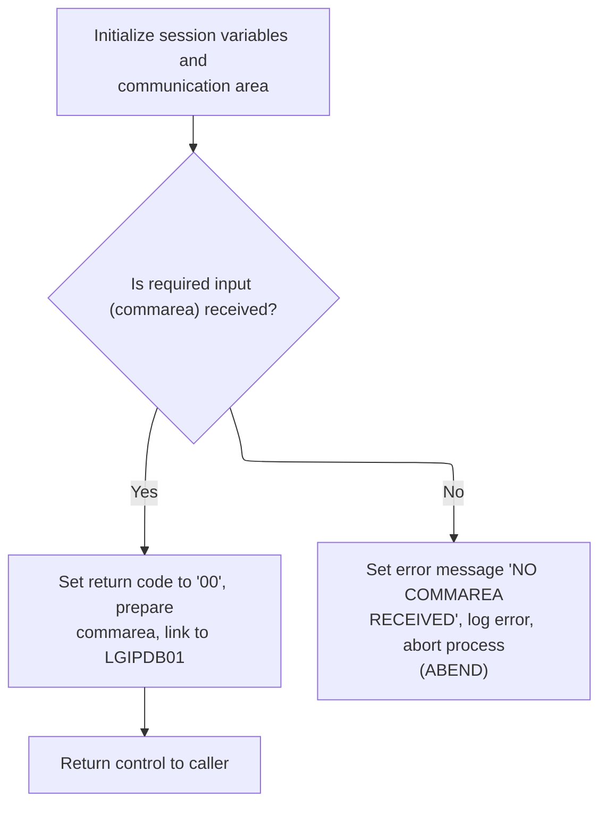
```mermaid
%%{init: {"flowchart": {"defaultRenderer": "elk"}} }%%
flowchart TD
    node1["Initialize session variables and
communication area"]
    click node1 openCode "base/src/lgipol01.cbl:72:78"
    node1 --> node2{"Is required input (commarea) received?"}
    click node2 openCode "base/src/lgipol01.cbl:79:83"
    node2 -->|"Yes"| node3["Set return code to '00', prepare
commarea, link to LGIPDB01"]
    click node3 openCode "base/src/lgipol01.cbl:86:94"
    node2 -->|"No"| node4["Set error message 'NO COMMAREA
RECEIVED', log error, abort process
(ABEND)"]
    click node4 openCode "base/src/lgipol01.cbl:80:82"
    node3 --> node5["Return control to caller"]
    click node5 openCode "base/src/lgipol01.cbl:96:96"

classDef HeadingStyle fill:#777777,stroke:#333,stroke-width:2px;

%% Swimm:
%% %%{init: {"flowchart": {"defaultRenderer": "elk"}} }%%
%% flowchart TD
%%     node1["Initialize session variables and
%% communication area"]
%%     click node1 openCode "<SwmPath>[base/src/lgipol01.cbl](base/src/lgipol01.cbl)</SwmPath>:72:78"
%%     node1 --> node2{"Is required input (commarea) received?"}
%%     click node2 openCode "<SwmPath>[base/src/lgipol01.cbl](base/src/lgipol01.cbl)</SwmPath>:79:83"
%%     node2 -->|"Yes"| node3["Set return code to '00', prepare
%% commarea, link to <SwmToken path="base/src/lgipol01.cbl" pos="91:9:9" line-data="           EXEC CICS LINK Program(LGIPDB01)">`LGIPDB01`</SwmToken>"]
%%     click node3 openCode "<SwmPath>[base/src/lgipol01.cbl](base/src/lgipol01.cbl)</SwmPath>:86:94"
%%     node2 -->|"No"| node4["Set error message 'NO COMMAREA
%% RECEIVED', log error, abort process
%% (ABEND)"]
%%     click node4 openCode "<SwmPath>[base/src/lgipol01.cbl](base/src/lgipol01.cbl)</SwmPath>:80:82"
%%     node3 --> node5["Return control to caller"]
%%     click node5 openCode "<SwmPath>[base/src/lgipol01.cbl](base/src/lgipol01.cbl)</SwmPath>:96:96"
%% 
%% classDef HeadingStyle fill:#777777,stroke:#333,stroke-width:2px;
```

This section governs the initial dispatch logic for policy inquiry requests. It ensures required input is present, handles errors, and routes valid requests to the policy database handler.

| Rule ID | Category                        | Rule Name                           | Description                                                                                                                                                                                                                                                                 | Implementation Details                                                                                                                                                                                                 |
| ------- | ------------------------------- | ----------------------------------- | --------------------------------------------------------------------------------------------------------------------------------------------------------------------------------------------------------------------------------------------------------------------------- | ---------------------------------------------------------------------------------------------------------------------------------------------------------------------------------------------------------------------- |
| BR-001  | Data validation                 | Missing commarea abort              | If the required commarea input is not received, an error message 'NO COMMAREA RECEIVED' is logged and the process is aborted.                                                                                                                                               | The error message is ' NO COMMAREA RECEIVED' (with a leading space) and is logged before aborting. The process is aborted with abend code 'LGCA'.                                                                      |
| BR-002  | Writing Output                  | Success return code initialization  | When a valid commarea is received, the return code in the commarea is set to '00' to indicate success before dispatching the request.                                                                                                                                       | The return code is set to the string '00' in the commarea structure. This indicates successful receipt of the request.                                                                                                 |
| BR-003  | Invoking a Service or a Process | Dispatch to policy database handler | If the commarea is present, the request is dispatched to the policy database handler (<SwmToken path="base/src/lgipol01.cbl" pos="91:9:9" line-data="           EXEC CICS LINK Program(LGIPDB01)">`LGIPDB01`</SwmToken> (Inquiring Policy Details)) for further processing. | The request is linked to the <SwmToken path="base/src/lgipol01.cbl" pos="91:9:9" line-data="           EXEC CICS LINK Program(LGIPDB01)">`LGIPDB01`</SwmToken> handler with the commarea and a length of 32,500 bytes. |

<SwmSnippet path="/base/src/lgipol01.cbl" line="70">

---

MAINLINE in <SwmToken path="base/src/lgtestp3.cbl" pos="70:10:10" line-data="                 EXEC CICS LINK PROGRAM(&#39;LGIPOL01&#39;)">`LGIPOL01`</SwmToken> checks for commarea, logs and abends if missing, then links to <SwmToken path="base/src/lgipol01.cbl" pos="91:9:9" line-data="           EXEC CICS LINK Program(LGIPDB01)">`LGIPDB01`</SwmToken> to actually fetch policy details. Error handling is built in before dispatch.

```cobol
       MAINLINE SECTION.
      *
           INITIALIZE WS-HEADER.
      *
           MOVE EIBTRNID TO WS-TRANSID.
           MOVE EIBTRMID TO WS-TERMID.
           MOVE EIBTASKN TO WS-TASKNUM.
      *
      * If NO commarea received issue an ABEND
           IF EIBCALEN IS EQUAL TO ZERO
               MOVE ' NO COMMAREA RECEIVED' TO EM-VARIABLE
               PERFORM WRITE-ERROR-MESSAGE
               EXEC CICS ABEND ABCODE('LGCA') NODUMP END-EXEC
           END-IF

      * initialize commarea return code to zero
           MOVE '00' TO CA-RETURN-CODE
           MOVE EIBCALEN TO WS-CALEN.
           SET WS-ADDR-DFHCOMMAREA TO ADDRESS OF DFHCOMMAREA.
      *

           EXEC CICS LINK Program(LGIPDB01)
               Commarea(DFHCOMMAREA)
               Length(32500)
           END-EXEC.

           EXEC CICS RETURN END-EXEC.
```

---

</SwmSnippet>

## Error Logging and Message Dispatch

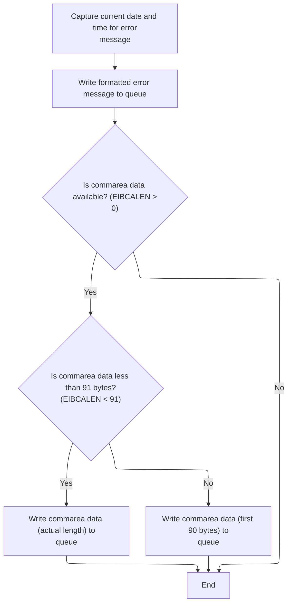
```mermaid
%%{init: {"flowchart": {"defaultRenderer": "elk"}} }%%
flowchart TD
    node1["Capture current date and time for error
message"]
    click node1 openCode "base/src/lgipol01.cbl:110:117"
    node1 --> node2["Write formatted error message to queue"]
    click node2 openCode "base/src/lgipol01.cbl:119:122"
    node2 --> node3{"Is commarea data available? (EIBCALEN >
0)"}
    click node3 openCode "base/src/lgipol01.cbl:124:138"
    node3 -->|"No"| node6["End"]
    node3 -->|"Yes"| node4{"Is commarea data less than 91 bytes?
(EIBCALEN < 91)"}
    click node4 openCode "base/src/lgipol01.cbl:125:131"
    node4 -->|"Yes"| node5["Write commarea data (actual length) to
queue"]
    click node5 openCode "base/src/lgipol01.cbl:126:130"
    node4 -->|"No"| node7["Write commarea data (first 90 bytes) to
queue"]
    click node7 openCode "base/src/lgipol01.cbl:132:136"
    node5 --> node6
    node7 --> node6
    click node6 openCode "base/src/lgipol01.cbl:139:139"
classDef HeadingStyle fill:#777777,stroke:#333,stroke-width:2px;

%% Swimm:
%% %%{init: {"flowchart": {"defaultRenderer": "elk"}} }%%
%% flowchart TD
%%     node1["Capture current date and time for error
%% message"]
%%     click node1 openCode "<SwmPath>[base/src/lgipol01.cbl](base/src/lgipol01.cbl)</SwmPath>:110:117"
%%     node1 --> node2["Write formatted error message to queue"]
%%     click node2 openCode "<SwmPath>[base/src/lgipol01.cbl](base/src/lgipol01.cbl)</SwmPath>:119:122"
%%     node2 --> node3{"Is commarea data available? (EIBCALEN >
%% 0)"}
%%     click node3 openCode "<SwmPath>[base/src/lgipol01.cbl](base/src/lgipol01.cbl)</SwmPath>:124:138"
%%     node3 -->|"No"| node6["End"]
%%     node3 -->|"Yes"| node4{"Is commarea data less than 91 bytes?
%% (EIBCALEN < 91)"}
%%     click node4 openCode "<SwmPath>[base/src/lgipol01.cbl](base/src/lgipol01.cbl)</SwmPath>:125:131"
%%     node4 -->|"Yes"| node5["Write commarea data (actual length) to
%% queue"]
%%     click node5 openCode "<SwmPath>[base/src/lgipol01.cbl](base/src/lgipol01.cbl)</SwmPath>:126:130"
%%     node4 -->|"No"| node7["Write commarea data (first 90 bytes) to
%% queue"]
%%     click node7 openCode "<SwmPath>[base/src/lgipol01.cbl](base/src/lgipol01.cbl)</SwmPath>:132:136"
%%     node5 --> node6
%%     node7 --> node6
%%     click node6 openCode "<SwmPath>[base/src/lgipol01.cbl](base/src/lgipol01.cbl)</SwmPath>:139:139"
%% classDef HeadingStyle fill:#777777,stroke:#333,stroke-width:2px;
```

This section logs error messages with a timestamp and dispatches them to message queues, including optional commarea data. It ensures error context is preserved and available for downstream processing or audit.

| Rule ID | Category        | Rule Name                      | Description                                                                                                                    | Implementation Details                                                                                                                                                                         |
| ------- | --------------- | ------------------------------ | ------------------------------------------------------------------------------------------------------------------------------ | ---------------------------------------------------------------------------------------------------------------------------------------------------------------------------------------------- |
| BR-001  | Calculation     | Timestamped error message      | Each error message includes the current date and time, formatted as MMDDYYYY for the date and as a 6-digit time string.        | Date is formatted as an 8-character string (MMDDYYYY), time as a 6-character string. These are included at the start of the error message structure.                                           |
| BR-002  | Decision Making | Commarea data inclusion        | If commarea data is present, up to 90 bytes are included in a separate message and dispatched to the queue.                    | If commarea data is less than 91 bytes, the actual length is used; otherwise, only the first 90 bytes are included. The message is prefixed with 'COMMAREA=' and padded as needed to 90 bytes. |
| BR-003  | Decision Making | Response for received messages | If the message is received from another program, a minimal response is sent and storage is freed.                              | A 1-byte text response is sent, and the keyboard is freed. This only occurs when the message is received from another program.                                                                 |
| BR-004  | Writing Output  | Error message queue dispatch   | Every error message is written to a message queue for downstream processing or audit.                                          | The error message is written as a structured record to the queue. The queue name and message structure are determined by the downstream LGSTSQ logic.                                          |
| BR-005  | Writing Output  | Dual queue writing             | Messages are written to both a transient data queue (TDQ) and a temporary storage queue (TSQ) for redundancy and availability. | TDQ and TSQ queue names are determined by the LGSTSQ logic. The message is written as a structured record with the calculated length.                                                          |

<SwmSnippet path="/base/src/lgipol01.cbl" line="107">

---

<SwmToken path="base/src/lgipol01.cbl" pos="107:1:5" line-data="       WRITE-ERROR-MESSAGE.">`WRITE-ERROR-MESSAGE`</SwmToken> logs errors with a timestamp, then calls LGSTSQ to write the message to the queue. If commarea data exists, it logs up to 90 bytes, handling variable-length safely.

```cobol
       WRITE-ERROR-MESSAGE.
      * Save SQLCODE in message
      * Obtain and format current time and date
           EXEC CICS ASKTIME ABSTIME(ABS-TIME)
           END-EXEC
           EXEC CICS FORMATTIME ABSTIME(ABS-TIME)
                     MMDDYYYY(DATE1)
                     TIME(TIME1)
           END-EXEC
           MOVE DATE1 TO EM-DATE
           MOVE TIME1 TO EM-TIME
      * Write output message to TDQ
           EXEC CICS LINK PROGRAM('LGSTSQ')
                     COMMAREA(ERROR-MSG)
                     LENGTH(LENGTH OF ERROR-MSG)
           END-EXEC.
      * Write 90 bytes or as much as we have of commarea to TDQ
           IF EIBCALEN > 0 THEN
             IF EIBCALEN < 91 THEN
               MOVE DFHCOMMAREA(1:EIBCALEN) TO CA-DATA
               EXEC CICS LINK PROGRAM('LGSTSQ')
                         COMMAREA(CA-ERROR-MSG)
                         LENGTH(LENGTH OF CA-ERROR-MSG)
               END-EXEC
             ELSE
               MOVE DFHCOMMAREA(1:90) TO CA-DATA
               EXEC CICS LINK PROGRAM('LGSTSQ')
                         COMMAREA(CA-ERROR-MSG)
                         LENGTH(LENGTH OF CA-ERROR-MSG)
               END-EXEC
             END-IF
           END-IF.
           EXIT.
```

---

</SwmSnippet>

<SwmSnippet path="/base/src/lgstsq.cbl" line="55">

---

MAINLINE in LGSTSQ figures out if the message is from another program or direct input, tweaks the queue name and message if needed, then writes to both TDQ and TSQ. If it's a received message, it sends a quick text response and frees storage.

```cobol
       MAINLINE SECTION.

           MOVE SPACES TO WRITE-MSG.
           MOVE SPACES TO WS-RECV.

           EXEC CICS ASSIGN SYSID(WRITE-MSG-SYSID)
                RESP(WS-RESP)
           END-EXEC.

           EXEC CICS ASSIGN INVOKINGPROG(WS-INVOKEPROG)
                RESP(WS-RESP)
           END-EXEC.
           
           IF WS-INVOKEPROG NOT = SPACES
              MOVE 'C' To WS-FLAG
              MOVE COMMA-DATA  TO WRITE-MSG-MSG
              MOVE EIBCALEN    TO WS-RECV-LEN
           ELSE
              EXEC CICS RECEIVE INTO(WS-RECV)
                  LENGTH(WS-RECV-LEN)
                  RESP(WS-RESP)
              END-EXEC
              MOVE 'R' To WS-FLAG
              MOVE WS-RECV-DATA  TO WRITE-MSG-MSG
              SUBTRACT 5 FROM WS-RECV-LEN
           END-IF.

           MOVE 'GENAERRS' TO STSQ-NAME.
           IF WRITE-MSG-MSG(1:2) = 'Q=' THEN
              MOVE WRITE-MSG-MSG(3:4) TO STSQ-EXT
              MOVE WRITE-MSG-REST TO TEMPO
              MOVE TEMPO          TO WRITE-MSG-MSG
              SUBTRACT 7 FROM WS-RECV-LEN
           END-IF.

           ADD 5 TO WS-RECV-LEN.

      * Write output message to TDQ CSMT
      *
           EXEC CICS WRITEQ TD QUEUE(STDQ-NAME)
                     FROM(WRITE-MSG)
                     RESP(WS-RESP)
                     LENGTH(WS-RECV-LEN)

           END-EXEC.

      * Write output message to Genapp TSQ
      * If no space is available then the task will not wait for
      *  storage to become available but will ignore the request...
      *
           EXEC CICS WRITEQ TS QUEUE(STSQ-NAME)
                     FROM(WRITE-MSG)
                     RESP(WS-RESP)
                     NOSUSPEND
                     LENGTH(WS-RECV-LEN)

           END-EXEC.

           If WS-FLAG = 'R' Then
             EXEC CICS SEND TEXT FROM(FILLER-X)
              WAIT
              ERASE
              LENGTH(1)
              FREEKB
             END-EXEC.

           EXEC CICS RETURN
           END-EXEC.
```

---

</SwmSnippet>

## Policy Data Retrieval and Dispatch


```mermaid
%%{init: {"flowchart": {"defaultRenderer": "elk"}} }%%
flowchart TD
    node1["Initialize variables and storage"] --> node2{"Is commarea received?"}
    click node1 openCode "base/src/lgipdb01.cbl:235:246"
    node2 -->|"No"| node3["Record error and return 'No commarea
received'"]
    click node2 openCode "base/src/lgipdb01.cbl:251:255"
    click node3 openCode "base/src/lgipdb01.cbl:252:254"
    node2 -->|"Yes"| node4["Set up commarea and convert input values"]
    click node4 openCode "base/src/lgipdb01.cbl:258:267"
    node4 --> node5{"What policy type is requested?"}
    click node5 openCode "base/src/lgipdb01.cbl:277:310"
    node5 -->|"Endowment (01IEND)"| node6["Retrieve endowment policy details"]
    click node6 openCode "base/src/lgipdb01.cbl:327:432"
    node5 -->|"House (01IHOU)"| node7["Retrieve house policy details"]
    click node7 openCode "base/src/lgipdb01.cbl:441:523"
    node5 -->|"Motor (01IMOT)"| node8["Retrieve motor policy details"]
    click node8 openCode "base/src/lgipdb01.cbl:529:621"
    node5 -->|"Commercial (01ICOM, 02ICOM,
03ICOM, 05ICOM)"| node9["Retrieve commercial policy details"]
    click node9 openCode "base/src/lgipdb01.cbl:292:306"
    node5 -->|"Other"| node10["Set error code '99'"]
    click node10 openCode "base/src/lgipdb01.cbl:308:309"
    node6 --> node11{"Is commarea large enough for output?"}
    node7 --> node11
    node8 --> node11
    node9 --> node11
    click node11 openCode "base/src/lgipdb01.cbl:390:392"
    node11 -->|"No"| node16["Set error code '98' and return"]
    click node16 openCode "base/src/lgipdb01.cbl:391:392"
    node11 -->|"Yes"| node12["Prepare and return policy data"]
    click node12 openCode "base/src/lgipdb01.cbl:374:418"
    node6 --> node13{"Was database query successful?"}
    node7 --> node13
    node8 --> node13
    node9 --> node13
    click node13 openCode "base/src/lgipdb01.cbl:370:429"
    node13 -->|"Success"| node12
    node13 -->|"No rows found"| node14["Set error code '01'"]
    click node14 openCode "base/src/lgipdb01.cbl:421:423"
    node13 -->|"Other error"| node15["Set error code '90' and record error"]
    click node15 openCode "base/src/lgipdb01.cbl:426:429"
    node10 --> node17["Return error code '99'"]
    click node17 openCode "base/src/lgipdb01.cbl:308:309"
classDef HeadingStyle fill:#777777,stroke:#333,stroke-width:2px;

%% Swimm:
%% %%{init: {"flowchart": {"defaultRenderer": "elk"}} }%%
%% flowchart TD
%%     node1["Initialize variables and storage"] --> node2{"Is commarea received?"}
%%     click node1 openCode "<SwmPath>[base/src/lgipdb01.cbl](base/src/lgipdb01.cbl)</SwmPath>:235:246"
%%     node2 -->|"No"| node3["Record error and return 'No commarea
%% received'"]
%%     click node2 openCode "<SwmPath>[base/src/lgipdb01.cbl](base/src/lgipdb01.cbl)</SwmPath>:251:255"
%%     click node3 openCode "<SwmPath>[base/src/lgipdb01.cbl](base/src/lgipdb01.cbl)</SwmPath>:252:254"
%%     node2 -->|"Yes"| node4["Set up commarea and convert input values"]
%%     click node4 openCode "<SwmPath>[base/src/lgipdb01.cbl](base/src/lgipdb01.cbl)</SwmPath>:258:267"
%%     node4 --> node5{"What policy type is requested?"}
%%     click node5 openCode "<SwmPath>[base/src/lgipdb01.cbl](base/src/lgipdb01.cbl)</SwmPath>:277:310"
%%     node5 -->|"Endowment (<SwmToken path="base/src/lgipdb01.cbl" pos="279:4:4" line-data="             WHEN &#39;01IEND&#39;">`01IEND`</SwmToken>)"| node6["Retrieve endowment policy details"]
%%     click node6 openCode "<SwmPath>[base/src/lgipdb01.cbl](base/src/lgipdb01.cbl)</SwmPath>:327:432"
%%     node5 -->|"House (<SwmToken path="base/src/lgtestp3.cbl" pos="67:4:4" line-data="                 Move &#39;01IHOU&#39;   To CA-REQUEST-ID">`01IHOU`</SwmToken>)"| node7["Retrieve house policy details"]
%%     click node7 openCode "<SwmPath>[base/src/lgipdb01.cbl](base/src/lgipdb01.cbl)</SwmPath>:441:523"
%%     node5 -->|"Motor (<SwmToken path="base/src/lgipdb01.cbl" pos="287:4:4" line-data="             WHEN &#39;01IMOT&#39;">`01IMOT`</SwmToken>)"| node8["Retrieve motor policy details"]
%%     click node8 openCode "<SwmPath>[base/src/lgipdb01.cbl](base/src/lgipdb01.cbl)</SwmPath>:529:621"
%%     node5 -->|"Commercial (<SwmToken path="base/src/lgipdb01.cbl" pos="291:4:4" line-data="             WHEN &#39;01ICOM&#39;">`01ICOM`</SwmToken>, <SwmToken path="base/src/lgipdb01.cbl" pos="295:4:4" line-data="             WHEN &#39;02ICOM&#39;">`02ICOM`</SwmToken>,
%% <SwmToken path="base/src/lgipdb01.cbl" pos="299:4:4" line-data="             WHEN &#39;03ICOM&#39;">`03ICOM`</SwmToken>, <SwmToken path="base/src/lgipdb01.cbl" pos="303:4:4" line-data="             WHEN &#39;05ICOM&#39;">`05ICOM`</SwmToken>)"| node9["Retrieve commercial policy details"]
%%     click node9 openCode "<SwmPath>[base/src/lgipdb01.cbl](base/src/lgipdb01.cbl)</SwmPath>:292:306"
%%     node5 -->|"Other"| node10["Set error code '99'"]
%%     click node10 openCode "<SwmPath>[base/src/lgipdb01.cbl](base/src/lgipdb01.cbl)</SwmPath>:308:309"
%%     node6 --> node11{"Is commarea large enough for output?"}
%%     node7 --> node11
%%     node8 --> node11
%%     node9 --> node11
%%     click node11 openCode "<SwmPath>[base/src/lgipdb01.cbl](base/src/lgipdb01.cbl)</SwmPath>:390:392"
%%     node11 -->|"No"| node16["Set error code '98' and return"]
%%     click node16 openCode "<SwmPath>[base/src/lgipdb01.cbl](base/src/lgipdb01.cbl)</SwmPath>:391:392"
%%     node11 -->|"Yes"| node12["Prepare and return policy data"]
%%     click node12 openCode "<SwmPath>[base/src/lgipdb01.cbl](base/src/lgipdb01.cbl)</SwmPath>:374:418"
%%     node6 --> node13{"Was database query successful?"}
%%     node7 --> node13
%%     node8 --> node13
%%     node9 --> node13
%%     click node13 openCode "<SwmPath>[base/src/lgipdb01.cbl](base/src/lgipdb01.cbl)</SwmPath>:370:429"
%%     node13 -->|"Success"| node12
%%     node13 -->|"No rows found"| node14["Set error code '01'"]
%%     click node14 openCode "<SwmPath>[base/src/lgipdb01.cbl](base/src/lgipdb01.cbl)</SwmPath>:421:423"
%%     node13 -->|"Other error"| node15["Set error code '90' and record error"]
%%     click node15 openCode "<SwmPath>[base/src/lgipdb01.cbl](base/src/lgipdb01.cbl)</SwmPath>:426:429"
%%     node10 --> node17["Return error code '99'"]
%%     click node17 openCode "<SwmPath>[base/src/lgipdb01.cbl](base/src/lgipdb01.cbl)</SwmPath>:308:309"
%% classDef HeadingStyle fill:#777777,stroke:#333,stroke-width:2px;
```

This section governs the retrieval and dispatch of policy data requests. It validates input, determines the requested policy type, routes the request to the appropriate handler, and manages error conditions and output formatting.

| Rule ID | Category        | Rule Name                                   | Description                                                                                                                                                                        | Implementation Details                                                                                                                                                                                                                                                                                                                                                                                                                                                                                                                                                                                                                                                                                                                                                                                                                                                                                                                                                                                                                            |
| ------- | --------------- | ------------------------------------------- | ---------------------------------------------------------------------------------------------------------------------------------------------------------------------------------- | ------------------------------------------------------------------------------------------------------------------------------------------------------------------------------------------------------------------------------------------------------------------------------------------------------------------------------------------------------------------------------------------------------------------------------------------------------------------------------------------------------------------------------------------------------------------------------------------------------------------------------------------------------------------------------------------------------------------------------------------------------------------------------------------------------------------------------------------------------------------------------------------------------------------------------------------------------------------------------------------------------------------------------------------------- |
| BR-001  | Data validation | Missing commarea error                      | If no commarea is received, an error is recorded and the process is terminated with a specific error code.                                                                         | The error message 'NO COMMAREA RECEIVED' is recorded, and the process is abended with code 'LGCA'.                                                                                                                                                                                                                                                                                                                                                                                                                                                                                                                                                                                                                                                                                                                                                                                                                                                                                                                                                |
| BR-002  | Data validation | Request ID standardization                  | The request ID is converted to uppercase before determining the policy type to ensure consistent processing regardless of input case.                                              | All alphabetic characters in the request ID are converted to uppercase before comparison. The request ID is a 6-character string.                                                                                                                                                                                                                                                                                                                                                                                                                                                                                                                                                                                                                                                                                                                                                                                                                                                                                                                 |
| BR-003  | Data validation | Insufficient commarea size error            | If the commarea is not large enough to hold the output data for the requested policy, an error code is set and the process returns without writing policy data.                    | If the commarea length is less than the required size, the return code '98' is set and the process returns. The required size is calculated based on the policy type and data fields.                                                                                                                                                                                                                                                                                                                                                                                                                                                                                                                                                                                                                                                                                                                                                                                                                                                             |
| BR-004  | Data validation | No policy data found error                  | If the database query for the requested policy returns no rows, an error code is set to indicate that the customer or policy number is invalid.                                    | If SQLCODE is 100, the return code '01' is set to indicate no data found.                                                                                                                                                                                                                                                                                                                                                                                                                                                                                                                                                                                                                                                                                                                                                                                                                                                                                                                                                                         |
| BR-005  | Data validation | Database error handling                     | If the database query for the requested policy fails for any reason other than no data found, an error code is set and an error message is logged.                                 | If SQLCODE is not 0 or 100, the return code '90' is set and an error message is written to the log.                                                                                                                                                                                                                                                                                                                                                                                                                                                                                                                                                                                                                                                                                                                                                                                                                                                                                                                                               |
| BR-006  | Decision Making | Policy type dispatch and unknown type error | The system dispatches the request to the appropriate policy handler based on the standardized request ID. If the request ID is not recognized, an error code is set.               | Recognized request IDs: <SwmToken path="base/src/lgipdb01.cbl" pos="279:4:4" line-data="             WHEN &#39;01IEND&#39;">`01IEND`</SwmToken> (endowment), <SwmToken path="base/src/lgtestp3.cbl" pos="67:4:4" line-data="                 Move &#39;01IHOU&#39;   To CA-REQUEST-ID">`01IHOU`</SwmToken> (house), <SwmToken path="base/src/lgipdb01.cbl" pos="287:4:4" line-data="             WHEN &#39;01IMOT&#39;">`01IMOT`</SwmToken> (motor), <SwmToken path="base/src/lgipdb01.cbl" pos="291:4:4" line-data="             WHEN &#39;01ICOM&#39;">`01ICOM`</SwmToken>, <SwmToken path="base/src/lgipdb01.cbl" pos="295:4:4" line-data="             WHEN &#39;02ICOM&#39;">`02ICOM`</SwmToken>, <SwmToken path="base/src/lgipdb01.cbl" pos="299:4:4" line-data="             WHEN &#39;03ICOM&#39;">`03ICOM`</SwmToken>, <SwmToken path="base/src/lgipdb01.cbl" pos="303:4:4" line-data="             WHEN &#39;05ICOM&#39;">`05ICOM`</SwmToken> (commercial). If the request ID does not match any of these, the return code '99' is set. |
| BR-007  | Writing Output  | Policy data output formatting               | When policy data is successfully retrieved and the commarea is large enough, the policy data is written to the commarea and the end of the data is marked with the string 'FINAL'. | The string 'FINAL' (5 characters) is written at the end of the policy data in the commarea to indicate the end of the data block.                                                                                                                                                                                                                                                                                                                                                                                                                                                                                                                                                                                                                                                                                                                                                                                                                                                                                                                 |

<SwmSnippet path="/base/src/lgipdb01.cbl" line="230">

---

MAINLINE in <SwmToken path="base/src/lgipol01.cbl" pos="91:9:9" line-data="           EXEC CICS LINK Program(LGIPDB01)">`LGIPDB01`</SwmToken> checks for commarea, converts customer/policy numbers for <SwmToken path="base/src/lgipdb01.cbl" pos="242:5:5" line-data="      * initialize DB2 host variables">`DB2`</SwmToken>, then uses the request ID to branch to the right <SwmToken path="base/src/lgipdb01.cbl" pos="242:5:5" line-data="      * initialize DB2 host variables">`DB2`</SwmToken> info routine. If the request ID isn't recognized, it sets an error code.

```cobol
       MAINLINE SECTION.

      *----------------------------------------------------------------*
      * Common code                                                    *
      *----------------------------------------------------------------*
      * initialize working storage variables
           INITIALIZE WS-HEADER.
      * set up general variable
           MOVE EIBTRNID TO WS-TRANSID.
           MOVE EIBTRMID TO WS-TERMID.
           MOVE EIBTASKN TO WS-TASKNUM.
      *----------------------------------------------------------------*
      * initialize DB2 host variables
           INITIALIZE DB2-IN-INTEGERS.
           INITIALIZE DB2-OUT-INTEGERS.
           INITIALIZE DB2-POLICY.

      *---------------------------------------------------------------*
      * Check commarea and obtain required details                    *
      *---------------------------------------------------------------*
      * If NO commarea received issue an ABEND
           IF EIBCALEN IS EQUAL TO ZERO
             MOVE ' NO COMMAREA RECEIVED' TO EM-VARIABLE
             PERFORM WRITE-ERROR-MESSAGE
             EXEC CICS ABEND ABCODE('LGCA') NODUMP END-EXEC
           END-IF

      * initialize commarea return code to zero
           MOVE '00' TO CA-RETURN-CODE
           MOVE EIBCALEN TO WS-CALEN
           SET WS-ADDR-DFHCOMMAREA TO ADDRESS OF DFHCOMMAREA

      * Convert commarea customer & policy nums to DB2 integer format
           MOVE CA-CUSTOMER-NUM TO DB2-CUSTOMERNUM-INT
           MOVE CA-POLICY-NUM   TO DB2-POLICYNUM-INT
      * and save in error msg field incase required
           MOVE CA-CUSTOMER-NUM TO EM-CUSNUM
           MOVE CA-POLICY-NUM   TO EM-POLNUM

      *----------------------------------------------------------------*
      * Check which policy type is being requested                     *
      * This is not actually required whilst only endowment policy     *
      * inquires are supported, but will make future expansion simpler *
      *----------------------------------------------------------------*
      * Upper case value passed in Request Id field                    *
           MOVE FUNCTION UPPER-CASE(CA-REQUEST-ID) TO WS-REQUEST-ID

           EVALUATE WS-REQUEST-ID

             WHEN '01IEND'
               INITIALIZE DB2-ENDOWMENT
               PERFORM GET-ENDOW-DB2-INFO

             WHEN '01IHOU'
               INITIALIZE DB2-HOUSE
               PERFORM GET-HOUSE-DB2-INFO

             WHEN '01IMOT'
               INITIALIZE DB2-MOTOR
               PERFORM GET-MOTOR-DB2-INFO

             WHEN '01ICOM'
               INITIALIZE DB2-COMMERCIAL
               PERFORM GET-COMMERCIAL-DB2-INFO-1

             WHEN '02ICOM'
               INITIALIZE DB2-COMMERCIAL
               PERFORM GET-COMMERCIAL-DB2-INFO-2

             WHEN '03ICOM'
               INITIALIZE DB2-COMMERCIAL
               PERFORM GET-COMMERCIAL-DB2-INFO-3

             WHEN '05ICOM'
               INITIALIZE DB2-COMMERCIAL
               PERFORM GET-COMMERCIAL-DB2-INFO-5

             WHEN OTHER
               MOVE '99' TO CA-RETURN-CODE

           END-EVALUATE.
```

---

</SwmSnippet>

<SwmSnippet path="/base/src/lgipdb01.cbl" line="997">

---

<SwmToken path="base/src/lgipdb01.cbl" pos="997:1:5" line-data="       WRITE-ERROR-MESSAGE.">`WRITE-ERROR-MESSAGE`</SwmToken> in <SwmToken path="base/src/lgipol01.cbl" pos="91:9:9" line-data="           EXEC CICS LINK Program(LGIPDB01)">`LGIPDB01`</SwmToken> grabs the SQLCODE and timestamp, formats the error message, then calls LGSTSQ to log it. If commarea data exists, it logs up to 90 bytes for context.

```cobol
       WRITE-ERROR-MESSAGE.
      * Save SQLCODE in message
           MOVE SQLCODE TO EM-SQLRC
      * Obtain and format current time and date
           EXEC CICS ASKTIME ABSTIME(ABS-TIME)
           END-EXEC
           EXEC CICS FORMATTIME ABSTIME(ABS-TIME)
                     MMDDYYYY(DATE1)
                     TIME(TIME1)
           END-EXEC
           MOVE DATE1 TO EM-DATE
           MOVE TIME1 TO EM-TIME
      * Write output message to TDQ
           EXEC CICS LINK PROGRAM('LGSTSQ')
                     COMMAREA(ERROR-MSG)
                     LENGTH(LENGTH OF ERROR-MSG)
           END-EXEC.
      * Write 90 bytes or as much as we have of commarea to TDQ
           IF EIBCALEN > 0 THEN
             IF EIBCALEN < 91 THEN
               MOVE DFHCOMMAREA(1:EIBCALEN) TO CA-DATA
               EXEC CICS LINK PROGRAM('LGSTSQ')
                         COMMAREA(CA-ERROR-MSG)
                         LENGTH(LENGTH OF CA-ERROR-MSG)
               END-EXEC
             ELSE
               MOVE DFHCOMMAREA(1:90) TO CA-DATA
               EXEC CICS LINK PROGRAM('LGSTSQ')
                         COMMAREA(CA-ERROR-MSG)
                         LENGTH(LENGTH OF CA-ERROR-MSG)
               END-EXEC
             END-IF
           END-IF.
           EXIT.
```

---

</SwmSnippet>

<SwmSnippet path="/base/src/lgipdb01.cbl" line="327">

---

<SwmToken path="base/src/lgipdb01.cbl" pos="327:1:7" line-data="       GET-ENDOW-DB2-INFO.">`GET-ENDOW-DB2-INFO`</SwmToken> fetches endowment policy data, handles variable-length fields, checks commarea size, moves <SwmToken path="base/src/lgipdb01.cbl" pos="327:5:5" line-data="       GET-ENDOW-DB2-INFO.">`DB2`</SwmToken> output to the commarea, and marks the end with 'FINAL'. Error codes signal issues like missing data or SQL errors.

```cobol
       GET-ENDOW-DB2-INFO.

           MOVE ' SELECT ENDOW ' TO EM-SQLREQ
           EXEC SQL
             SELECT  ISSUEDATE,
                     EXPIRYDATE,
                     LASTCHANGED,
                     BROKERID,
                     BROKERSREFERENCE,
                     PAYMENT,
                     WITHPROFITS,
                     EQUITIES,
                     MANAGEDFUND,
                     FUNDNAME,
                     TERM,
                     SUMASSURED,
                     LIFEASSURED,
                     PADDINGDATA,
                     LENGTH(PADDINGDATA)
             INTO  :DB2-ISSUEDATE,
                   :DB2-EXPIRYDATE,
                   :DB2-LASTCHANGED,
                   :DB2-BROKERID-INT INDICATOR :IND-BROKERID,
                   :DB2-BROKERSREF INDICATOR :IND-BROKERSREF,
                   :DB2-PAYMENT-INT INDICATOR :IND-PAYMENT,
                   :DB2-E-WITHPROFITS,
                   :DB2-E-EQUITIES,
                   :DB2-E-MANAGEDFUND,
                   :DB2-E-FUNDNAME,
                   :DB2-E-TERM-SINT,
                   :DB2-E-SUMASSURED-INT,
                   :DB2-E-LIFEASSURED,
                   :DB2-E-PADDINGDATA INDICATOR :IND-E-PADDINGDATA,
                   :DB2-E-PADDING-LEN INDICATOR :IND-E-PADDINGDATAL
             FROM  POLICY,ENDOWMENT
             WHERE ( POLICY.POLICYNUMBER =
                        ENDOWMENT.POLICYNUMBER   AND
                     POLICY.CUSTOMERNUMBER =
                        :DB2-CUSTOMERNUM-INT             AND
                     POLICY.POLICYNUMBER =
                        :DB2-POLICYNUM-INT               )
           END-EXEC

           IF SQLCODE = 0
      *      Select was successful

      *      Calculate size of commarea required to return all data
             ADD WS-CA-HEADERTRAILER-LEN TO WS-REQUIRED-CA-LEN
             ADD WS-FULL-ENDOW-LEN       TO WS-REQUIRED-CA-LEN

      *----------------------------------------------------------------*
      *      Specific code to allow for length of VACHAR data
      *      check whether PADDINGDATA field is non-null
      *        and calculate length of endowment policy
      *        and position of free space in commarea after policy data
      *----------------------------------------------------------------*
             IF IND-E-PADDINGDATAL NOT EQUAL MINUS-ONE
               ADD DB2-E-PADDING-LEN TO WS-REQUIRED-CA-LEN
               ADD DB2-E-PADDING-LEN TO END-POLICY-POS
             END-IF

      *      if commarea received is not large enough ...
      *        set error return code and return to caller
             IF EIBCALEN IS LESS THAN WS-REQUIRED-CA-LEN
               MOVE '98' TO CA-RETURN-CODE
               EXEC CICS RETURN END-EXEC
             ELSE
      *        Length is sufficent so move data to commarea
      *        Move Integer fields to required length numerics
      *        Don't move null fields
               IF IND-BROKERID NOT EQUAL MINUS-ONE
                 MOVE DB2-BROKERID-INT    TO DB2-BROKERID
               END-IF
               IF IND-PAYMENT NOT EQUAL MINUS-ONE
                 MOVE DB2-PAYMENT-INT TO DB2-PAYMENT
               END-IF
      *----------------------------------------------------------------*
               MOVE DB2-E-TERM-SINT       TO DB2-E-TERM
               MOVE DB2-E-SUMASSURED-INT  TO DB2-E-SUMASSURED

               MOVE DB2-POLICY-COMMON     TO CA-POLICY-COMMON
               MOVE DB2-ENDOW-FIXED
                   TO CA-ENDOWMENT(1:WS-ENDOW-LEN)
               IF IND-E-PADDINGDATA NOT EQUAL MINUS-ONE
                 MOVE DB2-E-PADDINGDATA TO
                     CA-E-PADDING-DATA(1:DB2-E-PADDING-LEN)
               END-IF
             END-IF

      *      Mark the end of the policy data
             MOVE 'FINAL' TO CA-E-PADDING-DATA(END-POLICY-POS:5)

           ELSE
      *      Non-zero SQLCODE from first SQL FETCH statement
             IF SQLCODE EQUAL 100
      *        No rows found - invalid customer / policy number
               MOVE '01' TO CA-RETURN-CODE
             ELSE
      *        something has gone wrong
               MOVE '90' TO CA-RETURN-CODE
      *        Write error message to TD QUEUE(CSMT)
               PERFORM WRITE-ERROR-MESSAGE
             END-IF

           END-IF.
           EXIT.
```

---

</SwmSnippet>

<SwmSnippet path="/base/src/lgipdb01.cbl" line="441">

---

<SwmToken path="base/src/lgipdb01.cbl" pos="441:1:7" line-data="       GET-HOUSE-DB2-INFO.">`GET-HOUSE-DB2-INFO`</SwmToken> fetches house policy data, checks for null fields, validates commarea size, moves <SwmToken path="base/src/lgipdb01.cbl" pos="441:5:5" line-data="       GET-HOUSE-DB2-INFO.">`DB2`</SwmToken> output to the commarea, and marks the end with 'FINAL'. Return codes signal errors or missing data.

```cobol
       GET-HOUSE-DB2-INFO.

           MOVE ' SELECT HOUSE ' TO EM-SQLREQ
           EXEC SQL
             SELECT  ISSUEDATE,
                     EXPIRYDATE,
                     LASTCHANGED,
                     BROKERID,
                     BROKERSREFERENCE,
                     PAYMENT,
                     PROPERTYTYPE,
                     BEDROOMS,
                     VALUE,
                     HOUSENAME,
                     HOUSENUMBER,
                     POSTCODE
             INTO  :DB2-ISSUEDATE,
                   :DB2-EXPIRYDATE,
                   :DB2-LASTCHANGED,
                   :DB2-BROKERID-INT INDICATOR :IND-BROKERID,
                   :DB2-BROKERSREF INDICATOR :IND-BROKERSREF,
                   :DB2-PAYMENT-INT INDICATOR :IND-PAYMENT,
                   :DB2-H-PROPERTYTYPE,
                   :DB2-H-BEDROOMS-SINT,
                   :DB2-H-VALUE-INT,
                   :DB2-H-HOUSENAME,
                   :DB2-H-HOUSENUMBER,
                   :DB2-H-POSTCODE
             FROM  POLICY,HOUSE
             WHERE ( POLICY.POLICYNUMBER =
                        HOUSE.POLICYNUMBER   AND
                     POLICY.CUSTOMERNUMBER =
                        :DB2-CUSTOMERNUM-INT             AND
                     POLICY.POLICYNUMBER =
                        :DB2-POLICYNUM-INT               )
           END-EXEC

           IF SQLCODE = 0
      *      Select was successful

      *      Calculate size of commarea required to return all data
             ADD WS-CA-HEADERTRAILER-LEN TO WS-REQUIRED-CA-LEN
             ADD WS-FULL-HOUSE-LEN       TO WS-REQUIRED-CA-LEN

      *      if commarea received is not large enough ...
      *        set error return code and return to caller
             IF EIBCALEN IS LESS THAN WS-REQUIRED-CA-LEN
               MOVE '98' TO CA-RETURN-CODE
               EXEC CICS RETURN END-EXEC
             ELSE
      *        Length is sufficent so move data to commarea
      *        Move Integer fields to required length numerics
      *        Don't move null fields
               IF IND-BROKERID NOT EQUAL MINUS-ONE
                 MOVE DB2-BROKERID-INT  TO DB2-BROKERID
               END-IF
               IF IND-PAYMENT NOT EQUAL MINUS-ONE
                 MOVE DB2-PAYMENT-INT TO DB2-PAYMENT
               END-IF
               MOVE DB2-H-BEDROOMS-SINT TO DB2-H-BEDROOMS
               MOVE DB2-H-VALUE-INT     TO DB2-H-VALUE

               MOVE DB2-POLICY-COMMON   TO CA-POLICY-COMMON
               MOVE DB2-HOUSE           TO CA-HOUSE(1:WS-HOUSE-LEN)
             END-IF

      *      Mark the end of the policy data
             MOVE 'FINAL' TO CA-H-FILLER(1:5)

           ELSE
      *      Non-zero SQLCODE from first SQL FETCH statement
             IF SQLCODE EQUAL 100
      *        No rows found - invalid customer / policy number
               MOVE '01' TO CA-RETURN-CODE
             ELSE
      *        something has gone wrong
               MOVE '90' TO CA-RETURN-CODE
      *        Write error message to TD QUEUE(CSMT)
               PERFORM WRITE-ERROR-MESSAGE
             END-IF

           END-IF.
           EXIT.
```

---

</SwmSnippet>

<SwmSnippet path="/base/src/lgipdb01.cbl" line="529">

---

<SwmToken path="base/src/lgipdb01.cbl" pos="529:1:7" line-data="       GET-MOTOR-DB2-INFO.">`GET-MOTOR-DB2-INFO`</SwmToken> grabs motor policy data, checks for null fields, validates commarea size, moves <SwmToken path="base/src/lgipdb01.cbl" pos="529:5:5" line-data="       GET-MOTOR-DB2-INFO.">`DB2`</SwmToken> output to the commarea, and marks the end with 'FINAL'. Return codes indicate errors or missing data.

```cobol
       GET-MOTOR-DB2-INFO.

           MOVE ' SELECT MOTOR ' TO EM-SQLREQ
           EXEC SQL
             SELECT  ISSUEDATE,
                     EXPIRYDATE,
                     LASTCHANGED,
                     BROKERID,
                     BROKERSREFERENCE,
                     PAYMENT,
                     MAKE,
                     MODEL,
                     VALUE,
                     REGNUMBER,
                     COLOUR,
                     CC,
                     YEAROFMANUFACTURE,
                     PREMIUM,
                     ACCIDENTS
             INTO  :DB2-ISSUEDATE,
                   :DB2-EXPIRYDATE,
                   :DB2-LASTCHANGED,
                   :DB2-BROKERID-INT INDICATOR :IND-BROKERID,
                   :DB2-BROKERSREF INDICATOR :IND-BROKERSREF,
                   :DB2-PAYMENT-INT INDICATOR :IND-PAYMENT,
                   :DB2-M-MAKE,
                   :DB2-M-MODEL,
                   :DB2-M-VALUE-INT,
                   :DB2-M-REGNUMBER,
                   :DB2-M-COLOUR,
                   :DB2-M-CC-SINT,
                   :DB2-M-MANUFACTURED,
                   :DB2-M-PREMIUM-INT,
                   :DB2-M-ACCIDENTS-INT
             FROM  POLICY,MOTOR
             WHERE ( POLICY.POLICYNUMBER =
                        MOTOR.POLICYNUMBER   AND
                     POLICY.CUSTOMERNUMBER =
                        :DB2-CUSTOMERNUM-INT             AND
                     POLICY.POLICYNUMBER =
                        :DB2-POLICYNUM-INT               )
           END-EXEC

           IF SQLCODE = 0
      *      Select was successful

      *      Calculate size of commarea required to return all data
             ADD WS-CA-HEADERTRAILER-LEN TO WS-REQUIRED-CA-LEN
             ADD WS-FULL-MOTOR-LEN       TO WS-REQUIRED-CA-LEN

      *      if commarea received is not large enough ...
      *        set error return code and return to caller
             IF EIBCALEN IS LESS THAN WS-REQUIRED-CA-LEN
               MOVE '98' TO CA-RETURN-CODE
               EXEC CICS RETURN END-EXEC
             ELSE
      *        Length is sufficent so move data to commarea
      *        Move Integer fields to required length numerics
      *        Don't move null fields
               IF IND-BROKERID NOT EQUAL MINUS-ONE
                 MOVE DB2-BROKERID-INT TO DB2-BROKERID
               END-IF
               IF IND-PAYMENT NOT EQUAL MINUS-ONE
                 MOVE DB2-PAYMENT-INT    TO DB2-PAYMENT
               END-IF
               MOVE DB2-M-CC-SINT      TO DB2-M-CC
               MOVE DB2-M-VALUE-INT    TO DB2-M-VALUE
               MOVE DB2-M-PREMIUM-INT  TO DB2-M-PREMIUM
               MOVE DB2-M-ACCIDENTS-INT TO DB2-M-ACCIDENTS
               MOVE DB2-M-PREMIUM-INT  TO CA-M-PREMIUM
               MOVE DB2-M-ACCIDENTS-INT TO CA-M-ACCIDENTS

               MOVE DB2-POLICY-COMMON  TO CA-POLICY-COMMON
               MOVE DB2-MOTOR          TO CA-MOTOR(1:WS-MOTOR-LEN)
             END-IF

      *      Mark the end of the policy data
             MOVE 'FINAL' TO CA-M-FILLER(1:5)

           ELSE
      *      Non-zero SQLCODE from first SQL FETCH statement
             IF SQLCODE EQUAL 100
      *        No rows found - invalid customer / policy number
               MOVE '01' TO CA-RETURN-CODE
             ELSE
      *        something has gone wrong
               MOVE '90' TO CA-RETURN-CODE
      *        Write error message to TD QUEUE(CSMT)
               PERFORM WRITE-ERROR-MESSAGE
             END-IF

           END-IF.
           EXIT.
```

---

</SwmSnippet>

## Post-Inquiry Result Handling

This section determines the post-inquiry user experience by checking the result of an inquiry operation and deciding whether to display an error message and reset the menu.

| Rule ID | Category        | Rule Name                | Description                                                                          | Implementation Details                                                                                                           |
| ------- | --------------- | ------------------------ | ------------------------------------------------------------------------------------ | -------------------------------------------------------------------------------------------------------------------------------- |
| BR-001  | Decision Making | Inquiry failure handling | If the inquiry operation fails, an error message is displayed and the menu is reset. | The return code threshold for failure is 0. No specific error message format or menu reset details are provided in this section. |

<SwmSnippet path="/base/src/lgtestp3.cbl" line="74">

---

Back in <SwmToken path="base/src/lgtestp3.cbl" pos="33:5:7" line-data="              GO TO A-GAIN.">`A-GAIN`</SwmToken> after returning from <SwmToken path="base/src/lgtestp3.cbl" pos="70:10:10" line-data="                 EXEC CICS LINK PROGRAM(&#39;LGIPOL01&#39;)">`LGIPOL01`</SwmToken>, we check if the inquiry failed (<SwmToken path="base/src/lgtestp3.cbl" pos="74:3:7" line-data="                 IF CA-RETURN-CODE &gt; 0">`CA-RETURN-CODE`</SwmToken> > 0). If so, we jump to <SwmToken path="base/src/lgtestp3.cbl" pos="75:5:7" line-data="                   GO TO NO-DATA">`NO-DATA`</SwmToken> to show an error message and reset the menu.

```cobol
                 IF CA-RETURN-CODE > 0
                   GO TO NO-DATA
                 END-IF
```

---

</SwmSnippet>

## No Data Error Handling

This section handles the scenario where no data is available by informing the user and preparing the system for the next transaction.

| Rule ID | Category       | Rule Name                | Description                                                                                                                                                 | Implementation Details                                                                                                                                                                |
| ------- | -------------- | ------------------------ | ----------------------------------------------------------------------------------------------------------------------------------------------------------- | ------------------------------------------------------------------------------------------------------------------------------------------------------------------------------------- |
| BR-001  | Writing Output | No Data Returned Message | When no data is returned from a previous operation, display the message 'No data was returned.' to the user and prepare the system for another transaction. | The error message is the string 'No data was returned.'. This message is presented to the user as feedback. No additional formatting, padding, or alignment is specified in the code. |

<SwmSnippet path="/base/src/lgtestp3.cbl" line="285">

---

<SwmToken path="base/src/lgtestp3.cbl" pos="285:1:3" line-data="       NO-DATA.">`NO-DATA`</SwmToken> sets the error message for the user, then jumps to <SwmToken path="base/src/lgtestp3.cbl" pos="287:5:7" line-data="           Go To ERROR-OUT.">`ERROR-OUT`</SwmToken> to refresh the menu and prep for another transaction.

```cobol
       NO-DATA.
           Move 'No data was returned.'            To  ERP3FLDO
           Go To ERROR-OUT.
```

---

</SwmSnippet>

## Menu Refresh and Transaction Reset

This section ensures that after an error or reset, the user is presented with the correct menu interface and the system is prepared for a new transaction cycle.

| Rule ID | Category       | Rule Name                             | Description                                                                                                                                                   | Implementation Details                                                                                                                                                                                                                                                                                                                                                                          |
| ------- | -------------- | ------------------------------------- | ------------------------------------------------------------------------------------------------------------------------------------------------------------- | ----------------------------------------------------------------------------------------------------------------------------------------------------------------------------------------------------------------------------------------------------------------------------------------------------------------------------------------------------------------------------------------------- |
| BR-001  | Writing Output | Menu screen refresh after error/reset | After an error or reset, the menu screen is displayed to the user using the designated map and mapset, ensuring the user interface is reset to a known state. | The menu screen is displayed using the <SwmToken path="base/src/lgtestp3.cbl" pos="45:11:11" line-data="           EXEC CICS SEND MAP (&#39;SSMAPP3&#39;)">`SSMAPP3`</SwmToken> map from the 'SSMAP' mapset. The output is generated from the current state of the output data structure. The format is determined by the map definition, which is not detailed here but is referenced by name. |

<SwmSnippet path="/base/src/lgtestp3.cbl" line="289">

---

In <SwmToken path="base/src/lgtestp3.cbl" pos="289:1:3" line-data="       ERROR-OUT.">`ERROR-OUT`</SwmToken>, we send the menu screen using the <SwmToken path="base/src/lgtestp3.cbl" pos="290:11:11" line-data="           EXEC CICS SEND MAP (&#39;SSMAPP3&#39;)">`SSMAPP3`</SwmToken> map from the SSMAP mapset, so the user gets the right interface after an error or reset.

```cobol
       ERROR-OUT.
           EXEC CICS SEND MAP ('SSMAPP3')
                     FROM(SSMAPP3O)
                     MAPSET ('SSMAP')
           END-EXEC.
```

---

</SwmSnippet>

<SwmSnippet path="/base/src/lgtestp3.cbl" line="295">

---

After sending the menu, we reinitialize input/output and commarea, then jump to <SwmToken path="base/src/lgtestp3.cbl" pos="299:5:7" line-data="           GO TO ENDIT-STARTIT.">`ENDIT-STARTIT`</SwmToken> to start a new transaction with clean data.

```cobol
           Initialize SSMAPP3I.
           Initialize SSMAPP3O.
           Initialize COMM-AREA.

           GO TO ENDIT-STARTIT.
```

---

</SwmSnippet>

## Display Policy Details

This section is responsible for displaying policy details to the user and preparing data for adding a new policy, including invoking the backend add operation.

| Rule ID | Category                        | Rule Name                   | Description                                                                                                                                                                                                                                                                                                             | Implementation Details                                                                                                                                                                                                                                                                                                                                                                  |
| ------- | ------------------------------- | --------------------------- | ----------------------------------------------------------------------------------------------------------------------------------------------------------------------------------------------------------------------------------------------------------------------------------------------------------------------- | --------------------------------------------------------------------------------------------------------------------------------------------------------------------------------------------------------------------------------------------------------------------------------------------------------------------------------------------------------------------------------------- |
| BR-001  | Decision Making                 | Prepare Add Policy Commarea | When the user selects the add policy option, the system prepares the commarea with the required fields for the add operation, including setting the request ID, customer number, payment, broker ID, broker reference, issue date, expiry date, property type, bedrooms, value, house name, house number, and postcode. | Request ID is set to <SwmToken path="base/src/lgtestp3.cbl" pos="93:4:4" line-data="                 Move &#39;01AHOU&#39;          To CA-REQUEST-ID">`01AHOU`</SwmToken> (string, 6 chars). Payment and broker ID are set to 0 (number). Broker reference is set to 8 spaces (string, 8 chars). Other fields are set from user input. Field formats are as per the commarea structure. |
| BR-002  | Writing Output                  | Display Policy Details      | When displaying policy details, the system presents the issue date, expiry date, property type, number of bedrooms, property value, house name, house number, and postcode to the user.                                                                                                                                 | The displayed fields are: issue date (string, 10 chars), expiry date (string, 10 chars), property type (string), bedrooms (number), value (number), house name (string), house number (string), postcode (string). The output format is determined by the output map.                                                                                                                   |
| BR-003  | Invoking a Service or a Process | Invoke Add Policy Backend   | After preparing the commarea for an add policy operation, the system invokes the backend add policy service to process the request.                                                                                                                                                                                     | The backend service is invoked with the commarea and a length of 32,500 bytes.                                                                                                                                                                                                                                                                                                          |

<SwmSnippet path="/base/src/lgtestp3.cbl" line="78">

---

Back in <SwmToken path="base/src/lgtestp3.cbl" pos="33:5:7" line-data="              GO TO A-GAIN.">`A-GAIN`</SwmToken>, we move the policy details from the commarea to the output map and send the screen to the user, showing the inquiry results.

```cobol
                 Move CA-ISSUE-DATE      To  ENP3IDAI
                 Move CA-EXPIRY-DATE     To  ENP3EDAI
                 Move CA-H-PROPERTY-TYPE To  ENP3TYPI
                 Move CA-H-BEDROOMS      To  ENP3BEDI
                 Move CA-H-VALUE         To  ENP3VALI
                 Move CA-H-HOUSE-NAME    To  ENP3HNMI
                 Move CA-H-HOUSE-NUMBER  To  ENP3HNOI
                 Move CA-H-POSTCODE      To  ENP3HPCI
                 EXEC CICS SEND MAP ('SSMAPP3')
                           FROM(SSMAPP3O)
                           MAPSET ('SSMAP')
                 END-EXEC
```

---

</SwmSnippet>

<SwmSnippet path="/base/src/lgtestp3.cbl" line="92">

---

Next in <SwmToken path="base/src/lgtestp3.cbl" pos="33:5:7" line-data="              GO TO A-GAIN.">`A-GAIN`</SwmToken>, we prep the commarea with user input for adding a policy, setting up all fields needed for the backend add operation.

```cobol
             WHEN '2'
                 Move '01AHOU'          To CA-REQUEST-ID
                 Move ENP3CNOI          To CA-CUSTOMER-NUM
                 Move 0                 To CA-PAYMENT
                 Move 0                 To CA-BROKERID
                 Move '        '        To CA-BROKERSREF
                 Move ENP3IDAI          To CA-ISSUE-DATE
                 Move ENP3EDAI          To CA-EXPIRY-DATE
                 Move ENP3TYPI          To CA-H-PROPERTY-TYPE
                 Move ENP3BEDI          To CA-H-BEDROOMS
                 Move ENP3VALI          To CA-H-VALUE
                 Move ENP3HNMI          To CA-H-HOUSE-NAME
                 Move ENP3HNOI          To CA-H-HOUSE-NUMBER
                 Move ENP3HPCI          To CA-H-POSTCODE
```

---

</SwmSnippet>

<SwmSnippet path="/base/src/lgtestp3.cbl" line="106">

---

We call <SwmToken path="base/src/lgtestp3.cbl" pos="106:10:10" line-data="                 EXEC CICS LINK PROGRAM(&#39;LGAPOL01&#39;)">`LGAPOL01`</SwmToken> to handle the add operation, passing the commarea with all user input. <SwmToken path="base/src/lgtestp3.cbl" pos="106:10:10" line-data="                 EXEC CICS LINK PROGRAM(&#39;LGAPOL01&#39;)">`LGAPOL01`</SwmToken> validates and processes the request, then returns the result.

```cobol
                 EXEC CICS LINK PROGRAM('LGAPOL01')
                           COMMAREA(COMM-AREA)
                           LENGTH(32500)
                 END-EXEC
```

---

</SwmSnippet>

## Add Policy Validation and Error Logging

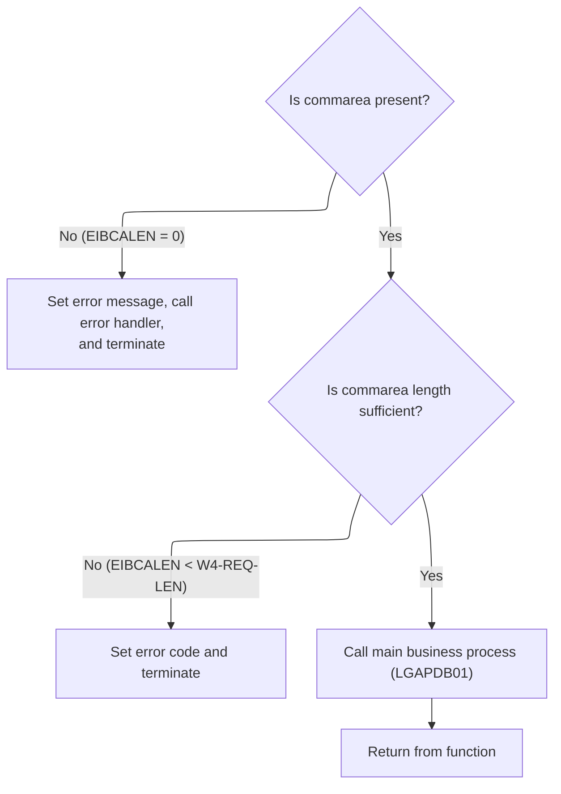
```mermaid
%%{init: {"flowchart": {"defaultRenderer": "elk"}} }%%
flowchart TD
  node1{"Is commarea present?"}
  click node1 openCode "base/src/lgapol01.cbl:83:87"
  node1 -->|"No (EIBCALEN = 0)"| node2["Set error message, call error handler,
and terminate"]
  click node2 openCode "base/src/lgapol01.cbl:84:86"
  node1 -->|"Yes"| node3{"Is commarea length sufficient?"}
  click node3 openCode "base/src/lgapol01.cbl:95:98"
  node3 -->|"No (EIBCALEN < W4-REQ-LEN)"| node4["Set error code and terminate"]
  click node4 openCode "base/src/lgapol01.cbl:96:97"
  node3 -->|"Yes"| node5["Call main business process (LGAPDB01)"]
  click node5 openCode "base/src/lgapol01.cbl:103:106"
  node5 --> node6["Return from function"]
  click node6 openCode "base/src/lgapol01.cbl:108:108"
classDef HeadingStyle fill:#777777,stroke:#333,stroke-width:2px;

%% Swimm:
%% %%{init: {"flowchart": {"defaultRenderer": "elk"}} }%%
%% flowchart TD
%%   node1{"Is commarea present?"}
%%   click node1 openCode "<SwmPath>[base/src/lgapol01.cbl](base/src/lgapol01.cbl)</SwmPath>:83:87"
%%   node1 -->|"No (EIBCALEN = 0)"| node2["Set error message, call error handler,
%% and terminate"]
%%   click node2 openCode "<SwmPath>[base/src/lgapol01.cbl](base/src/lgapol01.cbl)</SwmPath>:84:86"
%%   node1 -->|"Yes"| node3{"Is commarea length sufficient?"}
%%   click node3 openCode "<SwmPath>[base/src/lgapol01.cbl](base/src/lgapol01.cbl)</SwmPath>:95:98"
%%   node3 -->|"No (EIBCALEN < <SwmToken path="base/src/lgapol01.cbl" pos="92:11:15" line-data="           ADD W4-HDR-LEN TO W4-REQ-LEN">`W4-REQ-LEN`</SwmToken>)"| node4["Set error code and terminate"]
%%   click node4 openCode "<SwmPath>[base/src/lgapol01.cbl](base/src/lgapol01.cbl)</SwmPath>:96:97"
%%   node3 -->|"Yes"| node5["Call main business process (<SwmToken path="base/src/lgapol01.cbl" pos="103:9:9" line-data="           EXEC CICS Link Program(LGAPDB01)">`LGAPDB01`</SwmToken>)"]
%%   click node5 openCode "<SwmPath>[base/src/lgapol01.cbl](base/src/lgapol01.cbl)</SwmPath>:103:106"
%%   node5 --> node6["Return from function"]
%%   click node6 openCode "<SwmPath>[base/src/lgapol01.cbl](base/src/lgapol01.cbl)</SwmPath>:108:108"
%% classDef HeadingStyle fill:#777777,stroke:#333,stroke-width:2px;
```

This section validates the presence and minimum length of the commarea before processing an add policy request. It ensures that invalid requests are logged with sufficient context and that only valid requests proceed to the main business logic.

| Rule ID | Category                        | Rule Name                                           | Description                                                                                                                                                        | Implementation Details                                                                                                                                                                                                                                                                                                                                                                                                                                                               |
| ------- | ------------------------------- | --------------------------------------------------- | ------------------------------------------------------------------------------------------------------------------------------------------------------------------ | ------------------------------------------------------------------------------------------------------------------------------------------------------------------------------------------------------------------------------------------------------------------------------------------------------------------------------------------------------------------------------------------------------------------------------------------------------------------------------------ |
| BR-001  | Data validation                 | Commarea presence required                          | If the commarea is not present, an error message is logged with the detail 'NO COMMAREA RECEIVED', the process is terminated, and no further processing occurs.    | The error message includes the current date, time, and the detail 'NO COMMAREA RECEIVED'. The log format is: date (8 characters), time (6 characters), program name (9 characters), and detail (21 characters).                                                                                                                                                                                                                                                                      |
| BR-002  | Data validation                 | Commarea minimum length required                    | If the commarea is present but its length is less than the required minimum, an error code '98' is set, and the process is terminated without further processing.  | The required minimum length is the sum of <SwmToken path="base/src/lgapol01.cbl" pos="92:11:15" line-data="           ADD W4-HDR-LEN TO W4-REQ-LEN">`W4-REQ-LEN`</SwmToken> and <SwmToken path="base/src/lgapol01.cbl" pos="92:3:7" line-data="           ADD W4-HDR-LEN TO W4-REQ-LEN">`W4-HDR-LEN`</SwmToken> (<SwmToken path="base/src/lgapol01.cbl" pos="92:3:7" line-data="           ADD W4-HDR-LEN TO W4-REQ-LEN">`W4-HDR-LEN`</SwmToken> is 28). The error code set is '98'. |
| BR-003  | Writing Output                  | Error log includes date, time, and commarea context | When an error is logged, the error message includes the current date and time, and, if the commarea is present, up to 90 bytes of its data are logged for context. | The error log includes: date (8 characters), time (6 characters), program name (9 characters), detail (21 characters), and up to 90 bytes of commarea data. If commarea length is less than 91, the entire commarea is logged; otherwise, only the first 90 bytes are logged.                                                                                                                                                                                                        |
| BR-004  | Invoking a Service or a Process | Invoke main business process on valid input         | If the commarea passes validation, the main business process is invoked to handle the add operation.                                                               | The main business process is invoked via a program call with the commarea and a fixed length of 32,500 bytes.                                                                                                                                                                                                                                                                                                                                                                        |

<SwmSnippet path="/base/src/lgapol01.cbl" line="68">

---

<SwmToken path="base/src/lgapol01.cbl" pos="68:1:3" line-data="       P100-MAIN SECTION.">`P100-MAIN`</SwmToken> checks commarea presence and length, logs and abends if invalid, then links to <SwmToken path="base/src/lgapol01.cbl" pos="103:9:9" line-data="           EXEC CICS Link Program(LGAPDB01)">`LGAPDB01`</SwmToken> to process the add operation. Error handling is built in before dispatch.

```cobol
       P100-MAIN SECTION.

      *----------------------------------------------------------------*
      * Common code                                                    *
      *----------------------------------------------------------------*
           INITIALIZE W1-CONTROL.
           MOVE EIBTRNID TO W1-TID.
           MOVE EIBTRMID TO W1-TRM.
           MOVE EIBTASKN TO W1-TSK.
           MOVE EIBCALEN TO W1-LEN.
      *----------------------------------------------------------------*

      *----------------------------------------------------------------*
      * Check commarea and obtain required details                     *
      *----------------------------------------------------------------*
           IF EIBCALEN IS EQUAL TO ZERO
               MOVE ' NO COMMAREA RECEIVED' TO W3-DETAIL
               PERFORM P999-ERROR
               EXEC CICS ABEND ABCODE('LGCA') NODUMP END-EXEC
           END-IF

           MOVE '00' TO CA-RETURN-CODE
           SET W1-PTR TO ADDRESS OF DFHCOMMAREA.

           ADD W4-HDR-LEN TO W4-REQ-LEN


           IF EIBCALEN IS LESS THAN W4-REQ-LEN
             MOVE '98' TO CA-RETURN-CODE
             EXEC CICS RETURN END-EXEC
           END-IF

      *----------------------------------------------------------------*
      *    Perform the data Inserts                                    *
      *----------------------------------------------------------------*
           EXEC CICS Link Program(LGAPDB01)
                Commarea(DFHCOMMAREA)
                LENGTH(32500)
           END-EXEC.

           EXEC CICS RETURN END-EXEC.
```

---

</SwmSnippet>

<SwmSnippet path="/base/src/lgapol01.cbl" line="119">

---

<SwmToken path="base/src/lgapol01.cbl" pos="119:1:3" line-data="       P999-ERROR.">`P999-ERROR`</SwmToken> formats the error message with date/time, then calls LGSTSQ to log it. If commarea data exists, it logs up to 90 bytes for context, using a fixed structure.

```cobol
       P999-ERROR.
      * Save SQLCODE in message
      * Obtain and format current time and date
           EXEC CICS ASKTIME ABSTIME(W2-TIME)
           END-EXEC
           EXEC CICS FORMATTIME ABSTIME(W2-TIME)
                     MMDDYYYY(W2-DATE1)
                     TIME(W2-DATE2)
           END-EXEC
           MOVE W2-DATE1 TO W3-DATE
           MOVE W2-DATE2 TO W3-TIME
      * Write output message to TDQ
           EXEC CICS LINK PROGRAM('LGSTSQ')
                     COMMAREA(W3-MESSAGE)
                     LENGTH(LENGTH OF W3-MESSAGE)
           END-EXEC.
      * Write 90 bytes or as much as we have of commarea to TDQ
           IF EIBCALEN > 0 THEN
             IF EIBCALEN < 91 THEN
               MOVE DFHCOMMAREA(1:EIBCALEN) TO CA-DATA
               EXEC CICS LINK PROGRAM('LGSTSQ')
                         COMMAREA(CA-ERROR-MSG)
                         LENGTH(LENGTH OF CA-ERROR-MSG)
               END-EXEC
             ELSE
               MOVE DFHCOMMAREA(1:90) TO CA-DATA
               EXEC CICS LINK PROGRAM('LGSTSQ')
                         COMMAREA(CA-ERROR-MSG)
                         LENGTH(LENGTH OF CA-ERROR-MSG)
               END-EXEC
             END-IF
           END-IF.
           EXIT.
```

---

</SwmSnippet>

## Premium Calculation Workflow

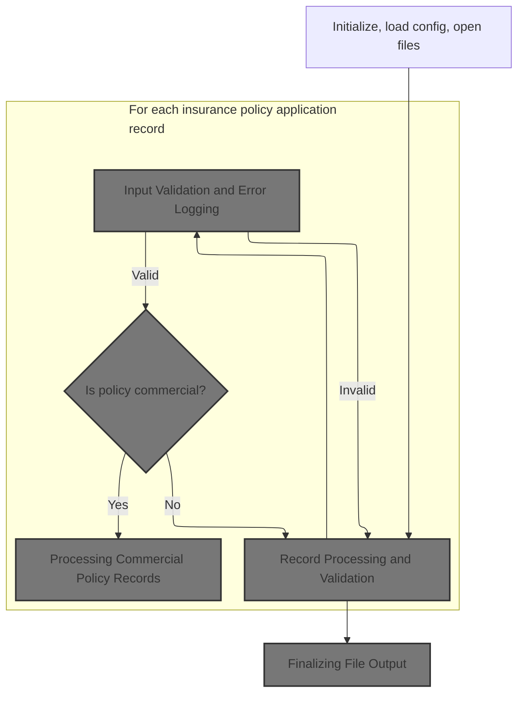
```mermaid
%%{init: {"flowchart": {"defaultRenderer": "elk"}} }%%
flowchart TD
    node1["Initialize, load config, open files"] --> node2["Record Processing and Validation"]
    click node1 openCode "base/src/LGAPDB01.cbl:90:142"
    
    subgraph loop1["For each insurance policy application
record"]
        node2 --> node3["Input Validation and Error Logging"]
        
        node3 -->|"Valid"| node4{"Is policy commercial?"}
        node3 -->|"Invalid"| node2
        node4 -->|"Yes"| node5["Processing Commercial Policy Records"]
        
        node4 -->|"No"| node2
    end
    node2 --> node6["Finalizing File Output"]
    

classDef HeadingStyle fill:#777777,stroke:#333,stroke-width:2px;
click node2 goToHeading "Record Processing and Validation"
node2:::HeadingStyle
click node3 goToHeading "Input Validation and Error Logging"
node3:::HeadingStyle
click node4 goToHeading "Routing Valid Records by Policy Type"
node4:::HeadingStyle
click node5 goToHeading "Processing Commercial Policy Records"
node5:::HeadingStyle
click node6 goToHeading "Finalizing File Output"
node6:::HeadingStyle

%% Swimm:
%% %%{init: {"flowchart": {"defaultRenderer": "elk"}} }%%
%% flowchart TD
%%     node1["Initialize, load config, open files"] --> node2["Record Processing and Validation"]
%%     click node1 openCode "<SwmPath>[base/src/LGAPDB01.cbl](base/src/LGAPDB01.cbl)</SwmPath>:90:142"
%%     
%%     subgraph loop1["For each insurance policy application
%% record"]
%%         node2 --> node3["Input Validation and Error Logging"]
%%         
%%         node3 -->|"Valid"| node4{"Is policy commercial?"}
%%         node3 -->|"Invalid"| node2
%%         node4 -->|"Yes"| node5["Processing Commercial Policy Records"]
%%         
%%         node4 -->|"No"| node2
%%     end
%%     node2 --> node6["Finalizing File Output"]
%%     
%% 
%% classDef HeadingStyle fill:#777777,stroke:#333,stroke-width:2px;
%% click node2 goToHeading "Record Processing and Validation"
%% node2:::HeadingStyle
%% click node3 goToHeading "Input Validation and Error Logging"
%% node3:::HeadingStyle
%% click node4 goToHeading "Routing Valid Records by Policy Type"
%% node4:::HeadingStyle
%% click node5 goToHeading "Processing Commercial Policy Records"
%% node5:::HeadingStyle
%% click node6 goToHeading "Finalizing File Output"
%% node6:::HeadingStyle
```

This section manages the full workflow for calculating insurance policy premiums, ensuring that all records are validated, processed according to business rules, and that outputs and summaries are generated for reporting and metrics.

| Rule ID | Category        | Rule Name                                 | Description                                                                                                                                                                                                                                     | Implementation Details                                                                                                                                                                                                        |
| ------- | --------------- | ----------------------------------------- | ----------------------------------------------------------------------------------------------------------------------------------------------------------------------------------------------------------------------------------------------- | ----------------------------------------------------------------------------------------------------------------------------------------------------------------------------------------------------------------------------- |
| BR-001  | Data validation | Input Record Validation and Error Logging | Each insurance policy application record is validated for required fields and business constraints before further processing. Invalid records are logged with errors and not processed as valid policies.                                       | Validation includes checks for valid policy type, presence of customer number, at least one coverage limit, and total coverage not exceeding the allowed maximum. Errors and warnings are logged for invalid or missing data. |
| BR-002  | Decision Making | Workflow Sequence Enforcement             | The workflow executes a fixed sequence: initialize, load configuration, open files, process records, close files, generate summary, and display statistics. Each step is required for the premium calculation process to complete successfully. | The sequence is: initialize, load config, open files, process records, close files, generate summary, display stats. Each step is required for the process to be considered complete.                                         |
| BR-003  | Decision Making | Policy Type Routing                       | Valid input records are routed based on policy type: commercial policies are processed using commercial business logic, while non-commercial policies are not processed further in this context.                                                | Commercial policies are processed for premium calculation; non-commercial policies are not processed further in this workflow section.                                                                                        |
| BR-004  | Writing Output  | File Preparation and Report Header Output | All required files (input, output, summary) are opened and output report headers are written before any record processing begins.                                                                                                               | Input, output, and summary files are opened in sequence; output report headers are written to structure the report.                                                                                                           |
| BR-005  | Writing Output  | Summary Generation and Statistics Display | After all records are processed, the workflow closes files, generates a summary, and displays statistics to complete the reporting and metrics requirements.                                                                                    | Files are closed, a summary is generated, and statistics are displayed as the final steps of the workflow.                                                                                                                    |

<SwmSnippet path="/base/src/LGAPDB01.cbl" line="90">

---

<SwmToken path="base/src/LGAPDB01.cbl" pos="90:1:1" line-data="       P001.">`P001`</SwmToken> runs the full premium calculation workflow: init, config, open files, process records, close files, generate summary, and display stats. Each step is required for the calculation process.

```cobol
       P001.
           PERFORM P002-INITIALIZE
           PERFORM P003-LOAD-CONFIG
           PERFORM P005-OPEN-FILES
           PERFORM P006-PROCESS-RECORDS
           PERFORM P014-CLOSE-FILES
           PERFORM P015-GENERATE-SUMMARY
           PERFORM P016-DISPLAY-STATS
           STOP RUN.
```

---

</SwmSnippet>

<SwmSnippet path="/base/src/LGAPDB01.cbl" line="138">

---

<SwmToken path="base/src/LGAPDB01.cbl" pos="138:1:5" line-data="       P005-OPEN-FILES.">`P005-OPEN-FILES`</SwmToken> calls four subroutines in sequence: open input, open output, open summary, and write headers. This sets up all files and structures the output report before processing.

```cobol
       P005-OPEN-FILES.
           PERFORM P005A-OPEN-INPUT
           PERFORM P005B-OPEN-OUTPUT
           PERFORM P005C-OPEN-SUMMARY
           PERFORM P005D-WRITE-HEADERS.
```

---

</SwmSnippet>

### Record Processing and Validation

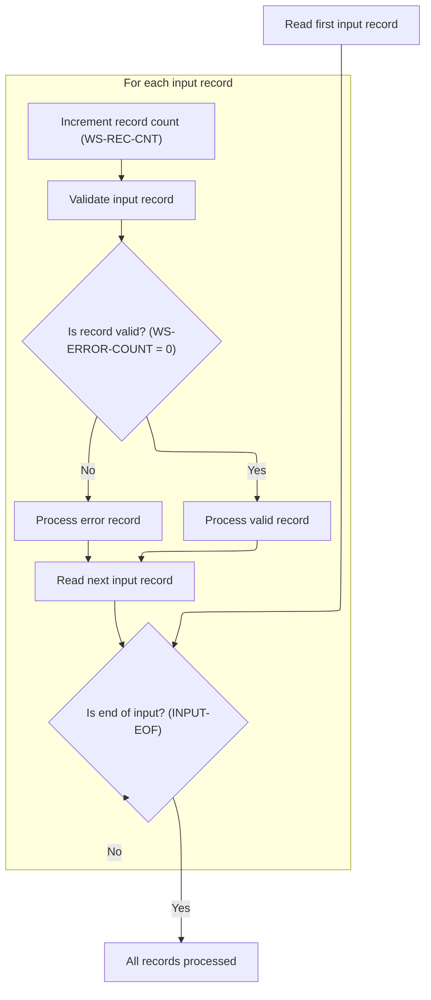
```mermaid
%%{init: {"flowchart": {"defaultRenderer": "elk"}} }%%
flowchart TD
    node1["Read first input record"]
    click node1 openCode "base/src/LGAPDB01.cbl:179:179"
    node1 --> node2{"Is end of input? (INPUT-EOF)"}
    click node2 openCode "base/src/LGAPDB01.cbl:180:180"
    node2 -->|"No"| loop1
    node2 -->|"Yes"| node9["All records processed"]
    click node9 openCode "base/src/LGAPDB01.cbl:189:189"

    subgraph loop1["For each input record"]
      node3["Increment record count (WS-REC-CNT)"]
      click node3 openCode "base/src/LGAPDB01.cbl:181:181"
      node3 --> node4["Validate input record"]
      click node4 openCode "base/src/LGAPDB01.cbl:182:182"
      node4 --> node5{"Is record valid? (WS-ERROR-COUNT = 0)"}
      click node5 openCode "base/src/LGAPDB01.cbl:183:183"
      node5 -->|"Yes"| node6["Process valid record"]
      click node6 openCode "base/src/LGAPDB01.cbl:184:184"
      node5 -->|"No"| node7["Process error record"]
      click node7 openCode "base/src/LGAPDB01.cbl:186:186"
      node6 --> node8["Read next input record"]
      click node8 openCode "base/src/LGAPDB01.cbl:188:188"
      node7 --> node8
      node8 --> node2
    end

classDef HeadingStyle fill:#777777,stroke:#333,stroke-width:2px;

%% Swimm:
%% %%{init: {"flowchart": {"defaultRenderer": "elk"}} }%%
%% flowchart TD
%%     node1["Read first input record"]
%%     click node1 openCode "<SwmPath>[base/src/LGAPDB01.cbl](base/src/LGAPDB01.cbl)</SwmPath>:179:179"
%%     node1 --> node2{"Is end of input? (<SwmToken path="base/src/LGAPDB01.cbl" pos="180:5:7" line-data="           PERFORM UNTIL INPUT-EOF">`INPUT-EOF`</SwmToken>)"}
%%     click node2 openCode "<SwmPath>[base/src/LGAPDB01.cbl](base/src/LGAPDB01.cbl)</SwmPath>:180:180"
%%     node2 -->|"No"| loop1
%%     node2 -->|"Yes"| node9["All records processed"]
%%     click node9 openCode "<SwmPath>[base/src/LGAPDB01.cbl](base/src/LGAPDB01.cbl)</SwmPath>:189:189"
%% 
%%     subgraph loop1["For each input record"]
%%       node3["Increment record count (<SwmToken path="base/src/LGAPDB01.cbl" pos="181:7:11" line-data="               ADD 1 TO WS-REC-CNT">`WS-REC-CNT`</SwmToken>)"]
%%       click node3 openCode "<SwmPath>[base/src/LGAPDB01.cbl](base/src/LGAPDB01.cbl)</SwmPath>:181:181"
%%       node3 --> node4["Validate input record"]
%%       click node4 openCode "<SwmPath>[base/src/LGAPDB01.cbl](base/src/LGAPDB01.cbl)</SwmPath>:182:182"
%%       node4 --> node5{"Is record valid? (<SwmToken path="base/src/LGAPDB01.cbl" pos="183:3:7" line-data="               IF WS-ERROR-COUNT = ZERO">`WS-ERROR-COUNT`</SwmToken> = 0)"}
%%       click node5 openCode "<SwmPath>[base/src/LGAPDB01.cbl](base/src/LGAPDB01.cbl)</SwmPath>:183:183"
%%       node5 -->|"Yes"| node6["Process valid record"]
%%       click node6 openCode "<SwmPath>[base/src/LGAPDB01.cbl](base/src/LGAPDB01.cbl)</SwmPath>:184:184"
%%       node5 -->|"No"| node7["Process error record"]
%%       click node7 openCode "<SwmPath>[base/src/LGAPDB01.cbl](base/src/LGAPDB01.cbl)</SwmPath>:186:186"
%%       node6 --> node8["Read next input record"]
%%       click node8 openCode "<SwmPath>[base/src/LGAPDB01.cbl](base/src/LGAPDB01.cbl)</SwmPath>:188:188"
%%       node7 --> node8
%%       node8 --> node2
%%     end
%% 
%% classDef HeadingStyle fill:#777777,stroke:#333,stroke-width:2px;
```

This section manages the lifecycle of input records, ensuring each record is validated and processed according to its validity, and tracks processing statistics.

| Rule ID | Category        | Rule Name                      | Description                                                                                                             | Implementation Details                                                                                                         |
| ------- | --------------- | ------------------------------ | ----------------------------------------------------------------------------------------------------------------------- | ------------------------------------------------------------------------------------------------------------------------------ |
| BR-001  | Reading Input   | Input record reading until EOF | Each input record is read sequentially until the end-of-file condition is detected, which is defined by the value '10'. | The end-of-file constant is '10'. Records are read one at a time in sequence.                                                  |
| BR-002  | Reading Input   | Sequential record processing   | After processing each record (valid or error), the next input record is read and the loop continues until end-of-file.  | Records are processed in sequence, with the loop continuing until the end-of-file condition is met.                            |
| BR-003  | Calculation     | Record counting                | The record count is incremented for each input record processed, regardless of validity.                                | The record count starts at zero and increments by one for each record processed.                                               |
| BR-004  | Decision Making | Valid record processing        | Each input record is validated, and if no errors are found (error count is zero), it is processed as a valid record.    | A record is considered valid if the error count is zero. Valid records are processed according to business requirements.       |
| BR-005  | Decision Making | Error record processing        | If validation fails (error count is not zero), the record is processed as an error record.                              | Error records are processed separately, with error messages and severity tracked. Error count is used to determine invalidity. |

<SwmSnippet path="/base/src/LGAPDB01.cbl" line="178">

---

<SwmToken path="base/src/LGAPDB01.cbl" pos="178:1:5" line-data="       P006-PROCESS-RECORDS.">`P006-PROCESS-RECORDS`</SwmToken> loops through input records, validates each one, processes valid records, and handles errors. The loop runs until <SwmToken path="base/src/LGAPDB01.cbl" pos="180:5:7" line-data="           PERFORM UNTIL INPUT-EOF">`INPUT-EOF`</SwmToken>, so every record is handled.

```cobol
       P006-PROCESS-RECORDS.
           PERFORM P007-READ-INPUT
           PERFORM UNTIL INPUT-EOF
               ADD 1 TO WS-REC-CNT
               PERFORM P008-VALIDATE-INPUT-RECORD
               IF WS-ERROR-COUNT = ZERO
                   PERFORM P009-PROCESS-VALID-RECORD
               ELSE
                   PERFORM P010-PROCESS-ERROR-RECORD
               END-IF
               PERFORM P007-READ-INPUT
           END-PERFORM.
```

---

</SwmSnippet>

### Input Validation and Error Logging


```mermaid
%%{init: {"flowchart": {"defaultRenderer": "elk"}} }%%
flowchart TD
    node1["Start validation"]
    click node1 openCode "base/src/LGAPDB01.cbl:195:196"
    node1 --> node2{"Is policy type commercial, personal, or
farm?"}
    click node2 openCode "base/src/LGAPDB01.cbl:198:204"
    node1 --> node4{"Is customer number present?"}
    click node4 openCode "base/src/LGAPDB01.cbl:206:210"
    node1 --> node6{"Is at least one coverage limit
provided?"}
    click node6 openCode "base/src/LGAPDB01.cbl:212:217"
    node1 --> node8{"Does total coverage exceed
$50,000,000.00?"}
    click node8 openCode "base/src/LGAPDB01.cbl:219:224"
    node2 -->|"No"| node3["Log error: Invalid Policy Type (POL001,
Fatal)"]
    click node3 openCode "base/src/LGAPDB01.cbl:201:203"
    node4 -->|"No"| node5["Log error: Customer Number Required
(CUS001, Fatal)"]
    click node5 openCode "base/src/LGAPDB01.cbl:207:209"
    node6 -->|"No"| node7["Log error: Coverage Limit Required
(COV001, Fatal)"]
    click node7 openCode "base/src/LGAPDB01.cbl:214:216"
    node8 -->|"Yes"| node9["Log warning: Coverage Exceeds Maximum
TIV (COV002, Warning)"]
    click node9 openCode "base/src/LGAPDB01.cbl:221:223"

classDef HeadingStyle fill:#777777,stroke:#333,stroke-width:2px;

%% Swimm:
%% %%{init: {"flowchart": {"defaultRenderer": "elk"}} }%%
%% flowchart TD
%%     node1["Start validation"]
%%     click node1 openCode "<SwmPath>[base/src/LGAPDB01.cbl](base/src/LGAPDB01.cbl)</SwmPath>:195:196"
%%     node1 --> node2{"Is policy type commercial, personal, or
%% farm?"}
%%     click node2 openCode "<SwmPath>[base/src/LGAPDB01.cbl](base/src/LGAPDB01.cbl)</SwmPath>:198:204"
%%     node1 --> node4{"Is customer number present?"}
%%     click node4 openCode "<SwmPath>[base/src/LGAPDB01.cbl](base/src/LGAPDB01.cbl)</SwmPath>:206:210"
%%     node1 --> node6{"Is at least one coverage limit
%% provided?"}
%%     click node6 openCode "<SwmPath>[base/src/LGAPDB01.cbl](base/src/LGAPDB01.cbl)</SwmPath>:212:217"
%%     node1 --> node8{"Does total coverage exceed
%% $50,000,000.00?"}
%%     click node8 openCode "<SwmPath>[base/src/LGAPDB01.cbl](base/src/LGAPDB01.cbl)</SwmPath>:219:224"
%%     node2 -->|"No"| node3["Log error: Invalid Policy Type (<SwmToken path="base/src/LGAPDB01.cbl" pos="202:2:2" line-data="                   &#39;POL001&#39; &#39;F&#39; &#39;IN-POLICY-TYPE&#39; ">`POL001`</SwmToken>,
%% Fatal)"]
%%     click node3 openCode "<SwmPath>[base/src/LGAPDB01.cbl](base/src/LGAPDB01.cbl)</SwmPath>:201:203"
%%     node4 -->|"No"| node5["Log error: Customer Number Required
%% (<SwmToken path="base/src/LGAPDB01.cbl" pos="208:2:2" line-data="                   &#39;CUS001&#39; &#39;F&#39; &#39;IN-CUSTOMER-NUM&#39; ">`CUS001`</SwmToken>, Fatal)"]
%%     click node5 openCode "<SwmPath>[base/src/LGAPDB01.cbl](base/src/LGAPDB01.cbl)</SwmPath>:207:209"
%%     node6 -->|"No"| node7["Log error: Coverage Limit Required
%% (<SwmToken path="base/src/LGAPDB01.cbl" pos="215:2:2" line-data="                   &#39;COV001&#39; &#39;F&#39; &#39;COVERAGE-LIMITS&#39; ">`COV001`</SwmToken>, Fatal)"]
%%     click node7 openCode "<SwmPath>[base/src/LGAPDB01.cbl](base/src/LGAPDB01.cbl)</SwmPath>:214:216"
%%     node8 -->|"Yes"| node9["Log warning: Coverage Exceeds Maximum
%% TIV (<SwmToken path="base/src/LGAPDB01.cbl" pos="222:2:2" line-data="                   &#39;COV002&#39; &#39;W&#39; &#39;COVERAGE-LIMITS&#39; ">`COV002`</SwmToken>, Warning)"]
%%     click node9 openCode "<SwmPath>[base/src/LGAPDB01.cbl](base/src/LGAPDB01.cbl)</SwmPath>:221:223"
%% 
%% classDef HeadingStyle fill:#777777,stroke:#333,stroke-width:2px;
```

This section validates key fields in an insurance policy record and logs errors or warnings if business requirements are not met. The main product role is to ensure data quality and provide actionable feedback for invalid or out-of-bounds records.

| Rule ID | Category        | Rule Name                      | Description                                                                                                                                                                                                                                                                                                                                                                                                                                                                                                                      | Implementation Details                                                                                                                                                                                                                                                                                                                                                                                                                                           |
| ------- | --------------- | ------------------------------ | -------------------------------------------------------------------------------------------------------------------------------------------------------------------------------------------------------------------------------------------------------------------------------------------------------------------------------------------------------------------------------------------------------------------------------------------------------------------------------------------------------------------------------- | ---------------------------------------------------------------------------------------------------------------------------------------------------------------------------------------------------------------------------------------------------------------------------------------------------------------------------------------------------------------------------------------------------------------------------------------------------------------- |
| BR-001  | Data validation | Policy Type Validation         | If the policy type is not commercial, personal, or farm, log a fatal error with code <SwmToken path="base/src/LGAPDB01.cbl" pos="202:2:2" line-data="                   &#39;POL001&#39; &#39;F&#39; &#39;IN-POLICY-TYPE&#39; ">`POL001`</SwmToken>, field <SwmToken path="base/src/LGAPDB01.cbl" pos="202:10:14" line-data="                   &#39;POL001&#39; &#39;F&#39; &#39;IN-POLICY-TYPE&#39; ">`IN-POLICY-TYPE`</SwmToken>, and message 'Invalid Policy Type'.                                                          | Error code: <SwmToken path="base/src/LGAPDB01.cbl" pos="202:2:2" line-data="                   &#39;POL001&#39; &#39;F&#39; &#39;IN-POLICY-TYPE&#39; ">`POL001`</SwmToken>. Severity: Fatal. Field: <SwmToken path="base/src/LGAPDB01.cbl" pos="202:10:14" line-data="                   &#39;POL001&#39; &#39;F&#39; &#39;IN-POLICY-TYPE&#39; ">`IN-POLICY-TYPE`</SwmToken>. Message: 'Invalid Policy Type'.                                                    |
| BR-002  | Data validation | Customer Number Required       | If the customer number is missing (blank), log a fatal error with code <SwmToken path="base/src/LGAPDB01.cbl" pos="208:2:2" line-data="                   &#39;CUS001&#39; &#39;F&#39; &#39;IN-CUSTOMER-NUM&#39; ">`CUS001`</SwmToken>, field <SwmToken path="base/src/LGAPDB01.cbl" pos="206:3:7" line-data="           IF IN-CUSTOMER-NUM = SPACES">`IN-CUSTOMER-NUM`</SwmToken>, and message 'Customer Number Required'.                                                                                                      | Error code: <SwmToken path="base/src/LGAPDB01.cbl" pos="208:2:2" line-data="                   &#39;CUS001&#39; &#39;F&#39; &#39;IN-CUSTOMER-NUM&#39; ">`CUS001`</SwmToken>. Severity: Fatal. Field: <SwmToken path="base/src/LGAPDB01.cbl" pos="206:3:7" line-data="           IF IN-CUSTOMER-NUM = SPACES">`IN-CUSTOMER-NUM`</SwmToken>. Message: 'Customer Number Required'.                                                                                  |
| BR-003  | Data validation | Coverage Limit Required        | If both building and contents coverage limits are zero, log a fatal error with code <SwmToken path="base/src/LGAPDB01.cbl" pos="215:2:2" line-data="                   &#39;COV001&#39; &#39;F&#39; &#39;COVERAGE-LIMITS&#39; ">`COV001`</SwmToken>, field <SwmToken path="base/src/LGAPDB01.cbl" pos="215:10:12" line-data="                   &#39;COV001&#39; &#39;F&#39; &#39;COVERAGE-LIMITS&#39; ">`COVERAGE-LIMITS`</SwmToken>, and message 'At least one coverage limit required'.                                       | Error code: <SwmToken path="base/src/LGAPDB01.cbl" pos="215:2:2" line-data="                   &#39;COV001&#39; &#39;F&#39; &#39;COVERAGE-LIMITS&#39; ">`COV001`</SwmToken>. Severity: Fatal. Field: <SwmToken path="base/src/LGAPDB01.cbl" pos="215:10:12" line-data="                   &#39;COV001&#39; &#39;F&#39; &#39;COVERAGE-LIMITS&#39; ">`COVERAGE-LIMITS`</SwmToken>. Message: 'At least one coverage limit required'.                                |
| BR-004  | Data validation | Maximum Total Coverage Warning | If the sum of building, contents, and business interruption coverage limits exceeds $50,000,000.00, log a warning with code <SwmToken path="base/src/LGAPDB01.cbl" pos="222:2:2" line-data="                   &#39;COV002&#39; &#39;W&#39; &#39;COVERAGE-LIMITS&#39; ">`COV002`</SwmToken>, field <SwmToken path="base/src/LGAPDB01.cbl" pos="215:10:12" line-data="                   &#39;COV001&#39; &#39;F&#39; &#39;COVERAGE-LIMITS&#39; ">`COVERAGE-LIMITS`</SwmToken>, and message 'Total coverage exceeds maximum TIV'. | Warning code: <SwmToken path="base/src/LGAPDB01.cbl" pos="222:2:2" line-data="                   &#39;COV002&#39; &#39;W&#39; &#39;COVERAGE-LIMITS&#39; ">`COV002`</SwmToken>. Severity: Warning. Field: <SwmToken path="base/src/LGAPDB01.cbl" pos="215:10:12" line-data="                   &#39;COV001&#39; &#39;F&#39; &#39;COVERAGE-LIMITS&#39; ">`COVERAGE-LIMITS`</SwmToken>. Message: 'Total coverage exceeds maximum TIV'. Maximum TIV: $50,000,000.00. |

<SwmSnippet path="/base/src/LGAPDB01.cbl" line="195">

---

<SwmToken path="base/src/LGAPDB01.cbl" pos="195:1:7" line-data="       P008-VALIDATE-INPUT-RECORD.">`P008-VALIDATE-INPUT-RECORD`</SwmToken> checks policy type, customer number, and coverage limits. If any validation fails, it logs errors or warnings for downstream processing.

```cobol
       P008-VALIDATE-INPUT-RECORD.
           INITIALIZE WS-ERROR-HANDLING
           
           IF NOT COMMERCIAL-POLICY AND 
              NOT PERSONAL-POLICY AND 
              NOT FARM-POLICY
               PERFORM P008A-LOG-ERROR WITH 
                   'POL001' 'F' 'IN-POLICY-TYPE' 
                   'Invalid Policy Type'
           END-IF
           
           IF IN-CUSTOMER-NUM = SPACES
               PERFORM P008A-LOG-ERROR WITH 
                   'CUS001' 'F' 'IN-CUSTOMER-NUM' 
                   'Customer Number Required'
           END-IF
           
           IF IN-BUILDING-LIMIT = ZERO AND 
              IN-CONTENTS-LIMIT = ZERO
               PERFORM P008A-LOG-ERROR WITH 
                   'COV001' 'F' 'COVERAGE-LIMITS' 
                   'At least one coverage limit required'
           END-IF
           
           IF IN-BUILDING-LIMIT + IN-CONTENTS-LIMIT + 
              IN-BI-LIMIT > WS-MAX-TIV
               PERFORM P008A-LOG-ERROR WITH 
                   'COV002' 'W' 'COVERAGE-LIMITS' 
                   'Total coverage exceeds maximum TIV'
           END-IF.
```

---

</SwmSnippet>

<SwmSnippet path="/base/src/LGAPDB01.cbl" line="226">

---

<SwmToken path="base/src/LGAPDB01.cbl" pos="226:1:5" line-data="       P008A-LOG-ERROR.">`P008A-LOG-ERROR`</SwmToken> bumps the error count and logs error details in indexed arrays. This lets us track multiple errors per record for reporting.

```cobol
       P008A-LOG-ERROR.
           ADD 1 TO WS-ERROR-COUNT
           SET ERR-IDX TO WS-ERROR-COUNT
           MOVE WS-ERROR-CODE TO WS-ERROR-CODE (ERR-IDX)
           MOVE WS-ERROR-SEVERITY TO WS-ERROR-SEVERITY (ERR-IDX)
           MOVE WS-ERROR-FIELD TO WS-ERROR-FIELD (ERR-IDX)
           MOVE WS-ERROR-MESSAGE TO WS-ERROR-MESSAGE (ERR-IDX).
```

---

</SwmSnippet>

### Routing Valid Records by Policy Type

This section determines the processing path for valid policy records by evaluating their type and updates processing statistics accordingly.

| Rule ID | Category        | Rule Name                     | Description                                                                                               | Implementation Details                                                                                                                                             |
| ------- | --------------- | ----------------------------- | --------------------------------------------------------------------------------------------------------- | ------------------------------------------------------------------------------------------------------------------------------------------------------------------ |
| BR-001  | Calculation     | Counter initialization        | The processed and error counts are initialized to zero before any records are processed.                  | Both the processed count and error count are numeric fields initialized to zero.                                                                                   |
| BR-002  | Decision Making | Commercial policy routing     | Commercial policy records are routed to commercial processing and the processed count is incremented.     | The commercial policy type is represented by the value 'C'. The processed count starts at zero and is incremented by one for each commercial policy routed.        |
| BR-003  | Decision Making | Non-commercial policy routing | Non-commercial policy records are routed to non-commercial processing and the error count is incremented. | Non-commercial policy types include 'P' (personal) and 'F' (farm). The error count starts at zero and is incremented by one for each non-commercial policy routed. |

<SwmSnippet path="/base/src/LGAPDB01.cbl" line="234">

---

Here, <SwmToken path="base/src/LGAPDB01.cbl" pos="234:1:7" line-data="       P009-PROCESS-VALID-RECORD.">`P009-PROCESS-VALID-RECORD`</SwmToken> decides if the current record is commercial or not. It sends commercial policies to <SwmToken path="base/src/LGAPDB01.cbl" pos="236:3:7" line-data="               PERFORM P011-PROCESS-COMMERCIAL">`P011-PROCESS-COMMERCIAL`</SwmToken> and bumps the processed count, while non-commercials go to <SwmToken path="base/src/LGAPDB01.cbl" pos="239:3:9" line-data="               PERFORM P012-PROCESS-NON-COMMERCIAL">`P012-PROCESS-NON-COMMERCIAL`</SwmToken> and increment the error count. This split is needed because each type has its own logic and output handling.

```cobol
       P009-PROCESS-VALID-RECORD.
           IF COMMERCIAL-POLICY
               PERFORM P011-PROCESS-COMMERCIAL
               ADD 1 TO WS-PROC-CNT
           ELSE
               PERFORM P012-PROCESS-NON-COMMERCIAL
               ADD 1 TO WS-ERR-CNT
           END-IF.
```

---

</SwmSnippet>

### Processing Commercial Policy Records

This section governs the business logic for processing commercial policy records, including underwriting decisions and discount eligibility.

| Rule ID | Category        | Rule Name                               | Description                                                                                                                                   | Implementation Details                                                                                                                                                              |
| ------- | --------------- | --------------------------------------- | --------------------------------------------------------------------------------------------------------------------------------------------- | ----------------------------------------------------------------------------------------------------------------------------------------------------------------------------------- |
| BR-001  | Calculation     | Discount factor application             | Discount factors are applied to eligible policies, with a base factor of 1.00 for both individual and total discount calculations.            | Discount factors are numeric values with two decimal places (e.g., 1.00). Output format is numeric, 4 bytes including decimal point.                                                |
| BR-002  | Decision Making | Underwriting decision status assignment | Underwriting decision status is set to Approved, Pending, Rejected, or Referred based on the value assigned to the underwriting status field. | The possible values are: 0 (Approved), 1 (Pending), 2 (Rejected), 3 (Referred). The output format for status is a numeric value (0-3) and a descriptive string up to 20 characters. |
| BR-003  | Decision Making | Discount eligibility determination      | Eligibility for multi-policy, claims-free, and safety program discounts is determined by setting the eligibility flag to 'Y' or 'N'.          | Eligibility flags are single-character strings ('Y' or 'N'). Output format is alphanumeric, 1 byte per flag.                                                                        |

See <SwmLink doc-title="Commercial Policy Processing Flow">[Commercial Policy Processing Flow](.swm%5Ccommercial-policy-processing-flow.xycrcrev.sw.md)</SwmLink>

### Finalizing File Output

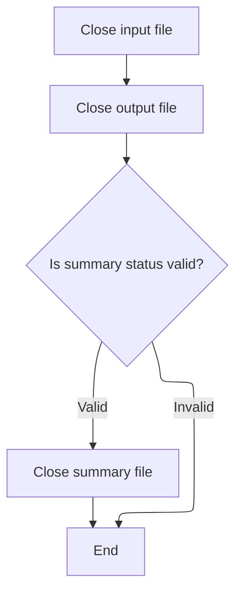
```mermaid
%%{init: {"flowchart": {"defaultRenderer": "elk"}} }%%
flowchart TD
    node1["Close input file"]
    click node1 openCode "base/src/LGAPDB01.cbl:395:395"
    node1 --> node2["Close output file"]
    click node2 openCode "base/src/LGAPDB01.cbl:396:396"
    node2 --> node3{"Is summary status valid?"}
    click node3 openCode "base/src/LGAPDB01.cbl:397:397"
    node3 -->|"Valid"| node4["Close summary file"]
    click node4 openCode "base/src/LGAPDB01.cbl:398:398"
    node3 -->|"Invalid"| node5["End"]
    click node5 openCode "base/src/LGAPDB01.cbl:399:399"
    node4 --> node5["End"]
    click node5 openCode "base/src/LGAPDB01.cbl:399:399"
classDef HeadingStyle fill:#777777,stroke:#333,stroke-width:2px;

%% Swimm:
%% %%{init: {"flowchart": {"defaultRenderer": "elk"}} }%%
%% flowchart TD
%%     node1["Close input file"]
%%     click node1 openCode "<SwmPath>[base/src/LGAPDB01.cbl](base/src/LGAPDB01.cbl)</SwmPath>:395:395"
%%     node1 --> node2["Close output file"]
%%     click node2 openCode "<SwmPath>[base/src/LGAPDB01.cbl](base/src/LGAPDB01.cbl)</SwmPath>:396:396"
%%     node2 --> node3{"Is summary status valid?"}
%%     click node3 openCode "<SwmPath>[base/src/LGAPDB01.cbl](base/src/LGAPDB01.cbl)</SwmPath>:397:397"
%%     node3 -->|"Valid"| node4["Close summary file"]
%%     click node4 openCode "<SwmPath>[base/src/LGAPDB01.cbl](base/src/LGAPDB01.cbl)</SwmPath>:398:398"
%%     node3 -->|"Invalid"| node5["End"]
%%     click node5 openCode "<SwmPath>[base/src/LGAPDB01.cbl](base/src/LGAPDB01.cbl)</SwmPath>:399:399"
%%     node4 --> node5["End"]
%%     click node5 openCode "<SwmPath>[base/src/LGAPDB01.cbl](base/src/LGAPDB01.cbl)</SwmPath>:399:399"
%% classDef HeadingStyle fill:#777777,stroke:#333,stroke-width:2px;
```

This section finalizes file output by ensuring all files are properly closed at the end of processing. It applies business logic to determine which files are closed based on the summary status.

| Rule ID | Category       | Rule Name                          | Description                                                                             | Implementation Details                                                                                              |
| ------- | -------------- | ---------------------------------- | --------------------------------------------------------------------------------------- | ------------------------------------------------------------------------------------------------------------------- |
| BR-001  | Writing Output | Close input file                   | The input file is closed at the end of processing, regardless of any other conditions.  | No constants or output formats are relevant. The action is to close the input file resource.                        |
| BR-002  | Writing Output | Close output file                  | The output file is closed at the end of processing, regardless of any other conditions. | No constants or output formats are relevant. The action is to close the output file resource.                       |
| BR-003  | Writing Output | Close summary file if status valid | The summary file is closed only if the summary status is valid ('00').                  | The summary status value '00' is the business condition for closing the summary file. No output format is involved. |

<SwmSnippet path="/base/src/LGAPDB01.cbl" line="394">

---

<SwmToken path="base/src/LGAPDB01.cbl" pos="394:1:5" line-data="       P014-CLOSE-FILES.">`P014-CLOSE-FILES`</SwmToken> shuts down <SwmToken path="base/src/LGAPDB01.cbl" pos="395:3:5" line-data="           CLOSE INPUT-FILE">`INPUT-FILE`</SwmToken> and <SwmToken path="base/src/LGAPDB01.cbl" pos="396:3:5" line-data="           CLOSE OUTPUT-FILE">`OUTPUT-FILE`</SwmToken> every time, but only closes <SwmToken path="base/src/LGAPDB01.cbl" pos="398:3:5" line-data="               CLOSE SUMMARY-FILE">`SUMMARY-FILE`</SwmToken> if the summary status is OK (<SwmToken path="base/src/LGAPDB01.cbl" pos="29:7:11" line-data="                  FILE STATUS IS WS-SUM-STAT.">`WS-SUM-STAT`</SwmToken> = '00'). This avoids trying to close a file that wasn't opened due to earlier errors.

```cobol
       P014-CLOSE-FILES.
           CLOSE INPUT-FILE
           CLOSE OUTPUT-FILE
           IF SUMMARY-OK
               CLOSE SUMMARY-FILE
           END-IF.
```

---

</SwmSnippet>

## Handling Add Operation Result

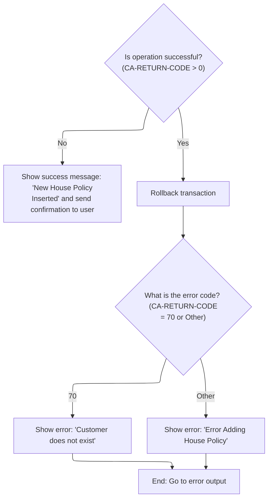
```mermaid
%%{init: {"flowchart": {"defaultRenderer": "elk"}} }%%
flowchart TD
    node1{"Is operation successful?
(CA-RETURN-CODE > 0)"}
    click node1 openCode "base/src/lgtestp3.cbl:110:113"
    node1 -->|"No"| node2["Show success message: 'New House Policy
Inserted' and send confirmation to user"]
    click node2 openCode "base/src/lgtestp3.cbl:114:122"
    node1 -->|"Yes"| node6["Rollback transaction"]
    click node6 openCode "base/src/lgtestp3.cbl:111:112"
    node6 --> node3{"What is the error code? (CA-RETURN-CODE
= 70 or Other)"}
    click node3 openCode "base/src/lgtestp3.cbl:268:275"
    node3 -->|"70"| node4["Show error: 'Customer does not exist'"]
    click node4 openCode "base/src/lgtestp3.cbl:270:271"
    node4 --> node7["End: Go to error output"]
    click node7 openCode "base/src/lgtestp3.cbl:271:271"
    node3 -->|"Other"| node5["Show error: 'Error Adding House Policy'"]
    click node5 openCode "base/src/lgtestp3.cbl:273:274"
    node5 --> node7

classDef HeadingStyle fill:#777777,stroke:#333,stroke-width:2px;

%% Swimm:
%% %%{init: {"flowchart": {"defaultRenderer": "elk"}} }%%
%% flowchart TD
%%     node1{"Is operation successful?
%% (<SwmToken path="base/src/lgtestp3.cbl" pos="74:3:7" line-data="                 IF CA-RETURN-CODE &gt; 0">`CA-RETURN-CODE`</SwmToken> > 0)"}
%%     click node1 openCode "<SwmPath>[base/src/lgtestp3.cbl](base/src/lgtestp3.cbl)</SwmPath>:110:113"
%%     node1 -->|"No"| node2["Show success message: 'New House Policy
%% Inserted' and send confirmation to user"]
%%     click node2 openCode "<SwmPath>[base/src/lgtestp3.cbl](base/src/lgtestp3.cbl)</SwmPath>:114:122"
%%     node1 -->|"Yes"| node6["Rollback transaction"]
%%     click node6 openCode "<SwmPath>[base/src/lgtestp3.cbl](base/src/lgtestp3.cbl)</SwmPath>:111:112"
%%     node6 --> node3{"What is the error code? (<SwmToken path="base/src/lgtestp3.cbl" pos="74:3:7" line-data="                 IF CA-RETURN-CODE &gt; 0">`CA-RETURN-CODE`</SwmToken>
%% = 70 or Other)"}
%%     click node3 openCode "<SwmPath>[base/src/lgtestp3.cbl](base/src/lgtestp3.cbl)</SwmPath>:268:275"
%%     node3 -->|"70"| node4["Show error: 'Customer does not exist'"]
%%     click node4 openCode "<SwmPath>[base/src/lgtestp3.cbl](base/src/lgtestp3.cbl)</SwmPath>:270:271"
%%     node4 --> node7["End: Go to error output"]
%%     click node7 openCode "<SwmPath>[base/src/lgtestp3.cbl](base/src/lgtestp3.cbl)</SwmPath>:271:271"
%%     node3 -->|"Other"| node5["Show error: 'Error Adding House Policy'"]
%%     click node5 openCode "<SwmPath>[base/src/lgtestp3.cbl](base/src/lgtestp3.cbl)</SwmPath>:273:274"
%%     node5 --> node7
%% 
%% classDef HeadingStyle fill:#777777,stroke:#333,stroke-width:2px;
```

This section determines the outcome of an Add House Policy request and communicates the result to the user, handling both success and error scenarios.

| Rule ID | Category        | Rule Name                     | Description                                                                                                                                     | Implementation Details                                                                                                                                                                                                                  |
| ------- | --------------- | ----------------------------- | ----------------------------------------------------------------------------------------------------------------------------------------------- | --------------------------------------------------------------------------------------------------------------------------------------------------------------------------------------------------------------------------------------- |
| BR-001  | Decision Making | Rollback on Add Failure       | If the Add House Policy operation fails, rollback the transaction to maintain data integrity.                                                   | Transaction rollback is performed to ensure no partial data is committed in case of error.                                                                                                                                              |
| BR-002  | Writing Output  | Show Add Success Confirmation | If the Add House Policy operation completes without error, display a confirmation message to the user and show the new policy details.          | The confirmation message is 'New House Policy Inserted'. Policy details are displayed to the user. The output format includes the customer number and policy number as strings, and the confirmation message as an alphanumeric string. |
| BR-003  | Writing Output  | Customer Not Exist Error      | If the Add House Policy operation fails with error code 70, display an error message indicating the customer does not exist.                    | The error message is 'Customer does not exist'. The message is displayed to the user and the menu is reset for another transaction.                                                                                                     |
| BR-004  | Writing Output  | Generic Add Error Message     | If the Add House Policy operation fails with any error code other than 70, display a generic error message indicating the add operation failed. | The error message is 'Error Adding House Policy'. The message is displayed to the user and the menu is reset for another transaction.                                                                                                   |

<SwmSnippet path="/base/src/lgtestp3.cbl" line="110">

---

Back in <SwmToken path="base/src/lgtestp3.cbl" pos="33:5:7" line-data="              GO TO A-GAIN.">`A-GAIN`</SwmToken> after <SwmToken path="base/src/lgtestp3.cbl" pos="106:10:10" line-data="                 EXEC CICS LINK PROGRAM(&#39;LGAPOL01&#39;)">`LGAPOL01`</SwmToken> returns, we check if <SwmToken path="base/src/lgtestp3.cbl" pos="110:3:7" line-data="                 IF CA-RETURN-CODE &gt; 0">`CA-RETURN-CODE`</SwmToken> signals an error. If so, we rollback and jump to <SwmToken path="base/src/lgtestp3.cbl" pos="112:5:7" line-data="                   GO TO NO-ADD">`NO-ADD`</SwmToken> to handle the error and reset the menu.

```cobol
                 IF CA-RETURN-CODE > 0
                   Exec CICS Syncpoint Rollback End-Exec
                   GO TO NO-ADD
                 END-IF
```

---

</SwmSnippet>

<SwmSnippet path="/base/src/lgtestp3.cbl" line="267">

---

<SwmToken path="base/src/lgtestp3.cbl" pos="267:1:3" line-data="       NO-ADD.">`NO-ADD`</SwmToken> checks the error code, sets the right error message for the user, then jumps to <SwmToken path="base/src/lgtestp3.cbl" pos="271:5:7" line-data="               Go To ERROR-OUT">`ERROR-OUT`</SwmToken> to show the menu again and prep for another transaction.

```cobol
       NO-ADD.
           Evaluate CA-RETURN-CODE
             When 70
               Move 'Customer does not exist'          To  ERP1FLDO
               Go To ERROR-OUT
             When Other
               Move 'Error Adding House Policy'        To  ERP1FLDO
               Go To ERROR-OUT
           End-Evaluate.
```

---

</SwmSnippet>

<SwmSnippet path="/base/src/lgtestp3.cbl" line="114">

---

Back in <SwmToken path="base/src/lgtestp3.cbl" pos="33:5:7" line-data="              GO TO A-GAIN.">`A-GAIN`</SwmToken>, we move the new policy details to the output map and send the menu screen with a confirmation message, so the user sees their new house policy was added.

```cobol
                 Move CA-CUSTOMER-NUM To ENP3CNOI
                 Move CA-POLICY-NUM   To ENP3PNOI
                 Move ' '             To ENP3OPTI
                 Move 'New House Policy Inserted'
                   To  ERP3FLDO
                 EXEC CICS SEND MAP ('SSMAPP3')
                           FROM(SSMAPP3O)
                           MAPSET ('SSMAP')
                 END-EXEC
```

---

</SwmSnippet>

<SwmSnippet path="/base/src/lgtestp3.cbl" line="125">

---

When the user picks delete (option '3'), we prep the commarea with the right request ID and policy/customer info, then call <SwmToken path="base/src/lgtestp3.cbl" pos="129:10:10" line-data="                 EXEC CICS LINK PROGRAM(&#39;LGDPOL01&#39;)">`LGDPOL01`</SwmToken> to handle the deletion. The link passes all the data needed for backend processing.

```cobol
             WHEN '3'
                 Move '01DHOU'   To CA-REQUEST-ID
                 Move ENP3CNOO   To CA-CUSTOMER-NUM
                 Move ENP3PNOO   To CA-POLICY-NUM
                 EXEC CICS LINK PROGRAM('LGDPOL01')
                           COMMAREA(COMM-AREA)
                           LENGTH(32500)
                 END-EXEC
```

---

</SwmSnippet>

## Validating and Dispatching Policy Deletion


```mermaid
%%{init: {"flowchart": {"defaultRenderer": "elk"}} }%%
flowchart TD
    node1["Initialize transaction and variables"]
    click node1 openCode "base/src/lgdpol01.cbl:78:89"
    node1 --> node2{"Is commarea present? (EIBCALEN > 0)"}
    click node2 openCode "base/src/lgdpol01.cbl:95:99"
    node2 -->|"No"| node3["Record error: No commarea received"]
    click node3 openCode "base/src/lgdpol01.cbl:96:98"
    node3 --> node4["Write error message"]
    click node4 openCode "base/src/lgdpol01.cbl:154:186"
    node4 --> node5["Return error"]
    click node5 openCode "base/src/lgdpol01.cbl:98:98"
    node2 -->|"Yes"| node6{"Is commarea large enough? (EIBCALEN >=
28)"}
    click node6 openCode "base/src/lgdpol01.cbl:107:110"
    node6 -->|"No"| node7["Return error: Commarea too short"]
    click node7 openCode "base/src/lgdpol01.cbl:108:109"
    node6 -->|"Yes"| node8{"Is request ID recognized?
(CA-REQUEST-ID in
[01DEND,01DMOT,01DHOU,01DCOM])"}
    click node8 openCode "base/src/lgdpol01.cbl:119:122"
    node8 -->|"No"| node9["Return error: Unrecognized request"]
    click node9 openCode "base/src/lgdpol01.cbl:124:124"
    node8 -->|"Yes"| node10["Delete policy"]
    click node10 openCode "base/src/lgdpol01.cbl:126:126"
    node10 --> node11{"Did deletion fail? (CA-RETURN-CODE >
0)"}
    click node11 openCode "base/src/lgdpol01.cbl:127:129"
    node11 -->|"Yes"| node12["Return error"]
    click node12 openCode "base/src/lgdpol01.cbl:128:128"
    node11 -->|"No"| node13["Return success"]
    click node13 openCode "base/src/lgdpol01.cbl:133:133"

classDef HeadingStyle fill:#777777,stroke:#333,stroke-width:2px;

%% Swimm:
%% %%{init: {"flowchart": {"defaultRenderer": "elk"}} }%%
%% flowchart TD
%%     node1["Initialize transaction and variables"]
%%     click node1 openCode "<SwmPath>[base/src/lgdpol01.cbl](base/src/lgdpol01.cbl)</SwmPath>:78:89"
%%     node1 --> node2{"Is commarea present? (EIBCALEN > 0)"}
%%     click node2 openCode "<SwmPath>[base/src/lgdpol01.cbl](base/src/lgdpol01.cbl)</SwmPath>:95:99"
%%     node2 -->|"No"| node3["Record error: No commarea received"]
%%     click node3 openCode "<SwmPath>[base/src/lgdpol01.cbl](base/src/lgdpol01.cbl)</SwmPath>:96:98"
%%     node3 --> node4["Write error message"]
%%     click node4 openCode "<SwmPath>[base/src/lgdpol01.cbl](base/src/lgdpol01.cbl)</SwmPath>:154:186"
%%     node4 --> node5["Return error"]
%%     click node5 openCode "<SwmPath>[base/src/lgdpol01.cbl](base/src/lgdpol01.cbl)</SwmPath>:98:98"
%%     node2 -->|"Yes"| node6{"Is commarea large enough? (EIBCALEN >=
%% 28)"}
%%     click node6 openCode "<SwmPath>[base/src/lgdpol01.cbl](base/src/lgdpol01.cbl)</SwmPath>:107:110"
%%     node6 -->|"No"| node7["Return error: Commarea too short"]
%%     click node7 openCode "<SwmPath>[base/src/lgdpol01.cbl](base/src/lgdpol01.cbl)</SwmPath>:108:109"
%%     node6 -->|"Yes"| node8{"Is request ID recognized?
%% (<SwmToken path="base/src/lgtestp3.cbl" pos="67:9:13" line-data="                 Move &#39;01IHOU&#39;   To CA-REQUEST-ID">`CA-REQUEST-ID`</SwmToken> in
%% [<SwmToken path="base/src/lgdpol01.cbl" pos="119:18:18" line-data="           IF ( CA-REQUEST-ID NOT EQUAL TO &#39;01DEND&#39; AND">`01DEND`</SwmToken>,<SwmToken path="base/src/lgdpol01.cbl" pos="120:14:14" line-data="                CA-REQUEST-ID NOT EQUAL TO &#39;01DMOT&#39; AND">`01DMOT`</SwmToken>,<SwmToken path="base/src/lgtestp3.cbl" pos="126:4:4" line-data="                 Move &#39;01DHOU&#39;   To CA-REQUEST-ID">`01DHOU`</SwmToken>,<SwmToken path="base/src/lgdpol01.cbl" pos="122:14:14" line-data="                CA-REQUEST-ID NOT EQUAL TO &#39;01DCOM&#39; )">`01DCOM`</SwmToken>])"}
%%     click node8 openCode "<SwmPath>[base/src/lgdpol01.cbl](base/src/lgdpol01.cbl)</SwmPath>:119:122"
%%     node8 -->|"No"| node9["Return error: Unrecognized request"]
%%     click node9 openCode "<SwmPath>[base/src/lgdpol01.cbl](base/src/lgdpol01.cbl)</SwmPath>:124:124"
%%     node8 -->|"Yes"| node10["Delete policy"]
%%     click node10 openCode "<SwmPath>[base/src/lgdpol01.cbl](base/src/lgdpol01.cbl)</SwmPath>:126:126"
%%     node10 --> node11{"Did deletion fail? (<SwmToken path="base/src/lgtestp3.cbl" pos="74:3:7" line-data="                 IF CA-RETURN-CODE &gt; 0">`CA-RETURN-CODE`</SwmToken> >
%% 0)"}
%%     click node11 openCode "<SwmPath>[base/src/lgdpol01.cbl](base/src/lgdpol01.cbl)</SwmPath>:127:129"
%%     node11 -->|"Yes"| node12["Return error"]
%%     click node12 openCode "<SwmPath>[base/src/lgdpol01.cbl](base/src/lgdpol01.cbl)</SwmPath>:128:128"
%%     node11 -->|"No"| node13["Return success"]
%%     click node13 openCode "<SwmPath>[base/src/lgdpol01.cbl](base/src/lgdpol01.cbl)</SwmPath>:133:133"
%% 
%% classDef HeadingStyle fill:#777777,stroke:#333,stroke-width:2px;
```

This section validates incoming requests for policy deletion, standardizes and checks the request type, and either dispatches the deletion or returns/logs an error based on validation outcomes.

| Rule ID | Category        | Rule Name                      | Description                                                                                                                                                                                                                                                                                                                                                                                                                                                                                                                                                                                                                                                                                                   | Implementation Details                                                                                                                                                                                                                                                                                                                                                                                                                                                                                                                                                                                                                                                                                                        |
| ------- | --------------- | ------------------------------ | ------------------------------------------------------------------------------------------------------------------------------------------------------------------------------------------------------------------------------------------------------------------------------------------------------------------------------------------------------------------------------------------------------------------------------------------------------------------------------------------------------------------------------------------------------------------------------------------------------------------------------------------------------------------------------------------------------------- | ----------------------------------------------------------------------------------------------------------------------------------------------------------------------------------------------------------------------------------------------------------------------------------------------------------------------------------------------------------------------------------------------------------------------------------------------------------------------------------------------------------------------------------------------------------------------------------------------------------------------------------------------------------------------------------------------------------------------------- |
| BR-001  | Data validation | Commarea required              | If no commarea is received, an error is logged and the transaction is abended with code 'LGCA'.                                                                                                                                                                                                                                                                                                                                                                                                                                                                                                                                                                                                               | Error message includes: date (8 chars), time (6 chars), program name (<SwmToken path="base/src/lgtestp3.cbl" pos="129:10:10" line-data="                 EXEC CICS LINK PROGRAM(&#39;LGDPOL01&#39;)">`LGDPOL01`</SwmToken>), and the message ' NO COMMAREA RECEIVED'.                                                                                                                                                                                                                                                                                                                                                                                                                                                         |
| BR-002  | Data validation | Minimum commarea length        | If the commarea is present but shorter than 28 bytes, an error code '98' is returned and processing stops.                                                                                                                                                                                                                                                                                                                                                                                                                                                                                                                                                                                                    | The minimum required commarea length is 28 bytes. Error code '98' is returned in the commarea result code field.                                                                                                                                                                                                                                                                                                                                                                                                                                                                                                                                                                                                              |
| BR-003  | Data validation | Request ID standardization     | The request ID in the commarea is converted to uppercase before validation to ensure case-insensitive comparison.                                                                                                                                                                                                                                                                                                                                                                                                                                                                                                                                                                                             | All alphabetic characters in the request ID are converted to uppercase before further validation or comparison.                                                                                                                                                                                                                                                                                                                                                                                                                                                                                                                                                                                                               |
| BR-004  | Data validation | Recognized request ID          | If the request ID is not one of the recognized values (<SwmToken path="base/src/lgdpol01.cbl" pos="119:18:18" line-data="           IF ( CA-REQUEST-ID NOT EQUAL TO &#39;01DEND&#39; AND">`01DEND`</SwmToken>, <SwmToken path="base/src/lgdpol01.cbl" pos="120:14:14" line-data="                CA-REQUEST-ID NOT EQUAL TO &#39;01DMOT&#39; AND">`01DMOT`</SwmToken>, <SwmToken path="base/src/lgtestp3.cbl" pos="126:4:4" line-data="                 Move &#39;01DHOU&#39;   To CA-REQUEST-ID">`01DHOU`</SwmToken>, <SwmToken path="base/src/lgdpol01.cbl" pos="122:14:14" line-data="                CA-REQUEST-ID NOT EQUAL TO &#39;01DCOM&#39; )">`01DCOM`</SwmToken>), an error code '99' is returned. | Valid request IDs are: <SwmToken path="base/src/lgdpol01.cbl" pos="119:18:18" line-data="           IF ( CA-REQUEST-ID NOT EQUAL TO &#39;01DEND&#39; AND">`01DEND`</SwmToken>, <SwmToken path="base/src/lgdpol01.cbl" pos="120:14:14" line-data="                CA-REQUEST-ID NOT EQUAL TO &#39;01DMOT&#39; AND">`01DMOT`</SwmToken>, <SwmToken path="base/src/lgtestp3.cbl" pos="126:4:4" line-data="                 Move &#39;01DHOU&#39;   To CA-REQUEST-ID">`01DHOU`</SwmToken>, <SwmToken path="base/src/lgdpol01.cbl" pos="122:14:14" line-data="                CA-REQUEST-ID NOT EQUAL TO &#39;01DCOM&#39; )">`01DCOM`</SwmToken>. Error code '99' is returned in the commarea result code field if not recognized. |
| BR-005  | Decision Making | Policy deletion dispatch       | If the request ID is recognized, the policy deletion process is triggered. If deletion fails (return code > 0), an error is returned; otherwise, success is returned.                                                                                                                                                                                                                                                                                                                                                                                                                                                                                                                                         | Policy deletion is attempted for valid requests. If the deletion routine sets a return code greater than zero, an error is returned; otherwise, success is returned to the caller.                                                                                                                                                                                                                                                                                                                                                                                                                                                                                                                                            |
| BR-006  | Writing Output  | Error logging and traceability | When an error occurs, an error message is logged with the current date, time, program name, and error details. Up to 90 bytes of the commarea are also logged for traceability.                                                                                                                                                                                                                                                                                                                                                                                                                                                                                                                               | Error log includes: date (8 chars), time (6 chars), program name (<SwmToken path="base/src/lgtestp3.cbl" pos="129:10:10" line-data="                 EXEC CICS LINK PROGRAM(&#39;LGDPOL01&#39;)">`LGDPOL01`</SwmToken>), error message (up to 21 chars), and up to 90 bytes of commarea data. Both are sent to the logging service for traceability.                                                                                                                                                                                                                                                                                                                                                                          |

<SwmSnippet path="/base/src/lgdpol01.cbl" line="78">

---

<SwmToken path="base/src/lgdpol01.cbl" pos="78:1:1" line-data="       MAINLINE SECTION.">`MAINLINE`</SwmToken> in <SwmToken path="base/src/lgtestp3.cbl" pos="129:10:10" line-data="                 EXEC CICS LINK PROGRAM(&#39;LGDPOL01&#39;)">`LGDPOL01`</SwmToken> checks the commarea and request ID, logs errors if anything's off, and either calls the <SwmToken path="base/src/lgdpol01.cbl" pos="126:7:7" line-data="               PERFORM DELETE-POLICY-DB2-INFO">`DB2`</SwmToken> delete routine or returns an error code. It handles validation and dispatch for policy deletion.

```cobol
       MAINLINE SECTION.

      *----------------------------------------------------------------*
      * Common code                                                    *
      *----------------------------------------------------------------*
      * initialize working storage variables
           INITIALIZE WS-HEADER.
      * set up general variable
           MOVE EIBTRNID TO WS-TRANSID.
           MOVE EIBTRMID TO WS-TERMID.
           MOVE EIBTASKN TO WS-TASKNUM.
      *----------------------------------------------------------------*

      *----------------------------------------------------------------*
      * Check commarea and obtain required details                     *
      *----------------------------------------------------------------*
      * If NO commarea received issue an ABEND
           IF EIBCALEN IS EQUAL TO ZERO
               MOVE ' NO COMMAREA RECEIVED' TO EM-VARIABLE
               PERFORM WRITE-ERROR-MESSAGE
               EXEC CICS ABEND ABCODE('LGCA') NODUMP END-EXEC
           END-IF

      * initialize commarea return code to zero
           MOVE '00' TO CA-RETURN-CODE
           MOVE EIBCALEN TO WS-CALEN.
           SET WS-ADDR-DFHCOMMAREA TO ADDRESS OF DFHCOMMAREA.

      * Check commarea is large enough
           IF EIBCALEN IS LESS THAN WS-CA-HEADER-LEN
             MOVE '98' TO CA-RETURN-CODE
             EXEC CICS RETURN END-EXEC
           END-IF

      *----------------------------------------------------------------*
      * Check request-id in commarea and if recognised ...             *
      * Call routine to delete row from policy table                   *
      *----------------------------------------------------------------*
      * Upper case value passed in Request Id field                    *
           MOVE FUNCTION UPPER-CASE(CA-REQUEST-ID) TO CA-REQUEST-ID

           IF ( CA-REQUEST-ID NOT EQUAL TO '01DEND' AND
                CA-REQUEST-ID NOT EQUAL TO '01DMOT' AND
                CA-REQUEST-ID NOT EQUAL TO '01DHOU' AND
                CA-REQUEST-ID NOT EQUAL TO '01DCOM' )
      *        Request is not recognised or supported
               MOVE '99' TO CA-RETURN-CODE
           ELSE
               PERFORM DELETE-POLICY-DB2-INFO
               If CA-RETURN-CODE > 0
                 EXEC CICS RETURN END-EXEC
               End-if
           END-IF

      * Return to caller
           EXEC CICS RETURN END-EXEC.
```

---

</SwmSnippet>

<SwmSnippet path="/base/src/lgdpol01.cbl" line="154">

---

<SwmToken path="base/src/lgdpol01.cbl" pos="154:1:5" line-data="       WRITE-ERROR-MESSAGE.">`WRITE-ERROR-MESSAGE`</SwmToken> logs the error details and current time, then calls LGSTSQ to write both the error message and a chunk of commarea data to the queue for traceability.

```cobol
       WRITE-ERROR-MESSAGE.
      * Save SQLCODE in message
      * Obtain and format current time and date
           EXEC CICS ASKTIME ABSTIME(WS-ABSTIME)
           END-EXEC
           EXEC CICS FORMATTIME ABSTIME(Ws-ABSTIME)
                     MMDDYYYY(WS-DATE)
                     TIME(WS-TIME)
           END-EXEC
           MOVE WS-DATE TO EM-DATE
           MOVE WS-TIME TO EM-TIME
      * Write output message to TDQ
           EXEC CICS LINK PROGRAM('LGSTSQ')
                     COMMAREA(ERROR-MSG)
                     LENGTH(LENGTH OF ERROR-MSG)
           END-EXEC.
      * Write 90 bytes or as much as we have of commarea to TDQ
           IF EIBCALEN > 0 THEN
             IF EIBCALEN < 91 THEN
               MOVE DFHCOMMAREA(1:EIBCALEN) TO CA-DATA
               EXEC CICS LINK PROGRAM('LGSTSQ')
                         COMMAREA(CA-ERROR-MSG)
                         LENGTH(LENGTH OF CA-ERROR-MSG)
               END-EXEC
             ELSE
               MOVE DFHCOMMAREA(1:90) TO CA-DATA
               EXEC CICS LINK PROGRAM('LGSTSQ')
                         COMMAREA(CA-ERROR-MSG)
                         LENGTH(LENGTH OF CA-ERROR-MSG)
               END-EXEC
             END-IF
           END-IF.
           EXIT.
```

---

</SwmSnippet>

## Dispatching <SwmToken path="base/src/lgipdb01.cbl" pos="242:5:5" line-data="      * initialize DB2 host variables">`DB2`</SwmToken> Policy Deletion

This section is responsible for dispatching a policy deletion request to the <SwmToken path="base/src/lgipdb01.cbl" pos="242:5:5" line-data="      * initialize DB2 host variables">`DB2`</SwmToken> backend by linking to the <SwmToken path="base/src/lgdpol01.cbl" pos="141:9:9" line-data="           EXEC CICS LINK PROGRAM(LGDPDB01)">`LGDPDB01`</SwmToken> program with the required data payload and length.

| Rule ID | Category                        | Rule Name                                                                                                                                        | Description                                                                                                                                                                                                                                                                                                                                                                                                                                                  | Implementation Details                                                                                                                                                                                                                                                                                                     |
| ------- | ------------------------------- | ------------------------------------------------------------------------------------------------------------------------------------------------ | ------------------------------------------------------------------------------------------------------------------------------------------------------------------------------------------------------------------------------------------------------------------------------------------------------------------------------------------------------------------------------------------------------------------------------------------------------------ | -------------------------------------------------------------------------------------------------------------------------------------------------------------------------------------------------------------------------------------------------------------------------------------------------------------------------- |
| BR-001  | Invoking a Service or a Process | Dispatch <SwmToken path="base/src/lgipdb01.cbl" pos="242:5:5" line-data="      * initialize DB2 host variables">`DB2`</SwmToken> Policy Deletion | The system dispatches a policy deletion request by linking to the <SwmToken path="base/src/lgdpol01.cbl" pos="141:9:9" line-data="           EXEC CICS LINK PROGRAM(LGDPDB01)">`LGDPDB01`</SwmToken> (<SwmToken path="base/src/lgdpol01.cbl" pos="141:9:9" line-data="           EXEC CICS LINK PROGRAM(LGDPDB01)">`LGDPDB01`</SwmToken> Delete Policy Records) program, passing the commarea with all required data and setting the length to 32,500 bytes. | The commarea is a binary data payload of 32,500 bytes. The <SwmToken path="base/src/lgdpol01.cbl" pos="141:9:9" line-data="           EXEC CICS LINK PROGRAM(LGDPDB01)">`LGDPDB01`</SwmToken> program expects this exact length for processing. No other formats or field-level requirements are enforced in this section. |

<SwmSnippet path="/base/src/lgdpol01.cbl" line="139">

---

<SwmToken path="base/src/lgdpol01.cbl" pos="139:1:7" line-data="       DELETE-POLICY-DB2-INFO.">`DELETE-POLICY-DB2-INFO`</SwmToken> just wraps the call to <SwmToken path="base/src/lgdpol01.cbl" pos="141:9:9" line-data="           EXEC CICS LINK PROGRAM(LGDPDB01)">`LGDPDB01`</SwmToken>, passing the commarea with all the data needed for <SwmToken path="base/src/lgdpol01.cbl" pos="139:5:5" line-data="       DELETE-POLICY-DB2-INFO.">`DB2`</SwmToken> deletion. The length is set to 32500 to match what <SwmToken path="base/src/lgdpol01.cbl" pos="141:9:9" line-data="           EXEC CICS LINK PROGRAM(LGDPDB01)">`LGDPDB01`</SwmToken> expects.

```cobol
       DELETE-POLICY-DB2-INFO.

           EXEC CICS LINK PROGRAM(LGDPDB01)
                Commarea(DFHCOMMAREA)
                LENGTH(32500)
           END-EXEC.

           EXIT.
```

---

</SwmSnippet>

## Validating and Executing <SwmToken path="base/src/lgipdb01.cbl" pos="242:5:5" line-data="      * initialize DB2 host variables">`DB2`</SwmToken> Policy Deletion


```mermaid
%%{init: {"flowchart": {"defaultRenderer": "elk"}} }%%
flowchart TD
    node1["Start MAINLINE"] --> node2{"Is commarea received? (EIBCALEN == 0)"}
    click node1 openCode "base/src/lgdpdb01.cbl:111:116"
    node2 -->|"No"| node3{"Is commarea large enough? (EIBCALEN <
WS-CA-HEADER-LEN)"}
    click node2 openCode "base/src/lgdpdb01.cbl:131:135"
    node2 -->|"Yes"| node4["Record error: No commarea received"]
    click node4 openCode "base/src/lgdpdb01.cbl:132:133"
    node4 --> node5["Return with error code 'LGCA'"]
    click node5 openCode "base/src/lgdpdb01.cbl:134:135"
    node3 -->|"No"| node6["Initialize commarea and business
variables"]
    click node6 openCode "base/src/lgdpdb01.cbl:137:153"
    node3 -->|"Yes"| node7["Return with error code '98'"]
    click node7 openCode "base/src/lgdpdb01.cbl:144:145"
    node6 --> node8{"Is request-id recognized?
(CA-REQUEST-ID in supported values)"}
    click node8 openCode "base/src/lgdpdb01.cbl:160:172"
    node8 -->|"No"| node9["Return with error code '99'"]
    click node9 openCode "base/src/lgdpdb01.cbl:165:166"
    node8 -->|"Yes"| node10["Delete policy record"]
    click node10 openCode "base/src/lgdpdb01.cbl:167:171"
    node10 --> node11{"Was deletion successful? (SQLCODE == 0
or 100?)"}
    click node11 openCode "base/src/lgdpdb01.cbl:198:202"
    node11 -->|"Yes"| node12["Return success ('00')"]
    click node12 openCode "base/src/lgdpdb01.cbl:175:175"
    node11 -->|"No"| node13["Record error: Database error"]
    click node13 openCode "base/src/lgdpdb01.cbl:199:200"
    node13 --> node14["Return with error code '90'"]
    click node14 openCode "base/src/lgdpdb01.cbl:201:201"

classDef HeadingStyle fill:#777777,stroke:#333,stroke-width:2px;

%% Swimm:
%% %%{init: {"flowchart": {"defaultRenderer": "elk"}} }%%
%% flowchart TD
%%     node1["Start MAINLINE"] --> node2{"Is commarea received? (EIBCALEN == 0)"}
%%     click node1 openCode "<SwmPath>[base/src/lgdpdb01.cbl](base/src/lgdpdb01.cbl)</SwmPath>:111:116"
%%     node2 -->|"No"| node3{"Is commarea large enough? (EIBCALEN <
%% <SwmToken path="base/src/lgdpol01.cbl" pos="107:11:17" line-data="           IF EIBCALEN IS LESS THAN WS-CA-HEADER-LEN">`WS-CA-HEADER-LEN`</SwmToken>)"}
%%     click node2 openCode "<SwmPath>[base/src/lgdpdb01.cbl](base/src/lgdpdb01.cbl)</SwmPath>:131:135"
%%     node2 -->|"Yes"| node4["Record error: No commarea received"]
%%     click node4 openCode "<SwmPath>[base/src/lgdpdb01.cbl](base/src/lgdpdb01.cbl)</SwmPath>:132:133"
%%     node4 --> node5["Return with error code 'LGCA'"]
%%     click node5 openCode "<SwmPath>[base/src/lgdpdb01.cbl](base/src/lgdpdb01.cbl)</SwmPath>:134:135"
%%     node3 -->|"No"| node6["Initialize commarea and business
%% variables"]
%%     click node6 openCode "<SwmPath>[base/src/lgdpdb01.cbl](base/src/lgdpdb01.cbl)</SwmPath>:137:153"
%%     node3 -->|"Yes"| node7["Return with error code '98'"]
%%     click node7 openCode "<SwmPath>[base/src/lgdpdb01.cbl](base/src/lgdpdb01.cbl)</SwmPath>:144:145"
%%     node6 --> node8{"Is <SwmToken path="base/src/lgdpol01.cbl" pos="113:5:7" line-data="      * Check request-id in commarea and if recognised ...             *">`request-id`</SwmToken> recognized?
%% (<SwmToken path="base/src/lgtestp3.cbl" pos="67:9:13" line-data="                 Move &#39;01IHOU&#39;   To CA-REQUEST-ID">`CA-REQUEST-ID`</SwmToken> in supported values)"}
%%     click node8 openCode "<SwmPath>[base/src/lgdpdb01.cbl](base/src/lgdpdb01.cbl)</SwmPath>:160:172"
%%     node8 -->|"No"| node9["Return with error code '99'"]
%%     click node9 openCode "<SwmPath>[base/src/lgdpdb01.cbl](base/src/lgdpdb01.cbl)</SwmPath>:165:166"
%%     node8 -->|"Yes"| node10["Delete policy record"]
%%     click node10 openCode "<SwmPath>[base/src/lgdpdb01.cbl](base/src/lgdpdb01.cbl)</SwmPath>:167:171"
%%     node10 --> node11{"Was deletion successful? (SQLCODE == 0
%% or 100?)"}
%%     click node11 openCode "<SwmPath>[base/src/lgdpdb01.cbl](base/src/lgdpdb01.cbl)</SwmPath>:198:202"
%%     node11 -->|"Yes"| node12["Return success ('00')"]
%%     click node12 openCode "<SwmPath>[base/src/lgdpdb01.cbl](base/src/lgdpdb01.cbl)</SwmPath>:175:175"
%%     node11 -->|"No"| node13["Record error: Database error"]
%%     click node13 openCode "<SwmPath>[base/src/lgdpdb01.cbl](base/src/lgdpdb01.cbl)</SwmPath>:199:200"
%%     node13 --> node14["Return with error code '90'"]
%%     click node14 openCode "<SwmPath>[base/src/lgdpdb01.cbl](base/src/lgdpdb01.cbl)</SwmPath>:201:201"
%% 
%% classDef HeadingStyle fill:#777777,stroke:#333,stroke-width:2px;
```

This section validates the input commarea, checks the request type, converts customer and policy numbers for <SwmToken path="base/src/lgipdb01.cbl" pos="242:5:5" line-data="      * initialize DB2 host variables">`DB2`</SwmToken>, executes the policy deletion, and handles error reporting. It ensures only recognized requests are processed and logs errors for tracking.

| Rule ID | Category        | Rule Name                                                                                                                                        | Description                                                                                                                                                                                                                                                                                                                                                                                                                                                                                                                                                                                                                                                                                                | Implementation Details                                                                                                                                                                                                |
| ------- | --------------- | ------------------------------------------------------------------------------------------------------------------------------------------------ | ---------------------------------------------------------------------------------------------------------------------------------------------------------------------------------------------------------------------------------------------------------------------------------------------------------------------------------------------------------------------------------------------------------------------------------------------------------------------------------------------------------------------------------------------------------------------------------------------------------------------------------------------------------------------------------------------------------- | --------------------------------------------------------------------------------------------------------------------------------------------------------------------------------------------------------------------- |
| BR-001  | Data validation | Missing commarea error                                                                                                                           | If no commarea is received, an error message is recorded and the process returns with error code 'LGCA'.                                                                                                                                                                                                                                                                                                                                                                                                                                                                                                                                                                                                   | Error code 'LGCA' is returned. The error message contains ' NO COMMAREA RECEIVED'.                                                                                                                                    |
| BR-002  | Data validation | Commarea minimum size validation                                                                                                                 | If commarea is smaller than the required header length (+28 bytes), return with error code '98'.                                                                                                                                                                                                                                                                                                                                                                                                                                                                                                                                                                                                           | Error code '98' is returned in the commarea. The minimum required commarea length is 28 bytes.                                                                                                                        |
| BR-003  | Decision Making | Request ID recognition                                                                                                                           | Only recognized request IDs (<SwmToken path="base/src/lgdpol01.cbl" pos="119:18:18" line-data="           IF ( CA-REQUEST-ID NOT EQUAL TO &#39;01DEND&#39; AND">`01DEND`</SwmToken>, <SwmToken path="base/src/lgtestp3.cbl" pos="126:4:4" line-data="                 Move &#39;01DHOU&#39;   To CA-REQUEST-ID">`01DHOU`</SwmToken>, <SwmToken path="base/src/lgdpol01.cbl" pos="122:14:14" line-data="                CA-REQUEST-ID NOT EQUAL TO &#39;01DCOM&#39; )">`01DCOM`</SwmToken>, <SwmToken path="base/src/lgdpol01.cbl" pos="120:14:14" line-data="                CA-REQUEST-ID NOT EQUAL TO &#39;01DMOT&#39; AND">`01DMOT`</SwmToken>) are processed; unrecognized IDs return error code '99'. | Error code '99' is returned for unrecognized request IDs. Supported request IDs are explicitly listed.                                                                                                                |
| BR-004  | Decision Making | <SwmToken path="base/src/lgipdb01.cbl" pos="242:5:5" line-data="      * initialize DB2 host variables">`DB2`</SwmToken> deletion result handling | Policy deletion is considered successful if SQLCODE is 0 (success) or 100 (record not found); any other SQLCODE returns error code '90' and logs the error.                                                                                                                                                                                                                                                                                                                                                                                                                                                                                                                                                | Error code '90' is returned for <SwmToken path="base/src/lgipdb01.cbl" pos="242:5:5" line-data="      * initialize DB2 host variables">`DB2`</SwmToken> errors. SQLCODE 0 and 100 are treated as successful outcomes. |
| BR-005  | Decision Making | Successful deletion outcome                                                                                                                      | On successful policy deletion, the process returns with code '00' and links to <SwmToken path="base/src/lgdpdb01.cbl" pos="168:9:9" line-data="               EXEC CICS LINK PROGRAM(LGDPVS01)">`LGDPVS01`</SwmToken> (Deleting Policy Records) for further processing.                                                                                                                                                                                                                                                                                                                                                                                                                                    | Return code '00' is used for success. <SwmToken path="base/src/lgdpdb01.cbl" pos="168:9:9" line-data="               EXEC CICS LINK PROGRAM(LGDPVS01)">`LGDPVS01`</SwmToken> is linked for additional processing.     |
| BR-006  | Writing Output  | Error message logging                                                                                                                            | When an error occurs, an error message is written to LGSTSQ (LGSTSQ Message Queue Writer), including the error details and up to 90 bytes of the commarea.                                                                                                                                                                                                                                                                                                                                                                                                                                                                                                                                                 | Error message includes date, time, customer number, policy number, SQL request, and SQL return code. Up to 90 bytes of commarea are written, or less if commarea is smaller.                                          |

<SwmSnippet path="/base/src/lgdpdb01.cbl" line="111">

---

<SwmToken path="base/src/lgdpdb01.cbl" pos="111:1:1" line-data="       MAINLINE SECTION.">`MAINLINE`</SwmToken> in <SwmToken path="base/src/lgdpol01.cbl" pos="141:9:9" line-data="           EXEC CICS LINK PROGRAM(LGDPDB01)">`LGDPDB01`</SwmToken> validates the commarea, converts customer and policy numbers for <SwmToken path="base/src/lgdpdb01.cbl" pos="124:5:5" line-data="      * initialize DB2 host variables">`DB2`</SwmToken>, checks the request ID, and either deletes the policy or returns an error. If deletion is successful, it links to <SwmToken path="base/src/lgdpdb01.cbl" pos="168:9:9" line-data="               EXEC CICS LINK PROGRAM(LGDPVS01)">`LGDPVS01`</SwmToken> for further processing.

```cobol
       MAINLINE SECTION.

      *----------------------------------------------------------------*
      * Common code                                                    *
      *----------------------------------------------------------------*
      * initialize working storage variables
           INITIALIZE WS-HEADER.
      * set up general variable
           MOVE EIBTRNID TO WS-TRANSID.
           MOVE EIBTRMID TO WS-TERMID.
           MOVE EIBTASKN TO WS-TASKNUM.
      *----------------------------------------------------------------*

      * initialize DB2 host variables
           INITIALIZE DB2-IN-INTEGERS.

      *----------------------------------------------------------------*
      * Check commarea and obtain required details                     *
      *----------------------------------------------------------------*
      * If NO commarea received issue an ABEND
           IF EIBCALEN IS EQUAL TO ZERO
               MOVE ' NO COMMAREA RECEIVED' TO EM-VARIABLE
               PERFORM WRITE-ERROR-MESSAGE
               EXEC CICS ABEND ABCODE('LGCA') NODUMP END-EXEC
           END-IF

      * initialize commarea return code to zero
           MOVE '00' TO CA-RETURN-CODE
           MOVE EIBCALEN TO WS-CALEN.
           SET WS-ADDR-DFHCOMMAREA TO ADDRESS OF DFHCOMMAREA.

      * Check commarea is large enough
           IF EIBCALEN IS LESS THAN WS-CA-HEADER-LEN
             MOVE '98' TO CA-RETURN-CODE
             EXEC CICS RETURN END-EXEC
           END-IF

      * Convert commarea customer & policy nums to DB2 integer format
           MOVE CA-CUSTOMER-NUM TO DB2-CUSTOMERNUM-INT
           MOVE CA-POLICY-NUM   TO DB2-POLICYNUM-INT
      * and save in error msg field incase required
           MOVE CA-CUSTOMER-NUM TO EM-CUSNUM
           MOVE CA-POLICY-NUM   TO EM-POLNUM

      *----------------------------------------------------------------*
      * Check request-id in commarea and if recognised ...             *
      * Call routine to delete row from policy table                   *
      *----------------------------------------------------------------*

           IF ( CA-REQUEST-ID NOT EQUAL TO '01DEND' AND
                CA-REQUEST-ID NOT EQUAL TO '01DHOU' AND
                CA-REQUEST-ID NOT EQUAL TO '01DCOM' AND
                CA-REQUEST-ID NOT EQUAL TO '01DMOT' ) Then
      *        Request is not recognised or supported
               MOVE '99' TO CA-RETURN-CODE
           ELSE
               PERFORM DELETE-POLICY-DB2-INFO
               EXEC CICS LINK PROGRAM(LGDPVS01)
                    Commarea(DFHCOMMAREA)
                    LENGTH(32500)
               END-EXEC
           END-IF.

      * Return to caller
           EXEC CICS RETURN END-EXEC.
```

---

</SwmSnippet>

<SwmSnippet path="/base/src/lgdpdb01.cbl" line="212">

---

<SwmToken path="base/src/lgdpdb01.cbl" pos="212:1:5" line-data="       WRITE-ERROR-MESSAGE.">`WRITE-ERROR-MESSAGE`</SwmToken> logs the SQL error, grabs the current time, and writes both the error message and up to 90 bytes of commarea to LGSTSQ for error tracking.

```cobol
       WRITE-ERROR-MESSAGE.
      * Save SQLCODE in message
           MOVE SQLCODE TO EM-SQLRC
      * Obtain and format current time and date
           EXEC CICS ASKTIME ABSTIME(WS-ABSTIME)
           END-EXEC
           EXEC CICS FORMATTIME ABSTIME(Ws-ABSTIME)
                     MMDDYYYY(WS-DATE)
                     TIME(WS-TIME)
           END-EXEC
           MOVE WS-DATE TO EM-DATE
           MOVE WS-TIME TO EM-TIME
      * Write output message to TDQ
           EXEC CICS LINK PROGRAM('LGSTSQ')
                     COMMAREA(ERROR-MSG)
                     LENGTH(LENGTH OF ERROR-MSG)
           END-EXEC.
      * Write 90 bytes or as much as we have of commarea to TDQ
           IF EIBCALEN > 0 THEN
             IF EIBCALEN < 91 THEN
               MOVE DFHCOMMAREA(1:EIBCALEN) TO CA-DATA
               EXEC CICS LINK PROGRAM('LGSTSQ')
                         COMMAREA(CA-ERROR-MSG)
                         LENGTH(LENGTH OF CA-ERROR-MSG)
               END-EXEC
             ELSE
               MOVE DFHCOMMAREA(1:90) TO CA-DATA
               EXEC CICS LINK PROGRAM('LGSTSQ')
                         COMMAREA(CA-ERROR-MSG)
                         LENGTH(LENGTH OF CA-ERROR-MSG)
               END-EXEC
             END-IF
           END-IF.
           EXIT.
```

---

</SwmSnippet>

<SwmSnippet path="/base/src/lgdpdb01.cbl" line="186">

---

<SwmToken path="base/src/lgdpdb01.cbl" pos="186:1:7" line-data="       DELETE-POLICY-DB2-INFO.">`DELETE-POLICY-DB2-INFO`</SwmToken> runs the SQL delete for the policy, treats both successful deletion and 'not found' as OK, but logs and returns an error if anything else happens.

```cobol
       DELETE-POLICY-DB2-INFO.

           MOVE ' DELETE POLICY  ' TO EM-SQLREQ
           EXEC SQL
             DELETE
               FROM POLICY
               WHERE ( CUSTOMERNUMBER = :DB2-CUSTOMERNUM-INT AND
                       POLICYNUMBER  = :DB2-POLICYNUM-INT      )
           END-EXEC

      *    Treat SQLCODE 0 and SQLCODE 100 (record not found) as
      *    successful - end result is record does not exist
           IF SQLCODE NOT EQUAL 0 Then
               MOVE '90' TO CA-RETURN-CODE
               PERFORM WRITE-ERROR-MESSAGE
               EXEC CICS RETURN END-EXEC
           END-IF.

           EXIT.
```

---

</SwmSnippet>

## Completing Policy Deletion in VSAM

This section manages the deletion of a policy record from the VSAM file and ensures that any errors are logged with sufficient context for troubleshooting.

| Rule ID | Category        | Rule Name                        | Description                                                                                                                                                                                                   | Implementation Details                                                                                                                                 |
| ------- | --------------- | -------------------------------- | ------------------------------------------------------------------------------------------------------------------------------------------------------------------------------------------------------------- | ------------------------------------------------------------------------------------------------------------------------------------------------------ |
| BR-001  | Data validation | Error handling on delete failure | If the delete operation does not return a normal response, the system sets the return code to '81', logs the error with details, and returns control to the caller.                                           | The return code for a failed delete is '81'. Error details include response codes and relevant input fields.                                           |
| BR-002  | Calculation     | Policy key construction          | The policy key for deletion is constructed using the request ID (last character), policy number, and customer number from the input commarea.                                                                 | The key is composed of: 1 character (request ID), 10 digits (customer number), 10 digits (policy number), total 21 bytes.                              |
| BR-003  | Decision Making | Fixed key length for deletion    | The policy deletion uses a fixed key length of 21 bytes when issuing the delete request to the VSAM file.                                                                                                     | The key length for deletion is always 21 bytes, matching the constructed key format.                                                                   |
| BR-004  | Writing Output  | Error message content            | When logging an error, the system records the current date and time, the customer and policy numbers, and both response codes.                                                                                | The error message includes: date (MMDDYYYY), time, customer number (10 digits), policy number (10 digits), response code, and secondary response code. |
| BR-005  | Writing Output  | Commarea context logging limit   | When logging commarea context for an error, up to 90 bytes of the commarea are included. If the commarea is less than 91 bytes, the entire commarea is logged; otherwise, only the first 90 bytes are logged. | Maximum of 90 bytes of commarea data are logged for error context.                                                                                     |

<SwmSnippet path="/base/src/lgdpvs01.cbl" line="72">

---

<SwmToken path="base/src/lgdpvs01.cbl" pos="72:1:1" line-data="       MAINLINE SECTION.">`MAINLINE`</SwmToken> in <SwmToken path="base/src/lgdpdb01.cbl" pos="168:9:9" line-data="               EXEC CICS LINK PROGRAM(LGDPVS01)">`LGDPVS01`</SwmToken> builds the policy key, runs the CICS delete with a fixed key length, and checks the response. If there's an error, it logs details and sets <SwmToken path="base/src/lgdpvs01.cbl" pos="88:9:13" line-data="             MOVE &#39;81&#39; TO CA-RETURN-CODE">`CA-RETURN-CODE`</SwmToken> to '81'.

```cobol
       MAINLINE SECTION.
      *
      *---------------------------------------------------------------*
           Move EIBCALEN To WS-Commarea-Len.
      *---------------------------------------------------------------*
           Move CA-Request-ID(4:1) To WF-Request-ID
           Move CA-Policy-Num      To WF-Policy-Num
           Move CA-Customer-Num    To WF-Customer-Num
      *---------------------------------------------------------------*
           Exec CICS Delete File('KSDSPOLY')
                     Ridfld(WF-Policy-Key)
                     KeyLength(21)
                     RESP(WS-RESP)
           End-Exec.
           If WS-RESP Not = DFHRESP(NORMAL)
             Move EIBRESP2 To WS-RESP2
             MOVE '81' TO CA-RETURN-CODE
             PERFORM WRITE-ERROR-MESSAGE
             EXEC CICS RETURN END-EXEC
           End-If.
```

---

</SwmSnippet>

<SwmSnippet path="/base/src/lgdpvs01.cbl" line="99">

---

<SwmToken path="base/src/lgdpvs01.cbl" pos="99:1:5" line-data="       WRITE-ERROR-MESSAGE.">`WRITE-ERROR-MESSAGE`</SwmToken> grabs the current time, fills out the error message with all relevant fields, and calls LGSTSQ to log both the error and up to 90 bytes of commarea for context.

```cobol
       WRITE-ERROR-MESSAGE.
           EXEC CICS ASKTIME ABSTIME(WS-ABSTIME)
           END-EXEC
           EXEC CICS FORMATTIME ABSTIME(WS-ABSTIME)
                     MMDDYYYY(WS-DATE)
                     TIME(WS-TIME)
           END-EXEC
      *
           MOVE WS-DATE TO EM-DATE
           MOVE WS-TIME TO EM-TIME
           Move CA-Customer-Num To EM-CUSNUM 
           Move CA-POLICY-NUM To EM-POLNUM 
           Move WS-RESP         To EM-RespRC
           Move WS-RESP2        To EM-Resp2RC
           EXEC CICS LINK PROGRAM('LGSTSQ')
                     COMMAREA(ERROR-MSG)
                     LENGTH(LENGTH OF ERROR-MSG)
           END-EXEC.
           IF EIBCALEN > 0 THEN
             IF EIBCALEN < 91 THEN
               MOVE DFHCOMMAREA(1:EIBCALEN) TO CA-DATA
               EXEC CICS LINK PROGRAM('LGSTSQ')
                         COMMAREA(CA-ERROR-MSG)
                         LENGTH(Length Of CA-ERROR-MSG)
               END-EXEC
             ELSE
               MOVE DFHCOMMAREA(1:90) TO CA-DATA
               EXEC CICS LINK PROGRAM('LGSTSQ')
                         COMMAREA(CA-ERROR-MSG)
                         LENGTH(Length Of CA-ERROR-MSG)
               END-EXEC
             END-IF
           END-IF.
           EXIT.
```

---

</SwmSnippet>

<SwmSnippet path="/base/src/lgdpvs01.cbl" line="95">

---

<SwmToken path="base/src/lgdpvs01.cbl" pos="95:1:3" line-data="       A-EXIT.">`A-EXIT`</SwmToken> just marks the end of the section. EXIT and GOBACK are labels—there's no logic or output, just a clean return.

```cobol
       A-EXIT.
           EXIT.
           GOBACK.
```

---

</SwmSnippet>

## Handling Delete Operation Result


```mermaid
%%{init: {"flowchart": {"defaultRenderer": "elk"}} }%%
flowchart TD
    node1["Attempt to delete house policy"] --> node2{"Was deletion successful? (CA-RETURN-CODE
> 0)"}
    click node1 openCode "base/src/lgtestp3.cbl:133:136"
    node2 -->|"No"| node3["Show error: 'Error Deleting House
Policy'"]
    click node2 openCode "base/src/lgtestp3.cbl:133:136"
    click node3 openCode "base/src/lgtestp3.cbl:281:283"
    node2 -->|"Yes"| node4["Clear policy fields and show 'House
Policy Deleted'"]
    click node4 openCode "base/src/lgtestp3.cbl:138:148"
    node4 --> node5["Send updated map to user"]
    click node5 openCode "base/src/lgtestp3.cbl:149:152"
    node5 --> node6["Receive user input"]
    click node6 openCode "base/src/lgtestp3.cbl:179:181"
    node6 --> node7["Retrieve policy details from backend
(LGIPOL01)"]
    click node7 openCode "base/src/lgtestp3.cbl:155:162"
    node7 --> node8{"Was retrieval successful?
(CA-RETURN-CODE > 0)"}
    click node8 openCode "base/src/lgtestp3.cbl:163:165"
    node8 -->|"No"| node9["Show error: 'No Data'"]
    click node9 openCode "base/src/lgtestp3.cbl:281:283"
    node8 -->|"Yes"| node10["Update policy fields and send map"]
    click node10 openCode "base/src/lgtestp3.cbl:167:178"
    node10 --> node11["Update policy info and communicate with
backend (LGUPOL01)"]
    click node11 openCode "base/src/lgtestp3.cbl:183:199"

classDef HeadingStyle fill:#777777,stroke:#333,stroke-width:2px;

%% Swimm:
%% %%{init: {"flowchart": {"defaultRenderer": "elk"}} }%%
%% flowchart TD
%%     node1["Attempt to delete house policy"] --> node2{"Was deletion successful? (<SwmToken path="base/src/lgtestp3.cbl" pos="74:3:7" line-data="                 IF CA-RETURN-CODE &gt; 0">`CA-RETURN-CODE`</SwmToken>
%% > 0)"}
%%     click node1 openCode "<SwmPath>[base/src/lgtestp3.cbl](base/src/lgtestp3.cbl)</SwmPath>:133:136"
%%     node2 -->|"No"| node3["Show error: 'Error Deleting House
%% Policy'"]
%%     click node2 openCode "<SwmPath>[base/src/lgtestp3.cbl](base/src/lgtestp3.cbl)</SwmPath>:133:136"
%%     click node3 openCode "<SwmPath>[base/src/lgtestp3.cbl](base/src/lgtestp3.cbl)</SwmPath>:281:283"
%%     node2 -->|"Yes"| node4["Clear policy fields and show 'House
%% Policy Deleted'"]
%%     click node4 openCode "<SwmPath>[base/src/lgtestp3.cbl](base/src/lgtestp3.cbl)</SwmPath>:138:148"
%%     node4 --> node5["Send updated map to user"]
%%     click node5 openCode "<SwmPath>[base/src/lgtestp3.cbl](base/src/lgtestp3.cbl)</SwmPath>:149:152"
%%     node5 --> node6["Receive user input"]
%%     click node6 openCode "<SwmPath>[base/src/lgtestp3.cbl](base/src/lgtestp3.cbl)</SwmPath>:179:181"
%%     node6 --> node7["Retrieve policy details from backend
%% (<SwmToken path="base/src/lgtestp3.cbl" pos="70:10:10" line-data="                 EXEC CICS LINK PROGRAM(&#39;LGIPOL01&#39;)">`LGIPOL01`</SwmToken>)"]
%%     click node7 openCode "<SwmPath>[base/src/lgtestp3.cbl](base/src/lgtestp3.cbl)</SwmPath>:155:162"
%%     node7 --> node8{"Was retrieval successful?
%% (<SwmToken path="base/src/lgtestp3.cbl" pos="74:3:7" line-data="                 IF CA-RETURN-CODE &gt; 0">`CA-RETURN-CODE`</SwmToken> > 0)"}
%%     click node8 openCode "<SwmPath>[base/src/lgtestp3.cbl](base/src/lgtestp3.cbl)</SwmPath>:163:165"
%%     node8 -->|"No"| node9["Show error: 'No Data'"]
%%     click node9 openCode "<SwmPath>[base/src/lgtestp3.cbl](base/src/lgtestp3.cbl)</SwmPath>:281:283"
%%     node8 -->|"Yes"| node10["Update policy fields and send map"]
%%     click node10 openCode "<SwmPath>[base/src/lgtestp3.cbl](base/src/lgtestp3.cbl)</SwmPath>:167:178"
%%     node10 --> node11["Update policy info and communicate with
%% backend (<SwmToken path="base/src/lgtestp3.cbl" pos="196:10:10" line-data="                 EXEC CICS LINK PROGRAM(&#39;LGUPOL01&#39;)">`LGUPOL01`</SwmToken>)"]
%%     click node11 openCode "<SwmPath>[base/src/lgtestp3.cbl](base/src/lgtestp3.cbl)</SwmPath>:183:199"
%% 
%% classDef HeadingStyle fill:#777777,stroke:#333,stroke-width:2px;
```

This section manages the user experience and backend communication after a house policy delete operation, including error handling, confirmation, and subsequent inquiry or update actions.

| Rule ID | Category                        | Rule Name                             | Description                                                                                                                       | Implementation Details                                                                                                                                                                                                            |
| ------- | ------------------------------- | ------------------------------------- | --------------------------------------------------------------------------------------------------------------------------------- | --------------------------------------------------------------------------------------------------------------------------------------------------------------------------------------------------------------------------------- |
| BR-001  | Reading Input                   | Policy Update Preparation             | After displaying inquiry results, the system receives user input for updating the policy and prepares the backend update request. | All relevant policy fields are prepared for the backend update, including customer number, payment, broker ID, broker reference, issue date, expiry date, property type, bedrooms, value, house name, house number, and postcode. |
| BR-002  | Decision Making                 | Delete Failure Error Handling         | If the delete operation fails, the system rolls back the transaction and displays an error message to the user.                   | The error message shown is 'Error Deleting House Policy'. The user is returned to the main menu for another transaction.                                                                                                          |
| BR-003  | Decision Making                 | Policy Inquiry Success                | When the user selects inquiry, the system retrieves house policy details from the backend and displays them if successful.        | All policy details are displayed on the UI. Fields include issue date, expiry date, property type, bedrooms, value, house name, house number, and postcode.                                                                       |
| BR-004  | Decision Making                 | Policy Inquiry Failure Error Handling | If policy inquiry fails, an error message is displayed and the menu is reset for another transaction.                             | The error message shown is 'No Data'. The user is returned to the main menu for another transaction.                                                                                                                              |
| BR-005  | Writing Output                  | Delete Success Confirmation           | If the delete operation succeeds, all policy fields are cleared and a confirmation message is displayed to the user.              | All policy fields on the UI are cleared (set to blank or spaces). The confirmation message is 'House Policy Deleted'.                                                                                                             |
| BR-006  | Writing Output                  | Send Updated Menu After Delete        | After a successful delete, the updated menu is sent to the user to reflect the cleared fields and confirmation message.           | The menu is sent using the <SwmToken path="base/src/lgtestp3.cbl" pos="45:11:11" line-data="           EXEC CICS SEND MAP (&#39;SSMAPP3&#39;)">`SSMAPP3`</SwmToken> map, reflecting cleared fields and the confirmation message.  |
| BR-007  | Invoking a Service or a Process | Send Policy Update to Backend         | After preparing the update request, the system sends the policy update to the backend for processing.                             | The backend program <SwmToken path="base/src/lgtestp3.cbl" pos="196:10:10" line-data="                 EXEC CICS LINK PROGRAM(&#39;LGUPOL01&#39;)">`LGUPOL01`</SwmToken> is called with all prepared policy fields.               |

<SwmSnippet path="/base/src/lgtestp3.cbl" line="133">

---

Back in <SwmToken path="base/src/lgtestp3.cbl" pos="33:5:7" line-data="              GO TO A-GAIN.">`A-GAIN`</SwmToken> after <SwmToken path="base/src/lgtestp3.cbl" pos="129:10:10" line-data="                 EXEC CICS LINK PROGRAM(&#39;LGDPOL01&#39;)">`LGDPOL01`</SwmToken> returns, we check if <SwmToken path="base/src/lgtestp3.cbl" pos="133:3:7" line-data="                 IF CA-RETURN-CODE &gt; 0">`CA-RETURN-CODE`</SwmToken> signals an error. If so, we rollback and jump to <SwmToken path="base/src/lgtestp3.cbl" pos="135:5:7" line-data="                   GO TO NO-DELETE">`NO-DELETE`</SwmToken> to handle the error and reset the menu.

```cobol
                 IF CA-RETURN-CODE > 0
                   Exec CICS Syncpoint Rollback End-Exec
                   GO TO NO-DELETE
                 END-IF
```

---

</SwmSnippet>

<SwmSnippet path="/base/src/lgtestp3.cbl" line="281">

---

<SwmToken path="base/src/lgtestp3.cbl" pos="281:1:3" line-data="       NO-DELETE.">`NO-DELETE`</SwmToken> sets the error message for the user, then jumps to <SwmToken path="base/src/lgtestp3.cbl" pos="283:5:7" line-data="           Go To ERROR-OUT.">`ERROR-OUT`</SwmToken> to show the menu again and prep for another transaction.

```cobol
       NO-DELETE.
           Move 'Error Deleting House Policy'      To  ERP3FLDO
           Go To ERROR-OUT.
```

---

</SwmSnippet>

<SwmSnippet path="/base/src/lgtestp3.cbl" line="138">

---

Back in <SwmToken path="base/src/lgtestp3.cbl" pos="33:5:7" line-data="              GO TO A-GAIN.">`A-GAIN`</SwmToken>, we clear all output map fields and set the confirmation message, so the user sees their house policy was deleted.

```cobol
                 Move Spaces             To  ENP3IDAI
                 Move Spaces             To  ENP3EDAI
                 Move Spaces             To  ENP3TYPI
                 Move Spaces             To  ENP3BEDI
                 Move Spaces             To  ENP3VALI
                 Move Spaces             To  ENP3HNMI
                 Move Spaces             To  ENP3HNOI
                 Move Spaces             To  ENP3HPCI
                 Move ' '             To ENP3OPTI
                 Move 'House Policy Deleted'
                   To  ERP3FLDO
```

---

</SwmSnippet>

<SwmSnippet path="/base/src/lgtestp3.cbl" line="149">

---

After clearing the fields and setting the message, we send the <SwmToken path="base/src/lgtestp3.cbl" pos="149:11:11" line-data="                 EXEC CICS SEND MAP (&#39;SSMAPP3&#39;)">`SSMAPP3`</SwmToken> map to show the updated menu screen to the user.

```cobol
                 EXEC CICS SEND MAP ('SSMAPP3')
                           FROM(SSMAPP3O)
                           MAPSET ('SSMAP')
                 END-EXEC
```

---

</SwmSnippet>

<SwmSnippet path="/base/src/lgtestp3.cbl" line="155">

---

When the user picks inquiry (option '4'), we prep the commarea and call <SwmToken path="base/src/lgtestp3.cbl" pos="159:10:10" line-data="                 EXEC CICS LINK PROGRAM(&#39;LGIPOL01&#39;)">`LGIPOL01`</SwmToken> to fetch house policy details for display.

```cobol
             WHEN '4'
                 Move '01IHOU'   To CA-REQUEST-ID
                 Move ENP3CNOO   To CA-CUSTOMER-NUM
                 Move ENP3PNOO   To CA-POLICY-NUM
                 EXEC CICS LINK PROGRAM('LGIPOL01')
                           COMMAREA(COMM-AREA)
                           LENGTH(32500)
                 END-EXEC
```

---

</SwmSnippet>

<SwmSnippet path="/base/src/lgtestp3.cbl" line="163">

---

After <SwmToken path="base/src/lgtestp3.cbl" pos="70:10:10" line-data="                 EXEC CICS LINK PROGRAM(&#39;LGIPOL01&#39;)">`LGIPOL01`</SwmToken> returns, we check <SwmToken path="base/src/lgtestp3.cbl" pos="163:3:7" line-data="                 IF CA-RETURN-CODE &gt; 0">`CA-RETURN-CODE`</SwmToken>. If there's an error, we jump to <SwmToken path="base/src/lgtestp3.cbl" pos="164:5:7" line-data="                   GO TO NO-DATA">`NO-DATA`</SwmToken> to handle it and reset the menu.

```cobol
                 IF CA-RETURN-CODE > 0
                   GO TO NO-DATA
                 END-IF
```

---

</SwmSnippet>

<SwmSnippet path="/base/src/lgtestp3.cbl" line="167">

---

After a successful inquiry, we move all the policy details to the output map and send the menu screen to show the results to the user.

```cobol
                 Move CA-ISSUE-DATE      To  ENP3IDAI
                 Move CA-EXPIRY-DATE     To  ENP3EDAI
                 Move CA-H-PROPERTY-TYPE To  ENP3TYPI
                 Move CA-H-BEDROOMS      To  ENP3BEDI
                 Move CA-H-VALUE         To  ENP3VALI
                 Move CA-H-HOUSE-NAME    To  ENP3HNMI
                 Move CA-H-HOUSE-NUMBER  To  ENP3HNOI
                 Move CA-H-POSTCODE      To  ENP3HPCI
                 EXEC CICS SEND MAP ('SSMAPP3')
                           FROM(SSMAPP3O)
                           MAPSET ('SSMAP')
                 END-EXEC
                 EXEC CICS RECEIVE MAP('SSMAPP3')
                           INTO(SSMAPP3I)
                           MAPSET('SSMAP') END-EXEC
```

---

</SwmSnippet>

<SwmSnippet path="/base/src/lgtestp3.cbl" line="183">

---

After showing the inquiry results, we receive the map again to get the user's input for updating the policy.

```cobol
                 Move '01UHOU'          To CA-REQUEST-ID
                 Move ENP3CNOI          To CA-CUSTOMER-NUM
                 Move 0                 To CA-PAYMENT
                 Move 0                 To CA-BROKERID
                 Move '        '        To CA-BROKERSREF
                 Move ENP3IDAI          To CA-ISSUE-DATE
                 Move ENP3EDAI          To CA-EXPIRY-DATE
                 Move ENP3TYPI          To CA-H-PROPERTY-TYPE
                 Move ENP3BEDI          To CA-H-BEDROOMS
                 Move ENP3VALI          To CA-H-VALUE
                 Move ENP3HNMI          To CA-H-HOUSE-NAME
                 Move ENP3HNOI          To CA-H-HOUSE-NUMBER
                 Move ENP3HPCI          To CA-H-POSTCODE
```

---

</SwmSnippet>

<SwmSnippet path="/base/src/lgtestp3.cbl" line="196">

---

After prepping the commarea with all the update fields, we call <SwmToken path="base/src/lgtestp3.cbl" pos="196:10:10" line-data="                 EXEC CICS LINK PROGRAM(&#39;LGUPOL01&#39;)">`LGUPOL01`</SwmToken> to handle the backend update for the house policy.

```cobol
                 EXEC CICS LINK PROGRAM('LGUPOL01')
                           COMMAREA(COMM-AREA)
                           LENGTH(32500)
                 END-EXEC
```

---

</SwmSnippet>

## Validating and Dispatching Policy Update


```mermaid
%%{init: {"flowchart": {"defaultRenderer": "elk"}} }%%
flowchart TD
    node1["Start MAINLINE processing"]
    click node1 openCode "base/src/lgupol01.cbl:83:89"
    node1 --> node2{"Is request data received?"}
    click node2 openCode "base/src/lgupol01.cbl:99:103"
    node2 -->|"No"| node3["Abort: No commarea received, log error
(CA-RETURN-CODE not set)"]
    click node3 openCode "base/src/lgupol01.cbl:100:102"
    node2 -->|"Yes"| node4{"Policy type requested?"}
    click node4 openCode "base/src/lgupol01.cbl:113:141"
    node4 -->|"Endowment (01UEND)"| node5{"Is data length >= 152?"}
    click node5 openCode "base/src/lgupol01.cbl:115:121"
    node4 -->|"House (01UHOU)"| node6{"Is data length >= 158?"}
    click node6 openCode "base/src/lgupol01.cbl:123:129"
    node4 -->|"Motor (01UMOT)"| node7{"Is data length >= 165?"}
    click node7 openCode "base/src/lgupol01.cbl:131:137"
    node4 -->|"Other"| node8["Set error code '99': Unknown policy
type, return"]
    click node8 openCode "base/src/lgupol01.cbl:139:141"
    node5 -->|"No"| node9["Set error code '98': Insufficient data,
return"]
    click node9 openCode "base/src/lgupol01.cbl:119:120"
    node5 -->|"Yes"| node10["Update policy info"]
    click node10 openCode "base/src/lgupol01.cbl:143:143"
    node6 -->|"No"| node9
    node6 -->|"Yes"| node10
    node7 -->|"No"| node9
    node7 -->|"Yes"| node10
classDef HeadingStyle fill:#777777,stroke:#333,stroke-width:2px;

%% Swimm:
%% %%{init: {"flowchart": {"defaultRenderer": "elk"}} }%%
%% flowchart TD
%%     node1["Start MAINLINE processing"]
%%     click node1 openCode "<SwmPath>[base/src/lgupol01.cbl](base/src/lgupol01.cbl)</SwmPath>:83:89"
%%     node1 --> node2{"Is request data received?"}
%%     click node2 openCode "<SwmPath>[base/src/lgupol01.cbl](base/src/lgupol01.cbl)</SwmPath>:99:103"
%%     node2 -->|"No"| node3["Abort: No commarea received, log error
%% (<SwmToken path="base/src/lgtestp3.cbl" pos="74:3:7" line-data="                 IF CA-RETURN-CODE &gt; 0">`CA-RETURN-CODE`</SwmToken> not set)"]
%%     click node3 openCode "<SwmPath>[base/src/lgupol01.cbl](base/src/lgupol01.cbl)</SwmPath>:100:102"
%%     node2 -->|"Yes"| node4{"Policy type requested?"}
%%     click node4 openCode "<SwmPath>[base/src/lgupol01.cbl](base/src/lgupol01.cbl)</SwmPath>:113:141"
%%     node4 -->|"Endowment (<SwmToken path="base/src/lgupol01.cbl" pos="115:4:4" line-data="             WHEN &#39;01UEND&#39;">`01UEND`</SwmToken>)"| node5{"Is data length >= 152?"}
%%     click node5 openCode "<SwmPath>[base/src/lgupol01.cbl](base/src/lgupol01.cbl)</SwmPath>:115:121"
%%     node4 -->|"House (<SwmToken path="base/src/lgtestp3.cbl" pos="183:4:4" line-data="                 Move &#39;01UHOU&#39;          To CA-REQUEST-ID">`01UHOU`</SwmToken>)"| node6{"Is data length >= 158?"}
%%     click node6 openCode "<SwmPath>[base/src/lgupol01.cbl](base/src/lgupol01.cbl)</SwmPath>:123:129"
%%     node4 -->|"Motor (<SwmToken path="base/src/lgupol01.cbl" pos="131:4:4" line-data="             WHEN &#39;01UMOT&#39;">`01UMOT`</SwmToken>)"| node7{"Is data length >= 165?"}
%%     click node7 openCode "<SwmPath>[base/src/lgupol01.cbl](base/src/lgupol01.cbl)</SwmPath>:131:137"
%%     node4 -->|"Other"| node8["Set error code '99': Unknown policy
%% type, return"]
%%     click node8 openCode "<SwmPath>[base/src/lgupol01.cbl](base/src/lgupol01.cbl)</SwmPath>:139:141"
%%     node5 -->|"No"| node9["Set error code '98': Insufficient data,
%% return"]
%%     click node9 openCode "<SwmPath>[base/src/lgupol01.cbl](base/src/lgupol01.cbl)</SwmPath>:119:120"
%%     node5 -->|"Yes"| node10["Update policy info"]
%%     click node10 openCode "<SwmPath>[base/src/lgupol01.cbl](base/src/lgupol01.cbl)</SwmPath>:143:143"
%%     node6 -->|"No"| node9
%%     node6 -->|"Yes"| node10
%%     node7 -->|"No"| node9
%%     node7 -->|"Yes"| node10
%% classDef HeadingStyle fill:#777777,stroke:#333,stroke-width:2px;
```

This section validates incoming policy update requests, ensuring the input buffer is present and of sufficient length for the requested policy type, and dispatches the request to the update logic or error handling as appropriate.

| Rule ID | Category        | Rule Name                               | Description                                                                                                                                                             | Implementation Details                                                                                                                                                              |
| ------- | --------------- | --------------------------------------- | ----------------------------------------------------------------------------------------------------------------------------------------------------------------------- | ----------------------------------------------------------------------------------------------------------------------------------------------------------------------------------- |
| BR-001  | Data validation | Missing input buffer abort              | Abort processing and log an error if no input buffer is received. An abend is triggered and no further processing occurs.                                               | The error message includes the text ' NO COMMAREA RECEIVED'. Error details and up to 90 bytes of the input buffer (if present) are logged for traceability. No update is performed. |
| BR-002  | Data validation | Endowment policy minimum length         | Validate that the input buffer is at least 152 bytes for Endowment policy updates. If not, set error code '98' and return without updating.                             | The required minimum length is 152 bytes. Error code '98' is set in the output buffer if validation fails. No update is performed.                                                  |
| BR-003  | Data validation | House policy minimum length             | Validate that the input buffer is at least 158 bytes for House policy updates. If not, set error code '98' and return without updating.                                 | The required minimum length is 158 bytes. Error code '98' is set in the output buffer if validation fails. No update is performed.                                                  |
| BR-004  | Data validation | Motor policy minimum length             | Validate that the input buffer is at least 165 bytes for Motor policy updates. If not, set error code '98' and return without updating.                                 | The required minimum length is 165 bytes. Error code '98' is set in the output buffer if validation fails. No update is performed.                                                  |
| BR-005  | Data validation | Unknown policy type error               | Set error code '99' if the policy type is not recognized. No update is performed.                                                                                       | Error code '99' is set in the output buffer. No update is performed.                                                                                                                |
| BR-006  | Decision Making | Dispatch to update logic on valid input | Proceed to update the policy only if the input buffer is present, the policy type is recognized, and the buffer length meets the minimum required for that policy type. | No error code is set. The update logic is invoked.                                                                                                                                  |
| BR-007  | Writing Output  | Error logging and traceability          | Log error details and up to 90 bytes of the input buffer for traceability when an error occurs.                                                                         | The error log includes the current date, time, error message, and up to 90 bytes of the input buffer (if present).                                                                  |

<SwmSnippet path="/base/src/lgupol01.cbl" line="83">

---

In <SwmToken path="base/src/lgupol01.cbl" pos="83:1:1" line-data="       MAINLINE SECTION.">`MAINLINE`</SwmToken>, we validate the commarea length for the requested policy type, set error codes if it's too short, and only proceed if the input is big enough. This avoids bad updates.

```cobol
       MAINLINE SECTION.

      *----------------------------------------------------------------*
      * Common code                                                    *
      *----------------------------------------------------------------*
      * initialize working storage variables
           INITIALIZE WS-HEADER.
      * set up general variable
           MOVE EIBTRNID TO WS-TRANSID.
           MOVE EIBTRMID TO WS-TERMID.
           MOVE EIBTASKN TO WS-TASKNUM.

      *----------------------------------------------------------------*
      * Check commarea and obtain required details                     *
      *----------------------------------------------------------------*
      * If NO commarea received issue an ABEND
           IF EIBCALEN IS EQUAL TO ZERO
               MOVE ' NO COMMAREA RECEIVED' TO EM-VARIABLE
               PERFORM WRITE-ERROR-MESSAGE
               EXEC CICS ABEND ABCODE('LGCA') NODUMP END-EXEC
           END-IF
      * initialize commarea return code to zero
           MOVE '00' TO CA-RETURN-CODE
           MOVE EIBCALEN TO WS-CALEN.
           SET WS-ADDR-DFHCOMMAREA TO ADDRESS OF DFHCOMMAREA.

      *----------------------------------------------------------------*
      * Check which policy type is being requested                     *
      *   and chec commarea length                                     *
      *----------------------------------------------------------------*
           EVALUATE CA-REQUEST-ID

             WHEN '01UEND'
               ADD WS-CA-HEADER-LEN  TO WS-REQUIRED-CA-LEN
               ADD WS-FULL-ENDOW-LEN TO WS-REQUIRED-CA-LEN
               IF EIBCALEN IS LESS THAN WS-REQUIRED-CA-LEN
                 MOVE '98' TO CA-RETURN-CODE
                 EXEC CICS RETURN END-EXEC
               END-IF

             WHEN '01UHOU'
               ADD WS-CA-HEADER-LEN  TO WS-REQUIRED-CA-LEN
               ADD WS-FULL-HOUSE-LEN TO WS-REQUIRED-CA-LEN
               IF EIBCALEN IS LESS THAN WS-REQUIRED-CA-LEN
                 MOVE '98' TO CA-RETURN-CODE
                 EXEC CICS RETURN END-EXEC
               END-IF

             WHEN '01UMOT'
               ADD WS-CA-HEADER-LEN  TO WS-REQUIRED-CA-LEN
               ADD WS-FULL-MOTOR-LEN TO WS-REQUIRED-CA-LEN
               IF EIBCALEN IS LESS THAN WS-REQUIRED-CA-LEN
                 MOVE '98' TO CA-RETURN-CODE
                 EXEC CICS RETURN END-EXEC
               END-IF

             WHEN OTHER
               MOVE '99' TO CA-RETURN-CODE
           END-EVALUATE

           PERFORM UPDATE-POLICY-DB2-INFO.
```

---

</SwmSnippet>

<SwmSnippet path="/base/src/lgupol01.cbl" line="169">

---

<SwmToken path="base/src/lgupol01.cbl" pos="169:1:5" line-data="       WRITE-ERROR-MESSAGE.">`WRITE-ERROR-MESSAGE`</SwmToken> logs the error details and current time, then calls LGSTSQ to write both the error message and a chunk of commarea data to the queue for traceability.

```cobol
       WRITE-ERROR-MESSAGE.
      * Save SQLCODE in message
      * Obtain and format current time and date
           EXEC CICS ASKTIME ABSTIME(WS-ABSTIME)
           END-EXEC
           EXEC CICS FORMATTIME ABSTIME(WS-ABSTIME)
                     MMDDYYYY(WS-DATE)
                     TIME(WS-TIME)
           END-EXEC
           MOVE WS-DATE TO EM-DATE
           MOVE WS-TIME TO EM-TIME
      * Write output message to TDQ
           EXEC CICS LINK PROGRAM('LGSTSQ')
                     COMMAREA(ERROR-MSG)
                     LENGTH(LENGTH OF ERROR-MSG)
           END-EXEC.
      * Write 90 bytes or as much as we have of commarea to TDQ
           IF EIBCALEN > 0 THEN
             IF EIBCALEN < 91 THEN
               MOVE DFHCOMMAREA(1:EIBCALEN) TO CA-DATA
               EXEC CICS LINK PROGRAM('LGSTSQ')
                         COMMAREA(CA-ERROR-MSG)
                         LENGTH(LENGTH OF CA-ERROR-MSG)
               END-EXEC
             ELSE
               MOVE DFHCOMMAREA(1:90) TO CA-DATA
               EXEC CICS LINK PROGRAM('LGSTSQ')
                         COMMAREA(CA-ERROR-MSG)
                         LENGTH(LENGTH OF CA-ERROR-MSG)
               END-EXEC
             END-IF
           END-IF.
           EXIT.
```

---

</SwmSnippet>

<SwmSnippet path="/base/src/lgupol01.cbl" line="83">

---

At the end of the update logic, we validate the commarea length for the requested policy type, set error codes if it's too short, and only proceed if the input is big enough. This avoids bad updates.

```cobol
       MAINLINE SECTION.

      *----------------------------------------------------------------*
      * Common code                                                    *
      *----------------------------------------------------------------*
      * initialize working storage variables
           INITIALIZE WS-HEADER.
      * set up general variable
           MOVE EIBTRNID TO WS-TRANSID.
           MOVE EIBTRMID TO WS-TERMID.
           MOVE EIBTASKN TO WS-TASKNUM.

      *----------------------------------------------------------------*
      * Check commarea and obtain required details                     *
      *----------------------------------------------------------------*
      * If NO commarea received issue an ABEND
           IF EIBCALEN IS EQUAL TO ZERO
               MOVE ' NO COMMAREA RECEIVED' TO EM-VARIABLE
               PERFORM WRITE-ERROR-MESSAGE
               EXEC CICS ABEND ABCODE('LGCA') NODUMP END-EXEC
           END-IF
      * initialize commarea return code to zero
           MOVE '00' TO CA-RETURN-CODE
           MOVE EIBCALEN TO WS-CALEN.
           SET WS-ADDR-DFHCOMMAREA TO ADDRESS OF DFHCOMMAREA.

      *----------------------------------------------------------------*
      * Check which policy type is being requested                     *
      *   and chec commarea length                                     *
      *----------------------------------------------------------------*
           EVALUATE CA-REQUEST-ID

             WHEN '01UEND'
               ADD WS-CA-HEADER-LEN  TO WS-REQUIRED-CA-LEN
               ADD WS-FULL-ENDOW-LEN TO WS-REQUIRED-CA-LEN
               IF EIBCALEN IS LESS THAN WS-REQUIRED-CA-LEN
                 MOVE '98' TO CA-RETURN-CODE
                 EXEC CICS RETURN END-EXEC
               END-IF

             WHEN '01UHOU'
               ADD WS-CA-HEADER-LEN  TO WS-REQUIRED-CA-LEN
               ADD WS-FULL-HOUSE-LEN TO WS-REQUIRED-CA-LEN
               IF EIBCALEN IS LESS THAN WS-REQUIRED-CA-LEN
                 MOVE '98' TO CA-RETURN-CODE
                 EXEC CICS RETURN END-EXEC
               END-IF

             WHEN '01UMOT'
               ADD WS-CA-HEADER-LEN  TO WS-REQUIRED-CA-LEN
               ADD WS-FULL-MOTOR-LEN TO WS-REQUIRED-CA-LEN
               IF EIBCALEN IS LESS THAN WS-REQUIRED-CA-LEN
                 MOVE '98' TO CA-RETURN-CODE
                 EXEC CICS RETURN END-EXEC
               END-IF

             WHEN OTHER
               MOVE '99' TO CA-RETURN-CODE
           END-EVALUATE

           PERFORM UPDATE-POLICY-DB2-INFO.
```

---

</SwmSnippet>

## Dispatching <SwmToken path="base/src/lgipdb01.cbl" pos="242:5:5" line-data="      * initialize DB2 host variables">`DB2`</SwmToken> Policy Update

This section delegates the policy update process to the <SwmToken path="base/src/lgupol01.cbl" pos="157:9:9" line-data="           EXEC CICS LINK Program(LGUPDB01)">`LGUPDB01`</SwmToken> program, ensuring that all update fields are passed for <SwmToken path="base/src/lgipdb01.cbl" pos="242:5:5" line-data="      * initialize DB2 host variables">`DB2`</SwmToken> processing.

| Rule ID | Category                        | Rule Name                                                                                                                                                    | Description                                                                                                                                                                                                                                                                  | Implementation Details                                                                                                                                                                                                                                                                                                                       |
| ------- | ------------------------------- | ------------------------------------------------------------------------------------------------------------------------------------------------------------ | ---------------------------------------------------------------------------------------------------------------------------------------------------------------------------------------------------------------------------------------------------------------------------- | -------------------------------------------------------------------------------------------------------------------------------------------------------------------------------------------------------------------------------------------------------------------------------------------------------------------------------------------- |
| BR-001  | Invoking a Service or a Process | Delegate policy update to <SwmToken path="base/src/lgupol01.cbl" pos="157:9:9" line-data="           EXEC CICS LINK Program(LGUPDB01)">`LGUPDB01`</SwmToken> | The policy update process is delegated to the <SwmToken path="base/src/lgupol01.cbl" pos="157:9:9" line-data="           EXEC CICS LINK Program(LGUPDB01)">`LGUPDB01`</SwmToken> (Updating Policy Details) program, with all update fields passed in the communication area. | The communication area is passed with a length of 32,500 bytes. The format and content of the communication area are determined by the requirements of <SwmToken path="base/src/lgupol01.cbl" pos="157:9:9" line-data="           EXEC CICS LINK Program(LGUPDB01)">`LGUPDB01`</SwmToken>, but this section ensures the entire area is sent. |

<SwmSnippet path="/base/src/lgupol01.cbl" line="155">

---

<SwmToken path="base/src/lgupol01.cbl" pos="155:1:7" line-data="       UPDATE-POLICY-DB2-INFO.">`UPDATE-POLICY-DB2-INFO`</SwmToken> wraps the call to <SwmToken path="base/src/lgupol01.cbl" pos="157:9:9" line-data="           EXEC CICS LINK Program(LGUPDB01)">`LGUPDB01`</SwmToken>, passing the commarea with all the update fields. The link lets <SwmToken path="base/src/lgupol01.cbl" pos="157:9:9" line-data="           EXEC CICS LINK Program(LGUPDB01)">`LGUPDB01`</SwmToken> handle the <SwmToken path="base/src/lgupol01.cbl" pos="155:5:5" line-data="       UPDATE-POLICY-DB2-INFO.">`DB2`</SwmToken> update for the policy.

```cobol
       UPDATE-POLICY-DB2-INFO.

           EXEC CICS LINK Program(LGUPDB01)
                Commarea(DFHCOMMAREA)
                LENGTH(32500)
           END-EXEC.

           EXIT.
```

---

</SwmSnippet>

## Validating Input and Dispatching Policy Update

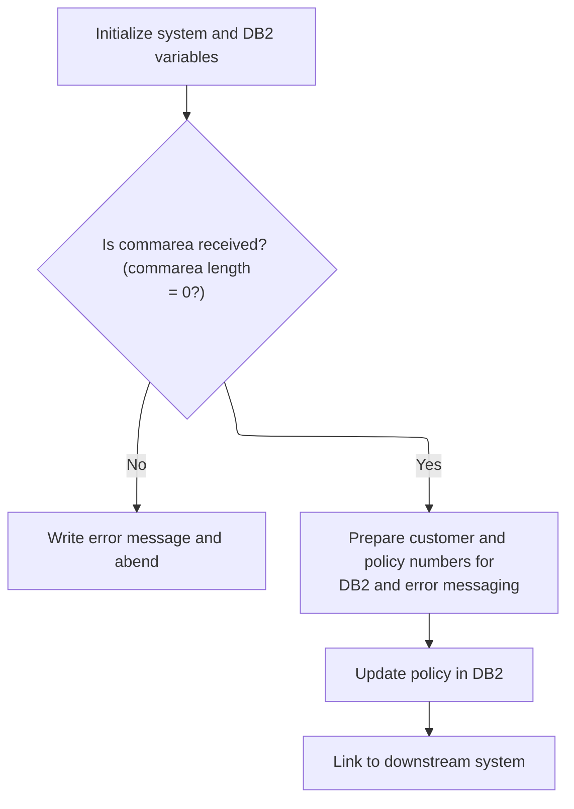
```mermaid
%%{init: {"flowchart": {"defaultRenderer": "elk"}} }%%
flowchart TD
    node1["Initialize system and DB2 variables"] --> node2{"Is commarea received? (commarea length
= 0?)"}
    click node1 openCode "base/src/lgupdb01.cbl:162:178"
    node2 -->|"No"| node3["Write error message and abend"]
    click node2 openCode "base/src/lgupdb01.cbl:183:187"
    click node3 openCode "base/src/lgupdb01.cbl:184:186"
    node2 -->|"Yes"| node4["Prepare customer and policy numbers for
DB2 and error messaging"]
    click node4 openCode "base/src/lgupdb01.cbl:190:200"
    node4 --> node5["Update policy in DB2"]
    click node5 openCode "base/src/lgupdb01.cbl:207:207"
    node5 --> node6["Link to downstream system"]
    click node6 openCode "base/src/lgupdb01.cbl:209:212"

classDef HeadingStyle fill:#777777,stroke:#333,stroke-width:2px;

%% Swimm:
%% %%{init: {"flowchart": {"defaultRenderer": "elk"}} }%%
%% flowchart TD
%%     node1["Initialize system and <SwmToken path="base/src/lgipdb01.cbl" pos="242:5:5" line-data="      * initialize DB2 host variables">`DB2`</SwmToken> variables"] --> node2{"Is commarea received? (commarea length
%% = 0?)"}
%%     click node1 openCode "<SwmPath>[base/src/lgupdb01.cbl](base/src/lgupdb01.cbl)</SwmPath>:162:178"
%%     node2 -->|"No"| node3["Write error message and abend"]
%%     click node2 openCode "<SwmPath>[base/src/lgupdb01.cbl](base/src/lgupdb01.cbl)</SwmPath>:183:187"
%%     click node3 openCode "<SwmPath>[base/src/lgupdb01.cbl](base/src/lgupdb01.cbl)</SwmPath>:184:186"
%%     node2 -->|"Yes"| node4["Prepare customer and policy numbers for
%% <SwmToken path="base/src/lgipdb01.cbl" pos="242:5:5" line-data="      * initialize DB2 host variables">`DB2`</SwmToken> and error messaging"]
%%     click node4 openCode "<SwmPath>[base/src/lgupdb01.cbl](base/src/lgupdb01.cbl)</SwmPath>:190:200"
%%     node4 --> node5["Update policy in <SwmToken path="base/src/lgipdb01.cbl" pos="242:5:5" line-data="      * initialize DB2 host variables">`DB2`</SwmToken>"]
%%     click node5 openCode "<SwmPath>[base/src/lgupdb01.cbl](base/src/lgupdb01.cbl)</SwmPath>:207:207"
%%     node5 --> node6["Link to downstream system"]
%%     click node6 openCode "<SwmPath>[base/src/lgupdb01.cbl](base/src/lgupdb01.cbl)</SwmPath>:209:212"
%% 
%% classDef HeadingStyle fill:#777777,stroke:#333,stroke-width:2px;
```

This section validates input, logs errors for missing commarea, updates policy data in <SwmToken path="base/src/lgipdb01.cbl" pos="242:5:5" line-data="      * initialize DB2 host variables">`DB2`</SwmToken>, and ensures downstream consistency by linking to a VSAM update program. It provides traceable error handling and dispatches policy updates when input is valid.

| Rule ID | Category                        | Rule Name                             | Description                                                                                                                                                                                                                                                           | Implementation Details                                                                                                                                                                                                                                                                                                                                                                                                                         |
| ------- | ------------------------------- | ------------------------------------- | --------------------------------------------------------------------------------------------------------------------------------------------------------------------------------------------------------------------------------------------------------------------- | ---------------------------------------------------------------------------------------------------------------------------------------------------------------------------------------------------------------------------------------------------------------------------------------------------------------------------------------------------------------------------------------------------------------------------------------------- |
| BR-001  | Reading Input                   | Prepare customer and policy numbers   | When a commarea is present, the customer and policy numbers from the commarea are prepared for <SwmToken path="base/src/lgipdb01.cbl" pos="242:5:5" line-data="      * initialize DB2 host variables">`DB2`</SwmToken> operations and error messaging.                | Customer and policy numbers are moved from the commarea to <SwmToken path="base/src/lgipdb01.cbl" pos="242:5:5" line-data="      * initialize DB2 host variables">`DB2`</SwmToken> integer fields and error message fields. The format for <SwmToken path="base/src/lgipdb01.cbl" pos="242:5:5" line-data="      * initialize DB2 host variables">`DB2`</SwmToken> is signed 9-digit integer, and for error messages, 10-digit numeric string. |
| BR-002  | Data validation                 | Missing commarea error handling       | If no commarea is received (commarea length is zero), an error message is written and the transaction is abended with code 'LGCA'.                                                                                                                                    | The error message includes the text ' NO COMMAREA RECEIVED' and is written to the error message structure. The transaction is abended with code 'LGCA'.                                                                                                                                                                                                                                                                                        |
| BR-003  | Writing Output                  | Error message content                 | When an error occurs, the error message includes the SQL error code, current date and time, and the customer and policy numbers involved.                                                                                                                             | The error message includes: SQL error code (signed 5-digit number), date (8-character string), time (6-character string), customer number (10-digit string), policy number (10-digit string), and the text ' NO COMMAREA RECEIVED' if applicable.                                                                                                                                                                                              |
| BR-004  | Writing Output                  | Log commarea input on error           | When an error message is written, up to 90 bytes of the commarea input are also logged for traceability. If the commarea is shorter than 91 bytes, the entire commarea is logged; otherwise, only the first 90 bytes are logged.                                      | If commarea length < 91, log all bytes; if >= 91, log first 90 bytes. Logged data is sent as a separate message to the queue.                                                                                                                                                                                                                                                                                                                  |
| BR-005  | Invoking a Service or a Process | Policy update and downstream dispatch | When input is valid, the policy is updated in the <SwmToken path="base/src/lgipdb01.cbl" pos="242:5:5" line-data="      * initialize DB2 host variables">`DB2`</SwmToken> database, and then the downstream VSAM file is updated to keep both data stores consistent. | The <SwmToken path="base/src/lgipdb01.cbl" pos="242:5:5" line-data="      * initialize DB2 host variables">`DB2`</SwmToken> update is performed first, followed by a link to the downstream system with the commarea and a length of 225 bytes.                                                                                                                                                                                                |

<SwmSnippet path="/base/src/lgupdb01.cbl" line="162">

---

MAINLINE in <SwmPath>[base/src/lgupdb01.cbl](base/src/lgupdb01.cbl)</SwmPath> checks for valid input, logs and abends if the commarea is missing, then updates <SwmToken path="base/src/lgupdb01.cbl" pos="175:5:5" line-data="      * initialize DB2 host variables">`DB2`</SwmToken> policy tables using <SwmToken path="base/src/lgupdb01.cbl" pos="207:3:9" line-data="           PERFORM UPDATE-POLICY-DB2-INFO.">`UPDATE-POLICY-DB2-INFO`</SwmToken>. After <SwmToken path="base/src/lgupdb01.cbl" pos="175:5:5" line-data="      * initialize DB2 host variables">`DB2`</SwmToken> is updated, it links to <SwmToken path="base/src/lgupdb01.cbl" pos="209:9:9" line-data="           EXEC CICS LINK Program(LGUPVS01)">`LGUPVS01`</SwmToken> to update the VSAM file, keeping both stores consistent. Error handling is built in before each dispatch.

```cobol
       MAINLINE SECTION.

      *----------------------------------------------------------------*
      * Common code                                                    *
      *----------------------------------------------------------------*
      * initialize working storage variables
           INITIALIZE WS-HEADER.
      * set up general variable
           MOVE EIBTRNID TO WS-TRANSID.
           MOVE EIBTRMID TO WS-TERMID.
           MOVE EIBTASKN TO WS-TASKNUM.
           MOVE SPACES   TO WS-RETRY.
      *----------------------------------------------------------------*
      * initialize DB2 host variables
           INITIALIZE DB2-POLICY.
           INITIALIZE DB2-IN-INTEGERS.

      *----------------------------------------------------------------*
      * Check commarea and obtain required details                     *
      *----------------------------------------------------------------*
      * If NO commarea received issue an ABEND
           IF EIBCALEN IS EQUAL TO ZERO
               MOVE ' NO COMMAREA RECEIVED' TO EM-VARIABLE
               PERFORM WRITE-ERROR-MESSAGE
               EXEC CICS ABEND ABCODE('LGCA') NODUMP END-EXEC
           END-IF

      * initialize commarea return code to zero
           MOVE '00' TO CA-RETURN-CODE
           MOVE EIBCALEN TO WS-CALEN.
           SET WS-ADDR-DFHCOMMAREA TO ADDRESS OF DFHCOMMAREA.

      * Convert commarea customer & policy nums to DB2 integer format
           MOVE CA-CUSTOMER-NUM TO DB2-CUSTOMERNUM-INT
           MOVE CA-POLICY-NUM   TO DB2-POLICYNUM-INT
      * and save in error msg field incase required
           MOVE CA-CUSTOMER-NUM TO EM-CUSNUM
           MOVE CA-POLICY-NUM   TO EM-POLNUM

      *----------------------------------------------------------------*
      * Check which policy type is being requested                     *
      *   and check commarea length                                    *
      *----------------------------------------------------------------*

      *    Call procedure to update required tables
           PERFORM UPDATE-POLICY-DB2-INFO.

           EXEC CICS LINK Program(LGUPVS01)
                Commarea(DFHCOMMAREA)
                LENGTH(225)
           END-EXEC.
```

---

</SwmSnippet>

<SwmSnippet path="/base/src/lgupdb01.cbl" line="502">

---

<SwmToken path="base/src/lgupdb01.cbl" pos="502:1:5" line-data="       WRITE-ERROR-MESSAGE.">`WRITE-ERROR-MESSAGE`</SwmToken> logs the SQL error and timestamp, then calls LGSTSQ to write the error message to the queue. If commarea data exists, it logs up to 90 bytes separately by calling LGSTSQ again, so both error context and input are traceable.

```cobol
       WRITE-ERROR-MESSAGE.
      * Save SQLCODE in message
           MOVE SQLCODE TO EM-SQLRC
      * Obtain and format current time and date
           EXEC CICS ASKTIME ABSTIME(WS-ABSTIME)
           END-EXEC
           EXEC CICS FORMATTIME ABSTIME(WS-ABSTIME)
                     MMDDYYYY(WS-DATE)
                     TIME(WS-TIME)
           END-EXEC
           MOVE WS-DATE TO EM-DATE
           MOVE WS-TIME TO EM-TIME
      * Write output message to TDQ
           EXEC CICS LINK PROGRAM('LGSTSQ')
                     COMMAREA(ERROR-MSG)
                     LENGTH(LENGTH OF ERROR-MSG)
           END-EXEC.
      * Write 90 bytes or as much as we have of commarea to TDQ
           IF EIBCALEN > 0 THEN
             IF EIBCALEN < 91 THEN
               MOVE DFHCOMMAREA(1:EIBCALEN) TO CA-DATA
               EXEC CICS LINK PROGRAM('LGSTSQ')
                         COMMAREA(CA-ERROR-MSG)
                         LENGTH(LENGTH OF CA-ERROR-MSG)
               END-EXEC
             ELSE
               MOVE DFHCOMMAREA(1:90) TO CA-DATA
               EXEC CICS LINK PROGRAM('LGSTSQ')
                         COMMAREA(CA-ERROR-MSG)
                         LENGTH(LENGTH OF CA-ERROR-MSG)
               END-EXEC
             END-IF
           END-IF.
           EXIT.
```

---

</SwmSnippet>

## Updating Policy Details in <SwmToken path="base/src/lgipdb01.cbl" pos="242:5:5" line-data="      * initialize DB2 host variables">`DB2`</SwmToken> Tables


```mermaid
%%{init: {"flowchart": {"defaultRenderer": "elk"}} }%%
flowchart TD
    node1["Begin policy update process"]
    click node1 openCode "base/src/lgupdb01.cbl:251:254"
    node1 --> node2{"Was cursor opened successfully?"}
    click node2 openCode "base/src/lgupdb01.cbl:255:270"
    node2 -->|"Yes"| node3["Fetch policy row"]
    click node3 openCode "base/src/lgupdb01.cbl:273:273"
    node2 -->|"No"| node8["Set failure code ('90'), write error
message, return"]
    click node8 openCode "base/src/lgupdb01.cbl:263:266"
    node3 --> node4{"Was policy row fetched?"}
    click node4 openCode "base/src/lgupdb01.cbl:275:358"
    node4 -->|"Yes"| node5{"Do timestamps match?"}
    node4 -->|"No"| node9["Set not found code ('01') or failure
code ('90'), write error message, return"]
    click node9 openCode "base/src/lgupdb01.cbl:351:357"
    node5 -->|"Yes"| node6{"Which policy type?"}
    click node6 openCode "base/src/lgupdb01.cbl:283:300"
    node5 -->|"No"| node10["Set timestamp mismatch code ('02'),
return"]
    click node10 openCode "base/src/lgupdb01.cbl:346:347"
    node6 -->|"Endowment"| node11["Update Endowment policy table"]
    click node11 openCode "base/src/lgupdb01.cbl:387:418"
    node6 -->|"House"| node12["Update House policy table"]
    click node12 openCode "base/src/lgupdb01.cbl:424:454"
    node6 -->|"Motor"| node13["Update Motor policy table"]
    click node13 openCode "base/src/lgupdb01.cbl:460:495"
    node11 --> node7{"Did type-specific update succeed?"}
    node12 --> node7
    node13 --> node7
    click node7 openCode "base/src/lgupdb01.cbl:302:307"
    node7 -->|"Yes"| node14["Update main policy table and timestamp"]
    click node14 openCode "base/src/lgupdb01.cbl:317:335"
    node7 -->|"No"| node15["Set failure code ('90'), write error
message, close cursor, return"]
    click node15 openCode "base/src/lgupdb01.cbl:305:306"
    node14 --> node16{"Did main policy table update succeed?"}
    click node16 openCode "base/src/lgupdb01.cbl:336:342"
    node16 -->|"Yes"| node17["Close cursor and finish"]
    click node17 openCode "base/src/lgupdb01.cbl:360:368"
    node16 -->|"No"| node15
    node8 --> node17
    node9 --> node17
    node10 --> node17
    node15 --> node17
classDef HeadingStyle fill:#777777,stroke:#333,stroke-width:2px;

%% Swimm:
%% %%{init: {"flowchart": {"defaultRenderer": "elk"}} }%%
%% flowchart TD
%%     node1["Begin policy update process"]
%%     click node1 openCode "<SwmPath>[base/src/lgupdb01.cbl](base/src/lgupdb01.cbl)</SwmPath>:251:254"
%%     node1 --> node2{"Was cursor opened successfully?"}
%%     click node2 openCode "<SwmPath>[base/src/lgupdb01.cbl](base/src/lgupdb01.cbl)</SwmPath>:255:270"
%%     node2 -->|"Yes"| node3["Fetch policy row"]
%%     click node3 openCode "<SwmPath>[base/src/lgupdb01.cbl](base/src/lgupdb01.cbl)</SwmPath>:273:273"
%%     node2 -->|"No"| node8["Set failure code ('90'), write error
%% message, return"]
%%     click node8 openCode "<SwmPath>[base/src/lgupdb01.cbl](base/src/lgupdb01.cbl)</SwmPath>:263:266"
%%     node3 --> node4{"Was policy row fetched?"}
%%     click node4 openCode "<SwmPath>[base/src/lgupdb01.cbl](base/src/lgupdb01.cbl)</SwmPath>:275:358"
%%     node4 -->|"Yes"| node5{"Do timestamps match?"}
%%     node4 -->|"No"| node9["Set not found code ('01') or failure
%% code ('90'), write error message, return"]
%%     click node9 openCode "<SwmPath>[base/src/lgupdb01.cbl](base/src/lgupdb01.cbl)</SwmPath>:351:357"
%%     node5 -->|"Yes"| node6{"Which policy type?"}
%%     click node6 openCode "<SwmPath>[base/src/lgupdb01.cbl](base/src/lgupdb01.cbl)</SwmPath>:283:300"
%%     node5 -->|"No"| node10["Set timestamp mismatch code ('02'),
%% return"]
%%     click node10 openCode "<SwmPath>[base/src/lgupdb01.cbl](base/src/lgupdb01.cbl)</SwmPath>:346:347"
%%     node6 -->|"Endowment"| node11["Update Endowment policy table"]
%%     click node11 openCode "<SwmPath>[base/src/lgupdb01.cbl](base/src/lgupdb01.cbl)</SwmPath>:387:418"
%%     node6 -->|"House"| node12["Update House policy table"]
%%     click node12 openCode "<SwmPath>[base/src/lgupdb01.cbl](base/src/lgupdb01.cbl)</SwmPath>:424:454"
%%     node6 -->|"Motor"| node13["Update Motor policy table"]
%%     click node13 openCode "<SwmPath>[base/src/lgupdb01.cbl](base/src/lgupdb01.cbl)</SwmPath>:460:495"
%%     node11 --> node7{"Did type-specific update succeed?"}
%%     node12 --> node7
%%     node13 --> node7
%%     click node7 openCode "<SwmPath>[base/src/lgupdb01.cbl](base/src/lgupdb01.cbl)</SwmPath>:302:307"
%%     node7 -->|"Yes"| node14["Update main policy table and timestamp"]
%%     click node14 openCode "<SwmPath>[base/src/lgupdb01.cbl](base/src/lgupdb01.cbl)</SwmPath>:317:335"
%%     node7 -->|"No"| node15["Set failure code ('90'), write error
%% message, close cursor, return"]
%%     click node15 openCode "<SwmPath>[base/src/lgupdb01.cbl](base/src/lgupdb01.cbl)</SwmPath>:305:306"
%%     node14 --> node16{"Did main policy table update succeed?"}
%%     click node16 openCode "<SwmPath>[base/src/lgupdb01.cbl](base/src/lgupdb01.cbl)</SwmPath>:336:342"
%%     node16 -->|"Yes"| node17["Close cursor and finish"]
%%     click node17 openCode "<SwmPath>[base/src/lgupdb01.cbl](base/src/lgupdb01.cbl)</SwmPath>:360:368"
%%     node16 -->|"No"| node15
%%     node8 --> node17
%%     node9 --> node17
%%     node10 --> node17
%%     node15 --> node17
%% classDef HeadingStyle fill:#777777,stroke:#333,stroke-width:2px;
```

This section updates policy details in <SwmToken path="base/src/lgipdb01.cbl" pos="242:5:5" line-data="      * initialize DB2 host variables">`DB2`</SwmToken> tables for Endowment, House, and Motor policies. It ensures data consistency through timestamp checks and manages error handling and logging throughout the update process.

| Rule ID | Category        | Rule Name                                      | Description                                                                                                                                                                                                                                           | Implementation Details                                                                                                                                                                                                                                                                                                                                                                                                                                                                                                                                                                                         |
| ------- | --------------- | ---------------------------------------------- | ----------------------------------------------------------------------------------------------------------------------------------------------------------------------------------------------------------------------------------------------------- | -------------------------------------------------------------------------------------------------------------------------------------------------------------------------------------------------------------------------------------------------------------------------------------------------------------------------------------------------------------------------------------------------------------------------------------------------------------------------------------------------------------------------------------------------------------------------------------------------------------- |
| BR-001  | Data validation | Cursor open failure handling                   | If the cursor cannot be opened, set the failure code ('90'), write an error message, and return control.                                                                                                                                              | Failure code is '90'. Error message is written using the error logging routine. Control returns to the caller without further processing.                                                                                                                                                                                                                                                                                                                                                                                                                                                                      |
| BR-002  | Data validation | Policy row fetch error handling                | If the policy row is not found during fetch, set the not found code ('01') and return control. For other SQL errors, set the failure code ('90'), write an error message, and return control.                                                         | Not found code is '01', failure code is '90'. Error message is written for SQL errors except not found. Control returns to the caller.                                                                                                                                                                                                                                                                                                                                                                                                                                                                         |
| BR-003  | Data validation | Timestamp conflict detection                   | If the timestamp in the commarea does not match the database, set the timestamp mismatch code ('02') and return control.                                                                                                                              | Timestamp mismatch code is '02'. No update is performed. Control returns to the caller.                                                                                                                                                                                                                                                                                                                                                                                                                                                                                                                        |
| BR-004  | Data validation | Cursor close failure handling                  | After all processing, the system closes the cursor. If closing the cursor fails, it sets the failure code ('90'), writes an error message, and returns control.                                                                                       | Failure code is '90'. Error message is written for SQL errors. Control returns to the caller.                                                                                                                                                                                                                                                                                                                                                                                                                                                                                                                  |
| BR-005  | Decision Making | Policy type-specific update and error handling | The system updates the relevant policy type table (Endowment, House, Motor) based on the request ID. If the update fails, it sets the appropriate error code ('01' for not found, '90' for SQL errors), writes an error message, and returns control. | Request IDs: <SwmToken path="base/src/lgupol01.cbl" pos="115:4:4" line-data="             WHEN &#39;01UEND&#39;">`01UEND`</SwmToken> for Endowment, <SwmToken path="base/src/lgtestp3.cbl" pos="183:4:4" line-data="                 Move &#39;01UHOU&#39;          To CA-REQUEST-ID">`01UHOU`</SwmToken> for House, <SwmToken path="base/src/lgupol01.cbl" pos="131:4:4" line-data="             WHEN &#39;01UMOT&#39;">`01UMOT`</SwmToken> for Motor. Not found code is '01', failure code is '90'. Error message is written for SQL errors except not found. Control returns to the caller if update fails. |
| BR-006  | Writing Output  | Main policy table update and error handling    | After a successful type-specific update, the system updates the main policy table and sets a new timestamp. If this update fails, it sets the failure code ('90'), writes an error message, and rolls back the transaction.                           | Failure code is '90'. Error message is written for SQL errors. Transaction is rolled back on failure. Control returns to the caller.                                                                                                                                                                                                                                                                                                                                                                                                                                                                           |

<SwmSnippet path="/base/src/lgupdb01.cbl" line="251">

---

<SwmToken path="base/src/lgupdb01.cbl" pos="251:1:7" line-data="       UPDATE-POLICY-DB2-INFO.">`UPDATE-POLICY-DB2-INFO`</SwmToken> opens a cursor, fetches the policy row, checks for timestamp conflicts, then updates the relevant policy type table (endowment, house, motor) based on request ID. After updating, it updates the main policy table and closes the cursor. Errors trigger logging and early exit.

```cobol
       UPDATE-POLICY-DB2-INFO.

      *    Open the cursor.
           MOVE ' OPEN   PCURSOR ' TO EM-SQLREQ
           EXEC SQL
             OPEN POLICY_CURSOR
           END-EXEC

           Evaluate SQLCODE
             When 0
               MOVE '00' TO CA-RETURN-CODE
             When -913
               MOVE '90' TO CA-RETURN-CODE
               PERFORM WRITE-ERROR-MESSAGE
               EXEC CICS RETURN END-EXEC
             When Other
               MOVE '90' TO CA-RETURN-CODE
               PERFORM WRITE-ERROR-MESSAGE
               EXEC CICS RETURN END-EXEC
           END-Evaluate.

      *    Fetch the first row (we only expect one matching row)
           PERFORM FETCH-DB2-POLICY-ROW

           IF SQLCODE = 0
      *      Fetch was successful
      *      Compare timestamp in commarea with that in DB2
             IF CA-LASTCHANGED EQUAL TO DB2-LASTCHANGED

      *----------------------------------------------------------------*
      *      Select for Update and Update specific policy type table   *
      *----------------------------------------------------------------*
             EVALUATE CA-REQUEST-ID

      *** Endowment ***
               WHEN '01UEND'
      *          Call routine to update Endowment table
                 PERFORM UPDATE-ENDOW-DB2-INFO

      *** House ***
               WHEN '01UHOU'
      *          Call routine to update Housetable
                 PERFORM UPDATE-HOUSE-DB2-INFO

      *** Motor ***
               WHEN '01UMOT'
      *          Call routine to update Motor table
                 PERFORM UPDATE-MOTOR-DB2-INFO

             END-EVALUATE
      *----------------------------------------------------------------*
              IF CA-RETURN-CODE NOT EQUAL '00'
      *         Update policy type specific table has failed
      *         So close cursor and return
                PERFORM CLOSE-PCURSOR
                EXEC CICS RETURN END-EXEC
              END-IF

      *----------------------------------------------------------------*
      *        Now update Policy table and set new timestamp           *
      *----------------------------------------------------------------*
      *        Move numeric commarea fields to integer format
               MOVE CA-BROKERID      TO DB2-BROKERID-INT
               MOVE CA-PAYMENT       TO DB2-PAYMENT-INT

      *        Update policy table details
               MOVE ' UPDATE POLICY  ' TO EM-SQLREQ
               EXEC SQL
                 UPDATE POLICY
                   SET ISSUEDATE        = :CA-ISSUE-DATE,
                       EXPIRYDATE       = :CA-EXPIRY-DATE,
                       LASTCHANGED      = CURRENT TIMESTAMP ,
                       BROKERID         = :DB2-BROKERID-INT,
                       BROKERSREFERENCE = :CA-BROKERSREF
                   WHERE CURRENT OF POLICY_CURSOR
               END-EXEC

      *        get value of assigned Timestamp for return in commarea
               EXEC SQL
                 SELECT LASTCHANGED
                   INTO :CA-LASTCHANGED
                   FROM POLICY
                   WHERE POLICYNUMBER = :DB2-POLICYNUM-INT
               END-EXEC

               IF SQLCODE NOT EQUAL 0
      *          Non-zero SQLCODE from Update of policy table
                   EXEC CICS SYNCPOINT ROLLBACK END-EXEC
                   MOVE '90' TO CA-RETURN-CODE
      *            Write error message to TD QUEUE(CSMT)
                   PERFORM WRITE-ERROR-MESSAGE
               END-IF

             ELSE
      *        Timestamps do not match (policy table v commarea)
               MOVE '02' TO CA-RETURN-CODE
             END-IF

           ELSE
      *      Non-zero SQLCODE from first SQL FETCH statement
             IF SQLCODE EQUAL 100
               MOVE '01' TO CA-RETURN-CODE
             ELSE
               MOVE '90' TO CA-RETURN-CODE
      *        Write error message to TD QUEUE(CSMT)
               PERFORM WRITE-ERROR-MESSAGE
             END-IF
           END-IF.
      *    Now close the Cursor and we're done!
           PERFORM CLOSE-PCURSOR.
```

---

</SwmSnippet>

<SwmSnippet path="/base/src/lgupdb01.cbl" line="228">

---

<SwmToken path="base/src/lgupdb01.cbl" pos="228:1:7" line-data="       FETCH-DB2-POLICY-ROW.">`FETCH-DB2-POLICY-ROW`</SwmToken> grabs the policy details using <SwmToken path="base/src/lgupdb01.cbl" pos="231:3:3" line-data="             FETCH POLICY_CURSOR">`POLICY_CURSOR`</SwmToken> and stores them in <SwmToken path="base/src/lgupdb01.cbl" pos="228:3:3" line-data="       FETCH-DB2-POLICY-ROW.">`DB2`</SwmToken> variables. It marks <SwmToken path="base/src/lgupdb01.cbl" pos="229:13:15" line-data="           MOVE &#39; FETCH  ROW   &#39; TO EM-SQLREQ">`EM-SQLREQ`</SwmToken> with 'FETCH ROW' for error logging, so any issues can be traced to this fetch step. Indicators handle nullable fields.

```cobol
       FETCH-DB2-POLICY-ROW.
           MOVE ' FETCH  ROW   ' TO EM-SQLREQ
           EXEC SQL
             FETCH POLICY_CURSOR
             INTO  :DB2-ISSUEDATE,
                   :DB2-EXPIRYDATE,
                   :DB2-LASTCHANGED,
                   :DB2-BROKERID-INT INDICATOR :IND-BROKERID,
                   :DB2-BROKERSREF INDICATOR :IND-BROKERSREF,
                   :DB2-PAYMENT-INT INDICATOR :IND-PAYMENT
           END-EXEC
           EXIT.
```

---

</SwmSnippet>

<SwmSnippet path="/base/src/lgupdb01.cbl" line="387">

---

<SwmToken path="base/src/lgupdb01.cbl" pos="387:1:7" line-data="       UPDATE-ENDOW-DB2-INFO.">`UPDATE-ENDOW-DB2-INFO`</SwmToken> converts commarea fields to <SwmToken path="base/src/lgupdb01.cbl" pos="387:5:5" line-data="       UPDATE-ENDOW-DB2-INFO.">`DB2`</SwmToken> integer formats, updates the endowment table, and sets return codes ('01' for not found, '90' for SQL errors). Errors are logged for traceability, but input validation is left to earlier steps.

```cobol
       UPDATE-ENDOW-DB2-INFO.

      *    Move numeric commarea fields to DB2 Integer formats
           MOVE CA-E-TERM        TO DB2-E-TERM-SINT
           MOVE CA-E-SUM-ASSURED TO DB2-E-SUMASSURED-INT

           MOVE ' UPDATE ENDOW ' TO EM-SQLREQ
           EXEC SQL
             UPDATE ENDOWMENT
               SET
                 WITHPROFITS   = :CA-E-WITH-PROFITS,
                   EQUITIES    = :CA-E-EQUITIES,
                   MANAGEDFUND = :CA-E-MANAGED-FUND,
                   FUNDNAME    = :CA-E-FUND-NAME,
                   TERM        = :DB2-E-TERM-SINT,
                   SUMASSURED  = :DB2-E-SUMASSURED-INT,
                   LIFEASSURED = :CA-E-LIFE-ASSURED
               WHERE
                   POLICYNUMBER = :DB2-POLICYNUM-INT
           END-EXEC

           IF SQLCODE NOT EQUAL 0
      *      Non-zero SQLCODE from UPDATE statement
             IF SQLCODE EQUAL 100
               MOVE '01' TO CA-RETURN-CODE
             ELSE
               MOVE '90' TO CA-RETURN-CODE
      *        Write error message to TD QUEUE(CSMT)
               PERFORM WRITE-ERROR-MESSAGE
             END-IF
           END-IF.
           EXIT.
```

---

</SwmSnippet>

<SwmSnippet path="/base/src/lgupdb01.cbl" line="424">

---

<SwmToken path="base/src/lgupdb01.cbl" pos="424:1:7" line-data="       UPDATE-HOUSE-DB2-INFO.">`UPDATE-HOUSE-DB2-INFO`</SwmToken> moves commarea numeric fields to <SwmToken path="base/src/lgupdb01.cbl" pos="424:5:5" line-data="       UPDATE-HOUSE-DB2-INFO.">`DB2`</SwmToken> integer formats, updates the house table, and sets return codes ('01' for not found, '90' for SQL errors). Errors are logged for traceability, but input validation is left to earlier steps.

```cobol
       UPDATE-HOUSE-DB2-INFO.

      *    Move numeric commarea fields to DB2 Integer formats
           MOVE CA-H-BEDROOMS    TO DB2-H-BEDROOMS-SINT
           MOVE CA-H-VALUE       TO DB2-H-VALUE-INT

           MOVE ' UPDATE HOUSE ' TO EM-SQLREQ
           EXEC SQL
             UPDATE HOUSE
               SET
                    PROPERTYTYPE = :CA-H-PROPERTY-TYPE,
                    BEDROOMS     = :DB2-H-BEDROOMS-SINT,
                    VALUE        = :DB2-H-VALUE-INT,
                    HOUSENAME    = :CA-H-HOUSE-NAME,
                    HOUSENUMBER  = :CA-H-HOUSE-NUMBER,
                    POSTCODE     = :CA-H-POSTCODE
               WHERE
                    POLICYNUMBER = :DB2-POLICYNUM-INT
           END-EXEC

           IF SQLCODE NOT EQUAL 0
      *      Non-zero SQLCODE from UPDATE statement
             IF SQLCODE = 100
               MOVE '01' TO CA-RETURN-CODE
             ELSE
               MOVE '90' TO CA-RETURN-CODE
      *        Write error message to TD QUEUE(CSMT)
               PERFORM WRITE-ERROR-MESSAGE
             END-IF
           END-IF.
           EXIT.
```

---

</SwmSnippet>

<SwmSnippet path="/base/src/lgupdb01.cbl" line="460">

---

<SwmToken path="base/src/lgupdb01.cbl" pos="460:1:7" line-data="       UPDATE-MOTOR-DB2-INFO.">`UPDATE-MOTOR-DB2-INFO`</SwmToken> maps commarea numeric fields to <SwmToken path="base/src/lgupdb01.cbl" pos="460:5:5" line-data="       UPDATE-MOTOR-DB2-INFO.">`DB2`</SwmToken> integer formats, updates the motor table, and sets return codes ('01' for not found, '90' for SQL errors). Errors are logged for traceability, but input validation is left to earlier steps.

```cobol
       UPDATE-MOTOR-DB2-INFO.

      *    Move numeric commarea fields to DB2 Integer formats
           MOVE CA-M-CC          TO DB2-M-CC-SINT
           MOVE CA-M-VALUE       TO DB2-M-VALUE-INT
           MOVE CA-M-PREMIUM     TO DB2-M-PREMIUM-INT
           MOVE CA-M-ACCIDENTS   TO DB2-M-ACCIDENTS-INT

           MOVE ' UPDATE MOTOR ' TO EM-SQLREQ
           EXEC SQL
             UPDATE MOTOR
               SET
                    MAKE              = :CA-M-MAKE,
                    MODEL             = :CA-M-MODEL,
                    VALUE             = :DB2-M-VALUE-INT,
                    REGNUMBER         = :CA-M-REGNUMBER,
                    COLOUR            = :CA-M-COLOUR,
                    CC                = :DB2-M-CC-SINT,
                    YEAROFMANUFACTURE = :CA-M-MANUFACTURED,
                    PREMIUM           = :DB2-M-PREMIUM-INT,
                    ACCIDENTS         = :DB2-M-ACCIDENTS-INT
               WHERE
                    POLICYNUMBER      = :DB2-POLICYNUM-INT
           END-EXEC

           IF SQLCODE NOT EQUAL 0
      *      Non-zero SQLCODE from UPDATE statement
             IF SQLCODE EQUAL 100
               MOVE '01' TO CA-RETURN-CODE
             ELSE
               MOVE '90' TO CA-RETURN-CODE
      *        Write error message to TD QUEUE(CSMT)
               PERFORM WRITE-ERROR-MESSAGE
             END-IF
           END-IF.
           EXIT.
```

---

</SwmSnippet>

<SwmSnippet path="/base/src/lgupdb01.cbl" line="362">

---

<SwmToken path="base/src/lgupdb01.cbl" pos="362:1:3" line-data="       CLOSE-PCURSOR.">`CLOSE-PCURSOR`</SwmToken> closes the policy cursor and sets return codes based on SQLCODE. If closing fails, it logs the error and returns control immediately, so we don't leave the cursor open or risk transaction issues.

```cobol
       CLOSE-PCURSOR.
      *    Now close the Cursor and we're done!
           MOVE ' CLOSE  PCURSOR' TO EM-SQLREQ
           EXEC SQL
             CLOSE POLICY_CURSOR
           END-EXEC.

           Evaluate SQLCODE
             When 0
               MOVE '00' TO CA-RETURN-CODE
             When -501
               MOVE '00' TO CA-RETURN-CODE
               MOVE '-501 detected c' TO EM-SQLREQ
               EXEC CICS RETURN END-EXEC
             When Other
               MOVE '90' TO CA-RETURN-CODE
               PERFORM WRITE-ERROR-MESSAGE
               EXEC CICS RETURN END-EXEC
           END-Evaluate.
           EXIT.
```

---

</SwmSnippet>

## Updating Policy Records in VSAM and Error Logging

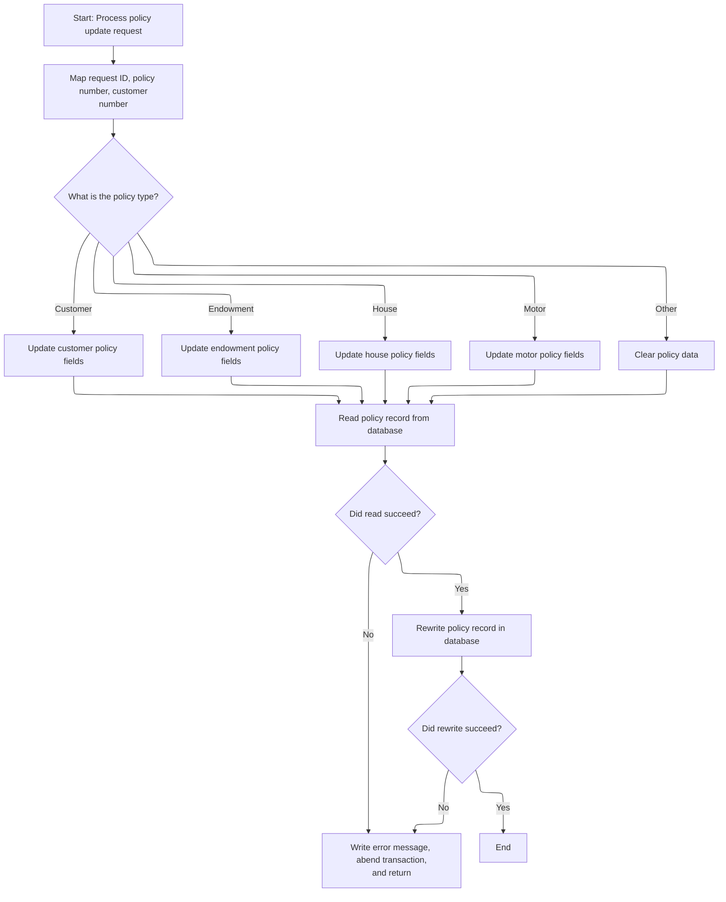
```mermaid
%%{init: {"flowchart": {"defaultRenderer": "elk"}} }%%
flowchart TD
    node1["Start: Process policy update request"]
    click node1 openCode "base/src/lgupvs01.cbl:97:100"
    node1 --> node2["Map request ID, policy number, customer
number"]
    click node2 openCode "base/src/lgupvs01.cbl:102:104"
    node2 --> node3{"What is the policy type?"}
    click node3 openCode "base/src/lgupvs01.cbl:106:135"
    node3 -->|"Customer"| node4["Update customer policy fields"]
    click node4 openCode "base/src/lgupvs01.cbl:109:111"
    node3 -->|"Endowment"| node5["Update endowment policy fields"]
    click node5 openCode "base/src/lgupvs01.cbl:114:119"
    node3 -->|"House"| node6["Update house policy fields"]
    click node6 openCode "base/src/lgupvs01.cbl:121:126"
    node3 -->|"Motor"| node7["Update motor policy fields"]
    click node7 openCode "base/src/lgupvs01.cbl:128:131"
    node3 -->|"Other"| node8["Clear policy data"]
    click node8 openCode "base/src/lgupvs01.cbl:134:134"
    node4 --> node9["Read policy record from database"]
    node5 --> node9
    node6 --> node9
    node7 --> node9
    node8 --> node9
    click node9 openCode "base/src/lgupvs01.cbl:139:146"
    node9 --> node10{"Did read succeed?"}
    click node10 openCode "base/src/lgupvs01.cbl:147:153"
    node10 -->|"Yes"| node11["Rewrite policy record in database"]
    click node11 openCode "base/src/lgupvs01.cbl:155:159"
    node10 -->|"No"| node12["Write error message, abend transaction,
and return"]
    click node12 openCode "base/src/lgupvs01.cbl:150:152"
    node11 --> node13{"Did rewrite succeed?"}
    click node13 openCode "base/src/lgupvs01.cbl:160:166"
    node13 -->|"Yes"| node14["End"]
    node13 -->|"No"| node12
classDef HeadingStyle fill:#777777,stroke:#333,stroke-width:2px;

%% Swimm:
%% %%{init: {"flowchart": {"defaultRenderer": "elk"}} }%%
%% flowchart TD
%%     node1["Start: Process policy update request"]
%%     click node1 openCode "<SwmPath>[base/src/lgupvs01.cbl](base/src/lgupvs01.cbl)</SwmPath>:97:100"
%%     node1 --> node2["Map request ID, policy number, customer
%% number"]
%%     click node2 openCode "<SwmPath>[base/src/lgupvs01.cbl](base/src/lgupvs01.cbl)</SwmPath>:102:104"
%%     node2 --> node3{"What is the policy type?"}
%%     click node3 openCode "<SwmPath>[base/src/lgupvs01.cbl](base/src/lgupvs01.cbl)</SwmPath>:106:135"
%%     node3 -->|"Customer"| node4["Update customer policy fields"]
%%     click node4 openCode "<SwmPath>[base/src/lgupvs01.cbl](base/src/lgupvs01.cbl)</SwmPath>:109:111"
%%     node3 -->|"Endowment"| node5["Update endowment policy fields"]
%%     click node5 openCode "<SwmPath>[base/src/lgupvs01.cbl](base/src/lgupvs01.cbl)</SwmPath>:114:119"
%%     node3 -->|"House"| node6["Update house policy fields"]
%%     click node6 openCode "<SwmPath>[base/src/lgupvs01.cbl](base/src/lgupvs01.cbl)</SwmPath>:121:126"
%%     node3 -->|"Motor"| node7["Update motor policy fields"]
%%     click node7 openCode "<SwmPath>[base/src/lgupvs01.cbl](base/src/lgupvs01.cbl)</SwmPath>:128:131"
%%     node3 -->|"Other"| node8["Clear policy data"]
%%     click node8 openCode "<SwmPath>[base/src/lgupvs01.cbl](base/src/lgupvs01.cbl)</SwmPath>:134:134"
%%     node4 --> node9["Read policy record from database"]
%%     node5 --> node9
%%     node6 --> node9
%%     node7 --> node9
%%     node8 --> node9
%%     click node9 openCode "<SwmPath>[base/src/lgupvs01.cbl](base/src/lgupvs01.cbl)</SwmPath>:139:146"
%%     node9 --> node10{"Did read succeed?"}
%%     click node10 openCode "<SwmPath>[base/src/lgupvs01.cbl](base/src/lgupvs01.cbl)</SwmPath>:147:153"
%%     node10 -->|"Yes"| node11["Rewrite policy record in database"]
%%     click node11 openCode "<SwmPath>[base/src/lgupvs01.cbl](base/src/lgupvs01.cbl)</SwmPath>:155:159"
%%     node10 -->|"No"| node12["Write error message, abend transaction,
%% and return"]
%%     click node12 openCode "<SwmPath>[base/src/lgupvs01.cbl](base/src/lgupvs01.cbl)</SwmPath>:150:152"
%%     node11 --> node13{"Did rewrite succeed?"}
%%     click node13 openCode "<SwmPath>[base/src/lgupvs01.cbl](base/src/lgupvs01.cbl)</SwmPath>:160:166"
%%     node13 -->|"Yes"| node14["End"]
%%     node13 -->|"No"| node12
%% classDef HeadingStyle fill:#777777,stroke:#333,stroke-width:2px;
```

This section updates policy records in the VSAM file based on the type of policy update request and logs errors with detailed context if any operation fails. It ensures that policy data remains consistent and that failures are traceable for support and audit purposes.

| Rule ID | Category        | Rule Name                                  | Description                                                                                                                                                                                                                                                                                                                                                                | Implementation Details                                                                                                                                                                                                                                                                                                                                                                                                                                                                                                                      |
| ------- | --------------- | ------------------------------------------ | -------------------------------------------------------------------------------------------------------------------------------------------------------------------------------------------------------------------------------------------------------------------------------------------------------------------------------------------------------------------------- | ------------------------------------------------------------------------------------------------------------------------------------------------------------------------------------------------------------------------------------------------------------------------------------------------------------------------------------------------------------------------------------------------------------------------------------------------------------------------------------------------------------------------------------------- |
| BR-001  | Data validation | Policy read failure logging                | If the system cannot read the policy record from the VSAM file, it logs an error message with code '81', includes the customer number and response codes, abends the transaction with code <SwmToken path="base/src/lgupvs01.cbl" pos="151:10:10" line-data="             EXEC CICS ABEND ABCODE(&#39;LGV3&#39;) NODUMP END-EXEC">`LGV3`</SwmToken>, and returns control.  | Error code '81' is used for read failures. The error message includes the date, time, customer number, response code, and secondary response code. The abend code is <SwmToken path="base/src/lgupvs01.cbl" pos="151:10:10" line-data="             EXEC CICS ABEND ABCODE(&#39;LGV3&#39;) NODUMP END-EXEC">`LGV3`</SwmToken>.                                                                                                                                                                                                              |
| BR-002  | Data validation | Policy rewrite failure logging             | If the system cannot rewrite the policy record in the VSAM file, it logs an error message with code '82', includes the customer number and response codes, abends the transaction with code <SwmToken path="base/src/lgupvs01.cbl" pos="164:10:10" line-data="             EXEC CICS ABEND ABCODE(&#39;LGV4&#39;) NODUMP END-EXEC">`LGV4`</SwmToken>, and returns control. | Error code '82' is used for rewrite failures. The error message includes the date, time, customer number, response code, and secondary response code. The abend code is <SwmToken path="base/src/lgupvs01.cbl" pos="164:10:10" line-data="             EXEC CICS ABEND ABCODE(&#39;LGV4&#39;) NODUMP END-EXEC">`LGV4`</SwmToken>.                                                                                                                                                                                                           |
| BR-003  | Decision Making | Policy type field selection                | The system selects which policy fields to update based on the request type. For request type 'C', customer policy fields are updated; for 'E', endowment policy fields; for 'H', house policy fields; for 'M', motor policy fields; for any other type, policy data is cleared.                                                                                            | Request type codes: 'C' (customer), 'E' (endowment), 'H' (house), 'M' (motor). For other values, policy data is set to spaces. Field formats are as defined in the <SwmToken path="base/src/lgupvs01.cbl" pos="156:3:7" line-data="                     From(WF-Policy-Info)">`WF-Policy-Info`</SwmToken> structure: customer (postcode, status, customer), endowment (with-profits, equities, managed-fund, fund-name, life-assured), house (property-type, bedrooms, value, postcode, house-name), motor (make, model, value, regnumber). |
| BR-004  | Writing Output  | Error message content and commarea logging | When an error is logged, the error message includes the current date, time, customer number, response code, and secondary response code. If commarea data exists, up to 90 bytes of it are also logged for traceability.                                                                                                                                                   | The error message contains: date (MMDDYYYY), time (HHMMSS), customer number (10 digits), response code, secondary response code. If commarea data exists, up to 90 bytes are logged in a separate message. If commarea length is less than 91, the entire commarea is logged; otherwise, only the first 90 bytes are logged.                                                                                                                                                                                                                |

<SwmSnippet path="/base/src/lgupvs01.cbl" line="97">

---

MAINLINE in <SwmPath>[base/src/lgupvs01.cbl](base/src/lgupvs01.cbl)</SwmPath> moves the right policy fields based on <SwmToken path="base/src/lgupvs01.cbl" pos="102:16:20" line-data="           Move CA-Request-ID(4:1) To WF-Request-ID">`WF-Request-ID`</SwmToken>, reads the VSAM file, rewrites it with updated data, and logs errors with specific codes if anything fails. This keeps the VSAM file in sync with the <SwmToken path="base/src/lgipdb01.cbl" pos="242:5:5" line-data="      * initialize DB2 host variables">`DB2`</SwmToken> update and ensures error tracking.

```cobol
       MAINLINE SECTION.
      *
      *---------------------------------------------------------------*
           Move EIBCALEN To WS-Commarea-Len.
      *---------------------------------------------------------------*
           Move CA-Request-ID(4:1) To WF-Request-ID
           Move CA-Policy-Num      To WF-Policy-Num
           Move CA-Customer-Num    To WF-Customer-Num

           Evaluate WF-Request-ID

             When 'C'
               Move CA-B-Postcode  To WF-B-Postcode
               Move CA-B-Status    To WF-B-Status
               Move CA-B-Customer  To WF-B-Customer

             When 'E'
               Move CA-E-WITH-PROFITS To  WF-E-WITH-PROFITS
               Move CA-E-EQUITIES     To  WF-E-EQUITIES
               Move CA-E-MANAGED-FUND To  WF-E-MANAGED-FUND
               Move CA-E-FUND-NAME    To  WF-E-FUND-NAME
               Move CA-E-LIFE-ASSURED To  WF-E-LIFE-ASSURED

             When 'H'
               Move CA-H-PROPERTY-TYPE To  WF-H-PROPERTY-TYPE
               Move CA-H-BEDROOMS      To  WF-H-BEDROOMS
               Move CA-H-VALUE         To  WF-H-VALUE
               Move CA-H-POSTCODE      To  WF-H-POSTCODE
               Move CA-H-HOUSE-NAME    To  WF-H-HOUSE-NAME

             When 'M'
               Move CA-M-MAKE          To  WF-M-MAKE
               Move CA-M-MODEL         To  WF-M-MODEL
               Move CA-M-VALUE         To  WF-M-VALUE
               Move CA-M-REGNUMBER     To  WF-M-REGNUMBER

             When Other
               Move Spaces To WF-Policy-Data
           End-Evaluate

           Move CA-Policy-Num      To WF-Policy-Num
      *---------------------------------------------------------------*
           Exec CICS Read File('KSDSPOLY')
                     Into(WS-FileIn)
                     Length(WS-Commarea-Len)
                     Ridfld(WF-Policy-Key)
                     KeyLength(21)
                     RESP(WS-RESP)
                     Update
           End-Exec.
           If WS-RESP Not = DFHRESP(NORMAL)
             Move EIBRESP2 To WS-RESP2
             MOVE '81' TO CA-RETURN-CODE
             PERFORM WRITE-ERROR-MESSAGE
             EXEC CICS ABEND ABCODE('LGV3') NODUMP END-EXEC
             EXEC CICS RETURN END-EXEC
           End-If.
      *---------------------------------------------------------------*
           Exec CICS ReWrite File('KSDSPOLY')
                     From(WF-Policy-Info)
                     Length(WS-Commarea-LenF)
                     RESP(WS-RESP)
           End-Exec.
           If WS-RESP Not = DFHRESP(NORMAL)
             Move EIBRESP2 To WS-RESP2
             MOVE '82' TO CA-RETURN-CODE
             PERFORM WRITE-ERROR-MESSAGE
             EXEC CICS ABEND ABCODE('LGV4') NODUMP END-EXEC
             EXEC CICS RETURN END-EXEC
           End-If.
```

---

</SwmSnippet>

<SwmSnippet path="/base/src/lgupvs01.cbl" line="174">

---

<SwmToken path="base/src/lgupvs01.cbl" pos="174:1:5" line-data="       WRITE-ERROR-MESSAGE.">`WRITE-ERROR-MESSAGE`</SwmToken> in <SwmPath>[base/src/lgupvs01.cbl](base/src/lgupvs01.cbl)</SwmPath> grabs the current time, fills out the error message with customer and response codes, then calls LGSTSQ to log it. If commarea data exists, it logs up to 90 bytes separately, so both error context and input are traceable.

```cobol
       WRITE-ERROR-MESSAGE.
           EXEC CICS ASKTIME ABSTIME(WS-ABSTIME)
           END-EXEC
           EXEC CICS FORMATTIME ABSTIME(WS-ABSTIME)
                     MMDDYYYY(WS-DATE)
                     TIME(WS-TIME)
           END-EXEC
      *
           MOVE WS-DATE TO EM-DATE
           MOVE WS-TIME TO EM-TIME
           Move CA-Customer-Num To EM-Cusnum
           Move WS-RESP         To EM-RespRC
           Move WS-RESP2        To EM-Resp2RC
           EXEC CICS LINK PROGRAM('LGSTSQ')
                     COMMAREA(ERROR-MSG)
                     LENGTH(LENGTH OF ERROR-MSG)
           END-EXEC.
           IF EIBCALEN > 0 THEN
             IF EIBCALEN < 91 THEN
               MOVE DFHCOMMAREA(1:EIBCALEN) TO CA-DATA
               EXEC CICS LINK PROGRAM('LGSTSQ')
                         COMMAREA(CA-ERROR-MSG)
                         LENGTH(Length Of CA-ERROR-MSG)
               END-EXEC
             ELSE
               MOVE DFHCOMMAREA(1:90) TO CA-DATA
               EXEC CICS LINK PROGRAM('LGSTSQ')
                         COMMAREA(CA-ERROR-MSG)
                         LENGTH(Length Of CA-ERROR-MSG)
               END-EXEC
             END-IF
           END-IF.
           EXIT.
```

---

</SwmSnippet>

## Handling Update Results and User Feedback

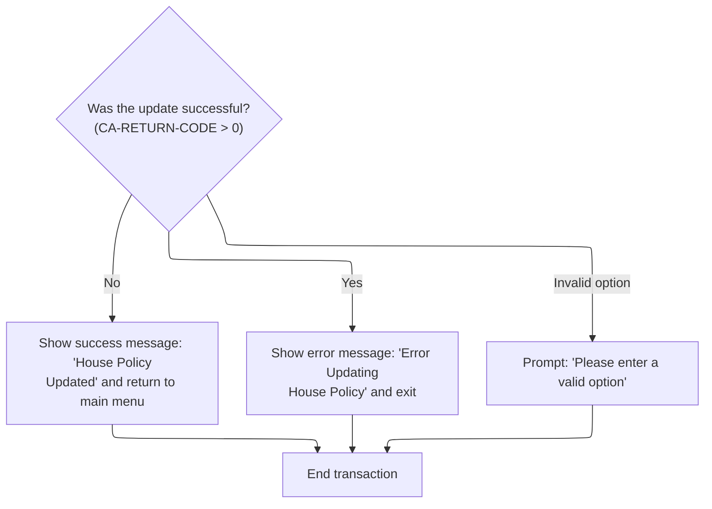
```mermaid
%%{init: {"flowchart": {"defaultRenderer": "elk"}} }%%
flowchart TD
    node1{"Was the update successful?
(CA-RETURN-CODE > 0)"}
    click node1 openCode "base/src/lgtestp3.cbl:200:202"
    node1 -->|"No"| node2["Show success message: 'House Policy
Updated' and return to main menu"]
    click node2 openCode "base/src/lgtestp3.cbl:204:212"
    node1 -->|"Yes"| node3["Show error message: 'Error Updating
House Policy' and exit"]
    click node3 openCode "base/src/lgtestp3.cbl:277:279"
    node2 --> node4["End transaction"]
    click node4 openCode "base/src/lgtestp3.cbl:235:236"
    node3 --> node4
    node1 -->|"Invalid option"| node5["Prompt: 'Please enter a valid option'"]
    click node5 openCode "base/src/lgtestp3.cbl:217:228"
    node5 --> node4
classDef HeadingStyle fill:#777777,stroke:#333,stroke-width:2px;

%% Swimm:
%% %%{init: {"flowchart": {"defaultRenderer": "elk"}} }%%
%% flowchart TD
%%     node1{"Was the update successful?
%% (<SwmToken path="base/src/lgtestp3.cbl" pos="74:3:7" line-data="                 IF CA-RETURN-CODE &gt; 0">`CA-RETURN-CODE`</SwmToken> > 0)"}
%%     click node1 openCode "<SwmPath>[base/src/lgtestp3.cbl](base/src/lgtestp3.cbl)</SwmPath>:200:202"
%%     node1 -->|"No"| node2["Show success message: 'House Policy
%% Updated' and return to main menu"]
%%     click node2 openCode "<SwmPath>[base/src/lgtestp3.cbl](base/src/lgtestp3.cbl)</SwmPath>:204:212"
%%     node1 -->|"Yes"| node3["Show error message: 'Error Updating
%% House Policy' and exit"]
%%     click node3 openCode "<SwmPath>[base/src/lgtestp3.cbl](base/src/lgtestp3.cbl)</SwmPath>:277:279"
%%     node2 --> node4["End transaction"]
%%     click node4 openCode "<SwmPath>[base/src/lgtestp3.cbl](base/src/lgtestp3.cbl)</SwmPath>:235:236"
%%     node3 --> node4
%%     node1 -->|"Invalid option"| node5["Prompt: 'Please enter a valid option'"]
%%     click node5 openCode "<SwmPath>[base/src/lgtestp3.cbl](base/src/lgtestp3.cbl)</SwmPath>:217:228"
%%     node5 --> node4
%% classDef HeadingStyle fill:#777777,stroke:#333,stroke-width:2px;
```

This section determines the user feedback and next steps after a house policy update attempt. It ensures users are informed of the outcome and guides them to the next action, maintaining a clear and responsive user experience.

| Rule ID | Category        | Rule Name                      | Description                                                                                                                                                                                                             | Implementation Details                                                                                                                                                  |
| ------- | --------------- | ------------------------------ | ----------------------------------------------------------------------------------------------------------------------------------------------------------------------------------------------------------------------- | ----------------------------------------------------------------------------------------------------------------------------------------------------------------------- |
| BR-001  | Data validation | Invalid option prompt          | If the user enters an invalid option, display a prompt asking for a valid option, reset the menu and cursor, and return control to allow the user to try again.                                                         | The prompt message is 'Please enter a valid option'. The menu and cursor are reset, and the user is prompted to enter a valid option.                                   |
| BR-002  | Decision Making | Successful update confirmation | If the update operation completes without errors, display a confirmation message to the user indicating the house policy was updated, show the updated policy details, and return to the main menu for further actions. | The confirmation message is 'House Policy Updated'. The updated policy details are shown on the menu screen. The user is returned to the main menu for further actions. |
| BR-003  | Decision Making | Update failure error message   | If the update operation fails, display an error message to the user indicating the house policy could not be updated, and exit to allow the user to start a new transaction.                                            | The error message is 'Error Updating House Policy'. The menu is refreshed and the user can start a new transaction.                                                     |
| BR-004  | Writing Output  | Transaction end after feedback | After displaying any message (success, error, or invalid input), the transaction is ended and control is returned to the system.                                                                                        | The transaction is ended using a system command and control is returned to the system. No further user interaction occurs until a new transaction is started.           |

<SwmSnippet path="/base/src/lgtestp3.cbl" line="200">

---

Back in <SwmToken path="base/src/lgtestp3.cbl" pos="33:5:7" line-data="              GO TO A-GAIN.">`A-GAIN`</SwmToken> after returning from <SwmPath>[base/src/lgupol01.cbl](base/src/lgupol01.cbl)</SwmPath>, we check <SwmToken path="base/src/lgtestp3.cbl" pos="200:3:7" line-data="                 IF CA-RETURN-CODE &gt; 0">`CA-RETURN-CODE`</SwmToken>. If it's non-zero, we jump to <SwmToken path="base/src/lgtestp3.cbl" pos="201:5:7" line-data="                   GO TO NO-UPD">`NO-UPD`</SwmToken> to show an error message and reset the menu, so the user isn't left hanging after a failed update.

```cobol
                 IF CA-RETURN-CODE > 0
                   GO TO NO-UPD
                 END-IF
```

---

</SwmSnippet>

<SwmSnippet path="/base/src/lgtestp3.cbl" line="277">

---

<SwmToken path="base/src/lgtestp3.cbl" pos="277:1:3" line-data="       NO-UPD.">`NO-UPD`</SwmToken> sets the error message for update failures and jumps straight to <SwmToken path="base/src/lgtestp3.cbl" pos="279:5:7" line-data="           Go To ERROR-OUT.">`ERROR-OUT`</SwmToken>, so the menu is refreshed and the user can start a new transaction right away.

```cobol
       NO-UPD.
           Move 'Error Updating House Policy'      To  ERP3FLDO
           Go To ERROR-OUT.
```

---

</SwmSnippet>

<SwmSnippet path="/base/src/lgtestp3.cbl" line="204">

---

Back in <SwmToken path="base/src/lgtestp3.cbl" pos="33:5:7" line-data="              GO TO A-GAIN.">`A-GAIN`</SwmToken>, we move the updated policy details to the output map, set the confirmation message, and send the menu screen to the user. This gives immediate feedback and shows the updated info.

```cobol
                 Move CA-CUSTOMER-NUM To ENP3CNOI
                 Move CA-POLICY-NUM   To ENP3PNOI
                 Move ' '             To ENP3OPTI
                 Move 'House Policy Updated'
                   To  ERP3FLDO
                 EXEC CICS SEND MAP ('SSMAPP3')
                           FROM(SSMAPP3O)
                           MAPSET ('SSMAP')
                 END-EXEC
```

---

</SwmSnippet>

<SwmSnippet path="/base/src/lgtestp3.cbl" line="217">

---

<SwmToken path="base/src/lgtestp3.cbl" pos="33:5:7" line-data="              GO TO A-GAIN.">`A-GAIN`</SwmToken> sends the menu screen with an error message if the user enters an invalid option, resets the menu and cursor, and returns control to start a new transaction.

```cobol
             WHEN OTHER

                 Move 'Please enter a valid option'
                   To  ERP3FLDO
                 Move -1 To ENP3OPTL

                 EXEC CICS SEND MAP ('SSMAPP3')
                           FROM(SSMAPP3O)
                           MAPSET ('SSMAP')
                           CURSOR
                 END-EXEC
                 GO TO ENDIT-STARTIT

           END-EVALUATE.


      *    Send message to terminal and return

           EXEC CICS RETURN
           END-EXEC.
```

---

</SwmSnippet>

&nbsp;

*This is an auto-generated document by Swimm 🌊 and has not yet been verified by a human*

<SwmMeta version="3.0.0" repo-id="Z2l0aHViJTNBJTNBU3dpbW1pby1nZW5hcHAtaG91c2UlM0ElM0FHaXJpLVN3aW1t" repo-name="Swimmio-genapp-house"><sup>Powered by [Swimm](https://app.swimm.io/)</sup></SwmMeta>
