# Overview

This document explains the flow of handling insurance policy operations. Users interact with the system via a terminal interface to inquire about, add, or delete policies. The flow ensures requests are validated, routed to the correct backend processes, and results or error messages are displayed to the user.

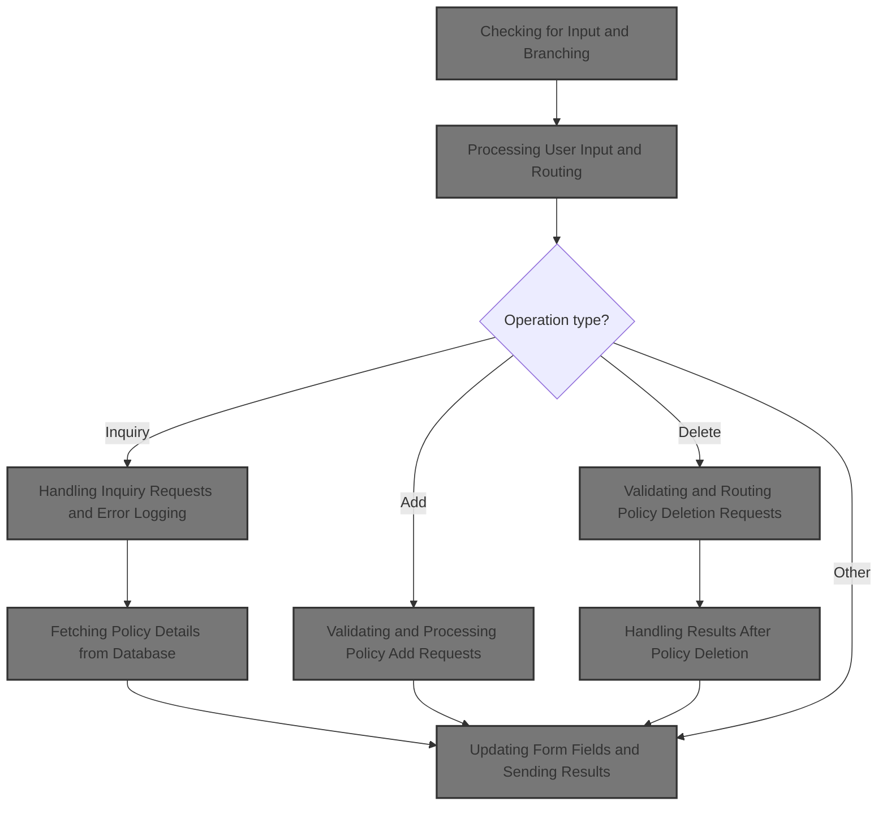

## Dependencies

### Programs

- <SwmToken path="base/src/lgtestp4.cbl" pos="2:6:6" line-data="       PROGRAM-ID. LGTESTP4.">`LGTESTP4`</SwmToken> (<SwmPath>[base/src/lgtestp4.cbl](base/src/lgtestp4.cbl)</SwmPath>)
- <SwmToken path="base/src/lgtestp4.cbl" pos="112:10:10" line-data="                 EXEC CICS LINK PROGRAM(&#39;LGIPOL01&#39;)">`LGIPOL01`</SwmToken> (<SwmPath>[base/src/lgipol01.cbl](base/src/lgipol01.cbl)</SwmPath>)
- <SwmToken path="base/src/lgipol01.cbl" pos="91:9:9" line-data="           EXEC CICS LINK Program(LGIPDB01)">`LGIPDB01`</SwmToken> (<SwmPath>[base/src/lgipdb01.cbl](base/src/lgipdb01.cbl)</SwmPath>)
- LGSTSQ (<SwmPath>[base/src/lgstsq.cbl](base/src/lgstsq.cbl)</SwmPath>)
- <SwmToken path="base/src/lgtestp4.cbl" pos="168:10:10" line-data="                 EXEC CICS LINK PROGRAM(&#39;LGAPOL01&#39;)">`LGAPOL01`</SwmToken> (<SwmPath>[base/src/lgapol01.cbl](base/src/lgapol01.cbl)</SwmPath>)
- <SwmToken path="base/src/lgapol01.cbl" pos="103:9:9" line-data="           EXEC CICS Link Program(LGAPDB01)">`LGAPDB01`</SwmToken> (<SwmPath>[base/src/LGAPDB01.cbl](base/src/LGAPDB01.cbl)</SwmPath>)
- <SwmToken path="base/src/LGAPDB01.cbl" pos="269:4:4" line-data="           CALL &#39;LGAPDB02&#39; USING IN-PROPERTY-TYPE, IN-POSTCODE, ">`LGAPDB02`</SwmToken> (<SwmPath>[base/src/LGAPDB02.cbl](base/src/LGAPDB02.cbl)</SwmPath>)
- <SwmToken path="base/src/LGAPDB01.cbl" pos="276:4:4" line-data="           CALL &#39;LGAPDB03&#39; USING WS-BASE-RISK-SCR, IN-FIRE-PERIL, ">`LGAPDB03`</SwmToken> (<SwmPath>[base/src/LGAPDB03.cbl](base/src/LGAPDB03.cbl)</SwmPath>)
- <SwmToken path="base/src/LGAPDB01.cbl" pos="313:4:4" line-data="               CALL &#39;LGAPDB04&#39; USING LK-INPUT-DATA, LK-COVERAGE-DATA, ">`LGAPDB04`</SwmToken> (<SwmPath>[base/src/LGAPDB04.cbl](base/src/LGAPDB04.cbl)</SwmPath>)
- <SwmToken path="base/src/lgtestp4.cbl" pos="191:10:10" line-data="                 EXEC CICS LINK PROGRAM(&#39;LGDPOL01&#39;)">`LGDPOL01`</SwmToken> (<SwmPath>[base/src/lgdpol01.cbl](base/src/lgdpol01.cbl)</SwmPath>)
- <SwmToken path="base/src/lgdpol01.cbl" pos="141:9:9" line-data="           EXEC CICS LINK PROGRAM(LGDPDB01)">`LGDPDB01`</SwmToken> (<SwmPath>[base/src/lgdpdb01.cbl](base/src/lgdpdb01.cbl)</SwmPath>)
- <SwmToken path="base/src/lgdpdb01.cbl" pos="168:9:9" line-data="               EXEC CICS LINK PROGRAM(LGDPVS01)">`LGDPVS01`</SwmToken> (<SwmPath>[base/src/lgdpvs01.cbl](base/src/lgdpvs01.cbl)</SwmPath>)
- <SwmToken path="base/src/lgtestp4.cbl" pos="248:4:4" line-data="                TRANSID(&#39;SSP4&#39;)">`SSP4`</SwmToken>

### Copybooks

- SQLCA
- LGPOLICY (<SwmPath>[base/src/lgpolicy.cpy](base/src/lgpolicy.cpy)</SwmPath>)
- LGCMAREA (<SwmPath>[base/src/lgcmarea.cpy](base/src/lgcmarea.cpy)</SwmPath>)
- <SwmToken path="base/src/LGAPDB01.cbl" pos="35:3:3" line-data="           COPY INPUTREC2.">`INPUTREC2`</SwmToken> (<SwmPath>[base/src/INPUTREC2.cpy](base/src/INPUTREC2.cpy)</SwmPath>)
- OUTPUTREC (<SwmPath>[base/src/OUTPUTREC.cpy](base/src/OUTPUTREC.cpy)</SwmPath>)
- WORKSTOR (<SwmPath>[base/src/WORKSTOR.cpy](base/src/WORKSTOR.cpy)</SwmPath>)
- LGAPACT (<SwmPath>[base/src/LGAPACT.cpy](base/src/LGAPACT.cpy)</SwmPath>)
- XMAP

## Input and Output Tables/Files used

### <SwmToken path="base/src/LGAPDB01.cbl" pos="276:4:4" line-data="           CALL &#39;LGAPDB03&#39; USING WS-BASE-RISK-SCR, IN-FIRE-PERIL, ">`LGAPDB03`</SwmToken> (<SwmPath>[base/src/LGAPDB03.cbl](base/src/LGAPDB03.cbl)</SwmPath>)

| Table / File Name | Type                                                                                                                    | Description                                                              | Usage Mode | Key Fields / Layout Highlights      |
| ----------------- | ----------------------------------------------------------------------------------------------------------------------- | ------------------------------------------------------------------------ | ---------- | ----------------------------------- |
| RISK_FACTORS      | <SwmToken path="base/src/lgipdb01.cbl" pos="242:5:5" line-data="      * initialize DB2 host variables">`DB2`</SwmToken> | Peril-specific risk adjustment factors for insurance premium calculation | Input      | `WS-FIRE-FACTOR`, `WS-CRIME-FACTOR` |

### <SwmToken path="base/src/LGAPDB01.cbl" pos="269:4:4" line-data="           CALL &#39;LGAPDB02&#39; USING IN-PROPERTY-TYPE, IN-POSTCODE, ">`LGAPDB02`</SwmToken> (<SwmPath>[base/src/LGAPDB02.cbl](base/src/LGAPDB02.cbl)</SwmPath>)

| Table / File Name | Type                                                                                                                    | Description                                                 | Usage Mode | Key Fields / Layout Highlights      |
| ----------------- | ----------------------------------------------------------------------------------------------------------------------- | ----------------------------------------------------------- | ---------- | ----------------------------------- |
| RISK_FACTORS      | <SwmToken path="base/src/lgipdb01.cbl" pos="242:5:5" line-data="      * initialize DB2 host variables">`DB2`</SwmToken> | Peril-specific risk adjustment values for insurance scoring | Input      | `WS-FIRE-FACTOR`, `WS-CRIME-FACTOR` |

### <SwmToken path="base/src/lgipol01.cbl" pos="91:9:9" line-data="           EXEC CICS LINK Program(LGIPDB01)">`LGIPDB01`</SwmToken> (<SwmPath>[base/src/lgipdb01.cbl](base/src/lgipdb01.cbl)</SwmPath>)

| Table / File Name | Type                                                                                                                    | Description                                                              | Usage Mode | Key Fields / Layout Highlights                                                                                                                                                                                                                                                                                                                                                                                                                                                                                                                                                                                                                                                                                                                                                                                                                                                                                                                                                                                                                                                                                                                                                                                                                                                                                                                                                                                                                                                                                                                                                                                                                                                                                                                                                                                                                                                                                                                                                                                                                                                                                                                                                                                                                                                                                                                                                                                                                                                                                                                                                                                                                                                                                                                                                                                                                                                                                                                                                                                                                                                                                                                                                                                                                                                                                                                                                                                                                                                                                                                                                                                                                                                                                                                                                                                                                                                                                                                                                                                                                                                                                                                                                                                                                                                                                                                                                                                                                                                                                                                                                                                                                                                                                                                                                                                                                                                                                                                                                                                                                                                                                                                                                                                                                                                                                                                                                                                                                                                                                                                                                                                                                                                                                                                                                                                                                                                                                                                                                                                                                                                                                                                                                                                                                                                                                                                                                                                                                                                                                                                                                                                                                                                                                                                                                                                                                                                                                                                                                                                                                                                                                                                                                                                                                                                                                                                                                                                                                                                                                                                                                                                                                                                                                                                                                                                                                                                                                                                                                                                                                                                                                                                                                                                                                                                                                                                                                                                                                                                                                                                                                                                                                                                                                                                                                                                                                                                                                                                                                                                                                                                                                                                                                                                                                                                                                                                                                                                                                                                                                                                                                                                                                                                                                                                                                                                                                                                                                                                                                                                                                                                                                                                                                                                                                                                                                                                                                                                                                                                                                                                                                                                                                                                                                                                                                                                                                                                                                                                                                                                                                                                                                                                                                                                                                                                                                                                                                                                                                                                                                                                                                                                                                                                                                                                                                                                                                                                                                                                                                                                                                                                                                                                                                                                                                                                                                                                                                                                                                                                                                                                                                                                                                                                                                                                                                                                                                                                                                                                                                          |
| ----------------- | ----------------------------------------------------------------------------------------------------------------------- | ------------------------------------------------------------------------ | ---------- | --------------------------------------------------------------------------------------------------------------------------------------------------------------------------------------------------------------------------------------------------------------------------------------------------------------------------------------------------------------------------------------------------------------------------------------------------------------------------------------------------------------------------------------------------------------------------------------------------------------------------------------------------------------------------------------------------------------------------------------------------------------------------------------------------------------------------------------------------------------------------------------------------------------------------------------------------------------------------------------------------------------------------------------------------------------------------------------------------------------------------------------------------------------------------------------------------------------------------------------------------------------------------------------------------------------------------------------------------------------------------------------------------------------------------------------------------------------------------------------------------------------------------------------------------------------------------------------------------------------------------------------------------------------------------------------------------------------------------------------------------------------------------------------------------------------------------------------------------------------------------------------------------------------------------------------------------------------------------------------------------------------------------------------------------------------------------------------------------------------------------------------------------------------------------------------------------------------------------------------------------------------------------------------------------------------------------------------------------------------------------------------------------------------------------------------------------------------------------------------------------------------------------------------------------------------------------------------------------------------------------------------------------------------------------------------------------------------------------------------------------------------------------------------------------------------------------------------------------------------------------------------------------------------------------------------------------------------------------------------------------------------------------------------------------------------------------------------------------------------------------------------------------------------------------------------------------------------------------------------------------------------------------------------------------------------------------------------------------------------------------------------------------------------------------------------------------------------------------------------------------------------------------------------------------------------------------------------------------------------------------------------------------------------------------------------------------------------------------------------------------------------------------------------------------------------------------------------------------------------------------------------------------------------------------------------------------------------------------------------------------------------------------------------------------------------------------------------------------------------------------------------------------------------------------------------------------------------------------------------------------------------------------------------------------------------------------------------------------------------------------------------------------------------------------------------------------------------------------------------------------------------------------------------------------------------------------------------------------------------------------------------------------------------------------------------------------------------------------------------------------------------------------------------------------------------------------------------------------------------------------------------------------------------------------------------------------------------------------------------------------------------------------------------------------------------------------------------------------------------------------------------------------------------------------------------------------------------------------------------------------------------------------------------------------------------------------------------------------------------------------------------------------------------------------------------------------------------------------------------------------------------------------------------------------------------------------------------------------------------------------------------------------------------------------------------------------------------------------------------------------------------------------------------------------------------------------------------------------------------------------------------------------------------------------------------------------------------------------------------------------------------------------------------------------------------------------------------------------------------------------------------------------------------------------------------------------------------------------------------------------------------------------------------------------------------------------------------------------------------------------------------------------------------------------------------------------------------------------------------------------------------------------------------------------------------------------------------------------------------------------------------------------------------------------------------------------------------------------------------------------------------------------------------------------------------------------------------------------------------------------------------------------------------------------------------------------------------------------------------------------------------------------------------------------------------------------------------------------------------------------------------------------------------------------------------------------------------------------------------------------------------------------------------------------------------------------------------------------------------------------------------------------------------------------------------------------------------------------------------------------------------------------------------------------------------------------------------------------------------------------------------------------------------------------------------------------------------------------------------------------------------------------------------------------------------------------------------------------------------------------------------------------------------------------------------------------------------------------------------------------------------------------------------------------------------------------------------------------------------------------------------------------------------------------------------------------------------------------------------------------------------------------------------------------------------------------------------------------------------------------------------------------------------------------------------------------------------------------------------------------------------------------------------------------------------------------------------------------------------------------------------------------------------------------------------------------------------------------------------------------------------------------------------------------------------------------------------------------------------------------------------------------------------------------------------------------------------------------------------------------------------------------------------------------------------------------------------------------------------------------------------------------------------------------------------------------------------------------------------------------------------------------------------------------------------------------------------------------------------------------------------------------------------------------------------------------------------------------------------------------------------------------------------------------------------------------------------------------------------------------------------------------------------------------------------------------------------------------------------------------------------------------------------------------------------------------------------------------------------------------------------------------------------------------------------------------------------------------------------------------------------------------------------------------------------------------------------------------------------------------------------------------------------------------------------------------------------------------------------------------------------------------------------------------------------------------------------------------------------------------------------------------------------------------------------------------------------------------------------------------------------------------------------------------------------------------------------------------------------------------------------------------------------------------------------------------------------------------------------------------------------------------------------------------------------------------------------------------------------------------------------------------------------------------------------------------------------------------------------------------------------------------------------------------------------------------------------------------------------------------------------------------------------------------------------------------------------------------------------------------------------------------------------------------------------------------------------------------------------------------------------------------------------------------------------------------------------------------------------------------------------------------------------------------------------------------------------------------------------------------------------------------------------------------------------------------------------------------------------------------------------------------------------------------------------------------------------------------------------------------------------------------------------------------------------------------------------------------------------------------------------------------------------------------------------------------------------------------------------------------------------------------------------------------------------------------------------------------------------------------------------------------------------------------------------------------------------------------------------------------------------------------------------------------------------------------------------------------------------------------------------------------------------------------------------------------------------------------------------------------------------------------------------------------------------------------------------------------------------------------------------------------------------------------------------------------------------------------------------------------------------------------------------------------------------------------------------------------------------- |
| POLICY            | <SwmToken path="base/src/lgipdb01.cbl" pos="242:5:5" line-data="      * initialize DB2 host variables">`DB2`</SwmToken> | Insurance policy master data, e.g. type, number, dates, broker, payment. | Input      | <SwmToken path="base/src/lgipdb01.cbl" pos="92:1:1" line-data="                   CustomerNumber,">`CustomerNumber`</SwmToken>, <SwmToken path="base/src/lgipdb01.cbl" pos="93:3:3" line-data="                   Policy.PolicyNumber,">`PolicyNumber`</SwmToken>, <SwmToken path="base/src/lgipdb01.cbl" pos="94:1:1" line-data="                   RequestDate,">`RequestDate`</SwmToken>, <SwmToken path="base/src/lgipdb01.cbl" pos="95:1:1" line-data="                   StartDate,">`StartDate`</SwmToken>, <SwmToken path="base/src/lgipdb01.cbl" pos="96:1:1" line-data="                   RenewalDate,">`RenewalDate`</SwmToken>, <SwmToken path="base/src/lgtestp4.cbl" pos="124:7:7" line-data="                 Move CA-B-Address         To  ENP4ADDI">`Address`</SwmToken>, <SwmToken path="base/src/lgipdb01.cbl" pos="98:1:1" line-data="                   Zipcode,">`Zipcode`</SwmToken>, <SwmToken path="base/src/lgipdb01.cbl" pos="99:1:1" line-data="                   LatitudeN,">`LatitudeN`</SwmToken>, <SwmToken path="base/src/lgipdb01.cbl" pos="100:1:1" line-data="                   LongitudeW,">`LongitudeW`</SwmToken>, <SwmToken path="base/src/lgtestp4.cbl" pos="128:7:7" line-data="                 Move CA-B-Customer        To  ENP4CUSI">`Customer`</SwmToken>, <SwmToken path="base/src/lgipdb01.cbl" pos="102:1:1" line-data="                   PropertyType,">`PropertyType`</SwmToken>, <SwmToken path="base/src/lgipdb01.cbl" pos="103:1:1" line-data="                   FirePeril,">`FirePeril`</SwmToken>, <SwmToken path="base/src/lgipdb01.cbl" pos="104:1:1" line-data="                   FirePremium,">`FirePremium`</SwmToken>, <SwmToken path="base/src/lgipdb01.cbl" pos="105:1:1" line-data="                   CrimePeril,">`CrimePeril`</SwmToken>, <SwmToken path="base/src/lgipdb01.cbl" pos="106:1:1" line-data="                   CrimePremium,">`CrimePremium`</SwmToken>, <SwmToken path="base/src/lgipdb01.cbl" pos="107:1:1" line-data="                   FloodPeril,">`FloodPeril`</SwmToken>, <SwmToken path="base/src/lgipdb01.cbl" pos="108:1:1" line-data="                   FloodPremium,">`FloodPremium`</SwmToken>, <SwmToken path="base/src/lgipdb01.cbl" pos="109:1:1" line-data="                   WeatherPeril,">`WeatherPeril`</SwmToken>, <SwmToken path="base/src/lgipdb01.cbl" pos="110:1:1" line-data="                   WeatherPremium,">`WeatherPremium`</SwmToken>, <SwmToken path="base/src/lgipdb01.cbl" pos="111:1:1" line-data="                   Status,">`Status`</SwmToken>, <SwmToken path="base/src/lgipdb01.cbl" pos="112:1:1" line-data="                   RejectionReason">`RejectionReason`</SwmToken>, <SwmToken path="base/src/lgipdb01.cbl" pos="331:3:3" line-data="             SELECT  ISSUEDATE,">`ISSUEDATE`</SwmToken>, <SwmToken path="base/src/lgipdb01.cbl" pos="332:1:1" line-data="                     EXPIRYDATE,">`EXPIRYDATE`</SwmToken>, <SwmToken path="base/src/lgipdb01.cbl" pos="333:1:1" line-data="                     LASTCHANGED,">`LASTCHANGED`</SwmToken>, <SwmToken path="base/src/lgipdb01.cbl" pos="334:1:1" line-data="                     BROKERID,">`BROKERID`</SwmToken>, <SwmToken path="base/src/lgipdb01.cbl" pos="335:1:1" line-data="                     BROKERSREFERENCE,">`BROKERSREFERENCE`</SwmToken>, <SwmToken path="base/src/lgipdb01.cbl" pos="336:1:1" line-data="                     PAYMENT,">`PAYMENT`</SwmToken>, <SwmToken path="base/src/lgipdb01.cbl" pos="337:1:1" line-data="                     WITHPROFITS,">`WITHPROFITS`</SwmToken>, <SwmToken path="base/src/lgipdb01.cbl" pos="338:1:1" line-data="                     EQUITIES,">`EQUITIES`</SwmToken>, <SwmToken path="base/src/lgipdb01.cbl" pos="339:1:1" line-data="                     MANAGEDFUND,">`MANAGEDFUND`</SwmToken>, <SwmToken path="base/src/lgipdb01.cbl" pos="340:1:1" line-data="                     FUNDNAME,">`FUNDNAME`</SwmToken>, <SwmToken path="base/src/lgipdb01.cbl" pos="341:1:1" line-data="                     TERM,">`TERM`</SwmToken>, <SwmToken path="base/src/lgipdb01.cbl" pos="342:1:1" line-data="                     SUMASSURED,">`SUMASSURED`</SwmToken>, <SwmToken path="base/src/lgipdb01.cbl" pos="343:1:1" line-data="                     LIFEASSURED,">`LIFEASSURED`</SwmToken>, <SwmToken path="base/src/lgipdb01.cbl" pos="344:1:1" line-data="                     PADDINGDATA,">`PADDINGDATA`</SwmToken>, <SwmToken path="base/src/lgtestp4.cbl" pos="114:1:1" line-data="                           LENGTH(32500)">`LENGTH`</SwmToken>, <SwmToken path="base/src/lgipdb01.cbl" pos="347:2:4" line-data="                   :DB2-EXPIRYDATE,">`DB2-EXPIRYDATE`</SwmToken>, <SwmToken path="base/src/lgipdb01.cbl" pos="348:2:4" line-data="                   :DB2-LASTCHANGED,">`DB2-LASTCHANGED`</SwmToken>, <SwmToken path="base/src/lgipdb01.cbl" pos="349:11:13" line-data="                   :DB2-BROKERID-INT INDICATOR :IND-BROKERID,">`IND-BROKERID`</SwmToken>, <SwmToken path="base/src/lgipdb01.cbl" pos="350:9:11" line-data="                   :DB2-BROKERSREF INDICATOR :IND-BROKERSREF,">`IND-BROKERSREF`</SwmToken>, <SwmToken path="base/src/lgipdb01.cbl" pos="351:11:13" line-data="                   :DB2-PAYMENT-INT INDICATOR :IND-PAYMENT,">`IND-PAYMENT`</SwmToken>, <SwmToken path="base/src/lgipdb01.cbl" pos="352:2:6" line-data="                   :DB2-E-WITHPROFITS,">`DB2-E-WITHPROFITS`</SwmToken>, <SwmToken path="base/src/lgipdb01.cbl" pos="353:2:6" line-data="                   :DB2-E-EQUITIES,">`DB2-E-EQUITIES`</SwmToken>, <SwmToken path="base/src/lgipdb01.cbl" pos="354:2:6" line-data="                   :DB2-E-MANAGEDFUND,">`DB2-E-MANAGEDFUND`</SwmToken>, <SwmToken path="base/src/lgipdb01.cbl" pos="355:2:6" line-data="                   :DB2-E-FUNDNAME,">`DB2-E-FUNDNAME`</SwmToken>, <SwmToken path="base/src/lgipdb01.cbl" pos="356:2:8" line-data="                   :DB2-E-TERM-SINT,">`DB2-E-TERM-SINT`</SwmToken>, <SwmToken path="base/src/lgipdb01.cbl" pos="357:2:8" line-data="                   :DB2-E-SUMASSURED-INT,">`DB2-E-SUMASSURED-INT`</SwmToken>, <SwmToken path="base/src/lgipdb01.cbl" pos="358:2:6" line-data="                   :DB2-E-LIFEASSURED,">`DB2-E-LIFEASSURED`</SwmToken>, <SwmToken path="base/src/lgipdb01.cbl" pos="359:11:15" line-data="                   :DB2-E-PADDINGDATA INDICATOR :IND-E-PADDINGDATA,">`IND-E-PADDINGDATA`</SwmToken>, <SwmToken path="base/src/lgipdb01.cbl" pos="360:13:17" line-data="                   :DB2-E-PADDING-LEN INDICATOR :IND-E-PADDINGDATAL">`IND-E-PADDINGDATAL`</SwmToken>, <SwmToken path="base/src/lgipdb01.cbl" pos="451:1:1" line-data="                     PROPERTYTYPE,">`PROPERTYTYPE`</SwmToken>, <SwmToken path="base/src/lgipdb01.cbl" pos="452:1:1" line-data="                     BEDROOMS,">`BEDROOMS`</SwmToken>, <SwmToken path="base/src/lgipdb01.cbl" pos="453:1:1" line-data="                     VALUE,">`VALUE`</SwmToken>, <SwmToken path="base/src/lgipdb01.cbl" pos="454:1:1" line-data="                     HOUSENAME,">`HOUSENAME`</SwmToken>, <SwmToken path="base/src/lgipdb01.cbl" pos="455:1:1" line-data="                     HOUSENUMBER,">`HOUSENUMBER`</SwmToken>, <SwmToken path="base/src/lgipdb01.cbl" pos="346:4:6" line-data="             INTO  :DB2-ISSUEDATE,">`DB2-ISSUEDATE`</SwmToken>, <SwmToken path="base/src/lgipdb01.cbl" pos="463:2:6" line-data="                   :DB2-H-PROPERTYTYPE,">`DB2-H-PROPERTYTYPE`</SwmToken>, <SwmToken path="base/src/lgipdb01.cbl" pos="464:2:8" line-data="                   :DB2-H-BEDROOMS-SINT,">`DB2-H-BEDROOMS-SINT`</SwmToken>, <SwmToken path="base/src/lgipdb01.cbl" pos="465:2:8" line-data="                   :DB2-H-VALUE-INT,">`DB2-H-VALUE-INT`</SwmToken>, <SwmToken path="base/src/lgipdb01.cbl" pos="466:2:6" line-data="                   :DB2-H-HOUSENAME,">`DB2-H-HOUSENAME`</SwmToken>, <SwmToken path="base/src/lgipdb01.cbl" pos="467:2:6" line-data="                   :DB2-H-HOUSENUMBER,">`DB2-H-HOUSENUMBER`</SwmToken>, <SwmToken path="base/src/lgipdb01.cbl" pos="468:2:6" line-data="                   :DB2-H-POSTCODE">`DB2-H-POSTCODE`</SwmToken>, <SwmToken path="base/src/lgipdb01.cbl" pos="539:1:1" line-data="                     MAKE,">`MAKE`</SwmToken>, <SwmToken path="base/src/lgipdb01.cbl" pos="540:1:1" line-data="                     MODEL,">`MODEL`</SwmToken>, <SwmToken path="base/src/lgipdb01.cbl" pos="542:1:1" line-data="                     REGNUMBER,">`REGNUMBER`</SwmToken>, <SwmToken path="base/src/lgipdb01.cbl" pos="543:1:1" line-data="                     COLOUR,">`COLOUR`</SwmToken>, <SwmToken path="base/src/lgipdb01.cbl" pos="544:1:1" line-data="                     CC,">`CC`</SwmToken>, <SwmToken path="base/src/lgipdb01.cbl" pos="545:1:1" line-data="                     YEAROFMANUFACTURE,">`YEAROFMANUFACTURE`</SwmToken>, <SwmToken path="base/src/lgipdb01.cbl" pos="546:1:1" line-data="                     PREMIUM,">`PREMIUM`</SwmToken>, <SwmToken path="base/src/lgipdb01.cbl" pos="554:2:6" line-data="                   :DB2-M-MAKE,">`DB2-M-MAKE`</SwmToken>, <SwmToken path="base/src/lgipdb01.cbl" pos="555:2:6" line-data="                   :DB2-M-MODEL,">`DB2-M-MODEL`</SwmToken>, <SwmToken path="base/src/lgipdb01.cbl" pos="556:2:8" line-data="                   :DB2-M-VALUE-INT,">`DB2-M-VALUE-INT`</SwmToken>, <SwmToken path="base/src/lgipdb01.cbl" pos="557:2:6" line-data="                   :DB2-M-REGNUMBER,">`DB2-M-REGNUMBER`</SwmToken>, <SwmToken path="base/src/lgipdb01.cbl" pos="558:2:6" line-data="                   :DB2-M-COLOUR,">`DB2-M-COLOUR`</SwmToken>, <SwmToken path="base/src/lgipdb01.cbl" pos="559:2:8" line-data="                   :DB2-M-CC-SINT,">`DB2-M-CC-SINT`</SwmToken>, <SwmToken path="base/src/lgipdb01.cbl" pos="560:2:6" line-data="                   :DB2-M-MANUFACTURED,">`DB2-M-MANUFACTURED`</SwmToken>, <SwmToken path="base/src/lgipdb01.cbl" pos="561:2:8" line-data="                   :DB2-M-PREMIUM-INT,">`DB2-M-PREMIUM-INT`</SwmToken>, <SwmToken path="base/src/lgipdb01.cbl" pos="562:2:8" line-data="                   :DB2-M-ACCIDENTS-INT">`DB2-M-ACCIDENTS-INT`</SwmToken>, <SwmToken path="base/src/lgipdb01.cbl" pos="655:2:6" line-data="                   :DB2-B-Address,">`DB2-B-Address`</SwmToken>, <SwmToken path="base/src/lgipdb01.cbl" pos="656:2:6" line-data="                   :DB2-B-Postcode,">`DB2-B-Postcode`</SwmToken>, <SwmToken path="base/src/lgipdb01.cbl" pos="657:2:6" line-data="                   :DB2-B-Latitude,">`DB2-B-Latitude`</SwmToken>, <SwmToken path="base/src/lgipdb01.cbl" pos="658:2:6" line-data="                   :DB2-B-Longitude,">`DB2-B-Longitude`</SwmToken>, <SwmToken path="base/src/lgipdb01.cbl" pos="659:2:6" line-data="                   :DB2-B-Customer,">`DB2-B-Customer`</SwmToken>, <SwmToken path="base/src/lgipdb01.cbl" pos="660:2:6" line-data="                   :DB2-B-PropType,">`DB2-B-PropType`</SwmToken>, <SwmToken path="base/src/lgipdb01.cbl" pos="182:3:9" line-data="           03 DB2-B-FirePeril-Int      PIC S9(4) COMP.">`DB2-B-FirePeril-Int`</SwmToken>, <SwmToken path="base/src/lgipdb01.cbl" pos="183:3:9" line-data="           03 DB2-B-FirePremium-Int    PIC S9(9) COMP.">`DB2-B-FirePremium-Int`</SwmToken>, <SwmToken path="base/src/lgipdb01.cbl" pos="184:3:9" line-data="           03 DB2-B-CrimePeril-Int     PIC S9(4) COMP.">`DB2-B-CrimePeril-Int`</SwmToken>, <SwmToken path="base/src/lgipdb01.cbl" pos="185:3:9" line-data="           03 DB2-B-CrimePremium-Int   PIC S9(9) COMP.">`DB2-B-CrimePremium-Int`</SwmToken>, <SwmToken path="base/src/lgipdb01.cbl" pos="186:3:9" line-data="           03 DB2-B-FloodPeril-Int     PIC S9(4) COMP.">`DB2-B-FloodPeril-Int`</SwmToken>, <SwmToken path="base/src/lgipdb01.cbl" pos="187:3:9" line-data="           03 DB2-B-FloodPremium-Int   PIC S9(9) COMP.">`DB2-B-FloodPremium-Int`</SwmToken>, <SwmToken path="base/src/lgipdb01.cbl" pos="188:3:9" line-data="           03 DB2-B-WeatherPeril-Int   PIC S9(4) COMP.">`DB2-B-WeatherPeril-Int`</SwmToken>, <SwmToken path="base/src/lgipdb01.cbl" pos="189:3:9" line-data="           03 DB2-B-WeatherPremium-Int PIC S9(9) COMP.">`DB2-B-WeatherPremium-Int`</SwmToken>, <SwmToken path="base/src/lgipdb01.cbl" pos="190:3:9" line-data="           03 DB2-B-Status-Int         PIC S9(4) COMP.">`DB2-B-Status-Int`</SwmToken>, <SwmToken path="base/src/lgipdb01.cbl" pos="670:2:6" line-data="                   :DB2-B-RejectReason">`DB2-B-RejectReason`</SwmToken>, <SwmToken path="base/src/lgipdb01.cbl" pos="263:11:15" line-data="           MOVE CA-CUSTOMER-NUM TO DB2-CUSTOMERNUM-INT">`DB2-CUSTOMERNUM-INT`</SwmToken> |

### <SwmToken path="base/src/LGAPDB01.cbl" pos="313:4:4" line-data="               CALL &#39;LGAPDB04&#39; USING LK-INPUT-DATA, LK-COVERAGE-DATA, ">`LGAPDB04`</SwmToken> (<SwmPath>[base/src/LGAPDB04.cbl](base/src/LGAPDB04.cbl)</SwmPath>)

| Table / File Name | Type                                                                                                                    | Description                                                        | Usage Mode | Key Fields / Layout Highlights                                                                                                                                                                           |
| ----------------- | ----------------------------------------------------------------------------------------------------------------------- | ------------------------------------------------------------------ | ---------- | -------------------------------------------------------------------------------------------------------------------------------------------------------------------------------------------------------- |
| RATE_MASTER       | <SwmToken path="base/src/lgipdb01.cbl" pos="242:5:5" line-data="      * initialize DB2 host variables">`DB2`</SwmToken> | Property insurance rate parameters by peril, territory, and dates. | Input      | `BASE_RATE`, <SwmToken path="base/src/LGAPDB01.cbl" pos="132:4:4" line-data="           MOVE &#39;MIN_PREMIUM&#39; TO CONFIG-KEY">`MIN_PREMIUM`</SwmToken>, `WS-BASE-RATE`, `WS-MIN-PREM`, `WS-MAX-PREM` |

### <SwmToken path="base/src/lgdpol01.cbl" pos="141:9:9" line-data="           EXEC CICS LINK PROGRAM(LGDPDB01)">`LGDPDB01`</SwmToken> (<SwmPath>[base/src/lgdpdb01.cbl](base/src/lgdpdb01.cbl)</SwmPath>)

| Table / File Name | Type                                                                                                                    | Description                                                              | Usage Mode | Key Fields / Layout Highlights           |
| ----------------- | ----------------------------------------------------------------------------------------------------------------------- | ------------------------------------------------------------------------ | ---------- | ---------------------------------------- |
| POLICY            | <SwmToken path="base/src/lgipdb01.cbl" pos="242:5:5" line-data="      * initialize DB2 host variables">`DB2`</SwmToken> | Insurance policy master records (customer, type, dates, broker, payment) | Output     | Database table with relational structure |

### <SwmToken path="base/src/lgapol01.cbl" pos="103:9:9" line-data="           EXEC CICS Link Program(LGAPDB01)">`LGAPDB01`</SwmToken> (<SwmPath>[base/src/LGAPDB01.cbl](base/src/LGAPDB01.cbl)</SwmPath>)

| Table / File Name                                                                                                                                        | Type                                                                                                                    | Description                                    | Usage Mode | Key Fields / Layout Highlights           |
| -------------------------------------------------------------------------------------------------------------------------------------------------------- | ----------------------------------------------------------------------------------------------------------------------- | ---------------------------------------------- | ---------- | ---------------------------------------- |
| <SwmToken path="base/src/LGAPDB01.cbl" pos="17:3:5" line-data="           SELECT CONFIG-FILE ASSIGN TO &#39;CONFIG.DAT&#39;">`CONFIG-FILE`</SwmToken>    | <SwmToken path="base/src/lgipdb01.cbl" pos="242:5:5" line-data="      * initialize DB2 host variables">`DB2`</SwmToken> | Policy config parameters and thresholds        | Input      | Database table with relational structure |
| <SwmToken path="base/src/LGAPDB01.cbl" pos="9:3:5" line-data="           SELECT INPUT-FILE ASSIGN TO &#39;INPUT.DAT&#39;">`INPUT-FILE`</SwmToken>        | <SwmToken path="base/src/lgipdb01.cbl" pos="242:5:5" line-data="      * initialize DB2 host variables">`DB2`</SwmToken> | Policy application and property input data     | Input      | Database table with relational structure |
| <SwmToken path="base/src/LGAPDB01.cbl" pos="13:3:5" line-data="           SELECT OUTPUT-FILE ASSIGN TO &#39;OUTPUT.DAT&#39;">`OUTPUT-FILE`</SwmToken>    | <SwmToken path="base/src/lgipdb01.cbl" pos="242:5:5" line-data="      * initialize DB2 host variables">`DB2`</SwmToken> | Calculated premium and risk results per policy | Output     | Database table with relational structure |
| <SwmToken path="base/src/LGAPDB01.cbl" pos="392:3:5" line-data="           WRITE OUTPUT-RECORD.">`OUTPUT-RECORD`</SwmToken>                              | <SwmToken path="base/src/lgipdb01.cbl" pos="242:5:5" line-data="      * initialize DB2 host variables">`DB2`</SwmToken> | Single policy premium and risk output record   | Output     | Database table with relational structure |
| <SwmToken path="base/src/LGAPDB01.cbl" pos="27:3:5" line-data="           SELECT SUMMARY-FILE ASSIGN TO &#39;SUMMARY.DAT&#39;">`SUMMARY-FILE`</SwmToken> | <SwmToken path="base/src/lgipdb01.cbl" pos="242:5:5" line-data="      * initialize DB2 host variables">`DB2`</SwmToken> | Processing summary and statistics report       | Output     | Database table with relational structure |
| <SwmToken path="base/src/LGAPDB01.cbl" pos="64:3:5" line-data="       01  SUMMARY-RECORD             PIC X(132).">`SUMMARY-RECORD`</SwmToken>            | <SwmToken path="base/src/lgipdb01.cbl" pos="242:5:5" line-data="      * initialize DB2 host variables">`DB2`</SwmToken> | Summary statistics and totals output record    | Output     | Database table with relational structure |

## Detailed View of the Program's Functionality

a. Initialization and Input Handling

The main entry point checks if there is input data available. If input is present, it branches to the input processing section. If not, it initializes all relevant fields and buffers, clearing any previous data. This ensures that the next transaction or screen starts with a clean slate. After initialization, the program sends a blank screen to the user, erasing the terminal display for clarity.

b. Input Processing and Request Routing

When input is detected, the program sets up handlers for user actions and receives the input map. It then evaluates the operation type requested by the user (inquiry, add, delete, or other). Based on the operation type, it validates the input fields and prepares the request for the appropriate backend operation.

- For inquiries, it checks if both customer and policy numbers are valid, or if only one is provided, or if a special field is filled. It sets the request ID accordingly and populates the communication area with the relevant identifiers.
- For add operations, it moves all necessary input fields into the communication area and sets the request ID for adding a commercial policy.
- For delete operations, it moves the customer and policy numbers into the communication area and sets the request ID for deleting a commercial policy.
- For invalid options, it sets an error message and returns control to the user.

c. Inquiry Request Handling

For inquiry operations, the program links to the inquiry business logic module, passing the communication area. This module checks for a valid communication area, logs and abends if missing, and initializes the return code. It then links to the database inquiry module to fetch policy details.

d. Database Inquiry and Policy Fetching

The database inquiry module initializes working storage and <SwmToken path="base/src/lgipdb01.cbl" pos="242:5:5" line-data="      * initialize DB2 host variables">`DB2`</SwmToken> host variables, checks for a valid communication area, and converts input fields to <SwmToken path="base/src/lgipdb01.cbl" pos="242:5:5" line-data="      * initialize DB2 host variables">`DB2`</SwmToken> integer format. It then evaluates the request ID to determine the policy type (endowment, house, motor, commercial) and calls the corresponding routine to fetch policy details from the database.

Each policy fetch routine:

- Executes a SQL SELECT statement to retrieve policy details.
- Calculates the required communication area size.
- Checks if the communication area is large enough; if not, sets an error code and returns.
- Moves <SwmToken path="base/src/lgipdb01.cbl" pos="242:5:5" line-data="      * initialize DB2 host variables">`DB2`</SwmToken> fields to the communication area, handling nulls and conversions.
- Marks the end of the policy data with a special indicator.
- Sets return codes for errors or missing data and logs errors as needed.

e. Inquiry Results and Error Feedback

After returning from the inquiry business logic, the program checks the return code. If an error occurred, it jumps to the error handling section, displays an error message, and cleans up the session. If successful, it moves all relevant policy and customer details from the communication area to the form fields for display and sends the results to the user.

f. Add Operation Handling

For add operations, the program moves all input fields to the communication area and links to the add business logic module. This module checks for a valid communication area, logs and abends if missing, returns early if too short, and links to the database add module to perform the insert.

The add module runs the full workflow: initialization, configuration loading, file handling, record processing, summary generation, and statistics display. It loops through each input record, validates it, and routes it to either valid processing or error handling. Valid records go through business logic, errors are logged and output separately.

g. Policy Validation and Error Logging

During record processing, the program validates the policy type, customer number, and coverage limits. Invalid fields trigger error logging, and exceeding maximum coverage triggers a warning. Errors are tracked in parallel arrays for later review or output.

h. Valid Policy Record Handling

Valid commercial policies are processed through business logic, including risk score calculation, premium calculation, enhanced actuarial calculations, business rule application, output record writing, and statistics updating. Non-commercial policies are flagged as unsupported and written out with zeroed premium fields.

i. Add Operation Results and Feedback

After returning from the add business logic, the program checks the return code. If an error occurred, it rolls back the transaction and displays an error message. If successful, it updates the customer and policy numbers, clears the option field, sets a success message, and sends the confirmation to the user.

j. Delete Operation Handling

For delete operations, the program moves the relevant identifiers into the communication area and links to the delete business logic module. This module checks for a valid communication area, validates the request, and only if the request ID matches a supported delete type does it call the database delete module.

The database delete module checks the communication area, converts input fields to <SwmToken path="base/src/lgipdb01.cbl" pos="242:5:5" line-data="      * initialize DB2 host variables">`DB2`</SwmToken> integer format, and only calls the delete routine if the request is recognized. It executes a SQL DELETE statement and treats both successful deletion and record-not-found as success. Errors are logged and return codes are set accordingly.

k. Policy File Deletion and Error Logging

After deleting from the database, the program links to the file deletion module, which builds the file key and runs a CICS DELETE operation. If the delete fails, it logs the error and sets the return code. Errors are timestamped and written to the queue, along with up to 90 bytes of the communication area for context.

l. Delete Operation Results and Feedback

After returning from the delete business logic, the program checks the return code. If an error occurred, it rolls back the transaction and displays an error message. If successful, it clears all input fields, resets the option, sets a success message, and sends the confirmation to the user.

m. Error Handling and Session Cleanup

All error handling sections move the appropriate error message to the output field, send the error map to the user, reset buffers, and return control to the main transaction handler. This ensures that the user is informed of any issues and the session is properly cleaned up for the next operation.

n. Summary and Statistics Generation

For batch add operations, after processing all records, the program generates a summary report, including totals for processed, approved, pending, rejected, and error records, as well as total premium and average risk score. Statistics are displayed to the console for review.

o. Overall Flow and Integration

The main program orchestrates the routing of user requests to the appropriate backend modules, handles input validation, updates the UI with results, and manages error handling and session cleanup. All map and program calls are tied to the business logic for the application, ensuring a consistent and robust workflow for policy inquiry, addition, and deletion.

# Data Definitions

### <SwmToken path="base/src/LGAPDB01.cbl" pos="276:4:4" line-data="           CALL &#39;LGAPDB03&#39; USING WS-BASE-RISK-SCR, IN-FIRE-PERIL, ">`LGAPDB03`</SwmToken> (<SwmPath>[base/src/LGAPDB03.cbl](base/src/LGAPDB03.cbl)</SwmPath>)

| Table / Record Name | Type                                                                                                                    | Short Description                                                        | Usage Mode     |
| ------------------- | ----------------------------------------------------------------------------------------------------------------------- | ------------------------------------------------------------------------ | -------------- |
| RISK_FACTORS        | <SwmToken path="base/src/lgipdb01.cbl" pos="242:5:5" line-data="      * initialize DB2 host variables">`DB2`</SwmToken> | Peril-specific risk adjustment factors for insurance premium calculation | Input (SELECT) |

### <SwmToken path="base/src/LGAPDB01.cbl" pos="269:4:4" line-data="           CALL &#39;LGAPDB02&#39; USING IN-PROPERTY-TYPE, IN-POSTCODE, ">`LGAPDB02`</SwmToken> (<SwmPath>[base/src/LGAPDB02.cbl](base/src/LGAPDB02.cbl)</SwmPath>)

| Table / Record Name | Type                                                                                                                    | Short Description                                           | Usage Mode     |
| ------------------- | ----------------------------------------------------------------------------------------------------------------------- | ----------------------------------------------------------- | -------------- |
| RISK_FACTORS        | <SwmToken path="base/src/lgipdb01.cbl" pos="242:5:5" line-data="      * initialize DB2 host variables">`DB2`</SwmToken> | Peril-specific risk adjustment values for insurance scoring | Input (SELECT) |

### <SwmToken path="base/src/lgipol01.cbl" pos="91:9:9" line-data="           EXEC CICS LINK Program(LGIPDB01)">`LGIPDB01`</SwmToken> (<SwmPath>[base/src/lgipdb01.cbl](base/src/lgipdb01.cbl)</SwmPath>)

| Table / Record Name | Type                                                                                                                    | Short Description               | Usage Mode             |
| ------------------- | ----------------------------------------------------------------------------------------------------------------------- | ------------------------------- | ---------------------- |
| POLICY              | <SwmToken path="base/src/lgipdb01.cbl" pos="242:5:5" line-data="      * initialize DB2 host variables">`DB2`</SwmToken> | Insurance policy master data, e | Input (DECLARE/SELECT) |

### <SwmToken path="base/src/LGAPDB01.cbl" pos="313:4:4" line-data="               CALL &#39;LGAPDB04&#39; USING LK-INPUT-DATA, LK-COVERAGE-DATA, ">`LGAPDB04`</SwmToken> (<SwmPath>[base/src/LGAPDB04.cbl](base/src/LGAPDB04.cbl)</SwmPath>)

| Table / Record Name | Type                                                                                                                    | Short Description                                                 | Usage Mode     |
| ------------------- | ----------------------------------------------------------------------------------------------------------------------- | ----------------------------------------------------------------- | -------------- |
| RATE_MASTER         | <SwmToken path="base/src/lgipdb01.cbl" pos="242:5:5" line-data="      * initialize DB2 host variables">`DB2`</SwmToken> | Property insurance rate parameters by peril, territory, and dates | Input (SELECT) |

### <SwmToken path="base/src/lgdpol01.cbl" pos="141:9:9" line-data="           EXEC CICS LINK PROGRAM(LGDPDB01)">`LGDPDB01`</SwmToken> (<SwmPath>[base/src/lgdpdb01.cbl](base/src/lgdpdb01.cbl)</SwmPath>)

| Table / Record Name | Type                                                                                                                    | Short Description                                                        | Usage Mode      |
| ------------------- | ----------------------------------------------------------------------------------------------------------------------- | ------------------------------------------------------------------------ | --------------- |
| POLICY              | <SwmToken path="base/src/lgipdb01.cbl" pos="242:5:5" line-data="      * initialize DB2 host variables">`DB2`</SwmToken> | Insurance policy master records (customer, type, dates, broker, payment) | Output (DELETE) |

### <SwmToken path="base/src/lgapol01.cbl" pos="103:9:9" line-data="           EXEC CICS Link Program(LGAPDB01)">`LGAPDB01`</SwmToken> (<SwmPath>[base/src/LGAPDB01.cbl](base/src/LGAPDB01.cbl)</SwmPath>)

| Table / Record Name                                                                                                                                      | Type                                                                                                                    | Short Description                              | Usage Mode |
| -------------------------------------------------------------------------------------------------------------------------------------------------------- | ----------------------------------------------------------------------------------------------------------------------- | ---------------------------------------------- | ---------- |
| <SwmToken path="base/src/LGAPDB01.cbl" pos="17:3:5" line-data="           SELECT CONFIG-FILE ASSIGN TO &#39;CONFIG.DAT&#39;">`CONFIG-FILE`</SwmToken>    | <SwmToken path="base/src/lgipdb01.cbl" pos="242:5:5" line-data="      * initialize DB2 host variables">`DB2`</SwmToken> | Policy config parameters and thresholds        | Input      |
| <SwmToken path="base/src/LGAPDB01.cbl" pos="9:3:5" line-data="           SELECT INPUT-FILE ASSIGN TO &#39;INPUT.DAT&#39;">`INPUT-FILE`</SwmToken>        | <SwmToken path="base/src/lgipdb01.cbl" pos="242:5:5" line-data="      * initialize DB2 host variables">`DB2`</SwmToken> | Policy application and property input data     | Input      |
| <SwmToken path="base/src/LGAPDB01.cbl" pos="13:3:5" line-data="           SELECT OUTPUT-FILE ASSIGN TO &#39;OUTPUT.DAT&#39;">`OUTPUT-FILE`</SwmToken>    | <SwmToken path="base/src/lgipdb01.cbl" pos="242:5:5" line-data="      * initialize DB2 host variables">`DB2`</SwmToken> | Calculated premium and risk results per policy | Output     |
| <SwmToken path="base/src/LGAPDB01.cbl" pos="392:3:5" line-data="           WRITE OUTPUT-RECORD.">`OUTPUT-RECORD`</SwmToken>                              | <SwmToken path="base/src/lgipdb01.cbl" pos="242:5:5" line-data="      * initialize DB2 host variables">`DB2`</SwmToken> | Single policy premium and risk output record   | Output     |
| <SwmToken path="base/src/LGAPDB01.cbl" pos="27:3:5" line-data="           SELECT SUMMARY-FILE ASSIGN TO &#39;SUMMARY.DAT&#39;">`SUMMARY-FILE`</SwmToken> | <SwmToken path="base/src/lgipdb01.cbl" pos="242:5:5" line-data="      * initialize DB2 host variables">`DB2`</SwmToken> | Processing summary and statistics report       | Output     |
| <SwmToken path="base/src/LGAPDB01.cbl" pos="64:3:5" line-data="       01  SUMMARY-RECORD             PIC X(132).">`SUMMARY-RECORD`</SwmToken>            | <SwmToken path="base/src/lgipdb01.cbl" pos="242:5:5" line-data="      * initialize DB2 host variables">`DB2`</SwmToken> | Summary statistics and totals output record    | Output     |

# Rule Definition

| Paragraph Name                                                                                                                                                                                         | Rule ID | Category          | Description                                                                                                                                                                                                      | Conditions                                                                                                   | Remarks                                                                                                                                                                                                                                                                                                                                                                                                                 |
| ------------------------------------------------------------------------------------------------------------------------------------------------------------------------------------------------------ | ------- | ----------------- | ---------------------------------------------------------------------------------------------------------------------------------------------------------------------------------------------------------------- | ------------------------------------------------------------------------------------------------------------ | ----------------------------------------------------------------------------------------------------------------------------------------------------------------------------------------------------------------------------------------------------------------------------------------------------------------------------------------------------------------------------------------------------------------------- |
| MAINLINE SECTION in LGTESTP4.cbl, EVALUATE <SwmToken path="base/src/lgtestp4.cbl" pos="61:3:3" line-data="           EVALUATE ENP4OPTO">`ENP4OPTO`</SwmToken> block                                    | RL-001  | Conditional Logic | The system must validate the operation type input by the user (Inquiry, Add, Delete) and route processing accordingly. Invalid operation types result in an error message and cursor positioning for correction. | User input for operation type must be '1' (Inquiry), '2' (Add), or '3' (Delete). Any other value is invalid. | Valid operation types: '1', '2', '3'. Error message: 'Please enter a valid option'. Cursor is positioned using <SwmToken path="base/src/lgtestp4.cbl" pos="230:8:8" line-data="                 Move -1 To ENP4OPTL">`ENP4OPTL`</SwmToken> = -1. Output message field: <SwmToken path="base/src/lgtestp4.cbl" pos="180:3:3" line-data="                   To  ERP4FLDO">`ERP4FLDO`</SwmToken> (string, up to 40 chars). |
| MAINLINE SECTION in LGTESTP4.cbl, EVALUATE <SwmToken path="base/src/lgtestp4.cbl" pos="61:3:3" line-data="           EVALUATE ENP4OPTO">`ENP4OPTO`</SwmToken> block, IF/ELSE blocks for each operation | RL-002  | Conditional Logic | For each operation type, the system must validate that all required input fields are present and non-blank/non-zero. Missing or invalid fields result in error handling.                                         | \- Inquiry: Must have customer+policy, policy only, customer only, or postcode                               |                                                                                                                                                                                                                                                                                                                                                                                                                         |

- Add: Must have all policy and customer fields
- Delete: Must have customer number and policy number | Field types: customer/policy numbers (string, 10 chars), postcode (string, 8 chars), other fields as per commarea spec. Zero, spaces, and low-values are considered invalid for required fields. | | <SwmToken path="base/src/lgapol01.cbl" pos="68:1:3" line-data="       P100-MAIN SECTION.">`P100-MAIN`</SwmToken> SECTION in LGAPOL01.cbl, MAINLINE SECTION in LGIPOL01.cbl, LGDPOL01.cbl, LGIPDB01.cbl, LGDPDB01.cbl | RL-003 | Conditional Logic | The system must validate that the commarea is present and of sufficient length before processing any operation. If not, an error is raised and processing is aborted. | EIBCALEN (commarea length) must be greater than zero and at least the minimum required length for the operation. | Minimum commarea length: 28 or 33 bytes depending on operation. Error codes: ' NO COMMAREA RECEIVED', '98' (commarea too short). | | EVALUATE <SwmToken path="base/src/lgtestp4.cbl" pos="61:3:3" line-data="           EVALUATE ENP4OPTO">`ENP4OPTO`</SwmToken> block in LGTESTP4.cbl, mapping blocks for each operation | RL-004 | Data Assignment | The system must set the <SwmToken path="base/src/lgtestp4.cbl" pos="77:9:13" line-data="                        Move &#39;01ICOM&#39;   To CA-REQUEST-ID">`CA-REQUEST-ID`</SwmToken> field in the commarea according to the operation and input fields, to direct backend processing appropriately. | Operation type and presence of key fields (customer, policy, postcode) determine the value of <SwmToken path="base/src/lgtestp4.cbl" pos="77:9:13" line-data="                        Move &#39;01ICOM&#39;   To CA-REQUEST-ID">`CA-REQUEST-ID`</SwmToken>. | <SwmToken path="base/src/lgtestp4.cbl" pos="77:9:13" line-data="                        Move &#39;01ICOM&#39;   To CA-REQUEST-ID">`CA-REQUEST-ID`</SwmToken> (string, 6 chars): <SwmToken path="base/src/lgtestp4.cbl" pos="77:4:4" line-data="                        Move &#39;01ICOM&#39;   To CA-REQUEST-ID">`01ICOM`</SwmToken>, <SwmToken path="base/src/lgtestp4.cbl" pos="87:4:4" line-data="                        Move &#39;02ICOM&#39;   To CA-REQUEST-ID">`02ICOM`</SwmToken>, <SwmToken path="base/src/lgtestp4.cbl" pos="96:4:4" line-data="                        Move &#39;03ICOM&#39;   To CA-REQUEST-ID">`03ICOM`</SwmToken>, <SwmToken path="base/src/lgtestp4.cbl" pos="105:4:4" line-data="                        Move &#39;05ICOM&#39;   To CA-REQUEST-ID">`05ICOM`</SwmToken>, <SwmToken path="base/src/lgtestp4.cbl" pos="147:4:4" line-data="                 Move &#39;01ACOM&#39;             To  CA-REQUEST-ID">`01ACOM`</SwmToken>, <SwmToken path="base/src/lgtestp4.cbl" pos="188:4:4" line-data="                 Move &#39;01DCOM&#39;   To CA-REQUEST-ID">`01DCOM`</SwmToken>, etc. | | EVALUATE <SwmToken path="base/src/lgtestp4.cbl" pos="61:3:3" line-data="           EVALUATE ENP4OPTO">`ENP4OPTO`</SwmToken> block in LGTESTP4.cbl, mapping blocks for each operation | RL-005 | Data Assignment | Input fields from the screen map must be mapped to the corresponding fields in the commarea structure for backend processing. | Operation type determines which fields are mapped. | Field types and sizes as per commarea spec (e.g., customer number: string, 10 chars; postcode: string, 8 chars). | | LGIPDB01.cbl, LGDPDB01.cbl, see MOVE <SwmToken path="base/src/lgtestp4.cbl" pos="78:7:11" line-data="                        Move ENP4CNOO   To CA-CUSTOMER-NUM">`CA-CUSTOMER-NUM`</SwmToken> TO <SwmToken path="base/src/lgipdb01.cbl" pos="263:11:15" line-data="           MOVE CA-CUSTOMER-NUM TO DB2-CUSTOMERNUM-INT">`DB2-CUSTOMERNUM-INT`</SwmToken> | RL-006 | Computation | Customer and policy numbers must be converted from string format to integer format before being used in <SwmToken path="base/src/lgipdb01.cbl" pos="242:5:5" line-data="      * initialize DB2 host variables">`DB2`</SwmToken> operations. | Before any <SwmToken path="base/src/lgipdb01.cbl" pos="242:5:5" line-data="      * initialize DB2 host variables">`DB2`</SwmToken> SELECT/DELETE/UPDATE involving customer or policy number. | Input: string (10 chars); Output: integer (<SwmToken path="base/src/lgipol01.cbl" pos="33:9:9" line-data="           03 WS-CALEN                 PIC S9(4) COMP.">`S9`</SwmToken>(9) COMP). | | <SwmToken path="base/src/lgapol01.cbl" pos="85:3:5" line-data="               PERFORM P999-ERROR">`P999-ERROR`</SwmToken> in LGAPOL01.cbl, <SwmToken path="base/src/lgipol01.cbl" pos="81:3:7" line-data="               PERFORM WRITE-ERROR-MESSAGE">`WRITE-ERROR-MESSAGE`</SwmToken> in LGIPOL01.cbl, LGIPDB01.cbl, LGDPOL01.cbl, LGDPDB01.cbl, LGDPVS01.cbl | RL-007 | Conditional Logic | All errors must be logged with date, time, program name, customer number, policy number, SQLCODE, and up to 90 bytes of commarea. User-facing error messages must be set in the output map/message field. | Any error condition (invalid input, DB2/VSAM/file error, commarea too short, unknown request, etc.) | Error messages: see spec for full list. Log fields: date (8 chars), time (6 chars), program name (8-9 chars), customer/policy number (10 chars each), SQLCODE (+9(5)), commarea (up to 90 bytes). | | EVALUATE <SwmToken path="base/src/lgtestp4.cbl" pos="61:3:3" line-data="           EVALUATE ENP4OPTO">`ENP4OPTO`</SwmToken> block in LGTESTP4.cbl, output mapping blocks for each operation | RL-008 | Data Assignment | The system must populate or clear output fields in the output map according to the operation result. For Inquiry, populate all relevant fields; for Add/Delete, update or clear fields and set appropriate messages. | After backend processing and based on operation result (success or error). | Output fields: <SwmToken path="base/src/lgtestp4.cbl" pos="120:11:11" line-data="                 Move CA-POLICY-NUM        To  ENP4PNOI">`ENP4PNOI`</SwmToken>, <SwmToken path="base/src/lgtestp4.cbl" pos="121:11:11" line-data="                 Move CA-CUSTOMER-NUM      To  ENP4CNOI">`ENP4CNOI`</SwmToken>, <SwmToken path="base/src/lgtestp4.cbl" pos="122:11:11" line-data="                 Move CA-ISSUE-DATE        To  ENP4IDAI">`ENP4IDAI`</SwmToken>, etc. (see spec). Message field: <SwmToken path="base/src/lgtestp4.cbl" pos="180:3:3" line-data="                   To  ERP4FLDO">`ERP4FLDO`</SwmToken>. Field types: string, as per map definition. | | LGIPDB01.cbl, LGDPDB01.cbl, LGAPOL01.cbl, LGDPOL01.cbl, LGTESTP4.cbl error handling blocks | RL-009 | Data Assignment | The system must set <SwmToken path="base/src/lgtestp4.cbl" pos="116:3:7" line-data="                 IF CA-RETURN-CODE &gt; 0">`CA-RETURN-CODE`</SwmToken> and output message fields according to the result of each operation, using standardized codes and messages. | After each operation, based on result (success, error, no data, etc.) | Return codes: '00' (success), '01' (no data), '98' (commarea too short), '99' (unknown request), '90' (<SwmToken path="base/src/lgipdb01.cbl" pos="242:5:5" line-data="      * initialize DB2 host variables">`DB2`</SwmToken> error), '81' (VSAM error), etc. Messages: see spec for full list. | | EVALUATE <SwmToken path="base/src/lgtestp4.cbl" pos="61:3:3" line-data="           EVALUATE ENP4OPTO">`ENP4OPTO`</SwmToken> block in LGTESTP4.cbl, EXEC CICS LINK PROGRAM statements | RL-010 | Conditional Logic | The system must invoke the correct backend program (<SwmToken path="base/src/lgtestp4.cbl" pos="112:10:10" line-data="                 EXEC CICS LINK PROGRAM(&#39;LGIPOL01&#39;)">`LGIPOL01`</SwmToken>, <SwmToken path="base/src/lgtestp4.cbl" pos="168:10:10" line-data="                 EXEC CICS LINK PROGRAM(&#39;LGAPOL01&#39;)">`LGAPOL01`</SwmToken>, <SwmToken path="base/src/lgtestp4.cbl" pos="191:10:10" line-data="                 EXEC CICS LINK PROGRAM(&#39;LGDPOL01&#39;)">`LGDPOL01`</SwmToken>, etc.) based on the operation type and commarea contents. | Operation type and <SwmToken path="base/src/lgtestp4.cbl" pos="77:9:13" line-data="                        Move &#39;01ICOM&#39;   To CA-REQUEST-ID">`CA-REQUEST-ID`</SwmToken> determine which backend program to call. | Programs: <SwmToken path="base/src/lgtestp4.cbl" pos="112:10:10" line-data="                 EXEC CICS LINK PROGRAM(&#39;LGIPOL01&#39;)">`LGIPOL01`</SwmToken> (Inquiry), <SwmToken path="base/src/lgtestp4.cbl" pos="168:10:10" line-data="                 EXEC CICS LINK PROGRAM(&#39;LGAPOL01&#39;)">`LGAPOL01`</SwmToken> (Add), <SwmToken path="base/src/lgtestp4.cbl" pos="191:10:10" line-data="                 EXEC CICS LINK PROGRAM(&#39;LGDPOL01&#39;)">`LGDPOL01`</SwmToken> (Delete), etc. Commarea passed is up to 32,500 bytes. | | <SwmPath>[base/src/LGAPDB01.cbl](base/src/LGAPDB01.cbl)</SwmPath>, <SwmToken path="base/src/LGAPDB01.cbl" pos="96:3:7" line-data="           PERFORM P015-GENERATE-SUMMARY">`P015-GENERATE-SUMMARY`</SwmToken>, <SwmToken path="base/src/LGAPDB01.cbl" pos="97:3:7" line-data="           PERFORM P016-DISPLAY-STATS">`P016-DISPLAY-STATS`</SwmToken> | RL-011 | Computation | At the end of batch processing, the system must generate a summary report and display statistics about processed records, approvals, pending, rejected, errors, and totals. | After all records have been processed in batch mode. | Summary file: lines of up to 132 chars. Fields: total records, approved, pending, rejected, total premium, average risk score, etc. |

# User Stories

## User Story 1: Operation selection and input validation

---

### Story Description:

As a user, I want to select an operation (Inquiry, Add, Delete) and have the system validate my input so that only valid operations and required fields are processed, and errors are clearly indicated for correction.

---

### Business Rule Mapping:

| Rule ID | Paragraph Name                                                                                                                                                                                         | Rule Description                                                                                                                                                                                                 |
| ------- | ------------------------------------------------------------------------------------------------------------------------------------------------------------------------------------------------------ | ---------------------------------------------------------------------------------------------------------------------------------------------------------------------------------------------------------------- |
| RL-001  | MAINLINE SECTION in LGTESTP4.cbl, EVALUATE <SwmToken path="base/src/lgtestp4.cbl" pos="61:3:3" line-data="           EVALUATE ENP4OPTO">`ENP4OPTO`</SwmToken> block                                    | The system must validate the operation type input by the user (Inquiry, Add, Delete) and route processing accordingly. Invalid operation types result in an error message and cursor positioning for correction. |
| RL-002  | MAINLINE SECTION in LGTESTP4.cbl, EVALUATE <SwmToken path="base/src/lgtestp4.cbl" pos="61:3:3" line-data="           EVALUATE ENP4OPTO">`ENP4OPTO`</SwmToken> block, IF/ELSE blocks for each operation | For each operation type, the system must validate that all required input fields are present and non-blank/non-zero. Missing or invalid fields result in error handling.                                         |

---

### Relevant Functionality:

- **MAINLINE SECTION in LGTESTP4.cbl**
  1. **RL-001:**
     - Read operation type from input map
     - If operation type is not '1', '2', or '3':
       - Set error message in output map
       - Set cursor position to operation type field
       - Send output map to user
     - Else, route to appropriate processing block (Inquiry, Add, Delete)
  2. **RL-002:**
     - For Inquiry:
       - If both customer and policy provided, set <SwmToken path="base/src/lgtestp4.cbl" pos="77:9:13" line-data="                        Move &#39;01ICOM&#39;   To CA-REQUEST-ID">`CA-REQUEST-ID`</SwmToken> to <SwmToken path="base/src/lgtestp4.cbl" pos="77:4:4" line-data="                        Move &#39;01ICOM&#39;   To CA-REQUEST-ID">`01ICOM`</SwmToken>
       - Else if only policy provided, set <SwmToken path="base/src/lgtestp4.cbl" pos="77:9:13" line-data="                        Move &#39;01ICOM&#39;   To CA-REQUEST-ID">`CA-REQUEST-ID`</SwmToken> to <SwmToken path="base/src/lgtestp4.cbl" pos="87:4:4" line-data="                        Move &#39;02ICOM&#39;   To CA-REQUEST-ID">`02ICOM`</SwmToken>
       - Else if only customer provided, set <SwmToken path="base/src/lgtestp4.cbl" pos="77:9:13" line-data="                        Move &#39;01ICOM&#39;   To CA-REQUEST-ID">`CA-REQUEST-ID`</SwmToken> to <SwmToken path="base/src/lgtestp4.cbl" pos="96:4:4" line-data="                        Move &#39;03ICOM&#39;   To CA-REQUEST-ID">`03ICOM`</SwmToken>
       - Else if postcode provided, set <SwmToken path="base/src/lgtestp4.cbl" pos="77:9:13" line-data="                        Move &#39;01ICOM&#39;   To CA-REQUEST-ID">`CA-REQUEST-ID`</SwmToken> to <SwmToken path="base/src/lgtestp4.cbl" pos="105:4:4" line-data="                        Move &#39;05ICOM&#39;   To CA-REQUEST-ID">`05ICOM`</SwmToken>
       - Else, error
     - For Add:
       - Check all required fields are present and valid
     - For Delete:
       - Check customer and policy numbers are present and valid

## User Story 2: Commarea validation and mapping

---

### Story Description:

As a system, I want to ensure the commarea is present, of sufficient length, and correctly populated with mapped input fields and operation identifiers so that backend processing can proceed reliably for each operation.

---

### Business Rule Mapping:

| Rule ID | Paragraph Name                                                                                                                                                                                                       | Rule Description                                                                                                                                                                                                                                                                                    |
| ------- | -------------------------------------------------------------------------------------------------------------------------------------------------------------------------------------------------------------------- | --------------------------------------------------------------------------------------------------------------------------------------------------------------------------------------------------------------------------------------------------------------------------------------------------- |
| RL-003  | <SwmToken path="base/src/lgapol01.cbl" pos="68:1:3" line-data="       P100-MAIN SECTION.">`P100-MAIN`</SwmToken> SECTION in LGAPOL01.cbl, MAINLINE SECTION in LGIPOL01.cbl, LGDPOL01.cbl, LGIPDB01.cbl, LGDPDB01.cbl | The system must validate that the commarea is present and of sufficient length before processing any operation. If not, an error is raised and processing is aborted.                                                                                                                               |
| RL-004  | EVALUATE <SwmToken path="base/src/lgtestp4.cbl" pos="61:3:3" line-data="           EVALUATE ENP4OPTO">`ENP4OPTO`</SwmToken> block in LGTESTP4.cbl, mapping blocks for each operation                                 | The system must set the <SwmToken path="base/src/lgtestp4.cbl" pos="77:9:13" line-data="                        Move &#39;01ICOM&#39;   To CA-REQUEST-ID">`CA-REQUEST-ID`</SwmToken> field in the commarea according to the operation and input fields, to direct backend processing appropriately. |
| RL-005  | EVALUATE <SwmToken path="base/src/lgtestp4.cbl" pos="61:3:3" line-data="           EVALUATE ENP4OPTO">`ENP4OPTO`</SwmToken> block in LGTESTP4.cbl, mapping blocks for each operation                                 | Input fields from the screen map must be mapped to the corresponding fields in the commarea structure for backend processing.                                                                                                                                                                       |

---

### Relevant Functionality:

- <SwmToken path="base/src/lgapol01.cbl" pos="68:1:3" line-data="       P100-MAIN SECTION.">`P100-MAIN`</SwmToken> **SECTION in LGAPOL01.cbl**
  1. **RL-003:**
     - If commarea length is zero:
       - Set error message
       - Log error
       - ABEND with code 'LGCA'
     - If commarea length is less than required:
       - Set <SwmToken path="base/src/lgtestp4.cbl" pos="116:3:7" line-data="                 IF CA-RETURN-CODE &gt; 0">`CA-RETURN-CODE`</SwmToken> to '98'
       - Return to caller
- **EVALUATE** <SwmToken path="base/src/lgtestp4.cbl" pos="61:3:3" line-data="           EVALUATE ENP4OPTO">`ENP4OPTO`</SwmToken> **block in LGTESTP4.cbl**
  1. **RL-004:**
     - For Inquiry:
       - Set <SwmToken path="base/src/lgtestp4.cbl" pos="77:9:13" line-data="                        Move &#39;01ICOM&#39;   To CA-REQUEST-ID">`CA-REQUEST-ID`</SwmToken> based on which fields are present
     - For Add: Set <SwmToken path="base/src/lgtestp4.cbl" pos="77:9:13" line-data="                        Move &#39;01ICOM&#39;   To CA-REQUEST-ID">`CA-REQUEST-ID`</SwmToken> to <SwmToken path="base/src/lgtestp4.cbl" pos="147:4:4" line-data="                 Move &#39;01ACOM&#39;             To  CA-REQUEST-ID">`01ACOM`</SwmToken>
     - For Delete: Set <SwmToken path="base/src/lgtestp4.cbl" pos="77:9:13" line-data="                        Move &#39;01ICOM&#39;   To CA-REQUEST-ID">`CA-REQUEST-ID`</SwmToken> to <SwmToken path="base/src/lgtestp4.cbl" pos="188:4:4" line-data="                 Move &#39;01DCOM&#39;   To CA-REQUEST-ID">`01DCOM`</SwmToken>
  2. **RL-005:**
     - For each operation, move input fields to corresponding commarea fields
     - For Inquiry, map only relevant search fields
     - For Add, map all policy and customer fields
     - For Delete, map customer and policy numbers

## User Story 3: Backend processing and <SwmToken path="base/src/lgipdb01.cbl" pos="242:5:5" line-data="      * initialize DB2 host variables">`DB2`</SwmToken> integration

---

### Story Description:

As a system, I want to convert customer and policy numbers to integer format and invoke the correct backend program based on the operation, so that the requested action (Inquiry, Add, Delete) is performed accurately in the database and batch processing can generate summary reports and statistics.

---

### Business Rule Mapping:

| Rule ID | Paragraph Name                                                                                                                                                                                                                                                                                                                                              | Rule Description                                                                                                                                                                                                                                                                                                                                                                                                                                                                                                                                                               |
| ------- | ----------------------------------------------------------------------------------------------------------------------------------------------------------------------------------------------------------------------------------------------------------------------------------------------------------------------------------------------------------- | ------------------------------------------------------------------------------------------------------------------------------------------------------------------------------------------------------------------------------------------------------------------------------------------------------------------------------------------------------------------------------------------------------------------------------------------------------------------------------------------------------------------------------------------------------------------------------ |
| RL-006  | LGIPDB01.cbl, LGDPDB01.cbl, see MOVE <SwmToken path="base/src/lgtestp4.cbl" pos="78:7:11" line-data="                        Move ENP4CNOO   To CA-CUSTOMER-NUM">`CA-CUSTOMER-NUM`</SwmToken> TO <SwmToken path="base/src/lgipdb01.cbl" pos="263:11:15" line-data="           MOVE CA-CUSTOMER-NUM TO DB2-CUSTOMERNUM-INT">`DB2-CUSTOMERNUM-INT`</SwmToken> | Customer and policy numbers must be converted from string format to integer format before being used in <SwmToken path="base/src/lgipdb01.cbl" pos="242:5:5" line-data="      * initialize DB2 host variables">`DB2`</SwmToken> operations.                                                                                                                                                                                                                                                                                                                                    |
| RL-010  | EVALUATE <SwmToken path="base/src/lgtestp4.cbl" pos="61:3:3" line-data="           EVALUATE ENP4OPTO">`ENP4OPTO`</SwmToken> block in LGTESTP4.cbl, EXEC CICS LINK PROGRAM statements                                                                                                                                                                        | The system must invoke the correct backend program (<SwmToken path="base/src/lgtestp4.cbl" pos="112:10:10" line-data="                 EXEC CICS LINK PROGRAM(&#39;LGIPOL01&#39;)">`LGIPOL01`</SwmToken>, <SwmToken path="base/src/lgtestp4.cbl" pos="168:10:10" line-data="                 EXEC CICS LINK PROGRAM(&#39;LGAPOL01&#39;)">`LGAPOL01`</SwmToken>, <SwmToken path="base/src/lgtestp4.cbl" pos="191:10:10" line-data="                 EXEC CICS LINK PROGRAM(&#39;LGDPOL01&#39;)">`LGDPOL01`</SwmToken>, etc.) based on the operation type and commarea contents. |
| RL-011  | <SwmPath>[base/src/LGAPDB01.cbl](base/src/LGAPDB01.cbl)</SwmPath>, <SwmToken path="base/src/LGAPDB01.cbl" pos="96:3:7" line-data="           PERFORM P015-GENERATE-SUMMARY">`P015-GENERATE-SUMMARY`</SwmToken>, <SwmToken path="base/src/LGAPDB01.cbl" pos="97:3:7" line-data="           PERFORM P016-DISPLAY-STATS">`P016-DISPLAY-STATS`</SwmToken>       | At the end of batch processing, the system must generate a summary report and display statistics about processed records, approvals, pending, rejected, errors, and totals.                                                                                                                                                                                                                                                                                                                                                                                                    |

---

### Relevant Functionality:

- **LGIPDB01.cbl**
  1. **RL-006:**
     - Move customer number string to <SwmToken path="base/src/lgipdb01.cbl" pos="242:5:5" line-data="      * initialize DB2 host variables">`DB2`</SwmToken> integer host variable
     - Move policy number string to <SwmToken path="base/src/lgipdb01.cbl" pos="242:5:5" line-data="      * initialize DB2 host variables">`DB2`</SwmToken> integer host variable
- **EVALUATE** <SwmToken path="base/src/lgtestp4.cbl" pos="61:3:3" line-data="           EVALUATE ENP4OPTO">`ENP4OPTO`</SwmToken> **block in LGTESTP4.cbl**
  1. **RL-010:**
     - For Inquiry, LINK to <SwmToken path="base/src/lgtestp4.cbl" pos="112:10:10" line-data="                 EXEC CICS LINK PROGRAM(&#39;LGIPOL01&#39;)">`LGIPOL01`</SwmToken>
     - For Add, LINK to <SwmToken path="base/src/lgtestp4.cbl" pos="168:10:10" line-data="                 EXEC CICS LINK PROGRAM(&#39;LGAPOL01&#39;)">`LGAPOL01`</SwmToken>
     - For Delete, LINK to <SwmToken path="base/src/lgtestp4.cbl" pos="191:10:10" line-data="                 EXEC CICS LINK PROGRAM(&#39;LGDPOL01&#39;)">`LGDPOL01`</SwmToken>
     - Pass commarea and length 32,500
- <SwmPath>[base/src/LGAPDB01.cbl](base/src/LGAPDB01.cbl)</SwmPath>
  1. **RL-011:**
     - After processing all records:
       - Write summary lines to summary file
       - Display statistics to console

## User Story 4: Output mapping, standardized messaging, and error handling

---

### Story Description:

As a user, I want to see the results of my operation (Inquiry, Add, Delete) with all relevant fields and messages populated or cleared, and have all errors logged with detailed context and appropriate messages displayed, so that I understand the outcome, issues can be tracked, and errors are clearly communicated for correction.

---

### Business Rule Mapping:

| Rule ID | Paragraph Name                                                                                                                                                                                                                                                                                                                                                 | Rule Description                                                                                                                                                                                                                                                       |
| ------- | -------------------------------------------------------------------------------------------------------------------------------------------------------------------------------------------------------------------------------------------------------------------------------------------------------------------------------------------------------------- | ---------------------------------------------------------------------------------------------------------------------------------------------------------------------------------------------------------------------------------------------------------------------- |
| RL-007  | <SwmToken path="base/src/lgapol01.cbl" pos="85:3:5" line-data="               PERFORM P999-ERROR">`P999-ERROR`</SwmToken> in LGAPOL01.cbl, <SwmToken path="base/src/lgipol01.cbl" pos="81:3:7" line-data="               PERFORM WRITE-ERROR-MESSAGE">`WRITE-ERROR-MESSAGE`</SwmToken> in LGIPOL01.cbl, LGIPDB01.cbl, LGDPOL01.cbl, LGDPDB01.cbl, LGDPVS01.cbl | All errors must be logged with date, time, program name, customer number, policy number, SQLCODE, and up to 90 bytes of commarea. User-facing error messages must be set in the output map/message field.                                                              |
| RL-008  | EVALUATE <SwmToken path="base/src/lgtestp4.cbl" pos="61:3:3" line-data="           EVALUATE ENP4OPTO">`ENP4OPTO`</SwmToken> block in LGTESTP4.cbl, output mapping blocks for each operation                                                                                                                                                                    | The system must populate or clear output fields in the output map according to the operation result. For Inquiry, populate all relevant fields; for Add/Delete, update or clear fields and set appropriate messages.                                                   |
| RL-009  | LGIPDB01.cbl, LGDPDB01.cbl, LGAPOL01.cbl, LGDPOL01.cbl, LGTESTP4.cbl error handling blocks                                                                                                                                                                                                                                                                     | The system must set <SwmToken path="base/src/lgtestp4.cbl" pos="116:3:7" line-data="                 IF CA-RETURN-CODE &gt; 0">`CA-RETURN-CODE`</SwmToken> and output message fields according to the result of each operation, using standardized codes and messages. |

---

### Relevant Functionality:

- <SwmToken path="base/src/lgapol01.cbl" pos="85:3:5" line-data="               PERFORM P999-ERROR">`P999-ERROR`</SwmToken> **in LGAPOL01.cbl**
  1. **RL-007:**
     - On error:
       - Set appropriate error message in output map
       - Log error with all required fields
       - For commarea errors, log up to 90 bytes of commarea
- **EVALUATE** <SwmToken path="base/src/lgtestp4.cbl" pos="61:3:3" line-data="           EVALUATE ENP4OPTO">`ENP4OPTO`</SwmToken> **block in LGTESTP4.cbl**
  1. **RL-008:**
     - For Inquiry:
       - Populate all output fields with data from commarea
     - For Add:
       - Update customer/policy numbers, clear operation type, set success message
     - For Delete:
       - Clear all policy/customer fields, clear operation type, set success message
- **LGIPDB01.cbl**
  1. **RL-009:**
     - After backend processing, set <SwmToken path="base/src/lgtestp4.cbl" pos="116:3:7" line-data="                 IF CA-RETURN-CODE &gt; 0">`CA-RETURN-CODE`</SwmToken> based on result
     - Set <SwmToken path="base/src/lgtestp4.cbl" pos="180:3:3" line-data="                   To  ERP4FLDO">`ERP4FLDO`</SwmToken> (output message) to appropriate message
     - For errors, set message and possibly cursor position

# Workflow

# Checking for Input and Branching

This section determines whether to process user input or to initialize and display the main screen. It acts as the entry point for handling user requests or preparing the interface for new input.

| Rule ID | Category        | Rule Name                | Description                                                                                                | Implementation Details                                                                              |
| ------- | --------------- | ------------------------ | ---------------------------------------------------------------------------------------------------------- | --------------------------------------------------------------------------------------------------- |
| BR-001  | Decision Making | Input presence branching | When input data is present, the program branches to the input processing logic to handle the user request. | The input length is checked as a numeric value. No specific output format is involved in this rule. |

<SwmSnippet path="/base/src/lgtestp4.cbl" line="21">

---

In MAINLINE, the code checks if there's input data by looking at EIBCALEN. If it's greater than zero, it jumps to <SwmToken path="base/src/lgtestp4.cbl" pos="24:5:7" line-data="              GO TO B-PROC.">`B-PROC`</SwmToken> to handle the input. This is the entry point for processing user requests.

```cobol
       MAINLINE SECTION.

           IF EIBCALEN > 0
              GO TO B-PROC.
```

---

</SwmSnippet>

<SwmSnippet path="/base/src/lgtestp4.cbl" line="26">

---

After checking for input, the code clears and resets all relevant fields and buffers. This wipes out any old data so the next screen or transaction starts clean.

```cobol
           Initialize XMAPP4I.
           Initialize XMAPP4O.
           Initialize COMM-AREA.
           MOVE '0000000000'   To ENP4CNOO.
           MOVE '0000000000'   To ENP4PNOO.
           MOVE LOW-VALUES     To ENP4FPEO.
           MOVE LOW-VALUES     To ENP4FPRO.
           MOVE LOW-VALUES     To ENP4CPEO.
           MOVE LOW-VALUES     To ENP4CPRO.
           MOVE LOW-VALUES     To ENP4XPEO.
           MOVE LOW-VALUES     To ENP4XPRO.
           MOVE LOW-VALUES     To ENP4WPEO.
           MOVE LOW-VALUES     To ENP4WPRO.
           MOVE LOW-VALUES     To ENP4STAO.
```

---

</SwmSnippet>

<SwmSnippet path="/base/src/lgtestp4.cbl" line="42">

---

Finally, MAINLINE sends the <SwmToken path="base/src/lgtestp4.cbl" pos="42:11:11" line-data="           EXEC CICS SEND MAP (&#39;XMAPP4&#39;)">`XMAPP4`</SwmToken> screen to the user, clearing the terminal first so the display is clean.

```cobol
           EXEC CICS SEND MAP ('XMAPP4')
                     MAPSET ('XMAP')
                     ERASE
                     END-EXEC.
```

---

</SwmSnippet>

# Processing User Input and Routing

```mermaid
%%{init: {"flowchart": {"defaultRenderer": "elk"}} }%%
flowchart TD
    node1["Receive user request and map input
fields"] --> node2{"Operation type?"}
    click node1 openCode "base/src/lgtestp4.cbl:47:58"
    node2 -->|"Inquiry ('1')"| node3{"Valid customer and policy input?"}
    click node2 openCode "base/src/lgtestp4.cbl:63:76"
    node3 -->|"Yes"| node4["Set request ID 01ICOM, customer and
policy numbers"]
    click node3 openCode "base/src/lgtestp4.cbl:77:79"
    node4 --> node5["Handling Inquiry Requests and Error Logging"]
    click node4 openCode "base/src/lgtestp4.cbl:112:115"
    
    node5 --> node6{"CA-RETURN-CODE > 0?"}
    click node6 openCode "base/src/lgtestp4.cbl:116:118"
    node6 -->|"No data"| node7["Displaying No Data Error and Session Cleanup"]
    
    node6 -->|"Error"| node8["Showing Error Message and Ending Session"]
    
    node6 -->|"Success"| node9["Update output fields and send results"]
    click node9 openCode "base/src/lgtestp4.cbl:120:143"
    node2 -->|"Add ('2')"| node10["Set request ID 01ACOM and input
details"]
    click node10 openCode "base/src/lgtestp4.cbl:147:166"
    node10 --> node11["Validating and Processing Policy Add Requests"]
    
    
    node11 --> node12["Handling Valid Policy Records"]
    
    
    
    
    node12 --> node13{"CA-RETURN-CODE > 0?"}
    click node13 openCode "base/src/lgtestp4.cbl:172:175"
    node13 -->|"Error 70"| node14["Show 'Customer does not exist' error"]
    click node14 openCode "base/src/lgtestp4.cbl:275:280"
    node13 -->|"Other error"| node15["Show 'Error Adding Commercial Policy'"]
    click node15 openCode "base/src/lgtestp4.cbl:281:282"
    node13 -->|"Success"| node16["Update output fields and show success
message"]
    click node16 openCode "base/src/lgtestp4.cbl:176:184"
    node2 -->|"Delete ('3')"| node17["Set request ID 01DCOM, customer and
policy numbers"]
    click node17 openCode "base/src/lgtestp4.cbl:188:190"
    node17 --> node18["Validating and Routing Policy Deletion Requests"]
    
    
    node18 --> node19["Triggering Database Policy Deletion"]
    
    node19 --> node20["Validating and Executing DB2 Policy Deletion"]
    
    node20 --> node21["Deleting Policy File Records and Logging Errors"]
    
    node21 --> node22{"CA-RETURN-CODE > 0?"}
    click node22 openCode "base/src/lgtestp4.cbl:195:198"
    node22 -->|"Error"| node23["Show 'Error Deleting Commercial Policy'"]
    click node23 openCode "base/src/lgtestp4.cbl:289:291"
    node22 -->|"Success"| node24["Clear output fields and show success
message"]
    click node24 openCode "base/src/lgtestp4.cbl:200:223"
    node2 -->|"Other"| node25["Show 'Please enter a valid option'
message"]
    click node25 openCode "base/src/lgtestp4.cbl:228:236"
    node25 --> node26["Return to user"]
    click node26 openCode "base/src/lgtestp4.cbl:243:244"

classDef HeadingStyle fill:#777777,stroke:#333,stroke-width:2px;
click node5 goToHeading "Handling Inquiry Requests and Error Logging"
node5:::HeadingStyle
click node7 goToHeading "Displaying No Data Error and Session Cleanup"
node7:::HeadingStyle
click node8 goToHeading "Showing Error Message and Ending Session"
node8:::HeadingStyle
click node11 goToHeading "Validating and Processing Policy Add Requests"
node11:::HeadingStyle
click node12 goToHeading "Running Actuarial Calculation Workflow"
node12:::HeadingStyle
click node12 goToHeading "Processing and Routing Input Records"
node12:::HeadingStyle
click node12 goToHeading "Validating Input and Logging Errors"
node12:::HeadingStyle
click node12 goToHeading "Handling Valid Policy Records"
node12:::HeadingStyle
click node18 goToHeading "Validating and Routing Policy Deletion Requests"
node18:::HeadingStyle
click node19 goToHeading "Triggering Database Policy Deletion"
node19:::HeadingStyle
click node20 goToHeading "Validating and Executing DB2 Policy Deletion"
node20:::HeadingStyle
click node21 goToHeading "Deleting Policy File Records and Logging Errors"
node21:::HeadingStyle

%% Swimm:
%% %%{init: {"flowchart": {"defaultRenderer": "elk"}} }%%
%% flowchart TD
%%     node1["Receive user request and map input
%% fields"] --> node2{"Operation type?"}
%%     click node1 openCode "<SwmPath>[base/src/lgtestp4.cbl](base/src/lgtestp4.cbl)</SwmPath>:47:58"
%%     node2 -->|"Inquiry ('1')"| node3{"Valid customer and policy input?"}
%%     click node2 openCode "<SwmPath>[base/src/lgtestp4.cbl](base/src/lgtestp4.cbl)</SwmPath>:63:76"
%%     node3 -->|"Yes"| node4["Set request ID <SwmToken path="base/src/lgtestp4.cbl" pos="77:4:4" line-data="                        Move &#39;01ICOM&#39;   To CA-REQUEST-ID">`01ICOM`</SwmToken>, customer and
%% policy numbers"]
%%     click node3 openCode "<SwmPath>[base/src/lgtestp4.cbl](base/src/lgtestp4.cbl)</SwmPath>:77:79"
%%     node4 --> node5["Handling Inquiry Requests and Error Logging"]
%%     click node4 openCode "<SwmPath>[base/src/lgtestp4.cbl](base/src/lgtestp4.cbl)</SwmPath>:112:115"
%%     
%%     node5 --> node6{"<SwmToken path="base/src/lgtestp4.cbl" pos="116:3:7" line-data="                 IF CA-RETURN-CODE &gt; 0">`CA-RETURN-CODE`</SwmToken> > 0?"}
%%     click node6 openCode "<SwmPath>[base/src/lgtestp4.cbl](base/src/lgtestp4.cbl)</SwmPath>:116:118"
%%     node6 -->|"No data"| node7["Displaying No Data Error and Session Cleanup"]
%%     
%%     node6 -->|"Error"| node8["Showing Error Message and Ending Session"]
%%     
%%     node6 -->|"Success"| node9["Update output fields and send results"]
%%     click node9 openCode "<SwmPath>[base/src/lgtestp4.cbl](base/src/lgtestp4.cbl)</SwmPath>:120:143"
%%     node2 -->|"Add ('2')"| node10["Set request ID <SwmToken path="base/src/lgtestp4.cbl" pos="147:4:4" line-data="                 Move &#39;01ACOM&#39;             To  CA-REQUEST-ID">`01ACOM`</SwmToken> and input
%% details"]
%%     click node10 openCode "<SwmPath>[base/src/lgtestp4.cbl](base/src/lgtestp4.cbl)</SwmPath>:147:166"
%%     node10 --> node11["Validating and Processing Policy Add Requests"]
%%     
%%     
%%     node11 --> node12["Handling Valid Policy Records"]
%%     
%%     
%%     
%%     
%%     node12 --> node13{"<SwmToken path="base/src/lgtestp4.cbl" pos="116:3:7" line-data="                 IF CA-RETURN-CODE &gt; 0">`CA-RETURN-CODE`</SwmToken> > 0?"}
%%     click node13 openCode "<SwmPath>[base/src/lgtestp4.cbl](base/src/lgtestp4.cbl)</SwmPath>:172:175"
%%     node13 -->|"Error 70"| node14["Show 'Customer does not exist' error"]
%%     click node14 openCode "<SwmPath>[base/src/lgtestp4.cbl](base/src/lgtestp4.cbl)</SwmPath>:275:280"
%%     node13 -->|"Other error"| node15["Show 'Error Adding Commercial Policy'"]
%%     click node15 openCode "<SwmPath>[base/src/lgtestp4.cbl](base/src/lgtestp4.cbl)</SwmPath>:281:282"
%%     node13 -->|"Success"| node16["Update output fields and show success
%% message"]
%%     click node16 openCode "<SwmPath>[base/src/lgtestp4.cbl](base/src/lgtestp4.cbl)</SwmPath>:176:184"
%%     node2 -->|"Delete ('3')"| node17["Set request ID <SwmToken path="base/src/lgtestp4.cbl" pos="188:4:4" line-data="                 Move &#39;01DCOM&#39;   To CA-REQUEST-ID">`01DCOM`</SwmToken>, customer and
%% policy numbers"]
%%     click node17 openCode "<SwmPath>[base/src/lgtestp4.cbl](base/src/lgtestp4.cbl)</SwmPath>:188:190"
%%     node17 --> node18["Validating and Routing Policy Deletion Requests"]
%%     
%%     
%%     node18 --> node19["Triggering Database Policy Deletion"]
%%     
%%     node19 --> node20["Validating and Executing <SwmToken path="base/src/lgipdb01.cbl" pos="242:5:5" line-data="      * initialize DB2 host variables">`DB2`</SwmToken> Policy Deletion"]
%%     
%%     node20 --> node21["Deleting Policy File Records and Logging Errors"]
%%     
%%     node21 --> node22{"<SwmToken path="base/src/lgtestp4.cbl" pos="116:3:7" line-data="                 IF CA-RETURN-CODE &gt; 0">`CA-RETURN-CODE`</SwmToken> > 0?"}
%%     click node22 openCode "<SwmPath>[base/src/lgtestp4.cbl](base/src/lgtestp4.cbl)</SwmPath>:195:198"
%%     node22 -->|"Error"| node23["Show 'Error Deleting Commercial Policy'"]
%%     click node23 openCode "<SwmPath>[base/src/lgtestp4.cbl](base/src/lgtestp4.cbl)</SwmPath>:289:291"
%%     node22 -->|"Success"| node24["Clear output fields and show success
%% message"]
%%     click node24 openCode "<SwmPath>[base/src/lgtestp4.cbl](base/src/lgtestp4.cbl)</SwmPath>:200:223"
%%     node2 -->|"Other"| node25["Show 'Please enter a valid option'
%% message"]
%%     click node25 openCode "<SwmPath>[base/src/lgtestp4.cbl](base/src/lgtestp4.cbl)</SwmPath>:228:236"
%%     node25 --> node26["Return to user"]
%%     click node26 openCode "<SwmPath>[base/src/lgtestp4.cbl](base/src/lgtestp4.cbl)</SwmPath>:243:244"
%% 
%% classDef HeadingStyle fill:#777777,stroke:#333,stroke-width:2px;
%% click node5 goToHeading "Handling Inquiry Requests and Error Logging"
%% node5:::HeadingStyle
%% click node7 goToHeading "Displaying No Data Error and Session Cleanup"
%% node7:::HeadingStyle
%% click node8 goToHeading "Showing Error Message and Ending Session"
%% node8:::HeadingStyle
%% click node11 goToHeading "Validating and Processing Policy Add Requests"
%% node11:::HeadingStyle
%% click node12 goToHeading "Running Actuarial Calculation Workflow"
%% node12:::HeadingStyle
%% click node12 goToHeading "Processing and Routing Input Records"
%% node12:::HeadingStyle
%% click node12 goToHeading "Validating Input and Logging Errors"
%% node12:::HeadingStyle
%% click node12 goToHeading "Handling Valid Policy Records"
%% node12:::HeadingStyle
%% click node18 goToHeading "Validating and Routing Policy Deletion Requests"
%% node18:::HeadingStyle
%% click node19 goToHeading "Triggering Database Policy Deletion"
%% node19:::HeadingStyle
%% click node20 goToHeading "Validating and Executing <SwmToken path="base/src/lgipdb01.cbl" pos="242:5:5" line-data="      * initialize DB2 host variables">`DB2`</SwmToken> Policy Deletion"
%% node20:::HeadingStyle
%% click node21 goToHeading "Deleting Policy File Records and Logging Errors"
%% node21:::HeadingStyle
```

This section processes user input for insurance policy operations, validates key fields, and routes the request to the correct backend workflow based on the selected operation (Inquiry, Add, Delete, or Other). It ensures that only valid requests are sent for further processing and that users receive clear feedback when input is missing or invalid.

| Rule ID | Category                        | Rule Name                          | Description                                                                                                                                                                                                                                                                                        | Implementation Details                                                                                                                                                                                                                                                                                                                 |
| ------- | ------------------------------- | ---------------------------------- | -------------------------------------------------------------------------------------------------------------------------------------------------------------------------------------------------------------------------------------------------------------------------------------------------- | -------------------------------------------------------------------------------------------------------------------------------------------------------------------------------------------------------------------------------------------------------------------------------------------------------------------------------------- |
| BR-001  | Decision Making                 | Full Inquiry Routing               | If both customer number and policy number are provided and valid, the system treats the request as a full inquiry and sets the request ID to <SwmToken path="base/src/lgtestp4.cbl" pos="77:4:4" line-data="                        Move &#39;01ICOM&#39;   To CA-REQUEST-ID">`01ICOM`</SwmToken>. | Request ID is set to <SwmToken path="base/src/lgtestp4.cbl" pos="77:4:4" line-data="                        Move &#39;01ICOM&#39;   To CA-REQUEST-ID">`01ICOM`</SwmToken>. Customer number and policy number are each 10-digit numbers. Validity means the field is not blank, not all zeroes, and not the special low-value constant. |
| BR-002  | Decision Making                 | Policy-Only Inquiry Routing        | If only the policy number is valid, the system treats the request as a policy-only inquiry and sets the request ID to <SwmToken path="base/src/lgtestp4.cbl" pos="87:4:4" line-data="                        Move &#39;02ICOM&#39;   To CA-REQUEST-ID">`02ICOM`</SwmToken>.                        | Request ID is set to <SwmToken path="base/src/lgtestp4.cbl" pos="87:4:4" line-data="                        Move &#39;02ICOM&#39;   To CA-REQUEST-ID">`02ICOM`</SwmToken>. Policy number is a 10-digit number. Validity means the field is not blank, not all zeroes, and not the special low-value constant.                          |
| BR-003  | Decision Making                 | Customer-Only Inquiry Routing      | If only the customer number is valid, the system treats the request as a customer-only inquiry and sets the request ID to <SwmToken path="base/src/lgtestp4.cbl" pos="96:4:4" line-data="                        Move &#39;03ICOM&#39;   To CA-REQUEST-ID">`03ICOM`</SwmToken>.                    | Request ID is set to <SwmToken path="base/src/lgtestp4.cbl" pos="96:4:4" line-data="                        Move &#39;03ICOM&#39;   To CA-REQUEST-ID">`03ICOM`</SwmToken>. Customer number is a 10-digit number. Validity means the field is not blank, not all zeroes, and not the special low-value constant.                        |
| BR-004  | Decision Making                 | Special Identifier Inquiry Routing | If the special identifier field is valid, the system treats the request as a special-case inquiry and sets the request ID to <SwmToken path="base/src/lgtestp4.cbl" pos="105:4:4" line-data="                        Move &#39;05ICOM&#39;   To CA-REQUEST-ID">`05ICOM`</SwmToken>.                | Request ID is set to <SwmToken path="base/src/lgtestp4.cbl" pos="105:4:4" line-data="                        Move &#39;05ICOM&#39;   To CA-REQUEST-ID">`05ICOM`</SwmToken>. Special identifier is an 8-digit number. Validity means the field is not blank, not all zeroes, and not the special low-value constant.                    |
| BR-005  | Invoking a Service or a Process | Inquiry Backend Invocation         | For inquiry requests, after setting up the request context, the system invokes the backend policy inquiry program with the prepared commarea data.                                                                                                                                                 | The backend program <SwmToken path="base/src/lgtestp4.cbl" pos="112:10:10" line-data="                 EXEC CICS LINK PROGRAM(&#39;LGIPOL01&#39;)">`LGIPOL01`</SwmToken> is invoked with the commarea data. The commarea is 32,500 bytes and contains all relevant request fields.                                                     |

<SwmSnippet path="/base/src/lgtestp4.cbl" line="47">

---

In <SwmToken path="base/src/lgtestp4.cbl" pos="47:1:3" line-data="       B-PROC.">`B-PROC`</SwmToken>, the code sets up handlers for user actions, receives the input map, and gets ready to route the request to the right backend program based on what the user wants.

```cobol
       B-PROC.

           EXEC CICS HANDLE AID
                     CLEAR(C-CLR)
                     PF3(D-END) END-EXEC.
           EXEC CICS HANDLE CONDITION
                     MAPFAIL(D-END)
                     END-EXEC.

           EXEC CICS RECEIVE MAP('XMAPP4')
                     INTO(XMAPP4I)
                     MAPSET('XMAP') END-EXEC.
```

---

</SwmSnippet>

<SwmSnippet path="/base/src/lgtestp4.cbl" line="63">

---

Here the code checks if customer and policy numbers are actually filled in, using a bunch of comparisons to catch empty or default values. If both are valid, it sets up the request for a full inquiry.

```cobol
             WHEN '1'
                 If (
                     ENP4CNOO Not = Spaces      AND
                     ENP4CNOO Not = Low-Values  AND
                     ENP4CNOO Not = 0           AND
                     ENP4CNOO Not = 0000000000
                                                   )
                                                    AND
                    (
                     ENP4PNOO Not = Spaces      AND
                     ENP4PNOO Not = Low-Values  AND
                     ENP4PNOO Not = 0           AND
                     ENP4PNOO Not = 0000000000
                                                   )
                        Move '01ICOM'   To CA-REQUEST-ID
                        Move ENP4CNOO   To CA-CUSTOMER-NUM
                        Move ENP4PNOO   To CA-POLICY-NUM
```

---

</SwmSnippet>

<SwmSnippet path="/base/src/lgtestp4.cbl" line="80">

---

If only the policy number is valid, the code sets up a request for a policy-only inquiry, skipping customer info.

```cobol
                 Else
                 If (
                     ENP4PNOO Not = Spaces      AND
                     ENP4PNOO Not = Low-Values  AND
                     ENP4PNOO Not = 0           AND
                     ENP4PNOO Not = 0000000000
                                                   )
                        Move '02ICOM'   To CA-REQUEST-ID
                        Move ENP4PNOO   To CA-POLICY-NUM
```

---

</SwmSnippet>

<SwmSnippet path="/base/src/lgtestp4.cbl" line="89">

---

If only the customer number is valid, the code sets up a request for a customer-only inquiry.

```cobol
                 Else
                 If (
                     ENP4CNOO Not = Spaces      AND
                     ENP4CNOO Not = Low-Values  AND
                     ENP4CNOO Not = 0           AND
                     ENP4CNOO Not = 0000000000
                                                   )
                        Move '03ICOM'   To CA-REQUEST-ID
                        Move ENP4CNOO   To CA-CUSTOMER-NUM
```

---

</SwmSnippet>

<SwmSnippet path="/base/src/lgtestp4.cbl" line="98">

---

If <SwmToken path="base/src/lgtestp4.cbl" pos="100:1:1" line-data="                     ENP4HPCO NOT = Spaces      AND">`ENP4HPCO`</SwmToken> is valid, the code sets up a special-case inquiry with its own request ID.

```cobol
                 Else
                 If (
                     ENP4HPCO NOT = Spaces      AND
                     ENP4HPCO NOT = Low-Values  AND
                     ENP4HPCO Not = 0           AND
                     ENP4HPCO NOT = 00000000
                                                   )
                        Move '05ICOM'   To CA-REQUEST-ID
                        Move ENP4HPCO   To CA-B-PST
                 End-If
```

---

</SwmSnippet>

<SwmSnippet path="/base/src/lgtestp4.cbl" line="108">

---

After all the input checks and request setup, the code calls <SwmToken path="base/src/lgtestp4.cbl" pos="112:10:10" line-data="                 EXEC CICS LINK PROGRAM(&#39;LGIPOL01&#39;)">`LGIPOL01`</SwmToken> to actually run the inquiry using the commarea data.

```cobol
                 End-If
                 End-If
                 End-If

                 EXEC CICS LINK PROGRAM('LGIPOL01')
                           COMMAREA(COMM-AREA)
                           LENGTH(32500)
                 END-EXEC
```

---

</SwmSnippet>

## Handling Inquiry Requests and Error Logging

This section validates incoming inquiry requests, logs errors for missing commareas, and invokes the policy database service for valid requests. It ensures that all errors are logged with relevant context before any abend occurs.

| Rule ID | Category                        | Rule Name                       | Description                                                                                                                     | Implementation Details                                                                                                                                                                                                                                                                                                                              |
| ------- | ------------------------------- | ------------------------------- | ------------------------------------------------------------------------------------------------------------------------------- | --------------------------------------------------------------------------------------------------------------------------------------------------------------------------------------------------------------------------------------------------------------------------------------------------------------------------------------------------- |
| BR-001  | Data validation                 | Missing commarea error handling | If the commarea is missing (length is zero), an error message is logged and the process abends with code 'LGCA'.                | The abend code is 'LGCA'. The error message includes the text ' NO COMMAREA RECEIVED'.                                                                                                                                                                                                                                                              |
| BR-002  | Calculation                     | Initialize commarea return code | If the commarea is present, the return code is set to '00' before processing continues.                                         | The return code is set to '00' (two characters).                                                                                                                                                                                                                                                                                                    |
| BR-003  | Writing Output                  | Error logging with context      | When an error occurs, the error message is logged with the current date, time, and up to 90 bytes of the commarea (if present). | The error message includes the date (8 characters), time (6 characters), program name (<SwmToken path="base/src/lgtestp4.cbl" pos="112:10:10" line-data="                 EXEC CICS LINK PROGRAM(&#39;LGIPOL01&#39;)">`LGIPOL01`</SwmToken>), and a variable message (up to 21 characters). Up to 90 bytes of the commarea are logged if available. |
| BR-004  | Invoking a Service or a Process | Invoke policy database service  | If the commarea is present, the policy database service is invoked with the commarea as input.                                  | The policy database service is called with the commarea and a length of 32,500 bytes.                                                                                                                                                                                                                                                               |

<SwmSnippet path="/base/src/lgipol01.cbl" line="70">

---

MAINLINE in <SwmPath>[base/src/lgipol01.cbl](base/src/lgipol01.cbl)</SwmPath> checks for a valid commarea, logs and abends if missing, then links to <SwmToken path="base/src/lgipol01.cbl" pos="91:9:9" line-data="           EXEC CICS LINK Program(LGIPDB01)">`LGIPDB01`</SwmToken> to fetch policy details. Error handling is done before the inquiry.

```cobol
       MAINLINE SECTION.
      *
           INITIALIZE WS-HEADER.
      *
           MOVE EIBTRNID TO WS-TRANSID.
           MOVE EIBTRMID TO WS-TERMID.
           MOVE EIBTASKN TO WS-TASKNUM.
      *
      * If NO commarea received issue an ABEND
           IF EIBCALEN IS EQUAL TO ZERO
               MOVE ' NO COMMAREA RECEIVED' TO EM-VARIABLE
               PERFORM WRITE-ERROR-MESSAGE
               EXEC CICS ABEND ABCODE('LGCA') NODUMP END-EXEC
           END-IF

      * initialize commarea return code to zero
           MOVE '00' TO CA-RETURN-CODE
           MOVE EIBCALEN TO WS-CALEN.
           SET WS-ADDR-DFHCOMMAREA TO ADDRESS OF DFHCOMMAREA.
      *

           EXEC CICS LINK Program(LGIPDB01)
               Commarea(DFHCOMMAREA)
               Length(32500)
           END-EXEC.

           EXEC CICS RETURN END-EXEC.
```

---

</SwmSnippet>

<SwmSnippet path="/base/src/lgipol01.cbl" line="107">

---

<SwmToken path="base/src/lgipol01.cbl" pos="107:1:5" line-data="       WRITE-ERROR-MESSAGE.">`WRITE-ERROR-MESSAGE`</SwmToken> grabs the current time, formats it, and sends the error message (plus up to 90 bytes of commarea) to LGSTSQ for queue logging.

```cobol
       WRITE-ERROR-MESSAGE.
      * Save SQLCODE in message
      * Obtain and format current time and date
           EXEC CICS ASKTIME ABSTIME(ABS-TIME)
           END-EXEC
           EXEC CICS FORMATTIME ABSTIME(ABS-TIME)
                     MMDDYYYY(DATE1)
                     TIME(TIME1)
           END-EXEC
           MOVE DATE1 TO EM-DATE
           MOVE TIME1 TO EM-TIME
      * Write output message to TDQ
           EXEC CICS LINK PROGRAM('LGSTSQ')
                     COMMAREA(ERROR-MSG)
                     LENGTH(LENGTH OF ERROR-MSG)
           END-EXEC.
      * Write 90 bytes or as much as we have of commarea to TDQ
           IF EIBCALEN > 0 THEN
             IF EIBCALEN < 91 THEN
               MOVE DFHCOMMAREA(1:EIBCALEN) TO CA-DATA
               EXEC CICS LINK PROGRAM('LGSTSQ')
                         COMMAREA(CA-ERROR-MSG)
                         LENGTH(LENGTH OF CA-ERROR-MSG)
               END-EXEC
             ELSE
               MOVE DFHCOMMAREA(1:90) TO CA-DATA
               EXEC CICS LINK PROGRAM('LGSTSQ')
                         COMMAREA(CA-ERROR-MSG)
                         LENGTH(LENGTH OF CA-ERROR-MSG)
               END-EXEC
             END-IF
           END-IF.
           EXIT.
```

---

</SwmSnippet>

## Fetching Policy Details from Database

```mermaid
%%{init: {"flowchart": {"defaultRenderer": "elk"}} }%%
flowchart TD
    node1["Initialize variables and DB2 fields"] --> node2{"Is commarea received?"}
    click node1 openCode "base/src/lgipdb01.cbl:236:246"
    node2 -->|"EIBCALEN = 0"| node3["Set error message 'NO COMMAREA
RECEIVED', CA-RETURN-CODE '99', ABEND"]
    click node2 openCode "base/src/lgipdb01.cbl:251:255"
    click node3 openCode "base/src/lgipdb01.cbl:252:254"
    node2 -->|"EIBCALEN > 0"| node4["Set up commarea, convert input fields,
initialize CA-RETURN-CODE to '00'"]
    click node4 openCode "base/src/lgipdb01.cbl:258:267"
    node4 --> node5{"Policy type requested (WS-REQUEST-ID)?"}
    click node5 openCode "base/src/lgipdb01.cbl:277:310"
    node5 -->|01IEND| node6["Retrieve endowment policy data"]
    click node6 openCode "base/src/lgipdb01.cbl:327:432"
    node5 -->|01IHOU| node7["Retrieve house policy data"]
    click node7 openCode "base/src/lgipdb01.cbl:441:523"
    node5 -->|01IMOT| node8["Retrieve motor policy data"]
    click node8 openCode "base/src/lgipdb01.cbl:529:621"
    node5 -->|"01ICOM, 02ICOM, 03ICOM, 05ICOM"| node9["Retrieve commercial policy data"]
    click node9 openCode "base/src/lgipdb01.cbl:292:306"
    node5 -->|"Other"| node10["Set CA-RETURN-CODE '99' (Unknown
request)"]
    click node10 openCode "base/src/lgipdb01.cbl:308:309"
    node6 --> node11{"SQLCODE result?"}
    node7 --> node11
    node8 --> node11
    node9 --> node11
    node11 -->|"SQLCODE = 0"| node12["Success: Data returned"]
    click node12 openCode "base/src/lgipdb01.cbl:374:418"
    node11 -->|"SQLCODE = 100"| node13["No data: CA-RETURN-CODE '01' (Invalid
customer/policy)"]
    click node13 openCode "base/src/lgipdb01.cbl:423:424"
    node11 -->|"SQLCODE other"| node14["Error: CA-RETURN-CODE '90', write error
message"]
    click node14 openCode "base/src/lgipdb01.cbl:426:429"
classDef HeadingStyle fill:#777777,stroke:#333,stroke-width:2px;

%% Swimm:
%% %%{init: {"flowchart": {"defaultRenderer": "elk"}} }%%
%% flowchart TD
%%     node1["Initialize variables and <SwmToken path="base/src/lgipdb01.cbl" pos="242:5:5" line-data="      * initialize DB2 host variables">`DB2`</SwmToken> fields"] --> node2{"Is commarea received?"}
%%     click node1 openCode "<SwmPath>[base/src/lgipdb01.cbl](base/src/lgipdb01.cbl)</SwmPath>:236:246"
%%     node2 -->|"EIBCALEN = 0"| node3["Set error message 'NO COMMAREA
%% RECEIVED', <SwmToken path="base/src/lgtestp4.cbl" pos="116:3:7" line-data="                 IF CA-RETURN-CODE &gt; 0">`CA-RETURN-CODE`</SwmToken> '99', ABEND"]
%%     click node2 openCode "<SwmPath>[base/src/lgipdb01.cbl](base/src/lgipdb01.cbl)</SwmPath>:251:255"
%%     click node3 openCode "<SwmPath>[base/src/lgipdb01.cbl](base/src/lgipdb01.cbl)</SwmPath>:252:254"
%%     node2 -->|"EIBCALEN > 0"| node4["Set up commarea, convert input fields,
%% initialize <SwmToken path="base/src/lgtestp4.cbl" pos="116:3:7" line-data="                 IF CA-RETURN-CODE &gt; 0">`CA-RETURN-CODE`</SwmToken> to '00'"]
%%     click node4 openCode "<SwmPath>[base/src/lgipdb01.cbl](base/src/lgipdb01.cbl)</SwmPath>:258:267"
%%     node4 --> node5{"Policy type requested (<SwmToken path="base/src/lgipdb01.cbl" pos="275:18:22" line-data="           MOVE FUNCTION UPPER-CASE(CA-REQUEST-ID) TO WS-REQUEST-ID">`WS-REQUEST-ID`</SwmToken>)?"}
%%     click node5 openCode "<SwmPath>[base/src/lgipdb01.cbl](base/src/lgipdb01.cbl)</SwmPath>:277:310"
%%     node5 -->|<SwmToken path="base/src/lgipdb01.cbl" pos="279:4:4" line-data="             WHEN &#39;01IEND&#39;">`01IEND`</SwmToken>| node6["Retrieve endowment policy data"]
%%     click node6 openCode "<SwmPath>[base/src/lgipdb01.cbl](base/src/lgipdb01.cbl)</SwmPath>:327:432"
%%     node5 -->|<SwmToken path="base/src/lgipdb01.cbl" pos="283:4:4" line-data="             WHEN &#39;01IHOU&#39;">`01IHOU`</SwmToken>| node7["Retrieve house policy data"]
%%     click node7 openCode "<SwmPath>[base/src/lgipdb01.cbl](base/src/lgipdb01.cbl)</SwmPath>:441:523"
%%     node5 -->|<SwmToken path="base/src/lgipdb01.cbl" pos="287:4:4" line-data="             WHEN &#39;01IMOT&#39;">`01IMOT`</SwmToken>| node8["Retrieve motor policy data"]
%%     click node8 openCode "<SwmPath>[base/src/lgipdb01.cbl](base/src/lgipdb01.cbl)</SwmPath>:529:621"
%%     node5 -->|"<SwmToken path="base/src/lgtestp4.cbl" pos="77:4:4" line-data="                        Move &#39;01ICOM&#39;   To CA-REQUEST-ID">`01ICOM`</SwmToken>, <SwmToken path="base/src/lgtestp4.cbl" pos="87:4:4" line-data="                        Move &#39;02ICOM&#39;   To CA-REQUEST-ID">`02ICOM`</SwmToken>, <SwmToken path="base/src/lgtestp4.cbl" pos="96:4:4" line-data="                        Move &#39;03ICOM&#39;   To CA-REQUEST-ID">`03ICOM`</SwmToken>, <SwmToken path="base/src/lgtestp4.cbl" pos="105:4:4" line-data="                        Move &#39;05ICOM&#39;   To CA-REQUEST-ID">`05ICOM`</SwmToken>"| node9["Retrieve commercial policy data"]
%%     click node9 openCode "<SwmPath>[base/src/lgipdb01.cbl](base/src/lgipdb01.cbl)</SwmPath>:292:306"
%%     node5 -->|"Other"| node10["Set <SwmToken path="base/src/lgtestp4.cbl" pos="116:3:7" line-data="                 IF CA-RETURN-CODE &gt; 0">`CA-RETURN-CODE`</SwmToken> '99' (Unknown
%% request)"]
%%     click node10 openCode "<SwmPath>[base/src/lgipdb01.cbl](base/src/lgipdb01.cbl)</SwmPath>:308:309"
%%     node6 --> node11{"SQLCODE result?"}
%%     node7 --> node11
%%     node8 --> node11
%%     node9 --> node11
%%     node11 -->|"SQLCODE = 0"| node12["Success: Data returned"]
%%     click node12 openCode "<SwmPath>[base/src/lgipdb01.cbl](base/src/lgipdb01.cbl)</SwmPath>:374:418"
%%     node11 -->|"SQLCODE = 100"| node13["No data: <SwmToken path="base/src/lgtestp4.cbl" pos="116:3:7" line-data="                 IF CA-RETURN-CODE &gt; 0">`CA-RETURN-CODE`</SwmToken> '01' (Invalid
%% customer/policy)"]
%%     click node13 openCode "<SwmPath>[base/src/lgipdb01.cbl](base/src/lgipdb01.cbl)</SwmPath>:423:424"
%%     node11 -->|"SQLCODE other"| node14["Error: <SwmToken path="base/src/lgtestp4.cbl" pos="116:3:7" line-data="                 IF CA-RETURN-CODE &gt; 0">`CA-RETURN-CODE`</SwmToken> '90', write error
%% message"]
%%     click node14 openCode "<SwmPath>[base/src/lgipdb01.cbl](base/src/lgipdb01.cbl)</SwmPath>:426:429"
%% classDef HeadingStyle fill:#777777,stroke:#333,stroke-width:2px;
```

This section validates the input commarea, determines the requested policy type, fetches the relevant policy details from the database, and handles errors with detailed logging. It ensures that only valid and sufficiently sized requests are processed, and that all outcomes are clearly communicated via return codes and logs.

| Rule ID | Category        | Rule Name                        | Description                                                                                                                                                                                                                                                                                    | Implementation Details                                                                                                                                                                                                                                                                                                                                                                                                                                                                                                                                                                                                                                                                                                                                                                                                                                                                                                                                                                                                                                                   |
| ------- | --------------- | -------------------------------- | ---------------------------------------------------------------------------------------------------------------------------------------------------------------------------------------------------------------------------------------------------------------------------------------------- | ------------------------------------------------------------------------------------------------------------------------------------------------------------------------------------------------------------------------------------------------------------------------------------------------------------------------------------------------------------------------------------------------------------------------------------------------------------------------------------------------------------------------------------------------------------------------------------------------------------------------------------------------------------------------------------------------------------------------------------------------------------------------------------------------------------------------------------------------------------------------------------------------------------------------------------------------------------------------------------------------------------------------------------------------------------------------ |
| BR-001  | Data validation | Commarea Required                | If no commarea is received, set the error message to 'NO COMMAREA RECEIVED', set the return code to '99', and trigger an abend.                                                                                                                                                                | The error message is 'NO COMMAREA RECEIVED' (string). The return code is '99' (number, two digits).                                                                                                                                                                                                                                                                                                                                                                                                                                                                                                                                                                                                                                                                                                                                                                                                                                                                                                                                                                      |
| BR-002  | Data validation | Request ID Standardization       | The request ID is converted to uppercase before policy type evaluation to ensure consistent comparison and routing.                                                                                                                                                                            | The request ID is a string of 6 characters. All alphabetic characters are converted to uppercase before further processing.                                                                                                                                                                                                                                                                                                                                                                                                                                                                                                                                                                                                                                                                                                                                                                                                                                                                                                                                              |
| BR-003  | Data validation | Commarea Size Validation         | If the commarea is not large enough to hold the required policy data, set the return code to '98' and return without processing.                                                                                                                                                               | The return code is '98' (number, two digits). Required length is calculated based on policy type and data fields.                                                                                                                                                                                                                                                                                                                                                                                                                                                                                                                                                                                                                                                                                                                                                                                                                                                                                                                                                        |
| BR-004  | Data validation | Invalid Customer/Policy Handling | If the <SwmToken path="base/src/lgipdb01.cbl" pos="242:5:5" line-data="      * initialize DB2 host variables">`DB2`</SwmToken> query returns no data (SQLCODE 100), set the return code to '01' to indicate an invalid customer or policy number.                                              | The return code is '01' (number, two digits).                                                                                                                                                                                                                                                                                                                                                                                                                                                                                                                                                                                                                                                                                                                                                                                                                                                                                                                                                                                                                            |
| BR-005  | Decision Making | Policy Type Routing              | The system routes the request to the appropriate policy handler based on the standardized request ID. If the request ID is not recognized, the return code is set to '99'.                                                                                                                     | Recognized request IDs: <SwmToken path="base/src/lgipdb01.cbl" pos="279:4:4" line-data="             WHEN &#39;01IEND&#39;">`01IEND`</SwmToken>, <SwmToken path="base/src/lgipdb01.cbl" pos="283:4:4" line-data="             WHEN &#39;01IHOU&#39;">`01IHOU`</SwmToken>, <SwmToken path="base/src/lgipdb01.cbl" pos="287:4:4" line-data="             WHEN &#39;01IMOT&#39;">`01IMOT`</SwmToken>, <SwmToken path="base/src/lgtestp4.cbl" pos="77:4:4" line-data="                        Move &#39;01ICOM&#39;   To CA-REQUEST-ID">`01ICOM`</SwmToken>, <SwmToken path="base/src/lgtestp4.cbl" pos="87:4:4" line-data="                        Move &#39;02ICOM&#39;   To CA-REQUEST-ID">`02ICOM`</SwmToken>, <SwmToken path="base/src/lgtestp4.cbl" pos="96:4:4" line-data="                        Move &#39;03ICOM&#39;   To CA-REQUEST-ID">`03ICOM`</SwmToken>, <SwmToken path="base/src/lgtestp4.cbl" pos="105:4:4" line-data="                        Move &#39;05ICOM&#39;   To CA-REQUEST-ID">`05ICOM`</SwmToken>. Unrecognized IDs result in return code '99'. |
| BR-006  | Writing Output  | Database Error Logging           | If the <SwmToken path="base/src/lgipdb01.cbl" pos="242:5:5" line-data="      * initialize DB2 host variables">`DB2`</SwmToken> query returns an error (SQLCODE not 0 or 100), set the return code to '90', log the error message, and write up to 90 bytes of the commarea to the error queue. | The return code is '90' (number, two digits). Up to 90 bytes of the commarea are logged. Error message includes SQLCODE, date, time, and relevant input data.                                                                                                                                                                                                                                                                                                                                                                                                                                                                                                                                                                                                                                                                                                                                                                                                                                                                                                            |

<SwmSnippet path="/base/src/lgipdb01.cbl" line="230">

---

MAINLINE in <SwmPath>[base/src/lgipdb01.cbl](base/src/lgipdb01.cbl)</SwmPath> checks the request ID, picks the right policy type, and calls the matching <SwmToken path="base/src/lgipdb01.cbl" pos="242:5:5" line-data="      * initialize DB2 host variables">`DB2`</SwmToken> info routine to fetch details. Error handling is done first if the commarea is missing.

```cobol
       MAINLINE SECTION.

      *----------------------------------------------------------------*
      * Common code                                                    *
      *----------------------------------------------------------------*
      * initialize working storage variables
           INITIALIZE WS-HEADER.
      * set up general variable
           MOVE EIBTRNID TO WS-TRANSID.
           MOVE EIBTRMID TO WS-TERMID.
           MOVE EIBTASKN TO WS-TASKNUM.
      *----------------------------------------------------------------*
      * initialize DB2 host variables
           INITIALIZE DB2-IN-INTEGERS.
           INITIALIZE DB2-OUT-INTEGERS.
           INITIALIZE DB2-POLICY.

      *---------------------------------------------------------------*
      * Check commarea and obtain required details                    *
      *---------------------------------------------------------------*
      * If NO commarea received issue an ABEND
           IF EIBCALEN IS EQUAL TO ZERO
             MOVE ' NO COMMAREA RECEIVED' TO EM-VARIABLE
             PERFORM WRITE-ERROR-MESSAGE
             EXEC CICS ABEND ABCODE('LGCA') NODUMP END-EXEC
           END-IF

      * initialize commarea return code to zero
           MOVE '00' TO CA-RETURN-CODE
           MOVE EIBCALEN TO WS-CALEN
           SET WS-ADDR-DFHCOMMAREA TO ADDRESS OF DFHCOMMAREA

      * Convert commarea customer & policy nums to DB2 integer format
           MOVE CA-CUSTOMER-NUM TO DB2-CUSTOMERNUM-INT
           MOVE CA-POLICY-NUM   TO DB2-POLICYNUM-INT
      * and save in error msg field incase required
           MOVE CA-CUSTOMER-NUM TO EM-CUSNUM
           MOVE CA-POLICY-NUM   TO EM-POLNUM

      *----------------------------------------------------------------*
      * Check which policy type is being requested                     *
      * This is not actually required whilst only endowment policy     *
      * inquires are supported, but will make future expansion simpler *
      *----------------------------------------------------------------*
      * Upper case value passed in Request Id field                    *
           MOVE FUNCTION UPPER-CASE(CA-REQUEST-ID) TO WS-REQUEST-ID

           EVALUATE WS-REQUEST-ID

             WHEN '01IEND'
               INITIALIZE DB2-ENDOWMENT
               PERFORM GET-ENDOW-DB2-INFO

             WHEN '01IHOU'
               INITIALIZE DB2-HOUSE
               PERFORM GET-HOUSE-DB2-INFO

             WHEN '01IMOT'
               INITIALIZE DB2-MOTOR
               PERFORM GET-MOTOR-DB2-INFO

             WHEN '01ICOM'
               INITIALIZE DB2-COMMERCIAL
               PERFORM GET-COMMERCIAL-DB2-INFO-1

             WHEN '02ICOM'
               INITIALIZE DB2-COMMERCIAL
               PERFORM GET-COMMERCIAL-DB2-INFO-2

             WHEN '03ICOM'
               INITIALIZE DB2-COMMERCIAL
               PERFORM GET-COMMERCIAL-DB2-INFO-3

             WHEN '05ICOM'
               INITIALIZE DB2-COMMERCIAL
               PERFORM GET-COMMERCIAL-DB2-INFO-5

             WHEN OTHER
               MOVE '99' TO CA-RETURN-CODE

           END-EVALUATE.
```

---

</SwmSnippet>

<SwmSnippet path="/base/src/lgipdb01.cbl" line="997">

---

<SwmToken path="base/src/lgipdb01.cbl" pos="997:1:5" line-data="       WRITE-ERROR-MESSAGE.">`WRITE-ERROR-MESSAGE`</SwmToken> in <SwmPath>[base/src/lgipdb01.cbl](base/src/lgipdb01.cbl)</SwmPath> logs the SQL error code, grabs the current time, and sends the error message (plus up to 90 bytes of commarea) to LGSTSQ for queue logging.

```cobol
       WRITE-ERROR-MESSAGE.
      * Save SQLCODE in message
           MOVE SQLCODE TO EM-SQLRC
      * Obtain and format current time and date
           EXEC CICS ASKTIME ABSTIME(ABS-TIME)
           END-EXEC
           EXEC CICS FORMATTIME ABSTIME(ABS-TIME)
                     MMDDYYYY(DATE1)
                     TIME(TIME1)
           END-EXEC
           MOVE DATE1 TO EM-DATE
           MOVE TIME1 TO EM-TIME
      * Write output message to TDQ
           EXEC CICS LINK PROGRAM('LGSTSQ')
                     COMMAREA(ERROR-MSG)
                     LENGTH(LENGTH OF ERROR-MSG)
           END-EXEC.
      * Write 90 bytes or as much as we have of commarea to TDQ
           IF EIBCALEN > 0 THEN
             IF EIBCALEN < 91 THEN
               MOVE DFHCOMMAREA(1:EIBCALEN) TO CA-DATA
               EXEC CICS LINK PROGRAM('LGSTSQ')
                         COMMAREA(CA-ERROR-MSG)
                         LENGTH(LENGTH OF CA-ERROR-MSG)
               END-EXEC
             ELSE
               MOVE DFHCOMMAREA(1:90) TO CA-DATA
               EXEC CICS LINK PROGRAM('LGSTSQ')
                         COMMAREA(CA-ERROR-MSG)
                         LENGTH(LENGTH OF CA-ERROR-MSG)
               END-EXEC
             END-IF
           END-IF.
           EXIT.
```

---

</SwmSnippet>

<SwmSnippet path="/base/src/lgipdb01.cbl" line="327">

---

<SwmToken path="base/src/lgipdb01.cbl" pos="327:1:7" line-data="       GET-ENDOW-DB2-INFO.">`GET-ENDOW-DB2-INFO`</SwmToken> calculates how much space is needed for the commarea, handles variable-length fields, moves data if there's enough room, and marks the end with 'FINAL'. Error codes signal if anything goes wrong.

```cobol
       GET-ENDOW-DB2-INFO.

           MOVE ' SELECT ENDOW ' TO EM-SQLREQ
           EXEC SQL
             SELECT  ISSUEDATE,
                     EXPIRYDATE,
                     LASTCHANGED,
                     BROKERID,
                     BROKERSREFERENCE,
                     PAYMENT,
                     WITHPROFITS,
                     EQUITIES,
                     MANAGEDFUND,
                     FUNDNAME,
                     TERM,
                     SUMASSURED,
                     LIFEASSURED,
                     PADDINGDATA,
                     LENGTH(PADDINGDATA)
             INTO  :DB2-ISSUEDATE,
                   :DB2-EXPIRYDATE,
                   :DB2-LASTCHANGED,
                   :DB2-BROKERID-INT INDICATOR :IND-BROKERID,
                   :DB2-BROKERSREF INDICATOR :IND-BROKERSREF,
                   :DB2-PAYMENT-INT INDICATOR :IND-PAYMENT,
                   :DB2-E-WITHPROFITS,
                   :DB2-E-EQUITIES,
                   :DB2-E-MANAGEDFUND,
                   :DB2-E-FUNDNAME,
                   :DB2-E-TERM-SINT,
                   :DB2-E-SUMASSURED-INT,
                   :DB2-E-LIFEASSURED,
                   :DB2-E-PADDINGDATA INDICATOR :IND-E-PADDINGDATA,
                   :DB2-E-PADDING-LEN INDICATOR :IND-E-PADDINGDATAL
             FROM  POLICY,ENDOWMENT
             WHERE ( POLICY.POLICYNUMBER =
                        ENDOWMENT.POLICYNUMBER   AND
                     POLICY.CUSTOMERNUMBER =
                        :DB2-CUSTOMERNUM-INT             AND
                     POLICY.POLICYNUMBER =
                        :DB2-POLICYNUM-INT               )
           END-EXEC

           IF SQLCODE = 0
      *      Select was successful

      *      Calculate size of commarea required to return all data
             ADD WS-CA-HEADERTRAILER-LEN TO WS-REQUIRED-CA-LEN
             ADD WS-FULL-ENDOW-LEN       TO WS-REQUIRED-CA-LEN

      *----------------------------------------------------------------*
      *      Specific code to allow for length of VACHAR data
      *      check whether PADDINGDATA field is non-null
      *        and calculate length of endowment policy
      *        and position of free space in commarea after policy data
      *----------------------------------------------------------------*
             IF IND-E-PADDINGDATAL NOT EQUAL MINUS-ONE
               ADD DB2-E-PADDING-LEN TO WS-REQUIRED-CA-LEN
               ADD DB2-E-PADDING-LEN TO END-POLICY-POS
             END-IF

      *      if commarea received is not large enough ...
      *        set error return code and return to caller
             IF EIBCALEN IS LESS THAN WS-REQUIRED-CA-LEN
               MOVE '98' TO CA-RETURN-CODE
               EXEC CICS RETURN END-EXEC
             ELSE
      *        Length is sufficent so move data to commarea
      *        Move Integer fields to required length numerics
      *        Don't move null fields
               IF IND-BROKERID NOT EQUAL MINUS-ONE
                 MOVE DB2-BROKERID-INT    TO DB2-BROKERID
               END-IF
               IF IND-PAYMENT NOT EQUAL MINUS-ONE
                 MOVE DB2-PAYMENT-INT TO DB2-PAYMENT
               END-IF
      *----------------------------------------------------------------*
               MOVE DB2-E-TERM-SINT       TO DB2-E-TERM
               MOVE DB2-E-SUMASSURED-INT  TO DB2-E-SUMASSURED

               MOVE DB2-POLICY-COMMON     TO CA-POLICY-COMMON
               MOVE DB2-ENDOW-FIXED
                   TO CA-ENDOWMENT(1:WS-ENDOW-LEN)
               IF IND-E-PADDINGDATA NOT EQUAL MINUS-ONE
                 MOVE DB2-E-PADDINGDATA TO
                     CA-E-PADDING-DATA(1:DB2-E-PADDING-LEN)
               END-IF
             END-IF

      *      Mark the end of the policy data
             MOVE 'FINAL' TO CA-E-PADDING-DATA(END-POLICY-POS:5)

           ELSE
      *      Non-zero SQLCODE from first SQL FETCH statement
             IF SQLCODE EQUAL 100
      *        No rows found - invalid customer / policy number
               MOVE '01' TO CA-RETURN-CODE
             ELSE
      *        something has gone wrong
               MOVE '90' TO CA-RETURN-CODE
      *        Write error message to TD QUEUE(CSMT)
               PERFORM WRITE-ERROR-MESSAGE
             END-IF

           END-IF.
           EXIT.
```

---

</SwmSnippet>

<SwmSnippet path="/base/src/lgipdb01.cbl" line="441">

---

<SwmToken path="base/src/lgipdb01.cbl" pos="441:1:7" line-data="       GET-HOUSE-DB2-INFO.">`GET-HOUSE-DB2-INFO`</SwmToken> checks if the commarea is big enough, moves <SwmToken path="base/src/lgipdb01.cbl" pos="441:5:5" line-data="       GET-HOUSE-DB2-INFO.">`DB2`</SwmToken> fields (handling nulls and conversions), marks the end of data, and sets return codes for errors.

```cobol
       GET-HOUSE-DB2-INFO.

           MOVE ' SELECT HOUSE ' TO EM-SQLREQ
           EXEC SQL
             SELECT  ISSUEDATE,
                     EXPIRYDATE,
                     LASTCHANGED,
                     BROKERID,
                     BROKERSREFERENCE,
                     PAYMENT,
                     PROPERTYTYPE,
                     BEDROOMS,
                     VALUE,
                     HOUSENAME,
                     HOUSENUMBER,
                     POSTCODE
             INTO  :DB2-ISSUEDATE,
                   :DB2-EXPIRYDATE,
                   :DB2-LASTCHANGED,
                   :DB2-BROKERID-INT INDICATOR :IND-BROKERID,
                   :DB2-BROKERSREF INDICATOR :IND-BROKERSREF,
                   :DB2-PAYMENT-INT INDICATOR :IND-PAYMENT,
                   :DB2-H-PROPERTYTYPE,
                   :DB2-H-BEDROOMS-SINT,
                   :DB2-H-VALUE-INT,
                   :DB2-H-HOUSENAME,
                   :DB2-H-HOUSENUMBER,
                   :DB2-H-POSTCODE
             FROM  POLICY,HOUSE
             WHERE ( POLICY.POLICYNUMBER =
                        HOUSE.POLICYNUMBER   AND
                     POLICY.CUSTOMERNUMBER =
                        :DB2-CUSTOMERNUM-INT             AND
                     POLICY.POLICYNUMBER =
                        :DB2-POLICYNUM-INT               )
           END-EXEC

           IF SQLCODE = 0
      *      Select was successful

      *      Calculate size of commarea required to return all data
             ADD WS-CA-HEADERTRAILER-LEN TO WS-REQUIRED-CA-LEN
             ADD WS-FULL-HOUSE-LEN       TO WS-REQUIRED-CA-LEN

      *      if commarea received is not large enough ...
      *        set error return code and return to caller
             IF EIBCALEN IS LESS THAN WS-REQUIRED-CA-LEN
               MOVE '98' TO CA-RETURN-CODE
               EXEC CICS RETURN END-EXEC
             ELSE
      *        Length is sufficent so move data to commarea
      *        Move Integer fields to required length numerics
      *        Don't move null fields
               IF IND-BROKERID NOT EQUAL MINUS-ONE
                 MOVE DB2-BROKERID-INT  TO DB2-BROKERID
               END-IF
               IF IND-PAYMENT NOT EQUAL MINUS-ONE
                 MOVE DB2-PAYMENT-INT TO DB2-PAYMENT
               END-IF
               MOVE DB2-H-BEDROOMS-SINT TO DB2-H-BEDROOMS
               MOVE DB2-H-VALUE-INT     TO DB2-H-VALUE

               MOVE DB2-POLICY-COMMON   TO CA-POLICY-COMMON
               MOVE DB2-HOUSE           TO CA-HOUSE(1:WS-HOUSE-LEN)
             END-IF

      *      Mark the end of the policy data
             MOVE 'FINAL' TO CA-H-FILLER(1:5)

           ELSE
      *      Non-zero SQLCODE from first SQL FETCH statement
             IF SQLCODE EQUAL 100
      *        No rows found - invalid customer / policy number
               MOVE '01' TO CA-RETURN-CODE
             ELSE
      *        something has gone wrong
               MOVE '90' TO CA-RETURN-CODE
      *        Write error message to TD QUEUE(CSMT)
               PERFORM WRITE-ERROR-MESSAGE
             END-IF

           END-IF.
           EXIT.
```

---

</SwmSnippet>

<SwmSnippet path="/base/src/lgipdb01.cbl" line="529">

---

<SwmToken path="base/src/lgipdb01.cbl" pos="529:1:7" line-data="       GET-MOTOR-DB2-INFO.">`GET-MOTOR-DB2-INFO`</SwmToken> checks commarea size, moves <SwmToken path="base/src/lgipdb01.cbl" pos="529:5:5" line-data="       GET-MOTOR-DB2-INFO.">`DB2`</SwmToken> fields (handling nulls and conversions), marks the end of data, and sets return codes for errors.

```cobol
       GET-MOTOR-DB2-INFO.

           MOVE ' SELECT MOTOR ' TO EM-SQLREQ
           EXEC SQL
             SELECT  ISSUEDATE,
                     EXPIRYDATE,
                     LASTCHANGED,
                     BROKERID,
                     BROKERSREFERENCE,
                     PAYMENT,
                     MAKE,
                     MODEL,
                     VALUE,
                     REGNUMBER,
                     COLOUR,
                     CC,
                     YEAROFMANUFACTURE,
                     PREMIUM,
                     ACCIDENTS
             INTO  :DB2-ISSUEDATE,
                   :DB2-EXPIRYDATE,
                   :DB2-LASTCHANGED,
                   :DB2-BROKERID-INT INDICATOR :IND-BROKERID,
                   :DB2-BROKERSREF INDICATOR :IND-BROKERSREF,
                   :DB2-PAYMENT-INT INDICATOR :IND-PAYMENT,
                   :DB2-M-MAKE,
                   :DB2-M-MODEL,
                   :DB2-M-VALUE-INT,
                   :DB2-M-REGNUMBER,
                   :DB2-M-COLOUR,
                   :DB2-M-CC-SINT,
                   :DB2-M-MANUFACTURED,
                   :DB2-M-PREMIUM-INT,
                   :DB2-M-ACCIDENTS-INT
             FROM  POLICY,MOTOR
             WHERE ( POLICY.POLICYNUMBER =
                        MOTOR.POLICYNUMBER   AND
                     POLICY.CUSTOMERNUMBER =
                        :DB2-CUSTOMERNUM-INT             AND
                     POLICY.POLICYNUMBER =
                        :DB2-POLICYNUM-INT               )
           END-EXEC

           IF SQLCODE = 0
      *      Select was successful

      *      Calculate size of commarea required to return all data
             ADD WS-CA-HEADERTRAILER-LEN TO WS-REQUIRED-CA-LEN
             ADD WS-FULL-MOTOR-LEN       TO WS-REQUIRED-CA-LEN

      *      if commarea received is not large enough ...
      *        set error return code and return to caller
             IF EIBCALEN IS LESS THAN WS-REQUIRED-CA-LEN
               MOVE '98' TO CA-RETURN-CODE
               EXEC CICS RETURN END-EXEC
             ELSE
      *        Length is sufficent so move data to commarea
      *        Move Integer fields to required length numerics
      *        Don't move null fields
               IF IND-BROKERID NOT EQUAL MINUS-ONE
                 MOVE DB2-BROKERID-INT TO DB2-BROKERID
               END-IF
               IF IND-PAYMENT NOT EQUAL MINUS-ONE
                 MOVE DB2-PAYMENT-INT    TO DB2-PAYMENT
               END-IF
               MOVE DB2-M-CC-SINT      TO DB2-M-CC
               MOVE DB2-M-VALUE-INT    TO DB2-M-VALUE
               MOVE DB2-M-PREMIUM-INT  TO DB2-M-PREMIUM
               MOVE DB2-M-ACCIDENTS-INT TO DB2-M-ACCIDENTS
               MOVE DB2-M-PREMIUM-INT  TO CA-M-PREMIUM
               MOVE DB2-M-ACCIDENTS-INT TO CA-M-ACCIDENTS

               MOVE DB2-POLICY-COMMON  TO CA-POLICY-COMMON
               MOVE DB2-MOTOR          TO CA-MOTOR(1:WS-MOTOR-LEN)
             END-IF

      *      Mark the end of the policy data
             MOVE 'FINAL' TO CA-M-FILLER(1:5)

           ELSE
      *      Non-zero SQLCODE from first SQL FETCH statement
             IF SQLCODE EQUAL 100
      *        No rows found - invalid customer / policy number
               MOVE '01' TO CA-RETURN-CODE
             ELSE
      *        something has gone wrong
               MOVE '90' TO CA-RETURN-CODE
      *        Write error message to TD QUEUE(CSMT)
               PERFORM WRITE-ERROR-MESSAGE
             END-IF

           END-IF.
           EXIT.
```

---

</SwmSnippet>

## Handling Inquiry Results and Error Feedback

This section determines the next step after an inquiry operation, specifically handling errors by redirecting to error feedback and cleanup if the inquiry fails.

| Rule ID | Category        | Rule Name                      | Description                                                                                                         | Implementation Details                                                                                                                                                                |
| ------- | --------------- | ------------------------------ | ------------------------------------------------------------------------------------------------------------------- | ------------------------------------------------------------------------------------------------------------------------------------------------------------------------------------- |
| BR-001  | Decision Making | Inquiry failure error handling | If the inquiry operation fails (return code greater than 0), error feedback is shown and the session is cleaned up. | The return code is a two-digit number. Error feedback and session cleanup are triggered when the return code is greater than 0. No specific output format is defined in this section. |

<SwmSnippet path="/base/src/lgtestp4.cbl" line="116">

---

Back in <SwmToken path="base/src/lgtestp4.cbl" pos="24:5:7" line-data="              GO TO B-PROC.">`B-PROC`</SwmToken> after returning from <SwmPath>[base/src/lgipol01.cbl](base/src/lgipol01.cbl)</SwmPath>, if the inquiry failed (return code > 0), the code jumps to <SwmToken path="base/src/lgtestp4.cbl" pos="117:5:7" line-data="                   GO TO E-NODAT">`E-NODAT`</SwmToken> to show an error and clean up the session.

```cobol
                 IF CA-RETURN-CODE > 0
                   GO TO E-NODAT
                 END-IF
```

---

</SwmSnippet>

## Displaying No Data Error and Session Cleanup

This section ensures that when no data is available, the user is informed with a clear message and the session is cleaned up by invoking the error handler.

| Rule ID | Category       | Rule Name                         | Description                                                                                                                                             | Implementation Details                                                                                                                                                         |
| ------- | -------------- | --------------------------------- | ------------------------------------------------------------------------------------------------------------------------------------------------------- | ------------------------------------------------------------------------------------------------------------------------------------------------------------------------------ |
| BR-001  | Writing Output | No Data Error Message and Cleanup | When no data is available, display the message 'No data was returned.' to the user and initiate session cleanup by invoking the error handling routine. | The output message is the string 'No data was returned.'. The message is placed in the output field for display. No additional formatting, padding, or alignment is specified. |

<SwmSnippet path="/base/src/lgtestp4.cbl" line="293">

---

<SwmToken path="base/src/lgtestp4.cbl" pos="293:1:3" line-data="       E-NODAT.">`E-NODAT`</SwmToken> moves the 'No data was returned.' message to the output and jumps to <SwmToken path="base/src/lgtestp4.cbl" pos="295:5:7" line-data="           Go To F-ERR.">`F-ERR`</SwmToken> to show the error and clean up.

```cobol
       E-NODAT.
           Move 'No data was returned.'              To  ERP4FLDO
           Go To F-ERR.
```

---

</SwmSnippet>

## Showing Error Message and Ending Session

This section handles the user experience after an error by displaying an error message, clearing session data, and ending the session by transferring control to the next transaction.

| Rule ID | Category                        | Rule Name                         | Description                                                                                                                              | Implementation Details                                                                                                                                                                                                                                                                         |
| ------- | ------------------------------- | --------------------------------- | ---------------------------------------------------------------------------------------------------------------------------------------- | ---------------------------------------------------------------------------------------------------------------------------------------------------------------------------------------------------------------------------------------------------------------------------------------------- |
| BR-001  | Writing Output                  | Display error message             | After an error occurs, an error message is displayed to the user using the designated error screen.                                      | The error message is shown using the <SwmToken path="base/src/lgtestp4.cbl" pos="42:11:11" line-data="           EXEC CICS SEND MAP (&#39;XMAPP4&#39;)">`XMAPP4`</SwmToken> screen from the XMAP mapset. The output format is determined by the screen definition, which is not detailed here. |
| BR-002  | Invoking a Service or a Process | Session handoff after error       | After handling the error, control is transferred to the next transaction, passing the communication area to maintain session continuity. | The next transaction is identified as <SwmToken path="base/src/lgtestp4.cbl" pos="248:4:4" line-data="                TRANSID(&#39;SSP4&#39;)">`SSP4`</SwmToken>. The communication area is passed as part of the handoff, format not detailed here.                                           |
| BR-003  | Technical Step                  | Reset session buffers after error | After displaying the error message, all session buffers are reset to ensure no residual data is carried over to the next session.        | All input and output buffers, as well as the communication area, are reset. The specific buffer formats are not detailed here.                                                                                                                                                                 |

<SwmSnippet path="/base/src/lgtestp4.cbl" line="297">

---

In <SwmToken path="base/src/lgtestp4.cbl" pos="297:1:3" line-data="       F-ERR.">`F-ERR`</SwmToken>, the code sends the error message to the user using the <SwmToken path="base/src/lgtestp4.cbl" pos="298:11:11" line-data="           EXEC CICS SEND MAP (&#39;XMAPP4&#39;)">`XMAPP4`</SwmToken> screen from the XMAP mapset.

```cobol
       F-ERR.
           EXEC CICS SEND MAP ('XMAPP4')
                     FROM(XMAPP4O)
                     MAPSET ('XMAP')
           END-EXEC.
```

---

</SwmSnippet>

<SwmSnippet path="/base/src/lgtestp4.cbl" line="303">

---

After showing the error, the code resets all buffers and jumps to <SwmToken path="base/src/lgtestp4.cbl" pos="307:5:7" line-data="           GO TO D-EXEC.">`D-EXEC`</SwmToken> to end the session and hand off to <SwmToken path="base/src/lgtestp4.cbl" pos="248:4:4" line-data="                TRANSID(&#39;SSP4&#39;)">`SSP4`</SwmToken>.

```cobol
           Initialize XMAPP4I.
           Initialize XMAPP4O.
           Initialize COMM-AREA.

           GO TO D-EXEC.
```

---

</SwmSnippet>

<SwmSnippet path="/base/src/lgtestp4.cbl" line="246">

---

<SwmToken path="base/src/lgtestp4.cbl" pos="246:1:3" line-data="       D-EXEC.">`D-EXEC`</SwmToken> returns control to <SwmToken path="base/src/lgtestp4.cbl" pos="248:4:4" line-data="                TRANSID(&#39;SSP4&#39;)">`SSP4`</SwmToken>, passing the communication area so the next transaction can pick up where this one left off.

```cobol
       D-EXEC.
           EXEC CICS RETURN
                TRANSID('SSP4')
                COMMAREA(COMM-AREA)
                END-EXEC.
```

---

</SwmSnippet>

## Updating Form Fields and Sending Results

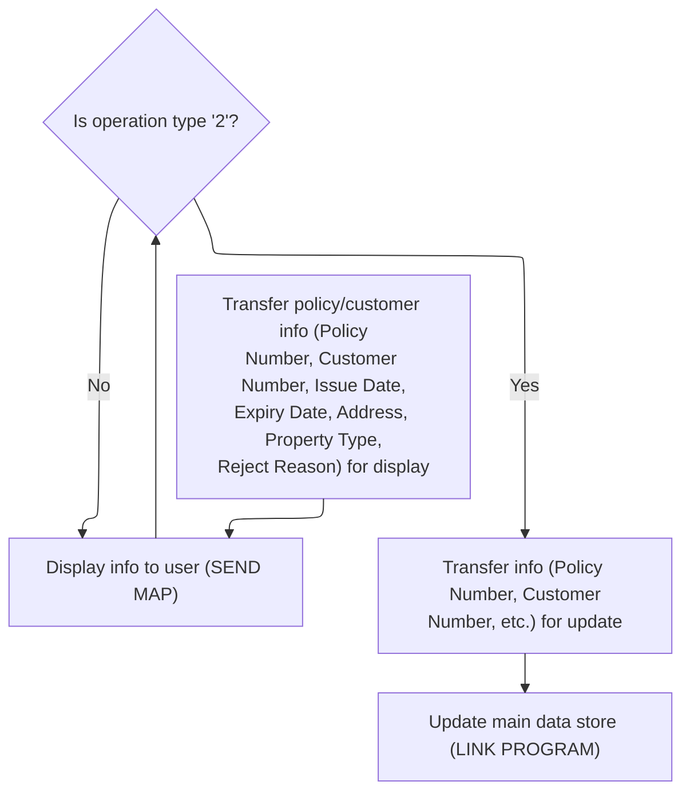

This section manages the display and update of policy and customer information on the user interface, and triggers the update process when required.

| Rule ID | Category                        | Rule Name                        | Description                                                                                                                                                                                                                                                                                                                                       | Implementation Details                                                                                                                                                                                                                                                                                                                                          |
| ------- | ------------------------------- | -------------------------------- | ------------------------------------------------------------------------------------------------------------------------------------------------------------------------------------------------------------------------------------------------------------------------------------------------------------------------------------------------- | --------------------------------------------------------------------------------------------------------------------------------------------------------------------------------------------------------------------------------------------------------------------------------------------------------------------------------------------------------------- |
| BR-001  | Decision Making                 | Prepare update operation         | When the operation type is '2', the section prepares the commarea for an update by transferring all relevant fields from the form fields to the commarea and setting the request ID to <SwmToken path="base/src/lgtestp4.cbl" pos="147:4:4" line-data="                 Move &#39;01ACOM&#39;             To  CA-REQUEST-ID">`01ACOM`</SwmToken>. | The request ID is set to <SwmToken path="base/src/lgtestp4.cbl" pos="147:4:4" line-data="                 Move &#39;01ACOM&#39;             To  CA-REQUEST-ID">`01ACOM`</SwmToken>. All relevant fields (customer number, issue date, expiry date, address, property type, etc.) are transferred as strings or numbers according to their commarea definitions. |
| BR-002  | Writing Output                  | Display policy and customer info | Policy and customer information is displayed to the user by transferring all relevant fields from the commarea to the form fields, then sending the <SwmToken path="base/src/lgtestp4.cbl" pos="42:11:11" line-data="           EXEC CICS SEND MAP (&#39;XMAPP4&#39;)">`XMAPP4`</SwmToken> map to the user interface.                             | The displayed fields include policy number, customer number, issue date, expiry date, address, property type, and reject reason. All fields are displayed as strings, with their respective lengths as defined in the commarea structure (e.g., policy number: 10 digits, issue date: 10 characters, etc.).                                                     |
| BR-003  | Invoking a Service or a Process | Invoke update process            | When the update operation is prepared, the section invokes the external program <SwmToken path="base/src/lgtestp4.cbl" pos="168:10:10" line-data="                 EXEC CICS LINK PROGRAM(&#39;LGAPOL01&#39;)">`LGAPOL01`</SwmToken> (Communication Area Validation and Data Insertion), passing the commarea and a fixed length of 32,500 bytes. | The external program <SwmToken path="base/src/lgtestp4.cbl" pos="168:10:10" line-data="                 EXEC CICS LINK PROGRAM(&#39;LGAPOL01&#39;)">`LGAPOL01`</SwmToken> is invoked with the commarea and a length of 32,500 bytes.                                                                                                                            |

<SwmSnippet path="/base/src/lgtestp4.cbl" line="120">

---

Back in <SwmToken path="base/src/lgtestp4.cbl" pos="24:5:7" line-data="              GO TO B-PROC.">`B-PROC`</SwmToken>, the code moves all relevant policy and customer details from the commarea to the form fields for display.

```cobol
                 Move CA-POLICY-NUM        To  ENP4PNOI
                 Move CA-CUSTOMER-NUM      To  ENP4CNOI
                 Move CA-ISSUE-DATE        To  ENP4IDAI
                 Move CA-EXPIRY-DATE       To  ENP4EDAI
                 Move CA-B-Address         To  ENP4ADDI
                 Move CA-B-PST        To  ENP4HPCI
                 Move CA-B-Latitude        To  ENP4LATI
                 Move CA-B-Longitude       To  ENP4LONI
                 Move CA-B-Customer        To  ENP4CUSI
                 Move CA-B-PropType        To  ENP4PTYI
                 Move CA-B-FP       To  ENP4FPEI
                 Move CA-B-CA-B-FPR     To  ENP4FPRI
                 Move CA-B-CP      To  ENP4CPEI
                 Move CA-B-CPR    To  ENP4CPRI
                 Move CA-B-FLP      To  ENP4XPEI
                 Move CA-B-FLPR    To  ENP4XPRI
                 Move CA-B-WP    To  ENP4WPEI
                 Move CA-B-WPR  To  ENP4WPRI
                 Move CA-B-ST          To  ENP4STAI
                 Move CA-B-RejectReason    To  ENP4REJI
```

---

</SwmSnippet>

<SwmSnippet path="/base/src/lgtestp4.cbl" line="140">

---

After updating the fields, the code sends the <SwmToken path="base/src/lgtestp4.cbl" pos="140:11:11" line-data="                 EXEC CICS SEND MAP (&#39;XMAPP4&#39;)">`XMAPP4`</SwmToken> map to the user so they see the results.

```cobol
                 EXEC CICS SEND MAP ('XMAPP4')
                           FROM(XMAPP4O)
                           MAPSET ('XMAP')
                 END-EXEC
```

---

</SwmSnippet>

<SwmSnippet path="/base/src/lgtestp4.cbl" line="146">

---

Back in <SwmToken path="base/src/lgtestp4.cbl" pos="24:5:7" line-data="              GO TO B-PROC.">`B-PROC`</SwmToken>, the code moves all relevant data from the form fields to the commarea to prep for adding a new policy.

```cobol
             WHEN '2'
                 Move '01ACOM'             To  CA-REQUEST-ID
                 Move ENP4CNOO             To  CA-CUSTOMER-NUM
                 Move ENP4IDAO             To  CA-ISSUE-DATE
                 Move ENP4EDAO             To  CA-EXPIRY-DATE
                 Move ENP4ADDO             To  CA-B-Address
                 Move ENP4HPCO             To  CA-B-PST
                 Move ENP4LATO             To  CA-B-Latitude
                 Move ENP4LONO             To  CA-B-Longitude
                 Move ENP4CUSO             To  CA-B-Customer
                 Move ENP4PTYO             To  CA-B-PropType
                 Move ENP4FPEO             To  CA-B-FP
                 Move ENP4FPRO             To  CA-B-CA-B-FPR
                 Move ENP4CPEO             To  CA-B-CP
                 Move ENP4CPRO             To  CA-B-CPR
                 Move ENP4XPEO             To  CA-B-FLP
                 Move ENP4XPRO             To  CA-B-FLPR
                 Move ENP4WPEO             To  CA-B-WP
                 Move ENP4WPRO             To  CA-B-WPR
                 Move ENP4STAO             To  CA-B-ST
                 Move ENP4REJO             To  CA-B-RejectReason
```

---

</SwmSnippet>

<SwmSnippet path="/base/src/lgtestp4.cbl" line="168">

---

After prepping the commarea, the code calls <SwmToken path="base/src/lgtestp4.cbl" pos="168:10:10" line-data="                 EXEC CICS LINK PROGRAM(&#39;LGAPOL01&#39;)">`LGAPOL01`</SwmToken> to run the add operation for the new policy.

```cobol
                 EXEC CICS LINK PROGRAM('LGAPOL01')
                           COMMAREA(COMM-AREA)
                           LENGTH(32500)
                 END-EXEC
```

---

</SwmSnippet>

## Validating and Processing Policy Add Requests

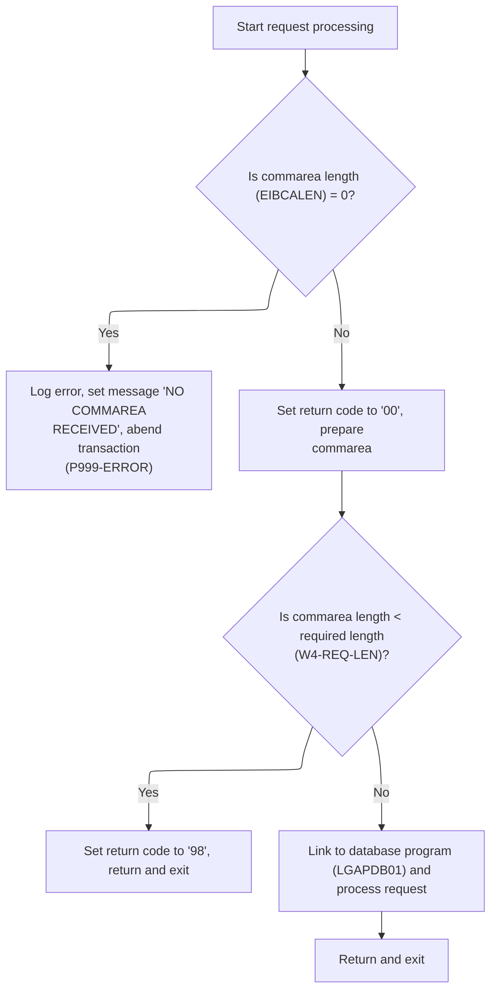

This section validates incoming policy add requests, ensures the commarea is present and of sufficient length, handles errors by logging and abending if necessary, and invokes the database program to process valid requests.

| Rule ID | Category                        | Rule Name                          | Description                                                                                                                                                    | Implementation Details                                                                                                                                                                                                                                                  |
| ------- | ------------------------------- | ---------------------------------- | -------------------------------------------------------------------------------------------------------------------------------------------------------------- | ----------------------------------------------------------------------------------------------------------------------------------------------------------------------------------------------------------------------------------------------------------------------- |
| BR-001  | Data validation                 | Missing commarea error handling    | If the commarea is missing (length is zero), log an error message, send the message to the logging service, and abend the transaction with code 'LGCA'.        | The error message is 'NO COMMAREA RECEIVED'. The abend code is 'LGCA'. The message is sent to the logging service with a timestamp and up to 90 bytes of commarea data if available. The message format includes date (8 bytes), time (6 bytes), and detail (21 bytes). |
| BR-002  | Data validation                 | Commarea length validation         | If the commarea length is less than the required minimum, set the return code to '98' and exit without processing the request.                                 | The required minimum length is the sum of header length (28 bytes) and required length (variable, initially 0). The return code is set to '98'.                                                                                                                         |
| BR-003  | Decision Making                 | Success return code initialization | On successful validation, set the return code to '00' before processing the request.                                                                           | The return code '00' indicates successful validation and readiness for processing.                                                                                                                                                                                      |
| BR-004  | Writing Output                  | Error logging with commarea data   | When an error occurs, log the error message with the current date and time, and send up to 90 bytes of the commarea to the logging service for audit purposes. | The log message includes the date (8 bytes), time (6 bytes), and detail (21 bytes). Up to 90 bytes of commarea data are included if available.                                                                                                                          |
| BR-005  | Invoking a Service or a Process | Database processing invocation     | If the commarea is present and of sufficient length, invoke the database program to process the policy add request.                                            | The database program invoked is <SwmToken path="base/src/lgapol01.cbl" pos="103:9:9" line-data="           EXEC CICS Link Program(LGAPDB01)">`LGAPDB01`</SwmToken>. The commarea is passed as input, with a maximum length of 32,500 bytes.                             |

<SwmSnippet path="/base/src/lgapol01.cbl" line="68">

---

<SwmToken path="base/src/lgapol01.cbl" pos="68:1:3" line-data="       P100-MAIN SECTION.">`P100-MAIN`</SwmToken> in <SwmPath>[base/src/lgapol01.cbl](base/src/lgapol01.cbl)</SwmPath> checks the commarea, logs and abends if missing, returns early if too short, then links to <SwmToken path="base/src/lgapol01.cbl" pos="103:9:9" line-data="           EXEC CICS Link Program(LGAPDB01)">`LGAPDB01`</SwmToken> to run the insert. Error handling is done first.

```cobol
       P100-MAIN SECTION.

      *----------------------------------------------------------------*
      * Common code                                                    *
      *----------------------------------------------------------------*
           INITIALIZE W1-CONTROL.
           MOVE EIBTRNID TO W1-TID.
           MOVE EIBTRMID TO W1-TRM.
           MOVE EIBTASKN TO W1-TSK.
           MOVE EIBCALEN TO W1-LEN.
      *----------------------------------------------------------------*

      *----------------------------------------------------------------*
      * Check commarea and obtain required details                     *
      *----------------------------------------------------------------*
           IF EIBCALEN IS EQUAL TO ZERO
               MOVE ' NO COMMAREA RECEIVED' TO W3-DETAIL
               PERFORM P999-ERROR
               EXEC CICS ABEND ABCODE('LGCA') NODUMP END-EXEC
           END-IF

           MOVE '00' TO CA-RETURN-CODE
           SET W1-PTR TO ADDRESS OF DFHCOMMAREA.

           ADD W4-HDR-LEN TO W4-REQ-LEN


           IF EIBCALEN IS LESS THAN W4-REQ-LEN
             MOVE '98' TO CA-RETURN-CODE
             EXEC CICS RETURN END-EXEC
           END-IF

      *----------------------------------------------------------------*
      *    Perform the data Inserts                                    *
      *----------------------------------------------------------------*
           EXEC CICS Link Program(LGAPDB01)
                Commarea(DFHCOMMAREA)
                LENGTH(32500)
           END-EXEC.

           EXEC CICS RETURN END-EXEC.
```

---

</SwmSnippet>

<SwmSnippet path="/base/src/lgapol01.cbl" line="119">

---

<SwmToken path="base/src/lgapol01.cbl" pos="119:1:3" line-data="       P999-ERROR.">`P999-ERROR`</SwmToken> logs the error with a timestamp, sends the message (plus up to 90 bytes of commarea) to LGSTSQ for queue logging.

```cobol
       P999-ERROR.
      * Save SQLCODE in message
      * Obtain and format current time and date
           EXEC CICS ASKTIME ABSTIME(W2-TIME)
           END-EXEC
           EXEC CICS FORMATTIME ABSTIME(W2-TIME)
                     MMDDYYYY(W2-DATE1)
                     TIME(W2-DATE2)
           END-EXEC
           MOVE W2-DATE1 TO W3-DATE
           MOVE W2-DATE2 TO W3-TIME
      * Write output message to TDQ
           EXEC CICS LINK PROGRAM('LGSTSQ')
                     COMMAREA(W3-MESSAGE)
                     LENGTH(LENGTH OF W3-MESSAGE)
           END-EXEC.
      * Write 90 bytes or as much as we have of commarea to TDQ
           IF EIBCALEN > 0 THEN
             IF EIBCALEN < 91 THEN
               MOVE DFHCOMMAREA(1:EIBCALEN) TO CA-DATA
               EXEC CICS LINK PROGRAM('LGSTSQ')
                         COMMAREA(CA-ERROR-MSG)
                         LENGTH(LENGTH OF CA-ERROR-MSG)
               END-EXEC
             ELSE
               MOVE DFHCOMMAREA(1:90) TO CA-DATA
               EXEC CICS LINK PROGRAM('LGSTSQ')
                         COMMAREA(CA-ERROR-MSG)
                         LENGTH(LENGTH OF CA-ERROR-MSG)
               END-EXEC
             END-IF
           END-IF.
           EXIT.
```

---

</SwmSnippet>

## Running Actuarial Calculation Workflow

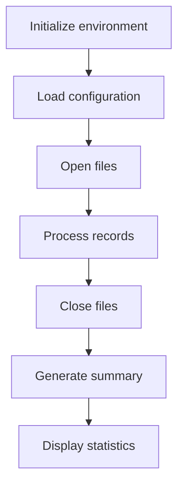

This section coordinates the end-to-end actuarial calculation workflow, ensuring all required steps are executed in the correct order. It manages setup, file handling, record processing, and reporting.

| Rule ID | Category        | Rule Name                           | Description                                                                                                                      | Implementation Details                                                                                                               |
| ------- | --------------- | ----------------------------------- | -------------------------------------------------------------------------------------------------------------------------------- | ------------------------------------------------------------------------------------------------------------------------------------ |
| BR-001  | Decision Making | Environment Initialization Sequence | The workflow begins by initializing the environment before any other processing occurs.                                          | Initialization is always the first step in the workflow. No parameters are required.                                                 |
| BR-002  | Decision Making | Configuration Load Sequence         | Configuration data is loaded after initialization and before any file operations or record processing.                           | Configuration loading is required before file operations or processing can occur.                                                    |
| BR-003  | Decision Making | File Opening and Header Writing     | Input, output, and summary files are opened before processing records, and headers are written to the output report for clarity. | All required files (input, output, summary) are opened in sequence. Headers are written to the output report after files are opened. |
| BR-004  | Decision Making | Record Processing Sequence          | Records are processed only after all files are opened and headers are written.                                                   | Record processing does not begin until setup is complete.                                                                            |
| BR-005  | Decision Making | File Closing Sequence               | All files are closed after record processing and before generating the summary.                                                  | Files are closed to ensure data is saved and resources are released before summary generation.                                       |
| BR-006  | Decision Making | Summary Generation Sequence         | A summary is generated after all files are closed and before statistics are displayed.                                           | Summary generation is a distinct step after file closure and before displaying statistics.                                           |
| BR-007  | Decision Making | Statistics Display Sequence         | Statistics are displayed as the final step in the workflow, after the summary is generated.                                      | Statistics display is the last step before program termination.                                                                      |

<SwmSnippet path="/base/src/LGAPDB01.cbl" line="90">

---

<SwmToken path="base/src/LGAPDB01.cbl" pos="90:1:1" line-data="       P001.">`P001`</SwmToken> runs the full workflow: setup, config, file handling, record processing, summary, stats, then stops.

```cobol
       P001.
           PERFORM P002-INITIALIZE
           PERFORM P003-LOAD-CONFIG
           PERFORM P005-OPEN-FILES
           PERFORM P006-PROCESS-RECORDS
           PERFORM P014-CLOSE-FILES
           PERFORM P015-GENERATE-SUMMARY
           PERFORM P016-DISPLAY-STATS
           STOP RUN.
```

---

</SwmSnippet>

<SwmSnippet path="/base/src/LGAPDB01.cbl" line="138">

---

<SwmToken path="base/src/LGAPDB01.cbl" pos="138:1:5" line-data="       P005-OPEN-FILES.">`P005-OPEN-FILES`</SwmToken> opens input, output, and summary files, then writes headers to the output report for clarity.

```cobol
       P005-OPEN-FILES.
           PERFORM P005A-OPEN-INPUT
           PERFORM P005B-OPEN-OUTPUT
           PERFORM P005C-OPEN-SUMMARY
           PERFORM P005D-WRITE-HEADERS.
```

---

</SwmSnippet>

## Processing and Routing Input Records

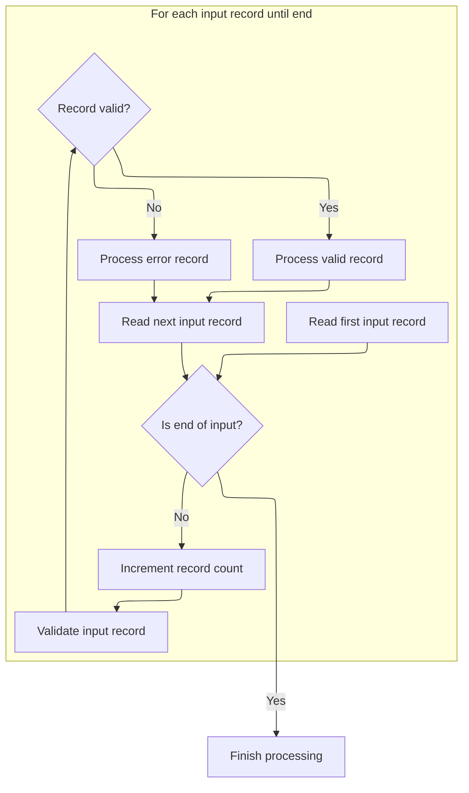

This section manages the main loop for processing input records, ensuring each record is validated and routed to the appropriate processing path. It maintains accurate counts of processed and error records, and handles end-of-file detection.

| Rule ID | Category        | Rule Name                                     | Description                                                                                                                                                                                      | Implementation Details                                                                                                                                   |
| ------- | --------------- | --------------------------------------------- | ------------------------------------------------------------------------------------------------------------------------------------------------------------------------------------------------ | -------------------------------------------------------------------------------------------------------------------------------------------------------- |
| BR-001  | Reading Input   | Sequential input processing until end-of-file | Each input record is read and processed in sequence until an end-of-file condition is detected, which is indicated by the input status value '10'.                                               | The end-of-file condition is represented by the value '10' in the input status field. Records are processed one at a time in sequence.                   |
| BR-002  | Reading Input   | Read next input record after processing       | After processing each record (valid or error), the next input record is read to continue the loop.                                                                                               | The read operation occurs after both valid and error processing paths, ensuring the loop continues with the next record.                                 |
| BR-003  | Calculation     | Record count increment                        | For each input record processed, the record count is incremented by one to maintain an accurate tally of processed records.                                                                      | The record count starts at zero and is incremented by one for each processed record. The count is stored as a 7-digit number.                            |
| BR-004  | Decision Making | Validation and routing of input records       | Each input record is validated before further processing. Records that pass validation are routed to the valid processing routine; records with errors are routed to the error handling routine. | Validation is performed for every input record. If the error count is zero, the record is considered valid; otherwise, it is treated as an error record. |
| BR-005  | Decision Making | End-of-file processing termination            | When the end-of-file condition is detected, the processing loop terminates and finalization logic is executed.                                                                                   | The end-of-file value is '10'. Finalization logic is triggered after the loop ends.                                                                      |

<SwmSnippet path="/base/src/LGAPDB01.cbl" line="178">

---

<SwmToken path="base/src/LGAPDB01.cbl" pos="178:1:5" line-data="       P006-PROCESS-RECORDS.">`P006-PROCESS-RECORDS`</SwmToken> loops through each input record, reads it, validates it, and then routes it to either valid processing or error handling. Valid records go through business logic, errors are logged and output separately. This keeps the workflow clean and ensures all records are accounted for, whether they're processed or rejected.

```cobol
       P006-PROCESS-RECORDS.
           PERFORM P007-READ-INPUT
           PERFORM UNTIL INPUT-EOF
               ADD 1 TO WS-REC-CNT
               PERFORM P008-VALIDATE-INPUT-RECORD
               IF WS-ERROR-COUNT = ZERO
                   PERFORM P009-PROCESS-VALID-RECORD
               ELSE
                   PERFORM P010-PROCESS-ERROR-RECORD
               END-IF
               PERFORM P007-READ-INPUT
           END-PERFORM.
```

---

</SwmSnippet>

## Validating Input and Logging Errors

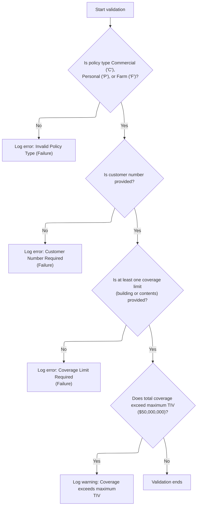

This section ensures that all required fields in a policy application are present and valid. It logs errors or warnings for any validation failures, supporting downstream review and correction.

| Rule ID | Category        | Rule Name                | Description                                                                                                                                                                       | Implementation Details                                                                                                                                                                                                                                                                                                                              |
| ------- | --------------- | ------------------------ | --------------------------------------------------------------------------------------------------------------------------------------------------------------------------------- | --------------------------------------------------------------------------------------------------------------------------------------------------------------------------------------------------------------------------------------------------------------------------------------------------------------------------------------------------- |
| BR-001  | Data validation | Policy Type Validation   | If the policy type is not Commercial, Personal, or Farm, an error is logged indicating an invalid policy type.                                                                    | Allowed values for policy type are 'C' (Commercial), 'P' (Personal), and 'F' (Farm). The error message is 'Invalid Policy Type' with code <SwmToken path="base/src/LGAPDB01.cbl" pos="202:2:2" line-data="                   &#39;POL001&#39; &#39;F&#39; &#39;IN-POLICY-TYPE&#39; ">`POL001`</SwmToken> and severity 'Failure'.                    |
| BR-002  | Data validation | Customer Number Required | If the customer number is not provided, an error is logged indicating that the customer number is required.                                                                       | Customer number is required. The error message is 'Customer Number Required' with code <SwmToken path="base/src/LGAPDB01.cbl" pos="208:2:2" line-data="                   &#39;CUS001&#39; &#39;F&#39; &#39;IN-CUSTOMER-NUM&#39; ">`CUS001`</SwmToken> and severity 'Failure'. The field is expected to be a string of up to 10 characters.         |
| BR-003  | Data validation | Coverage Limit Required  | If both building and contents coverage limits are zero, an error is logged indicating that at least one coverage limit is required.                                               | At least one of the coverage limits (building or contents) must be greater than zero. The error message is 'At least one coverage limit required' with code <SwmToken path="base/src/LGAPDB01.cbl" pos="215:2:2" line-data="                   &#39;COV001&#39; &#39;F&#39; &#39;COVERAGE-LIMITS&#39; ">`COV001`</SwmToken> and severity 'Failure'. |
| BR-004  | Data validation | Maximum TIV Warning      | If the sum of building, contents, and business interruption coverage exceeds $50,000,000, a warning is logged indicating that the total coverage exceeds the maximum allowed TIV. | The maximum total insured value (TIV) is $50,000,000. The warning message is 'Total coverage exceeds maximum TIV' with code <SwmToken path="base/src/LGAPDB01.cbl" pos="222:2:2" line-data="                   &#39;COV002&#39; &#39;W&#39; &#39;COVERAGE-LIMITS&#39; ">`COV002`</SwmToken> and severity 'Warning'.                                 |

<SwmSnippet path="/base/src/LGAPDB01.cbl" line="195">

---

<SwmToken path="base/src/LGAPDB01.cbl" pos="195:1:7" line-data="       P008-VALIDATE-INPUT-RECORD.">`P008-VALIDATE-INPUT-RECORD`</SwmToken> checks the policy type, customer number, and coverage limits. If any field is invalid, it logs an error using <SwmToken path="base/src/LGAPDB01.cbl" pos="201:3:7" line-data="               PERFORM P008A-LOG-ERROR WITH ">`P008A-LOG-ERROR`</SwmToken>. Exceeding the max coverage triggers a warning. This step ensures only valid records move forward and all issues are logged for review.

```cobol
       P008-VALIDATE-INPUT-RECORD.
           INITIALIZE WS-ERROR-HANDLING
           
           IF NOT COMMERCIAL-POLICY AND 
              NOT PERSONAL-POLICY AND 
              NOT FARM-POLICY
               PERFORM P008A-LOG-ERROR WITH 
                   'POL001' 'F' 'IN-POLICY-TYPE' 
                   'Invalid Policy Type'
           END-IF
           
           IF IN-CUSTOMER-NUM = SPACES
               PERFORM P008A-LOG-ERROR WITH 
                   'CUS001' 'F' 'IN-CUSTOMER-NUM' 
                   'Customer Number Required'
           END-IF
           
           IF IN-BUILDING-LIMIT = ZERO AND 
              IN-CONTENTS-LIMIT = ZERO
               PERFORM P008A-LOG-ERROR WITH 
                   'COV001' 'F' 'COVERAGE-LIMITS' 
                   'At least one coverage limit required'
           END-IF
           
           IF IN-BUILDING-LIMIT + IN-CONTENTS-LIMIT + 
              IN-BI-LIMIT > WS-MAX-TIV
               PERFORM P008A-LOG-ERROR WITH 
                   'COV002' 'W' 'COVERAGE-LIMITS' 
                   'Total coverage exceeds maximum TIV'
           END-IF.
```

---

</SwmSnippet>

<SwmSnippet path="/base/src/LGAPDB01.cbl" line="226">

---

<SwmToken path="base/src/LGAPDB01.cbl" pos="226:1:5" line-data="       P008A-LOG-ERROR.">`P008A-LOG-ERROR`</SwmToken> bumps the error count and uses it as an index to store each error's details in parallel arrays. This lets us track up to 20 errors per record, keeping error info organized for later review or output.

```cobol
       P008A-LOG-ERROR.
           ADD 1 TO WS-ERROR-COUNT
           SET ERR-IDX TO WS-ERROR-COUNT
           MOVE WS-ERROR-CODE TO WS-ERROR-CODE (ERR-IDX)
           MOVE WS-ERROR-SEVERITY TO WS-ERROR-SEVERITY (ERR-IDX)
           MOVE WS-ERROR-FIELD TO WS-ERROR-FIELD (ERR-IDX)
           MOVE WS-ERROR-MESSAGE TO WS-ERROR-MESSAGE (ERR-IDX).
```

---

</SwmSnippet>

## Handling Valid Policy Records

This section determines if a valid policy record is commercial or non-commercial, processes it accordingly, and updates processing statistics.

| Rule ID | Category        | Rule Name                                        | Description                                                                                                                                                     | Implementation Details                                                                                                                                                     |
| ------- | --------------- | ------------------------------------------------ | --------------------------------------------------------------------------------------------------------------------------------------------------------------- | -------------------------------------------------------------------------------------------------------------------------------------------------------------------------- |
| BR-001  | Calculation     | Processed count tracking                         | The processed count is incremented each time a commercial policy is processed, ensuring accurate tracking of processed commercial policies.                     | The processed count is a numeric value, initially zero, incremented by one for each commercial policy processed.                                                           |
| BR-002  | Calculation     | Error count tracking for non-commercial policies | The error count is incremented each time a non-commercial policy is processed, supporting business reporting on non-commercial policy handling in this context. | The error count is a numeric value, initially zero, incremented by one for each non-commercial policy processed in this context.                                           |
| BR-003  | Decision Making | Commercial policy processing                     | When a policy record is identified as commercial, the commercial policy handler is invoked and the processed count is incremented.                              | The commercial policy type is represented by the value 'C'. The processed count is a numeric value tracking the number of commercial policies processed.                   |
| BR-004  | Decision Making | Non-commercial policy routing                    | When a policy record is not commercial, the non-commercial policy handler is invoked and the error count is incremented.                                        | Non-commercial policy types include any value other than 'C'. The error count is a numeric value tracking the number of non-commercial policies processed in this context. |

<SwmSnippet path="/base/src/LGAPDB01.cbl" line="234">

---

<SwmToken path="base/src/LGAPDB01.cbl" pos="234:1:7" line-data="       P009-PROCESS-VALID-RECORD.">`P009-PROCESS-VALID-RECORD`</SwmToken> checks if the policy is commercial. If so, it runs the commercial handler and increments the processed count. Otherwise, it routes to the non-commercial handler and bumps the error count. This keeps stats accurate and enforces business rules.

```cobol
       P009-PROCESS-VALID-RECORD.
           IF COMMERCIAL-POLICY
               PERFORM P011-PROCESS-COMMERCIAL
               ADD 1 TO WS-PROC-CNT
           ELSE
               PERFORM P012-PROCESS-NON-COMMERCIAL
               ADD 1 TO WS-ERR-CNT
           END-IF.
```

---

</SwmSnippet>

### Processing Commercial Policies

This section governs the business logic for processing commercial insurance policies, including underwriting decisions and discount eligibility. It ensures that each policy is evaluated according to business-defined statuses and eligibility criteria.

| Rule ID | Category        | Rule Name                           | Description                                                                                              | Implementation Details                                                                                                                                                                          |
| ------- | --------------- | ----------------------------------- | -------------------------------------------------------------------------------------------------------- | ----------------------------------------------------------------------------------------------------------------------------------------------------------------------------------------------- |
| BR-001  | Calculation     | Default Discount Factor             | The default discount factor for a policy is 1.00 unless changed by other business logic.                 | The default discount factor is 1.00. This is a numeric value with two decimal places. The format is a number with an implied decimal point (e.g., 1.00).                                        |
| BR-002  | Calculation     | Default Total Discount Factor       | The default total discount factor for a policy is 1.00 unless changed by other business logic.           | The default total discount factor is 1.00. This is a numeric value with two decimal places. The format is a number with an implied decimal point (e.g., 1.00).                                  |
| BR-003  | Decision Making | Underwriting Approved Status        | A policy is considered approved if the underwriting status is set to 0.                                  | Status code 0 represents 'approved'. This is a numeric value. No specific output format is defined in the code, but the business meaning is that the policy is approved for underwriting.       |
| BR-004  | Decision Making | Underwriting Pending Status         | A policy is considered pending if the underwriting status is set to 1.                                   | Status code 1 represents 'pending'. This is a numeric value. No specific output format is defined in the code, but the business meaning is that the policy is pending further review or action. |
| BR-005  | Decision Making | Underwriting Rejected Status        | A policy is considered rejected if the underwriting status is set to 2.                                  | Status code 2 represents 'rejected'. This is a numeric value. No specific output format is defined in the code, but the business meaning is that the policy is rejected for underwriting.       |
| BR-006  | Decision Making | Underwriting Referred Status        | A policy is considered referred if the underwriting status is set to 3.                                  | Status code 3 represents 'referred'. This is a numeric value. No specific output format is defined in the code, but the business meaning is that the policy is referred for further review.     |
| BR-007  | Decision Making | Multi-Policy Discount Eligibility   | A policy is eligible for a multi-policy discount if the multi-policy eligibility flag is set to 'Y'.     | Eligibility flag 'Y' indicates eligibility for a multi-policy discount. This is a single-character alphanumeric value.                                                                          |
| BR-008  | Decision Making | Claims-Free Discount Eligibility    | A policy is eligible for a claims-free discount if the claims-free eligibility flag is set to 'Y'.       | Eligibility flag 'Y' indicates eligibility for a claims-free discount. This is a single-character alphanumeric value.                                                                           |
| BR-009  | Decision Making | Safety Program Discount Eligibility | A policy is eligible for a safety program discount if the safety program eligibility flag is set to 'Y'. | Eligibility flag 'Y' indicates eligibility for a safety program discount. This is a single-character alphanumeric value.                                                                        |

See <SwmLink doc-title="Processing Commercial Insurance Policies">[Processing Commercial Insurance Policies](.swm%5Cprocessing-commercial-insurance-policies.blnbpmtk.sw.md)</SwmLink>

### Handling Unsupported Policy Types

This section ensures that non-commercial policies are flagged as unsupported and are not processed for premium calculation. It standardizes the output for such policies, supporting clear reporting and downstream handling.

| Rule ID | Category       | Rule Name                                                | Description                                                                                                                                                              | Implementation Details                                                                                                                                                                                                                          |
| ------- | -------------- | -------------------------------------------------------- | ------------------------------------------------------------------------------------------------------------------------------------------------------------------------ | ----------------------------------------------------------------------------------------------------------------------------------------------------------------------------------------------------------------------------------------------- |
| BR-001  | Writing Output | Copy customer and property info for unsupported policies | When a policy is identified as non-commercial, the output record copies the customer number, property type, and postcode from the input record to the output record.     | Customer number is a string of 10 characters, property type is a string of 15 characters, and postcode is a string of 8 characters. These fields are transferred as-is from input to output.                                                    |
| BR-002  | Writing Output | Zero premiums for unsupported policies                   | All premium-related output fields are set to zero for non-commercial policies.                                                                                           | Premium fields include risk score, fire premium, crime premium, flood premium, weather premium, and total premium. Each is set to zero in the output record. Field sizes and types are not specified here but are set to zero value.            |
| BR-003  | Writing Output | Mark unsupported policy status and reason                | The output record for a non-commercial policy is marked with a status of 'UNSUPPORTED' and a reject reason stating 'Only Commercial policies supported in this version'. | Status is set to the string 'UNSUPPORTED'. Reject reason is set to the string 'Only Commercial policies supported in this version'. These values are used for reporting and downstream processing to indicate why the policy was not processed. |
| BR-004  | Writing Output | Write unsupported policy record to output                | The output record for a non-commercial policy is written to the output file for reporting and downstream processing.                                                     | The output record includes customer and property info, zeroed premiums, status, and reject reason. The record is written in the standard output format used by the system.                                                                      |

<SwmSnippet path="/base/src/LGAPDB01.cbl" line="379">

---

<SwmToken path="base/src/LGAPDB01.cbl" pos="379:1:7" line-data="       P012-PROCESS-NON-COMMERCIAL.">`P012-PROCESS-NON-COMMERCIAL`</SwmToken> copies customer and property info to the output, zeros all premium fields, marks the record as unsupported, and writes it out. This flags non-commercial policies as not processed and keeps the output clean for reporting.

```cobol
       P012-PROCESS-NON-COMMERCIAL.
           MOVE IN-CUSTOMER-NUM TO OUT-CUSTOMER-NUM
           MOVE IN-PROPERTY-TYPE TO OUT-PROPERTY-TYPE
           MOVE IN-POSTCODE TO OUT-POSTCODE
           MOVE ZERO TO OUT-RISK-SCORE
           MOVE ZERO TO OUT-FIRE-PREMIUM
           MOVE ZERO TO OUT-CRIME-PREMIUM
           MOVE ZERO TO OUT-FLOOD-PREMIUM
           MOVE ZERO TO OUT-WEATHER-PREMIUM
           MOVE ZERO TO OUT-TOTAL-PREMIUM
           MOVE 'UNSUPPORTED' TO OUT-STATUS
           MOVE 'Only Commercial policies supported in this version' 
                TO OUT-REJECT-REASON
           WRITE OUTPUT-RECORD.
```

---

</SwmSnippet>

## Handling Results After Policy Deletion

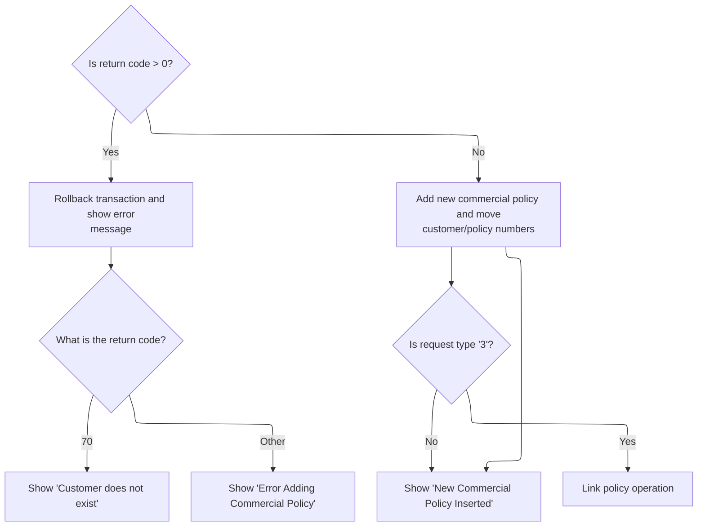

This section manages the outcomes after a policy deletion or addition attempt, including error handling, success confirmation, and conditional invocation of further operations.

| Rule ID | Category                        | Rule Name                          | Description                                                                                                                                                                                                                                                                                                                                                        | Implementation Details                                                                                                                                                                                                                                                                                                                       |
| ------- | ------------------------------- | ---------------------------------- | ------------------------------------------------------------------------------------------------------------------------------------------------------------------------------------------------------------------------------------------------------------------------------------------------------------------------------------------------------------------ | -------------------------------------------------------------------------------------------------------------------------------------------------------------------------------------------------------------------------------------------------------------------------------------------------------------------------------------------- |
| BR-001  | Decision Making                 | Error rollback and message display | If the return code is greater than zero, the transaction is rolled back and an error message is displayed to the user.                                                                                                                                                                                                                                             | The error message is selected based on the return code and displayed to the user. No specific format constraints are visible for the error message field beyond being a string.                                                                                                                                                              |
| BR-002  | Decision Making                 | Customer not found error message   | If the return code is 70, the user is shown a 'Customer does not exist' error message.                                                                                                                                                                                                                                                                             | The error message 'Customer does not exist' is displayed to the user. The message is a string and is moved to the output field.                                                                                                                                                                                                              |
| BR-003  | Decision Making                 | Generic policy add error message   | If the return code is not 70 but is still an error, the user is shown an 'Error Adding Commercial Policy' message.                                                                                                                                                                                                                                                 | The error message 'Error Adding Commercial Policy' is displayed to the user. The message is a string and is moved to the output field.                                                                                                                                                                                                       |
| BR-004  | Writing Output                  | Successful policy add confirmation | If the return code is zero, the customer and policy numbers are updated, the option field is cleared, and a success message is displayed to the user.                                                                                                                                                                                                              | The message 'New Commercial Policy Inserted' is displayed to the user. The customer and policy numbers are updated in the output. The option field is cleared (set to blank).                                                                                                                                                                |
| BR-005  | Invoking a Service or a Process | Conditional policy deletion link   | If the request type is '3' after a successful add, the system initiates a policy deletion operation by linking to the <SwmToken path="base/src/lgtestp4.cbl" pos="191:10:10" line-data="                 EXEC CICS LINK PROGRAM(&#39;LGDPOL01&#39;)">`LGDPOL01`</SwmToken> (Deleting policy business logic) program with the relevant customer and policy numbers. | The request ID <SwmToken path="base/src/lgtestp4.cbl" pos="188:4:4" line-data="                 Move &#39;01DCOM&#39;   To CA-REQUEST-ID">`01DCOM`</SwmToken> is used to indicate a delete operation. The customer and policy numbers are passed to the deletion process. The commarea length is set to 32,500 bytes for the link operation. |

<SwmSnippet path="/base/src/lgtestp4.cbl" line="172">

---

After coming back from <SwmPath>[base/src/lgapol01.cbl](base/src/lgapol01.cbl)</SwmPath> in <SwmToken path="base/src/lgtestp4.cbl" pos="24:5:7" line-data="              GO TO B-PROC.">`B-PROC`</SwmToken>, the code checks if <SwmToken path="base/src/lgtestp4.cbl" pos="172:3:7" line-data="                 IF CA-RETURN-CODE &gt; 0">`CA-RETURN-CODE`</SwmToken> signals an error. If so, it rolls back the transaction and jumps to <SwmToken path="base/src/lgtestp4.cbl" pos="174:5:7" line-data="                   GO TO E-NOADD">`E-NOADD`</SwmToken> to display an error and clean up the session.

```cobol
                 IF CA-RETURN-CODE > 0
                   Exec CICS Syncpoint Rollback End-Exec
                   GO TO E-NOADD
                 END-IF
```

---

</SwmSnippet>

<SwmSnippet path="/base/src/lgtestp4.cbl" line="275">

---

<SwmToken path="base/src/lgtestp4.cbl" pos="275:1:3" line-data="       E-NOADD.">`E-NOADD`</SwmToken> picks the right error message based on <SwmToken path="base/src/lgtestp4.cbl" pos="276:3:7" line-data="           Evaluate CA-RETURN-CODE">`CA-RETURN-CODE`</SwmToken>, moves it to the output field, and then jumps to <SwmToken path="base/src/lgtestp4.cbl" pos="279:5:7" line-data="               Go To F-ERR">`F-ERR`</SwmToken> to handle showing the error and cleaning up.

```cobol
       E-NOADD.
           Evaluate CA-RETURN-CODE
             When 70
               Move 'Customer does not exist'        To  ERP4FLDO
               Go To F-ERR
             When Other
               Move 'Error Adding Commercial Policy' To  ERP4FLDO
               Go To F-ERR
           End-Evaluate.
```

---

</SwmSnippet>

<SwmSnippet path="/base/src/lgtestp4.cbl" line="176">

---

Back in <SwmToken path="base/src/lgtestp4.cbl" pos="24:5:7" line-data="              GO TO B-PROC.">`B-PROC`</SwmToken>, after a successful add, the code updates the customer and policy numbers, clears the option field, sets the success message, and sends the <SwmToken path="base/src/lgtestp4.cbl" pos="181:11:11" line-data="                 EXEC CICS SEND MAP (&#39;XMAPP4&#39;)">`XMAPP4`</SwmToken> map to show the result to the user.

```cobol
                 Move CA-CUSTOMER-NUM To ENP4CNOI
                 Move CA-POLICY-NUM   To ENP4PNOI
                 Move ' '             To ENP4OPTI
                 Move 'New Commercial Policy Inserted'
                   To  ERP4FLDO
                 EXEC CICS SEND MAP ('XMAPP4')
                           FROM(XMAPP4O)
                           MAPSET ('XMAP')
                 END-EXEC
```

---

</SwmSnippet>

<SwmSnippet path="/base/src/lgtestp4.cbl" line="187">

---

This part sets up the request for deleting a commercial policy by moving the right IDs into the commarea and linking to <SwmToken path="base/src/lgtestp4.cbl" pos="191:10:10" line-data="                 EXEC CICS LINK PROGRAM(&#39;LGDPOL01&#39;)">`LGDPOL01`</SwmToken>. That program handles the actual delete logic.

```cobol
             WHEN '3'
                 Move '01DCOM'   To CA-REQUEST-ID
                 Move ENP4CNOO   To CA-CUSTOMER-NUM
                 Move ENP4PNOO   To CA-POLICY-NUM
                 EXEC CICS LINK PROGRAM('LGDPOL01')
                           COMMAREA(COMM-AREA)
                           LENGTH(32500)
                 END-EXEC
```

---

</SwmSnippet>

## Validating and Routing Policy Deletion Requests

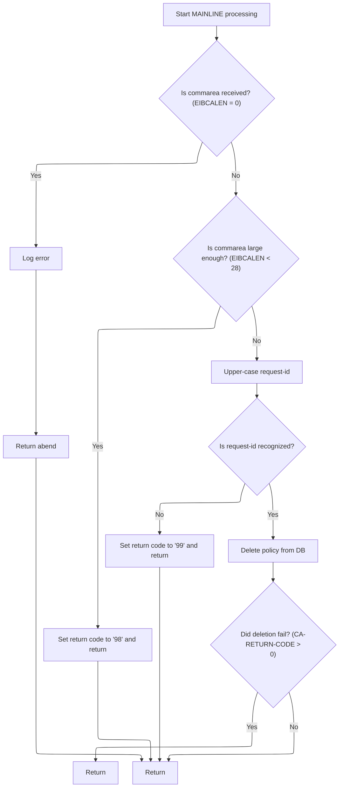

This section validates incoming policy deletion requests, ensures the request is supported, and routes valid requests to the policy deletion process. It handles errors up front and logs relevant information for operational visibility.

| Rule ID | Category        | Rule Name                       | Description                                                                                                                                                    | Implementation Details                                                                                                                                                                                                                                                                                                                                                                                                                                                                                                                                                                                                                                                                                  |
| ------- | --------------- | ------------------------------- | -------------------------------------------------------------------------------------------------------------------------------------------------------------- | ------------------------------------------------------------------------------------------------------------------------------------------------------------------------------------------------------------------------------------------------------------------------------------------------------------------------------------------------------------------------------------------------------------------------------------------------------------------------------------------------------------------------------------------------------------------------------------------------------------------------------------------------------------------------------------------------------- |
| BR-001  | Data validation | Commarea Required               | If no commarea is received, an error message is logged and the process abends with code 'LGCA'.                                                                | The error message includes the text ' NO COMMAREA RECEIVED'. The abend code is 'LGCA'.                                                                                                                                                                                                                                                                                                                                                                                                                                                                                                                                                                                                                  |
| BR-002  | Data validation | Minimum Commarea Length         | If the commarea is present but shorter than 28 bytes, the return code is set to '98' and the process returns without further action.                           | The minimum required commarea length is 28 bytes. The return code for this error is '98'.                                                                                                                                                                                                                                                                                                                                                                                                                                                                                                                                                                                                               |
| BR-003  | Data validation | Request ID Standardization      | The request ID is converted to uppercase before validation to ensure case-insensitive comparison.                                                              | All alphabetic characters in the request ID are converted to uppercase before further processing.                                                                                                                                                                                                                                                                                                                                                                                                                                                                                                                                                                                                       |
| BR-004  | Data validation | Supported Request ID Validation | If the request ID is not one of the supported delete types, the return code is set to '99' and the process returns.                                            | Supported request IDs are <SwmToken path="base/src/lgdpol01.cbl" pos="119:18:18" line-data="           IF ( CA-REQUEST-ID NOT EQUAL TO &#39;01DEND&#39; AND">`01DEND`</SwmToken>, <SwmToken path="base/src/lgdpol01.cbl" pos="120:14:14" line-data="                CA-REQUEST-ID NOT EQUAL TO &#39;01DMOT&#39; AND">`01DMOT`</SwmToken>, <SwmToken path="base/src/lgdpol01.cbl" pos="121:14:14" line-data="                CA-REQUEST-ID NOT EQUAL TO &#39;01DHOU&#39; AND">`01DHOU`</SwmToken>, and <SwmToken path="base/src/lgtestp4.cbl" pos="188:4:4" line-data="                 Move &#39;01DCOM&#39;   To CA-REQUEST-ID">`01DCOM`</SwmToken>. The return code for unsupported requests is '99'. |
| BR-005  | Decision Making | Policy Deletion Routing         | If the request ID is recognized, the policy deletion process is invoked. If the deletion process sets a non-zero return code, the process returns immediately. | The deletion process is invoked only for supported request IDs. If the deletion process sets a return code greater than zero, the process returns without further action.                                                                                                                                                                                                                                                                                                                                                                                                                                                                                                                               |
| BR-006  | Writing Output  | Error Logging with Context      | When an error occurs, an error message is logged with the current date, time, and up to 90 bytes of the commarea for context.                                  | The error message includes the date (8 bytes), time (6 bytes), a program identifier (' <SwmToken path="base/src/lgtestp4.cbl" pos="191:10:10" line-data="                 EXEC CICS LINK PROGRAM(&#39;LGDPOL01&#39;)">`LGDPOL01`</SwmToken>'), and a variable message (21 bytes). Up to 90 bytes of the commarea are included for context if available.                                                                                                                                                                                                                                                                                                                                                 |

<SwmSnippet path="/base/src/lgdpol01.cbl" line="78">

---

MAINLINE in <SwmPath>[base/src/lgdpol01.cbl](base/src/lgdpol01.cbl)</SwmPath> checks the commarea, validates the request, and only if the request ID matches a supported delete type does it call <SwmToken path="base/src/lgdpol01.cbl" pos="126:3:9" line-data="               PERFORM DELETE-POLICY-DB2-INFO">`DELETE-POLICY-DB2-INFO`</SwmToken>. Errors and unsupported requests are handled up front.

```cobol
       MAINLINE SECTION.

      *----------------------------------------------------------------*
      * Common code                                                    *
      *----------------------------------------------------------------*
      * initialize working storage variables
           INITIALIZE WS-HEADER.
      * set up general variable
           MOVE EIBTRNID TO WS-TRANSID.
           MOVE EIBTRMID TO WS-TERMID.
           MOVE EIBTASKN TO WS-TASKNUM.
      *----------------------------------------------------------------*

      *----------------------------------------------------------------*
      * Check commarea and obtain required details                     *
      *----------------------------------------------------------------*
      * If NO commarea received issue an ABEND
           IF EIBCALEN IS EQUAL TO ZERO
               MOVE ' NO COMMAREA RECEIVED' TO EM-VARIABLE
               PERFORM WRITE-ERROR-MESSAGE
               EXEC CICS ABEND ABCODE('LGCA') NODUMP END-EXEC
           END-IF

      * initialize commarea return code to zero
           MOVE '00' TO CA-RETURN-CODE
           MOVE EIBCALEN TO WS-CALEN.
           SET WS-ADDR-DFHCOMMAREA TO ADDRESS OF DFHCOMMAREA.

      * Check commarea is large enough
           IF EIBCALEN IS LESS THAN WS-CA-HEADER-LEN
             MOVE '98' TO CA-RETURN-CODE
             EXEC CICS RETURN END-EXEC
           END-IF

      *----------------------------------------------------------------*
      * Check request-id in commarea and if recognised ...             *
      * Call routine to delete row from policy table                   *
      *----------------------------------------------------------------*
      * Upper case value passed in Request Id field                    *
           MOVE FUNCTION UPPER-CASE(CA-REQUEST-ID) TO CA-REQUEST-ID

           IF ( CA-REQUEST-ID NOT EQUAL TO '01DEND' AND
                CA-REQUEST-ID NOT EQUAL TO '01DMOT' AND
                CA-REQUEST-ID NOT EQUAL TO '01DHOU' AND
                CA-REQUEST-ID NOT EQUAL TO '01DCOM' )
      *        Request is not recognised or supported
               MOVE '99' TO CA-RETURN-CODE
           ELSE
               PERFORM DELETE-POLICY-DB2-INFO
               If CA-RETURN-CODE > 0
                 EXEC CICS RETURN END-EXEC
               End-if
           END-IF

      * Return to caller
           EXEC CICS RETURN END-EXEC.
```

---

</SwmSnippet>

<SwmSnippet path="/base/src/lgdpol01.cbl" line="154">

---

<SwmToken path="base/src/lgdpol01.cbl" pos="154:1:5" line-data="       WRITE-ERROR-MESSAGE.">`WRITE-ERROR-MESSAGE`</SwmToken> grabs the current time, formats it, writes the error message to the queue, and then writes up to 90 bytes of the commarea for context. All queue writing is handled by LGSTSQ.

```cobol
       WRITE-ERROR-MESSAGE.
      * Save SQLCODE in message
      * Obtain and format current time and date
           EXEC CICS ASKTIME ABSTIME(WS-ABSTIME)
           END-EXEC
           EXEC CICS FORMATTIME ABSTIME(Ws-ABSTIME)
                     MMDDYYYY(WS-DATE)
                     TIME(WS-TIME)
           END-EXEC
           MOVE WS-DATE TO EM-DATE
           MOVE WS-TIME TO EM-TIME
      * Write output message to TDQ
           EXEC CICS LINK PROGRAM('LGSTSQ')
                     COMMAREA(ERROR-MSG)
                     LENGTH(LENGTH OF ERROR-MSG)
           END-EXEC.
      * Write 90 bytes or as much as we have of commarea to TDQ
           IF EIBCALEN > 0 THEN
             IF EIBCALEN < 91 THEN
               MOVE DFHCOMMAREA(1:EIBCALEN) TO CA-DATA
               EXEC CICS LINK PROGRAM('LGSTSQ')
                         COMMAREA(CA-ERROR-MSG)
                         LENGTH(LENGTH OF CA-ERROR-MSG)
               END-EXEC
             ELSE
               MOVE DFHCOMMAREA(1:90) TO CA-DATA
               EXEC CICS LINK PROGRAM('LGSTSQ')
                         COMMAREA(CA-ERROR-MSG)
                         LENGTH(LENGTH OF CA-ERROR-MSG)
               END-EXEC
             END-IF
           END-IF.
           EXIT.
```

---

</SwmSnippet>

## Triggering Database Policy Deletion

This section triggers the deletion of a policy record in the database by linking to an external program. It acts as a bridge between the main application and the database deletion logic.

| Rule ID | Category                        | Rule Name                       | Description                                                                                                                                                                         | Implementation Details                                                                                                                              |
| ------- | ------------------------------- | ------------------------------- | ----------------------------------------------------------------------------------------------------------------------------------------------------------------------------------- | --------------------------------------------------------------------------------------------------------------------------------------------------- |
| BR-001  | Invoking a Service or a Process | Trigger Policy Deletion Process | The system initiates the policy deletion process by invoking the external program responsible for database operations, passing the communication area and its length as parameters. | The communication area passed to the external program is 32,500 bytes in length. No other field formats or constants are specified in this section. |

<SwmSnippet path="/base/src/lgdpol01.cbl" line="139">

---

<SwmToken path="base/src/lgdpol01.cbl" pos="139:1:7" line-data="       DELETE-POLICY-DB2-INFO.">`DELETE-POLICY-DB2-INFO`</SwmToken> just links to <SwmToken path="base/src/lgdpol01.cbl" pos="141:9:9" line-data="           EXEC CICS LINK PROGRAM(LGDPDB01)">`LGDPDB01`</SwmToken>, passing the commarea. That program does the actual <SwmToken path="base/src/lgdpol01.cbl" pos="139:5:5" line-data="       DELETE-POLICY-DB2-INFO.">`DB2`</SwmToken> delete for the policy.

```cobol
       DELETE-POLICY-DB2-INFO.

           EXEC CICS LINK PROGRAM(LGDPDB01)
                Commarea(DFHCOMMAREA)
                LENGTH(32500)
           END-EXEC.

           EXIT.
```

---

</SwmSnippet>

## Validating and Executing <SwmToken path="base/src/lgipdb01.cbl" pos="242:5:5" line-data="      * initialize DB2 host variables">`DB2`</SwmToken> Policy Deletion

```mermaid
%%{init: {"flowchart": {"defaultRenderer": "elk"}} }%%
flowchart TD
    node1["Initialize request and variables"] --> node2{"Is commarea received?"}
    click node1 openCode "base/src/lgdpdb01.cbl:111:125"
    node2 -->|"No commarea"| node3["Log error and abend"]
    click node2 openCode "base/src/lgdpdb01.cbl:131:135"
    click node3 openCode "base/src/lgdpdb01.cbl:132:134"
    node3 --> node12["Return to caller"]
    node2 -->|"Yes"| node4{"Is commarea large enough?"}
    click node4 openCode "base/src/lgdpdb01.cbl:143:146"
    node4 -->|"Too small"| node5["Set return code '98' and return"]
    click node5 openCode "base/src/lgdpdb01.cbl:144:145"
    node5 --> node12
    node4 -->|"Large enough"| node6{"Is request ID recognized?"}
    click node6 openCode "base/src/lgdpdb01.cbl:160:172"
    node6 -->|"Not recognized"| node7["Set return code '99' and return"]
    click node7 openCode "base/src/lgdpdb01.cbl:165:166"
    node7 --> node12
    node6 -->|"Recognized (01DEND, 01DHOU,
01DCOM, 01DMOT)"| node8["Delete policy from DB2"]
    click node8 openCode "base/src/lgdpdb01.cbl:167:171"
    node8 --> node9{"Was deletion successful?"}
    click node9 openCode "base/src/lgdpdb01.cbl:198:202"
    node9 -->|"Failed (SQLCODE != 0)"| node10["Set return code '90', log error, and
return"]
    click node10 openCode "base/src/lgdpdb01.cbl:199:201"
    node10 --> node12
    node9 -->|"Success (SQLCODE = 0 or 100)"| node11["Call LGDPVS01 for further processing"]
    click node11 openCode "base/src/lgdpdb01.cbl:168:171"
    node11 --> node12["Return to caller"]
    click node12 openCode "base/src/lgdpdb01.cbl:175:175"
classDef HeadingStyle fill:#777777,stroke:#333,stroke-width:2px;

%% Swimm:
%% %%{init: {"flowchart": {"defaultRenderer": "elk"}} }%%
%% flowchart TD
%%     node1["Initialize request and variables"] --> node2{"Is commarea received?"}
%%     click node1 openCode "<SwmPath>[base/src/lgdpdb01.cbl](base/src/lgdpdb01.cbl)</SwmPath>:111:125"
%%     node2 -->|"No commarea"| node3["Log error and abend"]
%%     click node2 openCode "<SwmPath>[base/src/lgdpdb01.cbl](base/src/lgdpdb01.cbl)</SwmPath>:131:135"
%%     click node3 openCode "<SwmPath>[base/src/lgdpdb01.cbl](base/src/lgdpdb01.cbl)</SwmPath>:132:134"
%%     node3 --> node12["Return to caller"]
%%     node2 -->|"Yes"| node4{"Is commarea large enough?"}
%%     click node4 openCode "<SwmPath>[base/src/lgdpdb01.cbl](base/src/lgdpdb01.cbl)</SwmPath>:143:146"
%%     node4 -->|"Too small"| node5["Set return code '98' and return"]
%%     click node5 openCode "<SwmPath>[base/src/lgdpdb01.cbl](base/src/lgdpdb01.cbl)</SwmPath>:144:145"
%%     node5 --> node12
%%     node4 -->|"Large enough"| node6{"Is request ID recognized?"}
%%     click node6 openCode "<SwmPath>[base/src/lgdpdb01.cbl](base/src/lgdpdb01.cbl)</SwmPath>:160:172"
%%     node6 -->|"Not recognized"| node7["Set return code '99' and return"]
%%     click node7 openCode "<SwmPath>[base/src/lgdpdb01.cbl](base/src/lgdpdb01.cbl)</SwmPath>:165:166"
%%     node7 --> node12
%%     node6 -->|"Recognized (<SwmToken path="base/src/lgdpol01.cbl" pos="119:18:18" line-data="           IF ( CA-REQUEST-ID NOT EQUAL TO &#39;01DEND&#39; AND">`01DEND`</SwmToken>, <SwmToken path="base/src/lgdpol01.cbl" pos="121:14:14" line-data="                CA-REQUEST-ID NOT EQUAL TO &#39;01DHOU&#39; AND">`01DHOU`</SwmToken>,
%% <SwmToken path="base/src/lgtestp4.cbl" pos="188:4:4" line-data="                 Move &#39;01DCOM&#39;   To CA-REQUEST-ID">`01DCOM`</SwmToken>, <SwmToken path="base/src/lgdpol01.cbl" pos="120:14:14" line-data="                CA-REQUEST-ID NOT EQUAL TO &#39;01DMOT&#39; AND">`01DMOT`</SwmToken>)"| node8["Delete policy from <SwmToken path="base/src/lgipdb01.cbl" pos="242:5:5" line-data="      * initialize DB2 host variables">`DB2`</SwmToken>"]
%%     click node8 openCode "<SwmPath>[base/src/lgdpdb01.cbl](base/src/lgdpdb01.cbl)</SwmPath>:167:171"
%%     node8 --> node9{"Was deletion successful?"}
%%     click node9 openCode "<SwmPath>[base/src/lgdpdb01.cbl](base/src/lgdpdb01.cbl)</SwmPath>:198:202"
%%     node9 -->|"Failed (SQLCODE != 0)"| node10["Set return code '90', log error, and
%% return"]
%%     click node10 openCode "<SwmPath>[base/src/lgdpdb01.cbl](base/src/lgdpdb01.cbl)</SwmPath>:199:201"
%%     node10 --> node12
%%     node9 -->|"Success (SQLCODE = 0 or 100)"| node11["Call <SwmToken path="base/src/lgdpdb01.cbl" pos="168:9:9" line-data="               EXEC CICS LINK PROGRAM(LGDPVS01)">`LGDPVS01`</SwmToken> for further processing"]
%%     click node11 openCode "<SwmPath>[base/src/lgdpdb01.cbl](base/src/lgdpdb01.cbl)</SwmPath>:168:171"
%%     node11 --> node12["Return to caller"]
%%     click node12 openCode "<SwmPath>[base/src/lgdpdb01.cbl](base/src/lgdpdb01.cbl)</SwmPath>:175:175"
%% classDef HeadingStyle fill:#777777,stroke:#333,stroke-width:2px;
```

This section validates and processes requests to delete a policy from the <SwmToken path="base/src/lgipdb01.cbl" pos="242:5:5" line-data="      * initialize DB2 host variables">`DB2`</SwmToken> database. It ensures only supported requests are processed, handles errors, and coordinates downstream actions based on the outcome.

| Rule ID | Category                        | Rule Name                                                                                                                                         | Description                                                                                                                                                                                                                                                                                                                                                                                        | Implementation Details                                                                                                                                                                                                                                                                                                                                                                                                                                                                                                                                                                                                                                                                                                    |
| ------- | ------------------------------- | ------------------------------------------------------------------------------------------------------------------------------------------------- | -------------------------------------------------------------------------------------------------------------------------------------------------------------------------------------------------------------------------------------------------------------------------------------------------------------------------------------------------------------------------------------------------- | ------------------------------------------------------------------------------------------------------------------------------------------------------------------------------------------------------------------------------------------------------------------------------------------------------------------------------------------------------------------------------------------------------------------------------------------------------------------------------------------------------------------------------------------------------------------------------------------------------------------------------------------------------------------------------------------------------------------------- |
| BR-001  | Data validation                 | Missing commarea error                                                                                                                            | If no commarea is received, log an error message and abend the transaction.                                                                                                                                                                                                                                                                                                                        | The error message includes the text ' NO COMMAREA RECEIVED'. The transaction is abended with code 'LGCA'.                                                                                                                                                                                                                                                                                                                                                                                                                                                                                                                                                                                                                 |
| BR-002  | Data validation                 | Minimum commarea length validation                                                                                                                | If the commarea is present but smaller than 28 bytes, set return code '98' and return without processing.                                                                                                                                                                                                                                                                                          | The minimum required commarea length is 28 bytes. The return code '98' is set in the commarea to indicate this error.                                                                                                                                                                                                                                                                                                                                                                                                                                                                                                                                                                                                     |
| BR-003  | Data validation                 | Unsupported request ID validation                                                                                                                 | If the request ID is not one of the supported values, set return code '99' and return without processing.                                                                                                                                                                                                                                                                                          | Supported request IDs are <SwmToken path="base/src/lgdpol01.cbl" pos="119:18:18" line-data="           IF ( CA-REQUEST-ID NOT EQUAL TO &#39;01DEND&#39; AND">`01DEND`</SwmToken>, <SwmToken path="base/src/lgdpol01.cbl" pos="121:14:14" line-data="                CA-REQUEST-ID NOT EQUAL TO &#39;01DHOU&#39; AND">`01DHOU`</SwmToken>, <SwmToken path="base/src/lgtestp4.cbl" pos="188:4:4" line-data="                 Move &#39;01DCOM&#39;   To CA-REQUEST-ID">`01DCOM`</SwmToken>, and <SwmToken path="base/src/lgdpol01.cbl" pos="120:14:14" line-data="                CA-REQUEST-ID NOT EQUAL TO &#39;01DMOT&#39; AND">`01DMOT`</SwmToken>. The return code '99' is set in the commarea to indicate this error. |
| BR-004  | Data validation                 | <SwmToken path="base/src/lgipdb01.cbl" pos="242:5:5" line-data="      * initialize DB2 host variables">`DB2`</SwmToken> deletion failure handling | If the <SwmToken path="base/src/lgipdb01.cbl" pos="242:5:5" line-data="      * initialize DB2 host variables">`DB2`</SwmToken> deletion fails (SQLCODE not 0 or 100), set return code '90', log the error, and return to the caller.                                                                                                                                                               | Return code '90' indicates a <SwmToken path="base/src/lgipdb01.cbl" pos="242:5:5" line-data="      * initialize DB2 host variables">`DB2`</SwmToken> error. The error message includes the SQLCODE and relevant context.                                                                                                                                                                                                                                                                                                                                                                                                                                                                                                  |
| BR-005  | Decision Making                 | Policy deletion for recognized requests                                                                                                           | If the request ID is recognized, attempt to delete the policy from the <SwmToken path="base/src/lgipdb01.cbl" pos="242:5:5" line-data="      * initialize DB2 host variables">`DB2`</SwmToken> database using the provided customer and policy numbers.                                                                                                                                            | The customer and policy numbers are used as keys for deletion. Deletion is attempted only for recognized request IDs.                                                                                                                                                                                                                                                                                                                                                                                                                                                                                                                                                                                                     |
| BR-006  | Writing Output                  | Error logging for failures                                                                                                                        | All error scenarios result in logging an error message that includes the SQLCODE, timestamp, and up to 90 bytes of the commarea for context.                                                                                                                                                                                                                                                       | Error messages include SQLCODE, date, time, and up to 90 bytes of the commarea. Messages are sent to the LGSTSQ queue.                                                                                                                                                                                                                                                                                                                                                                                                                                                                                                                                                                                                    |
| BR-007  | Invoking a Service or a Process | Post-deletion processing on success                                                                                                               | If the <SwmToken path="base/src/lgipdb01.cbl" pos="242:5:5" line-data="      * initialize DB2 host variables">`DB2`</SwmToken> deletion is successful (SQLCODE 0 or 100), invoke further processing via <SwmToken path="base/src/lgdpdb01.cbl" pos="168:9:9" line-data="               EXEC CICS LINK PROGRAM(LGDPVS01)">`LGDPVS01`</SwmToken> (Deleting Policy Records) and return to the caller. | SQLCODE 0 means successful deletion; 100 means record not found (also considered successful). Further processing is invoked via <SwmToken path="base/src/lgdpdb01.cbl" pos="168:9:9" line-data="               EXEC CICS LINK PROGRAM(LGDPVS01)">`LGDPVS01`</SwmToken>.                                                                                                                                                                                                                                                                                                                                                                                                                                                   |

<SwmSnippet path="/base/src/lgdpdb01.cbl" line="111">

---

MAINLINE in <SwmPath>[base/src/lgdpdb01.cbl](base/src/lgdpdb01.cbl)</SwmPath> checks the commarea, converts customer and policy numbers to <SwmToken path="base/src/lgdpdb01.cbl" pos="124:5:5" line-data="      * initialize DB2 host variables">`DB2`</SwmToken> integer format, and only calls <SwmToken path="base/src/lgdpdb01.cbl" pos="167:3:9" line-data="               PERFORM DELETE-POLICY-DB2-INFO">`DELETE-POLICY-DB2-INFO`</SwmToken> and <SwmToken path="base/src/lgdpdb01.cbl" pos="168:9:9" line-data="               EXEC CICS LINK PROGRAM(LGDPVS01)">`LGDPVS01`</SwmToken> if the request is recognized. Errors and unsupported requests are handled up front.

```cobol
       MAINLINE SECTION.

      *----------------------------------------------------------------*
      * Common code                                                    *
      *----------------------------------------------------------------*
      * initialize working storage variables
           INITIALIZE WS-HEADER.
      * set up general variable
           MOVE EIBTRNID TO WS-TRANSID.
           MOVE EIBTRMID TO WS-TERMID.
           MOVE EIBTASKN TO WS-TASKNUM.
      *----------------------------------------------------------------*

      * initialize DB2 host variables
           INITIALIZE DB2-IN-INTEGERS.

      *----------------------------------------------------------------*
      * Check commarea and obtain required details                     *
      *----------------------------------------------------------------*
      * If NO commarea received issue an ABEND
           IF EIBCALEN IS EQUAL TO ZERO
               MOVE ' NO COMMAREA RECEIVED' TO EM-VARIABLE
               PERFORM WRITE-ERROR-MESSAGE
               EXEC CICS ABEND ABCODE('LGCA') NODUMP END-EXEC
           END-IF

      * initialize commarea return code to zero
           MOVE '00' TO CA-RETURN-CODE
           MOVE EIBCALEN TO WS-CALEN.
           SET WS-ADDR-DFHCOMMAREA TO ADDRESS OF DFHCOMMAREA.

      * Check commarea is large enough
           IF EIBCALEN IS LESS THAN WS-CA-HEADER-LEN
             MOVE '98' TO CA-RETURN-CODE
             EXEC CICS RETURN END-EXEC
           END-IF

      * Convert commarea customer & policy nums to DB2 integer format
           MOVE CA-CUSTOMER-NUM TO DB2-CUSTOMERNUM-INT
           MOVE CA-POLICY-NUM   TO DB2-POLICYNUM-INT
      * and save in error msg field incase required
           MOVE CA-CUSTOMER-NUM TO EM-CUSNUM
           MOVE CA-POLICY-NUM   TO EM-POLNUM

      *----------------------------------------------------------------*
      * Check request-id in commarea and if recognised ...             *
      * Call routine to delete row from policy table                   *
      *----------------------------------------------------------------*

           IF ( CA-REQUEST-ID NOT EQUAL TO '01DEND' AND
                CA-REQUEST-ID NOT EQUAL TO '01DHOU' AND
                CA-REQUEST-ID NOT EQUAL TO '01DCOM' AND
                CA-REQUEST-ID NOT EQUAL TO '01DMOT' ) Then
      *        Request is not recognised or supported
               MOVE '99' TO CA-RETURN-CODE
           ELSE
               PERFORM DELETE-POLICY-DB2-INFO
               EXEC CICS LINK PROGRAM(LGDPVS01)
                    Commarea(DFHCOMMAREA)
                    LENGTH(32500)
               END-EXEC
           END-IF.

      * Return to caller
           EXEC CICS RETURN END-EXEC.
```

---

</SwmSnippet>

<SwmSnippet path="/base/src/lgdpdb01.cbl" line="212">

---

<SwmToken path="base/src/lgdpdb01.cbl" pos="212:1:5" line-data="       WRITE-ERROR-MESSAGE.">`WRITE-ERROR-MESSAGE`</SwmToken> in <SwmPath>[base/src/lgdpdb01.cbl](base/src/lgdpdb01.cbl)</SwmPath> logs the SQL error code, timestamps the message, writes it to the queue, and then writes up to 90 bytes of the commarea for context. All queue writing is handled by LGSTSQ.

```cobol
       WRITE-ERROR-MESSAGE.
      * Save SQLCODE in message
           MOVE SQLCODE TO EM-SQLRC
      * Obtain and format current time and date
           EXEC CICS ASKTIME ABSTIME(WS-ABSTIME)
           END-EXEC
           EXEC CICS FORMATTIME ABSTIME(Ws-ABSTIME)
                     MMDDYYYY(WS-DATE)
                     TIME(WS-TIME)
           END-EXEC
           MOVE WS-DATE TO EM-DATE
           MOVE WS-TIME TO EM-TIME
      * Write output message to TDQ
           EXEC CICS LINK PROGRAM('LGSTSQ')
                     COMMAREA(ERROR-MSG)
                     LENGTH(LENGTH OF ERROR-MSG)
           END-EXEC.
      * Write 90 bytes or as much as we have of commarea to TDQ
           IF EIBCALEN > 0 THEN
             IF EIBCALEN < 91 THEN
               MOVE DFHCOMMAREA(1:EIBCALEN) TO CA-DATA
               EXEC CICS LINK PROGRAM('LGSTSQ')
                         COMMAREA(CA-ERROR-MSG)
                         LENGTH(LENGTH OF CA-ERROR-MSG)
               END-EXEC
             ELSE
               MOVE DFHCOMMAREA(1:90) TO CA-DATA
               EXEC CICS LINK PROGRAM('LGSTSQ')
                         COMMAREA(CA-ERROR-MSG)
                         LENGTH(LENGTH OF CA-ERROR-MSG)
               END-EXEC
             END-IF
           END-IF.
           EXIT.
```

---

</SwmSnippet>

<SwmSnippet path="/base/src/lgdpdb01.cbl" line="186">

---

<SwmToken path="base/src/lgdpdb01.cbl" pos="186:1:7" line-data="       DELETE-POLICY-DB2-INFO.">`DELETE-POLICY-DB2-INFO`</SwmToken> sets up the SQL request type, runs the DELETE statement using the <SwmToken path="base/src/lgdpdb01.cbl" pos="186:5:5" line-data="       DELETE-POLICY-DB2-INFO.">`DB2`</SwmToken> integer fields, and only logs an error if the SQLCODE isn't 0 or 100. Otherwise, it's considered a success.

```cobol
       DELETE-POLICY-DB2-INFO.

           MOVE ' DELETE POLICY  ' TO EM-SQLREQ
           EXEC SQL
             DELETE
               FROM POLICY
               WHERE ( CUSTOMERNUMBER = :DB2-CUSTOMERNUM-INT AND
                       POLICYNUMBER  = :DB2-POLICYNUM-INT      )
           END-EXEC

      *    Treat SQLCODE 0 and SQLCODE 100 (record not found) as
      *    successful - end result is record does not exist
           IF SQLCODE NOT EQUAL 0 Then
               MOVE '90' TO CA-RETURN-CODE
               PERFORM WRITE-ERROR-MESSAGE
               EXEC CICS RETURN END-EXEC
           END-IF.

           EXIT.
```

---

</SwmSnippet>

## Deleting Policy File Records and Logging Errors

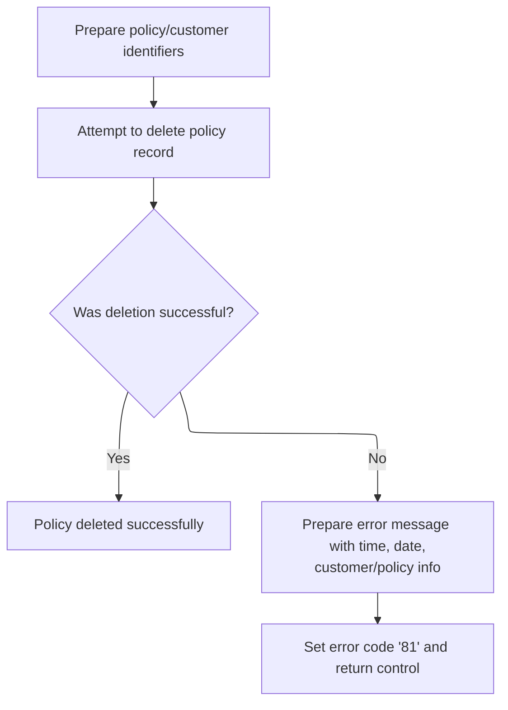

This section is responsible for deleting a policy record based on provided identifiers and logging detailed error information if the deletion is unsuccessful. It ensures that failed deletions are traceable with sufficient context for troubleshooting.

| Rule ID | Category        | Rule Name                         | Description                                                                                                                                                                                         | Implementation Details                                                                                                                                                                                                                                                                                              |
| ------- | --------------- | --------------------------------- | --------------------------------------------------------------------------------------------------------------------------------------------------------------------------------------------------- | ------------------------------------------------------------------------------------------------------------------------------------------------------------------------------------------------------------------------------------------------------------------------------------------------------------------- |
| BR-001  | Reading Input   | Policy Key Construction           | The system constructs the policy file key using the fourth character of the request ID, the customer number, and the policy number from the input.                                                  | The file key is composed of: 1 character from the request ID (position 4), 10 characters for the customer number, and 10 characters for the policy number, for a total key length of 21 characters.                                                                                                                 |
| BR-002  | Decision Making | Set Error Return Code on Failure  | When a policy deletion fails, the system sets the return code to '81' to indicate the error condition before returning control.                                                                     | The return code '81' is used to indicate a failed policy deletion. This value is set in the commarea return code field.                                                                                                                                                                                             |
| BR-003  | Writing Output  | Error Logging on Deletion Failure | If the policy deletion is unsuccessful, the system logs an error message containing the date, time, customer number, policy number, response codes, and up to 90 bytes of the commarea for context. | The error log includes: date (MMDDYYYY), time (HHMMSS), customer number (10 digits), policy number (10 digits), response code, secondary response code, and up to 90 bytes of the commarea. If the commarea length is less than 91, the entire commarea is included; otherwise, only the first 90 bytes are logged. |

<SwmSnippet path="/base/src/lgdpvs01.cbl" line="72">

---

MAINLINE in <SwmPath>[base/src/lgdpvs01.cbl](base/src/lgdpvs01.cbl)</SwmPath> builds the file key using a substring of the request ID and the customer/policy numbers, then runs a CICS DELETE with <SwmToken path="base/src/lgdpvs01.cbl" pos="83:1:1" line-data="                     KeyLength(21)">`KeyLength`</SwmToken> 21. If the delete fails, it logs the error and sets <SwmToken path="base/src/lgdpvs01.cbl" pos="88:9:13" line-data="             MOVE &#39;81&#39; TO CA-RETURN-CODE">`CA-RETURN-CODE`</SwmToken> to '81'.

```cobol
       MAINLINE SECTION.
      *
      *---------------------------------------------------------------*
           Move EIBCALEN To WS-Commarea-Len.
      *---------------------------------------------------------------*
           Move CA-Request-ID(4:1) To WF-Request-ID
           Move CA-Policy-Num      To WF-Policy-Num
           Move CA-Customer-Num    To WF-Customer-Num
      *---------------------------------------------------------------*
           Exec CICS Delete File('KSDSPOLY')
                     Ridfld(WF-Policy-Key)
                     KeyLength(21)
                     RESP(WS-RESP)
           End-Exec.
           If WS-RESP Not = DFHRESP(NORMAL)
             Move EIBRESP2 To WS-RESP2
             MOVE '81' TO CA-RETURN-CODE
             PERFORM WRITE-ERROR-MESSAGE
             EXEC CICS RETURN END-EXEC
           End-If.
```

---

</SwmSnippet>

<SwmSnippet path="/base/src/lgdpvs01.cbl" line="99">

---

<SwmToken path="base/src/lgdpvs01.cbl" pos="99:1:5" line-data="       WRITE-ERROR-MESSAGE.">`WRITE-ERROR-MESSAGE`</SwmToken> in <SwmPath>[base/src/lgdpvs01.cbl](base/src/lgdpvs01.cbl)</SwmPath> timestamps the error, fills in all the relevant fields, sends the message to LGSTSQ, and then writes up to 90 bytes of the commarea for extra context.

```cobol
       WRITE-ERROR-MESSAGE.
           EXEC CICS ASKTIME ABSTIME(WS-ABSTIME)
           END-EXEC
           EXEC CICS FORMATTIME ABSTIME(WS-ABSTIME)
                     MMDDYYYY(WS-DATE)
                     TIME(WS-TIME)
           END-EXEC
      *
           MOVE WS-DATE TO EM-DATE
           MOVE WS-TIME TO EM-TIME
           Move CA-Customer-Num To EM-CUSNUM 
           Move CA-POLICY-NUM To EM-POLNUM 
           Move WS-RESP         To EM-RespRC
           Move WS-RESP2        To EM-Resp2RC
           EXEC CICS LINK PROGRAM('LGSTSQ')
                     COMMAREA(ERROR-MSG)
                     LENGTH(LENGTH OF ERROR-MSG)
           END-EXEC.
           IF EIBCALEN > 0 THEN
             IF EIBCALEN < 91 THEN
               MOVE DFHCOMMAREA(1:EIBCALEN) TO CA-DATA
               EXEC CICS LINK PROGRAM('LGSTSQ')
                         COMMAREA(CA-ERROR-MSG)
                         LENGTH(Length Of CA-ERROR-MSG)
               END-EXEC
             ELSE
               MOVE DFHCOMMAREA(1:90) TO CA-DATA
               EXEC CICS LINK PROGRAM('LGSTSQ')
                         COMMAREA(CA-ERROR-MSG)
                         LENGTH(Length Of CA-ERROR-MSG)
               END-EXEC
             END-IF
           END-IF.
           EXIT.
```

---

</SwmSnippet>

## Handling Results After File Deletion

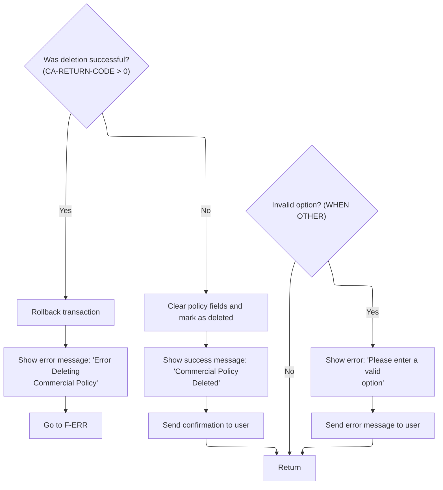

This section determines the outcome of a policy deletion attempt, updates the UI with the result, and handles errors or invalid options. It ensures the user receives clear feedback and the system state is consistent after the operation.

| Rule ID | Category        | Rule Name                    | Description                                                                                                                                                                                                                                                                                                                                                 | Implementation Details                                                                                                                                                                        |
| ------- | --------------- | ---------------------------- | ----------------------------------------------------------------------------------------------------------------------------------------------------------------------------------------------------------------------------------------------------------------------------------------------------------------------------------------------------------- | --------------------------------------------------------------------------------------------------------------------------------------------------------------------------------------------- |
| BR-001  | Data validation | Invalid Option Handling      | If an invalid option is selected (WHEN OTHER), the system sets the error message 'Please enter a valid option', resets the option field to -1, and sends the error message to the user.                                                                                                                                                                     | The error message shown is 'Please enter a valid option' (string, left-aligned, no padding specified). The option field is set to -1 (number).                                                |
| BR-002  | Decision Making | Failed Deletion Handling     | If the deletion operation fails (<SwmToken path="base/src/lgtestp4.cbl" pos="116:3:7" line-data="                 IF CA-RETURN-CODE &gt; 0">`CA-RETURN-CODE`</SwmToken> > 0), the system rolls back the transaction, sets the error message 'Error Deleting Commercial Policy', and routes to the error handling routine.                                   | The error message shown is 'Error Deleting Commercial Policy' (string, left-aligned, no padding specified). The error handling routine is invoked after rollback.                             |
| BR-003  | Decision Making | Successful Deletion Handling | If the deletion operation is successful (<SwmToken path="base/src/lgtestp4.cbl" pos="116:3:7" line-data="                 IF CA-RETURN-CODE &gt; 0">`CA-RETURN-CODE`</SwmToken> not greater than zero), the system clears all policy fields, resets the option, sets the success message 'Commercial Policy Deleted', and sends a confirmation to the user. | The success message shown is 'Commercial Policy Deleted' (string, left-aligned, no padding specified). All policy fields are cleared (set to spaces), and the option is reset to blank (' '). |

<SwmSnippet path="/base/src/lgtestp4.cbl" line="195">

---

After coming back from <SwmPath>[base/src/lgdpol01.cbl](base/src/lgdpol01.cbl)</SwmPath> in <SwmToken path="base/src/lgtestp4.cbl" pos="24:5:7" line-data="              GO TO B-PROC.">`B-PROC`</SwmToken>, the code checks if <SwmToken path="base/src/lgtestp4.cbl" pos="195:3:7" line-data="                 IF CA-RETURN-CODE &gt; 0">`CA-RETURN-CODE`</SwmToken> signals an error. If so, it rolls back the transaction and jumps to <SwmToken path="base/src/lgtestp4.cbl" pos="197:5:7" line-data="                   GO TO E-NODEL">`E-NODEL`</SwmToken> to display an error and clean up the session.

```cobol
                 IF CA-RETURN-CODE > 0
                   Exec CICS Syncpoint Rollback End-Exec
                   GO TO E-NODEL
                 END-IF
```

---

</SwmSnippet>

<SwmSnippet path="/base/src/lgtestp4.cbl" line="289">

---

<SwmToken path="base/src/lgtestp4.cbl" pos="289:1:3" line-data="       E-NODEL.">`E-NODEL`</SwmToken> sets the error message for a failed delete and jumps to <SwmToken path="base/src/lgtestp4.cbl" pos="291:5:7" line-data="           Go To F-ERR.">`F-ERR`</SwmToken> to handle showing the error and cleaning up.

```cobol
       E-NODEL.
           Move 'Error Deleting Commercial Policy'   To  ERP4FLDO
           Go To F-ERR.
```

---

</SwmSnippet>

<SwmSnippet path="/base/src/lgtestp4.cbl" line="200">

---

Back in <SwmToken path="base/src/lgtestp4.cbl" pos="24:5:7" line-data="              GO TO B-PROC.">`B-PROC`</SwmToken>, after a successful delete, the code clears all the input fields, resets the option, and sets the success message for the UI.

```cobol
                 Move Spaces             To ENP4EDAI
                 Move Spaces             To ENP4ADDI
                 Move Spaces             To ENP4HPCI
                 Move Spaces             To ENP4LATI
                 Move Spaces             To ENP4LONI
                 Move Spaces             To ENP4CUSI
                 Move Spaces             To ENP4PTYI
                 Move Spaces             To ENP4FPEI
                 Move Spaces             To ENP4FPRI
                 Move Spaces             To ENP4CPEI
                 Move Spaces             To ENP4CPRI
                 Move Spaces             To ENP4XPEI
                 Move Spaces             To ENP4XPRI
                 Move Spaces             To ENP4WPEI
                 Move Spaces             To ENP4WPRI
                 Move Spaces             To ENP4STAI
                 Move Spaces             To ENP4REJI
                 Move ' '             To ENP4OPTI
                 Move 'Commercial Policy Deleted'
                   To  ERP4FLDO
```

---

</SwmSnippet>

<SwmSnippet path="/base/src/lgtestp4.cbl" line="220">

---

After clearing the fields and setting the message, the code sends the <SwmToken path="base/src/lgtestp4.cbl" pos="220:11:11" line-data="                 EXEC CICS SEND MAP (&#39;XMAPP4&#39;)">`XMAPP4`</SwmToken> map so the user sees the 'Commercial Policy Deleted' confirmation.

```cobol
                 EXEC CICS SEND MAP ('XMAPP4')
                           FROM(XMAPP4O)
                           MAPSET ('XMAP')
                 END-EXEC
```

---

</SwmSnippet>

<SwmSnippet path="/base/src/lgtestp4.cbl" line="226">

---

<SwmToken path="base/src/lgtestp4.cbl" pos="24:5:7" line-data="              GO TO B-PROC.">`B-PROC`</SwmToken> wraps up by routing to the right backend program for the operation, updating the UI with the result, and handling errors or invalid options with specific messages. All map and program calls are tied to the business logic for this app.

```cobol
             WHEN OTHER

                 Move 'Please enter a valid option'
                   To  ERP4FLDO
                 Move -1 To ENP4OPTL

                 EXEC CICS SEND MAP ('XMAPP4')
                           FROM(XMAPP4O)
                           MAPSET ('XMAP')
                           CURSOR
                 END-EXEC
                 GO TO D-EXEC

           END-EVALUATE.


           EXEC CICS RETURN
           END-EXEC.
```

---

</SwmSnippet>

&nbsp;

*This is an auto-generated document by Swimm 🌊 and has not yet been verified by a human*

<SwmMeta version="3.0.0" repo-id="Z2l0aHViJTNBJTNBU3dpbW1pby1nZW5hcHAtaG91c2UlM0ElM0FHaXJpLVN3aW1t" repo-name="Swimmio-genapp-house"><sup>Powered by [Swimm](https://app.swimm.io/)</sup></SwmMeta>
