# Overview

This document explains the flow of managing insurance policy operations through a terminal interface. Users can inquire about policies, add new policies, or delete existing ones. The flow validates user input, processes requests, and displays results or error messages.

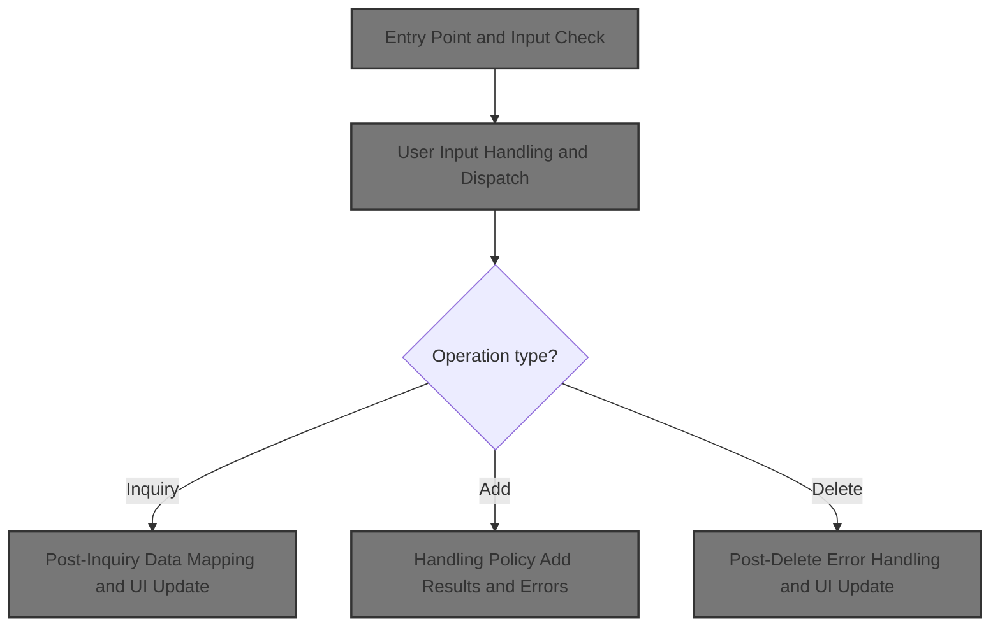

## Dependencies

### Programs

- <SwmToken path="base/src/lgtestp4.cbl" pos="2:6:6" line-data="       PROGRAM-ID. LGTESTP4.">`LGTESTP4`</SwmToken> (<SwmPath>[base/src/lgtestp4.cbl](base/src/lgtestp4.cbl)</SwmPath>)
- <SwmToken path="base/src/lgtestp4.cbl" pos="112:10:10" line-data="                 EXEC CICS LINK PROGRAM(&#39;LGIPOL01&#39;)">`LGIPOL01`</SwmToken> (<SwmPath>[base/src/lgipol01.cbl](base/src/lgipol01.cbl)</SwmPath>)
- <SwmToken path="base/src/lgipol01.cbl" pos="91:9:9" line-data="           EXEC CICS LINK Program(LGIPDB01)">`LGIPDB01`</SwmToken> (<SwmPath>[base/src/lgipdb01.cbl](base/src/lgipdb01.cbl)</SwmPath>)
- LGSTSQ (<SwmPath>[base/src/lgstsq.cbl](base/src/lgstsq.cbl)</SwmPath>)
- <SwmToken path="base/src/lgtestp4.cbl" pos="168:10:10" line-data="                 EXEC CICS LINK PROGRAM(&#39;LGAPOL01&#39;)">`LGAPOL01`</SwmToken> (<SwmPath>[base/src/lgapol01.cbl](base/src/lgapol01.cbl)</SwmPath>)
- <SwmToken path="base/src/lgapol01.cbl" pos="103:9:9" line-data="           EXEC CICS Link Program(LGAPDB01)">`LGAPDB01`</SwmToken> (<SwmPath>[base/src/LGAPDB01.cbl](base/src/LGAPDB01.cbl)</SwmPath>)
- <SwmToken path="base/src/LGAPDB01.cbl" pos="269:4:4" line-data="           CALL &#39;LGAPDB02&#39; USING IN-PROPERTY-TYPE, IN-POSTCODE, ">`LGAPDB02`</SwmToken> (<SwmPath>[base/src/LGAPDB02.cbl](base/src/LGAPDB02.cbl)</SwmPath>)
- <SwmToken path="base/src/LGAPDB01.cbl" pos="276:4:4" line-data="           CALL &#39;LGAPDB03&#39; USING WS-BASE-RISK-SCR, IN-FIRE-PERIL, ">`LGAPDB03`</SwmToken> (<SwmPath>[base/src/LGAPDB03.cbl](base/src/LGAPDB03.cbl)</SwmPath>)
- <SwmToken path="base/src/LGAPDB01.cbl" pos="313:4:4" line-data="               CALL &#39;LGAPDB04&#39; USING LK-INPUT-DATA, LK-COVERAGE-DATA, ">`LGAPDB04`</SwmToken> (<SwmPath>[base/src/LGAPDB04.cbl](base/src/LGAPDB04.cbl)</SwmPath>)
- <SwmToken path="base/src/lgtestp4.cbl" pos="191:10:10" line-data="                 EXEC CICS LINK PROGRAM(&#39;LGDPOL01&#39;)">`LGDPOL01`</SwmToken> (<SwmPath>[base/src/lgdpol01.cbl](base/src/lgdpol01.cbl)</SwmPath>)
- <SwmToken path="base/src/lgdpol01.cbl" pos="141:9:9" line-data="           EXEC CICS LINK PROGRAM(LGDPDB01)">`LGDPDB01`</SwmToken> (<SwmPath>[base/src/lgdpdb01.cbl](base/src/lgdpdb01.cbl)</SwmPath>)
- <SwmToken path="base/src/lgdpdb01.cbl" pos="168:9:9" line-data="               EXEC CICS LINK PROGRAM(LGDPVS01)">`LGDPVS01`</SwmToken> (<SwmPath>[base/src/lgdpvs01.cbl](base/src/lgdpvs01.cbl)</SwmPath>)
- <SwmToken path="base/src/lgtestp4.cbl" pos="248:4:4" line-data="                TRANSID(&#39;SSP4&#39;)">`SSP4`</SwmToken>

### Copybooks

- SQLCA
- LGPOLICY (<SwmPath>[base/src/lgpolicy.cpy](base/src/lgpolicy.cpy)</SwmPath>)
- LGCMAREA (<SwmPath>[base/src/lgcmarea.cpy](base/src/lgcmarea.cpy)</SwmPath>)
- <SwmToken path="base/src/LGAPDB01.cbl" pos="35:3:3" line-data="           COPY INPUTREC2.">`INPUTREC2`</SwmToken> (<SwmPath>[base/src/INPUTREC2.cpy](base/src/INPUTREC2.cpy)</SwmPath>)
- OUTPUTREC (<SwmPath>[base/src/OUTPUTREC.cpy](base/src/OUTPUTREC.cpy)</SwmPath>)
- WORKSTOR (<SwmPath>[base/src/WORKSTOR.cpy](base/src/WORKSTOR.cpy)</SwmPath>)
- LGAPACT (<SwmPath>[base/src/LGAPACT.cpy](base/src/LGAPACT.cpy)</SwmPath>)
- XMAP

## Input and Output Tables/Files used

### <SwmToken path="base/src/lgipol01.cbl" pos="91:9:9" line-data="           EXEC CICS LINK Program(LGIPDB01)">`LGIPDB01`</SwmToken> (<SwmPath>[base/src/lgipdb01.cbl](base/src/lgipdb01.cbl)</SwmPath>)

| Table / File Name | Type                                                                                                                    | Description                                                           | Usage Mode | Key Fields / Layout Highlights                                                                                                                                                                                                                                                                                                                                                                                                                                                                                                                                                                                                                                                                                                                                                                                                                                                                                                                                                                                                                                                                                                                                                                                                                                                                                                                                                                                                                                                                                                                                                                                                                                                                                                                                                                                                                                                                                                                                                                                                                                                                                                                                                                                                                                                                                                                                                                                                                                                                                                                                                                                                                                                                                                                                                                                                                                                                                                                                                                                                                                                                                                                                                                                                                                                                                                                                                                                                                                                                                                                                                                                                                                                                                                                                                                                                                                                                                                                                                                                                                                                                                                                                                                                                                                                                                                                                                                                                                                                                                                                                                                                                                                                                                                                                                                                                                                                                                                                                                                                                                                                                                                                                                                                                                                                                                                                                                                                                                                                                                                                                                                                                                                                                                                                                                                                                                                                                                                                                                                                                                                                                                                                                                                                                                                                                                                                                                                                                                                                                                                                                                                                                                                                                                                                                                                                                                                                                                                                                                                                                                                                                                                                                                                                                                                                                                                                                                                                                                                                                                                                                                                                                                                                                                                                                                                                                                                                                                                                                                                                                                                                                                                                                                                                                                                                                                                                                                                                                                                                                                                                                                                                                                                                                                                                                                                                                                                                                                                                                                                                                                                                                                                                                                                                                                                                                                                                                                                                                                                                                                                                                                                                                                                                                                                                                                                                                                                                                                                                                                                                                                                                                                                                                                                                                                                                                                                                                                                                                                                                                                                                                                                                                                                                                                                                                                                                                                                                                                                                                                                                                                                                                                                                                                                                                                                                                                                                                                                                                                                                                                                                                                                                                                                                                                                                                                                                                                                                                                                                                                                                                                                                                                                                                                                                                                                                                                                                                                                                                                                                                                                                                                                                                                                                                                                                                                                                                                                                                                                                                                          |
| ----------------- | ----------------------------------------------------------------------------------------------------------------------- | --------------------------------------------------------------------- | ---------- | --------------------------------------------------------------------------------------------------------------------------------------------------------------------------------------------------------------------------------------------------------------------------------------------------------------------------------------------------------------------------------------------------------------------------------------------------------------------------------------------------------------------------------------------------------------------------------------------------------------------------------------------------------------------------------------------------------------------------------------------------------------------------------------------------------------------------------------------------------------------------------------------------------------------------------------------------------------------------------------------------------------------------------------------------------------------------------------------------------------------------------------------------------------------------------------------------------------------------------------------------------------------------------------------------------------------------------------------------------------------------------------------------------------------------------------------------------------------------------------------------------------------------------------------------------------------------------------------------------------------------------------------------------------------------------------------------------------------------------------------------------------------------------------------------------------------------------------------------------------------------------------------------------------------------------------------------------------------------------------------------------------------------------------------------------------------------------------------------------------------------------------------------------------------------------------------------------------------------------------------------------------------------------------------------------------------------------------------------------------------------------------------------------------------------------------------------------------------------------------------------------------------------------------------------------------------------------------------------------------------------------------------------------------------------------------------------------------------------------------------------------------------------------------------------------------------------------------------------------------------------------------------------------------------------------------------------------------------------------------------------------------------------------------------------------------------------------------------------------------------------------------------------------------------------------------------------------------------------------------------------------------------------------------------------------------------------------------------------------------------------------------------------------------------------------------------------------------------------------------------------------------------------------------------------------------------------------------------------------------------------------------------------------------------------------------------------------------------------------------------------------------------------------------------------------------------------------------------------------------------------------------------------------------------------------------------------------------------------------------------------------------------------------------------------------------------------------------------------------------------------------------------------------------------------------------------------------------------------------------------------------------------------------------------------------------------------------------------------------------------------------------------------------------------------------------------------------------------------------------------------------------------------------------------------------------------------------------------------------------------------------------------------------------------------------------------------------------------------------------------------------------------------------------------------------------------------------------------------------------------------------------------------------------------------------------------------------------------------------------------------------------------------------------------------------------------------------------------------------------------------------------------------------------------------------------------------------------------------------------------------------------------------------------------------------------------------------------------------------------------------------------------------------------------------------------------------------------------------------------------------------------------------------------------------------------------------------------------------------------------------------------------------------------------------------------------------------------------------------------------------------------------------------------------------------------------------------------------------------------------------------------------------------------------------------------------------------------------------------------------------------------------------------------------------------------------------------------------------------------------------------------------------------------------------------------------------------------------------------------------------------------------------------------------------------------------------------------------------------------------------------------------------------------------------------------------------------------------------------------------------------------------------------------------------------------------------------------------------------------------------------------------------------------------------------------------------------------------------------------------------------------------------------------------------------------------------------------------------------------------------------------------------------------------------------------------------------------------------------------------------------------------------------------------------------------------------------------------------------------------------------------------------------------------------------------------------------------------------------------------------------------------------------------------------------------------------------------------------------------------------------------------------------------------------------------------------------------------------------------------------------------------------------------------------------------------------------------------------------------------------------------------------------------------------------------------------------------------------------------------------------------------------------------------------------------------------------------------------------------------------------------------------------------------------------------------------------------------------------------------------------------------------------------------------------------------------------------------------------------------------------------------------------------------------------------------------------------------------------------------------------------------------------------------------------------------------------------------------------------------------------------------------------------------------------------------------------------------------------------------------------------------------------------------------------------------------------------------------------------------------------------------------------------------------------------------------------------------------------------------------------------------------------------------------------------------------------------------------------------------------------------------------------------------------------------------------------------------------------------------------------------------------------------------------------------------------------------------------------------------------------------------------------------------------------------------------------------------------------------------------------------------------------------------------------------------------------------------------------------------------------------------------------------------------------------------------------------------------------------------------------------------------------------------------------------------------------------------------------------------------------------------------------------------------------------------------------------------------------------------------------------------------------------------------------------------------------------------------------------------------------------------------------------------------------------------------------------------------------------------------------------------------------------------------------------------------------------------------------------------------------------------------------------------------------------------------------------------------------------------------------------------------------------------------------------------------------------------------------------------------------------------------------------------------------------------------------------------------------------------------------------------------------------------------------------------------------------------------------------------------------------------------------------------------------------------------------------------------------------------------------------------------------------------------------------------------------------------------------------------------------------------------------------------------------------------------------------------------------------------------------------------------------------------------------------------------------------------------------------------------------------------------------------------------------------------------------------------------------------------------------------------------------------------------------------------------------------------------------------------------------------------------------------------------------------------------------------------------------------------------------------------------------------------------------------------------------------------------------------------------------------------------------------------------------------------------------------------------------------------------------------------------------------------------------------------------------------------------------------------------------------------------------------------------------------------------------------------------------------------------------------------------------------------------------------------------------------------------------------------------------------------------------------------------------------------------------------------------------------------------------------------------------------------------------------------------------------------------------------------------------------------------------------------------------------------------------------------------------------------------------------------------------------------------------------------------------------------------------------------------------------------------------------------------------------------------------------------------------------------------------------------------------------------------------------------------------------------------------------------------------------------------------------------------------------------------------------------------------------- |
| POLICY            | <SwmToken path="base/src/lgipdb01.cbl" pos="242:5:5" line-data="      * initialize DB2 host variables">`DB2`</SwmToken> | Insurance policy master record, links to customer and policy details. | Input      | <SwmToken path="base/src/lgipdb01.cbl" pos="92:1:1" line-data="                   CustomerNumber,">`CustomerNumber`</SwmToken>, <SwmToken path="base/src/lgipdb01.cbl" pos="93:3:3" line-data="                   Policy.PolicyNumber,">`PolicyNumber`</SwmToken>, <SwmToken path="base/src/lgipdb01.cbl" pos="94:1:1" line-data="                   RequestDate,">`RequestDate`</SwmToken>, <SwmToken path="base/src/lgipdb01.cbl" pos="95:1:1" line-data="                   StartDate,">`StartDate`</SwmToken>, <SwmToken path="base/src/lgipdb01.cbl" pos="96:1:1" line-data="                   RenewalDate,">`RenewalDate`</SwmToken>, <SwmToken path="base/src/lgtestp4.cbl" pos="124:7:7" line-data="                 Move CA-B-Address         To  ENP4ADDI">`Address`</SwmToken>, <SwmToken path="base/src/lgipdb01.cbl" pos="98:1:1" line-data="                   Zipcode,">`Zipcode`</SwmToken>, <SwmToken path="base/src/lgipdb01.cbl" pos="99:1:1" line-data="                   LatitudeN,">`LatitudeN`</SwmToken>, <SwmToken path="base/src/lgipdb01.cbl" pos="100:1:1" line-data="                   LongitudeW,">`LongitudeW`</SwmToken>, <SwmToken path="base/src/lgtestp4.cbl" pos="128:7:7" line-data="                 Move CA-B-Customer        To  ENP4CUSI">`Customer`</SwmToken>, <SwmToken path="base/src/lgipdb01.cbl" pos="102:1:1" line-data="                   PropertyType,">`PropertyType`</SwmToken>, <SwmToken path="base/src/lgipdb01.cbl" pos="103:1:1" line-data="                   FirePeril,">`FirePeril`</SwmToken>, <SwmToken path="base/src/lgipdb01.cbl" pos="104:1:1" line-data="                   FirePremium,">`FirePremium`</SwmToken>, <SwmToken path="base/src/lgipdb01.cbl" pos="105:1:1" line-data="                   CrimePeril,">`CrimePeril`</SwmToken>, <SwmToken path="base/src/lgipdb01.cbl" pos="106:1:1" line-data="                   CrimePremium,">`CrimePremium`</SwmToken>, <SwmToken path="base/src/lgipdb01.cbl" pos="107:1:1" line-data="                   FloodPeril,">`FloodPeril`</SwmToken>, <SwmToken path="base/src/lgipdb01.cbl" pos="108:1:1" line-data="                   FloodPremium,">`FloodPremium`</SwmToken>, <SwmToken path="base/src/lgipdb01.cbl" pos="109:1:1" line-data="                   WeatherPeril,">`WeatherPeril`</SwmToken>, <SwmToken path="base/src/lgipdb01.cbl" pos="110:1:1" line-data="                   WeatherPremium,">`WeatherPremium`</SwmToken>, <SwmToken path="base/src/lgipdb01.cbl" pos="111:1:1" line-data="                   Status,">`Status`</SwmToken>, <SwmToken path="base/src/lgipdb01.cbl" pos="112:1:1" line-data="                   RejectionReason">`RejectionReason`</SwmToken>, <SwmToken path="base/src/lgipdb01.cbl" pos="331:3:3" line-data="             SELECT  ISSUEDATE,">`ISSUEDATE`</SwmToken>, <SwmToken path="base/src/lgipdb01.cbl" pos="332:1:1" line-data="                     EXPIRYDATE,">`EXPIRYDATE`</SwmToken>, <SwmToken path="base/src/lgipdb01.cbl" pos="333:1:1" line-data="                     LASTCHANGED,">`LASTCHANGED`</SwmToken>, <SwmToken path="base/src/lgipdb01.cbl" pos="334:1:1" line-data="                     BROKERID,">`BROKERID`</SwmToken>, <SwmToken path="base/src/lgipdb01.cbl" pos="335:1:1" line-data="                     BROKERSREFERENCE,">`BROKERSREFERENCE`</SwmToken>, <SwmToken path="base/src/lgipdb01.cbl" pos="336:1:1" line-data="                     PAYMENT,">`PAYMENT`</SwmToken>, <SwmToken path="base/src/lgipdb01.cbl" pos="337:1:1" line-data="                     WITHPROFITS,">`WITHPROFITS`</SwmToken>, <SwmToken path="base/src/lgipdb01.cbl" pos="338:1:1" line-data="                     EQUITIES,">`EQUITIES`</SwmToken>, <SwmToken path="base/src/lgipdb01.cbl" pos="339:1:1" line-data="                     MANAGEDFUND,">`MANAGEDFUND`</SwmToken>, <SwmToken path="base/src/lgipdb01.cbl" pos="340:1:1" line-data="                     FUNDNAME,">`FUNDNAME`</SwmToken>, <SwmToken path="base/src/lgipdb01.cbl" pos="341:1:1" line-data="                     TERM,">`TERM`</SwmToken>, <SwmToken path="base/src/lgipdb01.cbl" pos="342:1:1" line-data="                     SUMASSURED,">`SUMASSURED`</SwmToken>, <SwmToken path="base/src/lgipdb01.cbl" pos="343:1:1" line-data="                     LIFEASSURED,">`LIFEASSURED`</SwmToken>, <SwmToken path="base/src/lgipdb01.cbl" pos="344:1:1" line-data="                     PADDINGDATA,">`PADDINGDATA`</SwmToken>, <SwmToken path="base/src/lgtestp4.cbl" pos="114:1:1" line-data="                           LENGTH(32500)">`LENGTH`</SwmToken>, <SwmToken path="base/src/lgipdb01.cbl" pos="347:2:4" line-data="                   :DB2-EXPIRYDATE,">`DB2-EXPIRYDATE`</SwmToken>, <SwmToken path="base/src/lgipdb01.cbl" pos="348:2:4" line-data="                   :DB2-LASTCHANGED,">`DB2-LASTCHANGED`</SwmToken>, <SwmToken path="base/src/lgipdb01.cbl" pos="349:11:13" line-data="                   :DB2-BROKERID-INT INDICATOR :IND-BROKERID,">`IND-BROKERID`</SwmToken>, <SwmToken path="base/src/lgipdb01.cbl" pos="350:9:11" line-data="                   :DB2-BROKERSREF INDICATOR :IND-BROKERSREF,">`IND-BROKERSREF`</SwmToken>, <SwmToken path="base/src/lgipdb01.cbl" pos="351:11:13" line-data="                   :DB2-PAYMENT-INT INDICATOR :IND-PAYMENT,">`IND-PAYMENT`</SwmToken>, <SwmToken path="base/src/lgipdb01.cbl" pos="352:2:6" line-data="                   :DB2-E-WITHPROFITS,">`DB2-E-WITHPROFITS`</SwmToken>, <SwmToken path="base/src/lgipdb01.cbl" pos="353:2:6" line-data="                   :DB2-E-EQUITIES,">`DB2-E-EQUITIES`</SwmToken>, <SwmToken path="base/src/lgipdb01.cbl" pos="354:2:6" line-data="                   :DB2-E-MANAGEDFUND,">`DB2-E-MANAGEDFUND`</SwmToken>, <SwmToken path="base/src/lgipdb01.cbl" pos="355:2:6" line-data="                   :DB2-E-FUNDNAME,">`DB2-E-FUNDNAME`</SwmToken>, <SwmToken path="base/src/lgipdb01.cbl" pos="356:2:8" line-data="                   :DB2-E-TERM-SINT,">`DB2-E-TERM-SINT`</SwmToken>, <SwmToken path="base/src/lgipdb01.cbl" pos="357:2:8" line-data="                   :DB2-E-SUMASSURED-INT,">`DB2-E-SUMASSURED-INT`</SwmToken>, <SwmToken path="base/src/lgipdb01.cbl" pos="358:2:6" line-data="                   :DB2-E-LIFEASSURED,">`DB2-E-LIFEASSURED`</SwmToken>, <SwmToken path="base/src/lgipdb01.cbl" pos="359:11:15" line-data="                   :DB2-E-PADDINGDATA INDICATOR :IND-E-PADDINGDATA,">`IND-E-PADDINGDATA`</SwmToken>, <SwmToken path="base/src/lgipdb01.cbl" pos="360:13:17" line-data="                   :DB2-E-PADDING-LEN INDICATOR :IND-E-PADDINGDATAL">`IND-E-PADDINGDATAL`</SwmToken>, <SwmToken path="base/src/lgipdb01.cbl" pos="451:1:1" line-data="                     PROPERTYTYPE,">`PROPERTYTYPE`</SwmToken>, <SwmToken path="base/src/lgipdb01.cbl" pos="452:1:1" line-data="                     BEDROOMS,">`BEDROOMS`</SwmToken>, <SwmToken path="base/src/lgipdb01.cbl" pos="453:1:1" line-data="                     VALUE,">`VALUE`</SwmToken>, <SwmToken path="base/src/lgipdb01.cbl" pos="454:1:1" line-data="                     HOUSENAME,">`HOUSENAME`</SwmToken>, <SwmToken path="base/src/lgipdb01.cbl" pos="455:1:1" line-data="                     HOUSENUMBER,">`HOUSENUMBER`</SwmToken>, <SwmToken path="base/src/lgipdb01.cbl" pos="346:4:6" line-data="             INTO  :DB2-ISSUEDATE,">`DB2-ISSUEDATE`</SwmToken>, <SwmToken path="base/src/lgipdb01.cbl" pos="463:2:6" line-data="                   :DB2-H-PROPERTYTYPE,">`DB2-H-PROPERTYTYPE`</SwmToken>, <SwmToken path="base/src/lgipdb01.cbl" pos="464:2:8" line-data="                   :DB2-H-BEDROOMS-SINT,">`DB2-H-BEDROOMS-SINT`</SwmToken>, <SwmToken path="base/src/lgipdb01.cbl" pos="465:2:8" line-data="                   :DB2-H-VALUE-INT,">`DB2-H-VALUE-INT`</SwmToken>, <SwmToken path="base/src/lgipdb01.cbl" pos="466:2:6" line-data="                   :DB2-H-HOUSENAME,">`DB2-H-HOUSENAME`</SwmToken>, <SwmToken path="base/src/lgipdb01.cbl" pos="467:2:6" line-data="                   :DB2-H-HOUSENUMBER,">`DB2-H-HOUSENUMBER`</SwmToken>, <SwmToken path="base/src/lgipdb01.cbl" pos="468:2:6" line-data="                   :DB2-H-POSTCODE">`DB2-H-POSTCODE`</SwmToken>, <SwmToken path="base/src/lgipdb01.cbl" pos="539:1:1" line-data="                     MAKE,">`MAKE`</SwmToken>, <SwmToken path="base/src/lgipdb01.cbl" pos="540:1:1" line-data="                     MODEL,">`MODEL`</SwmToken>, <SwmToken path="base/src/lgipdb01.cbl" pos="542:1:1" line-data="                     REGNUMBER,">`REGNUMBER`</SwmToken>, <SwmToken path="base/src/lgipdb01.cbl" pos="543:1:1" line-data="                     COLOUR,">`COLOUR`</SwmToken>, <SwmToken path="base/src/lgipdb01.cbl" pos="544:1:1" line-data="                     CC,">`CC`</SwmToken>, <SwmToken path="base/src/lgipdb01.cbl" pos="545:1:1" line-data="                     YEAROFMANUFACTURE,">`YEAROFMANUFACTURE`</SwmToken>, <SwmToken path="base/src/lgipdb01.cbl" pos="546:1:1" line-data="                     PREMIUM,">`PREMIUM`</SwmToken>, <SwmToken path="base/src/lgipdb01.cbl" pos="554:2:6" line-data="                   :DB2-M-MAKE,">`DB2-M-MAKE`</SwmToken>, <SwmToken path="base/src/lgipdb01.cbl" pos="555:2:6" line-data="                   :DB2-M-MODEL,">`DB2-M-MODEL`</SwmToken>, <SwmToken path="base/src/lgipdb01.cbl" pos="556:2:8" line-data="                   :DB2-M-VALUE-INT,">`DB2-M-VALUE-INT`</SwmToken>, <SwmToken path="base/src/lgipdb01.cbl" pos="557:2:6" line-data="                   :DB2-M-REGNUMBER,">`DB2-M-REGNUMBER`</SwmToken>, <SwmToken path="base/src/lgipdb01.cbl" pos="558:2:6" line-data="                   :DB2-M-COLOUR,">`DB2-M-COLOUR`</SwmToken>, <SwmToken path="base/src/lgipdb01.cbl" pos="559:2:8" line-data="                   :DB2-M-CC-SINT,">`DB2-M-CC-SINT`</SwmToken>, <SwmToken path="base/src/lgipdb01.cbl" pos="560:2:6" line-data="                   :DB2-M-MANUFACTURED,">`DB2-M-MANUFACTURED`</SwmToken>, <SwmToken path="base/src/lgipdb01.cbl" pos="561:2:8" line-data="                   :DB2-M-PREMIUM-INT,">`DB2-M-PREMIUM-INT`</SwmToken>, <SwmToken path="base/src/lgipdb01.cbl" pos="562:2:8" line-data="                   :DB2-M-ACCIDENTS-INT">`DB2-M-ACCIDENTS-INT`</SwmToken>, <SwmToken path="base/src/lgipdb01.cbl" pos="655:2:6" line-data="                   :DB2-B-Address,">`DB2-B-Address`</SwmToken>, <SwmToken path="base/src/lgipdb01.cbl" pos="656:2:6" line-data="                   :DB2-B-Postcode,">`DB2-B-Postcode`</SwmToken>, <SwmToken path="base/src/lgipdb01.cbl" pos="657:2:6" line-data="                   :DB2-B-Latitude,">`DB2-B-Latitude`</SwmToken>, <SwmToken path="base/src/lgipdb01.cbl" pos="658:2:6" line-data="                   :DB2-B-Longitude,">`DB2-B-Longitude`</SwmToken>, <SwmToken path="base/src/lgipdb01.cbl" pos="659:2:6" line-data="                   :DB2-B-Customer,">`DB2-B-Customer`</SwmToken>, <SwmToken path="base/src/lgipdb01.cbl" pos="660:2:6" line-data="                   :DB2-B-PropType,">`DB2-B-PropType`</SwmToken>, <SwmToken path="base/src/lgipdb01.cbl" pos="182:3:9" line-data="           03 DB2-B-FirePeril-Int      PIC S9(4) COMP.">`DB2-B-FirePeril-Int`</SwmToken>, <SwmToken path="base/src/lgipdb01.cbl" pos="183:3:9" line-data="           03 DB2-B-FirePremium-Int    PIC S9(9) COMP.">`DB2-B-FirePremium-Int`</SwmToken>, <SwmToken path="base/src/lgipdb01.cbl" pos="184:3:9" line-data="           03 DB2-B-CrimePeril-Int     PIC S9(4) COMP.">`DB2-B-CrimePeril-Int`</SwmToken>, <SwmToken path="base/src/lgipdb01.cbl" pos="185:3:9" line-data="           03 DB2-B-CrimePremium-Int   PIC S9(9) COMP.">`DB2-B-CrimePremium-Int`</SwmToken>, <SwmToken path="base/src/lgipdb01.cbl" pos="186:3:9" line-data="           03 DB2-B-FloodPeril-Int     PIC S9(4) COMP.">`DB2-B-FloodPeril-Int`</SwmToken>, <SwmToken path="base/src/lgipdb01.cbl" pos="187:3:9" line-data="           03 DB2-B-FloodPremium-Int   PIC S9(9) COMP.">`DB2-B-FloodPremium-Int`</SwmToken>, <SwmToken path="base/src/lgipdb01.cbl" pos="188:3:9" line-data="           03 DB2-B-WeatherPeril-Int   PIC S9(4) COMP.">`DB2-B-WeatherPeril-Int`</SwmToken>, <SwmToken path="base/src/lgipdb01.cbl" pos="189:3:9" line-data="           03 DB2-B-WeatherPremium-Int PIC S9(9) COMP.">`DB2-B-WeatherPremium-Int`</SwmToken>, <SwmToken path="base/src/lgipdb01.cbl" pos="190:3:9" line-data="           03 DB2-B-Status-Int         PIC S9(4) COMP.">`DB2-B-Status-Int`</SwmToken>, <SwmToken path="base/src/lgipdb01.cbl" pos="670:2:6" line-data="                   :DB2-B-RejectReason">`DB2-B-RejectReason`</SwmToken>, <SwmToken path="base/src/lgipdb01.cbl" pos="263:11:15" line-data="           MOVE CA-CUSTOMER-NUM TO DB2-CUSTOMERNUM-INT">`DB2-CUSTOMERNUM-INT`</SwmToken> |

### <SwmToken path="base/src/LGAPDB01.cbl" pos="276:4:4" line-data="           CALL &#39;LGAPDB03&#39; USING WS-BASE-RISK-SCR, IN-FIRE-PERIL, ">`LGAPDB03`</SwmToken> (<SwmPath>[base/src/LGAPDB03.cbl](base/src/LGAPDB03.cbl)</SwmPath>)

| Table / File Name                                                                                                          | Type                                                                                                                    | Description                                                             | Usage Mode | Key Fields / Layout Highlights                                                                                                                                                                                                                                                                               |
| -------------------------------------------------------------------------------------------------------------------------- | ----------------------------------------------------------------------------------------------------------------------- | ----------------------------------------------------------------------- | ---------- | ------------------------------------------------------------------------------------------------------------------------------------------------------------------------------------------------------------------------------------------------------------------------------------------------------------ |
| <SwmToken path="base/src/LGAPDB02.cbl" pos="47:3:3" line-data="               FROM RISK_FACTORS">`RISK_FACTORS`</SwmToken> | <SwmToken path="base/src/lgipdb01.cbl" pos="242:5:5" line-data="      * initialize DB2 host variables">`DB2`</SwmToken> | Peril-specific risk adjustment values for insurance premium calculation | Input      | <SwmToken path="base/src/LGAPDB02.cbl" pos="46:8:12" line-data="               SELECT FACTOR_VALUE INTO :WS-FIRE-FACTOR">`WS-FIRE-FACTOR`</SwmToken>, <SwmToken path="base/src/LGAPDB02.cbl" pos="58:8:12" line-data="               SELECT FACTOR_VALUE INTO :WS-CRIME-FACTOR">`WS-CRIME-FACTOR`</SwmToken> |

### <SwmToken path="base/src/LGAPDB01.cbl" pos="313:4:4" line-data="               CALL &#39;LGAPDB04&#39; USING LK-INPUT-DATA, LK-COVERAGE-DATA, ">`LGAPDB04`</SwmToken> (<SwmPath>[base/src/LGAPDB04.cbl](base/src/LGAPDB04.cbl)</SwmPath>)

| Table / File Name                                                                                                         | Type                                                                                                                    | Description                                                        | Usage Mode | Key Fields / Layout Highlights                                                                                                                                                                                                                                                                                                                                                                                                                                                                                                                                                                                                                                                                                           |
| ------------------------------------------------------------------------------------------------------------------------- | ----------------------------------------------------------------------------------------------------------------------- | ------------------------------------------------------------------ | ---------- | ------------------------------------------------------------------------------------------------------------------------------------------------------------------------------------------------------------------------------------------------------------------------------------------------------------------------------------------------------------------------------------------------------------------------------------------------------------------------------------------------------------------------------------------------------------------------------------------------------------------------------------------------------------------------------------------------------------------------ |
| <SwmToken path="base/src/LGAPDB04.cbl" pos="183:3:3" line-data="               FROM RATE_MASTER">`RATE_MASTER`</SwmToken> | <SwmToken path="base/src/lgipdb01.cbl" pos="242:5:5" line-data="      * initialize DB2 host variables">`DB2`</SwmToken> | Property insurance rate parameters by peril, territory, and dates. | Input      | <SwmToken path="base/src/LGAPDB04.cbl" pos="181:3:3" line-data="               SELECT BASE_RATE, MIN_PREMIUM, MAX_PREMIUM">`BASE_RATE`</SwmToken>, <SwmToken path="base/src/LGAPDB01.cbl" pos="132:4:4" line-data="           MOVE &#39;MIN_PREMIUM&#39; TO CONFIG-KEY">`MIN_PREMIUM`</SwmToken>, <SwmToken path="base/src/LGAPDB04.cbl" pos="43:3:7" line-data="       01  WS-BASE-RATE-TABLE.">`WS-BASE-RATE`</SwmToken>, <SwmToken path="base/src/LGAPDB04.cbl" pos="51:3:7" line-data="                       25 WS-MIN-PREM   PIC 9(5)V99.">`WS-MIN-PREM`</SwmToken>, <SwmToken path="base/src/LGAPDB04.cbl" pos="52:3:7" line-data="                       25 WS-MAX-PREM   PIC 9(7)V99.">`WS-MAX-PREM`</SwmToken> |

### <SwmToken path="base/src/lgdpol01.cbl" pos="141:9:9" line-data="           EXEC CICS LINK PROGRAM(LGDPDB01)">`LGDPDB01`</SwmToken> (<SwmPath>[base/src/lgdpdb01.cbl](base/src/lgdpdb01.cbl)</SwmPath>)

| Table / File Name | Type                                                                                                                    | Description                                                    | Usage Mode | Key Fields / Layout Highlights           |
| ----------------- | ----------------------------------------------------------------------------------------------------------------------- | -------------------------------------------------------------- | ---------- | ---------------------------------------- |
| POLICY            | <SwmToken path="base/src/lgipdb01.cbl" pos="242:5:5" line-data="      * initialize DB2 host variables">`DB2`</SwmToken> | Insurance policy master record (customer, policy number, type) | Output     | Database table with relational structure |

### <SwmToken path="base/src/LGAPDB01.cbl" pos="269:4:4" line-data="           CALL &#39;LGAPDB02&#39; USING IN-PROPERTY-TYPE, IN-POSTCODE, ">`LGAPDB02`</SwmToken> (<SwmPath>[base/src/LGAPDB02.cbl](base/src/LGAPDB02.cbl)</SwmPath>)

| Table / File Name                                                                                                          | Type                                                                                                                    | Description                                                  | Usage Mode | Key Fields / Layout Highlights                                                                                                                                                                                                                                                                               |
| -------------------------------------------------------------------------------------------------------------------------- | ----------------------------------------------------------------------------------------------------------------------- | ------------------------------------------------------------ | ---------- | ------------------------------------------------------------------------------------------------------------------------------------------------------------------------------------------------------------------------------------------------------------------------------------------------------------ |
| <SwmToken path="base/src/LGAPDB02.cbl" pos="47:3:3" line-data="               FROM RISK_FACTORS">`RISK_FACTORS`</SwmToken> | <SwmToken path="base/src/lgipdb01.cbl" pos="242:5:5" line-data="      * initialize DB2 host variables">`DB2`</SwmToken> | Peril-specific risk adjustment factors for insurance scoring | Input      | <SwmToken path="base/src/LGAPDB02.cbl" pos="46:8:12" line-data="               SELECT FACTOR_VALUE INTO :WS-FIRE-FACTOR">`WS-FIRE-FACTOR`</SwmToken>, <SwmToken path="base/src/LGAPDB02.cbl" pos="58:8:12" line-data="               SELECT FACTOR_VALUE INTO :WS-CRIME-FACTOR">`WS-CRIME-FACTOR`</SwmToken> |

### <SwmToken path="base/src/lgapol01.cbl" pos="103:9:9" line-data="           EXEC CICS Link Program(LGAPDB01)">`LGAPDB01`</SwmToken> (<SwmPath>[base/src/LGAPDB01.cbl](base/src/LGAPDB01.cbl)</SwmPath>)

| Table / File Name                                                                                                                                        | Type                                                                                                                    | Description                                             | Usage Mode | Key Fields / Layout Highlights           |
| -------------------------------------------------------------------------------------------------------------------------------------------------------- | ----------------------------------------------------------------------------------------------------------------------- | ------------------------------------------------------- | ---------- | ---------------------------------------- |
| <SwmToken path="base/src/LGAPDB01.cbl" pos="17:3:5" line-data="           SELECT CONFIG-FILE ASSIGN TO &#39;CONFIG.DAT&#39;">`CONFIG-FILE`</SwmToken>    | <SwmToken path="base/src/lgipdb01.cbl" pos="242:5:5" line-data="      * initialize DB2 host variables">`DB2`</SwmToken> | Indexed config parameters for premium calculation rules | Input      | Database table with relational structure |
| <SwmToken path="base/src/LGAPDB01.cbl" pos="9:3:5" line-data="           SELECT INPUT-FILE ASSIGN TO &#39;INPUT.DAT&#39;">`INPUT-FILE`</SwmToken>        | <SwmToken path="base/src/lgipdb01.cbl" pos="242:5:5" line-data="      * initialize DB2 host variables">`DB2`</SwmToken> | Policy application input records for processing         | Input      | Database table with relational structure |
| <SwmToken path="base/src/LGAPDB01.cbl" pos="13:3:5" line-data="           SELECT OUTPUT-FILE ASSIGN TO &#39;OUTPUT.DAT&#39;">`OUTPUT-FILE`</SwmToken>    | <SwmToken path="base/src/lgipdb01.cbl" pos="242:5:5" line-data="      * initialize DB2 host variables">`DB2`</SwmToken> | Calculated premium results for each policy              | Output     | Database table with relational structure |
| <SwmToken path="base/src/LGAPDB01.cbl" pos="265:7:9" line-data="           PERFORM P011E-WRITE-OUTPUT-RECORD">`OUTPUT-RECORD`</SwmToken>                 | <SwmToken path="base/src/lgipdb01.cbl" pos="242:5:5" line-data="      * initialize DB2 host variables">`DB2`</SwmToken> | Single policy premium calculation output record         | Output     | Database table with relational structure |
| <SwmToken path="base/src/LGAPDB01.cbl" pos="27:3:5" line-data="           SELECT SUMMARY-FILE ASSIGN TO &#39;SUMMARY.DAT&#39;">`SUMMARY-FILE`</SwmToken> | <SwmToken path="base/src/lgipdb01.cbl" pos="242:5:5" line-data="      * initialize DB2 host variables">`DB2`</SwmToken> | Summary of processing statistics and totals             | Output     | Database table with relational structure |
| <SwmToken path="base/src/LGAPDB01.cbl" pos="64:3:5" line-data="       01  SUMMARY-RECORD             PIC X(132).">`SUMMARY-RECORD`</SwmToken>            | <SwmToken path="base/src/lgipdb01.cbl" pos="242:5:5" line-data="      * initialize DB2 host variables">`DB2`</SwmToken> | Single summary line for processing statistics           | Output     | Database table with relational structure |

## Detailed View of the Program's Functionality

a. Policy Inquiry Entry and Commarea Validation (<SwmToken path="base/src/lgtestp4.cbl" pos="112:10:10" line-data="                 EXEC CICS LINK PROGRAM(&#39;LGIPOL01&#39;)">`LGIPOL01`</SwmToken>)

- When the policy inquiry program is invoked, it initializes runtime tracking fields (transaction ID, terminal ID, task number).
- It checks if any input data (commarea) was received. If not, it logs an error message with the current date/time and abends the transaction.
- If input is present, it sets the commarea return code to zero, records the input length, and stores the commarea address for later use.

b. Backend Dispatch to Policy Data Retrieval (<SwmToken path="base/src/lgtestp4.cbl" pos="112:10:10" line-data="                 EXEC CICS LINK PROGRAM(&#39;LGIPOL01&#39;)">`LGIPOL01`</SwmToken>)

- The program links to the backend policy data retrieval handler, passing the commarea and specifying a fixed length.
- After the backend call, it returns control to the caller.

c. Policy Data Retrieval and Routing (<SwmToken path="base/src/lgipol01.cbl" pos="91:9:9" line-data="           EXEC CICS LINK Program(LGIPDB01)">`LGIPDB01`</SwmToken>)

- The backend handler initializes its runtime fields and <SwmToken path="base/src/lgipdb01.cbl" pos="242:5:5" line-data="      * initialize DB2 host variables">`DB2`</SwmToken> input/output variables, and clears policy data structures.
- It checks for the presence of input data (commarea). If missing, it logs an error and abends.
- It sets the commarea return code to zero, records the input length, and stores the commarea address.
- Customer and policy numbers from the commarea are converted to <SwmToken path="base/src/lgipdb01.cbl" pos="242:5:5" line-data="      * initialize DB2 host variables">`DB2`</SwmToken> integer format for SQL queries, and also stored in error message fields.
- The request ID is uppercased and used to determine which policy type is being requested.
- Depending on the request ID, it dispatches to the appropriate retrieval routine for endowment, house, motor, or commercial policies. If the request ID is unrecognized, it sets an error return code.

d. Endowment Policy Retrieval (<SwmToken path="base/src/lgipol01.cbl" pos="91:9:9" line-data="           EXEC CICS LINK Program(LGIPDB01)">`LGIPDB01`</SwmToken>)

- The endowment retrieval routine issues a SQL SELECT to join the policy and endowment tables, fetching all relevant fields including variable-length data.
- If the query succeeds, it calculates the required commarea size, including any variable-length fields.
- If the commarea is too small, it sets an error return code and returns.
- Otherwise, it moves integer fields to numerics, skips null fields, and copies all policy and endowment data into the commarea.
- It marks the end of the data with a 'FINAL' indicator.
- If the query returns no rows, it sets a 'no data' return code. If another error occurs, it sets a generic error code and logs the error.

e. House Policy Retrieval (<SwmToken path="base/src/lgipol01.cbl" pos="91:9:9" line-data="           EXEC CICS LINK Program(LGIPDB01)">`LGIPDB01`</SwmToken>)

- The house retrieval routine issues a SQL SELECT to join the policy and house tables, fetching all relevant fields.
- If successful, it calculates the required commarea size.
- If the commarea is too small, it sets an error return code and returns.
- Otherwise, it moves integer fields to numerics, skips null fields, and copies all policy and house data into the commarea.
- It marks the end of the data with a 'FINAL' indicator.
- If the query returns no rows, it sets a 'no data' return code. If another error occurs, it sets a generic error code and logs the error.

f. Motor Policy Retrieval (<SwmToken path="base/src/lgipol01.cbl" pos="91:9:9" line-data="           EXEC CICS LINK Program(LGIPDB01)">`LGIPDB01`</SwmToken>)

- The motor retrieval routine issues a SQL SELECT to join the policy and motor tables, fetching all relevant fields.
- If successful, it calculates the required commarea size.
- If the commarea is too small, it sets an error return code and returns.
- Otherwise, it moves integer fields to numerics, skips null fields, and copies all policy and motor data into the commarea.
- It marks the end of the data with a 'FINAL' indicator.
- If the query returns no rows, it sets a 'no data' return code. If another error occurs, it sets a generic error code and logs the error.

g. Commercial Policy Retrieval (<SwmToken path="base/src/lgipol01.cbl" pos="91:9:9" line-data="           EXEC CICS LINK Program(LGIPDB01)">`LGIPDB01`</SwmToken>)

- For commercial policies, several routines exist to handle different inquiry types (by customer/policy, by policy only, by customer, by postcode).
- Each routine issues a SQL SELECT or uses a cursor to fetch commercial policy data, joining the policy and commercial tables.
- If successful, it calculates the required commarea size, moves integer fields to numerics, and copies all commercial policy data into the commarea.
- It marks the end of the data with a 'FINAL' indicator.
- If the query returns no rows, it sets a 'no data' return code. If another error occurs, it sets a generic error code and logs the error.

h. Error Logging and Message Queue Write (<SwmToken path="base/src/lgtestp4.cbl" pos="112:10:10" line-data="                 EXEC CICS LINK PROGRAM(&#39;LGIPOL01&#39;)">`LGIPOL01`</SwmToken>, <SwmToken path="base/src/lgipol01.cbl" pos="91:9:9" line-data="           EXEC CICS LINK Program(LGIPDB01)">`LGIPDB01`</SwmToken>)

- When an error occurs (missing commarea, SQL error, etc.), the error logging routine is called.
- It records the SQLCODE, obtains and formats the current date and time, and prepares an error message structure.
- The error message is sent to a queue handler for logging.
- If commarea data is available, up to 90 bytes are also sent as a separate message for context.

i. Queue Handler for Error Logging (LGSTSQ)

- The queue handler receives error messages and determines the source (direct call or CICS RECEIVE).
- It processes any special prefixes for queue selection.
- The message is written to both a transient data queue and a temporary storage queue.
- If the message was received via CICS RECEIVE, a brief response is sent back to the sender.
- The handler then returns control.

j. Summary

- The policy inquiry flow starts with validation and error handling, dispatches to backend retrieval routines based on request type, and returns results or logs errors as needed.
- All errors are timestamped and logged with context for support and troubleshooting.
- The backend retrieval routines handle all <SwmToken path="base/src/lgipdb01.cbl" pos="242:5:5" line-data="      * initialize DB2 host variables">`DB2`</SwmToken> queries, data mapping, and commarea population for each policy type.

# Data Definitions

### <SwmToken path="base/src/lgipol01.cbl" pos="91:9:9" line-data="           EXEC CICS LINK Program(LGIPDB01)">`LGIPDB01`</SwmToken> (<SwmPath>[base/src/lgipdb01.cbl](base/src/lgipdb01.cbl)</SwmPath>)

| Table / Record Name | Type                                                                                                                    | Short Description                                                    | Usage Mode             |
| ------------------- | ----------------------------------------------------------------------------------------------------------------------- | -------------------------------------------------------------------- | ---------------------- |
| POLICY              | <SwmToken path="base/src/lgipdb01.cbl" pos="242:5:5" line-data="      * initialize DB2 host variables">`DB2`</SwmToken> | Insurance policy master record, links to customer and policy details | Input (DECLARE/SELECT) |

### <SwmToken path="base/src/LGAPDB01.cbl" pos="276:4:4" line-data="           CALL &#39;LGAPDB03&#39; USING WS-BASE-RISK-SCR, IN-FIRE-PERIL, ">`LGAPDB03`</SwmToken> (<SwmPath>[base/src/LGAPDB03.cbl](base/src/LGAPDB03.cbl)</SwmPath>)

| Table / Record Name                                                                                                        | Type                                                                                                                    | Short Description                                                       | Usage Mode     |
| -------------------------------------------------------------------------------------------------------------------------- | ----------------------------------------------------------------------------------------------------------------------- | ----------------------------------------------------------------------- | -------------- |
| <SwmToken path="base/src/LGAPDB02.cbl" pos="47:3:3" line-data="               FROM RISK_FACTORS">`RISK_FACTORS`</SwmToken> | <SwmToken path="base/src/lgipdb01.cbl" pos="242:5:5" line-data="      * initialize DB2 host variables">`DB2`</SwmToken> | Peril-specific risk adjustment values for insurance premium calculation | Input (SELECT) |

### <SwmToken path="base/src/LGAPDB01.cbl" pos="313:4:4" line-data="               CALL &#39;LGAPDB04&#39; USING LK-INPUT-DATA, LK-COVERAGE-DATA, ">`LGAPDB04`</SwmToken> (<SwmPath>[base/src/LGAPDB04.cbl](base/src/LGAPDB04.cbl)</SwmPath>)

| Table / Record Name                                                                                                       | Type                                                                                                                    | Short Description                                                 | Usage Mode     |
| ------------------------------------------------------------------------------------------------------------------------- | ----------------------------------------------------------------------------------------------------------------------- | ----------------------------------------------------------------- | -------------- |
| <SwmToken path="base/src/LGAPDB04.cbl" pos="183:3:3" line-data="               FROM RATE_MASTER">`RATE_MASTER`</SwmToken> | <SwmToken path="base/src/lgipdb01.cbl" pos="242:5:5" line-data="      * initialize DB2 host variables">`DB2`</SwmToken> | Property insurance rate parameters by peril, territory, and dates | Input (SELECT) |

### <SwmToken path="base/src/lgdpol01.cbl" pos="141:9:9" line-data="           EXEC CICS LINK PROGRAM(LGDPDB01)">`LGDPDB01`</SwmToken> (<SwmPath>[base/src/lgdpdb01.cbl](base/src/lgdpdb01.cbl)</SwmPath>)

| Table / Record Name | Type                                                                                                                    | Short Description                                              | Usage Mode      |
| ------------------- | ----------------------------------------------------------------------------------------------------------------------- | -------------------------------------------------------------- | --------------- |
| POLICY              | <SwmToken path="base/src/lgipdb01.cbl" pos="242:5:5" line-data="      * initialize DB2 host variables">`DB2`</SwmToken> | Insurance policy master record (customer, policy number, type) | Output (DELETE) |

### <SwmToken path="base/src/LGAPDB01.cbl" pos="269:4:4" line-data="           CALL &#39;LGAPDB02&#39; USING IN-PROPERTY-TYPE, IN-POSTCODE, ">`LGAPDB02`</SwmToken> (<SwmPath>[base/src/LGAPDB02.cbl](base/src/LGAPDB02.cbl)</SwmPath>)

| Table / Record Name                                                                                                        | Type                                                                                                                    | Short Description                                            | Usage Mode     |
| -------------------------------------------------------------------------------------------------------------------------- | ----------------------------------------------------------------------------------------------------------------------- | ------------------------------------------------------------ | -------------- |
| <SwmToken path="base/src/LGAPDB02.cbl" pos="47:3:3" line-data="               FROM RISK_FACTORS">`RISK_FACTORS`</SwmToken> | <SwmToken path="base/src/lgipdb01.cbl" pos="242:5:5" line-data="      * initialize DB2 host variables">`DB2`</SwmToken> | Peril-specific risk adjustment factors for insurance scoring | Input (SELECT) |

### <SwmToken path="base/src/lgapol01.cbl" pos="103:9:9" line-data="           EXEC CICS Link Program(LGAPDB01)">`LGAPDB01`</SwmToken> (<SwmPath>[base/src/LGAPDB01.cbl](base/src/LGAPDB01.cbl)</SwmPath>)

| Table / Record Name                                                                                                                                      | Type                                                                                                                    | Short Description                                       | Usage Mode |
| -------------------------------------------------------------------------------------------------------------------------------------------------------- | ----------------------------------------------------------------------------------------------------------------------- | ------------------------------------------------------- | ---------- |
| <SwmToken path="base/src/LGAPDB01.cbl" pos="17:3:5" line-data="           SELECT CONFIG-FILE ASSIGN TO &#39;CONFIG.DAT&#39;">`CONFIG-FILE`</SwmToken>    | <SwmToken path="base/src/lgipdb01.cbl" pos="242:5:5" line-data="      * initialize DB2 host variables">`DB2`</SwmToken> | Indexed config parameters for premium calculation rules | Input      |
| <SwmToken path="base/src/LGAPDB01.cbl" pos="9:3:5" line-data="           SELECT INPUT-FILE ASSIGN TO &#39;INPUT.DAT&#39;">`INPUT-FILE`</SwmToken>        | <SwmToken path="base/src/lgipdb01.cbl" pos="242:5:5" line-data="      * initialize DB2 host variables">`DB2`</SwmToken> | Policy application input records for processing         | Input      |
| <SwmToken path="base/src/LGAPDB01.cbl" pos="13:3:5" line-data="           SELECT OUTPUT-FILE ASSIGN TO &#39;OUTPUT.DAT&#39;">`OUTPUT-FILE`</SwmToken>    | <SwmToken path="base/src/lgipdb01.cbl" pos="242:5:5" line-data="      * initialize DB2 host variables">`DB2`</SwmToken> | Calculated premium results for each policy              | Output     |
| <SwmToken path="base/src/LGAPDB01.cbl" pos="265:7:9" line-data="           PERFORM P011E-WRITE-OUTPUT-RECORD">`OUTPUT-RECORD`</SwmToken>                 | <SwmToken path="base/src/lgipdb01.cbl" pos="242:5:5" line-data="      * initialize DB2 host variables">`DB2`</SwmToken> | Single policy premium calculation output record         | Output     |
| <SwmToken path="base/src/LGAPDB01.cbl" pos="27:3:5" line-data="           SELECT SUMMARY-FILE ASSIGN TO &#39;SUMMARY.DAT&#39;">`SUMMARY-FILE`</SwmToken> | <SwmToken path="base/src/lgipdb01.cbl" pos="242:5:5" line-data="      * initialize DB2 host variables">`DB2`</SwmToken> | Summary of processing statistics and totals             | Output     |
| <SwmToken path="base/src/LGAPDB01.cbl" pos="64:3:5" line-data="       01  SUMMARY-RECORD             PIC X(132).">`SUMMARY-RECORD`</SwmToken>            | <SwmToken path="base/src/lgipdb01.cbl" pos="242:5:5" line-data="      * initialize DB2 host variables">`DB2`</SwmToken> | Single summary line for processing statistics           | Output     |

# Rule Definition

| Paragraph Name                                                                                                                                                                                                                                                                                                                                                                                                                                                                                                                                                                                                                                                                                                                                                                                                                                                                                                                                                                             | Rule ID | Category          | Description                                                                                                                                                                                                                                                                                                                                                                                                                                                                                                | Conditions                                                                                                                                                                                                                                                                                                                                                                                                                                                                                                                                                                                                                                                                                                                                                                                                                   | Remarks                                                                                                                                                                                                                                                                                                                                                                                                                                                                                                                                                                                                                                     |
| ------------------------------------------------------------------------------------------------------------------------------------------------------------------------------------------------------------------------------------------------------------------------------------------------------------------------------------------------------------------------------------------------------------------------------------------------------------------------------------------------------------------------------------------------------------------------------------------------------------------------------------------------------------------------------------------------------------------------------------------------------------------------------------------------------------------------------------------------------------------------------------------------------------------------------------------------------------------------------------------ | ------- | ----------------- | ---------------------------------------------------------------------------------------------------------------------------------------------------------------------------------------------------------------------------------------------------------------------------------------------------------------------------------------------------------------------------------------------------------------------------------------------------------------------------------------------------------- | ---------------------------------------------------------------------------------------------------------------------------------------------------------------------------------------------------------------------------------------------------------------------------------------------------------------------------------------------------------------------------------------------------------------------------------------------------------------------------------------------------------------------------------------------------------------------------------------------------------------------------------------------------------------------------------------------------------------------------------------------------------------------------------------------------------------------------- | ------------------------------------------------------------------------------------------------------------------------------------------------------------------------------------------------------------------------------------------------------------------------------------------------------------------------------------------------------------------------------------------------------------------------------------------------------------------------------------------------------------------------------------------------------------------------------------------------------------------------------------------- |
| <SwmToken path="base/src/lgapol01.cbl" pos="68:1:3" line-data="       P100-MAIN SECTION.">`P100-MAIN`</SwmToken> SECTION in <SwmPath>[base/src/lgapol01.cbl](base/src/lgapol01.cbl)</SwmPath>, MAINLINE SECTION in <SwmPath>[base/src/lgipol01.cbl](base/src/lgipol01.cbl)</SwmPath>, MAINLINE SECTION in <SwmPath>[base/src/lgdpol01.cbl](base/src/lgdpol01.cbl)</SwmPath>, MAINLINE SECTION in <SwmPath>[base/src/lgipdb01.cbl](base/src/lgipdb01.cbl)</SwmPath>, MAINLINE SECTION in <SwmPath>[base/src/lgdpdb01.cbl](base/src/lgdpdb01.cbl)</SwmPath>                                                                                                                                                                                                                                                                                                                                                                                                                                  | RL-001  | Conditional Logic | The system must validate that a <SwmToken path="base/src/lgtestp4.cbl" pos="28:3:5" line-data="           Initialize COMM-AREA.">`COMM-AREA`</SwmToken> is received and is of sufficient length for the requested operation. All <SwmToken path="base/src/lgtestp4.cbl" pos="28:3:5" line-data="           Initialize COMM-AREA.">`COMM-AREA`</SwmToken> fields must be initialized to default values before use, and all output fields must be cleared before populating new data.                        | Triggered at the start of every operation (inquiry, add, delete).                                                                                                                                                                                                                                                                                                                                                                                                                                                                                                                                                                                                                                                                                                                                                            | If EIBCALEN is zero, the operation is aborted with an error. If EIBCALEN is less than the required minimum, <SwmToken path="base/src/lgtestp4.cbl" pos="116:3:7" line-data="                 IF CA-RETURN-CODE &gt; 0">`CA-RETURN-CODE`</SwmToken> is set to '98'. <SwmToken path="base/src/lgtestp4.cbl" pos="28:3:5" line-data="           Initialize COMM-AREA.">`COMM-AREA`</SwmToken> fields are initialized to spaces or zeroes as appropriate. All output is returned via <SwmToken path="base/src/lgtestp4.cbl" pos="28:3:5" line-data="           Initialize COMM-AREA.">`COMM-AREA`</SwmToken>, which must be cleared before use. |
| MAINLINE SECTION in <SwmPath>[base/src/lgipdb01.cbl](base/src/lgipdb01.cbl)</SwmPath>, MAINLINE SECTION in <SwmPath>[base/src/lgdpol01.cbl](base/src/lgdpol01.cbl)</SwmPath>, MAINLINE SECTION in <SwmPath>[base/src/lgdpdb01.cbl](base/src/lgdpdb01.cbl)</SwmPath>, MAINLINE SECTION in <SwmPath>[base/src/lgapol01.cbl](base/src/lgapol01.cbl)</SwmPath>, <SwmPath>[base/src/lgtestp4.cbl](base/src/lgtestp4.cbl)</SwmPath> (UI logic)                                                                                                                                                                                                                                                                                                                                                                                                                                                                                                                                                   | RL-002  | Conditional Logic | The system determines the requested operation (inquiry, add, delete) based on the <SwmToken path="base/src/lgtestp4.cbl" pos="77:9:13" line-data="                        Move &#39;01ICOM&#39;   To CA-REQUEST-ID">`CA-REQUEST-ID`</SwmToken> field in the <SwmToken path="base/src/lgtestp4.cbl" pos="28:3:5" line-data="           Initialize COMM-AREA.">`COMM-AREA`</SwmToken>. Only recognized operations are processed; others result in an error code.                                             | <SwmToken path="base/src/lgtestp4.cbl" pos="77:9:13" line-data="                        Move &#39;01ICOM&#39;   To CA-REQUEST-ID">`CA-REQUEST-ID`</SwmToken> must match a supported operation code (e.g., <SwmToken path="base/src/lgtestp4.cbl" pos="77:4:4" line-data="                        Move &#39;01ICOM&#39;   To CA-REQUEST-ID">`01ICOM`</SwmToken> for commercial inquiry, <SwmToken path="base/src/lgtestp4.cbl" pos="147:4:4" line-data="                 Move &#39;01ACOM&#39;             To  CA-REQUEST-ID">`01ACOM`</SwmToken> for add, <SwmToken path="base/src/lgtestp4.cbl" pos="188:4:4" line-data="                 Move &#39;01DCOM&#39;   To CA-REQUEST-ID">`01DCOM`</SwmToken> for delete).                                                                                                        | If <SwmToken path="base/src/lgtestp4.cbl" pos="77:9:13" line-data="                        Move &#39;01ICOM&#39;   To CA-REQUEST-ID">`CA-REQUEST-ID`</SwmToken> is not recognized, <SwmToken path="base/src/lgtestp4.cbl" pos="116:3:7" line-data="                 IF CA-RETURN-CODE &gt; 0">`CA-RETURN-CODE`</SwmToken> is set to '99'. Supported operations are mapped to specific program logic (e.g., inquiry, add, delete).                                                                                                                                                                                                           |
| <SwmToken path="base/src/lgipdb01.cbl" pos="293:3:11" line-data="               PERFORM GET-COMMERCIAL-DB2-INFO-1">`GET-COMMERCIAL-DB2-INFO-1`</SwmToken>, <SwmToken path="base/src/lgipdb01.cbl" pos="297:3:11" line-data="               PERFORM GET-COMMERCIAL-DB2-INFO-2">`GET-COMMERCIAL-DB2-INFO-2`</SwmToken>, <SwmToken path="base/src/lgipdb01.cbl" pos="301:3:11" line-data="               PERFORM GET-COMMERCIAL-DB2-INFO-3">`GET-COMMERCIAL-DB2-INFO-3`</SwmToken>, <SwmToken path="base/src/lgipdb01.cbl" pos="305:3:11" line-data="               PERFORM GET-COMMERCIAL-DB2-INFO-5">`GET-COMMERCIAL-DB2-INFO-5`</SwmToken> in <SwmPath>[base/src/lgipdb01.cbl](base/src/lgipdb01.cbl)</SwmPath>; add logic in <SwmPath>[base/src/LGAPDB01.cbl](base/src/LGAPDB01.cbl)</SwmPath>; delete logic in <SwmPath>[base/src/lgdpdb01.cbl](base/src/lgdpdb01.cbl)</SwmPath>                                                                                                         | RL-003  | Data Assignment   | All <SwmToken path="base/src/lgtestp4.cbl" pos="28:3:5" line-data="           Initialize COMM-AREA.">`COMM-AREA`</SwmToken> fields must be mapped to and from the corresponding <SwmToken path="base/src/lgipdb01.cbl" pos="242:5:5" line-data="      * initialize DB2 host variables">`DB2`</SwmToken> POLICY and COMMERCIAL table fields. All numeric fields must be stored as DECIMAL or INTEGER, and all string fields as CHAR or VARCHAR. Date and numeric formatting must be handled during mapping. | On every database read or write (inquiry, add, delete).                                                                                                                                                                                                                                                                                                                                                                                                                                                                                                                                                                                                                                                                                                                                                                      | Field mappings are explicit (e.g., <SwmToken path="base/src/lgtestp4.cbl" pos="78:7:11" line-data="                        Move ENP4CNOO   To CA-CUSTOMER-NUM">`CA-CUSTOMER-NUM`</SwmToken> to <SwmToken path="base/src/lgipdb01.cbl" pos="364:1:3" line-data="                     POLICY.CUSTOMERNUMBER =">`POLICY.CUSTOMERNUMBER`</SwmToken>, CA-B-ADDRESS to COMMERCIAL.ADDRESS, etc.). Numeric fields are converted to/from <SwmToken path="base/src/lgipdb01.cbl" pos="242:5:5" line-data="      * initialize DB2 host variables">`DB2`</SwmToken> integer/decimal types. Dates are formatted as strings (e.g., 'YYYY-MM-DD').        |
| <SwmToken path="base/src/lgipdb01.cbl" pos="293:3:11" line-data="               PERFORM GET-COMMERCIAL-DB2-INFO-1">`GET-COMMERCIAL-DB2-INFO-1`</SwmToken>, <SwmToken path="base/src/lgipdb01.cbl" pos="297:3:11" line-data="               PERFORM GET-COMMERCIAL-DB2-INFO-2">`GET-COMMERCIAL-DB2-INFO-2`</SwmToken>, <SwmToken path="base/src/lgipdb01.cbl" pos="301:3:11" line-data="               PERFORM GET-COMMERCIAL-DB2-INFO-3">`GET-COMMERCIAL-DB2-INFO-3`</SwmToken>, <SwmToken path="base/src/lgipdb01.cbl" pos="305:3:11" line-data="               PERFORM GET-COMMERCIAL-DB2-INFO-5">`GET-COMMERCIAL-DB2-INFO-5`</SwmToken> in <SwmPath>[base/src/lgipdb01.cbl](base/src/lgipdb01.cbl)</SwmPath>; UI logic in <SwmPath>[base/src/lgtestp4.cbl](base/src/lgtestp4.cbl)</SwmPath>                                                                                                                                                                                             | RL-004  | Computation       | For inquiry operations, the system retrieves policy and commercial details by customer and policy number (or other criteria), and populates all <SwmToken path="base/src/lgtestp4.cbl" pos="28:3:5" line-data="           Initialize COMM-AREA.">`COMM-AREA`</SwmToken> output fields with the corresponding database values.                                                                                                                                                                              | <SwmToken path="base/src/lgtestp4.cbl" pos="77:9:13" line-data="                        Move &#39;01ICOM&#39;   To CA-REQUEST-ID">`CA-REQUEST-ID`</SwmToken> indicates an inquiry operation (e.g., <SwmToken path="base/src/lgtestp4.cbl" pos="77:4:4" line-data="                        Move &#39;01ICOM&#39;   To CA-REQUEST-ID">`01ICOM`</SwmToken>, <SwmToken path="base/src/lgtestp4.cbl" pos="87:4:4" line-data="                        Move &#39;02ICOM&#39;   To CA-REQUEST-ID">`02ICOM`</SwmToken>, <SwmToken path="base/src/lgtestp4.cbl" pos="96:4:4" line-data="                        Move &#39;03ICOM&#39;   To CA-REQUEST-ID">`03ICOM`</SwmToken>, <SwmToken path="base/src/lgtestp4.cbl" pos="105:4:4" line-data="                        Move &#39;05ICOM&#39;   To CA-REQUEST-ID">`05ICOM`</SwmToken>). | All <SwmToken path="base/src/lgtestp4.cbl" pos="28:3:5" line-data="           Initialize COMM-AREA.">`COMM-AREA`</SwmToken> fields are populated from <SwmToken path="base/src/lgipdb01.cbl" pos="242:5:5" line-data="      * initialize DB2 host variables">`DB2`</SwmToken>. If no data is found, <SwmToken path="base/src/lgtestp4.cbl" pos="116:3:7" line-data="                 IF CA-RETURN-CODE &gt; 0">`CA-RETURN-CODE`</SwmToken> is set to '01'. Output is always returned via <SwmToken path="base/src/lgtestp4.cbl" pos="28:3:5" line-data="           Initialize COMM-AREA.">`COMM-AREA`</SwmToken>.                           |
| <SwmPath>[base/src/lgapol01.cbl](base/src/lgapol01.cbl)</SwmPath> (calls <SwmToken path="base/src/lgapol01.cbl" pos="103:9:9" line-data="           EXEC CICS Link Program(LGAPDB01)">`LGAPDB01`</SwmToken>), <SwmPath>[base/src/LGAPDB01.cbl](base/src/LGAPDB01.cbl)</SwmPath> (<SwmToken path="base/src/LGAPDB01.cbl" pos="182:3:9" line-data="               PERFORM P008-VALIDATE-INPUT-RECORD">`P008-VALIDATE-INPUT-RECORD`</SwmToken>, <SwmToken path="base/src/LGAPDB01.cbl" pos="184:3:9" line-data="                   PERFORM P009-PROCESS-VALID-RECORD">`P009-PROCESS-VALID-RECORD`</SwmToken>, <SwmToken path="base/src/LGAPDB01.cbl" pos="236:3:7" line-data="               PERFORM P011-PROCESS-COMMERCIAL">`P011-PROCESS-COMMERCIAL`</SwmToken>, P011A/B/C/D/E/F), <SwmPath>[base/src/LGAPDB02.cbl](base/src/LGAPDB02.cbl)</SwmPath>, <SwmPath>[base/src/LGAPDB03.cbl](base/src/LGAPDB03.cbl)</SwmPath>, <SwmPath>[base/src/LGAPDB04.cbl](base/src/LGAPDB04.cbl)</SwmPath> | RL-005  | Computation       | For add operations, the system validates all required fields, calculates risk score and premiums, inserts records into POLICY and COMMERCIAL tables, and returns the new policy data in the <SwmToken path="base/src/lgtestp4.cbl" pos="28:3:5" line-data="           Initialize COMM-AREA.">`COMM-AREA`</SwmToken> output.                                                                                                                                                                                | <SwmToken path="base/src/lgtestp4.cbl" pos="77:9:13" line-data="                        Move &#39;01ICOM&#39;   To CA-REQUEST-ID">`CA-REQUEST-ID`</SwmToken> indicates an add operation (e.g., <SwmToken path="base/src/lgtestp4.cbl" pos="147:4:4" line-data="                 Move &#39;01ACOM&#39;             To  CA-REQUEST-ID">`01ACOM`</SwmToken>).                                                                                                                                                                                                                                                                                                                                                                                                                                                                   | Validation includes checking for required fields, coverage limits, and business rules. Premium calculation uses risk scoring and may invoke advanced actuarial logic. Output is returned via <SwmToken path="base/src/lgtestp4.cbl" pos="28:3:5" line-data="           Initialize COMM-AREA.">`COMM-AREA`</SwmToken>. If validation fails, <SwmToken path="base/src/lgtestp4.cbl" pos="116:3:7" line-data="                 IF CA-RETURN-CODE &gt; 0">`CA-RETURN-CODE`</SwmToken> is set to an error code and CA-B-REJECTREASON is populated.                                                                                               |
| <SwmPath>[base/src/lgdpol01.cbl](base/src/lgdpol01.cbl)</SwmPath> (calls <SwmToken path="base/src/lgdpol01.cbl" pos="141:9:9" line-data="           EXEC CICS LINK PROGRAM(LGDPDB01)">`LGDPDB01`</SwmToken>), <SwmPath>[base/src/lgdpdb01.cbl](base/src/lgdpdb01.cbl)</SwmPath> (<SwmToken path="base/src/lgdpol01.cbl" pos="126:3:9" line-data="               PERFORM DELETE-POLICY-DB2-INFO">`DELETE-POLICY-DB2-INFO`</SwmToken>), <SwmPath>[base/src/lgdpvs01.cbl](base/src/lgdpvs01.cbl)</SwmPath> (VSAM delete)                                                                                                                                                                                                                                                                                                                                                                                                                                                                      | RL-006  | Computation       | For delete operations, the system validates the request, removes the policy from POLICY and COMMERCIAL tables, and returns a status code in <SwmToken path="base/src/lgtestp4.cbl" pos="116:3:7" line-data="                 IF CA-RETURN-CODE &gt; 0">`CA-RETURN-CODE`</SwmToken>.                                                                                                                                                                                                                        | <SwmToken path="base/src/lgtestp4.cbl" pos="77:9:13" line-data="                        Move &#39;01ICOM&#39;   To CA-REQUEST-ID">`CA-REQUEST-ID`</SwmToken> indicates a delete operation (e.g., <SwmToken path="base/src/lgtestp4.cbl" pos="188:4:4" line-data="                 Move &#39;01DCOM&#39;   To CA-REQUEST-ID">`01DCOM`</SwmToken>).                                                                                                                                                                                                                                                                                                                                                                                                                                                                            | If the policy is not found, <SwmToken path="base/src/lgtestp4.cbl" pos="116:3:7" line-data="                 IF CA-RETURN-CODE &gt; 0">`CA-RETURN-CODE`</SwmToken> is set to '01'. If successful, <SwmToken path="base/src/lgtestp4.cbl" pos="116:3:7" line-data="                 IF CA-RETURN-CODE &gt; 0">`CA-RETURN-CODE`</SwmToken> is set to '00'. Errors are logged and reported via <SwmToken path="base/src/lgtestp4.cbl" pos="116:3:7" line-data="                 IF CA-RETURN-CODE &gt; 0">`CA-RETURN-CODE`</SwmToken> and CA-B-REJECTREASON.                                                                                   |
| All mainline and error handling logic in <SwmPath>[base/src/lgipol01.cbl](base/src/lgipol01.cbl)</SwmPath>, <SwmPath>[base/src/lgipdb01.cbl](base/src/lgipdb01.cbl)</SwmPath>, <SwmPath>[base/src/lgapol01.cbl](base/src/lgapol01.cbl)</SwmPath>, lgapdb01.cbl, <SwmPath>[base/src/lgdpol01.cbl](base/src/lgdpol01.cbl)</SwmPath>, <SwmPath>[base/src/lgdpdb01.cbl](base/src/lgdpdb01.cbl)</SwmPath>, <SwmPath>[base/src/lgdpvs01.cbl](base/src/lgdpvs01.cbl)</SwmPath>, <SwmPath>[base/src/LGAPDB01.cbl](base/src/LGAPDB01.cbl)</SwmPath>                                                                                                                                                                                                                                                                                                                                                                                                                                                 | RL-007  | Conditional Logic | All errors and status results must be reported via <SwmToken path="base/src/lgtestp4.cbl" pos="116:3:7" line-data="                 IF CA-RETURN-CODE &gt; 0">`CA-RETURN-CODE`</SwmToken> and CA-B-REJECTREASON in the <SwmToken path="base/src/lgtestp4.cbl" pos="28:3:5" line-data="           Initialize COMM-AREA.">`COMM-AREA`</SwmToken>. Specific codes are used for success, not found, commarea too short, unknown request, and other business errors.                                            | On any error or completion of an operation.                                                                                                                                                                                                                                                                                                                                                                                                                                                                                                                                                                                                                                                                                                                                                                                  | <SwmToken path="base/src/lgtestp4.cbl" pos="116:3:7" line-data="                 IF CA-RETURN-CODE &gt; 0">`CA-RETURN-CODE`</SwmToken> values: '00' (success), '01' (not found), '98' (commarea too short), '99' (unknown request), '81' (VSAM delete error), '90' (<SwmToken path="base/src/lgipdb01.cbl" pos="242:5:5" line-data="      * initialize DB2 host variables">`DB2`</SwmToken> error), etc. CA-B-REJECTREASON is populated with a descriptive message if applicable.                                                                                                                                                           |
| <SwmPath>[base/src/LGAPDB01.cbl](base/src/LGAPDB01.cbl)</SwmPath> (P011A/B/C/D/E/F), <SwmPath>[base/src/LGAPDB02.cbl](base/src/LGAPDB02.cbl)</SwmPath>, <SwmPath>[base/src/LGAPDB03.cbl](base/src/LGAPDB03.cbl)</SwmPath>, <SwmPath>[base/src/LGAPDB04.cbl](base/src/LGAPDB04.cbl)</SwmPath>                                                                                                                                                                                                                                                                                                                                                                                                                                                                                                                                                                                                                                                                                               | RL-008  | Computation       | Premiums and risk scores for commercial policies are calculated using a combination of base risk scoring, peril factors, actuarial calculations, and business rules. Advanced actuarial logic may be invoked for approved cases.                                                                                                                                                                                                                                                                           | Triggered during add operation for commercial policies.                                                                                                                                                                                                                                                                                                                                                                                                                                                                                                                                                                                                                                                                                                                                                                      | Risk score is calculated based on property type, location, coverage, and customer history. Premiums are calculated for each peril and totalled. Advanced actuarial logic (<SwmToken path="base/src/LGAPDB01.cbl" pos="313:4:4" line-data="               CALL &#39;LGAPDB04&#39; USING LK-INPUT-DATA, LK-COVERAGE-DATA, ">`LGAPDB04`</SwmToken>) may adjust premiums further. All results are returned via <SwmToken path="base/src/lgtestp4.cbl" pos="28:3:5" line-data="           Initialize COMM-AREA.">`COMM-AREA`</SwmToken> fields.                                                                                                  |
| All <SwmToken path="base/src/lgipdb01.cbl" pos="242:5:5" line-data="      * initialize DB2 host variables">`DB2`</SwmToken> interaction logic in <SwmPath>[base/src/lgipdb01.cbl](base/src/lgipdb01.cbl)</SwmPath>, <SwmPath>[base/src/lgdpdb01.cbl](base/src/lgdpdb01.cbl)</SwmPath>, <SwmPath>[base/src/LGAPDB01.cbl](base/src/LGAPDB01.cbl)</SwmPath>, <SwmPath>[base/src/LGAPDB03.cbl](base/src/LGAPDB03.cbl)</SwmPath>, <SwmPath>[base/src/LGAPDB02.cbl](base/src/LGAPDB02.cbl)</SwmPath>, <SwmPath>[base/src/LGAPDB04.cbl](base/src/LGAPDB04.cbl)</SwmPath>                                                                                                                                                                                                                                                                                                                                                                                                                          | RL-009  | Data Assignment   | All numeric fields must be stored as DECIMAL or INTEGER types as appropriate; all string fields must be stored as CHAR or VARCHAR types. Date fields must be formatted as strings (e.g., 'YYYY-MM-DD').                                                                                                                                                                                                                                                                                                    | On every database insert or update.                                                                                                                                                                                                                                                                                                                                                                                                                                                                                                                                                                                                                                                                                                                                                                                          | Numeric fields: DECIMAL/INTEGER; String fields: CHAR/VARCHAR; Date fields: string format 'YYYY-MM-DD'.                                                                                                                                                                                                                                                                                                                                                                                                                                                                                                                                      |
| <SwmPath>[base/src/lgtestp4.cbl](base/src/lgtestp4.cbl)</SwmPath> (UI logic), all mainline logic in <SwmPath>[base/src/lgipol01.cbl](base/src/lgipol01.cbl)</SwmPath>, <SwmPath>[base/src/lgipdb01.cbl](base/src/lgipdb01.cbl)</SwmPath>, <SwmPath>[base/src/lgapol01.cbl](base/src/lgapol01.cbl)</SwmPath>, lgapdb01.cbl, <SwmPath>[base/src/lgdpol01.cbl](base/src/lgdpol01.cbl)</SwmPath>, <SwmPath>[base/src/lgdpdb01.cbl](base/src/lgdpdb01.cbl)</SwmPath>                                                                                                                                                                                                                                                                                                                                                                                                                                                                                                                            | RL-010  | Data Assignment   | All output to the UI must be provided via the <SwmToken path="base/src/lgtestp4.cbl" pos="28:3:5" line-data="           Initialize COMM-AREA.">`COMM-AREA`</SwmToken> structure, with all fields populated according to the results of the operation.                                                                                                                                                                                                                                                      | On completion of any operation (inquiry, add, delete).                                                                                                                                                                                                                                                                                                                                                                                                                                                                                                                                                                                                                                                                                                                                                                       | All <SwmToken path="base/src/lgtestp4.cbl" pos="28:3:5" line-data="           Initialize COMM-AREA.">`COMM-AREA`</SwmToken> fields must be populated with the latest results before returning to the UI. Output fields must be cleared before new data is populated.                                                                                                                                                                                                                                                                                                                                                                        |

# User Stories

## User Story 1: <SwmToken path="base/src/lgtestp4.cbl" pos="28:3:5" line-data="           Initialize COMM-AREA.">`COMM-AREA`</SwmToken> Initialization, Validation, and Operation Routing

---

### Story Description:

As a system, I want to validate and initialize the <SwmToken path="base/src/lgtestp4.cbl" pos="28:3:5" line-data="           Initialize COMM-AREA.">`COMM-AREA`</SwmToken> structure and route requests based on the operation type so that only valid and supported operations are processed and all fields are correctly prepared for use.

---

### Business Rule Mapping:

| Rule ID | Paragraph Name                                                                                                                                                                                                                                                                                                                                                                                                                                                                                                                                            | Rule Description                                                                                                                                                                                                                                                                                                                                                                                                                                                                    |
| ------- | --------------------------------------------------------------------------------------------------------------------------------------------------------------------------------------------------------------------------------------------------------------------------------------------------------------------------------------------------------------------------------------------------------------------------------------------------------------------------------------------------------------------------------------------------------- | ----------------------------------------------------------------------------------------------------------------------------------------------------------------------------------------------------------------------------------------------------------------------------------------------------------------------------------------------------------------------------------------------------------------------------------------------------------------------------------- |
| RL-001  | <SwmToken path="base/src/lgapol01.cbl" pos="68:1:3" line-data="       P100-MAIN SECTION.">`P100-MAIN`</SwmToken> SECTION in <SwmPath>[base/src/lgapol01.cbl](base/src/lgapol01.cbl)</SwmPath>, MAINLINE SECTION in <SwmPath>[base/src/lgipol01.cbl](base/src/lgipol01.cbl)</SwmPath>, MAINLINE SECTION in <SwmPath>[base/src/lgdpol01.cbl](base/src/lgdpol01.cbl)</SwmPath>, MAINLINE SECTION in <SwmPath>[base/src/lgipdb01.cbl](base/src/lgipdb01.cbl)</SwmPath>, MAINLINE SECTION in <SwmPath>[base/src/lgdpdb01.cbl](base/src/lgdpdb01.cbl)</SwmPath> | The system must validate that a <SwmToken path="base/src/lgtestp4.cbl" pos="28:3:5" line-data="           Initialize COMM-AREA.">`COMM-AREA`</SwmToken> is received and is of sufficient length for the requested operation. All <SwmToken path="base/src/lgtestp4.cbl" pos="28:3:5" line-data="           Initialize COMM-AREA.">`COMM-AREA`</SwmToken> fields must be initialized to default values before use, and all output fields must be cleared before populating new data. |
| RL-002  | MAINLINE SECTION in <SwmPath>[base/src/lgipdb01.cbl](base/src/lgipdb01.cbl)</SwmPath>, MAINLINE SECTION in <SwmPath>[base/src/lgdpol01.cbl](base/src/lgdpol01.cbl)</SwmPath>, MAINLINE SECTION in <SwmPath>[base/src/lgdpdb01.cbl](base/src/lgdpdb01.cbl)</SwmPath>, MAINLINE SECTION in <SwmPath>[base/src/lgapol01.cbl](base/src/lgapol01.cbl)</SwmPath>, <SwmPath>[base/src/lgtestp4.cbl](base/src/lgtestp4.cbl)</SwmPath> (UI logic)                                                                                                                  | The system determines the requested operation (inquiry, add, delete) based on the <SwmToken path="base/src/lgtestp4.cbl" pos="77:9:13" line-data="                        Move &#39;01ICOM&#39;   To CA-REQUEST-ID">`CA-REQUEST-ID`</SwmToken> field in the <SwmToken path="base/src/lgtestp4.cbl" pos="28:3:5" line-data="           Initialize COMM-AREA.">`COMM-AREA`</SwmToken>. Only recognized operations are processed; others result in an error code.                      |

---

### Relevant Functionality:

- <SwmToken path="base/src/lgapol01.cbl" pos="68:1:3" line-data="       P100-MAIN SECTION.">`P100-MAIN`</SwmToken> **SECTION in** <SwmPath>[base/src/lgapol01.cbl](base/src/lgapol01.cbl)</SwmPath>
  1. **RL-001:**
     - On entry, check if <SwmToken path="base/src/lgtestp4.cbl" pos="28:3:5" line-data="           Initialize COMM-AREA.">`COMM-AREA`</SwmToken> is present (EIBCALEN > 0)
       - If not, log error and ABEND with code 'LGCA'
     - Initialize all <SwmToken path="base/src/lgtestp4.cbl" pos="28:3:5" line-data="           Initialize COMM-AREA.">`COMM-AREA`</SwmToken> fields to default values (spaces, zeroes)
     - If <SwmToken path="base/src/lgtestp4.cbl" pos="28:3:5" line-data="           Initialize COMM-AREA.">`COMM-AREA`</SwmToken> length is less than required for operation, set <SwmToken path="base/src/lgtestp4.cbl" pos="116:3:7" line-data="                 IF CA-RETURN-CODE &gt; 0">`CA-RETURN-CODE`</SwmToken> to '98' and RETURN
     - Before populating output, clear all <SwmToken path="base/src/lgtestp4.cbl" pos="28:3:5" line-data="           Initialize COMM-AREA.">`COMM-AREA`</SwmToken> output fields
- **MAINLINE SECTION in** <SwmPath>[base/src/lgipdb01.cbl](base/src/lgipdb01.cbl)</SwmPath>
  1. **RL-002:**
     - Read <SwmToken path="base/src/lgtestp4.cbl" pos="77:9:13" line-data="                        Move &#39;01ICOM&#39;   To CA-REQUEST-ID">`CA-REQUEST-ID`</SwmToken> from <SwmToken path="base/src/lgtestp4.cbl" pos="28:3:5" line-data="           Initialize COMM-AREA.">`COMM-AREA`</SwmToken>
     - If value matches a supported operation, dispatch to the corresponding logic
     - If not recognized, set <SwmToken path="base/src/lgtestp4.cbl" pos="116:3:7" line-data="                 IF CA-RETURN-CODE &gt; 0">`CA-RETURN-CODE`</SwmToken> to '99' and RETURN

## User Story 2: <SwmToken path="base/src/lgtestp4.cbl" pos="28:3:5" line-data="           Initialize COMM-AREA.">`COMM-AREA`</SwmToken> and Database Field Mapping and Data Handling

---

### Story Description:

As a system, I want to map all <SwmToken path="base/src/lgtestp4.cbl" pos="28:3:5" line-data="           Initialize COMM-AREA.">`COMM-AREA`</SwmToken> fields to and from the corresponding <SwmToken path="base/src/lgipdb01.cbl" pos="242:5:5" line-data="      * initialize DB2 host variables">`DB2`</SwmToken> POLICY and COMMERCIAL table fields, handling all data type conversions and formatting, so that data integrity is maintained and the UI receives accurate information.

---

### Business Rule Mapping:

| Rule ID | Paragraph Name                                                                                                                                                                                                                                                                                                                                                                                                                                                                                                                                                                                                                                                                                                                                                                                                                                                                     | Rule Description                                                                                                                                                                                                                                                                                                                                                                                                                                                                                           |
| ------- | ---------------------------------------------------------------------------------------------------------------------------------------------------------------------------------------------------------------------------------------------------------------------------------------------------------------------------------------------------------------------------------------------------------------------------------------------------------------------------------------------------------------------------------------------------------------------------------------------------------------------------------------------------------------------------------------------------------------------------------------------------------------------------------------------------------------------------------------------------------------------------------- | ---------------------------------------------------------------------------------------------------------------------------------------------------------------------------------------------------------------------------------------------------------------------------------------------------------------------------------------------------------------------------------------------------------------------------------------------------------------------------------------------------------- |
| RL-003  | <SwmToken path="base/src/lgipdb01.cbl" pos="293:3:11" line-data="               PERFORM GET-COMMERCIAL-DB2-INFO-1">`GET-COMMERCIAL-DB2-INFO-1`</SwmToken>, <SwmToken path="base/src/lgipdb01.cbl" pos="297:3:11" line-data="               PERFORM GET-COMMERCIAL-DB2-INFO-2">`GET-COMMERCIAL-DB2-INFO-2`</SwmToken>, <SwmToken path="base/src/lgipdb01.cbl" pos="301:3:11" line-data="               PERFORM GET-COMMERCIAL-DB2-INFO-3">`GET-COMMERCIAL-DB2-INFO-3`</SwmToken>, <SwmToken path="base/src/lgipdb01.cbl" pos="305:3:11" line-data="               PERFORM GET-COMMERCIAL-DB2-INFO-5">`GET-COMMERCIAL-DB2-INFO-5`</SwmToken> in <SwmPath>[base/src/lgipdb01.cbl](base/src/lgipdb01.cbl)</SwmPath>; add logic in <SwmPath>[base/src/LGAPDB01.cbl](base/src/LGAPDB01.cbl)</SwmPath>; delete logic in <SwmPath>[base/src/lgdpdb01.cbl](base/src/lgdpdb01.cbl)</SwmPath> | All <SwmToken path="base/src/lgtestp4.cbl" pos="28:3:5" line-data="           Initialize COMM-AREA.">`COMM-AREA`</SwmToken> fields must be mapped to and from the corresponding <SwmToken path="base/src/lgipdb01.cbl" pos="242:5:5" line-data="      * initialize DB2 host variables">`DB2`</SwmToken> POLICY and COMMERCIAL table fields. All numeric fields must be stored as DECIMAL or INTEGER, and all string fields as CHAR or VARCHAR. Date and numeric formatting must be handled during mapping. |
| RL-009  | All <SwmToken path="base/src/lgipdb01.cbl" pos="242:5:5" line-data="      * initialize DB2 host variables">`DB2`</SwmToken> interaction logic in <SwmPath>[base/src/lgipdb01.cbl](base/src/lgipdb01.cbl)</SwmPath>, <SwmPath>[base/src/lgdpdb01.cbl](base/src/lgdpdb01.cbl)</SwmPath>, <SwmPath>[base/src/LGAPDB01.cbl](base/src/LGAPDB01.cbl)</SwmPath>, <SwmPath>[base/src/LGAPDB03.cbl](base/src/LGAPDB03.cbl)</SwmPath>, <SwmPath>[base/src/LGAPDB02.cbl](base/src/LGAPDB02.cbl)</SwmPath>, <SwmPath>[base/src/LGAPDB04.cbl](base/src/LGAPDB04.cbl)</SwmPath>                                                                                                                                                                                                                                                                                                                  | All numeric fields must be stored as DECIMAL or INTEGER types as appropriate; all string fields must be stored as CHAR or VARCHAR types. Date fields must be formatted as strings (e.g., 'YYYY-MM-DD').                                                                                                                                                                                                                                                                                                    |
| RL-010  | <SwmPath>[base/src/lgtestp4.cbl](base/src/lgtestp4.cbl)</SwmPath> (UI logic), all mainline logic in <SwmPath>[base/src/lgipol01.cbl](base/src/lgipol01.cbl)</SwmPath>, <SwmPath>[base/src/lgipdb01.cbl](base/src/lgipdb01.cbl)</SwmPath>, <SwmPath>[base/src/lgapol01.cbl](base/src/lgapol01.cbl)</SwmPath>, lgapdb01.cbl, <SwmPath>[base/src/lgdpol01.cbl](base/src/lgdpol01.cbl)</SwmPath>, <SwmPath>[base/src/lgdpdb01.cbl](base/src/lgdpdb01.cbl)</SwmPath>                                                                                                                                                                                                                                                                                                                                                                                                                    | All output to the UI must be provided via the <SwmToken path="base/src/lgtestp4.cbl" pos="28:3:5" line-data="           Initialize COMM-AREA.">`COMM-AREA`</SwmToken> structure, with all fields populated according to the results of the operation.                                                                                                                                                                                                                                                      |

---

### Relevant Functionality:

- <SwmToken path="base/src/lgipdb01.cbl" pos="293:3:11" line-data="               PERFORM GET-COMMERCIAL-DB2-INFO-1">`GET-COMMERCIAL-DB2-INFO-1`</SwmToken>
  1. **RL-003:**
     - For each operation, map <SwmToken path="base/src/lgtestp4.cbl" pos="28:3:5" line-data="           Initialize COMM-AREA.">`COMM-AREA`</SwmToken> fields to <SwmToken path="base/src/lgipdb01.cbl" pos="242:5:5" line-data="      * initialize DB2 host variables">`DB2`</SwmToken> host variables
     - Convert numeric/string/date fields as required for <SwmToken path="base/src/lgipdb01.cbl" pos="242:5:5" line-data="      * initialize DB2 host variables">`DB2`</SwmToken>
     - On output, map <SwmToken path="base/src/lgipdb01.cbl" pos="242:5:5" line-data="      * initialize DB2 host variables">`DB2`</SwmToken> fields back to <SwmToken path="base/src/lgtestp4.cbl" pos="28:3:5" line-data="           Initialize COMM-AREA.">`COMM-AREA`</SwmToken>, converting formats as needed
- **All** <SwmToken path="base/src/lgipdb01.cbl" pos="242:5:5" line-data="      * initialize DB2 host variables">`DB2`</SwmToken> **interaction logic in** <SwmPath>[base/src/lgipdb01.cbl](base/src/lgipdb01.cbl)</SwmPath>
  1. **RL-009:**
     - Before <SwmToken path="base/src/lgipdb01.cbl" pos="242:5:5" line-data="      * initialize DB2 host variables">`DB2`</SwmToken> insert/update, convert all numeric fields to DECIMAL/INTEGER
     - Convert all string fields to CHAR/VARCHAR
     - Format all date fields as strings
     - On read, convert <SwmToken path="base/src/lgipdb01.cbl" pos="242:5:5" line-data="      * initialize DB2 host variables">`DB2`</SwmToken> types back to <SwmToken path="base/src/lgtestp4.cbl" pos="28:3:5" line-data="           Initialize COMM-AREA.">`COMM-AREA`</SwmToken> formats
- <SwmPath>[base/src/lgtestp4.cbl](base/src/lgtestp4.cbl)</SwmPath> **(UI logic)**
  1. **RL-010:**
     - On operation completion, populate all <SwmToken path="base/src/lgtestp4.cbl" pos="28:3:5" line-data="           Initialize COMM-AREA.">`COMM-AREA`</SwmToken> output fields with results
     - Ensure all fields are cleared before new data is written
     - Return <SwmToken path="base/src/lgtestp4.cbl" pos="28:3:5" line-data="           Initialize COMM-AREA.">`COMM-AREA`</SwmToken> to UI

## User Story 3: Inquiry Operation Processing

---

### Story Description:

As a user, I want to inquire about commercial policy details by customer and policy number so that I can view all relevant policy and commercial information, with results and errors reported via the <SwmToken path="base/src/lgtestp4.cbl" pos="28:3:5" line-data="           Initialize COMM-AREA.">`COMM-AREA`</SwmToken> structure.

---

### Business Rule Mapping:

| Rule ID | Paragraph Name                                                                                                                                                                                                                                                                                                                                                                                                                                                                                                                                                                                                                                                                                                                                                                                 | Rule Description                                                                                                                                                                                                                                                                                                                                                                                                                                                |
| ------- | ---------------------------------------------------------------------------------------------------------------------------------------------------------------------------------------------------------------------------------------------------------------------------------------------------------------------------------------------------------------------------------------------------------------------------------------------------------------------------------------------------------------------------------------------------------------------------------------------------------------------------------------------------------------------------------------------------------------------------------------------------------------------------------------------- | --------------------------------------------------------------------------------------------------------------------------------------------------------------------------------------------------------------------------------------------------------------------------------------------------------------------------------------------------------------------------------------------------------------------------------------------------------------- |
| RL-004  | <SwmToken path="base/src/lgipdb01.cbl" pos="293:3:11" line-data="               PERFORM GET-COMMERCIAL-DB2-INFO-1">`GET-COMMERCIAL-DB2-INFO-1`</SwmToken>, <SwmToken path="base/src/lgipdb01.cbl" pos="297:3:11" line-data="               PERFORM GET-COMMERCIAL-DB2-INFO-2">`GET-COMMERCIAL-DB2-INFO-2`</SwmToken>, <SwmToken path="base/src/lgipdb01.cbl" pos="301:3:11" line-data="               PERFORM GET-COMMERCIAL-DB2-INFO-3">`GET-COMMERCIAL-DB2-INFO-3`</SwmToken>, <SwmToken path="base/src/lgipdb01.cbl" pos="305:3:11" line-data="               PERFORM GET-COMMERCIAL-DB2-INFO-5">`GET-COMMERCIAL-DB2-INFO-5`</SwmToken> in <SwmPath>[base/src/lgipdb01.cbl](base/src/lgipdb01.cbl)</SwmPath>; UI logic in <SwmPath>[base/src/lgtestp4.cbl](base/src/lgtestp4.cbl)</SwmPath> | For inquiry operations, the system retrieves policy and commercial details by customer and policy number (or other criteria), and populates all <SwmToken path="base/src/lgtestp4.cbl" pos="28:3:5" line-data="           Initialize COMM-AREA.">`COMM-AREA`</SwmToken> output fields with the corresponding database values.                                                                                                                                   |
| RL-007  | All mainline and error handling logic in <SwmPath>[base/src/lgipol01.cbl](base/src/lgipol01.cbl)</SwmPath>, <SwmPath>[base/src/lgipdb01.cbl](base/src/lgipdb01.cbl)</SwmPath>, <SwmPath>[base/src/lgapol01.cbl](base/src/lgapol01.cbl)</SwmPath>, lgapdb01.cbl, <SwmPath>[base/src/lgdpol01.cbl](base/src/lgdpol01.cbl)</SwmPath>, <SwmPath>[base/src/lgdpdb01.cbl](base/src/lgdpdb01.cbl)</SwmPath>, <SwmPath>[base/src/lgdpvs01.cbl](base/src/lgdpvs01.cbl)</SwmPath>, <SwmPath>[base/src/LGAPDB01.cbl](base/src/LGAPDB01.cbl)</SwmPath>                                                                                                                                                                                                                                                     | All errors and status results must be reported via <SwmToken path="base/src/lgtestp4.cbl" pos="116:3:7" line-data="                 IF CA-RETURN-CODE &gt; 0">`CA-RETURN-CODE`</SwmToken> and CA-B-REJECTREASON in the <SwmToken path="base/src/lgtestp4.cbl" pos="28:3:5" line-data="           Initialize COMM-AREA.">`COMM-AREA`</SwmToken>. Specific codes are used for success, not found, commarea too short, unknown request, and other business errors. |

---

### Relevant Functionality:

- <SwmToken path="base/src/lgipdb01.cbl" pos="293:3:11" line-data="               PERFORM GET-COMMERCIAL-DB2-INFO-1">`GET-COMMERCIAL-DB2-INFO-1`</SwmToken>
  1. **RL-004:**
     - On inquiry request, select from POLICY and COMMERCIAL tables using provided keys
     - If found, populate all <SwmToken path="base/src/lgtestp4.cbl" pos="28:3:5" line-data="           Initialize COMM-AREA.">`COMM-AREA`</SwmToken> fields with <SwmToken path="base/src/lgipdb01.cbl" pos="242:5:5" line-data="      * initialize DB2 host variables">`DB2`</SwmToken> values
     - If not found, set <SwmToken path="base/src/lgtestp4.cbl" pos="116:3:7" line-data="                 IF CA-RETURN-CODE &gt; 0">`CA-RETURN-CODE`</SwmToken> to '01'
     - Return <SwmToken path="base/src/lgtestp4.cbl" pos="28:3:5" line-data="           Initialize COMM-AREA.">`COMM-AREA`</SwmToken> to caller
- **All mainline and error handling logic in** <SwmPath>[base/src/lgipol01.cbl](base/src/lgipol01.cbl)</SwmPath>
  1. **RL-007:**
     - On error or completion, set <SwmToken path="base/src/lgtestp4.cbl" pos="116:3:7" line-data="                 IF CA-RETURN-CODE &gt; 0">`CA-RETURN-CODE`</SwmToken> to appropriate value
     - If error, populate CA-B-REJECTREASON with message
     - Log error details to queue via LGSTSQ
     - Return <SwmToken path="base/src/lgtestp4.cbl" pos="28:3:5" line-data="           Initialize COMM-AREA.">`COMM-AREA`</SwmToken> to caller

## User Story 4: Add Operation Processing with Validation and Premium Calculation

---

### Story Description:

As a user, I want to add a new commercial policy with all required validations, risk scoring, and premium calculations so that the policy is correctly created and all results are returned via the <SwmToken path="base/src/lgtestp4.cbl" pos="28:3:5" line-data="           Initialize COMM-AREA.">`COMM-AREA`</SwmToken> structure, including any errors or rejection reasons.

---

### Business Rule Mapping:

| Rule ID | Paragraph Name                                                                                                                                                                                                                                                                                                                                                                                                                                                                                                                                                                                                                                                                                                                                                                                                                                                                                                                                                                             | Rule Description                                                                                                                                                                                                                                                                                                                                                                                                                                                |
| ------- | ------------------------------------------------------------------------------------------------------------------------------------------------------------------------------------------------------------------------------------------------------------------------------------------------------------------------------------------------------------------------------------------------------------------------------------------------------------------------------------------------------------------------------------------------------------------------------------------------------------------------------------------------------------------------------------------------------------------------------------------------------------------------------------------------------------------------------------------------------------------------------------------------------------------------------------------------------------------------------------------ | --------------------------------------------------------------------------------------------------------------------------------------------------------------------------------------------------------------------------------------------------------------------------------------------------------------------------------------------------------------------------------------------------------------------------------------------------------------- |
| RL-005  | <SwmPath>[base/src/lgapol01.cbl](base/src/lgapol01.cbl)</SwmPath> (calls <SwmToken path="base/src/lgapol01.cbl" pos="103:9:9" line-data="           EXEC CICS Link Program(LGAPDB01)">`LGAPDB01`</SwmToken>), <SwmPath>[base/src/LGAPDB01.cbl](base/src/LGAPDB01.cbl)</SwmPath> (<SwmToken path="base/src/LGAPDB01.cbl" pos="182:3:9" line-data="               PERFORM P008-VALIDATE-INPUT-RECORD">`P008-VALIDATE-INPUT-RECORD`</SwmToken>, <SwmToken path="base/src/LGAPDB01.cbl" pos="184:3:9" line-data="                   PERFORM P009-PROCESS-VALID-RECORD">`P009-PROCESS-VALID-RECORD`</SwmToken>, <SwmToken path="base/src/LGAPDB01.cbl" pos="236:3:7" line-data="               PERFORM P011-PROCESS-COMMERCIAL">`P011-PROCESS-COMMERCIAL`</SwmToken>, P011A/B/C/D/E/F), <SwmPath>[base/src/LGAPDB02.cbl](base/src/LGAPDB02.cbl)</SwmPath>, <SwmPath>[base/src/LGAPDB03.cbl](base/src/LGAPDB03.cbl)</SwmPath>, <SwmPath>[base/src/LGAPDB04.cbl](base/src/LGAPDB04.cbl)</SwmPath> | For add operations, the system validates all required fields, calculates risk score and premiums, inserts records into POLICY and COMMERCIAL tables, and returns the new policy data in the <SwmToken path="base/src/lgtestp4.cbl" pos="28:3:5" line-data="           Initialize COMM-AREA.">`COMM-AREA`</SwmToken> output.                                                                                                                                     |
| RL-007  | All mainline and error handling logic in <SwmPath>[base/src/lgipol01.cbl](base/src/lgipol01.cbl)</SwmPath>, <SwmPath>[base/src/lgipdb01.cbl](base/src/lgipdb01.cbl)</SwmPath>, <SwmPath>[base/src/lgapol01.cbl](base/src/lgapol01.cbl)</SwmPath>, lgapdb01.cbl, <SwmPath>[base/src/lgdpol01.cbl](base/src/lgdpol01.cbl)</SwmPath>, <SwmPath>[base/src/lgdpdb01.cbl](base/src/lgdpdb01.cbl)</SwmPath>, <SwmPath>[base/src/lgdpvs01.cbl](base/src/lgdpvs01.cbl)</SwmPath>, <SwmPath>[base/src/LGAPDB01.cbl](base/src/LGAPDB01.cbl)</SwmPath>                                                                                                                                                                                                                                                                                                                                                                                                                                                 | All errors and status results must be reported via <SwmToken path="base/src/lgtestp4.cbl" pos="116:3:7" line-data="                 IF CA-RETURN-CODE &gt; 0">`CA-RETURN-CODE`</SwmToken> and CA-B-REJECTREASON in the <SwmToken path="base/src/lgtestp4.cbl" pos="28:3:5" line-data="           Initialize COMM-AREA.">`COMM-AREA`</SwmToken>. Specific codes are used for success, not found, commarea too short, unknown request, and other business errors. |
| RL-008  | <SwmPath>[base/src/LGAPDB01.cbl](base/src/LGAPDB01.cbl)</SwmPath> (P011A/B/C/D/E/F), <SwmPath>[base/src/LGAPDB02.cbl](base/src/LGAPDB02.cbl)</SwmPath>, <SwmPath>[base/src/LGAPDB03.cbl](base/src/LGAPDB03.cbl)</SwmPath>, <SwmPath>[base/src/LGAPDB04.cbl](base/src/LGAPDB04.cbl)</SwmPath>                                                                                                                                                                                                                                                                                                                                                                                                                                                                                                                                                                                                                                                                                               | Premiums and risk scores for commercial policies are calculated using a combination of base risk scoring, peril factors, actuarial calculations, and business rules. Advanced actuarial logic may be invoked for approved cases.                                                                                                                                                                                                                                |

---

### Relevant Functionality:

- <SwmPath>[base/src/lgapol01.cbl](base/src/lgapol01.cbl)</SwmPath> **(calls** <SwmToken path="base/src/lgapol01.cbl" pos="103:9:9" line-data="           EXEC CICS Link Program(LGAPDB01)">`LGAPDB01`</SwmToken>**)**
  1. **RL-005:**
     - Validate all required input fields
     - If validation fails, set <SwmToken path="base/src/lgtestp4.cbl" pos="116:3:7" line-data="                 IF CA-RETURN-CODE &gt; 0">`CA-RETURN-CODE`</SwmToken> and CA-B-REJECTREASON, RETURN
     - Calculate risk score (call <SwmToken path="base/src/LGAPDB01.cbl" pos="269:4:4" line-data="           CALL &#39;LGAPDB02&#39; USING IN-PROPERTY-TYPE, IN-POSTCODE, ">`LGAPDB02`</SwmToken>)
     - Calculate premiums (call <SwmToken path="base/src/LGAPDB01.cbl" pos="276:4:4" line-data="           CALL &#39;LGAPDB03&#39; USING WS-BASE-RISK-SCR, IN-FIRE-PERIL, ">`LGAPDB03`</SwmToken>)
     - If advanced calculation required, call <SwmToken path="base/src/LGAPDB01.cbl" pos="313:4:4" line-data="               CALL &#39;LGAPDB04&#39; USING LK-INPUT-DATA, LK-COVERAGE-DATA, ">`LGAPDB04`</SwmToken>
     - Insert records into POLICY and COMMERCIAL tables
     - Populate <SwmToken path="base/src/lgtestp4.cbl" pos="28:3:5" line-data="           Initialize COMM-AREA.">`COMM-AREA`</SwmToken> with new policy data and calculated values
- **All mainline and error handling logic in** <SwmPath>[base/src/lgipol01.cbl](base/src/lgipol01.cbl)</SwmPath>
  1. **RL-007:**
     - On error or completion, set <SwmToken path="base/src/lgtestp4.cbl" pos="116:3:7" line-data="                 IF CA-RETURN-CODE &gt; 0">`CA-RETURN-CODE`</SwmToken> to appropriate value
     - If error, populate CA-B-REJECTREASON with message
     - Log error details to queue via LGSTSQ
     - Return <SwmToken path="base/src/lgtestp4.cbl" pos="28:3:5" line-data="           Initialize COMM-AREA.">`COMM-AREA`</SwmToken> to caller
- <SwmPath>[base/src/LGAPDB01.cbl](base/src/LGAPDB01.cbl)</SwmPath> **(P011A/B/C/D/E/F)**
  1. **RL-008:**
     - Calculate base risk score (<SwmToken path="base/src/LGAPDB01.cbl" pos="269:4:4" line-data="           CALL &#39;LGAPDB02&#39; USING IN-PROPERTY-TYPE, IN-POSTCODE, ">`LGAPDB02`</SwmToken>)
     - Calculate basic premiums for each peril (<SwmToken path="base/src/LGAPDB01.cbl" pos="276:4:4" line-data="           CALL &#39;LGAPDB03&#39; USING WS-BASE-RISK-SCR, IN-FIRE-PERIL, ">`LGAPDB03`</SwmToken>)
     - If case is approved and premium exceeds minimum, invoke advanced actuarial calculation (<SwmToken path="base/src/LGAPDB01.cbl" pos="313:4:4" line-data="               CALL &#39;LGAPDB04&#39; USING LK-INPUT-DATA, LK-COVERAGE-DATA, ">`LGAPDB04`</SwmToken>)
     - Apply business rules for approval, pending, or rejection
     - Populate <SwmToken path="base/src/lgtestp4.cbl" pos="28:3:5" line-data="           Initialize COMM-AREA.">`COMM-AREA`</SwmToken> with calculated values

## User Story 5: Delete Operation Processing

---

### Story Description:

As a user, I want to delete a commercial policy by specifying the customer and policy number so that the policy is removed from the system and the outcome is reported via the <SwmToken path="base/src/lgtestp4.cbl" pos="28:3:5" line-data="           Initialize COMM-AREA.">`COMM-AREA`</SwmToken> structure, including any errors or rejection reasons.

---

### Business Rule Mapping:

| Rule ID | Paragraph Name                                                                                                                                                                                                                                                                                                                                                                                                                                                                                                                             | Rule Description                                                                                                                                                                                                                                                                                                                                                                                                                                                |
| ------- | ------------------------------------------------------------------------------------------------------------------------------------------------------------------------------------------------------------------------------------------------------------------------------------------------------------------------------------------------------------------------------------------------------------------------------------------------------------------------------------------------------------------------------------------ | --------------------------------------------------------------------------------------------------------------------------------------------------------------------------------------------------------------------------------------------------------------------------------------------------------------------------------------------------------------------------------------------------------------------------------------------------------------- |
| RL-006  | <SwmPath>[base/src/lgdpol01.cbl](base/src/lgdpol01.cbl)</SwmPath> (calls <SwmToken path="base/src/lgdpol01.cbl" pos="141:9:9" line-data="           EXEC CICS LINK PROGRAM(LGDPDB01)">`LGDPDB01`</SwmToken>), <SwmPath>[base/src/lgdpdb01.cbl](base/src/lgdpdb01.cbl)</SwmPath> (<SwmToken path="base/src/lgdpol01.cbl" pos="126:3:9" line-data="               PERFORM DELETE-POLICY-DB2-INFO">`DELETE-POLICY-DB2-INFO`</SwmToken>), <SwmPath>[base/src/lgdpvs01.cbl](base/src/lgdpvs01.cbl)</SwmPath> (VSAM delete)                      | For delete operations, the system validates the request, removes the policy from POLICY and COMMERCIAL tables, and returns a status code in <SwmToken path="base/src/lgtestp4.cbl" pos="116:3:7" line-data="                 IF CA-RETURN-CODE &gt; 0">`CA-RETURN-CODE`</SwmToken>.                                                                                                                                                                             |
| RL-007  | All mainline and error handling logic in <SwmPath>[base/src/lgipol01.cbl](base/src/lgipol01.cbl)</SwmPath>, <SwmPath>[base/src/lgipdb01.cbl](base/src/lgipdb01.cbl)</SwmPath>, <SwmPath>[base/src/lgapol01.cbl](base/src/lgapol01.cbl)</SwmPath>, lgapdb01.cbl, <SwmPath>[base/src/lgdpol01.cbl](base/src/lgdpol01.cbl)</SwmPath>, <SwmPath>[base/src/lgdpdb01.cbl](base/src/lgdpdb01.cbl)</SwmPath>, <SwmPath>[base/src/lgdpvs01.cbl](base/src/lgdpvs01.cbl)</SwmPath>, <SwmPath>[base/src/LGAPDB01.cbl](base/src/LGAPDB01.cbl)</SwmPath> | All errors and status results must be reported via <SwmToken path="base/src/lgtestp4.cbl" pos="116:3:7" line-data="                 IF CA-RETURN-CODE &gt; 0">`CA-RETURN-CODE`</SwmToken> and CA-B-REJECTREASON in the <SwmToken path="base/src/lgtestp4.cbl" pos="28:3:5" line-data="           Initialize COMM-AREA.">`COMM-AREA`</SwmToken>. Specific codes are used for success, not found, commarea too short, unknown request, and other business errors. |

---

### Relevant Functionality:

- <SwmPath>[base/src/lgdpol01.cbl](base/src/lgdpol01.cbl)</SwmPath> **(calls** <SwmToken path="base/src/lgdpol01.cbl" pos="141:9:9" line-data="           EXEC CICS LINK PROGRAM(LGDPDB01)">`LGDPDB01`</SwmToken>**)**
  1. **RL-006:**
     - Validate delete request (check keys, commarea length)
     - Delete from POLICY table (<SwmToken path="base/src/lgipdb01.cbl" pos="242:5:5" line-data="      * initialize DB2 host variables">`DB2`</SwmToken>)
     - Delete from COMMERCIAL table (<SwmToken path="base/src/lgipdb01.cbl" pos="242:5:5" line-data="      * initialize DB2 host variables">`DB2`</SwmToken> or VSAM as appropriate)
     - If not found, set <SwmToken path="base/src/lgtestp4.cbl" pos="116:3:7" line-data="                 IF CA-RETURN-CODE &gt; 0">`CA-RETURN-CODE`</SwmToken> to '01'
     - If successful, set <SwmToken path="base/src/lgtestp4.cbl" pos="116:3:7" line-data="                 IF CA-RETURN-CODE &gt; 0">`CA-RETURN-CODE`</SwmToken> to '00'
     - Log errors as needed
- **All mainline and error handling logic in** <SwmPath>[base/src/lgipol01.cbl](base/src/lgipol01.cbl)</SwmPath>
  1. **RL-007:**
     - On error or completion, set <SwmToken path="base/src/lgtestp4.cbl" pos="116:3:7" line-data="                 IF CA-RETURN-CODE &gt; 0">`CA-RETURN-CODE`</SwmToken> to appropriate value
     - If error, populate CA-B-REJECTREASON with message
     - Log error details to queue via LGSTSQ
     - Return <SwmToken path="base/src/lgtestp4.cbl" pos="28:3:5" line-data="           Initialize COMM-AREA.">`COMM-AREA`</SwmToken> to caller

# Workflow

# Entry Point and Input Check

This section manages the entry point for user sessions. It determines whether to process a user request or present the initial screen, ensuring a clean session state.

| Rule ID | Category        | Rule Name                       | Description                                                                                                                                     | Implementation Details                                                                                                                                                                                                                                                                    |
| ------- | --------------- | ------------------------------- | ----------------------------------------------------------------------------------------------------------------------------------------------- | ----------------------------------------------------------------------------------------------------------------------------------------------------------------------------------------------------------------------------------------------------------------------------------------- |
| BR-001  | Calculation     | Session state initialization    | At the start of a session, all fields and structures are set to default values to ensure a clean state for the user interface.                  | All fields and structures are reset to default values. Numeric fields are set to '0000000000'. Other fields are set to their lowest possible values. This ensures no residual data is displayed to the user.                                                                              |
| BR-002  | Decision Making | Input-driven request processing | When input data is present, the user's request is processed by transferring control to the request handling logic.                              | The input data length threshold is 0. No specific format is required for the input data at this stage.                                                                                                                                                                                    |
| BR-003  | Writing Output  | Initial UI map presentation     | The initial user interface map is sent to the user's terminal, erasing any previous content and presenting the starting screen for the session. | The UI map is sent with the 'erase' option, ensuring the terminal displays only the new starting screen. The map name is <SwmToken path="base/src/lgtestp4.cbl" pos="42:11:11" line-data="           EXEC CICS SEND MAP (&#39;XMAPP4&#39;)">`XMAPP4`</SwmToken> and the mapset is 'XMAP'. |

<SwmSnippet path="/base/src/lgtestp4.cbl" line="21">

---

In MAINLINE, the code checks if there's any input data (EIBCALEN > 0). If so, it jumps to <SwmToken path="base/src/lgtestp4.cbl" pos="24:5:7" line-data="              GO TO B-PROC.">`B-PROC`</SwmToken> to handle the user's request. If not, nothing else happens—no backend processing, no error handling, just an early exit.

```cobol
       MAINLINE SECTION.

           IF EIBCALEN > 0
              GO TO B-PROC.
```

---

</SwmSnippet>

<SwmSnippet path="/base/src/lgtestp4.cbl" line="26">

---

After the input check, MAINLINE sets up all the relevant fields and structures to default values. This ensures that when the UI map is sent, everything starts clean—no leftover data from previous sessions.

```cobol
           Initialize XMAPP4I.
           Initialize XMAPP4O.
           Initialize COMM-AREA.
           MOVE '0000000000'   To ENP4CNOO.
           MOVE '0000000000'   To ENP4PNOO.
           MOVE LOW-VALUES     To ENP4FPEO.
           MOVE LOW-VALUES     To ENP4FPRO.
           MOVE LOW-VALUES     To ENP4CPEO.
           MOVE LOW-VALUES     To ENP4CPRO.
           MOVE LOW-VALUES     To ENP4XPEO.
           MOVE LOW-VALUES     To ENP4XPRO.
           MOVE LOW-VALUES     To ENP4WPEO.
           MOVE LOW-VALUES     To ENP4WPRO.
           MOVE LOW-VALUES     To ENP4STAO.
```

---

</SwmSnippet>

<SwmSnippet path="/base/src/lgtestp4.cbl" line="42">

---

Finally, MAINLINE sends the <SwmToken path="base/src/lgtestp4.cbl" pos="42:11:11" line-data="           EXEC CICS SEND MAP (&#39;XMAPP4&#39;)">`XMAPP4`</SwmToken> map to the user's terminal, erasing any previous content. This is what the user sees as the starting screen for their session.

```cobol
           EXEC CICS SEND MAP ('XMAPP4')
                     MAPSET ('XMAP')
                     ERASE
                     END-EXEC.
```

---

</SwmSnippet>

# User Input Handling and Dispatch

```mermaid
%%{init: {"flowchart": {"defaultRenderer": "elk"}} }%%
flowchart TD
    node1["Start: Receive user request"] --> node2{"Operation type?"}
    click node1 openCode "base/src/lgtestp4.cbl:47:58"
    node2 -->|"Inquiry ('1')"| node3{"Valid customer and policy number?"}
    click node2 openCode "base/src/lgtestp4.cbl:63:77"
    node3 -->|"Yes"| node4["Policy Inquiry Backend Dispatch"]
    click node3 openCode "base/src/lgtestp4.cbl:77:79"
    
    node3 -->|"No"| node5{"Valid policy number?"}
    click node5 openCode "base/src/lgtestp4.cbl:81:88"
    node5 -->|"Yes"| node6["Policy Data Retrieval and Error Handling"]
    
    node5 -->|"No"| node7{"Valid customer number?"}
    click node7 openCode "base/src/lgtestp4.cbl:89:97"
    node7 -->|"Yes"| node8["Policy Inquiry Backend Dispatch"]
    
    node7 -->|"No"| node9{"Valid postcode?"}
    click node9 openCode "base/src/lgtestp4.cbl:99:107"
    node9 -->|"Yes"| node10["Policy Inquiry Backend Dispatch"]
    
    node9 -->|"No"| node11["Show error: No valid input"]
    click node11 openCode "base/src/lgtestp4.cbl:108:115"
    node4 --> node12{"Retrieval success? (CA-RETURN-CODE >
0)"}
    node6 --> node12
    node8 --> node12
    node10 --> node12
    click node12 openCode "base/src/lgtestp4.cbl:116:118"
    node12 -->|"Success"| node13["Show policy details"]
    click node13 openCode "base/src/lgtestp4.cbl:120:143"
    node12 -->|"Failure"| node14["No Data Returned Error Display"]
    
    node2 -->|"Add ('2')"| node15["Prepare new policy data"]
    click node15 openCode "base/src/lgtestp4.cbl:146:166"
    node15 --> node16["Policy Creation Validation and Error Logging"]
    
    node16 --> node17{"Addition success? (CA-RETURN-CODE > 0)"}
    click node17 openCode "base/src/lgtestp4.cbl:172:175"
    node17 -->|"Success"| node18["Show success message"]
    click node18 openCode "base/src/lgtestp4.cbl:176:184"
    node17 -->|"Failure"| node19["Error UI and Session Cleanup"]
    
    node2 -->|"Delete ('3')"| node20["Validating and Dispatching Policy Delete Requests"]
    
    node20 --> node21{"Deletion success? (CA-RETURN-CODE > 0)"}
    click node21 openCode "base/src/lgtestp4.cbl:195:198"
    node21 -->|"Success"| node22["Validating Delete Request and Database Dispatch"]
    
    node21 -->|"Failure"| node23["Error UI and Session Cleanup"]
    
    node2 -->|"Other"| node24["Show error: Invalid option"]
    click node24 openCode "base/src/lgtestp4.cbl:226:237"

classDef HeadingStyle fill:#777777,stroke:#333,stroke-width:2px;
click node4 goToHeading "Policy Inquiry Backend Dispatch"
node4:::HeadingStyle
click node6 goToHeading "Policy Data Retrieval and Error Handling"
node6:::HeadingStyle
click node8 goToHeading "Policy Inquiry Backend Dispatch"
node8:::HeadingStyle
click node10 goToHeading "Policy Inquiry Backend Dispatch"
node10:::HeadingStyle
click node14 goToHeading "No Data Returned Error Display"
node14:::HeadingStyle
click node16 goToHeading "Policy Creation Validation and Error Logging"
node16:::HeadingStyle
click node19 goToHeading "Error UI and Session Cleanup"
node19:::HeadingStyle
click node20 goToHeading "Validating and Dispatching Policy Delete Requests"
node20:::HeadingStyle
click node22 goToHeading "Validating Delete Request and Database Dispatch"
node22:::HeadingStyle
click node23 goToHeading "Error UI and Session Cleanup"
node23:::HeadingStyle

%% Swimm:
%% %%{init: {"flowchart": {"defaultRenderer": "elk"}} }%%
%% flowchart TD
%%     node1["Start: Receive user request"] --> node2{"Operation type?"}
%%     click node1 openCode "<SwmPath>[base/src/lgtestp4.cbl](base/src/lgtestp4.cbl)</SwmPath>:47:58"
%%     node2 -->|"Inquiry ('1')"| node3{"Valid customer and policy number?"}
%%     click node2 openCode "<SwmPath>[base/src/lgtestp4.cbl](base/src/lgtestp4.cbl)</SwmPath>:63:77"
%%     node3 -->|"Yes"| node4["Policy Inquiry Backend Dispatch"]
%%     click node3 openCode "<SwmPath>[base/src/lgtestp4.cbl](base/src/lgtestp4.cbl)</SwmPath>:77:79"
%%     
%%     node3 -->|"No"| node5{"Valid policy number?"}
%%     click node5 openCode "<SwmPath>[base/src/lgtestp4.cbl](base/src/lgtestp4.cbl)</SwmPath>:81:88"
%%     node5 -->|"Yes"| node6["Policy Data Retrieval and Error Handling"]
%%     
%%     node5 -->|"No"| node7{"Valid customer number?"}
%%     click node7 openCode "<SwmPath>[base/src/lgtestp4.cbl](base/src/lgtestp4.cbl)</SwmPath>:89:97"
%%     node7 -->|"Yes"| node8["Policy Inquiry Backend Dispatch"]
%%     
%%     node7 -->|"No"| node9{"Valid postcode?"}
%%     click node9 openCode "<SwmPath>[base/src/lgtestp4.cbl](base/src/lgtestp4.cbl)</SwmPath>:99:107"
%%     node9 -->|"Yes"| node10["Policy Inquiry Backend Dispatch"]
%%     
%%     node9 -->|"No"| node11["Show error: No valid input"]
%%     click node11 openCode "<SwmPath>[base/src/lgtestp4.cbl](base/src/lgtestp4.cbl)</SwmPath>:108:115"
%%     node4 --> node12{"Retrieval success? (<SwmToken path="base/src/lgtestp4.cbl" pos="116:3:7" line-data="                 IF CA-RETURN-CODE &gt; 0">`CA-RETURN-CODE`</SwmToken> >
%% 0)"}
%%     node6 --> node12
%%     node8 --> node12
%%     node10 --> node12
%%     click node12 openCode "<SwmPath>[base/src/lgtestp4.cbl](base/src/lgtestp4.cbl)</SwmPath>:116:118"
%%     node12 -->|"Success"| node13["Show policy details"]
%%     click node13 openCode "<SwmPath>[base/src/lgtestp4.cbl](base/src/lgtestp4.cbl)</SwmPath>:120:143"
%%     node12 -->|"Failure"| node14["No Data Returned Error Display"]
%%     
%%     node2 -->|"Add ('2')"| node15["Prepare new policy data"]
%%     click node15 openCode "<SwmPath>[base/src/lgtestp4.cbl](base/src/lgtestp4.cbl)</SwmPath>:146:166"
%%     node15 --> node16["Policy Creation Validation and Error Logging"]
%%     
%%     node16 --> node17{"Addition success? (<SwmToken path="base/src/lgtestp4.cbl" pos="116:3:7" line-data="                 IF CA-RETURN-CODE &gt; 0">`CA-RETURN-CODE`</SwmToken> > 0)"}
%%     click node17 openCode "<SwmPath>[base/src/lgtestp4.cbl](base/src/lgtestp4.cbl)</SwmPath>:172:175"
%%     node17 -->|"Success"| node18["Show success message"]
%%     click node18 openCode "<SwmPath>[base/src/lgtestp4.cbl](base/src/lgtestp4.cbl)</SwmPath>:176:184"
%%     node17 -->|"Failure"| node19["Error UI and Session Cleanup"]
%%     
%%     node2 -->|"Delete ('3')"| node20["Validating and Dispatching Policy Delete Requests"]
%%     
%%     node20 --> node21{"Deletion success? (<SwmToken path="base/src/lgtestp4.cbl" pos="116:3:7" line-data="                 IF CA-RETURN-CODE &gt; 0">`CA-RETURN-CODE`</SwmToken> > 0)"}
%%     click node21 openCode "<SwmPath>[base/src/lgtestp4.cbl](base/src/lgtestp4.cbl)</SwmPath>:195:198"
%%     node21 -->|"Success"| node22["Validating Delete Request and Database Dispatch"]
%%     
%%     node21 -->|"Failure"| node23["Error UI and Session Cleanup"]
%%     
%%     node2 -->|"Other"| node24["Show error: Invalid option"]
%%     click node24 openCode "<SwmPath>[base/src/lgtestp4.cbl](base/src/lgtestp4.cbl)</SwmPath>:226:237"
%% 
%% classDef HeadingStyle fill:#777777,stroke:#333,stroke-width:2px;
%% click node4 goToHeading "Policy Inquiry Backend Dispatch"
%% node4:::HeadingStyle
%% click node6 goToHeading "Policy Data Retrieval and Error Handling"
%% node6:::HeadingStyle
%% click node8 goToHeading "Policy Inquiry Backend Dispatch"
%% node8:::HeadingStyle
%% click node10 goToHeading "Policy Inquiry Backend Dispatch"
%% node10:::HeadingStyle
%% click node14 goToHeading "No Data Returned Error Display"
%% node14:::HeadingStyle
%% click node16 goToHeading "Policy Creation Validation and Error Logging"
%% node16:::HeadingStyle
%% click node19 goToHeading "Error UI and Session Cleanup"
%% node19:::HeadingStyle
%% click node20 goToHeading "Validating and Dispatching Policy Delete Requests"
%% node20:::HeadingStyle
%% click node22 goToHeading "Validating Delete Request and Database Dispatch"
%% node22:::HeadingStyle
%% click node23 goToHeading "Error UI and Session Cleanup"
%% node23:::HeadingStyle
```

This section manages the initial user request for insurance policy operations, validates the input, determines the requested operation, and dispatches the request to the appropriate backend logic or displays errors as needed.

| Rule ID | Category        | Rule Name                      | Description                                                                                                                                                                                                                                                                                  | Implementation Details                                                                                                                                                                                                                                                                                                                                                 |
| ------- | --------------- | ------------------------------ | -------------------------------------------------------------------------------------------------------------------------------------------------------------------------------------------------------------------------------------------------------------------------------------------- | ---------------------------------------------------------------------------------------------------------------------------------------------------------------------------------------------------------------------------------------------------------------------------------------------------------------------------------------------------------------------- |
| BR-001  | Data validation | No Valid Input Error           | If none of the required input fields (customer number, policy number, postcode) are valid for operation type '1', the system displays an error message indicating no valid input was provided.                                                                                               | Error message is displayed to the user interface. No backend dispatch occurs.                                                                                                                                                                                                                                                                                          |
| BR-002  | Decision Making | Full Policy Inquiry Dispatch   | If the user selects operation type '1' (Inquiry) and both customer number and policy number are valid, the system dispatches a full policy inquiry to the backend and populates the communication area with both values.                                                                     | Operation type is '1'. Customer and policy numbers are validated as non-empty, non-zero, and not all zeroes. The request ID <SwmToken path="base/src/lgtestp4.cbl" pos="77:4:4" line-data="                        Move &#39;01ICOM&#39;   To CA-REQUEST-ID">`01ICOM`</SwmToken> is used for full inquiry. Customer and policy numbers are passed as 10-digit numbers. |
| BR-003  | Decision Making | Policy-Only Inquiry Dispatch   | If only the policy number is valid for operation type '1', the system dispatches a policy-only inquiry to the backend and populates the communication area with the policy number.                                                                                                           | Operation type is '1'. Policy number is validated as non-empty, non-zero, and not all zeroes. The request ID <SwmToken path="base/src/lgtestp4.cbl" pos="87:4:4" line-data="                        Move &#39;02ICOM&#39;   To CA-REQUEST-ID">`02ICOM`</SwmToken> is used for policy-only inquiry. Policy number is passed as a 10-digit number.                       |
| BR-004  | Decision Making | Customer-Only Inquiry Dispatch | If only the customer number is valid for operation type '1', the system dispatches a customer-only inquiry to the backend and populates the communication area with the customer number.                                                                                                     | Operation type is '1'. Customer number is validated as non-empty, non-zero, and not all zeroes. The request ID <SwmToken path="base/src/lgtestp4.cbl" pos="96:4:4" line-data="                        Move &#39;03ICOM&#39;   To CA-REQUEST-ID">`03ICOM`</SwmToken> is used for customer-only inquiry. Customer number is passed as a 10-digit number.                 |
| BR-005  | Decision Making | Postcode Inquiry Dispatch      | If the postcode is valid for operation type '1' and neither customer nor policy number is valid, the system dispatches a postcode-based inquiry to the backend and populates the communication area with the postcode.                                                                       | Operation type is '1'. Postcode is validated as non-empty, non-zero, and not all zeroes. The request ID <SwmToken path="base/src/lgtestp4.cbl" pos="105:4:4" line-data="                        Move &#39;05ICOM&#39;   To CA-REQUEST-ID">`05ICOM`</SwmToken> is used for postcode inquiry. Postcode is passed as an 8-character string.                               |
| BR-006  | Decision Making | Inquiry Success Display        | After dispatching an inquiry request to the backend, if the backend returns a success code (<SwmToken path="base/src/lgtestp4.cbl" pos="116:3:7" line-data="                 IF CA-RETURN-CODE &gt; 0">`CA-RETURN-CODE`</SwmToken> > 0), the system displays the policy details to the user. | Policy details are displayed to the user interface. Success is determined by return code > 0.                                                                                                                                                                                                                                                                          |

<SwmSnippet path="/base/src/lgtestp4.cbl" line="47">

---

In <SwmToken path="base/src/lgtestp4.cbl" pos="47:1:3" line-data="       B-PROC.">`B-PROC`</SwmToken>, we set up handlers for CLEAR and <SwmToken path="base/src/lgtestp4.cbl" pos="51:1:1" line-data="                     PF3(D-END) END-EXEC.">`PF3`</SwmToken> keys, plus map input errors. Then we receive the user's input from the <SwmToken path="base/src/lgtestp4.cbl" pos="56:10:10" line-data="           EXEC CICS RECEIVE MAP(&#39;XMAPP4&#39;)">`XMAPP4`</SwmToken> map into <SwmToken path="base/src/lgtestp4.cbl" pos="57:3:3" line-data="                     INTO(XMAPP4I)">`XMAPP4I`</SwmToken>, so we can process their request.

```cobol
       B-PROC.

           EXEC CICS HANDLE AID
                     CLEAR(C-CLR)
                     PF3(D-END) END-EXEC.
           EXEC CICS HANDLE CONDITION
                     MAPFAIL(D-END)
                     END-EXEC.

           EXEC CICS RECEIVE MAP('XMAPP4')
                     INTO(XMAPP4I)
                     MAPSET('XMAP') END-EXEC.
```

---

</SwmSnippet>

<SwmSnippet path="/base/src/lgtestp4.cbl" line="63">

---

Here, for option '1', we check if both customer and policy numbers are valid. If so, we set up the request ID and move those values into the commarea for backend processing.

```cobol
             WHEN '1'
                 If (
                     ENP4CNOO Not = Spaces      AND
                     ENP4CNOO Not = Low-Values  AND
                     ENP4CNOO Not = 0           AND
                     ENP4CNOO Not = 0000000000
                                                   )
                                                    AND
                    (
                     ENP4PNOO Not = Spaces      AND
                     ENP4PNOO Not = Low-Values  AND
                     ENP4PNOO Not = 0           AND
                     ENP4PNOO Not = 0000000000
                                                   )
                        Move '01ICOM'   To CA-REQUEST-ID
                        Move ENP4CNOO   To CA-CUSTOMER-NUM
                        Move ENP4PNOO   To CA-POLICY-NUM
```

---

</SwmSnippet>

<SwmSnippet path="/base/src/lgtestp4.cbl" line="80">

---

If only the policy number is valid, we set up a different request ID and move just the policy number into the commarea. This triggers a partial inquiry in the backend.

```cobol
                 Else
                 If (
                     ENP4PNOO Not = Spaces      AND
                     ENP4PNOO Not = Low-Values  AND
                     ENP4PNOO Not = 0           AND
                     ENP4PNOO Not = 0000000000
                                                   )
                        Move '02ICOM'   To CA-REQUEST-ID
                        Move ENP4PNOO   To CA-POLICY-NUM
```

---

</SwmSnippet>

<SwmSnippet path="/base/src/lgtestp4.cbl" line="89">

---

If only the customer number is valid, we set up a customer-only inquiry by moving the customer number and a specific request ID into the commarea.

```cobol
                 Else
                 If (
                     ENP4CNOO Not = Spaces      AND
                     ENP4CNOO Not = Low-Values  AND
                     ENP4CNOO Not = 0           AND
                     ENP4CNOO Not = 0000000000
                                                   )
                        Move '03ICOM'   To CA-REQUEST-ID
                        Move ENP4CNOO   To CA-CUSTOMER-NUM
```

---

</SwmSnippet>

<SwmSnippet path="/base/src/lgtestp4.cbl" line="98">

---

If <SwmToken path="base/src/lgtestp4.cbl" pos="100:1:1" line-data="                     ENP4HPCO NOT = Spaces      AND">`ENP4HPCO`</SwmToken> is valid, we set up a special request ID (<SwmToken path="base/src/lgtestp4.cbl" pos="105:4:4" line-data="                        Move &#39;05ICOM&#39;   To CA-REQUEST-ID">`05ICOM`</SwmToken>) and move that value into the commarea for a unique backend inquiry.

```cobol
                 Else
                 If (
                     ENP4HPCO NOT = Spaces      AND
                     ENP4HPCO NOT = Low-Values  AND
                     ENP4HPCO Not = 0           AND
                     ENP4HPCO NOT = 00000000
                                                   )
                        Move '05ICOM'   To CA-REQUEST-ID
                        Move ENP4HPCO   To CA-B-PST
                 End-If
```

---

</SwmSnippet>

<SwmSnippet path="/base/src/lgtestp4.cbl" line="108">

---

After setting up the commarea, we call <SwmToken path="base/src/lgtestp4.cbl" pos="112:10:10" line-data="                 EXEC CICS LINK PROGRAM(&#39;LGIPOL01&#39;)">`LGIPOL01`</SwmToken>. That program takes the request and fetches policy/customer details from the backend, so we can show results or errors to the user.

```cobol
                 End-If
                 End-If
                 End-If

                 EXEC CICS LINK PROGRAM('LGIPOL01')
                           COMMAREA(COMM-AREA)
                           LENGTH(32500)
                 END-EXEC
```

---

</SwmSnippet>

## Policy Inquiry Backend Dispatch

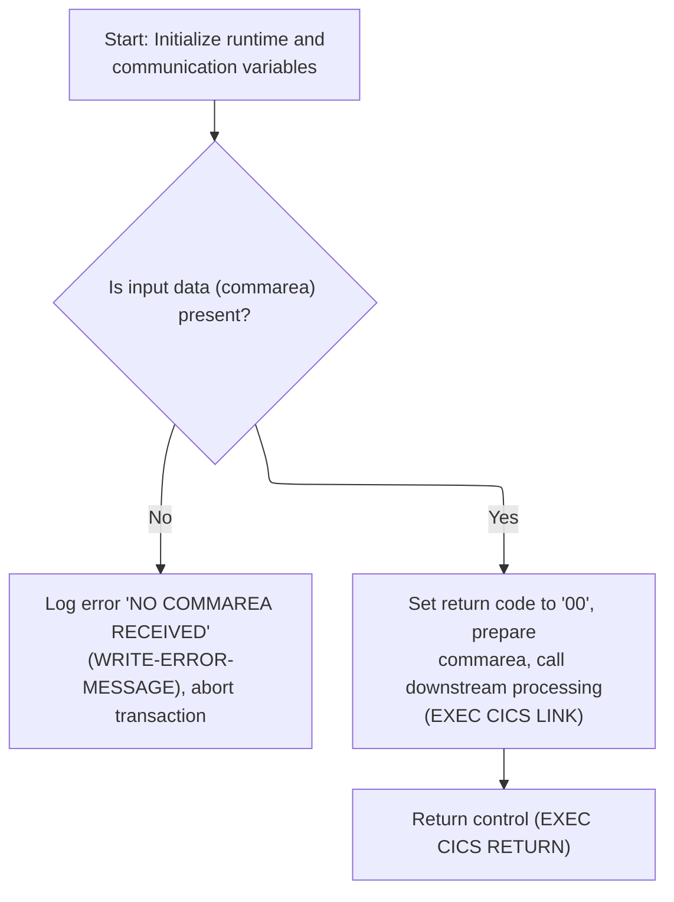

This section acts as the backend dispatcher for policy inquiry requests. It validates input, handles error scenarios, and routes valid requests to the appropriate backend service for processing.

| Rule ID | Category                        | Rule Name                              | Description                                                                                                                                                                                                                                                             | Implementation Details                                                                                                                                                                                                            |
| ------- | ------------------------------- | -------------------------------------- | ----------------------------------------------------------------------------------------------------------------------------------------------------------------------------------------------------------------------------------------------------------------------- | --------------------------------------------------------------------------------------------------------------------------------------------------------------------------------------------------------------------------------- |
| BR-001  | Data validation                 | Missing commarea error handling        | If no commarea is received, an error message ' NO COMMAREA RECEIVED' is logged and the transaction is abended with code 'LGCA'.                                                                                                                                         | The error message is ' NO COMMAREA RECEIVED' (string, 21 characters, left-aligned, padded with spaces if shorter). The abend code is 'LGCA'.                                                                                      |
| BR-002  | Data validation                 | Set success return code on valid input | If a commarea is present, the return code is set to '00' to indicate success before dispatching the request to the backend service.                                                                                                                                     | The return code is '00' (string, 2 digits, right-aligned, zero-padded if necessary).                                                                                                                                              |
| BR-003  | Invoking a Service or a Process | Dispatch to backend service            | When a valid commarea is present, the backend service <SwmToken path="base/src/lgipol01.cbl" pos="91:9:9" line-data="           EXEC CICS LINK Program(LGIPDB01)">`LGIPDB01`</SwmToken> (Inquiring Policy Details) is invoked with the commarea for further processing. | The backend service invoked is <SwmToken path="base/src/lgipol01.cbl" pos="91:9:9" line-data="           EXEC CICS LINK Program(LGIPDB01)">`LGIPDB01`</SwmToken>. The commarea is passed as input, with a length of 32,500 bytes. |

<SwmSnippet path="/base/src/lgipol01.cbl" line="70">

---

MAINLINE in <SwmToken path="base/src/lgtestp4.cbl" pos="112:10:10" line-data="                 EXEC CICS LINK PROGRAM(&#39;LGIPOL01&#39;)">`LGIPOL01`</SwmToken> checks for a valid commarea, logs and abends if missing, then links to <SwmToken path="base/src/lgipol01.cbl" pos="91:9:9" line-data="           EXEC CICS LINK Program(LGIPDB01)">`LGIPDB01`</SwmToken> to actually fetch policy details. This sets up the backend for the inquiry.

```cobol
       MAINLINE SECTION.
      *
           INITIALIZE WS-HEADER.
      *
           MOVE EIBTRNID TO WS-TRANSID.
           MOVE EIBTRMID TO WS-TERMID.
           MOVE EIBTASKN TO WS-TASKNUM.
      *
      * If NO commarea received issue an ABEND
           IF EIBCALEN IS EQUAL TO ZERO
               MOVE ' NO COMMAREA RECEIVED' TO EM-VARIABLE
               PERFORM WRITE-ERROR-MESSAGE
               EXEC CICS ABEND ABCODE('LGCA') NODUMP END-EXEC
           END-IF

      * initialize commarea return code to zero
           MOVE '00' TO CA-RETURN-CODE
           MOVE EIBCALEN TO WS-CALEN.
           SET WS-ADDR-DFHCOMMAREA TO ADDRESS OF DFHCOMMAREA.
      *

           EXEC CICS LINK Program(LGIPDB01)
               Commarea(DFHCOMMAREA)
               Length(32500)
           END-EXEC.

           EXEC CICS RETURN END-EXEC.
```

---

</SwmSnippet>

## Error Logging and Message Queue Write

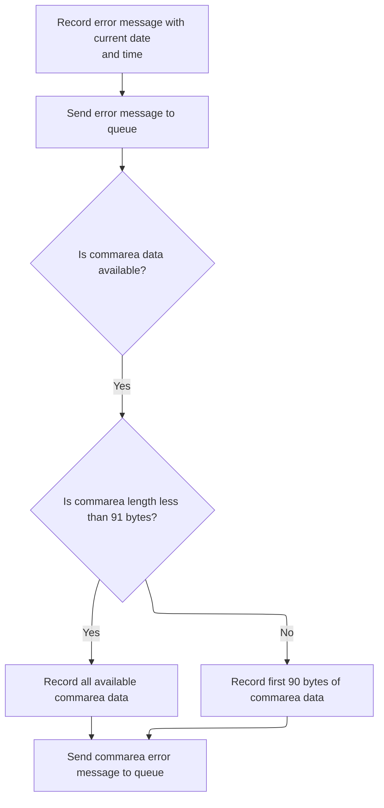

This section ensures that error events are logged with precise timestamps and relevant context, and that all error messages are reliably sent to the message queue for further processing or auditing.

| Rule ID | Category                        | Rule Name                 | Description                                                                                                                                                     | Implementation Details                                                                                                                                                                                                                      |
| ------- | ------------------------------- | ------------------------- | --------------------------------------------------------------------------------------------------------------------------------------------------------------- | ------------------------------------------------------------------------------------------------------------------------------------------------------------------------------------------------------------------------------------------- |
| BR-001  | Calculation                     | Timestamped error logging | Each error message is recorded with the current date and time, ensuring all logs are timestamped for traceability.                                              | The date is an 8-character string (MMDDYYYY), and the time is a 6-character string (HHMMSS). These are included in the error message structure.                                                                                             |
| BR-002  | Decision Making                 | Commarea context logging  | If commarea data is available, up to 90 bytes of it are included in a separate error message and sent to the queue, providing additional context for debugging. | If commarea length is less than 91 bytes, all available bytes are included. Otherwise, only the first 90 bytes are included. The commarea message is prefixed with 'COMMAREA=' (9 characters), followed by up to 90 bytes of commarea data. |
| BR-003  | Invoking a Service or a Process | Error message queueing    | Every error message is sent to the message queue for further processing or auditing.                                                                            | The error message is sent as a single message to the queue. The message includes the timestamp and context as described above.                                                                                                              |

<SwmSnippet path="/base/src/lgipol01.cbl" line="107">

---

<SwmToken path="base/src/lgipol01.cbl" pos="107:1:5" line-data="       WRITE-ERROR-MESSAGE.">`WRITE-ERROR-MESSAGE`</SwmToken> gets the current time and date, formats them, then calls LGSTSQ to write the error message to the queue. If there's commarea data, it writes up to 90 bytes of that too, so logs are timestamped and include context.

```cobol
       WRITE-ERROR-MESSAGE.
      * Save SQLCODE in message
      * Obtain and format current time and date
           EXEC CICS ASKTIME ABSTIME(ABS-TIME)
           END-EXEC
           EXEC CICS FORMATTIME ABSTIME(ABS-TIME)
                     MMDDYYYY(DATE1)
                     TIME(TIME1)
           END-EXEC
           MOVE DATE1 TO EM-DATE
           MOVE TIME1 TO EM-TIME
      * Write output message to TDQ
           EXEC CICS LINK PROGRAM('LGSTSQ')
                     COMMAREA(ERROR-MSG)
                     LENGTH(LENGTH OF ERROR-MSG)
           END-EXEC.
      * Write 90 bytes or as much as we have of commarea to TDQ
           IF EIBCALEN > 0 THEN
             IF EIBCALEN < 91 THEN
               MOVE DFHCOMMAREA(1:EIBCALEN) TO CA-DATA
               EXEC CICS LINK PROGRAM('LGSTSQ')
                         COMMAREA(CA-ERROR-MSG)
                         LENGTH(LENGTH OF CA-ERROR-MSG)
               END-EXEC
             ELSE
               MOVE DFHCOMMAREA(1:90) TO CA-DATA
               EXEC CICS LINK PROGRAM('LGSTSQ')
                         COMMAREA(CA-ERROR-MSG)
                         LENGTH(LENGTH OF CA-ERROR-MSG)
               END-EXEC
             END-IF
           END-IF.
           EXIT.
```

---

</SwmSnippet>

<SwmSnippet path="/base/src/lgstsq.cbl" line="55">

---

MAINLINE in LGSTSQ figures out where the message came from, processes any special prefixes, then writes the message to both TDQ and TSQ queues. If the message was received via CICS RECEIVE, it sends a quick response back to the sender.

```cobol
       MAINLINE SECTION.

           MOVE SPACES TO WRITE-MSG.
           MOVE SPACES TO WS-RECV.

           EXEC CICS ASSIGN SYSID(WRITE-MSG-SYSID)
                RESP(WS-RESP)
           END-EXEC.

           EXEC CICS ASSIGN INVOKINGPROG(WS-INVOKEPROG)
                RESP(WS-RESP)
           END-EXEC.
           
           IF WS-INVOKEPROG NOT = SPACES
              MOVE 'C' To WS-FLAG
              MOVE COMMA-DATA  TO WRITE-MSG-MSG
              MOVE EIBCALEN    TO WS-RECV-LEN
           ELSE
              EXEC CICS RECEIVE INTO(WS-RECV)
                  LENGTH(WS-RECV-LEN)
                  RESP(WS-RESP)
              END-EXEC
              MOVE 'R' To WS-FLAG
              MOVE WS-RECV-DATA  TO WRITE-MSG-MSG
              SUBTRACT 5 FROM WS-RECV-LEN
           END-IF.

           MOVE 'GENAERRS' TO STSQ-NAME.
           IF WRITE-MSG-MSG(1:2) = 'Q=' THEN
              MOVE WRITE-MSG-MSG(3:4) TO STSQ-EXT
              MOVE WRITE-MSG-REST TO TEMPO
              MOVE TEMPO          TO WRITE-MSG-MSG
              SUBTRACT 7 FROM WS-RECV-LEN
           END-IF.

           ADD 5 TO WS-RECV-LEN.

      * Write output message to TDQ CSMT
      *
           EXEC CICS WRITEQ TD QUEUE(STDQ-NAME)
                     FROM(WRITE-MSG)
                     RESP(WS-RESP)
                     LENGTH(WS-RECV-LEN)

           END-EXEC.

      * Write output message to Genapp TSQ
      * If no space is available then the task will not wait for
      *  storage to become available but will ignore the request...
      *
           EXEC CICS WRITEQ TS QUEUE(STSQ-NAME)
                     FROM(WRITE-MSG)
                     RESP(WS-RESP)
                     NOSUSPEND
                     LENGTH(WS-RECV-LEN)

           END-EXEC.

           If WS-FLAG = 'R' Then
             EXEC CICS SEND TEXT FROM(FILLER-X)
              WAIT
              ERASE
              LENGTH(1)
              FREEKB
             END-EXEC.

           EXEC CICS RETURN
           END-EXEC.
```

---

</SwmSnippet>

## Policy Data Retrieval and Error Handling

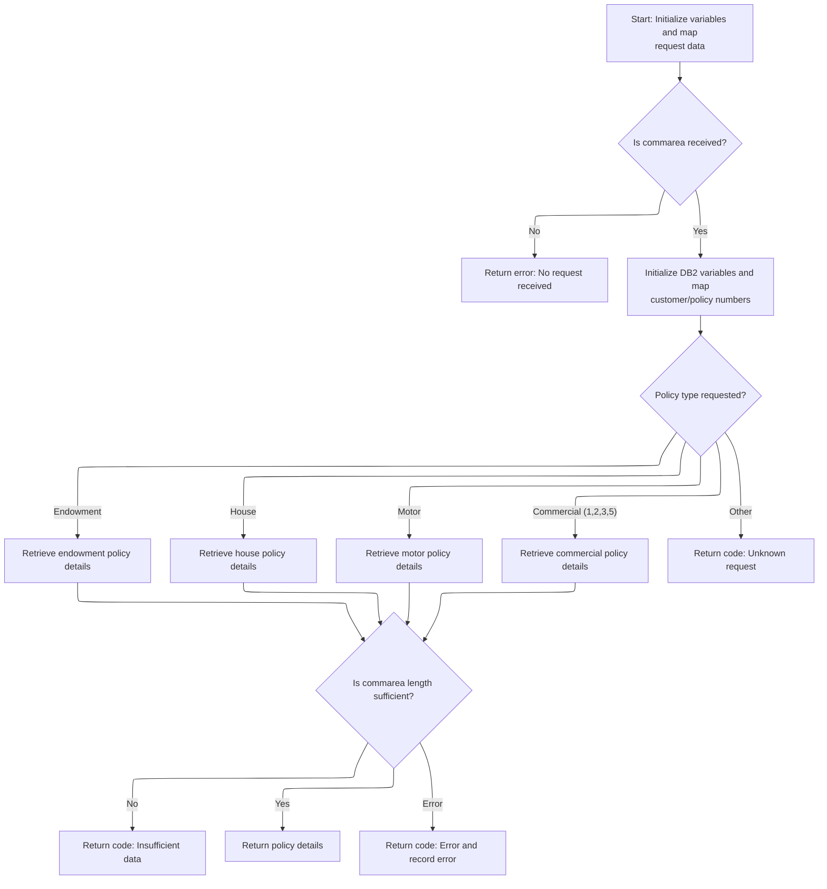

This section validates incoming requests, determines the policy type, retrieves the corresponding policy data, and handles errors by returning codes and logging context. It ensures that only valid and sufficiently detailed requests are processed, and that all errors are traceable with full context.

| Rule ID | Category        | Rule Name                                  | Description                                                                                                                                                                                           | Implementation Details                                                                                                                                                                                                                                                                                                                                                                                                                                                                                                                                                                                                                                                                                                                                                                                                                                                                                                                                                                                                                                                                                                                                               |
| ------- | --------------- | ------------------------------------------ | ----------------------------------------------------------------------------------------------------------------------------------------------------------------------------------------------------- | -------------------------------------------------------------------------------------------------------------------------------------------------------------------------------------------------------------------------------------------------------------------------------------------------------------------------------------------------------------------------------------------------------------------------------------------------------------------------------------------------------------------------------------------------------------------------------------------------------------------------------------------------------------------------------------------------------------------------------------------------------------------------------------------------------------------------------------------------------------------------------------------------------------------------------------------------------------------------------------------------------------------------------------------------------------------------------------------------------------------------------------------------------------------- |
| BR-001  | Data validation | Missing commarea error                     | If no commarea is received, the system returns an error code, logs the error, and terminates processing for this request.                                                                             | The error message includes the text 'NO COMMAREA RECEIVED' and is logged with the current date, time, and up to 90 bytes of commarea data if available. The error code 'LGCA' is used for the abend. The output format for the error log includes date (8 bytes), time (6 bytes), transaction ID (4 bytes), terminal ID (4 bytes), task number (7 digits), and the error message string.                                                                                                                                                                                                                                                                                                                                                                                                                                                                                                                                                                                                                                                                                                                                                                             |
| BR-002  | Data validation | Request ID standardization                 | The request ID is converted to uppercase before determining the policy type, ensuring consistent processing regardless of input case.                                                                 | The request ID is a 6-character alphanumeric string. All alphabetic characters are converted to uppercase before comparison. This standardization prevents case mismatches in policy type routing.                                                                                                                                                                                                                                                                                                                                                                                                                                                                                                                                                                                                                                                                                                                                                                                                                                                                                                                                                                   |
| BR-003  | Data validation | Commarea length validation for policy data | For each policy type, the system calculates the required commarea length to return all policy data. If the received commarea is too small, an error code is returned and processing stops.            | The required commarea length is the sum of a header/trailer length and the full policy data length, with adjustments for variable-length fields. If the received commarea is less than the required length, the return code '98' is set and processing stops. The error code is returned in the commarea as a 2-digit number.                                                                                                                                                                                                                                                                                                                                                                                                                                                                                                                                                                                                                                                                                                                                                                                                                                        |
| BR-004  | Data validation | Invalid customer or policy error           | If the SQL query for policy data returns no rows, the system sets a specific error code indicating an invalid customer or policy number.                                                              | The return code '01' is set in the commarea as a 2-digit number to indicate that the customer or policy number is invalid.                                                                                                                                                                                                                                                                                                                                                                                                                                                                                                                                                                                                                                                                                                                                                                                                                                                                                                                                                                                                                                           |
| BR-005  | Data validation | General SQL error handling and logging     | If an unexpected SQL error occurs during policy data retrieval, the system sets a general error code, logs the error with context, and returns control to the caller.                                 | The return code '90' is set in the commarea as a 2-digit number. The error message is logged with the SQLCODE, current date, time, and up to 90 bytes of commarea data. The log is written to a queue for support analysis.                                                                                                                                                                                                                                                                                                                                                                                                                                                                                                                                                                                                                                                                                                                                                                                                                                                                                                                                          |
| BR-006  | Decision Making | Policy type routing and unknown type error | The system routes the request to the appropriate policy data retrieval process based on the standardized request ID. If the request ID does not match a known policy type, an error code is returned. | Recognized request IDs are: <SwmToken path="base/src/lgipdb01.cbl" pos="279:4:4" line-data="             WHEN &#39;01IEND&#39;">`01IEND`</SwmToken> (Endowment), <SwmToken path="base/src/lgipdb01.cbl" pos="283:4:4" line-data="             WHEN &#39;01IHOU&#39;">`01IHOU`</SwmToken> (House), <SwmToken path="base/src/lgipdb01.cbl" pos="287:4:4" line-data="             WHEN &#39;01IMOT&#39;">`01IMOT`</SwmToken> (Motor), <SwmToken path="base/src/lgtestp4.cbl" pos="77:4:4" line-data="                        Move &#39;01ICOM&#39;   To CA-REQUEST-ID">`01ICOM`</SwmToken>, <SwmToken path="base/src/lgtestp4.cbl" pos="87:4:4" line-data="                        Move &#39;02ICOM&#39;   To CA-REQUEST-ID">`02ICOM`</SwmToken>, <SwmToken path="base/src/lgtestp4.cbl" pos="96:4:4" line-data="                        Move &#39;03ICOM&#39;   To CA-REQUEST-ID">`03ICOM`</SwmToken>, <SwmToken path="base/src/lgtestp4.cbl" pos="105:4:4" line-data="                        Move &#39;05ICOM&#39;   To CA-REQUEST-ID">`05ICOM`</SwmToken> (Commercial). If the request ID does not match any of these, the return code '99' is set in the commarea. |
| BR-007  | Writing Output  | Policy data return and end marker          | If the policy data is successfully retrieved and the commarea is sufficient, the system returns the policy details in the commarea and marks the end of data with the string 'FINAL'.                 | The policy data is returned in the commarea in a structured format, with the string 'FINAL' (5 bytes) marking the end of the policy data section. This marker is used for all policy types to indicate the end of valid data.                                                                                                                                                                                                                                                                                                                                                                                                                                                                                                                                                                                                                                                                                                                                                                                                                                                                                                                                        |
| BR-008  | Writing Output  | Error context logging                      | All error messages are logged with the SQLCODE, current date and time, and up to 90 bytes of commarea data to provide full context for support analysis.                                              | The error log includes: SQLCODE (5 digits), date (8 bytes), time (6 bytes), transaction ID (4 bytes), terminal ID (4 bytes), task number (7 digits), and up to 90 bytes of commarea data. If commarea is less than 91 bytes, the entire commarea is logged; otherwise, only the first 90 bytes are logged.                                                                                                                                                                                                                                                                                                                                                                                                                                                                                                                                                                                                                                                                                                                                                                                                                                                           |

<SwmSnippet path="/base/src/lgipdb01.cbl" line="230">

---

MAINLINE in <SwmToken path="base/src/lgipol01.cbl" pos="91:9:9" line-data="           EXEC CICS LINK Program(LGIPDB01)">`LGIPDB01`</SwmToken> sets up working storage, checks commarea, converts input fields, then switches on the request ID to call the right <SwmToken path="base/src/lgipdb01.cbl" pos="242:5:5" line-data="      * initialize DB2 host variables">`DB2`</SwmToken> info retrieval routine for each policy type. If the code isn't recognized, it sets an error return code.

```cobol
       MAINLINE SECTION.

      *----------------------------------------------------------------*
      * Common code                                                    *
      *----------------------------------------------------------------*
      * initialize working storage variables
           INITIALIZE WS-HEADER.
      * set up general variable
           MOVE EIBTRNID TO WS-TRANSID.
           MOVE EIBTRMID TO WS-TERMID.
           MOVE EIBTASKN TO WS-TASKNUM.
      *----------------------------------------------------------------*
      * initialize DB2 host variables
           INITIALIZE DB2-IN-INTEGERS.
           INITIALIZE DB2-OUT-INTEGERS.
           INITIALIZE DB2-POLICY.

      *---------------------------------------------------------------*
      * Check commarea and obtain required details                    *
      *---------------------------------------------------------------*
      * If NO commarea received issue an ABEND
           IF EIBCALEN IS EQUAL TO ZERO
             MOVE ' NO COMMAREA RECEIVED' TO EM-VARIABLE
             PERFORM WRITE-ERROR-MESSAGE
             EXEC CICS ABEND ABCODE('LGCA') NODUMP END-EXEC
           END-IF

      * initialize commarea return code to zero
           MOVE '00' TO CA-RETURN-CODE
           MOVE EIBCALEN TO WS-CALEN
           SET WS-ADDR-DFHCOMMAREA TO ADDRESS OF DFHCOMMAREA

      * Convert commarea customer & policy nums to DB2 integer format
           MOVE CA-CUSTOMER-NUM TO DB2-CUSTOMERNUM-INT
           MOVE CA-POLICY-NUM   TO DB2-POLICYNUM-INT
      * and save in error msg field incase required
           MOVE CA-CUSTOMER-NUM TO EM-CUSNUM
           MOVE CA-POLICY-NUM   TO EM-POLNUM

      *----------------------------------------------------------------*
      * Check which policy type is being requested                     *
      * This is not actually required whilst only endowment policy     *
      * inquires are supported, but will make future expansion simpler *
      *----------------------------------------------------------------*
      * Upper case value passed in Request Id field                    *
           MOVE FUNCTION UPPER-CASE(CA-REQUEST-ID) TO WS-REQUEST-ID

           EVALUATE WS-REQUEST-ID

             WHEN '01IEND'
               INITIALIZE DB2-ENDOWMENT
               PERFORM GET-ENDOW-DB2-INFO

             WHEN '01IHOU'
               INITIALIZE DB2-HOUSE
               PERFORM GET-HOUSE-DB2-INFO

             WHEN '01IMOT'
               INITIALIZE DB2-MOTOR
               PERFORM GET-MOTOR-DB2-INFO

             WHEN '01ICOM'
               INITIALIZE DB2-COMMERCIAL
               PERFORM GET-COMMERCIAL-DB2-INFO-1

             WHEN '02ICOM'
               INITIALIZE DB2-COMMERCIAL
               PERFORM GET-COMMERCIAL-DB2-INFO-2

             WHEN '03ICOM'
               INITIALIZE DB2-COMMERCIAL
               PERFORM GET-COMMERCIAL-DB2-INFO-3

             WHEN '05ICOM'
               INITIALIZE DB2-COMMERCIAL
               PERFORM GET-COMMERCIAL-DB2-INFO-5

             WHEN OTHER
               MOVE '99' TO CA-RETURN-CODE

           END-EVALUATE.
```

---

</SwmSnippet>

<SwmSnippet path="/base/src/lgipdb01.cbl" line="997">

---

<SwmToken path="base/src/lgipdb01.cbl" pos="997:1:5" line-data="       WRITE-ERROR-MESSAGE.">`WRITE-ERROR-MESSAGE`</SwmToken> in <SwmToken path="base/src/lgipol01.cbl" pos="91:9:9" line-data="           EXEC CICS LINK Program(LGIPDB01)">`LGIPDB01`</SwmToken> logs the SQLCODE, timestamps the error, then calls LGSTSQ to write the error message and up to 90 bytes of commarea data to the queue. This gives support teams full context for errors.

```cobol
       WRITE-ERROR-MESSAGE.
      * Save SQLCODE in message
           MOVE SQLCODE TO EM-SQLRC
      * Obtain and format current time and date
           EXEC CICS ASKTIME ABSTIME(ABS-TIME)
           END-EXEC
           EXEC CICS FORMATTIME ABSTIME(ABS-TIME)
                     MMDDYYYY(DATE1)
                     TIME(TIME1)
           END-EXEC
           MOVE DATE1 TO EM-DATE
           MOVE TIME1 TO EM-TIME
      * Write output message to TDQ
           EXEC CICS LINK PROGRAM('LGSTSQ')
                     COMMAREA(ERROR-MSG)
                     LENGTH(LENGTH OF ERROR-MSG)
           END-EXEC.
      * Write 90 bytes or as much as we have of commarea to TDQ
           IF EIBCALEN > 0 THEN
             IF EIBCALEN < 91 THEN
               MOVE DFHCOMMAREA(1:EIBCALEN) TO CA-DATA
               EXEC CICS LINK PROGRAM('LGSTSQ')
                         COMMAREA(CA-ERROR-MSG)
                         LENGTH(LENGTH OF CA-ERROR-MSG)
               END-EXEC
             ELSE
               MOVE DFHCOMMAREA(1:90) TO CA-DATA
               EXEC CICS LINK PROGRAM('LGSTSQ')
                         COMMAREA(CA-ERROR-MSG)
                         LENGTH(LENGTH OF CA-ERROR-MSG)
               END-EXEC
             END-IF
           END-IF.
           EXIT.
```

---

</SwmSnippet>

<SwmSnippet path="/base/src/lgipdb01.cbl" line="327">

---

<SwmToken path="base/src/lgipdb01.cbl" pos="327:1:7" line-data="       GET-ENDOW-DB2-INFO.">`GET-ENDOW-DB2-INFO`</SwmToken> figures out how much space is needed for all policy data, including variable-length fields. If the commarea is too small, it returns an error. Otherwise, it moves <SwmToken path="base/src/lgipdb01.cbl" pos="327:5:5" line-data="       GET-ENDOW-DB2-INFO.">`DB2`</SwmToken> fields to the commarea, handles nulls, and marks the end of data with 'FINAL'.

```cobol
       GET-ENDOW-DB2-INFO.

           MOVE ' SELECT ENDOW ' TO EM-SQLREQ
           EXEC SQL
             SELECT  ISSUEDATE,
                     EXPIRYDATE,
                     LASTCHANGED,
                     BROKERID,
                     BROKERSREFERENCE,
                     PAYMENT,
                     WITHPROFITS,
                     EQUITIES,
                     MANAGEDFUND,
                     FUNDNAME,
                     TERM,
                     SUMASSURED,
                     LIFEASSURED,
                     PADDINGDATA,
                     LENGTH(PADDINGDATA)
             INTO  :DB2-ISSUEDATE,
                   :DB2-EXPIRYDATE,
                   :DB2-LASTCHANGED,
                   :DB2-BROKERID-INT INDICATOR :IND-BROKERID,
                   :DB2-BROKERSREF INDICATOR :IND-BROKERSREF,
                   :DB2-PAYMENT-INT INDICATOR :IND-PAYMENT,
                   :DB2-E-WITHPROFITS,
                   :DB2-E-EQUITIES,
                   :DB2-E-MANAGEDFUND,
                   :DB2-E-FUNDNAME,
                   :DB2-E-TERM-SINT,
                   :DB2-E-SUMASSURED-INT,
                   :DB2-E-LIFEASSURED,
                   :DB2-E-PADDINGDATA INDICATOR :IND-E-PADDINGDATA,
                   :DB2-E-PADDING-LEN INDICATOR :IND-E-PADDINGDATAL
             FROM  POLICY,ENDOWMENT
             WHERE ( POLICY.POLICYNUMBER =
                        ENDOWMENT.POLICYNUMBER   AND
                     POLICY.CUSTOMERNUMBER =
                        :DB2-CUSTOMERNUM-INT             AND
                     POLICY.POLICYNUMBER =
                        :DB2-POLICYNUM-INT               )
           END-EXEC

           IF SQLCODE = 0
      *      Select was successful

      *      Calculate size of commarea required to return all data
             ADD WS-CA-HEADERTRAILER-LEN TO WS-REQUIRED-CA-LEN
             ADD WS-FULL-ENDOW-LEN       TO WS-REQUIRED-CA-LEN

      *----------------------------------------------------------------*
      *      Specific code to allow for length of VACHAR data
      *      check whether PADDINGDATA field is non-null
      *        and calculate length of endowment policy
      *        and position of free space in commarea after policy data
      *----------------------------------------------------------------*
             IF IND-E-PADDINGDATAL NOT EQUAL MINUS-ONE
               ADD DB2-E-PADDING-LEN TO WS-REQUIRED-CA-LEN
               ADD DB2-E-PADDING-LEN TO END-POLICY-POS
             END-IF

      *      if commarea received is not large enough ...
      *        set error return code and return to caller
             IF EIBCALEN IS LESS THAN WS-REQUIRED-CA-LEN
               MOVE '98' TO CA-RETURN-CODE
               EXEC CICS RETURN END-EXEC
             ELSE
      *        Length is sufficent so move data to commarea
      *        Move Integer fields to required length numerics
      *        Don't move null fields
               IF IND-BROKERID NOT EQUAL MINUS-ONE
                 MOVE DB2-BROKERID-INT    TO DB2-BROKERID
               END-IF
               IF IND-PAYMENT NOT EQUAL MINUS-ONE
                 MOVE DB2-PAYMENT-INT TO DB2-PAYMENT
               END-IF
      *----------------------------------------------------------------*
               MOVE DB2-E-TERM-SINT       TO DB2-E-TERM
               MOVE DB2-E-SUMASSURED-INT  TO DB2-E-SUMASSURED

               MOVE DB2-POLICY-COMMON     TO CA-POLICY-COMMON
               MOVE DB2-ENDOW-FIXED
                   TO CA-ENDOWMENT(1:WS-ENDOW-LEN)
               IF IND-E-PADDINGDATA NOT EQUAL MINUS-ONE
                 MOVE DB2-E-PADDINGDATA TO
                     CA-E-PADDING-DATA(1:DB2-E-PADDING-LEN)
               END-IF
             END-IF

      *      Mark the end of the policy data
             MOVE 'FINAL' TO CA-E-PADDING-DATA(END-POLICY-POS:5)

           ELSE
      *      Non-zero SQLCODE from first SQL FETCH statement
             IF SQLCODE EQUAL 100
      *        No rows found - invalid customer / policy number
               MOVE '01' TO CA-RETURN-CODE
             ELSE
      *        something has gone wrong
               MOVE '90' TO CA-RETURN-CODE
      *        Write error message to TD QUEUE(CSMT)
               PERFORM WRITE-ERROR-MESSAGE
             END-IF

           END-IF.
           EXIT.
```

---

</SwmSnippet>

<SwmSnippet path="/base/src/lgipdb01.cbl" line="441">

---

<SwmToken path="base/src/lgipdb01.cbl" pos="441:1:7" line-data="       GET-HOUSE-DB2-INFO.">`GET-HOUSE-DB2-INFO`</SwmToken> calculates the required commarea size for house policy data, checks for nulls using indicators, moves <SwmToken path="base/src/lgipdb01.cbl" pos="441:5:5" line-data="       GET-HOUSE-DB2-INFO.">`DB2`</SwmToken> integer fields to numerics, and marks the end of data with 'FINAL'. If the commarea is too small, it returns an error code.

```cobol
       GET-HOUSE-DB2-INFO.

           MOVE ' SELECT HOUSE ' TO EM-SQLREQ
           EXEC SQL
             SELECT  ISSUEDATE,
                     EXPIRYDATE,
                     LASTCHANGED,
                     BROKERID,
                     BROKERSREFERENCE,
                     PAYMENT,
                     PROPERTYTYPE,
                     BEDROOMS,
                     VALUE,
                     HOUSENAME,
                     HOUSENUMBER,
                     POSTCODE
             INTO  :DB2-ISSUEDATE,
                   :DB2-EXPIRYDATE,
                   :DB2-LASTCHANGED,
                   :DB2-BROKERID-INT INDICATOR :IND-BROKERID,
                   :DB2-BROKERSREF INDICATOR :IND-BROKERSREF,
                   :DB2-PAYMENT-INT INDICATOR :IND-PAYMENT,
                   :DB2-H-PROPERTYTYPE,
                   :DB2-H-BEDROOMS-SINT,
                   :DB2-H-VALUE-INT,
                   :DB2-H-HOUSENAME,
                   :DB2-H-HOUSENUMBER,
                   :DB2-H-POSTCODE
             FROM  POLICY,HOUSE
             WHERE ( POLICY.POLICYNUMBER =
                        HOUSE.POLICYNUMBER   AND
                     POLICY.CUSTOMERNUMBER =
                        :DB2-CUSTOMERNUM-INT             AND
                     POLICY.POLICYNUMBER =
                        :DB2-POLICYNUM-INT               )
           END-EXEC

           IF SQLCODE = 0
      *      Select was successful

      *      Calculate size of commarea required to return all data
             ADD WS-CA-HEADERTRAILER-LEN TO WS-REQUIRED-CA-LEN
             ADD WS-FULL-HOUSE-LEN       TO WS-REQUIRED-CA-LEN

      *      if commarea received is not large enough ...
      *        set error return code and return to caller
             IF EIBCALEN IS LESS THAN WS-REQUIRED-CA-LEN
               MOVE '98' TO CA-RETURN-CODE
               EXEC CICS RETURN END-EXEC
             ELSE
      *        Length is sufficent so move data to commarea
      *        Move Integer fields to required length numerics
      *        Don't move null fields
               IF IND-BROKERID NOT EQUAL MINUS-ONE
                 MOVE DB2-BROKERID-INT  TO DB2-BROKERID
               END-IF
               IF IND-PAYMENT NOT EQUAL MINUS-ONE
                 MOVE DB2-PAYMENT-INT TO DB2-PAYMENT
               END-IF
               MOVE DB2-H-BEDROOMS-SINT TO DB2-H-BEDROOMS
               MOVE DB2-H-VALUE-INT     TO DB2-H-VALUE

               MOVE DB2-POLICY-COMMON   TO CA-POLICY-COMMON
               MOVE DB2-HOUSE           TO CA-HOUSE(1:WS-HOUSE-LEN)
             END-IF

      *      Mark the end of the policy data
             MOVE 'FINAL' TO CA-H-FILLER(1:5)

           ELSE
      *      Non-zero SQLCODE from first SQL FETCH statement
             IF SQLCODE EQUAL 100
      *        No rows found - invalid customer / policy number
               MOVE '01' TO CA-RETURN-CODE
             ELSE
      *        something has gone wrong
               MOVE '90' TO CA-RETURN-CODE
      *        Write error message to TD QUEUE(CSMT)
               PERFORM WRITE-ERROR-MESSAGE
             END-IF

           END-IF.
           EXIT.
```

---

</SwmSnippet>

<SwmSnippet path="/base/src/lgipdb01.cbl" line="529">

---

<SwmToken path="base/src/lgipdb01.cbl" pos="529:1:7" line-data="       GET-MOTOR-DB2-INFO.">`GET-MOTOR-DB2-INFO`</SwmToken> fetches motor policy data, checks commarea size, moves <SwmToken path="base/src/lgipdb01.cbl" pos="529:5:5" line-data="       GET-MOTOR-DB2-INFO.">`DB2`</SwmToken> integer fields to numerics, and marks the end of data with 'FINAL'. It uses repository-specific structs for mapping, and returns error codes for size or data issues.

```cobol
       GET-MOTOR-DB2-INFO.

           MOVE ' SELECT MOTOR ' TO EM-SQLREQ
           EXEC SQL
             SELECT  ISSUEDATE,
                     EXPIRYDATE,
                     LASTCHANGED,
                     BROKERID,
                     BROKERSREFERENCE,
                     PAYMENT,
                     MAKE,
                     MODEL,
                     VALUE,
                     REGNUMBER,
                     COLOUR,
                     CC,
                     YEAROFMANUFACTURE,
                     PREMIUM,
                     ACCIDENTS
             INTO  :DB2-ISSUEDATE,
                   :DB2-EXPIRYDATE,
                   :DB2-LASTCHANGED,
                   :DB2-BROKERID-INT INDICATOR :IND-BROKERID,
                   :DB2-BROKERSREF INDICATOR :IND-BROKERSREF,
                   :DB2-PAYMENT-INT INDICATOR :IND-PAYMENT,
                   :DB2-M-MAKE,
                   :DB2-M-MODEL,
                   :DB2-M-VALUE-INT,
                   :DB2-M-REGNUMBER,
                   :DB2-M-COLOUR,
                   :DB2-M-CC-SINT,
                   :DB2-M-MANUFACTURED,
                   :DB2-M-PREMIUM-INT,
                   :DB2-M-ACCIDENTS-INT
             FROM  POLICY,MOTOR
             WHERE ( POLICY.POLICYNUMBER =
                        MOTOR.POLICYNUMBER   AND
                     POLICY.CUSTOMERNUMBER =
                        :DB2-CUSTOMERNUM-INT             AND
                     POLICY.POLICYNUMBER =
                        :DB2-POLICYNUM-INT               )
           END-EXEC

           IF SQLCODE = 0
      *      Select was successful

      *      Calculate size of commarea required to return all data
             ADD WS-CA-HEADERTRAILER-LEN TO WS-REQUIRED-CA-LEN
             ADD WS-FULL-MOTOR-LEN       TO WS-REQUIRED-CA-LEN

      *      if commarea received is not large enough ...
      *        set error return code and return to caller
             IF EIBCALEN IS LESS THAN WS-REQUIRED-CA-LEN
               MOVE '98' TO CA-RETURN-CODE
               EXEC CICS RETURN END-EXEC
             ELSE
      *        Length is sufficent so move data to commarea
      *        Move Integer fields to required length numerics
      *        Don't move null fields
               IF IND-BROKERID NOT EQUAL MINUS-ONE
                 MOVE DB2-BROKERID-INT TO DB2-BROKERID
               END-IF
               IF IND-PAYMENT NOT EQUAL MINUS-ONE
                 MOVE DB2-PAYMENT-INT    TO DB2-PAYMENT
               END-IF
               MOVE DB2-M-CC-SINT      TO DB2-M-CC
               MOVE DB2-M-VALUE-INT    TO DB2-M-VALUE
               MOVE DB2-M-PREMIUM-INT  TO DB2-M-PREMIUM
               MOVE DB2-M-ACCIDENTS-INT TO DB2-M-ACCIDENTS
               MOVE DB2-M-PREMIUM-INT  TO CA-M-PREMIUM
               MOVE DB2-M-ACCIDENTS-INT TO CA-M-ACCIDENTS

               MOVE DB2-POLICY-COMMON  TO CA-POLICY-COMMON
               MOVE DB2-MOTOR          TO CA-MOTOR(1:WS-MOTOR-LEN)
             END-IF

      *      Mark the end of the policy data
             MOVE 'FINAL' TO CA-M-FILLER(1:5)

           ELSE
      *      Non-zero SQLCODE from first SQL FETCH statement
             IF SQLCODE EQUAL 100
      *        No rows found - invalid customer / policy number
               MOVE '01' TO CA-RETURN-CODE
             ELSE
      *        something has gone wrong
               MOVE '90' TO CA-RETURN-CODE
      *        Write error message to TD QUEUE(CSMT)
               PERFORM WRITE-ERROR-MESSAGE
             END-IF

           END-IF.
           EXIT.
```

---

</SwmSnippet>

## Post-Inquiry Error Handling

This section governs how the system responds to errors after an inquiry operation. It ensures that users are notified when no data is returned from the service call.

| Rule ID | Category        | Rule Name                       | Description                                                                                                                                              | Implementation Details                                                                                                                                                              |
| ------- | --------------- | ------------------------------- | -------------------------------------------------------------------------------------------------------------------------------------------------------- | ----------------------------------------------------------------------------------------------------------------------------------------------------------------------------------- |
| BR-001  | Decision Making | No Data Returned Error Handling | If the return code from the service call is greater than 0, the system triggers the error handling routine to inform the user that no data was returned. | The return code is a two-digit number. If it is greater than 0, the system branches to the error handling routine. No other output format or constants are referenced in this rule. |

<SwmSnippet path="/base/src/lgtestp4.cbl" line="116">

---

Back in <SwmToken path="base/src/lgtestp4.cbl" pos="24:5:7" line-data="              GO TO B-PROC.">`B-PROC`</SwmToken> after returning from <SwmToken path="base/src/lgtestp4.cbl" pos="112:10:10" line-data="                 EXEC CICS LINK PROGRAM(&#39;LGIPOL01&#39;)">`LGIPOL01`</SwmToken>, we check <SwmToken path="base/src/lgtestp4.cbl" pos="116:3:7" line-data="                 IF CA-RETURN-CODE &gt; 0">`CA-RETURN-CODE`</SwmToken>. If it's greater than 0, we jump to <SwmToken path="base/src/lgtestp4.cbl" pos="117:5:7" line-data="                   GO TO E-NODAT">`E-NODAT`</SwmToken> to show the user that no data was returned and handle the error.

```cobol
                 IF CA-RETURN-CODE > 0
                   GO TO E-NODAT
                 END-IF
```

---

</SwmSnippet>

## No Data Returned Error Display

This section ensures that when no data is returned from a data retrieval operation, a clear error message is displayed to the user and the error handling process is started.

| Rule ID | Category       | Rule Name                      | Description                                                                                                                                                | Implementation Details                                                                                                                                                         |
| ------- | -------------- | ------------------------------ | ---------------------------------------------------------------------------------------------------------------------------------------------------------- | ------------------------------------------------------------------------------------------------------------------------------------------------------------------------------ |
| BR-001  | Writing Output | No Data Returned Error Display | When no data is returned from a data retrieval operation, display the message 'No data was returned.' to the user and initiate the error handling process. | The error message is the string 'No data was returned.'. This message is displayed to the user via the output field. The process then continues to the error handling routine. |

<SwmSnippet path="/base/src/lgtestp4.cbl" line="293">

---

<SwmToken path="base/src/lgtestp4.cbl" pos="293:1:3" line-data="       E-NODAT.">`E-NODAT`</SwmToken> moves the 'No data was returned.' message to the output field for display, then jumps to <SwmToken path="base/src/lgtestp4.cbl" pos="295:5:7" line-data="           Go To F-ERR.">`F-ERR`</SwmToken> to handle the error UI and session cleanup.

```cobol
       E-NODAT.
           Move 'No data was returned.'              To  ERP4FLDO
           Go To F-ERR.
```

---

</SwmSnippet>

## Error UI and Session Cleanup

This section manages error display and session cleanup. It ensures users see a clear error message, all session data is reset, and the application transitions smoothly to the next transaction.

| Rule ID | Category                        | Rule Name                | Description                                                                                                                                                                                                                                                 | Implementation Details                                                                                                                                                                                                                                             |
| ------- | ------------------------------- | ------------------------ | ----------------------------------------------------------------------------------------------------------------------------------------------------------------------------------------------------------------------------------------------------------- | ------------------------------------------------------------------------------------------------------------------------------------------------------------------------------------------------------------------------------------------------------------------ |
| BR-001  | Writing Output                  | Error UI Display         | When an error occurs, the error UI is displayed to the user by sending the <SwmToken path="base/src/lgtestp4.cbl" pos="42:11:11" line-data="           EXEC CICS SEND MAP (&#39;XMAPP4&#39;)">`XMAPP4`</SwmToken> map from the output area to the terminal. | The error UI uses the <SwmToken path="base/src/lgtestp4.cbl" pos="42:11:11" line-data="           EXEC CICS SEND MAP (&#39;XMAPP4&#39;)">`XMAPP4`</SwmToken> map from the output area. The mapset used is XMAP. The display is sent to the user's terminal device. |
| BR-002  | Writing Output                  | Session Data Reset       | After displaying the error UI, all session and map data are cleared to ensure no residual data affects the next transaction.                                                                                                                                | All relevant data structures, including input and output maps and the communication area, are reset to their initial state.                                                                                                                                        |
| BR-003  | Invoking a Service or a Process | Transaction Continuation | After session data is reset, the application transitions to the next transaction by returning control with the appropriate transaction ID and communication area.                                                                                           | The next transaction is started with transaction ID <SwmToken path="base/src/lgtestp4.cbl" pos="248:4:4" line-data="                TRANSID(&#39;SSP4&#39;)">`SSP4`</SwmToken> and the current communication area is passed along.                                 |

<SwmSnippet path="/base/src/lgtestp4.cbl" line="297">

---

In <SwmToken path="base/src/lgtestp4.cbl" pos="297:1:3" line-data="       F-ERR.">`F-ERR`</SwmToken>, we send the <SwmToken path="base/src/lgtestp4.cbl" pos="298:11:11" line-data="           EXEC CICS SEND MAP (&#39;XMAPP4&#39;)">`XMAPP4`</SwmToken> map from <SwmToken path="base/src/lgtestp4.cbl" pos="299:3:3" line-data="                     FROM(XMAPP4O)">`XMAPP4O`</SwmToken> to the user's terminal. This displays the error screen and clears any previous input or output fields.

```cobol
       F-ERR.
           EXEC CICS SEND MAP ('XMAPP4')
                     FROM(XMAPP4O)
                     MAPSET ('XMAP')
           END-EXEC.
```

---

</SwmSnippet>

<SwmSnippet path="/base/src/lgtestp4.cbl" line="303">

---

After sending the error map, we initialize all the relevant data structures, then jump to <SwmToken path="base/src/lgtestp4.cbl" pos="307:5:7" line-data="           GO TO D-EXEC.">`D-EXEC`</SwmToken> to end the session and hand off control to the next transaction.

```cobol
           Initialize XMAPP4I.
           Initialize XMAPP4O.
           Initialize COMM-AREA.

           GO TO D-EXEC.
```

---

</SwmSnippet>

<SwmSnippet path="/base/src/lgtestp4.cbl" line="246">

---

<SwmToken path="base/src/lgtestp4.cbl" pos="246:1:3" line-data="       D-EXEC.">`D-EXEC`</SwmToken> uses CICS RETURN with TRANSID(<SwmToken path="base/src/lgtestp4.cbl" pos="248:4:4" line-data="                TRANSID(&#39;SSP4&#39;)">`SSP4`</SwmToken>) and <SwmToken path="base/src/lgtestp4.cbl" pos="249:3:5" line-data="                COMMAREA(COMM-AREA)">`COMM-AREA`</SwmToken>, ending the session and starting the next transaction with all the necessary data handed off.

```cobol
       D-EXEC.
           EXEC CICS RETURN
                TRANSID('SSP4')
                COMMAREA(COMM-AREA)
                END-EXEC.
```

---

</SwmSnippet>

## Post-Inquiry Data Mapping and UI Update

```mermaid
%%{init: {"flowchart": {"defaultRenderer": "elk"}} }%%
flowchart TD
    node1["Move policy/customer fields to external
interface (CA-POLICY-NUM,
CA-CUSTOMER-NUM, dates, address, etc.)"]
    click node1 openCode "base/src/lgtestp4.cbl:120:139"
    node1 --> node2["Display policy information to user"]
    click node2 openCode "base/src/lgtestp4.cbl:140:143"
    node2 --> node3{"Is input value '2'?"}
    click node3 openCode "base/src/lgtestp4.cbl:146:146"
    node3 -->|"Yes"| node4["Update internal fields from external
values and set request type (01ACOM)"]
    click node4 openCode "base/src/lgtestp4.cbl:147:166"
    node4 --> node5["Process policy data (trigger external
program)"]
    click node5 openCode "base/src/lgtestp4.cbl:168:171"
    node3 -->|"No"| node5
classDef HeadingStyle fill:#777777,stroke:#333,stroke-width:2px;

%% Swimm:
%% %%{init: {"flowchart": {"defaultRenderer": "elk"}} }%%
%% flowchart TD
%%     node1["Move policy/customer fields to external
%% interface (<SwmToken path="base/src/lgtestp4.cbl" pos="79:7:11" line-data="                        Move ENP4PNOO   To CA-POLICY-NUM">`CA-POLICY-NUM`</SwmToken>,
%% <SwmToken path="base/src/lgtestp4.cbl" pos="78:7:11" line-data="                        Move ENP4CNOO   To CA-CUSTOMER-NUM">`CA-CUSTOMER-NUM`</SwmToken>, dates, address, etc.)"]
%%     click node1 openCode "<SwmPath>[base/src/lgtestp4.cbl](base/src/lgtestp4.cbl)</SwmPath>:120:139"
%%     node1 --> node2["Display policy information to user"]
%%     click node2 openCode "<SwmPath>[base/src/lgtestp4.cbl](base/src/lgtestp4.cbl)</SwmPath>:140:143"
%%     node2 --> node3{"Is input value '2'?"}
%%     click node3 openCode "<SwmPath>[base/src/lgtestp4.cbl](base/src/lgtestp4.cbl)</SwmPath>:146:146"
%%     node3 -->|"Yes"| node4["Update internal fields from external
%% values and set request type (<SwmToken path="base/src/lgtestp4.cbl" pos="147:4:4" line-data="                 Move &#39;01ACOM&#39;             To  CA-REQUEST-ID">`01ACOM`</SwmToken>)"]
%%     click node4 openCode "<SwmPath>[base/src/lgtestp4.cbl](base/src/lgtestp4.cbl)</SwmPath>:147:166"
%%     node4 --> node5["Process policy data (trigger external
%% program)"]
%%     click node5 openCode "<SwmPath>[base/src/lgtestp4.cbl](base/src/lgtestp4.cbl)</SwmPath>:168:171"
%%     node3 -->|"No"| node5
%% classDef HeadingStyle fill:#777777,stroke:#333,stroke-width:2px;
```

This section is responsible for synchronizing policy and customer data between the backend and the UI, updating the user interface, and handling user actions that trigger backend processing for policy creation.

| Rule ID | Category                        | Rule Name                                      | Description                                                                                                                                    | Implementation Details                                                                                                                                                                                                                                                                                                                                                              |
| ------- | ------------------------------- | ---------------------------------------------- | ---------------------------------------------------------------------------------------------------------------------------------------------- | ----------------------------------------------------------------------------------------------------------------------------------------------------------------------------------------------------------------------------------------------------------------------------------------------------------------------------------------------------------------------------------- |
| BR-001  | Reading Input                   | UI to backend data mapping for policy creation | When the user selects option '2', the UI field values are mapped back to the backend commarea and the request type is set for policy creation. | The request type is set to <SwmToken path="base/src/lgtestp4.cbl" pos="147:4:4" line-data="                 Move &#39;01ACOM&#39;             To  CA-REQUEST-ID">`01ACOM`</SwmToken> (6 characters). All relevant UI fields are mapped to their corresponding commarea fields, with formats matching the commarea structure.                                                        |
| BR-002  | Writing Output                  | Backend to UI data mapping                     | Policy and customer data from the backend are mapped to the UI fields to ensure the user sees the latest information.                          | All mapped fields are alphanumeric or numeric, with field sizes matching those in the commarea structure (e.g., policy number: 10 digits, dates: 10 characters, address: up to 20 characters, etc.).                                                                                                                                                                                |
| BR-003  | Writing Output                  | UI update after data mapping                   | After mapping data to the UI fields, the updated policy and customer information is displayed to the user.                                     | The UI is updated using the <SwmToken path="base/src/lgtestp4.cbl" pos="42:11:11" line-data="           EXEC CICS SEND MAP (&#39;XMAPP4&#39;)">`XMAPP4`</SwmToken> map, with data sourced from <SwmToken path="base/src/lgtestp4.cbl" pos="27:3:3" line-data="           Initialize XMAPP4O.">`XMAPP4O`</SwmToken>. The display format matches the field definitions in the UI map. |
| BR-004  | Invoking a Service or a Process | Invoke backend policy processing               | After preparing the commarea with UI data for policy creation, the backend policy processing service is invoked.                               | The backend service <SwmToken path="base/src/lgtestp4.cbl" pos="168:10:10" line-data="                 EXEC CICS LINK PROGRAM(&#39;LGAPOL01&#39;)">`LGAPOL01`</SwmToken> is called with the commarea (up to 32,500 bytes).                                                                                                                                                          |

<SwmSnippet path="/base/src/lgtestp4.cbl" line="120">

---

Back in <SwmToken path="base/src/lgtestp4.cbl" pos="24:5:7" line-data="              GO TO B-PROC.">`B-PROC`</SwmToken>, we move all the relevant fields from the commarea to the UI fields. This updates the screen with the latest policy and customer data for the user.

```cobol
                 Move CA-POLICY-NUM        To  ENP4PNOI
                 Move CA-CUSTOMER-NUM      To  ENP4CNOI
                 Move CA-ISSUE-DATE        To  ENP4IDAI
                 Move CA-EXPIRY-DATE       To  ENP4EDAI
                 Move CA-B-Address         To  ENP4ADDI
                 Move CA-B-PST        To  ENP4HPCI
                 Move CA-B-Latitude        To  ENP4LATI
                 Move CA-B-Longitude       To  ENP4LONI
                 Move CA-B-Customer        To  ENP4CUSI
                 Move CA-B-PropType        To  ENP4PTYI
                 Move CA-B-FP       To  ENP4FPEI
                 Move CA-B-CA-B-FPR     To  ENP4FPRI
                 Move CA-B-CP      To  ENP4CPEI
                 Move CA-B-CPR    To  ENP4CPRI
                 Move CA-B-FLP      To  ENP4XPEI
                 Move CA-B-FLPR    To  ENP4XPRI
                 Move CA-B-WP    To  ENP4WPEI
                 Move CA-B-WPR  To  ENP4WPRI
                 Move CA-B-ST          To  ENP4STAI
                 Move CA-B-RejectReason    To  ENP4REJI
```

---

</SwmSnippet>

<SwmSnippet path="/base/src/lgtestp4.cbl" line="140">

---

After mapping the data, we send the <SwmToken path="base/src/lgtestp4.cbl" pos="140:11:11" line-data="                 EXEC CICS SEND MAP (&#39;XMAPP4&#39;)">`XMAPP4`</SwmToken> map from <SwmToken path="base/src/lgtestp4.cbl" pos="141:3:3" line-data="                           FROM(XMAPP4O)">`XMAPP4O`</SwmToken> to the user's terminal. This shows the updated policy and customer details on the screen.

```cobol
                 EXEC CICS SEND MAP ('XMAPP4')
                           FROM(XMAPP4O)
                           MAPSET ('XMAP')
                 END-EXEC
```

---

</SwmSnippet>

<SwmSnippet path="/base/src/lgtestp4.cbl" line="146">

---

Back in <SwmToken path="base/src/lgtestp4.cbl" pos="24:5:7" line-data="              GO TO B-PROC.">`B-PROC`</SwmToken>, for option '2', we move all the UI fields into the commarea. This sets up the data for backend policy creation.

```cobol
             WHEN '2'
                 Move '01ACOM'             To  CA-REQUEST-ID
                 Move ENP4CNOO             To  CA-CUSTOMER-NUM
                 Move ENP4IDAO             To  CA-ISSUE-DATE
                 Move ENP4EDAO             To  CA-EXPIRY-DATE
                 Move ENP4ADDO             To  CA-B-Address
                 Move ENP4HPCO             To  CA-B-PST
                 Move ENP4LATO             To  CA-B-Latitude
                 Move ENP4LONO             To  CA-B-Longitude
                 Move ENP4CUSO             To  CA-B-Customer
                 Move ENP4PTYO             To  CA-B-PropType
                 Move ENP4FPEO             To  CA-B-FP
                 Move ENP4FPRO             To  CA-B-CA-B-FPR
                 Move ENP4CPEO             To  CA-B-CP
                 Move ENP4CPRO             To  CA-B-CPR
                 Move ENP4XPEO             To  CA-B-FLP
                 Move ENP4XPRO             To  CA-B-FLPR
                 Move ENP4WPEO             To  CA-B-WP
                 Move ENP4WPRO             To  CA-B-WPR
                 Move ENP4STAO             To  CA-B-ST
                 Move ENP4REJO             To  CA-B-RejectReason
```

---

</SwmSnippet>

<SwmSnippet path="/base/src/lgtestp4.cbl" line="168">

---

After prepping the commarea, we call <SwmToken path="base/src/lgtestp4.cbl" pos="168:10:10" line-data="                 EXEC CICS LINK PROGRAM(&#39;LGAPOL01&#39;)">`LGAPOL01`</SwmToken>. That program validates and stores the new policy, then returns results or errors for display.

```cobol
                 EXEC CICS LINK PROGRAM('LGAPOL01')
                           COMMAREA(COMM-AREA)
                           LENGTH(32500)
                 END-EXEC
```

---

</SwmSnippet>

## Policy Creation Validation and Error Logging

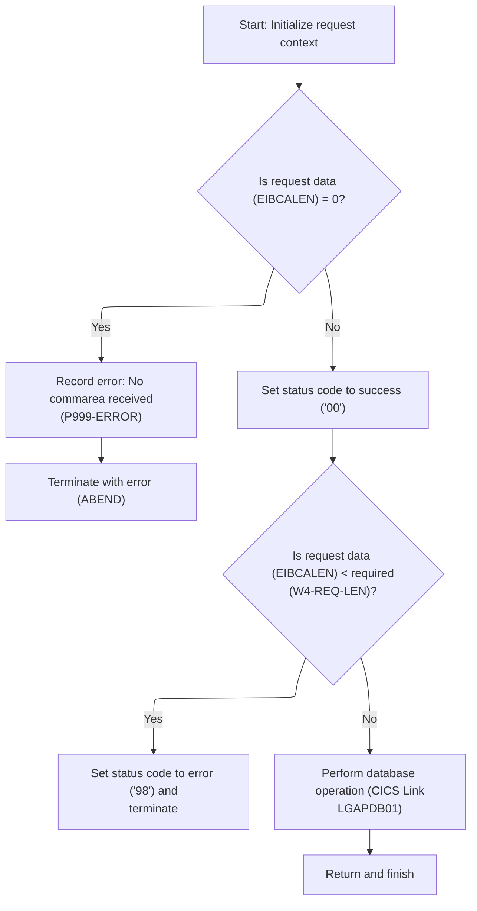

This section validates the policy creation request, logs errors with timestamps and commarea data when validation fails, and invokes the database process for valid requests.

| Rule ID | Category                        | Rule Name                                         | Description                                                                                                                                                                                                                                                                                                        | Implementation Details                                                                                                                                                                                                                                                                                                                                                                                |
| ------- | ------------------------------- | ------------------------------------------------- | ------------------------------------------------------------------------------------------------------------------------------------------------------------------------------------------------------------------------------------------------------------------------------------------------------------------ | ----------------------------------------------------------------------------------------------------------------------------------------------------------------------------------------------------------------------------------------------------------------------------------------------------------------------------------------------------------------------------------------------------- |
| BR-001  | Data validation                 | Missing commarea error logging and abend          | If the commarea length is zero, an error message is logged with the detail 'NO COMMAREA RECEIVED', the error is recorded, and the process is abended with code 'LGCA'.                                                                                                                                             | The error detail is the string ' NO COMMAREA RECEIVED'. The abend code is 'LGCA'. The error log includes a timestamp and the error detail. The commarea data is not logged in this case since its length is zero.                                                                                                                                                                                     |
| BR-002  | Data validation                 | Insufficient commarea length error                | If the commarea length is less than the required minimum (header length + required length), the status code is set to '98' and the process returns without invoking the database operation.                                                                                                                        | The required minimum length is <SwmToken path="base/src/lgapol01.cbl" pos="92:3:7" line-data="           ADD W4-HDR-LEN TO W4-REQ-LEN">`W4-HDR-LEN`</SwmToken> (+28) plus <SwmToken path="base/src/lgapol01.cbl" pos="92:11:15" line-data="           ADD W4-HDR-LEN TO W4-REQ-LEN">`W4-REQ-LEN`</SwmToken>. The error status code is '98'. No abend occurs; the process returns with the error code. |
| BR-003  | Writing Output                  | Error log includes timestamp and commarea data    | When an error is logged, the log entry includes the current date and time, the error detail, and up to 90 bytes of commarea data if available. If commarea is shorter than 91 bytes, the entire commarea is logged; otherwise, only the first 90 bytes are included.                                               | The log entry includes date (8 bytes), time (6 bytes), error detail (21 bytes), and up to 90 bytes of commarea data. If commarea is less than 91 bytes, log all; otherwise, log first 90 bytes.                                                                                                                                                                                                       |
| BR-004  | Invoking a Service or a Process | Successful validation triggers database operation | If the commarea passes validation, the status code is set to '00' (success) and the database process (<SwmToken path="base/src/lgapol01.cbl" pos="103:9:9" line-data="           EXEC CICS Link Program(LGAPDB01)">`LGAPDB01`</SwmToken> (Enhanced Policy Premium Calculation)) is invoked with the commarea data. | The status code for success is '00'. The database process <SwmToken path="base/src/lgapol01.cbl" pos="103:9:9" line-data="           EXEC CICS Link Program(LGAPDB01)">`LGAPDB01`</SwmToken> is invoked with the commarea and a length of 32500 bytes.                                                                                                                                                |

<SwmSnippet path="/base/src/lgapol01.cbl" line="68">

---

<SwmToken path="base/src/lgapol01.cbl" pos="68:1:3" line-data="       P100-MAIN SECTION.">`P100-MAIN`</SwmToken> in <SwmToken path="base/src/lgtestp4.cbl" pos="168:10:10" line-data="                 EXEC CICS LINK PROGRAM(&#39;LGAPOL01&#39;)">`LGAPOL01`</SwmToken> checks for a valid commarea, logs and abends if missing, then links to <SwmToken path="base/src/lgapol01.cbl" pos="103:9:9" line-data="           EXEC CICS Link Program(LGAPDB01)">`LGAPDB01`</SwmToken> to actually process and store the policy data. This sets up the backend for policy creation.

```cobol
       P100-MAIN SECTION.

      *----------------------------------------------------------------*
      * Common code                                                    *
      *----------------------------------------------------------------*
           INITIALIZE W1-CONTROL.
           MOVE EIBTRNID TO W1-TID.
           MOVE EIBTRMID TO W1-TRM.
           MOVE EIBTASKN TO W1-TSK.
           MOVE EIBCALEN TO W1-LEN.
      *----------------------------------------------------------------*

      *----------------------------------------------------------------*
      * Check commarea and obtain required details                     *
      *----------------------------------------------------------------*
           IF EIBCALEN IS EQUAL TO ZERO
               MOVE ' NO COMMAREA RECEIVED' TO W3-DETAIL
               PERFORM P999-ERROR
               EXEC CICS ABEND ABCODE('LGCA') NODUMP END-EXEC
           END-IF

           MOVE '00' TO CA-RETURN-CODE
           SET W1-PTR TO ADDRESS OF DFHCOMMAREA.

           ADD W4-HDR-LEN TO W4-REQ-LEN


           IF EIBCALEN IS LESS THAN W4-REQ-LEN
             MOVE '98' TO CA-RETURN-CODE
             EXEC CICS RETURN END-EXEC
           END-IF

      *----------------------------------------------------------------*
      *    Perform the data Inserts                                    *
      *----------------------------------------------------------------*
           EXEC CICS Link Program(LGAPDB01)
                Commarea(DFHCOMMAREA)
                LENGTH(32500)
           END-EXEC.

           EXEC CICS RETURN END-EXEC.
```

---

</SwmSnippet>

<SwmSnippet path="/base/src/lgapol01.cbl" line="119">

---

<SwmToken path="base/src/lgapol01.cbl" pos="119:1:3" line-data="       P999-ERROR.">`P999-ERROR`</SwmToken> in <SwmToken path="base/src/lgtestp4.cbl" pos="168:10:10" line-data="                 EXEC CICS LINK PROGRAM(&#39;LGAPOL01&#39;)">`LGAPOL01`</SwmToken> gets the current time and date, formats them, then calls LGSTSQ to write the error message and up to 90 bytes of commarea data to the queue. This keeps logs concise and timestamped.

```cobol
       P999-ERROR.
      * Save SQLCODE in message
      * Obtain and format current time and date
           EXEC CICS ASKTIME ABSTIME(W2-TIME)
           END-EXEC
           EXEC CICS FORMATTIME ABSTIME(W2-TIME)
                     MMDDYYYY(W2-DATE1)
                     TIME(W2-DATE2)
           END-EXEC
           MOVE W2-DATE1 TO W3-DATE
           MOVE W2-DATE2 TO W3-TIME
      * Write output message to TDQ
           EXEC CICS LINK PROGRAM('LGSTSQ')
                     COMMAREA(W3-MESSAGE)
                     LENGTH(LENGTH OF W3-MESSAGE)
           END-EXEC.
      * Write 90 bytes or as much as we have of commarea to TDQ
           IF EIBCALEN > 0 THEN
             IF EIBCALEN < 91 THEN
               MOVE DFHCOMMAREA(1:EIBCALEN) TO CA-DATA
               EXEC CICS LINK PROGRAM('LGSTSQ')
                         COMMAREA(CA-ERROR-MSG)
                         LENGTH(LENGTH OF CA-ERROR-MSG)
               END-EXEC
             ELSE
               MOVE DFHCOMMAREA(1:90) TO CA-DATA
               EXEC CICS LINK PROGRAM('LGSTSQ')
                         COMMAREA(CA-ERROR-MSG)
                         LENGTH(LENGTH OF CA-ERROR-MSG)
               END-EXEC
             END-IF
           END-IF.
           EXIT.
```

---

</SwmSnippet>

## Policy Processing Workflow

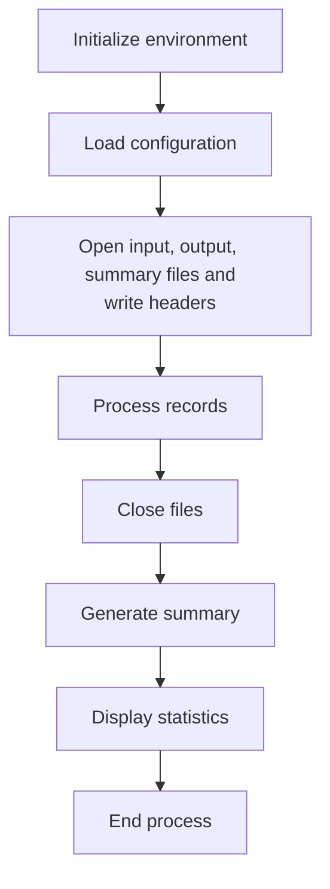

This section coordinates the end-to-end policy processing workflow, ensuring all required setup, processing, and output steps are performed in a fixed order.

| Rule ID | Category       | Rule Name                                | Description                                                                                                   | Implementation Details                                                                                                              |
| ------- | -------------- | ---------------------------------------- | ------------------------------------------------------------------------------------------------------------- | ----------------------------------------------------------------------------------------------------------------------------------- |
| BR-001  | Technical Step | Environment initialization required      | The workflow begins by initializing the environment before any other processing occurs.                       | No constants or formats are specified for this step; it is a required prerequisite for all subsequent actions.                      |
| BR-002  | Technical Step | Configuration loading sequence           | Configuration must be loaded after initialization and before any file operations or record processing.        | No constants or formats are specified; configuration is loaded as a required step in the sequence.                                  |
| BR-003  | Technical Step | File opening and header writing required | Input, output, and summary files are opened, and output headers are written before any records are processed. | The output file is initialized with column headers before any data is written. The specific format of headers is not detailed here. |

<SwmSnippet path="/base/src/LGAPDB01.cbl" line="90">

---

<SwmToken path="base/src/LGAPDB01.cbl" pos="90:1:1" line-data="       P001.">`P001`</SwmToken> in <SwmToken path="base/src/lgapol01.cbl" pos="103:9:9" line-data="           EXEC CICS Link Program(LGAPDB01)">`LGAPDB01`</SwmToken> runs the full policy processing workflow: initializes data, loads config, opens files, processes records, closes files, generates summary, and displays stats. Each step is needed for the next, so the workflow completes end-to-end.

```cobol
       P001.
           PERFORM P002-INITIALIZE
           PERFORM P003-LOAD-CONFIG
           PERFORM P005-OPEN-FILES
           PERFORM P006-PROCESS-RECORDS
           PERFORM P014-CLOSE-FILES
           PERFORM P015-GENERATE-SUMMARY
           PERFORM P016-DISPLAY-STATS
           STOP RUN.
```

---

</SwmSnippet>

<SwmSnippet path="/base/src/LGAPDB01.cbl" line="138">

---

<SwmToken path="base/src/LGAPDB01.cbl" pos="138:1:5" line-data="       P005-OPEN-FILES.">`P005-OPEN-FILES`</SwmToken> just runs through opening the input, output, and summary files, then writes the column headers to the output file. Even though the name says 'open files', it also sets up the output structure by writing headers, which isn't obvious from the name. Each subroutine is a straight call—no arguments, no hidden config, just a fixed setup sequence.

```cobol
       P005-OPEN-FILES.
           PERFORM P005A-OPEN-INPUT
           PERFORM P005B-OPEN-OUTPUT
           PERFORM P005C-OPEN-SUMMARY
           PERFORM P005D-WRITE-HEADERS.
```

---

</SwmSnippet>

## Processing All Input Records

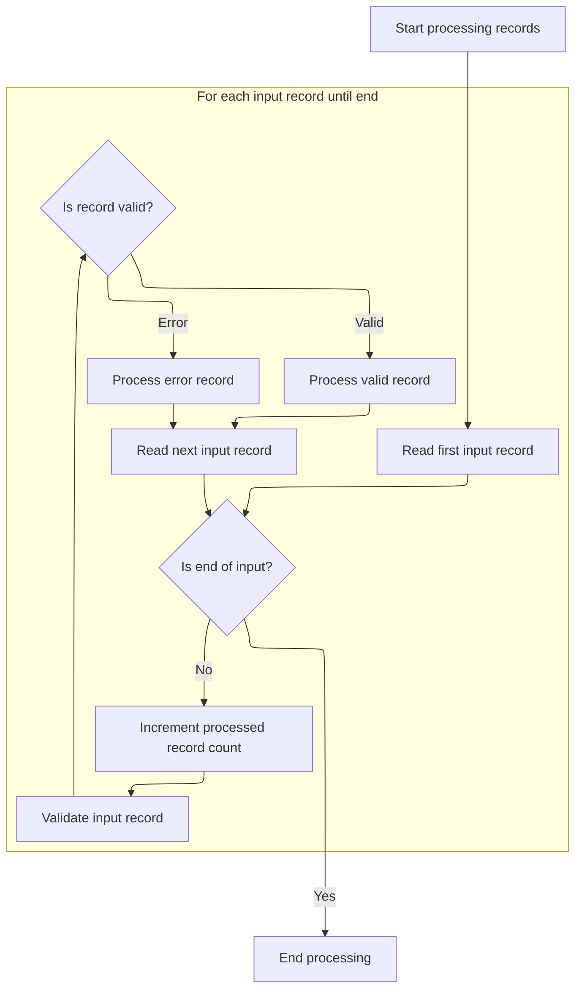

This section is responsible for orchestrating the main record-by-record processing loop. It ensures each input record is read, validated, and routed for further processing or error handling.

| Rule ID | Category        | Rule Name                | Description                                                                                             | Implementation Details                                                                                                          |
| ------- | --------------- | ------------------------ | ------------------------------------------------------------------------------------------------------- | ------------------------------------------------------------------------------------------------------------------------------- |
| BR-001  | Reading Input   | Sequential input reading | Each input record is read sequentially until the end-of-file status is detected.                        | The end-of-file condition is represented by the value '10'.                                                                     |
| BR-002  | Data validation | Input record validation  | Each input record is validated before further processing.                                               | Validation is performed for every input record. The details of validation are not specified in this section.                    |
| BR-003  | Calculation     | Record counting          | The processed record count is incremented for each input record read, regardless of validation outcome. | The processed record count starts at zero and is incremented by one for each record. The count is a number with up to 7 digits. |
| BR-004  | Decision Making | Valid record processing  | If a record passes validation (error count is zero), it is processed as a valid record.                 | A record is considered valid if the error count is zero. Valid records are routed to the valid record processing logic.         |
| BR-005  | Decision Making | Error record processing  | If a record fails validation (error count is not zero), it is processed as an error record.             | A record is considered erroneous if the error count is not zero. Error records are routed to the error record processing logic. |

<SwmSnippet path="/base/src/LGAPDB01.cbl" line="178">

---

<SwmToken path="base/src/LGAPDB01.cbl" pos="178:1:5" line-data="       P006-PROCESS-RECORDS.">`P006-PROCESS-RECORDS`</SwmToken> loops through all input records, reading each one, validating it, and then branching to either process it as valid or handle it as an error. This is where the main record-by-record logic happens, and it keeps going until the end-of-file flag is set. Each record gets counted, and the right downstream logic is triggered based on validation results.

```cobol
       P006-PROCESS-RECORDS.
           PERFORM P007-READ-INPUT
           PERFORM UNTIL INPUT-EOF
               ADD 1 TO WS-REC-CNT
               PERFORM P008-VALIDATE-INPUT-RECORD
               IF WS-ERROR-COUNT = ZERO
                   PERFORM P009-PROCESS-VALID-RECORD
               ELSE
                   PERFORM P010-PROCESS-ERROR-RECORD
               END-IF
               PERFORM P007-READ-INPUT
           END-PERFORM.
```

---

</SwmSnippet>

## Validating Input and Logging Errors

```mermaid
%%{init: {"flowchart": {"defaultRenderer": "elk"}} }%%
flowchart TD
    node1["Start input record validation"]
    click node1 openCode "base/src/LGAPDB01.cbl:195:196"
    node1 --> node2{"Is policy type valid? (Commercial,
Personal, Farm)"}
    click node2 openCode "base/src/LGAPDB01.cbl:198:204"
    node2 -->|"No"| node3["Log error: Invalid Policy Type"]
    click node3 openCode "base/src/LGAPDB01.cbl:201:204"
    node2 -->|"Yes"| node4{"Is customer number provided?"}
    click node4 openCode "base/src/LGAPDB01.cbl:206:210"
    node3 --> node4
    node4 -->|"No"| node5["Log error: Customer Number Required"]
    click node5 openCode "base/src/LGAPDB01.cbl:207:210"
    node4 -->|"Yes"| node6{"Is at least one coverage limit
provided? (building or contents)"}
    click node6 openCode "base/src/LGAPDB01.cbl:212:217"
    node5 --> node6
    node6 -->|"No"| node7["Log error: At least one coverage limit
required"]
    click node7 openCode "base/src/LGAPDB01.cbl:214:217"
    node6 -->|"Yes"| node8{"Does total coverage exceed
$50,000,000?"}
    click node8 openCode "base/src/LGAPDB01.cbl:219:224"
    node7 --> node8
    node8 -->|"Yes"| node9["Log warning: Total coverage exceeds
maximum TIV"]
    click node9 openCode "base/src/LGAPDB01.cbl:221:224"
    node8 -->|"No"| node10["Validation complete"]
    click node10 openCode "base/src/LGAPDB01.cbl:224:224"

classDef HeadingStyle fill:#777777,stroke:#333,stroke-width:2px;

%% Swimm:
%% %%{init: {"flowchart": {"defaultRenderer": "elk"}} }%%
%% flowchart TD
%%     node1["Start input record validation"]
%%     click node1 openCode "<SwmPath>[base/src/LGAPDB01.cbl](base/src/LGAPDB01.cbl)</SwmPath>:195:196"
%%     node1 --> node2{"Is policy type valid? (Commercial,
%% Personal, Farm)"}
%%     click node2 openCode "<SwmPath>[base/src/LGAPDB01.cbl](base/src/LGAPDB01.cbl)</SwmPath>:198:204"
%%     node2 -->|"No"| node3["Log error: Invalid Policy Type"]
%%     click node3 openCode "<SwmPath>[base/src/LGAPDB01.cbl](base/src/LGAPDB01.cbl)</SwmPath>:201:204"
%%     node2 -->|"Yes"| node4{"Is customer number provided?"}
%%     click node4 openCode "<SwmPath>[base/src/LGAPDB01.cbl](base/src/LGAPDB01.cbl)</SwmPath>:206:210"
%%     node3 --> node4
%%     node4 -->|"No"| node5["Log error: Customer Number Required"]
%%     click node5 openCode "<SwmPath>[base/src/LGAPDB01.cbl](base/src/LGAPDB01.cbl)</SwmPath>:207:210"
%%     node4 -->|"Yes"| node6{"Is at least one coverage limit
%% provided? (building or contents)"}
%%     click node6 openCode "<SwmPath>[base/src/LGAPDB01.cbl](base/src/LGAPDB01.cbl)</SwmPath>:212:217"
%%     node5 --> node6
%%     node6 -->|"No"| node7["Log error: At least one coverage limit
%% required"]
%%     click node7 openCode "<SwmPath>[base/src/LGAPDB01.cbl](base/src/LGAPDB01.cbl)</SwmPath>:214:217"
%%     node6 -->|"Yes"| node8{"Does total coverage exceed
%% $50,000,000?"}
%%     click node8 openCode "<SwmPath>[base/src/LGAPDB01.cbl](base/src/LGAPDB01.cbl)</SwmPath>:219:224"
%%     node7 --> node8
%%     node8 -->|"Yes"| node9["Log warning: Total coverage exceeds
%% maximum TIV"]
%%     click node9 openCode "<SwmPath>[base/src/LGAPDB01.cbl](base/src/LGAPDB01.cbl)</SwmPath>:221:224"
%%     node8 -->|"No"| node10["Validation complete"]
%%     click node10 openCode "<SwmPath>[base/src/LGAPDB01.cbl](base/src/LGAPDB01.cbl)</SwmPath>:224:224"
%% 
%% classDef HeadingStyle fill:#777777,stroke:#333,stroke-width:2px;
```

This section validates input records for required fields, valid values, and business limits, and logs errors or warnings for any validation failures. It ensures that only records meeting business criteria proceed without error handling.

| Rule ID | Category        | Rule Name                | Description                                                                                                                                                       | Implementation Details                                                                                                                                                                                                                                                                                                                                                                                                                                                                                |
| ------- | --------------- | ------------------------ | ----------------------------------------------------------------------------------------------------------------------------------------------------------------- | ----------------------------------------------------------------------------------------------------------------------------------------------------------------------------------------------------------------------------------------------------------------------------------------------------------------------------------------------------------------------------------------------------------------------------------------------------------------------------------------------------- |
| BR-001  | Data validation | Policy type validation   | If the policy type is not Commercial, Personal, or Farm, an error is logged indicating an invalid policy type.                                                    | Allowed values for policy type are: 'C' (Commercial), 'P' (Personal), 'F' (Farm). Error code is <SwmToken path="base/src/LGAPDB01.cbl" pos="202:2:2" line-data="                   &#39;POL001&#39; &#39;F&#39; &#39;IN-POLICY-TYPE&#39; ">`POL001`</SwmToken>, severity is 'F', field is <SwmToken path="base/src/LGAPDB01.cbl" pos="202:10:14" line-data="                   &#39;POL001&#39; &#39;F&#39; &#39;IN-POLICY-TYPE&#39; ">`IN-POLICY-TYPE`</SwmToken>, message is 'Invalid Policy Type'. |
| BR-002  | Data validation | Customer number required | If the customer number is not provided (blank), an error is logged indicating that the customer number is required.                                               | Customer number is a string of 10 characters. Error code is <SwmToken path="base/src/LGAPDB01.cbl" pos="208:2:2" line-data="                   &#39;CUS001&#39; &#39;F&#39; &#39;IN-CUSTOMER-NUM&#39; ">`CUS001`</SwmToken>, severity is 'F', field is <SwmToken path="base/src/LGAPDB01.cbl" pos="206:3:7" line-data="           IF IN-CUSTOMER-NUM = SPACES">`IN-CUSTOMER-NUM`</SwmToken>, message is 'Customer Number Required'.                                                                   |
| BR-003  | Data validation | Coverage limit required  | If both building and contents coverage limits are zero, an error is logged indicating that at least one coverage limit is required.                               | Building and contents limits are numeric fields. Error code is <SwmToken path="base/src/LGAPDB01.cbl" pos="215:2:2" line-data="                   &#39;COV001&#39; &#39;F&#39; &#39;COVERAGE-LIMITS&#39; ">`COV001`</SwmToken>, severity is 'F', field is <SwmToken path="base/src/LGAPDB01.cbl" pos="215:10:12" line-data="                   &#39;COV001&#39; &#39;F&#39; &#39;COVERAGE-LIMITS&#39; ">`COVERAGE-LIMITS`</SwmToken>, message is 'At least one coverage limit required'.              |
| BR-004  | Data validation | Maximum TIV warning      | If the sum of building, contents, and BI coverage limits exceeds $50,000,000, a warning is logged indicating that the total coverage exceeds the maximum allowed. | Maximum allowed total insured value (TIV) is 50,000,000. Error code is <SwmToken path="base/src/LGAPDB01.cbl" pos="222:2:2" line-data="                   &#39;COV002&#39; &#39;W&#39; &#39;COVERAGE-LIMITS&#39; ">`COV002`</SwmToken>, severity is 'W', field is <SwmToken path="base/src/LGAPDB01.cbl" pos="215:10:12" line-data="                   &#39;COV001&#39; &#39;F&#39; &#39;COVERAGE-LIMITS&#39; ">`COVERAGE-LIMITS`</SwmToken>, message is 'Total coverage exceeds maximum TIV'.        |

<SwmSnippet path="/base/src/LGAPDB01.cbl" line="195">

---

<SwmToken path="base/src/LGAPDB01.cbl" pos="195:1:7" line-data="       P008-VALIDATE-INPUT-RECORD.">`P008-VALIDATE-INPUT-RECORD`</SwmToken> checks each input record for valid policy type, customer number, and at least one non-zero coverage limit. It also flags a warning if the total coverage goes over the max allowed. Any validation failure triggers a call to the error logger, which records the issue for later reporting. This step is what separates valid records from those that need error handling downstream.

```cobol
       P008-VALIDATE-INPUT-RECORD.
           INITIALIZE WS-ERROR-HANDLING
           
           IF NOT COMMERCIAL-POLICY AND 
              NOT PERSONAL-POLICY AND 
              NOT FARM-POLICY
               PERFORM P008A-LOG-ERROR WITH 
                   'POL001' 'F' 'IN-POLICY-TYPE' 
                   'Invalid Policy Type'
           END-IF
           
           IF IN-CUSTOMER-NUM = SPACES
               PERFORM P008A-LOG-ERROR WITH 
                   'CUS001' 'F' 'IN-CUSTOMER-NUM' 
                   'Customer Number Required'
           END-IF
           
           IF IN-BUILDING-LIMIT = ZERO AND 
              IN-CONTENTS-LIMIT = ZERO
               PERFORM P008A-LOG-ERROR WITH 
                   'COV001' 'F' 'COVERAGE-LIMITS' 
                   'At least one coverage limit required'
           END-IF
           
           IF IN-BUILDING-LIMIT + IN-CONTENTS-LIMIT + 
              IN-BI-LIMIT > WS-MAX-TIV
               PERFORM P008A-LOG-ERROR WITH 
                   'COV002' 'W' 'COVERAGE-LIMITS' 
                   'Total coverage exceeds maximum TIV'
           END-IF.
```

---

</SwmSnippet>

<SwmSnippet path="/base/src/LGAPDB01.cbl" line="226">

---

<SwmToken path="base/src/LGAPDB01.cbl" pos="226:1:5" line-data="       P008A-LOG-ERROR.">`P008A-LOG-ERROR`</SwmToken> just bumps the error count and stores the error details in parallel arrays. It assumes there’s enough space (20 entries) for all errors, so if you get more than that, you’ll lose data. This is where all validation errors get logged for the current record.

```cobol
       P008A-LOG-ERROR.
           ADD 1 TO WS-ERROR-COUNT
           SET ERR-IDX TO WS-ERROR-COUNT
           MOVE WS-ERROR-CODE TO WS-ERROR-CODE (ERR-IDX)
           MOVE WS-ERROR-SEVERITY TO WS-ERROR-SEVERITY (ERR-IDX)
           MOVE WS-ERROR-FIELD TO WS-ERROR-FIELD (ERR-IDX)
           MOVE WS-ERROR-MESSAGE TO WS-ERROR-MESSAGE (ERR-IDX).
```

---

</SwmSnippet>

## Branching Policy Processing by Type

This section determines the processing path for each input record based on the policy type. It ensures that commercial policies are processed with the appropriate logic and tracked separately from other policy types.

| Rule ID | Category        | Rule Name                        | Description                                                                                                                      | Implementation Details                                                                                                                                         |
| ------- | --------------- | -------------------------------- | -------------------------------------------------------------------------------------------------------------------------------- | -------------------------------------------------------------------------------------------------------------------------------------------------------------- |
| BR-001  | Decision Making | Commercial policy processing     | When the input policy type is commercial, the commercial processing logic is invoked and the processed count is incremented.     | The commercial policy type is represented by the value 'C'. The processed count is incremented by 1 each time this branch is taken.                            |
| BR-002  | Decision Making | Non-commercial policy processing | When the input policy type is not commercial, the non-commercial processing logic is invoked and the error count is incremented. | Non-commercial policy types include personal ('P') and farm ('F'). The error count is incremented by 1 each time this branch is taken.                         |
| BR-003  | Technical Step  | Counter initialization           | The processed and error counters are initialized to zero before any records are processed, ensuring accurate tracking.           | Both the processed and error counters are numeric fields initialized to zero. The processed count can hold up to 7 digits, and the error count up to 6 digits. |

<SwmSnippet path="/base/src/LGAPDB01.cbl" line="234">

---

<SwmToken path="base/src/LGAPDB01.cbl" pos="234:1:7" line-data="       P009-PROCESS-VALID-RECORD.">`P009-PROCESS-VALID-RECORD`</SwmToken> checks if the record is for a commercial policy. If so, it runs the commercial processing logic and bumps the processed count. Otherwise, it runs the non-commercial logic and bumps the error count. This is where the flow splits for different policy types, and the counters keep track of what happened.

```cobol
       P009-PROCESS-VALID-RECORD.
           IF COMMERCIAL-POLICY
               PERFORM P011-PROCESS-COMMERCIAL
               ADD 1 TO WS-PROC-CNT
           ELSE
               PERFORM P012-PROCESS-NON-COMMERCIAL
               ADD 1 TO WS-ERR-CNT
           END-IF.
```

---

</SwmSnippet>

## Commercial Policy Calculation Pipeline

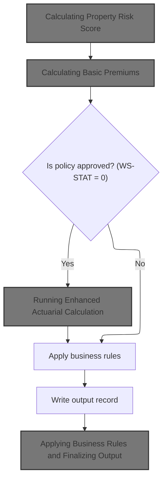

This section coordinates the end-to-end calculation and processing pipeline for a commercial insurance policy. It ensures that all required calculations and business rule applications are performed in the correct sequence, and that the output record is written after all processing is complete.

| Rule ID | Category        | Rule Name                                  | Description                                                                                                                                                                                                                   | Implementation Details                                                                                                                                                                                                     |
| ------- | --------------- | ------------------------------------------ | ----------------------------------------------------------------------------------------------------------------------------------------------------------------------------------------------------------------------------- | -------------------------------------------------------------------------------------------------------------------------------------------------------------------------------------------------------------------------- |
| BR-001  | Calculation     | Risk Score Calculation Sequence            | The property risk score calculation is always performed as the first step in the commercial policy processing pipeline.                                                                                                       | The risk score calculation is always triggered first, before any premium calculations or business rule applications. No specific output format is defined in this section.                                                 |
| BR-002  | Calculation     | Basic Premium Calculation Sequence         | The basic premium calculation is always performed after the risk score calculation and before any enhanced actuarial calculation or business rule application.                                                                | The basic premium calculation is always performed after the risk score calculation. No specific output format is defined in this section.                                                                                  |
| BR-003  | Decision Making | Conditional Enhanced Actuarial Calculation | The enhanced actuarial calculation is performed only if the underwriting decision status is 'approved' (<SwmToken path="base/src/LGAPDB01.cbl" pos="261:3:5" line-data="           IF WS-STAT = 0">`WS-STAT`</SwmToken> = 0). | The value 0 for <SwmToken path="base/src/LGAPDB01.cbl" pos="261:3:5" line-data="           IF WS-STAT = 0">`WS-STAT`</SwmToken> indicates approval. This step is skipped for other statuses (pending, rejected, referred). |
| BR-004  | Decision Making | Business Rules Application Sequence        | Business rules are applied to the policy after all calculations are complete, regardless of the underwriting decision status.                                                                                                 | Business rules are always applied after calculations, ensuring consistent post-processing for all policies.                                                                                                                |
| BR-005  | Writing Output  | Output Record Writing Sequence             | The output record is written after all calculations and business rule applications are complete.                                                                                                                              | The output record is written only after all processing is complete. No specific output format is defined in this section.                                                                                                  |

<SwmSnippet path="/base/src/LGAPDB01.cbl" line="258">

---

In <SwmToken path="base/src/LGAPDB01.cbl" pos="258:1:5" line-data="       P011-PROCESS-COMMERCIAL.">`P011-PROCESS-COMMERCIAL`</SwmToken>, we run a sequence of steps: calculate risk score, do a basic premium calculation, optionally run an enhanced actuarial calculation if the status is approved, apply business rules, write the output record, and update stats. Each step is chained, and the enhanced calc only runs if the basic checks pass.

```cobol
       P011-PROCESS-COMMERCIAL.
           PERFORM P011A-CALCULATE-RISK-SCORE
           PERFORM P011B-BASIC-PREMIUM-CALC
           IF WS-STAT = 0
               PERFORM P011C-ENHANCED-ACTUARIAL-CALC
           END-IF
           PERFORM P011D-APPLY-BUSINESS-RULES
           PERFORM P011E-WRITE-OUTPUT-RECORD
           PERFORM P011F-UPDATE-STATISTICS.
```

---

</SwmSnippet>

### Calculating Property Risk Score

This section is responsible for obtaining a property risk score by calling an external risk scoring service with relevant property and customer data. The score is then used in the premium calculation process.

| Rule ID | Category                        | Rule Name                  | Description                                                                                                                                                                    | Implementation Details                                                                                                                                                                                                                                          |
| ------- | ------------------------------- | -------------------------- | ------------------------------------------------------------------------------------------------------------------------------------------------------------------------------ | --------------------------------------------------------------------------------------------------------------------------------------------------------------------------------------------------------------------------------------------------------------- |
| BR-001  | Invoking a Service or a Process | Obtain property risk score | The system obtains a property risk score by sending property and customer information to an external risk scoring service. The score is used for further premium calculations. | The risk score is a numeric value. The input data includes property type, postcode, latitude, longitude, building and contents limits, flood and weather coverage, and customer history. The output format is a numeric risk score, typically a 3-digit number. |

<SwmSnippet path="/base/src/LGAPDB01.cbl" line="268">

---

<SwmToken path="base/src/LGAPDB01.cbl" pos="268:1:7" line-data="       P011A-CALCULATE-RISK-SCORE.">`P011A-CALCULATE-RISK-SCORE`</SwmToken> calls out to <SwmToken path="base/src/LGAPDB01.cbl" pos="269:4:4" line-data="           CALL &#39;LGAPDB02&#39; USING IN-PROPERTY-TYPE, IN-POSTCODE, ">`LGAPDB02`</SwmToken>, passing property and customer info to get a risk score. This call pulls in risk factors from the database and computes the score based on the input data, so the rest of the premium calculation can use it.

```cobol
       P011A-CALCULATE-RISK-SCORE.
           CALL 'LGAPDB02' USING IN-PROPERTY-TYPE, IN-POSTCODE, 
                                IN-LATITUDE, IN-LONGITUDE,
                                IN-BUILDING-LIMIT, IN-CONTENTS-LIMIT,
                                IN-FLOOD-COVERAGE, IN-WEATHER-COVERAGE,
                                IN-CUSTOMER-HISTORY, WS-BASE-RISK-SCR.
```

---

</SwmSnippet>

### Fetching Risk Factors and Computing Score

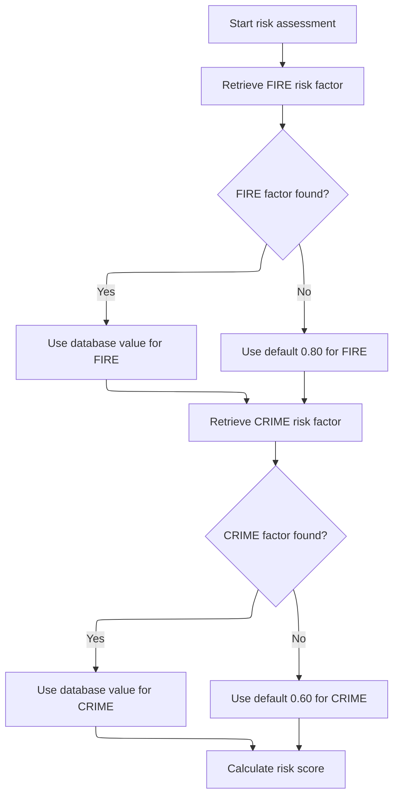

This section establishes the risk context for a property by retrieving relevant risk factors and computing a risk score. It ensures that risk assessment can proceed even if some data is missing by applying business defaults.

| Rule ID | Category        | Rule Name                  | Description                                                                                                                                                                                                                          | Implementation Details                                                                                                                                                    |
| ------- | --------------- | -------------------------- | ------------------------------------------------------------------------------------------------------------------------------------------------------------------------------------------------------------------------------------ | ------------------------------------------------------------------------------------------------------------------------------------------------------------------------- |
| BR-001  | Calculation     | Risk score calculation     | After risk factors are set, compute the risk score using the available fire and crime factors and property/customer data.                                                                                                            | The risk score is calculated using the available risk factors and property/customer data. The specific calculation formula is not visible in the code provided.           |
| BR-002  | Decision Making | Database fire risk factor  | When a fire risk factor is available in the database, use that value for risk assessment.                                                                                                                                            | The fire risk factor is a numeric value retrieved from the database. No specific format constraints are visible in the code.                                              |
| BR-003  | Decision Making | Default fire risk factor   | If the fire risk factor is not available in the database, use a default value of <SwmToken path="base/src/LGAPDB02.cbl" pos="54:3:5" line-data="               MOVE 0.80 TO WS-FIRE-FACTOR">`0.80`</SwmToken> for risk assessment.   | The default fire risk factor is <SwmToken path="base/src/LGAPDB02.cbl" pos="54:3:5" line-data="               MOVE 0.80 TO WS-FIRE-FACTOR">`0.80`</SwmToken> (numeric).   |
| BR-004  | Decision Making | Database crime risk factor | When a crime risk factor is available in the database, use that value for risk assessment.                                                                                                                                           | The crime risk factor is a numeric value retrieved from the database. No specific format constraints are visible in the code.                                             |
| BR-005  | Decision Making | Default crime risk factor  | If the crime risk factor is not available in the database, use a default value of <SwmToken path="base/src/LGAPDB02.cbl" pos="66:3:5" line-data="               MOVE 0.60 TO WS-CRIME-FACTOR">`0.60`</SwmToken> for risk assessment. | The default crime risk factor is <SwmToken path="base/src/LGAPDB02.cbl" pos="66:3:5" line-data="               MOVE 0.60 TO WS-CRIME-FACTOR">`0.60`</SwmToken> (numeric). |

<SwmSnippet path="/base/src/LGAPDB02.cbl" line="39">

---

<SwmToken path="base/src/LGAPDB02.cbl" pos="39:1:3" line-data="       MAIN-LOGIC.">`MAIN-LOGIC`</SwmToken> in <SwmToken path="base/src/LGAPDB01.cbl" pos="269:4:4" line-data="           CALL &#39;LGAPDB02&#39; USING IN-PROPERTY-TYPE, IN-POSTCODE, ">`LGAPDB02`</SwmToken> first fetches risk factors (fire and crime) from the DB, then calculates the risk score using those factors and the property/customer data. This sets up the risk context for the rest of the actuarial pipeline.

```cobol
       MAIN-LOGIC.
           PERFORM GET-RISK-FACTORS
           PERFORM CALCULATE-RISK-SCORE
           GOBACK.
```

---

</SwmSnippet>

<SwmSnippet path="/base/src/LGAPDB02.cbl" line="44">

---

<SwmToken path="base/src/LGAPDB02.cbl" pos="44:1:5" line-data="       GET-RISK-FACTORS.">`GET-RISK-FACTORS`</SwmToken> tries to pull fire and crime risk factors from the DB. If the lookup fails, it just uses <SwmToken path="base/src/LGAPDB02.cbl" pos="54:3:5" line-data="               MOVE 0.80 TO WS-FIRE-FACTOR">`0.80`</SwmToken> for fire and <SwmToken path="base/src/LGAPDB02.cbl" pos="66:3:5" line-data="               MOVE 0.60 TO WS-CRIME-FACTOR">`0.60`</SwmToken> for crime. These defaults are hardcoded and kick in whenever the DB doesn't have the data.

```cobol
       GET-RISK-FACTORS.
           EXEC SQL
               SELECT FACTOR_VALUE INTO :WS-FIRE-FACTOR
               FROM RISK_FACTORS
               WHERE PERIL_TYPE = 'FIRE'
           END-EXEC.
           
           IF SQLCODE = 0
               CONTINUE
           ELSE
               MOVE 0.80 TO WS-FIRE-FACTOR
           END-IF.
           
           EXEC SQL
               SELECT FACTOR_VALUE INTO :WS-CRIME-FACTOR
               FROM RISK_FACTORS
               WHERE PERIL_TYPE = 'CRIME'
           END-EXEC.
           
           IF SQLCODE = 0
               CONTINUE
           ELSE
               MOVE 0.60 TO WS-CRIME-FACTOR
           END-IF.
```

---

</SwmSnippet>

### Adjusting Risk Score by Property and Location

```mermaid
%%{init: {"flowchart": {"defaultRenderer": "elk"}} }%%
flowchart TD
    node1["Start risk score calculation"]
    click node1 openCode "base/src/LGAPDB02.cbl:69:70"
    node1 --> node2{"Property type?"}
    click node2 openCode "base/src/LGAPDB02.cbl:72:83"
    node2 -->|"Warehouse (+50)"| node3["Adjust risk score"]
    node2 -->|"Factory (+75)"| node3
    node2 -->|"Office (+25)"| node3
    node2 -->|"Retail (+40)"| node3
    node2 -->|"Other (+30)"| node3
    click node3 openCode "base/src/LGAPDB02.cbl:74:82"
    node3 --> node4{"Postcode starts with FL or CR?"}
    click node4 openCode "base/src/LGAPDB02.cbl:85:88"
    node4 -->|"Yes (+30)"| node5["Adjust risk score"]
    node4 -->|"No"| node6
    click node5 openCode "base/src/LGAPDB02.cbl:87:88"
    node5 --> node7
    node6 --> node7
    node7{"Coverage > $500,000?"}
    click node7 openCode "base/src/LGAPDB02.cbl:113:115"
    node7 -->|"Yes (+15)"| node8["Adjust risk score"]
    node7 -->|"No"| node9
    click node8 openCode "base/src/LGAPDB02.cbl:114:115"
    node8 --> node10
    node9 --> node10
    node10{"Location?"}
    click node10 openCode "base/src/LGAPDB02.cbl:121:133"
    node10 -->|"NYC or LA (+10)"| node11["Adjust risk score"]
    node10 -->|"Suburban US (+5)"| node12["Adjust risk score"]
    node10 -->|"Rural/Other (+20)"| node13["Adjust risk score"]
    click node11 openCode "base/src/LGAPDB02.cbl:125:125"
    click node12 openCode "base/src/LGAPDB02.cbl:130:130"
    click node13 openCode "base/src/LGAPDB02.cbl:132:132"
    node11 --> node14
    node12 --> node14
    node13 --> node14
    node14{"Customer history?"}
    click node14 openCode "base/src/LGAPDB02.cbl:137:146"
    node14 -->|"New (+10)"| node15["Adjust risk score"]
    node14 -->|"Good (-5)"| node16["Adjust risk score"]
    node14 -->|"Risky (+25)"| node17["Adjust risk score"]
    node14 -->|"Other (+10)"| node18["Adjust risk score"]
    click node15 openCode "base/src/LGAPDB02.cbl:139:139"
    click node16 openCode "base/src/LGAPDB02.cbl:141:141"
    click node17 openCode "base/src/LGAPDB02.cbl:143:143"
    click node18 openCode "base/src/LGAPDB02.cbl:145:145"
    node15 --> node19["Return final risk score"]
    node16 --> node19
    node17 --> node19
    node18 --> node19
    click node19 openCode "base/src/LGAPDB02.cbl:146:146"
classDef HeadingStyle fill:#777777,stroke:#333,stroke-width:2px;

%% Swimm:
%% %%{init: {"flowchart": {"defaultRenderer": "elk"}} }%%
%% flowchart TD
%%     node1["Start risk score calculation"]
%%     click node1 openCode "<SwmPath>[base/src/LGAPDB02.cbl](base/src/LGAPDB02.cbl)</SwmPath>:69:70"
%%     node1 --> node2{"Property type?"}
%%     click node2 openCode "<SwmPath>[base/src/LGAPDB02.cbl](base/src/LGAPDB02.cbl)</SwmPath>:72:83"
%%     node2 -->|"Warehouse (+50)"| node3["Adjust risk score"]
%%     node2 -->|"Factory (+75)"| node3
%%     node2 -->|"Office (+25)"| node3
%%     node2 -->|"Retail (+40)"| node3
%%     node2 -->|"Other (+30)"| node3
%%     click node3 openCode "<SwmPath>[base/src/LGAPDB02.cbl](base/src/LGAPDB02.cbl)</SwmPath>:74:82"
%%     node3 --> node4{"Postcode starts with FL or CR?"}
%%     click node4 openCode "<SwmPath>[base/src/LGAPDB02.cbl](base/src/LGAPDB02.cbl)</SwmPath>:85:88"
%%     node4 -->|"Yes (+30)"| node5["Adjust risk score"]
%%     node4 -->|"No"| node6
%%     click node5 openCode "<SwmPath>[base/src/LGAPDB02.cbl](base/src/LGAPDB02.cbl)</SwmPath>:87:88"
%%     node5 --> node7
%%     node6 --> node7
%%     node7{"Coverage > $500,000?"}
%%     click node7 openCode "<SwmPath>[base/src/LGAPDB02.cbl](base/src/LGAPDB02.cbl)</SwmPath>:113:115"
%%     node7 -->|"Yes (+15)"| node8["Adjust risk score"]
%%     node7 -->|"No"| node9
%%     click node8 openCode "<SwmPath>[base/src/LGAPDB02.cbl](base/src/LGAPDB02.cbl)</SwmPath>:114:115"
%%     node8 --> node10
%%     node9 --> node10
%%     node10{"Location?"}
%%     click node10 openCode "<SwmPath>[base/src/LGAPDB02.cbl](base/src/LGAPDB02.cbl)</SwmPath>:121:133"
%%     node10 -->|"NYC or LA (+10)"| node11["Adjust risk score"]
%%     node10 -->|"Suburban US (+5)"| node12["Adjust risk score"]
%%     node10 -->|"Rural/Other (+20)"| node13["Adjust risk score"]
%%     click node11 openCode "<SwmPath>[base/src/LGAPDB02.cbl](base/src/LGAPDB02.cbl)</SwmPath>:125:125"
%%     click node12 openCode "<SwmPath>[base/src/LGAPDB02.cbl](base/src/LGAPDB02.cbl)</SwmPath>:130:130"
%%     click node13 openCode "<SwmPath>[base/src/LGAPDB02.cbl](base/src/LGAPDB02.cbl)</SwmPath>:132:132"
%%     node11 --> node14
%%     node12 --> node14
%%     node13 --> node14
%%     node14{"Customer history?"}
%%     click node14 openCode "<SwmPath>[base/src/LGAPDB02.cbl](base/src/LGAPDB02.cbl)</SwmPath>:137:146"
%%     node14 -->|"New (+10)"| node15["Adjust risk score"]
%%     node14 -->|"Good (-5)"| node16["Adjust risk score"]
%%     node14 -->|"Risky (+25)"| node17["Adjust risk score"]
%%     node14 -->|"Other (+10)"| node18["Adjust risk score"]
%%     click node15 openCode "<SwmPath>[base/src/LGAPDB02.cbl](base/src/LGAPDB02.cbl)</SwmPath>:139:139"
%%     click node16 openCode "<SwmPath>[base/src/LGAPDB02.cbl](base/src/LGAPDB02.cbl)</SwmPath>:141:141"
%%     click node17 openCode "<SwmPath>[base/src/LGAPDB02.cbl](base/src/LGAPDB02.cbl)</SwmPath>:143:143"
%%     click node18 openCode "<SwmPath>[base/src/LGAPDB02.cbl](base/src/LGAPDB02.cbl)</SwmPath>:145:145"
%%     node15 --> node19["Return final risk score"]
%%     node16 --> node19
%%     node17 --> node19
%%     node18 --> node19
%%     click node19 openCode "<SwmPath>[base/src/LGAPDB02.cbl](base/src/LGAPDB02.cbl)</SwmPath>:146:146"
%% classDef HeadingStyle fill:#777777,stroke:#333,stroke-width:2px;
```

This section calculates and adjusts the risk score for an insurance policy based on property and location attributes. The main product role is to ensure the risk score reflects the business's domain rules for risk assessment.

| Rule ID | Category    | Rule Name                   | Description                                                                                                                                               | Implementation Details                                                                                                                                                                                                |
| ------- | ----------- | --------------------------- | --------------------------------------------------------------------------------------------------------------------------------------------------------- | --------------------------------------------------------------------------------------------------------------------------------------------------------------------------------------------------------------------- |
| BR-001  | Calculation | Property type adjustment    | The risk score is increased by a fixed amount depending on the property type: Warehouse (+50), Factory (+75), Office (+25), Retail (+40), Other (+30).    | The adjustment values are: Warehouse (50), Factory (75), Office (25), Retail (40), Other (30). The property type is a string value. The risk score is a numeric value incremented by the corresponding amount.        |
| BR-002  | Calculation | Postcode prefix adjustment  | If the postcode starts with 'FL' or 'CR', the risk score is increased by 30.                                                                              | The adjustment value is 30. The postcode is a string, and the risk score is a numeric value incremented by 30 if the condition is met.                                                                                |
| BR-003  | Calculation | High coverage adjustment    | If the largest coverage amount among fire, crime, flood, and weather is greater than $500,000, the risk score is increased by 15.                         | The adjustment value is 15. The threshold is 500,000. Coverage amounts are numeric values. The risk score is incremented by 15 if the maximum coverage exceeds the threshold.                                         |
| BR-004  | Calculation | Location risk adjustment    | If the property is in NYC or LA (based on latitude and longitude), the risk score is increased by 10. If in the continental US, add 5. Otherwise, add 20. | NYC: Latitude 40-41, Longitude -74.5 to -73.5. LA: Latitude 34-35, Longitude -118.5 to -117.5. Continental US: Latitude 25-49, Longitude -125 to -66. Adjustment values: NYC/LA (10), continental US (5), other (20). |
| BR-005  | Calculation | Customer history adjustment | The risk score is adjusted based on customer history: New (+10), Good (-5), Risky (+25), Other (+10).                                                     | Adjustment values: New (10), Good (-5), Risky (25), Other (10). Customer history is a string code. The risk score is incremented or decremented by the corresponding amount.                                          |

<SwmSnippet path="/base/src/LGAPDB02.cbl" line="69">

---

<SwmToken path="base/src/LGAPDB02.cbl" pos="69:1:5" line-data="       CALCULATE-RISK-SCORE.">`CALCULATE-RISK-SCORE`</SwmToken> starts with 100, bumps the score up based on property type and postcode prefix, then calls out to check coverage amounts, location risk, and customer history. The constants for each adjustment are baked in and not explained—just domain rules.

```cobol
       CALCULATE-RISK-SCORE.
           MOVE 100 TO LK-RISK-SCORE

           EVALUATE LK-PROPERTY-TYPE
             WHEN 'WAREHOUSE'
               ADD 50 TO LK-RISK-SCORE
             WHEN 'FACTORY' 
               ADD 75 TO LK-RISK-SCORE
             WHEN 'OFFICE'
               ADD 25 TO LK-RISK-SCORE
             WHEN 'RETAIL'
               ADD 40 TO LK-RISK-SCORE
             WHEN OTHER
               ADD 30 TO LK-RISK-SCORE
           END-EVALUATE

           IF LK-POSTCODE(1:2) = 'FL' OR
              LK-POSTCODE(1:2) = 'CR'
             ADD 30 TO LK-RISK-SCORE
           END-IF

           PERFORM CHECK-COVERAGE-AMOUNTS
           PERFORM ASSESS-LOCATION-RISK  
           PERFORM EVALUATE-CUSTOMER-HISTORY.
```

---

</SwmSnippet>

<SwmSnippet path="/base/src/LGAPDB02.cbl" line="94">

---

<SwmToken path="base/src/LGAPDB02.cbl" pos="94:1:5" line-data="       CHECK-COVERAGE-AMOUNTS.">`CHECK-COVERAGE-AMOUNTS`</SwmToken> finds the largest coverage among fire, crime, flood, and weather, then adds 15 to the risk score if it’s over 500k. The constants (15 and 500k) are just hardcoded business rules.

```cobol
       CHECK-COVERAGE-AMOUNTS.
           MOVE ZERO TO WS-MAX-COVERAGE
           
           IF LK-FIRE-COVERAGE > WS-MAX-COVERAGE
               MOVE LK-FIRE-COVERAGE TO WS-MAX-COVERAGE
           END-IF
           
           IF LK-CRIME-COVERAGE > WS-MAX-COVERAGE
               MOVE LK-CRIME-COVERAGE TO WS-MAX-COVERAGE
           END-IF
           
           IF LK-FLOOD-COVERAGE > WS-MAX-COVERAGE
               MOVE LK-FLOOD-COVERAGE TO WS-MAX-COVERAGE
           END-IF
           
           IF LK-WEATHER-COVERAGE > WS-MAX-COVERAGE
               MOVE LK-WEATHER-COVERAGE TO WS-MAX-COVERAGE
           END-IF
           
           IF WS-MAX-COVERAGE > WS-COVERAGE-500K
               ADD 15 TO LK-RISK-SCORE
           END-IF.
```

---

</SwmSnippet>

<SwmSnippet path="/base/src/LGAPDB02.cbl" line="117">

---

<SwmToken path="base/src/LGAPDB02.cbl" pos="117:1:5" line-data="       ASSESS-LOCATION-RISK.">`ASSESS-LOCATION-RISK`</SwmToken> checks if the property is in NYC or LA (using hardcoded <SwmToken path="base/src/LGAPDB02.cbl" pos="118:15:17" line-data="      *    Urban areas: major cities (simplified lat/long ranges)">`lat/long`</SwmToken> ranges), then bumps the risk score by 10 if so. If not, it checks if it’s in the continental US for a smaller bump, or adds 20 if it’s outside. Then, <SwmToken path="base/src/LGAPDB02.cbl" pos="136:1:5" line-data="       EVALUATE-CUSTOMER-HISTORY.">`EVALUATE-CUSTOMER-HISTORY`</SwmToken> tweaks the score based on customer history codes, using more hardcoded values. All these adjustments are just domain rules, not explained in the code.

```cobol
       ASSESS-LOCATION-RISK.
      *    Urban areas: major cities (simplified lat/long ranges)
      *    NYC area: 40-41N, 74.5-73.5W
      *    LA area: 34-35N, 118.5-117.5W
           IF (LK-LATITUDE > 40.000000 AND LK-LATITUDE < 41.000000 AND
               LK-LONGITUDE > -74.500000 AND LK-LONGITUDE < -73.500000) OR
              (LK-LATITUDE > 34.000000 AND LK-LATITUDE < 35.000000 AND
               LK-LONGITUDE > -118.500000 AND LK-LONGITUDE < -117.500000)
               ADD 10 TO LK-RISK-SCORE
           ELSE
      *        Check if in continental US (suburban vs rural)
               IF (LK-LATITUDE > 25.000000 AND LK-LATITUDE < 49.000000 AND
                   LK-LONGITUDE > -125.000000 AND LK-LONGITUDE < -66.000000)
                   ADD 5 TO LK-RISK-SCORE
               ELSE
                   ADD 20 TO LK-RISK-SCORE
               END-IF
           END-IF.

       EVALUATE-CUSTOMER-HISTORY.
           EVALUATE LK-CUSTOMER-HISTORY
               WHEN 'N'
                   ADD 10 TO LK-RISK-SCORE
               WHEN 'G'
                   SUBTRACT 5 FROM LK-RISK-SCORE
               WHEN 'R'
                   ADD 25 TO LK-RISK-SCORE
               WHEN OTHER
                   ADD 10 TO LK-RISK-SCORE
           END-EVALUATE.
```

---

</SwmSnippet>

### Calculating Basic Premiums

This section orchestrates the calculation of basic insurance premiums by delegating the core logic to an external routine. It ensures that all required risk and peril data are passed to the routine and collects the resulting premium and risk decision outputs for downstream processing.

| Rule ID | Category                        | Rule Name                       | Description                                                                                                                                                                                                                                             | Implementation Details                                                                                                                                                                                                                                                                                                                                                                                                                                                                                                                                                        |
| ------- | ------------------------------- | ------------------------------- | ------------------------------------------------------------------------------------------------------------------------------------------------------------------------------------------------------------------------------------------------------- | ----------------------------------------------------------------------------------------------------------------------------------------------------------------------------------------------------------------------------------------------------------------------------------------------------------------------------------------------------------------------------------------------------------------------------------------------------------------------------------------------------------------------------------------------------------------------------- |
| BR-001  | Calculation                     | Default discount factor         | The section ensures that the discount factor used in premium calculation is initialized to <SwmToken path="base/src/LGAPDB03.cbl" pos="93:3:5" line-data="           MOVE 1.00 TO LK-DISC-FACT">`1.00`</SwmToken> before invoking the external routine. | Discount factor is a number with two decimal places, default value <SwmToken path="base/src/LGAPDB03.cbl" pos="93:3:5" line-data="           MOVE 1.00 TO LK-DISC-FACT">`1.00`</SwmToken>.                                                                                                                                                                                                                                                                                                                                                                                    |
| BR-002  | Calculation                     | Default risk status             | The section ensures that the risk status is initialized to 0 (approved) before invoking the external routine, allowing the routine to update the status based on its logic.                                                                             | Risk status is a number, default value 0 (approved).                                                                                                                                                                                                                                                                                                                                                                                                                                                                                                                          |
| BR-003  | Invoking a Service or a Process | Centralized premium calculation | The section delegates the calculation of all basic premiums and risk verdicts to an external routine, ensuring that all required risk and peril data are provided as input.                                                                             | The external routine expects the following inputs: risk score (number), fire peril (indicator), crime peril (indicator), flood peril (indicator), weather peril (indicator). Outputs include: status (number), status description (string, 20 chars), rejection reason (string, 50 chars), fire premium (number), crime premium (number), flood premium (number), weather premium (number), total premium (number), discount factor (number, default <SwmToken path="base/src/LGAPDB03.cbl" pos="93:3:5" line-data="           MOVE 1.00 TO LK-DISC-FACT">`1.00`</SwmToken>). |

<SwmSnippet path="/base/src/LGAPDB01.cbl" line="275">

---

<SwmToken path="base/src/LGAPDB01.cbl" pos="275:1:7" line-data="       P011B-BASIC-PREMIUM-CALC.">`P011B-BASIC-PREMIUM-CALC`</SwmToken> calls <SwmToken path="base/src/LGAPDB01.cbl" pos="276:4:4" line-data="           CALL &#39;LGAPDB03&#39; USING WS-BASE-RISK-SCR, IN-FIRE-PERIL, ">`LGAPDB03`</SwmToken>, passing the risk score and peril data to get back the premium calculations and risk verdict. This call centralizes the premium logic and verdict assignment, so the main flow just gets the results and moves on.

```cobol
       P011B-BASIC-PREMIUM-CALC.
           CALL 'LGAPDB03' USING WS-BASE-RISK-SCR, IN-FIRE-PERIL, 
                                IN-CRIME-PERIL, IN-FLOOD-PERIL, 
                                IN-WEATHER-PERIL, WS-STAT,
                                WS-STAT-DESC, WS-REJ-RSN, WS-FR-PREM,
                                WS-CR-PREM, WS-FL-PREM, WS-WE-PREM,
                                WS-TOT-PREM, WS-DISC-FACT.
```

---

</SwmSnippet>

### Premium Calculation and Risk Verdict

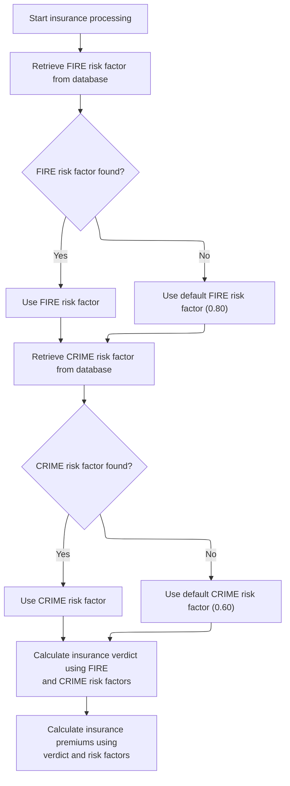

This section orchestrates the retrieval of risk factors, determines the insurance risk verdict, and calculates premiums. It ensures that missing database values are handled with defaults, maintaining business continuity.

| Rule ID | Category        | Rule Name                                               | Description                                                                                                                                                                                                                                                | Implementation Details                                                                                                                                                                                                                                                                                       |
| ------- | --------------- | ------------------------------------------------------- | ---------------------------------------------------------------------------------------------------------------------------------------------------------------------------------------------------------------------------------------------------------- | ------------------------------------------------------------------------------------------------------------------------------------------------------------------------------------------------------------------------------------------------------------------------------------------------------------ |
| BR-001  | Calculation     | Risk verdict depends on risk factors                    | The insurance risk verdict is determined after both FIRE and CRIME risk factors are available (either from the database or defaults).                                                                                                                      | The verdict is calculated using the available risk factors. The specific output format for the verdict is not detailed in this section.                                                                                                                                                                      |
| BR-002  | Calculation     | Premium calculation depends on verdict and risk factors | Insurance premiums for each peril are calculated after the risk verdict is determined, using the available risk factors.                                                                                                                                   | Premiums are calculated using the risk verdict and risk factors. The specific output format for premiums is not detailed in this section.                                                                                                                                                                    |
| BR-003  | Decision Making | Default FIRE risk factor                                | When the FIRE risk factor is not found in the database, the system uses a default value of <SwmToken path="base/src/LGAPDB02.cbl" pos="54:3:5" line-data="               MOVE 0.80 TO WS-FIRE-FACTOR">`0.80`</SwmToken> for all subsequent calculations.   | The default value for the FIRE risk factor is <SwmToken path="base/src/LGAPDB02.cbl" pos="54:3:5" line-data="               MOVE 0.80 TO WS-FIRE-FACTOR">`0.80`</SwmToken> (number). This value is used in all calculations that require the FIRE risk factor when the database does not provide a value.    |
| BR-004  | Decision Making | Default CRIME risk factor                               | When the CRIME risk factor is not found in the database, the system uses a default value of <SwmToken path="base/src/LGAPDB02.cbl" pos="66:3:5" line-data="               MOVE 0.60 TO WS-CRIME-FACTOR">`0.60`</SwmToken> for all subsequent calculations. | The default value for the CRIME risk factor is <SwmToken path="base/src/LGAPDB02.cbl" pos="66:3:5" line-data="               MOVE 0.60 TO WS-CRIME-FACTOR">`0.60`</SwmToken> (number). This value is used in all calculations that require the CRIME risk factor when the database does not provide a value. |

<SwmSnippet path="/base/src/LGAPDB03.cbl" line="42">

---

<SwmToken path="base/src/LGAPDB03.cbl" pos="42:1:3" line-data="       MAIN-LOGIC.">`MAIN-LOGIC`</SwmToken> in <SwmToken path="base/src/LGAPDB01.cbl" pos="276:4:4" line-data="           CALL &#39;LGAPDB03&#39; USING WS-BASE-RISK-SCR, IN-FIRE-PERIL, ">`LGAPDB03`</SwmToken> first fetches risk factors, then determines the risk verdict (approved, pending, rejected), and finally calculates the premiums for each peril. This bundles all the premium and status logic in one place.

```cobol
       MAIN-LOGIC.
           PERFORM GET-RISK-FACTORS
           PERFORM CALCULATE-VERDICT
           PERFORM CALCULATE-PREMIUMS
           GOBACK.
```

---

</SwmSnippet>

<SwmSnippet path="/base/src/LGAPDB03.cbl" line="48">

---

<SwmToken path="base/src/LGAPDB03.cbl" pos="48:1:5" line-data="       GET-RISK-FACTORS.">`GET-RISK-FACTORS`</SwmToken> in <SwmToken path="base/src/LGAPDB01.cbl" pos="276:4:4" line-data="           CALL &#39;LGAPDB03&#39; USING WS-BASE-RISK-SCR, IN-FIRE-PERIL, ">`LGAPDB03`</SwmToken> does the same as in <SwmToken path="base/src/LGAPDB01.cbl" pos="269:4:4" line-data="           CALL &#39;LGAPDB02&#39; USING IN-PROPERTY-TYPE, IN-POSTCODE, ">`LGAPDB02`</SwmToken>: tries to get fire and crime risk factors from the DB, falls back to <SwmToken path="base/src/LGAPDB03.cbl" pos="58:3:5" line-data="               MOVE 0.80 TO WS-FIRE-FACTOR">`0.80`</SwmToken> and <SwmToken path="base/src/LGAPDB03.cbl" pos="70:3:5" line-data="               MOVE 0.60 TO WS-CRIME-FACTOR">`0.60`</SwmToken> if not found. These are hardcoded and used if the DB is missing data.

```cobol
       GET-RISK-FACTORS.
           EXEC SQL
               SELECT FACTOR_VALUE INTO :WS-FIRE-FACTOR
               FROM RISK_FACTORS
               WHERE PERIL_TYPE = 'FIRE'
           END-EXEC.
           
           IF SQLCODE = 0
               CONTINUE
           ELSE
               MOVE 0.80 TO WS-FIRE-FACTOR
           END-IF.
           
           EXEC SQL
               SELECT FACTOR_VALUE INTO :WS-CRIME-FACTOR
               FROM RISK_FACTORS
               WHERE PERIL_TYPE = 'CRIME'
           END-EXEC.
           
           IF SQLCODE = 0
               CONTINUE
           ELSE
               MOVE 0.60 TO WS-CRIME-FACTOR
           END-IF.
```

---

</SwmSnippet>

### Running Enhanced Actuarial Calculation

```mermaid
%%{init: {"flowchart": {"defaultRenderer": "elk"}} }%%
flowchart TD
    node1["Prepare input and coverage data for
actuarial calculation"]
    click node1 openCode "base/src/LGAPDB01.cbl:284:310"
    node1 --> node2{"Is total premium (WS-TOT-PREM) >
minimum premium (WS-MIN-PREMIUM)?"}
    click node2 openCode "base/src/LGAPDB01.cbl:311:312"
    node2 -->|"Yes"| node3["Call advanced actuarial calculation
(LGAPDB04)"]
    click node3 openCode "base/src/LGAPDB01.cbl:313:314"
    node3 --> node4{"Is enhanced calculated premium
(LK-TOTAL-PREMIUM) > original premium
(WS-TOT-PREM)?"}
    click node4 openCode "base/src/LGAPDB01.cbl:317:317"
    node4 -->|"Yes"| node5["Update premium values: fire, crime,
flood, weather, total, experience
modifier"]
    click node5 openCode "base/src/LGAPDB01.cbl:318:324"
    node4 -->|"No"| node6["Exit"]
    click node6 openCode "base/src/LGAPDB01.cbl:325:325"
    node2 -->|"No"| node6
classDef HeadingStyle fill:#777777,stroke:#333,stroke-width:2px;

%% Swimm:
%% %%{init: {"flowchart": {"defaultRenderer": "elk"}} }%%
%% flowchart TD
%%     node1["Prepare input and coverage data for
%% actuarial calculation"]
%%     click node1 openCode "<SwmPath>[base/src/LGAPDB01.cbl](base/src/LGAPDB01.cbl)</SwmPath>:284:310"
%%     node1 --> node2{"Is total premium (<SwmToken path="base/src/LGAPDB01.cbl" pos="281:1:5" line-data="                                WS-TOT-PREM, WS-DISC-FACT.">`WS-TOT-PREM`</SwmToken>) >
%% minimum premium (<SwmToken path="base/src/LGAPDB01.cbl" pos="312:11:15" line-data="           IF WS-TOT-PREM &gt; WS-MIN-PREMIUM">`WS-MIN-PREMIUM`</SwmToken>)?"}
%%     click node2 openCode "<SwmPath>[base/src/LGAPDB01.cbl](base/src/LGAPDB01.cbl)</SwmPath>:311:312"
%%     node2 -->|"Yes"| node3["Call advanced actuarial calculation
%% (<SwmToken path="base/src/LGAPDB01.cbl" pos="313:4:4" line-data="               CALL &#39;LGAPDB04&#39; USING LK-INPUT-DATA, LK-COVERAGE-DATA, ">`LGAPDB04`</SwmToken>)"]
%%     click node3 openCode "<SwmPath>[base/src/LGAPDB01.cbl](base/src/LGAPDB01.cbl)</SwmPath>:313:314"
%%     node3 --> node4{"Is enhanced calculated premium
%% (<SwmToken path="base/src/LGAPDB01.cbl" pos="317:3:7" line-data="               IF LK-TOTAL-PREMIUM &gt; WS-TOT-PREM">`LK-TOTAL-PREMIUM`</SwmToken>) > original premium
%% (<SwmToken path="base/src/LGAPDB01.cbl" pos="281:1:5" line-data="                                WS-TOT-PREM, WS-DISC-FACT.">`WS-TOT-PREM`</SwmToken>)?"}
%%     click node4 openCode "<SwmPath>[base/src/LGAPDB01.cbl](base/src/LGAPDB01.cbl)</SwmPath>:317:317"
%%     node4 -->|"Yes"| node5["Update premium values: fire, crime,
%% flood, weather, total, experience
%% modifier"]
%%     click node5 openCode "<SwmPath>[base/src/LGAPDB01.cbl](base/src/LGAPDB01.cbl)</SwmPath>:318:324"
%%     node4 -->|"No"| node6["Exit"]
%%     click node6 openCode "<SwmPath>[base/src/LGAPDB01.cbl](base/src/LGAPDB01.cbl)</SwmPath>:325:325"
%%     node2 -->|"No"| node6
%% classDef HeadingStyle fill:#777777,stroke:#333,stroke-width:2px;
```

This section determines whether to run an advanced actuarial calculation and whether to update premium values based on the result.

| Rule ID | Category        | Rule Name                                           | Description                                                                                                                                                                                                                                                            | Implementation Details                                                                                                                                                                                                                                                                                                                                                                                                                                                                         |
| ------- | --------------- | --------------------------------------------------- | ---------------------------------------------------------------------------------------------------------------------------------------------------------------------------------------------------------------------------------------------------------------------- | ---------------------------------------------------------------------------------------------------------------------------------------------------------------------------------------------------------------------------------------------------------------------------------------------------------------------------------------------------------------------------------------------------------------------------------------------------------------------------------------------- |
| BR-001  | Reading Input   | Prepare actuarial input data                        | Input and coverage data are prepared for the actuarial calculation by assigning the relevant customer, property, and coverage fields to the calculation input structures.                                                                                              | All relevant input fields (customer number, risk score, property type, territory, construction type, occupancy code, protection class, year built, square footage, years in business, claims count, claims amount, building limit, contents limit, BI limit, deductibles, peril selections) are mapped to the calculation input structures. Field formats are as defined in the struct definitions (e.g., customer number: string of length 10, building limit: number with 2 decimals, etc.). |
| BR-002  | Decision Making | Minimum premium threshold for advanced calculation  | The advanced actuarial calculation is only performed if the current total premium exceeds the configured minimum premium value (<SwmToken path="base/src/LGAPDB04.cbl" pos="300:11:13" line-data="           IF WS-EXPOSURE-DENSITY &gt; 500.00">`500.00`</SwmToken>). | The minimum premium value is <SwmToken path="base/src/LGAPDB04.cbl" pos="300:11:13" line-data="           IF WS-EXPOSURE-DENSITY &gt; 500.00">`500.00`</SwmToken>, as defined in configuration. The comparison is between the current total premium (number with 2 decimals) and the minimum premium.                                                                                                                                                                                          |
| BR-003  | Decision Making | Update premium values if enhanced premium is higher | If the enhanced calculated premium from the advanced actuarial calculation is greater than the original total premium, the premium values (fire, crime, flood, weather, total, and experience modifier) are updated with the enhanced values.                          | The updated fields are fire premium, crime premium, flood premium, weather premium, total premium, and experience modifier. All are numbers with 2 decimals, except experience modifier which is a decimal with 3 digits after the decimal point.                                                                                                                                                                                                                                              |

<SwmSnippet path="/base/src/LGAPDB01.cbl" line="283">

---

<SwmToken path="base/src/LGAPDB01.cbl" pos="283:1:7" line-data="       P011C-ENHANCED-ACTUARIAL-CALC.">`P011C-ENHANCED-ACTUARIAL-CALC`</SwmToken> sets up the input and coverage data, then calls <SwmToken path="base/src/LGAPDB01.cbl" pos="313:4:4" line-data="               CALL &#39;LGAPDB04&#39; USING LK-INPUT-DATA, LK-COVERAGE-DATA, ">`LGAPDB04`</SwmToken> if the total premium is above the minimum. The call runs the advanced actuarial calculation, and if the enhanced premium is higher, it updates the working fields with the new values.

```cobol
       P011C-ENHANCED-ACTUARIAL-CALC.
      *    Prepare input structure for actuarial calculation
           MOVE IN-CUSTOMER-NUM TO LK-CUSTOMER-NUM
           MOVE WS-BASE-RISK-SCR TO LK-RISK-SCORE
           MOVE IN-PROPERTY-TYPE TO LK-PROPERTY-TYPE
           MOVE IN-TERRITORY-CODE TO LK-TERRITORY
           MOVE IN-CONSTRUCTION-TYPE TO LK-CONSTRUCTION-TYPE
           MOVE IN-OCCUPANCY-CODE TO LK-OCCUPANCY-CODE
           MOVE IN-SPRINKLER-IND TO LK-PROTECTION-CLASS
           MOVE IN-YEAR-BUILT TO LK-YEAR-BUILT
           MOVE IN-SQUARE-FOOTAGE TO LK-SQUARE-FOOTAGE
           MOVE IN-YEARS-IN-BUSINESS TO LK-YEARS-IN-BUSINESS
           MOVE IN-CLAIMS-COUNT-3YR TO LK-CLAIMS-COUNT-5YR
           MOVE IN-CLAIMS-AMOUNT-3YR TO LK-CLAIMS-AMOUNT-5YR
           
      *    Set coverage data
           MOVE IN-BUILDING-LIMIT TO LK-BUILDING-LIMIT
           MOVE IN-CONTENTS-LIMIT TO LK-CONTENTS-LIMIT
           MOVE IN-BI-LIMIT TO LK-BI-LIMIT
           MOVE IN-FIRE-DEDUCTIBLE TO LK-FIRE-DEDUCTIBLE
           MOVE IN-WIND-DEDUCTIBLE TO LK-WIND-DEDUCTIBLE
           MOVE IN-FLOOD-DEDUCTIBLE TO LK-FLOOD-DEDUCTIBLE
           MOVE IN-OTHER-DEDUCTIBLE TO LK-OTHER-DEDUCTIBLE
           MOVE IN-FIRE-PERIL TO LK-FIRE-PERIL
           MOVE IN-CRIME-PERIL TO LK-CRIME-PERIL
           MOVE IN-FLOOD-PERIL TO LK-FLOOD-PERIL
           MOVE IN-WEATHER-PERIL TO LK-WEATHER-PERIL
           
      *    Call advanced actuarial calculation program (only for approved cases)
           IF WS-TOT-PREM > WS-MIN-PREMIUM
               CALL 'LGAPDB04' USING LK-INPUT-DATA, LK-COVERAGE-DATA, 
                                    LK-OUTPUT-RESULTS
               
      *        Update with enhanced calculations if successful
               IF LK-TOTAL-PREMIUM > WS-TOT-PREM
                   MOVE LK-FIRE-PREMIUM TO WS-FR-PREM
                   MOVE LK-CRIME-PREMIUM TO WS-CR-PREM
                   MOVE LK-FLOOD-PREMIUM TO WS-FL-PREM
                   MOVE LK-WEATHER-PREMIUM TO WS-WE-PREM
                   MOVE LK-TOTAL-PREMIUM TO WS-TOT-PREM
                   MOVE LK-EXPERIENCE-MOD TO WS-EXPERIENCE-MOD
               END-IF
           END-IF.
```

---

</SwmSnippet>

### Stepwise Advanced Premium Calculation

```mermaid
%%{init: {"flowchart": {"defaultRenderer": "elk"}} }%%
flowchart TD
    node1["Initialize calculation"] --> node2["Determine rates"]
    click node1 openCode "base/src/LGAPDB04.cbl:139:139"
    click node2 openCode "base/src/LGAPDB04.cbl:140:140"
    node2 --> node3["Assess exposure"]
    click node3 openCode "base/src/LGAPDB04.cbl:141:141"
    node3 --> node4{"Is business experienced and claim-free?"}
    click node4 openCode "base/src/LGAPDB04.cbl:235:254"
    node4 -->|"Yes"| node5["Apply favorable experience modifier"]
    click node5 openCode "base/src/LGAPDB04.cbl:239:239"
    node4 -->|"No"| node6["Calculate experience modifier based on
claims"]
    click node6 openCode "base/src/LGAPDB04.cbl:241:252"
    node5 --> node7{"Is schedule modifier within allowed
range?"}
    click node7 openCode "base/src/LGAPDB04.cbl:308:314"
    node6 --> node7
    node7 -->|"Yes"| node8["Calculate base premium"]
    click node8 openCode "base/src/LGAPDB04.cbl:144:144"
    node7 -->|"No"| node9["Adjust schedule modifier"]
    click node9 openCode "base/src/LGAPDB04.cbl:309:313"
    node9 --> node8
    node8 --> node10{"Are catastrophe perils present?"}
    click node10 openCode "base/src/LGAPDB04.cbl:373:392"
    node10 -->|"Hurricane"| node11["Add hurricane loading"]
    click node11 openCode "base/src/LGAPDB04.cbl:374:375"
    node10 -->|"Earthquake"| node12["Add earthquake loading"]
    click node12 openCode "base/src/LGAPDB04.cbl:379:380"
    node10 -->|"Tornado"| node13["Add tornado loading"]
    click node13 openCode "base/src/LGAPDB04.cbl:384:385"
    node10 -->|"Flood"| node14["Add flood loading"]
    click node14 openCode "base/src/LGAPDB04.cbl:390:391"
    node11 --> node15["Calculate expense loading"]
    node12 --> node15
    node13 --> node15
    node14 --> node15
    click node15 openCode "base/src/LGAPDB04.cbl:146:146"
    node15 --> node16["Apply discounts"]
    click node16 openCode "base/src/LGAPDB04.cbl:147:147"
    node16 --> node17["Calculate taxes"]
    click node17 openCode "base/src/LGAPDB04.cbl:148:148"
    node17 --> node18{"Is final rate factor above maximum?"}
    click node18 openCode "base/src/LGAPDB04.cbl:473:477"
    node18 -->|"Yes"| node19["Adjust final premium"]
    click node19 openCode "base/src/LGAPDB04.cbl:474:476"
    node18 -->|"No"| node20["Finalize premium"]
    click node20 openCode "base/src/LGAPDB04.cbl:465:472"
    node19 --> node21["End"]
    node20 --> node21
    click node21 openCode "base/src/LGAPDB04.cbl:150:150"
classDef HeadingStyle fill:#777777,stroke:#333,stroke-width:2px;

%% Swimm:
%% %%{init: {"flowchart": {"defaultRenderer": "elk"}} }%%
%% flowchart TD
%%     node1["Initialize calculation"] --> node2["Determine rates"]
%%     click node1 openCode "<SwmPath>[base/src/LGAPDB04.cbl](base/src/LGAPDB04.cbl)</SwmPath>:139:139"
%%     click node2 openCode "<SwmPath>[base/src/LGAPDB04.cbl](base/src/LGAPDB04.cbl)</SwmPath>:140:140"
%%     node2 --> node3["Assess exposure"]
%%     click node3 openCode "<SwmPath>[base/src/LGAPDB04.cbl](base/src/LGAPDB04.cbl)</SwmPath>:141:141"
%%     node3 --> node4{"Is business experienced and claim-free?"}
%%     click node4 openCode "<SwmPath>[base/src/LGAPDB04.cbl](base/src/LGAPDB04.cbl)</SwmPath>:235:254"
%%     node4 -->|"Yes"| node5["Apply favorable experience modifier"]
%%     click node5 openCode "<SwmPath>[base/src/LGAPDB04.cbl](base/src/LGAPDB04.cbl)</SwmPath>:239:239"
%%     node4 -->|"No"| node6["Calculate experience modifier based on
%% claims"]
%%     click node6 openCode "<SwmPath>[base/src/LGAPDB04.cbl](base/src/LGAPDB04.cbl)</SwmPath>:241:252"
%%     node5 --> node7{"Is schedule modifier within allowed
%% range?"}
%%     click node7 openCode "<SwmPath>[base/src/LGAPDB04.cbl](base/src/LGAPDB04.cbl)</SwmPath>:308:314"
%%     node6 --> node7
%%     node7 -->|"Yes"| node8["Calculate base premium"]
%%     click node8 openCode "<SwmPath>[base/src/LGAPDB04.cbl](base/src/LGAPDB04.cbl)</SwmPath>:144:144"
%%     node7 -->|"No"| node9["Adjust schedule modifier"]
%%     click node9 openCode "<SwmPath>[base/src/LGAPDB04.cbl](base/src/LGAPDB04.cbl)</SwmPath>:309:313"
%%     node9 --> node8
%%     node8 --> node10{"Are catastrophe perils present?"}
%%     click node10 openCode "<SwmPath>[base/src/LGAPDB04.cbl](base/src/LGAPDB04.cbl)</SwmPath>:373:392"
%%     node10 -->|"Hurricane"| node11["Add hurricane loading"]
%%     click node11 openCode "<SwmPath>[base/src/LGAPDB04.cbl](base/src/LGAPDB04.cbl)</SwmPath>:374:375"
%%     node10 -->|"Earthquake"| node12["Add earthquake loading"]
%%     click node12 openCode "<SwmPath>[base/src/LGAPDB04.cbl](base/src/LGAPDB04.cbl)</SwmPath>:379:380"
%%     node10 -->|"Tornado"| node13["Add tornado loading"]
%%     click node13 openCode "<SwmPath>[base/src/LGAPDB04.cbl](base/src/LGAPDB04.cbl)</SwmPath>:384:385"
%%     node10 -->|"Flood"| node14["Add flood loading"]
%%     click node14 openCode "<SwmPath>[base/src/LGAPDB04.cbl](base/src/LGAPDB04.cbl)</SwmPath>:390:391"
%%     node11 --> node15["Calculate expense loading"]
%%     node12 --> node15
%%     node13 --> node15
%%     node14 --> node15
%%     click node15 openCode "<SwmPath>[base/src/LGAPDB04.cbl](base/src/LGAPDB04.cbl)</SwmPath>:146:146"
%%     node15 --> node16["Apply discounts"]
%%     click node16 openCode "<SwmPath>[base/src/LGAPDB04.cbl](base/src/LGAPDB04.cbl)</SwmPath>:147:147"
%%     node16 --> node17["Calculate taxes"]
%%     click node17 openCode "<SwmPath>[base/src/LGAPDB04.cbl](base/src/LGAPDB04.cbl)</SwmPath>:148:148"
%%     node17 --> node18{"Is final rate factor above maximum?"}
%%     click node18 openCode "<SwmPath>[base/src/LGAPDB04.cbl](base/src/LGAPDB04.cbl)</SwmPath>:473:477"
%%     node18 -->|"Yes"| node19["Adjust final premium"]
%%     click node19 openCode "<SwmPath>[base/src/LGAPDB04.cbl](base/src/LGAPDB04.cbl)</SwmPath>:474:476"
%%     node18 -->|"No"| node20["Finalize premium"]
%%     click node20 openCode "<SwmPath>[base/src/LGAPDB04.cbl](base/src/LGAPDB04.cbl)</SwmPath>:465:472"
%%     node19 --> node21["End"]
%%     node20 --> node21
%%     click node21 openCode "<SwmPath>[base/src/LGAPDB04.cbl](base/src/LGAPDB04.cbl)</SwmPath>:150:150"
%% classDef HeadingStyle fill:#777777,stroke:#333,stroke-width:2px;
```

This section calculates the advanced premium for an insurance policy by applying a series of business rules and modifiers. It ensures that all relevant risk factors, discounts, and caps are considered in the final premium output.

| Rule ID | Category        | Rule Name                       | Description                                                                                                                                                                                                                                                                                                                                                                                                                                                                                                                       | Implementation Details                                                                                                                                                                                                                                                                                                                                                                                                                           |
| ------- | --------------- | ------------------------------- | --------------------------------------------------------------------------------------------------------------------------------------------------------------------------------------------------------------------------------------------------------------------------------------------------------------------------------------------------------------------------------------------------------------------------------------------------------------------------------------------------------------------------------- | ------------------------------------------------------------------------------------------------------------------------------------------------------------------------------------------------------------------------------------------------------------------------------------------------------------------------------------------------------------------------------------------------------------------------------------------------ |
| BR-001  | Data validation | Final rate factor cap           | After all premium components are calculated, the final rate factor is computed as total premium divided by total insured value. If the final rate factor exceeds 0.05, it is capped at 0.05 and the total premium is recalculated using this cap.                                                                                                                                                                                                                                                                                 | Final rate factor is capped at 0.05. If capped, total premium is recalculated as total insured value multiplied by 0.05. All values are numeric with six decimal places.                                                                                                                                                                                                                                                                         |
| BR-002  | Calculation     | Experience modifier calculation | If the business has been operating for at least 5 years and has no claims in the past 5 years, apply a favorable experience modifier of 0.85. If there are claims, calculate the modifier based on claims amount, total insured value, credibility factor, and a <SwmToken path="base/src/LGAPDB04.cbl" pos="244:9:11" line-data="                        WS-CREDIBILITY-FACTOR * 0.50)">`0.50`</SwmToken> multiplier. Cap the modifier between 0.5 and 2.0. If the business is new (less than 5 years), set the modifier to 1.1. | Experience modifier is set to 0.85 for claim-free experienced businesses, calculated as 1.0 + ((claims amount / total insured value) \* credibility factor \* <SwmToken path="base/src/LGAPDB04.cbl" pos="244:9:11" line-data="                        WS-CREDIBILITY-FACTOR * 0.50)">`0.50`</SwmToken>) for those with claims, and capped between 0.5 and 2.0. For new businesses, set to 1.1. All values are numeric with four decimal places. |
| BR-003  | Calculation     | Schedule modifier adjustment    | Adjust the schedule modifier based on building age, protection class, occupancy code, and exposure density. The modifier is capped between -0.2 and +0.4 after all adjustments.                                                                                                                                                                                                                                                                                                                                                   | Schedule modifier starts at 0.0. Building age, protection class, occupancy code, and exposure density each adjust the modifier by specific increments or decrements. The final value is capped between -0.2 and +0.4. All values are numeric with three decimal places.                                                                                                                                                                          |
| BR-004  | Calculation     | Catastrophe loading calculation | Add catastrophe loading to the premium for hurricane, earthquake, tornado, and flood perils. Each peril uses a specific factor and is only applied if the peril is present. The total loading is the sum of all applicable peril loadings.                                                                                                                                                                                                                                                                                        | Hurricane and tornado loadings are applied if the weather peril indicator is greater than zero, using the respective premium and factor. Earthquake loading is always added using the base amount and earthquake factor. Flood loading is added if the flood peril indicator is greater than zero, using the flood premium and factor. All values are numeric.                                                                                   |

<SwmSnippet path="/base/src/LGAPDB04.cbl" line="138">

---

<SwmToken path="base/src/LGAPDB04.cbl" pos="138:1:3" line-data="       P100-MAIN.">`P100-MAIN`</SwmToken> in <SwmToken path="base/src/LGAPDB01.cbl" pos="313:4:4" line-data="               CALL &#39;LGAPDB04&#39; USING LK-INPUT-DATA, LK-COVERAGE-DATA, ">`LGAPDB04`</SwmToken> runs through all the advanced premium calculation steps: initializes, loads rates, calculates exposures, applies experience and schedule mods, computes base and catastrophe premiums, adds expenses and profit, applies discounts and taxes, and finalizes the premium. Each step is chained and builds on the previous one.

```cobol
       P100-MAIN.
           PERFORM P200-INIT
           PERFORM P300-RATES
           PERFORM P350-EXPOSURE
           PERFORM P400-EXP-MOD
           PERFORM P500-SCHED-MOD
           PERFORM P600-BASE-PREM
           PERFORM P700-CAT-LOAD
           PERFORM P800-EXPENSE
           PERFORM P900-DISC
           PERFORM P950-TAXES
           PERFORM P999-FINAL
           GOBACK.
```

---

</SwmSnippet>

<SwmSnippet path="/base/src/LGAPDB04.cbl" line="234">

---

<SwmToken path="base/src/LGAPDB04.cbl" pos="234:1:5" line-data="       P400-EXP-MOD.">`P400-EXP-MOD`</SwmToken> calculates the experience modifier for the premium. It uses years in business and claims history, with hardcoded caps and factors. If the business is new, it bumps the modifier; if there are no claims, it discounts it. All the constants are domain-specific and not explained in the code.

```cobol
       P400-EXP-MOD.
           MOVE 1.0000 TO WS-EXPERIENCE-MOD
           
           IF LK-YEARS-IN-BUSINESS >= 5
               IF LK-CLAIMS-COUNT-5YR = ZERO
                   MOVE 0.8500 TO WS-EXPERIENCE-MOD
               ELSE
                   COMPUTE WS-EXPERIENCE-MOD = 
                       1.0000 + 
                       ((LK-CLAIMS-AMOUNT-5YR / WS-TOTAL-INSURED-VAL) * 
                        WS-CREDIBILITY-FACTOR * 0.50)
                   
                   IF WS-EXPERIENCE-MOD > 2.0000
                       MOVE 2.0000 TO WS-EXPERIENCE-MOD
                   END-IF
                   
                   IF WS-EXPERIENCE-MOD < 0.5000
                       MOVE 0.5000 TO WS-EXPERIENCE-MOD
                   END-IF
               END-IF
           ELSE
               MOVE 1.1000 TO WS-EXPERIENCE-MOD
           END-IF
           
           MOVE WS-EXPERIENCE-MOD TO LK-EXPERIENCE-MOD.
```

---

</SwmSnippet>

<SwmSnippet path="/base/src/LGAPDB04.cbl" line="260">

---

<SwmToken path="base/src/LGAPDB04.cbl" pos="260:1:5" line-data="       P500-SCHED-MOD.">`P500-SCHED-MOD`</SwmToken> adjusts the schedule mod factor based on building age, protection class, occupancy, and exposure density. Each factor tweaks the value up or down, then the result is capped between -0.2 and +0.4. The logic is all hardcoded and not explained in the code.

```cobol
       P500-SCHED-MOD.
           MOVE +0.000 TO WS-SCHEDULE-MOD
           
      *    Building age factor
           EVALUATE TRUE
               WHEN LK-YEAR-BUILT >= 2010
                   SUBTRACT 0.050 FROM WS-SCHEDULE-MOD
               WHEN LK-YEAR-BUILT >= 1990
                   CONTINUE
               WHEN LK-YEAR-BUILT >= 1970
                   ADD 0.100 TO WS-SCHEDULE-MOD
               WHEN OTHER
                   ADD 0.200 TO WS-SCHEDULE-MOD
           END-EVALUATE
           
      *    Protection class factor
           EVALUATE LK-PROTECTION-CLASS
               WHEN '01' THRU '03'
                   SUBTRACT 0.100 FROM WS-SCHEDULE-MOD
               WHEN '04' THRU '06'
                   SUBTRACT 0.050 FROM WS-SCHEDULE-MOD
               WHEN '07' THRU '09'
                   CONTINUE
               WHEN OTHER
                   ADD 0.150 TO WS-SCHEDULE-MOD
           END-EVALUATE
           
      *    Occupancy hazard factor
           EVALUATE LK-OCCUPANCY-CODE
               WHEN 'OFF01' THRU 'OFF05'
                   SUBTRACT 0.025 FROM WS-SCHEDULE-MOD
               WHEN 'MFG01' THRU 'MFG10'
                   ADD 0.075 TO WS-SCHEDULE-MOD
               WHEN 'WHS01' THRU 'WHS05'
                   ADD 0.125 TO WS-SCHEDULE-MOD
               WHEN OTHER
                   CONTINUE
           END-EVALUATE
           
      *    Exposure density factor
           IF WS-EXPOSURE-DENSITY > 500.00
               ADD 0.100 TO WS-SCHEDULE-MOD
           ELSE
               IF WS-EXPOSURE-DENSITY < 50.00
                   SUBTRACT 0.050 FROM WS-SCHEDULE-MOD
               END-IF
           END-IF
           
           IF WS-SCHEDULE-MOD > +0.400
               MOVE +0.400 TO WS-SCHEDULE-MOD
           END-IF
           
           IF WS-SCHEDULE-MOD < -0.200
               MOVE -0.200 TO WS-SCHEDULE-MOD
           END-IF
           
           MOVE WS-SCHEDULE-MOD TO LK-SCHEDULE-MOD.
```

---

</SwmSnippet>

<SwmSnippet path="/base/src/LGAPDB04.cbl" line="369">

---

<SwmToken path="base/src/LGAPDB04.cbl" pos="369:1:5" line-data="       P700-CAT-LOAD.">`P700-CAT-LOAD`</SwmToken> adds up extra premium for hurricane, earthquake, tornado, and flood risks using hardcoded factors. It checks if the peril is present, multiplies by the right factor, and sums it all up. The constants are just baked in and not explained.

```cobol
       P700-CAT-LOAD.
           MOVE ZERO TO WS-CAT-LOADING
           
      * Hurricane loading (wind/weather peril)
           IF LK-WEATHER-PERIL > ZERO
               COMPUTE WS-CAT-LOADING = WS-CAT-LOADING +
                   (LK-WEATHER-PREMIUM * WS-HURRICANE-FACTOR)
           END-IF
           
      * Earthquake loading (affects all perils)  
           COMPUTE WS-CAT-LOADING = WS-CAT-LOADING +
               (LK-BASE-AMOUNT * WS-EARTHQUAKE-FACTOR)
           
      * Tornado loading (weather peril primarily)
           IF LK-WEATHER-PERIL > ZERO
               COMPUTE WS-CAT-LOADING = WS-CAT-LOADING +
                   (LK-WEATHER-PREMIUM * WS-TORNADO-FACTOR)
           END-IF
           
      * Flood cat loading (if flood coverage selected)
           IF LK-FLOOD-PERIL > ZERO
               COMPUTE WS-CAT-LOADING = WS-CAT-LOADING +
                   (LK-FLOOD-PREMIUM * WS-FLOOD-FACTOR)
           END-IF
           
           MOVE WS-CAT-LOADING TO LK-CAT-LOAD-AMT.
```

---

</SwmSnippet>

<SwmSnippet path="/base/src/LGAPDB04.cbl" line="464">

---

<SwmToken path="base/src/LGAPDB04.cbl" pos="464:1:3" line-data="       P999-FINAL.">`P999-FINAL`</SwmToken> adds up all the premium components, subtracts discounts, and then divides by the total insured value to get the rate factor. If the rate is over 0.05, it caps it and recalculates the premium. The 0.05 cap is just a business rule, not explained in the code.

```cobol
       P999-FINAL.
           COMPUTE LK-TOTAL-PREMIUM = 
               LK-BASE-AMOUNT + LK-CAT-LOAD-AMT + 
               LK-EXPENSE-LOAD-AMT + LK-PROFIT-LOAD-AMT -
               LK-DISCOUNT-AMT + LK-TAX-AMT
               
           COMPUTE LK-FINAL-RATE-FACTOR = 
               LK-TOTAL-PREMIUM / WS-TOTAL-INSURED-VAL
               
           IF LK-FINAL-RATE-FACTOR > 0.050000
               MOVE 0.050000 TO LK-FINAL-RATE-FACTOR
               COMPUTE LK-TOTAL-PREMIUM = 
                   WS-TOTAL-INSURED-VAL * LK-FINAL-RATE-FACTOR
           END-IF.
```

---

</SwmSnippet>

### Applying Business Rules and Finalizing Output

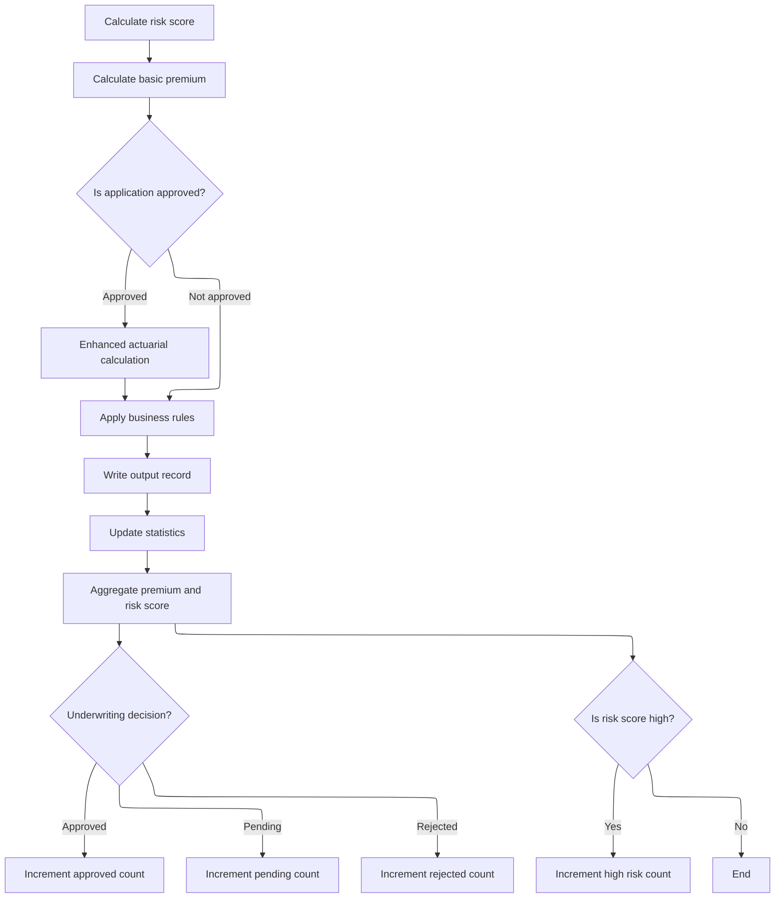

This section finalizes the processing of a commercial insurance application by applying business rules, writing the output record, and updating all relevant statistics and counters for reporting.

| Rule ID | Category                        | Rule Name                                | Description                                                                                                                       | Implementation Details                                                                                                                                |
| ------- | ------------------------------- | ---------------------------------------- | --------------------------------------------------------------------------------------------------------------------------------- | ----------------------------------------------------------------------------------------------------------------------------------------------------- |
| BR-001  | Calculation                     | Aggregate premium and risk score         | Aggregate the calculated premium and risk score for the current record into the running totals for all processed records.         | Premium and risk score are added to running totals. The format for totals is numeric, with no explicit alignment or padding requirements stated.      |
| BR-002  | Calculation                     | Status counter update                    | Increment the appropriate status counter (approved, pending, rejected) based on the underwriting decision for the current record. | Status codes: 0 = approved, 1 = pending, 2 = rejected. Each status has a corresponding counter that is incremented by 1. Counters are numeric values. |
| BR-003  | Calculation                     | High risk threshold                      | Increment the high-risk counter if the risk score for the current record exceeds 200.                                             | The risk score threshold is 200. If the risk score is greater than 200, the high-risk counter is incremented by 1. The counter is a numeric value.    |
| BR-004  | Writing Output                  | Write output record after business rules | Write the processed record to the output after all business rules are applied and before updating statistics.                     | The output record is written in a dedicated step after business rules are applied. The format of the output record is not specified in this section.  |
| BR-005  | Invoking a Service or a Process | Apply business rules before output       | Apply business rules to the processed record before writing the output and updating statistics.                                   | Business rules are applied in a dedicated step before output and statistics update. The specific rules are encapsulated in a separate process.        |

<SwmSnippet path="/base/src/LGAPDB01.cbl" line="258">

---

Back in <SwmToken path="base/src/LGAPDB01.cbl" pos="258:1:5" line-data="       P011-PROCESS-COMMERCIAL.">`P011-PROCESS-COMMERCIAL`</SwmToken>, after all calculations, we apply business rules, write the output record, and update statistics. This wraps up the processing for the current record and ensures all results and counters are up to date for reporting and downstream steps.

```cobol
       P011-PROCESS-COMMERCIAL.
           PERFORM P011A-CALCULATE-RISK-SCORE
           PERFORM P011B-BASIC-PREMIUM-CALC
           IF WS-STAT = 0
               PERFORM P011C-ENHANCED-ACTUARIAL-CALC
           END-IF
           PERFORM P011D-APPLY-BUSINESS-RULES
           PERFORM P011E-WRITE-OUTPUT-RECORD
           PERFORM P011F-UPDATE-STATISTICS.
```

---

</SwmSnippet>

<SwmSnippet path="/base/src/LGAPDB01.cbl" line="365">

---

<SwmToken path="base/src/LGAPDB01.cbl" pos="365:1:5" line-data="       P011F-UPDATE-STATISTICS.">`P011F-UPDATE-STATISTICS`</SwmToken> updates all the counters and totals: adds up premiums, risk scores, and increments the right status counter (approved, pending, rejected) based on <SwmToken path="base/src/LGAPDB01.cbl" pos="369:3:5" line-data="           EVALUATE WS-STAT">`WS-STAT`</SwmToken>. If the risk score is over 200, it bumps the high-risk counter. The 200 threshold is just a hardcoded business rule.

```cobol
       P011F-UPDATE-STATISTICS.
           ADD WS-TOT-PREM TO WS-TOTAL-PREMIUM-AMT
           ADD WS-BASE-RISK-SCR TO WS-CONTROL-TOTALS
           
           EVALUATE WS-STAT
               WHEN 0 ADD 1 TO WS-APPROVED-CNT
               WHEN 1 ADD 1 TO WS-PENDING-CNT
               WHEN 2 ADD 1 TO WS-REJECTED-CNT
           END-EVALUATE
           
           IF WS-BASE-RISK-SCR > 200
               ADD 1 TO WS-HIGH-RISK-CNT
           END-IF.
```

---

</SwmSnippet>

## Handling Policy Add Results and Errors

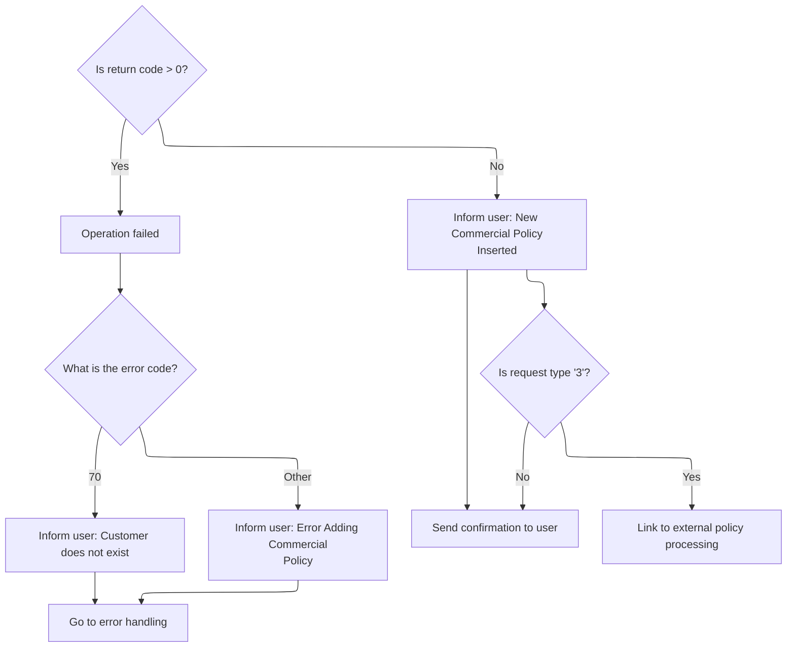

This section governs how the system responds to the outcome of a policy add attempt, ensuring users receive clear feedback and that follow-up actions (such as deletion requests) are handled appropriately.

| Rule ID | Category                        | Rule Name                         | Description                                                                                                                                                                                | Implementation Details                                                                                                                                                                                      |
| ------- | ------------------------------- | --------------------------------- | ------------------------------------------------------------------------------------------------------------------------------------------------------------------------------------------ | ----------------------------------------------------------------------------------------------------------------------------------------------------------------------------------------------------------- |
| BR-001  | Decision Making                 | Policy add error messaging        | If the policy add operation fails, the system determines the error type based on the return code and informs the user with a specific message.                                             | If the return code is 70, the message is 'Customer does not exist'. For any other non-zero code, the message is 'Error Adding Commercial Policy'. Messages are plain text strings.                          |
| BR-002  | Decision Making                 | Policy add success messaging      | If the policy add operation is successful, the system informs the user that the new commercial policy was inserted and updates the output fields with the new customer and policy numbers. | The message is 'New Commercial Policy Inserted'. The customer and policy numbers are numeric values, each up to 10 digits, and are placed in the output fields. The option field is cleared (set to blank). |
| BR-003  | Writing Output                  | Send confirmation on success      | After a successful policy add, the system sends a confirmation message to the user interface.                                                                                              | The confirmation is sent using the updated output fields and the success message. The format is determined by the user interface map and mapset.                                                            |
| BR-004  | Invoking a Service or a Process | Policy deletion on request type 3 | If the request type is '3' after a successful add, the system initiates a policy deletion process by linking to the external policy processing program.                                    | The system sets up the request for deletion and calls the external policy processing program. The commarea is prepared with the appropriate request ID and identifiers.                                     |

<SwmSnippet path="/base/src/lgtestp4.cbl" line="172">

---

Back in <SwmToken path="base/src/lgtestp4.cbl" pos="24:5:7" line-data="              GO TO B-PROC.">`B-PROC`</SwmToken>, after returning from <SwmToken path="base/src/lgtestp4.cbl" pos="168:10:10" line-data="                 EXEC CICS LINK PROGRAM(&#39;LGAPOL01&#39;)">`LGAPOL01`</SwmToken>, we check if <SwmToken path="base/src/lgtestp4.cbl" pos="172:3:7" line-data="                 IF CA-RETURN-CODE &gt; 0">`CA-RETURN-CODE`</SwmToken> is greater than zero. If so, we roll back the transaction and jump to <SwmToken path="base/src/lgtestp4.cbl" pos="174:5:7" line-data="                   GO TO E-NOADD">`E-NOADD`</SwmToken> to handle the error. This ensures any failed add operation is cleaned up and the user gets the right error message.

```cobol
                 IF CA-RETURN-CODE > 0
                   Exec CICS Syncpoint Rollback End-Exec
                   GO TO E-NOADD
                 END-IF
```

---

</SwmSnippet>

<SwmSnippet path="/base/src/lgtestp4.cbl" line="275">

---

<SwmToken path="base/src/lgtestp4.cbl" pos="275:1:3" line-data="       E-NOADD.">`E-NOADD`</SwmToken> checks if <SwmToken path="base/src/lgtestp4.cbl" pos="276:3:7" line-data="           Evaluate CA-RETURN-CODE">`CA-RETURN-CODE`</SwmToken> is 70 (customer not found) or something else (generic add error), sets the right error message, and jumps to <SwmToken path="base/src/lgtestp4.cbl" pos="279:5:7" line-data="               Go To F-ERR">`F-ERR`</SwmToken> to show it and end the session. The error codes and messages are hardcoded for these cases.

```cobol
       E-NOADD.
           Evaluate CA-RETURN-CODE
             When 70
               Move 'Customer does not exist'        To  ERP4FLDO
               Go To F-ERR
             When Other
               Move 'Error Adding Commercial Policy' To  ERP4FLDO
               Go To F-ERR
           End-Evaluate.
```

---

</SwmSnippet>

<SwmSnippet path="/base/src/lgtestp4.cbl" line="176">

---

Back in <SwmToken path="base/src/lgtestp4.cbl" pos="24:5:7" line-data="              GO TO B-PROC.">`B-PROC`</SwmToken>, if the add was successful, we move the customer and policy numbers to the output fields, clear the option, set the success message, and send the updated map to the user. This is the happy path after a successful add, right before handling option '3' for deletion.

```cobol
                 Move CA-CUSTOMER-NUM To ENP4CNOI
                 Move CA-POLICY-NUM   To ENP4PNOI
                 Move ' '             To ENP4OPTI
                 Move 'New Commercial Policy Inserted'
                   To  ERP4FLDO
                 EXEC CICS SEND MAP ('XMAPP4')
                           FROM(XMAPP4O)
                           MAPSET ('XMAP')
                 END-EXEC
```

---

</SwmSnippet>

<SwmSnippet path="/base/src/lgtestp4.cbl" line="187">

---

When option '3' is selected, we set up the commarea for a delete request and call <SwmToken path="base/src/lgtestp4.cbl" pos="191:10:10" line-data="                 EXEC CICS LINK PROGRAM(&#39;LGDPOL01&#39;)">`LGDPOL01`</SwmToken>. That program validates and processes the policy deletion, handling all the backend logic and error reporting for removing a policy.

```cobol
             WHEN '3'
                 Move '01DCOM'   To CA-REQUEST-ID
                 Move ENP4CNOO   To CA-CUSTOMER-NUM
                 Move ENP4PNOO   To CA-POLICY-NUM
                 EXEC CICS LINK PROGRAM('LGDPOL01')
                           COMMAREA(COMM-AREA)
                           LENGTH(32500)
                 END-EXEC
```

---

</SwmSnippet>

## Validating and Dispatching Policy Delete Requests

```mermaid
%%{init: {"flowchart": {"defaultRenderer": "elk"}} }%%
flowchart TD
    node1["Start MAINLINE processing"] --> node2{"Is commarea received? (EIBCALEN = 0)"}
    click node1 openCode "base/src/lgdpol01.cbl:78:133"
    node2 -->|"No commarea"| node3["Write error message"]
    click node2 openCode "base/src/lgdpol01.cbl:95:99"
    click node3 openCode "base/src/lgdpol01.cbl:96:98"
    node3 --> node4["Return and exit"]
    click node4 openCode "base/src/lgdpol01.cbl:98:99"
    node2 -->|"Received"| node5{"Is commarea large enough? (EIBCALEN <
28)"}
    click node5 openCode "base/src/lgdpol01.cbl:107:110"
    node5 -->|"Too small"| node6["Set return code '98' and exit"]
    click node6 openCode "base/src/lgdpol01.cbl:108:109"
    node5 -->|"Sufficient"| node7["Uppercase request ID"]
    click node7 openCode "base/src/lgdpol01.cbl:117:117"
    node7 --> node8{"Is request ID recognized? (01DEND,
01DMOT, 01DHOU, 01DCOM)"}
    click node8 openCode "base/src/lgdpol01.cbl:119:122"
    node8 -->|"Unsupported"| node9["Set return code '99' and exit"]
    click node9 openCode "base/src/lgdpol01.cbl:124:124"
    node8 -->|"Supported"| node10["Delete policy"]
    click node10 openCode "base/src/lgdpol01.cbl:126:126"
    node10 --> node11{"Did deletion fail? (CA-RETURN-CODE > 0)"}
    click node11 openCode "base/src/lgdpol01.cbl:127:129"
    node11 -->|"Failed"| node12["Return and exit"]
    click node12 openCode "base/src/lgdpol01.cbl:128:129"
    node11 -->|"Success"| node13["Return to caller"]
    click node13 openCode "base/src/lgdpol01.cbl:133:133"
classDef HeadingStyle fill:#777777,stroke:#333,stroke-width:2px;

%% Swimm:
%% %%{init: {"flowchart": {"defaultRenderer": "elk"}} }%%
%% flowchart TD
%%     node1["Start MAINLINE processing"] --> node2{"Is commarea received? (EIBCALEN = 0)"}
%%     click node1 openCode "<SwmPath>[base/src/lgdpol01.cbl](base/src/lgdpol01.cbl)</SwmPath>:78:133"
%%     node2 -->|"No commarea"| node3["Write error message"]
%%     click node2 openCode "<SwmPath>[base/src/lgdpol01.cbl](base/src/lgdpol01.cbl)</SwmPath>:95:99"
%%     click node3 openCode "<SwmPath>[base/src/lgdpol01.cbl](base/src/lgdpol01.cbl)</SwmPath>:96:98"
%%     node3 --> node4["Return and exit"]
%%     click node4 openCode "<SwmPath>[base/src/lgdpol01.cbl](base/src/lgdpol01.cbl)</SwmPath>:98:99"
%%     node2 -->|"Received"| node5{"Is commarea large enough? (EIBCALEN <
%% 28)"}
%%     click node5 openCode "<SwmPath>[base/src/lgdpol01.cbl](base/src/lgdpol01.cbl)</SwmPath>:107:110"
%%     node5 -->|"Too small"| node6["Set return code '98' and exit"]
%%     click node6 openCode "<SwmPath>[base/src/lgdpol01.cbl](base/src/lgdpol01.cbl)</SwmPath>:108:109"
%%     node5 -->|"Sufficient"| node7["Uppercase request ID"]
%%     click node7 openCode "<SwmPath>[base/src/lgdpol01.cbl](base/src/lgdpol01.cbl)</SwmPath>:117:117"
%%     node7 --> node8{"Is request ID recognized? (<SwmToken path="base/src/lgdpol01.cbl" pos="119:18:18" line-data="           IF ( CA-REQUEST-ID NOT EQUAL TO &#39;01DEND&#39; AND">`01DEND`</SwmToken>,
%% <SwmToken path="base/src/lgdpol01.cbl" pos="120:14:14" line-data="                CA-REQUEST-ID NOT EQUAL TO &#39;01DMOT&#39; AND">`01DMOT`</SwmToken>, <SwmToken path="base/src/lgdpol01.cbl" pos="121:14:14" line-data="                CA-REQUEST-ID NOT EQUAL TO &#39;01DHOU&#39; AND">`01DHOU`</SwmToken>, <SwmToken path="base/src/lgtestp4.cbl" pos="188:4:4" line-data="                 Move &#39;01DCOM&#39;   To CA-REQUEST-ID">`01DCOM`</SwmToken>)"}
%%     click node8 openCode "<SwmPath>[base/src/lgdpol01.cbl](base/src/lgdpol01.cbl)</SwmPath>:119:122"
%%     node8 -->|"Unsupported"| node9["Set return code '99' and exit"]
%%     click node9 openCode "<SwmPath>[base/src/lgdpol01.cbl](base/src/lgdpol01.cbl)</SwmPath>:124:124"
%%     node8 -->|"Supported"| node10["Delete policy"]
%%     click node10 openCode "<SwmPath>[base/src/lgdpol01.cbl](base/src/lgdpol01.cbl)</SwmPath>:126:126"
%%     node10 --> node11{"Did deletion fail? (<SwmToken path="base/src/lgtestp4.cbl" pos="116:3:7" line-data="                 IF CA-RETURN-CODE &gt; 0">`CA-RETURN-CODE`</SwmToken> > 0)"}
%%     click node11 openCode "<SwmPath>[base/src/lgdpol01.cbl](base/src/lgdpol01.cbl)</SwmPath>:127:129"
%%     node11 -->|"Failed"| node12["Return and exit"]
%%     click node12 openCode "<SwmPath>[base/src/lgdpol01.cbl](base/src/lgdpol01.cbl)</SwmPath>:128:129"
%%     node11 -->|"Success"| node13["Return to caller"]
%%     click node13 openCode "<SwmPath>[base/src/lgdpol01.cbl](base/src/lgdpol01.cbl)</SwmPath>:133:133"
%% classDef HeadingStyle fill:#777777,stroke:#333,stroke-width:2px;
```

This section validates and dispatches incoming policy deletion requests. It ensures requests are well-formed, recognized, and logs errors for invalid or unsupported requests.

| Rule ID | Category        | Rule Name                          | Description                                                                                                                                                      | Implementation Details                                                                                                                                                                                                                                                                                                                                                                                                                                                                                                                                                                                                                                                                                |
| ------- | --------------- | ---------------------------------- | ---------------------------------------------------------------------------------------------------------------------------------------------------------------- | ----------------------------------------------------------------------------------------------------------------------------------------------------------------------------------------------------------------------------------------------------------------------------------------------------------------------------------------------------------------------------------------------------------------------------------------------------------------------------------------------------------------------------------------------------------------------------------------------------------------------------------------------------------------------------------------------------- |
| BR-001  | Data validation | Missing commarea error handling    | If no commarea is received, an error message is written and the transaction abends with code 'LGCA'.                                                             | The error message includes the text ' NO COMMAREA RECEIVED'. The abend code is 'LGCA'.                                                                                                                                                                                                                                                                                                                                                                                                                                                                                                                                                                                                                |
| BR-002  | Data validation | Minimum commarea length validation | If the commarea is present but shorter than 28 bytes, the request is rejected with return code '98'.                                                             | The minimum required commarea length is 28 bytes. The return code is set to '98'.                                                                                                                                                                                                                                                                                                                                                                                                                                                                                                                                                                                                                     |
| BR-003  | Data validation | Request ID case normalization      | The request ID is converted to uppercase before validation to ensure case-insensitive comparison.                                                                | The request ID is standardized to uppercase for comparison. Supported IDs are <SwmToken path="base/src/lgdpol01.cbl" pos="119:18:18" line-data="           IF ( CA-REQUEST-ID NOT EQUAL TO &#39;01DEND&#39; AND">`01DEND`</SwmToken>, <SwmToken path="base/src/lgdpol01.cbl" pos="120:14:14" line-data="                CA-REQUEST-ID NOT EQUAL TO &#39;01DMOT&#39; AND">`01DMOT`</SwmToken>, <SwmToken path="base/src/lgdpol01.cbl" pos="121:14:14" line-data="                CA-REQUEST-ID NOT EQUAL TO &#39;01DHOU&#39; AND">`01DHOU`</SwmToken>, <SwmToken path="base/src/lgtestp4.cbl" pos="188:4:4" line-data="                 Move &#39;01DCOM&#39;   To CA-REQUEST-ID">`01DCOM`</SwmToken>. |
| BR-004  | Data validation | Unsupported request ID rejection   | If the request ID is not recognized as one of the supported values, the request is rejected with return code '99'.                                               | Supported request IDs are <SwmToken path="base/src/lgdpol01.cbl" pos="119:18:18" line-data="           IF ( CA-REQUEST-ID NOT EQUAL TO &#39;01DEND&#39; AND">`01DEND`</SwmToken>, <SwmToken path="base/src/lgdpol01.cbl" pos="120:14:14" line-data="                CA-REQUEST-ID NOT EQUAL TO &#39;01DMOT&#39; AND">`01DMOT`</SwmToken>, <SwmToken path="base/src/lgdpol01.cbl" pos="121:14:14" line-data="                CA-REQUEST-ID NOT EQUAL TO &#39;01DHOU&#39; AND">`01DHOU`</SwmToken>, <SwmToken path="base/src/lgtestp4.cbl" pos="188:4:4" line-data="                 Move &#39;01DCOM&#39;   To CA-REQUEST-ID">`01DCOM`</SwmToken>. The return code for unsupported IDs is '99'.        |
| BR-005  | Decision Making | Recognized request dispatch        | If the request ID is recognized, the policy deletion process is invoked.                                                                                         | Supported request IDs are <SwmToken path="base/src/lgdpol01.cbl" pos="119:18:18" line-data="           IF ( CA-REQUEST-ID NOT EQUAL TO &#39;01DEND&#39; AND">`01DEND`</SwmToken>, <SwmToken path="base/src/lgdpol01.cbl" pos="120:14:14" line-data="                CA-REQUEST-ID NOT EQUAL TO &#39;01DMOT&#39; AND">`01DMOT`</SwmToken>, <SwmToken path="base/src/lgdpol01.cbl" pos="121:14:14" line-data="                CA-REQUEST-ID NOT EQUAL TO &#39;01DHOU&#39; AND">`01DHOU`</SwmToken>, <SwmToken path="base/src/lgtestp4.cbl" pos="188:4:4" line-data="                 Move &#39;01DCOM&#39;   To CA-REQUEST-ID">`01DCOM`</SwmToken>.                                                     |
| BR-006  | Decision Making | Policy deletion failure handling   | If the policy deletion process fails (return code > 0), the request is returned to the caller without further processing.                                        | A return code greater than zero indicates failure. The process returns to the caller without further action.                                                                                                                                                                                                                                                                                                                                                                                                                                                                                                                                                                                          |
| BR-007  | Writing Output  | Error logging with context         | For any error condition, an error message is written to the logging service, including the current date, time, and up to 90 bytes of commarea data if available. | Error messages include date (8 chars), time (6 chars), and up to 90 bytes of commarea data. Messages are sent to the LGSTSQ logging service.                                                                                                                                                                                                                                                                                                                                                                                                                                                                                                                                                          |

<SwmSnippet path="/base/src/lgdpol01.cbl" line="78">

---

MAINLINE in <SwmPath>[base/src/lgdpol01.cbl](base/src/lgdpol01.cbl)</SwmPath> checks the commarea for validity, sets up error handling, and routes the request based on the request ID. Only recognized IDs (<SwmToken path="base/src/lgdpol01.cbl" pos="119:18:18" line-data="           IF ( CA-REQUEST-ID NOT EQUAL TO &#39;01DEND&#39; AND">`01DEND`</SwmToken>, <SwmToken path="base/src/lgdpol01.cbl" pos="120:14:14" line-data="                CA-REQUEST-ID NOT EQUAL TO &#39;01DMOT&#39; AND">`01DMOT`</SwmToken>, <SwmToken path="base/src/lgdpol01.cbl" pos="121:14:14" line-data="                CA-REQUEST-ID NOT EQUAL TO &#39;01DHOU&#39; AND">`01DHOU`</SwmToken>, <SwmToken path="base/src/lgdpol01.cbl" pos="122:14:14" line-data="                CA-REQUEST-ID NOT EQUAL TO &#39;01DCOM&#39; )">`01DCOM`</SwmToken>) are processed; anything else gets a '99' return code. If the commarea is missing or too short, it either abends or returns '98'. If everything checks out, it calls <SwmToken path="base/src/lgdpol01.cbl" pos="126:3:9" line-data="               PERFORM DELETE-POLICY-DB2-INFO">`DELETE-POLICY-DB2-INFO`</SwmToken> to actually delete the policy. This is the main dispatch logic for policy deletion.

```cobol
       MAINLINE SECTION.

      *----------------------------------------------------------------*
      * Common code                                                    *
      *----------------------------------------------------------------*
      * initialize working storage variables
           INITIALIZE WS-HEADER.
      * set up general variable
           MOVE EIBTRNID TO WS-TRANSID.
           MOVE EIBTRMID TO WS-TERMID.
           MOVE EIBTASKN TO WS-TASKNUM.
      *----------------------------------------------------------------*

      *----------------------------------------------------------------*
      * Check commarea and obtain required details                     *
      *----------------------------------------------------------------*
      * If NO commarea received issue an ABEND
           IF EIBCALEN IS EQUAL TO ZERO
               MOVE ' NO COMMAREA RECEIVED' TO EM-VARIABLE
               PERFORM WRITE-ERROR-MESSAGE
               EXEC CICS ABEND ABCODE('LGCA') NODUMP END-EXEC
           END-IF

      * initialize commarea return code to zero
           MOVE '00' TO CA-RETURN-CODE
           MOVE EIBCALEN TO WS-CALEN.
           SET WS-ADDR-DFHCOMMAREA TO ADDRESS OF DFHCOMMAREA.

      * Check commarea is large enough
           IF EIBCALEN IS LESS THAN WS-CA-HEADER-LEN
             MOVE '98' TO CA-RETURN-CODE
             EXEC CICS RETURN END-EXEC
           END-IF

      *----------------------------------------------------------------*
      * Check request-id in commarea and if recognised ...             *
      * Call routine to delete row from policy table                   *
      *----------------------------------------------------------------*
      * Upper case value passed in Request Id field                    *
           MOVE FUNCTION UPPER-CASE(CA-REQUEST-ID) TO CA-REQUEST-ID

           IF ( CA-REQUEST-ID NOT EQUAL TO '01DEND' AND
                CA-REQUEST-ID NOT EQUAL TO '01DMOT' AND
                CA-REQUEST-ID NOT EQUAL TO '01DHOU' AND
                CA-REQUEST-ID NOT EQUAL TO '01DCOM' )
      *        Request is not recognised or supported
               MOVE '99' TO CA-RETURN-CODE
           ELSE
               PERFORM DELETE-POLICY-DB2-INFO
               If CA-RETURN-CODE > 0
                 EXEC CICS RETURN END-EXEC
               End-if
           END-IF

      * Return to caller
           EXEC CICS RETURN END-EXEC.
```

---

</SwmSnippet>

<SwmSnippet path="/base/src/lgdpol01.cbl" line="154">

---

<SwmToken path="base/src/lgdpol01.cbl" pos="154:1:5" line-data="       WRITE-ERROR-MESSAGE.">`WRITE-ERROR-MESSAGE`</SwmToken> in <SwmPath>[base/src/lgdpol01.cbl](base/src/lgdpol01.cbl)</SwmPath> formats the error details, grabs the current date/time, and sends the error message to LGSTSQ for logging. It then sends up to 90 bytes of commarea data to LGSTSQ as a second message if available. This keeps error logs concise and ensures context is captured for support.

```cobol
       WRITE-ERROR-MESSAGE.
      * Save SQLCODE in message
      * Obtain and format current time and date
           EXEC CICS ASKTIME ABSTIME(WS-ABSTIME)
           END-EXEC
           EXEC CICS FORMATTIME ABSTIME(Ws-ABSTIME)
                     MMDDYYYY(WS-DATE)
                     TIME(WS-TIME)
           END-EXEC
           MOVE WS-DATE TO EM-DATE
           MOVE WS-TIME TO EM-TIME
      * Write output message to TDQ
           EXEC CICS LINK PROGRAM('LGSTSQ')
                     COMMAREA(ERROR-MSG)
                     LENGTH(LENGTH OF ERROR-MSG)
           END-EXEC.
      * Write 90 bytes or as much as we have of commarea to TDQ
           IF EIBCALEN > 0 THEN
             IF EIBCALEN < 91 THEN
               MOVE DFHCOMMAREA(1:EIBCALEN) TO CA-DATA
               EXEC CICS LINK PROGRAM('LGSTSQ')
                         COMMAREA(CA-ERROR-MSG)
                         LENGTH(LENGTH OF CA-ERROR-MSG)
               END-EXEC
             ELSE
               MOVE DFHCOMMAREA(1:90) TO CA-DATA
               EXEC CICS LINK PROGRAM('LGSTSQ')
                         COMMAREA(CA-ERROR-MSG)
                         LENGTH(LENGTH OF CA-ERROR-MSG)
               END-EXEC
             END-IF
           END-IF.
           EXIT.
```

---

</SwmSnippet>

## Routing Policy Delete to Database Handler

This section routes policy deletion requests to the backend database handler. Its main product role is to ensure that policy deletion requests are forwarded to the appropriate handler for processing.

| Rule ID | Category                        | Rule Name                   | Description                                                                           | Implementation Details                                                                                                                                                           |
| ------- | ------------------------------- | --------------------------- | ------------------------------------------------------------------------------------- | -------------------------------------------------------------------------------------------------------------------------------------------------------------------------------- |
| BR-001  | Invoking a Service or a Process | Route policy delete request | The policy deletion request is routed to the backend database handler for processing. | The commarea containing all request details is passed to the backend handler. The length of the commarea is 32,500 bytes. No specific output format is produced by this section. |

<SwmSnippet path="/base/src/lgdpol01.cbl" line="139">

---

<SwmToken path="base/src/lgdpol01.cbl" pos="139:1:7" line-data="       DELETE-POLICY-DB2-INFO.">`DELETE-POLICY-DB2-INFO`</SwmToken> in <SwmPath>[base/src/lgdpol01.cbl](base/src/lgdpol01.cbl)</SwmPath> just links to <SwmToken path="base/src/lgdpol01.cbl" pos="141:9:9" line-data="           EXEC CICS LINK PROGRAM(LGDPDB01)">`LGDPDB01`</SwmToken>, passing the commarea with all the request details. <SwmToken path="base/src/lgdpol01.cbl" pos="141:9:9" line-data="           EXEC CICS LINK PROGRAM(LGDPDB01)">`LGDPDB01`</SwmToken> handles the actual <SwmToken path="base/src/lgdpol01.cbl" pos="139:5:5" line-data="       DELETE-POLICY-DB2-INFO.">`DB2`</SwmToken> delete logic for the policy. This is where the backend deletion happens.

```cobol
       DELETE-POLICY-DB2-INFO.

           EXEC CICS LINK PROGRAM(LGDPDB01)
                Commarea(DFHCOMMAREA)
                LENGTH(32500)
           END-EXEC.

           EXIT.
```

---

</SwmSnippet>

## Validating Delete Request and Database Dispatch

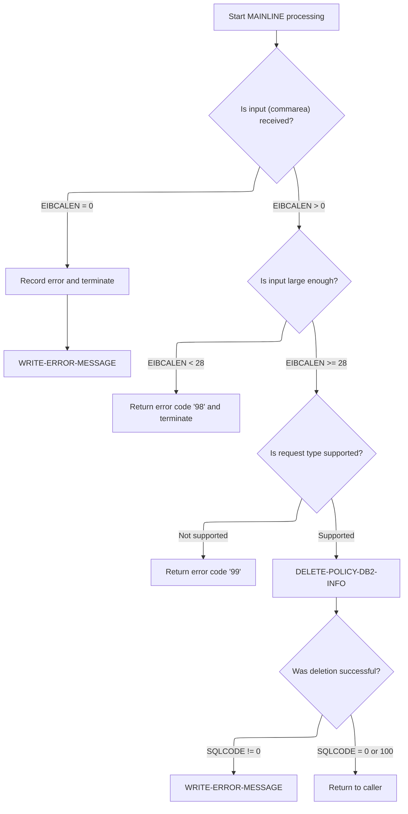

This section validates delete requests, checks request type, dispatches the delete operation to the database, and logs errors. It ensures only recognized requests with sufficient input are processed.

| Rule ID | Category        | Rule Name                          | Description                                                                                                                                                                                                                                                                                                                                                                                                                                                                                                                                                                                                                                                                                               | Implementation Details                                                                                                                                                                                                                                                                                                                                                                                                                                                                                                                                                                                                                                                                              |
| ------- | --------------- | ---------------------------------- | --------------------------------------------------------------------------------------------------------------------------------------------------------------------------------------------------------------------------------------------------------------------------------------------------------------------------------------------------------------------------------------------------------------------------------------------------------------------------------------------------------------------------------------------------------------------------------------------------------------------------------------------------------------------------------------------------------- | --------------------------------------------------------------------------------------------------------------------------------------------------------------------------------------------------------------------------------------------------------------------------------------------------------------------------------------------------------------------------------------------------------------------------------------------------------------------------------------------------------------------------------------------------------------------------------------------------------------------------------------------------------------------------------------------------- |
| BR-001  | Data validation | Missing commarea error             | If no commarea is received, an error message is logged and the process is terminated with abend code 'LGCA'.                                                                                                                                                                                                                                                                                                                                                                                                                                                                                                                                                                                              | Error message includes ' NO COMMAREA RECEIVED'. Process terminates with abend code 'LGCA'.                                                                                                                                                                                                                                                                                                                                                                                                                                                                                                                                                                                                          |
| BR-002  | Data validation | Minimum commarea length            | If commarea length is less than 28 bytes, return code '98' is set and the process terminates.                                                                                                                                                                                                                                                                                                                                                                                                                                                                                                                                                                                                             | Minimum required length is 28 bytes. Return code '98' is set in the commarea.                                                                                                                                                                                                                                                                                                                                                                                                                                                                                                                                                                                                                       |
| BR-003  | Data validation | Supported request ID validation    | Only requests with request IDs <SwmToken path="base/src/lgdpol01.cbl" pos="119:18:18" line-data="           IF ( CA-REQUEST-ID NOT EQUAL TO &#39;01DEND&#39; AND">`01DEND`</SwmToken>, <SwmToken path="base/src/lgdpol01.cbl" pos="121:14:14" line-data="                CA-REQUEST-ID NOT EQUAL TO &#39;01DHOU&#39; AND">`01DHOU`</SwmToken>, <SwmToken path="base/src/lgtestp4.cbl" pos="188:4:4" line-data="                 Move &#39;01DCOM&#39;   To CA-REQUEST-ID">`01DCOM`</SwmToken>, or <SwmToken path="base/src/lgdpol01.cbl" pos="120:14:14" line-data="                CA-REQUEST-ID NOT EQUAL TO &#39;01DMOT&#39; AND">`01DMOT`</SwmToken> are recognized. If not, return code '99' is set. | Supported request IDs are <SwmToken path="base/src/lgdpol01.cbl" pos="119:18:18" line-data="           IF ( CA-REQUEST-ID NOT EQUAL TO &#39;01DEND&#39; AND">`01DEND`</SwmToken>, <SwmToken path="base/src/lgdpol01.cbl" pos="121:14:14" line-data="                CA-REQUEST-ID NOT EQUAL TO &#39;01DHOU&#39; AND">`01DHOU`</SwmToken>, <SwmToken path="base/src/lgtestp4.cbl" pos="188:4:4" line-data="                 Move &#39;01DCOM&#39;   To CA-REQUEST-ID">`01DCOM`</SwmToken>, <SwmToken path="base/src/lgdpol01.cbl" pos="120:14:14" line-data="                CA-REQUEST-ID NOT EQUAL TO &#39;01DMOT&#39; AND">`01DMOT`</SwmToken>. Return code '99' is set for unsupported requests. |
| BR-004  | Data validation | Database deletion failure handling | If SQL deletion fails (SQLCODE not 0 or 100), return code '90' is set, error message is logged, and process terminates.                                                                                                                                                                                                                                                                                                                                                                                                                                                                                                                                                                                   | Return code '90' is set for database errors. Error message includes SQLCODE and relevant request details.                                                                                                                                                                                                                                                                                                                                                                                                                                                                                                                                                                                           |
| BR-005  | Writing Output  | Error message logging format       | Error messages are logged with date, time, SQLCODE, customer and policy numbers, and request details. Up to 90 bytes of commarea data are sent as a second message if available.                                                                                                                                                                                                                                                                                                                                                                                                                                                                                                                          | Error message includes date (8 bytes), time (6 bytes), SQLCODE (5 digits), customer number (10 digits), policy number (10 digits), request description (16 bytes), and up to 90 bytes of commarea data. Messages are sent to LGSTSQ.                                                                                                                                                                                                                                                                                                                                                                                                                                                                |

<SwmSnippet path="/base/src/lgdpdb01.cbl" line="111">

---

MAINLINE in <SwmPath>[base/src/lgdpdb01.cbl](base/src/lgdpdb01.cbl)</SwmPath> checks the commarea, converts customer and policy numbers to <SwmToken path="base/src/lgdpdb01.cbl" pos="124:5:5" line-data="      * initialize DB2 host variables">`DB2`</SwmToken> integer format, and validates the request ID. If it's recognized, it calls <SwmToken path="base/src/lgdpdb01.cbl" pos="167:3:9" line-data="               PERFORM DELETE-POLICY-DB2-INFO">`DELETE-POLICY-DB2-INFO`</SwmToken> and then links to <SwmToken path="base/src/lgdpdb01.cbl" pos="168:9:9" line-data="               EXEC CICS LINK PROGRAM(LGDPVS01)">`LGDPVS01`</SwmToken> for further deletion steps. Errors are logged and handled at each step.

```cobol
       MAINLINE SECTION.

      *----------------------------------------------------------------*
      * Common code                                                    *
      *----------------------------------------------------------------*
      * initialize working storage variables
           INITIALIZE WS-HEADER.
      * set up general variable
           MOVE EIBTRNID TO WS-TRANSID.
           MOVE EIBTRMID TO WS-TERMID.
           MOVE EIBTASKN TO WS-TASKNUM.
      *----------------------------------------------------------------*

      * initialize DB2 host variables
           INITIALIZE DB2-IN-INTEGERS.

      *----------------------------------------------------------------*
      * Check commarea and obtain required details                     *
      *----------------------------------------------------------------*
      * If NO commarea received issue an ABEND
           IF EIBCALEN IS EQUAL TO ZERO
               MOVE ' NO COMMAREA RECEIVED' TO EM-VARIABLE
               PERFORM WRITE-ERROR-MESSAGE
               EXEC CICS ABEND ABCODE('LGCA') NODUMP END-EXEC
           END-IF

      * initialize commarea return code to zero
           MOVE '00' TO CA-RETURN-CODE
           MOVE EIBCALEN TO WS-CALEN.
           SET WS-ADDR-DFHCOMMAREA TO ADDRESS OF DFHCOMMAREA.

      * Check commarea is large enough
           IF EIBCALEN IS LESS THAN WS-CA-HEADER-LEN
             MOVE '98' TO CA-RETURN-CODE
             EXEC CICS RETURN END-EXEC
           END-IF

      * Convert commarea customer & policy nums to DB2 integer format
           MOVE CA-CUSTOMER-NUM TO DB2-CUSTOMERNUM-INT
           MOVE CA-POLICY-NUM   TO DB2-POLICYNUM-INT
      * and save in error msg field incase required
           MOVE CA-CUSTOMER-NUM TO EM-CUSNUM
           MOVE CA-POLICY-NUM   TO EM-POLNUM

      *----------------------------------------------------------------*
      * Check request-id in commarea and if recognised ...             *
      * Call routine to delete row from policy table                   *
      *----------------------------------------------------------------*

           IF ( CA-REQUEST-ID NOT EQUAL TO '01DEND' AND
                CA-REQUEST-ID NOT EQUAL TO '01DHOU' AND
                CA-REQUEST-ID NOT EQUAL TO '01DCOM' AND
                CA-REQUEST-ID NOT EQUAL TO '01DMOT' ) Then
      *        Request is not recognised or supported
               MOVE '99' TO CA-RETURN-CODE
           ELSE
               PERFORM DELETE-POLICY-DB2-INFO
               EXEC CICS LINK PROGRAM(LGDPVS01)
                    Commarea(DFHCOMMAREA)
                    LENGTH(32500)
               END-EXEC
           END-IF.

      * Return to caller
           EXEC CICS RETURN END-EXEC.
```

---

</SwmSnippet>

<SwmSnippet path="/base/src/lgdpdb01.cbl" line="212">

---

<SwmToken path="base/src/lgdpdb01.cbl" pos="212:1:5" line-data="       WRITE-ERROR-MESSAGE.">`WRITE-ERROR-MESSAGE`</SwmToken> in <SwmPath>[base/src/lgdpdb01.cbl](base/src/lgdpdb01.cbl)</SwmPath> grabs the SQLCODE, formats the date/time, and sends the error message to LGSTSQ. It then sends up to 90 bytes of commarea data as a second message if available. This keeps logs tight and avoids sending too much data.

```cobol
       WRITE-ERROR-MESSAGE.
      * Save SQLCODE in message
           MOVE SQLCODE TO EM-SQLRC
      * Obtain and format current time and date
           EXEC CICS ASKTIME ABSTIME(WS-ABSTIME)
           END-EXEC
           EXEC CICS FORMATTIME ABSTIME(Ws-ABSTIME)
                     MMDDYYYY(WS-DATE)
                     TIME(WS-TIME)
           END-EXEC
           MOVE WS-DATE TO EM-DATE
           MOVE WS-TIME TO EM-TIME
      * Write output message to TDQ
           EXEC CICS LINK PROGRAM('LGSTSQ')
                     COMMAREA(ERROR-MSG)
                     LENGTH(LENGTH OF ERROR-MSG)
           END-EXEC.
      * Write 90 bytes or as much as we have of commarea to TDQ
           IF EIBCALEN > 0 THEN
             IF EIBCALEN < 91 THEN
               MOVE DFHCOMMAREA(1:EIBCALEN) TO CA-DATA
               EXEC CICS LINK PROGRAM('LGSTSQ')
                         COMMAREA(CA-ERROR-MSG)
                         LENGTH(LENGTH OF CA-ERROR-MSG)
               END-EXEC
             ELSE
               MOVE DFHCOMMAREA(1:90) TO CA-DATA
               EXEC CICS LINK PROGRAM('LGSTSQ')
                         COMMAREA(CA-ERROR-MSG)
                         LENGTH(LENGTH OF CA-ERROR-MSG)
               END-EXEC
             END-IF
           END-IF.
           EXIT.
```

---

</SwmSnippet>

<SwmSnippet path="/base/src/lgdpdb01.cbl" line="186">

---

<SwmToken path="base/src/lgdpdb01.cbl" pos="186:1:7" line-data="       DELETE-POLICY-DB2-INFO.">`DELETE-POLICY-DB2-INFO`</SwmToken> in <SwmPath>[base/src/lgdpdb01.cbl](base/src/lgdpdb01.cbl)</SwmPath> runs the SQL delete for the policy. If SQLCODE is anything but 0 or 100, it logs the error and sets the return code to '90'. Otherwise, it just exits—no retry, no extra handling.

```cobol
       DELETE-POLICY-DB2-INFO.

           MOVE ' DELETE POLICY  ' TO EM-SQLREQ
           EXEC SQL
             DELETE
               FROM POLICY
               WHERE ( CUSTOMERNUMBER = :DB2-CUSTOMERNUM-INT AND
                       POLICYNUMBER  = :DB2-POLICYNUM-INT      )
           END-EXEC

      *    Treat SQLCODE 0 and SQLCODE 100 (record not found) as
      *    successful - end result is record does not exist
           IF SQLCODE NOT EQUAL 0 Then
               MOVE '90' TO CA-RETURN-CODE
               PERFORM WRITE-ERROR-MESSAGE
               EXEC CICS RETURN END-EXEC
           END-IF.

           EXIT.
```

---

</SwmSnippet>

## Logging Policy Delete Errors

```mermaid
%%{init: {"flowchart": {"defaultRenderer": "elk"}} }%%
flowchart TD
    node1["Prepare policy and customer data"] --> node2["Attempt to delete policy record"]
    click node1 openCode "base/src/lgdpvs01.cbl:75:80"
    click node2 openCode "base/src/lgdpvs01.cbl:81:85"
    node2 --> node3{"Was deletion successful?"}
    click node3 openCode "base/src/lgdpvs01.cbl:86:91"
    node3 -->|"Yes"| node4["Return control"]
    click node4 openCode "base/src/lgdpvs01.cbl:90:91"
    node3 -->|"No"| node5["Record error message and set
CA-RETURN-CODE to '81'"]
    click node5 openCode "base/src/lgdpvs01.cbl:87:89"
    node5 --> node6["Write error message"]
    click node6 openCode "base/src/lgdpvs01.cbl:99:132"
    node6 --> node4
classDef HeadingStyle fill:#777777,stroke:#333,stroke-width:2px;

%% Swimm:
%% %%{init: {"flowchart": {"defaultRenderer": "elk"}} }%%
%% flowchart TD
%%     node1["Prepare policy and customer data"] --> node2["Attempt to delete policy record"]
%%     click node1 openCode "<SwmPath>[base/src/lgdpvs01.cbl](base/src/lgdpvs01.cbl)</SwmPath>:75:80"
%%     click node2 openCode "<SwmPath>[base/src/lgdpvs01.cbl](base/src/lgdpvs01.cbl)</SwmPath>:81:85"
%%     node2 --> node3{"Was deletion successful?"}
%%     click node3 openCode "<SwmPath>[base/src/lgdpvs01.cbl](base/src/lgdpvs01.cbl)</SwmPath>:86:91"
%%     node3 -->|"Yes"| node4["Return control"]
%%     click node4 openCode "<SwmPath>[base/src/lgdpvs01.cbl](base/src/lgdpvs01.cbl)</SwmPath>:90:91"
%%     node3 -->|"No"| node5["Record error message and set
%% <SwmToken path="base/src/lgtestp4.cbl" pos="116:3:7" line-data="                 IF CA-RETURN-CODE &gt; 0">`CA-RETURN-CODE`</SwmToken> to '81'"]
%%     click node5 openCode "<SwmPath>[base/src/lgdpvs01.cbl](base/src/lgdpvs01.cbl)</SwmPath>:87:89"
%%     node5 --> node6["Write error message"]
%%     click node6 openCode "<SwmPath>[base/src/lgdpvs01.cbl](base/src/lgdpvs01.cbl)</SwmPath>:99:132"
%%     node6 --> node4
%% classDef HeadingStyle fill:#777777,stroke:#333,stroke-width:2px;
```

This section manages policy deletion requests and logs errors when deletion fails, ensuring actionable error messages are recorded for operational visibility.

| Rule ID | Category        | Rule Name                                 | Description                                                                                                                                    | Implementation Details                                                                                                                                                      |
| ------- | --------------- | ----------------------------------------- | ---------------------------------------------------------------------------------------------------------------------------------------------- | --------------------------------------------------------------------------------------------------------------------------------------------------------------------------- |
| BR-001  | Decision Making | Return code for deletion failure          | When a policy deletion fails, the return code is set to '81' to indicate a deletion error.                                                     | Return code is set to '81', a numeric value indicating deletion failure.                                                                                                    |
| BR-002  | Decision Making | Successful deletion control return        | If policy deletion is successful, control is returned without logging an error or setting a special return code.                               | No error message is logged; return code is not set to '81'.                                                                                                                 |
| BR-003  | Writing Output  | Error message logging on deletion failure | When a policy deletion fails, an error message is recorded containing the date, time, customer number, policy number, and CICS response codes. | Error message includes: date (MMDDYYYY), time (HHMMSS), customer number (10 digits), policy number (10 digits), response code (numeric), secondary response code (numeric). |
| BR-004  | Writing Output  | Commarea data inclusion in error log      | If commarea data is present, up to 90 bytes are included in the error log for additional context.                                              | Commarea data is included as a string of up to 90 bytes for additional error context.                                                                                       |

<SwmSnippet path="/base/src/lgdpvs01.cbl" line="72">

---

MAINLINE in <SwmPath>[base/src/lgdpvs01.cbl](base/src/lgdpvs01.cbl)</SwmPath> deletes the policy file entry using the constructed key. If the delete fails, it logs the error, sets the return code to '81', and returns control. No retry, just straight error handling.

```cobol
       MAINLINE SECTION.
      *
      *---------------------------------------------------------------*
           Move EIBCALEN To WS-Commarea-Len.
      *---------------------------------------------------------------*
           Move CA-Request-ID(4:1) To WF-Request-ID
           Move CA-Policy-Num      To WF-Policy-Num
           Move CA-Customer-Num    To WF-Customer-Num
      *---------------------------------------------------------------*
           Exec CICS Delete File('KSDSPOLY')
                     Ridfld(WF-Policy-Key)
                     KeyLength(21)
                     RESP(WS-RESP)
           End-Exec.
           If WS-RESP Not = DFHRESP(NORMAL)
             Move EIBRESP2 To WS-RESP2
             MOVE '81' TO CA-RETURN-CODE
             PERFORM WRITE-ERROR-MESSAGE
             EXEC CICS RETURN END-EXEC
           End-If.
```

---

</SwmSnippet>

<SwmSnippet path="/base/src/lgdpvs01.cbl" line="99">

---

<SwmToken path="base/src/lgdpvs01.cbl" pos="99:1:5" line-data="       WRITE-ERROR-MESSAGE.">`WRITE-ERROR-MESSAGE`</SwmToken> in <SwmPath>[base/src/lgdpvs01.cbl](base/src/lgdpvs01.cbl)</SwmPath> formats the error details, grabs the current date/time, adds customer/policy numbers and CICS response codes, then sends the message to LGSTSQ. It also sends up to 90 bytes of commarea data if available. This keeps logs clear and actionable.

```cobol
       WRITE-ERROR-MESSAGE.
           EXEC CICS ASKTIME ABSTIME(WS-ABSTIME)
           END-EXEC
           EXEC CICS FORMATTIME ABSTIME(WS-ABSTIME)
                     MMDDYYYY(WS-DATE)
                     TIME(WS-TIME)
           END-EXEC
      *
           MOVE WS-DATE TO EM-DATE
           MOVE WS-TIME TO EM-TIME
           Move CA-Customer-Num To EM-CUSNUM 
           Move CA-POLICY-NUM To EM-POLNUM 
           Move WS-RESP         To EM-RespRC
           Move WS-RESP2        To EM-Resp2RC
           EXEC CICS LINK PROGRAM('LGSTSQ')
                     COMMAREA(ERROR-MSG)
                     LENGTH(LENGTH OF ERROR-MSG)
           END-EXEC.
           IF EIBCALEN > 0 THEN
             IF EIBCALEN < 91 THEN
               MOVE DFHCOMMAREA(1:EIBCALEN) TO CA-DATA
               EXEC CICS LINK PROGRAM('LGSTSQ')
                         COMMAREA(CA-ERROR-MSG)
                         LENGTH(Length Of CA-ERROR-MSG)
               END-EXEC
             ELSE
               MOVE DFHCOMMAREA(1:90) TO CA-DATA
               EXEC CICS LINK PROGRAM('LGSTSQ')
                         COMMAREA(CA-ERROR-MSG)
                         LENGTH(Length Of CA-ERROR-MSG)
               END-EXEC
             END-IF
           END-IF.
           EXIT.
```

---

</SwmSnippet>

## Post-Delete Error Handling and UI Update

```mermaid
%%{init: {"flowchart": {"defaultRenderer": "elk"}} }%%
flowchart TD
    node1{"Was deletion successful?
(CA-RETURN-CODE > 0)"}
    click node1 openCode "base/src/lgtestp4.cbl:195:198"
    node1 -->|"Yes"| node2["Rollback transaction"]
    click node2 openCode "base/src/lgtestp4.cbl:196:197"
    node2 --> node3["Show error message: 'Error Deleting
Commercial Policy'"]
    click node3 openCode "base/src/lgtestp4.cbl:290:291"
    node3 --> node4["Send error map to user"]
    click node4 openCode "base/src/lgtestp4.cbl:220:223"
    node4 --> node11["Return from function"]
    click node11 openCode "base/src/lgtestp4.cbl:243:244"
    node1 -->|"No"| node5["Clear policy fields"]
    click node5 openCode "base/src/lgtestp4.cbl:200:219"
    node5 --> node6["Show success message: 'Commercial Policy
Deleted'"]
    click node6 openCode "base/src/lgtestp4.cbl:218:219"
    node6 --> node7["Send success map to user"]
    click node7 openCode "base/src/lgtestp4.cbl:220:223"
    node7 --> node11
    node8{
classDef HeadingStyle fill:#777777,stroke:#333,stroke-width:2px;

%% Swimm:
%% %%{init: {"flowchart": {"defaultRenderer": "elk"}} }%%
%% flowchart TD
%%     node1{"Was deletion successful?
%% (<SwmToken path="base/src/lgtestp4.cbl" pos="116:3:7" line-data="                 IF CA-RETURN-CODE &gt; 0">`CA-RETURN-CODE`</SwmToken> > 0)"}
%%     click node1 openCode "<SwmPath>[base/src/lgtestp4.cbl](base/src/lgtestp4.cbl)</SwmPath>:195:198"
%%     node1 -->|"Yes"| node2["Rollback transaction"]
%%     click node2 openCode "<SwmPath>[base/src/lgtestp4.cbl](base/src/lgtestp4.cbl)</SwmPath>:196:197"
%%     node2 --> node3["Show error message: 'Error Deleting
%% Commercial Policy'"]
%%     click node3 openCode "<SwmPath>[base/src/lgtestp4.cbl](base/src/lgtestp4.cbl)</SwmPath>:290:291"
%%     node3 --> node4["Send error map to user"]
%%     click node4 openCode "<SwmPath>[base/src/lgtestp4.cbl](base/src/lgtestp4.cbl)</SwmPath>:220:223"
%%     node4 --> node11["Return from function"]
%%     click node11 openCode "<SwmPath>[base/src/lgtestp4.cbl](base/src/lgtestp4.cbl)</SwmPath>:243:244"
%%     node1 -->|"No"| node5["Clear policy fields"]
%%     click node5 openCode "<SwmPath>[base/src/lgtestp4.cbl](base/src/lgtestp4.cbl)</SwmPath>:200:219"
%%     node5 --> node6["Show success message: 'Commercial Policy
%% Deleted'"]
%%     click node6 openCode "<SwmPath>[base/src/lgtestp4.cbl](base/src/lgtestp4.cbl)</SwmPath>:218:219"
%%     node6 --> node7["Send success map to user"]
%%     click node7 openCode "<SwmPath>[base/src/lgtestp4.cbl](base/src/lgtestp4.cbl)</SwmPath>:220:223"
%%     node7 --> node11
%%     node8{
%% classDef HeadingStyle fill:#777777,stroke:#333,stroke-width:2px;
```

This section manages the user interface and session state after a commercial policy delete operation. It ensures the user receives clear feedback and the session is correctly reset based on the outcome of the delete attempt.

| Rule ID | Category        | Rule Name               | Description                                                                                                                                                           | Implementation Details                                                                                                                                                                                   |
| ------- | --------------- | ----------------------- | --------------------------------------------------------------------------------------------------------------------------------------------------------------------- | -------------------------------------------------------------------------------------------------------------------------------------------------------------------------------------------------------- |
| BR-001  | Data validation | Invalid option handling | If the user enters an invalid option, the system displays the message 'Please enter a valid option', resets the cursor, and updates the UI.                           | The error message shown is 'Please enter a valid option'. The cursor is reset to the option field. The output message is a string. The UI is updated to prompt for correct input.                        |
| BR-002  | Decision Making | Delete failure handling | If the deletion operation fails, the system rolls back the transaction, displays the message 'Error Deleting Commercial Policy', and resets the session for the user. | The error message shown is 'Error Deleting Commercial Policy'. The session is reset and the error map is sent to the user. The output message is a string. The UI is updated to reflect the error state. |
| BR-003  | Decision Making | Delete success handling | If the deletion operation succeeds, the system clears all policy-related fields, displays the message 'Commercial Policy Deleted', and updates the UI for the user.   | The success message shown is 'Commercial Policy Deleted'. All policy fields are cleared (set to spaces or blank). The output message is a string. The UI is updated to reflect the successful delete.    |

<SwmSnippet path="/base/src/lgtestp4.cbl" line="195">

---

Back in <SwmToken path="base/src/lgtestp4.cbl" pos="24:5:7" line-data="              GO TO B-PROC.">`B-PROC`</SwmToken> after returning from <SwmPath>[base/src/lgdpol01.cbl](base/src/lgdpol01.cbl)</SwmPath>, if <SwmToken path="base/src/lgtestp4.cbl" pos="195:3:7" line-data="                 IF CA-RETURN-CODE &gt; 0">`CA-RETURN-CODE`</SwmToken> is greater than zero, we run a rollback and jump to <SwmToken path="base/src/lgtestp4.cbl" pos="197:5:7" line-data="                   GO TO E-NODEL">`E-NODEL`</SwmToken>. This shows the user an error and resets the session.

```cobol
                 IF CA-RETURN-CODE > 0
                   Exec CICS Syncpoint Rollback End-Exec
                   GO TO E-NODEL
                 END-IF
```

---

</SwmSnippet>

<SwmSnippet path="/base/src/lgtestp4.cbl" line="289">

---

<SwmToken path="base/src/lgtestp4.cbl" pos="289:1:3" line-data="       E-NODEL.">`E-NODEL`</SwmToken> moves the error message to the output field and jumps to <SwmToken path="base/src/lgtestp4.cbl" pos="291:5:7" line-data="           Go To F-ERR.">`F-ERR`</SwmToken>. This sets up the UI to show the error and clears everything before ending the session.

```cobol
       E-NODEL.
           Move 'Error Deleting Commercial Policy'   To  ERP4FLDO
           Go To F-ERR.
```

---

</SwmSnippet>

<SwmSnippet path="/base/src/lgtestp4.cbl" line="200">

---

Back in <SwmToken path="base/src/lgtestp4.cbl" pos="24:5:7" line-data="              GO TO B-PROC.">`B-PROC`</SwmToken>, after handling the delete, we clear all UI and shared fields, reset the option, and set the success message. This prepares the screen for the user to see the result.

```cobol
                 Move Spaces             To ENP4EDAI
                 Move Spaces             To ENP4ADDI
                 Move Spaces             To ENP4HPCI
                 Move Spaces             To ENP4LATI
                 Move Spaces             To ENP4LONI
                 Move Spaces             To ENP4CUSI
                 Move Spaces             To ENP4PTYI
                 Move Spaces             To ENP4FPEI
                 Move Spaces             To ENP4FPRI
                 Move Spaces             To ENP4CPEI
                 Move Spaces             To ENP4CPRI
                 Move Spaces             To ENP4XPEI
                 Move Spaces             To ENP4XPRI
                 Move Spaces             To ENP4WPEI
                 Move Spaces             To ENP4WPRI
                 Move Spaces             To ENP4STAI
                 Move Spaces             To ENP4REJI
                 Move ' '             To ENP4OPTI
                 Move 'Commercial Policy Deleted'
                   To  ERP4FLDO
```

---

</SwmSnippet>

<SwmSnippet path="/base/src/lgtestp4.cbl" line="220">

---

After clearing fields and setting the message, we send the <SwmToken path="base/src/lgtestp4.cbl" pos="220:11:11" line-data="                 EXEC CICS SEND MAP (&#39;XMAPP4&#39;)">`XMAPP4`</SwmToken> map to the terminal. This updates the UI so the user sees the result of the delete.

```cobol
                 EXEC CICS SEND MAP ('XMAPP4')
                           FROM(XMAPP4O)
                           MAPSET ('XMAP')
                 END-EXEC
```

---

</SwmSnippet>

<SwmSnippet path="/base/src/lgtestp4.cbl" line="226">

---

If the user enters an invalid option, we show an error message, reset the cursor, send the map, and return control. This wraps up the <SwmToken path="base/src/lgtestp4.cbl" pos="24:5:7" line-data="              GO TO B-PROC.">`B-PROC`</SwmToken> flow and hands off to the next transaction.

```cobol
             WHEN OTHER

                 Move 'Please enter a valid option'
                   To  ERP4FLDO
                 Move -1 To ENP4OPTL

                 EXEC CICS SEND MAP ('XMAPP4')
                           FROM(XMAPP4O)
                           MAPSET ('XMAP')
                           CURSOR
                 END-EXEC
                 GO TO D-EXEC

           END-EVALUATE.


           EXEC CICS RETURN
           END-EXEC.
```

---

</SwmSnippet>

&nbsp;

*This is an auto-generated document by Swimm 🌊 and has not yet been verified by a human*

<SwmMeta version="3.0.0" repo-id="Z2l0aHViJTNBJTNBU3dpbW1pby1nZW5hcHAtaG91c2UlM0ElM0FHaXJpLVN3aW1t" repo-name="Swimmio-genapp-house"><sup>Powered by [Swimm](https://app.swimm.io/)</sup></SwmMeta>
