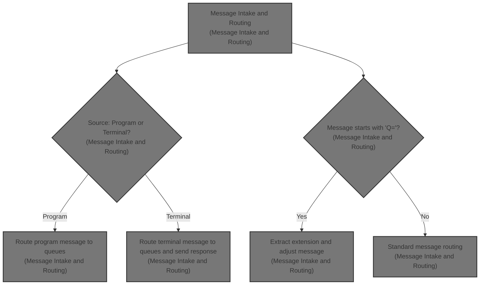

# Overview

This document explains the flow for routing and staging messages received from programs or terminals. The flow supports multiple insurance and customer operations by ensuring messages are correctly written to both temporary and permanent queues, and provides terminal feedback when required.



## Dependencies

### Program

- LGSTSQ (<SwmPath>[base/src/lgstsq.cbl](base/src/lgstsq.cbl)</SwmPath>)

# Where is this program used?

This program is used multiple times in the codebase as represented in the following diagram:

```mermaid
graph TD
  vmf8w("Processing Insurance Policy Data (LGAPVS01)") --> obda9("Logging and Staging Queue Management (LGSTSQ)"):::currentEntity
click vmf8w openCode "base/src/lgapvs01.cbl:1"
xd3nk("Processing and Validating Policy Data (LGAPOL01)") --> obda9("Logging and Staging Queue Management (LGSTSQ)"):::currentEntity
click xd3nk openCode "base/src/lgapol01.cbl:1"
ssqlq("Delete Policy Logic (LGDPOL01)") --> obda9("Logging and Staging Queue Management (LGSTSQ)"):::currentEntity
click ssqlq openCode "base/src/lgdpol01.cbl:1"
rkoad("Adding Customer Password to Security Table (LGACDB02)") --> obda9("Logging and Staging Queue Management (LGSTSQ)"):::currentEntity
click rkoad openCode "base/src/lgacdb02.cbl:1"
k6nrx("Adding Customer Records (LGACVS01)") --> obda9("Logging and Staging Queue Management (LGSTSQ)"):::currentEntity
click k6nrx openCode "base/src/lgacvs01.cbl:1"
um4l2("Deleting Policy Records (LGDPDB01)") --> obda9("Logging and Staging Queue Management (LGSTSQ)"):::currentEntity
click um4l2 openCode "base/src/lgdpdb01.cbl:1"
9ww52("Deleting Policy Records (LGDPVS01)") --> obda9("Logging and Staging Queue Management (LGSTSQ)"):::currentEntity
click 9ww52 openCode "base/src/lgdpvs01.cbl:1"
tjqzy("Inserting Insurance Policy Data (LGAPDB09)") --> obda9("Logging and Staging Queue Management (LGSTSQ)"):::currentEntity
click tjqzy openCode "base/src/lgapdb09.cbl:1"
axsrt("Adding Customer Logic (LGACUS01)") --> obda9("Logging and Staging Queue Management (LGSTSQ)"):::currentEntity
click axsrt openCode "base/src/lgacus01.cbl:1"
4ffc8("Adding Customer Details (LGACDB01)") --> obda9("Logging and Staging Queue Management (LGSTSQ)"):::currentEntity
click 4ffc8 openCode "base/src/lgacdb01.cbl:1"
ngpuy("Inquire Policy Details (LGIPOL01)") --> obda9("Logging and Staging Queue Management (LGSTSQ)"):::currentEntity
click ngpuy openCode "base/src/lgipol01.cbl:1"
0msbh("Inquiring Policy Details (LGIPDB01)") --> obda9("Logging and Staging Queue Management (LGSTSQ)"):::currentEntity
click 0msbh openCode "base/src/lgipdb01.cbl:1"
9osqe("Inquiring Customer Details (LGICDB01)") --> obda9("Logging and Staging Queue Management (LGSTSQ)"):::currentEntity
click 9osqe openCode "base/src/lgicdb01.cbl:1"
sw1ni("Inquiring Customer Details (LGICUS01)") --> obda9("Logging and Staging Queue Management (LGSTSQ)"):::currentEntity
click sw1ni openCode "base/src/lgicus01.cbl:1"
1baco("Updating Customer Records (LGUCVS01)") --> obda9("Logging and Staging Queue Management (LGSTSQ)"):::currentEntity
click 1baco openCode "base/src/lgucvs01.cbl:1"
0p2hz("Updating Customer Details (LGUCUS01)") --> obda9("Logging and Staging Queue Management (LGSTSQ)"):::currentEntity
click 0p2hz openCode "base/src/lgucus01.cbl:1"
8lsz8("Updating Customer Details (LGUCDB01)") --> obda9("Logging and Staging Queue Management (LGSTSQ)"):::currentEntity
click 8lsz8 openCode "base/src/lgucdb01.cbl:1"
122aw("Updating Policy Details (LGUPOL01)") --> obda9("Logging and Staging Queue Management (LGSTSQ)"):::currentEntity
click 122aw openCode "base/src/lgupol01.cbl:1"
tnyda("Updating Policy details (LGUPDB01)") --> obda9("Logging and Staging Queue Management (LGSTSQ)"):::currentEntity
click tnyda openCode "base/src/lgupdb01.cbl:1"
ikgz9("Updating Policy Records (LGUPVS01)") --> obda9("Logging and Staging Queue Management (LGSTSQ)"):::currentEntity
click ikgz9 openCode "base/src/lgupvs01.cbl:1"
  
  
click obda9 openCode "base/src/lgstsq.cbl:1"
    classDef currentEntity color:#000000,fill:#7CB9F4

%% Swimm:
%% graph TD
%%   vmf8w("Processing Insurance Policy Data (LGAPVS01)") --> obda9("Logging and Staging Queue Management (LGSTSQ)"):::currentEntity
%% click vmf8w openCode "<SwmPath>[base/src/lgapvs01.cbl](base/src/lgapvs01.cbl)</SwmPath>:1"
%% xd3nk("Processing and Validating Policy Data (LGAPOL01)") --> obda9("Logging and Staging Queue Management (LGSTSQ)"):::currentEntity
%% click xd3nk openCode "<SwmPath>[base/src/lgapol01.cbl](base/src/lgapol01.cbl)</SwmPath>:1"
%% ssqlq("Delete Policy Logic (LGDPOL01)") --> obda9("Logging and Staging Queue Management (LGSTSQ)"):::currentEntity
%% click ssqlq openCode "<SwmPath>[base/src/lgdpol01.cbl](base/src/lgdpol01.cbl)</SwmPath>:1"
%% rkoad("Adding Customer Password to Security Table (LGACDB02)") --> obda9("Logging and Staging Queue Management (LGSTSQ)"):::currentEntity
%% click rkoad openCode "<SwmPath>[base/src/lgacdb02.cbl](base/src/lgacdb02.cbl)</SwmPath>:1"
%% k6nrx("Adding Customer Records (LGACVS01)") --> obda9("Logging and Staging Queue Management (LGSTSQ)"):::currentEntity
%% click k6nrx openCode "<SwmPath>[base/src/lgacvs01.cbl](base/src/lgacvs01.cbl)</SwmPath>:1"
%% um4l2("Deleting Policy Records (LGDPDB01)") --> obda9("Logging and Staging Queue Management (LGSTSQ)"):::currentEntity
%% click um4l2 openCode "<SwmPath>[base/src/lgdpdb01.cbl](base/src/lgdpdb01.cbl)</SwmPath>:1"
%% 9ww52("Deleting Policy Records (LGDPVS01)") --> obda9("Logging and Staging Queue Management (LGSTSQ)"):::currentEntity
%% click 9ww52 openCode "<SwmPath>[base/src/lgdpvs01.cbl](base/src/lgdpvs01.cbl)</SwmPath>:1"
%% tjqzy("Inserting Insurance Policy Data (LGAPDB09)") --> obda9("Logging and Staging Queue Management (LGSTSQ)"):::currentEntity
%% click tjqzy openCode "<SwmPath>[base/src/lgapdb09.cbl](base/src/lgapdb09.cbl)</SwmPath>:1"
%% axsrt("Adding Customer Logic (LGACUS01)") --> obda9("Logging and Staging Queue Management (LGSTSQ)"):::currentEntity
%% click axsrt openCode "<SwmPath>[base/src/lgacus01.cbl](base/src/lgacus01.cbl)</SwmPath>:1"
%% 4ffc8("Adding Customer Details (LGACDB01)") --> obda9("Logging and Staging Queue Management (LGSTSQ)"):::currentEntity
%% click 4ffc8 openCode "<SwmPath>[base/src/lgacdb01.cbl](base/src/lgacdb01.cbl)</SwmPath>:1"
%% ngpuy("Inquire Policy Details (LGIPOL01)") --> obda9("Logging and Staging Queue Management (LGSTSQ)"):::currentEntity
%% click ngpuy openCode "<SwmPath>[base/src/lgipol01.cbl](base/src/lgipol01.cbl)</SwmPath>:1"
%% 0msbh("Inquiring Policy Details (LGIPDB01)") --> obda9("Logging and Staging Queue Management (LGSTSQ)"):::currentEntity
%% click 0msbh openCode "<SwmPath>[base/src/lgipdb01.cbl](base/src/lgipdb01.cbl)</SwmPath>:1"
%% 9osqe("Inquiring Customer Details (LGICDB01)") --> obda9("Logging and Staging Queue Management (LGSTSQ)"):::currentEntity
%% click 9osqe openCode "<SwmPath>[base/src/lgicdb01.cbl](base/src/lgicdb01.cbl)</SwmPath>:1"
%% sw1ni("Inquiring Customer Details (LGICUS01)") --> obda9("Logging and Staging Queue Management (LGSTSQ)"):::currentEntity
%% click sw1ni openCode "<SwmPath>[base/src/lgicus01.cbl](base/src/lgicus01.cbl)</SwmPath>:1"
%% 1baco("Updating Customer Records (LGUCVS01)") --> obda9("Logging and Staging Queue Management (LGSTSQ)"):::currentEntity
%% click 1baco openCode "<SwmPath>[base/src/lgucvs01.cbl](base/src/lgucvs01.cbl)</SwmPath>:1"
%% 0p2hz("Updating Customer Details (LGUCUS01)") --> obda9("Logging and Staging Queue Management (LGSTSQ)"):::currentEntity
%% click 0p2hz openCode "<SwmPath>[base/src/lgucus01.cbl](base/src/lgucus01.cbl)</SwmPath>:1"
%% 8lsz8("Updating Customer Details (LGUCDB01)") --> obda9("Logging and Staging Queue Management (LGSTSQ)"):::currentEntity
%% click 8lsz8 openCode "<SwmPath>[base/src/lgucdb01.cbl](base/src/lgucdb01.cbl)</SwmPath>:1"
%% 122aw("Updating Policy Details (LGUPOL01)") --> obda9("Logging and Staging Queue Management (LGSTSQ)"):::currentEntity
%% click 122aw openCode "<SwmPath>[base/src/lgupol01.cbl](base/src/lgupol01.cbl)</SwmPath>:1"
%% tnyda("Updating Policy details (LGUPDB01)") --> obda9("Logging and Staging Queue Management (LGSTSQ)"):::currentEntity
%% click tnyda openCode "<SwmPath>[base/src/lgupdb01.cbl](base/src/lgupdb01.cbl)</SwmPath>:1"
%% ikgz9("Updating Policy Records (LGUPVS01)") --> obda9("Logging and Staging Queue Management (LGSTSQ)"):::currentEntity
%% click ikgz9 openCode "<SwmPath>[base/src/lgupvs01.cbl](base/src/lgupvs01.cbl)</SwmPath>:1"
%%   
%%   
%% click obda9 openCode "<SwmPath>[base/src/lgstsq.cbl](base/src/lgstsq.cbl)</SwmPath>:1"
%%     classDef currentEntity color:#000000,fill:#7CB9F4
```



## Detailed View of the Program's Functionality

a. Initialization and Context Setup

The program begins by clearing out the message and receive buffers to ensure no residual data from previous operations. It then interacts with the CICS system to retrieve two key pieces of context: the system identifier and the name of the program that invoked this transaction. These values are stored for use in subsequent logic, as they determine how the incoming message will be processed.

b. Determining Message Source

Next, the program checks whether the transaction was initiated by another program or by a terminal user. This is done by examining the invoking program name:

- If the invoking program name is present (not blank), the message is considered to have come from another program. The program sets an internal flag to indicate this, copies the incoming data from the communication area into the message buffer, and records the length of the data.
- If the invoking program name is blank, the message is assumed to have come from a terminal. The program then receives the message from the terminal into a buffer, sets the flag to indicate a terminal source, copies the relevant portion of the received data into the message buffer, and adjusts the recorded length to account for the message header.

c. Queue Name Selection and Special Message Handling

The program sets a default queue name for subsequent message storage. It then checks if the message begins with a special prefix ("Q="). If this prefix is present, the next four characters are extracted and used as an extension to the queue name, effectively customizing the queue for this message. The message content is then shifted to remove the prefix and extension, and the message length is reduced accordingly to reflect the removed characters.

d. Writing to Queues

Before writing, the program slightly increases the message length to account for any required headers or metadata. It then writes the message to two different types of queues:

- First, it writes the message to a temporary destination queue (TDQ), which is typically used for immediate or short-term processing. This ensures the message is available for any immediate downstream consumers.
- Second, it writes the message to a temporary storage queue (TSQ) with a non-blocking option. This means if the queue is full, the program will not wait for space to become available; instead, it will simply skip the write operation. This approach prevents the program from stalling due to queue capacity issues.

e. Terminal Response and Cleanup

If the message originated from a terminal, the program sends a minimal response (a single character) back to the terminal, erases the screen, and frees the keyboard for further input. This provides immediate feedback to the user and resets the terminal state.

f. Program Termination

Finally, the program returns control to the CICS system, signaling the end of the transaction. It also includes standard exit and return statements to ensure proper cleanup and termination of the program logic.

# Rule Definition

| Paragraph Name   | Rule ID | Category          | Description                                                                                                                                                                                    | Conditions                                                                                                  | Remarks                                                                                                                                                                                                                                                                                                                                                                                   |
| ---------------- | ------- | ----------------- | ---------------------------------------------------------------------------------------------------------------------------------------------------------------------------------------------- | ----------------------------------------------------------------------------------------------------------- | ----------------------------------------------------------------------------------------------------------------------------------------------------------------------------------------------------------------------------------------------------------------------------------------------------------------------------------------------------------------------------------------- |
| MAINLINE SECTION | RL-001  | Data Assignment   | The system retrieves the system ID and the name of the invoking program at the start of processing.                                                                                            | Always, at the start of processing.                                                                         | System ID is 4 characters. Invoking program name is 8 characters, default spaces.                                                                                                                                                                                                                                                                                                         |
| MAINLINE SECTION | RL-002  | Data Assignment   | The default TSQ name is set to 'GENAERRS'.                                                                                                                                                     | Always, before queue extension logic.                                                                       | TSQ name is 8 characters, default value 'GENAERRS'.                                                                                                                                                                                                                                                                                                                                       |
| MAINLINE SECTION | RL-003  | Conditional Logic | If the message starts with 'Q=', the next 4 characters are extracted as the queue extension, the TSQ name is set to 'GENA' plus the extension, and the message buffer and length are adjusted. | If first two characters of message are 'Q='.                                                                | Queue extension is 4 characters. TSQ name becomes 'GENA' + extension (total 8 characters). The first 7 characters are removed from the message buffer, and message length is reduced by 7.                                                                                                                                                                                                |
| MAINLINE SECTION | RL-004  | Data Assignment   | The message buffer for output includes the 4-character system ID, 1-character filler, and up to 90 characters of message data.                                                                 | Always, before writing to queues.                                                                           | Output message buffer is 95 characters: 4 for system ID, 1 for filler, 90 for message data.                                                                                                                                                                                                                                                                                               |
| MAINLINE SECTION | RL-005  | Computation       | The message length is increased by 5 to account for the system ID and filler before writing to queues.                                                                                         | Always, before writing to queues.                                                                           | Message length is incremented by 5.                                                                                                                                                                                                                                                                                                                                                       |
| MAINLINE SECTION | RL-006  | Computation       | The processed message buffer is written to the TDQ named 'CSMT' with the calculated length.                                                                                                    | Always, after message formatting and length adjustment.                                                     | TDQ name is 'CSMT'. Message buffer and length as previously described.                                                                                                                                                                                                                                                                                                                    |
| MAINLINE SECTION | RL-007  | Computation       | The processed message buffer is written to the TSQ named as determined (either 'GENAERRS' or 'GENA' + extension) with the calculated length, using non-blocking mode.                          | Always, after message formatting and length adjustment.                                                     | TSQ name is either 'GENAERRS' or 'GENA' + extension. Non-blocking mode (NOSUSPEND) is used.                                                                                                                                                                                                                                                                                               |
| MAINLINE SECTION | RL-008  | Conditional Logic | If the message was received from a terminal, send a single-character response (space) to the terminal as acknowledgment.                                                                       | If source flag is 'R'.                                                                                      | Acknowledgment is a single space character, sent with length 1.                                                                                                                                                                                                                                                                                                                           |
| MAINLINE SECTION | RL-009  | Computation       | After processing, the system releases any session storage and returns control.                                                                                                                 | Always, at end of processing.                                                                               | Standard CICS RETURN operation.                                                                                                                                                                                                                                                                                                                                                           |
| MAINLINE SECTION | RL-010  | Data Assignment   | Before processing a new message, all output and receive buffers must be cleared to blank values.                                                                                               | Always, at the start of processing.                                                                         | The output message buffer and the receive buffer are both set to blank values. The output message buffer contains system ID, filler, and message data (up to 90 characters).                                                                                                                                                                                                              |
| MAINLINE SECTION | RL-011  | Conditional Logic | If the invoking program name is not blank, the message is from another program; otherwise, it is from a terminal. The source flag and message extraction logic differ based on the source.     | If invoking program name is not blank, message is from another program. If blank, message is from terminal. | Source flag is 'C' for program, 'R' for terminal. Message from program is up to 90 characters from the inter-program communication area. Message from terminal is received into the receive buffer, and message data is copied from the terminal input area. Message length is set from the inter-program communication length (program) or the terminal input length minus 5 (terminal). |

# User Stories

## User Story 1: Prepare and extract message data based on source

---

### Story Description:

As the system, I want to clear all buffers, retrieve the system ID and invoking program name, and extract the message and its length based on whether it was received from a terminal or another program so that the message can be processed correctly regardless of its source.

---

### Business Rule Mapping:

| Rule ID | Paragraph Name   | Rule Description                                                                                                                                                                           |
| ------- | ---------------- | ------------------------------------------------------------------------------------------------------------------------------------------------------------------------------------------ |
| RL-001  | MAINLINE SECTION | The system retrieves the system ID and the name of the invoking program at the start of processing.                                                                                        |
| RL-010  | MAINLINE SECTION | Before processing a new message, all output and receive buffers must be cleared to blank values.                                                                                           |
| RL-011  | MAINLINE SECTION | If the invoking program name is not blank, the message is from another program; otherwise, it is from a terminal. The source flag and message extraction logic differ based on the source. |

---

### Relevant Functionality:

- **MAINLINE SECTION**
  1. **RL-001:**
     - Use CICS ASSIGN to get system ID into the output message buffer.
     - Use CICS ASSIGN to get invoking program name into a working variable.
  2. **RL-010:**
     - Set the output message buffer to blank values.
     - Set the receive buffer to blank values.
  3. **RL-011:**
     - If invoking program name is not blank:
       - Set source flag to 'C'.
       - Copy message from inter-program communication area to output message buffer.
       - Set message length from inter-program communication length.
     - Else:
       - Receive message into receive buffer.
       - Set source flag to 'R'.
       - Copy message data from terminal input area to output message buffer.
       - Subtract 5 from message length to exclude transaction ID.

## User Story 2: Format message and determine queue names

---

### Story Description:

As the system, I want to set the default TSQ name, handle queue extension logic if the message starts with 'Q=', and format the output message buffer with the system ID, filler, and message data so that the message is correctly prepared for queue writing.

---

### Business Rule Mapping:

| Rule ID | Paragraph Name   | Rule Description                                                                                                                                                                               |
| ------- | ---------------- | ---------------------------------------------------------------------------------------------------------------------------------------------------------------------------------------------- |
| RL-002  | MAINLINE SECTION | The default TSQ name is set to 'GENAERRS'.                                                                                                                                                     |
| RL-003  | MAINLINE SECTION | If the message starts with 'Q=', the next 4 characters are extracted as the queue extension, the TSQ name is set to 'GENA' plus the extension, and the message buffer and length are adjusted. |
| RL-004  | MAINLINE SECTION | The message buffer for output includes the 4-character system ID, 1-character filler, and up to 90 characters of message data.                                                                 |

---

### Relevant Functionality:

- **MAINLINE SECTION**
  1. **RL-002:**
     - Set TSQ name to 'GENAERRS'.
  2. **RL-003:**
     - If message starts with 'Q=':
       - Extract next 4 characters as queue extension.
       - Set TSQ name to 'GENA' + extension.
       - Shift message buffer left by 7 characters.
       - Subtract 7 from message length.
  3. **RL-004:**
     - Ensure output message buffer contains system ID, filler, and message data.

## User Story 3: Adjust message length and deliver to queues

---

### Story Description:

As the system, I want to adjust the message length to include the system ID and filler, and write the processed message buffer to the appropriate TDQ and TSQ with the correct length and mode so that the message is reliably delivered to the required destinations.

---

### Business Rule Mapping:

| Rule ID | Paragraph Name   | Rule Description                                                                                                                                                      |
| ------- | ---------------- | --------------------------------------------------------------------------------------------------------------------------------------------------------------------- |
| RL-005  | MAINLINE SECTION | The message length is increased by 5 to account for the system ID and filler before writing to queues.                                                                |
| RL-006  | MAINLINE SECTION | The processed message buffer is written to the TDQ named 'CSMT' with the calculated length.                                                                           |
| RL-007  | MAINLINE SECTION | The processed message buffer is written to the TSQ named as determined (either 'GENAERRS' or 'GENA' + extension) with the calculated length, using non-blocking mode. |

---

### Relevant Functionality:

- **MAINLINE SECTION**
  1. **RL-005:**
     - Add 5 to message length before writing to queues.
  2. **RL-006:**
     - Write output message buffer to TDQ 'CSMT' with calculated length.
  3. **RL-007:**
     - Write output message buffer to TSQ with determined name and calculated length, using non-blocking mode.

## User Story 4: Acknowledge terminal messages and cleanup session

---

### Story Description:

As the system, I want to send an acknowledgment to the terminal if the message was received from there, and release session storage and return control after processing so that the user is notified and system resources are managed efficiently.

---

### Business Rule Mapping:

| Rule ID | Paragraph Name   | Rule Description                                                                                                         |
| ------- | ---------------- | ------------------------------------------------------------------------------------------------------------------------ |
| RL-008  | MAINLINE SECTION | If the message was received from a terminal, send a single-character response (space) to the terminal as acknowledgment. |
| RL-009  | MAINLINE SECTION | After processing, the system releases any session storage and returns control.                                           |

---

### Relevant Functionality:

- **MAINLINE SECTION**
  1. **RL-008:**
     - If source flag is 'R':
       - Send single space character to terminal as acknowledgment.
  2. **RL-009:**
     - Execute CICS RETURN to release session storage and return control.

# Workflow

# Message Intake and Routing

```mermaid
%%{init: {"flowchart": {"defaultRenderer": "elk"}} }%%
flowchart TD
    node1["Start MAINLINE processing"] --> node2{"Input from program or terminal?"}
    click node1 openCode "base/src/lgstsq.cbl:55:66"
    node2 -->|"Program (flag 'C')"| node3["Use program message"]
    click node2 openCode "base/src/lgstsq.cbl:68:80"
    node2 -->|"Terminal (flag 'R')"| node4["Receive terminal message"]
    click node3 openCode "base/src/lgstsq.cbl:68:72"
    click node4 openCode "base/src/lgstsq.cbl:73:80"
    node3 --> node5["Set queue name to 'GENAERRS'"]
    node4 --> node5
    click node5 openCode "base/src/lgstsq.cbl:82:82"
    node5 --> node6{"Message starts with 'Q='?"}
    click node6 openCode "base/src/lgstsq.cbl:83:88"
    node6 -->|"Yes"| node7["Extract extension, update message, adjust length"]
    click node7 openCode "base/src/lgstsq.cbl:84:87"
    node6 -->|"No"| node9["Write message to TDQ"]
    node7 --> node9
    click node9 openCode "base/src/lgstsq.cbl:94:99"
    node9 --> node10["Write message to TSQ"]
    click node10 openCode "base/src/lgstsq.cbl:105:111"
    node10 --> node11{"Send response to terminal?"}
    click node11 openCode "base/src/lgstsq.cbl:113:119"
    node11 -->|"Yes"| node12["Send response"]
    click node12 openCode "base/src/lgstsq.cbl:114:119"
    node11 -->|"No"| node13["End transaction"]
    click node13 openCode "base/src/lgstsq.cbl:121:122"
    node12 --> node13
classDef HeadingStyle fill:#777777,stroke:#333,stroke-width:2px;

%% Swimm:
%% %%{init: {"flowchart": {"defaultRenderer": "elk"}} }%%
%% flowchart TD
%%     node1["Start MAINLINE processing"] --> node2{"Input from program or terminal?"}
%%     click node1 openCode "<SwmPath>[base/src/lgstsq.cbl](base/src/lgstsq.cbl)</SwmPath>:55:66"
%%     node2 -->|"Program (flag 'C')"| node3["Use program message"]
%%     click node2 openCode "<SwmPath>[base/src/lgstsq.cbl](base/src/lgstsq.cbl)</SwmPath>:68:80"
%%     node2 -->|"Terminal (flag 'R')"| node4["Receive terminal message"]
%%     click node3 openCode "<SwmPath>[base/src/lgstsq.cbl](base/src/lgstsq.cbl)</SwmPath>:68:72"
%%     click node4 openCode "<SwmPath>[base/src/lgstsq.cbl](base/src/lgstsq.cbl)</SwmPath>:73:80"
%%     node3 --> node5["Set queue name to 'GENAERRS'"]
%%     node4 --> node5
%%     click node5 openCode "<SwmPath>[base/src/lgstsq.cbl](base/src/lgstsq.cbl)</SwmPath>:82:82"
%%     node5 --> node6{"Message starts with 'Q='?"}
%%     click node6 openCode "<SwmPath>[base/src/lgstsq.cbl](base/src/lgstsq.cbl)</SwmPath>:83:88"
%%     node6 -->|"Yes"| node7["Extract extension, update message, adjust length"]
%%     click node7 openCode "<SwmPath>[base/src/lgstsq.cbl](base/src/lgstsq.cbl)</SwmPath>:84:87"
%%     node6 -->|"No"| node9["Write message to TDQ"]
%%     node7 --> node9
%%     click node9 openCode "<SwmPath>[base/src/lgstsq.cbl](base/src/lgstsq.cbl)</SwmPath>:94:99"
%%     node9 --> node10["Write message to TSQ"]
%%     click node10 openCode "<SwmPath>[base/src/lgstsq.cbl](base/src/lgstsq.cbl)</SwmPath>:105:111"
%%     node10 --> node11{"Send response to terminal?"}
%%     click node11 openCode "<SwmPath>[base/src/lgstsq.cbl](base/src/lgstsq.cbl)</SwmPath>:113:119"
%%     node11 -->|"Yes"| node12["Send response"]
%%     click node12 openCode "<SwmPath>[base/src/lgstsq.cbl](base/src/lgstsq.cbl)</SwmPath>:114:119"
%%     node11 -->|"No"| node13["End transaction"]
%%     click node13 openCode "<SwmPath>[base/src/lgstsq.cbl](base/src/lgstsq.cbl)</SwmPath>:121:122"
%%     node12 --> node13
%% classDef HeadingStyle fill:#777777,stroke:#333,stroke-width:2px;
```



This section determines the source of an incoming message, applies special routing logic if the message starts with 'Q=', writes the message to both temporary and permanent queues, and sends a response to the terminal if appropriate.

| Rule ID | Category        | Rule Name                          | Description                                                                                                                                                                   | Implementation Details                                                                                                                                                                      |
| ------- | --------------- | ---------------------------------- | ----------------------------------------------------------------------------------------------------------------------------------------------------------------------------- | ------------------------------------------------------------------------------------------------------------------------------------------------------------------------------------------- |
| BR-001  | Data validation | Special queue extension extraction | If the message starts with 'Q=', the next four characters are extracted as an extension, the rest of the message is shifted up, and the message length is reduced by 7 bytes. | The extension is a 4-character string taken from positions 3-6 of the message. The message is shortened by 7 bytes. The rest of the message is shifted to the start of the message field.   |
| BR-002  | Decision Making | Program message source detection   | When the message source is another program, the system uses the program's message data and sets the source flag to 'C'.                                                       | The source flag is set to 'C'. The message data is taken from the program's communication area. No special formatting is applied at this stage.                                             |
| BR-003  | Decision Making | Terminal message source detection  | When the message source is a terminal, the system receives the message, sets the source flag to 'R', and adjusts the message length.                                          | The source flag is set to 'R'. The message is received from the terminal and the message length is reduced by 5 bytes after receipt.                                                        |
| BR-004  | Writing Output  | Message queue writing              | All messages are written to a temporary queue for immediate processing and to a permanent queue for durability, using the queue name 'GENAERRS'.                              | The queue name is 'GENAERRS' (8-character string). The message is written with the current message length. The permanent queue write uses NOSUSPEND to avoid blocking if the queue is full. |
| BR-005  | Writing Output  | Terminal response handling         | If the message came from a terminal, a single-character response is sent back and the session storage is freed.                                                               | A single-character response is sent. The session keyboard is freed after sending the response.                                                                                              |

<SwmSnippet path="/base/src/lgstsq.cbl" line="55">

---

In <SwmToken path="base/src/lgstsq.cbl" pos="55:1:1" line-data="       MAINLINE SECTION.">`MAINLINE`</SwmToken>, we start by clearing out the message and receive buffers, then call CICS to get the system ID and the invoking program. This sets up context for how the rest of the message handling logic will branch.

```cobol
       MAINLINE SECTION.

           MOVE SPACES TO WRITE-MSG.
           MOVE SPACES TO WS-RECV.

           EXEC CICS ASSIGN SYSID(WRITE-MSG-SYSID)
                RESP(WS-RESP)
           END-EXEC.

           EXEC CICS ASSIGN INVOKINGPROG(WS-INVOKEPROG)
                RESP(WS-RESP)
           END-EXEC.
```

---

</SwmSnippet>

<SwmSnippet path="/base/src/lgstsq.cbl" line="68">

---

Next, the code decides if the message came from another program or a terminal. If it's a program, it copies <SwmToken path="base/src/lgstsq.cbl" pos="70:3:5" line-data="              MOVE COMMA-DATA  TO WRITE-MSG-MSG">`COMMA-DATA`</SwmToken> and sets the flag to 'C'. If it's a terminal, it receives the message, sets the flag to 'R', and adjusts the message length. This determines how the rest of the message is handled.

```cobol
           IF WS-INVOKEPROG NOT = SPACES
              MOVE 'C' To WS-FLAG
              MOVE COMMA-DATA  TO WRITE-MSG-MSG
              MOVE EIBCALEN    TO WS-RECV-LEN
           ELSE
              EXEC CICS RECEIVE INTO(WS-RECV)
                  LENGTH(WS-RECV-LEN)
                  RESP(WS-RESP)
              END-EXEC
              MOVE 'R' To WS-FLAG
              MOVE WS-RECV-DATA  TO WRITE-MSG-MSG
              SUBTRACT 5 FROM WS-RECV-LEN
           END-IF.
```

---

</SwmSnippet>

<SwmSnippet path="/base/src/lgstsq.cbl" line="82">

---

Here, if the message starts with 'Q=', we extract the next four characters as an extension, shift the rest of the message up, and shrink the message length. This is for handling messages with a special queue or type indicator.

```cobol
           MOVE 'GENAERRS' TO STSQ-NAME.
           IF WRITE-MSG-MSG(1:2) = 'Q=' THEN
              MOVE WRITE-MSG-MSG(3:4) TO STSQ-EXT
              MOVE WRITE-MSG-REST TO TEMPO
              MOVE TEMPO          TO WRITE-MSG-MSG
              SUBTRACT 7 FROM WS-RECV-LEN
           END-IF.
```

---

</SwmSnippet>

<SwmSnippet path="/base/src/lgstsq.cbl" line="90">

---

Next, the message is written to a temporary queue for immediate processing and then to a permanent queue for durability. The message length is adjusted before writing.

```cobol
           ADD 5 TO WS-RECV-LEN.

      * Write output message to TDQ CSMT
      *
           EXEC CICS WRITEQ TD QUEUE(STDQ-NAME)
                     FROM(WRITE-MSG)
                     RESP(WS-RESP)
                     LENGTH(WS-RECV-LEN)

           END-EXEC.
```

---

</SwmSnippet>

<SwmSnippet path="/base/src/lgstsq.cbl" line="105">

---

Here, the message is written to the permanent queue with NOSUSPEND, so the program doesn't wait if the queue is full. This keeps the flow non-blocking.

```cobol
           EXEC CICS WRITEQ TS QUEUE(STSQ-NAME)
                     FROM(WRITE-MSG)
                     RESP(WS-RESP)
                     NOSUSPEND
                     LENGTH(WS-RECV-LEN)

           END-EXEC.
```

---

</SwmSnippet>

<SwmSnippet path="/base/src/lgstsq.cbl" line="113">

---

Finally, if the message came from a terminal, a single-character response is sent back and the session storage is freed. The program then returns control to CICS.

```cobol
           If WS-FLAG = 'R' Then
             EXEC CICS SEND TEXT FROM(FILLER-X)
              WAIT
              ERASE
              LENGTH(1)
              FREEKB
             END-EXEC.

           EXEC CICS RETURN
           END-EXEC.
```

---

</SwmSnippet>

&nbsp;

*This is an auto-generated document by Swimm 🌊 and has not yet been verified by a human*

<SwmMeta version="3.0.0" repo-id="Z2l0aHViJTNBJTNBU3dpbW1pby1nZW5hcHAtaG91c2UlM0ElM0FHaXJpLVN3aW1t" repo-name="Swimmio-genapp-house"><sup>Powered by [Swimm](https://app.swimm.io/)</sup></SwmMeta>
