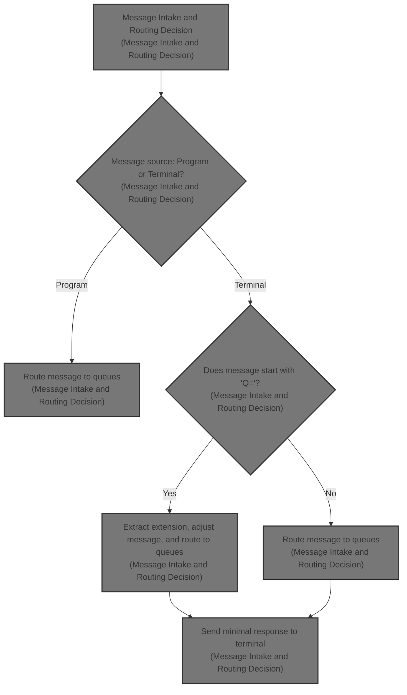

# Overview

This document describes the flow for handling and routing incoming messages. Messages are received from either other programs or the terminal, identified by their source, and routed to both transient and temporary queues for downstream processing. When messages are received from the terminal, a minimal response is sent back to the user.

## Dependencies

### Program

- LGSTSQ (<SwmPath>[base/src/lgstsq.cbl](base/src/lgstsq.cbl)</SwmPath>)

# Where is this program used?

This program is used multiple times in the codebase as represented in the following diagram:

```mermaid
graph TD
  v5h8g("Processing and Inserting Policy Data (LGAPOL01)") --> ohiv3("Logging Status Queue Handler (LGSTSQ)"):::currentEntity
click v5h8g openCode "base/src/lgapol01.cbl:1"
2cqmb("Processing Insurance Data Records (LGAPVS01)") --> ohiv3("Logging Status Queue Handler (LGSTSQ)"):::currentEntity
click 2cqmb openCode "base/src/lgapvs01.cbl:1"
exsrp("Deleting Policy Records (LGDPDB01)") --> ohiv3("Logging Status Queue Handler (LGSTSQ)"):::currentEntity
click exsrp openCode "base/src/lgdpdb01.cbl:1"
o6ftm("Adding Customer Logic (LGACUS01)") --> ohiv3("Logging Status Queue Handler (LGSTSQ)"):::currentEntity
click o6ftm openCode "base/src/lgacus01.cbl:1"
uv442("Adding Customer Records (LGACVS01)") --> ohiv3("Logging Status Queue Handler (LGSTSQ)"):::currentEntity
click uv442 openCode "base/src/lgacvs01.cbl:1"
v6wq5("Adding Customer Passwords (LGACDB02)") --> ohiv3("Logging Status Queue Handler (LGSTSQ)"):::currentEntity
click v6wq5 openCode "base/src/lgacdb02.cbl:1"
p1xf1("Database Policy Data Insertion (LGAPDB09)") --> ohiv3("Logging Status Queue Handler (LGSTSQ)"):::currentEntity
click p1xf1 openCode "base/src/lgapdb09.cbl:1"
nenhv("Adding Customer Details (LGACDB01)") --> ohiv3("Logging Status Queue Handler (LGSTSQ)"):::currentEntity
click nenhv openCode "base/src/lgacdb01.cbl:1"
3tdk0("Inquiring Customer Details (LGICUS01)") --> ohiv3("Logging Status Queue Handler (LGSTSQ)"):::currentEntity
click 3tdk0 openCode "base/src/lgicus01.cbl:1"
6cvtr("Deleting Policy Records (LGDPVS01)") --> ohiv3("Logging Status Queue Handler (LGSTSQ)"):::currentEntity
click 6cvtr openCode "base/src/lgdpvs01.cbl:1"
6c0hw("Delete Policy Business Logic (LGDPOL01)") --> ohiv3("Logging Status Queue Handler (LGSTSQ)"):::currentEntity
click 6c0hw openCode "base/src/lgdpol01.cbl:1"
0bfhd("Inquiring Customer Details (LGICDB01)") --> ohiv3("Logging Status Queue Handler (LGSTSQ)"):::currentEntity
click 0bfhd openCode "base/src/lgicdb01.cbl:1"
gzns8("Inquiring Policy Details (LGIPOL01)") --> ohiv3("Logging Status Queue Handler (LGSTSQ)"):::currentEntity
click gzns8 openCode "base/src/lgipol01.cbl:1"
rms3y("Inquiring Individual Insurance Policy Details (LGIPDB01)") --> ohiv3("Logging Status Queue Handler (LGSTSQ)"):::currentEntity
click rms3y openCode "base/src/lgipdb01.cbl:1"
sp86p("Updating Customer Details (LGUCUS01)") --> ohiv3("Logging Status Queue Handler (LGSTSQ)"):::currentEntity
click sp86p openCode "base/src/lgucus01.cbl:1"
y3418("Updating Customer details (LGUCDB01)") --> ohiv3("Logging Status Queue Handler (LGSTSQ)"):::currentEntity
click y3418 openCode "base/src/lgucdb01.cbl:1"
s85ke("Updating Policy Records (LGUPVS01)") --> ohiv3("Logging Status Queue Handler (LGSTSQ)"):::currentEntity
click s85ke openCode "base/src/lgupvs01.cbl:1"
7p72g("Updating Policy Details (LGUPOL01)") --> ohiv3("Logging Status Queue Handler (LGSTSQ)"):::currentEntity
click 7p72g openCode "base/src/lgupol01.cbl:1"
7imqc("Updating Policy details (LGUPDB01)") --> ohiv3("Logging Status Queue Handler (LGSTSQ)"):::currentEntity
click 7imqc openCode "base/src/lgupdb01.cbl:1"
nnkpn("Updating Customer Records (LGUCVS01)") --> ohiv3("Logging Status Queue Handler (LGSTSQ)"):::currentEntity
click nnkpn openCode "base/src/lgucvs01.cbl:1"
  
  
click ohiv3 openCode "base/src/lgstsq.cbl:1"
    classDef currentEntity color:#000000,fill:#7CB9F4

%% Swimm:
%% graph TD
%%   v5h8g("Processing and Inserting Policy Data (LGAPOL01)") --> ohiv3("Logging Status Queue Handler (LGSTSQ)"):::currentEntity
%% click v5h8g openCode "<SwmPath>[base/src/lgapol01.cbl](base/src/lgapol01.cbl)</SwmPath>:1"
%% 2cqmb("Processing Insurance Data Records (LGAPVS01)") --> ohiv3("Logging Status Queue Handler (LGSTSQ)"):::currentEntity
%% click 2cqmb openCode "<SwmPath>[base/src/lgapvs01.cbl](base/src/lgapvs01.cbl)</SwmPath>:1"
%% exsrp("Deleting Policy Records (LGDPDB01)") --> ohiv3("Logging Status Queue Handler (LGSTSQ)"):::currentEntity
%% click exsrp openCode "<SwmPath>[base/src/lgdpdb01.cbl](base/src/lgdpdb01.cbl)</SwmPath>:1"
%% o6ftm("Adding Customer Logic (LGACUS01)") --> ohiv3("Logging Status Queue Handler (LGSTSQ)"):::currentEntity
%% click o6ftm openCode "<SwmPath>[base/src/lgacus01.cbl](base/src/lgacus01.cbl)</SwmPath>:1"
%% uv442("Adding Customer Records (LGACVS01)") --> ohiv3("Logging Status Queue Handler (LGSTSQ)"):::currentEntity
%% click uv442 openCode "<SwmPath>[base/src/lgacvs01.cbl](base/src/lgacvs01.cbl)</SwmPath>:1"
%% v6wq5("Adding Customer Passwords (LGACDB02)") --> ohiv3("Logging Status Queue Handler (LGSTSQ)"):::currentEntity
%% click v6wq5 openCode "<SwmPath>[base/src/lgacdb02.cbl](base/src/lgacdb02.cbl)</SwmPath>:1"
%% p1xf1("Database Policy Data Insertion (LGAPDB09)") --> ohiv3("Logging Status Queue Handler (LGSTSQ)"):::currentEntity
%% click p1xf1 openCode "<SwmPath>[base/src/lgapdb09.cbl](base/src/lgapdb09.cbl)</SwmPath>:1"
%% nenhv("Adding Customer Details (LGACDB01)") --> ohiv3("Logging Status Queue Handler (LGSTSQ)"):::currentEntity
%% click nenhv openCode "<SwmPath>[base/src/lgacdb01.cbl](base/src/lgacdb01.cbl)</SwmPath>:1"
%% 3tdk0("Inquiring Customer Details (LGICUS01)") --> ohiv3("Logging Status Queue Handler (LGSTSQ)"):::currentEntity
%% click 3tdk0 openCode "<SwmPath>[base/src/lgicus01.cbl](base/src/lgicus01.cbl)</SwmPath>:1"
%% 6cvtr("Deleting Policy Records (LGDPVS01)") --> ohiv3("Logging Status Queue Handler (LGSTSQ)"):::currentEntity
%% click 6cvtr openCode "<SwmPath>[base/src/lgdpvs01.cbl](base/src/lgdpvs01.cbl)</SwmPath>:1"
%% 6c0hw("Delete Policy Business Logic (LGDPOL01)") --> ohiv3("Logging Status Queue Handler (LGSTSQ)"):::currentEntity
%% click 6c0hw openCode "<SwmPath>[base/src/lgdpol01.cbl](base/src/lgdpol01.cbl)</SwmPath>:1"
%% 0bfhd("Inquiring Customer Details (LGICDB01)") --> ohiv3("Logging Status Queue Handler (LGSTSQ)"):::currentEntity
%% click 0bfhd openCode "<SwmPath>[base/src/lgicdb01.cbl](base/src/lgicdb01.cbl)</SwmPath>:1"
%% gzns8("Inquiring Policy Details (LGIPOL01)") --> ohiv3("Logging Status Queue Handler (LGSTSQ)"):::currentEntity
%% click gzns8 openCode "<SwmPath>[base/src/lgipol01.cbl](base/src/lgipol01.cbl)</SwmPath>:1"
%% rms3y("Inquiring Individual Insurance Policy Details (LGIPDB01)") --> ohiv3("Logging Status Queue Handler (LGSTSQ)"):::currentEntity
%% click rms3y openCode "<SwmPath>[base/src/lgipdb01.cbl](base/src/lgipdb01.cbl)</SwmPath>:1"
%% sp86p("Updating Customer Details (LGUCUS01)") --> ohiv3("Logging Status Queue Handler (LGSTSQ)"):::currentEntity
%% click sp86p openCode "<SwmPath>[base/src/lgucus01.cbl](base/src/lgucus01.cbl)</SwmPath>:1"
%% y3418("Updating Customer details (LGUCDB01)") --> ohiv3("Logging Status Queue Handler (LGSTSQ)"):::currentEntity
%% click y3418 openCode "<SwmPath>[base/src/lgucdb01.cbl](base/src/lgucdb01.cbl)</SwmPath>:1"
%% s85ke("Updating Policy Records (LGUPVS01)") --> ohiv3("Logging Status Queue Handler (LGSTSQ)"):::currentEntity
%% click s85ke openCode "<SwmPath>[base/src/lgupvs01.cbl](base/src/lgupvs01.cbl)</SwmPath>:1"
%% 7p72g("Updating Policy Details (LGUPOL01)") --> ohiv3("Logging Status Queue Handler (LGSTSQ)"):::currentEntity
%% click 7p72g openCode "<SwmPath>[base/src/lgupol01.cbl](base/src/lgupol01.cbl)</SwmPath>:1"
%% 7imqc("Updating Policy details (LGUPDB01)") --> ohiv3("Logging Status Queue Handler (LGSTSQ)"):::currentEntity
%% click 7imqc openCode "<SwmPath>[base/src/lgupdb01.cbl](base/src/lgupdb01.cbl)</SwmPath>:1"
%% nnkpn("Updating Customer Records (LGUCVS01)") --> ohiv3("Logging Status Queue Handler (LGSTSQ)"):::currentEntity
%% click nnkpn openCode "<SwmPath>[base/src/lgucvs01.cbl](base/src/lgucvs01.cbl)</SwmPath>:1"
%%   
%%   
%% click ohiv3 openCode "<SwmPath>[base/src/lgstsq.cbl](base/src/lgstsq.cbl)</SwmPath>:1"
%%     classDef currentEntity color:#000000,fill:#7CB9F4
```

&nbsp;

*This is an auto-generated document by Swimm 🌊 and has not yet been verified by a human*

<SwmMeta version="3.0.0" repo-id="Z2l0aHViJTNBJTNBU3dpbW1pby1nZW5hcHAtaG91c2UlM0ElM0FHaXJpLVN3aW1t" repo-name="Swimmio-genapp-house">Powered by [Swimm](https://app.swimm.io/)</SwmMeta>
