# Overview

This document explains the flow for routing incoming messages and preparing them for further processing. Messages can originate from either a program or a terminal. The flow applies special handling for messages with a 'Q=' prefix, writes messages to both temporary and permanent queues, and sends acknowledgements to terminals when needed.

## Dependencies

### Program

- LGSTSQ (<SwmPath>[base/src/lgstsq.cbl](base/src/lgstsq.cbl)</SwmPath>)

# Where is this program used?

This program is used multiple times in the codebase as represented in the following diagram:

```mermaid
graph TD
  5z680("Processing and Inserting Policy Data (LGAPOL01)") --> le146("Logging Status Queue Handler (LGSTSQ)"):::currentEntity
click 5z680 openCode "base/src/lgapol01.cbl:1"
tblwr("Processing Insurance Data Records (LGAPVS01)") --> le146("Logging Status Queue Handler (LGSTSQ)"):::currentEntity
click tblwr openCode "base/src/lgapvs01.cbl:1"
2ug9q("Deleting Policy Records (LGDPDB01)") --> le146("Logging Status Queue Handler (LGSTSQ)"):::currentEntity
click 2ug9q openCode "base/src/lgdpdb01.cbl:1"
75ba3("Adding Customer Logic (LGACUS01)") --> le146("Logging Status Queue Handler (LGSTSQ)"):::currentEntity
click 75ba3 openCode "base/src/lgacus01.cbl:1"
3mopt("Adding Customer Records (LGACVS01)") --> le146("Logging Status Queue Handler (LGSTSQ)"):::currentEntity
click 3mopt openCode "base/src/lgacvs01.cbl:1"
67l9b("Adding Customer Passwords (LGACDB02)") --> le146("Logging Status Queue Handler (LGSTSQ)"):::currentEntity
click 67l9b openCode "base/src/lgacdb02.cbl:1"
ezmra("Database Policy Data Insertion (LGAPDB09)") --> le146("Logging Status Queue Handler (LGSTSQ)"):::currentEntity
click ezmra openCode "base/src/lgapdb09.cbl:1"
tdq3u("Adding Customer Details (LGACDB01)") --> le146("Logging Status Queue Handler (LGSTSQ)"):::currentEntity
click tdq3u openCode "base/src/lgacdb01.cbl:1"
wv1m5("Inquiring Customer Details (LGICUS01)") --> le146("Logging Status Queue Handler (LGSTSQ)"):::currentEntity
click wv1m5 openCode "base/src/lgicus01.cbl:1"
nwckq("Deleting Policy Records (LGDPVS01)") --> le146("Logging Status Queue Handler (LGSTSQ)"):::currentEntity
click nwckq openCode "base/src/lgdpvs01.cbl:1"
litxo("Delete Policy Business Logic (LGDPOL01)") --> le146("Logging Status Queue Handler (LGSTSQ)"):::currentEntity
click litxo openCode "base/src/lgdpol01.cbl:1"
2hv3p("Inquiring Customer Details (LGICDB01)") --> le146("Logging Status Queue Handler (LGSTSQ)"):::currentEntity
click 2hv3p openCode "base/src/lgicdb01.cbl:1"
p3adp("Inquiring Policy Details (LGIPOL01)") --> le146("Logging Status Queue Handler (LGSTSQ)"):::currentEntity
click p3adp openCode "base/src/lgipol01.cbl:1"
ok3dv("Inquiring Individual Insurance Policy Details (LGIPDB01)") --> le146("Logging Status Queue Handler (LGSTSQ)"):::currentEntity
click ok3dv openCode "base/src/lgipdb01.cbl:1"
jy56l("Updating Customer Details (LGUCUS01)") --> le146("Logging Status Queue Handler (LGSTSQ)"):::currentEntity
click jy56l openCode "base/src/lgucus01.cbl:1"
2obg7("Updating Customer details (LGUCDB01)") --> le146("Logging Status Queue Handler (LGSTSQ)"):::currentEntity
click 2obg7 openCode "base/src/lgucdb01.cbl:1"
uxp9g("Updating Policy Records (LGUPVS01)") --> le146("Logging Status Queue Handler (LGSTSQ)"):::currentEntity
click uxp9g openCode "base/src/lgupvs01.cbl:1"
bl6hn("Updating Policy Details (LGUPOL01)") --> le146("Logging Status Queue Handler (LGSTSQ)"):::currentEntity
click bl6hn openCode "base/src/lgupol01.cbl:1"
z2fl7("Updating Policy details (LGUPDB01)") --> le146("Logging Status Queue Handler (LGSTSQ)"):::currentEntity
click z2fl7 openCode "base/src/lgupdb01.cbl:1"
y622k("Updating Customer Records (LGUCVS01)") --> le146("Logging Status Queue Handler (LGSTSQ)"):::currentEntity
click y622k openCode "base/src/lgucvs01.cbl:1"
  
  
click le146 openCode "base/src/lgstsq.cbl:1"
    classDef currentEntity color:#000000,fill:#7CB9F4

%% Swimm:
%% graph TD
%%   5z680("Processing and Inserting Policy Data (LGAPOL01)") --> le146("Logging Status Queue Handler (LGSTSQ)"):::currentEntity
%% click 5z680 openCode "<SwmPath>[base/src/lgapol01.cbl](base/src/lgapol01.cbl)</SwmPath>:1"
%% tblwr("Processing Insurance Data Records (LGAPVS01)") --> le146("Logging Status Queue Handler (LGSTSQ)"):::currentEntity
%% click tblwr openCode "<SwmPath>[base/src/lgapvs01.cbl](base/src/lgapvs01.cbl)</SwmPath>:1"
%% 2ug9q("Deleting Policy Records (LGDPDB01)") --> le146("Logging Status Queue Handler (LGSTSQ)"):::currentEntity
%% click 2ug9q openCode "<SwmPath>[base/src/lgdpdb01.cbl](base/src/lgdpdb01.cbl)</SwmPath>:1"
%% 75ba3("Adding Customer Logic (LGACUS01)") --> le146("Logging Status Queue Handler (LGSTSQ)"):::currentEntity
%% click 75ba3 openCode "<SwmPath>[base/src/lgacus01.cbl](base/src/lgacus01.cbl)</SwmPath>:1"
%% 3mopt("Adding Customer Records (LGACVS01)") --> le146("Logging Status Queue Handler (LGSTSQ)"):::currentEntity
%% click 3mopt openCode "<SwmPath>[base/src/lgacvs01.cbl](base/src/lgacvs01.cbl)</SwmPath>:1"
%% 67l9b("Adding Customer Passwords (LGACDB02)") --> le146("Logging Status Queue Handler (LGSTSQ)"):::currentEntity
%% click 67l9b openCode "<SwmPath>[base/src/lgacdb02.cbl](base/src/lgacdb02.cbl)</SwmPath>:1"
%% ezmra("Database Policy Data Insertion (LGAPDB09)") --> le146("Logging Status Queue Handler (LGSTSQ)"):::currentEntity
%% click ezmra openCode "<SwmPath>[base/src/lgapdb09.cbl](base/src/lgapdb09.cbl)</SwmPath>:1"
%% tdq3u("Adding Customer Details (LGACDB01)") --> le146("Logging Status Queue Handler (LGSTSQ)"):::currentEntity
%% click tdq3u openCode "<SwmPath>[base/src/lgacdb01.cbl](base/src/lgacdb01.cbl)</SwmPath>:1"
%% wv1m5("Inquiring Customer Details (LGICUS01)") --> le146("Logging Status Queue Handler (LGSTSQ)"):::currentEntity
%% click wv1m5 openCode "<SwmPath>[base/src/lgicus01.cbl](base/src/lgicus01.cbl)</SwmPath>:1"
%% nwckq("Deleting Policy Records (LGDPVS01)") --> le146("Logging Status Queue Handler (LGSTSQ)"):::currentEntity
%% click nwckq openCode "<SwmPath>[base/src/lgdpvs01.cbl](base/src/lgdpvs01.cbl)</SwmPath>:1"
%% litxo("Delete Policy Business Logic (LGDPOL01)") --> le146("Logging Status Queue Handler (LGSTSQ)"):::currentEntity
%% click litxo openCode "<SwmPath>[base/src/lgdpol01.cbl](base/src/lgdpol01.cbl)</SwmPath>:1"
%% 2hv3p("Inquiring Customer Details (LGICDB01)") --> le146("Logging Status Queue Handler (LGSTSQ)"):::currentEntity
%% click 2hv3p openCode "<SwmPath>[base/src/lgicdb01.cbl](base/src/lgicdb01.cbl)</SwmPath>:1"
%% p3adp("Inquiring Policy Details (LGIPOL01)") --> le146("Logging Status Queue Handler (LGSTSQ)"):::currentEntity
%% click p3adp openCode "<SwmPath>[base/src/lgipol01.cbl](base/src/lgipol01.cbl)</SwmPath>:1"
%% ok3dv("Inquiring Individual Insurance Policy Details (LGIPDB01)") --> le146("Logging Status Queue Handler (LGSTSQ)"):::currentEntity
%% click ok3dv openCode "<SwmPath>[base/src/lgipdb01.cbl](base/src/lgipdb01.cbl)</SwmPath>:1"
%% jy56l("Updating Customer Details (LGUCUS01)") --> le146("Logging Status Queue Handler (LGSTSQ)"):::currentEntity
%% click jy56l openCode "<SwmPath>[base/src/lgucus01.cbl](base/src/lgucus01.cbl)</SwmPath>:1"
%% 2obg7("Updating Customer details (LGUCDB01)") --> le146("Logging Status Queue Handler (LGSTSQ)"):::currentEntity
%% click 2obg7 openCode "<SwmPath>[base/src/lgucdb01.cbl](base/src/lgucdb01.cbl)</SwmPath>:1"
%% uxp9g("Updating Policy Records (LGUPVS01)") --> le146("Logging Status Queue Handler (LGSTSQ)"):::currentEntity
%% click uxp9g openCode "<SwmPath>[base/src/lgupvs01.cbl](base/src/lgupvs01.cbl)</SwmPath>:1"
%% bl6hn("Updating Policy Details (LGUPOL01)") --> le146("Logging Status Queue Handler (LGSTSQ)"):::currentEntity
%% click bl6hn openCode "<SwmPath>[base/src/lgupol01.cbl](base/src/lgupol01.cbl)</SwmPath>:1"
%% z2fl7("Updating Policy details (LGUPDB01)") --> le146("Logging Status Queue Handler (LGSTSQ)"):::currentEntity
%% click z2fl7 openCode "<SwmPath>[base/src/lgupdb01.cbl](base/src/lgupdb01.cbl)</SwmPath>:1"
%% y622k("Updating Customer Records (LGUCVS01)") --> le146("Logging Status Queue Handler (LGSTSQ)"):::currentEntity
%% click y622k openCode "<SwmPath>[base/src/lgucvs01.cbl](base/src/lgucvs01.cbl)</SwmPath>:1"
%%   
%%   
%% click le146 openCode "<SwmPath>[base/src/lgstsq.cbl](base/src/lgstsq.cbl)</SwmPath>:1"
%%     classDef currentEntity color:#000000,fill:#7CB9F4
```



## Detailed View of the Program's Functionality

a. Initialization and Context Setup

The process begins by clearing out the memory areas used for both the outgoing message and the buffer that will receive incoming data. This ensures that no leftover data from previous operations interferes with the current transaction. Next, the system retrieves two key pieces of information from the environment: the unique identifier for the system (used for routing and tracking) and the name of the program that initiated this transaction. These values are stored for use in subsequent logic, setting up the context for how the message will be processed.

b. Determining Message Source and Preparing the Message

The next step is to determine whether the transaction was triggered by another program or by a message arriving from a terminal or queue. This is done by checking if the invoking program name is present. If it is, the process marks the message as coming from a program, copies the incoming data from a special communication area into the message buffer, and records the length of the data. If there is no invoking program, the process assumes the message came from a terminal or queue, receives the data into the buffer, marks the message as such, copies the relevant portion into the outgoing message buffer, and adjusts the length to account for the structure of the received data.

c. Special Handling for Queue Routing

After the message is prepared, the process sets a default queue name for temporary storage. It then checks if the message begins with a special prefix indicating a custom queue extension (specifically, if the message starts with 'Q='). If this prefix is present, the next four characters are extracted and used as the extension for the queue name, effectively customizing the destination queue. The message is then shifted to remove the prefix and extension, and the length is adjusted to reflect the removal of these characters. This allows for dynamic routing of messages to different queues based on their content.

d. Writing the Message to Queues

With the message and its routing determined, the process first increases the recorded length of the message to account for any structural adjustments. It then writes the message to a temporary destination queue for immediate processing or logging. This is followed by writing the message to a secondary, potentially persistent queue, which is used for longer-term storage or further processing. The write to the secondary queue is performed with a setting that prevents the process from waiting if the queue is full; instead, the message is simply not written if there is no space, ensuring that the process does not stall.

e. Responding to Terminal-Originated Messages and Cleanup

Finally, if the message originated from a terminal or queue (as opposed to another program), the process sends a minimal response (a single character) back to the terminal to acknowledge receipt and clear the input buffer. This helps maintain smooth operation for terminal users. Regardless of the message source, the process then ends the transaction and returns control to the system, ensuring that all resources are properly released and the program is ready for the next invocation.

# Rule Definition

| Paragraph Name   | Rule ID | Category          | Description                                                                                                                                                                                                               | Conditions                                      | Remarks                                                                                                                                                 |
| ---------------- | ------- | ----------------- | ------------------------------------------------------------------------------------------------------------------------------------------------------------------------------------------------------------------------- | ----------------------------------------------- | ------------------------------------------------------------------------------------------------------------------------------------------------------- |
| MAINLINE SECTION | RL-001  | Computation       | At the start of processing, the system retrieves the system ID and the name of the invoking program for context and further logic.                                                                                        | Always at the start of processing.              | System ID is 4 bytes, invoking program name is 8 bytes.                                                                                                 |
| MAINLINE SECTION | RL-002  | Conditional Logic | The system checks if the invoking program name is present. If present, it sets a flag for program invocation and uses the program buffer; otherwise, it sets a flag for terminal invocation and uses the terminal buffer. | Presence or absence of invoking program name.   | Flag values: 'C' for program, 'R' for terminal. Program buffer is 90 bytes, terminal buffer is 80 bytes (5 bytes header, 74 bytes data).                |
| MAINLINE SECTION | RL-003  | Data Assignment   | The system copies the message content from the source buffer into the main message buffer, adjusting the length as needed, especially for terminal input where the header is excluded.                                    | After determining invocation source.            | Main message buffer is 90 bytes. For terminal input, subtract 5 bytes header from length.                                                               |
| MAINLINE SECTION | RL-004  | Conditional Logic | If the message starts with 'Q=', the system extracts the next 4 characters as the queue extension, removes the prefix from the message, and adjusts the message length.                                                   | Message starts with 'Q='.                       | Prefix is 2 bytes ('Q='), extension is 4 bytes, total prefix length is 6 bytes. Message buffer is 90 bytes.                                             |
| MAINLINE SECTION | RL-005  | Conditional Logic | The system sets the temporary storage queue name to 'GENAERRS' by default, or to 'GENA' concatenated with the extracted extension if present.                                                                             | Queue extension present or not.                 | Default TSQ name: 'GENAERRS' (8 bytes). If extension present: 'GENA' + extension (8 bytes).                                                             |
| MAINLINE SECTION | RL-006  | Computation       | The system writes the processed message to the transient data queue named 'CSMT', using the adjusted message length.                                                                                                      | After message processing and length adjustment. | TDQ name: 'CSMT' (4 bytes). Message length is adjusted as per previous rules.                                                                           |
| MAINLINE SECTION | RL-007  | Computation       | The system writes the processed message to the temporary storage queue named either 'GENAERRS' or 'GENAxxxx', using the adjusted message length and NOSUSPEND behavior.                                                   | After message processing and length adjustment. | TSQ name: 'GENAERRS' or 'GENAxxxx' (8 bytes). NOSUSPEND means the task will not wait for storage to become available.                                   |
| MAINLINE SECTION | RL-008  | Conditional Logic | If the message was received from a terminal, the system sends a 1-character acknowledgment response to the terminal after queueing the message. If received from a program, the system ends the transaction.              | Flag indicating source of message.              | Acknowledgment is 1 character. For terminal, send response; for program, end transaction.                                                               |
| MAINLINE SECTION | RL-009  | Data Assignment   | Before processing each new message, the system must clear the buffer used for storing the outgoing message and the buffer used for receiving incoming data to ensure no residual data affects the current operation.      | Always at the start of processing.              | The outgoing message buffer is 95 bytes (including system ID, filler, and message content). The receive buffer is 80 bytes (including header and data). |

# User Stories

## User Story 1: System prepares for new message processing

---

### Story Description:

As a system, I want to clear the message and receive buffers and retrieve the system ID and invoking program name at the start of processing so that each message is processed with a clean state and proper context.

---

### Business Rule Mapping:

| Rule ID | Paragraph Name   | Rule Description                                                                                                                                                                                                     |
| ------- | ---------------- | -------------------------------------------------------------------------------------------------------------------------------------------------------------------------------------------------------------------- |
| RL-001  | MAINLINE SECTION | At the start of processing, the system retrieves the system ID and the name of the invoking program for context and further logic.                                                                                   |
| RL-009  | MAINLINE SECTION | Before processing each new message, the system must clear the buffer used for storing the outgoing message and the buffer used for receiving incoming data to ensure no residual data affects the current operation. |

---

### Relevant Functionality:

- **MAINLINE SECTION**
  1. **RL-001:**
     - Retrieve system ID and store in the designated field.
     - Retrieve invoking program name and store in the designated field.
  2. **RL-009:**
     - Set all bytes in the buffer used for outgoing messages to spaces.
     - Set all bytes in the buffer used for receiving incoming data to spaces.

## User Story 2: System determines message source, prepares message buffer, and responds appropriately

---

### Story Description:

As a system, I want to determine if the message was received from a program or terminal, set the appropriate flag, copy the message content into the main buffer with correct length adjustment, and then either send an acknowledgment to the terminal or end the transaction for a program so that the message is accurately prepared and the sender receives the correct feedback.

---

### Business Rule Mapping:

| Rule ID | Paragraph Name   | Rule Description                                                                                                                                                                                                          |
| ------- | ---------------- | ------------------------------------------------------------------------------------------------------------------------------------------------------------------------------------------------------------------------- |
| RL-002  | MAINLINE SECTION | The system checks if the invoking program name is present. If present, it sets a flag for program invocation and uses the program buffer; otherwise, it sets a flag for terminal invocation and uses the terminal buffer. |
| RL-003  | MAINLINE SECTION | The system copies the message content from the source buffer into the main message buffer, adjusting the length as needed, especially for terminal input where the header is excluded.                                    |
| RL-008  | MAINLINE SECTION | If the message was received from a terminal, the system sends a 1-character acknowledgment response to the terminal after queueing the message. If received from a program, the system ends the transaction.              |

---

### Relevant Functionality:

- **MAINLINE SECTION**
  1. **RL-002:**
     - If invoking program name is not spaces:
       - Set flag to indicate program invocation.
       - Copy message from program buffer.
       - Set message length from EIBCALEN.
     - Else:
       - Receive message from terminal buffer.
       - Set flag to indicate terminal invocation.
       - Copy message from terminal buffer (excluding header).
       - Subtract header length from message length.
  2. **RL-003:**
     - Copy message content from source buffer to main message buffer.
     - If source is terminal, subtract header length from message length.
  3. **RL-008:**
     - If flag indicates terminal:
       - Send 1-character acknowledgment to terminal.
     - Else:
       - End transaction.

## User Story 3: System processes queue extension and sets queue name

---

### Story Description:

As a system, I want to check if the message starts with 'Q=', extract the queue extension if present, remove the prefix, adjust the message length, and set the appropriate temporary storage queue name so that messages are routed to the correct queue.

---

### Business Rule Mapping:

| Rule ID | Paragraph Name   | Rule Description                                                                                                                                                        |
| ------- | ---------------- | ----------------------------------------------------------------------------------------------------------------------------------------------------------------------- |
| RL-004  | MAINLINE SECTION | If the message starts with 'Q=', the system extracts the next 4 characters as the queue extension, removes the prefix from the message, and adjusts the message length. |
| RL-005  | MAINLINE SECTION | The system sets the temporary storage queue name to 'GENAERRS' by default, or to 'GENA' concatenated with the extracted extension if present.                           |

---

### Relevant Functionality:

- **MAINLINE SECTION**
  1. **RL-004:**
     - If message starts with 'Q=':
       - Extract next 4 characters as queue extension.
       - Remove 'Q=xxxx' prefix from message.
       - Adjust message length by subtracting 7 (2 for 'Q=', 4 for extension, 1 for space).
  2. **RL-005:**
     - Set TSQ name to 'GENAERRS'.
     - If queue extension is present, set TSQ name to 'GENA' + extension.

## User Story 4: System writes processed message to queues

---

### Story Description:

As a system, I want to write the processed message to the transient data queue 'CSMT' and the appropriate temporary storage queue ('GENAERRS' or 'GENAxxxx') using the adjusted message length so that the message is reliably stored for further processing.

---

### Business Rule Mapping:

| Rule ID | Paragraph Name   | Rule Description                                                                                                                                                        |
| ------- | ---------------- | ----------------------------------------------------------------------------------------------------------------------------------------------------------------------- |
| RL-006  | MAINLINE SECTION | The system writes the processed message to the transient data queue named 'CSMT', using the adjusted message length.                                                    |
| RL-007  | MAINLINE SECTION | The system writes the processed message to the temporary storage queue named either 'GENAERRS' or 'GENAxxxx', using the adjusted message length and NOSUSPEND behavior. |

---

### Relevant Functionality:

- **MAINLINE SECTION**
  1. **RL-006:**
     - Write message to TDQ 'CSMT' with adjusted length.
  2. **RL-007:**
     - Write message to TSQ with determined name and adjusted length, using NOSUSPEND.

# Workflow

# Message Routing and Queue Preparation

```mermaid
%%{init: {"flowchart": {"defaultRenderer": "elk"}} }%%
flowchart TD
    node1["Start MAINLINE processing"] --> node2["Assign system ID and invoking program"]
    click node1 openCode "base/src/lgstsq.cbl:55:56"
    click node2 openCode "base/src/lgstsq.cbl:60:66"
    node2 --> node3{"Is invoking program present?"}
    click node3 openCode "base/src/lgstsq.cbl:68:80"
    node3 -->|"Yes (WS-FLAG = 'C')"| node4["Get message from program, set WS-FLAG to 'C'"]
    click node4 openCode "base/src/lgstsq.cbl:69:71"
    node3 -->|"No (WS-FLAG = 'R')"| node5["Receive message from terminal, set WS-FLAG to 'R'"]
    click node5 openCode "base/src/lgstsq.cbl:73:79"
    node4 --> node6["Prepare message, set STSQ-NAME to 'GENAERRS'"]
    click node6 openCode "base/src/lgstsq.cbl:82:83"
    node5 --> node6
    node6 --> node7{"Does message start with 'Q='?"}
    click node7 openCode "base/src/lgstsq.cbl:83:88"
    node7 -->|"Yes"| node8["Extract extension (STSQ-EXT), update message, adjust length"]
    click node8 openCode "base/src/lgstsq.cbl:84:87"
    node7 -->|"No"| node9["Continue with message"]
    click node9 openCode "base/src/lgstsq.cbl:90:99"
    node8 --> node10["Write message to TDQ 'CSMT' and TS queue 'GENAERRS'"]
    click node10 openCode "base/src/lgstsq.cbl:94:111"
    node9 --> node10
    node10 --> node11{"Was message received from terminal? (WS-FLAG = 'R')"}
    click node11 openCode "base/src/lgstsq.cbl:113:119"
    node11 -->|"Yes"| node12["Send message to terminal"]
    click node12 openCode "base/src/lgstsq.cbl:114:119"
    node11 -->|"No"| node13["End transaction"]
    click node13 openCode "base/src/lgstsq.cbl:121:122"
    node12 --> node13
classDef HeadingStyle fill:#777777,stroke:#333,stroke-width:2px;

%% Swimm:
%% %%{init: {"flowchart": {"defaultRenderer": "elk"}} }%%
%% flowchart TD
%%     node1["Start MAINLINE processing"] --> node2["Assign system ID and invoking program"]
%%     click node1 openCode "<SwmPath>[base/src/lgstsq.cbl](base/src/lgstsq.cbl)</SwmPath>:55:56"
%%     click node2 openCode "<SwmPath>[base/src/lgstsq.cbl](base/src/lgstsq.cbl)</SwmPath>:60:66"
%%     node2 --> node3{"Is invoking program present?"}
%%     click node3 openCode "<SwmPath>[base/src/lgstsq.cbl](base/src/lgstsq.cbl)</SwmPath>:68:80"
%%     node3 -->|"Yes (<SwmToken path="base/src/lgstsq.cbl" pos="69:9:11" line-data="              MOVE &#39;C&#39; To WS-FLAG">`WS-FLAG`</SwmToken> = 'C')"| node4["Get message from program, set <SwmToken path="base/src/lgstsq.cbl" pos="69:9:11" line-data="              MOVE &#39;C&#39; To WS-FLAG">`WS-FLAG`</SwmToken> to 'C'"]
%%     click node4 openCode "<SwmPath>[base/src/lgstsq.cbl](base/src/lgstsq.cbl)</SwmPath>:69:71"
%%     node3 -->|"No (<SwmToken path="base/src/lgstsq.cbl" pos="69:9:11" line-data="              MOVE &#39;C&#39; To WS-FLAG">`WS-FLAG`</SwmToken> = 'R')"| node5["Receive message from terminal, set <SwmToken path="base/src/lgstsq.cbl" pos="69:9:11" line-data="              MOVE &#39;C&#39; To WS-FLAG">`WS-FLAG`</SwmToken> to 'R'"]
%%     click node5 openCode "<SwmPath>[base/src/lgstsq.cbl](base/src/lgstsq.cbl)</SwmPath>:73:79"
%%     node4 --> node6["Prepare message, set <SwmToken path="base/src/lgstsq.cbl" pos="82:9:11" line-data="           MOVE &#39;GENAERRS&#39; TO STSQ-NAME.">`STSQ-NAME`</SwmToken> to 'GENAERRS'"]
%%     click node6 openCode "<SwmPath>[base/src/lgstsq.cbl](base/src/lgstsq.cbl)</SwmPath>:82:83"
%%     node5 --> node6
%%     node6 --> node7{"Does message start with 'Q='?"}
%%     click node7 openCode "<SwmPath>[base/src/lgstsq.cbl](base/src/lgstsq.cbl)</SwmPath>:83:88"
%%     node7 -->|"Yes"| node8["Extract extension (<SwmToken path="base/src/lgstsq.cbl" pos="84:16:18" line-data="              MOVE WRITE-MSG-MSG(3:4) TO STSQ-EXT">`STSQ-EXT`</SwmToken>), update message, adjust length"]
%%     click node8 openCode "<SwmPath>[base/src/lgstsq.cbl](base/src/lgstsq.cbl)</SwmPath>:84:87"
%%     node7 -->|"No"| node9["Continue with message"]
%%     click node9 openCode "<SwmPath>[base/src/lgstsq.cbl](base/src/lgstsq.cbl)</SwmPath>:90:99"
%%     node8 --> node10["Write message to TDQ 'CSMT' and TS queue 'GENAERRS'"]
%%     click node10 openCode "<SwmPath>[base/src/lgstsq.cbl](base/src/lgstsq.cbl)</SwmPath>:94:111"
%%     node9 --> node10
%%     node10 --> node11{"Was message received from terminal? (<SwmToken path="base/src/lgstsq.cbl" pos="69:9:11" line-data="              MOVE &#39;C&#39; To WS-FLAG">`WS-FLAG`</SwmToken> = 'R')"}
%%     click node11 openCode "<SwmPath>[base/src/lgstsq.cbl](base/src/lgstsq.cbl)</SwmPath>:113:119"
%%     node11 -->|"Yes"| node12["Send message to terminal"]
%%     click node12 openCode "<SwmPath>[base/src/lgstsq.cbl](base/src/lgstsq.cbl)</SwmPath>:114:119"
%%     node11 -->|"No"| node13["End transaction"]
%%     click node13 openCode "<SwmPath>[base/src/lgstsq.cbl](base/src/lgstsq.cbl)</SwmPath>:121:122"
%%     node12 --> node13
%% classDef HeadingStyle fill:#777777,stroke:#333,stroke-width:2px;
```



This section is responsible for routing incoming messages to the appropriate queues and preparing them for further processing. It ensures that messages are handled differently based on their origin (program or terminal), and applies special routing logic for messages with specific prefixes.

| Category        | Rule Name                    | Description                                                                                                                                                                  |
| --------------- | ---------------------------- | ---------------------------------------------------------------------------------------------------------------------------------------------------------------------------- |
| Data validation | Context Assignment           | The system ID and invoking program name are always assigned at the start of processing to establish context for message handling.                                            |
| Business logic  | Message Origin Determination | If the invoking program is present, the message is taken from the program and flagged as 'C'; otherwise, the message is received from the terminal and flagged as 'R'.       |
| Business logic  | Dual Queue Writing           | All messages are written to both a temporary queue ('GENAERRS') and a permanent queue ('CSMT') for persistence and immediate access.                                         |
| Business logic  | Queue Extension Extraction   | If the message starts with 'Q=', the next four characters are extracted as the queue extension, the message is shifted, and the message length is adjusted by subtracting 7. |
| Business logic  | Terminal Acknowledgement     | If the message was received from a terminal, a one-character response is sent back to acknowledge receipt and free up the terminal buffer.                                   |
| Business logic  | No Queue Suspension          | If the permanent queue is full, the message is not suspended and may be dropped, ensuring the process does not wait and remains responsive.                                  |

<SwmSnippet path="/base/src/lgstsq.cbl" line="55">

---

In MAINLINE, we start by clearing out the message and receive buffers, then grab the system ID and the name of the program that triggered this run. This sets up the context for how the message will be handled next, depending on whether it was invoked by a program or received from a queue.

```cobol
       MAINLINE SECTION.

           MOVE SPACES TO WRITE-MSG.
           MOVE SPACES TO WS-RECV.

           EXEC CICS ASSIGN SYSID(WRITE-MSG-SYSID)
                RESP(WS-RESP)
           END-EXEC.

           EXEC CICS ASSIGN INVOKINGPROG(WS-INVOKEPROG)
                RESP(WS-RESP)
           END-EXEC.
```

---

</SwmSnippet>

<SwmSnippet path="/base/src/lgstsq.cbl" line="68">

---

This part splits the flow based on message origin, prepping the message and flag for the next steps.

```cobol
           IF WS-INVOKEPROG NOT = SPACES
              MOVE 'C' To WS-FLAG
              MOVE COMMA-DATA  TO WRITE-MSG-MSG
              MOVE EIBCALEN    TO WS-RECV-LEN
           ELSE
              EXEC CICS RECEIVE INTO(WS-RECV)
                  LENGTH(WS-RECV-LEN)
                  RESP(WS-RESP)
              END-EXEC
              MOVE 'R' To WS-FLAG
              MOVE WS-RECV-DATA  TO WRITE-MSG-MSG
              SUBTRACT 5 FROM WS-RECV-LEN
           END-IF.
```

---

</SwmSnippet>

<SwmSnippet path="/base/src/lgstsq.cbl" line="82">

---

If the message starts with 'Q=', we pull out the next four characters for the queue extension, shift the rest of the message, and adjust the length. This handles special messages that need custom queue routing.

```cobol
           MOVE 'GENAERRS' TO STSQ-NAME.
           IF WRITE-MSG-MSG(1:2) = 'Q=' THEN
              MOVE WRITE-MSG-MSG(3:4) TO STSQ-EXT
              MOVE WRITE-MSG-REST TO TEMPO
              MOVE TEMPO          TO WRITE-MSG-MSG
              SUBTRACT 7 FROM WS-RECV-LEN
           END-IF.
```

---

</SwmSnippet>

<SwmSnippet path="/base/src/lgstsq.cbl" line="90">

---

After prepping the message, we write it to a temporary queue for quick access and then to a permanent queue for persistence. The NOSUSPEND option means we don't wait if the permanent queue can't take the message right away.

```cobol
           ADD 5 TO WS-RECV-LEN.

      * Write output message to TDQ CSMT
      *
           EXEC CICS WRITEQ TD QUEUE(STDQ-NAME)
                     FROM(WRITE-MSG)
                     RESP(WS-RESP)
                     LENGTH(WS-RECV-LEN)

           END-EXEC.
```

---

</SwmSnippet>

<SwmSnippet path="/base/src/lgstsq.cbl" line="105">

---

This is the call to write the message to the permanent queue with NOSUSPEND, so if the queue is full, we don't wait around. This keeps things moving but could drop messages if the queue can't take them.

```cobol
           EXEC CICS WRITEQ TS QUEUE(STSQ-NAME)
                     FROM(WRITE-MSG)
                     RESP(WS-RESP)
                     NOSUSPEND
                     LENGTH(WS-RECV-LEN)

           END-EXEC.
```

---

</SwmSnippet>

<SwmSnippet path="/base/src/lgstsq.cbl" line="113">

---

Finally, if the message came from a queue, we send back a one-character response to acknowledge it and free up the buffer. Then we return from the program.

```cobol
           If WS-FLAG = 'R' Then
             EXEC CICS SEND TEXT FROM(FILLER-X)
              WAIT
              ERASE
              LENGTH(1)
              FREEKB
             END-EXEC.

           EXEC CICS RETURN
           END-EXEC.
```

---

</SwmSnippet>

&nbsp;

*This is an auto-generated document by Swimm 🌊 and has not yet been verified by a human*

<SwmMeta version="3.0.0" repo-id="Z2l0aHViJTNBJTNBU3dpbW1pby1nZW5hcHAtaG91c2UlM0ElM0FHaXJpLVN3aW1t" repo-name="Swimmio-genapp-house"><sup>Powered by [Swimm](https://app.swimm.io/)</sup></SwmMeta>
