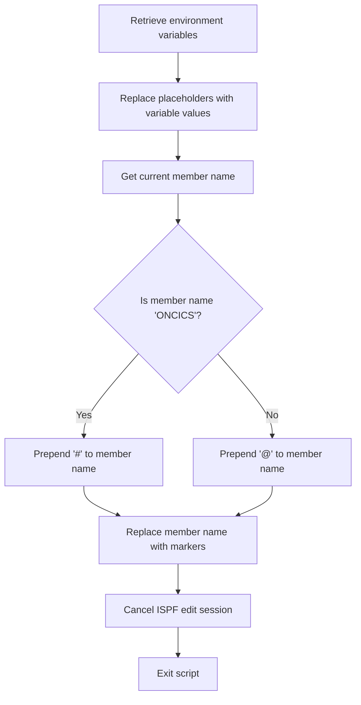

# What the script does

The mac1 Rexx script is designed to perform a series of automated text replacements within an ISPF editor session. It retrieves a set of predefined variables from the environment and then systematically replaces placeholder tokens in the current member being edited with their corresponding values. This process effectively customizes or configures the source code or text by substituting symbolic placeholders with actual values, streamlining repetitive editing tasks. For example, if the source contains placeholders like <CICSHLQ>, the script replaces them with the actual value of the CICSHLQ variable.

# Script flow

The script flow can be broken down into the following main steps:

- Retrieve multiple environment variables using ISPEXEC VGET commands.
- Perform a sequence of global text replacements in the current ISPF editor member, substituting placeholders with the retrieved variable values.
- Determine the current member name and prepend a special character based on its value.
- Replace occurrences of the modified member name with specific markers.
- Cancel the ISPF edit session and exit the script.



<SwmSnippet path="/base/exec/mac1.rexx" line="6">

---

First, the script sets the address to ISPEXEC to enable ISPF command execution and activates the ISPF editor trace mode to assist in debugging or monitoring the macro execution.

```rexx
Address Ispexec
"Isredit Macro (TRACE)"

```

---

</SwmSnippet>

<SwmSnippet path="/base/exec/mac1.rexx" line="9">

---

Next, the script retrieves a comprehensive list of environment variables relevant to the editing context using multiple ISPEXEC VGET commands. These variables include dataset names, system IDs, and other configuration parameters that will be used for placeholder substitution.

```rexx
"ISPEXEC VGET (CICSHLQ CPSMHLQ CICSLIC USRHLQ COBOLHLQ DB2HLQ CEEHLQ)"
"ISPEXEC VGET (CSDNAME DB2RUN SQLID DB2SSID DB2DBID DB2CCSID DB2PLAN)"
"ISPEXEC VGET (TORAPPL AORAPPL DORAPPL TORSYSID AORSYSID DORSYSID)"
"ISPEXEC VGET (CMASAPPL CMASYSID WUIAPPL WUISYSID WSIMHLQ)"
"ISPEXEC VGET (PDSDBRM PDSMACP PDSLOAD PDSMSGS WSIMLOG WSIMSTL)"
"ISPEXEC VGET (KSDSCUS KSDSPOL SOURCEX LOADX MAPCOPX DBRMLIX)"
"ISPEXEC VGET (WSIMLGX WSIMWSX WSIMMSX ZFSHOME)"
```

---

</SwmSnippet>

<SwmSnippet path="/base/exec/mac1.rexx" line="16">

---

Then, the script performs a series of global text replacements within the current ISPF editor member. Each placeholder token enclosed in angle brackets is replaced with the corresponding variable value retrieved earlier. This step customizes the content by injecting actual values in place of symbolic placeholders.

```rexx
"Isredit Change '<CICSHLQ>' '"CICSHLQ"' All"
"Isredit Change '<CPSMHLQ>' '"CPSMHLQ"' All"
"Isredit Change '<CICSLIC>' '"CICSLIC"' All"
"Isredit Change '<USRHLQ>' '"USRHLQ"' All"
"Isredit Change '<COBOLHLQ>' '"COBOLHLQ"' All"
"Isredit Change '<DB2HLQ>' '"DB2HLQ"' All"
"Isredit Change '<CEEHLQ>' '"CEEHLQ"' All"
"Isredit Change '<CSDNAME>' '"CSDNAME"' All"
"Isredit Change '<DB2RUN>' '"DB2RUN"' All"
"Isredit Change '<SQLID>' '"SQLID"' All"
"Isredit Change '<DB2SSID>' '"DB2SSID"' All"
"Isredit Change '<DB2DBID>' '"DB2DBID"' All"
"Isredit Change '<DB2CCSID>' '"DB2CCSID"' All"
"Isredit Change '<DB2PLAN>' '"DB2PLAN"' All"
"Isredit Change '<TORAPPL>' '"TORAPPL"' All"
"Isredit Change '<AORAPPL>' '"AORAPPL"' All"
"Isredit Change '<DORAPPL>' '"DORAPPL"' All"
"Isredit Change '<TORSYSID>' '"TORSYSID"' All"
"Isredit Change '<AORSYSID>' '"AORSYSID"' All"
"Isredit Change '<DORSYSID>' '"DORSYSID"' All"
"Isredit Change '<CMASAPPL>' '"CMASAPPL"' All"
"Isredit Change '<CMASYSID>' '"CMASYSID"' All"
"Isredit Change '<WUIAPPL>' '"WUIAPPL"' All"
"Isredit Change '<WUISYSID>' '"WUISYSID"' All"
"Isredit Change '<WSIMHLQ>' '"WSIMHLQ"' All"
"Isredit Change '<PDSDBRM>' '"WSIMHLQ"' All"
"Isredit Change '<PDSMACP>' '"WSIMHLQ"' All"
"Isredit Change '<PDSLOAD>' '"WSIMHLQ"' All"
"Isredit Change '<PDSMSGS>' '"WSIMHLQ"' All"
"Isredit Change '<WSIMLOG>' '"WSIMHLQ"' All"
"Isredit Change '<WSIMSTL>' '"WSIMHLQ"' All"
"Isredit Change '<KSDSPOL>' '"KSDSPOL"' All"
"Isredit Change '<KSDSCUS>' '"KSDSCUS"' All"
"Isredit Change '<SOURCEX>' '"SOURCEX"' All"
"Isredit Change '<LOADX>' '"LOADX"' All"
"Isredit Change '<MAPCOPX>' '"MAPCOPX"' All"
"Isredit Change '<DBRMLIX>' '"DBRMLIX"' All"
"Isredit Change '<WSIMWSX>' '"WSIMWSX"' All"
"Isredit Change '<WSIMMSX>' '"WSIMMSX"' All"
"Isredit Change '<WSIMLGX>' '"WSIMLGX"' All"
"Isredit Change '<ZFSHOME>' '"ZFSHOME"' All"
```

---

</SwmSnippet>

<SwmSnippet path="/base/exec/mac1.rexx" line="58">

---

Going into the next step, the script obtains the current member name from the ISPF environment and modifies it by prepending a special character: '#' if the member name is 'ONCICS', otherwise '@'. This modified member name is then used to replace occurrences of itself with specific markers '.zfirst .zlast' in the editor, likely to mark or highlight certain sections.

```rexx
"Isredit (memnme) = MEMBER"
If memnme = 'ONCICS' Then memnme = '#' || memnme
                     Else memnme = '@' || memnme
"Isredit Replace" memnme ".zfirst .zlast"
```

---

</SwmSnippet>

<SwmSnippet path="/base/exec/mac1.rexx" line="62">

---

Finally, the script cancels the ISPF edit session to end the macro operation and exits cleanly with a return code of 0, indicating successful completion.

```rexx
"Isredit CANCEL"

Exit 0
```

---

</SwmSnippet>

&nbsp;

*This is an auto-generated document by Swimm 🌊 and has not yet been verified by a human*

<SwmMeta version="3.0.0" repo-id="Z2l0aHViJTNBJTNBU3dpbW1pby1nZW5hcHAtaG91c2UlM0ElM0FHaXJpLVN3aW1t" repo-name="Swimmio-genapp-house"><sup>Powered by [Swimm](https://app.swimm.io/)</sup></SwmMeta>
