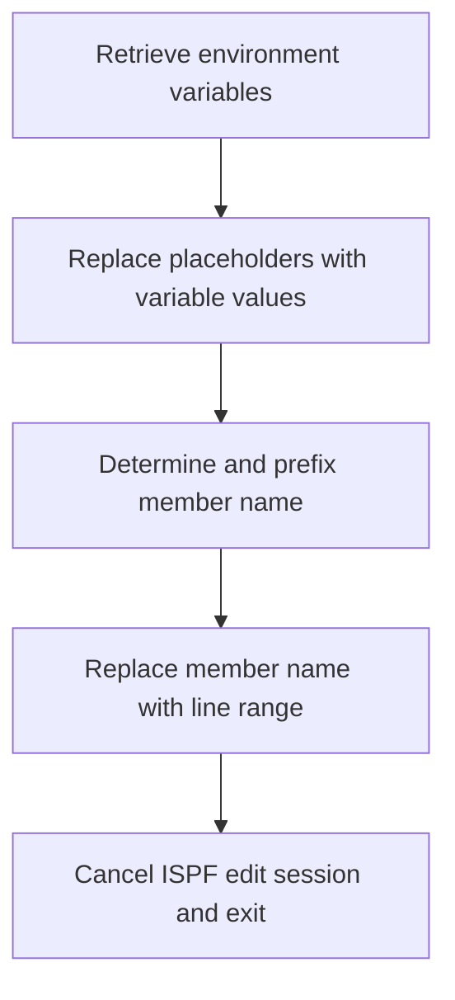

# What the script does

The mac1 Rexx script is designed to perform a series of text substitutions within an ISPF editor session. It retrieves a set of predefined variables and then replaces placeholder tokens in the current member being edited with the corresponding variable values. Essentially, it automates the process of updating template-like placeholders in source code or configuration members with actual values, streamlining repetitive editing tasks. For example, if the member contains placeholders like <CICSHLQ>, the script replaces them with the actual value of the CICSHLQ variable.

# Script Flow

The script flow can be broken down into the following main steps:

- Retrieve a list of environment or configuration variables using ISPF commands.
- For each variable, perform a global search and replace in the current ISPF editor member, substituting the placeholder with the variable's value.
- Determine the member name and prefix it conditionally.
- Replace the member name in the editor with a range of lines.
- Cancel the ISPF edit session and exit the script.



<SwmSnippet path="/base/exec/mac1.rexx" line="6">

---

First, the script sets the address environment to ISPEXEC and initiates an ISPF editor macro session with TRACE enabled. This sets up the context for subsequent ISPF commands.

```rexx
Address Ispexec
"Isredit Macro (TRACE)"

```

---

</SwmSnippet>

<SwmSnippet path="/base/exec/mac1.rexx" line="9">

---

Next, the script uses multiple ISPEXEC VGET commands to retrieve various environment variables related to CICS, DB2, and other system identifiers. These variables are stored for later use in the substitution process.

```rexx
"ISPEXEC VGET (CICSHLQ CPSMHLQ CICSLIC USRHLQ COBOLHLQ DB2HLQ CEEHLQ)"
"ISPEXEC VGET (CSDNAME DB2RUN SQLID DB2SSID DB2DBID DB2CCSID DB2PLAN)"
"ISPEXEC VGET (TORAPPL AORAPPL DORAPPL TORSYSID AORSYSID DORSYSID)"
"ISPEXEC VGET (CMASAPPL CMASYSID WUIAPPL WUISYSID WSIMHLQ)"
"ISPEXEC VGET (PDSDBRM PDSMACP PDSLOAD PDSMSGS WSIMLOG WSIMSTL)"
"ISPEXEC VGET (KSDSCUS KSDSPOL SOURCEX LOADX MAPCOPX DBRMLIX)"
"ISPEXEC VGET (WSIMLGX WSIMWSX WSIMMSX ZFSHOME)"
```

---

</SwmSnippet>

<SwmSnippet path="/base/exec/mac1.rexx" line="16">

---

Then, the script performs a series of ISREDIT Change commands. Each command replaces a placeholder token (e.g., <CICSHLQ>) in the current member with the corresponding variable value (e.g., "CICSHLQ"). This is done for all the variables retrieved earlier, effectively updating the member content.

```rexx
"Isredit Change '<CICSHLQ>' '"CICSHLQ"' All"
"Isredit Change '<CPSMHLQ>' '"CPSMHLQ"' All"
"Isredit Change '<CICSLIC>' '"CICSLIC"' All"
"Isredit Change '<USRHLQ>' '"USRHLQ"' All"
"Isredit Change '<COBOLHLQ>' '"COBOLHLQ"' All"
"Isredit Change '<DB2HLQ>' '"DB2HLQ"' All"
"Isredit Change '<CEEHLQ>' '"CEEHLQ"' All"
"Isredit Change '<CSDNAME>' '"CSDNAME"' All"
"Isredit Change '<DB2RUN>' '"DB2RUN"' All"
"Isredit Change '<SQLID>' '"SQLID"' All"
"Isredit Change '<DB2SSID>' '"DB2SSID"' All"
"Isredit Change '<DB2DBID>' '"DB2DBID"' All"
"Isredit Change '<DB2CCSID>' '"DB2CCSID"' All"
"Isredit Change '<DB2PLAN>' '"DB2PLAN"' All"
"Isredit Change '<TORAPPL>' '"TORAPPL"' All"
"Isredit Change '<AORAPPL>' '"AORAPPL"' All"
"Isredit Change '<DORAPPL>' '"DORAPPL"' All"
"Isredit Change '<TORSYSID>' '"TORSYSID"' All"
"Isredit Change '<AORSYSID>' '"AORSYSID"' All"
"Isredit Change '<DORSYSID>' '"DORSYSID"' All"
"Isredit Change '<CMASAPPL>' '"CMASAPPL"' All"
"Isredit Change '<CMASYSID>' '"CMASYSID"' All"
"Isredit Change '<WUIAPPL>' '"WUIAPPL"' All"
"Isredit Change '<WUISYSID>' '"WUISYSID"' All"
"Isredit Change '<WSIMHLQ>' '"WSIMHLQ"' All"
"Isredit Change '<PDSDBRM>' '"WSIMHLQ"' All"
"Isredit Change '<PDSMACP>' '"WSIMHLQ"' All"
"Isredit Change '<PDSLOAD>' '"WSIMHLQ"' All"
"Isredit Change '<PDSMSGS>' '"WSIMHLQ"' All"
"Isredit Change '<WSIMLOG>' '"WSIMHLQ"' All"
"Isredit Change '<WSIMSTL>' '"WSIMHLQ"' All"
"Isredit Change '<KSDSPOL>' '"KSDSPOL"' All"
"Isredit Change '<KSDSCUS>' '"KSDSCUS"' All"
"Isredit Change '<SOURCEX>' '"SOURCEX"' All"
"Isredit Change '<LOADX>' '"LOADX"' All"
"Isredit Change '<MAPCOPX>' '"MAPCOPX"' All"
"Isredit Change '<DBRMLIX>' '"DBRMLIX"' All"
"Isredit Change '<WSIMWSX>' '"WSIMWSX"' All"
"Isredit Change '<WSIMMSX>' '"WSIMMSX"' All"
"Isredit Change '<WSIMLGX>' '"WSIMLGX"' All"
"Isredit Change '<ZFSHOME>' '"ZFSHOME"' All"
```

---

</SwmSnippet>

<SwmSnippet path="/base/exec/mac1.rexx" line="58">

---

After the replacements, the script retrieves the current member name into a variable. It then conditionally prefixes the member name with '#' if it equals 'ONCICS', otherwise it prefixes it with '@'. This likely serves to mark or categorize the member for further processing or identification.

```rexx
"Isredit (memnme) = MEMBER"
If memnme = 'ONCICS' Then memnme = '#' || memnme
                     Else memnme = '@' || memnme
```

---

</SwmSnippet>

<SwmSnippet path="/base/exec/mac1.rexx" line="61">

---

Finally, the script issues an ISREDIT Replace command to replace the member name with a range of lines (.zfirst .zlast), cancels the ISPF edit session, and exits with a return code of 0, indicating successful completion.

```rexx
"Isredit Replace" memnme ".zfirst .zlast"
"Isredit CANCEL"

Exit 0
```

---

</SwmSnippet>

&nbsp;

*This is an auto-generated document by Swimm 🌊 and has not yet been verified by a human*

<SwmMeta version="3.0.0" repo-id="Z2l0aHViJTNBJTNBU3dpbW1pby1nZW5hcHAtaG91c2UlM0ElM0FHaXJpLVN3aW1t" repo-name="Swimmio-genapp-house"><sup>Powered by [Swimm](https://app.swimm.io/)</sup></SwmMeta>
