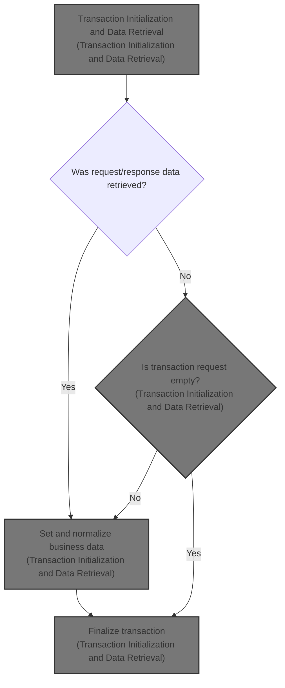

# Overview

This document explains the flow for initializing and normalizing transaction data. The process retrieves transaction request and response information, applies business rules to normalize counters and types, and updates transaction metrics for consistent processing.



## Dependencies

### Program

- <SwmToken path="base/src/lgastat1.cbl" pos="7:6:6" line-data="       PROGRAM-ID. LGASTAT1.">`LGASTAT1`</SwmToken> (<SwmPath>[base/src/lgastat1.cbl](base/src/lgastat1.cbl)</SwmPath>)

### Copybook

- LGCMAREA (<SwmPath>[base/src/lgcmarea.cpy](base/src/lgcmarea.cpy)</SwmPath>)

## Detailed View of the Program's Functionality

Transaction Context Initialization

At the start of the flow, the program sets up the transaction context. This involves preparing a header area in memory to store metadata about the current transaction. Specifically, it initializes a workspace for the header, then copies the transaction ID, terminal ID, task number, and the length of the transaction call from system-provided fields into this workspace. This ensures that all subsequent logic has access to the key identifiers and metadata for the transaction being processed.

Request and Response Data Retrieval

The program then attempts to retrieve transaction-specific data from two containers. The first container is expected to hold request data, which is copied into a designated area in memory. The second container holds response or status data, which is also copied into its own area. For both retrievals, the program records the outcome (success or failure) in a response code variable.

Conditional Data Assignment

After attempting to fetch the containers, the program checks if the retrieval was successful. If it was, the request and response data are moved into the main transaction counter and type fields, which will be used for business logic. If the retrieval failed, the program checks if there is any input data for the transaction. If there is none, it finalizes and exits the transaction early. If input data is present, it falls back to using values from a shared communication area, assigning these to the transaction counter and type fields.

Transient Storage Queue Handling

Next, the program tries to read a transient storage queue associated with the transaction. This queue is used to store timing information. If the queue read fails (indicating the queue does not exist), the program obtains the current system time, formats it into date and time strings, and writes these back into the queue. This ensures that a timestamp is always available for the transaction, either from a previous run or freshly generated.

Business Counter and Type Normalization

The program then normalizes certain business counter and type values to ensure consistency. If the transaction counter matches a specific value, it is changed to a standard value. Several other counter values are also mapped to a single standard value. Additionally, if the transaction type is not the default, it is set to a special value to flag it for later handling.

Transaction Counter Retrieval and Finalization

Finally, the program retrieves the current value of a transaction counter from a designated pool, storing this value for metrics or further processing. Once this is done, the transaction is finalized and control is returned, marking the end of the processing flow. This ensures that all relevant transaction data is updated and stored before the program exits.

# Rule Definition

| Paragraph Name                                                                                                                                                                                                                                                                                                                                                                                                                                                                                                                                                                                                                                                                                                                                                                                                                                                                                                                                                                                                                                                                                                                                                                                                                                                                                                                                                                                                                                                                                                                                                                                                                                                                                                                                                                                                                                    | Rule ID | Category          | Description                                                                                                                                                                                                                                                                                                                                                                                                                                                                                                                                                                                                                                                                                                                                                                                                                                                                                                                                                                                                                                                                                                                                                                                                                                                        | Conditions                                                                                                                                                                                                                                                                                                   | Remarks                                                                                                                                                                                                                                                                                                                                                                                                                                                                                                                                                                                                                                                                                                                                                                                                                                                                                                                                                                                                                                                                                                    |
| ------------------------------------------------------------------------------------------------------------------------------------------------------------------------------------------------------------------------------------------------------------------------------------------------------------------------------------------------------------------------------------------------------------------------------------------------------------------------------------------------------------------------------------------------------------------------------------------------------------------------------------------------------------------------------------------------------------------------------------------------------------------------------------------------------------------------------------------------------------------------------------------------------------------------------------------------------------------------------------------------------------------------------------------------------------------------------------------------------------------------------------------------------------------------------------------------------------------------------------------------------------------------------------------------------------------------------------------------------------------------------------------------------------------------------------------------------------------------------------------------------------------------------------------------------------------------------------------------------------------------------------------------------------------------------------------------------------------------------------------------------------------------------------------------------------------------------------------------- | ------- | ----------------- | ------------------------------------------------------------------------------------------------------------------------------------------------------------------------------------------------------------------------------------------------------------------------------------------------------------------------------------------------------------------------------------------------------------------------------------------------------------------------------------------------------------------------------------------------------------------------------------------------------------------------------------------------------------------------------------------------------------------------------------------------------------------------------------------------------------------------------------------------------------------------------------------------------------------------------------------------------------------------------------------------------------------------------------------------------------------------------------------------------------------------------------------------------------------------------------------------------------------------------------------------------------------ | ------------------------------------------------------------------------------------------------------------------------------------------------------------------------------------------------------------------------------------------------------------------------------------------------------------ | ---------------------------------------------------------------------------------------------------------------------------------------------------------------------------------------------------------------------------------------------------------------------------------------------------------------------------------------------------------------------------------------------------------------------------------------------------------------------------------------------------------------------------------------------------------------------------------------------------------------------------------------------------------------------------------------------------------------------------------------------------------------------------------------------------------------------------------------------------------------------------------------------------------------------------------------------------------------------------------------------------------------------------------------------------------------------------------------------------------- |
| Else IF EIBCALEN IS EQUAL TO ZERO EXEC CICS RETURN <SwmToken path="base/src/lgastat1.cbl" pos="94:7:9" line-data="                 EXEC CICS RETURN END-EXEC">`END-EXEC`</SwmToken> Else Move <SwmToken path="base/src/lgastat1.cbl" pos="96:3:7" line-data="               Move CA-REQUEST-ID  To GENAcounter">`CA-REQUEST-ID`</SwmToken> To <SwmToken path="base/src/lgastat1.cbl" pos="96:11:11" line-data="               Move CA-REQUEST-ID  To GENAcounter">`GENAcounter`</SwmToken> Move <SwmToken path="base/src/lgastat1.cbl" pos="97:3:7" line-data="               Move CA-RETURN-CODE To GENAtype">`CA-RETURN-CODE`</SwmToken> To <SwmToken path="base/src/lgastat1.cbl" pos="97:11:11" line-data="               Move CA-RETURN-CODE To GENAtype">`GENAtype`</SwmToken>                                                                                                                                                                                                                                                                                                                                                                                                                                                                                                                                                                                                                                                                                                                                                                                                                                                                                                                                                                                                                                                              | RL-001  | Conditional Logic | If container retrieval fails, check if input data is present (call length > 0). If not, finalize the transaction immediately. If input data is present, set <SwmToken path="base/src/lgastat1.cbl" pos="96:11:11" line-data="               Move CA-REQUEST-ID  To GENAcounter">`GENAcounter`</SwmToken> and <SwmToken path="base/src/lgastat1.cbl" pos="91:11:11" line-data="             Move WS-Data-RC   To  GENAType">`GENAType`</SwmToken> from commarea.                                                                                                                                                                                                                                                                                                                                                                                                                                                                                                                                                                                                                                                                                                                                                                                                    | Container retrieval failed. If call length is zero, finalize transaction. If call length > 0, use commarea values.                                                                                                                                                                                           | <SwmToken path="base/src/lgastat1.cbl" pos="96:3:7" line-data="               Move CA-REQUEST-ID  To GENAcounter">`CA-REQUEST-ID`</SwmToken>: 6 characters, <SwmToken path="base/src/lgastat1.cbl" pos="97:3:7" line-data="               Move CA-RETURN-CODE To GENAtype">`CA-RETURN-CODE`</SwmToken>: 2 characters.                                                                                                                                                                                                                                                                                                                                                                                                                                                                                                                                                                                                                                                                                                                                                                                      |
| If <SwmToken path="base/src/lgastat1.cbl" pos="96:11:11" line-data="               Move CA-REQUEST-ID  To GENAcounter">`GENAcounter`</SwmToken> = <SwmToken path="base/src/lgastat1.cbl" pos="122:8:8" line-data="           If GENAcounter = &#39;02ACUS&#39;">`02ACUS`</SwmToken> Move <SwmToken path="base/src/lgastat1.cbl" pos="123:4:4" line-data="                                     Move &#39;01ACUS&#39; to GENAcounter.">`01ACUS`</SwmToken> to <SwmToken path="base/src/lgastat1.cbl" pos="96:11:11" line-data="               Move CA-REQUEST-ID  To GENAcounter">`GENAcounter`</SwmToken>. If <SwmToken path="base/src/lgastat1.cbl" pos="96:11:11" line-data="               Move CA-REQUEST-ID  To GENAcounter">`GENAcounter`</SwmToken> = <SwmToken path="base/src/lgastat1.cbl" pos="124:8:8" line-data="           If GENAcounter = &#39;02ICOM&#39; or">`02ICOM`</SwmToken> or <SwmToken path="base/src/lgastat1.cbl" pos="96:11:11" line-data="               Move CA-REQUEST-ID  To GENAcounter">`GENAcounter`</SwmToken> = <SwmToken path="base/src/lgastat1.cbl" pos="125:6:6" line-data="              GENAcounter = &#39;03ICOM&#39; or">`03ICOM`</SwmToken> or <SwmToken path="base/src/lgastat1.cbl" pos="96:11:11" line-data="               Move CA-REQUEST-ID  To GENAcounter">`GENAcounter`</SwmToken> = <SwmToken path="base/src/lgastat1.cbl" pos="126:6:6" line-data="              GENAcounter = &#39;05ICOM&#39; Move &#39;01ICOM&#39; to GENAcounter.">`05ICOM`</SwmToken> Move <SwmToken path="base/src/lgastat1.cbl" pos="126:12:12" line-data="              GENAcounter = &#39;05ICOM&#39; Move &#39;01ICOM&#39; to GENAcounter.">`01ICOM`</SwmToken> to <SwmToken path="base/src/lgastat1.cbl" pos="96:11:11" line-data="               Move CA-REQUEST-ID  To GENAcounter">`GENAcounter`</SwmToken>. | RL-002  | Computation       | Normalize <SwmToken path="base/src/lgastat1.cbl" pos="96:11:11" line-data="               Move CA-REQUEST-ID  To GENAcounter">`GENAcounter`</SwmToken>: if <SwmToken path="base/src/lgastat1.cbl" pos="96:11:11" line-data="               Move CA-REQUEST-ID  To GENAcounter">`GENAcounter`</SwmToken> is <SwmToken path="base/src/lgastat1.cbl" pos="122:8:8" line-data="           If GENAcounter = &#39;02ACUS&#39;">`02ACUS`</SwmToken>, set to <SwmToken path="base/src/lgastat1.cbl" pos="123:4:4" line-data="                                     Move &#39;01ACUS&#39; to GENAcounter.">`01ACUS`</SwmToken>; if <SwmToken path="base/src/lgastat1.cbl" pos="124:8:8" line-data="           If GENAcounter = &#39;02ICOM&#39; or">`02ICOM`</SwmToken>, <SwmToken path="base/src/lgastat1.cbl" pos="125:6:6" line-data="              GENAcounter = &#39;03ICOM&#39; or">`03ICOM`</SwmToken>, or <SwmToken path="base/src/lgastat1.cbl" pos="126:6:6" line-data="              GENAcounter = &#39;05ICOM&#39; Move &#39;01ICOM&#39; to GENAcounter.">`05ICOM`</SwmToken>, set to <SwmToken path="base/src/lgastat1.cbl" pos="126:12:12" line-data="              GENAcounter = &#39;05ICOM&#39; Move &#39;01ICOM&#39; to GENAcounter.">`01ICOM`</SwmToken>. | <SwmToken path="base/src/lgastat1.cbl" pos="96:11:11" line-data="               Move CA-REQUEST-ID  To GENAcounter">`GENAcounter`</SwmToken> is set.                                                                                                                                                         | <SwmToken path="base/src/lgastat1.cbl" pos="96:11:11" line-data="               Move CA-REQUEST-ID  To GENAcounter">`GENAcounter`</SwmToken>: 6 characters. Mapping: <SwmToken path="base/src/lgastat1.cbl" pos="122:8:8" line-data="           If GENAcounter = &#39;02ACUS&#39;">`02ACUS`</SwmToken> → <SwmToken path="base/src/lgastat1.cbl" pos="123:4:4" line-data="                                     Move &#39;01ACUS&#39; to GENAcounter.">`01ACUS`</SwmToken>; <SwmToken path="base/src/lgastat1.cbl" pos="124:8:8" line-data="           If GENAcounter = &#39;02ICOM&#39; or">`02ICOM`</SwmToken>, <SwmToken path="base/src/lgastat1.cbl" pos="125:6:6" line-data="              GENAcounter = &#39;03ICOM&#39; or">`03ICOM`</SwmToken>, <SwmToken path="base/src/lgastat1.cbl" pos="126:6:6" line-data="              GENAcounter = &#39;05ICOM&#39; Move &#39;01ICOM&#39; to GENAcounter.">`05ICOM`</SwmToken> → <SwmToken path="base/src/lgastat1.cbl" pos="126:12:12" line-data="              GENAcounter = &#39;05ICOM&#39; Move &#39;01ICOM&#39; to GENAcounter.">`01ICOM`</SwmToken>. |
| If <SwmToken path="base/src/lgastat1.cbl" pos="91:11:11" line-data="             Move WS-Data-RC   To  GENAType">`GENAType`</SwmToken> Not = '00' Move '99' To <SwmToken path="base/src/lgastat1.cbl" pos="97:11:11" line-data="               Move CA-RETURN-CODE To GENAtype">`GENAtype`</SwmToken>.                                                                                                                                                                                                                                                                                                                                                                                                                                                                                                                                                                                                                                                                                                                                                                                                                                                                                                                                                                                                                                                                                                                                                                                                                                                                                                                                                                                                                                                                                                                                            | RL-003  | Computation       | Normalize <SwmToken path="base/src/lgastat1.cbl" pos="91:11:11" line-data="             Move WS-Data-RC   To  GENAType">`GENAType`</SwmToken>: if <SwmToken path="base/src/lgastat1.cbl" pos="91:11:11" line-data="             Move WS-Data-RC   To  GENAType">`GENAType`</SwmToken> is not '00', set to '99'.                                                                                                                                                                                                                                                                                                                                                                                                                                                                                                                                                                                                                                                                                                                                                                                                                                                                                                                                                    | <SwmToken path="base/src/lgastat1.cbl" pos="91:11:11" line-data="             Move WS-Data-RC   To  GENAType">`GENAType`</SwmToken> is set.                                                                                                                                                                  | <SwmToken path="base/src/lgastat1.cbl" pos="91:11:11" line-data="             Move WS-Data-RC   To  GENAType">`GENAType`</SwmToken>: 2 characters. Mapping: any value except '00' → '99'.                                                                                                                                                                                                                                                                                                                                                                                                                                                                                                                                                                                                                                                                                                                                                                                                                                                                                                                  |
| Exec CICS Get Counter(<SwmToken path="base/src/lgastat1.cbl" pos="129:9:9" line-data="               Exec CICS Get Counter(GENAcount)">`GENAcount`</SwmToken>) Pool(<SwmToken path="base/src/lgastat1.cbl" pos="130:3:3" line-data="                             Pool(GENApool)">`GENApool`</SwmToken>) Value(Trancount)                                                                                                                                                                                                                                                                                                                                                                                                                                                                                                                                                                                                                                                                                                                                                                                                                                                                                                                                                                                                                                                                                                                                                                                                                                                                                                                                                                                                                                                                                                                          | RL-004  | Computation       | Retrieve a transaction counter value from a counter pool using <SwmToken path="base/src/lgastat1.cbl" pos="96:11:11" line-data="               Move CA-REQUEST-ID  To GENAcounter">`GENAcounter`</SwmToken> and <SwmToken path="base/src/lgastat1.cbl" pos="91:11:11" line-data="             Move WS-Data-RC   To  GENAType">`GENAType`</SwmToken>, and store it in Trancount (8-digit signed integer).                                                                                                                                                                                                                                                                                                                                                                                                                                                                                                                                                                                                                                                                                                                                                                                                                                                           | <SwmToken path="base/src/lgastat1.cbl" pos="96:11:11" line-data="               Move CA-REQUEST-ID  To GENAcounter">`GENAcounter`</SwmToken> and <SwmToken path="base/src/lgastat1.cbl" pos="91:11:11" line-data="             Move WS-Data-RC   To  GENAType">`GENAType`</SwmToken> are normalized and set. | Counter pool name: 'GENA'. Trancount: 8-digit signed integer.                                                                                                                                                                                                                                                                                                                                                                                                                                                                                                                                                                                                                                                                                                                                                                                                                                                                                                                                                                                                                                              |
| EXEC CICS RETURN <SwmToken path="base/src/lgastat1.cbl" pos="94:7:9" line-data="                 EXEC CICS RETURN END-EXEC">`END-EXEC`</SwmToken>                                                                                                                                                                                                                                                                                                                                                                                                                                                                                                                                                                                                                                                                                                                                                                                                                                                                                                                                                                                                                                                                                                                                                                                                                                                                                                                                                                                                                                                                                                                                                                                                                                                                                                 | RL-005  | Data Assignment   | Return the normalized <SwmToken path="base/src/lgastat1.cbl" pos="96:11:11" line-data="               Move CA-REQUEST-ID  To GENAcounter">`GENAcounter`</SwmToken>, <SwmToken path="base/src/lgastat1.cbl" pos="91:11:11" line-data="             Move WS-Data-RC   To  GENAType">`GENAType`</SwmToken>, and Trancount as output. If the transient storage queue was missing, also return the updated queue record with the current date and time.                                                                                                                                                                                                                                                                                                                                                                                                                                                                                                                                                                                                                                                                                                                                                                                                                 | Routine completes execution.                                                                                                                                                                                                                                                                                 | Output: <SwmToken path="base/src/lgastat1.cbl" pos="96:11:11" line-data="               Move CA-REQUEST-ID  To GENAcounter">`GENAcounter`</SwmToken> (6 characters), <SwmToken path="base/src/lgastat1.cbl" pos="91:11:11" line-data="             Move WS-Data-RC   To  GENAType">`GENAType`</SwmToken> (2 characters), Trancount (8-digit signed integer). If queue was missing, also output queue record: date (8 characters), two spaces, time (6 characters).                                                                                                                                                                                                                                                                                                                                                                                                                                                                                                                                                                                                                                         |
| MAINLINE SECTION, initialization and assignment of transaction context fields                                                                                                                                                                                                                                                                                                                                                                                                                                                                                                                                                                                                                                                                                                                                                                                                                                                                                                                                                                                                                                                                                                                                                                                                                                                                                                                                                                                                                                                                                                                                                                                                                                                                                                                                                                     | RL-006  | Conditional Logic | The routine must be triggered by a transaction context containing the transaction's identifying information, including transaction ID, terminal ID, task number, and call length.                                                                                                                                                                                                                                                                                                                                                                                                                                                                                                                                                                                                                                                                                                                                                                                                                                                                                                                                                                                                                                                                                  | Transaction context is present with all required identifying information.                                                                                                                                                                                                                                    | Transaction ID: 4 characters, Terminal ID: 4 characters, Task Number: 7 digits, Call Length: 7 digits.                                                                                                                                                                                                                                                                                                                                                                                                                                                                                                                                                                                                                                                                                                                                                                                                                                                                                                                                                                                                     |
| Container retrieval operations for request and response data                                                                                                                                                                                                                                                                                                                                                                                                                                                                                                                                                                                                                                                                                                                                                                                                                                                                                                                                                                                                                                                                                                                                                                                                                                                                                                                                                                                                                                                                                                                                                                                                                                                                                                                                                                                      | RL-007  | Data Assignment   | Retrieve request data (6 characters) from a request container and response/status code (2 characters) from a response container.                                                                                                                                                                                                                                                                                                                                                                                                                                                                                                                                                                                                                                                                                                                                                                                                                                                                                                                                                                                                                                                                                                                                   | Routine is triggered and containers are accessible.                                                                                                                                                                                                                                                          | Request data: 6 characters (alphanumeric), Response/status code: 2 characters (alphanumeric).                                                                                                                                                                                                                                                                                                                                                                                                                                                                                                                                                                                                                                                                                                                                                                                                                                                                                                                                                                                                              |
| Conditional logic after container retrieval                                                                                                                                                                                                                                                                                                                                                                                                                                                                                                                                                                                                                                                                                                                                                                                                                                                                                                                                                                                                                                                                                                                                                                                                                                                                                                                                                                                                                                                                                                                                                                                                                                                                                                                                                                                                       | RL-008  | Conditional Logic | If container retrieval is successful (response code 0), set the counter value to the request data and the type value to the response/status code.                                                                                                                                                                                                                                                                                                                                                                                                                                                                                                                                                                                                                                                                                                                                                                                                                                                                                                                                                                                                                                                                                                                  | Container retrieval response code is 0 (successful).                                                                                                                                                                                                                                                         | Counter: 6 characters, Type: 2 characters.                                                                                                                                                                                                                                                                                                                                                                                                                                                                                                                                                                                                                                                                                                                                                                                                                                                                                                                                                                                                                                                                 |
| Transient storage queue read and conditional logic for missing queue                                                                                                                                                                                                                                                                                                                                                                                                                                                                                                                                                                                                                                                                                                                                                                                                                                                                                                                                                                                                                                                                                                                                                                                                                                                                                                                                                                                                                                                                                                                                                                                                                                                                                                                                                                              | RL-009  | Conditional Logic | Read a transient storage queue by name (8 characters, e.g., 'GENASTRT') to retrieve timestamp information (date and time). If the queue read is unsuccessful (queue not found), obtain the current date in DDMMYYYY format and current time in HHMMSS format, and write these to the queue, with two spaces between date and time.                                                                                                                                                                                                                                                                                                                                                                                                                                                                                                                                                                                                                                                                                                                                                                                                                                                                                                                                 | Routine is running; queue read attempted.                                                                                                                                                                                                                                                                    | Queue name: 8 characters (e.g., 'GENASTRT'). Date format: DDMMYYYY (8 characters). Time format: HHMMSS (6 characters). Two spaces between date and time in queue record.                                                                                                                                                                                                                                                                                                                                                                                                                                                                                                                                                                                                                                                                                                                                                                                                                                                                                                                                   |

# User Stories

## User Story 1: Routine Initialization, Transaction Context, and Container Retrieval

---

### Story Description:

As a system, I want to trigger the routine using a transaction context and retrieve request and response data from containers, falling back to commarea values or finalizing the transaction if necessary, so that <SwmToken path="base/src/lgastat1.cbl" pos="96:11:11" line-data="               Move CA-REQUEST-ID  To GENAcounter">`GENAcounter`</SwmToken> and <SwmToken path="base/src/lgastat1.cbl" pos="91:11:11" line-data="             Move WS-Data-RC   To  GENAType">`GENAType`</SwmToken> are reliably set for further processing.

---

### Business Rule Mapping:

| Rule ID | Paragraph Name                                                                                                                                                                                                                                                                                                                                                                                                                                                                                                                                                                                                                                                                                                                                                                       | Rule Description                                                                                                                                                                                                                                                                                                                                                                                                                                                |
| ------- | ------------------------------------------------------------------------------------------------------------------------------------------------------------------------------------------------------------------------------------------------------------------------------------------------------------------------------------------------------------------------------------------------------------------------------------------------------------------------------------------------------------------------------------------------------------------------------------------------------------------------------------------------------------------------------------------------------------------------------------------------------------------------------------ | --------------------------------------------------------------------------------------------------------------------------------------------------------------------------------------------------------------------------------------------------------------------------------------------------------------------------------------------------------------------------------------------------------------------------------------------------------------- |
| RL-006  | MAINLINE SECTION, initialization and assignment of transaction context fields                                                                                                                                                                                                                                                                                                                                                                                                                                                                                                                                                                                                                                                                                                        | The routine must be triggered by a transaction context containing the transaction's identifying information, including transaction ID, terminal ID, task number, and call length.                                                                                                                                                                                                                                                                               |
| RL-007  | Container retrieval operations for request and response data                                                                                                                                                                                                                                                                                                                                                                                                                                                                                                                                                                                                                                                                                                                         | Retrieve request data (6 characters) from a request container and response/status code (2 characters) from a response container.                                                                                                                                                                                                                                                                                                                                |
| RL-008  | Conditional logic after container retrieval                                                                                                                                                                                                                                                                                                                                                                                                                                                                                                                                                                                                                                                                                                                                          | If container retrieval is successful (response code 0), set the counter value to the request data and the type value to the response/status code.                                                                                                                                                                                                                                                                                                               |
| RL-001  | Else IF EIBCALEN IS EQUAL TO ZERO EXEC CICS RETURN <SwmToken path="base/src/lgastat1.cbl" pos="94:7:9" line-data="                 EXEC CICS RETURN END-EXEC">`END-EXEC`</SwmToken> Else Move <SwmToken path="base/src/lgastat1.cbl" pos="96:3:7" line-data="               Move CA-REQUEST-ID  To GENAcounter">`CA-REQUEST-ID`</SwmToken> To <SwmToken path="base/src/lgastat1.cbl" pos="96:11:11" line-data="               Move CA-REQUEST-ID  To GENAcounter">`GENAcounter`</SwmToken> Move <SwmToken path="base/src/lgastat1.cbl" pos="97:3:7" line-data="               Move CA-RETURN-CODE To GENAtype">`CA-RETURN-CODE`</SwmToken> To <SwmToken path="base/src/lgastat1.cbl" pos="97:11:11" line-data="               Move CA-RETURN-CODE To GENAtype">`GENAtype`</SwmToken> | If container retrieval fails, check if input data is present (call length > 0). If not, finalize the transaction immediately. If input data is present, set <SwmToken path="base/src/lgastat1.cbl" pos="96:11:11" line-data="               Move CA-REQUEST-ID  To GENAcounter">`GENAcounter`</SwmToken> and <SwmToken path="base/src/lgastat1.cbl" pos="91:11:11" line-data="             Move WS-Data-RC   To  GENAType">`GENAType`</SwmToken> from commarea. |

---

### Relevant Functionality:

- **MAINLINE SECTION**
  1. **RL-006:**
     - On invocation, initialize header fields with transaction context values:
       - Set transaction ID
       - Set terminal ID
       - Set task number
       - Set call length
- **Container retrieval operations for request and response data**
  1. **RL-007:**
     - Retrieve request data from the designated request container
     - Retrieve response/status code from the designated response container
- **Conditional logic after container retrieval**
  1. **RL-008:**
     - If container retrieval is successful:
       - Set the counter value to the request data
       - Set the type value to the response/status code
- **Else IF EIBCALEN IS EQUAL TO ZERO EXEC CICS RETURN** <SwmToken path="base/src/lgastat1.cbl" pos="94:7:9" line-data="                 EXEC CICS RETURN END-EXEC">`END-EXEC`</SwmToken> **Else Move** <SwmToken path="base/src/lgastat1.cbl" pos="96:3:7" line-data="               Move CA-REQUEST-ID  To GENAcounter">`CA-REQUEST-ID`</SwmToken> **To** <SwmToken path="base/src/lgastat1.cbl" pos="96:11:11" line-data="               Move CA-REQUEST-ID  To GENAcounter">`GENAcounter`</SwmToken> **Move** <SwmToken path="base/src/lgastat1.cbl" pos="97:3:7" line-data="               Move CA-RETURN-CODE To GENAtype">`CA-RETURN-CODE`</SwmToken> **To** <SwmToken path="base/src/lgastat1.cbl" pos="97:11:11" line-data="               Move CA-RETURN-CODE To GENAtype">`GENAtype`</SwmToken>
  1. **RL-001:**
     - If container retrieval fails:
       - If call length is zero:
         - Finalize transaction
       - Else:
         - Set <SwmToken path="base/src/lgastat1.cbl" pos="96:11:11" line-data="               Move CA-REQUEST-ID  To GENAcounter">`GENAcounter`</SwmToken> to <SwmToken path="base/src/lgastat1.cbl" pos="96:3:7" line-data="               Move CA-REQUEST-ID  To GENAcounter">`CA-REQUEST-ID`</SwmToken>
         - Set <SwmToken path="base/src/lgastat1.cbl" pos="91:11:11" line-data="             Move WS-Data-RC   To  GENAType">`GENAType`</SwmToken> to <SwmToken path="base/src/lgastat1.cbl" pos="97:3:7" line-data="               Move CA-RETURN-CODE To GENAtype">`CA-RETURN-CODE`</SwmToken>

## User Story 2: Normalization and Transaction Counter Retrieval

---

### Story Description:

As a system, I want to normalize <SwmToken path="base/src/lgastat1.cbl" pos="96:11:11" line-data="               Move CA-REQUEST-ID  To GENAcounter">`GENAcounter`</SwmToken> and <SwmToken path="base/src/lgastat1.cbl" pos="91:11:11" line-data="             Move WS-Data-RC   To  GENAType">`GENAType`</SwmToken> values and retrieve a transaction counter from the pool so that transaction processing uses standardized values and accurate counters.

---

### Business Rule Mapping:

| Rule ID | Paragraph Name                                                                                                                                                                                                                                                                                                                                                                                                                                                                                                                                                                                                                                                                                                                                                                                                                                                                                                                                                                                                                                                                                                                                                                                                                                                                                                                                                                                                                                                                                                                                                                                                                                                                                                                                                                                                                                    | Rule Description                                                                                                                                                                                                                                                                                                                                                                                                                                                                                                                                                                                                                                                                                                                                                                                                                                                                                                                                                                                                                                                                                                                                                                                                                                                   |
| ------- | ------------------------------------------------------------------------------------------------------------------------------------------------------------------------------------------------------------------------------------------------------------------------------------------------------------------------------------------------------------------------------------------------------------------------------------------------------------------------------------------------------------------------------------------------------------------------------------------------------------------------------------------------------------------------------------------------------------------------------------------------------------------------------------------------------------------------------------------------------------------------------------------------------------------------------------------------------------------------------------------------------------------------------------------------------------------------------------------------------------------------------------------------------------------------------------------------------------------------------------------------------------------------------------------------------------------------------------------------------------------------------------------------------------------------------------------------------------------------------------------------------------------------------------------------------------------------------------------------------------------------------------------------------------------------------------------------------------------------------------------------------------------------------------------------------------------------------------------------- | ------------------------------------------------------------------------------------------------------------------------------------------------------------------------------------------------------------------------------------------------------------------------------------------------------------------------------------------------------------------------------------------------------------------------------------------------------------------------------------------------------------------------------------------------------------------------------------------------------------------------------------------------------------------------------------------------------------------------------------------------------------------------------------------------------------------------------------------------------------------------------------------------------------------------------------------------------------------------------------------------------------------------------------------------------------------------------------------------------------------------------------------------------------------------------------------------------------------------------------------------------------------ |
| RL-002  | If <SwmToken path="base/src/lgastat1.cbl" pos="96:11:11" line-data="               Move CA-REQUEST-ID  To GENAcounter">`GENAcounter`</SwmToken> = <SwmToken path="base/src/lgastat1.cbl" pos="122:8:8" line-data="           If GENAcounter = &#39;02ACUS&#39;">`02ACUS`</SwmToken> Move <SwmToken path="base/src/lgastat1.cbl" pos="123:4:4" line-data="                                     Move &#39;01ACUS&#39; to GENAcounter.">`01ACUS`</SwmToken> to <SwmToken path="base/src/lgastat1.cbl" pos="96:11:11" line-data="               Move CA-REQUEST-ID  To GENAcounter">`GENAcounter`</SwmToken>. If <SwmToken path="base/src/lgastat1.cbl" pos="96:11:11" line-data="               Move CA-REQUEST-ID  To GENAcounter">`GENAcounter`</SwmToken> = <SwmToken path="base/src/lgastat1.cbl" pos="124:8:8" line-data="           If GENAcounter = &#39;02ICOM&#39; or">`02ICOM`</SwmToken> or <SwmToken path="base/src/lgastat1.cbl" pos="96:11:11" line-data="               Move CA-REQUEST-ID  To GENAcounter">`GENAcounter`</SwmToken> = <SwmToken path="base/src/lgastat1.cbl" pos="125:6:6" line-data="              GENAcounter = &#39;03ICOM&#39; or">`03ICOM`</SwmToken> or <SwmToken path="base/src/lgastat1.cbl" pos="96:11:11" line-data="               Move CA-REQUEST-ID  To GENAcounter">`GENAcounter`</SwmToken> = <SwmToken path="base/src/lgastat1.cbl" pos="126:6:6" line-data="              GENAcounter = &#39;05ICOM&#39; Move &#39;01ICOM&#39; to GENAcounter.">`05ICOM`</SwmToken> Move <SwmToken path="base/src/lgastat1.cbl" pos="126:12:12" line-data="              GENAcounter = &#39;05ICOM&#39; Move &#39;01ICOM&#39; to GENAcounter.">`01ICOM`</SwmToken> to <SwmToken path="base/src/lgastat1.cbl" pos="96:11:11" line-data="               Move CA-REQUEST-ID  To GENAcounter">`GENAcounter`</SwmToken>. | Normalize <SwmToken path="base/src/lgastat1.cbl" pos="96:11:11" line-data="               Move CA-REQUEST-ID  To GENAcounter">`GENAcounter`</SwmToken>: if <SwmToken path="base/src/lgastat1.cbl" pos="96:11:11" line-data="               Move CA-REQUEST-ID  To GENAcounter">`GENAcounter`</SwmToken> is <SwmToken path="base/src/lgastat1.cbl" pos="122:8:8" line-data="           If GENAcounter = &#39;02ACUS&#39;">`02ACUS`</SwmToken>, set to <SwmToken path="base/src/lgastat1.cbl" pos="123:4:4" line-data="                                     Move &#39;01ACUS&#39; to GENAcounter.">`01ACUS`</SwmToken>; if <SwmToken path="base/src/lgastat1.cbl" pos="124:8:8" line-data="           If GENAcounter = &#39;02ICOM&#39; or">`02ICOM`</SwmToken>, <SwmToken path="base/src/lgastat1.cbl" pos="125:6:6" line-data="              GENAcounter = &#39;03ICOM&#39; or">`03ICOM`</SwmToken>, or <SwmToken path="base/src/lgastat1.cbl" pos="126:6:6" line-data="              GENAcounter = &#39;05ICOM&#39; Move &#39;01ICOM&#39; to GENAcounter.">`05ICOM`</SwmToken>, set to <SwmToken path="base/src/lgastat1.cbl" pos="126:12:12" line-data="              GENAcounter = &#39;05ICOM&#39; Move &#39;01ICOM&#39; to GENAcounter.">`01ICOM`</SwmToken>. |
| RL-003  | If <SwmToken path="base/src/lgastat1.cbl" pos="91:11:11" line-data="             Move WS-Data-RC   To  GENAType">`GENAType`</SwmToken> Not = '00' Move '99' To <SwmToken path="base/src/lgastat1.cbl" pos="97:11:11" line-data="               Move CA-RETURN-CODE To GENAtype">`GENAtype`</SwmToken>.                                                                                                                                                                                                                                                                                                                                                                                                                                                                                                                                                                                                                                                                                                                                                                                                                                                                                                                                                                                                                                                                                                                                                                                                                                                                                                                                                                                                                                                                                                                                            | Normalize <SwmToken path="base/src/lgastat1.cbl" pos="91:11:11" line-data="             Move WS-Data-RC   To  GENAType">`GENAType`</SwmToken>: if <SwmToken path="base/src/lgastat1.cbl" pos="91:11:11" line-data="             Move WS-Data-RC   To  GENAType">`GENAType`</SwmToken> is not '00', set to '99'.                                                                                                                                                                                                                                                                                                                                                                                                                                                                                                                                                                                                                                                                                                                                                                                                                                                                                                                                                    |
| RL-004  | Exec CICS Get Counter(<SwmToken path="base/src/lgastat1.cbl" pos="129:9:9" line-data="               Exec CICS Get Counter(GENAcount)">`GENAcount`</SwmToken>) Pool(<SwmToken path="base/src/lgastat1.cbl" pos="130:3:3" line-data="                             Pool(GENApool)">`GENApool`</SwmToken>) Value(Trancount)                                                                                                                                                                                                                                                                                                                                                                                                                                                                                                                                                                                                                                                                                                                                                                                                                                                                                                                                                                                                                                                                                                                                                                                                                                                                                                                                                                                                                                                                                                                          | Retrieve a transaction counter value from a counter pool using <SwmToken path="base/src/lgastat1.cbl" pos="96:11:11" line-data="               Move CA-REQUEST-ID  To GENAcounter">`GENAcounter`</SwmToken> and <SwmToken path="base/src/lgastat1.cbl" pos="91:11:11" line-data="             Move WS-Data-RC   To  GENAType">`GENAType`</SwmToken>, and store it in Trancount (8-digit signed integer).                                                                                                                                                                                                                                                                                                                                                                                                                                                                                                                                                                                                                                                                                                                                                                                                                                                           |

---

### Relevant Functionality:

- **If** <SwmToken path="base/src/lgastat1.cbl" pos="96:11:11" line-data="               Move CA-REQUEST-ID  To GENAcounter">`GENAcounter`</SwmToken> **=** <SwmToken path="base/src/lgastat1.cbl" pos="122:8:8" line-data="           If GENAcounter = &#39;02ACUS&#39;">`02ACUS`</SwmToken> **Move** <SwmToken path="base/src/lgastat1.cbl" pos="123:4:4" line-data="                                     Move &#39;01ACUS&#39; to GENAcounter.">`01ACUS`</SwmToken> **to** <SwmToken path="base/src/lgastat1.cbl" pos="96:11:11" line-data="               Move CA-REQUEST-ID  To GENAcounter">`GENAcounter`</SwmToken>**. If** <SwmToken path="base/src/lgastat1.cbl" pos="96:11:11" line-data="               Move CA-REQUEST-ID  To GENAcounter">`GENAcounter`</SwmToken> **=** <SwmToken path="base/src/lgastat1.cbl" pos="124:8:8" line-data="           If GENAcounter = &#39;02ICOM&#39; or">`02ICOM`</SwmToken> **or** <SwmToken path="base/src/lgastat1.cbl" pos="96:11:11" line-data="               Move CA-REQUEST-ID  To GENAcounter">`GENAcounter`</SwmToken> **=** <SwmToken path="base/src/lgastat1.cbl" pos="125:6:6" line-data="              GENAcounter = &#39;03ICOM&#39; or">`03ICOM`</SwmToken> **or** <SwmToken path="base/src/lgastat1.cbl" pos="96:11:11" line-data="               Move CA-REQUEST-ID  To GENAcounter">`GENAcounter`</SwmToken> **=** <SwmToken path="base/src/lgastat1.cbl" pos="126:6:6" line-data="              GENAcounter = &#39;05ICOM&#39; Move &#39;01ICOM&#39; to GENAcounter.">`05ICOM`</SwmToken> **Move** <SwmToken path="base/src/lgastat1.cbl" pos="126:12:12" line-data="              GENAcounter = &#39;05ICOM&#39; Move &#39;01ICOM&#39; to GENAcounter.">`01ICOM`</SwmToken> **to** <SwmToken path="base/src/lgastat1.cbl" pos="96:11:11" line-data="               Move CA-REQUEST-ID  To GENAcounter">`GENAcounter`</SwmToken>**.**
  1. **RL-002:**
     - If <SwmToken path="base/src/lgastat1.cbl" pos="96:11:11" line-data="               Move CA-REQUEST-ID  To GENAcounter">`GENAcounter`</SwmToken> is <SwmToken path="base/src/lgastat1.cbl" pos="122:8:8" line-data="           If GENAcounter = &#39;02ACUS&#39;">`02ACUS`</SwmToken>, set to <SwmToken path="base/src/lgastat1.cbl" pos="123:4:4" line-data="                                     Move &#39;01ACUS&#39; to GENAcounter.">`01ACUS`</SwmToken>
     - If <SwmToken path="base/src/lgastat1.cbl" pos="96:11:11" line-data="               Move CA-REQUEST-ID  To GENAcounter">`GENAcounter`</SwmToken> is <SwmToken path="base/src/lgastat1.cbl" pos="124:8:8" line-data="           If GENAcounter = &#39;02ICOM&#39; or">`02ICOM`</SwmToken>, <SwmToken path="base/src/lgastat1.cbl" pos="125:6:6" line-data="              GENAcounter = &#39;03ICOM&#39; or">`03ICOM`</SwmToken>, or <SwmToken path="base/src/lgastat1.cbl" pos="126:6:6" line-data="              GENAcounter = &#39;05ICOM&#39; Move &#39;01ICOM&#39; to GENAcounter.">`05ICOM`</SwmToken>, set to <SwmToken path="base/src/lgastat1.cbl" pos="126:12:12" line-data="              GENAcounter = &#39;05ICOM&#39; Move &#39;01ICOM&#39; to GENAcounter.">`01ICOM`</SwmToken>
- **If** <SwmToken path="base/src/lgastat1.cbl" pos="91:11:11" line-data="             Move WS-Data-RC   To  GENAType">`GENAType`</SwmToken> **Not = '00' Move '99' To** <SwmToken path="base/src/lgastat1.cbl" pos="97:11:11" line-data="               Move CA-RETURN-CODE To GENAtype">`GENAtype`</SwmToken>**.**
  1. **RL-003:**
     - If <SwmToken path="base/src/lgastat1.cbl" pos="91:11:11" line-data="             Move WS-Data-RC   To  GENAType">`GENAType`</SwmToken> is not '00', set to '99'
- **Exec CICS Get Counter(**<SwmToken path="base/src/lgastat1.cbl" pos="129:9:9" line-data="               Exec CICS Get Counter(GENAcount)">`GENAcount`</SwmToken>**) Pool(**<SwmToken path="base/src/lgastat1.cbl" pos="130:3:3" line-data="                             Pool(GENApool)">`GENApool`</SwmToken>**) Value(Trancount)**
  1. **RL-004:**
     - Retrieve transaction counter from pool using <SwmToken path="base/src/lgastat1.cbl" pos="96:11:11" line-data="               Move CA-REQUEST-ID  To GENAcounter">`GENAcounter`</SwmToken> and <SwmToken path="base/src/lgastat1.cbl" pos="91:11:11" line-data="             Move WS-Data-RC   To  GENAType">`GENAType`</SwmToken>
     - Store result in Trancount

## User Story 3: Transaction Counter Retrieval and Output

---

### Story Description:

As a system, I want to retrieve a transaction counter value from a counter pool using normalized <SwmToken path="base/src/lgastat1.cbl" pos="96:11:11" line-data="               Move CA-REQUEST-ID  To GENAcounter">`GENAcounter`</SwmToken> and <SwmToken path="base/src/lgastat1.cbl" pos="91:11:11" line-data="             Move WS-Data-RC   To  GENAType">`GENAType`</SwmToken>, and return all relevant output data including <SwmToken path="base/src/lgastat1.cbl" pos="96:11:11" line-data="               Move CA-REQUEST-ID  To GENAcounter">`GENAcounter`</SwmToken>, <SwmToken path="base/src/lgastat1.cbl" pos="91:11:11" line-data="             Move WS-Data-RC   To  GENAType">`GENAType`</SwmToken>, Trancount, and updated queue record if applicable, so that transaction results are correctly reported.

---

### Business Rule Mapping:

| Rule ID | Paragraph Name                                                                                                                                                                                                                                                                                                           | Rule Description                                                                                                                                                                                                                                                                                                                                                                                                                                   |
| ------- | ------------------------------------------------------------------------------------------------------------------------------------------------------------------------------------------------------------------------------------------------------------------------------------------------------------------------ | -------------------------------------------------------------------------------------------------------------------------------------------------------------------------------------------------------------------------------------------------------------------------------------------------------------------------------------------------------------------------------------------------------------------------------------------------- |
| RL-004  | Exec CICS Get Counter(<SwmToken path="base/src/lgastat1.cbl" pos="129:9:9" line-data="               Exec CICS Get Counter(GENAcount)">`GENAcount`</SwmToken>) Pool(<SwmToken path="base/src/lgastat1.cbl" pos="130:3:3" line-data="                             Pool(GENApool)">`GENApool`</SwmToken>) Value(Trancount) | Retrieve a transaction counter value from a counter pool using <SwmToken path="base/src/lgastat1.cbl" pos="96:11:11" line-data="               Move CA-REQUEST-ID  To GENAcounter">`GENAcounter`</SwmToken> and <SwmToken path="base/src/lgastat1.cbl" pos="91:11:11" line-data="             Move WS-Data-RC   To  GENAType">`GENAType`</SwmToken>, and store it in Trancount (8-digit signed integer).                                           |
| RL-005  | EXEC CICS RETURN <SwmToken path="base/src/lgastat1.cbl" pos="94:7:9" line-data="                 EXEC CICS RETURN END-EXEC">`END-EXEC`</SwmToken>                                                                                                                                                                        | Return the normalized <SwmToken path="base/src/lgastat1.cbl" pos="96:11:11" line-data="               Move CA-REQUEST-ID  To GENAcounter">`GENAcounter`</SwmToken>, <SwmToken path="base/src/lgastat1.cbl" pos="91:11:11" line-data="             Move WS-Data-RC   To  GENAType">`GENAType`</SwmToken>, and Trancount as output. If the transient storage queue was missing, also return the updated queue record with the current date and time. |

---

### Relevant Functionality:

- **Exec CICS Get Counter(**<SwmToken path="base/src/lgastat1.cbl" pos="129:9:9" line-data="               Exec CICS Get Counter(GENAcount)">`GENAcount`</SwmToken>**) Pool(**<SwmToken path="base/src/lgastat1.cbl" pos="130:3:3" line-data="                             Pool(GENApool)">`GENApool`</SwmToken>**) Value(Trancount)**
  1. **RL-004:**
     - Retrieve transaction counter from pool using <SwmToken path="base/src/lgastat1.cbl" pos="96:11:11" line-data="               Move CA-REQUEST-ID  To GENAcounter">`GENAcounter`</SwmToken> and <SwmToken path="base/src/lgastat1.cbl" pos="91:11:11" line-data="             Move WS-Data-RC   To  GENAType">`GENAType`</SwmToken>
     - Store result in Trancount
- **EXEC CICS RETURN** <SwmToken path="base/src/lgastat1.cbl" pos="94:7:9" line-data="                 EXEC CICS RETURN END-EXEC">`END-EXEC`</SwmToken>
  1. **RL-005:**
     - Return <SwmToken path="base/src/lgastat1.cbl" pos="96:11:11" line-data="               Move CA-REQUEST-ID  To GENAcounter">`GENAcounter`</SwmToken>, <SwmToken path="base/src/lgastat1.cbl" pos="91:11:11" line-data="             Move WS-Data-RC   To  GENAType">`GENAType`</SwmToken>, and Trancount
     - If queue was missing, also return updated queue record with date and time

## User Story 4: Transient Storage Queue Timestamp Handling and Output

---

### Story Description:

As a system, I want to read a transient storage queue for timestamp information and, if the queue is missing, write the current date and time to the queue and return all relevant output data including <SwmToken path="base/src/lgastat1.cbl" pos="96:11:11" line-data="               Move CA-REQUEST-ID  To GENAcounter">`GENAcounter`</SwmToken>, <SwmToken path="base/src/lgastat1.cbl" pos="91:11:11" line-data="             Move WS-Data-RC   To  GENAType">`GENAType`</SwmToken>, Trancount, and updated queue record if applicable, so that transaction results are correctly reported.

---

### Business Rule Mapping:

| Rule ID | Paragraph Name                                                                                                                                    | Rule Description                                                                                                                                                                                                                                                                                                                                                                                                                                   |
| ------- | ------------------------------------------------------------------------------------------------------------------------------------------------- | -------------------------------------------------------------------------------------------------------------------------------------------------------------------------------------------------------------------------------------------------------------------------------------------------------------------------------------------------------------------------------------------------------------------------------------------------- |
| RL-009  | Transient storage queue read and conditional logic for missing queue                                                                              | Read a transient storage queue by name (8 characters, e.g., 'GENASTRT') to retrieve timestamp information (date and time). If the queue read is unsuccessful (queue not found), obtain the current date in DDMMYYYY format and current time in HHMMSS format, and write these to the queue, with two spaces between date and time.                                                                                                                 |
| RL-005  | EXEC CICS RETURN <SwmToken path="base/src/lgastat1.cbl" pos="94:7:9" line-data="                 EXEC CICS RETURN END-EXEC">`END-EXEC`</SwmToken> | Return the normalized <SwmToken path="base/src/lgastat1.cbl" pos="96:11:11" line-data="               Move CA-REQUEST-ID  To GENAcounter">`GENAcounter`</SwmToken>, <SwmToken path="base/src/lgastat1.cbl" pos="91:11:11" line-data="             Move WS-Data-RC   To  GENAType">`GENAType`</SwmToken>, and Trancount as output. If the transient storage queue was missing, also return the updated queue record with the current date and time. |

---

### Relevant Functionality:

- **Transient storage queue read and conditional logic for missing queue**
  1. **RL-009:**
     - Attempt to read the transient storage queue by name
     - If queue not found:
       - Obtain current date in DDMMYYYY format
       - Obtain current time in HHMMSS format
       - Write date and time to the queue with two spaces between
- **EXEC CICS RETURN** <SwmToken path="base/src/lgastat1.cbl" pos="94:7:9" line-data="                 EXEC CICS RETURN END-EXEC">`END-EXEC`</SwmToken>
  1. **RL-005:**
     - Return <SwmToken path="base/src/lgastat1.cbl" pos="96:11:11" line-data="               Move CA-REQUEST-ID  To GENAcounter">`GENAcounter`</SwmToken>, <SwmToken path="base/src/lgastat1.cbl" pos="91:11:11" line-data="             Move WS-Data-RC   To  GENAType">`GENAType`</SwmToken>, and Trancount
     - If queue was missing, also return updated queue record with date and time

# Workflow

# Transaction Initialization and Data Retrieval

```mermaid
%%{init: {"flowchart": {"defaultRenderer": "elk"}} }%%
flowchart TD
    node1["Initialize transaction context"] --> node2["Retrieve request and response containers"]
    click node1 openCode "base/src/lgastat1.cbl:69:77"
    click node2 openCode "base/src/lgastat1.cbl:79:87"
    node2 --> node3{"Was retrieval successful?"}
    click node3 openCode "base/src/lgastat1.cbl:89:99"
    node3 -->|"Yes"| node4["Set business counter and type from request"]
    click node4 openCode "base/src/lgastat1.cbl:90:92"
    node3 -->|"No"| node5{"Is transaction request empty?"}
    click node5 openCode "base/src/lgastat1.cbl:93:98"
    node5 -->|"Yes"| node6["Finalize transaction"]
    click node6 openCode "base/src/lgastat1.cbl:94:94"
    node5 -->|"No"| node7["Set business counter and type from commarea"]
    click node7 openCode "base/src/lgastat1.cbl:96:98"
    node4 --> node8["Read transaction queue"]
    click node8 openCode "base/src/lgastat1.cbl:101:105"
    node7 --> node8
    node8 --> node9{"Was queue read unsuccessful?"}
    click node9 openCode "base/src/lgastat1.cbl:106:120"
    node9 -->|"Yes"| node10["Update queue with current date/time"]
    click node10 openCode "base/src/lgastat1.cbl:107:119"
    node9 -->|"No"| node11["Proceed"]
    node10 --> node12{"GENAcounter = 02ACUS?"}
    click node12 openCode "base/src/lgastat1.cbl:122:123"
    node12 -->|"Yes"| node13["Set GENAcounter to 01ACUS"]
    click node13 openCode "base/src/lgastat1.cbl:123:123"
    node12 -->|"No"| node14{"GENAcounter = 02ICOM, 03ICOM, 05ICOM?"}
    click node14 openCode "base/src/lgastat1.cbl:124:126"
    node14 -->|"Yes"| node15["Set GENAcounter to 01ICOM"]
    click node15 openCode "base/src/lgastat1.cbl:126:126"
    node14 -->|"No"| node16{"GENAtype != '00'?"}
    click node16 openCode "base/src/lgastat1.cbl:127:127"
    node16 -->|"Yes"| node17["Set GENAtype to '99'"]
    click node17 openCode "base/src/lgastat1.cbl:127:127"
    node16 -->|"No"| node18["Continue"]
    node11 --> node12
    node13 --> node19["Retrieve transaction counter"]
    node15 --> node19
    node17 --> node19
    node18 --> node19
    click node19 openCode "base/src/lgastat1.cbl:129:133"
    node19 --> node20["Finalize transaction"]
    click node20 openCode "base/src/lgastat1.cbl:135:135"
classDef HeadingStyle fill:#777777,stroke:#333,stroke-width:2px;

%% Swimm:
%% %%{init: {"flowchart": {"defaultRenderer": "elk"}} }%%
%% flowchart TD
%%     node1["Initialize transaction context"] --> node2["Retrieve request and response containers"]
%%     click node1 openCode "<SwmPath>[base/src/lgastat1.cbl](base/src/lgastat1.cbl)</SwmPath>:69:77"
%%     click node2 openCode "<SwmPath>[base/src/lgastat1.cbl](base/src/lgastat1.cbl)</SwmPath>:79:87"
%%     node2 --> node3{"Was retrieval successful?"}
%%     click node3 openCode "<SwmPath>[base/src/lgastat1.cbl](base/src/lgastat1.cbl)</SwmPath>:89:99"
%%     node3 -->|"Yes"| node4["Set business counter and type from request"]
%%     click node4 openCode "<SwmPath>[base/src/lgastat1.cbl](base/src/lgastat1.cbl)</SwmPath>:90:92"
%%     node3 -->|"No"| node5{"Is transaction request empty?"}
%%     click node5 openCode "<SwmPath>[base/src/lgastat1.cbl](base/src/lgastat1.cbl)</SwmPath>:93:98"
%%     node5 -->|"Yes"| node6["Finalize transaction"]
%%     click node6 openCode "<SwmPath>[base/src/lgastat1.cbl](base/src/lgastat1.cbl)</SwmPath>:94:94"
%%     node5 -->|"No"| node7["Set business counter and type from commarea"]
%%     click node7 openCode "<SwmPath>[base/src/lgastat1.cbl](base/src/lgastat1.cbl)</SwmPath>:96:98"
%%     node4 --> node8["Read transaction queue"]
%%     click node8 openCode "<SwmPath>[base/src/lgastat1.cbl](base/src/lgastat1.cbl)</SwmPath>:101:105"
%%     node7 --> node8
%%     node8 --> node9{"Was queue read unsuccessful?"}
%%     click node9 openCode "<SwmPath>[base/src/lgastat1.cbl](base/src/lgastat1.cbl)</SwmPath>:106:120"
%%     node9 -->|"Yes"| node10["Update queue with current date/time"]
%%     click node10 openCode "<SwmPath>[base/src/lgastat1.cbl](base/src/lgastat1.cbl)</SwmPath>:107:119"
%%     node9 -->|"No"| node11["Proceed"]
%%     node10 --> node12{"<SwmToken path="base/src/lgastat1.cbl" pos="96:11:11" line-data="               Move CA-REQUEST-ID  To GENAcounter">`GENAcounter`</SwmToken> = <SwmToken path="base/src/lgastat1.cbl" pos="122:8:8" line-data="           If GENAcounter = &#39;02ACUS&#39;">`02ACUS`</SwmToken>?"}
%%     click node12 openCode "<SwmPath>[base/src/lgastat1.cbl](base/src/lgastat1.cbl)</SwmPath>:122:123"
%%     node12 -->|"Yes"| node13["Set <SwmToken path="base/src/lgastat1.cbl" pos="96:11:11" line-data="               Move CA-REQUEST-ID  To GENAcounter">`GENAcounter`</SwmToken> to <SwmToken path="base/src/lgastat1.cbl" pos="123:4:4" line-data="                                     Move &#39;01ACUS&#39; to GENAcounter.">`01ACUS`</SwmToken>"]
%%     click node13 openCode "<SwmPath>[base/src/lgastat1.cbl](base/src/lgastat1.cbl)</SwmPath>:123:123"
%%     node12 -->|"No"| node14{"<SwmToken path="base/src/lgastat1.cbl" pos="96:11:11" line-data="               Move CA-REQUEST-ID  To GENAcounter">`GENAcounter`</SwmToken> = <SwmToken path="base/src/lgastat1.cbl" pos="124:8:8" line-data="           If GENAcounter = &#39;02ICOM&#39; or">`02ICOM`</SwmToken>, <SwmToken path="base/src/lgastat1.cbl" pos="125:6:6" line-data="              GENAcounter = &#39;03ICOM&#39; or">`03ICOM`</SwmToken>, <SwmToken path="base/src/lgastat1.cbl" pos="126:6:6" line-data="              GENAcounter = &#39;05ICOM&#39; Move &#39;01ICOM&#39; to GENAcounter.">`05ICOM`</SwmToken>?"}
%%     click node14 openCode "<SwmPath>[base/src/lgastat1.cbl](base/src/lgastat1.cbl)</SwmPath>:124:126"
%%     node14 -->|"Yes"| node15["Set <SwmToken path="base/src/lgastat1.cbl" pos="96:11:11" line-data="               Move CA-REQUEST-ID  To GENAcounter">`GENAcounter`</SwmToken> to <SwmToken path="base/src/lgastat1.cbl" pos="126:12:12" line-data="              GENAcounter = &#39;05ICOM&#39; Move &#39;01ICOM&#39; to GENAcounter.">`01ICOM`</SwmToken>"]
%%     click node15 openCode "<SwmPath>[base/src/lgastat1.cbl](base/src/lgastat1.cbl)</SwmPath>:126:126"
%%     node14 -->|"No"| node16{"<SwmToken path="base/src/lgastat1.cbl" pos="97:11:11" line-data="               Move CA-RETURN-CODE To GENAtype">`GENAtype`</SwmToken> != '00'?"}
%%     click node16 openCode "<SwmPath>[base/src/lgastat1.cbl](base/src/lgastat1.cbl)</SwmPath>:127:127"
%%     node16 -->|"Yes"| node17["Set <SwmToken path="base/src/lgastat1.cbl" pos="97:11:11" line-data="               Move CA-RETURN-CODE To GENAtype">`GENAtype`</SwmToken> to '99'"]
%%     click node17 openCode "<SwmPath>[base/src/lgastat1.cbl](base/src/lgastat1.cbl)</SwmPath>:127:127"
%%     node16 -->|"No"| node18["Continue"]
%%     node11 --> node12
%%     node13 --> node19["Retrieve transaction counter"]
%%     node15 --> node19
%%     node17 --> node19
%%     node18 --> node19
%%     click node19 openCode "<SwmPath>[base/src/lgastat1.cbl](base/src/lgastat1.cbl)</SwmPath>:129:133"
%%     node19 --> node20["Finalize transaction"]
%%     click node20 openCode "<SwmPath>[base/src/lgastat1.cbl](base/src/lgastat1.cbl)</SwmPath>:135:135"
%% classDef HeadingStyle fill:#777777,stroke:#333,stroke-width:2px;
```



This section is responsible for setting up the transaction context, retrieving all necessary request and response data, handling missing or invalid data, normalizing business counters and types, and ensuring transaction metrics are updated before proceeding or finalizing.

| Category       | Rule Name                  | Description                                                                                                                                                                                                                                                                                                                                                                                                                                                                                                                                                                                                                                                                            |
| -------------- | -------------------------- | -------------------------------------------------------------------------------------------------------------------------------------------------------------------------------------------------------------------------------------------------------------------------------------------------------------------------------------------------------------------------------------------------------------------------------------------------------------------------------------------------------------------------------------------------------------------------------------------------------------------------------------------------------------------------------------- |
| Business logic | Primary data retrieval     | If request and response data are successfully retrieved from CICS containers, these values must be used to set the business counter and type for the transaction.                                                                                                                                                                                                                                                                                                                                                                                                                                                                                                                      |
| Business logic | ACUS counter normalization | If the business counter is <SwmToken path="base/src/lgastat1.cbl" pos="122:8:8" line-data="           If GENAcounter = &#39;02ACUS&#39;">`02ACUS`</SwmToken>, it must be normalized to <SwmToken path="base/src/lgastat1.cbl" pos="123:4:4" line-data="                                     Move &#39;01ACUS&#39; to GENAcounter.">`01ACUS`</SwmToken>.                                                                                                                                                                                                                                                                                                                                |
| Business logic | ICOM counter normalization | If the business counter is <SwmToken path="base/src/lgastat1.cbl" pos="124:8:8" line-data="           If GENAcounter = &#39;02ICOM&#39; or">`02ICOM`</SwmToken>, <SwmToken path="base/src/lgastat1.cbl" pos="125:6:6" line-data="              GENAcounter = &#39;03ICOM&#39; or">`03ICOM`</SwmToken>, or <SwmToken path="base/src/lgastat1.cbl" pos="126:6:6" line-data="              GENAcounter = &#39;05ICOM&#39; Move &#39;01ICOM&#39; to GENAcounter.">`05ICOM`</SwmToken>, it must be normalized to <SwmToken path="base/src/lgastat1.cbl" pos="126:12:12" line-data="              GENAcounter = &#39;05ICOM&#39; Move &#39;01ICOM&#39; to GENAcounter.">`01ICOM`</SwmToken>. |
| Business logic | Non-standard type flagging | If the business type is not '00', it must be set to '99' to flag non-standard transaction types.                                                                                                                                                                                                                                                                                                                                                                                                                                                                                                                                                                                       |

<SwmSnippet path="/base/src/lgastat1.cbl" line="69">

---

In <SwmToken path="base/src/lgastat1.cbl" pos="69:1:1" line-data="       MAINLINE SECTION.">`MAINLINE`</SwmToken>, this is where we kick off the flow by setting up the transaction context. We initialize <SwmToken path="base/src/lgastat1.cbl" pos="72:3:5" line-data="           INITIALIZE WS-HEADER.">`WS-HEADER`</SwmToken> and copy the current transaction's identifiers and metadata (transaction ID, terminal ID, task number, call length) into working storage. This sets up everything needed for the rest of the logic to reference the current transaction.

```cobol
       MAINLINE SECTION.

      *
           INITIALIZE WS-HEADER.
      *
           MOVE EIBTRNID TO WS-TRANSID.
           MOVE EIBTRMID TO WS-TERMID.
           MOVE EIBTASKN TO WS-TASKNUM.
           MOVE EIBCALEN TO WS-CALEN.
```

---

</SwmSnippet>

<SwmSnippet path="/base/src/lgastat1.cbl" line="79">

---

Here we call CICS to get data from the container <SwmToken path="base/src/lgastat1.cbl" pos="79:9:11" line-data="           Exec CICS Get Container(WS-CHANname1)">`WS-CHANname1`</SwmToken> into <SwmToken path="base/src/lgastat1.cbl" pos="80:3:7" line-data="                         Into(WS-Data-Req)">`WS-Data-Req`</SwmToken>. This is the first step in pulling in transaction-specific data, which will be checked and possibly moved to <SwmToken path="base/src/lgastat1.cbl" pos="96:11:11" line-data="               Move CA-REQUEST-ID  To GENAcounter">`GENAcounter`</SwmToken> later depending on the response code.

```cobol
           Exec CICS Get Container(WS-CHANname1)
                         Into(WS-Data-Req)
                         Resp(WS-RESP)
           End-Exec.
```

---

</SwmSnippet>

<SwmSnippet path="/base/src/lgastat1.cbl" line="84">

---

Next we call CICS again to get data from <SwmToken path="base/src/lgastat1.cbl" pos="84:9:11" line-data="           Exec CICS Get Container(WS-CHANname2)">`WS-CHANname2`</SwmToken> into <SwmToken path="base/src/lgastat1.cbl" pos="85:3:7" line-data="                         Into(WS-Data-RC)">`WS-Data-RC`</SwmToken>. This sets up the response/status data that will be checked right after, affecting how we handle the transaction.

```cobol
           Exec CICS Get Container(WS-CHANname2)
                         Into(WS-Data-RC)
                         Resp(WS-RESP)
           End-Exec.
```

---

</SwmSnippet>

<SwmSnippet path="/base/src/lgastat1.cbl" line="89">

---

Here we check if the container fetches were successful. If they were, we move the retrieved data into <SwmToken path="base/src/lgastat1.cbl" pos="96:11:11" line-data="               Move CA-REQUEST-ID  To GENAcounter">`GENAcounter`</SwmToken> and <SwmToken path="base/src/lgastat1.cbl" pos="91:11:11" line-data="             Move WS-Data-RC   To  GENAType">`GENAType`</SwmToken>. If not, we check if there's any input data (EIBCALEN). If there's none, we bail out; otherwise, we use fallback values from the commarea.

```cobol
           If WS-RESP = DFHRESP(NORMAL)
             Move WS-Data-REQ  To  GENACounter
             Move WS-Data-RC   To  GENAType
           Else
             IF EIBCALEN IS EQUAL TO ZERO
                 EXEC CICS RETURN END-EXEC
             Else
               Move CA-REQUEST-ID  To GENAcounter
               Move CA-RETURN-CODE To GENAtype
             End-if
```

---

</SwmSnippet>

<SwmSnippet path="/base/src/lgastat1.cbl" line="99">

---

Next we read from the transient storage queue <SwmToken path="base/src/lgastat1.cbl" pos="101:11:13" line-data="           Exec Cics ReadQ TS Queue(WS-Qname)">`WS-Qname`</SwmToken> into <SwmToken path="base/src/lgastat1.cbl" pos="102:3:5" line-data="                     Into(WS-Qarea)">`WS-Qarea`</SwmToken>. This is used to get or set a timestamp for the transaction. If the queue is missing, we'll handle that right after.

```cobol
           End-if.
      *
           Exec Cics ReadQ TS Queue(WS-Qname)
                     Into(WS-Qarea)
                     Length(Length of WS-Qarea)
                     Resp(WS-RESP)
           End-Exec.
```

---

</SwmSnippet>

<SwmSnippet path="/base/src/lgastat1.cbl" line="106">

---

If the queue read failed, we call CICS to get the current time, format it, and write it back to the queue. This guarantees a timestamp is present for later use.

```cobol
           If WS-RESP     = DFHRESP(QIDERR) Then
             EXEC CICS ASKTIME ABSTIME(WS-ABSTIME)
             END-EXEC
             EXEC CICS FORMATTIME ABSTIME(WS-ABSTIME)
                       DDMMYYYY(WS-DATE)
                       TIME(WS-TIME)
             END-EXEC
             Move WS-Date To WS-area-D
             Move WS-Time To WS-area-T
             Exec Cics WriteQ TS Queue(WS-Qname)
                       From(WS-Qarea)
                       Length(Length of WS-Qarea)
                       Resp(WS-RESP)
             End-Exec
           End-if
```

---

</SwmSnippet>

<SwmSnippet path="/base/src/lgastat1.cbl" line="122">

---

Here we check if <SwmToken path="base/src/lgastat1.cbl" pos="122:3:3" line-data="           If GENAcounter = &#39;02ACUS&#39;">`GENAcounter`</SwmToken> is <SwmToken path="base/src/lgastat1.cbl" pos="122:8:8" line-data="           If GENAcounter = &#39;02ACUS&#39;">`02ACUS`</SwmToken> and change it to <SwmToken path="base/src/lgastat1.cbl" pos="123:4:4" line-data="                                     Move &#39;01ACUS&#39; to GENAcounter.">`01ACUS`</SwmToken>. This is part of normalizing counter values for later logic.

```cobol
           If GENAcounter = '02ACUS'
                                     Move '01ACUS' to GENAcounter.
```

---

</SwmSnippet>

<SwmSnippet path="/base/src/lgastat1.cbl" line="124">

---

We normalize several ICOM counter values to <SwmToken path="base/src/lgastat1.cbl" pos="126:12:12" line-data="              GENAcounter = &#39;05ICOM&#39; Move &#39;01ICOM&#39; to GENAcounter.">`01ICOM`</SwmToken>.

```cobol
           If GENAcounter = '02ICOM' or
              GENAcounter = '03ICOM' or
              GENAcounter = '05ICOM' Move '01ICOM' to GENAcounter.
```

---

</SwmSnippet>

<SwmSnippet path="/base/src/lgastat1.cbl" line="127">

---

Here we check if <SwmToken path="base/src/lgastat1.cbl" pos="127:3:3" line-data="           If GENAType Not = &#39;00&#39; Move &#39;99&#39; To GENAtype.">`GENAType`</SwmToken> isn't '00' and set it to '99'. This flags non-standard types for later handling.

```cobol
           If GENAType Not = '00' Move '99' To GENAtype.
```

---

</SwmSnippet>

<SwmSnippet path="/base/src/lgastat1.cbl" line="129">

---

Finally we call CICS to get the current counter value from GENApool/GENAcount and store it in Trancount. Then we return from the transaction. This wraps up the flow and updates transaction metrics.

```cobol
               Exec CICS Get Counter(GENAcount)
                             Pool(GENApool)
                             Value(Trancount)
                             Resp(WS-RESP)
               End-Exec

           EXEC CICS RETURN END-EXEC.
```

---

</SwmSnippet>

&nbsp;

*This is an auto-generated document by Swimm 🌊 and has not yet been verified by a human*

<SwmMeta version="3.0.0" repo-id="Z2l0aHViJTNBJTNBU3dpbW1pby1nZW5hcHAtaG91c2UlM0ElM0FHaXJpLVN3aW1t" repo-name="Swimmio-genapp-house"><sup>Powered by [Swimm](https://app.swimm.io/)</sup></SwmMeta>
