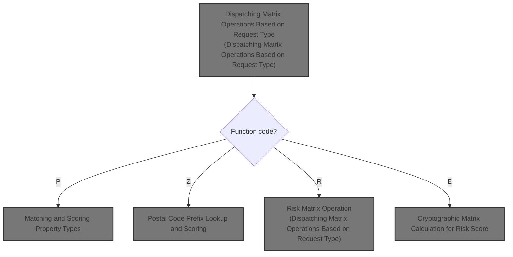

# Overview

This document describes the flow for dispatching and processing matrix operations. Requests are routed to the appropriate operation—property, postal, risk, or crypto—based on the function code, and each operation returns a calculated result based on the input data.

## Dependencies

### Program

- LGSCMTRX (<SwmPath>[base/src/lgscmtrx.cbl](base/src/lgscmtrx.cbl)</SwmPath>)

&nbsp;

*This is an auto-generated document by Swimm 🌊 and has not yet been verified by a human*

<SwmMeta version="3.0.0" repo-id="Z2l0aHViJTNBJTNBU3dpbW1pby1nZW5hcHAtaG91c2UlM0ElM0FHaXJpLVN3aW1t" repo-name="Swimmio-genapp-house">Powered by [Swimm](https://app.swimm.io/)</SwmMeta>
