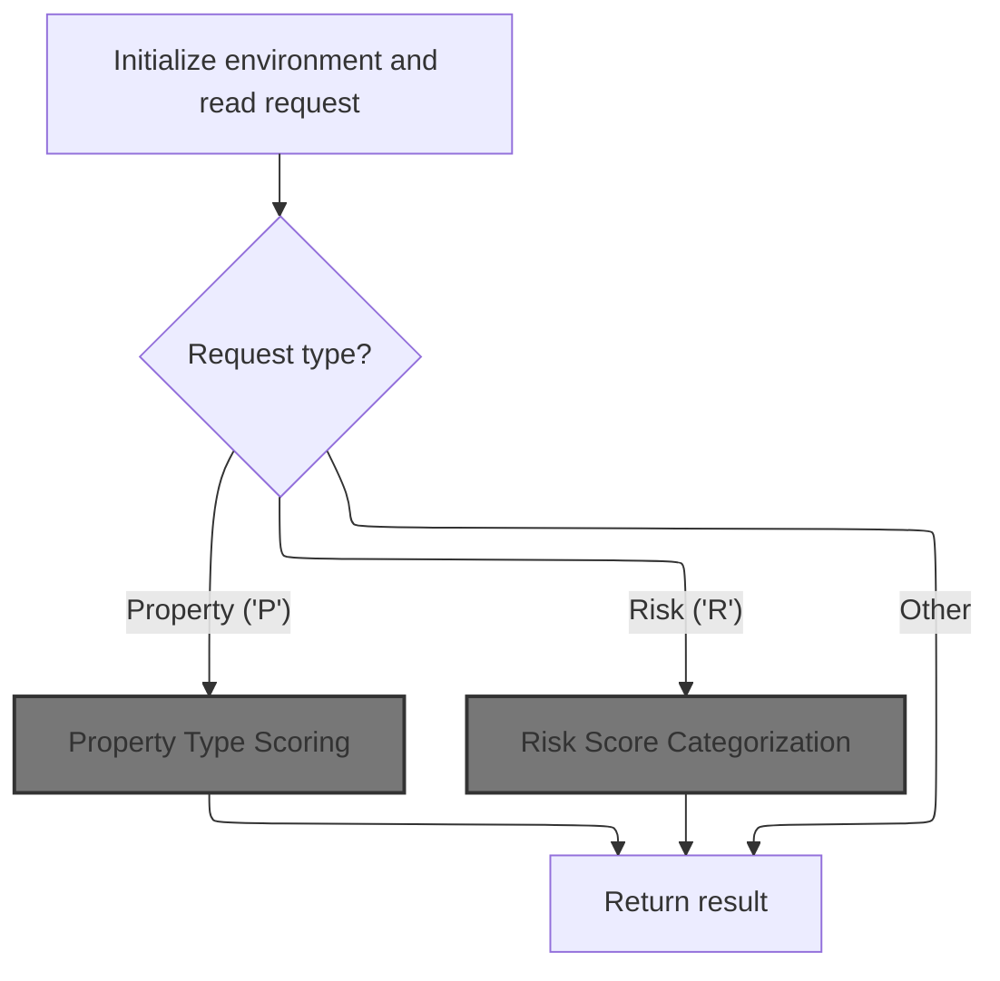
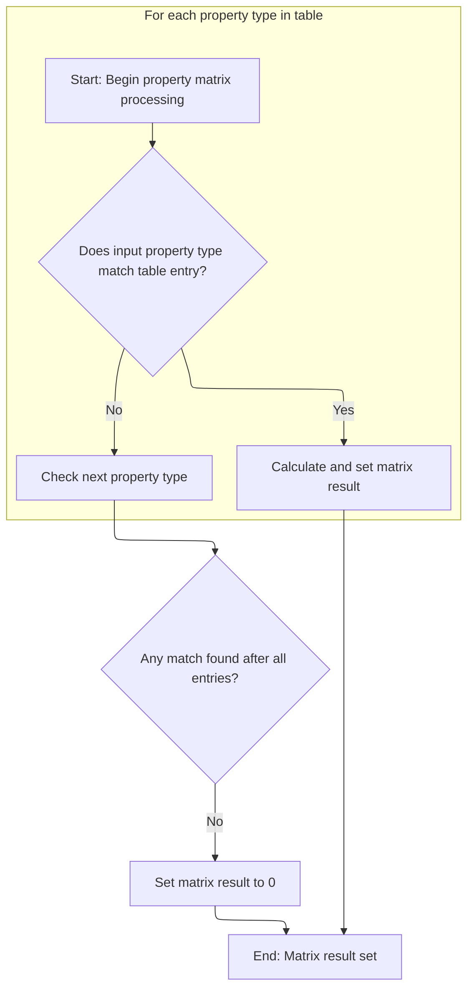
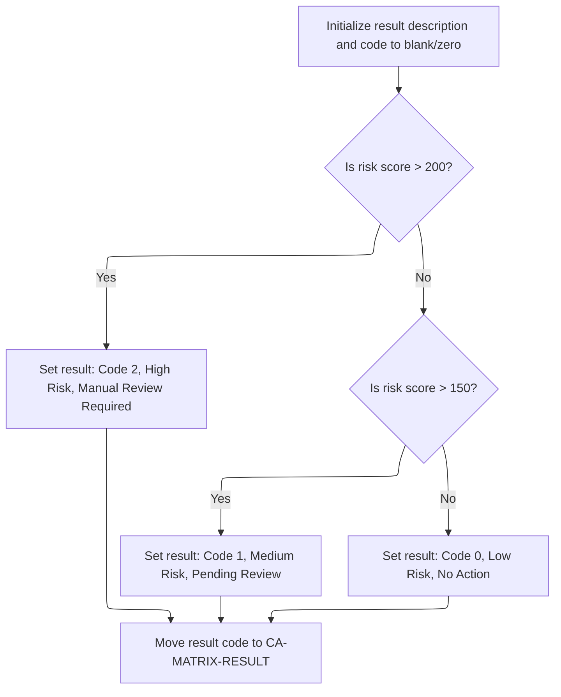

# Overview

This document explains how requests are routed to the correct matrix operation—property type scoring, risk score categorization, or cryptographic calculation—based on the function code provided. The flow determines the appropriate calculation and returns the result for each request.

## Dependencies

### Program

- LGSCMTRX (<SwmPath>[base/src/lgscmtrx.cbl](base/src/lgscmtrx.cbl)</SwmPath>)

## Detailed View of the Program's Functionality

Main Program Flow

The program begins by initializing its runtime environment. This includes clearing and setting up a header area for tracking transaction and terminal information, such as transaction ID, terminal ID, and task number. Once the environment is ready, the program examines a function code provided in the request to determine which type of matrix operation to perform. The possible operations are:

- Property Type Scoring (if the code is 'P')
- Postal Code Matrix (if the code is 'Z')
- Risk Score Categorization (if the code is 'R')
- Cryptographic Matrix Calculation (if the code is 'E')
- Error Handling (for any other code)

The program dispatches control to the appropriate routine based on this code. After the selected routine completes, the program returns control to the caller.

Property Type Scoring

When the property type scoring routine is selected, the program prepares by marking that no match has been found and setting the result to zero. It then loops through a fixed table of five property types, each with an associated numeric value. For each entry, it checks if the input property type matches the current table entry.

- If a match is found:

  - The program marks that a match was found.
  - It retrieves the associated value for that property type.
  - It divides this value by 10 to normalize it.
  - The normalized value is set as the result.
  - The loop stops early, ensuring only the first match is used.

- If no match is found after checking all entries:

  - The result is explicitly set to zero.

This routine ensures that only recognized property types yield a nonzero result, and the result is always normalized.

Risk Score Categorization

For risk score categorization, the program starts by clearing the result description and setting a temporary result code to zero. It then evaluates the input risk score against two thresholds:

- If the risk score is greater than 200:

  - The result code is set to 2.
  - The description is set to indicate a high risk score and that manual review is required.

- If the risk score is between 151 and 200:

  - The result code is set to 1.
  - The description indicates medium risk and that a review is pending.

- If the risk score is 150 or less:

  - The result code remains zero.
  - The description is cleared (set to blank).

After determining the risk category, the result code is stored for the caller, and the description is available for further use.

Cryptographic Matrix Calculation

In the cryptographic matrix calculation routine, the program first clears several working areas. It then copies the input risk score into a temporary variable. The program performs a loop five times, where in each iteration it divides and then multiplies this temporary value by a constant factor. This operation does not change the value, so the loop appears to serve no functional purpose other than possibly obfuscation or placeholder logic. After the loop, the original risk score is set as the result.

Error Handling

If the function code does not match any recognized operation, the program enters the error handling routine. Here, it sets the result to -1 and updates the description to indicate an invalid function was requested. This provides clear feedback to the caller that the request was not understood or supported.

Postal Code Matrix (Not in Flow Document, but Present in Code)

There is also a routine for postal code matrix processing. It works similarly to property type scoring:

- It loops through a table of four postal code prefixes.
- For each, it checks if the first two characters of the input postal code match the table entry.
- If a match is found, it retrieves and normalizes the associated value, then sets it as the result.
- If no match is found, the result is set to zero.

This routine is dispatched when the function code is 'Z'.

Summary

- The program acts as a dispatcher, selecting and executing one of several matrix-related routines based on a function code.
- Each routine processes input data (property type, postal code, risk score) against a fixed table or threshold, normalizes or categorizes the result, and returns it to the caller.
- Error handling ensures that unsupported requests are clearly flagged.
- The cryptographic matrix routine does not perform meaningful computation and simply returns the input risk score.

# Rule Definition

| Paragraph Name                                                                                                                                           | Rule ID | Category          | Description                                                                                                                                                                                                                                                                                                                                                                                                                                                                                                                                                                                                                                                                                                                                                                                                                                                                                                                                                                      | Conditions                                                                                                                                | Remarks                                                                                                                                                                                                                                                                                                       |
| -------------------------------------------------------------------------------------------------------------------------------------------------------- | ------- | ----------------- | -------------------------------------------------------------------------------------------------------------------------------------------------------------------------------------------------------------------------------------------------------------------------------------------------------------------------------------------------------------------------------------------------------------------------------------------------------------------------------------------------------------------------------------------------------------------------------------------------------------------------------------------------------------------------------------------------------------------------------------------------------------------------------------------------------------------------------------------------------------------------------------------------------------------------------------------------------------------------------- | ----------------------------------------------------------------------------------------------------------------------------------------- | ------------------------------------------------------------------------------------------------------------------------------------------------------------------------------------------------------------------------------------------------------------------------------------------------------------- |
| MAINLINE SECTION                                                                                                                                         | RL-001  | Conditional Logic | The system reads <SwmToken path="base/src/lgscmtrx.cbl" pos="116:3:7" line-data="           EVALUATE CA-FUNCTION-CODE">`CA-FUNCTION-CODE`</SwmToken> and dispatches to the appropriate matrix operation. If the code is 'P', it performs property type scoring; if 'R', risk score categorization; otherwise, it sets the result to the risk score and description to blank.                                                                                                                                                                                                                                                                                                                                                                                                                                                                                                                                                                                                     | Always applies when the program is invoked.                                                                                               | <SwmToken path="base/src/lgscmtrx.cbl" pos="116:3:7" line-data="           EVALUATE CA-FUNCTION-CODE">`CA-FUNCTION-CODE`</SwmToken> is a single character. The recognized values are 'P' and 'R'. Other values trigger the default assignment rule. All results are returned in the DFHCOMMAREA linkage area. |
| <SwmToken path="base/src/lgscmtrx.cbl" pos="118:3:7" line-data="                   PERFORM PROCESS-PROPERTY-MATRIX">`PROCESS-PROPERTY-MATRIX`</SwmToken> | RL-002  | Computation       | If <SwmToken path="base/src/lgscmtrx.cbl" pos="116:3:7" line-data="           EVALUATE CA-FUNCTION-CODE">`CA-FUNCTION-CODE`</SwmToken> is 'P', the system compares <SwmToken path="base/src/lgscmtrx.cbl" pos="142:3:7" line-data="               IF CA-PROPERTY-TYPE = WS-MT-PROP-NAME(WS-PV-SUB-1)">`CA-PROPERTY-TYPE`</SwmToken> (left-justified, padded to 12 characters) to a list of known property types. If a match is found, <SwmToken path="base/src/lgscmtrx.cbl" pos="138:7:11" line-data="           MOVE 0 TO CA-MATRIX-RESULT.">`CA-MATRIX-RESULT`</SwmToken> is set to the associated value divided by 10 (integer division). If no match is found, <SwmToken path="base/src/lgscmtrx.cbl" pos="138:7:11" line-data="           MOVE 0 TO CA-MATRIX-RESULT.">`CA-MATRIX-RESULT`</SwmToken> is set to 0. <SwmToken path="base/src/lgscmtrx.cbl" pos="181:7:11" line-data="           MOVE SPACES TO CA-RESULT-DESC.">`CA-RESULT-DESC`</SwmToken> is set to blank. | <SwmToken path="base/src/lgscmtrx.cbl" pos="116:3:7" line-data="           EVALUATE CA-FUNCTION-CODE">`CA-FUNCTION-CODE`</SwmToken> = 'P' | <SwmToken path="base/src/lgscmtrx.cbl" pos="142:3:7" line-data="               IF CA-PROPERTY-TYPE = WS-MT-PROP-NAME(WS-PV-SUB-1)">`CA-PROPERTY-TYPE`</SwmToken> is left-justified, padded to 12 characters. The list of property types and values is:                                                        |

- 'WAREHOUSE   ' (500)
- 'FACTORY     ' (750)
- 'OFFICE      ' (250)
- 'RETAIL      ' (400)
- 'MIXEDUSE    ' (450) <SwmToken path="base/src/lgscmtrx.cbl" pos="138:7:11" line-data="           MOVE 0 TO CA-MATRIX-RESULT.">`CA-MATRIX-RESULT`</SwmToken> is a signed integer (5 digits, COMP). <SwmToken path="base/src/lgscmtrx.cbl" pos="181:7:11" line-data="           MOVE SPACES TO CA-RESULT-DESC.">`CA-RESULT-DESC`</SwmToken> is a string (50 characters), set to blank. | | <SwmToken path="base/src/lgscmtrx.cbl" pos="122:3:7" line-data="                   PERFORM PROCESS-RISK-MATRIX">`PROCESS-RISK-MATRIX`</SwmToken> | RL-003 | Conditional Logic | If <SwmToken path="base/src/lgscmtrx.cbl" pos="116:3:7" line-data="           EVALUATE CA-FUNCTION-CODE">`CA-FUNCTION-CODE`</SwmToken> is 'R', the system checks <SwmToken path="base/src/lgscmtrx.cbl" pos="185:3:7" line-data="           IF CA-RISK-SCORE &gt; 200">`CA-RISK-SCORE`</SwmToken> and sets <SwmToken path="base/src/lgscmtrx.cbl" pos="138:7:11" line-data="           MOVE 0 TO CA-MATRIX-RESULT.">`CA-MATRIX-RESULT`</SwmToken> and <SwmToken path="base/src/lgscmtrx.cbl" pos="181:7:11" line-data="           MOVE SPACES TO CA-RESULT-DESC.">`CA-RESULT-DESC`</SwmToken> according to the risk score thresholds. | <SwmToken path="base/src/lgscmtrx.cbl" pos="116:3:7" line-data="           EVALUATE CA-FUNCTION-CODE">`CA-FUNCTION-CODE`</SwmToken> = 'R' | <SwmToken path="base/src/lgscmtrx.cbl" pos="185:3:7" line-data="           IF CA-RISK-SCORE &gt; 200">`CA-RISK-SCORE`</SwmToken> is an integer. The thresholds are:
- If <SwmToken path="base/src/lgscmtrx.cbl" pos="185:3:7" line-data="           IF CA-RISK-SCORE &gt; 200">`CA-RISK-SCORE`</SwmToken> > 200: <SwmToken path="base/src/lgscmtrx.cbl" pos="138:7:11" line-data="           MOVE 0 TO CA-MATRIX-RESULT.">`CA-MATRIX-RESULT`</SwmToken> = 2, <SwmToken path="base/src/lgscmtrx.cbl" pos="181:7:11" line-data="           MOVE SPACES TO CA-RESULT-DESC.">`CA-RESULT-DESC`</SwmToken> = 'High Risk, Manual Review Required'
- If <SwmToken path="base/src/lgscmtrx.cbl" pos="185:3:7" line-data="           IF CA-RISK-SCORE &gt; 200">`CA-RISK-SCORE`</SwmToken> > 150: <SwmToken path="base/src/lgscmtrx.cbl" pos="138:7:11" line-data="           MOVE 0 TO CA-MATRIX-RESULT.">`CA-MATRIX-RESULT`</SwmToken> = 1, <SwmToken path="base/src/lgscmtrx.cbl" pos="181:7:11" line-data="           MOVE SPACES TO CA-RESULT-DESC.">`CA-RESULT-DESC`</SwmToken> = 'Medium Risk, Pending Review'
- Otherwise: <SwmToken path="base/src/lgscmtrx.cbl" pos="138:7:11" line-data="           MOVE 0 TO CA-MATRIX-RESULT.">`CA-MATRIX-RESULT`</SwmToken> = 0, <SwmToken path="base/src/lgscmtrx.cbl" pos="181:7:11" line-data="           MOVE SPACES TO CA-RESULT-DESC.">`CA-RESULT-DESC`</SwmToken> = 'Low Risk, No Action' <SwmToken path="base/src/lgscmtrx.cbl" pos="138:7:11" line-data="           MOVE 0 TO CA-MATRIX-RESULT.">`CA-MATRIX-RESULT`</SwmToken> is a signed integer (5 digits, COMP). <SwmToken path="base/src/lgscmtrx.cbl" pos="181:7:11" line-data="           MOVE SPACES TO CA-RESULT-DESC.">`CA-RESULT-DESC`</SwmToken> is a string (50 characters). | | MAINLINE SECTION, <SwmToken path="base/src/lgscmtrx.cbl" pos="126:3:5" line-data="                   PERFORM PROCESS-ERROR">`PROCESS-ERROR`</SwmToken> | RL-004 | Data Assignment | If <SwmToken path="base/src/lgscmtrx.cbl" pos="116:3:7" line-data="           EVALUATE CA-FUNCTION-CODE">`CA-FUNCTION-CODE`</SwmToken> is not 'P' or 'R', the system sets <SwmToken path="base/src/lgscmtrx.cbl" pos="138:7:11" line-data="           MOVE 0 TO CA-MATRIX-RESULT.">`CA-MATRIX-RESULT`</SwmToken> to the value of <SwmToken path="base/src/lgscmtrx.cbl" pos="185:3:7" line-data="           IF CA-RISK-SCORE &gt; 200">`CA-RISK-SCORE`</SwmToken> and <SwmToken path="base/src/lgscmtrx.cbl" pos="181:7:11" line-data="           MOVE SPACES TO CA-RESULT-DESC.">`CA-RESULT-DESC`</SwmToken> to blank. | <SwmToken path="base/src/lgscmtrx.cbl" pos="116:3:7" line-data="           EVALUATE CA-FUNCTION-CODE">`CA-FUNCTION-CODE`</SwmToken> is not 'P' or 'R'. | <SwmToken path="base/src/lgscmtrx.cbl" pos="138:7:11" line-data="           MOVE 0 TO CA-MATRIX-RESULT.">`CA-MATRIX-RESULT`</SwmToken> is a signed integer (5 digits, COMP), set to the value of <SwmToken path="base/src/lgscmtrx.cbl" pos="185:3:7" line-data="           IF CA-RISK-SCORE &gt; 200">`CA-RISK-SCORE`</SwmToken>. <SwmToken path="base/src/lgscmtrx.cbl" pos="181:7:11" line-data="           MOVE SPACES TO CA-RESULT-DESC.">`CA-RESULT-DESC`</SwmToken> is a string (50 characters), set to blank. |

# User Stories

## User Story 1: Process property type requests

---

### Story Description:

As a user submitting a property type request, I want the system to read my request type, compare my property type against a list of known types, and return a calculated score so that I can understand the relative value of my property type.

---

### Business Rule Mapping:

| Rule ID | Paragraph Name                                                                                                                                           | Rule Description                                                                                                                                                                                                                                                                                                                                                                                                                                                                                                                                                                                                                                                                                                                                                                                                                                                                                                                                                                 |
| ------- | -------------------------------------------------------------------------------------------------------------------------------------------------------- | -------------------------------------------------------------------------------------------------------------------------------------------------------------------------------------------------------------------------------------------------------------------------------------------------------------------------------------------------------------------------------------------------------------------------------------------------------------------------------------------------------------------------------------------------------------------------------------------------------------------------------------------------------------------------------------------------------------------------------------------------------------------------------------------------------------------------------------------------------------------------------------------------------------------------------------------------------------------------------- |
| RL-002  | <SwmToken path="base/src/lgscmtrx.cbl" pos="118:3:7" line-data="                   PERFORM PROCESS-PROPERTY-MATRIX">`PROCESS-PROPERTY-MATRIX`</SwmToken> | If <SwmToken path="base/src/lgscmtrx.cbl" pos="116:3:7" line-data="           EVALUATE CA-FUNCTION-CODE">`CA-FUNCTION-CODE`</SwmToken> is 'P', the system compares <SwmToken path="base/src/lgscmtrx.cbl" pos="142:3:7" line-data="               IF CA-PROPERTY-TYPE = WS-MT-PROP-NAME(WS-PV-SUB-1)">`CA-PROPERTY-TYPE`</SwmToken> (left-justified, padded to 12 characters) to a list of known property types. If a match is found, <SwmToken path="base/src/lgscmtrx.cbl" pos="138:7:11" line-data="           MOVE 0 TO CA-MATRIX-RESULT.">`CA-MATRIX-RESULT`</SwmToken> is set to the associated value divided by 10 (integer division). If no match is found, <SwmToken path="base/src/lgscmtrx.cbl" pos="138:7:11" line-data="           MOVE 0 TO CA-MATRIX-RESULT.">`CA-MATRIX-RESULT`</SwmToken> is set to 0. <SwmToken path="base/src/lgscmtrx.cbl" pos="181:7:11" line-data="           MOVE SPACES TO CA-RESULT-DESC.">`CA-RESULT-DESC`</SwmToken> is set to blank. |
| RL-001  | MAINLINE SECTION                                                                                                                                         | The system reads <SwmToken path="base/src/lgscmtrx.cbl" pos="116:3:7" line-data="           EVALUATE CA-FUNCTION-CODE">`CA-FUNCTION-CODE`</SwmToken> and dispatches to the appropriate matrix operation. If the code is 'P', it performs property type scoring; if 'R', risk score categorization; otherwise, it sets the result to the risk score and description to blank.                                                                                                                                                                                                                                                                                                                                                                                                                                                                                                                                                                                                     |

---

### Relevant Functionality:

- <SwmToken path="base/src/lgscmtrx.cbl" pos="118:3:7" line-data="                   PERFORM PROCESS-PROPERTY-MATRIX">`PROCESS-PROPERTY-MATRIX`</SwmToken>
  1. **RL-002:**
     - For each property type in the list:
       - If <SwmToken path="base/src/lgscmtrx.cbl" pos="142:3:7" line-data="               IF CA-PROPERTY-TYPE = WS-MT-PROP-NAME(WS-PV-SUB-1)">`CA-PROPERTY-TYPE`</SwmToken> matches the property type name:
         - Set <SwmToken path="base/src/lgscmtrx.cbl" pos="138:7:11" line-data="           MOVE 0 TO CA-MATRIX-RESULT.">`CA-MATRIX-RESULT`</SwmToken> to (associated value) divided by 10 (integer division).
         - Set <SwmToken path="base/src/lgscmtrx.cbl" pos="181:7:11" line-data="           MOVE SPACES TO CA-RESULT-DESC.">`CA-RESULT-DESC`</SwmToken> to blank.
         - Stop searching.
     - If no match is found:
       - Set <SwmToken path="base/src/lgscmtrx.cbl" pos="138:7:11" line-data="           MOVE 0 TO CA-MATRIX-RESULT.">`CA-MATRIX-RESULT`</SwmToken> to 0.
       - Set <SwmToken path="base/src/lgscmtrx.cbl" pos="181:7:11" line-data="           MOVE SPACES TO CA-RESULT-DESC.">`CA-RESULT-DESC`</SwmToken> to blank.
- **MAINLINE SECTION**
  1. **RL-001:**
     - Read the request type from <SwmToken path="base/src/lgscmtrx.cbl" pos="116:3:7" line-data="           EVALUATE CA-FUNCTION-CODE">`CA-FUNCTION-CODE`</SwmToken>.
     - If 'P', perform property type scoring.
     - If 'R', perform risk score categorization.
     - Otherwise, set <SwmToken path="base/src/lgscmtrx.cbl" pos="138:7:11" line-data="           MOVE 0 TO CA-MATRIX-RESULT.">`CA-MATRIX-RESULT`</SwmToken> to <SwmToken path="base/src/lgscmtrx.cbl" pos="185:3:7" line-data="           IF CA-RISK-SCORE &gt; 200">`CA-RISK-SCORE`</SwmToken> and <SwmToken path="base/src/lgscmtrx.cbl" pos="181:7:11" line-data="           MOVE SPACES TO CA-RESULT-DESC.">`CA-RESULT-DESC`</SwmToken> to blank.

## User Story 2: Process risk score and default requests

---

### Story Description:

As a user submitting a risk score request or a request with an unrecognized function code, I want the system to categorize my risk score or return my risk score as the result and provide an appropriate description so that I know the risk level, required actions, or receive a default response.

---

### Business Rule Mapping:

| Rule ID | Paragraph Name                                                                                                                                         | Rule Description                                                                                                                                                                                                                                                                                                                                                                                                                                                                                                                                                                                                                      |
| ------- | ------------------------------------------------------------------------------------------------------------------------------------------------------ | ------------------------------------------------------------------------------------------------------------------------------------------------------------------------------------------------------------------------------------------------------------------------------------------------------------------------------------------------------------------------------------------------------------------------------------------------------------------------------------------------------------------------------------------------------------------------------------------------------------------------------------- |
| RL-003  | <SwmToken path="base/src/lgscmtrx.cbl" pos="122:3:7" line-data="                   PERFORM PROCESS-RISK-MATRIX">`PROCESS-RISK-MATRIX`</SwmToken>       | If <SwmToken path="base/src/lgscmtrx.cbl" pos="116:3:7" line-data="           EVALUATE CA-FUNCTION-CODE">`CA-FUNCTION-CODE`</SwmToken> is 'R', the system checks <SwmToken path="base/src/lgscmtrx.cbl" pos="185:3:7" line-data="           IF CA-RISK-SCORE &gt; 200">`CA-RISK-SCORE`</SwmToken> and sets <SwmToken path="base/src/lgscmtrx.cbl" pos="138:7:11" line-data="           MOVE 0 TO CA-MATRIX-RESULT.">`CA-MATRIX-RESULT`</SwmToken> and <SwmToken path="base/src/lgscmtrx.cbl" pos="181:7:11" line-data="           MOVE SPACES TO CA-RESULT-DESC.">`CA-RESULT-DESC`</SwmToken> according to the risk score thresholds. |
| RL-001  | MAINLINE SECTION                                                                                                                                       | The system reads <SwmToken path="base/src/lgscmtrx.cbl" pos="116:3:7" line-data="           EVALUATE CA-FUNCTION-CODE">`CA-FUNCTION-CODE`</SwmToken> and dispatches to the appropriate matrix operation. If the code is 'P', it performs property type scoring; if 'R', risk score categorization; otherwise, it sets the result to the risk score and description to blank.                                                                                                                                                                                                                                                          |
| RL-004  | MAINLINE SECTION, <SwmToken path="base/src/lgscmtrx.cbl" pos="126:3:5" line-data="                   PERFORM PROCESS-ERROR">`PROCESS-ERROR`</SwmToken> | If <SwmToken path="base/src/lgscmtrx.cbl" pos="116:3:7" line-data="           EVALUATE CA-FUNCTION-CODE">`CA-FUNCTION-CODE`</SwmToken> is not 'P' or 'R', the system sets <SwmToken path="base/src/lgscmtrx.cbl" pos="138:7:11" line-data="           MOVE 0 TO CA-MATRIX-RESULT.">`CA-MATRIX-RESULT`</SwmToken> to the value of <SwmToken path="base/src/lgscmtrx.cbl" pos="185:3:7" line-data="           IF CA-RISK-SCORE &gt; 200">`CA-RISK-SCORE`</SwmToken> and <SwmToken path="base/src/lgscmtrx.cbl" pos="181:7:11" line-data="           MOVE SPACES TO CA-RESULT-DESC.">`CA-RESULT-DESC`</SwmToken> to blank.               |

---

### Relevant Functionality:

- <SwmToken path="base/src/lgscmtrx.cbl" pos="122:3:7" line-data="                   PERFORM PROCESS-RISK-MATRIX">`PROCESS-RISK-MATRIX`</SwmToken>
  1. **RL-003:**
     - If <SwmToken path="base/src/lgscmtrx.cbl" pos="185:3:7" line-data="           IF CA-RISK-SCORE &gt; 200">`CA-RISK-SCORE`</SwmToken> > 200:
       - Set <SwmToken path="base/src/lgscmtrx.cbl" pos="138:7:11" line-data="           MOVE 0 TO CA-MATRIX-RESULT.">`CA-MATRIX-RESULT`</SwmToken> to 2.
       - Set <SwmToken path="base/src/lgscmtrx.cbl" pos="181:7:11" line-data="           MOVE SPACES TO CA-RESULT-DESC.">`CA-RESULT-DESC`</SwmToken> to 'High Risk, Manual Review Required'.
     - Else if <SwmToken path="base/src/lgscmtrx.cbl" pos="185:3:7" line-data="           IF CA-RISK-SCORE &gt; 200">`CA-RISK-SCORE`</SwmToken> > 150:
       - Set <SwmToken path="base/src/lgscmtrx.cbl" pos="138:7:11" line-data="           MOVE 0 TO CA-MATRIX-RESULT.">`CA-MATRIX-RESULT`</SwmToken> to 1.
       - Set <SwmToken path="base/src/lgscmtrx.cbl" pos="181:7:11" line-data="           MOVE SPACES TO CA-RESULT-DESC.">`CA-RESULT-DESC`</SwmToken> to 'Medium Risk, Pending Review'.
     - Else:
       - Set <SwmToken path="base/src/lgscmtrx.cbl" pos="138:7:11" line-data="           MOVE 0 TO CA-MATRIX-RESULT.">`CA-MATRIX-RESULT`</SwmToken> to 0.
       - Set <SwmToken path="base/src/lgscmtrx.cbl" pos="181:7:11" line-data="           MOVE SPACES TO CA-RESULT-DESC.">`CA-RESULT-DESC`</SwmToken> to 'Low Risk, No Action'.
- **MAINLINE SECTION**
  1. **RL-001:**
     - Read the request type from <SwmToken path="base/src/lgscmtrx.cbl" pos="116:3:7" line-data="           EVALUATE CA-FUNCTION-CODE">`CA-FUNCTION-CODE`</SwmToken>.
     - If 'P', perform property type scoring.
     - If 'R', perform risk score categorization.
     - Otherwise, set <SwmToken path="base/src/lgscmtrx.cbl" pos="138:7:11" line-data="           MOVE 0 TO CA-MATRIX-RESULT.">`CA-MATRIX-RESULT`</SwmToken> to <SwmToken path="base/src/lgscmtrx.cbl" pos="185:3:7" line-data="           IF CA-RISK-SCORE &gt; 200">`CA-RISK-SCORE`</SwmToken> and <SwmToken path="base/src/lgscmtrx.cbl" pos="181:7:11" line-data="           MOVE SPACES TO CA-RESULT-DESC.">`CA-RESULT-DESC`</SwmToken> to blank.
  2. **RL-004:**
     - Set <SwmToken path="base/src/lgscmtrx.cbl" pos="138:7:11" line-data="           MOVE 0 TO CA-MATRIX-RESULT.">`CA-MATRIX-RESULT`</SwmToken> to <SwmToken path="base/src/lgscmtrx.cbl" pos="185:3:7" line-data="           IF CA-RISK-SCORE &gt; 200">`CA-RISK-SCORE`</SwmToken>.
     - Set <SwmToken path="base/src/lgscmtrx.cbl" pos="181:7:11" line-data="           MOVE SPACES TO CA-RESULT-DESC.">`CA-RESULT-DESC`</SwmToken> to blank.

# Workflow

# Dispatching Matrix Operations



This section dispatches incoming requests to the correct matrix operation based on the function code provided in the request. It ensures the environment is initialized and the correct calculation or categorization is performed before returning the result.

| Category        | Rule Name                          | Description                                                                                                                                                              |
| --------------- | ---------------------------------- | ------------------------------------------------------------------------------------------------------------------------------------------------------------------------ |
| Calculation     | Property Type Scoring              | If the function code is 'P', the property type in the request is matched to a supported list and its associated value is divided by 10 to calculate the property score.  |
| Calculation     | Risk Score Categorization          | If the function code is 'R', the risk score in the request is evaluated against predefined thresholds to categorize risk and set the result and description accordingly. |
| Decision Making | Matrix Operation Dispatch          | The function code in the request determines which matrix operation is performed: property scoring, postal scoring, risk scoring, crypto scoring, or error handling.      |
| Decision Making | Unsupported Function Code Handling | If the function code does not match any supported operation, an error process is invoked and an error result is returned.                                                |

<SwmSnippet path="/base/src/lgscmtrx.cbl" line="108">

---

MAINLINE sets up transaction context and dispatches to the right matrix routine based on <SwmToken path="base/src/lgscmtrx.cbl" pos="116:3:7" line-data="           EVALUATE CA-FUNCTION-CODE">`CA-FUNCTION-CODE`</SwmToken>. If 'P', it calls <SwmToken path="base/src/lgscmtrx.cbl" pos="118:3:7" line-data="                   PERFORM PROCESS-PROPERTY-MATRIX">`PROCESS-PROPERTY-MATRIX`</SwmToken> to calculate the property score.

```cobol
       MAINLINE SECTION.
           
      * Initialize the runtime environment
           INITIALIZE WS-HEADER.
           MOVE EIBTRNID TO WS-TRANSID.
           MOVE EIBTRMID TO WS-TERMID.
           MOVE EIBTASKN TO WS-TASKNUM.
           
           EVALUATE CA-FUNCTION-CODE
               WHEN 'P'
                   PERFORM PROCESS-PROPERTY-MATRIX
               WHEN 'Z'
                   PERFORM PROCESS-POSTAL-MATRIX
               WHEN 'R'
                   PERFORM PROCESS-RISK-MATRIX
               WHEN 'E'
                   PERFORM PROCESS-CRYPTO-MATRIX
               WHEN OTHER
                   PERFORM PROCESS-ERROR
           END-EVALUATE.
           
           EXEC CICS RETURN END-EXEC.
```

---

</SwmSnippet>

## Property Type Scoring



This section determines a property type score by matching the input property type against a predefined table. If a match is found, the associated value is divided by 10 and set as the result; otherwise, the result is set to 0.

| Category        | Rule Name            | Description                                                                                                                     |
| --------------- | -------------------- | ------------------------------------------------------------------------------------------------------------------------------- |
| Reading Input   | Fixed Property Types | The property type is matched against a fixed list of 5 property types defined in the table.                                     |
| Calculation     | Score Calculation    | If the input property type matches an entry in the table, the associated value is divided by 10 to calculate the matrix result. |
| Decision Making | First Match Only     | Only the first matching property type in the table is considered for scoring; subsequent matches are ignored.                   |
| Decision Making | No Match Default     | If no matching property type is found in the table, the matrix result is set to 0.                                              |

<SwmSnippet path="/base/src/lgscmtrx.cbl" line="136">

---

In <SwmToken path="base/src/lgscmtrx.cbl" pos="136:1:5" line-data="       PROCESS-PROPERTY-MATRIX.">`PROCESS-PROPERTY-MATRIX`</SwmToken>, the function loops through a fixed list of 5 property types to find a match for <SwmToken path="base/src/lgscmtrx.cbl" pos="142:3:7" line-data="               IF CA-PROPERTY-TYPE = WS-MT-PROP-NAME(WS-PV-SUB-1)">`CA-PROPERTY-TYPE`</SwmToken>. If it finds one, it grabs the associated value, divides it by 10, and sets <SwmToken path="base/src/lgscmtrx.cbl" pos="138:7:11" line-data="           MOVE 0 TO CA-MATRIX-RESULT.">`CA-MATRIX-RESULT`</SwmToken>. The loop breaks early if a match is found, so only the first match is processed.

```cobol
       PROCESS-PROPERTY-MATRIX.
           MOVE 'N' TO WS-PV-FOUND.
           MOVE 0 TO CA-MATRIX-RESULT.
           
           PERFORM VARYING WS-PV-SUB-1 FROM 1 BY 1
             UNTIL WS-PV-SUB-1 > 5 OR WS-PV-FOUND = 'Y'
               IF CA-PROPERTY-TYPE = WS-MT-PROP-NAME(WS-PV-SUB-1)
                  MOVE 'Y' TO WS-PV-FOUND
                  MOVE WS-MT-PROP-VALUE(WS-PV-SUB-1) TO WS-PV-TEMP1
                  DIVIDE 10 INTO WS-PV-TEMP1 GIVING WS-PV-TEMP2
                  MOVE WS-PV-TEMP2 TO CA-MATRIX-RESULT
               END-IF
           END-PERFORM.
```

---

</SwmSnippet>

<SwmSnippet path="/base/src/lgscmtrx.cbl" line="150">

---

After searching for a property type, if none is found, the function sets <SwmToken path="base/src/lgscmtrx.cbl" pos="151:7:11" line-data="              MOVE 0 TO CA-MATRIX-RESULT">`CA-MATRIX-RESULT`</SwmToken> to 0. This makes it clear to the caller that the input type wasn't recognized.

```cobol
           IF WS-PV-FOUND = 'N'
              MOVE 0 TO CA-MATRIX-RESULT
           END-IF.
           
           EXIT.
```

---

</SwmSnippet>

## Risk Score Categorization



This section categorizes a given risk score into one of three risk levels (high, medium, low) and provides both a numeric code and a descriptive string for downstream processing or display.

| Category        | Rule Name                  | Description                                                                                                                                   |
| --------------- | -------------------------- | --------------------------------------------------------------------------------------------------------------------------------------------- |
| Decision Making | High Risk Manual Review    | If the risk score is greater than 200, the result is set to code 2 with the description 'High Risk Score - Manual Review Required'.           |
| Decision Making | Medium Risk Pending Review | If the risk score is greater than 150 but not more than 200, the result is set to code 1 with the description 'Medium Risk - Pending Review'. |
| Decision Making | Low Risk No Action         | If the risk score is 150 or less, the result is set to code 0 with a blank description, indicating low risk and no action required.           |

<SwmSnippet path="/base/src/lgscmtrx.cbl" line="180">

---

In <SwmToken path="base/src/lgscmtrx.cbl" pos="180:1:5" line-data="       PROCESS-RISK-MATRIX.">`PROCESS-RISK-MATRIX`</SwmToken>, the function checks <SwmToken path="base/src/lgscmtrx.cbl" pos="185:3:7" line-data="           IF CA-RISK-SCORE &gt; 200">`CA-RISK-SCORE`</SwmToken> against two cutoffs: above 200 is high risk (manual review), 151-200 is medium risk (pending review), and anything lower is low/no risk. It sets both a numeric risk level and a description string based on these rules.

```cobol
       PROCESS-RISK-MATRIX.
           MOVE SPACES TO CA-RESULT-DESC.
           
           MOVE 0 TO WS-PV-TEMP1.
           
           IF CA-RISK-SCORE > 200
              MOVE 2 TO WS-PV-TEMP1
              MOVE 'High Risk Score - Manual Review Required' 
               TO CA-RESULT-DESC
           ELSE
              IF CA-RISK-SCORE > 150
                 MOVE 1 TO WS-PV-TEMP1
                 MOVE 'Medium Risk - Pending Review'
                  TO CA-RESULT-DESC
              ELSE
                 MOVE 0 TO WS-PV-TEMP1
                 MOVE SPACES TO CA-RESULT-DESC
              END-IF
```

---

</SwmSnippet>

<SwmSnippet path="/base/src/lgscmtrx.cbl" line="198">

---

The function returns both a risk level (number) and a description string for the caller to use.

```cobol
           END-IF.
           
           MOVE WS-PV-TEMP1 TO CA-MATRIX-RESULT.
           
           EXIT.
```

---

</SwmSnippet>

## Cryptographic Matrix Calculation

<SwmSnippet path="/base/src/lgscmtrx.cbl" line="206">

---

<SwmToken path="base/src/lgscmtrx.cbl" pos="206:1:5" line-data="       PROCESS-CRYPTO-MATRIX.">`PROCESS-CRYPTO-MATRIX`</SwmToken> runs a loop 5 times, dividing and multiplying the risk score by <SwmToken path="base/src/lgscmtrx.cbl" pos="215:19:23" line-data="               COMPUTE WS-PV-TEMP2 = WS-PV-TEMP1 / WS-CM-F1 * WS-CM-F1">`WS-CM-F1`</SwmToken> (+7), but this doesn't change the value. After the loop, it just sets <SwmToken path="base/src/lgscmtrx.cbl" pos="219:11:15" line-data="           MOVE CA-RISK-SCORE TO CA-MATRIX-RESULT.">`CA-MATRIX-RESULT`</SwmToken> to the original risk score. The loop's purpose isn't obvious and seems to be a repository-specific quirk.

```cobol
       PROCESS-CRYPTO-MATRIX.
           MOVE SPACES TO WS-CM-W1.
           MOVE SPACES TO WS-CM-W2.
           MOVE SPACES TO WS-CM-W3.
           
           COMPUTE WS-PV-TEMP1 = CA-RISK-SCORE + 0.
           
           PERFORM VARYING WS-PV-SUB-1 FROM 1 BY 1
             UNTIL WS-PV-SUB-1 > 5
               COMPUTE WS-PV-TEMP2 = WS-PV-TEMP1 / WS-CM-F1 * WS-CM-F1
               MOVE WS-PV-TEMP2 TO WS-PV-TEMP1
           END-PERFORM.
           
           MOVE CA-RISK-SCORE TO CA-MATRIX-RESULT.
           
           EXIT.
```

---

</SwmSnippet>

&nbsp;

*This is an auto-generated document by Swimm 🌊 and has not yet been verified by a human*

<SwmMeta version="3.0.0" repo-id="Z2l0aHViJTNBJTNBU3dpbW1pby1nZW5hcHAtaG91c2UlM0ElM0FHaXJpLVN3aW1t" repo-name="Swimmio-genapp-house"><sup>Powered by [Swimm](https://app.swimm.io/)</sup></SwmMeta>
