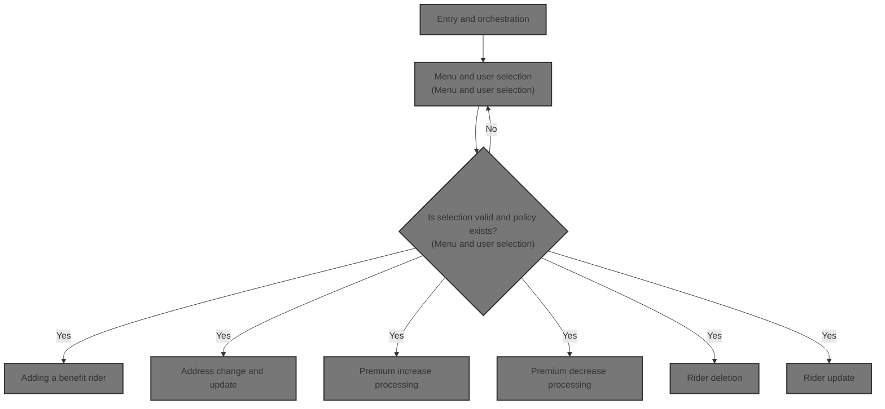

# Overview

This document describes the interactive flow for managing insurance policies. Users select operations from a menu, such as searching for policies or updating policy details. The system validates each request, updates records, and provides confirmation or error messages.

## Dependencies

### Program

- SAMPLES (<SwmPath>[base/src/sample.cbl](base/src/sample.cbl)</SwmPath>)

### Copybooks

- PMASTER
- PINSURED
- PBENEFIT
- AGTMSTR
- POLTRAN1
- POLTRAN2
- POLNTFY

&nbsp;

*This is an auto-generated document by Swimm 🌊 and has not yet been verified by a human*

<SwmMeta version="3.0.0" repo-id="Z2l0aHViJTNBJTNBU3dpbW1pby1nZW5hcHAtaG91c2UlM0ElM0FHaXJpLVN3aW1t" repo-name="Swimmio-genapp-house">Powered by [Swimm](https://app.swimm.io/)</SwmMeta>
