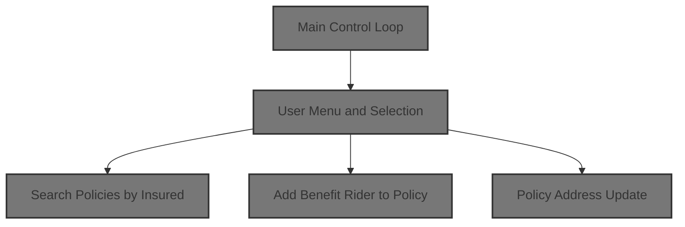
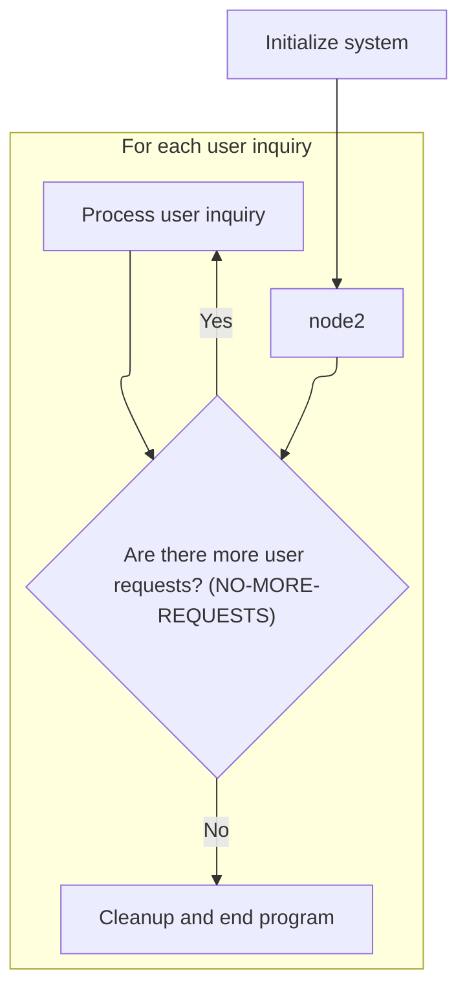
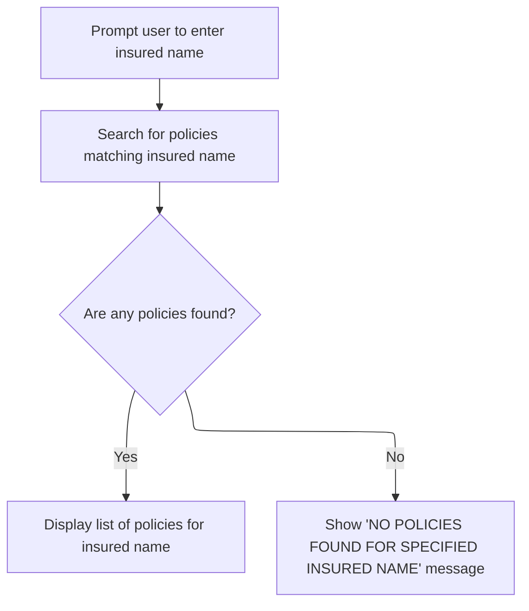
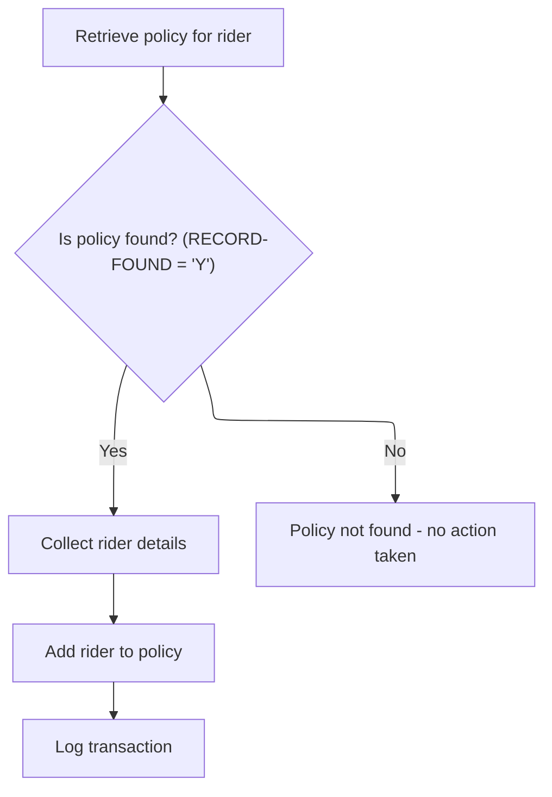
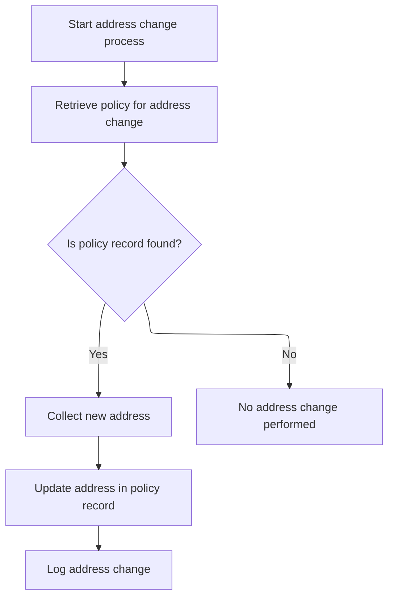
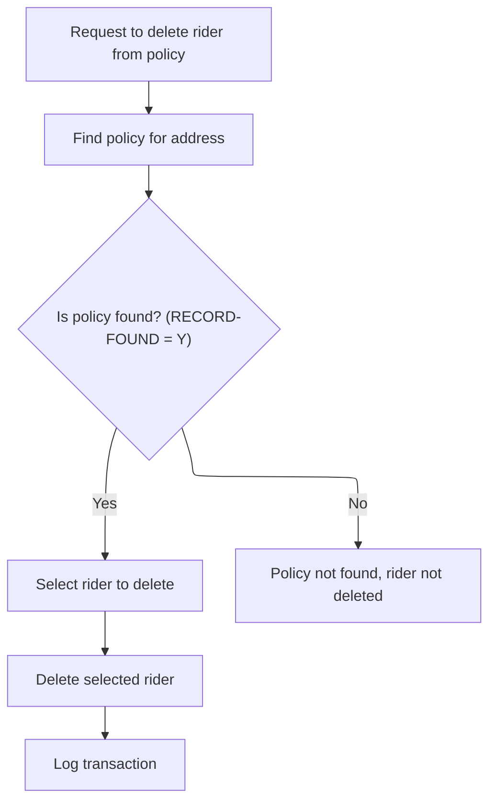
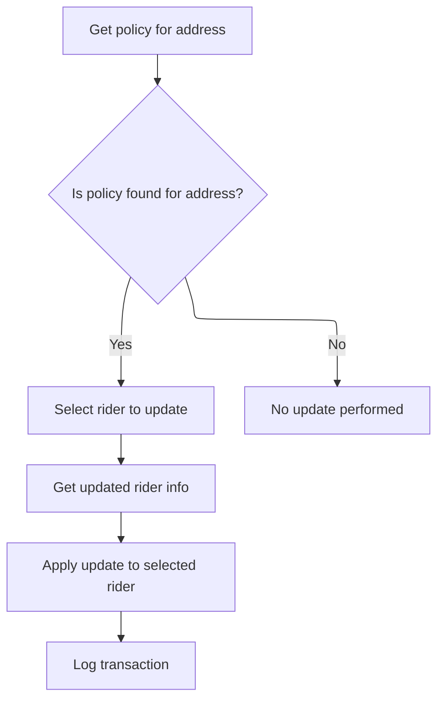

# Overview

The policy inquiry system provides an interactive, menu-driven interface for managing insurance policies. Users can search for policies, add or update riders, change addresses, and perform other policy-related actions. Each operation is initiated by a user menu selection and results in immediate feedback or updates to policy records.



## Dependencies

### Program

- SAMPLES (<SwmPath>[base/src/sample.cbl](base/src/sample.cbl)</SwmPath>)

### Copybooks

- PMASTER
- PINSURED
- PBENEFIT
- AGTMSTR
- <SwmToken path="base/src/sample.cbl" pos="175:11:11" line-data="       01  POL-TRAN1-REC         COPY POLTRAN1 IN &quot;COPYLIB&quot;.">`POLTRAN1`</SwmToken>
- <SwmToken path="base/src/sample.cbl" pos="176:11:11" line-data="       01  POL-TRAN2-REC         COPY POLTRAN2 IN &quot;COPYLIB&quot;.">`POLTRAN2`</SwmToken>
- POLNTFY

## Detailed View of the Program's Functionality

a. Main Control Loop

The program begins by initializing the system, which includes setting up the current date, clearing buffers, and displaying a ready message. After initialization, it enters a loop where it repeatedly presents a menu to the user and processes their requests. This loop continues until the user indicates they want to exit. Once all user requests are handled, the program performs cleanup actions and ends.

b. User Menu and Selection

Each cycle of the main loop starts by displaying a menu of available operations, such as searching for policies, adding riders, changing addresses, and more. The user is prompted to enter a function code corresponding to their desired action. If the user enters the exit code, the loop ends. Otherwise, the program evaluates the user's selection and branches to the appropriate operation. If the selection is invalid, an error message is shown.

c. Search Policies by Insured

When the user chooses to search by insured name, the program prompts for the insured's last name and accepts the input. It then attempts to find policies matching that name. If any policies are found, it displays a list of them, including policy number, agent name, and premium. If no policies are found, a not-found message is displayed.

d. Add Benefit Rider to Policy

If the user opts to add a benefit rider, the program asks for a policy number and validates its existence. If the policy is found, it prompts for rider details: code, amount, and effective date. These details are then used to add the rider to the policy. The operation is logged for audit purposes. If the policy is not found, no further action is taken.

e. Transaction Logging and Child Rider Input

After adding a benefit rider, the program logs the transaction, recording details such as policy number, date, function code, description, and rider code. The next operation, adding a child rider, begins by prompting for a policy number and validating it. If valid, the program collects the child's name, birth date, and rider amount, then adds the child rider to the policy and logs the transaction.

f. Policy Address Update

For address changes, the program prompts for a policy number and validates it. If the policy exists, it collects the new address details (address lines, city, state, zip) and updates the policy record. The update is logged, and a success message is displayed. If the policy is not found, no update occurs.

g. Delete Rider from Policy

When deleting a rider, the program asks for a policy number and checks its validity. If found, it prompts for the rider code to delete, then removes the specified rider from the policy. The deletion is logged, and a confirmation message is shown. If the policy is not found, no deletion occurs.

h. Update Rider Details

To update a rider, the program prompts for a policy number and validates it. If the policy exists, it asks for the rider code to update and then collects the new rider amount. The rider's details are updated in the policy, and the transaction is logged. If the policy is not found, no update is performed.

i. Premium Change Operations

For premium changes (increase, decrease, or general change), the program prompts for a policy number and validates it. If found, it displays the current premium and asks for the new premium amount. The difference is calculated, and the premium is updated in the policy record. The change is logged, including old and new premium values.

j. Cleanup

After all user requests are processed, the program displays a completion message and performs any necessary cleanup actions before ending.

# Rule Definition

| Paragraph Name                                                                                                                                                                                                                                                                                                                                                                                                                                                                                                                                                                                                                                                                                                                                                                                                                                                                                                                                                                                                                                                                                                                                                                                                                                                                                                                                                                                                                                                                                                                                                                                                                                                                                                                                                                                                | Rule ID | Category          | Description                                                                                                                                                                                                                                                                                                                                                                                                                                                                                                                                                                                                                                                                            | Conditions                                                        | Remarks                                                                                                                                                                                                                                                            |
| ------------------------------------------------------------------------------------------------------------------------------------------------------------------------------------------------------------------------------------------------------------------------------------------------------------------------------------------------------------------------------------------------------------------------------------------------------------------------------------------------------------------------------------------------------------------------------------------------------------------------------------------------------------------------------------------------------------------------------------------------------------------------------------------------------------------------------------------------------------------------------------------------------------------------------------------------------------------------------------------------------------------------------------------------------------------------------------------------------------------------------------------------------------------------------------------------------------------------------------------------------------------------------------------------------------------------------------------------------------------------------------------------------------------------------------------------------------------------------------------------------------------------------------------------------------------------------------------------------------------------------------------------------------------------------------------------------------------------------------------------------------------------------------------------------------- | ------- | ----------------- | -------------------------------------------------------------------------------------------------------------------------------------------------------------------------------------------------------------------------------------------------------------------------------------------------------------------------------------------------------------------------------------------------------------------------------------------------------------------------------------------------------------------------------------------------------------------------------------------------------------------------------------------------------------------------------------- | ----------------------------------------------------------------- | ------------------------------------------------------------------------------------------------------------------------------------------------------------------------------------------------------------------------------------------------------------------ |
| <SwmToken path="base/src/sample.cbl" pos="190:3:5" line-data="           PERFORM 100-INITIALIZE">`100-INITIALIZE`</SwmToken>                                                                                                                                                                                                                                                                                                                                                                                                                                                                                                                                                                                                                                                                                                                                                                                                                                                                                                                                                                                                                                                                                                                                                                                                                                                                                                                                                                                                                                                                                                                                                                                                                                                                                  | RL-001  | Data Assignment   | On startup, the system must load all persistent files required for operation: <SwmToken path="base/src/sample.cbl" pos="24:10:12" line-data="      */    INPUT FILES ARE: POL-MASTER, POL-INSURED,          *">`POL-MASTER`</SwmToken>, <SwmToken path="base/src/sample.cbl" pos="565:5:7" line-data="      * DELETE POL-BENEFIT-REC">`POL-BENEFIT`</SwmToken>, <SwmToken path="base/src/sample.cbl" pos="25:8:10" line-data="      */                     POL-BENEFIT, AGENT-MASTER         *">`AGENT-MASTER`</SwmToken>, and <SwmToken path="base/src/sample.cbl" pos="28:8:10" line-data="      */                            POL-INSURED, POL-TRAN1     *">`POL-TRAN1`</SwmToken>. | Program start.                                                    | Files are referenced by their logical names. No format validation is performed at this stage.                                                                                                                                                                      |
| <SwmToken path="base/src/sample.cbl" pos="205:3:9" line-data="           PERFORM 210-DISPLAY-MAIN-MENU">`210-DISPLAY-MAIN-MENU`</SwmToken>, <SwmToken path="base/src/sample.cbl" pos="206:3:9" line-data="           PERFORM 220-GET-USER-SELECTION">`220-GET-USER-SELECTION`</SwmToken>                                                                                                                                                                                                                                                                                                                                                                                                                                                                                                                                                                                                                                                                                                                                                                                                                                                                                                                                                                                                                                                                                                                                                                                                                                                                                                                                                                                                                                                                                                                      | RL-002  | Conditional Logic | The main menu must be displayed to the user, showing numbered options (<SwmToken path="base/src/sample.cbl" pos="253:11:13" line-data="           DISPLAY &quot;ENTER FUNCTION CODE (01-11) OR &#39;XX&#39; TO EXIT: &quot;">`01-11`</SwmToken>) and prompting for a function code with the text: 'ENTER FUNCTION CODE (<SwmToken path="base/src/sample.cbl" pos="253:11:13" line-data="           DISPLAY &quot;ENTER FUNCTION CODE (01-11) OR &#39;XX&#39; TO EXIT: &quot;">`01-11`</SwmToken>) OR 'XX' TO EXIT: '.                                                                                                                                                                  | After initialization and after each operation, unless user exits. | Menu options are displayed as strings. Function code is accepted as a 2-character string.                                                                                                                                                                          |
| <SwmToken path="base/src/sample.cbl" pos="191:3:7" line-data="           PERFORM 200-PROCESS-INQUIRY UNTIL NO-MORE-REQUESTS">`200-PROCESS-INQUIRY`</SwmToken>                                                                                                                                                                                                                                                                                                                                                                                                                                                                                                                                                                                                                                                                                                                                                                                                                                                                                                                                                                                                                                                                                                                                                                                                                                                                                                                                                                                                                                                                                                                                                                                                                                                 | RL-003  | Conditional Logic | The system must process user inquiries in a loop, allowing multiple operations until the user exits.                                                                                                                                                                                                                                                                                                                                                                                                                                                                                                                                                                                   | After initialization, until function code 'XX' is entered.        | Loop continues until <SwmToken path="base/src/sample.cbl" pos="191:11:15" line-data="           PERFORM 200-PROCESS-INQUIRY UNTIL NO-MORE-REQUESTS">`NO-MORE-REQUESTS`</SwmToken> is set to TRUE.                                                                  |
| <SwmToken path="base/src/sample.cbl" pos="191:3:7" line-data="           PERFORM 200-PROCESS-INQUIRY UNTIL NO-MORE-REQUESTS">`200-PROCESS-INQUIRY`</SwmToken>                                                                                                                                                                                                                                                                                                                                                                                                                                                                                                                                                                                                                                                                                                                                                                                                                                                                                                                                                                                                                                                                                                                                                                                                                                                                                                                                                                                                                                                                                                                                                                                                                                                 | RL-004  | Conditional Logic | For each function code selected, the system must branch to the corresponding operation (<SwmToken path="base/src/sample.cbl" pos="253:11:13" line-data="           DISPLAY &quot;ENTER FUNCTION CODE (01-11) OR &#39;XX&#39; TO EXIT: &quot;">`01-11`</SwmToken>). Any other code triggers an error message.                                                                                                                                                                                                                                                                                                                                                                           | User enters a function code.                                      | Function codes are 2-character strings. Error message for invalid code is 'INVALID FUNCTION SELECTED'.                                                                                                                                                             |
| <SwmToken path="base/src/sample.cbl" pos="209:3:9" line-data="                   PERFORM 300-SEARCH-BY-AGENT">`300-SEARCH-BY-AGENT`</SwmToken>, <SwmToken path="base/src/sample.cbl" pos="268:3:9" line-data="           PERFORM 310-FIND-AGENT-POLICIES">`310-FIND-AGENT-POLICIES`</SwmToken>, <SwmToken path="base/src/sample.cbl" pos="271:3:9" line-data="               PERFORM 320-DISPLAY-AGENT-POLICIES">`320-DISPLAY-AGENT-POLICIES`</SwmToken>                                                                                                                                                                                                                                                                                                                                                                                                                                                                                                                                                                                                                                                                                                                                                                                                                                                                                                                                                                                                                                                                                                                                                                                                                                                                                                                                                      | RL-005  | Computation       | Prompt for agent last name, display table of matching policies (policy number, insured name, premium). If none found, display 'NO POLICIES FOUND FOR SPECIFIED AGENT NAME'.                                                                                                                                                                                                                                                                                                                                                                                                                                                                                                            | Function code '01' selected.                                      | Prompt: 'ENTER AGENT LAST NAME: '. Output table columns: policy number (string, 10 chars), insured name (string, 30 chars), premium (number, formatted).                                                                                                           |
| <SwmToken path="base/src/sample.cbl" pos="211:3:9" line-data="                   PERFORM 400-SEARCH-BY-INSURED">`400-SEARCH-BY-INSURED`</SwmToken>, <SwmToken path="base/src/sample.cbl" pos="310:3:9" line-data="           PERFORM 410-FIND-INSURED-POLICIES">`410-FIND-INSURED-POLICIES`</SwmToken>, <SwmToken path="base/src/sample.cbl" pos="313:3:9" line-data="               PERFORM 420-DISPLAY-INSURED-POLICIES">`420-DISPLAY-INSURED-POLICIES`</SwmToken>                                                                                                                                                                                                                                                                                                                                                                                                                                                                                                                                                                                                                                                                                                                                                                                                                                                                                                                                                                                                                                                                                                                                                                                                                                                                                                                                          | RL-006  | Computation       | Prompt for insured last name, display table of matching policies (policy number, agent name, premium). If none found, display 'NO POLICIES FOUND FOR SPECIFIED INSURED NAME'.                                                                                                                                                                                                                                                                                                                                                                                                                                                                                                          | Function code '02' selected.                                      | Prompt: 'ENTER INSURED LAST NAME: '. Output table columns: policy number (string, 10 chars), agent name (string, 30 chars), premium (number, formatted).                                                                                                           |
| <SwmToken path="base/src/sample.cbl" pos="213:3:9" line-data="                   PERFORM 500-ADD-BENEFIT-RIDER">`500-ADD-BENEFIT-RIDER`</SwmToken>, <SwmToken path="base/src/sample.cbl" pos="344:3:11" line-data="           PERFORM 510-GET-POLICY-FOR-RIDER">`510-GET-POLICY-FOR-RIDER`</SwmToken>, <SwmToken path="base/src/sample.cbl" pos="347:3:9" line-data="               PERFORM 520-GET-RIDER-DETAILS">`520-GET-RIDER-DETAILS`</SwmToken>, <SwmToken path="base/src/sample.cbl" pos="348:3:11" line-data="               PERFORM 530-ADD-RIDER-TO-POLICY">`530-ADD-RIDER-TO-POLICY`</SwmToken>, <SwmToken path="base/src/sample.cbl" pos="349:3:7" line-data="               PERFORM 590-LOG-TRANSACTION">`590-LOG-TRANSACTION`</SwmToken>                                                                                                                                                                                                                                                                                                                                                                                                                                                                                                                                                                                                                                                                                                                                                                                                                                                                                                                                                                                                                                                        | RL-007  | Data Assignment   | Prompt for policy number, rider code (4 chars), rider amount, and effective date (YYYYMMDD). If policy exists, add rider to <SwmToken path="base/src/sample.cbl" pos="565:5:7" line-data="      * DELETE POL-BENEFIT-REC">`POL-BENEFIT`</SwmToken> and display 'RIDER ADDED SUCCESSFULLY'. Log transaction to <SwmToken path="base/src/sample.cbl" pos="28:8:10" line-data="      */                            POL-INSURED, POL-TRAN1     *">`POL-TRAN1`</SwmToken>. If policy not found, display 'POLICY NOT FOUND'.                                                                                                                                                                 | Function code '03' selected.                                      | Rider code: string, 4 chars. Rider amount: number. Effective date: string, 8 chars (YYYYMMDD). Transaction log fields: policy number, date, time, user ID, function code, old value, new value, description.                                                       |
| <SwmToken path="base/src/sample.cbl" pos="215:3:9" line-data="                   PERFORM 600-ADD-CHILD-RIDER">`600-ADD-CHILD-RIDER`</SwmToken>, <SwmToken path="base/src/sample.cbl" pos="401:3:11" line-data="               PERFORM 610-GET-CHILD-RIDER-DETAILS">`610-GET-CHILD-RIDER-DETAILS`</SwmToken>, <SwmToken path="base/src/sample.cbl" pos="402:3:13" line-data="               PERFORM 620-ADD-CHILD-RIDER-TO-POLICY">`620-ADD-CHILD-RIDER-TO-POLICY`</SwmToken>, <SwmToken path="base/src/sample.cbl" pos="349:3:7" line-data="               PERFORM 590-LOG-TRANSACTION">`590-LOG-TRANSACTION`</SwmToken>                                                                                                                                                                                                                                                                                                                                                                                                                                                                                                                                                                                                                                                                                                                                                                                                                                                                                                                                                                                                                                                                                                                                                                                      | RL-008  | Data Assignment   | Prompt for policy number, child name, child birth date (YYYYMMDD), and rider amount. If policy exists, add child rider to <SwmToken path="base/src/sample.cbl" pos="565:5:7" line-data="      * DELETE POL-BENEFIT-REC">`POL-BENEFIT`</SwmToken> with rider code 'CH' and display 'CHILD RIDER ADDED SUCCESSFULLY'. Log transaction to <SwmToken path="base/src/sample.cbl" pos="28:8:10" line-data="      */                            POL-INSURED, POL-TRAN1     *">`POL-TRAN1`</SwmToken>. If policy not found, display 'POLICY NOT FOUND'.                                                                                                                                        | Function code '04' selected.                                      | Child name: string. Birth date: string, 8 chars (YYYYMMDD). Rider code: 'CH'. Rider amount: number. Transaction log fields as above.                                                                                                                               |
| <SwmToken path="base/src/sample.cbl" pos="217:3:7" line-data="                   PERFORM 700-ADDRESS-CHANGE">`700-ADDRESS-CHANGE`</SwmToken>, <SwmToken path="base/src/sample.cbl" pos="429:3:11" line-data="           PERFORM 710-GET-POLICY-FOR-ADDRESS">`710-GET-POLICY-FOR-ADDRESS`</SwmToken>, <SwmToken path="base/src/sample.cbl" pos="432:3:9" line-data="               PERFORM 720-GET-NEW-ADDRESS">`720-GET-NEW-ADDRESS`</SwmToken>, <SwmToken path="base/src/sample.cbl" pos="433:3:7" line-data="               PERFORM 730-UPDATE-ADDRESS">`730-UPDATE-ADDRESS`</SwmToken>, <SwmToken path="base/src/sample.cbl" pos="434:3:9" line-data="               PERFORM 790-LOG-ADDRESS-CHANGE">`790-LOG-ADDRESS-CHANGE`</SwmToken>                                                                                                                                                                                                                                                                                                                                                                                                                                                                                                                                                                                                                                                                                                                                                                                                                                                                                                                                                                                                                                                                   | RL-009  | Data Assignment   | Prompt for policy number, new address line 1, new address line 2 (optional), city, state (2 chars), and zip code. If policy exists, update address fields in <SwmToken path="base/src/sample.cbl" pos="24:10:12" line-data="      */    INPUT FILES ARE: POL-MASTER, POL-INSURED,          *">`POL-MASTER`</SwmToken> and display 'ADDRESS UPDATED SUCCESSFULLY'. Log transaction to <SwmToken path="base/src/sample.cbl" pos="28:8:10" line-data="      */                            POL-INSURED, POL-TRAN1     *">`POL-TRAN1`</SwmToken>. If policy not found, display 'POLICY NOT FOUND'.                                                                                          | Function code '05' selected.                                      | Address line 1: string, 30 chars. Address line 2: string, 30 chars. City: string, 20 chars. State: string, 2 chars. Zip: string, 10 chars. Transaction log fields as above.                                                                                        |
| <SwmToken path="base/src/sample.cbl" pos="219:3:9" line-data="                   PERFORM 800-ADD-PREAUTH-CHECK">`800-ADD-PREAUTH-CHECK`</SwmToken>, <SwmToken path="base/src/sample.cbl" pos="482:3:9" line-data="               PERFORM 810-GET-BANK-INFORMATION">`810-GET-BANK-INFORMATION`</SwmToken>, <SwmToken path="base/src/sample.cbl" pos="483:3:9" line-data="               PERFORM 820-UPDATE-BANK-INFO">`820-UPDATE-BANK-INFO`</SwmToken>, <SwmToken path="base/src/sample.cbl" pos="484:3:9" line-data="               PERFORM 890-LOG-PREAUTH-CHANGE">`890-LOG-PREAUTH-CHANGE`</SwmToken>                                                                                                                                                                                                                                                                                                                                                                                                                                                                                                                                                                                                                                                                                                                                                                                                                                                                                                                                                                                                                                                                                                                                                                                                      | RL-010  | Data Assignment   | Prompt for policy number and relevant preauth details. If policy exists, add preauth check to <SwmToken path="base/src/sample.cbl" pos="565:5:7" line-data="      * DELETE POL-BENEFIT-REC">`POL-BENEFIT`</SwmToken> and display 'PREAUTH CHECK ADDED SUCCESSFULLY'. Log transaction to <SwmToken path="base/src/sample.cbl" pos="28:8:10" line-data="      */                            POL-INSURED, POL-TRAN1     *">`POL-TRAN1`</SwmToken>. If policy not found, display 'POLICY NOT FOUND'.                                                                                                                                                                                       | Function code '06' selected.                                      | Bank name: string, 30 chars. Routing number: string, 9 chars. Account number: string, 20 chars. Account type: string, 1 char ('C' or 'S'). Transaction log fields as above.                                                                                        |
| <SwmToken path="base/src/sample.cbl" pos="221:3:7" line-data="                   PERFORM 850-PREMIUM-INCREASE">`850-PREMIUM-INCREASE`</SwmToken>, <SwmToken path="base/src/sample.cbl" pos="512:3:9" line-data="               PERFORM 855-GET-NEW-PREMIUM">`855-GET-NEW-PREMIUM`</SwmToken>, <SwmToken path="base/src/sample.cbl" pos="513:3:7" line-data="               PERFORM 865-UPDATE-PREMIUM">`865-UPDATE-PREMIUM`</SwmToken>, <SwmToken path="base/src/sample.cbl" pos="514:3:9" line-data="               PERFORM 895-LOG-PREMIUM-CHANGE">`895-LOG-PREMIUM-CHANGE`</SwmToken>                                                                                                                                                                                                                                                                                                                                                                                                                                                                                                                                                                                                                                                                                                                                                                                                                                                                                                                                                                                                                                                                                                                                                                                                                      | RL-011  | Data Assignment   | Prompt for policy number, display current premium, prompt for new premium amount. If policy exists, update premium in <SwmToken path="base/src/sample.cbl" pos="24:10:12" line-data="      */    INPUT FILES ARE: POL-MASTER, POL-INSURED,          *">`POL-MASTER`</SwmToken> and display 'PREMIUM INCREASED SUCCESSFULLY'. Log transaction to <SwmToken path="base/src/sample.cbl" pos="28:8:10" line-data="      */                            POL-INSURED, POL-TRAN1     *">`POL-TRAN1`</SwmToken>. If policy not found, display 'POLICY NOT FOUND'.                                                                                                                               | Function code '07' selected.                                      | Premium: number, formatted. Transaction log fields as above.                                                                                                                                                                                                       |
| <SwmToken path="base/src/sample.cbl" pos="223:3:7" line-data="                   PERFORM 860-PREMIUM-DECREASE">`860-PREMIUM-DECREASE`</SwmToken>, <SwmToken path="base/src/sample.cbl" pos="512:3:9" line-data="               PERFORM 855-GET-NEW-PREMIUM">`855-GET-NEW-PREMIUM`</SwmToken>, <SwmToken path="base/src/sample.cbl" pos="513:3:7" line-data="               PERFORM 865-UPDATE-PREMIUM">`865-UPDATE-PREMIUM`</SwmToken>, <SwmToken path="base/src/sample.cbl" pos="514:3:9" line-data="               PERFORM 895-LOG-PREMIUM-CHANGE">`895-LOG-PREMIUM-CHANGE`</SwmToken>                                                                                                                                                                                                                                                                                                                                                                                                                                                                                                                                                                                                                                                                                                                                                                                                                                                                                                                                                                                                                                                                                                                                                                                                                      | RL-012  | Data Assignment   | Prompt for policy number, display current premium, prompt for new premium amount. If policy exists, update premium in <SwmToken path="base/src/sample.cbl" pos="24:10:12" line-data="      */    INPUT FILES ARE: POL-MASTER, POL-INSURED,          *">`POL-MASTER`</SwmToken> and display 'PREMIUM DECREASED SUCCESSFULLY'. Log transaction to <SwmToken path="base/src/sample.cbl" pos="28:8:10" line-data="      */                            POL-INSURED, POL-TRAN1     *">`POL-TRAN1`</SwmToken>. If policy not found, display 'POLICY NOT FOUND'.                                                                                                                               | Function code '08' selected.                                      | Premium: number, formatted. Transaction log fields as above.                                                                                                                                                                                                       |
| <SwmToken path="base/src/sample.cbl" pos="225:3:7" line-data="                   PERFORM 870-DELETE-RIDER">`870-DELETE-RIDER`</SwmToken>, <SwmToken path="base/src/sample.cbl" pos="551:3:11" line-data="               PERFORM 875-SELECT-RIDER-TO-DELETE">`875-SELECT-RIDER-TO-DELETE`</SwmToken>, <SwmToken path="base/src/sample.cbl" pos="552:3:9" line-data="               PERFORM 876-DELETE-SELECTED-RIDER">`876-DELETE-SELECTED-RIDER`</SwmToken>, <SwmToken path="base/src/sample.cbl" pos="349:3:7" line-data="               PERFORM 590-LOG-TRANSACTION">`590-LOG-TRANSACTION`</SwmToken>                                                                                                                                                                                                                                                                                                                                                                                                                                                                                                                                                                                                                                                                                                                                                                                                                                                                                                                                                                                                                                                                                                                                                                                                       | RL-013  | Data Assignment   | Prompt for policy number and rider code to delete. If policy and rider exist, delete rider from <SwmToken path="base/src/sample.cbl" pos="565:5:7" line-data="      * DELETE POL-BENEFIT-REC">`POL-BENEFIT`</SwmToken> and display 'RIDER DELETED SUCCESSFULLY'. Log transaction to <SwmToken path="base/src/sample.cbl" pos="28:8:10" line-data="      */                            POL-INSURED, POL-TRAN1     *">`POL-TRAN1`</SwmToken>. If not found, display 'POLICY OR RIDER NOT FOUND'.                                                                                                                                                                                         | Function code '09' selected.                                      | Rider code: string, 4 chars. Transaction log fields as above.                                                                                                                                                                                                      |
| <SwmToken path="base/src/sample.cbl" pos="227:3:7" line-data="                   PERFORM 880-UPDATE-RIDER">`880-UPDATE-RIDER`</SwmToken>, <SwmToken path="base/src/sample.cbl" pos="551:3:11" line-data="               PERFORM 875-SELECT-RIDER-TO-DELETE">`875-SELECT-RIDER-TO-DELETE`</SwmToken>, <SwmToken path="base/src/sample.cbl" pos="576:3:11" line-data="               PERFORM 885-GET-UPDATED-RIDER-INFO">`885-GET-UPDATED-RIDER-INFO`</SwmToken>, <SwmToken path="base/src/sample.cbl" pos="577:3:9" line-data="               PERFORM 886-UPDATE-SELECTED-RIDER">`886-UPDATE-SELECTED-RIDER`</SwmToken>, <SwmToken path="base/src/sample.cbl" pos="349:3:7" line-data="               PERFORM 590-LOG-TRANSACTION">`590-LOG-TRANSACTION`</SwmToken>                                                                                                                                                                                                                                                                                                                                                                                                                                                                                                                                                                                                                                                                                                                                                                                                                                                                                                                                                                                                                                            | RL-014  | Data Assignment   | Prompt for policy number, rider code to update, and new rider amount. If policy and rider exist, update rider amount in <SwmToken path="base/src/sample.cbl" pos="565:5:7" line-data="      * DELETE POL-BENEFIT-REC">`POL-BENEFIT`</SwmToken> and display 'RIDER UPDATED SUCCESSFULLY'. Log transaction to <SwmToken path="base/src/sample.cbl" pos="28:8:10" line-data="      */                            POL-INSURED, POL-TRAN1     *">`POL-TRAN1`</SwmToken>. If not found, display 'POLICY OR RIDER NOT FOUND'.                                                                                                                                                                 | Function code '10' selected.                                      | Rider code: string, 4 chars. Rider amount: number. Transaction log fields as above.                                                                                                                                                                                |
| <SwmToken path="base/src/sample.cbl" pos="229:3:7" line-data="                   PERFORM 890-PREMIUM-CHANGE">`890-PREMIUM-CHANGE`</SwmToken>, <SwmToken path="base/src/sample.cbl" pos="512:3:9" line-data="               PERFORM 855-GET-NEW-PREMIUM">`855-GET-NEW-PREMIUM`</SwmToken>, <SwmToken path="base/src/sample.cbl" pos="513:3:7" line-data="               PERFORM 865-UPDATE-PREMIUM">`865-UPDATE-PREMIUM`</SwmToken>, <SwmToken path="base/src/sample.cbl" pos="514:3:9" line-data="               PERFORM 895-LOG-PREMIUM-CHANGE">`895-LOG-PREMIUM-CHANGE`</SwmToken>                                                                                                                                                                                                                                                                                                                                                                                                                                                                                                                                                                                                                                                                                                                                                                                                                                                                                                                                                                                                                                                                                                                                                                                                                          | RL-015  | Data Assignment   | Prompt for policy number, display current premium, prompt for new premium amount. If policy exists, update premium in <SwmToken path="base/src/sample.cbl" pos="24:10:12" line-data="      */    INPUT FILES ARE: POL-MASTER, POL-INSURED,          *">`POL-MASTER`</SwmToken> and display 'PREMIUM CHANGED SUCCESSFULLY'. Log transaction to <SwmToken path="base/src/sample.cbl" pos="28:8:10" line-data="      */                            POL-INSURED, POL-TRAN1     *">`POL-TRAN1`</SwmToken>. If policy not found, display 'POLICY NOT FOUND'.                                                                                                                                 | Function code '11' selected.                                      | Premium: number, formatted. Transaction log fields as above.                                                                                                                                                                                                       |
| <SwmToken path="base/src/sample.cbl" pos="209:3:9" line-data="                   PERFORM 300-SEARCH-BY-AGENT">`300-SEARCH-BY-AGENT`</SwmToken>, <SwmToken path="base/src/sample.cbl" pos="211:3:9" line-data="                   PERFORM 400-SEARCH-BY-INSURED">`400-SEARCH-BY-INSURED`</SwmToken>, <SwmToken path="base/src/sample.cbl" pos="213:3:9" line-data="                   PERFORM 500-ADD-BENEFIT-RIDER">`500-ADD-BENEFIT-RIDER`</SwmToken>, <SwmToken path="base/src/sample.cbl" pos="215:3:9" line-data="                   PERFORM 600-ADD-CHILD-RIDER">`600-ADD-CHILD-RIDER`</SwmToken>, <SwmToken path="base/src/sample.cbl" pos="217:3:7" line-data="                   PERFORM 700-ADDRESS-CHANGE">`700-ADDRESS-CHANGE`</SwmToken>, <SwmToken path="base/src/sample.cbl" pos="219:3:9" line-data="                   PERFORM 800-ADD-PREAUTH-CHECK">`800-ADD-PREAUTH-CHECK`</SwmToken>, <SwmToken path="base/src/sample.cbl" pos="221:3:7" line-data="                   PERFORM 850-PREMIUM-INCREASE">`850-PREMIUM-INCREASE`</SwmToken>, <SwmToken path="base/src/sample.cbl" pos="223:3:7" line-data="                   PERFORM 860-PREMIUM-DECREASE">`860-PREMIUM-DECREASE`</SwmToken>, <SwmToken path="base/src/sample.cbl" pos="225:3:7" line-data="                   PERFORM 870-DELETE-RIDER">`870-DELETE-RIDER`</SwmToken>, <SwmToken path="base/src/sample.cbl" pos="227:3:7" line-data="                   PERFORM 880-UPDATE-RIDER">`880-UPDATE-RIDER`</SwmToken>, <SwmToken path="base/src/sample.cbl" pos="229:3:7" line-data="                   PERFORM 890-PREMIUM-CHANGE">`890-PREMIUM-CHANGE`</SwmToken>, <SwmToken path="base/src/sample.cbl" pos="191:3:7" line-data="           PERFORM 200-PROCESS-INQUIRY UNTIL NO-MORE-REQUESTS">`200-PROCESS-INQUIRY`</SwmToken> | RL-016  | Conditional Logic | Error messages must be displayed for not-found records or invalid function codes.                                                                                                                                                                                                                                                                                                                                                                                                                                                                                                                                                                                                      | Record not found or invalid function code entered.                | Error messages: 'POLICY NOT FOUND', 'NO POLICIES FOUND FOR SPECIFIED AGENT NAME', 'NO POLICIES FOUND FOR SPECIFIED INSURED NAME', 'INVALID FUNCTION SELECTED'.                                                                                                     |
| <SwmToken path="base/src/sample.cbl" pos="349:3:7" line-data="               PERFORM 590-LOG-TRANSACTION">`590-LOG-TRANSACTION`</SwmToken>, <SwmToken path="base/src/sample.cbl" pos="434:3:9" line-data="               PERFORM 790-LOG-ADDRESS-CHANGE">`790-LOG-ADDRESS-CHANGE`</SwmToken>, <SwmToken path="base/src/sample.cbl" pos="484:3:9" line-data="               PERFORM 890-LOG-PREAUTH-CHANGE">`890-LOG-PREAUTH-CHANGE`</SwmToken>, <SwmToken path="base/src/sample.cbl" pos="514:3:9" line-data="               PERFORM 895-LOG-PREMIUM-CHANGE">`895-LOG-PREMIUM-CHANGE`</SwmToken>                                                                                                                                                                                                                                                                                                                                                                                                                                                                                                                                                                                                                                                                                                                                                                                                                                                                                                                                                                                                                                                                                                                                                                                                              | RL-017  | Data Assignment   | All operations must log transactions to <SwmToken path="base/src/sample.cbl" pos="28:8:10" line-data="      */                            POL-INSURED, POL-TRAN1     *">`POL-TRAN1`</SwmToken> with fields: policy number, date, time, user ID, function code, old value, new value, description.                                                                                                                                                                                                                                                                                                                                                                                      | After any operation that modifies persistent storage.             | Transaction log format: policy number (string, 10 chars), date (string, 8 chars), time (string, 6 chars), user ID (string, 8 chars), function code (string, 2 chars), old value (string, 50 chars), new value (string, 50 chars), description (string, 100 chars). |
| All input ACCEPT statements                                                                                                                                                                                                                                                                                                                                                                                                                                                                                                                                                                                                                                                                                                                                                                                                                                                                                                                                                                                                                                                                                                                                                                                                                                                                                                                                                                                                                                                                                                                                                                                                                                                                                                                                                                                   | RL-018  | Conditional Logic | The system must accept user input as-is, without validating formats for dates, amounts, or codes.                                                                                                                                                                                                                                                                                                                                                                                                                                                                                                                                                                                      | Whenever user input is accepted.                                  | No validation is performed for date, amount, or code formats.                                                                                                                                                                                                      |

# User Stories

## User Story 1: System Startup, Main Menu Navigation, and Error Handling

---

### Story Description:

As a user, I want the system to initialize by loading all necessary data files, display a main menu for operation selection, handle invalid selections, and display appropriate error messages so that I can easily start using the system, navigate its features, and understand when something goes wrong.

---

### Business Rule Mapping:

| Rule ID | Paragraph Name                                                                                                                                                                                                                                                                                                                                                                                                                                                                                                                                                                                                                                                                                                                                                                                                                                                                                                                                                                                                                                                                                                                                                                                                                                                                                                                                                                                                                                                                                                                                                                                                                                                                                                                                                                                                | Rule Description                                                                                                                                                                                                                                                                                                                                                                                                                                                                                                                                                                                                                                                                       |
| ------- | ------------------------------------------------------------------------------------------------------------------------------------------------------------------------------------------------------------------------------------------------------------------------------------------------------------------------------------------------------------------------------------------------------------------------------------------------------------------------------------------------------------------------------------------------------------------------------------------------------------------------------------------------------------------------------------------------------------------------------------------------------------------------------------------------------------------------------------------------------------------------------------------------------------------------------------------------------------------------------------------------------------------------------------------------------------------------------------------------------------------------------------------------------------------------------------------------------------------------------------------------------------------------------------------------------------------------------------------------------------------------------------------------------------------------------------------------------------------------------------------------------------------------------------------------------------------------------------------------------------------------------------------------------------------------------------------------------------------------------------------------------------------------------------------------------------- | -------------------------------------------------------------------------------------------------------------------------------------------------------------------------------------------------------------------------------------------------------------------------------------------------------------------------------------------------------------------------------------------------------------------------------------------------------------------------------------------------------------------------------------------------------------------------------------------------------------------------------------------------------------------------------------- |
| RL-003  | <SwmToken path="base/src/sample.cbl" pos="191:3:7" line-data="           PERFORM 200-PROCESS-INQUIRY UNTIL NO-MORE-REQUESTS">`200-PROCESS-INQUIRY`</SwmToken>                                                                                                                                                                                                                                                                                                                                                                                                                                                                                                                                                                                                                                                                                                                                                                                                                                                                                                                                                                                                                                                                                                                                                                                                                                                                                                                                                                                                                                                                                                                                                                                                                                                 | The system must process user inquiries in a loop, allowing multiple operations until the user exits.                                                                                                                                                                                                                                                                                                                                                                                                                                                                                                                                                                                   |
| RL-004  | <SwmToken path="base/src/sample.cbl" pos="191:3:7" line-data="           PERFORM 200-PROCESS-INQUIRY UNTIL NO-MORE-REQUESTS">`200-PROCESS-INQUIRY`</SwmToken>                                                                                                                                                                                                                                                                                                                                                                                                                                                                                                                                                                                                                                                                                                                                                                                                                                                                                                                                                                                                                                                                                                                                                                                                                                                                                                                                                                                                                                                                                                                                                                                                                                                 | For each function code selected, the system must branch to the corresponding operation (<SwmToken path="base/src/sample.cbl" pos="253:11:13" line-data="           DISPLAY &quot;ENTER FUNCTION CODE (01-11) OR &#39;XX&#39; TO EXIT: &quot;">`01-11`</SwmToken>). Any other code triggers an error message.                                                                                                                                                                                                                                                                                                                                                                           |
| RL-001  | <SwmToken path="base/src/sample.cbl" pos="190:3:5" line-data="           PERFORM 100-INITIALIZE">`100-INITIALIZE`</SwmToken>                                                                                                                                                                                                                                                                                                                                                                                                                                                                                                                                                                                                                                                                                                                                                                                                                                                                                                                                                                                                                                                                                                                                                                                                                                                                                                                                                                                                                                                                                                                                                                                                                                                                                  | On startup, the system must load all persistent files required for operation: <SwmToken path="base/src/sample.cbl" pos="24:10:12" line-data="      */    INPUT FILES ARE: POL-MASTER, POL-INSURED,          *">`POL-MASTER`</SwmToken>, <SwmToken path="base/src/sample.cbl" pos="565:5:7" line-data="      * DELETE POL-BENEFIT-REC">`POL-BENEFIT`</SwmToken>, <SwmToken path="base/src/sample.cbl" pos="25:8:10" line-data="      */                     POL-BENEFIT, AGENT-MASTER         *">`AGENT-MASTER`</SwmToken>, and <SwmToken path="base/src/sample.cbl" pos="28:8:10" line-data="      */                            POL-INSURED, POL-TRAN1     *">`POL-TRAN1`</SwmToken>. |
| RL-002  | <SwmToken path="base/src/sample.cbl" pos="205:3:9" line-data="           PERFORM 210-DISPLAY-MAIN-MENU">`210-DISPLAY-MAIN-MENU`</SwmToken>, <SwmToken path="base/src/sample.cbl" pos="206:3:9" line-data="           PERFORM 220-GET-USER-SELECTION">`220-GET-USER-SELECTION`</SwmToken>                                                                                                                                                                                                                                                                                                                                                                                                                                                                                                                                                                                                                                                                                                                                                                                                                                                                                                                                                                                                                                                                                                                                                                                                                                                                                                                                                                                                                                                                                                                      | The main menu must be displayed to the user, showing numbered options (<SwmToken path="base/src/sample.cbl" pos="253:11:13" line-data="           DISPLAY &quot;ENTER FUNCTION CODE (01-11) OR &#39;XX&#39; TO EXIT: &quot;">`01-11`</SwmToken>) and prompting for a function code with the text: 'ENTER FUNCTION CODE (<SwmToken path="base/src/sample.cbl" pos="253:11:13" line-data="           DISPLAY &quot;ENTER FUNCTION CODE (01-11) OR &#39;XX&#39; TO EXIT: &quot;">`01-11`</SwmToken>) OR 'XX' TO EXIT: '.                                                                                                                                                                  |
| RL-016  | <SwmToken path="base/src/sample.cbl" pos="209:3:9" line-data="                   PERFORM 300-SEARCH-BY-AGENT">`300-SEARCH-BY-AGENT`</SwmToken>, <SwmToken path="base/src/sample.cbl" pos="211:3:9" line-data="                   PERFORM 400-SEARCH-BY-INSURED">`400-SEARCH-BY-INSURED`</SwmToken>, <SwmToken path="base/src/sample.cbl" pos="213:3:9" line-data="                   PERFORM 500-ADD-BENEFIT-RIDER">`500-ADD-BENEFIT-RIDER`</SwmToken>, <SwmToken path="base/src/sample.cbl" pos="215:3:9" line-data="                   PERFORM 600-ADD-CHILD-RIDER">`600-ADD-CHILD-RIDER`</SwmToken>, <SwmToken path="base/src/sample.cbl" pos="217:3:7" line-data="                   PERFORM 700-ADDRESS-CHANGE">`700-ADDRESS-CHANGE`</SwmToken>, <SwmToken path="base/src/sample.cbl" pos="219:3:9" line-data="                   PERFORM 800-ADD-PREAUTH-CHECK">`800-ADD-PREAUTH-CHECK`</SwmToken>, <SwmToken path="base/src/sample.cbl" pos="221:3:7" line-data="                   PERFORM 850-PREMIUM-INCREASE">`850-PREMIUM-INCREASE`</SwmToken>, <SwmToken path="base/src/sample.cbl" pos="223:3:7" line-data="                   PERFORM 860-PREMIUM-DECREASE">`860-PREMIUM-DECREASE`</SwmToken>, <SwmToken path="base/src/sample.cbl" pos="225:3:7" line-data="                   PERFORM 870-DELETE-RIDER">`870-DELETE-RIDER`</SwmToken>, <SwmToken path="base/src/sample.cbl" pos="227:3:7" line-data="                   PERFORM 880-UPDATE-RIDER">`880-UPDATE-RIDER`</SwmToken>, <SwmToken path="base/src/sample.cbl" pos="229:3:7" line-data="                   PERFORM 890-PREMIUM-CHANGE">`890-PREMIUM-CHANGE`</SwmToken>, <SwmToken path="base/src/sample.cbl" pos="191:3:7" line-data="           PERFORM 200-PROCESS-INQUIRY UNTIL NO-MORE-REQUESTS">`200-PROCESS-INQUIRY`</SwmToken> | Error messages must be displayed for not-found records or invalid function codes.                                                                                                                                                                                                                                                                                                                                                                                                                                                                                                                                                                                                      |
| RL-018  | All input ACCEPT statements                                                                                                                                                                                                                                                                                                                                                                                                                                                                                                                                                                                                                                                                                                                                                                                                                                                                                                                                                                                                                                                                                                                                                                                                                                                                                                                                                                                                                                                                                                                                                                                                                                                                                                                                                                                   | The system must accept user input as-is, without validating formats for dates, amounts, or codes.                                                                                                                                                                                                                                                                                                                                                                                                                                                                                                                                                                                      |

---

### Relevant Functionality:

- <SwmToken path="base/src/sample.cbl" pos="191:3:7" line-data="           PERFORM 200-PROCESS-INQUIRY UNTIL NO-MORE-REQUESTS">`200-PROCESS-INQUIRY`</SwmToken>
  1. **RL-003:**
     - Repeat:
       - Display main menu
       - Accept function code
       - Branch to operation
       - Return to menu
     - Until user enters 'XX'
  2. **RL-004:**
     - Evaluate function code:
       - If '01', perform search by agent
       - If '02', perform search by insured
       - ...
       - If '11', perform premium change
       - If other, display error message
- <SwmToken path="base/src/sample.cbl" pos="190:3:5" line-data="           PERFORM 100-INITIALIZE">`100-INITIALIZE`</SwmToken>
  1. **RL-001:**
     - On program start:
       - Load <SwmToken path="base/src/sample.cbl" pos="24:10:12" line-data="      */    INPUT FILES ARE: POL-MASTER, POL-INSURED,          *">`POL-MASTER`</SwmToken> file
       - Load <SwmToken path="base/src/sample.cbl" pos="565:5:7" line-data="      * DELETE POL-BENEFIT-REC">`POL-BENEFIT`</SwmToken> file
       - Load <SwmToken path="base/src/sample.cbl" pos="25:8:10" line-data="      */                     POL-BENEFIT, AGENT-MASTER         *">`AGENT-MASTER`</SwmToken> file
       - Load <SwmToken path="base/src/sample.cbl" pos="28:8:10" line-data="      */                            POL-INSURED, POL-TRAN1     *">`POL-TRAN1`</SwmToken> file
       - Initialize screen buffer and error switches
       - Display 'POLICY INQUIRY SYSTEM - READY' message
- <SwmToken path="base/src/sample.cbl" pos="205:3:9" line-data="           PERFORM 210-DISPLAY-MAIN-MENU">`210-DISPLAY-MAIN-MENU`</SwmToken>
  1. **RL-002:**
     - Display menu options <SwmToken path="base/src/sample.cbl" pos="253:11:13" line-data="           DISPLAY &quot;ENTER FUNCTION CODE (01-11) OR &#39;XX&#39; TO EXIT: &quot;">`01-11`</SwmToken>
     - Prompt user: 'ENTER FUNCTION CODE (<SwmToken path="base/src/sample.cbl" pos="253:11:13" line-data="           DISPLAY &quot;ENTER FUNCTION CODE (01-11) OR &#39;XX&#39; TO EXIT: &quot;">`01-11`</SwmToken>) OR 'XX' TO EXIT: '
     - Accept function code input
- <SwmToken path="base/src/sample.cbl" pos="209:3:9" line-data="                   PERFORM 300-SEARCH-BY-AGENT">`300-SEARCH-BY-AGENT`</SwmToken>
  1. **RL-016:**
     - If record not found:
       - Display appropriate error message
     - If invalid function code:
       - Display 'INVALID FUNCTION SELECTED'
- **All input ACCEPT statements**
  1. **RL-018:**
     - Accept user input
     - Do not validate format
     - Use input as provided

## User Story 2: Search for Policies

---

### Story Description:

As a user, I want to search for policies by agent or insured last name and view matching results or receive clear messages if none are found so that I can quickly locate relevant policy information.

---

### Business Rule Mapping:

| Rule ID | Paragraph Name                                                                                                                                                                                                                                                                                                                                                                                                                                                                                                                                                                                                                                                                                                                                                                                                                                                                                                                                                                                                                                                                                                                                                                                                                                                                                                                                                                                                                                                                                                                                                                                                                                                                                                                                                                                                | Rule Description                                                                                                                                                              |
| ------- | ------------------------------------------------------------------------------------------------------------------------------------------------------------------------------------------------------------------------------------------------------------------------------------------------------------------------------------------------------------------------------------------------------------------------------------------------------------------------------------------------------------------------------------------------------------------------------------------------------------------------------------------------------------------------------------------------------------------------------------------------------------------------------------------------------------------------------------------------------------------------------------------------------------------------------------------------------------------------------------------------------------------------------------------------------------------------------------------------------------------------------------------------------------------------------------------------------------------------------------------------------------------------------------------------------------------------------------------------------------------------------------------------------------------------------------------------------------------------------------------------------------------------------------------------------------------------------------------------------------------------------------------------------------------------------------------------------------------------------------------------------------------------------------------------------------- | ----------------------------------------------------------------------------------------------------------------------------------------------------------------------------- |
| RL-006  | <SwmToken path="base/src/sample.cbl" pos="211:3:9" line-data="                   PERFORM 400-SEARCH-BY-INSURED">`400-SEARCH-BY-INSURED`</SwmToken>, <SwmToken path="base/src/sample.cbl" pos="310:3:9" line-data="           PERFORM 410-FIND-INSURED-POLICIES">`410-FIND-INSURED-POLICIES`</SwmToken>, <SwmToken path="base/src/sample.cbl" pos="313:3:9" line-data="               PERFORM 420-DISPLAY-INSURED-POLICIES">`420-DISPLAY-INSURED-POLICIES`</SwmToken>                                                                                                                                                                                                                                                                                                                                                                                                                                                                                                                                                                                                                                                                                                                                                                                                                                                                                                                                                                                                                                                                                                                                                                                                                                                                                                                                          | Prompt for insured last name, display table of matching policies (policy number, agent name, premium). If none found, display 'NO POLICIES FOUND FOR SPECIFIED INSURED NAME'. |
| RL-005  | <SwmToken path="base/src/sample.cbl" pos="209:3:9" line-data="                   PERFORM 300-SEARCH-BY-AGENT">`300-SEARCH-BY-AGENT`</SwmToken>, <SwmToken path="base/src/sample.cbl" pos="268:3:9" line-data="           PERFORM 310-FIND-AGENT-POLICIES">`310-FIND-AGENT-POLICIES`</SwmToken>, <SwmToken path="base/src/sample.cbl" pos="271:3:9" line-data="               PERFORM 320-DISPLAY-AGENT-POLICIES">`320-DISPLAY-AGENT-POLICIES`</SwmToken>                                                                                                                                                                                                                                                                                                                                                                                                                                                                                                                                                                                                                                                                                                                                                                                                                                                                                                                                                                                                                                                                                                                                                                                                                                                                                                                                                      | Prompt for agent last name, display table of matching policies (policy number, insured name, premium). If none found, display 'NO POLICIES FOUND FOR SPECIFIED AGENT NAME'.   |
| RL-016  | <SwmToken path="base/src/sample.cbl" pos="209:3:9" line-data="                   PERFORM 300-SEARCH-BY-AGENT">`300-SEARCH-BY-AGENT`</SwmToken>, <SwmToken path="base/src/sample.cbl" pos="211:3:9" line-data="                   PERFORM 400-SEARCH-BY-INSURED">`400-SEARCH-BY-INSURED`</SwmToken>, <SwmToken path="base/src/sample.cbl" pos="213:3:9" line-data="                   PERFORM 500-ADD-BENEFIT-RIDER">`500-ADD-BENEFIT-RIDER`</SwmToken>, <SwmToken path="base/src/sample.cbl" pos="215:3:9" line-data="                   PERFORM 600-ADD-CHILD-RIDER">`600-ADD-CHILD-RIDER`</SwmToken>, <SwmToken path="base/src/sample.cbl" pos="217:3:7" line-data="                   PERFORM 700-ADDRESS-CHANGE">`700-ADDRESS-CHANGE`</SwmToken>, <SwmToken path="base/src/sample.cbl" pos="219:3:9" line-data="                   PERFORM 800-ADD-PREAUTH-CHECK">`800-ADD-PREAUTH-CHECK`</SwmToken>, <SwmToken path="base/src/sample.cbl" pos="221:3:7" line-data="                   PERFORM 850-PREMIUM-INCREASE">`850-PREMIUM-INCREASE`</SwmToken>, <SwmToken path="base/src/sample.cbl" pos="223:3:7" line-data="                   PERFORM 860-PREMIUM-DECREASE">`860-PREMIUM-DECREASE`</SwmToken>, <SwmToken path="base/src/sample.cbl" pos="225:3:7" line-data="                   PERFORM 870-DELETE-RIDER">`870-DELETE-RIDER`</SwmToken>, <SwmToken path="base/src/sample.cbl" pos="227:3:7" line-data="                   PERFORM 880-UPDATE-RIDER">`880-UPDATE-RIDER`</SwmToken>, <SwmToken path="base/src/sample.cbl" pos="229:3:7" line-data="                   PERFORM 890-PREMIUM-CHANGE">`890-PREMIUM-CHANGE`</SwmToken>, <SwmToken path="base/src/sample.cbl" pos="191:3:7" line-data="           PERFORM 200-PROCESS-INQUIRY UNTIL NO-MORE-REQUESTS">`200-PROCESS-INQUIRY`</SwmToken> | Error messages must be displayed for not-found records or invalid function codes.                                                                                             |
| RL-018  | All input ACCEPT statements                                                                                                                                                                                                                                                                                                                                                                                                                                                                                                                                                                                                                                                                                                                                                                                                                                                                                                                                                                                                                                                                                                                                                                                                                                                                                                                                                                                                                                                                                                                                                                                                                                                                                                                                                                                   | The system must accept user input as-is, without validating formats for dates, amounts, or codes.                                                                             |

---

### Relevant Functionality:

- <SwmToken path="base/src/sample.cbl" pos="211:3:9" line-data="                   PERFORM 400-SEARCH-BY-INSURED">`400-SEARCH-BY-INSURED`</SwmToken>
  1. **RL-006:**
     - Prompt user for insured last name
     - Search <SwmToken path="base/src/sample.cbl" pos="463:11:13" line-data="      * This would update the POL-INSURED file">`POL-INSURED`</SwmToken>
     - If policies found:
       - Display table of policy number, agent name, premium
     - Else:
       - Display 'NO POLICIES FOUND FOR SPECIFIED INSURED NAME'
- <SwmToken path="base/src/sample.cbl" pos="209:3:9" line-data="                   PERFORM 300-SEARCH-BY-AGENT">`300-SEARCH-BY-AGENT`</SwmToken>
  1. **RL-005:**
     - Prompt user for agent last name
     - Search <SwmToken path="base/src/sample.cbl" pos="25:8:10" line-data="      */                     POL-BENEFIT, AGENT-MASTER         *">`AGENT-MASTER`</SwmToken> and <SwmToken path="base/src/sample.cbl" pos="282:5:7" line-data="      * and cross-reference with POL-MASTER file">`cross-reference`</SwmToken> <SwmToken path="base/src/sample.cbl" pos="24:10:12" line-data="      */    INPUT FILES ARE: POL-MASTER, POL-INSURED,          *">`POL-MASTER`</SwmToken>
     - If policies found:
       - Display table of policy number, insured name, premium
     - Else:
       - Display 'NO POLICIES FOUND FOR SPECIFIED AGENT NAME'
  2. **RL-016:**
     - If record not found:
       - Display appropriate error message
     - If invalid function code:
       - Display 'INVALID FUNCTION SELECTED'
- **All input ACCEPT statements**
  1. **RL-018:**
     - Accept user input
     - Do not validate format
     - Use input as provided

## User Story 3: Manage Policy Data and Log Transactions

---

### Story Description:

As a user, I want to add, update, or delete policy riders, change addresses, manage premiums, and perform related operations, with all changes logged and appropriate success or error messages displayed, so that policy data is accurate and auditable.

---

### Business Rule Mapping:

| Rule ID | Paragraph Name                                                                                                                                                                                                                                                                                                                                                                                                                                                                                                                                                                                                                                                                                                                                                                                                                                                                                                                                                                                                                                                                                                                                                                                                                                                                                                                                                                                                                                                                                                                                                                                                                                                                                                                                                                                                | Rule Description                                                                                                                                                                                                                                                                                                                                                                                                                                                                                                                                                                              |
| ------- | ------------------------------------------------------------------------------------------------------------------------------------------------------------------------------------------------------------------------------------------------------------------------------------------------------------------------------------------------------------------------------------------------------------------------------------------------------------------------------------------------------------------------------------------------------------------------------------------------------------------------------------------------------------------------------------------------------------------------------------------------------------------------------------------------------------------------------------------------------------------------------------------------------------------------------------------------------------------------------------------------------------------------------------------------------------------------------------------------------------------------------------------------------------------------------------------------------------------------------------------------------------------------------------------------------------------------------------------------------------------------------------------------------------------------------------------------------------------------------------------------------------------------------------------------------------------------------------------------------------------------------------------------------------------------------------------------------------------------------------------------------------------------------------------------------------- | --------------------------------------------------------------------------------------------------------------------------------------------------------------------------------------------------------------------------------------------------------------------------------------------------------------------------------------------------------------------------------------------------------------------------------------------------------------------------------------------------------------------------------------------------------------------------------------------- |
| RL-007  | <SwmToken path="base/src/sample.cbl" pos="213:3:9" line-data="                   PERFORM 500-ADD-BENEFIT-RIDER">`500-ADD-BENEFIT-RIDER`</SwmToken>, <SwmToken path="base/src/sample.cbl" pos="344:3:11" line-data="           PERFORM 510-GET-POLICY-FOR-RIDER">`510-GET-POLICY-FOR-RIDER`</SwmToken>, <SwmToken path="base/src/sample.cbl" pos="347:3:9" line-data="               PERFORM 520-GET-RIDER-DETAILS">`520-GET-RIDER-DETAILS`</SwmToken>, <SwmToken path="base/src/sample.cbl" pos="348:3:11" line-data="               PERFORM 530-ADD-RIDER-TO-POLICY">`530-ADD-RIDER-TO-POLICY`</SwmToken>, <SwmToken path="base/src/sample.cbl" pos="349:3:7" line-data="               PERFORM 590-LOG-TRANSACTION">`590-LOG-TRANSACTION`</SwmToken>                                                                                                                                                                                                                                                                                                                                                                                                                                                                                                                                                                                                                                                                                                                                                                                                                                                                                                                                                                                                                                                        | Prompt for policy number, rider code (4 chars), rider amount, and effective date (YYYYMMDD). If policy exists, add rider to <SwmToken path="base/src/sample.cbl" pos="565:5:7" line-data="      * DELETE POL-BENEFIT-REC">`POL-BENEFIT`</SwmToken> and display 'RIDER ADDED SUCCESSFULLY'. Log transaction to <SwmToken path="base/src/sample.cbl" pos="28:8:10" line-data="      */                            POL-INSURED, POL-TRAN1     *">`POL-TRAN1`</SwmToken>. If policy not found, display 'POLICY NOT FOUND'.                                                                        |
| RL-017  | <SwmToken path="base/src/sample.cbl" pos="349:3:7" line-data="               PERFORM 590-LOG-TRANSACTION">`590-LOG-TRANSACTION`</SwmToken>, <SwmToken path="base/src/sample.cbl" pos="434:3:9" line-data="               PERFORM 790-LOG-ADDRESS-CHANGE">`790-LOG-ADDRESS-CHANGE`</SwmToken>, <SwmToken path="base/src/sample.cbl" pos="484:3:9" line-data="               PERFORM 890-LOG-PREAUTH-CHANGE">`890-LOG-PREAUTH-CHANGE`</SwmToken>, <SwmToken path="base/src/sample.cbl" pos="514:3:9" line-data="               PERFORM 895-LOG-PREMIUM-CHANGE">`895-LOG-PREMIUM-CHANGE`</SwmToken>                                                                                                                                                                                                                                                                                                                                                                                                                                                                                                                                                                                                                                                                                                                                                                                                                                                                                                                                                                                                                                                                                                                                                                                                              | All operations must log transactions to <SwmToken path="base/src/sample.cbl" pos="28:8:10" line-data="      */                            POL-INSURED, POL-TRAN1     *">`POL-TRAN1`</SwmToken> with fields: policy number, date, time, user ID, function code, old value, new value, description.                                                                                                                                                                                                                                                                                             |
| RL-009  | <SwmToken path="base/src/sample.cbl" pos="217:3:7" line-data="                   PERFORM 700-ADDRESS-CHANGE">`700-ADDRESS-CHANGE`</SwmToken>, <SwmToken path="base/src/sample.cbl" pos="429:3:11" line-data="           PERFORM 710-GET-POLICY-FOR-ADDRESS">`710-GET-POLICY-FOR-ADDRESS`</SwmToken>, <SwmToken path="base/src/sample.cbl" pos="432:3:9" line-data="               PERFORM 720-GET-NEW-ADDRESS">`720-GET-NEW-ADDRESS`</SwmToken>, <SwmToken path="base/src/sample.cbl" pos="433:3:7" line-data="               PERFORM 730-UPDATE-ADDRESS">`730-UPDATE-ADDRESS`</SwmToken>, <SwmToken path="base/src/sample.cbl" pos="434:3:9" line-data="               PERFORM 790-LOG-ADDRESS-CHANGE">`790-LOG-ADDRESS-CHANGE`</SwmToken>                                                                                                                                                                                                                                                                                                                                                                                                                                                                                                                                                                                                                                                                                                                                                                                                                                                                                                                                                                                                                                                                   | Prompt for policy number, new address line 1, new address line 2 (optional), city, state (2 chars), and zip code. If policy exists, update address fields in <SwmToken path="base/src/sample.cbl" pos="24:10:12" line-data="      */    INPUT FILES ARE: POL-MASTER, POL-INSURED,          *">`POL-MASTER`</SwmToken> and display 'ADDRESS UPDATED SUCCESSFULLY'. Log transaction to <SwmToken path="base/src/sample.cbl" pos="28:8:10" line-data="      */                            POL-INSURED, POL-TRAN1     *">`POL-TRAN1`</SwmToken>. If policy not found, display 'POLICY NOT FOUND'. |
| RL-013  | <SwmToken path="base/src/sample.cbl" pos="225:3:7" line-data="                   PERFORM 870-DELETE-RIDER">`870-DELETE-RIDER`</SwmToken>, <SwmToken path="base/src/sample.cbl" pos="551:3:11" line-data="               PERFORM 875-SELECT-RIDER-TO-DELETE">`875-SELECT-RIDER-TO-DELETE`</SwmToken>, <SwmToken path="base/src/sample.cbl" pos="552:3:9" line-data="               PERFORM 876-DELETE-SELECTED-RIDER">`876-DELETE-SELECTED-RIDER`</SwmToken>, <SwmToken path="base/src/sample.cbl" pos="349:3:7" line-data="               PERFORM 590-LOG-TRANSACTION">`590-LOG-TRANSACTION`</SwmToken>                                                                                                                                                                                                                                                                                                                                                                                                                                                                                                                                                                                                                                                                                                                                                                                                                                                                                                                                                                                                                                                                                                                                                                                                       | Prompt for policy number and rider code to delete. If policy and rider exist, delete rider from <SwmToken path="base/src/sample.cbl" pos="565:5:7" line-data="      * DELETE POL-BENEFIT-REC">`POL-BENEFIT`</SwmToken> and display 'RIDER DELETED SUCCESSFULLY'. Log transaction to <SwmToken path="base/src/sample.cbl" pos="28:8:10" line-data="      */                            POL-INSURED, POL-TRAN1     *">`POL-TRAN1`</SwmToken>. If not found, display 'POLICY OR RIDER NOT FOUND'.                                                                                                |
| RL-014  | <SwmToken path="base/src/sample.cbl" pos="227:3:7" line-data="                   PERFORM 880-UPDATE-RIDER">`880-UPDATE-RIDER`</SwmToken>, <SwmToken path="base/src/sample.cbl" pos="551:3:11" line-data="               PERFORM 875-SELECT-RIDER-TO-DELETE">`875-SELECT-RIDER-TO-DELETE`</SwmToken>, <SwmToken path="base/src/sample.cbl" pos="576:3:11" line-data="               PERFORM 885-GET-UPDATED-RIDER-INFO">`885-GET-UPDATED-RIDER-INFO`</SwmToken>, <SwmToken path="base/src/sample.cbl" pos="577:3:9" line-data="               PERFORM 886-UPDATE-SELECTED-RIDER">`886-UPDATE-SELECTED-RIDER`</SwmToken>, <SwmToken path="base/src/sample.cbl" pos="349:3:7" line-data="               PERFORM 590-LOG-TRANSACTION">`590-LOG-TRANSACTION`</SwmToken>                                                                                                                                                                                                                                                                                                                                                                                                                                                                                                                                                                                                                                                                                                                                                                                                                                                                                                                                                                                                                                            | Prompt for policy number, rider code to update, and new rider amount. If policy and rider exist, update rider amount in <SwmToken path="base/src/sample.cbl" pos="565:5:7" line-data="      * DELETE POL-BENEFIT-REC">`POL-BENEFIT`</SwmToken> and display 'RIDER UPDATED SUCCESSFULLY'. Log transaction to <SwmToken path="base/src/sample.cbl" pos="28:8:10" line-data="      */                            POL-INSURED, POL-TRAN1     *">`POL-TRAN1`</SwmToken>. If not found, display 'POLICY OR RIDER NOT FOUND'.                                                                        |
| RL-008  | <SwmToken path="base/src/sample.cbl" pos="215:3:9" line-data="                   PERFORM 600-ADD-CHILD-RIDER">`600-ADD-CHILD-RIDER`</SwmToken>, <SwmToken path="base/src/sample.cbl" pos="401:3:11" line-data="               PERFORM 610-GET-CHILD-RIDER-DETAILS">`610-GET-CHILD-RIDER-DETAILS`</SwmToken>, <SwmToken path="base/src/sample.cbl" pos="402:3:13" line-data="               PERFORM 620-ADD-CHILD-RIDER-TO-POLICY">`620-ADD-CHILD-RIDER-TO-POLICY`</SwmToken>, <SwmToken path="base/src/sample.cbl" pos="349:3:7" line-data="               PERFORM 590-LOG-TRANSACTION">`590-LOG-TRANSACTION`</SwmToken>                                                                                                                                                                                                                                                                                                                                                                                                                                                                                                                                                                                                                                                                                                                                                                                                                                                                                                                                                                                                                                                                                                                                                                                      | Prompt for policy number, child name, child birth date (YYYYMMDD), and rider amount. If policy exists, add child rider to <SwmToken path="base/src/sample.cbl" pos="565:5:7" line-data="      * DELETE POL-BENEFIT-REC">`POL-BENEFIT`</SwmToken> with rider code 'CH' and display 'CHILD RIDER ADDED SUCCESSFULLY'. Log transaction to <SwmToken path="base/src/sample.cbl" pos="28:8:10" line-data="      */                            POL-INSURED, POL-TRAN1     *">`POL-TRAN1`</SwmToken>. If policy not found, display 'POLICY NOT FOUND'.                                               |
| RL-010  | <SwmToken path="base/src/sample.cbl" pos="219:3:9" line-data="                   PERFORM 800-ADD-PREAUTH-CHECK">`800-ADD-PREAUTH-CHECK`</SwmToken>, <SwmToken path="base/src/sample.cbl" pos="482:3:9" line-data="               PERFORM 810-GET-BANK-INFORMATION">`810-GET-BANK-INFORMATION`</SwmToken>, <SwmToken path="base/src/sample.cbl" pos="483:3:9" line-data="               PERFORM 820-UPDATE-BANK-INFO">`820-UPDATE-BANK-INFO`</SwmToken>, <SwmToken path="base/src/sample.cbl" pos="484:3:9" line-data="               PERFORM 890-LOG-PREAUTH-CHANGE">`890-LOG-PREAUTH-CHANGE`</SwmToken>                                                                                                                                                                                                                                                                                                                                                                                                                                                                                                                                                                                                                                                                                                                                                                                                                                                                                                                                                                                                                                                                                                                                                                                                      | Prompt for policy number and relevant preauth details. If policy exists, add preauth check to <SwmToken path="base/src/sample.cbl" pos="565:5:7" line-data="      * DELETE POL-BENEFIT-REC">`POL-BENEFIT`</SwmToken> and display 'PREAUTH CHECK ADDED SUCCESSFULLY'. Log transaction to <SwmToken path="base/src/sample.cbl" pos="28:8:10" line-data="      */                            POL-INSURED, POL-TRAN1     *">`POL-TRAN1`</SwmToken>. If policy not found, display 'POLICY NOT FOUND'.                                                                                              |
| RL-011  | <SwmToken path="base/src/sample.cbl" pos="221:3:7" line-data="                   PERFORM 850-PREMIUM-INCREASE">`850-PREMIUM-INCREASE`</SwmToken>, <SwmToken path="base/src/sample.cbl" pos="512:3:9" line-data="               PERFORM 855-GET-NEW-PREMIUM">`855-GET-NEW-PREMIUM`</SwmToken>, <SwmToken path="base/src/sample.cbl" pos="513:3:7" line-data="               PERFORM 865-UPDATE-PREMIUM">`865-UPDATE-PREMIUM`</SwmToken>, <SwmToken path="base/src/sample.cbl" pos="514:3:9" line-data="               PERFORM 895-LOG-PREMIUM-CHANGE">`895-LOG-PREMIUM-CHANGE`</SwmToken>                                                                                                                                                                                                                                                                                                                                                                                                                                                                                                                                                                                                                                                                                                                                                                                                                                                                                                                                                                                                                                                                                                                                                                                                                      | Prompt for policy number, display current premium, prompt for new premium amount. If policy exists, update premium in <SwmToken path="base/src/sample.cbl" pos="24:10:12" line-data="      */    INPUT FILES ARE: POL-MASTER, POL-INSURED,          *">`POL-MASTER`</SwmToken> and display 'PREMIUM INCREASED SUCCESSFULLY'. Log transaction to <SwmToken path="base/src/sample.cbl" pos="28:8:10" line-data="      */                            POL-INSURED, POL-TRAN1     *">`POL-TRAN1`</SwmToken>. If policy not found, display 'POLICY NOT FOUND'.                                      |
| RL-012  | <SwmToken path="base/src/sample.cbl" pos="223:3:7" line-data="                   PERFORM 860-PREMIUM-DECREASE">`860-PREMIUM-DECREASE`</SwmToken>, <SwmToken path="base/src/sample.cbl" pos="512:3:9" line-data="               PERFORM 855-GET-NEW-PREMIUM">`855-GET-NEW-PREMIUM`</SwmToken>, <SwmToken path="base/src/sample.cbl" pos="513:3:7" line-data="               PERFORM 865-UPDATE-PREMIUM">`865-UPDATE-PREMIUM`</SwmToken>, <SwmToken path="base/src/sample.cbl" pos="514:3:9" line-data="               PERFORM 895-LOG-PREMIUM-CHANGE">`895-LOG-PREMIUM-CHANGE`</SwmToken>                                                                                                                                                                                                                                                                                                                                                                                                                                                                                                                                                                                                                                                                                                                                                                                                                                                                                                                                                                                                                                                                                                                                                                                                                      | Prompt for policy number, display current premium, prompt for new premium amount. If policy exists, update premium in <SwmToken path="base/src/sample.cbl" pos="24:10:12" line-data="      */    INPUT FILES ARE: POL-MASTER, POL-INSURED,          *">`POL-MASTER`</SwmToken> and display 'PREMIUM DECREASED SUCCESSFULLY'. Log transaction to <SwmToken path="base/src/sample.cbl" pos="28:8:10" line-data="      */                            POL-INSURED, POL-TRAN1     *">`POL-TRAN1`</SwmToken>. If policy not found, display 'POLICY NOT FOUND'.                                      |
| RL-015  | <SwmToken path="base/src/sample.cbl" pos="229:3:7" line-data="                   PERFORM 890-PREMIUM-CHANGE">`890-PREMIUM-CHANGE`</SwmToken>, <SwmToken path="base/src/sample.cbl" pos="512:3:9" line-data="               PERFORM 855-GET-NEW-PREMIUM">`855-GET-NEW-PREMIUM`</SwmToken>, <SwmToken path="base/src/sample.cbl" pos="513:3:7" line-data="               PERFORM 865-UPDATE-PREMIUM">`865-UPDATE-PREMIUM`</SwmToken>, <SwmToken path="base/src/sample.cbl" pos="514:3:9" line-data="               PERFORM 895-LOG-PREMIUM-CHANGE">`895-LOG-PREMIUM-CHANGE`</SwmToken>                                                                                                                                                                                                                                                                                                                                                                                                                                                                                                                                                                                                                                                                                                                                                                                                                                                                                                                                                                                                                                                                                                                                                                                                                          | Prompt for policy number, display current premium, prompt for new premium amount. If policy exists, update premium in <SwmToken path="base/src/sample.cbl" pos="24:10:12" line-data="      */    INPUT FILES ARE: POL-MASTER, POL-INSURED,          *">`POL-MASTER`</SwmToken> and display 'PREMIUM CHANGED SUCCESSFULLY'. Log transaction to <SwmToken path="base/src/sample.cbl" pos="28:8:10" line-data="      */                            POL-INSURED, POL-TRAN1     *">`POL-TRAN1`</SwmToken>. If policy not found, display 'POLICY NOT FOUND'.                                        |
| RL-016  | <SwmToken path="base/src/sample.cbl" pos="209:3:9" line-data="                   PERFORM 300-SEARCH-BY-AGENT">`300-SEARCH-BY-AGENT`</SwmToken>, <SwmToken path="base/src/sample.cbl" pos="211:3:9" line-data="                   PERFORM 400-SEARCH-BY-INSURED">`400-SEARCH-BY-INSURED`</SwmToken>, <SwmToken path="base/src/sample.cbl" pos="213:3:9" line-data="                   PERFORM 500-ADD-BENEFIT-RIDER">`500-ADD-BENEFIT-RIDER`</SwmToken>, <SwmToken path="base/src/sample.cbl" pos="215:3:9" line-data="                   PERFORM 600-ADD-CHILD-RIDER">`600-ADD-CHILD-RIDER`</SwmToken>, <SwmToken path="base/src/sample.cbl" pos="217:3:7" line-data="                   PERFORM 700-ADDRESS-CHANGE">`700-ADDRESS-CHANGE`</SwmToken>, <SwmToken path="base/src/sample.cbl" pos="219:3:9" line-data="                   PERFORM 800-ADD-PREAUTH-CHECK">`800-ADD-PREAUTH-CHECK`</SwmToken>, <SwmToken path="base/src/sample.cbl" pos="221:3:7" line-data="                   PERFORM 850-PREMIUM-INCREASE">`850-PREMIUM-INCREASE`</SwmToken>, <SwmToken path="base/src/sample.cbl" pos="223:3:7" line-data="                   PERFORM 860-PREMIUM-DECREASE">`860-PREMIUM-DECREASE`</SwmToken>, <SwmToken path="base/src/sample.cbl" pos="225:3:7" line-data="                   PERFORM 870-DELETE-RIDER">`870-DELETE-RIDER`</SwmToken>, <SwmToken path="base/src/sample.cbl" pos="227:3:7" line-data="                   PERFORM 880-UPDATE-RIDER">`880-UPDATE-RIDER`</SwmToken>, <SwmToken path="base/src/sample.cbl" pos="229:3:7" line-data="                   PERFORM 890-PREMIUM-CHANGE">`890-PREMIUM-CHANGE`</SwmToken>, <SwmToken path="base/src/sample.cbl" pos="191:3:7" line-data="           PERFORM 200-PROCESS-INQUIRY UNTIL NO-MORE-REQUESTS">`200-PROCESS-INQUIRY`</SwmToken> | Error messages must be displayed for not-found records or invalid function codes.                                                                                                                                                                                                                                                                                                                                                                                                                                                                                                             |
| RL-018  | All input ACCEPT statements                                                                                                                                                                                                                                                                                                                                                                                                                                                                                                                                                                                                                                                                                                                                                                                                                                                                                                                                                                                                                                                                                                                                                                                                                                                                                                                                                                                                                                                                                                                                                                                                                                                                                                                                                                                   | The system must accept user input as-is, without validating formats for dates, amounts, or codes.                                                                                                                                                                                                                                                                                                                                                                                                                                                                                             |

---

### Relevant Functionality:

- <SwmToken path="base/src/sample.cbl" pos="213:3:9" line-data="                   PERFORM 500-ADD-BENEFIT-RIDER">`500-ADD-BENEFIT-RIDER`</SwmToken>
  1. **RL-007:**
     - Prompt for policy number
     - Validate policy exists
     - If found:
       - Prompt for rider code, amount, effective date
       - Add rider to <SwmToken path="base/src/sample.cbl" pos="565:5:7" line-data="      * DELETE POL-BENEFIT-REC">`POL-BENEFIT`</SwmToken>
       - Display 'RIDER ADDED SUCCESSFULLY'
       - Log transaction to <SwmToken path="base/src/sample.cbl" pos="28:8:10" line-data="      */                            POL-INSURED, POL-TRAN1     *">`POL-TRAN1`</SwmToken>
     - Else:
       - Display 'POLICY NOT FOUND'
- <SwmToken path="base/src/sample.cbl" pos="349:3:7" line-data="               PERFORM 590-LOG-TRANSACTION">`590-LOG-TRANSACTION`</SwmToken>
  1. **RL-017:**
     - After operation:
       - Populate transaction log fields
       - Write transaction record to <SwmToken path="base/src/sample.cbl" pos="28:8:10" line-data="      */                            POL-INSURED, POL-TRAN1     *">`POL-TRAN1`</SwmToken>
- <SwmToken path="base/src/sample.cbl" pos="217:3:7" line-data="                   PERFORM 700-ADDRESS-CHANGE">`700-ADDRESS-CHANGE`</SwmToken>
  1. **RL-009:**
     - Prompt for policy number
     - Validate policy exists
     - If found:
       - Prompt for new address fields
       - Update address in <SwmToken path="base/src/sample.cbl" pos="24:10:12" line-data="      */    INPUT FILES ARE: POL-MASTER, POL-INSURED,          *">`POL-MASTER`</SwmToken>
       - Display 'ADDRESS UPDATED SUCCESSFULLY'
       - Log transaction to <SwmToken path="base/src/sample.cbl" pos="28:8:10" line-data="      */                            POL-INSURED, POL-TRAN1     *">`POL-TRAN1`</SwmToken>
     - Else:
       - Display 'POLICY NOT FOUND'
- <SwmToken path="base/src/sample.cbl" pos="225:3:7" line-data="                   PERFORM 870-DELETE-RIDER">`870-DELETE-RIDER`</SwmToken>
  1. **RL-013:**
     - Prompt for policy number
     - Validate policy exists
     - If found:
       - Prompt for rider code
       - Delete rider from <SwmToken path="base/src/sample.cbl" pos="565:5:7" line-data="      * DELETE POL-BENEFIT-REC">`POL-BENEFIT`</SwmToken>
       - Display 'RIDER DELETED SUCCESSFULLY'
       - Log transaction to <SwmToken path="base/src/sample.cbl" pos="28:8:10" line-data="      */                            POL-INSURED, POL-TRAN1     *">`POL-TRAN1`</SwmToken>
     - Else:
       - Display 'POLICY OR RIDER NOT FOUND'
- <SwmToken path="base/src/sample.cbl" pos="227:3:7" line-data="                   PERFORM 880-UPDATE-RIDER">`880-UPDATE-RIDER`</SwmToken>
  1. **RL-014:**
     - Prompt for policy number
     - Validate policy exists
     - If found:
       - Prompt for rider code
       - Prompt for new rider amount
       - Update rider amount in <SwmToken path="base/src/sample.cbl" pos="565:5:7" line-data="      * DELETE POL-BENEFIT-REC">`POL-BENEFIT`</SwmToken>
       - Display 'RIDER UPDATED SUCCESSFULLY'
       - Log transaction to <SwmToken path="base/src/sample.cbl" pos="28:8:10" line-data="      */                            POL-INSURED, POL-TRAN1     *">`POL-TRAN1`</SwmToken>
     - Else:
       - Display 'POLICY OR RIDER NOT FOUND'
- <SwmToken path="base/src/sample.cbl" pos="215:3:9" line-data="                   PERFORM 600-ADD-CHILD-RIDER">`600-ADD-CHILD-RIDER`</SwmToken>
  1. **RL-008:**
     - Prompt for policy number
     - Validate policy exists
     - If found:
       - Prompt for child name, birth date, rider amount
       - Add child rider to <SwmToken path="base/src/sample.cbl" pos="565:5:7" line-data="      * DELETE POL-BENEFIT-REC">`POL-BENEFIT`</SwmToken> with code 'CH'
       - Display 'CHILD RIDER ADDED SUCCESSFULLY'
       - Log transaction to <SwmToken path="base/src/sample.cbl" pos="28:8:10" line-data="      */                            POL-INSURED, POL-TRAN1     *">`POL-TRAN1`</SwmToken>
     - Else:
       - Display 'POLICY NOT FOUND'
- <SwmToken path="base/src/sample.cbl" pos="219:3:9" line-data="                   PERFORM 800-ADD-PREAUTH-CHECK">`800-ADD-PREAUTH-CHECK`</SwmToken>
  1. **RL-010:**
     - Prompt for policy number
     - Validate policy exists
     - If found:
       - Prompt for bank info
       - Add preauth check to <SwmToken path="base/src/sample.cbl" pos="565:5:7" line-data="      * DELETE POL-BENEFIT-REC">`POL-BENEFIT`</SwmToken>
       - Display 'PREAUTH CHECK ADDED SUCCESSFULLY'
       - Log transaction to <SwmToken path="base/src/sample.cbl" pos="28:8:10" line-data="      */                            POL-INSURED, POL-TRAN1     *">`POL-TRAN1`</SwmToken>
     - Else:
       - Display 'POLICY NOT FOUND'
- <SwmToken path="base/src/sample.cbl" pos="221:3:7" line-data="                   PERFORM 850-PREMIUM-INCREASE">`850-PREMIUM-INCREASE`</SwmToken>
  1. **RL-011:**
     - Prompt for policy number
     - Validate policy exists
     - If found:
       - Display current premium
       - Prompt for new premium amount
       - Update premium in <SwmToken path="base/src/sample.cbl" pos="24:10:12" line-data="      */    INPUT FILES ARE: POL-MASTER, POL-INSURED,          *">`POL-MASTER`</SwmToken>
       - Display 'PREMIUM INCREASED SUCCESSFULLY'
       - Log transaction to <SwmToken path="base/src/sample.cbl" pos="28:8:10" line-data="      */                            POL-INSURED, POL-TRAN1     *">`POL-TRAN1`</SwmToken>
     - Else:
       - Display 'POLICY NOT FOUND'
- <SwmToken path="base/src/sample.cbl" pos="223:3:7" line-data="                   PERFORM 860-PREMIUM-DECREASE">`860-PREMIUM-DECREASE`</SwmToken>
  1. **RL-012:**
     - Prompt for policy number
     - Validate policy exists
     - If found:
       - Display current premium
       - Prompt for new premium amount
       - Update premium in <SwmToken path="base/src/sample.cbl" pos="24:10:12" line-data="      */    INPUT FILES ARE: POL-MASTER, POL-INSURED,          *">`POL-MASTER`</SwmToken>
       - Display 'PREMIUM DECREASED SUCCESSFULLY'
       - Log transaction to <SwmToken path="base/src/sample.cbl" pos="28:8:10" line-data="      */                            POL-INSURED, POL-TRAN1     *">`POL-TRAN1`</SwmToken>
     - Else:
       - Display 'POLICY NOT FOUND'
- <SwmToken path="base/src/sample.cbl" pos="229:3:7" line-data="                   PERFORM 890-PREMIUM-CHANGE">`890-PREMIUM-CHANGE`</SwmToken>
  1. **RL-015:**
     - Prompt for policy number
     - Validate policy exists
     - If found:
       - Display current premium
       - Prompt for new premium amount
       - Update premium in <SwmToken path="base/src/sample.cbl" pos="24:10:12" line-data="      */    INPUT FILES ARE: POL-MASTER, POL-INSURED,          *">`POL-MASTER`</SwmToken>
       - Display 'PREMIUM CHANGED SUCCESSFULLY'
       - Log transaction to <SwmToken path="base/src/sample.cbl" pos="28:8:10" line-data="      */                            POL-INSURED, POL-TRAN1     *">`POL-TRAN1`</SwmToken>
     - Else:
       - Display 'POLICY NOT FOUND'
- <SwmToken path="base/src/sample.cbl" pos="209:3:9" line-data="                   PERFORM 300-SEARCH-BY-AGENT">`300-SEARCH-BY-AGENT`</SwmToken>
  1. **RL-016:**
     - If record not found:
       - Display appropriate error message
     - If invalid function code:
       - Display 'INVALID FUNCTION SELECTED'
- **All input ACCEPT statements**
  1. **RL-018:**
     - Accept user input
     - Do not validate format
     - Use input as provided

# Workflow

# Main Control Loop



This section manages the overall lifecycle of the application, ensuring that the system is initialized, user inquiries are processed in a loop, and resources are cleaned up before the program ends.

| Rule ID | Category                        | Rule Name             | Description                                                                                        | Implementation Details                                                                                                                                |
| ------- | ------------------------------- | --------------------- | -------------------------------------------------------------------------------------------------- | ----------------------------------------------------------------------------------------------------------------------------------------------------- |
| BR-001  | Decision Making                 | User Inquiry Loop     | User inquiries are processed repeatedly as long as there are more user requests.                   | The loop continues until the condition indicating no more user requests is met. No specific constants or formats are referenced in this section.      |
| BR-002  | Invoking a Service or a Process | System Initialization | System initialization is performed before any user inquiries are processed.                        | Initialization prepares the system for user interaction. No specific constants or formats are referenced in this section.                             |
| BR-003  | Invoking a Service or a Process | System Cleanup        | System cleanup is performed after all user inquiries have been processed, before the program ends. | Cleanup ensures resources are released and the system is left in a consistent state. No specific constants or formats are referenced in this section. |

<SwmSnippet path="/base/src/sample.cbl" line="189">

---

<SwmToken path="base/src/sample.cbl" pos="189:1:5" line-data="       000-MAIN-CONTROL.">`000-MAIN-CONTROL`</SwmToken> kicks off the whole program: it sets things up, then repeatedly calls the menu/processing routine (<SwmToken path="base/src/sample.cbl" pos="191:3:7" line-data="           PERFORM 200-PROCESS-INQUIRY UNTIL NO-MORE-REQUESTS">`200-PROCESS-INQUIRY`</SwmToken>) so the user can perform as many actions as they want, and finally cleans up. We call <SwmToken path="base/src/sample.cbl" pos="191:3:7" line-data="           PERFORM 200-PROCESS-INQUIRY UNTIL NO-MORE-REQUESTS">`200-PROCESS-INQUIRY`</SwmToken> next because that's where the user actually interacts with the system—without it, nothing would happen after setup.

```cobol
       000-MAIN-CONTROL.
           PERFORM 100-INITIALIZE
           PERFORM 200-PROCESS-INQUIRY UNTIL NO-MORE-REQUESTS
           PERFORM 900-CLEANUP
           STOP RUN.
```

---

</SwmSnippet>

# User Menu and Selection

```mermaid
%%{init: {"flowchart": {"defaultRenderer": "elk"}} }%%
flowchart TD
    node1["Display main menu"] --> node15["Get user selection"]
    click node1 openCode "base/src/sample.cbl:205:205"
    click node15 openCode "base/src/sample.cbl:206:206"
    node15 --> node2{"WK-FUNCTION-CODE: Which function code did the user select?"}
    click node2 openCode "base/src/sample.cbl:207:232"
    node2 -->|"01"| node3["Search by agent"]
    click node3 openCode "base/src/sample.cbl:209:209"
    node2 -->|"02"| node4["Search by insured"]
    click node4 openCode "base/src/sample.cbl:211:211"
    node2 -->|"03"| node5["Add benefit rider"]
    click node5 openCode "base/src/sample.cbl:213:213"
    node2 -->|"04"| node6["Add child rider"]
    click node6 openCode "base/src/sample.cbl:215:215"
    node2 -->|"05"| node7["Address change"]
    click node7 openCode "base/src/sample.cbl:217:217"
    node2 -->|"06"| node8["Add preauth check"]
    click node8 openCode "base/src/sample.cbl:219:219"
    node2 -->|"07"| node9["Premium increase"]
    click node9 openCode "base/src/sample.cbl:221:221"
    node2 -->|"08"| node10["Premium decrease"]
    click node10 openCode "base/src/sample.cbl:223:223"
    node2 -->|"09"| node11["Delete rider"]
    click node11 openCode "base/src/sample.cbl:225:225"
    node2 -->|"10"| node12["Update rider"]
    click node12 openCode "base/src/sample.cbl:227:227"
    node2 -->|"11"| node13["Premium change"]
    click node13 openCode "base/src/sample.cbl:229:229"
    node2 -->|"Other"| node14["Set IS-MESSAGE-LINE to 'INVALID FUNCTION SELECTED' and show message"]
    click node14 openCode "base/src/sample.cbl:231:231"
classDef HeadingStyle fill:#777777,stroke:#333,stroke-width:2px;

%% Swimm:
%% %%{init: {"flowchart": {"defaultRenderer": "elk"}} }%%
%% flowchart TD
%%     node1["Display main menu"] --> node15["Get user selection"]
%%     click node1 openCode "<SwmPath>[base/src/sample.cbl](base/src/sample.cbl)</SwmPath>:205:205"
%%     click node15 openCode "<SwmPath>[base/src/sample.cbl](base/src/sample.cbl)</SwmPath>:206:206"
%%     node15 --> node2{"<SwmToken path="base/src/sample.cbl" pos="207:3:7" line-data="           EVALUATE WK-FUNCTION-CODE">`WK-FUNCTION-CODE`</SwmToken>: Which function code did the user select?"}
%%     click node2 openCode "<SwmPath>[base/src/sample.cbl](base/src/sample.cbl)</SwmPath>:207:232"
%%     node2 -->|"01"| node3["Search by agent"]
%%     click node3 openCode "<SwmPath>[base/src/sample.cbl](base/src/sample.cbl)</SwmPath>:209:209"
%%     node2 -->|"02"| node4["Search by insured"]
%%     click node4 openCode "<SwmPath>[base/src/sample.cbl](base/src/sample.cbl)</SwmPath>:211:211"
%%     node2 -->|"03"| node5["Add benefit rider"]
%%     click node5 openCode "<SwmPath>[base/src/sample.cbl](base/src/sample.cbl)</SwmPath>:213:213"
%%     node2 -->|"04"| node6["Add child rider"]
%%     click node6 openCode "<SwmPath>[base/src/sample.cbl](base/src/sample.cbl)</SwmPath>:215:215"
%%     node2 -->|"05"| node7["Address change"]
%%     click node7 openCode "<SwmPath>[base/src/sample.cbl](base/src/sample.cbl)</SwmPath>:217:217"
%%     node2 -->|"06"| node8["Add preauth check"]
%%     click node8 openCode "<SwmPath>[base/src/sample.cbl](base/src/sample.cbl)</SwmPath>:219:219"
%%     node2 -->|"07"| node9["Premium increase"]
%%     click node9 openCode "<SwmPath>[base/src/sample.cbl](base/src/sample.cbl)</SwmPath>:221:221"
%%     node2 -->|"08"| node10["Premium decrease"]
%%     click node10 openCode "<SwmPath>[base/src/sample.cbl](base/src/sample.cbl)</SwmPath>:223:223"
%%     node2 -->|"09"| node11["Delete rider"]
%%     click node11 openCode "<SwmPath>[base/src/sample.cbl](base/src/sample.cbl)</SwmPath>:225:225"
%%     node2 -->|"10"| node12["Update rider"]
%%     click node12 openCode "<SwmPath>[base/src/sample.cbl](base/src/sample.cbl)</SwmPath>:227:227"
%%     node2 -->|"11"| node13["Premium change"]
%%     click node13 openCode "<SwmPath>[base/src/sample.cbl](base/src/sample.cbl)</SwmPath>:229:229"
%%     node2 -->|"Other"| node14["Set <SwmToken path="base/src/sample.cbl" pos="231:13:17" line-data="                   MOVE &quot;INVALID FUNCTION SELECTED&quot; TO IS-MESSAGE-LINE">`IS-MESSAGE-LINE`</SwmToken> to 'INVALID FUNCTION SELECTED' and show message"]
%%     click node14 openCode "<SwmPath>[base/src/sample.cbl](base/src/sample.cbl)</SwmPath>:231:231"
%% classDef HeadingStyle fill:#777777,stroke:#333,stroke-width:2px;
```



This section presents the main menu to the user, captures their selection, and determines which operation to perform next based on the selection. It ensures that each valid selection routes to the correct process and provides feedback for invalid selections.

| Rule ID | Category        | Rule Name                          | Description                                                                                                                                                                              | Implementation Details                                                                                                                   |
| ------- | --------------- | ---------------------------------- | ---------------------------------------------------------------------------------------------------------------------------------------------------------------------------------------- | ---------------------------------------------------------------------------------------------------------------------------------------- |
| BR-001  | Decision Making | Search by agent selection          | When the user selects function code '01', the system initiates the search by agent operation.                                                                                            | Function code is a two-character string. The operation is triggered when the code matches '01'.                                          |
| BR-002  | Decision Making | Search by insured selection        | When the user selects function code '02', the system initiates the search by insured operation.                                                                                          | Function code is a two-character string. The operation is triggered when the code matches '02'.                                          |
| BR-003  | Decision Making | Add benefit rider selection        | When the user selects function code '03', the system initiates the add benefit rider operation.                                                                                          | Function code is a two-character string. The operation is triggered when the code matches '03'.                                          |
| BR-004  | Decision Making | Add child rider selection          | When the user selects function code '04', the system initiates the add child rider operation.                                                                                            | Function code is a two-character string. The operation is triggered when the code matches '04'.                                          |
| BR-005  | Decision Making | Address change selection           | When the user selects function code '05', the system initiates the address change operation.                                                                                             | Function code is a two-character string. The operation is triggered when the code matches '05'.                                          |
| BR-006  | Decision Making | Add preauth check selection        | When the user selects function code '06', the system initiates the add preauth check operation.                                                                                          | Function code is a two-character string. The operation is triggered when the code matches '06'.                                          |
| BR-007  | Decision Making | Premium increase selection         | When the user selects function code '07', the system initiates the premium increase operation.                                                                                           | Function code is a two-character string. The operation is triggered when the code matches '07'.                                          |
| BR-008  | Decision Making | Premium decrease selection         | When the user selects function code '08', the system initiates the premium decrease operation.                                                                                           | Function code is a two-character string. The operation is triggered when the code matches '08'.                                          |
| BR-009  | Decision Making | Delete rider selection             | When the user selects function code '09', the system initiates the delete rider operation.                                                                                               | Function code is a two-character string. The operation is triggered when the code matches '09'.                                          |
| BR-010  | Decision Making | Update rider selection             | When the user selects function code '10', the system initiates the update rider operation.                                                                                               | Function code is a two-character string. The operation is triggered when the code matches '10'.                                          |
| BR-011  | Decision Making | Premium change selection           | When the user selects function code '11', the system initiates the premium change operation.                                                                                             | Function code is a two-character string. The operation is triggered when the code matches '11'.                                          |
| BR-012  | Decision Making | Invalid function selection message | When the user selects a function code that does not match any valid option, the system sets the message line to 'INVALID FUNCTION SELECTED' to inform the user of the invalid selection. | The message line is an 80-character string. The message 'INVALID FUNCTION SELECTED' is left-aligned and padded with spaces if necessary. |

<SwmSnippet path="/base/src/sample.cbl" line="203">

---

In <SwmToken path="base/src/sample.cbl" pos="203:1:5" line-data="       200-PROCESS-INQUIRY.">`200-PROCESS-INQUIRY`</SwmToken> we show the main menu and grab the user's choice. This is where the user decides what operation to perform, and their selection drives the rest of the flow.

```cobol
       200-PROCESS-INQUIRY.
      * Main processing routine - display menu and process selection
           PERFORM 210-DISPLAY-MAIN-MENU
           PERFORM 220-GET-USER-SELECTION
```

---

</SwmSnippet>

<SwmSnippet path="/base/src/sample.cbl" line="207">

---

After getting the user's selection, we branch to the right operation. If the user picks code "02", we call <SwmToken path="base/src/sample.cbl" pos="211:3:9" line-data="                   PERFORM 400-SEARCH-BY-INSURED">`400-SEARCH-BY-INSURED`</SwmToken> to let them search for policies by insured name. This keeps the menu-driven flow tight and clear.

```cobol
           EVALUATE WK-FUNCTION-CODE
               WHEN "01"
                   PERFORM 300-SEARCH-BY-AGENT
               WHEN "02"
                   PERFORM 400-SEARCH-BY-INSURED
               WHEN "03"
                   PERFORM 500-ADD-BENEFIT-RIDER
               WHEN "04"
                   PERFORM 600-ADD-CHILD-RIDER
               WHEN "05"
                   PERFORM 700-ADDRESS-CHANGE
               WHEN "06"
                   PERFORM 800-ADD-PREAUTH-CHECK
               WHEN "07"
                   PERFORM 850-PREMIUM-INCREASE
               WHEN "08"
                   PERFORM 860-PREMIUM-DECREASE
               WHEN "09"
                   PERFORM 870-DELETE-RIDER
               WHEN "10"
                   PERFORM 880-UPDATE-RIDER
               WHEN "11"
                   PERFORM 890-PREMIUM-CHANGE
               WHEN OTHER
                   MOVE "INVALID FUNCTION SELECTED" TO IS-MESSAGE-LINE
           END-EVALUATE.
```

---

</SwmSnippet>

# Search Policies by Insured



This section enables users to search for insurance policies by entering the insured's last name. It provides feedback by displaying either a list of matching policies or a clear message if no matches are found.

| Rule ID | Category       | Rule Name                 | Description                                                                                                                                         | Implementation Details                                                                                           |
| ------- | -------------- | ------------------------- | --------------------------------------------------------------------------------------------------------------------------------------------------- | ---------------------------------------------------------------------------------------------------------------- |
| BR-001  | Reading Input  | Prompt for insured name   | Prompt the user to enter the insured's last name before performing any search.                                                                      | The prompt message is: 'ENTER INSURED LAST NAME: '.                                                              |
| BR-002  | Writing Output | No policies found message | If no policies are found for the specified insured name, display the message 'NO POLICIES FOUND FOR SPECIFIED INSURED NAME'.                        | The message displayed is: 'NO POLICIES FOUND FOR SPECIFIED INSURED NAME'. The message is shown on a single line. |
| BR-003  | Writing Output | Display found policies    | If policies are found for the specified insured name, display a formatted table listing the policy number, agent name, and premium for each policy. | The output includes:                                                                                             |

- Heading: 'POLICIES FOR INSURED: ' followed by the entered name
- Separator: '======================================'
- Table header: 'POLICY NUMBER  AGENT NAME          PREMIUM'
- Table underline: '============  =================  ========='
- Each policy is displayed with the policy number, agent name, and premium, separated by spaces.
- Each line is left-aligned as shown in the code.
- An empty line is displayed before and after the table. | | BR-004  | Invoking a Service or a Process | Search for policies by name | Search for policies using the insured's last name provided by the user.                                                                             | The search is performed using the exact name entered by the user.                                                                                                                                                                                                                                                                                                                                                                                                                    |

<SwmSnippet path="/base/src/sample.cbl" line="305">

---

In <SwmToken path="base/src/sample.cbl" pos="305:1:7" line-data="       400-SEARCH-BY-INSURED.">`400-SEARCH-BY-INSURED`</SwmToken> we prompt the user for the insured's last name, accept their input, and then kick off the search for matching policies.

```cobol
       400-SEARCH-BY-INSURED.
      * Search for policies by insured name
           DISPLAY "ENTER INSURED LAST NAME: "
           ACCEPT WK-SEARCH-NAME
           
           PERFORM 410-FIND-INSURED-POLICIES
```

---

</SwmSnippet>

<SwmSnippet path="/base/src/sample.cbl" line="312">

---

After searching, if we find any matching policies, we call <SwmToken path="base/src/sample.cbl" pos="313:3:9" line-data="               PERFORM 420-DISPLAY-INSURED-POLICIES">`420-DISPLAY-INSURED-POLICIES`</SwmToken> to show the results. If not, we just display a not-found message. This keeps the user in the loop about what happened.

```cobol
           IF RECORD-FOUND
               PERFORM 420-DISPLAY-INSURED-POLICIES
           ELSE
               MOVE MSG-INSURED-NOT-FOUND TO IS-MESSAGE-LINE
               DISPLAY IS-MESSAGE-LINE
           END-IF.
```

---

</SwmSnippet>

<SwmSnippet path="/base/src/sample.cbl" line="331">

---

<SwmToken path="base/src/sample.cbl" pos="331:1:7" line-data="       420-DISPLAY-INSURED-POLICIES.">`420-DISPLAY-INSURED-POLICIES`</SwmToken> just prints out the insured's name and a table of their policies. It grabs all the info from global variables set earlier, so it assumes those are correct and up to date.

```cobol
       420-DISPLAY-INSURED-POLICIES.
      * Display policies found for the insured
           DISPLAY " "
           DISPLAY "POLICIES FOR INSURED: " WK-SEARCH-NAME
           DISPLAY "======================================"
           DISPLAY "POLICY NUMBER  AGENT NAME          PREMIUM"
           DISPLAY "============  =================  ========="
      * Display found policy information
           DISPLAY PM-POLNUM " " A-LAST-NAME " " PM-COMM-PREM
           DISPLAY " ".
```

---

</SwmSnippet>

# Add Benefit Rider to Policy



This section governs the process of adding a benefit rider to an insurance policy, ensuring that riders are only added to valid, existing policies. It orchestrates the sequence of retrieving the policy, collecting rider details, updating the policy, and logging the transaction.

| Rule ID | Category        | Rule Name                                | Description                                                                                                                                                 | Implementation Details                                                                                                                                        |
| ------- | --------------- | ---------------------------------------- | ----------------------------------------------------------------------------------------------------------------------------------------------------------- | ------------------------------------------------------------------------------------------------------------------------------------------------------------- |
| BR-001  | Decision Making | Policy existence required                | A benefit rider is only added to a policy if the policy exists in the system. If the policy is not found, no rider is added and no further action is taken. | The policy existence is determined by the value 'Y' for the found indicator. No rider details are collected or processed if the policy is not found.          |
| BR-002  | Decision Making | Conditional rider detail collection      | Rider details (code, amount, effective date) are collected from the user only if the policy exists.                                                         | Rider code is a 4-character string, amount is a number, and effective date is in YYYYMMDD format. No validation is performed on these inputs in this section. |
| BR-003  | Writing Output  | Transaction logging after rider addition | After collecting rider details and adding the rider to the policy, the transaction is logged for auditing or tracking purposes.                             | Logging occurs after the rider is added, ensuring an audit trail for successful rider additions.                                                              |

<SwmSnippet path="/base/src/sample.cbl" line="342">

---

In <SwmToken path="base/src/sample.cbl" pos="342:1:7" line-data="       500-ADD-BENEFIT-RIDER.">`500-ADD-BENEFIT-RIDER`</SwmToken> we ask the user for a policy number, check if it exists, and only continue if it's valid. This prevents adding riders to non-existent policies.

```cobol
       500-ADD-BENEFIT-RIDER.
      * Add a benefit rider to a policy
           PERFORM 510-GET-POLICY-FOR-RIDER
```

---

</SwmSnippet>

<SwmSnippet path="/base/src/sample.cbl" line="346">

---

Once we've confirmed the policy exists, we call <SwmToken path="base/src/sample.cbl" pos="347:3:9" line-data="               PERFORM 520-GET-RIDER-DETAILS">`520-GET-RIDER-DETAILS`</SwmToken> to get the new rider info. No point asking for details if the policy isn't valid.

```cobol
           IF RECORD-FOUND
               PERFORM 520-GET-RIDER-DETAILS
               PERFORM 530-ADD-RIDER-TO-POLICY
               PERFORM 590-LOG-TRANSACTION
           END-IF.
```

---

</SwmSnippet>

<SwmSnippet path="/base/src/sample.cbl" line="363">

---

<SwmToken path="base/src/sample.cbl" pos="363:1:7" line-data="       520-GET-RIDER-DETAILS.">`520-GET-RIDER-DETAILS`</SwmToken> prompts the user for a 4-character rider code, the rider amount, and an effective date in YYYYMMDD format. It just grabs the input—no validation or error handling here.

```cobol
       520-GET-RIDER-DETAILS.
      * Get details for the new rider
           DISPLAY "ENTER RIDER CODE (4 CHARS): "
           ACCEPT WK-RIDER-CODE
           
           DISPLAY "ENTER RIDER AMOUNT: "
           ACCEPT WK-RIDER-AMOUNT
           
           DISPLAY "ENTER EFFECTIVE DATE (YYYYMMDD): "
           ACCEPT WK-RIDER-EFFECTIVE-DATE.
```

---

</SwmSnippet>

# Transaction Logging and Child Rider Input

This section manages the logging of benefit rider transactions and collects input for adding a child rider to a policy. It ensures that transaction details are captured and that user input is gathered for the child rider addition process.

| Rule ID | Category        | Rule Name                     | Description                                                                                                                                                                                              | Implementation Details                                                                                                                                                                                                                                                                 |
| ------- | --------------- | ----------------------------- | -------------------------------------------------------------------------------------------------------------------------------------------------------------------------------------------------------- | -------------------------------------------------------------------------------------------------------------------------------------------------------------------------------------------------------------------------------------------------------------------------------------- |
| BR-001  | Reading Input   | Child rider input prompts     | The system prompts the user for child name, birth date (YYYYMMDD), and rider amount as part of the child rider addition process.                                                                         | Prompts are issued in the following order: child name (string), child birth date (string, 8 digits, format YYYYMMDD), rider amount (string or number).                                                                                                                                 |
| BR-002  | Decision Making | Conditional child rider input | Child rider details (name, birth date, and amount) are collected from the user only if a valid policy record is found.                                                                                   | Child name (string, user input), child birth date (string, 8 digits, format YYYYMMDD, user input), rider amount (string or number, user input).                                                                                                                                        |
| BR-003  | Writing Output  | Transaction log preparation   | A transaction log entry is prepared with the current policy number, date, function code '03', description 'BENEFIT RIDER ADDED', and the current rider code whenever a child rider is added to a policy. | The transaction log entry includes: policy number (string, 10 characters), date (number, 8 digits, YYYYMMDD), function code (string, 2 characters, value '03'), description (string, up to 100 characters, value 'BENEFIT RIDER ADDED'), and rider code (string, up to 50 characters). |

<SwmSnippet path="/base/src/sample.cbl" line="386">

---

In <SwmToken path="base/src/sample.cbl" pos="386:1:5" line-data="       590-LOG-TRANSACTION.">`590-LOG-TRANSACTION`</SwmToken> we prep all the fields for the transaction log: policy number, date, function code, description, and rider code. This sets up the audit trail for the operation.

```cobol
       590-LOG-TRANSACTION.
      * Log the transaction
           MOVE WK-POLICY-NUMBER TO TRAN-POLICY-NUM
           MOVE WK-CURRENT-DATE TO TRAN-DATE
           MOVE "03" TO TRAN-FUNCTION
           MOVE "BENEFIT RIDER ADDED" TO TRAN-DESCRIPTION
           MOVE WK-RIDER-CODE TO TRAN-NEW-VALUE
           
      * WRITE TRAN-RECORD.

       600-ADD-CHILD-RIDER.
```

---

</SwmSnippet>

<SwmSnippet path="/base/src/sample.cbl" line="398">

---

After logging the transaction, we immediately start the next operation by prompting for a policy number again. This keeps the flow moving to the next user action.

```cobol
           PERFORM 510-GET-POLICY-FOR-RIDER
```

---

</SwmSnippet>

<SwmSnippet path="/base/src/sample.cbl" line="400">

---

If the policy exists, we grab the child rider details next. No sense in asking for info if the policy isn't valid.

```cobol
           IF RECORD-FOUND
               PERFORM 610-GET-CHILD-RIDER-DETAILS
               PERFORM 620-ADD-CHILD-RIDER-TO-POLICY
               PERFORM 590-LOG-TRANSACTION
           END-IF.
```

---

</SwmSnippet>

<SwmSnippet path="/base/src/sample.cbl" line="406">

---

<SwmToken path="base/src/sample.cbl" pos="406:1:9" line-data="       610-GET-CHILD-RIDER-DETAILS.">`610-GET-CHILD-RIDER-DETAILS`</SwmToken> prompts for the child's name, birth date (YYYYMMDD), and rider amount. It just takes the input as-is, assuming the user gets the format right.

```cobol
       610-GET-CHILD-RIDER-DETAILS.
      * Get child rider specific details
           DISPLAY "ENTER CHILD NAME: "
           ACCEPT WK-SEARCH-NAME
           
           DISPLAY "ENTER CHILD BIRTH DATE (YYYYMMDD): "
           ACCEPT WK-RIDER-EFFECTIVE-DATE
           
           DISPLAY "ENTER RIDER AMOUNT: "
           ACCEPT WK-RIDER-AMOUNT.
```

---

</SwmSnippet>

# Policy Address Update



This section manages the workflow for updating a policyholder's address. It ensures that address changes are only made for valid policies and that each change is logged.

| Rule ID | Category        | Rule Name                                    | Description                                                                                             | Implementation Details                                                                                                                                                |
| ------- | --------------- | -------------------------------------------- | ------------------------------------------------------------------------------------------------------- | --------------------------------------------------------------------------------------------------------------------------------------------------------------------- |
| BR-001  | Reading Input   | Collect address after policy found           | The new address is collected only after confirming the policy record exists.                            | The address collection step is not initiated unless the policy is confirmed to exist. No address input is requested otherwise.                                        |
| BR-002  | Decision Making | Policy existence required for address update | An address update is only performed if the policy record exists for the provided policy number.         | The existence of the policy is determined by the value 'Y' in the found switch. No update or address collection occurs if the policy is not found.                    |
| BR-003  | Writing Output  | Log address change after update              | After a successful address update, the change is logged and a success message is displayed to the user. | Logging occurs after the update step. The success message is displayed using a predefined message string. The log step is not performed if the update does not occur. |
| BR-004  | Writing Output  | Store address in designated field            | The new address is stored in a specific field, even if the field name does not match its usage.         | The new address is stored in the field typically used for last name. This is a product-specific mapping and may not align with field naming conventions.              |

<SwmSnippet path="/base/src/sample.cbl" line="427">

---

In <SwmToken path="base/src/sample.cbl" pos="427:1:5" line-data="       700-ADDRESS-CHANGE.">`700-ADDRESS-CHANGE`</SwmToken> we prompt for a policy number and check if it's valid before doing anything else. No updates unless the policy exists.

```cobol
       700-ADDRESS-CHANGE.
      * Process address change
           PERFORM 710-GET-POLICY-FOR-ADDRESS
```

---

</SwmSnippet>

<SwmSnippet path="/base/src/sample.cbl" line="431">

---

After getting the new address, we call <SwmToken path="base/src/sample.cbl" pos="433:3:7" line-data="               PERFORM 730-UPDATE-ADDRESS">`730-UPDATE-ADDRESS`</SwmToken> to actually update the policy record. No update happens until we have all the new info.

```cobol
           IF RECORD-FOUND
               PERFORM 720-GET-NEW-ADDRESS
               PERFORM 730-UPDATE-ADDRESS
               PERFORM 790-LOG-ADDRESS-CHANGE
           END-IF.
```

---

</SwmSnippet>

<SwmSnippet path="/base/src/sample.cbl" line="461">

---

<SwmToken path="base/src/sample.cbl" pos="461:1:5" line-data="       730-UPDATE-ADDRESS.">`730-UPDATE-ADDRESS`</SwmToken> moves the new address into <SwmToken path="base/src/sample.cbl" pos="464:11:15" line-data="           MOVE WK-NEW-ADDR1 TO PI-LAST-NAME">`PI-LAST-NAME`</SwmToken> (even though the name doesn't match), then shows a success message. It's a weird field usage, but that's how this repo does it.

```cobol
       730-UPDATE-ADDRESS.
      * Update the address in the insured record
      * This would update the POL-INSURED file
           MOVE WK-NEW-ADDR1 TO PI-LAST-NAME
      * Update other address fields as needed
           
           MOVE MSG-SUCCESSFUL-UPDATE TO IS-MESSAGE-LINE
           DISPLAY IS-MESSAGE-LINE.
```

---

</SwmSnippet>

# Delete Rider from Policy



This section manages the process of deleting a rider from a policy. It ensures that only valid policies are processed and provides user feedback and transaction logging.

| Rule ID | Category        | Rule Name                            | Description                                                                                                               | Implementation Details                                                                                                                                                                          |
| ------- | --------------- | ------------------------------------ | ------------------------------------------------------------------------------------------------------------------------- | ----------------------------------------------------------------------------------------------------------------------------------------------------------------------------------------------- |
| BR-001  | Data validation | Policy existence required            | A rider can only be deleted from a policy if the policy exists in the system.                                             | The policy must be found in the system before proceeding to rider selection. If the policy is not found, no deletion is attempted.                                                              |
| BR-002  | Data validation | Rider selection required             | If the policy is found, the user is prompted to select which rider to delete from the policy.                             | The user must select a specific rider to delete. No deletion occurs without this selection.                                                                                                     |
| BR-003  | Data validation | No deletion if policy not found      | If the policy is not found, the system does not attempt to delete any rider and indicates that the rider was not deleted. | No rider deletion is attempted if the policy does not exist. The user is informed that the policy was not found and no deletion occurred.                                                       |
| BR-004  | Writing Output  | Transaction logging and confirmation | After a rider is selected, the system logs the transaction and displays a confirmation message to the user.               | A confirmation message is displayed to the user after the deletion process. The transaction is logged for audit purposes. The message format is a string indicating the rider has been deleted. |

<SwmSnippet path="/base/src/sample.cbl" line="546">

---

In <SwmToken path="base/src/sample.cbl" pos="546:1:5" line-data="       870-DELETE-RIDER.">`870-DELETE-RIDER`</SwmToken> we prompt for a policy number, check if it's valid, and only then continue to rider selection. No deletion unless the policy exists.

```cobol
       870-DELETE-RIDER.
      * Delete a rider from policy
           PERFORM 710-GET-POLICY-FOR-ADDRESS
```

---

</SwmSnippet>

<SwmSnippet path="/base/src/sample.cbl" line="550">

---

After confirming the policy, we prompt for the rider code, then call <SwmToken path="base/src/sample.cbl" pos="552:3:9" line-data="               PERFORM 876-DELETE-SELECTED-RIDER">`876-DELETE-SELECTED-RIDER`</SwmToken> to actually remove it. This keeps the deletion targeted and avoids mistakes.

```cobol
           IF RECORD-FOUND
               PERFORM 875-SELECT-RIDER-TO-DELETE
               PERFORM 876-DELETE-SELECTED-RIDER
               PERFORM 590-LOG-TRANSACTION
           END-IF.
```

---

</SwmSnippet>

<SwmSnippet path="/base/src/sample.cbl" line="561">

---

<SwmToken path="base/src/sample.cbl" pos="561:1:7" line-data="       876-DELETE-SELECTED-RIDER.">`876-DELETE-SELECTED-RIDER`</SwmToken> just moves the policy and rider code to other variables and shows a deletion message. There's no explicit delete in this snippet—it's either handled elsewhere or just implied by the repo's conventions.

```cobol
       876-DELETE-SELECTED-RIDER.
      * Delete the selected rider
           MOVE WK-POLICY-NUMBER TO PB-POLNUM
           MOVE WK-RIDER-CODE TO PB-RECORD-TYPE
      * DELETE POL-BENEFIT-REC
           
           MOVE MSG-RIDER-DELETED TO IS-MESSAGE-LINE
           DISPLAY IS-MESSAGE-LINE.
```

---

</SwmSnippet>

# Update Rider Details



This section manages the update of rider details for a policy, ensuring that updates are only possible when a valid policy exists for the provided address. It also ensures that all updates are logged for audit purposes.

| Rule ID | Category        | Rule Name                           | Description                                                                                                               | Implementation Details                                                                                                                                  |
| ------- | --------------- | ----------------------------------- | ------------------------------------------------------------------------------------------------------------------------- | ------------------------------------------------------------------------------------------------------------------------------------------------------- |
| BR-001  | Reading Input   | Updated rider info required         | Updated rider information is required before the update can be applied.                                                   | The updated information must be provided before the update is applied. The format and validation of the updated info are not specified in this section. |
| BR-002  | Decision Making | Policy existence prerequisite       | A rider can only be updated if a policy is found for the provided address. If no policy is found, no update is performed. | The prerequisite for updating a rider is the existence of a policy. No update actions are taken if this condition is not met.                           |
| BR-003  | Decision Making | Rider selection after policy lookup | The user is prompted to select which rider to update after a policy is found for the address.                             | Rider selection is a required step before updating rider details. The method of selection is not specified in this section.                             |
| BR-004  | Writing Output  | Update logging requirement          | After a rider is updated, the update must be logged to maintain an audit trail.                                           | Logging is required after every successful rider update to ensure auditability. The format and content of the log are not specified in this section.    |

<SwmSnippet path="/base/src/sample.cbl" line="570">

---

In <SwmToken path="base/src/sample.cbl" pos="570:1:5" line-data="       880-UPDATE-RIDER.">`880-UPDATE-RIDER`</SwmToken> we prompt for a policy number, check if it's valid, and only then continue to rider selection and update. No updates unless the policy exists.

```cobol
       880-UPDATE-RIDER.
      * Update an existing rider
           PERFORM 710-GET-POLICY-FOR-ADDRESS
```

---

</SwmSnippet>

<SwmSnippet path="/base/src/sample.cbl" line="574">

---

After updating the rider, we call <SwmToken path="base/src/sample.cbl" pos="578:3:7" line-data="               PERFORM 590-LOG-TRANSACTION">`590-LOG-TRANSACTION`</SwmToken> to record the change. This keeps the audit trail up to date.

```cobol
           IF RECORD-FOUND
               PERFORM 875-SELECT-RIDER-TO-DELETE
               PERFORM 885-GET-UPDATED-RIDER-INFO
               PERFORM 886-UPDATE-SELECTED-RIDER
               PERFORM 590-LOG-TRANSACTION
           END-IF.
```

---

</SwmSnippet>

&nbsp;

*This is an auto-generated document by Swimm 🌊 and has not yet been verified by a human*

<SwmMeta version="3.0.0" repo-id="Z2l0aHViJTNBJTNBU3dpbW1pby1nZW5hcHAtaG91c2UlM0ElM0FHaXJpLVN3aW1t" repo-name="Swimmio-genapp-house"><sup>Powered by [Swimm](https://app.swimm.io/)</sup></SwmMeta>
