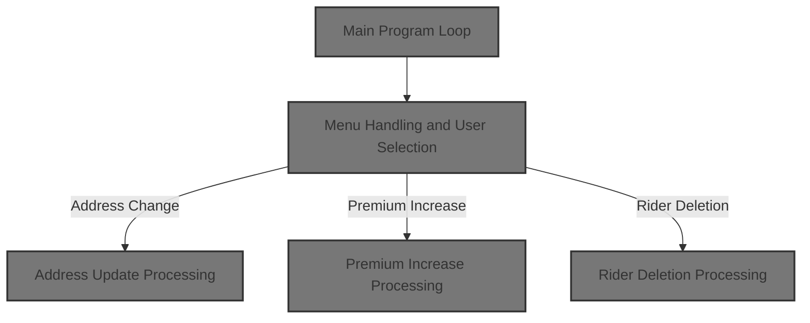

# Overview

This document describes a menu-driven policy inquiry and maintenance system. Users select actions such as searching for policies, updating addresses, adjusting premiums, or managing riders. The system processes each request, updates policy records, and provides feedback or confirmation.

## Dependencies

### Program

- SAMPLES (<SwmPath>[base/src/sample.cbl](base/src/sample.cbl)</SwmPath>)

### Copybooks

- PMASTER
- PINSURED
- PBENEFIT
- AGTMSTR
- POLTRAN1
- POLTRAN2
- POLNTFY

&nbsp;

*This is an auto-generated document by Swimm 🌊 and has not yet been verified by a human*

<SwmMeta version="3.0.0" repo-id="Z2l0aHViJTNBJTNBU3dpbW1pby1nZW5hcHAtaG91c2UlM0ElM0FHaXJpLVN3aW1t" repo-name="Swimmio-genapp-house">Powered by [Swimm](https://app.swimm.io/)</SwmMeta>
