# Overview

This document outlines a menu-driven workflow for policy inquiry and maintenance. Users can search for policies, manage riders, update addresses, and process premium changes. The system processes user selections in a loop, provides feedback, and logs all significant actions.

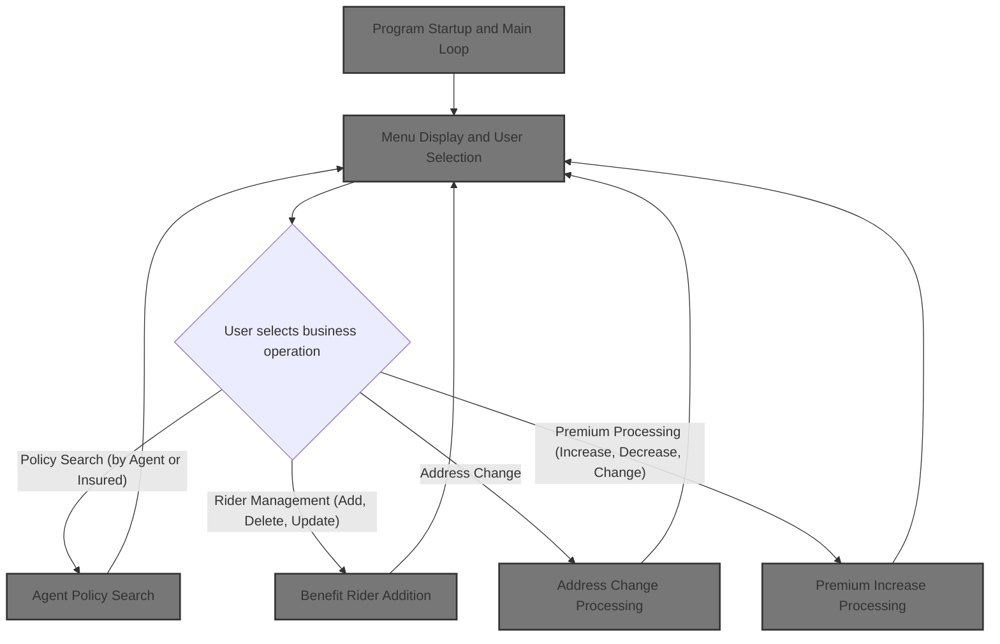

## Dependencies

### Program

- SAMPLES (<SwmPath>[base/src/sample.cbl](base/src/sample.cbl)</SwmPath>)

### Copybooks

- PMASTER
- PINSURED
- PBENEFIT
- AGTMSTR
- <SwmToken path="base/src/sample.cbl" pos="175:11:11" line-data="       01  POL-TRAN1-REC         COPY POLTRAN1 IN &quot;COPYLIB&quot;.">`POLTRAN1`</SwmToken>
- <SwmToken path="base/src/sample.cbl" pos="176:11:11" line-data="       01  POL-TRAN2-REC         COPY POLTRAN2 IN &quot;COPYLIB&quot;.">`POLTRAN2`</SwmToken>
- POLNTFY

## Detailed View of the Program's Functionality

a. Program Startup and Main Loop

When the program starts, it first performs an initialization step. This sets up the current date, clears out various working variables, and displays a "ready" message to the user. After initialization, the program enters its main loop, where it repeatedly processes user inquiries. This loop continues until a flag indicating "no more requests" is set. Once the loop ends, the program performs cleanup actions and then terminates.

b. Menu Display and User Selection

For each iteration of the main loop, the program displays a main menu to the user, listing all available operations (such as searching by agent, adding riders, changing addresses, etc.). The user is prompted to enter a function code corresponding to their desired operation or 'XX' to exit. The program reads the user's input and, if 'XX' is entered, sets the flag to exit the main loop. Otherwise, it evaluates the entered code and dispatches control to the appropriate handler for the selected operation. If the code is invalid, an error message is displayed.

c. Agent Policy Search

If the user selects the option to search by agent last name, the program prompts for the agent's last name and accepts the input. It then attempts to find policies associated with that agent. The search logic is simplified: it moves the entered name into the agent key field and checks if the agent master file status indicates a successful lookup. If policies are found, a message is set and the results are displayed; otherwise, a "not found" message is shown.

d. Insured Policy Search

If the user chooses to search by insured name, the program prompts for the insured's last name and accepts the input. It then attempts to find policies matching that name by moving the input into the insured key field and checking the file status. If policies are found, a message is set and the results are displayed; otherwise, a "not found" message is shown.

e. Benefit Rider Addition

When adding a benefit rider, the program first prompts for and validates the policy number. If the policy exists, it collects details about the new rider (code, amount, effective date), adds the rider to the policy, and logs the transaction for auditing purposes.

f. Transaction Logging and Child Rider Addition

After logging a benefit rider addition, the program may prompt for adding a child rider. It again validates the policy, collects child-specific details (name, birth date, amount), adds the child rider to the policy, and logs this transaction as well. Each addition is confirmed with a message to the user.

g. Address Change Processing

For address changes, the program prompts for and validates the policy number. If the policy exists, it collects the new address details (address lines, city, state, zip), updates the address (though in the sample code, only the last name field is updated as a placeholder), and logs the change. A success message is displayed to the user.

h. Premium Increase Processing

When processing a premium increase, the program validates the policy, displays the current premium, prompts for the new premium amount, calculates the difference, updates the policy with the new premium, and logs the change. All changes are confirmed with a message.

i. Premium Decrease Processing

The flow for premium decrease is nearly identical to premium increase: the program validates the policy, prompts for the new premium, updates the policy, and logs the change.

j. Rider Deletion Processing

To delete a rider, the program validates the policy, prompts the user to select which rider to delete, performs the deletion, and logs the transaction. A confirmation message is displayed.

k. Updating a Rider's Details

For updating a rider, the program validates the policy, prompts the user to select the rider, collects the updated information (such as new amount), updates the rider's details, and logs the update. A confirmation message is shown.

l. Processing a Premium Update

For a general premium change, the program validates the policy, prompts for the new premium, updates the policy, and logs the change. This process is similar to the increase/decrease flows but is intended for general premium changes.

m. Supporting Routines and Error Handling

Throughout the program, there are supporting routines for validating policy numbers, reading policy records, and displaying messages. If a policy number is invalid or not found, appropriate error messages are displayed. The program uses flags to track whether records are found and to control the flow of operations.

n. Cleanup and Termination

After the user chooses to exit, the program performs cleanup actions, such as displaying a session completion message, and then terminates.

# Rule Definition

| Paragraph Name                                                                                                                                                                                                                                                                                                                                                                                                                                                                                                                                                                                                                                                                                                                                                     | Rule ID | Category          | Description                                                                                                                                                                                                                                      | Conditions                                                                                                                                                             | Remarks                                                                                                                                                                                                                                                        |
| ------------------------------------------------------------------------------------------------------------------------------------------------------------------------------------------------------------------------------------------------------------------------------------------------------------------------------------------------------------------------------------------------------------------------------------------------------------------------------------------------------------------------------------------------------------------------------------------------------------------------------------------------------------------------------------------------------------------------------------------------------------------ | ------- | ----------------- | ------------------------------------------------------------------------------------------------------------------------------------------------------------------------------------------------------------------------------------------------ | ---------------------------------------------------------------------------------------------------------------------------------------------------------------------- | -------------------------------------------------------------------------------------------------------------------------------------------------------------------------------------------------------------------------------------------------------------- |
| <SwmToken path="base/src/sample.cbl" pos="190:3:5" line-data="           PERFORM 100-INITIALIZE">`100-INITIALIZE`</SwmToken>, <SwmToken path="base/src/sample.cbl" pos="189:1:5" line-data="       000-MAIN-CONTROL.">`000-MAIN-CONTROL`</SwmToken>                                                                                                                                                                                                                                                                                                                                                                                                                                                                                                                | RL-001  | Data Assignment   | All system resources and data structures must be initialized before entering the main processing loop.                                                                                                                                           | Program start.                                                                                                                                                         | Initializes screen buffer, error switches, found switch, and sets message line. Date fields are set using system date. All fields are alphanumeric or numeric as appropriate.                                                                                  |
| <SwmToken path="base/src/sample.cbl" pos="189:1:5" line-data="       000-MAIN-CONTROL.">`000-MAIN-CONTROL`</SwmToken>, <SwmToken path="base/src/sample.cbl" pos="191:3:7" line-data="           PERFORM 200-PROCESS-INQUIRY UNTIL NO-MORE-REQUESTS">`200-PROCESS-INQUIRY`</SwmToken>, <SwmToken path="base/src/sample.cbl" pos="206:3:9" line-data="           PERFORM 220-GET-USER-SELECTION">`220-GET-USER-SELECTION`</SwmToken>                                                                                                                                                                                                                                                                                                                                 | RL-002  | Conditional Logic | The main loop must process user inquiries repeatedly until the <SwmToken path="base/src/sample.cbl" pos="191:11:15" line-data="           PERFORM 200-PROCESS-INQUIRY UNTIL NO-MORE-REQUESTS">`NO-MORE-REQUESTS`</SwmToken> flag is set to TRUE. | <SwmToken path="base/src/sample.cbl" pos="191:11:15" line-data="           PERFORM 200-PROCESS-INQUIRY UNTIL NO-MORE-REQUESTS">`NO-MORE-REQUESTS`</SwmToken> is FALSE. | <SwmToken path="base/src/sample.cbl" pos="191:11:15" line-data="           PERFORM 200-PROCESS-INQUIRY UNTIL NO-MORE-REQUESTS">`NO-MORE-REQUESTS`</SwmToken> is a logical flag. User input is accepted via console prompts. Output is displayed as text lines. |
| <SwmToken path="base/src/sample.cbl" pos="191:3:7" line-data="           PERFORM 200-PROCESS-INQUIRY UNTIL NO-MORE-REQUESTS">`200-PROCESS-INQUIRY`</SwmToken>, <SwmToken path="base/src/sample.cbl" pos="206:3:9" line-data="           PERFORM 220-GET-USER-SELECTION">`220-GET-USER-SELECTION`</SwmToken>                                                                                                                                                                                                                                                                                                                                                                                                                                                        | RL-003  | Conditional Logic | Function code input must be validated. Valid codes ('01'-'11') trigger business operations. 'XX' ends session. Invalid codes display error and re-prompt.                                                                                        | User enters function code.                                                                                                                                             | Function codes are two-character strings. Error message is displayed for invalid codes.                                                                                                                                                                        |
| <SwmToken path="base/src/sample.cbl" pos="209:3:9" line-data="                   PERFORM 300-SEARCH-BY-AGENT">`300-SEARCH-BY-AGENT`</SwmToken>, <SwmToken path="base/src/sample.cbl" pos="268:3:9" line-data="           PERFORM 310-FIND-AGENT-POLICIES">`310-FIND-AGENT-POLICIES`</SwmToken>, <SwmToken path="base/src/sample.cbl" pos="271:3:9" line-data="               PERFORM 320-DISPLAY-AGENT-POLICIES">`320-DISPLAY-AGENT-POLICIES`</SwmToken>                                                                                                                                                                                                                                                                                                           | RL-004  | Conditional Logic | Prompt user for agent's last name, search for matching agent, display all associated policies if found, otherwise display not found message.                                                                                                     | Function code is '01'.                                                                                                                                                 | Agent last name is a string (up to 16 chars). Policies are displayed with policy number, insured name, and premium as text lines.                                                                                                                              |
| <SwmToken path="base/src/sample.cbl" pos="211:3:9" line-data="                   PERFORM 400-SEARCH-BY-INSURED">`400-SEARCH-BY-INSURED`</SwmToken>, <SwmToken path="base/src/sample.cbl" pos="310:3:9" line-data="           PERFORM 410-FIND-INSURED-POLICIES">`410-FIND-INSURED-POLICIES`</SwmToken>, <SwmToken path="base/src/sample.cbl" pos="313:3:9" line-data="               PERFORM 420-DISPLAY-INSURED-POLICIES">`420-DISPLAY-INSURED-POLICIES`</SwmToken>                                                                                                                                                                                                                                                                                               | RL-005  | Conditional Logic | Prompt user for insured's last name, search for matching insured, display all associated policies if found, otherwise display not found message.                                                                                                 | Function code is '02'.                                                                                                                                                 | Insured last name is a string (up to 16 chars). Policies are displayed with policy number, agent name, and premium as text lines.                                                                                                                              |
| <SwmToken path="base/src/sample.cbl" pos="213:3:9" line-data="                   PERFORM 500-ADD-BENEFIT-RIDER">`500-ADD-BENEFIT-RIDER`</SwmToken>, <SwmToken path="base/src/sample.cbl" pos="344:3:11" line-data="           PERFORM 510-GET-POLICY-FOR-RIDER">`510-GET-POLICY-FOR-RIDER`</SwmToken>, <SwmToken path="base/src/sample.cbl" pos="347:3:9" line-data="               PERFORM 520-GET-RIDER-DETAILS">`520-GET-RIDER-DETAILS`</SwmToken>, <SwmToken path="base/src/sample.cbl" pos="348:3:11" line-data="               PERFORM 530-ADD-RIDER-TO-POLICY">`530-ADD-RIDER-TO-POLICY`</SwmToken>, <SwmToken path="base/src/sample.cbl" pos="349:3:7" line-data="               PERFORM 590-LOG-TRANSACTION">`590-LOG-TRANSACTION`</SwmToken>             | RL-006  | Conditional Logic | Prompt for policy number, verify existence, prompt for rider details, add rider to policy, log transaction. If policy not found, display error.                                                                                                  | Function code is '03'.                                                                                                                                                 | Policy number: string (10 chars). Rider code: string (4 chars). Rider amount: number. Effective date: YYYYMMDD. Transaction log includes policy number, date, function code, description, and rider code.                                                      |
| <SwmToken path="base/src/sample.cbl" pos="215:3:9" line-data="                   PERFORM 600-ADD-CHILD-RIDER">`600-ADD-CHILD-RIDER`</SwmToken>, <SwmToken path="base/src/sample.cbl" pos="401:3:11" line-data="               PERFORM 610-GET-CHILD-RIDER-DETAILS">`610-GET-CHILD-RIDER-DETAILS`</SwmToken>, <SwmToken path="base/src/sample.cbl" pos="402:3:13" line-data="               PERFORM 620-ADD-CHILD-RIDER-TO-POLICY">`620-ADD-CHILD-RIDER-TO-POLICY`</SwmToken>, <SwmToken path="base/src/sample.cbl" pos="349:3:7" line-data="               PERFORM 590-LOG-TRANSACTION">`590-LOG-TRANSACTION`</SwmToken>                                                                                                                                           | RL-007  | Conditional Logic | Prompt for policy number, verify existence, prompt for child rider details, add child rider with record type 'CH', log transaction. If policy not found, display error.                                                                          | Function code is '04'.                                                                                                                                                 | Policy number: string (10 chars). Child name: string. Birth date: YYYYMMDD. Rider amount: number. Record type: 'CH'. Transaction log includes policy number, date, function code, description, and rider code.                                                 |
| <SwmToken path="base/src/sample.cbl" pos="217:3:7" line-data="                   PERFORM 700-ADDRESS-CHANGE">`700-ADDRESS-CHANGE`</SwmToken>, <SwmToken path="base/src/sample.cbl" pos="429:3:11" line-data="           PERFORM 710-GET-POLICY-FOR-ADDRESS">`710-GET-POLICY-FOR-ADDRESS`</SwmToken>, <SwmToken path="base/src/sample.cbl" pos="432:3:9" line-data="               PERFORM 720-GET-NEW-ADDRESS">`720-GET-NEW-ADDRESS`</SwmToken>, <SwmToken path="base/src/sample.cbl" pos="433:3:7" line-data="               PERFORM 730-UPDATE-ADDRESS">`730-UPDATE-ADDRESS`</SwmToken>, <SwmToken path="base/src/sample.cbl" pos="434:3:9" line-data="               PERFORM 790-LOG-ADDRESS-CHANGE">`790-LOG-ADDRESS-CHANGE`</SwmToken>                        | RL-008  | Conditional Logic | Prompt for policy number, verify existence, prompt for new address, update address, log transaction. If policy not found, display error.                                                                                                         | Function code is '05'.                                                                                                                                                 | Policy number: string (10 chars). Address fields: line1 (30 chars), line2 (30 chars), city (20 chars), state (2 chars), zip (10 chars). Transaction log includes policy number, date, function code '05', description.                                         |
| <SwmToken path="base/src/sample.cbl" pos="221:3:7" line-data="                   PERFORM 850-PREMIUM-INCREASE">`850-PREMIUM-INCREASE`</SwmToken>, <SwmToken path="base/src/sample.cbl" pos="512:3:9" line-data="               PERFORM 855-GET-NEW-PREMIUM">`855-GET-NEW-PREMIUM`</SwmToken>, <SwmToken path="base/src/sample.cbl" pos="513:3:7" line-data="               PERFORM 865-UPDATE-PREMIUM">`865-UPDATE-PREMIUM`</SwmToken>, <SwmToken path="base/src/sample.cbl" pos="514:3:9" line-data="               PERFORM 895-LOG-PREMIUM-CHANGE">`895-LOG-PREMIUM-CHANGE`</SwmToken>                                                                                                                                                                           | RL-009  | Conditional Logic | Prompt for policy number, verify existence, prompt for new premium, update premium, log transaction with old and new values. If policy not found, display error.                                                                                 | Function code is '07' or '11'.                                                                                                                                         | Policy number: string (10 chars). Premium: number. Transaction log includes policy number, date, function code ('07' or '11'), description, old and new premium values.                                                                                        |
| <SwmToken path="base/src/sample.cbl" pos="223:3:7" line-data="                   PERFORM 860-PREMIUM-DECREASE">`860-PREMIUM-DECREASE`</SwmToken>, <SwmToken path="base/src/sample.cbl" pos="512:3:9" line-data="               PERFORM 855-GET-NEW-PREMIUM">`855-GET-NEW-PREMIUM`</SwmToken>, <SwmToken path="base/src/sample.cbl" pos="513:3:7" line-data="               PERFORM 865-UPDATE-PREMIUM">`865-UPDATE-PREMIUM`</SwmToken>, <SwmToken path="base/src/sample.cbl" pos="514:3:9" line-data="               PERFORM 895-LOG-PREMIUM-CHANGE">`895-LOG-PREMIUM-CHANGE`</SwmToken>                                                                                                                                                                           | RL-010  | Conditional Logic | Prompt for policy number, verify existence, prompt for new premium, update premium, log transaction with old and new values. If policy not found, display error.                                                                                 | Function code is '08' or '12'.                                                                                                                                         | Policy number: string (10 chars). Premium: number. Transaction log includes policy number, date, function code ('08' or '12'), description, old and new premium values.                                                                                        |
| <SwmToken path="base/src/sample.cbl" pos="225:3:7" line-data="                   PERFORM 870-DELETE-RIDER">`870-DELETE-RIDER`</SwmToken>, <SwmToken path="base/src/sample.cbl" pos="551:3:11" line-data="               PERFORM 875-SELECT-RIDER-TO-DELETE">`875-SELECT-RIDER-TO-DELETE`</SwmToken>, <SwmToken path="base/src/sample.cbl" pos="552:3:9" line-data="               PERFORM 876-DELETE-SELECTED-RIDER">`876-DELETE-SELECTED-RIDER`</SwmToken>, <SwmToken path="base/src/sample.cbl" pos="349:3:7" line-data="               PERFORM 590-LOG-TRANSACTION">`590-LOG-TRANSACTION`</SwmToken>                                                                                                                                                            | RL-011  | Conditional Logic | Prompt for policy number, verify existence, prompt for rider code, delete rider, log transaction. If policy not found, display error.                                                                                                            | Function code is '09'.                                                                                                                                                 | Policy number: string (10 chars). Rider code: string (4 chars). Transaction log includes policy number, date, function code, description, and rider code.                                                                                                      |
| <SwmToken path="base/src/sample.cbl" pos="227:3:7" line-data="                   PERFORM 880-UPDATE-RIDER">`880-UPDATE-RIDER`</SwmToken>, <SwmToken path="base/src/sample.cbl" pos="551:3:11" line-data="               PERFORM 875-SELECT-RIDER-TO-DELETE">`875-SELECT-RIDER-TO-DELETE`</SwmToken>, <SwmToken path="base/src/sample.cbl" pos="576:3:11" line-data="               PERFORM 885-GET-UPDATED-RIDER-INFO">`885-GET-UPDATED-RIDER-INFO`</SwmToken>, <SwmToken path="base/src/sample.cbl" pos="577:3:9" line-data="               PERFORM 886-UPDATE-SELECTED-RIDER">`886-UPDATE-SELECTED-RIDER`</SwmToken>, <SwmToken path="base/src/sample.cbl" pos="349:3:7" line-data="               PERFORM 590-LOG-TRANSACTION">`590-LOG-TRANSACTION`</SwmToken> | RL-012  | Conditional Logic | Prompt for policy number, verify existence, prompt for rider code, prompt for new details, update rider, log transaction. If policy not found, display error.                                                                                    | Function code is '10'.                                                                                                                                                 | Policy number: string (10 chars). Rider code: string (4 chars). Rider amount: number. Transaction log includes policy number, date, function code, description, and rider code.                                                                                |
| <SwmToken path="base/src/sample.cbl" pos="349:3:7" line-data="               PERFORM 590-LOG-TRANSACTION">`590-LOG-TRANSACTION`</SwmToken>, <SwmToken path="base/src/sample.cbl" pos="434:3:9" line-data="               PERFORM 790-LOG-ADDRESS-CHANGE">`790-LOG-ADDRESS-CHANGE`</SwmToken>, <SwmToken path="base/src/sample.cbl" pos="514:3:9" line-data="               PERFORM 895-LOG-PREMIUM-CHANGE">`895-LOG-PREMIUM-CHANGE`</SwmToken>                                                                                                                                                                                                                                                                                                                     | RL-013  | Data Assignment   | All transaction log entries must include policy number, date, function code, description, and relevant old/new values or rider code as appropriate.                                                                                              | Any operation that modifies policy or rider data.                                                                                                                      | Transaction record fields: policy number (10 chars), date (8 digits), function code (2 chars), description (100 chars), old/new values (50 chars each), rider code (4 chars).                                                                                  |
| All paragraphs with DISPLAY and ACCEPT statements                                                                                                                                                                                                                                                                                                                                                                                                                                                                                                                                                                                                                                                                                                                  | RL-014  | Data Assignment   | All user input must be accepted via console prompts, and all output must be displayed as text lines to the console.                                                                                                                              | Any user interaction.                                                                                                                                                  | Input: via ACCEPT (console prompt). Output: via DISPLAY (text lines). Field sizes as specified in prompts and screen buffer definitions.                                                                                                                       |

# User Stories

## User Story 1: System Initialization and Main Loop

---

### Story Description:

As a user, I want the system to initialize all resources and repeatedly prompt me for actions until I choose to exit, so that I can interact with the application seamlessly and end my session when desired.

---

### Business Rule Mapping:

| Rule ID | Paragraph Name                                                                                                                                                                                                                                                                                                                                                                                                                     | Rule Description                                                                                                                                                                                                                                 |
| ------- | ---------------------------------------------------------------------------------------------------------------------------------------------------------------------------------------------------------------------------------------------------------------------------------------------------------------------------------------------------------------------------------------------------------------------------------- | ------------------------------------------------------------------------------------------------------------------------------------------------------------------------------------------------------------------------------------------------ |
| RL-002  | <SwmToken path="base/src/sample.cbl" pos="189:1:5" line-data="       000-MAIN-CONTROL.">`000-MAIN-CONTROL`</SwmToken>, <SwmToken path="base/src/sample.cbl" pos="191:3:7" line-data="           PERFORM 200-PROCESS-INQUIRY UNTIL NO-MORE-REQUESTS">`200-PROCESS-INQUIRY`</SwmToken>, <SwmToken path="base/src/sample.cbl" pos="206:3:9" line-data="           PERFORM 220-GET-USER-SELECTION">`220-GET-USER-SELECTION`</SwmToken> | The main loop must process user inquiries repeatedly until the <SwmToken path="base/src/sample.cbl" pos="191:11:15" line-data="           PERFORM 200-PROCESS-INQUIRY UNTIL NO-MORE-REQUESTS">`NO-MORE-REQUESTS`</SwmToken> flag is set to TRUE. |
| RL-003  | <SwmToken path="base/src/sample.cbl" pos="191:3:7" line-data="           PERFORM 200-PROCESS-INQUIRY UNTIL NO-MORE-REQUESTS">`200-PROCESS-INQUIRY`</SwmToken>, <SwmToken path="base/src/sample.cbl" pos="206:3:9" line-data="           PERFORM 220-GET-USER-SELECTION">`220-GET-USER-SELECTION`</SwmToken>                                                                                                                        | Function code input must be validated. Valid codes ('01'-'11') trigger business operations. 'XX' ends session. Invalid codes display error and re-prompt.                                                                                        |
| RL-001  | <SwmToken path="base/src/sample.cbl" pos="190:3:5" line-data="           PERFORM 100-INITIALIZE">`100-INITIALIZE`</SwmToken>, <SwmToken path="base/src/sample.cbl" pos="189:1:5" line-data="       000-MAIN-CONTROL.">`000-MAIN-CONTROL`</SwmToken>                                                                                                                                                                                | All system resources and data structures must be initialized before entering the main processing loop.                                                                                                                                           |
| RL-014  | All paragraphs with DISPLAY and ACCEPT statements                                                                                                                                                                                                                                                                                                                                                                                  | All user input must be accepted via console prompts, and all output must be displayed as text lines to the console.                                                                                                                              |

---

### Relevant Functionality:

- <SwmToken path="base/src/sample.cbl" pos="189:1:5" line-data="       000-MAIN-CONTROL.">`000-MAIN-CONTROL`</SwmToken>
  1. **RL-002:**
     - Repeat:
       - Display main menu
       - Accept function code
       - If function code is 'XX', set <SwmToken path="base/src/sample.cbl" pos="191:11:15" line-data="           PERFORM 200-PROCESS-INQUIRY UNTIL NO-MORE-REQUESTS">`NO-MORE-REQUESTS`</SwmToken> to TRUE
       - Otherwise, process according to function code
- <SwmToken path="base/src/sample.cbl" pos="191:3:7" line-data="           PERFORM 200-PROCESS-INQUIRY UNTIL NO-MORE-REQUESTS">`200-PROCESS-INQUIRY`</SwmToken>
  1. **RL-003:**
     - Accept function code
     - If code is 'XX', set <SwmToken path="base/src/sample.cbl" pos="191:11:15" line-data="           PERFORM 200-PROCESS-INQUIRY UNTIL NO-MORE-REQUESTS">`NO-MORE-REQUESTS`</SwmToken> to TRUE
     - If code is between '01' and '11', perform corresponding operation
     - If code is invalid, display error and show menu again
- <SwmToken path="base/src/sample.cbl" pos="190:3:5" line-data="           PERFORM 100-INITIALIZE">`100-INITIALIZE`</SwmToken>
  1. **RL-001:**
     - On program start:
       - Set current date and working date fields
       - Initialize screen buffer, error switches, found switch
       - Set message line to indicate readiness
- **All paragraphs with DISPLAY and ACCEPT statements**
  1. **RL-014:**
     - For each operation:
       - Prompt user for input via console
       - Display output as text lines

## User Story 2: Search for Policies by Agent or Insured

---

### Story Description:

As a user, I want to search for policies by entering an agent's or insured's last name so that I can view all policies associated with that person.

---

### Business Rule Mapping:

| Rule ID | Paragraph Name                                                                                                                                                                                                                                                                                                                                                                                                                                                       | Rule Description                                                                                                                                 |
| ------- | -------------------------------------------------------------------------------------------------------------------------------------------------------------------------------------------------------------------------------------------------------------------------------------------------------------------------------------------------------------------------------------------------------------------------------------------------------------------- | ------------------------------------------------------------------------------------------------------------------------------------------------ |
| RL-004  | <SwmToken path="base/src/sample.cbl" pos="209:3:9" line-data="                   PERFORM 300-SEARCH-BY-AGENT">`300-SEARCH-BY-AGENT`</SwmToken>, <SwmToken path="base/src/sample.cbl" pos="268:3:9" line-data="           PERFORM 310-FIND-AGENT-POLICIES">`310-FIND-AGENT-POLICIES`</SwmToken>, <SwmToken path="base/src/sample.cbl" pos="271:3:9" line-data="               PERFORM 320-DISPLAY-AGENT-POLICIES">`320-DISPLAY-AGENT-POLICIES`</SwmToken>             | Prompt user for agent's last name, search for matching agent, display all associated policies if found, otherwise display not found message.     |
| RL-005  | <SwmToken path="base/src/sample.cbl" pos="211:3:9" line-data="                   PERFORM 400-SEARCH-BY-INSURED">`400-SEARCH-BY-INSURED`</SwmToken>, <SwmToken path="base/src/sample.cbl" pos="310:3:9" line-data="           PERFORM 410-FIND-INSURED-POLICIES">`410-FIND-INSURED-POLICIES`</SwmToken>, <SwmToken path="base/src/sample.cbl" pos="313:3:9" line-data="               PERFORM 420-DISPLAY-INSURED-POLICIES">`420-DISPLAY-INSURED-POLICIES`</SwmToken> | Prompt user for insured's last name, search for matching insured, display all associated policies if found, otherwise display not found message. |
| RL-014  | All paragraphs with DISPLAY and ACCEPT statements                                                                                                                                                                                                                                                                                                                                                                                                                    | All user input must be accepted via console prompts, and all output must be displayed as text lines to the console.                              |

---

### Relevant Functionality:

- <SwmToken path="base/src/sample.cbl" pos="209:3:9" line-data="                   PERFORM 300-SEARCH-BY-AGENT">`300-SEARCH-BY-AGENT`</SwmToken>
  1. **RL-004:**
     - Prompt for agent last name
     - Search agent master record for match
     - If found:
       - Display all policies for agent
     - Else:
       - Display 'no policies found' message
- <SwmToken path="base/src/sample.cbl" pos="211:3:9" line-data="                   PERFORM 400-SEARCH-BY-INSURED">`400-SEARCH-BY-INSURED`</SwmToken>
  1. **RL-005:**
     - Prompt for insured last name
     - Search insured record for match
     - If found:
       - Display all policies for insured
     - Else:
       - Display 'no policies found' message
- **All paragraphs with DISPLAY and ACCEPT statements**
  1. **RL-014:**
     - For each operation:
       - Prompt user for input via console
       - Display output as text lines

## User Story 3: Add or Update Riders on a Policy

---

### Story Description:

As a user, I want to add benefit or child riders, update existing riders, or delete riders from a policy so that I can manage policy benefits efficiently, with all changes logged for audit purposes.

---

### Business Rule Mapping:

| Rule ID | Paragraph Name                                                                                                                                                                                                                                                                                                                                                                                                                                                                                                                                                                                                                                                                                                                                                     | Rule Description                                                                                                                                                        |
| ------- | ------------------------------------------------------------------------------------------------------------------------------------------------------------------------------------------------------------------------------------------------------------------------------------------------------------------------------------------------------------------------------------------------------------------------------------------------------------------------------------------------------------------------------------------------------------------------------------------------------------------------------------------------------------------------------------------------------------------------------------------------------------------ | ----------------------------------------------------------------------------------------------------------------------------------------------------------------------- |
| RL-006  | <SwmToken path="base/src/sample.cbl" pos="213:3:9" line-data="                   PERFORM 500-ADD-BENEFIT-RIDER">`500-ADD-BENEFIT-RIDER`</SwmToken>, <SwmToken path="base/src/sample.cbl" pos="344:3:11" line-data="           PERFORM 510-GET-POLICY-FOR-RIDER">`510-GET-POLICY-FOR-RIDER`</SwmToken>, <SwmToken path="base/src/sample.cbl" pos="347:3:9" line-data="               PERFORM 520-GET-RIDER-DETAILS">`520-GET-RIDER-DETAILS`</SwmToken>, <SwmToken path="base/src/sample.cbl" pos="348:3:11" line-data="               PERFORM 530-ADD-RIDER-TO-POLICY">`530-ADD-RIDER-TO-POLICY`</SwmToken>, <SwmToken path="base/src/sample.cbl" pos="349:3:7" line-data="               PERFORM 590-LOG-TRANSACTION">`590-LOG-TRANSACTION`</SwmToken>             | Prompt for policy number, verify existence, prompt for rider details, add rider to policy, log transaction. If policy not found, display error.                         |
| RL-013  | <SwmToken path="base/src/sample.cbl" pos="349:3:7" line-data="               PERFORM 590-LOG-TRANSACTION">`590-LOG-TRANSACTION`</SwmToken>, <SwmToken path="base/src/sample.cbl" pos="434:3:9" line-data="               PERFORM 790-LOG-ADDRESS-CHANGE">`790-LOG-ADDRESS-CHANGE`</SwmToken>, <SwmToken path="base/src/sample.cbl" pos="514:3:9" line-data="               PERFORM 895-LOG-PREMIUM-CHANGE">`895-LOG-PREMIUM-CHANGE`</SwmToken>                                                                                                                                                                                                                                                                                                                     | All transaction log entries must include policy number, date, function code, description, and relevant old/new values or rider code as appropriate.                     |
| RL-011  | <SwmToken path="base/src/sample.cbl" pos="225:3:7" line-data="                   PERFORM 870-DELETE-RIDER">`870-DELETE-RIDER`</SwmToken>, <SwmToken path="base/src/sample.cbl" pos="551:3:11" line-data="               PERFORM 875-SELECT-RIDER-TO-DELETE">`875-SELECT-RIDER-TO-DELETE`</SwmToken>, <SwmToken path="base/src/sample.cbl" pos="552:3:9" line-data="               PERFORM 876-DELETE-SELECTED-RIDER">`876-DELETE-SELECTED-RIDER`</SwmToken>, <SwmToken path="base/src/sample.cbl" pos="349:3:7" line-data="               PERFORM 590-LOG-TRANSACTION">`590-LOG-TRANSACTION`</SwmToken>                                                                                                                                                            | Prompt for policy number, verify existence, prompt for rider code, delete rider, log transaction. If policy not found, display error.                                   |
| RL-012  | <SwmToken path="base/src/sample.cbl" pos="227:3:7" line-data="                   PERFORM 880-UPDATE-RIDER">`880-UPDATE-RIDER`</SwmToken>, <SwmToken path="base/src/sample.cbl" pos="551:3:11" line-data="               PERFORM 875-SELECT-RIDER-TO-DELETE">`875-SELECT-RIDER-TO-DELETE`</SwmToken>, <SwmToken path="base/src/sample.cbl" pos="576:3:11" line-data="               PERFORM 885-GET-UPDATED-RIDER-INFO">`885-GET-UPDATED-RIDER-INFO`</SwmToken>, <SwmToken path="base/src/sample.cbl" pos="577:3:9" line-data="               PERFORM 886-UPDATE-SELECTED-RIDER">`886-UPDATE-SELECTED-RIDER`</SwmToken>, <SwmToken path="base/src/sample.cbl" pos="349:3:7" line-data="               PERFORM 590-LOG-TRANSACTION">`590-LOG-TRANSACTION`</SwmToken> | Prompt for policy number, verify existence, prompt for rider code, prompt for new details, update rider, log transaction. If policy not found, display error.           |
| RL-007  | <SwmToken path="base/src/sample.cbl" pos="215:3:9" line-data="                   PERFORM 600-ADD-CHILD-RIDER">`600-ADD-CHILD-RIDER`</SwmToken>, <SwmToken path="base/src/sample.cbl" pos="401:3:11" line-data="               PERFORM 610-GET-CHILD-RIDER-DETAILS">`610-GET-CHILD-RIDER-DETAILS`</SwmToken>, <SwmToken path="base/src/sample.cbl" pos="402:3:13" line-data="               PERFORM 620-ADD-CHILD-RIDER-TO-POLICY">`620-ADD-CHILD-RIDER-TO-POLICY`</SwmToken>, <SwmToken path="base/src/sample.cbl" pos="349:3:7" line-data="               PERFORM 590-LOG-TRANSACTION">`590-LOG-TRANSACTION`</SwmToken>                                                                                                                                           | Prompt for policy number, verify existence, prompt for child rider details, add child rider with record type 'CH', log transaction. If policy not found, display error. |
| RL-014  | All paragraphs with DISPLAY and ACCEPT statements                                                                                                                                                                                                                                                                                                                                                                                                                                                                                                                                                                                                                                                                                                                  | All user input must be accepted via console prompts, and all output must be displayed as text lines to the console.                                                     |

---

### Relevant Functionality:

- <SwmToken path="base/src/sample.cbl" pos="213:3:9" line-data="                   PERFORM 500-ADD-BENEFIT-RIDER">`500-ADD-BENEFIT-RIDER`</SwmToken>
  1. **RL-006:**
     - Prompt for policy number
     - Validate policy exists
     - If found:
       - Prompt for rider details (code, amount, date)
       - Add rider to policy
       - Log transaction
     - Else:
       - Display 'rider not added' message
- <SwmToken path="base/src/sample.cbl" pos="349:3:7" line-data="               PERFORM 590-LOG-TRANSACTION">`590-LOG-TRANSACTION`</SwmToken>
  1. **RL-013:**
     - For each modifying operation:
       - Populate transaction record fields
       - Write transaction record
- <SwmToken path="base/src/sample.cbl" pos="225:3:7" line-data="                   PERFORM 870-DELETE-RIDER">`870-DELETE-RIDER`</SwmToken>
  1. **RL-011:**
     - Prompt for policy number
     - Validate policy exists
     - If found:
       - Prompt for rider code to delete
       - Delete rider from policy
       - Log transaction
     - Else:
       - Display 'no action' message
- <SwmToken path="base/src/sample.cbl" pos="227:3:7" line-data="                   PERFORM 880-UPDATE-RIDER">`880-UPDATE-RIDER`</SwmToken>
  1. **RL-012:**
     - Prompt for policy number
     - Validate policy exists
     - If found:
       - Prompt for rider code to update
       - Prompt for new rider details
       - Update rider in policy record
       - Log transaction
     - Else:
       - Display 'no update performed' message
- <SwmToken path="base/src/sample.cbl" pos="215:3:9" line-data="                   PERFORM 600-ADD-CHILD-RIDER">`600-ADD-CHILD-RIDER`</SwmToken>
  1. **RL-007:**
     - Prompt for policy number
     - Validate policy exists
     - If found:
       - Prompt for child rider details (name, birth date, amount)
       - Add child rider to policy with record type 'CH'
       - Log transaction
     - Else:
       - Display 'rider not added' message
- **All paragraphs with DISPLAY and ACCEPT statements**
  1. **RL-014:**
     - For each operation:
       - Prompt user for input via console
       - Display output as text lines

## User Story 4: Change Policy Address

---

### Story Description:

As a user, I want to change the address on a policy so that the policyholder's contact information is kept up to date, with all changes logged for reference.

---

### Business Rule Mapping:

| Rule ID | Paragraph Name                                                                                                                                                                                                                                                                                                                                                                                                                                                                                                                                                                                                                                                                                                                              | Rule Description                                                                                                                                    |
| ------- | ------------------------------------------------------------------------------------------------------------------------------------------------------------------------------------------------------------------------------------------------------------------------------------------------------------------------------------------------------------------------------------------------------------------------------------------------------------------------------------------------------------------------------------------------------------------------------------------------------------------------------------------------------------------------------------------------------------------------------------------- | --------------------------------------------------------------------------------------------------------------------------------------------------- |
| RL-013  | <SwmToken path="base/src/sample.cbl" pos="349:3:7" line-data="               PERFORM 590-LOG-TRANSACTION">`590-LOG-TRANSACTION`</SwmToken>, <SwmToken path="base/src/sample.cbl" pos="434:3:9" line-data="               PERFORM 790-LOG-ADDRESS-CHANGE">`790-LOG-ADDRESS-CHANGE`</SwmToken>, <SwmToken path="base/src/sample.cbl" pos="514:3:9" line-data="               PERFORM 895-LOG-PREMIUM-CHANGE">`895-LOG-PREMIUM-CHANGE`</SwmToken>                                                                                                                                                                                                                                                                                              | All transaction log entries must include policy number, date, function code, description, and relevant old/new values or rider code as appropriate. |
| RL-008  | <SwmToken path="base/src/sample.cbl" pos="217:3:7" line-data="                   PERFORM 700-ADDRESS-CHANGE">`700-ADDRESS-CHANGE`</SwmToken>, <SwmToken path="base/src/sample.cbl" pos="429:3:11" line-data="           PERFORM 710-GET-POLICY-FOR-ADDRESS">`710-GET-POLICY-FOR-ADDRESS`</SwmToken>, <SwmToken path="base/src/sample.cbl" pos="432:3:9" line-data="               PERFORM 720-GET-NEW-ADDRESS">`720-GET-NEW-ADDRESS`</SwmToken>, <SwmToken path="base/src/sample.cbl" pos="433:3:7" line-data="               PERFORM 730-UPDATE-ADDRESS">`730-UPDATE-ADDRESS`</SwmToken>, <SwmToken path="base/src/sample.cbl" pos="434:3:9" line-data="               PERFORM 790-LOG-ADDRESS-CHANGE">`790-LOG-ADDRESS-CHANGE`</SwmToken> | Prompt for policy number, verify existence, prompt for new address, update address, log transaction. If policy not found, display error.            |
| RL-014  | All paragraphs with DISPLAY and ACCEPT statements                                                                                                                                                                                                                                                                                                                                                                                                                                                                                                                                                                                                                                                                                           | All user input must be accepted via console prompts, and all output must be displayed as text lines to the console.                                 |

---

### Relevant Functionality:

- <SwmToken path="base/src/sample.cbl" pos="349:3:7" line-data="               PERFORM 590-LOG-TRANSACTION">`590-LOG-TRANSACTION`</SwmToken>
  1. **RL-013:**
     - For each modifying operation:
       - Populate transaction record fields
       - Write transaction record
- <SwmToken path="base/src/sample.cbl" pos="217:3:7" line-data="                   PERFORM 700-ADDRESS-CHANGE">`700-ADDRESS-CHANGE`</SwmToken>
  1. **RL-008:**
     - Prompt for policy number
     - Validate policy exists
     - If found:
       - Prompt for new address fields
       - Update address in policy record
       - Log transaction
     - Else:
       - Display 'no address change performed' message
- **All paragraphs with DISPLAY and ACCEPT statements**
  1. **RL-014:**
     - For each operation:
       - Prompt user for input via console
       - Display output as text lines

## User Story 5: Increase or Decrease Policy Premium

---

### Story Description:

As a user, I want to increase or decrease the premium on a policy so that the policy reflects the correct payment amount, with all changes logged including old and new values.

---

### Business Rule Mapping:

| Rule ID | Paragraph Name                                                                                                                                                                                                                                                                                                                                                                                                                                                                                                                                                                           | Rule Description                                                                                                                                                 |
| ------- | ---------------------------------------------------------------------------------------------------------------------------------------------------------------------------------------------------------------------------------------------------------------------------------------------------------------------------------------------------------------------------------------------------------------------------------------------------------------------------------------------------------------------------------------------------------------------------------------- | ---------------------------------------------------------------------------------------------------------------------------------------------------------------- |
| RL-013  | <SwmToken path="base/src/sample.cbl" pos="349:3:7" line-data="               PERFORM 590-LOG-TRANSACTION">`590-LOG-TRANSACTION`</SwmToken>, <SwmToken path="base/src/sample.cbl" pos="434:3:9" line-data="               PERFORM 790-LOG-ADDRESS-CHANGE">`790-LOG-ADDRESS-CHANGE`</SwmToken>, <SwmToken path="base/src/sample.cbl" pos="514:3:9" line-data="               PERFORM 895-LOG-PREMIUM-CHANGE">`895-LOG-PREMIUM-CHANGE`</SwmToken>                                                                                                                                           | All transaction log entries must include policy number, date, function code, description, and relevant old/new values or rider code as appropriate.              |
| RL-009  | <SwmToken path="base/src/sample.cbl" pos="221:3:7" line-data="                   PERFORM 850-PREMIUM-INCREASE">`850-PREMIUM-INCREASE`</SwmToken>, <SwmToken path="base/src/sample.cbl" pos="512:3:9" line-data="               PERFORM 855-GET-NEW-PREMIUM">`855-GET-NEW-PREMIUM`</SwmToken>, <SwmToken path="base/src/sample.cbl" pos="513:3:7" line-data="               PERFORM 865-UPDATE-PREMIUM">`865-UPDATE-PREMIUM`</SwmToken>, <SwmToken path="base/src/sample.cbl" pos="514:3:9" line-data="               PERFORM 895-LOG-PREMIUM-CHANGE">`895-LOG-PREMIUM-CHANGE`</SwmToken> | Prompt for policy number, verify existence, prompt for new premium, update premium, log transaction with old and new values. If policy not found, display error. |
| RL-010  | <SwmToken path="base/src/sample.cbl" pos="223:3:7" line-data="                   PERFORM 860-PREMIUM-DECREASE">`860-PREMIUM-DECREASE`</SwmToken>, <SwmToken path="base/src/sample.cbl" pos="512:3:9" line-data="               PERFORM 855-GET-NEW-PREMIUM">`855-GET-NEW-PREMIUM`</SwmToken>, <SwmToken path="base/src/sample.cbl" pos="513:3:7" line-data="               PERFORM 865-UPDATE-PREMIUM">`865-UPDATE-PREMIUM`</SwmToken>, <SwmToken path="base/src/sample.cbl" pos="514:3:9" line-data="               PERFORM 895-LOG-PREMIUM-CHANGE">`895-LOG-PREMIUM-CHANGE`</SwmToken> | Prompt for policy number, verify existence, prompt for new premium, update premium, log transaction with old and new values. If policy not found, display error. |
| RL-014  | All paragraphs with DISPLAY and ACCEPT statements                                                                                                                                                                                                                                                                                                                                                                                                                                                                                                                                        | All user input must be accepted via console prompts, and all output must be displayed as text lines to the console.                                              |

---

### Relevant Functionality:

- <SwmToken path="base/src/sample.cbl" pos="349:3:7" line-data="               PERFORM 590-LOG-TRANSACTION">`590-LOG-TRANSACTION`</SwmToken>
  1. **RL-013:**
     - For each modifying operation:
       - Populate transaction record fields
       - Write transaction record
- <SwmToken path="base/src/sample.cbl" pos="221:3:7" line-data="                   PERFORM 850-PREMIUM-INCREASE">`850-PREMIUM-INCREASE`</SwmToken>
  1. **RL-009:**
     - Prompt for policy number
     - Validate policy exists
     - If found:
       - Prompt for new premium amount
       - Update premium in policy record
       - Log transaction with old and new values
     - Else:
       - Display 'no action needed' message
- <SwmToken path="base/src/sample.cbl" pos="223:3:7" line-data="                   PERFORM 860-PREMIUM-DECREASE">`860-PREMIUM-DECREASE`</SwmToken>
  1. **RL-010:**
     - Prompt for policy number
     - Validate policy exists
     - If found:
       - Prompt for new premium amount
       - Update premium in policy record
       - Log transaction with old and new values
     - Else:
       - Display 'no action needed' message
- **All paragraphs with DISPLAY and ACCEPT statements**
  1. **RL-014:**
     - For each operation:
       - Prompt user for input via console
       - Display output as text lines

# Workflow

# Program Startup and Main Loop

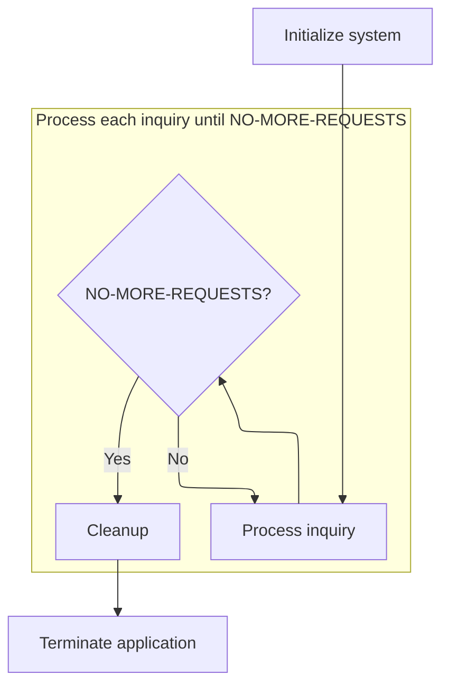

This section governs the startup, main processing loop, and shutdown of the application. It ensures that all required phases are executed in the correct order and that user inquiries are processed until there are no more requests.

| Rule ID | Category                        | Rule Name                        | Description                                                                                                          | Implementation Details                                                                                                                                                                                                                                                       |
| ------- | ------------------------------- | -------------------------------- | -------------------------------------------------------------------------------------------------------------------- | ---------------------------------------------------------------------------------------------------------------------------------------------------------------------------------------------------------------------------------------------------------------------------- |
| BR-001  | Invoking a Service or a Process | System Initialization Precedence | System initialization is performed before any user inquiries are processed.                                          | Initialization occurs before any inquiry processing. No user requests are handled until initialization completes.                                                                                                                                                            |
| BR-002  | Invoking a Service or a Process | Inquiry Processing Loop          | User inquiries are processed repeatedly until there are no more requests to handle.                                  | Inquiry processing continues in a loop, controlled by the <SwmToken path="base/src/sample.cbl" pos="191:11:15" line-data="           PERFORM 200-PROCESS-INQUIRY UNTIL NO-MORE-REQUESTS">`NO-MORE-REQUESTS`</SwmToken> condition. The loop exits when this condition is met. |
| BR-003  | Invoking a Service or a Process | Cleanup Before Termination       | Cleanup operations are performed after all user inquiries have been processed and before the application terminates. | Cleanup is performed after the processing loop and before program termination.                                                                                                                                                                                               |

<SwmSnippet path="/base/src/sample.cbl" line="189">

---

<SwmToken path="base/src/sample.cbl" pos="189:1:5" line-data="       000-MAIN-CONTROL.">`000-MAIN-CONTROL`</SwmToken> kicks off the whole program: it runs initialization, then enters a loop where it keeps calling <SwmToken path="base/src/sample.cbl" pos="191:3:7" line-data="           PERFORM 200-PROCESS-INQUIRY UNTIL NO-MORE-REQUESTS">`200-PROCESS-INQUIRY`</SwmToken> to handle user requests until there are no more. We call <SwmToken path="base/src/sample.cbl" pos="191:3:7" line-data="           PERFORM 200-PROCESS-INQUIRY UNTIL NO-MORE-REQUESTS">`200-PROCESS-INQUIRY`</SwmToken> next because that's where the actual user interaction and request handling happens—without it, the program would just start and stop immediately.

```cobol
       000-MAIN-CONTROL.
           PERFORM 100-INITIALIZE
           PERFORM 200-PROCESS-INQUIRY UNTIL NO-MORE-REQUESTS
           PERFORM 900-CLEANUP
           STOP RUN.
```

---

</SwmSnippet>

# Menu Display and User Selection

```mermaid
%%{init: {"flowchart": {"defaultRenderer": "elk"}} }%%
flowchart TD
    node1["Display main menu"] --> node2["Get user selection"]
    click node1 openCode "base/src/sample.cbl:205:205"
    click node2 openCode "base/src/sample.cbl:206:258"
    node2 --> node3{"Function code selected?"}
    click node3 openCode "base/src/sample.cbl:207:232"
    node3 -->|"01-11 (valid)"| node4["Perform selected business operation (search, add, update, delete, change, etc.)"]
    click node4 openCode "base/src/sample.cbl:208:229"
    node3 -->|"XX (Exit)"| node5["End session"]
    click node5 openCode "base/src/sample.cbl:259:261"
    node3 -->|"Other (invalid)"| node6["Show error message to user (update message line)"]
    click node6 openCode "base/src/sample.cbl:231:231"
classDef HeadingStyle fill:#777777,stroke:#333,stroke-width:2px;

%% Swimm:
%% %%{init: {"flowchart": {"defaultRenderer": "elk"}} }%%
%% flowchart TD
%%     node1["Display main menu"] --> node2["Get user selection"]
%%     click node1 openCode "<SwmPath>[base/src/sample.cbl](base/src/sample.cbl)</SwmPath>:205:205"
%%     click node2 openCode "<SwmPath>[base/src/sample.cbl](base/src/sample.cbl)</SwmPath>:206:258"
%%     node2 --> node3{"Function code selected?"}
%%     click node3 openCode "<SwmPath>[base/src/sample.cbl](base/src/sample.cbl)</SwmPath>:207:232"
%%     node3 -->|"<SwmToken path="base/src/sample.cbl" pos="253:11:13" line-data="           DISPLAY &quot;ENTER FUNCTION CODE (01-11) OR &#39;XX&#39; TO EXIT: &quot;">`01-11`</SwmToken> (valid)"| node4["Perform selected business operation (search, add, update, delete, change, etc.)"]
%%     click node4 openCode "<SwmPath>[base/src/sample.cbl](base/src/sample.cbl)</SwmPath>:208:229"
%%     node3 -->|"XX (Exit)"| node5["End session"]
%%     click node5 openCode "<SwmPath>[base/src/sample.cbl](base/src/sample.cbl)</SwmPath>:259:261"
%%     node3 -->|"Other (invalid)"| node6["Show error message to user (update message line)"]
%%     click node6 openCode "<SwmPath>[base/src/sample.cbl](base/src/sample.cbl)</SwmPath>:231:231"
%% classDef HeadingStyle fill:#777777,stroke:#333,stroke-width:2px;
```

This section governs the main menu interaction, capturing the user's selection and determining the next action based on that input. It ensures the user is routed to the correct business operation, receives feedback on invalid input, or exits the session as requested.

| Rule ID | Category        | Rule Name                       | Description                                                                                                                                                     | Implementation Details                                                                                                                                                                                                                                                    |
| ------- | --------------- | ------------------------------- | --------------------------------------------------------------------------------------------------------------------------------------------------------------- | ------------------------------------------------------------------------------------------------------------------------------------------------------------------------------------------------------------------------------------------------------------------------- |
| BR-001  | Data validation | Invalid selection error message | When the user enters a function code that is not recognized (not '01'-'11' or 'XX'), an error message is displayed to inform the user of the invalid selection. | The error message displayed is the string 'INVALID FUNCTION SELECTED', which is placed in the message line (an 80-character string field).                                                                                                                                |
| BR-002  | Decision Making | Menu option routing             | When the user enters a function code between '01' and '11', the corresponding business operation is performed based on the code entered.                        | Function codes are two-character strings. Each code corresponds to a specific business operation (e.g., '01' = search by agent, '02' = search by insured, etc.).                                                                                                          |
| BR-003  | Decision Making | Session exit on XX              | When the user enters 'XX' as the function code, the session is marked for termination and no further requests are processed.                                    | The exit code is the two-character string 'XX'. Setting the session to end is indicated by a session flag (<SwmToken path="base/src/sample.cbl" pos="191:11:15" line-data="           PERFORM 200-PROCESS-INQUIRY UNTIL NO-MORE-REQUESTS">`NO-MORE-REQUESTS`</SwmToken>). |

<SwmSnippet path="/base/src/sample.cbl" line="203">

---

In <SwmToken path="base/src/sample.cbl" pos="203:1:5" line-data="       200-PROCESS-INQUIRY.">`200-PROCESS-INQUIRY`</SwmToken>, we show the main menu and then immediately call <SwmToken path="base/src/sample.cbl" pos="206:3:9" line-data="           PERFORM 220-GET-USER-SELECTION">`220-GET-USER-SELECTION`</SwmToken> to grab the user's choice. We need to call <SwmToken path="base/src/sample.cbl" pos="206:3:9" line-data="           PERFORM 220-GET-USER-SELECTION">`220-GET-USER-SELECTION`</SwmToken> right after displaying the menu so we know what the user wants to do next or if they want to exit.

```cobol
       200-PROCESS-INQUIRY.
      * Main processing routine - display menu and process selection
           PERFORM 210-DISPLAY-MAIN-MENU
           PERFORM 220-GET-USER-SELECTION
```

---

</SwmSnippet>

<SwmSnippet path="/base/src/sample.cbl" line="256">

---

<SwmToken path="base/src/sample.cbl" pos="256:1:7" line-data="       220-GET-USER-SELECTION.">`220-GET-USER-SELECTION`</SwmToken> grabs the user's menu choice and checks if they typed 'XX'. If so, it sets <SwmToken path="base/src/sample.cbl" pos="260:3:7" line-data="               SET NO-MORE-REQUESTS TO TRUE">`NO-MORE-REQUESTS`</SwmToken> to TRUE, which tells the main loop to stop. The function expects <SwmToken path="base/src/sample.cbl" pos="258:3:7" line-data="           ACCEPT WK-FUNCTION-CODE">`WK-FUNCTION-CODE`</SwmToken> to come straight from user input, and only 'XX' is treated as a signal to exit.

```cobol
       220-GET-USER-SELECTION.
      * Get user's function selection
           ACCEPT WK-FUNCTION-CODE
           IF WK-FUNCTION-CODE = "XX"
               SET NO-MORE-REQUESTS TO TRUE
           END-IF.
```

---

</SwmSnippet>

<SwmSnippet path="/base/src/sample.cbl" line="207">

---

Back in <SwmToken path="base/src/sample.cbl" pos="191:3:7" line-data="           PERFORM 200-PROCESS-INQUIRY UNTIL NO-MORE-REQUESTS">`200-PROCESS-INQUIRY`</SwmToken>, after getting the user's selection from <SwmToken path="base/src/sample.cbl" pos="206:3:9" line-data="           PERFORM 220-GET-USER-SELECTION">`220-GET-USER-SELECTION`</SwmToken>, we check what they entered and branch to the right handler. If they picked '01', we call <SwmToken path="base/src/sample.cbl" pos="209:3:9" line-data="                   PERFORM 300-SEARCH-BY-AGENT">`300-SEARCH-BY-AGENT`</SwmToken> to start a policy search by agent—this is how the system routes each menu action to the right logic.

```cobol
           EVALUATE WK-FUNCTION-CODE
               WHEN "01"
                   PERFORM 300-SEARCH-BY-AGENT
               WHEN "02"
                   PERFORM 400-SEARCH-BY-INSURED
               WHEN "03"
                   PERFORM 500-ADD-BENEFIT-RIDER
               WHEN "04"
                   PERFORM 600-ADD-CHILD-RIDER
               WHEN "05"
                   PERFORM 700-ADDRESS-CHANGE
               WHEN "06"
                   PERFORM 800-ADD-PREAUTH-CHECK
               WHEN "07"
                   PERFORM 850-PREMIUM-INCREASE
               WHEN "08"
                   PERFORM 860-PREMIUM-DECREASE
               WHEN "09"
                   PERFORM 870-DELETE-RIDER
               WHEN "10"
                   PERFORM 880-UPDATE-RIDER
               WHEN "11"
                   PERFORM 890-PREMIUM-CHANGE
               WHEN OTHER
                   MOVE "INVALID FUNCTION SELECTED" TO IS-MESSAGE-LINE
           END-EVALUATE.
```

---

</SwmSnippet>

# Agent Policy Search

This section prompts the user to enter an agent's last name and triggers the search for policies associated with that agent. It serves as the entry point for agent-based policy lookup.

| Rule ID | Category                        | Rule Name                   | Description                                                                                            | Implementation Details                                                                                                                                                         |
| ------- | ------------------------------- | --------------------------- | ------------------------------------------------------------------------------------------------------ | ------------------------------------------------------------------------------------------------------------------------------------------------------------------------------ |
| BR-001  | Reading Input                   | Agent Name Prompt           | Prompt the user to enter the agent's last name before initiating a search.                             | The prompt is a string message: 'ENTER AGENT LAST NAME: '.                                                                                                                     |
| BR-002  | Reading Input                   | Agent Name Input Acceptance | Accept the agent's last name as input from the user for use in the search process.                     | The input is stored as a string, with an initial value of spaces. The agent name field can accommodate up to 30 characters, as per the screen buffer definition.               |
| BR-003  | Invoking a Service or a Process | Agent Policy Search Trigger | Trigger the search for policies associated with the entered agent's last name after input is received. | The search process is initiated by invoking the agent policy search logic. The details of the search and result handling are managed in the called logic, not in this section. |

<SwmSnippet path="/base/src/sample.cbl" line="263">

---

In <SwmToken path="base/src/sample.cbl" pos="263:1:7" line-data="       300-SEARCH-BY-AGENT.">`300-SEARCH-BY-AGENT`</SwmToken>, we prompt the user for the agent's last name and accept their input. Then we call <SwmToken path="base/src/sample.cbl" pos="268:3:9" line-data="           PERFORM 310-FIND-AGENT-POLICIES">`310-FIND-AGENT-POLICIES`</SwmToken> to actually look up any policies tied to that agent name—without this call, we wouldn't get any results to show.

```cobol
       300-SEARCH-BY-AGENT.
      * Search for policies by agent last name
           DISPLAY "ENTER AGENT LAST NAME: "
           ACCEPT WK-SEARCH-NAME
           
           PERFORM 310-FIND-AGENT-POLICIES
```

---

</SwmSnippet>

## Agent Policy Lookup

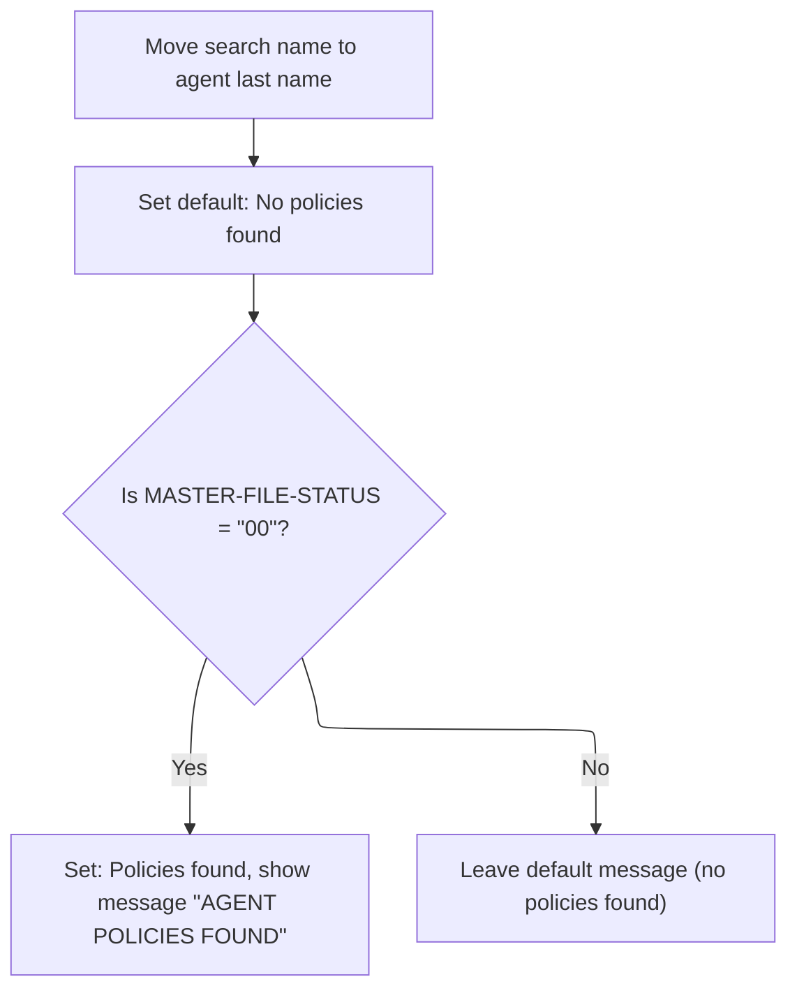

This section determines whether any policies exist for a specified agent and communicates the result to the user via a message line. It sets up the search and provides feedback based on the outcome of the lookup.

| Rule ID | Category        | Rule Name                   | Description                                                                                                                                                  | Implementation Details                                                                                                                                        |
| ------- | --------------- | --------------------------- | ------------------------------------------------------------------------------------------------------------------------------------------------------------ | ------------------------------------------------------------------------------------------------------------------------------------------------------------- |
| BR-001  | Reading Input   | Search by agent name        | The system uses the provided search name as the agent key for the policy lookup.                                                                             | The search name is a string provided as input and is used directly for the lookup.                                                                            |
| BR-002  | Decision Making | Default no policies found   | The system sets the default state to indicate that no agent policies are found before performing the lookup.                                                 | The default state is represented by a flag indicating 'no record found'. No message is displayed unless a record is found.                                    |
| BR-003  | Decision Making | Policies found confirmation | If the agent master file lookup is successful, the system updates the state to indicate policies were found and displays a confirmation message to the user. | The confirmation message is 'AGENT POLICIES FOUND', displayed as an 80-character string in the message line. The found/not found state is updated to 'found'. |

<SwmSnippet path="/base/src/sample.cbl" line="277">

---

In <SwmToken path="base/src/sample.cbl" pos="277:1:7" line-data="       310-FIND-AGENT-POLICIES.">`310-FIND-AGENT-POLICIES`</SwmToken>, we set up for the search by moving the input name to the agent key and flagging no record found by default. The function assumes the search name is ready to use and just checks the agent master file—no cross-referencing with policies here, it's a basic lookup.

```cobol
       310-FIND-AGENT-POLICIES.
      * Find all policies for specified agent
           SET NO-RECORD-FOUND TO TRUE
           
      * This would normally read through AGENT-MASTER file
      * and cross-reference with POL-MASTER file
      * Simplified logic for demonstration:
           
           MOVE WK-SEARCH-NAME TO A-LAST-NAME
```

---

</SwmSnippet>

<SwmSnippet path="/base/src/sample.cbl" line="289">

---

Here we check if <SwmToken path="base/src/sample.cbl" pos="289:3:7" line-data="           IF MASTER-FILE-STATUS = &quot;00&quot;">`MASTER-FILE-STATUS`</SwmToken> is '00' after the lookup. If it is, we flag that a record was found and set a message saying policies were found. Otherwise, nothing changes and the not-found path will be taken later.

```cobol
           IF MASTER-FILE-STATUS = "00"
               SET RECORD-FOUND TO TRUE
               MOVE "AGENT POLICIES FOUND" TO IS-MESSAGE-LINE
           END-IF.
```

---

</SwmSnippet>

## Agent Policy Result Handling

This section determines the user-facing outcome after searching for agent policies, ensuring the correct information or message is displayed based on search results.

| Rule ID | Category        | Rule Name                         | Description                                                                                  | Implementation Details                                                                                                      |
| ------- | --------------- | --------------------------------- | -------------------------------------------------------------------------------------------- | --------------------------------------------------------------------------------------------------------------------------- |
| BR-001  | Decision Making | Display Agent Policies on Success | When a policy record is found for the agent, the agent's policies are displayed to the user. | The display format for agent policies is determined by the invoked display logic, not shown in this section.                |
| BR-002  | Decision Making | Display Not-Found Message         | When no policy record is found for the agent, a not-found message is displayed to the user.  | The message displayed is: "NO POLICIES FOUND FOR SPECIFIED AGENT". The message is shown in a string field of 80 characters. |

<SwmSnippet path="/base/src/sample.cbl" line="270">

---

After coming back from <SwmToken path="base/src/sample.cbl" pos="268:3:9" line-data="           PERFORM 310-FIND-AGENT-POLICIES">`310-FIND-AGENT-POLICIES`</SwmToken>, we check if a record was found. If yes, we call <SwmToken path="base/src/sample.cbl" pos="271:3:9" line-data="               PERFORM 320-DISPLAY-AGENT-POLICIES">`320-DISPLAY-AGENT-POLICIES`</SwmToken> to show the results; if not, we display a not-found message. This wraps up the agent search in <SwmToken path="base/src/sample.cbl" pos="209:3:9" line-data="                   PERFORM 300-SEARCH-BY-AGENT">`300-SEARCH-BY-AGENT`</SwmToken>.

```cobol
           IF RECORD-FOUND
               PERFORM 320-DISPLAY-AGENT-POLICIES
           ELSE
               MOVE MSG-AGENT-NOT-FOUND TO IS-MESSAGE-LINE
               DISPLAY IS-MESSAGE-LINE
           END-IF.
```

---

</SwmSnippet>

# Insured Policy Search

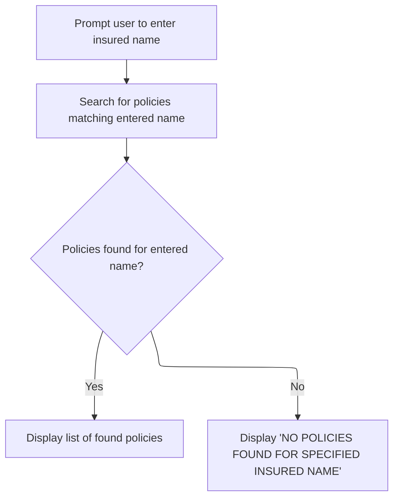

This section enables users to search for insurance policies by entering the insured's last name. It manages the user prompt, policy search, and result display based on whether matching policies are found.

| Rule ID | Category        | Rule Name                 | Description                                                                                           | Implementation Details                                                                                                                                 |
| ------- | --------------- | ------------------------- | ----------------------------------------------------------------------------------------------------- | ------------------------------------------------------------------------------------------------------------------------------------------------------ |
| BR-001  | Reading Input   | Prompt for insured name   | Prompt the user to enter the insured's last name before performing a search.                          | The prompt message is: 'ENTER INSURED LAST NAME: '. The input is expected as a string representing the last name.                                      |
| BR-002  | Decision Making | Search by insured name    | Search for policies using the entered insured's last name as the search key.                          | The search uses the entered last name as the key. The search is performed after the input is accepted.                                                 |
| BR-003  | Writing Output  | Display found policies    | Display a list of found policies if any match the entered insured's last name.                        | The display of found policies is triggered only if a matching record is found. The format of the displayed list is not specified in the code provided. |
| BR-004  | Writing Output  | Display not found message | Display the message 'NO POLICIES FOUND FOR SPECIFIED INSURED NAME' if no matching policies are found. | The message displayed is: 'NO POLICIES FOUND FOR SPECIFIED INSURED NAME'. The message is shown in an 80-character string field.                        |

<SwmSnippet path="/base/src/sample.cbl" line="305">

---

In <SwmToken path="base/src/sample.cbl" pos="305:1:7" line-data="       400-SEARCH-BY-INSURED.">`400-SEARCH-BY-INSURED`</SwmToken>, we prompt for the insured's last name and accept the input. Then we call <SwmToken path="base/src/sample.cbl" pos="310:3:9" line-data="           PERFORM 410-FIND-INSURED-POLICIES">`410-FIND-INSURED-POLICIES`</SwmToken> to actually look up any matching policies—without this, we wouldn't know if there are any policies to show.

```cobol
       400-SEARCH-BY-INSURED.
      * Search for policies by insured name
           DISPLAY "ENTER INSURED LAST NAME: "
           ACCEPT WK-SEARCH-NAME
           
           PERFORM 410-FIND-INSURED-POLICIES
```

---

</SwmSnippet>

<SwmSnippet path="/base/src/sample.cbl" line="319">

---

<SwmToken path="base/src/sample.cbl" pos="319:1:7" line-data="       410-FIND-INSURED-POLICIES.">`410-FIND-INSURED-POLICIES`</SwmToken> sets up the search by moving the input name to the insured key and flags no record found by default. It checks if the file status is '00' after the lookup—if so, it flags a record found and sets a message. The function relies on the input variable being set up right before it's called.

```cobol
       410-FIND-INSURED-POLICIES.
      * Find policies for specified insured
           SET NO-RECORD-FOUND TO TRUE
           
           MOVE WK-SEARCH-NAME TO PI-LAST-NAME
      * READ POL-INSURED FILE WITH KEY = PI-LAST-NAME
           
           IF INSURED-FILE-STATUS = "00"
               SET RECORD-FOUND TO TRUE
               MOVE "INSURED POLICIES FOUND" TO IS-MESSAGE-LINE
           END-IF.
```

---

</SwmSnippet>

<SwmSnippet path="/base/src/sample.cbl" line="312">

---

After coming back from <SwmToken path="base/src/sample.cbl" pos="310:3:9" line-data="           PERFORM 410-FIND-INSURED-POLICIES">`410-FIND-INSURED-POLICIES`</SwmToken>, we check if a record was found. If yes, we call <SwmToken path="base/src/sample.cbl" pos="313:3:9" line-data="               PERFORM 420-DISPLAY-INSURED-POLICIES">`420-DISPLAY-INSURED-POLICIES`</SwmToken> to show the results; if not, we display a not-found message. This wraps up the insured search in <SwmToken path="base/src/sample.cbl" pos="211:3:9" line-data="                   PERFORM 400-SEARCH-BY-INSURED">`400-SEARCH-BY-INSURED`</SwmToken>.

```cobol
           IF RECORD-FOUND
               PERFORM 420-DISPLAY-INSURED-POLICIES
           ELSE
               MOVE MSG-INSURED-NOT-FOUND TO IS-MESSAGE-LINE
               DISPLAY IS-MESSAGE-LINE
           END-IF.
```

---

</SwmSnippet>

# Benefit Rider Addition

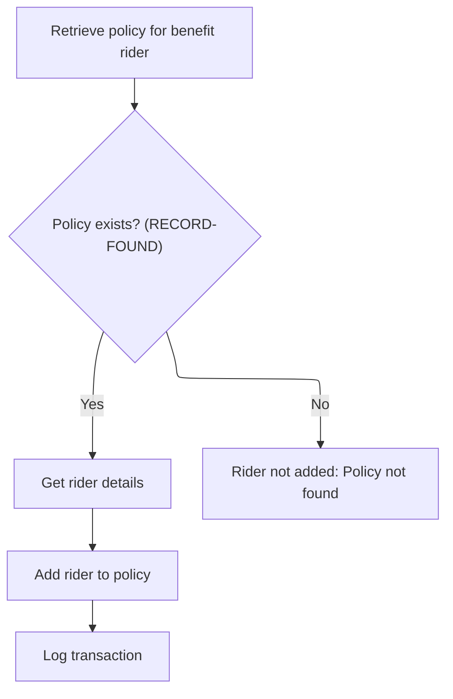

This section manages the addition of a benefit rider to an insurance policy, ensuring that the policy exists before proceeding and logging the transaction for audit purposes.

| Rule ID | Category        | Rule Name                                | Description                                                                                                                                                        | Implementation Details                                                                                                                                                  |
| ------- | --------------- | ---------------------------------------- | ------------------------------------------------------------------------------------------------------------------------------------------------------------------ | ----------------------------------------------------------------------------------------------------------------------------------------------------------------------- |
| BR-001  | Decision Making | Policy existence required                | A benefit rider is only added to a policy if the policy exists in the system. If the policy does not exist, the rider is not added and no further action is taken. | The existence of the policy is determined by the value of the found switch, which is 'Y' for found and 'N' for not found. No rider is added if the policy is not found. |
| BR-002  | Decision Making | Collect rider details on policy found    | Rider details are collected only if the policy exists. No rider details are collected if the policy is not found.                                                  | Rider details are only requested and processed if the policy exists. No format for rider details is specified in this section.                                          |
| BR-003  | Writing Output  | Transaction logging after rider addition | When a rider is added to a policy, the transaction is logged for audit purposes.                                                                                   | Logging occurs after the rider is added. The format and content of the log are not specified in this section.                                                           |

<SwmSnippet path="/base/src/sample.cbl" line="342">

---

In <SwmToken path="base/src/sample.cbl" pos="342:1:7" line-data="       500-ADD-BENEFIT-RIDER.">`500-ADD-BENEFIT-RIDER`</SwmToken>, we start by calling <SwmToken path="base/src/sample.cbl" pos="344:3:11" line-data="           PERFORM 510-GET-POLICY-FOR-RIDER">`510-GET-POLICY-FOR-RIDER`</SwmToken> to get the policy number and make sure it exists before moving on. No point in collecting rider details if the policy isn't there.

```cobol
       500-ADD-BENEFIT-RIDER.
      * Add a benefit rider to a policy
           PERFORM 510-GET-POLICY-FOR-RIDER
```

---

</SwmSnippet>

<SwmSnippet path="/base/src/sample.cbl" line="346">

---

Once we've confirmed the policy and added the rider details in <SwmToken path="base/src/sample.cbl" pos="213:3:9" line-data="                   PERFORM 500-ADD-BENEFIT-RIDER">`500-ADD-BENEFIT-RIDER`</SwmToken>, we call <SwmToken path="base/src/sample.cbl" pos="349:3:7" line-data="               PERFORM 590-LOG-TRANSACTION">`590-LOG-TRANSACTION`</SwmToken> to record what just happened. This way, every change is tracked for auditing.

```cobol
           IF RECORD-FOUND
               PERFORM 520-GET-RIDER-DETAILS
               PERFORM 530-ADD-RIDER-TO-POLICY
               PERFORM 590-LOG-TRANSACTION
           END-IF.
```

---

</SwmSnippet>

# Transaction Logging and Child Rider Addition

This section manages the transaction logging for benefit rider additions and the process for adding a child rider to a policy. It ensures that all relevant actions are recorded and that the user is guided through providing necessary child rider information.

| Rule ID | Category        | Rule Name                         | Description                                                                                                                                                                                                  | Implementation Details                                                                                                                                                                                                                   |
| ------- | --------------- | --------------------------------- | ------------------------------------------------------------------------------------------------------------------------------------------------------------------------------------------------------------ | ---------------------------------------------------------------------------------------------------------------------------------------------------------------------------------------------------------------------------------------- |
| BR-001  | Decision Making | Prompt for Child Rider Details    | Child rider details (name, birth date in YYYYMMDD format, and amount) are requested from the user only if a policy record is found.                                                                          | The child's name is a string; the birth date is a number in YYYYMMDD format; the amount is a number. No validation is performed on the input format.                                                                                     |
| BR-002  | Writing Output  | Benefit Rider Transaction Logging | A transaction log entry is created whenever a benefit rider is added, capturing the policy number, current date, function code '03', description 'BENEFIT RIDER ADDED', and the rider code as the new value. | The log entry includes: policy number (string, 10 characters), date (number, 8 digits, YYYYMMDD), function code ('03'), description ('BENEFIT RIDER ADDED', string, up to 100 characters), and rider code (string, up to 50 characters). |
| BR-003  | Writing Output  | Add Child Rider to Policy         | A child rider is added to the policy with the provided policy number, record type 'CH', rider amount, and effective date, and a confirmation message is displayed.                                           | The policy number is a string (10 characters), record type is 'CH', rider amount is a number, and effective date is a number in YYYYMMDD format. A confirmation message is displayed to the user.                                        |

<SwmSnippet path="/base/src/sample.cbl" line="386">

---

In <SwmToken path="base/src/sample.cbl" pos="386:1:5" line-data="       590-LOG-TRANSACTION.">`590-LOG-TRANSACTION`</SwmToken>, we prep the transaction log entry by moving all the relevant details (policy number, date, action, description, rider code) into the log record. This sets up the audit trail for the rider addition.

```cobol
       590-LOG-TRANSACTION.
      * Log the transaction
           MOVE WK-POLICY-NUMBER TO TRAN-POLICY-NUM
           MOVE WK-CURRENT-DATE TO TRAN-DATE
           MOVE "03" TO TRAN-FUNCTION
           MOVE "BENEFIT RIDER ADDED" TO TRAN-DESCRIPTION
           MOVE WK-RIDER-CODE TO TRAN-NEW-VALUE
           
      * WRITE TRAN-RECORD.

       600-ADD-CHILD-RIDER.
```

---

</SwmSnippet>

<SwmSnippet path="/base/src/sample.cbl" line="398">

---

After logging the transaction, we call <SwmToken path="base/src/sample.cbl" pos="398:3:11" line-data="           PERFORM 510-GET-POLICY-FOR-RIDER">`510-GET-POLICY-FOR-RIDER`</SwmToken> again—probably to make sure we're still working with the right policy before moving on to child rider details. This keeps the context fresh for the next steps.

```cobol
           PERFORM 510-GET-POLICY-FOR-RIDER
```

---

</SwmSnippet>

<SwmSnippet path="/base/src/sample.cbl" line="400">

---

After finishing up the transaction log, we go straight into <SwmToken path="base/src/sample.cbl" pos="401:3:11" line-data="               PERFORM 610-GET-CHILD-RIDER-DETAILS">`610-GET-CHILD-RIDER-DETAILS`</SwmToken> to prompt the user for the next set of info—this keeps the process moving if they're adding a child rider right after a benefit rider.

```cobol
           IF RECORD-FOUND
               PERFORM 610-GET-CHILD-RIDER-DETAILS
               PERFORM 620-ADD-CHILD-RIDER-TO-POLICY
               PERFORM 590-LOG-TRANSACTION
           END-IF.
```

---

</SwmSnippet>

<SwmSnippet path="/base/src/sample.cbl" line="406">

---

<SwmToken path="base/src/sample.cbl" pos="406:1:9" line-data="       610-GET-CHILD-RIDER-DETAILS.">`610-GET-CHILD-RIDER-DETAILS`</SwmToken> prompts the user for the child's name, birth date (expects YYYYMMDD), and rider amount. It's just a sequence of input prompts—no validation, so the user has to get the format right.

```cobol
       610-GET-CHILD-RIDER-DETAILS.
      * Get child rider specific details
           DISPLAY "ENTER CHILD NAME: "
           ACCEPT WK-SEARCH-NAME
           
           DISPLAY "ENTER CHILD BIRTH DATE (YYYYMMDD): "
           ACCEPT WK-RIDER-EFFECTIVE-DATE
           
           DISPLAY "ENTER RIDER AMOUNT: "
           ACCEPT WK-RIDER-AMOUNT.
```

---

</SwmSnippet>

<SwmSnippet path="/base/src/sample.cbl" line="417">

---

<SwmToken path="base/src/sample.cbl" pos="417:1:11" line-data="       620-ADD-CHILD-RIDER-TO-POLICY.">`620-ADD-CHILD-RIDER-TO-POLICY`</SwmToken> takes the policy number, sets the record type to 'CH' for child rider, fills in the amount and effective date, and then displays a confirmation message. It assumes all the needed variables are already set up in working storage.

```cobol
       620-ADD-CHILD-RIDER-TO-POLICY.
      * Add child rider to the policy
           MOVE WK-POLICY-NUMBER TO PB-POLNUM
           MOVE "CH" TO PB-RECORD-TYPE
           MOVE WK-RIDER-AMOUNT TO PB-DAILY-BENEFIT
           MOVE WK-RIDER-EFFECTIVE-DATE TO PB-ISSUE-DATE
           
           MOVE MSG-RIDER-ADDED TO IS-MESSAGE-LINE
           DISPLAY IS-MESSAGE-LINE.
```

---

</SwmSnippet>

# Address Change Processing

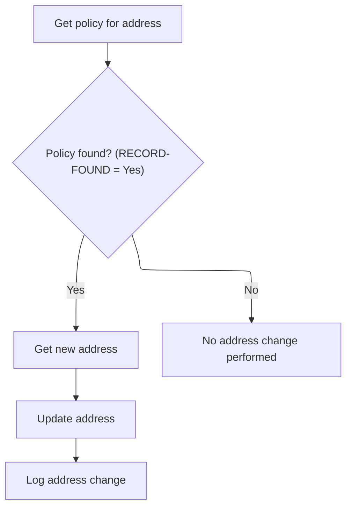

This section governs the business process for handling address changes on insurance policies. It ensures that address changes are only performed for existing policies and that all changes are logged for audit purposes.

| Rule ID | Category        | Rule Name                 | Description                                                                                                                                     | Implementation Details                                                                                                                                                                   |
| ------- | --------------- | ------------------------- | ----------------------------------------------------------------------------------------------------------------------------------------------- | ---------------------------------------------------------------------------------------------------------------------------------------------------------------------------------------- |
| BR-001  | Decision Making | Policy existence required | An address change is only processed if the policy exists. If the policy is not found, no address change is performed.                           | The process checks for the existence of the policy before proceeding. If the policy is not found, the address change process is skipped.                                                 |
| BR-002  | Writing Output  | Record new address        | When an address change is processed, the new address is recorded (in this demo, only the last name field is updated with the new address line). | In this demo, only the last name field is updated with the new address line. Other address fields are not changed. The update is accompanied by a success message displayed to the user. |
| BR-003  | Writing Output  | Log address change        | Every address change is logged with the policy number, current date, function code '05', and the description 'ADDRESS CHANGE'.                  | The log entry includes the policy number (string), the current date (date), the function code '05' (string), and the description 'ADDRESS CHANGE' (string).                              |

<SwmSnippet path="/base/src/sample.cbl" line="427">

---

In <SwmToken path="base/src/sample.cbl" pos="427:1:5" line-data="       700-ADDRESS-CHANGE.">`700-ADDRESS-CHANGE`</SwmToken>, we start by calling <SwmToken path="base/src/sample.cbl" pos="429:3:11" line-data="           PERFORM 710-GET-POLICY-FOR-ADDRESS">`710-GET-POLICY-FOR-ADDRESS`</SwmToken> to get the policy number and make sure it exists before moving on. No point in collecting address info if the policy isn't there.

```cobol
       700-ADDRESS-CHANGE.
      * Process address change
           PERFORM 710-GET-POLICY-FOR-ADDRESS
```

---

</SwmSnippet>

<SwmSnippet path="/base/src/sample.cbl" line="431">

---

Once we've confirmed the policy exists in <SwmToken path="base/src/sample.cbl" pos="217:3:7" line-data="                   PERFORM 700-ADDRESS-CHANGE">`700-ADDRESS-CHANGE`</SwmToken>, we collect the new address and then call <SwmToken path="base/src/sample.cbl" pos="433:3:7" line-data="               PERFORM 730-UPDATE-ADDRESS">`730-UPDATE-ADDRESS`</SwmToken> to actually make the change. After that, we log the update for tracking.

```cobol
           IF RECORD-FOUND
               PERFORM 720-GET-NEW-ADDRESS
               PERFORM 730-UPDATE-ADDRESS
               PERFORM 790-LOG-ADDRESS-CHANGE
           END-IF.
```

---

</SwmSnippet>

<SwmSnippet path="/base/src/sample.cbl" line="461">

---

<SwmToken path="base/src/sample.cbl" pos="461:1:5" line-data="       730-UPDATE-ADDRESS.">`730-UPDATE-ADDRESS`</SwmToken> moves the new address line into the last name field (which is odd—probably a demo shortcut or bug), then sets and displays a success message. The actual address fields aren't touched here.

```cobol
       730-UPDATE-ADDRESS.
      * Update the address in the insured record
      * This would update the POL-INSURED file
           MOVE WK-NEW-ADDR1 TO PI-LAST-NAME
      * Update other address fields as needed
           
           MOVE MSG-SUCCESSFUL-UPDATE TO IS-MESSAGE-LINE
           DISPLAY IS-MESSAGE-LINE.
```

---

</SwmSnippet>

<SwmSnippet path="/base/src/sample.cbl" line="470">

---

<SwmToken path="base/src/sample.cbl" pos="470:1:7" line-data="       790-LOG-ADDRESS-CHANGE.">`790-LOG-ADDRESS-CHANGE`</SwmToken> logs the address change by moving the policy number, date, function code '05', and description into the transaction record. These codes make it easy to track what kind of change was made.

```cobol
       790-LOG-ADDRESS-CHANGE.
      * Log the address change transaction
           MOVE WK-POLICY-NUMBER TO TRAN-POLICY-NUM
           MOVE WK-CURRENT-DATE TO TRAN-DATE
           MOVE "05" TO TRAN-FUNCTION
           MOVE "ADDRESS CHANGE" TO TRAN-DESCRIPTION.
```

---

</SwmSnippet>

# Premium Increase Processing

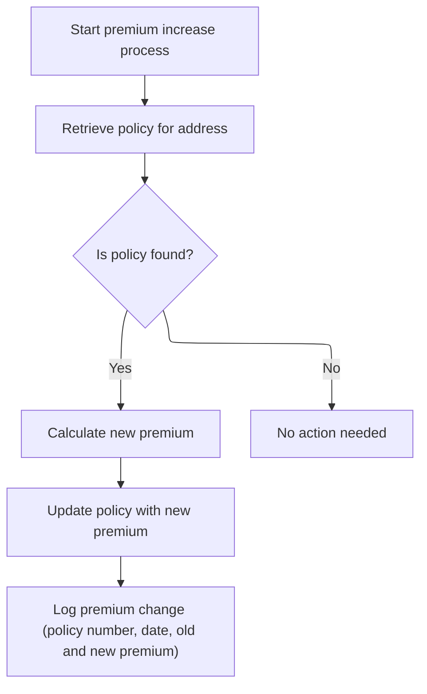

This section coordinates the process of increasing a policy's premium. It ensures that only existing policies are updated and that all changes are logged for audit purposes.

| Rule ID | Category        | Rule Name                      | Description                                                                                                                                  | Implementation Details                                                                                                                                             |
| ------- | --------------- | ------------------------------ | -------------------------------------------------------------------------------------------------------------------------------------------- | ------------------------------------------------------------------------------------------------------------------------------------------------------------------ |
| BR-001  | Calculation     | Premium calculation and update | If a policy is found, the new premium is calculated and the policy is updated accordingly.                                                   | The new premium is calculated and the policy record is updated with this value. The specifics of the calculation are not shown in this section.                    |
| BR-002  | Decision Making | Policy existence required      | A policy must be found for the given address before any premium calculation or update is performed.                                          | No premium calculation or update occurs unless a policy is found. Policy existence is determined by a status indicator set to 'Y'.                                 |
| BR-003  | Decision Making | No action if policy not found  | If no policy is found for the address, no premium calculation, update, or logging is performed.                                              | The process terminates without making any changes or logs if a policy is not found.                                                                                |
| BR-004  | Writing Output  | Premium change logging         | Every premium change is logged with the policy number, date, old premium, new premium, function code '11', and description 'PREMIUM CHANGE'. | The log entry includes: policy number (string), date (date), old premium (number), new premium (number), function code ('11'), and description ('PREMIUM CHANGE'). |

<SwmSnippet path="/base/src/sample.cbl" line="507">

---

In <SwmToken path="base/src/sample.cbl" pos="507:1:5" line-data="       850-PREMIUM-INCREASE.">`850-PREMIUM-INCREASE`</SwmToken>, we start by calling <SwmToken path="base/src/sample.cbl" pos="509:3:11" line-data="           PERFORM 710-GET-POLICY-FOR-ADDRESS">`710-GET-POLICY-FOR-ADDRESS`</SwmToken> to get the policy number and make sure it exists before moving on. No point in collecting new premium info if the policy isn't there.

```cobol
       850-PREMIUM-INCREASE.
      * Process premium increase
           PERFORM 710-GET-POLICY-FOR-ADDRESS
```

---

</SwmSnippet>

<SwmSnippet path="/base/src/sample.cbl" line="511">

---

After updating the premium in <SwmToken path="base/src/sample.cbl" pos="221:3:7" line-data="                   PERFORM 850-PREMIUM-INCREASE">`850-PREMIUM-INCREASE`</SwmToken>, we call <SwmToken path="base/src/sample.cbl" pos="514:3:9" line-data="               PERFORM 895-LOG-PREMIUM-CHANGE">`895-LOG-PREMIUM-CHANGE`</SwmToken> to record the details of the change. This way, every premium adjustment is tracked for auditing.

```cobol
           IF RECORD-FOUND
               PERFORM 855-GET-NEW-PREMIUM
               PERFORM 865-UPDATE-PREMIUM
               PERFORM 895-LOG-PREMIUM-CHANGE
           END-IF.
```

---

</SwmSnippet>

<SwmSnippet path="/base/src/sample.cbl" line="604">

---

<SwmToken path="base/src/sample.cbl" pos="604:1:7" line-data="       895-LOG-PREMIUM-CHANGE.">`895-LOG-PREMIUM-CHANGE`</SwmToken> logs the premium change by moving the policy number, date, old and new premium values, function code '11', and description into the transaction record. These codes make it easy to track what kind of change was made.

```cobol
       895-LOG-PREMIUM-CHANGE.
      * Log premium change transaction
           MOVE WK-POLICY-NUMBER TO TRAN-POLICY-NUM
           MOVE WK-CURRENT-DATE TO TRAN-DATE
           MOVE "11" TO TRAN-FUNCTION
           MOVE "PREMIUM CHANGE" TO TRAN-DESCRIPTION
           MOVE WK-CURRENT-PREMIUM TO TRAN-OLD-VALUE
           MOVE WK-NEW-PREMIUM TO TRAN-NEW-VALUE.
```

---

</SwmSnippet>

# Premium Decrease Processing

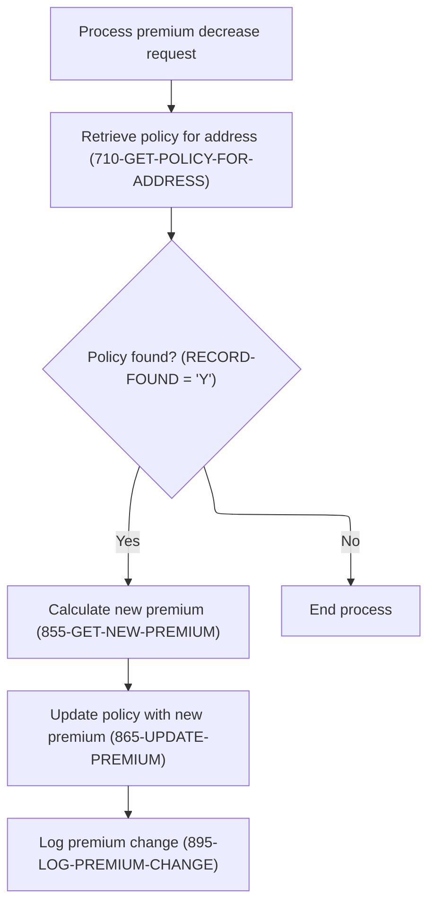

This section manages the workflow for processing a premium decrease request. It coordinates retrieval, calculation, update, and logging steps based on whether a policy exists for the given address.

| Rule ID | Category                        | Rule Name                                  | Description                                                                                                                                | Implementation Details                                                                                                                              |
| ------- | ------------------------------- | ------------------------------------------ | ------------------------------------------------------------------------------------------------------------------------------------------ | --------------------------------------------------------------------------------------------------------------------------------------------------- |
| BR-001  | Decision Making                 | Process premium decrease when policy found | If a policy is found for the address, the new premium is calculated, the policy is updated with the new premium, and the change is logged. | The sequence is: calculate new premium, update policy, log change. No details about the calculation or log format are specified here.               |
| BR-002  | Decision Making                 | No action when policy not found            | If no policy is found for the address, the premium decrease process ends without making any changes or logging.                            | No calculation, update, or logging occurs if the policy is not found. No output is produced in this case.                                           |
| BR-003  | Invoking a Service or a Process | Policy retrieval required                  | A policy must be retrieved for the given address before any premium decrease processing occurs.                                            | The process does not proceed to calculation or update unless a policy is retrieved. No specific format is enforced for the address in this section. |

<SwmSnippet path="/base/src/sample.cbl" line="528">

---

In <SwmToken path="base/src/sample.cbl" pos="528:1:5" line-data="       860-PREMIUM-DECREASE.">`860-PREMIUM-DECREASE`</SwmToken>, we call <SwmToken path="base/src/sample.cbl" pos="530:3:11" line-data="           PERFORM 710-GET-POLICY-FOR-ADDRESS">`710-GET-POLICY-FOR-ADDRESS`</SwmToken> to get the policy, then check <SwmToken path="base/src/sample.cbl" pos="270:3:5" line-data="           IF RECORD-FOUND">`RECORD-FOUND`</SwmToken>. If it's set, we get the new premium, update it, and log the change. The whole thing hinges on that flag being set by the earlier call.

```cobol
       860-PREMIUM-DECREASE.
      * Process premium decrease
           PERFORM 710-GET-POLICY-FOR-ADDRESS
```

---

</SwmSnippet>

<SwmSnippet path="/base/src/sample.cbl" line="532">

---

After confirming the policy exists in <SwmToken path="base/src/sample.cbl" pos="223:3:7" line-data="                   PERFORM 860-PREMIUM-DECREASE">`860-PREMIUM-DECREASE`</SwmToken>, we get the new premium, update the record, and then call <SwmToken path="base/src/sample.cbl" pos="535:3:9" line-data="               PERFORM 895-LOG-PREMIUM-CHANGE">`895-LOG-PREMIUM-CHANGE`</SwmToken> to log what happened. The flow is identical to premium increase, just with a different intent.

```cobol
           IF RECORD-FOUND
               PERFORM 855-GET-NEW-PREMIUM
               PERFORM 865-UPDATE-PREMIUM
               PERFORM 895-LOG-PREMIUM-CHANGE
           END-IF.
```

---

</SwmSnippet>

# Rider Deletion Processing

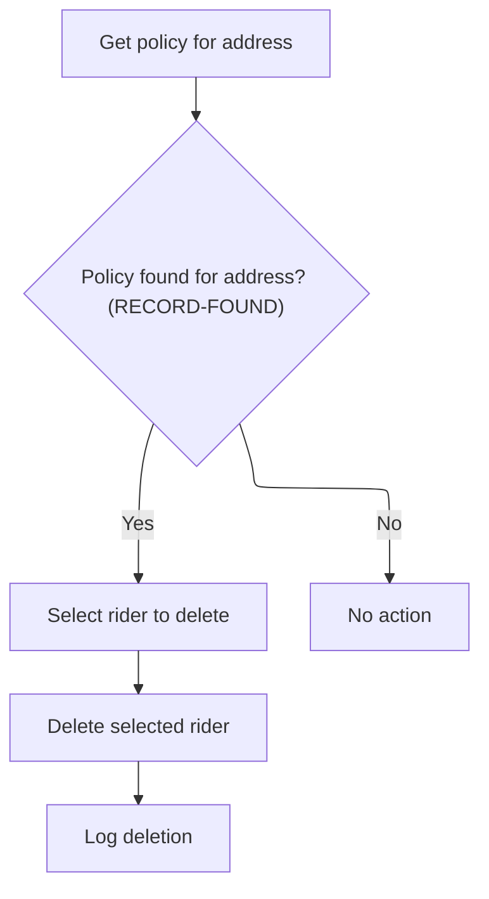

This section governs the process for deleting a rider from a policy. It ensures that deletion is only attempted when a valid policy is found, and that all deletions are logged for audit purposes.

| Rule ID | Category        | Rule Name                                | Description                                                                                        | Implementation Details                                                                                                 |
| ------- | --------------- | ---------------------------------------- | -------------------------------------------------------------------------------------------------- | ---------------------------------------------------------------------------------------------------------------------- |
| BR-001  | Decision Making | Policy existence required for deletion   | Deletion of a rider is only attempted if a policy matching the provided address is found.          | The constant 'Y' is used to indicate a found record. No deletion or rider selection occurs if the policy is not found. |
| BR-002  | Decision Making | Rider selection required before deletion | The user is prompted to select which rider to delete from the policy when a valid policy is found. | Selection is required before deletion. The specific format for selection is not detailed in the code.                  |
| BR-003  | Writing Output  | Deletion logging                         | When a rider is deleted from a policy, the deletion is logged for audit purposes.                  | Logging occurs after deletion. The format and content of the log are not specified in the code.                        |

<SwmSnippet path="/base/src/sample.cbl" line="546">

---

In <SwmToken path="base/src/sample.cbl" pos="546:1:5" line-data="       870-DELETE-RIDER.">`870-DELETE-RIDER`</SwmToken>, we start by calling <SwmToken path="base/src/sample.cbl" pos="548:3:11" line-data="           PERFORM 710-GET-POLICY-FOR-ADDRESS">`710-GET-POLICY-FOR-ADDRESS`</SwmToken> to get the policy number and make sure it exists before moving on. No point in trying to delete a rider if the policy isn't there.

```cobol
       870-DELETE-RIDER.
      * Delete a rider from policy
           PERFORM 710-GET-POLICY-FOR-ADDRESS
```

---

</SwmSnippet>

<SwmSnippet path="/base/src/sample.cbl" line="550">

---

After prompting the user to pick which rider to delete, we call <SwmToken path="base/src/sample.cbl" pos="552:3:9" line-data="               PERFORM 876-DELETE-SELECTED-RIDER">`876-DELETE-SELECTED-RIDER`</SwmToken> to actually remove the chosen rider from the policy. Skipping this would mean nothing gets deleted—so this step is what makes the change real before we log it.

```cobol
           IF RECORD-FOUND
               PERFORM 875-SELECT-RIDER-TO-DELETE
               PERFORM 876-DELETE-SELECTED-RIDER
               PERFORM 590-LOG-TRANSACTION
           END-IF.
```

---

</SwmSnippet>

<SwmSnippet path="/base/src/sample.cbl" line="561">

---

<SwmToken path="base/src/sample.cbl" pos="561:1:7" line-data="       876-DELETE-SELECTED-RIDER.">`876-DELETE-SELECTED-RIDER`</SwmToken> just moves the policy number and rider code into the fields used for deletion, then displays a success message. The actual deletion isn't visible here, so it's either handled outside this snippet or assumed to happen automatically.

```cobol
       876-DELETE-SELECTED-RIDER.
      * Delete the selected rider
           MOVE WK-POLICY-NUMBER TO PB-POLNUM
           MOVE WK-RIDER-CODE TO PB-RECORD-TYPE
      * DELETE POL-BENEFIT-REC
           
           MOVE MSG-RIDER-DELETED TO IS-MESSAGE-LINE
           DISPLAY IS-MESSAGE-LINE.
```

---

</SwmSnippet>

# Updating a Rider's Details

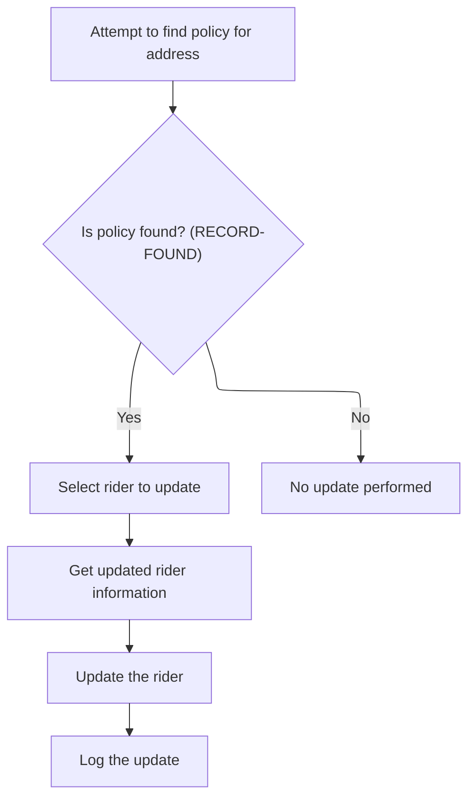

This section governs the process for updating a rider's details, ensuring that updates are only performed for existing policies and that all changes are logged for audit purposes.

| Rule ID | Category        | Rule Name                            | Description                                                                                                        | Implementation Details                                                                                                                                                                                        |
| ------- | --------------- | ------------------------------------ | ------------------------------------------------------------------------------------------------------------------ | ------------------------------------------------------------------------------------------------------------------------------------------------------------------------------------------------------------- |
| BR-001  | Data validation | Policy existence required for update | An update to a rider's details is only attempted if a policy matching the provided address is found.               | The existence of a policy is determined by a status indicator set during the policy lookup. No update actions are performed if the policy is not found.                                                       |
| BR-002  | Decision Making | No update without policy             | If no policy is found for the provided address, no rider update is performed and the process ends without changes. | No update actions or logging are performed if the policy does not exist.                                                                                                                                      |
| BR-003  | Writing Output  | Audit log for rider updates          | Every successful update to a rider's details is recorded in an audit log to ensure traceability of changes.        | An audit log entry is created after the rider update is completed. The log records the update action for traceability. The format and content of the log entry are determined by the invoked logging process. |

<SwmSnippet path="/base/src/sample.cbl" line="570">

---

In <SwmToken path="base/src/sample.cbl" pos="570:1:5" line-data="       880-UPDATE-RIDER.">`880-UPDATE-RIDER`</SwmToken>, we start by calling <SwmToken path="base/src/sample.cbl" pos="572:3:11" line-data="           PERFORM 710-GET-POLICY-FOR-ADDRESS">`710-GET-POLICY-FOR-ADDRESS`</SwmToken> to make sure the policy exists before doing anything else. If the policy isn't there, the update stops immediately.

```cobol
       880-UPDATE-RIDER.
      * Update an existing rider
           PERFORM 710-GET-POLICY-FOR-ADDRESS
```

---

</SwmSnippet>

<SwmSnippet path="/base/src/sample.cbl" line="574">

---

After updating the rider info, we call <SwmToken path="base/src/sample.cbl" pos="578:3:7" line-data="               PERFORM 590-LOG-TRANSACTION">`590-LOG-TRANSACTION`</SwmToken> to record the update. This keeps an audit trail so every change is tracked.

```cobol
           IF RECORD-FOUND
               PERFORM 875-SELECT-RIDER-TO-DELETE
               PERFORM 885-GET-UPDATED-RIDER-INFO
               PERFORM 886-UPDATE-SELECTED-RIDER
               PERFORM 590-LOG-TRANSACTION
           END-IF.
```

---

</SwmSnippet>

# Processing a Premium Update

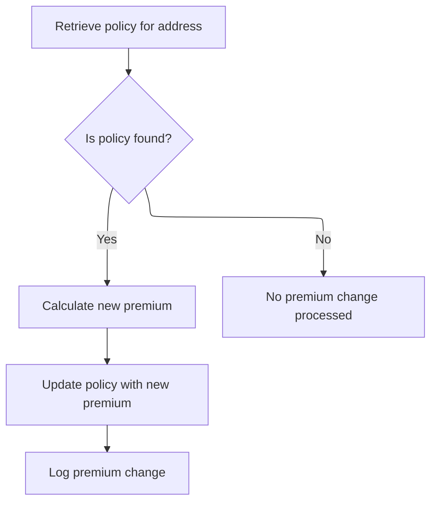

This section manages the process of updating a policy's premium based on an address lookup. It ensures that premium changes and logging only occur when a matching policy is found.

| Rule ID | Category                        | Rule Name                           | Description                                                                                                   | Implementation Details                                                                                                                                                                                                                             |
| ------- | ------------------------------- | ----------------------------------- | ------------------------------------------------------------------------------------------------------------- | -------------------------------------------------------------------------------------------------------------------------------------------------------------------------------------------------------------------------------------------------- |
| BR-001  | Decision Making                 | Policy existence required           | A policy must be found for the given address before any premium calculation, update, or logging is performed. | The <SwmToken path="base/src/sample.cbl" pos="270:3:5" line-data="           IF RECORD-FOUND">`RECORD-FOUND`</SwmToken> condition is tied to the value 'Y' for the found switch. No premium update or logging occurs if this condition is not met. |
| BR-002  | Decision Making                 | No action when policy not found     | If no policy is found for the address, no premium calculation, update, or logging is performed.               | No premium update or logging occurs if the policy is not found. The process ends without further action.                                                                                                                                           |
| BR-003  | Invoking a Service or a Process | Premium update and logging sequence | When a policy is found, the system calculates the new premium, updates the policy, and logs the change.       | The sequence is: calculate new premium, update policy, log change. The details of calculation and logging are handled in invoked processes, not in this section.                                                                                   |

<SwmSnippet path="/base/src/sample.cbl" line="594">

---

In <SwmToken path="base/src/sample.cbl" pos="594:1:5" line-data="       890-PREMIUM-CHANGE.">`890-PREMIUM-CHANGE`</SwmToken>, we start by calling <SwmToken path="base/src/sample.cbl" pos="596:3:11" line-data="           PERFORM 710-GET-POLICY-FOR-ADDRESS">`710-GET-POLICY-FOR-ADDRESS`</SwmToken> to fetch the policy. Everything else—getting the new premium, updating it, and logging—only happens if <SwmToken path="base/src/sample.cbl" pos="270:3:5" line-data="           IF RECORD-FOUND">`RECORD-FOUND`</SwmToken> is set, so nothing breaks if the policy isn't there.

```cobol
       890-PREMIUM-CHANGE.
      * General premium change processing
           PERFORM 710-GET-POLICY-FOR-ADDRESS
```

---

</SwmSnippet>

<SwmSnippet path="/base/src/sample.cbl" line="598">

---

After updating the premium, we call <SwmToken path="base/src/sample.cbl" pos="601:3:9" line-data="               PERFORM 895-LOG-PREMIUM-CHANGE">`895-LOG-PREMIUM-CHANGE`</SwmToken> to capture the details of what changed. This way, every premium adjustment is recorded for audit or troubleshooting later.

```cobol
           IF RECORD-FOUND
               PERFORM 855-GET-NEW-PREMIUM
               PERFORM 865-UPDATE-PREMIUM
               PERFORM 895-LOG-PREMIUM-CHANGE
           END-IF.
```

---

</SwmSnippet>

&nbsp;

*This is an auto-generated document by Swimm 🌊 and has not yet been verified by a human*

<SwmMeta version="3.0.0" repo-id="Z2l0aHViJTNBJTNBU3dpbW1pby1nZW5hcHAtaG91c2UlM0ElM0FHaXJpLVN3aW1t" repo-name="Swimmio-genapp-house"><sup>Powered by [Swimm](https://app.swimm.io/)</sup></SwmMeta>
