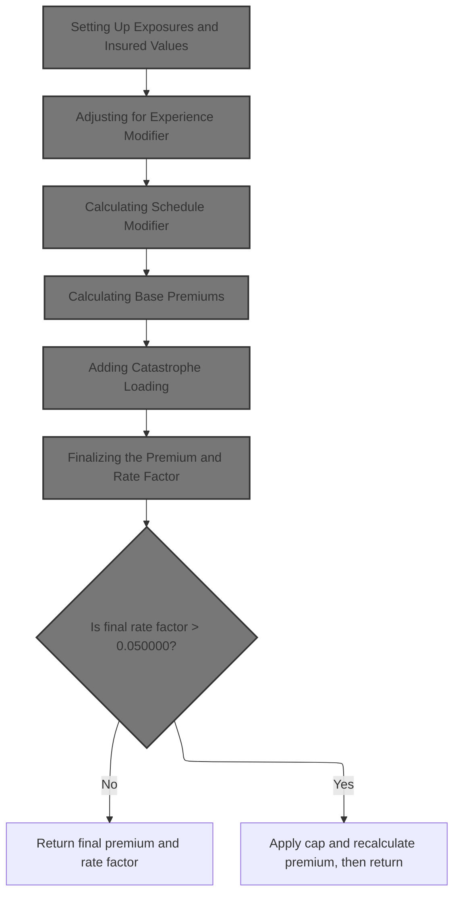
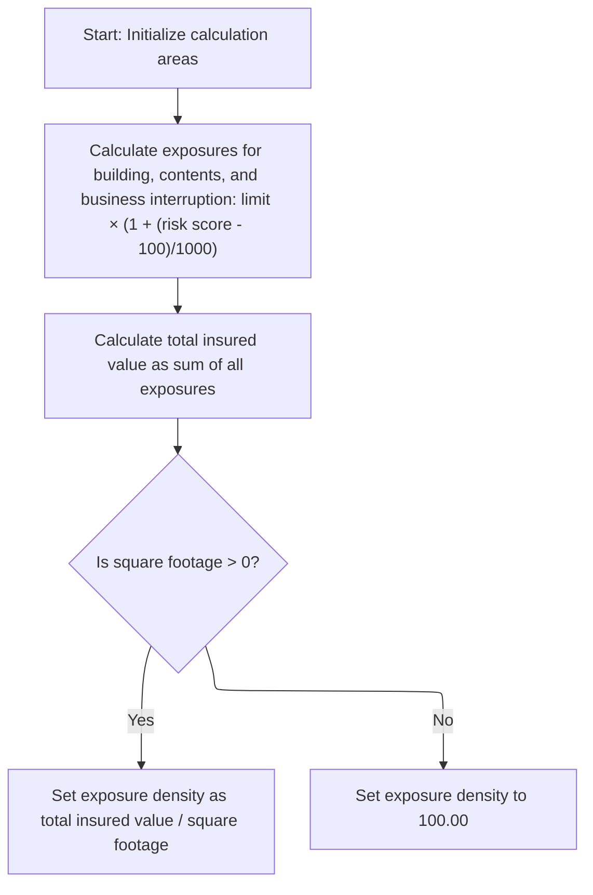
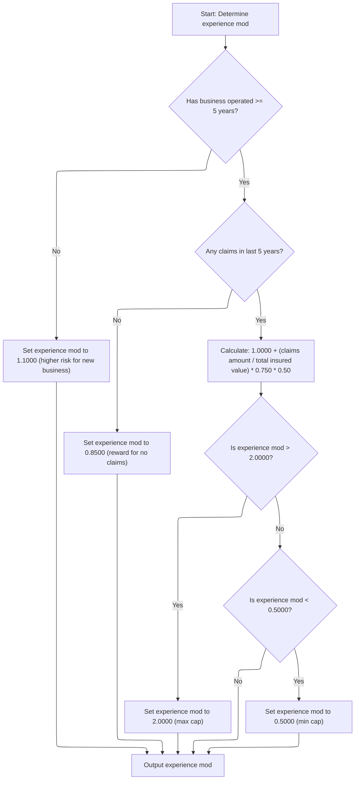
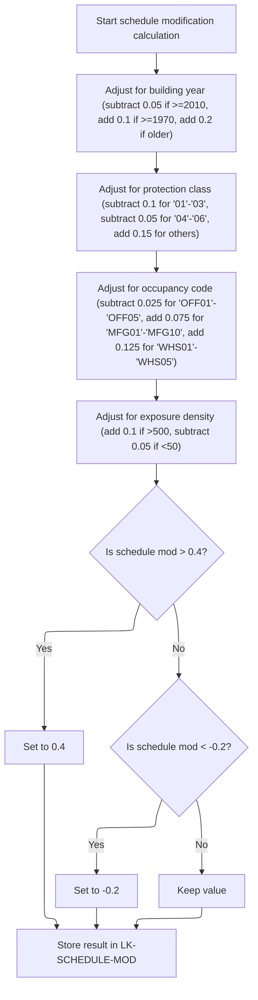
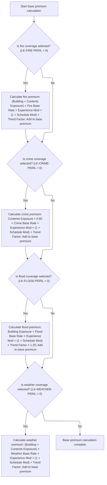
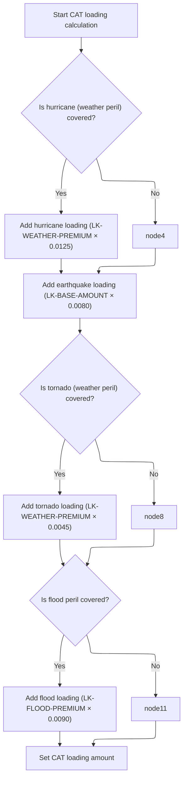
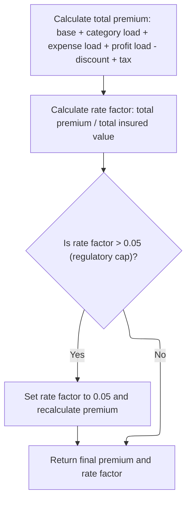

This document describes the main flow for calculating the insurance premium and rate factor for a policy. The process receives policy and risk data as input, establishes exposures and insured values, applies business rules for modifiers and loadings, and outputs the final premium and rate factor.

# Spec

## Detailed View of the Program's Functionality

# Orchestrating the Premium Calculation Steps

This program is structured as a sequence of calculation steps, each building on the results of the previous. The main entry point runs through a series of subroutines, each responsible for a specific part of the premium calculation process. The flow is as follows:

1. **Setting Up Exposures and Insured Values**: Initializes calculation areas and computes exposures and total insured value.
2. **Adjusting for Experience Modifier**: Determines the experience modifier based on business history and claims.
3. **Calculating Schedule Modifier**: Adjusts the schedule modifier based on property characteristics.
4. **Calculating Base Premiums**: Calculates the base premium for each selected peril.
5. **Adding Catastrophe Loading**: Adds catastrophe-related loadings to the premium.
6. **Finalizing the Premium and Rate Factor**: Sums all components, applies caps, and produces the final premium and rate factor.

---

## Setting Up Exposures and Insured Values

**Actions Performed:**

- The calculation work areas and base rate table are initialized to ensure no leftover data from previous runs.
- Exposures for building, contents, and business interruption are calculated. Each exposure is determined by multiplying the relevant coverage limit by a factor that adjusts for the risk score. The adjustment increases the exposure if the risk score is above 100 and decreases it if below.
- The total insured value is computed as the sum of all three exposures.
- Exposure density is then calculated. If the square footage is provided and greater than zero, the total insured value is divided by the square footage. If not, a default value of 100.00 is used as a fallback.

**Purpose:**

This step ensures that all subsequent calculations have accurate and relevant exposure data, which is foundational for rating and premium determination.

---

## Adjusting for Experience Modifier

**Actions Performed:**

- The experience modifier is initialized to a neutral value.
- If the business has been operating for at least five years:
  - If there have been no claims in the last five years, the modifier is set to a favorable value (rewarding claim-free history).
  - If there have been claims, the modifier is increased based on the ratio of claims amount to total insured value, further adjusted by a credibility factor and a scaling constant. This penalizes higher claims relative to exposure.
  - The modifier is capped at a maximum and minimum value to prevent extreme adjustments.
- If the business is newer than five years, the modifier is set to a higher value, reflecting increased risk for new businesses.
- The final modifier is stored for use in premium calculations.

**Purpose:**

This step adjusts the premium based on the business's operational history and claims experience, rewarding safer risks and penalizing riskier ones.

---

## Calculating Schedule Modifier

**Actions Performed:**

- The schedule modifier starts at zero.
- Adjustments are made based on:
  - **Building Age**: Newer buildings get a reduction, older buildings get an increase.
  - **Protection Class**: Better protection classes (lower numbers) reduce the modifier, worse classes increase it.
  - **Occupancy Code**: Office occupancies reduce the modifier, manufacturing and warehouse occupancies increase it.
  - **Exposure Density**: Very high density increases the modifier, very low density decreases it.
- After all adjustments, the modifier is capped within a specified range to avoid excessive impact.
- The final value is stored for use in premium calculations.

**Purpose:**

This step fine-tunes the premium based on property-specific risk factors, allowing for more granular pricing.

---

## Calculating Base Premiums

**Actions Performed:**

- The base premium is initialized to zero.
- For each peril (fire, crime, flood, weather), if selected:
  - The relevant exposure(s) are multiplied by the appropriate base rate (looked up from the rate table), the experience modifier, the schedule modifier (as a multiplier), and a trend factor.
  - For crime, only 80% of contents exposure is used.
  - For flood, an additional 1.25 multiplier is applied.
  - Each calculated peril premium is added to the base premium.
- The sum of all selected peril premiums forms the base premium, which is used in subsequent steps.

**Purpose:**

This step calculates the core premium based on exposures, selected coverages, and all previously determined modifiers.

---

## Adding Catastrophe Loading

**Actions Performed:**

- The catastrophe loading amount is initialized to zero.
- If weather peril is selected, a hurricane loading is added (weather premium multiplied by a hurricane factor).
- An earthquake loading is always added (base premium multiplied by an earthquake factor).
- If weather peril is selected, a tornado loading is added (weather premium multiplied by a tornado factor).
- If flood peril is selected, a flood loading is added (flood premium multiplied by a flood factor).
- The total catastrophe loading is stored for use in the final premium calculation.

**Purpose:**

This step adds additional charges to the premium to account for the risk of catastrophic events, based on the coverages selected.

---

## Finalizing the Premium and Rate Factor

**Actions Performed:**

- The total premium is calculated by summing the base premium, catastrophe loading, expense loading, and profit loading, then subtracting discounts and adding taxes.
- The rate factor is calculated as the total premium divided by the total insured value.
- If the rate factor exceeds a regulatory cap, it is set to the cap value, and the total premium is recalculated to match.
- The final premium and rate factor are output as the result of the calculation.

**Purpose:**

This step ensures that the final premium is compliant with regulatory limits and reflects all adjustments, producing the values that will be presented to the customer or used for policy issuance.

# Rule Definition

| Paragraph Name                          | Rule ID | Category          | Description                                                                                                                                                                                                                                                                                                                     | Conditions                                                                      | Remarks                                                                                                                                                                                                                           |
| --------------------------------------- | ------- | ----------------- | ------------------------------------------------------------------------------------------------------------------------------------------------------------------------------------------------------------------------------------------------------------------------------------------------------------------------------- | ------------------------------------------------------------------------------- | --------------------------------------------------------------------------------------------------------------------------------------------------------------------------------------------------------------------------------- |
| P200-INIT                               | RL-001  | Computation       | Exposures for building, contents, and business interruption are calculated using the formula: exposure = limit × (1 + (risk score - 100)/1000) for each coverage type.                                                                                                                                                          | Always applies at initialization.                                               | The formula uses the risk score and coverage limits. Output exposures are numeric values with up to 10 digits and 2 decimals.                                                                                                     |
| P200-INIT                               | RL-002  | Computation       | Total insured value is the sum of building, contents, and BI exposures.                                                                                                                                                                                                                                                         | Always applies after exposures are initialized.                                 | Sum of three numeric exposures, output as a numeric value with up to 11 digits and 2 decimals.                                                                                                                                    |
| P200-INIT                               | RL-003  | Computation       | Exposure density is calculated as total insured value divided by square footage if square footage > 0; otherwise, set exposure density to 100.00.                                                                                                                                                                               | If square footage > 0, divide; else set to 100.00.                              | Exposure density is a numeric value with up to 4 decimals.                                                                                                                                                                        |
| P400-EXP-MOD                            | RL-004  | Conditional Logic | Experience modifier is set based on years in business and claims count/amount. If years in business >= 5 and claims count = 0, set to 0.8500. If claims count > 0, calculate as 1.0000 + (claims amount / total insured value) × 0.750 × 0.50, capped at 2.0000 and floored at 0.5000. If years in business < 5, set to 1.1000. | Depends on years in business and claims count/amount.                           | Constants: credibility factor = 0.750, cap = 2.0000, floor = 0.5000. Output is a numeric value with 4 decimals.                                                                                                                   |
| P500-SCHED-MOD                          | RL-005  | Conditional Logic | Schedule modifier starts at zero and is adjusted based on year built, protection class, occupancy code, and exposure density. It is capped at 0.4 and floored at -0.2.                                                                                                                                                          | Always applies after exposures and experience modifier are calculated.          | Constants: year built thresholds (2010, 1970), protection class ranges ('01'-'03', '04'-'06'), occupancy codes, exposure density thresholds (500, 50), cap = 0.4, floor = -0.2. Output is a signed numeric value with 3 decimals. |
| LOAD-RATE-TABLES, P310-PERIL-RATES      | RL-006  | Conditional Logic | Base rate for each peril (fire, crime, flood, weather) is looked up from the RATE_MASTER table using territory, construction type, occupancy code, and peril code. If no match is found, fallback constants are used.                                                                                                           | If SQL lookup succeeds, use table value; else use fallback constant.            | Fallback constants: fire=0.008500, crime=0.006200, flood=0.012800, weather=0.009600. Output is a numeric value with up to 6 decimals.                                                                                             |
| P600-BASE-PREM                          | RL-007  | Computation       | Premiums for fire, crime, flood, and weather are calculated using specific formulas involving exposures, base rates, experience modifier, schedule modifier, and trend factor. Flood premium includes an extra 1.25 multiplier.                                                                                                 | Only for selected perils (peril selection > 0).                                 | Trend factor = 1.0350. Output premiums are numeric values with up to 8 digits and 2 decimals.                                                                                                                                     |
| P600-BASE-PREM                          | RL-008  | Computation       | Base premium amount is the sum of all calculated peril premiums.                                                                                                                                                                                                                                                                | After all peril premiums are calculated.                                        | Output is a numeric value with up to 9 digits and 2 decimals.                                                                                                                                                                     |
| P700-CAT-LOAD                           | RL-009  | Computation       | Catastrophe loading is the sum of hurricane (weather premium × 0.0125 if weather selected), earthquake (base premium × 0.0080 always), tornado (weather premium × 0.0045 if weather selected), and flood (flood premium × 0.0090 if flood selected).                                                                            | Depends on peril selections.                                                    | Constants: hurricane=0.0125, earthquake=0.0080, tornado=0.0045, flood=0.0090. Output is a numeric value with up to 8 digits and 2 decimals.                                                                                       |
| P800-EXPENSE                            | RL-010  | Computation       | Expense load is calculated as (base premium + catastrophe loading) × 0.350.                                                                                                                                                                                                                                                     | Always applies after base premium and catastrophe loading are calculated.       | Expense ratio = 0.350. Output is a numeric value with up to 8 digits and 2 decimals.                                                                                                                                              |
| P800-EXPENSE                            | RL-011  | Computation       | Profit load is calculated as (base premium + catastrophe loading + expense load) × 0.150.                                                                                                                                                                                                                                       | Always applies after expense load is calculated.                                | Profit margin = 0.150. Output is a numeric value with up to 8 digits and 2 decimals.                                                                                                                                              |
| P900-DISC                               | RL-012  | Conditional Logic | Total discount is the sum of: 0.100 if all four perils selected, 0.050 if fire, weather, and (crime or flood) selected, 0.075 if no claims in 5 years and business >= 5 years, 0.025 if fire deductible >= 10,000, 0.035 if wind deductible >= 25,000, 0.045 if flood deductible >= 50,000. Cap at 0.250.                       | Depends on peril selections, claims, years in business, and deductible amounts. | Constants: multi-peril=0.100, fire/weather/other=0.050, claims-free=0.075, fire deductible=0.025, wind deductible=0.035, flood deductible=0.045, cap=0.250. Output is a numeric value with 3 decimals.                            |
| P900-DISC                               | RL-013  | Computation       | Discount amount is calculated as (base premium + catastrophe loading + expense load + profit load) × total discount.                                                                                                                                                                                                            | After total discount is calculated.                                             | Output is a numeric value with up to 7 digits and 2 decimals.                                                                                                                                                                     |
| P950-TAXES                              | RL-014  | Computation       | Tax amount is calculated as (base premium + catastrophe loading + expense load + profit load - discount amount) × 0.0675.                                                                                                                                                                                                       | After discount amount is calculated.                                            | Tax rate = 0.0675. Output is a numeric value with up to 6 digits and 2 decimals.                                                                                                                                                  |
| P999-FINAL                              | RL-015  | Computation       | Total premium is calculated as base premium + catastrophe loading + expense load + profit load - discount amount + tax amount.                                                                                                                                                                                                  | After all components are calculated.                                            | Output is a numeric value with up to 9 digits and 2 decimals.                                                                                                                                                                     |
| P999-FINAL                              | RL-016  | Computation       | Final rate factor is calculated as total premium divided by total insured value.                                                                                                                                                                                                                                                | After total premium is calculated.                                              | Output is a numeric value with up to 4 decimals.                                                                                                                                                                                  |
| P999-FINAL                              | RL-017  | Conditional Logic | If the final rate factor exceeds 0.050000, cap it at 0.050000 and recalculate total premium as total insured value × 0.050000.                                                                                                                                                                                                  | If final rate factor > 0.050000.                                                | Cap = 0.050000. Output is a numeric value with up to 4 decimals.                                                                                                                                                                  |
| LK-OUTPUT-RESULTS structure, P999-FINAL | RL-018  | Data Assignment   | All calculated premiums, components, and rating factors must be output in the LK-OUTPUT-RESULTS object.                                                                                                                                                                                                                         | At the end of processing.                                                       | Output format: LK-OUTPUT-RESULTS object, with fields for each premium, component, and factor. Numeric fields as specified in the structure (see spec for sizes and decimals).                                                     |

# User Stories

## User Story 1: Initialize exposures and calculate insured values

---

### Story Description:

As a system, I want to initialize exposures for building, contents, and business interruption, and calculate total insured value and exposure density so that I can establish the foundational values needed for premium calculations.

---

### Business Rule Mapping:

| Rule ID | Paragraph Name | Rule Description                                                                                                                                                       |
| ------- | -------------- | ---------------------------------------------------------------------------------------------------------------------------------------------------------------------- |
| RL-001  | P200-INIT      | Exposures for building, contents, and business interruption are calculated using the formula: exposure = limit × (1 + (risk score - 100)/1000) for each coverage type. |
| RL-002  | P200-INIT      | Total insured value is the sum of building, contents, and BI exposures.                                                                                                |
| RL-003  | P200-INIT      | Exposure density is calculated as total insured value divided by square footage if square footage > 0; otherwise, set exposure density to 100.00.                      |

---

### Relevant Functionality:

- **P200-INIT**
  1. **RL-001:**
     - For each coverage type (building, contents, BI):
       - Compute exposure = coverage limit × (1 + (risk score - 100)/1000)
       - Store result in the corresponding exposure field.
  2. **RL-002:**
     - Add building exposure, contents exposure, and BI exposure.
     - Store result as total insured value.
  3. **RL-003:**
     - If square footage > 0:
       - Compute exposure density = total insured value / square footage
     - Else:
       - Set exposure density to 100.00

## User Story 2: Calculate experience and schedule modifiers

---

### Story Description:

As a system, I want to calculate the experience modifier and schedule modifier based on business history, claims, property characteristics, and occupancy so that I can adjust the risk rating appropriately.

---

### Business Rule Mapping:

| Rule ID | Paragraph Name | Rule Description                                                                                                                                                                                                                                                                                                                |
| ------- | -------------- | ------------------------------------------------------------------------------------------------------------------------------------------------------------------------------------------------------------------------------------------------------------------------------------------------------------------------------- |
| RL-004  | P400-EXP-MOD   | Experience modifier is set based on years in business and claims count/amount. If years in business >= 5 and claims count = 0, set to 0.8500. If claims count > 0, calculate as 1.0000 + (claims amount / total insured value) × 0.750 × 0.50, capped at 2.0000 and floored at 0.5000. If years in business < 5, set to 1.1000. |
| RL-005  | P500-SCHED-MOD | Schedule modifier starts at zero and is adjusted based on year built, protection class, occupancy code, and exposure density. It is capped at 0.4 and floored at -0.2.                                                                                                                                                          |

---

### Relevant Functionality:

- **P400-EXP-MOD**
  1. **RL-004:**
     - If years in business >= 5:
       - If claims count = 0:
         - Set experience modifier to 0.8500
       - Else:
         - Compute experience modifier = 1.0000 + (claims amount / total insured value) × 0.750 × 0.50
         - If > 2.0000, set to 2.0000
         - If < 0.5000, set to 0.5000
     - Else:
       - Set experience modifier to 1.1000
- **P500-SCHED-MOD**
  1. **RL-005:**
     - Start with schedule modifier = 0
     - Adjust for year built:
       - If >= 2010, subtract 0.05
       - If >= 1970, add 0.1
       - If older, add 0.2
     - Adjust for protection class:
       - If '01'-'03', subtract 0.1
       - If '04'-'06', subtract 0.05
       - Else, add 0.15
     - Adjust for occupancy code:
       - If 'OFF01'-'OFF05', subtract 0.025
       - If 'MFG01'-'MFG10', add 0.075
       - If 'WHS01'-'WHS05', add 0.125
     - Adjust for exposure density:
       - If > 500, add 0.1
       - If < 50, subtract 0.05
     - Cap at 0.4, floor at -0.2

## User Story 3: Determine peril base rates and calculate peril premiums

---

### Story Description:

As a system, I want to look up base rates for each peril and calculate the corresponding peril premiums using exposures, modifiers, and trend factors so that I can determine the base premium amount for the policy.

---

### Business Rule Mapping:

| Rule ID | Paragraph Name                     | Rule Description                                                                                                                                                                                                                |
| ------- | ---------------------------------- | ------------------------------------------------------------------------------------------------------------------------------------------------------------------------------------------------------------------------------- |
| RL-007  | P600-BASE-PREM                     | Premiums for fire, crime, flood, and weather are calculated using specific formulas involving exposures, base rates, experience modifier, schedule modifier, and trend factor. Flood premium includes an extra 1.25 multiplier. |
| RL-008  | P600-BASE-PREM                     | Base premium amount is the sum of all calculated peril premiums.                                                                                                                                                                |
| RL-006  | LOAD-RATE-TABLES, P310-PERIL-RATES | Base rate for each peril (fire, crime, flood, weather) is looked up from the RATE_MASTER table using territory, construction type, occupancy code, and peril code. If no match is found, fallback constants are used.           |

---

### Relevant Functionality:

- **P600-BASE-PREM**
  1. **RL-007:**
     - For each peril selected:
       - Fire: (building exposure + contents exposure) × fire base rate × experience modifier × (1 + schedule modifier) × trend factor
       - Crime: contents exposure × 0.80 × crime base rate × experience modifier × (1 + schedule modifier) × trend factor
       - Flood: building exposure × flood base rate × experience modifier × (1 + schedule modifier) × trend factor × 1.25
       - Weather: (building exposure + contents exposure) × weather base rate × experience modifier × (1 + schedule modifier) × trend factor
  2. **RL-008:**
     - Add all peril premiums to obtain base premium amount.
- **LOAD-RATE-TABLES**
  1. **RL-006:**
     - For each peril:
       - Attempt to look up base rate from RATE_MASTER table
       - If found, use table value
       - Else, use fallback constant

## User Story 4: Calculate catastrophe, expense, and profit loads

---

### Story Description:

As a system, I want to calculate catastrophe loading, expense load, and profit load based on the base premium and peril selections so that I can accurately reflect additional risk and operational costs in the premium.

---

### Business Rule Mapping:

| Rule ID | Paragraph Name | Rule Description                                                                                                                                                                                                                                     |
| ------- | -------------- | ---------------------------------------------------------------------------------------------------------------------------------------------------------------------------------------------------------------------------------------------------- |
| RL-009  | P700-CAT-LOAD  | Catastrophe loading is the sum of hurricane (weather premium × 0.0125 if weather selected), earthquake (base premium × 0.0080 always), tornado (weather premium × 0.0045 if weather selected), and flood (flood premium × 0.0090 if flood selected). |
| RL-010  | P800-EXPENSE   | Expense load is calculated as (base premium + catastrophe loading) × 0.350.                                                                                                                                                                          |
| RL-011  | P800-EXPENSE   | Profit load is calculated as (base premium + catastrophe loading + expense load) × 0.150.                                                                                                                                                            |

---

### Relevant Functionality:

- **P700-CAT-LOAD**
  1. **RL-009:**
     - If weather selected, add weather premium × 0.0125 (hurricane)
     - Always add base premium × 0.0080 (earthquake)
     - If weather selected, add weather premium × 0.0045 (tornado)
     - If flood selected, add flood premium × 0.0090 (flood)
- **P800-EXPENSE**
  1. **RL-010:**
     - Compute expense load = (base premium + catastrophe loading) × 0.350
  2. **RL-011:**
     - Compute profit load = (base premium + catastrophe loading + expense load) × 0.150

## User Story 5: Apply discounts, calculate taxes, finalize premium, and output results

---

### Story Description:

As a system, I want to apply all eligible discounts, calculate the tax amount, determine the total premium, cap the rate factor if necessary, and output all calculated premiums, components, and rating factors in the LK-OUTPUT-RESULTS object so that the final premium is accurate, compliant, and available in the required format.

---

### Business Rule Mapping:

| Rule ID | Paragraph Name                          | Rule Description                                                                                                                                                                                                                                                                                          |
| ------- | --------------------------------------- | --------------------------------------------------------------------------------------------------------------------------------------------------------------------------------------------------------------------------------------------------------------------------------------------------------- |
| RL-015  | P999-FINAL                              | Total premium is calculated as base premium + catastrophe loading + expense load + profit load - discount amount + tax amount.                                                                                                                                                                            |
| RL-016  | P999-FINAL                              | Final rate factor is calculated as total premium divided by total insured value.                                                                                                                                                                                                                          |
| RL-017  | P999-FINAL                              | If the final rate factor exceeds 0.050000, cap it at 0.050000 and recalculate total premium as total insured value × 0.050000.                                                                                                                                                                            |
| RL-012  | P900-DISC                               | Total discount is the sum of: 0.100 if all four perils selected, 0.050 if fire, weather, and (crime or flood) selected, 0.075 if no claims in 5 years and business >= 5 years, 0.025 if fire deductible >= 10,000, 0.035 if wind deductible >= 25,000, 0.045 if flood deductible >= 50,000. Cap at 0.250. |
| RL-013  | P900-DISC                               | Discount amount is calculated as (base premium + catastrophe loading + expense load + profit load) × total discount.                                                                                                                                                                                      |
| RL-014  | P950-TAXES                              | Tax amount is calculated as (base premium + catastrophe loading + expense load + profit load - discount amount) × 0.0675.                                                                                                                                                                                 |
| RL-018  | LK-OUTPUT-RESULTS structure, P999-FINAL | All calculated premiums, components, and rating factors must be output in the LK-OUTPUT-RESULTS object.                                                                                                                                                                                                   |

---

### Relevant Functionality:

- **P999-FINAL**
  1. **RL-015:**
     - Compute total premium = base premium + catastrophe loading + expense load + profit load - discount amount + tax amount
  2. **RL-016:**
     - Compute final rate factor = total premium / total insured value
  3. **RL-017:**
     - If final rate factor > 0.050000:
       - Set final rate factor to 0.050000
       - Recompute total premium = total insured value × 0.050000
- **P900-DISC**
  1. **RL-012:**
     - If all four perils selected, add 0.100
     - Else if fire, weather, and (crime or flood) selected, add 0.050
     - If no claims in 5 years and business >= 5 years, add 0.075
     - If fire deductible >= 10,000, add 0.025
     - If wind deductible >= 25,000, add 0.035
     - If flood deductible >= 50,000, add 0.045
     - Cap total discount at 0.250
  2. **RL-013:**
     - Compute discount amount = (base premium + catastrophe loading + expense load + profit load) × total discount
- **P950-TAXES**
  1. **RL-014:**
     - Compute tax amount = (base premium + catastrophe loading + expense load + profit load - discount amount) × 0.0675
- **LK-OUTPUT-RESULTS structure**
  1. **RL-018:**
     - Assign each calculated value to the corresponding field in the output object
     - Ensure all required fields are populated

# Code Walkthrough

## Orchestrating the Premium Calculation Steps



<SwmSnippet path="/base/src/LGAPDB04.cbl" line="138">

---

`P100-MAIN` kicks off the entire premium calculation sequence. It starts by calling P200-INIT to set up exposures and insured values, which are needed for all the rating and premium steps that follow. Without this, the rest of the flow would be working with garbage data.

```cobol
       P100-MAIN.
           PERFORM P200-INIT
           PERFORM P300-RATES
           PERFORM P350-EXPOSURE
           PERFORM P400-EXP-MOD
           PERFORM P500-SCHED-MOD
           PERFORM P600-BASE-PREM
           PERFORM P700-CAT-LOAD
           PERFORM P800-EXPENSE
           PERFORM P900-DISC
           PERFORM P950-TAXES
           PERFORM P999-FINAL
           GOBACK.
```

---

</SwmSnippet>

### Setting Up Exposures and Insured Values



<SwmSnippet path="/base/src/LGAPDB04.cbl" line="152">

---

In `P200-INIT`, exposures for building, contents, and BI are calculated using the coverage limits and risk score. Then, these exposures are summed to get the total insured value, which is used everywhere else in the flow.

```cobol
       P200-INIT.
           INITIALIZE WS-CALCULATION-AREAS
           INITIALIZE WS-BASE-RATE-TABLE
           
           COMPUTE WS-BUILDING-EXPOSURE = 
               LK-BUILDING-LIMIT * (1 + (LK-RISK-SCORE - 100) / 1000)
               
           COMPUTE WS-CONTENTS-EXPOSURE = 
               LK-CONTENTS-LIMIT * (1 + (LK-RISK-SCORE - 100) / 1000)
               
           COMPUTE WS-BI-EXPOSURE = 
               LK-BI-LIMIT * (1 + (LK-RISK-SCORE - 100) / 1000)
               
           COMPUTE WS-TOTAL-INSURED-VAL = 
               WS-BUILDING-EXPOSURE + WS-CONTENTS-EXPOSURE + 
               WS-BI-EXPOSURE
```

---

</SwmSnippet>

<SwmSnippet path="/base/src/LGAPDB04.cbl" line="169">

---

After exposures and total insured value are set, exposure density is calculated by dividing by square footage, unless it's zero—then it just gets set to 100.00. That fallback is arbitrary and could mess with results if square footage is missing.

```cobol
           IF LK-SQUARE-FOOTAGE > ZERO
               COMPUTE WS-EXPOSURE-DENSITY = 
                   WS-TOTAL-INSURED-VAL / LK-SQUARE-FOOTAGE
           ELSE
               MOVE 100.00 TO WS-EXPOSURE-DENSITY
           END-IF.
```

---

</SwmSnippet>

### Adjusting for Experience Modifier



<SwmSnippet path="/base/src/LGAPDB04.cbl" line="234">

---

In `P400-EXP-MOD`, the experience modifier is set up based on years in business and claims history. Constants like 0.8500 and 1.1000 are used to set the modifier for clean or new businesses, and the rest is calculated using claims amount and credibility factor.

```cobol
       P400-EXP-MOD.
           MOVE 1.0000 TO WS-EXPERIENCE-MOD
           
           IF LK-YEARS-IN-BUSINESS >= 5
               IF LK-CLAIMS-COUNT-5YR = ZERO
                   MOVE 0.8500 TO WS-EXPERIENCE-MOD
```

---

</SwmSnippet>

<SwmSnippet path="/base/src/LGAPDB04.cbl" line="240">

---

Here the modifier gets bumped up if there are claims, using claims amount and credibility factor. There's no explicit check for division by zero, so if insured value is zero, things break.

```cobol
               ELSE
                   COMPUTE WS-EXPERIENCE-MOD = 
                       1.0000 + 
                       ((LK-CLAIMS-AMOUNT-5YR / WS-TOTAL-INSURED-VAL) * 
                        WS-CREDIBILITY-FACTOR * 0.50)
                   
                   IF WS-EXPERIENCE-MOD > 2.0000
                       MOVE 2.0000 TO WS-EXPERIENCE-MOD
                   END-IF
```

---

</SwmSnippet>

<SwmSnippet path="/base/src/LGAPDB04.cbl" line="250">

---

After calculating the modifier, it's capped at 2.0000 and floored at 0.5000 to keep things in bounds before moving on.

```cobol
                   IF WS-EXPERIENCE-MOD < 0.5000
                       MOVE 0.5000 TO WS-EXPERIENCE-MOD
                   END-IF
```

---

</SwmSnippet>

<SwmSnippet path="/base/src/LGAPDB04.cbl" line="254">

---

Finally the experience modifier is set and moved to LK-EXPERIENCE-MOD, which gets used in the premium calculations right after this.

```cobol
           ELSE
               MOVE 1.1000 TO WS-EXPERIENCE-MOD
           END-IF
           
           MOVE WS-EXPERIENCE-MOD TO LK-EXPERIENCE-MOD.
```

---

</SwmSnippet>

### Calculating Schedule Modifier



<SwmSnippet path="/base/src/LGAPDB04.cbl" line="260">

---

In `P500-SCHED-MOD`, the schedule modifier starts at zero and gets tweaked based on building age, protection class, occupancy code, and exposure density. Each factor bumps the modifier up or down using fixed values from the business rules.

```cobol
       P500-SCHED-MOD.
           MOVE +0.000 TO WS-SCHEDULE-MOD
           
      *    Building age factor
           EVALUATE TRUE
               WHEN LK-YEAR-BUILT >= 2010
                   SUBTRACT 0.050 FROM WS-SCHEDULE-MOD
               WHEN LK-YEAR-BUILT >= 1990
                   CONTINUE
               WHEN LK-YEAR-BUILT >= 1970
                   ADD 0.100 TO WS-SCHEDULE-MOD
               WHEN OTHER
                   ADD 0.200 TO WS-SCHEDULE-MOD
           END-EVALUATE
```

---

</SwmSnippet>

<SwmSnippet path="/base/src/LGAPDB04.cbl" line="276">

---

After building age, the modifier gets adjusted again based on protection class—lower classes mean lower risk, so the modifier drops, and higher classes bump it up.

```cobol
           EVALUATE LK-PROTECTION-CLASS
               WHEN '01' THRU '03'
                   SUBTRACT 0.100 FROM WS-SCHEDULE-MOD
               WHEN '04' THRU '06'
                   SUBTRACT 0.050 FROM WS-SCHEDULE-MOD
               WHEN '07' THRU '09'
                   CONTINUE
               WHEN OTHER
                   ADD 0.150 TO WS-SCHEDULE-MOD
           END-EVALUATE
```

---

</SwmSnippet>

<SwmSnippet path="/base/src/LGAPDB04.cbl" line="288">

---

Next the modifier gets tweaked based on occupancy code—offices drop it a bit, manufacturing and warehouses push it up, everything else stays the same.

```cobol
           EVALUATE LK-OCCUPANCY-CODE
               WHEN 'OFF01' THRU 'OFF05'
                   SUBTRACT 0.025 FROM WS-SCHEDULE-MOD
               WHEN 'MFG01' THRU 'MFG10'
                   ADD 0.075 TO WS-SCHEDULE-MOD
               WHEN 'WHS01' THRU 'WHS05'
                   ADD 0.125 TO WS-SCHEDULE-MOD
               WHEN OTHER
                   CONTINUE
           END-EVALUATE
```

---

</SwmSnippet>

<SwmSnippet path="/base/src/LGAPDB04.cbl" line="300">

---

After occupancy, exposure density is checked—if it's really high, the modifier goes up, if it's really low, it drops a bit.

```cobol
           IF WS-EXPOSURE-DENSITY > 500.00
               ADD 0.100 TO WS-SCHEDULE-MOD
           ELSE
               IF WS-EXPOSURE-DENSITY < 50.00
                   SUBTRACT 0.050 FROM WS-SCHEDULE-MOD
               END-IF
```

---

</SwmSnippet>

<SwmSnippet path="/base/src/LGAPDB04.cbl" line="306">

---

Finally, the modifier is capped at +0.400 before moving on, so it can't get too high from all the adjustments.

```cobol
           END-IF
           
           IF WS-SCHEDULE-MOD > +0.400
               MOVE +0.400 TO WS-SCHEDULE-MOD
           END-IF
```

---

</SwmSnippet>

<SwmSnippet path="/base/src/LGAPDB04.cbl" line="312">

---

After all the adjustments and caps, the schedule modifier is set and moved to LK-SCHEDULE-MOD, which feeds into the premium calculations next.

```cobol
           IF WS-SCHEDULE-MOD < -0.200
               MOVE -0.200 TO WS-SCHEDULE-MOD
           END-IF
           
           MOVE WS-SCHEDULE-MOD TO LK-SCHEDULE-MOD.
```

---

</SwmSnippet>

### Calculating Base Premiums



<SwmSnippet path="/base/src/LGAPDB04.cbl" line="318">

---

In `P600-BASE-PREM`, the base premium is built up by checking each peril flag and, if active, multiplying exposures by the right base rate, experience and schedule modifiers, and trend factor. The rate table lookup uses four indices, which map to domain-specific rating factors.

```cobol
       P600-BASE-PREM.
           MOVE ZERO TO LK-BASE-AMOUNT
           
      * FIRE PREMIUM
           IF LK-FIRE-PERIL > ZERO
               COMPUTE LK-FIRE-PREMIUM = 
                   (WS-BUILDING-EXPOSURE + WS-CONTENTS-EXPOSURE) *
                   WS-BASE-RATE (1, 1, 1, 1) * 
                   WS-EXPERIENCE-MOD *
                   (1 + WS-SCHEDULE-MOD) *
                   WS-TREND-FACTOR
                   
               ADD LK-FIRE-PREMIUM TO LK-BASE-AMOUNT
           END-IF
```

---

</SwmSnippet>

<SwmSnippet path="/base/src/LGAPDB04.cbl" line="334">

---

After fire premium, crime premium is calculated using 80% of contents exposure, then multiplied by the relevant rate and modifiers. That 0.80 is a domain rule for crime coverage.

```cobol
           IF LK-CRIME-PERIL > ZERO
               COMPUTE LK-CRIME-PREMIUM = 
                   (WS-CONTENTS-EXPOSURE * 0.80) *
                   WS-BASE-RATE (2, 1, 1, 1) * 
                   WS-EXPERIENCE-MOD *
                   (1 + WS-SCHEDULE-MOD) *
                   WS-TREND-FACTOR
                   
               ADD LK-CRIME-PREMIUM TO LK-BASE-AMOUNT
           END-IF
```

---

</SwmSnippet>

<SwmSnippet path="/base/src/LGAPDB04.cbl" line="346">

---

Next up is flood premium, which uses building exposure and gets multiplied by 1.25 to bump up the premium for flood risk. That's another domain-specific rule.

```cobol
           IF LK-FLOOD-PERIL > ZERO
               COMPUTE LK-FLOOD-PREMIUM = 
                   WS-BUILDING-EXPOSURE *
                   WS-BASE-RATE (3, 1, 1, 1) * 
                   WS-EXPERIENCE-MOD *
                   (1 + WS-SCHEDULE-MOD) *
                   WS-TREND-FACTOR * 1.25
                   
               ADD LK-FLOOD-PREMIUM TO LK-BASE-AMOUNT
           END-IF
```

---

</SwmSnippet>

<SwmSnippet path="/base/src/LGAPDB04.cbl" line="358">

---

Finally, weather premium is added if selected, and the total base premium is summed up. This value is used for all the downstream adjustments and calculations.

```cobol
           IF LK-WEATHER-PERIL > ZERO
               COMPUTE LK-WEATHER-PREMIUM = 
                   (WS-BUILDING-EXPOSURE + WS-CONTENTS-EXPOSURE) *
                   WS-BASE-RATE (4, 1, 1, 1) * 
                   WS-EXPERIENCE-MOD *
                   (1 + WS-SCHEDULE-MOD) *
                   WS-TREND-FACTOR
                   
               ADD LK-WEATHER-PREMIUM TO LK-BASE-AMOUNT
           END-IF.
```

---

</SwmSnippet>

### Adding Catastrophe Loading



<SwmSnippet path="/base/src/LGAPDB04.cbl" line="369">

---

In `P700-CAT-LOAD`, catastrophe loading is built up by adding weighted premiums for hurricane, earthquake, tornado, and flood. Some are conditional on peril flags, others (like earthquake) are always added.

```cobol
       P700-CAT-LOAD.
           MOVE ZERO TO WS-CAT-LOADING
           
      * Hurricane loading (wind/weather peril)
           IF LK-WEATHER-PERIL > ZERO
               COMPUTE WS-CAT-LOADING = WS-CAT-LOADING +
                   (LK-WEATHER-PREMIUM * WS-HURRICANE-FACTOR)
           END-IF
```

---

</SwmSnippet>

<SwmSnippet path="/base/src/LGAPDB04.cbl" line="379">

---

After hurricane loading, earthquake loading is always added, then tornado loading is conditional on weather peril being active.

```cobol
           COMPUTE WS-CAT-LOADING = WS-CAT-LOADING +
               (LK-BASE-AMOUNT * WS-EARTHQUAKE-FACTOR)
           
      * Tornado loading (weather peril primarily)
           IF LK-WEATHER-PERIL > ZERO
               COMPUTE WS-CAT-LOADING = WS-CAT-LOADING +
                   (LK-WEATHER-PREMIUM * WS-TORNADO-FACTOR)
           END-IF
```

---

</SwmSnippet>

<SwmSnippet path="/base/src/LGAPDB04.cbl" line="389">

---

Finally, flood loading is added if selected, and the total catastrophe loading is moved to LK-CAT-LOAD-AMT for use in the next premium steps.

```cobol
           IF LK-FLOOD-PERIL > ZERO
               COMPUTE WS-CAT-LOADING = WS-CAT-LOADING +
                   (LK-FLOOD-PREMIUM * WS-FLOOD-FACTOR)
           END-IF
           
           MOVE WS-CAT-LOADING TO LK-CAT-LOAD-AMT.
```

---

</SwmSnippet>

### Finalizing the Premium and Rate Factor



<SwmSnippet path="/base/src/LGAPDB04.cbl" line="464">

---

`P999-FINAL` wraps up by adding and subtracting all the premium components, then calculates the rate factor. If the rate factor is above 0.050000, it's capped and the premium is recalculated to match.

```cobol
       P999-FINAL.
           COMPUTE LK-TOTAL-PREMIUM = 
               LK-BASE-AMOUNT + LK-CAT-LOAD-AMT + 
               LK-EXPENSE-LOAD-AMT + LK-PROFIT-LOAD-AMT -
               LK-DISCOUNT-AMT + LK-TAX-AMT
               
           COMPUTE LK-FINAL-RATE-FACTOR = 
               LK-TOTAL-PREMIUM / WS-TOTAL-INSURED-VAL
               
           IF LK-FINAL-RATE-FACTOR > 0.050000
               MOVE 0.050000 TO LK-FINAL-RATE-FACTOR
               COMPUTE LK-TOTAL-PREMIUM = 
                   WS-TOTAL-INSURED-VAL * LK-FINAL-RATE-FACTOR
           END-IF.
```

---

</SwmSnippet>

&nbsp;

*This is an auto-generated document by Swimm 🌊 and has not yet been verified by a human*

<SwmMeta version="3.0.0" repo-id="Z2l0aHViJTNBJTNBU3dpbW1pby1nZW5hcHAtaG91c2UlM0ElM0FHaXJpLVN3aW1t" repo-name="Swimmio-genapp-house"><sup>Powered by [Swimm](https://app.swimm.io/)</sup></SwmMeta>
