# Overview

This document describes how policy applications are validated and processed. Commercial policies are evaluated for premium calculation and underwriting, while non-commercial policies are rejected with an explanation. Errors are logged with timestamps for traceability.

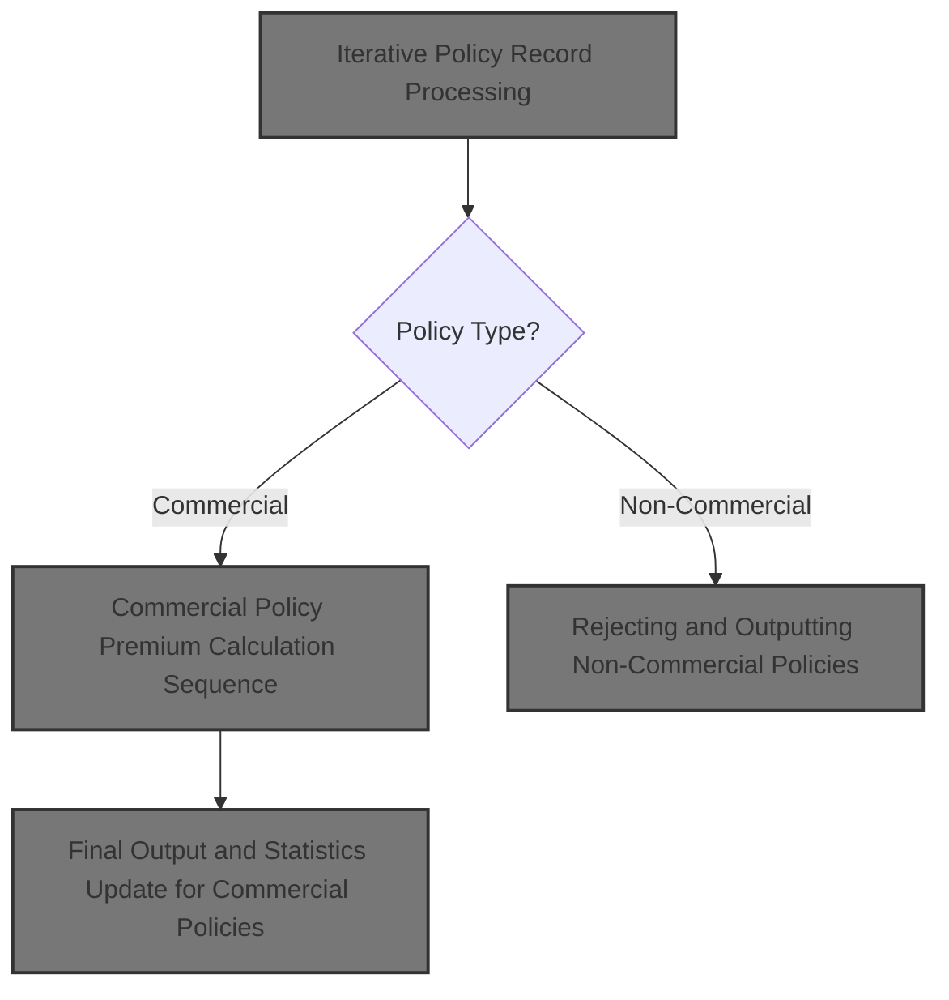

## Dependencies

### Programs

- <SwmToken path="base/src/lgapol01.cbl" pos="2:6:6" line-data="       PROGRAM-ID. LGAPOL01.">`LGAPOL01`</SwmToken> (<SwmPath>[base/src/lgapol01.cbl](base/src/lgapol01.cbl)</SwmPath>)
- <SwmToken path="base/src/lgapol01.cbl" pos="103:9:9" line-data="           EXEC CICS Link Program(LGAPDB01)">`LGAPDB01`</SwmToken> (<SwmPath>[base/src/LGAPDB01.cbl](base/src/LGAPDB01.cbl)</SwmPath>)
- <SwmToken path="base/src/LGAPDB01.cbl" pos="269:4:4" line-data="           CALL &#39;LGAPDB02&#39; USING IN-PROPERTY-TYPE, IN-POSTCODE, ">`LGAPDB02`</SwmToken>
- <SwmToken path="base/src/LGAPDB01.cbl" pos="276:4:4" line-data="           CALL &#39;LGAPDB03&#39; USING WS-BASE-RISK-SCR, IN-FIRE-PERIL, ">`LGAPDB03`</SwmToken> (<SwmPath>[base/src/LGAPDB03.cbl](base/src/LGAPDB03.cbl)</SwmPath>)
- <SwmToken path="base/src/LGAPDB01.cbl" pos="313:4:4" line-data="               CALL &#39;LGAPDB04&#39; USING LK-INPUT-DATA, LK-COVERAGE-DATA, ">`LGAPDB04`</SwmToken> (<SwmPath>[base/src/LGAPDB04.cbl](base/src/LGAPDB04.cbl)</SwmPath>)
- LGSTSQ (<SwmPath>[base/src/lgstsq.cbl](base/src/lgstsq.cbl)</SwmPath>)

### Copybooks

- SQLCA
- <SwmToken path="base/src/LGAPDB01.cbl" pos="35:3:3" line-data="           COPY INPUTREC2.">`INPUTREC2`</SwmToken> (<SwmPath>[base/src/INPUTREC2.cpy](base/src/INPUTREC2.cpy)</SwmPath>)
- OUTPUTREC (<SwmPath>[base/src/OUTPUTREC.cpy](base/src/OUTPUTREC.cpy)</SwmPath>)
- WORKSTOR (<SwmPath>[base/src/WORKSTOR.cpy](base/src/WORKSTOR.cpy)</SwmPath>)
- LGAPACT (<SwmPath>[base/src/LGAPACT.cpy](base/src/LGAPACT.cpy)</SwmPath>)
- LGCMAREA (<SwmPath>[base/src/lgcmarea.cpy](base/src/lgcmarea.cpy)</SwmPath>)

# Where is this program used?

This program is used multiple times in the codebase as represented in the following diagram:

```mermaid
graph TD
  sqkzy("Managing Commercial Policy Operations (LGTESTP4)") --> mbo8x("Processing and Inserting Policy Data (LGAPOL01)"):::currentEntity
click sqkzy openCode "base/src/lgtestp4.cbl:1"
inlai("House Policy Menu (LGTESTP3)") --> mbo8x("Processing and Inserting Policy Data (LGAPOL01)"):::currentEntity
click inlai openCode "base/src/lgtestp3.cbl:1"
i8jxd("Motor Policy Menu (LGTESTP1)") --> mbo8x("Processing and Inserting Policy Data (LGAPOL01)"):::currentEntity
click i8jxd openCode "base/src/lgtestp1.cbl:1"
urj5s("Endowment Policy Menu (LGTESTP2)") --> mbo8x("Processing and Inserting Policy Data (LGAPOL01)"):::currentEntity
click urj5s openCode "base/src/lgtestp2.cbl:1"
  
  
click mbo8x openCode "base/src/lgapol01.cbl:1"
    classDef currentEntity color:#000000,fill:#7CB9F4

%% Swimm:
%% graph TD
%%   sqkzy("Managing Commercial Policy Operations (LGTESTP4)") --> mbo8x("Processing and Inserting Policy Data (<SwmToken path="base/src/lgapol01.cbl" pos="2:6:6" line-data="       PROGRAM-ID. LGAPOL01.">`LGAPOL01`</SwmToken>)"):::currentEntity
%% click sqkzy openCode "<SwmPath>[base/src/lgtestp4.cbl](base/src/lgtestp4.cbl)</SwmPath>:1"
%% inlai("House Policy Menu (LGTESTP3)") --> mbo8x("Processing and Inserting Policy Data (<SwmToken path="base/src/lgapol01.cbl" pos="2:6:6" line-data="       PROGRAM-ID. LGAPOL01.">`LGAPOL01`</SwmToken>)"):::currentEntity
%% click inlai openCode "<SwmPath>[base/src/lgtestp3.cbl](base/src/lgtestp3.cbl)</SwmPath>:1"
%% i8jxd("Motor Policy Menu (LGTESTP1)") --> mbo8x("Processing and Inserting Policy Data (<SwmToken path="base/src/lgapol01.cbl" pos="2:6:6" line-data="       PROGRAM-ID. LGAPOL01.">`LGAPOL01`</SwmToken>)"):::currentEntity
%% click i8jxd openCode "<SwmPath>[base/src/lgtestp1.cbl](base/src/lgtestp1.cbl)</SwmPath>:1"
%% urj5s("Endowment Policy Menu (LGTESTP2)") --> mbo8x("Processing and Inserting Policy Data (<SwmToken path="base/src/lgapol01.cbl" pos="2:6:6" line-data="       PROGRAM-ID. LGAPOL01.">`LGAPOL01`</SwmToken>)"):::currentEntity
%% click urj5s openCode "<SwmPath>[base/src/lgtestp2.cbl](base/src/lgtestp2.cbl)</SwmPath>:1"
%%   
%%   
%% click mbo8x openCode "<SwmPath>[base/src/lgapol01.cbl](base/src/lgapol01.cbl)</SwmPath>:1"
%%     classDef currentEntity color:#000000,fill:#7CB9F4
```

## Detailed View of the Program's Functionality

# Transaction Context and Control Setup

At the beginning of the main procedure, the code sets up a control structure to hold transaction-specific identifiers and pointers. This includes initializing a control block, then copying the transaction ID, terminal ID, task number, and input data length from the system environment into this control block. This setup ensures that all subsequent logic can reference the current transaction's context and metadata.

Next, the code checks if any input data was provided to the transaction. If the input data length is zero, it prepares a detailed error message indicating that no input was received, triggers the error logging routine, and then forcibly ends the transaction with an abnormal termination code.

If input data is present, the code resets the return code to indicate success, sets a pointer to the input data area, and calculates the required minimum input length by adding a header length to a required length field. If the actual input data is shorter than required, it sets a specific error code and exits the transaction early.

If the input data passes these checks, the code delegates the main business logic to a separate program responsible for premium calculation, passing the input data area and specifying the maximum allowed length. After this delegation, the transaction is ended normally.

# Error Logging and Timestamping

When an error is detected (such as missing input data), the error logging routine is invoked. This routine first obtains the current system time and formats it into date and time strings using system services. These formatted values are then inserted into the error message structure.

The error message, now containing the timestamp and other details, is sent to a queue management program. This program is responsible for writing the error message to both a transient queue (for immediate system logging) and a persistent queue (for long-term error tracking). If the message originated from a transaction, it is processed directly; if it came from a queue, the program receives the message, adjusts its length, and sends a response back.

After logging the main error message, the routine checks if there is any input data present. If so, it sends up to 90 bytes of the input data to the queue management program for additional error tracking. If the input data is less than 91 bytes, all of it is sent; otherwise, only the first 90 bytes are included. This ensures that error context is preserved without exceeding queue size limits.

# Post-Error Handling and Input Validation

After error handling, the main procedure resets the return code and sets up pointers for further processing. It then checks if the incoming request is long enough to contain all required fields. If the request is too short, it sets an error code and exits.

If the request passes the length check, the code delegates to the premium calculation workflow program for further processing. Once this delegation is complete, the transaction is ended.

# Premium Calculation Workflow Entry

The premium calculation workflow begins by initializing the environment, loading configuration values, opening all necessary files (input, output, summary, configuration, and rate files), and writing headers to the output file.

Once setup is complete, the workflow processes each input record in a loop. For each record, it increments a counter, validates the input, and then either processes the record as valid or logs it as an error, depending on the results of validation. After all records are processed, the workflow closes all files, generates a summary report, and displays statistics.

# Iterative Policy Record Processing

For each input record, the workflow reads the record, checks for end-of-file, and increments the record count. It then validates the input record using a dedicated validation routine. If the record passes validation, it is processed as a valid record; otherwise, it is processed as an error record. This loop continues until all input records have been processed.

# Input Validation and Error Logging

The input validation routine checks several key fields in each record:

- It verifies that the policy type is one of the supported types (commercial, personal, or farm). If not, it logs an error.
- It checks that a customer number is provided; if missing, it logs an error.
- It ensures that at least one coverage limit is specified; if not, it logs an error.
- It checks that the total insured value does not exceed a maximum threshold; if it does, it logs a warning.

Each error or warning is logged by incrementing an error count and storing the error details in parallel arrays for later reporting.

# Valid Policy Record Handling

If a record is valid and of the commercial policy type, it is processed using the commercial policy workflow. This includes calculating risk scores, premiums, and updating statistics. If the record is not commercial, it is processed as a non-commercial record, which involves copying basic fields to the output and marking the record as unsupported.

# Commercial Policy Premium Calculation Sequence

For commercial policies, the workflow performs the following steps:

1. Calculates a risk score using an external program.
2. Performs a basic premium calculation by calling another external program, which uses risk and peril data to compute premiums and determine approval status.
3. If the policy is approved, it performs an advanced actuarial calculation using a specialized program. This step is only performed if the initial premium exceeds a minimum threshold.
4. Applies business rules to determine the final underwriting decision.
5. Writes the output record with all calculated fields.
6. Updates business statistics and counters for reporting.

## Basic Premium Calculation via External Program

The basic premium calculation is handled by an external program that receives risk scores and peril values. This program retrieves risk factors from a database (using defaults if the database is unavailable), determines the approval status based on the risk score, and calculates premiums for each peril type. If all peril types are present, a discount factor is applied; otherwise, standard factors are used. The total premium is the sum of all individual premiums.

## Advanced Actuarial Calculation for Approved Policies

If the initial premium is above the minimum threshold and the policy is approved, the workflow prepares all input and coverage data and calls the advanced actuarial calculation program. This program performs a series of calculations:

- Determines experience modifiers based on years in business and claims history.
- Applies schedule modifications based on building age, protection class, occupancy hazard, and exposure density.
- Calculates base premiums for each peril using exposures, rates, and modifiers.
- Adds catastrophe and expense loadings.
- Applies discounts for multi-peril coverage, claims-free history, and high deductibles, capping the total discount.
- Calculates taxes and finalizes the premium, capping the rate factor if necessary.

If the enhanced premium is higher than the initial premium, the workflow updates all premium components with the new values.

## Final Output and Statistics Update for Commercial Policies

After processing each commercial policy, the workflow updates statistics and counters. It increments totals for premiums and risk scores, and updates counters for approved, pending, and rejected policies based on the underwriting decision. High-risk cases are flagged if the risk score exceeds a certain threshold. These statistics are used for summary reporting and display at the end of processing.

# Rejecting and Outputting Non-Commercial Policies

For non-commercial policies, the workflow copies basic identifying fields from the input to the output, sets all premium and risk fields to zero, marks the status as unsupported, and writes a rejection reason indicating that only commercial policies are supported. This ensures that downstream systems can clearly identify records that were intentionally not processed for premium calculation.

# Rule Definition

| Paragraph Name                                                                                                                                                                                                                                                                                                                                                                                                                                                                                                                                                                                                                                                                                                                                                                             | Rule ID | Category          | Description                                                                                                                                                                                                                                                                                                                                                                                                                                              | Conditions                                 | Remarks                                                                                                                                                                                                                                                                                                                                                                                                                                                                                                                                                                                                                                                                                                                                                                                                                                                                                                                          |
| ------------------------------------------------------------------------------------------------------------------------------------------------------------------------------------------------------------------------------------------------------------------------------------------------------------------------------------------------------------------------------------------------------------------------------------------------------------------------------------------------------------------------------------------------------------------------------------------------------------------------------------------------------------------------------------------------------------------------------------------------------------------------------------------ | ------- | ----------------- | -------------------------------------------------------------------------------------------------------------------------------------------------------------------------------------------------------------------------------------------------------------------------------------------------------------------------------------------------------------------------------------------------------------------------------------------------------- | ------------------------------------------ | -------------------------------------------------------------------------------------------------------------------------------------------------------------------------------------------------------------------------------------------------------------------------------------------------------------------------------------------------------------------------------------------------------------------------------------------------------------------------------------------------------------------------------------------------------------------------------------------------------------------------------------------------------------------------------------------------------------------------------------------------------------------------------------------------------------------------------------------------------------------------------------------------------------------------------- |
| <SwmToken path="base/src/LGAPDB01.cbl" pos="182:3:9" line-data="               PERFORM P008-VALIDATE-INPUT-RECORD">`P008-VALIDATE-INPUT-RECORD`</SwmToken>, <SwmToken path="base/src/LGAPDB01.cbl" pos="201:3:7" line-data="               PERFORM P008A-LOG-ERROR WITH ">`P008A-LOG-ERROR`</SwmToken>                                                                                                                                                                                                                                                                                                                                                                                                                                                                                     | RL-001  | Conditional Logic | Each input policy record must be validated for required fields and business rules before processing. The policy type must be 'COMMERCIAL', 'PERSONAL', or 'FARM'. Any other value is invalid and triggers an error.                                                                                                                                                                                                                                      | Input record is being processed.           | Valid policy types: 'COMMERCIAL', 'PERSONAL', 'FARM'. Error severity: 'F' (fatal) for invalid policy type. Error message includes code, severity, field, and message.                                                                                                                                                                                                                                                                                                                                                                                                                                                                                                                                                                                                                                                                                                                                                            |
| <SwmToken path="base/src/LGAPDB01.cbl" pos="182:3:9" line-data="               PERFORM P008-VALIDATE-INPUT-RECORD">`P008-VALIDATE-INPUT-RECORD`</SwmToken>                                                                                                                                                                                                                                                                                                                                                                                                                                                                                                                                                                                                                                 | RL-002  | Conditional Logic | Peril indicators must be integers. Zero means peril is not present; any positive integer means peril is present.                                                                                                                                                                                                                                                                                                                                         | Input record is being processed.           | Peril indicators: <SwmToken path="base/src/LGAPDB01.cbl" pos="276:18:22" line-data="           CALL &#39;LGAPDB03&#39; USING WS-BASE-RISK-SCR, IN-FIRE-PERIL, ">`IN-FIRE-PERIL`</SwmToken>, <SwmToken path="base/src/LGAPDB01.cbl" pos="277:1:5" line-data="                                IN-CRIME-PERIL, IN-FLOOD-PERIL, ">`IN-CRIME-PERIL`</SwmToken>, <SwmToken path="base/src/LGAPDB01.cbl" pos="277:8:12" line-data="                                IN-CRIME-PERIL, IN-FLOOD-PERIL, ">`IN-FLOOD-PERIL`</SwmToken>, <SwmToken path="base/src/LGAPDB01.cbl" pos="278:1:5" line-data="                                IN-WEATHER-PERIL, WS-STAT,">`IN-WEATHER-PERIL`</SwmToken>. Must be integer values.                                                                                                                                                                                                                    |
| <SwmToken path="base/src/LGAPDB01.cbl" pos="182:3:9" line-data="               PERFORM P008-VALIDATE-INPUT-RECORD">`P008-VALIDATE-INPUT-RECORD`</SwmToken>                                                                                                                                                                                                                                                                                                                                                                                                                                                                                                                                                                                                                                 | RL-003  | Conditional Logic | At least one coverage limit (building, contents, BI) must be greater than zero. If all are zero, record is invalid and triggers an error.                                                                                                                                                                                                                                                                                                                | Input record is being processed.           | Coverage limits: <SwmToken path="base/src/LGAPDB01.cbl" pos="212:3:7" line-data="           IF IN-BUILDING-LIMIT = ZERO AND ">`IN-BUILDING-LIMIT`</SwmToken>, <SwmToken path="base/src/LGAPDB01.cbl" pos="213:1:5" line-data="              IN-CONTENTS-LIMIT = ZERO">`IN-CONTENTS-LIMIT`</SwmToken>, <SwmToken path="base/src/LGAPDB01.cbl" pos="220:1:5" line-data="              IN-BI-LIMIT &gt; WS-MAX-TIV">`IN-BI-LIMIT`</SwmToken>. Error severity: 'F' (fatal) if all are zero.                                                                                                                                                                                                                                                                                                                                                                                                                                          |
| <SwmToken path="base/src/LGAPDB01.cbl" pos="182:3:9" line-data="               PERFORM P008-VALIDATE-INPUT-RECORD">`P008-VALIDATE-INPUT-RECORD`</SwmToken>                                                                                                                                                                                                                                                                                                                                                                                                                                                                                                                                                                                                                                 | RL-004  | Conditional Logic | Sum of all coverage limits must not exceed $50,000,000. If exceeded, log a warning but continue processing.                                                                                                                                                                                                                                                                                                                                              | Input record is being processed.           | Maximum TIV: $50,000,000.00. Error severity: 'W' (warning) if exceeded.                                                                                                                                                                                                                                                                                                                                                                                                                                                                                                                                                                                                                                                                                                                                                                                                                                                          |
| <SwmToken path="base/src/LGAPDB01.cbl" pos="182:3:9" line-data="               PERFORM P008-VALIDATE-INPUT-RECORD">`P008-VALIDATE-INPUT-RECORD`</SwmToken>                                                                                                                                                                                                                                                                                                                                                                                                                                                                                                                                                                                                                                 | RL-005  | Conditional Logic | Customer number must be present and non-empty. If missing, record is invalid and triggers an error.                                                                                                                                                                                                                                                                                                                                                      | Input record is being processed.           | Customer number field must not be empty. Error severity: 'F' (fatal) if missing.                                                                                                                                                                                                                                                                                                                                                                                                                                                                                                                                                                                                                                                                                                                                                                                                                                                 |
| <SwmToken path="base/src/LGAPDB01.cbl" pos="239:3:9" line-data="               PERFORM P012-PROCESS-NON-COMMERCIAL">`P012-PROCESS-NON-COMMERCIAL`</SwmToken>                                                                                                                                                                                                                                                                                                                                                                                                                                                                                                                                                                                                                               | RL-006  | Data Assignment   | For non-commercial policies, output record must copy customer number, property type, postcode, set all premium and risk fields to zero, set <SwmToken path="base/src/LGAPDB01.cbl" pos="389:9:11" line-data="           MOVE &#39;UNSUPPORTED&#39; TO OUT-STATUS">`OUT-STATUS`</SwmToken> to 'UNSUPPORTED', and provide a reject reason.                                                                                                                 | Policy type is 'PERSONAL' or 'FARM'.       | Output fields: customer number, property type, postcode, risk score, premiums, status, reject reason. Status: 'UNSUPPORTED'. Reject reason: 'Only Commercial policies supported in this version'.                                                                                                                                                                                                                                                                                                                                                                                                                                                                                                                                                                                                                                                                                                                                |
| <SwmToken path="base/src/LGAPDB01.cbl" pos="236:3:7" line-data="               PERFORM P011-PROCESS-COMMERCIAL">`P011-PROCESS-COMMERCIAL`</SwmToken>, <SwmToken path="base/src/LGAPDB01.cbl" pos="259:3:9" line-data="           PERFORM P011A-CALCULATE-RISK-SCORE">`P011A-CALCULATE-RISK-SCORE`</SwmToken>, <SwmToken path="base/src/LGAPDB01.cbl" pos="260:3:9" line-data="           PERFORM P011B-BASIC-PREMIUM-CALC">`P011B-BASIC-PREMIUM-CALC`</SwmToken>, <SwmToken path="base/src/LGAPDB01.cbl" pos="262:3:9" line-data="               PERFORM P011C-ENHANCED-ACTUARIAL-CALC">`P011C-ENHANCED-ACTUARIAL-CALC`</SwmToken>, <SwmToken path="base/src/LGAPDB01.cbl" pos="264:3:9" line-data="           PERFORM P011D-APPLY-BUSINESS-RULES">`P011D-APPLY-BUSINESS-RULES`</SwmToken> | RL-007  | Computation       | For commercial policies, calculate risk score and premiums for each peril present using risk factors from <SwmToken path="base/src/LGAPDB03.cbl" pos="51:3:3" line-data="               FROM RISK_FACTORS">`RISK_FACTORS`</SwmToken> table. If risk factor not found, use default values. Apply discount if all perils present. If total premium exceeds $500, perform advanced actuarial calculation and update premium if enhanced premium is greater. | Policy type is 'COMMERCIAL'.               | Default risk factors: FIRE=<SwmToken path="base/src/LGAPDB03.cbl" pos="58:3:5" line-data="               MOVE 0.80 TO WS-FIRE-FACTOR">`0.80`</SwmToken>, CRIME=<SwmToken path="base/src/LGAPDB03.cbl" pos="70:3:5" line-data="               MOVE 0.60 TO WS-CRIME-FACTOR">`0.60`</SwmToken>, FLOOD=<SwmToken path="base/src/LGAPDB03.cbl" pos="16:15:17" line-data="       01  WS-FLOOD-FACTOR             PIC V99 VALUE 1.20.">`1.20`</SwmToken>, WEATHER=<SwmToken path="base/src/LGAPDB03.cbl" pos="99:3:5" line-data="             MOVE 0.90 TO LK-DISC-FACT">`0.90`</SwmToken>. Discount factor: <SwmToken path="base/src/LGAPDB03.cbl" pos="99:3:5" line-data="             MOVE 0.90 TO LK-DISC-FACT">`0.90`</SwmToken> if all perils present, else <SwmToken path="base/src/LGAPDB03.cbl" pos="93:3:5" line-data="           MOVE 1.00 TO LK-DISC-FACT">`1.00`</SwmToken>. Minimum premium for actuarial calc: $500.00. |
| <SwmToken path="base/src/LGAPDB04.cbl" pos="147:3:5" line-data="           PERFORM P900-DISC">`P900-DISC`</SwmToken>                                                                                                                                                                                                                                                                                                                                                                                                                                                                                                                                                                                                                                                                       | RL-008  | Computation       | Calculate discounts for multi-peril, claims-free, and deductible. Cap total discount at 25% of total premium.                                                                                                                                                                                                                                                                                                                                            | Premium calculation for commercial policy. | Maximum total discount: <SwmToken path="base/src/LGAPDB04.cbl" pos="447:11:13" line-data="           IF WS-TOTAL-DISCOUNT &gt; 0.250">`0.250`</SwmToken> (25%).                                                                                                                                                                                                                                                                                                                                                                                                                                                                                                                                                                                                                                                                                                                                                                  |
| <SwmToken path="base/src/LGAPDB04.cbl" pos="148:3:5" line-data="           PERFORM P950-TAXES">`P950-TAXES`</SwmToken>                                                                                                                                                                                                                                                                                                                                                                                                                                                                                                                                                                                                                                                                     | RL-009  | Computation       | Taxes must be added to the premium as per business rules.                                                                                                                                                                                                                                                                                                                                                                                                | Premium calculation for commercial policy. | Tax rate: 6.75%.                                                                                                                                                                                                                                                                                                                                                                                                                                                                                                                                                                                                                                                                                                                                                                                                                                                                                                                 |
| <SwmToken path="base/src/LGAPDB04.cbl" pos="149:3:5" line-data="           PERFORM P999-FINAL">`P999-FINAL`</SwmToken>                                                                                                                                                                                                                                                                                                                                                                                                                                                                                                                                                                                                                                                                     | RL-010  | Computation       | Final rate factor must be capped at <SwmToken path="base/src/LGAPDB04.cbl" pos="473:13:15" line-data="           IF LK-FINAL-RATE-FACTOR &gt; 0.050000">`0.050000`</SwmToken> if exceeded, and premium recalculated accordingly.                                                                                                                                                                                                                         | Premium calculation for commercial policy. | Maximum final rate factor: <SwmToken path="base/src/LGAPDB04.cbl" pos="473:13:15" line-data="           IF LK-FINAL-RATE-FACTOR &gt; 0.050000">`0.050000`</SwmToken>.                                                                                                                                                                                                                                                                                                                                                                                                                                                                                                                                                                                                                                                                                                                                                            |
| <SwmToken path="base/src/LGAPDB01.cbl" pos="265:3:9" line-data="           PERFORM P011E-WRITE-OUTPUT-RECORD">`P011E-WRITE-OUTPUT-RECORD`</SwmToken>, <SwmToken path="base/src/LGAPDB01.cbl" pos="186:3:9" line-data="                   PERFORM P010-PROCESS-ERROR-RECORD">`P010-PROCESS-ERROR-RECORD`</SwmToken>, <SwmToken path="base/src/LGAPDB01.cbl" pos="239:3:9" line-data="               PERFORM P012-PROCESS-NON-COMMERCIAL">`P012-PROCESS-NON-COMMERCIAL`</SwmToken>                                                                                                                                                                                                                                                                                                           | RL-011  | Data Assignment   | Output records must include all specified fields, with <SwmToken path="base/src/LGAPDB01.cbl" pos="389:9:11" line-data="           MOVE &#39;UNSUPPORTED&#39; TO OUT-STATUS">`OUT-STATUS`</SwmToken> set to 'APPROVED', 'PENDING', 'REJECTED', 'ERROR', or 'UNSUPPORTED' as appropriate.                                                                                                                                                                 | Any output record is written.              | Output fields: customer number, property type, postcode, risk score, premiums, status, reject reason. Fixed-length fields as per spec.                                                                                                                                                                                                                                                                                                                                                                                                                                                                                                                                                                                                                                                                                                                                                                                           |
| <SwmToken path="base/src/lgapol01.cbl" pos="85:3:5" line-data="               PERFORM P999-ERROR">`P999-ERROR`</SwmToken>, <SwmToken path="base/src/LGAPDB01.cbl" pos="201:3:7" line-data="               PERFORM P008A-LOG-ERROR WITH ">`P008A-LOG-ERROR`</SwmToken>                                                                                                                                                                                                                                                                                                                                                                                                                                                                                                                      | RL-012  | Data Assignment   | Error messages must include date (MMDDYYYY), time (HHMMSS), program name, error detail, and optionally up to 90 bytes of input data if available. Errors must be logged with severity 'F' for missing required fields or invalid policy type, and 'W' for coverage exceeding maximum TIV.                                                                                                                                                                | Error occurs during processing.            | Error message format: date (8 chars), time (6 chars), program name (9 chars), error detail (21 chars), input data (up to 90 bytes). Severity: 'F' (fatal), 'W' (warning).                                                                                                                                                                                                                                                                                                                                                                                                                                                                                                                                                                                                                                                                                                                                                        |
| <SwmToken path="base/src/lgapol01.cbl" pos="85:3:5" line-data="               PERFORM P999-ERROR">`P999-ERROR`</SwmToken>, LGSTSQ, <SwmToken path="base/src/lgapol01.cbl" pos="103:9:9" line-data="           EXEC CICS Link Program(LGAPDB01)">`LGAPDB01`</SwmToken>, <SwmToken path="base/src/LGAPDB01.cbl" pos="276:4:4" line-data="           CALL &#39;LGAPDB03&#39; USING WS-BASE-RISK-SCR, IN-FIRE-PERIL, ">`LGAPDB03`</SwmToken>, <SwmToken path="base/src/LGAPDB01.cbl" pos="313:4:4" line-data="               CALL &#39;LGAPDB04&#39; USING LK-INPUT-DATA, LK-COVERAGE-DATA, ">`LGAPDB04`</SwmToken>                                                                                                                                                                            | RL-013  | Conditional Logic | Queue writing and database access may be stubbed out in the implementation, with placeholder functions for these operations.                                                                                                                                                                                                                                                                                                                             | Queue or database operation is invoked.    | Operations are stubbed; no actual data written/read. Placeholder functions used.                                                                                                                                                                                                                                                                                                                                                                                                                                                                                                                                                                                                                                                                                                                                                                                                                                                 |

# User Stories

## User Story 1: Validate input policy records

---

### Story Description:

As a system, I want to validate each input policy record for required fields and business rules so that only valid records are processed and errors are handled appropriately.

---

### Business Rule Mapping:

| Rule ID | Paragraph Name                                                                                                                                                                                                                                                                                         | Rule Description                                                                                                                                                                                                    |
| ------- | ------------------------------------------------------------------------------------------------------------------------------------------------------------------------------------------------------------------------------------------------------------------------------------------------------ | ------------------------------------------------------------------------------------------------------------------------------------------------------------------------------------------------------------------- |
| RL-001  | <SwmToken path="base/src/LGAPDB01.cbl" pos="182:3:9" line-data="               PERFORM P008-VALIDATE-INPUT-RECORD">`P008-VALIDATE-INPUT-RECORD`</SwmToken>, <SwmToken path="base/src/LGAPDB01.cbl" pos="201:3:7" line-data="               PERFORM P008A-LOG-ERROR WITH ">`P008A-LOG-ERROR`</SwmToken> | Each input policy record must be validated for required fields and business rules before processing. The policy type must be 'COMMERCIAL', 'PERSONAL', or 'FARM'. Any other value is invalid and triggers an error. |
| RL-002  | <SwmToken path="base/src/LGAPDB01.cbl" pos="182:3:9" line-data="               PERFORM P008-VALIDATE-INPUT-RECORD">`P008-VALIDATE-INPUT-RECORD`</SwmToken>                                                                                                                                             | Peril indicators must be integers. Zero means peril is not present; any positive integer means peril is present.                                                                                                    |
| RL-003  | <SwmToken path="base/src/LGAPDB01.cbl" pos="182:3:9" line-data="               PERFORM P008-VALIDATE-INPUT-RECORD">`P008-VALIDATE-INPUT-RECORD`</SwmToken>                                                                                                                                             | At least one coverage limit (building, contents, BI) must be greater than zero. If all are zero, record is invalid and triggers an error.                                                                           |
| RL-004  | <SwmToken path="base/src/LGAPDB01.cbl" pos="182:3:9" line-data="               PERFORM P008-VALIDATE-INPUT-RECORD">`P008-VALIDATE-INPUT-RECORD`</SwmToken>                                                                                                                                             | Sum of all coverage limits must not exceed $50,000,000. If exceeded, log a warning but continue processing.                                                                                                         |
| RL-005  | <SwmToken path="base/src/LGAPDB01.cbl" pos="182:3:9" line-data="               PERFORM P008-VALIDATE-INPUT-RECORD">`P008-VALIDATE-INPUT-RECORD`</SwmToken>                                                                                                                                             | Customer number must be present and non-empty. If missing, record is invalid and triggers an error.                                                                                                                 |

---

### Relevant Functionality:

- <SwmToken path="base/src/LGAPDB01.cbl" pos="182:3:9" line-data="               PERFORM P008-VALIDATE-INPUT-RECORD">`P008-VALIDATE-INPUT-RECORD`</SwmToken>
  1. **RL-001:**
     - If policy type is not one of the valid values:
       - Log error with code <SwmToken path="base/src/LGAPDB01.cbl" pos="202:2:2" line-data="                   &#39;POL001&#39; &#39;F&#39; &#39;IN-POLICY-TYPE&#39; ">`POL001`</SwmToken>, severity 'F', field <SwmToken path="base/src/LGAPDB01.cbl" pos="202:10:14" line-data="                   &#39;POL001&#39; &#39;F&#39; &#39;IN-POLICY-TYPE&#39; ">`IN-POLICY-TYPE`</SwmToken>, message 'Invalid Policy Type'.
       - Mark record as error.
  2. **RL-002:**
     - For each peril indicator:
       - If not integer, log error.
       - If zero, peril not present.
       - If >0, peril present.
  3. **RL-003:**
     - If all coverage limits are zero:
       - Log error with code <SwmToken path="base/src/LGAPDB01.cbl" pos="215:2:2" line-data="                   &#39;COV001&#39; &#39;F&#39; &#39;COVERAGE-LIMITS&#39; ">`COV001`</SwmToken>, severity 'F', field <SwmToken path="base/src/LGAPDB01.cbl" pos="215:10:12" line-data="                   &#39;COV001&#39; &#39;F&#39; &#39;COVERAGE-LIMITS&#39; ">`COVERAGE-LIMITS`</SwmToken>, message 'At least one coverage limit required'.
       - Mark record as error.
  4. **RL-004:**
     - If sum of coverage limits > $50,000,000:
       - Log warning with code <SwmToken path="base/src/LGAPDB01.cbl" pos="222:2:2" line-data="                   &#39;COV002&#39; &#39;W&#39; &#39;COVERAGE-LIMITS&#39; ">`COV002`</SwmToken>, severity 'W', field <SwmToken path="base/src/LGAPDB01.cbl" pos="215:10:12" line-data="                   &#39;COV001&#39; &#39;F&#39; &#39;COVERAGE-LIMITS&#39; ">`COVERAGE-LIMITS`</SwmToken>, message 'Total coverage exceeds maximum TIV'.
       - Continue processing.
  5. **RL-005:**
     - If customer number is empty:
       - Log error with code <SwmToken path="base/src/LGAPDB01.cbl" pos="208:2:2" line-data="                   &#39;CUS001&#39; &#39;F&#39; &#39;IN-CUSTOMER-NUM&#39; ">`CUS001`</SwmToken>, severity 'F', field <SwmToken path="base/src/LGAPDB01.cbl" pos="206:3:7" line-data="           IF IN-CUSTOMER-NUM = SPACES">`IN-CUSTOMER-NUM`</SwmToken>, message 'Customer Number Required'.
       - Mark record as error.

## User Story 2: Calculate commercial policy premiums and apply business rules

---

### Story Description:

As a user submitting a commercial policy, I want the system to calculate risk scores and premiums for each peril, apply discounts, taxes, and caps, and perform advanced actuarial calculations if needed so that I receive an accurate and compliant premium quote.

---

### Business Rule Mapping:

| Rule ID | Paragraph Name                                                                                                                                                                                                                                                                                                                                                                                                                                                                                                                                                                                                                                                                                                                                                                             | Rule Description                                                                                                                                                                                                                                                                                                                                                                                                                                         |
| ------- | ------------------------------------------------------------------------------------------------------------------------------------------------------------------------------------------------------------------------------------------------------------------------------------------------------------------------------------------------------------------------------------------------------------------------------------------------------------------------------------------------------------------------------------------------------------------------------------------------------------------------------------------------------------------------------------------------------------------------------------------------------------------------------------------ | -------------------------------------------------------------------------------------------------------------------------------------------------------------------------------------------------------------------------------------------------------------------------------------------------------------------------------------------------------------------------------------------------------------------------------------------------------- |
| RL-007  | <SwmToken path="base/src/LGAPDB01.cbl" pos="236:3:7" line-data="               PERFORM P011-PROCESS-COMMERCIAL">`P011-PROCESS-COMMERCIAL`</SwmToken>, <SwmToken path="base/src/LGAPDB01.cbl" pos="259:3:9" line-data="           PERFORM P011A-CALCULATE-RISK-SCORE">`P011A-CALCULATE-RISK-SCORE`</SwmToken>, <SwmToken path="base/src/LGAPDB01.cbl" pos="260:3:9" line-data="           PERFORM P011B-BASIC-PREMIUM-CALC">`P011B-BASIC-PREMIUM-CALC`</SwmToken>, <SwmToken path="base/src/LGAPDB01.cbl" pos="262:3:9" line-data="               PERFORM P011C-ENHANCED-ACTUARIAL-CALC">`P011C-ENHANCED-ACTUARIAL-CALC`</SwmToken>, <SwmToken path="base/src/LGAPDB01.cbl" pos="264:3:9" line-data="           PERFORM P011D-APPLY-BUSINESS-RULES">`P011D-APPLY-BUSINESS-RULES`</SwmToken> | For commercial policies, calculate risk score and premiums for each peril present using risk factors from <SwmToken path="base/src/LGAPDB03.cbl" pos="51:3:3" line-data="               FROM RISK_FACTORS">`RISK_FACTORS`</SwmToken> table. If risk factor not found, use default values. Apply discount if all perils present. If total premium exceeds $500, perform advanced actuarial calculation and update premium if enhanced premium is greater. |
| RL-008  | <SwmToken path="base/src/LGAPDB04.cbl" pos="147:3:5" line-data="           PERFORM P900-DISC">`P900-DISC`</SwmToken>                                                                                                                                                                                                                                                                                                                                                                                                                                                                                                                                                                                                                                                                       | Calculate discounts for multi-peril, claims-free, and deductible. Cap total discount at 25% of total premium.                                                                                                                                                                                                                                                                                                                                            |
| RL-010  | <SwmToken path="base/src/LGAPDB04.cbl" pos="149:3:5" line-data="           PERFORM P999-FINAL">`P999-FINAL`</SwmToken>                                                                                                                                                                                                                                                                                                                                                                                                                                                                                                                                                                                                                                                                     | Final rate factor must be capped at <SwmToken path="base/src/LGAPDB04.cbl" pos="473:13:15" line-data="           IF LK-FINAL-RATE-FACTOR &gt; 0.050000">`0.050000`</SwmToken> if exceeded, and premium recalculated accordingly.                                                                                                                                                                                                                         |
| RL-009  | <SwmToken path="base/src/LGAPDB04.cbl" pos="148:3:5" line-data="           PERFORM P950-TAXES">`P950-TAXES`</SwmToken>                                                                                                                                                                                                                                                                                                                                                                                                                                                                                                                                                                                                                                                                     | Taxes must be added to the premium as per business rules.                                                                                                                                                                                                                                                                                                                                                                                                |

---

### Relevant Functionality:

- <SwmToken path="base/src/LGAPDB01.cbl" pos="236:3:7" line-data="               PERFORM P011-PROCESS-COMMERCIAL">`P011-PROCESS-COMMERCIAL`</SwmToken>
  1. **RL-007:**
     - Calculate risk score.
     - For each peril present, get risk factor from table or use default.
     - If all peril indicators >0, set discount factor to <SwmToken path="base/src/LGAPDB03.cbl" pos="99:3:5" line-data="             MOVE 0.90 TO LK-DISC-FACT">`0.90`</SwmToken>, else <SwmToken path="base/src/LGAPDB03.cbl" pos="93:3:5" line-data="           MOVE 1.00 TO LK-DISC-FACT">`1.00`</SwmToken>.
     - Calculate premium for each peril.
     - Sum premiums for total premium.
     - If total premium > $500:
       - Call actuarial calculation.
       - If enhanced premium > initial premium, update premium fields.
- <SwmToken path="base/src/LGAPDB04.cbl" pos="147:3:5" line-data="           PERFORM P900-DISC">`P900-DISC`</SwmToken>
  1. **RL-008:**
     - Calculate multi-peril discount.
     - Calculate claims-free discount.
     - Calculate deductible credit.
     - Sum discounts.
     - If total discount > <SwmToken path="base/src/LGAPDB04.cbl" pos="447:11:13" line-data="           IF WS-TOTAL-DISCOUNT &gt; 0.250">`0.250`</SwmToken>, cap at <SwmToken path="base/src/LGAPDB04.cbl" pos="447:11:13" line-data="           IF WS-TOTAL-DISCOUNT &gt; 0.250">`0.250`</SwmToken>.
- <SwmToken path="base/src/LGAPDB04.cbl" pos="149:3:5" line-data="           PERFORM P999-FINAL">`P999-FINAL`</SwmToken>
  1. **RL-010:**
     - Calculate final rate factor as total premium / total insured value.
     - If final rate factor > <SwmToken path="base/src/LGAPDB04.cbl" pos="473:13:15" line-data="           IF LK-FINAL-RATE-FACTOR &gt; 0.050000">`0.050000`</SwmToken>:
       - Set final rate factor to <SwmToken path="base/src/LGAPDB04.cbl" pos="473:13:15" line-data="           IF LK-FINAL-RATE-FACTOR &gt; 0.050000">`0.050000`</SwmToken>.
       - Recalculate total premium as total insured value \* final rate factor.
- <SwmToken path="base/src/LGAPDB04.cbl" pos="148:3:5" line-data="           PERFORM P950-TAXES">`P950-TAXES`</SwmToken>
  1. **RL-009:**
     - Calculate tax as 6.75% of (base amount + cat load + expense load + profit load - discount).
     - Add tax to premium.

## User Story 3: Generate output and error records, including non-commercial policies and stubbed operations

---

### Story Description:

As a system, I want to generate output and error records for all policy types, assign correct status and reject reasons, format error messages, and stub queue/database operations so that users and operators receive clear, actionable, and compliant information, and the implementation can be tested without actual data persistence.

---

### Business Rule Mapping:

| Rule ID | Paragraph Name                                                                                                                                                                                                                                                                                                                                                                                                                                                                                                                                                                                                  | Rule Description                                                                                                                                                                                                                                                                                                                         |
| ------- | --------------------------------------------------------------------------------------------------------------------------------------------------------------------------------------------------------------------------------------------------------------------------------------------------------------------------------------------------------------------------------------------------------------------------------------------------------------------------------------------------------------------------------------------------------------------------------------------------------------- | ---------------------------------------------------------------------------------------------------------------------------------------------------------------------------------------------------------------------------------------------------------------------------------------------------------------------------------------- |
| RL-012  | <SwmToken path="base/src/lgapol01.cbl" pos="85:3:5" line-data="               PERFORM P999-ERROR">`P999-ERROR`</SwmToken>, <SwmToken path="base/src/LGAPDB01.cbl" pos="201:3:7" line-data="               PERFORM P008A-LOG-ERROR WITH ">`P008A-LOG-ERROR`</SwmToken>                                                                                                                                                                                                                                                                                                                                           | Error messages must include date (MMDDYYYY), time (HHMMSS), program name, error detail, and optionally up to 90 bytes of input data if available. Errors must be logged with severity 'F' for missing required fields or invalid policy type, and 'W' for coverage exceeding maximum TIV.                                                |
| RL-013  | <SwmToken path="base/src/lgapol01.cbl" pos="85:3:5" line-data="               PERFORM P999-ERROR">`P999-ERROR`</SwmToken>, LGSTSQ, <SwmToken path="base/src/lgapol01.cbl" pos="103:9:9" line-data="           EXEC CICS Link Program(LGAPDB01)">`LGAPDB01`</SwmToken>, <SwmToken path="base/src/LGAPDB01.cbl" pos="276:4:4" line-data="           CALL &#39;LGAPDB03&#39; USING WS-BASE-RISK-SCR, IN-FIRE-PERIL, ">`LGAPDB03`</SwmToken>, <SwmToken path="base/src/LGAPDB01.cbl" pos="313:4:4" line-data="               CALL &#39;LGAPDB04&#39; USING LK-INPUT-DATA, LK-COVERAGE-DATA, ">`LGAPDB04`</SwmToken> | Queue writing and database access may be stubbed out in the implementation, with placeholder functions for these operations.                                                                                                                                                                                                             |
| RL-006  | <SwmToken path="base/src/LGAPDB01.cbl" pos="239:3:9" line-data="               PERFORM P012-PROCESS-NON-COMMERCIAL">`P012-PROCESS-NON-COMMERCIAL`</SwmToken>                                                                                                                                                                                                                                                                                                                                                                                                                                                    | For non-commercial policies, output record must copy customer number, property type, postcode, set all premium and risk fields to zero, set <SwmToken path="base/src/LGAPDB01.cbl" pos="389:9:11" line-data="           MOVE &#39;UNSUPPORTED&#39; TO OUT-STATUS">`OUT-STATUS`</SwmToken> to 'UNSUPPORTED', and provide a reject reason. |
| RL-011  | <SwmToken path="base/src/LGAPDB01.cbl" pos="265:3:9" line-data="           PERFORM P011E-WRITE-OUTPUT-RECORD">`P011E-WRITE-OUTPUT-RECORD`</SwmToken>, <SwmToken path="base/src/LGAPDB01.cbl" pos="186:3:9" line-data="                   PERFORM P010-PROCESS-ERROR-RECORD">`P010-PROCESS-ERROR-RECORD`</SwmToken>, <SwmToken path="base/src/LGAPDB01.cbl" pos="239:3:9" line-data="               PERFORM P012-PROCESS-NON-COMMERCIAL">`P012-PROCESS-NON-COMMERCIAL`</SwmToken>                                                                                                                                | Output records must include all specified fields, with <SwmToken path="base/src/LGAPDB01.cbl" pos="389:9:11" line-data="           MOVE &#39;UNSUPPORTED&#39; TO OUT-STATUS">`OUT-STATUS`</SwmToken> set to 'APPROVED', 'PENDING', 'REJECTED', 'ERROR', or 'UNSUPPORTED' as appropriate.                                                 |

---

### Relevant Functionality:

- <SwmToken path="base/src/lgapol01.cbl" pos="85:3:5" line-data="               PERFORM P999-ERROR">`P999-ERROR`</SwmToken>
  1. **RL-012:**
     - On error:
       - Format error message with date, time, program name, detail.
       - If input data available, include up to 90 bytes.
       - Log error with appropriate severity.
  2. **RL-013:**
     - When queue/database operation is called:
       - Invoke placeholder function.
       - No actual data written/read.
- <SwmToken path="base/src/LGAPDB01.cbl" pos="239:3:9" line-data="               PERFORM P012-PROCESS-NON-COMMERCIAL">`P012-PROCESS-NON-COMMERCIAL`</SwmToken>
  1. **RL-006:**
     - Copy customer number, property type, postcode to output.
     - Set risk score and all premiums to zero.
     - Set status to 'UNSUPPORTED'.
     - Set reject reason to specified message.
     - Write output record.
- <SwmToken path="base/src/LGAPDB01.cbl" pos="265:3:9" line-data="           PERFORM P011E-WRITE-OUTPUT-RECORD">`P011E-WRITE-OUTPUT-RECORD`</SwmToken>
  1. **RL-011:**
     - Assign output fields from input and computed values.
     - Set <SwmToken path="base/src/LGAPDB01.cbl" pos="389:9:11" line-data="           MOVE &#39;UNSUPPORTED&#39; TO OUT-STATUS">`OUT-STATUS`</SwmToken> according to business logic.
     - Write output record with fixed-length fields.

# Workflow

# Starting Transaction Context and Control Setup

This section ensures that every transaction begins with a properly set context, allowing subsequent business logic to access transaction-specific information. It also enforces that transactions without input data are logged and terminated to maintain data integrity and traceability.

| Category        | Rule Name                          | Description                                                                                                                                                     |
| --------------- | ---------------------------------- | --------------------------------------------------------------------------------------------------------------------------------------------------------------- |
| Data validation | Input data presence enforcement    | If no input data is received (input data length is zero), the transaction must log an error message and halt further processing.                                |
| Business logic  | Transaction context initialization | The transaction context must be initialized with the current transaction ID, terminal ID, task number, and input data length at the start of every transaction. |

<SwmSnippet path="/base/src/lgapol01.cbl" line="68">

---

We start by setting up the transaction context so downstream logic can reference transaction-specific data.

```cobol
       P100-MAIN SECTION.

      *----------------------------------------------------------------*
      * Common code                                                    *
      *----------------------------------------------------------------*
           INITIALIZE W1-CONTROL.
           MOVE EIBTRNID TO W1-TID.
           MOVE EIBTRMID TO W1-TRM.
           MOVE EIBTASKN TO W1-TSK.
           MOVE EIBCALEN TO W1-LEN.
```

---

</SwmSnippet>

<SwmSnippet path="/base/src/lgapol01.cbl" line="83">

---

If there's no input data, we log the error and halt the transaction.

```cobol
           IF EIBCALEN IS EQUAL TO ZERO
               MOVE ' NO COMMAREA RECEIVED' TO W3-DETAIL
               PERFORM P999-ERROR
               EXEC CICS ABEND ABCODE('LGCA') NODUMP END-EXEC
           END-IF
```

---

</SwmSnippet>

## Error Logging and Timestamping

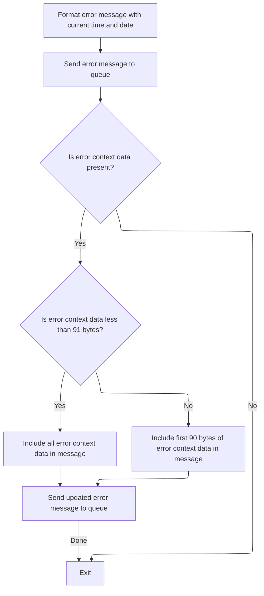

This section ensures that all errors are logged with an accurate timestamp and that relevant error context data is captured and sent to error tracking queues. It supports auditability and troubleshooting by providing detailed, time-stamped error records.

| Category       | Rule Name                    | Description                                                                                                                                                                                                                          |
| -------------- | ---------------------------- | ------------------------------------------------------------------------------------------------------------------------------------------------------------------------------------------------------------------------------------ |
| Business logic | Error message timestamping   | Every error message must include the current date and time, formatted as MMDDYYYY and HHMMSS, to ensure accurate timestamping for audit and tracking purposes.                                                                       |
| Business logic | Dual queue error logging     | All error messages must be sent to both a transient queue and a persistent queue to ensure that errors are tracked reliably and are available for both immediate and long-term review.                                               |
| Business logic | Error context data inclusion | If error context data is present, include up to the first 90 bytes of this data in a secondary error message for additional tracking. If the context data is less than 91 bytes, include all of it; otherwise, truncate to 90 bytes. |
| Business logic | No context data exit         | If no error context data is present, do not send a secondary error message and exit the error logging process after the main error message is logged.                                                                                |
| Business logic | Queue name adjustment        | If the error message starts with 'Q=', the queue name must be adjusted to use the next four characters as the queue extension, and the message content must be updated accordingly.                                                  |

<SwmSnippet path="/base/src/lgapol01.cbl" line="119">

---

In <SwmToken path="base/src/lgapol01.cbl" pos="119:1:3" line-data="       P999-ERROR.">`P999-ERROR`</SwmToken>, we grab the current system time and format it into date and time strings using CICS ASKTIME and FORMATTIME. This timestamp is used for error logging.

```cobol
       P999-ERROR.
      * Save SQLCODE in message
      * Obtain and format current time and date
           EXEC CICS ASKTIME ABSTIME(W2-TIME)
           END-EXEC
           EXEC CICS FORMATTIME ABSTIME(W2-TIME)
                     MMDDYYYY(W2-DATE1)
                     TIME(W2-DATE2)
           END-EXEC
```

---

</SwmSnippet>

<SwmSnippet path="/base/src/lgapol01.cbl" line="128">

---

Here we prep the error message with the current timestamp and call LGSTSQ to log it. LGSTSQ handles writing the message to the appropriate queues for error tracking.

```cobol
           MOVE W2-DATE1 TO W3-DATE
           MOVE W2-DATE2 TO W3-TIME
      * Write output message to TDQ
           EXEC CICS LINK PROGRAM('LGSTSQ')
                     COMMAREA(W3-MESSAGE)
                     LENGTH(LENGTH OF W3-MESSAGE)
           END-EXEC.
```

---

</SwmSnippet>

<SwmSnippet path="/base/src/lgstsq.cbl" line="55">

---

<SwmToken path="base/src/lgstsq.cbl" pos="55:1:1" line-data="       MAINLINE SECTION.">`MAINLINE`</SwmToken> in LGSTSQ figures out if the message came from another program or a transaction, tweaks the queue name if the message starts with 'Q=', and writes the message to both a transient and a persistent queue. If the message was received via CICS RECEIVE, it sends a response back.

```cobol
       MAINLINE SECTION.

           MOVE SPACES TO WRITE-MSG.
           MOVE SPACES TO WS-RECV.

           EXEC CICS ASSIGN SYSID(WRITE-MSG-SYSID)
                RESP(WS-RESP)
           END-EXEC.

           EXEC CICS ASSIGN INVOKINGPROG(WS-INVOKEPROG)
                RESP(WS-RESP)
           END-EXEC.
           
           IF WS-INVOKEPROG NOT = SPACES
              MOVE 'C' To WS-FLAG
              MOVE COMMA-DATA  TO WRITE-MSG-MSG
              MOVE EIBCALEN    TO WS-RECV-LEN
           ELSE
              EXEC CICS RECEIVE INTO(WS-RECV)
                  LENGTH(WS-RECV-LEN)
                  RESP(WS-RESP)
              END-EXEC
              MOVE 'R' To WS-FLAG
              MOVE WS-RECV-DATA  TO WRITE-MSG-MSG
              SUBTRACT 5 FROM WS-RECV-LEN
           END-IF.

           MOVE 'GENAERRS' TO STSQ-NAME.
           IF WRITE-MSG-MSG(1:2) = 'Q=' THEN
              MOVE WRITE-MSG-MSG(3:4) TO STSQ-EXT
              MOVE WRITE-MSG-REST TO TEMPO
              MOVE TEMPO          TO WRITE-MSG-MSG
              SUBTRACT 7 FROM WS-RECV-LEN
           END-IF.

           ADD 5 TO WS-RECV-LEN.

      * Write output message to TDQ CSMT
      *
           EXEC CICS WRITEQ TD QUEUE(STDQ-NAME)
                     FROM(WRITE-MSG)
                     RESP(WS-RESP)
                     LENGTH(WS-RECV-LEN)

           END-EXEC.

      * Write output message to Genapp TSQ
      * If no space is available then the task will not wait for
      *  storage to become available but will ignore the request...
      *
           EXEC CICS WRITEQ TS QUEUE(STSQ-NAME)
                     FROM(WRITE-MSG)
                     RESP(WS-RESP)
                     NOSUSPEND
                     LENGTH(WS-RECV-LEN)

           END-EXEC.

           If WS-FLAG = 'R' Then
             EXEC CICS SEND TEXT FROM(FILLER-X)
              WAIT
              ERASE
              LENGTH(1)
              FREEKB
             END-EXEC.

           EXEC CICS RETURN
           END-EXEC.
```

---

</SwmSnippet>

<SwmSnippet path="/base/src/lgapol01.cbl" line="136">

---

Back in <SwmToken path="base/src/lgapol01.cbl" pos="85:3:5" line-data="               PERFORM P999-ERROR">`P999-ERROR`</SwmToken>, after logging the main error, we check the commarea length and send up to 90 bytes of it to LGSTSQ for additional error tracking. This keeps the message within the queue's size limits.

```cobol
           IF EIBCALEN > 0 THEN
             IF EIBCALEN < 91 THEN
               MOVE DFHCOMMAREA(1:EIBCALEN) TO CA-DATA
               EXEC CICS LINK PROGRAM('LGSTSQ')
                         COMMAREA(CA-ERROR-MSG)
                         LENGTH(LENGTH OF CA-ERROR-MSG)
               END-EXEC
             ELSE
               MOVE DFHCOMMAREA(1:90) TO CA-DATA
               EXEC CICS LINK PROGRAM('LGSTSQ')
                         COMMAREA(CA-ERROR-MSG)
                         LENGTH(LENGTH OF CA-ERROR-MSG)
               END-EXEC
             END-IF
           END-IF.
           EXIT.
```

---

</SwmSnippet>

## Post-Error Handling and Input Validation

```mermaid
%%{init: {"flowchart": {"defaultRenderer": "elk"}} }%%
flowchart TD
    node1["Start: Prepare request and set CA-RETURN-CODE to '00'"] --> node2{"Is incoming request length (EIBCALEN) < required length (W4-REQ-LEN)?"}
    click node1 openCode "base/src/lgapol01.cbl:89:92"
    node2 -->|"Yes"| node3["Set CA-RETURN-CODE to '98' and return (reject request)"]
    click node2 openCode "base/src/lgapol01.cbl:95:98"
    click node3 openCode "base/src/lgapol01.cbl:96:98"
    node2 -->|"No"| node4["Delegate to LGAPDB01 for main business processing"]
    click node4 openCode "base/src/lgapol01.cbl:103:106"
    node4 --> node5["Return (end of processing)"]
    click node5 openCode "base/src/lgapol01.cbl:108:108"

classDef HeadingStyle fill:#777777,stroke:#333,stroke-width:2px;

%% Swimm:
%% %%{init: {"flowchart": {"defaultRenderer": "elk"}} }%%
%% flowchart TD
%%     node1["Start: Prepare request and set <SwmToken path="base/src/lgapol01.cbl" pos="89:9:13" line-data="           MOVE &#39;00&#39; TO CA-RETURN-CODE">`CA-RETURN-CODE`</SwmToken> to '00'"] --> node2{"Is incoming request length (EIBCALEN) < required length (<SwmToken path="base/src/lgapol01.cbl" pos="92:11:15" line-data="           ADD W4-HDR-LEN TO W4-REQ-LEN">`W4-REQ-LEN`</SwmToken>)?"}
%%     click node1 openCode "<SwmPath>[base/src/lgapol01.cbl](base/src/lgapol01.cbl)</SwmPath>:89:92"
%%     node2 -->|"Yes"| node3["Set <SwmToken path="base/src/lgapol01.cbl" pos="89:9:13" line-data="           MOVE &#39;00&#39; TO CA-RETURN-CODE">`CA-RETURN-CODE`</SwmToken> to '98' and return (reject request)"]
%%     click node2 openCode "<SwmPath>[base/src/lgapol01.cbl](base/src/lgapol01.cbl)</SwmPath>:95:98"
%%     click node3 openCode "<SwmPath>[base/src/lgapol01.cbl](base/src/lgapol01.cbl)</SwmPath>:96:98"
%%     node2 -->|"No"| node4["Delegate to <SwmToken path="base/src/lgapol01.cbl" pos="103:9:9" line-data="           EXEC CICS Link Program(LGAPDB01)">`LGAPDB01`</SwmToken> for main business processing"]
%%     click node4 openCode "<SwmPath>[base/src/lgapol01.cbl](base/src/lgapol01.cbl)</SwmPath>:103:106"
%%     node4 --> node5["Return (end of processing)"]
%%     click node5 openCode "<SwmPath>[base/src/lgapol01.cbl](base/src/lgapol01.cbl)</SwmPath>:108:108"
%% 
%% classDef HeadingStyle fill:#777777,stroke:#333,stroke-width:2px;
```

<SwmSnippet path="/base/src/lgapol01.cbl" line="89">

---

After returning from <SwmToken path="base/src/lgapol01.cbl" pos="85:3:5" line-data="               PERFORM P999-ERROR">`P999-ERROR`</SwmToken> in <SwmToken path="base/src/lgapol01.cbl" pos="68:1:3" line-data="       P100-MAIN SECTION.">`P100-MAIN`</SwmToken>, we reset the return code, set up pointers, and check if the input data is long enough. If not, we set an error code and exit.

```cobol
           MOVE '00' TO CA-RETURN-CODE
           SET W1-PTR TO ADDRESS OF DFHCOMMAREA.

           ADD W4-HDR-LEN TO W4-REQ-LEN


           IF EIBCALEN IS LESS THAN W4-REQ-LEN
             MOVE '98' TO CA-RETURN-CODE
             EXEC CICS RETURN END-EXEC
           END-IF
```

---

</SwmSnippet>

<SwmSnippet path="/base/src/lgapol01.cbl" line="103">

---

We hand off to <SwmToken path="base/src/lgapol01.cbl" pos="103:9:9" line-data="           EXEC CICS Link Program(LGAPDB01)">`LGAPDB01`</SwmToken> for premium calculation and wrap up the transaction.

```cobol
           EXEC CICS Link Program(LGAPDB01)
                Commarea(DFHCOMMAREA)
                LENGTH(32500)
           END-EXEC.

           EXEC CICS RETURN END-EXEC.
```

---

</SwmSnippet>

# Premium Calculation Workflow Entry

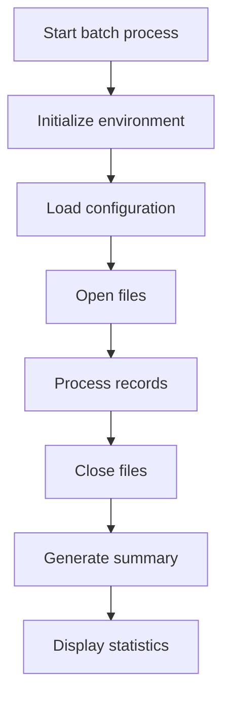

This section orchestrates the end-to-end premium calculation workflow, ensuring that all necessary setup, processing, and reporting steps are executed in the correct order for a batch run.

| Category        | Rule Name                        | Description                                                                                                    |
| --------------- | -------------------------------- | -------------------------------------------------------------------------------------------------------------- |
| Data validation | File Availability Requirement    | All required files must be successfully opened before processing any records.                                  |
| Data validation | File Closure Integrity           | Files must be properly closed after all records have been processed to ensure data integrity and prevent loss. |
| Business logic  | Environment Initialization Order | The workflow must always begin by initializing the environment before any other processing occurs.             |
| Business logic  | Configuration Precedence         | Configuration settings must be loaded before any files are opened or records are processed.                    |
| Business logic  | Record Processing Compliance     | Each record in the batch must be processed according to the loaded configuration and business rules.           |
| Business logic  | Batch Summary Generation         | A summary of the batch processing must be generated after all records are processed and files are closed.      |
| Business logic  | Statistics Display Requirement   | Statistics related to the batch run must be displayed at the end of the workflow for business review.          |

<SwmSnippet path="/base/src/LGAPDB01.cbl" line="90">

---

<SwmToken path="base/src/LGAPDB01.cbl" pos="90:1:1" line-data="       P001.">`P001`</SwmToken> runs the whole premium calculation workflow: initializes data, loads config, opens files, processes each record, closes files, generates summaries, and displays stats. Each step sets up for the next.

```cobol
       P001.
           PERFORM P002-INITIALIZE
           PERFORM P003-LOAD-CONFIG
           PERFORM P005-OPEN-FILES
           PERFORM P006-PROCESS-RECORDS
           PERFORM P014-CLOSE-FILES
           PERFORM P015-GENERATE-SUMMARY
           PERFORM P016-DISPLAY-STATS
           STOP RUN.
```

---

</SwmSnippet>

# Iterative Policy Record Processing

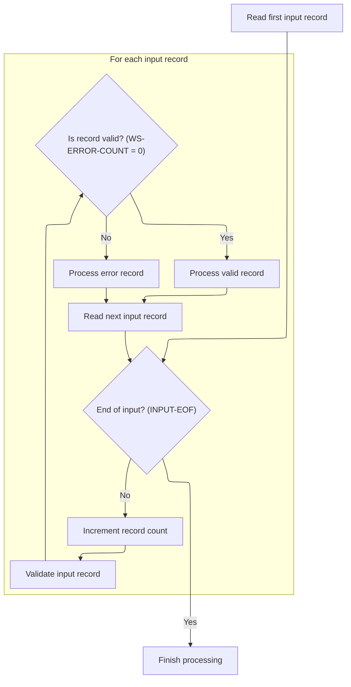

This section is responsible for iteratively processing each policy record from the input stream. It validates each record, processes valid records, logs errors for invalid records, and maintains counters for reporting and auditing purposes.

| Category        | Rule Name                | Description                                                                                                                                                                                                                                                                                                                                    |
| --------------- | ------------------------ | ---------------------------------------------------------------------------------------------------------------------------------------------------------------------------------------------------------------------------------------------------------------------------------------------------------------------------------------------- |
| Data validation | Input record validation  | Each input record must be validated before processing. If the record passes validation (<SwmToken path="base/src/LGAPDB01.cbl" pos="183:3:7" line-data="               IF WS-ERROR-COUNT = ZERO">`WS-ERROR-COUNT`</SwmToken> = 0), it is processed as a valid record. If not, it is processed as an error record and error details are logged. |
| Business logic  | Record counting          | For each processed record, the total record count (<SwmToken path="base/src/LGAPDB01.cbl" pos="181:7:11" line-data="               ADD 1 TO WS-REC-CNT">`WS-REC-CNT`</SwmToken>) must be incremented by one, starting from zero.                                                                                                               |
| Business logic  | Warning error tracking   | Warning errors must be tracked separately from fatal errors and informational errors, using the WS-WARNING-COUNT variable and the severity indicator in the error array.                                                                                                                                                                       |
| Business logic  | Rejected record counting | Rejected records must be counted separately using the <SwmToken path="base/src/LGAPDB01.cbl" pos="372:11:15" line-data="               WHEN 2 ADD 1 TO WS-REJECTED-CNT">`WS-REJECTED-CNT`</SwmToken> variable, to support reporting on records that failed validation or processing.                                                           |

<SwmSnippet path="/base/src/LGAPDB01.cbl" line="178">

---

<SwmToken path="base/src/LGAPDB01.cbl" pos="178:1:5" line-data="       P006-PROCESS-RECORDS.">`P006-PROCESS-RECORDS`</SwmToken> loops through each input record, validates it, processes valid ones, and logs errors for invalid ones. Counters are updated for each processed record.

```cobol
       P006-PROCESS-RECORDS.
           PERFORM P007-READ-INPUT
           PERFORM UNTIL INPUT-EOF
               ADD 1 TO WS-REC-CNT
               PERFORM P008-VALIDATE-INPUT-RECORD
               IF WS-ERROR-COUNT = ZERO
                   PERFORM P009-PROCESS-VALID-RECORD
               ELSE
                   PERFORM P010-PROCESS-ERROR-RECORD
               END-IF
               PERFORM P007-READ-INPUT
           END-PERFORM.
```

---

</SwmSnippet>

# Input Validation and Error Logging

```mermaid
%%{init: {"flowchart": {"defaultRenderer": "elk"}} }%%
flowchart TD
    node1["Start input record validation"]
    click node1 openCode "base/src/LGAPDB01.cbl:195:196"
    node1 --> node2{"Is policy type valid? (Commercial, Personal, Farm)"}
    click node2 openCode "base/src/LGAPDB01.cbl:198:204"
    node2 -->|"No"| node3["Log error: Invalid Policy Type"]
    click node3 openCode "base/src/LGAPDB01.cbl:201:204"
    node2 -->|"Yes"| node4{"Is customer number provided?"}
    click node4 openCode "base/src/LGAPDB01.cbl:206:210"
    node3 --> node4
    node4 -->|"No"| node5["Log error: Customer Number Required"]
    click node5 openCode "base/src/LGAPDB01.cbl:207:210"
    node4 -->|"Yes"| node6{"Is at least one coverage limit provided?"}
    click node6 openCode "base/src/LGAPDB01.cbl:212:217"
    node5 --> node6
    node6 -->|"No"| node7["Log error: At least one coverage limit required"]
    click node7 openCode "base/src/LGAPDB01.cbl:214:217"
    node6 -->|"Yes"| node8{"Does total coverage exceed $50,000,000?"}
    click node8 openCode "base/src/LGAPDB01.cbl:219:224"
    node7 --> node8
    node8 -->|"Yes"| node9["Log warning: Total coverage exceeds maximum"]
    click node9 openCode "base/src/LGAPDB01.cbl:221:224"
    node8 -->|"No"| node10["Validation complete"]
    click node10 openCode "base/src/LGAPDB01.cbl:224:224"
    node9 --> node10
classDef HeadingStyle fill:#777777,stroke:#333,stroke-width:2px;

%% Swimm:
%% %%{init: {"flowchart": {"defaultRenderer": "elk"}} }%%
%% flowchart TD
%%     node1["Start input record validation"]
%%     click node1 openCode "<SwmPath>[base/src/LGAPDB01.cbl](base/src/LGAPDB01.cbl)</SwmPath>:195:196"
%%     node1 --> node2{"Is policy type valid? (Commercial, Personal, Farm)"}
%%     click node2 openCode "<SwmPath>[base/src/LGAPDB01.cbl](base/src/LGAPDB01.cbl)</SwmPath>:198:204"
%%     node2 -->|"No"| node3["Log error: Invalid Policy Type"]
%%     click node3 openCode "<SwmPath>[base/src/LGAPDB01.cbl](base/src/LGAPDB01.cbl)</SwmPath>:201:204"
%%     node2 -->|"Yes"| node4{"Is customer number provided?"}
%%     click node4 openCode "<SwmPath>[base/src/LGAPDB01.cbl](base/src/LGAPDB01.cbl)</SwmPath>:206:210"
%%     node3 --> node4
%%     node4 -->|"No"| node5["Log error: Customer Number Required"]
%%     click node5 openCode "<SwmPath>[base/src/LGAPDB01.cbl](base/src/LGAPDB01.cbl)</SwmPath>:207:210"
%%     node4 -->|"Yes"| node6{"Is at least one coverage limit provided?"}
%%     click node6 openCode "<SwmPath>[base/src/LGAPDB01.cbl](base/src/LGAPDB01.cbl)</SwmPath>:212:217"
%%     node5 --> node6
%%     node6 -->|"No"| node7["Log error: At least one coverage limit required"]
%%     click node7 openCode "<SwmPath>[base/src/LGAPDB01.cbl](base/src/LGAPDB01.cbl)</SwmPath>:214:217"
%%     node6 -->|"Yes"| node8{"Does total coverage exceed $50,000,000?"}
%%     click node8 openCode "<SwmPath>[base/src/LGAPDB01.cbl](base/src/LGAPDB01.cbl)</SwmPath>:219:224"
%%     node7 --> node8
%%     node8 -->|"Yes"| node9["Log warning: Total coverage exceeds maximum"]
%%     click node9 openCode "<SwmPath>[base/src/LGAPDB01.cbl](base/src/LGAPDB01.cbl)</SwmPath>:221:224"
%%     node8 -->|"No"| node10["Validation complete"]
%%     click node10 openCode "<SwmPath>[base/src/LGAPDB01.cbl](base/src/LGAPDB01.cbl)</SwmPath>:224:224"
%%     node9 --> node10
%% classDef HeadingStyle fill:#777777,stroke:#333,stroke-width:2px;
```

This section ensures that all incoming policy application records meet required business criteria before further processing. It validates key fields and logs any errors or warnings for downstream review and correction.

| Category        | Rule Name                   | Description                                                                                                                                                                                                                                                                                                                    |
| --------------- | --------------------------- | ------------------------------------------------------------------------------------------------------------------------------------------------------------------------------------------------------------------------------------------------------------------------------------------------------------------------------ |
| Data validation | Valid Policy Type           | Only policy types 'C' (Commercial), 'P' (Personal), or 'F' (Farm) are accepted. Any other value is considered invalid and must be logged as an error with code <SwmToken path="base/src/LGAPDB01.cbl" pos="202:2:2" line-data="                   &#39;POL001&#39; &#39;F&#39; &#39;IN-POLICY-TYPE&#39; ">`POL001`</SwmToken>. |
| Data validation | Customer Number Required    | A customer number must be provided for every input record. If the customer number is missing or blank, an error must be logged with code <SwmToken path="base/src/LGAPDB01.cbl" pos="208:2:2" line-data="                   &#39;CUS001&#39; &#39;F&#39; &#39;IN-CUSTOMER-NUM&#39; ">`CUS001`</SwmToken>.                      |
| Data validation | Coverage Limit Required     | At least one coverage limit (building, contents, or business interruption) must be provided. If all are zero, an error must be logged with code <SwmToken path="base/src/LGAPDB01.cbl" pos="215:2:2" line-data="                   &#39;COV001&#39; &#39;F&#39; &#39;COVERAGE-LIMITS&#39; ">`COV001`</SwmToken>.               |
| Business logic  | Maximum Total Insured Value | If the sum of all coverage limits exceeds $50,000,000 (the configured maximum total insured value), a warning must be logged with code <SwmToken path="base/src/LGAPDB01.cbl" pos="222:2:2" line-data="                   &#39;COV002&#39; &#39;W&#39; &#39;COVERAGE-LIMITS&#39; ">`COV002`</SwmToken>.                        |

<SwmSnippet path="/base/src/LGAPDB01.cbl" line="195">

---

<SwmToken path="base/src/LGAPDB01.cbl" pos="195:1:7" line-data="       P008-VALIDATE-INPUT-RECORD.">`P008-VALIDATE-INPUT-RECORD`</SwmToken> checks for valid policy type, customer number, coverage limits, and total insured value. Any issues trigger error logging via <SwmToken path="base/src/LGAPDB01.cbl" pos="201:3:7" line-data="               PERFORM P008A-LOG-ERROR WITH ">`P008A-LOG-ERROR`</SwmToken>.

```cobol
       P008-VALIDATE-INPUT-RECORD.
           INITIALIZE WS-ERROR-HANDLING
           
           IF NOT COMMERCIAL-POLICY AND 
              NOT PERSONAL-POLICY AND 
              NOT FARM-POLICY
               PERFORM P008A-LOG-ERROR WITH 
                   'POL001' 'F' 'IN-POLICY-TYPE' 
                   'Invalid Policy Type'
           END-IF
           
           IF IN-CUSTOMER-NUM = SPACES
               PERFORM P008A-LOG-ERROR WITH 
                   'CUS001' 'F' 'IN-CUSTOMER-NUM' 
                   'Customer Number Required'
           END-IF
           
           IF IN-BUILDING-LIMIT = ZERO AND 
              IN-CONTENTS-LIMIT = ZERO
               PERFORM P008A-LOG-ERROR WITH 
                   'COV001' 'F' 'COVERAGE-LIMITS' 
                   'At least one coverage limit required'
           END-IF
           
           IF IN-BUILDING-LIMIT + IN-CONTENTS-LIMIT + 
              IN-BI-LIMIT > WS-MAX-TIV
               PERFORM P008A-LOG-ERROR WITH 
                   'COV002' 'W' 'COVERAGE-LIMITS' 
                   'Total coverage exceeds maximum TIV'
           END-IF.
```

---

</SwmSnippet>

<SwmSnippet path="/base/src/LGAPDB01.cbl" line="226">

---

<SwmToken path="base/src/LGAPDB01.cbl" pos="226:1:5" line-data="       P008A-LOG-ERROR.">`P008A-LOG-ERROR`</SwmToken> increments the error count and stores error details in parallel arrays. It assumes error info is set and arrays have enough space.

```cobol
       P008A-LOG-ERROR.
           ADD 1 TO WS-ERROR-COUNT
           SET ERR-IDX TO WS-ERROR-COUNT
           MOVE WS-ERROR-CODE TO WS-ERROR-CODE (ERR-IDX)
           MOVE WS-ERROR-SEVERITY TO WS-ERROR-SEVERITY (ERR-IDX)
           MOVE WS-ERROR-FIELD TO WS-ERROR-FIELD (ERR-IDX)
           MOVE WS-ERROR-MESSAGE TO WS-ERROR-MESSAGE (ERR-IDX).
```

---

</SwmSnippet>

# Valid Policy Record Handling

This section is responsible for handling valid policy records by categorizing them as commercial or non-commercial, updating relevant counters, and invoking the correct business logic for each type.

| Category        | Rule Name                    | Description                                                                                                                                                                                                                                                                                                                                                                                                                                                                           |
| --------------- | ---------------------------- | ------------------------------------------------------------------------------------------------------------------------------------------------------------------------------------------------------------------------------------------------------------------------------------------------------------------------------------------------------------------------------------------------------------------------------------------------------------------------------------- |
| Data validation | Counter Initialization       | The processed counter (<SwmToken path="base/src/LGAPDB01.cbl" pos="237:7:11" line-data="               ADD 1 TO WS-PROC-CNT">`WS-PROC-CNT`</SwmToken>) and error counter (<SwmToken path="base/src/LGAPDB01.cbl" pos="240:7:11" line-data="               ADD 1 TO WS-ERR-CNT">`WS-ERR-CNT`</SwmToken>) must always start at zero for each processing run to ensure accurate reporting.                                                                                               |
| Business logic  | Commercial Policy Processing | If a policy record is identified as commercial (<SwmToken path="base/src/LGAPDB01.cbl" pos="202:10:14" line-data="                   &#39;POL001&#39; &#39;F&#39; &#39;IN-POLICY-TYPE&#39; ">`IN-POLICY-TYPE`</SwmToken> = 'C'), it must be processed using the commercial policy business logic and the processed counter (<SwmToken path="base/src/LGAPDB01.cbl" pos="237:7:11" line-data="               ADD 1 TO WS-PROC-CNT">`WS-PROC-CNT`</SwmToken>) must be incremented by 1. |

<SwmSnippet path="/base/src/LGAPDB01.cbl" line="234">

---

We branch for commercial vs non-commercial and update counters.

```cobol
       P009-PROCESS-VALID-RECORD.
           IF COMMERCIAL-POLICY
               PERFORM P011-PROCESS-COMMERCIAL
               ADD 1 TO WS-PROC-CNT
           ELSE
               PERFORM P012-PROCESS-NON-COMMERCIAL
               ADD 1 TO WS-ERR-CNT
           END-IF.
```

---

</SwmSnippet>

## Commercial Policy Premium Calculation Sequence

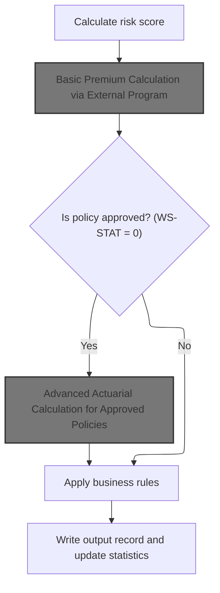

This section governs the sequence for calculating commercial policy premiums, ensuring that risk assessment, approval status, actuarial calculations, and business rules are applied in the correct order to produce accurate premium outputs and policy statistics.

| Category        | Rule Name                                  | Description                                                                                                                                                                                                                   |
| --------------- | ------------------------------------------ | ----------------------------------------------------------------------------------------------------------------------------------------------------------------------------------------------------------------------------- |
| Data validation | Mandatory Risk Scoring                     | A risk score must be calculated for every commercial policy before any premium calculation is performed.                                                                                                                      |
| Data validation | Mandatory Output and Statistics Update     | The output record must be written and statistics updated for every processed policy, ensuring data integrity and reporting accuracy.                                                                                          |
| Business logic  | Universal Basic Premium Calculation        | Basic premium calculation must be performed for every policy, regardless of approval status.                                                                                                                                  |
| Business logic  | Conditional Advanced Actuarial Calculation | Advanced actuarial calculations are only performed for policies with an approved underwriting decision (<SwmToken path="base/src/LGAPDB01.cbl" pos="261:3:5" line-data="           IF WS-STAT = 0">`WS-STAT`</SwmToken> = 0). |
| Business logic  | Post-Premium Business Rule Application     | Business rules must be applied to all policies after premium calculations, regardless of approval status.                                                                                                                     |

<SwmSnippet path="/base/src/LGAPDB01.cbl" line="258">

---

In <SwmToken path="base/src/LGAPDB01.cbl" pos="258:1:5" line-data="       P011-PROCESS-COMMERCIAL.">`P011-PROCESS-COMMERCIAL`</SwmToken>, we run risk scoring, basic premium calc, and only do enhanced actuarial calc if the policy is approved (<SwmToken path="base/src/LGAPDB01.cbl" pos="261:3:5" line-data="           IF WS-STAT = 0">`WS-STAT`</SwmToken> = 0). Then we apply business rules, write output, and update stats.

```cobol
       P011-PROCESS-COMMERCIAL.
           PERFORM P011A-CALCULATE-RISK-SCORE
           PERFORM P011B-BASIC-PREMIUM-CALC
           IF WS-STAT = 0
               PERFORM P011C-ENHANCED-ACTUARIAL-CALC
           END-IF
           PERFORM P011D-APPLY-BUSINESS-RULES
           PERFORM P011E-WRITE-OUTPUT-RECORD
           PERFORM P011F-UPDATE-STATISTICS.
```

---

</SwmSnippet>

### Basic Premium Calculation via External Program

This section's main product role is to act as a gateway for basic premium calculation, ensuring all relevant risk and peril data is sent to an external program for processing, and then returning the calculated premium and underwriting decision to the calling process.

| Category        | Rule Name                      | Description                                                                                                                                                                                                                                                                                                                                                                                                               |
| --------------- | ------------------------------ | ------------------------------------------------------------------------------------------------------------------------------------------------------------------------------------------------------------------------------------------------------------------------------------------------------------------------------------------------------------------------------------------------------------------------- |
| Data validation | Complete Data Requirement      | All risk and peril data must be provided before premium calculation is initiated. Missing or incomplete data will result in the calculation not being performed.                                                                                                                                                                                                                                                          |
| Business logic  | External Calculation Authority | Premium calculation and underwriting status are determined solely by the external program (<SwmToken path="base/src/LGAPDB01.cbl" pos="276:4:4" line-data="           CALL &#39;LGAPDB03&#39; USING WS-BASE-RISK-SCR, IN-FIRE-PERIL, ">`LGAPDB03`</SwmToken>) using the provided risk and peril data. No internal overrides or adjustments are permitted in this section.                                                 |
| Business logic  | Default Discount Factor        | The initial value for the discount factor (<SwmToken path="base/src/LGAPDB01.cbl" pos="281:8:12" line-data="                                WS-TOT-PREM, WS-DISC-FACT.">`WS-DISC-FACT`</SwmToken>) is set to <SwmToken path="base/src/LGAPDB03.cbl" pos="93:3:5" line-data="           MOVE 1.00 TO LK-DISC-FACT">`1.00`</SwmToken>, indicating no discount unless the external program applies one based on eligibility. |
| Business logic  | Underwriting Status Codes      | The underwriting status must be returned as one of the following: Approved (0), Pending (1), Rejected (2), or Referred (3), with corresponding descriptions and rejection reasons if applicable.                                                                                                                                                                                                                          |

<SwmSnippet path="/base/src/LGAPDB01.cbl" line="275">

---

<SwmToken path="base/src/LGAPDB01.cbl" pos="275:1:7" line-data="       P011B-BASIC-PREMIUM-CALC.">`P011B-BASIC-PREMIUM-CALC`</SwmToken> just calls <SwmToken path="base/src/LGAPDB01.cbl" pos="276:4:4" line-data="           CALL &#39;LGAPDB03&#39; USING WS-BASE-RISK-SCR, IN-FIRE-PERIL, ">`LGAPDB03`</SwmToken> with all the risk and peril data, letting it handle the premium and status calculation. No internal logic here, just delegation.

```cobol
       P011B-BASIC-PREMIUM-CALC.
           CALL 'LGAPDB03' USING WS-BASE-RISK-SCR, IN-FIRE-PERIL, 
                                IN-CRIME-PERIL, IN-FLOOD-PERIL, 
                                IN-WEATHER-PERIL, WS-STAT,
                                WS-STAT-DESC, WS-REJ-RSN, WS-FR-PREM,
                                WS-CR-PREM, WS-FL-PREM, WS-WE-PREM,
                                WS-TOT-PREM, WS-DISC-FACT.
```

---

</SwmSnippet>

### Risk Factor Retrieval and Premium Computation

```mermaid
%%{init: {"flowchart": {"defaultRenderer": "elk"}} }%%
flowchart TD
  node1["Start premium calculation"] --> node2{"Retrieve fire risk factor from DB"}
  click node1 openCode "base/src/LGAPDB03.cbl:42:46"
  node2 -->|"Success"| node3["Use DB fire risk factor"]
  click node2 openCode "base/src/LGAPDB03.cbl:48:59"
  node2 -->|"Fail"| node4["Use default fire risk factor (0.80)"]
  click node3 openCode "base/src/LGAPDB03.cbl:48:59"
  click node4 openCode "base/src/LGAPDB03.cbl:58:59"
  node3 --> node5{"Retrieve crime risk factor from DB"}
  node4 --> node5
  click node5 openCode "base/src/LGAPDB03.cbl:61:71"
  node5 -->|"Success"| node6["Use DB crime risk factor"]
  node5 -->|"Fail"| node7["Use default crime risk factor (0.60)"]
  click node6 openCode "base/src/LGAPDB03.cbl:61:71"
  click node7 openCode "base/src/LGAPDB03.cbl:70:71"
  node6 --> node8["Calculate verdict"]
  node7 --> node8
  click node8 openCode "base/src/LGAPDB03.cbl:44:44"
  node8 --> node9{"Are all peril types present (>0)?"}
  click node9 openCode "base/src/LGAPDB03.cbl:95:100"
  node9 -->|"Yes"| node10["Apply discount factor (0.90)"]
  node9 -->|"No"| node11["Apply standard factor (1.00)"]
  click node10 openCode "base/src/LGAPDB03.cbl:99:100"
  click node11 openCode "base/src/LGAPDB03.cbl:93:94"
  node10 --> node12["Calculate premiums for fire, crime, flood, weather using risk score, peril values, and discount factor"]
  node11 --> node12
  click node12 openCode "base/src/LGAPDB03.cbl:102:116"
  node12 --> node13["Sum premiums for total"]
  click node13 openCode "base/src/LGAPDB03.cbl:118:120"

classDef HeadingStyle fill:#777777,stroke:#333,stroke-width:2px;

%% Swimm:
%% %%{init: {"flowchart": {"defaultRenderer": "elk"}} }%%
%% flowchart TD
%%   node1["Start premium calculation"] --> node2{"Retrieve fire risk factor from DB"}
%%   click node1 openCode "<SwmPath>[base/src/LGAPDB03.cbl](base/src/LGAPDB03.cbl)</SwmPath>:42:46"
%%   node2 -->|"Success"| node3["Use DB fire risk factor"]
%%   click node2 openCode "<SwmPath>[base/src/LGAPDB03.cbl](base/src/LGAPDB03.cbl)</SwmPath>:48:59"
%%   node2 -->|"Fail"| node4["Use default fire risk factor (<SwmToken path="base/src/LGAPDB03.cbl" pos="58:3:5" line-data="               MOVE 0.80 TO WS-FIRE-FACTOR">`0.80`</SwmToken>)"]
%%   click node3 openCode "<SwmPath>[base/src/LGAPDB03.cbl](base/src/LGAPDB03.cbl)</SwmPath>:48:59"
%%   click node4 openCode "<SwmPath>[base/src/LGAPDB03.cbl](base/src/LGAPDB03.cbl)</SwmPath>:58:59"
%%   node3 --> node5{"Retrieve crime risk factor from DB"}
%%   node4 --> node5
%%   click node5 openCode "<SwmPath>[base/src/LGAPDB03.cbl](base/src/LGAPDB03.cbl)</SwmPath>:61:71"
%%   node5 -->|"Success"| node6["Use DB crime risk factor"]
%%   node5 -->|"Fail"| node7["Use default crime risk factor (<SwmToken path="base/src/LGAPDB03.cbl" pos="70:3:5" line-data="               MOVE 0.60 TO WS-CRIME-FACTOR">`0.60`</SwmToken>)"]
%%   click node6 openCode "<SwmPath>[base/src/LGAPDB03.cbl](base/src/LGAPDB03.cbl)</SwmPath>:61:71"
%%   click node7 openCode "<SwmPath>[base/src/LGAPDB03.cbl](base/src/LGAPDB03.cbl)</SwmPath>:70:71"
%%   node6 --> node8["Calculate verdict"]
%%   node7 --> node8
%%   click node8 openCode "<SwmPath>[base/src/LGAPDB03.cbl](base/src/LGAPDB03.cbl)</SwmPath>:44:44"
%%   node8 --> node9{"Are all peril types present (>0)?"}
%%   click node9 openCode "<SwmPath>[base/src/LGAPDB03.cbl](base/src/LGAPDB03.cbl)</SwmPath>:95:100"
%%   node9 -->|"Yes"| node10["Apply discount factor (<SwmToken path="base/src/LGAPDB03.cbl" pos="99:3:5" line-data="             MOVE 0.90 TO LK-DISC-FACT">`0.90`</SwmToken>)"]
%%   node9 -->|"No"| node11["Apply standard factor (<SwmToken path="base/src/LGAPDB03.cbl" pos="93:3:5" line-data="           MOVE 1.00 TO LK-DISC-FACT">`1.00`</SwmToken>)"]
%%   click node10 openCode "<SwmPath>[base/src/LGAPDB03.cbl](base/src/LGAPDB03.cbl)</SwmPath>:99:100"
%%   click node11 openCode "<SwmPath>[base/src/LGAPDB03.cbl](base/src/LGAPDB03.cbl)</SwmPath>:93:94"
%%   node10 --> node12["Calculate premiums for fire, crime, flood, weather using risk score, peril values, and discount factor"]
%%   node11 --> node12
%%   click node12 openCode "<SwmPath>[base/src/LGAPDB03.cbl](base/src/LGAPDB03.cbl)</SwmPath>:102:116"
%%   node12 --> node13["Sum premiums for total"]
%%   click node13 openCode "<SwmPath>[base/src/LGAPDB03.cbl](base/src/LGAPDB03.cbl)</SwmPath>:118:120"
%% 
%% classDef HeadingStyle fill:#777777,stroke:#333,stroke-width:2px;
```

This section governs how risk factors are retrieved and how insurance premiums are calculated for different perils. It ensures that premium calculations are robust to missing data and that discounts are applied when all perils are covered.

| Category       | Rule Name                        | Description                                                                                                                                                                                                                                                           |
| -------------- | -------------------------------- | --------------------------------------------------------------------------------------------------------------------------------------------------------------------------------------------------------------------------------------------------------------------- |
| Business logic | All peril discount               | If all peril types (fire, crime, flood, weather) have values greater than zero, apply a discount factor of <SwmToken path="base/src/LGAPDB03.cbl" pos="99:3:5" line-data="             MOVE 0.90 TO LK-DISC-FACT">`0.90`</SwmToken> to all premium calculations.      |
| Business logic | No discount for partial coverage | If any peril type (fire, crime, flood, weather) has a value of zero or less, apply a standard factor of <SwmToken path="base/src/LGAPDB03.cbl" pos="93:3:5" line-data="           MOVE 1.00 TO LK-DISC-FACT">`1.00`</SwmToken> (no discount) to premium calculations. |
| Business logic | Peril premium calculation        | Premiums for each peril are calculated by multiplying the risk score, the peril's risk factor, the peril value, and the applicable discount factor.                                                                                                                   |
| Business logic | Total premium summation          | The total premium is the sum of the premiums for fire, crime, flood, and weather perils.                                                                                                                                                                              |

<SwmSnippet path="/base/src/LGAPDB03.cbl" line="42">

---

<SwmToken path="base/src/LGAPDB03.cbl" pos="42:1:3" line-data="       MAIN-LOGIC.">`MAIN-LOGIC`</SwmToken> in <SwmToken path="base/src/LGAPDB01.cbl" pos="276:4:4" line-data="           CALL &#39;LGAPDB03&#39; USING WS-BASE-RISK-SCR, IN-FIRE-PERIL, ">`LGAPDB03`</SwmToken> grabs risk factors from the database (or uses defaults if missing), determines approval status, and calculates premiums for each peril using the risk score and peril values.

```cobol
       MAIN-LOGIC.
           PERFORM GET-RISK-FACTORS
           PERFORM CALCULATE-VERDICT
           PERFORM CALCULATE-PREMIUMS
           GOBACK.
```

---

</SwmSnippet>

<SwmSnippet path="/base/src/LGAPDB03.cbl" line="48">

---

<SwmToken path="base/src/LGAPDB03.cbl" pos="48:1:5" line-data="       GET-RISK-FACTORS.">`GET-RISK-FACTORS`</SwmToken> queries the database for fire and crime risk factors. If the query fails, it uses hardcoded defaults (<SwmToken path="base/src/LGAPDB03.cbl" pos="58:3:5" line-data="               MOVE 0.80 TO WS-FIRE-FACTOR">`0.80`</SwmToken> for fire, <SwmToken path="base/src/LGAPDB03.cbl" pos="70:3:5" line-data="               MOVE 0.60 TO WS-CRIME-FACTOR">`0.60`</SwmToken> for crime) to keep calculations running.

```cobol
       GET-RISK-FACTORS.
           EXEC SQL
               SELECT FACTOR_VALUE INTO :WS-FIRE-FACTOR
               FROM RISK_FACTORS
               WHERE PERIL_TYPE = 'FIRE'
           END-EXEC.
           
           IF SQLCODE = 0
               CONTINUE
           ELSE
               MOVE 0.80 TO WS-FIRE-FACTOR
           END-IF.
           
           EXEC SQL
               SELECT FACTOR_VALUE INTO :WS-CRIME-FACTOR
               FROM RISK_FACTORS
               WHERE PERIL_TYPE = 'CRIME'
           END-EXEC.
           
           IF SQLCODE = 0
               CONTINUE
           ELSE
               MOVE 0.60 TO WS-CRIME-FACTOR
           END-IF.
```

---

</SwmSnippet>

<SwmSnippet path="/base/src/LGAPDB03.cbl" line="92">

---

<SwmToken path="base/src/LGAPDB03.cbl" pos="92:1:3" line-data="       CALCULATE-PREMIUMS.">`CALCULATE-PREMIUMS`</SwmToken> sets a discount if all perils are covered, then computes each peril's premium using risk score, peril factor, and discount. The total premium is just the sum of all individual premiums.

```cobol
       CALCULATE-PREMIUMS.
           MOVE 1.00 TO LK-DISC-FACT
           
           IF LK-FIRE-PERIL > 0 AND
              LK-CRIME-PERIL > 0 AND
              LK-FLOOD-PERIL > 0 AND
              LK-WEATHER-PERIL > 0
             MOVE 0.90 TO LK-DISC-FACT
           END-IF

           COMPUTE LK-FIRE-PREMIUM =
             ((LK-RISK-SCORE * WS-FIRE-FACTOR) * LK-FIRE-PERIL *
               LK-DISC-FACT)
           
           COMPUTE LK-CRIME-PREMIUM =
             ((LK-RISK-SCORE * WS-CRIME-FACTOR) * LK-CRIME-PERIL *
               LK-DISC-FACT)
           
           COMPUTE LK-FLOOD-PREMIUM =
             ((LK-RISK-SCORE * WS-FLOOD-FACTOR) * LK-FLOOD-PERIL *
               LK-DISC-FACT)
           
           COMPUTE LK-WEATHER-PREMIUM =
             ((LK-RISK-SCORE * WS-WEATHER-FACTOR) * LK-WEATHER-PERIL *
               LK-DISC-FACT)

           COMPUTE LK-TOTAL-PREMIUM = 
             LK-FIRE-PREMIUM + LK-CRIME-PREMIUM + 
             LK-FLOOD-PREMIUM + LK-WEATHER-PREMIUM. 
```

---

</SwmSnippet>

### Advanced Actuarial Calculation for Approved Policies

```mermaid
%%{init: {"flowchart": {"defaultRenderer": "elk"}} }%%
flowchart TD
    node1["Prepare input and coverage data for actuarial calculation"]
    click node1 openCode "base/src/LGAPDB01.cbl:284:310"
    node1 --> node2{"Is total premium (WS-TOT-PREM) > minimum premium ($500)?"}
    click node2 openCode "base/src/LGAPDB01.cbl:312:313"
    node2 -->|"Yes"| node3["Call advanced actuarial calculation (LGAPDB04)"]
    click node3 openCode "base/src/LGAPDB01.cbl:313:314"
    node2 -->|"No"| node7["Return calculated premium and components"]
    click node7 openCode "base/src/LGAPDB01.cbl:325:325"
    node3 --> node4{"Is enhanced premium (LK-TOTAL-PREMIUM) > initial premium (WS-TOT-PREM)?"}
    click node4 openCode "base/src/LGAPDB01.cbl:317:318"
    node4 -->|"Yes"| node5["Update premium components: fire, crime, flood, weather, experience mod, total"]
    click node5 openCode "base/src/LGAPDB01.cbl:318:324"
    node4 -->|"No"| node7
    node5 --> node7
classDef HeadingStyle fill:#777777,stroke:#333,stroke-width:2px;

%% Swimm:
%% %%{init: {"flowchart": {"defaultRenderer": "elk"}} }%%
%% flowchart TD
%%     node1["Prepare input and coverage data for actuarial calculation"]
%%     click node1 openCode "<SwmPath>[base/src/LGAPDB01.cbl](base/src/LGAPDB01.cbl)</SwmPath>:284:310"
%%     node1 --> node2{"Is total premium (<SwmToken path="base/src/LGAPDB01.cbl" pos="281:1:5" line-data="                                WS-TOT-PREM, WS-DISC-FACT.">`WS-TOT-PREM`</SwmToken>) > minimum premium ($500)?"}
%%     click node2 openCode "<SwmPath>[base/src/LGAPDB01.cbl](base/src/LGAPDB01.cbl)</SwmPath>:312:313"
%%     node2 -->|"Yes"| node3["Call advanced actuarial calculation (<SwmToken path="base/src/LGAPDB01.cbl" pos="313:4:4" line-data="               CALL &#39;LGAPDB04&#39; USING LK-INPUT-DATA, LK-COVERAGE-DATA, ">`LGAPDB04`</SwmToken>)"]
%%     click node3 openCode "<SwmPath>[base/src/LGAPDB01.cbl](base/src/LGAPDB01.cbl)</SwmPath>:313:314"
%%     node2 -->|"No"| node7["Return calculated premium and components"]
%%     click node7 openCode "<SwmPath>[base/src/LGAPDB01.cbl](base/src/LGAPDB01.cbl)</SwmPath>:325:325"
%%     node3 --> node4{"Is enhanced premium (<SwmToken path="base/src/LGAPDB01.cbl" pos="317:3:7" line-data="               IF LK-TOTAL-PREMIUM &gt; WS-TOT-PREM">`LK-TOTAL-PREMIUM`</SwmToken>) > initial premium (<SwmToken path="base/src/LGAPDB01.cbl" pos="281:1:5" line-data="                                WS-TOT-PREM, WS-DISC-FACT.">`WS-TOT-PREM`</SwmToken>)?"}
%%     click node4 openCode "<SwmPath>[base/src/LGAPDB01.cbl](base/src/LGAPDB01.cbl)</SwmPath>:317:318"
%%     node4 -->|"Yes"| node5["Update premium components: fire, crime, flood, weather, experience mod, total"]
%%     click node5 openCode "<SwmPath>[base/src/LGAPDB01.cbl](base/src/LGAPDB01.cbl)</SwmPath>:318:324"
%%     node4 -->|"No"| node7
%%     node5 --> node7
%% classDef HeadingStyle fill:#777777,stroke:#333,stroke-width:2px;
```

This section ensures that only approved policies with a total premium above the minimum threshold ($500) are eligible for advanced actuarial calculation. It updates the policy's premium components only if the advanced calculation yields a higher premium, ensuring accurate and compliant premium determination.

| Category        | Rule Name                 | Description                                                                                                                                                                                                                         |
| --------------- | ------------------------- | ----------------------------------------------------------------------------------------------------------------------------------------------------------------------------------------------------------------------------------- |
| Data validation | Minimum premium threshold | The advanced actuarial calculation is only performed if the total premium for the policy exceeds the minimum premium threshold of $500.                                                                                             |
| Data validation | Input data preparation    | All input and coverage data required for actuarial calculation must be prepared and mapped from the policy application before any calculation is performed.                                                                         |
| Business logic  | Enhanced premium update   | If the advanced actuarial calculation produces a total premium greater than the initial calculated premium, the premium components (fire, crime, flood, weather, experience mod, total) are updated to reflect the enhanced values. |
| Business logic  | Retain original premium   | If the advanced actuarial calculation does not produce a higher total premium than the initial calculation, the original premium and components are retained and returned.                                                          |

<SwmSnippet path="/base/src/LGAPDB01.cbl" line="283">

---

<SwmToken path="base/src/LGAPDB01.cbl" pos="283:1:7" line-data="       P011C-ENHANCED-ACTUARIAL-CALC.">`P011C-ENHANCED-ACTUARIAL-CALC`</SwmToken> sets up all the input and coverage data, then calls <SwmToken path="base/src/LGAPDB01.cbl" pos="313:4:4" line-data="               CALL &#39;LGAPDB04&#39; USING LK-INPUT-DATA, LK-COVERAGE-DATA, ">`LGAPDB04`</SwmToken> for advanced premium calculation if the basic premium is above the minimum. If the enhanced result is higher, we update the premium fields.

```cobol
       P011C-ENHANCED-ACTUARIAL-CALC.
      *    Prepare input structure for actuarial calculation
           MOVE IN-CUSTOMER-NUM TO LK-CUSTOMER-NUM
           MOVE WS-BASE-RISK-SCR TO LK-RISK-SCORE
           MOVE IN-PROPERTY-TYPE TO LK-PROPERTY-TYPE
           MOVE IN-TERRITORY-CODE TO LK-TERRITORY
           MOVE IN-CONSTRUCTION-TYPE TO LK-CONSTRUCTION-TYPE
           MOVE IN-OCCUPANCY-CODE TO LK-OCCUPANCY-CODE
           MOVE IN-SPRINKLER-IND TO LK-PROTECTION-CLASS
           MOVE IN-YEAR-BUILT TO LK-YEAR-BUILT
           MOVE IN-SQUARE-FOOTAGE TO LK-SQUARE-FOOTAGE
           MOVE IN-YEARS-IN-BUSINESS TO LK-YEARS-IN-BUSINESS
           MOVE IN-CLAIMS-COUNT-3YR TO LK-CLAIMS-COUNT-5YR
           MOVE IN-CLAIMS-AMOUNT-3YR TO LK-CLAIMS-AMOUNT-5YR
           
      *    Set coverage data
           MOVE IN-BUILDING-LIMIT TO LK-BUILDING-LIMIT
           MOVE IN-CONTENTS-LIMIT TO LK-CONTENTS-LIMIT
           MOVE IN-BI-LIMIT TO LK-BI-LIMIT
           MOVE IN-FIRE-DEDUCTIBLE TO LK-FIRE-DEDUCTIBLE
           MOVE IN-WIND-DEDUCTIBLE TO LK-WIND-DEDUCTIBLE
           MOVE IN-FLOOD-DEDUCTIBLE TO LK-FLOOD-DEDUCTIBLE
           MOVE IN-OTHER-DEDUCTIBLE TO LK-OTHER-DEDUCTIBLE
           MOVE IN-FIRE-PERIL TO LK-FIRE-PERIL
           MOVE IN-CRIME-PERIL TO LK-CRIME-PERIL
           MOVE IN-FLOOD-PERIL TO LK-FLOOD-PERIL
           MOVE IN-WEATHER-PERIL TO LK-WEATHER-PERIL
           
      *    Call advanced actuarial calculation program (only for approved cases)
           IF WS-TOT-PREM > WS-MIN-PREMIUM
               CALL 'LGAPDB04' USING LK-INPUT-DATA, LK-COVERAGE-DATA, 
                                    LK-OUTPUT-RESULTS
               
      *        Update with enhanced calculations if successful
               IF LK-TOTAL-PREMIUM > WS-TOT-PREM
                   MOVE LK-FIRE-PREMIUM TO WS-FR-PREM
                   MOVE LK-CRIME-PREMIUM TO WS-CR-PREM
                   MOVE LK-FLOOD-PREMIUM TO WS-FL-PREM
                   MOVE LK-WEATHER-PREMIUM TO WS-WE-PREM
                   MOVE LK-TOTAL-PREMIUM TO WS-TOT-PREM
                   MOVE LK-EXPERIENCE-MOD TO WS-EXPERIENCE-MOD
               END-IF
           END-IF.
```

---

</SwmSnippet>

### Full Actuarial Premium Calculation Steps

```mermaid
%%{init: {"flowchart": {"defaultRenderer": "elk"}} }%%
flowchart TD
  node1["Start premium calculation"]
  click node1 openCode "base/src/LGAPDB04.cbl:138:150"
  node1 --> node2{"Years in business >= 5?"}
  click node2 openCode "base/src/LGAPDB04.cbl:234:258"
  node2 -->|"Yes, Claims count = 0"| node3["Apply best experience mod (0.85)"]
  click node3 openCode "base/src/LGAPDB04.cbl:239:240"
  node2 -->|"Yes, Claims count > 0"| node4["Calculate experience mod from claims"]
  click node4 openCode "base/src/LGAPDB04.cbl:241:253"
  node2 -->|"No"| node5["Apply new business experience mod (1.10)"]
  click node5 openCode "base/src/LGAPDB04.cbl:255:256"
  node3 --> node6["Apply schedule modification"]
  node4 --> node6
  node5 --> node6
  click node6 openCode "base/src/LGAPDB04.cbl:143:143"
  node6 --> node7{"Which perils are covered?"}
  click node7 openCode "base/src/LGAPDB04.cbl:318:367"
  node7 -->|"Fire"| node8["Calculate fire premium"]
  click node8 openCode "base/src/LGAPDB04.cbl:322:331"
  node7 -->|"Crime"| node9["Calculate crime premium"]
  click node9 openCode "base/src/LGAPDB04.cbl:334:343"
  node7 -->|"Flood"| node10["Calculate flood premium"]
  click node10 openCode "base/src/LGAPDB04.cbl:346:355"
  node7 -->|"Weather"| node11["Calculate weather premium"]
  click node11 openCode "base/src/LGAPDB04.cbl:358:367"
  node8 --> node12["Apply catastrophe load"]
  node9 --> node12
  node10 --> node12
  node11 --> node12
  click node12 openCode "base/src/LGAPDB04.cbl:145:145"
  node12 --> node13["Apply expense load"]
  click node13 openCode "base/src/LGAPDB04.cbl:146:146"
  node13 --> node14{"Discount eligibility"}
  click node14 openCode "base/src/LGAPDB04.cbl:407:451"
  node14 -->|"Multi-peril, claims-free, deductible"| node15["Apply discounts"]
  click node15 openCode "base/src/LGAPDB04.cbl:411:451"
  node14 -->|"No discounts"| node16["Skip discount"]
  click node16 openCode "base/src/LGAPDB04.cbl:407:451"
  node15 --> node17["Apply taxes"]
  node16 --> node17
  click node17 openCode "base/src/LGAPDB04.cbl:148:148"
  node17 --> node18{"Final rate factor > 0.050000?"}
  click node18 openCode "base/src/LGAPDB04.cbl:464:477"
  node18 -->|"Yes"| node19["Cap rate factor and recalculate premium"]
  click node19 openCode "base/src/LGAPDB04.cbl:474:477"
  node18 -->|"No"| node20["Finalize premium"]
  click node20 openCode "base/src/LGAPDB04.cbl:465:472"
  node19 --> node20
  node20 --> node21["End"]
  click node21 openCode "base/src/LGAPDB04.cbl:150:150"
classDef HeadingStyle fill:#777777,stroke:#333,stroke-width:2px;

%% Swimm:
%% %%{init: {"flowchart": {"defaultRenderer": "elk"}} }%%
%% flowchart TD
%%   node1["Start premium calculation"]
%%   click node1 openCode "<SwmPath>[base/src/LGAPDB04.cbl](base/src/LGAPDB04.cbl)</SwmPath>:138:150"
%%   node1 --> node2{"Years in business >= 5?"}
%%   click node2 openCode "<SwmPath>[base/src/LGAPDB04.cbl](base/src/LGAPDB04.cbl)</SwmPath>:234:258"
%%   node2 -->|"Yes, Claims count = 0"| node3["Apply best experience mod (0.85)"]
%%   click node3 openCode "<SwmPath>[base/src/LGAPDB04.cbl](base/src/LGAPDB04.cbl)</SwmPath>:239:240"
%%   node2 -->|"Yes, Claims count > 0"| node4["Calculate experience mod from claims"]
%%   click node4 openCode "<SwmPath>[base/src/LGAPDB04.cbl](base/src/LGAPDB04.cbl)</SwmPath>:241:253"
%%   node2 -->|"No"| node5["Apply new business experience mod (1.10)"]
%%   click node5 openCode "<SwmPath>[base/src/LGAPDB04.cbl](base/src/LGAPDB04.cbl)</SwmPath>:255:256"
%%   node3 --> node6["Apply schedule modification"]
%%   node4 --> node6
%%   node5 --> node6
%%   click node6 openCode "<SwmPath>[base/src/LGAPDB04.cbl](base/src/LGAPDB04.cbl)</SwmPath>:143:143"
%%   node6 --> node7{"Which perils are covered?"}
%%   click node7 openCode "<SwmPath>[base/src/LGAPDB04.cbl](base/src/LGAPDB04.cbl)</SwmPath>:318:367"
%%   node7 -->|"Fire"| node8["Calculate fire premium"]
%%   click node8 openCode "<SwmPath>[base/src/LGAPDB04.cbl](base/src/LGAPDB04.cbl)</SwmPath>:322:331"
%%   node7 -->|"Crime"| node9["Calculate crime premium"]
%%   click node9 openCode "<SwmPath>[base/src/LGAPDB04.cbl](base/src/LGAPDB04.cbl)</SwmPath>:334:343"
%%   node7 -->|"Flood"| node10["Calculate flood premium"]
%%   click node10 openCode "<SwmPath>[base/src/LGAPDB04.cbl](base/src/LGAPDB04.cbl)</SwmPath>:346:355"
%%   node7 -->|"Weather"| node11["Calculate weather premium"]
%%   click node11 openCode "<SwmPath>[base/src/LGAPDB04.cbl](base/src/LGAPDB04.cbl)</SwmPath>:358:367"
%%   node8 --> node12["Apply catastrophe load"]
%%   node9 --> node12
%%   node10 --> node12
%%   node11 --> node12
%%   click node12 openCode "<SwmPath>[base/src/LGAPDB04.cbl](base/src/LGAPDB04.cbl)</SwmPath>:145:145"
%%   node12 --> node13["Apply expense load"]
%%   click node13 openCode "<SwmPath>[base/src/LGAPDB04.cbl](base/src/LGAPDB04.cbl)</SwmPath>:146:146"
%%   node13 --> node14{"Discount eligibility"}
%%   click node14 openCode "<SwmPath>[base/src/LGAPDB04.cbl](base/src/LGAPDB04.cbl)</SwmPath>:407:451"
%%   node14 -->|"<SwmToken path="base/src/LGAPDB04.cbl" pos="410:3:5" line-data="      * Multi-peril discount">`Multi-peril`</SwmToken>, claims-free, deductible"| node15["Apply discounts"]
%%   click node15 openCode "<SwmPath>[base/src/LGAPDB04.cbl](base/src/LGAPDB04.cbl)</SwmPath>:411:451"
%%   node14 -->|"No discounts"| node16["Skip discount"]
%%   click node16 openCode "<SwmPath>[base/src/LGAPDB04.cbl](base/src/LGAPDB04.cbl)</SwmPath>:407:451"
%%   node15 --> node17["Apply taxes"]
%%   node16 --> node17
%%   click node17 openCode "<SwmPath>[base/src/LGAPDB04.cbl](base/src/LGAPDB04.cbl)</SwmPath>:148:148"
%%   node17 --> node18{"Final rate factor > <SwmToken path="base/src/LGAPDB04.cbl" pos="473:13:15" line-data="           IF LK-FINAL-RATE-FACTOR &gt; 0.050000">`0.050000`</SwmToken>?"}
%%   click node18 openCode "<SwmPath>[base/src/LGAPDB04.cbl](base/src/LGAPDB04.cbl)</SwmPath>:464:477"
%%   node18 -->|"Yes"| node19["Cap rate factor and recalculate premium"]
%%   click node19 openCode "<SwmPath>[base/src/LGAPDB04.cbl](base/src/LGAPDB04.cbl)</SwmPath>:474:477"
%%   node18 -->|"No"| node20["Finalize premium"]
%%   click node20 openCode "<SwmPath>[base/src/LGAPDB04.cbl](base/src/LGAPDB04.cbl)</SwmPath>:465:472"
%%   node19 --> node20
%%   node20 --> node21["End"]
%%   click node21 openCode "<SwmPath>[base/src/LGAPDB04.cbl](base/src/LGAPDB04.cbl)</SwmPath>:150:150"
%% classDef HeadingStyle fill:#777777,stroke:#333,stroke-width:2px;
```

This section defines the business rules for calculating the full actuarial premium for a commercial property insurance policy. The process covers all steps from initial exposure and rate determination, through experience and schedule modifications, peril-specific premium calculations, loads, discounts, taxes, and final premium capping. Each rule ensures the premium is calculated fairly, consistently, and in accordance with business guidelines.

| Category        | Rule Name                                                  | Description                                                                                                                                                                                                                                                                                                                                                                                                 |
| --------------- | ---------------------------------------------------------- | ----------------------------------------------------------------------------------------------------------------------------------------------------------------------------------------------------------------------------------------------------------------------------------------------------------------------------------------------------------------------------------------------------------- |
| Data validation | Peril inclusion rule                                       | Premiums for each peril (fire, crime, flood, weather) are only calculated if the peril is covered (peril flag > 0).                                                                                                                                                                                                                                                                                         |
| Business logic  | Best experience modifier for claims-free mature businesses | If the insured business has been operating for 5 or more years and has had zero claims in the past 5 years, the best experience modifier of 0.85 is applied to the premium calculation.                                                                                                                                                                                                                     |
| Business logic  | Experience modifier calculation for businesses with claims | If the insured business has been operating for 5 or more years and has had claims, the experience modifier is calculated using the formula: 1.0 + ((claims amount over 5 years / total insured value) × credibility factor × <SwmToken path="base/src/LGAPDB04.cbl" pos="244:9:11" line-data="                        WS-CREDIBILITY-FACTOR * 0.50)">`0.50`</SwmToken>), and is capped between 0.5 and 2.0. |
| Business logic  | New business experience modifier                           | If the insured business has been operating for less than 5 years, a new business experience modifier of 1.10 is applied.                                                                                                                                                                                                                                                                                    |
| Business logic  | Flood premium multiplier                                   | Flood premiums are increased by a multiplier of <SwmToken path="base/src/LGAPDB04.cbl" pos="352:9:11" line-data="                   WS-TREND-FACTOR * 1.25">`1.25`</SwmToken> to reflect additional risk.                                                                                                                                                                                                   |
| Business logic  | Catastrophe load application                               | A catastrophe load is applied to the total base premium amount after peril premiums are summed.                                                                                                                                                                                                                                                                                                             |
| Business logic  | Expense load application                                   | An expense load is applied to the premium after the catastrophe load is added.                                                                                                                                                                                                                                                                                                                              |
| Business logic  | Discount calculation and cap                               | <SwmToken path="base/src/LGAPDB04.cbl" pos="410:3:5" line-data="      * Multi-peril discount">`Multi-peril`</SwmToken>, claims-free, and deductible discounts are calculated and summed. The total discount is capped at 25% of the sum of all premium components.                                                                                                                                          |
| Business logic  | Tax application sequence                                   | Taxes are applied to the premium after discounts are subtracted.                                                                                                                                                                                                                                                                                                                                            |
| Business logic  | Final rate factor cap                                      | If the final rate factor (total premium divided by total insured value) exceeds 0.05, it is capped at 0.05 and the premium is recalculated to match the cap.                                                                                                                                                                                                                                                |

<SwmSnippet path="/base/src/LGAPDB04.cbl" line="138">

---

<SwmToken path="base/src/LGAPDB04.cbl" pos="138:1:3" line-data="       P100-MAIN.">`P100-MAIN`</SwmToken> in <SwmToken path="base/src/LGAPDB01.cbl" pos="313:4:4" line-data="               CALL &#39;LGAPDB04&#39; USING LK-INPUT-DATA, LK-COVERAGE-DATA, ">`LGAPDB04`</SwmToken> runs through all the actuarial steps: exposure, rates, experience mod, schedule mod, base premium, catastrophe load, expenses, discounts, taxes, and final premium calculation. Each step builds on the previous.

```cobol
       P100-MAIN.
           PERFORM P200-INIT
           PERFORM P300-RATES
           PERFORM P350-EXPOSURE
           PERFORM P400-EXP-MOD
           PERFORM P500-SCHED-MOD
           PERFORM P600-BASE-PREM
           PERFORM P700-CAT-LOAD
           PERFORM P800-EXPENSE
           PERFORM P900-DISC
           PERFORM P950-TAXES
           PERFORM P999-FINAL
           GOBACK.
```

---

</SwmSnippet>

<SwmSnippet path="/base/src/LGAPDB04.cbl" line="234">

---

<SwmToken path="base/src/LGAPDB04.cbl" pos="234:1:5" line-data="       P400-EXP-MOD.">`P400-EXP-MOD`</SwmToken> calculates the experience modifier using years in business, claims count, claims amount, and credibility factor. It applies business-specific constants and caps the result to keep it in range.

```cobol
       P400-EXP-MOD.
           MOVE 1.0000 TO WS-EXPERIENCE-MOD
           
           IF LK-YEARS-IN-BUSINESS >= 5
               IF LK-CLAIMS-COUNT-5YR = ZERO
                   MOVE 0.8500 TO WS-EXPERIENCE-MOD
               ELSE
                   COMPUTE WS-EXPERIENCE-MOD = 
                       1.0000 + 
                       ((LK-CLAIMS-AMOUNT-5YR / WS-TOTAL-INSURED-VAL) * 
                        WS-CREDIBILITY-FACTOR * 0.50)
                   
                   IF WS-EXPERIENCE-MOD > 2.0000
                       MOVE 2.0000 TO WS-EXPERIENCE-MOD
                   END-IF
                   
                   IF WS-EXPERIENCE-MOD < 0.5000
                       MOVE 0.5000 TO WS-EXPERIENCE-MOD
                   END-IF
               END-IF
           ELSE
               MOVE 1.1000 TO WS-EXPERIENCE-MOD
           END-IF
           
           MOVE WS-EXPERIENCE-MOD TO LK-EXPERIENCE-MOD.
```

---

</SwmSnippet>

<SwmSnippet path="/base/src/LGAPDB04.cbl" line="318">

---

<SwmToken path="base/src/LGAPDB04.cbl" pos="318:1:5" line-data="       P600-BASE-PREM.">`P600-BASE-PREM`</SwmToken> calculates each peril's premium using exposures, multi-dimensional rate lookups, experience and schedule mods, and trend factors. Crime and flood premiums use extra multipliers. Only perils flagged > 0 are processed.

```cobol
       P600-BASE-PREM.
           MOVE ZERO TO LK-BASE-AMOUNT
           
      * FIRE PREMIUM
           IF LK-FIRE-PERIL > ZERO
               COMPUTE LK-FIRE-PREMIUM = 
                   (WS-BUILDING-EXPOSURE + WS-CONTENTS-EXPOSURE) *
                   WS-BASE-RATE (1, 1, 1, 1) * 
                   WS-EXPERIENCE-MOD *
                   (1 + WS-SCHEDULE-MOD) *
                   WS-TREND-FACTOR
                   
               ADD LK-FIRE-PREMIUM TO LK-BASE-AMOUNT
           END-IF
           
      * CRIME PREMIUM
           IF LK-CRIME-PERIL > ZERO
               COMPUTE LK-CRIME-PREMIUM = 
                   (WS-CONTENTS-EXPOSURE * 0.80) *
                   WS-BASE-RATE (2, 1, 1, 1) * 
                   WS-EXPERIENCE-MOD *
                   (1 + WS-SCHEDULE-MOD) *
                   WS-TREND-FACTOR
                   
               ADD LK-CRIME-PREMIUM TO LK-BASE-AMOUNT
           END-IF
           
      * FLOOD PREMIUM
           IF LK-FLOOD-PERIL > ZERO
               COMPUTE LK-FLOOD-PREMIUM = 
                   WS-BUILDING-EXPOSURE *
                   WS-BASE-RATE (3, 1, 1, 1) * 
                   WS-EXPERIENCE-MOD *
                   (1 + WS-SCHEDULE-MOD) *
                   WS-TREND-FACTOR * 1.25
                   
               ADD LK-FLOOD-PREMIUM TO LK-BASE-AMOUNT
           END-IF
           
      * WEATHER PREMIUM
           IF LK-WEATHER-PERIL > ZERO
               COMPUTE LK-WEATHER-PREMIUM = 
                   (WS-BUILDING-EXPOSURE + WS-CONTENTS-EXPOSURE) *
                   WS-BASE-RATE (4, 1, 1, 1) * 
                   WS-EXPERIENCE-MOD *
                   (1 + WS-SCHEDULE-MOD) *
                   WS-TREND-FACTOR
                   
               ADD LK-WEATHER-PREMIUM TO LK-BASE-AMOUNT
           END-IF.
```

---

</SwmSnippet>

<SwmSnippet path="/base/src/LGAPDB04.cbl" line="407">

---

<SwmToken path="base/src/LGAPDB04.cbl" pos="407:1:3" line-data="       P900-DISC.">`P900-DISC`</SwmToken> calculates multi-peril, claims-free, and deductible discounts, sums them, and caps the total at 25%. The final discount is applied to the sum of all premium components.

```cobol
       P900-DISC.
           MOVE ZERO TO WS-TOTAL-DISCOUNT
           
      * Multi-peril discount
           MOVE ZERO TO WS-MULTI-PERIL-DISC
           IF LK-FIRE-PERIL > ZERO AND
              LK-CRIME-PERIL > ZERO AND
              LK-FLOOD-PERIL > ZERO AND
              LK-WEATHER-PERIL > ZERO
               MOVE 0.100 TO WS-MULTI-PERIL-DISC
           ELSE
               IF LK-FIRE-PERIL > ZERO AND
                  LK-WEATHER-PERIL > ZERO AND
                  (LK-CRIME-PERIL > ZERO OR LK-FLOOD-PERIL > ZERO)
                   MOVE 0.050 TO WS-MULTI-PERIL-DISC
               END-IF
           END-IF
           
      * Claims-free discount  
           MOVE ZERO TO WS-CLAIMS-FREE-DISC
           IF LK-CLAIMS-COUNT-5YR = ZERO AND LK-YEARS-IN-BUSINESS >= 5
               MOVE 0.075 TO WS-CLAIMS-FREE-DISC
           END-IF
           
      * Deductible credit
           MOVE ZERO TO WS-DEDUCTIBLE-CREDIT
           IF LK-FIRE-DEDUCTIBLE >= 10000
               ADD 0.025 TO WS-DEDUCTIBLE-CREDIT
           END-IF
           IF LK-WIND-DEDUCTIBLE >= 25000  
               ADD 0.035 TO WS-DEDUCTIBLE-CREDIT
           END-IF
           IF LK-FLOOD-DEDUCTIBLE >= 50000
               ADD 0.045 TO WS-DEDUCTIBLE-CREDIT
           END-IF
           
           COMPUTE WS-TOTAL-DISCOUNT = 
               WS-MULTI-PERIL-DISC + WS-CLAIMS-FREE-DISC + 
               WS-DEDUCTIBLE-CREDIT
               
           IF WS-TOTAL-DISCOUNT > 0.250
               MOVE 0.250 TO WS-TOTAL-DISCOUNT
           END-IF
           
           COMPUTE LK-DISCOUNT-AMT = 
               (LK-BASE-AMOUNT + LK-CAT-LOAD-AMT + 
                LK-EXPENSE-LOAD-AMT + LK-PROFIT-LOAD-AMT) *
               WS-TOTAL-DISCOUNT.
```

---

</SwmSnippet>

<SwmSnippet path="/base/src/LGAPDB04.cbl" line="464">

---

<SwmToken path="base/src/LGAPDB04.cbl" pos="464:1:3" line-data="       P999-FINAL.">`P999-FINAL`</SwmToken> sums up all premium components, subtracts discounts, adds taxes, and calculates the final rate factor. If the rate factor is above 0.05, we cap it and recalculate the premium to match.

```cobol
       P999-FINAL.
           COMPUTE LK-TOTAL-PREMIUM = 
               LK-BASE-AMOUNT + LK-CAT-LOAD-AMT + 
               LK-EXPENSE-LOAD-AMT + LK-PROFIT-LOAD-AMT -
               LK-DISCOUNT-AMT + LK-TAX-AMT
               
           COMPUTE LK-FINAL-RATE-FACTOR = 
               LK-TOTAL-PREMIUM / WS-TOTAL-INSURED-VAL
               
           IF LK-FINAL-RATE-FACTOR > 0.050000
               MOVE 0.050000 TO LK-FINAL-RATE-FACTOR
               COMPUTE LK-TOTAL-PREMIUM = 
                   WS-TOTAL-INSURED-VAL * LK-FINAL-RATE-FACTOR
           END-IF.
```

---

</SwmSnippet>

### Final Output and Statistics Update for Commercial Policies

```mermaid
%%{init: {"flowchart": {"defaultRenderer": "elk"}} }%%
flowchart TD
    node1["Assess risk for application"] --> node2["Calculate base premium"]
    click node1 openCode "base/src/LGAPDB01.cbl:259:259"
    node2 --> node3{"Is application approved? (WS-STAT = 0)"}
    click node2 openCode "base/src/LGAPDB01.cbl:260:260"
    node3 -->|"Yes"| node4["Perform enhanced actuarial review"]
    click node3 openCode "base/src/LGAPDB01.cbl:261:263"
    node3 -->|"No"| node5["Apply business rules"]
    click node4 openCode "base/src/LGAPDB01.cbl:262:263"
    node4 --> node5
    click node5 openCode "base/src/LGAPDB01.cbl:264:264"
    node5 --> node6["Record application outcome"]
    click node6 openCode "base/src/LGAPDB01.cbl:265:265"
    node6 --> node7["Update business statistics"]
    click node7 openCode "base/src/LGAPDB01.cbl:266:377"
    node7 --> node8{"What is the underwriting decision? (WS-STAT)"}
    click node8 openCode "base/src/LGAPDB01.cbl:369:373"
    node8 -->|"Approved"| node9["Increment approved counter"]
    node8 -->|"Pending"| node10["Increment pending counter"]
    node8 -->|"Rejected"| node11["Increment rejected counter"]
    node9 --> node12{"Is risk score high? (WS-BASE-RISK-SCR > 200)"}
    node10 --> node12
    node11 --> node12
    click node9 openCode "base/src/LGAPDB01.cbl:370:370"
    click node10 openCode "base/src/LGAPDB01.cbl:371:371"
    click node11 openCode "base/src/LGAPDB01.cbl:372:372"
    node12 -->|"Yes"| node13["Increment high risk counter"]
    node12 -->|"No"| node14["End process"]
    click node12 openCode "base/src/LGAPDB01.cbl:375:377"
    click node13 openCode "base/src/LGAPDB01.cbl:376:376"
    click node14 openCode "base/src/LGAPDB01.cbl:377:377"

classDef HeadingStyle fill:#777777,stroke:#333,stroke-width:2px;

%% Swimm:
%% %%{init: {"flowchart": {"defaultRenderer": "elk"}} }%%
%% flowchart TD
%%     node1["Assess risk for application"] --> node2["Calculate base premium"]
%%     click node1 openCode "<SwmPath>[base/src/LGAPDB01.cbl](base/src/LGAPDB01.cbl)</SwmPath>:259:259"
%%     node2 --> node3{"Is application approved? (<SwmToken path="base/src/LGAPDB01.cbl" pos="261:3:5" line-data="           IF WS-STAT = 0">`WS-STAT`</SwmToken> = 0)"}
%%     click node2 openCode "<SwmPath>[base/src/LGAPDB01.cbl](base/src/LGAPDB01.cbl)</SwmPath>:260:260"
%%     node3 -->|"Yes"| node4["Perform enhanced actuarial review"]
%%     click node3 openCode "<SwmPath>[base/src/LGAPDB01.cbl](base/src/LGAPDB01.cbl)</SwmPath>:261:263"
%%     node3 -->|"No"| node5["Apply business rules"]
%%     click node4 openCode "<SwmPath>[base/src/LGAPDB01.cbl](base/src/LGAPDB01.cbl)</SwmPath>:262:263"
%%     node4 --> node5
%%     click node5 openCode "<SwmPath>[base/src/LGAPDB01.cbl](base/src/LGAPDB01.cbl)</SwmPath>:264:264"
%%     node5 --> node6["Record application outcome"]
%%     click node6 openCode "<SwmPath>[base/src/LGAPDB01.cbl](base/src/LGAPDB01.cbl)</SwmPath>:265:265"
%%     node6 --> node7["Update business statistics"]
%%     click node7 openCode "<SwmPath>[base/src/LGAPDB01.cbl](base/src/LGAPDB01.cbl)</SwmPath>:266:377"
%%     node7 --> node8{"What is the underwriting decision? (<SwmToken path="base/src/LGAPDB01.cbl" pos="261:3:5" line-data="           IF WS-STAT = 0">`WS-STAT`</SwmToken>)"}
%%     click node8 openCode "<SwmPath>[base/src/LGAPDB01.cbl](base/src/LGAPDB01.cbl)</SwmPath>:369:373"
%%     node8 -->|"Approved"| node9["Increment approved counter"]
%%     node8 -->|"Pending"| node10["Increment pending counter"]
%%     node8 -->|"Rejected"| node11["Increment rejected counter"]
%%     node9 --> node12{"Is risk score high? (<SwmToken path="base/src/LGAPDB01.cbl" pos="276:9:15" line-data="           CALL &#39;LGAPDB03&#39; USING WS-BASE-RISK-SCR, IN-FIRE-PERIL, ">`WS-BASE-RISK-SCR`</SwmToken> > 200)"}
%%     node10 --> node12
%%     node11 --> node12
%%     click node9 openCode "<SwmPath>[base/src/LGAPDB01.cbl](base/src/LGAPDB01.cbl)</SwmPath>:370:370"
%%     click node10 openCode "<SwmPath>[base/src/LGAPDB01.cbl](base/src/LGAPDB01.cbl)</SwmPath>:371:371"
%%     click node11 openCode "<SwmPath>[base/src/LGAPDB01.cbl](base/src/LGAPDB01.cbl)</SwmPath>:372:372"
%%     node12 -->|"Yes"| node13["Increment high risk counter"]
%%     node12 -->|"No"| node14["End process"]
%%     click node12 openCode "<SwmPath>[base/src/LGAPDB01.cbl](base/src/LGAPDB01.cbl)</SwmPath>:375:377"
%%     click node13 openCode "<SwmPath>[base/src/LGAPDB01.cbl](base/src/LGAPDB01.cbl)</SwmPath>:376:376"
%%     click node14 openCode "<SwmPath>[base/src/LGAPDB01.cbl](base/src/LGAPDB01.cbl)</SwmPath>:377:377"
%% 
%% classDef HeadingStyle fill:#777777,stroke:#333,stroke-width:2px;
```

<SwmSnippet path="/base/src/LGAPDB01.cbl" line="258">

---

We update stats and counters for reporting after processing each commercial policy.

```cobol
       P011-PROCESS-COMMERCIAL.
           PERFORM P011A-CALCULATE-RISK-SCORE
           PERFORM P011B-BASIC-PREMIUM-CALC
           IF WS-STAT = 0
               PERFORM P011C-ENHANCED-ACTUARIAL-CALC
           END-IF
           PERFORM P011D-APPLY-BUSINESS-RULES
           PERFORM P011E-WRITE-OUTPUT-RECORD
           PERFORM P011F-UPDATE-STATISTICS.
```

---

</SwmSnippet>

<SwmSnippet path="/base/src/LGAPDB01.cbl" line="365">

---

<SwmToken path="base/src/LGAPDB01.cbl" pos="365:1:5" line-data="       P011F-UPDATE-STATISTICS.">`P011F-UPDATE-STATISTICS`</SwmToken> bumps the premium and risk score totals, increments the right counter based on the underwriting decision (approved, pending, rejected), and flags high risk cases if the risk score is above 200. These stats feed into summary and reporting later.

```cobol
       P011F-UPDATE-STATISTICS.
           ADD WS-TOT-PREM TO WS-TOTAL-PREMIUM-AMT
           ADD WS-BASE-RISK-SCR TO WS-CONTROL-TOTALS
           
           EVALUATE WS-STAT
               WHEN 0 ADD 1 TO WS-APPROVED-CNT
               WHEN 1 ADD 1 TO WS-PENDING-CNT
               WHEN 2 ADD 1 TO WS-REJECTED-CNT
           END-EVALUATE
           
           IF WS-BASE-RISK-SCR > 200
               ADD 1 TO WS-HIGH-RISK-CNT
           END-IF.
```

---

</SwmSnippet>

## Rejecting and Outputting Non-Commercial Policies

<SwmSnippet path="/base/src/LGAPDB01.cbl" line="379">

---

<SwmToken path="base/src/LGAPDB01.cbl" pos="379:1:7" line-data="       P012-PROCESS-NON-COMMERCIAL.">`P012-PROCESS-NON-COMMERCIAL`</SwmToken> handles non-commercial policy records by copying over the customer number, property type, and postcode from input to output, then sets all premium and risk fields to zero. It marks the status as 'UNSUPPORTED' and writes a reject reason explaining that only commercial policies are supported. Finally, it writes the output record. No validation is done here—it's assumed the input fields are already valid. This makes it clear to anyone downstream that these records were intentionally not processed for premium calculation.

```cobol
       P012-PROCESS-NON-COMMERCIAL.
           MOVE IN-CUSTOMER-NUM TO OUT-CUSTOMER-NUM
           MOVE IN-PROPERTY-TYPE TO OUT-PROPERTY-TYPE
           MOVE IN-POSTCODE TO OUT-POSTCODE
           MOVE ZERO TO OUT-RISK-SCORE
           MOVE ZERO TO OUT-FIRE-PREMIUM
           MOVE ZERO TO OUT-CRIME-PREMIUM
           MOVE ZERO TO OUT-FLOOD-PREMIUM
           MOVE ZERO TO OUT-WEATHER-PREMIUM
           MOVE ZERO TO OUT-TOTAL-PREMIUM
           MOVE 'UNSUPPORTED' TO OUT-STATUS
           MOVE 'Only Commercial policies supported in this version' 
                TO OUT-REJECT-REASON
           WRITE OUTPUT-RECORD.
```

---

</SwmSnippet>

&nbsp;

*This is an auto-generated document by Swimm 🌊 and has not yet been verified by a human*

<SwmMeta version="3.0.0" repo-id="Z2l0aHViJTNBJTNBU3dpbW1pby1nZW5hcHAtaG91c2UlM0ElM0FHaXJpLVN3aW1t" repo-name="Swimmio-genapp-house"><sup>Powered by [Swimm](https://app.swimm.io/)</sup></SwmMeta>
