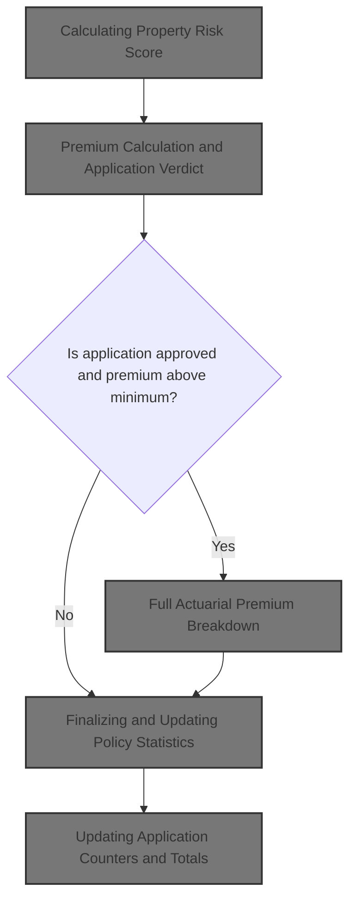
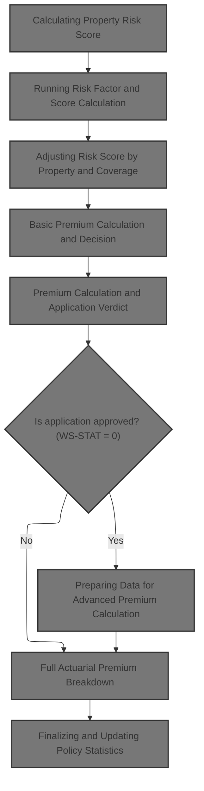
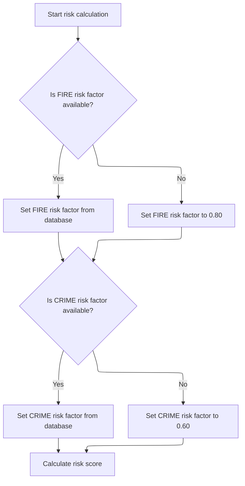
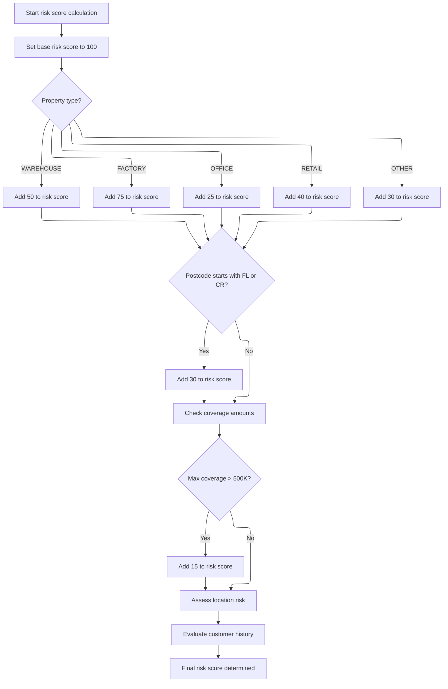
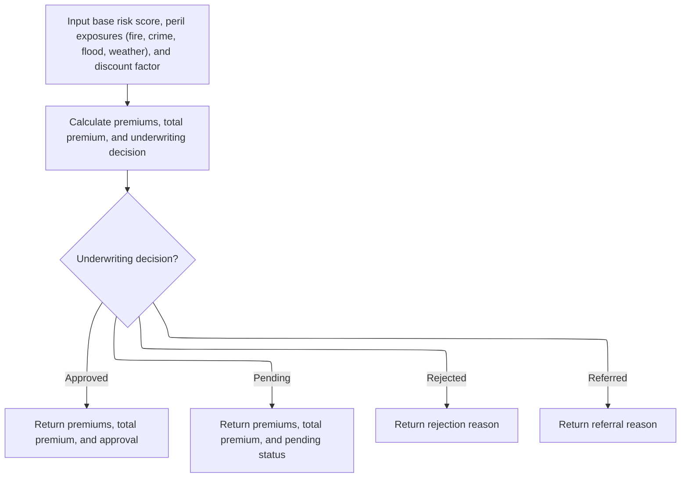
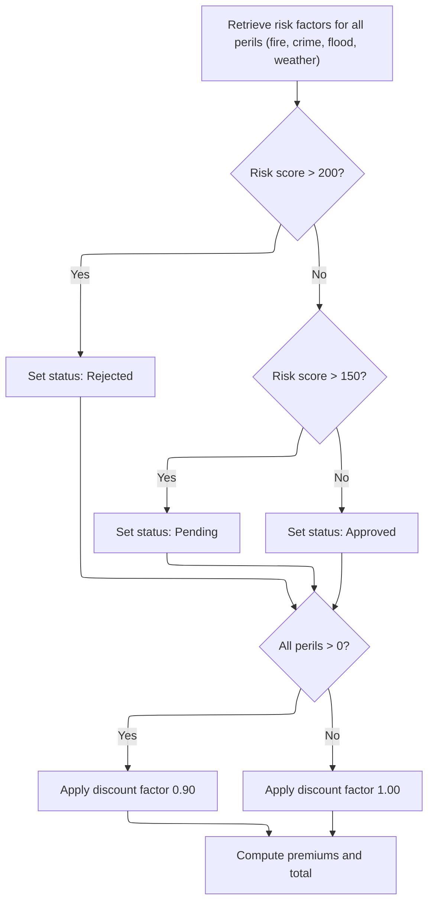
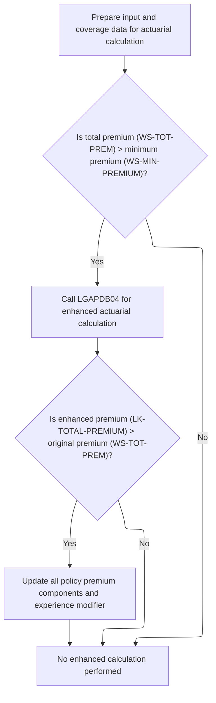
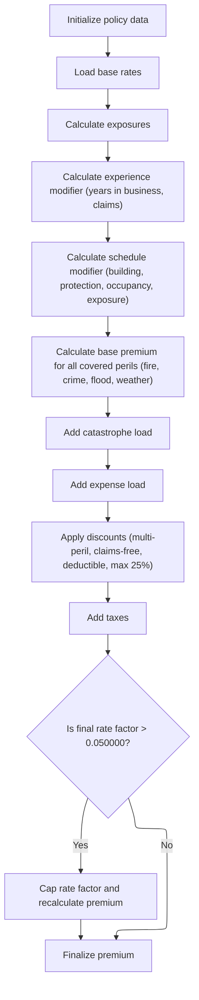
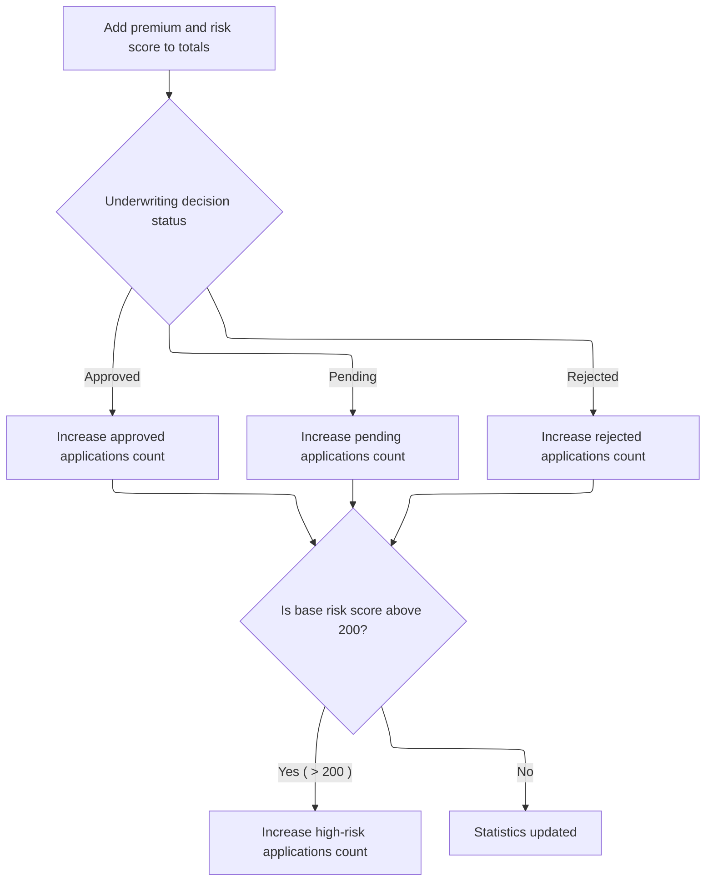

This document describes the flow for processing commercial insurance applications. The process includes assessing risk, calculating premiums, making an underwriting decision, and updating policy statistics. Input data includes property, customer, coverage, and claims information, and the output is the premium calculation, application decision, and updated statistics.



# Spec

## Detailed View of the Program's Functionality

# Starting Commercial Policy Processing

This program is the main entry point for processing commercial insurance policies. It reads input records, validates them, and for commercial policies, it orchestrates the calculation of risk scores and premiums, applies business rules, writes output, and updates statistics.

---

## File and Data Initialization

- The program defines several files for input, output, configuration, rates, and summary data.
- It sets up working storage for counters, configuration values (like maximum risk score and minimum premium), and actuarial calculation interfaces.
- On startup, it initializes all counters and data areas, loads configuration values (from file or defaults), opens all necessary files, and writes headers to the output.

---

## Main Processing Loop

- The program reads each input record in a loop.
- For each record:
  - It increments the record count.
  - It validates the record for required fields and business constraints (e.g., policy type, customer number, coverage limits).
  - If the record is valid and is a commercial policy, it proceeds to the main commercial processing routine.
  - If the record is invalid or not a commercial policy, it writes an error or unsupported record to the output.

---

## Commercial Policy Processing

### 1\. Calculating Property Risk Score

- The program calls an external module to calculate the risk score for the property and customer.
- All relevant property and customer data are passed to this module, which returns a risk score.
- This step is just a wrapper; the actual calculation is done externally.

### 2\. Running Risk Factor and Score Calculation (in LGAPDB02)

- The external module retrieves risk factors for fire and crime from a database. If unavailable, it uses default values.
- It then calculates the risk score:
  - Starts with a base value.
  - Adjusts based on property type (e.g., warehouse, factory, office, retail, or other).
  - Adds more if the postcode starts with certain prefixes.
  - Increases the score if the maximum coverage exceeds a threshold.
  - Further adjusts based on location (urban, suburban, rural) using latitude and longitude.
  - Modifies the score based on customer history (e.g., new, good, risky).

### 3\. Calculating Premiums After Risk Assessment

- After obtaining the risk score, the program proceeds to calculate premiums.

### 4\. Basic Premium Calculation and Decision

- The program calls another external module, passing the risk score and peril indicators (fire, crime, flood, weather).
- This module:
  - Retrieves risk factors for each peril.
  - Determines the underwriting decision (approved, pending, rejected) based on the risk score using hardcoded thresholds.
  - Calculates premiums for each peril, applying a discount if all perils are covered.
  - Sums up the premiums for a total.

### 5\. Premium Calculation and Application Verdict (in LGAPDB03)

- The verdict is set based on the risk score:
  - Above the highest threshold: rejected.
  - Between thresholds: pending.
  - Below: approved.
- Premiums are calculated for each peril using the risk score, peril factor, peril value, and discount factor.
- The total premium is the sum of all peril premiums.

---

## Enhanced Actuarial Premium Calculation

- If the application is approved, the program checks if the total premium exceeds the minimum premium.
- If so, it prepares all relevant data (customer, property, coverage, claims) for an advanced actuarial calculation.

### Preparing Data for Advanced Premium Calculation

- All input and coverage data are moved into local variables for the actuarial calculation.
- If the total premium is above the minimum, the advanced calculation module is called.
- If the enhanced premium is higher than the original, all premium components and the experience modifier are updated with the enhanced values.

---

## Full Actuarial Premium Breakdown (in LGAPDB04)

- The advanced module performs a detailed breakdown:
  - Initializes policy data and loads base rates (from database or defaults).
  - Calculates exposures (building, contents, business interruption).
  - Computes the experience modifier based on years in business and claims history, clamped within a range.
  - Calculates a schedule modifier based on building age, protection class, occupancy, and exposure density, also clamped.
  - Calculates base premiums for each peril, with special multipliers for crime and flood.
  - Adds catastrophe and expense loads, and a profit margin.
  - Applies discounts for multi-peril, claims-free history, and high deductibles, capped at a maximum.
  - Adds taxes.
  - Calculates the final premium and rate factor, capping the rate if it exceeds a threshold.

---

## Applying Business Rules

- After all calculations, the program applies final business rules:
  - If the risk score exceeds the maximum, the application is rejected.
  - If the premium is below the minimum, the application is set to pending.
  - If the risk score is high but not over the maximum, the application is pending for underwriter review.
  - Otherwise, the application is approved.

---

## Writing Output

- The program writes the results for each record to the output file, including customer, property, risk score, all premium components, total premium, status, and any rejection reason.

---

## Finalizing and Updating Policy Statistics

- The program updates running totals and counters:
  - Adds the current premium and risk score to totals.
  - Increments the count for approved, pending, or rejected applications based on the decision.
  - Increments a high-risk counter if the risk score is above a certain threshold.

---

## Summary and Reporting

- After all records are processed, the program closes all files.
- It generates a summary file with totals for processed, approved, pending, and rejected policies, total premium, and average risk score.
- It displays a summary of processing statistics to the console.

---

## Error and Non-Commercial Handling

- For invalid or unsupported records, the program writes an error or unsupported status to the output, with zeroed premiums and an appropriate message.

---

## Overall Flow

1. Initialize and load configuration.
2. Open files and write headers.
3. For each input record:
   - Validate.
   - If valid and commercial, process:
     - Calculate risk score.
     - Calculate basic premiums and make a decision.
     - If approved and premium is high enough, run advanced actuarial calculation.
     - Apply business rules.
     - Write output.
     - Update statistics.
   - If invalid or unsupported, write error/unsupported output.
4. After all records, close files, generate summary, and display stats.

---

This structure ensures that every commercial policy is evaluated for risk, priced accordingly, and tracked for reporting, with clear separation between basic and advanced actuarial logic.

# Rule Definition

| Paragraph Name                                                                                                            | Rule ID | Category          | Description                                                                                                                                                                                                                                                                                     | Conditions                                                                                                                                             | Remarks                                                                                                                                                                                                                                                                 |
| ------------------------------------------------------------------------------------------------------------------------- | ------- | ----------------- | ----------------------------------------------------------------------------------------------------------------------------------------------------------------------------------------------------------------------------------------------------------------------------------------------- | ------------------------------------------------------------------------------------------------------------------------------------------------------ | ----------------------------------------------------------------------------------------------------------------------------------------------------------------------------------------------------------------------------------------------------------------------- |
| P008-VALIDATE-INPUT-RECORD, P007-READ-INPUT, P006-PROCESS-RECORDS                                                         | RL-001  | Conditional Logic | The system must accept and validate structured input records containing property, customer, coverage, and claims data. Records must be validated for required fields and logical consistency before processing.                                                                                 | Input record must contain property type, customer number, and at least one coverage limit. Total coverage must not exceed maximum TIV (50,000,000.00). | Customer number: string, Property type: string, Coverage limits: number. Maximum TIV: 50,000,000.00. Error records are output with status 'ERROR' and the first error message.                                                                                          |
| LGAPDB02: GET-RISK-FACTORS, CALCULATE-RISK-SCORE, CHECK-COVERAGE-AMOUNTS, ASSESS-LOCATION-RISK, EVALUATE-CUSTOMER-HISTORY | RL-002  | Computation       | The risk score is calculated using property type, postcode, location, coverage amounts, and customer history. If fire or crime risk factors are not available, default values are used. Adjustments are made for property type, postcode prefix, high coverage, location, and customer history. | Valid input record. Fire or crime risk factors missing from database triggers defaults.                                                                | Default fire factor: 0.80, default crime factor: 0.60. Postcode prefix 'FL' or 'CR' adds 30. Any coverage > 500,000 adds 15. Location and customer history adjust score as per rules. Output: integer risk score.                                                       |
| LGAPDB03: CALCULATE-PREMIUMS, CALCULATE-VERDICT                                                                           | RL-003  | Computation       | Premiums for each peril (fire, crime, flood, weather) are calculated using the risk score and peril indicators. A discount factor is applied if all perils are covered. The calculation returns status code, description, rejection reason, premiums, total premium, and discount factor.       | Valid risk score and peril indicators. Discount applies if all perils selected.                                                                        | Discount factor: 0.90 if all perils covered, 1.00 otherwise. Status code: 0=Approved, 1=Pending, 2=Rejected. Output includes: status, status description, rejection reason, premiums for each peril (number), total premium (number), discount factor (number).         |
| LGAPDB03: CALCULATE-VERDICT, LGAPDB01: P011D-APPLY-BUSINESS-RULES                                                         | RL-004  | Conditional Logic | The application status is determined by the risk score and premium. Status is set to Rejected if risk score exceeds maximum, Pending if above threshold or premium below minimum, Approved otherwise.                                                                                           | Risk score and premium calculated. Minimum premium: 500.00. Maximum risk score: 250 (default, configurable).                                           | Status code: 2=Rejected, 1=Pending, 0=Approved. Status description: 'REJECTED', 'PENDING', 'APPROVED'. Rejection reason as per rule. Minimum premium: 500.00. Maximum risk score: 250 (default).                                                                        |
| LGAPDB01: P011C-ENHANCED-ACTUARIAL-CALC, LGAPDB04: P100-MAIN and subroutines                                              | RL-005  | Computation       | If the application is approved and the total premium exceeds the minimum, an enhanced actuarial calculation is performed using all customer, property, coverage, and claims data. This produces detailed premium components and modifiers.                                                      | Application approved and total premium > minimum premium (500.00).                                                                                     | Output includes: premiums for each peril (number), total premium (number), base amount, catastrophe load, expense load, profit load, discount amount, tax amount, experience modifier (0.5-2.0), schedule modifier (-0.20 to 0.40), final rate factor (capped at 0.05). |
| LGAPDB01: P011F-UPDATE-STATISTICS, P015-GENERATE-SUMMARY, P016-DISPLAY-STATS                                              | RL-006  | Data Assignment   | After processing each record, the system updates running totals for premium and risk score, increments counters for approved, pending, rejected, and high-risk applications.                                                                                                                    | After each record processed, based on application status and risk score.                                                                               | Counters: approved, pending, rejected, high-risk (risk score > 200). Running totals: total premium (number), risk score (number).                                                                                                                                       |

# User Stories

## User Story 1: Submit insurance application and receive risk assessment and premium calculation

---

### Story Description:

As an insurance applicant, I want to submit my property, customer, coverage, and claims information so that the system can validate my application, assess risk, calculate premiums, determine application status, and provide detailed premium breakdowns if approved.

---

### Business Rule Mapping:

| Rule ID | Paragraph Name                                                                                                            | Rule Description                                                                                                                                                                                                                                                                                |
| ------- | ------------------------------------------------------------------------------------------------------------------------- | ----------------------------------------------------------------------------------------------------------------------------------------------------------------------------------------------------------------------------------------------------------------------------------------------- |
| RL-001  | P008-VALIDATE-INPUT-RECORD, P007-READ-INPUT, P006-PROCESS-RECORDS                                                         | The system must accept and validate structured input records containing property, customer, coverage, and claims data. Records must be validated for required fields and logical consistency before processing.                                                                                 |
| RL-002  | LGAPDB02: GET-RISK-FACTORS, CALCULATE-RISK-SCORE, CHECK-COVERAGE-AMOUNTS, ASSESS-LOCATION-RISK, EVALUATE-CUSTOMER-HISTORY | The risk score is calculated using property type, postcode, location, coverage amounts, and customer history. If fire or crime risk factors are not available, default values are used. Adjustments are made for property type, postcode prefix, high coverage, location, and customer history. |
| RL-003  | LGAPDB03: CALCULATE-PREMIUMS, CALCULATE-VERDICT                                                                           | Premiums for each peril (fire, crime, flood, weather) are calculated using the risk score and peril indicators. A discount factor is applied if all perils are covered. The calculation returns status code, description, rejection reason, premiums, total premium, and discount factor.       |
| RL-004  | LGAPDB03: CALCULATE-VERDICT, LGAPDB01: P011D-APPLY-BUSINESS-RULES                                                         | The application status is determined by the risk score and premium. Status is set to Rejected if risk score exceeds maximum, Pending if above threshold or premium below minimum, Approved otherwise.                                                                                           |
| RL-005  | LGAPDB01: P011C-ENHANCED-ACTUARIAL-CALC, LGAPDB04: P100-MAIN and subroutines                                              | If the application is approved and the total premium exceeds the minimum, an enhanced actuarial calculation is performed using all customer, property, coverage, and claims data. This produces detailed premium components and modifiers.                                                      |
| RL-006  | LGAPDB01: P011F-UPDATE-STATISTICS, P015-GENERATE-SUMMARY, P016-DISPLAY-STATS                                              | After processing each record, the system updates running totals for premium and risk score, increments counters for approved, pending, rejected, and high-risk applications.                                                                                                                    |

---

### Relevant Functionality:

- **P008-VALIDATE-INPUT-RECORD**
  1. **RL-001:**
     - Read input record
     - If property type is not commercial/personal/farm, log error
     - If customer number is missing, log error
     - If all coverage limits are zero, log error
     - If total coverage exceeds maximum TIV, log warning
     - If errors, output error record with status 'ERROR' and message
     - Otherwise, proceed to risk and premium calculation
- **LGAPDB02: GET-RISK-FACTORS**
  1. **RL-002:**
     - Retrieve fire and crime risk factors from database
     - If not found, use defaults (0.80 for fire, 0.60 for crime)
     - Start with base risk score 100
     - Adjust by property type (e.g., +75 for FACTORY, +50 for WAREHOUSE, etc.)
     - If postcode starts with 'FL' or 'CR', add 30
     - If any coverage > 500,000, add 15
     - Adjust for location (urban, suburban, rural)
     - Adjust for customer history ('N': +10, 'G': -5, 'R': +25, other: +10)
     - Return final risk score
- **LGAPDB03: CALCULATE-PREMIUMS**
  1. **RL-003:**
     - If all perils selected, set discount factor to 0.90, else 1.00
     - For each peril, compute premium: (risk score \* peril factor) \* peril indicator \* discount factor
     - Sum peril premiums for total premium
     - Determine status: risk score > 200 = Rejected, > 150 = Pending, else Approved
     - Set status description and rejection reason accordingly
     - Output all calculated fields
- **LGAPDB03: CALCULATE-VERDICT**
  1. **RL-004:**
     - If risk score > maximum, set status to Rejected, reason: 'Risk score exceeds maximum acceptable level'
     - Else if total premium < minimum, set status to Pending, reason: 'Premium below minimum - requires review'
     - Else if risk score > 180, set status to Pending, reason: 'High risk - underwriter review required'
     - Else, set status to Approved, reason blank
- **LGAPDB01: P011C-ENHANCED-ACTUARIAL-CALC**
  1. **RL-005:**
     - Prepare input structure with all relevant data
     - Calculate exposures and insured value
     - Calculate experience modifier (based on years in business and claims history, clamp 0.5-2.0)
     - Calculate schedule modifier (based on building age, protection class, occupancy, exposure density, clamp -0.20 to 0.40)
     - Calculate base premium for each peril
     - Add catastrophe, expense, profit loads
     - Calculate and cap discount amount (max 0.25 of premium components)
     - Calculate tax amount
     - Calculate final rate factor, cap at 0.05, recalculate premium if capped
     - Output all calculated fields
- **LGAPDB01: P011F-UPDATE-STATISTICS**
  1. **RL-006:**
     - Add current total premium to running total
     - Add current risk score to running total
     - Increment approved, pending, or rejected counter based on status
     - If risk score > 200, increment high-risk counter
     - At end, output summary with all statistics

# Code Walkthrough

## Starting Commercial Policy Processing



<SwmSnippet path="/base/src/LGAPDB01.cbl" line="258">

---

In `P011-PROCESS-COMMERCIAL` we kick off the flow by calculating the risk score for the property and customer. This is done by calling P011A-CALCULATE-RISK-SCORE, which is necessary because the risk score is used as input for all premium and decision logic that follows.

```cobol
       P011-PROCESS-COMMERCIAL.
           PERFORM P011A-CALCULATE-RISK-SCORE
           PERFORM P011B-BASIC-PREMIUM-CALC
```

---

</SwmSnippet>

### Calculating Property Risk Score

<SwmSnippet path="/base/src/LGAPDB01.cbl" line="268">

---

`P011A-CALCULATE-RISK-SCORE` just passes all the relevant property and customer data to LGAPDB02, which does the actual risk score calculation. No logic here, just a wrapper for the external call.

```cobol
       P011A-CALCULATE-RISK-SCORE.
           CALL 'LGAPDB02' USING IN-PROPERTY-TYPE, IN-POSTCODE, 
                                IN-LATITUDE, IN-LONGITUDE,
                                IN-BUILDING-LIMIT, IN-CONTENTS-LIMIT,
                                IN-FLOOD-COVERAGE, IN-WEATHER-COVERAGE,
                                IN-CUSTOMER-HISTORY, WS-BASE-RISK-SCR.
```

---

</SwmSnippet>

### Running Risk Factor and Score Calculation



<SwmSnippet path="/base/src/LGAPDB02.cbl" line="39">

---

`MAIN-LOGIC` first grabs risk factors for fire and crime from the database (or defaults if missing), then runs the risk score calculation using those values and the input data.

```cobol
       MAIN-LOGIC.
           PERFORM GET-RISK-FACTORS
           PERFORM CALCULATE-RISK-SCORE
           GOBACK.
```

---

</SwmSnippet>

<SwmSnippet path="/base/src/LGAPDB02.cbl" line="44">

---

`GET-RISK-FACTORS` fetches fire and crime risk factors from the database, but if the query fails, it falls back to hardcoded defaults (0.80 for fire, 0.60 for crime) so the calculation always has values to work with.

```cobol
       GET-RISK-FACTORS.
           EXEC SQL
               SELECT FACTOR_VALUE INTO :WS-FIRE-FACTOR
               FROM RISK_FACTORS
               WHERE PERIL_TYPE = 'FIRE'
           END-EXEC.
           
           IF SQLCODE = 0
               CONTINUE
           ELSE
               MOVE 0.80 TO WS-FIRE-FACTOR
           END-IF.
           
           EXEC SQL
               SELECT FACTOR_VALUE INTO :WS-CRIME-FACTOR
               FROM RISK_FACTORS
               WHERE PERIL_TYPE = 'CRIME'
           END-EXEC.
           
           IF SQLCODE = 0
               CONTINUE
           ELSE
               MOVE 0.60 TO WS-CRIME-FACTOR
           END-IF.
```

---

</SwmSnippet>

### Adjusting Risk Score by Property and Coverage



<SwmSnippet path="/base/src/LGAPDB02.cbl" line="69">

---

`CALCULATE-RISK-SCORE` starts with a base score, bumps it up based on property type and postcode prefix, then refines it by running coverage, location, and customer history checks. All adjustments use hardcoded constants.

```cobol
       CALCULATE-RISK-SCORE.
           MOVE 100 TO LK-RISK-SCORE

           EVALUATE LK-PROPERTY-TYPE
             WHEN 'WAREHOUSE'
               ADD 50 TO LK-RISK-SCORE
             WHEN 'FACTORY' 
               ADD 75 TO LK-RISK-SCORE
             WHEN 'OFFICE'
               ADD 25 TO LK-RISK-SCORE
             WHEN 'RETAIL'
               ADD 40 TO LK-RISK-SCORE
             WHEN OTHER
               ADD 30 TO LK-RISK-SCORE
           END-EVALUATE

           IF LK-POSTCODE(1:2) = 'FL' OR
              LK-POSTCODE(1:2) = 'CR'
             ADD 30 TO LK-RISK-SCORE
           END-IF

           PERFORM CHECK-COVERAGE-AMOUNTS
           PERFORM ASSESS-LOCATION-RISK  
           PERFORM EVALUATE-CUSTOMER-HISTORY.
```

---

</SwmSnippet>

<SwmSnippet path="/base/src/LGAPDB02.cbl" line="94">

---

`CHECK-COVERAGE-AMOUNTS` finds the highest coverage among fire, crime, flood, and weather, and if it's over 500,000, bumps the risk score by 15. The threshold and increment are hardcoded business rules.

```cobol
       CHECK-COVERAGE-AMOUNTS.
           MOVE ZERO TO WS-MAX-COVERAGE
           
           IF LK-FIRE-COVERAGE > WS-MAX-COVERAGE
               MOVE LK-FIRE-COVERAGE TO WS-MAX-COVERAGE
           END-IF
           
           IF LK-CRIME-COVERAGE > WS-MAX-COVERAGE
               MOVE LK-CRIME-COVERAGE TO WS-MAX-COVERAGE
           END-IF
           
           IF LK-FLOOD-COVERAGE > WS-MAX-COVERAGE
               MOVE LK-FLOOD-COVERAGE TO WS-MAX-COVERAGE
           END-IF
           
           IF LK-WEATHER-COVERAGE > WS-MAX-COVERAGE
               MOVE LK-WEATHER-COVERAGE TO WS-MAX-COVERAGE
           END-IF
           
           IF WS-MAX-COVERAGE > WS-COVERAGE-500K
               ADD 15 TO LK-RISK-SCORE
           END-IF.
```

---

</SwmSnippet>

### Calculating Premiums After Risk Assessment

<SwmSnippet path="/base/src/LGAPDB01.cbl" line="258">

---

Back in `P011-PROCESS-COMMERCIAL`, after getting the risk score, we move straight to calculating premiums by calling P011B-BASIC-PREMIUM-CALC. The risk score we just got is used as input for this step.

```cobol
       P011-PROCESS-COMMERCIAL.
           PERFORM P011A-CALCULATE-RISK-SCORE
           PERFORM P011B-BASIC-PREMIUM-CALC
```

---

</SwmSnippet>

### Basic Premium Calculation and Decision



<SwmSnippet path="/base/src/LGAPDB01.cbl" line="275">

---

`P011B-BASIC-PREMIUM-CALC` calls LGAPDB03, passing the risk score and peril indicators. LGAPDB03 handles the premium calculations and sets the application status and reason.

```cobol
       P011B-BASIC-PREMIUM-CALC.
           CALL 'LGAPDB03' USING WS-BASE-RISK-SCR, IN-FIRE-PERIL, 
                                IN-CRIME-PERIL, IN-FLOOD-PERIL, 
                                IN-WEATHER-PERIL, WS-STAT,
                                WS-STAT-DESC, WS-REJ-RSN, WS-FR-PREM,
                                WS-CR-PREM, WS-FL-PREM, WS-WE-PREM,
                                WS-TOT-PREM, WS-DISC-FACT.
```

---

</SwmSnippet>

### Premium Calculation and Application Verdict



<SwmSnippet path="/base/src/LGAPDB03.cbl" line="42">

---

`MAIN-LOGIC` in LGAPDB03 first gets risk factors, then uses them and the risk score to set the application verdict and calculate premiums for each peril.

```cobol
       MAIN-LOGIC.
           PERFORM GET-RISK-FACTORS
           PERFORM CALCULATE-VERDICT
           PERFORM CALCULATE-PREMIUMS
           GOBACK.
```

---

</SwmSnippet>

<SwmSnippet path="/base/src/LGAPDB03.cbl" line="48">

---

`GET-RISK-FACTORS` fetches fire and crime factors from the DB, but if not found, falls back to hardcoded defaults (0.80 for fire, 0.60 for crime) so premium calculations always have values.

```cobol
       GET-RISK-FACTORS.
           EXEC SQL
               SELECT FACTOR_VALUE INTO :WS-FIRE-FACTOR
               FROM RISK_FACTORS
               WHERE PERIL_TYPE = 'FIRE'
           END-EXEC.
           
           IF SQLCODE = 0
               CONTINUE
           ELSE
               MOVE 0.80 TO WS-FIRE-FACTOR
           END-IF.
           
           EXEC SQL
               SELECT FACTOR_VALUE INTO :WS-CRIME-FACTOR
               FROM RISK_FACTORS
               WHERE PERIL_TYPE = 'CRIME'
           END-EXEC.
           
           IF SQLCODE = 0
               CONTINUE
           ELSE
               MOVE 0.60 TO WS-CRIME-FACTOR
           END-IF.
```

---

</SwmSnippet>

<SwmSnippet path="/base/src/LGAPDB03.cbl" line="73">

---

`CALCULATE-VERDICT` checks the risk score and sets the application status, description, and rejection reason using hardcoded thresholds (200 and 150) to split into rejected, pending, or approved.

```cobol
       CALCULATE-VERDICT.
           IF LK-RISK-SCORE > 200
             MOVE 2 TO LK-STAT
             MOVE 'REJECTED' TO LK-STAT-DESC
             MOVE 'High Risk Score - Manual Review Required' 
               TO LK-REJ-RSN
           ELSE
             IF LK-RISK-SCORE > 150
               MOVE 1 TO LK-STAT
               MOVE 'PENDING' TO LK-STAT-DESC
               MOVE 'Medium Risk - Pending Review'
                 TO LK-REJ-RSN
             ELSE
               MOVE 0 TO LK-STAT
               MOVE 'APPROVED' TO LK-STAT-DESC
               MOVE SPACES TO LK-REJ-RSN
             END-IF
           END-IF.
```

---

</SwmSnippet>

<SwmSnippet path="/base/src/LGAPDB03.cbl" line="92">

---

`CALCULATE-PREMIUMS` sets a discount if all perils are covered, then calculates each peril's premium using risk score, peril factor, peril value, and the discount. Sums them for the total premium.

```cobol
       CALCULATE-PREMIUMS.
           MOVE 1.00 TO LK-DISC-FACT
           
           IF LK-FIRE-PERIL > 0 AND
              LK-CRIME-PERIL > 0 AND
              LK-FLOOD-PERIL > 0 AND
              LK-WEATHER-PERIL > 0
             MOVE 0.90 TO LK-DISC-FACT
           END-IF

           COMPUTE LK-FIRE-PREMIUM =
             ((LK-RISK-SCORE * WS-FIRE-FACTOR) * LK-FIRE-PERIL *
               LK-DISC-FACT)
           
           COMPUTE LK-CRIME-PREMIUM =
             ((LK-RISK-SCORE * WS-CRIME-FACTOR) * LK-CRIME-PERIL *
               LK-DISC-FACT)
           
           COMPUTE LK-FLOOD-PREMIUM =
             ((LK-RISK-SCORE * WS-FLOOD-FACTOR) * LK-FLOOD-PERIL *
               LK-DISC-FACT)
           
           COMPUTE LK-WEATHER-PREMIUM =
             ((LK-RISK-SCORE * WS-WEATHER-FACTOR) * LK-WEATHER-PERIL *
               LK-DISC-FACT)

           COMPUTE LK-TOTAL-PREMIUM = 
             LK-FIRE-PREMIUM + LK-CRIME-PREMIUM + 
             LK-FLOOD-PREMIUM + LK-WEATHER-PREMIUM. 
```

---

</SwmSnippet>

### Enhanced Actuarial Premium Calculation

<SwmSnippet path="/base/src/LGAPDB01.cbl" line="261">

---

Back in `P011-PROCESS-COMMERCIAL`, after basic premium calculation, we check if the status is approved. If so, we run the enhanced actuarial calculation to see if a more advanced premium breakdown is needed.

```cobol
           IF WS-STAT = 0
               PERFORM P011C-ENHANCED-ACTUARIAL-CALC
           END-IF
```

---

</SwmSnippet>

### Preparing Data for Advanced Premium Calculation



<SwmSnippet path="/base/src/LGAPDB01.cbl" line="283">

---

In `P011C-ENHANCED-ACTUARIAL-CALC`, we prep all the customer, property, coverage, and claims data by moving it into local variables for the actuarial calculation.

```cobol
       P011C-ENHANCED-ACTUARIAL-CALC.
      *    Prepare input structure for actuarial calculation
           MOVE IN-CUSTOMER-NUM TO LK-CUSTOMER-NUM
           MOVE WS-BASE-RISK-SCR TO LK-RISK-SCORE
           MOVE IN-PROPERTY-TYPE TO LK-PROPERTY-TYPE
           MOVE IN-TERRITORY-CODE TO LK-TERRITORY
           MOVE IN-CONSTRUCTION-TYPE TO LK-CONSTRUCTION-TYPE
           MOVE IN-OCCUPANCY-CODE TO LK-OCCUPANCY-CODE
           MOVE IN-SPRINKLER-IND TO LK-PROTECTION-CLASS
           MOVE IN-YEAR-BUILT TO LK-YEAR-BUILT
           MOVE IN-SQUARE-FOOTAGE TO LK-SQUARE-FOOTAGE
           MOVE IN-YEARS-IN-BUSINESS TO LK-YEARS-IN-BUSINESS
           MOVE IN-CLAIMS-COUNT-3YR TO LK-CLAIMS-COUNT-5YR
           MOVE IN-CLAIMS-AMOUNT-3YR TO LK-CLAIMS-AMOUNT-5YR
           
      *    Set coverage data
           MOVE IN-BUILDING-LIMIT TO LK-BUILDING-LIMIT
           MOVE IN-CONTENTS-LIMIT TO LK-CONTENTS-LIMIT
           MOVE IN-BI-LIMIT TO LK-BI-LIMIT
           MOVE IN-FIRE-DEDUCTIBLE TO LK-FIRE-DEDUCTIBLE
           MOVE IN-WIND-DEDUCTIBLE TO LK-WIND-DEDUCTIBLE
           MOVE IN-FLOOD-DEDUCTIBLE TO LK-FLOOD-DEDUCTIBLE
           MOVE IN-OTHER-DEDUCTIBLE TO LK-OTHER-DEDUCTIBLE
           MOVE IN-FIRE-PERIL TO LK-FIRE-PERIL
           MOVE IN-CRIME-PERIL TO LK-CRIME-PERIL
           MOVE IN-FLOOD-PERIL TO LK-FLOOD-PERIL
           MOVE IN-WEATHER-PERIL TO LK-WEATHER-PERIL
```

---

</SwmSnippet>

<SwmSnippet path="/base/src/LGAPDB01.cbl" line="312">

---

After prepping the data in `P011C-ENHANCED-ACTUARIAL-CALC`, we call LGAPDB04 for advanced premium calculation only if the current premium is above the minimum. If the enhanced premium comes out higher, we update the premium breakdown and experience modifier.

```cobol
           IF WS-TOT-PREM > WS-MIN-PREMIUM
               CALL 'LGAPDB04' USING LK-INPUT-DATA, LK-COVERAGE-DATA, 
                                    LK-OUTPUT-RESULTS
               
      *        Update with enhanced calculations if successful
               IF LK-TOTAL-PREMIUM > WS-TOT-PREM
                   MOVE LK-FIRE-PREMIUM TO WS-FR-PREM
                   MOVE LK-CRIME-PREMIUM TO WS-CR-PREM
                   MOVE LK-FLOOD-PREMIUM TO WS-FL-PREM
                   MOVE LK-WEATHER-PREMIUM TO WS-WE-PREM
                   MOVE LK-TOTAL-PREMIUM TO WS-TOT-PREM
                   MOVE LK-EXPERIENCE-MOD TO WS-EXPERIENCE-MOD
               END-IF
           END-IF.
```

---

</SwmSnippet>

### Full Actuarial Premium Breakdown



<SwmSnippet path="/base/src/LGAPDB04.cbl" line="138">

---

`P100-MAIN` runs through all the premium components: exposure, rates, modifiers, catastrophe load, expenses, discounts, taxes, and finally the total premium and rate factor. Each step adds or adjusts a part of the premium.

```cobol
       P100-MAIN.
           PERFORM P200-INIT
           PERFORM P300-RATES
           PERFORM P350-EXPOSURE
           PERFORM P400-EXP-MOD
           PERFORM P500-SCHED-MOD
           PERFORM P600-BASE-PREM
           PERFORM P700-CAT-LOAD
           PERFORM P800-EXPENSE
           PERFORM P900-DISC
           PERFORM P950-TAXES
           PERFORM P999-FINAL
           GOBACK.
```

---

</SwmSnippet>

<SwmSnippet path="/base/src/LGAPDB04.cbl" line="234">

---

`P400-EXP-MOD` calculates the experience modifier based on years in business and claims history, clamps it between 0.5 and 2.0, and sets it for use in premium calculations. All constants are hardcoded business rules.

```cobol
       P400-EXP-MOD.
           MOVE 1.0000 TO WS-EXPERIENCE-MOD
           
           IF LK-YEARS-IN-BUSINESS >= 5
               IF LK-CLAIMS-COUNT-5YR = ZERO
                   MOVE 0.8500 TO WS-EXPERIENCE-MOD
               ELSE
                   COMPUTE WS-EXPERIENCE-MOD = 
                       1.0000 + 
                       ((LK-CLAIMS-AMOUNT-5YR / WS-TOTAL-INSURED-VAL) * 
                        WS-CREDIBILITY-FACTOR * 0.50)
                   
                   IF WS-EXPERIENCE-MOD > 2.0000
                       MOVE 2.0000 TO WS-EXPERIENCE-MOD
                   END-IF
                   
                   IF WS-EXPERIENCE-MOD < 0.5000
                       MOVE 0.5000 TO WS-EXPERIENCE-MOD
                   END-IF
               END-IF
           ELSE
               MOVE 1.1000 TO WS-EXPERIENCE-MOD
           END-IF
           
           MOVE WS-EXPERIENCE-MOD TO LK-EXPERIENCE-MOD.
```

---

</SwmSnippet>

<SwmSnippet path="/base/src/LGAPDB04.cbl" line="260">

---

`P500-SCHED-MOD` builds the schedule modifier by adjusting for building age, protection class, occupancy, and exposure density, then clamps it between -0.20 and 0.40. All adjustments use hardcoded constants and ranges.

```cobol
       P500-SCHED-MOD.
           MOVE +0.000 TO WS-SCHEDULE-MOD
           
      *    Building age factor
           EVALUATE TRUE
               WHEN LK-YEAR-BUILT >= 2010
                   SUBTRACT 0.050 FROM WS-SCHEDULE-MOD
               WHEN LK-YEAR-BUILT >= 1990
                   CONTINUE
               WHEN LK-YEAR-BUILT >= 1970
                   ADD 0.100 TO WS-SCHEDULE-MOD
               WHEN OTHER
                   ADD 0.200 TO WS-SCHEDULE-MOD
           END-EVALUATE
           
      *    Protection class factor
           EVALUATE LK-PROTECTION-CLASS
               WHEN '01' THRU '03'
                   SUBTRACT 0.100 FROM WS-SCHEDULE-MOD
               WHEN '04' THRU '06'
                   SUBTRACT 0.050 FROM WS-SCHEDULE-MOD
               WHEN '07' THRU '09'
                   CONTINUE
               WHEN OTHER
                   ADD 0.150 TO WS-SCHEDULE-MOD
           END-EVALUATE
           
      *    Occupancy hazard factor
           EVALUATE LK-OCCUPANCY-CODE
               WHEN 'OFF01' THRU 'OFF05'
                   SUBTRACT 0.025 FROM WS-SCHEDULE-MOD
               WHEN 'MFG01' THRU 'MFG10'
                   ADD 0.075 TO WS-SCHEDULE-MOD
               WHEN 'WHS01' THRU 'WHS05'
                   ADD 0.125 TO WS-SCHEDULE-MOD
               WHEN OTHER
                   CONTINUE
           END-EVALUATE
           
      *    Exposure density factor
           IF WS-EXPOSURE-DENSITY > 500.00
               ADD 0.100 TO WS-SCHEDULE-MOD
           ELSE
               IF WS-EXPOSURE-DENSITY < 50.00
                   SUBTRACT 0.050 FROM WS-SCHEDULE-MOD
               END-IF
           END-IF
           
           IF WS-SCHEDULE-MOD > +0.400
               MOVE +0.400 TO WS-SCHEDULE-MOD
           END-IF
           
           IF WS-SCHEDULE-MOD < -0.200
               MOVE -0.200 TO WS-SCHEDULE-MOD
           END-IF
           
           MOVE WS-SCHEDULE-MOD TO LK-SCHEDULE-MOD.
```

---

</SwmSnippet>

<SwmSnippet path="/base/src/LGAPDB04.cbl" line="318">

---

`P600-BASE-PREM` calculates premiums for each peril using exposures, base rates, experience and schedule modifiers, and trend factors. Crime and flood have extra multipliers (0.80 and 1.25). Sums up all applicable premiums for the base amount.

```cobol
       P600-BASE-PREM.
           MOVE ZERO TO LK-BASE-AMOUNT
           
      * FIRE PREMIUM
           IF LK-FIRE-PERIL > ZERO
               COMPUTE LK-FIRE-PREMIUM = 
                   (WS-BUILDING-EXPOSURE + WS-CONTENTS-EXPOSURE) *
                   WS-BASE-RATE (1, 1, 1, 1) * 
                   WS-EXPERIENCE-MOD *
                   (1 + WS-SCHEDULE-MOD) *
                   WS-TREND-FACTOR
                   
               ADD LK-FIRE-PREMIUM TO LK-BASE-AMOUNT
           END-IF
           
      * CRIME PREMIUM
           IF LK-CRIME-PERIL > ZERO
               COMPUTE LK-CRIME-PREMIUM = 
                   (WS-CONTENTS-EXPOSURE * 0.80) *
                   WS-BASE-RATE (2, 1, 1, 1) * 
                   WS-EXPERIENCE-MOD *
                   (1 + WS-SCHEDULE-MOD) *
                   WS-TREND-FACTOR
                   
               ADD LK-CRIME-PREMIUM TO LK-BASE-AMOUNT
           END-IF
           
      * FLOOD PREMIUM
           IF LK-FLOOD-PERIL > ZERO
               COMPUTE LK-FLOOD-PREMIUM = 
                   WS-BUILDING-EXPOSURE *
                   WS-BASE-RATE (3, 1, 1, 1) * 
                   WS-EXPERIENCE-MOD *
                   (1 + WS-SCHEDULE-MOD) *
                   WS-TREND-FACTOR * 1.25
                   
               ADD LK-FLOOD-PREMIUM TO LK-BASE-AMOUNT
           END-IF
           
      * WEATHER PREMIUM
           IF LK-WEATHER-PERIL > ZERO
               COMPUTE LK-WEATHER-PREMIUM = 
                   (WS-BUILDING-EXPOSURE + WS-CONTENTS-EXPOSURE) *
                   WS-BASE-RATE (4, 1, 1, 1) * 
                   WS-EXPERIENCE-MOD *
                   (1 + WS-SCHEDULE-MOD) *
                   WS-TREND-FACTOR
                   
               ADD LK-WEATHER-PREMIUM TO LK-BASE-AMOUNT
           END-IF.
```

---

</SwmSnippet>

<SwmSnippet path="/base/src/LGAPDB04.cbl" line="407">

---

`P900-DISC` calculates multi-peril, claims-free, and deductible discounts, sums them, caps the total at 0.25, and applies it to the premium components to get the discount amount. All rates and thresholds are hardcoded.

```cobol
       P900-DISC.
           MOVE ZERO TO WS-TOTAL-DISCOUNT
           
      * Multi-peril discount
           MOVE ZERO TO WS-MULTI-PERIL-DISC
           IF LK-FIRE-PERIL > ZERO AND
              LK-CRIME-PERIL > ZERO AND
              LK-FLOOD-PERIL > ZERO AND
              LK-WEATHER-PERIL > ZERO
               MOVE 0.100 TO WS-MULTI-PERIL-DISC
           ELSE
               IF LK-FIRE-PERIL > ZERO AND
                  LK-WEATHER-PERIL > ZERO AND
                  (LK-CRIME-PERIL > ZERO OR LK-FLOOD-PERIL > ZERO)
                   MOVE 0.050 TO WS-MULTI-PERIL-DISC
               END-IF
           END-IF
           
      * Claims-free discount  
           MOVE ZERO TO WS-CLAIMS-FREE-DISC
           IF LK-CLAIMS-COUNT-5YR = ZERO AND LK-YEARS-IN-BUSINESS >= 5
               MOVE 0.075 TO WS-CLAIMS-FREE-DISC
           END-IF
           
      * Deductible credit
           MOVE ZERO TO WS-DEDUCTIBLE-CREDIT
           IF LK-FIRE-DEDUCTIBLE >= 10000
               ADD 0.025 TO WS-DEDUCTIBLE-CREDIT
           END-IF
           IF LK-WIND-DEDUCTIBLE >= 25000  
               ADD 0.035 TO WS-DEDUCTIBLE-CREDIT
           END-IF
           IF LK-FLOOD-DEDUCTIBLE >= 50000
               ADD 0.045 TO WS-DEDUCTIBLE-CREDIT
           END-IF
           
           COMPUTE WS-TOTAL-DISCOUNT = 
               WS-MULTI-PERIL-DISC + WS-CLAIMS-FREE-DISC + 
               WS-DEDUCTIBLE-CREDIT
               
           IF WS-TOTAL-DISCOUNT > 0.250
               MOVE 0.250 TO WS-TOTAL-DISCOUNT
           END-IF
           
           COMPUTE LK-DISCOUNT-AMT = 
               (LK-BASE-AMOUNT + LK-CAT-LOAD-AMT + 
                LK-EXPENSE-LOAD-AMT + LK-PROFIT-LOAD-AMT) *
               WS-TOTAL-DISCOUNT.
```

---

</SwmSnippet>

<SwmSnippet path="/base/src/LGAPDB04.cbl" line="464">

---

`P999-FINAL` sums all premium components, subtracts discounts, adds tax, then calculates the rate factor. If the rate factor is over 0.05, it's capped and the premium is recalculated. Assumes insured value isn't zero.

```cobol
       P999-FINAL.
           COMPUTE LK-TOTAL-PREMIUM = 
               LK-BASE-AMOUNT + LK-CAT-LOAD-AMT + 
               LK-EXPENSE-LOAD-AMT + LK-PROFIT-LOAD-AMT -
               LK-DISCOUNT-AMT + LK-TAX-AMT
               
           COMPUTE LK-FINAL-RATE-FACTOR = 
               LK-TOTAL-PREMIUM / WS-TOTAL-INSURED-VAL
               
           IF LK-FINAL-RATE-FACTOR > 0.050000
               MOVE 0.050000 TO LK-FINAL-RATE-FACTOR
               COMPUTE LK-TOTAL-PREMIUM = 
                   WS-TOTAL-INSURED-VAL * LK-FINAL-RATE-FACTOR
           END-IF.
```

---

</SwmSnippet>

### Finalizing and Updating Policy Statistics

<SwmSnippet path="/base/src/LGAPDB01.cbl" line="264">

---

Back in `P011-PROCESS-COMMERCIAL`, after all calculations, we update statistics like premium totals and decision counters. This keeps reporting and tracking up to date.

```cobol
           PERFORM P011D-APPLY-BUSINESS-RULES
           PERFORM P011E-WRITE-OUTPUT-RECORD
           PERFORM P011F-UPDATE-STATISTICS.
```

---

</SwmSnippet>

## Updating Application Counters and Totals



<SwmSnippet path="/base/src/LGAPDB01.cbl" line="365">

---

In `P011F-UPDATE-STATISTICS`, we add the current premium and risk score to running totals, then increment the approved, pending, or rejected counters based on the status code. Also tracks high-risk cases if the score is over 200.

```cobol
       P011F-UPDATE-STATISTICS.
           ADD WS-TOT-PREM TO WS-TOTAL-PREMIUM-AMT
           ADD WS-BASE-RISK-SCR TO WS-CONTROL-TOTALS
           
           EVALUATE WS-STAT
               WHEN 0 ADD 1 TO WS-APPROVED-CNT
               WHEN 1 ADD 1 TO WS-PENDING-CNT
               WHEN 2 ADD 1 TO WS-REJECTED-CNT
           END-EVALUATE
```

---

</SwmSnippet>

<SwmSnippet path="/base/src/LGAPDB01.cbl" line="375">

---

After updating totals and counters, `P011F-UPDATE-STATISTICS` checks if the risk score is over 200 and bumps the high-risk counter if so. All stats are now up to date for reporting.

```cobol
           IF WS-BASE-RISK-SCR > 200
               ADD 1 TO WS-HIGH-RISK-CNT
           END-IF.
```

---

</SwmSnippet>

&nbsp;

*This is an auto-generated document by Swimm 🌊 and has not yet been verified by a human*

<SwmMeta version="3.0.0" repo-id="Z2l0aHViJTNBJTNBU3dpbW1pby1nZW5hcHAtaG91c2UlM0ElM0FHaXJpLVN3aW1t" repo-name="Swimmio-genapp-house"><sup>Powered by [Swimm](https://app.swimm.io/)</sup></SwmMeta>
