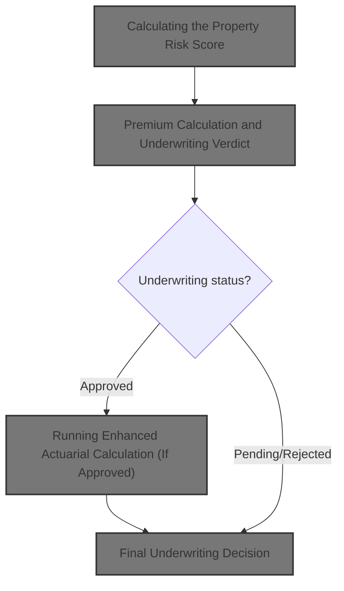
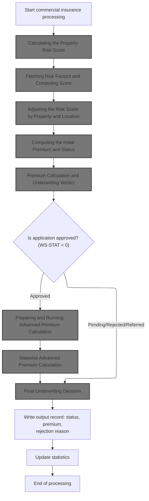
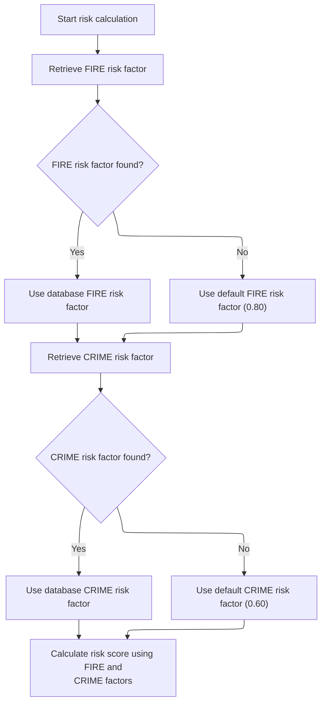
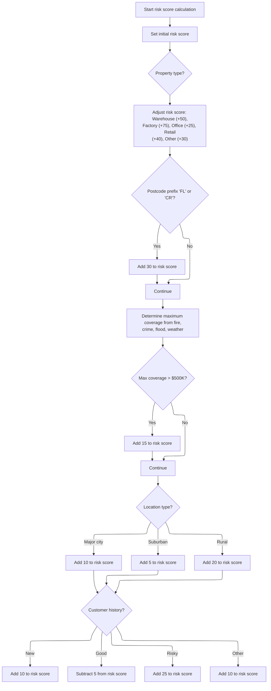
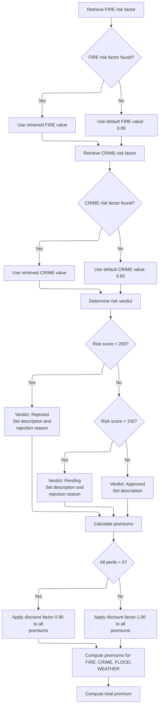
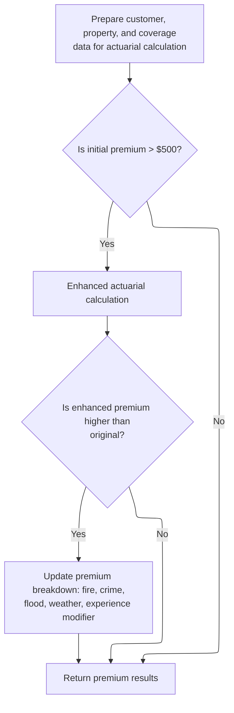
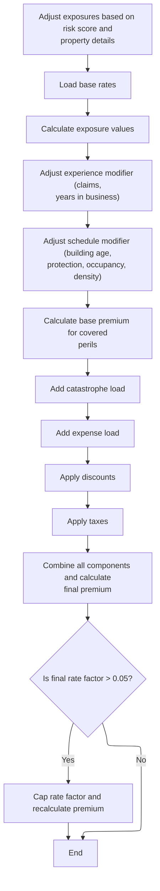
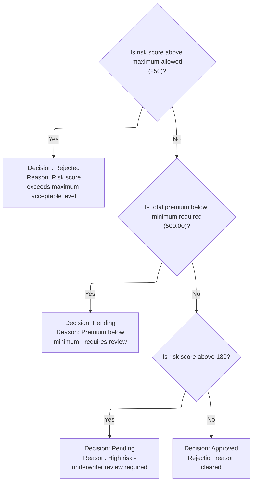
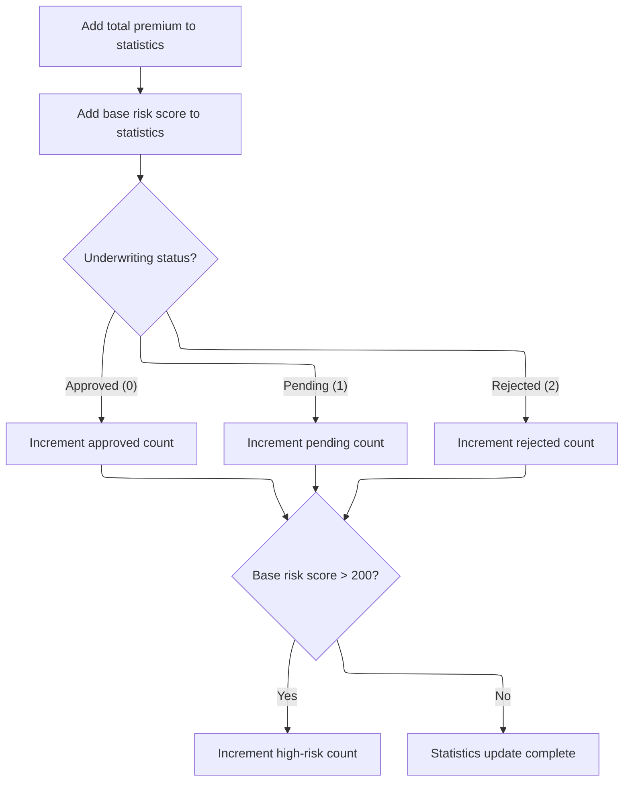

This document outlines the process for evaluating a commercial insurance policy application. The flow calculates a risk score using property, location, and customer data, determines the premium and underwriting status, and applies business rules to finalize the decision. The results are recorded and policy statistics are updated.



# Spec

## Detailed View of the Program's Functionality

a. Starting the Commercial Policy Calculation

The process begins by reading each input record and validating it. If the policy is commercial and passes validation, the commercial insurance processing routine is triggered. This routine orchestrates the calculation of risk score, premium, and underwriting decision, and manages output and statistics.

b. Calculating the Property Risk Score

The risk score calculation is delegated to a separate module. All relevant property, coverage, and customer data are passed to this module. The calculation starts with a base score and applies adjustments based on property type, postcode, coverage amounts, location, and customer history. For example, warehouses and factories add more to the score, certain postcode prefixes add risk, large coverage amounts bump the score, and urban/rural location and customer history further modify the score.

c. Fetching Risk Factors and Computing Score

The risk calculation module first attempts to fetch fire and crime risk factors from a database. If unavailable, default values are used. The risk score is then computed using these factors and the adjustments described above. The module ensures the calculation is robust even if database values are missing.

d. Adjusting the Risk Score by Property and Location

The risk score is incremented based on property type (e.g., warehouse, factory, office, retail, other), postcode prefix (certain prefixes add risk), maximum coverage amount (if over a threshold, adds risk), location (major cities, suburban, rural), and customer history (new, good, risky, other). Each adjustment is a business rule reflecting domain knowledge.

e. Calculating the Basic Premium

After the risk score is determined, the basic premium calculation routine is called. This routine passes the risk score and peril selections to another module responsible for premium and status calculation.

f. Computing the Initial Premium and Status

The premium and status calculation module fetches risk factors for fire and crime from the database (with defaults if missing), then classifies the risk score into rejected, pending, or approved using fixed thresholds. The premium for each peril is calculated using the risk score, peril-specific factors, and a discount if all perils are covered. The total premium is the sum of all peril premiums.

g. Premium Calculation and Underwriting Verdict

The module coordinates fetching risk factors, determining the underwriting verdict, and calculating premiums. If the risk score is above certain thresholds, the application is rejected or set to pending; otherwise, it is approved. Premiums are calculated for each peril and summed.

h. Running Enhanced Actuarial Calculation (If Approved)

If the policy is approved and the initial premium exceeds a minimum threshold, an enhanced actuarial calculation is performed. Input and coverage fields are mapped into structures expected by the advanced calculation module.

i. Preparing and Running Advanced Premium Calculation

The advanced calculation module receives prepared customer, property, and coverage data. If the initial premium is above the minimum, the module is called. If the enhanced premium is higher than the original, the premium breakdown fields are updated; otherwise, the original values are retained.

j. Stepwise Advanced Premium Calculation

The advanced calculation module runs a sequence of steps:

- Initializes exposures by scaling coverage limits with the risk score.
- Loads base rates from the database or uses defaults.
- Calculates exposure values.
- Adjusts experience modifier based on years in business and claims history.
- Adjusts schedule modifier based on building age, protection class, occupancy code, and exposure density.
- Calculates base premium for covered perils.
- Adds catastrophe loadings for hurricane, earthquake, tornado, and flood.
- Adds expense and profit loadings.
- Applies discounts for multi-peril coverage, claims-free history, and high deductibles.
- Applies taxes.
- Combines all components to calculate the final premium.
- Caps the final rate factor if it exceeds a maximum, recalculating the premium if necessary.

k. Applying Business Rules and Finalizing Output

After all premium calculations, business rules are applied to finalize the underwriting decision. The risk score and premium are checked against configured thresholds. If the risk score is too high, the application is rejected. If the premium is too low or the risk score is high but not over the max, it's set to pending. Otherwise, it's approved.

l. Writing the Output Record

All relevant customer, property, risk score, and premium breakdown fields are moved to the output record and written out. Status and rejection reason are included for clarity on underwriting decisions.

m. Updating Policy Statistics

After writing the output record, statistics are updated. The current premium and risk score are added to running totals, and approved, pending, or rejected counters are incremented based on the underwriting status. If the risk score is above a high threshold, the high-risk count is incremented. This provides a live tally of outcomes for reporting and review.

n. End of Processing

After all records are processed, files are closed, a summary is generated, and statistics are displayed. The summary includes counts of approved, pending, and rejected policies, total premium amount, and average risk score. The process then ends.

# Rule Definition

| Paragraph Name                                                                           | Rule ID | Category          | Description                                                                                                                                                                                                                                                                          | Conditions                                                                                             | Remarks                                                                                                                                                                                                                                                                                |
| ---------------------------------------------------------------------------------------- | ------- | ----------------- | ------------------------------------------------------------------------------------------------------------------------------------------------------------------------------------------------------------------------------------------------------------------------------------ | ------------------------------------------------------------------------------------------------------ | -------------------------------------------------------------------------------------------------------------------------------------------------------------------------------------------------------------------------------------------------------------------------------------- |
| P008-VALIDATE-INPUT-RECORD, P008A-LOG-ERROR                                              | RL-001  | Conditional Logic | Each input record must be validated for required fields. If any required field is missing or invalid (e.g., missing customer number, zero coverage), the record is marked as ERROR with a descriptive rejection reason, and further processing is skipped.                           | Required fields are missing or invalid (e.g., customer number is blank, all coverage limits are zero). | Status is set to 'ERROR'. RejectionReason is a descriptive string. Output fields are set to zero or blank as appropriate.                                                                                                                                                              |
| P011A-CALCULATE-RISK-SCORE (LGAPDB01), MAIN-LOGIC and CALCULATE-RISK-SCORE (LGAPDB02)    | RL-002  | Computation       | For valid input records, the risk score is calculated using property type, postcode prefix, maximum coverage, location type, and customer history, with specific adjustments for each factor.                                                                                        | Input record is valid (all required fields present and valid).                                         | Adjustments: Warehouse (+50), Factory (+75), Office (+25), Retail (+40), Other (+30). Postcode prefix 'FL' or 'CR': +30. Maximum coverage > 500,000.00: +15. Location: Major city (+10), Suburban (+5), Rural (+20). Customer history: New (+10), Good (-5), Risky (+25), Other (+10). |
| P011B-BASIC-PREMIUM-CALC (LGAPDB01), CALCULATE-VERDICT and CALCULATE-PREMIUMS (LGAPDB03) | RL-003  | Computation       | Premiums for each peril are calculated using the risk score, peril-specific factors, and a discount if all perils are selected. The total premium is the sum of all peril premiums. Underwriting status is determined by the risk score: >200=REJECTED, >150=PENDING, else APPROVED. | Input record is valid and risk score has been calculated.                                              | Peril factors: FIRE=0.80, CRIME=0.60, FLOOD=1.20, WEATHER=0.90. Discount factor: 0.90 if all perils selected, else 1.00. Status: 2=REJECTED, 1=PENDING, 0=APPROVED. RejectionReason is set accordingly.                                                                                |
| P011C-ENHANCED-ACTUARIAL-CALC (LGAPDB01), LGAPDB04                                       | RL-004  | Computation       | If the policy is approved and the initial premium is greater than the minimum premium, an enhanced actuarial calculation is performed. If the enhanced premium is higher than the original, the premium breakdown fields are updated; otherwise, the original values are kept.       | Policy is approved and initial premium > minimum premium (default 500.00, configurable).               | Actuarial constants: EXPENSE-RATIO=0.350, PROFIT-MARGIN=0.150, BASE-LOSS-RATIO=0.600, TREND-FACTOR=1.0350, CREDIBILITY-FACTOR=0.750, etc. Premium breakdown includes base, cat load, expense, profit, discount, tax, and total premium.                                                |
| P011D-APPLY-BUSINESS-RULES (LGAPDB01)                                                    | RL-005  | Conditional Logic | The final underwriting decision is made based on the enhanced risk score and total premium, with specific rules for rejection, pending, and approval.                                                                                                                                | Enhanced risk score and total premium are available.                                                   | If risk score > max risk score (default 250, configurable): REJECTED. If total premium < min premium (default 500.00, configurable): PENDING. If risk score > 180: PENDING. Otherwise: APPROVED. RejectionReason is set accordingly.                                                   |
| P011E-WRITE-OUTPUT-RECORD (LGAPDB01), P010-PROCESS-ERROR-RECORD                          | RL-006  | Data Assignment   | For each input record, an output record is written including all output fields: CustomerNumber, PropertyType, Postcode, RiskScore, FirePremium, CrimePremium, FloodPremium, WeatherPremium, TotalPremium, Status, and RejectionReason.                                               | Processing of input record is complete (either error or valid).                                        | Output fields: CustomerNumber (string), PropertyType (string), Postcode (string), RiskScore (number), FirePremium (number), CrimePremium (number), FloodPremium (number), WeatherPremium (number), TotalPremium (number), Status (string), RejectionReason (string).                   |
| P011F-UPDATE-STATISTICS, P015-GENERATE-SUMMARY, P016-DISPLAY-STATS (LGAPDB01)            | RL-007  | Computation       | The program maintains in-memory statistics for total premium, total risk score, and counts of approved, pending, rejected, and high-risk policies. These statistics are output at the end of processing.                                                                             | After processing each record and at end of all records.                                                | Statistics: total premium (number), total risk score (number), counts of approved, pending, rejected, high-risk policies (numbers). Output as summary lines to file or console.                                                                                                        |
| P003-LOAD-CONFIG, P004-SET-DEFAULTS, GET-RISK-FACTORS (LGAPDB02, LGAPDB03, LGAPDB04)     | RL-008  | Conditional Logic | All configurable values (e.g., max risk score, min premium, actuarial constants) are parameterized and loaded from config file or set to defaults. Risk factors and rates are retrieved from in-memory tables or dictionaries, with fallback to default values if not found.         | At program initialization and when retrieving factors/rates.                                           | Configurable values: max risk score (default 250), min premium (default 500.00), etc. Risk factors: FIRE=0.80, CRIME=0.60, etc. Fallback to defaults if not found in config or table.                                                                                                  |

# User Stories

## User Story 1: End-to-End Policy Record Processing

---

### Story Description:

As a policy processing system, I want to validate input records, calculate risk scores and premiums, make underwriting decisions, and handle errors so that each policy is processed accurately and invalid data is flagged appropriately.

---

### Business Rule Mapping:

| Rule ID | Paragraph Name                                                                           | Rule Description                                                                                                                                                                                                                                                                     |
| ------- | ---------------------------------------------------------------------------------------- | ------------------------------------------------------------------------------------------------------------------------------------------------------------------------------------------------------------------------------------------------------------------------------------ |
| RL-001  | P008-VALIDATE-INPUT-RECORD, P008A-LOG-ERROR                                              | Each input record must be validated for required fields. If any required field is missing or invalid (e.g., missing customer number, zero coverage), the record is marked as ERROR with a descriptive rejection reason, and further processing is skipped.                           |
| RL-002  | P011A-CALCULATE-RISK-SCORE (LGAPDB01), MAIN-LOGIC and CALCULATE-RISK-SCORE (LGAPDB02)    | For valid input records, the risk score is calculated using property type, postcode prefix, maximum coverage, location type, and customer history, with specific adjustments for each factor.                                                                                        |
| RL-003  | P011B-BASIC-PREMIUM-CALC (LGAPDB01), CALCULATE-VERDICT and CALCULATE-PREMIUMS (LGAPDB03) | Premiums for each peril are calculated using the risk score, peril-specific factors, and a discount if all perils are selected. The total premium is the sum of all peril premiums. Underwriting status is determined by the risk score: >200=REJECTED, >150=PENDING, else APPROVED. |
| RL-004  | P011C-ENHANCED-ACTUARIAL-CALC (LGAPDB01), LGAPDB04                                       | If the policy is approved and the initial premium is greater than the minimum premium, an enhanced actuarial calculation is performed. If the enhanced premium is higher than the original, the premium breakdown fields are updated; otherwise, the original values are kept.       |
| RL-005  | P011D-APPLY-BUSINESS-RULES (LGAPDB01)                                                    | The final underwriting decision is made based on the enhanced risk score and total premium, with specific rules for rejection, pending, and approval.                                                                                                                                |

---

### Relevant Functionality:

- **P008-VALIDATE-INPUT-RECORD**
  1. **RL-001:**
     - For each input record:
       - If customer number is blank or all coverage limits are zero:
         - Set Status to 'ERROR'
         - Set RejectionReason to a descriptive message
         - Skip further processing for this record
         - Write output record with zeroed premiums and risk score
- **P011A-CALCULATE-RISK-SCORE (LGAPDB01)**
  1. **RL-002:**
     - Start with base risk score (e.g., 100)
     - Adjust by property type
     - If postcode prefix is 'FL' or 'CR', add 30
     - If max coverage among perils > 500,000, add 15
     - Adjust by location (lat/long): major city +10, suburban +5, rural +20
     - Adjust by customer history: New +10, Good -5, Risky +25, Other +10
- **P011B-BASIC-PREMIUM-CALC (LGAPDB01)**
  1. **RL-003:**
     - For each peril, if selected:
       - Premium = (risk score \* peril factor) \* peril amount \* discount factor
     - Total premium = sum of all peril premiums
     - If risk score > 200: Status=REJECTED, set RejectionReason
     - Else if risk score > 150: Status=PENDING, set RejectionReason
     - Else: Status=APPROVED
- **P011C-ENHANCED-ACTUARIAL-CALC (LGAPDB01)**
  1. **RL-004:**
     - If policy is approved and total premium > minimum premium:
       - Call enhanced actuarial calculation
       - If enhanced total premium > original:
         - Update premium breakdown fields with enhanced values
       - Else:
         - Keep original premium values
- **P011D-APPLY-BUSINESS-RULES (LGAPDB01)**
  1. **RL-005:**
     - If risk score > max risk score:
       - Status=REJECTED, set RejectionReason
     - Else if total premium < min premium:
       - Status=PENDING, set RejectionReason
     - Else if risk score > 180:
       - Status=PENDING, set RejectionReason
     - Else:
       - Status=APPROVED, clear RejectionReason

## User Story 2: Output, Statistics, and Configuration Management

---

### Story Description:

As a policy processing system, I want to write detailed output records, maintain and output in-memory statistics, and ensure all configurable values and risk factors are parameterized and loaded from configuration or in-memory tables so that results are reported accurately and the system remains flexible and maintainable.

---

### Business Rule Mapping:

| Rule ID | Paragraph Name                                                                       | Rule Description                                                                                                                                                                                                                                                             |
| ------- | ------------------------------------------------------------------------------------ | ---------------------------------------------------------------------------------------------------------------------------------------------------------------------------------------------------------------------------------------------------------------------------- |
| RL-007  | P011F-UPDATE-STATISTICS, P015-GENERATE-SUMMARY, P016-DISPLAY-STATS (LGAPDB01)        | The program maintains in-memory statistics for total premium, total risk score, and counts of approved, pending, rejected, and high-risk policies. These statistics are output at the end of processing.                                                                     |
| RL-006  | P011E-WRITE-OUTPUT-RECORD (LGAPDB01), P010-PROCESS-ERROR-RECORD                      | For each input record, an output record is written including all output fields: CustomerNumber, PropertyType, Postcode, RiskScore, FirePremium, CrimePremium, FloodPremium, WeatherPremium, TotalPremium, Status, and RejectionReason.                                       |
| RL-008  | P003-LOAD-CONFIG, P004-SET-DEFAULTS, GET-RISK-FACTORS (LGAPDB02, LGAPDB03, LGAPDB04) | All configurable values (e.g., max risk score, min premium, actuarial constants) are parameterized and loaded from config file or set to defaults. Risk factors and rates are retrieved from in-memory tables or dictionaries, with fallback to default values if not found. |

---

### Relevant Functionality:

- **P011F-UPDATE-STATISTICS**
  1. **RL-007:**
     - After each record:
       - Update statistics counters and totals
     - At end of processing:
       - Output summary statistics to file or console
- **P011E-WRITE-OUTPUT-RECORD (LGAPDB01)**
  1. **RL-006:**
     - For each input record:
       - Populate output fields with calculated or default values
       - Write output record
- **P003-LOAD-CONFIG**
  1. **RL-008:**
     - At startup, load config values from file or use defaults
     - When retrieving risk factors/rates, attempt to get from in-memory table
       - If not found, use default values

# Code Walkthrough

## Starting the Commercial Policy Calculation



<SwmSnippet path="/base/src/LGAPDB01.cbl" line="258">

---

In `P011-PROCESS-COMMERCIAL`, we kick off the flow by calculating the risk score for the policy. This is needed because all subsequent premium and underwriting logic depends on the risk score value. We call P011A-CALCULATE-RISK-SCORE next to get this value, which is then used for premium calculation, business rules, and final decision-making.

```cobol
       P011-PROCESS-COMMERCIAL.
           PERFORM P011A-CALCULATE-RISK-SCORE
           PERFORM P011B-BASIC-PREMIUM-CALC
```

---

</SwmSnippet>

### Calculating the Property Risk Score

<SwmSnippet path="/base/src/LGAPDB01.cbl" line="268">

---

`P011A-CALCULATE-RISK-SCORE` hands off the risk score calculation to LGAPDB02, passing all relevant property, coverage, and customer data. This separation keeps the main flow clean and lets the risk logic evolve independently.

```cobol
       P011A-CALCULATE-RISK-SCORE.
           CALL 'LGAPDB02' USING IN-PROPERTY-TYPE, IN-POSTCODE, 
                                IN-LATITUDE, IN-LONGITUDE,
                                IN-BUILDING-LIMIT, IN-CONTENTS-LIMIT,
                                IN-FLOOD-COVERAGE, IN-WEATHER-COVERAGE,
                                IN-CUSTOMER-HISTORY, WS-BASE-RISK-SCR.
```

---

</SwmSnippet>

### Fetching Risk Factors and Computing Score



<SwmSnippet path="/base/src/LGAPDB02.cbl" line="39">

---

`MAIN-LOGIC` coordinates the risk score calculation by first fetching risk factors from the database (or using defaults if missing), then running the actual risk score computation. This ensures the calculation uses up-to-date risk data.

```cobol
       MAIN-LOGIC.
           PERFORM GET-RISK-FACTORS
           PERFORM CALCULATE-RISK-SCORE
           GOBACK.
```

---

</SwmSnippet>

<SwmSnippet path="/base/src/LGAPDB02.cbl" line="44">

---

`GET-RISK-FACTORS` pulls fire and crime risk multipliers from the database. If the lookup fails, it falls back to hardcoded defaults, so the rest of the calculation doesn't break.

```cobol
       GET-RISK-FACTORS.
           EXEC SQL
               SELECT FACTOR_VALUE INTO :WS-FIRE-FACTOR
               FROM RISK_FACTORS
               WHERE PERIL_TYPE = 'FIRE'
           END-EXEC.
           
           IF SQLCODE = 0
               CONTINUE
           ELSE
               MOVE 0.80 TO WS-FIRE-FACTOR
           END-IF.
           
           EXEC SQL
               SELECT FACTOR_VALUE INTO :WS-CRIME-FACTOR
               FROM RISK_FACTORS
               WHERE PERIL_TYPE = 'CRIME'
           END-EXEC.
           
           IF SQLCODE = 0
               CONTINUE
           ELSE
               MOVE 0.60 TO WS-CRIME-FACTOR
           END-IF.
```

---

</SwmSnippet>

### Adjusting the Risk Score by Property and Location



<SwmSnippet path="/base/src/LGAPDB02.cbl" line="69">

---

`CALCULATE-RISK-SCORE` sets up the base risk score, bumps it based on property type and postcode, then calls out to coverage and location checks for further adjustments. The constants used here are domain-driven and tweak the risk score up or down depending on the input.

```cobol
       CALCULATE-RISK-SCORE.
           MOVE 100 TO LK-RISK-SCORE

           EVALUATE LK-PROPERTY-TYPE
             WHEN 'WAREHOUSE'
               ADD 50 TO LK-RISK-SCORE
             WHEN 'FACTORY' 
               ADD 75 TO LK-RISK-SCORE
             WHEN 'OFFICE'
               ADD 25 TO LK-RISK-SCORE
             WHEN 'RETAIL'
               ADD 40 TO LK-RISK-SCORE
             WHEN OTHER
               ADD 30 TO LK-RISK-SCORE
           END-EVALUATE

           IF LK-POSTCODE(1:2) = 'FL' OR
              LK-POSTCODE(1:2) = 'CR'
             ADD 30 TO LK-RISK-SCORE
           END-IF

           PERFORM CHECK-COVERAGE-AMOUNTS
           PERFORM ASSESS-LOCATION-RISK  
           PERFORM EVALUATE-CUSTOMER-HISTORY.
```

---

</SwmSnippet>

<SwmSnippet path="/base/src/LGAPDB02.cbl" line="94">

---

`CHECK-COVERAGE-AMOUNTS` finds the largest coverage among fire, crime, flood, and weather, and if it's over 500k, bumps the risk score by 15. This is a simple max check with a domain-specific threshold.

```cobol
       CHECK-COVERAGE-AMOUNTS.
           MOVE ZERO TO WS-MAX-COVERAGE
           
           IF LK-FIRE-COVERAGE > WS-MAX-COVERAGE
               MOVE LK-FIRE-COVERAGE TO WS-MAX-COVERAGE
           END-IF
           
           IF LK-CRIME-COVERAGE > WS-MAX-COVERAGE
               MOVE LK-CRIME-COVERAGE TO WS-MAX-COVERAGE
           END-IF
           
           IF LK-FLOOD-COVERAGE > WS-MAX-COVERAGE
               MOVE LK-FLOOD-COVERAGE TO WS-MAX-COVERAGE
           END-IF
           
           IF LK-WEATHER-COVERAGE > WS-MAX-COVERAGE
               MOVE LK-WEATHER-COVERAGE TO WS-MAX-COVERAGE
           END-IF
           
           IF WS-MAX-COVERAGE > WS-COVERAGE-500K
               ADD 15 TO LK-RISK-SCORE
           END-IF.
```

---

</SwmSnippet>

<SwmSnippet path="/base/src/LGAPDB02.cbl" line="117">

---

`ASSESS-LOCATION-RISK` adjusts the risk score based on whether the property is in NYC, LA, suburban US, or rural/outside US, and then tweaks the score further based on customer history codes. The location logic is pretty coarse, focusing only on a couple of cities and broad US regions.

```cobol
       ASSESS-LOCATION-RISK.
      *    Urban areas: major cities (simplified lat/long ranges)
      *    NYC area: 40-41N, 74.5-73.5W
      *    LA area: 34-35N, 118.5-117.5W
           IF (LK-LATITUDE > 40.000000 AND LK-LATITUDE < 41.000000 AND
               LK-LONGITUDE > -74.500000 AND LK-LONGITUDE < -73.500000) OR
              (LK-LATITUDE > 34.000000 AND LK-LATITUDE < 35.000000 AND
               LK-LONGITUDE > -118.500000 AND LK-LONGITUDE < -117.500000)
               ADD 10 TO LK-RISK-SCORE
           ELSE
      *        Check if in continental US (suburban vs rural)
               IF (LK-LATITUDE > 25.000000 AND LK-LATITUDE < 49.000000 AND
                   LK-LONGITUDE > -125.000000 AND LK-LONGITUDE < -66.000000)
                   ADD 5 TO LK-RISK-SCORE
               ELSE
                   ADD 20 TO LK-RISK-SCORE
               END-IF
           END-IF.

       EVALUATE-CUSTOMER-HISTORY.
           EVALUATE LK-CUSTOMER-HISTORY
               WHEN 'N'
                   ADD 10 TO LK-RISK-SCORE
               WHEN 'G'
                   SUBTRACT 5 FROM LK-RISK-SCORE
               WHEN 'R'
                   ADD 25 TO LK-RISK-SCORE
               WHEN OTHER
                   ADD 10 TO LK-RISK-SCORE
           END-EVALUATE.
```

---

</SwmSnippet>

### Calculating the Basic Premium

<SwmSnippet path="/base/src/LGAPDB01.cbl" line="258">

---

Back in `P011-PROCESS-COMMERCIAL`, after getting the risk score, we immediately call P011B-BASIC-PREMIUM-CALC. This step uses the risk score to compute the initial premium and set up the underwriting status for the policy.

```cobol
       P011-PROCESS-COMMERCIAL.
           PERFORM P011A-CALCULATE-RISK-SCORE
           PERFORM P011B-BASIC-PREMIUM-CALC
```

---

</SwmSnippet>

### Computing the Initial Premium and Status

<SwmSnippet path="/base/src/LGAPDB01.cbl" line="275">

---

`P011B-BASIC-PREMIUM-CALC` hands off the premium and status calculation to LGAPDB03, passing all the risk and peril data. This keeps the main logic simple and lets the premium rules change independently.

```cobol
       P011B-BASIC-PREMIUM-CALC.
           CALL 'LGAPDB03' USING WS-BASE-RISK-SCR, IN-FIRE-PERIL, 
                                IN-CRIME-PERIL, IN-FLOOD-PERIL, 
                                IN-WEATHER-PERIL, WS-STAT,
                                WS-STAT-DESC, WS-REJ-RSN, WS-FR-PREM,
                                WS-CR-PREM, WS-FL-PREM, WS-WE-PREM,
                                WS-TOT-PREM, WS-DISC-FACT.
```

---

</SwmSnippet>

### Premium Calculation and Underwriting Verdict



<SwmSnippet path="/base/src/LGAPDB03.cbl" line="42">

---

`MAIN-LOGIC` in LGAPDB03 coordinates fetching risk factors, determining the underwriting verdict, and calculating the premiums for each peril. Each step depends on the results of the previous one.

```cobol
       MAIN-LOGIC.
           PERFORM GET-RISK-FACTORS
           PERFORM CALCULATE-VERDICT
           PERFORM CALCULATE-PREMIUMS
           GOBACK.
```

---

</SwmSnippet>

<SwmSnippet path="/base/src/LGAPDB03.cbl" line="48">

---

`GET-RISK-FACTORS` in LGAPDB03 fetches fire and crime risk factors from the database, using the same default values as elsewhere if the lookup fails. This keeps the premium calculation consistent.

```cobol
       GET-RISK-FACTORS.
           EXEC SQL
               SELECT FACTOR_VALUE INTO :WS-FIRE-FACTOR
               FROM RISK_FACTORS
               WHERE PERIL_TYPE = 'FIRE'
           END-EXEC.
           
           IF SQLCODE = 0
               CONTINUE
           ELSE
               MOVE 0.80 TO WS-FIRE-FACTOR
           END-IF.
           
           EXEC SQL
               SELECT FACTOR_VALUE INTO :WS-CRIME-FACTOR
               FROM RISK_FACTORS
               WHERE PERIL_TYPE = 'CRIME'
           END-EXEC.
           
           IF SQLCODE = 0
               CONTINUE
           ELSE
               MOVE 0.60 TO WS-CRIME-FACTOR
           END-IF.
```

---

</SwmSnippet>

<SwmSnippet path="/base/src/LGAPDB03.cbl" line="73">

---

`CALCULATE-VERDICT` classifies the risk score into rejected, pending, or approved using fixed thresholds (200, 150), and sets the status and reason fields accordingly. This drives the underwriting outcome.

```cobol
       CALCULATE-VERDICT.
           IF LK-RISK-SCORE > 200
             MOVE 2 TO LK-STAT
             MOVE 'REJECTED' TO LK-STAT-DESC
             MOVE 'High Risk Score - Manual Review Required' 
               TO LK-REJ-RSN
           ELSE
             IF LK-RISK-SCORE > 150
               MOVE 1 TO LK-STAT
               MOVE 'PENDING' TO LK-STAT-DESC
               MOVE 'Medium Risk - Pending Review'
                 TO LK-REJ-RSN
             ELSE
               MOVE 0 TO LK-STAT
               MOVE 'APPROVED' TO LK-STAT-DESC
               MOVE SPACES TO LK-REJ-RSN
             END-IF
           END-IF.
```

---

</SwmSnippet>

<SwmSnippet path="/base/src/LGAPDB03.cbl" line="92">

---

`CALCULATE-PREMIUMS` sets a discount if all perils are covered, then computes each peril's premium using the risk score and peril-specific factors, and sums them for the total premium.

```cobol
       CALCULATE-PREMIUMS.
           MOVE 1.00 TO LK-DISC-FACT
           
           IF LK-FIRE-PERIL > 0 AND
              LK-CRIME-PERIL > 0 AND
              LK-FLOOD-PERIL > 0 AND
              LK-WEATHER-PERIL > 0
             MOVE 0.90 TO LK-DISC-FACT
           END-IF

           COMPUTE LK-FIRE-PREMIUM =
             ((LK-RISK-SCORE * WS-FIRE-FACTOR) * LK-FIRE-PERIL *
               LK-DISC-FACT)
           
           COMPUTE LK-CRIME-PREMIUM =
             ((LK-RISK-SCORE * WS-CRIME-FACTOR) * LK-CRIME-PERIL *
               LK-DISC-FACT)
           
           COMPUTE LK-FLOOD-PREMIUM =
             ((LK-RISK-SCORE * WS-FLOOD-FACTOR) * LK-FLOOD-PERIL *
               LK-DISC-FACT)
           
           COMPUTE LK-WEATHER-PREMIUM =
             ((LK-RISK-SCORE * WS-WEATHER-FACTOR) * LK-WEATHER-PERIL *
               LK-DISC-FACT)

           COMPUTE LK-TOTAL-PREMIUM = 
             LK-FIRE-PREMIUM + LK-CRIME-PREMIUM + 
             LK-FLOOD-PREMIUM + LK-WEATHER-PREMIUM. 
```

---

</SwmSnippet>

### Running Enhanced Actuarial Calculation (If Approved)

<SwmSnippet path="/base/src/LGAPDB01.cbl" line="261">

---

Back in `P011-PROCESS-COMMERCIAL`, after the basic premium calculation, we only run the enhanced actuarial calculation if the policy is approved (WS-STAT = 0). This avoids extra work for policies that are pending or rejected.

```cobol
           IF WS-STAT = 0
               PERFORM P011C-ENHANCED-ACTUARIAL-CALC
           END-IF
```

---

</SwmSnippet>

### Preparing and Running Advanced Premium Calculation



<SwmSnippet path="/base/src/LGAPDB01.cbl" line="283">

---

In `P011C-ENHANCED-ACTUARIAL-CALC`, we map all the input and coverage fields into the expected structures for LGAPDB04. This setup is needed so the advanced calculation module can process the data correctly.

```cobol
       P011C-ENHANCED-ACTUARIAL-CALC.
      *    Prepare input structure for actuarial calculation
           MOVE IN-CUSTOMER-NUM TO LK-CUSTOMER-NUM
           MOVE WS-BASE-RISK-SCR TO LK-RISK-SCORE
           MOVE IN-PROPERTY-TYPE TO LK-PROPERTY-TYPE
           MOVE IN-TERRITORY-CODE TO LK-TERRITORY
           MOVE IN-CONSTRUCTION-TYPE TO LK-CONSTRUCTION-TYPE
           MOVE IN-OCCUPANCY-CODE TO LK-OCCUPANCY-CODE
           MOVE IN-SPRINKLER-IND TO LK-PROTECTION-CLASS
           MOVE IN-YEAR-BUILT TO LK-YEAR-BUILT
           MOVE IN-SQUARE-FOOTAGE TO LK-SQUARE-FOOTAGE
           MOVE IN-YEARS-IN-BUSINESS TO LK-YEARS-IN-BUSINESS
           MOVE IN-CLAIMS-COUNT-3YR TO LK-CLAIMS-COUNT-5YR
           MOVE IN-CLAIMS-AMOUNT-3YR TO LK-CLAIMS-AMOUNT-5YR
           
      *    Set coverage data
           MOVE IN-BUILDING-LIMIT TO LK-BUILDING-LIMIT
           MOVE IN-CONTENTS-LIMIT TO LK-CONTENTS-LIMIT
           MOVE IN-BI-LIMIT TO LK-BI-LIMIT
           MOVE IN-FIRE-DEDUCTIBLE TO LK-FIRE-DEDUCTIBLE
           MOVE IN-WIND-DEDUCTIBLE TO LK-WIND-DEDUCTIBLE
           MOVE IN-FLOOD-DEDUCTIBLE TO LK-FLOOD-DEDUCTIBLE
           MOVE IN-OTHER-DEDUCTIBLE TO LK-OTHER-DEDUCTIBLE
           MOVE IN-FIRE-PERIL TO LK-FIRE-PERIL
           MOVE IN-CRIME-PERIL TO LK-CRIME-PERIL
           MOVE IN-FLOOD-PERIL TO LK-FLOOD-PERIL
           MOVE IN-WEATHER-PERIL TO LK-WEATHER-PERIL
```

---

</SwmSnippet>

<SwmSnippet path="/base/src/LGAPDB01.cbl" line="312">

---

Now, after preparing the data, we only call LGAPDB04 if the current premium is above the configured minimum. If the enhanced calculation returns a higher premium, we update the breakdown fields; otherwise, we keep the original values.

```cobol
           IF WS-TOT-PREM > WS-MIN-PREMIUM
               CALL 'LGAPDB04' USING LK-INPUT-DATA, LK-COVERAGE-DATA, 
                                    LK-OUTPUT-RESULTS
               
      *        Update with enhanced calculations if successful
               IF LK-TOTAL-PREMIUM > WS-TOT-PREM
                   MOVE LK-FIRE-PREMIUM TO WS-FR-PREM
                   MOVE LK-CRIME-PREMIUM TO WS-CR-PREM
                   MOVE LK-FLOOD-PREMIUM TO WS-FL-PREM
                   MOVE LK-WEATHER-PREMIUM TO WS-WE-PREM
                   MOVE LK-TOTAL-PREMIUM TO WS-TOT-PREM
                   MOVE LK-EXPERIENCE-MOD TO WS-EXPERIENCE-MOD
               END-IF
           END-IF.
```

---

</SwmSnippet>

### Stepwise Advanced Premium Calculation



<SwmSnippet path="/base/src/LGAPDB04.cbl" line="138">

---

`P100-MAIN` runs the advanced premium calculation as a sequence of steps: initializing exposures, loading rates, calculating modifiers, base premium, catastrophe loads, expenses, discounts, taxes, and finally capping the premium. Each step is isolated for clarity and maintainability.

```cobol
       P100-MAIN.
           PERFORM P200-INIT
           PERFORM P300-RATES
           PERFORM P350-EXPOSURE
           PERFORM P400-EXP-MOD
           PERFORM P500-SCHED-MOD
           PERFORM P600-BASE-PREM
           PERFORM P700-CAT-LOAD
           PERFORM P800-EXPENSE
           PERFORM P900-DISC
           PERFORM P950-TAXES
           PERFORM P999-FINAL
           GOBACK.
```

---

</SwmSnippet>

<SwmSnippet path="/base/src/LGAPDB04.cbl" line="152">

---

`P200-INIT` calculates building, contents, and BI exposures by scaling the coverage limits with the risk score, then sums them for total insured value and divides by square footage for exposure density. If square footage is zero, it defaults to 100.

```cobol
       P200-INIT.
           INITIALIZE WS-CALCULATION-AREAS
           INITIALIZE WS-BASE-RATE-TABLE
           
           COMPUTE WS-BUILDING-EXPOSURE = 
               LK-BUILDING-LIMIT * (1 + (LK-RISK-SCORE - 100) / 1000)
               
           COMPUTE WS-CONTENTS-EXPOSURE = 
               LK-CONTENTS-LIMIT * (1 + (LK-RISK-SCORE - 100) / 1000)
               
           COMPUTE WS-BI-EXPOSURE = 
               LK-BI-LIMIT * (1 + (LK-RISK-SCORE - 100) / 1000)
               
           COMPUTE WS-TOTAL-INSURED-VAL = 
               WS-BUILDING-EXPOSURE + WS-CONTENTS-EXPOSURE + 
               WS-BI-EXPOSURE
               
           IF LK-SQUARE-FOOTAGE > ZERO
               COMPUTE WS-EXPOSURE-DENSITY = 
                   WS-TOTAL-INSURED-VAL / LK-SQUARE-FOOTAGE
           ELSE
               MOVE 100.00 TO WS-EXPOSURE-DENSITY
           END-IF.
```

---

</SwmSnippet>

<SwmSnippet path="/base/src/LGAPDB04.cbl" line="234">

---

`P400-EXP-MOD` sets the experience modifier based on years in business and claims history. No claims in 5 years gets a discount, otherwise the modifier is calculated and clamped. Newer businesses get a surcharge.

```cobol
       P400-EXP-MOD.
           MOVE 1.0000 TO WS-EXPERIENCE-MOD
           
           IF LK-YEARS-IN-BUSINESS >= 5
               IF LK-CLAIMS-COUNT-5YR = ZERO
                   MOVE 0.8500 TO WS-EXPERIENCE-MOD
               ELSE
                   COMPUTE WS-EXPERIENCE-MOD = 
                       1.0000 + 
                       ((LK-CLAIMS-AMOUNT-5YR / WS-TOTAL-INSURED-VAL) * 
                        WS-CREDIBILITY-FACTOR * 0.50)
                   
                   IF WS-EXPERIENCE-MOD > 2.0000
                       MOVE 2.0000 TO WS-EXPERIENCE-MOD
                   END-IF
                   
                   IF WS-EXPERIENCE-MOD < 0.5000
                       MOVE 0.5000 TO WS-EXPERIENCE-MOD
                   END-IF
               END-IF
           ELSE
               MOVE 1.1000 TO WS-EXPERIENCE-MOD
           END-IF
           
           MOVE WS-EXPERIENCE-MOD TO LK-EXPERIENCE-MOD.
```

---

</SwmSnippet>

<SwmSnippet path="/base/src/LGAPDB04.cbl" line="260">

---

`P500-SCHED-MOD` calculates the schedule modifier by adjusting for building age, protection class, occupancy code, and exposure density, then clamps the result. Each adjustment is a business rule reflecting risk.

```cobol
       P500-SCHED-MOD.
           MOVE +0.000 TO WS-SCHEDULE-MOD
           
      *    Building age factor
           EVALUATE TRUE
               WHEN LK-YEAR-BUILT >= 2010
                   SUBTRACT 0.050 FROM WS-SCHEDULE-MOD
               WHEN LK-YEAR-BUILT >= 1990
                   CONTINUE
               WHEN LK-YEAR-BUILT >= 1970
                   ADD 0.100 TO WS-SCHEDULE-MOD
               WHEN OTHER
                   ADD 0.200 TO WS-SCHEDULE-MOD
           END-EVALUATE
           
      *    Protection class factor
           EVALUATE LK-PROTECTION-CLASS
               WHEN '01' THRU '03'
                   SUBTRACT 0.100 FROM WS-SCHEDULE-MOD
               WHEN '04' THRU '06'
                   SUBTRACT 0.050 FROM WS-SCHEDULE-MOD
               WHEN '07' THRU '09'
                   CONTINUE
               WHEN OTHER
                   ADD 0.150 TO WS-SCHEDULE-MOD
           END-EVALUATE
           
      *    Occupancy hazard factor
           EVALUATE LK-OCCUPANCY-CODE
               WHEN 'OFF01' THRU 'OFF05'
                   SUBTRACT 0.025 FROM WS-SCHEDULE-MOD
               WHEN 'MFG01' THRU 'MFG10'
                   ADD 0.075 TO WS-SCHEDULE-MOD
               WHEN 'WHS01' THRU 'WHS05'
                   ADD 0.125 TO WS-SCHEDULE-MOD
               WHEN OTHER
                   CONTINUE
           END-EVALUATE
           
      *    Exposure density factor
           IF WS-EXPOSURE-DENSITY > 500.00
               ADD 0.100 TO WS-SCHEDULE-MOD
           ELSE
               IF WS-EXPOSURE-DENSITY < 50.00
                   SUBTRACT 0.050 FROM WS-SCHEDULE-MOD
               END-IF
           END-IF
           
           IF WS-SCHEDULE-MOD > +0.400
               MOVE +0.400 TO WS-SCHEDULE-MOD
           END-IF
           
           IF WS-SCHEDULE-MOD < -0.200
               MOVE -0.200 TO WS-SCHEDULE-MOD
           END-IF
           
           MOVE WS-SCHEDULE-MOD TO LK-SCHEDULE-MOD.
```

---

</SwmSnippet>

<SwmSnippet path="/base/src/LGAPDB04.cbl" line="318">

---

`P600-BASE-PREM` calculates each peril's premium using exposures, base rates, modifiers, and trend factors, only if the peril is selected. Crime uses 80% of contents, flood gets an extra multiplier, and all results are summed.

```cobol
       P600-BASE-PREM.
           MOVE ZERO TO LK-BASE-AMOUNT
           
      * FIRE PREMIUM
           IF LK-FIRE-PERIL > ZERO
               COMPUTE LK-FIRE-PREMIUM = 
                   (WS-BUILDING-EXPOSURE + WS-CONTENTS-EXPOSURE) *
                   WS-BASE-RATE (1, 1, 1, 1) * 
                   WS-EXPERIENCE-MOD *
                   (1 + WS-SCHEDULE-MOD) *
                   WS-TREND-FACTOR
                   
               ADD LK-FIRE-PREMIUM TO LK-BASE-AMOUNT
           END-IF
           
      * CRIME PREMIUM
           IF LK-CRIME-PERIL > ZERO
               COMPUTE LK-CRIME-PREMIUM = 
                   (WS-CONTENTS-EXPOSURE * 0.80) *
                   WS-BASE-RATE (2, 1, 1, 1) * 
                   WS-EXPERIENCE-MOD *
                   (1 + WS-SCHEDULE-MOD) *
                   WS-TREND-FACTOR
                   
               ADD LK-CRIME-PREMIUM TO LK-BASE-AMOUNT
           END-IF
           
      * FLOOD PREMIUM
           IF LK-FLOOD-PERIL > ZERO
               COMPUTE LK-FLOOD-PREMIUM = 
                   WS-BUILDING-EXPOSURE *
                   WS-BASE-RATE (3, 1, 1, 1) * 
                   WS-EXPERIENCE-MOD *
                   (1 + WS-SCHEDULE-MOD) *
                   WS-TREND-FACTOR * 1.25
                   
               ADD LK-FLOOD-PREMIUM TO LK-BASE-AMOUNT
           END-IF
           
      * WEATHER PREMIUM
           IF LK-WEATHER-PERIL > ZERO
               COMPUTE LK-WEATHER-PREMIUM = 
                   (WS-BUILDING-EXPOSURE + WS-CONTENTS-EXPOSURE) *
                   WS-BASE-RATE (4, 1, 1, 1) * 
                   WS-EXPERIENCE-MOD *
                   (1 + WS-SCHEDULE-MOD) *
                   WS-TREND-FACTOR
                   
               ADD LK-WEATHER-PREMIUM TO LK-BASE-AMOUNT
           END-IF.
```

---

</SwmSnippet>

<SwmSnippet path="/base/src/LGAPDB04.cbl" line="464">

---

`P999-FINAL` sums up all premium components, calculates the final rate factor, and caps it at 0.05 if needed, recalculating the premium to enforce the cap. This keeps the premium within allowed limits.

```cobol
       P999-FINAL.
           COMPUTE LK-TOTAL-PREMIUM = 
               LK-BASE-AMOUNT + LK-CAT-LOAD-AMT + 
               LK-EXPENSE-LOAD-AMT + LK-PROFIT-LOAD-AMT -
               LK-DISCOUNT-AMT + LK-TAX-AMT
               
           COMPUTE LK-FINAL-RATE-FACTOR = 
               LK-TOTAL-PREMIUM / WS-TOTAL-INSURED-VAL
               
           IF LK-FINAL-RATE-FACTOR > 0.050000
               MOVE 0.050000 TO LK-FINAL-RATE-FACTOR
               COMPUTE LK-TOTAL-PREMIUM = 
                   WS-TOTAL-INSURED-VAL * LK-FINAL-RATE-FACTOR
           END-IF.
```

---

</SwmSnippet>

### Applying Business Rules and Finalizing Output

<SwmSnippet path="/base/src/LGAPDB01.cbl" line="264">

---

Back in `P011-PROCESS-COMMERCIAL`, after all premium calculations, we apply business rules to finalize the underwriting decision, then write the output record and update statistics. This ensures the final status reflects all calculations and rules.

```cobol
           PERFORM P011D-APPLY-BUSINESS-RULES
           PERFORM P011E-WRITE-OUTPUT-RECORD
           PERFORM P011F-UPDATE-STATISTICS.
```

---

</SwmSnippet>

### Final Underwriting Decision



<SwmSnippet path="/base/src/LGAPDB01.cbl" line="327">

---

In `P011D-APPLY-BUSINESS-RULES`, we check the base risk score and premium against configured thresholds. If the risk score is too high, the application is rejected. If the premium is too low or the risk score is high but not over the max, it's set to pending. Otherwise, it's approved.

```cobol
       P011D-APPLY-BUSINESS-RULES.
      *    Determine underwriting decision based on enhanced criteria
           EVALUATE TRUE
               WHEN WS-BASE-RISK-SCR > WS-MAX-RISK-SCORE
                   MOVE 2 TO WS-STAT
                   MOVE 'REJECTED' TO WS-STAT-DESC
                   MOVE 'Risk score exceeds maximum acceptable level' 
                        TO WS-REJ-RSN
```

---

</SwmSnippet>

<SwmSnippet path="/base/src/LGAPDB01.cbl" line="335">

---

Next, if the premium is below the minimum, we set the status to pending and provide a reason. This check comes after the max risk score rejection and before the high-risk pending logic.

```cobol
               WHEN WS-TOT-PREM < WS-MIN-PREMIUM
                   MOVE 1 TO WS-STAT
                   MOVE 'PENDING' TO WS-STAT-DESC
                   MOVE 'Premium below minimum - requires review'
                        TO WS-REJ-RSN
```

---

</SwmSnippet>

<SwmSnippet path="/base/src/LGAPDB01.cbl" line="340">

---

Then, if the risk score is above 180 but not over the max, we also set the status to pending, flagging it for underwriter review. This is the last check before defaulting to approval.

```cobol
               WHEN WS-BASE-RISK-SCR > 180
                   MOVE 1 TO WS-STAT
                   MOVE 'PENDING' TO WS-STAT-DESC
                   MOVE 'High risk - underwriter review required'
                        TO WS-REJ-RSN
```

---

</SwmSnippet>

<SwmSnippet path="/base/src/LGAPDB01.cbl" line="345">

---

Finally, if none of the previous conditions are met, the application is approved, and the status and reason fields are set accordingly. This is the default path for acceptable risk and premium combinations.

```cobol
               WHEN OTHER
                   MOVE 0 TO WS-STAT
                   MOVE 'APPROVED' TO WS-STAT-DESC
                   MOVE SPACES TO WS-REJ-RSN
           END-EVALUATE.
```

---

</SwmSnippet>

### Writing the Output Record

<SwmSnippet path="/base/src/LGAPDB01.cbl" line="351">

---

`P011E-WRITE-OUTPUT-RECORD` moves all relevant customer, property, risk score, and premium breakdown fields from working storage to the output record, then writes it out. This step ensures the output contains a full breakdown for reporting and auditing, not just the totals. Status and rejection reason are included for clarity on underwriting decisions.

```cobol
       P011E-WRITE-OUTPUT-RECORD.
           MOVE IN-CUSTOMER-NUM TO OUT-CUSTOMER-NUM
           MOVE IN-PROPERTY-TYPE TO OUT-PROPERTY-TYPE
           MOVE IN-POSTCODE TO OUT-POSTCODE
           MOVE WS-BASE-RISK-SCR TO OUT-RISK-SCORE
           MOVE WS-FR-PREM TO OUT-FIRE-PREMIUM
           MOVE WS-CR-PREM TO OUT-CRIME-PREMIUM
           MOVE WS-FL-PREM TO OUT-FLOOD-PREMIUM
           MOVE WS-WE-PREM TO OUT-WEATHER-PREMIUM
           MOVE WS-TOT-PREM TO OUT-TOTAL-PREMIUM
           MOVE WS-STAT-DESC TO OUT-STATUS
           MOVE WS-REJ-RSN TO OUT-REJECT-REASON
           WRITE OUTPUT-RECORD.
```

---

</SwmSnippet>

<SwmSnippet path="/base/src/LGAPDB01.cbl" line="264">

---

After returning from `P011E-WRITE-OUTPUT-RECORD`, P011-PROCESS-COMMERCIAL calls `P011F-UPDATE-STATISTICS` to increment counters and totals based on the just-written policy. This keeps stats in sync with what was actually output, so reporting matches processed records.

```cobol
           PERFORM P011D-APPLY-BUSINESS-RULES
           PERFORM P011E-WRITE-OUTPUT-RECORD
           PERFORM P011F-UPDATE-STATISTICS.
```

---

</SwmSnippet>

## Updating Policy Statistics



<SwmSnippet path="/base/src/LGAPDB01.cbl" line="365">

---

In `P011F-UPDATE-STATISTICS`, we add the current premium and risk score to running totals, then bump the approved, pending, or rejected counters based on the underwriting status. This gives a live tally of outcomes for reporting and review.

```cobol
       P011F-UPDATE-STATISTICS.
           ADD WS-TOT-PREM TO WS-TOTAL-PREMIUM-AMT
           ADD WS-BASE-RISK-SCR TO WS-CONTROL-TOTALS
           
           EVALUATE WS-STAT
               WHEN 0 ADD 1 TO WS-APPROVED-CNT
               WHEN 1 ADD 1 TO WS-PENDING-CNT
               WHEN 2 ADD 1 TO WS-REJECTED-CNT
           END-EVALUATE
```

---

</SwmSnippet>

<SwmSnippet path="/base/src/LGAPDB01.cbl" line="375">

---

After updating the main counters, `P011F-UPDATE-STATISTICS` checks if the risk score is above 200 and bumps the high-risk count. This flags policies that need extra attention for risk management.

```cobol
           IF WS-BASE-RISK-SCR > 200
               ADD 1 TO WS-HIGH-RISK-CNT
           END-IF.
```

---

</SwmSnippet>

&nbsp;

*This is an auto-generated document by Swimm 🌊 and has not yet been verified by a human*

<SwmMeta version="3.0.0" repo-id="Z2l0aHViJTNBJTNBU3dpbW1pby1nZW5hcHAtaG91c2UlM0ElM0FHaXJpLVN3aW1t" repo-name="Swimmio-genapp-house"><sup>Powered by [Swimm](https://app.swimm.io/)</sup></SwmMeta>
