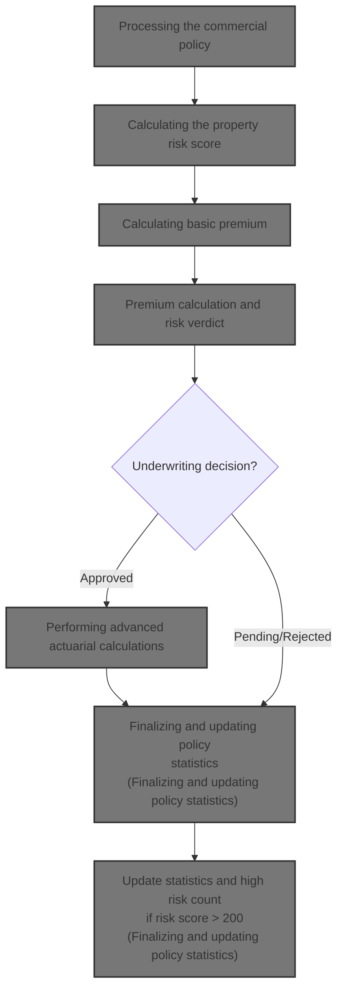
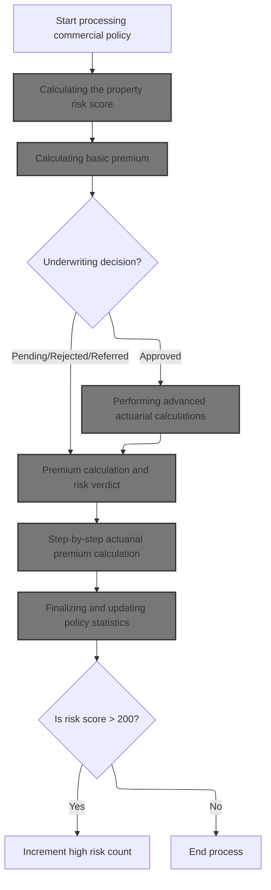
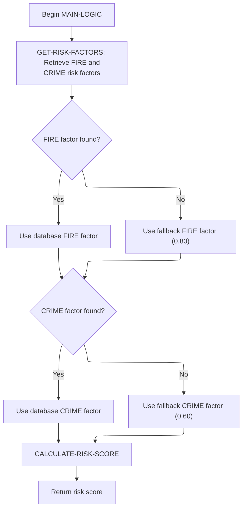
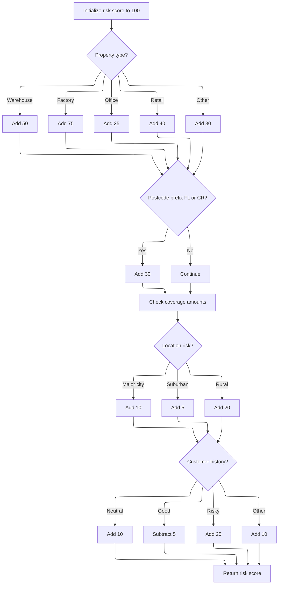
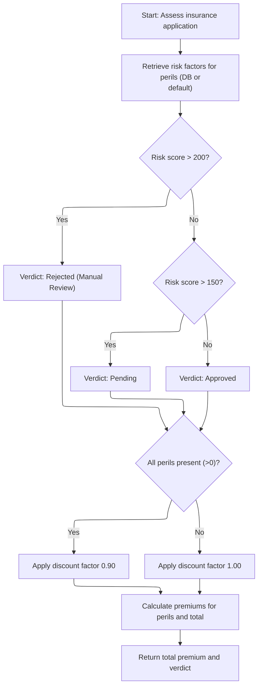
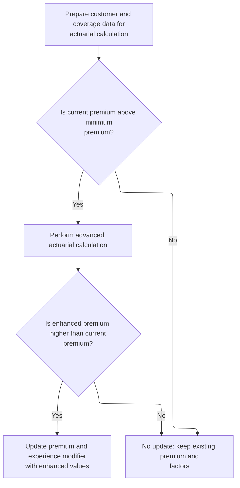
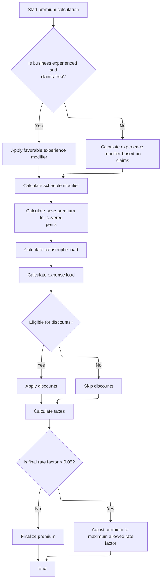
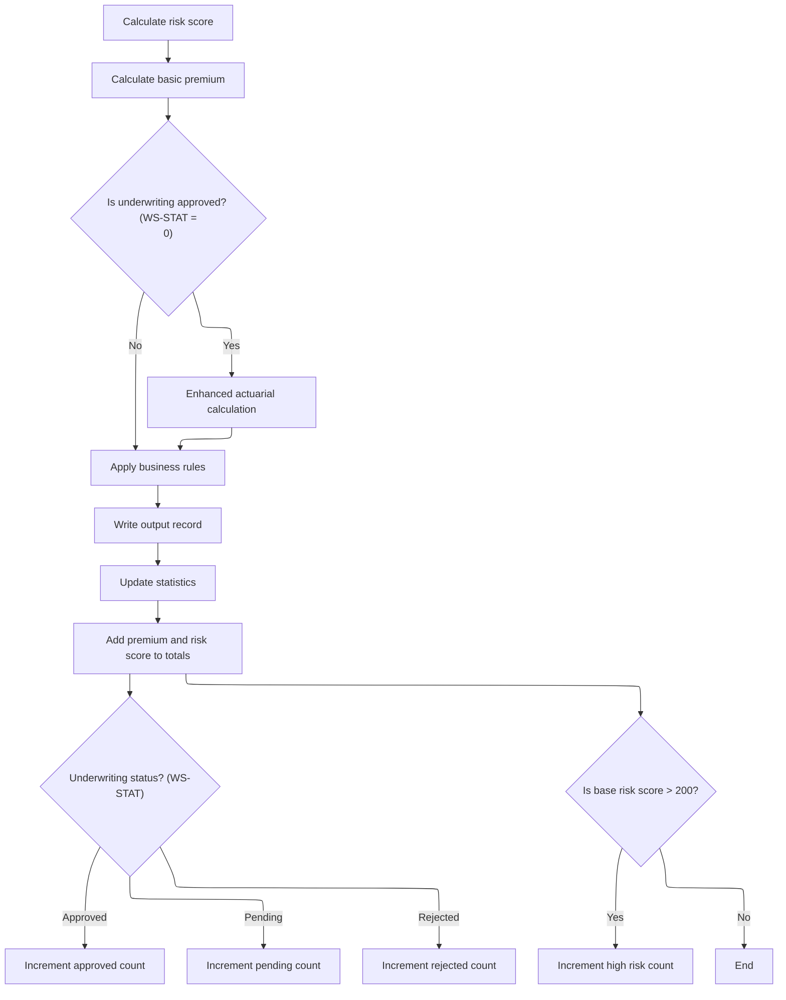

This document outlines the flow for processing a commercial insurance policy. Property and customer information are assessed to calculate risk and premiums, make underwriting decisions, and update policy statistics.



# Spec

## Detailed View of the Program's Functionality

a. Initialization and Input/Output Setup

The main program begins by defining its environment and file structure. It sets up input and output files for reading policy data and writing results, as well as configuration, rate, and summary files. It also defines working storage for counters, configuration values, and actuarial interface data. The initialization routine displays startup messages, resets counters and work areas, and records the processing date.

b. Configuration Loading

The program attempts to open and read configuration values from a dedicated file. If the file is unavailable, it falls back to default values. It specifically looks for maximum risk score and minimum premium values, updating internal settings accordingly.

c. File Opening and Header Writing

Input, output, and summary files are opened. If any file fails to open, the program displays an error and stops. The output file is initialized with column headers for customer, property type, postcode, risk score, premiums, status, and rejection reason.

d. Record Processing Loop

The program enters a loop to read each input record. For each record, it increments a counter and validates the input fields. Validation checks include policy type, customer number, coverage limits, and total insured value. If validation fails, an error record is written to the output file. If validation passes, the record is processed according to its policy type.

e. Commercial Policy Processing

For commercial policies, the program executes a multi-step process:

1. Risk Score Calculation: It calls a separate module to compute the risk score based on property type, postcode, location, coverage amounts, and customer history. This module fetches risk factors from a database, applies property and location adjustments, and returns the score.

2. Basic Premium Calculation: It calls another module to calculate the basic premium using the risk score and peril selections. This module also determines the underwriting verdict (approved, pending, rejected) based on risk thresholds and applies a discount if all perils are covered.

3. Enhanced Actuarial Calculation: If the underwriting verdict is approved and the premium exceeds the minimum, the program prepares detailed input and coverage data and calls an advanced actuarial module. This module applies experience and schedule modifiers, computes base premiums for each peril, adds catastrophe and expense loads, applies discounts and taxes, and caps the final rate factor if necessary. If the enhanced premium is higher than the basic premium, the results are updated.

4. Business Rule Application: The program evaluates business rules, such as maximum risk score and minimum premium, to potentially override the underwriting verdict and set status and rejection reasons.

5. Output Record Writing: The results, including customer info, risk score, premiums, status, and rejection reason, are written to the output file.

6. Statistics Update: The program adds the premium and risk score to running totals, increments counters for approved, pending, rejected, and high-risk cases, and checks if the risk score exceeds the high-risk threshold.

f. Non-Commercial Policy Handling

For non-commercial policies, the program writes an output record indicating unsupported status and a rejection reason.

g. File Closing and Summary Generation

After processing all records, the program closes all files. It generates a summary file with processing date, total records processed, counts of approved, pending, and rejected policies, total premium amount, and average risk score if applicable.

h. Displaying Processing Statistics

Finally, the program displays statistics to the console, including total records read, processed, approved, pending, rejected, error records, high-risk count, total premium generated, and average risk score if available.

---

i. Risk Score Calculation (LGAPDB02)

The risk score calculation module starts by fetching fire and crime risk factors from the database, defaulting to preset values if unavailable. It initializes the risk score to a base value and adjusts it based on property type, postcode, coverage amounts, location (major cities, suburban, rural), and customer history (neutral, good, risky, other). Each adjustment uses fixed increments or decrements.

---

j. Basic Premium Calculation and Underwriting Verdict (LGAPDB03)

The premium calculation module fetches fire and crime risk factors, defaulting if necessary. It determines the underwriting verdict based on risk score thresholds: above 200 is rejected, above 150 is pending, otherwise approved. If all perils are selected, a discount factor is applied. Premiums for each peril are calculated using the risk score, peril factor, peril selection, and discount. The total premium is the sum of all peril premiums.

---

k. Enhanced Actuarial Calculation (LGAPDB04)

The advanced actuarial module performs the following steps:

 1. Initialization: Exposure values are calculated based on coverage limits and risk score. Exposure density is computed.

 2. Rate Table Loading: Base rates for each peril are loaded from the database or defaulted.

 3. Experience Modifier: Based on years in business and claims history, a modifier is set, with caps for minimum and maximum values.

 4. Schedule Modifier: Adjustments are made for building age, protection class, occupancy code, and exposure density, with limits to avoid extreme values.

 5. Base Premium Calculation: For each peril, the premium is calculated using exposures, base rates, experience and schedule modifiers, and trend factor. Crime and flood perils have additional multipliers.

 6. Catastrophe Load: Additional amounts are added for hurricane, earthquake, tornado, and flood risks based on peril selection.

 7. Expense and Profit Loads: Expense and profit margins are applied to the base and catastrophe amounts.

 8. Discounts: Multi-peril, claims-free, and deductible credits are calculated and capped. The total discount is applied to the premium components.

 9. Taxes: Taxes are computed on the premium after discounts.

10. Finalization: The total premium is summed, and the final rate factor is calculated. If the rate factor exceeds the cap, the premium is adjusted accordingly.

---

l. Statistics and Summary

After all processing, the program updates statistics, including totals for premiums and risk scores, counts for each underwriting status, and high-risk cases. It generates a summary file and displays statistics to the console.

# Rule Definition

| Paragraph Name                                                                                                                                    | Rule ID | Category          | Description                                                                                                                                                    | Conditions                                                                 | Remarks                                                                                                                                                                                                                                                                                                                                               |
| ------------------------------------------------------------------------------------------------------------------------------------------------- | ------- | ----------------- | -------------------------------------------------------------------------------------------------------------------------------------------------------------- | -------------------------------------------------------------------------- | ----------------------------------------------------------------------------------------------------------------------------------------------------------------------------------------------------------------------------------------------------------------------------------------------------------------------------------------------------- |
| P006-PROCESS-RECORDS, P007-READ-INPUT, P009-PROCESS-VALID-RECORD, P010-PROCESS-ERROR-RECORD, P011-PROCESS-COMMERCIAL, P012-PROCESS-NON-COMMERCIAL | RL-001  | Conditional Logic | Each input record representing a commercial policy application must be processed in sequence, producing one output record per input record.                    | For every record read from the input file, regardless of validity or type. | Input and output records are processed in order. Output record must contain all relevant fields, including customer number, property type, postcode, calculated values, and status.                                                                                                                                                                   |
| LGAPDB02.cbl: CALCULATE-RISK-SCORE, CHECK-COVERAGE-AMOUNTS, ASSESS-LOCATION-RISK, EVALUATE-CUSTOMER-HISTORY                                       | RL-002  | Computation       | The risk score is calculated starting from a base of 100, with adjustments based on property type, postcode, coverage limits, location, and customer history.  | For each valid commercial input record.                                    | Base risk score: 100. Property type adjustments: WAREHOUSE +50, FACTORY +75, OFFICE +25, RETAIL +40, other +30. Postcode starting with 'FL' or 'CR': +30. Any coverage limit > 500,000: +15. Location: NYC/LA area +10, continental US +5, outside US +20. Customer history: N +10, G -5, R +25, other +10.                                           |
| LGAPDB03.cbl: CALCULATE-PREMIUMS                                                                                                                  | RL-003  | Computation       | Premiums for fire, crime, flood, and weather perils are calculated using peril factors, peril selections, and a discount factor if all perils are selected.    | For each valid commercial input record.                                    | Peril factors: Fire 0.80, Crime 0.60, Flood 1.20, Weather 0.90. Discount factor: 0.90 if all perils > 0, else 1.00. Premium = (risk score \* peril factor) \* peril selection \* discount factor. OUT-TOTAL-PREMIUM is the sum of all peril premiums.                                                                                                 |
| LGAPDB03.cbl: CALCULATE-VERDICT, LGAPDB01.cbl: P011D-APPLY-BUSINESS-RULES                                                                         | RL-004  | Conditional Logic | The underwriting status and rejection reason are set based on the calculated risk score and premium.                                                           | After risk score and premium are calculated for a commercial policy.       | If risk score > 200: status 'REJECTED', reason 'High Risk Score - Manual Review Required'. If risk score > 150: status 'PENDING', reason 'Medium Risk - Pending Review'. Else: status 'APPROVED', reason blank. Additional business rules may set status to 'REJECTED' or 'PENDING' if risk score exceeds configured max or premium is below minimum. |
| P008-VALIDATE-INPUT-RECORD, P010-PROCESS-ERROR-RECORD, P012-PROCESS-NON-COMMERCIAL                                                                | RL-005  | Conditional Logic | Records with validation errors or unsupported policy types are written to the output with status 'ERROR' or 'UNSUPPORTED' and an appropriate rejection reason. | If input record fails validation or is not a commercial policy.            | Output record must include customer number, property type, postcode, zeroed calculated fields, status 'ERROR' or 'UNSUPPORTED', and a descriptive rejection reason.                                                                                                                                                                                   |
| P011E-WRITE-OUTPUT-RECORD, P010-PROCESS-ERROR-RECORD, P012-PROCESS-NON-COMMERCIAL                                                                 | RL-006  | Data Assignment   | The output record must contain the customer number, property type, postcode, all calculated values, status, and rejection reason.                              | For every processed input record.                                          | Output fields: customer number (string), property type (string), postcode (string), risk score (number), fire premium (number), crime premium (number), flood premium (number), weather premium (number), total premium (number), status (string), rejection reason (string).                                                                         |
| P015-GENERATE-SUMMARY, P016-DISPLAY-STATS, P011F-UPDATE-STATISTICS                                                                                | RL-007  | Computation       | Aggregate statistics such as total records processed, approved, pending, rejected, total premium, and average risk score are generated and displayed.          | After all records have been processed.                                     | Summary includes counts and totals as numbers, average risk score as number with two decimals.                                                                                                                                                                                                                                                        |

# User Stories

## User Story 1: Process, evaluate, and summarize commercial policy applications

---

### Story Description:

As a commercial policy applicant or system user, I want each policy application to be processed, validated, risk-assessed, premium-calculated, underwritten, and included in summary statistics so that I receive an accurate decision and premium based on my application details, with clear reasons for any errors or rejections, and so that overall processing performance and risk distribution can be monitored.

---

### Business Rule Mapping:

| Rule ID | Paragraph Name                                                                                                                                    | Rule Description                                                                                                                                               |
| ------- | ------------------------------------------------------------------------------------------------------------------------------------------------- | -------------------------------------------------------------------------------------------------------------------------------------------------------------- |
| RL-001  | P006-PROCESS-RECORDS, P007-READ-INPUT, P009-PROCESS-VALID-RECORD, P010-PROCESS-ERROR-RECORD, P011-PROCESS-COMMERCIAL, P012-PROCESS-NON-COMMERCIAL | Each input record representing a commercial policy application must be processed in sequence, producing one output record per input record.                    |
| RL-002  | LGAPDB02.cbl: CALCULATE-RISK-SCORE, CHECK-COVERAGE-AMOUNTS, ASSESS-LOCATION-RISK, EVALUATE-CUSTOMER-HISTORY                                       | The risk score is calculated starting from a base of 100, with adjustments based on property type, postcode, coverage limits, location, and customer history.  |
| RL-003  | LGAPDB03.cbl: CALCULATE-PREMIUMS                                                                                                                  | Premiums for fire, crime, flood, and weather perils are calculated using peril factors, peril selections, and a discount factor if all perils are selected.    |
| RL-004  | LGAPDB03.cbl: CALCULATE-VERDICT, LGAPDB01.cbl: P011D-APPLY-BUSINESS-RULES                                                                         | The underwriting status and rejection reason are set based on the calculated risk score and premium.                                                           |
| RL-005  | P008-VALIDATE-INPUT-RECORD, P010-PROCESS-ERROR-RECORD, P012-PROCESS-NON-COMMERCIAL                                                                | Records with validation errors or unsupported policy types are written to the output with status 'ERROR' or 'UNSUPPORTED' and an appropriate rejection reason. |
| RL-006  | P011E-WRITE-OUTPUT-RECORD, P010-PROCESS-ERROR-RECORD, P012-PROCESS-NON-COMMERCIAL                                                                 | The output record must contain the customer number, property type, postcode, all calculated values, status, and rejection reason.                              |
| RL-007  | P015-GENERATE-SUMMARY, P016-DISPLAY-STATS, P011F-UPDATE-STATISTICS                                                                                | Aggregate statistics such as total records processed, approved, pending, rejected, total premium, and average risk score are generated and displayed.          |

---

### Relevant Functionality:

- **P006-PROCESS-RECORDS**
  1. **RL-001:**
     - Read input record
     - Validate input
       - If valid and commercial, process as commercial
       - If valid and not commercial, mark as unsupported
       - If invalid, log error and write error output
     - Write output record
- **LGAPDB02.cbl: CALCULATE-RISK-SCORE**
  1. **RL-002:**
     - Start with risk score 100
     - Adjust for property type
     - Adjust for postcode prefix
     - Check max of coverage limits; if > 500,000, add 15
     - Assess location by latitude/longitude and adjust
     - Adjust for customer history
- **LGAPDB03.cbl: CALCULATE-PREMIUMS**
  1. **RL-003:**
     - Set discount factor based on peril selections
     - For each peril, compute premium as (risk score \* peril factor) \* peril selection \* discount factor
     - Sum all peril premiums for total premium
- **LGAPDB03.cbl: CALCULATE-VERDICT**
  1. **RL-004:**
     - If risk score > 200, set status to REJECTED and reason to high risk
     - Else if risk score > 150, set status to PENDING and reason to medium risk
     - Else, set status to APPROVED and reason blank
     - Additional checks for max risk score and min premium
- **P008-VALIDATE-INPUT-RECORD**
  1. **RL-005:**
     - If validation fails, write output with status ERROR and first error message
     - If not commercial, write output with status UNSUPPORTED and reason
- **P011E-WRITE-OUTPUT-RECORD**
  1. **RL-006:**
     - Assign input fields to output
     - Assign calculated values to output
     - Assign status and rejection reason
     - Write output record
- **P015-GENERATE-SUMMARY**
  1. **RL-007:**
     - Track counters for each status and total premium
     - After processing, compute average risk score
     - Write/display summary statistics

# Code Walkthrough

## Processing the commercial policy



<SwmSnippet path="/base/src/LGAPDB01.cbl" line="258">

---

In `P011-PROCESS-COMMERCIAL`, we kick off by calculating the risk score because all downstream logic—premium calculation, actuarial adjustments, business rules—depends on it. Calling P011A-CALCULATE-RISK-SCORE first ensures we have the risk score ready for the rest of the steps.

```cobol
       P011-PROCESS-COMMERCIAL.
           PERFORM P011A-CALCULATE-RISK-SCORE
           PERFORM P011B-BASIC-PREMIUM-CALC
           IF WS-STAT = 0
               PERFORM P011C-ENHANCED-ACTUARIAL-CALC
           END-IF
           PERFORM P011D-APPLY-BUSINESS-RULES
           PERFORM P011E-WRITE-OUTPUT-RECORD
           PERFORM P011F-UPDATE-STATISTICS.
```

---

</SwmSnippet>

### Calculating the property risk score

<SwmSnippet path="/base/src/LGAPDB01.cbl" line="268">

---

`P011A-CALCULATE-RISK-SCORE` calls LGAPDB02 to fetch risk factors and compute the risk score using property and customer info. This call centralizes the risk logic and ensures we use up-to-date risk factors from the database.

```cobol
       P011A-CALCULATE-RISK-SCORE.
           CALL 'LGAPDB02' USING IN-PROPERTY-TYPE, IN-POSTCODE, 
                                IN-LATITUDE, IN-LONGITUDE,
                                IN-BUILDING-LIMIT, IN-CONTENTS-LIMIT,
                                IN-FLOOD-COVERAGE, IN-WEATHER-COVERAGE,
                                IN-CUSTOMER-HISTORY, WS-BASE-RISK-SCR.
```

---

</SwmSnippet>

### Fetching risk factors and calculating score



<SwmSnippet path="/base/src/LGAPDB02.cbl" line="39">

---

`MAIN-LOGIC` handles fetching risk factors and then calculating the risk score. It first grabs fire and crime factors from the database, falling back to defaults if needed, then runs the score calculation using all relevant property and customer data.

```cobol
       MAIN-LOGIC.
           PERFORM GET-RISK-FACTORS
           PERFORM CALCULATE-RISK-SCORE
           GOBACK.
```

---

</SwmSnippet>

<SwmSnippet path="/base/src/LGAPDB02.cbl" line="44">

---

`GET-RISK-FACTORS` fetches fire and crime risk factors from the database, but if they're missing, it just uses 0.80 for FIRE and 0.60 for CRIME. This guarantees we always have a value for the calculation, even if the database is incomplete.

```cobol
       GET-RISK-FACTORS.
           EXEC SQL
               SELECT FACTOR_VALUE INTO :WS-FIRE-FACTOR
               FROM RISK_FACTORS
               WHERE PERIL_TYPE = 'FIRE'
           END-EXEC.
           
           IF SQLCODE = 0
               CONTINUE
           ELSE
               MOVE 0.80 TO WS-FIRE-FACTOR
           END-IF.
           
           EXEC SQL
               SELECT FACTOR_VALUE INTO :WS-CRIME-FACTOR
               FROM RISK_FACTORS
               WHERE PERIL_TYPE = 'CRIME'
           END-EXEC.
           
           IF SQLCODE = 0
               CONTINUE
           ELSE
               MOVE 0.60 TO WS-CRIME-FACTOR
           END-IF.
```

---

</SwmSnippet>

### Adjusting risk score by property and location



<SwmSnippet path="/base/src/LGAPDB02.cbl" line="69">

---

`CALCULATE-RISK-SCORE` starts with a base score, bumps it up based on property type and postcode, then hands off to subroutines for coverage, location, and customer history adjustments. The constants used are domain-specific and not explained in the code.

```cobol
       CALCULATE-RISK-SCORE.
           MOVE 100 TO LK-RISK-SCORE

           EVALUATE LK-PROPERTY-TYPE
             WHEN 'WAREHOUSE'
               ADD 50 TO LK-RISK-SCORE
             WHEN 'FACTORY' 
               ADD 75 TO LK-RISK-SCORE
             WHEN 'OFFICE'
               ADD 25 TO LK-RISK-SCORE
             WHEN 'RETAIL'
               ADD 40 TO LK-RISK-SCORE
             WHEN OTHER
               ADD 30 TO LK-RISK-SCORE
           END-EVALUATE

           IF LK-POSTCODE(1:2) = 'FL' OR
              LK-POSTCODE(1:2) = 'CR'
             ADD 30 TO LK-RISK-SCORE
           END-IF

           PERFORM CHECK-COVERAGE-AMOUNTS
           PERFORM ASSESS-LOCATION-RISK  
           PERFORM EVALUATE-CUSTOMER-HISTORY.
```

---

</SwmSnippet>

<SwmSnippet path="/base/src/LGAPDB02.cbl" line="117">

---

`ASSESS-LOCATION-RISK` bumps the risk score based on whether the property is in NYC, LA, continental US, or outside. It uses hardcoded lat/long ranges. Then `EVALUATE-CUSTOMER-HISTORY` tweaks the score based on customer history codes, with fixed increments or decrements.

```cobol
       ASSESS-LOCATION-RISK.
      *    Urban areas: major cities (simplified lat/long ranges)
      *    NYC area: 40-41N, 74.5-73.5W
      *    LA area: 34-35N, 118.5-117.5W
           IF (LK-LATITUDE > 40.000000 AND LK-LATITUDE < 41.000000 AND
               LK-LONGITUDE > -74.500000 AND LK-LONGITUDE < -73.500000) OR
              (LK-LATITUDE > 34.000000 AND LK-LATITUDE < 35.000000 AND
               LK-LONGITUDE > -118.500000 AND LK-LONGITUDE < -117.500000)
               ADD 10 TO LK-RISK-SCORE
           ELSE
      *        Check if in continental US (suburban vs rural)
               IF (LK-LATITUDE > 25.000000 AND LK-LATITUDE < 49.000000 AND
                   LK-LONGITUDE > -125.000000 AND LK-LONGITUDE < -66.000000)
                   ADD 5 TO LK-RISK-SCORE
               ELSE
                   ADD 20 TO LK-RISK-SCORE
               END-IF
           END-IF.

       EVALUATE-CUSTOMER-HISTORY.
           EVALUATE LK-CUSTOMER-HISTORY
               WHEN 'N'
                   ADD 10 TO LK-RISK-SCORE
               WHEN 'G'
                   SUBTRACT 5 FROM LK-RISK-SCORE
               WHEN 'R'
                   ADD 25 TO LK-RISK-SCORE
               WHEN OTHER
                   ADD 10 TO LK-RISK-SCORE
           END-EVALUATE.
```

---

</SwmSnippet>

### Calculating basic premium

<SwmSnippet path="/base/src/LGAPDB01.cbl" line="275">

---

`P011B-BASIC-PREMIUM-CALC` just calls LGAPDB03 with all the risk and peril data. LGAPDB03 handles the actual premium calculation, risk verdict, and discount logic, so this function is basically a wrapper.

```cobol
       P011B-BASIC-PREMIUM-CALC.
           CALL 'LGAPDB03' USING WS-BASE-RISK-SCR, IN-FIRE-PERIL, 
                                IN-CRIME-PERIL, IN-FLOOD-PERIL, 
                                IN-WEATHER-PERIL, WS-STAT,
                                WS-STAT-DESC, WS-REJ-RSN, WS-FR-PREM,
                                WS-CR-PREM, WS-FL-PREM, WS-WE-PREM,
                                WS-TOT-PREM, WS-DISC-FACT.
```

---

</SwmSnippet>

### Premium calculation and risk verdict



<SwmSnippet path="/base/src/LGAPDB03.cbl" line="42">

---

`MAIN-LOGIC` in LGAPDB03 fetches risk factors, decides the risk verdict, and then calculates premiums for each peril. The verdict logic is run before premium calculation, so the status and reasons are set up first.

```cobol
       MAIN-LOGIC.
           PERFORM GET-RISK-FACTORS
           PERFORM CALCULATE-VERDICT
           PERFORM CALCULATE-PREMIUMS
           GOBACK.
```

---

</SwmSnippet>

<SwmSnippet path="/base/src/LGAPDB03.cbl" line="48">

---

`GET-RISK-FACTORS` grabs fire and crime risk factors from the database, but if the query fails, it falls back to 0.80 and 0.60. This keeps the calculation running even if the DB is missing data.

```cobol
       GET-RISK-FACTORS.
           EXEC SQL
               SELECT FACTOR_VALUE INTO :WS-FIRE-FACTOR
               FROM RISK_FACTORS
               WHERE PERIL_TYPE = 'FIRE'
           END-EXEC.
           
           IF SQLCODE = 0
               CONTINUE
           ELSE
               MOVE 0.80 TO WS-FIRE-FACTOR
           END-IF.
           
           EXEC SQL
               SELECT FACTOR_VALUE INTO :WS-CRIME-FACTOR
               FROM RISK_FACTORS
               WHERE PERIL_TYPE = 'CRIME'
           END-EXEC.
           
           IF SQLCODE = 0
               CONTINUE
           ELSE
               MOVE 0.60 TO WS-CRIME-FACTOR
           END-IF.
```

---

</SwmSnippet>

<SwmSnippet path="/base/src/LGAPDB03.cbl" line="73">

---

`CALCULATE-VERDICT` checks the risk score against 200 and 150, then sets status, description, and rejection reason. These thresholds are hardcoded and drive the underwriting outcome.

```cobol
       CALCULATE-VERDICT.
           IF LK-RISK-SCORE > 200
             MOVE 2 TO LK-STAT
             MOVE 'REJECTED' TO LK-STAT-DESC
             MOVE 'High Risk Score - Manual Review Required' 
               TO LK-REJ-RSN
           ELSE
             IF LK-RISK-SCORE > 150
               MOVE 1 TO LK-STAT
               MOVE 'PENDING' TO LK-STAT-DESC
               MOVE 'Medium Risk - Pending Review'
                 TO LK-REJ-RSN
             ELSE
               MOVE 0 TO LK-STAT
               MOVE 'APPROVED' TO LK-STAT-DESC
               MOVE SPACES TO LK-REJ-RSN
             END-IF
           END-IF.
```

---

</SwmSnippet>

<SwmSnippet path="/base/src/LGAPDB03.cbl" line="92">

---

`CALCULATE-PREMIUMS` sets up a discount if all perils are covered, then computes each peril's premium using fixed factors and sums them for the total. The formulas and discount logic are straightforward and hardcoded.

```cobol
       CALCULATE-PREMIUMS.
           MOVE 1.00 TO LK-DISC-FACT
           
           IF LK-FIRE-PERIL > 0 AND
              LK-CRIME-PERIL > 0 AND
              LK-FLOOD-PERIL > 0 AND
              LK-WEATHER-PERIL > 0
             MOVE 0.90 TO LK-DISC-FACT
           END-IF

           COMPUTE LK-FIRE-PREMIUM =
             ((LK-RISK-SCORE * WS-FIRE-FACTOR) * LK-FIRE-PERIL *
               LK-DISC-FACT)
           
           COMPUTE LK-CRIME-PREMIUM =
             ((LK-RISK-SCORE * WS-CRIME-FACTOR) * LK-CRIME-PERIL *
               LK-DISC-FACT)
           
           COMPUTE LK-FLOOD-PREMIUM =
             ((LK-RISK-SCORE * WS-FLOOD-FACTOR) * LK-FLOOD-PERIL *
               LK-DISC-FACT)
           
           COMPUTE LK-WEATHER-PREMIUM =
             ((LK-RISK-SCORE * WS-WEATHER-FACTOR) * LK-WEATHER-PERIL *
               LK-DISC-FACT)

           COMPUTE LK-TOTAL-PREMIUM = 
             LK-FIRE-PREMIUM + LK-CRIME-PREMIUM + 
             LK-FLOOD-PREMIUM + LK-WEATHER-PREMIUM. 
```

---

</SwmSnippet>

### Performing advanced actuarial calculations



<SwmSnippet path="/base/src/LGAPDB01.cbl" line="283">

---

`P011C-ENHANCED-ACTUARIAL-CALC` sets up all the input data and calls LGAPDB04 for advanced premium calculation, but only if the basic premium is above the minimum. If the enhanced premium is higher, it updates the results.

```cobol
       P011C-ENHANCED-ACTUARIAL-CALC.
      *    Prepare input structure for actuarial calculation
           MOVE IN-CUSTOMER-NUM TO LK-CUSTOMER-NUM
           MOVE WS-BASE-RISK-SCR TO LK-RISK-SCORE
           MOVE IN-PROPERTY-TYPE TO LK-PROPERTY-TYPE
           MOVE IN-TERRITORY-CODE TO LK-TERRITORY
           MOVE IN-CONSTRUCTION-TYPE TO LK-CONSTRUCTION-TYPE
           MOVE IN-OCCUPANCY-CODE TO LK-OCCUPANCY-CODE
           MOVE IN-SPRINKLER-IND TO LK-PROTECTION-CLASS
           MOVE IN-YEAR-BUILT TO LK-YEAR-BUILT
           MOVE IN-SQUARE-FOOTAGE TO LK-SQUARE-FOOTAGE
           MOVE IN-YEARS-IN-BUSINESS TO LK-YEARS-IN-BUSINESS
           MOVE IN-CLAIMS-COUNT-3YR TO LK-CLAIMS-COUNT-5YR
           MOVE IN-CLAIMS-AMOUNT-3YR TO LK-CLAIMS-AMOUNT-5YR
           
      *    Set coverage data
           MOVE IN-BUILDING-LIMIT TO LK-BUILDING-LIMIT
           MOVE IN-CONTENTS-LIMIT TO LK-CONTENTS-LIMIT
           MOVE IN-BI-LIMIT TO LK-BI-LIMIT
           MOVE IN-FIRE-DEDUCTIBLE TO LK-FIRE-DEDUCTIBLE
           MOVE IN-WIND-DEDUCTIBLE TO LK-WIND-DEDUCTIBLE
           MOVE IN-FLOOD-DEDUCTIBLE TO LK-FLOOD-DEDUCTIBLE
           MOVE IN-OTHER-DEDUCTIBLE TO LK-OTHER-DEDUCTIBLE
           MOVE IN-FIRE-PERIL TO LK-FIRE-PERIL
           MOVE IN-CRIME-PERIL TO LK-CRIME-PERIL
           MOVE IN-FLOOD-PERIL TO LK-FLOOD-PERIL
           MOVE IN-WEATHER-PERIL TO LK-WEATHER-PERIL
           
      *    Call advanced actuarial calculation program (only for approved cases)
           IF WS-TOT-PREM > WS-MIN-PREMIUM
               CALL 'LGAPDB04' USING LK-INPUT-DATA, LK-COVERAGE-DATA, 
                                    LK-OUTPUT-RESULTS
               
      *        Update with enhanced calculations if successful
               IF LK-TOTAL-PREMIUM > WS-TOT-PREM
                   MOVE LK-FIRE-PREMIUM TO WS-FR-PREM
                   MOVE LK-CRIME-PREMIUM TO WS-CR-PREM
                   MOVE LK-FLOOD-PREMIUM TO WS-FL-PREM
                   MOVE LK-WEATHER-PREMIUM TO WS-WE-PREM
                   MOVE LK-TOTAL-PREMIUM TO WS-TOT-PREM
                   MOVE LK-EXPERIENCE-MOD TO WS-EXPERIENCE-MOD
               END-IF
           END-IF.
```

---

</SwmSnippet>

### Step-by-step actuarial premium calculation



<SwmSnippet path="/base/src/LGAPDB04.cbl" line="138">

---

`P100-MAIN` runs through all the actuarial steps: exposures, modifiers, base premium, catastrophe load, expenses, discounts, taxes, and final capping. Each step tweaks the premium or factors, so the calculation is granular and modular.

```cobol
       P100-MAIN.
           PERFORM P200-INIT
           PERFORM P300-RATES
           PERFORM P350-EXPOSURE
           PERFORM P400-EXP-MOD
           PERFORM P500-SCHED-MOD
           PERFORM P600-BASE-PREM
           PERFORM P700-CAT-LOAD
           PERFORM P800-EXPENSE
           PERFORM P900-DISC
           PERFORM P950-TAXES
           PERFORM P999-FINAL
           GOBACK.
```

---

</SwmSnippet>

<SwmSnippet path="/base/src/LGAPDB04.cbl" line="234">

---

`P400-EXP-MOD` sets the experience modifier based on years in business and claims history. It uses fixed constants for discounts and caps, and scales the modifier by claims amount and credibility factor.

```cobol
       P400-EXP-MOD.
           MOVE 1.0000 TO WS-EXPERIENCE-MOD
           
           IF LK-YEARS-IN-BUSINESS >= 5
               IF LK-CLAIMS-COUNT-5YR = ZERO
                   MOVE 0.8500 TO WS-EXPERIENCE-MOD
               ELSE
                   COMPUTE WS-EXPERIENCE-MOD = 
                       1.0000 + 
                       ((LK-CLAIMS-AMOUNT-5YR / WS-TOTAL-INSURED-VAL) * 
                        WS-CREDIBILITY-FACTOR * 0.50)
                   
                   IF WS-EXPERIENCE-MOD > 2.0000
                       MOVE 2.0000 TO WS-EXPERIENCE-MOD
                   END-IF
                   
                   IF WS-EXPERIENCE-MOD < 0.5000
                       MOVE 0.5000 TO WS-EXPERIENCE-MOD
                   END-IF
               END-IF
           ELSE
               MOVE 1.1000 TO WS-EXPERIENCE-MOD
           END-IF
           
           MOVE WS-EXPERIENCE-MOD TO LK-EXPERIENCE-MOD.
```

---

</SwmSnippet>

<SwmSnippet path="/base/src/LGAPDB04.cbl" line="260">

---

`P500-SCHED-MOD` tweaks the schedule modifier based on building age, protection class, occupancy code, and exposure density. It uses fixed constants and clamps the result to avoid outliers.

```cobol
       P500-SCHED-MOD.
           MOVE +0.000 TO WS-SCHEDULE-MOD
           
      *    Building age factor
           EVALUATE TRUE
               WHEN LK-YEAR-BUILT >= 2010
                   SUBTRACT 0.050 FROM WS-SCHEDULE-MOD
               WHEN LK-YEAR-BUILT >= 1990
                   CONTINUE
               WHEN LK-YEAR-BUILT >= 1970
                   ADD 0.100 TO WS-SCHEDULE-MOD
               WHEN OTHER
                   ADD 0.200 TO WS-SCHEDULE-MOD
           END-EVALUATE
           
      *    Protection class factor
           EVALUATE LK-PROTECTION-CLASS
               WHEN '01' THRU '03'
                   SUBTRACT 0.100 FROM WS-SCHEDULE-MOD
               WHEN '04' THRU '06'
                   SUBTRACT 0.050 FROM WS-SCHEDULE-MOD
               WHEN '07' THRU '09'
                   CONTINUE
               WHEN OTHER
                   ADD 0.150 TO WS-SCHEDULE-MOD
           END-EVALUATE
           
      *    Occupancy hazard factor
           EVALUATE LK-OCCUPANCY-CODE
               WHEN 'OFF01' THRU 'OFF05'
                   SUBTRACT 0.025 FROM WS-SCHEDULE-MOD
               WHEN 'MFG01' THRU 'MFG10'
                   ADD 0.075 TO WS-SCHEDULE-MOD
               WHEN 'WHS01' THRU 'WHS05'
                   ADD 0.125 TO WS-SCHEDULE-MOD
               WHEN OTHER
                   CONTINUE
           END-EVALUATE
           
      *    Exposure density factor
           IF WS-EXPOSURE-DENSITY > 500.00
               ADD 0.100 TO WS-SCHEDULE-MOD
           ELSE
               IF WS-EXPOSURE-DENSITY < 50.00
                   SUBTRACT 0.050 FROM WS-SCHEDULE-MOD
               END-IF
           END-IF
           
           IF WS-SCHEDULE-MOD > +0.400
               MOVE +0.400 TO WS-SCHEDULE-MOD
           END-IF
           
           IF WS-SCHEDULE-MOD < -0.200
               MOVE -0.200 TO WS-SCHEDULE-MOD
           END-IF
           
           MOVE WS-SCHEDULE-MOD TO LK-SCHEDULE-MOD.
```

---

</SwmSnippet>

<SwmSnippet path="/base/src/LGAPDB04.cbl" line="318">

---

`P600-BASE-PREM` loops through each peril, checks if it's selected, and computes the premium using fixed multipliers and modifiers. Crime and flood get extra multipliers (0.80, 1.25) before adding to the base amount.

```cobol
       P600-BASE-PREM.
           MOVE ZERO TO LK-BASE-AMOUNT
           
      * FIRE PREMIUM
           IF LK-FIRE-PERIL > ZERO
               COMPUTE LK-FIRE-PREMIUM = 
                   (WS-BUILDING-EXPOSURE + WS-CONTENTS-EXPOSURE) *
                   WS-BASE-RATE (1, 1, 1, 1) * 
                   WS-EXPERIENCE-MOD *
                   (1 + WS-SCHEDULE-MOD) *
                   WS-TREND-FACTOR
                   
               ADD LK-FIRE-PREMIUM TO LK-BASE-AMOUNT
           END-IF
           
      * CRIME PREMIUM
           IF LK-CRIME-PERIL > ZERO
               COMPUTE LK-CRIME-PREMIUM = 
                   (WS-CONTENTS-EXPOSURE * 0.80) *
                   WS-BASE-RATE (2, 1, 1, 1) * 
                   WS-EXPERIENCE-MOD *
                   (1 + WS-SCHEDULE-MOD) *
                   WS-TREND-FACTOR
                   
               ADD LK-CRIME-PREMIUM TO LK-BASE-AMOUNT
           END-IF
           
      * FLOOD PREMIUM
           IF LK-FLOOD-PERIL > ZERO
               COMPUTE LK-FLOOD-PREMIUM = 
                   WS-BUILDING-EXPOSURE *
                   WS-BASE-RATE (3, 1, 1, 1) * 
                   WS-EXPERIENCE-MOD *
                   (1 + WS-SCHEDULE-MOD) *
                   WS-TREND-FACTOR * 1.25
                   
               ADD LK-FLOOD-PREMIUM TO LK-BASE-AMOUNT
           END-IF
           
      * WEATHER PREMIUM
           IF LK-WEATHER-PERIL > ZERO
               COMPUTE LK-WEATHER-PREMIUM = 
                   (WS-BUILDING-EXPOSURE + WS-CONTENTS-EXPOSURE) *
                   WS-BASE-RATE (4, 1, 1, 1) * 
                   WS-EXPERIENCE-MOD *
                   (1 + WS-SCHEDULE-MOD) *
                   WS-TREND-FACTOR
                   
               ADD LK-WEATHER-PREMIUM TO LK-BASE-AMOUNT
           END-IF.
```

---

</SwmSnippet>

<SwmSnippet path="/base/src/LGAPDB04.cbl" line="407">

---

`P900-DISC` calculates discounts based on peril selection, claims history, and deductibles. It uses fixed rates and caps the total discount at 0.25 before applying it to the premium components.

```cobol
       P900-DISC.
           MOVE ZERO TO WS-TOTAL-DISCOUNT
           
      * Multi-peril discount
           MOVE ZERO TO WS-MULTI-PERIL-DISC
           IF LK-FIRE-PERIL > ZERO AND
              LK-CRIME-PERIL > ZERO AND
              LK-FLOOD-PERIL > ZERO AND
              LK-WEATHER-PERIL > ZERO
               MOVE 0.100 TO WS-MULTI-PERIL-DISC
           ELSE
               IF LK-FIRE-PERIL > ZERO AND
                  LK-WEATHER-PERIL > ZERO AND
                  (LK-CRIME-PERIL > ZERO OR LK-FLOOD-PERIL > ZERO)
                   MOVE 0.050 TO WS-MULTI-PERIL-DISC
               END-IF
           END-IF
           
      * Claims-free discount  
           MOVE ZERO TO WS-CLAIMS-FREE-DISC
           IF LK-CLAIMS-COUNT-5YR = ZERO AND LK-YEARS-IN-BUSINESS >= 5
               MOVE 0.075 TO WS-CLAIMS-FREE-DISC
           END-IF
           
      * Deductible credit
           MOVE ZERO TO WS-DEDUCTIBLE-CREDIT
           IF LK-FIRE-DEDUCTIBLE >= 10000
               ADD 0.025 TO WS-DEDUCTIBLE-CREDIT
           END-IF
           IF LK-WIND-DEDUCTIBLE >= 25000  
               ADD 0.035 TO WS-DEDUCTIBLE-CREDIT
           END-IF
           IF LK-FLOOD-DEDUCTIBLE >= 50000
               ADD 0.045 TO WS-DEDUCTIBLE-CREDIT
           END-IF
           
           COMPUTE WS-TOTAL-DISCOUNT = 
               WS-MULTI-PERIL-DISC + WS-CLAIMS-FREE-DISC + 
               WS-DEDUCTIBLE-CREDIT
               
           IF WS-TOTAL-DISCOUNT > 0.250
               MOVE 0.250 TO WS-TOTAL-DISCOUNT
           END-IF
           
           COMPUTE LK-DISCOUNT-AMT = 
               (LK-BASE-AMOUNT + LK-CAT-LOAD-AMT + 
                LK-EXPENSE-LOAD-AMT + LK-PROFIT-LOAD-AMT) *
               WS-TOTAL-DISCOUNT.
```

---

</SwmSnippet>

<SwmSnippet path="/base/src/LGAPDB04.cbl" line="464">

---

`P999-FINAL` sums up all premium components, subtracts discounts, adds taxes, and then calculates the rate factor. If the rate factor is above 0.05, it caps it and recalculates the premium to match.

```cobol
       P999-FINAL.
           COMPUTE LK-TOTAL-PREMIUM = 
               LK-BASE-AMOUNT + LK-CAT-LOAD-AMT + 
               LK-EXPENSE-LOAD-AMT + LK-PROFIT-LOAD-AMT -
               LK-DISCOUNT-AMT + LK-TAX-AMT
               
           COMPUTE LK-FINAL-RATE-FACTOR = 
               LK-TOTAL-PREMIUM / WS-TOTAL-INSURED-VAL
               
           IF LK-FINAL-RATE-FACTOR > 0.050000
               MOVE 0.050000 TO LK-FINAL-RATE-FACTOR
               COMPUTE LK-TOTAL-PREMIUM = 
                   WS-TOTAL-INSURED-VAL * LK-FINAL-RATE-FACTOR
           END-IF.
```

---

</SwmSnippet>

### Finalizing and updating policy statistics



<SwmSnippet path="/base/src/LGAPDB01.cbl" line="258">

---

Back in `P011-PROCESS-COMMERCIAL`, after all calculations and business rules, we wrap up by updating statistics. Calling P011F-UPDATE-STATISTICS ensures counters and totals are incremented based on the final results.

```cobol
       P011-PROCESS-COMMERCIAL.
           PERFORM P011A-CALCULATE-RISK-SCORE
           PERFORM P011B-BASIC-PREMIUM-CALC
           IF WS-STAT = 0
               PERFORM P011C-ENHANCED-ACTUARIAL-CALC
           END-IF
           PERFORM P011D-APPLY-BUSINESS-RULES
           PERFORM P011E-WRITE-OUTPUT-RECORD
           PERFORM P011F-UPDATE-STATISTICS.
```

---

</SwmSnippet>

<SwmSnippet path="/base/src/LGAPDB01.cbl" line="365">

---

`P011F-UPDATE-STATISTICS` adds the premium and risk score to totals, bumps counters for approved, pending, rejected, and high-risk cases. The 200 threshold is used to flag high-risk policies.

```cobol
       P011F-UPDATE-STATISTICS.
           ADD WS-TOT-PREM TO WS-TOTAL-PREMIUM-AMT
           ADD WS-BASE-RISK-SCR TO WS-CONTROL-TOTALS
           
           EVALUATE WS-STAT
               WHEN 0 ADD 1 TO WS-APPROVED-CNT
               WHEN 1 ADD 1 TO WS-PENDING-CNT
               WHEN 2 ADD 1 TO WS-REJECTED-CNT
           END-EVALUATE
           
           IF WS-BASE-RISK-SCR > 200
               ADD 1 TO WS-HIGH-RISK-CNT
           END-IF.
```

---

</SwmSnippet>

&nbsp;

*This is an auto-generated document by Swimm 🌊 and has not yet been verified by a human*

<SwmMeta version="3.0.0" repo-id="Z2l0aHViJTNBJTNBU3dpbW1pby1nZW5hcHAtaG91c2UlM0ElM0FHaXJpLVN3aW1t" repo-name="Swimmio-genapp-house"><sup>Powered by [Swimm](https://app.swimm.io/)</sup></SwmMeta>
