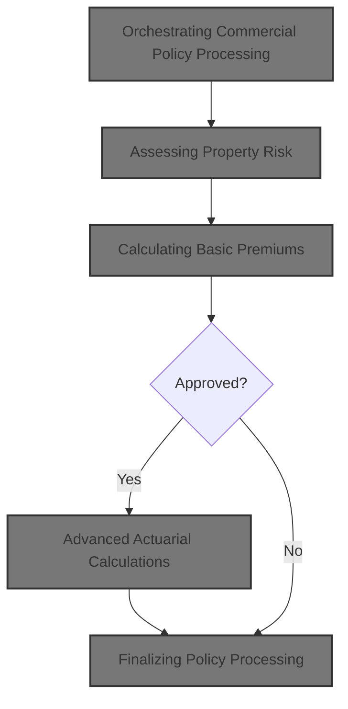
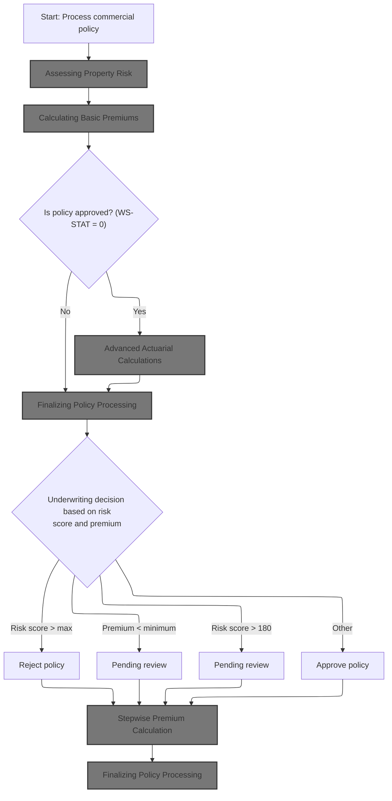
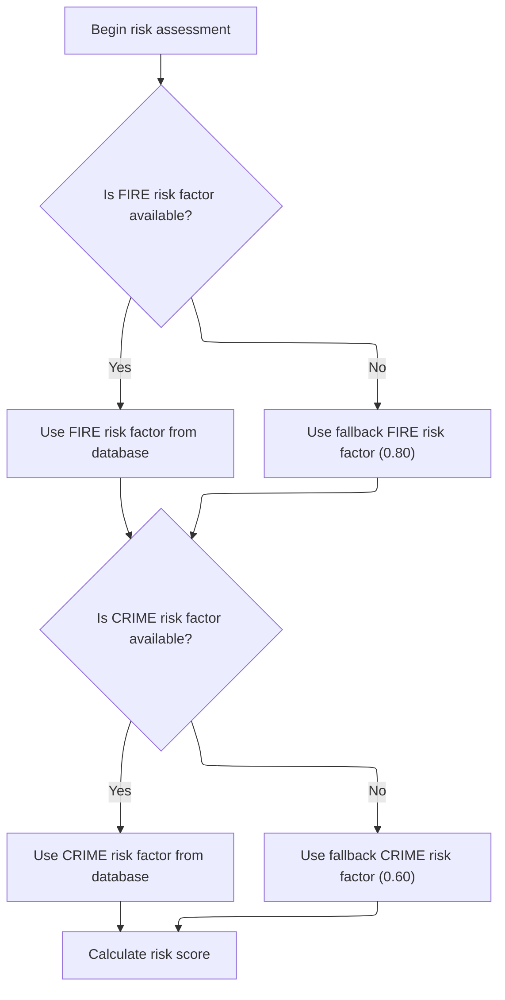
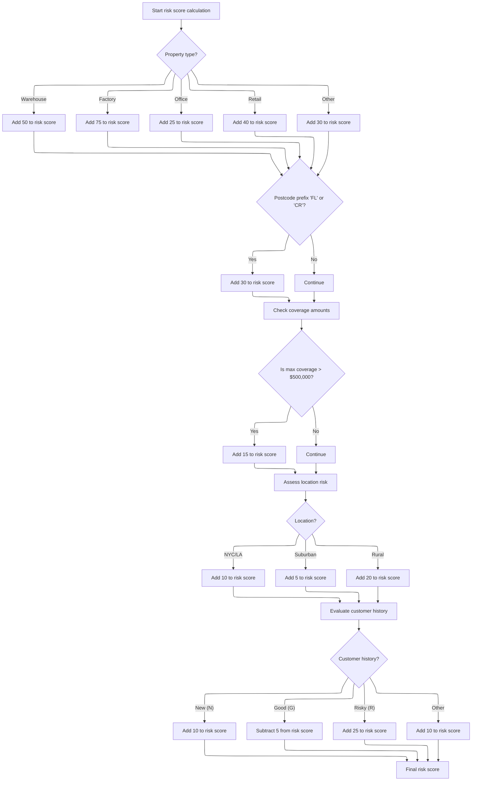
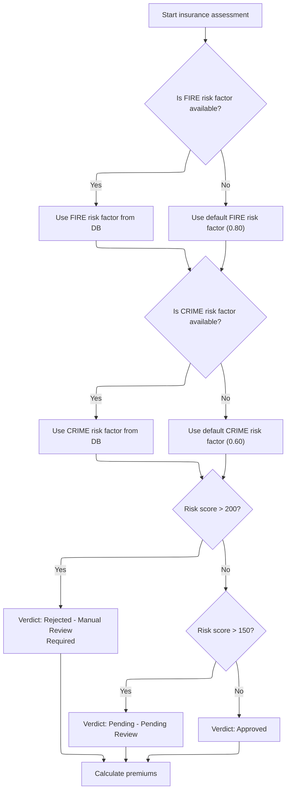
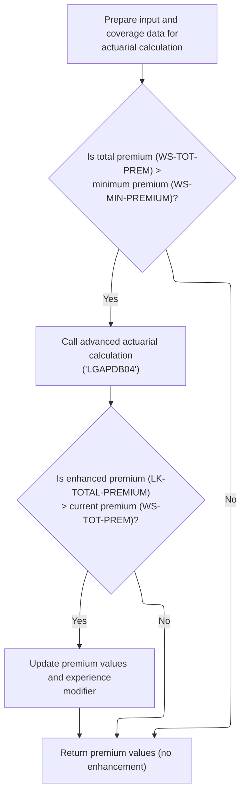
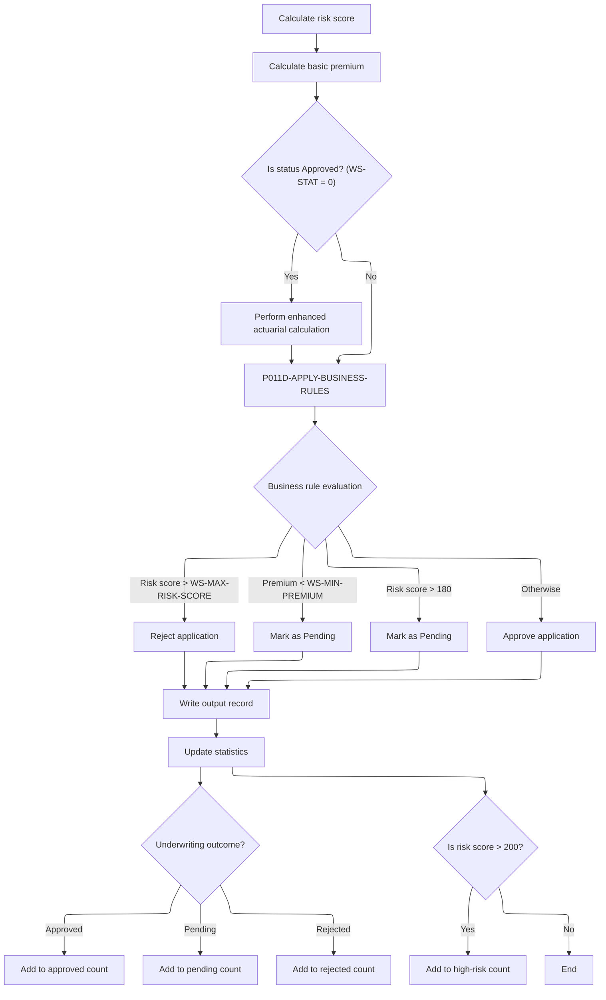

This document outlines the flow for processing commercial insurance policy applications. The system receives property and customer data, assesses risk, calculates premiums, and applies business rules to make an underwriting decision. Approved policies may receive advanced actuarial calculations. The outcome, including decision and premium, is recorded and statistics are updated.



# Spec

## Detailed View of the Program's Functionality

a. Orchestrating Commercial Policy Processing

The main orchestration for commercial policy processing begins by calculating the risk score for the property and customer. This is followed by calculating basic premiums. If the policy is initially approved (status code equals zero), an advanced actuarial calculation is performed to potentially enhance the premium. Regardless of approval, business rules are applied to determine the final underwriting decision. The output record is written, and statistics are updated to reflect the outcome.

b. Assessing Property Risk

The risk score calculation is performed by calling a dedicated module, which receives property and customer information. This module first attempts to fetch risk factors for fire and crime from the database. If the database does not provide values, default factors are used. The risk score is then calculated by starting from a base value and incrementing it according to property type, postcode prefix, coverage amounts, location, and customer history. Each adjustment uses fixed increments or decrements based on business rules.

c. Fetching Risk Factors and Calculating Score

The risk assessment module first tries to retrieve fire and crime risk factors from the database. If the database query fails, default values are used. The calculation then proceeds by evaluating the property type, adding a specific amount to the risk score for each type. If the postcode prefix matches certain values, an additional increment is applied. The module checks the highest coverage amount among all perils; if it exceeds a threshold, the risk score is further increased. Location is assessed using latitude and longitude, with urban, suburban, and rural areas contributing different increments. Finally, customer history is evaluated, with new, good, risky, or other histories adjusting the score accordingly.

d. Calculating Basic Premiums

The basic premium calculation module is called with the risk score and peril values. It first fetches fire and crime risk factors from the database, using defaults if necessary. The module then determines the risk verdict based on the risk score, setting status and rejection reason. Premiums for each peril are calculated by multiplying the risk score, risk factor, peril value, and a discount factor. If all perils are selected, a multi-peril discount is applied. The total premium is the sum of all individual premiums.

e. Premium Calculation and Risk Verdict

The premium calculation module starts by fetching risk factors. It then evaluates the risk score against fixed thresholds to determine whether the policy is rejected, pending, or approved. The verdict sets the status, description, and rejection reason. Premiums for fire, crime, flood, and weather are calculated using the risk score, risk factor, peril value, and discount factor. The total premium is computed as the sum of these components.

f. Advanced Actuarial Calculations

If the policy is approved and the total premium exceeds the minimum threshold, an advanced actuarial calculation is performed. Input and coverage data are prepared and passed to the actuarial module. If the enhanced premium calculated by this module is higher than the current premium, the output fields are updated with the new values. This step is only performed for approved, higher-value policies.

g. Stepwise Premium Calculation

The advanced actuarial module runs through a sequence of steps: initializing calculation areas, loading base rates, calculating exposures, determining experience and schedule modifiers, computing base premiums for each peril, adding catastrophe and expense loads, applying discounts, calculating taxes, and finalizing the premium. Experience modifiers are based on years in business and claims history, with discounts for claims-free records and surcharges for short histories. Schedule modifiers are adjusted for building age, protection class, occupancy, and exposure density. Premiums for each peril are calculated using exposures, base rates, modifiers, and trend factors. Discounts are applied for multi-peril selection, claims-free status, and high deductibles, with a cap on the total discount. Taxes are computed as a percentage of the premium components. The final premium is calculated, and the rate factor is capped if it exceeds a threshold.

h. Finalizing Policy Processing

After all calculations, business rules are applied to determine the underwriting decision based on risk score and premium thresholds. The policy is rejected if the risk score exceeds the maximum, marked as pending if the premium is below minimum or the risk score is above a secondary threshold, and approved otherwise. The output record is written with all relevant fields. Statistics are updated by adding the premium and risk score to totals and incrementing counters for approved, pending, rejected, and high-risk cases. The average risk score is calculated for reporting, and all outcomes are displayed and summarized.

# Rule Definition

| Paragraph Name                                                                                              | Rule ID | Category    | Description                                                                                                                                                                                                                                                                              | Conditions                                          | Remarks                                                                                   |
| ----------------------------------------------------------------------------------------------------------- | ------- | ----------- | ---------------------------------------------------------------------------------------------------------------------------------------------------------------------------------------------------------------------------------------------------------------------------------------- | --------------------------------------------------- | ----------------------------------------------------------------------------------------- |
| LGAPDB02.cbl: CALCULATE-RISK-SCORE, CHECK-COVERAGE-AMOUNTS, ASSESS-LOCATION-RISK, EVALUATE-CUSTOMER-HISTORY | RL-001  | Computation | The risk score for each policy is calculated starting from a base of 100, with additions based on property type, postcode prefix, maximum coverage amount, location, and customer history. Risk factors for fire and crime are fetched from the database, with fallbacks if unavailable. | For every commercial policy input record processed. | \- Property type additions: WAREHOUSE +50, FACTORY +75, OFFICE +25, RETAIL +40, Other +30 |

- Postcode prefix 'FL' or 'CR': +30
- Any coverage amount > $500,000: +15
- Location: NYC (lat 40-41, long -74.5 to -73.5) +10; LA (lat 34-35, long -118.5 to -117.5) +10; Continental US (lat 25-49, long -125 to -66) +5; Else +20
- Customer history: 'N' +10, 'G' -5, 'R' +25, Other +10
- Fire risk factor fallback: 0.80; Crime risk factor fallback: 0.60
- Risk score is an integer (0-999) | | LGAPDB03.cbl: CALCULATE-PREMIUMS | RL-002 | Computation | For each peril (fire, crime, flood, weather) with selection > 0 and coverage > 0, calculate the basic premium using the formula: Premium = (Risk Score × Peril Factor) × Peril Selection × Discount Factor. Peril factors are fetched from DB or use defaults. Multi-peril discount applies if all perils are selected. | For each peril where peril selection > 0 and coverage amount > 0. | - Peril factors: FIRE 0.80, CRIME 0.60, FLOOD 1.20, WEATHER 0.90 (fallbacks)
- Multi-peril discount: 0.90 if all perils selected, else 1.00
- Premiums are monetary values, rounded to two decimals
- Only perils with selection > 0 and coverage > 0 are calculated | | LGAPDB03.cbl: CALCULATE-VERDICT; LGAPDB01.cbl: P011D-APPLY-BUSINESS-RULES | RL-003 | Conditional Logic | The policy status is set based on risk score and total premium. If risk score > 200, status is REJECTED; if > 150, status is PENDING; if ≤ 150, status is APPROVED. If total premium < $500, status is PENDING. If risk score > 180, status is PENDING. Each status has a description and rejection reason. | After risk score and premium are calculated for a policy. | - Status codes: APPROVED (0), PENDING (1), REJECTED (2)
- Descriptions: 'Approved', 'Pending: High Risk', 'Rejected: High Risk', etc.
- Rejection reasons: 'Risk score exceeds maximum allowed', 'Premium below minimum', etc.
- Output fields: status (number), description (string), rejection reason (string)
- Status logic is mutually exclusive and follows the order: risk score > 200, risk score > 150, risk score > 180, premium < 500, else approved | | LGAPDB04.cbl: P400-EXP-MOD, P500-SCHED-MOD, P600-BASE-PREM, P700-CAT-LOAD, P800-EXPENSE, P900-DISC, P950-TAXES, P999-FINAL | RL-004 | Computation | For approved policies with total premium above minimum, advanced actuarial calculations are performed: experience modifier, schedule modifier, base premium for each peril, catastrophe loads, expense and profit loads, discounts, tax, and final rate factor. All monetary values are rounded to two decimals, rate factors to four decimals. | Policy is approved (status 0) and total premium > minimum premium ($500). | - Experience modifier: 0.85 (5+ years, 0 claims), 1.10 (<5 years), else 1.00 + (claims ratio × 0.75 × 0.5), capped 0.5-2.0
- Schedule modifier: based on building age, protection class, occupancy code, exposure density, capped -0.2 to 0.4
- Base rates: FIRE 0.008500, CRIME 0.006200, FLOOD 0.012800, WEATHER 0.009600 (fallbacks)
- Trend factor: 1.0350
- Catastrophe loads: Hurricane 0.0125, Earthquake 0.0080, Tornado 0.0045, Flood 0.0090
- Expense ratio: 0.350, Profit margin: 0.150
- Multi-peril discount: 0.10 (all perils), 0.05 (fire+weather+crime/flood), capped 0.25
- Claims-free discount: 0.075 (5+ years, 0 claims)
- Deductible credits: Fire ≥10,000: 0.025; Wind ≥25,000: 0.035; Flood ≥50,000: 0.045
- Total discount capped at 0.25
- Tax: (base + cat load + expense + profit - discount) × 0.0675
- Final rate factor: total premium / insured value, capped at 0.0500
- Premiums, discounts, taxes: rounded to two decimals; rate factors: four decimals | | LGAPDB01.cbl: P011E-WRITE-OUTPUT-RECORD, P011F-UPDATE-STATISTICS, P015-GENERATE-SUMMARY | RL-005 | Data Assignment | The output record for each policy must include all calculated fields (premiums, risk score, status, rejection reason, etc.) and cumulative statistics (approved, pending, rejected, high-risk counts, total premium sum, total risk score sum). | For every processed policy record. | - Output record fields: customer number, property type, postcode, risk score, fire/crime/flood/weather premiums, total premium, status, rejection reason
- Cumulative statistics: approved count, pending count, rejected count, high-risk count, total premium, total risk score
- Output record is written to output file; summary is written to summary file
- All monetary values rounded to two decimals, counts are integers |

# User Stories

## User Story 1: Calculate risk score, premiums, and determine policy status for each policy

---

### Story Description:

As a system, I want to calculate the risk score, determine premiums for each selected peril, and set the policy status (approved, pending, rejected) for each commercial policy so that each policy is accurately assessed, priced, and classified according to business rules.

---

### Business Rule Mapping:

| Rule ID | Paragraph Name                                                                                              | Rule Description                                                                                                                                                                                                                                                                                                        |
| ------- | ----------------------------------------------------------------------------------------------------------- | ----------------------------------------------------------------------------------------------------------------------------------------------------------------------------------------------------------------------------------------------------------------------------------------------------------------------- |
| RL-001  | LGAPDB02.cbl: CALCULATE-RISK-SCORE, CHECK-COVERAGE-AMOUNTS, ASSESS-LOCATION-RISK, EVALUATE-CUSTOMER-HISTORY | The risk score for each policy is calculated starting from a base of 100, with additions based on property type, postcode prefix, maximum coverage amount, location, and customer history. Risk factors for fire and crime are fetched from the database, with fallbacks if unavailable.                                |
| RL-002  | LGAPDB03.cbl: CALCULATE-PREMIUMS                                                                            | For each peril (fire, crime, flood, weather) with selection > 0 and coverage > 0, calculate the basic premium using the formula: Premium = (Risk Score × Peril Factor) × Peril Selection × Discount Factor. Peril factors are fetched from DB or use defaults. Multi-peril discount applies if all perils are selected. |
| RL-003  | LGAPDB03.cbl: CALCULATE-VERDICT; LGAPDB01.cbl: P011D-APPLY-BUSINESS-RULES                                   | The policy status is set based on risk score and total premium. If risk score > 200, status is REJECTED; if > 150, status is PENDING; if ≤ 150, status is APPROVED. If total premium < $500, status is PENDING. If risk score > 180, status is PENDING. Each status has a description and rejection reason.             |

---

### Relevant Functionality:

- **LGAPDB02.cbl: CALCULATE-RISK-SCORE**
  1. **RL-001:**
     - Start with risk score = 100
     - Add property type adjustment
     - Add postcode prefix adjustment
     - Find max(coverage amounts); if > 500,000, add 15
     - Add location adjustment based on latitude/longitude
     - Add customer history adjustment
     - Use DB values for fire/crime risk factors, else use fallbacks
- **LGAPDB03.cbl: CALCULATE-PREMIUMS**
  1. **RL-002:**
     - For each peril:
       - If peril selection > 0 and coverage > 0:
         - Premium = (risk score × peril factor) × peril selection × discount factor
     - If all perils selected, discount factor = 0.90; else 1.00
     - Sum all peril premiums for total premium
- **LGAPDB03.cbl: CALCULATE-VERDICT; LGAPDB01.cbl: P011D-APPLY-BUSINESS-RULES**
  1. **RL-003:**
     - If risk score > 200:
       - Status = 2, Desc = 'Rejected: High Risk', Reason = 'Risk score exceeds maximum allowed'
     - Else if risk score > 150:
       - Status = 1, Desc = 'Pending: High Risk', Reason = 'Risk score above pending threshold'
     - Else if risk score > 180:
       - Status = 1, Desc = 'Pending: High Risk', Reason = 'Risk score above pending threshold'
     - Else if total premium < 500:
       - Status = 1, Desc = 'Pending: Low Premium', Reason = 'Premium below minimum'
     - Else:
       - Status = 0, Desc = 'Approved', Reason = blank

## User Story 2: Perform advanced actuarial calculations and generate output records

---

### Story Description:

As a system, I want to perform advanced actuarial calculations for approved policies with sufficient premium, apply all relevant discounts and loadings, and generate output records with all calculated fields and cumulative statistics so that policy results are complete, accurate, and ready for reporting and downstream use.

---

### Business Rule Mapping:

| Rule ID | Paragraph Name                                                                                                             | Rule Description                                                                                                                                                                                                                                                                                                                                |
| ------- | -------------------------------------------------------------------------------------------------------------------------- | ----------------------------------------------------------------------------------------------------------------------------------------------------------------------------------------------------------------------------------------------------------------------------------------------------------------------------------------------- |
| RL-004  | LGAPDB04.cbl: P400-EXP-MOD, P500-SCHED-MOD, P600-BASE-PREM, P700-CAT-LOAD, P800-EXPENSE, P900-DISC, P950-TAXES, P999-FINAL | For approved policies with total premium above minimum, advanced actuarial calculations are performed: experience modifier, schedule modifier, base premium for each peril, catastrophe loads, expense and profit loads, discounts, tax, and final rate factor. All monetary values are rounded to two decimals, rate factors to four decimals. |
| RL-005  | LGAPDB01.cbl: P011E-WRITE-OUTPUT-RECORD, P011F-UPDATE-STATISTICS, P015-GENERATE-SUMMARY                                    | The output record for each policy must include all calculated fields (premiums, risk score, status, rejection reason, etc.) and cumulative statistics (approved, pending, rejected, high-risk counts, total premium sum, total risk score sum).                                                                                                 |

---

### Relevant Functionality:

- **LGAPDB04.cbl: P400-EXP-MOD**
  1. **RL-004:**
     - Calculate experience modifier
     - Calculate schedule modifier
     - For each peril, calculate base premium using peril-specific formula
     - Add catastrophe loads
     - Add expense and profit loads
     - Apply discounts (multi-peril, claims-free, deductible credits, capped)
     - Calculate tax
     - Calculate final rate factor (capped)
     - Round all monetary values to two decimals, rate factors to four decimals
- **LGAPDB01.cbl: P011E-WRITE-OUTPUT-RECORD**
  1. **RL-005:**
     - Assign all calculated values to output record fields
     - Update cumulative statistics after each record
     - At end, write summary record with all statistics

# Code Walkthrough

## Orchestrating Commercial Policy Processing



<SwmSnippet path="/base/src/LGAPDB01.cbl" line="258">

---

In `P011-PROCESS-COMMERCIAL`, we kick off the main flow by calculating the risk score, then basic premium. The call to P011A-CALCULATE-RISK-SCORE is needed first because everything downstream (premium, business rules, enhanced actuarial calc) depends on the risk score. The conditional check on WS-STAT (status code) before enhanced actuarial calculation means only approved cases get the advanced premium logic, so the flow avoids wasting resources on pending/rejected policies. The sequence here is: risk score, basic premium, maybe enhanced actuarial, business rules, output, stats update.

```cobol
       P011-PROCESS-COMMERCIAL.
           PERFORM P011A-CALCULATE-RISK-SCORE
           PERFORM P011B-BASIC-PREMIUM-CALC
           IF WS-STAT = 0
               PERFORM P011C-ENHANCED-ACTUARIAL-CALC
           END-IF
           PERFORM P011D-APPLY-BUSINESS-RULES
           PERFORM P011E-WRITE-OUTPUT-RECORD
           PERFORM P011F-UPDATE-STATISTICS.
```

---

</SwmSnippet>

### Assessing Property Risk

<SwmSnippet path="/base/src/LGAPDB01.cbl" line="268">

---

`P011A-CALCULATE-RISK-SCORE` calls LGAPDB02, passing in property and customer info. LGAPDB02 computes the risk score by pulling risk factors from the database and combining them with the input data. This risk score is needed for premium calculations and underwriting decisions later in the flow.

```cobol
       P011A-CALCULATE-RISK-SCORE.
           CALL 'LGAPDB02' USING IN-PROPERTY-TYPE, IN-POSTCODE, 
                                IN-LATITUDE, IN-LONGITUDE,
                                IN-BUILDING-LIMIT, IN-CONTENTS-LIMIT,
                                IN-FLOOD-COVERAGE, IN-WEATHER-COVERAGE,
                                IN-CUSTOMER-HISTORY, WS-BASE-RISK-SCR.
```

---

</SwmSnippet>

### Fetching Risk Factors and Calculating Score



<SwmSnippet path="/base/src/LGAPDB02.cbl" line="39">

---

`MAIN-LOGIC` in LGAPDB02 first fetches risk factors for fire and crime from the database, then calculates the risk score using those factors and property/customer data. If the database doesn't return values, it falls back to defaults, which can change the risk score outcome. The modular split makes it easier to update risk factor logic separately from score calculation.

```cobol
       MAIN-LOGIC.
           PERFORM GET-RISK-FACTORS
           PERFORM CALCULATE-RISK-SCORE
           GOBACK.
```

---

</SwmSnippet>

<SwmSnippet path="/base/src/LGAPDB02.cbl" line="44">

---

`GET-RISK-FACTORS` grabs fire and crime risk factors from the database. If the query fails, it just uses the hardcoded defaults (0.80 for fire, 0.60 for crime). The code assumes each peril type is unique in the table, so only one value per type is fetched. This fallback logic keeps the flow running even if the DB is missing data, but the output can be off if defaults are used.

```cobol
       GET-RISK-FACTORS.
           EXEC SQL
               SELECT FACTOR_VALUE INTO :WS-FIRE-FACTOR
               FROM RISK_FACTORS
               WHERE PERIL_TYPE = 'FIRE'
           END-EXEC.
           
           IF SQLCODE = 0
               CONTINUE
           ELSE
               MOVE 0.80 TO WS-FIRE-FACTOR
           END-IF.
           
           EXEC SQL
               SELECT FACTOR_VALUE INTO :WS-CRIME-FACTOR
               FROM RISK_FACTORS
               WHERE PERIL_TYPE = 'CRIME'
           END-EXEC.
           
           IF SQLCODE = 0
               CONTINUE
           ELSE
               MOVE 0.60 TO WS-CRIME-FACTOR
           END-IF.
```

---

</SwmSnippet>

### Adjusting Risk Score by Property and Location



<SwmSnippet path="/base/src/LGAPDB02.cbl" line="69">

---

`CALCULATE-RISK-SCORE` starts with a base score of 100, then bumps it up based on property type and postcode prefix using fixed increments. After that, it calls procedures to tweak the score further based on coverage amounts, location risk, and customer history. The constants and input assumptions are baked into the business logic, so any changes here need domain context.

```cobol
       CALCULATE-RISK-SCORE.
           MOVE 100 TO LK-RISK-SCORE

           EVALUATE LK-PROPERTY-TYPE
             WHEN 'WAREHOUSE'
               ADD 50 TO LK-RISK-SCORE
             WHEN 'FACTORY' 
               ADD 75 TO LK-RISK-SCORE
             WHEN 'OFFICE'
               ADD 25 TO LK-RISK-SCORE
             WHEN 'RETAIL'
               ADD 40 TO LK-RISK-SCORE
             WHEN OTHER
               ADD 30 TO LK-RISK-SCORE
           END-EVALUATE

           IF LK-POSTCODE(1:2) = 'FL' OR
              LK-POSTCODE(1:2) = 'CR'
             ADD 30 TO LK-RISK-SCORE
           END-IF

           PERFORM CHECK-COVERAGE-AMOUNTS
           PERFORM ASSESS-LOCATION-RISK  
           PERFORM EVALUATE-CUSTOMER-HISTORY.
```

---

</SwmSnippet>

<SwmSnippet path="/base/src/LGAPDB02.cbl" line="94">

---

`CHECK-COVERAGE-AMOUNTS` looks for the highest coverage among fire, crime, flood, and weather. If any coverage is over 500,000, it adds 15 to the risk score. The logic is just sequential IFs, and the constants are business-driven, not explained in the code.

```cobol
       CHECK-COVERAGE-AMOUNTS.
           MOVE ZERO TO WS-MAX-COVERAGE
           
           IF LK-FIRE-COVERAGE > WS-MAX-COVERAGE
               MOVE LK-FIRE-COVERAGE TO WS-MAX-COVERAGE
           END-IF
           
           IF LK-CRIME-COVERAGE > WS-MAX-COVERAGE
               MOVE LK-CRIME-COVERAGE TO WS-MAX-COVERAGE
           END-IF
           
           IF LK-FLOOD-COVERAGE > WS-MAX-COVERAGE
               MOVE LK-FLOOD-COVERAGE TO WS-MAX-COVERAGE
           END-IF
           
           IF LK-WEATHER-COVERAGE > WS-MAX-COVERAGE
               MOVE LK-WEATHER-COVERAGE TO WS-MAX-COVERAGE
           END-IF
           
           IF WS-MAX-COVERAGE > WS-COVERAGE-500K
               ADD 15 TO LK-RISK-SCORE
           END-IF.
```

---

</SwmSnippet>

<SwmSnippet path="/base/src/LGAPDB02.cbl" line="117">

---

`ASSESS-LOCATION-RISK` checks if the property is in NYC or LA using lat/long boundaries and bumps the risk score by 10 if true. If not, it checks for continental US and adds 5, or 20 for rural/non-US. Then, `EVALUATE-CUSTOMER-HISTORY` adjusts the score based on customer history category, with fixed increments or decrements. All these adjustments are business-driven, not explained in the code.

```cobol
       ASSESS-LOCATION-RISK.
      *    Urban areas: major cities (simplified lat/long ranges)
      *    NYC area: 40-41N, 74.5-73.5W
      *    LA area: 34-35N, 118.5-117.5W
           IF (LK-LATITUDE > 40.000000 AND LK-LATITUDE < 41.000000 AND
               LK-LONGITUDE > -74.500000 AND LK-LONGITUDE < -73.500000) OR
              (LK-LATITUDE > 34.000000 AND LK-LATITUDE < 35.000000 AND
               LK-LONGITUDE > -118.500000 AND LK-LONGITUDE < -117.500000)
               ADD 10 TO LK-RISK-SCORE
           ELSE
      *        Check if in continental US (suburban vs rural)
               IF (LK-LATITUDE > 25.000000 AND LK-LATITUDE < 49.000000 AND
                   LK-LONGITUDE > -125.000000 AND LK-LONGITUDE < -66.000000)
                   ADD 5 TO LK-RISK-SCORE
               ELSE
                   ADD 20 TO LK-RISK-SCORE
               END-IF
           END-IF.

       EVALUATE-CUSTOMER-HISTORY.
           EVALUATE LK-CUSTOMER-HISTORY
               WHEN 'N'
                   ADD 10 TO LK-RISK-SCORE
               WHEN 'G'
                   SUBTRACT 5 FROM LK-RISK-SCORE
               WHEN 'R'
                   ADD 25 TO LK-RISK-SCORE
               WHEN OTHER
                   ADD 10 TO LK-RISK-SCORE
           END-EVALUATE.
```

---

</SwmSnippet>

### Calculating Basic Premiums

<SwmSnippet path="/base/src/LGAPDB01.cbl" line="275">

---

`P011B-BASIC-PREMIUM-CALC` calls LGAPDB03, passing in the risk score and peril values. LGAPDB03 handles the premium calculation for each coverage and sets the risk status and rejection reason, which are needed for business rules and output later.

```cobol
       P011B-BASIC-PREMIUM-CALC.
           CALL 'LGAPDB03' USING WS-BASE-RISK-SCR, IN-FIRE-PERIL, 
                                IN-CRIME-PERIL, IN-FLOOD-PERIL, 
                                IN-WEATHER-PERIL, WS-STAT,
                                WS-STAT-DESC, WS-REJ-RSN, WS-FR-PREM,
                                WS-CR-PREM, WS-FL-PREM, WS-WE-PREM,
                                WS-TOT-PREM, WS-DISC-FACT.
```

---

</SwmSnippet>

### Premium Calculation and Risk Verdict



<SwmSnippet path="/base/src/LGAPDB03.cbl" line="42">

---

`MAIN-LOGIC` in LGAPDB03 first fetches risk factors, then determines the risk verdict based on the risk score, and finally calculates premiums for each peril. The verdict logic uses fixed thresholds to set status and rejection reason, which drives the rest of the flow.

```cobol
       MAIN-LOGIC.
           PERFORM GET-RISK-FACTORS
           PERFORM CALCULATE-VERDICT
           PERFORM CALCULATE-PREMIUMS
           GOBACK.
```

---

</SwmSnippet>

<SwmSnippet path="/base/src/LGAPDB03.cbl" line="48">

---

`GET-RISK-FACTORS` in LGAPDB03 fetches fire and crime risk factors from the DB. If the query fails, it uses hardcoded defaults. This fallback logic keeps the premium calculation running, but the output can be off if defaults are used.

```cobol
       GET-RISK-FACTORS.
           EXEC SQL
               SELECT FACTOR_VALUE INTO :WS-FIRE-FACTOR
               FROM RISK_FACTORS
               WHERE PERIL_TYPE = 'FIRE'
           END-EXEC.
           
           IF SQLCODE = 0
               CONTINUE
           ELSE
               MOVE 0.80 TO WS-FIRE-FACTOR
           END-IF.
           
           EXEC SQL
               SELECT FACTOR_VALUE INTO :WS-CRIME-FACTOR
               FROM RISK_FACTORS
               WHERE PERIL_TYPE = 'CRIME'
           END-EXEC.
           
           IF SQLCODE = 0
               CONTINUE
           ELSE
               MOVE 0.60 TO WS-CRIME-FACTOR
           END-IF.
```

---

</SwmSnippet>

<SwmSnippet path="/base/src/LGAPDB03.cbl" line="73">

---

`CALCULATE-VERDICT` checks the risk score against fixed thresholds (200, 150) to set status, description, and rejection reason. These codes drive the rest of the flow, and the constants are business-driven.

```cobol
       CALCULATE-VERDICT.
           IF LK-RISK-SCORE > 200
             MOVE 2 TO LK-STAT
             MOVE 'REJECTED' TO LK-STAT-DESC
             MOVE 'High Risk Score - Manual Review Required' 
               TO LK-REJ-RSN
           ELSE
             IF LK-RISK-SCORE > 150
               MOVE 1 TO LK-STAT
               MOVE 'PENDING' TO LK-STAT-DESC
               MOVE 'Medium Risk - Pending Review'
                 TO LK-REJ-RSN
             ELSE
               MOVE 0 TO LK-STAT
               MOVE 'APPROVED' TO LK-STAT-DESC
               MOVE SPACES TO LK-REJ-RSN
             END-IF
           END-IF.
```

---

</SwmSnippet>

### Advanced Actuarial Calculations



<SwmSnippet path="/base/src/LGAPDB01.cbl" line="283">

---

`P011C-ENHANCED-ACTUARIAL-CALC` sets up input and coverage data, then calls LGAPDB04 for advanced premium calculation if the total premium is above the minimum. If the enhanced premium is higher, it updates the output fields. This step only runs for approved, higher-value policies.

```cobol
       P011C-ENHANCED-ACTUARIAL-CALC.
      *    Prepare input structure for actuarial calculation
           MOVE IN-CUSTOMER-NUM TO LK-CUSTOMER-NUM
           MOVE WS-BASE-RISK-SCR TO LK-RISK-SCORE
           MOVE IN-PROPERTY-TYPE TO LK-PROPERTY-TYPE
           MOVE IN-TERRITORY-CODE TO LK-TERRITORY
           MOVE IN-CONSTRUCTION-TYPE TO LK-CONSTRUCTION-TYPE
           MOVE IN-OCCUPANCY-CODE TO LK-OCCUPANCY-CODE
           MOVE IN-SPRINKLER-IND TO LK-PROTECTION-CLASS
           MOVE IN-YEAR-BUILT TO LK-YEAR-BUILT
           MOVE IN-SQUARE-FOOTAGE TO LK-SQUARE-FOOTAGE
           MOVE IN-YEARS-IN-BUSINESS TO LK-YEARS-IN-BUSINESS
           MOVE IN-CLAIMS-COUNT-3YR TO LK-CLAIMS-COUNT-5YR
           MOVE IN-CLAIMS-AMOUNT-3YR TO LK-CLAIMS-AMOUNT-5YR
           
      *    Set coverage data
           MOVE IN-BUILDING-LIMIT TO LK-BUILDING-LIMIT
           MOVE IN-CONTENTS-LIMIT TO LK-CONTENTS-LIMIT
           MOVE IN-BI-LIMIT TO LK-BI-LIMIT
           MOVE IN-FIRE-DEDUCTIBLE TO LK-FIRE-DEDUCTIBLE
           MOVE IN-WIND-DEDUCTIBLE TO LK-WIND-DEDUCTIBLE
           MOVE IN-FLOOD-DEDUCTIBLE TO LK-FLOOD-DEDUCTIBLE
           MOVE IN-OTHER-DEDUCTIBLE TO LK-OTHER-DEDUCTIBLE
           MOVE IN-FIRE-PERIL TO LK-FIRE-PERIL
           MOVE IN-CRIME-PERIL TO LK-CRIME-PERIL
           MOVE IN-FLOOD-PERIL TO LK-FLOOD-PERIL
           MOVE IN-WEATHER-PERIL TO LK-WEATHER-PERIL
           
      *    Call advanced actuarial calculation program (only for approved cases)
           IF WS-TOT-PREM > WS-MIN-PREMIUM
               CALL 'LGAPDB04' USING LK-INPUT-DATA, LK-COVERAGE-DATA, 
                                    LK-OUTPUT-RESULTS
               
      *        Update with enhanced calculations if successful
               IF LK-TOTAL-PREMIUM > WS-TOT-PREM
                   MOVE LK-FIRE-PREMIUM TO WS-FR-PREM
                   MOVE LK-CRIME-PREMIUM TO WS-CR-PREM
                   MOVE LK-FLOOD-PREMIUM TO WS-FL-PREM
                   MOVE LK-WEATHER-PREMIUM TO WS-WE-PREM
                   MOVE LK-TOTAL-PREMIUM TO WS-TOT-PREM
                   MOVE LK-EXPERIENCE-MOD TO WS-EXPERIENCE-MOD
               END-IF
           END-IF.
```

---

</SwmSnippet>

### Stepwise Premium Calculation

```mermaid
%%{init: {"flowchart": {"defaultRenderer": "elk"}} }%%
flowchart TD
    node1["Start premium calculation"]
    click node1 openCode "base/src/LGAPDB04.cbl:138:150"
    node1 --> node2["Calculate rates"]
    click node2 openCode "base/src/LGAPDB04.cbl:138:150"
    node2 --> node3["Calculate exposure"]
    click node3 openCode "base/src/LGAPDB04.cbl:138:150"
    node3 --> node4{"Years in business >= 5?"}
    click node4 openCode "base/src/LGAPDB04.cbl:234:257"
    node4 -->|"Yes"| node5{"Claims count (5yr) = 0?"}
    click node5 openCode "base/src/LGAPDB04.cbl:234:257"
    node5 -->|"Yes"| node6["Set experience modifier to 0.85"]
    click node6 openCode "base/src/LGAPDB04.cbl:234:257"
    node5 -->|"No"| node7["Calculate experience modifier based on
claims amount"]
    click node7 openCode "base/src/LGAPDB04.cbl:234:257"
    node4 -->|"No"| node8["Set experience modifier to 1.10"]
    click node8 openCode "base/src/LGAPDB04.cbl:234:257"
    node6 --> node9["Calculate schedule modifier"]
    click node9 openCode "base/src/LGAPDB04.cbl:260:316"
    node7 --> node9
    node8 --> node9
    node9 --> node10{"Building age, protection class,
occupancy, exposure density"}
    click node10 openCode "base/src/LGAPDB04.cbl:260:316"
    node10 --> node11["Calculate base premium for covered
perils"]
    click node11 openCode "base/src/LGAPDB04.cbl:318:367"
    node11 --> node12["Calculate catastrophe load"]
    click node12 openCode "base/src/LGAPDB04.cbl:138:150"
    node12 --> node13["Calculate expense load"]
    click node13 openCode "base/src/LGAPDB04.cbl:138:150"
    node13 --> node14["Calculate discounts"]
    click node14 openCode "base/src/LGAPDB04.cbl:407:454"
    node14 --> node15{"Total discount > 0.25?"}
    click node15 openCode "base/src/LGAPDB04.cbl:447:449"
    node15 -->|"Yes"| node16["Cap discount at 0.25"]
    click node16 openCode "base/src/LGAPDB04.cbl:447:449"
    node15 -->|"No"| node17["Apply calculated discount"]
    click node17 openCode "base/src/LGAPDB04.cbl:443:446"
    node16 --> node18["Calculate taxes (6.75%)"]
    click node18 openCode "base/src/LGAPDB04.cbl:456:462"
    node17 --> node18
    node18 --> node19["Finalize premium and rate factor"]
    click node19 openCode "base/src/LGAPDB04.cbl:464:477"
    node19 --> node20{"Final rate factor > 0.050000?"}
    click node20 openCode "base/src/LGAPDB04.cbl:473:475"
    node20 -->|"Yes"| node21["Cap rate factor at 0.050000"]
    click node21 openCode "base/src/LGAPDB04.cbl:473:476"
    node20 -->|"No"| node22["Apply calculated rate factor"]
    click node22 openCode "base/src/LGAPDB04.cbl:470:472"
    node21 --> node23["Return final premium"]
    click node23 openCode "base/src/LGAPDB04.cbl:465:477"
    node22 --> node23

classDef HeadingStyle fill:#777777,stroke:#333,stroke-width:2px;
```



<SwmSnippet path="/base/src/LGAPDB04.cbl" line="138">

---

`P100-MAIN` runs through a sequence of steps: exposures, rates, modifiers, base premium, catastrophe loading, expenses, discounts, taxes, and final premium calculation. Each step updates the premium components, so the output is a detailed breakdown and capped final premium.

```cobol
       P100-MAIN.
           PERFORM P200-INIT
           PERFORM P300-RATES
           PERFORM P350-EXPOSURE
           PERFORM P400-EXP-MOD
           PERFORM P500-SCHED-MOD
           PERFORM P600-BASE-PREM
           PERFORM P700-CAT-LOAD
           PERFORM P800-EXPENSE
           PERFORM P900-DISC
           PERFORM P950-TAXES
           PERFORM P999-FINAL
           GOBACK.
```

---

</SwmSnippet>

<SwmSnippet path="/base/src/LGAPDB04.cbl" line="234">

---

`P400-EXP-MOD` calculates the experience modifier based on years in business and claims history. If the business has 5+ years and no claims, it gets a discount. Otherwise, the modifier is bumped up based on claims ratio, credibility, and capped between 0.5 and 2.0. Less than 5 years gets a surcharge. All constants are business-driven.

```cobol
       P400-EXP-MOD.
           MOVE 1.0000 TO WS-EXPERIENCE-MOD
           
           IF LK-YEARS-IN-BUSINESS >= 5
               IF LK-CLAIMS-COUNT-5YR = ZERO
                   MOVE 0.8500 TO WS-EXPERIENCE-MOD
               ELSE
                   COMPUTE WS-EXPERIENCE-MOD = 
                       1.0000 + 
                       ((LK-CLAIMS-AMOUNT-5YR / WS-TOTAL-INSURED-VAL) * 
                        WS-CREDIBILITY-FACTOR * 0.50)
                   
                   IF WS-EXPERIENCE-MOD > 2.0000
                       MOVE 2.0000 TO WS-EXPERIENCE-MOD
                   END-IF
                   
                   IF WS-EXPERIENCE-MOD < 0.5000
                       MOVE 0.5000 TO WS-EXPERIENCE-MOD
                   END-IF
               END-IF
           ELSE
               MOVE 1.1000 TO WS-EXPERIENCE-MOD
           END-IF
           
           MOVE WS-EXPERIENCE-MOD TO LK-EXPERIENCE-MOD.
```

---

</SwmSnippet>

<SwmSnippet path="/base/src/LGAPDB04.cbl" line="260">

---

`P500-SCHED-MOD` adjusts the schedule modification factor based on building age, protection class, occupancy code, and exposure density. Each adjustment uses fixed constants, and the result is clamped between -0.2 and 0.4. The input formats and ranges are assumed, not validated.

```cobol
       P500-SCHED-MOD.
           MOVE +0.000 TO WS-SCHEDULE-MOD
           
      *    Building age factor
           EVALUATE TRUE
               WHEN LK-YEAR-BUILT >= 2010
                   SUBTRACT 0.050 FROM WS-SCHEDULE-MOD
               WHEN LK-YEAR-BUILT >= 1990
                   CONTINUE
               WHEN LK-YEAR-BUILT >= 1970
                   ADD 0.100 TO WS-SCHEDULE-MOD
               WHEN OTHER
                   ADD 0.200 TO WS-SCHEDULE-MOD
           END-EVALUATE
           
      *    Protection class factor
           EVALUATE LK-PROTECTION-CLASS
               WHEN '01' THRU '03'
                   SUBTRACT 0.100 FROM WS-SCHEDULE-MOD
               WHEN '04' THRU '06'
                   SUBTRACT 0.050 FROM WS-SCHEDULE-MOD
               WHEN '07' THRU '09'
                   CONTINUE
               WHEN OTHER
                   ADD 0.150 TO WS-SCHEDULE-MOD
           END-EVALUATE
           
      *    Occupancy hazard factor
           EVALUATE LK-OCCUPANCY-CODE
               WHEN 'OFF01' THRU 'OFF05'
                   SUBTRACT 0.025 FROM WS-SCHEDULE-MOD
               WHEN 'MFG01' THRU 'MFG10'
                   ADD 0.075 TO WS-SCHEDULE-MOD
               WHEN 'WHS01' THRU 'WHS05'
                   ADD 0.125 TO WS-SCHEDULE-MOD
               WHEN OTHER
                   CONTINUE
           END-EVALUATE
           
      *    Exposure density factor
           IF WS-EXPOSURE-DENSITY > 500.00
               ADD 0.100 TO WS-SCHEDULE-MOD
           ELSE
               IF WS-EXPOSURE-DENSITY < 50.00
                   SUBTRACT 0.050 FROM WS-SCHEDULE-MOD
               END-IF
           END-IF
           
           IF WS-SCHEDULE-MOD > +0.400
               MOVE +0.400 TO WS-SCHEDULE-MOD
           END-IF
           
           IF WS-SCHEDULE-MOD < -0.200
               MOVE -0.200 TO WS-SCHEDULE-MOD
           END-IF
           
           MOVE WS-SCHEDULE-MOD TO LK-SCHEDULE-MOD.
```

---

</SwmSnippet>

<SwmSnippet path="/base/src/LGAPDB04.cbl" line="318">

---

`P600-BASE-PREM` calculates premiums for fire, crime, flood, and weather by checking if each peril is selected, then multiplying exposures by base rates, experience and schedule modifiers, trend factor, and domain-specific multipliers. All premiums are summed into the base amount. The multipliers and rate table logic are business-driven.

```cobol
       P600-BASE-PREM.
           MOVE ZERO TO LK-BASE-AMOUNT
           
      * FIRE PREMIUM
           IF LK-FIRE-PERIL > ZERO
               COMPUTE LK-FIRE-PREMIUM = 
                   (WS-BUILDING-EXPOSURE + WS-CONTENTS-EXPOSURE) *
                   WS-BASE-RATE (1, 1, 1, 1) * 
                   WS-EXPERIENCE-MOD *
                   (1 + WS-SCHEDULE-MOD) *
                   WS-TREND-FACTOR
                   
               ADD LK-FIRE-PREMIUM TO LK-BASE-AMOUNT
           END-IF
           
      * CRIME PREMIUM
           IF LK-CRIME-PERIL > ZERO
               COMPUTE LK-CRIME-PREMIUM = 
                   (WS-CONTENTS-EXPOSURE * 0.80) *
                   WS-BASE-RATE (2, 1, 1, 1) * 
                   WS-EXPERIENCE-MOD *
                   (1 + WS-SCHEDULE-MOD) *
                   WS-TREND-FACTOR
                   
               ADD LK-CRIME-PREMIUM TO LK-BASE-AMOUNT
           END-IF
           
      * FLOOD PREMIUM
           IF LK-FLOOD-PERIL > ZERO
               COMPUTE LK-FLOOD-PREMIUM = 
                   WS-BUILDING-EXPOSURE *
                   WS-BASE-RATE (3, 1, 1, 1) * 
                   WS-EXPERIENCE-MOD *
                   (1 + WS-SCHEDULE-MOD) *
                   WS-TREND-FACTOR * 1.25
                   
               ADD LK-FLOOD-PREMIUM TO LK-BASE-AMOUNT
           END-IF
           
      * WEATHER PREMIUM
           IF LK-WEATHER-PERIL > ZERO
               COMPUTE LK-WEATHER-PREMIUM = 
                   (WS-BUILDING-EXPOSURE + WS-CONTENTS-EXPOSURE) *
                   WS-BASE-RATE (4, 1, 1, 1) * 
                   WS-EXPERIENCE-MOD *
                   (1 + WS-SCHEDULE-MOD) *
                   WS-TREND-FACTOR
                   
               ADD LK-WEATHER-PREMIUM TO LK-BASE-AMOUNT
           END-IF.
```

---

</SwmSnippet>

<SwmSnippet path="/base/src/LGAPDB04.cbl" line="407">

---

`P900-DISC` calculates discounts for multi-peril, claims-free, and deductible credits using fixed constants. It sums them, caps the total discount at 0.25, and applies it to the premium components. Input assumptions are not validated in the code.

```cobol
       P900-DISC.
           MOVE ZERO TO WS-TOTAL-DISCOUNT
           
      * Multi-peril discount
           MOVE ZERO TO WS-MULTI-PERIL-DISC
           IF LK-FIRE-PERIL > ZERO AND
              LK-CRIME-PERIL > ZERO AND
              LK-FLOOD-PERIL > ZERO AND
              LK-WEATHER-PERIL > ZERO
               MOVE 0.100 TO WS-MULTI-PERIL-DISC
           ELSE
               IF LK-FIRE-PERIL > ZERO AND
                  LK-WEATHER-PERIL > ZERO AND
                  (LK-CRIME-PERIL > ZERO OR LK-FLOOD-PERIL > ZERO)
                   MOVE 0.050 TO WS-MULTI-PERIL-DISC
               END-IF
           END-IF
           
      * Claims-free discount  
           MOVE ZERO TO WS-CLAIMS-FREE-DISC
           IF LK-CLAIMS-COUNT-5YR = ZERO AND LK-YEARS-IN-BUSINESS >= 5
               MOVE 0.075 TO WS-CLAIMS-FREE-DISC
           END-IF
           
      * Deductible credit
           MOVE ZERO TO WS-DEDUCTIBLE-CREDIT
           IF LK-FIRE-DEDUCTIBLE >= 10000
               ADD 0.025 TO WS-DEDUCTIBLE-CREDIT
           END-IF
           IF LK-WIND-DEDUCTIBLE >= 25000  
               ADD 0.035 TO WS-DEDUCTIBLE-CREDIT
           END-IF
           IF LK-FLOOD-DEDUCTIBLE >= 50000
               ADD 0.045 TO WS-DEDUCTIBLE-CREDIT
           END-IF
           
           COMPUTE WS-TOTAL-DISCOUNT = 
               WS-MULTI-PERIL-DISC + WS-CLAIMS-FREE-DISC + 
               WS-DEDUCTIBLE-CREDIT
               
           IF WS-TOTAL-DISCOUNT > 0.250
               MOVE 0.250 TO WS-TOTAL-DISCOUNT
           END-IF
           
           COMPUTE LK-DISCOUNT-AMT = 
               (LK-BASE-AMOUNT + LK-CAT-LOAD-AMT + 
                LK-EXPENSE-LOAD-AMT + LK-PROFIT-LOAD-AMT) *
               WS-TOTAL-DISCOUNT.
```

---

</SwmSnippet>

<SwmSnippet path="/base/src/LGAPDB04.cbl" line="456">

---

`P950-TAXES` computes the tax amount by summing base, cat load, expense, and profit, subtracting the discount, then multiplying by the fixed tax rate (0.0675). The result is stored in LK-TAX-AMT. All premium components are assumed valid.

```cobol
       P950-TAXES.
           COMPUTE WS-TAX-AMOUNT = 
               (LK-BASE-AMOUNT + LK-CAT-LOAD-AMT + 
                LK-EXPENSE-LOAD-AMT + LK-PROFIT-LOAD-AMT - 
                LK-DISCOUNT-AMT) * 0.0675
                
           MOVE WS-TAX-AMOUNT TO LK-TAX-AMT.
```

---

</SwmSnippet>

<SwmSnippet path="/base/src/LGAPDB04.cbl" line="464">

---

`P999-FINAL` sums up all premium components, subtracts discounts, adds tax, then calculates the final rate factor as total premium divided by insured value. If the rate factor is above 0.05, it's capped and the premium is recalculated. The insured value is assumed non-zero.

```cobol
       P999-FINAL.
           COMPUTE LK-TOTAL-PREMIUM = 
               LK-BASE-AMOUNT + LK-CAT-LOAD-AMT + 
               LK-EXPENSE-LOAD-AMT + LK-PROFIT-LOAD-AMT -
               LK-DISCOUNT-AMT + LK-TAX-AMT
               
           COMPUTE LK-FINAL-RATE-FACTOR = 
               LK-TOTAL-PREMIUM / WS-TOTAL-INSURED-VAL
               
           IF LK-FINAL-RATE-FACTOR > 0.050000
               MOVE 0.050000 TO LK-FINAL-RATE-FACTOR
               COMPUTE LK-TOTAL-PREMIUM = 
                   WS-TOTAL-INSURED-VAL * LK-FINAL-RATE-FACTOR
           END-IF.
```

---

</SwmSnippet>

### Finalizing Policy Processing



<SwmSnippet path="/base/src/LGAPDB01.cbl" line="327">

---

`P011D-APPLY-BUSINESS-RULES` checks the risk score and premium against fixed thresholds to set status, description, and rejection reason. The logic is straightforward: reject if risk score is too high, pend if premium is too low or risk score is above 180, otherwise approve. All constants are business-driven.

```cobol
       P011D-APPLY-BUSINESS-RULES.
      *    Determine underwriting decision based on enhanced criteria
           EVALUATE TRUE
               WHEN WS-BASE-RISK-SCR > WS-MAX-RISK-SCORE
                   MOVE 2 TO WS-STAT
                   MOVE 'REJECTED' TO WS-STAT-DESC
                   MOVE 'Risk score exceeds maximum acceptable level' 
                        TO WS-REJ-RSN
               WHEN WS-TOT-PREM < WS-MIN-PREMIUM
                   MOVE 1 TO WS-STAT
                   MOVE 'PENDING' TO WS-STAT-DESC
                   MOVE 'Premium below minimum - requires review'
                        TO WS-REJ-RSN
               WHEN WS-BASE-RISK-SCR > 180
                   MOVE 1 TO WS-STAT
                   MOVE 'PENDING' TO WS-STAT-DESC
                   MOVE 'High risk - underwriter review required'
                        TO WS-REJ-RSN
               WHEN OTHER
                   MOVE 0 TO WS-STAT
                   MOVE 'APPROVED' TO WS-STAT-DESC
                   MOVE SPACES TO WS-REJ-RSN
           END-EVALUATE.
```

---

</SwmSnippet>

<SwmSnippet path="/base/src/LGAPDB01.cbl" line="258">

---

Back in `P011-PROCESS-COMMERCIAL`, after applying business rules, we need to update statistics. This step increments counters for approved, pending, rejected, and high-risk cases, and adds totals for premium and risk score. The stats update relies on WS-STAT being set correctly by the business rules logic, so reporting reflects the real underwriting outcome.

```cobol
       P011-PROCESS-COMMERCIAL.
           PERFORM P011A-CALCULATE-RISK-SCORE
           PERFORM P011B-BASIC-PREMIUM-CALC
           IF WS-STAT = 0
               PERFORM P011C-ENHANCED-ACTUARIAL-CALC
           END-IF
           PERFORM P011D-APPLY-BUSINESS-RULES
           PERFORM P011E-WRITE-OUTPUT-RECORD
           PERFORM P011F-UPDATE-STATISTICS.
```

---

</SwmSnippet>

<SwmSnippet path="/base/src/LGAPDB01.cbl" line="365">

---

`P011F-UPDATE-STATISTICS` adds the premium and risk score to totals, then increments counters for approved, pending, rejected, and high-risk cases based on WS-STAT and risk score. The high-risk threshold is set at 200, and the code assumes WS-STAT is always 0, 1, or 2.

```cobol
       P011F-UPDATE-STATISTICS.
           ADD WS-TOT-PREM TO WS-TOTAL-PREMIUM-AMT
           ADD WS-BASE-RISK-SCR TO WS-CONTROL-TOTALS
           
           EVALUATE WS-STAT
               WHEN 0 ADD 1 TO WS-APPROVED-CNT
               WHEN 1 ADD 1 TO WS-PENDING-CNT
               WHEN 2 ADD 1 TO WS-REJECTED-CNT
           END-EVALUATE
           
           IF WS-BASE-RISK-SCR > 200
               ADD 1 TO WS-HIGH-RISK-CNT
           END-IF.
```

---

</SwmSnippet>

&nbsp;

*This is an auto-generated document by Swimm 🌊 and has not yet been verified by a human*

<SwmMeta version="3.0.0" repo-id="Z2l0aHViJTNBJTNBU3dpbW1pby1nZW5hcHAtaG91c2UlM0ElM0FHaXJpLVN3aW1t" repo-name="Swimmio-genapp-house"><sup>Powered by [Swimm](https://app.swimm.io/)</sup></SwmMeta>
