This document outlines the process for handling commercial insurance policy applications. The flow starts with collecting application data and calculating a risk score using property, location, coverage, and customer history information. Based on this score, the system calculates basic premiums and makes an underwriting decision. Approved applications undergo further actuarial analysis to determine the final premium. The process ends with applying business rules, recording the policy outcome, and updating statistics.

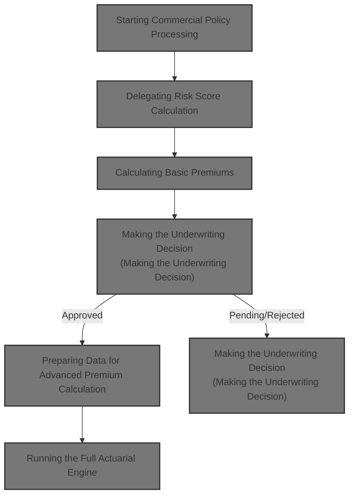

# Spec

## Detailed View of the Program's Functionality

a. Starting Commercial Policy Processing

The main processing for a commercial policy begins by reading and validating input records. For each valid commercial policy, the system initiates a sequence of calculations and decisions. The process starts by calculating a risk score, then moves to basic premium calculation, and, if the policy is approved, proceeds to an enhanced actuarial calculation. After all calculations, business rules are applied, output is written, and statistics are updated.

b. Delegating Risk Score Calculation

The risk score calculation is delegated to an external program. All relevant input data—such as property type, location, coverage amounts, and customer history—are passed to this external module. This module is responsible for all business logic and constants related to risk scoring, ensuring that any changes to risk logic are centralized.

c. Running the Risk Score Engine

The risk score engine first retrieves risk factors (like fire and crime) from a database. If the factors are not found, default values are used. These factors are then used in the risk score calculation. The calculation starts with a base score and adjusts it based on property type, location, coverage amounts, and customer history.

d. Fetching Risk Factors

The engine queries the database for the fire risk factor. If found, it uses the value; if not, it defaults to 0.80. The same process is repeated for the crime risk factor, with a default of 0.60 if not found. These factors are then available for use in the risk assessment.

e. Adjusting the Risk Score

The risk score calculation begins with a base value (e.g., 100). The score is increased by a fixed amount depending on the property type (e.g., warehouse, factory, office, retail, or other). If the postcode starts with certain high-risk prefixes, an additional increment is added. The calculation then considers the highest coverage amount among all perils; if this exceeds a threshold, the score is further increased. Location risk is assessed using latitude and longitude, with urban, suburban, and rural areas receiving different adjustments. Finally, the customer’s history code is evaluated, and the score is adjusted accordingly (e.g., new, good, risky, or other).

f. Evaluating Coverage Amounts

The system determines the highest coverage amount among fire, crime, flood, and weather. If this maximum coverage exceeds a set threshold (e.g., $500,000), the risk score is increased by a fixed amount. This step ensures that high-exposure policies are flagged as higher risk.

g. Scoring Location and Customer History

The location is checked against hardcoded latitude and longitude ranges for major cities (e.g., NYC, LA). If the property is in one of these cities, the risk score is increased by a moderate amount. If it is in the continental US but not in a major city, a smaller increment is added. Properties outside these ranges receive a larger risk increment. The customer’s history code is then evaluated, with new or risky customers increasing the score, good customers decreasing it, and others receiving a standard increment.

h. Moving to Premium Calculation

Once the risk score is calculated, the process moves to basic premium calculation. The risk score and peril selections are passed to another external module responsible for premium calculations.

i. Calculating Basic Premiums

The premium calculation module receives the risk score and peril selections. It retrieves the necessary risk factors (fire and crime) from the database, defaulting to preset values if not found. The module then determines the application status (approved, pending, or rejected) based on the risk score. Premiums for each peril are calculated using the risk score, peril factors, and any applicable discounts. The total premium is the sum of all individual peril premiums.

j. Making the Underwriting Decision

The underwriting decision is based on the risk score. If the score is above a high threshold, the policy is rejected. If it is above a medium threshold, the policy is marked as pending. Otherwise, the policy is approved. The status, description, and reason are set accordingly.

k. Checking for Enhanced Calculation

If the policy is approved and the total premium exceeds a minimum threshold, the process continues to an enhanced actuarial calculation. This step prepares all necessary input and coverage data in a standardized format for the actuarial engine.

l. Preparing Data for Advanced Premium Calculation

All relevant input fields (customer, property, coverage, deductibles, peril selections, etc.) are mapped into standardized structures. This ensures the actuarial engine receives all required data in the expected format. If the total premium is above the minimum, the advanced calculation is performed. If the enhanced premium is higher than the basic premium, all premium fields are updated with the new values.

m. Running the Full Actuarial Engine

The actuarial engine performs a series of calculations in a fixed order: initializing exposures, calculating rates, applying experience and schedule modifiers, adding catastrophe loads, expenses, discounts, taxes, and finally producing the total premium and rate factor. Each step depends on the results of the previous steps.

n. Adjusting for Claims Experience

The experience modifier is set based on years in business and claims history. If the business is established and claim-free, it receives a discount. If there are claims, the modifier is calculated using the claims amount, insured value, and a credibility factor, and is capped within set limits. New businesses receive a slight surcharge.

o. Applying Schedule Modifiers

The schedule modifier is adjusted based on building age, protection class, occupancy code, and exposure density. Newer buildings and better protection classes receive discounts, while older buildings and higher-risk occupancies receive surcharges. The modifier is capped within upper and lower bounds to prevent extreme premium adjustments.

p. Finalizing Premium Components

Taxes are calculated as a fixed percentage of the subtotal (after discounts). The total premium is the sum of all components, and the rate factor is computed as the ratio of total premium to total insured value. If the rate factor exceeds a regulatory cap, it is limited and the premium is recalculated accordingly.

q. Wrapping Up and Recording Results

After all calculations, business rules are applied to finalize the underwriting decision. The output record is written, and statistics are updated to track the number of approved, pending, and rejected policies, as well as total premiums and average risk scores. This ensures accurate reporting and analytics for all processed policies.

# Rule Definition

| Paragraph Name                                                                                | Rule ID | Category          | Description                                                                                                                                                                                                                                                          | Conditions                                                                                        | Remarks                                                                                                                                                                                                                                                                                                                                        |
| --------------------------------------------------------------------------------------------- | ------- | ----------------- | -------------------------------------------------------------------------------------------------------------------------------------------------------------------------------------------------------------------------------------------------------------------- | ------------------------------------------------------------------------------------------------- | ---------------------------------------------------------------------------------------------------------------------------------------------------------------------------------------------------------------------------------------------------------------------------------------------------------------------------------------------- |
| P011A-CALCULATE-RISK-SCORE (LGAPDB01), CALCULATE-RISK-SCORE (LGAPDB02)                        | RL-001  | Computation       | Calculates risk score for the policy using property type, postcode, location (lat/long), coverage amounts, and customer history. Risk factors for fire and crime are retrieved from the database, defaulting to 0.80 and 0.60 if not found.                          | Commercial policy input; risk score calculation invoked via LGAPDB02.                             | Risk score starts at 100. Property type increments: Warehouse +50, Factory +75, Office +25, Retail +40, Other +30. Postcode prefix 'FL' or 'CR' +30. Highest coverage > $500,000 +15. Location: NYC/LA +10, continental US +5, else +20. Customer history: N +10, G -5, R +25, Other +10. Fire factor default 0.80, crime factor default 0.60. |
| P011B-BASIC-PREMIUM-CALC (LGAPDB01), CALCULATE-PREMIUMS (LGAPDB03), P600-BASE-PREM (LGAPDB04) | RL-002  | Computation       | Calculates basic premiums for each peril (fire, crime, flood, weather) using risk score, peril selections, and risk factors. Applies multi-peril discount if all perils selected.                                                                                    | Risk score and peril selections available; premium calculation invoked via LGAPDB03 and LGAPDB04. | Fire factor 0.80, crime factor 0.60, flood factor 1.20, weather factor 0.90. Multi-peril discount: 0.90 factor if all perils selected. Output premiums: 8 digits + 2 decimals (e.g., 9(8)V99).                                                                                                                                                 |
| CALCULATE-VERDICT (LGAPDB03), P011D-APPLY-BUSINESS-RULES (LGAPDB01)                           | RL-003  | Conditional Logic | Determines application status based on risk score and premium thresholds. Status is REJECTED if risk score > 200, PENDING if > 150, else APPROVED. Additional pending status if premium below minimum.                                                               | Risk score and total premium calculated.                                                          | Minimum premium is $500. Status codes: 0=APPROVED, 1=PENDING, 2=REJECTED. Rejection reasons: 'High Risk Score - Manual Review Required', 'Medium Risk - Pending Review', 'Premium below minimum - requires review', 'Risk score exceeds maximum acceptable level'.                                                                             |
| P011C-ENHANCED-ACTUARIAL-CALC (LGAPDB01)                                                      | RL-004  | Conditional Logic | Triggers advanced actuarial calculation for approved applications where total premium exceeds minimum premium.                                                                                                                                                       | Application status is APPROVED and total premium > minimum premium.                               | Minimum premium is $500. Advanced calculation uses all input fields, coverage, deductibles, peril selections.                                                                                                                                                                                                                                  |
| P400-EXP-MOD (LGAPDB04)                                                                       | RL-005  | Computation       | Calculates experience modifier using years in business and claims history. Formula: 1.0 + (claims amount / total insured value) \* credibility factor \* 0.5, capped between 0.5 and 2.0.                                                                            | Advanced actuarial calculation triggered; years in business and claims history available.         | Credibility factor is 0.75. If years in business >= 5 and claims count = 0, modifier is 0.85. If years in business < 5, modifier is 1.10. Cap modifier between 0.5 and 2.0.                                                                                                                                                                    |
| P500-SCHED-MOD (LGAPDB04)                                                                     | RL-006  | Computation       | Calculates schedule modifier using building year, protection class, occupancy code, and exposure density, with adjustments and caps.                                                                                                                                 | Advanced actuarial calculation triggered; relevant fields available.                              | Building year: >=2010 -0.05, >=1990 0, >=1970 +0.10, else +0.20. Protection class: '01'-'03' -0.10, '04'-'06' -0.05, '07'-'09' 0, else +0.15. Occupancy: 'OFF01'-'OFF05' -0.025, 'MFG01'-'MFG10' +0.075, 'WHS01'-'WHS05' +0.125. Exposure density: >500 +0.10, <50 -0.05. Cap modifier between -0.20 and +0.40.                                |
| P950-TAXES (LGAPDB04)                                                                         | RL-007  | Computation       | Calculates taxes as 6.75% of subtotal after discounts.                                                                                                                                                                                                               | Advanced actuarial calculation triggered; subtotal and discount calculated.                       | Tax rate is 6.75%. Subtotal is base amount + cat load + expense load + profit load - discount.                                                                                                                                                                                                                                                 |
| P999-FINAL (LGAPDB04)                                                                         | RL-008  | Conditional Logic | Caps the final rate factor at 0.05 and recalculates premium if exceeded.                                                                                                                                                                                             | Advanced actuarial calculation triggered; final rate factor calculated.                           | Rate factor cap is 0.05. If exceeded, total premium is recalculated as total insured value \* capped rate factor.                                                                                                                                                                                                                              |
| P011E-WRITE-OUTPUT-RECORD (LGAPDB01)                                                          | RL-009  | Data Assignment   | Writes the output record for each processed policy, including all calculated fields as described in the output columns.                                                                                                                                              | Policy processed (valid or error).                                                                | Output fields: customer number (string, 10), property type (string, 15), postcode (string, 8), risk score (number, 3), premiums (number, 8+2 decimals), status (string, 20), rejection reason (string, 50).                                                                                                                                    |
| P011F-UPDATE-STATISTICS (LGAPDB01)                                                            | RL-010  | Computation       | Updates statistics after processing each policy to support reporting and analytics.                                                                                                                                                                                  | Policy processed.                                                                                 | Statistics: total premium amount, average risk score, counts for approved, pending, rejected, high risk.                                                                                                                                                                                                                                       |
| P008-VALIDATE-INPUT-RECORD (LGAPDB01)                                                         | RL-011  | Conditional Logic | Validates that the input record contains all required fields and values, including the type of policy, the customer identifier, and at least one coverage limit. Issues a warning if the sum of all coverage limits exceeds the maximum allowed total insured value. | Input record is read from the input file; validation is performed before any further processing.  | Maximum total insured value is 50,000,000.00. Required fields: policy type, customer identifier, at least one coverage limit. Output format for error: status 'ERROR', all premium fields set to zero, rejection reason set to the first error message encountered.                                                                            |

# User Stories

## User Story 1: Perform advanced actuarial calculations for approved policies

---

### Story Description:

As a system, I want to perform advanced actuarial calculations, including experience and schedule modifiers, taxes, and rate factor capping, for approved applications with premiums above the minimum so that premiums are accurately adjusted for risk and regulatory requirements.

---

### Business Rule Mapping:

| Rule ID | Paragraph Name                           | Rule Description                                                                                                                                                                          |
| ------- | ---------------------------------------- | ----------------------------------------------------------------------------------------------------------------------------------------------------------------------------------------- |
| RL-004  | P011C-ENHANCED-ACTUARIAL-CALC (LGAPDB01) | Triggers advanced actuarial calculation for approved applications where total premium exceeds minimum premium.                                                                            |
| RL-005  | P400-EXP-MOD (LGAPDB04)                  | Calculates experience modifier using years in business and claims history. Formula: 1.0 + (claims amount / total insured value) \* credibility factor \* 0.5, capped between 0.5 and 2.0. |
| RL-006  | P500-SCHED-MOD (LGAPDB04)                | Calculates schedule modifier using building year, protection class, occupancy code, and exposure density, with adjustments and caps.                                                      |
| RL-007  | P950-TAXES (LGAPDB04)                    | Calculates taxes as 6.75% of subtotal after discounts.                                                                                                                                    |
| RL-008  | P999-FINAL (LGAPDB04)                    | Caps the final rate factor at 0.05 and recalculates premium if exceeded.                                                                                                                  |

---

### Relevant Functionality:

- **P011C-ENHANCED-ACTUARIAL-CALC (LGAPDB01)**
  1. **RL-004:**
     - If status is APPROVED and total premium > minimum:
       - Prepare input structure for LGAPDB04.
       - Call LGAPDB04 for advanced actuarial calculation.
- **P400-EXP-MOD (LGAPDB04)**
  1. **RL-005:**
     - If years in business >= 5:
       - If claims count = 0, modifier = 0.85.
       - Else, modifier = 1.0 + (claims amount / total insured value) \* 0.75 \* 0.5.
       - Cap modifier between 0.5 and 2.0.
     - Else, modifier = 1.10.
- **P500-SCHED-MOD (LGAPDB04)**
  1. **RL-006:**
     - Adjust modifier for building year.
     - Adjust for protection class.
     - Adjust for occupancy code.
     - Adjust for exposure density.
     - Cap modifier between -0.20 and +0.40.
- **P950-TAXES (LGAPDB04)**
  1. **RL-007:**
     - Tax = (base amount + cat load + expense load + profit load - discount) \* 0.0675.
- **P999-FINAL (LGAPDB04)**
  1. **RL-008:**
     - Compute final rate factor = total premium / total insured value.
     - If rate factor > 0.05:
       - Set rate factor to 0.05.
       - Recompute total premium = total insured value \* rate factor.

## User Story 2: Evaluate and process commercial policy application

---

### Story Description:

As a system, I want to validate input records, calculate risk scores, determine basic premiums, and decide application status so that each commercial policy is accurately assessed and processed according to business rules.

---

### Business Rule Mapping:

| Rule ID | Paragraph Name                                                                                | Rule Description                                                                                                                                                                                                                                                     |
| ------- | --------------------------------------------------------------------------------------------- | -------------------------------------------------------------------------------------------------------------------------------------------------------------------------------------------------------------------------------------------------------------------- |
| RL-011  | P008-VALIDATE-INPUT-RECORD (LGAPDB01)                                                         | Validates that the input record contains all required fields and values, including the type of policy, the customer identifier, and at least one coverage limit. Issues a warning if the sum of all coverage limits exceeds the maximum allowed total insured value. |
| RL-001  | P011A-CALCULATE-RISK-SCORE (LGAPDB01), CALCULATE-RISK-SCORE (LGAPDB02)                        | Calculates risk score for the policy using property type, postcode, location (lat/long), coverage amounts, and customer history. Risk factors for fire and crime are retrieved from the database, defaulting to 0.80 and 0.60 if not found.                          |
| RL-002  | P011B-BASIC-PREMIUM-CALC (LGAPDB01), CALCULATE-PREMIUMS (LGAPDB03), P600-BASE-PREM (LGAPDB04) | Calculates basic premiums for each peril (fire, crime, flood, weather) using risk score, peril selections, and risk factors. Applies multi-peril discount if all perils selected.                                                                                    |
| RL-003  | CALCULATE-VERDICT (LGAPDB03), P011D-APPLY-BUSINESS-RULES (LGAPDB01)                           | Determines application status based on risk score and premium thresholds. Status is REJECTED if risk score > 200, PENDING if > 150, else APPROVED. Additional pending status if premium below minimum.                                                               |

---

### Relevant Functionality:

- **P008-VALIDATE-INPUT-RECORD (LGAPDB01)**
  1. **RL-011:**
     - If the policy type is not commercial, personal, or farm, log an error.
     - If the customer identifier is blank, log an error.
     - If all coverage limits are zero, log an error.
     - If the sum of all coverage limits exceeds the maximum allowed total insured value, log a warning.
     - If any errors exist, write an output record with status 'ERROR', all premium fields set to zero, and the rejection reason set to the first error message.
- **P011A-CALCULATE-RISK-SCORE (LGAPDB01)**
  1. **RL-001:**
     - Start risk score at 100.
     - Add property type increment.
     - Add postcode prefix increment if applicable.
     - If highest coverage > $500,000, add 15.
     - Assess location: NYC/LA +10, continental US +5, else +20.
     - Adjust for customer history code.
     - Retrieve fire/crime risk factors from DB, default if not found.
- **P011B-BASIC-PREMIUM-CALC (LGAPDB01)**
  1. **RL-002:**
     - Retrieve risk factors from DB, default if not found.
     - If all perils selected, set discount factor to 0.90, else 1.00.
     - For each peril:
       - Compute premium = (risk score \* risk factor) \* peril selection \* discount factor.
     - Sum premiums for total premium.
- **CALCULATE-VERDICT (LGAPDB03)**
  1. **RL-003:**
     - If risk score > 200, status = REJECTED, reason = 'High Risk Score - Manual Review Required'.
     - Else if risk score > 150, status = PENDING, reason = 'Medium Risk - Pending Review'.
     - Else if premium < minimum, status = PENDING, reason = 'Premium below minimum - requires review'.
     - Else, status = APPROVED.

## User Story 3: Record results and update analytics after policy processing

---

### Story Description:

As a system, I want to write output records for each processed policy and update statistics so that results are available for reporting and analytics reflect the latest data.

---

### Business Rule Mapping:

| Rule ID | Paragraph Name                       | Rule Description                                                                                                        |
| ------- | ------------------------------------ | ----------------------------------------------------------------------------------------------------------------------- |
| RL-009  | P011E-WRITE-OUTPUT-RECORD (LGAPDB01) | Writes the output record for each processed policy, including all calculated fields as described in the output columns. |
| RL-010  | P011F-UPDATE-STATISTICS (LGAPDB01)   | Updates statistics after processing each policy to support reporting and analytics.                                     |

---

### Relevant Functionality:

- **P011E-WRITE-OUTPUT-RECORD (LGAPDB01)**
  1. **RL-009:**
     - Assign calculated values to output fields.
     - Write output record to OUTPUT.DAT.
- **P011F-UPDATE-STATISTICS (LGAPDB01)**
  1. **RL-010:**
     - Add total premium to running sum.
     - Add risk score to control totals.
     - Increment counters for approved, pending, rejected, high risk as appropriate.

# Code Walkthrough

## Starting Commercial Policy Processing

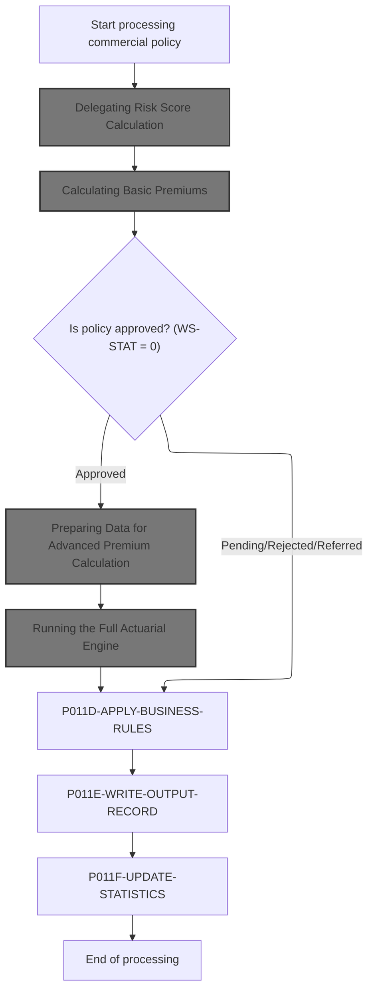

<SwmSnippet path="/base/src/LGAPDB01.cbl" line="258">

---

In `P011-PROCESS-COMMERCIAL` we kick off the flow by calling P011A-CALCULATE-RISK-SCORE. This sets up the risk score, which is needed before we can do any premium calculations or make underwriting decisions. We call it first because everything else depends on having that risk score available.

```cobol
       P011-PROCESS-COMMERCIAL.
           PERFORM P011A-CALCULATE-RISK-SCORE
           PERFORM P011B-BASIC-PREMIUM-CALC
```

---

</SwmSnippet>

### Delegating Risk Score Calculation

<SwmSnippet path="/base/src/LGAPDB01.cbl" line="268">

---

`P011A-CALCULATE-RISK-SCORE` just hands off all the input data to LGAPDB02, which does the actual risk score calculation. We call LGAPDB02 here because all the business logic and constants for risk scoring live there, so any changes to risk logic only need to happen in that external program.

```cobol
       P011A-CALCULATE-RISK-SCORE.
           CALL 'LGAPDB02' USING IN-PROPERTY-TYPE, IN-POSTCODE, 
                                IN-LATITUDE, IN-LONGITUDE,
                                IN-BUILDING-LIMIT, IN-CONTENTS-LIMIT,
                                IN-FLOOD-COVERAGE, IN-WEATHER-COVERAGE,
                                IN-CUSTOMER-HISTORY, WS-BASE-RISK-SCR.
```

---

</SwmSnippet>

### Running the Risk Score Engine

<SwmSnippet path="/base/src/LGAPDB02.cbl" line="39">

---

`MAIN-LOGIC` in LGAPDB02 first grabs the fire and crime risk factors from the database (or uses defaults), then runs the risk score calculation. We need to fetch the factors first because they're used in the calculation that follows.

```cobol
       MAIN-LOGIC.
           PERFORM GET-RISK-FACTORS
           PERFORM CALCULATE-RISK-SCORE
           GOBACK.
```

---

</SwmSnippet>

### Fetching Risk Factors

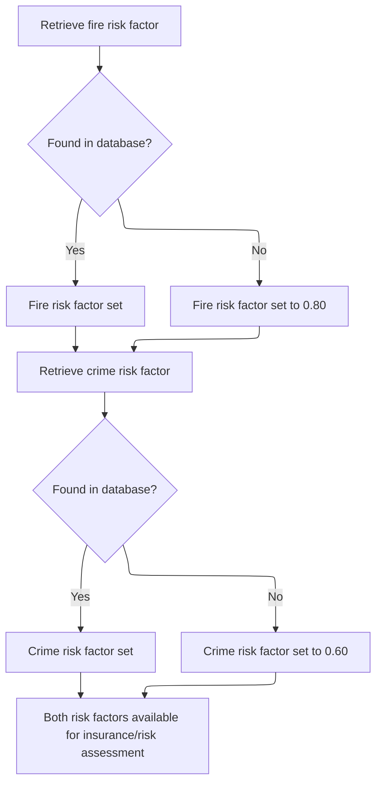

<SwmSnippet path="/base/src/LGAPDB02.cbl" line="44">

---

In `GET-RISK-FACTORS` we start by querying the RISK_FACTORS table for the fire risk factor. If it's not there, we just use 0.80 as a fallback. Same logic applies for crime later.

```cobol
       GET-RISK-FACTORS.
           EXEC SQL
               SELECT FACTOR_VALUE INTO :WS-FIRE-FACTOR
               FROM RISK_FACTORS
               WHERE PERIL_TYPE = 'FIRE'
           END-EXEC.
```

---

</SwmSnippet>

<SwmSnippet path="/base/src/LGAPDB02.cbl" line="51">

---

If the fire risk factor isn't found in the database, we just set it to 0.80 and move on. This keeps the calculation running even if the data's missing.

```cobol
           IF SQLCODE = 0
               CONTINUE
           ELSE
               MOVE 0.80 TO WS-FIRE-FACTOR
           END-IF.
```

---

</SwmSnippet>

<SwmSnippet path="/base/src/LGAPDB02.cbl" line="57">

---

Now we do the same thing for the crime risk factor—try to fetch it from the database, and if it's not there, we'll use the default value.

```cobol
           EXEC SQL
               SELECT FACTOR_VALUE INTO :WS-CRIME-FACTOR
               FROM RISK_FACTORS
               WHERE PERIL_TYPE = 'CRIME'
           END-EXEC.
```

---

</SwmSnippet>

<SwmSnippet path="/base/src/LGAPDB02.cbl" line="63">

---

After both queries, we end up with fire and crime risk factors—either from the database or the defaults. These are used right away in the risk score calculation.

```cobol
           IF SQLCODE = 0
               CONTINUE
           ELSE
               MOVE 0.60 TO WS-CRIME-FACTOR
           END-IF.
```

---

</SwmSnippet>

### Adjusting the Risk Score

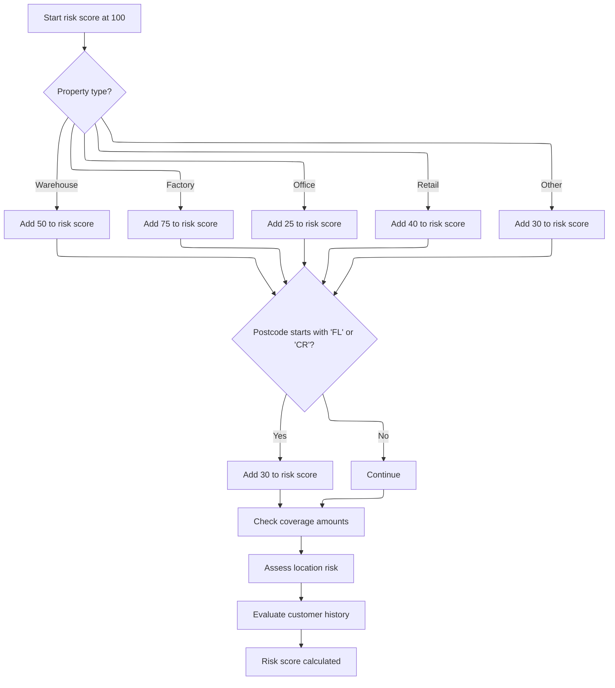

<SwmSnippet path="/base/src/LGAPDB02.cbl" line="69">

---

In `CALCULATE-RISK-SCORE` we start with a base score of 100 and bump it up based on the property type. The increments are fixed per type, so warehouses, factories, etc., each add a different amount to the score.

```cobol
       CALCULATE-RISK-SCORE.
           MOVE 100 TO LK-RISK-SCORE

           EVALUATE LK-PROPERTY-TYPE
             WHEN 'WAREHOUSE'
               ADD 50 TO LK-RISK-SCORE
             WHEN 'FACTORY' 
               ADD 75 TO LK-RISK-SCORE
             WHEN 'OFFICE'
               ADD 25 TO LK-RISK-SCORE
             WHEN 'RETAIL'
               ADD 40 TO LK-RISK-SCORE
             WHEN OTHER
               ADD 30 TO LK-RISK-SCORE
           END-EVALUATE
```

---

</SwmSnippet>

<SwmSnippet path="/base/src/LGAPDB02.cbl" line="85">

---

After adjusting for property type, we check if the postcode starts with 'FL' or 'CR'. If so, we add 30 more to the risk score—these prefixes are flagged as higher risk.

```cobol
           IF LK-POSTCODE(1:2) = 'FL' OR
              LK-POSTCODE(1:2) = 'CR'
             ADD 30 TO LK-RISK-SCORE
           END-IF
```

---

</SwmSnippet>

<SwmSnippet path="/base/src/LGAPDB02.cbl" line="90">

---

After the basic adjustments, we call three more procedures to tweak the risk score further—one for max coverage, one for location risk, and one for customer history. Each one adds more detail to the final score.

```cobol
           PERFORM CHECK-COVERAGE-AMOUNTS
           PERFORM ASSESS-LOCATION-RISK  
           PERFORM EVALUATE-CUSTOMER-HISTORY.
```

---

</SwmSnippet>

### Evaluating Coverage Amounts

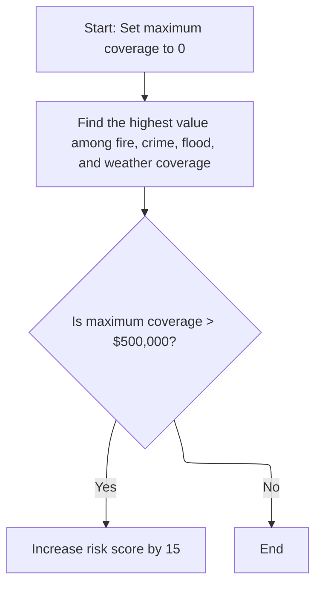

<SwmSnippet path="/base/src/LGAPDB02.cbl" line="94">

---

In `CHECK-COVERAGE-AMOUNTS` we loop through all the coverage types, find the highest one, and use that to decide if we need to bump the risk score for high exposure.

```cobol
       CHECK-COVERAGE-AMOUNTS.
           MOVE ZERO TO WS-MAX-COVERAGE
           
           IF LK-FIRE-COVERAGE > WS-MAX-COVERAGE
               MOVE LK-FIRE-COVERAGE TO WS-MAX-COVERAGE
           END-IF
```

---

</SwmSnippet>

<SwmSnippet path="/base/src/LGAPDB02.cbl" line="101">

---

Here we keep updating the max coverage by comparing each type one by one—crime coverage is checked after fire.

```cobol
           IF LK-CRIME-COVERAGE > WS-MAX-COVERAGE
               MOVE LK-CRIME-COVERAGE TO WS-MAX-COVERAGE
           END-IF
```

---

</SwmSnippet>

<SwmSnippet path="/base/src/LGAPDB02.cbl" line="105">

---

Now we compare flood coverage to the current max, updating if it's higher. Just working through the list.

```cobol
           IF LK-FLOOD-COVERAGE > WS-MAX-COVERAGE
               MOVE LK-FLOOD-COVERAGE TO WS-MAX-COVERAGE
           END-IF
```

---

</SwmSnippet>

<SwmSnippet path="/base/src/LGAPDB02.cbl" line="109">

---

Finally, we check weather coverage. After this, WS-MAX-COVERAGE holds the highest value across all types.

```cobol
           IF LK-WEATHER-COVERAGE > WS-MAX-COVERAGE
               MOVE LK-WEATHER-COVERAGE TO WS-MAX-COVERAGE
           END-IF
```

---

</SwmSnippet>

<SwmSnippet path="/base/src/LGAPDB02.cbl" line="113">

---

After finding the max coverage, if it's over $500,000, we add 15 to the risk score. Otherwise, we leave it as is.

```cobol
           IF WS-MAX-COVERAGE > WS-COVERAGE-500K
               ADD 15 TO LK-RISK-SCORE
           END-IF.
```

---

</SwmSnippet>

### Scoring Location and Customer History

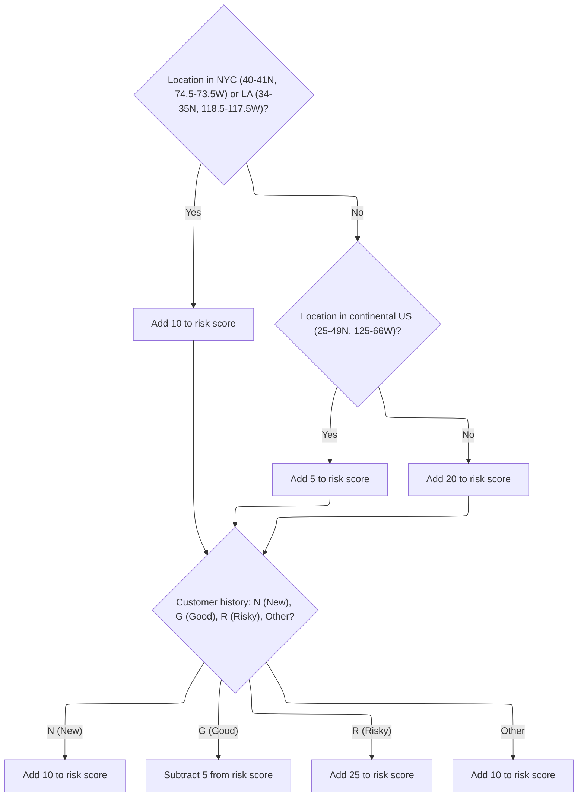

<SwmSnippet path="/base/src/LGAPDB02.cbl" line="117">

---

In `ASSESS-LOCATION-RISK` we check if the property is in NYC or LA using hardcoded lat/long ranges. If not, we check if it's in the continental US, otherwise it's treated as higher risk. Then we adjust the score based on customer history codes.

```cobol
       ASSESS-LOCATION-RISK.
      *    Urban areas: major cities (simplified lat/long ranges)
      *    NYC area: 40-41N, 74.5-73.5W
      *    LA area: 34-35N, 118.5-117.5W
           IF (LK-LATITUDE > 40.000000 AND LK-LATITUDE < 41.000000 AND
               LK-LONGITUDE > -74.500000 AND LK-LONGITUDE < -73.500000) OR
              (LK-LATITUDE > 34.000000 AND LK-LATITUDE < 35.000000 AND
               LK-LONGITUDE > -118.500000 AND LK-LONGITUDE < -117.500000)
               ADD 10 TO LK-RISK-SCORE
           ELSE
      *        Check if in continental US (suburban vs rural)
               IF (LK-LATITUDE > 25.000000 AND LK-LATITUDE < 49.000000 AND
                   LK-LONGITUDE > -125.000000 AND LK-LONGITUDE < -66.000000)
                   ADD 5 TO LK-RISK-SCORE
               ELSE
                   ADD 20 TO LK-RISK-SCORE
               END-IF
           END-IF.

       EVALUATE-CUSTOMER-HISTORY.
```

---

</SwmSnippet>

<SwmSnippet path="/base/src/LGAPDB02.cbl" line="137">

---

After the location checks, we use the customer history code to adjust the risk score—new, good, risky, or other, each changes the score by a set amount.

```cobol
           EVALUATE LK-CUSTOMER-HISTORY
               WHEN 'N'
                   ADD 10 TO LK-RISK-SCORE
               WHEN 'G'
                   SUBTRACT 5 FROM LK-RISK-SCORE
               WHEN 'R'
                   ADD 25 TO LK-RISK-SCORE
               WHEN OTHER
                   ADD 10 TO LK-RISK-SCORE
           END-EVALUATE.
```

---

</SwmSnippet>

### Moving to Premium Calculation

<SwmSnippet path="/base/src/LGAPDB01.cbl" line="258">

---

Back in P011-PROCESS-COMMERCIAL, after getting the risk score, we go straight to P011B-BASIC-PREMIUM-CALC. The premium calculation needs the risk score we just computed, so that's the next logical step.

```cobol
       P011-PROCESS-COMMERCIAL.
           PERFORM P011A-CALCULATE-RISK-SCORE
           PERFORM P011B-BASIC-PREMIUM-CALC
```

---

</SwmSnippet>

### Calculating Basic Premiums

<SwmSnippet path="/base/src/LGAPDB01.cbl" line="275">

---

`P011B-BASIC-PREMIUM-CALC` just calls LGAPDB03, passing in the risk score and peril selections. LGAPDB03 handles all the premium math and returns the results.

```cobol
       P011B-BASIC-PREMIUM-CALC.
           CALL 'LGAPDB03' USING WS-BASE-RISK-SCR, IN-FIRE-PERIL, 
                                IN-CRIME-PERIL, IN-FLOOD-PERIL, 
                                IN-WEATHER-PERIL, WS-STAT,
                                WS-STAT-DESC, WS-REJ-RSN, WS-FR-PREM,
                                WS-CR-PREM, WS-FL-PREM, WS-WE-PREM,
                                WS-TOT-PREM, WS-DISC-FACT.
```

---

</SwmSnippet>

### Running the Premium Engine

<SwmSnippet path="/base/src/LGAPDB03.cbl" line="42">

---

`MAIN-LOGIC` in LGAPDB03 runs three steps: fetches risk factors, decides the application verdict, and calculates premiums. Each step feeds into the next, so they're always run in sequence.

```cobol
       MAIN-LOGIC.
           PERFORM GET-RISK-FACTORS
           PERFORM CALCULATE-VERDICT
           PERFORM CALCULATE-PREMIUMS
           GOBACK.
```

---

</SwmSnippet>

#### Loading Premium Risk Factors

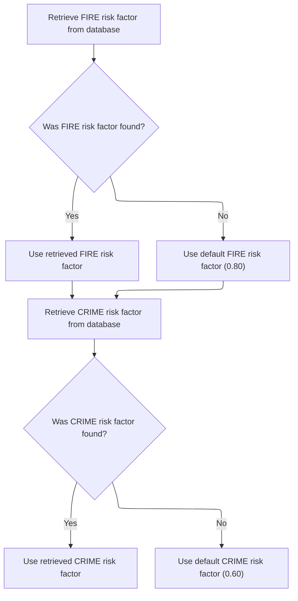

<SwmSnippet path="/base/src/LGAPDB03.cbl" line="48">

---

In `GET-RISK-FACTORS` we try to fetch the fire risk factor from the database, and if it's not there, we use 0.80 as a fallback. Same logic applies for crime.

```cobol
       GET-RISK-FACTORS.
           EXEC SQL
               SELECT FACTOR_VALUE INTO :WS-FIRE-FACTOR
               FROM RISK_FACTORS
               WHERE PERIL_TYPE = 'FIRE'
           END-EXEC.
```

---

</SwmSnippet>

<SwmSnippet path="/base/src/LGAPDB03.cbl" line="55">

---

If the fire risk factor isn't found, we just set it to 0.80 and keep going. This way, the premium calculation doesn't fail.

```cobol
           IF SQLCODE = 0
               CONTINUE
           ELSE
               MOVE 0.80 TO WS-FIRE-FACTOR
           END-IF.
```

---

</SwmSnippet>

<SwmSnippet path="/base/src/LGAPDB03.cbl" line="61">

---

Now we do the same thing for the crime risk factor—try to fetch it, and if it's not there, use the default.

```cobol
           EXEC SQL
               SELECT FACTOR_VALUE INTO :WS-CRIME-FACTOR
               FROM RISK_FACTORS
               WHERE PERIL_TYPE = 'CRIME'
           END-EXEC.
```

---

</SwmSnippet>

<SwmSnippet path="/base/src/LGAPDB03.cbl" line="67">

---

After both queries, we have fire and crime risk factors—either from the database or the defaults. These are used right away in the premium calculation.

```cobol
           IF SQLCODE = 0
               CONTINUE
           ELSE
               MOVE 0.60 TO WS-CRIME-FACTOR
           END-IF.
```

---

</SwmSnippet>

#### Making the Underwriting Decision

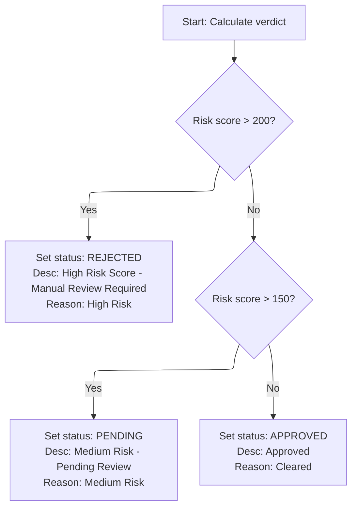

<SwmSnippet path="/base/src/LGAPDB03.cbl" line="73">

---

In `CALCULATE-VERDICT` we use the risk score to set the application status: rejected if over 200, pending if over 150, approved otherwise. The status and reason are set accordingly.

```cobol
       CALCULATE-VERDICT.
           IF LK-RISK-SCORE > 200
             MOVE 2 TO LK-STAT
             MOVE 'REJECTED' TO LK-STAT-DESC
             MOVE 'High Risk Score - Manual Review Required' 
               TO LK-REJ-RSN
           ELSE
             IF LK-RISK-SCORE > 150
               MOVE 1 TO LK-STAT
               MOVE 'PENDING' TO LK-STAT-DESC
               MOVE 'Medium Risk - Pending Review'
                 TO LK-REJ-RSN
             ELSE
               MOVE 0 TO LK-STAT
               MOVE 'APPROVED' TO LK-STAT-DESC
               MOVE SPACES TO LK-REJ-RSN
             END-IF
           END-IF.
```

---

</SwmSnippet>

### Checking for Enhanced Calculation

<SwmSnippet path="/base/src/LGAPDB01.cbl" line="261">

---

Back in P011-PROCESS-COMMERCIAL, after basic premium calculation, we check if the application is approved (WS-STAT = 0). If so, we move on to the enhanced actuarial calculation for more detailed premium work.

```cobol
           IF WS-STAT = 0
               PERFORM P011C-ENHANCED-ACTUARIAL-CALC
           END-IF
```

---

</SwmSnippet>

### Preparing Data for Advanced Premium Calculation

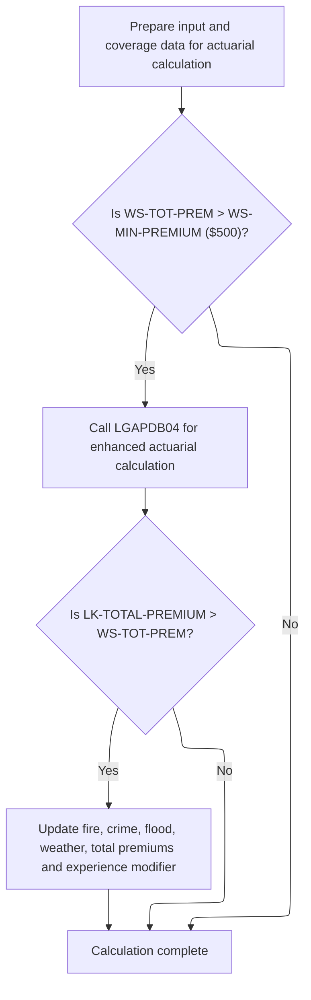

<SwmSnippet path="/base/src/LGAPDB01.cbl" line="283">

---

In `P011C-ENHANCED-ACTUARIAL-CALC` we're just mapping all the relevant input and coverage fields into the LK-\* structures. This is about prepping the data so the actuarial engine can run its calculations using a standardized input format.

```cobol
       P011C-ENHANCED-ACTUARIAL-CALC.
      *    Prepare input structure for actuarial calculation
           MOVE IN-CUSTOMER-NUM TO LK-CUSTOMER-NUM
           MOVE WS-BASE-RISK-SCR TO LK-RISK-SCORE
           MOVE IN-PROPERTY-TYPE TO LK-PROPERTY-TYPE
           MOVE IN-TERRITORY-CODE TO LK-TERRITORY
           MOVE IN-CONSTRUCTION-TYPE TO LK-CONSTRUCTION-TYPE
           MOVE IN-OCCUPANCY-CODE TO LK-OCCUPANCY-CODE
           MOVE IN-SPRINKLER-IND TO LK-PROTECTION-CLASS
           MOVE IN-YEAR-BUILT TO LK-YEAR-BUILT
           MOVE IN-SQUARE-FOOTAGE TO LK-SQUARE-FOOTAGE
           MOVE IN-YEARS-IN-BUSINESS TO LK-YEARS-IN-BUSINESS
           MOVE IN-CLAIMS-COUNT-3YR TO LK-CLAIMS-COUNT-5YR
           MOVE IN-CLAIMS-AMOUNT-3YR TO LK-CLAIMS-AMOUNT-5YR
           
      *    Set coverage data
           MOVE IN-BUILDING-LIMIT TO LK-BUILDING-LIMIT
           MOVE IN-CONTENTS-LIMIT TO LK-CONTENTS-LIMIT
           MOVE IN-BI-LIMIT TO LK-BI-LIMIT
           MOVE IN-FIRE-DEDUCTIBLE TO LK-FIRE-DEDUCTIBLE
           MOVE IN-WIND-DEDUCTIBLE TO LK-WIND-DEDUCTIBLE
           MOVE IN-FLOOD-DEDUCTIBLE TO LK-FLOOD-DEDUCTIBLE
           MOVE IN-OTHER-DEDUCTIBLE TO LK-OTHER-DEDUCTIBLE
           MOVE IN-FIRE-PERIL TO LK-FIRE-PERIL
           MOVE IN-CRIME-PERIL TO LK-CRIME-PERIL
           MOVE IN-FLOOD-PERIL TO LK-FLOOD-PERIL
           MOVE IN-WEATHER-PERIL TO LK-WEATHER-PERIL
```

---

</SwmSnippet>

<SwmSnippet path="/base/src/LGAPDB01.cbl" line="312">

---

After prepping the input, we call LGAPDB04 for the advanced premium calculation, but only if the current premium is above the minimum threshold. If the enhanced premium comes back higher, we update all the premium fields with the new values.

```cobol
           IF WS-TOT-PREM > WS-MIN-PREMIUM
               CALL 'LGAPDB04' USING LK-INPUT-DATA, LK-COVERAGE-DATA, 
                                    LK-OUTPUT-RESULTS
               
      *        Update with enhanced calculations if successful
               IF LK-TOTAL-PREMIUM > WS-TOT-PREM
                   MOVE LK-FIRE-PREMIUM TO WS-FR-PREM
                   MOVE LK-CRIME-PREMIUM TO WS-CR-PREM
                   MOVE LK-FLOOD-PREMIUM TO WS-FL-PREM
                   MOVE LK-WEATHER-PREMIUM TO WS-WE-PREM
                   MOVE LK-TOTAL-PREMIUM TO WS-TOT-PREM
                   MOVE LK-EXPERIENCE-MOD TO WS-EXPERIENCE-MOD
               END-IF
           END-IF.
```

---

</SwmSnippet>

### Running the Full Actuarial Engine

<SwmSnippet path="/base/src/LGAPDB04.cbl" line="138">

---

`P100-MAIN` runs through all the actuarial calculation steps in order—initializing exposures, calculating rates, applying modifiers, adding catastrophe loads, expenses, discounts, taxes, and finally producing the premium and rate factor. Each step depends on the previous one.

```cobol
       P100-MAIN.
           PERFORM P200-INIT
           PERFORM P300-RATES
           PERFORM P350-EXPOSURE
           PERFORM P400-EXP-MOD
           PERFORM P500-SCHED-MOD
           PERFORM P600-BASE-PREM
           PERFORM P700-CAT-LOAD
           PERFORM P800-EXPENSE
           PERFORM P900-DISC
           PERFORM P950-TAXES
           PERFORM P999-FINAL
           GOBACK.
```

---

</SwmSnippet>

#### Adjusting for Claims Experience

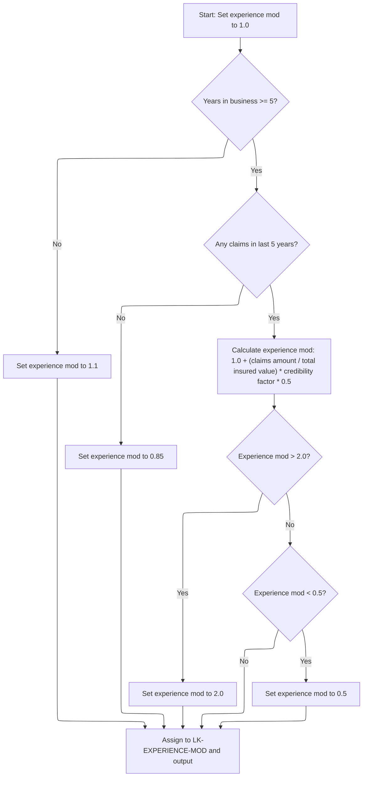

<SwmSnippet path="/base/src/LGAPDB04.cbl" line="234">

---

In `P400-EXP-MOD` we set up the experience modifier based on years in business and claims history. If the business is older and claim-free, it gets a discount; otherwise, we scale the modifier using claims amount, insured value, and a credibility factor, then cap it to stay within set limits.

```cobol
       P400-EXP-MOD.
           MOVE 1.0000 TO WS-EXPERIENCE-MOD
           
           IF LK-YEARS-IN-BUSINESS >= 5
               IF LK-CLAIMS-COUNT-5YR = ZERO
                   MOVE 0.8500 TO WS-EXPERIENCE-MOD
```

---

</SwmSnippet>

<SwmSnippet path="/base/src/LGAPDB04.cbl" line="240">

---

Here we handle the case where there are claims in the last 5 years—calculate the modifier using claims amount, insured value, and credibility factor, then cap it at 2.0 if it goes too high. The code assumes insured value isn't zero, but that's not enforced here.

```cobol
               ELSE
                   COMPUTE WS-EXPERIENCE-MOD = 
                       1.0000 + 
                       ((LK-CLAIMS-AMOUNT-5YR / WS-TOTAL-INSURED-VAL) * 
                        WS-CREDIBILITY-FACTOR * 0.50)
                   
                   IF WS-EXPERIENCE-MOD > 2.0000
                       MOVE 2.0000 TO WS-EXPERIENCE-MOD
                   END-IF
```

---

</SwmSnippet>

<SwmSnippet path="/base/src/LGAPDB04.cbl" line="250">

---

After capping the modifier at the top, we also check if it dropped below 0.5 and bump it up if needed. This keeps the experience adjustment from making premiums unrealistically low.

```cobol
                   IF WS-EXPERIENCE-MOD < 0.5000
                       MOVE 0.5000 TO WS-EXPERIENCE-MOD
                   END-IF
```

---

</SwmSnippet>

<SwmSnippet path="/base/src/LGAPDB04.cbl" line="254">

---

If the business is new (less than 5 years), we just set the modifier to 1.1. Then we copy the final modifier to the output structure for use in the next premium calculation steps.

```cobol
           ELSE
               MOVE 1.1000 TO WS-EXPERIENCE-MOD
           END-IF
           
           MOVE WS-EXPERIENCE-MOD TO LK-EXPERIENCE-MOD.
```

---

</SwmSnippet>

#### Applying Schedule Modifiers

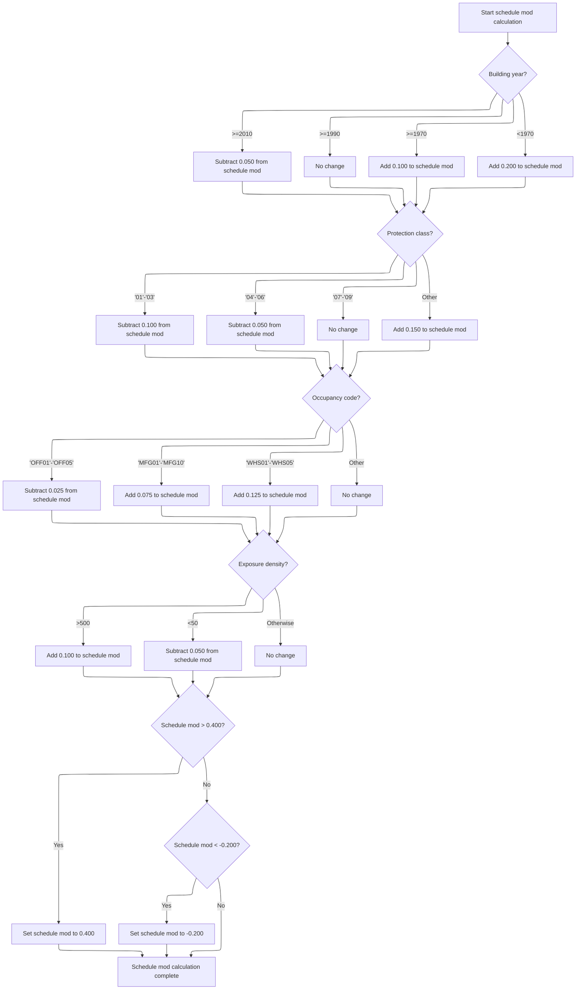

<SwmSnippet path="/base/src/LGAPDB04.cbl" line="260">

---

In `P500-SCHED-MOD` we start by adjusting the schedule modifier based on building age. Newer buildings get a small discount, older ones get a surcharge, and the rest stay neutral. These adjustments use fixed constants from the risk model.

```cobol
       P500-SCHED-MOD.
           MOVE +0.000 TO WS-SCHEDULE-MOD
           
      *    Building age factor
           EVALUATE TRUE
               WHEN LK-YEAR-BUILT >= 2010
                   SUBTRACT 0.050 FROM WS-SCHEDULE-MOD
               WHEN LK-YEAR-BUILT >= 1990
                   CONTINUE
               WHEN LK-YEAR-BUILT >= 1970
                   ADD 0.100 TO WS-SCHEDULE-MOD
               WHEN OTHER
                   ADD 0.200 TO WS-SCHEDULE-MOD
           END-EVALUATE
```

---

</SwmSnippet>

<SwmSnippet path="/base/src/LGAPDB04.cbl" line="276">

---

Next we adjust the modifier for protection class. The best classes get the biggest discount, mid-range classes get a smaller one, and poor protection gets a surcharge. This is all about fire safety ratings.

```cobol
           EVALUATE LK-PROTECTION-CLASS
               WHEN '01' THRU '03'
                   SUBTRACT 0.100 FROM WS-SCHEDULE-MOD
               WHEN '04' THRU '06'
                   SUBTRACT 0.050 FROM WS-SCHEDULE-MOD
               WHEN '07' THRU '09'
                   CONTINUE
               WHEN OTHER
                   ADD 0.150 TO WS-SCHEDULE-MOD
           END-EVALUATE
```

---

</SwmSnippet>

<SwmSnippet path="/base/src/LGAPDB04.cbl" line="288">

---

Now we tweak the modifier for occupancy hazard. Offices get a small discount, manufacturing gets a moderate surcharge, and warehouses get the biggest bump—reflecting their higher risk profile.

```cobol
           EVALUATE LK-OCCUPANCY-CODE
               WHEN 'OFF01' THRU 'OFF05'
                   SUBTRACT 0.025 FROM WS-SCHEDULE-MOD
               WHEN 'MFG01' THRU 'MFG10'
                   ADD 0.075 TO WS-SCHEDULE-MOD
               WHEN 'WHS01' THRU 'WHS05'
                   ADD 0.125 TO WS-SCHEDULE-MOD
               WHEN OTHER
                   CONTINUE
           END-EVALUATE
```

---

</SwmSnippet>

<SwmSnippet path="/base/src/LGAPDB04.cbl" line="300">

---

Here we adjust the modifier for exposure density. High density gets a surcharge, low density gets a discount, and everything else stays the same. The cutoffs are fixed by the risk model.

```cobol
           IF WS-EXPOSURE-DENSITY > 500.00
               ADD 0.100 TO WS-SCHEDULE-MOD
           ELSE
               IF WS-EXPOSURE-DENSITY < 50.00
                   SUBTRACT 0.050 FROM WS-SCHEDULE-MOD
               END-IF
```

---

</SwmSnippet>

<SwmSnippet path="/base/src/LGAPDB04.cbl" line="306">

---

After all the adjustments, we cap the schedule modifier at +0.4 to keep things in bounds. This prevents the premium from getting too high due to stacking risk factors.

```cobol
           END-IF
           
           IF WS-SCHEDULE-MOD > +0.400
               MOVE +0.400 TO WS-SCHEDULE-MOD
           END-IF
```

---

</SwmSnippet>

<SwmSnippet path="/base/src/LGAPDB04.cbl" line="312">

---

If the modifier drops below -0.2 after all the tweaks, we bump it up to -0.2. Then we copy the final value to the output structure for use in the next premium calculation steps.

```cobol
           IF WS-SCHEDULE-MOD < -0.200
               MOVE -0.200 TO WS-SCHEDULE-MOD
           END-IF
           
           MOVE WS-SCHEDULE-MOD TO LK-SCHEDULE-MOD.
```

---

</SwmSnippet>

#### Finalizing Premium Components

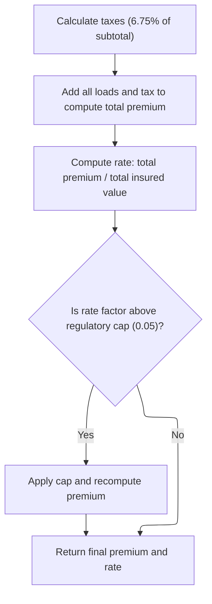

<SwmSnippet path="/base/src/LGAPDB04.cbl" line="456">

---

`P950-TAXES` just calculates the tax by summing up all the premium components, subtracting any discounts, and multiplying by the fixed tax rate. The result is moved to the output for later use.

```cobol
       P950-TAXES.
           COMPUTE WS-TAX-AMOUNT = 
               (LK-BASE-AMOUNT + LK-CAT-LOAD-AMT + 
                LK-EXPENSE-LOAD-AMT + LK-PROFIT-LOAD-AMT - 
                LK-DISCOUNT-AMT) * 0.0675
                
           MOVE WS-TAX-AMOUNT TO LK-TAX-AMT.
```

---

</SwmSnippet>

<SwmSnippet path="/base/src/LGAPDB04.cbl" line="464">

---

`P999-FINAL` sums up all the premium components, subtracts discounts, and calculates the rate factor. If the rate factor is above 0.05, we cap it and recalculate the premium so it doesn't exceed the allowed percentage of insured value.

```cobol
       P999-FINAL.
           COMPUTE LK-TOTAL-PREMIUM = 
               LK-BASE-AMOUNT + LK-CAT-LOAD-AMT + 
               LK-EXPENSE-LOAD-AMT + LK-PROFIT-LOAD-AMT -
               LK-DISCOUNT-AMT + LK-TAX-AMT
               
           COMPUTE LK-FINAL-RATE-FACTOR = 
               LK-TOTAL-PREMIUM / WS-TOTAL-INSURED-VAL
               
           IF LK-FINAL-RATE-FACTOR > 0.050000
               MOVE 0.050000 TO LK-FINAL-RATE-FACTOR
               COMPUTE LK-TOTAL-PREMIUM = 
                   WS-TOTAL-INSURED-VAL * LK-FINAL-RATE-FACTOR
           END-IF.
```

---

</SwmSnippet>

### Wrapping Up and Recording Results

<SwmSnippet path="/base/src/LGAPDB01.cbl" line="264">

---

Back in P011-PROCESS-COMMERCIAL, after finishing the enhanced actuarial calculation and writing the output, we call P011F-UPDATE-STATISTICS to record metrics about the processed policy. This keeps our reporting and analytics up to date.

```cobol
           PERFORM P011D-APPLY-BUSINESS-RULES
           PERFORM P011E-WRITE-OUTPUT-RECORD
           PERFORM P011F-UPDATE-STATISTICS.
```

---

</SwmSnippet>

&nbsp;

*This is an auto-generated document by Swimm 🌊 and has not yet been verified by a human*

<SwmMeta version="3.0.0" repo-id="Z2l0aHViJTNBJTNBU3dpbW1pby1nZW5hcHAtaG91c2UlM0ElM0FHaXJpLVN3aW1t" repo-name="Swimmio-genapp-house"><sup>Powered by [Swimm](https://app.swimm.io/)</sup></SwmMeta>
