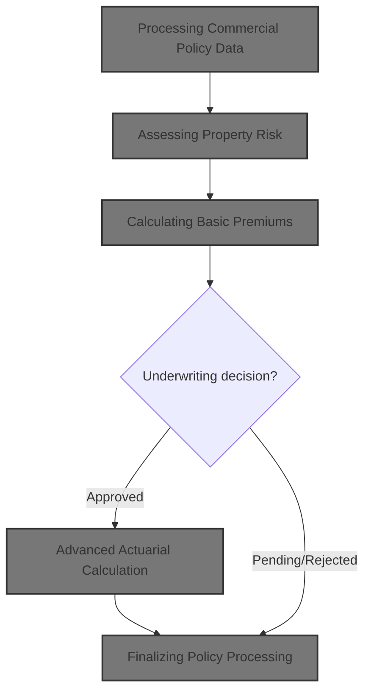
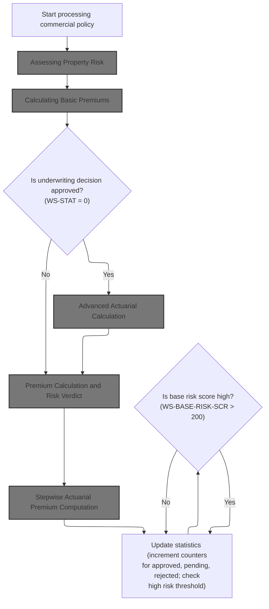
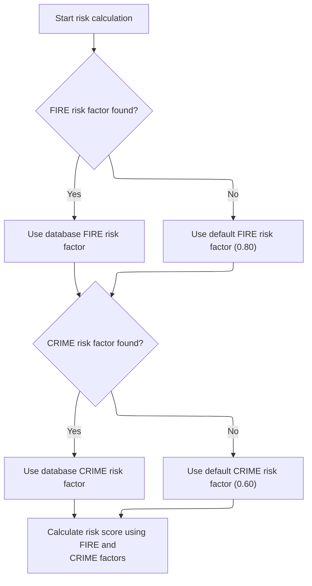
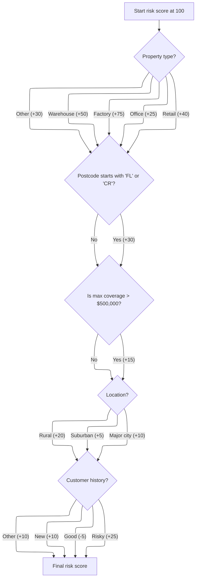
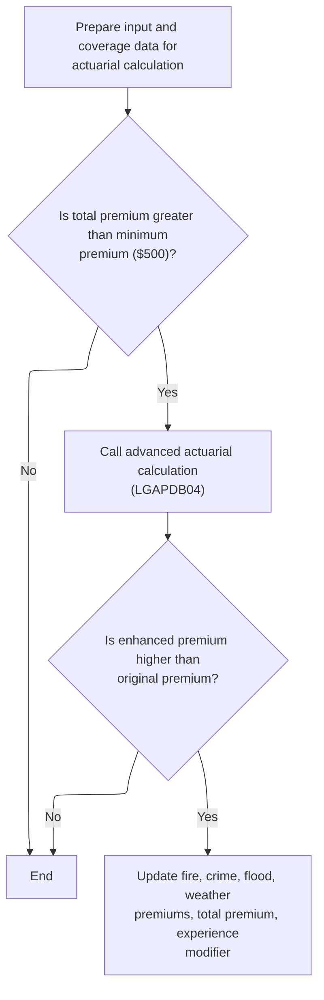
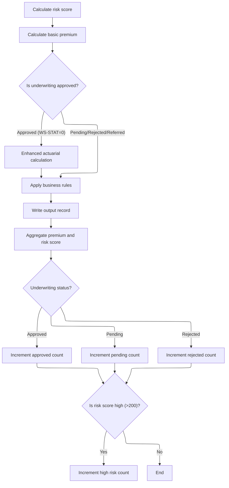

This document describes the flow for processing commercial insurance policy applications. The process evaluates property and customer risk, calculates premiums, determines underwriting status, and updates statistics for tracking policy outcomes. The flow receives commercial policy application data as input and produces risk scores, premium calculations, underwriting verdicts, and updated statistics as output.



# Spec

## Detailed View of the Program's Functionality

a. File Setup and Initialization

The main program begins by defining its identity and setting up the environment. It specifies several files for input, output, configuration, rates, and summary, each with their own organization and access mode. The file section describes the structure of each file, including the fields and record layouts. The working storage section sets up variables and counters for tracking statistics, configuration values, and actuarial data. Initialization routines display startup messages, reset counters and work areas, and accept the current processing date.

b. Configuration Loading

The program attempts to open and read the configuration file. If unavailable, it falls back to default values and logs a warning. When the file is present, it reads specific configuration keys (such as maximum risk score and minimum premium), updating internal values if the data is numeric.

c. File Opening and Header Writing

Input, output, and summary files are opened, with error handling to stop processing if any critical file cannot be accessed. The output file receives a header row describing the columns for customer, property, risk score, premiums, status, and rejection reason.

d. Main Record Processing Loop

The program reads records from the input file in a loop. For each record, it increments a counter and validates the input. Validation checks include policy type, customer number, coverage limits, and total insured value. Errors are logged with codes, severity, field, and message. If the record passes validation, it is processed according to its policy type; commercial policies follow the main premium calculation flow, while others are handled as unsupported.

e. Commercial Policy Processing

For commercial policies, the program performs a series of steps:

- Calls a subroutine to calculate the risk score, which delegates to a separate program for risk factor retrieval and score computation.
- Calls another subroutine to calculate basic premiums, which delegates to a separate program for premium and verdict calculation.
- If the underwriting status is approved, it performs an enhanced actuarial calculation, preparing detailed input and coverage data and calling an advanced actuarial program. If the enhanced premium is higher than the original, it updates the premium values.
- Applies business rules to determine the final underwriting decision, using risk score and premium thresholds to set status and rejection reasons.
- Writes the output record with all relevant fields.
- Updates statistics, aggregating premium and risk score totals, incrementing counters for approved, pending, rejected, and high-risk cases.

f. Risk Score Calculation (Delegated)

The risk score calculation is handled by a separate program. It retrieves fire and crime risk factors from a database, defaulting to preset values if unavailable. The score starts at a base value and is adjusted for property type, postcode, coverage amounts, location (using latitude and longitude), and customer history. Each adjustment follows business rules, such as adding points for warehouses, high coverage, urban or rural locations, and customer risk profiles.

g. Basic Premium Calculation and Verdict (Delegated)

Premium calculation is handled by another program. It retrieves fire and crime risk factors from a database, defaulting if necessary. The risk score is used to determine the underwriting verdict: scores above 200 are rejected, above 150 are pending, otherwise approved. Premiums for each peril (fire, crime, flood, weather) are calculated using the risk score, peril factors, and a discount factor if all perils are selected. The total premium is the sum of individual premiums.

h. Enhanced Actuarial Calculation (Delegated)

If the policy is approved and the total premium exceeds the minimum, the program prepares detailed input and coverage data and calls an advanced actuarial calculation program. This program performs stepwise computations:

- Initializes exposures for building, contents, and business interruption, scaling by risk score.
- Calculates experience modifier based on years in business and claims history, clamping to allowed limits.
- Calculates schedule modifier based on building age, protection class, occupancy code, and exposure density, clamping to allowed limits.
- Computes base premium, catastrophe loadings, expenses, discounts, and taxes.
- Calculates the final premium and rate factor, capping the rate factor if it exceeds a threshold and recalculating the premium if necessary. If the enhanced premium is higher than the original, the main program updates the premium values.

i. Business Rule Application

After premium calculations, business rules are applied to determine the final underwriting status. If the risk score exceeds the maximum, the policy is rejected. If the premium is below the minimum or the risk score is high, the policy is marked as pending. Otherwise, it is approved.

j. Output Record Writing

The program writes the output record, populating fields for customer, property, postcode, risk score, individual premiums, total premium, status, and rejection reason.

k. Statistics Update

After processing each record, the program updates statistics:

- Adds the total premium to the aggregate premium amount.
- Adds the risk score to the aggregate risk score total.
- Increments counters for approved, pending, or rejected policies based on status.
- Increments the high-risk counter if the risk score exceeds 200.

l. Non-Commercial Policy Handling

For non-commercial policies, the program writes an output record indicating unsupported status and a rejection reason.

m. File Closing and Summary Generation

After all records are processed, the program closes all files. It generates a summary file with totals for records processed, approved, pending, rejected, total premium, and average risk score if applicable.

n. Displaying Final Statistics

Finally, the program displays statistics to the console, including totals for records read, processed, approved, pending, rejected, errors, high-risk count, total premium generated, and average risk score if available.

# Rule Definition

| Paragraph Name                                                                                                                   | Rule ID | Category          | Description                                                                                                                                                                         | Conditions                                                                      | Remarks                                                                                                                                                                                                                                                                                                                                                                                                                                                                                                                                                                                                                                                                                                                                          |
| -------------------------------------------------------------------------------------------------------------------------------- | ------- | ----------------- | ----------------------------------------------------------------------------------------------------------------------------------------------------------------------------------- | ------------------------------------------------------------------------------- | ------------------------------------------------------------------------------------------------------------------------------------------------------------------------------------------------------------------------------------------------------------------------------------------------------------------------------------------------------------------------------------------------------------------------------------------------------------------------------------------------------------------------------------------------------------------------------------------------------------------------------------------------------------------------------------------------------------------------------------------------ |
| LGAPDB02 MAIN-LOGIC, CALCULATE-RISK-SCORE, CHECK-COVERAGE-AMOUNTS, ASSESS-LOCATION-RISK, EVALUATE-CUSTOMER-HISTORY               | RL-001  | Computation       | Calculates the risk score for a commercial policy based on property type, postcode, coverage amounts, location, and customer history.                                               | For each commercial policy input record.                                        | Base risk score: 100. Property type increments: WAREHOUSE +50, FACTORY +75, OFFICE +25, RETAIL +40, other +30. Postcode starts with 'FL' or 'CR': +30. If max(fire, crime, flood, weather coverage) > 500,000: +15. Location: NYC/LA +10, else if in continental US +5, else +20. Customer history: 'N' +10, 'G' -5, 'R' +25, other +10. Output: risk score as number (3 digits).                                                                                                                                                                                                                                                                                                                                                                |
| LGAPDB03 CALCULATE-PREMIUMS                                                                                                      | RL-002  | Computation       | Calculates the premium for each peril (fire, crime, flood, weather) using the risk score, peril factors, peril exposures, and a discount factor.                                    | For each commercial policy input record after risk score is calculated.         | Default peril factors: fire=0.80, crime=0.60, flood=1.20, weather=0.90 (overridden by DB if available). Discount factor: 0.90 if all perils >0, else 1.00. Premiums: (risk_score \* peril_factor) \* peril_exposure \* discount_factor. Output: premiums as numbers (10 digits, 2 decimals).                                                                                                                                                                                                                                                                                                                                                                                                                                                     |
| LGAPDB03 CALCULATE-VERDICT                                                                                                       | RL-003  | Conditional Logic | Maps the risk score to a status code, status description, and rejection reason.                                                                                                     | After risk score is calculated.                                                 | If risk score > 200: status code 2, desc 'REJECTED', reason 'High Risk Score - Manual Review Required'. Else if >150: status code 1, desc 'PENDING', reason 'Medium Risk - Pending Review'. Else: status code 0, desc 'APPROVED', reason blank. Output: status code (number), desc (string, 20 chars), reason (string, 50 chars).                                                                                                                                                                                                                                                                                                                                                                                                                |
| LGAPDB04 P200-INIT, P400-EXP-MOD, P500-SCHED-MOD, P600-BASE-PREM, P700-CAT-LOAD, P800-EXPENSE, P900-DISC, P950-TAXES, P999-FINAL | RL-004  | Computation       | Performs advanced actuarial calculations for approved policies, including exposures, modifiers, catastrophe loading, expenses, profit, discounts, taxes, and final premium capping. | Only for approved policies (status code 0) and total premium > minimum premium. | Exposure: building, contents, BI, total insured value, exposure density. Experience modifier: 0.85 if years_in_business >=5 and claims_count_5yr==0, else 1.0 + (claims_amount_5yr/total_insured_value)*credibility_factor*0.5 (clamped 0.5-2.0), else 1.10. Schedule modifier: building age, protection class, occupancy code, exposure density (clamped -0.20 to +0.40). Base premiums: fire, crime, flood, weather (see formulas). Catastrophe loading: hurricane, earthquake, tornado, flood. Expenses: 0.35, profit: 0.15. Discounts: multi-peril, claims-free, deductible credit (max 0.25). Tax: 0.0675. Final premium capped at 0.05 \* total insured value. Output: all calculated fields as numbers (see LK-OUTPUT-RESULTS structure). |
| LGAPDB01 P011E-WRITE-OUTPUT-RECORD, P010-PROCESS-ERROR-RECORD, P012-PROCESS-NON-COMMERCIAL                                       | RL-005  | Data Assignment   | Writes one output record per input record, populating all calculated fields or error messages as appropriate.                                                                       | For every input record processed.                                               | Output fields: customer number (string), property type (string), postcode (string), risk score (number), fire premium (number), crime premium (number), flood premium (number), weather premium (number), total premium (number), status (string), rejection reason (string). For error or unsupported records, set calculated fields to zero and provide error/reason.                                                                                                                                                                                                                                                                                                                                                                          |
| LGAPDB01 P011F-UPDATE-STATISTICS, P015-GENERATE-SUMMARY, P016-DISPLAY-STATS                                                      | RL-006  | Computation       | Aggregates statistics for approved, pending, rejected, and high risk policies, as well as totals for premium and risk score.                                                        | After processing each input record.                                             | Counters: approved, pending, rejected, high risk (risk score > 200). Totals: premium, risk score. Average risk score = total risk score / processed count. Output: summary file and display.                                                                                                                                                                                                                                                                                                                                                                                                                                                                                                                                                     |

# User Stories

## User Story 1: Evaluate commercial policy and determine premiums and status

---

### Story Description:

As a commercial policyholder, I want the system to evaluate my policy by calculating the risk score, determining premiums for each peril, and assigning a status (approved, pending, rejected) so that I understand my risk, costs, and eligibility.

---

### Business Rule Mapping:

| Rule ID | Paragraph Name                                                                                                     | Rule Description                                                                                                                                 |
| ------- | ------------------------------------------------------------------------------------------------------------------ | ------------------------------------------------------------------------------------------------------------------------------------------------ |
| RL-001  | LGAPDB02 MAIN-LOGIC, CALCULATE-RISK-SCORE, CHECK-COVERAGE-AMOUNTS, ASSESS-LOCATION-RISK, EVALUATE-CUSTOMER-HISTORY | Calculates the risk score for a commercial policy based on property type, postcode, coverage amounts, location, and customer history.            |
| RL-002  | LGAPDB03 CALCULATE-PREMIUMS                                                                                        | Calculates the premium for each peril (fire, crime, flood, weather) using the risk score, peril factors, peril exposures, and a discount factor. |
| RL-003  | LGAPDB03 CALCULATE-VERDICT                                                                                         | Maps the risk score to a status code, status description, and rejection reason.                                                                  |

---

### Relevant Functionality:

- **LGAPDB02 MAIN-LOGIC**
  1. **RL-001:**
     - Start with base risk score 100
     - Add property type increment
     - Add 30 if postcode starts with 'FL' or 'CR'
     - Add 15 if any coverage > 500,000
     - Add location adjustment (+10 for NYC/LA, +5 for continental US, else +20)
     - Add/subtract customer history adjustment
     - Output the final risk score
- **LGAPDB03 CALCULATE-PREMIUMS**
  1. **RL-002:**
     - Set discount factor to 0.90 if all peril exposures >0, else 1.00
     - For each peril, compute premium as (risk_score \* peril_factor) \* peril_exposure \* discount_factor
     - Sum all peril premiums for total premium
- **LGAPDB03 CALCULATE-VERDICT**
  1. **RL-003:**
     - If risk score > 200: set status to REJECTED
     - Else if risk score > 150: set status to PENDING
     - Else: set status to APPROVED

## User Story 2: Finalize policy results, perform advanced calculations, and report statistics

---

### Story Description:

As a system administrator, I want the program to finalize policy results by performing advanced actuarial calculations for approved policies, writing output records for all processed policies, and aggregating statistics so that I can review detailed results and monitor overall performance.

---

### Business Rule Mapping:

| Rule ID | Paragraph Name                                                                                                                   | Rule Description                                                                                                                                                                    |
| ------- | -------------------------------------------------------------------------------------------------------------------------------- | ----------------------------------------------------------------------------------------------------------------------------------------------------------------------------------- |
| RL-004  | LGAPDB04 P200-INIT, P400-EXP-MOD, P500-SCHED-MOD, P600-BASE-PREM, P700-CAT-LOAD, P800-EXPENSE, P900-DISC, P950-TAXES, P999-FINAL | Performs advanced actuarial calculations for approved policies, including exposures, modifiers, catastrophe loading, expenses, profit, discounts, taxes, and final premium capping. |
| RL-005  | LGAPDB01 P011E-WRITE-OUTPUT-RECORD, P010-PROCESS-ERROR-RECORD, P012-PROCESS-NON-COMMERCIAL                                       | Writes one output record per input record, populating all calculated fields or error messages as appropriate.                                                                       |
| RL-006  | LGAPDB01 P011F-UPDATE-STATISTICS, P015-GENERATE-SUMMARY, P016-DISPLAY-STATS                                                      | Aggregates statistics for approved, pending, rejected, and high risk policies, as well as totals for premium and risk score.                                                        |

---

### Relevant Functionality:

- **LGAPDB04 P200-INIT**
  1. **RL-004:**
     - Calculate exposures (building, contents, BI, total insured value, exposure density)
     - Calculate experience modifier
     - Calculate schedule modifier
     - Calculate base premiums for each peril
     - Calculate catastrophe loading
     - Calculate expense and profit loading
     - Calculate discounts (multi-peril, claims-free, deductible credit)
     - Clamp total discount to 0.25
     - Calculate tax
     - Calculate final premium, cap at 5% of total insured value
- **LGAPDB01 P011E-WRITE-OUTPUT-RECORD**
  1. **RL-005:**
     - For valid commercial policies, write all calculated fields to output
     - For error or unsupported records, write zeros and error/reason
- **LGAPDB01 P011F-UPDATE-STATISTICS**
  1. **RL-006:**
     - Increment counters for approved, pending, rejected, high risk
     - Add to total premium and risk score
     - At end, compute average risk score and write/display summary

# Code Walkthrough

## Processing Commercial Policy Data



<SwmSnippet path="/base/src/LGAPDB01.cbl" line="258">

---

In `P011-PROCESS-COMMERCIAL`, we kick off the flow by running a series of subroutines: risk score calculation, basic premium calculation, and, if WS-STAT is 0 (approved), an enhanced actuarial calculation. Calling P011A-CALCULATE-RISK-SCORE first sets up the risk context for all downstream premium and business rule logic. The conditional check on WS-STAT ensures that only approved policies get the advanced actuarial treatment before business rules, output, and statistics are updated.

```cobol
       P011-PROCESS-COMMERCIAL.
           PERFORM P011A-CALCULATE-RISK-SCORE
           PERFORM P011B-BASIC-PREMIUM-CALC
           IF WS-STAT = 0
               PERFORM P011C-ENHANCED-ACTUARIAL-CALC
           END-IF
           PERFORM P011D-APPLY-BUSINESS-RULES
           PERFORM P011E-WRITE-OUTPUT-RECORD
           PERFORM P011F-UPDATE-STATISTICS.
```

---

</SwmSnippet>

### Assessing Property Risk

<SwmSnippet path="/base/src/LGAPDB01.cbl" line="268">

---

`P011A-CALCULATE-RISK-SCORE` calls LGAPDB02 to handle risk scoring. All relevant property and customer info is passed in, letting LGAPDB02 fetch risk factors and compute the score. This modular call keeps the main routine focused and lets the risk logic live in its own program.

```cobol
       P011A-CALCULATE-RISK-SCORE.
           CALL 'LGAPDB02' USING IN-PROPERTY-TYPE, IN-POSTCODE, 
                                IN-LATITUDE, IN-LONGITUDE,
                                IN-BUILDING-LIMIT, IN-CONTENTS-LIMIT,
                                IN-FLOOD-COVERAGE, IN-WEATHER-COVERAGE,
                                IN-CUSTOMER-HISTORY, WS-BASE-RISK-SCR.
```

---

</SwmSnippet>

### Fetching Risk Factors and Calculating Score



<SwmSnippet path="/base/src/LGAPDB02.cbl" line="39">

---

`MAIN-LOGIC` runs two steps: first, it fetches risk factors for fire and crime from the database (or uses defaults if missing), then it calculates the risk score using those factors and the property/customer inputs. This keeps the risk calculation consistent regardless of database availability.

```cobol
       MAIN-LOGIC.
           PERFORM GET-RISK-FACTORS
           PERFORM CALCULATE-RISK-SCORE
           GOBACK.
```

---

</SwmSnippet>

<SwmSnippet path="/base/src/LGAPDB02.cbl" line="44">

---

Here, GET-RISK-FACTORS fetches fire and crime risk factors from the database. If the query fails, it falls back to hardcoded defaults (0.80 for fire, 0.60 for crime). CONTINUE is used to skip the ELSE block when the query succeeds, keeping the logic tight.

```cobol
       GET-RISK-FACTORS.
           EXEC SQL
               SELECT FACTOR_VALUE INTO :WS-FIRE-FACTOR
               FROM RISK_FACTORS
               WHERE PERIL_TYPE = 'FIRE'
           END-EXEC.
           
           IF SQLCODE = 0
               CONTINUE
           ELSE
               MOVE 0.80 TO WS-FIRE-FACTOR
           END-IF.
           
           EXEC SQL
               SELECT FACTOR_VALUE INTO :WS-CRIME-FACTOR
               FROM RISK_FACTORS
               WHERE PERIL_TYPE = 'CRIME'
           END-EXEC.
           
           IF SQLCODE = 0
               CONTINUE
           ELSE
               MOVE 0.60 TO WS-CRIME-FACTOR
           END-IF.
```

---

</SwmSnippet>

### Adjusting Risk Score by Property and Coverage



<SwmSnippet path="/base/src/LGAPDB02.cbl" line="69">

---

`CALCULATE-RISK-SCORE` starts with a base score, then adjusts it based on property type and postcode prefix. It then calls procedures to check coverage amounts, assess location risk, and evaluate customer history, layering in more risk factors for a final score.

```cobol
       CALCULATE-RISK-SCORE.
           MOVE 100 TO LK-RISK-SCORE

           EVALUATE LK-PROPERTY-TYPE
             WHEN 'WAREHOUSE'
               ADD 50 TO LK-RISK-SCORE
             WHEN 'FACTORY' 
               ADD 75 TO LK-RISK-SCORE
             WHEN 'OFFICE'
               ADD 25 TO LK-RISK-SCORE
             WHEN 'RETAIL'
               ADD 40 TO LK-RISK-SCORE
             WHEN OTHER
               ADD 30 TO LK-RISK-SCORE
           END-EVALUATE

           IF LK-POSTCODE(1:2) = 'FL' OR
              LK-POSTCODE(1:2) = 'CR'
             ADD 30 TO LK-RISK-SCORE
           END-IF

           PERFORM CHECK-COVERAGE-AMOUNTS
           PERFORM ASSESS-LOCATION-RISK  
           PERFORM EVALUATE-CUSTOMER-HISTORY.
```

---

</SwmSnippet>

<SwmSnippet path="/base/src/LGAPDB02.cbl" line="94">

---

Here, CHECK-COVERAGE-AMOUNTS finds the highest coverage among fire, crime, flood, and weather. If it exceeds 500,000, the risk score gets bumped by 15. This is a simple business rule for high-value policies.

```cobol
       CHECK-COVERAGE-AMOUNTS.
           MOVE ZERO TO WS-MAX-COVERAGE
           
           IF LK-FIRE-COVERAGE > WS-MAX-COVERAGE
               MOVE LK-FIRE-COVERAGE TO WS-MAX-COVERAGE
           END-IF
           
           IF LK-CRIME-COVERAGE > WS-MAX-COVERAGE
               MOVE LK-CRIME-COVERAGE TO WS-MAX-COVERAGE
           END-IF
           
           IF LK-FLOOD-COVERAGE > WS-MAX-COVERAGE
               MOVE LK-FLOOD-COVERAGE TO WS-MAX-COVERAGE
           END-IF
           
           IF LK-WEATHER-COVERAGE > WS-MAX-COVERAGE
               MOVE LK-WEATHER-COVERAGE TO WS-MAX-COVERAGE
           END-IF
           
           IF WS-MAX-COVERAGE > WS-COVERAGE-500K
               ADD 15 TO LK-RISK-SCORE
           END-IF.
```

---

</SwmSnippet>

<SwmSnippet path="/base/src/LGAPDB02.cbl" line="117">

---

Here, ASSESS-LOCATION-RISK uses hardcoded lat/long ranges to identify urban areas and adjusts the risk score accordingly. EVALUATE-CUSTOMER-HISTORY then tweaks the score based on customer history codes, using fixed increments and decrements.

```cobol
       ASSESS-LOCATION-RISK.
      *    Urban areas: major cities (simplified lat/long ranges)
      *    NYC area: 40-41N, 74.5-73.5W
      *    LA area: 34-35N, 118.5-117.5W
           IF (LK-LATITUDE > 40.000000 AND LK-LATITUDE < 41.000000 AND
               LK-LONGITUDE > -74.500000 AND LK-LONGITUDE < -73.500000) OR
              (LK-LATITUDE > 34.000000 AND LK-LATITUDE < 35.000000 AND
               LK-LONGITUDE > -118.500000 AND LK-LONGITUDE < -117.500000)
               ADD 10 TO LK-RISK-SCORE
           ELSE
      *        Check if in continental US (suburban vs rural)
               IF (LK-LATITUDE > 25.000000 AND LK-LATITUDE < 49.000000 AND
                   LK-LONGITUDE > -125.000000 AND LK-LONGITUDE < -66.000000)
                   ADD 5 TO LK-RISK-SCORE
               ELSE
                   ADD 20 TO LK-RISK-SCORE
               END-IF
           END-IF.

       EVALUATE-CUSTOMER-HISTORY.
           EVALUATE LK-CUSTOMER-HISTORY
               WHEN 'N'
                   ADD 10 TO LK-RISK-SCORE
               WHEN 'G'
                   SUBTRACT 5 FROM LK-RISK-SCORE
               WHEN 'R'
                   ADD 25 TO LK-RISK-SCORE
               WHEN OTHER
                   ADD 10 TO LK-RISK-SCORE
           END-EVALUATE.
```

---

</SwmSnippet>

### Calculating Basic Premiums

<SwmSnippet path="/base/src/LGAPDB01.cbl" line="275">

---

`P011B-BASIC-PREMIUM-CALC` calls LGAPDB03, passing in the risk score and peril/coverage data. LGAPDB03 handles the actual premium calculations and verdict logic, keeping the main flow clean and modular.

```cobol
       P011B-BASIC-PREMIUM-CALC.
           CALL 'LGAPDB03' USING WS-BASE-RISK-SCR, IN-FIRE-PERIL, 
                                IN-CRIME-PERIL, IN-FLOOD-PERIL, 
                                IN-WEATHER-PERIL, WS-STAT,
                                WS-STAT-DESC, WS-REJ-RSN, WS-FR-PREM,
                                WS-CR-PREM, WS-FL-PREM, WS-WE-PREM,
                                WS-TOT-PREM, WS-DISC-FACT.
```

---

</SwmSnippet>

### Premium Calculation and Risk Verdict

```mermaid
%%{init: {"flowchart": {"defaultRenderer": "elk"}} }%%
flowchart TD
    node1["Retrieve FIRE risk factor"] --> node2{"Is FIRE factor available?"}
    click node1 openCode "base/src/LGAPDB03.cbl:49:53"
    node2 -->|"Yes"| node3["Use FIRE factor"]
    click node2 openCode "base/src/LGAPDB03.cbl:55:56"
    node2 -->|"No"| node4["Use default FIRE factor (0.80)"]
    click node4 openCode "base/src/LGAPDB03.cbl:58:59"
    node3 --> node5["Retrieve CRIME risk factor"]
    node4 --> node5
    click node5 openCode "base/src/LGAPDB03.cbl:62:64"
    node5 --> node6{"Is CRIME factor available?"}
    click node6 openCode "base/src/LGAPDB03.cbl:67:68"
    node6 -->|"Yes"| node7["Use CRIME factor"]
    node6 -->|"No"| node8["Use default CRIME factor (0.60)"]
    click node8 openCode "base/src/LGAPDB03.cbl:70:71"
    node7 --> node9["Determine risk verdict"]
    node8 --> node9
    click node9 openCode "base/src/LGAPDB03.cbl:73:90"
    node9 --> node10{"Is risk score > 200?"}
    click node10 openCode "base/src/LGAPDB03.cbl:74:77"
    node10 -->|"Yes"| node11["Rejected"]
    click node11 openCode "base/src/LGAPDB03.cbl:75:78"
    node10 -->|"No"| node12{"Is risk score > 150?"}
    click node12 openCode "base/src/LGAPDB03.cbl:80:84"
    node12 -->|"Yes"| node13["Pending"]
    click node13 openCode "base/src/LGAPDB03.cbl:81:84"
    node12 -->|"No"| node14["Approved"]
    click node14 openCode "base/src/LGAPDB03.cbl:86:88"
    node11 --> node15["Calculate premiums"]
    node13 --> node15
    node14 --> node15
    click node15 openCode "base/src/LGAPDB03.cbl:92:120"
    node15 --> node16{"Are all peril exposures present?"}
    click node16 openCode "base/src/LGAPDB03.cbl:95:98"
    node16 -->|"Yes"| node17["Apply discount factor (0.90)"]
    click node17 openCode "base/src/LGAPDB03.cbl:99:100"
    node16 -->|"No"| node18["No discount (1.00)"]
    click node18 openCode "base/src/LGAPDB03.cbl:93:94"
    node17 --> node19["Compute individual and total premiums"]
    node18 --> node19
    click node19 openCode "base/src/LGAPDB03.cbl:102:120"

classDef HeadingStyle fill:#777777,stroke:#333,stroke-width:2px;
```



<SwmSnippet path="/base/src/LGAPDB03.cbl" line="42">

---

`MAIN-LOGIC` in LGAPDB03 fetches risk factors, determines the risk verdict based on the score, and calculates premiums for each peril. This sequence ensures verdict and premium logic are tightly coupled.

```cobol
       MAIN-LOGIC.
           PERFORM GET-RISK-FACTORS
           PERFORM CALCULATE-VERDICT
           PERFORM CALCULATE-PREMIUMS
           GOBACK.
```

---

</SwmSnippet>

<SwmSnippet path="/base/src/LGAPDB03.cbl" line="48">

---

Here, GET-RISK-FACTORS fetches fire and crime risk factors from the database, falling back to hardcoded defaults if the query fails. This keeps premium calculations running even when data is missing.

```cobol
       GET-RISK-FACTORS.
           EXEC SQL
               SELECT FACTOR_VALUE INTO :WS-FIRE-FACTOR
               FROM RISK_FACTORS
               WHERE PERIL_TYPE = 'FIRE'
           END-EXEC.
           
           IF SQLCODE = 0
               CONTINUE
           ELSE
               MOVE 0.80 TO WS-FIRE-FACTOR
           END-IF.
           
           EXEC SQL
               SELECT FACTOR_VALUE INTO :WS-CRIME-FACTOR
               FROM RISK_FACTORS
               WHERE PERIL_TYPE = 'CRIME'
           END-EXEC.
           
           IF SQLCODE = 0
               CONTINUE
           ELSE
               MOVE 0.60 TO WS-CRIME-FACTOR
           END-IF.
```

---

</SwmSnippet>

<SwmSnippet path="/base/src/LGAPDB03.cbl" line="73">

---

Here, CALCULATE-VERDICT uses the risk score to set the policy status: above 200 is rejected, above 150 is pending, otherwise approved. Status codes and messages are assigned accordingly.

```cobol
       CALCULATE-VERDICT.
           IF LK-RISK-SCORE > 200
             MOVE 2 TO LK-STAT
             MOVE 'REJECTED' TO LK-STAT-DESC
             MOVE 'High Risk Score - Manual Review Required' 
               TO LK-REJ-RSN
           ELSE
             IF LK-RISK-SCORE > 150
               MOVE 1 TO LK-STAT
               MOVE 'PENDING' TO LK-STAT-DESC
               MOVE 'Medium Risk - Pending Review'
                 TO LK-REJ-RSN
             ELSE
               MOVE 0 TO LK-STAT
               MOVE 'APPROVED' TO LK-STAT-DESC
               MOVE SPACES TO LK-REJ-RSN
             END-IF
           END-IF.
```

---

</SwmSnippet>

<SwmSnippet path="/base/src/LGAPDB03.cbl" line="92">

---

Here, CALCULATE-PREMIUMS sets a discount factor (1.00 or 0.90) based on peril selection, then computes premiums for each peril and sums them for the total. The discount rewards full coverage.

```cobol
       CALCULATE-PREMIUMS.
           MOVE 1.00 TO LK-DISC-FACT
           
           IF LK-FIRE-PERIL > 0 AND
              LK-CRIME-PERIL > 0 AND
              LK-FLOOD-PERIL > 0 AND
              LK-WEATHER-PERIL > 0
             MOVE 0.90 TO LK-DISC-FACT
           END-IF

           COMPUTE LK-FIRE-PREMIUM =
             ((LK-RISK-SCORE * WS-FIRE-FACTOR) * LK-FIRE-PERIL *
               LK-DISC-FACT)
           
           COMPUTE LK-CRIME-PREMIUM =
             ((LK-RISK-SCORE * WS-CRIME-FACTOR) * LK-CRIME-PERIL *
               LK-DISC-FACT)
           
           COMPUTE LK-FLOOD-PREMIUM =
             ((LK-RISK-SCORE * WS-FLOOD-FACTOR) * LK-FLOOD-PERIL *
               LK-DISC-FACT)
           
           COMPUTE LK-WEATHER-PREMIUM =
             ((LK-RISK-SCORE * WS-WEATHER-FACTOR) * LK-WEATHER-PERIL *
               LK-DISC-FACT)

           COMPUTE LK-TOTAL-PREMIUM = 
             LK-FIRE-PREMIUM + LK-CRIME-PREMIUM + 
             LK-FLOOD-PREMIUM + LK-WEATHER-PREMIUM. 
```

---

</SwmSnippet>

### Advanced Actuarial Calculation



<SwmSnippet path="/base/src/LGAPDB01.cbl" line="283">

---

`P011C-ENHANCED-ACTUARIAL-CALC` prepares detailed input and coverage data, then calls LGAPDB04 for advanced premium calculation if the total premium is above the minimum. If the enhanced premium is higher, it updates the premium values in the main flow.

```cobol
       P011C-ENHANCED-ACTUARIAL-CALC.
      *    Prepare input structure for actuarial calculation
           MOVE IN-CUSTOMER-NUM TO LK-CUSTOMER-NUM
           MOVE WS-BASE-RISK-SCR TO LK-RISK-SCORE
           MOVE IN-PROPERTY-TYPE TO LK-PROPERTY-TYPE
           MOVE IN-TERRITORY-CODE TO LK-TERRITORY
           MOVE IN-CONSTRUCTION-TYPE TO LK-CONSTRUCTION-TYPE
           MOVE IN-OCCUPANCY-CODE TO LK-OCCUPANCY-CODE
           MOVE IN-SPRINKLER-IND TO LK-PROTECTION-CLASS
           MOVE IN-YEAR-BUILT TO LK-YEAR-BUILT
           MOVE IN-SQUARE-FOOTAGE TO LK-SQUARE-FOOTAGE
           MOVE IN-YEARS-IN-BUSINESS TO LK-YEARS-IN-BUSINESS
           MOVE IN-CLAIMS-COUNT-3YR TO LK-CLAIMS-COUNT-5YR
           MOVE IN-CLAIMS-AMOUNT-3YR TO LK-CLAIMS-AMOUNT-5YR
           
      *    Set coverage data
           MOVE IN-BUILDING-LIMIT TO LK-BUILDING-LIMIT
           MOVE IN-CONTENTS-LIMIT TO LK-CONTENTS-LIMIT
           MOVE IN-BI-LIMIT TO LK-BI-LIMIT
           MOVE IN-FIRE-DEDUCTIBLE TO LK-FIRE-DEDUCTIBLE
           MOVE IN-WIND-DEDUCTIBLE TO LK-WIND-DEDUCTIBLE
           MOVE IN-FLOOD-DEDUCTIBLE TO LK-FLOOD-DEDUCTIBLE
           MOVE IN-OTHER-DEDUCTIBLE TO LK-OTHER-DEDUCTIBLE
           MOVE IN-FIRE-PERIL TO LK-FIRE-PERIL
           MOVE IN-CRIME-PERIL TO LK-CRIME-PERIL
           MOVE IN-FLOOD-PERIL TO LK-FLOOD-PERIL
           MOVE IN-WEATHER-PERIL TO LK-WEATHER-PERIL
           
      *    Call advanced actuarial calculation program (only for approved cases)
           IF WS-TOT-PREM > WS-MIN-PREMIUM
               CALL 'LGAPDB04' USING LK-INPUT-DATA, LK-COVERAGE-DATA, 
                                    LK-OUTPUT-RESULTS
               
      *        Update with enhanced calculations if successful
               IF LK-TOTAL-PREMIUM > WS-TOT-PREM
                   MOVE LK-FIRE-PREMIUM TO WS-FR-PREM
                   MOVE LK-CRIME-PREMIUM TO WS-CR-PREM
                   MOVE LK-FLOOD-PREMIUM TO WS-FL-PREM
                   MOVE LK-WEATHER-PREMIUM TO WS-WE-PREM
                   MOVE LK-TOTAL-PREMIUM TO WS-TOT-PREM
                   MOVE LK-EXPERIENCE-MOD TO WS-EXPERIENCE-MOD
               END-IF
           END-IF.
```

---

</SwmSnippet>

### Stepwise Actuarial Premium Computation

```mermaid
%%{init: {"flowchart": {"defaultRenderer": "elk"}} }%%
flowchart TD
  node1["Start premium calculation process"]
  click node1 openCode "base/src/LGAPDB04.cbl:138:150"
  node1 --> node2["Calculate exposures (limits, risk score,
fallback if no square footage)"]
  click node2 openCode "base/src/LGAPDB04.cbl:152:174"
  node2 --> node3["Calculate experience modifier (years in
business, claims, fallback if <5 years)"]
  click node3 openCode "base/src/LGAPDB04.cbl:234:258"
  node3 --> node4{"Is experience modifier outside 0.5000 -
2.0000?"}
  click node4 openCode "base/src/LGAPDB04.cbl:246:252"
  node4 -->|"Yes"| node5["Cap experience modifier to limits"]
  click node5 openCode "base/src/LGAPDB04.cbl:247:252"
  node4 -->|"No"| node6["Continue"]
  node5 --> node6
  node6 --> node7["Calculate schedule modifier (building,
protection, occupancy, exposure density,
fallback)"]
  click node7 openCode "base/src/LGAPDB04.cbl:260:316"
  node7 --> node8{"Is schedule modifier outside -0.200 to
0.400?"}
  click node8 openCode "base/src/LGAPDB04.cbl:308:314"
  node8 -->|"Yes"| node9["Cap schedule modifier to limits"]
  click node9 openCode "base/src/LGAPDB04.cbl:309:314"
  node8 -->|"No"| node10["Continue"]
  node9 --> node10
  node10 --> node11["Calculate base premium, catastrophe
load, expenses"]
  click node11 openCode "base/src/LGAPDB04.cbl:144:146"
  node11 --> node12["Apply discounts"]
  click node12 openCode "base/src/LGAPDB04.cbl:147:147"
  node12 --> node13["Calculate taxes"]
  click node13 openCode "base/src/LGAPDB04.cbl:456:462"
  node13 --> node14["Calculate final premium and rate factor"]
  click node14 openCode "base/src/LGAPDB04.cbl:464:472"
  node14 --> node15{"Is final rate factor > 0.050000?"}
  click node15 openCode "base/src/LGAPDB04.cbl:473:477"
  node15 -->|"Yes"| node16["Cap rate factor and recalculate premium"]
  click node16 openCode "base/src/LGAPDB04.cbl:474:476"
  node15 -->|"No"| node17["Return final premium and rate factor"]
  node16 --> node17
  click node17 openCode "base/src/LGAPDB04.cbl:477:477"
classDef HeadingStyle fill:#777777,stroke:#333,stroke-width:2px;
```



<SwmSnippet path="/base/src/LGAPDB04.cbl" line="138">

---

`P100-MAIN` runs a sequence of actuarial steps: initializing exposures, applying rates, calculating modifiers, adding loadings, applying discounts and taxes, and finalizing the premium. Each step builds on the previous, producing a detailed premium breakdown.

```cobol
       P100-MAIN.
           PERFORM P200-INIT
           PERFORM P300-RATES
           PERFORM P350-EXPOSURE
           PERFORM P400-EXP-MOD
           PERFORM P500-SCHED-MOD
           PERFORM P600-BASE-PREM
           PERFORM P700-CAT-LOAD
           PERFORM P800-EXPENSE
           PERFORM P900-DISC
           PERFORM P950-TAXES
           PERFORM P999-FINAL
           GOBACK.
```

---

</SwmSnippet>

<SwmSnippet path="/base/src/LGAPDB04.cbl" line="152">

---

Here, P200-INIT calculates exposures for building, contents, and business interruption by scaling limits with the risk score. It sums these for total insured value and computes exposure density, defaulting to 100 if square footage is zero.

```cobol
       P200-INIT.
           INITIALIZE WS-CALCULATION-AREAS
           INITIALIZE WS-BASE-RATE-TABLE
           
           COMPUTE WS-BUILDING-EXPOSURE = 
               LK-BUILDING-LIMIT * (1 + (LK-RISK-SCORE - 100) / 1000)
               
           COMPUTE WS-CONTENTS-EXPOSURE = 
               LK-CONTENTS-LIMIT * (1 + (LK-RISK-SCORE - 100) / 1000)
               
           COMPUTE WS-BI-EXPOSURE = 
               LK-BI-LIMIT * (1 + (LK-RISK-SCORE - 100) / 1000)
               
           COMPUTE WS-TOTAL-INSURED-VAL = 
               WS-BUILDING-EXPOSURE + WS-CONTENTS-EXPOSURE + 
               WS-BI-EXPOSURE
               
           IF LK-SQUARE-FOOTAGE > ZERO
               COMPUTE WS-EXPOSURE-DENSITY = 
                   WS-TOTAL-INSURED-VAL / LK-SQUARE-FOOTAGE
           ELSE
               MOVE 100.00 TO WS-EXPOSURE-DENSITY
           END-IF.
```

---

</SwmSnippet>

<SwmSnippet path="/base/src/LGAPDB04.cbl" line="234">

---

Here, P400-EXP-MOD calculates the experience modifier based on years in business and claims history. Constants are used for scaling and clamping, and the modifier is adjusted up or down depending on claims and tenure.

```cobol
       P400-EXP-MOD.
           MOVE 1.0000 TO WS-EXPERIENCE-MOD
           
           IF LK-YEARS-IN-BUSINESS >= 5
               IF LK-CLAIMS-COUNT-5YR = ZERO
                   MOVE 0.8500 TO WS-EXPERIENCE-MOD
               ELSE
                   COMPUTE WS-EXPERIENCE-MOD = 
                       1.0000 + 
                       ((LK-CLAIMS-AMOUNT-5YR / WS-TOTAL-INSURED-VAL) * 
                        WS-CREDIBILITY-FACTOR * 0.50)
                   
                   IF WS-EXPERIENCE-MOD > 2.0000
                       MOVE 2.0000 TO WS-EXPERIENCE-MOD
                   END-IF
                   
                   IF WS-EXPERIENCE-MOD < 0.5000
                       MOVE 0.5000 TO WS-EXPERIENCE-MOD
                   END-IF
               END-IF
           ELSE
               MOVE 1.1000 TO WS-EXPERIENCE-MOD
           END-IF
           
           MOVE WS-EXPERIENCE-MOD TO LK-EXPERIENCE-MOD.
```

---

</SwmSnippet>

<SwmSnippet path="/base/src/LGAPDB04.cbl" line="260">

---

Here, P500-SCHED-MOD adjusts the schedule mod based on building age, protection class, occupancy code, and exposure density. Constants are used for each adjustment, and the final value is clamped between -0.200 and +0.400.

```cobol
       P500-SCHED-MOD.
           MOVE +0.000 TO WS-SCHEDULE-MOD
           
      *    Building age factor
           EVALUATE TRUE
               WHEN LK-YEAR-BUILT >= 2010
                   SUBTRACT 0.050 FROM WS-SCHEDULE-MOD
               WHEN LK-YEAR-BUILT >= 1990
                   CONTINUE
               WHEN LK-YEAR-BUILT >= 1970
                   ADD 0.100 TO WS-SCHEDULE-MOD
               WHEN OTHER
                   ADD 0.200 TO WS-SCHEDULE-MOD
           END-EVALUATE
           
      *    Protection class factor
           EVALUATE LK-PROTECTION-CLASS
               WHEN '01' THRU '03'
                   SUBTRACT 0.100 FROM WS-SCHEDULE-MOD
               WHEN '04' THRU '06'
                   SUBTRACT 0.050 FROM WS-SCHEDULE-MOD
               WHEN '07' THRU '09'
                   CONTINUE
               WHEN OTHER
                   ADD 0.150 TO WS-SCHEDULE-MOD
           END-EVALUATE
           
      *    Occupancy hazard factor
           EVALUATE LK-OCCUPANCY-CODE
               WHEN 'OFF01' THRU 'OFF05'
                   SUBTRACT 0.025 FROM WS-SCHEDULE-MOD
               WHEN 'MFG01' THRU 'MFG10'
                   ADD 0.075 TO WS-SCHEDULE-MOD
               WHEN 'WHS01' THRU 'WHS05'
                   ADD 0.125 TO WS-SCHEDULE-MOD
               WHEN OTHER
                   CONTINUE
           END-EVALUATE
           
      *    Exposure density factor
           IF WS-EXPOSURE-DENSITY > 500.00
               ADD 0.100 TO WS-SCHEDULE-MOD
           ELSE
               IF WS-EXPOSURE-DENSITY < 50.00
                   SUBTRACT 0.050 FROM WS-SCHEDULE-MOD
               END-IF
           END-IF
           
           IF WS-SCHEDULE-MOD > +0.400
               MOVE +0.400 TO WS-SCHEDULE-MOD
           END-IF
           
           IF WS-SCHEDULE-MOD < -0.200
               MOVE -0.200 TO WS-SCHEDULE-MOD
           END-IF
           
           MOVE WS-SCHEDULE-MOD TO LK-SCHEDULE-MOD.
```

---

</SwmSnippet>

<SwmSnippet path="/base/src/LGAPDB04.cbl" line="456">

---

Here, P950-TAXES computes the tax by summing premium components, subtracting discounts, and multiplying by a fixed rate (0.0675). The result is stored as the policy tax amount.

```cobol
       P950-TAXES.
           COMPUTE WS-TAX-AMOUNT = 
               (LK-BASE-AMOUNT + LK-CAT-LOAD-AMT + 
                LK-EXPENSE-LOAD-AMT + LK-PROFIT-LOAD-AMT - 
                LK-DISCOUNT-AMT) * 0.0675
                
           MOVE WS-TAX-AMOUNT TO LK-TAX-AMT.
```

---

</SwmSnippet>

<SwmSnippet path="/base/src/LGAPDB04.cbl" line="464">

---

Here, P999-FINAL sums all premium components, subtracts discounts, and adds taxes to get the total premium. It calculates the final rate factor, capping it at 0.05 if needed, and recalculates the premium if the cap is applied.

```cobol
       P999-FINAL.
           COMPUTE LK-TOTAL-PREMIUM = 
               LK-BASE-AMOUNT + LK-CAT-LOAD-AMT + 
               LK-EXPENSE-LOAD-AMT + LK-PROFIT-LOAD-AMT -
               LK-DISCOUNT-AMT + LK-TAX-AMT
               
           COMPUTE LK-FINAL-RATE-FACTOR = 
               LK-TOTAL-PREMIUM / WS-TOTAL-INSURED-VAL
               
           IF LK-FINAL-RATE-FACTOR > 0.050000
               MOVE 0.050000 TO LK-FINAL-RATE-FACTOR
               COMPUTE LK-TOTAL-PREMIUM = 
                   WS-TOTAL-INSURED-VAL * LK-FINAL-RATE-FACTOR
           END-IF.
```

---

</SwmSnippet>

### Finalizing Policy Processing



<SwmSnippet path="/base/src/LGAPDB01.cbl" line="258">

---

Back in P011-PROCESS-COMMERCIAL, after all processing steps, we finish by updating statistics. Calling P011F-UPDATE-STATISTICS ensures totals, counters, and high-risk counts are incremented based on the latest policy outcome.

```cobol
       P011-PROCESS-COMMERCIAL.
           PERFORM P011A-CALCULATE-RISK-SCORE
           PERFORM P011B-BASIC-PREMIUM-CALC
           IF WS-STAT = 0
               PERFORM P011C-ENHANCED-ACTUARIAL-CALC
           END-IF
           PERFORM P011D-APPLY-BUSINESS-RULES
           PERFORM P011E-WRITE-OUTPUT-RECORD
           PERFORM P011F-UPDATE-STATISTICS.
```

---

</SwmSnippet>

<SwmSnippet path="/base/src/LGAPDB01.cbl" line="365">

---

`P011F-UPDATE-STATISTICS` adds the latest premium and risk score to totals, then increments the approved, pending, or rejected counter based on WS-STAT. If the risk score is above 200, it bumps the high-risk count for tracking.

```cobol
       P011F-UPDATE-STATISTICS.
           ADD WS-TOT-PREM TO WS-TOTAL-PREMIUM-AMT
           ADD WS-BASE-RISK-SCR TO WS-CONTROL-TOTALS
           
           EVALUATE WS-STAT
               WHEN 0 ADD 1 TO WS-APPROVED-CNT
               WHEN 1 ADD 1 TO WS-PENDING-CNT
               WHEN 2 ADD 1 TO WS-REJECTED-CNT
           END-EVALUATE
           
           IF WS-BASE-RISK-SCR > 200
               ADD 1 TO WS-HIGH-RISK-CNT
           END-IF.
```

---

</SwmSnippet>

&nbsp;

*This is an auto-generated document by Swimm 🌊 and has not yet been verified by a human*

<SwmMeta version="3.0.0" repo-id="Z2l0aHViJTNBJTNBU3dpbW1pby1nZW5hcHAtaG91c2UlM0ElM0FHaXJpLVN3aW1t" repo-name="Swimmio-genapp-house"><sup>Powered by [Swimm](https://app.swimm.io/)</sup></SwmMeta>
