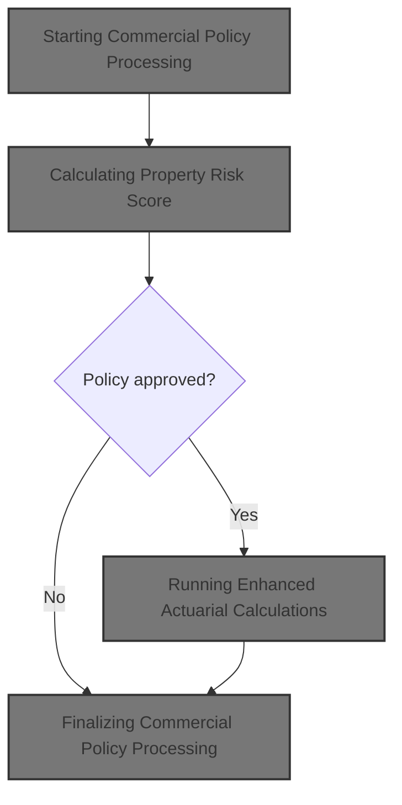
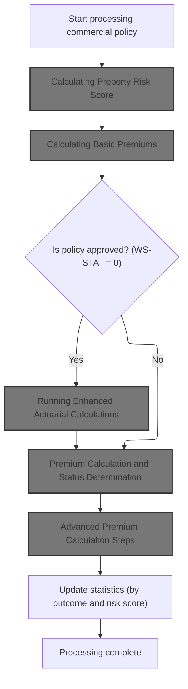
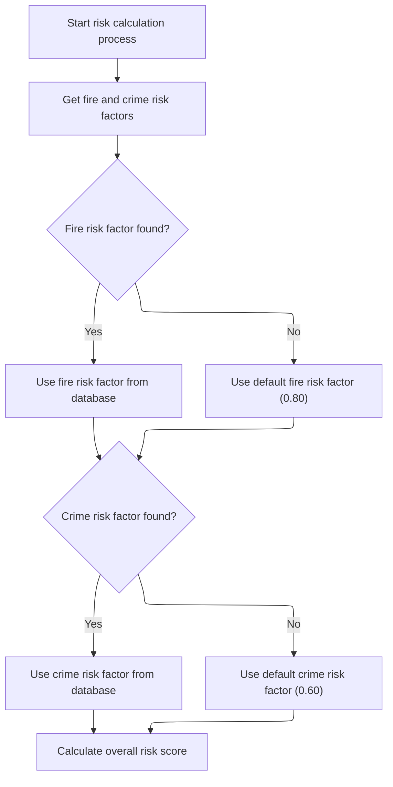
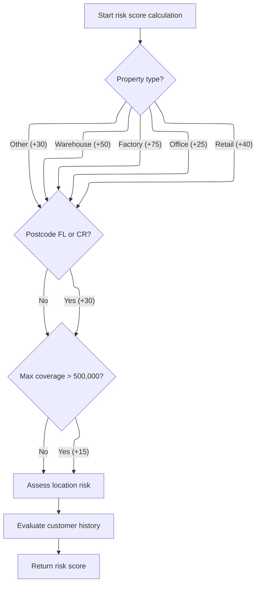
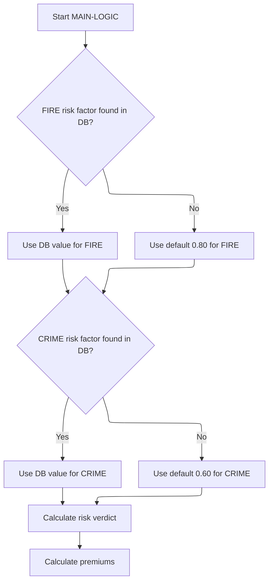
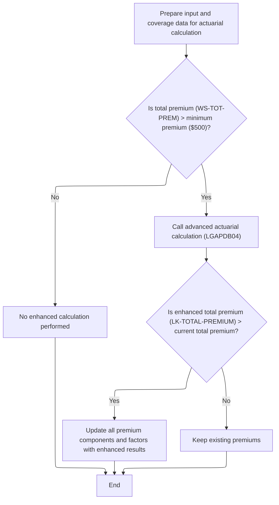
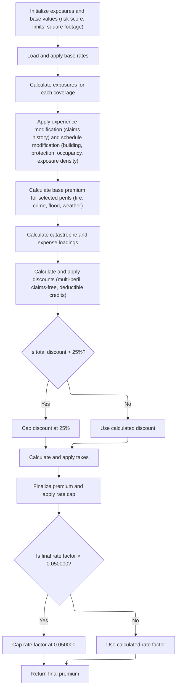
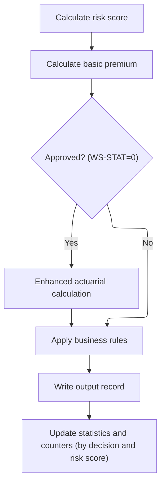

This document describes the flow for processing a commercial insurance policy application. The process starts with risk assessment and premium calculation, determines the application status, and applies enhanced actuarial calculations for approved cases. Results are recorded and business statistics are updated to reflect policy outcomes.



# Spec

## Detailed View of the Program's Functionality

a. Starting Commercial Policy Processing

The main commercial policy processing begins by reading and validating each input record. For commercial policies, the system initiates a sequence of calculations and decisions. The first step is to calculate the property's risk score, which is a critical input for all subsequent premium and actuarial logic. This is followed by the calculation of basic premiums. If the policy is initially approved (status code zero), enhanced actuarial calculations are performed to potentially refine the premium. Regardless of approval, business rules are applied to finalize the underwriting decision. The results are then written to the output, and statistics are updated to track processing outcomes.

b. Calculating Property Risk Score

The risk score calculation is performed by a dedicated routine, which calls a separate program to ensure consistency and reuse. This routine retrieves fire and crime risk factors from a database, defaulting to preset values if the database lookup fails. The risk score is then computed by considering several factors:

- The base score starts at 100.
- The property type adds a specific increment (e.g., warehouse +50, factory +75, office +25, retail +40, other +30).
- If the postcode starts with certain prefixes (e.g., 'FL' or 'CR'), an additional increment is added.
- The highest coverage amount among fire, crime, flood, and weather is checked; if it exceeds a threshold (500,000), the score is further increased.
- Location risk is assessed based on latitude and longitude, with urban areas (e.g., NYC, LA) adding a moderate increment, suburban/rural areas adding less, and locations outside the continental US adding more.
- Customer history is evaluated: new customers add risk, good history reduces risk, risky history adds more, and unknowns add a default increment.

c. Calculating Basic Premiums

Once the risk score is established, the system calculates basic premiums by calling another program. This program:

- Retrieves fire and crime risk factors from the database (or uses defaults).
- Determines the application status (approved, pending, rejected) based on the risk score: high scores are rejected, medium scores are pending, and low scores are approved.
- Calculates individual premiums for each peril (fire, crime, flood, weather) using the risk score, peril factors, and a discount factor if all perils are selected.
- Sums the individual premiums to get the total premium.

d. Premium Calculation and Status Determination

The premium calculation logic ensures that risk factors are always retrieved first. The application verdict is determined before any premium is calculated. The premium for each peril is computed using the risk score, the corresponding risk factor, the peril value, and a possible discount for multi-peril selection. The total premium is the sum of all peril premiums.

e. Running Enhanced Actuarial Calculations

If the policy is initially approved and the total premium exceeds the minimum threshold, the system prepares all necessary input and coverage data for advanced actuarial calculations. This involves copying all relevant fields into a structure and calling an advanced actuarial calculation program. If the enhanced calculation produces a higher total premium than the basic calculation, all premium components and factors are updated with the enhanced results.

f. Advanced Premium Calculation Steps

The advanced actuarial calculation proceeds through a series of well-defined steps:

- Exposures and base values are initialized by scaling coverage limits with the risk score and calculating total insured value and exposure density.
- Base rates for each peril are loaded from the database, with defaults used if not found.
- Exposures for each coverage type are calculated.
- Experience modification is applied based on years in business and claims history, with discounts for claims-free histories and caps on the modifier.
- Schedule modification is calculated using building age, protection class, occupancy code, and exposure density, with domain-specific increments and caps.
- Base premiums for each peril are calculated using exposures, base rates, modifiers, and trend factors, with peril-specific adjustments.
- Catastrophe and expense loadings are added for hurricane, earthquake, tornado, and flood, based on peril selection and fixed factors.
- Discounts are calculated for multi-peril coverage, claims-free history, and high deductibles, with a cap on the total discount.
- Taxes are calculated and added to the premium.
- The final premium is computed, and the rate factor is capped if it exceeds a set maximum, with the premium recalculated if necessary.

g. Finalizing Commercial Policy Processing

After all calculations, the system applies business rules to finalize the underwriting decision, writes the results to the output file, and updates statistics. The statistics routine increments counters for approved, pending, and rejected policies, adds to the total premium and risk score, and tracks the number of high-risk cases. This ensures that all outcomes are recorded for reporting and analysis.

# Rule Definition

| Paragraph Name                                                                 | Rule ID | Category          | Description                                                                                                                                                   | Conditions                                                                          | Remarks                                                                                                                                                                                                                                                    |
| ------------------------------------------------------------------------------ | ------- | ----------------- | ------------------------------------------------------------------------------------------------------------------------------------------------------------- | ----------------------------------------------------------------------------------- | ---------------------------------------------------------------------------------------------------------------------------------------------------------------------------------------------------------------------------------------------------------- |
| CALCULATE-RISK-SCORE in LGAPDB02                                               | RL-001  | Computation       | The risk score is incremented based on the property type. Each property type has a specific value added to the risk score, with a default for unlisted types. | When processing a commercial policy input record, and the property type is present. | WAREHOUSE: +50, FACTORY: +75, OFFICE: +25, RETAIL: +40, Other: +30. The property type is a string up to 15 characters.                                                                                                                                     |
| CALCULATE-RISK-SCORE in LGAPDB02                                               | RL-002  | Conditional Logic | If the postcode starts with 'FL' or 'CR', add 30 to the risk score.                                                                                           | When the postcode field is present and starts with 'FL' or 'CR'.                    | Postcode is a string up to 8 characters. Prefix check is on the first two characters.                                                                                                                                                                      |
| CHECK-COVERAGE-AMOUNTS in LGAPDB02                                             | RL-003  | Conditional Logic | If the highest coverage limit among building, contents, business interruption, or any peril limit exceeds 500,000, add 15 to the risk score.                  | When any of the coverage limits is greater than 500,000.                            | Coverage limits are numeric values with two decimal places. Threshold is 500,000.00.                                                                                                                                                                       |
| EVALUATE-CUSTOMER-HISTORY in LGAPDB02                                          | RL-004  | Conditional Logic | Adjust the risk score based on customer history code.                                                                                                         | When customerHistory is present.                                                    | 'N': +10, 'G': -5, 'R': +25, Other: +10. Customer history is a single character.                                                                                                                                                                           |
| ASSESS-LOCATION-RISK in LGAPDB02                                               | RL-005  | Conditional Logic | Adjust risk score based on latitude and longitude, reflecting urban, suburban, or rural risk.                                                                 | When latitude and longitude are present.                                            | NYC: 40-41N, -74.5 to -73.5W; LA: 34-35N, -118.5 to -117.5W. Continental US: 25-49N, -125 to -66W. Adds 10 for major city, 5 for suburban, 20 for rural.                                                                                                   |
| GET-RISK-FACTORS in LGAPDB02, LGAPDB03                                         | RL-006  | Data Assignment   | Retrieve risk factors for FIRE and CRIME from the RISK_FACTORS table. Use default values if not found.                                                        | When calculating risk or premiums for FIRE or CRIME perils.                         | Default FIRE: 0.80, CRIME: 0.60. Factors are numeric with two decimal places.                                                                                                                                                                              |
| CALCULATE-PREMIUMS in LGAPDB03                                                 | RL-007  | Computation       | Calculate basic premiums for each peril using risk score, peril values, and risk factors.                                                                     | When risk score and peril selections are available.                                 | Premiums are numeric with two decimal places. Discount factor applied if all perils selected (0.90).                                                                                                                                                       |
| CALCULATE-VERDICT in LGAPDB03, P011D-APPLY-BUSINESS-RULES in LGAPDB01          | RL-008  | Conditional Logic | Determine policy status based on risk score and premium thresholds, with different rules before and after enhanced actuarial calculation.                     | When risk score and total premium are available.                                    | Status: 0=APPROVED, 1=PENDING, 2=REJECTED. Reasons are strings. Thresholds: >200=REJECTED, 150-200=PENDING, <=150=APPROVED. After enhanced calculation: >250=REJECTED, totalPremium<500=PENDING, riskScore>180=PENDING.                                    |
| LOAD-RATE-TABLES and P310-PERIL-RATES in LGAPDB04                              | RL-009  | Computation       | Perform advanced actuarial premium calculation for approved policies, using base rates from DB or defaults.                                                   | When policy is approved and advanced calculation is triggered.                      | Default base rates: FIRE: 0.008500, CRIME: 0.006200, FLOOD: 0.012800, WEATHER: 0.009600. Premiums are numeric with two decimal places.                                                                                                                     |
| P700-CAT-LOAD in LGAPDB04                                                      | RL-010  | Computation       | Calculate catastrophe loads for hurricane, earthquake, tornado, and flood.                                                                                    | When corresponding peril premiums are present.                                      | Hurricane: 0.0125 × weather premium; Earthquake: 0.0080 × base amount; Tornado: 0.0045 × weather premium; Flood: 0.0090 × flood premium.                                                                                                                   |
| P800-EXPENSE in LGAPDB04                                                       | RL-011  | Computation       | Calculate expense and profit loads as percentages of base and catastrophe amounts.                                                                            | When base amount and catastrophe load are available.                                | Expense load: 35% of (base + cat load); Profit load: 15% of (base + cat load + expense load).                                                                                                                                                              |
| P900-DISC in LGAPDB04                                                          | RL-012  | Computation       | Calculate total discount, including multi-peril, claims-free, and deductible credits, capped at 25%.                                                          | When applicable peril selections, claims history, and deductibles are present.      | Multi-peril: 10% (all four perils), 5% (fire+weather+crime/flood); Claims-free: 7.5% (no claims in 5 years, yearsInBusiness>=5); Deductible credits: fire>=10,000:2.5%, wind>=25,000:3.5%, flood>=50,000:4.5%. Total discount capped at 25%.               |
| P950-TAXES in LGAPDB04                                                         | RL-013  | Computation       | Apply a tax rate of 6.75% to the premium after all loads and discounts.                                                                                       | When all premium components and discount are calculated.                            | Tax rate: 6.75%.                                                                                                                                                                                                                                           |
| P999-FINAL in LGAPDB04                                                         | RL-014  | Computation       | Calculate the final rate factor as totalPremium / totalInsuredValue. If it exceeds 0.05, cap it and recalculate totalPremium.                                 | When totalPremium and totalInsuredValue are available.                              | Final rate factor capped at 0.05.                                                                                                                                                                                                                          |
| P011E-WRITE-OUTPUT-RECORD in LGAPDB01                                          | RL-015  | Data Assignment   | For each policy, output a record with specified fields.                                                                                                       | For every processed policy.                                                         | Fields: customerNumber (string, 10), propertyType (string, 15), postcode (string, 8), riskScore (number, 3), firePremium, crimePremium, floodPremium, weatherPremium, totalPremium (all numbers, 10.2), status (string, 20), rejectionReason (string, 50). |
| P011F-UPDATE-STATISTICS, P015-GENERATE-SUMMARY, P016-DISPLAY-STATS in LGAPDB01 | RL-016  | Computation       | Aggregate statistics for reporting: totalPremiumAmount, averageRiskScore, approvedCount, pendingCount, rejectedCount, highRiskCount.                          | After processing all records.                                                       | All statistics are numeric. averageRiskScore is calculated as total risk score divided by processed count.                                                                                                                                                 |

# User Stories

## User Story 1: Calculate risk score for commercial policy

---

### Story Description:

As a commercial insurance system, I want to calculate a risk score for each policy input record so that I can assess the risk level and inform premium and status decisions.

---

### Business Rule Mapping:

| Rule ID | Paragraph Name                        | Rule Description                                                                                                                                              |
| ------- | ------------------------------------- | ------------------------------------------------------------------------------------------------------------------------------------------------------------- |
| RL-001  | CALCULATE-RISK-SCORE in LGAPDB02      | The risk score is incremented based on the property type. Each property type has a specific value added to the risk score, with a default for unlisted types. |
| RL-002  | CALCULATE-RISK-SCORE in LGAPDB02      | If the postcode starts with 'FL' or 'CR', add 30 to the risk score.                                                                                           |
| RL-003  | CHECK-COVERAGE-AMOUNTS in LGAPDB02    | If the highest coverage limit among building, contents, business interruption, or any peril limit exceeds 500,000, add 15 to the risk score.                  |
| RL-004  | EVALUATE-CUSTOMER-HISTORY in LGAPDB02 | Adjust the risk score based on customer history code.                                                                                                         |
| RL-005  | ASSESS-LOCATION-RISK in LGAPDB02      | Adjust risk score based on latitude and longitude, reflecting urban, suburban, or rural risk.                                                                 |

---

### Relevant Functionality:

- **CALCULATE-RISK-SCORE in LGAPDB02**
  1. **RL-001:**
     - Start with base risk score (e.g., 100)
     - If propertyType is 'WAREHOUSE', add 50
     - If 'FACTORY', add 75
     - If 'OFFICE', add 25
     - If 'RETAIL', add 40
     - Else, add 30
  2. **RL-002:**
     - If postcode starts with 'FL' or 'CR', add 30 to risk score
- **CHECK-COVERAGE-AMOUNTS in LGAPDB02**
  1. **RL-003:**
     - Find the maximum of buildingLimit, contentsLimit, businessInterruptionLimit, floodCoverage, weatherCoverage
     - If max > 500,000, add 15 to risk score
- **EVALUATE-CUSTOMER-HISTORY in LGAPDB02**
  1. **RL-004:**
     - If customerHistory is 'N', add 10
     - If 'G', subtract 5
     - If 'R', add 25
     - Else, add 10
- **ASSESS-LOCATION-RISK in LGAPDB02**
  1. **RL-005:**
     - If in NYC or LA area, add 10
     - Else if in continental US, add 5
     - Else, add 20

## User Story 2: Retrieve risk factors and calculate basic premiums

---

### Story Description:

As a commercial insurance system, I want to retrieve risk factors for each peril and calculate basic premiums using the risk score and peril selections so that I can determine the initial cost of coverage for each policy.

---

### Business Rule Mapping:

| Rule ID | Paragraph Name                         | Rule Description                                                                                       |
| ------- | -------------------------------------- | ------------------------------------------------------------------------------------------------------ |
| RL-006  | GET-RISK-FACTORS in LGAPDB02, LGAPDB03 | Retrieve risk factors for FIRE and CRIME from the RISK_FACTORS table. Use default values if not found. |
| RL-007  | CALCULATE-PREMIUMS in LGAPDB03         | Calculate basic premiums for each peril using risk score, peril values, and risk factors.              |

---

### Relevant Functionality:

- **GET-RISK-FACTORS in LGAPDB02**
  1. **RL-006:**
     - Query RISK_FACTORS for FIRE and CRIME
     - If not found, use default values
- **CALCULATE-PREMIUMS in LGAPDB03**
  1. **RL-007:**
     - If all four perils selected, set discount factor to 0.90, else 1.00
     - For each peril, compute premium as (riskScore \* riskFactor) \* perilValue \* discountFactor
     - Sum for total premium

## User Story 3: Determine policy status and perform advanced premium calculation

---

### Story Description:

As a commercial insurance system, I want to determine the policy status based on risk score and premium thresholds, and for approved policies, perform advanced actuarial premium calculations including catastrophe loads, expense and profit loads, discounts, taxes, and final rate factor capping, so that I can accurately price policies and ensure compliance with business rules.

---

### Business Rule Mapping:

| Rule ID | Paragraph Name                                                        | Rule Description                                                                                                                          |
| ------- | --------------------------------------------------------------------- | ----------------------------------------------------------------------------------------------------------------------------------------- |
| RL-008  | CALCULATE-VERDICT in LGAPDB03, P011D-APPLY-BUSINESS-RULES in LGAPDB01 | Determine policy status based on risk score and premium thresholds, with different rules before and after enhanced actuarial calculation. |
| RL-009  | LOAD-RATE-TABLES and P310-PERIL-RATES in LGAPDB04                     | Perform advanced actuarial premium calculation for approved policies, using base rates from DB or defaults.                               |
| RL-010  | P700-CAT-LOAD in LGAPDB04                                             | Calculate catastrophe loads for hurricane, earthquake, tornado, and flood.                                                                |
| RL-011  | P800-EXPENSE in LGAPDB04                                              | Calculate expense and profit loads as percentages of base and catastrophe amounts.                                                        |
| RL-012  | P900-DISC in LGAPDB04                                                 | Calculate total discount, including multi-peril, claims-free, and deductible credits, capped at 25%.                                      |
| RL-013  | P950-TAXES in LGAPDB04                                                | Apply a tax rate of 6.75% to the premium after all loads and discounts.                                                                   |
| RL-014  | P999-FINAL in LGAPDB04                                                | Calculate the final rate factor as totalPremium / totalInsuredValue. If it exceeds 0.05, cap it and recalculate totalPremium.             |

---

### Relevant Functionality:

- **CALCULATE-VERDICT in LGAPDB03**
  1. **RL-008:**
     - If riskScore > 200, status = REJECTED, reason = 'High Risk Score - Manual Review Required'
     - Else if riskScore > 150, status = PENDING, reason = 'Medium Risk - Pending Review'
     - Else, status = APPROVED
     - After enhanced calculation: if riskScore > 250, status = REJECTED; if totalPremium < 500, status = PENDING; if riskScore > 180, status = PENDING; else APPROVED
- **LOAD-RATE-TABLES and P310-PERIL-RATES in LGAPDB04**
  1. **RL-009:**
     - Retrieve base rates from DB for each peril; if not found, use defaults
     - Calculate peril premiums using exposures, experience mod, schedule mod, trend factor
- **P700-CAT-LOAD in LGAPDB04**
  1. **RL-010:**
     - If weatherPeril > 0, hurricane load = weatherPremium \* 0.0125
     - Earthquake load = baseAmount \* 0.0080
     - If weatherPeril > 0, tornado load = weatherPremium \* 0.0045
     - If floodPeril > 0, flood load = floodPremium \* 0.0090
     - Sum all for total catastrophe load
- **P800-EXPENSE in LGAPDB04**
  1. **RL-011:**
     - Expense load = (baseAmount + catLoad) \* 0.35
     - Profit load = (baseAmount + catLoad + expenseLoad) \* 0.15
- **P900-DISC in LGAPDB04**
  1. **RL-012:**
     - Calculate each discount component
     - Sum for total discount
     - If total > 0.25, cap at 0.25
     - Apply to sum of base, cat, expense, and profit loads
- **P950-TAXES in LGAPDB04**
  1. **RL-013:**
     - Tax = (baseAmount + catLoad + expenseLoad + profitLoad - discount) \* 0.0675
- **P999-FINAL in LGAPDB04**
  1. **RL-014:**
     - finalRateFactor = totalPremium / totalInsuredValue
     - If finalRateFactor > 0.05, set to 0.05 and totalPremium = totalInsuredValue \* 0.05

## User Story 4: Output policy records and generate aggregated statistics

---

### Story Description:

As a commercial insurance system, I want to output a record for each processed policy and generate aggregated statistics after processing all policies so that downstream systems and users can access policy results and summary insights for reporting.

---

### Business Rule Mapping:

| Rule ID | Paragraph Name                                                                 | Rule Description                                                                                                                     |
| ------- | ------------------------------------------------------------------------------ | ------------------------------------------------------------------------------------------------------------------------------------ |
| RL-016  | P011F-UPDATE-STATISTICS, P015-GENERATE-SUMMARY, P016-DISPLAY-STATS in LGAPDB01 | Aggregate statistics for reporting: totalPremiumAmount, averageRiskScore, approvedCount, pendingCount, rejectedCount, highRiskCount. |
| RL-015  | P011E-WRITE-OUTPUT-RECORD in LGAPDB01                                          | For each policy, output a record with specified fields.                                                                              |

---

### Relevant Functionality:

- **P011F-UPDATE-STATISTICS**
  1. **RL-016:**
     - Sum total premiums
     - Count approved, pending, rejected, high risk (>200)
     - Calculate average risk score
- **P011E-WRITE-OUTPUT-RECORD in LGAPDB01**
  1. **RL-015:**
     - Populate output record with all required fields
     - Write to output file

# Code Walkthrough

## Starting Commercial Policy Processing



<SwmSnippet path="/base/src/LGAPDB01.cbl" line="258">

---

In `P011-PROCESS-COMMERCIAL` we kick off the commercial policy flow. The first step is to calculate the risk score, which is required for all downstream premium and actuarial logic. We call P011A-CALCULATE-RISK-SCORE next because the risk score is a dependency for premium calculations and business rules.

```cobol
       P011-PROCESS-COMMERCIAL.
           PERFORM P011A-CALCULATE-RISK-SCORE
           PERFORM P011B-BASIC-PREMIUM-CALC
           IF WS-STAT = 0
               PERFORM P011C-ENHANCED-ACTUARIAL-CALC
           END-IF
           PERFORM P011D-APPLY-BUSINESS-RULES
           PERFORM P011E-WRITE-OUTPUT-RECORD
           PERFORM P011F-UPDATE-STATISTICS.
```

---

</SwmSnippet>

### Calculating Property Risk Score

<SwmSnippet path="/base/src/LGAPDB01.cbl" line="268">

---

`P011A-CALCULATE-RISK-SCORE` calls LGAPDB02 to get fire and crime risk factors and compute the property's risk score using all relevant property and customer inputs. This call is needed because the risk score logic is centralized in LGAPDB02 for consistency and reuse.

```cobol
       P011A-CALCULATE-RISK-SCORE.
           CALL 'LGAPDB02' USING IN-PROPERTY-TYPE, IN-POSTCODE, 
                                IN-LATITUDE, IN-LONGITUDE,
                                IN-BUILDING-LIMIT, IN-CONTENTS-LIMIT,
                                IN-FLOOD-COVERAGE, IN-WEATHER-COVERAGE,
                                IN-CUSTOMER-HISTORY, WS-BASE-RISK-SCR.
```

---

</SwmSnippet>

### Retrieving and Applying Risk Factors



<SwmSnippet path="/base/src/LGAPDB02.cbl" line="39">

---

`MAIN-LOGIC` runs the flow for risk factor retrieval and risk score calculation. First, it gets fire and crime risk factors from the database (or uses defaults if missing), then calculates the risk score using those factors and property/customer data.

```cobol
       MAIN-LOGIC.
           PERFORM GET-RISK-FACTORS
           PERFORM CALCULATE-RISK-SCORE
           GOBACK.
```

---

</SwmSnippet>

<SwmSnippet path="/base/src/LGAPDB02.cbl" line="44">

---

`GET-RISK-FACTORS` pulls risk factor values for 'FIRE' and 'CRIME' from the database. If the lookup fails, it uses hardcoded defaults (0.80 for fire, 0.60 for crime). These constants directly affect the risk score and are used throughout the premium calculation logic.

```cobol
       GET-RISK-FACTORS.
           EXEC SQL
               SELECT FACTOR_VALUE INTO :WS-FIRE-FACTOR
               FROM RISK_FACTORS
               WHERE PERIL_TYPE = 'FIRE'
           END-EXEC.
           
           IF SQLCODE = 0
               CONTINUE
           ELSE
               MOVE 0.80 TO WS-FIRE-FACTOR
           END-IF.
           
           EXEC SQL
               SELECT FACTOR_VALUE INTO :WS-CRIME-FACTOR
               FROM RISK_FACTORS
               WHERE PERIL_TYPE = 'CRIME'
           END-EXEC.
           
           IF SQLCODE = 0
               CONTINUE
           ELSE
               MOVE 0.60 TO WS-CRIME-FACTOR
           END-IF.
```

---

</SwmSnippet>

### Scoring Property and Coverage Risk



<SwmSnippet path="/base/src/LGAPDB02.cbl" line="69">

---

`CALCULATE-RISK-SCORE` sets the base risk score and adjusts it based on property type and postcode prefix. It then calls procedures to further refine the score using coverage amounts, location risk, and customer history. The increments and checks are domain-specific and not obvious from the function name.

```cobol
       CALCULATE-RISK-SCORE.
           MOVE 100 TO LK-RISK-SCORE

           EVALUATE LK-PROPERTY-TYPE
             WHEN 'WAREHOUSE'
               ADD 50 TO LK-RISK-SCORE
             WHEN 'FACTORY' 
               ADD 75 TO LK-RISK-SCORE
             WHEN 'OFFICE'
               ADD 25 TO LK-RISK-SCORE
             WHEN 'RETAIL'
               ADD 40 TO LK-RISK-SCORE
             WHEN OTHER
               ADD 30 TO LK-RISK-SCORE
           END-EVALUATE

           IF LK-POSTCODE(1:2) = 'FL' OR
              LK-POSTCODE(1:2) = 'CR'
             ADD 30 TO LK-RISK-SCORE
           END-IF

           PERFORM CHECK-COVERAGE-AMOUNTS
           PERFORM ASSESS-LOCATION-RISK  
           PERFORM EVALUATE-CUSTOMER-HISTORY.
```

---

</SwmSnippet>

<SwmSnippet path="/base/src/LGAPDB02.cbl" line="94">

---

`CHECK-COVERAGE-AMOUNTS` finds the highest coverage among fire, crime, flood, and weather, and if it exceeds 500K, adds 15 to the risk score. The 500K threshold and increment are domain rules for flagging high coverage risk.

```cobol
       CHECK-COVERAGE-AMOUNTS.
           MOVE ZERO TO WS-MAX-COVERAGE
           
           IF LK-FIRE-COVERAGE > WS-MAX-COVERAGE
               MOVE LK-FIRE-COVERAGE TO WS-MAX-COVERAGE
           END-IF
           
           IF LK-CRIME-COVERAGE > WS-MAX-COVERAGE
               MOVE LK-CRIME-COVERAGE TO WS-MAX-COVERAGE
           END-IF
           
           IF LK-FLOOD-COVERAGE > WS-MAX-COVERAGE
               MOVE LK-FLOOD-COVERAGE TO WS-MAX-COVERAGE
           END-IF
           
           IF LK-WEATHER-COVERAGE > WS-MAX-COVERAGE
               MOVE LK-WEATHER-COVERAGE TO WS-MAX-COVERAGE
           END-IF
           
           IF WS-MAX-COVERAGE > WS-COVERAGE-500K
               ADD 15 TO LK-RISK-SCORE
           END-IF.
```

---

</SwmSnippet>

### Calculating Basic Premiums

<SwmSnippet path="/base/src/LGAPDB01.cbl" line="275">

---

`P011B-BASIC-PREMIUM-CALC` calls LGAPDB03 to calculate insurance premiums and determine application status using the risk score and peril values. This keeps premium logic consistent and maintainable.

```cobol
       P011B-BASIC-PREMIUM-CALC.
           CALL 'LGAPDB03' USING WS-BASE-RISK-SCR, IN-FIRE-PERIL, 
                                IN-CRIME-PERIL, IN-FLOOD-PERIL, 
                                IN-WEATHER-PERIL, WS-STAT,
                                WS-STAT-DESC, WS-REJ-RSN, WS-FR-PREM,
                                WS-CR-PREM, WS-FL-PREM, WS-WE-PREM,
                                WS-TOT-PREM, WS-DISC-FACT.
```

---

</SwmSnippet>

### Premium Calculation and Status Determination



<SwmSnippet path="/base/src/LGAPDB03.cbl" line="42">

---

`MAIN-LOGIC` in LGAPDB03 first gets risk factors, then calculates the application verdict, and finally computes premiums. Each step depends on the previous, so risk factors come first.

```cobol
       MAIN-LOGIC.
           PERFORM GET-RISK-FACTORS
           PERFORM CALCULATE-VERDICT
           PERFORM CALCULATE-PREMIUMS
           GOBACK.
```

---

</SwmSnippet>

<SwmSnippet path="/base/src/LGAPDB03.cbl" line="48">

---

`GET-RISK-FACTORS` in LGAPDB03 fetches fire and crime risk factors from the database, or uses hardcoded defaults (0.80 and 0.60) if the lookup fails. These values are used in premium calculations downstream.

```cobol
       GET-RISK-FACTORS.
           EXEC SQL
               SELECT FACTOR_VALUE INTO :WS-FIRE-FACTOR
               FROM RISK_FACTORS
               WHERE PERIL_TYPE = 'FIRE'
           END-EXEC.
           
           IF SQLCODE = 0
               CONTINUE
           ELSE
               MOVE 0.80 TO WS-FIRE-FACTOR
           END-IF.
           
           EXEC SQL
               SELECT FACTOR_VALUE INTO :WS-CRIME-FACTOR
               FROM RISK_FACTORS
               WHERE PERIL_TYPE = 'CRIME'
           END-EXEC.
           
           IF SQLCODE = 0
               CONTINUE
           ELSE
               MOVE 0.60 TO WS-CRIME-FACTOR
           END-IF.
```

---

</SwmSnippet>

### Running Enhanced Actuarial Calculations



<SwmSnippet path="/base/src/LGAPDB01.cbl" line="283">

---

`P011C-ENHANCED-ACTUARIAL-CALC` sets up all the input and coverage data needed for advanced actuarial calculations, then calls LGAPDB04 if the basic premium is above the minimum. If the enhanced premium is higher, it updates the premium fields.

```cobol
       P011C-ENHANCED-ACTUARIAL-CALC.
      *    Prepare input structure for actuarial calculation
           MOVE IN-CUSTOMER-NUM TO LK-CUSTOMER-NUM
           MOVE WS-BASE-RISK-SCR TO LK-RISK-SCORE
           MOVE IN-PROPERTY-TYPE TO LK-PROPERTY-TYPE
           MOVE IN-TERRITORY-CODE TO LK-TERRITORY
           MOVE IN-CONSTRUCTION-TYPE TO LK-CONSTRUCTION-TYPE
           MOVE IN-OCCUPANCY-CODE TO LK-OCCUPANCY-CODE
           MOVE IN-SPRINKLER-IND TO LK-PROTECTION-CLASS
           MOVE IN-YEAR-BUILT TO LK-YEAR-BUILT
           MOVE IN-SQUARE-FOOTAGE TO LK-SQUARE-FOOTAGE
           MOVE IN-YEARS-IN-BUSINESS TO LK-YEARS-IN-BUSINESS
           MOVE IN-CLAIMS-COUNT-3YR TO LK-CLAIMS-COUNT-5YR
           MOVE IN-CLAIMS-AMOUNT-3YR TO LK-CLAIMS-AMOUNT-5YR
           
      *    Set coverage data
           MOVE IN-BUILDING-LIMIT TO LK-BUILDING-LIMIT
           MOVE IN-CONTENTS-LIMIT TO LK-CONTENTS-LIMIT
           MOVE IN-BI-LIMIT TO LK-BI-LIMIT
           MOVE IN-FIRE-DEDUCTIBLE TO LK-FIRE-DEDUCTIBLE
           MOVE IN-WIND-DEDUCTIBLE TO LK-WIND-DEDUCTIBLE
           MOVE IN-FLOOD-DEDUCTIBLE TO LK-FLOOD-DEDUCTIBLE
           MOVE IN-OTHER-DEDUCTIBLE TO LK-OTHER-DEDUCTIBLE
           MOVE IN-FIRE-PERIL TO LK-FIRE-PERIL
           MOVE IN-CRIME-PERIL TO LK-CRIME-PERIL
           MOVE IN-FLOOD-PERIL TO LK-FLOOD-PERIL
           MOVE IN-WEATHER-PERIL TO LK-WEATHER-PERIL
           
      *    Call advanced actuarial calculation program (only for approved cases)
           IF WS-TOT-PREM > WS-MIN-PREMIUM
               CALL 'LGAPDB04' USING LK-INPUT-DATA, LK-COVERAGE-DATA, 
                                    LK-OUTPUT-RESULTS
               
      *        Update with enhanced calculations if successful
               IF LK-TOTAL-PREMIUM > WS-TOT-PREM
                   MOVE LK-FIRE-PREMIUM TO WS-FR-PREM
                   MOVE LK-CRIME-PREMIUM TO WS-CR-PREM
                   MOVE LK-FLOOD-PREMIUM TO WS-FL-PREM
                   MOVE LK-WEATHER-PREMIUM TO WS-WE-PREM
                   MOVE LK-TOTAL-PREMIUM TO WS-TOT-PREM
                   MOVE LK-EXPERIENCE-MOD TO WS-EXPERIENCE-MOD
               END-IF
           END-IF.
```

---

</SwmSnippet>

### Advanced Premium Calculation Steps



<SwmSnippet path="/base/src/LGAPDB04.cbl" line="138">

---

`P100-MAIN` runs the advanced premium calculation by performing each step in sequence: initializing exposures, calculating rates, applying modifiers, adding catastrophe loads, expenses, discounts, taxes, and finally computing the total premium and rate factor. Each step builds on the previous.

```cobol
       P100-MAIN.
           PERFORM P200-INIT
           PERFORM P300-RATES
           PERFORM P350-EXPOSURE
           PERFORM P400-EXP-MOD
           PERFORM P500-SCHED-MOD
           PERFORM P600-BASE-PREM
           PERFORM P700-CAT-LOAD
           PERFORM P800-EXPENSE
           PERFORM P900-DISC
           PERFORM P950-TAXES
           PERFORM P999-FINAL
           GOBACK.
```

---

</SwmSnippet>

<SwmSnippet path="/base/src/LGAPDB04.cbl" line="152">

---

`P200-INIT` calculates exposures for building, contents, and business interruption by scaling limits with the risk score. It then sums these for total insured value and divides by square footage for exposure density, using 100.00 if square footage is zero.

```cobol
       P200-INIT.
           INITIALIZE WS-CALCULATION-AREAS
           INITIALIZE WS-BASE-RATE-TABLE
           
           COMPUTE WS-BUILDING-EXPOSURE = 
               LK-BUILDING-LIMIT * (1 + (LK-RISK-SCORE - 100) / 1000)
               
           COMPUTE WS-CONTENTS-EXPOSURE = 
               LK-CONTENTS-LIMIT * (1 + (LK-RISK-SCORE - 100) / 1000)
               
           COMPUTE WS-BI-EXPOSURE = 
               LK-BI-LIMIT * (1 + (LK-RISK-SCORE - 100) / 1000)
               
           COMPUTE WS-TOTAL-INSURED-VAL = 
               WS-BUILDING-EXPOSURE + WS-CONTENTS-EXPOSURE + 
               WS-BI-EXPOSURE
               
           IF LK-SQUARE-FOOTAGE > ZERO
               COMPUTE WS-EXPOSURE-DENSITY = 
                   WS-TOTAL-INSURED-VAL / LK-SQUARE-FOOTAGE
           ELSE
               MOVE 100.00 TO WS-EXPOSURE-DENSITY
           END-IF.
```

---

</SwmSnippet>

<SwmSnippet path="/base/src/LGAPDB04.cbl" line="234">

---

`P400-EXP-MOD` sets the experience modifier based on years in business and claims history. Claims-free businesses get a discount, others get a modifier based on claims ratio, capped between 0.5 and 2.0. The credibility factor (0.75) scales the impact.

```cobol
       P400-EXP-MOD.
           MOVE 1.0000 TO WS-EXPERIENCE-MOD
           
           IF LK-YEARS-IN-BUSINESS >= 5
               IF LK-CLAIMS-COUNT-5YR = ZERO
                   MOVE 0.8500 TO WS-EXPERIENCE-MOD
               ELSE
                   COMPUTE WS-EXPERIENCE-MOD = 
                       1.0000 + 
                       ((LK-CLAIMS-AMOUNT-5YR / WS-TOTAL-INSURED-VAL) * 
                        WS-CREDIBILITY-FACTOR * 0.50)
                   
                   IF WS-EXPERIENCE-MOD > 2.0000
                       MOVE 2.0000 TO WS-EXPERIENCE-MOD
                   END-IF
                   
                   IF WS-EXPERIENCE-MOD < 0.5000
                       MOVE 0.5000 TO WS-EXPERIENCE-MOD
                   END-IF
               END-IF
           ELSE
               MOVE 1.1000 TO WS-EXPERIENCE-MOD
           END-IF
           
           MOVE WS-EXPERIENCE-MOD TO LK-EXPERIENCE-MOD.
```

---

</SwmSnippet>

<SwmSnippet path="/base/src/LGAPDB04.cbl" line="260">

---

`P500-SCHED-MOD` calculates the schedule modifier by adjusting for building age, protection class, occupancy code, and exposure density, using fixed increments and caps. These constants and ranges are domain-specific and keep the modifier within set limits.

```cobol
       P500-SCHED-MOD.
           MOVE +0.000 TO WS-SCHEDULE-MOD
           
      *    Building age factor
           EVALUATE TRUE
               WHEN LK-YEAR-BUILT >= 2010
                   SUBTRACT 0.050 FROM WS-SCHEDULE-MOD
               WHEN LK-YEAR-BUILT >= 1990
                   CONTINUE
               WHEN LK-YEAR-BUILT >= 1970
                   ADD 0.100 TO WS-SCHEDULE-MOD
               WHEN OTHER
                   ADD 0.200 TO WS-SCHEDULE-MOD
           END-EVALUATE
           
      *    Protection class factor
           EVALUATE LK-PROTECTION-CLASS
               WHEN '01' THRU '03'
                   SUBTRACT 0.100 FROM WS-SCHEDULE-MOD
               WHEN '04' THRU '06'
                   SUBTRACT 0.050 FROM WS-SCHEDULE-MOD
               WHEN '07' THRU '09'
                   CONTINUE
               WHEN OTHER
                   ADD 0.150 TO WS-SCHEDULE-MOD
           END-EVALUATE
           
      *    Occupancy hazard factor
           EVALUATE LK-OCCUPANCY-CODE
               WHEN 'OFF01' THRU 'OFF05'
                   SUBTRACT 0.025 FROM WS-SCHEDULE-MOD
               WHEN 'MFG01' THRU 'MFG10'
                   ADD 0.075 TO WS-SCHEDULE-MOD
               WHEN 'WHS01' THRU 'WHS05'
                   ADD 0.125 TO WS-SCHEDULE-MOD
               WHEN OTHER
                   CONTINUE
           END-EVALUATE
           
      *    Exposure density factor
           IF WS-EXPOSURE-DENSITY > 500.00
               ADD 0.100 TO WS-SCHEDULE-MOD
           ELSE
               IF WS-EXPOSURE-DENSITY < 50.00
                   SUBTRACT 0.050 FROM WS-SCHEDULE-MOD
               END-IF
           END-IF
           
           IF WS-SCHEDULE-MOD > +0.400
               MOVE +0.400 TO WS-SCHEDULE-MOD
           END-IF
           
           IF WS-SCHEDULE-MOD < -0.200
               MOVE -0.200 TO WS-SCHEDULE-MOD
           END-IF
           
           MOVE WS-SCHEDULE-MOD TO LK-SCHEDULE-MOD.
```

---

</SwmSnippet>

<SwmSnippet path="/base/src/LGAPDB04.cbl" line="318">

---

`P600-BASE-PREM` calculates the base premium by summing up premiums for fire, crime, flood, and weather perils. Crime uses a 0.80 multiplier, flood uses 1.25 for the trend factor. Each premium is computed using exposures, base rates, experience and schedule modifiers, and trend factors.

```cobol
       P600-BASE-PREM.
           MOVE ZERO TO LK-BASE-AMOUNT
           
      * FIRE PREMIUM
           IF LK-FIRE-PERIL > ZERO
               COMPUTE LK-FIRE-PREMIUM = 
                   (WS-BUILDING-EXPOSURE + WS-CONTENTS-EXPOSURE) *
                   WS-BASE-RATE (1, 1, 1, 1) * 
                   WS-EXPERIENCE-MOD *
                   (1 + WS-SCHEDULE-MOD) *
                   WS-TREND-FACTOR
                   
               ADD LK-FIRE-PREMIUM TO LK-BASE-AMOUNT
           END-IF
           
      * CRIME PREMIUM
           IF LK-CRIME-PERIL > ZERO
               COMPUTE LK-CRIME-PREMIUM = 
                   (WS-CONTENTS-EXPOSURE * 0.80) *
                   WS-BASE-RATE (2, 1, 1, 1) * 
                   WS-EXPERIENCE-MOD *
                   (1 + WS-SCHEDULE-MOD) *
                   WS-TREND-FACTOR
                   
               ADD LK-CRIME-PREMIUM TO LK-BASE-AMOUNT
           END-IF
           
      * FLOOD PREMIUM
           IF LK-FLOOD-PERIL > ZERO
               COMPUTE LK-FLOOD-PREMIUM = 
                   WS-BUILDING-EXPOSURE *
                   WS-BASE-RATE (3, 1, 1, 1) * 
                   WS-EXPERIENCE-MOD *
                   (1 + WS-SCHEDULE-MOD) *
                   WS-TREND-FACTOR * 1.25
                   
               ADD LK-FLOOD-PREMIUM TO LK-BASE-AMOUNT
           END-IF
           
      * WEATHER PREMIUM
           IF LK-WEATHER-PERIL > ZERO
               COMPUTE LK-WEATHER-PREMIUM = 
                   (WS-BUILDING-EXPOSURE + WS-CONTENTS-EXPOSURE) *
                   WS-BASE-RATE (4, 1, 1, 1) * 
                   WS-EXPERIENCE-MOD *
                   (1 + WS-SCHEDULE-MOD) *
                   WS-TREND-FACTOR
                   
               ADD LK-WEATHER-PREMIUM TO LK-BASE-AMOUNT
           END-IF.
```

---

</SwmSnippet>

<SwmSnippet path="/base/src/LGAPDB04.cbl" line="369">

---

`P700-CAT-LOAD` calculates catastrophe loading by adding weighted premiums for hurricane, earthquake, tornado, and flood using fixed factors. Each peril's presence triggers its respective loading, and earthquake is always included.

```cobol
       P700-CAT-LOAD.
           MOVE ZERO TO WS-CAT-LOADING
           
      * Hurricane loading (wind/weather peril)
           IF LK-WEATHER-PERIL > ZERO
               COMPUTE WS-CAT-LOADING = WS-CAT-LOADING +
                   (LK-WEATHER-PREMIUM * WS-HURRICANE-FACTOR)
           END-IF
           
      * Earthquake loading (affects all perils)  
           COMPUTE WS-CAT-LOADING = WS-CAT-LOADING +
               (LK-BASE-AMOUNT * WS-EARTHQUAKE-FACTOR)
           
      * Tornado loading (weather peril primarily)
           IF LK-WEATHER-PERIL > ZERO
               COMPUTE WS-CAT-LOADING = WS-CAT-LOADING +
                   (LK-WEATHER-PREMIUM * WS-TORNADO-FACTOR)
           END-IF
           
      * Flood cat loading (if flood coverage selected)
           IF LK-FLOOD-PERIL > ZERO
               COMPUTE WS-CAT-LOADING = WS-CAT-LOADING +
                   (LK-FLOOD-PREMIUM * WS-FLOOD-FACTOR)
           END-IF
           
           MOVE WS-CAT-LOADING TO LK-CAT-LOAD-AMT.
```

---

</SwmSnippet>

<SwmSnippet path="/base/src/LGAPDB04.cbl" line="407">

---

`P900-DISC` calculates discounts for multi-peril coverage, claims-free history, and high deductibles, then sums and caps them at 25%. The total discount is applied to the sum of base, catastrophe, expense, and profit loads.

```cobol
       P900-DISC.
           MOVE ZERO TO WS-TOTAL-DISCOUNT
           
      * Multi-peril discount
           MOVE ZERO TO WS-MULTI-PERIL-DISC
           IF LK-FIRE-PERIL > ZERO AND
              LK-CRIME-PERIL > ZERO AND
              LK-FLOOD-PERIL > ZERO AND
              LK-WEATHER-PERIL > ZERO
               MOVE 0.100 TO WS-MULTI-PERIL-DISC
           ELSE
               IF LK-FIRE-PERIL > ZERO AND
                  LK-WEATHER-PERIL > ZERO AND
                  (LK-CRIME-PERIL > ZERO OR LK-FLOOD-PERIL > ZERO)
                   MOVE 0.050 TO WS-MULTI-PERIL-DISC
               END-IF
           END-IF
           
      * Claims-free discount  
           MOVE ZERO TO WS-CLAIMS-FREE-DISC
           IF LK-CLAIMS-COUNT-5YR = ZERO AND LK-YEARS-IN-BUSINESS >= 5
               MOVE 0.075 TO WS-CLAIMS-FREE-DISC
           END-IF
           
      * Deductible credit
           MOVE ZERO TO WS-DEDUCTIBLE-CREDIT
           IF LK-FIRE-DEDUCTIBLE >= 10000
               ADD 0.025 TO WS-DEDUCTIBLE-CREDIT
           END-IF
           IF LK-WIND-DEDUCTIBLE >= 25000  
               ADD 0.035 TO WS-DEDUCTIBLE-CREDIT
           END-IF
           IF LK-FLOOD-DEDUCTIBLE >= 50000
               ADD 0.045 TO WS-DEDUCTIBLE-CREDIT
           END-IF
           
           COMPUTE WS-TOTAL-DISCOUNT = 
               WS-MULTI-PERIL-DISC + WS-CLAIMS-FREE-DISC + 
               WS-DEDUCTIBLE-CREDIT
               
           IF WS-TOTAL-DISCOUNT > 0.250
               MOVE 0.250 TO WS-TOTAL-DISCOUNT
           END-IF
           
           COMPUTE LK-DISCOUNT-AMT = 
               (LK-BASE-AMOUNT + LK-CAT-LOAD-AMT + 
                LK-EXPENSE-LOAD-AMT + LK-PROFIT-LOAD-AMT) *
               WS-TOTAL-DISCOUNT.
```

---

</SwmSnippet>

<SwmSnippet path="/base/src/LGAPDB04.cbl" line="464">

---

`P999-FINAL` sums up all premium components, subtracts discounts, adds tax, and calculates the final rate factor as a ratio to insured value. If the rate factor exceeds 0.05, it's capped and the premium is recalculated.

```cobol
       P999-FINAL.
           COMPUTE LK-TOTAL-PREMIUM = 
               LK-BASE-AMOUNT + LK-CAT-LOAD-AMT + 
               LK-EXPENSE-LOAD-AMT + LK-PROFIT-LOAD-AMT -
               LK-DISCOUNT-AMT + LK-TAX-AMT
               
           COMPUTE LK-FINAL-RATE-FACTOR = 
               LK-TOTAL-PREMIUM / WS-TOTAL-INSURED-VAL
               
           IF LK-FINAL-RATE-FACTOR > 0.050000
               MOVE 0.050000 TO LK-FINAL-RATE-FACTOR
               COMPUTE LK-TOTAL-PREMIUM = 
                   WS-TOTAL-INSURED-VAL * LK-FINAL-RATE-FACTOR
           END-IF.
```

---

</SwmSnippet>

### Finalizing Commercial Policy Processing



<SwmSnippet path="/base/src/LGAPDB01.cbl" line="258">

---

Back in `P011-PROCESS-COMMERCIAL`, after enhanced actuarial calc, we finish by updating statistics so all results are tracked.

```cobol
       P011-PROCESS-COMMERCIAL.
           PERFORM P011A-CALCULATE-RISK-SCORE
           PERFORM P011B-BASIC-PREMIUM-CALC
           IF WS-STAT = 0
               PERFORM P011C-ENHANCED-ACTUARIAL-CALC
           END-IF
           PERFORM P011D-APPLY-BUSINESS-RULES
           PERFORM P011E-WRITE-OUTPUT-RECORD
           PERFORM P011F-UPDATE-STATISTICS.
```

---

</SwmSnippet>

<SwmSnippet path="/base/src/LGAPDB01.cbl" line="365">

---

`P011F-UPDATE-STATISTICS` updates totals and counters based on the calculated premium, risk score, and status. It uses WS-STAT to increment the right counter (approved, pending, rejected), and bumps the high risk counter if the risk score is over 200.

```cobol
       P011F-UPDATE-STATISTICS.
           ADD WS-TOT-PREM TO WS-TOTAL-PREMIUM-AMT
           ADD WS-BASE-RISK-SCR TO WS-CONTROL-TOTALS
           
           EVALUATE WS-STAT
               WHEN 0 ADD 1 TO WS-APPROVED-CNT
               WHEN 1 ADD 1 TO WS-PENDING-CNT
               WHEN 2 ADD 1 TO WS-REJECTED-CNT
           END-EVALUATE
           
           IF WS-BASE-RISK-SCR > 200
               ADD 1 TO WS-HIGH-RISK-CNT
           END-IF.
```

---

</SwmSnippet>

&nbsp;

*This is an auto-generated document by Swimm 🌊 and has not yet been verified by a human*

<SwmMeta version="3.0.0" repo-id="Z2l0aHViJTNBJTNBU3dpbW1pby1nZW5hcHAtaG91c2UlM0ElM0FHaXJpLVN3aW1t" repo-name="Swimmio-genapp-house"><sup>Powered by [Swimm](https://app.swimm.io/)</sup></SwmMeta>
