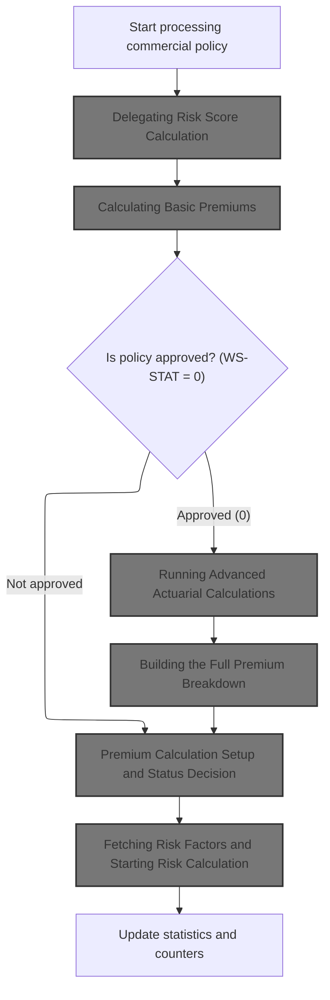
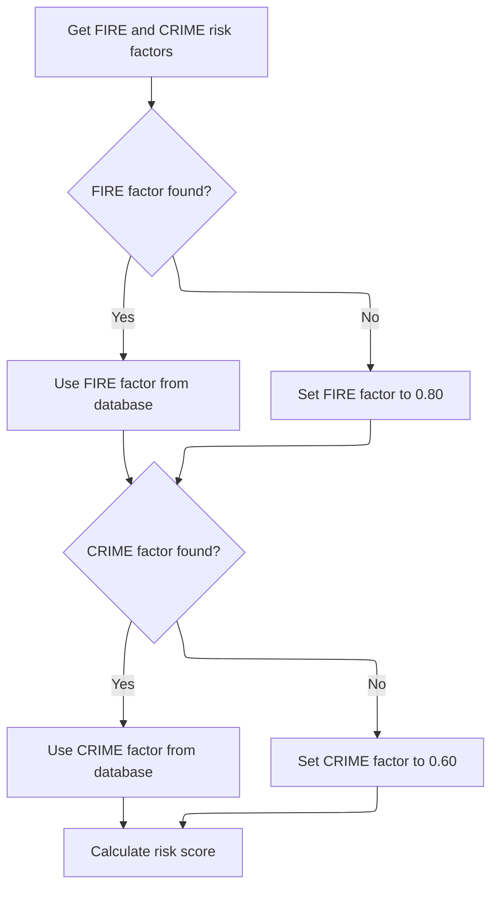
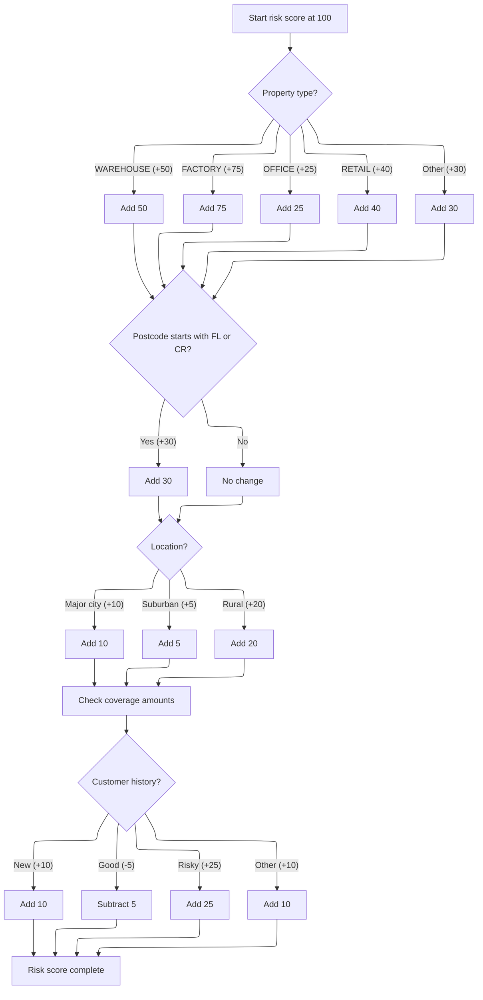
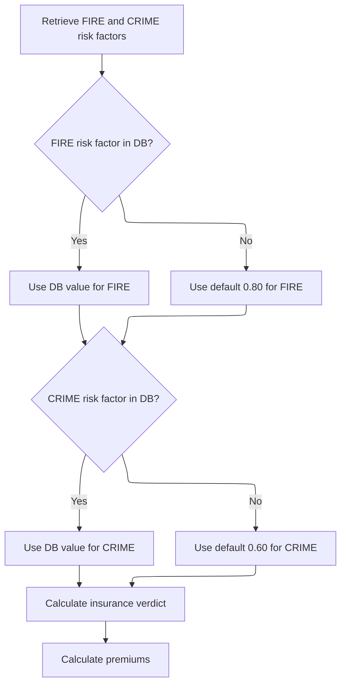
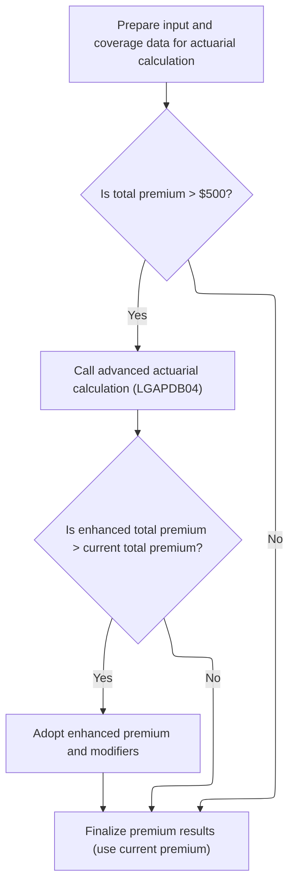
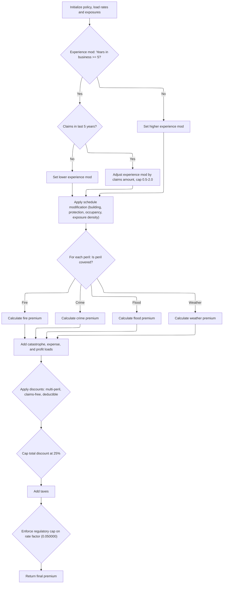
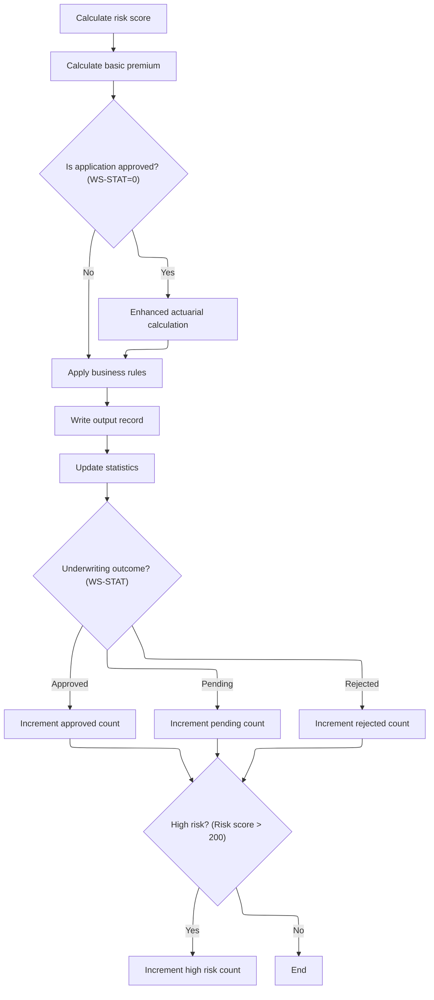

This document describes how a commercial property insurance policy application is processed. The flow starts with risk assessment, continues with premium calculation and, if approved, advanced actuarial calculations. The process builds a premium breakdown, applies business rules, finalizes the policy, and updates reporting statistics.

# Spec

## Detailed View of the Program's Functionality

a. High-Level Flow: Commercial Policy Processing

The main program begins by initializing the environment, loading configuration values (either from a config file or defaults), and opening all necessary files for input, output, and summary. It then processes each input record in a loop. For each record, it validates the input fields, and if the record is valid and is a commercial policy, it triggers the commercial policy processing flow. Otherwise, it handles errors or unsupported policy types accordingly.

b. Commercial Policy Processing

For each valid commercial policy record, the following steps are performed in strict order:

1. **Risk Score Calculation**\
   The program delegates the risk score calculation to an external module. It passes all relevant property and coverage data, as well as customer history, to this module. The risk score is returned and stored for use in all subsequent calculations.

2. **Basic Premium Calculation**\
   Using the calculated risk score and the selected perils (fire, crime, flood, weather), the program calls another external module to compute the basic premiums for each peril and the total premium. This module also determines a preliminary underwriting status (approved, pending, rejected) based on the risk score.

3. **Advanced Actuarial Calculations (Conditional)**\
   If the policy is initially approved (status code 0), the program prepares a detailed input structure with all relevant property, coverage, and historical data. It then calls an advanced actuarial calculation module, but only if the total premium exceeds a configured minimum threshold. If the enhanced actuarial calculation produces a higher total premium than the basic calculation, the enhanced values are adopted.

4. **Business Rule Application**\
   The program applies additional business rules to finalize the underwriting decision. These rules check if the risk score exceeds the maximum allowed, if the premium is below the minimum, or if the risk score is high enough to require manual review. The status and rejection reason are updated accordingly.

5. **Output Record Writing**\
   The program writes the results for the policy to the output file, including all calculated premiums, risk score, status, and any rejection reason.

6. **Statistics Update**\
   Finally, the program updates summary statistics: total premium, total risk score, counts of approved/pending/rejected policies, and a count of high-risk policies (risk score above a certain threshold).

c. Risk Score Calculation (LGAPDB02)

The risk score calculation module performs the following actions:

1. **Fetch Risk Factors**\
   It attempts to retrieve fire and crime risk factors from a database. If not found, it uses default values (0.80 for fire, 0.60 for crime).

2. **Base Risk Score and Adjustments**

   - Starts with a base risk score of 100.
   - Adjusts the score based on property type (e.g., warehouse, factory, office, retail, or other).
   - Adds to the score if the postcode starts with certain prefixes.
   - Checks the highest coverage amount among all perils; if it exceeds a threshold, adds to the risk score.
   - Adjusts the score based on location (major city, suburban, rural) using latitude and longitude.
   - Further adjusts the score based on customer history (new, good, risky, or other).

d. Basic Premium Calculation (LGAPDB03)

The basic premium calculation module:

1. **Fetches Risk Factors**\
   Retrieves fire and crime factors from the database or uses defaults if not found.

2. **Underwriting Verdict**\
   Sets the application status based on the risk score:

   - Above 200: rejected.
   - 151–200: pending.
   - 150 or below: approved.

3. **Premium Calculation**

   - Applies a discount factor if all perils are selected.
   - Calculates each peril’s premium as a function of risk score, peril factor, and peril selection.
   - Sums all peril premiums for the total.

e. Advanced Actuarial Calculations (LGAPDB04)

If the policy is approved and the premium is above the minimum:

1. **Exposure and Rate Setup**

   - Initializes all calculation areas.
   - Adjusts exposures based on risk score.
   - Loads base rates for each peril from the database or uses defaults.

2. **Experience Modifier**

   - Calculates an experience modifier based on years in business and claims history, with caps and floors.

3. **Schedule Modifier**

   - Adjusts for building age, protection class, occupancy code, and exposure density, with caps.

4. **Base Premiums**

   - Calculates each peril’s premium using exposures, rates, and modifiers.
   - Sums up for the base amount.

5. **Catastrophe, Expense, and Profit Loads**

   - Adds catastrophe loads for relevant perils.
   - Adds expense and profit loadings.

6. **Discounts**

   - Applies multi-peril, claims-free, and deductible discounts, capped at 25%.

7. **Taxes**

   - Adds taxes to the premium.

8. **Final Premium and Rate Cap**

   - Sums all components for the total premium.
   - Calculates the final rate factor and caps it if necessary, adjusting the premium accordingly.

f. Output and Statistics

After all calculations:

1. **Results are written to the output file**, including all premium components, risk score, status, and rejection reason.
2. **Statistics are updated**: total premium, total risk score, counts of approved/pending/rejected/high-risk policies.
3. At the end of processing, a summary file is generated and statistics are displayed, including averages and totals.

g. Error and Non-Commercial Handling

- If a record is invalid, an error record is written with the error message.
- If the policy is not commercial, a record is written indicating the policy type is unsupported.

h. Configuration and Initialization

- At startup, the program attempts to load configuration values (such as maximum risk score, minimum premium, and maximum total insured value) from a config file. If unavailable, it uses hardcoded defaults.
- All counters and work areas are initialized before processing begins.

i. File Handling

- Input, output, and summary files are opened at the start and closed at the end.
- Headers are written to the output file before processing records.
- The summary file contains totals and averages for the batch.

This flow ensures that each commercial policy is processed in a consistent, auditable manner, with clear separation of risk assessment, premium calculation, business rule enforcement, and reporting.

# Rule Definition

| Paragraph Name                                                                                                                                                        | Rule ID | Category          | Description                                                                                                                                                                                                                                                                                 | Conditions                                                                                                                                                                                                                                                              | Remarks                                                                                                                                                                                                                                                                                                                                                                                                            |
| --------------------------------------------------------------------------------------------------------------------------------------------------------------------- | ------- | ----------------- | ------------------------------------------------------------------------------------------------------------------------------------------------------------------------------------------------------------------------------------------------------------------------------------------- | ----------------------------------------------------------------------------------------------------------------------------------------------------------------------------------------------------------------------------------------------------------------------- | ------------------------------------------------------------------------------------------------------------------------------------------------------------------------------------------------------------------------------------------------------------------------------------------------------------------------------------------------------------------------------------------------------------------ |
| LGAPDB02: GET-RISK-FACTORS, CALCULATE-RISK-SCORE, CHECK-COVERAGE-AMOUNTS, ASSESS-LOCATION-RISK, EVALUATE-CUSTOMER-HISTORY                                             | RL-001  | Computation       | Calculates the risk score using property type, postcode, location, coverage amounts, and customer history. Fire and crime risk factors are retrieved from the database, with defaults if not found.                                                                                         | All required input fields must be present. Database lookup for risk factors must use peril type as key; fallback to 0.80 for fire and 0.60 for crime if not found.                                                                                                      | Risk score starts at 100 (integer). Property type adjustment: WAREHOUSE (+50), FACTORY (+75), OFFICE (+25), RETAIL (+40), Other (+30). Postcode starting with 'FL' or 'CR' adds 30. Location adjustment: Major city (+10), Suburban (+5), Rural (+20), based on latitude/longitude. Coverage over 500,000 adds 15. Customer history: New (+10), Good (-5), Risky (+25), Other (+10). Output is integer risk score. |
| LGAPDB03: GET-RISK-FACTORS, CALCULATE-VERDICT, CALCULATE-PREMIUMS                                                                                                     | RL-002  | Computation       | Calculates individual peril premiums and total premium using risk score and peril selections. Fire and crime risk factors are retrieved from the database, with defaults if not found. Applies discount factor for multi-peril selection.                                                   | All required input fields must be present. Database lookup for risk factors must use peril type as key; fallback to 0.80 for fire and 0.60 for crime if not found. Discount factor is 0.90 if all perils selected, otherwise 1.00.                                      | Outputs: stat (number), stat_desc (string, 20 chars), rej_rsn (string, 50 chars), fire_premium, crime_premium, flood_premium, weather_premium (all 8 digits + 2 decimals), total_premium (9 digits + 2 decimals), disc_fact (2 decimals).                                                                                                                                                                          |
| LGAPDB04: P200-INIT, LOAD-RATE-TABLES, P310-PERIL-RATES, P400-EXP-MOD, P500-SCHED-MOD, P600-BASE-PREM, P700-CAT-LOAD, P800-EXPENSE, P900-DISC, P950-TAXES, P999-FINAL | RL-003  | Computation       | Calculates a detailed premium breakdown using rates and modifiers from the database, with hardcoded defaults if not found. Includes peril premiums, base amount, catastrophe load, expense load, profit load, discount, tax, experience modifier, schedule modifier, and final rate factor. | All required input fields must be present. Database lookup for rates/modifiers must use territory, construction type, occupancy code, and peril code as keys; fallback to hardcoded defaults if not found.                                                              | Default base rates: FIRE 0.0085, CRIME 0.0062, FLOOD 0.0128, WEATHER 0.0096. Output fields: fire_premium, crime_premium, flood_premium, weather_premium (8 digits + 2 decimals), total_premium (9 digits + 2 decimals), base_amount, cat_load_amt, expense_load_amt, profit_load_amt, discount_amt, tax_amt, experience_mod (4 decimals), schedule_mod (3 decimals, signed), final_rate_factor (4 decimals).       |
| P011F-UPDATE-STATISTICS, P015-GENERATE-SUMMARY, P016-DISPLAY-STATS                                                                                                    | RL-004  | Computation       | Updates counters for approved, pending, and rejected policies based on application status. Increments high risk counter if risk score > 200. Sums total premium and risk score into control totals.                                                                                         | Application status and risk score must be present. Premium must be present.                                                                                                                                                                                             | Counters: approved, pending, rejected, high risk (risk score > 200). Control totals: total premium (12 digits + 2 decimals), risk score (accumulated integer).                                                                                                                                                                                                                                                     |
| LGAPDB02: GET-RISK-FACTORS; LGAPDB03: GET-RISK-FACTORS; LGAPDB04: LOAD-RATE-TABLES, P310-PERIL-RATES                                                                  | RL-005  | Conditional Logic | All database lookups for risk factors, rates, or modifiers must use the specified key(s). If a lookup fails, the system must use the specified default value for that factor, rate, or modifier.                                                                                            | Database lookup fails (SQLCODE not zero).                                                                                                                                                                                                                               | Default values: fire factor 0.80, crime factor 0.60, base rates: FIRE 0.0085, CRIME 0.0062, FLOOD 0.0128, WEATHER 0.0096. All lookups use specified keys (peril type, territory, construction type, occupancy code, peril code).                                                                                                                                                                                   |
| Throughout all paragraphs handling input/output (P005D-WRITE-HEADERS, P011E-WRITE-OUTPUT-RECORD, etc.)                                                                | RL-006  | Data Assignment   | All input and output data must use the field names and formats specified in the input/output columns.                                                                                                                                                                                       | Any data is read from input or written to output.                                                                                                                                                                                                                       | Field formats: string, number, alphanumeric, date, as specified. Output alignment and padding must match field sizes (e.g., customer number X(10), status X(20), premiums 9(8)V99, etc.).                                                                                                                                                                                                                          |
| P008-VALIDATE-INPUT-RECORD                                                                                                                                            | RL-007  | Conditional Logic | Validates that the input record contains a supported policy type, a customer number, and at least one coverage limit. Also checks that total coverage does not exceed the maximum allowed total insured value (TIV).                                                                        | Input record must have a supported policy type (commercial, personal, or farm); customer number must not be blank; at least one coverage limit (building, contents, or business interruption) must be non-zero; total coverage must not exceed the maximum allowed TIV. | Maximum allowed TIV default is 50,000,000.00. Error codes and rejection reasons are output as strings. All input fields must use specified names and formats.                                                                                                                                                                                                                                                      |

# User Stories

## User Story 1: Risk Score Calculation

---

### Story Description:

As a system, I want to calculate a risk score for each policy using property, coverage, and customer history data so that I can assess the risk level accurately and consistently.

---

### Business Rule Mapping:

| Rule ID | Paragraph Name                                                                                                            | Rule Description                                                                                                                                                                                    |
| ------- | ------------------------------------------------------------------------------------------------------------------------- | --------------------------------------------------------------------------------------------------------------------------------------------------------------------------------------------------- |
| RL-001  | LGAPDB02: GET-RISK-FACTORS, CALCULATE-RISK-SCORE, CHECK-COVERAGE-AMOUNTS, ASSESS-LOCATION-RISK, EVALUATE-CUSTOMER-HISTORY | Calculates the risk score using property type, postcode, location, coverage amounts, and customer history. Fire and crime risk factors are retrieved from the database, with defaults if not found. |
| RL-005  | LGAPDB02: GET-RISK-FACTORS; LGAPDB03: GET-RISK-FACTORS; LGAPDB04: LOAD-RATE-TABLES, P310-PERIL-RATES                      | All database lookups for risk factors, rates, or modifiers must use the specified key(s). If a lookup fails, the system must use the specified default value for that factor, rate, or modifier.    |
| RL-006  | Throughout all paragraphs handling input/output (P005D-WRITE-HEADERS, P011E-WRITE-OUTPUT-RECORD, etc.)                    | All input and output data must use the field names and formats specified in the input/output columns.                                                                                               |

---

### Relevant Functionality:

- **LGAPDB02: GET-RISK-FACTORS**
  1. **RL-001:**
     - Retrieve fire and crime risk factors from database; use defaults if not found.
     - Start risk score at 100.
     - Add property type adjustment.
     - Add postcode adjustment if starts with 'FL' or 'CR'.
     - Add location adjustment based on latitude/longitude.
     - Add 15 if any coverage > 500,000.
     - Add customer history adjustment.
     - Return risk score as integer.
- **LGAPDB02: GET-RISK-FACTORS; LGAPDB03: GET-RISK-FACTORS; LGAPDB04: LOAD-RATE-TABLES**
  1. **RL-005:**
     - Attempt database lookup using specified key(s).
     - If lookup succeeds, use retrieved value.
     - If lookup fails, use hardcoded default value.
- **Throughout all paragraphs handling input/output (P005D-WRITE-HEADERS**
  1. **RL-006:**
     - When reading input, map fields by name and format.
     - When writing output, assign values to fields using specified names and formats.
     - Ensure alignment and padding for all output fields.

## User Story 2: Premium Calculation

---

### Story Description:

As a system, I want to calculate individual peril premiums, total premium, and application status using the risk score and peril selections so that I can determine the correct premium and policy status for each application.

---

### Business Rule Mapping:

| Rule ID | Paragraph Name                                                                                         | Rule Description                                                                                                                                                                                                                          |
| ------- | ------------------------------------------------------------------------------------------------------ | ----------------------------------------------------------------------------------------------------------------------------------------------------------------------------------------------------------------------------------------- |
| RL-002  | LGAPDB03: GET-RISK-FACTORS, CALCULATE-VERDICT, CALCULATE-PREMIUMS                                      | Calculates individual peril premiums and total premium using risk score and peril selections. Fire and crime risk factors are retrieved from the database, with defaults if not found. Applies discount factor for multi-peril selection. |
| RL-005  | LGAPDB02: GET-RISK-FACTORS; LGAPDB03: GET-RISK-FACTORS; LGAPDB04: LOAD-RATE-TABLES, P310-PERIL-RATES   | All database lookups for risk factors, rates, or modifiers must use the specified key(s). If a lookup fails, the system must use the specified default value for that factor, rate, or modifier.                                          |
| RL-006  | Throughout all paragraphs handling input/output (P005D-WRITE-HEADERS, P011E-WRITE-OUTPUT-RECORD, etc.) | All input and output data must use the field names and formats specified in the input/output columns.                                                                                                                                     |

---

### Relevant Functionality:

- **LGAPDB03: GET-RISK-FACTORS**
  1. **RL-002:**
     - Retrieve fire and crime risk factors from database; use defaults if not found.
     - Determine application status: risk score > 200 = rejected, > 150 = pending, else approved.
     - If all perils selected, set discount factor to 0.90, else 1.00.
     - Calculate each peril premium: (risk score \* risk factor) \* peril selection \* discount factor.
     - Sum individual premiums for total premium.
     - Output all required fields in specified formats.
- **LGAPDB02: GET-RISK-FACTORS; LGAPDB03: GET-RISK-FACTORS; LGAPDB04: LOAD-RATE-TABLES**
  1. **RL-005:**
     - Attempt database lookup using specified key(s).
     - If lookup succeeds, use retrieved value.
     - If lookup fails, use hardcoded default value.
- **Throughout all paragraphs handling input/output (P005D-WRITE-HEADERS**
  1. **RL-006:**
     - When reading input, map fields by name and format.
     - When writing output, assign values to fields using specified names and formats.
     - Ensure alignment and padding for all output fields.

## User Story 3: Actuarial Premium Breakdown

---

### Story Description:

As a system, I want to calculate a detailed premium breakdown using property, customer, and coverage data so that I can provide transparency and accuracy in premium components for each policy.

---

### Business Rule Mapping:

| Rule ID | Paragraph Name                                                                                                                                                        | Rule Description                                                                                                                                                                                                                                                                            |
| ------- | --------------------------------------------------------------------------------------------------------------------------------------------------------------------- | ------------------------------------------------------------------------------------------------------------------------------------------------------------------------------------------------------------------------------------------------------------------------------------------- |
| RL-003  | LGAPDB04: P200-INIT, LOAD-RATE-TABLES, P310-PERIL-RATES, P400-EXP-MOD, P500-SCHED-MOD, P600-BASE-PREM, P700-CAT-LOAD, P800-EXPENSE, P900-DISC, P950-TAXES, P999-FINAL | Calculates a detailed premium breakdown using rates and modifiers from the database, with hardcoded defaults if not found. Includes peril premiums, base amount, catastrophe load, expense load, profit load, discount, tax, experience modifier, schedule modifier, and final rate factor. |
| RL-005  | LGAPDB02: GET-RISK-FACTORS; LGAPDB03: GET-RISK-FACTORS; LGAPDB04: LOAD-RATE-TABLES, P310-PERIL-RATES                                                                  | All database lookups for risk factors, rates, or modifiers must use the specified key(s). If a lookup fails, the system must use the specified default value for that factor, rate, or modifier.                                                                                            |
| RL-006  | Throughout all paragraphs handling input/output (P005D-WRITE-HEADERS, P011E-WRITE-OUTPUT-RECORD, etc.)                                                                | All input and output data must use the field names and formats specified in the input/output columns.                                                                                                                                                                                       |

---

### Relevant Functionality:

- **LGAPDB04: P200-INIT**
  1. **RL-003:**
     - Initialize calculation areas and exposures.
     - Load base rates from database; use defaults if not found.
     - Calculate experience modifier and schedule modifier.
     - Calculate peril premiums using exposures, rates, modifiers, and trend factor.
     - Calculate catastrophe, expense, profit loadings.
     - Apply discounts and deductible credits.
     - Calculate tax.
     - Calculate final premium and rate factor, capping if necessary.
     - Output all required breakdown fields in specified formats.
- **LGAPDB02: GET-RISK-FACTORS; LGAPDB03: GET-RISK-FACTORS; LGAPDB04: LOAD-RATE-TABLES**
  1. **RL-005:**
     - Attempt database lookup using specified key(s).
     - If lookup succeeds, use retrieved value.
     - If lookup fails, use hardcoded default value.
- **Throughout all paragraphs handling input/output (P005D-WRITE-HEADERS**
  1. **RL-006:**
     - When reading input, map fields by name and format.
     - When writing output, assign values to fields using specified names and formats.
     - Ensure alignment and padding for all output fields.

## User Story 4: Statistics Update

---

### Story Description:

As a system, I want to update policy counters and control totals based on application status, risk score, and premium so that I can maintain accurate operational statistics.

---

### Business Rule Mapping:

| Rule ID | Paragraph Name                                                                                         | Rule Description                                                                                                                                                                                    |
| ------- | ------------------------------------------------------------------------------------------------------ | --------------------------------------------------------------------------------------------------------------------------------------------------------------------------------------------------- |
| RL-004  | P011F-UPDATE-STATISTICS, P015-GENERATE-SUMMARY, P016-DISPLAY-STATS                                     | Updates counters for approved, pending, and rejected policies based on application status. Increments high risk counter if risk score > 200. Sums total premium and risk score into control totals. |
| RL-006  | Throughout all paragraphs handling input/output (P005D-WRITE-HEADERS, P011E-WRITE-OUTPUT-RECORD, etc.) | All input and output data must use the field names and formats specified in the input/output columns.                                                                                               |

---

### Relevant Functionality:

- **P011F-UPDATE-STATISTICS**
  1. **RL-004:**
     - Add total premium to control total.
     - Add risk score to control total.
     - Increment approved, pending, or rejected counter based on status.
     - If risk score > 200, increment high risk counter.
     - Output summary and statistics in specified formats.
- **Throughout all paragraphs handling input/output (P005D-WRITE-HEADERS**
  1. **RL-006:**
     - When reading input, map fields by name and format.
     - When writing output, assign values to fields using specified names and formats.
     - Ensure alignment and padding for all output fields.

## User Story 5: Input Validation

---

### Story Description:

As a system, I want to validate input records for supported policy types, customer number presence, coverage limits, and maximum total insured value so that only valid applications are processed and errors are reported clearly.

---

### Business Rule Mapping:

| Rule ID | Paragraph Name                                                                                         | Rule Description                                                                                                                                                                                                     |
| ------- | ------------------------------------------------------------------------------------------------------ | -------------------------------------------------------------------------------------------------------------------------------------------------------------------------------------------------------------------- |
| RL-007  | P008-VALIDATE-INPUT-RECORD                                                                             | Validates that the input record contains a supported policy type, a customer number, and at least one coverage limit. Also checks that total coverage does not exceed the maximum allowed total insured value (TIV). |
| RL-006  | Throughout all paragraphs handling input/output (P005D-WRITE-HEADERS, P011E-WRITE-OUTPUT-RECORD, etc.) | All input and output data must use the field names and formats specified in the input/output columns.                                                                                                                |

---

### Relevant Functionality:

- **P008-VALIDATE-INPUT-RECORD**
  1. **RL-007:**
     - If policy type is not supported, log error 'Invalid Policy Type'.
     - If customer number is blank, log error 'Customer Number Required'.
     - If all coverage limits are zero, log error 'At least one coverage limit required'.
     - If sum of coverage limits exceeds maximum allowed TIV, log warning 'Total coverage exceeds maximum TIV'.
- **Throughout all paragraphs handling input/output (P005D-WRITE-HEADERS**
  1. **RL-006:**
     - When reading input, map fields by name and format.
     - When writing output, assign values to fields using specified names and formats.
     - Ensure alignment and padding for all output fields.

# Code Walkthrough

## Starting Commercial Policy Processing



<SwmSnippet path="/base/src/LGAPDB01.cbl" line="258">

---

In `P011-PROCESS-COMMERCIAL` we kick off the flow by calculating the risk score, which is needed for all subsequent premium and actuarial calculations. We call P011A-CALCULATE-RISK-SCORE next because every premium calculation and business rule check depends on having an up-to-date risk score for the property.

```cobol
       P011-PROCESS-COMMERCIAL.
           PERFORM P011A-CALCULATE-RISK-SCORE
           PERFORM P011B-BASIC-PREMIUM-CALC
           IF WS-STAT = 0
               PERFORM P011C-ENHANCED-ACTUARIAL-CALC
           END-IF
           PERFORM P011D-APPLY-BUSINESS-RULES
           PERFORM P011E-WRITE-OUTPUT-RECORD
           PERFORM P011F-UPDATE-STATISTICS.
```

---

</SwmSnippet>

### Delegating Risk Score Calculation

<SwmSnippet path="/base/src/LGAPDB01.cbl" line="268">

---

`P011A-CALCULATE-RISK-SCORE` just wraps a call to LGAPDB02, passing all the property and coverage inputs. The actual risk score calculation is handled externally, so this function just sets up the call and collects the result.

```cobol
       P011A-CALCULATE-RISK-SCORE.
           CALL 'LGAPDB02' USING IN-PROPERTY-TYPE, IN-POSTCODE, 
                                IN-LATITUDE, IN-LONGITUDE,
                                IN-BUILDING-LIMIT, IN-CONTENTS-LIMIT,
                                IN-FLOOD-COVERAGE, IN-WEATHER-COVERAGE,
                                IN-CUSTOMER-HISTORY, WS-BASE-RISK-SCR.
```

---

</SwmSnippet>

### Fetching Risk Factors and Starting Risk Calculation



<SwmSnippet path="/base/src/LGAPDB02.cbl" line="39">

---

`MAIN-LOGIC` first grabs fire and crime risk factors from the database (or uses defaults if missing), then kicks off the risk score calculation. This sets up all the inputs needed for the next step.

```cobol
       MAIN-LOGIC.
           PERFORM GET-RISK-FACTORS
           PERFORM CALCULATE-RISK-SCORE
           GOBACK.
```

---

</SwmSnippet>

<SwmSnippet path="/base/src/LGAPDB02.cbl" line="44">

---

`GET-RISK-FACTORS` tries to fetch fire and crime risk factors from the database. If the lookup fails, it just uses hardcoded defaults (0.80 for fire, 0.60 for crime).

```cobol
       GET-RISK-FACTORS.
           EXEC SQL
               SELECT FACTOR_VALUE INTO :WS-FIRE-FACTOR
               FROM RISK_FACTORS
               WHERE PERIL_TYPE = 'FIRE'
           END-EXEC.
           
           IF SQLCODE = 0
               CONTINUE
           ELSE
               MOVE 0.80 TO WS-FIRE-FACTOR
           END-IF.
           
           EXEC SQL
               SELECT FACTOR_VALUE INTO :WS-CRIME-FACTOR
               FROM RISK_FACTORS
               WHERE PERIL_TYPE = 'CRIME'
           END-EXEC.
           
           IF SQLCODE = 0
               CONTINUE
           ELSE
               MOVE 0.60 TO WS-CRIME-FACTOR
           END-IF.
```

---

</SwmSnippet>

### Calculating and Adjusting Property Risk Score



<SwmSnippet path="/base/src/LGAPDB02.cbl" line="69">

---

`CALCULATE-RISK-SCORE` sets up the base risk score, bumps it up based on property type and postcode prefix, then calls out to other procedures to factor in coverage, location, and customer history.

```cobol
       CALCULATE-RISK-SCORE.
           MOVE 100 TO LK-RISK-SCORE

           EVALUATE LK-PROPERTY-TYPE
             WHEN 'WAREHOUSE'
               ADD 50 TO LK-RISK-SCORE
             WHEN 'FACTORY' 
               ADD 75 TO LK-RISK-SCORE
             WHEN 'OFFICE'
               ADD 25 TO LK-RISK-SCORE
             WHEN 'RETAIL'
               ADD 40 TO LK-RISK-SCORE
             WHEN OTHER
               ADD 30 TO LK-RISK-SCORE
           END-EVALUATE

           IF LK-POSTCODE(1:2) = 'FL' OR
              LK-POSTCODE(1:2) = 'CR'
             ADD 30 TO LK-RISK-SCORE
           END-IF

           PERFORM CHECK-COVERAGE-AMOUNTS
           PERFORM ASSESS-LOCATION-RISK  
           PERFORM EVALUATE-CUSTOMER-HISTORY.
```

---

</SwmSnippet>

<SwmSnippet path="/base/src/LGAPDB02.cbl" line="117">

---

`ASSESS-LOCATION-RISK` bumps the risk score based on whether the coordinates fall into broad urban or suburban ranges, then `EVALUATE-CUSTOMER-HISTORY` tweaks the score using simple rules for customer history codes.

```cobol
       ASSESS-LOCATION-RISK.
      *    Urban areas: major cities (simplified lat/long ranges)
      *    NYC area: 40-41N, 74.5-73.5W
      *    LA area: 34-35N, 118.5-117.5W
           IF (LK-LATITUDE > 40.000000 AND LK-LATITUDE < 41.000000 AND
               LK-LONGITUDE > -74.500000 AND LK-LONGITUDE < -73.500000) OR
              (LK-LATITUDE > 34.000000 AND LK-LATITUDE < 35.000000 AND
               LK-LONGITUDE > -118.500000 AND LK-LONGITUDE < -117.500000)
               ADD 10 TO LK-RISK-SCORE
           ELSE
      *        Check if in continental US (suburban vs rural)
               IF (LK-LATITUDE > 25.000000 AND LK-LATITUDE < 49.000000 AND
                   LK-LONGITUDE > -125.000000 AND LK-LONGITUDE < -66.000000)
                   ADD 5 TO LK-RISK-SCORE
               ELSE
                   ADD 20 TO LK-RISK-SCORE
               END-IF
           END-IF.

       EVALUATE-CUSTOMER-HISTORY.
           EVALUATE LK-CUSTOMER-HISTORY
               WHEN 'N'
                   ADD 10 TO LK-RISK-SCORE
               WHEN 'G'
                   SUBTRACT 5 FROM LK-RISK-SCORE
               WHEN 'R'
                   ADD 25 TO LK-RISK-SCORE
               WHEN OTHER
                   ADD 10 TO LK-RISK-SCORE
           END-EVALUATE.
```

---

</SwmSnippet>

### Calculating Basic Premiums

<SwmSnippet path="/base/src/LGAPDB01.cbl" line="275">

---

`P011B-BASIC-PREMIUM-CALC` calls LGAPDB03, passing the risk score and all peril/coverage inputs. LGAPDB03 handles the actual premium calculations and returns the results.

```cobol
       P011B-BASIC-PREMIUM-CALC.
           CALL 'LGAPDB03' USING WS-BASE-RISK-SCR, IN-FIRE-PERIL, 
                                IN-CRIME-PERIL, IN-FLOOD-PERIL, 
                                IN-WEATHER-PERIL, WS-STAT,
                                WS-STAT-DESC, WS-REJ-RSN, WS-FR-PREM,
                                WS-CR-PREM, WS-FL-PREM, WS-WE-PREM,
                                WS-TOT-PREM, WS-DISC-FACT.
```

---

</SwmSnippet>

### Premium Calculation Setup and Status Decision



<SwmSnippet path="/base/src/LGAPDB03.cbl" line="42">

---

`MAIN-LOGIC` in LGAPDB03 grabs risk factors, decides the application status, and then calculates all the premiums. Each step depends on the previous one being set up.

```cobol
       MAIN-LOGIC.
           PERFORM GET-RISK-FACTORS
           PERFORM CALCULATE-VERDICT
           PERFORM CALCULATE-PREMIUMS
           GOBACK.
```

---

</SwmSnippet>

<SwmSnippet path="/base/src/LGAPDB03.cbl" line="48">

---

`GET-RISK-FACTORS` in LGAPDB03 pulls fire and crime factors from the database, but if the lookup fails, it just uses hardcoded defaults (0.80 for fire, 0.60 for crime).

```cobol
       GET-RISK-FACTORS.
           EXEC SQL
               SELECT FACTOR_VALUE INTO :WS-FIRE-FACTOR
               FROM RISK_FACTORS
               WHERE PERIL_TYPE = 'FIRE'
           END-EXEC.
           
           IF SQLCODE = 0
               CONTINUE
           ELSE
               MOVE 0.80 TO WS-FIRE-FACTOR
           END-IF.
           
           EXEC SQL
               SELECT FACTOR_VALUE INTO :WS-CRIME-FACTOR
               FROM RISK_FACTORS
               WHERE PERIL_TYPE = 'CRIME'
           END-EXEC.
           
           IF SQLCODE = 0
               CONTINUE
           ELSE
               MOVE 0.60 TO WS-CRIME-FACTOR
           END-IF.
```

---

</SwmSnippet>

### Running Advanced Actuarial Calculations



<SwmSnippet path="/base/src/LGAPDB01.cbl" line="283">

---

`P011C-ENHANCED-ACTUARIAL-CALC` sets up all the input data and calls LGAPDB04 for advanced premium calculations, but only if the basic premium is above the minimum. If the enhanced premium comes back higher, it updates the premium values.

```cobol
       P011C-ENHANCED-ACTUARIAL-CALC.
      *    Prepare input structure for actuarial calculation
           MOVE IN-CUSTOMER-NUM TO LK-CUSTOMER-NUM
           MOVE WS-BASE-RISK-SCR TO LK-RISK-SCORE
           MOVE IN-PROPERTY-TYPE TO LK-PROPERTY-TYPE
           MOVE IN-TERRITORY-CODE TO LK-TERRITORY
           MOVE IN-CONSTRUCTION-TYPE TO LK-CONSTRUCTION-TYPE
           MOVE IN-OCCUPANCY-CODE TO LK-OCCUPANCY-CODE
           MOVE IN-SPRINKLER-IND TO LK-PROTECTION-CLASS
           MOVE IN-YEAR-BUILT TO LK-YEAR-BUILT
           MOVE IN-SQUARE-FOOTAGE TO LK-SQUARE-FOOTAGE
           MOVE IN-YEARS-IN-BUSINESS TO LK-YEARS-IN-BUSINESS
           MOVE IN-CLAIMS-COUNT-3YR TO LK-CLAIMS-COUNT-5YR
           MOVE IN-CLAIMS-AMOUNT-3YR TO LK-CLAIMS-AMOUNT-5YR
           
      *    Set coverage data
           MOVE IN-BUILDING-LIMIT TO LK-BUILDING-LIMIT
           MOVE IN-CONTENTS-LIMIT TO LK-CONTENTS-LIMIT
           MOVE IN-BI-LIMIT TO LK-BI-LIMIT
           MOVE IN-FIRE-DEDUCTIBLE TO LK-FIRE-DEDUCTIBLE
           MOVE IN-WIND-DEDUCTIBLE TO LK-WIND-DEDUCTIBLE
           MOVE IN-FLOOD-DEDUCTIBLE TO LK-FLOOD-DEDUCTIBLE
           MOVE IN-OTHER-DEDUCTIBLE TO LK-OTHER-DEDUCTIBLE
           MOVE IN-FIRE-PERIL TO LK-FIRE-PERIL
           MOVE IN-CRIME-PERIL TO LK-CRIME-PERIL
           MOVE IN-FLOOD-PERIL TO LK-FLOOD-PERIL
           MOVE IN-WEATHER-PERIL TO LK-WEATHER-PERIL
           
      *    Call advanced actuarial calculation program (only for approved cases)
           IF WS-TOT-PREM > WS-MIN-PREMIUM
               CALL 'LGAPDB04' USING LK-INPUT-DATA, LK-COVERAGE-DATA, 
                                    LK-OUTPUT-RESULTS
               
      *        Update with enhanced calculations if successful
               IF LK-TOTAL-PREMIUM > WS-TOT-PREM
                   MOVE LK-FIRE-PREMIUM TO WS-FR-PREM
                   MOVE LK-CRIME-PREMIUM TO WS-CR-PREM
                   MOVE LK-FLOOD-PREMIUM TO WS-FL-PREM
                   MOVE LK-WEATHER-PREMIUM TO WS-WE-PREM
                   MOVE LK-TOTAL-PREMIUM TO WS-TOT-PREM
                   MOVE LK-EXPERIENCE-MOD TO WS-EXPERIENCE-MOD
               END-IF
           END-IF.
```

---

</SwmSnippet>

### Building the Full Premium Breakdown



<SwmSnippet path="/base/src/LGAPDB04.cbl" line="138">

---

`P100-MAIN` runs through all the premium calculation steps: exposures, rates, experience and schedule modifiers, catastrophe load, expenses, discounts, taxes, and finally the total premium and rate factor. Each step builds on the previous one.

```cobol
       P100-MAIN.
           PERFORM P200-INIT
           PERFORM P300-RATES
           PERFORM P350-EXPOSURE
           PERFORM P400-EXP-MOD
           PERFORM P500-SCHED-MOD
           PERFORM P600-BASE-PREM
           PERFORM P700-CAT-LOAD
           PERFORM P800-EXPENSE
           PERFORM P900-DISC
           PERFORM P950-TAXES
           PERFORM P999-FINAL
           GOBACK.
```

---

</SwmSnippet>

<SwmSnippet path="/base/src/LGAPDB04.cbl" line="234">

---

`P400-EXP-MOD` calculates the experience modifier using years in business and claims history, applying caps and floors to keep the value in bounds. Constants like 0.8500 and 2.0000 are hardcoded business rules.

```cobol
       P400-EXP-MOD.
           MOVE 1.0000 TO WS-EXPERIENCE-MOD
           
           IF LK-YEARS-IN-BUSINESS >= 5
               IF LK-CLAIMS-COUNT-5YR = ZERO
                   MOVE 0.8500 TO WS-EXPERIENCE-MOD
               ELSE
                   COMPUTE WS-EXPERIENCE-MOD = 
                       1.0000 + 
                       ((LK-CLAIMS-AMOUNT-5YR / WS-TOTAL-INSURED-VAL) * 
                        WS-CREDIBILITY-FACTOR * 0.50)
                   
                   IF WS-EXPERIENCE-MOD > 2.0000
                       MOVE 2.0000 TO WS-EXPERIENCE-MOD
                   END-IF
                   
                   IF WS-EXPERIENCE-MOD < 0.5000
                       MOVE 0.5000 TO WS-EXPERIENCE-MOD
                   END-IF
               END-IF
           ELSE
               MOVE 1.1000 TO WS-EXPERIENCE-MOD
           END-IF
           
           MOVE WS-EXPERIENCE-MOD TO LK-EXPERIENCE-MOD.
```

---

</SwmSnippet>

<SwmSnippet path="/base/src/LGAPDB04.cbl" line="260">

---

`P500-SCHED-MOD` builds up the schedule modifier using year built, protection class, occupancy code, and exposure density, then caps the value to keep it in a defined range. All the adjustment values are hardcoded business rules.

```cobol
       P500-SCHED-MOD.
           MOVE +0.000 TO WS-SCHEDULE-MOD
           
      *    Building age factor
           EVALUATE TRUE
               WHEN LK-YEAR-BUILT >= 2010
                   SUBTRACT 0.050 FROM WS-SCHEDULE-MOD
               WHEN LK-YEAR-BUILT >= 1990
                   CONTINUE
               WHEN LK-YEAR-BUILT >= 1970
                   ADD 0.100 TO WS-SCHEDULE-MOD
               WHEN OTHER
                   ADD 0.200 TO WS-SCHEDULE-MOD
           END-EVALUATE
           
      *    Protection class factor
           EVALUATE LK-PROTECTION-CLASS
               WHEN '01' THRU '03'
                   SUBTRACT 0.100 FROM WS-SCHEDULE-MOD
               WHEN '04' THRU '06'
                   SUBTRACT 0.050 FROM WS-SCHEDULE-MOD
               WHEN '07' THRU '09'
                   CONTINUE
               WHEN OTHER
                   ADD 0.150 TO WS-SCHEDULE-MOD
           END-EVALUATE
           
      *    Occupancy hazard factor
           EVALUATE LK-OCCUPANCY-CODE
               WHEN 'OFF01' THRU 'OFF05'
                   SUBTRACT 0.025 FROM WS-SCHEDULE-MOD
               WHEN 'MFG01' THRU 'MFG10'
                   ADD 0.075 TO WS-SCHEDULE-MOD
               WHEN 'WHS01' THRU 'WHS05'
                   ADD 0.125 TO WS-SCHEDULE-MOD
               WHEN OTHER
                   CONTINUE
           END-EVALUATE
           
      *    Exposure density factor
           IF WS-EXPOSURE-DENSITY > 500.00
               ADD 0.100 TO WS-SCHEDULE-MOD
           ELSE
               IF WS-EXPOSURE-DENSITY < 50.00
                   SUBTRACT 0.050 FROM WS-SCHEDULE-MOD
               END-IF
           END-IF
           
           IF WS-SCHEDULE-MOD > +0.400
               MOVE +0.400 TO WS-SCHEDULE-MOD
           END-IF
           
           IF WS-SCHEDULE-MOD < -0.200
               MOVE -0.200 TO WS-SCHEDULE-MOD
           END-IF
           
           MOVE WS-SCHEDULE-MOD TO LK-SCHEDULE-MOD.
```

---

</SwmSnippet>

<SwmSnippet path="/base/src/LGAPDB04.cbl" line="318">

---

`P600-BASE-PREM` calculates each peril premium using exposures, base rates, and modifiers. Crime and flood premiums use extra factors (0.80 and 1.25) as business tweaks. Only selected perils are included in the total.

```cobol
       P600-BASE-PREM.
           MOVE ZERO TO LK-BASE-AMOUNT
           
      * FIRE PREMIUM
           IF LK-FIRE-PERIL > ZERO
               COMPUTE LK-FIRE-PREMIUM = 
                   (WS-BUILDING-EXPOSURE + WS-CONTENTS-EXPOSURE) *
                   WS-BASE-RATE (1, 1, 1, 1) * 
                   WS-EXPERIENCE-MOD *
                   (1 + WS-SCHEDULE-MOD) *
                   WS-TREND-FACTOR
                   
               ADD LK-FIRE-PREMIUM TO LK-BASE-AMOUNT
           END-IF
           
      * CRIME PREMIUM
           IF LK-CRIME-PERIL > ZERO
               COMPUTE LK-CRIME-PREMIUM = 
                   (WS-CONTENTS-EXPOSURE * 0.80) *
                   WS-BASE-RATE (2, 1, 1, 1) * 
                   WS-EXPERIENCE-MOD *
                   (1 + WS-SCHEDULE-MOD) *
                   WS-TREND-FACTOR
                   
               ADD LK-CRIME-PREMIUM TO LK-BASE-AMOUNT
           END-IF
           
      * FLOOD PREMIUM
           IF LK-FLOOD-PERIL > ZERO
               COMPUTE LK-FLOOD-PREMIUM = 
                   WS-BUILDING-EXPOSURE *
                   WS-BASE-RATE (3, 1, 1, 1) * 
                   WS-EXPERIENCE-MOD *
                   (1 + WS-SCHEDULE-MOD) *
                   WS-TREND-FACTOR * 1.25
                   
               ADD LK-FLOOD-PREMIUM TO LK-BASE-AMOUNT
           END-IF
           
      * WEATHER PREMIUM
           IF LK-WEATHER-PERIL > ZERO
               COMPUTE LK-WEATHER-PREMIUM = 
                   (WS-BUILDING-EXPOSURE + WS-CONTENTS-EXPOSURE) *
                   WS-BASE-RATE (4, 1, 1, 1) * 
                   WS-EXPERIENCE-MOD *
                   (1 + WS-SCHEDULE-MOD) *
                   WS-TREND-FACTOR
                   
               ADD LK-WEATHER-PREMIUM TO LK-BASE-AMOUNT
           END-IF.
```

---

</SwmSnippet>

<SwmSnippet path="/base/src/LGAPDB04.cbl" line="407">

---

`P900-DISC` calculates the total discount by checking for multi-peril coverage, claims-free history, and high deductibles, then adds up all the credits and caps the result at 25%. The final discount amount is applied to the sum of all premium components.

```cobol
       P900-DISC.
           MOVE ZERO TO WS-TOTAL-DISCOUNT
           
      * Multi-peril discount
           MOVE ZERO TO WS-MULTI-PERIL-DISC
           IF LK-FIRE-PERIL > ZERO AND
              LK-CRIME-PERIL > ZERO AND
              LK-FLOOD-PERIL > ZERO AND
              LK-WEATHER-PERIL > ZERO
               MOVE 0.100 TO WS-MULTI-PERIL-DISC
           ELSE
               IF LK-FIRE-PERIL > ZERO AND
                  LK-WEATHER-PERIL > ZERO AND
                  (LK-CRIME-PERIL > ZERO OR LK-FLOOD-PERIL > ZERO)
                   MOVE 0.050 TO WS-MULTI-PERIL-DISC
               END-IF
           END-IF
           
      * Claims-free discount  
           MOVE ZERO TO WS-CLAIMS-FREE-DISC
           IF LK-CLAIMS-COUNT-5YR = ZERO AND LK-YEARS-IN-BUSINESS >= 5
               MOVE 0.075 TO WS-CLAIMS-FREE-DISC
           END-IF
           
      * Deductible credit
           MOVE ZERO TO WS-DEDUCTIBLE-CREDIT
           IF LK-FIRE-DEDUCTIBLE >= 10000
               ADD 0.025 TO WS-DEDUCTIBLE-CREDIT
           END-IF
           IF LK-WIND-DEDUCTIBLE >= 25000  
               ADD 0.035 TO WS-DEDUCTIBLE-CREDIT
           END-IF
           IF LK-FLOOD-DEDUCTIBLE >= 50000
               ADD 0.045 TO WS-DEDUCTIBLE-CREDIT
           END-IF
           
           COMPUTE WS-TOTAL-DISCOUNT = 
               WS-MULTI-PERIL-DISC + WS-CLAIMS-FREE-DISC + 
               WS-DEDUCTIBLE-CREDIT
               
           IF WS-TOTAL-DISCOUNT > 0.250
               MOVE 0.250 TO WS-TOTAL-DISCOUNT
           END-IF
           
           COMPUTE LK-DISCOUNT-AMT = 
               (LK-BASE-AMOUNT + LK-CAT-LOAD-AMT + 
                LK-EXPENSE-LOAD-AMT + LK-PROFIT-LOAD-AMT) *
               WS-TOTAL-DISCOUNT.
```

---

</SwmSnippet>

<SwmSnippet path="/base/src/LGAPDB04.cbl" line="464">

---

`P999-FINAL` adds up all the premium components, subtracts the discount, and applies taxes. Then it calculates the rate factor and caps it at 0.05 if needed, recalculating the premium if the cap is hit.

```cobol
       P999-FINAL.
           COMPUTE LK-TOTAL-PREMIUM = 
               LK-BASE-AMOUNT + LK-CAT-LOAD-AMT + 
               LK-EXPENSE-LOAD-AMT + LK-PROFIT-LOAD-AMT -
               LK-DISCOUNT-AMT + LK-TAX-AMT
               
           COMPUTE LK-FINAL-RATE-FACTOR = 
               LK-TOTAL-PREMIUM / WS-TOTAL-INSURED-VAL
               
           IF LK-FINAL-RATE-FACTOR > 0.050000
               MOVE 0.050000 TO LK-FINAL-RATE-FACTOR
               COMPUTE LK-TOTAL-PREMIUM = 
                   WS-TOTAL-INSURED-VAL * LK-FINAL-RATE-FACTOR
           END-IF.
```

---

</SwmSnippet>

### Finalizing Policy and Updating Statistics



<SwmSnippet path="/base/src/LGAPDB01.cbl" line="258">

---

Back in `P011-PROCESS-COMMERCIAL`, after enhanced calculations, we update all the stats to keep reporting accurate.

```cobol
       P011-PROCESS-COMMERCIAL.
           PERFORM P011A-CALCULATE-RISK-SCORE
           PERFORM P011B-BASIC-PREMIUM-CALC
           IF WS-STAT = 0
               PERFORM P011C-ENHANCED-ACTUARIAL-CALC
           END-IF
           PERFORM P011D-APPLY-BUSINESS-RULES
           PERFORM P011E-WRITE-OUTPUT-RECORD
           PERFORM P011F-UPDATE-STATISTICS.
```

---

</SwmSnippet>

<SwmSnippet path="/base/src/LGAPDB01.cbl" line="365">

---

`P011F-UPDATE-STATISTICS` updates all the counters and totals for reporting. It uses 200 as the cutoff for high risk, and increments the right status counter based on WS-STAT. All these values feed into summary stats for the batch.

```cobol
       P011F-UPDATE-STATISTICS.
           ADD WS-TOT-PREM TO WS-TOTAL-PREMIUM-AMT
           ADD WS-BASE-RISK-SCR TO WS-CONTROL-TOTALS
           
           EVALUATE WS-STAT
               WHEN 0 ADD 1 TO WS-APPROVED-CNT
               WHEN 1 ADD 1 TO WS-PENDING-CNT
               WHEN 2 ADD 1 TO WS-REJECTED-CNT
           END-EVALUATE
           
           IF WS-BASE-RISK-SCR > 200
               ADD 1 TO WS-HIGH-RISK-CNT
           END-IF.
```

---

</SwmSnippet>

&nbsp;

*This is an auto-generated document by Swimm 🌊 and has not yet been verified by a human*

<SwmMeta version="3.0.0" repo-id="Z2l0aHViJTNBJTNBU3dpbW1pby1nZW5hcHAtaG91c2UlM0ElM0FHaXJpLVN3aW1t" repo-name="Swimmio-genapp-house"><sup>Powered by [Swimm](https://app.swimm.io/)</sup></SwmMeta>
