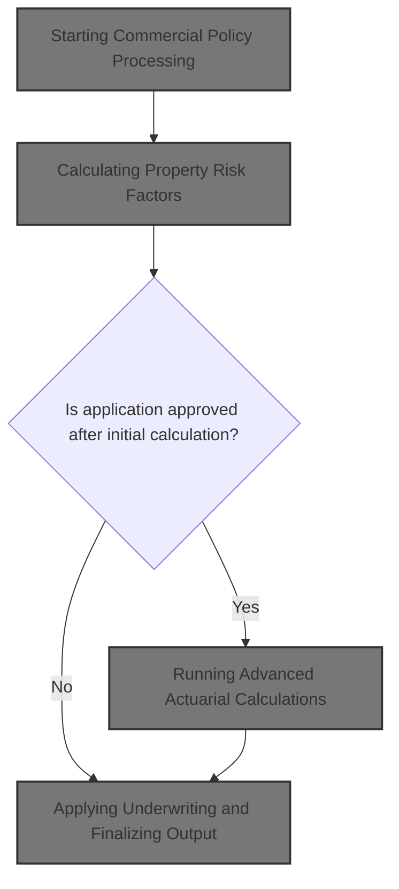
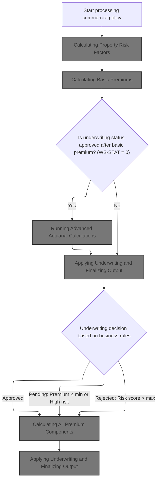
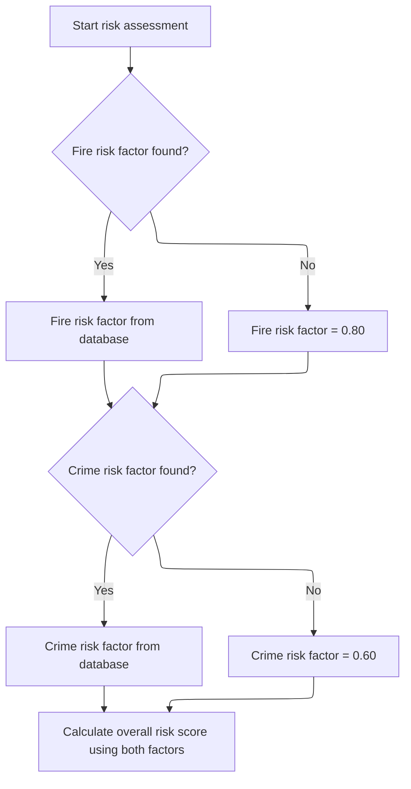
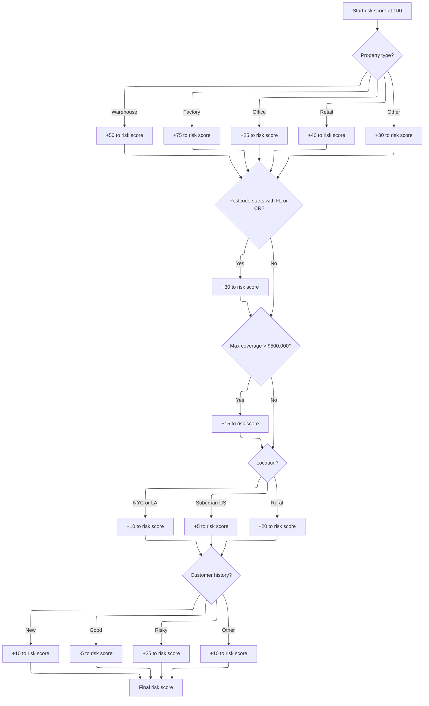
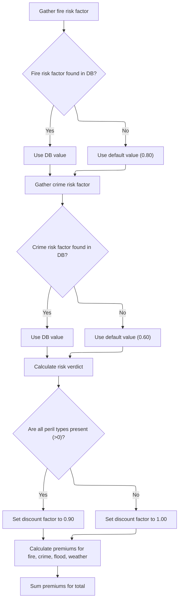
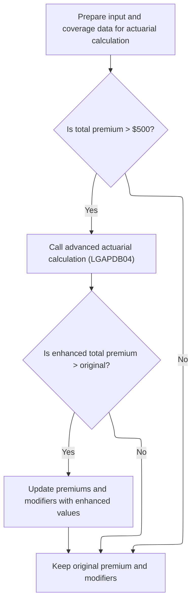
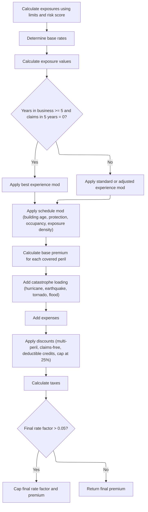
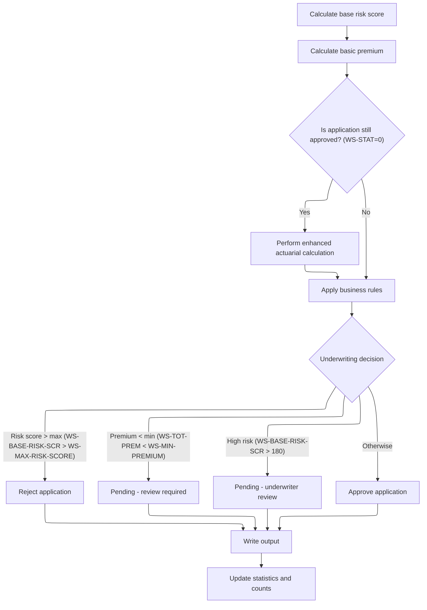

This document outlines the process for evaluating commercial property insurance applications. The flow calculates risk scores, determines premiums, applies business rules for underwriting, and updates reporting statistics. The input is application data, and the output includes the underwriting decision, premium amounts, and updated statistics.



# Spec

## Detailed View of the Program's Functionality

# a. High-Level Flow of Commercial Policy Processing

The main program begins by initializing the environment, loading configuration values (such as maximum risk score and minimum premium), and opening all necessary files. It then processes each input record, validating the data and determining if it is a commercial policy. For commercial policies, it triggers the commercial processing routine, which is the core of the premium and risk calculation logic.

# b. Calculating Property Risk Factors

The first step in processing a commercial policy is to calculate the property's risk score. This is done by calling a dedicated risk scoring module. This module:

- Retrieves fire and crime risk factors from a database table. If the database does not provide a value, it uses default values (0.80 for fire, 0.60 for crime).
- Initializes the risk score to a base value (100).
- Adjusts the risk score based on property type (e.g., warehouse, factory, office, retail, or other), adding a fixed amount for each type.
- Further adjusts the score if the postcode starts with certain prefixes (e.g., 'FL' or 'CR').
- Checks the highest coverage amount among all perils (fire, crime, flood, weather). If any coverage exceeds $500,000, it adds to the risk score.
- Modifies the score based on location (using latitude and longitude to identify major cities, suburban, or rural areas) and customer history (e.g., new, good, risky).
- The final risk score is returned for use in all subsequent calculations.

# c. Calculating Basic Premiums

With the risk score determined, the next step is to calculate the basic premiums for each peril (fire, crime, flood, weather). This is done by calling a premium calculation module, which:

- Retrieves the latest fire and crime risk factors from the database (again using defaults if not found).
- Determines the underwriting status based on the risk score:
  - If the risk score is very high, the application is rejected.
  - If the risk score is moderately high, the application is marked as pending.
  - Otherwise, it is approved.
- Applies a discount factor if all perils are present.
- Calculates the premium for each peril by multiplying the risk score, peril-specific factor, peril amount, and the discount factor.
- Sums all peril premiums to get the total premium.

# d. Running Advanced Actuarial Calculations

If the application is still approved after the basic premium calculation and the total premium exceeds the minimum threshold, the program prepares a detailed input structure and calls an advanced actuarial calculation module. This module:

- Loads all relevant input data, including customer, property, coverage, and claims history.
- Loads base rates for each peril from a rate table (using defaults if not found).
- Calculates exposures for building, contents, and business interruption, adjusting for risk score.
- Determines experience and schedule modifiers based on years in business, claims history, building age, protection class, occupancy code, and exposure density.
- Calculates the base premium for each peril, applying all modifiers and trend factors.
- Adds catastrophe loadings for hurricane, earthquake, tornado, and flood, based on peril selection and fixed factors.
- Calculates expense and profit loadings.
- Applies discounts for multi-peril coverage, claims-free history, and high deductibles, capping the total discount.
- Calculates taxes.
- Sums all components to get the final premium and rate factor, capping the rate factor if it exceeds a maximum.
- If the enhanced premium is higher than the original, the program updates the premium and modifiers with these enhanced values.

# e. Applying Underwriting and Finalizing Output

After all calculations, the program applies business rules to determine the final underwriting decision:

- If the risk score exceeds the maximum allowed, the application is rejected.
- If the total premium is below the minimum, the application is marked as pending for review.
- If the risk score is above a high-risk threshold, the application is also marked as pending for underwriter review.
- Otherwise, the application is approved.

The program then writes the results to the output file, including all calculated premiums, risk score, status, and any rejection reason.

# f. Updating Statistics and Reporting

Finally, the program updates running totals and counters for reporting purposes:

- Adds the total premium and risk score to cumulative totals.
- Increments counters for approved, pending, rejected, and high-risk applications.
- At the end of processing, generates a summary file and displays statistics, including the number of records processed, approved, pending, rejected, error records, high-risk count, total premium generated, and average risk score.

# g. Error Handling and Non-Commercial Policies

If a record fails validation or is not a commercial policy, the program writes an error or unsupported status to the output, with zeroed premium values and an appropriate message.

---

This detailed flow ensures that each commercial policy is evaluated for risk, priced according to both basic and advanced actuarial methods, and subjected to business rules for underwriting, with all results and statistics recorded for further analysis.

# Rule Definition

| Paragraph Name                                                                                               | Rule ID | Category          | Description                                                                                                                              | Conditions                                                                                  | Remarks                                                                                                                                                                                                                                                                                                                                                                                                                                                                                                     |
| ------------------------------------------------------------------------------------------------------------ | ------- | ----------------- | ---------------------------------------------------------------------------------------------------------------------------------------- | ------------------------------------------------------------------------------------------- | ----------------------------------------------------------------------------------------------------------------------------------------------------------------------------------------------------------------------------------------------------------------------------------------------------------------------------------------------------------------------------------------------------------------------------------------------------------------------------------------------------------- |
| P011A-CALCULATE-RISK-SCORE (LGAPDB01), MAIN-LOGIC and CALCULATE-RISK-SCORE (LGAPDB02)                        | RL-001  | Computation       | Calculates the risk score for each commercial policy based on property type, postcode, coverage amounts, location, and customer history. | Applies to commercial policy input records.                                                 | Constants: Start at 100; Property type adds: WAREHOUSE +50, FACTORY +75, OFFICE +25, RETAIL +40, Other +30; Postcode 'FL'/'CR' +30; Highest coverage >500,000 +15; NYC/LA area +10; Continental US +5, otherwise +20; Customer history: 'N' +10, 'G' -5, 'R' +25, other +10. Output: risk score as integer (range 100+).                                                                                                                                                                                    |
| P011B-BASIC-PREMIUM-CALC (LGAPDB01), CALCULATE-PREMIUMS (LGAPDB03), P600-BASE-PREM (LGAPDB04)                | RL-002  | Computation       | Calculates premiums for fire, crime, flood, and weather perils using risk score, peril factors, peril selection, and discount factor.    | Applies to commercial policies with peril selections > 0.                                   | Formulas: Fire = (risk_score × fire_factor) × fire_peril × discount_factor; Crime = (risk_score × crime_factor) × crime_peril × discount_factor; Flood = (risk_score × flood_factor) × flood_peril × discount_factor; Weather = (risk_score × weather_factor) × weather_peril × discount_factor. Factors: fire 0.80, crime 0.60, flood 1.20, weather 0.90 (defaults if not found in DB). Discount factor: 0.90 if all perils selected, else 1.00. Output: premiums as decimal (up to 8 digits, 2 decimals). |
| P011B-BASIC-PREMIUM-CALC (LGAPDB01), CALCULATE-PREMIUMS (LGAPDB03), P600-BASE-PREM and P999-FINAL (LGAPDB04) | RL-003  | Computation       | Sums the premiums for all selected perils to produce the total premium.                                                                  | Applies to commercial policies with at least one peril selected.                            | Output: total premium as decimal (up to 9 digits, 2 decimals).                                                                                                                                                                                                                                                                                                                                                                                                                                              |
| P011D-APPLY-BUSINESS-RULES (LGAPDB01)                                                                        | RL-004  | Conditional Logic | Determines the underwriting decision (APPROVED, PENDING, REJECTED) and reason based on risk score and total premium thresholds.          | Applies to commercial policies after risk score and premium calculation.                    | Constants: max risk score 250 (default, configurable), min premium 500.00 (default, configurable). Output: status (APPROVED, PENDING, REJECTED), reason (string, up to 50 chars).                                                                                                                                                                                                                                                                                                                           |
| P005D-WRITE-HEADERS, P011E-WRITE-OUTPUT-RECORD (LGAPDB01)                                                    | RL-005  | Data Assignment   | Produces an output record for each input policy with all required fields.                                                                | Applies to all processed input records.                                                     | Fields: customer number (string, 10 chars), property type (string, 15 chars), postcode (string, 8 chars), risk score (integer), fire premium (decimal, 8+2), crime premium (decimal, 8+2), flood premium (decimal, 8+2), weather premium (decimal, 8+2), total premium (decimal, 9+2), status (string, 20 chars), rejection reason (string, 50 chars). Alignment: left for strings, right for numbers. No padding required except for fixed field sizes.                                                    |
| P003-LOAD-CONFIG, P004-READ-CONFIG-VALUES (LGAPDB01)                                                         | RL-006  | Conditional Logic | Allows max risk score and min premium to be overridden by config file values.                                                            | If config file is available and contains numeric values for MAX_RISK_SCORE and MIN_PREMIUM. | Defaults: max risk score 250, min premium 500.00. Config file: key-value pairs, key up to 20 chars, value up to 100 chars, type 'N' for numeric.                                                                                                                                                                                                                                                                                                                                                            |

# User Stories

## User Story 1: Calculate risk score and premiums for commercial policy

---

### Story Description:

As a commercial policyholder, I want the system to calculate a risk score for my policy and use it to determine premiums for each selected peril and the total premium, so that my risk and costs are accurately assessed and calculated.

---

### Business Rule Mapping:

| Rule ID | Paragraph Name                                                                                               | Rule Description                                                                                                                         |
| ------- | ------------------------------------------------------------------------------------------------------------ | ---------------------------------------------------------------------------------------------------------------------------------------- |
| RL-001  | P011A-CALCULATE-RISK-SCORE (LGAPDB01), MAIN-LOGIC and CALCULATE-RISK-SCORE (LGAPDB02)                        | Calculates the risk score for each commercial policy based on property type, postcode, coverage amounts, location, and customer history. |
| RL-002  | P011B-BASIC-PREMIUM-CALC (LGAPDB01), CALCULATE-PREMIUMS (LGAPDB03), P600-BASE-PREM (LGAPDB04)                | Calculates premiums for fire, crime, flood, and weather perils using risk score, peril factors, peril selection, and discount factor.    |
| RL-003  | P011B-BASIC-PREMIUM-CALC (LGAPDB01), CALCULATE-PREMIUMS (LGAPDB03), P600-BASE-PREM and P999-FINAL (LGAPDB04) | Sums the premiums for all selected perils to produce the total premium.                                                                  |

---

### Relevant Functionality:

- **P011A-CALCULATE-RISK-SCORE (LGAPDB01)**
  1. **RL-001:**
     - Set risk score to 100
     - Add value based on property type
     - Add 30 if postcode starts with 'FL' or 'CR'
     - Add 15 if max coverage among perils > 500,000
     - Add 10 if lat/long in NYC or LA area
     - Else, add 5 if in continental US, otherwise add 20
     - Add/subtract based on customer history code
     - Return risk score
- **P011B-BASIC-PREMIUM-CALC (LGAPDB01)**
  1. **RL-002:**
     - Retrieve peril factors from DB or use defaults
     - Set discount factor to 0.90 if all perils > 0, else 1.00
     - For each peril:
       - Compute premium using formula
     - Sum premiums for total premium
  2. **RL-003:**
     - Add fire, crime, flood, and weather premiums
     - Return total premium

## User Story 2: Determine underwriting decision and produce output record with all required fields

---

### Story Description:

As a commercial policyholder, I want the system to determine the underwriting decision for my policy using configurable thresholds and produce an output record with all required fields, so that I receive a fair, transparent decision and a complete summary of my policy evaluation.

---

### Business Rule Mapping:

| Rule ID | Paragraph Name                                            | Rule Description                                                                                                                |
| ------- | --------------------------------------------------------- | ------------------------------------------------------------------------------------------------------------------------------- |
| RL-004  | P011D-APPLY-BUSINESS-RULES (LGAPDB01)                     | Determines the underwriting decision (APPROVED, PENDING, REJECTED) and reason based on risk score and total premium thresholds. |
| RL-005  | P005D-WRITE-HEADERS, P011E-WRITE-OUTPUT-RECORD (LGAPDB01) | Produces an output record for each input policy with all required fields.                                                       |
| RL-006  | P003-LOAD-CONFIG, P004-READ-CONFIG-VALUES (LGAPDB01)      | Allows max risk score and min premium to be overridden by config file values.                                                   |

---

### Relevant Functionality:

- **P011D-APPLY-BUSINESS-RULES (LGAPDB01)**
  1. **RL-004:**
     - If risk score > max risk score:
       - Status = REJECTED, Reason = 'Risk score exceeds maximum acceptable level'
     - Else if total premium < min premium:
       - Status = PENDING, Reason = 'Premium below minimum - requires review'
     - Else if risk score > 180:
       - Status = PENDING, Reason = 'High risk - underwriter review required'
     - Else:
       - Status = APPROVED, Reason = blank
- **P005D-WRITE-HEADERS**
  1. **RL-005:**
     - Assign each calculated value to corresponding output field
     - Write output record to file
- **P003-LOAD-CONFIG**
  1. **RL-006:**
     - Open config file
     - If available, read MAX_RISK_SCORE and MIN_PREMIUM
     - If numeric, override default values
     - Else, use defaults

# Code Walkthrough

## Starting Commercial Policy Processing



<SwmSnippet path="/base/src/LGAPDB01.cbl" line="258">

---

In `P011-PROCESS-COMMERCIAL` we kick off the flow by calculating the risk score, which is needed for every downstream calculation—premiums, business rules, and stats all depend on it. We call P011A-CALCULATE-RISK-SCORE first to make sure we have a risk baseline before moving on to premium calculations and underwriting decisions.

```cobol
       P011-PROCESS-COMMERCIAL.
           PERFORM P011A-CALCULATE-RISK-SCORE
           PERFORM P011B-BASIC-PREMIUM-CALC
           IF WS-STAT = 0
               PERFORM P011C-ENHANCED-ACTUARIAL-CALC
           END-IF
           PERFORM P011D-APPLY-BUSINESS-RULES
           PERFORM P011E-WRITE-OUTPUT-RECORD
           PERFORM P011F-UPDATE-STATISTICS.
```

---

</SwmSnippet>

### Calculating Property Risk Factors

<SwmSnippet path="/base/src/LGAPDB01.cbl" line="268">

---

`P011A-CALCULATE-RISK-SCORE` calls LGAPDB02 to fetch risk factors and compute the property's risk score using all the relevant inputs. This call is needed to get a usable risk score for the rest of the flow.

```cobol
       P011A-CALCULATE-RISK-SCORE.
           CALL 'LGAPDB02' USING IN-PROPERTY-TYPE, IN-POSTCODE, 
                                IN-LATITUDE, IN-LONGITUDE,
                                IN-BUILDING-LIMIT, IN-CONTENTS-LIMIT,
                                IN-FLOOD-COVERAGE, IN-WEATHER-COVERAGE,
                                IN-CUSTOMER-HISTORY, WS-BASE-RISK-SCR.
```

---

</SwmSnippet>

### Fetching and Applying Static Risk Factors



<SwmSnippet path="/base/src/LGAPDB02.cbl" line="39">

---

`MAIN-LOGIC` first gets the fire and crime risk factors from the database (or uses defaults if missing), then moves on to calculate the risk score. We need these factors up front because they're used in the risk score calculation.

```cobol
       MAIN-LOGIC.
           PERFORM GET-RISK-FACTORS
           PERFORM CALCULATE-RISK-SCORE
           GOBACK.
```

---

</SwmSnippet>

<SwmSnippet path="/base/src/LGAPDB02.cbl" line="44">

---

`GET-RISK-FACTORS` pulls fire and crime risk factors from the RISK_FACTORS table using peril type constants. If the queries fail, it falls back to hardcoded defaults (0.80 for fire, 0.60 for crime). The code assumes the table has these entries and that SQLCODE works as expected.

```cobol
       GET-RISK-FACTORS.
           EXEC SQL
               SELECT FACTOR_VALUE INTO :WS-FIRE-FACTOR
               FROM RISK_FACTORS
               WHERE PERIL_TYPE = 'FIRE'
           END-EXEC.
           
           IF SQLCODE = 0
               CONTINUE
           ELSE
               MOVE 0.80 TO WS-FIRE-FACTOR
           END-IF.
           
           EXEC SQL
               SELECT FACTOR_VALUE INTO :WS-CRIME-FACTOR
               FROM RISK_FACTORS
               WHERE PERIL_TYPE = 'CRIME'
           END-EXEC.
           
           IF SQLCODE = 0
               CONTINUE
           ELSE
               MOVE 0.60 TO WS-CRIME-FACTOR
           END-IF.
```

---

</SwmSnippet>

### Building the Composite Risk Score



<SwmSnippet path="/base/src/LGAPDB02.cbl" line="69">

---

`CALCULATE-RISK-SCORE` starts with a base score of 100, bumps it up based on property type and postcode prefix ('FL' or 'CR'), then calls checks for coverage amounts, location risk, and customer history. All the increments are hardcoded and the postcode logic assumes at least two characters.

```cobol
       CALCULATE-RISK-SCORE.
           MOVE 100 TO LK-RISK-SCORE

           EVALUATE LK-PROPERTY-TYPE
             WHEN 'WAREHOUSE'
               ADD 50 TO LK-RISK-SCORE
             WHEN 'FACTORY' 
               ADD 75 TO LK-RISK-SCORE
             WHEN 'OFFICE'
               ADD 25 TO LK-RISK-SCORE
             WHEN 'RETAIL'
               ADD 40 TO LK-RISK-SCORE
             WHEN OTHER
               ADD 30 TO LK-RISK-SCORE
           END-EVALUATE

           IF LK-POSTCODE(1:2) = 'FL' OR
              LK-POSTCODE(1:2) = 'CR'
             ADD 30 TO LK-RISK-SCORE
           END-IF

           PERFORM CHECK-COVERAGE-AMOUNTS
           PERFORM ASSESS-LOCATION-RISK  
           PERFORM EVALUATE-CUSTOMER-HISTORY.
```

---

</SwmSnippet>

<SwmSnippet path="/base/src/LGAPDB02.cbl" line="94">

---

`CHECK-COVERAGE-AMOUNTS` finds the highest coverage among fire, crime, flood, and weather. If any coverage is over 500K, it adds 15 to the risk score. Both the threshold and increment are hardcoded and not explained.

```cobol
       CHECK-COVERAGE-AMOUNTS.
           MOVE ZERO TO WS-MAX-COVERAGE
           
           IF LK-FIRE-COVERAGE > WS-MAX-COVERAGE
               MOVE LK-FIRE-COVERAGE TO WS-MAX-COVERAGE
           END-IF
           
           IF LK-CRIME-COVERAGE > WS-MAX-COVERAGE
               MOVE LK-CRIME-COVERAGE TO WS-MAX-COVERAGE
           END-IF
           
           IF LK-FLOOD-COVERAGE > WS-MAX-COVERAGE
               MOVE LK-FLOOD-COVERAGE TO WS-MAX-COVERAGE
           END-IF
           
           IF LK-WEATHER-COVERAGE > WS-MAX-COVERAGE
               MOVE LK-WEATHER-COVERAGE TO WS-MAX-COVERAGE
           END-IF
           
           IF WS-MAX-COVERAGE > WS-COVERAGE-500K
               ADD 15 TO LK-RISK-SCORE
           END-IF.
```

---

</SwmSnippet>

<SwmSnippet path="/base/src/LGAPDB02.cbl" line="117">

---

`ASSESS-LOCATION-RISK` adjusts the risk score based on fixed lat/long ranges for NYC, LA, and continental US, using hardcoded increments. Then `EVALUATE-CUSTOMER-HISTORY` bumps or reduces the score based on customer history codes. All constants and ranges are arbitrary and not explained.

```cobol
       ASSESS-LOCATION-RISK.
      *    Urban areas: major cities (simplified lat/long ranges)
      *    NYC area: 40-41N, 74.5-73.5W
      *    LA area: 34-35N, 118.5-117.5W
           IF (LK-LATITUDE > 40.000000 AND LK-LATITUDE < 41.000000 AND
               LK-LONGITUDE > -74.500000 AND LK-LONGITUDE < -73.500000) OR
              (LK-LATITUDE > 34.000000 AND LK-LATITUDE < 35.000000 AND
               LK-LONGITUDE > -118.500000 AND LK-LONGITUDE < -117.500000)
               ADD 10 TO LK-RISK-SCORE
           ELSE
      *        Check if in continental US (suburban vs rural)
               IF (LK-LATITUDE > 25.000000 AND LK-LATITUDE < 49.000000 AND
                   LK-LONGITUDE > -125.000000 AND LK-LONGITUDE < -66.000000)
                   ADD 5 TO LK-RISK-SCORE
               ELSE
                   ADD 20 TO LK-RISK-SCORE
               END-IF
           END-IF.

       EVALUATE-CUSTOMER-HISTORY.
           EVALUATE LK-CUSTOMER-HISTORY
               WHEN 'N'
                   ADD 10 TO LK-RISK-SCORE
               WHEN 'G'
                   SUBTRACT 5 FROM LK-RISK-SCORE
               WHEN 'R'
                   ADD 25 TO LK-RISK-SCORE
               WHEN OTHER
                   ADD 10 TO LK-RISK-SCORE
           END-EVALUATE.
```

---

</SwmSnippet>

### Calculating Basic Premiums

<SwmSnippet path="/base/src/LGAPDB01.cbl" line="275">

---

`P011B-BASIC-PREMIUM-CALC` calls LGAPDB03 to calculate premiums and set the application status using the risk score and peril values. This step is needed to get the premium breakdown and underwriting decision.

```cobol
       P011B-BASIC-PREMIUM-CALC.
           CALL 'LGAPDB03' USING WS-BASE-RISK-SCR, IN-FIRE-PERIL, 
                                IN-CRIME-PERIL, IN-FLOOD-PERIL, 
                                IN-WEATHER-PERIL, WS-STAT,
                                WS-STAT-DESC, WS-REJ-RSN, WS-FR-PREM,
                                WS-CR-PREM, WS-FL-PREM, WS-WE-PREM,
                                WS-TOT-PREM, WS-DISC-FACT.
```

---

</SwmSnippet>

### Premium Calculation and Verdict



<SwmSnippet path="/base/src/LGAPDB03.cbl" line="42">

---

`MAIN-LOGIC` in LGAPDB03 fetches risk factors, determines the application status, and calculates premiums for each peril. We fetch risk factors again to make sure premium calculations use the latest adjustments.

```cobol
       MAIN-LOGIC.
           PERFORM GET-RISK-FACTORS
           PERFORM CALCULATE-VERDICT
           PERFORM CALCULATE-PREMIUMS
           GOBACK.
```

---

</SwmSnippet>

<SwmSnippet path="/base/src/LGAPDB03.cbl" line="48">

---

`GET-RISK-FACTORS` in LGAPDB03 fetches fire and crime factors from the database, or uses defaults (0.80 for fire, 0.60 for crime) if missing. The code assumes the table has these entries and that SQLCODE works as expected.

```cobol
       GET-RISK-FACTORS.
           EXEC SQL
               SELECT FACTOR_VALUE INTO :WS-FIRE-FACTOR
               FROM RISK_FACTORS
               WHERE PERIL_TYPE = 'FIRE'
           END-EXEC.
           
           IF SQLCODE = 0
               CONTINUE
           ELSE
               MOVE 0.80 TO WS-FIRE-FACTOR
           END-IF.
           
           EXEC SQL
               SELECT FACTOR_VALUE INTO :WS-CRIME-FACTOR
               FROM RISK_FACTORS
               WHERE PERIL_TYPE = 'CRIME'
           END-EXEC.
           
           IF SQLCODE = 0
               CONTINUE
           ELSE
               MOVE 0.60 TO WS-CRIME-FACTOR
           END-IF.
```

---

</SwmSnippet>

<SwmSnippet path="/base/src/LGAPDB03.cbl" line="92">

---

`CALCULATE-PREMIUMS` sets a discount factor, applies it if all perils are present, then calculates premiums for fire, crime, flood, and weather using weighted factors. The total premium is just the sum of all individual peril premiums. All factors and discount logic are hardcoded.

```cobol
       CALCULATE-PREMIUMS.
           MOVE 1.00 TO LK-DISC-FACT
           
           IF LK-FIRE-PERIL > 0 AND
              LK-CRIME-PERIL > 0 AND
              LK-FLOOD-PERIL > 0 AND
              LK-WEATHER-PERIL > 0
             MOVE 0.90 TO LK-DISC-FACT
           END-IF

           COMPUTE LK-FIRE-PREMIUM =
             ((LK-RISK-SCORE * WS-FIRE-FACTOR) * LK-FIRE-PERIL *
               LK-DISC-FACT)
           
           COMPUTE LK-CRIME-PREMIUM =
             ((LK-RISK-SCORE * WS-CRIME-FACTOR) * LK-CRIME-PERIL *
               LK-DISC-FACT)
           
           COMPUTE LK-FLOOD-PREMIUM =
             ((LK-RISK-SCORE * WS-FLOOD-FACTOR) * LK-FLOOD-PERIL *
               LK-DISC-FACT)
           
           COMPUTE LK-WEATHER-PREMIUM =
             ((LK-RISK-SCORE * WS-WEATHER-FACTOR) * LK-WEATHER-PERIL *
               LK-DISC-FACT)

           COMPUTE LK-TOTAL-PREMIUM = 
             LK-FIRE-PREMIUM + LK-CRIME-PREMIUM + 
             LK-FLOOD-PREMIUM + LK-WEATHER-PREMIUM. 
```

---

</SwmSnippet>

### Running Advanced Actuarial Calculations



<SwmSnippet path="/base/src/LGAPDB01.cbl" line="283">

---

`P011C-ENHANCED-ACTUARIAL-CALC` sets up all the input data, then calls LGAPDB04 for advanced actuarial calculations, but only if the premium is above the minimum. If the enhanced premium is higher, we update the premium and modifiers.

```cobol
       P011C-ENHANCED-ACTUARIAL-CALC.
      *    Prepare input structure for actuarial calculation
           MOVE IN-CUSTOMER-NUM TO LK-CUSTOMER-NUM
           MOVE WS-BASE-RISK-SCR TO LK-RISK-SCORE
           MOVE IN-PROPERTY-TYPE TO LK-PROPERTY-TYPE
           MOVE IN-TERRITORY-CODE TO LK-TERRITORY
           MOVE IN-CONSTRUCTION-TYPE TO LK-CONSTRUCTION-TYPE
           MOVE IN-OCCUPANCY-CODE TO LK-OCCUPANCY-CODE
           MOVE IN-SPRINKLER-IND TO LK-PROTECTION-CLASS
           MOVE IN-YEAR-BUILT TO LK-YEAR-BUILT
           MOVE IN-SQUARE-FOOTAGE TO LK-SQUARE-FOOTAGE
           MOVE IN-YEARS-IN-BUSINESS TO LK-YEARS-IN-BUSINESS
           MOVE IN-CLAIMS-COUNT-3YR TO LK-CLAIMS-COUNT-5YR
           MOVE IN-CLAIMS-AMOUNT-3YR TO LK-CLAIMS-AMOUNT-5YR
           
      *    Set coverage data
           MOVE IN-BUILDING-LIMIT TO LK-BUILDING-LIMIT
           MOVE IN-CONTENTS-LIMIT TO LK-CONTENTS-LIMIT
           MOVE IN-BI-LIMIT TO LK-BI-LIMIT
           MOVE IN-FIRE-DEDUCTIBLE TO LK-FIRE-DEDUCTIBLE
           MOVE IN-WIND-DEDUCTIBLE TO LK-WIND-DEDUCTIBLE
           MOVE IN-FLOOD-DEDUCTIBLE TO LK-FLOOD-DEDUCTIBLE
           MOVE IN-OTHER-DEDUCTIBLE TO LK-OTHER-DEDUCTIBLE
           MOVE IN-FIRE-PERIL TO LK-FIRE-PERIL
           MOVE IN-CRIME-PERIL TO LK-CRIME-PERIL
           MOVE IN-FLOOD-PERIL TO LK-FLOOD-PERIL
           MOVE IN-WEATHER-PERIL TO LK-WEATHER-PERIL
           
      *    Call advanced actuarial calculation program (only for approved cases)
           IF WS-TOT-PREM > WS-MIN-PREMIUM
               CALL 'LGAPDB04' USING LK-INPUT-DATA, LK-COVERAGE-DATA, 
                                    LK-OUTPUT-RESULTS
               
      *        Update with enhanced calculations if successful
               IF LK-TOTAL-PREMIUM > WS-TOT-PREM
                   MOVE LK-FIRE-PREMIUM TO WS-FR-PREM
                   MOVE LK-CRIME-PREMIUM TO WS-CR-PREM
                   MOVE LK-FLOOD-PREMIUM TO WS-FL-PREM
                   MOVE LK-WEATHER-PREMIUM TO WS-WE-PREM
                   MOVE LK-TOTAL-PREMIUM TO WS-TOT-PREM
                   MOVE LK-EXPERIENCE-MOD TO WS-EXPERIENCE-MOD
               END-IF
           END-IF.
```

---

</SwmSnippet>

### Calculating All Premium Components



<SwmSnippet path="/base/src/LGAPDB04.cbl" line="138">

---

`P100-MAIN` runs through all the premium component calculations—exposures, rates, modifiers, loadings, discounts, taxes—so the final premium covers every relevant risk and adjustment. Each step updates the output for the next.

```cobol
       P100-MAIN.
           PERFORM P200-INIT
           PERFORM P300-RATES
           PERFORM P350-EXPOSURE
           PERFORM P400-EXP-MOD
           PERFORM P500-SCHED-MOD
           PERFORM P600-BASE-PREM
           PERFORM P700-CAT-LOAD
           PERFORM P800-EXPENSE
           PERFORM P900-DISC
           PERFORM P950-TAXES
           PERFORM P999-FINAL
           GOBACK.
```

---

</SwmSnippet>

<SwmSnippet path="/base/src/LGAPDB04.cbl" line="152">

---

`P200-INIT` calculates building, contents, and BI exposures by adjusting coverage limits with the risk score. It sums these for total insured value, then divides by square footage for exposure density, defaulting to 100 if the area is zero.

```cobol
       P200-INIT.
           INITIALIZE WS-CALCULATION-AREAS
           INITIALIZE WS-BASE-RATE-TABLE
           
           COMPUTE WS-BUILDING-EXPOSURE = 
               LK-BUILDING-LIMIT * (1 + (LK-RISK-SCORE - 100) / 1000)
               
           COMPUTE WS-CONTENTS-EXPOSURE = 
               LK-CONTENTS-LIMIT * (1 + (LK-RISK-SCORE - 100) / 1000)
               
           COMPUTE WS-BI-EXPOSURE = 
               LK-BI-LIMIT * (1 + (LK-RISK-SCORE - 100) / 1000)
               
           COMPUTE WS-TOTAL-INSURED-VAL = 
               WS-BUILDING-EXPOSURE + WS-CONTENTS-EXPOSURE + 
               WS-BI-EXPOSURE
               
           IF LK-SQUARE-FOOTAGE > ZERO
               COMPUTE WS-EXPOSURE-DENSITY = 
                   WS-TOTAL-INSURED-VAL / LK-SQUARE-FOOTAGE
           ELSE
               MOVE 100.00 TO WS-EXPOSURE-DENSITY
           END-IF.
```

---

</SwmSnippet>

<SwmSnippet path="/base/src/LGAPDB04.cbl" line="234">

---

`P400-EXP-MOD` sets the experience modifier based on years in business and claims history. It uses hardcoded constants for discounts, penalties, and bounds, and calculates the modifier using claims ratio and credibility factor. All values are arbitrary and not explained.

```cobol
       P400-EXP-MOD.
           MOVE 1.0000 TO WS-EXPERIENCE-MOD
           
           IF LK-YEARS-IN-BUSINESS >= 5
               IF LK-CLAIMS-COUNT-5YR = ZERO
                   MOVE 0.8500 TO WS-EXPERIENCE-MOD
               ELSE
                   COMPUTE WS-EXPERIENCE-MOD = 
                       1.0000 + 
                       ((LK-CLAIMS-AMOUNT-5YR / WS-TOTAL-INSURED-VAL) * 
                        WS-CREDIBILITY-FACTOR * 0.50)
                   
                   IF WS-EXPERIENCE-MOD > 2.0000
                       MOVE 2.0000 TO WS-EXPERIENCE-MOD
                   END-IF
                   
                   IF WS-EXPERIENCE-MOD < 0.5000
                       MOVE 0.5000 TO WS-EXPERIENCE-MOD
                   END-IF
               END-IF
           ELSE
               MOVE 1.1000 TO WS-EXPERIENCE-MOD
           END-IF
           
           MOVE WS-EXPERIENCE-MOD TO LK-EXPERIENCE-MOD.
```

---

</SwmSnippet>

<SwmSnippet path="/base/src/LGAPDB04.cbl" line="260">

---

`P500-SCHED-MOD` adjusts the schedule modifier based on building age, protection class, occupancy code, and exposure density, using hardcoded increments and bounds. The final value is clamped between -0.2 and +0.4 and moved to the output.

```cobol
       P500-SCHED-MOD.
           MOVE +0.000 TO WS-SCHEDULE-MOD
           
      *    Building age factor
           EVALUATE TRUE
               WHEN LK-YEAR-BUILT >= 2010
                   SUBTRACT 0.050 FROM WS-SCHEDULE-MOD
               WHEN LK-YEAR-BUILT >= 1990
                   CONTINUE
               WHEN LK-YEAR-BUILT >= 1970
                   ADD 0.100 TO WS-SCHEDULE-MOD
               WHEN OTHER
                   ADD 0.200 TO WS-SCHEDULE-MOD
           END-EVALUATE
           
      *    Protection class factor
           EVALUATE LK-PROTECTION-CLASS
               WHEN '01' THRU '03'
                   SUBTRACT 0.100 FROM WS-SCHEDULE-MOD
               WHEN '04' THRU '06'
                   SUBTRACT 0.050 FROM WS-SCHEDULE-MOD
               WHEN '07' THRU '09'
                   CONTINUE
               WHEN OTHER
                   ADD 0.150 TO WS-SCHEDULE-MOD
           END-EVALUATE
           
      *    Occupancy hazard factor
           EVALUATE LK-OCCUPANCY-CODE
               WHEN 'OFF01' THRU 'OFF05'
                   SUBTRACT 0.025 FROM WS-SCHEDULE-MOD
               WHEN 'MFG01' THRU 'MFG10'
                   ADD 0.075 TO WS-SCHEDULE-MOD
               WHEN 'WHS01' THRU 'WHS05'
                   ADD 0.125 TO WS-SCHEDULE-MOD
               WHEN OTHER
                   CONTINUE
           END-EVALUATE
           
      *    Exposure density factor
           IF WS-EXPOSURE-DENSITY > 500.00
               ADD 0.100 TO WS-SCHEDULE-MOD
           ELSE
               IF WS-EXPOSURE-DENSITY < 50.00
                   SUBTRACT 0.050 FROM WS-SCHEDULE-MOD
               END-IF
           END-IF
           
           IF WS-SCHEDULE-MOD > +0.400
               MOVE +0.400 TO WS-SCHEDULE-MOD
           END-IF
           
           IF WS-SCHEDULE-MOD < -0.200
               MOVE -0.200 TO WS-SCHEDULE-MOD
           END-IF
           
           MOVE WS-SCHEDULE-MOD TO LK-SCHEDULE-MOD.
```

---

</SwmSnippet>

<SwmSnippet path="/base/src/LGAPDB04.cbl" line="318">

---

`P600-BASE-PREM` calculates premiums for each peril if present, using exposures, base rates, experience and schedule modifiers, and trend factor. Crime and flood premiums use extra multipliers. All premiums are summed into the base amount.

```cobol
       P600-BASE-PREM.
           MOVE ZERO TO LK-BASE-AMOUNT
           
      * FIRE PREMIUM
           IF LK-FIRE-PERIL > ZERO
               COMPUTE LK-FIRE-PREMIUM = 
                   (WS-BUILDING-EXPOSURE + WS-CONTENTS-EXPOSURE) *
                   WS-BASE-RATE (1, 1, 1, 1) * 
                   WS-EXPERIENCE-MOD *
                   (1 + WS-SCHEDULE-MOD) *
                   WS-TREND-FACTOR
                   
               ADD LK-FIRE-PREMIUM TO LK-BASE-AMOUNT
           END-IF
           
      * CRIME PREMIUM
           IF LK-CRIME-PERIL > ZERO
               COMPUTE LK-CRIME-PREMIUM = 
                   (WS-CONTENTS-EXPOSURE * 0.80) *
                   WS-BASE-RATE (2, 1, 1, 1) * 
                   WS-EXPERIENCE-MOD *
                   (1 + WS-SCHEDULE-MOD) *
                   WS-TREND-FACTOR
                   
               ADD LK-CRIME-PREMIUM TO LK-BASE-AMOUNT
           END-IF
           
      * FLOOD PREMIUM
           IF LK-FLOOD-PERIL > ZERO
               COMPUTE LK-FLOOD-PREMIUM = 
                   WS-BUILDING-EXPOSURE *
                   WS-BASE-RATE (3, 1, 1, 1) * 
                   WS-EXPERIENCE-MOD *
                   (1 + WS-SCHEDULE-MOD) *
                   WS-TREND-FACTOR * 1.25
                   
               ADD LK-FLOOD-PREMIUM TO LK-BASE-AMOUNT
           END-IF
           
      * WEATHER PREMIUM
           IF LK-WEATHER-PERIL > ZERO
               COMPUTE LK-WEATHER-PREMIUM = 
                   (WS-BUILDING-EXPOSURE + WS-CONTENTS-EXPOSURE) *
                   WS-BASE-RATE (4, 1, 1, 1) * 
                   WS-EXPERIENCE-MOD *
                   (1 + WS-SCHEDULE-MOD) *
                   WS-TREND-FACTOR
                   
               ADD LK-WEATHER-PREMIUM TO LK-BASE-AMOUNT
           END-IF.
```

---

</SwmSnippet>

<SwmSnippet path="/base/src/LGAPDB04.cbl" line="369">

---

`P700-CAT-LOAD` adds catastrophe loadings for hurricane, earthquake, tornado, and flood based on peril selection and hardcoded factors. It sums these into WS-CAT-LOADING and outputs the result. Peril indicators are assumed numeric and >0 means selected.

```cobol
       P700-CAT-LOAD.
           MOVE ZERO TO WS-CAT-LOADING
           
      * Hurricane loading (wind/weather peril)
           IF LK-WEATHER-PERIL > ZERO
               COMPUTE WS-CAT-LOADING = WS-CAT-LOADING +
                   (LK-WEATHER-PREMIUM * WS-HURRICANE-FACTOR)
           END-IF
           
      * Earthquake loading (affects all perils)  
           COMPUTE WS-CAT-LOADING = WS-CAT-LOADING +
               (LK-BASE-AMOUNT * WS-EARTHQUAKE-FACTOR)
           
      * Tornado loading (weather peril primarily)
           IF LK-WEATHER-PERIL > ZERO
               COMPUTE WS-CAT-LOADING = WS-CAT-LOADING +
                   (LK-WEATHER-PREMIUM * WS-TORNADO-FACTOR)
           END-IF
           
      * Flood cat loading (if flood coverage selected)
           IF LK-FLOOD-PERIL > ZERO
               COMPUTE WS-CAT-LOADING = WS-CAT-LOADING +
                   (LK-FLOOD-PREMIUM * WS-FLOOD-FACTOR)
           END-IF
           
           MOVE WS-CAT-LOADING TO LK-CAT-LOAD-AMT.
```

---

</SwmSnippet>

<SwmSnippet path="/base/src/LGAPDB04.cbl" line="407">

---

`P900-DISC` calculates multi-peril, claims-free, and deductible discounts using hardcoded thresholds and rates, then sums and caps the total discount at 25%. The discount amount is applied to the sum of base, catastrophe, expense, and profit loads.

```cobol
       P900-DISC.
           MOVE ZERO TO WS-TOTAL-DISCOUNT
           
      * Multi-peril discount
           MOVE ZERO TO WS-MULTI-PERIL-DISC
           IF LK-FIRE-PERIL > ZERO AND
              LK-CRIME-PERIL > ZERO AND
              LK-FLOOD-PERIL > ZERO AND
              LK-WEATHER-PERIL > ZERO
               MOVE 0.100 TO WS-MULTI-PERIL-DISC
           ELSE
               IF LK-FIRE-PERIL > ZERO AND
                  LK-WEATHER-PERIL > ZERO AND
                  (LK-CRIME-PERIL > ZERO OR LK-FLOOD-PERIL > ZERO)
                   MOVE 0.050 TO WS-MULTI-PERIL-DISC
               END-IF
           END-IF
           
      * Claims-free discount  
           MOVE ZERO TO WS-CLAIMS-FREE-DISC
           IF LK-CLAIMS-COUNT-5YR = ZERO AND LK-YEARS-IN-BUSINESS >= 5
               MOVE 0.075 TO WS-CLAIMS-FREE-DISC
           END-IF
           
      * Deductible credit
           MOVE ZERO TO WS-DEDUCTIBLE-CREDIT
           IF LK-FIRE-DEDUCTIBLE >= 10000
               ADD 0.025 TO WS-DEDUCTIBLE-CREDIT
           END-IF
           IF LK-WIND-DEDUCTIBLE >= 25000  
               ADD 0.035 TO WS-DEDUCTIBLE-CREDIT
           END-IF
           IF LK-FLOOD-DEDUCTIBLE >= 50000
               ADD 0.045 TO WS-DEDUCTIBLE-CREDIT
           END-IF
           
           COMPUTE WS-TOTAL-DISCOUNT = 
               WS-MULTI-PERIL-DISC + WS-CLAIMS-FREE-DISC + 
               WS-DEDUCTIBLE-CREDIT
               
           IF WS-TOTAL-DISCOUNT > 0.250
               MOVE 0.250 TO WS-TOTAL-DISCOUNT
           END-IF
           
           COMPUTE LK-DISCOUNT-AMT = 
               (LK-BASE-AMOUNT + LK-CAT-LOAD-AMT + 
                LK-EXPENSE-LOAD-AMT + LK-PROFIT-LOAD-AMT) *
               WS-TOTAL-DISCOUNT.
```

---

</SwmSnippet>

<SwmSnippet path="/base/src/LGAPDB04.cbl" line="464">

---

`P999-FINAL` sums all premium components and discounts, then divides by total insured value for the final rate factor. If the rate factor is above 0.05, it caps it and recalculates the premium. Assumes insured value is always positive.

```cobol
       P999-FINAL.
           COMPUTE LK-TOTAL-PREMIUM = 
               LK-BASE-AMOUNT + LK-CAT-LOAD-AMT + 
               LK-EXPENSE-LOAD-AMT + LK-PROFIT-LOAD-AMT -
               LK-DISCOUNT-AMT + LK-TAX-AMT
               
           COMPUTE LK-FINAL-RATE-FACTOR = 
               LK-TOTAL-PREMIUM / WS-TOTAL-INSURED-VAL
               
           IF LK-FINAL-RATE-FACTOR > 0.050000
               MOVE 0.050000 TO LK-FINAL-RATE-FACTOR
               COMPUTE LK-TOTAL-PREMIUM = 
                   WS-TOTAL-INSURED-VAL * LK-FINAL-RATE-FACTOR
           END-IF.
```

---

</SwmSnippet>

### Applying Underwriting and Finalizing Output



<SwmSnippet path="/base/src/LGAPDB01.cbl" line="327">

---

`P011D-APPLY-BUSINESS-RULES` sets the underwriting status using hardcoded codes and thresholds for risk score and premium. It checks risk score and premium against limits, then sets status, description, and rejection reason accordingly.

```cobol
       P011D-APPLY-BUSINESS-RULES.
      *    Determine underwriting decision based on enhanced criteria
           EVALUATE TRUE
               WHEN WS-BASE-RISK-SCR > WS-MAX-RISK-SCORE
                   MOVE 2 TO WS-STAT
                   MOVE 'REJECTED' TO WS-STAT-DESC
                   MOVE 'Risk score exceeds maximum acceptable level' 
                        TO WS-REJ-RSN
               WHEN WS-TOT-PREM < WS-MIN-PREMIUM
                   MOVE 1 TO WS-STAT
                   MOVE 'PENDING' TO WS-STAT-DESC
                   MOVE 'Premium below minimum - requires review'
                        TO WS-REJ-RSN
               WHEN WS-BASE-RISK-SCR > 180
                   MOVE 1 TO WS-STAT
                   MOVE 'PENDING' TO WS-STAT-DESC
                   MOVE 'High risk - underwriter review required'
                        TO WS-REJ-RSN
               WHEN OTHER
                   MOVE 0 TO WS-STAT
                   MOVE 'APPROVED' TO WS-STAT-DESC
                   MOVE SPACES TO WS-REJ-RSN
           END-EVALUATE.
```

---

</SwmSnippet>

<SwmSnippet path="/base/src/LGAPDB01.cbl" line="258">

---

Back in `P011-PROCESS-COMMERCIAL`, after applying business rules, we update statistics to track totals and counts for reporting—like total premium, risk scores, and status counts. This helps with analysis and future decisions.

```cobol
       P011-PROCESS-COMMERCIAL.
           PERFORM P011A-CALCULATE-RISK-SCORE
           PERFORM P011B-BASIC-PREMIUM-CALC
           IF WS-STAT = 0
               PERFORM P011C-ENHANCED-ACTUARIAL-CALC
           END-IF
           PERFORM P011D-APPLY-BUSINESS-RULES
           PERFORM P011E-WRITE-OUTPUT-RECORD
           PERFORM P011F-UPDATE-STATISTICS.
```

---

</SwmSnippet>

<SwmSnippet path="/base/src/LGAPDB01.cbl" line="365">

---

`P011F-UPDATE-STATISTICS` adds the premium and risk score to totals, then bumps counters for approved, pending, rejected, and high-risk cases using fixed codes and a hardcoded threshold of 200 for high risk.

```cobol
       P011F-UPDATE-STATISTICS.
           ADD WS-TOT-PREM TO WS-TOTAL-PREMIUM-AMT
           ADD WS-BASE-RISK-SCR TO WS-CONTROL-TOTALS
           
           EVALUATE WS-STAT
               WHEN 0 ADD 1 TO WS-APPROVED-CNT
               WHEN 1 ADD 1 TO WS-PENDING-CNT
               WHEN 2 ADD 1 TO WS-REJECTED-CNT
           END-EVALUATE
           
           IF WS-BASE-RISK-SCR > 200
               ADD 1 TO WS-HIGH-RISK-CNT
           END-IF.
```

---

</SwmSnippet>

&nbsp;

*This is an auto-generated document by Swimm 🌊 and has not yet been verified by a human*

<SwmMeta version="3.0.0" repo-id="Z2l0aHViJTNBJTNBU3dpbW1pby1nZW5hcHAtaG91c2UlM0ElM0FHaXJpLVN3aW1t" repo-name="Swimmio-genapp-house"><sup>Powered by [Swimm](https://app.swimm.io/)</sup></SwmMeta>
