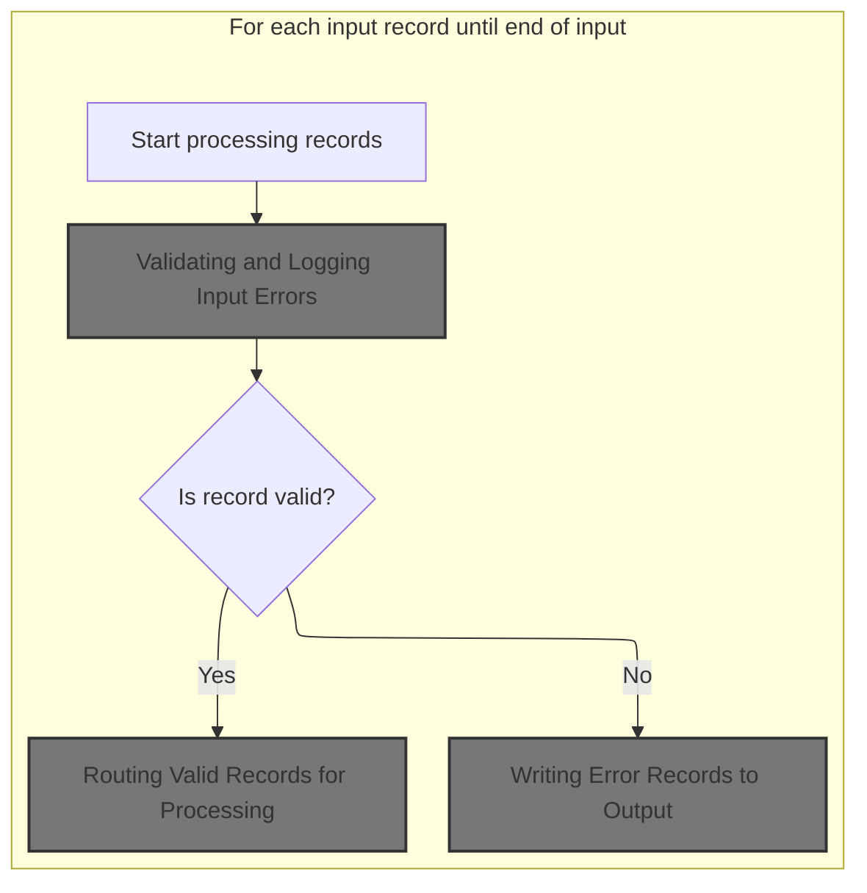
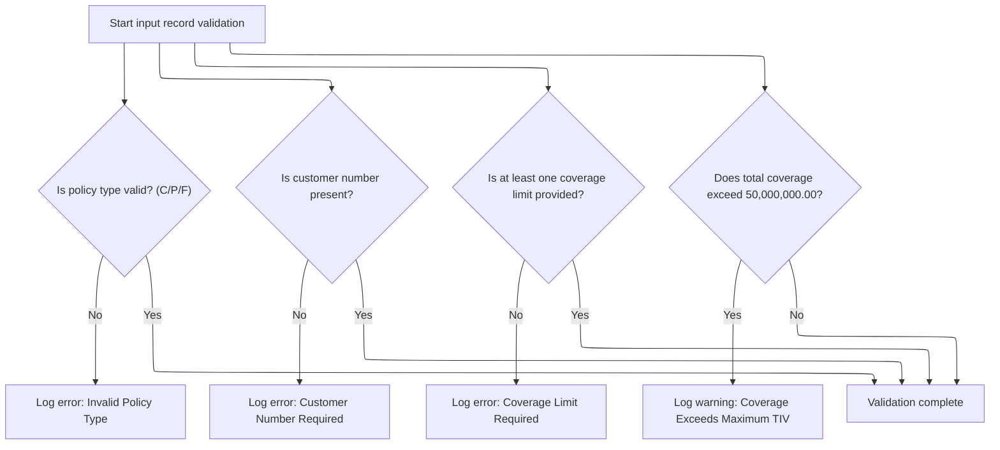
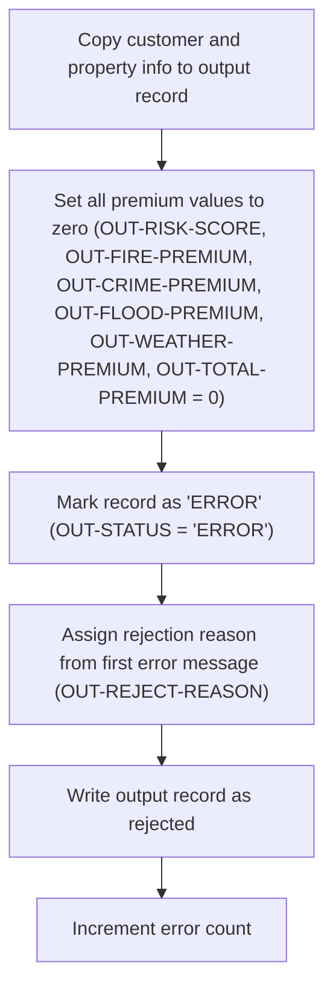

This document describes how input policy records are processed in a batch. Each record is validated for required fields and correct values. Valid records are routed for further processing—commercial policies have their premiums calculated, while non-commercial policies are marked as unsupported. Invalid records are written to the output as error records.

# Spec

## Detailed View of the Program's Functionality

## Program Initialization and Configuration

At the start, the program sets up its environment and prepares to process insurance policy records. It defines the files it will use for input, output, configuration, rates, and summary. The program then initializes its internal counters and data structures, displays startup messages, and loads configuration values. If the configuration file is missing, it falls back to default settings for things like maximum risk score and minimum premium.

## File Opening and Header Writing

The program opens all necessary files for reading and writing. It checks for errors when opening each file and stops execution if a critical file (like input or output) cannot be opened. For the output file, it writes a header record that labels each column (customer, property type, postcode, risk score, premiums, status, rejection reason).

## Main Input Records Processing Loop

The core of the program is a loop that processes each input record one by one:

1. It reads the next record from the input file.
2. For each record, it increments the record counter.
3. It validates the input record to check for required fields and valid values.
4. If the record passes validation (no errors found), it routes the record for further processing.
5. If validation fails (errors found), it writes an error record to the output.
6. The loop continues until all input records have been processed.

## Validating and Logging Input Errors

For each input record, the program performs a series of validation checks:

- It verifies that the policy type is one of the supported types (commercial, personal, or farm). If not, it logs an error for invalid policy type.
- It checks that the customer number is present. If missing, it logs an error for missing customer number.
- It ensures that at least one coverage limit (building or contents) is provided. If both are zero, it logs an error for missing coverage limits.
- It checks if the total coverage (building, contents, and business interruption) exceeds the maximum allowed value. If so, it logs a warning about exceeding the maximum total insured value.

Each error is logged by incrementing an error count and storing the details (code, severity, field, message) in arrays. Multiple errors can be logged for a single record, up to a fixed limit.

## Routing Valid Records for Processing

If a record passes validation, the program determines how to process it based on its policy type:

- If the policy is commercial, it proceeds with premium calculations and risk analysis.
- If the policy is not commercial, it marks the record as unsupported and writes it to the output with zeroed premiums and a rejection reason.

### Calculating Premiums for Commercial Policies

For commercial policies, the program performs several steps:

1. It calculates a risk score by calling an external program, passing property and coverage details.
2. It calculates basic premiums for various perils (fire, crime, flood, weather) by calling another external program, using the risk score and peril indicators.
3. If the basic premium calculation is successful, it may call an advanced actuarial calculation program for enhanced premium calculations, using detailed customer and coverage data. If the enhanced calculation yields a higher premium, it updates the premium values accordingly.
4. It applies business rules to determine the underwriting decision:
   - If the risk score exceeds the maximum allowed, the policy is rejected.
   - If the total premium is below the minimum, the policy is marked as pending for review.
   - If the risk score is high but not above the maximum, the policy is marked as pending for underwriter review.
   - Otherwise, the policy is approved.
5. It writes the processed record to the output file, including all calculated values and the underwriting decision.
6. It updates summary statistics, such as total premium, counts of approved/pending/rejected policies, and high-risk counts.

### Handling Unsupported Policy Types

For non-commercial policies, the program copies the basic input fields to the output, sets all premium and risk score fields to zero, marks the status as 'UNSUPPORTED', and provides a rejection reason stating that only commercial policies are supported. The record is then written to the output file.

## Writing Error Records to Output

If validation fails for a record, the program writes an error record to the output:

- It copies the customer and property information from the input.
- It sets all premium and risk score fields to zero.
- It marks the status as 'ERROR'.
- It assigns the rejection reason using the first error message logged for the record.
- It writes the error record to the output file and increments the error count.

## Closing Files and Generating Summary

After all records have been processed, the program closes all open files. If the summary file is available, it generates a summary report that includes:

- Processing date
- Total records processed
- Counts of approved, pending, and rejected policies
- Total premium amount generated
- Average risk score (if any records were processed)
- High-risk count

## Displaying Final Statistics

Finally, the program displays summary statistics to the console, including total records read, processed, approved, pending, rejected, error records, high-risk count, total premium generated, and average risk score (if applicable). The program then ends execution.

# Rule Definition

| Paragraph Name                                                                    | Rule ID | Category          | Description                                                                                                                                                                                                                                                                                   | Conditions                                                                           | Remarks                                                                                                                                                                                                                                                                                                                                                                            |
| --------------------------------------------------------------------------------- | ------- | ----------------- | --------------------------------------------------------------------------------------------------------------------------------------------------------------------------------------------------------------------------------------------------------------------------------------------- | ------------------------------------------------------------------------------------ | ---------------------------------------------------------------------------------------------------------------------------------------------------------------------------------------------------------------------------------------------------------------------------------------------------------------------------------------------------------------------------------- |
| P006-PROCESS-RECORDS, P007-READ-INPUT                                             | RL-001  | Computation       | Process each input record from the INPUTREC2 file sequentially until the end of input.                                                                                                                                                                                                        | INPUTREC2 file contains records; processing continues until end-of-file.             | Records are read one at a time; end-of-file is detected by the INPUT-EOF flag.                                                                                                                                                                                                                                                                                                     |
| P008-VALIDATE-INPUT-RECORD                                                        | RL-002  | Conditional Logic | IN-POLICY-TYPE must be present and must be one of 'C', 'P', or 'F'.                                                                                                                                                                                                                           | IN-POLICY-TYPE is not 'C', 'P', or 'F'.                                              | Valid values: 'C' (Commercial), 'P' (Personal), 'F' (Farm). Error code: 'POL001', Severity: 'F'.                                                                                                                                                                                                                                                                                   |
| P008-VALIDATE-INPUT-RECORD                                                        | RL-003  | Conditional Logic | IN-CUSTOMER-NUM must be present and non-empty.                                                                                                                                                                                                                                                | IN-CUSTOMER-NUM is empty or spaces.                                                  | Error code: 'CUS001', Severity: 'F'.                                                                                                                                                                                                                                                                                                                                               |
| P008-VALIDATE-INPUT-RECORD                                                        | RL-004  | Conditional Logic | At least one of IN-BUILDING-LIMIT, IN-CONTENTS-LIMIT, or IN-BI-LIMIT must be provided and greater than zero.                                                                                                                                                                                  | IN-BUILDING-LIMIT = 0 and IN-CONTENTS-LIMIT = 0                                      | Error code: 'COV001', Severity: 'F'.                                                                                                                                                                                                                                                                                                                                               |
| P008A-LOG-ERROR                                                                   | RL-005  | Data Assignment   | Log each validation error with details (error code, severity, field name, message). Only the first 20 errors per record are logged.                                                                                                                                                           | Validation error occurs; error count <= 20.                                          | Error details: code (string), severity ('F' or 'W'), field name (string), message (string). Maximum errors per record: 20.                                                                                                                                                                                                                                                         |
| P012-PROCESS-NON-COMMERCIAL                                                       | RL-006  | Data Assignment   | If IN-POLICY-TYPE is not 'C', copy basic input fields to output, set all premium and risk fields to zero, set status to 'UNSUPPORTED', set reject reason to 'Only Commercial policies supported in this version', and write output as unsupported.                                            | IN-POLICY-TYPE is not 'C'                                                            | Output fields: OUT-RISK-SCORE, OUT-FIRE-PREMIUM, OUT-CRIME-PREMIUM, OUT-FLOOD-PREMIUM, OUT-WEATHER-PREMIUM, OUT-TOTAL-PREMIUM all set to zero. OUT-STATUS: 'UNSUPPORTED'. OUT-REJECT-REASON: 'Only Commercial policies supported in this version'.                                                                                                                                 |
| P009-PROCESS-VALID-RECORD, P011-PROCESS-COMMERCIAL                                | RL-007  | Conditional Logic | If record is valid and IN-POLICY-TYPE is 'C', route for premium calculation.                                                                                                                                                                                                                  | Record is valid (no fatal errors); IN-POLICY-TYPE is 'C'.                            | Premium calculation details are handled in invoked programs LGAPDB02, LGAPDB03, LGAPDB04.                                                                                                                                                                                                                                                                                          |
| P011E-WRITE-OUTPUT-RECORD, P010-PROCESS-ERROR-RECORD, P012-PROCESS-NON-COMMERCIAL | RL-008  | Data Assignment   | For all processed records, write output to OUTPUTREC file with specified fields and formats.                                                                                                                                                                                                  | Record processed (valid, error, or unsupported).                                     | Fields: OUT-CUSTOMER-NUM (string), OUT-PROPERTY-TYPE (string), OUT-POSTCODE (string), OUT-RISK-SCORE (number), OUT-FIRE-PREMIUM (number), OUT-CRIME-PREMIUM (number), OUT-FLOOD-PREMIUM (number), OUT-WEATHER-PREMIUM (number), OUT-TOTAL-PREMIUM (number), OUT-STATUS (string), OUT-REJECT-REASON (string). Alignment and padding as per field definitions in OUTPUTREC copybook. |
| P008-VALIDATE-INPUT-RECORD                                                        | RL-009  | Conditional Logic | The sum of building limit, contents limit, and business interruption limit must not exceed 50,000,000.00. If it does, a warning is logged but processing continues.                                                                                                                           | Sum of building limit + contents limit + business interruption limit > 50,000,000.00 | Maximum total insured value: 50,000,000.00. Error code: 'COV002', Severity: 'W'.                                                                                                                                                                                                                                                                                                   |
| P010-PROCESS-ERROR-RECORD                                                         | RL-010  | Data Assignment   | If any fatal validation errors are present, copy customer and property fields to the output record, set all risk score and premium fields to zero, set status to 'ERROR', set reject reason to the message of the first error logged for the record, and write the output record as rejected. | Fatal validation errors are present for the record.                                  | Output fields: customer number, property type, postcode, risk score, fire premium, crime premium, flood premium, weather premium, total premium (all premiums and risk score set to zero), status ('ERROR'), reject reason (first error message).                                                                                                                                  |

# User Stories

## User Story 1: Input Validation and Error Logging

---

### Story Description:

As a system, I want to validate each input record for required fields, value ranges, and business constraints, and log up to 20 errors per record with details so that invalid data is identified, users are informed of issues, and processing can continue or halt as appropriate.

---

### Business Rule Mapping:

| Rule ID | Paragraph Name             | Rule Description                                                                                                                                                    |
| ------- | -------------------------- | ------------------------------------------------------------------------------------------------------------------------------------------------------------------- |
| RL-002  | P008-VALIDATE-INPUT-RECORD | IN-POLICY-TYPE must be present and must be one of 'C', 'P', or 'F'.                                                                                                 |
| RL-003  | P008-VALIDATE-INPUT-RECORD | IN-CUSTOMER-NUM must be present and non-empty.                                                                                                                      |
| RL-004  | P008-VALIDATE-INPUT-RECORD | At least one of IN-BUILDING-LIMIT, IN-CONTENTS-LIMIT, or IN-BI-LIMIT must be provided and greater than zero.                                                        |
| RL-009  | P008-VALIDATE-INPUT-RECORD | The sum of building limit, contents limit, and business interruption limit must not exceed 50,000,000.00. If it does, a warning is logged but processing continues. |
| RL-005  | P008A-LOG-ERROR            | Log each validation error with details (error code, severity, field name, message). Only the first 20 errors per record are logged.                                 |

---

### Relevant Functionality:

- **P008-VALIDATE-INPUT-RECORD**
  1. **RL-002:**
     - If IN-POLICY-TYPE is not 'C', 'P', or 'F':
       - Log error with code 'POL001', severity 'F', field 'IN-POLICY-TYPE', message 'Invalid Policy Type'
  2. **RL-003:**
     - If IN-CUSTOMER-NUM is empty or spaces:
       - Log error with code 'CUS001', severity 'F', field 'IN-CUSTOMER-NUM', message 'Customer Number Required'
  3. **RL-004:**
     - If IN-BUILDING-LIMIT = 0 and IN-CONTENTS-LIMIT = 0:
       - Log error with code 'COV001', severity 'F', field 'COVERAGE-LIMITS', message 'At least one coverage limit required'
  4. **RL-009:**
     - If sum of building limit, contents limit, and business interruption limit > 50,000,000.00:
       - Log error with code 'COV002', severity 'W', field 'COVERAGE-LIMITS', message 'Total coverage exceeds maximum TIV'
- **P008A-LOG-ERROR**
  1. **RL-005:**
     - Increment error count
     - If error count <= 20:
       - Store error details in error array

## User Story 2: Sequential Input Record Processing and Output Writing

---

### Story Description:

As a system, I want to process each input record from the INPUTREC2 file sequentially until the end of input and write all processed records to the OUTPUTREC file with the specified fields and formats so that all records are handled in order and results are available for downstream systems and users in a consistent and expected format.

---

### Business Rule Mapping:

| Rule ID | Paragraph Name                                                                    | Rule Description                                                                             |
| ------- | --------------------------------------------------------------------------------- | -------------------------------------------------------------------------------------------- |
| RL-001  | P006-PROCESS-RECORDS, P007-READ-INPUT                                             | Process each input record from the INPUTREC2 file sequentially until the end of input.       |
| RL-008  | P011E-WRITE-OUTPUT-RECORD, P010-PROCESS-ERROR-RECORD, P012-PROCESS-NON-COMMERCIAL | For all processed records, write output to OUTPUTREC file with specified fields and formats. |

---

### Relevant Functionality:

- **P006-PROCESS-RECORDS**
  1. **RL-001:**
     - Read a record from INPUTREC2
     - While not end-of-file:
       - Increment record counter
       - Validate record
       - Process record based on validation result
       - Read next record
- **P011E-WRITE-OUTPUT-RECORD**
  1. **RL-008:**
     - Move processed values to output fields
     - Write output record to OUTPUTREC file

## User Story 3: Handling Fatal Validation Errors and Writing Output

---

### Story Description:

As a system, I want to handle records with fatal validation errors by copying customer and property fields to the output, setting all premium and risk fields to zero, marking the status as 'ERROR', setting the reject reason to the first error message, and writing the output as rejected so that erroneous records are clearly flagged and downstream processes are not affected.

---

### Business Rule Mapping:

| Rule ID | Paragraph Name                                                                    | Rule Description                                                                                                                                                                                                                                                                              |
| ------- | --------------------------------------------------------------------------------- | --------------------------------------------------------------------------------------------------------------------------------------------------------------------------------------------------------------------------------------------------------------------------------------------- |
| RL-010  | P010-PROCESS-ERROR-RECORD                                                         | If any fatal validation errors are present, copy customer and property fields to the output record, set all risk score and premium fields to zero, set status to 'ERROR', set reject reason to the message of the first error logged for the record, and write the output record as rejected. |
| RL-008  | P011E-WRITE-OUTPUT-RECORD, P010-PROCESS-ERROR-RECORD, P012-PROCESS-NON-COMMERCIAL | For all processed records, write output to OUTPUTREC file with specified fields and formats.                                                                                                                                                                                                  |

---

### Relevant Functionality:

- **P010-PROCESS-ERROR-RECORD**
  1. **RL-010:**
     - Copy customer number, property type, and postcode from input to output
     - Set risk score and all premium fields to zero
     - Set status field to 'ERROR'
     - Set reject reason field to the first error message
     - Write the output record as rejected
- **P011E-WRITE-OUTPUT-RECORD**
  1. **RL-008:**
     - Move processed values to output fields
     - Write output record to OUTPUTREC file

## User Story 4: Handling Non-Commercial Policies and Writing Output

---

### Story Description:

As a system, I want to handle records where the policy type is not 'C' by copying basic input fields to the output, setting all premium and risk fields to zero, marking the status as 'UNSUPPORTED', setting the reject reason to 'Only Commercial policies supported in this version', and writing the output as unsupported so that unsupported policy types are clearly identified and excluded from further processing.

---

### Business Rule Mapping:

| Rule ID | Paragraph Name                                                                    | Rule Description                                                                                                                                                                                                                                   |
| ------- | --------------------------------------------------------------------------------- | -------------------------------------------------------------------------------------------------------------------------------------------------------------------------------------------------------------------------------------------------- |
| RL-006  | P012-PROCESS-NON-COMMERCIAL                                                       | If IN-POLICY-TYPE is not 'C', copy basic input fields to output, set all premium and risk fields to zero, set status to 'UNSUPPORTED', set reject reason to 'Only Commercial policies supported in this version', and write output as unsupported. |
| RL-008  | P011E-WRITE-OUTPUT-RECORD, P010-PROCESS-ERROR-RECORD, P012-PROCESS-NON-COMMERCIAL | For all processed records, write output to OUTPUTREC file with specified fields and formats.                                                                                                                                                       |

---

### Relevant Functionality:

- **P012-PROCESS-NON-COMMERCIAL**
  1. **RL-006:**
     - Copy basic input fields to output
     - Set all premium and risk fields to zero
     - Set OUT-STATUS to 'UNSUPPORTED'
     - Set OUT-REJECT-REASON to 'Only Commercial policies supported in this version'
     - Write output record
- **P011E-WRITE-OUTPUT-RECORD**
  1. **RL-008:**
     - Move processed values to output fields
     - Write output record to OUTPUTREC file

## User Story 5: Processing Valid Commercial Policies and Writing Output

---

### Story Description:

As a system, I want to route valid records with policy type 'C' for premium calculation and write the output record so that commercial policies are processed according to business requirements and results are available for downstream systems.

---

### Business Rule Mapping:

| Rule ID | Paragraph Name                                                                    | Rule Description                                                                             |
| ------- | --------------------------------------------------------------------------------- | -------------------------------------------------------------------------------------------- |
| RL-007  | P009-PROCESS-VALID-RECORD, P011-PROCESS-COMMERCIAL                                | If record is valid and IN-POLICY-TYPE is 'C', route for premium calculation.                 |
| RL-008  | P011E-WRITE-OUTPUT-RECORD, P010-PROCESS-ERROR-RECORD, P012-PROCESS-NON-COMMERCIAL | For all processed records, write output to OUTPUTREC file with specified fields and formats. |

---

### Relevant Functionality:

- **P009-PROCESS-VALID-RECORD**
  1. **RL-007:**
     - If IN-POLICY-TYPE is 'C':
       - Call risk score calculation
       - Call basic premium calculation
       - If premium > minimum, call enhanced actuarial calculation
       - Apply business rules for underwriting decision
       - Write output record
- **P011E-WRITE-OUTPUT-RECORD**
  1. **RL-008:**
     - Move processed values to output fields
     - Write output record to OUTPUTREC file

# Code Walkthrough

## Processing Input Records Loop



<SwmSnippet path="/base/src/LGAPDB01.cbl" line="178">

---

P006-PROCESS-RECORDS kicks off the main loop: it reads each input record, increments the record counter, and calls P008-VALIDATE-INPUT-RECORD to check if the data is usable. We need to call validation next because it filters out bad records before any premium calculations or error handling, keeping the output clean and reliable.

```cobol
       P006-PROCESS-RECORDS.
           PERFORM P007-READ-INPUT
           PERFORM UNTIL INPUT-EOF
               ADD 1 TO WS-REC-CNT
               PERFORM P008-VALIDATE-INPUT-RECORD
               IF WS-ERROR-COUNT = ZERO
                   PERFORM P009-PROCESS-VALID-RECORD
               ELSE
                   PERFORM P010-PROCESS-ERROR-RECORD
               END-IF
               PERFORM P007-READ-INPUT
           END-PERFORM.
```

---

</SwmSnippet>

### Validating and Logging Input Errors



<SwmSnippet path="/base/src/LGAPDB01.cbl" line="195">

---

P008-VALIDATE-INPUT-RECORD checks the input record for required fields and valid values. If any check fails, it calls P008A-LOG-ERROR to record the specific issue. Logging errors here means we capture all problems for each record, not just the first one, so downstream processes know exactly what went wrong.

```cobol
       P008-VALIDATE-INPUT-RECORD.
           INITIALIZE WS-ERROR-HANDLING
           
           IF NOT COMMERCIAL-POLICY AND 
              NOT PERSONAL-POLICY AND 
              NOT FARM-POLICY
               PERFORM P008A-LOG-ERROR WITH 
                   'POL001' 'F' 'IN-POLICY-TYPE' 
                   'Invalid Policy Type'
           END-IF
           
           IF IN-CUSTOMER-NUM = SPACES
               PERFORM P008A-LOG-ERROR WITH 
                   'CUS001' 'F' 'IN-CUSTOMER-NUM' 
                   'Customer Number Required'
           END-IF
           
           IF IN-BUILDING-LIMIT = ZERO AND 
              IN-CONTENTS-LIMIT = ZERO
               PERFORM P008A-LOG-ERROR WITH 
                   'COV001' 'F' 'COVERAGE-LIMITS' 
                   'At least one coverage limit required'
           END-IF
           
           IF IN-BUILDING-LIMIT + IN-CONTENTS-LIMIT + 
              IN-BI-LIMIT > WS-MAX-TIV
               PERFORM P008A-LOG-ERROR WITH 
                   'COV002' 'W' 'COVERAGE-LIMITS' 
                   'Total coverage exceeds maximum TIV'
           END-IF.
```

---

</SwmSnippet>

<SwmSnippet path="/base/src/LGAPDB01.cbl" line="226">

---

P008A-LOG-ERROR logs each error by bumping the error count and storing the details in parallel arrays. It relies on the arrays being big enough (20 slots) and uses the error count as the index. This setup lets us track multiple errors per record, but if we hit 20, anything extra is lost.

```cobol
       P008A-LOG-ERROR.
           ADD 1 TO WS-ERROR-COUNT
           SET ERR-IDX TO WS-ERROR-COUNT
           MOVE WS-ERROR-CODE TO WS-ERROR-CODE (ERR-IDX)
           MOVE WS-ERROR-SEVERITY TO WS-ERROR-SEVERITY (ERR-IDX)
           MOVE WS-ERROR-FIELD TO WS-ERROR-FIELD (ERR-IDX)
           MOVE WS-ERROR-MESSAGE TO WS-ERROR-MESSAGE (ERR-IDX).
```

---

</SwmSnippet>

### Routing Valid Records for Processing

<SwmSnippet path="/base/src/LGAPDB01.cbl" line="234">

---

P009-PROCESS-VALID-RECORD checks if the policy is commercial. If so, it calls P011-PROCESS-COMMERCIAL to run the premium calculations. Non-commercial policies go down a different path and get flagged as unsupported. Routing here makes sure only commercial policies get processed for actual premiums.

```cobol
       P009-PROCESS-VALID-RECORD.
           IF COMMERCIAL-POLICY
               PERFORM P011-PROCESS-COMMERCIAL
               ADD 1 TO WS-PROC-CNT
           ELSE
               PERFORM P012-PROCESS-NON-COMMERCIAL
               ADD 1 TO WS-ERR-CNT
           END-IF.
```

---

</SwmSnippet>

#### Calculating Premiums for Commercial Policies

See <SwmLink doc-title="Processing Commercial Property Insurance Applications">[Processing Commercial Property Insurance Applications](\.swm\processing-commercial-property-insurance-applications.eyjgbwqv.sw.md)</SwmLink>

#### Handling Unsupported Policy Types

<SwmSnippet path="/base/src/LGAPDB01.cbl" line="379">

---

P012-PROCESS-NON-COMMERCIAL copies the basic input fields to output, sets all premiums and risk score to zero, and marks the status as 'UNSUPPORTED' with a reject reason. This tells anyone reading the output that only commercial policies are handled here.

```cobol
       P012-PROCESS-NON-COMMERCIAL.
           MOVE IN-CUSTOMER-NUM TO OUT-CUSTOMER-NUM
           MOVE IN-PROPERTY-TYPE TO OUT-PROPERTY-TYPE
           MOVE IN-POSTCODE TO OUT-POSTCODE
           MOVE ZERO TO OUT-RISK-SCORE
           MOVE ZERO TO OUT-FIRE-PREMIUM
           MOVE ZERO TO OUT-CRIME-PREMIUM
           MOVE ZERO TO OUT-FLOOD-PREMIUM
           MOVE ZERO TO OUT-WEATHER-PREMIUM
           MOVE ZERO TO OUT-TOTAL-PREMIUM
           MOVE 'UNSUPPORTED' TO OUT-STATUS
           MOVE 'Only Commercial policies supported in this version' 
                TO OUT-REJECT-REASON
           WRITE OUTPUT-RECORD.
```

---

</SwmSnippet>

### Writing Error Records to Output



<SwmSnippet path="/base/src/LGAPDB01.cbl" line="243">

---

P010-PROCESS-ERROR-RECORD writes out an error record by copying the basic input fields, zeroing all premiums and risk score, setting status to 'ERROR', and using the first character of the error message as the reject reason. It then writes the record and bumps the error count.

```cobol
       P010-PROCESS-ERROR-RECORD.
           MOVE IN-CUSTOMER-NUM TO OUT-CUSTOMER-NUM
           MOVE IN-PROPERTY-TYPE TO OUT-PROPERTY-TYPE
           MOVE IN-POSTCODE TO OUT-POSTCODE
           MOVE ZERO TO OUT-RISK-SCORE
           MOVE ZERO TO OUT-FIRE-PREMIUM
           MOVE ZERO TO OUT-CRIME-PREMIUM
           MOVE ZERO TO OUT-FLOOD-PREMIUM
           MOVE ZERO TO OUT-WEATHER-PREMIUM
           MOVE ZERO TO OUT-TOTAL-PREMIUM
           MOVE 'ERROR' TO OUT-STATUS
           MOVE WS-ERROR-MESSAGE (1) TO OUT-REJECT-REASON
           WRITE OUTPUT-RECORD
           ADD 1 TO WS-ERR-CNT.
```

---

</SwmSnippet>

&nbsp;

*This is an auto-generated document by Swimm 🌊 and has not yet been verified by a human*

<SwmMeta version="3.0.0" repo-id="Z2l0aHViJTNBJTNBU3dpbW1pby1nZW5hcHAtaG91c2UlM0ElM0FHaXJpLVN3aW1t" repo-name="Swimmio-genapp-house"><sup>Powered by [Swimm](https://app.swimm.io/)</sup></SwmMeta>
