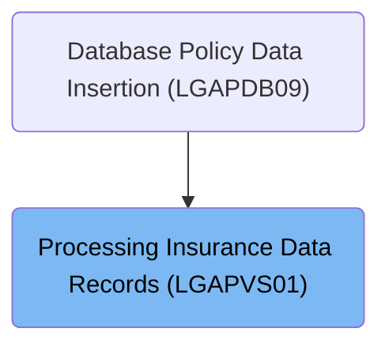
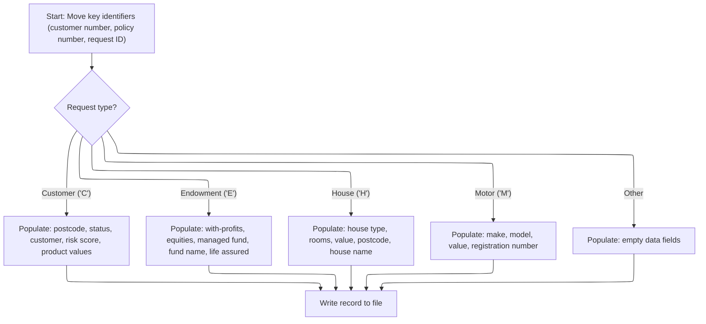
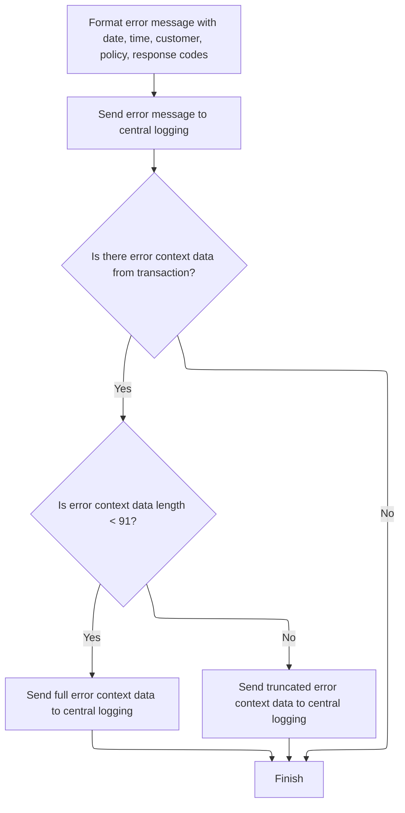

# Overview

This document describes how insurance request data is transformed into a standardized record based on request type and written to the insurance data store. If the write fails, the system logs the error and dispatches error messages for audit and tracking.

## Dependencies

### Programs

- <SwmToken path="base/src/lgapvs01.cbl" pos="2:6:6" line-data="       PROGRAM-ID. LGAPVS01.">`LGAPVS01`</SwmToken> (<SwmPath>[base/src/lgapvs01.cbl](base/src/lgapvs01.cbl)</SwmPath>)
- LGSTSQ (<SwmPath>[base/src/lgstsq.cbl](base/src/lgstsq.cbl)</SwmPath>)

### Copybook

- LGCMAREA (<SwmPath>[base/src/lgcmarea.cpy](base/src/lgcmarea.cpy)</SwmPath>)

# Where is this program used?

This program is used once, as represented in the following diagram:



## Detailed View of the Program's Functionality

# Mapping and Writing Insurance Data

## 1\. Initialization and Context Setup

The process begins by preparing the environment for handling an incoming insurance data request. The code first determines the length of the communication area (the block of data passed into the program) and extracts three key identifiers from the incoming data: the request type, the policy number, and the customer number. These identifiers are essential for determining how the rest of the data will be processed and mapped.

## 2\. Conditional Data Mapping Based on Request Type

The program then examines the request type to decide how to map the incoming data fields into the internal record structure. This is done using a conditional branching mechanism:

- **Customer Insurance ('C')**:\
  If the request is for a customer insurance record, the program copies the postcode, status, customer name, risk score, and four product-related values from the incoming data into the corresponding fields of the internal customer data structure.

- **Endowment Insurance ('E')**:\
  For endowment insurance, the program maps the with-profits indicator, equities indicator, managed fund indicator, fund name, and the name of the life assured into the endowment-specific fields of the internal record.

- **House Insurance ('H')**:\
  If the request is for house insurance, the program copies the house type, number of rooms, value, postcode, and house name into the house-specific fields of the internal record.

- **Motor Insurance ('M')**:\
  For motor insurance, the program maps the make, model, value, and registration number into the motor-specific fields of the internal record.

- **Other/Unknown Types**:\
  If the request type does not match any of the known categories, the program clears the data fields in the internal record to prevent writing invalid or unexpected data.

## 3\. Writing the Record to File

Once the data has been mapped according to the request type, the program writes the complete internal record to a file (specifically, a CICS-managed file named 'KSDSPOLY'). The write operation uses the previously extracted key fields (request type, customer number, policy number) as the record identifier. The operation specifies the length of the record and the key, and it captures a response code to determine if the write was successful.

## 4\. Error Handling on Write Failure

If the file write operation fails (i.e., the response code indicates an error), the program captures additional error information, sets a return code to indicate failure, and invokes the error handling routine. This routine is responsible for logging the error and performing any necessary cleanup before returning control.

# Error Logging and Queue Dispatch

## 1\. Formatting and Logging the Error

When an error occurs, the error handling routine is triggered. The first step is to obtain the current system date and time, which are formatted for inclusion in the error log. The program then constructs a detailed error message that includes the timestamp, customer number, policy number, and the response codes from the failed operation.

This error message is then sent to a central logging mechanism by invoking a separate program responsible for queueing and logging errors.

## 2\. Handling Additional Error Context Data

After logging the main error message, the program checks if there is additional context data available from the transaction (i.e., extra data in the communication area). If such data exists:

- If the data is less than 91 characters, the entire context is included in a secondary error message and sent to the logging program.
- If the data is longer, only the first 90 characters are included to avoid overflow, and this truncated context is sent to the logging program.

This ensures that all relevant information about the error and its context is captured for later analysis.

## 3\. Queueing and Dispatching Error Messages

The logging program (invoked for error handling) performs several actions:

- It determines how the error message was received (directly or via a queue) and sets a flag accordingly.
- It prepares the error message, possibly adjusting the queue name if a special parameter is present.
- The message is written to two places:
  - A temporary queue for immediate system logging.
  - A permanent queue for later retrieval and analysis.
- If the message was received via a queue, a minimal response is sent back to acknowledge receipt.

Finally, the logging program returns control to the caller, completing the error handling process. This ensures robust error tracking and facilitates troubleshooting by capturing both summary and detailed context for each error event.

# Rule Definition

| Paragraph Name                                                                                                                                                                                                                                       | Rule ID | Category          | Description                                                                                                                                                                                                                                      | Conditions                                   | Remarks                                                                                                                                                                                                                                                                                                                                                                                                                                                                                                                                                                                                                                                                                                                                                                                                                                                                                                                                                                                                                                                                                                                                                                                                                                                              |
| ---------------------------------------------------------------------------------------------------------------------------------------------------------------------------------------------------------------------------------------------------- | ------- | ----------------- | ------------------------------------------------------------------------------------------------------------------------------------------------------------------------------------------------------------------------------------------------ | -------------------------------------------- | -------------------------------------------------------------------------------------------------------------------------------------------------------------------------------------------------------------------------------------------------------------------------------------------------------------------------------------------------------------------------------------------------------------------------------------------------------------------------------------------------------------------------------------------------------------------------------------------------------------------------------------------------------------------------------------------------------------------------------------------------------------------------------------------------------------------------------------------------------------------------------------------------------------------------------------------------------------------------------------------------------------------------------------------------------------------------------------------------------------------------------------------------------------------------------------------------------------------------------------------------------------------- |
| <SwmToken path="base/src/lgapvs01.cbl" pos="90:1:3" line-data="       P100-ENTRY SECTION.">`P100-ENTRY`</SwmToken> SECTION                                                                                                                           | RL-001  | Data Assignment   | The program must extract the request type, policy number, and customer number from the communication area (DFHCOMMAREA) and assign them to the output record.                                                                                    | Always, at program start.                    | Request type is extracted from the first byte of <SwmToken path="base/src/lgapvs01.cbl" pos="95:3:7" line-data="           Move CA-Request-ID(4:1) To V2-REQ">`CA-Request-ID`</SwmToken>. Policy number and customer number are extracted from <SwmToken path="base/src/lgapvs01.cbl" pos="96:3:7" line-data="           Move CA-Policy-Num      To V2-POL">`CA-Policy-Num`</SwmToken> and <SwmToken path="base/src/lgapvs01.cbl" pos="97:3:7" line-data="           Move CA-Customer-Num    To V2-CUST">`CA-Customer-Num`</SwmToken>. These are assigned to the first 21 bytes of the output record (<SwmToken path="base/src/lgapvs01.cbl" pos="139:3:5" line-data="                     Ridfld(V2-KEY)">`V2-KEY`</SwmToken>), with request type (1 byte), customer number (10 bytes), and policy number (10 bytes), all alphanumeric.                                                                                                                                                                                                                                                                                                                                                                                                                             |
| <SwmToken path="base/src/lgapvs01.cbl" pos="90:1:3" line-data="       P100-ENTRY SECTION.">`P100-ENTRY`</SwmToken> SECTION                                                                                                                           | RL-002  | Conditional Logic | The program determines the insurance type by inspecting the first byte of the request ID and uses this to select which output fields to populate.                                                                                                | Always, after extracting request type.       | Request types are: 'C' (Customer), 'E' (Endowment), 'H' (House), 'M' (Motor).                                                                                                                                                                                                                                                                                                                                                                                                                                                                                                                                                                                                                                                                                                                                                                                                                                                                                                                                                                                                                                                                                                                                                                                        |
| <SwmToken path="base/src/lgapvs01.cbl" pos="90:1:3" line-data="       P100-ENTRY SECTION.">`P100-ENTRY`</SwmToken> SECTION                                                                                                                           | RL-003  | Data Assignment   | If the request type is 'C', populate output record fields for customer insurance using values from the communication area and working storage.                                                                                                   | Request type is 'C'.                         | Fields populated: <SwmToken path="base/src/lgapvs01.cbl" pos="102:11:15" line-data="               Move CA-B-PST     To V2-C-PCD">`V2-C-PCD`</SwmToken> (8 bytes), <SwmToken path="base/src/lgapvs01.cbl" pos="103:11:15" line-data="               Move CA-B-ST       To V2-C-Z9">`V2-C-Z9`</SwmToken> (4 digits), <SwmToken path="base/src/lgapvs01.cbl" pos="104:11:15" line-data="               Move CA-B-Customer     To V2-C-CUST">`V2-C-CUST`</SwmToken> (31 bytes), <SwmToken path="base/src/lgapvs01.cbl" pos="105:11:15" line-data="               Move WS-RISK-SCORE     To V2-C-VAL">`V2-C-VAL`</SwmToken> (3 digits), <SwmToken path="base/src/lgapvs01.cbl" pos="106:15:19" line-data="               Move CA-B-CA-B-FPR  To V2-C-P1VAL">`V2-C-P1VAL`</SwmToken>, <SwmToken path="base/src/lgapvs01.cbl" pos="107:11:15" line-data="               Move CA-B-CPR To V2-C-P2VAL">`V2-C-P2VAL`</SwmToken>, <SwmToken path="base/src/lgapvs01.cbl" pos="108:11:15" line-data="               Move CA-B-FLPR To V2-C-P3VAL">`V2-C-P3VAL`</SwmToken>, <SwmToken path="base/src/lgapvs01.cbl" pos="109:11:15" line-data="               Move CA-B-WPR To V2-C-P4VAL">`V2-C-P4VAL`</SwmToken> (each 8 digits). All are alphanumeric or numeric as specified. |
| <SwmToken path="base/src/lgapvs01.cbl" pos="90:1:3" line-data="       P100-ENTRY SECTION.">`P100-ENTRY`</SwmToken> SECTION                                                                                                                           | RL-004  | Data Assignment   | If the request type is 'E', populate output record fields for endowment insurance using values from the communication area.                                                                                                                      | Request type is 'E'.                         | Fields populated: <SwmToken path="base/src/lgapvs01.cbl" pos="112:13:17" line-data="               Move CA-E-W-PRO        To  V2-E-OPT1">`V2-E-OPT1`</SwmToken> (1 byte), <SwmToken path="base/src/lgapvs01.cbl" pos="113:11:15" line-data="               Move CA-E-EQU          To  V2-E-OPT2">`V2-E-OPT2`</SwmToken> (1 byte), <SwmToken path="base/src/lgapvs01.cbl" pos="114:13:17" line-data="               Move CA-E-M-FUN        To  V2-E-OPT3">`V2-E-OPT3`</SwmToken> (1 byte), <SwmToken path="base/src/lgapvs01.cbl" pos="115:13:17" line-data="               Move CA-E-FUND-NAME    To  V2-E-NAME">`V2-E-NAME`</SwmToken> (10 bytes), <SwmToken path="base/src/lgapvs01.cbl" pos="116:13:17" line-data="               Move CA-E-LIFE-ASSURED To  V2-E-LIFE">`V2-E-LIFE`</SwmToken> (30 bytes).                                                                                                                                                                                                                                                                                                                                                                                                                                                        |
| <SwmToken path="base/src/lgapvs01.cbl" pos="90:1:3" line-data="       P100-ENTRY SECTION.">`P100-ENTRY`</SwmToken> SECTION                                                                                                                           | RL-005  | Data Assignment   | If the request type is 'H', populate output record fields for house insurance using values from the communication area.                                                                                                                          | Request type is 'H'.                         | Fields populated: <SwmToken path="base/src/lgapvs01.cbl" pos="119:13:17" line-data="               Move CA-H-P-TYP         To  V2-H-TYPE">`V2-H-TYPE`</SwmToken> (15 bytes), <SwmToken path="base/src/lgapvs01.cbl" pos="120:11:15" line-data="               Move CA-H-BED           To  V2-H-ROOMS">`V2-H-ROOMS`</SwmToken> (3 digits), <SwmToken path="base/src/lgapvs01.cbl" pos="121:11:15" line-data="               Move CA-H-VAL           To  V2-H-COST">`V2-H-COST`</SwmToken> (8 digits), <SwmToken path="base/src/lgapvs01.cbl" pos="122:11:15" line-data="               Move CA-H-PCD           To  V2-H-PCD">`V2-H-PCD`</SwmToken> (8 bytes), <SwmToken path="base/src/lgapvs01.cbl" pos="123:13:17" line-data="               Move CA-H-H-NAM         To  V2-H-NAME">`V2-H-NAME`</SwmToken> (9 bytes).                                                                                                                                                                                                                                                                                                                                                                                                                                               |
| <SwmToken path="base/src/lgapvs01.cbl" pos="90:1:3" line-data="       P100-ENTRY SECTION.">`P100-ENTRY`</SwmToken> SECTION                                                                                                                           | RL-006  | Data Assignment   | If the request type is 'M', populate output record fields for motor insurance using values from the communication area.                                                                                                                          | Request type is 'M'.                         | Fields populated: <SwmToken path="base/src/lgapvs01.cbl" pos="126:11:15" line-data="               Move CA-M-MAKE          To  V2-M-MAKE">`V2-M-MAKE`</SwmToken> (15 bytes), <SwmToken path="base/src/lgapvs01.cbl" pos="127:11:15" line-data="               Move CA-M-MODEL         To  V2-M-MODEL">`V2-M-MODEL`</SwmToken> (15 bytes), <SwmToken path="base/src/lgapvs01.cbl" pos="128:11:15" line-data="               Move CA-M-VALUE         To  V2-M-COST">`V2-M-COST`</SwmToken> (6 digits), <SwmToken path="base/src/lgapvs01.cbl" pos="129:11:15" line-data="               Move CA-M-REGNUMBER     To  V2-M-NUM">`V2-M-NUM`</SwmToken> (7 bytes).                                                                                                                                                                                                                                                                                                                                                                                                                                                                                                                                                                                                         |
| <SwmToken path="base/src/lgapvs01.cbl" pos="90:1:3" line-data="       P100-ENTRY SECTION.">`P100-ENTRY`</SwmToken> SECTION                                                                                                                           | RL-007  | Data Assignment   | If the request type is not recognized, fill the output data area with spaces.                                                                                                                                                                    | Request type is not 'C', 'E', 'H', or 'M'.   | <SwmToken path="base/src/lgapvs01.cbl" pos="132:7:9" line-data="               Move Spaces To V2-DATA">`V2-DATA`</SwmToken> is 83 bytes, filled with spaces.                                                                                                                                                                                                                                                                                                                                                                                                                                                                                                                                                                                                                                                                                                                                                                                                                                                                                                                                                                                                                                                                                                         |
| <SwmToken path="base/src/lgapvs01.cbl" pos="90:1:3" line-data="       P100-ENTRY SECTION.">`P100-ENTRY`</SwmToken> SECTION                                                                                                                           | RL-008  | Computation       | The output record must be written to the file KSDSPOLY, with a record length of 104 bytes and a key length of 21 bytes.                                                                                                                          | After populating output record.              | File: KSDSPOLY. Record length: 104 bytes. Key length: 21 bytes (first 21 bytes of output record).                                                                                                                                                                                                                                                                                                                                                                                                                                                                                                                                                                                                                                                                                                                                                                                                                                                                                                                                                                                                                                                                                                                                                                    |
| <SwmToken path="base/src/lgapvs01.cbl" pos="90:1:3" line-data="       P100-ENTRY SECTION.">`P100-ENTRY`</SwmToken> SECTION, <SwmToken path="base/src/lgapvs01.cbl" pos="146:3:5" line-data="             PERFORM P999-ERROR">`P999-ERROR`</SwmToken> | RL-009  | Conditional Logic | If the file write fails, construct an error message with specified fields and send it to the central logging system.                                                                                                                             | File write fails (response code not normal). | Error message fields: date (8 bytes), time (6 bytes), program name (' <SwmToken path="base/src/lgapvs01.cbl" pos="2:6:6" line-data="       PROGRAM-ID. LGAPVS01.">`LGAPVS01`</SwmToken>', 9 bytes), policy number (10 bytes), customer number (10 bytes), operation description (' Write file KSDSPOLY', 20 bytes), response codes (5 digits each).                                                                                                                                                                                                                                                                                                                                                                                                                                                                                                                                                                                                                                                                                                                                                                                                                                                                                                                  |
| <SwmToken path="base/src/lgapvs01.cbl" pos="146:3:5" line-data="             PERFORM P999-ERROR">`P999-ERROR`</SwmToken>                                                                                                                             | RL-010  | Conditional Logic | If there is error context data from the transaction, and its length is less than 91 bytes, send the full context data to central logging; if it is 91 bytes or longer, send only the first 91 bytes. Always ensure error context data is logged. | Error context data present (EIBCALEN > 0).   | Error context data is up to 90 bytes. If longer, only first 90 bytes sent. Always logged regardless of length.                                                                                                                                                                                                                                                                                                                                                                                                                                                                                                                                                                                                                                                                                                                                                                                                                                                                                                                                                                                                                                                                                                                                                       |

# User Stories

## User Story 1: Extract, assign, and write insurance data to output record

---

### Story Description:

As a system, I want to extract the request type, policy number, and customer number from the communication area, determine the insurance type, populate the output record fields accordingly, and write the record to the KSDSPOLY file so that the correct insurance data is processed and reliably stored for further processing.

---

### Business Rule Mapping:

| Rule ID | Paragraph Name                                                                                                             | Rule Description                                                                                                                                              |
| ------- | -------------------------------------------------------------------------------------------------------------------------- | ------------------------------------------------------------------------------------------------------------------------------------------------------------- |
| RL-001  | <SwmToken path="base/src/lgapvs01.cbl" pos="90:1:3" line-data="       P100-ENTRY SECTION.">`P100-ENTRY`</SwmToken> SECTION | The program must extract the request type, policy number, and customer number from the communication area (DFHCOMMAREA) and assign them to the output record. |
| RL-002  | <SwmToken path="base/src/lgapvs01.cbl" pos="90:1:3" line-data="       P100-ENTRY SECTION.">`P100-ENTRY`</SwmToken> SECTION | The program determines the insurance type by inspecting the first byte of the request ID and uses this to select which output fields to populate.             |
| RL-003  | <SwmToken path="base/src/lgapvs01.cbl" pos="90:1:3" line-data="       P100-ENTRY SECTION.">`P100-ENTRY`</SwmToken> SECTION | If the request type is 'C', populate output record fields for customer insurance using values from the communication area and working storage.                |
| RL-004  | <SwmToken path="base/src/lgapvs01.cbl" pos="90:1:3" line-data="       P100-ENTRY SECTION.">`P100-ENTRY`</SwmToken> SECTION | If the request type is 'E', populate output record fields for endowment insurance using values from the communication area.                                   |
| RL-005  | <SwmToken path="base/src/lgapvs01.cbl" pos="90:1:3" line-data="       P100-ENTRY SECTION.">`P100-ENTRY`</SwmToken> SECTION | If the request type is 'H', populate output record fields for house insurance using values from the communication area.                                       |
| RL-006  | <SwmToken path="base/src/lgapvs01.cbl" pos="90:1:3" line-data="       P100-ENTRY SECTION.">`P100-ENTRY`</SwmToken> SECTION | If the request type is 'M', populate output record fields for motor insurance using values from the communication area.                                       |
| RL-007  | <SwmToken path="base/src/lgapvs01.cbl" pos="90:1:3" line-data="       P100-ENTRY SECTION.">`P100-ENTRY`</SwmToken> SECTION | If the request type is not recognized, fill the output data area with spaces.                                                                                 |
| RL-008  | <SwmToken path="base/src/lgapvs01.cbl" pos="90:1:3" line-data="       P100-ENTRY SECTION.">`P100-ENTRY`</SwmToken> SECTION | The output record must be written to the file KSDSPOLY, with a record length of 104 bytes and a key length of 21 bytes.                                       |

---

### Relevant Functionality:

- <SwmToken path="base/src/lgapvs01.cbl" pos="90:1:3" line-data="       P100-ENTRY SECTION.">`P100-ENTRY`</SwmToken> **SECTION**
  1. **RL-001:**
     - Extract request type from communication area (first byte of <SwmToken path="base/src/lgapvs01.cbl" pos="95:3:7" line-data="           Move CA-Request-ID(4:1) To V2-REQ">`CA-Request-ID`</SwmToken>)
     - Extract policy number from communication area
     - Extract customer number from communication area
     - Assign these values to the first 21 bytes of the output record
  2. **RL-002:**
     - Inspect first byte of request ID
     - Use conditional logic to select insurance type
     - Branch to appropriate output field population logic
  3. **RL-003:**
     - If request type is 'C':
       - Populate <SwmToken path="base/src/lgapvs01.cbl" pos="102:11:15" line-data="               Move CA-B-PST     To V2-C-PCD">`V2-C-PCD`</SwmToken> from <SwmToken path="base/src/lgapvs01.cbl" pos="102:3:7" line-data="               Move CA-B-PST     To V2-C-PCD">`CA-B-PST`</SwmToken>
       - Populate <SwmToken path="base/src/lgapvs01.cbl" pos="103:11:15" line-data="               Move CA-B-ST       To V2-C-Z9">`V2-C-Z9`</SwmToken> from <SwmToken path="base/src/lgapvs01.cbl" pos="103:3:7" line-data="               Move CA-B-ST       To V2-C-Z9">`CA-B-ST`</SwmToken>
       - Populate <SwmToken path="base/src/lgapvs01.cbl" pos="104:11:15" line-data="               Move CA-B-Customer     To V2-C-CUST">`V2-C-CUST`</SwmToken> from <SwmToken path="base/src/lgapvs01.cbl" pos="104:3:7" line-data="               Move CA-B-Customer     To V2-C-CUST">`CA-B-Customer`</SwmToken>
       - Populate <SwmToken path="base/src/lgapvs01.cbl" pos="105:11:15" line-data="               Move WS-RISK-SCORE     To V2-C-VAL">`V2-C-VAL`</SwmToken> from risk score
       - Populate <SwmToken path="base/src/lgapvs01.cbl" pos="106:15:19" line-data="               Move CA-B-CA-B-FPR  To V2-C-P1VAL">`V2-C-P1VAL`</SwmToken>, <SwmToken path="base/src/lgapvs01.cbl" pos="107:11:15" line-data="               Move CA-B-CPR To V2-C-P2VAL">`V2-C-P2VAL`</SwmToken>, <SwmToken path="base/src/lgapvs01.cbl" pos="108:11:15" line-data="               Move CA-B-FLPR To V2-C-P3VAL">`V2-C-P3VAL`</SwmToken>, <SwmToken path="base/src/lgapvs01.cbl" pos="109:11:15" line-data="               Move CA-B-WPR To V2-C-P4VAL">`V2-C-P4VAL`</SwmToken> from respective values
  4. **RL-004:**
     - If request type is 'E':
       - Populate <SwmToken path="base/src/lgapvs01.cbl" pos="112:13:17" line-data="               Move CA-E-W-PRO        To  V2-E-OPT1">`V2-E-OPT1`</SwmToken> from <SwmToken path="base/src/lgapvs01.cbl" pos="112:3:9" line-data="               Move CA-E-W-PRO        To  V2-E-OPT1">`CA-E-W-PRO`</SwmToken>
       - Populate <SwmToken path="base/src/lgapvs01.cbl" pos="113:11:15" line-data="               Move CA-E-EQU          To  V2-E-OPT2">`V2-E-OPT2`</SwmToken> from <SwmToken path="base/src/lgapvs01.cbl" pos="113:3:7" line-data="               Move CA-E-EQU          To  V2-E-OPT2">`CA-E-EQU`</SwmToken>
       - Populate <SwmToken path="base/src/lgapvs01.cbl" pos="114:13:17" line-data="               Move CA-E-M-FUN        To  V2-E-OPT3">`V2-E-OPT3`</SwmToken> from <SwmToken path="base/src/lgapvs01.cbl" pos="114:3:9" line-data="               Move CA-E-M-FUN        To  V2-E-OPT3">`CA-E-M-FUN`</SwmToken>
       - Populate <SwmToken path="base/src/lgapvs01.cbl" pos="115:13:17" line-data="               Move CA-E-FUND-NAME    To  V2-E-NAME">`V2-E-NAME`</SwmToken> from <SwmToken path="base/src/lgapvs01.cbl" pos="115:3:9" line-data="               Move CA-E-FUND-NAME    To  V2-E-NAME">`CA-E-FUND-NAME`</SwmToken>
       - Populate <SwmToken path="base/src/lgapvs01.cbl" pos="116:13:17" line-data="               Move CA-E-LIFE-ASSURED To  V2-E-LIFE">`V2-E-LIFE`</SwmToken> from <SwmToken path="base/src/lgapvs01.cbl" pos="116:3:9" line-data="               Move CA-E-LIFE-ASSURED To  V2-E-LIFE">`CA-E-LIFE-ASSURED`</SwmToken>
  5. **RL-005:**
     - If request type is 'H':
       - Populate <SwmToken path="base/src/lgapvs01.cbl" pos="119:13:17" line-data="               Move CA-H-P-TYP         To  V2-H-TYPE">`V2-H-TYPE`</SwmToken> from <SwmToken path="base/src/lgapvs01.cbl" pos="119:3:9" line-data="               Move CA-H-P-TYP         To  V2-H-TYPE">`CA-H-P-TYP`</SwmToken>
       - Populate <SwmToken path="base/src/lgapvs01.cbl" pos="120:11:15" line-data="               Move CA-H-BED           To  V2-H-ROOMS">`V2-H-ROOMS`</SwmToken> from <SwmToken path="base/src/lgapvs01.cbl" pos="120:3:7" line-data="               Move CA-H-BED           To  V2-H-ROOMS">`CA-H-BED`</SwmToken>
       - Populate <SwmToken path="base/src/lgapvs01.cbl" pos="121:11:15" line-data="               Move CA-H-VAL           To  V2-H-COST">`V2-H-COST`</SwmToken> from <SwmToken path="base/src/lgapvs01.cbl" pos="121:3:7" line-data="               Move CA-H-VAL           To  V2-H-COST">`CA-H-VAL`</SwmToken>
       - Populate <SwmToken path="base/src/lgapvs01.cbl" pos="122:11:15" line-data="               Move CA-H-PCD           To  V2-H-PCD">`V2-H-PCD`</SwmToken> from <SwmToken path="base/src/lgapvs01.cbl" pos="122:3:7" line-data="               Move CA-H-PCD           To  V2-H-PCD">`CA-H-PCD`</SwmToken>
       - Populate <SwmToken path="base/src/lgapvs01.cbl" pos="123:13:17" line-data="               Move CA-H-H-NAM         To  V2-H-NAME">`V2-H-NAME`</SwmToken> from <SwmToken path="base/src/lgapvs01.cbl" pos="123:3:9" line-data="               Move CA-H-H-NAM         To  V2-H-NAME">`CA-H-H-NAM`</SwmToken>
  6. **RL-006:**
     - If request type is 'M':
       - Populate <SwmToken path="base/src/lgapvs01.cbl" pos="126:11:15" line-data="               Move CA-M-MAKE          To  V2-M-MAKE">`V2-M-MAKE`</SwmToken> from <SwmToken path="base/src/lgapvs01.cbl" pos="126:3:7" line-data="               Move CA-M-MAKE          To  V2-M-MAKE">`CA-M-MAKE`</SwmToken>
       - Populate <SwmToken path="base/src/lgapvs01.cbl" pos="127:11:15" line-data="               Move CA-M-MODEL         To  V2-M-MODEL">`V2-M-MODEL`</SwmToken> from <SwmToken path="base/src/lgapvs01.cbl" pos="127:3:7" line-data="               Move CA-M-MODEL         To  V2-M-MODEL">`CA-M-MODEL`</SwmToken>
       - Populate <SwmToken path="base/src/lgapvs01.cbl" pos="128:11:15" line-data="               Move CA-M-VALUE         To  V2-M-COST">`V2-M-COST`</SwmToken> from <SwmToken path="base/src/lgapvs01.cbl" pos="128:3:7" line-data="               Move CA-M-VALUE         To  V2-M-COST">`CA-M-VALUE`</SwmToken>
       - Populate <SwmToken path="base/src/lgapvs01.cbl" pos="129:11:15" line-data="               Move CA-M-REGNUMBER     To  V2-M-NUM">`V2-M-NUM`</SwmToken> from <SwmToken path="base/src/lgapvs01.cbl" pos="129:3:7" line-data="               Move CA-M-REGNUMBER     To  V2-M-NUM">`CA-M-REGNUMBER`</SwmToken>
  7. **RL-007:**
     - If request type is not recognized:
       - Fill <SwmToken path="base/src/lgapvs01.cbl" pos="132:7:9" line-data="               Move Spaces To V2-DATA">`V2-DATA`</SwmToken> (83 bytes) with spaces
  8. **RL-008:**
     - Write output record to file KSDSPOLY
       - Use record length 104 bytes
       - Use key length 21 bytes (first 21 bytes of output record)

## User Story 2: Handle and log file write errors

---

### Story Description:

As a system, I want to construct and send detailed error messages to the central logging system if the file write fails, and ensure all error context data is logged appropriately so that operational issues can be diagnosed and resolved efficiently.

---

### Business Rule Mapping:

| Rule ID | Paragraph Name                                                                                                                                                                                                                                       | Rule Description                                                                                                                                                                                                                                 |
| ------- | ---------------------------------------------------------------------------------------------------------------------------------------------------------------------------------------------------------------------------------------------------- | ------------------------------------------------------------------------------------------------------------------------------------------------------------------------------------------------------------------------------------------------ |
| RL-010  | <SwmToken path="base/src/lgapvs01.cbl" pos="146:3:5" line-data="             PERFORM P999-ERROR">`P999-ERROR`</SwmToken>                                                                                                                             | If there is error context data from the transaction, and its length is less than 91 bytes, send the full context data to central logging; if it is 91 bytes or longer, send only the first 91 bytes. Always ensure error context data is logged. |
| RL-009  | <SwmToken path="base/src/lgapvs01.cbl" pos="90:1:3" line-data="       P100-ENTRY SECTION.">`P100-ENTRY`</SwmToken> SECTION, <SwmToken path="base/src/lgapvs01.cbl" pos="146:3:5" line-data="             PERFORM P999-ERROR">`P999-ERROR`</SwmToken> | If the file write fails, construct an error message with specified fields and send it to the central logging system.                                                                                                                             |

---

### Relevant Functionality:

- <SwmToken path="base/src/lgapvs01.cbl" pos="146:3:5" line-data="             PERFORM P999-ERROR">`P999-ERROR`</SwmToken>
  1. **RL-010:**
     - If error context data present:
       - If length < 91 bytes:
         - Send full context data to central logging
       - Else:
         - Send first 90 bytes to central logging
- <SwmToken path="base/src/lgapvs01.cbl" pos="90:1:3" line-data="       P100-ENTRY SECTION.">`P100-ENTRY`</SwmToken> **SECTION**
  1. **RL-009:**
     - If file write fails:
       - Construct error message with required fields
       - Send error message to central logging system

# Workflow

# Mapping and Writing Insurance Data



This section is responsible for mapping incoming insurance data into a standardized record format based on the type of insurance request, and ensuring the record is written to the appropriate file. It also handles error conditions if the write operation fails.

| Category       | Rule Name              | Description                                                                                                                                                                                                  |
| -------------- | ---------------------- | ------------------------------------------------------------------------------------------------------------------------------------------------------------------------------------------------------------ |
| Business logic | Key identifier mapping | The system must always extract and map the customer number, policy number, and request ID from the incoming request to the output record, regardless of request type.                                        |
| Business logic | Customer data mapping  | If the request type is 'C' (Customer), the system must map the customer-specific fields (postcode, status, customer, risk score, product values) from the input to the corresponding output fields.          |
| Business logic | Endowment data mapping | If the request type is 'E' (Endowment), the system must map the endowment-specific fields (with-profits, equities, managed fund, fund name, life assured) from the input to the corresponding output fields. |
| Business logic | House data mapping     | If the request type is 'H' (House), the system must map the house-specific fields (house type, rooms, value, postcode, house name) from the input to the corresponding output fields.                        |
| Business logic | Motor data mapping     | If the request type is 'M' (Motor), the system must map the motor-specific fields (make, model, value, registration number) from the input to the corresponding output fields.                               |
| Business logic | File write operation   | The system must write the mapped insurance record to the 'KSDSPOLY' file, using a fixed record length of 104 bytes and a key length of 21 bytes.                                                             |

<SwmSnippet path="/base/src/lgapvs01.cbl" line="90">

---

In <SwmToken path="base/src/lgapvs01.cbl" pos="90:1:3" line-data="       P100-ENTRY SECTION.">`P100-ENTRY`</SwmToken>, we kick off the flow by grabbing the communication area length and pulling out the request, policy, and customer IDs from the incoming data. This sets up the context for the conditional mapping that follows.

```cobol
       P100-ENTRY SECTION.
      *
      *---------------------------------------------------------------*
           Move EIBCALEN To V1-COMM.
      *---------------------------------------------------------------*
           Move CA-Request-ID(4:1) To V2-REQ
           Move CA-Policy-Num      To V2-POL
           Move CA-Customer-Num    To V2-CUST
```

---

</SwmSnippet>

<SwmSnippet path="/base/src/lgapvs01.cbl" line="99">

---

Here we branch based on <SwmToken path="base/src/lgapvs01.cbl" pos="99:3:5" line-data="           Evaluate V2-REQ">`V2-REQ`</SwmToken>. If it's 'C', we map the <SwmToken path="base/src/lgapvs01.cbl" pos="102:3:5" line-data="               Move CA-B-PST     To V2-C-PCD">`CA-B`</SwmToken>-\* fields into the <SwmToken path="base/src/lgapvs01.cbl" pos="102:11:13" line-data="               Move CA-B-PST     To V2-C-PCD">`V2-C`</SwmToken>-\* fields, prepping the record for a customer-type insurance entry. This sets up the rest of the conditional mapping for other types.

```cobol
           Evaluate V2-REQ

             When 'C'
               Move CA-B-PST     To V2-C-PCD
               Move CA-B-ST       To V2-C-Z9
               Move CA-B-Customer     To V2-C-CUST
               Move WS-RISK-SCORE     To V2-C-VAL
               Move CA-B-CA-B-FPR  To V2-C-P1VAL
               Move CA-B-CPR To V2-C-P2VAL
               Move CA-B-FLPR To V2-C-P3VAL
               Move CA-B-WPR To V2-C-P4VAL
```

---

</SwmSnippet>

<SwmSnippet path="/base/src/lgapvs01.cbl" line="111">

---

Next we handle 'E' requests by mapping the endowment-specific fields from <SwmToken path="base/src/lgapvs01.cbl" pos="112:3:5" line-data="               Move CA-E-W-PRO        To  V2-E-OPT1">`CA-E`</SwmToken>-\* into <SwmToken path="base/src/lgapvs01.cbl" pos="112:13:15" line-data="               Move CA-E-W-PRO        To  V2-E-OPT1">`V2-E`</SwmToken>-\* fields. This keeps the data structure consistent for endowment records.

```cobol
             When 'E'
               Move CA-E-W-PRO        To  V2-E-OPT1
               Move CA-E-EQU          To  V2-E-OPT2
               Move CA-E-M-FUN        To  V2-E-OPT3
               Move CA-E-FUND-NAME    To  V2-E-NAME
               Move CA-E-LIFE-ASSURED To  V2-E-LIFE
```

---

</SwmSnippet>

<SwmSnippet path="/base/src/lgapvs01.cbl" line="118">

---

Now we handle 'H' requests by moving the house insurance fields from <SwmToken path="base/src/lgapvs01.cbl" pos="119:3:5" line-data="               Move CA-H-P-TYP         To  V2-H-TYPE">`CA-H`</SwmToken>-\* into <SwmToken path="base/src/lgapvs01.cbl" pos="119:13:15" line-data="               Move CA-H-P-TYP         To  V2-H-TYPE">`V2-H`</SwmToken>-\* fields, keeping the record structure aligned for house policies.

```cobol
             When 'H'
               Move CA-H-P-TYP         To  V2-H-TYPE
               Move CA-H-BED           To  V2-H-ROOMS
               Move CA-H-VAL           To  V2-H-COST
               Move CA-H-PCD           To  V2-H-PCD
               Move CA-H-H-NAM         To  V2-H-NAME
```

---

</SwmSnippet>

<SwmSnippet path="/base/src/lgapvs01.cbl" line="125">

---

For 'M' requests, we move the motor insurance fields from <SwmToken path="base/src/lgapvs01.cbl" pos="126:3:5" line-data="               Move CA-M-MAKE          To  V2-M-MAKE">`CA-M`</SwmToken>-\* into <SwmToken path="base/src/lgapvs01.cbl" pos="126:11:13" line-data="               Move CA-M-MAKE          To  V2-M-MAKE">`V2-M`</SwmToken>-\* fields, keeping the record structure correct for motor policies.

```cobol
             When 'M'
               Move CA-M-MAKE          To  V2-M-MAKE
               Move CA-M-MODEL         To  V2-M-MODEL
               Move CA-M-VALUE         To  V2-M-COST
               Move CA-M-REGNUMBER     To  V2-M-NUM
```

---

</SwmSnippet>

<SwmSnippet path="/base/src/lgapvs01.cbl" line="131">

---

If the request type doesn't match any known value, we clear out the data fields by moving spaces to <SwmToken path="base/src/lgapvs01.cbl" pos="132:7:9" line-data="               Move Spaces To V2-DATA">`V2-DATA`</SwmToken>. This avoids writing junk or unexpected data.

```cobol
             When Other
               Move Spaces To V2-DATA
           End-Evaluate
```

---

</SwmSnippet>

<SwmSnippet path="/base/src/lgapvs01.cbl" line="136">

---

Now we write the mapped <SwmToken path="base/src/lgapvs01.cbl" pos="137:3:5" line-data="                     From(V2-RECORD)">`V2-RECORD`</SwmToken> to the 'KSDSPOLY' file using CICS, locking in the record with the right length and key size.

```cobol
           Exec CICS Write File('KSDSPOLY')
                     From(V2-RECORD)
                     Length(104)
                     Ridfld(V2-KEY)
                     KeyLength(21)
                     RESP(V1-RCD1)
           End-Exec.
```

---

</SwmSnippet>

<SwmSnippet path="/base/src/lgapvs01.cbl" line="143">

---

Finally, if the file write fails, we grab the response codes, set a return code, and call <SwmToken path="base/src/lgapvs01.cbl" pos="146:3:5" line-data="             PERFORM P999-ERROR">`P999-ERROR`</SwmToken> to log the error and clean up.

```cobol
           If V1-RCD1 Not = DFHRESP(NORMAL)
             Move EIBRESP2 To V1-RCD2
             MOVE '80' TO CA-RETURN-CODE
             PERFORM P999-ERROR
             EXEC CICS RETURN END-EXEC
           End-If.
```

---

</SwmSnippet>

# Error Logging and Queue Dispatch



This section ensures that all transaction errors are logged with complete metadata and that any additional context data is captured and dispatched to the appropriate queues, supporting robust error tracking and auditability.

| Category        | Rule Name                    | Description                                                                                                                          |
| --------------- | ---------------------------- | ------------------------------------------------------------------------------------------------------------------------------------ |
| Data validation | Context data length handling | If error context data length is less than 91 characters, log the full context data; if 91 or more, log only the first 90 characters. |
| Business logic  | Complete error metadata      | Every error message must include the current date, time, customer number, policy number, and response codes.                         |
| Business logic  | Dual queue dispatch          | Error messages must be sent to both temporary and permanent queues for redundancy and auditability.                                  |
| Business logic  | Mandatory context logging    | If additional error context data is present, it must be logged regardless of its length.                                             |
| Business logic  | Queue name adjustment        | Queue names may be adjusted based on message content to ensure correct routing.                                                      |

<SwmSnippet path="/base/src/lgapvs01.cbl" line="156">

---

In <SwmToken path="base/src/lgapvs01.cbl" pos="156:1:3" line-data="       P999-ERROR.">`P999-ERROR`</SwmToken>, we grab the current system time and format it for logging, so every error gets a precise timestamp.

```cobol
       P999-ERROR.
           EXEC CICS ASKTIME ABSTIME(V3-TIME)
           END-EXEC
           EXEC CICS FORMATTIME ABSTIME(V3-TIME)
                     MMDDYYYY(V3-DATE1)
                     TIME(V3-DATE2)
           END-EXEC
```

---

</SwmSnippet>

<SwmSnippet path="/base/src/lgapvs01.cbl" line="164">

---

Here we fill out the error message with all the relevant info and call LGSTSQ to handle logging and queueing.

```cobol
           MOVE V3-DATE1 TO EM-DATE
           MOVE V3-DATE2 TO EM-TIME
           Move CA-Customer-Num To EM-Cusnum
           Move CA-Policy-Num   To EM-POLNUM 
           Move V1-RCD1         To EM-RespRC
           Move V1-RCD2         To EM-Resp2RC
           EXEC CICS LINK PROGRAM('LGSTSQ')
                     COMMAREA(ERROR-MSG)
                     LENGTH(LENGTH OF ERROR-MSG)
           END-EXEC.
```

---

</SwmSnippet>

<SwmSnippet path="/base/src/lgstsq.cbl" line="55">

---

<SwmToken path="base/src/lgstsq.cbl" pos="55:1:1" line-data="       MAINLINE SECTION.">`MAINLINE`</SwmToken> in LGSTSQ checks how the message came in, tweaks the queue name if needed, and writes the message to both temporary and permanent queues. If the message was received, it sends a quick response back.

```cobol
       MAINLINE SECTION.

           MOVE SPACES TO WRITE-MSG.
           MOVE SPACES TO WS-RECV.

           EXEC CICS ASSIGN SYSID(WRITE-MSG-SYSID)
                RESP(WS-RESP)
           END-EXEC.

           EXEC CICS ASSIGN INVOKINGPROG(WS-INVOKEPROG)
                RESP(WS-RESP)
           END-EXEC.
           
           IF WS-INVOKEPROG NOT = SPACES
              MOVE 'C' To WS-FLAG
              MOVE COMMA-DATA  TO WRITE-MSG-MSG
              MOVE EIBCALEN    TO WS-RECV-LEN
           ELSE
              EXEC CICS RECEIVE INTO(WS-RECV)
                  LENGTH(WS-RECV-LEN)
                  RESP(WS-RESP)
              END-EXEC
              MOVE 'R' To WS-FLAG
              MOVE WS-RECV-DATA  TO WRITE-MSG-MSG
              SUBTRACT 5 FROM WS-RECV-LEN
           END-IF.

           MOVE 'GENAERRS' TO STSQ-NAME.
           IF WRITE-MSG-MSG(1:2) = 'Q=' THEN
              MOVE WRITE-MSG-MSG(3:4) TO STSQ-EXT
              MOVE WRITE-MSG-REST TO TEMPO
              MOVE TEMPO          TO WRITE-MSG-MSG
              SUBTRACT 7 FROM WS-RECV-LEN
           END-IF.

           ADD 5 TO WS-RECV-LEN.

      * Write output message to TDQ CSMT
      *
           EXEC CICS WRITEQ TD QUEUE(STDQ-NAME)
                     FROM(WRITE-MSG)
                     RESP(WS-RESP)
                     LENGTH(WS-RECV-LEN)

           END-EXEC.

      * Write output message to Genapp TSQ
      * If no space is available then the task will not wait for
      *  storage to become available but will ignore the request...
      *
           EXEC CICS WRITEQ TS QUEUE(STSQ-NAME)
                     FROM(WRITE-MSG)
                     RESP(WS-RESP)
                     NOSUSPEND
                     LENGTH(WS-RECV-LEN)

           END-EXEC.

           If WS-FLAG = 'R' Then
             EXEC CICS SEND TEXT FROM(FILLER-X)
              WAIT
              ERASE
              LENGTH(1)
              FREEKB
             END-EXEC.

           EXEC CICS RETURN
           END-EXEC.
```

---

</SwmSnippet>

<SwmSnippet path="/base/src/lgapvs01.cbl" line="174">

---

Back in <SwmToken path="base/src/lgapvs01.cbl" pos="146:3:5" line-data="             PERFORM P999-ERROR">`P999-ERROR`</SwmToken>, after returning from LGSTSQ, we check if there's extra data in the commarea and send it off to LGSTSQ again, making sure we log everything regardless of length.

```cobol
           IF EIBCALEN > 0 THEN
             IF EIBCALEN < 91 THEN
               MOVE DFHCOMMAREA(1:EIBCALEN) TO CA-DATA
               EXEC CICS LINK PROGRAM('LGSTSQ')
                         COMMAREA(CA-ERROR-MSG)
                         LENGTH(Length Of CA-ERROR-MSG)
               END-EXEC
             ELSE
               MOVE DFHCOMMAREA(1:90) TO CA-DATA
               EXEC CICS LINK PROGRAM('LGSTSQ')
                         COMMAREA(CA-ERROR-MSG)
                         LENGTH(Length Of CA-ERROR-MSG)
               END-EXEC
             END-IF
           END-IF.
           EXIT.
```

---

</SwmSnippet>

&nbsp;

*This is an auto-generated document by Swimm 🌊 and has not yet been verified by a human*

<SwmMeta version="3.0.0" repo-id="Z2l0aHViJTNBJTNBU3dpbW1pby1nZW5hcHAtaG91c2UlM0ElM0FHaXJpLVN3aW1t" repo-name="Swimmio-genapp-house"><sup>Powered by [Swimm](https://app.swimm.io/)</sup></SwmMeta>
