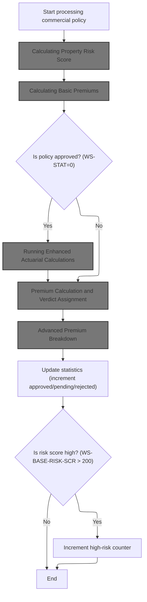
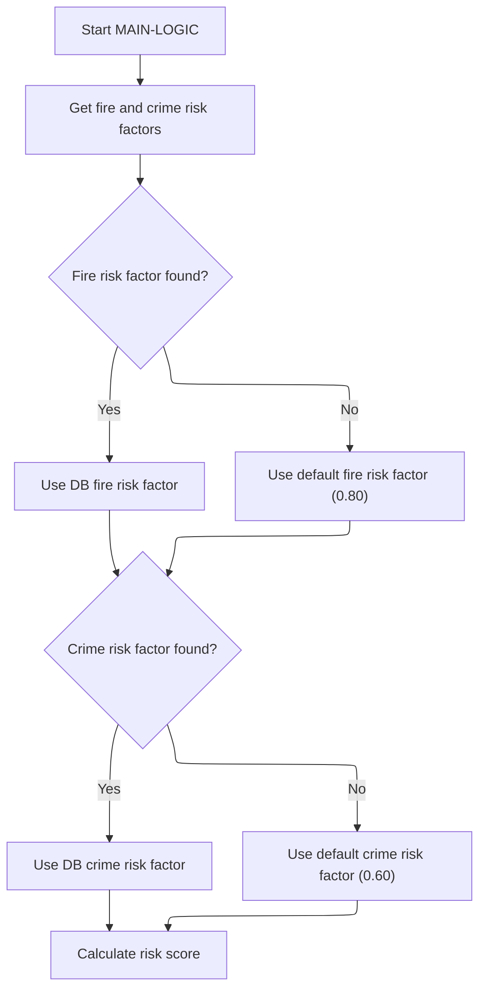
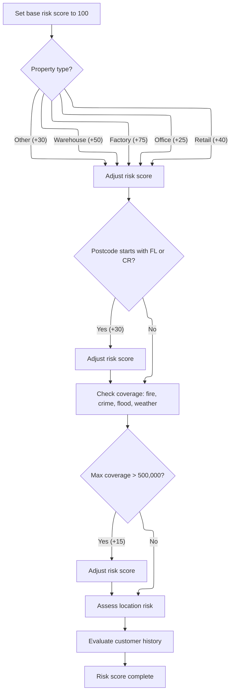
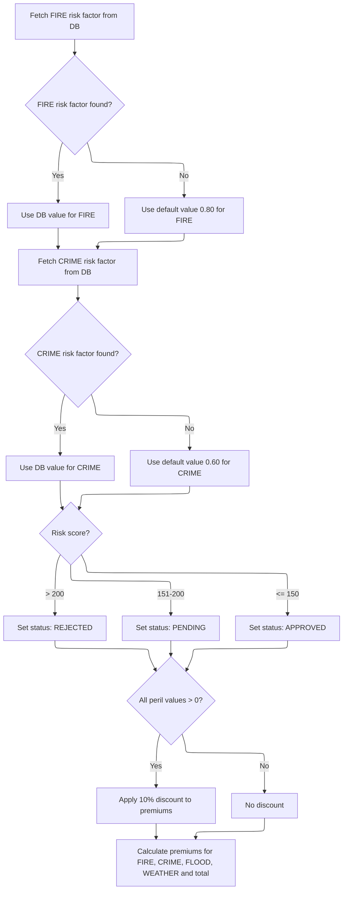
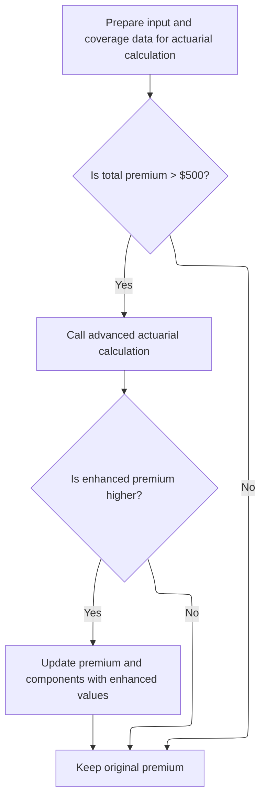
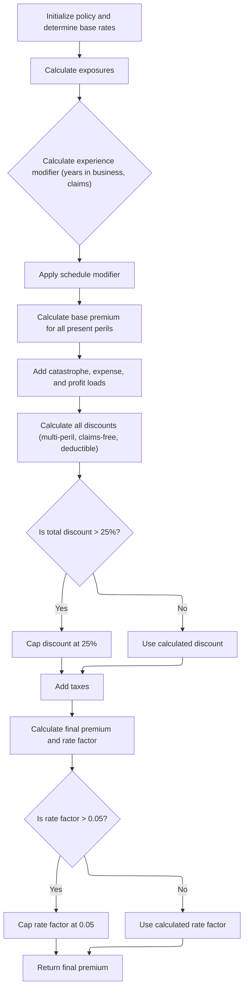
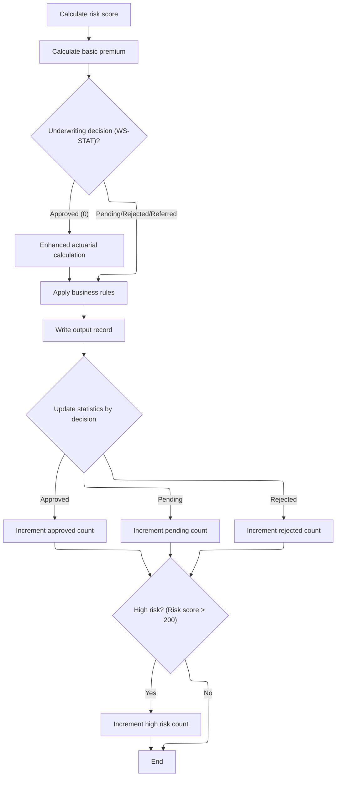
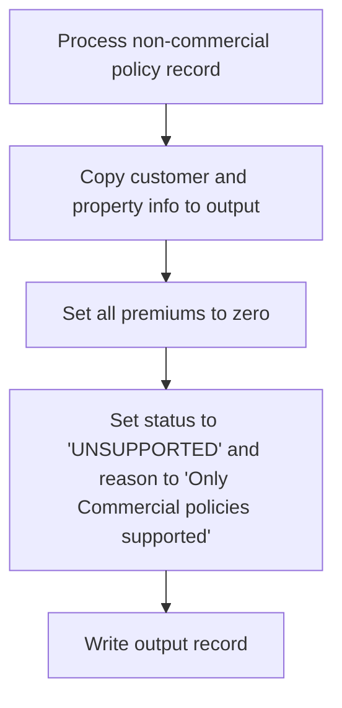

This document describes how insurance policy records are processed to determine risk, calculate premiums, and assign an underwriting decision. Commercial policies undergo risk and premium calculations, while non-commercial records are marked as unsupported. The process receives a policy record as input and produces an output record with risk, premium, and decision details.

# Spec

## Detailed View of the Program's Functionality

## Program Initialization and Configuration

At startup, the main program begins by displaying startup messages and initializing all counters and working areas. It then attempts to load configuration values from a configuration file. If the file is unavailable, default values are used for key parameters such as the maximum risk score and minimum premium. After configuration, all necessary files (input, output, summary) are opened, and headers are written to the output file to label the columns.

## Input Record Processing Loop

The program enters a loop to read each record from the input file. For every record, it increments the record count and validates the input fields. Validation checks include ensuring the policy type is recognized, the customer number is present, at least one coverage limit is provided, and total coverage does not exceed the maximum allowed. If any validation fails, an error record is written to the output with zeroed premiums and a relevant error message.

If the record passes validation, the program checks whether it is a commercial policy. If so, it proceeds with commercial policy processing; otherwise, it handles the record as a non-commercial policy.

## Commercial Policy Processing

### Risk Score Calculation

For commercial policies, the program first calculates the risk score by calling a dedicated risk scoring module. This module fetches fire and crime risk factors from the database, defaulting to preset values if not found. The risk score is initialized to a base value and incremented based on property type, postcode prefix, coverage amounts, location (using latitude and longitude), and customer history. Each factor adds or subtracts a fixed amount to the score, with additional logic for urban, suburban, or rural locations and customer risk profiles.

### Basic Premium Calculation

Next, the program calls a premium calculation module, passing the risk score and peril selections. This module fetches risk factors for fire and crime, determines the underwriting verdict based on risk score thresholds (approved, pending, or rejected), and calculates premiums for each peril (fire, crime, flood, weather). If all perils are present, a discount is applied to the premiums. The total premium is the sum of all individual peril premiums.

### Enhanced Actuarial Calculations

If the underwriting verdict is approved and the total premium exceeds the minimum threshold, the program prepares detailed input and coverage data and calls an advanced actuarial calculation module. This module performs a series of calculations:

- Initializes exposures based on coverage limits and risk score.
- Loads base rates for each peril from the database or uses defaults.
- Calculates an experience modifier using years in business and claims history, applying caps to keep the modifier within bounds.
- Applies schedule modifiers based on building age, protection class, occupancy hazard, and exposure density.
- Calculates base premiums for each peril using exposures, rates, modifiers, and trend factors, with special multipliers for crime and flood.
- Adds catastrophe, expense, and profit loadings.
- Calculates discounts for multi-peril selection, claims-free history, and high deductibles, capping the total discount at 25%.
- Adds taxes to the premium.
- Calculates the final premium and rate factor, capping the rate factor if it exceeds a set maximum.

If the enhanced premium is higher than the original, the program updates the premium and its components with the enhanced values.

### Business Rules Application

After premium calculations, the program applies business rules to determine the final underwriting decision. If the risk score exceeds the maximum allowed, the policy is rejected. If the premium is below the minimum, or the risk score is high, the policy is marked as pending for review. Otherwise, it is approved.

### Output and Statistics Update

The program writes the processed record to the output file, including all calculated fields and the underwriting decision. It then updates statistics, incrementing counters for approved, pending, or rejected policies, adding up total premiums and risk scores, and flagging high-risk cases if the score exceeds a threshold.

## Non-Commercial Policy Handling

For non-commercial policies, the program copies basic customer and property information to the output, sets all premium fields to zero, and marks the record as unsupported with a fixed rejection reason. Only commercial policies are processed for premium calculations in this version.

## Finalization and Summary Generation

After all records are processed, the program closes all files. It generates a summary file with totals for records processed, approved, pending, and rejected policies, total premium amount, and average risk score if applicable. Finally, it displays processing statistics to the console, including counts for all categories and the total premium generated. If any records were processed, the average risk score is also displayed.

# Rule Definition

| Paragraph Name                            | Rule ID | Category          | Description                                                                                                                                                                                                                       | Conditions                                                                                                                                                       | Remarks                                                                                                                                                                                                                                                                                                                                                   |
| ----------------------------------------- | ------- | ----------------- | --------------------------------------------------------------------------------------------------------------------------------------------------------------------------------------------------------------------------------- | ---------------------------------------------------------------------------------------------------------------------------------------------------------------- | --------------------------------------------------------------------------------------------------------------------------------------------------------------------------------------------------------------------------------------------------------------------------------------------------------------------------------------------------------- |
| P008-VALIDATE-INPUT-RECORD                | RL-001  | Conditional Logic | Only commercial, personal, or farm policies are accepted. Any other policy type is flagged as an error.                                                                                                                           | The input policy type must match one of the accepted types (commercial, personal, farm).                                                                         | If the policy type is not recognized, an error is logged with code 'POL001'. The output record for errors includes the customer number, property type, postcode, zeroed premiums, status 'ERROR', and the first error message.                                                                                                                            |
| P008-VALIDATE-INPUT-RECORD                | RL-002  | Conditional Logic | Customer number must be present in the input record.                                                                                                                                                                              | The customer number field must not be blank.                                                                                                                     | If missing, error code 'CUS001' is logged. Output record for errors is formatted as above.                                                                                                                                                                                                                                                                |
| P008-VALIDATE-INPUT-RECORD                | RL-003  | Conditional Logic | Either building or contents coverage limit must be greater than zero.                                                                                                                                                             | IN-BUILDING-LIMIT and IN-CONTENTS-LIMIT must not both be zero.                                                                                                   | If both are zero, error code 'COV001' is logged.                                                                                                                                                                                                                                                                                                          |
| LGAPDB02 MAIN-LOGIC, CALCULATE-RISK-SCORE | RL-004  | Computation       | Risk score is calculated based on property type, postcode, coverage amounts, location, and customer history.                                                                                                                      | Always performed for commercial policies.                                                                                                                        | Base risk score starts at 100. Adjustments are made for property type (e.g., +75 for FACTORY), postcode prefix (e.g., +30 for 'FL' or 'CR'), coverage over 500,000 (+15), location (urban, suburban, rural), and customer history ('N', 'G', 'R').                                                                                                        |
| LGAPDB03 CALCULATE-PREMIUMS               | RL-005  | Computation       | Premiums for each peril are calculated using risk score, peril factors, and a discount factor. Total premium is the sum of all peril premiums.                                                                                    | Performed for valid commercial policies.                                                                                                                         | Peril factors: Fire 0.80, Crime 0.60, Flood 1.20, Weather 0.90. Discount factor is 0.90 if all perils selected, otherwise 1.00. Premiums are numeric with two decimals.                                                                                                                                                                                   |
| P015-GENERATE-SUMMARY, P016-DISPLAY-STATS | RL-006  | Computation       | At the end of processing, a summary record is generated with counts of processed, approved, pending, rejected, error, and high-risk records, as well as total and average premium.                                                | Performed after all records are processed.                                                                                                                       | Summary file record is 132 alphanumeric characters. Includes processing date, counts, and monetary totals.                                                                                                                                                                                                                                                |
| P008-VALIDATE-INPUT-RECORD                | RL-007  | Conditional Logic | The sum of building, contents, and business interruption coverage limits must not exceed the maximum allowed Total Insured Value (TIV).                                                                                           | The sum of the building coverage limit, contents coverage limit, and business interruption coverage limit must be less than or equal to the maximum allowed TIV. | The default maximum allowed TIV is 50,000,000.00. If the sum exceeds this value, a warning is logged with code 'COV002'.                                                                                                                                                                                                                                  |
| LGAPDB04 P100-MAIN and subroutines        | RL-008  | Computation       | Advanced actuarial premium calculation includes base premium, catastrophe loading, expense and profit loading, discounts, and taxes. This calculation is performed only if the basic premium exceeds the minimum allowed premium. | This rule applies only if the calculated basic premium is greater than the minimum allowed premium.                                                              | Expense ratio: 0.350, Profit margin: 0.150, Base loss ratio: 0.600, Trend factor: 1.0350, Credibility factor: 0.750. Catastrophe factors: hurricane 0.0125, earthquake 0.0080, tornado 0.0045, flood 0.0090. Multi-peril discount up to 0.10, claims-free discount 0.075, deductible credits up to 0.105, total discount capped at 0.25. Tax rate: 6.75%. |
| P011D-APPLY-BUSINESS-RULES                | RL-009  | Conditional Logic | A policy is approved, marked as pending, or rejected based on the calculated risk score and premium thresholds.                                                                                                                   | This rule is evaluated after premium calculation for each policy.                                                                                                | The default maximum risk score is 250. The default minimum premium is 500.00. If the risk score exceeds the maximum, the policy is rejected. If the total premium is below the minimum, the policy is marked as pending. If the risk score is above 180, the policy is also marked as pending. Otherwise, the policy is approved.                         |

# User Stories

## User Story 1: Validate, process, and summarize policy records

---

### Story Description:

As a system, I want to validate incoming policy records for required fields, accepted policy types, minimum coverage, and maximum insured value, and generate a summary record with counts and monetary totals after processing, so that only valid records proceed and stakeholders can review processing outcomes and key metrics.

---

### Business Rule Mapping:

| Rule ID | Paragraph Name                            | Rule Description                                                                                                                                                                   |
| ------- | ----------------------------------------- | ---------------------------------------------------------------------------------------------------------------------------------------------------------------------------------- |
| RL-001  | P008-VALIDATE-INPUT-RECORD                | Only commercial, personal, or farm policies are accepted. Any other policy type is flagged as an error.                                                                            |
| RL-002  | P008-VALIDATE-INPUT-RECORD                | Customer number must be present in the input record.                                                                                                                               |
| RL-003  | P008-VALIDATE-INPUT-RECORD                | Either building or contents coverage limit must be greater than zero.                                                                                                              |
| RL-007  | P008-VALIDATE-INPUT-RECORD                | The sum of building, contents, and business interruption coverage limits must not exceed the maximum allowed Total Insured Value (TIV).                                            |
| RL-006  | P015-GENERATE-SUMMARY, P016-DISPLAY-STATS | At the end of processing, a summary record is generated with counts of processed, approved, pending, rejected, error, and high-risk records, as well as total and average premium. |

---

### Relevant Functionality:

- **P008-VALIDATE-INPUT-RECORD**
  1. **RL-001:**
     - If policy type is not commercial, personal, or farm:
       - Log error with code 'POL001', severity 'F', field 'IN-POLICY-TYPE', message 'Invalid Policy Type'.
       - On error, write output record with error details.
  2. **RL-002:**
     - If customer number is blank:
       - Log error with code 'CUS001', severity 'F', field 'IN-CUSTOMER-NUM', message 'Customer Number Required'.
  3. **RL-003:**
     - If both building and contents limits are zero:
       - Log error with code 'COV001', severity 'F', field 'COVERAGE-LIMITS', message 'At least one coverage limit required'.
  4. **RL-007:**
     - If the sum of building, contents, and business interruption coverage limits exceeds the maximum allowed TIV:
       - Log a warning with code 'COV002', severity 'W', field 'COVERAGE-LIMITS', message 'Total coverage exceeds maximum TIV'.
- **P015-GENERATE-SUMMARY**
  1. **RL-006:**
     - Write summary records with labels and values for:
       - Processing date
       - Total records processed
       - Policies approved, pending, rejected
       - Total premium amount
       - Average risk score (if any processed)
     - Display similar statistics to console.

## User Story 2: Calculate risk score, premiums, and determine policy status

---

### Story Description:

As a system, I want to calculate the risk score and premiums for valid commercial policies using property, location, coverage, and customer history data, apply advanced actuarial calculations when applicable, and approve, pend, or reject policies based on calculated risk scores and premium thresholds, so that accurate premiums and risk assessments are produced and only acceptable risks are approved.

---

### Business Rule Mapping:

| Rule ID | Paragraph Name                            | Rule Description                                                                                                                                                                                                                  |
| ------- | ----------------------------------------- | --------------------------------------------------------------------------------------------------------------------------------------------------------------------------------------------------------------------------------- |
| RL-004  | LGAPDB02 MAIN-LOGIC, CALCULATE-RISK-SCORE | Risk score is calculated based on property type, postcode, coverage amounts, location, and customer history.                                                                                                                      |
| RL-005  | LGAPDB03 CALCULATE-PREMIUMS               | Premiums for each peril are calculated using risk score, peril factors, and a discount factor. Total premium is the sum of all peril premiums.                                                                                    |
| RL-008  | LGAPDB04 P100-MAIN and subroutines        | Advanced actuarial premium calculation includes base premium, catastrophe loading, expense and profit loading, discounts, and taxes. This calculation is performed only if the basic premium exceeds the minimum allowed premium. |
| RL-009  | P011D-APPLY-BUSINESS-RULES                | A policy is approved, marked as pending, or rejected based on the calculated risk score and premium thresholds.                                                                                                                   |

---

### Relevant Functionality:

- **LGAPDB02 MAIN-LOGIC**
  1. **RL-004:**
     - Start with risk score 100.
     - Adjust by property type (+75 for FACTORY, etc.).
     - If postcode starts with 'FL' or 'CR', add 30.
     - If any coverage > 500,000, add 15.
     - Adjust for location (NYC/LA +10, suburban +5, rural +20).
     - Adjust for customer history (e.g., 'N' +10, 'G' -5, 'R' +25).
- **LGAPDB03 CALCULATE-PREMIUMS**
  1. **RL-005:**
     - Set discount factor to 0.90 if all perils selected, else 1.00.
     - For each peril:
       - Compute premium = (risk score \* peril factor) \* peril amount \* discount factor.
     - Total premium = sum of all peril premiums.
- **LGAPDB04 P100-MAIN and subroutines**
  1. **RL-008:**
     - Compute exposures (building, contents, business interruption) adjusted by risk score.
     - Lookup base rates for each peril.
     - Compute peril premiums using exposures, rates, experience and schedule modifiers, and trend factor.
     - Add catastrophe loadings for relevant perils.
     - Add expense and profit loadings.
     - Apply discounts (multi-peril, claims-free, deductible credits, capped at 0.25).
     - Add taxes (6.75%).
     - Cap the final rate factor at 0.05 if exceeded.
- **P011D-APPLY-BUSINESS-RULES**
  1. **RL-009:**
     - If the risk score is greater than the maximum allowed risk score:
       - Set status to REJECTED, reason 'Risk score exceeds maximum acceptable level'.
     - Else if the total premium is less than the minimum allowed premium:
       - Set status to PENDING, reason 'Premium below minimum - requires review'.
     - Else if the risk score is greater than 180:
       - Set status to PENDING, reason 'High risk - underwriter review required'.
     - Else:
       - Set status to APPROVED.

# Code Walkthrough

## Starting Record Processing

<SwmSnippet path="/base/src/LGAPDB01.cbl" line="234">

---

`P009-PROCESS-VALID-RECORD` starts the flow by checking if the input record is a commercial policy. If it is, we call P011-PROCESS-COMMERCIAL to run the risk and premium calculations for commercial policies. If not, we handle it as a non-commercial record. The call to P011-PROCESS-COMMERCIAL is needed because that's where all the actual insurance logic happens for commercial records.

```cobol
       P009-PROCESS-VALID-RECORD.
           IF COMMERCIAL-POLICY
               PERFORM P011-PROCESS-COMMERCIAL
               ADD 1 TO WS-PROC-CNT
           ELSE
               PERFORM P012-PROCESS-NON-COMMERCIAL
               ADD 1 TO WS-ERR-CNT
           END-IF.
```

---

</SwmSnippet>

### Processing Commercial Policies



<SwmSnippet path="/base/src/LGAPDB01.cbl" line="258">

---

In `P011-PROCESS-COMMERCIAL`, we kick off by calculating the risk score with P011A-CALCULATE-RISK-SCORE. This is needed because all premium calculations and business logic downstream depend on the risk score value.

```cobol
       P011-PROCESS-COMMERCIAL.
           PERFORM P011A-CALCULATE-RISK-SCORE
           PERFORM P011B-BASIC-PREMIUM-CALC
           IF WS-STAT = 0
               PERFORM P011C-ENHANCED-ACTUARIAL-CALC
           END-IF
           PERFORM P011D-APPLY-BUSINESS-RULES
           PERFORM P011E-WRITE-OUTPUT-RECORD
           PERFORM P011F-UPDATE-STATISTICS.
```

---

</SwmSnippet>

#### Calculating Property Risk Score

<SwmSnippet path="/base/src/LGAPDB01.cbl" line="268">

---

`P011A-CALCULATE-RISK-SCORE` calls LGAPDB02 to compute the risk score using property and customer data. This call is needed because LGAPDB02 encapsulates all the logic for risk scoring, so we don't duplicate it here.

```cobol
       P011A-CALCULATE-RISK-SCORE.
           CALL 'LGAPDB02' USING IN-PROPERTY-TYPE, IN-POSTCODE, 
                                IN-LATITUDE, IN-LONGITUDE,
                                IN-BUILDING-LIMIT, IN-CONTENTS-LIMIT,
                                IN-FLOOD-COVERAGE, IN-WEATHER-COVERAGE,
                                IN-CUSTOMER-HISTORY, WS-BASE-RISK-SCR.
```

---

</SwmSnippet>

#### Fetching Risk Factors and Starting Risk Calculation



<SwmSnippet path="/base/src/LGAPDB02.cbl" line="39">

---

`MAIN-LOGIC` first fetches risk factors (fire and crime) from the database, defaulting to hardcoded values if not found. Then it runs the risk score calculation. This separation makes sure we always have valid factors for the calculation, even if the database is missing data.

```cobol
       MAIN-LOGIC.
           PERFORM GET-RISK-FACTORS
           PERFORM CALCULATE-RISK-SCORE
           GOBACK.
```

---

</SwmSnippet>

<SwmSnippet path="/base/src/LGAPDB02.cbl" line="44">

---

`GET-RISK-FACTORS` grabs risk factors from the DB, but if it can't, it just uses 0.80 for fire and 0.60 for crime, no questions asked.

```cobol
       GET-RISK-FACTORS.
           EXEC SQL
               SELECT FACTOR_VALUE INTO :WS-FIRE-FACTOR
               FROM RISK_FACTORS
               WHERE PERIL_TYPE = 'FIRE'
           END-EXEC.
           
           IF SQLCODE = 0
               CONTINUE
           ELSE
               MOVE 0.80 TO WS-FIRE-FACTOR
           END-IF.
           
           EXEC SQL
               SELECT FACTOR_VALUE INTO :WS-CRIME-FACTOR
               FROM RISK_FACTORS
               WHERE PERIL_TYPE = 'CRIME'
           END-EXEC.
           
           IF SQLCODE = 0
               CONTINUE
           ELSE
               MOVE 0.60 TO WS-CRIME-FACTOR
           END-IF.
```

---

</SwmSnippet>

#### Calculating and Adjusting Risk Score



<SwmSnippet path="/base/src/LGAPDB02.cbl" line="69">

---

`CALCULATE-RISK-SCORE` sets up the risk score based on property type and postcode prefix, using fixed increments. Then it refines the score by calling procedures for coverage amounts, location risk, and customer history. The logic assumes valid strings for property type and postcode, but doesn't check them.

```cobol
       CALCULATE-RISK-SCORE.
           MOVE 100 TO LK-RISK-SCORE

           EVALUATE LK-PROPERTY-TYPE
             WHEN 'WAREHOUSE'
               ADD 50 TO LK-RISK-SCORE
             WHEN 'FACTORY' 
               ADD 75 TO LK-RISK-SCORE
             WHEN 'OFFICE'
               ADD 25 TO LK-RISK-SCORE
             WHEN 'RETAIL'
               ADD 40 TO LK-RISK-SCORE
             WHEN OTHER
               ADD 30 TO LK-RISK-SCORE
           END-EVALUATE

           IF LK-POSTCODE(1:2) = 'FL' OR
              LK-POSTCODE(1:2) = 'CR'
             ADD 30 TO LK-RISK-SCORE
           END-IF

           PERFORM CHECK-COVERAGE-AMOUNTS
           PERFORM ASSESS-LOCATION-RISK  
           PERFORM EVALUATE-CUSTOMER-HISTORY.
```

---

</SwmSnippet>

<SwmSnippet path="/base/src/LGAPDB02.cbl" line="94">

---

`CHECK-COVERAGE-AMOUNTS` finds the highest coverage among fire, crime, flood, and weather. If any coverage is over $500K, it adds 15 to the risk score. The $500K threshold and the +15 bump are hardcoded and not explained.

```cobol
       CHECK-COVERAGE-AMOUNTS.
           MOVE ZERO TO WS-MAX-COVERAGE
           
           IF LK-FIRE-COVERAGE > WS-MAX-COVERAGE
               MOVE LK-FIRE-COVERAGE TO WS-MAX-COVERAGE
           END-IF
           
           IF LK-CRIME-COVERAGE > WS-MAX-COVERAGE
               MOVE LK-CRIME-COVERAGE TO WS-MAX-COVERAGE
           END-IF
           
           IF LK-FLOOD-COVERAGE > WS-MAX-COVERAGE
               MOVE LK-FLOOD-COVERAGE TO WS-MAX-COVERAGE
           END-IF
           
           IF LK-WEATHER-COVERAGE > WS-MAX-COVERAGE
               MOVE LK-WEATHER-COVERAGE TO WS-MAX-COVERAGE
           END-IF
           
           IF WS-MAX-COVERAGE > WS-COVERAGE-500K
               ADD 15 TO LK-RISK-SCORE
           END-IF.
```

---

</SwmSnippet>

#### Calculating Basic Premiums

<SwmSnippet path="/base/src/LGAPDB01.cbl" line="275">

---

`P011B-BASIC-PREMIUM-CALC` calls LGAPDB03 to run the premium and verdict calculations using the risk score and peril values. This keeps the premium logic out of the main flow and makes it reusable.

```cobol
       P011B-BASIC-PREMIUM-CALC.
           CALL 'LGAPDB03' USING WS-BASE-RISK-SCR, IN-FIRE-PERIL, 
                                IN-CRIME-PERIL, IN-FLOOD-PERIL, 
                                IN-WEATHER-PERIL, WS-STAT,
                                WS-STAT-DESC, WS-REJ-RSN, WS-FR-PREM,
                                WS-CR-PREM, WS-FL-PREM, WS-WE-PREM,
                                WS-TOT-PREM, WS-DISC-FACT.
```

---

</SwmSnippet>

#### Premium Calculation and Verdict Assignment



<SwmSnippet path="/base/src/LGAPDB03.cbl" line="42">

---

`MAIN-LOGIC` in LGAPDB03 fetches risk factors, decides the verdict based on risk score, and calculates premiums for each peril. The verdict logic is tied directly to the risk score thresholds.

```cobol
       MAIN-LOGIC.
           PERFORM GET-RISK-FACTORS
           PERFORM CALCULATE-VERDICT
           PERFORM CALCULATE-PREMIUMS
           GOBACK.
```

---

</SwmSnippet>

<SwmSnippet path="/base/src/LGAPDB03.cbl" line="48">

---

`GET-RISK-FACTORS` in LGAPDB03 fetches fire and crime risk factors from the DB, falling back to 0.80 and 0.60 if the query fails. These defaults are baked in and not explained.

```cobol
       GET-RISK-FACTORS.
           EXEC SQL
               SELECT FACTOR_VALUE INTO :WS-FIRE-FACTOR
               FROM RISK_FACTORS
               WHERE PERIL_TYPE = 'FIRE'
           END-EXEC.
           
           IF SQLCODE = 0
               CONTINUE
           ELSE
               MOVE 0.80 TO WS-FIRE-FACTOR
           END-IF.
           
           EXEC SQL
               SELECT FACTOR_VALUE INTO :WS-CRIME-FACTOR
               FROM RISK_FACTORS
               WHERE PERIL_TYPE = 'CRIME'
           END-EXEC.
           
           IF SQLCODE = 0
               CONTINUE
           ELSE
               MOVE 0.60 TO WS-CRIME-FACTOR
           END-IF.
```

---

</SwmSnippet>

<SwmSnippet path="/base/src/LGAPDB03.cbl" line="73">

---

`CALCULATE-VERDICT` sets the status and rejection reason based on risk score thresholds: >200 is rejected, >150 is pending, else approved. The thresholds are hardcoded and not explained.

```cobol
       CALCULATE-VERDICT.
           IF LK-RISK-SCORE > 200
             MOVE 2 TO LK-STAT
             MOVE 'REJECTED' TO LK-STAT-DESC
             MOVE 'High Risk Score - Manual Review Required' 
               TO LK-REJ-RSN
           ELSE
             IF LK-RISK-SCORE > 150
               MOVE 1 TO LK-STAT
               MOVE 'PENDING' TO LK-STAT-DESC
               MOVE 'Medium Risk - Pending Review'
                 TO LK-REJ-RSN
             ELSE
               MOVE 0 TO LK-STAT
               MOVE 'APPROVED' TO LK-STAT-DESC
               MOVE SPACES TO LK-REJ-RSN
             END-IF
           END-IF.
```

---

</SwmSnippet>

<SwmSnippet path="/base/src/LGAPDB03.cbl" line="92">

---

`CALCULATE-PREMIUMS` sets a discount factor (10% off) if all perils are present, then calculates premiums for each peril using risk score, peril factor, and peril value. The total premium is just the sum of all individual premiums.

```cobol
       CALCULATE-PREMIUMS.
           MOVE 1.00 TO LK-DISC-FACT
           
           IF LK-FIRE-PERIL > 0 AND
              LK-CRIME-PERIL > 0 AND
              LK-FLOOD-PERIL > 0 AND
              LK-WEATHER-PERIL > 0
             MOVE 0.90 TO LK-DISC-FACT
           END-IF

           COMPUTE LK-FIRE-PREMIUM =
             ((LK-RISK-SCORE * WS-FIRE-FACTOR) * LK-FIRE-PERIL *
               LK-DISC-FACT)
           
           COMPUTE LK-CRIME-PREMIUM =
             ((LK-RISK-SCORE * WS-CRIME-FACTOR) * LK-CRIME-PERIL *
               LK-DISC-FACT)
           
           COMPUTE LK-FLOOD-PREMIUM =
             ((LK-RISK-SCORE * WS-FLOOD-FACTOR) * LK-FLOOD-PERIL *
               LK-DISC-FACT)
           
           COMPUTE LK-WEATHER-PREMIUM =
             ((LK-RISK-SCORE * WS-WEATHER-FACTOR) * LK-WEATHER-PERIL *
               LK-DISC-FACT)

           COMPUTE LK-TOTAL-PREMIUM = 
             LK-FIRE-PREMIUM + LK-CRIME-PREMIUM + 
             LK-FLOOD-PREMIUM + LK-WEATHER-PREMIUM. 
```

---

</SwmSnippet>

#### Running Enhanced Actuarial Calculations



<SwmSnippet path="/base/src/LGAPDB01.cbl" line="283">

---

`P011C-ENHANCED-ACTUARIAL-CALC` sets up all the input data for advanced actuarial calculations and calls LGAPDB04 if the basic premium is above the minimum. LGAPDB04 does the heavy lifting for advanced premium breakdowns.

```cobol
       P011C-ENHANCED-ACTUARIAL-CALC.
      *    Prepare input structure for actuarial calculation
           MOVE IN-CUSTOMER-NUM TO LK-CUSTOMER-NUM
           MOVE WS-BASE-RISK-SCR TO LK-RISK-SCORE
           MOVE IN-PROPERTY-TYPE TO LK-PROPERTY-TYPE
           MOVE IN-TERRITORY-CODE TO LK-TERRITORY
           MOVE IN-CONSTRUCTION-TYPE TO LK-CONSTRUCTION-TYPE
           MOVE IN-OCCUPANCY-CODE TO LK-OCCUPANCY-CODE
           MOVE IN-SPRINKLER-IND TO LK-PROTECTION-CLASS
           MOVE IN-YEAR-BUILT TO LK-YEAR-BUILT
           MOVE IN-SQUARE-FOOTAGE TO LK-SQUARE-FOOTAGE
           MOVE IN-YEARS-IN-BUSINESS TO LK-YEARS-IN-BUSINESS
           MOVE IN-CLAIMS-COUNT-3YR TO LK-CLAIMS-COUNT-5YR
           MOVE IN-CLAIMS-AMOUNT-3YR TO LK-CLAIMS-AMOUNT-5YR
           
      *    Set coverage data
           MOVE IN-BUILDING-LIMIT TO LK-BUILDING-LIMIT
           MOVE IN-CONTENTS-LIMIT TO LK-CONTENTS-LIMIT
           MOVE IN-BI-LIMIT TO LK-BI-LIMIT
           MOVE IN-FIRE-DEDUCTIBLE TO LK-FIRE-DEDUCTIBLE
           MOVE IN-WIND-DEDUCTIBLE TO LK-WIND-DEDUCTIBLE
           MOVE IN-FLOOD-DEDUCTIBLE TO LK-FLOOD-DEDUCTIBLE
           MOVE IN-OTHER-DEDUCTIBLE TO LK-OTHER-DEDUCTIBLE
           MOVE IN-FIRE-PERIL TO LK-FIRE-PERIL
           MOVE IN-CRIME-PERIL TO LK-CRIME-PERIL
           MOVE IN-FLOOD-PERIL TO LK-FLOOD-PERIL
           MOVE IN-WEATHER-PERIL TO LK-WEATHER-PERIL
           
      *    Call advanced actuarial calculation program (only for approved cases)
           IF WS-TOT-PREM > WS-MIN-PREMIUM
               CALL 'LGAPDB04' USING LK-INPUT-DATA, LK-COVERAGE-DATA, 
                                    LK-OUTPUT-RESULTS
               
      *        Update with enhanced calculations if successful
               IF LK-TOTAL-PREMIUM > WS-TOT-PREM
                   MOVE LK-FIRE-PREMIUM TO WS-FR-PREM
                   MOVE LK-CRIME-PREMIUM TO WS-CR-PREM
                   MOVE LK-FLOOD-PREMIUM TO WS-FL-PREM
                   MOVE LK-WEATHER-PREMIUM TO WS-WE-PREM
                   MOVE LK-TOTAL-PREMIUM TO WS-TOT-PREM
                   MOVE LK-EXPERIENCE-MOD TO WS-EXPERIENCE-MOD
               END-IF
           END-IF.
```

---

</SwmSnippet>

#### Advanced Premium Breakdown



<SwmSnippet path="/base/src/LGAPDB04.cbl" line="138">

---

`P100-MAIN` runs through all the advanced premium calculation steps: exposures, rates, modifiers, loadings, discounts, taxes, and final premium. Each step adds a piece to the total premium, so you get a full breakdown.

```cobol
       P100-MAIN.
           PERFORM P200-INIT
           PERFORM P300-RATES
           PERFORM P350-EXPOSURE
           PERFORM P400-EXP-MOD
           PERFORM P500-SCHED-MOD
           PERFORM P600-BASE-PREM
           PERFORM P700-CAT-LOAD
           PERFORM P800-EXPENSE
           PERFORM P900-DISC
           PERFORM P950-TAXES
           PERFORM P999-FINAL
           GOBACK.
```

---

</SwmSnippet>

<SwmSnippet path="/base/src/LGAPDB04.cbl" line="234">

---

`P400-EXP-MOD` calculates the experience modifier using years in business and claims history. It uses fixed constants for baseline, bounds, and scaling, and applies caps to keep the modifier in range. The logic assumes all inputs are valid and non-zero.

```cobol
       P400-EXP-MOD.
           MOVE 1.0000 TO WS-EXPERIENCE-MOD
           
           IF LK-YEARS-IN-BUSINESS >= 5
               IF LK-CLAIMS-COUNT-5YR = ZERO
                   MOVE 0.8500 TO WS-EXPERIENCE-MOD
               ELSE
                   COMPUTE WS-EXPERIENCE-MOD = 
                       1.0000 + 
                       ((LK-CLAIMS-AMOUNT-5YR / WS-TOTAL-INSURED-VAL) * 
                        WS-CREDIBILITY-FACTOR * 0.50)
                   
                   IF WS-EXPERIENCE-MOD > 2.0000
                       MOVE 2.0000 TO WS-EXPERIENCE-MOD
                   END-IF
                   
                   IF WS-EXPERIENCE-MOD < 0.5000
                       MOVE 0.5000 TO WS-EXPERIENCE-MOD
                   END-IF
               END-IF
           ELSE
               MOVE 1.1000 TO WS-EXPERIENCE-MOD
           END-IF
           
           MOVE WS-EXPERIENCE-MOD TO LK-EXPERIENCE-MOD.
```

---

</SwmSnippet>

<SwmSnippet path="/base/src/LGAPDB04.cbl" line="318">

---

`P600-BASE-PREM` calculates base premiums for each peril using exposures, base rates, experience and schedule modifiers, and trend factor. Crime and flood get special multipliers (0.80 and 1.25). Only selected perils are included, and everything is summed up for the base amount.

```cobol
       P600-BASE-PREM.
           MOVE ZERO TO LK-BASE-AMOUNT
           
      * FIRE PREMIUM
           IF LK-FIRE-PERIL > ZERO
               COMPUTE LK-FIRE-PREMIUM = 
                   (WS-BUILDING-EXPOSURE + WS-CONTENTS-EXPOSURE) *
                   WS-BASE-RATE (1, 1, 1, 1) * 
                   WS-EXPERIENCE-MOD *
                   (1 + WS-SCHEDULE-MOD) *
                   WS-TREND-FACTOR
                   
               ADD LK-FIRE-PREMIUM TO LK-BASE-AMOUNT
           END-IF
           
      * CRIME PREMIUM
           IF LK-CRIME-PERIL > ZERO
               COMPUTE LK-CRIME-PREMIUM = 
                   (WS-CONTENTS-EXPOSURE * 0.80) *
                   WS-BASE-RATE (2, 1, 1, 1) * 
                   WS-EXPERIENCE-MOD *
                   (1 + WS-SCHEDULE-MOD) *
                   WS-TREND-FACTOR
                   
               ADD LK-CRIME-PREMIUM TO LK-BASE-AMOUNT
           END-IF
           
      * FLOOD PREMIUM
           IF LK-FLOOD-PERIL > ZERO
               COMPUTE LK-FLOOD-PREMIUM = 
                   WS-BUILDING-EXPOSURE *
                   WS-BASE-RATE (3, 1, 1, 1) * 
                   WS-EXPERIENCE-MOD *
                   (1 + WS-SCHEDULE-MOD) *
                   WS-TREND-FACTOR * 1.25
                   
               ADD LK-FLOOD-PREMIUM TO LK-BASE-AMOUNT
           END-IF
           
      * WEATHER PREMIUM
           IF LK-WEATHER-PERIL > ZERO
               COMPUTE LK-WEATHER-PREMIUM = 
                   (WS-BUILDING-EXPOSURE + WS-CONTENTS-EXPOSURE) *
                   WS-BASE-RATE (4, 1, 1, 1) * 
                   WS-EXPERIENCE-MOD *
                   (1 + WS-SCHEDULE-MOD) *
                   WS-TREND-FACTOR
                   
               ADD LK-WEATHER-PREMIUM TO LK-BASE-AMOUNT
           END-IF.
```

---

</SwmSnippet>

<SwmSnippet path="/base/src/LGAPDB04.cbl" line="407">

---

`P900-DISC` calculates discounts based on peril combinations, claims history, and deductible amounts. It adds up all discounts, caps the total at 25%, and applies it to the premium components. The discount rates and caps are hardcoded.

```cobol
       P900-DISC.
           MOVE ZERO TO WS-TOTAL-DISCOUNT
           
      * Multi-peril discount
           MOVE ZERO TO WS-MULTI-PERIL-DISC
           IF LK-FIRE-PERIL > ZERO AND
              LK-CRIME-PERIL > ZERO AND
              LK-FLOOD-PERIL > ZERO AND
              LK-WEATHER-PERIL > ZERO
               MOVE 0.100 TO WS-MULTI-PERIL-DISC
           ELSE
               IF LK-FIRE-PERIL > ZERO AND
                  LK-WEATHER-PERIL > ZERO AND
                  (LK-CRIME-PERIL > ZERO OR LK-FLOOD-PERIL > ZERO)
                   MOVE 0.050 TO WS-MULTI-PERIL-DISC
               END-IF
           END-IF
           
      * Claims-free discount  
           MOVE ZERO TO WS-CLAIMS-FREE-DISC
           IF LK-CLAIMS-COUNT-5YR = ZERO AND LK-YEARS-IN-BUSINESS >= 5
               MOVE 0.075 TO WS-CLAIMS-FREE-DISC
           END-IF
           
      * Deductible credit
           MOVE ZERO TO WS-DEDUCTIBLE-CREDIT
           IF LK-FIRE-DEDUCTIBLE >= 10000
               ADD 0.025 TO WS-DEDUCTIBLE-CREDIT
           END-IF
           IF LK-WIND-DEDUCTIBLE >= 25000  
               ADD 0.035 TO WS-DEDUCTIBLE-CREDIT
           END-IF
           IF LK-FLOOD-DEDUCTIBLE >= 50000
               ADD 0.045 TO WS-DEDUCTIBLE-CREDIT
           END-IF
           
           COMPUTE WS-TOTAL-DISCOUNT = 
               WS-MULTI-PERIL-DISC + WS-CLAIMS-FREE-DISC + 
               WS-DEDUCTIBLE-CREDIT
               
           IF WS-TOTAL-DISCOUNT > 0.250
               MOVE 0.250 TO WS-TOTAL-DISCOUNT
           END-IF
           
           COMPUTE LK-DISCOUNT-AMT = 
               (LK-BASE-AMOUNT + LK-CAT-LOAD-AMT + 
                LK-EXPENSE-LOAD-AMT + LK-PROFIT-LOAD-AMT) *
               WS-TOTAL-DISCOUNT.
```

---

</SwmSnippet>

<SwmSnippet path="/base/src/LGAPDB04.cbl" line="464">

---

`P999-FINAL` adds up all premium components, subtracts discounts, adds tax, and calculates the final rate factor. If the rate factor is over 0.050000, it's capped and the premium is recalculated. The logic assumes insured value is non-zero.

```cobol
       P999-FINAL.
           COMPUTE LK-TOTAL-PREMIUM = 
               LK-BASE-AMOUNT + LK-CAT-LOAD-AMT + 
               LK-EXPENSE-LOAD-AMT + LK-PROFIT-LOAD-AMT -
               LK-DISCOUNT-AMT + LK-TAX-AMT
               
           COMPUTE LK-FINAL-RATE-FACTOR = 
               LK-TOTAL-PREMIUM / WS-TOTAL-INSURED-VAL
               
           IF LK-FINAL-RATE-FACTOR > 0.050000
               MOVE 0.050000 TO LK-FINAL-RATE-FACTOR
               COMPUTE LK-TOTAL-PREMIUM = 
                   WS-TOTAL-INSURED-VAL * LK-FINAL-RATE-FACTOR
           END-IF.
```

---

</SwmSnippet>

#### Finalizing Commercial Policy Processing



<SwmSnippet path="/base/src/LGAPDB01.cbl" line="258">

---

We just returned from P011C-ENHANCED-ACTUARIAL-CALC in P011-PROCESS-COMMERCIAL. Now we wrap up by applying business rules, writing the output record, and updating statistics with P011F-UPDATE-STATISTICS. This keeps all the counters and totals in sync with the latest processed record.

```cobol
       P011-PROCESS-COMMERCIAL.
           PERFORM P011A-CALCULATE-RISK-SCORE
           PERFORM P011B-BASIC-PREMIUM-CALC
           IF WS-STAT = 0
               PERFORM P011C-ENHANCED-ACTUARIAL-CALC
           END-IF
           PERFORM P011D-APPLY-BUSINESS-RULES
           PERFORM P011E-WRITE-OUTPUT-RECORD
           PERFORM P011F-UPDATE-STATISTICS.
```

---

</SwmSnippet>

<SwmSnippet path="/base/src/LGAPDB01.cbl" line="365">

---

`P011F-UPDATE-STATISTICS` bumps the approved, pending, or rejected counters based on WS-STAT, adds up total premiums and risk scores, and flags high risk cases if the score is over 200. The thresholds and counters are all hardcoded.

```cobol
       P011F-UPDATE-STATISTICS.
           ADD WS-TOT-PREM TO WS-TOTAL-PREMIUM-AMT
           ADD WS-BASE-RISK-SCR TO WS-CONTROL-TOTALS
           
           EVALUATE WS-STAT
               WHEN 0 ADD 1 TO WS-APPROVED-CNT
               WHEN 1 ADD 1 TO WS-PENDING-CNT
               WHEN 2 ADD 1 TO WS-REJECTED-CNT
           END-EVALUATE
           
           IF WS-BASE-RISK-SCR > 200
               ADD 1 TO WS-HIGH-RISK-CNT
           END-IF.
```

---

</SwmSnippet>

### Handling Non-Commercial Records



<SwmSnippet path="/base/src/LGAPDB01.cbl" line="379">

---

`P012-PROCESS-NON-COMMERCIAL` copies basic input fields to output, sets all premium fields to zero, and marks the record as unsupported with a hardcoded reject reason. Only commercial policies are processed in this version.

```cobol
       P012-PROCESS-NON-COMMERCIAL.
           MOVE IN-CUSTOMER-NUM TO OUT-CUSTOMER-NUM
           MOVE IN-PROPERTY-TYPE TO OUT-PROPERTY-TYPE
           MOVE IN-POSTCODE TO OUT-POSTCODE
           MOVE ZERO TO OUT-RISK-SCORE
           MOVE ZERO TO OUT-FIRE-PREMIUM
           MOVE ZERO TO OUT-CRIME-PREMIUM
           MOVE ZERO TO OUT-FLOOD-PREMIUM
           MOVE ZERO TO OUT-WEATHER-PREMIUM
           MOVE ZERO TO OUT-TOTAL-PREMIUM
           MOVE 'UNSUPPORTED' TO OUT-STATUS
           MOVE 'Only Commercial policies supported in this version' 
                TO OUT-REJECT-REASON
           WRITE OUTPUT-RECORD.
```

---

</SwmSnippet>

&nbsp;

*This is an auto-generated document by Swimm 🌊 and has not yet been verified by a human*

<SwmMeta version="3.0.0" repo-id="Z2l0aHViJTNBJTNBU3dpbW1pby1nZW5hcHAtaG91c2UlM0ElM0FHaXJpLVN3aW1t" repo-name="Swimmio-genapp-house"><sup>Powered by [Swimm](https://app.swimm.io/)</sup></SwmMeta>
