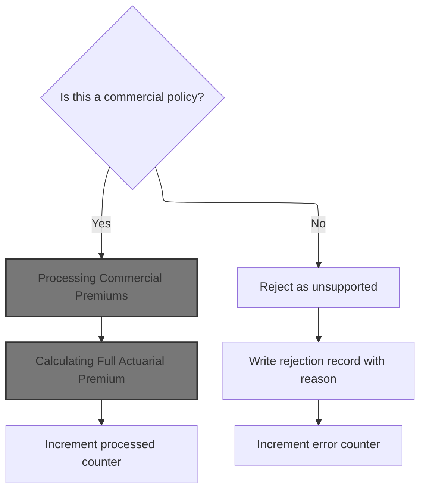
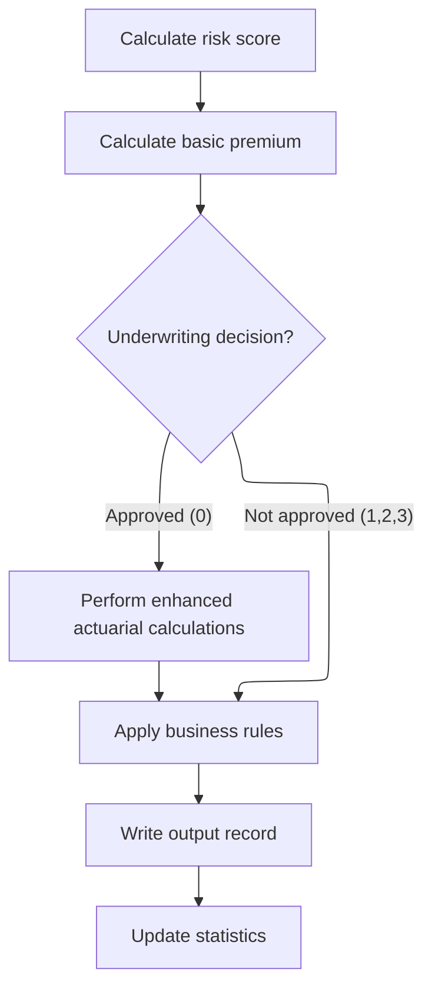
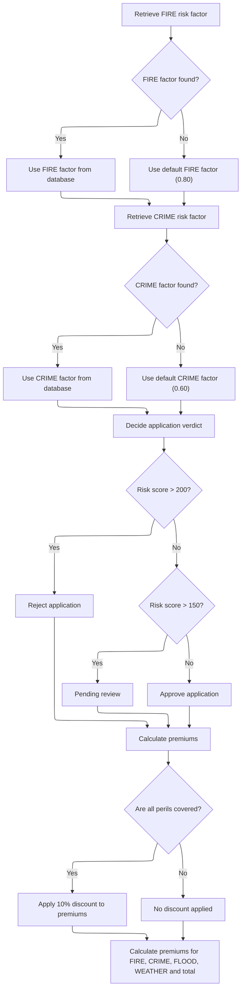
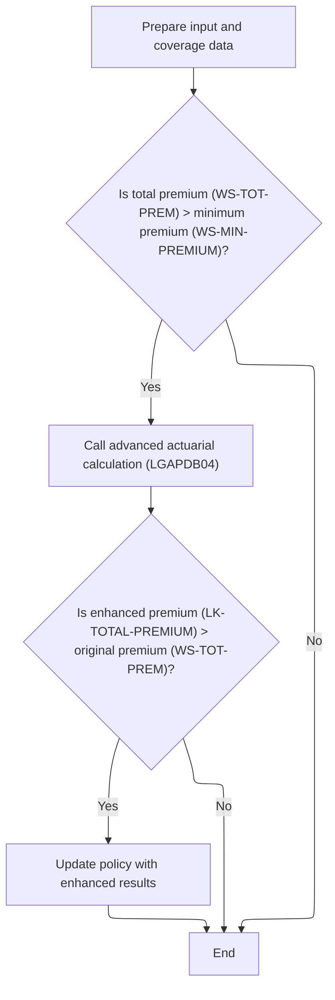
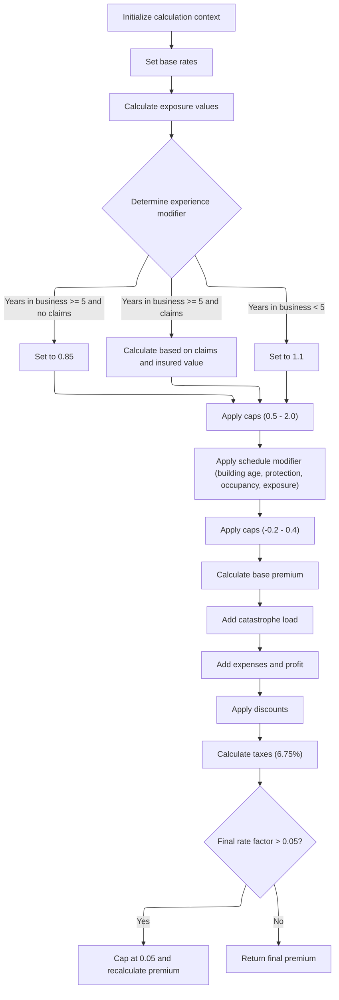

This document outlines the flow for processing policy records. The system checks if a policy is commercial. For commercial policies, it calculates risk scores and premiums, applies business rules, and updates statistics. Non-commercial policies are marked as unsupported, with all premium fields set to zero. The flow takes a policy record as input and outputs either a processed record with calculated premiums and status or a rejection for unsupported types.

# Spec

## Detailed View of the Program's Functionality

# Main Routing and Record Processing

The main program starts by initializing its internal counters and data structures, loading configuration values (either from a config file or defaults), and opening all necessary files for input, output, rates, and summary. It writes headers to the output file to label the columns.

It then enters a loop to read each input record. For each record, it increments the record count and validates the input fields. Validation checks include ensuring the policy type is recognized, the customer number is present, and at least one coverage limit is provided. If the record fails validation, it logs the error and writes an error record to the output, incrementing the error count.

If the record passes validation, the program checks if the policy is commercial. If so, it processes the record using the commercial premium logic and increments the processed count. If not, it processes the record as unsupported, sets all outputs to zero, writes a rejection reason, and increments the error count.

# Commercial Premium Processing

For commercial policies, the program performs several steps:

1. **Risk Score Calculation:** It calls a separate module to calculate the risk score based on property type, location, coverage limits, and customer history.

2. **Basic Premium Calculation:** It calls another module to calculate the basic premiums for each peril (fire, crime, flood, weather) using the risk score and peril selections. This module also determines the underwriting decision (approved, pending, rejected) based on risk score thresholds.

3. **Advanced Actuarial Calculations:** If the underwriting decision is approved and the total premium exceeds the minimum premium, the program prepares detailed input and coverage data and calls the advanced actuarial calculation module. If the enhanced premium returned is higher than the original, it updates the premium fields with the new values.

4. **Business Rule Application:** The program applies additional business rules to finalize the underwriting decision, considering the risk score and premium values. It sets the status and rejection reason accordingly.

5. **Output Record Writing:** It writes the processed results to the output file, including customer info, risk score, individual premiums, total premium, status, and rejection reason.

6. **Statistics Update:** It updates summary statistics, such as total premium amount, counts of approved/pending/rejected policies, and high-risk counts.

# Basic Premium Calculation Logic

The basic premium calculation module performs the following actions:

- Retrieves risk factors for fire and crime perils from the database. If the database lookup fails, it uses default values.
- Determines the underwriting verdict based on the risk score: scores above 200 are rejected, 151-200 are pending, and 150 or less are approved.
- Sets a discount factor: if all perils are selected, a 10% discount is applied; otherwise, no discount.
- Calculates individual premiums for fire, crime, flood, and weather perils using the risk score, peril factor, peril value, and discount.
- Sums the individual premiums to get the total premium.

# Advanced Actuarial Calculations

The advanced actuarial calculation module performs a detailed premium breakdown:

 1. **Initialization and Exposure Calculation:** It initializes calculation areas and rate tables. It calculates exposures for building, contents, and business interruption, adjusting for risk score. It sums exposures to get the total insured value and calculates exposure density.

 2. **Rate Table Loading:** It loads base rates for each peril from the database. If the lookup fails, it uses hardcoded default rates.

 3. **Experience Modifier Calculation:** It calculates an experience modifier based on years in business and claims history. Claims-free businesses get a discount, those with claims get a calculated modifier, and new businesses get a surcharge. The modifier is clamped between 0.5 and 2.0.

 4. **Schedule Modifier Calculation:** It adjusts the schedule modifier based on building age, protection class, occupancy hazard, and exposure density. Each factor tweaks the modifier up or down, and the result is clamped between -0.2 and +0.4.

 5. **Base Premium Calculation:** It calculates the base premium for each peril using exposures, base rates, experience and schedule modifiers, and a trend factor. The premiums are summed for the base amount.

 6. **Catastrophe Loading:** It adds catastrophe loads for hurricane, earthquake, tornado, and flood perils, based on the relevant premiums and fixed factors.

 7. **Expense and Profit Loading:** It calculates expense and profit loads as percentages of the base and catastrophe amounts.

 8. **Discount Calculation:** It calculates total discounts based on multi-peril selection, claims-free status, and deductible credits. The total discount is capped at 25%.

 9. **Tax Calculation:** It calculates taxes as 6.75% of the sum of base, catastrophe, expense, and profit amounts minus the discount.

10. **Final Premium Calculation:** It sums all premium components and tax, subtracts the discount, and divides by the total insured value to get the final rate factor. If the rate factor exceeds 0.05, it is capped and the premium is recalculated.

# Handling Unsupported Policies

For non-commercial policies, the program copies customer and property info to the output, sets all premium and risk fields to zero, marks the record as unsupported, and writes a fixed rejection reason to the output file.

# Summary and Statistics

After processing all records, the program closes all files, generates a summary report with counts and totals, and displays statistics to the console, including total records processed, counts of approved/pending/rejected policies, error records, high-risk counts, total premium generated, and average risk score.

# Rule Definition

| Paragraph Name                                                                   | Rule ID | Category          | Description                                                                                                                                                                                                                                                                                                                                                                                                                                 | Conditions                                      | Remarks                                                                                                                                                                                                      |
| -------------------------------------------------------------------------------- | ------- | ----------------- | ------------------------------------------------------------------------------------------------------------------------------------------------------------------------------------------------------------------------------------------------------------------------------------------------------------------------------------------------------------------------------------------------------------------------------------------- | ----------------------------------------------- | ------------------------------------------------------------------------------------------------------------------------------------------------------------------------------------------------------------ |
| P008-VALIDATE-INPUT-RECORD, P011-PROCESS-COMMERCIAL, P012-PROCESS-NON-COMMERCIAL | RL-001  | Conditional Logic | Only records with policy type 'COMMERCIAL' are eligible for premium calculation. All other policy types are flagged as unsupported, with all premium and risk fields set to zero, status set to 'UNSUPPORTED', and rejection reason set to a fixed message.                                                                                                                                                                                 | Policy type must be 'COMMERCIAL'.               | Rejection reason for unsupported policies: 'Only Commercial policies supported in this version'. All premium and risk fields are numeric, set to zero. Status is an alphanumeric field set to 'UNSUPPORTED'. |
| P011A-CALCULATE-RISK-SCORE                                                       | RL-002  | Computation       | For commercial policies, calculate a risk score using property, location, coverage, and customer history fields. The risk score must be a numeric value.                                                                                                                                                                                                                                                                                    | Policy type is 'COMMERCIAL'.                    | Risk score is a numeric field (integer).                                                                                                                                                                     |
| GET-RISK-FACTORS (LGAPDB03.cbl)                                                  | RL-003  | Data Assignment   | For each peril (Fire, Crime, Flood, Weather), retrieve the peril factor from the RISK_FACTORS table by peril type. If not found, use defaults: Fire=0.80, Crime=0.60, Flood=1.20, Weather=0.90.                                                                                                                                                                                                                                             | Peril factor not found in RISK_FACTORS table.   | Default peril factors: Fire=0.80, Crime=0.60, Flood=1.20, Weather=0.90. Factors are numeric (decimal).                                                                                                       |
| CALCULATE-PREMIUMS (LGAPDB03.cbl)                                                | RL-004  | Computation       | For each peril, calculate the peril premium as: (Risk Score × Peril Factor) × Peril Value × Discount Factor. Peril Value is the peril indicator field. Discount Factor is 0.90 if all four perils are covered (peril value > 0 for each), otherwise 1.00.                                                                                                                                                                                   | Peril value > 0 for the peril.                  | Premiums are numeric fields, rounded to two decimal places. Discount factor is numeric: 0.90 or 1.00.                                                                                                        |
| CALCULATE-PREMIUMS (LGAPDB03.cbl)                                                | RL-005  | Computation       | The total premium is the sum of all individual peril premiums, rounded to two decimal places.                                                                                                                                                                                                                                                                                                                                               | Peril premiums have been calculated.            | Total premium is a numeric field, rounded to two decimal places.                                                                                                                                             |
| P011D-APPLY-BUSINESS-RULES                                                       | RL-006  | Conditional Logic | Determine underwriting status based on risk score and total premium. If risk score > 250, status is 'REJECTED' with reason 'Risk score exceeds maximum acceptable level'. If risk score > 180, status is 'PENDING' with reason 'High risk - underwriter review required'. If total premium < 500, status is 'PENDING' with reason 'Premium below minimum - requires review'. Otherwise, status is 'APPROVED' and rejection reason is blank. | Risk score and total premium thresholds.        | Status is alphanumeric: 'REJECTED', 'PENDING', 'APPROVED'. Rejection reason is alphanumeric, blank if approved.                                                                                              |
| P011C-ENHANCED-ACTUARIAL-CALC (LGAPDB01.cbl), P100-MAIN (LGAPDB04.cbl)           | RL-007  | Computation       | For approved commercial policies with total premium > 500, perform advanced actuarial calculations: exposures for building, contents, and business interruption; peril-specific exposures; exposure density; base rate retrieval (with defaults); apply modifiers, catastrophe load, expenses, profit, discounts, and taxes; cap final rate factor at 0.05; update premium fields if enhanced premium exceeds original.                     | Policy is approved and total premium > 500.     | Base rates: Fire=0.008500, Crime=0.006200, Flood=0.012800, Weather=0.009600. Modifiers and discounts capped as described. Premiums and rate factors are numeric, rounded to two decimal places.              |
| P008-VALIDATE-INPUT-RECORD, P010-PROCESS-ERROR-RECORD                            | RL-008  | Conditional Logic | If any required input field is missing or invalid, set all premium and risk fields to zero, status to 'ERROR', and rejection reason to the first error message.                                                                                                                                                                                                                                                                             | Any required input field is missing or invalid. | Premium and risk fields are numeric, set to zero. Status is alphanumeric, set to 'ERROR'. Rejection reason is alphanumeric, set to first error message.                                                      |
| CALCULATE-PREMIUMS (LGAPDB03.cbl), P011E-WRITE-OUTPUT-RECORD                     | RL-009  | Data Assignment   | All premium fields in the output must be rounded to two decimal places. Rejection reason must be blank if and only if status is 'APPROVED'.                                                                                                                                                                                                                                                                                                 | Premium fields calculated; status determined.   | Premium fields: numeric, two decimal places. Rejection reason: alphanumeric, blank if status is 'APPROVED'.                                                                                                  |
| P011F-UPDATE-STATISTICS, P015-GENERATE-SUMMARY, P016-DISPLAY-STATS               | RL-010  | Computation       | Increment counters as records are processed: processed commercial, error/unsupported, approved, pending, rejected, high risk (>200), total premium amount, average risk score. Output a summary file with all counters and statistics at end of processing.                                                                                                                                                                                 | Each record processed.                          | Counters: numeric. Summary file: alphanumeric, includes all counters and statistics.                                                                                                                         |

# User Stories

## User Story 1: Input Validation, Unsupported Policy Handling, and Statistics

---

### Story Description:

As a system, I want to validate each input record, handle unsupported or invalid policies, and maintain processing statistics so that only eligible commercial policies proceed to premium calculation, errors are clearly reported, and summary statistics are available at the end of processing.

---

### Business Rule Mapping:

| Rule ID | Paragraph Name                                                                   | Rule Description                                                                                                                                                                                                                                            |
| ------- | -------------------------------------------------------------------------------- | ----------------------------------------------------------------------------------------------------------------------------------------------------------------------------------------------------------------------------------------------------------- |
| RL-001  | P008-VALIDATE-INPUT-RECORD, P011-PROCESS-COMMERCIAL, P012-PROCESS-NON-COMMERCIAL | Only records with policy type 'COMMERCIAL' are eligible for premium calculation. All other policy types are flagged as unsupported, with all premium and risk fields set to zero, status set to 'UNSUPPORTED', and rejection reason set to a fixed message. |
| RL-008  | P008-VALIDATE-INPUT-RECORD, P010-PROCESS-ERROR-RECORD                            | If any required input field is missing or invalid, set all premium and risk fields to zero, status to 'ERROR', and rejection reason to the first error message.                                                                                             |
| RL-010  | P011F-UPDATE-STATISTICS, P015-GENERATE-SUMMARY, P016-DISPLAY-STATS               | Increment counters as records are processed: processed commercial, error/unsupported, approved, pending, rejected, high risk (>200), total premium amount, average risk score. Output a summary file with all counters and statistics at end of processing. |

---

### Relevant Functionality:

- **P008-VALIDATE-INPUT-RECORD**
  1. **RL-001:**
     - If policy type is not 'COMMERCIAL':
       - Set all premium and risk fields to zero
       - Set status to 'UNSUPPORTED'
       - Set rejection reason to fixed message
       - Write output record
  2. **RL-008:**
     - If any required field is missing or invalid:
       - Set all premium and risk fields to zero
       - Set status to 'ERROR'
       - Set rejection reason to first error message
       - Write output record
- **P011F-UPDATE-STATISTICS**
  1. **RL-010:**
     - For each record:
       - Increment appropriate counters (processed, error, approved, pending, rejected, high risk)
       - Add premium to total premium amount
       - Add risk score to accumulated total
     - At end of processing:
       - Calculate average risk score
       - Write summary file with all counters and statistics

## User Story 2: Commercial Policy Premium, Risk Calculation, and Advanced Actuarial Processing

---

### Story Description:

As a commercial policyholder, I want my policy's risk score and premiums to be accurately calculated using property, location, coverage, customer history, peril factors, discounts, and advanced actuarial methods so that my premium reflects my risk profile, coverage, and actuarial soundness.

---

### Business Rule Mapping:

| Rule ID | Paragraph Name                                                         | Rule Description                                                                                                                                                                                                                                                                                                                                                                                                        |
| ------- | ---------------------------------------------------------------------- | ----------------------------------------------------------------------------------------------------------------------------------------------------------------------------------------------------------------------------------------------------------------------------------------------------------------------------------------------------------------------------------------------------------------------- |
| RL-002  | P011A-CALCULATE-RISK-SCORE                                             | For commercial policies, calculate a risk score using property, location, coverage, and customer history fields. The risk score must be a numeric value.                                                                                                                                                                                                                                                                |
| RL-003  | GET-RISK-FACTORS (LGAPDB03.cbl)                                        | For each peril (Fire, Crime, Flood, Weather), retrieve the peril factor from the RISK_FACTORS table by peril type. If not found, use defaults: Fire=0.80, Crime=0.60, Flood=1.20, Weather=0.90.                                                                                                                                                                                                                         |
| RL-004  | CALCULATE-PREMIUMS (LGAPDB03.cbl)                                      | For each peril, calculate the peril premium as: (Risk Score × Peril Factor) × Peril Value × Discount Factor. Peril Value is the peril indicator field. Discount Factor is 0.90 if all four perils are covered (peril value > 0 for each), otherwise 1.00.                                                                                                                                                               |
| RL-005  | CALCULATE-PREMIUMS (LGAPDB03.cbl)                                      | The total premium is the sum of all individual peril premiums, rounded to two decimal places.                                                                                                                                                                                                                                                                                                                           |
| RL-009  | CALCULATE-PREMIUMS (LGAPDB03.cbl), P011E-WRITE-OUTPUT-RECORD           | All premium fields in the output must be rounded to two decimal places. Rejection reason must be blank if and only if status is 'APPROVED'.                                                                                                                                                                                                                                                                             |
| RL-007  | P011C-ENHANCED-ACTUARIAL-CALC (LGAPDB01.cbl), P100-MAIN (LGAPDB04.cbl) | For approved commercial policies with total premium > 500, perform advanced actuarial calculations: exposures for building, contents, and business interruption; peril-specific exposures; exposure density; base rate retrieval (with defaults); apply modifiers, catastrophe load, expenses, profit, discounts, and taxes; cap final rate factor at 0.05; update premium fields if enhanced premium exceeds original. |

---

### Relevant Functionality:

- **P011A-CALCULATE-RISK-SCORE**
  1. **RL-002:**
     - For commercial policies:
       - Call risk score calculation routine with property, location, coverage, and customer history fields
       - Store result as risk score
- **GET-RISK-FACTORS (LGAPDB03.cbl)**
  1. **RL-003:**
     - For each peril:
       - Query RISK_FACTORS table for peril factor
       - If not found, assign default value
- **CALCULATE-PREMIUMS (LGAPDB03.cbl)**
  1. **RL-004:**
     - If all four peril values > 0:
       - Set discount factor to 0.90
     - Else:
       - Set discount factor to 1.00
     - For each peril:
       - Compute premium = (risk score × peril factor) × peril value × discount factor
  2. **RL-005:**
     - Sum all peril premiums
     - Round result to two decimal places
     - Store as total premium
  3. **RL-009:**
     - Round all premium fields to two decimal places
     - If status is 'APPROVED', set rejection reason to blank
     - Write output record
- **P011C-ENHANCED-ACTUARIAL-CALC (LGAPDB01.cbl)**
  1. **RL-007:**
     - Calculate exposures for building, contents, business interruption
     - Calculate peril-specific exposures
     - Calculate exposure density (default to 100 if square footage is zero)
     - Retrieve base rates for each peril, use defaults if not found
     - Apply experience modifier, schedule modifier, catastrophe load, expenses, profit, discounts, taxes
     - Cap total discount at 0.25
     - Cap final rate factor at 0.05
     - If enhanced premium > original premium:
       - Update output premium fields

## User Story 3: Underwriting Status Determination

---

### Story Description:

As a commercial policyholder, I want the system to determine my policy's underwriting status and provide clear reasons for pending or rejected outcomes so that I understand the result of my application.

---

### Business Rule Mapping:

| Rule ID | Paragraph Name                                               | Rule Description                                                                                                                                                                                                                                                                                                                                                                                                                            |
| ------- | ------------------------------------------------------------ | ------------------------------------------------------------------------------------------------------------------------------------------------------------------------------------------------------------------------------------------------------------------------------------------------------------------------------------------------------------------------------------------------------------------------------------------- |
| RL-006  | P011D-APPLY-BUSINESS-RULES                                   | Determine underwriting status based on risk score and total premium. If risk score > 250, status is 'REJECTED' with reason 'Risk score exceeds maximum acceptable level'. If risk score > 180, status is 'PENDING' with reason 'High risk - underwriter review required'. If total premium < 500, status is 'PENDING' with reason 'Premium below minimum - requires review'. Otherwise, status is 'APPROVED' and rejection reason is blank. |
| RL-009  | CALCULATE-PREMIUMS (LGAPDB03.cbl), P011E-WRITE-OUTPUT-RECORD | All premium fields in the output must be rounded to two decimal places. Rejection reason must be blank if and only if status is 'APPROVED'.                                                                                                                                                                                                                                                                                                 |

---

### Relevant Functionality:

- **P011D-APPLY-BUSINESS-RULES**
  1. **RL-006:**
     - If risk score > 250:
       - Set status to 'REJECTED'
       - Set rejection reason to 'Risk score exceeds maximum acceptable level'
     - Else if risk score > 180:
       - Set status to 'PENDING'
       - Set rejection reason to 'High risk - underwriter review required'
     - Else if total premium < 500:
       - Set status to 'PENDING'
       - Set rejection reason to 'Premium below minimum - requires review'
     - Else:
       - Set status to 'APPROVED'
       - Set rejection reason to blank
- **CALCULATE-PREMIUMS (LGAPDB03.cbl)**
  1. **RL-009:**
     - Round all premium fields to two decimal places
     - If status is 'APPROVED', set rejection reason to blank
     - Write output record

# Code Walkthrough

## Routing Policy Records



<SwmSnippet path="/base/src/LGAPDB01.cbl" line="234">

---

P009-PROCESS-VALID-RECORD kicks off the flow by checking if the input policy is commercial. If it is, we call P011-PROCESS-COMMERCIAL to start the commercial premium calculation logic and increment the processed count. If not, we call P012-PROCESS-NON-COMMERCIAL, which just sets outputs to zero and flags the record as unsupported, then bumps the error count. The call to P011-PROCESS-COMMERCIAL is needed because that's where all the actual premium calculation logic for commercial policies lives.

```cobol
       P009-PROCESS-VALID-RECORD.
           IF COMMERCIAL-POLICY
               PERFORM P011-PROCESS-COMMERCIAL
               ADD 1 TO WS-PROC-CNT
           ELSE
               PERFORM P012-PROCESS-NON-COMMERCIAL
               ADD 1 TO WS-ERR-CNT
           END-IF.
```

---

</SwmSnippet>

### Processing Commercial Premiums



<SwmSnippet path="/base/src/LGAPDB01.cbl" line="258">

---

P011-PROCESS-COMMERCIAL runs through the main commercial premium calculation steps: risk score, basic premium, then checks if the underwriting status is approved (WS-STAT = 0) before calling the enhanced actuarial calculation. The call to P011B-BASIC-PREMIUM-CALC is needed to get the initial premium numbers before any advanced logic is applied. After that, it applies business rules, writes the output, and updates stats.

```cobol
       P011-PROCESS-COMMERCIAL.
           PERFORM P011A-CALCULATE-RISK-SCORE
           PERFORM P011B-BASIC-PREMIUM-CALC
           IF WS-STAT = 0
               PERFORM P011C-ENHANCED-ACTUARIAL-CALC
           END-IF
           PERFORM P011D-APPLY-BUSINESS-RULES
           PERFORM P011E-WRITE-OUTPUT-RECORD
           PERFORM P011F-UPDATE-STATISTICS.
```

---

</SwmSnippet>

### Calculating Basic Premiums

<SwmSnippet path="/base/src/LGAPDB01.cbl" line="275">

---

P011B-BASIC-PREMIUM-CALC calls LGAPDB03, passing all the risk and peril data needed for basic premium calculation. LGAPDB03 handles the actual math and verdict logic, then returns the calculated premiums and status info. This keeps the main program focused on orchestration.

```cobol
       P011B-BASIC-PREMIUM-CALC.
           CALL 'LGAPDB03' USING WS-BASE-RISK-SCR, IN-FIRE-PERIL, 
                                IN-CRIME-PERIL, IN-FLOOD-PERIL, 
                                IN-WEATHER-PERIL, WS-STAT,
                                WS-STAT-DESC, WS-REJ-RSN, WS-FR-PREM,
                                WS-CR-PREM, WS-FL-PREM, WS-WE-PREM,
                                WS-TOT-PREM, WS-DISC-FACT.
```

---

</SwmSnippet>

### Running Risk and Premium Calculations



<SwmSnippet path="/base/src/LGAPDB03.cbl" line="42">

---

MAIN-LOGIC in LGAPDB03 runs the whole risk and premium calculation sequence: first grabs risk factors from the database (or uses defaults if missing), then figures out the approval status based on risk score, and finally calculates all the individual and total premiums using the risk and peril data.

```cobol
       MAIN-LOGIC.
           PERFORM GET-RISK-FACTORS
           PERFORM CALCULATE-VERDICT
           PERFORM CALCULATE-PREMIUMS
           GOBACK.
```

---

</SwmSnippet>

<SwmSnippet path="/base/src/LGAPDB03.cbl" line="48">

---

GET-RISK-FACTORS pulls fire and crime risk factors from the RISK_FACTORS table. If the SELECT fails, it just sets them to 0.80 and 0.60 as defaults, so the premium calculation doesn't break if the DB is missing data.

```cobol
       GET-RISK-FACTORS.
           EXEC SQL
               SELECT FACTOR_VALUE INTO :WS-FIRE-FACTOR
               FROM RISK_FACTORS
               WHERE PERIL_TYPE = 'FIRE'
           END-EXEC.
           
           IF SQLCODE = 0
               CONTINUE
           ELSE
               MOVE 0.80 TO WS-FIRE-FACTOR
           END-IF.
           
           EXEC SQL
               SELECT FACTOR_VALUE INTO :WS-CRIME-FACTOR
               FROM RISK_FACTORS
               WHERE PERIL_TYPE = 'CRIME'
           END-EXEC.
           
           IF SQLCODE = 0
               CONTINUE
           ELSE
               MOVE 0.60 TO WS-CRIME-FACTOR
           END-IF.
```

---

</SwmSnippet>

<SwmSnippet path="/base/src/LGAPDB03.cbl" line="73">

---

CALCULATE-VERDICT checks the risk score against two hardcoded thresholds (200 and 150) to set the status and rejection reason. Over 200 is rejected, 151-200 is pending, 150 or less is approved. These numbers drive the approval flow and messaging.

```cobol
       CALCULATE-VERDICT.
           IF LK-RISK-SCORE > 200
             MOVE 2 TO LK-STAT
             MOVE 'REJECTED' TO LK-STAT-DESC
             MOVE 'High Risk Score - Manual Review Required' 
               TO LK-REJ-RSN
           ELSE
             IF LK-RISK-SCORE > 150
               MOVE 1 TO LK-STAT
               MOVE 'PENDING' TO LK-STAT-DESC
               MOVE 'Medium Risk - Pending Review'
                 TO LK-REJ-RSN
             ELSE
               MOVE 0 TO LK-STAT
               MOVE 'APPROVED' TO LK-STAT-DESC
               MOVE SPACES TO LK-REJ-RSN
             END-IF
           END-IF.
```

---

</SwmSnippet>

<SwmSnippet path="/base/src/LGAPDB03.cbl" line="92">

---

CALCULATE-PREMIUMS sets the discount factor to 1.00, but drops it to 0.90 if all peril values are positive. Then it runs the premium math for each peril using the risk score, peril factor, peril value, and discount, and sums them up for the total premium. The discount logic is there to encourage full coverage.

```cobol
       CALCULATE-PREMIUMS.
           MOVE 1.00 TO LK-DISC-FACT
           
           IF LK-FIRE-PERIL > 0 AND
              LK-CRIME-PERIL > 0 AND
              LK-FLOOD-PERIL > 0 AND
              LK-WEATHER-PERIL > 0
             MOVE 0.90 TO LK-DISC-FACT
           END-IF

           COMPUTE LK-FIRE-PREMIUM =
             ((LK-RISK-SCORE * WS-FIRE-FACTOR) * LK-FIRE-PERIL *
               LK-DISC-FACT)
           
           COMPUTE LK-CRIME-PREMIUM =
             ((LK-RISK-SCORE * WS-CRIME-FACTOR) * LK-CRIME-PERIL *
               LK-DISC-FACT)
           
           COMPUTE LK-FLOOD-PREMIUM =
             ((LK-RISK-SCORE * WS-FLOOD-FACTOR) * LK-FLOOD-PERIL *
               LK-DISC-FACT)
           
           COMPUTE LK-WEATHER-PREMIUM =
             ((LK-RISK-SCORE * WS-WEATHER-FACTOR) * LK-WEATHER-PERIL *
               LK-DISC-FACT)

           COMPUTE LK-TOTAL-PREMIUM = 
             LK-FIRE-PREMIUM + LK-CRIME-PREMIUM + 
             LK-FLOOD-PREMIUM + LK-WEATHER-PREMIUM. 
```

---

</SwmSnippet>

### Running Advanced Actuarial Calculations



<SwmSnippet path="/base/src/LGAPDB01.cbl" line="283">

---

P011C-ENHANCED-ACTUARIAL-CALC sets up all the customer, property, and coverage data needed for the advanced actuarial calculation, then calls LGAPDB04 if the total premium is above the minimum. If the enhanced premium comes back higher, it updates the premium fields with the new values.

```cobol
       P011C-ENHANCED-ACTUARIAL-CALC.
      *    Prepare input structure for actuarial calculation
           MOVE IN-CUSTOMER-NUM TO LK-CUSTOMER-NUM
           MOVE WS-BASE-RISK-SCR TO LK-RISK-SCORE
           MOVE IN-PROPERTY-TYPE TO LK-PROPERTY-TYPE
           MOVE IN-TERRITORY-CODE TO LK-TERRITORY
           MOVE IN-CONSTRUCTION-TYPE TO LK-CONSTRUCTION-TYPE
           MOVE IN-OCCUPANCY-CODE TO LK-OCCUPANCY-CODE
           MOVE IN-SPRINKLER-IND TO LK-PROTECTION-CLASS
           MOVE IN-YEAR-BUILT TO LK-YEAR-BUILT
           MOVE IN-SQUARE-FOOTAGE TO LK-SQUARE-FOOTAGE
           MOVE IN-YEARS-IN-BUSINESS TO LK-YEARS-IN-BUSINESS
           MOVE IN-CLAIMS-COUNT-3YR TO LK-CLAIMS-COUNT-5YR
           MOVE IN-CLAIMS-AMOUNT-3YR TO LK-CLAIMS-AMOUNT-5YR
           
      *    Set coverage data
           MOVE IN-BUILDING-LIMIT TO LK-BUILDING-LIMIT
           MOVE IN-CONTENTS-LIMIT TO LK-CONTENTS-LIMIT
           MOVE IN-BI-LIMIT TO LK-BI-LIMIT
           MOVE IN-FIRE-DEDUCTIBLE TO LK-FIRE-DEDUCTIBLE
           MOVE IN-WIND-DEDUCTIBLE TO LK-WIND-DEDUCTIBLE
           MOVE IN-FLOOD-DEDUCTIBLE TO LK-FLOOD-DEDUCTIBLE
           MOVE IN-OTHER-DEDUCTIBLE TO LK-OTHER-DEDUCTIBLE
           MOVE IN-FIRE-PERIL TO LK-FIRE-PERIL
           MOVE IN-CRIME-PERIL TO LK-CRIME-PERIL
           MOVE IN-FLOOD-PERIL TO LK-FLOOD-PERIL
           MOVE IN-WEATHER-PERIL TO LK-WEATHER-PERIL
           
      *    Call advanced actuarial calculation program (only for approved cases)
           IF WS-TOT-PREM > WS-MIN-PREMIUM
               CALL 'LGAPDB04' USING LK-INPUT-DATA, LK-COVERAGE-DATA, 
                                    LK-OUTPUT-RESULTS
               
      *        Update with enhanced calculations if successful
               IF LK-TOTAL-PREMIUM > WS-TOT-PREM
                   MOVE LK-FIRE-PREMIUM TO WS-FR-PREM
                   MOVE LK-CRIME-PREMIUM TO WS-CR-PREM
                   MOVE LK-FLOOD-PREMIUM TO WS-FL-PREM
                   MOVE LK-WEATHER-PREMIUM TO WS-WE-PREM
                   MOVE LK-TOTAL-PREMIUM TO WS-TOT-PREM
                   MOVE LK-EXPERIENCE-MOD TO WS-EXPERIENCE-MOD
               END-IF
           END-IF.
```

---

</SwmSnippet>

### Calculating Full Actuarial Premium



<SwmSnippet path="/base/src/LGAPDB04.cbl" line="138">

---

P100-MAIN runs through all the advanced actuarial steps: initializes exposures, loads rates, calculates exposure, applies experience and schedule modifiers, computes base and catastrophe premiums, adds expenses and profit, applies discounts, calculates taxes, and finally computes the capped final premium and rate factor. Each step builds on the previous one to get the full premium breakdown.

```cobol
       P100-MAIN.
           PERFORM P200-INIT
           PERFORM P300-RATES
           PERFORM P350-EXPOSURE
           PERFORM P400-EXP-MOD
           PERFORM P500-SCHED-MOD
           PERFORM P600-BASE-PREM
           PERFORM P700-CAT-LOAD
           PERFORM P800-EXPENSE
           PERFORM P900-DISC
           PERFORM P950-TAXES
           PERFORM P999-FINAL
           GOBACK.
```

---

</SwmSnippet>

<SwmSnippet path="/base/src/LGAPDB04.cbl" line="234">

---

P400-EXP-MOD calculates the experience modifier for pricing. It uses years in business and claims history to set the modifier, applies a credibility factor, and then clamps the result between 0.5 and 2.0. Claims-free businesses get a discount, and new businesses get a slight surcharge.

```cobol
       P400-EXP-MOD.
           MOVE 1.0000 TO WS-EXPERIENCE-MOD
           
           IF LK-YEARS-IN-BUSINESS >= 5
               IF LK-CLAIMS-COUNT-5YR = ZERO
                   MOVE 0.8500 TO WS-EXPERIENCE-MOD
               ELSE
                   COMPUTE WS-EXPERIENCE-MOD = 
                       1.0000 + 
                       ((LK-CLAIMS-AMOUNT-5YR / WS-TOTAL-INSURED-VAL) * 
                        WS-CREDIBILITY-FACTOR * 0.50)
                   
                   IF WS-EXPERIENCE-MOD > 2.0000
                       MOVE 2.0000 TO WS-EXPERIENCE-MOD
                   END-IF
                   
                   IF WS-EXPERIENCE-MOD < 0.5000
                       MOVE 0.5000 TO WS-EXPERIENCE-MOD
                   END-IF
               END-IF
           ELSE
               MOVE 1.1000 TO WS-EXPERIENCE-MOD
           END-IF
           
           MOVE WS-EXPERIENCE-MOD TO LK-EXPERIENCE-MOD.
```

---

</SwmSnippet>

<SwmSnippet path="/base/src/LGAPDB04.cbl" line="260">

---

P500-SCHED-MOD builds the schedule modifier by adjusting for building age, protection class, occupancy hazard, and exposure density, then clamps the result between -0.2 and +0.4. Each input tweaks the modifier up or down using hardcoded constants, and the clamp keeps things sane.

```cobol
       P500-SCHED-MOD.
           MOVE +0.000 TO WS-SCHEDULE-MOD
           
      *    Building age factor
           EVALUATE TRUE
               WHEN LK-YEAR-BUILT >= 2010
                   SUBTRACT 0.050 FROM WS-SCHEDULE-MOD
               WHEN LK-YEAR-BUILT >= 1990
                   CONTINUE
               WHEN LK-YEAR-BUILT >= 1970
                   ADD 0.100 TO WS-SCHEDULE-MOD
               WHEN OTHER
                   ADD 0.200 TO WS-SCHEDULE-MOD
           END-EVALUATE
           
      *    Protection class factor
           EVALUATE LK-PROTECTION-CLASS
               WHEN '01' THRU '03'
                   SUBTRACT 0.100 FROM WS-SCHEDULE-MOD
               WHEN '04' THRU '06'
                   SUBTRACT 0.050 FROM WS-SCHEDULE-MOD
               WHEN '07' THRU '09'
                   CONTINUE
               WHEN OTHER
                   ADD 0.150 TO WS-SCHEDULE-MOD
           END-EVALUATE
           
      *    Occupancy hazard factor
           EVALUATE LK-OCCUPANCY-CODE
               WHEN 'OFF01' THRU 'OFF05'
                   SUBTRACT 0.025 FROM WS-SCHEDULE-MOD
               WHEN 'MFG01' THRU 'MFG10'
                   ADD 0.075 TO WS-SCHEDULE-MOD
               WHEN 'WHS01' THRU 'WHS05'
                   ADD 0.125 TO WS-SCHEDULE-MOD
               WHEN OTHER
                   CONTINUE
           END-EVALUATE
           
      *    Exposure density factor
           IF WS-EXPOSURE-DENSITY > 500.00
               ADD 0.100 TO WS-SCHEDULE-MOD
           ELSE
               IF WS-EXPOSURE-DENSITY < 50.00
                   SUBTRACT 0.050 FROM WS-SCHEDULE-MOD
               END-IF
           END-IF
           
           IF WS-SCHEDULE-MOD > +0.400
               MOVE +0.400 TO WS-SCHEDULE-MOD
           END-IF
           
           IF WS-SCHEDULE-MOD < -0.200
               MOVE -0.200 TO WS-SCHEDULE-MOD
           END-IF
           
           MOVE WS-SCHEDULE-MOD TO LK-SCHEDULE-MOD.
```

---

</SwmSnippet>

<SwmSnippet path="/base/src/LGAPDB04.cbl" line="456">

---

P950-TAXES adds up the base, catastrophe, expense, and profit amounts, subtracts the discount, then multiplies by 0.0675 to get the tax. The result is moved to the output structure for further use.

```cobol
       P950-TAXES.
           COMPUTE WS-TAX-AMOUNT = 
               (LK-BASE-AMOUNT + LK-CAT-LOAD-AMT + 
                LK-EXPENSE-LOAD-AMT + LK-PROFIT-LOAD-AMT - 
                LK-DISCOUNT-AMT) * 0.0675
                
           MOVE WS-TAX-AMOUNT TO LK-TAX-AMT.
```

---

</SwmSnippet>

<SwmSnippet path="/base/src/LGAPDB04.cbl" line="464">

---

P999-FINAL adds up all the premium components and tax, subtracts the discount, then divides by the total insured value to get the rate factor. If the rate factor is over 0.05, it gets capped and the premium is recalculated using the cap. This keeps the pricing from going over the allowed maximum.

```cobol
       P999-FINAL.
           COMPUTE LK-TOTAL-PREMIUM = 
               LK-BASE-AMOUNT + LK-CAT-LOAD-AMT + 
               LK-EXPENSE-LOAD-AMT + LK-PROFIT-LOAD-AMT -
               LK-DISCOUNT-AMT + LK-TAX-AMT
               
           COMPUTE LK-FINAL-RATE-FACTOR = 
               LK-TOTAL-PREMIUM / WS-TOTAL-INSURED-VAL
               
           IF LK-FINAL-RATE-FACTOR > 0.050000
               MOVE 0.050000 TO LK-FINAL-RATE-FACTOR
               COMPUTE LK-TOTAL-PREMIUM = 
                   WS-TOTAL-INSURED-VAL * LK-FINAL-RATE-FACTOR
           END-IF.
```

---

</SwmSnippet>

### Handling Unsupported Policies

<SwmSnippet path="/base/src/LGAPDB01.cbl" line="379">

---

P012-PROCESS-NON-COMMERCIAL copies the customer and property info to the output, sets all premium and risk fields to zero, and marks the record as unsupported with a fixed message. This makes it clear that only commercial policies are handled in this version.

```cobol
       P012-PROCESS-NON-COMMERCIAL.
           MOVE IN-CUSTOMER-NUM TO OUT-CUSTOMER-NUM
           MOVE IN-PROPERTY-TYPE TO OUT-PROPERTY-TYPE
           MOVE IN-POSTCODE TO OUT-POSTCODE
           MOVE ZERO TO OUT-RISK-SCORE
           MOVE ZERO TO OUT-FIRE-PREMIUM
           MOVE ZERO TO OUT-CRIME-PREMIUM
           MOVE ZERO TO OUT-FLOOD-PREMIUM
           MOVE ZERO TO OUT-WEATHER-PREMIUM
           MOVE ZERO TO OUT-TOTAL-PREMIUM
           MOVE 'UNSUPPORTED' TO OUT-STATUS
           MOVE 'Only Commercial policies supported in this version' 
                TO OUT-REJECT-REASON
           WRITE OUTPUT-RECORD.
```

---

</SwmSnippet>

&nbsp;

*This is an auto-generated document by Swimm 🌊 and has not yet been verified by a human*

<SwmMeta version="3.0.0" repo-id="Z2l0aHViJTNBJTNBU3dpbW1pby1nZW5hcHAtaG91c2UlM0ElM0FHaXJpLVN3aW1t" repo-name="Swimmio-genapp-house"><sup>Powered by [Swimm](https://app.swimm.io/)</sup></SwmMeta>
