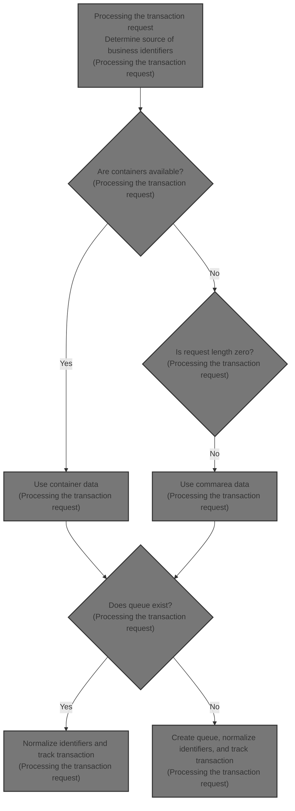

# Overview

This document explains the flow for processing transaction requests. The flow determines the source of business identifiers, applies normalization rules, manages transaction queues, and retrieves a transaction counter for tracking.



## Dependencies

### Program

- <SwmToken path="base/src/lgastat1.cbl" pos="7:6:6" line-data="       PROGRAM-ID. LGASTAT1.">`LGASTAT1`</SwmToken> (<SwmPath>[base/src/lgastat1.cbl](base/src/lgastat1.cbl)</SwmPath>)

### Copybook

- LGCMAREA (<SwmPath>[base/src/lgcmarea.cpy](base/src/lgcmarea.cpy)</SwmPath>)

## Detailed View of the Program's Functionality

Transaction Initialization

The process begins by setting up the transaction context. This involves preparing a header structure that will be used throughout the transaction. The system copies several identifiers and status fields from the transaction environment into this header. These include the transaction ID, terminal ID, task number, and the length of the communication area. This setup ensures that all subsequent operations have access to the necessary context for identifying and managing the transaction.

Request and Response Data Retrieval

Next, the system attempts to fetch request data from a designated container. This is done using a specialized command that retrieves data from a named container into a workspace area reserved for request information. Immediately after, a similar operation is performed to fetch response or type data from another container into a separate workspace area. Both retrievals include a response code to indicate success or failure, which will be checked in the next step.

Container Retrieval Decision

After attempting to retrieve the containers, the system checks if the retrieval was successful. If both containers were fetched normally, the data from these containers is moved into the business counter and type fields, which are used to guide the transaction logic. If the retrieval was not successful, the system checks if the request length is zero. If there is no data to process (length is zero), the transaction returns immediately, ending the process. If there is data, but the containers could not be fetched, fallback values are used: the business counter and type are set from fields in the communication area structure.

Transaction Queue Handling

With the business counter and type set, the system proceeds to interact with a transaction queue. It attempts to read transient data from a queue identified by a specific name. The data is read into a workspace area, and the response code is checked to determine if the queue exists.

Queue Creation and Error Recovery

If the queue does not exist (indicated by a specific error code), the system performs several recovery actions. It requests the current absolute time from the system, formats this time into date and time strings, and updates the workspace area with these values. The updated area is then written back to the queue, effectively creating it and storing the current date and time for future reference. This step ensures that the queue is initialized and available for subsequent transactions.

Business Counter and Type Normalization

The next step involves normalizing the business counter and type values according to specific business rules. If the business counter matches a particular value (for example, <SwmToken path="base/src/lgastat1.cbl" pos="122:8:8" line-data="           If GENAcounter = &#39;02ACUS&#39;">`02ACUS`</SwmToken>), it is remapped to a standard value (<SwmToken path="base/src/lgastat1.cbl" pos="123:4:4" line-data="                                     Move &#39;01ACUS&#39; to GENAcounter.">`01ACUS`</SwmToken>). Similarly, if the counter matches any of several other values (<SwmToken path="base/src/lgastat1.cbl" pos="124:8:8" line-data="           If GENAcounter = &#39;02ICOM&#39; or">`02ICOM`</SwmToken>, <SwmToken path="base/src/lgastat1.cbl" pos="125:6:6" line-data="              GENAcounter = &#39;03ICOM&#39; or">`03ICOM`</SwmToken>, or <SwmToken path="base/src/lgastat1.cbl" pos="126:6:6" line-data="              GENAcounter = &#39;05ICOM&#39; Move &#39;01ICOM&#39; to GENAcounter.">`05ICOM`</SwmToken>), it is consolidated to another standard value (<SwmToken path="base/src/lgastat1.cbl" pos="126:12:12" line-data="              GENAcounter = &#39;05ICOM&#39; Move &#39;01ICOM&#39; to GENAcounter.">`01ICOM`</SwmToken>). Additionally, if the type field does not match the default value ('00'), it is set to a special value ('99') to flag it for special handling. These normalization steps ensure consistency and simplify downstream processing.

Transaction Counter Retrieval and Completion

Finally, the system fetches a transaction counter from a designated pool using the normalized business counter and type. This counter is retrieved and stored for tracking purposes. Once the counter is obtained, the transaction returns, marking the end of the process. This final step provides a unique tracking value for the transaction, which can be used for auditing or further processing.

# Rule Definition

| Paragraph Name                       | Rule ID | Category          | Description                                                                                                                                                                                                                                                                                                                                                                                                                                                                                                                                                                                                                                                                                                                                                                                                                                                                                                                                                                                                                                                                                                                                                                                                                                                                                                                                                                                                                                                                                                         | Conditions                                                                 | Remarks                                                                                                                                                                                                                                                                                                                                                                                                                                                                                                                                                                                                                                                                                                   |
| ------------------------------------ | ------- | ----------------- | ------------------------------------------------------------------------------------------------------------------------------------------------------------------------------------------------------------------------------------------------------------------------------------------------------------------------------------------------------------------------------------------------------------------------------------------------------------------------------------------------------------------------------------------------------------------------------------------------------------------------------------------------------------------------------------------------------------------------------------------------------------------------------------------------------------------------------------------------------------------------------------------------------------------------------------------------------------------------------------------------------------------------------------------------------------------------------------------------------------------------------------------------------------------------------------------------------------------------------------------------------------------------------------------------------------------------------------------------------------------------------------------------------------------------------------------------------------------------------------------------------------------- | -------------------------------------------------------------------------- | --------------------------------------------------------------------------------------------------------------------------------------------------------------------------------------------------------------------------------------------------------------------------------------------------------------------------------------------------------------------------------------------------------------------------------------------------------------------------------------------------------------------------------------------------------------------------------------------------------------------------------------------------------------------------------------------------------- |
| MAINLINE SECTION, lines 79-87, 89-91 | RL-001  | Conditional Logic | The system must retrieve the business counter value from container <SwmToken path="base/src/lgastat1.cbl" pos="26:17:21" line-data="        01  WS-CHANname1       Pic X(16) value &#39;DFHEP.DATA.00001&#39;.">`DFHEP.DATA.00001`</SwmToken> and the business type value from container <SwmToken path="base/src/lgastat1.cbl" pos="27:17:21" line-data="        01  WS-CHANname2       Pic X(16) value &#39;DFHEP.DATA.00002&#39;.">`DFHEP.DATA.00002`</SwmToken>.                                                                                                                                                                                                                                                                                                                                                                                                                                                                                                                                                                                                                                                                                                                                                                                                                                                                                                                                                                                                                                                | Always, unless container retrieval fails.                                  | <SwmToken path="base/src/lgastat1.cbl" pos="96:11:11" line-data="               Move CA-REQUEST-ID  To GENAcounter">`GENAcounter`</SwmToken>: 6 characters, <SwmToken path="base/src/lgastat1.cbl" pos="97:11:11" line-data="               Move CA-RETURN-CODE To GENAtype">`GENAtype`</SwmToken>: 2 characters. Container names are fixed as <SwmToken path="base/src/lgastat1.cbl" pos="26:17:21" line-data="        01  WS-CHANname1       Pic X(16) value &#39;DFHEP.DATA.00001&#39;.">`DFHEP.DATA.00001`</SwmToken> and <SwmToken path="base/src/lgastat1.cbl" pos="27:17:21" line-data="        01  WS-CHANname2       Pic X(16) value &#39;DFHEP.DATA.00002&#39;.">`DFHEP.DATA.00002`</SwmToken>. |
| MAINLINE SECTION, lines 122-127      | RL-002  | Conditional Logic | The system must normalize the business counter and type according to specific rules: if <SwmToken path="base/src/lgastat1.cbl" pos="96:11:11" line-data="               Move CA-REQUEST-ID  To GENAcounter">`GENAcounter`</SwmToken> is <SwmToken path="base/src/lgastat1.cbl" pos="122:8:8" line-data="           If GENAcounter = &#39;02ACUS&#39;">`02ACUS`</SwmToken>, set to <SwmToken path="base/src/lgastat1.cbl" pos="123:4:4" line-data="                                     Move &#39;01ACUS&#39; to GENAcounter.">`01ACUS`</SwmToken>; if <SwmToken path="base/src/lgastat1.cbl" pos="96:11:11" line-data="               Move CA-REQUEST-ID  To GENAcounter">`GENAcounter`</SwmToken> is <SwmToken path="base/src/lgastat1.cbl" pos="124:8:8" line-data="           If GENAcounter = &#39;02ICOM&#39; or">`02ICOM`</SwmToken>, <SwmToken path="base/src/lgastat1.cbl" pos="125:6:6" line-data="              GENAcounter = &#39;03ICOM&#39; or">`03ICOM`</SwmToken>, or <SwmToken path="base/src/lgastat1.cbl" pos="126:6:6" line-data="              GENAcounter = &#39;05ICOM&#39; Move &#39;01ICOM&#39; to GENAcounter.">`05ICOM`</SwmToken>, set to <SwmToken path="base/src/lgastat1.cbl" pos="126:12:12" line-data="              GENAcounter = &#39;05ICOM&#39; Move &#39;01ICOM&#39; to GENAcounter.">`01ICOM`</SwmToken>; if <SwmToken path="base/src/lgastat1.cbl" pos="97:11:11" line-data="               Move CA-RETURN-CODE To GENAtype">`GENAtype`</SwmToken> is not '00', set to '99'. | Always after business counter and type are set.                            | <SwmToken path="base/src/lgastat1.cbl" pos="96:11:11" line-data="               Move CA-REQUEST-ID  To GENAcounter">`GENAcounter`</SwmToken>: 6 characters, <SwmToken path="base/src/lgastat1.cbl" pos="97:11:11" line-data="               Move CA-RETURN-CODE To GENAtype">`GENAtype`</SwmToken>: 2 characters. Normalization values are hardcoded.                                                                                                                                                                                                                                                                                                                                                     |
| MAINLINE SECTION, lines 129-133      | RL-003  | Computation       | The system must fetch the transaction counter value from the counter pool for the normalized business counter and type.                                                                                                                                                                                                                                                                                                                                                                                                                                                                                                                                                                                                                                                                                                                                                                                                                                                                                                                                                                                                                                                                                                                                                                                                                                                                                                                                                                                             | Always after normalization.                                                | <SwmToken path="base/src/lgastat1.cbl" pos="96:11:11" line-data="               Move CA-REQUEST-ID  To GENAcounter">`GENAcounter`</SwmToken>: 6 characters, <SwmToken path="base/src/lgastat1.cbl" pos="97:11:11" line-data="               Move CA-RETURN-CODE To GENAtype">`GENAtype`</SwmToken>: 2 characters, Trancount: 10 digits. Pool name is 'GENA'.                                                                                                                                                                                                                                                                                                                                              |
| MAINLINE SECTION, line 135           | RL-004  | Data Assignment   | The output must be the transaction counter value for the normalized business counter/type.                                                                                                                                                                                                                                                                                                                                                                                                                                                                                                                                                                                                                                                                                                                                                                                                                                                                                                                                                                                                                                                                                                                                                                                                                                                                                                                                                                                                                          | Always at the end of processing.                                           | Trancount: 10 digits, returned as the output of the transaction.                                                                                                                                                                                                                                                                                                                                                                                                                                                                                                                                                                                                                                          |
| MAINLINE SECTION, lines 72-77        | RL-005  | Data Assignment   | The system must initialize a transaction context using the following fields: a 16-character eye-catcher, a 4-character transaction ID, a 4-character terminal ID, a 7-digit task number, and a 7-digit request length.                                                                                                                                                                                                                                                                                                                                                                                                                                                                                                                                                                                                                                                                                                                                                                                                                                                                                                                                                                                                                                                                                                                                                                                                                                                                                              | Always at the start of the transaction.                                    | The eye-catcher is a 16-character string. Transaction ID and terminal ID are 4-character strings. Task number and request length are 7-digit numbers. All fields are assigned from system-provided values or constants.                                                                                                                                                                                                                                                                                                                                                                                                                                                                                   |
| MAINLINE SECTION, lines 92-98        | RL-006  | Conditional Logic | If either container retrieval fails, the system must check if the request length is zero. If so, no further processing is required and the transaction should return immediately. If the request length is not zero, use the request ID and return code from the request area as fallback values for the business counter and business type.                                                                                                                                                                                                                                                                                                                                                                                                                                                                                                                                                                                                                                                                                                                                                                                                                                                                                                                                                                                                                                                                                                                                                                        | Container retrieval fails (response not normal).                           | Request ID: 6-character string, Return code: 2-character string. If request length is zero, processing stops immediately.                                                                                                                                                                                                                                                                                                                                                                                                                                                                                                                                                                                 |
| MAINLINE SECTION, lines 101-120      | RL-007  | Conditional Logic | The system must read the transaction queue. If the queue does not exist, it must be created and initialized with the current date (in YYYYMMDD format) and current time (in HHMMSS format).                                                                                                                                                                                                                                                                                                                                                                                                                                                                                                                                                                                                                                                                                                                                                                                                                                                                                                                                                                                                                                                                                                                                                                                                                                                                                                                         | Always, but initialization only if queue does not exist (queue not found). | Queue name is a fixed 8-character string. The queue area contains an 8-character date field and a 6-character time field. If the queue is missing, these are filled with the current date and time.                                                                                                                                                                                                                                                                                                                                                                                                                                                                                                       |

# User Stories

## User Story 1: Transaction Setup: Context Initialization, Business Counter/Type Retrieval, Fallback, and Normalization

---

### Story Description:

As a system, I want to initialize the transaction context, retrieve the business counter and type, apply fallback logic if retrieval fails, and normalize these values so that the transaction uses valid and standardized business identifiers from the start.

---

### Business Rule Mapping:

| Rule ID | Paragraph Name                       | Rule Description                                                                                                                                                                                                                                                                                                                                                                                                                                                                                                                                                                                                                                                                                                                                                                                                                                                                                                                                                                                                                                                                                                                                                                                                                                                                                                                                                                                                                                                                                                    |
| ------- | ------------------------------------ | ------------------------------------------------------------------------------------------------------------------------------------------------------------------------------------------------------------------------------------------------------------------------------------------------------------------------------------------------------------------------------------------------------------------------------------------------------------------------------------------------------------------------------------------------------------------------------------------------------------------------------------------------------------------------------------------------------------------------------------------------------------------------------------------------------------------------------------------------------------------------------------------------------------------------------------------------------------------------------------------------------------------------------------------------------------------------------------------------------------------------------------------------------------------------------------------------------------------------------------------------------------------------------------------------------------------------------------------------------------------------------------------------------------------------------------------------------------------------------------------------------------------- |
| RL-005  | MAINLINE SECTION, lines 72-77        | The system must initialize a transaction context using the following fields: a 16-character eye-catcher, a 4-character transaction ID, a 4-character terminal ID, a 7-digit task number, and a 7-digit request length.                                                                                                                                                                                                                                                                                                                                                                                                                                                                                                                                                                                                                                                                                                                                                                                                                                                                                                                                                                                                                                                                                                                                                                                                                                                                                              |
| RL-001  | MAINLINE SECTION, lines 79-87, 89-91 | The system must retrieve the business counter value from container <SwmToken path="base/src/lgastat1.cbl" pos="26:17:21" line-data="        01  WS-CHANname1       Pic X(16) value &#39;DFHEP.DATA.00001&#39;.">`DFHEP.DATA.00001`</SwmToken> and the business type value from container <SwmToken path="base/src/lgastat1.cbl" pos="27:17:21" line-data="        01  WS-CHANname2       Pic X(16) value &#39;DFHEP.DATA.00002&#39;.">`DFHEP.DATA.00002`</SwmToken>.                                                                                                                                                                                                                                                                                                                                                                                                                                                                                                                                                                                                                                                                                                                                                                                                                                                                                                                                                                                                                                                |
| RL-006  | MAINLINE SECTION, lines 92-98        | If either container retrieval fails, the system must check if the request length is zero. If so, no further processing is required and the transaction should return immediately. If the request length is not zero, use the request ID and return code from the request area as fallback values for the business counter and business type.                                                                                                                                                                                                                                                                                                                                                                                                                                                                                                                                                                                                                                                                                                                                                                                                                                                                                                                                                                                                                                                                                                                                                                        |
| RL-002  | MAINLINE SECTION, lines 122-127      | The system must normalize the business counter and type according to specific rules: if <SwmToken path="base/src/lgastat1.cbl" pos="96:11:11" line-data="               Move CA-REQUEST-ID  To GENAcounter">`GENAcounter`</SwmToken> is <SwmToken path="base/src/lgastat1.cbl" pos="122:8:8" line-data="           If GENAcounter = &#39;02ACUS&#39;">`02ACUS`</SwmToken>, set to <SwmToken path="base/src/lgastat1.cbl" pos="123:4:4" line-data="                                     Move &#39;01ACUS&#39; to GENAcounter.">`01ACUS`</SwmToken>; if <SwmToken path="base/src/lgastat1.cbl" pos="96:11:11" line-data="               Move CA-REQUEST-ID  To GENAcounter">`GENAcounter`</SwmToken> is <SwmToken path="base/src/lgastat1.cbl" pos="124:8:8" line-data="           If GENAcounter = &#39;02ICOM&#39; or">`02ICOM`</SwmToken>, <SwmToken path="base/src/lgastat1.cbl" pos="125:6:6" line-data="              GENAcounter = &#39;03ICOM&#39; or">`03ICOM`</SwmToken>, or <SwmToken path="base/src/lgastat1.cbl" pos="126:6:6" line-data="              GENAcounter = &#39;05ICOM&#39; Move &#39;01ICOM&#39; to GENAcounter.">`05ICOM`</SwmToken>, set to <SwmToken path="base/src/lgastat1.cbl" pos="126:12:12" line-data="              GENAcounter = &#39;05ICOM&#39; Move &#39;01ICOM&#39; to GENAcounter.">`01ICOM`</SwmToken>; if <SwmToken path="base/src/lgastat1.cbl" pos="97:11:11" line-data="               Move CA-RETURN-CODE To GENAtype">`GENAtype`</SwmToken> is not '00', set to '99'. |

---

### Relevant Functionality:

- **MAINLINE SECTION**
  1. **RL-005:**
     - Initialize the transaction context structure.
     - Assign the transaction ID from the system field to the context.
     - Assign the terminal ID from the system field to the context.
     - Assign the task number from the system field to the context.
     - Assign the request length from the system field to the context.
  2. **RL-001:**
     - Attempt to get container <SwmToken path="base/src/lgastat1.cbl" pos="26:17:21" line-data="        01  WS-CHANname1       Pic X(16) value &#39;DFHEP.DATA.00001&#39;.">`DFHEP.DATA.00001`</SwmToken> into business counter field.
     - Attempt to get container <SwmToken path="base/src/lgastat1.cbl" pos="27:17:21" line-data="        01  WS-CHANname2       Pic X(16) value &#39;DFHEP.DATA.00002&#39;.">`DFHEP.DATA.00002`</SwmToken> into business type field.
     - If both succeed, assign values to business counter and type.
  3. **RL-006:**
     - If container retrieval fails:
       - If request length is zero, return immediately.
       - Else, assign the request ID and return code from the request area to the business counter and business type fields.
  4. **RL-002:**
     - If business counter is <SwmToken path="base/src/lgastat1.cbl" pos="122:8:8" line-data="           If GENAcounter = &#39;02ACUS&#39;">`02ACUS`</SwmToken>, set to <SwmToken path="base/src/lgastat1.cbl" pos="123:4:4" line-data="                                     Move &#39;01ACUS&#39; to GENAcounter.">`01ACUS`</SwmToken>.
     - If business counter is <SwmToken path="base/src/lgastat1.cbl" pos="124:8:8" line-data="           If GENAcounter = &#39;02ICOM&#39; or">`02ICOM`</SwmToken>, <SwmToken path="base/src/lgastat1.cbl" pos="125:6:6" line-data="              GENAcounter = &#39;03ICOM&#39; or">`03ICOM`</SwmToken>, or <SwmToken path="base/src/lgastat1.cbl" pos="126:6:6" line-data="              GENAcounter = &#39;05ICOM&#39; Move &#39;01ICOM&#39; to GENAcounter.">`05ICOM`</SwmToken>, set to <SwmToken path="base/src/lgastat1.cbl" pos="126:12:12" line-data="              GENAcounter = &#39;05ICOM&#39; Move &#39;01ICOM&#39; to GENAcounter.">`01ICOM`</SwmToken>.
     - If business type is not '00', set to '99'.

## User Story 2: Transaction Queue Management, Counter Retrieval, and Output

---

### Story Description:

As a user, I want the system to ensure the transaction queue exists and is initialized if missing, fetch the transaction counter for the normalized business counter and type, and return it as the output so that I can accurately track or process transactions.

---

### Business Rule Mapping:

| Rule ID | Paragraph Name                  | Rule Description                                                                                                                                                                            |
| ------- | ------------------------------- | ------------------------------------------------------------------------------------------------------------------------------------------------------------------------------------------- |
| RL-007  | MAINLINE SECTION, lines 101-120 | The system must read the transaction queue. If the queue does not exist, it must be created and initialized with the current date (in YYYYMMDD format) and current time (in HHMMSS format). |
| RL-003  | MAINLINE SECTION, lines 129-133 | The system must fetch the transaction counter value from the counter pool for the normalized business counter and type.                                                                     |
| RL-004  | MAINLINE SECTION, line 135      | The output must be the transaction counter value for the normalized business counter/type.                                                                                                  |

---

### Relevant Functionality:

- **MAINLINE SECTION**
  1. **RL-007:**
     - Attempt to read the transaction queue into the queue area.
     - If the queue does not exist:
       - Get the current absolute time from the system.
       - Format the current time into date (YYYYMMDD) and time (HHMMSS) fields.
       - Move the date and time into the queue area.
       - Write the queue area to the transaction queue.
  2. **RL-003:**
     - Use normalized business counter and type to fetch transaction counter value from the pool.
     - Store the result in the transaction counter field.
  3. **RL-004:**
     - Return the transaction counter value as the output of the transaction.

# Workflow

# Processing the transaction request

```mermaid
%%{init: {"flowchart": {"defaultRenderer": "elk"}} }%%
flowchart TD
    node1["Initialize transaction context"] --> node2["Retrieve request and response containers"]
    click node1 openCode "base/src/lgastat1.cbl:69:77"
    click node2 openCode "base/src/lgastat1.cbl:79:87"
    node2 --> node3{"Container retrieval successful?"}
    click node3 openCode "base/src/lgastat1.cbl:89:99"
    node3 -->|"Yes"| node4["Set business counter/type from request data"]
    click node4 openCode "base/src/lgastat1.cbl:90:92"
    node3 -->|"No"| node5{"Is request length zero?"}
    click node5 openCode "base/src/lgastat1.cbl:93:94"
    node5 -->|"Yes"| node6["Return (no data to process)"]
    click node6 openCode "base/src/lgastat1.cbl:94:95"
    node5 -->|"No"| node7["Set business counter/type from commarea"]
    click node7 openCode "base/src/lgastat1.cbl:96:98"
    node4 --> node8["Read transaction queue"]
    click node8 openCode "base/src/lgastat1.cbl:101:105"
    node7 --> node8
    node8 --> node9{"Queue exists?"}
    click node9 openCode "base/src/lgastat1.cbl:106:120"
    node9 -->|"No"| node10["Create queue with current date/time"]
    click node10 openCode "base/src/lgastat1.cbl:107:119"
    node10 --> node11["Normalize business counter/type:
      If GENAcounter = 02ACUS, set to 01ACUS;
      If GENAcounter = 02ICOM, 03ICOM, or 05ICOM, set to 01ICOM;
      If GENAtype != '00', set to '99'"]
    node9 -->|"Yes"| node11["Normalize business counter/type:
      If GENAcounter = 02ACUS, set to 01ACUS;
      If GENAcounter = 02ICOM, 03ICOM, or 05ICOM, set to 01ICOM;
      If GENAtype != '00', set to '99'"]
    click node11 openCode "base/src/lgastat1.cbl:122:127"
    node11 --> node12["Get transaction counter"]
    click node12 openCode "base/src/lgastat1.cbl:129:133"
    node12 --> node13["Return from transaction"]
    click node13 openCode "base/src/lgastat1.cbl:135:135"
classDef HeadingStyle fill:#777777,stroke:#333,stroke-width:2px;

%% Swimm:
%% %%{init: {"flowchart": {"defaultRenderer": "elk"}} }%%
%% flowchart TD
%%     node1["Initialize transaction context"] --> node2["Retrieve request and response containers"]
%%     click node1 openCode "<SwmPath>[base/src/lgastat1.cbl](base/src/lgastat1.cbl)</SwmPath>:69:77"
%%     click node2 openCode "<SwmPath>[base/src/lgastat1.cbl](base/src/lgastat1.cbl)</SwmPath>:79:87"
%%     node2 --> node3{"Container retrieval successful?"}
%%     click node3 openCode "<SwmPath>[base/src/lgastat1.cbl](base/src/lgastat1.cbl)</SwmPath>:89:99"
%%     node3 -->|"Yes"| node4["Set business counter/type from request data"]
%%     click node4 openCode "<SwmPath>[base/src/lgastat1.cbl](base/src/lgastat1.cbl)</SwmPath>:90:92"
%%     node3 -->|"No"| node5{"Is request length zero?"}
%%     click node5 openCode "<SwmPath>[base/src/lgastat1.cbl](base/src/lgastat1.cbl)</SwmPath>:93:94"
%%     node5 -->|"Yes"| node6["Return (no data to process)"]
%%     click node6 openCode "<SwmPath>[base/src/lgastat1.cbl](base/src/lgastat1.cbl)</SwmPath>:94:95"
%%     node5 -->|"No"| node7["Set business counter/type from commarea"]
%%     click node7 openCode "<SwmPath>[base/src/lgastat1.cbl](base/src/lgastat1.cbl)</SwmPath>:96:98"
%%     node4 --> node8["Read transaction queue"]
%%     click node8 openCode "<SwmPath>[base/src/lgastat1.cbl](base/src/lgastat1.cbl)</SwmPath>:101:105"
%%     node7 --> node8
%%     node8 --> node9{"Queue exists?"}
%%     click node9 openCode "<SwmPath>[base/src/lgastat1.cbl](base/src/lgastat1.cbl)</SwmPath>:106:120"
%%     node9 -->|"No"| node10["Create queue with current date/time"]
%%     click node10 openCode "<SwmPath>[base/src/lgastat1.cbl](base/src/lgastat1.cbl)</SwmPath>:107:119"
%%     node10 --> node11["Normalize business counter/type:
%%       If <SwmToken path="base/src/lgastat1.cbl" pos="96:11:11" line-data="               Move CA-REQUEST-ID  To GENAcounter">`GENAcounter`</SwmToken> = <SwmToken path="base/src/lgastat1.cbl" pos="122:8:8" line-data="           If GENAcounter = &#39;02ACUS&#39;">`02ACUS`</SwmToken>, set to <SwmToken path="base/src/lgastat1.cbl" pos="123:4:4" line-data="                                     Move &#39;01ACUS&#39; to GENAcounter.">`01ACUS`</SwmToken>;
%%       If <SwmToken path="base/src/lgastat1.cbl" pos="96:11:11" line-data="               Move CA-REQUEST-ID  To GENAcounter">`GENAcounter`</SwmToken> = <SwmToken path="base/src/lgastat1.cbl" pos="124:8:8" line-data="           If GENAcounter = &#39;02ICOM&#39; or">`02ICOM`</SwmToken>, <SwmToken path="base/src/lgastat1.cbl" pos="125:6:6" line-data="              GENAcounter = &#39;03ICOM&#39; or">`03ICOM`</SwmToken>, or <SwmToken path="base/src/lgastat1.cbl" pos="126:6:6" line-data="              GENAcounter = &#39;05ICOM&#39; Move &#39;01ICOM&#39; to GENAcounter.">`05ICOM`</SwmToken>, set to <SwmToken path="base/src/lgastat1.cbl" pos="126:12:12" line-data="              GENAcounter = &#39;05ICOM&#39; Move &#39;01ICOM&#39; to GENAcounter.">`01ICOM`</SwmToken>;
%%       If <SwmToken path="base/src/lgastat1.cbl" pos="97:11:11" line-data="               Move CA-RETURN-CODE To GENAtype">`GENAtype`</SwmToken> != '00', set to '99'"]
%%     node9 -->|"Yes"| node11["Normalize business counter/type:
%%       If <SwmToken path="base/src/lgastat1.cbl" pos="96:11:11" line-data="               Move CA-REQUEST-ID  To GENAcounter">`GENAcounter`</SwmToken> = <SwmToken path="base/src/lgastat1.cbl" pos="122:8:8" line-data="           If GENAcounter = &#39;02ACUS&#39;">`02ACUS`</SwmToken>, set to <SwmToken path="base/src/lgastat1.cbl" pos="123:4:4" line-data="                                     Move &#39;01ACUS&#39; to GENAcounter.">`01ACUS`</SwmToken>;
%%       If <SwmToken path="base/src/lgastat1.cbl" pos="96:11:11" line-data="               Move CA-REQUEST-ID  To GENAcounter">`GENAcounter`</SwmToken> = <SwmToken path="base/src/lgastat1.cbl" pos="124:8:8" line-data="           If GENAcounter = &#39;02ICOM&#39; or">`02ICOM`</SwmToken>, <SwmToken path="base/src/lgastat1.cbl" pos="125:6:6" line-data="              GENAcounter = &#39;03ICOM&#39; or">`03ICOM`</SwmToken>, or <SwmToken path="base/src/lgastat1.cbl" pos="126:6:6" line-data="              GENAcounter = &#39;05ICOM&#39; Move &#39;01ICOM&#39; to GENAcounter.">`05ICOM`</SwmToken>, set to <SwmToken path="base/src/lgastat1.cbl" pos="126:12:12" line-data="              GENAcounter = &#39;05ICOM&#39; Move &#39;01ICOM&#39; to GENAcounter.">`01ICOM`</SwmToken>;
%%       If <SwmToken path="base/src/lgastat1.cbl" pos="97:11:11" line-data="               Move CA-RETURN-CODE To GENAtype">`GENAtype`</SwmToken> != '00', set to '99'"]
%%     click node11 openCode "<SwmPath>[base/src/lgastat1.cbl](base/src/lgastat1.cbl)</SwmPath>:122:127"
%%     node11 --> node12["Get transaction counter"]
%%     click node12 openCode "<SwmPath>[base/src/lgastat1.cbl](base/src/lgastat1.cbl)</SwmPath>:129:133"
%%     node12 --> node13["Return from transaction"]
%%     click node13 openCode "<SwmPath>[base/src/lgastat1.cbl](base/src/lgastat1.cbl)</SwmPath>:135:135"
%% classDef HeadingStyle fill:#777777,stroke:#333,stroke-width:2px;
```



This section governs how transaction requests are processed, including data retrieval, normalization of business values, and queue management. It ensures consistent handling of transaction context and business identifiers.

| Category        | Rule Name                     | Description                                                                                                                                                                                                                                                                                                                                                                                                                                                                                                                                                                                                                                                                                                                                                                                                            |
| --------------- | ----------------------------- | ---------------------------------------------------------------------------------------------------------------------------------------------------------------------------------------------------------------------------------------------------------------------------------------------------------------------------------------------------------------------------------------------------------------------------------------------------------------------------------------------------------------------------------------------------------------------------------------------------------------------------------------------------------------------------------------------------------------------------------------------------------------------------------------------------------------------- |
| Calculation     | ACUS counter normalization    | If <SwmToken path="base/src/lgastat1.cbl" pos="96:11:11" line-data="               Move CA-REQUEST-ID  To GENAcounter">`GENAcounter`</SwmToken> is <SwmToken path="base/src/lgastat1.cbl" pos="122:8:8" line-data="           If GENAcounter = &#39;02ACUS&#39;">`02ACUS`</SwmToken>, set it to <SwmToken path="base/src/lgastat1.cbl" pos="123:4:4" line-data="                                     Move &#39;01ACUS&#39; to GENAcounter.">`01ACUS`</SwmToken> for further processing.                                                                                                                                                                                                                                                                                                                                |
| Calculation     | ICOM counter normalization    | If <SwmToken path="base/src/lgastat1.cbl" pos="96:11:11" line-data="               Move CA-REQUEST-ID  To GENAcounter">`GENAcounter`</SwmToken> is <SwmToken path="base/src/lgastat1.cbl" pos="124:8:8" line-data="           If GENAcounter = &#39;02ICOM&#39; or">`02ICOM`</SwmToken>, <SwmToken path="base/src/lgastat1.cbl" pos="125:6:6" line-data="              GENAcounter = &#39;03ICOM&#39; or">`03ICOM`</SwmToken>, or <SwmToken path="base/src/lgastat1.cbl" pos="126:6:6" line-data="              GENAcounter = &#39;05ICOM&#39; Move &#39;01ICOM&#39; to GENAcounter.">`05ICOM`</SwmToken>, set it to <SwmToken path="base/src/lgastat1.cbl" pos="126:12:12" line-data="              GENAcounter = &#39;05ICOM&#39; Move &#39;01ICOM&#39; to GENAcounter.">`01ICOM`</SwmToken> for further processing. |
| Calculation     | Non-standard type flagging    | If <SwmToken path="base/src/lgastat1.cbl" pos="97:11:11" line-data="               Move CA-RETURN-CODE To GENAtype">`GENAtype`</SwmToken> is not '00', set it to '99' to flag non-standard types.                                                                                                                                                                                                                                                                                                                                                                                                                                                                                                                                                                                                                      |
| Calculation     | Transaction counter retrieval | After normalization, retrieve the transaction counter value from the pool for tracking and further processing.                                                                                                                                                                                                                                                                                                                                                                                                                                                                                                                                                                                                                                                                                                         |
| Decision Making | Container data precedence     | If the request and response containers are successfully retrieved, use their data to set the business counter and type values for the transaction.                                                                                                                                                                                                                                                                                                                                                                                                                                                                                                                                                                                                                                                                     |
| Decision Making | No data early exit            | If the request container is missing and the request length is zero, terminate processing and return without further action.                                                                                                                                                                                                                                                                                                                                                                                                                                                                                                                                                                                                                                                                                            |
| Decision Making | Commarea fallback             | If the request container is missing but the request length is not zero, use the commarea fields to set the business counter and type values.                                                                                                                                                                                                                                                                                                                                                                                                                                                                                                                                                                                                                                                                           |
| Decision Making | Queue creation on missing     | If the transaction queue does not exist, create it with the current date and time, and update the queue with this information.                                                                                                                                                                                                                                                                                                                                                                                                                                                                                                                                                                                                                                                                                         |

<SwmSnippet path="/base/src/lgastat1.cbl" line="69">

---

In MAINLINE, we start by setting up the transaction context. The code moves EIB fields into <SwmToken path="base/src/lgastat1.cbl" pos="72:3:5" line-data="           INITIALIZE WS-HEADER.">`WS-HEADER`</SwmToken> fields, which are used throughout the rest of the flow for identifying and handling the transaction.

```cobol
       MAINLINE SECTION.

      *
           INITIALIZE WS-HEADER.
      *
           MOVE EIBTRNID TO WS-TRANSID.
           MOVE EIBTRMID TO WS-TERMID.
           MOVE EIBTASKN TO WS-TASKNUM.
           MOVE EIBCALEN TO WS-CALEN.
```

---

</SwmSnippet>

<SwmSnippet path="/base/src/lgastat1.cbl" line="79">

---

This fetches request data from a specific container for use in the transaction logic.

```cobol
           Exec CICS Get Container(WS-CHANname1)
                         Into(WS-Data-Req)
                         Resp(WS-RESP)
           End-Exec.
```

---

</SwmSnippet>

<SwmSnippet path="/base/src/lgastat1.cbl" line="84">

---

Next we call CICS Get Container again, this time to fetch data from <SwmToken path="base/src/lgastat1.cbl" pos="84:9:11" line-data="           Exec CICS Get Container(WS-CHANname2)">`WS-CHANname2`</SwmToken> into <SwmToken path="base/src/lgastat1.cbl" pos="85:3:7" line-data="                         Into(WS-Data-RC)">`WS-Data-RC`</SwmToken>. This prepares the type data for the transaction, which is used in the next decision step.

```cobol
           Exec CICS Get Container(WS-CHANname2)
                         Into(WS-Data-RC)
                         Resp(WS-RESP)
           End-Exec.
```

---

</SwmSnippet>

<SwmSnippet path="/base/src/lgastat1.cbl" line="89">

---

Here we check if the container fetch was normal. If yes, we move the fetched data into <SwmToken path="base/src/lgastat1.cbl" pos="90:11:11" line-data="             Move WS-Data-REQ  To  GENACounter">`GENACounter`</SwmToken> and <SwmToken path="base/src/lgastat1.cbl" pos="91:11:11" line-data="             Move WS-Data-RC   To  GENAType">`GENAType`</SwmToken>. If not, and there's no data length, we bail out. Otherwise, we use fallback values from the commarea struct.

```cobol
           If WS-RESP = DFHRESP(NORMAL)
             Move WS-Data-REQ  To  GENACounter
             Move WS-Data-RC   To  GENAType
           Else
             IF EIBCALEN IS EQUAL TO ZERO
                 EXEC CICS RETURN END-EXEC
             Else
               Move CA-REQUEST-ID  To GENAcounter
               Move CA-RETURN-CODE To GENAtype
             End-if
```

---

</SwmSnippet>

<SwmSnippet path="/base/src/lgastat1.cbl" line="99">

---

This grabs transient data from the queue for use in the transaction, and sets up for error handling.

```cobol
           End-if.
      *
           Exec Cics ReadQ TS Queue(WS-Qname)
                     Into(WS-Qarea)
                     Length(Length of WS-Qarea)
                     Resp(WS-RESP)
           End-Exec.
```

---

</SwmSnippet>

<SwmSnippet path="/base/src/lgastat1.cbl" line="106">

---

If the queue read fails with QIDERR, we get the current time, format it, update the relevant fields, and write it back to the queue. This helps with error tracking and recovery.

```cobol
           If WS-RESP     = DFHRESP(QIDERR) Then
             EXEC CICS ASKTIME ABSTIME(WS-ABSTIME)
             END-EXEC
             EXEC CICS FORMATTIME ABSTIME(WS-ABSTIME)
                       DDMMYYYY(WS-DATE)
                       TIME(WS-TIME)
             END-EXEC
             Move WS-Date To WS-area-D
             Move WS-Time To WS-area-T
             Exec Cics WriteQ TS Queue(WS-Qname)
                       From(WS-Qarea)
                       Length(Length of WS-Qarea)
                       Resp(WS-RESP)
             End-Exec
           End-if
```

---

</SwmSnippet>

<SwmSnippet path="/base/src/lgastat1.cbl" line="122">

---

Here we remap <SwmToken path="base/src/lgastat1.cbl" pos="122:3:3" line-data="           If GENAcounter = &#39;02ACUS&#39;">`GENAcounter`</SwmToken> from <SwmToken path="base/src/lgastat1.cbl" pos="122:8:8" line-data="           If GENAcounter = &#39;02ACUS&#39;">`02ACUS`</SwmToken> to <SwmToken path="base/src/lgastat1.cbl" pos="123:4:4" line-data="                                     Move &#39;01ACUS&#39; to GENAcounter.">`01ACUS`</SwmToken> as per business rules. This keeps counter values consistent for later logic.

```cobol
           If GENAcounter = '02ACUS'
                                     Move '01ACUS' to GENAcounter.
```

---

</SwmSnippet>

<SwmSnippet path="/base/src/lgastat1.cbl" line="124">

---

This consolidates several counter values into one for easier handling.

```cobol
           If GENAcounter = '02ICOM' or
              GENAcounter = '03ICOM' or
              GENAcounter = '05ICOM' Move '01ICOM' to GENAcounter.
```

---

</SwmSnippet>

<SwmSnippet path="/base/src/lgastat1.cbl" line="127">

---

This flags non-standard types for special handling.

```cobol
           If GENAType Not = '00' Move '99' To GENAtype.
```

---

</SwmSnippet>

<SwmSnippet path="/base/src/lgastat1.cbl" line="129">

---

Finally we call CICS Get Counter to fetch a value from <SwmToken path="base/src/lgastat1.cbl" pos="130:3:3" line-data="                             Pool(GENApool)">`GENApool`</SwmToken> into Trancount, then return. This wraps up the transaction and provides a tracking value.

```cobol
               Exec CICS Get Counter(GENAcount)
                             Pool(GENApool)
                             Value(Trancount)
                             Resp(WS-RESP)
               End-Exec

           EXEC CICS RETURN END-EXEC.
```

---

</SwmSnippet>

&nbsp;

*This is an auto-generated document by Swimm 🌊 and has not yet been verified by a human*

<SwmMeta version="3.0.0" repo-id="Z2l0aHViJTNBJTNBU3dpbW1pby1nZW5hcHAtaG91c2UlM0ElM0FHaXJpLVN3aW1t" repo-name="Swimmio-genapp-house"><sup>Powered by [Swimm](https://app.swimm.io/)</sup></SwmMeta>
