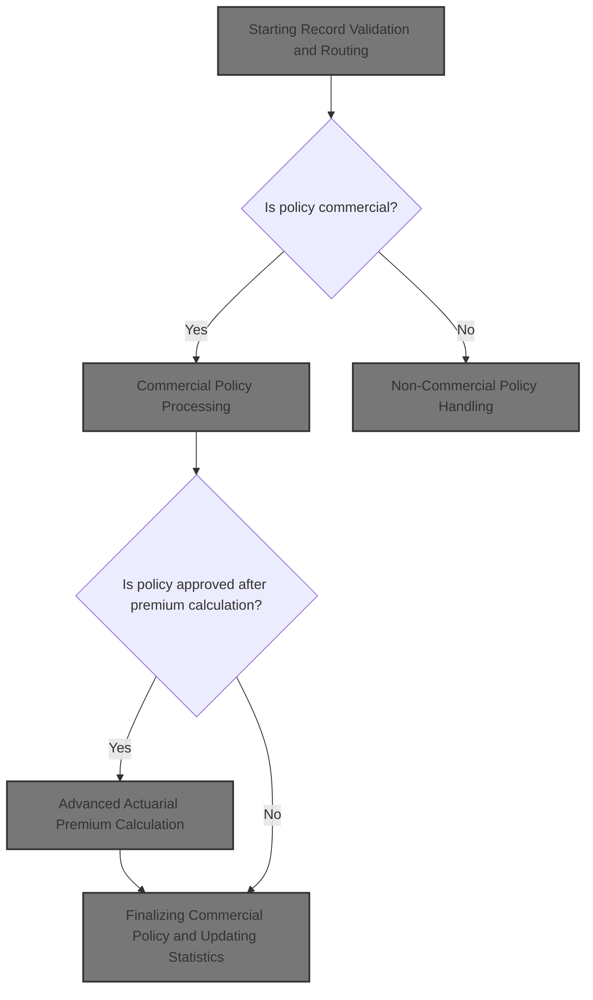
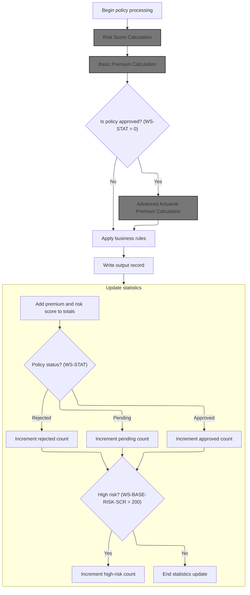
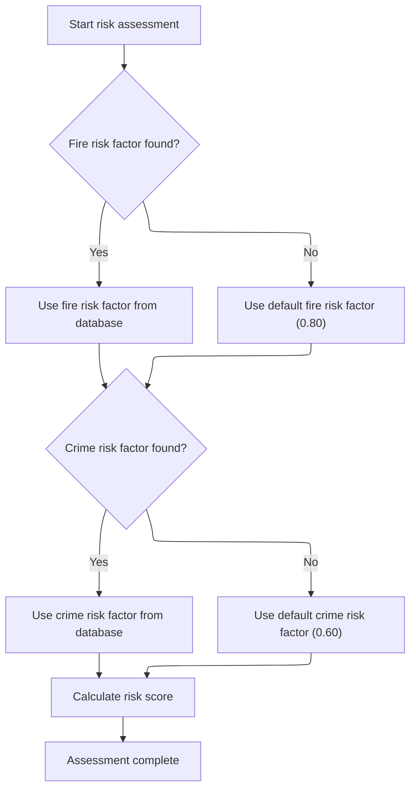
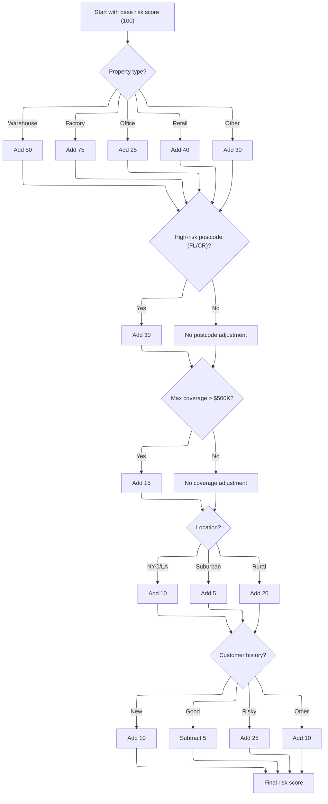
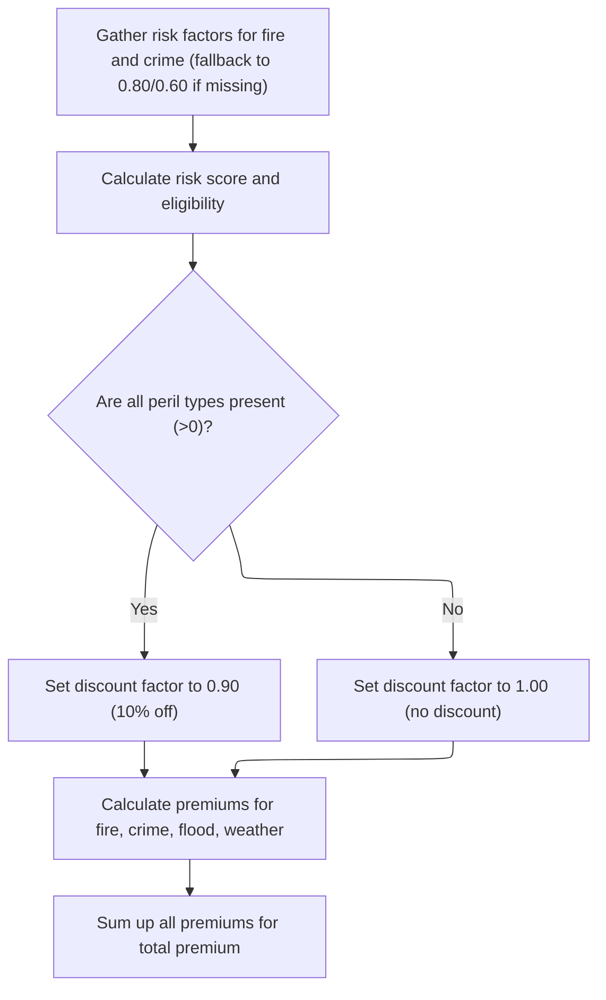
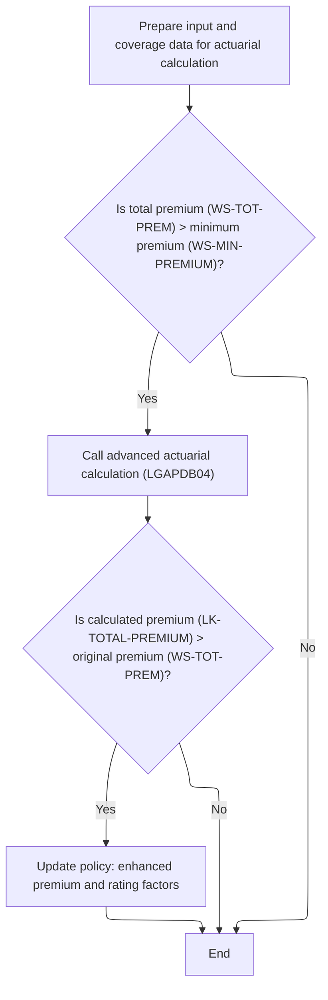
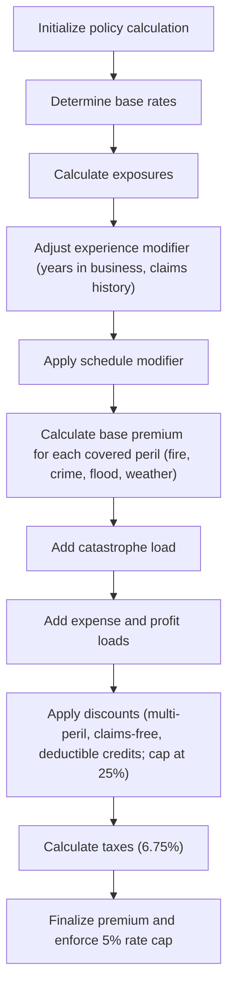
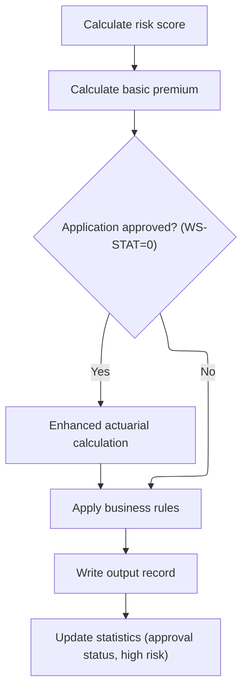

This document describes how policy records are processed to determine eligibility and calculate premiums. Commercial policies are fully processed with risk and premium calculations, while non-commercial policies are flagged as unsupported. The flow receives a policy record and outputs either a processed commercial policy or a record marked as unsupported.



# Spec

## Detailed View of the Program's Functionality

# Starting Record Validation and Routing

The main program begins by reading each record from the input file. For every record, it validates the input fields, checking for required values and acceptable ranges. If the record passes validation, the flow checks whether the policy is commercial. If it is, the commercial policy processing logic is triggered. If not, the record is handled as non-commercial, with all premium outputs set to zero and the status marked as unsupported.

# Commercial Policy Processing

## Risk Score Calculation

For commercial policies, the first step is to calculate the risk score. This is done by calling a dedicated risk scoring module, which receives property details, location, coverage limits, and customer history. The risk scoring module:

- Retrieves fire and crime risk factors from a database, using default values if the database lookup fails.
- Initializes the risk score to a base value.
- Adjusts the score based on property type, postcode prefix, coverage amounts, geographic location, and customer history.
- Each adjustment follows business rules: for example, certain property types or high coverage limits increase the score, while good customer history can reduce it.

## Basic Premium Calculation

Once the risk score is available, the program calls the basic premium calculation module. This module:

- Retrieves fire and crime risk factors from the database, with fallback defaults.
- Determines the application status (approved, pending, rejected) based on the risk score.
- Sets a discount factor: if all perils are covered, a discount is applied.
- Calculates premiums for fire, crime, flood, and weather perils using the risk score, peril factors, peril values, and the discount factor.
- Sums up the individual premiums to produce the total premium.

## Advanced Actuarial Premium Calculation

If the application is approved and the total premium exceeds the minimum threshold, the program prepares a detailed input structure and calls the advanced actuarial calculation module. This module:

- Initializes calculation areas and loads base rates from the database (with defaults if necessary).
- Calculates exposures for building, contents, and business interruption, adjusting for risk score.
- Determines experience and schedule modifiers based on years in business, claims history, building age, protection class, occupancy code, and exposure density.
- Calculates base premiums for each peril, applying modifiers and trend factors.
- Adds catastrophe loads for hurricane, earthquake, tornado, and flood risks.
- Calculates expense and profit loads.
- Computes discounts for multi-peril coverage, claims-free history, and high deductibles, capping the total discount.
- Calculates taxes on the premium components.
- Aggregates all components to produce the final premium and rate factor, capping the rate if it exceeds the allowed maximum.

If the enhanced premium is higher than the original, the output fields are updated with the new values.

## Finalizing Commercial Policy and Updating Statistics

After all calculations, the program applies final business rules to determine the underwriting decision, writes the output record, and updates summary statistics:

- Adds the premium and risk score to control totals.
- Increments counters for approved, pending, and rejected policies based on the final status.
- Increments the high-risk counter if the risk score exceeds a threshold.

# Non-Commercial Policy Handling

For non-commercial policies, the program copies basic identifying fields to the output, sets all premium fields to zero, and marks the status as unsupported with a rejection reason. The output record is then written, ensuring only commercial policies are processed for premium calculations.

# Rule Definition

| Paragraph Name                                                                                              | Rule ID | Category          | Description                                                                                                                                                                                                                                                                                                | Conditions                                                               | Remarks                                                                                                                                                                                                                                                                                                                                                                                                                                                                                                                                                                                                                                                                                          |
| ----------------------------------------------------------------------------------------------------------- | ------- | ----------------- | ---------------------------------------------------------------------------------------------------------------------------------------------------------------------------------------------------------------------------------------------------------------------------------------------------------- | ------------------------------------------------------------------------ | ------------------------------------------------------------------------------------------------------------------------------------------------------------------------------------------------------------------------------------------------------------------------------------------------------------------------------------------------------------------------------------------------------------------------------------------------------------------------------------------------------------------------------------------------------------------------------------------------------------------------------------------------------------------------------------------------ |
| P008-VALIDATE-INPUT-RECORD, P009-PROCESS-VALID-RECORD, P011-PROCESS-COMMERCIAL, P012-PROCESS-NON-COMMERCIAL | RL-001  | Conditional Logic | Only records with IN-POLICY-TYPE = 'COMMERCIAL' are processed for premium calculation. All other policy types are routed to non-commercial handling, which sets all premium fields to zero and marks the status as unsupported.                                                                            | IN-POLICY-TYPE must be 'COMMERCIAL' to proceed with premium calculation. | Non-commercial output: customer, property type, postcode copied; all premium fields zero; OUT-STATUS = 'UNSUPPORTED'; OUT-REJECT-REASON = 'Non-commercial policies not supported'. Output record fields: OUT-CUSTOMER-NUM (string, 10), OUT-PROPERTY-TYPE (string, 15), OUT-POSTCODE (string, 8), OUT-RISK-SCORE (number, 3), OUT-FIRE-PREMIUM, OUT-CRIME-PREMIUM, OUT-FLOOD-PREMIUM, OUT-WEATHER-PREMIUM (number, 8.2), OUT-TOTAL-PREMIUM (number, 9.2), OUT-STATUS (string, 20), OUT-REJECT-REASON (string, 50).                                                                                                                                                                               |
| GET-RISK-FACTORS (LGAPDB02, LGAPDB03)                                                                       | RL-002  | Conditional Logic | For commercial policies, fire and crime risk factors are retrieved from the RISK_FACTORS table. If no record is found, default values are used: 0.80 for fire and 0.60 for crime.                                                                                                                          | PERIL_TYPE = 'FIRE' or 'CRIME'. SQLCODE != 0 triggers default value.     | Default values: Fire = 0.80, Crime = 0.60. Factors are floating point numbers (V99).                                                                                                                                                                                                                                                                                                                                                                                                                                                                                                                                                                                                             |
| CALCULATE-RISK-SCORE (LGAPDB02)                                                                             | RL-003  | Computation       | Risk score is calculated using a base score and several adjustments: property type, postcode prefix, maximum coverage, location, and customer history.                                                                                                                                                     | Commercial policy; all input fields present.                             | Base score: 100. Property type adjustments: WAREHOUSE +50, FACTORY +75, OFFICE +25, RETAIL +40, OTHER +30. Postcode prefix 'FL' or 'CR' +30. Max coverage > 500,000 +15. Location: NYC/LA +10, suburban +5, rural +20. Customer history: 'N' +10, 'G' -5, 'R' +25, other +10. Risk score is integer (PIC 999).                                                                                                                                                                                                                                                                                                                                                                                   |
| CALCULATE-PREMIUMS (LGAPDB03)                                                                               | RL-004  | Computation       | Basic premiums for each peril are calculated using risk score, peril factor, peril value, and a discount factor. If all peril indicators are >0, discount factor is 0.90; otherwise, 1.00.                                                                                                                 | Commercial policy; peril indicators present.                             | Discount factor: 0.90 if all perils >0, else 1.00. Premiums: number (9.8V99).                                                                                                                                                                                                                                                                                                                                                                                                                                                                                                                                                                                                                    |
| CALCULATE-VERDICT (LGAPDB03), P011D-APPLY-BUSINESS-RULES (LGAPDB01)                                         | RL-005  | Conditional Logic | Policy status is set according to risk score: >200 = 'REJECTED', >150 = 'PENDING', otherwise 'APPROVED'.                                                                                                                                                                                                   | Risk score calculated.                                                   | Status codes: 2 = 'REJECTED', 1 = 'PENDING', 0 = 'APPROVED'. Status description: string (20).                                                                                                                                                                                                                                                                                                                                                                                                                                                                                                                                                                                                    |
| LGAPDB04 (all main paragraphs), P011C-ENHANCED-ACTUARIAL-CALC (LGAPDB01)                                    | RL-006  | Computation       | For approved commercial policies, advanced actuarial premium calculation is performed: base rates are retrieved, exposures calculated, experience and schedule modifiers applied, catastrophe, expense, and profit loads added, discounts applied, taxes calculated, and final rate factor capped at 0.05. | Commercial policy, status = 'APPROVED', total premium > minimum premium. | Default base rates: fire 0.0085, crime 0.0062, flood 0.0128, weather 0.0096. Experience modifier: 0.85 if years in business >=5 and claims count = 0, else calculated and capped 0.5-2.0, else 1.10. Schedule modifier capped -0.2 to +0.4. Catastrophe load: fixed factors (hurricane 0.0125, earthquake 0.0080, tornado 0.0045, flood 0.0090). Expense load: 0.35, profit load: 0.15. Discounts: multi-peril 0.10, partial 0.05, claims-free 0.075, deductible credits (fire 0.025, wind 0.035, flood 0.045), total discount capped at 0.25. Taxes: 6.75%. Final rate factor capped at 0.05. Output fields: premiums, components, modifiers, all as numbers (see LK-OUTPUT-RESULTS structure). |
| P011F-UPDATE-STATISTICS, P015-GENERATE-SUMMARY, P016-DISPLAY-STATS (LGAPDB01)                               | RL-007  | Computation       | Update summary statistics: total premium, total risk score, counts of approved, pending, rejected, and high-risk policies (risk score > 200).                                                                                                                                                              | After each record processed.                                             | Counters: approved, pending, rejected, high-risk (risk score > 200). Total premium: number (12.2). Average risk score: number (999.99).                                                                                                                                                                                                                                                                                                                                                                                                                                                                                                                                                          |

# User Stories

## User Story 1: Commercial policy risk and premium calculation

---

### Story Description:

As a policy processing system, I want to retrieve risk factors, calculate risk scores, compute basic premiums for each peril, and determine the policy status for commercial policies so that each commercial policy is accurately assessed and processed according to business rules.

---

### Business Rule Mapping:

| Rule ID | Paragraph Name                                                      | Rule Description                                                                                                                                                                           |
| ------- | ------------------------------------------------------------------- | ------------------------------------------------------------------------------------------------------------------------------------------------------------------------------------------ |
| RL-002  | GET-RISK-FACTORS (LGAPDB02, LGAPDB03)                               | For commercial policies, fire and crime risk factors are retrieved from the RISK_FACTORS table. If no record is found, default values are used: 0.80 for fire and 0.60 for crime.          |
| RL-003  | CALCULATE-RISK-SCORE (LGAPDB02)                                     | Risk score is calculated using a base score and several adjustments: property type, postcode prefix, maximum coverage, location, and customer history.                                     |
| RL-004  | CALCULATE-PREMIUMS (LGAPDB03)                                       | Basic premiums for each peril are calculated using risk score, peril factor, peril value, and a discount factor. If all peril indicators are >0, discount factor is 0.90; otherwise, 1.00. |
| RL-005  | CALCULATE-VERDICT (LGAPDB03), P011D-APPLY-BUSINESS-RULES (LGAPDB01) | Policy status is set according to risk score: >200 = 'REJECTED', >150 = 'PENDING', otherwise 'APPROVED'.                                                                                   |

---

### Relevant Functionality:

- **GET-RISK-FACTORS (LGAPDB02**
  1. **RL-002:**
     - Query RISK_FACTORS for PERIL_TYPE 'FIRE'
       - If found, use FACTOR_VALUE
       - Else, use 0.80
     - Query RISK_FACTORS for PERIL_TYPE 'CRIME'
       - If found, use FACTOR_VALUE
       - Else, use 0.60
- **CALCULATE-RISK-SCORE (LGAPDB02)**
  1. **RL-003:**
     - Start with base score 100
     - Add property type adjustment
     - If postcode starts with 'FL' or 'CR', add 30
     - Find max of fire, crime, flood, weather coverage
       - If max > 500,000, add 15
     - Assess location:
       - If NYC/LA, add 10
       - Else if suburban, add 5
       - Else, add 20
     - Adjust for customer history
     - Output risk score
- **CALCULATE-PREMIUMS (LGAPDB03)**
  1. **RL-004:**
     - Set discount factor to 1.00
     - If all peril indicators >0, set discount factor to 0.90
     - For each peril:
       - Premium = (risk score \* peril factor) \* peril value \* discount factor
     - Total premium = sum of all peril premiums
- **CALCULATE-VERDICT (LGAPDB03)**
  1. **RL-005:**
     - If risk score > 200:
       - Status = 'REJECTED'
     - Else if risk score > 150:
       - Status = 'PENDING'
     - Else:
       - Status = 'APPROVED'

## User Story 2: Output record writing and summary statistics update

---

### Story Description:

As a policy processing system, I want to write the output record with all calculated fields, set the policy status, and update summary statistics after processing each record so that the results are correctly recorded and overall metrics are tracked.

---

### Business Rule Mapping:

| Rule ID | Paragraph Name                                                                                              | Rule Description                                                                                                                                                                                                                |
| ------- | ----------------------------------------------------------------------------------------------------------- | ------------------------------------------------------------------------------------------------------------------------------------------------------------------------------------------------------------------------------- |
| RL-007  | P011F-UPDATE-STATISTICS, P015-GENERATE-SUMMARY, P016-DISPLAY-STATS (LGAPDB01)                               | Update summary statistics: total premium, total risk score, counts of approved, pending, rejected, and high-risk policies (risk score > 200).                                                                                   |
| RL-001  | P008-VALIDATE-INPUT-RECORD, P009-PROCESS-VALID-RECORD, P011-PROCESS-COMMERCIAL, P012-PROCESS-NON-COMMERCIAL | Only records with IN-POLICY-TYPE = 'COMMERCIAL' are processed for premium calculation. All other policy types are routed to non-commercial handling, which sets all premium fields to zero and marks the status as unsupported. |
| RL-005  | CALCULATE-VERDICT (LGAPDB03), P011D-APPLY-BUSINESS-RULES (LGAPDB01)                                         | Policy status is set according to risk score: >200 = 'REJECTED', >150 = 'PENDING', otherwise 'APPROVED'.                                                                                                                        |

---

### Relevant Functionality:

- **P011F-UPDATE-STATISTICS**
  1. **RL-007:**
     - Add total premium to running total
     - Add risk score to running total
     - Increment counters for approved, pending, rejected, high-risk
     - At end, compute average risk score
     - Write summary record
- **P008-VALIDATE-INPUT-RECORD**
  1. **RL-001:**
     - If IN-POLICY-TYPE = 'COMMERCIAL':
       - Proceed to risk score and premium calculation
     - Else:
       - Copy customer, property type, postcode to output
       - Set all premium fields to zero
       - Set OUT-STATUS to 'UNSUPPORTED'
       - Set OUT-REJECT-REASON to 'Non-commercial policies not supported'
       - Write output record
- **CALCULATE-VERDICT (LGAPDB03)**
  1. **RL-005:**
     - If risk score > 200:
       - Status = 'REJECTED'
     - Else if risk score > 150:
       - Status = 'PENDING'
     - Else:
       - Status = 'APPROVED'

## User Story 3: Commercial policy risk, premium, and advanced actuarial calculation

---

### Story Description:

As a policy processing system, I want to retrieve risk factors, calculate risk scores, compute basic premiums for each peril, determine policy status, and perform advanced actuarial premium calculations for approved commercial policies so that each commercial policy is accurately assessed and processed according to business rules.

---

### Business Rule Mapping:

| Rule ID | Paragraph Name                                                           | Rule Description                                                                                                                                                                                                                                                                                           |
| ------- | ------------------------------------------------------------------------ | ---------------------------------------------------------------------------------------------------------------------------------------------------------------------------------------------------------------------------------------------------------------------------------------------------------- |
| RL-002  | GET-RISK-FACTORS (LGAPDB02, LGAPDB03)                                    | For commercial policies, fire and crime risk factors are retrieved from the RISK_FACTORS table. If no record is found, default values are used: 0.80 for fire and 0.60 for crime.                                                                                                                          |
| RL-003  | CALCULATE-RISK-SCORE (LGAPDB02)                                          | Risk score is calculated using a base score and several adjustments: property type, postcode prefix, maximum coverage, location, and customer history.                                                                                                                                                     |
| RL-004  | CALCULATE-PREMIUMS (LGAPDB03)                                            | Basic premiums for each peril are calculated using risk score, peril factor, peril value, and a discount factor. If all peril indicators are >0, discount factor is 0.90; otherwise, 1.00.                                                                                                                 |
| RL-006  | LGAPDB04 (all main paragraphs), P011C-ENHANCED-ACTUARIAL-CALC (LGAPDB01) | For approved commercial policies, advanced actuarial premium calculation is performed: base rates are retrieved, exposures calculated, experience and schedule modifiers applied, catastrophe, expense, and profit loads added, discounts applied, taxes calculated, and final rate factor capped at 0.05. |

---

### Relevant Functionality:

- **GET-RISK-FACTORS (LGAPDB02**
  1. **RL-002:**
     - Query RISK_FACTORS for PERIL_TYPE 'FIRE'
       - If found, use FACTOR_VALUE
       - Else, use 0.80
     - Query RISK_FACTORS for PERIL_TYPE 'CRIME'
       - If found, use FACTOR_VALUE
       - Else, use 0.60
- **CALCULATE-RISK-SCORE (LGAPDB02)**
  1. **RL-003:**
     - Start with base score 100
     - Add property type adjustment
     - If postcode starts with 'FL' or 'CR', add 30
     - Find max of fire, crime, flood, weather coverage
       - If max > 500,000, add 15
     - Assess location:
       - If NYC/LA, add 10
       - Else if suburban, add 5
       - Else, add 20
     - Adjust for customer history
     - Output risk score
- **CALCULATE-PREMIUMS (LGAPDB03)**
  1. **RL-004:**
     - Set discount factor to 1.00
     - If all peril indicators >0, set discount factor to 0.90
     - For each peril:
       - Premium = (risk score \* peril factor) \* peril value \* discount factor
     - Total premium = sum of all peril premiums
- **LGAPDB04 (all main paragraphs)**
  1. **RL-006:**
     - Retrieve base rates from RATE_MASTER
       - If not found, use defaults
     - Calculate exposures for building, contents, BI
     - Calculate experience modifier
       - If years in business >=5 and claims count = 0, set to 0.85
       - Else, calculate and cap between 0.5 and 2.0
       - If years in business <5, set to 1.10
     - Calculate schedule modifier (year built, protection class, occupancy, exposure density), cap -0.2 to +0.4
     - Calculate peril premiums using exposures, rates, modifiers
     - Calculate catastrophe load using fixed factors
     - Calculate expense load (0.35), profit load (0.15)
     - Apply discounts (multi-peril, claims-free, deductible credits), cap at 0.25
     - Calculate taxes (6.75%)
     - Calculate final rate factor, cap at 0.05; if exceeded, recalculate total premium
     - Populate output fields

# Code Walkthrough

## Starting Record Validation and Routing

<SwmSnippet path="/base/src/LGAPDB01.cbl" line="234">

---

`P009-PROCESS-VALID-RECORD` kicks off the record validation and routes the flow based on whether the policy is commercial. If COMMERCIAL-POLICY is true, we call P011-PROCESS-COMMERCIAL to handle all the premium and risk calculations for commercial policies. Otherwise, we jump to P012-PROCESS-NON-COMMERCIAL, which just sets outputs to zero and flags the record as unsupported. Calling P011-PROCESS-COMMERCIAL is necessary because that's where all the actual business logic for commercial policies lives.

```cobol
       P009-PROCESS-VALID-RECORD.
           IF COMMERCIAL-POLICY
               PERFORM P011-PROCESS-COMMERCIAL
               ADD 1 TO WS-PROC-CNT
           ELSE
               PERFORM P012-PROCESS-NON-COMMERCIAL
               ADD 1 TO WS-ERR-CNT
           END-IF.
```

---

</SwmSnippet>

### Commercial Policy Processing



<SwmSnippet path="/base/src/LGAPDB01.cbl" line="258">

---

In `P011-PROCESS-COMMERCIAL`, we start by calculating the risk score, since that's needed for all the downstream premium and actuarial logic. We call P011A-CALCULATE-RISK-SCORE first because every premium calculation and business rule depends on that score. Without it, the rest of the flow can't proceed.

```cobol
       P011-PROCESS-COMMERCIAL.
           PERFORM P011A-CALCULATE-RISK-SCORE
           PERFORM P011B-BASIC-PREMIUM-CALC
           IF WS-STAT = 0
               PERFORM P011C-ENHANCED-ACTUARIAL-CALC
           END-IF
           PERFORM P011D-APPLY-BUSINESS-RULES
           PERFORM P011E-WRITE-OUTPUT-RECORD
           PERFORM P011F-UPDATE-STATISTICS.
```

---

</SwmSnippet>

#### Risk Score Calculation

<SwmSnippet path="/base/src/LGAPDB01.cbl" line="268">

---

`P011A-CALCULATE-RISK-SCORE` calls LGAPDB02, passing all the property and coverage details. LGAPDB02 does the actual risk scoring, so we call it to keep the logic centralized and reusable. The output risk score is then used for all further calculations.

```cobol
       P011A-CALCULATE-RISK-SCORE.
           CALL 'LGAPDB02' USING IN-PROPERTY-TYPE, IN-POSTCODE, 
                                IN-LATITUDE, IN-LONGITUDE,
                                IN-BUILDING-LIMIT, IN-CONTENTS-LIMIT,
                                IN-FLOOD-COVERAGE, IN-WEATHER-COVERAGE,
                                IN-CUSTOMER-HISTORY, WS-BASE-RISK-SCR.
```

---

</SwmSnippet>

#### Risk Factor Retrieval and Score Computation



<SwmSnippet path="/base/src/LGAPDB02.cbl" line="39">

---

`MAIN-LOGIC` fetches risk factors and then computes the risk score. Defaults kick in if the database doesn't have what we need.

```cobol
       MAIN-LOGIC.
           PERFORM GET-RISK-FACTORS
           PERFORM CALCULATE-RISK-SCORE
           GOBACK.
```

---

</SwmSnippet>

<SwmSnippet path="/base/src/LGAPDB02.cbl" line="44">

---

`GET-RISK-FACTORS` pulls fire and crime risk factors from the database. If the query fails, it falls back to 0.80 for fire and 0.60 for crime. These defaults are baked in and will affect the risk score if the database doesn't have the right values.

```cobol
       GET-RISK-FACTORS.
           EXEC SQL
               SELECT FACTOR_VALUE INTO :WS-FIRE-FACTOR
               FROM RISK_FACTORS
               WHERE PERIL_TYPE = 'FIRE'
           END-EXEC.
           
           IF SQLCODE = 0
               CONTINUE
           ELSE
               MOVE 0.80 TO WS-FIRE-FACTOR
           END-IF.
           
           EXEC SQL
               SELECT FACTOR_VALUE INTO :WS-CRIME-FACTOR
               FROM RISK_FACTORS
               WHERE PERIL_TYPE = 'CRIME'
           END-EXEC.
           
           IF SQLCODE = 0
               CONTINUE
           ELSE
               MOVE 0.60 TO WS-CRIME-FACTOR
           END-IF.
```

---

</SwmSnippet>

#### Risk Score Adjustments and Location Assessment



<SwmSnippet path="/base/src/LGAPDB02.cbl" line="69">

---

`CALCULATE-RISK-SCORE` sets up the risk score using fixed values for property type and postcode prefix, then runs extra checks for coverage amounts, location, and customer history. These constants and checks are all business logic for risk adjustment.

```cobol
       CALCULATE-RISK-SCORE.
           MOVE 100 TO LK-RISK-SCORE

           EVALUATE LK-PROPERTY-TYPE
             WHEN 'WAREHOUSE'
               ADD 50 TO LK-RISK-SCORE
             WHEN 'FACTORY' 
               ADD 75 TO LK-RISK-SCORE
             WHEN 'OFFICE'
               ADD 25 TO LK-RISK-SCORE
             WHEN 'RETAIL'
               ADD 40 TO LK-RISK-SCORE
             WHEN OTHER
               ADD 30 TO LK-RISK-SCORE
           END-EVALUATE

           IF LK-POSTCODE(1:2) = 'FL' OR
              LK-POSTCODE(1:2) = 'CR'
             ADD 30 TO LK-RISK-SCORE
           END-IF

           PERFORM CHECK-COVERAGE-AMOUNTS
           PERFORM ASSESS-LOCATION-RISK  
           PERFORM EVALUATE-CUSTOMER-HISTORY.
```

---

</SwmSnippet>

<SwmSnippet path="/base/src/LGAPDB02.cbl" line="94">

---

`CHECK-COVERAGE-AMOUNTS` finds the highest coverage among fire, crime, flood, and weather. If it's over 500,000, it bumps the risk score by 15. That threshold is a fixed business rule.

```cobol
       CHECK-COVERAGE-AMOUNTS.
           MOVE ZERO TO WS-MAX-COVERAGE
           
           IF LK-FIRE-COVERAGE > WS-MAX-COVERAGE
               MOVE LK-FIRE-COVERAGE TO WS-MAX-COVERAGE
           END-IF
           
           IF LK-CRIME-COVERAGE > WS-MAX-COVERAGE
               MOVE LK-CRIME-COVERAGE TO WS-MAX-COVERAGE
           END-IF
           
           IF LK-FLOOD-COVERAGE > WS-MAX-COVERAGE
               MOVE LK-FLOOD-COVERAGE TO WS-MAX-COVERAGE
           END-IF
           
           IF LK-WEATHER-COVERAGE > WS-MAX-COVERAGE
               MOVE LK-WEATHER-COVERAGE TO WS-MAX-COVERAGE
           END-IF
           
           IF WS-MAX-COVERAGE > WS-COVERAGE-500K
               ADD 15 TO LK-RISK-SCORE
           END-IF.
```

---

</SwmSnippet>

<SwmSnippet path="/base/src/LGAPDB02.cbl" line="117">

---

`ASSESS-LOCATION-RISK` bumps the risk score based on whether the property is in NYC, LA, continental US, or elsewhere, using fixed lat/long ranges. Then `EVALUATE-CUSTOMER-HISTORY` adjusts the score based on customer history codes, with each code mapped to a specific adjustment.

```cobol
       ASSESS-LOCATION-RISK.
      *    Urban areas: major cities (simplified lat/long ranges)
      *    NYC area: 40-41N, 74.5-73.5W
      *    LA area: 34-35N, 118.5-117.5W
           IF (LK-LATITUDE > 40.000000 AND LK-LATITUDE < 41.000000 AND
               LK-LONGITUDE > -74.500000 AND LK-LONGITUDE < -73.500000) OR
              (LK-LATITUDE > 34.000000 AND LK-LATITUDE < 35.000000 AND
               LK-LONGITUDE > -118.500000 AND LK-LONGITUDE < -117.500000)
               ADD 10 TO LK-RISK-SCORE
           ELSE
      *        Check if in continental US (suburban vs rural)
               IF (LK-LATITUDE > 25.000000 AND LK-LATITUDE < 49.000000 AND
                   LK-LONGITUDE > -125.000000 AND LK-LONGITUDE < -66.000000)
                   ADD 5 TO LK-RISK-SCORE
               ELSE
                   ADD 20 TO LK-RISK-SCORE
               END-IF
           END-IF.

       EVALUATE-CUSTOMER-HISTORY.
           EVALUATE LK-CUSTOMER-HISTORY
               WHEN 'N'
                   ADD 10 TO LK-RISK-SCORE
               WHEN 'G'
                   SUBTRACT 5 FROM LK-RISK-SCORE
               WHEN 'R'
                   ADD 25 TO LK-RISK-SCORE
               WHEN OTHER
                   ADD 10 TO LK-RISK-SCORE
           END-EVALUATE.
```

---

</SwmSnippet>

#### Basic Premium Calculation

<SwmSnippet path="/base/src/LGAPDB01.cbl" line="275">

---

`P011B-BASIC-PREMIUM-CALC` calls LGAPDB03, passing the risk score and peril data. LGAPDB03 handles all the premium calculations and status logic, so we call it to keep things modular and maintainable.

```cobol
       P011B-BASIC-PREMIUM-CALC.
           CALL 'LGAPDB03' USING WS-BASE-RISK-SCR, IN-FIRE-PERIL, 
                                IN-CRIME-PERIL, IN-FLOOD-PERIL, 
                                IN-WEATHER-PERIL, WS-STAT,
                                WS-STAT-DESC, WS-REJ-RSN, WS-FR-PREM,
                                WS-CR-PREM, WS-FL-PREM, WS-WE-PREM,
                                WS-TOT-PREM, WS-DISC-FACT.
```

---

</SwmSnippet>

#### Premium Calculation and Verdict



<SwmSnippet path="/base/src/LGAPDB03.cbl" line="42">

---

`MAIN-LOGIC` in LGAPDB03 first grabs risk factors, then decides the application status, and finally calculates premiums for each peril. We need to call this sequence because each step depends on the previous one.

```cobol
       MAIN-LOGIC.
           PERFORM GET-RISK-FACTORS
           PERFORM CALCULATE-VERDICT
           PERFORM CALCULATE-PREMIUMS
           GOBACK.
```

---

</SwmSnippet>

<SwmSnippet path="/base/src/LGAPDB03.cbl" line="48">

---

`GET-RISK-FACTORS` in LGAPDB03 pulls fire and crime risk factors from the database, falling back to 0.80 and 0.60 if the query fails. These defaults are baked in and will affect premium calculations if the database doesn't have the right values.

```cobol
       GET-RISK-FACTORS.
           EXEC SQL
               SELECT FACTOR_VALUE INTO :WS-FIRE-FACTOR
               FROM RISK_FACTORS
               WHERE PERIL_TYPE = 'FIRE'
           END-EXEC.
           
           IF SQLCODE = 0
               CONTINUE
           ELSE
               MOVE 0.80 TO WS-FIRE-FACTOR
           END-IF.
           
           EXEC SQL
               SELECT FACTOR_VALUE INTO :WS-CRIME-FACTOR
               FROM RISK_FACTORS
               WHERE PERIL_TYPE = 'CRIME'
           END-EXEC.
           
           IF SQLCODE = 0
               CONTINUE
           ELSE
               MOVE 0.60 TO WS-CRIME-FACTOR
           END-IF.
```

---

</SwmSnippet>

<SwmSnippet path="/base/src/LGAPDB03.cbl" line="92">

---

`CALCULATE-PREMIUMS` sets the discount factor to 1.00 by default, but drops it to 0.90 if all perils are covered. Then it calculates each peril premium using the risk score, peril factor, peril value, and discount factor, and sums them up for the total premium.

```cobol
       CALCULATE-PREMIUMS.
           MOVE 1.00 TO LK-DISC-FACT
           
           IF LK-FIRE-PERIL > 0 AND
              LK-CRIME-PERIL > 0 AND
              LK-FLOOD-PERIL > 0 AND
              LK-WEATHER-PERIL > 0
             MOVE 0.90 TO LK-DISC-FACT
           END-IF

           COMPUTE LK-FIRE-PREMIUM =
             ((LK-RISK-SCORE * WS-FIRE-FACTOR) * LK-FIRE-PERIL *
               LK-DISC-FACT)
           
           COMPUTE LK-CRIME-PREMIUM =
             ((LK-RISK-SCORE * WS-CRIME-FACTOR) * LK-CRIME-PERIL *
               LK-DISC-FACT)
           
           COMPUTE LK-FLOOD-PREMIUM =
             ((LK-RISK-SCORE * WS-FLOOD-FACTOR) * LK-FLOOD-PERIL *
               LK-DISC-FACT)
           
           COMPUTE LK-WEATHER-PREMIUM =
             ((LK-RISK-SCORE * WS-WEATHER-FACTOR) * LK-WEATHER-PERIL *
               LK-DISC-FACT)

           COMPUTE LK-TOTAL-PREMIUM = 
             LK-FIRE-PREMIUM + LK-CRIME-PREMIUM + 
             LK-FLOOD-PREMIUM + LK-WEATHER-PREMIUM. 
```

---

</SwmSnippet>

#### Advanced Actuarial Premium Calculation



<SwmSnippet path="/base/src/LGAPDB01.cbl" line="283">

---

`P011C-ENHANCED-ACTUARIAL-CALC` sets up all the input data for the advanced actuarial calculation and calls LGAPDB04 if the basic premium is above the minimum. If the enhanced premium comes back higher, it updates the output fields with the new values.

```cobol
       P011C-ENHANCED-ACTUARIAL-CALC.
      *    Prepare input structure for actuarial calculation
           MOVE IN-CUSTOMER-NUM TO LK-CUSTOMER-NUM
           MOVE WS-BASE-RISK-SCR TO LK-RISK-SCORE
           MOVE IN-PROPERTY-TYPE TO LK-PROPERTY-TYPE
           MOVE IN-TERRITORY-CODE TO LK-TERRITORY
           MOVE IN-CONSTRUCTION-TYPE TO LK-CONSTRUCTION-TYPE
           MOVE IN-OCCUPANCY-CODE TO LK-OCCUPANCY-CODE
           MOVE IN-SPRINKLER-IND TO LK-PROTECTION-CLASS
           MOVE IN-YEAR-BUILT TO LK-YEAR-BUILT
           MOVE IN-SQUARE-FOOTAGE TO LK-SQUARE-FOOTAGE
           MOVE IN-YEARS-IN-BUSINESS TO LK-YEARS-IN-BUSINESS
           MOVE IN-CLAIMS-COUNT-3YR TO LK-CLAIMS-COUNT-5YR
           MOVE IN-CLAIMS-AMOUNT-3YR TO LK-CLAIMS-AMOUNT-5YR
           
      *    Set coverage data
           MOVE IN-BUILDING-LIMIT TO LK-BUILDING-LIMIT
           MOVE IN-CONTENTS-LIMIT TO LK-CONTENTS-LIMIT
           MOVE IN-BI-LIMIT TO LK-BI-LIMIT
           MOVE IN-FIRE-DEDUCTIBLE TO LK-FIRE-DEDUCTIBLE
           MOVE IN-WIND-DEDUCTIBLE TO LK-WIND-DEDUCTIBLE
           MOVE IN-FLOOD-DEDUCTIBLE TO LK-FLOOD-DEDUCTIBLE
           MOVE IN-OTHER-DEDUCTIBLE TO LK-OTHER-DEDUCTIBLE
           MOVE IN-FIRE-PERIL TO LK-FIRE-PERIL
           MOVE IN-CRIME-PERIL TO LK-CRIME-PERIL
           MOVE IN-FLOOD-PERIL TO LK-FLOOD-PERIL
           MOVE IN-WEATHER-PERIL TO LK-WEATHER-PERIL
           
      *    Call advanced actuarial calculation program (only for approved cases)
           IF WS-TOT-PREM > WS-MIN-PREMIUM
               CALL 'LGAPDB04' USING LK-INPUT-DATA, LK-COVERAGE-DATA, 
                                    LK-OUTPUT-RESULTS
               
      *        Update with enhanced calculations if successful
               IF LK-TOTAL-PREMIUM > WS-TOT-PREM
                   MOVE LK-FIRE-PREMIUM TO WS-FR-PREM
                   MOVE LK-CRIME-PREMIUM TO WS-CR-PREM
                   MOVE LK-FLOOD-PREMIUM TO WS-FL-PREM
                   MOVE LK-WEATHER-PREMIUM TO WS-WE-PREM
                   MOVE LK-TOTAL-PREMIUM TO WS-TOT-PREM
                   MOVE LK-EXPERIENCE-MOD TO WS-EXPERIENCE-MOD
               END-IF
           END-IF.
```

---

</SwmSnippet>

#### Comprehensive Premium Component Calculation



<SwmSnippet path="/base/src/LGAPDB04.cbl" line="138">

---

`P100-MAIN` runs through all the premium component calculations: exposures, base rates, experience and schedule modifiers, catastrophe loads, expenses, discounts, taxes, and finally aggregates everything for the final premium and rate factor. Each step is modular so we can tweak or debug individual parts.

```cobol
       P100-MAIN.
           PERFORM P200-INIT
           PERFORM P300-RATES
           PERFORM P350-EXPOSURE
           PERFORM P400-EXP-MOD
           PERFORM P500-SCHED-MOD
           PERFORM P600-BASE-PREM
           PERFORM P700-CAT-LOAD
           PERFORM P800-EXPENSE
           PERFORM P900-DISC
           PERFORM P950-TAXES
           PERFORM P999-FINAL
           GOBACK.
```

---

</SwmSnippet>

<SwmSnippet path="/base/src/LGAPDB04.cbl" line="234">

---

`P400-EXP-MOD` calculates the experience modifier based on years in business and claims history. If there are no claims in 5 years, it sets a discount. Otherwise, it computes the modifier using claims amount, total insured value, and a credibility factor, then caps it between 0.5 and 2.0.

```cobol
       P400-EXP-MOD.
           MOVE 1.0000 TO WS-EXPERIENCE-MOD
           
           IF LK-YEARS-IN-BUSINESS >= 5
               IF LK-CLAIMS-COUNT-5YR = ZERO
                   MOVE 0.8500 TO WS-EXPERIENCE-MOD
               ELSE
                   COMPUTE WS-EXPERIENCE-MOD = 
                       1.0000 + 
                       ((LK-CLAIMS-AMOUNT-5YR / WS-TOTAL-INSURED-VAL) * 
                        WS-CREDIBILITY-FACTOR * 0.50)
                   
                   IF WS-EXPERIENCE-MOD > 2.0000
                       MOVE 2.0000 TO WS-EXPERIENCE-MOD
                   END-IF
                   
                   IF WS-EXPERIENCE-MOD < 0.5000
                       MOVE 0.5000 TO WS-EXPERIENCE-MOD
                   END-IF
               END-IF
           ELSE
               MOVE 1.1000 TO WS-EXPERIENCE-MOD
           END-IF
           
           MOVE WS-EXPERIENCE-MOD TO LK-EXPERIENCE-MOD.
```

---

</SwmSnippet>

<SwmSnippet path="/base/src/LGAPDB04.cbl" line="318">

---

`P600-BASE-PREM` calculates each peril premium using exposures, base rates (with four parameters), experience and schedule modifiers, and trend factors. Crime and flood premiums get extra multipliers (0.80 and 1.25). All premiums are summed for the base amount.

```cobol
       P600-BASE-PREM.
           MOVE ZERO TO LK-BASE-AMOUNT
           
      * FIRE PREMIUM
           IF LK-FIRE-PERIL > ZERO
               COMPUTE LK-FIRE-PREMIUM = 
                   (WS-BUILDING-EXPOSURE + WS-CONTENTS-EXPOSURE) *
                   WS-BASE-RATE (1, 1, 1, 1) * 
                   WS-EXPERIENCE-MOD *
                   (1 + WS-SCHEDULE-MOD) *
                   WS-TREND-FACTOR
                   
               ADD LK-FIRE-PREMIUM TO LK-BASE-AMOUNT
           END-IF
           
      * CRIME PREMIUM
           IF LK-CRIME-PERIL > ZERO
               COMPUTE LK-CRIME-PREMIUM = 
                   (WS-CONTENTS-EXPOSURE * 0.80) *
                   WS-BASE-RATE (2, 1, 1, 1) * 
                   WS-EXPERIENCE-MOD *
                   (1 + WS-SCHEDULE-MOD) *
                   WS-TREND-FACTOR
                   
               ADD LK-CRIME-PREMIUM TO LK-BASE-AMOUNT
           END-IF
           
      * FLOOD PREMIUM
           IF LK-FLOOD-PERIL > ZERO
               COMPUTE LK-FLOOD-PREMIUM = 
                   WS-BUILDING-EXPOSURE *
                   WS-BASE-RATE (3, 1, 1, 1) * 
                   WS-EXPERIENCE-MOD *
                   (1 + WS-SCHEDULE-MOD) *
                   WS-TREND-FACTOR * 1.25
                   
               ADD LK-FLOOD-PREMIUM TO LK-BASE-AMOUNT
           END-IF
           
      * WEATHER PREMIUM
           IF LK-WEATHER-PERIL > ZERO
               COMPUTE LK-WEATHER-PREMIUM = 
                   (WS-BUILDING-EXPOSURE + WS-CONTENTS-EXPOSURE) *
                   WS-BASE-RATE (4, 1, 1, 1) * 
                   WS-EXPERIENCE-MOD *
                   (1 + WS-SCHEDULE-MOD) *
                   WS-TREND-FACTOR
                   
               ADD LK-WEATHER-PREMIUM TO LK-BASE-AMOUNT
           END-IF.
```

---

</SwmSnippet>

<SwmSnippet path="/base/src/LGAPDB04.cbl" line="407">

---

`P900-DISC` calculates discounts for multi-peril coverage, claims-free history, and high deductibles, then sums them up and caps the total discount at 0.25. The final discount amount is applied to the sum of base, catastrophe, expense, and profit loads.

```cobol
       P900-DISC.
           MOVE ZERO TO WS-TOTAL-DISCOUNT
           
      * Multi-peril discount
           MOVE ZERO TO WS-MULTI-PERIL-DISC
           IF LK-FIRE-PERIL > ZERO AND
              LK-CRIME-PERIL > ZERO AND
              LK-FLOOD-PERIL > ZERO AND
              LK-WEATHER-PERIL > ZERO
               MOVE 0.100 TO WS-MULTI-PERIL-DISC
           ELSE
               IF LK-FIRE-PERIL > ZERO AND
                  LK-WEATHER-PERIL > ZERO AND
                  (LK-CRIME-PERIL > ZERO OR LK-FLOOD-PERIL > ZERO)
                   MOVE 0.050 TO WS-MULTI-PERIL-DISC
               END-IF
           END-IF
           
      * Claims-free discount  
           MOVE ZERO TO WS-CLAIMS-FREE-DISC
           IF LK-CLAIMS-COUNT-5YR = ZERO AND LK-YEARS-IN-BUSINESS >= 5
               MOVE 0.075 TO WS-CLAIMS-FREE-DISC
           END-IF
           
      * Deductible credit
           MOVE ZERO TO WS-DEDUCTIBLE-CREDIT
           IF LK-FIRE-DEDUCTIBLE >= 10000
               ADD 0.025 TO WS-DEDUCTIBLE-CREDIT
           END-IF
           IF LK-WIND-DEDUCTIBLE >= 25000  
               ADD 0.035 TO WS-DEDUCTIBLE-CREDIT
           END-IF
           IF LK-FLOOD-DEDUCTIBLE >= 50000
               ADD 0.045 TO WS-DEDUCTIBLE-CREDIT
           END-IF
           
           COMPUTE WS-TOTAL-DISCOUNT = 
               WS-MULTI-PERIL-DISC + WS-CLAIMS-FREE-DISC + 
               WS-DEDUCTIBLE-CREDIT
               
           IF WS-TOTAL-DISCOUNT > 0.250
               MOVE 0.250 TO WS-TOTAL-DISCOUNT
           END-IF
           
           COMPUTE LK-DISCOUNT-AMT = 
               (LK-BASE-AMOUNT + LK-CAT-LOAD-AMT + 
                LK-EXPENSE-LOAD-AMT + LK-PROFIT-LOAD-AMT) *
               WS-TOTAL-DISCOUNT.
```

---

</SwmSnippet>

<SwmSnippet path="/base/src/LGAPDB04.cbl" line="456">

---

`P950-TAXES` calculates the tax amount by summing all premium components, subtracting the discount, and multiplying by a fixed tax rate of 0.0675. The result is stored as the tax amount for the policy.

```cobol
       P950-TAXES.
           COMPUTE WS-TAX-AMOUNT = 
               (LK-BASE-AMOUNT + LK-CAT-LOAD-AMT + 
                LK-EXPENSE-LOAD-AMT + LK-PROFIT-LOAD-AMT - 
                LK-DISCOUNT-AMT) * 0.0675
                
           MOVE WS-TAX-AMOUNT TO LK-TAX-AMT.
```

---

</SwmSnippet>

<SwmSnippet path="/base/src/LGAPDB04.cbl" line="464">

---

`P999-FINAL` adds up all the premium components, subtracts discounts, and adds tax to get the total premium. Then it calculates the rate factor by dividing by total insured value, and caps it at 0.05 if needed. If capped, it recalculates the total premium using the capped rate.

```cobol
       P999-FINAL.
           COMPUTE LK-TOTAL-PREMIUM = 
               LK-BASE-AMOUNT + LK-CAT-LOAD-AMT + 
               LK-EXPENSE-LOAD-AMT + LK-PROFIT-LOAD-AMT -
               LK-DISCOUNT-AMT + LK-TAX-AMT
               
           COMPUTE LK-FINAL-RATE-FACTOR = 
               LK-TOTAL-PREMIUM / WS-TOTAL-INSURED-VAL
               
           IF LK-FINAL-RATE-FACTOR > 0.050000
               MOVE 0.050000 TO LK-FINAL-RATE-FACTOR
               COMPUTE LK-TOTAL-PREMIUM = 
                   WS-TOTAL-INSURED-VAL * LK-FINAL-RATE-FACTOR
           END-IF.
```

---

</SwmSnippet>

#### Finalizing Commercial Policy and Updating Statistics



<SwmSnippet path="/base/src/LGAPDB01.cbl" line="258">

---

Back in `P011-PROCESS-COMMERCIAL`, after returning from P011C-ENHANCED-ACTUARIAL-CALC, we run the final steps: apply business rules, write the output record, and then call P011F-UPDATE-STATISTICS. That last call updates all the counters and totals so we can track how many policies were approved, rejected, or flagged as high risk.

```cobol
       P011-PROCESS-COMMERCIAL.
           PERFORM P011A-CALCULATE-RISK-SCORE
           PERFORM P011B-BASIC-PREMIUM-CALC
           IF WS-STAT = 0
               PERFORM P011C-ENHANCED-ACTUARIAL-CALC
           END-IF
           PERFORM P011D-APPLY-BUSINESS-RULES
           PERFORM P011E-WRITE-OUTPUT-RECORD
           PERFORM P011F-UPDATE-STATISTICS.
```

---

</SwmSnippet>

<SwmSnippet path="/base/src/LGAPDB01.cbl" line="365">

---

`P011F-UPDATE-STATISTICS` updates all the summary counters: adds the premium to the total, adds the risk score to the control totals, increments the right status counter based on WS-STAT, and bumps the high risk counter if the risk score is over 200.

```cobol
       P011F-UPDATE-STATISTICS.
           ADD WS-TOT-PREM TO WS-TOTAL-PREMIUM-AMT
           ADD WS-BASE-RISK-SCR TO WS-CONTROL-TOTALS
           
           EVALUATE WS-STAT
               WHEN 0 ADD 1 TO WS-APPROVED-CNT
               WHEN 1 ADD 1 TO WS-PENDING-CNT
               WHEN 2 ADD 1 TO WS-REJECTED-CNT
           END-EVALUATE
           
           IF WS-BASE-RISK-SCR > 200
               ADD 1 TO WS-HIGH-RISK-CNT
           END-IF.
```

---

</SwmSnippet>

### Non-Commercial Policy Handling

<SwmSnippet path="/base/src/LGAPDB01.cbl" line="379">

---

`P012-PROCESS-NON-COMMERCIAL` copies the customer, property type, and postcode to the output, sets all premium fields to zero, and marks the status as 'UNSUPPORTED' with a reject reason. Then it writes the output record. This enforces the rule that only commercial policies are handled.

```cobol
       P012-PROCESS-NON-COMMERCIAL.
           MOVE IN-CUSTOMER-NUM TO OUT-CUSTOMER-NUM
           MOVE IN-PROPERTY-TYPE TO OUT-PROPERTY-TYPE
           MOVE IN-POSTCODE TO OUT-POSTCODE
           MOVE ZERO TO OUT-RISK-SCORE
           MOVE ZERO TO OUT-FIRE-PREMIUM
           MOVE ZERO TO OUT-CRIME-PREMIUM
           MOVE ZERO TO OUT-FLOOD-PREMIUM
           MOVE ZERO TO OUT-WEATHER-PREMIUM
           MOVE ZERO TO OUT-TOTAL-PREMIUM
           MOVE 'UNSUPPORTED' TO OUT-STATUS
           MOVE 'Only Commercial policies supported in this version' 
                TO OUT-REJECT-REASON
           WRITE OUTPUT-RECORD.
```

---

</SwmSnippet>

&nbsp;

*This is an auto-generated document by Swimm 🌊 and has not yet been verified by a human*

<SwmMeta version="3.0.0" repo-id="Z2l0aHViJTNBJTNBU3dpbW1pby1nZW5hcHAtaG91c2UlM0ElM0FHaXJpLVN3aW1t" repo-name="Swimmio-genapp-house"><sup>Powered by [Swimm](https://app.swimm.io/)</sup></SwmMeta>
