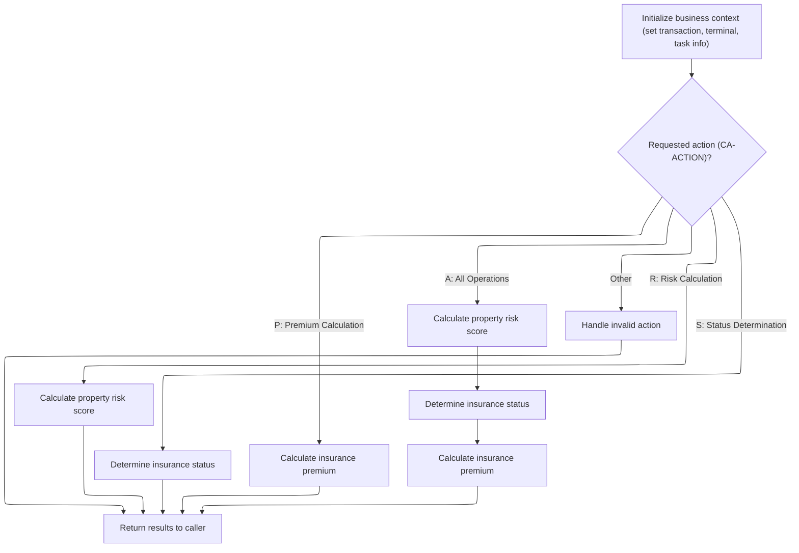
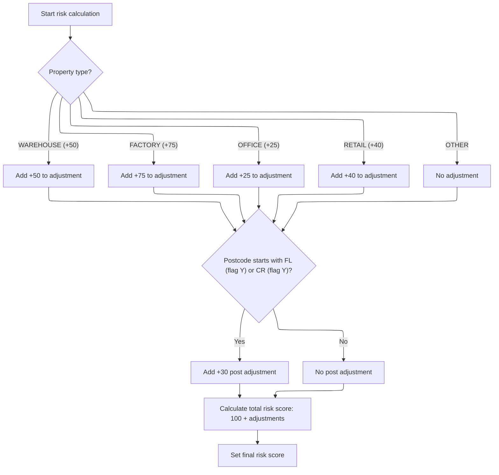

# Overview

This document explains how calculation requests for property insurance are processed. The flow determines the risk score, insurance status, or premium amount based on the requested action, and can perform all operations in sequence if needed. Property details are used to adjust the risk score according to business rules.

## Dependencies

### Program

- <SwmToken path="base/src/lgpcalc1.cbl" pos="2:6:6" line-data="       PROGRAM-ID. LGPCALC1.">`LGPCALC1`</SwmToken> (<SwmPath>[base/src/lgpcalc1.cbl](base/src/lgpcalc1.cbl)</SwmPath>)

## Detailed View of the Program's Functionality

## MAINLINE SECTION: Routing the Calculation Request

This section is the entry point for processing a calculation request. It performs the following steps in order:

1. **Initialize Business Context:**\
   The program sets up a header structure to track the transaction, terminal, and task information for the current request. This is essentially capturing the environment in which the calculation is being performed.

2. **Determine Requested Action:**\
   The program examines the action code provided in the request. This code determines what kind of calculation or operation should be performed. The possible actions are:

   - <SwmToken path="base/src/lgpcalc1.cbl" pos="128:4:4" line-data="              WHEN &#39;R&#39;">`R`</SwmToken>: Risk Calculation
   - <SwmToken path="base/src/lgpcalc1.cbl" pos="130:4:4" line-data="              WHEN &#39;S&#39;">`S`</SwmToken>: Status Determination
   - <SwmToken path="base/src/lgpcalc1.cbl" pos="132:4:4" line-data="              WHEN &#39;P&#39;">`P`</SwmToken>: Premium Calculation
   - <SwmToken path="base/src/lgpcalc1.cbl" pos="134:4:4" line-data="              WHEN &#39;A&#39;">`A`</SwmToken>: All Operations (risk, status, and premium in sequence)
   - Any other value: Treated as an invalid request

3. **Route to the Appropriate Calculation:**

   - If the action is <SwmToken path="base/src/lgpcalc1.cbl" pos="128:4:4" line-data="              WHEN &#39;R&#39;">`R`</SwmToken>, only the risk calculation is performed.
   - If the action is <SwmToken path="base/src/lgpcalc1.cbl" pos="130:4:4" line-data="              WHEN &#39;S&#39;">`S`</SwmToken>, only the status determination is performed.
   - If the action is <SwmToken path="base/src/lgpcalc1.cbl" pos="132:4:4" line-data="              WHEN &#39;P&#39;">`P`</SwmToken>, only the premium calculation is performed.
   - If the action is <SwmToken path="base/src/lgpcalc1.cbl" pos="134:4:4" line-data="              WHEN &#39;A&#39;">`A`</SwmToken>, all three calculations are performed in sequence: risk calculation first, then status determination, then premium calculation. This order is important because the status and premium calculations depend on the risk score.
   - If the action is not recognized, error processing is triggered.

4. **Return Results:**\
   After the requested calculations are performed, the program returns the results to the caller.

---

## <SwmToken path="base/src/lgpcalc1.cbl" pos="129:3:5" line-data="                 PERFORM RISK-CALCULATION">`RISK-CALCULATION`</SwmToken>: Adjusting Risk for Property Type and Location

This section computes the risk score for a property based on its type and location. The steps are:

1. **Reset Adjustments:**\
   The property-specific and postcode-specific adjustment values are reset to zero to ensure a clean calculation for each request.

2. **Adjust for Property Type:**\
   The program checks the property type provided in the request and applies an adjustment to the risk score:

   - If the property is a warehouse, add 50.
   - If the property is a factory, add 75.
   - If the property is an office, add 25.
   - If the property is retail, add 40.
   - For any other property type, no adjustment is made.

3. **Adjust for Location (Postcode):**\
   The program checks if the postcode starts with 'FL' or 'CR' and if the corresponding flag is enabled. If so, an additional adjustment of 30 is added to the risk score. If not, no location adjustment is made.

4. **Calculate Total Risk Score:**\
   The final risk score is calculated by adding the base risk value (100), the property type adjustment, and the postcode adjustment.

5. **Store the Risk Score:**\
   The calculated risk score is stored for use in subsequent calculations (such as status determination and premium calculation).

---

## <SwmToken path="base/src/lgpcalc1.cbl" pos="131:3:5" line-data="                 PERFORM STATUS-DETERMINATION">`STATUS-DETERMINATION`</SwmToken>: Determining Insurance Status

This section determines the insurance status based on the risk score:

1. **Reset Status and Reason:**\
   The status and reason fields are cleared to start fresh.

2. **Evaluate Risk Score:**

   - If the risk score is greater than 200, the status is set to indicate "High Risk" and a message is provided stating that manual review is required.
   - If the risk score is greater than 150 but not more than 200, the status is set to "Medium Risk" and a message is provided indicating that review is pending.
   - If the risk score is 150 or less, the status is set to "Low Risk" and no message is provided.

3. **Store Status and Reason:**\
   The determined status and reason are stored in the result structure.

---

## <SwmToken path="base/src/lgpcalc1.cbl" pos="133:3:5" line-data="                 PERFORM PREMIUM-CALCULATION">`PREMIUM-CALCULATION`</SwmToken>: Calculating Insurance Premiums

This section calculates the insurance premiums for different perils (fire, crime, flood, weather):

1. **Reset Premium Values:**\
   All premium values are initialized to zero.

2. **Set Discount Multiplier:**\
   If all four peril factors (fire, crime, flood, weather) are provided and greater than zero, a discount multiplier is applied to the premium calculations.

3. **Calculate Premiums for Each Peril:**\
   For each peril where the corresponding factor is greater than zero:

   - The risk score is multiplied by a peril-specific factor.
   - The result is then multiplied by the peril factor from the request and the multiplier (which may include a discount).
   - The calculated premium is stored for that peril.

4. **Store Premiums:**\
   The calculated premiums for fire, crime, flood, and weather are stored in the result structure.

---

## <SwmToken path="base/src/lgpcalc1.cbl" pos="139:3:5" line-data="                 PERFORM ERROR-PROCESSING">`ERROR-PROCESSING`</SwmToken>: Handling Invalid Actions

This section handles cases where the requested action is not recognized:

1. **Set Default Error Results:**

   - The risk score is set to zero.
   - The status is set to a special value indicating an error.
   - A message is provided stating that the processing request is invalid.
   - All premium values are set to zero.

2. **Exit:**\
   The program exits the error processing routine, returning the error results to the caller.

# Rule Definition

| Paragraph Name                                                                                                                                                   | Rule ID | Category          | Description                                                                                                                                                                                                                                                                                                                                                                                                                                                                                                                            | Conditions                                                                                                                                                                                                                                     | Remarks                                                                                                                                                                                                                                                                                                                                                                                                                                                                                                                                                                                                                                                                                                                                                                                                                                                                                                                                                                                                                                                                          |
| ---------------------------------------------------------------------------------------------------------------------------------------------------------------- | ------- | ----------------- | -------------------------------------------------------------------------------------------------------------------------------------------------------------------------------------------------------------------------------------------------------------------------------------------------------------------------------------------------------------------------------------------------------------------------------------------------------------------------------------------------------------------------------------- | ---------------------------------------------------------------------------------------------------------------------------------------------------------------------------------------------------------------------------------------------- | -------------------------------------------------------------------------------------------------------------------------------------------------------------------------------------------------------------------------------------------------------------------------------------------------------------------------------------------------------------------------------------------------------------------------------------------------------------------------------------------------------------------------------------------------------------------------------------------------------------------------------------------------------------------------------------------------------------------------------------------------------------------------------------------------------------------------------------------------------------------------------------------------------------------------------------------------------------------------------------------------------------------------------------------------------------------------------- |
| MAINLINE SECTION (lines 127-140)                                                                                                                                 | RL-001  | Conditional Logic | The program routes the calculation request based on the value of <SwmToken path="base/src/lgpcalc1.cbl" pos="127:3:5" line-data="           EVALUATE CA-ACTION">`CA-ACTION`</SwmToken>. Depending on the value, it performs risk calculation, status determination, premium calculation, or all in sequence. For any other value, it sets the output to indicate an invalid action.                                                                                                                                                    | Triggered whenever the program is invoked and <SwmToken path="base/src/lgpcalc1.cbl" pos="127:3:5" line-data="           EVALUATE CA-ACTION">`CA-ACTION`</SwmToken> is present in the input structure.                                         | <SwmToken path="base/src/lgpcalc1.cbl" pos="127:3:5" line-data="           EVALUATE CA-ACTION">`CA-ACTION`</SwmToken> is a single character string. Valid values are 'R', 'S', 'P', 'A'. Any other value is considered invalid. The output structure <SwmToken path="base/src/lgpcalc1.cbl" pos="105:3:5" line-data="           03 CA-RESULT.">`CA-RESULT`</SwmToken> is always populated according to the action taken.                                                                                                                                                                                                                                                                                                                                                                                                                                                                                                                                                                                                                                                         |
| <SwmToken path="base/src/lgpcalc1.cbl" pos="131:3:5" line-data="                 PERFORM STATUS-DETERMINATION">`STATUS-DETERMINATION`</SwmToken> (lines 185-207) | RL-002  | Conditional Logic | The program determines the status code and reason message based on the risk score. Status is 2 for risk score > 200, 1 for risk score > 150, 0 otherwise. The reason field is set to a descriptive message for medium and high risk, blank otherwise.                                                                                                                                                                                                                                                                                  | Performed when status determination is requested (<SwmToken path="base/src/lgpcalc1.cbl" pos="127:3:5" line-data="           EVALUATE CA-ACTION">`CA-ACTION`</SwmToken> = 'S' or 'A'). Uses the risk score from input or previous calculation. | Risk score is a number (3 digits). Status is a single digit (0=low, 1=medium, 2=high, 9=error). Reason is a string (up to 50 characters): 'High Risk Score - Manual Review Required' for high risk, 'Medium Risk - Pending Review' for medium risk, blank otherwise.                                                                                                                                                                                                                                                                                                                                                                                                                                                                                                                                                                                                                                                                                                                                                                                                             |
| <SwmToken path="base/src/lgpcalc1.cbl" pos="133:3:5" line-data="                 PERFORM PREMIUM-CALCULATION">`PREMIUM-CALCULATION`</SwmToken> (lines 211-255)   | RL-003  | Computation       | Premiums for fire, crime, flood, and weather are calculated using the risk score and peril factors. If all peril factors are positive, a discount multiplier is applied. Each premium is calculated as (risk score \* peril factor constant \* peril factor input \* multiplier).                                                                                                                                                                                                                                                      | Performed when premium calculation is requested (<SwmToken path="base/src/lgpcalc1.cbl" pos="127:3:5" line-data="           EVALUATE CA-ACTION">`CA-ACTION`</SwmToken> = 'P' or 'A').                                                          | Peril factors are numbers (4 digits each). Multipliers: fire=<SwmToken path="base/src/lgpcalc1.cbl" pos="73:15:17" line-data="              05 WS-PF-FIRE            PIC V99 VALUE 0.80.">`0.80`</SwmToken>, crime=<SwmToken path="base/src/lgpcalc1.cbl" pos="74:15:17" line-data="              05 WS-PF-CRIME           PIC V99 VALUE 0.60.">`0.60`</SwmToken>, flood=<SwmToken path="base/src/lgpcalc1.cbl" pos="75:15:17" line-data="              05 WS-PF-FLOOD           PIC V99 VALUE 1.20.">`1.20`</SwmToken>, weather=<SwmToken path="base/src/lgpcalc1.cbl" pos="71:15:17" line-data="           03 WS-PF-DISCOUNT           PIC V99 VALUE 0.90.">`0.90`</SwmToken>. Discount multiplier is <SwmToken path="base/src/lgpcalc1.cbl" pos="71:15:17" line-data="           03 WS-PF-DISCOUNT           PIC V99 VALUE 0.90.">`0.90`</SwmToken> if all peril factors > 0, otherwise <SwmToken path="base/src/lgpcalc1.cbl" pos="88:15:17" line-data="           03 WS-RT-MULTIPLIER         PIC V99 VALUE 1.00.">`1.00`</SwmToken>. Premiums are numbers (8 digits each). |
| <SwmToken path="base/src/lgpcalc1.cbl" pos="139:3:5" line-data="                 PERFORM ERROR-PROCESSING">`ERROR-PROCESSING`</SwmToken> (lines 259-268)         | RL-004  | Data Assignment   | If an invalid action is requested, all output fields are set to indicate an error: risk score and premiums are set to 0, status is set to 9, and reason is set to 'Invalid Processing Request'.                                                                                                                                                                                                                                                                                                                                        | Performed when <SwmToken path="base/src/lgpcalc1.cbl" pos="127:3:5" line-data="           EVALUATE CA-ACTION">`CA-ACTION`</SwmToken> is not 'R', 'S', 'P', or 'A'.                                                                             | Risk score and all premiums are set to 0 (numbers). Status is 9 (number). Reason is 'Invalid Processing Request' (string, up to 50 characters).                                                                                                                                                                                                                                                                                                                                                                                                                                                                                                                                                                                                                                                                                                                                                                                                                                                                                                                                  |
| <SwmToken path="base/src/lgpcalc1.cbl" pos="129:3:5" line-data="                 PERFORM RISK-CALCULATION">`RISK-CALCULATION`</SwmToken> (lines 149-181)         | RL-005  | Computation       | The risk score calculation starts with a base value of 100. This score is increased by a property type adjustment: add 50 for 'WAREHOUSE', 75 for 'FACTORY', 25 for 'OFFICE', or 40 for 'RETAIL'. If the postcode begins with 'FL' and the internal Florida flag is 'Y', or begins with 'CR' and the internal Croydon flag is 'Y', add an additional 30 to the score. The final risk score is the sum of the base value and all applicable adjustments. The calculated score is stored in the output structure for use by other rules. | This rule is applied whenever a risk calculation is requested, either directly or as part of a combined action.                                                                                                                                | Base risk score is 100 (number). Property type adjustments: +50 for 'WAREHOUSE', +75 for 'FACTORY', +25 for 'OFFICE', +40 for 'RETAIL'. Postcode adjustment: +30 if postcode starts with 'FL' and Florida flag is 'Y', or starts with 'CR' and Croydon flag is 'Y'. Flags default to 'Y'. The final risk score is a number up to 3 digits and is stored in the output structure for further processing.                                                                                                                                                                                                                                                                                                                                                                                                                                                                                                                                                                                                                                                                          |

# User Stories

## User Story 1: Comprehensive Calculation and Error Handling Workflow

---

### Story Description:

As a user, I want the system to process my calculation request (risk, status, premium, or all) based on the action I specify, and to indicate an error if the action is invalid, so that I receive the appropriate risk score, status, reason, and premiums for my property or am informed of incorrect requests.

---

### Business Rule Mapping:

| Rule ID | Paragraph Name                                                                                                                                                   | Rule Description                                                                                                                                                                                                                                                                                                                                                                                                                                                                                                                       |
| ------- | ---------------------------------------------------------------------------------------------------------------------------------------------------------------- | -------------------------------------------------------------------------------------------------------------------------------------------------------------------------------------------------------------------------------------------------------------------------------------------------------------------------------------------------------------------------------------------------------------------------------------------------------------------------------------------------------------------------------------- |
| RL-001  | MAINLINE SECTION (lines 127-140)                                                                                                                                 | The program routes the calculation request based on the value of <SwmToken path="base/src/lgpcalc1.cbl" pos="127:3:5" line-data="           EVALUATE CA-ACTION">`CA-ACTION`</SwmToken>. Depending on the value, it performs risk calculation, status determination, premium calculation, or all in sequence. For any other value, it sets the output to indicate an invalid action.                                                                                                                                                    |
| RL-002  | <SwmToken path="base/src/lgpcalc1.cbl" pos="131:3:5" line-data="                 PERFORM STATUS-DETERMINATION">`STATUS-DETERMINATION`</SwmToken> (lines 185-207) | The program determines the status code and reason message based on the risk score. Status is 2 for risk score > 200, 1 for risk score > 150, 0 otherwise. The reason field is set to a descriptive message for medium and high risk, blank otherwise.                                                                                                                                                                                                                                                                                  |
| RL-003  | <SwmToken path="base/src/lgpcalc1.cbl" pos="133:3:5" line-data="                 PERFORM PREMIUM-CALCULATION">`PREMIUM-CALCULATION`</SwmToken> (lines 211-255)   | Premiums for fire, crime, flood, and weather are calculated using the risk score and peril factors. If all peril factors are positive, a discount multiplier is applied. Each premium is calculated as (risk score \* peril factor constant \* peril factor input \* multiplier).                                                                                                                                                                                                                                                      |
| RL-004  | <SwmToken path="base/src/lgpcalc1.cbl" pos="139:3:5" line-data="                 PERFORM ERROR-PROCESSING">`ERROR-PROCESSING`</SwmToken> (lines 259-268)         | If an invalid action is requested, all output fields are set to indicate an error: risk score and premiums are set to 0, status is set to 9, and reason is set to 'Invalid Processing Request'.                                                                                                                                                                                                                                                                                                                                        |
| RL-005  | <SwmToken path="base/src/lgpcalc1.cbl" pos="129:3:5" line-data="                 PERFORM RISK-CALCULATION">`RISK-CALCULATION`</SwmToken> (lines 149-181)         | The risk score calculation starts with a base value of 100. This score is increased by a property type adjustment: add 50 for 'WAREHOUSE', 75 for 'FACTORY', 25 for 'OFFICE', or 40 for 'RETAIL'. If the postcode begins with 'FL' and the internal Florida flag is 'Y', or begins with 'CR' and the internal Croydon flag is 'Y', add an additional 30 to the score. The final risk score is the sum of the base value and all applicable adjustments. The calculated score is stored in the output structure for use by other rules. |

---

### Relevant Functionality:

- **MAINLINE SECTION (lines 127-140)**
  1. **RL-001:**
     - Read <SwmToken path="base/src/lgpcalc1.cbl" pos="127:3:5" line-data="           EVALUATE CA-ACTION">`CA-ACTION`</SwmToken> from input
     - If <SwmToken path="base/src/lgpcalc1.cbl" pos="127:3:5" line-data="           EVALUATE CA-ACTION">`CA-ACTION`</SwmToken> = 'R', perform risk calculation
     - If <SwmToken path="base/src/lgpcalc1.cbl" pos="127:3:5" line-data="           EVALUATE CA-ACTION">`CA-ACTION`</SwmToken> = 'S', perform status determination
     - If <SwmToken path="base/src/lgpcalc1.cbl" pos="127:3:5" line-data="           EVALUATE CA-ACTION">`CA-ACTION`</SwmToken> = 'P', perform premium calculation
     - If <SwmToken path="base/src/lgpcalc1.cbl" pos="127:3:5" line-data="           EVALUATE CA-ACTION">`CA-ACTION`</SwmToken> = 'A', perform risk calculation, then status determination, then premium calculation
     - Otherwise, perform error processing (set outputs to indicate invalid action)
- <SwmToken path="base/src/lgpcalc1.cbl" pos="131:3:5" line-data="                 PERFORM STATUS-DETERMINATION">`STATUS-DETERMINATION`</SwmToken> **(lines 185-207)**
  1. **RL-002:**
     - If risk score > 200:
       - Set status to 2
       - Set reason to 'High Risk Score - Manual Review Required'
     - Else if risk score > 150:
       - Set status to 1
       - Set reason to 'Medium Risk - Pending Review'
     - Else:
       - Set status to 0
       - Set reason to blank
     - Store status and reason in output structure
- <SwmToken path="base/src/lgpcalc1.cbl" pos="133:3:5" line-data="                 PERFORM PREMIUM-CALCULATION">`PREMIUM-CALCULATION`</SwmToken> **(lines 211-255)**
  1. **RL-003:**
     - Set all premiums to 0
     - Set multiplier to <SwmToken path="base/src/lgpcalc1.cbl" pos="88:15:17" line-data="           03 WS-RT-MULTIPLIER         PIC V99 VALUE 1.00.">`1.00`</SwmToken>
     - If all peril factors > 0, set multiplier to <SwmToken path="base/src/lgpcalc1.cbl" pos="71:15:17" line-data="           03 WS-PF-DISCOUNT           PIC V99 VALUE 0.90.">`0.90`</SwmToken>
     - For each peril:
       - If peril factor > 0:
         - Calculate premium = risk score \* peril constant \* peril factor \* multiplier
         - Store premium in output structure
- <SwmToken path="base/src/lgpcalc1.cbl" pos="139:3:5" line-data="                 PERFORM ERROR-PROCESSING">`ERROR-PROCESSING`</SwmToken> **(lines 259-268)**
  1. **RL-004:**
     - Set risk score to 0
     - Set status to 9
     - Set reason to 'Invalid Processing Request'
     - Set all premiums to 0
     - Store all values in output structure
- <SwmToken path="base/src/lgpcalc1.cbl" pos="129:3:5" line-data="                 PERFORM RISK-CALCULATION">`RISK-CALCULATION`</SwmToken> **(lines 149-181)**
  1. **RL-005:**
     - Set property type adjustment to 0
     - Set postcode adjustment to 0
     - If property type is 'WAREHOUSE', add 50 to property type adjustment
     - If property type is 'FACTORY', add 75 to property type adjustment
     - If property type is 'OFFICE', add 25 to property type adjustment
     - If property type is 'RETAIL', add 40 to property type adjustment
     - If postcode starts with 'FL' and Florida flag is 'Y', or starts with 'CR' and Croydon flag is 'Y', add 30 to postcode adjustment
     - Final risk score = base value (100) + property type adjustment + postcode adjustment
     - Store the final risk score in the output structure

# Workflow

# Routing the calculation request



This section determines which calculation or operation to perform based on the <SwmToken path="base/src/lgpcalc1.cbl" pos="127:3:5" line-data="           EVALUATE CA-ACTION">`CA-ACTION`</SwmToken> value in the request. It ensures the business context is set before routing to the correct calculation routine and returning results.

| Category        | Rule Name                | Description                                                                                                                                                                                                                                                                                                                                   |
| --------------- | ------------------------ | --------------------------------------------------------------------------------------------------------------------------------------------------------------------------------------------------------------------------------------------------------------------------------------------------------------------------------------------- |
| Data validation | Invalid action handling  | If <SwmToken path="base/src/lgpcalc1.cbl" pos="127:3:5" line-data="           EVALUATE CA-ACTION">`CA-ACTION`</SwmToken> contains a value other than 'R', 'S', 'P', or 'A', handle the request as an error and do not perform any calculation.                                                                                                |
| Decision Making | Action-based routing     | Route the calculation request based on the value of <SwmToken path="base/src/lgpcalc1.cbl" pos="127:3:5" line-data="           EVALUATE CA-ACTION">`CA-ACTION`</SwmToken>: 'R' for risk calculation, 'S' for status determination, 'P' for premium calculation, 'A' for all operations in sequence, and any other value as an invalid action. |
| Decision Making | All operations sequence  | For the 'A' (All Operations) action, perform risk calculation first, followed by status determination, and then premium calculation, in that specific order.                                                                                                                                                                                  |
| Writing Output  | Return results to caller | Return the results of the calculation or error handling to the caller after processing the requested action.                                                                                                                                                                                                                                  |

<SwmSnippet path="/base/src/lgpcalc1.cbl" line="120">

---

MAINLINE kicks off the flow by routing the request based on <SwmToken path="base/src/lgpcalc1.cbl" pos="127:3:5" line-data="           EVALUATE CA-ACTION">`CA-ACTION`</SwmToken>. It sets up the header and then chooses which calculation to run: risk, status, premium, or all three in sequence. <SwmToken path="base/src/lgpcalc1.cbl" pos="129:3:5" line-data="                 PERFORM RISK-CALCULATION">`RISK-CALCULATION`</SwmToken> is called first for actions that need a risk score, since the rest of the calculations depend on it.

```cobol
       MAINLINE SECTION.
           
           INITIALIZE WS-HEADER.
           MOVE EIBTRNID TO WS-TRANSID.
           MOVE EIBTRMID TO WS-TERMID.
           MOVE EIBTASKN TO WS-TASKNUM.
           
           EVALUATE CA-ACTION
              WHEN 'R'
                 PERFORM RISK-CALCULATION
              WHEN 'S'
                 PERFORM STATUS-DETERMINATION
              WHEN 'P'
                 PERFORM PREMIUM-CALCULATION
              WHEN 'A'
                 PERFORM RISK-CALCULATION
                 PERFORM STATUS-DETERMINATION
                 PERFORM PREMIUM-CALCULATION
              WHEN OTHER
                 PERFORM ERROR-PROCESSING
           END-EVALUATE.
           
           EXEC CICS RETURN END-EXEC.
```

---

</SwmSnippet>

# Adjusting risk for property type and location



This section determines the risk score adjustment based on the type of property and its location. The adjustments are applied according to business rules for each property type and for specific postcodes with enabled flags.

| Category        | Rule Name                    | Description                                                                                                                                        |
| --------------- | ---------------------------- | -------------------------------------------------------------------------------------------------------------------------------------------------- |
| Calculation     | Warehouse adjustment         | Add 50 to the risk adjustment if the property type is WAREHOUSE.                                                                                   |
| Calculation     | Factory adjustment           | Add 75 to the risk adjustment if the property type is FACTORY.                                                                                     |
| Calculation     | Office adjustment            | Add 25 to the risk adjustment if the property type is OFFICE.                                                                                      |
| Calculation     | Retail adjustment            | Add 40 to the risk adjustment if the property type is RETAIL.                                                                                      |
| Calculation     | Location adjustment          | Add 30 to the risk adjustment if the postcode starts with 'FL' and the FL flag is 'Y', or if the postcode starts with 'CR' and the CR flag is 'Y'. |
| Calculation     | Total risk score calculation | The final risk score is calculated as 100 plus the sum of property and location adjustments.                                                       |
| Decision Making | Other property type          | No adjustment is made for property types other than WAREHOUSE, FACTORY, OFFICE, or RETAIL.                                                         |
| Writing Output  | Store risk score             | The calculated risk score is stored for use in subsequent processing steps.                                                                        |

<SwmSnippet path="/base/src/lgpcalc1.cbl" line="149">

---

In <SwmToken path="base/src/lgpcalc1.cbl" pos="149:1:3" line-data="       RISK-CALCULATION.">`RISK-CALCULATION`</SwmToken>, we start by zeroing out the property and post adjustments. Then, we check the property type and add a specific adjustment value for 'WAREHOUSE', 'FACTORY', 'OFFICE', or 'RETAIL'. If it's something else, we skip the adjustment. This sets up the property-specific part of the risk score.

```cobol
       RISK-CALCULATION.
           MOVE 0 TO WS-CA-PROP-ADJ.
           MOVE 0 TO WS-CA-POST-ADJ.
           
           EVALUATE CA-D-PROP-TYPE
              WHEN 'WAREHOUSE'
                 COMPUTE WS-RT-TEMP1 = WS-EM-ADJUST-1 - 0
                 ADD WS-RT-TEMP1 TO WS-CA-PROP-ADJ
              WHEN 'FACTORY'
                 COMPUTE WS-RT-TEMP1 = WS-EM-ADJUST-2 - 0
                 ADD WS-RT-TEMP1 TO WS-CA-PROP-ADJ
              WHEN 'OFFICE'
                 COMPUTE WS-RT-TEMP1 = WS-EM-ADJUST-3 - 0
                 ADD WS-RT-TEMP1 TO WS-CA-PROP-ADJ
              WHEN 'RETAIL'
                 COMPUTE WS-RT-TEMP1 = WS-EM-ADJUST-4 - 0
                 ADD WS-RT-TEMP1 TO WS-CA-PROP-ADJ
              WHEN OTHER
                 CONTINUE
           END-EVALUATE.
```

---

</SwmSnippet>

<SwmSnippet path="/base/src/lgpcalc1.cbl" line="170">

---

Next in <SwmToken path="base/src/lgpcalc1.cbl" pos="129:3:5" line-data="                 PERFORM RISK-CALCULATION">`RISK-CALCULATION`</SwmToken>, we check if the postcode starts with 'FL' or 'CR' and if the corresponding flag is set. If both conditions are met, we add a location-specific adjustment to the risk score. This is a targeted rule for certain postcodes.

```cobol
           IF (CA-D-POSTCODE(1:2) = 'FL' AND WS-EM-FL-FLAG = 'Y') OR
              (CA-D-POSTCODE(1:2) = 'CR' AND WS-EM-CR-FLAG = 'Y')
              COMPUTE WS-RT-TEMP1 = WS-EM-POST-ADJUSTMENT - 0
              ADD WS-RT-TEMP1 TO WS-CA-POST-ADJ
           END-IF.
```

---

</SwmSnippet>

<SwmSnippet path="/base/src/lgpcalc1.cbl" line="176">

---

This wraps up <SwmToken path="base/src/lgpcalc1.cbl" pos="129:3:5" line-data="                 PERFORM RISK-CALCULATION">`RISK-CALCULATION`</SwmToken> by storing the calculated risk score for use in later steps.

```cobol
           COMPUTE WS-CA-TOTAL = 
              WS-CA-BASE + WS-CA-PROP-ADJ + WS-CA-POST-ADJ.
              
           MOVE WS-CA-TOTAL TO CA-R-RISK-SCORE.
           
           EXIT.
```

---

</SwmSnippet>

&nbsp;

*This is an auto-generated document by Swimm 🌊 and has not yet been verified by a human*

<SwmMeta version="3.0.0" repo-id="Z2l0aHViJTNBJTNBU3dpbW1pby1nZW5hcHAtaG91c2UlM0ElM0FHaXJpLVN3aW1t" repo-name="Swimmio-genapp-house"><sup>Powered by [Swimm](https://app.swimm.io/)</sup></SwmMeta>
